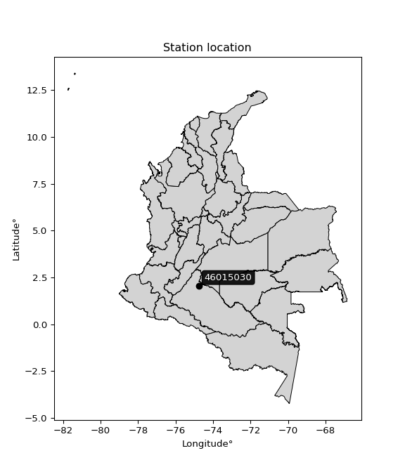

<div align="center">


</div>

# PMP Station (rain, Pmax24h): 46015030

Probable Maximum Precipitation (PMP) is the greatest amount of rainfall for a specific duration that is meteorologically possible for a given location, acting as a "worst-case" scenario for extreme storms, crucial for designing safety-critical infrastructure like bridges, river deviations, dams, spillways, and nuclear plants to prevent catastrophic failure. PMP is calculated by hydrologists using meteorological data to determine the upper limit of extreme rainfall, often leading to the Probable Maximum Flood (PMF) for flood control design, and is increasingly being studied for climate change impacts.

<div align="center">

</img>

</div>


## A. General information


### 1. General running parameters

• app_version: _v20251228_. • runtime: _2025-12-28 08:43:48.795225_. • Python version: _3.14.0_. • SciPy version: _1.16.3_. • Pandas version: _2.3.3_. • NumPy version: _2.3.5_. • Stations dataset (station_dataset_file): _dataset/pmax24h_in/automatic_colombia_2003_2024.csv_. • Stations catalog (station_catalog_file): _dataset/CNE_IDEAM.xls_. • Minimum year to eval til year_max (date_min): _1900_. • Maximum year to eval since year_min (date_max): _2024_. • Creates, save and include plots into reports (create_plot): _False_. • Plot only fit distributions with Δo > Δ (plot_only_fit): _True_. • Eval low extreme values, if False, evaluates high extreme values (low_extreme): _False_. • Eval every SciPy distribution as logarithmic (pdist_logarithmic_on): _True_. • Standard deviation normalized (ddof): _1.0_. • Return periods to eval in years (Tr): _[2, 2.33, 5, 10, 15, 20, 25, 50, 75, 100, 200, 250, 500, 750, 1000]_. • Minimum data sample per station, 0 means any (minimum_sample): _5_. • Z-Score maximum threshold to adjust a value, 0 means disable (zscore_max): _3.5_. • Z-Score minimum threshold to adjust a value, 0 means disable (zscore_min): _-2.5_. • Avoid zeros, e.g. rain = 0 (avoid_zeros): _True_. • Avoid null values (avoid_nans): _True_. [:file_folder:Dataset file.](../../dataset/pmax24h_in/automatic_colombia_2003_2024.csv)

> Delta Degrees of Freedom (DDOF): is a parameter used in the formulas for calculating variance and standard deviation. When ddof=0, the divisor is $N$ (the total number of observations) and this is used when your data set is the entire population. When ddof=1, the divisor is $N-1$ and this is used when your data set is a sample drawn from a larger population. Using $N-1$ provides an unbiased estimate of the population variance (known as Bessel´s correction).


### 2. Station info and location

|   id |   CODIGO | NOMBRE                                   | CATEGORIA               | TECNOLOGIA                              | ESTADO           | FECHA_INSTALACION   |   FECHA_SUSPENSION |   ALTITUD |   LATITUD |   LONGITUD | DEPARTAMENTO   | MUNICIPIO              | AREA_OPERATIVA                    | ENTIDAD                                                     | AREA_HIDROGRAFICA   | ZONA_HIDROGRAFICA   | SUBZONA_HIDROGRAFICA   |   CORRIENTE | Catalogo   |
|-----:|---------:|:-----------------------------------------|:------------------------|:----------------------------------------|:-----------------|:--------------------|-------------------:|----------:|----------:|-----------:|:---------------|:-----------------------|:----------------------------------|:------------------------------------------------------------|:--------------------|:--------------------|:-----------------------|------------:|:-----------|
|    0 | 46015030 | SAN VICENTE DEL CAGUAN  - AUT [46015030] | Climatológica Principal | Automática con Telemetría, Convencional | En Mantenimiento | 30/09/2008          |                nan |       300 |     2.063 |   -74.7627 | Caqueta        | San Vicente Del Caguán | Area Operativa 04 - Huila-Caquetá | INSTITUTO DE HIDROLOGIA METEOROLOGIA Y ESTUDIOS AMBIENTALES | Amazonas            | Caguán              | Río Caguan Alto        |         nan | CNE_IDEAM  |

<div align="center">

Map location in: [:earth_americas:Google](http://maps.google.com/maps?q=2.063,-74.76269444) [:earth_americas:OSM](https://www.openstreetmap.org/#map=18/2.063/-74.76269444&layers=P) [:earth_americas:Bing](https://www.bing.com/maps?cp=2.063~-74.76269444&lvl=18) [:earth_americas:Apple](https://maps.apple.com/frame?center=2.063%2C-74.76269444&span=0.003%2C0.006)

</div>


<div align="center">

```geojson
{
  "type": "Feature",
  "geometry": {
    "type": "Point", 
    "coordinates": [-74.76269444, 2.063]
  }, 
  "properties": {
    "Name": "46015030"
  }
}
```

</div>


### 3. Discrete values table and plot

|               |           0 |           1 |           2 |          3 |           4 |
|:--------------|------------:|------------:|------------:|-----------:|------------:|
| Date          | 2016        | 2017        | 2018        | 2019       | 2020        |
| Value         |    0.4      |   35        |   49.2      |  394.6     |    0.1      |
| Value_initial |    0.4      |   35        |   49.2      |  394.6     |    0.1      |
| count         |    5        |    5        |    5        |    5       |    5        |
| mean          |   95.86     |   95.86     |   95.86     |   95.86    |   95.86     |
| std           |  168.381    |  168.381    |  168.381    |  168.381   |  168.381    |
| zscore        |   -0.566927 |   -0.361441 |   -0.277109 |    1.77419 |   -0.568709 |

> The initial value (value_initial) correspond to the initial obtained or null completed value, and value (value) is adjusted only when the initial value is outside the valid range definite through the Z-Score value. If Z-Score is active, values out of range or outliers are replaced with the station mean value


### 4. Active continuous probability distributions from SciPy (44 of 104 available)

[scipy.stats](https://docs.scipy.org/doc/scipy/reference/stats.html) is a Python´s powerful submodule within the SciPy library for comprehensive statistical analysis, offering over 130 probability distributions (like Normal, Poisson), functions for descriptive stats (mean, variance), hypothesis testing (t-tests, chi-square), random variable generation, and statistical tests, making it essential for data science, modeling, and research. It provides tools to explore, model, and draw conclusions from data efficiently, working seamlessly with NumPy.

<div align="center">

|   id | p_dist             |   n_parameter | fit_method   | label                                                                       | active   | ref                                                                                                        |
|-----:|:-------------------|--------------:|:-------------|:----------------------------------------------------------------------------|:---------|:-----------------------------------------------------------------------------------------------------------|
|    0 | alpha              |             3 | MLE          | Alpha                                                                       | True     | [:mortar_board:](https://docs.scipy.org/doc/scipy/reference/generated/scipy.stats.alpha.html)              |
|    1 | betaprime          |             4 | MLE          | Beta prime                                                                  | True     | [:mortar_board:](https://docs.scipy.org/doc/scipy/reference/generated/scipy.stats.betaprime.html)          |
|    2 | chi2               |             3 | MLE          | Chi²                                                                        | True     | [:mortar_board:](https://docs.scipy.org/doc/scipy/reference/generated/scipy.stats.chi2.html)               |
|    3 | crystalball        |             4 | MLE          | Crystalball                                                                 | True     | [:mortar_board:](https://docs.scipy.org/doc/scipy/reference/generated/scipy.stats.crystalball.html)        |
|    4 | erlang             |             3 | MLE          | Erlang                                                                      | True     | [:mortar_board:](https://docs.scipy.org/doc/scipy/reference/generated/scipy.stats.erlang.html)             |
|    5 | expon              |             2 | MLE          | Exponential                                                                 | True     | [:mortar_board:](https://docs.scipy.org/doc/scipy/reference/generated/scipy.stats.expon.html)              |
|    6 | exponnorm          |             3 | MLE          | Exponentially modified Normal                                               | True     | [:mortar_board:](https://docs.scipy.org/doc/scipy/reference/generated/scipy.stats.exponnorm.html)          |
|    7 | f                  |             4 | MLE          | F                                                                           | True     | [:mortar_board:](https://docs.scipy.org/doc/scipy/reference/generated/scipy.stats.f.html)                  |
|    8 | fatiguelife        |             3 | MLE          | Fatigue-life (Birnbaum-Saunders)                                            | True     | [:mortar_board:](https://docs.scipy.org/doc/scipy/reference/generated/scipy.stats.fatiguelife.html)        |
|    9 | fisk               |             3 | MLE          | Fisk                                                                        | True     | [:mortar_board:](https://docs.scipy.org/doc/scipy/reference/generated/scipy.stats.fisk.html)               |
|   10 | gamma              |             3 | MLE          | Gamma                                                                       | True     | [:mortar_board:](https://docs.scipy.org/doc/scipy/reference/generated/scipy.stats.gamma.html)              |
|   11 | genexpon           |             5 | MLE          | Generalized exponential                                                     | True     | [:mortar_board:](https://docs.scipy.org/doc/scipy/reference/generated/scipy.stats.genexpon.html)           |
|   12 | genlogistic        |             3 | MLE          | Generalized logistic                                                        | True     | [:mortar_board:](https://docs.scipy.org/doc/scipy/reference/generated/scipy.stats.genlogistic.html)        |
|   13 | gibrat             |             2 | MM           | Gibrat                                                                      | True     | [:mortar_board:](https://docs.scipy.org/doc/scipy/reference/generated/scipy.stats.gibrat.html)             |
|   14 | gompertz           |             3 | MLE          | Gompertz (or truncated Gumbel)                                              | True     | [:mortar_board:](https://docs.scipy.org/doc/scipy/reference/generated/scipy.stats.gompertz.html)           |
|   15 | gumbel_l           |             2 | MM           | Gumbel Left Skew                                                            | True     | [:mortar_board:](https://docs.scipy.org/doc/scipy/reference/generated/scipy.stats.gumbel_l.html)           |
|   16 | gumbel_r           |             2 | MM           | Gumbel Right Skew                                                           | True     | [:mortar_board:](https://docs.scipy.org/doc/scipy/reference/generated/scipy.stats.gumbel_r.html)           |
|   17 | halflogistic       |             2 | MM           | Half-logistic                                                               | True     | [:mortar_board:](https://docs.scipy.org/doc/scipy/reference/generated/scipy.stats.halflogistic.html)       |
|   18 | halfnorm           |             2 | MM           | Half Normal                                                                 | True     | [:mortar_board:](https://docs.scipy.org/doc/scipy/reference/generated/scipy.stats.halfnorm.html)           |
|   19 | hypsecant          |             2 | MM           | hyperbolic secant                                                           | True     | [:mortar_board:](https://docs.scipy.org/doc/scipy/reference/generated/scipy.stats.hypsecant.html)          |
|   20 | invgamma           |             3 | MLE          | Inverted gamma                                                              | True     | [:mortar_board:](https://docs.scipy.org/doc/scipy/reference/generated/scipy.stats.invgamma.html)           |
|   21 | invgauss           |             3 | MLE          | Inverse Gaussian                                                            | True     | [:mortar_board:](https://docs.scipy.org/doc/scipy/reference/generated/scipy.stats.invgauss.html)           |
|   22 | invweibull         |             3 | MLE          | Inverted Weibull                                                            | True     | [:mortar_board:](https://docs.scipy.org/doc/scipy/reference/generated/scipy.stats.invweibull.html)         |
|   23 | johnsonsu          |             4 | MLE          | Johnson Su                                                                  | True     | [:mortar_board:](https://docs.scipy.org/doc/scipy/reference/generated/scipy.stats.johnsonsu.html)          |
|   24 | kstwobign          |             2 | MLE          | Limiting distribution of scaled Kolmogorov-Smirnov two-sided test statistic | True     | [:mortar_board:](https://docs.scipy.org/doc/scipy/reference/generated/scipy.stats.kstwobign.html)          |
|   25 | laplace            |             2 | MM           | Laplace                                                                     | True     | [:mortar_board:](https://docs.scipy.org/doc/scipy/reference/generated/scipy.stats.laplace.html)            |
|   26 | laplace_asymmetric |             3 | MLE          | Asymmetric Laplace                                                          | True     | [:mortar_board:](https://docs.scipy.org/doc/scipy/reference/generated/scipy.stats.laplace_asymmetric.html) |
|   27 | loggamma           |             3 | MLE          | Log gamma                                                                   | True     | [:mortar_board:](https://docs.scipy.org/doc/scipy/reference/generated/scipy.stats.loggamma.html)           |
|   28 | logistic           |             2 | MM           | Logistic (or Sech-squared)                                                  | True     | [:mortar_board:](https://docs.scipy.org/doc/scipy/reference/generated/scipy.stats.logistic.html)           |
|   29 | lognorm            |             3 | MLE          | Log Normal                                                                  | True     | [:mortar_board:](https://docs.scipy.org/doc/scipy/reference/generated/scipy.stats.lognorm.html)            |
|   30 | maxwell            |             2 | MM           | Maxwell                                                                     | True     | [:mortar_board:](https://docs.scipy.org/doc/scipy/reference/generated/scipy.stats.maxwell.html)            |
|   31 | mielke             |             4 | MLE          | Mielke Beta-Kappa / Dagum                                                   | True     | [:mortar_board:](https://docs.scipy.org/doc/scipy/reference/generated/scipy.stats.mielke.html)             |
|   32 | moyal              |             2 | MM           | Moyal                                                                       | True     | [:mortar_board:](https://docs.scipy.org/doc/scipy/reference/generated/scipy.stats.moyal.html)              |
|   33 | nakagami           |             3 | MLE          | Nakagami                                                                    | True     | [:mortar_board:](https://docs.scipy.org/doc/scipy/reference/generated/scipy.stats.nakagami.html)           |
|   34 | ncf                |             5 | MLE          | Non-central F distribution                                                  | True     | [:mortar_board:](https://docs.scipy.org/doc/scipy/reference/generated/scipy.stats.ncf.html)                |
|   35 | nct                |             4 | MLE          | Non-central Student’s t                                                     | True     | [:mortar_board:](https://docs.scipy.org/doc/scipy/reference/generated/scipy.stats.nct.html)                |
|   36 | norm               |             2 | MM           | Normal                                                                      | True     | [:mortar_board:](https://docs.scipy.org/doc/scipy/reference/generated/scipy.stats.norm.html)               |
|   37 | pearson3           |             3 | MM           | Pearson type III                                                            | True     | [:mortar_board:](https://docs.scipy.org/doc/scipy/reference/generated/scipy.stats.pearson3.html)           |
|   38 | rayleigh           |             2 | MM           | Rayleigh                                                                    | True     | [:mortar_board:](https://docs.scipy.org/doc/scipy/reference/generated/scipy.stats.rayleigh.html)           |
|   39 | rice               |             3 | MLE          | Rice                                                                        | True     | [:mortar_board:](https://docs.scipy.org/doc/scipy/reference/generated/scipy.stats.rice.html)               |
|   40 | t                  |             3 | MLE          | Student’s t                                                                 | True     | [:mortar_board:](https://docs.scipy.org/doc/scipy/reference/generated/scipy.stats.t.html)                  |
|   41 | truncnorm          |             4 | MLE          | Truncated normal                                                            | True     | [:mortar_board:](https://docs.scipy.org/doc/scipy/reference/generated/scipy.stats.truncnorm.html)          |
|   42 | wald               |             2 | MM           | Wald                                                                        | True     | [:mortar_board:](https://docs.scipy.org/doc/scipy/reference/generated/scipy.stats.wald.html)               |
|   43 | weibull_min        |             3 | MLE          | Weibull minimum                                                             | True     | [:mortar_board:](https://docs.scipy.org/doc/scipy/reference/generated/scipy.stats.weibull_min.html)        |

</div>

> **n_parameter:** # arguments & localization & scale.
>
> **Fit methods:** (MLE) maximum likelihood, (MM) L-moments.
>
>**Inactive:** foldnorm, gennorm, norminvgauss, powernorm, powerlognorm, skewnorm, genextreme, anglit, arcsine, argus, beta, bradford, burr, burr12, cauchy, cosine, halfcauchy, foldcauchy, skewcauchy, wrapcauchy, dgamma, gengamma, exponweib, exponpow, truncexpon, gausshyper, genhalflogistic, genhyperbolic, geninvgauss, halfgennorm, johnsonsb, kappa4, kappa3, ksone, kstwo, loglaplace, levy, levy_l, levy_stable, ncx2, pareto, genpareto, truncpareto, lomax, powerlaw, rdist, rel_breitwigner, recipinvgauss, semicircular, studentized_range, trapezoid, triang, truncweibull_min, tukeylambda, uniform, loguniform, vonmises, vonmises_line, weibull_max, dweibull, 


## B. Probability distributions vs. Empirical distributions

A continuous probability distribution (CPD) describes probabilities for variables that can take any value within a range (like rain any time), unlike discrete variables with specific outcomes (like temperature). It uses a Probability Density Function (PDF), a curve where the total area under it equals 1, and the probability of the variable falling within an interval (a to b) is found by calculating the area under the curve between those points. A key feature is that the probability of hitting any single exact value is zero, so probabilities are always expressed for ranges, e.g., $P(a ≤ X ≤ b)$.

<div align="center">

Distributions parameters from station values
|    |   station | p_dist                |   n |              loc |          scale | shape                  | shape1              | shape2                | shape3   |
|---:|----------:|:----------------------|----:|-----------------:|---------------:|:-----------------------|:--------------------|:----------------------|:---------|
|  0 |  46015030 | alpha                 |   5 |      0.00424287  |    0.207795    | 1.2532345268969412e-06 |                     |                       |          |
|  1 |  46015030 | betaprime             |   5 |      0.1         |   30.1936      | 0.25641113695775997    | 0.7474577230714259  |                       |          |
|  2 |  46015030 | chi2                  |   5 |      0.1         |  137.284       | 1.408534642981603      |                     |                       |          |
|  3 |  46015030 | crystalball           |   5 |     96.6735      |  157.827       | 9583.97554393957       | 675.8503075467635   |                       |          |
|  4 |  46015030 | erlang                |   5 |      0.1         |  181.273       | 0.5638237453989937     |                     |                       |          |
|  5 |  46015030 | expon                 |   5 |      0.1         |   95.76        |                        |                     |                       |          |
|  6 |  46015030 | exponnorm             |   5 |     -0.00491388  |    0.0302525   | 3153.512682247837      |                     |                       |          |
|  7 |  46015030 | f                     |   5 |      0.1         |    0.115836    | 0.3418521584962543     | 0.6113669330266923  |                       |          |
|  8 |  46015030 | fatiguelife           |   5 |      0.1         |    0.000110755 | 882.4514119093799      |                     |                       |          |
|  9 |  46015030 | fisk                  |   5 |      0.1         |    5.35448     | 0.4353286941408706     |                     |                       |          |
| 10 |  46015030 | gamma                 |   5 |      0.1         |   96.7444      | 0.4923626461348188     |                     |                       |          |
| 11 |  46015030 | genexpon              |   5 |      0.1         |  251.233       | 2.623570871136458      | 0.7709627935183814  | 5.638271187541632e-13 |          |
| 12 |  46015030 | genlogistic           |   5 |   -560.948       |   79.254       | 1863.5898609046399     |                     |                       |          |
| 13 |  46015030 | gibrat                |   5 |    -19.0326      |   69.6859      |                        |                     |                       |          |
| 14 |  46015030 | gompertz              |   5 |      0.1         |    7.63358e+12 | 63251933341.75186      |                     |                       |          |
| 15 |  46015030 | gumbel_l              |   5 |    163.64        |  117.426       |                        |                     |                       |          |
| 16 |  46015030 | gumbel_r              |   5 |     28.0798      |  117.426       |                        |                     |                       |          |
| 17 |  46015030 | halflogistic          |   5 |    -82.6419      |  128.762       |                        |                     |                       |          |
| 18 |  46015030 | halfnorm              |   5 |   -103.482       |  249.838       |                        |                     |                       |          |
| 19 |  46015030 | hypsecant             |   5 |     95.86        |   95.8781      |                        |                     |                       |          |
| 20 |  46015030 | invgamma              |   5 |      0.1         |    5.59583e-17 | 0.2037828528306394     |                     |                       |          |
| 21 |  46015030 | invgauss              |   5 |     -0.0789917   |    0.651569    | 147.24303477071504     |                     |                       |          |
| 22 |  46015030 | invweibull            |   5 |      0.1         |    4.32163     | 0.06857589744343706    |                     |                       |          |
| 23 |  46015030 | johnsonsu             |   5 |      0.1         |    1.05114e-09 | -0.7494523112601519    | 0.09799863609024018 |                       |          |
| 24 |  46015030 | kstwobign             |   5 |   -276.501       |  435.086       |                        |                     |                       |          |
| 25 |  46015030 | laplace               |   5 |     95.86        |  106.494       |                        |                     |                       |          |
| 26 |  46015030 | laplace_asymmetric    |   5 |      0.1         |    0.000596497 | 6.229030258554395e-06  |                     |                       |          |
| 27 |  46015030 | loggamma              |   5 | -52718           | 6950.99        | 1994.6624672766793     |                     |                       |          |
| 28 |  46015030 | logistic              |   5 |     95.86        |   83.0329      |                        |                     |                       |          |
| 29 |  46015030 | lognorm               |   5 |      0.1         |    0.00489642  | 16.91267176842348      |                     |                       |          |
| 30 |  46015030 | maxwell               |   5 |   -261.011       |  223.635       |                        |                     |                       |          |
| 31 |  46015030 | mielke                |   5 |     -0.000156381 |    0.00184471  | 4.203972746845906      | 0.35593533226713125 |                       |          |
| 32 |  46015030 | moyal                 |   5 |      9.73441     |   67.7961      |                        |                     |                       |          |
| 33 |  46015030 | nakagami              |   5 |      0.1         |  232.937       | 0.10633974196178919    |                     |                       |          |
| 34 |  46015030 | ncf                   |   5 |      0.1         |    9.70657e-12 | 0.16668814933773693    | 0.23814104255152208 | 140.146785821408      |          |
| 35 |  46015030 | nct                   |   5 |      0.1         |    2.16172e-15 | 0.1057909734502436     | 7.085852462871589   |                       |          |
| 36 |  46015030 | norm                  |   5 |     95.86        |  150.605       |                        |                     |                       |          |
| 37 |  46015030 | pearson3              |   5 |     95.86        |  150.605       | 1.4394756034118856     |                     |                       |          |
| 38 |  46015030 | rayleigh              |   5 |   -192.256       |  229.883       |                        |                     |                       |          |
| 39 |  46015030 | rice                  |   5 |   -118.704       |  185.364       | 0.00034258896029308367 |                     |                       |          |
| 40 |  46015030 | t                     |   5 |      0.1         |    7.14186e-16 | 0.1388572016510161     |                     |                       |          |
| 41 |  46015030 | truncnorm             |   5 |    -49.2769      |  190.078       | 0.25977160867468324    | 2.335237375430927   |                       |          |
| 42 |  46015030 | wald                  |   5 |    -54.745       |  150.605       |                        |                     |                       |          |
| 43 |  46015030 | weibull_min           |   5 |      0.1         |  141.753       | 0.3269304932996068     |                     |                       |          |
| 44 |  46015030 | logalpha              |   5 |     -3.13086     |    1.54297     | 1.0487679620136868e-07 |                     |                       |          |
| 45 |  46015030 | logbetaprime          |   5 |     -2.30259     |    1.24127     | 0.6125865562419174     | 1.1914642141093472  |                       |          |
| 46 |  46015030 | logchi2               |   5 |     -2.30259     |    1.17734     | 1.0472497668871275     |                     |                       |          |
| 47 |  46015030 | logcrystalball        |   5 |      2.04205     |    3.12554     | 22.294659229272035     | 2.5751773167108354  |                       |          |
| 48 |  46015030 | logerlang             |   5 |    -51.4022      |    0.186826    | 286.0507454356108      |                     |                       |          |
| 49 |  46015030 | logexpon              |   5 |     -2.30259     |    4.34463     |                        |                     |                       |          |
| 50 |  46015030 | logexponnorm          |   5 |      2.03928     |    3.12553     | 0.0008816918381308787  |                     |                       |          |
| 51 |  46015030 | logf                  |   5 |     -2.30259     |    1.05038     | 1.2029395183038774     | 1.0371976108611642  |                       |          |
| 52 |  46015030 | logfatiguelife        |   5 |     -2.30259     |    8.11618e-07 | 2605.149350385178      |                     |                       |          |
| 53 |  46015030 | logfisk               |   5 |     -2.30259     |    1.35824     | 0.14008707495036934    |                     |                       |          |
| 54 |  46015030 | loggamma              |   5 |    -53.1626      |    0.18073     | 305.38246643886066     |                     |                       |          |
| 55 |  46015030 | loggenexpon           |   5 |     -2.30259     |    5.51875     | 1.0535515156264859     | 1.1361568762138856  | 0.39440417611419615   |          |
| 56 |  46015030 | loggenlogistic        |   5 |      5.97803     |    1.55088e-05 | 3.9526346825007696e-06 |                     |                       |          |
| 57 |  46015030 | loggibrat             |   5 |     -0.342332    |    1.44621     |                        |                     |                       |          |
| 58 |  46015030 | loggompertz           |   5 |     -2.30259     |    4.57888     | 0.4578662294413043     |                     |                       |          |
| 59 |  46015030 | loggumbel_l           |   5 |      3.44871     |    2.43698     |                        |                     |                       |          |
| 60 |  46015030 | loggumbel_r           |   5 |      0.635386    |    2.43698     |                        |                     |                       |          |
| 61 |  46015030 | loghalflogistic       |   5 |     -1.66239     |    2.67222     |                        |                     |                       |          |
| 62 |  46015030 | loghalfnorm           |   5 |     -2.0949      |    5.18491     |                        |                     |                       |          |
| 63 |  46015030 | loghypsecant          |   5 |      2.04205     |    1.98978     |                        |                     |                       |          |
| 64 |  46015030 | loginvgamma           |   5 |    -36.5554      | 5480.55        | 143.05750519612116     |                     |                       |          |
| 65 |  46015030 | loginvgauss           |   5 |    -15.5275      |  494.135       | 0.03544302827583366    |                     |                       |          |
| 66 |  46015030 | loginvweibull         |   5 |     -2.9438e+08  |    2.9438e+08  | 101032049.10086206     |                     |                       |          |
| 67 |  46015030 | logjohnsonsu          |   5 |      8.086       |    0.121098    | 7.731030045085262      | 1.7373599978747674  |                       |          |
| 68 |  46015030 | logkstwobign          |   5 |     -9.30878     |   12.9096      |                        |                     |                       |          |
| 69 |  46015030 | loglaplace            |   5 |      2.04205     |    2.21009     |                        |                     |                       |          |
| 70 |  46015030 | loglaplace_asymmetric |   5 |      3.89589     |    2.12199     | 1.5281096070879516     |                     |                       |          |
| 71 |  46015030 | logloggamma           |   5 |      5.97807     |    1.82491e-05 | 4.6236680331353955e-06 |                     |                       |          |
| 72 |  46015030 | loglogistic           |   5 |      2.04205     |    1.7232      |                        |                     |                       |          |
| 73 |  46015030 | loglognorm            |   5 |     -2.30259     |   14.9858      | 16.751403353982735     |                     |                       |          |
| 74 |  46015030 | logmaxwell            |   5 |     -5.36418     |    4.64117     |                        |                     |                       |          |
| 75 |  46015030 | logmielke             |   5 |     -2.30259     |    2.49347     | 0.1266464184293732     | 0.8590539341480151  |                       |          |
| 76 |  46015030 | logmoyal              |   5 |      0.254661    |    1.40699     |                        |                     |                       |          |
| 77 |  46015030 | lognakagami           |   5 |     -2.30259     |    3.83962     | 0.05658473618464946    |                     |                       |          |
| 78 |  46015030 | logncf                |   5 |     -2.30259     |    1.03277     | 1.09244009747581       | 1.1152645225150581  | 1.0898318918290943    |          |
| 79 |  46015030 | lognct                |   5 |   -175.32        |    3.09367     | 78320.38162153438      | 57.33021787719467   |                       |          |
| 80 |  46015030 | lognorm               |   5 |      2.04205     |    3.12554     |                        |                     |                       |          |
| 81 |  46015030 | logpearson3           |   5 |      2.04203     |    3.1255      | -0.24290252602650675   |                     |                       |          |
| 82 |  46015030 | lograyleigh           |   5 |     -3.9373      |    4.77083     |                        |                     |                       |          |
| 83 |  46015030 | logrice               |   5 |     -4.11122     |    3.70351     | 1.2135498540933907     |                     |                       |          |
| 84 |  46015030 | logt                  |   5 |      2.04205     |    3.12555     | 40844807497.68142      |                     |                       |          |
| 85 |  46015030 | logtruncnorm          |   5 |      0.0399943   |    4.29633     | -0.5452516646223382    | 6.611292201206254   |                       |          |
| 86 |  46015030 | logwald               |   5 |     -1.08347     |    3.12553     |                        |                     |                       |          |
| 87 |  46015030 | logweibull_min        |   5 |    -43.8691      |   47.343       | 17.974475758105505     |                     |                       |          |

</div>

> **loc** (Location parameter): This shifts the distribution along the x-axis. For many common distributions, like the normal (Gaussian) distribution, loc represents the mean $μ$. For others, like the uniform distribution, it might represent the minimum value, or for the beta distribution, the left end of the support interval.
>
> **scale** (Scale parameter): This determines the width or spread of the distribution. For the normal distribution, scale represents the standard deviation $σ$. For a uniform distribution, it defines the length of the interval (from $loc$ to $loc + scale$).
>
> **shape** (Shape parameters): Refers to parameters that define the specific form of a probability distribution, distinct from its location (loc) and scale (scale). These parameters are required arguments for most distribution functions. For example, a normal (Gaussian) distribution is fully defined by its location (mean) and scale (standard deviation), so it has no specific shape parameters beyond loc and scale. However, other distributions have intrinsic properties that need specification, as Gamma distribution that takes a shape parameter, often named $a$ or $alpha$.


### 0. Cumulative distribution values - CDF (88 evaluated)

Cumulative Distribution Function (CDF), denoted as $F$<sub>$X$</sub>$(x)$, is a function that gives the probability that a random variable $X$ will take a value less than or equal to a specific value, $x$ (i.e., $(P(X≥x)$. It essentially "accumulates" probabilities from a given point up to the far right (positive infinity), providing a complete picture of the distribution´s probabilities for both discrete (like rain) and continuous (like temperature) variables, helping to find probabilities over ranges or above certain values.

<div align="center">

CDF ordered by x ascending and calculating $log(f(x))$ separately
|   id |   Station |   date |     x |   count |   mean |     std |    zscore |   Value_initial |   station |   m |     alpha |   alpha_pdf |   betaprime |   betaprime_pdf |        chi2 |       chi2_pdf |   crystalball |   crystalball_pdf |      erlang |       erlang_pdf |      expon |   expon_pdf |   exponnorm |   exponnorm_pdf |          f |       f_pdf |   fatiguelife |   fatiguelife_pdf |       fisk |    fisk_pdf |       gamma |   gamma_pdf |    genexpon |   genexpon_pdf |   genlogistic |   genlogistic_pdf |    gibrat |   gibrat_pdf |   gompertz |   gompertz_pdf |   gumbel_l |   gumbel_l_pdf |   gumbel_r |   gumbel_r_pdf |   halflogistic |   halflogistic_pdf |   halfnorm |   halfnorm_pdf |   hypsecant |   hypsecant_pdf |   invgamma |   invgamma_pdf |   invgauss |   invgauss_pdf |   invweibull |   invweibull_pdf |   johnsonsu |   johnsonsu_pdf |   kstwobign |   kstwobign_pdf |   laplace |   laplace_pdf |   laplace_asymmetric |   laplace_asymmetric_pdf |   loggamma |   loggamma_pdf |   logistic |   logistic_pdf |   lognorm |   lognorm_pdf |   maxwell |   maxwell_pdf |   mielke |   mielke_pdf |    moyal |   moyal_pdf |    nakagami |   nakagami_pdf |      ncf |     ncf_pdf |       nct |     nct_pdf |     norm |    norm_pdf |   pearson3 |   pearson3_pdf |   rayleigh |   rayleigh_pdf |     rice |   rice_pdf |        t |       t_pdf |   truncnorm |   truncnorm_pdf |     wald |    wald_pdf |   weibull_min |   weibull_min_pdf |   logalpha |   logalpha_pdf |   logbetaprime |   logbetaprime_pdf |     logchi2 |   logchi2_pdf |   logcrystalball |   logcrystalball_pdf |   logerlang |   logerlang_pdf |   logexpon |   logexpon_pdf |   logexponnorm |   logexponnorm_pdf |        logf |       logf_pdf |   logfatiguelife |   logfatiguelife_pdf |    logfisk |   logfisk_pdf |   loggenexpon |   loggenexpon_pdf |   loggenlogistic |   loggenlogistic_pdf |   loggibrat |   loggibrat_pdf |   loggompertz |   loggompertz_pdf |   loggumbel_l |   loggumbel_l_pdf |   loggumbel_r |   loggumbel_r_pdf |   loghalflogistic |   loghalflogistic_pdf |   loghalfnorm |   loghalfnorm_pdf |   loghypsecant |   loghypsecant_pdf |   loginvgamma |   loginvgamma_pdf |   loginvgauss |   loginvgauss_pdf |   loginvweibull |   loginvweibull_pdf |   logjohnsonsu |   logjohnsonsu_pdf |   logkstwobign |   logkstwobign_pdf |   loglaplace |   loglaplace_pdf |   loglaplace_asymmetric |   loglaplace_asymmetric_pdf |   logloggamma |   logloggamma_pdf |   loglogistic |   loglogistic_pdf |   loglognorm |   loglognorm_pdf |   logmaxwell |   logmaxwell_pdf |   logmielke |   logmielke_pdf |   logmoyal |   logmoyal_pdf |   lognakagami |   lognakagami_pdf |      logncf |   logncf_pdf |    lognct |   lognct_pdf |   logpearson3 |   logpearson3_pdf |   lograyleigh |   lograyleigh_pdf |   logrice |   logrice_pdf |      logt |   logt_pdf |   logtruncnorm |   logtruncnorm_pdf |     logwald |   logwald_pdf |   logweibull_min |   logweibull_min_pdf |
|-----:|----------:|-------:|------:|--------:|-------:|--------:|----------:|----------------:|----------:|----:|----------:|------------:|------------:|----------------:|------------:|---------------:|--------------:|------------------:|------------:|-----------------:|-----------:|------------:|------------:|----------------:|-----------:|------------:|--------------:|------------------:|-----------:|------------:|------------:|------------:|------------:|---------------:|--------------:|------------------:|----------:|-------------:|-----------:|---------------:|-----------:|---------------:|-----------:|---------------:|---------------:|-------------------:|-----------:|---------------:|------------:|----------------:|-----------:|---------------:|-----------:|---------------:|-------------:|-----------------:|------------:|----------------:|------------:|----------------:|----------:|--------------:|---------------------:|-------------------------:|-----------:|---------------:|-----------:|---------------:|----------:|--------------:|----------:|--------------:|---------:|-------------:|---------:|------------:|------------:|---------------:|---------:|------------:|----------:|------------:|---------:|------------:|-----------:|---------------:|-----------:|---------------:|---------:|-----------:|---------:|------------:|------------:|----------------:|---------:|------------:|--------------:|------------------:|-----------:|---------------:|---------------:|-------------------:|------------:|--------------:|-----------------:|---------------------:|------------:|----------------:|-----------:|---------------:|---------------:|-------------------:|------------:|---------------:|-----------------:|---------------------:|-----------:|--------------:|--------------:|------------------:|-----------------:|---------------------:|------------:|----------------:|--------------:|------------------:|--------------:|------------------:|--------------:|------------------:|------------------:|----------------------:|--------------:|------------------:|---------------:|-------------------:|--------------:|------------------:|--------------:|------------------:|----------------:|--------------------:|---------------:|-------------------:|---------------:|-------------------:|-------------:|-----------------:|------------------------:|----------------------------:|--------------:|------------------:|--------------:|------------------:|-------------:|-----------------:|-------------:|-----------------:|------------:|----------------:|-----------:|---------------:|--------------:|------------------:|------------:|-------------:|----------:|-------------:|--------------:|------------------:|--------------:|------------------:|----------:|--------------:|----------:|-----------:|---------------:|-------------------:|------------:|--------------:|-----------------:|---------------------:|
|    0 |  46015030 |   2020 |   0.1 |       5 |  95.86 | 168.381 | -0.568709 |             0.1 |  46015030 |   1 | 0.0300053 | 1.71668     | 1.78192e-05 |     3.29233e+11 | 2.82777e-14 | 1435.03        |      0.270304 |       0.00209616  | 1.87314e-11 | 761015           | 0          | 0.0104428   |  0.00109907 |     0.0104677   | 0.00117604 | 1.44847e+13 |     0.0511322 |       1.6102e+09  | 2.2087e-08 | 6.92841e+08 | 5.95421e-10 | 2.11246e+07 | 4.87602e-14 |    0.0104428   |      0.208157 |       0.00412039  | 0.0980741 |  0.00904318  | 1.3184e-12 |     0.00828601 |   0.219954 |    0.0016501   |   0.281096 |    0.00303789  |       0.31068  |        0.00350833  |   0.321563 |     0.0029306  |    0.224671 |     0.00215352  |   0.052871 |    1.46303e+15 |  0.0567836 |    0.693624    |  1.32711e-07 |      1.03843e+10 |    0.231548 |     2.80551e+07 |    0.186268 |     0.00343776  |  0.203446 |   0.0019104   |          6.23405e-11 |              0.0104427   |  0.0822707 |      0.0507737 |   0.239891 |    0.00219604  | 0.0822583 |     0.0485747 |  0.285823 |   0.00246006  | 0.077849 |  0.635188    | 0.282984 | 0.00355024  | 6.76966e-05 |    1.03746e+12 | 0.150625 | 1.63493e+07 | 0.0836245 | 8.72928e+12 | 0.262442 | 0.00216412  |   0.301697 |    0.00347478  |   0.295368 |     0.0025648  | 0.185672 | 0.00281566 | 0.480481 | 2.26295e+14 | 6.34713e-09 |     0.00523321  | 0.233899 | 0.00691915  |    6.0997e-07 |       1.43696e+10 |  0.0624803 |      0.316507  |     3.9043e-10 |    538568          | 6.58035e-09 |   7.75888e+06 |        0.0822584 |            0.0485747 |   0.0817505 |       0.0506092 |   0        |      0.230169  |      0.0822578 |          0.0485746 | 3.82219e-10 | 517673         |        0.0495467 |          1.92047e+12 | 0.00672589 |    2.1074e+12 |   2.12004e-11 |         0.190904  |         0        |            0.0308859 |    0        |       0         |   2.19511e-10 |         0.0999953 |     0.0900987 |         0.0352535 |     0.0354832 |         0.0486125 |          0        |             0         |      0        |         0         |      0.0714141 |          0.0355901 |     0.0819603 |         0.0548882 |      0.079242 |         0.0601462 |       0.0752491 |           0.0668099 |       0.113568 |          0.0321707 |      0.0700531 |          0.073763  |    0.0700209 |        0.0316823 |                0.103519 |                   0.0319243 |      0.122699 |         0.0310876 |     0.0743815 |         0.039954  |    0.0115461 |      4.06042e+12 |    0.0671112 |        0.0601814 |   0.0101252 |     2.88753e+12 |   0.013092 |      0.0323888 |     0.0137699 |       3.50906e+12 | 1.55271e-09 |   1.9098e+06 | 0.0822401 |    0.0486079 |     0.0871228 |         0.045717  |      0.057014 |         0.0677267 | 0.0561791 |     0.0610761 | 0.0822586 |  0.0485748 |    3.08508e-10 |          0.113164  | 0           |    0          |        0.0919284 |            0.0378665 |
|    1 |  46015030 |   2016 |   0.4 |       5 |  95.86 | 168.381 | -0.566927 |             0.4 |  46015030 |   2 | 0.599544  | 0.92226     | 0.27443     |     0.232711    | 0.00902225  |    0.0211667   |      0.270933 |       0.0020986   | 0.0303571   |      0.0569931   | 0.00312793 | 0.0104101   |  0.00423526 |     0.0104376   | 0.679329   | 0.270912    |     0.523506  |       0.0391609   | 0.221909   | 0.250554    | 0.0656185   | 0.10747     | 0.00312793  |    0.0104101   |      0.209395 |       0.00412923  | 0.100793  |  0.00908334  | 0.00248272 |     0.00826544 |   0.220449 |    0.00165327  |   0.282008 |    0.00303996  |       0.311732 |        0.00350579  |   0.322442 |     0.00292914 |    0.225318 |     0.00215865  |   0.99932  |    0.000461575 |  0.245144  |    0.495401    |  0.300973    |      0.0826085   |    0.889986 |     0.0614299   |    0.1873   |     0.00344412  |  0.20402  |   0.00191579  |          0.0031279   |              0.01041     |  0.176038  |      0.0849754 |   0.24055  |    0.00220016  | 0.171946  |     0.0815547 |  0.286561 |   0.00246186  | 0.197156 |  0.266049    | 0.284049 | 0.00355142  | 0.201671    |    0.142971    | 0.896818 | 0.040953    | 0.965472  | 0.0121759   | 0.263091 | 0.00216686  |   0.302739 |    0.0034737   |   0.296138 |     0.00256599 | 0.186517 | 0.00281984 | 0.996283 | 0.00172053  | 0.00156965  |     0.00523106  | 0.235973 | 0.00690733  |    0.125019   |       0.127346    |  0.485968  |      0.196928  |     0.730535   |         0.138341   | 0.708112    |   0.179049    |        0.171946  |            0.0815547 |   0.175295  |       0.0848235 |   0.273184 |      0.167291  |      0.171946  |          0.0815549 | 0.528663    |      0.122298  |        0.692051  |          0.0636493   | 0.500716   |    0.0252628  |   0.242954    |         0.159224  |         0        |            0.0439747 |    0        |       0         |   0.14947     |         0.115121  |     0.153604  |         0.0579208 |     0.15103   |         0.117149  |          0.138704 |             0.183511  |      0.179822 |         0.149961  |      0.141561  |          0.068822  |     0.183356  |         0.0912543 |      0.190888 |         0.0997956 |       0.200382  |           0.110553  |       0.168792 |          0.0486097 |      0.208137  |          0.119991  |    0.131112  |        0.0593241 |                0.158741 |                   0.0489543 |      0.174334 |         0.04417   |     0.152288  |         0.0749165 |    0.443498  |      0.0170066   |    0.179026  |        0.0997537 |   0.865889  |     0.0493191   |   0.129502 |      0.136218  |     0.780283  |       0.0632548   | 0.408986    |   0.124985   | 0.171994  |    0.0816134 |     0.170392  |         0.0754037 |      0.181668 |         0.108616  | 0.168778  |     0.0994385 | 0.171946  |  0.0815548 |    0.168465    |          0.128087  | 4.06712e-05 |    0.00237984 |        0.159626  |            0.0611588 |
|    2 |  46015030 |   2017 |  35   |       5 |  95.86 | 168.381 | -0.361441 |            35   |  46015030 |   3 | 0.995262  | 0.000135374 | 0.791381    |     0.00316358  | 0.244242    |    0.00457118  |      0.347985 |       0.00234191  | 0.414746    |      0.00591448  | 0.305423   | 0.00725331  |  0.307136   |     0.0072626   | 0.920271   | 0.000696828 |     0.737651  |       0.00296981  | 0.693396   | 0.00265186  | 0.609963    | 0.00671949  | 0.305423    |    0.00725331  |      0.364007 |       0.00464026  | 0.399589  |  0.00714824  | 0.251124   |     0.00620519 |   0.284213 |    0.00203821  |   0.389547 |    0.00312753  |       0.427488 |        0.00317351  |   0.420617 |     0.00273884 |    0.310292 |     0.00274757  |   0.999742 |    1.50516e-06 |  0.897556  |    0.00154417  |  0.420403    |      0.000715816 |    0.954732 |     0.000267434 |    0.31546  |     0.00386207  |  0.282342 |   0.00265125  |          0.305421    |              0.00725327  |  0.690718  |      0.109572  |   0.324545 |    0.00264011  | 0.685868  |     0.113522  |  0.374564 |   0.0026031   | 0.705231 |  0.00246796  | 0.406541 | 0.00346091  | 0.554469    |    0.00337163  | 0.941435 | 0.000199809 | 0.979124  | 6.32795e-05 | 0.343068 | 0.00244124  |   0.419329 |    0.00323179  |   0.386538 |     0.00263808 | 0.290921 | 0.00317197 | 0.99808  | 7.64049e-06 | 0.177367    |     0.00490607  | 0.443291 | 0.0050212   |    0.468687   |       0.00314757  |  0.817494  |      0.0268148 |     0.924198   |         0.0131748  | 0.972342    |   0.0134918   |        0.685868  |            0.113522  |   0.68968   |       0.109629  |   0.740323 |      0.0597697 |      0.68587   |          0.113522  | 0.742744    |      0.0204919 |        0.848788  |          0.0206333   | 0.55101    |    0.0059163  |   0.737869    |         0.0685012 |         0        |            0.137452  |    0.839264 |       0.0626123 |   0.695116    |         0.109578  |     0.648213  |         0.150811  |     0.73953   |         0.0915666 |          0.751458 |             0.0814514 |      0.724176 |         0.0849816 |      0.721643  |          0.122733  |     0.697492  |         0.102473  |      0.709304 |         0.0958803 |       0.707185  |           0.0840893 |       0.592396 |          0.148807  |      0.726206  |          0.0838782 |    0.747885  |        0.114074  |                0.630358 |                   0.194397  |      0.541275 |         0.13714   |     0.706447  |         0.120345  |    0.477642  |      0.00405912  |    0.703472  |        0.100167  |   0.943831  |     0.00661897  |   0.75698  |      0.0836402 |     0.912603  |       0.0155611   | 0.658382    |   0.0265614  | 0.68595   |    0.113454  |     0.674839  |         0.11989   |      0.708657 |         0.0959073 | 0.698028  |     0.104296  | 0.685868  |  0.113522  |    0.707845    |          0.0939478 | 0.807573    |    0.0652323  |        0.643484  |            0.139364  |
|    3 |  46015030 |   2018 |  49.2 |       5 |  95.86 | 168.381 | -0.277109 |            49.2 |  46015030 |   4 | 0.99663   | 6.85039e-05 | 0.827147    |     0.00201329  | 0.304268    |    0.00392395  |      0.381786 |       0.00241591  | 0.489555    |      0.00471227  | 0.401148   | 0.00625368  |  0.402957   |     0.00625821  | 0.928158   | 0.000446585 |     0.77473   |       0.00230594  | 0.724053   | 0.00177146  | 0.691215    | 0.004879    | 0.401148    |    0.00625368  |      0.429623 |       0.00457874  | 0.491593  |  0.0058455   | 0.334251   |     0.0055164  |   0.314327 |    0.00220344  |   0.433706 |    0.00308545  |       0.471471 |        0.00301997  |   0.458882 |     0.00264962 |    0.350867 |     0.00296219  |   0.99976  |    9.97963e-07 |  0.914507  |    0.000929434 |  0.428917    |      0.000507091 |    0.957829 |     0.000179526 |    0.370459 |     0.00387067  |  0.322615 |   0.00302943  |          0.401145    |              0.00625365  |  0.726929  |      0.102968  |   0.363097 |    0.00278513  | 0.723452  |     0.107051  |  0.411695 |   0.0026231   | 0.733534 |  0.00162307  | 0.45478  | 0.00332642  | 0.596089    |    0.00257099  | 0.943768 | 0.000136363 | 0.979865  | 4.33833e-05 | 0.37835  | 0.0025248   |   0.464211 |    0.00308658  |   0.423978 |     0.00263186 | 0.336512 | 0.00324223 | 0.998169 | 5.17939e-06 | 0.245828    |     0.004733    | 0.509417 | 0.00430948  |    0.506915   |       0.00232145  |  0.826194  |      0.0243399 |     0.928452   |         0.0118448  | 0.976564    |   0.011365    |        0.723452  |            0.107051  |   0.725915  |       0.103046  |   0.7599   |      0.0552637 |      0.723454  |          0.107051  | 0.749457    |      0.018963  |        0.85561   |          0.0194479   | 0.552967   |    0.00558665 |   0.760323    |         0.0634142 |         0        |            0.149915  |    0.858857 |       0.0528071 |   0.731495    |         0.103954  |     0.699232  |         0.148277  |     0.769213  |         0.0828207 |          0.777894 |             0.0738865 |      0.752085 |         0.0789412 |      0.761122  |          0.109097  |     0.731261  |         0.0957734 |      0.740799 |         0.0890554 |       0.734735  |           0.0777283 |       0.644092 |          0.15444   |      0.7537    |          0.0776189 |    0.783887  |        0.0977843 |                0.700161 |                   0.215924  |      0.590051 |         0.149498  |     0.745701  |         0.110046  |    0.478985  |      0.00383681  |    0.73646   |        0.0935102 |   0.945989  |     0.00606578  |   0.783948 |      0.0748733 |     0.917731  |       0.0145691   | 0.667105    |   0.0247066  | 0.72351   |    0.10698   |     0.714734  |         0.114196  |      0.740217 |         0.0894051 | 0.732442  |     0.0977368 | 0.723452  |  0.107051  |    0.738791    |          0.087772  | 0.828319    |    0.0568407  |        0.690541  |            0.136591  |
|    4 |  46015030 |   2019 | 394.6 |       5 |  95.86 | 168.381 |  1.77419  |           394.6 |  46015030 |   5 | 0.99958   | 1.0648e-06  | 0.956338    |     7.93098e-05 | 0.855053    |    0.000602233 |      0.970465 |       0.000425564 | 0.95553     |      0.000282484 | 0.98375    | 0.000169693 |  0.984017   |     0.000167531 | 0.961987   | 2.94488e-05 |     0.98377   |       0.000109835 | 0.866664   | 0.000127517 | 0.995823    | 4.76875e-05 | 0.98375     |    0.000169693 |      0.98924  |       0.000135033 | 0.962542  |  0.000197482 | 0.961949   |     0.00031529 |   0.999214 |    4.78669e-05 |   0.956858 |    0.000359358 |       0.952046 |        0.000363494 |   0.953806 |     0.00043775 |    0.97179  |     0.000293846 |   0.999843 |    8.1233e-08  |  0.973752  |    4.07426e-05 |  0.480092    |      6.12369e-05 |    0.973211 |     1.53827e-05 |    0.98284  |     0.000243336 |  0.969754 |   0.000284019 |          0.98375     |              0.000169698 |  0.892624  |      0.05588   |   0.973347 |    0.000312434 | 0.896029  |     0.0577637 |  0.964799 |   0.000417235 | 0.86182  |  0.000114877 | 0.953335 | 0.000343762 | 0.90372     |    0.000369139 | 0.956124 | 1.32291e-05 | 0.983848  | 4.33132e-06 | 0.97635  | 0.000370398 |   0.952278 |    0.000368087 |   0.961554 |     0.00042694 | 0.97838  | 0.00032298 | 0.998629 | 4.82672e-07 | 1           |     0.000354198 | 0.952536 | 0.000265824 |    0.752764   |       0.000286315 |  0.865486  |      0.0146269 |     0.947135   |         0.00678399 | 0.991334    |   0.00408937  |        0.896029  |            0.0577636 |   0.89189   |       0.0560536 |   0.851312 |      0.0342234 |      0.89603   |          0.0577633 | 0.781657    |      0.0126695 |        0.889916  |          0.0139288   | 0.562973   |    0.00416236 |   0.864504    |         0.0383261 |         0.999959 |            0.254845  |    0.929868 |       0.0212751 |   0.903232    |         0.0590325 |     0.940577  |         0.0688373 |     0.894345  |         0.0409796 |          0.89158  |             0.0383738 |      0.880524 |         0.0457928 |      0.912483  |          0.0434309 |     0.885167  |         0.0526646 |      0.883091 |         0.0489579 |       0.859968  |           0.0445255 |       0.940831 |          0.0969453 |      0.878932  |          0.04439   |    0.915752  |        0.0381197 |                0.93305  |                   0.0482129 |      0.999953 |         0.253347  |     0.907545  |         0.0486927 |    0.485876  |      0.0028743   |    0.887026  |        0.0518335 |   0.956031  |     0.00384385  |   0.895909 |      0.0367801 |     0.942968  |       0.010038    | 0.709539    |   0.0168724  | 0.895963  |    0.0577291 |     0.901274  |         0.0621581 |      0.884634 |         0.0502562 | 0.890313  |     0.0540554 | 0.896029  |  0.0577636 |    0.881968    |          0.050522  | 0.910238    |    0.0264625  |        0.91997   |            0.0728774 |


</div>

An Empirical Distribution Function (EDF) is a step-function estimate of a true cumulative distribution function (CDF) based on observed sample data, representing the proportion of data points less than or equal to a given value. It is calculated by ordering your data and jumping up by $1/n$ (where $n$ is sample size) at each unique data point, allowing analysis without assuming an underlying population distribution, and it gets closer to the true CDF as the sample size grows.


### 1. Empirical - EDF California (1923)

California´s estimates the true probability distribution of water-related data (like rainfall, streamflow) using observed samples, crucial for risk assessment.

<div align="center">


$P=m/n$


</div>


**1.1. Empirical values**

<div align="center">

|                | 0              | 1                  | 2              | 3                 | 4              |
|:---------------|:---------------|:-------------------|:---------------|:------------------|:---------------|
| date           | 2020           | 2016               | 2017           | 2018              | 2019           |
| x              | 0.1            | 0.4                | 35.0           | 49.2              | 394.6          |
| m              | 1              | 2                  | 3              | 4                 | 5              |
| empirical_dist | edf_california | edf_california     | edf_california | edf_california    | edf_california |
| empirical      | 0.2            | 0.4                | 0.6            | 0.8               | 1.0            |
| empirical_tr   | 1.25           | 1.6666666666666667 | 2.5            | 5.000000000000001 | inf            |

</div>


**1.2. Kolmogorov-Smirnov fit test (sorted by Δ)**


<div align="center">

|                | 0                  | 1                   | 2                  | 3                   | 4                  | 5                   | 6                  | 7                   | 8                   | 9                   | 10                  | 11                  | 12                  | 13                  | 14                  | 15                  | 16                  | 17                  | 18                  | 19                  | 20                  | 21                  | 22                 | 23                  | 24                  | 25                  | 26                 | 27                 | 28                  | 29                  | 30                 | 31                    | 32                 | 33                 | 34                  | 35                 | 36                 | 37                  | 38                  | 39                 | 40                 | 41                 | 42                 | 43                  | 44                  | 45                 | 46                  | 47                  | 48                  | 49                 | 50                 | 51                  | 52                  | 53                 | 54                  | 55                 | 56                 | 57                 | 58                 | 59                 | 60                 | 61                 | 62                  | 63                  | 64                 | 65                 | 66                 | 67                 | 68                 | 69                  | 70                  | 71                 | 72                  | 73                 | 74                 | 75                  | 76                  | 77                  | 78                  | 79                 | 80                 | 81                 | 82                 | 83                 | 84                 | 85                 | 86                 | 87                 |
|:---------------|:-------------------|:--------------------|:-------------------|:--------------------|:-------------------|:--------------------|:-------------------|:--------------------|:--------------------|:--------------------|:--------------------|:--------------------|:--------------------|:--------------------|:--------------------|:--------------------|:--------------------|:--------------------|:--------------------|:--------------------|:--------------------|:--------------------|:-------------------|:--------------------|:--------------------|:--------------------|:-------------------|:-------------------|:--------------------|:--------------------|:-------------------|:----------------------|:-------------------|:-------------------|:--------------------|:-------------------|:-------------------|:--------------------|:--------------------|:-------------------|:-------------------|:-------------------|:-------------------|:--------------------|:--------------------|:-------------------|:--------------------|:--------------------|:--------------------|:-------------------|:-------------------|:--------------------|:--------------------|:-------------------|:--------------------|:-------------------|:-------------------|:-------------------|:-------------------|:-------------------|:-------------------|:-------------------|:--------------------|:--------------------|:-------------------|:-------------------|:-------------------|:-------------------|:-------------------|:--------------------|:--------------------|:-------------------|:--------------------|:-------------------|:-------------------|:--------------------|:--------------------|:--------------------|:--------------------|:-------------------|:-------------------|:-------------------|:-------------------|:-------------------|:-------------------|:-------------------|:-------------------|:-------------------|
| station        | 46015030           | 46015030            | 46015030           | 46015030            | 46015030           | 46015030            | 46015030           | 46015030            | 46015030            | 46015030            | 46015030            | 46015030            | 46015030            | 46015030            | 46015030            | 46015030            | 46015030            | 46015030            | 46015030            | 46015030            | 46015030            | 46015030            | 46015030           | 46015030            | 46015030            | 46015030            | 46015030           | 46015030           | 46015030            | 46015030            | 46015030           | 46015030              | 46015030           | 46015030           | 46015030            | 46015030           | 46015030           | 46015030            | 46015030            | 46015030           | 46015030           | 46015030           | 46015030           | 46015030            | 46015030            | 46015030           | 46015030            | 46015030            | 46015030            | 46015030           | 46015030           | 46015030            | 46015030            | 46015030           | 46015030            | 46015030           | 46015030           | 46015030           | 46015030           | 46015030           | 46015030           | 46015030           | 46015030            | 46015030            | 46015030           | 46015030           | 46015030           | 46015030           | 46015030           | 46015030            | 46015030            | 46015030           | 46015030            | 46015030           | 46015030           | 46015030            | 46015030            | 46015030            | 46015030            | 46015030           | 46015030           | 46015030           | 46015030           | 46015030           | 46015030           | 46015030           | 46015030           | 46015030           |
| empirical_dist | edf_california     | edf_california      | edf_california     | edf_california      | edf_california     | edf_california      | edf_california     | edf_california      | edf_california      | edf_california      | edf_california      | edf_california      | edf_california      | edf_california      | edf_california      | edf_california      | edf_california      | edf_california      | edf_california      | edf_california      | edf_california      | edf_california      | edf_california     | edf_california      | edf_california      | edf_california      | edf_california     | edf_california     | edf_california      | edf_california      | edf_california     | edf_california        | edf_california     | edf_california     | edf_california      | edf_california     | edf_california     | edf_california      | edf_california      | edf_california     | edf_california     | edf_california     | edf_california     | edf_california      | edf_california      | edf_california     | edf_california      | edf_california      | edf_california      | edf_california     | edf_california     | edf_california      | edf_california      | edf_california     | edf_california      | edf_california     | edf_california     | edf_california     | edf_california     | edf_california     | edf_california     | edf_california     | edf_california      | edf_california      | edf_california     | edf_california     | edf_california     | edf_california     | edf_california     | edf_california      | edf_california      | edf_california     | edf_california      | edf_california     | edf_california     | edf_california      | edf_california      | edf_california      | edf_california      | edf_california     | edf_california     | edf_california     | edf_california     | edf_california     | edf_california     | edf_california     | edf_california     | edf_california     |
| p_dist         | fatiguelife        | logkstwobign        | loginvweibull      | betaprime           | fisk               | loggenexpon         | logexpon           | mielke              | nakagami            | loginvgauss         | loginvgamma         | logalpha            | lograyleigh         | logf                | loghalfnorm         | logmaxwell          | loggamma            | loggamma            | logerlang           | logloggamma         | lognct              | logt                | logcrystalball     | lognorm             | lognorm             | logexponnorm        | logpearson3        | logjohnsonsu       | logrice             | logtruncnorm        | logweibull_min     | loglaplace_asymmetric | loggumbel_l        | loglogistic        | loggumbel_r         | loggompertz        | loghypsecant       | loghalflogistic     | loglaplace          | logmoyal           | logncf             | wald               | logfatiguelife     | weibull_min         | invgauss            | gibrat             | f                   | halflogistic        | logbetaprime        | gamma              | pearson3           | halfnorm            | moyal               | gumbel_r           | erlang              | genlogistic        | logchi2            | rayleigh           | lognakagami        | maxwell            | alpha              | exponnorm          | genexpon            | expon               | laplace_asymmetric | logwald            | loggibrat          | crystalball        | norm               | kstwobign           | logistic            | logfisk            | hypsecant           | rice               | gompertz           | logmielke           | laplace             | gumbel_l            | johnsonsu           | chi2               | ncf                | loglognorm         | invweibull         | truncnorm          | nct                | t                  | invgamma           | loggenlogistic     |
| delta          | 0.1488677632634622 | 0.19186278958677186 | 0.1996182053284755 | 0.19998218084369448 | 0.1999999779130084 | 0.19999999997879966 | 0.2                | 0.20284402220777686 | 0.20391130483462894 | 0.20911213397904527 | 0.21664354288895785 | 0.21749396317940717 | 0.21833199546650486 | 0.21834251181254793 | 0.22017796356502742 | 0.22097406912954265 | 0.22396175738988064 | 0.22396175738988064 | 0.22470525882144132 | 0.22566566503709945 | 0.22800596157913253 | 0.22805371133879926 | 0.2280539827380938 | 0.22805405309922705 | 0.22805405309922705 | 0.22805445677786462 | 0.2296084273380514 | 0.2312075029093006 | 0.23122218572987038 | 0.23153484933519858 | 0.240373578983943  | 0.24125919970670665   | 0.2463962027624368 | 0.247711968665552  | 0.24896966642331056 | 0.2505297806757853 | 0.2584385723478253 | 0.26129629881183764 | 0.26888822982812466 | 0.2704976024723781 | 0.2904610061786125 | 0.2905826681082937 | 0.2920505260374546 | 0.29308546149369197 | 0.29755576615076307 | 0.3084072004124907 | 0.32027081835668225 | 0.32852905277378214 | 0.33053497166676227 | 0.3343815300497606 | 0.3357892355876791 | 0.34111775771001923 | 0.34522010327569697 | 0.3662935612101313 | 0.36964293407621096 | 0.3703768660799225 | 0.3723421159775986 | 0.3760223640601049 | 0.3802829735543616 | 0.3883045801267955 | 0.3952624169926041 | 0.3970432601831757 | 0.39885231792845344 | 0.39885236294448023 | 0.3988550625405789 | 0.3999593287674815 | 0.4                | 0.4182140910420392 | 0.4216499956685773 | 0.42954085746657905 | 0.43690272230523564 | 0.4370271221681461 | 0.44913274448974844 | 0.4634880045129821 | 0.4657487093111221 | 0.46588889732824423 | 0.47738473530997266 | 0.48567331775148836 | 0.48998557449107605 | 0.4957320470173321 | 0.4968182223702189 | 0.5141244826228364 | 0.519907551639048  | 0.5541715276562832 | 0.5654719056164829 | 0.5962827981642083 | 0.5993204904887935 | 0.8                |
| deltao         | 0.5865427407550001 | 0.5865427407550001  | 0.5865427407550001 | 0.5865427407550001  | 0.5865427407550001 | 0.5865427407550001  | 0.5865427407550001 | 0.5865427407550001  | 0.5865427407550001  | 0.5865427407550001  | 0.5865427407550001  | 0.5865427407550001  | 0.5865427407550001  | 0.5865427407550001  | 0.5865427407550001  | 0.5865427407550001  | 0.5865427407550001  | 0.5865427407550001  | 0.5865427407550001  | 0.5865427407550001  | 0.5865427407550001  | 0.5865427407550001  | 0.5865427407550001 | 0.5865427407550001  | 0.5865427407550001  | 0.5865427407550001  | 0.5865427407550001 | 0.5865427407550001 | 0.5865427407550001  | 0.5865427407550001  | 0.5865427407550001 | 0.5865427407550001    | 0.5865427407550001 | 0.5865427407550001 | 0.5865427407550001  | 0.5865427407550001 | 0.5865427407550001 | 0.5865427407550001  | 0.5865427407550001  | 0.5865427407550001 | 0.5865427407550001 | 0.5865427407550001 | 0.5865427407550001 | 0.5865427407550001  | 0.5865427407550001  | 0.5865427407550001 | 0.5865427407550001  | 0.5865427407550001  | 0.5865427407550001  | 0.5865427407550001 | 0.5865427407550001 | 0.5865427407550001  | 0.5865427407550001  | 0.5865427407550001 | 0.5865427407550001  | 0.5865427407550001 | 0.5865427407550001 | 0.5865427407550001 | 0.5865427407550001 | 0.5865427407550001 | 0.5865427407550001 | 0.5865427407550001 | 0.5865427407550001  | 0.5865427407550001  | 0.5865427407550001 | 0.5865427407550001 | 0.5865427407550001 | 0.5865427407550001 | 0.5865427407550001 | 0.5865427407550001  | 0.5865427407550001  | 0.5865427407550001 | 0.5865427407550001  | 0.5865427407550001 | 0.5865427407550001 | 0.5865427407550001  | 0.5865427407550001  | 0.5865427407550001  | 0.5865427407550001  | 0.5865427407550001 | 0.5865427407550001 | 0.5865427407550001 | 0.5865427407550001 | 0.5865427407550001 | 0.5865427407550001 | 0.5865427407550001 | 0.5865427407550001 | 0.5865427407550001 |
| eval           | Δo > Δ             | Δo > Δ              | Δo > Δ             | Δo > Δ              | Δo > Δ             | Δo > Δ              | Δo > Δ             | Δo > Δ              | Δo > Δ              | Δo > Δ              | Δo > Δ              | Δo > Δ              | Δo > Δ              | Δo > Δ              | Δo > Δ              | Δo > Δ              | Δo > Δ              | Δo > Δ              | Δo > Δ              | Δo > Δ              | Δo > Δ              | Δo > Δ              | Δo > Δ             | Δo > Δ              | Δo > Δ              | Δo > Δ              | Δo > Δ             | Δo > Δ             | Δo > Δ              | Δo > Δ              | Δo > Δ             | Δo > Δ                | Δo > Δ             | Δo > Δ             | Δo > Δ              | Δo > Δ             | Δo > Δ             | Δo > Δ              | Δo > Δ              | Δo > Δ             | Δo > Δ             | Δo > Δ             | Δo > Δ             | Δo > Δ              | Δo > Δ              | Δo > Δ             | Δo > Δ              | Δo > Δ              | Δo > Δ              | Δo > Δ             | Δo > Δ             | Δo > Δ              | Δo > Δ              | Δo > Δ             | Δo > Δ              | Δo > Δ             | Δo > Δ             | Δo > Δ             | Δo > Δ             | Δo > Δ             | Δo > Δ             | Δo > Δ             | Δo > Δ              | Δo > Δ              | Δo > Δ             | Δo > Δ             | Δo > Δ             | Δo > Δ             | Δo > Δ             | Δo > Δ              | Δo > Δ              | Δo > Δ             | Δo > Δ              | Δo > Δ             | Δo > Δ             | Δo > Δ              | Δo > Δ              | Δo > Δ              | Δo > Δ              | Δo > Δ             | Δo > Δ             | Δo > Δ             | Δo > Δ             | Δo > Δ             | Δo > Δ             | Δo <= Δ            | Δo <= Δ            | Δo <= Δ            |
| fit            | 1                  | 1                   | 1                  | 1                   | 1                  | 1                   | 1                  | 1                   | 1                   | 1                   | 1                   | 1                   | 1                   | 1                   | 1                   | 1                   | 1                   | 1                   | 1                   | 1                   | 1                   | 1                   | 1                  | 1                   | 1                   | 1                   | 1                  | 1                  | 1                   | 1                   | 1                  | 1                     | 1                  | 1                  | 1                   | 1                  | 1                  | 1                   | 1                   | 1                  | 1                  | 1                  | 1                  | 1                   | 1                   | 1                  | 1                   | 1                   | 1                   | 1                  | 1                  | 1                   | 1                   | 1                  | 1                   | 1                  | 1                  | 1                  | 1                  | 1                  | 1                  | 1                  | 1                   | 1                   | 1                  | 1                  | 1                  | 1                  | 1                  | 1                   | 1                   | 1                  | 1                   | 1                  | 1                  | 1                   | 1                   | 1                   | 1                   | 1                  | 1                  | 1                  | 1                  | 1                  | 1                  | 0                  | 0                  | 0                  |
| n              | 5                  | 5                   | 5                  | 5                   | 5                  | 5                   | 5                  | 5                   | 5                   | 5                   | 5                   | 5                   | 5                   | 5                   | 5                   | 5                   | 5                   | 5                   | 5                   | 5                   | 5                   | 5                   | 5                  | 5                   | 5                   | 5                   | 5                  | 5                  | 5                   | 5                   | 5                  | 5                     | 5                  | 5                  | 5                   | 5                  | 5                  | 5                   | 5                   | 5                  | 5                  | 5                  | 5                  | 5                   | 5                   | 5                  | 5                   | 5                   | 5                   | 5                  | 5                  | 5                   | 5                   | 5                  | 5                   | 5                  | 5                  | 5                  | 5                  | 5                  | 5                  | 5                  | 5                   | 5                   | 5                  | 5                  | 5                  | 5                  | 5                  | 5                   | 5                   | 5                  | 5                   | 5                  | 5                  | 5                   | 5                   | 5                   | 5                   | 5                  | 5                  | 5                  | 5                  | 5                  | 5                  | 5                  | 5                  | 5                  |
| best_fit       | 1                  | 0                   | 0                  | 0                   | 0                  | 0                   | 0                  | 0                   | 0                   | 0                   | 0                   | 0                   | 0                   | 0                   | 0                   | 0                   | 0                   | 0                   | 0                   | 0                   | 0                   | 0                   | 0                  | 0                   | 0                   | 0                   | 0                  | 0                  | 0                   | 0                   | 0                  | 0                     | 0                  | 0                  | 0                   | 0                  | 0                  | 0                   | 0                   | 0                  | 0                  | 0                  | 0                  | 0                   | 0                   | 0                  | 0                   | 0                   | 0                   | 0                  | 0                  | 0                   | 0                   | 0                  | 0                   | 0                  | 0                  | 0                  | 0                  | 0                  | 0                  | 0                  | 0                   | 0                   | 0                  | 0                  | 0                  | 0                  | 0                  | 0                   | 0                   | 0                  | 0                   | 0                  | 0                  | 0                   | 0                   | 0                   | 0                   | 0                  | 0                  | 0                  | 0                  | 0                  | 0                  | 0                  | 0                  | 0                  |
| best_fit_sort  | 1                  | 2                   | 3                  | 4                   | 5                  | 6                   | 7                  | 8                   | 9                   | 10                  | 11                  | 12                  | 13                  | 14                  | 15                  | 16                  | 17                  | 18                  | 19                  | 20                  | 21                  | 22                  | 23                 | 24                  | 25                  | 26                  | 27                 | 28                 | 29                  | 30                  | 31                 | 32                    | 33                 | 34                 | 35                  | 36                 | 37                 | 38                  | 39                  | 40                 | 41                 | 42                 | 43                 | 44                  | 45                  | 46                 | 47                  | 48                  | 49                  | 50                 | 51                 | 52                  | 53                  | 54                 | 55                  | 56                 | 57                 | 58                 | 59                 | 60                 | 61                 | 62                 | 63                  | 64                  | 65                 | 66                 | 67                 | 68                 | 69                 | 70                  | 71                  | 72                 | 73                  | 74                 | 75                 | 76                  | 77                  | 78                  | 79                  | 80                 | 81                 | 82                 | 83                 | 84                 | 85                 | 86                 | 87                 | 88                 |

</div>


**1.3. Best fit**

<div align="center">

|   id |   station | empirical_dist   | p_dist      |    delta |   deltao | eval   |   fit |   n |   best_fit |   best_fit_sort |
|-----:|----------:|:-----------------|:------------|---------:|---------:|:-------|------:|----:|-----------:|----------------:|
|    0 |  46015030 | edf_california   | fatiguelife | 0.148868 | 0.586543 | Δo > Δ |     1 |   5 |          1 |               1 |

</div>


### 2. Empirical - EDF Hazen (1930)

Hazen method for plotting positions is a formula used to estimate the empirical cumulative probability distribution of flood events or other hydrological data. This formula often results in biased estimations, particularly when extrapolating to extreme events (high return periods).

<div align="center">


$P=(m-0.5)/n$


</div>


**2.1. Empirical values**

<div align="center">

|                | 0                  | 1                  | 2         | 3                 | 4                  |
|:---------------|:-------------------|:-------------------|:----------|:------------------|:-------------------|
| date           | 2020               | 2016               | 2017      | 2018              | 2019               |
| x              | 0.1                | 0.4                | 35.0      | 49.2              | 394.6              |
| m              | 1                  | 2                  | 3         | 4                 | 5                  |
| empirical_dist | edf_hazen          | edf_hazen          | edf_hazen | edf_hazen         | edf_hazen          |
| empirical      | 0.1                | 0.3                | 0.5       | 0.7               | 0.9                |
| empirical_tr   | 1.1111111111111112 | 1.4285714285714286 | 2.0       | 3.333333333333333 | 10.000000000000002 |

</div>


**2.2. Kolmogorov-Smirnov fit test (sorted by Δ)**


<div align="center">

|                | 0                   | 1                   | 2                   | 3                     | 4                   | 5                   | 6                  | 7                  | 8                  | 9                   | 10                  | 11                 | 12                 | 13                  | 14                 | 15                 | 16                  | 17                  | 18                  | 19                 | 20                  | 21                  | 22                  | 23                  | 24                 | 25                  | 26                  | 27                  | 28                 | 29                  | 30                  | 31                  | 32                  | 33                  | 34                  | 35                 | 36                 | 37                  | 38                  | 39                 | 40                  | 41                  | 42                 | 43                  | 44                  | 45                 | 46                  | 47                 | 48                 | 49                 | 50                  | 51                 | 52                  | 53                 | 54                  | 55                  | 56                 | 57                  | 58                  | 59                 | 60                 | 61                  | 62                  | 63                 | 64                  | 65                  | 66                 | 67                 | 68                 | 69                 | 70                  | 71                 | 72                  | 73                  | 74                 | 75                  | 76                 | 77                 | 78                  | 79                 | 80                 | 81                 | 82                 | 83                 | 84                 | 85                 | 86                 | 87                 |
|:---------------|:--------------------|:--------------------|:--------------------|:----------------------|:--------------------|:--------------------|:-------------------|:-------------------|:-------------------|:--------------------|:--------------------|:-------------------|:-------------------|:--------------------|:-------------------|:-------------------|:--------------------|:--------------------|:--------------------|:-------------------|:--------------------|:--------------------|:--------------------|:--------------------|:-------------------|:--------------------|:--------------------|:--------------------|:-------------------|:--------------------|:--------------------|:--------------------|:--------------------|:--------------------|:--------------------|:-------------------|:-------------------|:--------------------|:--------------------|:-------------------|:--------------------|:--------------------|:-------------------|:--------------------|:--------------------|:-------------------|:--------------------|:-------------------|:-------------------|:-------------------|:--------------------|:-------------------|:--------------------|:-------------------|:--------------------|:--------------------|:-------------------|:--------------------|:--------------------|:-------------------|:-------------------|:--------------------|:--------------------|:-------------------|:--------------------|:--------------------|:-------------------|:-------------------|:-------------------|:-------------------|:--------------------|:-------------------|:--------------------|:--------------------|:-------------------|:--------------------|:-------------------|:-------------------|:--------------------|:-------------------|:-------------------|:-------------------|:-------------------|:-------------------|:-------------------|:-------------------|:-------------------|:-------------------|
| station        | 46015030            | 46015030            | 46015030            | 46015030              | 46015030            | 46015030            | 46015030           | 46015030           | 46015030           | 46015030            | 46015030            | 46015030           | 46015030           | 46015030            | 46015030           | 46015030           | 46015030            | 46015030            | 46015030            | 46015030           | 46015030            | 46015030            | 46015030            | 46015030            | 46015030           | 46015030            | 46015030            | 46015030            | 46015030           | 46015030            | 46015030            | 46015030            | 46015030            | 46015030            | 46015030            | 46015030           | 46015030           | 46015030            | 46015030            | 46015030           | 46015030            | 46015030            | 46015030           | 46015030            | 46015030            | 46015030           | 46015030            | 46015030           | 46015030           | 46015030           | 46015030            | 46015030           | 46015030            | 46015030           | 46015030            | 46015030            | 46015030           | 46015030            | 46015030            | 46015030           | 46015030           | 46015030            | 46015030            | 46015030           | 46015030            | 46015030            | 46015030           | 46015030           | 46015030           | 46015030           | 46015030            | 46015030           | 46015030            | 46015030            | 46015030           | 46015030            | 46015030           | 46015030           | 46015030            | 46015030           | 46015030           | 46015030           | 46015030           | 46015030           | 46015030           | 46015030           | 46015030           | 46015030           |
| empirical_dist | edf_hazen           | edf_hazen           | edf_hazen           | edf_hazen             | edf_hazen           | edf_hazen           | edf_hazen          | edf_hazen          | edf_hazen          | edf_hazen           | edf_hazen           | edf_hazen          | edf_hazen          | edf_hazen           | edf_hazen          | edf_hazen          | edf_hazen           | edf_hazen           | edf_hazen           | edf_hazen          | edf_hazen           | edf_hazen           | edf_hazen           | edf_hazen           | edf_hazen          | edf_hazen           | edf_hazen           | edf_hazen           | edf_hazen          | edf_hazen           | edf_hazen           | edf_hazen           | edf_hazen           | edf_hazen           | edf_hazen           | edf_hazen          | edf_hazen          | edf_hazen           | edf_hazen           | edf_hazen          | edf_hazen           | edf_hazen           | edf_hazen          | edf_hazen           | edf_hazen           | edf_hazen          | edf_hazen           | edf_hazen          | edf_hazen          | edf_hazen          | edf_hazen           | edf_hazen          | edf_hazen           | edf_hazen          | edf_hazen           | edf_hazen           | edf_hazen          | edf_hazen           | edf_hazen           | edf_hazen          | edf_hazen          | edf_hazen           | edf_hazen           | edf_hazen          | edf_hazen           | edf_hazen           | edf_hazen          | edf_hazen          | edf_hazen          | edf_hazen          | edf_hazen           | edf_hazen          | edf_hazen           | edf_hazen           | edf_hazen          | edf_hazen           | edf_hazen          | edf_hazen          | edf_hazen           | edf_hazen          | edf_hazen          | edf_hazen          | edf_hazen          | edf_hazen          | edf_hazen          | edf_hazen          | edf_hazen          | edf_hazen          |
| p_dist         | nakagami            | logloggamma         | logjohnsonsu        | loglaplace_asymmetric | logweibull_min      | loggumbel_l         | logpearson3        | lognorm            | lognorm            | logcrystalball      | logt                | logexponnorm       | lognct             | logerlang           | logncf             | wald               | loggamma            | loggamma            | weibull_min         | fisk               | loggompertz         | loginvgamma         | logrice             | logmaxwell          | mielke             | loglogistic         | loginvweibull       | logtruncnorm        | gibrat             | lograyleigh         | loginvgauss         | loghypsecant        | loghalfnorm         | logkstwobign        | halflogistic        | gamma              | pearson3           | fatiguelife         | loggenexpon         | loggumbel_r        | logexpon            | halfnorm            | logf               | moyal               | loglaplace          | loghalflogistic    | logmoyal            | gumbel_r           | erlang             | genlogistic        | rayleigh            | maxwell            | betaprime           | exponnorm          | genexpon            | expon               | laplace_asymmetric | logwald             | logalpha            | crystalball        | norm               | kstwobign           | logistic            | logfisk            | loggibrat           | hypsecant           | rice               | gompertz           | laplace            | gumbel_l           | logfatiguelife      | chi2               | invgauss            | loglognorm          | invweibull         | f                   | logbetaprime       | truncnorm          | logchi2             | lognakagami        | alpha              | logmielke          | johnsonsu          | ncf                | nct                | t                  | invgamma           | loggenlogistic     |
| delta          | 0.10391130483462885 | 0.12566566503709942 | 0.13120750290930056 | 0.1412591997067066    | 0.14348403787222375 | 0.14821331007702732 | 0.1748392502997156 | 0.1858680128574164 | 0.1858680128574164 | 0.18586817090449526 | 0.18586821349459792 | 0.1858697019450024 | 0.1859502955860166 | 0.18968046694773244 | 0.1904610061786125 | 0.1905826681082936 | 0.19071755758719744 | 0.19071755758719744 | 0.19308546149369188 | 0.1933964669244188 | 0.19511618817123022 | 0.19749197320911727 | 0.19802773514394145 | 0.20347214024742089 | 0.2052313306819552 | 0.20644709492041557 | 0.20718546929875836 | 0.20784493975766627 | 0.2084072004124906 | 0.20865729593944404 | 0.20930390061771076 | 0.22164280204401288 | 0.22417626305673388 | 0.22620564106057417 | 0.22852905277378205 | 0.2343815300497606 | 0.235789235587679  | 0.23765078853462673 | 0.23786941765583736 | 0.2395304335044386 | 0.24032252753976646 | 0.24111775771001914 | 0.2427442243372111 | 0.24522010327569688 | 0.24788487619110122 | 0.2514575734542376 | 0.25697977971119146 | 0.2662935612101312 | 0.2696429340762109 | 0.2703768660799224 | 0.27602236406010483 | 0.2883045801267954 | 0.29138086647870565 | 0.2970432601831756 | 0.29885231792845335 | 0.29885236294448014 | 0.2988550625405788 | 0.30757332476565014 | 0.31749396317940715 | 0.3182140910420391 | 0.3216499956685772 | 0.32954085746657896 | 0.33690272230523555 | 0.3370271221681461 | 0.33926377083014536 | 0.34913274448974835 | 0.363488004512982  | 0.365748709311122  | 0.3773847353099726 | 0.3856733177514883 | 0.39205052603745466 | 0.395732047017332  | 0.39755576615076305 | 0.41412448262283635 | 0.419907551639048  | 0.42027081835668223 | 0.4305349716667623 | 0.4541715276562831 | 0.47234211597759856 | 0.4802829735543616 | 0.4952624169926041 | 0.5658888973282443 | 0.589985574491076  | 0.596818222370219  | 0.6654719056164828 | 0.6962827981642083 | 0.6993204904887935 | 0.7                |
| deltao         | 0.5865427407550001  | 0.5865427407550001  | 0.5865427407550001  | 0.5865427407550001    | 0.5865427407550001  | 0.5865427407550001  | 0.5865427407550001 | 0.5865427407550001 | 0.5865427407550001 | 0.5865427407550001  | 0.5865427407550001  | 0.5865427407550001 | 0.5865427407550001 | 0.5865427407550001  | 0.5865427407550001 | 0.5865427407550001 | 0.5865427407550001  | 0.5865427407550001  | 0.5865427407550001  | 0.5865427407550001 | 0.5865427407550001  | 0.5865427407550001  | 0.5865427407550001  | 0.5865427407550001  | 0.5865427407550001 | 0.5865427407550001  | 0.5865427407550001  | 0.5865427407550001  | 0.5865427407550001 | 0.5865427407550001  | 0.5865427407550001  | 0.5865427407550001  | 0.5865427407550001  | 0.5865427407550001  | 0.5865427407550001  | 0.5865427407550001 | 0.5865427407550001 | 0.5865427407550001  | 0.5865427407550001  | 0.5865427407550001 | 0.5865427407550001  | 0.5865427407550001  | 0.5865427407550001 | 0.5865427407550001  | 0.5865427407550001  | 0.5865427407550001 | 0.5865427407550001  | 0.5865427407550001 | 0.5865427407550001 | 0.5865427407550001 | 0.5865427407550001  | 0.5865427407550001 | 0.5865427407550001  | 0.5865427407550001 | 0.5865427407550001  | 0.5865427407550001  | 0.5865427407550001 | 0.5865427407550001  | 0.5865427407550001  | 0.5865427407550001 | 0.5865427407550001 | 0.5865427407550001  | 0.5865427407550001  | 0.5865427407550001 | 0.5865427407550001  | 0.5865427407550001  | 0.5865427407550001 | 0.5865427407550001 | 0.5865427407550001 | 0.5865427407550001 | 0.5865427407550001  | 0.5865427407550001 | 0.5865427407550001  | 0.5865427407550001  | 0.5865427407550001 | 0.5865427407550001  | 0.5865427407550001 | 0.5865427407550001 | 0.5865427407550001  | 0.5865427407550001 | 0.5865427407550001 | 0.5865427407550001 | 0.5865427407550001 | 0.5865427407550001 | 0.5865427407550001 | 0.5865427407550001 | 0.5865427407550001 | 0.5865427407550001 |
| eval           | Δo > Δ              | Δo > Δ              | Δo > Δ              | Δo > Δ                | Δo > Δ              | Δo > Δ              | Δo > Δ             | Δo > Δ             | Δo > Δ             | Δo > Δ              | Δo > Δ              | Δo > Δ             | Δo > Δ             | Δo > Δ              | Δo > Δ             | Δo > Δ             | Δo > Δ              | Δo > Δ              | Δo > Δ              | Δo > Δ             | Δo > Δ              | Δo > Δ              | Δo > Δ              | Δo > Δ              | Δo > Δ             | Δo > Δ              | Δo > Δ              | Δo > Δ              | Δo > Δ             | Δo > Δ              | Δo > Δ              | Δo > Δ              | Δo > Δ              | Δo > Δ              | Δo > Δ              | Δo > Δ             | Δo > Δ             | Δo > Δ              | Δo > Δ              | Δo > Δ             | Δo > Δ              | Δo > Δ              | Δo > Δ             | Δo > Δ              | Δo > Δ              | Δo > Δ             | Δo > Δ              | Δo > Δ             | Δo > Δ             | Δo > Δ             | Δo > Δ              | Δo > Δ             | Δo > Δ              | Δo > Δ             | Δo > Δ              | Δo > Δ              | Δo > Δ             | Δo > Δ              | Δo > Δ              | Δo > Δ             | Δo > Δ             | Δo > Δ              | Δo > Δ              | Δo > Δ             | Δo > Δ              | Δo > Δ              | Δo > Δ             | Δo > Δ             | Δo > Δ             | Δo > Δ             | Δo > Δ              | Δo > Δ             | Δo > Δ              | Δo > Δ              | Δo > Δ             | Δo > Δ              | Δo > Δ             | Δo > Δ             | Δo > Δ              | Δo > Δ             | Δo > Δ             | Δo > Δ             | Δo <= Δ            | Δo <= Δ            | Δo <= Δ            | Δo <= Δ            | Δo <= Δ            | Δo <= Δ            |
| fit            | 1                   | 1                   | 1                   | 1                     | 1                   | 1                   | 1                  | 1                  | 1                  | 1                   | 1                   | 1                  | 1                  | 1                   | 1                  | 1                  | 1                   | 1                   | 1                   | 1                  | 1                   | 1                   | 1                   | 1                   | 1                  | 1                   | 1                   | 1                   | 1                  | 1                   | 1                   | 1                   | 1                   | 1                   | 1                   | 1                  | 1                  | 1                   | 1                   | 1                  | 1                   | 1                   | 1                  | 1                   | 1                   | 1                  | 1                   | 1                  | 1                  | 1                  | 1                   | 1                  | 1                   | 1                  | 1                   | 1                   | 1                  | 1                   | 1                   | 1                  | 1                  | 1                   | 1                   | 1                  | 1                   | 1                   | 1                  | 1                  | 1                  | 1                  | 1                   | 1                  | 1                   | 1                   | 1                  | 1                   | 1                  | 1                  | 1                   | 1                  | 1                  | 1                  | 0                  | 0                  | 0                  | 0                  | 0                  | 0                  |
| n              | 5                   | 5                   | 5                   | 5                     | 5                   | 5                   | 5                  | 5                  | 5                  | 5                   | 5                   | 5                  | 5                  | 5                   | 5                  | 5                  | 5                   | 5                   | 5                   | 5                  | 5                   | 5                   | 5                   | 5                   | 5                  | 5                   | 5                   | 5                   | 5                  | 5                   | 5                   | 5                   | 5                   | 5                   | 5                   | 5                  | 5                  | 5                   | 5                   | 5                  | 5                   | 5                   | 5                  | 5                   | 5                   | 5                  | 5                   | 5                  | 5                  | 5                  | 5                   | 5                  | 5                   | 5                  | 5                   | 5                   | 5                  | 5                   | 5                   | 5                  | 5                  | 5                   | 5                   | 5                  | 5                   | 5                   | 5                  | 5                  | 5                  | 5                  | 5                   | 5                  | 5                   | 5                   | 5                  | 5                   | 5                  | 5                  | 5                   | 5                  | 5                  | 5                  | 5                  | 5                  | 5                  | 5                  | 5                  | 5                  |
| best_fit       | 1                   | 0                   | 0                   | 0                     | 0                   | 0                   | 0                  | 0                  | 0                  | 0                   | 0                   | 0                  | 0                  | 0                   | 0                  | 0                  | 0                   | 0                   | 0                   | 0                  | 0                   | 0                   | 0                   | 0                   | 0                  | 0                   | 0                   | 0                   | 0                  | 0                   | 0                   | 0                   | 0                   | 0                   | 0                   | 0                  | 0                  | 0                   | 0                   | 0                  | 0                   | 0                   | 0                  | 0                   | 0                   | 0                  | 0                   | 0                  | 0                  | 0                  | 0                   | 0                  | 0                   | 0                  | 0                   | 0                   | 0                  | 0                   | 0                   | 0                  | 0                  | 0                   | 0                   | 0                  | 0                   | 0                   | 0                  | 0                  | 0                  | 0                  | 0                   | 0                  | 0                   | 0                   | 0                  | 0                   | 0                  | 0                  | 0                   | 0                  | 0                  | 0                  | 0                  | 0                  | 0                  | 0                  | 0                  | 0                  |
| best_fit_sort  | 1                   | 2                   | 3                   | 4                     | 5                   | 6                   | 7                  | 8                  | 9                  | 10                  | 11                  | 12                 | 13                 | 14                  | 15                 | 16                 | 17                  | 18                  | 19                  | 20                 | 21                  | 22                  | 23                  | 24                  | 25                 | 26                  | 27                  | 28                  | 29                 | 30                  | 31                  | 32                  | 33                  | 34                  | 35                  | 36                 | 37                 | 38                  | 39                  | 40                 | 41                  | 42                  | 43                 | 44                  | 45                  | 46                 | 47                  | 48                 | 49                 | 50                 | 51                  | 52                 | 53                  | 54                 | 55                  | 56                  | 57                 | 58                  | 59                  | 60                 | 61                 | 62                  | 63                  | 64                 | 65                  | 66                  | 67                 | 68                 | 69                 | 70                 | 71                  | 72                 | 73                  | 74                  | 75                 | 76                  | 77                 | 78                 | 79                  | 80                 | 81                 | 82                 | 83                 | 84                 | 85                 | 86                 | 87                 | 88                 |

</div>


**2.3. Best fit**

<div align="center">

|   id |   station | empirical_dist   | p_dist   |    delta |   deltao | eval   |   fit |   n |   best_fit |   best_fit_sort |
|-----:|----------:|:-----------------|:---------|---------:|---------:|:-------|------:|----:|-----------:|----------------:|
|    0 |  46015030 | edf_hazen        | nakagami | 0.103911 | 0.586543 | Δo > Δ |     1 |   5 |          1 |               1 |

</div>


### 3. Empirical - EDF Weibull (1939)

Weibull plotting position formula is an empirical method used to estimate the non-exceedance probability or plotting position for a set of observed data, is often recommended or widely used in practice, particularly in flood frequency analysis.

<div align="center">


$P=m/(n+1)$


</div>


**3.1. Empirical values**

<div align="center">

|                | 0                   | 1                  | 2           | 3                  | 4                  |
|:---------------|:--------------------|:-------------------|:------------|:-------------------|:-------------------|
| date           | 2020                | 2016               | 2017        | 2018               | 2019               |
| x              | 0.1                 | 0.4                | 35.0        | 49.2               | 394.6              |
| m              | 1                   | 2                  | 3           | 4                  | 5                  |
| empirical_dist | edf_weibull         | edf_weibull        | edf_weibull | edf_weibull        | edf_weibull        |
| empirical      | 0.16666666666666666 | 0.3333333333333333 | 0.5         | 0.6666666666666666 | 0.8333333333333334 |
| empirical_tr   | 1.2                 | 1.4999999999999998 | 2.0         | 2.9999999999999996 | 6.000000000000002  |

</div>


**3.2. Kolmogorov-Smirnov fit test (sorted by Δ)**


<div align="center">

|                | 0                   | 1                   | 2                   | 3                   | 4                   | 5                   | 6                     | 7                  | 8                   | 9                  | 10                 | 11                  | 12                  | 13                 | 14                 | 15                  | 16                  | 17                  | 18                 | 19                  | 20                  | 21                  | 22                  | 23                  | 24                  | 25                 | 26                  | 27                  | 28                  | 29                  | 30                  | 31                  | 32                  | 33                  | 34                  | 35                  | 36                  | 37                  | 38                  | 39                  | 40                  | 41                  | 42                 | 43                  | 44                 | 45                 | 46                  | 47                 | 48                  | 49                  | 50                 | 51                  | 52                 | 53                 | 54                  | 55                  | 56                  | 57                 | 58                 | 59                  | 60                 | 61                 | 62                  | 63                 | 64                  | 65                 | 66                 | 67                  | 68                  | 69                 | 70                  | 71                 | 72                  | 73                 | 74                  | 75                  | 76                 | 77                 | 78                 | 79                  | 80                 | 81                 | 82                 | 83                 | 84                 | 85                 | 86                 | 87                 |
|:---------------|:--------------------|:--------------------|:--------------------|:--------------------|:--------------------|:--------------------|:----------------------|:-------------------|:--------------------|:-------------------|:-------------------|:--------------------|:--------------------|:-------------------|:-------------------|:--------------------|:--------------------|:--------------------|:-------------------|:--------------------|:--------------------|:--------------------|:--------------------|:--------------------|:--------------------|:-------------------|:--------------------|:--------------------|:--------------------|:--------------------|:--------------------|:--------------------|:--------------------|:--------------------|:--------------------|:--------------------|:--------------------|:--------------------|:--------------------|:--------------------|:--------------------|:--------------------|:-------------------|:--------------------|:-------------------|:-------------------|:--------------------|:-------------------|:--------------------|:--------------------|:-------------------|:--------------------|:-------------------|:-------------------|:--------------------|:--------------------|:--------------------|:-------------------|:-------------------|:--------------------|:-------------------|:-------------------|:--------------------|:-------------------|:--------------------|:-------------------|:-------------------|:--------------------|:--------------------|:-------------------|:--------------------|:-------------------|:--------------------|:-------------------|:--------------------|:--------------------|:-------------------|:-------------------|:-------------------|:--------------------|:-------------------|:-------------------|:-------------------|:-------------------|:-------------------|:-------------------|:-------------------|:-------------------|
| station        | 46015030            | 46015030            | 46015030            | 46015030            | 46015030            | 46015030            | 46015030              | 46015030           | 46015030            | 46015030           | 46015030           | 46015030            | 46015030            | 46015030           | 46015030           | 46015030            | 46015030            | 46015030            | 46015030           | 46015030            | 46015030            | 46015030            | 46015030            | 46015030            | 46015030            | 46015030           | 46015030            | 46015030            | 46015030            | 46015030            | 46015030            | 46015030            | 46015030            | 46015030            | 46015030            | 46015030            | 46015030            | 46015030            | 46015030            | 46015030            | 46015030            | 46015030            | 46015030           | 46015030            | 46015030           | 46015030           | 46015030            | 46015030           | 46015030            | 46015030            | 46015030           | 46015030            | 46015030           | 46015030           | 46015030            | 46015030            | 46015030            | 46015030           | 46015030           | 46015030            | 46015030           | 46015030           | 46015030            | 46015030           | 46015030            | 46015030           | 46015030           | 46015030            | 46015030            | 46015030           | 46015030            | 46015030           | 46015030            | 46015030           | 46015030            | 46015030            | 46015030           | 46015030           | 46015030           | 46015030            | 46015030           | 46015030           | 46015030           | 46015030           | 46015030           | 46015030           | 46015030           | 46015030           |
| empirical_dist | edf_weibull         | edf_weibull         | edf_weibull         | edf_weibull         | edf_weibull         | edf_weibull         | edf_weibull           | edf_weibull        | edf_weibull         | edf_weibull        | edf_weibull        | edf_weibull         | edf_weibull         | edf_weibull        | edf_weibull        | edf_weibull         | edf_weibull         | edf_weibull         | edf_weibull        | edf_weibull         | edf_weibull         | edf_weibull         | edf_weibull         | edf_weibull         | edf_weibull         | edf_weibull        | edf_weibull         | edf_weibull         | edf_weibull         | edf_weibull         | edf_weibull         | edf_weibull         | edf_weibull         | edf_weibull         | edf_weibull         | edf_weibull         | edf_weibull         | edf_weibull         | edf_weibull         | edf_weibull         | edf_weibull         | edf_weibull         | edf_weibull        | edf_weibull         | edf_weibull        | edf_weibull        | edf_weibull         | edf_weibull        | edf_weibull         | edf_weibull         | edf_weibull        | edf_weibull         | edf_weibull        | edf_weibull        | edf_weibull         | edf_weibull         | edf_weibull         | edf_weibull        | edf_weibull        | edf_weibull         | edf_weibull        | edf_weibull        | edf_weibull         | edf_weibull        | edf_weibull         | edf_weibull        | edf_weibull        | edf_weibull         | edf_weibull         | edf_weibull        | edf_weibull         | edf_weibull        | edf_weibull         | edf_weibull        | edf_weibull         | edf_weibull         | edf_weibull        | edf_weibull        | edf_weibull        | edf_weibull         | edf_weibull        | edf_weibull        | edf_weibull        | edf_weibull        | edf_weibull        | edf_weibull        | edf_weibull        | edf_weibull        |
| p_dist         | wald                | logjohnsonsu        | nakagami            | logloggamma         | logncf              | logweibull_min      | loglaplace_asymmetric | logpearson3        | loggumbel_l         | lognorm            | lognorm            | logcrystalball      | logt                | logexponnorm       | lognct             | logerlang           | loggamma            | loggamma            | fisk               | loggompertz         | halflogistic        | loginvgamma         | logrice             | pearson3            | logmaxwell          | mielke             | loglogistic         | loginvweibull       | halfnorm            | logtruncnorm        | weibull_min         | lograyleigh         | loginvgauss         | moyal               | loghypsecant        | loghalfnorm         | logkstwobign        | gibrat              | gumbel_r            | genlogistic         | fatiguelife         | loggenexpon         | loggumbel_r        | logexpon            | rayleigh           | logf               | loglaplace          | loghalflogistic    | maxwell             | logmoyal            | gamma              | logfisk             | crystalball        | norm               | betaprime           | kstwobign           | erlang              | logistic           | hypsecant          | logalpha            | exponnorm          | rice               | genexpon            | expon              | laplace_asymmetric  | gompertz           | logwald            | loggibrat           | laplace             | loglognorm         | gumbel_l            | invweibull         | logfatiguelife      | chi2               | invgauss            | f                   | truncnorm          | logbetaprime       | lognakagami        | logchi2             | alpha              | logmielke          | johnsonsu          | ncf                | nct                | t                  | invgamma           | loggenlogistic     |
| delta          | 0.15724933477496028 | 0.16454083624263388 | 0.16659897005285604 | 0.16661921615419228 | 0.16666666511396003 | 0.17370691231727628 | 0.17459253304003994   | 0.1748392502997156 | 0.17972953609577008 | 0.1858680128574164 | 0.1858680128574164 | 0.18586817090449526 | 0.18586821349459792 | 0.1858697019450024 | 0.1859502955860166 | 0.18968046694773244 | 0.19071755758719744 | 0.19071755758719744 | 0.1933964669244188 | 0.19511618817123022 | 0.19519571944044872 | 0.19749197320911727 | 0.19802773514394145 | 0.20245590225434568 | 0.20347214024742089 | 0.2052313306819552 | 0.20644709492041557 | 0.20718546929875836 | 0.20778442437668582 | 0.20784493975766627 | 0.20831460145131658 | 0.20865729593944404 | 0.20930390061771076 | 0.21188676994236355 | 0.22164280204401288 | 0.22417626305673388 | 0.22620564106057417 | 0.23254023268228352 | 0.23296022787679788 | 0.23704353274658907 | 0.23765078853462673 | 0.23786941765583736 | 0.2395304335044386 | 0.24032252753976646 | 0.2426890307267715 | 0.2427442243372111 | 0.24788487619110122 | 0.2514575734542376 | 0.25497124679346206 | 0.25697977971119146 | 0.2677148633830939 | 0.27036045550147947 | 0.2848807577087058 | 0.2883166623352439 | 0.29138086647870565 | 0.29620752413324564 | 0.30297626740954425 | 0.3035693889719022 | 0.315799411156415  | 0.31749396317940715 | 0.3290980717265182 | 0.3301546711796487 | 0.33020540299306195 | 0.3302054034509638 | 0.33020543084646087 | 0.3324153759777887 | 0.3332926621008148 | 0.33926377083014536 | 0.34405140197663925 | 0.3474578159561697 | 0.35233998441815495 | 0.3532408849723814 | 0.35871719270412133 | 0.3623987136839987 | 0.39755576615076305 | 0.42027081835668223 | 0.4208381943229498 | 0.4241978117730587 | 0.4469496402210283 | 0.47234211597759856 | 0.4952624169926041 | 0.5325555639949109 | 0.5566522411577428 | 0.5634848890368855 | 0.6321385722831496 | 0.6629494648308749 | 0.6659871571554603 | 0.6666666666666666 |
| deltao         | 0.5865427407550001  | 0.5865427407550001  | 0.5865427407550001  | 0.5865427407550001  | 0.5865427407550001  | 0.5865427407550001  | 0.5865427407550001    | 0.5865427407550001 | 0.5865427407550001  | 0.5865427407550001 | 0.5865427407550001 | 0.5865427407550001  | 0.5865427407550001  | 0.5865427407550001 | 0.5865427407550001 | 0.5865427407550001  | 0.5865427407550001  | 0.5865427407550001  | 0.5865427407550001 | 0.5865427407550001  | 0.5865427407550001  | 0.5865427407550001  | 0.5865427407550001  | 0.5865427407550001  | 0.5865427407550001  | 0.5865427407550001 | 0.5865427407550001  | 0.5865427407550001  | 0.5865427407550001  | 0.5865427407550001  | 0.5865427407550001  | 0.5865427407550001  | 0.5865427407550001  | 0.5865427407550001  | 0.5865427407550001  | 0.5865427407550001  | 0.5865427407550001  | 0.5865427407550001  | 0.5865427407550001  | 0.5865427407550001  | 0.5865427407550001  | 0.5865427407550001  | 0.5865427407550001 | 0.5865427407550001  | 0.5865427407550001 | 0.5865427407550001 | 0.5865427407550001  | 0.5865427407550001 | 0.5865427407550001  | 0.5865427407550001  | 0.5865427407550001 | 0.5865427407550001  | 0.5865427407550001 | 0.5865427407550001 | 0.5865427407550001  | 0.5865427407550001  | 0.5865427407550001  | 0.5865427407550001 | 0.5865427407550001 | 0.5865427407550001  | 0.5865427407550001 | 0.5865427407550001 | 0.5865427407550001  | 0.5865427407550001 | 0.5865427407550001  | 0.5865427407550001 | 0.5865427407550001 | 0.5865427407550001  | 0.5865427407550001  | 0.5865427407550001 | 0.5865427407550001  | 0.5865427407550001 | 0.5865427407550001  | 0.5865427407550001 | 0.5865427407550001  | 0.5865427407550001  | 0.5865427407550001 | 0.5865427407550001 | 0.5865427407550001 | 0.5865427407550001  | 0.5865427407550001 | 0.5865427407550001 | 0.5865427407550001 | 0.5865427407550001 | 0.5865427407550001 | 0.5865427407550001 | 0.5865427407550001 | 0.5865427407550001 |
| eval           | Δo > Δ              | Δo > Δ              | Δo > Δ              | Δo > Δ              | Δo > Δ              | Δo > Δ              | Δo > Δ                | Δo > Δ             | Δo > Δ              | Δo > Δ             | Δo > Δ             | Δo > Δ              | Δo > Δ              | Δo > Δ             | Δo > Δ             | Δo > Δ              | Δo > Δ              | Δo > Δ              | Δo > Δ             | Δo > Δ              | Δo > Δ              | Δo > Δ              | Δo > Δ              | Δo > Δ              | Δo > Δ              | Δo > Δ             | Δo > Δ              | Δo > Δ              | Δo > Δ              | Δo > Δ              | Δo > Δ              | Δo > Δ              | Δo > Δ              | Δo > Δ              | Δo > Δ              | Δo > Δ              | Δo > Δ              | Δo > Δ              | Δo > Δ              | Δo > Δ              | Δo > Δ              | Δo > Δ              | Δo > Δ             | Δo > Δ              | Δo > Δ             | Δo > Δ             | Δo > Δ              | Δo > Δ             | Δo > Δ              | Δo > Δ              | Δo > Δ             | Δo > Δ              | Δo > Δ             | Δo > Δ             | Δo > Δ              | Δo > Δ              | Δo > Δ              | Δo > Δ             | Δo > Δ             | Δo > Δ              | Δo > Δ             | Δo > Δ             | Δo > Δ              | Δo > Δ             | Δo > Δ              | Δo > Δ             | Δo > Δ             | Δo > Δ              | Δo > Δ              | Δo > Δ             | Δo > Δ              | Δo > Δ             | Δo > Δ              | Δo > Δ             | Δo > Δ              | Δo > Δ              | Δo > Δ             | Δo > Δ             | Δo > Δ             | Δo > Δ              | Δo > Δ             | Δo > Δ             | Δo > Δ             | Δo > Δ             | Δo <= Δ            | Δo <= Δ            | Δo <= Δ            | Δo <= Δ            |
| fit            | 1                   | 1                   | 1                   | 1                   | 1                   | 1                   | 1                     | 1                  | 1                   | 1                  | 1                  | 1                   | 1                   | 1                  | 1                  | 1                   | 1                   | 1                   | 1                  | 1                   | 1                   | 1                   | 1                   | 1                   | 1                   | 1                  | 1                   | 1                   | 1                   | 1                   | 1                   | 1                   | 1                   | 1                   | 1                   | 1                   | 1                   | 1                   | 1                   | 1                   | 1                   | 1                   | 1                  | 1                   | 1                  | 1                  | 1                   | 1                  | 1                   | 1                   | 1                  | 1                   | 1                  | 1                  | 1                   | 1                   | 1                   | 1                  | 1                  | 1                   | 1                  | 1                  | 1                   | 1                  | 1                   | 1                  | 1                  | 1                   | 1                   | 1                  | 1                   | 1                  | 1                   | 1                  | 1                   | 1                   | 1                  | 1                  | 1                  | 1                   | 1                  | 1                  | 1                  | 1                  | 0                  | 0                  | 0                  | 0                  |
| n              | 5                   | 5                   | 5                   | 5                   | 5                   | 5                   | 5                     | 5                  | 5                   | 5                  | 5                  | 5                   | 5                   | 5                  | 5                  | 5                   | 5                   | 5                   | 5                  | 5                   | 5                   | 5                   | 5                   | 5                   | 5                   | 5                  | 5                   | 5                   | 5                   | 5                   | 5                   | 5                   | 5                   | 5                   | 5                   | 5                   | 5                   | 5                   | 5                   | 5                   | 5                   | 5                   | 5                  | 5                   | 5                  | 5                  | 5                   | 5                  | 5                   | 5                   | 5                  | 5                   | 5                  | 5                  | 5                   | 5                   | 5                   | 5                  | 5                  | 5                   | 5                  | 5                  | 5                   | 5                  | 5                   | 5                  | 5                  | 5                   | 5                   | 5                  | 5                   | 5                  | 5                   | 5                  | 5                   | 5                   | 5                  | 5                  | 5                  | 5                   | 5                  | 5                  | 5                  | 5                  | 5                  | 5                  | 5                  | 5                  |
| best_fit       | 1                   | 0                   | 0                   | 0                   | 0                   | 0                   | 0                     | 0                  | 0                   | 0                  | 0                  | 0                   | 0                   | 0                  | 0                  | 0                   | 0                   | 0                   | 0                  | 0                   | 0                   | 0                   | 0                   | 0                   | 0                   | 0                  | 0                   | 0                   | 0                   | 0                   | 0                   | 0                   | 0                   | 0                   | 0                   | 0                   | 0                   | 0                   | 0                   | 0                   | 0                   | 0                   | 0                  | 0                   | 0                  | 0                  | 0                   | 0                  | 0                   | 0                   | 0                  | 0                   | 0                  | 0                  | 0                   | 0                   | 0                   | 0                  | 0                  | 0                   | 0                  | 0                  | 0                   | 0                  | 0                   | 0                  | 0                  | 0                   | 0                   | 0                  | 0                   | 0                  | 0                   | 0                  | 0                   | 0                   | 0                  | 0                  | 0                  | 0                   | 0                  | 0                  | 0                  | 0                  | 0                  | 0                  | 0                  | 0                  |
| best_fit_sort  | 1                   | 2                   | 3                   | 4                   | 5                   | 6                   | 7                     | 8                  | 9                   | 10                 | 11                 | 12                  | 13                  | 14                 | 15                 | 16                  | 17                  | 18                  | 19                 | 20                  | 21                  | 22                  | 23                  | 24                  | 25                  | 26                 | 27                  | 28                  | 29                  | 30                  | 31                  | 32                  | 33                  | 34                  | 35                  | 36                  | 37                  | 38                  | 39                  | 40                  | 41                  | 42                  | 43                 | 44                  | 45                 | 46                 | 47                  | 48                 | 49                  | 50                  | 51                 | 52                  | 53                 | 54                 | 55                  | 56                  | 57                  | 58                 | 59                 | 60                  | 61                 | 62                 | 63                  | 64                 | 65                  | 66                 | 67                 | 68                  | 69                  | 70                 | 71                  | 72                 | 73                  | 74                 | 75                  | 76                  | 77                 | 78                 | 79                 | 80                  | 81                 | 82                 | 83                 | 84                 | 85                 | 86                 | 87                 | 88                 |

</div>


**3.3. Best fit**

<div align="center">

|   id |   station | empirical_dist   | p_dist   |    delta |   deltao | eval   |   fit |   n |   best_fit |   best_fit_sort |
|-----:|----------:|:-----------------|:---------|---------:|---------:|:-------|------:|----:|-----------:|----------------:|
|    0 |  46015030 | edf_weibull      | wald     | 0.157249 | 0.586543 | Δo > Δ |     1 |   5 |          1 |               1 |

</div>


### 4. Empirical - EDF Beard (1943)

The Beard formula (or Beard´s plotting position formula) in hydrology is used to estimate the empirical non-exceedance probability _(P)_ of a flood event (or other extreme hydrological data point) within a given dataset.

<div align="center">


$P=(m-0.31)/(n+0.38)$


</div>


**4.1. Empirical values**

<div align="center">

|                | 0                   | 1                  | 2         | 3                  | 4                  |
|:---------------|:--------------------|:-------------------|:----------|:-------------------|:-------------------|
| date           | 2020                | 2016               | 2017      | 2018               | 2019               |
| x              | 0.1                 | 0.4                | 35.0      | 49.2               | 394.6              |
| m              | 1                   | 2                  | 3         | 4                  | 5                  |
| empirical_dist | edf_beard           | edf_beard          | edf_beard | edf_beard          | edf_beard          |
| empirical      | 0.12825278810408922 | 0.3141263940520446 | 0.5       | 0.6858736059479554 | 0.8717472118959109 |
| empirical_tr   | 1.1471215351812367  | 1.4579945799457996 | 2.0       | 3.183431952662722  | 7.797101449275368  |

</div>


**4.2. Kolmogorov-Smirnov fit test (sorted by Δ)**


<div align="center">

|                | 0                  | 1                   | 2                  | 3                  | 4                     | 5                  | 6                   | 7                  | 8                   | 9                  | 10                 | 11                  | 12                  | 13                 | 14                 | 15                 | 16                  | 17                  | 18                  | 19                 | 20                  | 21                  | 22                  | 23                  | 24                 | 25                  | 26                  | 27                  | 28                  | 29                  | 30                  | 31                  | 32                  | 33                  | 34                  | 35                  | 36                  | 37                  | 38                  | 39                  | 40                 | 41                  | 42                 | 43                  | 44                  | 45                 | 46                 | 47                 | 48                  | 49                 | 50                  | 51                  | 52                  | 53                 | 54                 | 55                  | 56                  | 57                  | 58                 | 59                 | 60                 | 61                  | 62                  | 63                 | 64                 | 65                  | 66                 | 67                 | 68                  | 69                  | 70                  | 71                 | 72                 | 73                  | 74                  | 75                  | 76                 | 77                 | 78                 | 79                  | 80                 | 81                 | 82                 | 83                 | 84                 | 85                 | 86                 | 87                 |
|:---------------|:-------------------|:--------------------|:-------------------|:-------------------|:----------------------|:-------------------|:--------------------|:-------------------|:--------------------|:-------------------|:-------------------|:--------------------|:--------------------|:-------------------|:-------------------|:-------------------|:--------------------|:--------------------|:--------------------|:-------------------|:--------------------|:--------------------|:--------------------|:--------------------|:-------------------|:--------------------|:--------------------|:--------------------|:--------------------|:--------------------|:--------------------|:--------------------|:--------------------|:--------------------|:--------------------|:--------------------|:--------------------|:--------------------|:--------------------|:--------------------|:-------------------|:--------------------|:-------------------|:--------------------|:--------------------|:-------------------|:-------------------|:-------------------|:--------------------|:-------------------|:--------------------|:--------------------|:--------------------|:-------------------|:-------------------|:--------------------|:--------------------|:--------------------|:-------------------|:-------------------|:-------------------|:--------------------|:--------------------|:-------------------|:-------------------|:--------------------|:-------------------|:-------------------|:--------------------|:--------------------|:--------------------|:-------------------|:-------------------|:--------------------|:--------------------|:--------------------|:-------------------|:-------------------|:-------------------|:--------------------|:-------------------|:-------------------|:-------------------|:-------------------|:-------------------|:-------------------|:-------------------|:-------------------|
| station        | 46015030           | 46015030            | 46015030           | 46015030           | 46015030              | 46015030           | 46015030            | 46015030           | 46015030            | 46015030           | 46015030           | 46015030            | 46015030            | 46015030           | 46015030           | 46015030           | 46015030            | 46015030            | 46015030            | 46015030           | 46015030            | 46015030            | 46015030            | 46015030            | 46015030           | 46015030            | 46015030            | 46015030            | 46015030            | 46015030            | 46015030            | 46015030            | 46015030            | 46015030            | 46015030            | 46015030            | 46015030            | 46015030            | 46015030            | 46015030            | 46015030           | 46015030            | 46015030           | 46015030            | 46015030            | 46015030           | 46015030           | 46015030           | 46015030            | 46015030           | 46015030            | 46015030            | 46015030            | 46015030           | 46015030           | 46015030            | 46015030            | 46015030            | 46015030           | 46015030           | 46015030           | 46015030            | 46015030            | 46015030           | 46015030           | 46015030            | 46015030           | 46015030           | 46015030            | 46015030            | 46015030            | 46015030           | 46015030           | 46015030            | 46015030            | 46015030            | 46015030           | 46015030           | 46015030           | 46015030            | 46015030           | 46015030           | 46015030           | 46015030           | 46015030           | 46015030           | 46015030           | 46015030           |
| empirical_dist | edf_beard          | edf_beard           | edf_beard          | edf_beard          | edf_beard             | edf_beard          | edf_beard           | edf_beard          | edf_beard           | edf_beard          | edf_beard          | edf_beard           | edf_beard           | edf_beard          | edf_beard          | edf_beard          | edf_beard           | edf_beard           | edf_beard           | edf_beard          | edf_beard           | edf_beard           | edf_beard           | edf_beard           | edf_beard          | edf_beard           | edf_beard           | edf_beard           | edf_beard           | edf_beard           | edf_beard           | edf_beard           | edf_beard           | edf_beard           | edf_beard           | edf_beard           | edf_beard           | edf_beard           | edf_beard           | edf_beard           | edf_beard          | edf_beard           | edf_beard          | edf_beard           | edf_beard           | edf_beard          | edf_beard          | edf_beard          | edf_beard           | edf_beard          | edf_beard           | edf_beard           | edf_beard           | edf_beard          | edf_beard          | edf_beard           | edf_beard           | edf_beard           | edf_beard          | edf_beard          | edf_beard          | edf_beard           | edf_beard           | edf_beard          | edf_beard          | edf_beard           | edf_beard          | edf_beard          | edf_beard           | edf_beard           | edf_beard           | edf_beard          | edf_beard          | edf_beard           | edf_beard           | edf_beard           | edf_beard          | edf_beard          | edf_beard          | edf_beard           | edf_beard          | edf_beard          | edf_beard          | edf_beard          | edf_beard          | edf_beard          | edf_beard          | edf_beard          |
| p_dist         | nakagami           | logloggamma         | logjohnsonsu       | logweibull_min     | loglaplace_asymmetric | loggumbel_l        | logncf              | logpearson3        | wald                | lognorm            | lognorm            | logcrystalball      | logt                | logexponnorm       | lognct             | weibull_min        | logerlang           | loggamma            | loggamma            | fisk               | loggompertz         | loginvgamma         | logrice             | logmaxwell          | mielke             | loglogistic         | loginvweibull       | logtruncnorm        | lograyleigh         | loginvgauss         | gibrat              | halflogistic        | loghypsecant        | pearson3            | loghalfnorm         | logkstwobign        | halfnorm            | moyal               | fatiguelife         | loggenexpon         | loggumbel_r        | logexpon            | logf               | loglaplace          | gamma               | loghalflogistic    | gumbel_r           | genlogistic        | logmoyal            | rayleigh           | maxwell             | erlang              | betaprime           | crystalball        | norm               | logfisk             | exponnorm           | genexpon            | expon              | laplace_asymmetric | logwald            | kstwobign           | logalpha            | logistic           | hypsecant          | loggibrat           | rice               | gompertz           | laplace             | gumbel_l            | logfatiguelife      | chi2               | loglognorm         | invweibull          | invgauss            | f                   | logbetaprime       | truncnorm          | lognakagami        | logchi2             | alpha              | logmielke          | johnsonsu          | ncf                | nct                | t                  | invgamma           | loggenlogistic     |
| delta          | 0.1281850914902786 | 0.13979205908914405 | 0.1453338969613452 | 0.1544999730359876 | 0.15538559375875124   | 0.1605225968144814 | 0.16220821807452335 | 0.1748392502997156 | 0.17645627405624909 | 0.1858680128574164 | 0.1858680128574164 | 0.18586817090449526 | 0.18586821349459792 | 0.1858697019450024 | 0.1859502955860166 | 0.1891076621700279 | 0.18968046694773244 | 0.19071755758719744 | 0.19071755758719744 | 0.1933964669244188 | 0.19511618817123022 | 0.19749197320911727 | 0.19802773514394145 | 0.20347214024742089 | 0.2052313306819552 | 0.20644709492041557 | 0.20718546929875836 | 0.20784493975766627 | 0.20865729593944404 | 0.20930390061771076 | 0.21333329340099483 | 0.21440265872173753 | 0.22164280204401288 | 0.22166284153563448 | 0.22417626305673388 | 0.22620564106057417 | 0.22699136365797462 | 0.23109370922365235 | 0.23765078853462673 | 0.23786941765583736 | 0.2395304335044386 | 0.24032252753976646 | 0.2427442243372111 | 0.24788487619110122 | 0.24850792410180522 | 0.2514575734542376 | 0.2521671671580867 | 0.2562504720278779 | 0.25697977971119146 | 0.2618959700080603 | 0.27417818607475086 | 0.28376932812825556 | 0.29138086647870565 | 0.3040876969899946 | 0.3075236016165327 | 0.30877433406405697 | 0.30989113244522953 | 0.31099846371177325 | 0.3109984641696751 | 0.3109984915651722 | 0.3140857228195261 | 0.31541446341453444 | 0.31749396317940715 | 0.322776328253191  | 0.3350063504377038 | 0.33926377083014536 | 0.3493616104609375 | 0.3516223152590775 | 0.36325834125792805 | 0.37154692369944375 | 0.37792413198541003 | 0.3816056529652875 | 0.3858716945187472 | 0.39165476353495887 | 0.39755576615076305 | 0.42027081835668223 | 0.4241978117730587 | 0.4400451336042386 | 0.466156579502317  | 0.47234211597759856 | 0.4952624169926041 | 0.5517625032761997 | 0.5758591804390314 | 0.5826918283181743 | 0.6513455115644382 | 0.6821564041121637 | 0.6851940964367489 | 0.6858736059479554 |
| deltao         | 0.5865427407550001 | 0.5865427407550001  | 0.5865427407550001 | 0.5865427407550001 | 0.5865427407550001    | 0.5865427407550001 | 0.5865427407550001  | 0.5865427407550001 | 0.5865427407550001  | 0.5865427407550001 | 0.5865427407550001 | 0.5865427407550001  | 0.5865427407550001  | 0.5865427407550001 | 0.5865427407550001 | 0.5865427407550001 | 0.5865427407550001  | 0.5865427407550001  | 0.5865427407550001  | 0.5865427407550001 | 0.5865427407550001  | 0.5865427407550001  | 0.5865427407550001  | 0.5865427407550001  | 0.5865427407550001 | 0.5865427407550001  | 0.5865427407550001  | 0.5865427407550001  | 0.5865427407550001  | 0.5865427407550001  | 0.5865427407550001  | 0.5865427407550001  | 0.5865427407550001  | 0.5865427407550001  | 0.5865427407550001  | 0.5865427407550001  | 0.5865427407550001  | 0.5865427407550001  | 0.5865427407550001  | 0.5865427407550001  | 0.5865427407550001 | 0.5865427407550001  | 0.5865427407550001 | 0.5865427407550001  | 0.5865427407550001  | 0.5865427407550001 | 0.5865427407550001 | 0.5865427407550001 | 0.5865427407550001  | 0.5865427407550001 | 0.5865427407550001  | 0.5865427407550001  | 0.5865427407550001  | 0.5865427407550001 | 0.5865427407550001 | 0.5865427407550001  | 0.5865427407550001  | 0.5865427407550001  | 0.5865427407550001 | 0.5865427407550001 | 0.5865427407550001 | 0.5865427407550001  | 0.5865427407550001  | 0.5865427407550001 | 0.5865427407550001 | 0.5865427407550001  | 0.5865427407550001 | 0.5865427407550001 | 0.5865427407550001  | 0.5865427407550001  | 0.5865427407550001  | 0.5865427407550001 | 0.5865427407550001 | 0.5865427407550001  | 0.5865427407550001  | 0.5865427407550001  | 0.5865427407550001 | 0.5865427407550001 | 0.5865427407550001 | 0.5865427407550001  | 0.5865427407550001 | 0.5865427407550001 | 0.5865427407550001 | 0.5865427407550001 | 0.5865427407550001 | 0.5865427407550001 | 0.5865427407550001 | 0.5865427407550001 |
| eval           | Δo > Δ             | Δo > Δ              | Δo > Δ             | Δo > Δ             | Δo > Δ                | Δo > Δ             | Δo > Δ              | Δo > Δ             | Δo > Δ              | Δo > Δ             | Δo > Δ             | Δo > Δ              | Δo > Δ              | Δo > Δ             | Δo > Δ             | Δo > Δ             | Δo > Δ              | Δo > Δ              | Δo > Δ              | Δo > Δ             | Δo > Δ              | Δo > Δ              | Δo > Δ              | Δo > Δ              | Δo > Δ             | Δo > Δ              | Δo > Δ              | Δo > Δ              | Δo > Δ              | Δo > Δ              | Δo > Δ              | Δo > Δ              | Δo > Δ              | Δo > Δ              | Δo > Δ              | Δo > Δ              | Δo > Δ              | Δo > Δ              | Δo > Δ              | Δo > Δ              | Δo > Δ             | Δo > Δ              | Δo > Δ             | Δo > Δ              | Δo > Δ              | Δo > Δ             | Δo > Δ             | Δo > Δ             | Δo > Δ              | Δo > Δ             | Δo > Δ              | Δo > Δ              | Δo > Δ              | Δo > Δ             | Δo > Δ             | Δo > Δ              | Δo > Δ              | Δo > Δ              | Δo > Δ             | Δo > Δ             | Δo > Δ             | Δo > Δ              | Δo > Δ              | Δo > Δ             | Δo > Δ             | Δo > Δ              | Δo > Δ             | Δo > Δ             | Δo > Δ              | Δo > Δ              | Δo > Δ              | Δo > Δ             | Δo > Δ             | Δo > Δ              | Δo > Δ              | Δo > Δ              | Δo > Δ             | Δo > Δ             | Δo > Δ             | Δo > Δ              | Δo > Δ             | Δo > Δ             | Δo > Δ             | Δo > Δ             | Δo <= Δ            | Δo <= Δ            | Δo <= Δ            | Δo <= Δ            |
| fit            | 1                  | 1                   | 1                  | 1                  | 1                     | 1                  | 1                   | 1                  | 1                   | 1                  | 1                  | 1                   | 1                   | 1                  | 1                  | 1                  | 1                   | 1                   | 1                   | 1                  | 1                   | 1                   | 1                   | 1                   | 1                  | 1                   | 1                   | 1                   | 1                   | 1                   | 1                   | 1                   | 1                   | 1                   | 1                   | 1                   | 1                   | 1                   | 1                   | 1                   | 1                  | 1                   | 1                  | 1                   | 1                   | 1                  | 1                  | 1                  | 1                   | 1                  | 1                   | 1                   | 1                   | 1                  | 1                  | 1                   | 1                   | 1                   | 1                  | 1                  | 1                  | 1                   | 1                   | 1                  | 1                  | 1                   | 1                  | 1                  | 1                   | 1                   | 1                   | 1                  | 1                  | 1                   | 1                   | 1                   | 1                  | 1                  | 1                  | 1                   | 1                  | 1                  | 1                  | 1                  | 0                  | 0                  | 0                  | 0                  |
| n              | 5                  | 5                   | 5                  | 5                  | 5                     | 5                  | 5                   | 5                  | 5                   | 5                  | 5                  | 5                   | 5                   | 5                  | 5                  | 5                  | 5                   | 5                   | 5                   | 5                  | 5                   | 5                   | 5                   | 5                   | 5                  | 5                   | 5                   | 5                   | 5                   | 5                   | 5                   | 5                   | 5                   | 5                   | 5                   | 5                   | 5                   | 5                   | 5                   | 5                   | 5                  | 5                   | 5                  | 5                   | 5                   | 5                  | 5                  | 5                  | 5                   | 5                  | 5                   | 5                   | 5                   | 5                  | 5                  | 5                   | 5                   | 5                   | 5                  | 5                  | 5                  | 5                   | 5                   | 5                  | 5                  | 5                   | 5                  | 5                  | 5                   | 5                   | 5                   | 5                  | 5                  | 5                   | 5                   | 5                   | 5                  | 5                  | 5                  | 5                   | 5                  | 5                  | 5                  | 5                  | 5                  | 5                  | 5                  | 5                  |
| best_fit       | 1                  | 0                   | 0                  | 0                  | 0                     | 0                  | 0                   | 0                  | 0                   | 0                  | 0                  | 0                   | 0                   | 0                  | 0                  | 0                  | 0                   | 0                   | 0                   | 0                  | 0                   | 0                   | 0                   | 0                   | 0                  | 0                   | 0                   | 0                   | 0                   | 0                   | 0                   | 0                   | 0                   | 0                   | 0                   | 0                   | 0                   | 0                   | 0                   | 0                   | 0                  | 0                   | 0                  | 0                   | 0                   | 0                  | 0                  | 0                  | 0                   | 0                  | 0                   | 0                   | 0                   | 0                  | 0                  | 0                   | 0                   | 0                   | 0                  | 0                  | 0                  | 0                   | 0                   | 0                  | 0                  | 0                   | 0                  | 0                  | 0                   | 0                   | 0                   | 0                  | 0                  | 0                   | 0                   | 0                   | 0                  | 0                  | 0                  | 0                   | 0                  | 0                  | 0                  | 0                  | 0                  | 0                  | 0                  | 0                  |
| best_fit_sort  | 1                  | 2                   | 3                  | 4                  | 5                     | 6                  | 7                   | 8                  | 9                   | 10                 | 11                 | 12                  | 13                  | 14                 | 15                 | 16                 | 17                  | 18                  | 19                  | 20                 | 21                  | 22                  | 23                  | 24                  | 25                 | 26                  | 27                  | 28                  | 29                  | 30                  | 31                  | 32                  | 33                  | 34                  | 35                  | 36                  | 37                  | 38                  | 39                  | 40                  | 41                 | 42                  | 43                 | 44                  | 45                  | 46                 | 47                 | 48                 | 49                  | 50                 | 51                  | 52                  | 53                  | 54                 | 55                 | 56                  | 57                  | 58                  | 59                 | 60                 | 61                 | 62                  | 63                  | 64                 | 65                 | 66                  | 67                 | 68                 | 69                  | 70                  | 71                  | 72                 | 73                 | 74                  | 75                  | 76                  | 77                 | 78                 | 79                 | 80                  | 81                 | 82                 | 83                 | 84                 | 85                 | 86                 | 87                 | 88                 |

</div>


**4.3. Best fit**

<div align="center">

|   id |   station | empirical_dist   | p_dist   |    delta |   deltao | eval   |   fit |   n |   best_fit |   best_fit_sort |
|-----:|----------:|:-----------------|:---------|---------:|---------:|:-------|------:|----:|-----------:|----------------:|
|    0 |  46015030 | edf_beard        | nakagami | 0.128185 | 0.586543 | Δo > Δ |     1 |   5 |          1 |               1 |

</div>


### 5. Empirical - EDF Chegodayev (1955)

The Chegodayev formula is an empirical plotting position formula used in hydrological frequency analysis to estimate the exceedance probability or return period of a specific event from a set of observed data. It is primarily used for plotting observed data points on probability paper to fit a theoretical distribution, particularly for analyzing extreme events like maximum flood flows or rainfall intensities. The constant _b_ value in the generalized plotting position formula is 0.3.

<div align="center">


$P=(m-b)/(n+1-2b)$


</div>


**5.1. Empirical values**

<div align="center">

|                | 0                   | 1                   | 2              | 3                  | 4                  |
|:---------------|:--------------------|:--------------------|:---------------|:-------------------|:-------------------|
| date           | 2020                | 2016                | 2017           | 2018               | 2019               |
| x              | 0.1                 | 0.4                 | 35.0           | 49.2               | 394.6              |
| m              | 1                   | 2                   | 3              | 4                  | 5                  |
| empirical_dist | edf_chegodayev      | edf_chegodayev      | edf_chegodayev | edf_chegodayev     | edf_chegodayev     |
| empirical      | 0.12962962962962962 | 0.31481481481481477 | 0.5            | 0.6851851851851851 | 0.8703703703703703 |
| empirical_tr   | 1.148936170212766   | 1.4594594594594594  | 2.0            | 3.1764705882352935 | 7.714285714285713  |

</div>


**5.2. Kolmogorov-Smirnov fit test (sorted by Δ)**


<div align="center">

|                | 0                  | 1                  | 2                   | 3                   | 4                     | 5                   | 6                   | 7                  | 8                   | 9                  | 10                 | 11                  | 12                  | 13                 | 14                 | 15                  | 16                  | 17                  | 18                  | 19                 | 20                  | 21                  | 22                  | 23                  | 24                 | 25                  | 26                  | 27                  | 28                  | 29                  | 30                 | 31                  | 32                  | 33                  | 34                  | 35                  | 36                 | 37                  | 38                  | 39                  | 40                 | 41                  | 42                 | 43                  | 44                  | 45                 | 46                  | 47                  | 48                  | 49                 | 50                  | 51                 | 52                  | 53                 | 54                 | 55                  | 56                 | 57                 | 58                  | 59                 | 60                 | 61                 | 62                  | 63                 | 64                 | 65                  | 66                 | 67                 | 68                  | 69                  | 70                 | 71                  | 72                 | 73                  | 74                  | 75                  | 76                 | 77                  | 78                  | 79                  | 80                 | 81                 | 82                 | 83                 | 84                 | 85                 | 86                 | 87                 |
|:---------------|:-------------------|:-------------------|:--------------------|:--------------------|:----------------------|:--------------------|:--------------------|:-------------------|:--------------------|:-------------------|:-------------------|:--------------------|:--------------------|:-------------------|:-------------------|:--------------------|:--------------------|:--------------------|:--------------------|:-------------------|:--------------------|:--------------------|:--------------------|:--------------------|:-------------------|:--------------------|:--------------------|:--------------------|:--------------------|:--------------------|:-------------------|:--------------------|:--------------------|:--------------------|:--------------------|:--------------------|:-------------------|:--------------------|:--------------------|:--------------------|:-------------------|:--------------------|:-------------------|:--------------------|:--------------------|:-------------------|:--------------------|:--------------------|:--------------------|:-------------------|:--------------------|:-------------------|:--------------------|:-------------------|:-------------------|:--------------------|:-------------------|:-------------------|:--------------------|:-------------------|:-------------------|:-------------------|:--------------------|:-------------------|:-------------------|:--------------------|:-------------------|:-------------------|:--------------------|:--------------------|:-------------------|:--------------------|:-------------------|:--------------------|:--------------------|:--------------------|:-------------------|:--------------------|:--------------------|:--------------------|:-------------------|:-------------------|:-------------------|:-------------------|:-------------------|:-------------------|:-------------------|:-------------------|
| station        | 46015030           | 46015030           | 46015030            | 46015030            | 46015030              | 46015030            | 46015030            | 46015030           | 46015030            | 46015030           | 46015030           | 46015030            | 46015030            | 46015030           | 46015030           | 46015030            | 46015030            | 46015030            | 46015030            | 46015030           | 46015030            | 46015030            | 46015030            | 46015030            | 46015030           | 46015030            | 46015030            | 46015030            | 46015030            | 46015030            | 46015030           | 46015030            | 46015030            | 46015030            | 46015030            | 46015030            | 46015030           | 46015030            | 46015030            | 46015030            | 46015030           | 46015030            | 46015030           | 46015030            | 46015030            | 46015030           | 46015030            | 46015030            | 46015030            | 46015030           | 46015030            | 46015030           | 46015030            | 46015030           | 46015030           | 46015030            | 46015030           | 46015030           | 46015030            | 46015030           | 46015030           | 46015030           | 46015030            | 46015030           | 46015030           | 46015030            | 46015030           | 46015030           | 46015030            | 46015030            | 46015030           | 46015030            | 46015030           | 46015030            | 46015030            | 46015030            | 46015030           | 46015030            | 46015030            | 46015030            | 46015030           | 46015030           | 46015030           | 46015030           | 46015030           | 46015030           | 46015030           | 46015030           |
| empirical_dist | edf_chegodayev     | edf_chegodayev     | edf_chegodayev      | edf_chegodayev      | edf_chegodayev        | edf_chegodayev      | edf_chegodayev      | edf_chegodayev     | edf_chegodayev      | edf_chegodayev     | edf_chegodayev     | edf_chegodayev      | edf_chegodayev      | edf_chegodayev     | edf_chegodayev     | edf_chegodayev      | edf_chegodayev      | edf_chegodayev      | edf_chegodayev      | edf_chegodayev     | edf_chegodayev      | edf_chegodayev      | edf_chegodayev      | edf_chegodayev      | edf_chegodayev     | edf_chegodayev      | edf_chegodayev      | edf_chegodayev      | edf_chegodayev      | edf_chegodayev      | edf_chegodayev     | edf_chegodayev      | edf_chegodayev      | edf_chegodayev      | edf_chegodayev      | edf_chegodayev      | edf_chegodayev     | edf_chegodayev      | edf_chegodayev      | edf_chegodayev      | edf_chegodayev     | edf_chegodayev      | edf_chegodayev     | edf_chegodayev      | edf_chegodayev      | edf_chegodayev     | edf_chegodayev      | edf_chegodayev      | edf_chegodayev      | edf_chegodayev     | edf_chegodayev      | edf_chegodayev     | edf_chegodayev      | edf_chegodayev     | edf_chegodayev     | edf_chegodayev      | edf_chegodayev     | edf_chegodayev     | edf_chegodayev      | edf_chegodayev     | edf_chegodayev     | edf_chegodayev     | edf_chegodayev      | edf_chegodayev     | edf_chegodayev     | edf_chegodayev      | edf_chegodayev     | edf_chegodayev     | edf_chegodayev      | edf_chegodayev      | edf_chegodayev     | edf_chegodayev      | edf_chegodayev     | edf_chegodayev      | edf_chegodayev      | edf_chegodayev      | edf_chegodayev     | edf_chegodayev      | edf_chegodayev      | edf_chegodayev      | edf_chegodayev     | edf_chegodayev     | edf_chegodayev     | edf_chegodayev     | edf_chegodayev     | edf_chegodayev     | edf_chegodayev     | edf_chegodayev     |
| p_dist         | nakagami           | logloggamma        | logjohnsonsu        | logweibull_min      | loglaplace_asymmetric | logncf              | loggumbel_l         | logpearson3        | wald                | lognorm            | lognorm            | logcrystalball      | logt                | logexponnorm       | lognct             | logerlang           | weibull_min         | loggamma            | loggamma            | fisk               | loggompertz         | loginvgamma         | logrice             | logmaxwell          | mielke             | loglogistic         | loginvweibull       | logtruncnorm        | lograyleigh         | loginvgauss         | halflogistic       | gibrat              | pearson3            | loghypsecant        | loghalfnorm         | logkstwobign        | halfnorm           | moyal               | fatiguelife         | loggenexpon         | loggumbel_r        | logexpon            | logf               | loglaplace          | gamma               | loghalflogistic    | gumbel_r            | genlogistic         | logmoyal            | rayleigh           | maxwell             | erlang             | betaprime           | crystalball        | norm               | logfisk             | exponnorm          | genexpon           | expon               | laplace_asymmetric | kstwobign          | logwald            | logalpha            | logistic           | hypsecant          | loggibrat           | rice               | gompertz           | laplace             | gumbel_l            | logfatiguelife     | chi2                | loglognorm         | invweibull          | invgauss            | f                   | logbetaprime       | truncnorm           | lognakagami         | logchi2             | alpha              | logmielke          | johnsonsu          | ncf                | nct                | t                  | invgamma           | loggenlogistic     |
| delta          | 0.129561933015819  | 0.1404804798519142 | 0.14602231772411534 | 0.15518839379875773 | 0.1560740145215214    | 0.16083137654898283 | 0.16121101757725154 | 0.1748392502997156 | 0.17576785329347877 | 0.1858680128574164 | 0.1858680128574164 | 0.18586817090449526 | 0.18586821349459792 | 0.1858697019450024 | 0.1859502955860166 | 0.18968046694773244 | 0.18979608293279804 | 0.19071755758719744 | 0.19071755758719744 | 0.1933964669244188 | 0.19511618817123022 | 0.19749197320911727 | 0.19802773514394145 | 0.20347214024742089 | 0.2052313306819552 | 0.20644709492041557 | 0.20718546929875836 | 0.20784493975766627 | 0.20865729593944404 | 0.20930390061771076 | 0.2137142379589672 | 0.21402171416376498 | 0.22097442077286417 | 0.22164280204401288 | 0.22417626305673388 | 0.22620564106057417 | 0.2263029428952043 | 0.23040528846088204 | 0.23765078853462673 | 0.23786941765583736 | 0.2395304335044386 | 0.24032252753976646 | 0.2427442243372111 | 0.24788487619110122 | 0.24919634486457537 | 0.2514575734542376 | 0.25147874639531637 | 0.25556205126510756 | 0.25697977971119146 | 0.26120754924529   | 0.27348976531198055 | 0.2844577488910257 | 0.29138086647870565 | 0.3033992762272243 | 0.3068351808537624 | 0.30739749253851645 | 0.3105795532079997 | 0.3116868844745434 | 0.31168688493244523 | 0.3116869123279423 | 0.3147260426517641 | 0.3147741435822963 | 0.31749396317940715 | 0.3220879074904207 | 0.3343179296749335 | 0.33926377083014536 | 0.3486731896981672 | 0.3509338944963072 | 0.36256992049515774 | 0.37085850293667344 | 0.3772357112226399 | 0.38091723220251716 | 0.3844948529932067 | 0.39027792200941835 | 0.39755576615076305 | 0.42027081835668223 | 0.4241978117730587 | 0.43935671284146827 | 0.46546815873954683 | 0.47234211597759856 | 0.4952624169926041 | 0.5510740825134295 | 0.5751707596762613 | 0.5820034075554041 | 0.6506570908016681 | 0.6814679833493935 | 0.6845056756739788 | 0.6851851851851851 |
| deltao         | 0.5865427407550001 | 0.5865427407550001 | 0.5865427407550001  | 0.5865427407550001  | 0.5865427407550001    | 0.5865427407550001  | 0.5865427407550001  | 0.5865427407550001 | 0.5865427407550001  | 0.5865427407550001 | 0.5865427407550001 | 0.5865427407550001  | 0.5865427407550001  | 0.5865427407550001 | 0.5865427407550001 | 0.5865427407550001  | 0.5865427407550001  | 0.5865427407550001  | 0.5865427407550001  | 0.5865427407550001 | 0.5865427407550001  | 0.5865427407550001  | 0.5865427407550001  | 0.5865427407550001  | 0.5865427407550001 | 0.5865427407550001  | 0.5865427407550001  | 0.5865427407550001  | 0.5865427407550001  | 0.5865427407550001  | 0.5865427407550001 | 0.5865427407550001  | 0.5865427407550001  | 0.5865427407550001  | 0.5865427407550001  | 0.5865427407550001  | 0.5865427407550001 | 0.5865427407550001  | 0.5865427407550001  | 0.5865427407550001  | 0.5865427407550001 | 0.5865427407550001  | 0.5865427407550001 | 0.5865427407550001  | 0.5865427407550001  | 0.5865427407550001 | 0.5865427407550001  | 0.5865427407550001  | 0.5865427407550001  | 0.5865427407550001 | 0.5865427407550001  | 0.5865427407550001 | 0.5865427407550001  | 0.5865427407550001 | 0.5865427407550001 | 0.5865427407550001  | 0.5865427407550001 | 0.5865427407550001 | 0.5865427407550001  | 0.5865427407550001 | 0.5865427407550001 | 0.5865427407550001 | 0.5865427407550001  | 0.5865427407550001 | 0.5865427407550001 | 0.5865427407550001  | 0.5865427407550001 | 0.5865427407550001 | 0.5865427407550001  | 0.5865427407550001  | 0.5865427407550001 | 0.5865427407550001  | 0.5865427407550001 | 0.5865427407550001  | 0.5865427407550001  | 0.5865427407550001  | 0.5865427407550001 | 0.5865427407550001  | 0.5865427407550001  | 0.5865427407550001  | 0.5865427407550001 | 0.5865427407550001 | 0.5865427407550001 | 0.5865427407550001 | 0.5865427407550001 | 0.5865427407550001 | 0.5865427407550001 | 0.5865427407550001 |
| eval           | Δo > Δ             | Δo > Δ             | Δo > Δ              | Δo > Δ              | Δo > Δ                | Δo > Δ              | Δo > Δ              | Δo > Δ             | Δo > Δ              | Δo > Δ             | Δo > Δ             | Δo > Δ              | Δo > Δ              | Δo > Δ             | Δo > Δ             | Δo > Δ              | Δo > Δ              | Δo > Δ              | Δo > Δ              | Δo > Δ             | Δo > Δ              | Δo > Δ              | Δo > Δ              | Δo > Δ              | Δo > Δ             | Δo > Δ              | Δo > Δ              | Δo > Δ              | Δo > Δ              | Δo > Δ              | Δo > Δ             | Δo > Δ              | Δo > Δ              | Δo > Δ              | Δo > Δ              | Δo > Δ              | Δo > Δ             | Δo > Δ              | Δo > Δ              | Δo > Δ              | Δo > Δ             | Δo > Δ              | Δo > Δ             | Δo > Δ              | Δo > Δ              | Δo > Δ             | Δo > Δ              | Δo > Δ              | Δo > Δ              | Δo > Δ             | Δo > Δ              | Δo > Δ             | Δo > Δ              | Δo > Δ             | Δo > Δ             | Δo > Δ              | Δo > Δ             | Δo > Δ             | Δo > Δ              | Δo > Δ             | Δo > Δ             | Δo > Δ             | Δo > Δ              | Δo > Δ             | Δo > Δ             | Δo > Δ              | Δo > Δ             | Δo > Δ             | Δo > Δ              | Δo > Δ              | Δo > Δ             | Δo > Δ              | Δo > Δ             | Δo > Δ              | Δo > Δ              | Δo > Δ              | Δo > Δ             | Δo > Δ              | Δo > Δ              | Δo > Δ              | Δo > Δ             | Δo > Δ             | Δo > Δ             | Δo > Δ             | Δo <= Δ            | Δo <= Δ            | Δo <= Δ            | Δo <= Δ            |
| fit            | 1                  | 1                  | 1                   | 1                   | 1                     | 1                   | 1                   | 1                  | 1                   | 1                  | 1                  | 1                   | 1                   | 1                  | 1                  | 1                   | 1                   | 1                   | 1                   | 1                  | 1                   | 1                   | 1                   | 1                   | 1                  | 1                   | 1                   | 1                   | 1                   | 1                   | 1                  | 1                   | 1                   | 1                   | 1                   | 1                   | 1                  | 1                   | 1                   | 1                   | 1                  | 1                   | 1                  | 1                   | 1                   | 1                  | 1                   | 1                   | 1                   | 1                  | 1                   | 1                  | 1                   | 1                  | 1                  | 1                   | 1                  | 1                  | 1                   | 1                  | 1                  | 1                  | 1                   | 1                  | 1                  | 1                   | 1                  | 1                  | 1                   | 1                   | 1                  | 1                   | 1                  | 1                   | 1                   | 1                   | 1                  | 1                   | 1                   | 1                   | 1                  | 1                  | 1                  | 1                  | 0                  | 0                  | 0                  | 0                  |
| n              | 5                  | 5                  | 5                   | 5                   | 5                     | 5                   | 5                   | 5                  | 5                   | 5                  | 5                  | 5                   | 5                   | 5                  | 5                  | 5                   | 5                   | 5                   | 5                   | 5                  | 5                   | 5                   | 5                   | 5                   | 5                  | 5                   | 5                   | 5                   | 5                   | 5                   | 5                  | 5                   | 5                   | 5                   | 5                   | 5                   | 5                  | 5                   | 5                   | 5                   | 5                  | 5                   | 5                  | 5                   | 5                   | 5                  | 5                   | 5                   | 5                   | 5                  | 5                   | 5                  | 5                   | 5                  | 5                  | 5                   | 5                  | 5                  | 5                   | 5                  | 5                  | 5                  | 5                   | 5                  | 5                  | 5                   | 5                  | 5                  | 5                   | 5                   | 5                  | 5                   | 5                  | 5                   | 5                   | 5                   | 5                  | 5                   | 5                   | 5                   | 5                  | 5                  | 5                  | 5                  | 5                  | 5                  | 5                  | 5                  |
| best_fit       | 1                  | 0                  | 0                   | 0                   | 0                     | 0                   | 0                   | 0                  | 0                   | 0                  | 0                  | 0                   | 0                   | 0                  | 0                  | 0                   | 0                   | 0                   | 0                   | 0                  | 0                   | 0                   | 0                   | 0                   | 0                  | 0                   | 0                   | 0                   | 0                   | 0                   | 0                  | 0                   | 0                   | 0                   | 0                   | 0                   | 0                  | 0                   | 0                   | 0                   | 0                  | 0                   | 0                  | 0                   | 0                   | 0                  | 0                   | 0                   | 0                   | 0                  | 0                   | 0                  | 0                   | 0                  | 0                  | 0                   | 0                  | 0                  | 0                   | 0                  | 0                  | 0                  | 0                   | 0                  | 0                  | 0                   | 0                  | 0                  | 0                   | 0                   | 0                  | 0                   | 0                  | 0                   | 0                   | 0                   | 0                  | 0                   | 0                   | 0                   | 0                  | 0                  | 0                  | 0                  | 0                  | 0                  | 0                  | 0                  |
| best_fit_sort  | 1                  | 2                  | 3                   | 4                   | 5                     | 6                   | 7                   | 8                  | 9                   | 10                 | 11                 | 12                  | 13                  | 14                 | 15                 | 16                  | 17                  | 18                  | 19                  | 20                 | 21                  | 22                  | 23                  | 24                  | 25                 | 26                  | 27                  | 28                  | 29                  | 30                  | 31                 | 32                  | 33                  | 34                  | 35                  | 36                  | 37                 | 38                  | 39                  | 40                  | 41                 | 42                  | 43                 | 44                  | 45                  | 46                 | 47                  | 48                  | 49                  | 50                 | 51                  | 52                 | 53                  | 54                 | 55                 | 56                  | 57                 | 58                 | 59                  | 60                 | 61                 | 62                 | 63                  | 64                 | 65                 | 66                  | 67                 | 68                 | 69                  | 70                  | 71                 | 72                  | 73                 | 74                  | 75                  | 76                  | 77                 | 78                  | 79                  | 80                  | 81                 | 82                 | 83                 | 84                 | 85                 | 86                 | 87                 | 88                 |

</div>


**5.3. Best fit**

<div align="center">

|   id |   station | empirical_dist   | p_dist   |    delta |   deltao | eval   |   fit |   n |   best_fit |   best_fit_sort |
|-----:|----------:|:-----------------|:---------|---------:|---------:|:-------|------:|----:|-----------:|----------------:|
|    0 |  46015030 | edf_chegodayev   | nakagami | 0.129562 | 0.586543 | Δo > Δ |     1 |   5 |          1 |               1 |

</div>


### 6. Empirical - EDF Blom (1958)

The Blom formula is a specific "plotting position" formula used in hydrology and statistical analysis to estimate the empirical cumulative probability (or non-exceedance probability) of a data series. It is particularly recommended for data that are approximately normally distributed. The constant _a_ is set to 0.375 (or 3/8).

<div align="center">


$P=(m-a)/(n+1-2a)$


</div>


**6.1. Empirical values**

<div align="center">

|                | 0                   | 1                   | 2        | 3                  | 4                  |
|:---------------|:--------------------|:--------------------|:---------|:-------------------|:-------------------|
| date           | 2020                | 2016                | 2017     | 2018               | 2019               |
| x              | 0.1                 | 0.4                 | 35.0     | 49.2               | 394.6              |
| m              | 1                   | 2                   | 3        | 4                  | 5                  |
| empirical_dist | edf_blom            | edf_blom            | edf_blom | edf_blom           | edf_blom           |
| empirical      | 0.11904761904761904 | 0.30952380952380953 | 0.5      | 0.6904761904761905 | 0.8809523809523809 |
| empirical_tr   | 1.135135135135135   | 1.4482758620689655  | 2.0      | 3.230769230769231  | 8.399999999999999  |

</div>


**6.2. Kolmogorov-Smirnov fit test (sorted by Δ)**


<div align="center">

|                | 0                   | 1                   | 2                  | 3                  | 4                     | 5                  | 6                  | 7                  | 8                   | 9                  | 10                 | 11                 | 12                  | 13                  | 14                 | 15                 | 16                  | 17                  | 18                  | 19                 | 20                  | 21                  | 22                  | 23                  | 24                 | 25                  | 26                  | 27                  | 28                  | 29                  | 30                  | 31                  | 32                  | 33                  | 34                  | 35                 | 36                  | 37                 | 38                  | 39                  | 40                 | 41                  | 42                 | 43                  | 44                  | 45                 | 46                 | 47                  | 48                 | 49                  | 50                 | 51                 | 52                  | 53                  | 54                  | 55                 | 56                 | 57                  | 58                  | 59                 | 60                  | 61                  | 62                 | 63                  | 64                  | 65                  | 66                  | 67                  | 68                 | 69                 | 70                 | 71                 | 72                  | 73                  | 74                  | 75                  | 76                 | 77                 | 78                  | 79                  | 80                 | 81                 | 82                 | 83                 | 84                 | 85                 | 86                 | 87                 |
|:---------------|:--------------------|:--------------------|:-------------------|:-------------------|:----------------------|:-------------------|:-------------------|:-------------------|:--------------------|:-------------------|:-------------------|:-------------------|:--------------------|:--------------------|:-------------------|:-------------------|:--------------------|:--------------------|:--------------------|:-------------------|:--------------------|:--------------------|:--------------------|:--------------------|:-------------------|:--------------------|:--------------------|:--------------------|:--------------------|:--------------------|:--------------------|:--------------------|:--------------------|:--------------------|:--------------------|:-------------------|:--------------------|:-------------------|:--------------------|:--------------------|:-------------------|:--------------------|:-------------------|:--------------------|:--------------------|:-------------------|:-------------------|:--------------------|:-------------------|:--------------------|:-------------------|:-------------------|:--------------------|:--------------------|:--------------------|:-------------------|:-------------------|:--------------------|:--------------------|:-------------------|:--------------------|:--------------------|:-------------------|:--------------------|:--------------------|:--------------------|:--------------------|:--------------------|:-------------------|:-------------------|:-------------------|:-------------------|:--------------------|:--------------------|:--------------------|:--------------------|:-------------------|:-------------------|:--------------------|:--------------------|:-------------------|:-------------------|:-------------------|:-------------------|:-------------------|:-------------------|:-------------------|:-------------------|
| station        | 46015030            | 46015030            | 46015030           | 46015030           | 46015030              | 46015030           | 46015030           | 46015030           | 46015030            | 46015030           | 46015030           | 46015030           | 46015030            | 46015030            | 46015030           | 46015030           | 46015030            | 46015030            | 46015030            | 46015030           | 46015030            | 46015030            | 46015030            | 46015030            | 46015030           | 46015030            | 46015030            | 46015030            | 46015030            | 46015030            | 46015030            | 46015030            | 46015030            | 46015030            | 46015030            | 46015030           | 46015030            | 46015030           | 46015030            | 46015030            | 46015030           | 46015030            | 46015030           | 46015030            | 46015030            | 46015030           | 46015030           | 46015030            | 46015030           | 46015030            | 46015030           | 46015030           | 46015030            | 46015030            | 46015030            | 46015030           | 46015030           | 46015030            | 46015030            | 46015030           | 46015030            | 46015030            | 46015030           | 46015030            | 46015030            | 46015030            | 46015030            | 46015030            | 46015030           | 46015030           | 46015030           | 46015030           | 46015030            | 46015030            | 46015030            | 46015030            | 46015030           | 46015030           | 46015030            | 46015030            | 46015030           | 46015030           | 46015030           | 46015030           | 46015030           | 46015030           | 46015030           | 46015030           |
| empirical_dist | edf_blom            | edf_blom            | edf_blom           | edf_blom           | edf_blom              | edf_blom           | edf_blom           | edf_blom           | edf_blom            | edf_blom           | edf_blom           | edf_blom           | edf_blom            | edf_blom            | edf_blom           | edf_blom           | edf_blom            | edf_blom            | edf_blom            | edf_blom           | edf_blom            | edf_blom            | edf_blom            | edf_blom            | edf_blom           | edf_blom            | edf_blom            | edf_blom            | edf_blom            | edf_blom            | edf_blom            | edf_blom            | edf_blom            | edf_blom            | edf_blom            | edf_blom           | edf_blom            | edf_blom           | edf_blom            | edf_blom            | edf_blom           | edf_blom            | edf_blom           | edf_blom            | edf_blom            | edf_blom           | edf_blom           | edf_blom            | edf_blom           | edf_blom            | edf_blom           | edf_blom           | edf_blom            | edf_blom            | edf_blom            | edf_blom           | edf_blom           | edf_blom            | edf_blom            | edf_blom           | edf_blom            | edf_blom            | edf_blom           | edf_blom            | edf_blom            | edf_blom            | edf_blom            | edf_blom            | edf_blom           | edf_blom           | edf_blom           | edf_blom           | edf_blom            | edf_blom            | edf_blom            | edf_blom            | edf_blom           | edf_blom           | edf_blom            | edf_blom            | edf_blom           | edf_blom           | edf_blom           | edf_blom           | edf_blom           | edf_blom           | edf_blom           | edf_blom           |
| p_dist         | nakagami            | logloggamma         | logjohnsonsu       | logweibull_min     | loglaplace_asymmetric | loggumbel_l        | logncf             | logpearson3        | wald                | weibull_min        | lognorm            | lognorm            | logcrystalball      | logt                | logexponnorm       | lognct             | logerlang           | loggamma            | loggamma            | fisk               | loggompertz         | loginvgamma         | logrice             | logmaxwell          | mielke             | loglogistic         | loginvweibull       | logtruncnorm        | lograyleigh         | gibrat              | loginvgauss         | halflogistic        | loghypsecant        | loghalfnorm         | logkstwobign        | pearson3           | halfnorm            | moyal              | fatiguelife         | loggenexpon         | loggumbel_r        | logexpon            | logf               | gamma               | loglaplace          | loghalflogistic    | gumbel_r           | logmoyal            | genlogistic        | rayleigh            | maxwell            | erlang             | betaprime           | exponnorm           | genexpon            | expon              | laplace_asymmetric | crystalball         | logwald             | norm               | logalpha            | logfisk             | kstwobign          | logistic            | loggibrat           | hypsecant           | rice                | gompertz            | laplace            | gumbel_l           | logfatiguelife     | chi2               | loglognorm          | invgauss            | invweibull          | f                   | logbetaprime       | truncnorm          | lognakagami         | logchi2             | alpha              | logmielke          | johnsonsu          | ncf                | nct                | t                  | invgamma           | loggenlogistic     |
| delta          | 0.11897992243380844 | 0.13518947456090896 | 0.1407313124331101 | 0.1498973885077525 | 0.15078300923051616   | 0.1559200122862463 | 0.1714133871309934 | 0.1748392502997156 | 0.18105885858448412 | 0.1845050776417928 | 0.1858680128574164 | 0.1858680128574164 | 0.18586817090449526 | 0.18586821349459792 | 0.1858697019450024 | 0.1859502955860166 | 0.18968046694773244 | 0.19071755758719744 | 0.19071755758719744 | 0.1933964669244188 | 0.19511618817123022 | 0.19749197320911727 | 0.19802773514394145 | 0.20347214024742089 | 0.2052313306819552 | 0.20644709492041557 | 0.20718546929875836 | 0.20784493975766627 | 0.20865729593944404 | 0.20873070887275974 | 0.20930390061771076 | 0.21900524324997256 | 0.22164280204401288 | 0.22417626305673388 | 0.22620564106057417 | 0.2262654260638695 | 0.23159394818620965 | 0.2356962937518874 | 0.23765078853462673 | 0.23786941765583736 | 0.2395304335044386 | 0.24032252753976646 | 0.2427442243372111 | 0.24390533957357013 | 0.24788487619110122 | 0.2514575734542376 | 0.2567697516863217 | 0.25697977971119146 | 0.2608530565561129 | 0.26649855453629534 | 0.2787807706029859 | 0.2791667436000205 | 0.29138086647870565 | 0.30528854791699445 | 0.30639587918353817 | 0.30639587964144   | 0.3063959070369371 | 0.30869028151822964 | 0.30948313829129104 | 0.3121261861447677 | 0.31749396317940715 | 0.31797950312052703 | 0.3200170479427695 | 0.32737891278142606 | 0.33926377083014536 | 0.33960893496593886 | 0.35396419498917253 | 0.35622489978731253 | 0.3678609257861631 | 0.3761495082276788 | 0.3825267165136451 | 0.3862082374935225 | 0.39507686357521726 | 0.39755576615076305 | 0.40085993259142894 | 0.42027081835668223 | 0.4241978117730587 | 0.4446477181324736 | 0.47075916403055207 | 0.47234211597759856 | 0.4952624169926041 | 0.5563650878044347 | 0.5804617649672665 | 0.5872944128464094 | 0.6559480960926733 | 0.6867589886403987 | 0.689796680964984  | 0.6904761904761905 |
| deltao         | 0.5865427407550001  | 0.5865427407550001  | 0.5865427407550001 | 0.5865427407550001 | 0.5865427407550001    | 0.5865427407550001 | 0.5865427407550001 | 0.5865427407550001 | 0.5865427407550001  | 0.5865427407550001 | 0.5865427407550001 | 0.5865427407550001 | 0.5865427407550001  | 0.5865427407550001  | 0.5865427407550001 | 0.5865427407550001 | 0.5865427407550001  | 0.5865427407550001  | 0.5865427407550001  | 0.5865427407550001 | 0.5865427407550001  | 0.5865427407550001  | 0.5865427407550001  | 0.5865427407550001  | 0.5865427407550001 | 0.5865427407550001  | 0.5865427407550001  | 0.5865427407550001  | 0.5865427407550001  | 0.5865427407550001  | 0.5865427407550001  | 0.5865427407550001  | 0.5865427407550001  | 0.5865427407550001  | 0.5865427407550001  | 0.5865427407550001 | 0.5865427407550001  | 0.5865427407550001 | 0.5865427407550001  | 0.5865427407550001  | 0.5865427407550001 | 0.5865427407550001  | 0.5865427407550001 | 0.5865427407550001  | 0.5865427407550001  | 0.5865427407550001 | 0.5865427407550001 | 0.5865427407550001  | 0.5865427407550001 | 0.5865427407550001  | 0.5865427407550001 | 0.5865427407550001 | 0.5865427407550001  | 0.5865427407550001  | 0.5865427407550001  | 0.5865427407550001 | 0.5865427407550001 | 0.5865427407550001  | 0.5865427407550001  | 0.5865427407550001 | 0.5865427407550001  | 0.5865427407550001  | 0.5865427407550001 | 0.5865427407550001  | 0.5865427407550001  | 0.5865427407550001  | 0.5865427407550001  | 0.5865427407550001  | 0.5865427407550001 | 0.5865427407550001 | 0.5865427407550001 | 0.5865427407550001 | 0.5865427407550001  | 0.5865427407550001  | 0.5865427407550001  | 0.5865427407550001  | 0.5865427407550001 | 0.5865427407550001 | 0.5865427407550001  | 0.5865427407550001  | 0.5865427407550001 | 0.5865427407550001 | 0.5865427407550001 | 0.5865427407550001 | 0.5865427407550001 | 0.5865427407550001 | 0.5865427407550001 | 0.5865427407550001 |
| eval           | Δo > Δ              | Δo > Δ              | Δo > Δ             | Δo > Δ             | Δo > Δ                | Δo > Δ             | Δo > Δ             | Δo > Δ             | Δo > Δ              | Δo > Δ             | Δo > Δ             | Δo > Δ             | Δo > Δ              | Δo > Δ              | Δo > Δ             | Δo > Δ             | Δo > Δ              | Δo > Δ              | Δo > Δ              | Δo > Δ             | Δo > Δ              | Δo > Δ              | Δo > Δ              | Δo > Δ              | Δo > Δ             | Δo > Δ              | Δo > Δ              | Δo > Δ              | Δo > Δ              | Δo > Δ              | Δo > Δ              | Δo > Δ              | Δo > Δ              | Δo > Δ              | Δo > Δ              | Δo > Δ             | Δo > Δ              | Δo > Δ             | Δo > Δ              | Δo > Δ              | Δo > Δ             | Δo > Δ              | Δo > Δ             | Δo > Δ              | Δo > Δ              | Δo > Δ             | Δo > Δ             | Δo > Δ              | Δo > Δ             | Δo > Δ              | Δo > Δ             | Δo > Δ             | Δo > Δ              | Δo > Δ              | Δo > Δ              | Δo > Δ             | Δo > Δ             | Δo > Δ              | Δo > Δ              | Δo > Δ             | Δo > Δ              | Δo > Δ              | Δo > Δ             | Δo > Δ              | Δo > Δ              | Δo > Δ              | Δo > Δ              | Δo > Δ              | Δo > Δ             | Δo > Δ             | Δo > Δ             | Δo > Δ             | Δo > Δ              | Δo > Δ              | Δo > Δ              | Δo > Δ              | Δo > Δ             | Δo > Δ             | Δo > Δ              | Δo > Δ              | Δo > Δ             | Δo > Δ             | Δo > Δ             | Δo <= Δ            | Δo <= Δ            | Δo <= Δ            | Δo <= Δ            | Δo <= Δ            |
| fit            | 1                   | 1                   | 1                  | 1                  | 1                     | 1                  | 1                  | 1                  | 1                   | 1                  | 1                  | 1                  | 1                   | 1                   | 1                  | 1                  | 1                   | 1                   | 1                   | 1                  | 1                   | 1                   | 1                   | 1                   | 1                  | 1                   | 1                   | 1                   | 1                   | 1                   | 1                   | 1                   | 1                   | 1                   | 1                   | 1                  | 1                   | 1                  | 1                   | 1                   | 1                  | 1                   | 1                  | 1                   | 1                   | 1                  | 1                  | 1                   | 1                  | 1                   | 1                  | 1                  | 1                   | 1                   | 1                   | 1                  | 1                  | 1                   | 1                   | 1                  | 1                   | 1                   | 1                  | 1                   | 1                   | 1                   | 1                   | 1                   | 1                  | 1                  | 1                  | 1                  | 1                   | 1                   | 1                   | 1                   | 1                  | 1                  | 1                   | 1                   | 1                  | 1                  | 1                  | 0                  | 0                  | 0                  | 0                  | 0                  |
| n              | 5                   | 5                   | 5                  | 5                  | 5                     | 5                  | 5                  | 5                  | 5                   | 5                  | 5                  | 5                  | 5                   | 5                   | 5                  | 5                  | 5                   | 5                   | 5                   | 5                  | 5                   | 5                   | 5                   | 5                   | 5                  | 5                   | 5                   | 5                   | 5                   | 5                   | 5                   | 5                   | 5                   | 5                   | 5                   | 5                  | 5                   | 5                  | 5                   | 5                   | 5                  | 5                   | 5                  | 5                   | 5                   | 5                  | 5                  | 5                   | 5                  | 5                   | 5                  | 5                  | 5                   | 5                   | 5                   | 5                  | 5                  | 5                   | 5                   | 5                  | 5                   | 5                   | 5                  | 5                   | 5                   | 5                   | 5                   | 5                   | 5                  | 5                  | 5                  | 5                  | 5                   | 5                   | 5                   | 5                   | 5                  | 5                  | 5                   | 5                   | 5                  | 5                  | 5                  | 5                  | 5                  | 5                  | 5                  | 5                  |
| best_fit       | 1                   | 0                   | 0                  | 0                  | 0                     | 0                  | 0                  | 0                  | 0                   | 0                  | 0                  | 0                  | 0                   | 0                   | 0                  | 0                  | 0                   | 0                   | 0                   | 0                  | 0                   | 0                   | 0                   | 0                   | 0                  | 0                   | 0                   | 0                   | 0                   | 0                   | 0                   | 0                   | 0                   | 0                   | 0                   | 0                  | 0                   | 0                  | 0                   | 0                   | 0                  | 0                   | 0                  | 0                   | 0                   | 0                  | 0                  | 0                   | 0                  | 0                   | 0                  | 0                  | 0                   | 0                   | 0                   | 0                  | 0                  | 0                   | 0                   | 0                  | 0                   | 0                   | 0                  | 0                   | 0                   | 0                   | 0                   | 0                   | 0                  | 0                  | 0                  | 0                  | 0                   | 0                   | 0                   | 0                   | 0                  | 0                  | 0                   | 0                   | 0                  | 0                  | 0                  | 0                  | 0                  | 0                  | 0                  | 0                  |
| best_fit_sort  | 1                   | 2                   | 3                  | 4                  | 5                     | 6                  | 7                  | 8                  | 9                   | 10                 | 11                 | 12                 | 13                  | 14                  | 15                 | 16                 | 17                  | 18                  | 19                  | 20                 | 21                  | 22                  | 23                  | 24                  | 25                 | 26                  | 27                  | 28                  | 29                  | 30                  | 31                  | 32                  | 33                  | 34                  | 35                  | 36                 | 37                  | 38                 | 39                  | 40                  | 41                 | 42                  | 43                 | 44                  | 45                  | 46                 | 47                 | 48                  | 49                 | 50                  | 51                 | 52                 | 53                  | 54                  | 55                  | 56                 | 57                 | 58                  | 59                  | 60                 | 61                  | 62                  | 63                 | 64                  | 65                  | 66                  | 67                  | 68                  | 69                 | 70                 | 71                 | 72                 | 73                  | 74                  | 75                  | 76                  | 77                 | 78                 | 79                  | 80                  | 81                 | 82                 | 83                 | 84                 | 85                 | 86                 | 87                 | 88                 |

</div>


**6.3. Best fit**

<div align="center">

|   id |   station | empirical_dist   | p_dist   |   delta |   deltao | eval   |   fit |   n |   best_fit |   best_fit_sort |
|-----:|----------:|:-----------------|:---------|--------:|---------:|:-------|------:|----:|-----------:|----------------:|
|    0 |  46015030 | edf_blom         | nakagami | 0.11898 | 0.586543 | Δo > Δ |     1 |   5 |          1 |               1 |

</div>


### 7. Empirical - EDF Tukey (1962)

In hydrology, the Tukey formula is used as a plotting position formula to estimate the empirical probability or frequency of a flood event (or other hydrological data). The formula parameter is given as _c=0.333_ (or 1/3).

<div align="center">


$P=(m-c)/(n+1-2c)$


</div>


**7.1. Empirical values**

<div align="center">

|                | 0                  | 1                  | 2         | 3         | 4         |
|:---------------|:-------------------|:-------------------|:----------|:----------|:----------|
| date           | 2020               | 2016               | 2017      | 2018      | 2019      |
| x              | 0.1                | 0.4                | 35.0      | 49.2      | 394.6     |
| m              | 1                  | 2                  | 3         | 4         | 5         |
| empirical_dist | edf_tukey          | edf_tukey          | edf_tukey | edf_tukey | edf_tukey |
| empirical      | 0.125              | 0.3125             | 0.5       | 0.6875    | 0.875     |
| empirical_tr   | 1.1428571428571428 | 1.4545454545454546 | 2.0       | 3.2       | 8.0       |

</div>


**7.2. Kolmogorov-Smirnov fit test (sorted by Δ)**


<div align="center">

|                | 0                  | 1                   | 2                   | 3                   | 4                     | 5                   | 6                   | 7                  | 8                   | 9                  | 10                 | 11                  | 12                  | 13                 | 14                 | 15                  | 16                  | 17                  | 18                  | 19                 | 20                  | 21                  | 22                  | 23                  | 24                 | 25                  | 26                  | 27                  | 28                  | 29                  | 30                 | 31                 | 32                  | 33                  | 34                  | 35                  | 36                 | 37                  | 38                  | 39                  | 40                 | 41                  | 42                 | 43                 | 44                  | 45                 | 46                  | 47                  | 48                  | 49                 | 50                  | 51                  | 52                  | 53                  | 54                 | 55                  | 56                  | 57                  | 58                  | 59                 | 60                 | 61                 | 62                  | 63                 | 64                 | 65                  | 66                  | 67                  | 68                 | 69                 | 70                  | 71                  | 72                  | 73                 | 74                  | 75                  | 76                 | 77                  | 78                 | 79                  | 80                 | 81                 | 82                 | 83                 | 84                 | 85                 | 86                 | 87                 |
|:---------------|:-------------------|:--------------------|:--------------------|:--------------------|:----------------------|:--------------------|:--------------------|:-------------------|:--------------------|:-------------------|:-------------------|:--------------------|:--------------------|:-------------------|:-------------------|:--------------------|:--------------------|:--------------------|:--------------------|:-------------------|:--------------------|:--------------------|:--------------------|:--------------------|:-------------------|:--------------------|:--------------------|:--------------------|:--------------------|:--------------------|:-------------------|:-------------------|:--------------------|:--------------------|:--------------------|:--------------------|:-------------------|:--------------------|:--------------------|:--------------------|:-------------------|:--------------------|:-------------------|:-------------------|:--------------------|:-------------------|:--------------------|:--------------------|:--------------------|:-------------------|:--------------------|:--------------------|:--------------------|:--------------------|:-------------------|:--------------------|:--------------------|:--------------------|:--------------------|:-------------------|:-------------------|:-------------------|:--------------------|:-------------------|:-------------------|:--------------------|:--------------------|:--------------------|:-------------------|:-------------------|:--------------------|:--------------------|:--------------------|:-------------------|:--------------------|:--------------------|:-------------------|:--------------------|:-------------------|:--------------------|:-------------------|:-------------------|:-------------------|:-------------------|:-------------------|:-------------------|:-------------------|:-------------------|
| station        | 46015030           | 46015030            | 46015030            | 46015030            | 46015030              | 46015030            | 46015030            | 46015030           | 46015030            | 46015030           | 46015030           | 46015030            | 46015030            | 46015030           | 46015030           | 46015030            | 46015030            | 46015030            | 46015030            | 46015030           | 46015030            | 46015030            | 46015030            | 46015030            | 46015030           | 46015030            | 46015030            | 46015030            | 46015030            | 46015030            | 46015030           | 46015030           | 46015030            | 46015030            | 46015030            | 46015030            | 46015030           | 46015030            | 46015030            | 46015030            | 46015030           | 46015030            | 46015030           | 46015030           | 46015030            | 46015030           | 46015030            | 46015030            | 46015030            | 46015030           | 46015030            | 46015030            | 46015030            | 46015030            | 46015030           | 46015030            | 46015030            | 46015030            | 46015030            | 46015030           | 46015030           | 46015030           | 46015030            | 46015030           | 46015030           | 46015030            | 46015030            | 46015030            | 46015030           | 46015030           | 46015030            | 46015030            | 46015030            | 46015030           | 46015030            | 46015030            | 46015030           | 46015030            | 46015030           | 46015030            | 46015030           | 46015030           | 46015030           | 46015030           | 46015030           | 46015030           | 46015030           | 46015030           |
| empirical_dist | edf_tukey          | edf_tukey           | edf_tukey           | edf_tukey           | edf_tukey             | edf_tukey           | edf_tukey           | edf_tukey          | edf_tukey           | edf_tukey          | edf_tukey          | edf_tukey           | edf_tukey           | edf_tukey          | edf_tukey          | edf_tukey           | edf_tukey           | edf_tukey           | edf_tukey           | edf_tukey          | edf_tukey           | edf_tukey           | edf_tukey           | edf_tukey           | edf_tukey          | edf_tukey           | edf_tukey           | edf_tukey           | edf_tukey           | edf_tukey           | edf_tukey          | edf_tukey          | edf_tukey           | edf_tukey           | edf_tukey           | edf_tukey           | edf_tukey          | edf_tukey           | edf_tukey           | edf_tukey           | edf_tukey          | edf_tukey           | edf_tukey          | edf_tukey          | edf_tukey           | edf_tukey          | edf_tukey           | edf_tukey           | edf_tukey           | edf_tukey          | edf_tukey           | edf_tukey           | edf_tukey           | edf_tukey           | edf_tukey          | edf_tukey           | edf_tukey           | edf_tukey           | edf_tukey           | edf_tukey          | edf_tukey          | edf_tukey          | edf_tukey           | edf_tukey          | edf_tukey          | edf_tukey           | edf_tukey           | edf_tukey           | edf_tukey          | edf_tukey          | edf_tukey           | edf_tukey           | edf_tukey           | edf_tukey          | edf_tukey           | edf_tukey           | edf_tukey          | edf_tukey           | edf_tukey          | edf_tukey           | edf_tukey          | edf_tukey          | edf_tukey          | edf_tukey          | edf_tukey          | edf_tukey          | edf_tukey          | edf_tukey          |
| p_dist         | nakagami           | logloggamma         | logjohnsonsu        | logweibull_min      | loglaplace_asymmetric | loggumbel_l         | logncf              | logpearson3        | wald                | lognorm            | lognorm            | logcrystalball      | logt                | logexponnorm       | lognct             | weibull_min         | logerlang           | loggamma            | loggamma            | fisk               | loggompertz         | loginvgamma         | logrice             | logmaxwell          | mielke             | loglogistic         | loginvweibull       | logtruncnorm        | lograyleigh         | loginvgauss         | gibrat             | halflogistic       | loghypsecant        | pearson3            | loghalfnorm         | logkstwobign        | halfnorm           | moyal               | fatiguelife         | loggenexpon         | loggumbel_r        | logexpon            | logf               | gamma              | loglaplace          | loghalflogistic    | gumbel_r            | logmoyal            | genlogistic         | rayleigh           | maxwell             | erlang              | betaprime           | crystalball         | exponnorm          | norm                | genexpon            | expon               | laplace_asymmetric  | logfisk            | logwald            | kstwobign          | logalpha            | logistic           | hypsecant          | loggibrat           | rice                | gompertz            | laplace            | gumbel_l           | logfatiguelife      | chi2                | loglognorm          | invweibull         | invgauss            | f                   | logbetaprime       | truncnorm           | lognakagami        | logchi2             | alpha              | logmielke          | johnsonsu          | ncf                | nct                | t                  | invgamma           | loggenlogistic     |
| delta          | 0.1249323033861894 | 0.13816566503709943 | 0.14370750290930057 | 0.15287357898394296 | 0.15375919970670662   | 0.15889620276243677 | 0.16546100617861248 | 0.1748392502997156 | 0.17808266810829365 | 0.1858680128574164 | 0.1858680128574164 | 0.18586817090449526 | 0.18586821349459792 | 0.1858697019450024 | 0.1859502955860166 | 0.18748126811798327 | 0.18968046694773244 | 0.19071755758719744 | 0.19071755758719744 | 0.1933964669244188 | 0.19511618817123022 | 0.19749197320911727 | 0.19802773514394145 | 0.20347214024742089 | 0.2052313306819552 | 0.20644709492041557 | 0.20718546929875836 | 0.20784493975766627 | 0.20865729593944404 | 0.20930390061771076 | 0.2117068993489502 | 0.2160290527737821 | 0.22164280204401288 | 0.22328923558767905 | 0.22417626305673388 | 0.22620564106057417 | 0.2286177577100192 | 0.23272010327569692 | 0.23765078853462673 | 0.23786941765583736 | 0.2395304335044386 | 0.24032252753976646 | 0.2427442243372111 | 0.2468815300497606 | 0.24788487619110122 | 0.2514575734542376 | 0.25379356121013125 | 0.25697977971119146 | 0.25787686607992244 | 0.2635223640601049 | 0.27580458012679543 | 0.28214293407621094 | 0.29138086647870565 | 0.30571409104203917 | 0.3082647383931849 | 0.30914999566857726 | 0.30937206965972863 | 0.30937207011763046 | 0.30937209751312755 | 0.3120271221681461 | 0.3124593287674815 | 0.317040857466579  | 0.31749396317940715 | 0.3244027223052356 | 0.3366327444897484 | 0.33926377083014536 | 0.35098800451298207 | 0.35324870931112207 | 0.3648847353099726 | 0.3731733177514883 | 0.37955052603745465 | 0.38323204701733204 | 0.38912448262283633 | 0.394907551639048  | 0.39755576615076305 | 0.42027081835668223 | 0.4241978117730587 | 0.44167152765628315 | 0.4677829735543616 | 0.47234211597759856 | 0.4952624169926041 | 0.5533888973282443 | 0.5774855744910761 | 0.5843182223702189 | 0.6529719056164829 | 0.6837827981642083 | 0.6868204904887936 | 0.6875             |
| deltao         | 0.5865427407550001 | 0.5865427407550001  | 0.5865427407550001  | 0.5865427407550001  | 0.5865427407550001    | 0.5865427407550001  | 0.5865427407550001  | 0.5865427407550001 | 0.5865427407550001  | 0.5865427407550001 | 0.5865427407550001 | 0.5865427407550001  | 0.5865427407550001  | 0.5865427407550001 | 0.5865427407550001 | 0.5865427407550001  | 0.5865427407550001  | 0.5865427407550001  | 0.5865427407550001  | 0.5865427407550001 | 0.5865427407550001  | 0.5865427407550001  | 0.5865427407550001  | 0.5865427407550001  | 0.5865427407550001 | 0.5865427407550001  | 0.5865427407550001  | 0.5865427407550001  | 0.5865427407550001  | 0.5865427407550001  | 0.5865427407550001 | 0.5865427407550001 | 0.5865427407550001  | 0.5865427407550001  | 0.5865427407550001  | 0.5865427407550001  | 0.5865427407550001 | 0.5865427407550001  | 0.5865427407550001  | 0.5865427407550001  | 0.5865427407550001 | 0.5865427407550001  | 0.5865427407550001 | 0.5865427407550001 | 0.5865427407550001  | 0.5865427407550001 | 0.5865427407550001  | 0.5865427407550001  | 0.5865427407550001  | 0.5865427407550001 | 0.5865427407550001  | 0.5865427407550001  | 0.5865427407550001  | 0.5865427407550001  | 0.5865427407550001 | 0.5865427407550001  | 0.5865427407550001  | 0.5865427407550001  | 0.5865427407550001  | 0.5865427407550001 | 0.5865427407550001 | 0.5865427407550001 | 0.5865427407550001  | 0.5865427407550001 | 0.5865427407550001 | 0.5865427407550001  | 0.5865427407550001  | 0.5865427407550001  | 0.5865427407550001 | 0.5865427407550001 | 0.5865427407550001  | 0.5865427407550001  | 0.5865427407550001  | 0.5865427407550001 | 0.5865427407550001  | 0.5865427407550001  | 0.5865427407550001 | 0.5865427407550001  | 0.5865427407550001 | 0.5865427407550001  | 0.5865427407550001 | 0.5865427407550001 | 0.5865427407550001 | 0.5865427407550001 | 0.5865427407550001 | 0.5865427407550001 | 0.5865427407550001 | 0.5865427407550001 |
| eval           | Δo > Δ             | Δo > Δ              | Δo > Δ              | Δo > Δ              | Δo > Δ                | Δo > Δ              | Δo > Δ              | Δo > Δ             | Δo > Δ              | Δo > Δ             | Δo > Δ             | Δo > Δ              | Δo > Δ              | Δo > Δ             | Δo > Δ             | Δo > Δ              | Δo > Δ              | Δo > Δ              | Δo > Δ              | Δo > Δ             | Δo > Δ              | Δo > Δ              | Δo > Δ              | Δo > Δ              | Δo > Δ             | Δo > Δ              | Δo > Δ              | Δo > Δ              | Δo > Δ              | Δo > Δ              | Δo > Δ             | Δo > Δ             | Δo > Δ              | Δo > Δ              | Δo > Δ              | Δo > Δ              | Δo > Δ             | Δo > Δ              | Δo > Δ              | Δo > Δ              | Δo > Δ             | Δo > Δ              | Δo > Δ             | Δo > Δ             | Δo > Δ              | Δo > Δ             | Δo > Δ              | Δo > Δ              | Δo > Δ              | Δo > Δ             | Δo > Δ              | Δo > Δ              | Δo > Δ              | Δo > Δ              | Δo > Δ             | Δo > Δ              | Δo > Δ              | Δo > Δ              | Δo > Δ              | Δo > Δ             | Δo > Δ             | Δo > Δ             | Δo > Δ              | Δo > Δ             | Δo > Δ             | Δo > Δ              | Δo > Δ              | Δo > Δ              | Δo > Δ             | Δo > Δ             | Δo > Δ              | Δo > Δ              | Δo > Δ              | Δo > Δ             | Δo > Δ              | Δo > Δ              | Δo > Δ             | Δo > Δ              | Δo > Δ             | Δo > Δ              | Δo > Δ             | Δo > Δ             | Δo > Δ             | Δo > Δ             | Δo <= Δ            | Δo <= Δ            | Δo <= Δ            | Δo <= Δ            |
| fit            | 1                  | 1                   | 1                   | 1                   | 1                     | 1                   | 1                   | 1                  | 1                   | 1                  | 1                  | 1                   | 1                   | 1                  | 1                  | 1                   | 1                   | 1                   | 1                   | 1                  | 1                   | 1                   | 1                   | 1                   | 1                  | 1                   | 1                   | 1                   | 1                   | 1                   | 1                  | 1                  | 1                   | 1                   | 1                   | 1                   | 1                  | 1                   | 1                   | 1                   | 1                  | 1                   | 1                  | 1                  | 1                   | 1                  | 1                   | 1                   | 1                   | 1                  | 1                   | 1                   | 1                   | 1                   | 1                  | 1                   | 1                   | 1                   | 1                   | 1                  | 1                  | 1                  | 1                   | 1                  | 1                  | 1                   | 1                   | 1                   | 1                  | 1                  | 1                   | 1                   | 1                   | 1                  | 1                   | 1                   | 1                  | 1                   | 1                  | 1                   | 1                  | 1                  | 1                  | 1                  | 0                  | 0                  | 0                  | 0                  |
| n              | 5                  | 5                   | 5                   | 5                   | 5                     | 5                   | 5                   | 5                  | 5                   | 5                  | 5                  | 5                   | 5                   | 5                  | 5                  | 5                   | 5                   | 5                   | 5                   | 5                  | 5                   | 5                   | 5                   | 5                   | 5                  | 5                   | 5                   | 5                   | 5                   | 5                   | 5                  | 5                  | 5                   | 5                   | 5                   | 5                   | 5                  | 5                   | 5                   | 5                   | 5                  | 5                   | 5                  | 5                  | 5                   | 5                  | 5                   | 5                   | 5                   | 5                  | 5                   | 5                   | 5                   | 5                   | 5                  | 5                   | 5                   | 5                   | 5                   | 5                  | 5                  | 5                  | 5                   | 5                  | 5                  | 5                   | 5                   | 5                   | 5                  | 5                  | 5                   | 5                   | 5                   | 5                  | 5                   | 5                   | 5                  | 5                   | 5                  | 5                   | 5                  | 5                  | 5                  | 5                  | 5                  | 5                  | 5                  | 5                  |
| best_fit       | 1                  | 0                   | 0                   | 0                   | 0                     | 0                   | 0                   | 0                  | 0                   | 0                  | 0                  | 0                   | 0                   | 0                  | 0                  | 0                   | 0                   | 0                   | 0                   | 0                  | 0                   | 0                   | 0                   | 0                   | 0                  | 0                   | 0                   | 0                   | 0                   | 0                   | 0                  | 0                  | 0                   | 0                   | 0                   | 0                   | 0                  | 0                   | 0                   | 0                   | 0                  | 0                   | 0                  | 0                  | 0                   | 0                  | 0                   | 0                   | 0                   | 0                  | 0                   | 0                   | 0                   | 0                   | 0                  | 0                   | 0                   | 0                   | 0                   | 0                  | 0                  | 0                  | 0                   | 0                  | 0                  | 0                   | 0                   | 0                   | 0                  | 0                  | 0                   | 0                   | 0                   | 0                  | 0                   | 0                   | 0                  | 0                   | 0                  | 0                   | 0                  | 0                  | 0                  | 0                  | 0                  | 0                  | 0                  | 0                  |
| best_fit_sort  | 1                  | 2                   | 3                   | 4                   | 5                     | 6                   | 7                   | 8                  | 9                   | 10                 | 11                 | 12                  | 13                  | 14                 | 15                 | 16                  | 17                  | 18                  | 19                  | 20                 | 21                  | 22                  | 23                  | 24                  | 25                 | 26                  | 27                  | 28                  | 29                  | 30                  | 31                 | 32                 | 33                  | 34                  | 35                  | 36                  | 37                 | 38                  | 39                  | 40                  | 41                 | 42                  | 43                 | 44                 | 45                  | 46                 | 47                  | 48                  | 49                  | 50                 | 51                  | 52                  | 53                  | 54                  | 55                 | 56                  | 57                  | 58                  | 59                  | 60                 | 61                 | 62                 | 63                  | 64                 | 65                 | 66                  | 67                  | 68                  | 69                 | 70                 | 71                  | 72                  | 73                  | 74                 | 75                  | 76                  | 77                 | 78                  | 79                 | 80                  | 81                 | 82                 | 83                 | 84                 | 85                 | 86                 | 87                 | 88                 |

</div>


**7.3. Best fit**

<div align="center">

|   id |   station | empirical_dist   | p_dist   |    delta |   deltao | eval   |   fit |   n |   best_fit |   best_fit_sort |
|-----:|----------:|:-----------------|:---------|---------:|---------:|:-------|------:|----:|-----------:|----------------:|
|    0 |  46015030 | edf_tukey        | nakagami | 0.124932 | 0.586543 | Δo > Δ |     1 |   5 |          1 |               1 |

</div>


### 8. Empirical - EDF Gringorten (1963)

Gringorten plotting position formula is essential for estimating the probability and return periods of extreme events like floods and heavy rainfall. The constant _a=0.44_.

<div align="center">


$P=(m-a)/(n+1-2a)$


</div>


**8.1. Empirical values**

<div align="center">

|                | 0                   | 1                  | 2              | 3                 | 4                  |
|:---------------|:--------------------|:-------------------|:---------------|:------------------|:-------------------|
| date           | 2020                | 2016               | 2017           | 2018              | 2019               |
| x              | 0.1                 | 0.4                | 35.0           | 49.2              | 394.6              |
| m              | 1                   | 2                  | 3              | 4                 | 5                  |
| empirical_dist | edf_gringorten      | edf_gringorten     | edf_gringorten | edf_gringorten    | edf_gringorten     |
| empirical      | 0.10937500000000001 | 0.3046875          | 0.5            | 0.6953125         | 0.8906249999999999 |
| empirical_tr   | 1.1228070175438596  | 1.4382022471910112 | 2.0            | 3.282051282051282 | 9.142857142857133  |

</div>


**8.2. Kolmogorov-Smirnov fit test (sorted by Δ)**


<div align="center">

|                | 0                   | 1                   | 2                   | 3                   | 4                     | 5                   | 6                  | 7                   | 8                  | 9                  | 10                  | 11                  | 12                 | 13                  | 14                 | 15                  | 16                  | 17                  | 18                  | 19                 | 20                  | 21                  | 22                  | 23                  | 24                 | 25                 | 26                  | 27                  | 28                  | 29                  | 30                  | 31                  | 32                 | 33                  | 34                  | 35                  | 36                 | 37                  | 38                  | 39                 | 40                 | 41                  | 42                  | 43                 | 44                  | 45                 | 46                  | 47                  | 48                  | 49                 | 50                  | 51                  | 52                  | 53                 | 54                  | 55                  | 56                  | 57                  | 58                  | 59                  | 60                  | 61                 | 62                 | 63                 | 64                  | 65                 | 66                  | 67                  | 68                 | 69                 | 70                  | 71                  | 72                  | 73                 | 74                 | 75                  | 76                 | 77                  | 78                  | 79                 | 80                 | 81                 | 82                 | 83                 | 84                 | 85                 | 86                 | 87                 |
|:---------------|:--------------------|:--------------------|:--------------------|:--------------------|:----------------------|:--------------------|:-------------------|:--------------------|:-------------------|:-------------------|:--------------------|:--------------------|:-------------------|:--------------------|:-------------------|:--------------------|:--------------------|:--------------------|:--------------------|:-------------------|:--------------------|:--------------------|:--------------------|:--------------------|:-------------------|:-------------------|:--------------------|:--------------------|:--------------------|:--------------------|:--------------------|:--------------------|:-------------------|:--------------------|:--------------------|:--------------------|:-------------------|:--------------------|:--------------------|:-------------------|:-------------------|:--------------------|:--------------------|:-------------------|:--------------------|:-------------------|:--------------------|:--------------------|:--------------------|:-------------------|:--------------------|:--------------------|:--------------------|:-------------------|:--------------------|:--------------------|:--------------------|:--------------------|:--------------------|:--------------------|:--------------------|:-------------------|:-------------------|:-------------------|:--------------------|:-------------------|:--------------------|:--------------------|:-------------------|:-------------------|:--------------------|:--------------------|:--------------------|:-------------------|:-------------------|:--------------------|:-------------------|:--------------------|:--------------------|:-------------------|:-------------------|:-------------------|:-------------------|:-------------------|:-------------------|:-------------------|:-------------------|:-------------------|
| station        | 46015030            | 46015030            | 46015030            | 46015030            | 46015030              | 46015030            | 46015030           | 46015030            | 46015030           | 46015030           | 46015030            | 46015030            | 46015030           | 46015030            | 46015030           | 46015030            | 46015030            | 46015030            | 46015030            | 46015030           | 46015030            | 46015030            | 46015030            | 46015030            | 46015030           | 46015030           | 46015030            | 46015030            | 46015030            | 46015030            | 46015030            | 46015030            | 46015030           | 46015030            | 46015030            | 46015030            | 46015030           | 46015030            | 46015030            | 46015030           | 46015030           | 46015030            | 46015030            | 46015030           | 46015030            | 46015030           | 46015030            | 46015030            | 46015030            | 46015030           | 46015030            | 46015030            | 46015030            | 46015030           | 46015030            | 46015030            | 46015030            | 46015030            | 46015030            | 46015030            | 46015030            | 46015030           | 46015030           | 46015030           | 46015030            | 46015030           | 46015030            | 46015030            | 46015030           | 46015030           | 46015030            | 46015030            | 46015030            | 46015030           | 46015030           | 46015030            | 46015030           | 46015030            | 46015030            | 46015030           | 46015030           | 46015030           | 46015030           | 46015030           | 46015030           | 46015030           | 46015030           | 46015030           |
| empirical_dist | edf_gringorten      | edf_gringorten      | edf_gringorten      | edf_gringorten      | edf_gringorten        | edf_gringorten      | edf_gringorten     | edf_gringorten      | edf_gringorten     | edf_gringorten     | edf_gringorten      | edf_gringorten      | edf_gringorten     | edf_gringorten      | edf_gringorten     | edf_gringorten      | edf_gringorten      | edf_gringorten      | edf_gringorten      | edf_gringorten     | edf_gringorten      | edf_gringorten      | edf_gringorten      | edf_gringorten      | edf_gringorten     | edf_gringorten     | edf_gringorten      | edf_gringorten      | edf_gringorten      | edf_gringorten      | edf_gringorten      | edf_gringorten      | edf_gringorten     | edf_gringorten      | edf_gringorten      | edf_gringorten      | edf_gringorten     | edf_gringorten      | edf_gringorten      | edf_gringorten     | edf_gringorten     | edf_gringorten      | edf_gringorten      | edf_gringorten     | edf_gringorten      | edf_gringorten     | edf_gringorten      | edf_gringorten      | edf_gringorten      | edf_gringorten     | edf_gringorten      | edf_gringorten      | edf_gringorten      | edf_gringorten     | edf_gringorten      | edf_gringorten      | edf_gringorten      | edf_gringorten      | edf_gringorten      | edf_gringorten      | edf_gringorten      | edf_gringorten     | edf_gringorten     | edf_gringorten     | edf_gringorten      | edf_gringorten     | edf_gringorten      | edf_gringorten      | edf_gringorten     | edf_gringorten     | edf_gringorten      | edf_gringorten      | edf_gringorten      | edf_gringorten     | edf_gringorten     | edf_gringorten      | edf_gringorten     | edf_gringorten      | edf_gringorten      | edf_gringorten     | edf_gringorten     | edf_gringorten     | edf_gringorten     | edf_gringorten     | edf_gringorten     | edf_gringorten     | edf_gringorten     | edf_gringorten     |
| p_dist         | nakagami            | logloggamma         | logjohnsonsu        | logweibull_min      | loglaplace_asymmetric | loggumbel_l         | logpearson3        | logncf              | lognorm            | lognorm            | logcrystalball      | logt                | logexponnorm       | wald                | lognct             | weibull_min         | logerlang           | loggamma            | loggamma            | fisk               | loggompertz         | loginvgamma         | logrice             | logmaxwell          | gibrat             | mielke             | loglogistic         | loginvweibull       | logtruncnorm        | lograyleigh         | loginvgauss         | loghypsecant        | halflogistic       | loghalfnorm         | logkstwobign        | pearson3            | halfnorm           | fatiguelife         | loggenexpon         | gamma              | loggumbel_r        | logexpon            | moyal               | logf               | loglaplace          | loghalflogistic    | logmoyal            | gumbel_r            | genlogistic         | rayleigh           | erlang              | maxwell             | betaprime           | exponnorm          | genexpon            | expon               | laplace_asymmetric  | logwald             | crystalball         | norm                | logalpha            | kstwobign          | logfisk            | logistic           | loggibrat           | hypsecant          | rice                | gompertz            | laplace            | gumbel_l           | logfatiguelife      | chi2                | invgauss            | loglognorm         | invweibull         | f                   | logbetaprime       | truncnorm           | logchi2             | lognakagami        | alpha              | logmielke          | johnsonsu          | ncf                | nct                | t                  | invgamma           | loggenlogistic     |
| delta          | 0.10930730338618941 | 0.13035316503709943 | 0.13589500290930057 | 0.14506107898394296 | 0.14594669970670662   | 0.15108370276243677 | 0.1748392502997156 | 0.18108600617861237 | 0.1858680128574164 | 0.1858680128574164 | 0.18586817090449526 | 0.18586821349459792 | 0.1858697019450024 | 0.18589516810829365 | 0.1859502955860166 | 0.18839796149369192 | 0.18968046694773244 | 0.19071755758719744 | 0.19071755758719744 | 0.1933964669244188 | 0.19511618817123022 | 0.19749197320911727 | 0.19802773514394145 | 0.20347214024742089 | 0.2038943993489502 | 0.2052313306819552 | 0.20644709492041557 | 0.20718546929875836 | 0.20784493975766627 | 0.20865729593944404 | 0.20930390061771076 | 0.22164280204401288 | 0.2238415527737821 | 0.22417626305673388 | 0.22620564106057417 | 0.23110173558767905 | 0.2364302577100192 | 0.23765078853462673 | 0.23786941765583736 | 0.2390690300497606 | 0.2395304335044386 | 0.24032252753976646 | 0.24053260327569692 | 0.2427442243372111 | 0.24788487619110122 | 0.2514575734542376 | 0.25697977971119146 | 0.26160606121013125 | 0.26568936607992244 | 0.2713348640601049 | 0.27433043407621094 | 0.28361708012679543 | 0.29138086647870565 | 0.3004522383931849 | 0.30155956965972863 | 0.30155957011763046 | 0.30155959751312755 | 0.30757332476565014 | 0.31352659104203917 | 0.31696249566857726 | 0.31749396317940715 | 0.324853357466579  | 0.327652122168146  | 0.3322152223052356 | 0.33926377083014536 | 0.3444452444897484 | 0.35880050451298207 | 0.36106120931112207 | 0.3726972353099726 | 0.3809858177514883 | 0.38736302603745465 | 0.39104454701733204 | 0.39755576615076305 | 0.4047494826228362 | 0.4105325516390479 | 0.42027081835668223 | 0.4258474716667623 | 0.44948402765628315 | 0.47234211597759856 | 0.4755954735543616 | 0.4952624169926041 | 0.5612013973282443 | 0.5852980744910761 | 0.5921307223702189 | 0.6607844056164829 | 0.6915952981642083 | 0.6946329904887936 | 0.6953125          |
| deltao         | 0.5865427407550001  | 0.5865427407550001  | 0.5865427407550001  | 0.5865427407550001  | 0.5865427407550001    | 0.5865427407550001  | 0.5865427407550001 | 0.5865427407550001  | 0.5865427407550001 | 0.5865427407550001 | 0.5865427407550001  | 0.5865427407550001  | 0.5865427407550001 | 0.5865427407550001  | 0.5865427407550001 | 0.5865427407550001  | 0.5865427407550001  | 0.5865427407550001  | 0.5865427407550001  | 0.5865427407550001 | 0.5865427407550001  | 0.5865427407550001  | 0.5865427407550001  | 0.5865427407550001  | 0.5865427407550001 | 0.5865427407550001 | 0.5865427407550001  | 0.5865427407550001  | 0.5865427407550001  | 0.5865427407550001  | 0.5865427407550001  | 0.5865427407550001  | 0.5865427407550001 | 0.5865427407550001  | 0.5865427407550001  | 0.5865427407550001  | 0.5865427407550001 | 0.5865427407550001  | 0.5865427407550001  | 0.5865427407550001 | 0.5865427407550001 | 0.5865427407550001  | 0.5865427407550001  | 0.5865427407550001 | 0.5865427407550001  | 0.5865427407550001 | 0.5865427407550001  | 0.5865427407550001  | 0.5865427407550001  | 0.5865427407550001 | 0.5865427407550001  | 0.5865427407550001  | 0.5865427407550001  | 0.5865427407550001 | 0.5865427407550001  | 0.5865427407550001  | 0.5865427407550001  | 0.5865427407550001  | 0.5865427407550001  | 0.5865427407550001  | 0.5865427407550001  | 0.5865427407550001 | 0.5865427407550001 | 0.5865427407550001 | 0.5865427407550001  | 0.5865427407550001 | 0.5865427407550001  | 0.5865427407550001  | 0.5865427407550001 | 0.5865427407550001 | 0.5865427407550001  | 0.5865427407550001  | 0.5865427407550001  | 0.5865427407550001 | 0.5865427407550001 | 0.5865427407550001  | 0.5865427407550001 | 0.5865427407550001  | 0.5865427407550001  | 0.5865427407550001 | 0.5865427407550001 | 0.5865427407550001 | 0.5865427407550001 | 0.5865427407550001 | 0.5865427407550001 | 0.5865427407550001 | 0.5865427407550001 | 0.5865427407550001 |
| eval           | Δo > Δ              | Δo > Δ              | Δo > Δ              | Δo > Δ              | Δo > Δ                | Δo > Δ              | Δo > Δ             | Δo > Δ              | Δo > Δ             | Δo > Δ             | Δo > Δ              | Δo > Δ              | Δo > Δ             | Δo > Δ              | Δo > Δ             | Δo > Δ              | Δo > Δ              | Δo > Δ              | Δo > Δ              | Δo > Δ             | Δo > Δ              | Δo > Δ              | Δo > Δ              | Δo > Δ              | Δo > Δ             | Δo > Δ             | Δo > Δ              | Δo > Δ              | Δo > Δ              | Δo > Δ              | Δo > Δ              | Δo > Δ              | Δo > Δ             | Δo > Δ              | Δo > Δ              | Δo > Δ              | Δo > Δ             | Δo > Δ              | Δo > Δ              | Δo > Δ             | Δo > Δ             | Δo > Δ              | Δo > Δ              | Δo > Δ             | Δo > Δ              | Δo > Δ             | Δo > Δ              | Δo > Δ              | Δo > Δ              | Δo > Δ             | Δo > Δ              | Δo > Δ              | Δo > Δ              | Δo > Δ             | Δo > Δ              | Δo > Δ              | Δo > Δ              | Δo > Δ              | Δo > Δ              | Δo > Δ              | Δo > Δ              | Δo > Δ             | Δo > Δ             | Δo > Δ             | Δo > Δ              | Δo > Δ             | Δo > Δ              | Δo > Δ              | Δo > Δ             | Δo > Δ             | Δo > Δ              | Δo > Δ              | Δo > Δ              | Δo > Δ             | Δo > Δ             | Δo > Δ              | Δo > Δ             | Δo > Δ              | Δo > Δ              | Δo > Δ             | Δo > Δ             | Δo > Δ             | Δo > Δ             | Δo <= Δ            | Δo <= Δ            | Δo <= Δ            | Δo <= Δ            | Δo <= Δ            |
| fit            | 1                   | 1                   | 1                   | 1                   | 1                     | 1                   | 1                  | 1                   | 1                  | 1                  | 1                   | 1                   | 1                  | 1                   | 1                  | 1                   | 1                   | 1                   | 1                   | 1                  | 1                   | 1                   | 1                   | 1                   | 1                  | 1                  | 1                   | 1                   | 1                   | 1                   | 1                   | 1                   | 1                  | 1                   | 1                   | 1                   | 1                  | 1                   | 1                   | 1                  | 1                  | 1                   | 1                   | 1                  | 1                   | 1                  | 1                   | 1                   | 1                   | 1                  | 1                   | 1                   | 1                   | 1                  | 1                   | 1                   | 1                   | 1                   | 1                   | 1                   | 1                   | 1                  | 1                  | 1                  | 1                   | 1                  | 1                   | 1                   | 1                  | 1                  | 1                   | 1                   | 1                   | 1                  | 1                  | 1                   | 1                  | 1                   | 1                   | 1                  | 1                  | 1                  | 1                  | 0                  | 0                  | 0                  | 0                  | 0                  |
| n              | 5                   | 5                   | 5                   | 5                   | 5                     | 5                   | 5                  | 5                   | 5                  | 5                  | 5                   | 5                   | 5                  | 5                   | 5                  | 5                   | 5                   | 5                   | 5                   | 5                  | 5                   | 5                   | 5                   | 5                   | 5                  | 5                  | 5                   | 5                   | 5                   | 5                   | 5                   | 5                   | 5                  | 5                   | 5                   | 5                   | 5                  | 5                   | 5                   | 5                  | 5                  | 5                   | 5                   | 5                  | 5                   | 5                  | 5                   | 5                   | 5                   | 5                  | 5                   | 5                   | 5                   | 5                  | 5                   | 5                   | 5                   | 5                   | 5                   | 5                   | 5                   | 5                  | 5                  | 5                  | 5                   | 5                  | 5                   | 5                   | 5                  | 5                  | 5                   | 5                   | 5                   | 5                  | 5                  | 5                   | 5                  | 5                   | 5                   | 5                  | 5                  | 5                  | 5                  | 5                  | 5                  | 5                  | 5                  | 5                  |
| best_fit       | 1                   | 0                   | 0                   | 0                   | 0                     | 0                   | 0                  | 0                   | 0                  | 0                  | 0                   | 0                   | 0                  | 0                   | 0                  | 0                   | 0                   | 0                   | 0                   | 0                  | 0                   | 0                   | 0                   | 0                   | 0                  | 0                  | 0                   | 0                   | 0                   | 0                   | 0                   | 0                   | 0                  | 0                   | 0                   | 0                   | 0                  | 0                   | 0                   | 0                  | 0                  | 0                   | 0                   | 0                  | 0                   | 0                  | 0                   | 0                   | 0                   | 0                  | 0                   | 0                   | 0                   | 0                  | 0                   | 0                   | 0                   | 0                   | 0                   | 0                   | 0                   | 0                  | 0                  | 0                  | 0                   | 0                  | 0                   | 0                   | 0                  | 0                  | 0                   | 0                   | 0                   | 0                  | 0                  | 0                   | 0                  | 0                   | 0                   | 0                  | 0                  | 0                  | 0                  | 0                  | 0                  | 0                  | 0                  | 0                  |
| best_fit_sort  | 1                   | 2                   | 3                   | 4                   | 5                     | 6                   | 7                  | 8                   | 9                  | 10                 | 11                  | 12                  | 13                 | 14                  | 15                 | 16                  | 17                  | 18                  | 19                  | 20                 | 21                  | 22                  | 23                  | 24                  | 25                 | 26                 | 27                  | 28                  | 29                  | 30                  | 31                  | 32                  | 33                 | 34                  | 35                  | 36                  | 37                 | 38                  | 39                  | 40                 | 41                 | 42                  | 43                  | 44                 | 45                  | 46                 | 47                  | 48                  | 49                  | 50                 | 51                  | 52                  | 53                  | 54                 | 55                  | 56                  | 57                  | 58                  | 59                  | 60                  | 61                  | 62                 | 63                 | 64                 | 65                  | 66                 | 67                  | 68                  | 69                 | 70                 | 71                  | 72                  | 73                  | 74                 | 75                 | 76                  | 77                 | 78                  | 79                  | 80                 | 81                 | 82                 | 83                 | 84                 | 85                 | 86                 | 87                 | 88                 |

</div>


**8.3. Best fit**

<div align="center">

|   id |   station | empirical_dist   | p_dist   |    delta |   deltao | eval   |   fit |   n |   best_fit |   best_fit_sort |
|-----:|----------:|:-----------------|:---------|---------:|---------:|:-------|------:|----:|-----------:|----------------:|
|    0 |  46015030 | edf_gringorten   | nakagami | 0.109307 | 0.586543 | Δo > Δ |     1 |   5 |          1 |               1 |

</div>


### 9. Empirical - EDF Filliben (1975)

The specific values of the constants (0.3175) (often denoted as $alpha$) and (0.365) are derived from a method proposed by James J. Filliben in a 1975 paper. This particular formula is the mean value of the $i$-th order statistic of the normal distribution and is considered a robust and effective plotting position formula for the normal probability plot correlation coefficient test for normality.

<div align="center">


$P=(m-0.3175)/(n+0.365)$


</div>


**9.1. Empirical values**

<div align="center">

|                | 0                   | 1                  | 2            | 3                  | 4                  |
|:---------------|:--------------------|:-------------------|:-------------|:-------------------|:-------------------|
| date           | 2020                | 2016               | 2017         | 2018               | 2019               |
| x              | 0.1                 | 0.4                | 35.0         | 49.2               | 394.6              |
| m              | 1                   | 2                  | 3            | 4                  | 5                  |
| empirical_dist | edf_filliben        | edf_filliben       | edf_filliben | edf_filliben       | edf_filliben       |
| empirical      | 0.12721342031686858 | 0.3136067101584343 | 0.5          | 0.6863932898415657 | 0.8727865796831314 |
| empirical_tr   | 1.1457554725040042  | 1.456890699253225  | 2.0          | 3.188707280832095  | 7.860805860805863  |

</div>


**9.2. Kolmogorov-Smirnov fit test (sorted by Δ)**


<div align="center">

|                | 0                   | 1                  | 2                   | 3                   | 4                     | 5                   | 6                   | 7                  | 8                   | 9                  | 10                 | 11                  | 12                  | 13                 | 14                 | 15                  | 16                  | 17                  | 18                  | 19                 | 20                  | 21                  | 22                  | 23                  | 24                 | 25                  | 26                  | 27                  | 28                  | 29                  | 30                  | 31                  | 32                  | 33                  | 34                  | 35                  | 36                  | 37                 | 38                  | 39                  | 40                 | 41                  | 42                 | 43                  | 44                  | 45                 | 46                 | 47                 | 48                  | 49                  | 50                 | 51                 | 52                  | 53                  | 54                  | 55                 | 56                  | 57                 | 58                  | 59                  | 60                 | 61                 | 62                  | 63                  | 64                  | 65                  | 66                  | 67                  | 68                 | 69                 | 70                 | 71                 | 72                 | 73                  | 74                  | 75                  | 76                 | 77                 | 78                 | 79                  | 80                 | 81                 | 82                 | 83                 | 84                 | 85                 | 86                 | 87                 |
|:---------------|:--------------------|:-------------------|:--------------------|:--------------------|:----------------------|:--------------------|:--------------------|:-------------------|:--------------------|:-------------------|:-------------------|:--------------------|:--------------------|:-------------------|:-------------------|:--------------------|:--------------------|:--------------------|:--------------------|:-------------------|:--------------------|:--------------------|:--------------------|:--------------------|:-------------------|:--------------------|:--------------------|:--------------------|:--------------------|:--------------------|:--------------------|:--------------------|:--------------------|:--------------------|:--------------------|:--------------------|:--------------------|:-------------------|:--------------------|:--------------------|:-------------------|:--------------------|:-------------------|:--------------------|:--------------------|:-------------------|:-------------------|:-------------------|:--------------------|:--------------------|:-------------------|:-------------------|:--------------------|:--------------------|:--------------------|:-------------------|:--------------------|:-------------------|:--------------------|:--------------------|:-------------------|:-------------------|:--------------------|:--------------------|:--------------------|:--------------------|:--------------------|:--------------------|:-------------------|:-------------------|:-------------------|:-------------------|:-------------------|:--------------------|:--------------------|:--------------------|:-------------------|:-------------------|:-------------------|:--------------------|:-------------------|:-------------------|:-------------------|:-------------------|:-------------------|:-------------------|:-------------------|:-------------------|
| station        | 46015030            | 46015030           | 46015030            | 46015030            | 46015030              | 46015030            | 46015030            | 46015030           | 46015030            | 46015030           | 46015030           | 46015030            | 46015030            | 46015030           | 46015030           | 46015030            | 46015030            | 46015030            | 46015030            | 46015030           | 46015030            | 46015030            | 46015030            | 46015030            | 46015030           | 46015030            | 46015030            | 46015030            | 46015030            | 46015030            | 46015030            | 46015030            | 46015030            | 46015030            | 46015030            | 46015030            | 46015030            | 46015030           | 46015030            | 46015030            | 46015030           | 46015030            | 46015030           | 46015030            | 46015030            | 46015030           | 46015030           | 46015030           | 46015030            | 46015030            | 46015030           | 46015030           | 46015030            | 46015030            | 46015030            | 46015030           | 46015030            | 46015030           | 46015030            | 46015030            | 46015030           | 46015030           | 46015030            | 46015030            | 46015030            | 46015030            | 46015030            | 46015030            | 46015030           | 46015030           | 46015030           | 46015030           | 46015030           | 46015030            | 46015030            | 46015030            | 46015030           | 46015030           | 46015030           | 46015030            | 46015030           | 46015030           | 46015030           | 46015030           | 46015030           | 46015030           | 46015030           | 46015030           |
| empirical_dist | edf_filliben        | edf_filliben       | edf_filliben        | edf_filliben        | edf_filliben          | edf_filliben        | edf_filliben        | edf_filliben       | edf_filliben        | edf_filliben       | edf_filliben       | edf_filliben        | edf_filliben        | edf_filliben       | edf_filliben       | edf_filliben        | edf_filliben        | edf_filliben        | edf_filliben        | edf_filliben       | edf_filliben        | edf_filliben        | edf_filliben        | edf_filliben        | edf_filliben       | edf_filliben        | edf_filliben        | edf_filliben        | edf_filliben        | edf_filliben        | edf_filliben        | edf_filliben        | edf_filliben        | edf_filliben        | edf_filliben        | edf_filliben        | edf_filliben        | edf_filliben       | edf_filliben        | edf_filliben        | edf_filliben       | edf_filliben        | edf_filliben       | edf_filliben        | edf_filliben        | edf_filliben       | edf_filliben       | edf_filliben       | edf_filliben        | edf_filliben        | edf_filliben       | edf_filliben       | edf_filliben        | edf_filliben        | edf_filliben        | edf_filliben       | edf_filliben        | edf_filliben       | edf_filliben        | edf_filliben        | edf_filliben       | edf_filliben       | edf_filliben        | edf_filliben        | edf_filliben        | edf_filliben        | edf_filliben        | edf_filliben        | edf_filliben       | edf_filliben       | edf_filliben       | edf_filliben       | edf_filliben       | edf_filliben        | edf_filliben        | edf_filliben        | edf_filliben       | edf_filliben       | edf_filliben       | edf_filliben        | edf_filliben       | edf_filliben       | edf_filliben       | edf_filliben       | edf_filliben       | edf_filliben       | edf_filliben       | edf_filliben       |
| p_dist         | nakagami            | logloggamma        | logjohnsonsu        | logweibull_min      | loglaplace_asymmetric | loggumbel_l         | logncf              | logpearson3        | wald                | lognorm            | lognorm            | logcrystalball      | logt                | logexponnorm       | lognct             | weibull_min         | logerlang           | loggamma            | loggamma            | fisk               | loggompertz         | loginvgamma         | logrice             | logmaxwell          | mielke             | loglogistic         | loginvweibull       | logtruncnorm        | lograyleigh         | loginvgauss         | gibrat              | halflogistic        | loghypsecant        | pearson3            | loghalfnorm         | logkstwobign        | halfnorm            | moyal              | fatiguelife         | loggenexpon         | loggumbel_r        | logexpon            | logf               | loglaplace          | gamma               | loghalflogistic    | gumbel_r           | genlogistic        | logmoyal            | rayleigh            | maxwell            | erlang             | betaprime           | crystalball         | norm                | exponnorm          | logfisk             | genexpon           | expon               | laplace_asymmetric  | logwald            | kstwobign          | logalpha            | logistic            | hypsecant           | loggibrat           | rice                | gompertz            | laplace            | gumbel_l           | logfatiguelife     | chi2               | loglognorm         | invweibull          | invgauss            | f                   | logbetaprime       | truncnorm          | lognakagami        | logchi2             | alpha              | logmielke          | johnsonsu          | ncf                | nct                | t                  | invgamma           | loggenlogistic     |
| delta          | 0.12714572370305796 | 0.1392723751955337 | 0.14481421306773484 | 0.15398028914237724 | 0.1548659098651409    | 0.16000291292087104 | 0.16324758586174393 | 0.1748392502997156 | 0.17697595794985932 | 0.1858680128574164 | 0.1858680128574164 | 0.18586817090449526 | 0.18586821349459792 | 0.1858697019450024 | 0.1859502955860166 | 0.18858797827641754 | 0.18968046694773244 | 0.19071755758719744 | 0.19071755758719744 | 0.1933964669244188 | 0.19511618817123022 | 0.19749197320911727 | 0.19802773514394145 | 0.20347214024742089 | 0.2052313306819552 | 0.20644709492041557 | 0.20718546929875836 | 0.20784493975766627 | 0.20865729593944404 | 0.20930390061771076 | 0.21281360950738448 | 0.21492234261534776 | 0.22164280204401288 | 0.22218252542924471 | 0.22417626305673388 | 0.22620564106057417 | 0.22751104755158486 | 0.2316133931172626 | 0.23765078853462673 | 0.23786941765583736 | 0.2395304335044386 | 0.24032252753976646 | 0.2427442243372111 | 0.24788487619110122 | 0.24798824020819488 | 0.2514575734542376 | 0.2526868510516969 | 0.2567701559214881 | 0.25697977971119146 | 0.26241565390167054 | 0.2746978699683611 | 0.2832496442346452 | 0.29138086647870565 | 0.30460738088360484 | 0.30804328551014293 | 0.3093714485516192 | 0.30981370185127755 | 0.3104787798181629 | 0.31047878027606474 | 0.31047880767156183 | 0.3135660389259158 | 0.3159341473081447 | 0.31749396317940715 | 0.32329601214680126 | 0.33552603433131406 | 0.33926377083014536 | 0.34988129435454773 | 0.35214199915268773 | 0.3637780251515383 | 0.372066607593054  | 0.3784438158790204 | 0.3821253368588977 | 0.3869110623059678 | 0.39269413132217945 | 0.39755576615076305 | 0.42027081835668223 | 0.4241978117730587 | 0.4405648174978488 | 0.4666762633959273 | 0.47234211597759856 | 0.4952624169926041 | 0.55228218716981   | 0.5763788643326417 | 0.5832115122117847 | 0.6518651954580486 | 0.6826760880057741 | 0.6857137803303592 | 0.6863932898415657 |
| deltao         | 0.5865427407550001  | 0.5865427407550001 | 0.5865427407550001  | 0.5865427407550001  | 0.5865427407550001    | 0.5865427407550001  | 0.5865427407550001  | 0.5865427407550001 | 0.5865427407550001  | 0.5865427407550001 | 0.5865427407550001 | 0.5865427407550001  | 0.5865427407550001  | 0.5865427407550001 | 0.5865427407550001 | 0.5865427407550001  | 0.5865427407550001  | 0.5865427407550001  | 0.5865427407550001  | 0.5865427407550001 | 0.5865427407550001  | 0.5865427407550001  | 0.5865427407550001  | 0.5865427407550001  | 0.5865427407550001 | 0.5865427407550001  | 0.5865427407550001  | 0.5865427407550001  | 0.5865427407550001  | 0.5865427407550001  | 0.5865427407550001  | 0.5865427407550001  | 0.5865427407550001  | 0.5865427407550001  | 0.5865427407550001  | 0.5865427407550001  | 0.5865427407550001  | 0.5865427407550001 | 0.5865427407550001  | 0.5865427407550001  | 0.5865427407550001 | 0.5865427407550001  | 0.5865427407550001 | 0.5865427407550001  | 0.5865427407550001  | 0.5865427407550001 | 0.5865427407550001 | 0.5865427407550001 | 0.5865427407550001  | 0.5865427407550001  | 0.5865427407550001 | 0.5865427407550001 | 0.5865427407550001  | 0.5865427407550001  | 0.5865427407550001  | 0.5865427407550001 | 0.5865427407550001  | 0.5865427407550001 | 0.5865427407550001  | 0.5865427407550001  | 0.5865427407550001 | 0.5865427407550001 | 0.5865427407550001  | 0.5865427407550001  | 0.5865427407550001  | 0.5865427407550001  | 0.5865427407550001  | 0.5865427407550001  | 0.5865427407550001 | 0.5865427407550001 | 0.5865427407550001 | 0.5865427407550001 | 0.5865427407550001 | 0.5865427407550001  | 0.5865427407550001  | 0.5865427407550001  | 0.5865427407550001 | 0.5865427407550001 | 0.5865427407550001 | 0.5865427407550001  | 0.5865427407550001 | 0.5865427407550001 | 0.5865427407550001 | 0.5865427407550001 | 0.5865427407550001 | 0.5865427407550001 | 0.5865427407550001 | 0.5865427407550001 |
| eval           | Δo > Δ              | Δo > Δ             | Δo > Δ              | Δo > Δ              | Δo > Δ                | Δo > Δ              | Δo > Δ              | Δo > Δ             | Δo > Δ              | Δo > Δ             | Δo > Δ             | Δo > Δ              | Δo > Δ              | Δo > Δ             | Δo > Δ             | Δo > Δ              | Δo > Δ              | Δo > Δ              | Δo > Δ              | Δo > Δ             | Δo > Δ              | Δo > Δ              | Δo > Δ              | Δo > Δ              | Δo > Δ             | Δo > Δ              | Δo > Δ              | Δo > Δ              | Δo > Δ              | Δo > Δ              | Δo > Δ              | Δo > Δ              | Δo > Δ              | Δo > Δ              | Δo > Δ              | Δo > Δ              | Δo > Δ              | Δo > Δ             | Δo > Δ              | Δo > Δ              | Δo > Δ             | Δo > Δ              | Δo > Δ             | Δo > Δ              | Δo > Δ              | Δo > Δ             | Δo > Δ             | Δo > Δ             | Δo > Δ              | Δo > Δ              | Δo > Δ             | Δo > Δ             | Δo > Δ              | Δo > Δ              | Δo > Δ              | Δo > Δ             | Δo > Δ              | Δo > Δ             | Δo > Δ              | Δo > Δ              | Δo > Δ             | Δo > Δ             | Δo > Δ              | Δo > Δ              | Δo > Δ              | Δo > Δ              | Δo > Δ              | Δo > Δ              | Δo > Δ             | Δo > Δ             | Δo > Δ             | Δo > Δ             | Δo > Δ             | Δo > Δ              | Δo > Δ              | Δo > Δ              | Δo > Δ             | Δo > Δ             | Δo > Δ             | Δo > Δ              | Δo > Δ             | Δo > Δ             | Δo > Δ             | Δo > Δ             | Δo <= Δ            | Δo <= Δ            | Δo <= Δ            | Δo <= Δ            |
| fit            | 1                   | 1                  | 1                   | 1                   | 1                     | 1                   | 1                   | 1                  | 1                   | 1                  | 1                  | 1                   | 1                   | 1                  | 1                  | 1                   | 1                   | 1                   | 1                   | 1                  | 1                   | 1                   | 1                   | 1                   | 1                  | 1                   | 1                   | 1                   | 1                   | 1                   | 1                   | 1                   | 1                   | 1                   | 1                   | 1                   | 1                   | 1                  | 1                   | 1                   | 1                  | 1                   | 1                  | 1                   | 1                   | 1                  | 1                  | 1                  | 1                   | 1                   | 1                  | 1                  | 1                   | 1                   | 1                   | 1                  | 1                   | 1                  | 1                   | 1                   | 1                  | 1                  | 1                   | 1                   | 1                   | 1                   | 1                   | 1                   | 1                  | 1                  | 1                  | 1                  | 1                  | 1                   | 1                   | 1                   | 1                  | 1                  | 1                  | 1                   | 1                  | 1                  | 1                  | 1                  | 0                  | 0                  | 0                  | 0                  |
| n              | 5                   | 5                  | 5                   | 5                   | 5                     | 5                   | 5                   | 5                  | 5                   | 5                  | 5                  | 5                   | 5                   | 5                  | 5                  | 5                   | 5                   | 5                   | 5                   | 5                  | 5                   | 5                   | 5                   | 5                   | 5                  | 5                   | 5                   | 5                   | 5                   | 5                   | 5                   | 5                   | 5                   | 5                   | 5                   | 5                   | 5                   | 5                  | 5                   | 5                   | 5                  | 5                   | 5                  | 5                   | 5                   | 5                  | 5                  | 5                  | 5                   | 5                   | 5                  | 5                  | 5                   | 5                   | 5                   | 5                  | 5                   | 5                  | 5                   | 5                   | 5                  | 5                  | 5                   | 5                   | 5                   | 5                   | 5                   | 5                   | 5                  | 5                  | 5                  | 5                  | 5                  | 5                   | 5                   | 5                   | 5                  | 5                  | 5                  | 5                   | 5                  | 5                  | 5                  | 5                  | 5                  | 5                  | 5                  | 5                  |
| best_fit       | 1                   | 0                  | 0                   | 0                   | 0                     | 0                   | 0                   | 0                  | 0                   | 0                  | 0                  | 0                   | 0                   | 0                  | 0                  | 0                   | 0                   | 0                   | 0                   | 0                  | 0                   | 0                   | 0                   | 0                   | 0                  | 0                   | 0                   | 0                   | 0                   | 0                   | 0                   | 0                   | 0                   | 0                   | 0                   | 0                   | 0                   | 0                  | 0                   | 0                   | 0                  | 0                   | 0                  | 0                   | 0                   | 0                  | 0                  | 0                  | 0                   | 0                   | 0                  | 0                  | 0                   | 0                   | 0                   | 0                  | 0                   | 0                  | 0                   | 0                   | 0                  | 0                  | 0                   | 0                   | 0                   | 0                   | 0                   | 0                   | 0                  | 0                  | 0                  | 0                  | 0                  | 0                   | 0                   | 0                   | 0                  | 0                  | 0                  | 0                   | 0                  | 0                  | 0                  | 0                  | 0                  | 0                  | 0                  | 0                  |
| best_fit_sort  | 1                   | 2                  | 3                   | 4                   | 5                     | 6                   | 7                   | 8                  | 9                   | 10                 | 11                 | 12                  | 13                  | 14                 | 15                 | 16                  | 17                  | 18                  | 19                  | 20                 | 21                  | 22                  | 23                  | 24                  | 25                 | 26                  | 27                  | 28                  | 29                  | 30                  | 31                  | 32                  | 33                  | 34                  | 35                  | 36                  | 37                  | 38                 | 39                  | 40                  | 41                 | 42                  | 43                 | 44                  | 45                  | 46                 | 47                 | 48                 | 49                  | 50                  | 51                 | 52                 | 53                  | 54                  | 55                  | 56                 | 57                  | 58                 | 59                  | 60                  | 61                 | 62                 | 63                  | 64                  | 65                  | 66                  | 67                  | 68                  | 69                 | 70                 | 71                 | 72                 | 73                 | 74                  | 75                  | 76                  | 77                 | 78                 | 79                 | 80                  | 81                 | 82                 | 83                 | 84                 | 85                 | 86                 | 87                 | 88                 |

</div>


**9.3. Best fit**

<div align="center">

|   id |   station | empirical_dist   | p_dist   |    delta |   deltao | eval   |   fit |   n |   best_fit |   best_fit_sort |
|-----:|----------:|:-----------------|:---------|---------:|---------:|:-------|------:|----:|-----------:|----------------:|
|    0 |  46015030 | edf_filliben     | nakagami | 0.127146 | 0.586543 | Δo > Δ |     1 |   5 |          1 |               1 |

</div>


### 10. Empirical - EDF Jenkinson (1977)

The Jenkinson formula in hydrology is an empirical plotting position formula used to estimate the non-exceedance probability _(P)_ or return period _(T)_ of a given ordered observation within a sample. It is a widely used method in the frequency analysis of extreme events such as floods and rainfall, as it provides a distribution-free way to plot data. _a≈0.31_ and _b≈0.38_ are constants derived to approximate the median of the probability distribution for the given rank.

<div align="center">


$P=(m-a)/(n+b)$


</div>


**10.1. Empirical values**

<div align="center">

|                | 0                   | 1                  | 2             | 3                  | 4                  |
|:---------------|:--------------------|:-------------------|:--------------|:-------------------|:-------------------|
| date           | 2020                | 2016               | 2017          | 2018               | 2019               |
| x              | 0.1                 | 0.4                | 35.0          | 49.2               | 394.6              |
| m              | 1                   | 2                  | 3             | 4                  | 5                  |
| empirical_dist | edf_jenkinson       | edf_jenkinson      | edf_jenkinson | edf_jenkinson      | edf_jenkinson      |
| empirical      | 0.12825278810408922 | 0.3141263940520446 | 0.5           | 0.6858736059479554 | 0.8717472118959109 |
| empirical_tr   | 1.1471215351812367  | 1.4579945799457996 | 2.0           | 3.183431952662722  | 7.797101449275368  |

</div>


**10.2. Kolmogorov-Smirnov fit test (sorted by Δ)**


<div align="center">

|                | 0                  | 1                   | 2                  | 3                  | 4                     | 5                  | 6                   | 7                  | 8                   | 9                  | 10                 | 11                  | 12                  | 13                 | 14                 | 15                 | 16                  | 17                  | 18                  | 19                 | 20                  | 21                  | 22                  | 23                  | 24                 | 25                  | 26                  | 27                  | 28                  | 29                  | 30                  | 31                  | 32                  | 33                  | 34                  | 35                  | 36                  | 37                  | 38                  | 39                  | 40                 | 41                  | 42                 | 43                  | 44                  | 45                 | 46                 | 47                 | 48                  | 49                 | 50                  | 51                  | 52                  | 53                 | 54                 | 55                  | 56                  | 57                  | 58                 | 59                 | 60                 | 61                  | 62                  | 63                 | 64                 | 65                  | 66                 | 67                 | 68                  | 69                  | 70                  | 71                 | 72                 | 73                  | 74                  | 75                  | 76                 | 77                 | 78                 | 79                  | 80                 | 81                 | 82                 | 83                 | 84                 | 85                 | 86                 | 87                 |
|:---------------|:-------------------|:--------------------|:-------------------|:-------------------|:----------------------|:-------------------|:--------------------|:-------------------|:--------------------|:-------------------|:-------------------|:--------------------|:--------------------|:-------------------|:-------------------|:-------------------|:--------------------|:--------------------|:--------------------|:-------------------|:--------------------|:--------------------|:--------------------|:--------------------|:-------------------|:--------------------|:--------------------|:--------------------|:--------------------|:--------------------|:--------------------|:--------------------|:--------------------|:--------------------|:--------------------|:--------------------|:--------------------|:--------------------|:--------------------|:--------------------|:-------------------|:--------------------|:-------------------|:--------------------|:--------------------|:-------------------|:-------------------|:-------------------|:--------------------|:-------------------|:--------------------|:--------------------|:--------------------|:-------------------|:-------------------|:--------------------|:--------------------|:--------------------|:-------------------|:-------------------|:-------------------|:--------------------|:--------------------|:-------------------|:-------------------|:--------------------|:-------------------|:-------------------|:--------------------|:--------------------|:--------------------|:-------------------|:-------------------|:--------------------|:--------------------|:--------------------|:-------------------|:-------------------|:-------------------|:--------------------|:-------------------|:-------------------|:-------------------|:-------------------|:-------------------|:-------------------|:-------------------|:-------------------|
| station        | 46015030           | 46015030            | 46015030           | 46015030           | 46015030              | 46015030           | 46015030            | 46015030           | 46015030            | 46015030           | 46015030           | 46015030            | 46015030            | 46015030           | 46015030           | 46015030           | 46015030            | 46015030            | 46015030            | 46015030           | 46015030            | 46015030            | 46015030            | 46015030            | 46015030           | 46015030            | 46015030            | 46015030            | 46015030            | 46015030            | 46015030            | 46015030            | 46015030            | 46015030            | 46015030            | 46015030            | 46015030            | 46015030            | 46015030            | 46015030            | 46015030           | 46015030            | 46015030           | 46015030            | 46015030            | 46015030           | 46015030           | 46015030           | 46015030            | 46015030           | 46015030            | 46015030            | 46015030            | 46015030           | 46015030           | 46015030            | 46015030            | 46015030            | 46015030           | 46015030           | 46015030           | 46015030            | 46015030            | 46015030           | 46015030           | 46015030            | 46015030           | 46015030           | 46015030            | 46015030            | 46015030            | 46015030           | 46015030           | 46015030            | 46015030            | 46015030            | 46015030           | 46015030           | 46015030           | 46015030            | 46015030           | 46015030           | 46015030           | 46015030           | 46015030           | 46015030           | 46015030           | 46015030           |
| empirical_dist | edf_jenkinson      | edf_jenkinson       | edf_jenkinson      | edf_jenkinson      | edf_jenkinson         | edf_jenkinson      | edf_jenkinson       | edf_jenkinson      | edf_jenkinson       | edf_jenkinson      | edf_jenkinson      | edf_jenkinson       | edf_jenkinson       | edf_jenkinson      | edf_jenkinson      | edf_jenkinson      | edf_jenkinson       | edf_jenkinson       | edf_jenkinson       | edf_jenkinson      | edf_jenkinson       | edf_jenkinson       | edf_jenkinson       | edf_jenkinson       | edf_jenkinson      | edf_jenkinson       | edf_jenkinson       | edf_jenkinson       | edf_jenkinson       | edf_jenkinson       | edf_jenkinson       | edf_jenkinson       | edf_jenkinson       | edf_jenkinson       | edf_jenkinson       | edf_jenkinson       | edf_jenkinson       | edf_jenkinson       | edf_jenkinson       | edf_jenkinson       | edf_jenkinson      | edf_jenkinson       | edf_jenkinson      | edf_jenkinson       | edf_jenkinson       | edf_jenkinson      | edf_jenkinson      | edf_jenkinson      | edf_jenkinson       | edf_jenkinson      | edf_jenkinson       | edf_jenkinson       | edf_jenkinson       | edf_jenkinson      | edf_jenkinson      | edf_jenkinson       | edf_jenkinson       | edf_jenkinson       | edf_jenkinson      | edf_jenkinson      | edf_jenkinson      | edf_jenkinson       | edf_jenkinson       | edf_jenkinson      | edf_jenkinson      | edf_jenkinson       | edf_jenkinson      | edf_jenkinson      | edf_jenkinson       | edf_jenkinson       | edf_jenkinson       | edf_jenkinson      | edf_jenkinson      | edf_jenkinson       | edf_jenkinson       | edf_jenkinson       | edf_jenkinson      | edf_jenkinson      | edf_jenkinson      | edf_jenkinson       | edf_jenkinson      | edf_jenkinson      | edf_jenkinson      | edf_jenkinson      | edf_jenkinson      | edf_jenkinson      | edf_jenkinson      | edf_jenkinson      |
| p_dist         | nakagami           | logloggamma         | logjohnsonsu       | logweibull_min     | loglaplace_asymmetric | loggumbel_l        | logncf              | logpearson3        | wald                | lognorm            | lognorm            | logcrystalball      | logt                | logexponnorm       | lognct             | weibull_min        | logerlang           | loggamma            | loggamma            | fisk               | loggompertz         | loginvgamma         | logrice             | logmaxwell          | mielke             | loglogistic         | loginvweibull       | logtruncnorm        | lograyleigh         | loginvgauss         | gibrat              | halflogistic        | loghypsecant        | pearson3            | loghalfnorm         | logkstwobign        | halfnorm            | moyal               | fatiguelife         | loggenexpon         | loggumbel_r        | logexpon            | logf               | loglaplace          | gamma               | loghalflogistic    | gumbel_r           | genlogistic        | logmoyal            | rayleigh           | maxwell             | erlang              | betaprime           | crystalball        | norm               | logfisk             | exponnorm           | genexpon            | expon              | laplace_asymmetric | logwald            | kstwobign           | logalpha            | logistic           | hypsecant          | loggibrat           | rice               | gompertz           | laplace             | gumbel_l            | logfatiguelife      | chi2               | loglognorm         | invweibull          | invgauss            | f                   | logbetaprime       | truncnorm          | lognakagami        | logchi2             | alpha              | logmielke          | johnsonsu          | ncf                | nct                | t                  | invgamma           | loggenlogistic     |
| delta          | 0.1281850914902786 | 0.13979205908914405 | 0.1453338969613452 | 0.1544999730359876 | 0.15538559375875124   | 0.1605225968144814 | 0.16220821807452335 | 0.1748392502997156 | 0.17645627405624909 | 0.1858680128574164 | 0.1858680128574164 | 0.18586817090449526 | 0.18586821349459792 | 0.1858697019450024 | 0.1859502955860166 | 0.1891076621700279 | 0.18968046694773244 | 0.19071755758719744 | 0.19071755758719744 | 0.1933964669244188 | 0.19511618817123022 | 0.19749197320911727 | 0.19802773514394145 | 0.20347214024742089 | 0.2052313306819552 | 0.20644709492041557 | 0.20718546929875836 | 0.20784493975766627 | 0.20865729593944404 | 0.20930390061771076 | 0.21333329340099483 | 0.21440265872173753 | 0.22164280204401288 | 0.22166284153563448 | 0.22417626305673388 | 0.22620564106057417 | 0.22699136365797462 | 0.23109370922365235 | 0.23765078853462673 | 0.23786941765583736 | 0.2395304335044386 | 0.24032252753976646 | 0.2427442243372111 | 0.24788487619110122 | 0.24850792410180522 | 0.2514575734542376 | 0.2521671671580867 | 0.2562504720278779 | 0.25697977971119146 | 0.2618959700080603 | 0.27417818607475086 | 0.28376932812825556 | 0.29138086647870565 | 0.3040876969899946 | 0.3075236016165327 | 0.30877433406405697 | 0.30989113244522953 | 0.31099846371177325 | 0.3109984641696751 | 0.3109984915651722 | 0.3140857228195261 | 0.31541446341453444 | 0.31749396317940715 | 0.322776328253191  | 0.3350063504377038 | 0.33926377083014536 | 0.3493616104609375 | 0.3516223152590775 | 0.36325834125792805 | 0.37154692369944375 | 0.37792413198541003 | 0.3816056529652875 | 0.3858716945187472 | 0.39165476353495887 | 0.39755576615076305 | 0.42027081835668223 | 0.4241978117730587 | 0.4400451336042386 | 0.466156579502317  | 0.47234211597759856 | 0.4952624169926041 | 0.5517625032761997 | 0.5758591804390314 | 0.5826918283181743 | 0.6513455115644382 | 0.6821564041121637 | 0.6851940964367489 | 0.6858736059479554 |
| deltao         | 0.5865427407550001 | 0.5865427407550001  | 0.5865427407550001 | 0.5865427407550001 | 0.5865427407550001    | 0.5865427407550001 | 0.5865427407550001  | 0.5865427407550001 | 0.5865427407550001  | 0.5865427407550001 | 0.5865427407550001 | 0.5865427407550001  | 0.5865427407550001  | 0.5865427407550001 | 0.5865427407550001 | 0.5865427407550001 | 0.5865427407550001  | 0.5865427407550001  | 0.5865427407550001  | 0.5865427407550001 | 0.5865427407550001  | 0.5865427407550001  | 0.5865427407550001  | 0.5865427407550001  | 0.5865427407550001 | 0.5865427407550001  | 0.5865427407550001  | 0.5865427407550001  | 0.5865427407550001  | 0.5865427407550001  | 0.5865427407550001  | 0.5865427407550001  | 0.5865427407550001  | 0.5865427407550001  | 0.5865427407550001  | 0.5865427407550001  | 0.5865427407550001  | 0.5865427407550001  | 0.5865427407550001  | 0.5865427407550001  | 0.5865427407550001 | 0.5865427407550001  | 0.5865427407550001 | 0.5865427407550001  | 0.5865427407550001  | 0.5865427407550001 | 0.5865427407550001 | 0.5865427407550001 | 0.5865427407550001  | 0.5865427407550001 | 0.5865427407550001  | 0.5865427407550001  | 0.5865427407550001  | 0.5865427407550001 | 0.5865427407550001 | 0.5865427407550001  | 0.5865427407550001  | 0.5865427407550001  | 0.5865427407550001 | 0.5865427407550001 | 0.5865427407550001 | 0.5865427407550001  | 0.5865427407550001  | 0.5865427407550001 | 0.5865427407550001 | 0.5865427407550001  | 0.5865427407550001 | 0.5865427407550001 | 0.5865427407550001  | 0.5865427407550001  | 0.5865427407550001  | 0.5865427407550001 | 0.5865427407550001 | 0.5865427407550001  | 0.5865427407550001  | 0.5865427407550001  | 0.5865427407550001 | 0.5865427407550001 | 0.5865427407550001 | 0.5865427407550001  | 0.5865427407550001 | 0.5865427407550001 | 0.5865427407550001 | 0.5865427407550001 | 0.5865427407550001 | 0.5865427407550001 | 0.5865427407550001 | 0.5865427407550001 |
| eval           | Δo > Δ             | Δo > Δ              | Δo > Δ             | Δo > Δ             | Δo > Δ                | Δo > Δ             | Δo > Δ              | Δo > Δ             | Δo > Δ              | Δo > Δ             | Δo > Δ             | Δo > Δ              | Δo > Δ              | Δo > Δ             | Δo > Δ             | Δo > Δ             | Δo > Δ              | Δo > Δ              | Δo > Δ              | Δo > Δ             | Δo > Δ              | Δo > Δ              | Δo > Δ              | Δo > Δ              | Δo > Δ             | Δo > Δ              | Δo > Δ              | Δo > Δ              | Δo > Δ              | Δo > Δ              | Δo > Δ              | Δo > Δ              | Δo > Δ              | Δo > Δ              | Δo > Δ              | Δo > Δ              | Δo > Δ              | Δo > Δ              | Δo > Δ              | Δo > Δ              | Δo > Δ             | Δo > Δ              | Δo > Δ             | Δo > Δ              | Δo > Δ              | Δo > Δ             | Δo > Δ             | Δo > Δ             | Δo > Δ              | Δo > Δ             | Δo > Δ              | Δo > Δ              | Δo > Δ              | Δo > Δ             | Δo > Δ             | Δo > Δ              | Δo > Δ              | Δo > Δ              | Δo > Δ             | Δo > Δ             | Δo > Δ             | Δo > Δ              | Δo > Δ              | Δo > Δ             | Δo > Δ             | Δo > Δ              | Δo > Δ             | Δo > Δ             | Δo > Δ              | Δo > Δ              | Δo > Δ              | Δo > Δ             | Δo > Δ             | Δo > Δ              | Δo > Δ              | Δo > Δ              | Δo > Δ             | Δo > Δ             | Δo > Δ             | Δo > Δ              | Δo > Δ             | Δo > Δ             | Δo > Δ             | Δo > Δ             | Δo <= Δ            | Δo <= Δ            | Δo <= Δ            | Δo <= Δ            |
| fit            | 1                  | 1                   | 1                  | 1                  | 1                     | 1                  | 1                   | 1                  | 1                   | 1                  | 1                  | 1                   | 1                   | 1                  | 1                  | 1                  | 1                   | 1                   | 1                   | 1                  | 1                   | 1                   | 1                   | 1                   | 1                  | 1                   | 1                   | 1                   | 1                   | 1                   | 1                   | 1                   | 1                   | 1                   | 1                   | 1                   | 1                   | 1                   | 1                   | 1                   | 1                  | 1                   | 1                  | 1                   | 1                   | 1                  | 1                  | 1                  | 1                   | 1                  | 1                   | 1                   | 1                   | 1                  | 1                  | 1                   | 1                   | 1                   | 1                  | 1                  | 1                  | 1                   | 1                   | 1                  | 1                  | 1                   | 1                  | 1                  | 1                   | 1                   | 1                   | 1                  | 1                  | 1                   | 1                   | 1                   | 1                  | 1                  | 1                  | 1                   | 1                  | 1                  | 1                  | 1                  | 0                  | 0                  | 0                  | 0                  |
| n              | 5                  | 5                   | 5                  | 5                  | 5                     | 5                  | 5                   | 5                  | 5                   | 5                  | 5                  | 5                   | 5                   | 5                  | 5                  | 5                  | 5                   | 5                   | 5                   | 5                  | 5                   | 5                   | 5                   | 5                   | 5                  | 5                   | 5                   | 5                   | 5                   | 5                   | 5                   | 5                   | 5                   | 5                   | 5                   | 5                   | 5                   | 5                   | 5                   | 5                   | 5                  | 5                   | 5                  | 5                   | 5                   | 5                  | 5                  | 5                  | 5                   | 5                  | 5                   | 5                   | 5                   | 5                  | 5                  | 5                   | 5                   | 5                   | 5                  | 5                  | 5                  | 5                   | 5                   | 5                  | 5                  | 5                   | 5                  | 5                  | 5                   | 5                   | 5                   | 5                  | 5                  | 5                   | 5                   | 5                   | 5                  | 5                  | 5                  | 5                   | 5                  | 5                  | 5                  | 5                  | 5                  | 5                  | 5                  | 5                  |
| best_fit       | 1                  | 0                   | 0                  | 0                  | 0                     | 0                  | 0                   | 0                  | 0                   | 0                  | 0                  | 0                   | 0                   | 0                  | 0                  | 0                  | 0                   | 0                   | 0                   | 0                  | 0                   | 0                   | 0                   | 0                   | 0                  | 0                   | 0                   | 0                   | 0                   | 0                   | 0                   | 0                   | 0                   | 0                   | 0                   | 0                   | 0                   | 0                   | 0                   | 0                   | 0                  | 0                   | 0                  | 0                   | 0                   | 0                  | 0                  | 0                  | 0                   | 0                  | 0                   | 0                   | 0                   | 0                  | 0                  | 0                   | 0                   | 0                   | 0                  | 0                  | 0                  | 0                   | 0                   | 0                  | 0                  | 0                   | 0                  | 0                  | 0                   | 0                   | 0                   | 0                  | 0                  | 0                   | 0                   | 0                   | 0                  | 0                  | 0                  | 0                   | 0                  | 0                  | 0                  | 0                  | 0                  | 0                  | 0                  | 0                  |
| best_fit_sort  | 1                  | 2                   | 3                  | 4                  | 5                     | 6                  | 7                   | 8                  | 9                   | 10                 | 11                 | 12                  | 13                  | 14                 | 15                 | 16                 | 17                  | 18                  | 19                  | 20                 | 21                  | 22                  | 23                  | 24                  | 25                 | 26                  | 27                  | 28                  | 29                  | 30                  | 31                  | 32                  | 33                  | 34                  | 35                  | 36                  | 37                  | 38                  | 39                  | 40                  | 41                 | 42                  | 43                 | 44                  | 45                  | 46                 | 47                 | 48                 | 49                  | 50                 | 51                  | 52                  | 53                  | 54                 | 55                 | 56                  | 57                  | 58                  | 59                 | 60                 | 61                 | 62                  | 63                  | 64                 | 65                 | 66                  | 67                 | 68                 | 69                  | 70                  | 71                  | 72                 | 73                 | 74                  | 75                  | 76                  | 77                 | 78                 | 79                 | 80                  | 81                 | 82                 | 83                 | 84                 | 85                 | 86                 | 87                 | 88                 |

</div>


**10.3. Best fit**

<div align="center">

|   id |   station | empirical_dist   | p_dist   |    delta |   deltao | eval   |   fit |   n |   best_fit |   best_fit_sort |
|-----:|----------:|:-----------------|:---------|---------:|---------:|:-------|------:|----:|-----------:|----------------:|
|    0 |  46015030 | edf_jenkinson    | nakagami | 0.128185 | 0.586543 | Δo > Δ |     1 |   5 |          1 |               1 |

</div>


### 11. Empirical - EDF Cunnane (1978)

Cunnane´s work in statistical hydrology has focused on the performance and evaluation of different probability distributions (such as GEV, Gumbel, Lognormal) for flood frequency estimation. _b_ is a constant, typically set to 0.4.

<div align="center">


$P=(m-b)/(n+1-2b)$


</div>


**11.1. Empirical values**

<div align="center">

|                | 0                   | 1                  | 2           | 3                  | 4                  |
|:---------------|:--------------------|:-------------------|:------------|:-------------------|:-------------------|
| date           | 2020                | 2016               | 2017        | 2018               | 2019               |
| x              | 0.1                 | 0.4                | 35.0        | 49.2               | 394.6              |
| m              | 1                   | 2                  | 3           | 4                  | 5                  |
| empirical_dist | edf_cunnane         | edf_cunnane        | edf_cunnane | edf_cunnane        | edf_cunnane        |
| empirical      | 0.11538461538461538 | 0.3076923076923077 | 0.5         | 0.6923076923076923 | 0.8846153846153845 |
| empirical_tr   | 1.1304347826086958  | 1.4444444444444444 | 2.0         | 3.25               | 8.666666666666655  |

</div>


**11.2. Kolmogorov-Smirnov fit test (sorted by Δ)**


<div align="center">

|                | 0                   | 1                   | 2                   | 3                   | 4                     | 5                   | 6                  | 7                   | 8                   | 9                   | 10                 | 11                 | 12                  | 13                  | 14                 | 15                 | 16                  | 17                  | 18                  | 19                 | 20                  | 21                  | 22                  | 23                  | 24                 | 25                  | 26                  | 27                  | 28                  | 29                  | 30                  | 31                  | 32                  | 33                  | 34                  | 35                  | 36                  | 37                 | 38                  | 39                  | 40                 | 41                  | 42                 | 43                 | 44                  | 45                 | 46                  | 47                  | 48                  | 49                  | 50                  | 51                 | 52                  | 53                 | 54                  | 55                  | 56                  | 57                 | 58                  | 59                  | 60                  | 61                  | 62                 | 63                 | 64                  | 65                 | 66                  | 67                  | 68                 | 69                 | 70                  | 71                  | 72                  | 73                 | 74                 | 75                  | 76                 | 77                  | 78                  | 79                 | 80                 | 81                 | 82                 | 83                 | 84                 | 85                 | 86                 | 87                 |
|:---------------|:--------------------|:--------------------|:--------------------|:--------------------|:----------------------|:--------------------|:-------------------|:--------------------|:--------------------|:--------------------|:-------------------|:-------------------|:--------------------|:--------------------|:-------------------|:-------------------|:--------------------|:--------------------|:--------------------|:-------------------|:--------------------|:--------------------|:--------------------|:--------------------|:-------------------|:--------------------|:--------------------|:--------------------|:--------------------|:--------------------|:--------------------|:--------------------|:--------------------|:--------------------|:--------------------|:--------------------|:--------------------|:-------------------|:--------------------|:--------------------|:-------------------|:--------------------|:-------------------|:-------------------|:--------------------|:-------------------|:--------------------|:--------------------|:--------------------|:--------------------|:--------------------|:-------------------|:--------------------|:-------------------|:--------------------|:--------------------|:--------------------|:-------------------|:--------------------|:--------------------|:--------------------|:--------------------|:-------------------|:-------------------|:--------------------|:-------------------|:--------------------|:--------------------|:-------------------|:-------------------|:--------------------|:--------------------|:--------------------|:-------------------|:-------------------|:--------------------|:-------------------|:--------------------|:--------------------|:-------------------|:-------------------|:-------------------|:-------------------|:-------------------|:-------------------|:-------------------|:-------------------|:-------------------|
| station        | 46015030            | 46015030            | 46015030            | 46015030            | 46015030              | 46015030            | 46015030           | 46015030            | 46015030            | 46015030            | 46015030           | 46015030           | 46015030            | 46015030            | 46015030           | 46015030           | 46015030            | 46015030            | 46015030            | 46015030           | 46015030            | 46015030            | 46015030            | 46015030            | 46015030           | 46015030            | 46015030            | 46015030            | 46015030            | 46015030            | 46015030            | 46015030            | 46015030            | 46015030            | 46015030            | 46015030            | 46015030            | 46015030           | 46015030            | 46015030            | 46015030           | 46015030            | 46015030           | 46015030           | 46015030            | 46015030           | 46015030            | 46015030            | 46015030            | 46015030            | 46015030            | 46015030           | 46015030            | 46015030           | 46015030            | 46015030            | 46015030            | 46015030           | 46015030            | 46015030            | 46015030            | 46015030            | 46015030           | 46015030           | 46015030            | 46015030           | 46015030            | 46015030            | 46015030           | 46015030           | 46015030            | 46015030            | 46015030            | 46015030           | 46015030           | 46015030            | 46015030           | 46015030            | 46015030            | 46015030           | 46015030           | 46015030           | 46015030           | 46015030           | 46015030           | 46015030           | 46015030           | 46015030           |
| empirical_dist | edf_cunnane         | edf_cunnane         | edf_cunnane         | edf_cunnane         | edf_cunnane           | edf_cunnane         | edf_cunnane        | edf_cunnane         | edf_cunnane         | edf_cunnane         | edf_cunnane        | edf_cunnane        | edf_cunnane         | edf_cunnane         | edf_cunnane        | edf_cunnane        | edf_cunnane         | edf_cunnane         | edf_cunnane         | edf_cunnane        | edf_cunnane         | edf_cunnane         | edf_cunnane         | edf_cunnane         | edf_cunnane        | edf_cunnane         | edf_cunnane         | edf_cunnane         | edf_cunnane         | edf_cunnane         | edf_cunnane         | edf_cunnane         | edf_cunnane         | edf_cunnane         | edf_cunnane         | edf_cunnane         | edf_cunnane         | edf_cunnane        | edf_cunnane         | edf_cunnane         | edf_cunnane        | edf_cunnane         | edf_cunnane        | edf_cunnane        | edf_cunnane         | edf_cunnane        | edf_cunnane         | edf_cunnane         | edf_cunnane         | edf_cunnane         | edf_cunnane         | edf_cunnane        | edf_cunnane         | edf_cunnane        | edf_cunnane         | edf_cunnane         | edf_cunnane         | edf_cunnane        | edf_cunnane         | edf_cunnane         | edf_cunnane         | edf_cunnane         | edf_cunnane        | edf_cunnane        | edf_cunnane         | edf_cunnane        | edf_cunnane         | edf_cunnane         | edf_cunnane        | edf_cunnane        | edf_cunnane         | edf_cunnane         | edf_cunnane         | edf_cunnane        | edf_cunnane        | edf_cunnane         | edf_cunnane        | edf_cunnane         | edf_cunnane         | edf_cunnane        | edf_cunnane        | edf_cunnane        | edf_cunnane        | edf_cunnane        | edf_cunnane        | edf_cunnane        | edf_cunnane        | edf_cunnane        |
| p_dist         | nakagami            | logloggamma         | logjohnsonsu        | logweibull_min      | loglaplace_asymmetric | loggumbel_l         | logpearson3        | logncf              | wald                | weibull_min         | lognorm            | lognorm            | logcrystalball      | logt                | logexponnorm       | lognct             | logerlang           | loggamma            | loggamma            | fisk               | loggompertz         | loginvgamma         | logrice             | logmaxwell          | mielke             | loglogistic         | gibrat              | loginvweibull       | logtruncnorm        | lograyleigh         | loginvgauss         | halflogistic        | loghypsecant        | loghalfnorm         | logkstwobign        | pearson3            | halfnorm            | moyal              | fatiguelife         | loggenexpon         | loggumbel_r        | logexpon            | gamma              | logf               | loglaplace          | loghalflogistic    | logmoyal            | gumbel_r            | genlogistic         | rayleigh            | erlang              | maxwell            | betaprime           | exponnorm          | genexpon            | expon               | laplace_asymmetric  | logwald            | crystalball         | norm                | logalpha            | logfisk             | kstwobign          | logistic           | loggibrat           | hypsecant          | rice                | gompertz            | laplace            | gumbel_l           | logfatiguelife      | chi2                | invgauss            | loglognorm         | invweibull         | f                   | logbetaprime       | truncnorm           | logchi2             | lognakagami        | alpha              | logmielke          | johnsonsu          | ncf                | nct                | t                  | invgamma           | loggenlogistic     |
| delta          | 0.11531691877080477 | 0.13335797272940714 | 0.13889981060160828 | 0.14806588667625067 | 0.14895150739901433   | 0.15408851045474448 | 0.1748392502997156 | 0.17507639079399695 | 0.18289036041598594 | 0.18539315380138421 | 0.1858680128574164 | 0.1858680128574164 | 0.18586817090449526 | 0.18586821349459792 | 0.1858697019450024 | 0.1859502955860166 | 0.18968046694773244 | 0.19071755758719744 | 0.19071755758719744 | 0.1933964669244188 | 0.19511618817123022 | 0.19749197320911727 | 0.19802773514394145 | 0.20347214024742089 | 0.2052313306819552 | 0.20644709492041557 | 0.20689920704125792 | 0.20718546929875836 | 0.20784493975766627 | 0.20865729593944404 | 0.20930390061771076 | 0.22083674508147438 | 0.22164280204401288 | 0.22417626305673388 | 0.22620564106057417 | 0.22809692789537134 | 0.23342545001771148 | 0.2375277955833892 | 0.23765078853462673 | 0.23786941765583736 | 0.2395304335044386 | 0.24032252753976646 | 0.2420738377420683 | 0.2427442243372111 | 0.24788487619110122 | 0.2514575734542376 | 0.25697977971119146 | 0.25860125351782354 | 0.26268455838761473 | 0.26833005636779717 | 0.27733524176851865 | 0.2806122724344877 | 0.29138086647870565 | 0.3034570460854926 | 0.30456437735203634 | 0.30456437780993817 | 0.30456440520543526 | 0.3076516364597892 | 0.31052178334973146 | 0.31395768797626955 | 0.31749396317940715 | 0.32164250678353057 | 0.3218485497742713 | 0.3292104146129279 | 0.33926377083014536 | 0.3414404367974407 | 0.35579569682067436 | 0.35805640161881436 | 0.3696924276176649 | 0.3779810100591806 | 0.38435821834514694 | 0.38803973932502434 | 0.39755576615076305 | 0.3987398672382208 | 0.4045229362544325 | 0.42027081835668223 | 0.4241978117730587 | 0.44647921996397544 | 0.47234211597759856 | 0.4725906658620539 | 0.4952624169926041 | 0.5581965896359365 | 0.5822932667987684 | 0.5891259146779112 | 0.6577795979241752 | 0.6885904904719006 | 0.6916281827964859 | 0.6923076923076923 |
| deltao         | 0.5865427407550001  | 0.5865427407550001  | 0.5865427407550001  | 0.5865427407550001  | 0.5865427407550001    | 0.5865427407550001  | 0.5865427407550001 | 0.5865427407550001  | 0.5865427407550001  | 0.5865427407550001  | 0.5865427407550001 | 0.5865427407550001 | 0.5865427407550001  | 0.5865427407550001  | 0.5865427407550001 | 0.5865427407550001 | 0.5865427407550001  | 0.5865427407550001  | 0.5865427407550001  | 0.5865427407550001 | 0.5865427407550001  | 0.5865427407550001  | 0.5865427407550001  | 0.5865427407550001  | 0.5865427407550001 | 0.5865427407550001  | 0.5865427407550001  | 0.5865427407550001  | 0.5865427407550001  | 0.5865427407550001  | 0.5865427407550001  | 0.5865427407550001  | 0.5865427407550001  | 0.5865427407550001  | 0.5865427407550001  | 0.5865427407550001  | 0.5865427407550001  | 0.5865427407550001 | 0.5865427407550001  | 0.5865427407550001  | 0.5865427407550001 | 0.5865427407550001  | 0.5865427407550001 | 0.5865427407550001 | 0.5865427407550001  | 0.5865427407550001 | 0.5865427407550001  | 0.5865427407550001  | 0.5865427407550001  | 0.5865427407550001  | 0.5865427407550001  | 0.5865427407550001 | 0.5865427407550001  | 0.5865427407550001 | 0.5865427407550001  | 0.5865427407550001  | 0.5865427407550001  | 0.5865427407550001 | 0.5865427407550001  | 0.5865427407550001  | 0.5865427407550001  | 0.5865427407550001  | 0.5865427407550001 | 0.5865427407550001 | 0.5865427407550001  | 0.5865427407550001 | 0.5865427407550001  | 0.5865427407550001  | 0.5865427407550001 | 0.5865427407550001 | 0.5865427407550001  | 0.5865427407550001  | 0.5865427407550001  | 0.5865427407550001 | 0.5865427407550001 | 0.5865427407550001  | 0.5865427407550001 | 0.5865427407550001  | 0.5865427407550001  | 0.5865427407550001 | 0.5865427407550001 | 0.5865427407550001 | 0.5865427407550001 | 0.5865427407550001 | 0.5865427407550001 | 0.5865427407550001 | 0.5865427407550001 | 0.5865427407550001 |
| eval           | Δo > Δ              | Δo > Δ              | Δo > Δ              | Δo > Δ              | Δo > Δ                | Δo > Δ              | Δo > Δ             | Δo > Δ              | Δo > Δ              | Δo > Δ              | Δo > Δ             | Δo > Δ             | Δo > Δ              | Δo > Δ              | Δo > Δ             | Δo > Δ             | Δo > Δ              | Δo > Δ              | Δo > Δ              | Δo > Δ             | Δo > Δ              | Δo > Δ              | Δo > Δ              | Δo > Δ              | Δo > Δ             | Δo > Δ              | Δo > Δ              | Δo > Δ              | Δo > Δ              | Δo > Δ              | Δo > Δ              | Δo > Δ              | Δo > Δ              | Δo > Δ              | Δo > Δ              | Δo > Δ              | Δo > Δ              | Δo > Δ             | Δo > Δ              | Δo > Δ              | Δo > Δ             | Δo > Δ              | Δo > Δ             | Δo > Δ             | Δo > Δ              | Δo > Δ             | Δo > Δ              | Δo > Δ              | Δo > Δ              | Δo > Δ              | Δo > Δ              | Δo > Δ             | Δo > Δ              | Δo > Δ             | Δo > Δ              | Δo > Δ              | Δo > Δ              | Δo > Δ             | Δo > Δ              | Δo > Δ              | Δo > Δ              | Δo > Δ              | Δo > Δ             | Δo > Δ             | Δo > Δ              | Δo > Δ             | Δo > Δ              | Δo > Δ              | Δo > Δ             | Δo > Δ             | Δo > Δ              | Δo > Δ              | Δo > Δ              | Δo > Δ             | Δo > Δ             | Δo > Δ              | Δo > Δ             | Δo > Δ              | Δo > Δ              | Δo > Δ             | Δo > Δ             | Δo > Δ             | Δo > Δ             | Δo <= Δ            | Δo <= Δ            | Δo <= Δ            | Δo <= Δ            | Δo <= Δ            |
| fit            | 1                   | 1                   | 1                   | 1                   | 1                     | 1                   | 1                  | 1                   | 1                   | 1                   | 1                  | 1                  | 1                   | 1                   | 1                  | 1                  | 1                   | 1                   | 1                   | 1                  | 1                   | 1                   | 1                   | 1                   | 1                  | 1                   | 1                   | 1                   | 1                   | 1                   | 1                   | 1                   | 1                   | 1                   | 1                   | 1                   | 1                   | 1                  | 1                   | 1                   | 1                  | 1                   | 1                  | 1                  | 1                   | 1                  | 1                   | 1                   | 1                   | 1                   | 1                   | 1                  | 1                   | 1                  | 1                   | 1                   | 1                   | 1                  | 1                   | 1                   | 1                   | 1                   | 1                  | 1                  | 1                   | 1                  | 1                   | 1                   | 1                  | 1                  | 1                   | 1                   | 1                   | 1                  | 1                  | 1                   | 1                  | 1                   | 1                   | 1                  | 1                  | 1                  | 1                  | 0                  | 0                  | 0                  | 0                  | 0                  |
| n              | 5                   | 5                   | 5                   | 5                   | 5                     | 5                   | 5                  | 5                   | 5                   | 5                   | 5                  | 5                  | 5                   | 5                   | 5                  | 5                  | 5                   | 5                   | 5                   | 5                  | 5                   | 5                   | 5                   | 5                   | 5                  | 5                   | 5                   | 5                   | 5                   | 5                   | 5                   | 5                   | 5                   | 5                   | 5                   | 5                   | 5                   | 5                  | 5                   | 5                   | 5                  | 5                   | 5                  | 5                  | 5                   | 5                  | 5                   | 5                   | 5                   | 5                   | 5                   | 5                  | 5                   | 5                  | 5                   | 5                   | 5                   | 5                  | 5                   | 5                   | 5                   | 5                   | 5                  | 5                  | 5                   | 5                  | 5                   | 5                   | 5                  | 5                  | 5                   | 5                   | 5                   | 5                  | 5                  | 5                   | 5                  | 5                   | 5                   | 5                  | 5                  | 5                  | 5                  | 5                  | 5                  | 5                  | 5                  | 5                  |
| best_fit       | 1                   | 0                   | 0                   | 0                   | 0                     | 0                   | 0                  | 0                   | 0                   | 0                   | 0                  | 0                  | 0                   | 0                   | 0                  | 0                  | 0                   | 0                   | 0                   | 0                  | 0                   | 0                   | 0                   | 0                   | 0                  | 0                   | 0                   | 0                   | 0                   | 0                   | 0                   | 0                   | 0                   | 0                   | 0                   | 0                   | 0                   | 0                  | 0                   | 0                   | 0                  | 0                   | 0                  | 0                  | 0                   | 0                  | 0                   | 0                   | 0                   | 0                   | 0                   | 0                  | 0                   | 0                  | 0                   | 0                   | 0                   | 0                  | 0                   | 0                   | 0                   | 0                   | 0                  | 0                  | 0                   | 0                  | 0                   | 0                   | 0                  | 0                  | 0                   | 0                   | 0                   | 0                  | 0                  | 0                   | 0                  | 0                   | 0                   | 0                  | 0                  | 0                  | 0                  | 0                  | 0                  | 0                  | 0                  | 0                  |
| best_fit_sort  | 1                   | 2                   | 3                   | 4                   | 5                     | 6                   | 7                  | 8                   | 9                   | 10                  | 11                 | 12                 | 13                  | 14                  | 15                 | 16                 | 17                  | 18                  | 19                  | 20                 | 21                  | 22                  | 23                  | 24                  | 25                 | 26                  | 27                  | 28                  | 29                  | 30                  | 31                  | 32                  | 33                  | 34                  | 35                  | 36                  | 37                  | 38                 | 39                  | 40                  | 41                 | 42                  | 43                 | 44                 | 45                  | 46                 | 47                  | 48                  | 49                  | 50                  | 51                  | 52                 | 53                  | 54                 | 55                  | 56                  | 57                  | 58                 | 59                  | 60                  | 61                  | 62                  | 63                 | 64                 | 65                  | 66                 | 67                  | 68                  | 69                 | 70                 | 71                  | 72                  | 73                  | 74                 | 75                 | 76                  | 77                 | 78                  | 79                  | 80                 | 81                 | 82                 | 83                 | 84                 | 85                 | 86                 | 87                 | 88                 |

</div>


**11.3. Best fit**

<div align="center">

|   id |   station | empirical_dist   | p_dist   |    delta |   deltao | eval   |   fit |   n |   best_fit |   best_fit_sort |
|-----:|----------:|:-----------------|:---------|---------:|---------:|:-------|------:|----:|-----------:|----------------:|
|    0 |  46015030 | edf_cunnane      | nakagami | 0.115317 | 0.586543 | Δo > Δ |     1 |   5 |          1 |               1 |

</div>


### 12. Empirical - EDF Adamowski (1981)

The Adamowski formula in hydrology refers to a specific plotting position formula used for estimating the non-parametric empirical distribution of hydrological events (like flood peaks) to calculate their return periods. This formula provides an alternative to traditional parametric methods (like the Gumbel or Log Pearson Type III distributions). 

<div align="center">


$P=(m-0.25)/(n+0.5)$


</div>


**12.1. Empirical values**

<div align="center">

|                | 0                   | 1                  | 2             | 3                  | 4                  |
|:---------------|:--------------------|:-------------------|:--------------|:-------------------|:-------------------|
| date           | 2020                | 2016               | 2017          | 2018               | 2019               |
| x              | 0.1                 | 0.4                | 35.0          | 49.2               | 394.6              |
| m              | 1                   | 2                  | 3             | 4                  | 5                  |
| empirical_dist | edf_adamowski       | edf_adamowski      | edf_adamowski | edf_adamowski      | edf_adamowski      |
| empirical      | 0.13636363636363635 | 0.3181818181818182 | 0.5           | 0.6818181818181818 | 0.8636363636363636 |
| empirical_tr   | 1.1578947368421053  | 1.4666666666666666 | 2.0           | 3.1428571428571423 | 7.333333333333334  |

</div>


**12.2. Kolmogorov-Smirnov fit test (sorted by Δ)**


<div align="center">

|                | 0                   | 1                  | 2                   | 3                   | 4                   | 5                     | 6                   | 7                   | 8                  | 9                  | 10                 | 11                  | 12                  | 13                 | 14                 | 15                  | 16                  | 17                  | 18                  | 19                 | 20                  | 21                  | 22                  | 23                  | 24                 | 25                  | 26                  | 27                  | 28                  | 29                  | 30                  | 31                  | 32                  | 33                  | 34                  | 35                  | 36                  | 37                 | 38                  | 39                  | 40                 | 41                  | 42                 | 43                  | 44                  | 45                 | 46                 | 47                 | 48                  | 49                  | 50                 | 51                 | 52                  | 53                  | 54                  | 55                 | 56                 | 57                 | 58                 | 59                  | 60                  | 61                  | 62                 | 63                  | 64                  | 65                  | 66                  | 67                  | 68                 | 69                 | 70                 | 71                 | 72                 | 73                  | 74                  | 75                  | 76                 | 77                 | 78                 | 79                  | 80                 | 81                 | 82                 | 83                 | 84                 | 85                 | 86                 | 87                 |
|:---------------|:--------------------|:-------------------|:--------------------|:--------------------|:--------------------|:----------------------|:--------------------|:--------------------|:-------------------|:-------------------|:-------------------|:--------------------|:--------------------|:-------------------|:-------------------|:--------------------|:--------------------|:--------------------|:--------------------|:-------------------|:--------------------|:--------------------|:--------------------|:--------------------|:-------------------|:--------------------|:--------------------|:--------------------|:--------------------|:--------------------|:--------------------|:--------------------|:--------------------|:--------------------|:--------------------|:--------------------|:--------------------|:-------------------|:--------------------|:--------------------|:-------------------|:--------------------|:-------------------|:--------------------|:--------------------|:-------------------|:-------------------|:-------------------|:--------------------|:--------------------|:-------------------|:-------------------|:--------------------|:--------------------|:--------------------|:-------------------|:-------------------|:-------------------|:-------------------|:--------------------|:--------------------|:--------------------|:-------------------|:--------------------|:--------------------|:--------------------|:--------------------|:--------------------|:-------------------|:-------------------|:-------------------|:-------------------|:-------------------|:--------------------|:--------------------|:--------------------|:-------------------|:-------------------|:-------------------|:--------------------|:-------------------|:-------------------|:-------------------|:-------------------|:-------------------|:-------------------|:-------------------|:-------------------|
| station        | 46015030            | 46015030           | 46015030            | 46015030            | 46015030            | 46015030              | 46015030            | 46015030            | 46015030           | 46015030           | 46015030           | 46015030            | 46015030            | 46015030           | 46015030           | 46015030            | 46015030            | 46015030            | 46015030            | 46015030           | 46015030            | 46015030            | 46015030            | 46015030            | 46015030           | 46015030            | 46015030            | 46015030            | 46015030            | 46015030            | 46015030            | 46015030            | 46015030            | 46015030            | 46015030            | 46015030            | 46015030            | 46015030           | 46015030            | 46015030            | 46015030           | 46015030            | 46015030           | 46015030            | 46015030            | 46015030           | 46015030           | 46015030           | 46015030            | 46015030            | 46015030           | 46015030           | 46015030            | 46015030            | 46015030            | 46015030           | 46015030           | 46015030           | 46015030           | 46015030            | 46015030            | 46015030            | 46015030           | 46015030            | 46015030            | 46015030            | 46015030            | 46015030            | 46015030           | 46015030           | 46015030           | 46015030           | 46015030           | 46015030            | 46015030            | 46015030            | 46015030           | 46015030           | 46015030           | 46015030            | 46015030           | 46015030           | 46015030           | 46015030           | 46015030           | 46015030           | 46015030           | 46015030           |
| empirical_dist | edf_adamowski       | edf_adamowski      | edf_adamowski       | edf_adamowski       | edf_adamowski       | edf_adamowski         | edf_adamowski       | edf_adamowski       | edf_adamowski      | edf_adamowski      | edf_adamowski      | edf_adamowski       | edf_adamowski       | edf_adamowski      | edf_adamowski      | edf_adamowski       | edf_adamowski       | edf_adamowski       | edf_adamowski       | edf_adamowski      | edf_adamowski       | edf_adamowski       | edf_adamowski       | edf_adamowski       | edf_adamowski      | edf_adamowski       | edf_adamowski       | edf_adamowski       | edf_adamowski       | edf_adamowski       | edf_adamowski       | edf_adamowski       | edf_adamowski       | edf_adamowski       | edf_adamowski       | edf_adamowski       | edf_adamowski       | edf_adamowski      | edf_adamowski       | edf_adamowski       | edf_adamowski      | edf_adamowski       | edf_adamowski      | edf_adamowski       | edf_adamowski       | edf_adamowski      | edf_adamowski      | edf_adamowski      | edf_adamowski       | edf_adamowski       | edf_adamowski      | edf_adamowski      | edf_adamowski       | edf_adamowski       | edf_adamowski       | edf_adamowski      | edf_adamowski      | edf_adamowski      | edf_adamowski      | edf_adamowski       | edf_adamowski       | edf_adamowski       | edf_adamowski      | edf_adamowski       | edf_adamowski       | edf_adamowski       | edf_adamowski       | edf_adamowski       | edf_adamowski      | edf_adamowski      | edf_adamowski      | edf_adamowski      | edf_adamowski      | edf_adamowski       | edf_adamowski       | edf_adamowski       | edf_adamowski      | edf_adamowski      | edf_adamowski      | edf_adamowski       | edf_adamowski      | edf_adamowski      | edf_adamowski      | edf_adamowski      | edf_adamowski      | edf_adamowski      | edf_adamowski      | edf_adamowski      |
| p_dist         | nakagami            | logloggamma        | logjohnsonsu        | logncf              | logweibull_min      | loglaplace_asymmetric | loggumbel_l         | wald                | logpearson3        | lognorm            | lognorm            | logcrystalball      | logt                | logexponnorm       | lognct             | logerlang           | loggamma            | loggamma            | weibull_min         | fisk               | loggompertz         | loginvgamma         | logrice             | logmaxwell          | mielke             | loglogistic         | loginvweibull       | logtruncnorm        | lograyleigh         | loginvgauss         | halflogistic        | gibrat              | pearson3            | loghypsecant        | halfnorm            | loghalfnorm         | logkstwobign        | moyal              | fatiguelife         | loggenexpon         | loggumbel_r        | logexpon            | logf               | loglaplace          | gumbel_r            | loghalflogistic    | genlogistic        | gamma              | logmoyal            | rayleigh            | maxwell            | erlang             | betaprime           | crystalball         | logfisk             | norm               | kstwobign          | exponnorm          | genexpon           | expon               | laplace_asymmetric  | logalpha            | logwald            | logistic            | hypsecant           | loggibrat           | rice                | gompertz            | laplace            | gumbel_l           | logfatiguelife     | chi2               | loglognorm         | invweibull          | invgauss            | f                   | logbetaprime       | truncnorm          | lognakagami        | logchi2             | alpha              | logmielke          | johnsonsu          | ncf                | nct                | t                  | invgamma           | loggenlogistic     |
| delta          | 0.13629593974982573 | 0.1438474832189176 | 0.14938932109111874 | 0.15838201781057926 | 0.15855539716576114 | 0.1594410178885248    | 0.16457802094425494 | 0.17240084992647542 | 0.1748392502997156 | 0.1858680128574164 | 0.1858680128574164 | 0.18586817090449526 | 0.18586821349459792 | 0.1858697019450024 | 0.1859502955860166 | 0.18968046694773244 | 0.19071755758719744 | 0.19071755758719744 | 0.19316308629980145 | 0.1933964669244188 | 0.19511618817123022 | 0.19749197320911727 | 0.19802773514394145 | 0.20347214024742089 | 0.2052313306819552 | 0.20644709492041557 | 0.20718546929875836 | 0.20784493975766627 | 0.20865729593944404 | 0.20930390061771076 | 0.21034723459196386 | 0.21738871753076838 | 0.21760741740586081 | 0.22164280204401288 | 0.22293593952820095 | 0.22417626305673388 | 0.22620564106057417 | 0.2270382850938787 | 0.23765078853462673 | 0.23786941765583736 | 0.2395304335044386 | 0.24032252753976646 | 0.2427442243372111 | 0.24788487619110122 | 0.24811174302831301 | 0.2514575734542376 | 0.2521950478981042 | 0.2525633482315788 | 0.25697977971119146 | 0.25784054587828664 | 0.2701227619449772 | 0.2878247522580291 | 0.29138086647870565 | 0.30003227286022094 | 0.30066348580450974 | 0.303468177486759  | 0.3113590392847608 | 0.3139465565750031 | 0.3150538878415468 | 0.31505388829944864 | 0.31505391569494573 | 0.31749396317940715 | 0.3181411469492997 | 0.31872090412341736 | 0.33095092630793016 | 0.33926377083014536 | 0.34530618633116383 | 0.34756689112930383 | 0.3592029171281544 | 0.3674914995696701 | 0.3738687078556365 | 0.3775502288355138 | 0.3777608462592    | 0.38354391527541165 | 0.39755576615076305 | 0.42027081835668223 | 0.4241978117730587 | 0.4359897094744649 | 0.4621011553725434 | 0.47234211597759856 | 0.4952624169926041 | 0.547707079146426  | 0.571803756309258  | 0.5786364041884007 | 0.6472900874346648 | 0.67810097998239   | 0.6811386723069754 | 0.6818181818181818 |
| deltao         | 0.5865427407550001  | 0.5865427407550001 | 0.5865427407550001  | 0.5865427407550001  | 0.5865427407550001  | 0.5865427407550001    | 0.5865427407550001  | 0.5865427407550001  | 0.5865427407550001 | 0.5865427407550001 | 0.5865427407550001 | 0.5865427407550001  | 0.5865427407550001  | 0.5865427407550001 | 0.5865427407550001 | 0.5865427407550001  | 0.5865427407550001  | 0.5865427407550001  | 0.5865427407550001  | 0.5865427407550001 | 0.5865427407550001  | 0.5865427407550001  | 0.5865427407550001  | 0.5865427407550001  | 0.5865427407550001 | 0.5865427407550001  | 0.5865427407550001  | 0.5865427407550001  | 0.5865427407550001  | 0.5865427407550001  | 0.5865427407550001  | 0.5865427407550001  | 0.5865427407550001  | 0.5865427407550001  | 0.5865427407550001  | 0.5865427407550001  | 0.5865427407550001  | 0.5865427407550001 | 0.5865427407550001  | 0.5865427407550001  | 0.5865427407550001 | 0.5865427407550001  | 0.5865427407550001 | 0.5865427407550001  | 0.5865427407550001  | 0.5865427407550001 | 0.5865427407550001 | 0.5865427407550001 | 0.5865427407550001  | 0.5865427407550001  | 0.5865427407550001 | 0.5865427407550001 | 0.5865427407550001  | 0.5865427407550001  | 0.5865427407550001  | 0.5865427407550001 | 0.5865427407550001 | 0.5865427407550001 | 0.5865427407550001 | 0.5865427407550001  | 0.5865427407550001  | 0.5865427407550001  | 0.5865427407550001 | 0.5865427407550001  | 0.5865427407550001  | 0.5865427407550001  | 0.5865427407550001  | 0.5865427407550001  | 0.5865427407550001 | 0.5865427407550001 | 0.5865427407550001 | 0.5865427407550001 | 0.5865427407550001 | 0.5865427407550001  | 0.5865427407550001  | 0.5865427407550001  | 0.5865427407550001 | 0.5865427407550001 | 0.5865427407550001 | 0.5865427407550001  | 0.5865427407550001 | 0.5865427407550001 | 0.5865427407550001 | 0.5865427407550001 | 0.5865427407550001 | 0.5865427407550001 | 0.5865427407550001 | 0.5865427407550001 |
| eval           | Δo > Δ              | Δo > Δ             | Δo > Δ              | Δo > Δ              | Δo > Δ              | Δo > Δ                | Δo > Δ              | Δo > Δ              | Δo > Δ             | Δo > Δ             | Δo > Δ             | Δo > Δ              | Δo > Δ              | Δo > Δ             | Δo > Δ             | Δo > Δ              | Δo > Δ              | Δo > Δ              | Δo > Δ              | Δo > Δ             | Δo > Δ              | Δo > Δ              | Δo > Δ              | Δo > Δ              | Δo > Δ             | Δo > Δ              | Δo > Δ              | Δo > Δ              | Δo > Δ              | Δo > Δ              | Δo > Δ              | Δo > Δ              | Δo > Δ              | Δo > Δ              | Δo > Δ              | Δo > Δ              | Δo > Δ              | Δo > Δ             | Δo > Δ              | Δo > Δ              | Δo > Δ             | Δo > Δ              | Δo > Δ             | Δo > Δ              | Δo > Δ              | Δo > Δ             | Δo > Δ             | Δo > Δ             | Δo > Δ              | Δo > Δ              | Δo > Δ             | Δo > Δ             | Δo > Δ              | Δo > Δ              | Δo > Δ              | Δo > Δ             | Δo > Δ             | Δo > Δ             | Δo > Δ             | Δo > Δ              | Δo > Δ              | Δo > Δ              | Δo > Δ             | Δo > Δ              | Δo > Δ              | Δo > Δ              | Δo > Δ              | Δo > Δ              | Δo > Δ             | Δo > Δ             | Δo > Δ             | Δo > Δ             | Δo > Δ             | Δo > Δ              | Δo > Δ              | Δo > Δ              | Δo > Δ             | Δo > Δ             | Δo > Δ             | Δo > Δ              | Δo > Δ             | Δo > Δ             | Δo > Δ             | Δo > Δ             | Δo <= Δ            | Δo <= Δ            | Δo <= Δ            | Δo <= Δ            |
| fit            | 1                   | 1                  | 1                   | 1                   | 1                   | 1                     | 1                   | 1                   | 1                  | 1                  | 1                  | 1                   | 1                   | 1                  | 1                  | 1                   | 1                   | 1                   | 1                   | 1                  | 1                   | 1                   | 1                   | 1                   | 1                  | 1                   | 1                   | 1                   | 1                   | 1                   | 1                   | 1                   | 1                   | 1                   | 1                   | 1                   | 1                   | 1                  | 1                   | 1                   | 1                  | 1                   | 1                  | 1                   | 1                   | 1                  | 1                  | 1                  | 1                   | 1                   | 1                  | 1                  | 1                   | 1                   | 1                   | 1                  | 1                  | 1                  | 1                  | 1                   | 1                   | 1                   | 1                  | 1                   | 1                   | 1                   | 1                   | 1                   | 1                  | 1                  | 1                  | 1                  | 1                  | 1                   | 1                   | 1                   | 1                  | 1                  | 1                  | 1                   | 1                  | 1                  | 1                  | 1                  | 0                  | 0                  | 0                  | 0                  |
| n              | 5                   | 5                  | 5                   | 5                   | 5                   | 5                     | 5                   | 5                   | 5                  | 5                  | 5                  | 5                   | 5                   | 5                  | 5                  | 5                   | 5                   | 5                   | 5                   | 5                  | 5                   | 5                   | 5                   | 5                   | 5                  | 5                   | 5                   | 5                   | 5                   | 5                   | 5                   | 5                   | 5                   | 5                   | 5                   | 5                   | 5                   | 5                  | 5                   | 5                   | 5                  | 5                   | 5                  | 5                   | 5                   | 5                  | 5                  | 5                  | 5                   | 5                   | 5                  | 5                  | 5                   | 5                   | 5                   | 5                  | 5                  | 5                  | 5                  | 5                   | 5                   | 5                   | 5                  | 5                   | 5                   | 5                   | 5                   | 5                   | 5                  | 5                  | 5                  | 5                  | 5                  | 5                   | 5                   | 5                   | 5                  | 5                  | 5                  | 5                   | 5                  | 5                  | 5                  | 5                  | 5                  | 5                  | 5                  | 5                  |
| best_fit       | 1                   | 0                  | 0                   | 0                   | 0                   | 0                     | 0                   | 0                   | 0                  | 0                  | 0                  | 0                   | 0                   | 0                  | 0                  | 0                   | 0                   | 0                   | 0                   | 0                  | 0                   | 0                   | 0                   | 0                   | 0                  | 0                   | 0                   | 0                   | 0                   | 0                   | 0                   | 0                   | 0                   | 0                   | 0                   | 0                   | 0                   | 0                  | 0                   | 0                   | 0                  | 0                   | 0                  | 0                   | 0                   | 0                  | 0                  | 0                  | 0                   | 0                   | 0                  | 0                  | 0                   | 0                   | 0                   | 0                  | 0                  | 0                  | 0                  | 0                   | 0                   | 0                   | 0                  | 0                   | 0                   | 0                   | 0                   | 0                   | 0                  | 0                  | 0                  | 0                  | 0                  | 0                   | 0                   | 0                   | 0                  | 0                  | 0                  | 0                   | 0                  | 0                  | 0                  | 0                  | 0                  | 0                  | 0                  | 0                  |
| best_fit_sort  | 1                   | 2                  | 3                   | 4                   | 5                   | 6                     | 7                   | 8                   | 9                  | 10                 | 11                 | 12                  | 13                  | 14                 | 15                 | 16                  | 17                  | 18                  | 19                  | 20                 | 21                  | 22                  | 23                  | 24                  | 25                 | 26                  | 27                  | 28                  | 29                  | 30                  | 31                  | 32                  | 33                  | 34                  | 35                  | 36                  | 37                  | 38                 | 39                  | 40                  | 41                 | 42                  | 43                 | 44                  | 45                  | 46                 | 47                 | 48                 | 49                  | 50                  | 51                 | 52                 | 53                  | 54                  | 55                  | 56                 | 57                 | 58                 | 59                 | 60                  | 61                  | 62                  | 63                 | 64                  | 65                  | 66                  | 67                  | 68                  | 69                 | 70                 | 71                 | 72                 | 73                 | 74                  | 75                  | 76                  | 77                 | 78                 | 79                 | 80                  | 81                 | 82                 | 83                 | 84                 | 85                 | 86                 | 87                 | 88                 |

</div>


**12.3. Best fit**

<div align="center">

|   id |   station | empirical_dist   | p_dist   |    delta |   deltao | eval   |   fit |   n |   best_fit |   best_fit_sort |
|-----:|----------:|:-----------------|:---------|---------:|---------:|:-------|------:|----:|-----------:|----------------:|
|    0 |  46015030 | edf_adamowski    | nakagami | 0.136296 | 0.586543 | Δo > Δ |     1 |   5 |          1 |               1 |

</div>


## C. Best fit & Estimate extreme values for specific return periods - Tr


### 1. Best fit (ordered by delta Δ)

<div align="center">

|   id |   station | empirical_dist   | p_dist      |    delta |   deltao | eval   |   fit |   n |   best_fit |   best_fit_sort |
|-----:|----------:|:-----------------|:------------|---------:|---------:|:-------|------:|----:|-----------:|----------------:|
|    0 |  46015030 | edf_hazen        | nakagami    | 0.103911 | 0.586543 | Δo > Δ |     1 |   5 |          1 |               1 |
|    1 |  46015030 | edf_gringorten   | nakagami    | 0.109307 | 0.586543 | Δo > Δ |     1 |   5 |          1 |               2 |
|    2 |  46015030 | edf_cunnane      | nakagami    | 0.115317 | 0.586543 | Δo > Δ |     1 |   5 |          1 |               3 |
|    3 |  46015030 | edf_blom         | nakagami    | 0.11898  | 0.586543 | Δo > Δ |     1 |   5 |          1 |               4 |
|    4 |  46015030 | edf_tukey        | nakagami    | 0.124932 | 0.586543 | Δo > Δ |     1 |   5 |          1 |               5 |
|    5 |  46015030 | edf_filliben     | nakagami    | 0.127146 | 0.586543 | Δo > Δ |     1 |   5 |          1 |               6 |
|    6 |  46015030 | edf_beard        | nakagami    | 0.128185 | 0.586543 | Δo > Δ |     1 |   5 |          1 |               7 |
|    7 |  46015030 | edf_jenkinson    | nakagami    | 0.128185 | 0.586543 | Δo > Δ |     1 |   5 |          1 |               8 |
|    8 |  46015030 | edf_chegodayev   | nakagami    | 0.129562 | 0.586543 | Δo > Δ |     1 |   5 |          1 |               9 |
|    9 |  46015030 | edf_adamowski    | nakagami    | 0.136296 | 0.586543 | Δo > Δ |     1 |   5 |          1 |              10 |
|   10 |  46015030 | edf_california   | fatiguelife | 0.148868 | 0.586543 | Δo > Δ |     1 |   5 |          1 |              11 |
|   11 |  46015030 | edf_weibull      | wald        | 0.157249 | 0.586543 | Δo > Δ |     1 |   5 |          1 |              12 |

</div>

:file_folder:Tables: [bestfit_46015030.csv](table/bestfit_46015030.csv) | [extreme_46015030.csv](table/extreme_46015030.csv)


### 2. Extreme values

In hydrology, a return period (or recurrence interval $Tr$) is the statistical average time between extreme events like floods or droughts of a specific magnitude, indicating how rare an event is, with a 100-year flood, for example, having a 1% chance of occurring in any given year, not that it happens exactly every century. It is a key tool for infrastructure design (like bridges or dams) and risk assessment, calculated from historical data to determine the probability of future events, although it is important to remember it is statistical average, and events can cluster or be missed.

> risk_rate: assuming the return period as the project useful life.

|   id |      tr |   prob_l |     prob_g |      alpha |   betaprime |     chi2 |   crystalball |    erlang |    expon |   exponnorm |                f |   fatiguelife |             fisk |    gamma |   genexpon |   genlogistic |    gibrat |   gompertz |   gumbel_l |   gumbel_r |   halflogistic |   halfnorm |   hypsecant |   invgamma |    invgauss |      invweibull |        johnsonsu |   kstwobign |   laplace |   laplace_asymmetric |    loggamma |   logistic |      lognorm |   maxwell |           mielke |    moyal |   nakagami |        ncf |             nct |    norm |   pearson3 |   rayleigh |     rice |           t |   truncnorm |      wald |   weibull_min |        logalpha |    logbetaprime |      logchi2 |   logcrystalball |    logerlang |         logexpon |   logexponnorm |            logf |   logfatiguelife |     logfisk |      loggenexpon |   loggenlogistic |        loggibrat |   loggompertz |   loggumbel_l |      loggumbel_r |   loghalflogistic |      loghalfnorm |     loghypsecant |   loginvgamma |      loginvgauss |    loginvweibull |   logjohnsonsu |     logkstwobign |       loglaplace |   loglaplace_asymmetric |   logloggamma |      loglogistic |        loglognorm |   logmaxwell |       logmielke |         logmoyal |      lognakagami |        logncf |       lognct |   logpearson3 |   lograyleigh |      logrice |         logt |   logtruncnorm |          logwald |   logweibull_min |   station |   n |   risk_rate |
|-----:|--------:|---------:|-----------:|-----------:|------------:|---------:|--------------:|----------:|---------:|------------:|-----------------:|--------------:|-----------------:|---------:|-----------:|--------------:|----------:|-----------:|-----------:|-----------:|---------------:|-----------:|------------:|-----------:|------------:|----------------:|-----------------:|------------:|----------:|---------------------:|------------:|-----------:|-------------:|----------:|-----------------:|---------:|-----------:|-----------:|----------------:|--------:|-----------:|-----------:|---------:|------------:|------------:|----------:|--------------:|----------------:|----------------:|-------------:|-----------------:|-------------:|-----------------:|---------------:|----------------:|-----------------:|------------:|-----------------:|-----------------:|-----------------:|--------------:|--------------:|-----------------:|------------------:|-----------------:|-----------------:|--------------:|-----------------:|-----------------:|---------------:|-----------------:|-----------------:|------------------------:|--------------:|-----------------:|------------------:|-------------:|----------------:|-----------------:|-----------------:|--------------:|-------------:|--------------:|--------------:|-------------:|-------------:|---------------:|-----------------:|-----------------:|----------:|----:|------------:|
|    0 |    2    | 0.5      | 0.5        |   0.31232  |     3.46193 |  113.056 |       96.6735 |   51.4523 |  66.4758 |     66.1225 |      0.135408    |      0.100111 |      5.45448     |  21.4737 |    66.4639 |       64.8886 |   50.6533 |    83.7527 |    120.602 |    71.118  |        58.8175 |    65.0313 |      95.86  |   0.1      |     1.33091 |   905.398       |      0.100001    |     83.5646 |    95.86  |              66.4764 |      7.1629 |     95.86  |      7.70637 |   82.9793 |      4.89477     |  63.1304 |    21.5479 |   0.100001 |     0.1         |  95.86  |    61.0467 |    78.4109 |  99.5452 |    0.1      |     108.237 |   47.0401 |       46.3017 |    0.430311     |    0.159366     |     0.17927  |          7.70636 |      7.22247 |      2.03172     |        7.70631 |    0.322739     |      0.1         |    0.388936 |      2.58666     |          inf     |      3.01583     |       6.80951 |       12.8781 |      4.61158     |       3.57275     |      4.0644      |      7.70637     |       6.32282 |      5.37654     |      4.64026     |        18.2244 |      3.95453     |      7.70637     |                 16.5121 |       25.5921 |      7.70637     | 322291            |      5.89869 |    0.101064     |      3.90713     |      0.102744    |   1.01229     |      7.69718 |        8.7447 |       5.36514 |      6.43075 |      7.70635 |        5.22639 |      2.79796     |          12.4078 |  46015030 |   5 |    0.75     |
|    1 |    2.33 | 0.570815 | 0.429185   |   0.37082  |     6.09011 |  145.104 |      124.838  |   68.8149 |  81.1003 |     80.6923 |      0.183086    |      2.84673  |     10.4091      |  29.5712 |    81.107  |       81.6993 |   64.2674 |   102.184  |    143.984 |    96.0212 |        84.4219 |    94.037  |     117.368 |   0.1      |     1.9088  | 19947           |      0.100007    |    103.892  |   112.124 |              81.1011 |     12.6048 |    119.539 |     13.4611  |  110.901  |      9.02411     |  86.7045 |    40.1224 |   0.100002 |     0.1         | 122.736 |    86.2893 |   106.746  | 122.393  |    0.1      |     127.497 |   64.6627 |       85.0514 |    0.664411     |    0.190784     |     0.22113  |         13.4611  |     12.7135  |      3.94481     |       13.4609  |    0.594814     |      0.119174    | 3289.83     |      4.92308     |          inf     |      4.00047     |      12.0468  |       20.9215 |      7.7322      |       6.0782      |      7.42033     |     12.0422      |      11.2841  |      9.65445     |      8.60808     |        30.2309 |      7.22824     |     10.8003      |                 25.371  |       43.1672 |     12.5971      |      2.13881e+128 |     10.5297  |    0.103106     |      6.37281     |      0.109117    |   3.15464     |     13.4465  |       15.189  |       9.65971 |     11.4019  |     13.4611  |        9.48362 |      4.03342     |          20.8022 |  46015030 |   5 |    0.729209 |
|    2 |    5    | 0.8      | 0.2        |   0.824441 |    37.8673  |  317.893 |      229.504  |  168.516  | 154.22   |    153.538  |      1.75239     |     61.1914   |    129.436       |  78.2767 |   154.224  |      154.727  |  142.647  |   194.336  |    219.522 |   204.212  |       200.277  |   216.698  |     203.644 |   0.1      |     9.53767 |     1.36408e+10 |      0.105911    |    190.237  |   193.439 |             154.221  |    106.5    |    210.968 |    106.973   |  220.799  |    125.063       | 195.902  |   202.621  |   0.101157 |     0.1         | 222.612 |   201.197  |   220.183  | 213.862  |    0.1      |     208.748 |  163.314  |      607.814  |   19.2881       |    0.776481     |     0.760246 |        106.972   |    107.665   |    108.835       |      106.97    | 2050.25         |      4.9485      |  inf        |     96.725       |          inf     |     20.3494      |      99.4567  |      100.326  |     73.018       |      67.2935      |     94.6161      |     72.1622      |     107.856   |    101.576       |    126.124       |       133.429  |     93.6889      |     58.3895      |                 86.3314 |      163.586  |     84.0082      |    inf            |    103.023   |    0.177155     |     61.4509      |      0.565014    |   3.70747e+06 |    106.969   |      110.23   |     101.713   |    104.234   |    106.972   |      104.969   |     31.2476      |         114.902  |  46015030 |   5 |    0.67232  |
|    3 |   10    | 0.9      | 0.1        |   1.65785  |   119.136   |  484.8   |      298.937  |  269.618  | 220.596  |    219.666  |     16.6939      |    141.75     |    833.248       | 129.384  |   220.612  |      214.204  |  231.992  |   277.988  |    261.578 |   292.332  |       296.49   |   307.465  |     272.537 |   0.1      |    36.6378  |     7.71495e+14 |      0.626387    |    255.978  |   267.255 |             220.597  |    451.865  |    278.302 |    423.094   |  298.14   |   1044.39        | 290.975  |   384.698  |   0.490268 |     0.100013    | 288.868 |   296.984  |   301.066  | 279.081  |    0.1      |     266.094 |  268.007  |     1817.55   | 9395.2          |    8.44742      |     2.72129  |        423.093   |    457.964   |   2211.22        |      423.083   |    1.65055e+16  |    849.029       |  inf        |   1136.94        |          inf     |    129.961       |     373.792   |      240.141  |    454.628       |     495.606       |    622.359       |    301.473       |     531.135   |    570.063       |   1123.05        |       272.683  |    658.921       |    270.171       |                226.042  |      260.399  |    339.785       |    inf            |    512.87    |    1.0728       |    442.003       |     16.5282      |   4.53612e+26 |    423.61    |      386.63   |     544.974   |    474.987   |    423.094   |      576.8     |    274.414       |         305.646  |  46015030 |   5 |    0.651322 |
|    4 |   15    | 0.933333 | 0.0666667  |   2.48829  |   216.757   |  584.96  |      333.586  |  331.453  | 259.423  |    258.348  |     62.8269      |    194.438    |   2298.92        | 161.049  |   259.409  |      247.76   |  293.617  |   326.922  |    280.624 |   342.048  |       350.937  |   354.7    |     311.854 |   0.1      |    77.96    |     3.70381e+17 |      5.04541     |    290.879  |   310.435 |             259.425  |    937.724  |    314.988 |    840.3     |  337.823  |   3446.17        | 346.151  |   488.882  |  11.857    |     0.100597    | 321.931 |   350.938  |   342.74   | 312.685  |    0.1      |     293.623 |  335.235  |     2984.96   |    4.47641e+06  |   76.3768       |     5.96821  |        840.298   |    951.871   |  12873.1         |      840.275   |    9.38112e+36  |  24563.7         |  inf        |   4470.18        |          inf     |    466.923       |     700.102   |      356.558  |   1275.71        |    1534.17        |   1658.69        |    681.732       |    1213.45    |   1419.61        |   3856.19        |       366.06   |   1855.94        |    661.938       |                396.933  |      300.592  |    727.547       |    inf            |   1168.6     |    9.44016      |   1389.09        |    162.34        |   6.95356e+56 |    841.993   |      710.578  |    1294.17    |   1022.11    |    840.3     |     1378.1     |   1107.49        |         479.12   |  46015030 |   5 |    0.644736 |
|    5 |   20    | 0.95     | 0.05       |   3.318    |   326.364   |  656.839 |      356.276  |  376.195  | 286.971  |    285.793  |    160.976       |    233.446    |   4636.29        | 184.087  |   286.976  |      271.255  |  341.958  |   361.641  |    292.479 |   376.859  |       389.085  |   386.192  |     339.591 |   0.1      |   131.074   |     2.79279e+19 |     21.5451      |    314.389  |   341.071 |             286.974  |   1517.43   |    340.345 |   1317       |  364.159  |   7942.49        | 385.228  |   560.083  | 131.997    |     0.109061    | 343.583 |   388.549  |   370.44   | 335.02   |    0.1      |     310.614 |  385.334  |     4064.9    |    2.12129e+09  |  615.445        |    10.5528   |       1317       |   1542.07    |  44926           |     1316.96    |    2.19971e+65  | 296659           |  inf        |  11510.2         |          inf     |   1273.33        |    1042.6     |      456.018  |   2627.23        |    3386.09        |   3188.6         |   1212.28        |    2108.58    |   2630.29        |   9147.07        |       435.486  |   3728.37        |   1250.1         |                591.849  |      322.341  |   1231.41        |    inf            |   2018.52    |  101.142        |   3125.57        |    831.821       |   1.92356e+96 |   1320.42    |     1051.89   |    2299.58    |   1692.88    |   1317       |     2451.84    |   3132.4         |         635.121  |  46015030 |   5 |    0.641514 |
|    6 |   25    | 0.96     | 0.04       |   4.14741  |   445.775   |  712.98  |      372.98   |  411.313  | 308.34   |    307.081  |    334.007       |    264.439    |   7929.15        | 202.228  |   308.322  |      289.352  |  382.257  |   388.571  |    300.915 |   403.671  |       418.476  |   409.623  |     361.057 |   0.1      |   194.016   |     7.80046e+20 |     63.2451      |    331.999  |   364.834 |             308.342  |   2166.17   |    359.743 |   1833.34    |  383.71   |  15104.5         | 415.516  |   613.601  | 867.506    |     0.174683    | 359.522 |   417.405  |   391.021  | 351.615  |    0.1      |     322.377 |  425.462  |     5063.9    |    1.00307e+12  | 4567.57         |    16.519    |       1833.34    |   2203.31    | 118450           |     1833.28    |    1.47875e+101 |      2.14744e+06 |  inf        |  23668.7         |          inf     |   2938.73        |    1388.74    |      543.274  |   4583.15        |    6231.6         |   5185.4         |   1892.66        |    3185.79    |   4182.76        |  17792           |       490.509  |   6287.01        |   2047.03        |                806.833  |      335.942  |   1841.76        |    inf            |   3028.68    | 1241.94         |   5860.31        |   2908.73        |   2.7464e+144 |   1838.95    |     1399.61   |    3524.86    |   2457.31    |   1833.34    |     3756.44    |   7203.6         |         776.935  |  46015030 |   5 |    0.639603 |
|    7 |   50    | 0.98     | 0.02       |   8.29319  |  1152.84    |  889.117 |      420.811  |  522.261  | 374.715  |    373.209  |   3224.81        |    363.881    |  40859.5         | 259.802  |   374.723  |      345.1    |  524.314  |   472.224  |    323.816 |   486.27   |       509.034  |   477.728  |     427.609 |   0.1      |   608.839   |     2.22236e+25 |   1391.35        |    383.71   |   438.65  |             374.719  |   6049.01   |    419.009 |   4727.4     |  440.414  | 109252           | 509.544  |   770.418  | inf        |    52.4282      | 405.165 |   505.594  |   450.762  | 399.787  |    0.100002 |     351.385 |  556.48   |     9194.94   |    2.34846e+25  |    4.82629e+07  |    68.2874   |       4727.39    |   6170.1     |      2.40658e+06 |     4727.23    |  inf            |      1.23058e+09 |  inf        | 209255           |          inf     |  56042.3         |    3062.47    |      873.824  |  25446.2         |   40813           |  21311.6         |   7532.03        |   10687.3     |  16554.8         | 138142           |       664.31   |  29161.1         |   9471.71        |               2112.54   |      364.425  |   6300.88        |    inf            |   9824.84    |    1.25996e+09  |  41247.4         | 121341           | inf           |   4748.79    |     3124.5    |   12178.5     |   7178.43    |   4727.41    |    12874.1     | 109248           |        1348.21   |  46015030 |   5 |    0.63583  |
|    8 |   75    | 0.986667 | 0.0133333  |  12.4384   |  1995.5     |  993.142 |      446.476  |  588.216  | 413.543  |    411.891  |  12149.5         |    423.769    | 105331           | 294.172  |   413.557  |      377.502  |  620.259  |   521.158  |    335.396 |   534.279  |       561.676  |   514.802  |     466.502 |   0.1      |  1115.85    |     8.63083e+27 |   7312.33        |    412.162  |   481.83  |             413.546  |  10544.5    |    453.239 |   7858.79    |  471.243  | 344852           | 564.53   |   855.995  | inf        |  2416.99        | 429.655 |   556.358  |   483.264  | 425.994  |    0.10003  |     363.533 |  637.103  |    12432.3    |    5.47478e+38  |    2.41296e+11  |   159.066    |       7858.78    |  10773.6     |      1.40105e+07 |     7858.49    |  inf            |      5.63923e+10 |  inf        | 722668           |          inf     | 410462           |    4597.47    |     1111.22   |  68917.7         |  121690           |  46000.3         |  16883.1         |   20831       |  35671.6         | 454657           |       765.864  |  67831.6         |  23206.3         |               3709.64   |      374.309  |  12820.8         |    inf            |  18628.9     |    5.08217e+15  | 129117           | 946031           | inf           |   7901.25    |     4764.69   |   23907.3     |  12793.2     |   7858.8     |    25061.6     | 582188           |        1785.64   |  46015030 |   5 |    0.634587 |
|    9 |  100    | 0.99     | 0.01       |  16.5834   |  2940.33    | 1067.31  |      463.835  |  635.395  | 441.091  |    439.336  |  31137.1         |    466.861    | 205552           | 318.809  |   441.112  |      400.436  |  694.584  |   555.877  |    342.971 |   568.258  |       598.934  |   540.058  |     494.09  |   0.100001 |  1660.52    |     5.8697e+29  |  22462.9         |    431.655  |   512.466 |             441.095  |  15383.9    |    477.406 |  11082.8     |  492.242  | 777815           | 603.54   |   914.228  | inf        | 36665.2         | 446.22  |   592.072  |   505.406  | 443.849  |    0.100241 |     370.301 |  695.884  |    15144.1    |    1.27492e+52  |    7.67042e+14  |   291.451    |      11082.8     |  15737       |      4.88951e+07 |    11082.4     |  inf            |      8.83987e+11 |  inf        |      1.71803e+06 |          inf     |      1.9194e+06  |    6009.63    |     1300.38   | 139503           |  263671           |  77694.8         |  29930.2         |   32954.7     |  60673.4         |      1.05645e+06 |       837.12   | 120957           |  43826.1         |               5531.29   |      379.325  |  21170.7         |    inf            |  28803.7     |    5.18709e+22  | 290125           |      3.83351e+06 | inf           |  11149.7     |     6316.13   |   37853.3     |  18928       |  11082.8     |    39394.3     |      1.97179e+06 |        2147.73   |  46015030 |   5 |    0.633968 |
|   10 |  200    | 0.995    | 0.005      |  33.1633   |  7458.79    | 1247.04  |      503.21   |  750.157  | 507.467  |    505.463  | 300645           |    572.341    |      1.02199e+06 | 378.88   |   507.463  |      455.57   |  896.794  |   639.529  |    359.435 |   649.947  |       688.508  |   597.822  |     560.554 |   0.100017 |  3854.3     |     1.49377e+34 | 286468           |    476.554  |   586.282 |             507.471  |  36440.8    |    535.378 |  24171.2     |  540.284  |      5.49477e+06 | 697.528  |  1046.98   | inf        |     2.56903e+07 | 483.793 |   677.256  |   556.071  | 484.702  |    0.135472 |     381.573 |  842.303  |    23253.9    |    3.73922e+105 |    5.8886e+27   |  1273.8      |      24171.1     |  37385.8     |      9.93414e+08 |    24170.1     |  inf            |      7.44967e+14 |  inf        |      1.33112e+07 |          inf     |      1.27553e+08 |   10814.3     |     1830.05   | 760065           |       1.69196e+06 | 257640           | 118891           |   95391.4     | 209894           |      8.0196e+06  |      1004.39   | 458351           | 202786           |              14482.6    |      386.942  |  70508.3         |    inf            |  78064.3     |    2.38919e+53  |      2.04033e+06 |      9.28918e+07 | inf           |  24354.3     |    11846.5    |  108329       |  46137.8     |  24171.2     |   110398       |      4.11647e+07 |        3215.66   |  46015030 |   5 |    0.633042 |
|   11 |  250    | 0.996    | 0.004      |  41.4531   | 10059.6     | 1305.17  |      515.243  |  787.383  | 528.835  |    526.752  | 623852           |    606.718    |      1.71026e+06 | 398.402  |   528.822  |      473.295  |  969.348  |   666.46   |    364.28  |   676.209  |       717.305  |   615.592  |     581.949 |   0.10005  |  4883.9     |     3.89619e+35 | 623657           |    490.449  |   610.045 |             528.84   |  47502      |    553.99  |  30675.2     |  555.072  |      1.03011e+07 | 727.785  |  1087.66   | inf        |     2.11749e+08 | 495.275 |   704.453  |   571.667  | 497.277  |    0.276927 |     384.02  |  890.742  |    26381.3    |    2.02405e+132 |    6.12379e+33  |  2056.33     |      30675.1     |  48779.9     |      2.6192e+09  |    30673.8     |  inf            |      6.69303e+15 |  inf        |      2.54674e+07 |          inf     |      5.74933e+08 |   12871.6     |     2023.6    |      1.31084e+06 |       3.07565e+06 | 372544           | 185346           |  132837       | 309843           |      1.53871e+07 |      1056.59   | 692231           | 332061           |              19743.3    |      388.48   | 103750           |    inf            | 106107       |    6.76848e+69  |      3.82302e+06 |      2.46327e+08 | inf           |  30922.9     |    14315.6    |  149731       |  60614.1     |  30675.3     |   151430       |      1.12488e+08 |        3623.31   |  46015030 |   5 |    0.632858 |
|   12 |  500    | 0.998    | 0.002      |  82.9023   | 25454.7     | 1486.42  |      550.926  |  903.749  | 595.211  |    592.879  |      6.02363e+06 |    714.556    |      8.44432e+06 | 459.519  |   595.223  |      528.309  | 1220.09   |   750.112  |    378.166 |   757.72   |       806.685  |   668.576  |     648.408 |   0.101501 |  9245.12    |     9.69892e+39 |      6.26475e+06 |    532.09   |   683.861 |             595.216  | 104705      |    611.71  |  62185.1     |  599.202  |      7.24357e+07 | 821.771  |  1208.46   | inf        |     1.48367e+11 | 529.325 |   788.338  |   618.2    | 534.799  |   26.1438   |     389.14  | 1044.76   |    37878.5    |    9.39715e+265 |    3.89193e+61  |  9199.77     |      62184.9     | 107839       |      5.32149e+10 |    62182.1     |  inf            |      6.55712e+18 |  inf        |      1.8595e+08  |          391.575 |      1.04609e+11 |   21268.9     |     2699.52   |      7.11563e+06 |       1.96569e+07 |      1.1187e+06  | 736168           |  361045       |      1.01186e+06 |      1.16291e+08 |      1212.83   |      2.38142e+06 |      1.53646e+06 |              51694.1    |      391.568  | 343736           |    inf            | 265146       |    1.5012e+159  |      2.68845e+07 |      4.42741e+09 | inf           |  62784.9     |    24900.8    |  393291       | 136360       |  62185.2     |   387609       |      2.74978e+09 |        5109.31   |  46015030 |   5 |    0.632489 |
|   13 |  750    | 0.998667 | 0.00133333 | 124.351    | 43800.4     | 1592.87  |      570.749  |  972.263  | 634.038  |    631.561  |      2.26942e+07 |    778.271    |      2.14651e+07 | 495.559  |   634.045  |      560.47   | 1385.92   |   799.046  |    385.588 |   805.372  |       858.936  |   698.175  |     687.283 |   0.110979 | 12642.6     |     3.60303e+42 |      2.25686e+07 |    555.482  |   727.041 |             634.044  | 162875      |    645.433 |  92081.5     |  623.884  |      2.26528e+08 | 876.748  |  1275.6    | inf        |     6.85266e+12 | 548.241 |   837.041  |   644.221  | 555.78   |  482.992    |     390.92  | 1137.11   |    45957.1    |  inf            |    1.38916e+87  | 22244.2      |      92081.3     | 168041       |      3.09803e+11 |    92076.9     |  inf            |      3.83681e+20 |  inf        |      5.84988e+08 |          392.602 |      3.26709e+12 |   27864.7     |     3149.05   |      1.91292e+07 |       5.81376e+07 |      2.06772e+06 |      1.64954e+06 |  636670       |      1.98955e+06 |      3.79358e+08 |      1299.8    |      4.76733e+06 |      3.76444e+06 |              90775.4    |      392.601  | 692095           |    inf            | 442531       |    3.72557e+256 |      8.41433e+07 |      2.19486e+10 | inf           |  93055.2     |    33694.9    |  674903       | 214132       |  92081.7     |   654365       |      1.86906e+10 |        6145.2    |  46015030 |   5 |    0.632366 |
|   14 | 1000    | 0.999    | 0.001      | 165.8      | 64370.1     | 1668.56  |      584.397  | 1021.05   | 661.587  |    659.006  |      5.81614e+07 |    823.721    |      4.15972e+07 | 521.243  |   661.599  |      583.284  | 1512.82   |   833.765  |    390.583 |   839.173  |       896      |   718.617  |     714.865 |   0.145048 | 15426.6     |     2.39678e+44 |      5.45411e+07 |    571.688  |   757.677 |             661.592  | 221037      |    669.348 | 120657       |  640.943  |      5.08579e+08 | 915.756  |  1321.82   | inf        |     1.03957e+14 | 561.264 |   871.452  |   662.203  | 570.28   | 3833.77     |     391.825 | 1203.54   |    52343.2    |  inf            |    2.16466e+111 | 41722.1      |     120657       | 228329       |      1.08118e+12 |   120651       |  inf            |      6.99192e+21 |  inf        |      1.31048e+09 |          393.117 |      4.54884e+13 |   33441.2     |     3493.01   |      3.85786e+07 |       1.25462e+08 |      3.16033e+06 |      2.92391e+06 |  945590       |      3.19398e+06 |      8.77601e+08 |      1359.45   |      7.71097e+06 |      7.1093e+06  |             135351      |      393.118  |      1.13687e+06 |    inf            | 630519       |  inf            |      1.89058e+08 |      6.59391e+10 | inf           | 122013       |    41408.9    |  980192       | 292260       | 120657       |   938978       |      7.41889e+10 |        6960.73   |  46015030 |   5 |    0.632305 |

<sub>**APP DISCLAIMER**: NO WARRANTY - This software is provided by [github.com/rcfdtools](https://github.com/rcfdtools) "as is", without any express or implied warranty, including warranties of merchantability, fitness for a particular purpose, or non-infringement. There is no guarantee that the software will be error-free or operate without interruption. LIMITATION OF LIABILITY - Neither the authors nor copyright holders will be liable for claims or damages arising from the software or its use. You are responsible for determining if the software is appropriate for your use and assume all associated risks, including errors, legal compliance, and data loss. NO PROFESSIONAL ADVICE - The software provides general information and does not offer professional advice. It should not replace consultation with professional advisors.</sub>