<div align="center">


</div>

# PMax24h Station (Rain): 47015100

Maximum Precipitation in 24 hours (PMax24h) is the greatest amount of rainfall for a specific duration that is meteorologically possible for a given location, acting as a "worst-case" scenario for extreme storms, crucial for designing safety-critical infrastructure like bridges, river deviations, dams, spillways, and nuclear plants to prevent catastrophic failure. The PMax24h is related with the Probable Maximum Precipitation (PMP) and it is calculated by hydrologists using meteorological data to determine the upper limit of extreme rainfall, often leading to the Probable Maximum Flood (PMF) for flood control design, and is increasingly being studied for climate change impacts. Probable Maximum Precipitation (PMP) is the theoretical upper limit of rainfall, a deterministic estimate for extreme events, while probability distributions (like GEV, Gumbel) describe the likelihood and frequency of various precipitation amounts, including rare ones, showing how often events occur, with PMP representing the extreme end of these distributions, used for critical infrastructure design to ensure safety against the worst conceivable weather, unlike standard statistical forecasts which cover typical probabilities.

The most common probability distributions in hydrology, used for analyzing floods, rainfall, and streamflow, include the Normal, Log-Normal, Gumbel, Gamma (including Log-Pearson Type III), and Generalized Extreme Value (GEV) distributions, often chosen based on the data´s skewness and whether modeling extremes or general conditions, with Gumbel and GEV popular for extreme events like floods, while the Normal distribution serves as a baseline, though often requiring transformations for skewed hydrological data. These distributions help in designing water infrastructure, managing water resources, and forecasting hydrologic events.

> Hydrological data often isn´t perfectly normal (it´s skewed), so different distributions are needed for different applications, such as: **Flood Frequency Analysis**: Using Gumbel, GEV, or Log-Pearson Type III for predicting extreme flood magnitudes and their return periods, **Rainfall Analysis**: Normal for annual totals, but Log-Normal, Weibull, or GEV for intensity or extreme daily rainfall, **Streamflow Modeling**: Gamma and Log-Normal for maximum flows, GEV for minimum flows, and Kappa for daily flows.

<div align="center">

</img>

</div>


## A. General information


### 1. General running parameters

• app_version: _v20260312_. • runtime: _2026-03-12 07:15:23.203550_. • Python version: _3.14.0_. • SciPy version: _1.16.3_. • Pandas version: _2.3.3_. • NumPy version: _2.3.5_. • Stations dataset (station_dataset_file): _dataset/pmax24h_in/automatic_colombia_2003_2025.csv_. • Stations catalog (station_catalog_file): _dataset/CNE.xls_. • Minimum year to eval til year_max (date_min): _1900_. • Maximum year to eval since year_min (date_max): _2025_. • Creates, save and include plots into reports (create_plot): _True_. • Plot only fit distributions with Δo > Δ (plot_only_fit): _True_. • Plot only simple graphs avoiding multiple CDFs and multiple Extreme values plots (plot_only_simple): _True_. • Eval low extreme values, if False, evaluates high extreme values (low_extreme): _False_. • Eval every SciPy distribution as logarithmic (pdist_logarithmic_on): _True_. • Standard deviation normalized (ddof): _1.0_. • Return periods to eval in years (Tr): _[2, 2.33, 5, 10, 15, 20, 25, 50, 75, 100, 200, 250, 500, 750, 1000]_. • Minimum data sample per station, 0 means any (minimum_sample): _5_. • Z-Score maximum threshold to adjust a value, 0 means disable (zscore_max): _3.5_. • Z-Score minimum threshold to adjust a value, 0 means disable (zscore_min): _-2.5_. • Avoid zeros, e.g. rain = 0 (avoid_zeros): _True_. • Avoid null values (avoid_nans): _True_. 

:file_folder:Table: [dataset.csv](../../dataset/pmax24h_in/automatic_colombia_2003_2025.csv)

> Delta Degrees of Freedom (DDOF): is a parameter used in the formulas for calculating variance and standard deviation. When ddof=0, the divisor is $N$ (the total number of observations) and this is used when your data set is the entire population. When ddof=1, the divisor is $N-1$ and this is used when your data set is a sample drawn from a larger population. Using $N-1$ provides an unbiased estimate of the population variance (known as Bessel´s correction).


### 2. Station info and location

|   id |   CODIGO | NOMBRE                     | CATEGORIA               | TECNOLOGIA                | ESTADO   | FECHA_INSTALACION   |   FECHA_SUSPENSION |   ALTITUD |   LATITUD |   LONGITUD | DEPARTAMENTO   | MUNICIPIO   | AREA_OPERATIVA                      | ENTIDAD                                                     | AREA_HIDROGRAFICA   | ZONA_HIDROGRAFICA   | SUBZONA_HIDROGRAFICA   |   CORRIENTE | Catalogo   |   Version |
|-----:|---------:|:---------------------------|:------------------------|:--------------------------|:---------|:--------------------|-------------------:|----------:|----------:|-----------:|:---------------|:------------|:------------------------------------|:------------------------------------------------------------|:--------------------|:--------------------|:-----------------------|------------:|:-----------|----------:|
|    0 | 47015100 | EL ENCANO - AUT [47015100] | Climatológica Principal | Automática con Telemetría | Activa   | 15/09/1984          |                nan |      2830 |   1.15994 |   -77.1615 | Nariño         | Pasto       | Area Operativa 07 - Nariño-Putumayo | INSTITUTO DE HIDROLOGIA METEOROLOGIA Y ESTUDIOS AMBIENTALES | Amazonas            | Putumayo            | Alto Río Putumayo      |         nan | CNE_IDEAM  |  20251226 |

<div align="center">

Dynamic map: [:earth_americas:Google](http://maps.google.com/maps?q=1.159944444,-77.16147222) [:earth_americas:OSM](https://www.openstreetmap.org/#map=18/1.159944444/-77.16147222&layers=P) [:earth_americas:Bing](https://www.bing.com/maps?cp=1.159944444~-77.16147222&lvl=18) [:earth_americas:Apple](https://maps.apple.com/frame?center=1.159944444%2C-77.16147222&span=0.003%2C0.006)

</div>


<div align="center">

```geojson
{
  "type": "Feature",
  "geometry": {
    "type": "Point", 
    "coordinates": [-77.16147222, 1.159944444]
  }, 
  "properties": {
    "Name": "47015100"
  }
}
```

</div>


### 3. Discrete values table and plot

<div align="center">

|               |           0 |           1 |           2 |           3 |           4 |           5 |          6 |
|:--------------|------------:|------------:|------------:|------------:|------------:|------------:|-----------:|
| Date          | 2019        | 2020        | 2021        | 2022        | 2023        | 2024        | 2025       |
| Value         |   37.4      |   33.2      |   34.5      |   32        |   43.2      |  331.5      |  504.8     |
| Value_initial |   37.4      |   33.2      |   34.5      |   32        |   43.2      |  331.5      |  504.8     |
| count         |    7        |    7        |    7        |    7        |    7        |    7        |    7       |
| mean          |  145.229    |  145.229    |  145.229    |  145.229    |  145.229    |  145.229    |  145.229   |
| std           |  193.071    |  193.071    |  193.071    |  193.071    |  193.071    |  193.071    |  193.071   |
| zscore        |   -0.558493 |   -0.580247 |   -0.573514 |   -0.586462 |   -0.528452 |    0.964784 |    1.86238 |


</div>


<div align="center">

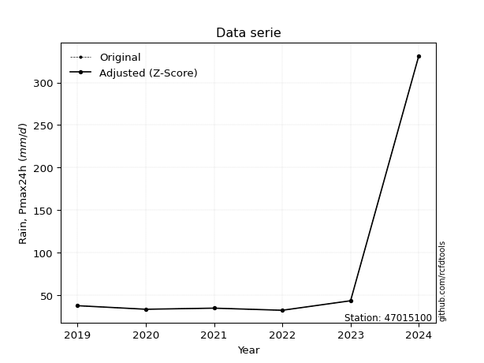</img>

</div>


> The initial value (value_initial) correspond to the initial obtained or null completed value, and value (value) is adjusted only when the initial value is outside the valid range (outlier) definite through the Z-Score value. If Z-Score is active, values out of range or outliers are replaced with the station mean value. A Z-Score (or standard score) measures how many standard deviations a data point is from the mean of a dataset, indicating its relative position; positive scores mean above the mean, negative mean below, and a score of zero is exactly at the mean, allowing for comparison of values from different distributions. It´s calculated using the formula $z=(x–μ)/σ$, where $x$ is the data point, $μ$ is the mean, and $σ$ is the standard deviation, helping identify outliers and understand probability.
>
> <sub>**Note**: In this study, "completing" (filling gaps in) and "extending" (forecasting or lengthening the historical record) rainfall data series are avoided for certain critical analyses because they introduce artificial bias and uncertainty, which can distort the statistics of rare events (extremes), alter day-to-day variability, and compromise the integrity and homogeneity of the original data. Some reasons against Completing/Extending rainfall data are: **Distortion of Extremes and Variability**: The primary issue is that most gap-filling or extension methods rely on averaging or regression with nearby stations, which inherently smooths the data. Rainfall is highly variable in space and time, with a large percentage of zero values and occasional large storms. Infilling methods often underestimate the highest values and overestimate the lowest (zero) values, which severely distorts analyses focused on flood frequency, drought severity, and intensity-duration-frequency (IDF) curves, **Loss of Data Homogeneity**: Infilled or extended data are synthetic estimates, not actual measurements. Combining these estimates with observed data can violate the assumption of data homogeneity, which requires that the data properties do not change over time. Inhomogeneity can lead to incorrect conclusions about long-term trends or changes in climate patterns, **Propagation of Errors**: Errors and biases from the original data (e.g., wind-induced undercatch, instrument errors, site changes) or the data used for imputation can propagate through the analysis, leading to unreliable hydrological models and inaccurate predictions, **Compromised Statistical Integrity**: For statistical analyses, especially those involving the frequency of events, using artificial data can introduce time bias or autocorrelation that doesn´t exist in reality, making it difficult to assess the true probability of events, **Difficulty in Validation**: It is difficult to accurately validate the quality of filled or extended data, especially for past periods where ground-truth measurements are unavailable. The reliability of imputation techniques heavily depends on the density of the surrounding station network and the complexity of the local topography.</sub>


### 4. Active continuous probability distributions from SciPy (80 of 104 available)

A Probability Density Function (PDF) describes the relative likelihood of a continuous random variable falling within a specific range, where the total area under its curve equals 1, and the area over any interval gives the actual probability for that range. Unlike discrete probabilities (like rolling a die), a PDF shows density, not direct probability for a single point (which is zero), with higher points indicating higher likelihood, often visualized as a bell curve for normal distributions.

A log of a probability density function (log-PDF) is simply the logarithm of the PDF´s value, denoted as $log(f(x))$, useful for converting multiplication of probabilities into addition, improving numerical stability with tiny numbers, and connecting to information theory concepts like entropy. Instead of dealing with very small probabilities (e.g., 0.000001), log-PDFs use negative numbers (e.g., $log(0.00001) ≈ -11.51$ that are easier for computers to handle, preventing underflow errors and simplifying complex calculations. In this study, each active probability distribution from SciPy is also evaluated in the $log$ form.

[scipy.stats](https://docs.scipy.org/doc/scipy/reference/stats.html) is a Python´s powerful submodule within the SciPy library for comprehensive statistical analysis, offering over 130 probability distributions (like Normal, Poisson, etc.), functions for descriptive stats (mean, variance), hypothesis testing (t-tests, chi-square), random variable generation, and statistical tests, making it essential for data science, modeling, and research. It provides tools to explore, model, and draw conclusions from data efficiently, working seamlessly with [NumPy](https://numpy.org/).

<div align="center">

|   id | p_dist           |   n_parameter | fit_method   | label                                                                       | active   | ref                                                                                                      |
|-----:|:-----------------|--------------:|:-------------|:----------------------------------------------------------------------------|:---------|:---------------------------------------------------------------------------------------------------------|
|    0 | alpha            |             3 | MLE          | Alpha                                                                       | True     | [:mortar_board:](https://docs.scipy.org/doc/scipy/reference/generated/scipy.stats.alpha.html)            |
|    1 | anglit           |             2 | MM           | Anglit                                                                      | True     | [:mortar_board:](https://docs.scipy.org/doc/scipy/reference/generated/scipy.stats.anglit.html)           |
|    2 | arcsine          |             2 | MM           | Arcsine                                                                     | True     | [:mortar_board:](https://docs.scipy.org/doc/scipy/reference/generated/scipy.stats.arcsine.html)          |
|    3 | argus            |             3 | MLE          | Argus                                                                       | True     | [:mortar_board:](https://docs.scipy.org/doc/scipy/reference/generated/scipy.stats.argus.html)            |
|    4 | beta             |             4 | MLE          | Beta                                                                        | True     | [:mortar_board:](https://docs.scipy.org/doc/scipy/reference/generated/scipy.stats.beta.html)             |
|    5 | betaprime        |             4 | MLE          | Beta prime                                                                  | True     | [:mortar_board:](https://docs.scipy.org/doc/scipy/reference/generated/scipy.stats.betaprime.html)        |
|    6 | bradford         |             3 | MLE          | Bradford                                                                    | True     | [:mortar_board:](https://docs.scipy.org/doc/scipy/reference/generated/scipy.stats.bradford.html)         |
|    7 | burr             |             4 | MLE          | Burr (Type III)                                                             | True     | [:mortar_board:](https://docs.scipy.org/doc/scipy/reference/generated/scipy.stats.burr.html)             |
|    8 | burr12           |             4 | MLE          | Burr (Type III) 12                                                          | True     | [:mortar_board:](https://docs.scipy.org/doc/scipy/reference/generated/scipy.stats.burr12.html)           |
|    9 | cosine           |             2 | MLE          | Cosine                                                                      | True     | [:mortar_board:](https://docs.scipy.org/doc/scipy/reference/generated/scipy.stats.cosine.html)           |
|   10 | crystalball      |             4 | MLE          | Crystalball                                                                 | True     | [:mortar_board:](https://docs.scipy.org/doc/scipy/reference/generated/scipy.stats.crystalball.html)      |
|   11 | dgamma           |             3 | MLE          | Double gamma                                                                | True     | [:mortar_board:](https://docs.scipy.org/doc/scipy/reference/generated/scipy.stats.dgamma.html)           |
|   12 | dweibull         |             3 | MLE          | Double Weibull                                                              | True     | [:mortar_board:](https://docs.scipy.org/doc/scipy/reference/generated/scipy.stats.dweibull.html)         |
|   13 | erlang           |             3 | MLE          | Erlang                                                                      | True     | [:mortar_board:](https://docs.scipy.org/doc/scipy/reference/generated/scipy.stats.erlang.html)           |
|   14 | exponnorm        |             3 | MLE          | Exponentially modified Normal                                               | True     | [:mortar_board:](https://docs.scipy.org/doc/scipy/reference/generated/scipy.stats.exponnorm.html)        |
|   15 | exponpow         |             3 | MLE          | Exponential power                                                           | True     | [:mortar_board:](https://docs.scipy.org/doc/scipy/reference/generated/scipy.stats.exponpow.html)         |
|   16 | exponweib        |             4 | MLE          | Exponentiated Weibull                                                       | True     | [:mortar_board:](https://docs.scipy.org/doc/scipy/reference/generated/scipy.stats.exponweib.html)        |
|   17 | f                |             4 | MLE          | F                                                                           | True     | [:mortar_board:](https://docs.scipy.org/doc/scipy/reference/generated/scipy.stats.f.html)                |
|   18 | fatiguelife      |             3 | MLE          | Fatigue-life (Birnbaum-Saunders)                                            | True     | [:mortar_board:](https://docs.scipy.org/doc/scipy/reference/generated/scipy.stats.fatiguelife.html)      |
|   19 | foldnorm         |             3 | MM           | Fold Normal                                                                 | True     | [:mortar_board:](https://docs.scipy.org/doc/scipy/reference/generated/scipy.stats.foldnorm.html)         |
|   20 | gamma            |             3 | MLE          | Gamma                                                                       | True     | [:mortar_board:](https://docs.scipy.org/doc/scipy/reference/generated/scipy.stats.gamma.html)            |
|   21 | gausshyper       |             6 | MLE          | Gauss hypergeometric                                                        | True     | [:mortar_board:](https://docs.scipy.org/doc/scipy/reference/generated/scipy.stats.gausshyper.html)       |
|   22 | genexpon         |             5 | MLE          | Generalized exponential                                                     | True     | [:mortar_board:](https://docs.scipy.org/doc/scipy/reference/generated/scipy.stats.genexpon.html)         |
|   23 | genextreme       |             3 | MLE          | Generalized exponential                                                     | True     | [:mortar_board:](https://docs.scipy.org/doc/scipy/reference/generated/scipy.stats.genextreme.html)       |
|   24 | gengamma         |             4 | MLE          | Generalized gamma                                                           | True     | [:mortar_board:](https://docs.scipy.org/doc/scipy/reference/generated/scipy.stats.gengamma.html)         |
|   25 | genhalflogistic  |             3 | MLE          | Generalized half-logistic                                                   | True     | [:mortar_board:](https://docs.scipy.org/doc/scipy/reference/generated/scipy.stats.genhalflogistic.html)  |
|   26 | genlogistic      |             3 | MLE          | Generalized logistic                                                        | True     | [:mortar_board:](https://docs.scipy.org/doc/scipy/reference/generated/scipy.stats.genlogistic.html)      |
|   27 | gennorm          |             3 | MLE          | Generalized Normal                                                          | True     | [:mortar_board:](https://docs.scipy.org/doc/scipy/reference/generated/scipy.stats.gennorm.html)          |
|   28 | genpareto        |             3 | MLE          | Generalized Pareto                                                          | True     | [:mortar_board:](https://docs.scipy.org/doc/scipy/reference/generated/scipy.stats.genpareto.html)        |
|   29 | gompertz         |             3 | MLE          | Gompertz (or truncated Gumbel)                                              | True     | [:mortar_board:](https://docs.scipy.org/doc/scipy/reference/generated/scipy.stats.gompertz.html)         |
|   30 | gumbel_l         |             2 | MM           | Gumbel Left Skew                                                            | True     | [:mortar_board:](https://docs.scipy.org/doc/scipy/reference/generated/scipy.stats.gumbel_l.html)         |
|   31 | gumbel_r         |             2 | MM           | Gumbel Right Skew                                                           | True     | [:mortar_board:](https://docs.scipy.org/doc/scipy/reference/generated/scipy.stats.gumbel_r.html)         |
|   32 | halfgennorm      |             3 | MLE          | Upper half of a generalized normal                                          | True     | [:mortar_board:](https://docs.scipy.org/doc/scipy/reference/generated/scipy.stats.halfgennorm.html)      |
|   33 | halflogistic     |             2 | MM           | Half-logistic                                                               | True     | [:mortar_board:](https://docs.scipy.org/doc/scipy/reference/generated/scipy.stats.halflogistic.html)     |
|   34 | halfnorm         |             2 | MM           | Half Normal                                                                 | True     | [:mortar_board:](https://docs.scipy.org/doc/scipy/reference/generated/scipy.stats.halfnorm.html)         |
|   35 | hypsecant        |             2 | MM           | hyperbolic secant                                                           | True     | [:mortar_board:](https://docs.scipy.org/doc/scipy/reference/generated/scipy.stats.hypsecant.html)        |
|   36 | invgamma         |             3 | MLE          | Inverted gamma                                                              | True     | [:mortar_board:](https://docs.scipy.org/doc/scipy/reference/generated/scipy.stats.invgamma.html)         |
|   37 | invgauss         |             3 | MLE          | Inverse Gaussian                                                            | True     | [:mortar_board:](https://docs.scipy.org/doc/scipy/reference/generated/scipy.stats.invgauss.html)         |
|   38 | invweibull       |             3 | MLE          | Inverted Weibull                                                            | True     | [:mortar_board:](https://docs.scipy.org/doc/scipy/reference/generated/scipy.stats.invweibull.html)       |
|   39 | johnsonsb        |             4 | MLE          | Johnson SB                                                                  | True     | [:mortar_board:](https://docs.scipy.org/doc/scipy/reference/generated/scipy.stats.johnsonsb.html)        |
|   40 | johnsonsu        |             4 | MLE          | Johnson Su                                                                  | True     | [:mortar_board:](https://docs.scipy.org/doc/scipy/reference/generated/scipy.stats.johnsonsu.html)        |
|   41 | kappa3           |             3 | MLE          | Kappa 3                                                                     | True     | [:mortar_board:](https://docs.scipy.org/doc/scipy/reference/generated/scipy.stats.kappa3.html)           |
|   42 | kappa4           |             4 | MLE          | Kappa 4                                                                     | True     | [:mortar_board:](https://docs.scipy.org/doc/scipy/reference/generated/scipy.stats.kappa4.html)           |
|   43 | ksone            |             3 | MLE          | Kolmogorov-Smirnov one-sided test statistic distribution                    | True     | [:mortar_board:](https://docs.scipy.org/doc/scipy/reference/generated/scipy.stats.ksone.html)            |
|   44 | kstwobign        |             2 | MLE          | Limiting distribution of scaled Kolmogorov-Smirnov two-sided test statistic | True     | [:mortar_board:](https://docs.scipy.org/doc/scipy/reference/generated/scipy.stats.kstwobign.html)        |
|   45 | laplace          |             2 | MM           | Laplace                                                                     | True     | [:mortar_board:](https://docs.scipy.org/doc/scipy/reference/generated/scipy.stats.laplace.html)          |
|   46 | levy_l           |             2 | MLE          | Left-skewed Levy                                                            | True     | [:mortar_board:](https://docs.scipy.org/doc/scipy/reference/generated/scipy.stats.levy_l.html)           |
|   47 | loggamma         |             3 | MLE          | Log gamma                                                                   | True     | [:mortar_board:](https://docs.scipy.org/doc/scipy/reference/generated/scipy.stats.loggamma.html)         |
|   48 | logistic         |             2 | MM           | Logistic (or Sech-squared)                                                  | True     | [:mortar_board:](https://docs.scipy.org/doc/scipy/reference/generated/scipy.stats.logistic.html)         |
|   49 | loglaplace       |             3 | MLE          | Log-Laplace                                                                 | True     | [:mortar_board:](https://docs.scipy.org/doc/scipy/reference/generated/scipy.stats.loglaplace.html)       |
|   50 | lomax            |             3 | MLE          | Lomax (Pareto of the second kind)                                           | True     | [:mortar_board:](https://docs.scipy.org/doc/scipy/reference/generated/scipy.stats.lomax.html)            |
|   51 | maxwell          |             2 | MM           | Maxwell                                                                     | True     | [:mortar_board:](https://docs.scipy.org/doc/scipy/reference/generated/scipy.stats.maxwell.html)          |
|   52 | mielke           |             4 | MLE          | Mielke Beta-Kappa / Dagum                                                   | True     | [:mortar_board:](https://docs.scipy.org/doc/scipy/reference/generated/scipy.stats.mielke.html)           |
|   53 | moyal            |             2 | MM           | Moyal                                                                       | True     | [:mortar_board:](https://docs.scipy.org/doc/scipy/reference/generated/scipy.stats.moyal.html)            |
|   54 | nakagami         |             3 | MLE          | Nakagami                                                                    | True     | [:mortar_board:](https://docs.scipy.org/doc/scipy/reference/generated/scipy.stats.nakagami.html)         |
|   55 | ncf              |             5 | MLE          | Non-central F distribution                                                  | True     | [:mortar_board:](https://docs.scipy.org/doc/scipy/reference/generated/scipy.stats.ncf.html)              |
|   56 | nct              |             4 | MLE          | Non-central Student’s t                                                     | True     | [:mortar_board:](https://docs.scipy.org/doc/scipy/reference/generated/scipy.stats.nct.html)              |
|   57 | norm             |             2 | MM           | Normal                                                                      | True     | [:mortar_board:](https://docs.scipy.org/doc/scipy/reference/generated/scipy.stats.norm.html)             |
|   58 | pearson3         |             3 | MM           | Pearson type III                                                            | True     | [:mortar_board:](https://docs.scipy.org/doc/scipy/reference/generated/scipy.stats.pearson3.html)         |
|   59 | powerlaw         |             3 | MLE          | Power-function                                                              | True     | [:mortar_board:](https://docs.scipy.org/doc/scipy/reference/generated/scipy.stats.powerlaw.html)         |
|   60 | rayleigh         |             2 | MM           | Rayleigh                                                                    | True     | [:mortar_board:](https://docs.scipy.org/doc/scipy/reference/generated/scipy.stats.rayleigh.html)         |
|   61 | rdist            |             3 | MLE          | R-distributed (symmetric beta)                                              | True     | [:mortar_board:](https://docs.scipy.org/doc/scipy/reference/generated/scipy.stats.rdist.html)            |
|   62 | rice             |             3 | MLE          | Rice                                                                        | True     | [:mortar_board:](https://docs.scipy.org/doc/scipy/reference/generated/scipy.stats.rice.html)             |
|   63 | semicircular     |             2 | MM           | Semicircular                                                                | True     | [:mortar_board:](https://docs.scipy.org/doc/scipy/reference/generated/scipy.stats.semicircular.html)     |
|   64 | skewnorm         |             3 | MLE          | Skew normal                                                                 | True     | [:mortar_board:](https://docs.scipy.org/doc/scipy/reference/generated/scipy.stats.skewnorm.html)         |
|   65 | t                |             3 | MLE          | Student’s t                                                                 | True     | [:mortar_board:](https://docs.scipy.org/doc/scipy/reference/generated/scipy.stats.t.html)                |
|   66 | trapezoid        |             4 | MLE          | Trapezoid                                                                   | True     | [:mortar_board:](https://docs.scipy.org/doc/scipy/reference/generated/scipy.stats.trapezoid.html)        |
|   67 | triang           |             3 | MLE          | Triangular                                                                  | True     | [:mortar_board:](https://docs.scipy.org/doc/scipy/reference/generated/scipy.stats.triang.html)           |
|   68 | truncexpon       |             3 | MLE          | Truncated exponential                                                       | True     | [:mortar_board:](https://docs.scipy.org/doc/scipy/reference/generated/scipy.stats.truncexpon.html)       |
|   69 | truncnorm        |             4 | MLE          | Truncated normal                                                            | True     | [:mortar_board:](https://docs.scipy.org/doc/scipy/reference/generated/scipy.stats.truncnorm.html)        |
|   70 | truncpareto      |             4 | MLE          | Upper truncated Pareto                                                      | True     | [:mortar_board:](https://docs.scipy.org/doc/scipy/reference/generated/scipy.stats.truncpareto.html)      |
|   71 | truncweibull_min |             5 | MLE          | Doubly truncated Weibull minimum                                            | True     | [:mortar_board:](https://docs.scipy.org/doc/scipy/reference/generated/scipy.stats.truncweibull_min.html) |
|   72 | tukeylambda      |             3 | MLE          | Tukey-Lamdba                                                                | True     | [:mortar_board:](https://docs.scipy.org/doc/scipy/reference/generated/scipy.stats.tukeylambda.html)      |
|   73 | uniform          |             2 | MLE          | Uniform                                                                     | True     | [:mortar_board:](https://docs.scipy.org/doc/scipy/reference/generated/scipy.stats.uniform.html)          |
|   74 | vonmises         |             3 | MLE          | Von Mises                                                                   | True     | [:mortar_board:](https://docs.scipy.org/doc/scipy/reference/generated/scipy.stats.vonmises.html)         |
|   75 | vonmises_line    |             3 | MLE          | Von Mises line                                                              | True     | [:mortar_board:](https://docs.scipy.org/doc/scipy/reference/generated/scipy.stats.vonmises_line.html)    |
|   76 | wald             |             2 | MM           | Wald                                                                        | True     | [:mortar_board:](https://docs.scipy.org/doc/scipy/reference/generated/scipy.stats.wald.html)             |
|   77 | weibull_max      |             3 | MLE          | Weibull maximum                                                             | True     | [:mortar_board:](https://docs.scipy.org/doc/scipy/reference/generated/scipy.stats.weibull_max.html)      |
|   78 | weibull_min      |             3 | MLE          | Weibull minimum                                                             | True     | [:mortar_board:](https://docs.scipy.org/doc/scipy/reference/generated/scipy.stats.weibull_min.html)      |
|   79 | wrapcauchy       |             3 | MLE          | Wrapped  Cauchy                                                             | True     | [:mortar_board:](https://docs.scipy.org/doc/scipy/reference/generated/scipy.stats.wrapcauchy.html)       |

</div>

> **n_parameter:** # arguments & localization & scale.
>
> **Fit methods:** (MLE) maximum likelihood, (MM) L-moments.
>
>**Inactive** (With the only purpose of prevent loops, zero divisions, infinite values, over high estimated values or horizontal trending for recurrence intervals estimations, the follow distributions were disabled.)**:** lognorm, norminvgauss, powernorm, powerlognorm, cauchy, halfcauchy, foldcauchy, skewcauchy, chi2, expon, fisk, genhyperbolic, geninvgauss, gibrat, kstwo, laplace_asymmetric, levy, levy_stable, ncx2, pareto, rel_breitwigner, recipinvgauss, studentized_range, loguniform, 


## B. Probability (PDF) vs. Empirical (EDF) distributions functions

A continuous probability distribution (CPD) describes probabilities for variables that can take any value within a range (like rain any time), unlike discrete variables with specific outcomes (like temperature). It uses a Probability Density Function (PDF), a curve where the total area under it equals 1, and the probability of the variable falling within an interval (a to b) is found by calculating the area under the curve between those points. A key feature is that the probability of hitting any single exact value is zero, so probabilities are always expressed for ranges, e.g., $P(a ≤ X ≤ b)$.

<div align="center">

Distributions parameters from station values
|     |   station | p_dist              |   n |             loc |           scale | shape                  | shape1                | shape2                 | shape3             |
|----:|----------:|:--------------------|----:|----------------:|----------------:|:-----------------------|:----------------------|:-----------------------|:-------------------|
|   0 |  47015100 | alpha               |   7 |      29.165     |     5.39155     | 6.986891561101481e-09  |                       |                        |                    |
|   1 |  47015100 | anglit              |   7 |     145.229     |   522.911       |                        |                       |                        |                    |
|   2 |  47015100 | arcsine             |   7 |    -107.56      |   505.577       |                        |                       |                        |                    |
|   3 |  47015100 | argus               |   7 |    -246.176     |   781.527       | 5.738996411258928e-07  |                       |                        |                    |
|   4 |  47015100 | beta                |   7 |     -15.5445    |   520.345       | 0.08628014438777401    | 0.2549914096690095    |                        |                    |
|   5 |  47015100 | betaprime           |   7 |      -0.0988671 |     0.27921     | 243.2760278148262      | 1.400711098285508     |                        |                    |
|   6 |  47015100 | bradford            |   7 |      32         |   472.8         | 7.595858401546998      |                       |                        |                    |
|   7 |  47015100 | burr                |   7 |       0.567012  |     0.545793    | 1.4791088040482507     | 631.8914136172941     |                        |                    |
|   8 |  47015100 | burr12              |   7 |      -0.750544  |    32.3256      | 258.1226900191558      | 0.004756509239830259  |                        |                    |
|   9 |  47015100 | cosine              |   7 |     175.203     |   151.547       |                        |                       |                        |                    |
|  10 |  47015100 | crystalball         |   7 |     145.229     |   178.749       | 9596.647850149126      | 13050.773682006184    |                        |                    |
|  11 |  47015100 | dgamma              |   7 |     208.749     |    11.2124      | 16.3371227360606       |                       |                        |                    |
|  12 |  47015100 | dweibull            |   7 |      32         |   139.86        | 0.8597912192333184     |                       |                        |                    |
|  13 |  47015100 | erlang              |   7 |      32         |   144.218       | 0.28003016824864146    |                       |                        |                    |
|  14 |  47015100 | exponnorm           |   7 |      31.8266    |     0.0549196   | 2051.6510391522197     |                       |                        |                    |
|  15 |  47015100 | exponpow            |   7 |      32         |   210.201       | 0.4795275129574539     |                       |                        |                    |
|  16 |  47015100 | exponweib           |   7 |      32         |    51.773       | 1.7226497557334497     | 0.3236137378845186    |                        |                    |
|  17 |  47015100 | f                   |   7 |      31.7031    |     1.5022      | 5510.639031985107      | 0.7015219621278466    |                        |                    |
|  18 |  47015100 | fatiguelife         |   7 |      31.8406    |    11.3665      | 4.517608509251736      |                       |                        |                    |
|  19 |  47015100 | foldnorm            |   7 |     -95.7044    |   301.425       | 0.0071749885530211195  |                       |                        |                    |
|  20 |  47015100 | gamma               |   7 |      32         |   122.061       | 0.29676973049126276    |                       |                        |                    |
|  21 |  47015100 | gausshyper          |   7 |     -14.5841    |   519.384       | 0.6700641719491705     | 0.6987108986136987    | 1.5658859312261262     | 1.4119872591735767 |
|  22 |  47015100 | genexpon            |   7 |      32         |   234.91        | 2.0746263345559104     | 1.169296243273357e-11 | 2.5317671853718764     |                    |
|  23 |  47015100 | genextreme          |   7 |      32.6995    |     2.45006     | -3.479041142681753     |                       |                        |                    |
|  24 |  47015100 | gengamma            |   7 |      32         |   102.731       | 1.3840629763229093     | 0.26004584003392706   |                        |                    |
|  25 |  47015100 | genhalflogistic     |   7 |     -15.7973    |   540.34        | 1.0379226779242057     |                       |                        |                    |
|  26 |  47015100 | genlogistic         |   7 |    -763.786     |   104.776       | 2846.5131086388037     |                       |                        |                    |
|  27 |  47015100 | gennorm             |   7 |      33.2       |     0.245927    | 0.28440758395724186    |                       |                        |                    |
|  28 |  47015100 | genpareto           |   7 |      32         |     4.64909     | 1.207872063844655      |                       |                        |                    |
|  29 |  47015100 | gompertz            |   7 |      32         |   404.043       | 1.1594803024040512     |                       |                        |                    |
|  30 |  47015100 | gumbel_l            |   7 |     225.675     |   139.37        |                        |                       |                        |                    |
|  31 |  47015100 | gumbel_r            |   7 |      64.7822    |   139.37        |                        |                       |                        |                    |
|  32 |  47015100 | halfgennorm         |   7 |      32         |     0.00132557  | 0.18584705182189776    |                       |                        |                    |
|  33 |  47015100 | halflogistic        |   7 |     -66.63      |   152.824       |                        |                       |                        |                    |
|  34 |  47015100 | halfnorm            |   7 |     -91.3645    |   296.525       |                        |                       |                        |                    |
|  35 |  47015100 | hypsecant           |   7 |     145.229     |   113.795       |                        |                       |                        |                    |
|  36 |  47015100 | invgamma            |   7 |      31.703     |     0.526797    | 0.3507560822952841     |                       |                        |                    |
|  37 |  47015100 | invgauss            |   7 |      31.4289    |     2.46678     | 46.13294955033871      |                       |                        |                    |
|  38 |  47015100 | invweibull          |   7 |      32         |     2.59027     | 0.06317831223848043    |                       |                        |                    |
|  39 |  47015100 | johnsonsb           |   7 |      32         |  1400.78        | 2.2669114971411917     | 0.16340813798048492   |                        |                    |
|  40 |  47015100 | johnsonsu           |   7 |      32         |     1.89464e-07 | -2.126022026962027     | 0.14301604685734848   |                        |                    |
|  41 |  47015100 | kappa3              |   7 |      32         |    25.4827      | 0.08470282399567425    |                       |                        |                    |
|  42 |  47015100 | kappa4              |   7 |     -15.0368    |   520.112       | 1.0994236349930833     | 0.9992056171918842    |                        |                    |
|  43 |  47015100 | ksone               |   7 |     -15.28      |   567.36        | 1.0                    |                       |                        |                    |
|  44 |  47015100 | kstwobign           |   7 |    -317.761     |   536.587       |                        |                       |                        |                    |
|  45 |  47015100 | laplace             |   7 |     145.229     |   126.394       |                        |                       |                        |                    |
|  46 |  47015100 | levy_l              |   7 |     544.476     |   176.168       |                        |                       |                        |                    |
|  47 |  47015100 | loggamma            |   7 |  -72121.8       |  9217.59        | 2541.119892595142      |                       |                        |                    |
|  48 |  47015100 | logistic            |   7 |     145.229     |    98.5493      |                        |                       |                        |                    |
|  49 |  47015100 | loglaplace          |   7 |      -0.0863643 |    37.4864      | 1.326008278401198      |                       |                        |                    |
|  50 |  47015100 | lomax               |   7 |      32         |     0.845684    | 0.36641348422521924    |                       |                        |                    |
|  51 |  47015100 | maxwell             |   7 |    -278.331     |   265.426       |                        |                       |                        |                    |
|  52 |  47015100 | mielke              |   7 |      25.0264    |     0.0285038   | 42248.72192720618      | 1.65900937406083      |                        |                    |
|  53 |  47015100 | moyal               |   7 |      43.0087    |    80.4651      |                        |                       |                        |                    |
|  54 |  47015100 | nakagami            |   7 |      32         |   301.469       | 0.1541999469206194     |                       |                        |                    |
|  55 |  47015100 | ncf                 |   7 |      -0.0454921 |     0.000106579 | 0.0003108288133453263  | 2.8073330994129257    | 142.50898612576526     |                    |
|  56 |  47015100 | nct                 |   7 |      -0.119166  |     0.771587    | 1.1619906428274964     | 54.68492998220225     |                        |                    |
|  57 |  47015100 | norm                |   7 |     145.229     |   178.749       |                        |                       |                        |                    |
|  58 |  47015100 | pearson3            |   7 |     145.229     |   178.749       | 1.161163351121798      |                       |                        |                    |
|  59 |  47015100 | powerlaw            |   7 |      32         |   472.8         | 0.11800392644596973    |                       |                        |                    |
|  60 |  47015100 | rayleigh            |   7 |    -196.728     |   272.842       |                        |                       |                        |                    |
|  61 |  47015100 | rdist               |   7 |     -15.6583    |    58.8583      | 1.5400033636545403     |                       |                        |                    |
|  62 |  47015100 | rice                |   7 |    -117.443     |   224.663       | 0.00029242120972704775 |                       |                        |                    |
|  63 |  47015100 | semicircular        |   7 |     145.229     |   357.497       |                        |                       |                        |                    |
|  64 |  47015100 | skewnorm            |   7 |      31.9999    |   211.603       | 17396797.9593006       |                       |                        |                    |
|  65 |  47015100 | t                   |   7 |      33.776     |     1.83134     | 0.3616747006003888     |                       |                        |                    |
|  66 |  47015100 | trapezoid           |   7 |     -16.044     |   567.36        | 1.0                    | 1.0                   |                        |                    |
|  67 |  47015100 | triang              |   7 |      32         |   675.037       | 4.0909781967564836e-08 |                       |                        |                    |
|  68 |  47015100 | truncexpon          |   7 |      32         |   506.753       | 0.9329994909556498     |                       |                        |                    |
|  69 |  47015100 | truncnorm           |   7 | -183556         |  5737.23        | 31.999492772985725     | 32.08190193914871     |                        |                    |
|  70 |  47015100 | truncpareto         |   7 |      31.1544    |     0.845554    | 0.1313033022131325     | 560.1601072611039     |                        |                    |
|  71 |  47015100 | truncweibull_min    |   7 |      30.0208    |   414.848       | 5.819120531834854e-08  | 0.004770838511263935  | 1.2088283248630511     |                    |
|  72 |  47015100 | tukeylambda         |   7 |      42.9856    |    18.2863      | 1.664563359751011      |                       |                        |                    |
|  73 |  47015100 | uniform             |   7 |      32         |   472.8         |                        |                       |                        |                    |
|  74 |  47015100 | vonmises            |   7 |       0.487385  |     1           | 0.26345265821596964    |                       |                        |                    |
|  75 |  47015100 | vonmises_line       |   7 |      95.73      |   130.211       | 1.049239923469412      |                       |                        |                    |
|  76 |  47015100 | wald                |   7 |     -33.52      |   178.749       |                        |                       |                        |                    |
|  77 |  47015100 | weibull_max         |   7 |     504.8       |     1.67402     | 0.1374120418318976     |                       |                        |                    |
|  78 |  47015100 | weibull_min         |   7 |      32         |   236.361       | 0.32671043989642934    |                       |                        |                    |
|  79 |  47015100 | wrapcauchy          |   7 |      32         |    75.2633      | 0.9681367228657467     |                       |                        |                    |
|  80 |  47015100 | logalpha            |   7 |       3.38833   |     0.149712    | 1.8215774826849641e-06 |                       |                        |                    |
|  81 |  47015100 | loganglit           |   7 |       4.27494   |     3.24488     |                        |                       |                        |                    |
|  82 |  47015100 | logarcsine          |   7 |       2.70626   |     3.13734     |                        |                       |                        |                    |
|  83 |  47015100 | logargus            |   7 |       1.99916   |     4.42312     | 2.8529475585875515e-05 |                       |                        |                    |
|  84 |  47015100 | logbeta             |   7 |       3.46574   |     2.99868     | 0.03200008741562694    | 0.06703014924918016   |                        |                    |
|  85 |  47015100 | logbetaprime        |   7 |       1.62279   |     0.0287525   | 839.94868236298        | 10.320496826763168    |                        |                    |
|  86 |  47015100 | logbradford         |   7 |       3.44725   |     2.77691     | 32.45210022967974      |                       |                        |                    |
|  87 |  47015100 | logburr             |   7 |       3.4543    |     7.1072e-05  | 0.6631940042169695     | 109.6605953493879     |                        |                    |
|  88 |  47015100 | logburr12           |   7 |       3.20145   |     0.242387    | 46.76434858469574      | 0.021772850537440658  |                        |                    |
|  89 |  47015100 | logcosine           |   7 |       4.41959   |     0.901614    |                        |                       |                        |                    |
|  90 |  47015100 | logcrystalball      |   7 |       4.27493   |     1.10921     | 12.713647778167575     | 15.065584234316013    |                        |                    |
|  91 |  47015100 | logdgamma           |   7 |       3.54096   |     1.18996     | 0.3603578745480307     |                       |                        |                    |
|  92 |  47015100 | logdweibull         |   7 |       3.46574   |     1.0575      | 0.6957192888025794     |                       |                        |                    |
|  93 |  47015100 | logerlang           |   7 |       3.46574   |     0.552473    | 0.6713482717495565     |                       |                        |                    |
|  94 |  47015100 | logexponnorm        |   7 |       3.46511   |     0.000179427 | 4478.592031812301      |                       |                        |                    |
|  95 |  47015100 | logexponpow         |   7 |       3.46574   |     2.14799     | 0.4082179715040546     |                       |                        |                    |
|  96 |  47015100 | logexponweib        |   7 |       3.46574   |     1.09744     | 0.948689640352119      | 0.8954966510686704    |                        |                    |
|  97 |  47015100 | logf                |   7 |       3.44718   |     0.0760159   | 944.6505629309535      | 1.1221307933927547    |                        |                    |
|  98 |  47015100 | logfatiguelife      |   7 |       3.46574   |     6.34307e-07 | 1189.3726388064097     |                       |                        |                    |
|  99 |  47015100 | logfoldnorm         |   7 |       2.79493   |     1.68138     | 0.4582832575909719     |                       |                        |                    |
| 100 |  47015100 | loggamma            |   7 |       3.46574   |     0.610147    | 0.6969462315709241     |                       |                        |                    |
| 101 |  47015100 | loggausshyper       |   7 |       3.46574   |     2.86189     | 0.7913052499727331     | 1.1133374203240722    | 0.7360513909201507     | 1.0068451709682795 |
| 102 |  47015100 | loggenexpon         |   7 |       3.46574   |     1.97048     | 2.4351873022799744     | 6.15735780800831e-08  | 1.8092949515012802     |                    |
| 103 |  47015100 | loggenextreme       |   7 |       3.52744   |     0.128511    | -1.8789781001812749    |                       |                        |                    |
| 104 |  47015100 | loggengamma         |   7 |       3.46574   |     1.24679     | 0.508481108962866      | 0.8072053094544167    |                        |                    |
| 105 |  47015100 | loggenhalflogistic  |   7 |       3.25044   |     3.18204     | 1.0700540077302876     |                       |                        |                    |
| 106 |  47015100 | loggenlogistic      |   7 |      -1.53025   |     0.685556    | 2356.4591110432602     |                       |                        |                    |
| 107 |  47015100 | loggennorm          |   7 |       3.54096   |     0.00876161  | 0.3357178838613557     |                       |                        |                    |
| 108 |  47015100 | loggenpareto        |   7 |      -0.0140259 |    13.2083      | -2.117328175008672     |                       |                        |                    |
| 109 |  47015100 | loggompertz         |   7 |       3.46574   |     2.75103e+12 | 2815070658448.963      |                       |                        |                    |
| 110 |  47015100 | loggumbel_l         |   7 |       4.77414   |     0.864847    |                        |                       |                        |                    |
| 111 |  47015100 | loggumbel_r         |   7 |       3.77573   |     0.864847    |                        |                       |                        |                    |
| 112 |  47015100 | loghalfgennorm      |   7 |       3.46574   |     2.38045e-05 | 0.18744559268777777    |                       |                        |                    |
| 113 |  47015100 | loghalflogistic     |   7 |       2.96026   |     0.948335    |                        |                       |                        |                    |
| 114 |  47015100 | loghalfnorm         |   7 |       2.80678   |     1.84006     |                        |                       |                        |                    |
| 115 |  47015100 | loghypsecant        |   7 |       4.27494   |     0.706145    |                        |                       |                        |                    |
| 116 |  47015100 | loginvgamma         |   7 |       3.44714   |     0.042629    | 0.5611004173414919     |                       |                        |                    |
| 117 |  47015100 | loginvgauss         |   7 |       3.44621   |     0.0867442   | 9.553648188320683      |                       |                        |                    |
| 118 |  47015100 | loginvweibull       |   7 |       3.45904   |     0.0684197   | 0.5322707735609689     |                       |                        |                    |
| 119 |  47015100 | logjohnsonsb        |   7 |       3.46574   |     5.40484     | 1.2036674033598551     | 0.09917136502878121   |                        |                    |
| 120 |  47015100 | logjohnsonsu        |   7 |   54097.8       | 77305           | 54233.549098884745     | 83122.25718288368     |                        |                    |
| 121 |  47015100 | logkappa3           |   7 |       3.46573   |     2.75844     | 239899.91442632116     |                       |                        |                    |
| 122 |  47015100 | logkappa4           |   7 |       2.90989   |     3.57522     | 1.1855080312236692     | 1.0782077321084307    |                        |                    |
| 123 |  47015100 | logksone            |   7 |       3.18989   |     3.31011     | 1.0                    |                       |                        |                    |
| 124 |  47015100 | logkstwobign        |   7 |       1.32404   |     3.4078      |                        |                       |                        |                    |
| 125 |  47015100 | loglaplace          |   7 |       4.27494   |     0.78433     |                        |                       |                        |                    |
| 126 |  47015100 | loglevy_l           |   7 |       6.3999    |     0.765615    |                        |                       |                        |                    |
| 127 |  47015100 | logloggamma         |   7 |    -392.426     |    51.9458      | 2073.4559909104446     |                       |                        |                    |
| 128 |  47015100 | loglogistic         |   7 |       4.27494   |     0.611539    |                        |                       |                        |                    |
| 129 |  47015100 | logloglaplace       |   7 |      -0.0058256 |     3.6275      | 6.084379453011284      |                       |                        |                    |
| 130 |  47015100 | loglomax            |   7 |       3.46574   |     0.17476     | 1.0402278858763938     |                       |                        |                    |
| 131 |  47015100 | logmaxwell          |   7 |       1.64657   |     1.64708     |                        |                       |                        |                    |
| 132 |  47015100 | logmielke           |   7 |       3.46574   |     0.0293522   | 0.7734530121577103     | 0.39037846831716616   |                        |                    |
| 133 |  47015100 | logmoyal            |   7 |       3.64062   |     0.49932     |                        |                       |                        |                    |
| 134 |  47015100 | lognakagami         |   7 |       3.46574   |     1.86852     | 0.13267038634791517    |                       |                        |                    |
| 135 |  47015100 | logncf              |   7 |       0.513999  |     3.5477      | 226.68839238982758     | 34.07908953717626     | 1.9769056325373625e-06 |                    |
| 136 |  47015100 | lognct              |   7 |       3.36098   |     0.171865    | 0.847509806662679      | 1.6910050095120255    |                        |                    |
| 137 |  47015100 | lognorm             |   7 |       4.27494   |     1.10921     |                        |                       |                        |                    |
| 138 |  47015100 | logpearson3         |   7 |       4.27494   |     1.10921     | 0.9610889113040717     |                       |                        |                    |
| 139 |  47015100 | logpowerlaw         |   7 |       3.46574   |     2.75843     | 0.14129901612056958    |                       |                        |                    |
| 140 |  47015100 | lograyleigh         |   7 |       2.15295   |     1.6931      |                        |                       |                        |                    |
| 141 |  47015100 | logrdist            |   7 |       4.63468   |     1.16895     | 1.0136012358286832     |                       |                        |                    |
| 142 |  47015100 | logrice             |   7 |       2.61397   |     1.4123      | 0.00042115474625312367 |                       |                        |                    |
| 143 |  47015100 | logsemicircular     |   7 |       4.27494   |     2.21842     |                        |                       |                        |                    |
| 144 |  47015100 | logskewnorm         |   7 |       3.46573   |     1.37289     | 6534387.655674569      |                       |                        |                    |
| 145 |  47015100 | logt                |   7 |       4.27494   |     1.10921     | 2731360107.977582      |                       |                        |                    |
| 146 |  47015100 | logtrapezoid        |   7 |       3.18989   |     3.31011     | 1.0                    | 1.0                   |                        |                    |
| 147 |  47015100 | logtriang           |   7 |       1.69498   |     4.52919     | 0.9999990941598904     |                       |                        |                    |
| 148 |  47015100 | logtruncexpon       |   7 |       3.46573   |     2.85875     | 0.9649609682967468     |                       |                        |                    |
| 149 |  47015100 | logtruncnorm        |   7 |     -13.719     |     3.97344     | 4.324891504291252      | 5.0191193325737595    |                        |                    |
| 150 |  47015100 | logtruncpareto      |   7 |       3.39626   |     0.0694767   | 0.21567381291969942    | 40.702889889469944    |                        |                    |
| 151 |  47015100 | logtruncweibull_min |   7 |       3.46113   |     1.52139     | 0.19233071726111045    | 0.003028370576351182  | 1.8161391914084746     |                    |
| 152 |  47015100 | logtukeylambda      |   7 |       4.63468   |     1.17336     | 1.003776205479641      |                       |                        |                    |
| 153 |  47015100 | loguniform          |   7 |       3.46574   |     2.75843     |                        |                       |                        |                    |
| 154 |  47015100 | logvonmises         |   7 |      -2.35438   |     1           | 1.2561065380645804     |                       |                        |                    |
| 155 |  47015100 | logvonmises_line    |   7 |       3.90787   |     0.737297    | 1.077799293517892      |                       |                        |                    |
| 156 |  47015100 | logwald             |   7 |       3.16573   |     1.10921     |                        |                       |                        |                    |
| 157 |  47015100 | logweibull_max      |   7 |       6.22416   |     1.92246     | 0.9939434436390905     |                       |                        |                    |
| 158 |  47015100 | logweibull_min      |   7 |       3.46574   |     0.821831    | 0.6592932637086635     |                       |                        |                    |
| 159 |  47015100 | logwrapcauchy       |   7 |       3.46574   |     0.439017    | 0.8501613325981208     |                       |                        |                    |

</div>

> **loc** (Location parameter): This shifts the distribution along the x-axis. For many common distributions, like the normal (Gaussian) distribution, loc represents the mean $μ$. For others, like the uniform distribution, it might represent the minimum value, or for the beta distribution, the left end of the support interval.
>
> **scale** (Scale parameter): This determines the width or spread of the distribution. For the normal distribution, scale represents the standard deviation $σ$. For a uniform distribution, it defines the length of the interval (from $loc$ to $loc + scale$).
>
> **shape** (Shape parameters): Refers to parameters that define the specific form of a probability distribution, distinct from its location (loc) and scale (scale). These parameters are required arguments for most distribution functions. For example, a normal (Gaussian) distribution is fully defined by its location (mean) and scale (standard deviation), so it has no specific shape parameters beyond loc and scale. However, other distributions have intrinsic properties that need specification, as Gamma distribution that takes a shape parameter, often named $a$ or $alpha$.


### 0. Cumulative distribution values - CDF (160 evaluated)

Cumulative Distribution Function (CDF), denoted as $F$<sub>$X$</sub>$(x)$, is a function that gives the probability that a random variable $X$ will take a value less than or equal to a specific value, $x$ (i.e., $(P(X≥x)$. It essentially "accumulates" probabilities from a given point up to the far right (positive infinity), providing a complete picture of the distribution´s probabilities for both discrete (like rain) and continuous (like temperature) variables, helping to find probabilities over ranges or above certain values. Each station is evaluated separately ordering the $x$ values ascending, calculating the CDF and PDF values for the activated distributions and their logarithmic forms.

<div align="center">

CDF ordered by x ascending and calculating $log(f(x))$ separately
|   id |   Station |   date |     x |   count |    mean |     std |    zscore |   Value_initial |   station |   m |     alpha |   alpha_pdf |   anglit |   anglit_pdf |   arcsine |   arcsine_pdf |    argus |   argus_pdf |     beta |    beta_pdf |   betaprime |   betaprime_pdf |    bradford |   bradford_pdf |     burr |    burr_pdf |    burr12 |   burr12_pdf |   cosine |   cosine_pdf |   crystalball |   crystalball_pdf |   dgamma |   dgamma_pdf |   dweibull |   dweibull_pdf |     erlang |   erlang_pdf |   exponnorm |   exponnorm_pdf |    exponpow |     exponpow_pdf |   exponweib |    exponweib_pdf |         f |       f_pdf |   fatiguelife |   fatiguelife_pdf |   foldnorm |   foldnorm_pdf |       gamma |   gamma_pdf |   gausshyper |   gausshyper_pdf |   genexpon |   genexpon_pdf |   genextreme |   genextreme_pdf |   gengamma |   gengamma_pdf |   genhalflogistic |   genhalflogistic_pdf |   genlogistic |   genlogistic_pdf |   gennorm |   gennorm_pdf |   genpareto |   genpareto_pdf |    gompertz |   gompertz_pdf |   gumbel_l |   gumbel_l_pdf |   gumbel_r |   gumbel_r_pdf |   halfgennorm |   halfgennorm_pdf |   halflogistic |   halflogistic_pdf |   halfnorm |   halfnorm_pdf |   hypsecant |   hypsecant_pdf |   invgamma |   invgamma_pdf |   invgauss |   invgauss_pdf |   invweibull |   invweibull_pdf |   johnsonsb |   johnsonsb_pdf |   johnsonsu |   johnsonsu_pdf |      kappa3 |   kappa3_pdf |      kappa4 |   kappa4_pdf |     ksone |   ksone_pdf |   kstwobign |   kstwobign_pdf |   laplace |   laplace_pdf |   levy_l |   levy_l_pdf |    loggamma |   loggamma_pdf |   logistic |   logistic_pdf |   loglaplace |   loglaplace_pdf |       lomax |   lomax_pdf |   maxwell |   maxwell_pdf |   mielke |   mielke_pdf |    moyal |   moyal_pdf |    nakagami |   nakagami_pdf |      ncf |     ncf_pdf |      nct |     nct_pdf |     norm |   norm_pdf |   pearson3 |   pearson3_pdf |   powerlaw |   powerlaw_pdf |   rayleigh |   rayleigh_pdf |    rdist |   rdist_pdf |     rice |    rice_pdf |   semicircular |   semicircular_pdf |   skewnorm |   skewnorm_pdf |        t |       t_pdf |   trapezoid |   trapezoid_pdf |      triang |   triang_pdf |   truncexpon |   truncexpon_pdf |   truncnorm |   truncnorm_pdf |   truncpareto |   truncpareto_pdf |   truncweibull_min |   truncweibull_min_pdf |   tukeylambda |   tukeylambda_pdf |    uniform |   uniform_pdf |   vonmises |   vonmises_pdf |   vonmises_line |   vonmises_line_pdf |     wald |    wald_pdf |   weibull_max |   weibull_max_pdf |   weibull_min |   weibull_min_pdf |   wrapcauchy |   wrapcauchy_pdf |   logalpha |   logalpha_pdf |   loganglit |   loganglit_pdf |   logarcsine |   logarcsine_pdf |   logargus |   logargus_pdf |   logbeta |   logbeta_pdf |   logbetaprime |   logbetaprime_pdf |   logbradford |   logbradford_pdf |   logburr |   logburr_pdf |   logburr12 |   logburr12_pdf |   logcosine |   logcosine_pdf |   logcrystalball |   logcrystalball_pdf |   logdgamma |   logdgamma_pdf |   logdweibull |   logdweibull_pdf |   logerlang |   logerlang_pdf |   logexponnorm |   logexponnorm_pdf |   logexponpow |   logexponpow_pdf |   logexponweib |   logexponweib_pdf |      logf |   logf_pdf |   logfatiguelife |   logfatiguelife_pdf |   logfoldnorm |   logfoldnorm_pdf |   loggausshyper |   loggausshyper_pdf |   loggenexpon |   loggenexpon_pdf |   loggenextreme |   loggenextreme_pdf |   loggengamma |   loggengamma_pdf |   loggenhalflogistic |   loggenhalflogistic_pdf |   loggenlogistic |   loggenlogistic_pdf |   loggennorm |   loggennorm_pdf |   loggenpareto |   loggenpareto_pdf |   loggompertz |   loggompertz_pdf |   loggumbel_l |   loggumbel_l_pdf |   loggumbel_r |   loggumbel_r_pdf |   loghalfgennorm |   loghalfgennorm_pdf |   loghalflogistic |   loghalflogistic_pdf |   loghalfnorm |   loghalfnorm_pdf |   loghypsecant |   loghypsecant_pdf |   loginvgamma |   loginvgamma_pdf |   loginvgauss |   loginvgauss_pdf |   loginvweibull |   loginvweibull_pdf |   logjohnsonsb |   logjohnsonsb_pdf |   logjohnsonsu |   logjohnsonsu_pdf |   logkappa3 |   logkappa3_pdf |   logkappa4 |   logkappa4_pdf |   logksone |   logksone_pdf |   logkstwobign |   logkstwobign_pdf |   loglevy_l |   loglevy_l_pdf |   logloggamma |   logloggamma_pdf |   loglogistic |   loglogistic_pdf |   logloglaplace |   logloglaplace_pdf |    loglomax |   loglomax_pdf |   logmaxwell |   logmaxwell_pdf |   logmielke |   logmielke_pdf |   logmoyal |   logmoyal_pdf |   lognakagami |   lognakagami_pdf |   logncf |   logncf_pdf |   lognct |   lognct_pdf |   lognorm |   lognorm_pdf |   logpearson3 |   logpearson3_pdf |   logpowerlaw |   logpowerlaw_pdf |   lograyleigh |   lograyleigh_pdf |    logrdist |   logrdist_pdf |   logrice |   logrice_pdf |   logsemicircular |   logsemicircular_pdf |   logskewnorm |   logskewnorm_pdf |     logt |   logt_pdf |   logtrapezoid |   logtrapezoid_pdf |   logtriang |   logtriang_pdf |   logtruncexpon |   logtruncexpon_pdf |   logtruncnorm |   logtruncnorm_pdf |   logtruncpareto |   logtruncpareto_pdf |   logtruncweibull_min |   logtruncweibull_min_pdf |   logtukeylambda |   logtukeylambda_pdf |   loguniform |   loguniform_pdf |   logvonmises |   logvonmises_pdf |   logvonmises_line |   logvonmises_line_pdf |   logwald |   logwald_pdf |   logweibull_max |   logweibull_max_pdf |   logweibull_min |   logweibull_min_pdf |   logwrapcauchy |   logwrapcauchy_pdf |
|-----:|----------:|-------:|------:|--------:|--------:|--------:|----------:|----------------:|----------:|----:|----------:|------------:|---------:|-------------:|----------:|--------------:|---------:|------------:|---------:|------------:|------------:|----------------:|------------:|---------------:|---------:|------------:|----------:|-------------:|---------:|-------------:|--------------:|------------------:|---------:|-------------:|-----------:|---------------:|-----------:|-------------:|------------:|----------------:|------------:|-----------------:|------------:|-----------------:|----------:|------------:|--------------:|------------------:|-----------:|---------------:|------------:|------------:|-------------:|-----------------:|-----------:|---------------:|-------------:|-----------------:|-----------:|---------------:|------------------:|----------------------:|--------------:|------------------:|----------:|--------------:|------------:|----------------:|------------:|---------------:|-----------:|---------------:|-----------:|---------------:|--------------:|------------------:|---------------:|-------------------:|-----------:|---------------:|------------:|----------------:|-----------:|---------------:|-----------:|---------------:|-------------:|-----------------:|------------:|----------------:|------------:|----------------:|------------:|-------------:|------------:|-------------:|----------:|------------:|------------:|----------------:|----------:|--------------:|---------:|-------------:|------------:|---------------:|-----------:|---------------:|-------------:|-----------------:|------------:|------------:|----------:|--------------:|---------:|-------------:|---------:|------------:|------------:|---------------:|---------:|------------:|---------:|------------:|---------:|-----------:|-----------:|---------------:|-----------:|---------------:|-----------:|---------------:|---------:|------------:|---------:|------------:|---------------:|-------------------:|-----------:|---------------:|---------:|------------:|------------:|----------------:|------------:|-------------:|-------------:|-----------------:|------------:|----------------:|--------------:|------------------:|-------------------:|-----------------------:|--------------:|------------------:|-----------:|--------------:|-----------:|---------------:|----------------:|--------------------:|---------:|------------:|--------------:|------------------:|--------------:|------------------:|-------------:|-----------------:|-----------:|---------------:|------------:|----------------:|-------------:|-----------------:|-----------:|---------------:|----------:|--------------:|---------------:|-------------------:|--------------:|------------------:|----------:|--------------:|------------:|----------------:|------------:|----------------:|-----------------:|---------------------:|------------:|----------------:|--------------:|------------------:|------------:|----------------:|---------------:|-------------------:|--------------:|------------------:|---------------:|-------------------:|----------:|-----------:|-----------------:|---------------------:|--------------:|------------------:|----------------:|--------------------:|--------------:|------------------:|----------------:|--------------------:|--------------:|------------------:|---------------------:|-------------------------:|-----------------:|---------------------:|-------------:|-----------------:|---------------:|-------------------:|--------------:|------------------:|--------------:|------------------:|--------------:|------------------:|-----------------:|---------------------:|------------------:|----------------------:|--------------:|------------------:|---------------:|-------------------:|--------------:|------------------:|--------------:|------------------:|----------------:|--------------------:|---------------:|-------------------:|---------------:|-------------------:|------------:|----------------:|------------:|----------------:|-----------:|---------------:|---------------:|-------------------:|------------:|----------------:|--------------:|------------------:|--------------:|------------------:|----------------:|--------------------:|------------:|---------------:|-------------:|-----------------:|------------:|----------------:|-----------:|---------------:|--------------:|------------------:|---------:|-------------:|---------:|-------------:|----------:|--------------:|--------------:|------------------:|--------------:|------------------:|--------------:|------------------:|------------:|---------------:|----------:|--------------:|------------------:|----------------------:|--------------:|------------------:|---------:|-----------:|---------------:|-------------------:|------------:|----------------:|----------------:|--------------------:|---------------:|-------------------:|-----------------:|---------------------:|----------------------:|--------------------------:|-----------------:|---------------------:|-------------:|-----------------:|--------------:|------------------:|-------------------:|-----------------------:|----------:|--------------:|-----------------:|---------------------:|-----------------:|---------------------:|----------------:|--------------------:|
|    0 |  47015100 |   2022 |  32   |       7 | 145.229 | 193.071 | -0.586462 |            32   |  47015100 |   1 | 0.0571985 | 0.0877348   | 0.29017  |  0.00173582  |  0.352166 |    0.00140838 | 0.183886 |  0.00127684 | 0.62929  | 0.0012196   |    0.213349 |     0.0120684   | 6.93842e-09 |    0.00746796  | 0.207713 | 0.0153419   | 0.0160644 |  0.0356609   | 0.220619 |  0.0016654   |      0.263219 |        0.00182614 | 0.262107 |  0.00449181  |   0.5      |    0.652309    | 3.0119e-05 |  1.18701e+09 |  0.00153766 |     0.00885431  | 1.26381e-08 | 852912           | 9.75567e-10 | 153080           | 0.0362661 | 0.274956    |     0.0326816 |       0.434062    |   0.328185 |    0.00241978  | 1.37832e-05 | 1.15136e+09 |     0.273755 |       0.003584   | 1.8362e-11 |    0.00883159  |    0.0149595 |      3.78804     |  9.674e-07 |    9.80036e+07 |         0.0463596 |            0.0010167  |      0.239039 |       0.0032642   |  0.436974 |   0.0355757   |  6.8418e-11 |     0.215096    | 3.05856e-16 |    0.00286969  |   0.220547 |    0.00139349  |   0.282187 |    0.00256167  |      0        |       3.24115     |       0.311939 |        0.00295338  |   0.322614 |    0.00246771  |    0.225446 |     0.00181963  |  0.0362651 |    0.274979    |  0.0385004 |    0.171139    |  0.000168308 |      2.60086e+10 | 6.69269e-06 |     1.4049e+09  |   0.0156213 | 29043.9         | 6.24202e-06 |  5.60151e+08 | 3.07768e-15 |   0.0532947  | 0.0833333 |  0.00176255 |    0.21082  |     0.00289764  |  0.204133 |   0.00161505  | 0.442333 |  0.000384342 | 3.10125e-11 | 48670.5        |   0.24068  |    0.00185444  |     0.178199 |        0.227199  | 2.62765e-08 | 0.433275    |  0.286706 |   0.00207454  |      nan |          nan | 0.284259 | 0.00299245  | 5.99207e-06 |    2.60076e+08 | 0.217607 | 0.01189     | 0.18904  | 0.0149057   | 0.263219 | 0.00182614 |   0.297195 |    0.00262263  | 0.00953426 |    3.16682e+11 |   0.296289 |    0.00216218  | 0.867719 |  0.0092147  | 0.198472 | 0.00237317  |       0.30179  |         0.00168909 | 0          |    0.00377067  | 0.329908 | 0.0557515   |  0.00717069 |     0.000298505 | 6.55855e-08 |  0.0029628   |  7.94137e-08 |       0.00325298 |  8.7963e-07 |     0.00601058  |   7.26894e-08 |       0.27516     |        4.68499e-10 |            0.0912868   |   5.74744e-07 |         0.054682  | 0          |    0.00211506 |    5.51968 |       0.203329 |        0.33506  |         0.00238324  | 0.236381 | 0.0058178   |      0.113992 |       7.1946e-05  |   4.00031e-06 |       1.83936e+08 |  6.46915e-07 |      0.130618    |  0.0531013 |      3.07151   |    0.260834 |        0.270635 |     0.327478 |         0.236864 |   0.16029  |       0.212168 |  0.211538 |   1.52429e+13 |       0.185906 |          0.500546  |     0.0557198 |         2.73791   |  0.024473 |     5.17934   |   0.0846511 |       3.4658    |    0.192944 |        0.263136 |         0.23284  |            0.275631  |    0.295746 |     0.933898    |      0.5      |     15703.3       | 8.13142e-11 |  122926         |    0.000774987 |          1.24314   |   3.95622e-07 |       3.63666e+08 |    8.37484e-14 |        160.212     | 0.0386235 |  5.45657   |        0.0417314 |          5.15771e+11 |      0.280695 |         0.401166  |     4.26355e-13 |          760.075    |   1.09351e-09 |         1.23584   |        0.031853 |           8.73683   |    5.1471e-07 |        4.7572e+08 |            0.0351027 |                 0.169187 |         0.199616 |            0.469026  |     0.32795  |        1.24731   |       0.319825 |        0.116458    |   7.04361e-14 |         1.02328   |      0.197703 |         0.204345  |      0.239047 |         0.39556   |       2.5977e-10 |          187.324     |          0.26037  |             0.491497  |      0.279745 |         0.406685  |       0.195964 |          0.260312  |     0.0386186 |         5.45684   |     0.0388624 |         5.17943   |       0.0318592 |           8.73242   |     0.00676658 |        4.22331e+12 |       0.238918 |          0.273199  | 2.98928e-06 |        0.362505 | 3.48322e-14 |       88.9299   |  0.0833333 |       0.302105 |       0.175502 |          0.42997   |    0.390519 |       0.0609576 |      0.239639 |         0.270858  |      0.210284 |         0.271551  |        0.382708 |           0.670747  | 3.24303e-08 |      5.95232   |     0.251757 |        0.321105  | 0.000165565 |     322.886     |   0.233501 |      0.468128  |   5.82466e-05 |        3.4802e+10 | 0.21596  |    0.398271  | 0.12776  |    1.15223   |  0.232839 |     0.275631  |      0.250805 |         0.382397  |    0.00586729 |       1.86684e+12 |      0.259628 |         0.339062  | 0.000271397 |  265.604       |  0.166291 |     0.356029  |          0.273042 |              0.267198 |     0         |         0.581171  | 0.232839 |  0.275631  |     0.00694444 |          0.0503508 |    0.152854 |        0.172643 |     7.55948e-07 |            0.565109 |     1.2537e-07 |          1.18184   |      6.06921e-09 |            5.64022   |           2.36983e-07 |                24.9723    |      7.10543e-15 |             0.452305 |    0         |         0.362526 |       1.32736 |         0.341199  |           0.299115 |              0.40049   |  0.134176 |     0.955938  |         0.2389   |             0.123246 |      8.59733e-11 |       127636         |     9.32458e-08 |            4.47635  |
|    1 |  47015100 |   2020 |  33.2 |       7 | 145.229 | 193.071 | -0.580247 |            33.2 |  47015100 |   2 | 0.181484  | 0.10821     | 0.292255 |  0.00173949  |  0.353853 |    0.00140466 | 0.185421 |  0.00128154 | 0.630738 | 0.0011944   |    0.227747 |     0.0119237   | 0.00887627  |    0.00732671  | 0.226055 | 0.0152178   | 0.0584385 |  0.0340498   | 0.222621 |  0.00167212  |      0.265415 |        0.00183388 | 0.267504 |  0.00450324  |   0.50829  |    0.00589049  | 0.289872   |  0.0672057   |  0.0121148  |     0.0087675   | 0.0838843   |      0.0334394   | 0.0956469   |      0.0381867   | 0.286427  | 0.128217    |     0.286543  |       0.0897125   |   0.331086 |    0.00241568  | 0.281858    | 0.0691791   |     0.278029 |       0.00354071 | 0.010542   |    0.00873849  |    0.424439  |      0.0867812   |  0.137104  |    0.0359127   |         0.0475811 |            0.00101917 |      0.242965 |       0.00328006  |  0.5      |   0.170798    |  0.201223   |     0.130978    | 0.00344281  |    0.00286832  |   0.222225 |    0.00140252  |   0.285265 |    0.0025674   |      0.224578 |       0.09365     |       0.315479 |        0.00294612  |   0.325573 |    0.00246353  |    0.227638 |     0.00183422  |  0.286439  |    0.128219    |  0.24312   |    0.135368    |  0.350003    |      0.0193451   | 0.867143    |     0.0292675   |   0.584313  |     0.0464801   | 0.292543    |  0.0241045   | 0.00435471  |   0.00330075 | 0.0854484 |  0.00176255 |    0.214305 |     0.00291127  |  0.20608  |   0.00163046  | 0.442795 |  0.00038554  | 0.151817    |     2.77329    |   0.242913 |    0.00186613  |     0.186762 |        0.238117  | 0.27651     | 0.129588    |  0.289199 |   0.00207957  |      nan |          nan | 0.287852 | 0.00299553  | 0.14634     |    0.0376094   | 0.231789 | 0.011742    | 0.206859 | 0.0147811   | 0.265415 | 0.00183388 |   0.300343 |    0.002624    | 0.493994   |    0.0485776   |   0.298886 |    0.0021655   | 0.878905 |  0.00943371 | 0.201326 | 0.00238371  |       0.303818 |         0.00169107 | 0.00452502 |    0.00377061  | 0.427392 | 0.113121    |  0.00753337 |     0.000305961 | 0.00355226  |  0.00295753  |  0.00389904  |       0.00324529 |  0.00718949 |     0.00597049  |   0.194069    |       0.101284    |        0.0856282   |            0.05683     |   0.0611403   |         0.0490433 | 0.00253807 |    0.00211506 |    5.74708 |       0.167992 |        0.337927 |         0.002394    | 0.243342 | 0.00578273  |      0.114078 |       7.21586e-05 |   0.16305     |       0.0405582   |  0.14565     |      0.105133    |  0.189951  |      3.87837   |    0.270858 |        0.27391  |     0.336128 |         0.233135 |   0.168187 |       0.21681  |  0.590116 |   0.518712    |       0.204639 |          0.516789  |     0.142017  |         2.02239   |  0.236284 |     4.65524   |   0.198168  |       2.71135   |    0.202746 |        0.269342 |         0.243109 |            0.282231  |    0.338384 |     1.48066     |      0.546089 |         0.829561  | 0.174911    |       3.06444   |    0.0455191   |          1.18778   |   0.188947    |       2.06817     |    0.054656    |          1.23136   | 0.245248  |  4.55139   |        0.580256  |          1.07524     |      0.295412 |         0.398323  |     0.0438226   |            0.936222 |   0.0444766   |         1.18087   |        0.280189 |           4.36125   |    0.260585   |        2.7949     |            0.0413716 |                 0.171393 |         0.217156 |            0.483579  |     0.384017 |        1.89034   |       0.324128 |        0.117287    |   0.0369702   |         0.985447  |      0.205352 |         0.211198  |      0.253737 |         0.402371  |       0.306097   |            3.72698   |          0.27837  |             0.486384  |      0.294662 |         0.403701  |       0.205752 |          0.271504  |     0.245262  |         4.55177   |     0.237831  |         4.50208   |       0.28013   |           4.36109   |     0.761012   |        0.841246    |       0.24909  |          0.279414  | 0.0133482   |        0.362505 | 0.0246079   |        0.564117 |  0.094455  |       0.302105 |       0.191576 |          0.443008  |    0.392782 |       0.0620202 |      0.249724 |         0.277003  |      0.220455 |         0.281019  |        0.408076 |           0.707703  | 0.180328    |      4.03001   |     0.263669 |        0.326001  | 0.275916    |       2.77036   |   0.250857 |      0.474528  |   0.287359    |        2.07108    | 0.230792 |    0.407303  | 0.173434 |    1.31086   |  0.243108 |     0.282231  |      0.264968 |         0.386912  |    0.543393   |       2.08565     |      0.272178 |         0.342662  | 0.0782793   |    1.08324     |  0.179574 |     0.365499  |          0.282912 |              0.269015 |     0.0213933 |         0.580963  | 0.243108 |  0.282231  |     0.00892175 |          0.0570706 |    0.159276 |        0.176232 |     0.0206713   |            0.557878 |     0.0426474  |          1.13537   |      0.159204    |            3.36368   |           0.28883     |                 3.56704   |      0.01584     |             0.429475 |    0.013346  |         0.362526 |       1.34004 |         0.348054  |           0.314079 |              0.412377  |  0.169655 |     0.967321  |         0.243481 |             0.125619 |      0.121072    |            2.03135   |     0.152138    |            3.53552  |
|    2 |  47015100 |   2021 |  34.5 |       7 | 145.229 | 193.071 | -0.573514 |            34.5 |  47015100 |   3 | 0.312207  | 0.0907008   | 0.294519 |  0.00174342  |  0.355677 |    0.00140072 | 0.187091 |  0.00128663 | 0.632274 | 0.00116842  |    0.243131 |     0.0117405   | 0.0183047   |    0.0071796   | 0.245714 | 0.0150164   | 0.10089   |  0.0313157   | 0.2248   |  0.00167936  |      0.267805 |        0.00184221 | 0.273365 |  0.004512    |   0.515469 |    0.00523687  | 0.355317   |  0.039264    |  0.023447   |     0.00866693  | 0.119122    |      0.0227356   | 0.13501     |      0.0248124   | 0.404121  | 0.0649075   |     0.362962  |       0.0398309   |   0.334224 |    0.0024112   | 0.349603    | 0.0408497   |     0.282603 |       0.00349527 | 0.021837   |    0.00863874  |    0.499375  |      0.0397931   |  0.172121  |    0.0210138   |         0.0489078 |            0.00102186 |      0.24724  |       0.00329664  |  0.566519 |   0.0343129   |  0.339232   |     0.0861635   | 0.00717065  |    0.0028668   |   0.224054 |    0.00141233  |   0.288606 |    0.00257336  |      0.317191 |       0.0557904   |       0.319304 |        0.00293817  |   0.328773 |    0.00245898  |    0.230033 |     0.00185005  |  0.404133  |    0.0649069   |  0.378186  |    0.0795991   |  0.367055    |      0.00929678  | 0.891226    |     0.0122138   |   0.624723  |     0.0216974   | 0.313935    |  0.0117377   | 0.00848969  |   0.00308877 | 0.0877397 |  0.00176255 |    0.218099 |     0.00292556  |  0.208211 |   0.00164731  | 0.443297 |  0.000386845 | 0.243561    |     2.09704    |   0.245347 |    0.00187877  |     0.196136 |        0.250068  | 0.395843    | 0.0661662   |  0.291906 |   0.00208492  |      nan |          nan | 0.291748 | 0.00299845  | 0.183514    |    0.0226381   | 0.246936 | 0.0115576   | 0.225947 | 0.0145743   | 0.267805 | 0.00184221 |   0.303755 |    0.00262528  | 0.538686   |    0.0254268   |   0.301703 |    0.00216899  | 0.891345 |  0.00971392 | 0.204432 | 0.00239493  |       0.306018 |         0.0016932  | 0.0094267  |    0.00377041  | 0.588714 | 0.10443     |  0.00793637 |     0.000314038 | 0.00739335  |  0.00295183  |  0.0081125   |       0.00323697 |  0.0149231  |     0.00592735  |   0.292772    |       0.0580534   |        0.147566    |            0.0403361   |   0.123393    |         0.0469348 | 0.00528765 |    0.00211506 |    5.93365 |       0.124874 |        0.341046 |         0.0024055   | 0.250833 | 0.0057425   |      0.114172 |       7.23902e-05 |   0.202461    |       0.0235784   |  0.254079    |      0.0636526   |  0.326652  |      3.16952   |    0.281442 |        0.277177 |     0.345014 |         0.2296   |   0.176606 |       0.221596 |  0.603994 |   0.262909    |       0.224774 |          0.531228  |     0.210707  |         1.5891    |  0.375142 |     2.80237   |   0.290432  |       2.128     |    0.213213 |        0.275653 |         0.254079 |            0.288946  |    0.499998 |     1.25645e+09 |      0.573497 |         0.627146  | 0.274986    |       2.26029   |    0.090068    |          1.13235   |   0.251643    |       1.3334      |    0.0983009   |          1.06059   | 0.38122   |  2.74103   |        0.613915  |          0.736267    |      0.310652 |         0.395217  |     0.0767538   |            0.797448 |   0.0887735   |         1.12613   |        0.403135 |           2.3796    |    0.344206   |        1.75255    |            0.0479997 |                 0.173744 |         0.235992 |            0.496908  |     0.5      |        9.76376   |       0.328649 |        0.11817     |   0.0740865   |         0.947467  |      0.213603 |         0.218497  |      0.269313 |         0.408519  |       0.412376   |            2.11241   |          0.296945 |             0.48075   |      0.310106 |         0.40044   |       0.216409 |          0.283395  |     0.381244  |         2.74117   |     0.374865  |         2.8135    |       0.40308   |           2.37978   |     0.78264    |        0.393125    |       0.259944 |          0.285729  | 0.0272718   |        0.362505 | 0.0449821   |        0.504917 |  0.106059  |       0.302105 |       0.208827 |          0.454997  |    0.395186 |       0.063162  |      0.260484 |         0.283253  |      0.231438 |         0.290863  |        0.436026 |           0.747987  | 0.310909    |      2.86744   |     0.276283 |        0.330736  | 0.35253     |       1.48314   |   0.269184 |      0.479464  |   0.347346    |        1.22499    | 0.246601 |    0.415704  | 0.225121 |    1.36266   |  0.254078 |     0.288946  |      0.279907 |         0.390881  |    0.601125   |       1.12915     |      0.285405 |         0.346009  | 0.112754    |    0.767841    |  0.193791 |     0.37469   |          0.293279 |              0.270808 |     0.0436964 |         0.5803    | 0.254078 |  0.288946  |     0.0112484  |          0.0640816 |    0.166117 |        0.179977 |     0.0419558   |            0.550433 |     0.0853547  |          1.08873   |      0.265907    |            2.31178   |           0.388756    |                 1.96317   |      0.0323238   |             0.428914 |    0.0272704 |         0.362526 |       1.35354 |         0.354765  |           0.330146 |              0.424119  |  0.206669 |     0.956978  |         0.248354 |             0.128144 |      0.186748    |            1.4734    |     0.259337    |            2.12249  |
|    3 |  47015100 |   2019 |  37.4 |       7 | 145.229 | 193.071 | -0.558493 |            37.4 |  47015100 |   4 | 0.512653  | 0.0511974   | 0.299588 |  0.00175203  |  0.359727 |    0.0013922  | 0.190838 |  0.00129792 | 0.635583 | 0.00111493  |    0.276503 |     0.0112609   | 0.0386728   |    0.0068718   | 0.288398 | 0.0143861   | 0.184061  |  0.0262586   | 0.229693 |  0.00169533  |      0.273174 |        0.00186058 | 0.286462 |  0.0045176   |   0.529557 |    0.00456419  | 0.438915   |  0.0221037   |  0.0482604  |     0.00844671  | 0.171863    |      0.0151003   | 0.190517    |      0.0153142   | 0.524517  | 0.0273284   |     0.43577   |       0.0166911   |   0.341202 |    0.00240109  | 0.437014    | 0.0232098   |     0.292598 |       0.003399   | 0.0465713  |    0.0084203   |    0.573111  |      0.016967    |  0.216804  |    0.0117975   |         0.0518799 |            0.00102789 |      0.256852 |       0.00333134  |  0.637001 |   0.0181713   |  0.516075   |     0.0433175   | 0.0154793   |    0.00286329  |   0.228182 |    0.00143436  |   0.296087 |    0.0025857   |      0.43365  |       0.0298614   |       0.327798 |        0.00292019  |   0.335889 |    0.00244867  |    0.235449 |     0.00188548  |  0.524527  |    0.0273278   |  0.531675  |    0.0356743   |  0.384948    |      0.00429951  | 0.912967    |     0.00481139  |   0.665691  |     0.00964083  | 0.336661    |  0.00549195  | 0.017104    |   0.00288097 | 0.0928511 |  0.00176255 |    0.226627 |     0.00295573  |  0.213043 |   0.00168555  | 0.444423 |  0.000389783 | 0.38426     |     1.47303    |   0.250836 |    0.00190684  |     0.217394 |        0.277172  | 0.519363    | 0.0281973   |  0.297969 |   0.00209646  |      nan |          nan | 0.300451 | 0.00300341  | 0.232708    |    0.0132897   | 0.279781 | 0.011082    | 0.267321 | 0.0139239   | 0.273174 | 0.00186058 |   0.311372 |    0.00262731  | 0.589933   |    0.0128916   |   0.308004 |    0.00217638  | 0.920688 |  0.0105992  | 0.211413 | 0.00241922  |       0.310935 |         0.00169783 | 0.0203597  |    0.00376945  | 0.738467 | 0.0248066   |  0.0088732  |     0.000332056 | 0.0159352   |  0.0029391   |  0.0174729   |       0.0032185  |  0.0319741  |     0.00583225  |   0.409176    |       0.0286502   |        0.237762    |            0.0244841   |   0.255658    |         0.0446121 | 0.0114213  |    0.00211506 |    6.34401 |       0.188422 |        0.348059 |         0.00243054  | 0.267348 | 0.00564565  |      0.114383 |       7.29117e-05 |   0.252442    |       0.013159    |  0.365112    |      0.0221134   |  0.521133  |      1.78576   |    0.304074 |        0.283532 |     0.363278 |         0.223191 |   0.194892 |       0.231458 |  0.618749 |   0.133257    |       0.268614 |          0.553234  |     0.316602  |         1.09578   |  0.53013  |     1.32929   |   0.428938  |       1.38368   |    0.235978 |        0.288313 |         0.277949 |            0.302397  |    0.709253 |     0.888659    |      0.616018 |         0.452299  | 0.424176    |       1.53699   |    0.177021    |          1.02414   |   0.335583    |       0.839956    |    0.175666    |          0.876095  | 0.531935  |  1.28334   |        0.661614  |          0.488885    |      0.342273 |         0.388242  |     0.135242    |            0.669056 |   0.175279    |         1.01922   |        0.532232 |           1.09851   |    0.451921   |        1.04943    |            0.0622273 |                 0.17885  |         0.277031 |            0.518568  |     0.678728 |        1.18739   |       0.338264 |        0.12009     |   0.147485    |         0.872359  |      0.231872 |         0.234297  |      0.302707 |         0.418261  |       0.533019   |            1.08839   |          0.33524  |             0.467986  |      0.342134 |         0.393114  |       0.240307 |          0.308891  |     0.531965  |         1.28336   |     0.532707  |         1.3711    |       0.532191  |           1.09867   |     0.80371    |        0.181279    |       0.283521 |          0.298352  | 0.0565301   |        0.362505 | 0.0832703   |        0.451406 |  0.130442  |       0.302105 |       0.2464   |          0.474847  |    0.400385 |       0.0656784 |      0.283857 |         0.295771  |      0.25574  |         0.311242  |        0.5      |           0.838647  | 0.484923    |      1.62022   |     0.303339 |        0.339409  | 0.435648    |       0.740197  |   0.30813  |      0.484424  |   0.421435    |        0.716535   | 0.280757 |    0.429889  | 0.331173 |    1.22943   |  0.277949 |     0.302397  |      0.311717 |         0.396826  |    0.666344   |       0.603802    |      0.313573 |         0.351697  | 0.164119    |    0.545645    |  0.22474  |     0.391678  |          0.315278 |              0.274246 |     0.090431  |         0.577435  | 0.277948 |  0.302397  |     0.0170151  |          0.0788142 |    0.180961 |        0.187846 |     0.0857607   |            0.53511  |     0.169457   |          0.996577  |      0.407318    |            1.34871   |           0.501293    |                 1.02911   |      0.0669168   |             0.428359 |    0.0565303 |         0.362526 |       1.38269 |         0.367224  |           0.365291 |              0.446105  |  0.281659 |     0.894981  |         0.258916 |             0.133619 |      0.284139    |            1.01172   |     0.36508     |            0.781592 |
|    4 |  47015100 |   2023 |  43.2 |       7 | 145.229 | 193.071 | -0.528452 |            43.2 |  47015100 |   5 | 0.700867  | 0.0202855   | 0.309798 |  0.0017686   |  0.367755 |    0.00137627 | 0.198431 |  0.00132031 | 0.641775 | 0.00102338  |    0.33867  |     0.0101597   | 0.0769123   |    0.00632913  | 0.367233 | 0.0127531   | 0.314204  |  0.0191578   | 0.239617 |  0.00172657  |      0.28407  |        0.00189636 | 0.312562 |  0.00446884  |   0.553913 |    0.0039071   | 0.53377    |  0.0125573   |  0.0960118  |     0.00802291  | 0.242523    |      0.0101573   | 0.258798    |      0.00935319  | 0.623884  | 0.0110912   |     0.499945  |       0.007774    |   0.355068 |    0.00238034  | 0.536912    | 0.0132506   |     0.311796 |       0.00322476 | 0.0941793  |    0.00799984  |    0.636715  |      0.00737353  |  0.267423  |    0.00671154  |         0.057877  |            0.00104012 |      0.276353 |       0.00339135  |  0.712812 |   0.00970505  |  0.676593   |     0.0177918   | 0.0320649   |    0.00285575  |   0.23663  |    0.00147894  |   0.311147 |    0.00260646  |      0.555143 |       0.0151197   |       0.344629 |        0.00288316  |   0.35003  |    0.0024275   |    0.246591 |     0.00195664  |  0.623891  |    0.0110909   |  0.661069  |    0.0142617   |  0.401862    |      0.00206659  | 0.930449    |     0.00196499  |   0.702768  |     0.00442111  | 0.358368    |  0.0026638   | 0.0332101   |   0.00269701 | 0.103074  |  0.00176255 |    0.243929 |     0.00300893  |  0.223047 |   0.00176469  | 0.446701 |  0.000395772 | 0.554639    |     0.953735   |   0.262057 |    0.0019623   |     0.261262 |        0.333103  | 0.62217     | 0.0114931   |  0.310192 |   0.0021179   |      nan |          nan | 0.317886 | 0.00300715  | 0.291415    |    0.00802283  | 0.34097  | 0.0100031   | 0.343374 | 0.0122616   | 0.28407  | 0.00189636 |   0.326615 |    0.00262815  | 0.642968   |    0.00677435  |   0.320666 |    0.00218949  | 1        | 24.4936     | 0.225579 | 0.00246476  |       0.320808 |         0.00170671 | 0.0422121  |    0.0037654   | 0.813434 | 0.00710427  |  0.0109036  |     0.000368092 | 0.0329081   |  0.00291364  |  0.0360338   |       0.00318187 |  0.0652598  |     0.00564659  |   0.521781    |       0.0136275   |        0.342547    |            0.0137089   |   0.509292    |         0.0433427 | 0.0236887  |    0.00211506 |    7.25748 |       0.169142 |        0.362295 |         0.0024779   | 0.29948  | 0.00543043  |      0.114809 |       7.39758e-05 |   0.308746    |       0.00744562  |  0.431925    |      0.00591626  |  0.691681  |      0.774792  |    0.34567  |        0.29313  |     0.394792 |         0.214528 |   0.229491 |       0.248361 |  0.632797 |   0.0742245   |       0.349689 |          0.566169  |     0.442287  |         0.704899  |  0.656576 |     0.586913  |   0.577087  |       0.762958  |    0.279047 |        0.308639 |         0.323128 |            0.323708  |    0.793525 |     0.408757    |      0.670268 |         0.318243  | 0.598421    |       0.954759  |    0.312184    |          0.855938  |   0.431553    |       0.541818    |    0.287597    |          0.693315  | 0.653242  |  0.559881  |        0.718476  |          0.325201    |      0.397266 |         0.374364  |     0.222965    |            0.560295 |   0.309873    |         0.852884  |        0.637705 |           0.49768   |    0.567499   |        0.626405   |            0.0887037 |                 0.18858  |         0.353372 |            0.536074  |     0.787867 |        0.499811  |       0.355838 |        0.123757    |   0.264416    |         0.752707  |      0.267764 |         0.263865  |      0.363672 |         0.425341  |       0.643616   |            0.552544  |          0.400909 |             0.442498  |      0.397781 |         0.378544  |       0.288147 |          0.354565  |     0.653272  |         0.559873  |     0.664425  |         0.617771  |       0.637679  |           0.497758  |     0.821902   |        0.0911979   |       0.328015 |          0.318273  | 0.108792    |        0.362505 | 0.144898    |        0.409009 |  0.173996  |       0.302105 |       0.316433 |          0.493198  |    0.410202 |       0.0706091 |      0.327971 |         0.315615  |      0.303121 |         0.345421  |        0.605557 |           0.636308  | 0.646485    |      0.774403  |     0.353138 |        0.350485  | 0.510881    |       0.378551  |   0.377696 |      0.477631  |   0.501242    |        0.441842   | 0.343899 |    0.443625  | 0.479189 |    0.833596  |  0.323128 |     0.323708  |      0.36926  |         0.399895  |    0.730927   |       0.344144    |      0.364757 |         0.357421  | 0.231231    |    0.408621    |  0.282946 |     0.4141    |          0.355198 |              0.279311 |     0.173034  |         0.567451  | 0.323127 |  0.323709  |     0.0302747  |          0.10513   |    0.209056 |        0.201902 |     0.160994    |            0.508793 |     0.302307   |          0.850074  |      0.549899    |            0.73939   |           0.609304    |                 0.563282  |      0.128635    |             0.427888 |    0.108796  |         0.362526 |       1.43688 |         0.383029  |           0.431802 |              0.47381   |  0.399927 |     0.743905  |         0.278918 |             0.143991 |      0.402319    |            0.675815  |     0.428751    |            0.248465 |
|    5 |  47015100 |   2024 | 331.5 |       7 | 145.229 | 193.071 |  0.964784 |           331.5 |  47015100 |   6 | 0.985772  | 4.70552e-05 | 0.826841 |  0.00144722  |  0.763695 |    0.00186261 | 0.694463 |  0.00191105 | 0.788385 | 0.00041894  |    0.92236  |     0.000300546 | 0.818056    |    0.00128499  | 0.952769 | 0.000206027 | 0.942773  |  0.000211472 | 0.800697 |  0.00158966  |      0.851314 |        0.00129675 | 0.538054 |  0.00206825  |   0.927031 |    0.000403151 | 0.981782   |  0.000159658 |  0.930024   |     0.000621036 | 0.896772    |      0.000640623 | 0.723593    |      0.000491069 | 0.878803  | 0.000141616 |     0.862902  |       0.000431902 |   0.843589 |    0.000969594 | 0.987654    | 0.000123829 |     0.799618 |       0.00106774 | 0.928999   |    0.000627051 |    0.838988  |      0.000141356 |  0.592073  |    0.000383485 |         0.485291  |            0.0021251  |      0.921177 |       0.000721827 |  0.982137 |   9.13062e-05 |  0.973097   |     7.34245e-05 | 0.720226    |    0.00168487  |   0.881969 |    0.00180965  |   0.862839 |    0.000913342 |      0.95601  |       0.000164905 |       0.862386 |        0.000838518 |   0.84615  |    0.000973362 |    0.877654 |     0.00104886  |  0.878803  |    0.000141613 |  0.946215  |    0.000119222 |  0.476766    |      7.44965e-05 | 0.980019    |     3.35747e-05 |   0.841915  |     0.000115272 | 0.456146    |  9.79682e-05 | 0.659565    |   0.00200214 | 0.611217  |  0.00176255 |    0.893021 |     0.00096449  |  0.885466 |   0.000906168 | 0.636909 |  0.00112657  | 0.989608    |     0.0181456  |   0.868771 |    0.00115686  |     0.928795 |        0.0907847 | 0.883723    | 0.000141855 |  0.847512 |   0.00113308  |      nan |          nan | 0.867749 | 0.000814224 | 0.787225    |    0.000710046 | 0.921657 | 0.000302909 | 0.925709 | 0.000258769 | 0.851314 | 0.00129675 |   0.858007 |    0.000914353 | 0.94755    |    0.000373338 |   0.846506 |    0.00108916  | 1        |  0          | 0.864201 | 0.00120787  |       0.816018 |         0.00151994 | 0.843046   |    0.00138485  | 0.946409 | 6.51013e-05 |  0.375234   |     0.00215935  | 0.690507    |  0.00164827  |  0.735602    |       0.00180138 |  0.874629   |     0.00112941  |   0.952419    |       0.000358277 |        0.908063    |            0.000599286 |   1           |         0         | 0.63346    |    0.00211506 |   53.1455  |       0.140313 |        0.921546 |         0.000735737 | 0.889991 | 0.000586248 |      0.15079  |       0.000226198 |   0.660547    |       0.000400072 |  0.502294    |      4.10196e-05 |  0.950575  |      0.0204371 |    0.904432 |        0.181207 |     0.927987 |         0.904625 |   0.867296 |       0.297569 |  0.702615 |   0.0378129   |       0.943656 |          0.0720984 |     0.954733  |         0.116666  |  0.895538 |     0.0278779 |   0.910789  |       0.0349069 |    0.903367 |        0.182828 |         0.915926 |            0.139139  |    0.983977 |     0.016842    |      0.911943 |         0.045507  | 0.993692    |       0.0121617 |    0.945531    |          0.0677834 |   0.837266    |       0.0828214   |    0.866991    |          0.100684  | 0.882445  |  0.0276663 |        0.946753  |          0.0374305   |      0.896132 |         0.116805  |     0.905904    |            0.211087 |   0.944382    |         0.0687345 |        0.858627 |           0.0297071 |    0.929994   |        0.0486862  |            0.723043  |                 0.530238 |         0.948145 |            0.073642  |     0.978248 |        0.0153927 |       0.720216 |        0.31422     |   0.908582    |         0.093546  |      0.962683 |         0.141886  |      0.908586 |         0.100714  |       0.910648   |            0.0351484 |          0.904992 |             0.0954251 |      0.896616 |         0.11511   |       0.927255 |          0.102123  |     0.882463  |         0.0276637 |     0.92234   |         0.0304922 |       0.858633  |           0.0297098 |     0.880352   |        0.014923    |       0.911471 |          0.141322  | 0.8475      |        0.362505 | 0.84998     |        0.33475  |  0.789621  |       0.302105 |       0.936882 |          0.0973777 |    0.742844 |       0.398961  |      0.910935 |         0.142634  |      0.924124 |         0.11466   |        0.97152  |           0.0298279 | 0.93752     |      0.0258663 |     0.905068 |        0.127683  | 0.719133    |       0.0364726 |   0.90873  |      0.0909944 |   0.844619    |        0.0797197  | 0.918511 |    0.0989899 | 0.873439 |    0.0435554 |  0.915926 |     0.139139  |      0.904721 |         0.108907  |    0.976899   |       0.0590424   |      0.90218  |         0.124577  | 1           |    7.28631e+06 |  0.921949 |     0.124816  |          0.900943 |              0.20796  |     0.911413  |         0.136335  | 0.915927 |  0.139139  |     0.623502   |          0.477096  |    0.82292  |        0.400579 |     0.90242     |            0.249439 |     0.974453   |          0.0780268 |      0.971135    |            0.0757738 |           0.970558    |                 0.0762397 |      1           |             0.438221 |    0.847546  |         0.362526 |       1.94338 |         0.076143  |           0.975029 |              0.0664043 |  0.919481 |     0.0657809 |         0.8019   |             0.41843  |      0.863614    |            0.0766253 |     0.549247    |            0.134959 |
|    6 |  47015100 |   2025 | 504.8 |       7 | 145.229 | 193.071 |  1.86238  |           504.8 |  47015100 |   7 | 0.990956  | 1.90142e-05 | 0.990473 |  0.000371544 |  1        |    0          | 0.978777 |  0.00102124 | 0.999973 | 5.85766e+07 |    0.95514  |     0.000117558 | 1           |    0.000868787 | 0.974381 | 7.41776e-05 | 0.965819  |  8.30106e-05 | 0.977131 |  0.000453676 |      0.977869 |        0.0002951  | 0.992832 |  0.000293152 |   0.971072 |    0.000149915 | 0.995775   |  3.45592e-05 |  0.984969   |     0.000133399 | 0.965657    |      0.000224597 | 0.787826    |      0.000282157 | 0.896707  | 7.65199e-05 |     0.918275  |       0.000233538 |   0.953647 |    0.000363873 | 0.997699    | 2.1716e-05  |     1        |      24.8387     | 0.984634   |    0.000135709 |    0.8573    |      8.02456e-05 |  0.64454   |    0.000242394 |         1         |            0.0141676  |      0.984418 |       0.000147555 |  0.991666 |   3.20047e-05 |  0.981494   |     3.21443e-05 | 0.923998    |    0.000702843 |   0.999395 |    3.21888e-05 |   0.958348 |    0.00029255  |      0.974546 |       6.87116e-05 |       0.953555 |        0.000296852 |   0.955622 |    0.00035657  |    0.973002 |     0.000236965 |  0.896707  |    7.65186e-05 |  0.960704  |    5.92755e-05 |  0.486913    |      4.68247e-05 | 0.984486    |     2.03372e-05 |   0.857162  |     6.82488e-05 | 0.469494    |  6.16023e-05 | 0.998684    |   0.00191281 | 0.916667  |  0.00176255 |    0.981807 |     0.000207897 |  0.970928 |   0.000230009 | 0.964898 |  0.00230096  | 0.994998    |     0.00866302 |   0.974634 |    0.000250866 |     0.958346 |        0.0531076 | 0.901598    | 7.61243e-05 |  0.966522 |   0.000336868 |      nan |          nan | 0.954763 | 0.000280796 | 0.881845    |    0.000412606 | 0.954719 | 0.00011865  | 0.95433  | 0.000104833 | 0.977869 | 0.0002951  |   0.95639  |    0.000310924 | 1          |    0.000249585 |   0.963319 |    0.000345668 | 1        |  0          | 0.97841  | 0.000266162 |       1        |         0          | 0.974542   |    0.000310688 | 0.954602 | 3.48583e-05 |  0.842748   |     0.00323609  | 0.910243    |  0.000887638 |  1           |       0.00127963 |  1          |     0.000428731 |   1           |       0.000213999 |        0.990115    |            0.00038054  |   1           |         0         | 1          |    0.00211506 |   80.805   |       0.152889 |        1        |         0.000330603 | 0.953643 | 0.000218122 |      0.986    |       3.36053e+10 |   0.714701    |       0.000247263 |  0.987801    |      0.130426    |  0.957897  |      0.014833  |    0.966276 |        0.111264 |     1        |         0        |   0.974085 |       0.191724 |  0.724874 |   0.082803    |       0.96693  |          0.0414288 |     1         |         0.0995259 |  0.905814 |     0.0214445 |   0.92341   |       0.0257993 |    0.963168 |        0.102824 |         0.960568 |            0.0767916 |    0.989639 |     0.0106062   |      0.928751 |         0.0350134 | 0.997186    |       0.0053803 |    0.967724    |          0.0401648 |   0.868242    |       0.0653633   |    0.902963    |          0.0721122 | 0.892686  |  0.0214691 |        0.960227  |          0.0272607   |      0.936842 |         0.0784485 |     0.985261    |            0.160202 |   0.966925    |         0.0408759 |        0.869699 |           0.0233693 |    0.947359   |        0.0348342  |            1         |                 6.96361  |         0.971578 |            0.0408627 |     0.983614 |        0.0105257 |       1        |        1.98837e+07 |   0.940551    |         0.0608329 |      0.99524  |         0.0294328 |      0.942753 |         0.0642609 |       0.923552   |            0.0267883 |          0.937966 |             0.0633845 |      0.936719 |         0.0772888 |       0.959776 |          0.0568112 |     0.892704  |         0.021467  |     0.933541  |         0.0232773 |       0.869705  |           0.0233712 |     0.886434   |        0.0141254   |       0.957316 |          0.0800219 | 0.999945    |        0.362504 | 0.999152    |        0.486413 |  0.916667  |       0.302105 |       0.968001 |          0.0540073 |    0.963133 |       0.536537  |      0.95722  |         0.0807686 |      0.960358 |         0.0622539 |        0.981385 |           0.0181802 | 0.94681     |      0.0188632 |     0.947927 |        0.0786717 | 0.73299     |       0.0298234 |   0.940023 |      0.0599452 |   0.874944    |        0.0650761  | 0.951371 |    0.0601886 | 0.889277 |    0.0325803 |  0.960568 |     0.0767917 |      0.94184  |         0.0699591 |    1          |       0.0512245   |      0.944481 |         0.0788496 | 1           |    0           |  0.961888 |     0.0689825 |          0.975096 |              0.137015 |     0.955485  |         0.0772138 | 0.960568 |  0.0767914 |     0.840278   |          0.553858  |    0.999998 |        0.44158  |     0.999967    |            0.215317 |     0.999998   |          0.0461294 |      1           |            0.0623041 |           0.999999    |                 0.0644229 |      1           |             0        |    1         |         0.362526 |       1.96886 |         0.0482353 |           1        |              0.0559884 |  0.942421 |     0.0448711 |         1        |             0.640302 |      0.891588    |            0.0575708 |     1           |            4.47635  |


</div>

An Empirical Distribution Function (EDF) is a step-function estimate of a true cumulative distribution function (CDF) based on observed sample data, representing the proportion of data points less than or equal to a given value. It is calculated by ordering your data and jumping up by $1/n$ (where $n$ is sample size) at each unique data point, allowing analysis without assuming an underlying population distribution, and it gets closer to the true CDF as the sample size grows. For the empirical probability calculations, the parameter $m$ correspond to the order number which means the position of the $x$ values in an ascending order list.

The Kolmogorov-Smirnov (K-S) test is a non-parametric statistical test used to determine if a sample data set comes from a specific theoretical distribution (one-sample) or if two different samples come from the same underlying distribution (two-sample), by comparing their cumulative distribution functions (CDFs). It calculates the maximum vertical difference (D statistic) between these functions, with a small p-value indicating a significant difference and rejection of the null hypothesis (that the data/samples match).


### 1. EDF California (1923)

California´s estimates the true probability distribution of water-related data (like rainfall, streamflow) using observed samples, crucial for risk assessment.

<div align="center">


$P=m/n$


</div>


**1.1. Empirical values**

<div align="center">

|                | 0                   | 1                  | 2                   | 3                  | 4                  | 5                  | 6              |
|:---------------|:--------------------|:-------------------|:--------------------|:-------------------|:-------------------|:-------------------|:---------------|
| date           | 2022                | 2020               | 2021                | 2019               | 2023               | 2024               | 2025           |
| x              | 32.0                | 33.2               | 34.5                | 37.4               | 43.2               | 331.5              | 504.8          |
| m              | 1                   | 2                  | 3                   | 4                  | 5                  | 6                  | 7              |
| empirical_dist | edf_california      | edf_california     | edf_california      | edf_california     | edf_california     | edf_california     | edf_california |
| empirical      | 0.14285714285714285 | 0.2857142857142857 | 0.42857142857142855 | 0.5714285714285714 | 0.7142857142857143 | 0.8571428571428571 | 1.0            |
| empirical_tr   | 1.1666666666666665  | 1.4                | 1.75                | 2.333333333333333  | 3.5                | 6.999999999999997  | inf            |

</div>


**1.2. Kolmogorov-Smirnov fit test (sorted by Δ)**


<div align="center">

|                | 0                   | 1                   | 2                   | 3                   | 4                   | 5                   | 6                   | 7                   | 8                   | 9                   | 10                  | 11                  | 12                  | 13                  | 14                  | 15                  | 16                  | 17                  | 18                  | 19                  | 20                  | 21                  | 22                  | 23                  | 24                  | 25                  | 26                  | 27                  | 28                  | 29                  | 30                  | 31                  | 32                  | 33                  | 34                  | 35                  | 36                  | 37                  | 38                  | 39                  | 40                  | 41                  | 42                  | 43                  | 44                  | 45                  | 46                  | 47                  | 48                  | 49                  | 50                  | 51                  | 52                  | 53                  | 54                  | 55                  | 56                  | 57                  | 58                  | 59                  | 60                  | 61                  | 62                  | 63                  | 64                  | 65                  | 66                  | 67                  | 68                  | 69                  | 70                  | 71                  | 72                  | 73                  | 74                  | 75                  | 76                  | 77                  | 78                  | 79                  | 80                  | 81                  | 82                  | 83                  | 84                  | 85                  | 86                  | 87                  | 88                  | 89                  | 90                  | 91                  | 92                  | 93                  | 94                  | 95                  | 96                  | 97                  | 98                  | 99                  | 100                 | 101                 | 102                 | 103                 | 104                 | 105                 | 106                 | 107                 | 108                 | 109                 | 110                 | 111                 | 112                 | 113                 | 114                 | 115                 | 116                 | 117                 | 118                 | 119                 | 120                 | 121                 | 122                 | 123                 | 124                 | 125                 | 126                 | 127                 | 128                 | 129                 | 130                 | 131                 | 132                 | 133                 | 134                 | 135                 | 136                 | 137                 | 138                 | 139                 | 140                 | 141                 | 142                 | 143                 | 144                 | 145                 | 146                 | 147                 | 148                 | 149                 | 150                 | 151                 | 152                 | 153                 | 154                 | 155                 | 156                 | 157                 | 158                 | 159                 |
|:---------------|:--------------------|:--------------------|:--------------------|:--------------------|:--------------------|:--------------------|:--------------------|:--------------------|:--------------------|:--------------------|:--------------------|:--------------------|:--------------------|:--------------------|:--------------------|:--------------------|:--------------------|:--------------------|:--------------------|:--------------------|:--------------------|:--------------------|:--------------------|:--------------------|:--------------------|:--------------------|:--------------------|:--------------------|:--------------------|:--------------------|:--------------------|:--------------------|:--------------------|:--------------------|:--------------------|:--------------------|:--------------------|:--------------------|:--------------------|:--------------------|:--------------------|:--------------------|:--------------------|:--------------------|:--------------------|:--------------------|:--------------------|:--------------------|:--------------------|:--------------------|:--------------------|:--------------------|:--------------------|:--------------------|:--------------------|:--------------------|:--------------------|:--------------------|:--------------------|:--------------------|:--------------------|:--------------------|:--------------------|:--------------------|:--------------------|:--------------------|:--------------------|:--------------------|:--------------------|:--------------------|:--------------------|:--------------------|:--------------------|:--------------------|:--------------------|:--------------------|:--------------------|:--------------------|:--------------------|:--------------------|:--------------------|:--------------------|:--------------------|:--------------------|:--------------------|:--------------------|:--------------------|:--------------------|:--------------------|:--------------------|:--------------------|:--------------------|:--------------------|:--------------------|:--------------------|:--------------------|:--------------------|:--------------------|:--------------------|:--------------------|:--------------------|:--------------------|:--------------------|:--------------------|:--------------------|:--------------------|:--------------------|:--------------------|:--------------------|:--------------------|:--------------------|:--------------------|:--------------------|:--------------------|:--------------------|:--------------------|:--------------------|:--------------------|:--------------------|:--------------------|:--------------------|:--------------------|:--------------------|:--------------------|:--------------------|:--------------------|:--------------------|:--------------------|:--------------------|:--------------------|:--------------------|:--------------------|:--------------------|:--------------------|:--------------------|:--------------------|:--------------------|:--------------------|:--------------------|:--------------------|:--------------------|:--------------------|:--------------------|:--------------------|:--------------------|:--------------------|:--------------------|:--------------------|:--------------------|:--------------------|:--------------------|:--------------------|:--------------------|:--------------------|:--------------------|:--------------------|:--------------------|:--------------------|:--------------------|:--------------------|
| station        | 47015100            | 47015100            | 47015100            | 47015100            | 47015100            | 47015100            | 47015100            | 47015100            | 47015100            | 47015100            | 47015100            | 47015100            | 47015100            | 47015100            | 47015100            | 47015100            | 47015100            | 47015100            | 47015100            | 47015100            | 47015100            | 47015100            | 47015100            | 47015100            | 47015100            | 47015100            | 47015100            | 47015100            | 47015100            | 47015100            | 47015100            | 47015100            | 47015100            | 47015100            | 47015100            | 47015100            | 47015100            | 47015100            | 47015100            | 47015100            | 47015100            | 47015100            | 47015100            | 47015100            | 47015100            | 47015100            | 47015100            | 47015100            | 47015100            | 47015100            | 47015100            | 47015100            | 47015100            | 47015100            | 47015100            | 47015100            | 47015100            | 47015100            | 47015100            | 47015100            | 47015100            | 47015100            | 47015100            | 47015100            | 47015100            | 47015100            | 47015100            | 47015100            | 47015100            | 47015100            | 47015100            | 47015100            | 47015100            | 47015100            | 47015100            | 47015100            | 47015100            | 47015100            | 47015100            | 47015100            | 47015100            | 47015100            | 47015100            | 47015100            | 47015100            | 47015100            | 47015100            | 47015100            | 47015100            | 47015100            | 47015100            | 47015100            | 47015100            | 47015100            | 47015100            | 47015100            | 47015100            | 47015100            | 47015100            | 47015100            | 47015100            | 47015100            | 47015100            | 47015100            | 47015100            | 47015100            | 47015100            | 47015100            | 47015100            | 47015100            | 47015100            | 47015100            | 47015100            | 47015100            | 47015100            | 47015100            | 47015100            | 47015100            | 47015100            | 47015100            | 47015100            | 47015100            | 47015100            | 47015100            | 47015100            | 47015100            | 47015100            | 47015100            | 47015100            | 47015100            | 47015100            | 47015100            | 47015100            | 47015100            | 47015100            | 47015100            | 47015100            | 47015100            | 47015100            | 47015100            | 47015100            | 47015100            | 47015100            | 47015100            | 47015100            | 47015100            | 47015100            | 47015100            | 47015100            | 47015100            | 47015100            | 47015100            | 47015100            | 47015100            | 47015100            | 47015100            | 47015100            | 47015100            | 47015100            | 47015100            |
| empirical_dist | edf_california      | edf_california      | edf_california      | edf_california      | edf_california      | edf_california      | edf_california      | edf_california      | edf_california      | edf_california      | edf_california      | edf_california      | edf_california      | edf_california      | edf_california      | edf_california      | edf_california      | edf_california      | edf_california      | edf_california      | edf_california      | edf_california      | edf_california      | edf_california      | edf_california      | edf_california      | edf_california      | edf_california      | edf_california      | edf_california      | edf_california      | edf_california      | edf_california      | edf_california      | edf_california      | edf_california      | edf_california      | edf_california      | edf_california      | edf_california      | edf_california      | edf_california      | edf_california      | edf_california      | edf_california      | edf_california      | edf_california      | edf_california      | edf_california      | edf_california      | edf_california      | edf_california      | edf_california      | edf_california      | edf_california      | edf_california      | edf_california      | edf_california      | edf_california      | edf_california      | edf_california      | edf_california      | edf_california      | edf_california      | edf_california      | edf_california      | edf_california      | edf_california      | edf_california      | edf_california      | edf_california      | edf_california      | edf_california      | edf_california      | edf_california      | edf_california      | edf_california      | edf_california      | edf_california      | edf_california      | edf_california      | edf_california      | edf_california      | edf_california      | edf_california      | edf_california      | edf_california      | edf_california      | edf_california      | edf_california      | edf_california      | edf_california      | edf_california      | edf_california      | edf_california      | edf_california      | edf_california      | edf_california      | edf_california      | edf_california      | edf_california      | edf_california      | edf_california      | edf_california      | edf_california      | edf_california      | edf_california      | edf_california      | edf_california      | edf_california      | edf_california      | edf_california      | edf_california      | edf_california      | edf_california      | edf_california      | edf_california      | edf_california      | edf_california      | edf_california      | edf_california      | edf_california      | edf_california      | edf_california      | edf_california      | edf_california      | edf_california      | edf_california      | edf_california      | edf_california      | edf_california      | edf_california      | edf_california      | edf_california      | edf_california      | edf_california      | edf_california      | edf_california      | edf_california      | edf_california      | edf_california      | edf_california      | edf_california      | edf_california      | edf_california      | edf_california      | edf_california      | edf_california      | edf_california      | edf_california      | edf_california      | edf_california      | edf_california      | edf_california      | edf_california      | edf_california      | edf_california      | edf_california      | edf_california      | edf_california      |
| p_dist         | logalpha            | loginvgauss         | invgauss            | f                   | invgamma            | loginvgamma         | logf                | logburr             | alpha               | loginvweibull       | loggenextreme       | logburr12           | genextreme          | logtruncweibull_min | loglomax            | lomax               | loghalfgennorm      | genpareto           | loggengamma         | logdgamma           | logerlang           | halfgennorm         | logtruncpareto      | gamma               | erlang              | loggennorm          | t                   | loggamma            | loggamma            | truncpareto         | powerlaw            | lognakagami         | fatiguelife         | logloglaplace       | lognct              | logpowerlaw         | logmielke           | logbradford         | logvonmises_line    | logexponpow         | gennorm             | logfatiguelife      | johnsonsu           | levy_l              | loglevy_l           | logbeta             | logwrapcauchy       | logweibull_min      | loghalflogistic     | logwald             | tukeylambda         | loghalfnorm         | logfoldnorm         | logarcsine          | logmoyal            | logpearson3         | arcsine             | burr                | lograyleigh         | loggumbel_r         | vonmises_line       | wrapcauchy          | logdweibull         | dweibull            | loggenpareto        | logsemicircular     | foldnorm            | loggenlogistic      | logmaxwell          | halfnorm            | logbetaprime        | loganglit           | halflogistic        | logncf              | nct                 | truncweibull_min    | ncf                 | betaprime           | logjohnsonsu        | logloggamma         | pearson3            | logcrystalball      | lognorm             | logt                | semicircular        | rayleigh            | moyal               | logkstwobign        | burr12              | dgamma              | logexponnorm        | gausshyper          | gumbel_r            | maxwell             | loggenexpon         | anglit              | weibull_min         | loglogistic         | logtruncnorm        | wald                | nakagami            | loghypsecant        | logexponweib        | norm                | crystalball         | logrice             | logcosine           | logweibull_max      | genlogistic         | loggumbel_l         | gengamma            | loggompertz         | logistic            | loglaplace          | loglaplace          | exponweib           | hypsecant           | kstwobign           | exponpow            | cosine              | logjohnsonsb        | gumbel_l            | logrdist            | logargus            | beta                | rice                | laplace             | loggausshyper       | logtriang           | invweibull          | argus               | kappa3              | logksone            | logskewnorm         | logtruncexpon       | logkappa4           | johnsonsb           | logtukeylambda      | loguniform          | logkappa3           | ksone               | exponnorm           | genexpon            | loggenhalflogistic  | bradford            | truncnorm           | genhalflogistic     | skewnorm            | truncexpon          | kappa4              | triang              | gompertz            | logtrapezoid        | uniform             | trapezoid           | weibull_max         | rdist               | logvonmises         | vonmises            | mielke              |
| delta          | 0.10191950646270959 | 0.10399478425366941 | 0.10435672177945776 | 0.10659100564996532 | 0.10659208578548066 | 0.10729642230938607 | 0.10731395336670568 | 0.11838419063276674 | 0.1286292019723133  | 0.13029509720856658 | 0.13030118187533002 | 0.14249075029463854 | 0.142700423924786   | 0.14285690587374042 | 0.14285711042683336 | 0.14285711658067923 | 0.14285714259737242 | 0.14285714278872486 | 0.14678622105571704 | 0.15288867452603122 | 0.1535857622941713  | 0.15914238734087027 | 0.16438641540718246 | 0.17737406111032328 | 0.18051559361093927 | 0.18509281591449517 | 0.18705036167966343 | 0.18716845441265478 | 0.18716845441265478 | 0.1925049418130016  | 0.20827923733516512 | 0.21304332388702352 | 0.21434028685057183 | 0.2398505249710624  | 0.24025555859585512 | 0.2576786417486333  | 0.2670104024828095  | 0.27199854247884403 | 0.2824840450607779  | 0.2827332115378185  | 0.2941169811008805  | 0.29454213366906856 | 0.29859851021374983 | 0.2994754550814684  | 0.30408378905152056 | 0.3044019933612805  | 0.3078957494547059  | 0.31196669821015266 | 0.3133762359221494  | 0.3143585288943002  | 0.3157703953791702  | 0.316504585853021   | 0.3170195664846635  | 0.31949339875204    | 0.3365900142761875  | 0.3450260360434406  | 0.3465311862078526  | 0.3470524939297792  | 0.349528564961077   | 0.35061365403908973 | 0.3519904668275802  | 0.3548484668224654  | 0.35714285713283345 | 0.3571428571428598  | 0.3584479345634724  | 0.3590879806070266  | 0.3592174412389897  | 0.36091351355724    | 0.3611475217369205  | 0.36425543895973667 | 0.3645968121893157  | 0.368615410762367   | 0.36965685388747854 | 0.3703862185975134  | 0.37091123731326237 | 0.3717385027649776  | 0.3733159896965831  | 0.3756153616669806  | 0.3862706639488228  | 0.38631492942106077 | 0.38767092294763306 | 0.3911578223381193  | 0.3911581021039615  | 0.39115842343788026 | 0.3934774439753458  | 0.3936195279014215  | 0.3963997917161505  | 0.3978525753327855  | 0.4000817578403345  | 0.4017235959351811  | 0.4021016174177946  | 0.4024900546610222  | 0.40313861412082175 | 0.4040940106800208  | 0.4044123742612186  | 0.4044876887587895  | 0.4055394322169735  | 0.41116492358717405 | 0.4119784448014618  | 0.4148054536775122  | 0.42287117766428023 | 0.42613897418974306 | 0.42668822838298553 | 0.4302159695102089  | 0.4302159770753022  | 0.4313395019850019  | 0.43523888702642055 | 0.4353676356179928  | 0.4379323158904591  | 0.4465220914187683  | 0.44686308738761826 | 0.4498698920374301  | 0.4522288522628635  | 0.4530232416652044  | 0.4530232416652044  | 0.4554881988055654  | 0.46769455888072753 | 0.4703562893934822  | 0.4717626713222981  | 0.47466880279358303 | 0.47529788034565923 | 0.47765566880696664 | 0.48305478242965266 | 0.48479512453906637 | 0.4864328164620247  | 0.48870716481179016 | 0.49123840519435835 | 0.49132054309000006 | 0.5052299630884729  | 0.5130866136473851  | 0.5158545805543008  | 0.5305059390166691  | 0.5402894001995721  | 0.5412519709887184  | 0.553291431301999   | 0.5693873730194873  | 0.581428792025643   | 0.5856506001418741  | 0.6054901373823436  | 0.605493407432462   | 0.6112118282169043  | 0.618273912549432   | 0.6201064542842247  | 0.6255819715884685  | 0.6373734039234743  | 0.6490258858756452  | 0.6564086857776252  | 0.6720736474184673  | 0.6782519213436243  | 0.6810756269911787  | 0.6813775897637194  | 0.6822208606291686  | 0.6840109969701509  | 0.6905970510031424  | 0.703382078942681   | 0.7063527095093435  | 0.7248618722416267  | 1.184497917273553   | 79.80498401130643   | nan                 |
| deltao         | 0.48442053926100004 | 0.48442053926100004 | 0.48442053926100004 | 0.48442053926100004 | 0.48442053926100004 | 0.48442053926100004 | 0.48442053926100004 | 0.48442053926100004 | 0.48442053926100004 | 0.48442053926100004 | 0.48442053926100004 | 0.48442053926100004 | 0.48442053926100004 | 0.48442053926100004 | 0.48442053926100004 | 0.48442053926100004 | 0.48442053926100004 | 0.48442053926100004 | 0.48442053926100004 | 0.48442053926100004 | 0.48442053926100004 | 0.48442053926100004 | 0.48442053926100004 | 0.48442053926100004 | 0.48442053926100004 | 0.48442053926100004 | 0.48442053926100004 | 0.48442053926100004 | 0.48442053926100004 | 0.48442053926100004 | 0.48442053926100004 | 0.48442053926100004 | 0.48442053926100004 | 0.48442053926100004 | 0.48442053926100004 | 0.48442053926100004 | 0.48442053926100004 | 0.48442053926100004 | 0.48442053926100004 | 0.48442053926100004 | 0.48442053926100004 | 0.48442053926100004 | 0.48442053926100004 | 0.48442053926100004 | 0.48442053926100004 | 0.48442053926100004 | 0.48442053926100004 | 0.48442053926100004 | 0.48442053926100004 | 0.48442053926100004 | 0.48442053926100004 | 0.48442053926100004 | 0.48442053926100004 | 0.48442053926100004 | 0.48442053926100004 | 0.48442053926100004 | 0.48442053926100004 | 0.48442053926100004 | 0.48442053926100004 | 0.48442053926100004 | 0.48442053926100004 | 0.48442053926100004 | 0.48442053926100004 | 0.48442053926100004 | 0.48442053926100004 | 0.48442053926100004 | 0.48442053926100004 | 0.48442053926100004 | 0.48442053926100004 | 0.48442053926100004 | 0.48442053926100004 | 0.48442053926100004 | 0.48442053926100004 | 0.48442053926100004 | 0.48442053926100004 | 0.48442053926100004 | 0.48442053926100004 | 0.48442053926100004 | 0.48442053926100004 | 0.48442053926100004 | 0.48442053926100004 | 0.48442053926100004 | 0.48442053926100004 | 0.48442053926100004 | 0.48442053926100004 | 0.48442053926100004 | 0.48442053926100004 | 0.48442053926100004 | 0.48442053926100004 | 0.48442053926100004 | 0.48442053926100004 | 0.48442053926100004 | 0.48442053926100004 | 0.48442053926100004 | 0.48442053926100004 | 0.48442053926100004 | 0.48442053926100004 | 0.48442053926100004 | 0.48442053926100004 | 0.48442053926100004 | 0.48442053926100004 | 0.48442053926100004 | 0.48442053926100004 | 0.48442053926100004 | 0.48442053926100004 | 0.48442053926100004 | 0.48442053926100004 | 0.48442053926100004 | 0.48442053926100004 | 0.48442053926100004 | 0.48442053926100004 | 0.48442053926100004 | 0.48442053926100004 | 0.48442053926100004 | 0.48442053926100004 | 0.48442053926100004 | 0.48442053926100004 | 0.48442053926100004 | 0.48442053926100004 | 0.48442053926100004 | 0.48442053926100004 | 0.48442053926100004 | 0.48442053926100004 | 0.48442053926100004 | 0.48442053926100004 | 0.48442053926100004 | 0.48442053926100004 | 0.48442053926100004 | 0.48442053926100004 | 0.48442053926100004 | 0.48442053926100004 | 0.48442053926100004 | 0.48442053926100004 | 0.48442053926100004 | 0.48442053926100004 | 0.48442053926100004 | 0.48442053926100004 | 0.48442053926100004 | 0.48442053926100004 | 0.48442053926100004 | 0.48442053926100004 | 0.48442053926100004 | 0.48442053926100004 | 0.48442053926100004 | 0.48442053926100004 | 0.48442053926100004 | 0.48442053926100004 | 0.48442053926100004 | 0.48442053926100004 | 0.48442053926100004 | 0.48442053926100004 | 0.48442053926100004 | 0.48442053926100004 | 0.48442053926100004 | 0.48442053926100004 | 0.48442053926100004 | 0.48442053926100004 | 0.48442053926100004 | 0.48442053926100004 | 0.48442053926100004 |
| eval           | Δo > Δ              | Δo > Δ              | Δo > Δ              | Δo > Δ              | Δo > Δ              | Δo > Δ              | Δo > Δ              | Δo > Δ              | Δo > Δ              | Δo > Δ              | Δo > Δ              | Δo > Δ              | Δo > Δ              | Δo > Δ              | Δo > Δ              | Δo > Δ              | Δo > Δ              | Δo > Δ              | Δo > Δ              | Δo > Δ              | Δo > Δ              | Δo > Δ              | Δo > Δ              | Δo > Δ              | Δo > Δ              | Δo > Δ              | Δo > Δ              | Δo > Δ              | Δo > Δ              | Δo > Δ              | Δo > Δ              | Δo > Δ              | Δo > Δ              | Δo > Δ              | Δo > Δ              | Δo > Δ              | Δo > Δ              | Δo > Δ              | Δo > Δ              | Δo > Δ              | Δo > Δ              | Δo > Δ              | Δo > Δ              | Δo > Δ              | Δo > Δ              | Δo > Δ              | Δo > Δ              | Δo > Δ              | Δo > Δ              | Δo > Δ              | Δo > Δ              | Δo > Δ              | Δo > Δ              | Δo > Δ              | Δo > Δ              | Δo > Δ              | Δo > Δ              | Δo > Δ              | Δo > Δ              | Δo > Δ              | Δo > Δ              | Δo > Δ              | Δo > Δ              | Δo > Δ              | Δo > Δ              | Δo > Δ              | Δo > Δ              | Δo > Δ              | Δo > Δ              | Δo > Δ              | Δo > Δ              | Δo > Δ              | Δo > Δ              | Δo > Δ              | Δo > Δ              | Δo > Δ              | Δo > Δ              | Δo > Δ              | Δo > Δ              | Δo > Δ              | Δo > Δ              | Δo > Δ              | Δo > Δ              | Δo > Δ              | Δo > Δ              | Δo > Δ              | Δo > Δ              | Δo > Δ              | Δo > Δ              | Δo > Δ              | Δo > Δ              | Δo > Δ              | Δo > Δ              | Δo > Δ              | Δo > Δ              | Δo > Δ              | Δo > Δ              | Δo > Δ              | Δo > Δ              | Δo > Δ              | Δo > Δ              | Δo > Δ              | Δo > Δ              | Δo > Δ              | Δo > Δ              | Δo > Δ              | Δo > Δ              | Δo > Δ              | Δo > Δ              | Δo > Δ              | Δo > Δ              | Δo > Δ              | Δo > Δ              | Δo > Δ              | Δo > Δ              | Δo > Δ              | Δo > Δ              | Δo > Δ              | Δo > Δ              | Δo > Δ              | Δo > Δ              | Δo > Δ              | Δo > Δ              | Δo <= Δ             | Δo <= Δ             | Δo <= Δ             | Δo <= Δ             | Δo <= Δ             | Δo <= Δ             | Δo <= Δ             | Δo <= Δ             | Δo <= Δ             | Δo <= Δ             | Δo <= Δ             | Δo <= Δ             | Δo <= Δ             | Δo <= Δ             | Δo <= Δ             | Δo <= Δ             | Δo <= Δ             | Δo <= Δ             | Δo <= Δ             | Δo <= Δ             | Δo <= Δ             | Δo <= Δ             | Δo <= Δ             | Δo <= Δ             | Δo <= Δ             | Δo <= Δ             | Δo <= Δ             | Δo <= Δ             | Δo <= Δ             | Δo <= Δ             | Δo <= Δ             | Δo <= Δ             | Δo <= Δ             | Δo <= Δ             | Δo <= Δ             | Δo <= Δ             | Δo <= Δ             |
| fit            | 1                   | 1                   | 1                   | 1                   | 1                   | 1                   | 1                   | 1                   | 1                   | 1                   | 1                   | 1                   | 1                   | 1                   | 1                   | 1                   | 1                   | 1                   | 1                   | 1                   | 1                   | 1                   | 1                   | 1                   | 1                   | 1                   | 1                   | 1                   | 1                   | 1                   | 1                   | 1                   | 1                   | 1                   | 1                   | 1                   | 1                   | 1                   | 1                   | 1                   | 1                   | 1                   | 1                   | 1                   | 1                   | 1                   | 1                   | 1                   | 1                   | 1                   | 1                   | 1                   | 1                   | 1                   | 1                   | 1                   | 1                   | 1                   | 1                   | 1                   | 1                   | 1                   | 1                   | 1                   | 1                   | 1                   | 1                   | 1                   | 1                   | 1                   | 1                   | 1                   | 1                   | 1                   | 1                   | 1                   | 1                   | 1                   | 1                   | 1                   | 1                   | 1                   | 1                   | 1                   | 1                   | 1                   | 1                   | 1                   | 1                   | 1                   | 1                   | 1                   | 1                   | 1                   | 1                   | 1                   | 1                   | 1                   | 1                   | 1                   | 1                   | 1                   | 1                   | 1                   | 1                   | 1                   | 1                   | 1                   | 1                   | 1                   | 1                   | 1                   | 1                   | 1                   | 1                   | 1                   | 1                   | 1                   | 1                   | 1                   | 1                   | 1                   | 1                   | 0                   | 0                   | 0                   | 0                   | 0                   | 0                   | 0                   | 0                   | 0                   | 0                   | 0                   | 0                   | 0                   | 0                   | 0                   | 0                   | 0                   | 0                   | 0                   | 0                   | 0                   | 0                   | 0                   | 0                   | 0                   | 0                   | 0                   | 0                   | 0                   | 0                   | 0                   | 0                   | 0                   | 0                   | 0                   | 0                   | 0                   |
| n              | 7                   | 7                   | 7                   | 7                   | 7                   | 7                   | 7                   | 7                   | 7                   | 7                   | 7                   | 7                   | 7                   | 7                   | 7                   | 7                   | 7                   | 7                   | 7                   | 7                   | 7                   | 7                   | 7                   | 7                   | 7                   | 7                   | 7                   | 7                   | 7                   | 7                   | 7                   | 7                   | 7                   | 7                   | 7                   | 7                   | 7                   | 7                   | 7                   | 7                   | 7                   | 7                   | 7                   | 7                   | 7                   | 7                   | 7                   | 7                   | 7                   | 7                   | 7                   | 7                   | 7                   | 7                   | 7                   | 7                   | 7                   | 7                   | 7                   | 7                   | 7                   | 7                   | 7                   | 7                   | 7                   | 7                   | 7                   | 7                   | 7                   | 7                   | 7                   | 7                   | 7                   | 7                   | 7                   | 7                   | 7                   | 7                   | 7                   | 7                   | 7                   | 7                   | 7                   | 7                   | 7                   | 7                   | 7                   | 7                   | 7                   | 7                   | 7                   | 7                   | 7                   | 7                   | 7                   | 7                   | 7                   | 7                   | 7                   | 7                   | 7                   | 7                   | 7                   | 7                   | 7                   | 7                   | 7                   | 7                   | 7                   | 7                   | 7                   | 7                   | 7                   | 7                   | 7                   | 7                   | 7                   | 7                   | 7                   | 7                   | 7                   | 7                   | 7                   | 7                   | 7                   | 7                   | 7                   | 7                   | 7                   | 7                   | 7                   | 7                   | 7                   | 7                   | 7                   | 7                   | 7                   | 7                   | 7                   | 7                   | 7                   | 7                   | 7                   | 7                   | 7                   | 7                   | 7                   | 7                   | 7                   | 7                   | 7                   | 7                   | 7                   | 7                   | 7                   | 7                   | 7                   | 7                   | 7                   | 7                   |
| best_fit       | 1                   | 0                   | 0                   | 0                   | 0                   | 0                   | 0                   | 0                   | 0                   | 0                   | 0                   | 0                   | 0                   | 0                   | 0                   | 0                   | 0                   | 0                   | 0                   | 0                   | 0                   | 0                   | 0                   | 0                   | 0                   | 0                   | 0                   | 0                   | 0                   | 0                   | 0                   | 0                   | 0                   | 0                   | 0                   | 0                   | 0                   | 0                   | 0                   | 0                   | 0                   | 0                   | 0                   | 0                   | 0                   | 0                   | 0                   | 0                   | 0                   | 0                   | 0                   | 0                   | 0                   | 0                   | 0                   | 0                   | 0                   | 0                   | 0                   | 0                   | 0                   | 0                   | 0                   | 0                   | 0                   | 0                   | 0                   | 0                   | 0                   | 0                   | 0                   | 0                   | 0                   | 0                   | 0                   | 0                   | 0                   | 0                   | 0                   | 0                   | 0                   | 0                   | 0                   | 0                   | 0                   | 0                   | 0                   | 0                   | 0                   | 0                   | 0                   | 0                   | 0                   | 0                   | 0                   | 0                   | 0                   | 0                   | 0                   | 0                   | 0                   | 0                   | 0                   | 0                   | 0                   | 0                   | 0                   | 0                   | 0                   | 0                   | 0                   | 0                   | 0                   | 0                   | 0                   | 0                   | 0                   | 0                   | 0                   | 0                   | 0                   | 0                   | 0                   | 0                   | 0                   | 0                   | 0                   | 0                   | 0                   | 0                   | 0                   | 0                   | 0                   | 0                   | 0                   | 0                   | 0                   | 0                   | 0                   | 0                   | 0                   | 0                   | 0                   | 0                   | 0                   | 0                   | 0                   | 0                   | 0                   | 0                   | 0                   | 0                   | 0                   | 0                   | 0                   | 0                   | 0                   | 0                   | 0                   | 0                   |
| best_fit_sort  | 1                   | 2                   | 3                   | 4                   | 5                   | 6                   | 7                   | 8                   | 9                   | 10                  | 11                  | 12                  | 13                  | 14                  | 15                  | 16                  | 17                  | 18                  | 19                  | 20                  | 21                  | 22                  | 23                  | 24                  | 25                  | 26                  | 27                  | 28                  | 29                  | 30                  | 31                  | 32                  | 33                  | 34                  | 35                  | 36                  | 37                  | 38                  | 39                  | 40                  | 41                  | 42                  | 43                  | 44                  | 45                  | 46                  | 47                  | 48                  | 49                  | 50                  | 51                  | 52                  | 53                  | 54                  | 55                  | 56                  | 57                  | 58                  | 59                  | 60                  | 61                  | 62                  | 63                  | 64                  | 65                  | 66                  | 67                  | 68                  | 69                  | 70                  | 71                  | 72                  | 73                  | 74                  | 75                  | 76                  | 77                  | 78                  | 79                  | 80                  | 81                  | 82                  | 83                  | 84                  | 85                  | 86                  | 87                  | 88                  | 89                  | 90                  | 91                  | 92                  | 93                  | 94                  | 95                  | 96                  | 97                  | 98                  | 99                  | 100                 | 101                 | 102                 | 103                 | 104                 | 105                 | 106                 | 107                 | 108                 | 109                 | 110                 | 111                 | 112                 | 113                 | 114                 | 115                 | 116                 | 117                 | 118                 | 119                 | 120                 | 121                 | 122                 | 123                 | 124                 | 125                 | 126                 | 127                 | 128                 | 129                 | 130                 | 131                 | 132                 | 133                 | 134                 | 135                 | 136                 | 137                 | 138                 | 139                 | 140                 | 141                 | 142                 | 143                 | 144                 | 145                 | 146                 | 147                 | 148                 | 149                 | 150                 | 151                 | 152                 | 153                 | 154                 | 155                 | 156                 | 157                 | 158                 | 159                 | 160                 |

</div>


**1.3. Best fit**

<div align="center">

|   id |   station | empirical_dist   | p_dist   |   delta |   deltao | eval   |   fit |   n |   best_fit |   best_fit_sort |
|-----:|----------:|:-----------------|:---------|--------:|---------:|:-------|------:|----:|-----------:|----------------:|
|    0 |  47015100 | edf_california   | logalpha | 0.10192 | 0.484421 | Δo > Δ |     1 |   7 |          1 |               1 |

</div>


<div align="center">

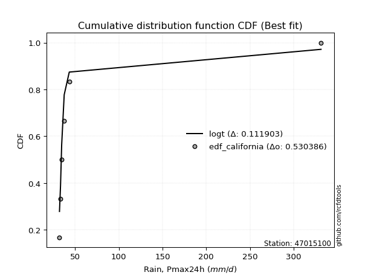</img>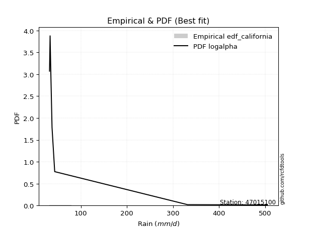</img>

</div>


### 2. EDF Hazen (1930)

Hazen method for plotting positions is a formula used to estimate the empirical cumulative probability distribution of flood events or other hydrological data. This formula often results in biased estimations, particularly when extrapolating to extreme events (high return periods).

<div align="center">


$P=(m-0.5)/n$


</div>


**2.1. Empirical values**

<div align="center">

|                | 0                   | 1                   | 2                   | 3         | 4                  | 5                  | 6                  |
|:---------------|:--------------------|:--------------------|:--------------------|:----------|:-------------------|:-------------------|:-------------------|
| date           | 2022                | 2020                | 2021                | 2019      | 2023               | 2024               | 2025               |
| x              | 32.0                | 33.2                | 34.5                | 37.4      | 43.2               | 331.5              | 504.8              |
| m              | 1                   | 2                   | 3                   | 4         | 5                  | 6                  | 7                  |
| empirical_dist | edf_hazen           | edf_hazen           | edf_hazen           | edf_hazen | edf_hazen          | edf_hazen          | edf_hazen          |
| empirical      | 0.07142857142857142 | 0.21428571428571427 | 0.35714285714285715 | 0.5       | 0.6428571428571429 | 0.7857142857142857 | 0.9285714285714286 |
| empirical_tr   | 1.0769230769230769  | 1.2727272727272727  | 1.5555555555555558  | 2.0       | 2.8000000000000003 | 4.666666666666666  | 14.000000000000007 |

</div>


**2.2. Kolmogorov-Smirnov fit test (sorted by Δ)**


<div align="center">

|                | 0                   | 1                   | 2                   | 3                   | 4                   | 5                   | 6                   | 7                   | 8                   | 9                   | 10                  | 11                  | 12                  | 13                  | 14                  | 15                  | 16                  | 17                  | 18                  | 19                  | 20                  | 21                  | 22                  | 23                  | 24                  | 25                  | 26                  | 27                  | 28                  | 29                  | 30                  | 31                  | 32                  | 33                  | 34                  | 35                  | 36                  | 37                  | 38                  | 39                  | 40                  | 41                  | 42                  | 43                  | 44                  | 45                  | 46                  | 47                  | 48                  | 49                  | 50                  | 51                  | 52                  | 53                  | 54                  | 55                  | 56                  | 57                  | 58                  | 59                  | 60                  | 61                  | 62                  | 63                  | 64                  | 65                  | 66                  | 67                  | 68                  | 69                  | 70                  | 71                  | 72                  | 73                  | 74                  | 75                  | 76                  | 77                  | 78                  | 79                  | 80                  | 81                  | 82                  | 83                  | 84                  | 85                  | 86                  | 87                  | 88                  | 89                  | 90                  | 91                  | 92                  | 93                  | 94                  | 95                  | 96                  | 97                  | 98                  | 99                  | 100                 | 101                 | 102                 | 103                 | 104                 | 105                 | 106                 | 107                 | 108                 | 109                 | 110                 | 111                 | 112                 | 113                 | 114                 | 115                 | 116                 | 117                 | 118                 | 119                 | 120                 | 121                 | 122                 | 123                 | 124                 | 125                 | 126                 | 127                 | 128                 | 129                 | 130                 | 131                 | 132                 | 133                 | 134                 | 135                 | 136                 | 137                 | 138                 | 139                 | 140                 | 141                 | 142                 | 143                 | 144                 | 145                 | 146                 | 147                 | 148                 | 149                 | 150                 | 151                 | 152                 | 153                 | 154                 | 155                 | 156                 | 157                 | 158                 | 159                 |
|:---------------|:--------------------|:--------------------|:--------------------|:--------------------|:--------------------|:--------------------|:--------------------|:--------------------|:--------------------|:--------------------|:--------------------|:--------------------|:--------------------|:--------------------|:--------------------|:--------------------|:--------------------|:--------------------|:--------------------|:--------------------|:--------------------|:--------------------|:--------------------|:--------------------|:--------------------|:--------------------|:--------------------|:--------------------|:--------------------|:--------------------|:--------------------|:--------------------|:--------------------|:--------------------|:--------------------|:--------------------|:--------------------|:--------------------|:--------------------|:--------------------|:--------------------|:--------------------|:--------------------|:--------------------|:--------------------|:--------------------|:--------------------|:--------------------|:--------------------|:--------------------|:--------------------|:--------------------|:--------------------|:--------------------|:--------------------|:--------------------|:--------------------|:--------------------|:--------------------|:--------------------|:--------------------|:--------------------|:--------------------|:--------------------|:--------------------|:--------------------|:--------------------|:--------------------|:--------------------|:--------------------|:--------------------|:--------------------|:--------------------|:--------------------|:--------------------|:--------------------|:--------------------|:--------------------|:--------------------|:--------------------|:--------------------|:--------------------|:--------------------|:--------------------|:--------------------|:--------------------|:--------------------|:--------------------|:--------------------|:--------------------|:--------------------|:--------------------|:--------------------|:--------------------|:--------------------|:--------------------|:--------------------|:--------------------|:--------------------|:--------------------|:--------------------|:--------------------|:--------------------|:--------------------|:--------------------|:--------------------|:--------------------|:--------------------|:--------------------|:--------------------|:--------------------|:--------------------|:--------------------|:--------------------|:--------------------|:--------------------|:--------------------|:--------------------|:--------------------|:--------------------|:--------------------|:--------------------|:--------------------|:--------------------|:--------------------|:--------------------|:--------------------|:--------------------|:--------------------|:--------------------|:--------------------|:--------------------|:--------------------|:--------------------|:--------------------|:--------------------|:--------------------|:--------------------|:--------------------|:--------------------|:--------------------|:--------------------|:--------------------|:--------------------|:--------------------|:--------------------|:--------------------|:--------------------|:--------------------|:--------------------|:--------------------|:--------------------|:--------------------|:--------------------|:--------------------|:--------------------|:--------------------|:--------------------|:--------------------|:--------------------|
| station        | 47015100            | 47015100            | 47015100            | 47015100            | 47015100            | 47015100            | 47015100            | 47015100            | 47015100            | 47015100            | 47015100            | 47015100            | 47015100            | 47015100            | 47015100            | 47015100            | 47015100            | 47015100            | 47015100            | 47015100            | 47015100            | 47015100            | 47015100            | 47015100            | 47015100            | 47015100            | 47015100            | 47015100            | 47015100            | 47015100            | 47015100            | 47015100            | 47015100            | 47015100            | 47015100            | 47015100            | 47015100            | 47015100            | 47015100            | 47015100            | 47015100            | 47015100            | 47015100            | 47015100            | 47015100            | 47015100            | 47015100            | 47015100            | 47015100            | 47015100            | 47015100            | 47015100            | 47015100            | 47015100            | 47015100            | 47015100            | 47015100            | 47015100            | 47015100            | 47015100            | 47015100            | 47015100            | 47015100            | 47015100            | 47015100            | 47015100            | 47015100            | 47015100            | 47015100            | 47015100            | 47015100            | 47015100            | 47015100            | 47015100            | 47015100            | 47015100            | 47015100            | 47015100            | 47015100            | 47015100            | 47015100            | 47015100            | 47015100            | 47015100            | 47015100            | 47015100            | 47015100            | 47015100            | 47015100            | 47015100            | 47015100            | 47015100            | 47015100            | 47015100            | 47015100            | 47015100            | 47015100            | 47015100            | 47015100            | 47015100            | 47015100            | 47015100            | 47015100            | 47015100            | 47015100            | 47015100            | 47015100            | 47015100            | 47015100            | 47015100            | 47015100            | 47015100            | 47015100            | 47015100            | 47015100            | 47015100            | 47015100            | 47015100            | 47015100            | 47015100            | 47015100            | 47015100            | 47015100            | 47015100            | 47015100            | 47015100            | 47015100            | 47015100            | 47015100            | 47015100            | 47015100            | 47015100            | 47015100            | 47015100            | 47015100            | 47015100            | 47015100            | 47015100            | 47015100            | 47015100            | 47015100            | 47015100            | 47015100            | 47015100            | 47015100            | 47015100            | 47015100            | 47015100            | 47015100            | 47015100            | 47015100            | 47015100            | 47015100            | 47015100            | 47015100            | 47015100            | 47015100            | 47015100            | 47015100            | 47015100            |
| empirical_dist | edf_hazen           | edf_hazen           | edf_hazen           | edf_hazen           | edf_hazen           | edf_hazen           | edf_hazen           | edf_hazen           | edf_hazen           | edf_hazen           | edf_hazen           | edf_hazen           | edf_hazen           | edf_hazen           | edf_hazen           | edf_hazen           | edf_hazen           | edf_hazen           | edf_hazen           | edf_hazen           | edf_hazen           | edf_hazen           | edf_hazen           | edf_hazen           | edf_hazen           | edf_hazen           | edf_hazen           | edf_hazen           | edf_hazen           | edf_hazen           | edf_hazen           | edf_hazen           | edf_hazen           | edf_hazen           | edf_hazen           | edf_hazen           | edf_hazen           | edf_hazen           | edf_hazen           | edf_hazen           | edf_hazen           | edf_hazen           | edf_hazen           | edf_hazen           | edf_hazen           | edf_hazen           | edf_hazen           | edf_hazen           | edf_hazen           | edf_hazen           | edf_hazen           | edf_hazen           | edf_hazen           | edf_hazen           | edf_hazen           | edf_hazen           | edf_hazen           | edf_hazen           | edf_hazen           | edf_hazen           | edf_hazen           | edf_hazen           | edf_hazen           | edf_hazen           | edf_hazen           | edf_hazen           | edf_hazen           | edf_hazen           | edf_hazen           | edf_hazen           | edf_hazen           | edf_hazen           | edf_hazen           | edf_hazen           | edf_hazen           | edf_hazen           | edf_hazen           | edf_hazen           | edf_hazen           | edf_hazen           | edf_hazen           | edf_hazen           | edf_hazen           | edf_hazen           | edf_hazen           | edf_hazen           | edf_hazen           | edf_hazen           | edf_hazen           | edf_hazen           | edf_hazen           | edf_hazen           | edf_hazen           | edf_hazen           | edf_hazen           | edf_hazen           | edf_hazen           | edf_hazen           | edf_hazen           | edf_hazen           | edf_hazen           | edf_hazen           | edf_hazen           | edf_hazen           | edf_hazen           | edf_hazen           | edf_hazen           | edf_hazen           | edf_hazen           | edf_hazen           | edf_hazen           | edf_hazen           | edf_hazen           | edf_hazen           | edf_hazen           | edf_hazen           | edf_hazen           | edf_hazen           | edf_hazen           | edf_hazen           | edf_hazen           | edf_hazen           | edf_hazen           | edf_hazen           | edf_hazen           | edf_hazen           | edf_hazen           | edf_hazen           | edf_hazen           | edf_hazen           | edf_hazen           | edf_hazen           | edf_hazen           | edf_hazen           | edf_hazen           | edf_hazen           | edf_hazen           | edf_hazen           | edf_hazen           | edf_hazen           | edf_hazen           | edf_hazen           | edf_hazen           | edf_hazen           | edf_hazen           | edf_hazen           | edf_hazen           | edf_hazen           | edf_hazen           | edf_hazen           | edf_hazen           | edf_hazen           | edf_hazen           | edf_hazen           | edf_hazen           | edf_hazen           | edf_hazen           | edf_hazen           | edf_hazen           | edf_hazen           |
| p_dist         | loggenextreme       | loginvweibull       | f                   | invgamma            | logf                | loginvgamma         | lomax               | logburr             | loghalfgennorm      | logburr12           | loginvgauss         | lognakagami         | fatiguelife         | loggengamma         | loglomax            | invgauss            | logalpha            | truncpareto         | lognct              | halfgennorm         | logtruncweibull_min | logtruncpareto      | genpareto           | logmielke           | erlang              | alpha               | logbradford         | gamma               | loggamma            | loggamma            | logerlang           | genextreme          | logexponpow         | logdgamma           | logvonmises_line    | logwrapcauchy       | logweibull_min      | loghalflogistic     | logwald             | tukeylambda         | loghalfnorm         | logfoldnorm         | logarcsine          | loggennorm          | t                   | logmoyal            | logpearson3         | burr                | lograyleigh         | loggumbel_r         | powerlaw            | vonmises_line       | arcsine             | wrapcauchy          | loggenpareto        | logsemicircular     | foldnorm            | loggenlogistic      | logmaxwell          | halfnorm            | logbetaprime        | loganglit           | halflogistic        | logncf              | nct                 | truncweibull_min    | ncf                 | betaprime           | logloglaplace       | logjohnsonsu        | logloggamma         | pearson3            | loglevy_l           | logcrystalball      | lognorm             | logt                | semicircular        | rayleigh            | moyal               | logkstwobign        | burr12              | logpowerlaw         | dgamma              | logexponnorm        | gausshyper          | gumbel_r            | maxwell             | loggenexpon         | anglit              | weibull_min         | loglogistic         | logtruncnorm        | wald                | nakagami            | loghypsecant        | logexponweib        | norm                | crystalball         | logrice             | logcosine           | logweibull_max      | gennorm             | logfatiguelife      | genlogistic         | johnsonsu           | levy_l              | loggumbel_l         | gengamma            | logbeta             | loggompertz         | logistic            | loglaplace          | loglaplace          | exponweib           | hypsecant           | kstwobign           | exponpow            | cosine              | gumbel_l            | logrdist            | logargus            | rice                | laplace             | loggausshyper       | logdweibull         | dweibull            | logtriang           | invweibull          | argus               | kappa3              | logksone            | logskewnorm         | logtruncexpon       | logkappa4           | logtukeylambda      | loguniform          | logkappa3           | ksone               | logjohnsonsb        | exponnorm           | genexpon            | loggenhalflogistic  | beta                | bradford            | truncnorm           | genhalflogistic     | skewnorm            | truncexpon          | kappa4              | triang              | gompertz            | logtrapezoid        | uniform             | trapezoid           | weibull_max         | johnsonsb           | rdist               | logvonmises         | vonmises            | mielke              |
| delta          | 0.0729130757774985  | 0.07291821972156487 | 0.09308855385918391 | 0.09308919316107744 | 0.09673040195073868 | 0.09674892314439265 | 0.09800863675962446 | 0.10982369620787047 | 0.12493333929561701 | 0.1250748441051932  | 0.1366253638316267  | 0.14161475245845212 | 0.14291171542200043 | 0.14427978705680045 | 0.1518061324972878  | 0.16050089589448846 | 0.16486071739809582 | 0.16670509590241178 | 0.16882698716728373 | 0.1702961536885007  | 0.18484330490060974 | 0.18542064575906536 | 0.1873824796112029  | 0.1955818310542381  | 0.19606737033574828 | 0.2000577734008847  | 0.20056997105027263 | 0.2019396166330466  | 0.20389395422536893 | 0.20389395422536893 | 0.20797783351602062 | 0.2101535711269534  | 0.2113046401092471  | 0.22431724595460265 | 0.2276864240861368  | 0.23646717802613448 | 0.24053812678158126 | 0.24194766449357802 | 0.24292995746572882 | 0.24434182395059878 | 0.2450760144244496  | 0.2455909950560921  | 0.25604915145744467 | 0.2565213873430666  | 0.2584789331082349  | 0.2651614428476161  | 0.2735974646148692  | 0.2756239225012078  | 0.2780999935325056  | 0.27918508261051833 | 0.2797078087637366  | 0.2805618953990088  | 0.2807371106511569  | 0.283419895393894   | 0.287019363134901   | 0.2876594091784552  | 0.2877888698104183  | 0.2894849421286686  | 0.2897189503083491  | 0.29282686753116527 | 0.2931682407607443  | 0.2971868393337956  | 0.29822828245890715 | 0.298957647168942   | 0.29948266588469097 | 0.3003099313364062  | 0.3018874182680117  | 0.3041867902384092  | 0.3112790963996338  | 0.3148420925202514  | 0.3148863579924894  | 0.31624235151906166 | 0.31909031460879156 | 0.3197292509095479  | 0.3197295306753901  | 0.31972985200930887 | 0.3220488725467744  | 0.3221909564728501  | 0.3249712202875791  | 0.3264240039042141  | 0.3286531864117631  | 0.3291072131772047  | 0.3302950245066097  | 0.3306730459892232  | 0.3310614832324508  | 0.33171004269225035 | 0.3326654392514494  | 0.3329838028326472  | 0.3330591173302181  | 0.33411086078840213 | 0.33973635215860265 | 0.3405498733728904  | 0.3433768822489408  | 0.35144260623570883 | 0.35471040276117166 | 0.35525965695441414 | 0.3587873980816375  | 0.3587874056467308  | 0.35991093055643053 | 0.36381031559784915 | 0.3639390641894214  | 0.365545552529452   | 0.36597070509763996 | 0.3665037444618877  | 0.37002708164232123 | 0.37090402651003984 | 0.3750935199901969  | 0.37543451595904687 | 0.3758305647898519  | 0.3784413206088587  | 0.3808002808342921  | 0.381594670236633   | 0.381594670236633   | 0.384059627376994   | 0.39626598745215613 | 0.3989277179649108  | 0.4003340998937267  | 0.40324023136501164 | 0.40622709737839524 | 0.41162621100108127 | 0.41336655311049497 | 0.41727859338321877 | 0.41980983376578695 | 0.41989197166142866 | 0.42857142856140484 | 0.42857142857143127 | 0.4338013916599015  | 0.4416580422188137  | 0.4444260091257294  | 0.45907736758809764 | 0.46886082877100066 | 0.46982339956014696 | 0.4818628598734276  | 0.4979588015909159  | 0.5142220287133027  | 0.5340615659537722  | 0.5340648360038907  | 0.5397832567883329  | 0.5467264517742306  | 0.5468453411208606  | 0.5486778828556533  | 0.5541534001598971  | 0.5578613878905961  | 0.5659448324949029  | 0.5775973144470739  | 0.5849801143490538  | 0.6006450759898959  | 0.6068233499150529  | 0.6096470555626073  | 0.609949018335148   | 0.6107922892005972  | 0.6125824255415795  | 0.619168479574571   | 0.6319535075141096  | 0.6349241380807721  | 0.6528573634542144  | 0.7962904436701982  | 1.2559264887021244  | 79.876412582735     | nan                 |
| deltao         | 0.48442053926100004 | 0.48442053926100004 | 0.48442053926100004 | 0.48442053926100004 | 0.48442053926100004 | 0.48442053926100004 | 0.48442053926100004 | 0.48442053926100004 | 0.48442053926100004 | 0.48442053926100004 | 0.48442053926100004 | 0.48442053926100004 | 0.48442053926100004 | 0.48442053926100004 | 0.48442053926100004 | 0.48442053926100004 | 0.48442053926100004 | 0.48442053926100004 | 0.48442053926100004 | 0.48442053926100004 | 0.48442053926100004 | 0.48442053926100004 | 0.48442053926100004 | 0.48442053926100004 | 0.48442053926100004 | 0.48442053926100004 | 0.48442053926100004 | 0.48442053926100004 | 0.48442053926100004 | 0.48442053926100004 | 0.48442053926100004 | 0.48442053926100004 | 0.48442053926100004 | 0.48442053926100004 | 0.48442053926100004 | 0.48442053926100004 | 0.48442053926100004 | 0.48442053926100004 | 0.48442053926100004 | 0.48442053926100004 | 0.48442053926100004 | 0.48442053926100004 | 0.48442053926100004 | 0.48442053926100004 | 0.48442053926100004 | 0.48442053926100004 | 0.48442053926100004 | 0.48442053926100004 | 0.48442053926100004 | 0.48442053926100004 | 0.48442053926100004 | 0.48442053926100004 | 0.48442053926100004 | 0.48442053926100004 | 0.48442053926100004 | 0.48442053926100004 | 0.48442053926100004 | 0.48442053926100004 | 0.48442053926100004 | 0.48442053926100004 | 0.48442053926100004 | 0.48442053926100004 | 0.48442053926100004 | 0.48442053926100004 | 0.48442053926100004 | 0.48442053926100004 | 0.48442053926100004 | 0.48442053926100004 | 0.48442053926100004 | 0.48442053926100004 | 0.48442053926100004 | 0.48442053926100004 | 0.48442053926100004 | 0.48442053926100004 | 0.48442053926100004 | 0.48442053926100004 | 0.48442053926100004 | 0.48442053926100004 | 0.48442053926100004 | 0.48442053926100004 | 0.48442053926100004 | 0.48442053926100004 | 0.48442053926100004 | 0.48442053926100004 | 0.48442053926100004 | 0.48442053926100004 | 0.48442053926100004 | 0.48442053926100004 | 0.48442053926100004 | 0.48442053926100004 | 0.48442053926100004 | 0.48442053926100004 | 0.48442053926100004 | 0.48442053926100004 | 0.48442053926100004 | 0.48442053926100004 | 0.48442053926100004 | 0.48442053926100004 | 0.48442053926100004 | 0.48442053926100004 | 0.48442053926100004 | 0.48442053926100004 | 0.48442053926100004 | 0.48442053926100004 | 0.48442053926100004 | 0.48442053926100004 | 0.48442053926100004 | 0.48442053926100004 | 0.48442053926100004 | 0.48442053926100004 | 0.48442053926100004 | 0.48442053926100004 | 0.48442053926100004 | 0.48442053926100004 | 0.48442053926100004 | 0.48442053926100004 | 0.48442053926100004 | 0.48442053926100004 | 0.48442053926100004 | 0.48442053926100004 | 0.48442053926100004 | 0.48442053926100004 | 0.48442053926100004 | 0.48442053926100004 | 0.48442053926100004 | 0.48442053926100004 | 0.48442053926100004 | 0.48442053926100004 | 0.48442053926100004 | 0.48442053926100004 | 0.48442053926100004 | 0.48442053926100004 | 0.48442053926100004 | 0.48442053926100004 | 0.48442053926100004 | 0.48442053926100004 | 0.48442053926100004 | 0.48442053926100004 | 0.48442053926100004 | 0.48442053926100004 | 0.48442053926100004 | 0.48442053926100004 | 0.48442053926100004 | 0.48442053926100004 | 0.48442053926100004 | 0.48442053926100004 | 0.48442053926100004 | 0.48442053926100004 | 0.48442053926100004 | 0.48442053926100004 | 0.48442053926100004 | 0.48442053926100004 | 0.48442053926100004 | 0.48442053926100004 | 0.48442053926100004 | 0.48442053926100004 | 0.48442053926100004 | 0.48442053926100004 | 0.48442053926100004 | 0.48442053926100004 |
| eval           | Δo > Δ              | Δo > Δ              | Δo > Δ              | Δo > Δ              | Δo > Δ              | Δo > Δ              | Δo > Δ              | Δo > Δ              | Δo > Δ              | Δo > Δ              | Δo > Δ              | Δo > Δ              | Δo > Δ              | Δo > Δ              | Δo > Δ              | Δo > Δ              | Δo > Δ              | Δo > Δ              | Δo > Δ              | Δo > Δ              | Δo > Δ              | Δo > Δ              | Δo > Δ              | Δo > Δ              | Δo > Δ              | Δo > Δ              | Δo > Δ              | Δo > Δ              | Δo > Δ              | Δo > Δ              | Δo > Δ              | Δo > Δ              | Δo > Δ              | Δo > Δ              | Δo > Δ              | Δo > Δ              | Δo > Δ              | Δo > Δ              | Δo > Δ              | Δo > Δ              | Δo > Δ              | Δo > Δ              | Δo > Δ              | Δo > Δ              | Δo > Δ              | Δo > Δ              | Δo > Δ              | Δo > Δ              | Δo > Δ              | Δo > Δ              | Δo > Δ              | Δo > Δ              | Δo > Δ              | Δo > Δ              | Δo > Δ              | Δo > Δ              | Δo > Δ              | Δo > Δ              | Δo > Δ              | Δo > Δ              | Δo > Δ              | Δo > Δ              | Δo > Δ              | Δo > Δ              | Δo > Δ              | Δo > Δ              | Δo > Δ              | Δo > Δ              | Δo > Δ              | Δo > Δ              | Δo > Δ              | Δo > Δ              | Δo > Δ              | Δo > Δ              | Δo > Δ              | Δo > Δ              | Δo > Δ              | Δo > Δ              | Δo > Δ              | Δo > Δ              | Δo > Δ              | Δo > Δ              | Δo > Δ              | Δo > Δ              | Δo > Δ              | Δo > Δ              | Δo > Δ              | Δo > Δ              | Δo > Δ              | Δo > Δ              | Δo > Δ              | Δo > Δ              | Δo > Δ              | Δo > Δ              | Δo > Δ              | Δo > Δ              | Δo > Δ              | Δo > Δ              | Δo > Δ              | Δo > Δ              | Δo > Δ              | Δo > Δ              | Δo > Δ              | Δo > Δ              | Δo > Δ              | Δo > Δ              | Δo > Δ              | Δo > Δ              | Δo > Δ              | Δo > Δ              | Δo > Δ              | Δo > Δ              | Δo > Δ              | Δo > Δ              | Δo > Δ              | Δo > Δ              | Δo > Δ              | Δo > Δ              | Δo > Δ              | Δo > Δ              | Δo > Δ              | Δo > Δ              | Δo > Δ              | Δo > Δ              | Δo > Δ              | Δo > Δ              | Δo > Δ              | Δo > Δ              | Δo > Δ              | Δo > Δ              | Δo > Δ              | Δo > Δ              | Δo > Δ              | Δo <= Δ             | Δo <= Δ             | Δo <= Δ             | Δo <= Δ             | Δo <= Δ             | Δo <= Δ             | Δo <= Δ             | Δo <= Δ             | Δo <= Δ             | Δo <= Δ             | Δo <= Δ             | Δo <= Δ             | Δo <= Δ             | Δo <= Δ             | Δo <= Δ             | Δo <= Δ             | Δo <= Δ             | Δo <= Δ             | Δo <= Δ             | Δo <= Δ             | Δo <= Δ             | Δo <= Δ             | Δo <= Δ             | Δo <= Δ             | Δo <= Δ             | Δo <= Δ             | Δo <= Δ             |
| fit            | 1                   | 1                   | 1                   | 1                   | 1                   | 1                   | 1                   | 1                   | 1                   | 1                   | 1                   | 1                   | 1                   | 1                   | 1                   | 1                   | 1                   | 1                   | 1                   | 1                   | 1                   | 1                   | 1                   | 1                   | 1                   | 1                   | 1                   | 1                   | 1                   | 1                   | 1                   | 1                   | 1                   | 1                   | 1                   | 1                   | 1                   | 1                   | 1                   | 1                   | 1                   | 1                   | 1                   | 1                   | 1                   | 1                   | 1                   | 1                   | 1                   | 1                   | 1                   | 1                   | 1                   | 1                   | 1                   | 1                   | 1                   | 1                   | 1                   | 1                   | 1                   | 1                   | 1                   | 1                   | 1                   | 1                   | 1                   | 1                   | 1                   | 1                   | 1                   | 1                   | 1                   | 1                   | 1                   | 1                   | 1                   | 1                   | 1                   | 1                   | 1                   | 1                   | 1                   | 1                   | 1                   | 1                   | 1                   | 1                   | 1                   | 1                   | 1                   | 1                   | 1                   | 1                   | 1                   | 1                   | 1                   | 1                   | 1                   | 1                   | 1                   | 1                   | 1                   | 1                   | 1                   | 1                   | 1                   | 1                   | 1                   | 1                   | 1                   | 1                   | 1                   | 1                   | 1                   | 1                   | 1                   | 1                   | 1                   | 1                   | 1                   | 1                   | 1                   | 1                   | 1                   | 1                   | 1                   | 1                   | 1                   | 1                   | 1                   | 1                   | 1                   | 0                   | 0                   | 0                   | 0                   | 0                   | 0                   | 0                   | 0                   | 0                   | 0                   | 0                   | 0                   | 0                   | 0                   | 0                   | 0                   | 0                   | 0                   | 0                   | 0                   | 0                   | 0                   | 0                   | 0                   | 0                   | 0                   | 0                   |
| n              | 7                   | 7                   | 7                   | 7                   | 7                   | 7                   | 7                   | 7                   | 7                   | 7                   | 7                   | 7                   | 7                   | 7                   | 7                   | 7                   | 7                   | 7                   | 7                   | 7                   | 7                   | 7                   | 7                   | 7                   | 7                   | 7                   | 7                   | 7                   | 7                   | 7                   | 7                   | 7                   | 7                   | 7                   | 7                   | 7                   | 7                   | 7                   | 7                   | 7                   | 7                   | 7                   | 7                   | 7                   | 7                   | 7                   | 7                   | 7                   | 7                   | 7                   | 7                   | 7                   | 7                   | 7                   | 7                   | 7                   | 7                   | 7                   | 7                   | 7                   | 7                   | 7                   | 7                   | 7                   | 7                   | 7                   | 7                   | 7                   | 7                   | 7                   | 7                   | 7                   | 7                   | 7                   | 7                   | 7                   | 7                   | 7                   | 7                   | 7                   | 7                   | 7                   | 7                   | 7                   | 7                   | 7                   | 7                   | 7                   | 7                   | 7                   | 7                   | 7                   | 7                   | 7                   | 7                   | 7                   | 7                   | 7                   | 7                   | 7                   | 7                   | 7                   | 7                   | 7                   | 7                   | 7                   | 7                   | 7                   | 7                   | 7                   | 7                   | 7                   | 7                   | 7                   | 7                   | 7                   | 7                   | 7                   | 7                   | 7                   | 7                   | 7                   | 7                   | 7                   | 7                   | 7                   | 7                   | 7                   | 7                   | 7                   | 7                   | 7                   | 7                   | 7                   | 7                   | 7                   | 7                   | 7                   | 7                   | 7                   | 7                   | 7                   | 7                   | 7                   | 7                   | 7                   | 7                   | 7                   | 7                   | 7                   | 7                   | 7                   | 7                   | 7                   | 7                   | 7                   | 7                   | 7                   | 7                   | 7                   |
| best_fit       | 1                   | 0                   | 0                   | 0                   | 0                   | 0                   | 0                   | 0                   | 0                   | 0                   | 0                   | 0                   | 0                   | 0                   | 0                   | 0                   | 0                   | 0                   | 0                   | 0                   | 0                   | 0                   | 0                   | 0                   | 0                   | 0                   | 0                   | 0                   | 0                   | 0                   | 0                   | 0                   | 0                   | 0                   | 0                   | 0                   | 0                   | 0                   | 0                   | 0                   | 0                   | 0                   | 0                   | 0                   | 0                   | 0                   | 0                   | 0                   | 0                   | 0                   | 0                   | 0                   | 0                   | 0                   | 0                   | 0                   | 0                   | 0                   | 0                   | 0                   | 0                   | 0                   | 0                   | 0                   | 0                   | 0                   | 0                   | 0                   | 0                   | 0                   | 0                   | 0                   | 0                   | 0                   | 0                   | 0                   | 0                   | 0                   | 0                   | 0                   | 0                   | 0                   | 0                   | 0                   | 0                   | 0                   | 0                   | 0                   | 0                   | 0                   | 0                   | 0                   | 0                   | 0                   | 0                   | 0                   | 0                   | 0                   | 0                   | 0                   | 0                   | 0                   | 0                   | 0                   | 0                   | 0                   | 0                   | 0                   | 0                   | 0                   | 0                   | 0                   | 0                   | 0                   | 0                   | 0                   | 0                   | 0                   | 0                   | 0                   | 0                   | 0                   | 0                   | 0                   | 0                   | 0                   | 0                   | 0                   | 0                   | 0                   | 0                   | 0                   | 0                   | 0                   | 0                   | 0                   | 0                   | 0                   | 0                   | 0                   | 0                   | 0                   | 0                   | 0                   | 0                   | 0                   | 0                   | 0                   | 0                   | 0                   | 0                   | 0                   | 0                   | 0                   | 0                   | 0                   | 0                   | 0                   | 0                   | 0                   |
| best_fit_sort  | 1                   | 2                   | 3                   | 4                   | 5                   | 6                   | 7                   | 8                   | 9                   | 10                  | 11                  | 12                  | 13                  | 14                  | 15                  | 16                  | 17                  | 18                  | 19                  | 20                  | 21                  | 22                  | 23                  | 24                  | 25                  | 26                  | 27                  | 28                  | 29                  | 30                  | 31                  | 32                  | 33                  | 34                  | 35                  | 36                  | 37                  | 38                  | 39                  | 40                  | 41                  | 42                  | 43                  | 44                  | 45                  | 46                  | 47                  | 48                  | 49                  | 50                  | 51                  | 52                  | 53                  | 54                  | 55                  | 56                  | 57                  | 58                  | 59                  | 60                  | 61                  | 62                  | 63                  | 64                  | 65                  | 66                  | 67                  | 68                  | 69                  | 70                  | 71                  | 72                  | 73                  | 74                  | 75                  | 76                  | 77                  | 78                  | 79                  | 80                  | 81                  | 82                  | 83                  | 84                  | 85                  | 86                  | 87                  | 88                  | 89                  | 90                  | 91                  | 92                  | 93                  | 94                  | 95                  | 96                  | 97                  | 98                  | 99                  | 100                 | 101                 | 102                 | 103                 | 104                 | 105                 | 106                 | 107                 | 108                 | 109                 | 110                 | 111                 | 112                 | 113                 | 114                 | 115                 | 116                 | 117                 | 118                 | 119                 | 120                 | 121                 | 122                 | 123                 | 124                 | 125                 | 126                 | 127                 | 128                 | 129                 | 130                 | 131                 | 132                 | 133                 | 134                 | 135                 | 136                 | 137                 | 138                 | 139                 | 140                 | 141                 | 142                 | 143                 | 144                 | 145                 | 146                 | 147                 | 148                 | 149                 | 150                 | 151                 | 152                 | 153                 | 154                 | 155                 | 156                 | 157                 | 158                 | 159                 | 160                 |

</div>


**2.3. Best fit**

<div align="center">

|   id |   station | empirical_dist   | p_dist        |     delta |   deltao | eval   |   fit |   n |   best_fit |   best_fit_sort |
|-----:|----------:|:-----------------|:--------------|----------:|---------:|:-------|------:|----:|-----------:|----------------:|
|    0 |  47015100 | edf_hazen        | loggenextreme | 0.0729131 | 0.484421 | Δo > Δ |     1 |   7 |          1 |               1 |

</div>


<div align="center">

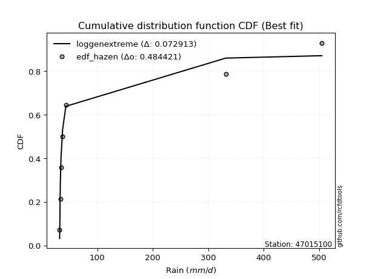</img>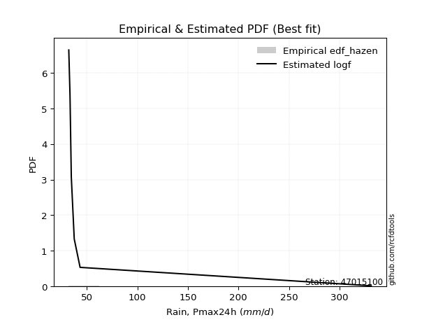</img>

</div>


### 3. EDF Weibull (1939)

Weibull plotting position formula is an empirical method used to estimate the non-exceedance probability or plotting position for a set of observed data, is often recommended or widely used in practice, particularly in flood frequency analysis.

<div align="center">


$P=m/(n+1)$


</div>


**3.1. Empirical values**

<div align="center">

|                | 0                  | 1                  | 2           | 3           | 4                  | 5           | 6           |
|:---------------|:-------------------|:-------------------|:------------|:------------|:-------------------|:------------|:------------|
| date           | 2022               | 2020               | 2021        | 2019        | 2023               | 2024        | 2025        |
| x              | 32.0               | 33.2               | 34.5        | 37.4        | 43.2               | 331.5       | 504.8       |
| m              | 1                  | 2                  | 3           | 4           | 5                  | 6           | 7           |
| empirical_dist | edf_weibull        | edf_weibull        | edf_weibull | edf_weibull | edf_weibull        | edf_weibull | edf_weibull |
| empirical      | 0.125              | 0.25               | 0.375       | 0.5         | 0.625              | 0.75        | 0.875       |
| empirical_tr   | 1.1428571428571428 | 1.3333333333333333 | 1.6         | 2.0         | 2.6666666666666665 | 4.0         | 8.0         |

</div>


**3.2. Kolmogorov-Smirnov fit test (sorted by Δ)**


<div align="center">

|                | 0                   | 1                   | 2                   | 3                   | 4                   | 5                   | 6                   | 7                   | 8                   | 9                   | 10                  | 11                  | 12                  | 13                  | 14                  | 15                  | 16                  | 17                  | 18                  | 19                  | 20                  | 21                  | 22                  | 23                  | 24                  | 25                  | 26                  | 27                  | 28                  | 29                  | 30                  | 31                  | 32                  | 33                  | 34                  | 35                  | 36                  | 37                  | 38                  | 39                  | 40                  | 41                  | 42                  | 43                  | 44                  | 45                  | 46                  | 47                  | 48                  | 49                  | 50                  | 51                  | 52                  | 53                  | 54                  | 55                  | 56                  | 57                  | 58                  | 59                  | 60                  | 61                  | 62                  | 63                  | 64                  | 65                  | 66                  | 67                  | 68                  | 69                  | 70                  | 71                  | 72                  | 73                  | 74                  | 75                  | 76                  | 77                  | 78                  | 79                  | 80                  | 81                  | 82                  | 83                  | 84                  | 85                  | 86                  | 87                  | 88                  | 89                  | 90                  | 91                  | 92                  | 93                  | 94                  | 95                  | 96                  | 97                  | 98                  | 99                  | 100                 | 101                 | 102                 | 103                 | 104                 | 105                 | 106                 | 107                 | 108                 | 109                 | 110                 | 111                 | 112                 | 113                 | 114                 | 115                 | 116                 | 117                 | 118                 | 119                 | 120                 | 121                 | 122                 | 123                 | 124                 | 125                 | 126                 | 127                 | 128                 | 129                 | 130                 | 131                 | 132                 | 133                 | 134                 | 135                 | 136                 | 137                 | 138                 | 139                 | 140                 | 141                 | 142                 | 143                 | 144                 | 145                 | 146                 | 147                 | 148                 | 149                 | 150                 | 151                 | 152                 | 153                 | 154                 | 155                 | 156                 | 157                 | 158                 | 159                 |
|:---------------|:--------------------|:--------------------|:--------------------|:--------------------|:--------------------|:--------------------|:--------------------|:--------------------|:--------------------|:--------------------|:--------------------|:--------------------|:--------------------|:--------------------|:--------------------|:--------------------|:--------------------|:--------------------|:--------------------|:--------------------|:--------------------|:--------------------|:--------------------|:--------------------|:--------------------|:--------------------|:--------------------|:--------------------|:--------------------|:--------------------|:--------------------|:--------------------|:--------------------|:--------------------|:--------------------|:--------------------|:--------------------|:--------------------|:--------------------|:--------------------|:--------------------|:--------------------|:--------------------|:--------------------|:--------------------|:--------------------|:--------------------|:--------------------|:--------------------|:--------------------|:--------------------|:--------------------|:--------------------|:--------------------|:--------------------|:--------------------|:--------------------|:--------------------|:--------------------|:--------------------|:--------------------|:--------------------|:--------------------|:--------------------|:--------------------|:--------------------|:--------------------|:--------------------|:--------------------|:--------------------|:--------------------|:--------------------|:--------------------|:--------------------|:--------------------|:--------------------|:--------------------|:--------------------|:--------------------|:--------------------|:--------------------|:--------------------|:--------------------|:--------------------|:--------------------|:--------------------|:--------------------|:--------------------|:--------------------|:--------------------|:--------------------|:--------------------|:--------------------|:--------------------|:--------------------|:--------------------|:--------------------|:--------------------|:--------------------|:--------------------|:--------------------|:--------------------|:--------------------|:--------------------|:--------------------|:--------------------|:--------------------|:--------------------|:--------------------|:--------------------|:--------------------|:--------------------|:--------------------|:--------------------|:--------------------|:--------------------|:--------------------|:--------------------|:--------------------|:--------------------|:--------------------|:--------------------|:--------------------|:--------------------|:--------------------|:--------------------|:--------------------|:--------------------|:--------------------|:--------------------|:--------------------|:--------------------|:--------------------|:--------------------|:--------------------|:--------------------|:--------------------|:--------------------|:--------------------|:--------------------|:--------------------|:--------------------|:--------------------|:--------------------|:--------------------|:--------------------|:--------------------|:--------------------|:--------------------|:--------------------|:--------------------|:--------------------|:--------------------|:--------------------|:--------------------|:--------------------|:--------------------|:--------------------|:--------------------|:--------------------|
| station        | 47015100            | 47015100            | 47015100            | 47015100            | 47015100            | 47015100            | 47015100            | 47015100            | 47015100            | 47015100            | 47015100            | 47015100            | 47015100            | 47015100            | 47015100            | 47015100            | 47015100            | 47015100            | 47015100            | 47015100            | 47015100            | 47015100            | 47015100            | 47015100            | 47015100            | 47015100            | 47015100            | 47015100            | 47015100            | 47015100            | 47015100            | 47015100            | 47015100            | 47015100            | 47015100            | 47015100            | 47015100            | 47015100            | 47015100            | 47015100            | 47015100            | 47015100            | 47015100            | 47015100            | 47015100            | 47015100            | 47015100            | 47015100            | 47015100            | 47015100            | 47015100            | 47015100            | 47015100            | 47015100            | 47015100            | 47015100            | 47015100            | 47015100            | 47015100            | 47015100            | 47015100            | 47015100            | 47015100            | 47015100            | 47015100            | 47015100            | 47015100            | 47015100            | 47015100            | 47015100            | 47015100            | 47015100            | 47015100            | 47015100            | 47015100            | 47015100            | 47015100            | 47015100            | 47015100            | 47015100            | 47015100            | 47015100            | 47015100            | 47015100            | 47015100            | 47015100            | 47015100            | 47015100            | 47015100            | 47015100            | 47015100            | 47015100            | 47015100            | 47015100            | 47015100            | 47015100            | 47015100            | 47015100            | 47015100            | 47015100            | 47015100            | 47015100            | 47015100            | 47015100            | 47015100            | 47015100            | 47015100            | 47015100            | 47015100            | 47015100            | 47015100            | 47015100            | 47015100            | 47015100            | 47015100            | 47015100            | 47015100            | 47015100            | 47015100            | 47015100            | 47015100            | 47015100            | 47015100            | 47015100            | 47015100            | 47015100            | 47015100            | 47015100            | 47015100            | 47015100            | 47015100            | 47015100            | 47015100            | 47015100            | 47015100            | 47015100            | 47015100            | 47015100            | 47015100            | 47015100            | 47015100            | 47015100            | 47015100            | 47015100            | 47015100            | 47015100            | 47015100            | 47015100            | 47015100            | 47015100            | 47015100            | 47015100            | 47015100            | 47015100            | 47015100            | 47015100            | 47015100            | 47015100            | 47015100            | 47015100            |
| empirical_dist | edf_weibull         | edf_weibull         | edf_weibull         | edf_weibull         | edf_weibull         | edf_weibull         | edf_weibull         | edf_weibull         | edf_weibull         | edf_weibull         | edf_weibull         | edf_weibull         | edf_weibull         | edf_weibull         | edf_weibull         | edf_weibull         | edf_weibull         | edf_weibull         | edf_weibull         | edf_weibull         | edf_weibull         | edf_weibull         | edf_weibull         | edf_weibull         | edf_weibull         | edf_weibull         | edf_weibull         | edf_weibull         | edf_weibull         | edf_weibull         | edf_weibull         | edf_weibull         | edf_weibull         | edf_weibull         | edf_weibull         | edf_weibull         | edf_weibull         | edf_weibull         | edf_weibull         | edf_weibull         | edf_weibull         | edf_weibull         | edf_weibull         | edf_weibull         | edf_weibull         | edf_weibull         | edf_weibull         | edf_weibull         | edf_weibull         | edf_weibull         | edf_weibull         | edf_weibull         | edf_weibull         | edf_weibull         | edf_weibull         | edf_weibull         | edf_weibull         | edf_weibull         | edf_weibull         | edf_weibull         | edf_weibull         | edf_weibull         | edf_weibull         | edf_weibull         | edf_weibull         | edf_weibull         | edf_weibull         | edf_weibull         | edf_weibull         | edf_weibull         | edf_weibull         | edf_weibull         | edf_weibull         | edf_weibull         | edf_weibull         | edf_weibull         | edf_weibull         | edf_weibull         | edf_weibull         | edf_weibull         | edf_weibull         | edf_weibull         | edf_weibull         | edf_weibull         | edf_weibull         | edf_weibull         | edf_weibull         | edf_weibull         | edf_weibull         | edf_weibull         | edf_weibull         | edf_weibull         | edf_weibull         | edf_weibull         | edf_weibull         | edf_weibull         | edf_weibull         | edf_weibull         | edf_weibull         | edf_weibull         | edf_weibull         | edf_weibull         | edf_weibull         | edf_weibull         | edf_weibull         | edf_weibull         | edf_weibull         | edf_weibull         | edf_weibull         | edf_weibull         | edf_weibull         | edf_weibull         | edf_weibull         | edf_weibull         | edf_weibull         | edf_weibull         | edf_weibull         | edf_weibull         | edf_weibull         | edf_weibull         | edf_weibull         | edf_weibull         | edf_weibull         | edf_weibull         | edf_weibull         | edf_weibull         | edf_weibull         | edf_weibull         | edf_weibull         | edf_weibull         | edf_weibull         | edf_weibull         | edf_weibull         | edf_weibull         | edf_weibull         | edf_weibull         | edf_weibull         | edf_weibull         | edf_weibull         | edf_weibull         | edf_weibull         | edf_weibull         | edf_weibull         | edf_weibull         | edf_weibull         | edf_weibull         | edf_weibull         | edf_weibull         | edf_weibull         | edf_weibull         | edf_weibull         | edf_weibull         | edf_weibull         | edf_weibull         | edf_weibull         | edf_weibull         | edf_weibull         | edf_weibull         | edf_weibull         | edf_weibull         |
| p_dist         | loggenextreme       | loginvweibull       | lognakagami         | fatiguelife         | f                   | invgamma            | logf                | loginvgamma         | lomax               | logmielke           | logburr             | loghalfgennorm      | logburr12           | lognct              | loginvgauss         | genextreme          | loggengamma         | loglomax            | logexponpow         | invgauss            | logalpha            | logwrapcauchy       | truncpareto         | logbradford         | halfgennorm         | logtruncweibull_min | logtruncpareto      | logweibull_min      | genpareto           | loghalflogistic     | logvonmises_line    | logwald             | loghalfnorm         | logfoldnorm         | loggennorm          | logarcsine          | erlang              | logdgamma           | alpha               | gamma               | t                   | loggamma            | loggamma            | logerlang           | powerlaw            | logmoyal            | wrapcauchy          | tukeylambda         | logpearson3         | arcsine             | logloglaplace       | burr                | lograyleigh         | loggumbel_r         | vonmises_line       | loglevy_l           | loggenpareto        | logsemicircular     | foldnorm            | loggenlogistic      | logmaxwell          | halfnorm            | logbetaprime        | loganglit           | halflogistic        | logncf              | nct                 | truncweibull_min    | ncf                 | betaprime           | logpowerlaw         | logjohnsonsu        | logloggamma         | pearson3            | logcrystalball      | lognorm             | logt                | semicircular        | rayleigh            | moyal               | logkstwobign        | gennorm             | dgamma              | gausshyper          | gumbel_r            | maxwell             | anglit              | burr12              | weibull_min         | levy_l              | loglogistic         | logexponnorm        | loggenexpon         | wald                | logfatiguelife      | logtruncnorm        | nakagami            | johnsonsu           | loghypsecant        | logexponweib        | logbeta             | norm                | crystalball         | logrice             | logcosine           | logweibull_max      | genlogistic         | loggumbel_l         | gengamma            | loggompertz         | logistic            | loglaplace          | loglaplace          | exponweib           | logdweibull         | dweibull            | hypsecant           | kstwobign           | exponpow            | cosine              | invweibull          | gumbel_l            | logrdist            | logargus            | rice                | laplace             | loggausshyper       | kappa3              | logtriang           | argus               | logksone            | logskewnorm         | logtruncexpon       | logkappa4           | logtukeylambda      | beta                | logjohnsonsb        | loguniform          | logkappa3           | ksone               | exponnorm           | genexpon            | loggenhalflogistic  | bradford            | truncnorm           | genhalflogistic     | skewnorm            | truncexpon          | kappa4              | triang              | gompertz            | logtrapezoid        | weibull_max         | uniform             | trapezoid           | johnsonsb           | rdist               | logvonmises         | vonmises            | mielke              |
| delta          | 0.1086273614917842  | 0.10863250543585057 | 0.12494175340701749 | 0.12505457256485752 | 0.1288028395734696  | 0.12880347887536314 | 0.13244468766502437 | 0.13246320885867835 | 0.13372292247391016 | 0.1420104024828095  | 0.14553798192215617 | 0.1606476250099027  | 0.1607891298194789  | 0.16882698716728373 | 0.1723396495459124  | 0.17443928541266768 | 0.17999407277108614 | 0.1875204182115735  | 0.1934474972521042  | 0.19621518160877416 | 0.20057500311238152 | 0.20075289231184879 | 0.20241938161669748 | 0.20473273525801483 | 0.2060104394027864  | 0.22055759061489544 | 0.22113493147335106 | 0.22268098392443836 | 0.2230967653254886  | 0.2240905216364351  | 0.22502863374133164 | 0.2250728146085859  | 0.2272188715673067  | 0.2277338521989492  | 0.2282482554166897  | 0.23020768446632572 | 0.23178165605003398 | 0.23397713409775722 | 0.2357720591151704  | 0.2376539023473323  | 0.23846746675106845 | 0.23960823993965463 | 0.23960823993965463 | 0.24369211923030631 | 0.24399352304945082 | 0.2473042999904732  | 0.2477056096796083  | 0.2516068186587219  | 0.2557403217577263  | 0.2572454719221383  | 0.25770766782820526 | 0.2577667796440649  | 0.2602428506753627  | 0.2613279397533754  | 0.26270475254186587 | 0.26551888603736296 | 0.2691622202777581  | 0.2698022663213123  | 0.2699317269532754  | 0.2716277992715257  | 0.2718618074512062  | 0.27496972467402236 | 0.2753110979036014  | 0.2793296964766527  | 0.28037113960176424 | 0.2811005043117991  | 0.28162552302754806 | 0.2824527884792633  | 0.2840302754108688  | 0.2863296473812663  | 0.293392927462919   | 0.2969849496631085  | 0.29702921513534647 | 0.29838520866191875 | 0.301872108052405   | 0.3018723878182472  | 0.30187270915216596 | 0.3041917296896315  | 0.3043338136157072  | 0.30711407743043617 | 0.3085668610470712  | 0.3119741239580234  | 0.3124378816494668  | 0.3132043403753079  | 0.31385289983510745 | 0.3148082963943065  | 0.3152019744730752  | 0.3159388439473674  | 0.3162537179312592  | 0.31733259793861124 | 0.32187920930145975 | 0.32297864594228054 | 0.32472120741962585 | 0.3255197393917979  | 0.33025641938335426 | 0.33054320700712525 | 0.3335854633785659  | 0.33431279592803553 | 0.33685325990402876 | 0.33740251409727123 | 0.3401162790755662  | 0.3409302552244946  | 0.3409302627895879  | 0.3420537876992876  | 0.34595317274070625 | 0.3460819213322785  | 0.3486466016047448  | 0.357236377133054   | 0.35757737310190396 | 0.3605841777517158  | 0.3629431379771492  | 0.3637375273794901  | 0.3637375273794901  | 0.3662024845198511  | 0.3749999999899763  | 0.37500000000000266 | 0.3784088445950132  | 0.3810705751077679  | 0.3824769570365838  | 0.38538308850786873 | 0.3880866136473851  | 0.38836995452125234 | 0.39376906814393836 | 0.39550941025335207 | 0.39942145052607586 | 0.40195269090864405 | 0.40203482880428576 | 0.40550593901666904 | 0.4159442488027586  | 0.4265688662685865  | 0.45100368591385775 | 0.45196625670300405 | 0.4640057170162847  | 0.480101658733773   | 0.4963648858561598  | 0.5042899593191675  | 0.5110121660599449  | 0.5162044230966294  | 0.5162076931467477  | 0.52192611393119    | 0.5289881982637177  | 0.5308207399985104  | 0.5362962573027541  | 0.54808768963776    | 0.559740171589931   | 0.5671229714919109  | 0.582787933132753   | 0.58896620705791    | 0.5917899127054644  | 0.5920918754780051  | 0.5929351463434545  | 0.5947252826844366  | 0.5992098523664864  | 0.6013113367174281  | 0.6140963646569667  | 0.6171430777399287  | 0.7427190150987696  | 1.2023550601306958  | 79.92998401130643   | nan                 |
| deltao         | 0.48442053926100004 | 0.48442053926100004 | 0.48442053926100004 | 0.48442053926100004 | 0.48442053926100004 | 0.48442053926100004 | 0.48442053926100004 | 0.48442053926100004 | 0.48442053926100004 | 0.48442053926100004 | 0.48442053926100004 | 0.48442053926100004 | 0.48442053926100004 | 0.48442053926100004 | 0.48442053926100004 | 0.48442053926100004 | 0.48442053926100004 | 0.48442053926100004 | 0.48442053926100004 | 0.48442053926100004 | 0.48442053926100004 | 0.48442053926100004 | 0.48442053926100004 | 0.48442053926100004 | 0.48442053926100004 | 0.48442053926100004 | 0.48442053926100004 | 0.48442053926100004 | 0.48442053926100004 | 0.48442053926100004 | 0.48442053926100004 | 0.48442053926100004 | 0.48442053926100004 | 0.48442053926100004 | 0.48442053926100004 | 0.48442053926100004 | 0.48442053926100004 | 0.48442053926100004 | 0.48442053926100004 | 0.48442053926100004 | 0.48442053926100004 | 0.48442053926100004 | 0.48442053926100004 | 0.48442053926100004 | 0.48442053926100004 | 0.48442053926100004 | 0.48442053926100004 | 0.48442053926100004 | 0.48442053926100004 | 0.48442053926100004 | 0.48442053926100004 | 0.48442053926100004 | 0.48442053926100004 | 0.48442053926100004 | 0.48442053926100004 | 0.48442053926100004 | 0.48442053926100004 | 0.48442053926100004 | 0.48442053926100004 | 0.48442053926100004 | 0.48442053926100004 | 0.48442053926100004 | 0.48442053926100004 | 0.48442053926100004 | 0.48442053926100004 | 0.48442053926100004 | 0.48442053926100004 | 0.48442053926100004 | 0.48442053926100004 | 0.48442053926100004 | 0.48442053926100004 | 0.48442053926100004 | 0.48442053926100004 | 0.48442053926100004 | 0.48442053926100004 | 0.48442053926100004 | 0.48442053926100004 | 0.48442053926100004 | 0.48442053926100004 | 0.48442053926100004 | 0.48442053926100004 | 0.48442053926100004 | 0.48442053926100004 | 0.48442053926100004 | 0.48442053926100004 | 0.48442053926100004 | 0.48442053926100004 | 0.48442053926100004 | 0.48442053926100004 | 0.48442053926100004 | 0.48442053926100004 | 0.48442053926100004 | 0.48442053926100004 | 0.48442053926100004 | 0.48442053926100004 | 0.48442053926100004 | 0.48442053926100004 | 0.48442053926100004 | 0.48442053926100004 | 0.48442053926100004 | 0.48442053926100004 | 0.48442053926100004 | 0.48442053926100004 | 0.48442053926100004 | 0.48442053926100004 | 0.48442053926100004 | 0.48442053926100004 | 0.48442053926100004 | 0.48442053926100004 | 0.48442053926100004 | 0.48442053926100004 | 0.48442053926100004 | 0.48442053926100004 | 0.48442053926100004 | 0.48442053926100004 | 0.48442053926100004 | 0.48442053926100004 | 0.48442053926100004 | 0.48442053926100004 | 0.48442053926100004 | 0.48442053926100004 | 0.48442053926100004 | 0.48442053926100004 | 0.48442053926100004 | 0.48442053926100004 | 0.48442053926100004 | 0.48442053926100004 | 0.48442053926100004 | 0.48442053926100004 | 0.48442053926100004 | 0.48442053926100004 | 0.48442053926100004 | 0.48442053926100004 | 0.48442053926100004 | 0.48442053926100004 | 0.48442053926100004 | 0.48442053926100004 | 0.48442053926100004 | 0.48442053926100004 | 0.48442053926100004 | 0.48442053926100004 | 0.48442053926100004 | 0.48442053926100004 | 0.48442053926100004 | 0.48442053926100004 | 0.48442053926100004 | 0.48442053926100004 | 0.48442053926100004 | 0.48442053926100004 | 0.48442053926100004 | 0.48442053926100004 | 0.48442053926100004 | 0.48442053926100004 | 0.48442053926100004 | 0.48442053926100004 | 0.48442053926100004 | 0.48442053926100004 | 0.48442053926100004 | 0.48442053926100004 | 0.48442053926100004 |
| eval           | Δo > Δ              | Δo > Δ              | Δo > Δ              | Δo > Δ              | Δo > Δ              | Δo > Δ              | Δo > Δ              | Δo > Δ              | Δo > Δ              | Δo > Δ              | Δo > Δ              | Δo > Δ              | Δo > Δ              | Δo > Δ              | Δo > Δ              | Δo > Δ              | Δo > Δ              | Δo > Δ              | Δo > Δ              | Δo > Δ              | Δo > Δ              | Δo > Δ              | Δo > Δ              | Δo > Δ              | Δo > Δ              | Δo > Δ              | Δo > Δ              | Δo > Δ              | Δo > Δ              | Δo > Δ              | Δo > Δ              | Δo > Δ              | Δo > Δ              | Δo > Δ              | Δo > Δ              | Δo > Δ              | Δo > Δ              | Δo > Δ              | Δo > Δ              | Δo > Δ              | Δo > Δ              | Δo > Δ              | Δo > Δ              | Δo > Δ              | Δo > Δ              | Δo > Δ              | Δo > Δ              | Δo > Δ              | Δo > Δ              | Δo > Δ              | Δo > Δ              | Δo > Δ              | Δo > Δ              | Δo > Δ              | Δo > Δ              | Δo > Δ              | Δo > Δ              | Δo > Δ              | Δo > Δ              | Δo > Δ              | Δo > Δ              | Δo > Δ              | Δo > Δ              | Δo > Δ              | Δo > Δ              | Δo > Δ              | Δo > Δ              | Δo > Δ              | Δo > Δ              | Δo > Δ              | Δo > Δ              | Δo > Δ              | Δo > Δ              | Δo > Δ              | Δo > Δ              | Δo > Δ              | Δo > Δ              | Δo > Δ              | Δo > Δ              | Δo > Δ              | Δo > Δ              | Δo > Δ              | Δo > Δ              | Δo > Δ              | Δo > Δ              | Δo > Δ              | Δo > Δ              | Δo > Δ              | Δo > Δ              | Δo > Δ              | Δo > Δ              | Δo > Δ              | Δo > Δ              | Δo > Δ              | Δo > Δ              | Δo > Δ              | Δo > Δ              | Δo > Δ              | Δo > Δ              | Δo > Δ              | Δo > Δ              | Δo > Δ              | Δo > Δ              | Δo > Δ              | Δo > Δ              | Δo > Δ              | Δo > Δ              | Δo > Δ              | Δo > Δ              | Δo > Δ              | Δo > Δ              | Δo > Δ              | Δo > Δ              | Δo > Δ              | Δo > Δ              | Δo > Δ              | Δo > Δ              | Δo > Δ              | Δo > Δ              | Δo > Δ              | Δo > Δ              | Δo > Δ              | Δo > Δ              | Δo > Δ              | Δo > Δ              | Δo > Δ              | Δo > Δ              | Δo > Δ              | Δo > Δ              | Δo > Δ              | Δo > Δ              | Δo > Δ              | Δo > Δ              | Δo > Δ              | Δo <= Δ             | Δo <= Δ             | Δo <= Δ             | Δo <= Δ             | Δo <= Δ             | Δo <= Δ             | Δo <= Δ             | Δo <= Δ             | Δo <= Δ             | Δo <= Δ             | Δo <= Δ             | Δo <= Δ             | Δo <= Δ             | Δo <= Δ             | Δo <= Δ             | Δo <= Δ             | Δo <= Δ             | Δo <= Δ             | Δo <= Δ             | Δo <= Δ             | Δo <= Δ             | Δo <= Δ             | Δo <= Δ             | Δo <= Δ             | Δo <= Δ             | Δo <= Δ             |
| fit            | 1                   | 1                   | 1                   | 1                   | 1                   | 1                   | 1                   | 1                   | 1                   | 1                   | 1                   | 1                   | 1                   | 1                   | 1                   | 1                   | 1                   | 1                   | 1                   | 1                   | 1                   | 1                   | 1                   | 1                   | 1                   | 1                   | 1                   | 1                   | 1                   | 1                   | 1                   | 1                   | 1                   | 1                   | 1                   | 1                   | 1                   | 1                   | 1                   | 1                   | 1                   | 1                   | 1                   | 1                   | 1                   | 1                   | 1                   | 1                   | 1                   | 1                   | 1                   | 1                   | 1                   | 1                   | 1                   | 1                   | 1                   | 1                   | 1                   | 1                   | 1                   | 1                   | 1                   | 1                   | 1                   | 1                   | 1                   | 1                   | 1                   | 1                   | 1                   | 1                   | 1                   | 1                   | 1                   | 1                   | 1                   | 1                   | 1                   | 1                   | 1                   | 1                   | 1                   | 1                   | 1                   | 1                   | 1                   | 1                   | 1                   | 1                   | 1                   | 1                   | 1                   | 1                   | 1                   | 1                   | 1                   | 1                   | 1                   | 1                   | 1                   | 1                   | 1                   | 1                   | 1                   | 1                   | 1                   | 1                   | 1                   | 1                   | 1                   | 1                   | 1                   | 1                   | 1                   | 1                   | 1                   | 1                   | 1                   | 1                   | 1                   | 1                   | 1                   | 1                   | 1                   | 1                   | 1                   | 1                   | 1                   | 1                   | 1                   | 1                   | 1                   | 1                   | 0                   | 0                   | 0                   | 0                   | 0                   | 0                   | 0                   | 0                   | 0                   | 0                   | 0                   | 0                   | 0                   | 0                   | 0                   | 0                   | 0                   | 0                   | 0                   | 0                   | 0                   | 0                   | 0                   | 0                   | 0                   | 0                   |
| n              | 7                   | 7                   | 7                   | 7                   | 7                   | 7                   | 7                   | 7                   | 7                   | 7                   | 7                   | 7                   | 7                   | 7                   | 7                   | 7                   | 7                   | 7                   | 7                   | 7                   | 7                   | 7                   | 7                   | 7                   | 7                   | 7                   | 7                   | 7                   | 7                   | 7                   | 7                   | 7                   | 7                   | 7                   | 7                   | 7                   | 7                   | 7                   | 7                   | 7                   | 7                   | 7                   | 7                   | 7                   | 7                   | 7                   | 7                   | 7                   | 7                   | 7                   | 7                   | 7                   | 7                   | 7                   | 7                   | 7                   | 7                   | 7                   | 7                   | 7                   | 7                   | 7                   | 7                   | 7                   | 7                   | 7                   | 7                   | 7                   | 7                   | 7                   | 7                   | 7                   | 7                   | 7                   | 7                   | 7                   | 7                   | 7                   | 7                   | 7                   | 7                   | 7                   | 7                   | 7                   | 7                   | 7                   | 7                   | 7                   | 7                   | 7                   | 7                   | 7                   | 7                   | 7                   | 7                   | 7                   | 7                   | 7                   | 7                   | 7                   | 7                   | 7                   | 7                   | 7                   | 7                   | 7                   | 7                   | 7                   | 7                   | 7                   | 7                   | 7                   | 7                   | 7                   | 7                   | 7                   | 7                   | 7                   | 7                   | 7                   | 7                   | 7                   | 7                   | 7                   | 7                   | 7                   | 7                   | 7                   | 7                   | 7                   | 7                   | 7                   | 7                   | 7                   | 7                   | 7                   | 7                   | 7                   | 7                   | 7                   | 7                   | 7                   | 7                   | 7                   | 7                   | 7                   | 7                   | 7                   | 7                   | 7                   | 7                   | 7                   | 7                   | 7                   | 7                   | 7                   | 7                   | 7                   | 7                   | 7                   |
| best_fit       | 1                   | 0                   | 0                   | 0                   | 0                   | 0                   | 0                   | 0                   | 0                   | 0                   | 0                   | 0                   | 0                   | 0                   | 0                   | 0                   | 0                   | 0                   | 0                   | 0                   | 0                   | 0                   | 0                   | 0                   | 0                   | 0                   | 0                   | 0                   | 0                   | 0                   | 0                   | 0                   | 0                   | 0                   | 0                   | 0                   | 0                   | 0                   | 0                   | 0                   | 0                   | 0                   | 0                   | 0                   | 0                   | 0                   | 0                   | 0                   | 0                   | 0                   | 0                   | 0                   | 0                   | 0                   | 0                   | 0                   | 0                   | 0                   | 0                   | 0                   | 0                   | 0                   | 0                   | 0                   | 0                   | 0                   | 0                   | 0                   | 0                   | 0                   | 0                   | 0                   | 0                   | 0                   | 0                   | 0                   | 0                   | 0                   | 0                   | 0                   | 0                   | 0                   | 0                   | 0                   | 0                   | 0                   | 0                   | 0                   | 0                   | 0                   | 0                   | 0                   | 0                   | 0                   | 0                   | 0                   | 0                   | 0                   | 0                   | 0                   | 0                   | 0                   | 0                   | 0                   | 0                   | 0                   | 0                   | 0                   | 0                   | 0                   | 0                   | 0                   | 0                   | 0                   | 0                   | 0                   | 0                   | 0                   | 0                   | 0                   | 0                   | 0                   | 0                   | 0                   | 0                   | 0                   | 0                   | 0                   | 0                   | 0                   | 0                   | 0                   | 0                   | 0                   | 0                   | 0                   | 0                   | 0                   | 0                   | 0                   | 0                   | 0                   | 0                   | 0                   | 0                   | 0                   | 0                   | 0                   | 0                   | 0                   | 0                   | 0                   | 0                   | 0                   | 0                   | 0                   | 0                   | 0                   | 0                   | 0                   |
| best_fit_sort  | 1                   | 2                   | 3                   | 4                   | 5                   | 6                   | 7                   | 8                   | 9                   | 10                  | 11                  | 12                  | 13                  | 14                  | 15                  | 16                  | 17                  | 18                  | 19                  | 20                  | 21                  | 22                  | 23                  | 24                  | 25                  | 26                  | 27                  | 28                  | 29                  | 30                  | 31                  | 32                  | 33                  | 34                  | 35                  | 36                  | 37                  | 38                  | 39                  | 40                  | 41                  | 42                  | 43                  | 44                  | 45                  | 46                  | 47                  | 48                  | 49                  | 50                  | 51                  | 52                  | 53                  | 54                  | 55                  | 56                  | 57                  | 58                  | 59                  | 60                  | 61                  | 62                  | 63                  | 64                  | 65                  | 66                  | 67                  | 68                  | 69                  | 70                  | 71                  | 72                  | 73                  | 74                  | 75                  | 76                  | 77                  | 78                  | 79                  | 80                  | 81                  | 82                  | 83                  | 84                  | 85                  | 86                  | 87                  | 88                  | 89                  | 90                  | 91                  | 92                  | 93                  | 94                  | 95                  | 96                  | 97                  | 98                  | 99                  | 100                 | 101                 | 102                 | 103                 | 104                 | 105                 | 106                 | 107                 | 108                 | 109                 | 110                 | 111                 | 112                 | 113                 | 114                 | 115                 | 116                 | 117                 | 118                 | 119                 | 120                 | 121                 | 122                 | 123                 | 124                 | 125                 | 126                 | 127                 | 128                 | 129                 | 130                 | 131                 | 132                 | 133                 | 134                 | 135                 | 136                 | 137                 | 138                 | 139                 | 140                 | 141                 | 142                 | 143                 | 144                 | 145                 | 146                 | 147                 | 148                 | 149                 | 150                 | 151                 | 152                 | 153                 | 154                 | 155                 | 156                 | 157                 | 158                 | 159                 | 160                 |

</div>


**3.3. Best fit**

<div align="center">

|   id |   station | empirical_dist   | p_dist        |    delta |   deltao | eval   |   fit |   n |   best_fit |   best_fit_sort |
|-----:|----------:|:-----------------|:--------------|---------:|---------:|:-------|------:|----:|-----------:|----------------:|
|    0 |  47015100 | edf_weibull      | loggenextreme | 0.108627 | 0.484421 | Δo > Δ |     1 |   7 |          1 |               1 |

</div>


<div align="center">

</img></img>

</div>


### 4. EDF Beard (1943)

The Beard formula (or Beard´s plotting position formula) in hydrology is used to estimate the empirical non-exceedance probability _(P)_ of a flood event (or other extreme hydrological data point) within a given dataset.

<div align="center">


$P=(m-0.31)/(n+0.38)$


</div>


**4.1. Empirical values**

<div align="center">

|                | 0                   | 1                   | 2                   | 3         | 4                  | 5                  | 6                  |
|:---------------|:--------------------|:--------------------|:--------------------|:----------|:-------------------|:-------------------|:-------------------|
| date           | 2022                | 2020                | 2021                | 2019      | 2023               | 2024               | 2025               |
| x              | 32.0                | 33.2                | 34.5                | 37.4      | 43.2               | 331.5              | 504.8              |
| m              | 1                   | 2                   | 3                   | 4         | 5                  | 6                  | 7                  |
| empirical_dist | edf_beard           | edf_beard           | edf_beard           | edf_beard | edf_beard          | edf_beard          | edf_beard          |
| empirical      | 0.09349593495934959 | 0.22899728997289973 | 0.36449864498644985 | 0.5       | 0.6355013550135502 | 0.7710027100271003 | 0.9065040650406505 |
| empirical_tr   | 1.1031390134529149  | 1.29701230228471    | 1.5735607675906182  | 2.0       | 2.743494423791822  | 4.366863905325444  | 10.695652173913055 |

</div>


**4.2. Kolmogorov-Smirnov fit test (sorted by Δ)**


<div align="center">

|                | 0                   | 1                   | 2                   | 3                   | 4                   | 5                   | 6                   | 7                   | 8                   | 9                   | 10                  | 11                  | 12                  | 13                  | 14                  | 15                  | 16                  | 17                  | 18                  | 19                  | 20                  | 21                  | 22                  | 23                  | 24                  | 25                  | 26                  | 27                  | 28                  | 29                  | 30                  | 31                  | 32                  | 33                  | 34                  | 35                  | 36                  | 37                  | 38                  | 39                  | 40                  | 41                  | 42                  | 43                  | 44                  | 45                  | 46                  | 47                  | 48                  | 49                  | 50                  | 51                  | 52                  | 53                  | 54                  | 55                  | 56                  | 57                  | 58                  | 59                  | 60                  | 61                  | 62                  | 63                  | 64                  | 65                  | 66                  | 67                  | 68                  | 69                  | 70                  | 71                  | 72                  | 73                  | 74                  | 75                  | 76                  | 77                  | 78                  | 79                  | 80                  | 81                  | 82                  | 83                  | 84                  | 85                  | 86                  | 87                  | 88                  | 89                  | 90                  | 91                  | 92                  | 93                  | 94                  | 95                  | 96                  | 97                  | 98                  | 99                  | 100                 | 101                 | 102                 | 103                 | 104                 | 105                 | 106                 | 107                 | 108                 | 109                 | 110                 | 111                 | 112                 | 113                 | 114                 | 115                 | 116                 | 117                 | 118                 | 119                 | 120                 | 121                 | 122                 | 123                 | 124                 | 125                 | 126                 | 127                 | 128                 | 129                 | 130                 | 131                 | 132                 | 133                 | 134                 | 135                 | 136                 | 137                 | 138                 | 139                 | 140                 | 141                 | 142                 | 143                 | 144                 | 145                 | 146                 | 147                 | 148                 | 149                 | 150                 | 151                 | 152                 | 153                 | 154                 | 155                 | 156                 | 157                 | 158                 | 159                 |
|:---------------|:--------------------|:--------------------|:--------------------|:--------------------|:--------------------|:--------------------|:--------------------|:--------------------|:--------------------|:--------------------|:--------------------|:--------------------|:--------------------|:--------------------|:--------------------|:--------------------|:--------------------|:--------------------|:--------------------|:--------------------|:--------------------|:--------------------|:--------------------|:--------------------|:--------------------|:--------------------|:--------------------|:--------------------|:--------------------|:--------------------|:--------------------|:--------------------|:--------------------|:--------------------|:--------------------|:--------------------|:--------------------|:--------------------|:--------------------|:--------------------|:--------------------|:--------------------|:--------------------|:--------------------|:--------------------|:--------------------|:--------------------|:--------------------|:--------------------|:--------------------|:--------------------|:--------------------|:--------------------|:--------------------|:--------------------|:--------------------|:--------------------|:--------------------|:--------------------|:--------------------|:--------------------|:--------------------|:--------------------|:--------------------|:--------------------|:--------------------|:--------------------|:--------------------|:--------------------|:--------------------|:--------------------|:--------------------|:--------------------|:--------------------|:--------------------|:--------------------|:--------------------|:--------------------|:--------------------|:--------------------|:--------------------|:--------------------|:--------------------|:--------------------|:--------------------|:--------------------|:--------------------|:--------------------|:--------------------|:--------------------|:--------------------|:--------------------|:--------------------|:--------------------|:--------------------|:--------------------|:--------------------|:--------------------|:--------------------|:--------------------|:--------------------|:--------------------|:--------------------|:--------------------|:--------------------|:--------------------|:--------------------|:--------------------|:--------------------|:--------------------|:--------------------|:--------------------|:--------------------|:--------------------|:--------------------|:--------------------|:--------------------|:--------------------|:--------------------|:--------------------|:--------------------|:--------------------|:--------------------|:--------------------|:--------------------|:--------------------|:--------------------|:--------------------|:--------------------|:--------------------|:--------------------|:--------------------|:--------------------|:--------------------|:--------------------|:--------------------|:--------------------|:--------------------|:--------------------|:--------------------|:--------------------|:--------------------|:--------------------|:--------------------|:--------------------|:--------------------|:--------------------|:--------------------|:--------------------|:--------------------|:--------------------|:--------------------|:--------------------|:--------------------|:--------------------|:--------------------|:--------------------|:--------------------|:--------------------|:--------------------|
| station        | 47015100            | 47015100            | 47015100            | 47015100            | 47015100            | 47015100            | 47015100            | 47015100            | 47015100            | 47015100            | 47015100            | 47015100            | 47015100            | 47015100            | 47015100            | 47015100            | 47015100            | 47015100            | 47015100            | 47015100            | 47015100            | 47015100            | 47015100            | 47015100            | 47015100            | 47015100            | 47015100            | 47015100            | 47015100            | 47015100            | 47015100            | 47015100            | 47015100            | 47015100            | 47015100            | 47015100            | 47015100            | 47015100            | 47015100            | 47015100            | 47015100            | 47015100            | 47015100            | 47015100            | 47015100            | 47015100            | 47015100            | 47015100            | 47015100            | 47015100            | 47015100            | 47015100            | 47015100            | 47015100            | 47015100            | 47015100            | 47015100            | 47015100            | 47015100            | 47015100            | 47015100            | 47015100            | 47015100            | 47015100            | 47015100            | 47015100            | 47015100            | 47015100            | 47015100            | 47015100            | 47015100            | 47015100            | 47015100            | 47015100            | 47015100            | 47015100            | 47015100            | 47015100            | 47015100            | 47015100            | 47015100            | 47015100            | 47015100            | 47015100            | 47015100            | 47015100            | 47015100            | 47015100            | 47015100            | 47015100            | 47015100            | 47015100            | 47015100            | 47015100            | 47015100            | 47015100            | 47015100            | 47015100            | 47015100            | 47015100            | 47015100            | 47015100            | 47015100            | 47015100            | 47015100            | 47015100            | 47015100            | 47015100            | 47015100            | 47015100            | 47015100            | 47015100            | 47015100            | 47015100            | 47015100            | 47015100            | 47015100            | 47015100            | 47015100            | 47015100            | 47015100            | 47015100            | 47015100            | 47015100            | 47015100            | 47015100            | 47015100            | 47015100            | 47015100            | 47015100            | 47015100            | 47015100            | 47015100            | 47015100            | 47015100            | 47015100            | 47015100            | 47015100            | 47015100            | 47015100            | 47015100            | 47015100            | 47015100            | 47015100            | 47015100            | 47015100            | 47015100            | 47015100            | 47015100            | 47015100            | 47015100            | 47015100            | 47015100            | 47015100            | 47015100            | 47015100            | 47015100            | 47015100            | 47015100            | 47015100            |
| empirical_dist | edf_beard           | edf_beard           | edf_beard           | edf_beard           | edf_beard           | edf_beard           | edf_beard           | edf_beard           | edf_beard           | edf_beard           | edf_beard           | edf_beard           | edf_beard           | edf_beard           | edf_beard           | edf_beard           | edf_beard           | edf_beard           | edf_beard           | edf_beard           | edf_beard           | edf_beard           | edf_beard           | edf_beard           | edf_beard           | edf_beard           | edf_beard           | edf_beard           | edf_beard           | edf_beard           | edf_beard           | edf_beard           | edf_beard           | edf_beard           | edf_beard           | edf_beard           | edf_beard           | edf_beard           | edf_beard           | edf_beard           | edf_beard           | edf_beard           | edf_beard           | edf_beard           | edf_beard           | edf_beard           | edf_beard           | edf_beard           | edf_beard           | edf_beard           | edf_beard           | edf_beard           | edf_beard           | edf_beard           | edf_beard           | edf_beard           | edf_beard           | edf_beard           | edf_beard           | edf_beard           | edf_beard           | edf_beard           | edf_beard           | edf_beard           | edf_beard           | edf_beard           | edf_beard           | edf_beard           | edf_beard           | edf_beard           | edf_beard           | edf_beard           | edf_beard           | edf_beard           | edf_beard           | edf_beard           | edf_beard           | edf_beard           | edf_beard           | edf_beard           | edf_beard           | edf_beard           | edf_beard           | edf_beard           | edf_beard           | edf_beard           | edf_beard           | edf_beard           | edf_beard           | edf_beard           | edf_beard           | edf_beard           | edf_beard           | edf_beard           | edf_beard           | edf_beard           | edf_beard           | edf_beard           | edf_beard           | edf_beard           | edf_beard           | edf_beard           | edf_beard           | edf_beard           | edf_beard           | edf_beard           | edf_beard           | edf_beard           | edf_beard           | edf_beard           | edf_beard           | edf_beard           | edf_beard           | edf_beard           | edf_beard           | edf_beard           | edf_beard           | edf_beard           | edf_beard           | edf_beard           | edf_beard           | edf_beard           | edf_beard           | edf_beard           | edf_beard           | edf_beard           | edf_beard           | edf_beard           | edf_beard           | edf_beard           | edf_beard           | edf_beard           | edf_beard           | edf_beard           | edf_beard           | edf_beard           | edf_beard           | edf_beard           | edf_beard           | edf_beard           | edf_beard           | edf_beard           | edf_beard           | edf_beard           | edf_beard           | edf_beard           | edf_beard           | edf_beard           | edf_beard           | edf_beard           | edf_beard           | edf_beard           | edf_beard           | edf_beard           | edf_beard           | edf_beard           | edf_beard           | edf_beard           | edf_beard           | edf_beard           |
| p_dist         | loggenextreme       | loginvweibull       | f                   | invgamma            | logf                | loginvgamma         | lomax               | logburr             | lognakagami         | fatiguelife         | loghalfgennorm      | logburr12           | loginvgauss         | loggengamma         | loglomax            | lognct              | logmielke           | invgauss            | logalpha            | truncpareto         | halfgennorm         | logbradford         | genextreme          | logtruncweibull_min | logtruncpareto      | genpareto           | logexponpow         | logvonmises_line    | erlang              | logdgamma           | alpha               | gamma               | loggamma            | loggamma            | logwrapcauchy       | logerlang           | logweibull_min      | loggennorm          | loghalflogistic     | logwald             | loghalfnorm         | logfoldnorm         | t                   | logarcsine          | tukeylambda         | logmoyal            | powerlaw            | logpearson3         | arcsine             | burr                | wrapcauchy          | lograyleigh         | loggumbel_r         | vonmises_line       | loggenpareto        | logsemicircular     | foldnorm            | loggenlogistic      | logmaxwell          | halfnorm            | logbetaprime        | logloglaplace       | loganglit           | halflogistic        | logncf              | nct                 | truncweibull_min    | ncf                 | betaprime           | loglevy_l           | logjohnsonsu        | logloggamma         | pearson3            | logcrystalball      | lognorm             | logt                | logpowerlaw         | semicircular        | rayleigh            | moyal               | logkstwobign        | burr12              | dgamma              | logexponnorm        | gausshyper          | gumbel_r            | maxwell             | loggenexpon         | anglit              | weibull_min         | loglogistic         | logtruncnorm        | wald                | gennorm             | nakagami            | loghypsecant        | logexponweib        | levy_l              | logfatiguelife      | norm                | crystalball         | logrice             | johnsonsu           | logcosine           | logweibull_max      | genlogistic         | logbeta             | loggumbel_l         | gengamma            | loggompertz         | logistic            | loglaplace          | loglaplace          | exponweib           | hypsecant           | kstwobign           | exponpow            | cosine              | gumbel_l            | logrdist            | logargus            | logdweibull         | dweibull            | rice                | laplace             | loggausshyper       | invweibull          | logtriang           | kappa3              | argus               | logksone            | logskewnorm         | logtruncexpon       | logkappa4           | logtukeylambda      | loguniform          | logkappa3           | logjohnsonsb        | ksone               | beta                | exponnorm           | genexpon            | loggenhalflogistic  | bradford            | truncnorm           | genhalflogistic     | skewnorm            | truncexpon          | kappa4              | triang              | gompertz            | logtrapezoid        | uniform             | weibull_max         | trapezoid           | johnsonsb           | rdist               | logvonmises         | vonmises            | mielke              |
| delta          | 0.0876246514646839  | 0.08762979540875027 | 0.1078001295463693  | 0.10780076884826284 | 0.11144197763792407 | 0.11146049883157805 | 0.11272021244680985 | 0.12453527189505587 | 0.13425896461485942 | 0.13555592757840773 | 0.1396449149828024  | 0.1397864197923786  | 0.1513369395188121  | 0.15899136274398584 | 0.1665177081844732  | 0.16882698716728373 | 0.17351446752346    | 0.17521247158167386 | 0.17957229308528122 | 0.18141667158959718 | 0.1850077293756861  | 0.19321418320667993 | 0.19544199543976795 | 0.19955488058779514 | 0.20013222144625076 | 0.2020940552983883  | 0.2039488522656544  | 0.2056190605553586  | 0.21077894602293368 | 0.21297442407065692 | 0.2147693490880701  | 0.216651192320232   | 0.21860552991255433 | 0.21860552991255433 | 0.2217556023389491  | 0.222689409203206   | 0.23318233893798856 | 0.23445402381228841 | 0.23459187664998532 | 0.23557416962213612 | 0.2377202265808569  | 0.2382352072124994  | 0.23846746675106845 | 0.24070903947987593 | 0.24434182395059878 | 0.2578056550040234  | 0.26499623307655107 | 0.2662416767712765  | 0.2677468269356885  | 0.2682681346576151  | 0.2687083197067086  | 0.2707442056889129  | 0.27182929476692563 | 0.2732061075554161  | 0.2796635752913083  | 0.28030362133486253 | 0.2804330819668256  | 0.2821291542850759  | 0.2823631624647564  | 0.28547107968757257 | 0.2858124529171516  | 0.28921173286885565 | 0.2898310514902029  | 0.29087249461531445 | 0.2916018593253493  | 0.29212687804109827 | 0.2929541434928135  | 0.294531630424419   | 0.2968310023948165  | 0.29702295107801335 | 0.3074863046766587  | 0.3075305701488967  | 0.30888656367546896 | 0.3123734630659552  | 0.3123737428317974  | 0.31237406416571617 | 0.3143956374900193  | 0.3146930847031817  | 0.3148351686292574  | 0.3176154324439864  | 0.3190682160606214  | 0.3212973985681704  | 0.322939236663017   | 0.3233172581456305  | 0.32370569538885813 | 0.32435425484865765 | 0.3253096514078567  | 0.3256280149890545  | 0.3257033294866254  | 0.32675507294480943 | 0.33238056431500995 | 0.3331940855292977  | 0.3360210944053481  | 0.3434781889986738  | 0.34408681839211613 | 0.34735461491757896 | 0.34790386911082144 | 0.34883666297926164 | 0.35125912941045456 | 0.3514316102380448  | 0.3514316178031381  | 0.35255514271283783 | 0.35531550595513584 | 0.35645452775425646 | 0.3565832763458287  | 0.359147956618295   | 0.3611189891026665  | 0.3677377321466042  | 0.36807872811545417 | 0.371085532765266   | 0.37344449299069943 | 0.3742388823930403  | 0.3742388823930403  | 0.3767038395334013  | 0.38891019960856343 | 0.3915719301213181  | 0.392978312050134   | 0.39588444352141894 | 0.39887130953480254 | 0.40427042315748857 | 0.4060107652669023  | 0.4065040650306267  | 0.40650406504065306 | 0.40992280553962607 | 0.41245404592219426 | 0.41253618381783597 | 0.4195906786880356  | 0.4264456038163088  | 0.43701000405731955 | 0.4370702212821367  | 0.46150504092740796 | 0.46246761171655426 | 0.4745070720298349  | 0.4906030137473232  | 0.50686624086971    | 0.5267057781101796  | 0.526709048160298   | 0.5320148760870452  | 0.5324274689447402  | 0.5357940243598179  | 0.5394895532772679  | 0.5413220950120606  | 0.5467976123163043  | 0.5585890446513102  | 0.5702415266034812  | 0.5776243265054611  | 0.5932892881463032  | 0.5994675620714602  | 0.6022912677190146  | 0.6025932304915553  | 0.6034365013570047  | 0.6052266376979868  | 0.6118126917309783  | 0.6202125623935867  | 0.6245977196705169  | 0.638145787767029   | 0.77422308013942    | 1.2338591251713462  | 79.89847994626578   | nan                 |
| deltao         | 0.48442053926100004 | 0.48442053926100004 | 0.48442053926100004 | 0.48442053926100004 | 0.48442053926100004 | 0.48442053926100004 | 0.48442053926100004 | 0.48442053926100004 | 0.48442053926100004 | 0.48442053926100004 | 0.48442053926100004 | 0.48442053926100004 | 0.48442053926100004 | 0.48442053926100004 | 0.48442053926100004 | 0.48442053926100004 | 0.48442053926100004 | 0.48442053926100004 | 0.48442053926100004 | 0.48442053926100004 | 0.48442053926100004 | 0.48442053926100004 | 0.48442053926100004 | 0.48442053926100004 | 0.48442053926100004 | 0.48442053926100004 | 0.48442053926100004 | 0.48442053926100004 | 0.48442053926100004 | 0.48442053926100004 | 0.48442053926100004 | 0.48442053926100004 | 0.48442053926100004 | 0.48442053926100004 | 0.48442053926100004 | 0.48442053926100004 | 0.48442053926100004 | 0.48442053926100004 | 0.48442053926100004 | 0.48442053926100004 | 0.48442053926100004 | 0.48442053926100004 | 0.48442053926100004 | 0.48442053926100004 | 0.48442053926100004 | 0.48442053926100004 | 0.48442053926100004 | 0.48442053926100004 | 0.48442053926100004 | 0.48442053926100004 | 0.48442053926100004 | 0.48442053926100004 | 0.48442053926100004 | 0.48442053926100004 | 0.48442053926100004 | 0.48442053926100004 | 0.48442053926100004 | 0.48442053926100004 | 0.48442053926100004 | 0.48442053926100004 | 0.48442053926100004 | 0.48442053926100004 | 0.48442053926100004 | 0.48442053926100004 | 0.48442053926100004 | 0.48442053926100004 | 0.48442053926100004 | 0.48442053926100004 | 0.48442053926100004 | 0.48442053926100004 | 0.48442053926100004 | 0.48442053926100004 | 0.48442053926100004 | 0.48442053926100004 | 0.48442053926100004 | 0.48442053926100004 | 0.48442053926100004 | 0.48442053926100004 | 0.48442053926100004 | 0.48442053926100004 | 0.48442053926100004 | 0.48442053926100004 | 0.48442053926100004 | 0.48442053926100004 | 0.48442053926100004 | 0.48442053926100004 | 0.48442053926100004 | 0.48442053926100004 | 0.48442053926100004 | 0.48442053926100004 | 0.48442053926100004 | 0.48442053926100004 | 0.48442053926100004 | 0.48442053926100004 | 0.48442053926100004 | 0.48442053926100004 | 0.48442053926100004 | 0.48442053926100004 | 0.48442053926100004 | 0.48442053926100004 | 0.48442053926100004 | 0.48442053926100004 | 0.48442053926100004 | 0.48442053926100004 | 0.48442053926100004 | 0.48442053926100004 | 0.48442053926100004 | 0.48442053926100004 | 0.48442053926100004 | 0.48442053926100004 | 0.48442053926100004 | 0.48442053926100004 | 0.48442053926100004 | 0.48442053926100004 | 0.48442053926100004 | 0.48442053926100004 | 0.48442053926100004 | 0.48442053926100004 | 0.48442053926100004 | 0.48442053926100004 | 0.48442053926100004 | 0.48442053926100004 | 0.48442053926100004 | 0.48442053926100004 | 0.48442053926100004 | 0.48442053926100004 | 0.48442053926100004 | 0.48442053926100004 | 0.48442053926100004 | 0.48442053926100004 | 0.48442053926100004 | 0.48442053926100004 | 0.48442053926100004 | 0.48442053926100004 | 0.48442053926100004 | 0.48442053926100004 | 0.48442053926100004 | 0.48442053926100004 | 0.48442053926100004 | 0.48442053926100004 | 0.48442053926100004 | 0.48442053926100004 | 0.48442053926100004 | 0.48442053926100004 | 0.48442053926100004 | 0.48442053926100004 | 0.48442053926100004 | 0.48442053926100004 | 0.48442053926100004 | 0.48442053926100004 | 0.48442053926100004 | 0.48442053926100004 | 0.48442053926100004 | 0.48442053926100004 | 0.48442053926100004 | 0.48442053926100004 | 0.48442053926100004 | 0.48442053926100004 | 0.48442053926100004 | 0.48442053926100004 |
| eval           | Δo > Δ              | Δo > Δ              | Δo > Δ              | Δo > Δ              | Δo > Δ              | Δo > Δ              | Δo > Δ              | Δo > Δ              | Δo > Δ              | Δo > Δ              | Δo > Δ              | Δo > Δ              | Δo > Δ              | Δo > Δ              | Δo > Δ              | Δo > Δ              | Δo > Δ              | Δo > Δ              | Δo > Δ              | Δo > Δ              | Δo > Δ              | Δo > Δ              | Δo > Δ              | Δo > Δ              | Δo > Δ              | Δo > Δ              | Δo > Δ              | Δo > Δ              | Δo > Δ              | Δo > Δ              | Δo > Δ              | Δo > Δ              | Δo > Δ              | Δo > Δ              | Δo > Δ              | Δo > Δ              | Δo > Δ              | Δo > Δ              | Δo > Δ              | Δo > Δ              | Δo > Δ              | Δo > Δ              | Δo > Δ              | Δo > Δ              | Δo > Δ              | Δo > Δ              | Δo > Δ              | Δo > Δ              | Δo > Δ              | Δo > Δ              | Δo > Δ              | Δo > Δ              | Δo > Δ              | Δo > Δ              | Δo > Δ              | Δo > Δ              | Δo > Δ              | Δo > Δ              | Δo > Δ              | Δo > Δ              | Δo > Δ              | Δo > Δ              | Δo > Δ              | Δo > Δ              | Δo > Δ              | Δo > Δ              | Δo > Δ              | Δo > Δ              | Δo > Δ              | Δo > Δ              | Δo > Δ              | Δo > Δ              | Δo > Δ              | Δo > Δ              | Δo > Δ              | Δo > Δ              | Δo > Δ              | Δo > Δ              | Δo > Δ              | Δo > Δ              | Δo > Δ              | Δo > Δ              | Δo > Δ              | Δo > Δ              | Δo > Δ              | Δo > Δ              | Δo > Δ              | Δo > Δ              | Δo > Δ              | Δo > Δ              | Δo > Δ              | Δo > Δ              | Δo > Δ              | Δo > Δ              | Δo > Δ              | Δo > Δ              | Δo > Δ              | Δo > Δ              | Δo > Δ              | Δo > Δ              | Δo > Δ              | Δo > Δ              | Δo > Δ              | Δo > Δ              | Δo > Δ              | Δo > Δ              | Δo > Δ              | Δo > Δ              | Δo > Δ              | Δo > Δ              | Δo > Δ              | Δo > Δ              | Δo > Δ              | Δo > Δ              | Δo > Δ              | Δo > Δ              | Δo > Δ              | Δo > Δ              | Δo > Δ              | Δo > Δ              | Δo > Δ              | Δo > Δ              | Δo > Δ              | Δo > Δ              | Δo > Δ              | Δo > Δ              | Δo > Δ              | Δo > Δ              | Δo > Δ              | Δo > Δ              | Δo > Δ              | Δo > Δ              | Δo > Δ              | Δo <= Δ             | Δo <= Δ             | Δo <= Δ             | Δo <= Δ             | Δo <= Δ             | Δo <= Δ             | Δo <= Δ             | Δo <= Δ             | Δo <= Δ             | Δo <= Δ             | Δo <= Δ             | Δo <= Δ             | Δo <= Δ             | Δo <= Δ             | Δo <= Δ             | Δo <= Δ             | Δo <= Δ             | Δo <= Δ             | Δo <= Δ             | Δo <= Δ             | Δo <= Δ             | Δo <= Δ             | Δo <= Δ             | Δo <= Δ             | Δo <= Δ             | Δo <= Δ             | Δo <= Δ             |
| fit            | 1                   | 1                   | 1                   | 1                   | 1                   | 1                   | 1                   | 1                   | 1                   | 1                   | 1                   | 1                   | 1                   | 1                   | 1                   | 1                   | 1                   | 1                   | 1                   | 1                   | 1                   | 1                   | 1                   | 1                   | 1                   | 1                   | 1                   | 1                   | 1                   | 1                   | 1                   | 1                   | 1                   | 1                   | 1                   | 1                   | 1                   | 1                   | 1                   | 1                   | 1                   | 1                   | 1                   | 1                   | 1                   | 1                   | 1                   | 1                   | 1                   | 1                   | 1                   | 1                   | 1                   | 1                   | 1                   | 1                   | 1                   | 1                   | 1                   | 1                   | 1                   | 1                   | 1                   | 1                   | 1                   | 1                   | 1                   | 1                   | 1                   | 1                   | 1                   | 1                   | 1                   | 1                   | 1                   | 1                   | 1                   | 1                   | 1                   | 1                   | 1                   | 1                   | 1                   | 1                   | 1                   | 1                   | 1                   | 1                   | 1                   | 1                   | 1                   | 1                   | 1                   | 1                   | 1                   | 1                   | 1                   | 1                   | 1                   | 1                   | 1                   | 1                   | 1                   | 1                   | 1                   | 1                   | 1                   | 1                   | 1                   | 1                   | 1                   | 1                   | 1                   | 1                   | 1                   | 1                   | 1                   | 1                   | 1                   | 1                   | 1                   | 1                   | 1                   | 1                   | 1                   | 1                   | 1                   | 1                   | 1                   | 1                   | 1                   | 1                   | 1                   | 0                   | 0                   | 0                   | 0                   | 0                   | 0                   | 0                   | 0                   | 0                   | 0                   | 0                   | 0                   | 0                   | 0                   | 0                   | 0                   | 0                   | 0                   | 0                   | 0                   | 0                   | 0                   | 0                   | 0                   | 0                   | 0                   | 0                   |
| n              | 7                   | 7                   | 7                   | 7                   | 7                   | 7                   | 7                   | 7                   | 7                   | 7                   | 7                   | 7                   | 7                   | 7                   | 7                   | 7                   | 7                   | 7                   | 7                   | 7                   | 7                   | 7                   | 7                   | 7                   | 7                   | 7                   | 7                   | 7                   | 7                   | 7                   | 7                   | 7                   | 7                   | 7                   | 7                   | 7                   | 7                   | 7                   | 7                   | 7                   | 7                   | 7                   | 7                   | 7                   | 7                   | 7                   | 7                   | 7                   | 7                   | 7                   | 7                   | 7                   | 7                   | 7                   | 7                   | 7                   | 7                   | 7                   | 7                   | 7                   | 7                   | 7                   | 7                   | 7                   | 7                   | 7                   | 7                   | 7                   | 7                   | 7                   | 7                   | 7                   | 7                   | 7                   | 7                   | 7                   | 7                   | 7                   | 7                   | 7                   | 7                   | 7                   | 7                   | 7                   | 7                   | 7                   | 7                   | 7                   | 7                   | 7                   | 7                   | 7                   | 7                   | 7                   | 7                   | 7                   | 7                   | 7                   | 7                   | 7                   | 7                   | 7                   | 7                   | 7                   | 7                   | 7                   | 7                   | 7                   | 7                   | 7                   | 7                   | 7                   | 7                   | 7                   | 7                   | 7                   | 7                   | 7                   | 7                   | 7                   | 7                   | 7                   | 7                   | 7                   | 7                   | 7                   | 7                   | 7                   | 7                   | 7                   | 7                   | 7                   | 7                   | 7                   | 7                   | 7                   | 7                   | 7                   | 7                   | 7                   | 7                   | 7                   | 7                   | 7                   | 7                   | 7                   | 7                   | 7                   | 7                   | 7                   | 7                   | 7                   | 7                   | 7                   | 7                   | 7                   | 7                   | 7                   | 7                   | 7                   |
| best_fit       | 1                   | 0                   | 0                   | 0                   | 0                   | 0                   | 0                   | 0                   | 0                   | 0                   | 0                   | 0                   | 0                   | 0                   | 0                   | 0                   | 0                   | 0                   | 0                   | 0                   | 0                   | 0                   | 0                   | 0                   | 0                   | 0                   | 0                   | 0                   | 0                   | 0                   | 0                   | 0                   | 0                   | 0                   | 0                   | 0                   | 0                   | 0                   | 0                   | 0                   | 0                   | 0                   | 0                   | 0                   | 0                   | 0                   | 0                   | 0                   | 0                   | 0                   | 0                   | 0                   | 0                   | 0                   | 0                   | 0                   | 0                   | 0                   | 0                   | 0                   | 0                   | 0                   | 0                   | 0                   | 0                   | 0                   | 0                   | 0                   | 0                   | 0                   | 0                   | 0                   | 0                   | 0                   | 0                   | 0                   | 0                   | 0                   | 0                   | 0                   | 0                   | 0                   | 0                   | 0                   | 0                   | 0                   | 0                   | 0                   | 0                   | 0                   | 0                   | 0                   | 0                   | 0                   | 0                   | 0                   | 0                   | 0                   | 0                   | 0                   | 0                   | 0                   | 0                   | 0                   | 0                   | 0                   | 0                   | 0                   | 0                   | 0                   | 0                   | 0                   | 0                   | 0                   | 0                   | 0                   | 0                   | 0                   | 0                   | 0                   | 0                   | 0                   | 0                   | 0                   | 0                   | 0                   | 0                   | 0                   | 0                   | 0                   | 0                   | 0                   | 0                   | 0                   | 0                   | 0                   | 0                   | 0                   | 0                   | 0                   | 0                   | 0                   | 0                   | 0                   | 0                   | 0                   | 0                   | 0                   | 0                   | 0                   | 0                   | 0                   | 0                   | 0                   | 0                   | 0                   | 0                   | 0                   | 0                   | 0                   |
| best_fit_sort  | 1                   | 2                   | 3                   | 4                   | 5                   | 6                   | 7                   | 8                   | 9                   | 10                  | 11                  | 12                  | 13                  | 14                  | 15                  | 16                  | 17                  | 18                  | 19                  | 20                  | 21                  | 22                  | 23                  | 24                  | 25                  | 26                  | 27                  | 28                  | 29                  | 30                  | 31                  | 32                  | 33                  | 34                  | 35                  | 36                  | 37                  | 38                  | 39                  | 40                  | 41                  | 42                  | 43                  | 44                  | 45                  | 46                  | 47                  | 48                  | 49                  | 50                  | 51                  | 52                  | 53                  | 54                  | 55                  | 56                  | 57                  | 58                  | 59                  | 60                  | 61                  | 62                  | 63                  | 64                  | 65                  | 66                  | 67                  | 68                  | 69                  | 70                  | 71                  | 72                  | 73                  | 74                  | 75                  | 76                  | 77                  | 78                  | 79                  | 80                  | 81                  | 82                  | 83                  | 84                  | 85                  | 86                  | 87                  | 88                  | 89                  | 90                  | 91                  | 92                  | 93                  | 94                  | 95                  | 96                  | 97                  | 98                  | 99                  | 100                 | 101                 | 102                 | 103                 | 104                 | 105                 | 106                 | 107                 | 108                 | 109                 | 110                 | 111                 | 112                 | 113                 | 114                 | 115                 | 116                 | 117                 | 118                 | 119                 | 120                 | 121                 | 122                 | 123                 | 124                 | 125                 | 126                 | 127                 | 128                 | 129                 | 130                 | 131                 | 132                 | 133                 | 134                 | 135                 | 136                 | 137                 | 138                 | 139                 | 140                 | 141                 | 142                 | 143                 | 144                 | 145                 | 146                 | 147                 | 148                 | 149                 | 150                 | 151                 | 152                 | 153                 | 154                 | 155                 | 156                 | 157                 | 158                 | 159                 | 160                 |

</div>


**4.3. Best fit**

<div align="center">

|   id |   station | empirical_dist   | p_dist        |     delta |   deltao | eval   |   fit |   n |   best_fit |   best_fit_sort |
|-----:|----------:|:-----------------|:--------------|----------:|---------:|:-------|------:|----:|-----------:|----------------:|
|    0 |  47015100 | edf_beard        | loggenextreme | 0.0876247 | 0.484421 | Δo > Δ |     1 |   7 |          1 |               1 |

</div>


<div align="center">

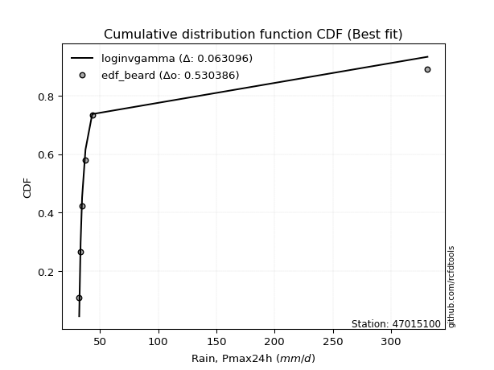</img>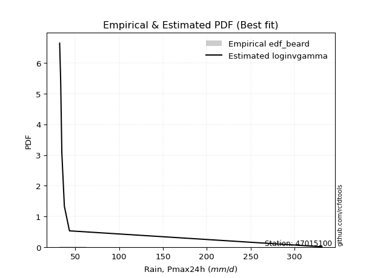</img>

</div>


### 5. EDF Chegodayev (1955)

The Chegodayev formula is an empirical plotting position formula used in hydrological frequency analysis to estimate the exceedance probability or return period of a specific event from a set of observed data. It is primarily used for plotting observed data points on probability paper to fit a theoretical distribution, particularly for analyzing extreme events like maximum flood flows or rainfall intensities. The constant _b_ value in the generalized plotting position formula is 0.3.

<div align="center">


$P=(m-b)/(n+1-2b)$


</div>


**5.1. Empirical values**

<div align="center">

|                | 0                   | 1                   | 2                   | 3              | 4                  | 5                  | 6                  |
|:---------------|:--------------------|:--------------------|:--------------------|:---------------|:-------------------|:-------------------|:-------------------|
| date           | 2022                | 2020                | 2021                | 2019           | 2023               | 2024               | 2025               |
| x              | 32.0                | 33.2                | 34.5                | 37.4           | 43.2               | 331.5              | 504.8              |
| m              | 1                   | 2                   | 3                   | 4              | 5                  | 6                  | 7                  |
| empirical_dist | edf_chegodayev      | edf_chegodayev      | edf_chegodayev      | edf_chegodayev | edf_chegodayev     | edf_chegodayev     | edf_chegodayev     |
| empirical      | 0.09459459459459459 | 0.22972972972972971 | 0.36486486486486486 | 0.5            | 0.6351351351351351 | 0.7702702702702703 | 0.9054054054054054 |
| empirical_tr   | 1.1044776119402986  | 1.2982456140350878  | 1.574468085106383   | 2.0            | 2.7407407407407405 | 4.352941176470589  | 10.571428571428568 |

</div>


**5.2. Kolmogorov-Smirnov fit test (sorted by Δ)**


<div align="center">

|                | 0                   | 1                   | 2                   | 3                   | 4                   | 5                   | 6                   | 7                   | 8                   | 9                   | 10                  | 11                  | 12                  | 13                  | 14                  | 15                  | 16                  | 17                  | 18                  | 19                  | 20                  | 21                  | 22                  | 23                  | 24                  | 25                  | 26                  | 27                  | 28                  | 29                  | 30                  | 31                  | 32                  | 33                  | 34                  | 35                  | 36                  | 37                  | 38                  | 39                  | 40                  | 41                  | 42                  | 43                  | 44                  | 45                  | 46                  | 47                  | 48                  | 49                  | 50                  | 51                  | 52                  | 53                  | 54                  | 55                  | 56                  | 57                  | 58                  | 59                  | 60                  | 61                  | 62                  | 63                  | 64                  | 65                  | 66                  | 67                  | 68                  | 69                  | 70                  | 71                  | 72                  | 73                  | 74                  | 75                  | 76                  | 77                  | 78                  | 79                  | 80                  | 81                  | 82                  | 83                  | 84                  | 85                  | 86                  | 87                  | 88                  | 89                  | 90                  | 91                  | 92                  | 93                  | 94                  | 95                  | 96                  | 97                  | 98                  | 99                  | 100                 | 101                 | 102                 | 103                 | 104                 | 105                 | 106                 | 107                 | 108                 | 109                 | 110                 | 111                 | 112                 | 113                 | 114                 | 115                 | 116                 | 117                 | 118                 | 119                 | 120                 | 121                 | 122                 | 123                 | 124                 | 125                 | 126                 | 127                 | 128                 | 129                 | 130                 | 131                 | 132                 | 133                 | 134                 | 135                 | 136                 | 137                 | 138                 | 139                 | 140                 | 141                 | 142                 | 143                 | 144                 | 145                 | 146                 | 147                 | 148                 | 149                 | 150                 | 151                 | 152                 | 153                 | 154                 | 155                 | 156                 | 157                 | 158                 | 159                 |
|:---------------|:--------------------|:--------------------|:--------------------|:--------------------|:--------------------|:--------------------|:--------------------|:--------------------|:--------------------|:--------------------|:--------------------|:--------------------|:--------------------|:--------------------|:--------------------|:--------------------|:--------------------|:--------------------|:--------------------|:--------------------|:--------------------|:--------------------|:--------------------|:--------------------|:--------------------|:--------------------|:--------------------|:--------------------|:--------------------|:--------------------|:--------------------|:--------------------|:--------------------|:--------------------|:--------------------|:--------------------|:--------------------|:--------------------|:--------------------|:--------------------|:--------------------|:--------------------|:--------------------|:--------------------|:--------------------|:--------------------|:--------------------|:--------------------|:--------------------|:--------------------|:--------------------|:--------------------|:--------------------|:--------------------|:--------------------|:--------------------|:--------------------|:--------------------|:--------------------|:--------------------|:--------------------|:--------------------|:--------------------|:--------------------|:--------------------|:--------------------|:--------------------|:--------------------|:--------------------|:--------------------|:--------------------|:--------------------|:--------------------|:--------------------|:--------------------|:--------------------|:--------------------|:--------------------|:--------------------|:--------------------|:--------------------|:--------------------|:--------------------|:--------------------|:--------------------|:--------------------|:--------------------|:--------------------|:--------------------|:--------------------|:--------------------|:--------------------|:--------------------|:--------------------|:--------------------|:--------------------|:--------------------|:--------------------|:--------------------|:--------------------|:--------------------|:--------------------|:--------------------|:--------------------|:--------------------|:--------------------|:--------------------|:--------------------|:--------------------|:--------------------|:--------------------|:--------------------|:--------------------|:--------------------|:--------------------|:--------------------|:--------------------|:--------------------|:--------------------|:--------------------|:--------------------|:--------------------|:--------------------|:--------------------|:--------------------|:--------------------|:--------------------|:--------------------|:--------------------|:--------------------|:--------------------|:--------------------|:--------------------|:--------------------|:--------------------|:--------------------|:--------------------|:--------------------|:--------------------|:--------------------|:--------------------|:--------------------|:--------------------|:--------------------|:--------------------|:--------------------|:--------------------|:--------------------|:--------------------|:--------------------|:--------------------|:--------------------|:--------------------|:--------------------|:--------------------|:--------------------|:--------------------|:--------------------|:--------------------|:--------------------|
| station        | 47015100            | 47015100            | 47015100            | 47015100            | 47015100            | 47015100            | 47015100            | 47015100            | 47015100            | 47015100            | 47015100            | 47015100            | 47015100            | 47015100            | 47015100            | 47015100            | 47015100            | 47015100            | 47015100            | 47015100            | 47015100            | 47015100            | 47015100            | 47015100            | 47015100            | 47015100            | 47015100            | 47015100            | 47015100            | 47015100            | 47015100            | 47015100            | 47015100            | 47015100            | 47015100            | 47015100            | 47015100            | 47015100            | 47015100            | 47015100            | 47015100            | 47015100            | 47015100            | 47015100            | 47015100            | 47015100            | 47015100            | 47015100            | 47015100            | 47015100            | 47015100            | 47015100            | 47015100            | 47015100            | 47015100            | 47015100            | 47015100            | 47015100            | 47015100            | 47015100            | 47015100            | 47015100            | 47015100            | 47015100            | 47015100            | 47015100            | 47015100            | 47015100            | 47015100            | 47015100            | 47015100            | 47015100            | 47015100            | 47015100            | 47015100            | 47015100            | 47015100            | 47015100            | 47015100            | 47015100            | 47015100            | 47015100            | 47015100            | 47015100            | 47015100            | 47015100            | 47015100            | 47015100            | 47015100            | 47015100            | 47015100            | 47015100            | 47015100            | 47015100            | 47015100            | 47015100            | 47015100            | 47015100            | 47015100            | 47015100            | 47015100            | 47015100            | 47015100            | 47015100            | 47015100            | 47015100            | 47015100            | 47015100            | 47015100            | 47015100            | 47015100            | 47015100            | 47015100            | 47015100            | 47015100            | 47015100            | 47015100            | 47015100            | 47015100            | 47015100            | 47015100            | 47015100            | 47015100            | 47015100            | 47015100            | 47015100            | 47015100            | 47015100            | 47015100            | 47015100            | 47015100            | 47015100            | 47015100            | 47015100            | 47015100            | 47015100            | 47015100            | 47015100            | 47015100            | 47015100            | 47015100            | 47015100            | 47015100            | 47015100            | 47015100            | 47015100            | 47015100            | 47015100            | 47015100            | 47015100            | 47015100            | 47015100            | 47015100            | 47015100            | 47015100            | 47015100            | 47015100            | 47015100            | 47015100            | 47015100            |
| empirical_dist | edf_chegodayev      | edf_chegodayev      | edf_chegodayev      | edf_chegodayev      | edf_chegodayev      | edf_chegodayev      | edf_chegodayev      | edf_chegodayev      | edf_chegodayev      | edf_chegodayev      | edf_chegodayev      | edf_chegodayev      | edf_chegodayev      | edf_chegodayev      | edf_chegodayev      | edf_chegodayev      | edf_chegodayev      | edf_chegodayev      | edf_chegodayev      | edf_chegodayev      | edf_chegodayev      | edf_chegodayev      | edf_chegodayev      | edf_chegodayev      | edf_chegodayev      | edf_chegodayev      | edf_chegodayev      | edf_chegodayev      | edf_chegodayev      | edf_chegodayev      | edf_chegodayev      | edf_chegodayev      | edf_chegodayev      | edf_chegodayev      | edf_chegodayev      | edf_chegodayev      | edf_chegodayev      | edf_chegodayev      | edf_chegodayev      | edf_chegodayev      | edf_chegodayev      | edf_chegodayev      | edf_chegodayev      | edf_chegodayev      | edf_chegodayev      | edf_chegodayev      | edf_chegodayev      | edf_chegodayev      | edf_chegodayev      | edf_chegodayev      | edf_chegodayev      | edf_chegodayev      | edf_chegodayev      | edf_chegodayev      | edf_chegodayev      | edf_chegodayev      | edf_chegodayev      | edf_chegodayev      | edf_chegodayev      | edf_chegodayev      | edf_chegodayev      | edf_chegodayev      | edf_chegodayev      | edf_chegodayev      | edf_chegodayev      | edf_chegodayev      | edf_chegodayev      | edf_chegodayev      | edf_chegodayev      | edf_chegodayev      | edf_chegodayev      | edf_chegodayev      | edf_chegodayev      | edf_chegodayev      | edf_chegodayev      | edf_chegodayev      | edf_chegodayev      | edf_chegodayev      | edf_chegodayev      | edf_chegodayev      | edf_chegodayev      | edf_chegodayev      | edf_chegodayev      | edf_chegodayev      | edf_chegodayev      | edf_chegodayev      | edf_chegodayev      | edf_chegodayev      | edf_chegodayev      | edf_chegodayev      | edf_chegodayev      | edf_chegodayev      | edf_chegodayev      | edf_chegodayev      | edf_chegodayev      | edf_chegodayev      | edf_chegodayev      | edf_chegodayev      | edf_chegodayev      | edf_chegodayev      | edf_chegodayev      | edf_chegodayev      | edf_chegodayev      | edf_chegodayev      | edf_chegodayev      | edf_chegodayev      | edf_chegodayev      | edf_chegodayev      | edf_chegodayev      | edf_chegodayev      | edf_chegodayev      | edf_chegodayev      | edf_chegodayev      | edf_chegodayev      | edf_chegodayev      | edf_chegodayev      | edf_chegodayev      | edf_chegodayev      | edf_chegodayev      | edf_chegodayev      | edf_chegodayev      | edf_chegodayev      | edf_chegodayev      | edf_chegodayev      | edf_chegodayev      | edf_chegodayev      | edf_chegodayev      | edf_chegodayev      | edf_chegodayev      | edf_chegodayev      | edf_chegodayev      | edf_chegodayev      | edf_chegodayev      | edf_chegodayev      | edf_chegodayev      | edf_chegodayev      | edf_chegodayev      | edf_chegodayev      | edf_chegodayev      | edf_chegodayev      | edf_chegodayev      | edf_chegodayev      | edf_chegodayev      | edf_chegodayev      | edf_chegodayev      | edf_chegodayev      | edf_chegodayev      | edf_chegodayev      | edf_chegodayev      | edf_chegodayev      | edf_chegodayev      | edf_chegodayev      | edf_chegodayev      | edf_chegodayev      | edf_chegodayev      | edf_chegodayev      | edf_chegodayev      | edf_chegodayev      | edf_chegodayev      | edf_chegodayev      |
| p_dist         | loggenextreme       | loginvweibull       | f                   | invgamma            | logf                | loginvgamma         | lomax               | logburr             | lognakagami         | fatiguelife         | loghalfgennorm      | logburr12           | loginvgauss         | loggengamma         | loglomax            | lognct              | logmielke           | invgauss            | logalpha            | truncpareto         | halfgennorm         | logbradford         | genextreme          | logtruncweibull_min | logtruncpareto      | genpareto           | logexponpow         | logvonmises_line    | erlang              | logdgamma           | alpha               | gamma               | loggamma            | loggamma            | logwrapcauchy       | logerlang           | logweibull_min      | loggennorm          | loghalflogistic     | logwald             | loghalfnorm         | logfoldnorm         | t                   | logarcsine          | tukeylambda         | logmoyal            | powerlaw            | logpearson3         | arcsine             | burr                | wrapcauchy          | lograyleigh         | loggumbel_r         | vonmises_line       | loggenpareto        | logsemicircular     | foldnorm            | loggenlogistic      | logmaxwell          | halfnorm            | logbetaprime        | logloglaplace       | loganglit           | halflogistic        | logncf              | nct                 | truncweibull_min    | ncf                 | loglevy_l           | betaprime           | logjohnsonsu        | logloggamma         | pearson3            | logcrystalball      | lognorm             | logt                | logpowerlaw         | semicircular        | rayleigh            | moyal               | logkstwobign        | burr12              | dgamma              | logexponnorm        | gausshyper          | gumbel_r            | maxwell             | loggenexpon         | anglit              | weibull_min         | loglogistic         | logtruncnorm        | wald                | gennorm             | nakagami            | loghypsecant        | logexponweib        | levy_l              | logfatiguelife      | norm                | crystalball         | logrice             | johnsonsu           | logcosine           | logweibull_max      | genlogistic         | logbeta             | loggumbel_l         | gengamma            | loggompertz         | logistic            | loglaplace          | loglaplace          | exponweib           | hypsecant           | kstwobign           | exponpow            | cosine              | gumbel_l            | logrdist            | logdweibull         | dweibull            | logargus            | rice                | laplace             | loggausshyper       | invweibull          | logtriang           | kappa3              | argus               | logksone            | logskewnorm         | logtruncexpon       | logkappa4           | logtukeylambda      | loguniform          | logkappa3           | logjohnsonsb        | ksone               | beta                | exponnorm           | genexpon            | loggenhalflogistic  | bradford            | truncnorm           | genhalflogistic     | skewnorm            | truncexpon          | kappa4              | triang              | gompertz            | logtrapezoid        | uniform             | weibull_max         | trapezoid           | johnsonsb           | rdist               | logvonmises         | vonmises            | mielke              |
| delta          | 0.08835709122151392 | 0.08836223516558028 | 0.10853256930319932 | 0.10853320860509286 | 0.11217441739475409 | 0.11219293858840806 | 0.11345265220363987 | 0.12526771165188588 | 0.1338927447364443  | 0.1351897076999926  | 0.14037735473963242 | 0.14051885954920862 | 0.15206937927564212 | 0.15972380250081586 | 0.16725014794130322 | 0.16882698716728373 | 0.17241580788821487 | 0.17594491133850387 | 0.18030473284211124 | 0.1821491113464272  | 0.18574016913251612 | 0.19284796332826482 | 0.19470955568293796 | 0.20028732034462515 | 0.20086466120308077 | 0.20282649505521833 | 0.20358263238723928 | 0.20475836347106136 | 0.2115113857797637  | 0.21370686382748694 | 0.21550178884490012 | 0.21738363207706202 | 0.21933796966938435 | 0.21933796966938435 | 0.22102316258211907 | 0.22342184896003603 | 0.23281611905957345 | 0.23335536417704345 | 0.2342256567715702  | 0.235207949743721   | 0.23735400670244178 | 0.2378689873340843  | 0.23846746675106845 | 0.2403428196014608  | 0.24434182395059878 | 0.2574394351256083  | 0.2642637933197211  | 0.2658754568928614  | 0.2673806070572734  | 0.2679019147792     | 0.2679758799498786  | 0.27037798581049777 | 0.2714630748885105  | 0.27283988767700096 | 0.2792973554128932  | 0.2799374014564474  | 0.2800668620884105  | 0.2817629344066608  | 0.2819969425863413  | 0.28510485980915745 | 0.2854462330387365  | 0.2881130732336107  | 0.28946483161178777 | 0.29050627473689933 | 0.2912356394469342  | 0.29176065816268315 | 0.2925879236143984  | 0.29416541054600387 | 0.2959242914427684  | 0.2964647825164014  | 0.3071200847982436  | 0.30716435027048156 | 0.30852034379705384 | 0.3120072431875401  | 0.3120075229533823  | 0.31200784428730105 | 0.3136631977331893  | 0.31432686482476657 | 0.3144689487508423  | 0.31724921256557126 | 0.3187019961822063  | 0.3209311786897553  | 0.3225730167846019  | 0.32297864594228054 | 0.323339475510443   | 0.32398803497024253 | 0.3249434315294416  | 0.3252617951106394  | 0.3253371096082103  | 0.3263888530663943  | 0.33201434443659483 | 0.33282786565088257 | 0.335654874526933   | 0.3423795293634288  | 0.343720598513701   | 0.34698839503916384 | 0.3475376492324063  | 0.34773800334401667 | 0.35052668965362455 | 0.3510653903596297  | 0.35106539792472297 | 0.3521889228344227  | 0.3545830661983058  | 0.35608830787584134 | 0.3562170564674136  | 0.3587817367398799  | 0.36038654934583647 | 0.3673715122681891  | 0.36771250823703905 | 0.3707193128868509  | 0.3730782731122843  | 0.3738726625146252  | 0.3738726625146252  | 0.3763376196549862  | 0.3885439797301483  | 0.39120571024290296 | 0.3926120921717189  | 0.3955182236430038  | 0.3985050896563874  | 0.40390420327907345 | 0.4054054053953817  | 0.4054054054054081  | 0.40564454538848715 | 0.40955658566121095 | 0.41208782604377914 | 0.41216996393942085 | 0.4184920190527905  | 0.4260793839378937  | 0.4359113444220744  | 0.43670400140372156 | 0.46113882104899284 | 0.46210139183813914 | 0.47414085215141977 | 0.49023679386890806 | 0.5065000209912949  | 0.5263395582317645  | 0.5263428282818828  | 0.5312824363302152  | 0.5320612490663251  | 0.5346953647245729  | 0.5391233333988528  | 0.5409558751336455  | 0.5464313924378892  | 0.5582228247728951  | 0.569875306725066   | 0.577258106627046   | 0.5929230682678881  | 0.5991013421930451  | 0.6019250478405995  | 0.6022270106131402  | 0.6030702814785895  | 0.6048604178195717  | 0.6114464718525632  | 0.6194801226367567  | 0.6242314997921018  | 0.637413348010199   | 0.773124420504175   | 1.2327604655361013  | 79.89957860590103   | nan                 |
| deltao         | 0.48442053926100004 | 0.48442053926100004 | 0.48442053926100004 | 0.48442053926100004 | 0.48442053926100004 | 0.48442053926100004 | 0.48442053926100004 | 0.48442053926100004 | 0.48442053926100004 | 0.48442053926100004 | 0.48442053926100004 | 0.48442053926100004 | 0.48442053926100004 | 0.48442053926100004 | 0.48442053926100004 | 0.48442053926100004 | 0.48442053926100004 | 0.48442053926100004 | 0.48442053926100004 | 0.48442053926100004 | 0.48442053926100004 | 0.48442053926100004 | 0.48442053926100004 | 0.48442053926100004 | 0.48442053926100004 | 0.48442053926100004 | 0.48442053926100004 | 0.48442053926100004 | 0.48442053926100004 | 0.48442053926100004 | 0.48442053926100004 | 0.48442053926100004 | 0.48442053926100004 | 0.48442053926100004 | 0.48442053926100004 | 0.48442053926100004 | 0.48442053926100004 | 0.48442053926100004 | 0.48442053926100004 | 0.48442053926100004 | 0.48442053926100004 | 0.48442053926100004 | 0.48442053926100004 | 0.48442053926100004 | 0.48442053926100004 | 0.48442053926100004 | 0.48442053926100004 | 0.48442053926100004 | 0.48442053926100004 | 0.48442053926100004 | 0.48442053926100004 | 0.48442053926100004 | 0.48442053926100004 | 0.48442053926100004 | 0.48442053926100004 | 0.48442053926100004 | 0.48442053926100004 | 0.48442053926100004 | 0.48442053926100004 | 0.48442053926100004 | 0.48442053926100004 | 0.48442053926100004 | 0.48442053926100004 | 0.48442053926100004 | 0.48442053926100004 | 0.48442053926100004 | 0.48442053926100004 | 0.48442053926100004 | 0.48442053926100004 | 0.48442053926100004 | 0.48442053926100004 | 0.48442053926100004 | 0.48442053926100004 | 0.48442053926100004 | 0.48442053926100004 | 0.48442053926100004 | 0.48442053926100004 | 0.48442053926100004 | 0.48442053926100004 | 0.48442053926100004 | 0.48442053926100004 | 0.48442053926100004 | 0.48442053926100004 | 0.48442053926100004 | 0.48442053926100004 | 0.48442053926100004 | 0.48442053926100004 | 0.48442053926100004 | 0.48442053926100004 | 0.48442053926100004 | 0.48442053926100004 | 0.48442053926100004 | 0.48442053926100004 | 0.48442053926100004 | 0.48442053926100004 | 0.48442053926100004 | 0.48442053926100004 | 0.48442053926100004 | 0.48442053926100004 | 0.48442053926100004 | 0.48442053926100004 | 0.48442053926100004 | 0.48442053926100004 | 0.48442053926100004 | 0.48442053926100004 | 0.48442053926100004 | 0.48442053926100004 | 0.48442053926100004 | 0.48442053926100004 | 0.48442053926100004 | 0.48442053926100004 | 0.48442053926100004 | 0.48442053926100004 | 0.48442053926100004 | 0.48442053926100004 | 0.48442053926100004 | 0.48442053926100004 | 0.48442053926100004 | 0.48442053926100004 | 0.48442053926100004 | 0.48442053926100004 | 0.48442053926100004 | 0.48442053926100004 | 0.48442053926100004 | 0.48442053926100004 | 0.48442053926100004 | 0.48442053926100004 | 0.48442053926100004 | 0.48442053926100004 | 0.48442053926100004 | 0.48442053926100004 | 0.48442053926100004 | 0.48442053926100004 | 0.48442053926100004 | 0.48442053926100004 | 0.48442053926100004 | 0.48442053926100004 | 0.48442053926100004 | 0.48442053926100004 | 0.48442053926100004 | 0.48442053926100004 | 0.48442053926100004 | 0.48442053926100004 | 0.48442053926100004 | 0.48442053926100004 | 0.48442053926100004 | 0.48442053926100004 | 0.48442053926100004 | 0.48442053926100004 | 0.48442053926100004 | 0.48442053926100004 | 0.48442053926100004 | 0.48442053926100004 | 0.48442053926100004 | 0.48442053926100004 | 0.48442053926100004 | 0.48442053926100004 | 0.48442053926100004 | 0.48442053926100004 | 0.48442053926100004 |
| eval           | Δo > Δ              | Δo > Δ              | Δo > Δ              | Δo > Δ              | Δo > Δ              | Δo > Δ              | Δo > Δ              | Δo > Δ              | Δo > Δ              | Δo > Δ              | Δo > Δ              | Δo > Δ              | Δo > Δ              | Δo > Δ              | Δo > Δ              | Δo > Δ              | Δo > Δ              | Δo > Δ              | Δo > Δ              | Δo > Δ              | Δo > Δ              | Δo > Δ              | Δo > Δ              | Δo > Δ              | Δo > Δ              | Δo > Δ              | Δo > Δ              | Δo > Δ              | Δo > Δ              | Δo > Δ              | Δo > Δ              | Δo > Δ              | Δo > Δ              | Δo > Δ              | Δo > Δ              | Δo > Δ              | Δo > Δ              | Δo > Δ              | Δo > Δ              | Δo > Δ              | Δo > Δ              | Δo > Δ              | Δo > Δ              | Δo > Δ              | Δo > Δ              | Δo > Δ              | Δo > Δ              | Δo > Δ              | Δo > Δ              | Δo > Δ              | Δo > Δ              | Δo > Δ              | Δo > Δ              | Δo > Δ              | Δo > Δ              | Δo > Δ              | Δo > Δ              | Δo > Δ              | Δo > Δ              | Δo > Δ              | Δo > Δ              | Δo > Δ              | Δo > Δ              | Δo > Δ              | Δo > Δ              | Δo > Δ              | Δo > Δ              | Δo > Δ              | Δo > Δ              | Δo > Δ              | Δo > Δ              | Δo > Δ              | Δo > Δ              | Δo > Δ              | Δo > Δ              | Δo > Δ              | Δo > Δ              | Δo > Δ              | Δo > Δ              | Δo > Δ              | Δo > Δ              | Δo > Δ              | Δo > Δ              | Δo > Δ              | Δo > Δ              | Δo > Δ              | Δo > Δ              | Δo > Δ              | Δo > Δ              | Δo > Δ              | Δo > Δ              | Δo > Δ              | Δo > Δ              | Δo > Δ              | Δo > Δ              | Δo > Δ              | Δo > Δ              | Δo > Δ              | Δo > Δ              | Δo > Δ              | Δo > Δ              | Δo > Δ              | Δo > Δ              | Δo > Δ              | Δo > Δ              | Δo > Δ              | Δo > Δ              | Δo > Δ              | Δo > Δ              | Δo > Δ              | Δo > Δ              | Δo > Δ              | Δo > Δ              | Δo > Δ              | Δo > Δ              | Δo > Δ              | Δo > Δ              | Δo > Δ              | Δo > Δ              | Δo > Δ              | Δo > Δ              | Δo > Δ              | Δo > Δ              | Δo > Δ              | Δo > Δ              | Δo > Δ              | Δo > Δ              | Δo > Δ              | Δo > Δ              | Δo > Δ              | Δo > Δ              | Δo > Δ              | Δo > Δ              | Δo <= Δ             | Δo <= Δ             | Δo <= Δ             | Δo <= Δ             | Δo <= Δ             | Δo <= Δ             | Δo <= Δ             | Δo <= Δ             | Δo <= Δ             | Δo <= Δ             | Δo <= Δ             | Δo <= Δ             | Δo <= Δ             | Δo <= Δ             | Δo <= Δ             | Δo <= Δ             | Δo <= Δ             | Δo <= Δ             | Δo <= Δ             | Δo <= Δ             | Δo <= Δ             | Δo <= Δ             | Δo <= Δ             | Δo <= Δ             | Δo <= Δ             | Δo <= Δ             | Δo <= Δ             |
| fit            | 1                   | 1                   | 1                   | 1                   | 1                   | 1                   | 1                   | 1                   | 1                   | 1                   | 1                   | 1                   | 1                   | 1                   | 1                   | 1                   | 1                   | 1                   | 1                   | 1                   | 1                   | 1                   | 1                   | 1                   | 1                   | 1                   | 1                   | 1                   | 1                   | 1                   | 1                   | 1                   | 1                   | 1                   | 1                   | 1                   | 1                   | 1                   | 1                   | 1                   | 1                   | 1                   | 1                   | 1                   | 1                   | 1                   | 1                   | 1                   | 1                   | 1                   | 1                   | 1                   | 1                   | 1                   | 1                   | 1                   | 1                   | 1                   | 1                   | 1                   | 1                   | 1                   | 1                   | 1                   | 1                   | 1                   | 1                   | 1                   | 1                   | 1                   | 1                   | 1                   | 1                   | 1                   | 1                   | 1                   | 1                   | 1                   | 1                   | 1                   | 1                   | 1                   | 1                   | 1                   | 1                   | 1                   | 1                   | 1                   | 1                   | 1                   | 1                   | 1                   | 1                   | 1                   | 1                   | 1                   | 1                   | 1                   | 1                   | 1                   | 1                   | 1                   | 1                   | 1                   | 1                   | 1                   | 1                   | 1                   | 1                   | 1                   | 1                   | 1                   | 1                   | 1                   | 1                   | 1                   | 1                   | 1                   | 1                   | 1                   | 1                   | 1                   | 1                   | 1                   | 1                   | 1                   | 1                   | 1                   | 1                   | 1                   | 1                   | 1                   | 1                   | 0                   | 0                   | 0                   | 0                   | 0                   | 0                   | 0                   | 0                   | 0                   | 0                   | 0                   | 0                   | 0                   | 0                   | 0                   | 0                   | 0                   | 0                   | 0                   | 0                   | 0                   | 0                   | 0                   | 0                   | 0                   | 0                   | 0                   |
| n              | 7                   | 7                   | 7                   | 7                   | 7                   | 7                   | 7                   | 7                   | 7                   | 7                   | 7                   | 7                   | 7                   | 7                   | 7                   | 7                   | 7                   | 7                   | 7                   | 7                   | 7                   | 7                   | 7                   | 7                   | 7                   | 7                   | 7                   | 7                   | 7                   | 7                   | 7                   | 7                   | 7                   | 7                   | 7                   | 7                   | 7                   | 7                   | 7                   | 7                   | 7                   | 7                   | 7                   | 7                   | 7                   | 7                   | 7                   | 7                   | 7                   | 7                   | 7                   | 7                   | 7                   | 7                   | 7                   | 7                   | 7                   | 7                   | 7                   | 7                   | 7                   | 7                   | 7                   | 7                   | 7                   | 7                   | 7                   | 7                   | 7                   | 7                   | 7                   | 7                   | 7                   | 7                   | 7                   | 7                   | 7                   | 7                   | 7                   | 7                   | 7                   | 7                   | 7                   | 7                   | 7                   | 7                   | 7                   | 7                   | 7                   | 7                   | 7                   | 7                   | 7                   | 7                   | 7                   | 7                   | 7                   | 7                   | 7                   | 7                   | 7                   | 7                   | 7                   | 7                   | 7                   | 7                   | 7                   | 7                   | 7                   | 7                   | 7                   | 7                   | 7                   | 7                   | 7                   | 7                   | 7                   | 7                   | 7                   | 7                   | 7                   | 7                   | 7                   | 7                   | 7                   | 7                   | 7                   | 7                   | 7                   | 7                   | 7                   | 7                   | 7                   | 7                   | 7                   | 7                   | 7                   | 7                   | 7                   | 7                   | 7                   | 7                   | 7                   | 7                   | 7                   | 7                   | 7                   | 7                   | 7                   | 7                   | 7                   | 7                   | 7                   | 7                   | 7                   | 7                   | 7                   | 7                   | 7                   | 7                   |
| best_fit       | 1                   | 0                   | 0                   | 0                   | 0                   | 0                   | 0                   | 0                   | 0                   | 0                   | 0                   | 0                   | 0                   | 0                   | 0                   | 0                   | 0                   | 0                   | 0                   | 0                   | 0                   | 0                   | 0                   | 0                   | 0                   | 0                   | 0                   | 0                   | 0                   | 0                   | 0                   | 0                   | 0                   | 0                   | 0                   | 0                   | 0                   | 0                   | 0                   | 0                   | 0                   | 0                   | 0                   | 0                   | 0                   | 0                   | 0                   | 0                   | 0                   | 0                   | 0                   | 0                   | 0                   | 0                   | 0                   | 0                   | 0                   | 0                   | 0                   | 0                   | 0                   | 0                   | 0                   | 0                   | 0                   | 0                   | 0                   | 0                   | 0                   | 0                   | 0                   | 0                   | 0                   | 0                   | 0                   | 0                   | 0                   | 0                   | 0                   | 0                   | 0                   | 0                   | 0                   | 0                   | 0                   | 0                   | 0                   | 0                   | 0                   | 0                   | 0                   | 0                   | 0                   | 0                   | 0                   | 0                   | 0                   | 0                   | 0                   | 0                   | 0                   | 0                   | 0                   | 0                   | 0                   | 0                   | 0                   | 0                   | 0                   | 0                   | 0                   | 0                   | 0                   | 0                   | 0                   | 0                   | 0                   | 0                   | 0                   | 0                   | 0                   | 0                   | 0                   | 0                   | 0                   | 0                   | 0                   | 0                   | 0                   | 0                   | 0                   | 0                   | 0                   | 0                   | 0                   | 0                   | 0                   | 0                   | 0                   | 0                   | 0                   | 0                   | 0                   | 0                   | 0                   | 0                   | 0                   | 0                   | 0                   | 0                   | 0                   | 0                   | 0                   | 0                   | 0                   | 0                   | 0                   | 0                   | 0                   | 0                   |
| best_fit_sort  | 1                   | 2                   | 3                   | 4                   | 5                   | 6                   | 7                   | 8                   | 9                   | 10                  | 11                  | 12                  | 13                  | 14                  | 15                  | 16                  | 17                  | 18                  | 19                  | 20                  | 21                  | 22                  | 23                  | 24                  | 25                  | 26                  | 27                  | 28                  | 29                  | 30                  | 31                  | 32                  | 33                  | 34                  | 35                  | 36                  | 37                  | 38                  | 39                  | 40                  | 41                  | 42                  | 43                  | 44                  | 45                  | 46                  | 47                  | 48                  | 49                  | 50                  | 51                  | 52                  | 53                  | 54                  | 55                  | 56                  | 57                  | 58                  | 59                  | 60                  | 61                  | 62                  | 63                  | 64                  | 65                  | 66                  | 67                  | 68                  | 69                  | 70                  | 71                  | 72                  | 73                  | 74                  | 75                  | 76                  | 77                  | 78                  | 79                  | 80                  | 81                  | 82                  | 83                  | 84                  | 85                  | 86                  | 87                  | 88                  | 89                  | 90                  | 91                  | 92                  | 93                  | 94                  | 95                  | 96                  | 97                  | 98                  | 99                  | 100                 | 101                 | 102                 | 103                 | 104                 | 105                 | 106                 | 107                 | 108                 | 109                 | 110                 | 111                 | 112                 | 113                 | 114                 | 115                 | 116                 | 117                 | 118                 | 119                 | 120                 | 121                 | 122                 | 123                 | 124                 | 125                 | 126                 | 127                 | 128                 | 129                 | 130                 | 131                 | 132                 | 133                 | 134                 | 135                 | 136                 | 137                 | 138                 | 139                 | 140                 | 141                 | 142                 | 143                 | 144                 | 145                 | 146                 | 147                 | 148                 | 149                 | 150                 | 151                 | 152                 | 153                 | 154                 | 155                 | 156                 | 157                 | 158                 | 159                 | 160                 |

</div>


**5.3. Best fit**

<div align="center">

|   id |   station | empirical_dist   | p_dist        |     delta |   deltao | eval   |   fit |   n |   best_fit |   best_fit_sort |
|-----:|----------:|:-----------------|:--------------|----------:|---------:|:-------|------:|----:|-----------:|----------------:|
|    0 |  47015100 | edf_chegodayev   | loggenextreme | 0.0883571 | 0.484421 | Δo > Δ |     1 |   7 |          1 |               1 |

</div>


<div align="center">

</img></img>

</div>


### 6. EDF Blom (1958)

The Blom formula is a specific "plotting position" formula used in hydrology and statistical analysis to estimate the empirical cumulative probability (or non-exceedance probability) of a data series. It is particularly recommended for data that are approximately normally distributed. The constant _a_ is set to 0.375 (or 3/8).

<div align="center">


$P=(m-a)/(n+1-2a)$


</div>


**6.1. Empirical values**

<div align="center">

|                | 0                   | 1                   | 2                  | 3        | 4                  | 5                  | 6                  |
|:---------------|:--------------------|:--------------------|:-------------------|:---------|:-------------------|:-------------------|:-------------------|
| date           | 2022                | 2020                | 2021               | 2019     | 2023               | 2024               | 2025               |
| x              | 32.0                | 33.2                | 34.5               | 37.4     | 43.2               | 331.5              | 504.8              |
| m              | 1                   | 2                   | 3                  | 4        | 5                  | 6                  | 7                  |
| empirical_dist | edf_blom            | edf_blom            | edf_blom           | edf_blom | edf_blom           | edf_blom           | edf_blom           |
| empirical      | 0.08620689655172414 | 0.22413793103448276 | 0.3620689655172414 | 0.5      | 0.6379310344827587 | 0.7758620689655172 | 0.9137931034482759 |
| empirical_tr   | 1.0943396226415094  | 1.288888888888889   | 1.5675675675675675 | 2.0      | 2.7619047619047623 | 4.461538461538462  | 11.600000000000007 |

</div>


**6.2. Kolmogorov-Smirnov fit test (sorted by Δ)**


<div align="center">

|                | 0                   | 1                   | 2                   | 3                   | 4                   | 5                   | 6                   | 7                   | 8                   | 9                   | 10                  | 11                  | 12                  | 13                  | 14                  | 15                  | 16                  | 17                  | 18                  | 19                  | 20                  | 21                  | 22                  | 23                  | 24                  | 25                  | 26                  | 27                  | 28                  | 29                  | 30                  | 31                  | 32                  | 33                  | 34                  | 35                  | 36                  | 37                  | 38                  | 39                  | 40                  | 41                  | 42                  | 43                  | 44                  | 45                  | 46                  | 47                  | 48                  | 49                  | 50                  | 51                  | 52                  | 53                  | 54                  | 55                  | 56                  | 57                  | 58                  | 59                  | 60                  | 61                  | 62                  | 63                  | 64                  | 65                  | 66                  | 67                  | 68                  | 69                  | 70                  | 71                  | 72                  | 73                  | 74                  | 75                  | 76                  | 77                  | 78                  | 79                  | 80                  | 81                  | 82                  | 83                  | 84                  | 85                  | 86                  | 87                  | 88                  | 89                  | 90                  | 91                  | 92                  | 93                  | 94                  | 95                  | 96                  | 97                  | 98                  | 99                  | 100                 | 101                 | 102                 | 103                 | 104                 | 105                 | 106                 | 107                 | 108                 | 109                 | 110                 | 111                 | 112                 | 113                 | 114                 | 115                 | 116                 | 117                 | 118                 | 119                 | 120                 | 121                 | 122                 | 123                 | 124                 | 125                 | 126                 | 127                 | 128                 | 129                 | 130                 | 131                 | 132                 | 133                 | 134                 | 135                 | 136                 | 137                 | 138                 | 139                 | 140                 | 141                 | 142                 | 143                 | 144                 | 145                 | 146                 | 147                 | 148                 | 149                 | 150                 | 151                 | 152                 | 153                 | 154                 | 155                 | 156                 | 157                 | 158                 | 159                 |
|:---------------|:--------------------|:--------------------|:--------------------|:--------------------|:--------------------|:--------------------|:--------------------|:--------------------|:--------------------|:--------------------|:--------------------|:--------------------|:--------------------|:--------------------|:--------------------|:--------------------|:--------------------|:--------------------|:--------------------|:--------------------|:--------------------|:--------------------|:--------------------|:--------------------|:--------------------|:--------------------|:--------------------|:--------------------|:--------------------|:--------------------|:--------------------|:--------------------|:--------------------|:--------------------|:--------------------|:--------------------|:--------------------|:--------------------|:--------------------|:--------------------|:--------------------|:--------------------|:--------------------|:--------------------|:--------------------|:--------------------|:--------------------|:--------------------|:--------------------|:--------------------|:--------------------|:--------------------|:--------------------|:--------------------|:--------------------|:--------------------|:--------------------|:--------------------|:--------------------|:--------------------|:--------------------|:--------------------|:--------------------|:--------------------|:--------------------|:--------------------|:--------------------|:--------------------|:--------------------|:--------------------|:--------------------|:--------------------|:--------------------|:--------------------|:--------------------|:--------------------|:--------------------|:--------------------|:--------------------|:--------------------|:--------------------|:--------------------|:--------------------|:--------------------|:--------------------|:--------------------|:--------------------|:--------------------|:--------------------|:--------------------|:--------------------|:--------------------|:--------------------|:--------------------|:--------------------|:--------------------|:--------------------|:--------------------|:--------------------|:--------------------|:--------------------|:--------------------|:--------------------|:--------------------|:--------------------|:--------------------|:--------------------|:--------------------|:--------------------|:--------------------|:--------------------|:--------------------|:--------------------|:--------------------|:--------------------|:--------------------|:--------------------|:--------------------|:--------------------|:--------------------|:--------------------|:--------------------|:--------------------|:--------------------|:--------------------|:--------------------|:--------------------|:--------------------|:--------------------|:--------------------|:--------------------|:--------------------|:--------------------|:--------------------|:--------------------|:--------------------|:--------------------|:--------------------|:--------------------|:--------------------|:--------------------|:--------------------|:--------------------|:--------------------|:--------------------|:--------------------|:--------------------|:--------------------|:--------------------|:--------------------|:--------------------|:--------------------|:--------------------|:--------------------|:--------------------|:--------------------|:--------------------|:--------------------|:--------------------|:--------------------|
| station        | 47015100            | 47015100            | 47015100            | 47015100            | 47015100            | 47015100            | 47015100            | 47015100            | 47015100            | 47015100            | 47015100            | 47015100            | 47015100            | 47015100            | 47015100            | 47015100            | 47015100            | 47015100            | 47015100            | 47015100            | 47015100            | 47015100            | 47015100            | 47015100            | 47015100            | 47015100            | 47015100            | 47015100            | 47015100            | 47015100            | 47015100            | 47015100            | 47015100            | 47015100            | 47015100            | 47015100            | 47015100            | 47015100            | 47015100            | 47015100            | 47015100            | 47015100            | 47015100            | 47015100            | 47015100            | 47015100            | 47015100            | 47015100            | 47015100            | 47015100            | 47015100            | 47015100            | 47015100            | 47015100            | 47015100            | 47015100            | 47015100            | 47015100            | 47015100            | 47015100            | 47015100            | 47015100            | 47015100            | 47015100            | 47015100            | 47015100            | 47015100            | 47015100            | 47015100            | 47015100            | 47015100            | 47015100            | 47015100            | 47015100            | 47015100            | 47015100            | 47015100            | 47015100            | 47015100            | 47015100            | 47015100            | 47015100            | 47015100            | 47015100            | 47015100            | 47015100            | 47015100            | 47015100            | 47015100            | 47015100            | 47015100            | 47015100            | 47015100            | 47015100            | 47015100            | 47015100            | 47015100            | 47015100            | 47015100            | 47015100            | 47015100            | 47015100            | 47015100            | 47015100            | 47015100            | 47015100            | 47015100            | 47015100            | 47015100            | 47015100            | 47015100            | 47015100            | 47015100            | 47015100            | 47015100            | 47015100            | 47015100            | 47015100            | 47015100            | 47015100            | 47015100            | 47015100            | 47015100            | 47015100            | 47015100            | 47015100            | 47015100            | 47015100            | 47015100            | 47015100            | 47015100            | 47015100            | 47015100            | 47015100            | 47015100            | 47015100            | 47015100            | 47015100            | 47015100            | 47015100            | 47015100            | 47015100            | 47015100            | 47015100            | 47015100            | 47015100            | 47015100            | 47015100            | 47015100            | 47015100            | 47015100            | 47015100            | 47015100            | 47015100            | 47015100            | 47015100            | 47015100            | 47015100            | 47015100            | 47015100            |
| empirical_dist | edf_blom            | edf_blom            | edf_blom            | edf_blom            | edf_blom            | edf_blom            | edf_blom            | edf_blom            | edf_blom            | edf_blom            | edf_blom            | edf_blom            | edf_blom            | edf_blom            | edf_blom            | edf_blom            | edf_blom            | edf_blom            | edf_blom            | edf_blom            | edf_blom            | edf_blom            | edf_blom            | edf_blom            | edf_blom            | edf_blom            | edf_blom            | edf_blom            | edf_blom            | edf_blom            | edf_blom            | edf_blom            | edf_blom            | edf_blom            | edf_blom            | edf_blom            | edf_blom            | edf_blom            | edf_blom            | edf_blom            | edf_blom            | edf_blom            | edf_blom            | edf_blom            | edf_blom            | edf_blom            | edf_blom            | edf_blom            | edf_blom            | edf_blom            | edf_blom            | edf_blom            | edf_blom            | edf_blom            | edf_blom            | edf_blom            | edf_blom            | edf_blom            | edf_blom            | edf_blom            | edf_blom            | edf_blom            | edf_blom            | edf_blom            | edf_blom            | edf_blom            | edf_blom            | edf_blom            | edf_blom            | edf_blom            | edf_blom            | edf_blom            | edf_blom            | edf_blom            | edf_blom            | edf_blom            | edf_blom            | edf_blom            | edf_blom            | edf_blom            | edf_blom            | edf_blom            | edf_blom            | edf_blom            | edf_blom            | edf_blom            | edf_blom            | edf_blom            | edf_blom            | edf_blom            | edf_blom            | edf_blom            | edf_blom            | edf_blom            | edf_blom            | edf_blom            | edf_blom            | edf_blom            | edf_blom            | edf_blom            | edf_blom            | edf_blom            | edf_blom            | edf_blom            | edf_blom            | edf_blom            | edf_blom            | edf_blom            | edf_blom            | edf_blom            | edf_blom            | edf_blom            | edf_blom            | edf_blom            | edf_blom            | edf_blom            | edf_blom            | edf_blom            | edf_blom            | edf_blom            | edf_blom            | edf_blom            | edf_blom            | edf_blom            | edf_blom            | edf_blom            | edf_blom            | edf_blom            | edf_blom            | edf_blom            | edf_blom            | edf_blom            | edf_blom            | edf_blom            | edf_blom            | edf_blom            | edf_blom            | edf_blom            | edf_blom            | edf_blom            | edf_blom            | edf_blom            | edf_blom            | edf_blom            | edf_blom            | edf_blom            | edf_blom            | edf_blom            | edf_blom            | edf_blom            | edf_blom            | edf_blom            | edf_blom            | edf_blom            | edf_blom            | edf_blom            | edf_blom            | edf_blom            | edf_blom            | edf_blom            |
| p_dist         | loggenextreme       | loginvweibull       | f                   | invgamma            | logf                | loginvgamma         | lomax               | logburr             | loghalfgennorm      | logburr12           | lognakagami         | fatiguelife         | loginvgauss         | loggengamma         | loglomax            | lognct              | invgauss            | logalpha            | truncpareto         | halfgennorm         | logmielke           | logtruncweibull_min | logtruncpareto      | logbradford         | genpareto           | genextreme          | erlang              | logexponpow         | logdgamma           | alpha               | gamma               | logvonmises_line    | loggamma            | loggamma            | logerlang           | logwrapcauchy       | logweibull_min      | loghalflogistic     | logwald             | loghalfnorm         | logfoldnorm         | loggennorm          | logarcsine          | t                   | tukeylambda         | logmoyal            | logpearson3         | powerlaw            | arcsine             | burr                | lograyleigh         | wrapcauchy          | loggumbel_r         | vonmises_line       | loggenpareto        | logsemicircular     | foldnorm            | loggenlogistic      | logmaxwell          | halfnorm            | logbetaprime        | loganglit           | halflogistic        | logncf              | nct                 | truncweibull_min    | logloglaplace       | ncf                 | betaprime           | loglevy_l           | logjohnsonsu        | logloggamma         | pearson3            | logcrystalball      | lognorm             | logt                | semicircular        | rayleigh            | logpowerlaw         | moyal               | logkstwobign        | burr12              | dgamma              | logexponnorm        | gausshyper          | gumbel_r            | maxwell             | loggenexpon         | anglit              | weibull_min         | loglogistic         | logtruncnorm        | wald                | nakagami            | loghypsecant        | logexponweib        | gennorm             | norm                | crystalball         | logrice             | logfatiguelife      | levy_l              | logcosine           | logweibull_max      | johnsonsu           | genlogistic         | logbeta             | loggumbel_l         | gengamma            | loggompertz         | logistic            | loglaplace          | loglaplace          | exponweib           | hypsecant           | kstwobign           | exponpow            | cosine              | gumbel_l            | logrdist            | logargus            | rice                | logdweibull         | dweibull            | laplace             | loggausshyper       | invweibull          | logtriang           | argus               | kappa3              | logksone            | logskewnorm         | logtruncexpon       | logkappa4           | logtukeylambda      | loguniform          | logkappa3           | ksone               | logjohnsonsb        | exponnorm           | beta                | genexpon            | loggenhalflogistic  | bradford            | truncnorm           | genhalflogistic     | skewnorm            | truncexpon          | kappa4              | triang              | gompertz            | logtrapezoid        | uniform             | weibull_max         | trapezoid           | johnsonsb           | rdist               | logvonmises         | vonmises            | mielke              |
| delta          | 0.08276529252626696 | 0.08277043647033333 | 0.10294077060795237 | 0.1029414099098459  | 0.10658261869950714 | 0.10660113989316111 | 0.10786085350839292 | 0.11967591295663893 | 0.13478555604438547 | 0.13492706085396167 | 0.1366886440840679  | 0.1379856070476162  | 0.14647758058039517 | 0.1541320038055689  | 0.16165834924605627 | 0.16882698716728373 | 0.17035311264325692 | 0.17471293414686428 | 0.17655731265118024 | 0.18014837043726917 | 0.1808035059310854  | 0.1946955216493782  | 0.19527286250783382 | 0.1956438626758884  | 0.19723469635997137 | 0.20030135437818491 | 0.20591958708451674 | 0.20637853173486287 | 0.20953892083144993 | 0.20990999014965317 | 0.21179183338181506 | 0.21290809896298407 | 0.2137461709741374  | 0.2137461709741374  | 0.21783005026478908 | 0.22661496127736602 | 0.23561201840719703 | 0.2370215561191938  | 0.2380038490913446  | 0.24014990605006536 | 0.24066488668170788 | 0.24174306221991387 | 0.2431387189490844  | 0.24370060798508214 | 0.24434182395059878 | 0.2602353344732319  | 0.268671356240485   | 0.26985559201496806 | 0.270176506404897   | 0.2706978141268236  | 0.27317388515812135 | 0.27356767864512554 | 0.2742589742361341  | 0.27563578702462455 | 0.2820932547605168  | 0.282733300804071   | 0.28286276143603406 | 0.28455883375428437 | 0.28479284193396487 | 0.28790075915678104 | 0.2882421323863601  | 0.29226073095941135 | 0.2933021740845229  | 0.2940315387945578  | 0.29455655751030674 | 0.295383822962022   | 0.2965007712764811  | 0.29696130989362746 | 0.299260681864025   | 0.3043119894856388  | 0.3099159841458672  | 0.30996024961810514 | 0.31131624314467743 | 0.31480314253516367 | 0.3148034223010059  | 0.31480374363492464 | 0.31712276417239016 | 0.3172648480984659  | 0.31925499642843624 | 0.32004511191319485 | 0.3214978955298299  | 0.3237270780373789  | 0.32536891613222546 | 0.32574693761483897 | 0.3261353748580666  | 0.3267839343178661  | 0.3277393308770652  | 0.328057694458263   | 0.32813300895583386 | 0.3291847524140179  | 0.3348102437842184  | 0.33562376499850616 | 0.3384507738745566  | 0.3465164978613246  | 0.34978429438678743 | 0.3503335485800299  | 0.35076722740629923 | 0.3538612897072533  | 0.35386129727234655 | 0.3549848221820463  | 0.3561184883488715  | 0.3561257013868871  | 0.3588842072234649  | 0.35901295581503717 | 0.36017486489355277 | 0.3615776360875035  | 0.3659783480410834  | 0.3701674116158127  | 0.37050840758466264 | 0.3735152122344745  | 0.3758741724599079  | 0.3766685618622488  | 0.3766685618622488  | 0.3791335190026098  | 0.3913398790777719  | 0.39400160959052655 | 0.39540799151934247 | 0.3983141229906274  | 0.401300989004011   | 0.40670010262669704 | 0.40844044473611074 | 0.41235248500883454 | 0.41379310343825215 | 0.4137931034482785  | 0.4148837253914027  | 0.41496586328704443 | 0.426879717095661   | 0.4288752832855173  | 0.43949990075134515 | 0.44429904246494495 | 0.46393472039661643 | 0.46489729118576273 | 0.47693675149904335 | 0.49303269321653165 | 0.5092959203389185  | 0.5291354575793881  | 0.5291387276295064  | 0.5348571484139487  | 0.5368742350254622  | 0.5419192327464764  | 0.5430830627674434  | 0.5437517744812691  | 0.5492272917855128  | 0.5610187241205187  | 0.5726712060726896  | 0.5800540059746696  | 0.5957189676155117  | 0.6018972415406687  | 0.6047209471882231  | 0.6050229099607638  | 0.6058661808262131  | 0.6076563171671953  | 0.6142423712001868  | 0.6250719213320036  | 0.6270273991397254  | 0.643005146705446   | 0.7815121185470455  | 1.2411481635789716  | 79.89119090785816   | nan                 |
| deltao         | 0.48442053926100004 | 0.48442053926100004 | 0.48442053926100004 | 0.48442053926100004 | 0.48442053926100004 | 0.48442053926100004 | 0.48442053926100004 | 0.48442053926100004 | 0.48442053926100004 | 0.48442053926100004 | 0.48442053926100004 | 0.48442053926100004 | 0.48442053926100004 | 0.48442053926100004 | 0.48442053926100004 | 0.48442053926100004 | 0.48442053926100004 | 0.48442053926100004 | 0.48442053926100004 | 0.48442053926100004 | 0.48442053926100004 | 0.48442053926100004 | 0.48442053926100004 | 0.48442053926100004 | 0.48442053926100004 | 0.48442053926100004 | 0.48442053926100004 | 0.48442053926100004 | 0.48442053926100004 | 0.48442053926100004 | 0.48442053926100004 | 0.48442053926100004 | 0.48442053926100004 | 0.48442053926100004 | 0.48442053926100004 | 0.48442053926100004 | 0.48442053926100004 | 0.48442053926100004 | 0.48442053926100004 | 0.48442053926100004 | 0.48442053926100004 | 0.48442053926100004 | 0.48442053926100004 | 0.48442053926100004 | 0.48442053926100004 | 0.48442053926100004 | 0.48442053926100004 | 0.48442053926100004 | 0.48442053926100004 | 0.48442053926100004 | 0.48442053926100004 | 0.48442053926100004 | 0.48442053926100004 | 0.48442053926100004 | 0.48442053926100004 | 0.48442053926100004 | 0.48442053926100004 | 0.48442053926100004 | 0.48442053926100004 | 0.48442053926100004 | 0.48442053926100004 | 0.48442053926100004 | 0.48442053926100004 | 0.48442053926100004 | 0.48442053926100004 | 0.48442053926100004 | 0.48442053926100004 | 0.48442053926100004 | 0.48442053926100004 | 0.48442053926100004 | 0.48442053926100004 | 0.48442053926100004 | 0.48442053926100004 | 0.48442053926100004 | 0.48442053926100004 | 0.48442053926100004 | 0.48442053926100004 | 0.48442053926100004 | 0.48442053926100004 | 0.48442053926100004 | 0.48442053926100004 | 0.48442053926100004 | 0.48442053926100004 | 0.48442053926100004 | 0.48442053926100004 | 0.48442053926100004 | 0.48442053926100004 | 0.48442053926100004 | 0.48442053926100004 | 0.48442053926100004 | 0.48442053926100004 | 0.48442053926100004 | 0.48442053926100004 | 0.48442053926100004 | 0.48442053926100004 | 0.48442053926100004 | 0.48442053926100004 | 0.48442053926100004 | 0.48442053926100004 | 0.48442053926100004 | 0.48442053926100004 | 0.48442053926100004 | 0.48442053926100004 | 0.48442053926100004 | 0.48442053926100004 | 0.48442053926100004 | 0.48442053926100004 | 0.48442053926100004 | 0.48442053926100004 | 0.48442053926100004 | 0.48442053926100004 | 0.48442053926100004 | 0.48442053926100004 | 0.48442053926100004 | 0.48442053926100004 | 0.48442053926100004 | 0.48442053926100004 | 0.48442053926100004 | 0.48442053926100004 | 0.48442053926100004 | 0.48442053926100004 | 0.48442053926100004 | 0.48442053926100004 | 0.48442053926100004 | 0.48442053926100004 | 0.48442053926100004 | 0.48442053926100004 | 0.48442053926100004 | 0.48442053926100004 | 0.48442053926100004 | 0.48442053926100004 | 0.48442053926100004 | 0.48442053926100004 | 0.48442053926100004 | 0.48442053926100004 | 0.48442053926100004 | 0.48442053926100004 | 0.48442053926100004 | 0.48442053926100004 | 0.48442053926100004 | 0.48442053926100004 | 0.48442053926100004 | 0.48442053926100004 | 0.48442053926100004 | 0.48442053926100004 | 0.48442053926100004 | 0.48442053926100004 | 0.48442053926100004 | 0.48442053926100004 | 0.48442053926100004 | 0.48442053926100004 | 0.48442053926100004 | 0.48442053926100004 | 0.48442053926100004 | 0.48442053926100004 | 0.48442053926100004 | 0.48442053926100004 | 0.48442053926100004 | 0.48442053926100004 | 0.48442053926100004 |
| eval           | Δo > Δ              | Δo > Δ              | Δo > Δ              | Δo > Δ              | Δo > Δ              | Δo > Δ              | Δo > Δ              | Δo > Δ              | Δo > Δ              | Δo > Δ              | Δo > Δ              | Δo > Δ              | Δo > Δ              | Δo > Δ              | Δo > Δ              | Δo > Δ              | Δo > Δ              | Δo > Δ              | Δo > Δ              | Δo > Δ              | Δo > Δ              | Δo > Δ              | Δo > Δ              | Δo > Δ              | Δo > Δ              | Δo > Δ              | Δo > Δ              | Δo > Δ              | Δo > Δ              | Δo > Δ              | Δo > Δ              | Δo > Δ              | Δo > Δ              | Δo > Δ              | Δo > Δ              | Δo > Δ              | Δo > Δ              | Δo > Δ              | Δo > Δ              | Δo > Δ              | Δo > Δ              | Δo > Δ              | Δo > Δ              | Δo > Δ              | Δo > Δ              | Δo > Δ              | Δo > Δ              | Δo > Δ              | Δo > Δ              | Δo > Δ              | Δo > Δ              | Δo > Δ              | Δo > Δ              | Δo > Δ              | Δo > Δ              | Δo > Δ              | Δo > Δ              | Δo > Δ              | Δo > Δ              | Δo > Δ              | Δo > Δ              | Δo > Δ              | Δo > Δ              | Δo > Δ              | Δo > Δ              | Δo > Δ              | Δo > Δ              | Δo > Δ              | Δo > Δ              | Δo > Δ              | Δo > Δ              | Δo > Δ              | Δo > Δ              | Δo > Δ              | Δo > Δ              | Δo > Δ              | Δo > Δ              | Δo > Δ              | Δo > Δ              | Δo > Δ              | Δo > Δ              | Δo > Δ              | Δo > Δ              | Δo > Δ              | Δo > Δ              | Δo > Δ              | Δo > Δ              | Δo > Δ              | Δo > Δ              | Δo > Δ              | Δo > Δ              | Δo > Δ              | Δo > Δ              | Δo > Δ              | Δo > Δ              | Δo > Δ              | Δo > Δ              | Δo > Δ              | Δo > Δ              | Δo > Δ              | Δo > Δ              | Δo > Δ              | Δo > Δ              | Δo > Δ              | Δo > Δ              | Δo > Δ              | Δo > Δ              | Δo > Δ              | Δo > Δ              | Δo > Δ              | Δo > Δ              | Δo > Δ              | Δo > Δ              | Δo > Δ              | Δo > Δ              | Δo > Δ              | Δo > Δ              | Δo > Δ              | Δo > Δ              | Δo > Δ              | Δo > Δ              | Δo > Δ              | Δo > Δ              | Δo > Δ              | Δo > Δ              | Δo > Δ              | Δo > Δ              | Δo > Δ              | Δo > Δ              | Δo > Δ              | Δo > Δ              | Δo > Δ              | Δo > Δ              | Δo <= Δ             | Δo <= Δ             | Δo <= Δ             | Δo <= Δ             | Δo <= Δ             | Δo <= Δ             | Δo <= Δ             | Δo <= Δ             | Δo <= Δ             | Δo <= Δ             | Δo <= Δ             | Δo <= Δ             | Δo <= Δ             | Δo <= Δ             | Δo <= Δ             | Δo <= Δ             | Δo <= Δ             | Δo <= Δ             | Δo <= Δ             | Δo <= Δ             | Δo <= Δ             | Δo <= Δ             | Δo <= Δ             | Δo <= Δ             | Δo <= Δ             | Δo <= Δ             | Δo <= Δ             |
| fit            | 1                   | 1                   | 1                   | 1                   | 1                   | 1                   | 1                   | 1                   | 1                   | 1                   | 1                   | 1                   | 1                   | 1                   | 1                   | 1                   | 1                   | 1                   | 1                   | 1                   | 1                   | 1                   | 1                   | 1                   | 1                   | 1                   | 1                   | 1                   | 1                   | 1                   | 1                   | 1                   | 1                   | 1                   | 1                   | 1                   | 1                   | 1                   | 1                   | 1                   | 1                   | 1                   | 1                   | 1                   | 1                   | 1                   | 1                   | 1                   | 1                   | 1                   | 1                   | 1                   | 1                   | 1                   | 1                   | 1                   | 1                   | 1                   | 1                   | 1                   | 1                   | 1                   | 1                   | 1                   | 1                   | 1                   | 1                   | 1                   | 1                   | 1                   | 1                   | 1                   | 1                   | 1                   | 1                   | 1                   | 1                   | 1                   | 1                   | 1                   | 1                   | 1                   | 1                   | 1                   | 1                   | 1                   | 1                   | 1                   | 1                   | 1                   | 1                   | 1                   | 1                   | 1                   | 1                   | 1                   | 1                   | 1                   | 1                   | 1                   | 1                   | 1                   | 1                   | 1                   | 1                   | 1                   | 1                   | 1                   | 1                   | 1                   | 1                   | 1                   | 1                   | 1                   | 1                   | 1                   | 1                   | 1                   | 1                   | 1                   | 1                   | 1                   | 1                   | 1                   | 1                   | 1                   | 1                   | 1                   | 1                   | 1                   | 1                   | 1                   | 1                   | 0                   | 0                   | 0                   | 0                   | 0                   | 0                   | 0                   | 0                   | 0                   | 0                   | 0                   | 0                   | 0                   | 0                   | 0                   | 0                   | 0                   | 0                   | 0                   | 0                   | 0                   | 0                   | 0                   | 0                   | 0                   | 0                   | 0                   |
| n              | 7                   | 7                   | 7                   | 7                   | 7                   | 7                   | 7                   | 7                   | 7                   | 7                   | 7                   | 7                   | 7                   | 7                   | 7                   | 7                   | 7                   | 7                   | 7                   | 7                   | 7                   | 7                   | 7                   | 7                   | 7                   | 7                   | 7                   | 7                   | 7                   | 7                   | 7                   | 7                   | 7                   | 7                   | 7                   | 7                   | 7                   | 7                   | 7                   | 7                   | 7                   | 7                   | 7                   | 7                   | 7                   | 7                   | 7                   | 7                   | 7                   | 7                   | 7                   | 7                   | 7                   | 7                   | 7                   | 7                   | 7                   | 7                   | 7                   | 7                   | 7                   | 7                   | 7                   | 7                   | 7                   | 7                   | 7                   | 7                   | 7                   | 7                   | 7                   | 7                   | 7                   | 7                   | 7                   | 7                   | 7                   | 7                   | 7                   | 7                   | 7                   | 7                   | 7                   | 7                   | 7                   | 7                   | 7                   | 7                   | 7                   | 7                   | 7                   | 7                   | 7                   | 7                   | 7                   | 7                   | 7                   | 7                   | 7                   | 7                   | 7                   | 7                   | 7                   | 7                   | 7                   | 7                   | 7                   | 7                   | 7                   | 7                   | 7                   | 7                   | 7                   | 7                   | 7                   | 7                   | 7                   | 7                   | 7                   | 7                   | 7                   | 7                   | 7                   | 7                   | 7                   | 7                   | 7                   | 7                   | 7                   | 7                   | 7                   | 7                   | 7                   | 7                   | 7                   | 7                   | 7                   | 7                   | 7                   | 7                   | 7                   | 7                   | 7                   | 7                   | 7                   | 7                   | 7                   | 7                   | 7                   | 7                   | 7                   | 7                   | 7                   | 7                   | 7                   | 7                   | 7                   | 7                   | 7                   | 7                   |
| best_fit       | 1                   | 0                   | 0                   | 0                   | 0                   | 0                   | 0                   | 0                   | 0                   | 0                   | 0                   | 0                   | 0                   | 0                   | 0                   | 0                   | 0                   | 0                   | 0                   | 0                   | 0                   | 0                   | 0                   | 0                   | 0                   | 0                   | 0                   | 0                   | 0                   | 0                   | 0                   | 0                   | 0                   | 0                   | 0                   | 0                   | 0                   | 0                   | 0                   | 0                   | 0                   | 0                   | 0                   | 0                   | 0                   | 0                   | 0                   | 0                   | 0                   | 0                   | 0                   | 0                   | 0                   | 0                   | 0                   | 0                   | 0                   | 0                   | 0                   | 0                   | 0                   | 0                   | 0                   | 0                   | 0                   | 0                   | 0                   | 0                   | 0                   | 0                   | 0                   | 0                   | 0                   | 0                   | 0                   | 0                   | 0                   | 0                   | 0                   | 0                   | 0                   | 0                   | 0                   | 0                   | 0                   | 0                   | 0                   | 0                   | 0                   | 0                   | 0                   | 0                   | 0                   | 0                   | 0                   | 0                   | 0                   | 0                   | 0                   | 0                   | 0                   | 0                   | 0                   | 0                   | 0                   | 0                   | 0                   | 0                   | 0                   | 0                   | 0                   | 0                   | 0                   | 0                   | 0                   | 0                   | 0                   | 0                   | 0                   | 0                   | 0                   | 0                   | 0                   | 0                   | 0                   | 0                   | 0                   | 0                   | 0                   | 0                   | 0                   | 0                   | 0                   | 0                   | 0                   | 0                   | 0                   | 0                   | 0                   | 0                   | 0                   | 0                   | 0                   | 0                   | 0                   | 0                   | 0                   | 0                   | 0                   | 0                   | 0                   | 0                   | 0                   | 0                   | 0                   | 0                   | 0                   | 0                   | 0                   | 0                   |
| best_fit_sort  | 1                   | 2                   | 3                   | 4                   | 5                   | 6                   | 7                   | 8                   | 9                   | 10                  | 11                  | 12                  | 13                  | 14                  | 15                  | 16                  | 17                  | 18                  | 19                  | 20                  | 21                  | 22                  | 23                  | 24                  | 25                  | 26                  | 27                  | 28                  | 29                  | 30                  | 31                  | 32                  | 33                  | 34                  | 35                  | 36                  | 37                  | 38                  | 39                  | 40                  | 41                  | 42                  | 43                  | 44                  | 45                  | 46                  | 47                  | 48                  | 49                  | 50                  | 51                  | 52                  | 53                  | 54                  | 55                  | 56                  | 57                  | 58                  | 59                  | 60                  | 61                  | 62                  | 63                  | 64                  | 65                  | 66                  | 67                  | 68                  | 69                  | 70                  | 71                  | 72                  | 73                  | 74                  | 75                  | 76                  | 77                  | 78                  | 79                  | 80                  | 81                  | 82                  | 83                  | 84                  | 85                  | 86                  | 87                  | 88                  | 89                  | 90                  | 91                  | 92                  | 93                  | 94                  | 95                  | 96                  | 97                  | 98                  | 99                  | 100                 | 101                 | 102                 | 103                 | 104                 | 105                 | 106                 | 107                 | 108                 | 109                 | 110                 | 111                 | 112                 | 113                 | 114                 | 115                 | 116                 | 117                 | 118                 | 119                 | 120                 | 121                 | 122                 | 123                 | 124                 | 125                 | 126                 | 127                 | 128                 | 129                 | 130                 | 131                 | 132                 | 133                 | 134                 | 135                 | 136                 | 137                 | 138                 | 139                 | 140                 | 141                 | 142                 | 143                 | 144                 | 145                 | 146                 | 147                 | 148                 | 149                 | 150                 | 151                 | 152                 | 153                 | 154                 | 155                 | 156                 | 157                 | 158                 | 159                 | 160                 |

</div>


**6.3. Best fit**

<div align="center">

|   id |   station | empirical_dist   | p_dist        |     delta |   deltao | eval   |   fit |   n |   best_fit |   best_fit_sort |
|-----:|----------:|:-----------------|:--------------|----------:|---------:|:-------|------:|----:|-----------:|----------------:|
|    0 |  47015100 | edf_blom         | loggenextreme | 0.0827653 | 0.484421 | Δo > Δ |     1 |   7 |          1 |               1 |

</div>


<div align="center">

</img>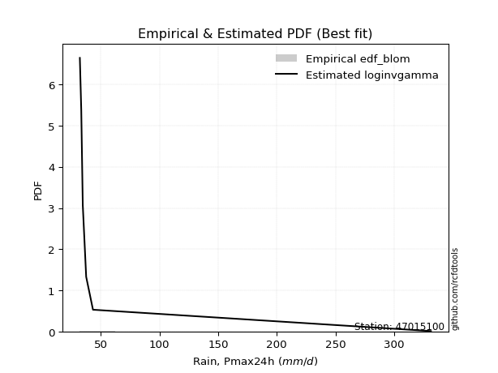</img>

</div>


### 7. EDF Tukey (1962)

In hydrology, the Tukey formula is used as a plotting position formula to estimate the empirical probability or frequency of a flood event (or other hydrological data). The formula parameter is given as _c=0.333_ (or 1/3).

<div align="center">


$P=(m-c)/(n+1-2c)$


</div>


**7.1. Empirical values**

<div align="center">

|                | 0                   | 1                   | 2                   | 3         | 4                  | 5                  | 6                  |
|:---------------|:--------------------|:--------------------|:--------------------|:----------|:-------------------|:-------------------|:-------------------|
| date           | 2022                | 2020                | 2021                | 2019      | 2023               | 2024               | 2025               |
| x              | 32.0                | 33.2                | 34.5                | 37.4      | 43.2               | 331.5              | 504.8              |
| m              | 1                   | 2                   | 3                   | 4         | 5                  | 6                  | 7                  |
| empirical_dist | edf_tukey           | edf_tukey           | edf_tukey           | edf_tukey | edf_tukey          | edf_tukey          | edf_tukey          |
| empirical      | 0.09090909090909091 | 0.22727272727272727 | 0.36363636363636365 | 0.5       | 0.6363636363636364 | 0.7727272727272727 | 0.9090909090909091 |
| empirical_tr   | 1.1                 | 1.2941176470588236  | 1.5714285714285714  | 2.0       | 2.75               | 4.3999999999999995 | 10.999999999999996 |

</div>


**7.2. Kolmogorov-Smirnov fit test (sorted by Δ)**


<div align="center">

|                | 0                   | 1                   | 2                   | 3                   | 4                   | 5                   | 6                   | 7                   | 8                   | 9                   | 10                  | 11                  | 12                  | 13                  | 14                  | 15                  | 16                  | 17                  | 18                  | 19                  | 20                  | 21                  | 22                  | 23                  | 24                  | 25                  | 26                  | 27                  | 28                  | 29                  | 30                  | 31                  | 32                  | 33                  | 34                  | 35                  | 36                  | 37                  | 38                  | 39                  | 40                  | 41                  | 42                  | 43                  | 44                  | 45                  | 46                  | 47                  | 48                  | 49                  | 50                  | 51                  | 52                  | 53                  | 54                  | 55                  | 56                  | 57                  | 58                  | 59                  | 60                  | 61                  | 62                  | 63                  | 64                  | 65                  | 66                  | 67                  | 68                  | 69                  | 70                  | 71                  | 72                  | 73                  | 74                  | 75                  | 76                  | 77                  | 78                  | 79                  | 80                  | 81                  | 82                  | 83                  | 84                  | 85                  | 86                  | 87                  | 88                  | 89                  | 90                  | 91                  | 92                  | 93                  | 94                  | 95                  | 96                  | 97                  | 98                  | 99                  | 100                 | 101                 | 102                 | 103                 | 104                 | 105                 | 106                 | 107                 | 108                 | 109                 | 110                 | 111                 | 112                 | 113                 | 114                 | 115                 | 116                 | 117                 | 118                 | 119                 | 120                 | 121                 | 122                 | 123                 | 124                 | 125                 | 126                 | 127                 | 128                 | 129                 | 130                 | 131                 | 132                 | 133                 | 134                 | 135                 | 136                 | 137                 | 138                 | 139                 | 140                 | 141                 | 142                 | 143                 | 144                 | 145                 | 146                 | 147                 | 148                 | 149                 | 150                 | 151                 | 152                 | 153                 | 154                 | 155                 | 156                 | 157                 | 158                 | 159                 |
|:---------------|:--------------------|:--------------------|:--------------------|:--------------------|:--------------------|:--------------------|:--------------------|:--------------------|:--------------------|:--------------------|:--------------------|:--------------------|:--------------------|:--------------------|:--------------------|:--------------------|:--------------------|:--------------------|:--------------------|:--------------------|:--------------------|:--------------------|:--------------------|:--------------------|:--------------------|:--------------------|:--------------------|:--------------------|:--------------------|:--------------------|:--------------------|:--------------------|:--------------------|:--------------------|:--------------------|:--------------------|:--------------------|:--------------------|:--------------------|:--------------------|:--------------------|:--------------------|:--------------------|:--------------------|:--------------------|:--------------------|:--------------------|:--------------------|:--------------------|:--------------------|:--------------------|:--------------------|:--------------------|:--------------------|:--------------------|:--------------------|:--------------------|:--------------------|:--------------------|:--------------------|:--------------------|:--------------------|:--------------------|:--------------------|:--------------------|:--------------------|:--------------------|:--------------------|:--------------------|:--------------------|:--------------------|:--------------------|:--------------------|:--------------------|:--------------------|:--------------------|:--------------------|:--------------------|:--------------------|:--------------------|:--------------------|:--------------------|:--------------------|:--------------------|:--------------------|:--------------------|:--------------------|:--------------------|:--------------------|:--------------------|:--------------------|:--------------------|:--------------------|:--------------------|:--------------------|:--------------------|:--------------------|:--------------------|:--------------------|:--------------------|:--------------------|:--------------------|:--------------------|:--------------------|:--------------------|:--------------------|:--------------------|:--------------------|:--------------------|:--------------------|:--------------------|:--------------------|:--------------------|:--------------------|:--------------------|:--------------------|:--------------------|:--------------------|:--------------------|:--------------------|:--------------------|:--------------------|:--------------------|:--------------------|:--------------------|:--------------------|:--------------------|:--------------------|:--------------------|:--------------------|:--------------------|:--------------------|:--------------------|:--------------------|:--------------------|:--------------------|:--------------------|:--------------------|:--------------------|:--------------------|:--------------------|:--------------------|:--------------------|:--------------------|:--------------------|:--------------------|:--------------------|:--------------------|:--------------------|:--------------------|:--------------------|:--------------------|:--------------------|:--------------------|:--------------------|:--------------------|:--------------------|:--------------------|:--------------------|:--------------------|
| station        | 47015100            | 47015100            | 47015100            | 47015100            | 47015100            | 47015100            | 47015100            | 47015100            | 47015100            | 47015100            | 47015100            | 47015100            | 47015100            | 47015100            | 47015100            | 47015100            | 47015100            | 47015100            | 47015100            | 47015100            | 47015100            | 47015100            | 47015100            | 47015100            | 47015100            | 47015100            | 47015100            | 47015100            | 47015100            | 47015100            | 47015100            | 47015100            | 47015100            | 47015100            | 47015100            | 47015100            | 47015100            | 47015100            | 47015100            | 47015100            | 47015100            | 47015100            | 47015100            | 47015100            | 47015100            | 47015100            | 47015100            | 47015100            | 47015100            | 47015100            | 47015100            | 47015100            | 47015100            | 47015100            | 47015100            | 47015100            | 47015100            | 47015100            | 47015100            | 47015100            | 47015100            | 47015100            | 47015100            | 47015100            | 47015100            | 47015100            | 47015100            | 47015100            | 47015100            | 47015100            | 47015100            | 47015100            | 47015100            | 47015100            | 47015100            | 47015100            | 47015100            | 47015100            | 47015100            | 47015100            | 47015100            | 47015100            | 47015100            | 47015100            | 47015100            | 47015100            | 47015100            | 47015100            | 47015100            | 47015100            | 47015100            | 47015100            | 47015100            | 47015100            | 47015100            | 47015100            | 47015100            | 47015100            | 47015100            | 47015100            | 47015100            | 47015100            | 47015100            | 47015100            | 47015100            | 47015100            | 47015100            | 47015100            | 47015100            | 47015100            | 47015100            | 47015100            | 47015100            | 47015100            | 47015100            | 47015100            | 47015100            | 47015100            | 47015100            | 47015100            | 47015100            | 47015100            | 47015100            | 47015100            | 47015100            | 47015100            | 47015100            | 47015100            | 47015100            | 47015100            | 47015100            | 47015100            | 47015100            | 47015100            | 47015100            | 47015100            | 47015100            | 47015100            | 47015100            | 47015100            | 47015100            | 47015100            | 47015100            | 47015100            | 47015100            | 47015100            | 47015100            | 47015100            | 47015100            | 47015100            | 47015100            | 47015100            | 47015100            | 47015100            | 47015100            | 47015100            | 47015100            | 47015100            | 47015100            | 47015100            |
| empirical_dist | edf_tukey           | edf_tukey           | edf_tukey           | edf_tukey           | edf_tukey           | edf_tukey           | edf_tukey           | edf_tukey           | edf_tukey           | edf_tukey           | edf_tukey           | edf_tukey           | edf_tukey           | edf_tukey           | edf_tukey           | edf_tukey           | edf_tukey           | edf_tukey           | edf_tukey           | edf_tukey           | edf_tukey           | edf_tukey           | edf_tukey           | edf_tukey           | edf_tukey           | edf_tukey           | edf_tukey           | edf_tukey           | edf_tukey           | edf_tukey           | edf_tukey           | edf_tukey           | edf_tukey           | edf_tukey           | edf_tukey           | edf_tukey           | edf_tukey           | edf_tukey           | edf_tukey           | edf_tukey           | edf_tukey           | edf_tukey           | edf_tukey           | edf_tukey           | edf_tukey           | edf_tukey           | edf_tukey           | edf_tukey           | edf_tukey           | edf_tukey           | edf_tukey           | edf_tukey           | edf_tukey           | edf_tukey           | edf_tukey           | edf_tukey           | edf_tukey           | edf_tukey           | edf_tukey           | edf_tukey           | edf_tukey           | edf_tukey           | edf_tukey           | edf_tukey           | edf_tukey           | edf_tukey           | edf_tukey           | edf_tukey           | edf_tukey           | edf_tukey           | edf_tukey           | edf_tukey           | edf_tukey           | edf_tukey           | edf_tukey           | edf_tukey           | edf_tukey           | edf_tukey           | edf_tukey           | edf_tukey           | edf_tukey           | edf_tukey           | edf_tukey           | edf_tukey           | edf_tukey           | edf_tukey           | edf_tukey           | edf_tukey           | edf_tukey           | edf_tukey           | edf_tukey           | edf_tukey           | edf_tukey           | edf_tukey           | edf_tukey           | edf_tukey           | edf_tukey           | edf_tukey           | edf_tukey           | edf_tukey           | edf_tukey           | edf_tukey           | edf_tukey           | edf_tukey           | edf_tukey           | edf_tukey           | edf_tukey           | edf_tukey           | edf_tukey           | edf_tukey           | edf_tukey           | edf_tukey           | edf_tukey           | edf_tukey           | edf_tukey           | edf_tukey           | edf_tukey           | edf_tukey           | edf_tukey           | edf_tukey           | edf_tukey           | edf_tukey           | edf_tukey           | edf_tukey           | edf_tukey           | edf_tukey           | edf_tukey           | edf_tukey           | edf_tukey           | edf_tukey           | edf_tukey           | edf_tukey           | edf_tukey           | edf_tukey           | edf_tukey           | edf_tukey           | edf_tukey           | edf_tukey           | edf_tukey           | edf_tukey           | edf_tukey           | edf_tukey           | edf_tukey           | edf_tukey           | edf_tukey           | edf_tukey           | edf_tukey           | edf_tukey           | edf_tukey           | edf_tukey           | edf_tukey           | edf_tukey           | edf_tukey           | edf_tukey           | edf_tukey           | edf_tukey           | edf_tukey           | edf_tukey           | edf_tukey           | edf_tukey           |
| p_dist         | loggenextreme       | loginvweibull       | f                   | invgamma            | logf                | loginvgamma         | lomax               | logburr             | lognakagami         | fatiguelife         | loghalfgennorm      | logburr12           | loginvgauss         | loggengamma         | loglomax            | lognct              | invgauss            | logmielke           | logalpha            | truncpareto         | halfgennorm         | logbradford         | genextreme          | logtruncweibull_min | logtruncpareto      | genpareto           | logexponpow         | logvonmises_line    | erlang              | logdgamma           | alpha               | gamma               | loggamma            | loggamma            | logerlang           | logwrapcauchy       | logweibull_min      | loghalflogistic     | logwald             | loggennorm          | loghalfnorm         | t                   | logfoldnorm         | logarcsine          | tukeylambda         | logmoyal            | powerlaw            | logpearson3         | arcsine             | burr                | wrapcauchy          | lograyleigh         | loggumbel_r         | vonmises_line       | loggenpareto        | logsemicircular     | foldnorm            | loggenlogistic      | logmaxwell          | halfnorm            | logbetaprime        | loganglit           | halflogistic        | logloglaplace       | logncf              | nct                 | truncweibull_min    | ncf                 | betaprime           | loglevy_l           | logjohnsonsu        | logloggamma         | pearson3            | logcrystalball      | lognorm             | logt                | semicircular        | rayleigh            | logpowerlaw         | moyal               | logkstwobign        | burr12              | dgamma              | logexponnorm        | gausshyper          | gumbel_r            | maxwell             | loggenexpon         | anglit              | weibull_min         | loglogistic         | logtruncnorm        | wald                | nakagami            | gennorm             | loghypsecant        | logexponweib        | levy_l              | norm                | crystalball         | logfatiguelife      | logrice             | johnsonsu           | logcosine           | logweibull_max      | genlogistic         | logbeta             | loggumbel_l         | gengamma            | loggompertz         | logistic            | loglaplace          | loglaplace          | exponweib           | hypsecant           | kstwobign           | exponpow            | cosine              | gumbel_l            | logrdist            | logargus            | logdweibull         | dweibull            | rice                | laplace             | loggausshyper       | invweibull          | logtriang           | argus               | kappa3              | logksone            | logskewnorm         | logtruncexpon       | logkappa4           | logtukeylambda      | loguniform          | logkappa3           | ksone               | logjohnsonsb        | beta                | exponnorm           | genexpon            | loggenhalflogistic  | bradford            | truncnorm           | genhalflogistic     | skewnorm            | truncexpon          | kappa4              | triang              | gompertz            | logtrapezoid        | uniform             | weibull_max         | trapezoid           | johnsonsb           | rdist               | logvonmises         | vonmises            | mielke              |
| delta          | 0.0859000887645115  | 0.08590523270857786 | 0.1060755668461969  | 0.10607620614809044 | 0.10971741493775167 | 0.10973593613140564 | 0.11099564974663745 | 0.12281070919488346 | 0.13512124596494557 | 0.13641820892849388 | 0.13792035228263    | 0.1380618570922062  | 0.1496123768186397  | 0.15726680004381344 | 0.1647931454843008  | 0.16882698716728373 | 0.17348790888150145 | 0.17610131157371856 | 0.17784773038510882 | 0.17969210888942477 | 0.1832831666755137  | 0.19407646455676608 | 0.1971665581399404  | 0.19783031788762273 | 0.19840765874607835 | 0.2003694925982159  | 0.20481113361574055 | 0.2082059046056173  | 0.20905438332276127 | 0.21124986137048452 | 0.2130447863878977  | 0.2149266296200596  | 0.21688096721238193 | 0.21688096721238193 | 0.2209648465030336  | 0.2234801650391215  | 0.2340446202880747  | 0.23545415800007147 | 0.23643645097222227 | 0.2370408678625471  | 0.23858250793094304 | 0.23899841362771537 | 0.23909748856258556 | 0.24157132082996208 | 0.24434182395059878 | 0.25866793635410956 | 0.2667207957767236  | 0.2671039581213627  | 0.26860910828577467 | 0.26913041600770127 | 0.270432882406881   | 0.27160648703899903 | 0.2726915761170118  | 0.2740683889055022  | 0.28052585664139446 | 0.2811659026849487  | 0.28129536331691174 | 0.28299143563516205 | 0.28322544381484255 | 0.2863333610376587  | 0.2866747342672378  | 0.29069333284028903 | 0.2917347759654006  | 0.29179857691911437 | 0.29246414067543547 | 0.2929891593911844  | 0.29381642484289966 | 0.29539391177450514 | 0.29769328374490267 | 0.299609795128272   | 0.30834858602674486 | 0.3083928514989828  | 0.3097488450255551  | 0.31323574441604135 | 0.31323602418188357 | 0.3132363455158023  | 0.31555536605326784 | 0.31569744997934357 | 0.3161202001901917  | 0.3184777137940725  | 0.31993049741070756 | 0.32215967991825656 | 0.32380151801310314 | 0.32417953949571665 | 0.3245679767389443  | 0.3252165361987438  | 0.3261719327579429  | 0.3264902963391407  | 0.32656561083671154 | 0.3276173542948956  | 0.3332428456650961  | 0.33405636687938384 | 0.33688337575543426 | 0.3449490997422023  | 0.34606503304893244 | 0.3482168962676651  | 0.3487661504609076  | 0.3514235070295203  | 0.35229389158813096 | 0.35229389915322423 | 0.35298369211062697 | 0.353417424062924   | 0.35704006865530824 | 0.3573168091043426  | 0.35744555769591485 | 0.36001023796838116 | 0.3628435518028389  | 0.36860001349669036 | 0.3689410094655403  | 0.37194781411535216 | 0.3743067743407856  | 0.37510116374312646 | 0.37510116374312646 | 0.37756612088348745 | 0.3897724809586496  | 0.3924342114714042  | 0.39384059340022015 | 0.3967467248715051  | 0.3997335908848887  | 0.4051327045075747  | 0.4068730466169884  | 0.4090909090808854  | 0.4090909090909117  | 0.4107850868897122  | 0.4133163272722804  | 0.4133984651679221  | 0.4221775227382942  | 0.42730788516639495 | 0.43793250263222283 | 0.4395968481075781  | 0.4623673222774941  | 0.4633298930666404  | 0.47536935337992103 | 0.4914652950974093  | 0.5077285222197961  | 0.5275680594602656  | 0.5275713295103841  | 0.5332897502948264  | 0.5337394387872176  | 0.5383808684100766  | 0.540351834627354   | 0.5421843763621468  | 0.5476598936663906  | 0.5594513260013964  | 0.5711038079535673  | 0.5784866078555473  | 0.5941515694963894  | 0.6003298434215464  | 0.6031535490691008  | 0.6034555118416415  | 0.6042987827070907  | 0.6060889190480729  | 0.6126749730810644  | 0.6219371250937591  | 0.6254600010206031  | 0.6398703504672014  | 0.7768099241896786  | 1.236445969221605   | 79.89589310221552   | nan                 |
| deltao         | 0.48442053926100004 | 0.48442053926100004 | 0.48442053926100004 | 0.48442053926100004 | 0.48442053926100004 | 0.48442053926100004 | 0.48442053926100004 | 0.48442053926100004 | 0.48442053926100004 | 0.48442053926100004 | 0.48442053926100004 | 0.48442053926100004 | 0.48442053926100004 | 0.48442053926100004 | 0.48442053926100004 | 0.48442053926100004 | 0.48442053926100004 | 0.48442053926100004 | 0.48442053926100004 | 0.48442053926100004 | 0.48442053926100004 | 0.48442053926100004 | 0.48442053926100004 | 0.48442053926100004 | 0.48442053926100004 | 0.48442053926100004 | 0.48442053926100004 | 0.48442053926100004 | 0.48442053926100004 | 0.48442053926100004 | 0.48442053926100004 | 0.48442053926100004 | 0.48442053926100004 | 0.48442053926100004 | 0.48442053926100004 | 0.48442053926100004 | 0.48442053926100004 | 0.48442053926100004 | 0.48442053926100004 | 0.48442053926100004 | 0.48442053926100004 | 0.48442053926100004 | 0.48442053926100004 | 0.48442053926100004 | 0.48442053926100004 | 0.48442053926100004 | 0.48442053926100004 | 0.48442053926100004 | 0.48442053926100004 | 0.48442053926100004 | 0.48442053926100004 | 0.48442053926100004 | 0.48442053926100004 | 0.48442053926100004 | 0.48442053926100004 | 0.48442053926100004 | 0.48442053926100004 | 0.48442053926100004 | 0.48442053926100004 | 0.48442053926100004 | 0.48442053926100004 | 0.48442053926100004 | 0.48442053926100004 | 0.48442053926100004 | 0.48442053926100004 | 0.48442053926100004 | 0.48442053926100004 | 0.48442053926100004 | 0.48442053926100004 | 0.48442053926100004 | 0.48442053926100004 | 0.48442053926100004 | 0.48442053926100004 | 0.48442053926100004 | 0.48442053926100004 | 0.48442053926100004 | 0.48442053926100004 | 0.48442053926100004 | 0.48442053926100004 | 0.48442053926100004 | 0.48442053926100004 | 0.48442053926100004 | 0.48442053926100004 | 0.48442053926100004 | 0.48442053926100004 | 0.48442053926100004 | 0.48442053926100004 | 0.48442053926100004 | 0.48442053926100004 | 0.48442053926100004 | 0.48442053926100004 | 0.48442053926100004 | 0.48442053926100004 | 0.48442053926100004 | 0.48442053926100004 | 0.48442053926100004 | 0.48442053926100004 | 0.48442053926100004 | 0.48442053926100004 | 0.48442053926100004 | 0.48442053926100004 | 0.48442053926100004 | 0.48442053926100004 | 0.48442053926100004 | 0.48442053926100004 | 0.48442053926100004 | 0.48442053926100004 | 0.48442053926100004 | 0.48442053926100004 | 0.48442053926100004 | 0.48442053926100004 | 0.48442053926100004 | 0.48442053926100004 | 0.48442053926100004 | 0.48442053926100004 | 0.48442053926100004 | 0.48442053926100004 | 0.48442053926100004 | 0.48442053926100004 | 0.48442053926100004 | 0.48442053926100004 | 0.48442053926100004 | 0.48442053926100004 | 0.48442053926100004 | 0.48442053926100004 | 0.48442053926100004 | 0.48442053926100004 | 0.48442053926100004 | 0.48442053926100004 | 0.48442053926100004 | 0.48442053926100004 | 0.48442053926100004 | 0.48442053926100004 | 0.48442053926100004 | 0.48442053926100004 | 0.48442053926100004 | 0.48442053926100004 | 0.48442053926100004 | 0.48442053926100004 | 0.48442053926100004 | 0.48442053926100004 | 0.48442053926100004 | 0.48442053926100004 | 0.48442053926100004 | 0.48442053926100004 | 0.48442053926100004 | 0.48442053926100004 | 0.48442053926100004 | 0.48442053926100004 | 0.48442053926100004 | 0.48442053926100004 | 0.48442053926100004 | 0.48442053926100004 | 0.48442053926100004 | 0.48442053926100004 | 0.48442053926100004 | 0.48442053926100004 | 0.48442053926100004 | 0.48442053926100004 | 0.48442053926100004 |
| eval           | Δo > Δ              | Δo > Δ              | Δo > Δ              | Δo > Δ              | Δo > Δ              | Δo > Δ              | Δo > Δ              | Δo > Δ              | Δo > Δ              | Δo > Δ              | Δo > Δ              | Δo > Δ              | Δo > Δ              | Δo > Δ              | Δo > Δ              | Δo > Δ              | Δo > Δ              | Δo > Δ              | Δo > Δ              | Δo > Δ              | Δo > Δ              | Δo > Δ              | Δo > Δ              | Δo > Δ              | Δo > Δ              | Δo > Δ              | Δo > Δ              | Δo > Δ              | Δo > Δ              | Δo > Δ              | Δo > Δ              | Δo > Δ              | Δo > Δ              | Δo > Δ              | Δo > Δ              | Δo > Δ              | Δo > Δ              | Δo > Δ              | Δo > Δ              | Δo > Δ              | Δo > Δ              | Δo > Δ              | Δo > Δ              | Δo > Δ              | Δo > Δ              | Δo > Δ              | Δo > Δ              | Δo > Δ              | Δo > Δ              | Δo > Δ              | Δo > Δ              | Δo > Δ              | Δo > Δ              | Δo > Δ              | Δo > Δ              | Δo > Δ              | Δo > Δ              | Δo > Δ              | Δo > Δ              | Δo > Δ              | Δo > Δ              | Δo > Δ              | Δo > Δ              | Δo > Δ              | Δo > Δ              | Δo > Δ              | Δo > Δ              | Δo > Δ              | Δo > Δ              | Δo > Δ              | Δo > Δ              | Δo > Δ              | Δo > Δ              | Δo > Δ              | Δo > Δ              | Δo > Δ              | Δo > Δ              | Δo > Δ              | Δo > Δ              | Δo > Δ              | Δo > Δ              | Δo > Δ              | Δo > Δ              | Δo > Δ              | Δo > Δ              | Δo > Δ              | Δo > Δ              | Δo > Δ              | Δo > Δ              | Δo > Δ              | Δo > Δ              | Δo > Δ              | Δo > Δ              | Δo > Δ              | Δo > Δ              | Δo > Δ              | Δo > Δ              | Δo > Δ              | Δo > Δ              | Δo > Δ              | Δo > Δ              | Δo > Δ              | Δo > Δ              | Δo > Δ              | Δo > Δ              | Δo > Δ              | Δo > Δ              | Δo > Δ              | Δo > Δ              | Δo > Δ              | Δo > Δ              | Δo > Δ              | Δo > Δ              | Δo > Δ              | Δo > Δ              | Δo > Δ              | Δo > Δ              | Δo > Δ              | Δo > Δ              | Δo > Δ              | Δo > Δ              | Δo > Δ              | Δo > Δ              | Δo > Δ              | Δo > Δ              | Δo > Δ              | Δo > Δ              | Δo > Δ              | Δo > Δ              | Δo > Δ              | Δo > Δ              | Δo > Δ              | Δo > Δ              | Δo <= Δ             | Δo <= Δ             | Δo <= Δ             | Δo <= Δ             | Δo <= Δ             | Δo <= Δ             | Δo <= Δ             | Δo <= Δ             | Δo <= Δ             | Δo <= Δ             | Δo <= Δ             | Δo <= Δ             | Δo <= Δ             | Δo <= Δ             | Δo <= Δ             | Δo <= Δ             | Δo <= Δ             | Δo <= Δ             | Δo <= Δ             | Δo <= Δ             | Δo <= Δ             | Δo <= Δ             | Δo <= Δ             | Δo <= Δ             | Δo <= Δ             | Δo <= Δ             | Δo <= Δ             |
| fit            | 1                   | 1                   | 1                   | 1                   | 1                   | 1                   | 1                   | 1                   | 1                   | 1                   | 1                   | 1                   | 1                   | 1                   | 1                   | 1                   | 1                   | 1                   | 1                   | 1                   | 1                   | 1                   | 1                   | 1                   | 1                   | 1                   | 1                   | 1                   | 1                   | 1                   | 1                   | 1                   | 1                   | 1                   | 1                   | 1                   | 1                   | 1                   | 1                   | 1                   | 1                   | 1                   | 1                   | 1                   | 1                   | 1                   | 1                   | 1                   | 1                   | 1                   | 1                   | 1                   | 1                   | 1                   | 1                   | 1                   | 1                   | 1                   | 1                   | 1                   | 1                   | 1                   | 1                   | 1                   | 1                   | 1                   | 1                   | 1                   | 1                   | 1                   | 1                   | 1                   | 1                   | 1                   | 1                   | 1                   | 1                   | 1                   | 1                   | 1                   | 1                   | 1                   | 1                   | 1                   | 1                   | 1                   | 1                   | 1                   | 1                   | 1                   | 1                   | 1                   | 1                   | 1                   | 1                   | 1                   | 1                   | 1                   | 1                   | 1                   | 1                   | 1                   | 1                   | 1                   | 1                   | 1                   | 1                   | 1                   | 1                   | 1                   | 1                   | 1                   | 1                   | 1                   | 1                   | 1                   | 1                   | 1                   | 1                   | 1                   | 1                   | 1                   | 1                   | 1                   | 1                   | 1                   | 1                   | 1                   | 1                   | 1                   | 1                   | 1                   | 1                   | 0                   | 0                   | 0                   | 0                   | 0                   | 0                   | 0                   | 0                   | 0                   | 0                   | 0                   | 0                   | 0                   | 0                   | 0                   | 0                   | 0                   | 0                   | 0                   | 0                   | 0                   | 0                   | 0                   | 0                   | 0                   | 0                   | 0                   |
| n              | 7                   | 7                   | 7                   | 7                   | 7                   | 7                   | 7                   | 7                   | 7                   | 7                   | 7                   | 7                   | 7                   | 7                   | 7                   | 7                   | 7                   | 7                   | 7                   | 7                   | 7                   | 7                   | 7                   | 7                   | 7                   | 7                   | 7                   | 7                   | 7                   | 7                   | 7                   | 7                   | 7                   | 7                   | 7                   | 7                   | 7                   | 7                   | 7                   | 7                   | 7                   | 7                   | 7                   | 7                   | 7                   | 7                   | 7                   | 7                   | 7                   | 7                   | 7                   | 7                   | 7                   | 7                   | 7                   | 7                   | 7                   | 7                   | 7                   | 7                   | 7                   | 7                   | 7                   | 7                   | 7                   | 7                   | 7                   | 7                   | 7                   | 7                   | 7                   | 7                   | 7                   | 7                   | 7                   | 7                   | 7                   | 7                   | 7                   | 7                   | 7                   | 7                   | 7                   | 7                   | 7                   | 7                   | 7                   | 7                   | 7                   | 7                   | 7                   | 7                   | 7                   | 7                   | 7                   | 7                   | 7                   | 7                   | 7                   | 7                   | 7                   | 7                   | 7                   | 7                   | 7                   | 7                   | 7                   | 7                   | 7                   | 7                   | 7                   | 7                   | 7                   | 7                   | 7                   | 7                   | 7                   | 7                   | 7                   | 7                   | 7                   | 7                   | 7                   | 7                   | 7                   | 7                   | 7                   | 7                   | 7                   | 7                   | 7                   | 7                   | 7                   | 7                   | 7                   | 7                   | 7                   | 7                   | 7                   | 7                   | 7                   | 7                   | 7                   | 7                   | 7                   | 7                   | 7                   | 7                   | 7                   | 7                   | 7                   | 7                   | 7                   | 7                   | 7                   | 7                   | 7                   | 7                   | 7                   | 7                   |
| best_fit       | 1                   | 0                   | 0                   | 0                   | 0                   | 0                   | 0                   | 0                   | 0                   | 0                   | 0                   | 0                   | 0                   | 0                   | 0                   | 0                   | 0                   | 0                   | 0                   | 0                   | 0                   | 0                   | 0                   | 0                   | 0                   | 0                   | 0                   | 0                   | 0                   | 0                   | 0                   | 0                   | 0                   | 0                   | 0                   | 0                   | 0                   | 0                   | 0                   | 0                   | 0                   | 0                   | 0                   | 0                   | 0                   | 0                   | 0                   | 0                   | 0                   | 0                   | 0                   | 0                   | 0                   | 0                   | 0                   | 0                   | 0                   | 0                   | 0                   | 0                   | 0                   | 0                   | 0                   | 0                   | 0                   | 0                   | 0                   | 0                   | 0                   | 0                   | 0                   | 0                   | 0                   | 0                   | 0                   | 0                   | 0                   | 0                   | 0                   | 0                   | 0                   | 0                   | 0                   | 0                   | 0                   | 0                   | 0                   | 0                   | 0                   | 0                   | 0                   | 0                   | 0                   | 0                   | 0                   | 0                   | 0                   | 0                   | 0                   | 0                   | 0                   | 0                   | 0                   | 0                   | 0                   | 0                   | 0                   | 0                   | 0                   | 0                   | 0                   | 0                   | 0                   | 0                   | 0                   | 0                   | 0                   | 0                   | 0                   | 0                   | 0                   | 0                   | 0                   | 0                   | 0                   | 0                   | 0                   | 0                   | 0                   | 0                   | 0                   | 0                   | 0                   | 0                   | 0                   | 0                   | 0                   | 0                   | 0                   | 0                   | 0                   | 0                   | 0                   | 0                   | 0                   | 0                   | 0                   | 0                   | 0                   | 0                   | 0                   | 0                   | 0                   | 0                   | 0                   | 0                   | 0                   | 0                   | 0                   | 0                   |
| best_fit_sort  | 1                   | 2                   | 3                   | 4                   | 5                   | 6                   | 7                   | 8                   | 9                   | 10                  | 11                  | 12                  | 13                  | 14                  | 15                  | 16                  | 17                  | 18                  | 19                  | 20                  | 21                  | 22                  | 23                  | 24                  | 25                  | 26                  | 27                  | 28                  | 29                  | 30                  | 31                  | 32                  | 33                  | 34                  | 35                  | 36                  | 37                  | 38                  | 39                  | 40                  | 41                  | 42                  | 43                  | 44                  | 45                  | 46                  | 47                  | 48                  | 49                  | 50                  | 51                  | 52                  | 53                  | 54                  | 55                  | 56                  | 57                  | 58                  | 59                  | 60                  | 61                  | 62                  | 63                  | 64                  | 65                  | 66                  | 67                  | 68                  | 69                  | 70                  | 71                  | 72                  | 73                  | 74                  | 75                  | 76                  | 77                  | 78                  | 79                  | 80                  | 81                  | 82                  | 83                  | 84                  | 85                  | 86                  | 87                  | 88                  | 89                  | 90                  | 91                  | 92                  | 93                  | 94                  | 95                  | 96                  | 97                  | 98                  | 99                  | 100                 | 101                 | 102                 | 103                 | 104                 | 105                 | 106                 | 107                 | 108                 | 109                 | 110                 | 111                 | 112                 | 113                 | 114                 | 115                 | 116                 | 117                 | 118                 | 119                 | 120                 | 121                 | 122                 | 123                 | 124                 | 125                 | 126                 | 127                 | 128                 | 129                 | 130                 | 131                 | 132                 | 133                 | 134                 | 135                 | 136                 | 137                 | 138                 | 139                 | 140                 | 141                 | 142                 | 143                 | 144                 | 145                 | 146                 | 147                 | 148                 | 149                 | 150                 | 151                 | 152                 | 153                 | 154                 | 155                 | 156                 | 157                 | 158                 | 159                 | 160                 |

</div>


**7.3. Best fit**

<div align="center">

|   id |   station | empirical_dist   | p_dist        |     delta |   deltao | eval   |   fit |   n |   best_fit |   best_fit_sort |
|-----:|----------:|:-----------------|:--------------|----------:|---------:|:-------|------:|----:|-----------:|----------------:|
|    0 |  47015100 | edf_tukey        | loggenextreme | 0.0859001 | 0.484421 | Δo > Δ |     1 |   7 |          1 |               1 |

</div>


<div align="center">

</img>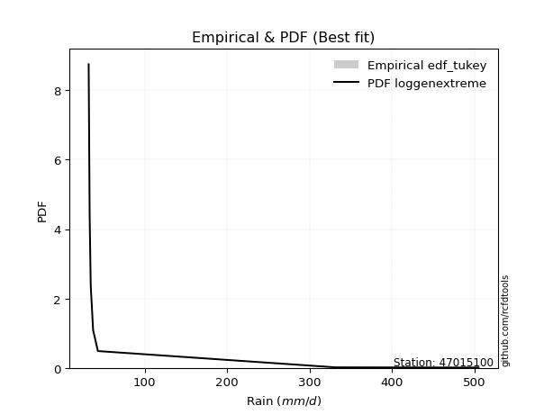</img>

</div>


### 8. EDF Gringorten (1963)

Gringorten plotting position formula is essential for estimating the probability and return periods of extreme events like floods and heavy rainfall. The constant _a=0.44_.

<div align="center">


$P=(m-a)/(n+1-2a)$


</div>


**8.1. Empirical values**

<div align="center">

|                | 0                   | 1                   | 2                  | 3              | 4                  | 5                  | 6                  |
|:---------------|:--------------------|:--------------------|:-------------------|:---------------|:-------------------|:-------------------|:-------------------|
| date           | 2022                | 2020                | 2021               | 2019           | 2023               | 2024               | 2025               |
| x              | 32.0                | 33.2                | 34.5               | 37.4           | 43.2               | 331.5              | 504.8              |
| m              | 1                   | 2                   | 3                  | 4              | 5                  | 6                  | 7                  |
| empirical_dist | edf_gringorten      | edf_gringorten      | edf_gringorten     | edf_gringorten | edf_gringorten     | edf_gringorten     | edf_gringorten     |
| empirical      | 0.07865168539325844 | 0.21910112359550563 | 0.3595505617977528 | 0.5            | 0.6404494382022471 | 0.7808988764044943 | 0.9213483146067415 |
| empirical_tr   | 1.0853658536585364  | 1.2805755395683454  | 1.5614035087719298 | 2.0            | 2.781249999999999  | 4.564102564102562  | 12.714285714285701 |

</div>


**8.2. Kolmogorov-Smirnov fit test (sorted by Δ)**


<div align="center">

|                | 0                   | 1                   | 2                   | 3                   | 4                   | 5                   | 6                   | 7                   | 8                   | 9                   | 10                  | 11                  | 12                  | 13                  | 14                  | 15                  | 16                  | 17                  | 18                  | 19                  | 20                  | 21                  | 22                  | 23                  | 24                  | 25                  | 26                  | 27                  | 28                  | 29                  | 30                  | 31                  | 32                  | 33                  | 34                  | 35                  | 36                  | 37                  | 38                  | 39                  | 40                  | 41                  | 42                  | 43                  | 44                  | 45                  | 46                  | 47                  | 48                  | 49                  | 50                  | 51                  | 52                  | 53                  | 54                  | 55                  | 56                  | 57                  | 58                  | 59                  | 60                  | 61                  | 62                  | 63                  | 64                  | 65                  | 66                  | 67                  | 68                  | 69                  | 70                  | 71                  | 72                  | 73                  | 74                  | 75                  | 76                  | 77                  | 78                  | 79                  | 80                  | 81                  | 82                  | 83                  | 84                  | 85                  | 86                  | 87                  | 88                  | 89                  | 90                  | 91                  | 92                  | 93                  | 94                  | 95                  | 96                  | 97                  | 98                  | 99                  | 100                 | 101                 | 102                 | 103                 | 104                 | 105                 | 106                 | 107                 | 108                 | 109                 | 110                 | 111                 | 112                 | 113                 | 114                 | 115                 | 116                 | 117                 | 118                 | 119                 | 120                 | 121                 | 122                 | 123                 | 124                 | 125                 | 126                 | 127                 | 128                 | 129                 | 130                 | 131                 | 132                 | 133                 | 134                 | 135                 | 136                 | 137                 | 138                 | 139                 | 140                 | 141                 | 142                 | 143                 | 144                 | 145                 | 146                 | 147                 | 148                 | 149                 | 150                 | 151                 | 152                 | 153                 | 154                 | 155                 | 156                 | 157                 | 158                 | 159                 |
|:---------------|:--------------------|:--------------------|:--------------------|:--------------------|:--------------------|:--------------------|:--------------------|:--------------------|:--------------------|:--------------------|:--------------------|:--------------------|:--------------------|:--------------------|:--------------------|:--------------------|:--------------------|:--------------------|:--------------------|:--------------------|:--------------------|:--------------------|:--------------------|:--------------------|:--------------------|:--------------------|:--------------------|:--------------------|:--------------------|:--------------------|:--------------------|:--------------------|:--------------------|:--------------------|:--------------------|:--------------------|:--------------------|:--------------------|:--------------------|:--------------------|:--------------------|:--------------------|:--------------------|:--------------------|:--------------------|:--------------------|:--------------------|:--------------------|:--------------------|:--------------------|:--------------------|:--------------------|:--------------------|:--------------------|:--------------------|:--------------------|:--------------------|:--------------------|:--------------------|:--------------------|:--------------------|:--------------------|:--------------------|:--------------------|:--------------------|:--------------------|:--------------------|:--------------------|:--------------------|:--------------------|:--------------------|:--------------------|:--------------------|:--------------------|:--------------------|:--------------------|:--------------------|:--------------------|:--------------------|:--------------------|:--------------------|:--------------------|:--------------------|:--------------------|:--------------------|:--------------------|:--------------------|:--------------------|:--------------------|:--------------------|:--------------------|:--------------------|:--------------------|:--------------------|:--------------------|:--------------------|:--------------------|:--------------------|:--------------------|:--------------------|:--------------------|:--------------------|:--------------------|:--------------------|:--------------------|:--------------------|:--------------------|:--------------------|:--------------------|:--------------------|:--------------------|:--------------------|:--------------------|:--------------------|:--------------------|:--------------------|:--------------------|:--------------------|:--------------------|:--------------------|:--------------------|:--------------------|:--------------------|:--------------------|:--------------------|:--------------------|:--------------------|:--------------------|:--------------------|:--------------------|:--------------------|:--------------------|:--------------------|:--------------------|:--------------------|:--------------------|:--------------------|:--------------------|:--------------------|:--------------------|:--------------------|:--------------------|:--------------------|:--------------------|:--------------------|:--------------------|:--------------------|:--------------------|:--------------------|:--------------------|:--------------------|:--------------------|:--------------------|:--------------------|:--------------------|:--------------------|:--------------------|:--------------------|:--------------------|:--------------------|
| station        | 47015100            | 47015100            | 47015100            | 47015100            | 47015100            | 47015100            | 47015100            | 47015100            | 47015100            | 47015100            | 47015100            | 47015100            | 47015100            | 47015100            | 47015100            | 47015100            | 47015100            | 47015100            | 47015100            | 47015100            | 47015100            | 47015100            | 47015100            | 47015100            | 47015100            | 47015100            | 47015100            | 47015100            | 47015100            | 47015100            | 47015100            | 47015100            | 47015100            | 47015100            | 47015100            | 47015100            | 47015100            | 47015100            | 47015100            | 47015100            | 47015100            | 47015100            | 47015100            | 47015100            | 47015100            | 47015100            | 47015100            | 47015100            | 47015100            | 47015100            | 47015100            | 47015100            | 47015100            | 47015100            | 47015100            | 47015100            | 47015100            | 47015100            | 47015100            | 47015100            | 47015100            | 47015100            | 47015100            | 47015100            | 47015100            | 47015100            | 47015100            | 47015100            | 47015100            | 47015100            | 47015100            | 47015100            | 47015100            | 47015100            | 47015100            | 47015100            | 47015100            | 47015100            | 47015100            | 47015100            | 47015100            | 47015100            | 47015100            | 47015100            | 47015100            | 47015100            | 47015100            | 47015100            | 47015100            | 47015100            | 47015100            | 47015100            | 47015100            | 47015100            | 47015100            | 47015100            | 47015100            | 47015100            | 47015100            | 47015100            | 47015100            | 47015100            | 47015100            | 47015100            | 47015100            | 47015100            | 47015100            | 47015100            | 47015100            | 47015100            | 47015100            | 47015100            | 47015100            | 47015100            | 47015100            | 47015100            | 47015100            | 47015100            | 47015100            | 47015100            | 47015100            | 47015100            | 47015100            | 47015100            | 47015100            | 47015100            | 47015100            | 47015100            | 47015100            | 47015100            | 47015100            | 47015100            | 47015100            | 47015100            | 47015100            | 47015100            | 47015100            | 47015100            | 47015100            | 47015100            | 47015100            | 47015100            | 47015100            | 47015100            | 47015100            | 47015100            | 47015100            | 47015100            | 47015100            | 47015100            | 47015100            | 47015100            | 47015100            | 47015100            | 47015100            | 47015100            | 47015100            | 47015100            | 47015100            | 47015100            |
| empirical_dist | edf_gringorten      | edf_gringorten      | edf_gringorten      | edf_gringorten      | edf_gringorten      | edf_gringorten      | edf_gringorten      | edf_gringorten      | edf_gringorten      | edf_gringorten      | edf_gringorten      | edf_gringorten      | edf_gringorten      | edf_gringorten      | edf_gringorten      | edf_gringorten      | edf_gringorten      | edf_gringorten      | edf_gringorten      | edf_gringorten      | edf_gringorten      | edf_gringorten      | edf_gringorten      | edf_gringorten      | edf_gringorten      | edf_gringorten      | edf_gringorten      | edf_gringorten      | edf_gringorten      | edf_gringorten      | edf_gringorten      | edf_gringorten      | edf_gringorten      | edf_gringorten      | edf_gringorten      | edf_gringorten      | edf_gringorten      | edf_gringorten      | edf_gringorten      | edf_gringorten      | edf_gringorten      | edf_gringorten      | edf_gringorten      | edf_gringorten      | edf_gringorten      | edf_gringorten      | edf_gringorten      | edf_gringorten      | edf_gringorten      | edf_gringorten      | edf_gringorten      | edf_gringorten      | edf_gringorten      | edf_gringorten      | edf_gringorten      | edf_gringorten      | edf_gringorten      | edf_gringorten      | edf_gringorten      | edf_gringorten      | edf_gringorten      | edf_gringorten      | edf_gringorten      | edf_gringorten      | edf_gringorten      | edf_gringorten      | edf_gringorten      | edf_gringorten      | edf_gringorten      | edf_gringorten      | edf_gringorten      | edf_gringorten      | edf_gringorten      | edf_gringorten      | edf_gringorten      | edf_gringorten      | edf_gringorten      | edf_gringorten      | edf_gringorten      | edf_gringorten      | edf_gringorten      | edf_gringorten      | edf_gringorten      | edf_gringorten      | edf_gringorten      | edf_gringorten      | edf_gringorten      | edf_gringorten      | edf_gringorten      | edf_gringorten      | edf_gringorten      | edf_gringorten      | edf_gringorten      | edf_gringorten      | edf_gringorten      | edf_gringorten      | edf_gringorten      | edf_gringorten      | edf_gringorten      | edf_gringorten      | edf_gringorten      | edf_gringorten      | edf_gringorten      | edf_gringorten      | edf_gringorten      | edf_gringorten      | edf_gringorten      | edf_gringorten      | edf_gringorten      | edf_gringorten      | edf_gringorten      | edf_gringorten      | edf_gringorten      | edf_gringorten      | edf_gringorten      | edf_gringorten      | edf_gringorten      | edf_gringorten      | edf_gringorten      | edf_gringorten      | edf_gringorten      | edf_gringorten      | edf_gringorten      | edf_gringorten      | edf_gringorten      | edf_gringorten      | edf_gringorten      | edf_gringorten      | edf_gringorten      | edf_gringorten      | edf_gringorten      | edf_gringorten      | edf_gringorten      | edf_gringorten      | edf_gringorten      | edf_gringorten      | edf_gringorten      | edf_gringorten      | edf_gringorten      | edf_gringorten      | edf_gringorten      | edf_gringorten      | edf_gringorten      | edf_gringorten      | edf_gringorten      | edf_gringorten      | edf_gringorten      | edf_gringorten      | edf_gringorten      | edf_gringorten      | edf_gringorten      | edf_gringorten      | edf_gringorten      | edf_gringorten      | edf_gringorten      | edf_gringorten      | edf_gringorten      | edf_gringorten      | edf_gringorten      | edf_gringorten      |
| p_dist         | loggenextreme       | loginvweibull       | f                   | invgamma            | logf                | loginvgamma         | lomax               | logburr             | loghalfgennorm      | logburr12           | lognakagami         | fatiguelife         | loginvgauss         | loggengamma         | loglomax            | invgauss            | lognct              | logalpha            | truncpareto         | halfgennorm         | logmielke           | logtruncweibull_min | logtruncpareto      | genpareto           | logbradford         | erlang              | alpha               | genextreme          | gamma               | loggamma            | loggamma            | logexponpow         | logerlang           | logdgamma           | logvonmises_line    | logwrapcauchy       | logweibull_min      | loghalflogistic     | logwald             | loghalfnorm         | logfoldnorm         | tukeylambda         | logarcsine          | loggennorm          | t                   | logmoyal            | logpearson3         | burr                | arcsine             | powerlaw            | lograyleigh         | loggumbel_r         | vonmises_line       | wrapcauchy          | loggenpareto        | logsemicircular     | foldnorm            | loggenlogistic      | logmaxwell          | halfnorm            | logbetaprime        | loganglit           | halflogistic        | logncf              | nct                 | truncweibull_min    | ncf                 | betaprime           | logloglaplace       | loglevy_l           | logjohnsonsu        | logloggamma         | pearson3            | logcrystalball      | lognorm             | logt                | semicircular        | rayleigh            | moyal               | logkstwobign        | logpowerlaw         | burr12              | dgamma              | logexponnorm        | gausshyper          | gumbel_r            | maxwell             | loggenexpon         | anglit              | weibull_min         | loglogistic         | logtruncnorm        | wald                | nakagami            | loghypsecant        | logexponweib        | norm                | crystalball         | logrice             | gennorm             | logfatiguelife      | logcosine           | logweibull_max      | levy_l              | genlogistic         | johnsonsu           | logbeta             | loggumbel_l         | gengamma            | loggompertz         | logistic            | loglaplace          | loglaplace          | exponweib           | hypsecant           | kstwobign           | exponpow            | cosine              | gumbel_l            | logrdist            | logargus            | rice                | laplace             | loggausshyper       | logdweibull         | dweibull            | logtriang           | invweibull          | argus               | kappa3              | logksone            | logskewnorm         | logtruncexpon       | logkappa4           | logtukeylambda      | loguniform          | logkappa3           | ksone               | logjohnsonsb        | exponnorm           | genexpon            | beta                | loggenhalflogistic  | bradford            | truncnorm           | genhalflogistic     | skewnorm            | truncexpon          | kappa4              | triang              | gompertz            | logtrapezoid        | uniform             | trapezoid           | weibull_max         | johnsonsb           | rdist               | logvonmises         | vonmises            | mielke              |
| delta          | 0.07772848508728991 | 0.07773362903135628 | 0.09790396316897532 | 0.09790460247086885 | 0.10154581126053008 | 0.10156433245418406 | 0.10282404606941586 | 0.11463910551766188 | 0.12974874860540841 | 0.1298902534149846  | 0.1392070478035563  | 0.14050401076710461 | 0.14144077314141812 | 0.14909519636659185 | 0.1566215418070792  | 0.16531630520427987 | 0.16882698716728373 | 0.16967612670788723 | 0.1715205052122032  | 0.17511156299829211 | 0.188358717089551   | 0.18965871421040115 | 0.19023605506885677 | 0.19219788892099432 | 0.19816226639537682 | 0.2008827796455397  | 0.20487318271067612 | 0.20533816181716205 | 0.206755025942838   | 0.20870936353516034 | 0.20870936353516034 | 0.20889693545435128 | 0.21279324282581202 | 0.21709413198991562 | 0.22046331012144976 | 0.23165176871634308 | 0.23813042212668545 | 0.2395399598386822  | 0.240522252810833   | 0.24266830976955378 | 0.2431832904011963  | 0.24434182395059878 | 0.24882603749275767 | 0.24929827337837956 | 0.25125581914354783 | 0.2627537381927203  | 0.2711897599599734  | 0.273216217846312   | 0.2735139966864699  | 0.27489239945394517 | 0.27569228887760977 | 0.2767773779556225  | 0.27815419074411296 | 0.2786044860841026  | 0.2846116584800052  | 0.2852517045235594  | 0.2853811651555225  | 0.2870772374737728  | 0.2873112456534533  | 0.29041916287626945 | 0.2907605361058485  | 0.29477913467889977 | 0.29582057780401133 | 0.2965499425140462  | 0.29707496122979515 | 0.2979022266815104  | 0.29947971361311587 | 0.3017790855835134  | 0.3040559824349468  | 0.3118672006441045  | 0.3124343878653556  | 0.31247865333759356 | 0.31383464686416584 | 0.3173215462546521  | 0.3173218260204943  | 0.31732214735441305 | 0.3196411678918786  | 0.3197832518179543  | 0.32256351563268326 | 0.3240162992493183  | 0.3242918038674134  | 0.3262454817568673  | 0.3278873198517139  | 0.3282653413343274  | 0.328653778577555   | 0.32930233803735454 | 0.3302577345965536  | 0.3305760981777514  | 0.3306514126753223  | 0.3317031561335063  | 0.33732864750370684 | 0.3381421687179946  | 0.340969177594045   | 0.349034901580813   | 0.35230269810627585 | 0.3528519522995183  | 0.3563796934267417  | 0.35637970099183497 | 0.3575032259015347  | 0.3583224385647649  | 0.36115529578784866 | 0.36140261094295334 | 0.3615313595345256  | 0.3636809125453528  | 0.3640960398069919  | 0.36521167233252994 | 0.3710151554800606  | 0.3726858153353011  | 0.37302681130415105 | 0.3760336159539629  | 0.3783925761793963  | 0.3791869655817372  | 0.3791869655817372  | 0.3816519227220982  | 0.3938582827972603  | 0.39652001331001496 | 0.3979263952388309  | 0.4008325267101158  | 0.4038193927234994  | 0.40921850634618545 | 0.41095884845559916 | 0.41487088872832295 | 0.41740212911089114 | 0.41748426700653285 | 0.42134831459671784 | 0.4213483146067442  | 0.4313936870050057  | 0.4344349282541266  | 0.44201830447083357 | 0.45185425362341053 | 0.46645312411610484 | 0.46741569490525114 | 0.47945515521853177 | 0.49555109693602006 | 0.5118143240584069  | 0.5316538612988764  | 0.5316571313489948  | 0.5373755521334371  | 0.5419110424644393  | 0.5444376364659648  | 0.5462701782007575  | 0.5506382739259091  | 0.5517456955050013  | 0.5635371278400071  | 0.575189609792178   | 0.582572409694158   | 0.5982373713350001  | 0.6044156452601571  | 0.6072393509077115  | 0.6075413136802522  | 0.6083845845457014  | 0.6101747208866837  | 0.6167607749196752  | 0.6295458028592138  | 0.6301087287709807  | 0.6480419541444231  | 0.7890673297055112  | 1.2487033747374374  | 79.88363569669968   | nan                 |
| deltao         | 0.48442053926100004 | 0.48442053926100004 | 0.48442053926100004 | 0.48442053926100004 | 0.48442053926100004 | 0.48442053926100004 | 0.48442053926100004 | 0.48442053926100004 | 0.48442053926100004 | 0.48442053926100004 | 0.48442053926100004 | 0.48442053926100004 | 0.48442053926100004 | 0.48442053926100004 | 0.48442053926100004 | 0.48442053926100004 | 0.48442053926100004 | 0.48442053926100004 | 0.48442053926100004 | 0.48442053926100004 | 0.48442053926100004 | 0.48442053926100004 | 0.48442053926100004 | 0.48442053926100004 | 0.48442053926100004 | 0.48442053926100004 | 0.48442053926100004 | 0.48442053926100004 | 0.48442053926100004 | 0.48442053926100004 | 0.48442053926100004 | 0.48442053926100004 | 0.48442053926100004 | 0.48442053926100004 | 0.48442053926100004 | 0.48442053926100004 | 0.48442053926100004 | 0.48442053926100004 | 0.48442053926100004 | 0.48442053926100004 | 0.48442053926100004 | 0.48442053926100004 | 0.48442053926100004 | 0.48442053926100004 | 0.48442053926100004 | 0.48442053926100004 | 0.48442053926100004 | 0.48442053926100004 | 0.48442053926100004 | 0.48442053926100004 | 0.48442053926100004 | 0.48442053926100004 | 0.48442053926100004 | 0.48442053926100004 | 0.48442053926100004 | 0.48442053926100004 | 0.48442053926100004 | 0.48442053926100004 | 0.48442053926100004 | 0.48442053926100004 | 0.48442053926100004 | 0.48442053926100004 | 0.48442053926100004 | 0.48442053926100004 | 0.48442053926100004 | 0.48442053926100004 | 0.48442053926100004 | 0.48442053926100004 | 0.48442053926100004 | 0.48442053926100004 | 0.48442053926100004 | 0.48442053926100004 | 0.48442053926100004 | 0.48442053926100004 | 0.48442053926100004 | 0.48442053926100004 | 0.48442053926100004 | 0.48442053926100004 | 0.48442053926100004 | 0.48442053926100004 | 0.48442053926100004 | 0.48442053926100004 | 0.48442053926100004 | 0.48442053926100004 | 0.48442053926100004 | 0.48442053926100004 | 0.48442053926100004 | 0.48442053926100004 | 0.48442053926100004 | 0.48442053926100004 | 0.48442053926100004 | 0.48442053926100004 | 0.48442053926100004 | 0.48442053926100004 | 0.48442053926100004 | 0.48442053926100004 | 0.48442053926100004 | 0.48442053926100004 | 0.48442053926100004 | 0.48442053926100004 | 0.48442053926100004 | 0.48442053926100004 | 0.48442053926100004 | 0.48442053926100004 | 0.48442053926100004 | 0.48442053926100004 | 0.48442053926100004 | 0.48442053926100004 | 0.48442053926100004 | 0.48442053926100004 | 0.48442053926100004 | 0.48442053926100004 | 0.48442053926100004 | 0.48442053926100004 | 0.48442053926100004 | 0.48442053926100004 | 0.48442053926100004 | 0.48442053926100004 | 0.48442053926100004 | 0.48442053926100004 | 0.48442053926100004 | 0.48442053926100004 | 0.48442053926100004 | 0.48442053926100004 | 0.48442053926100004 | 0.48442053926100004 | 0.48442053926100004 | 0.48442053926100004 | 0.48442053926100004 | 0.48442053926100004 | 0.48442053926100004 | 0.48442053926100004 | 0.48442053926100004 | 0.48442053926100004 | 0.48442053926100004 | 0.48442053926100004 | 0.48442053926100004 | 0.48442053926100004 | 0.48442053926100004 | 0.48442053926100004 | 0.48442053926100004 | 0.48442053926100004 | 0.48442053926100004 | 0.48442053926100004 | 0.48442053926100004 | 0.48442053926100004 | 0.48442053926100004 | 0.48442053926100004 | 0.48442053926100004 | 0.48442053926100004 | 0.48442053926100004 | 0.48442053926100004 | 0.48442053926100004 | 0.48442053926100004 | 0.48442053926100004 | 0.48442053926100004 | 0.48442053926100004 | 0.48442053926100004 | 0.48442053926100004 | 0.48442053926100004 |
| eval           | Δo > Δ              | Δo > Δ              | Δo > Δ              | Δo > Δ              | Δo > Δ              | Δo > Δ              | Δo > Δ              | Δo > Δ              | Δo > Δ              | Δo > Δ              | Δo > Δ              | Δo > Δ              | Δo > Δ              | Δo > Δ              | Δo > Δ              | Δo > Δ              | Δo > Δ              | Δo > Δ              | Δo > Δ              | Δo > Δ              | Δo > Δ              | Δo > Δ              | Δo > Δ              | Δo > Δ              | Δo > Δ              | Δo > Δ              | Δo > Δ              | Δo > Δ              | Δo > Δ              | Δo > Δ              | Δo > Δ              | Δo > Δ              | Δo > Δ              | Δo > Δ              | Δo > Δ              | Δo > Δ              | Δo > Δ              | Δo > Δ              | Δo > Δ              | Δo > Δ              | Δo > Δ              | Δo > Δ              | Δo > Δ              | Δo > Δ              | Δo > Δ              | Δo > Δ              | Δo > Δ              | Δo > Δ              | Δo > Δ              | Δo > Δ              | Δo > Δ              | Δo > Δ              | Δo > Δ              | Δo > Δ              | Δo > Δ              | Δo > Δ              | Δo > Δ              | Δo > Δ              | Δo > Δ              | Δo > Δ              | Δo > Δ              | Δo > Δ              | Δo > Δ              | Δo > Δ              | Δo > Δ              | Δo > Δ              | Δo > Δ              | Δo > Δ              | Δo > Δ              | Δo > Δ              | Δo > Δ              | Δo > Δ              | Δo > Δ              | Δo > Δ              | Δo > Δ              | Δo > Δ              | Δo > Δ              | Δo > Δ              | Δo > Δ              | Δo > Δ              | Δo > Δ              | Δo > Δ              | Δo > Δ              | Δo > Δ              | Δo > Δ              | Δo > Δ              | Δo > Δ              | Δo > Δ              | Δo > Δ              | Δo > Δ              | Δo > Δ              | Δo > Δ              | Δo > Δ              | Δo > Δ              | Δo > Δ              | Δo > Δ              | Δo > Δ              | Δo > Δ              | Δo > Δ              | Δo > Δ              | Δo > Δ              | Δo > Δ              | Δo > Δ              | Δo > Δ              | Δo > Δ              | Δo > Δ              | Δo > Δ              | Δo > Δ              | Δo > Δ              | Δo > Δ              | Δo > Δ              | Δo > Δ              | Δo > Δ              | Δo > Δ              | Δo > Δ              | Δo > Δ              | Δo > Δ              | Δo > Δ              | Δo > Δ              | Δo > Δ              | Δo > Δ              | Δo > Δ              | Δo > Δ              | Δo > Δ              | Δo > Δ              | Δo > Δ              | Δo > Δ              | Δo > Δ              | Δo > Δ              | Δo > Δ              | Δo > Δ              | Δo > Δ              | Δo > Δ              | Δo <= Δ             | Δo <= Δ             | Δo <= Δ             | Δo <= Δ             | Δo <= Δ             | Δo <= Δ             | Δo <= Δ             | Δo <= Δ             | Δo <= Δ             | Δo <= Δ             | Δo <= Δ             | Δo <= Δ             | Δo <= Δ             | Δo <= Δ             | Δo <= Δ             | Δo <= Δ             | Δo <= Δ             | Δo <= Δ             | Δo <= Δ             | Δo <= Δ             | Δo <= Δ             | Δo <= Δ             | Δo <= Δ             | Δo <= Δ             | Δo <= Δ             | Δo <= Δ             | Δo <= Δ             |
| fit            | 1                   | 1                   | 1                   | 1                   | 1                   | 1                   | 1                   | 1                   | 1                   | 1                   | 1                   | 1                   | 1                   | 1                   | 1                   | 1                   | 1                   | 1                   | 1                   | 1                   | 1                   | 1                   | 1                   | 1                   | 1                   | 1                   | 1                   | 1                   | 1                   | 1                   | 1                   | 1                   | 1                   | 1                   | 1                   | 1                   | 1                   | 1                   | 1                   | 1                   | 1                   | 1                   | 1                   | 1                   | 1                   | 1                   | 1                   | 1                   | 1                   | 1                   | 1                   | 1                   | 1                   | 1                   | 1                   | 1                   | 1                   | 1                   | 1                   | 1                   | 1                   | 1                   | 1                   | 1                   | 1                   | 1                   | 1                   | 1                   | 1                   | 1                   | 1                   | 1                   | 1                   | 1                   | 1                   | 1                   | 1                   | 1                   | 1                   | 1                   | 1                   | 1                   | 1                   | 1                   | 1                   | 1                   | 1                   | 1                   | 1                   | 1                   | 1                   | 1                   | 1                   | 1                   | 1                   | 1                   | 1                   | 1                   | 1                   | 1                   | 1                   | 1                   | 1                   | 1                   | 1                   | 1                   | 1                   | 1                   | 1                   | 1                   | 1                   | 1                   | 1                   | 1                   | 1                   | 1                   | 1                   | 1                   | 1                   | 1                   | 1                   | 1                   | 1                   | 1                   | 1                   | 1                   | 1                   | 1                   | 1                   | 1                   | 1                   | 1                   | 1                   | 0                   | 0                   | 0                   | 0                   | 0                   | 0                   | 0                   | 0                   | 0                   | 0                   | 0                   | 0                   | 0                   | 0                   | 0                   | 0                   | 0                   | 0                   | 0                   | 0                   | 0                   | 0                   | 0                   | 0                   | 0                   | 0                   | 0                   |
| n              | 7                   | 7                   | 7                   | 7                   | 7                   | 7                   | 7                   | 7                   | 7                   | 7                   | 7                   | 7                   | 7                   | 7                   | 7                   | 7                   | 7                   | 7                   | 7                   | 7                   | 7                   | 7                   | 7                   | 7                   | 7                   | 7                   | 7                   | 7                   | 7                   | 7                   | 7                   | 7                   | 7                   | 7                   | 7                   | 7                   | 7                   | 7                   | 7                   | 7                   | 7                   | 7                   | 7                   | 7                   | 7                   | 7                   | 7                   | 7                   | 7                   | 7                   | 7                   | 7                   | 7                   | 7                   | 7                   | 7                   | 7                   | 7                   | 7                   | 7                   | 7                   | 7                   | 7                   | 7                   | 7                   | 7                   | 7                   | 7                   | 7                   | 7                   | 7                   | 7                   | 7                   | 7                   | 7                   | 7                   | 7                   | 7                   | 7                   | 7                   | 7                   | 7                   | 7                   | 7                   | 7                   | 7                   | 7                   | 7                   | 7                   | 7                   | 7                   | 7                   | 7                   | 7                   | 7                   | 7                   | 7                   | 7                   | 7                   | 7                   | 7                   | 7                   | 7                   | 7                   | 7                   | 7                   | 7                   | 7                   | 7                   | 7                   | 7                   | 7                   | 7                   | 7                   | 7                   | 7                   | 7                   | 7                   | 7                   | 7                   | 7                   | 7                   | 7                   | 7                   | 7                   | 7                   | 7                   | 7                   | 7                   | 7                   | 7                   | 7                   | 7                   | 7                   | 7                   | 7                   | 7                   | 7                   | 7                   | 7                   | 7                   | 7                   | 7                   | 7                   | 7                   | 7                   | 7                   | 7                   | 7                   | 7                   | 7                   | 7                   | 7                   | 7                   | 7                   | 7                   | 7                   | 7                   | 7                   | 7                   |
| best_fit       | 1                   | 0                   | 0                   | 0                   | 0                   | 0                   | 0                   | 0                   | 0                   | 0                   | 0                   | 0                   | 0                   | 0                   | 0                   | 0                   | 0                   | 0                   | 0                   | 0                   | 0                   | 0                   | 0                   | 0                   | 0                   | 0                   | 0                   | 0                   | 0                   | 0                   | 0                   | 0                   | 0                   | 0                   | 0                   | 0                   | 0                   | 0                   | 0                   | 0                   | 0                   | 0                   | 0                   | 0                   | 0                   | 0                   | 0                   | 0                   | 0                   | 0                   | 0                   | 0                   | 0                   | 0                   | 0                   | 0                   | 0                   | 0                   | 0                   | 0                   | 0                   | 0                   | 0                   | 0                   | 0                   | 0                   | 0                   | 0                   | 0                   | 0                   | 0                   | 0                   | 0                   | 0                   | 0                   | 0                   | 0                   | 0                   | 0                   | 0                   | 0                   | 0                   | 0                   | 0                   | 0                   | 0                   | 0                   | 0                   | 0                   | 0                   | 0                   | 0                   | 0                   | 0                   | 0                   | 0                   | 0                   | 0                   | 0                   | 0                   | 0                   | 0                   | 0                   | 0                   | 0                   | 0                   | 0                   | 0                   | 0                   | 0                   | 0                   | 0                   | 0                   | 0                   | 0                   | 0                   | 0                   | 0                   | 0                   | 0                   | 0                   | 0                   | 0                   | 0                   | 0                   | 0                   | 0                   | 0                   | 0                   | 0                   | 0                   | 0                   | 0                   | 0                   | 0                   | 0                   | 0                   | 0                   | 0                   | 0                   | 0                   | 0                   | 0                   | 0                   | 0                   | 0                   | 0                   | 0                   | 0                   | 0                   | 0                   | 0                   | 0                   | 0                   | 0                   | 0                   | 0                   | 0                   | 0                   | 0                   |
| best_fit_sort  | 1                   | 2                   | 3                   | 4                   | 5                   | 6                   | 7                   | 8                   | 9                   | 10                  | 11                  | 12                  | 13                  | 14                  | 15                  | 16                  | 17                  | 18                  | 19                  | 20                  | 21                  | 22                  | 23                  | 24                  | 25                  | 26                  | 27                  | 28                  | 29                  | 30                  | 31                  | 32                  | 33                  | 34                  | 35                  | 36                  | 37                  | 38                  | 39                  | 40                  | 41                  | 42                  | 43                  | 44                  | 45                  | 46                  | 47                  | 48                  | 49                  | 50                  | 51                  | 52                  | 53                  | 54                  | 55                  | 56                  | 57                  | 58                  | 59                  | 60                  | 61                  | 62                  | 63                  | 64                  | 65                  | 66                  | 67                  | 68                  | 69                  | 70                  | 71                  | 72                  | 73                  | 74                  | 75                  | 76                  | 77                  | 78                  | 79                  | 80                  | 81                  | 82                  | 83                  | 84                  | 85                  | 86                  | 87                  | 88                  | 89                  | 90                  | 91                  | 92                  | 93                  | 94                  | 95                  | 96                  | 97                  | 98                  | 99                  | 100                 | 101                 | 102                 | 103                 | 104                 | 105                 | 106                 | 107                 | 108                 | 109                 | 110                 | 111                 | 112                 | 113                 | 114                 | 115                 | 116                 | 117                 | 118                 | 119                 | 120                 | 121                 | 122                 | 123                 | 124                 | 125                 | 126                 | 127                 | 128                 | 129                 | 130                 | 131                 | 132                 | 133                 | 134                 | 135                 | 136                 | 137                 | 138                 | 139                 | 140                 | 141                 | 142                 | 143                 | 144                 | 145                 | 146                 | 147                 | 148                 | 149                 | 150                 | 151                 | 152                 | 153                 | 154                 | 155                 | 156                 | 157                 | 158                 | 159                 | 160                 |

</div>


**8.3. Best fit**

<div align="center">

|   id |   station | empirical_dist   | p_dist        |     delta |   deltao | eval   |   fit |   n |   best_fit |   best_fit_sort |
|-----:|----------:|:-----------------|:--------------|----------:|---------:|:-------|------:|----:|-----------:|----------------:|
|    0 |  47015100 | edf_gringorten   | loggenextreme | 0.0777285 | 0.484421 | Δo > Δ |     1 |   7 |          1 |               1 |

</div>


<div align="center">

</img>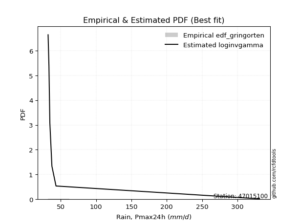</img>

</div>


### 9. EDF Filliben (1975)

The specific values of the constants (0.3175) (often denoted as $alpha$) and (0.365) are derived from a method proposed by James J. Filliben in a 1975 paper. This particular formula is the mean value of the $i$-th order statistic of the normal distribution and is considered a robust and effective plotting position formula for the normal probability plot correlation coefficient test for normality.

<div align="center">


$P=(m-0.3175)/(n+0.365)$


</div>


**9.1. Empirical values**

<div align="center">

|                | 0                   | 1                   | 2                   | 3            | 4                  | 5                  | 6                  |
|:---------------|:--------------------|:--------------------|:--------------------|:-------------|:-------------------|:-------------------|:-------------------|
| date           | 2022                | 2020                | 2021                | 2019         | 2023               | 2024               | 2025               |
| x              | 32.0                | 33.2                | 34.5                | 37.4         | 43.2               | 331.5              | 504.8              |
| m              | 1                   | 2                   | 3                   | 4            | 5                  | 6                  | 7                  |
| empirical_dist | edf_filliben        | edf_filliben        | edf_filliben        | edf_filliben | edf_filliben       | edf_filliben       | edf_filliben       |
| empirical      | 0.09266802443991853 | 0.22844534962661237 | 0.36422267481330617 | 0.5          | 0.6357773251866938 | 0.7715546503733877 | 0.9073319755600815 |
| empirical_tr   | 1.1021324354657687  | 1.2960844698636163  | 1.5728777362520021  | 2.0          | 2.7455731593662627 | 4.377414561664191  | 10.791208791208794 |

</div>


**9.2. Kolmogorov-Smirnov fit test (sorted by Δ)**


<div align="center">

|                | 0                   | 1                   | 2                   | 3                   | 4                   | 5                   | 6                   | 7                   | 8                   | 9                   | 10                  | 11                  | 12                  | 13                  | 14                  | 15                  | 16                  | 17                  | 18                  | 19                  | 20                  | 21                  | 22                  | 23                  | 24                  | 25                  | 26                  | 27                  | 28                  | 29                  | 30                  | 31                  | 32                  | 33                  | 34                  | 35                  | 36                  | 37                  | 38                  | 39                  | 40                  | 41                  | 42                  | 43                  | 44                  | 45                  | 46                  | 47                  | 48                  | 49                  | 50                  | 51                  | 52                  | 53                  | 54                  | 55                  | 56                  | 57                  | 58                  | 59                  | 60                  | 61                  | 62                  | 63                  | 64                  | 65                  | 66                  | 67                  | 68                  | 69                  | 70                  | 71                  | 72                  | 73                  | 74                  | 75                  | 76                  | 77                  | 78                  | 79                  | 80                  | 81                  | 82                  | 83                  | 84                  | 85                  | 86                  | 87                  | 88                  | 89                  | 90                  | 91                  | 92                  | 93                  | 94                  | 95                  | 96                  | 97                  | 98                  | 99                  | 100                 | 101                 | 102                 | 103                 | 104                 | 105                 | 106                 | 107                 | 108                 | 109                 | 110                 | 111                 | 112                 | 113                 | 114                 | 115                 | 116                 | 117                 | 118                 | 119                 | 120                 | 121                 | 122                 | 123                 | 124                 | 125                 | 126                 | 127                 | 128                 | 129                 | 130                 | 131                 | 132                 | 133                 | 134                 | 135                 | 136                 | 137                 | 138                 | 139                 | 140                 | 141                 | 142                 | 143                 | 144                 | 145                 | 146                 | 147                 | 148                 | 149                 | 150                 | 151                 | 152                 | 153                 | 154                 | 155                 | 156                 | 157                 | 158                 | 159                 |
|:---------------|:--------------------|:--------------------|:--------------------|:--------------------|:--------------------|:--------------------|:--------------------|:--------------------|:--------------------|:--------------------|:--------------------|:--------------------|:--------------------|:--------------------|:--------------------|:--------------------|:--------------------|:--------------------|:--------------------|:--------------------|:--------------------|:--------------------|:--------------------|:--------------------|:--------------------|:--------------------|:--------------------|:--------------------|:--------------------|:--------------------|:--------------------|:--------------------|:--------------------|:--------------------|:--------------------|:--------------------|:--------------------|:--------------------|:--------------------|:--------------------|:--------------------|:--------------------|:--------------------|:--------------------|:--------------------|:--------------------|:--------------------|:--------------------|:--------------------|:--------------------|:--------------------|:--------------------|:--------------------|:--------------------|:--------------------|:--------------------|:--------------------|:--------------------|:--------------------|:--------------------|:--------------------|:--------------------|:--------------------|:--------------------|:--------------------|:--------------------|:--------------------|:--------------------|:--------------------|:--------------------|:--------------------|:--------------------|:--------------------|:--------------------|:--------------------|:--------------------|:--------------------|:--------------------|:--------------------|:--------------------|:--------------------|:--------------------|:--------------------|:--------------------|:--------------------|:--------------------|:--------------------|:--------------------|:--------------------|:--------------------|:--------------------|:--------------------|:--------------------|:--------------------|:--------------------|:--------------------|:--------------------|:--------------------|:--------------------|:--------------------|:--------------------|:--------------------|:--------------------|:--------------------|:--------------------|:--------------------|:--------------------|:--------------------|:--------------------|:--------------------|:--------------------|:--------------------|:--------------------|:--------------------|:--------------------|:--------------------|:--------------------|:--------------------|:--------------------|:--------------------|:--------------------|:--------------------|:--------------------|:--------------------|:--------------------|:--------------------|:--------------------|:--------------------|:--------------------|:--------------------|:--------------------|:--------------------|:--------------------|:--------------------|:--------------------|:--------------------|:--------------------|:--------------------|:--------------------|:--------------------|:--------------------|:--------------------|:--------------------|:--------------------|:--------------------|:--------------------|:--------------------|:--------------------|:--------------------|:--------------------|:--------------------|:--------------------|:--------------------|:--------------------|:--------------------|:--------------------|:--------------------|:--------------------|:--------------------|:--------------------|
| station        | 47015100            | 47015100            | 47015100            | 47015100            | 47015100            | 47015100            | 47015100            | 47015100            | 47015100            | 47015100            | 47015100            | 47015100            | 47015100            | 47015100            | 47015100            | 47015100            | 47015100            | 47015100            | 47015100            | 47015100            | 47015100            | 47015100            | 47015100            | 47015100            | 47015100            | 47015100            | 47015100            | 47015100            | 47015100            | 47015100            | 47015100            | 47015100            | 47015100            | 47015100            | 47015100            | 47015100            | 47015100            | 47015100            | 47015100            | 47015100            | 47015100            | 47015100            | 47015100            | 47015100            | 47015100            | 47015100            | 47015100            | 47015100            | 47015100            | 47015100            | 47015100            | 47015100            | 47015100            | 47015100            | 47015100            | 47015100            | 47015100            | 47015100            | 47015100            | 47015100            | 47015100            | 47015100            | 47015100            | 47015100            | 47015100            | 47015100            | 47015100            | 47015100            | 47015100            | 47015100            | 47015100            | 47015100            | 47015100            | 47015100            | 47015100            | 47015100            | 47015100            | 47015100            | 47015100            | 47015100            | 47015100            | 47015100            | 47015100            | 47015100            | 47015100            | 47015100            | 47015100            | 47015100            | 47015100            | 47015100            | 47015100            | 47015100            | 47015100            | 47015100            | 47015100            | 47015100            | 47015100            | 47015100            | 47015100            | 47015100            | 47015100            | 47015100            | 47015100            | 47015100            | 47015100            | 47015100            | 47015100            | 47015100            | 47015100            | 47015100            | 47015100            | 47015100            | 47015100            | 47015100            | 47015100            | 47015100            | 47015100            | 47015100            | 47015100            | 47015100            | 47015100            | 47015100            | 47015100            | 47015100            | 47015100            | 47015100            | 47015100            | 47015100            | 47015100            | 47015100            | 47015100            | 47015100            | 47015100            | 47015100            | 47015100            | 47015100            | 47015100            | 47015100            | 47015100            | 47015100            | 47015100            | 47015100            | 47015100            | 47015100            | 47015100            | 47015100            | 47015100            | 47015100            | 47015100            | 47015100            | 47015100            | 47015100            | 47015100            | 47015100            | 47015100            | 47015100            | 47015100            | 47015100            | 47015100            | 47015100            |
| empirical_dist | edf_filliben        | edf_filliben        | edf_filliben        | edf_filliben        | edf_filliben        | edf_filliben        | edf_filliben        | edf_filliben        | edf_filliben        | edf_filliben        | edf_filliben        | edf_filliben        | edf_filliben        | edf_filliben        | edf_filliben        | edf_filliben        | edf_filliben        | edf_filliben        | edf_filliben        | edf_filliben        | edf_filliben        | edf_filliben        | edf_filliben        | edf_filliben        | edf_filliben        | edf_filliben        | edf_filliben        | edf_filliben        | edf_filliben        | edf_filliben        | edf_filliben        | edf_filliben        | edf_filliben        | edf_filliben        | edf_filliben        | edf_filliben        | edf_filliben        | edf_filliben        | edf_filliben        | edf_filliben        | edf_filliben        | edf_filliben        | edf_filliben        | edf_filliben        | edf_filliben        | edf_filliben        | edf_filliben        | edf_filliben        | edf_filliben        | edf_filliben        | edf_filliben        | edf_filliben        | edf_filliben        | edf_filliben        | edf_filliben        | edf_filliben        | edf_filliben        | edf_filliben        | edf_filliben        | edf_filliben        | edf_filliben        | edf_filliben        | edf_filliben        | edf_filliben        | edf_filliben        | edf_filliben        | edf_filliben        | edf_filliben        | edf_filliben        | edf_filliben        | edf_filliben        | edf_filliben        | edf_filliben        | edf_filliben        | edf_filliben        | edf_filliben        | edf_filliben        | edf_filliben        | edf_filliben        | edf_filliben        | edf_filliben        | edf_filliben        | edf_filliben        | edf_filliben        | edf_filliben        | edf_filliben        | edf_filliben        | edf_filliben        | edf_filliben        | edf_filliben        | edf_filliben        | edf_filliben        | edf_filliben        | edf_filliben        | edf_filliben        | edf_filliben        | edf_filliben        | edf_filliben        | edf_filliben        | edf_filliben        | edf_filliben        | edf_filliben        | edf_filliben        | edf_filliben        | edf_filliben        | edf_filliben        | edf_filliben        | edf_filliben        | edf_filliben        | edf_filliben        | edf_filliben        | edf_filliben        | edf_filliben        | edf_filliben        | edf_filliben        | edf_filliben        | edf_filliben        | edf_filliben        | edf_filliben        | edf_filliben        | edf_filliben        | edf_filliben        | edf_filliben        | edf_filliben        | edf_filliben        | edf_filliben        | edf_filliben        | edf_filliben        | edf_filliben        | edf_filliben        | edf_filliben        | edf_filliben        | edf_filliben        | edf_filliben        | edf_filliben        | edf_filliben        | edf_filliben        | edf_filliben        | edf_filliben        | edf_filliben        | edf_filliben        | edf_filliben        | edf_filliben        | edf_filliben        | edf_filliben        | edf_filliben        | edf_filliben        | edf_filliben        | edf_filliben        | edf_filliben        | edf_filliben        | edf_filliben        | edf_filliben        | edf_filliben        | edf_filliben        | edf_filliben        | edf_filliben        | edf_filliben        | edf_filliben        | edf_filliben        |
| p_dist         | loggenextreme       | loginvweibull       | f                   | invgamma            | logf                | loginvgamma         | lomax               | logburr             | lognakagami         | fatiguelife         | loghalfgennorm      | logburr12           | loginvgauss         | loggengamma         | loglomax            | lognct              | logmielke           | invgauss            | logalpha            | truncpareto         | halfgennorm         | logbradford         | genextreme          | logtruncweibull_min | logtruncpareto      | genpareto           | logexponpow         | logvonmises_line    | erlang              | logdgamma           | alpha               | gamma               | loggamma            | loggamma            | logerlang           | logwrapcauchy       | logweibull_min      | loghalflogistic     | loggennorm          | logwald             | loghalfnorm         | t                   | logfoldnorm         | logarcsine          | tukeylambda         | logmoyal            | powerlaw            | logpearson3         | arcsine             | burr                | wrapcauchy          | lograyleigh         | loggumbel_r         | vonmises_line       | loggenpareto        | logsemicircular     | foldnorm            | loggenlogistic      | logmaxwell          | halfnorm            | logbetaprime        | logloglaplace       | loganglit           | halflogistic        | logncf              | nct                 | truncweibull_min    | ncf                 | betaprime           | loglevy_l           | logjohnsonsu        | logloggamma         | pearson3            | logcrystalball      | lognorm             | logt                | logpowerlaw         | semicircular        | rayleigh            | moyal               | logkstwobign        | burr12              | dgamma              | logexponnorm        | gausshyper          | gumbel_r            | maxwell             | loggenexpon         | anglit              | weibull_min         | loglogistic         | logtruncnorm        | wald                | gennorm             | nakagami            | loghypsecant        | logexponweib        | levy_l              | norm                | crystalball         | logfatiguelife      | logrice             | johnsonsu           | logcosine           | logweibull_max      | genlogistic         | logbeta             | loggumbel_l         | gengamma            | loggompertz         | logistic            | loglaplace          | loglaplace          | exponweib           | hypsecant           | kstwobign           | exponpow            | cosine              | gumbel_l            | logrdist            | logargus            | logdweibull         | dweibull            | rice                | laplace             | loggausshyper       | invweibull          | logtriang           | argus               | kappa3              | logksone            | logskewnorm         | logtruncexpon       | logkappa4           | logtukeylambda      | loguniform          | logkappa3           | logjohnsonsb        | ksone               | beta                | exponnorm           | genexpon            | loggenhalflogistic  | bradford            | truncnorm           | genhalflogistic     | skewnorm            | truncexpon          | kappa4              | triang              | gompertz            | logtrapezoid        | uniform             | weibull_max         | trapezoid           | johnsonsb           | rdist               | logvonmises         | vonmises            | mielke              |
| delta          | 0.08707271111839654 | 0.0870778550624629  | 0.10724818920008194 | 0.10724882850197548 | 0.11089003729163671 | 0.11090855848529069 | 0.11216827210052249 | 0.1239833315487685  | 0.13453493478800305 | 0.13583189775155136 | 0.13909297463651504 | 0.13923447944609124 | 0.15078499917252475 | 0.15843942239769848 | 0.16596576783818584 | 0.16882698716728373 | 0.174342378042891   | 0.1746605312353865  | 0.17902035273899386 | 0.18086473124330982 | 0.18445578902939874 | 0.19349015337982356 | 0.1959939357860553  | 0.19900294024150778 | 0.1995802810999634  | 0.20154211495210095 | 0.20422482243879803 | 0.20644697107478968 | 0.21022700567664632 | 0.21242248372436956 | 0.21421740874178274 | 0.21609925197394464 | 0.21805358956626697 | 0.21805358956626697 | 0.22213746885691865 | 0.22230754268523645 | 0.2334583091111322  | 0.23486784682312895 | 0.23528193433171948 | 0.23585013979527975 | 0.23799619675400052 | 0.23846746675106845 | 0.23851117738564304 | 0.24098500965301956 | 0.24434182395059878 | 0.25808162517716704 | 0.26554817342283843 | 0.26651764694442015 | 0.26802279710883214 | 0.26854410483075875 | 0.26926026005299597 | 0.2710201758620565  | 0.27210526494006926 | 0.2734820777285597  | 0.27993954546445193 | 0.28057959150800615 | 0.2807090521399692  | 0.2824051244582195  | 0.2826391326379     | 0.2857470498607162  | 0.28608842309029525 | 0.2900396433882867  | 0.2901070216633465  | 0.2911484647884581  | 0.29187782949849295 | 0.2924028482142419  | 0.29323011366595714 | 0.2948076005975626  | 0.29710697256796015 | 0.29785086159744445 | 0.30776227484980234 | 0.3078065403220403  | 0.3091625338486126  | 0.31264943323909883 | 0.31264971300494104 | 0.3126500343388598  | 0.31494757783630667 | 0.3149690548763253  | 0.31511113880240105 | 0.31789140261713    | 0.31934418623376504 | 0.32157336874131404 | 0.3232152068361606  | 0.32359322831877413 | 0.32398166556200175 | 0.3246302250218013  | 0.32558562158100035 | 0.32590398516219815 | 0.325979299659769   | 0.32703104311795306 | 0.3326565344881536  | 0.3334700557024413  | 0.33629706457849173 | 0.34430609951810487 | 0.34436278856525976 | 0.3476305850907226  | 0.34817983928396506 | 0.34966457349869273 | 0.35170758041118844 | 0.3517075879762817  | 0.3518110697567419  | 0.35283111288598146 | 0.3558674463014232  | 0.3567304979274001  | 0.35685924651897233 | 0.35942392679143864 | 0.36167092944895385 | 0.36801370231974784 | 0.3683546982885978  | 0.37136150293840964 | 0.37372046316384305 | 0.37451485256618394 | 0.37451485256618394 | 0.37697980970654493 | 0.38918616978170706 | 0.3918479002944617  | 0.39325428222327763 | 0.39616041369456256 | 0.39914727970794617 | 0.4045463933306322  | 0.4062867354400459  | 0.40733197555005773 | 0.40733197556008416 | 0.4101987757127697  | 0.4127300160953379  | 0.4128121539909796  | 0.4204185892074666  | 0.42672157398945243 | 0.4373461914552803  | 0.43783791457675053 | 0.4617810111005516  | 0.4627435818896979  | 0.4747830422029785  | 0.4908789839204668  | 0.5071422110428536  | 0.5269817482833232  | 0.5269850183334416  | 0.5325668164333326  | 0.5327034391178839  | 0.536621934879249   | 0.5397655234504115  | 0.5415980651852043  | 0.5470735824894479  | 0.5588650148244538  | 0.5705174967766248  | 0.5779002966786048  | 0.5935652583194468  | 0.5997435322446039  | 0.6025672378921583  | 0.602869200664699   | 0.6037124715301483  | 0.6055026078711304  | 0.6120886619041219  | 0.620764502739874   | 0.6248736898436605  | 0.6386977281133164  | 0.7750509906588511  | 1.2346870356907773  | 79.89765203574635   | nan                 |
| deltao         | 0.48442053926100004 | 0.48442053926100004 | 0.48442053926100004 | 0.48442053926100004 | 0.48442053926100004 | 0.48442053926100004 | 0.48442053926100004 | 0.48442053926100004 | 0.48442053926100004 | 0.48442053926100004 | 0.48442053926100004 | 0.48442053926100004 | 0.48442053926100004 | 0.48442053926100004 | 0.48442053926100004 | 0.48442053926100004 | 0.48442053926100004 | 0.48442053926100004 | 0.48442053926100004 | 0.48442053926100004 | 0.48442053926100004 | 0.48442053926100004 | 0.48442053926100004 | 0.48442053926100004 | 0.48442053926100004 | 0.48442053926100004 | 0.48442053926100004 | 0.48442053926100004 | 0.48442053926100004 | 0.48442053926100004 | 0.48442053926100004 | 0.48442053926100004 | 0.48442053926100004 | 0.48442053926100004 | 0.48442053926100004 | 0.48442053926100004 | 0.48442053926100004 | 0.48442053926100004 | 0.48442053926100004 | 0.48442053926100004 | 0.48442053926100004 | 0.48442053926100004 | 0.48442053926100004 | 0.48442053926100004 | 0.48442053926100004 | 0.48442053926100004 | 0.48442053926100004 | 0.48442053926100004 | 0.48442053926100004 | 0.48442053926100004 | 0.48442053926100004 | 0.48442053926100004 | 0.48442053926100004 | 0.48442053926100004 | 0.48442053926100004 | 0.48442053926100004 | 0.48442053926100004 | 0.48442053926100004 | 0.48442053926100004 | 0.48442053926100004 | 0.48442053926100004 | 0.48442053926100004 | 0.48442053926100004 | 0.48442053926100004 | 0.48442053926100004 | 0.48442053926100004 | 0.48442053926100004 | 0.48442053926100004 | 0.48442053926100004 | 0.48442053926100004 | 0.48442053926100004 | 0.48442053926100004 | 0.48442053926100004 | 0.48442053926100004 | 0.48442053926100004 | 0.48442053926100004 | 0.48442053926100004 | 0.48442053926100004 | 0.48442053926100004 | 0.48442053926100004 | 0.48442053926100004 | 0.48442053926100004 | 0.48442053926100004 | 0.48442053926100004 | 0.48442053926100004 | 0.48442053926100004 | 0.48442053926100004 | 0.48442053926100004 | 0.48442053926100004 | 0.48442053926100004 | 0.48442053926100004 | 0.48442053926100004 | 0.48442053926100004 | 0.48442053926100004 | 0.48442053926100004 | 0.48442053926100004 | 0.48442053926100004 | 0.48442053926100004 | 0.48442053926100004 | 0.48442053926100004 | 0.48442053926100004 | 0.48442053926100004 | 0.48442053926100004 | 0.48442053926100004 | 0.48442053926100004 | 0.48442053926100004 | 0.48442053926100004 | 0.48442053926100004 | 0.48442053926100004 | 0.48442053926100004 | 0.48442053926100004 | 0.48442053926100004 | 0.48442053926100004 | 0.48442053926100004 | 0.48442053926100004 | 0.48442053926100004 | 0.48442053926100004 | 0.48442053926100004 | 0.48442053926100004 | 0.48442053926100004 | 0.48442053926100004 | 0.48442053926100004 | 0.48442053926100004 | 0.48442053926100004 | 0.48442053926100004 | 0.48442053926100004 | 0.48442053926100004 | 0.48442053926100004 | 0.48442053926100004 | 0.48442053926100004 | 0.48442053926100004 | 0.48442053926100004 | 0.48442053926100004 | 0.48442053926100004 | 0.48442053926100004 | 0.48442053926100004 | 0.48442053926100004 | 0.48442053926100004 | 0.48442053926100004 | 0.48442053926100004 | 0.48442053926100004 | 0.48442053926100004 | 0.48442053926100004 | 0.48442053926100004 | 0.48442053926100004 | 0.48442053926100004 | 0.48442053926100004 | 0.48442053926100004 | 0.48442053926100004 | 0.48442053926100004 | 0.48442053926100004 | 0.48442053926100004 | 0.48442053926100004 | 0.48442053926100004 | 0.48442053926100004 | 0.48442053926100004 | 0.48442053926100004 | 0.48442053926100004 | 0.48442053926100004 | 0.48442053926100004 |
| eval           | Δo > Δ              | Δo > Δ              | Δo > Δ              | Δo > Δ              | Δo > Δ              | Δo > Δ              | Δo > Δ              | Δo > Δ              | Δo > Δ              | Δo > Δ              | Δo > Δ              | Δo > Δ              | Δo > Δ              | Δo > Δ              | Δo > Δ              | Δo > Δ              | Δo > Δ              | Δo > Δ              | Δo > Δ              | Δo > Δ              | Δo > Δ              | Δo > Δ              | Δo > Δ              | Δo > Δ              | Δo > Δ              | Δo > Δ              | Δo > Δ              | Δo > Δ              | Δo > Δ              | Δo > Δ              | Δo > Δ              | Δo > Δ              | Δo > Δ              | Δo > Δ              | Δo > Δ              | Δo > Δ              | Δo > Δ              | Δo > Δ              | Δo > Δ              | Δo > Δ              | Δo > Δ              | Δo > Δ              | Δo > Δ              | Δo > Δ              | Δo > Δ              | Δo > Δ              | Δo > Δ              | Δo > Δ              | Δo > Δ              | Δo > Δ              | Δo > Δ              | Δo > Δ              | Δo > Δ              | Δo > Δ              | Δo > Δ              | Δo > Δ              | Δo > Δ              | Δo > Δ              | Δo > Δ              | Δo > Δ              | Δo > Δ              | Δo > Δ              | Δo > Δ              | Δo > Δ              | Δo > Δ              | Δo > Δ              | Δo > Δ              | Δo > Δ              | Δo > Δ              | Δo > Δ              | Δo > Δ              | Δo > Δ              | Δo > Δ              | Δo > Δ              | Δo > Δ              | Δo > Δ              | Δo > Δ              | Δo > Δ              | Δo > Δ              | Δo > Δ              | Δo > Δ              | Δo > Δ              | Δo > Δ              | Δo > Δ              | Δo > Δ              | Δo > Δ              | Δo > Δ              | Δo > Δ              | Δo > Δ              | Δo > Δ              | Δo > Δ              | Δo > Δ              | Δo > Δ              | Δo > Δ              | Δo > Δ              | Δo > Δ              | Δo > Δ              | Δo > Δ              | Δo > Δ              | Δo > Δ              | Δo > Δ              | Δo > Δ              | Δo > Δ              | Δo > Δ              | Δo > Δ              | Δo > Δ              | Δo > Δ              | Δo > Δ              | Δo > Δ              | Δo > Δ              | Δo > Δ              | Δo > Δ              | Δo > Δ              | Δo > Δ              | Δo > Δ              | Δo > Δ              | Δo > Δ              | Δo > Δ              | Δo > Δ              | Δo > Δ              | Δo > Δ              | Δo > Δ              | Δo > Δ              | Δo > Δ              | Δo > Δ              | Δo > Δ              | Δo > Δ              | Δo > Δ              | Δo > Δ              | Δo > Δ              | Δo > Δ              | Δo > Δ              | Δo > Δ              | Δo <= Δ             | Δo <= Δ             | Δo <= Δ             | Δo <= Δ             | Δo <= Δ             | Δo <= Δ             | Δo <= Δ             | Δo <= Δ             | Δo <= Δ             | Δo <= Δ             | Δo <= Δ             | Δo <= Δ             | Δo <= Δ             | Δo <= Δ             | Δo <= Δ             | Δo <= Δ             | Δo <= Δ             | Δo <= Δ             | Δo <= Δ             | Δo <= Δ             | Δo <= Δ             | Δo <= Δ             | Δo <= Δ             | Δo <= Δ             | Δo <= Δ             | Δo <= Δ             | Δo <= Δ             |
| fit            | 1                   | 1                   | 1                   | 1                   | 1                   | 1                   | 1                   | 1                   | 1                   | 1                   | 1                   | 1                   | 1                   | 1                   | 1                   | 1                   | 1                   | 1                   | 1                   | 1                   | 1                   | 1                   | 1                   | 1                   | 1                   | 1                   | 1                   | 1                   | 1                   | 1                   | 1                   | 1                   | 1                   | 1                   | 1                   | 1                   | 1                   | 1                   | 1                   | 1                   | 1                   | 1                   | 1                   | 1                   | 1                   | 1                   | 1                   | 1                   | 1                   | 1                   | 1                   | 1                   | 1                   | 1                   | 1                   | 1                   | 1                   | 1                   | 1                   | 1                   | 1                   | 1                   | 1                   | 1                   | 1                   | 1                   | 1                   | 1                   | 1                   | 1                   | 1                   | 1                   | 1                   | 1                   | 1                   | 1                   | 1                   | 1                   | 1                   | 1                   | 1                   | 1                   | 1                   | 1                   | 1                   | 1                   | 1                   | 1                   | 1                   | 1                   | 1                   | 1                   | 1                   | 1                   | 1                   | 1                   | 1                   | 1                   | 1                   | 1                   | 1                   | 1                   | 1                   | 1                   | 1                   | 1                   | 1                   | 1                   | 1                   | 1                   | 1                   | 1                   | 1                   | 1                   | 1                   | 1                   | 1                   | 1                   | 1                   | 1                   | 1                   | 1                   | 1                   | 1                   | 1                   | 1                   | 1                   | 1                   | 1                   | 1                   | 1                   | 1                   | 1                   | 0                   | 0                   | 0                   | 0                   | 0                   | 0                   | 0                   | 0                   | 0                   | 0                   | 0                   | 0                   | 0                   | 0                   | 0                   | 0                   | 0                   | 0                   | 0                   | 0                   | 0                   | 0                   | 0                   | 0                   | 0                   | 0                   | 0                   |
| n              | 7                   | 7                   | 7                   | 7                   | 7                   | 7                   | 7                   | 7                   | 7                   | 7                   | 7                   | 7                   | 7                   | 7                   | 7                   | 7                   | 7                   | 7                   | 7                   | 7                   | 7                   | 7                   | 7                   | 7                   | 7                   | 7                   | 7                   | 7                   | 7                   | 7                   | 7                   | 7                   | 7                   | 7                   | 7                   | 7                   | 7                   | 7                   | 7                   | 7                   | 7                   | 7                   | 7                   | 7                   | 7                   | 7                   | 7                   | 7                   | 7                   | 7                   | 7                   | 7                   | 7                   | 7                   | 7                   | 7                   | 7                   | 7                   | 7                   | 7                   | 7                   | 7                   | 7                   | 7                   | 7                   | 7                   | 7                   | 7                   | 7                   | 7                   | 7                   | 7                   | 7                   | 7                   | 7                   | 7                   | 7                   | 7                   | 7                   | 7                   | 7                   | 7                   | 7                   | 7                   | 7                   | 7                   | 7                   | 7                   | 7                   | 7                   | 7                   | 7                   | 7                   | 7                   | 7                   | 7                   | 7                   | 7                   | 7                   | 7                   | 7                   | 7                   | 7                   | 7                   | 7                   | 7                   | 7                   | 7                   | 7                   | 7                   | 7                   | 7                   | 7                   | 7                   | 7                   | 7                   | 7                   | 7                   | 7                   | 7                   | 7                   | 7                   | 7                   | 7                   | 7                   | 7                   | 7                   | 7                   | 7                   | 7                   | 7                   | 7                   | 7                   | 7                   | 7                   | 7                   | 7                   | 7                   | 7                   | 7                   | 7                   | 7                   | 7                   | 7                   | 7                   | 7                   | 7                   | 7                   | 7                   | 7                   | 7                   | 7                   | 7                   | 7                   | 7                   | 7                   | 7                   | 7                   | 7                   | 7                   |
| best_fit       | 1                   | 0                   | 0                   | 0                   | 0                   | 0                   | 0                   | 0                   | 0                   | 0                   | 0                   | 0                   | 0                   | 0                   | 0                   | 0                   | 0                   | 0                   | 0                   | 0                   | 0                   | 0                   | 0                   | 0                   | 0                   | 0                   | 0                   | 0                   | 0                   | 0                   | 0                   | 0                   | 0                   | 0                   | 0                   | 0                   | 0                   | 0                   | 0                   | 0                   | 0                   | 0                   | 0                   | 0                   | 0                   | 0                   | 0                   | 0                   | 0                   | 0                   | 0                   | 0                   | 0                   | 0                   | 0                   | 0                   | 0                   | 0                   | 0                   | 0                   | 0                   | 0                   | 0                   | 0                   | 0                   | 0                   | 0                   | 0                   | 0                   | 0                   | 0                   | 0                   | 0                   | 0                   | 0                   | 0                   | 0                   | 0                   | 0                   | 0                   | 0                   | 0                   | 0                   | 0                   | 0                   | 0                   | 0                   | 0                   | 0                   | 0                   | 0                   | 0                   | 0                   | 0                   | 0                   | 0                   | 0                   | 0                   | 0                   | 0                   | 0                   | 0                   | 0                   | 0                   | 0                   | 0                   | 0                   | 0                   | 0                   | 0                   | 0                   | 0                   | 0                   | 0                   | 0                   | 0                   | 0                   | 0                   | 0                   | 0                   | 0                   | 0                   | 0                   | 0                   | 0                   | 0                   | 0                   | 0                   | 0                   | 0                   | 0                   | 0                   | 0                   | 0                   | 0                   | 0                   | 0                   | 0                   | 0                   | 0                   | 0                   | 0                   | 0                   | 0                   | 0                   | 0                   | 0                   | 0                   | 0                   | 0                   | 0                   | 0                   | 0                   | 0                   | 0                   | 0                   | 0                   | 0                   | 0                   | 0                   |
| best_fit_sort  | 1                   | 2                   | 3                   | 4                   | 5                   | 6                   | 7                   | 8                   | 9                   | 10                  | 11                  | 12                  | 13                  | 14                  | 15                  | 16                  | 17                  | 18                  | 19                  | 20                  | 21                  | 22                  | 23                  | 24                  | 25                  | 26                  | 27                  | 28                  | 29                  | 30                  | 31                  | 32                  | 33                  | 34                  | 35                  | 36                  | 37                  | 38                  | 39                  | 40                  | 41                  | 42                  | 43                  | 44                  | 45                  | 46                  | 47                  | 48                  | 49                  | 50                  | 51                  | 52                  | 53                  | 54                  | 55                  | 56                  | 57                  | 58                  | 59                  | 60                  | 61                  | 62                  | 63                  | 64                  | 65                  | 66                  | 67                  | 68                  | 69                  | 70                  | 71                  | 72                  | 73                  | 74                  | 75                  | 76                  | 77                  | 78                  | 79                  | 80                  | 81                  | 82                  | 83                  | 84                  | 85                  | 86                  | 87                  | 88                  | 89                  | 90                  | 91                  | 92                  | 93                  | 94                  | 95                  | 96                  | 97                  | 98                  | 99                  | 100                 | 101                 | 102                 | 103                 | 104                 | 105                 | 106                 | 107                 | 108                 | 109                 | 110                 | 111                 | 112                 | 113                 | 114                 | 115                 | 116                 | 117                 | 118                 | 119                 | 120                 | 121                 | 122                 | 123                 | 124                 | 125                 | 126                 | 127                 | 128                 | 129                 | 130                 | 131                 | 132                 | 133                 | 134                 | 135                 | 136                 | 137                 | 138                 | 139                 | 140                 | 141                 | 142                 | 143                 | 144                 | 145                 | 146                 | 147                 | 148                 | 149                 | 150                 | 151                 | 152                 | 153                 | 154                 | 155                 | 156                 | 157                 | 158                 | 159                 | 160                 |

</div>


**9.3. Best fit**

<div align="center">

|   id |   station | empirical_dist   | p_dist        |     delta |   deltao | eval   |   fit |   n |   best_fit |   best_fit_sort |
|-----:|----------:|:-----------------|:--------------|----------:|---------:|:-------|------:|----:|-----------:|----------------:|
|    0 |  47015100 | edf_filliben     | loggenextreme | 0.0870727 | 0.484421 | Δo > Δ |     1 |   7 |          1 |               1 |

</div>


<div align="center">

</img></img>

</div>


### 10. EDF Jenkinson (1977)

The Jenkinson formula in hydrology is an empirical plotting position formula used to estimate the non-exceedance probability _(P)_ or return period _(T)_ of a given ordered observation within a sample. It is a widely used method in the frequency analysis of extreme events such as floods and rainfall, as it provides a distribution-free way to plot data. _a≈0.31_ and _b≈0.38_ are constants derived to approximate the median of the probability distribution for the given rank.

<div align="center">


$P=(m-a)/(n+b)$


</div>


**10.1. Empirical values**

<div align="center">

|                | 0                   | 1                   | 2                   | 3             | 4                  | 5                  | 6                  |
|:---------------|:--------------------|:--------------------|:--------------------|:--------------|:-------------------|:-------------------|:-------------------|
| date           | 2022                | 2020                | 2021                | 2019          | 2023               | 2024               | 2025               |
| x              | 32.0                | 33.2                | 34.5                | 37.4          | 43.2               | 331.5              | 504.8              |
| m              | 1                   | 2                   | 3                   | 4             | 5                  | 6                  | 7                  |
| empirical_dist | edf_jenkinson       | edf_jenkinson       | edf_jenkinson       | edf_jenkinson | edf_jenkinson      | edf_jenkinson      | edf_jenkinson      |
| empirical      | 0.09349593495934959 | 0.22899728997289973 | 0.36449864498644985 | 0.5           | 0.6355013550135502 | 0.7710027100271003 | 0.9065040650406505 |
| empirical_tr   | 1.1031390134529149  | 1.29701230228471    | 1.5735607675906182  | 2.0           | 2.743494423791822  | 4.366863905325444  | 10.695652173913055 |

</div>


**10.2. Kolmogorov-Smirnov fit test (sorted by Δ)**


<div align="center">

|                | 0                   | 1                   | 2                   | 3                   | 4                   | 5                   | 6                   | 7                   | 8                   | 9                   | 10                  | 11                  | 12                  | 13                  | 14                  | 15                  | 16                  | 17                  | 18                  | 19                  | 20                  | 21                  | 22                  | 23                  | 24                  | 25                  | 26                  | 27                  | 28                  | 29                  | 30                  | 31                  | 32                  | 33                  | 34                  | 35                  | 36                  | 37                  | 38                  | 39                  | 40                  | 41                  | 42                  | 43                  | 44                  | 45                  | 46                  | 47                  | 48                  | 49                  | 50                  | 51                  | 52                  | 53                  | 54                  | 55                  | 56                  | 57                  | 58                  | 59                  | 60                  | 61                  | 62                  | 63                  | 64                  | 65                  | 66                  | 67                  | 68                  | 69                  | 70                  | 71                  | 72                  | 73                  | 74                  | 75                  | 76                  | 77                  | 78                  | 79                  | 80                  | 81                  | 82                  | 83                  | 84                  | 85                  | 86                  | 87                  | 88                  | 89                  | 90                  | 91                  | 92                  | 93                  | 94                  | 95                  | 96                  | 97                  | 98                  | 99                  | 100                 | 101                 | 102                 | 103                 | 104                 | 105                 | 106                 | 107                 | 108                 | 109                 | 110                 | 111                 | 112                 | 113                 | 114                 | 115                 | 116                 | 117                 | 118                 | 119                 | 120                 | 121                 | 122                 | 123                 | 124                 | 125                 | 126                 | 127                 | 128                 | 129                 | 130                 | 131                 | 132                 | 133                 | 134                 | 135                 | 136                 | 137                 | 138                 | 139                 | 140                 | 141                 | 142                 | 143                 | 144                 | 145                 | 146                 | 147                 | 148                 | 149                 | 150                 | 151                 | 152                 | 153                 | 154                 | 155                 | 156                 | 157                 | 158                 | 159                 |
|:---------------|:--------------------|:--------------------|:--------------------|:--------------------|:--------------------|:--------------------|:--------------------|:--------------------|:--------------------|:--------------------|:--------------------|:--------------------|:--------------------|:--------------------|:--------------------|:--------------------|:--------------------|:--------------------|:--------------------|:--------------------|:--------------------|:--------------------|:--------------------|:--------------------|:--------------------|:--------------------|:--------------------|:--------------------|:--------------------|:--------------------|:--------------------|:--------------------|:--------------------|:--------------------|:--------------------|:--------------------|:--------------------|:--------------------|:--------------------|:--------------------|:--------------------|:--------------------|:--------------------|:--------------------|:--------------------|:--------------------|:--------------------|:--------------------|:--------------------|:--------------------|:--------------------|:--------------------|:--------------------|:--------------------|:--------------------|:--------------------|:--------------------|:--------------------|:--------------------|:--------------------|:--------------------|:--------------------|:--------------------|:--------------------|:--------------------|:--------------------|:--------------------|:--------------------|:--------------------|:--------------------|:--------------------|:--------------------|:--------------------|:--------------------|:--------------------|:--------------------|:--------------------|:--------------------|:--------------------|:--------------------|:--------------------|:--------------------|:--------------------|:--------------------|:--------------------|:--------------------|:--------------------|:--------------------|:--------------------|:--------------------|:--------------------|:--------------------|:--------------------|:--------------------|:--------------------|:--------------------|:--------------------|:--------------------|:--------------------|:--------------------|:--------------------|:--------------------|:--------------------|:--------------------|:--------------------|:--------------------|:--------------------|:--------------------|:--------------------|:--------------------|:--------------------|:--------------------|:--------------------|:--------------------|:--------------------|:--------------------|:--------------------|:--------------------|:--------------------|:--------------------|:--------------------|:--------------------|:--------------------|:--------------------|:--------------------|:--------------------|:--------------------|:--------------------|:--------------------|:--------------------|:--------------------|:--------------------|:--------------------|:--------------------|:--------------------|:--------------------|:--------------------|:--------------------|:--------------------|:--------------------|:--------------------|:--------------------|:--------------------|:--------------------|:--------------------|:--------------------|:--------------------|:--------------------|:--------------------|:--------------------|:--------------------|:--------------------|:--------------------|:--------------------|:--------------------|:--------------------|:--------------------|:--------------------|:--------------------|:--------------------|
| station        | 47015100            | 47015100            | 47015100            | 47015100            | 47015100            | 47015100            | 47015100            | 47015100            | 47015100            | 47015100            | 47015100            | 47015100            | 47015100            | 47015100            | 47015100            | 47015100            | 47015100            | 47015100            | 47015100            | 47015100            | 47015100            | 47015100            | 47015100            | 47015100            | 47015100            | 47015100            | 47015100            | 47015100            | 47015100            | 47015100            | 47015100            | 47015100            | 47015100            | 47015100            | 47015100            | 47015100            | 47015100            | 47015100            | 47015100            | 47015100            | 47015100            | 47015100            | 47015100            | 47015100            | 47015100            | 47015100            | 47015100            | 47015100            | 47015100            | 47015100            | 47015100            | 47015100            | 47015100            | 47015100            | 47015100            | 47015100            | 47015100            | 47015100            | 47015100            | 47015100            | 47015100            | 47015100            | 47015100            | 47015100            | 47015100            | 47015100            | 47015100            | 47015100            | 47015100            | 47015100            | 47015100            | 47015100            | 47015100            | 47015100            | 47015100            | 47015100            | 47015100            | 47015100            | 47015100            | 47015100            | 47015100            | 47015100            | 47015100            | 47015100            | 47015100            | 47015100            | 47015100            | 47015100            | 47015100            | 47015100            | 47015100            | 47015100            | 47015100            | 47015100            | 47015100            | 47015100            | 47015100            | 47015100            | 47015100            | 47015100            | 47015100            | 47015100            | 47015100            | 47015100            | 47015100            | 47015100            | 47015100            | 47015100            | 47015100            | 47015100            | 47015100            | 47015100            | 47015100            | 47015100            | 47015100            | 47015100            | 47015100            | 47015100            | 47015100            | 47015100            | 47015100            | 47015100            | 47015100            | 47015100            | 47015100            | 47015100            | 47015100            | 47015100            | 47015100            | 47015100            | 47015100            | 47015100            | 47015100            | 47015100            | 47015100            | 47015100            | 47015100            | 47015100            | 47015100            | 47015100            | 47015100            | 47015100            | 47015100            | 47015100            | 47015100            | 47015100            | 47015100            | 47015100            | 47015100            | 47015100            | 47015100            | 47015100            | 47015100            | 47015100            | 47015100            | 47015100            | 47015100            | 47015100            | 47015100            | 47015100            |
| empirical_dist | edf_jenkinson       | edf_jenkinson       | edf_jenkinson       | edf_jenkinson       | edf_jenkinson       | edf_jenkinson       | edf_jenkinson       | edf_jenkinson       | edf_jenkinson       | edf_jenkinson       | edf_jenkinson       | edf_jenkinson       | edf_jenkinson       | edf_jenkinson       | edf_jenkinson       | edf_jenkinson       | edf_jenkinson       | edf_jenkinson       | edf_jenkinson       | edf_jenkinson       | edf_jenkinson       | edf_jenkinson       | edf_jenkinson       | edf_jenkinson       | edf_jenkinson       | edf_jenkinson       | edf_jenkinson       | edf_jenkinson       | edf_jenkinson       | edf_jenkinson       | edf_jenkinson       | edf_jenkinson       | edf_jenkinson       | edf_jenkinson       | edf_jenkinson       | edf_jenkinson       | edf_jenkinson       | edf_jenkinson       | edf_jenkinson       | edf_jenkinson       | edf_jenkinson       | edf_jenkinson       | edf_jenkinson       | edf_jenkinson       | edf_jenkinson       | edf_jenkinson       | edf_jenkinson       | edf_jenkinson       | edf_jenkinson       | edf_jenkinson       | edf_jenkinson       | edf_jenkinson       | edf_jenkinson       | edf_jenkinson       | edf_jenkinson       | edf_jenkinson       | edf_jenkinson       | edf_jenkinson       | edf_jenkinson       | edf_jenkinson       | edf_jenkinson       | edf_jenkinson       | edf_jenkinson       | edf_jenkinson       | edf_jenkinson       | edf_jenkinson       | edf_jenkinson       | edf_jenkinson       | edf_jenkinson       | edf_jenkinson       | edf_jenkinson       | edf_jenkinson       | edf_jenkinson       | edf_jenkinson       | edf_jenkinson       | edf_jenkinson       | edf_jenkinson       | edf_jenkinson       | edf_jenkinson       | edf_jenkinson       | edf_jenkinson       | edf_jenkinson       | edf_jenkinson       | edf_jenkinson       | edf_jenkinson       | edf_jenkinson       | edf_jenkinson       | edf_jenkinson       | edf_jenkinson       | edf_jenkinson       | edf_jenkinson       | edf_jenkinson       | edf_jenkinson       | edf_jenkinson       | edf_jenkinson       | edf_jenkinson       | edf_jenkinson       | edf_jenkinson       | edf_jenkinson       | edf_jenkinson       | edf_jenkinson       | edf_jenkinson       | edf_jenkinson       | edf_jenkinson       | edf_jenkinson       | edf_jenkinson       | edf_jenkinson       | edf_jenkinson       | edf_jenkinson       | edf_jenkinson       | edf_jenkinson       | edf_jenkinson       | edf_jenkinson       | edf_jenkinson       | edf_jenkinson       | edf_jenkinson       | edf_jenkinson       | edf_jenkinson       | edf_jenkinson       | edf_jenkinson       | edf_jenkinson       | edf_jenkinson       | edf_jenkinson       | edf_jenkinson       | edf_jenkinson       | edf_jenkinson       | edf_jenkinson       | edf_jenkinson       | edf_jenkinson       | edf_jenkinson       | edf_jenkinson       | edf_jenkinson       | edf_jenkinson       | edf_jenkinson       | edf_jenkinson       | edf_jenkinson       | edf_jenkinson       | edf_jenkinson       | edf_jenkinson       | edf_jenkinson       | edf_jenkinson       | edf_jenkinson       | edf_jenkinson       | edf_jenkinson       | edf_jenkinson       | edf_jenkinson       | edf_jenkinson       | edf_jenkinson       | edf_jenkinson       | edf_jenkinson       | edf_jenkinson       | edf_jenkinson       | edf_jenkinson       | edf_jenkinson       | edf_jenkinson       | edf_jenkinson       | edf_jenkinson       | edf_jenkinson       | edf_jenkinson       | edf_jenkinson       |
| p_dist         | loggenextreme       | loginvweibull       | f                   | invgamma            | logf                | loginvgamma         | lomax               | logburr             | lognakagami         | fatiguelife         | loghalfgennorm      | logburr12           | loginvgauss         | loggengamma         | loglomax            | lognct              | logmielke           | invgauss            | logalpha            | truncpareto         | halfgennorm         | logbradford         | genextreme          | logtruncweibull_min | logtruncpareto      | genpareto           | logexponpow         | logvonmises_line    | erlang              | logdgamma           | alpha               | gamma               | loggamma            | loggamma            | logwrapcauchy       | logerlang           | logweibull_min      | loggennorm          | loghalflogistic     | logwald             | loghalfnorm         | logfoldnorm         | t                   | logarcsine          | tukeylambda         | logmoyal            | powerlaw            | logpearson3         | arcsine             | burr                | wrapcauchy          | lograyleigh         | loggumbel_r         | vonmises_line       | loggenpareto        | logsemicircular     | foldnorm            | loggenlogistic      | logmaxwell          | halfnorm            | logbetaprime        | logloglaplace       | loganglit           | halflogistic        | logncf              | nct                 | truncweibull_min    | ncf                 | betaprime           | loglevy_l           | logjohnsonsu        | logloggamma         | pearson3            | logcrystalball      | lognorm             | logt                | logpowerlaw         | semicircular        | rayleigh            | moyal               | logkstwobign        | burr12              | dgamma              | logexponnorm        | gausshyper          | gumbel_r            | maxwell             | loggenexpon         | anglit              | weibull_min         | loglogistic         | logtruncnorm        | wald                | gennorm             | nakagami            | loghypsecant        | logexponweib        | levy_l              | logfatiguelife      | norm                | crystalball         | logrice             | johnsonsu           | logcosine           | logweibull_max      | genlogistic         | logbeta             | loggumbel_l         | gengamma            | loggompertz         | logistic            | loglaplace          | loglaplace          | exponweib           | hypsecant           | kstwobign           | exponpow            | cosine              | gumbel_l            | logrdist            | logargus            | logdweibull         | dweibull            | rice                | laplace             | loggausshyper       | invweibull          | logtriang           | kappa3              | argus               | logksone            | logskewnorm         | logtruncexpon       | logkappa4           | logtukeylambda      | loguniform          | logkappa3           | logjohnsonsb        | ksone               | beta                | exponnorm           | genexpon            | loggenhalflogistic  | bradford            | truncnorm           | genhalflogistic     | skewnorm            | truncexpon          | kappa4              | triang              | gompertz            | logtrapezoid        | uniform             | weibull_max         | trapezoid           | johnsonsb           | rdist               | logvonmises         | vonmises            | mielke              |
| delta          | 0.0876246514646839  | 0.08762979540875027 | 0.1078001295463693  | 0.10780076884826284 | 0.11144197763792407 | 0.11146049883157805 | 0.11272021244680985 | 0.12453527189505587 | 0.13425896461485942 | 0.13555592757840773 | 0.1396449149828024  | 0.1397864197923786  | 0.1513369395188121  | 0.15899136274398584 | 0.1665177081844732  | 0.16882698716728373 | 0.17351446752346    | 0.17521247158167386 | 0.17957229308528122 | 0.18141667158959718 | 0.1850077293756861  | 0.19321418320667993 | 0.19544199543976795 | 0.19955488058779514 | 0.20013222144625076 | 0.2020940552983883  | 0.2039488522656544  | 0.2056190605553586  | 0.21077894602293368 | 0.21297442407065692 | 0.2147693490880701  | 0.216651192320232   | 0.21860552991255433 | 0.21860552991255433 | 0.2217556023389491  | 0.222689409203206   | 0.23318233893798856 | 0.23445402381228841 | 0.23459187664998532 | 0.23557416962213612 | 0.2377202265808569  | 0.2382352072124994  | 0.23846746675106845 | 0.24070903947987593 | 0.24434182395059878 | 0.2578056550040234  | 0.26499623307655107 | 0.2662416767712765  | 0.2677468269356885  | 0.2682681346576151  | 0.2687083197067086  | 0.2707442056889129  | 0.27182929476692563 | 0.2732061075554161  | 0.2796635752913083  | 0.28030362133486253 | 0.2804330819668256  | 0.2821291542850759  | 0.2823631624647564  | 0.28547107968757257 | 0.2858124529171516  | 0.28921173286885565 | 0.2898310514902029  | 0.29087249461531445 | 0.2916018593253493  | 0.29212687804109827 | 0.2929541434928135  | 0.294531630424419   | 0.2968310023948165  | 0.29702295107801335 | 0.3074863046766587  | 0.3075305701488967  | 0.30888656367546896 | 0.3123734630659552  | 0.3123737428317974  | 0.31237406416571617 | 0.3143956374900193  | 0.3146930847031817  | 0.3148351686292574  | 0.3176154324439864  | 0.3190682160606214  | 0.3212973985681704  | 0.322939236663017   | 0.3233172581456305  | 0.32370569538885813 | 0.32435425484865765 | 0.3253096514078567  | 0.3256280149890545  | 0.3257033294866254  | 0.32675507294480943 | 0.33238056431500995 | 0.3331940855292977  | 0.3360210944053481  | 0.3434781889986738  | 0.34408681839211613 | 0.34735461491757896 | 0.34790386911082144 | 0.34883666297926164 | 0.35125912941045456 | 0.3514316102380448  | 0.3514316178031381  | 0.35255514271283783 | 0.35531550595513584 | 0.35645452775425646 | 0.3565832763458287  | 0.359147956618295   | 0.3611189891026665  | 0.3677377321466042  | 0.36807872811545417 | 0.371085532765266   | 0.37344449299069943 | 0.3742388823930403  | 0.3742388823930403  | 0.3767038395334013  | 0.38891019960856343 | 0.3915719301213181  | 0.392978312050134   | 0.39588444352141894 | 0.39887130953480254 | 0.40427042315748857 | 0.4060107652669023  | 0.4065040650306267  | 0.40650406504065306 | 0.40992280553962607 | 0.41245404592219426 | 0.41253618381783597 | 0.4195906786880356  | 0.4264456038163088  | 0.43701000405731955 | 0.4370702212821367  | 0.46150504092740796 | 0.46246761171655426 | 0.4745070720298349  | 0.4906030137473232  | 0.50686624086971    | 0.5267057781101796  | 0.526709048160298   | 0.5320148760870452  | 0.5324274689447402  | 0.5357940243598179  | 0.5394895532772679  | 0.5413220950120606  | 0.5467976123163043  | 0.5585890446513102  | 0.5702415266034812  | 0.5776243265054611  | 0.5932892881463032  | 0.5994675620714602  | 0.6022912677190146  | 0.6025932304915553  | 0.6034365013570047  | 0.6052266376979868  | 0.6118126917309783  | 0.6202125623935867  | 0.6245977196705169  | 0.638145787767029   | 0.77422308013942    | 1.2338591251713462  | 79.89847994626578   | nan                 |
| deltao         | 0.48442053926100004 | 0.48442053926100004 | 0.48442053926100004 | 0.48442053926100004 | 0.48442053926100004 | 0.48442053926100004 | 0.48442053926100004 | 0.48442053926100004 | 0.48442053926100004 | 0.48442053926100004 | 0.48442053926100004 | 0.48442053926100004 | 0.48442053926100004 | 0.48442053926100004 | 0.48442053926100004 | 0.48442053926100004 | 0.48442053926100004 | 0.48442053926100004 | 0.48442053926100004 | 0.48442053926100004 | 0.48442053926100004 | 0.48442053926100004 | 0.48442053926100004 | 0.48442053926100004 | 0.48442053926100004 | 0.48442053926100004 | 0.48442053926100004 | 0.48442053926100004 | 0.48442053926100004 | 0.48442053926100004 | 0.48442053926100004 | 0.48442053926100004 | 0.48442053926100004 | 0.48442053926100004 | 0.48442053926100004 | 0.48442053926100004 | 0.48442053926100004 | 0.48442053926100004 | 0.48442053926100004 | 0.48442053926100004 | 0.48442053926100004 | 0.48442053926100004 | 0.48442053926100004 | 0.48442053926100004 | 0.48442053926100004 | 0.48442053926100004 | 0.48442053926100004 | 0.48442053926100004 | 0.48442053926100004 | 0.48442053926100004 | 0.48442053926100004 | 0.48442053926100004 | 0.48442053926100004 | 0.48442053926100004 | 0.48442053926100004 | 0.48442053926100004 | 0.48442053926100004 | 0.48442053926100004 | 0.48442053926100004 | 0.48442053926100004 | 0.48442053926100004 | 0.48442053926100004 | 0.48442053926100004 | 0.48442053926100004 | 0.48442053926100004 | 0.48442053926100004 | 0.48442053926100004 | 0.48442053926100004 | 0.48442053926100004 | 0.48442053926100004 | 0.48442053926100004 | 0.48442053926100004 | 0.48442053926100004 | 0.48442053926100004 | 0.48442053926100004 | 0.48442053926100004 | 0.48442053926100004 | 0.48442053926100004 | 0.48442053926100004 | 0.48442053926100004 | 0.48442053926100004 | 0.48442053926100004 | 0.48442053926100004 | 0.48442053926100004 | 0.48442053926100004 | 0.48442053926100004 | 0.48442053926100004 | 0.48442053926100004 | 0.48442053926100004 | 0.48442053926100004 | 0.48442053926100004 | 0.48442053926100004 | 0.48442053926100004 | 0.48442053926100004 | 0.48442053926100004 | 0.48442053926100004 | 0.48442053926100004 | 0.48442053926100004 | 0.48442053926100004 | 0.48442053926100004 | 0.48442053926100004 | 0.48442053926100004 | 0.48442053926100004 | 0.48442053926100004 | 0.48442053926100004 | 0.48442053926100004 | 0.48442053926100004 | 0.48442053926100004 | 0.48442053926100004 | 0.48442053926100004 | 0.48442053926100004 | 0.48442053926100004 | 0.48442053926100004 | 0.48442053926100004 | 0.48442053926100004 | 0.48442053926100004 | 0.48442053926100004 | 0.48442053926100004 | 0.48442053926100004 | 0.48442053926100004 | 0.48442053926100004 | 0.48442053926100004 | 0.48442053926100004 | 0.48442053926100004 | 0.48442053926100004 | 0.48442053926100004 | 0.48442053926100004 | 0.48442053926100004 | 0.48442053926100004 | 0.48442053926100004 | 0.48442053926100004 | 0.48442053926100004 | 0.48442053926100004 | 0.48442053926100004 | 0.48442053926100004 | 0.48442053926100004 | 0.48442053926100004 | 0.48442053926100004 | 0.48442053926100004 | 0.48442053926100004 | 0.48442053926100004 | 0.48442053926100004 | 0.48442053926100004 | 0.48442053926100004 | 0.48442053926100004 | 0.48442053926100004 | 0.48442053926100004 | 0.48442053926100004 | 0.48442053926100004 | 0.48442053926100004 | 0.48442053926100004 | 0.48442053926100004 | 0.48442053926100004 | 0.48442053926100004 | 0.48442053926100004 | 0.48442053926100004 | 0.48442053926100004 | 0.48442053926100004 | 0.48442053926100004 | 0.48442053926100004 |
| eval           | Δo > Δ              | Δo > Δ              | Δo > Δ              | Δo > Δ              | Δo > Δ              | Δo > Δ              | Δo > Δ              | Δo > Δ              | Δo > Δ              | Δo > Δ              | Δo > Δ              | Δo > Δ              | Δo > Δ              | Δo > Δ              | Δo > Δ              | Δo > Δ              | Δo > Δ              | Δo > Δ              | Δo > Δ              | Δo > Δ              | Δo > Δ              | Δo > Δ              | Δo > Δ              | Δo > Δ              | Δo > Δ              | Δo > Δ              | Δo > Δ              | Δo > Δ              | Δo > Δ              | Δo > Δ              | Δo > Δ              | Δo > Δ              | Δo > Δ              | Δo > Δ              | Δo > Δ              | Δo > Δ              | Δo > Δ              | Δo > Δ              | Δo > Δ              | Δo > Δ              | Δo > Δ              | Δo > Δ              | Δo > Δ              | Δo > Δ              | Δo > Δ              | Δo > Δ              | Δo > Δ              | Δo > Δ              | Δo > Δ              | Δo > Δ              | Δo > Δ              | Δo > Δ              | Δo > Δ              | Δo > Δ              | Δo > Δ              | Δo > Δ              | Δo > Δ              | Δo > Δ              | Δo > Δ              | Δo > Δ              | Δo > Δ              | Δo > Δ              | Δo > Δ              | Δo > Δ              | Δo > Δ              | Δo > Δ              | Δo > Δ              | Δo > Δ              | Δo > Δ              | Δo > Δ              | Δo > Δ              | Δo > Δ              | Δo > Δ              | Δo > Δ              | Δo > Δ              | Δo > Δ              | Δo > Δ              | Δo > Δ              | Δo > Δ              | Δo > Δ              | Δo > Δ              | Δo > Δ              | Δo > Δ              | Δo > Δ              | Δo > Δ              | Δo > Δ              | Δo > Δ              | Δo > Δ              | Δo > Δ              | Δo > Δ              | Δo > Δ              | Δo > Δ              | Δo > Δ              | Δo > Δ              | Δo > Δ              | Δo > Δ              | Δo > Δ              | Δo > Δ              | Δo > Δ              | Δo > Δ              | Δo > Δ              | Δo > Δ              | Δo > Δ              | Δo > Δ              | Δo > Δ              | Δo > Δ              | Δo > Δ              | Δo > Δ              | Δo > Δ              | Δo > Δ              | Δo > Δ              | Δo > Δ              | Δo > Δ              | Δo > Δ              | Δo > Δ              | Δo > Δ              | Δo > Δ              | Δo > Δ              | Δo > Δ              | Δo > Δ              | Δo > Δ              | Δo > Δ              | Δo > Δ              | Δo > Δ              | Δo > Δ              | Δo > Δ              | Δo > Δ              | Δo > Δ              | Δo > Δ              | Δo > Δ              | Δo > Δ              | Δo > Δ              | Δo > Δ              | Δo <= Δ             | Δo <= Δ             | Δo <= Δ             | Δo <= Δ             | Δo <= Δ             | Δo <= Δ             | Δo <= Δ             | Δo <= Δ             | Δo <= Δ             | Δo <= Δ             | Δo <= Δ             | Δo <= Δ             | Δo <= Δ             | Δo <= Δ             | Δo <= Δ             | Δo <= Δ             | Δo <= Δ             | Δo <= Δ             | Δo <= Δ             | Δo <= Δ             | Δo <= Δ             | Δo <= Δ             | Δo <= Δ             | Δo <= Δ             | Δo <= Δ             | Δo <= Δ             | Δo <= Δ             |
| fit            | 1                   | 1                   | 1                   | 1                   | 1                   | 1                   | 1                   | 1                   | 1                   | 1                   | 1                   | 1                   | 1                   | 1                   | 1                   | 1                   | 1                   | 1                   | 1                   | 1                   | 1                   | 1                   | 1                   | 1                   | 1                   | 1                   | 1                   | 1                   | 1                   | 1                   | 1                   | 1                   | 1                   | 1                   | 1                   | 1                   | 1                   | 1                   | 1                   | 1                   | 1                   | 1                   | 1                   | 1                   | 1                   | 1                   | 1                   | 1                   | 1                   | 1                   | 1                   | 1                   | 1                   | 1                   | 1                   | 1                   | 1                   | 1                   | 1                   | 1                   | 1                   | 1                   | 1                   | 1                   | 1                   | 1                   | 1                   | 1                   | 1                   | 1                   | 1                   | 1                   | 1                   | 1                   | 1                   | 1                   | 1                   | 1                   | 1                   | 1                   | 1                   | 1                   | 1                   | 1                   | 1                   | 1                   | 1                   | 1                   | 1                   | 1                   | 1                   | 1                   | 1                   | 1                   | 1                   | 1                   | 1                   | 1                   | 1                   | 1                   | 1                   | 1                   | 1                   | 1                   | 1                   | 1                   | 1                   | 1                   | 1                   | 1                   | 1                   | 1                   | 1                   | 1                   | 1                   | 1                   | 1                   | 1                   | 1                   | 1                   | 1                   | 1                   | 1                   | 1                   | 1                   | 1                   | 1                   | 1                   | 1                   | 1                   | 1                   | 1                   | 1                   | 0                   | 0                   | 0                   | 0                   | 0                   | 0                   | 0                   | 0                   | 0                   | 0                   | 0                   | 0                   | 0                   | 0                   | 0                   | 0                   | 0                   | 0                   | 0                   | 0                   | 0                   | 0                   | 0                   | 0                   | 0                   | 0                   | 0                   |
| n              | 7                   | 7                   | 7                   | 7                   | 7                   | 7                   | 7                   | 7                   | 7                   | 7                   | 7                   | 7                   | 7                   | 7                   | 7                   | 7                   | 7                   | 7                   | 7                   | 7                   | 7                   | 7                   | 7                   | 7                   | 7                   | 7                   | 7                   | 7                   | 7                   | 7                   | 7                   | 7                   | 7                   | 7                   | 7                   | 7                   | 7                   | 7                   | 7                   | 7                   | 7                   | 7                   | 7                   | 7                   | 7                   | 7                   | 7                   | 7                   | 7                   | 7                   | 7                   | 7                   | 7                   | 7                   | 7                   | 7                   | 7                   | 7                   | 7                   | 7                   | 7                   | 7                   | 7                   | 7                   | 7                   | 7                   | 7                   | 7                   | 7                   | 7                   | 7                   | 7                   | 7                   | 7                   | 7                   | 7                   | 7                   | 7                   | 7                   | 7                   | 7                   | 7                   | 7                   | 7                   | 7                   | 7                   | 7                   | 7                   | 7                   | 7                   | 7                   | 7                   | 7                   | 7                   | 7                   | 7                   | 7                   | 7                   | 7                   | 7                   | 7                   | 7                   | 7                   | 7                   | 7                   | 7                   | 7                   | 7                   | 7                   | 7                   | 7                   | 7                   | 7                   | 7                   | 7                   | 7                   | 7                   | 7                   | 7                   | 7                   | 7                   | 7                   | 7                   | 7                   | 7                   | 7                   | 7                   | 7                   | 7                   | 7                   | 7                   | 7                   | 7                   | 7                   | 7                   | 7                   | 7                   | 7                   | 7                   | 7                   | 7                   | 7                   | 7                   | 7                   | 7                   | 7                   | 7                   | 7                   | 7                   | 7                   | 7                   | 7                   | 7                   | 7                   | 7                   | 7                   | 7                   | 7                   | 7                   | 7                   |
| best_fit       | 1                   | 0                   | 0                   | 0                   | 0                   | 0                   | 0                   | 0                   | 0                   | 0                   | 0                   | 0                   | 0                   | 0                   | 0                   | 0                   | 0                   | 0                   | 0                   | 0                   | 0                   | 0                   | 0                   | 0                   | 0                   | 0                   | 0                   | 0                   | 0                   | 0                   | 0                   | 0                   | 0                   | 0                   | 0                   | 0                   | 0                   | 0                   | 0                   | 0                   | 0                   | 0                   | 0                   | 0                   | 0                   | 0                   | 0                   | 0                   | 0                   | 0                   | 0                   | 0                   | 0                   | 0                   | 0                   | 0                   | 0                   | 0                   | 0                   | 0                   | 0                   | 0                   | 0                   | 0                   | 0                   | 0                   | 0                   | 0                   | 0                   | 0                   | 0                   | 0                   | 0                   | 0                   | 0                   | 0                   | 0                   | 0                   | 0                   | 0                   | 0                   | 0                   | 0                   | 0                   | 0                   | 0                   | 0                   | 0                   | 0                   | 0                   | 0                   | 0                   | 0                   | 0                   | 0                   | 0                   | 0                   | 0                   | 0                   | 0                   | 0                   | 0                   | 0                   | 0                   | 0                   | 0                   | 0                   | 0                   | 0                   | 0                   | 0                   | 0                   | 0                   | 0                   | 0                   | 0                   | 0                   | 0                   | 0                   | 0                   | 0                   | 0                   | 0                   | 0                   | 0                   | 0                   | 0                   | 0                   | 0                   | 0                   | 0                   | 0                   | 0                   | 0                   | 0                   | 0                   | 0                   | 0                   | 0                   | 0                   | 0                   | 0                   | 0                   | 0                   | 0                   | 0                   | 0                   | 0                   | 0                   | 0                   | 0                   | 0                   | 0                   | 0                   | 0                   | 0                   | 0                   | 0                   | 0                   | 0                   |
| best_fit_sort  | 1                   | 2                   | 3                   | 4                   | 5                   | 6                   | 7                   | 8                   | 9                   | 10                  | 11                  | 12                  | 13                  | 14                  | 15                  | 16                  | 17                  | 18                  | 19                  | 20                  | 21                  | 22                  | 23                  | 24                  | 25                  | 26                  | 27                  | 28                  | 29                  | 30                  | 31                  | 32                  | 33                  | 34                  | 35                  | 36                  | 37                  | 38                  | 39                  | 40                  | 41                  | 42                  | 43                  | 44                  | 45                  | 46                  | 47                  | 48                  | 49                  | 50                  | 51                  | 52                  | 53                  | 54                  | 55                  | 56                  | 57                  | 58                  | 59                  | 60                  | 61                  | 62                  | 63                  | 64                  | 65                  | 66                  | 67                  | 68                  | 69                  | 70                  | 71                  | 72                  | 73                  | 74                  | 75                  | 76                  | 77                  | 78                  | 79                  | 80                  | 81                  | 82                  | 83                  | 84                  | 85                  | 86                  | 87                  | 88                  | 89                  | 90                  | 91                  | 92                  | 93                  | 94                  | 95                  | 96                  | 97                  | 98                  | 99                  | 100                 | 101                 | 102                 | 103                 | 104                 | 105                 | 106                 | 107                 | 108                 | 109                 | 110                 | 111                 | 112                 | 113                 | 114                 | 115                 | 116                 | 117                 | 118                 | 119                 | 120                 | 121                 | 122                 | 123                 | 124                 | 125                 | 126                 | 127                 | 128                 | 129                 | 130                 | 131                 | 132                 | 133                 | 134                 | 135                 | 136                 | 137                 | 138                 | 139                 | 140                 | 141                 | 142                 | 143                 | 144                 | 145                 | 146                 | 147                 | 148                 | 149                 | 150                 | 151                 | 152                 | 153                 | 154                 | 155                 | 156                 | 157                 | 158                 | 159                 | 160                 |

</div>


**10.3. Best fit**

<div align="center">

|   id |   station | empirical_dist   | p_dist        |     delta |   deltao | eval   |   fit |   n |   best_fit |   best_fit_sort |
|-----:|----------:|:-----------------|:--------------|----------:|---------:|:-------|------:|----:|-----------:|----------------:|
|    0 |  47015100 | edf_jenkinson    | loggenextreme | 0.0876247 | 0.484421 | Δo > Δ |     1 |   7 |          1 |               1 |

</div>


<div align="center">

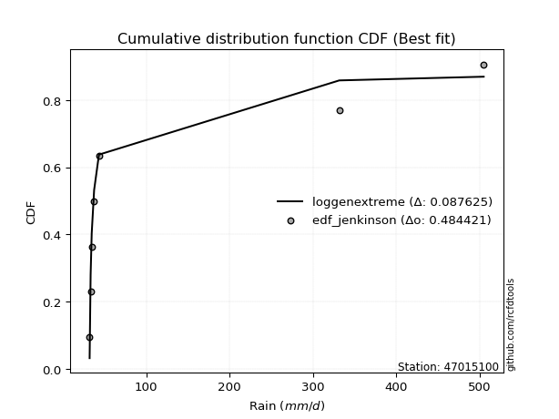</img></img>

</div>


### 11. EDF Cunnane (1978)

Cunnane´s work in statistical hydrology has focused on the performance and evaluation of different probability distributions (such as GEV, Gumbel, Lognormal) for flood frequency estimation. _b_ is a constant, typically set to 0.4.

<div align="center">


$P=(m-b)/(n+1-2b)$


</div>


**11.1. Empirical values**

<div align="center">

|                | 0                   | 1                   | 2                  | 3           | 4                  | 5                  | 6                  |
|:---------------|:--------------------|:--------------------|:-------------------|:------------|:-------------------|:-------------------|:-------------------|
| date           | 2022                | 2020                | 2021               | 2019        | 2023               | 2024               | 2025               |
| x              | 32.0                | 33.2                | 34.5               | 37.4        | 43.2               | 331.5              | 504.8              |
| m              | 1                   | 2                   | 3                  | 4           | 5                  | 6                  | 7                  |
| empirical_dist | edf_cunnane         | edf_cunnane         | edf_cunnane        | edf_cunnane | edf_cunnane        | edf_cunnane        | edf_cunnane        |
| empirical      | 0.08333333333333333 | 0.22222222222222224 | 0.3611111111111111 | 0.5         | 0.6388888888888888 | 0.7777777777777777 | 0.9166666666666666 |
| empirical_tr   | 1.090909090909091   | 1.2857142857142856  | 1.565217391304348  | 2.0         | 2.7692307692307687 | 4.499999999999998  | 11.999999999999995 |

</div>


**11.2. Kolmogorov-Smirnov fit test (sorted by Δ)**


<div align="center">

|                | 0                   | 1                   | 2                   | 3                   | 4                   | 5                   | 6                   | 7                   | 8                   | 9                   | 10                  | 11                  | 12                  | 13                  | 14                  | 15                  | 16                  | 17                  | 18                  | 19                  | 20                  | 21                  | 22                  | 23                  | 24                  | 25                  | 26                  | 27                  | 28                  | 29                  | 30                  | 31                  | 32                  | 33                  | 34                  | 35                  | 36                  | 37                  | 38                  | 39                  | 40                  | 41                  | 42                  | 43                  | 44                  | 45                  | 46                  | 47                  | 48                  | 49                  | 50                  | 51                  | 52                  | 53                  | 54                  | 55                  | 56                  | 57                  | 58                  | 59                  | 60                  | 61                  | 62                  | 63                  | 64                  | 65                  | 66                  | 67                  | 68                  | 69                  | 70                  | 71                  | 72                  | 73                  | 74                  | 75                  | 76                  | 77                  | 78                  | 79                  | 80                  | 81                  | 82                  | 83                  | 84                  | 85                  | 86                  | 87                  | 88                  | 89                  | 90                  | 91                  | 92                  | 93                  | 94                  | 95                  | 96                  | 97                  | 98                  | 99                  | 100                 | 101                 | 102                 | 103                 | 104                 | 105                 | 106                 | 107                 | 108                 | 109                 | 110                 | 111                 | 112                 | 113                 | 114                 | 115                 | 116                 | 117                 | 118                 | 119                 | 120                 | 121                 | 122                 | 123                 | 124                 | 125                 | 126                 | 127                 | 128                 | 129                 | 130                 | 131                 | 132                 | 133                 | 134                 | 135                 | 136                 | 137                 | 138                 | 139                 | 140                 | 141                 | 142                 | 143                 | 144                 | 145                 | 146                 | 147                 | 148                 | 149                 | 150                 | 151                 | 152                 | 153                 | 154                 | 155                 | 156                 | 157                 | 158                 | 159                 |
|:---------------|:--------------------|:--------------------|:--------------------|:--------------------|:--------------------|:--------------------|:--------------------|:--------------------|:--------------------|:--------------------|:--------------------|:--------------------|:--------------------|:--------------------|:--------------------|:--------------------|:--------------------|:--------------------|:--------------------|:--------------------|:--------------------|:--------------------|:--------------------|:--------------------|:--------------------|:--------------------|:--------------------|:--------------------|:--------------------|:--------------------|:--------------------|:--------------------|:--------------------|:--------------------|:--------------------|:--------------------|:--------------------|:--------------------|:--------------------|:--------------------|:--------------------|:--------------------|:--------------------|:--------------------|:--------------------|:--------------------|:--------------------|:--------------------|:--------------------|:--------------------|:--------------------|:--------------------|:--------------------|:--------------------|:--------------------|:--------------------|:--------------------|:--------------------|:--------------------|:--------------------|:--------------------|:--------------------|:--------------------|:--------------------|:--------------------|:--------------------|:--------------------|:--------------------|:--------------------|:--------------------|:--------------------|:--------------------|:--------------------|:--------------------|:--------------------|:--------------------|:--------------------|:--------------------|:--------------------|:--------------------|:--------------------|:--------------------|:--------------------|:--------------------|:--------------------|:--------------------|:--------------------|:--------------------|:--------------------|:--------------------|:--------------------|:--------------------|:--------------------|:--------------------|:--------------------|:--------------------|:--------------------|:--------------------|:--------------------|:--------------------|:--------------------|:--------------------|:--------------------|:--------------------|:--------------------|:--------------------|:--------------------|:--------------------|:--------------------|:--------------------|:--------------------|:--------------------|:--------------------|:--------------------|:--------------------|:--------------------|:--------------------|:--------------------|:--------------------|:--------------------|:--------------------|:--------------------|:--------------------|:--------------------|:--------------------|:--------------------|:--------------------|:--------------------|:--------------------|:--------------------|:--------------------|:--------------------|:--------------------|:--------------------|:--------------------|:--------------------|:--------------------|:--------------------|:--------------------|:--------------------|:--------------------|:--------------------|:--------------------|:--------------------|:--------------------|:--------------------|:--------------------|:--------------------|:--------------------|:--------------------|:--------------------|:--------------------|:--------------------|:--------------------|:--------------------|:--------------------|:--------------------|:--------------------|:--------------------|:--------------------|
| station        | 47015100            | 47015100            | 47015100            | 47015100            | 47015100            | 47015100            | 47015100            | 47015100            | 47015100            | 47015100            | 47015100            | 47015100            | 47015100            | 47015100            | 47015100            | 47015100            | 47015100            | 47015100            | 47015100            | 47015100            | 47015100            | 47015100            | 47015100            | 47015100            | 47015100            | 47015100            | 47015100            | 47015100            | 47015100            | 47015100            | 47015100            | 47015100            | 47015100            | 47015100            | 47015100            | 47015100            | 47015100            | 47015100            | 47015100            | 47015100            | 47015100            | 47015100            | 47015100            | 47015100            | 47015100            | 47015100            | 47015100            | 47015100            | 47015100            | 47015100            | 47015100            | 47015100            | 47015100            | 47015100            | 47015100            | 47015100            | 47015100            | 47015100            | 47015100            | 47015100            | 47015100            | 47015100            | 47015100            | 47015100            | 47015100            | 47015100            | 47015100            | 47015100            | 47015100            | 47015100            | 47015100            | 47015100            | 47015100            | 47015100            | 47015100            | 47015100            | 47015100            | 47015100            | 47015100            | 47015100            | 47015100            | 47015100            | 47015100            | 47015100            | 47015100            | 47015100            | 47015100            | 47015100            | 47015100            | 47015100            | 47015100            | 47015100            | 47015100            | 47015100            | 47015100            | 47015100            | 47015100            | 47015100            | 47015100            | 47015100            | 47015100            | 47015100            | 47015100            | 47015100            | 47015100            | 47015100            | 47015100            | 47015100            | 47015100            | 47015100            | 47015100            | 47015100            | 47015100            | 47015100            | 47015100            | 47015100            | 47015100            | 47015100            | 47015100            | 47015100            | 47015100            | 47015100            | 47015100            | 47015100            | 47015100            | 47015100            | 47015100            | 47015100            | 47015100            | 47015100            | 47015100            | 47015100            | 47015100            | 47015100            | 47015100            | 47015100            | 47015100            | 47015100            | 47015100            | 47015100            | 47015100            | 47015100            | 47015100            | 47015100            | 47015100            | 47015100            | 47015100            | 47015100            | 47015100            | 47015100            | 47015100            | 47015100            | 47015100            | 47015100            | 47015100            | 47015100            | 47015100            | 47015100            | 47015100            | 47015100            |
| empirical_dist | edf_cunnane         | edf_cunnane         | edf_cunnane         | edf_cunnane         | edf_cunnane         | edf_cunnane         | edf_cunnane         | edf_cunnane         | edf_cunnane         | edf_cunnane         | edf_cunnane         | edf_cunnane         | edf_cunnane         | edf_cunnane         | edf_cunnane         | edf_cunnane         | edf_cunnane         | edf_cunnane         | edf_cunnane         | edf_cunnane         | edf_cunnane         | edf_cunnane         | edf_cunnane         | edf_cunnane         | edf_cunnane         | edf_cunnane         | edf_cunnane         | edf_cunnane         | edf_cunnane         | edf_cunnane         | edf_cunnane         | edf_cunnane         | edf_cunnane         | edf_cunnane         | edf_cunnane         | edf_cunnane         | edf_cunnane         | edf_cunnane         | edf_cunnane         | edf_cunnane         | edf_cunnane         | edf_cunnane         | edf_cunnane         | edf_cunnane         | edf_cunnane         | edf_cunnane         | edf_cunnane         | edf_cunnane         | edf_cunnane         | edf_cunnane         | edf_cunnane         | edf_cunnane         | edf_cunnane         | edf_cunnane         | edf_cunnane         | edf_cunnane         | edf_cunnane         | edf_cunnane         | edf_cunnane         | edf_cunnane         | edf_cunnane         | edf_cunnane         | edf_cunnane         | edf_cunnane         | edf_cunnane         | edf_cunnane         | edf_cunnane         | edf_cunnane         | edf_cunnane         | edf_cunnane         | edf_cunnane         | edf_cunnane         | edf_cunnane         | edf_cunnane         | edf_cunnane         | edf_cunnane         | edf_cunnane         | edf_cunnane         | edf_cunnane         | edf_cunnane         | edf_cunnane         | edf_cunnane         | edf_cunnane         | edf_cunnane         | edf_cunnane         | edf_cunnane         | edf_cunnane         | edf_cunnane         | edf_cunnane         | edf_cunnane         | edf_cunnane         | edf_cunnane         | edf_cunnane         | edf_cunnane         | edf_cunnane         | edf_cunnane         | edf_cunnane         | edf_cunnane         | edf_cunnane         | edf_cunnane         | edf_cunnane         | edf_cunnane         | edf_cunnane         | edf_cunnane         | edf_cunnane         | edf_cunnane         | edf_cunnane         | edf_cunnane         | edf_cunnane         | edf_cunnane         | edf_cunnane         | edf_cunnane         | edf_cunnane         | edf_cunnane         | edf_cunnane         | edf_cunnane         | edf_cunnane         | edf_cunnane         | edf_cunnane         | edf_cunnane         | edf_cunnane         | edf_cunnane         | edf_cunnane         | edf_cunnane         | edf_cunnane         | edf_cunnane         | edf_cunnane         | edf_cunnane         | edf_cunnane         | edf_cunnane         | edf_cunnane         | edf_cunnane         | edf_cunnane         | edf_cunnane         | edf_cunnane         | edf_cunnane         | edf_cunnane         | edf_cunnane         | edf_cunnane         | edf_cunnane         | edf_cunnane         | edf_cunnane         | edf_cunnane         | edf_cunnane         | edf_cunnane         | edf_cunnane         | edf_cunnane         | edf_cunnane         | edf_cunnane         | edf_cunnane         | edf_cunnane         | edf_cunnane         | edf_cunnane         | edf_cunnane         | edf_cunnane         | edf_cunnane         | edf_cunnane         | edf_cunnane         | edf_cunnane         | edf_cunnane         |
| p_dist         | loggenextreme       | loginvweibull       | f                   | invgamma            | logf                | loginvgamma         | lomax               | logburr             | loghalfgennorm      | logburr12           | lognakagami         | fatiguelife         | loginvgauss         | loggengamma         | loglomax            | invgauss            | lognct              | logalpha            | truncpareto         | halfgennorm         | logmielke           | logtruncweibull_min | logtruncpareto      | genpareto           | logbradford         | genextreme          | erlang              | logexponpow         | alpha               | gamma               | loggamma            | loggamma            | logdgamma           | logvonmises_line    | logerlang           | logwrapcauchy       | logweibull_min      | loghalflogistic     | logwald             | loghalfnorm         | logfoldnorm         | logarcsine          | tukeylambda         | loggennorm          | t                   | logmoyal            | logpearson3         | arcsine             | burr                | powerlaw            | lograyleigh         | loggumbel_r         | wrapcauchy          | vonmises_line       | loggenpareto        | logsemicircular     | foldnorm            | loggenlogistic      | logmaxwell          | halfnorm            | logbetaprime        | loganglit           | halflogistic        | logncf              | nct                 | truncweibull_min    | ncf                 | logloglaplace       | betaprime           | loglevy_l           | logjohnsonsu        | logloggamma         | pearson3            | logcrystalball      | lognorm             | logt                | semicircular        | rayleigh            | moyal               | logpowerlaw         | logkstwobign        | burr12              | dgamma              | logexponnorm        | gausshyper          | gumbel_r            | maxwell             | loggenexpon         | anglit              | weibull_min         | loglogistic         | logtruncnorm        | wald                | nakagami            | loghypsecant        | logexponweib        | gennorm             | norm                | crystalball         | logrice             | logfatiguelife      | levy_l              | logcosine           | logweibull_max      | johnsonsu           | genlogistic         | logbeta             | loggumbel_l         | gengamma            | loggompertz         | logistic            | loglaplace          | loglaplace          | exponweib           | hypsecant           | kstwobign           | exponpow            | cosine              | gumbel_l            | logrdist            | logargus            | rice                | laplace             | loggausshyper       | logdweibull         | dweibull            | invweibull          | logtriang           | argus               | kappa3              | logksone            | logskewnorm         | logtruncexpon       | logkappa4           | logtukeylambda      | loguniform          | logkappa3           | ksone               | logjohnsonsb        | exponnorm           | genexpon            | beta                | loggenhalflogistic  | bradford            | truncnorm           | genhalflogistic     | skewnorm            | truncexpon          | kappa4              | triang              | gompertz            | logtrapezoid        | uniform             | weibull_max         | trapezoid           | johnsonsb           | rdist               | logvonmises         | vonmises            | mielke              |
| delta          | 0.08084958371400652 | 0.08085472765807289 | 0.10102506179569193 | 0.10102570109758546 | 0.1046669098872467  | 0.10468543108090067 | 0.10594514469613248 | 0.11776020414437849 | 0.13286984723212503 | 0.13301135204170123 | 0.13764649849019805 | 0.13894346145374636 | 0.14456187176813473 | 0.15221629499330847 | 0.15974264043379582 | 0.16843740383099648 | 0.16882698716728373 | 0.17279722533460384 | 0.1746416038389198  | 0.17823266162500873 | 0.18367706914947612 | 0.19277981283711776 | 0.19335715369557338 | 0.19531898754771093 | 0.19660171708201857 | 0.20221706319044544 | 0.2040038782722563  | 0.20733638614099303 | 0.20799428133739273 | 0.20987612456955462 | 0.21183046216187695 | 0.21183046216187695 | 0.21241248404984076 | 0.2157816621813749  | 0.21591434145252864 | 0.22853067008962646 | 0.2365698728133272  | 0.23797941052532395 | 0.23896170349747475 | 0.24110776045619553 | 0.24162274108783804 | 0.2441443895526828  | 0.24434182395059878 | 0.2446166254383047  | 0.24657417120347297 | 0.26119318887936205 | 0.26962921064661516 | 0.27113436081102715 | 0.27165566853295375 | 0.27177130082722856 | 0.2741317395642515  | 0.27521682864226427 | 0.275483387457386   | 0.2765936414307547  | 0.28305110916664694 | 0.28369115521020116 | 0.2838206158421642  | 0.28551668816041453 | 0.28575069634009503 | 0.2888586135629112  | 0.28919998679249026 | 0.2932185853655415  | 0.2942600284906531  | 0.29498939320068795 | 0.2955144119164369  | 0.29634167736815215 | 0.2979191642997576  | 0.29937433449487194 | 0.30021853627015516 | 0.30718555270402964 | 0.31087383855199735 | 0.3109181040242353  | 0.3122740975508076  | 0.31576099694129384 | 0.31576127670713605 | 0.3157615980410548  | 0.3180806185785203  | 0.31822270250459606 | 0.321002966319325   | 0.3211707052406968  | 0.32245574993596005 | 0.32468493244350904 | 0.3263267705383556  | 0.32670479202096914 | 0.32709322926419676 | 0.3277417887239963  | 0.32869718528319536 | 0.32901554886439316 | 0.329090863361964   | 0.33014260682014807 | 0.3357680981903486  | 0.3365816194046363  | 0.33940862828068674 | 0.34747435226745477 | 0.3507421487929176  | 0.3512914029861601  | 0.35364079062469006 | 0.35481914411338344 | 0.3548191516784767  | 0.35594267658817647 | 0.35803419716113205 | 0.3589992646052779  | 0.3598420616295951  | 0.35997081022116734 | 0.3620905737058133  | 0.36253549049363365 | 0.367894056853344   | 0.37112526602194285 | 0.3714662619907928  | 0.37447306664060465 | 0.37683202686603806 | 0.37762641626837895 | 0.37762641626837895 | 0.38009137340873994 | 0.39229773348390207 | 0.3949594639966567  | 0.39636584592547264 | 0.39927197739675757 | 0.4022588434101412  | 0.4076579570328272  | 0.4093982991422409  | 0.4133103394149647  | 0.4158415797975329  | 0.4159237176931746  | 0.416666666656643   | 0.41666666666666935 | 0.42975328031405174 | 0.42983313769164744 | 0.4404577551574753  | 0.44717260568333567 | 0.4648925748027466  | 0.4658551455918929  | 0.4778946059051735  | 0.4939905476226618  | 0.5102537747450486  | 0.5300933119855182  | 0.5300965820356366  | 0.5358150028200789  | 0.5387899438377227  | 0.5428770871526065  | 0.5447096288873993  | 0.5459566259858342  | 0.5501851461916429  | 0.5619765785266488  | 0.5736290604788198  | 0.5810118603807998  | 0.5966768220216419  | 0.6028550959467989  | 0.6056788015943533  | 0.605980764366894   | 0.6068240352323433  | 0.6086141715733254  | 0.6152002256063169  | 0.6269876301442641  | 0.6279852535458555  | 0.6449208555177065  | 0.7843856817654362  | 1.2440217267973626  | 79.88831734463976   | nan                 |
| deltao         | 0.48442053926100004 | 0.48442053926100004 | 0.48442053926100004 | 0.48442053926100004 | 0.48442053926100004 | 0.48442053926100004 | 0.48442053926100004 | 0.48442053926100004 | 0.48442053926100004 | 0.48442053926100004 | 0.48442053926100004 | 0.48442053926100004 | 0.48442053926100004 | 0.48442053926100004 | 0.48442053926100004 | 0.48442053926100004 | 0.48442053926100004 | 0.48442053926100004 | 0.48442053926100004 | 0.48442053926100004 | 0.48442053926100004 | 0.48442053926100004 | 0.48442053926100004 | 0.48442053926100004 | 0.48442053926100004 | 0.48442053926100004 | 0.48442053926100004 | 0.48442053926100004 | 0.48442053926100004 | 0.48442053926100004 | 0.48442053926100004 | 0.48442053926100004 | 0.48442053926100004 | 0.48442053926100004 | 0.48442053926100004 | 0.48442053926100004 | 0.48442053926100004 | 0.48442053926100004 | 0.48442053926100004 | 0.48442053926100004 | 0.48442053926100004 | 0.48442053926100004 | 0.48442053926100004 | 0.48442053926100004 | 0.48442053926100004 | 0.48442053926100004 | 0.48442053926100004 | 0.48442053926100004 | 0.48442053926100004 | 0.48442053926100004 | 0.48442053926100004 | 0.48442053926100004 | 0.48442053926100004 | 0.48442053926100004 | 0.48442053926100004 | 0.48442053926100004 | 0.48442053926100004 | 0.48442053926100004 | 0.48442053926100004 | 0.48442053926100004 | 0.48442053926100004 | 0.48442053926100004 | 0.48442053926100004 | 0.48442053926100004 | 0.48442053926100004 | 0.48442053926100004 | 0.48442053926100004 | 0.48442053926100004 | 0.48442053926100004 | 0.48442053926100004 | 0.48442053926100004 | 0.48442053926100004 | 0.48442053926100004 | 0.48442053926100004 | 0.48442053926100004 | 0.48442053926100004 | 0.48442053926100004 | 0.48442053926100004 | 0.48442053926100004 | 0.48442053926100004 | 0.48442053926100004 | 0.48442053926100004 | 0.48442053926100004 | 0.48442053926100004 | 0.48442053926100004 | 0.48442053926100004 | 0.48442053926100004 | 0.48442053926100004 | 0.48442053926100004 | 0.48442053926100004 | 0.48442053926100004 | 0.48442053926100004 | 0.48442053926100004 | 0.48442053926100004 | 0.48442053926100004 | 0.48442053926100004 | 0.48442053926100004 | 0.48442053926100004 | 0.48442053926100004 | 0.48442053926100004 | 0.48442053926100004 | 0.48442053926100004 | 0.48442053926100004 | 0.48442053926100004 | 0.48442053926100004 | 0.48442053926100004 | 0.48442053926100004 | 0.48442053926100004 | 0.48442053926100004 | 0.48442053926100004 | 0.48442053926100004 | 0.48442053926100004 | 0.48442053926100004 | 0.48442053926100004 | 0.48442053926100004 | 0.48442053926100004 | 0.48442053926100004 | 0.48442053926100004 | 0.48442053926100004 | 0.48442053926100004 | 0.48442053926100004 | 0.48442053926100004 | 0.48442053926100004 | 0.48442053926100004 | 0.48442053926100004 | 0.48442053926100004 | 0.48442053926100004 | 0.48442053926100004 | 0.48442053926100004 | 0.48442053926100004 | 0.48442053926100004 | 0.48442053926100004 | 0.48442053926100004 | 0.48442053926100004 | 0.48442053926100004 | 0.48442053926100004 | 0.48442053926100004 | 0.48442053926100004 | 0.48442053926100004 | 0.48442053926100004 | 0.48442053926100004 | 0.48442053926100004 | 0.48442053926100004 | 0.48442053926100004 | 0.48442053926100004 | 0.48442053926100004 | 0.48442053926100004 | 0.48442053926100004 | 0.48442053926100004 | 0.48442053926100004 | 0.48442053926100004 | 0.48442053926100004 | 0.48442053926100004 | 0.48442053926100004 | 0.48442053926100004 | 0.48442053926100004 | 0.48442053926100004 | 0.48442053926100004 | 0.48442053926100004 | 0.48442053926100004 |
| eval           | Δo > Δ              | Δo > Δ              | Δo > Δ              | Δo > Δ              | Δo > Δ              | Δo > Δ              | Δo > Δ              | Δo > Δ              | Δo > Δ              | Δo > Δ              | Δo > Δ              | Δo > Δ              | Δo > Δ              | Δo > Δ              | Δo > Δ              | Δo > Δ              | Δo > Δ              | Δo > Δ              | Δo > Δ              | Δo > Δ              | Δo > Δ              | Δo > Δ              | Δo > Δ              | Δo > Δ              | Δo > Δ              | Δo > Δ              | Δo > Δ              | Δo > Δ              | Δo > Δ              | Δo > Δ              | Δo > Δ              | Δo > Δ              | Δo > Δ              | Δo > Δ              | Δo > Δ              | Δo > Δ              | Δo > Δ              | Δo > Δ              | Δo > Δ              | Δo > Δ              | Δo > Δ              | Δo > Δ              | Δo > Δ              | Δo > Δ              | Δo > Δ              | Δo > Δ              | Δo > Δ              | Δo > Δ              | Δo > Δ              | Δo > Δ              | Δo > Δ              | Δo > Δ              | Δo > Δ              | Δo > Δ              | Δo > Δ              | Δo > Δ              | Δo > Δ              | Δo > Δ              | Δo > Δ              | Δo > Δ              | Δo > Δ              | Δo > Δ              | Δo > Δ              | Δo > Δ              | Δo > Δ              | Δo > Δ              | Δo > Δ              | Δo > Δ              | Δo > Δ              | Δo > Δ              | Δo > Δ              | Δo > Δ              | Δo > Δ              | Δo > Δ              | Δo > Δ              | Δo > Δ              | Δo > Δ              | Δo > Δ              | Δo > Δ              | Δo > Δ              | Δo > Δ              | Δo > Δ              | Δo > Δ              | Δo > Δ              | Δo > Δ              | Δo > Δ              | Δo > Δ              | Δo > Δ              | Δo > Δ              | Δo > Δ              | Δo > Δ              | Δo > Δ              | Δo > Δ              | Δo > Δ              | Δo > Δ              | Δo > Δ              | Δo > Δ              | Δo > Δ              | Δo > Δ              | Δo > Δ              | Δo > Δ              | Δo > Δ              | Δo > Δ              | Δo > Δ              | Δo > Δ              | Δo > Δ              | Δo > Δ              | Δo > Δ              | Δo > Δ              | Δo > Δ              | Δo > Δ              | Δo > Δ              | Δo > Δ              | Δo > Δ              | Δo > Δ              | Δo > Δ              | Δo > Δ              | Δo > Δ              | Δo > Δ              | Δo > Δ              | Δo > Δ              | Δo > Δ              | Δo > Δ              | Δo > Δ              | Δo > Δ              | Δo > Δ              | Δo > Δ              | Δo > Δ              | Δo > Δ              | Δo > Δ              | Δo > Δ              | Δo > Δ              | Δo > Δ              | Δo <= Δ             | Δo <= Δ             | Δo <= Δ             | Δo <= Δ             | Δo <= Δ             | Δo <= Δ             | Δo <= Δ             | Δo <= Δ             | Δo <= Δ             | Δo <= Δ             | Δo <= Δ             | Δo <= Δ             | Δo <= Δ             | Δo <= Δ             | Δo <= Δ             | Δo <= Δ             | Δo <= Δ             | Δo <= Δ             | Δo <= Δ             | Δo <= Δ             | Δo <= Δ             | Δo <= Δ             | Δo <= Δ             | Δo <= Δ             | Δo <= Δ             | Δo <= Δ             | Δo <= Δ             |
| fit            | 1                   | 1                   | 1                   | 1                   | 1                   | 1                   | 1                   | 1                   | 1                   | 1                   | 1                   | 1                   | 1                   | 1                   | 1                   | 1                   | 1                   | 1                   | 1                   | 1                   | 1                   | 1                   | 1                   | 1                   | 1                   | 1                   | 1                   | 1                   | 1                   | 1                   | 1                   | 1                   | 1                   | 1                   | 1                   | 1                   | 1                   | 1                   | 1                   | 1                   | 1                   | 1                   | 1                   | 1                   | 1                   | 1                   | 1                   | 1                   | 1                   | 1                   | 1                   | 1                   | 1                   | 1                   | 1                   | 1                   | 1                   | 1                   | 1                   | 1                   | 1                   | 1                   | 1                   | 1                   | 1                   | 1                   | 1                   | 1                   | 1                   | 1                   | 1                   | 1                   | 1                   | 1                   | 1                   | 1                   | 1                   | 1                   | 1                   | 1                   | 1                   | 1                   | 1                   | 1                   | 1                   | 1                   | 1                   | 1                   | 1                   | 1                   | 1                   | 1                   | 1                   | 1                   | 1                   | 1                   | 1                   | 1                   | 1                   | 1                   | 1                   | 1                   | 1                   | 1                   | 1                   | 1                   | 1                   | 1                   | 1                   | 1                   | 1                   | 1                   | 1                   | 1                   | 1                   | 1                   | 1                   | 1                   | 1                   | 1                   | 1                   | 1                   | 1                   | 1                   | 1                   | 1                   | 1                   | 1                   | 1                   | 1                   | 1                   | 1                   | 1                   | 0                   | 0                   | 0                   | 0                   | 0                   | 0                   | 0                   | 0                   | 0                   | 0                   | 0                   | 0                   | 0                   | 0                   | 0                   | 0                   | 0                   | 0                   | 0                   | 0                   | 0                   | 0                   | 0                   | 0                   | 0                   | 0                   | 0                   |
| n              | 7                   | 7                   | 7                   | 7                   | 7                   | 7                   | 7                   | 7                   | 7                   | 7                   | 7                   | 7                   | 7                   | 7                   | 7                   | 7                   | 7                   | 7                   | 7                   | 7                   | 7                   | 7                   | 7                   | 7                   | 7                   | 7                   | 7                   | 7                   | 7                   | 7                   | 7                   | 7                   | 7                   | 7                   | 7                   | 7                   | 7                   | 7                   | 7                   | 7                   | 7                   | 7                   | 7                   | 7                   | 7                   | 7                   | 7                   | 7                   | 7                   | 7                   | 7                   | 7                   | 7                   | 7                   | 7                   | 7                   | 7                   | 7                   | 7                   | 7                   | 7                   | 7                   | 7                   | 7                   | 7                   | 7                   | 7                   | 7                   | 7                   | 7                   | 7                   | 7                   | 7                   | 7                   | 7                   | 7                   | 7                   | 7                   | 7                   | 7                   | 7                   | 7                   | 7                   | 7                   | 7                   | 7                   | 7                   | 7                   | 7                   | 7                   | 7                   | 7                   | 7                   | 7                   | 7                   | 7                   | 7                   | 7                   | 7                   | 7                   | 7                   | 7                   | 7                   | 7                   | 7                   | 7                   | 7                   | 7                   | 7                   | 7                   | 7                   | 7                   | 7                   | 7                   | 7                   | 7                   | 7                   | 7                   | 7                   | 7                   | 7                   | 7                   | 7                   | 7                   | 7                   | 7                   | 7                   | 7                   | 7                   | 7                   | 7                   | 7                   | 7                   | 7                   | 7                   | 7                   | 7                   | 7                   | 7                   | 7                   | 7                   | 7                   | 7                   | 7                   | 7                   | 7                   | 7                   | 7                   | 7                   | 7                   | 7                   | 7                   | 7                   | 7                   | 7                   | 7                   | 7                   | 7                   | 7                   | 7                   |
| best_fit       | 1                   | 0                   | 0                   | 0                   | 0                   | 0                   | 0                   | 0                   | 0                   | 0                   | 0                   | 0                   | 0                   | 0                   | 0                   | 0                   | 0                   | 0                   | 0                   | 0                   | 0                   | 0                   | 0                   | 0                   | 0                   | 0                   | 0                   | 0                   | 0                   | 0                   | 0                   | 0                   | 0                   | 0                   | 0                   | 0                   | 0                   | 0                   | 0                   | 0                   | 0                   | 0                   | 0                   | 0                   | 0                   | 0                   | 0                   | 0                   | 0                   | 0                   | 0                   | 0                   | 0                   | 0                   | 0                   | 0                   | 0                   | 0                   | 0                   | 0                   | 0                   | 0                   | 0                   | 0                   | 0                   | 0                   | 0                   | 0                   | 0                   | 0                   | 0                   | 0                   | 0                   | 0                   | 0                   | 0                   | 0                   | 0                   | 0                   | 0                   | 0                   | 0                   | 0                   | 0                   | 0                   | 0                   | 0                   | 0                   | 0                   | 0                   | 0                   | 0                   | 0                   | 0                   | 0                   | 0                   | 0                   | 0                   | 0                   | 0                   | 0                   | 0                   | 0                   | 0                   | 0                   | 0                   | 0                   | 0                   | 0                   | 0                   | 0                   | 0                   | 0                   | 0                   | 0                   | 0                   | 0                   | 0                   | 0                   | 0                   | 0                   | 0                   | 0                   | 0                   | 0                   | 0                   | 0                   | 0                   | 0                   | 0                   | 0                   | 0                   | 0                   | 0                   | 0                   | 0                   | 0                   | 0                   | 0                   | 0                   | 0                   | 0                   | 0                   | 0                   | 0                   | 0                   | 0                   | 0                   | 0                   | 0                   | 0                   | 0                   | 0                   | 0                   | 0                   | 0                   | 0                   | 0                   | 0                   | 0                   |
| best_fit_sort  | 1                   | 2                   | 3                   | 4                   | 5                   | 6                   | 7                   | 8                   | 9                   | 10                  | 11                  | 12                  | 13                  | 14                  | 15                  | 16                  | 17                  | 18                  | 19                  | 20                  | 21                  | 22                  | 23                  | 24                  | 25                  | 26                  | 27                  | 28                  | 29                  | 30                  | 31                  | 32                  | 33                  | 34                  | 35                  | 36                  | 37                  | 38                  | 39                  | 40                  | 41                  | 42                  | 43                  | 44                  | 45                  | 46                  | 47                  | 48                  | 49                  | 50                  | 51                  | 52                  | 53                  | 54                  | 55                  | 56                  | 57                  | 58                  | 59                  | 60                  | 61                  | 62                  | 63                  | 64                  | 65                  | 66                  | 67                  | 68                  | 69                  | 70                  | 71                  | 72                  | 73                  | 74                  | 75                  | 76                  | 77                  | 78                  | 79                  | 80                  | 81                  | 82                  | 83                  | 84                  | 85                  | 86                  | 87                  | 88                  | 89                  | 90                  | 91                  | 92                  | 93                  | 94                  | 95                  | 96                  | 97                  | 98                  | 99                  | 100                 | 101                 | 102                 | 103                 | 104                 | 105                 | 106                 | 107                 | 108                 | 109                 | 110                 | 111                 | 112                 | 113                 | 114                 | 115                 | 116                 | 117                 | 118                 | 119                 | 120                 | 121                 | 122                 | 123                 | 124                 | 125                 | 126                 | 127                 | 128                 | 129                 | 130                 | 131                 | 132                 | 133                 | 134                 | 135                 | 136                 | 137                 | 138                 | 139                 | 140                 | 141                 | 142                 | 143                 | 144                 | 145                 | 146                 | 147                 | 148                 | 149                 | 150                 | 151                 | 152                 | 153                 | 154                 | 155                 | 156                 | 157                 | 158                 | 159                 | 160                 |

</div>


**11.3. Best fit**

<div align="center">

|   id |   station | empirical_dist   | p_dist        |     delta |   deltao | eval   |   fit |   n |   best_fit |   best_fit_sort |
|-----:|----------:|:-----------------|:--------------|----------:|---------:|:-------|------:|----:|-----------:|----------------:|
|    0 |  47015100 | edf_cunnane      | loggenextreme | 0.0808496 | 0.484421 | Δo > Δ |     1 |   7 |          1 |               1 |

</div>


<div align="center">

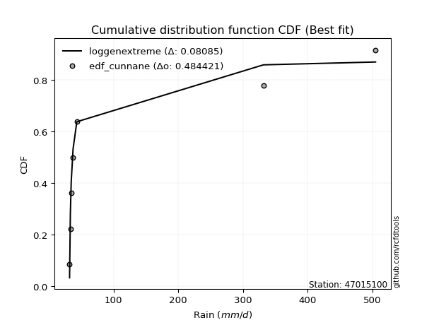</img>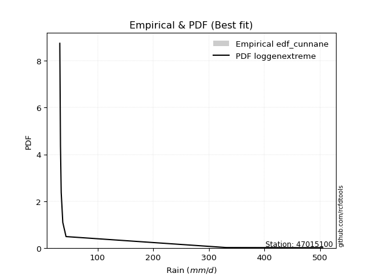</img>

</div>


### 12. EDF Adamowski (1981)

The Adamowski formula in hydrology refers to a specific plotting position formula used for estimating the non-parametric empirical distribution of hydrological events (like flood peaks) to calculate their return periods. This formula provides an alternative to traditional parametric methods (like the Gumbel or Log Pearson Type III distributions). 

<div align="center">


$P=(m-0.25)/(n+0.5)$


</div>


**12.1. Empirical values**

<div align="center">

|                | 0                  | 1                   | 2                   | 3             | 4                  | 5                  | 6                  |
|:---------------|:-------------------|:--------------------|:--------------------|:--------------|:-------------------|:-------------------|:-------------------|
| date           | 2022               | 2020                | 2021                | 2019          | 2023               | 2024               | 2025               |
| x              | 32.0               | 33.2                | 34.5                | 37.4          | 43.2               | 331.5              | 504.8              |
| m              | 1                  | 2                   | 3                   | 4             | 5                  | 6                  | 7                  |
| empirical_dist | edf_adamowski      | edf_adamowski       | edf_adamowski       | edf_adamowski | edf_adamowski      | edf_adamowski      | edf_adamowski      |
| empirical      | 0.1                | 0.23333333333333334 | 0.36666666666666664 | 0.5           | 0.6333333333333333 | 0.7666666666666667 | 0.9                |
| empirical_tr   | 1.1111111111111112 | 1.3043478260869565  | 1.5789473684210527  | 2.0           | 2.727272727272727  | 4.2857142857142865 | 10.000000000000002 |

</div>


**12.2. Kolmogorov-Smirnov fit test (sorted by Δ)**


<div align="center">

|                | 0                   | 1                   | 2                   | 3                   | 4                   | 5                   | 6                   | 7                   | 8                   | 9                   | 10                  | 11                  | 12                  | 13                  | 14                  | 15                  | 16                  | 17                  | 18                  | 19                  | 20                  | 21                  | 22                  | 23                  | 24                  | 25                  | 26                  | 27                  | 28                  | 29                  | 30                  | 31                  | 32                  | 33                  | 34                  | 35                  | 36                  | 37                  | 38                  | 39                  | 40                  | 41                  | 42                  | 43                  | 44                  | 45                  | 46                  | 47                  | 48                  | 49                  | 50                  | 51                  | 52                  | 53                  | 54                  | 55                  | 56                  | 57                  | 58                  | 59                  | 60                  | 61                  | 62                  | 63                  | 64                  | 65                  | 66                  | 67                  | 68                  | 69                  | 70                  | 71                  | 72                  | 73                  | 74                  | 75                  | 76                  | 77                  | 78                  | 79                  | 80                  | 81                  | 82                  | 83                  | 84                  | 85                  | 86                  | 87                  | 88                  | 89                  | 90                  | 91                  | 92                  | 93                  | 94                  | 95                  | 96                  | 97                  | 98                  | 99                  | 100                 | 101                 | 102                 | 103                 | 104                 | 105                 | 106                 | 107                 | 108                 | 109                 | 110                 | 111                 | 112                 | 113                 | 114                 | 115                 | 116                 | 117                 | 118                 | 119                 | 120                 | 121                 | 122                 | 123                 | 124                 | 125                 | 126                 | 127                 | 128                 | 129                 | 130                 | 131                 | 132                 | 133                 | 134                 | 135                 | 136                 | 137                 | 138                 | 139                 | 140                 | 141                 | 142                 | 143                 | 144                 | 145                 | 146                 | 147                 | 148                 | 149                 | 150                 | 151                 | 152                 | 153                 | 154                 | 155                 | 156                 | 157                 | 158                 | 159                 |
|:---------------|:--------------------|:--------------------|:--------------------|:--------------------|:--------------------|:--------------------|:--------------------|:--------------------|:--------------------|:--------------------|:--------------------|:--------------------|:--------------------|:--------------------|:--------------------|:--------------------|:--------------------|:--------------------|:--------------------|:--------------------|:--------------------|:--------------------|:--------------------|:--------------------|:--------------------|:--------------------|:--------------------|:--------------------|:--------------------|:--------------------|:--------------------|:--------------------|:--------------------|:--------------------|:--------------------|:--------------------|:--------------------|:--------------------|:--------------------|:--------------------|:--------------------|:--------------------|:--------------------|:--------------------|:--------------------|:--------------------|:--------------------|:--------------------|:--------------------|:--------------------|:--------------------|:--------------------|:--------------------|:--------------------|:--------------------|:--------------------|:--------------------|:--------------------|:--------------------|:--------------------|:--------------------|:--------------------|:--------------------|:--------------------|:--------------------|:--------------------|:--------------------|:--------------------|:--------------------|:--------------------|:--------------------|:--------------------|:--------------------|:--------------------|:--------------------|:--------------------|:--------------------|:--------------------|:--------------------|:--------------------|:--------------------|:--------------------|:--------------------|:--------------------|:--------------------|:--------------------|:--------------------|:--------------------|:--------------------|:--------------------|:--------------------|:--------------------|:--------------------|:--------------------|:--------------------|:--------------------|:--------------------|:--------------------|:--------------------|:--------------------|:--------------------|:--------------------|:--------------------|:--------------------|:--------------------|:--------------------|:--------------------|:--------------------|:--------------------|:--------------------|:--------------------|:--------------------|:--------------------|:--------------------|:--------------------|:--------------------|:--------------------|:--------------------|:--------------------|:--------------------|:--------------------|:--------------------|:--------------------|:--------------------|:--------------------|:--------------------|:--------------------|:--------------------|:--------------------|:--------------------|:--------------------|:--------------------|:--------------------|:--------------------|:--------------------|:--------------------|:--------------------|:--------------------|:--------------------|:--------------------|:--------------------|:--------------------|:--------------------|:--------------------|:--------------------|:--------------------|:--------------------|:--------------------|:--------------------|:--------------------|:--------------------|:--------------------|:--------------------|:--------------------|:--------------------|:--------------------|:--------------------|:--------------------|:--------------------|:--------------------|
| station        | 47015100            | 47015100            | 47015100            | 47015100            | 47015100            | 47015100            | 47015100            | 47015100            | 47015100            | 47015100            | 47015100            | 47015100            | 47015100            | 47015100            | 47015100            | 47015100            | 47015100            | 47015100            | 47015100            | 47015100            | 47015100            | 47015100            | 47015100            | 47015100            | 47015100            | 47015100            | 47015100            | 47015100            | 47015100            | 47015100            | 47015100            | 47015100            | 47015100            | 47015100            | 47015100            | 47015100            | 47015100            | 47015100            | 47015100            | 47015100            | 47015100            | 47015100            | 47015100            | 47015100            | 47015100            | 47015100            | 47015100            | 47015100            | 47015100            | 47015100            | 47015100            | 47015100            | 47015100            | 47015100            | 47015100            | 47015100            | 47015100            | 47015100            | 47015100            | 47015100            | 47015100            | 47015100            | 47015100            | 47015100            | 47015100            | 47015100            | 47015100            | 47015100            | 47015100            | 47015100            | 47015100            | 47015100            | 47015100            | 47015100            | 47015100            | 47015100            | 47015100            | 47015100            | 47015100            | 47015100            | 47015100            | 47015100            | 47015100            | 47015100            | 47015100            | 47015100            | 47015100            | 47015100            | 47015100            | 47015100            | 47015100            | 47015100            | 47015100            | 47015100            | 47015100            | 47015100            | 47015100            | 47015100            | 47015100            | 47015100            | 47015100            | 47015100            | 47015100            | 47015100            | 47015100            | 47015100            | 47015100            | 47015100            | 47015100            | 47015100            | 47015100            | 47015100            | 47015100            | 47015100            | 47015100            | 47015100            | 47015100            | 47015100            | 47015100            | 47015100            | 47015100            | 47015100            | 47015100            | 47015100            | 47015100            | 47015100            | 47015100            | 47015100            | 47015100            | 47015100            | 47015100            | 47015100            | 47015100            | 47015100            | 47015100            | 47015100            | 47015100            | 47015100            | 47015100            | 47015100            | 47015100            | 47015100            | 47015100            | 47015100            | 47015100            | 47015100            | 47015100            | 47015100            | 47015100            | 47015100            | 47015100            | 47015100            | 47015100            | 47015100            | 47015100            | 47015100            | 47015100            | 47015100            | 47015100            | 47015100            |
| empirical_dist | edf_adamowski       | edf_adamowski       | edf_adamowski       | edf_adamowski       | edf_adamowski       | edf_adamowski       | edf_adamowski       | edf_adamowski       | edf_adamowski       | edf_adamowski       | edf_adamowski       | edf_adamowski       | edf_adamowski       | edf_adamowski       | edf_adamowski       | edf_adamowski       | edf_adamowski       | edf_adamowski       | edf_adamowski       | edf_adamowski       | edf_adamowski       | edf_adamowski       | edf_adamowski       | edf_adamowski       | edf_adamowski       | edf_adamowski       | edf_adamowski       | edf_adamowski       | edf_adamowski       | edf_adamowski       | edf_adamowski       | edf_adamowski       | edf_adamowski       | edf_adamowski       | edf_adamowski       | edf_adamowski       | edf_adamowski       | edf_adamowski       | edf_adamowski       | edf_adamowski       | edf_adamowski       | edf_adamowski       | edf_adamowski       | edf_adamowski       | edf_adamowski       | edf_adamowski       | edf_adamowski       | edf_adamowski       | edf_adamowski       | edf_adamowski       | edf_adamowski       | edf_adamowski       | edf_adamowski       | edf_adamowski       | edf_adamowski       | edf_adamowski       | edf_adamowski       | edf_adamowski       | edf_adamowski       | edf_adamowski       | edf_adamowski       | edf_adamowski       | edf_adamowski       | edf_adamowski       | edf_adamowski       | edf_adamowski       | edf_adamowski       | edf_adamowski       | edf_adamowski       | edf_adamowski       | edf_adamowski       | edf_adamowski       | edf_adamowski       | edf_adamowski       | edf_adamowski       | edf_adamowski       | edf_adamowski       | edf_adamowski       | edf_adamowski       | edf_adamowski       | edf_adamowski       | edf_adamowski       | edf_adamowski       | edf_adamowski       | edf_adamowski       | edf_adamowski       | edf_adamowski       | edf_adamowski       | edf_adamowski       | edf_adamowski       | edf_adamowski       | edf_adamowski       | edf_adamowski       | edf_adamowski       | edf_adamowski       | edf_adamowski       | edf_adamowski       | edf_adamowski       | edf_adamowski       | edf_adamowski       | edf_adamowski       | edf_adamowski       | edf_adamowski       | edf_adamowski       | edf_adamowski       | edf_adamowski       | edf_adamowski       | edf_adamowski       | edf_adamowski       | edf_adamowski       | edf_adamowski       | edf_adamowski       | edf_adamowski       | edf_adamowski       | edf_adamowski       | edf_adamowski       | edf_adamowski       | edf_adamowski       | edf_adamowski       | edf_adamowski       | edf_adamowski       | edf_adamowski       | edf_adamowski       | edf_adamowski       | edf_adamowski       | edf_adamowski       | edf_adamowski       | edf_adamowski       | edf_adamowski       | edf_adamowski       | edf_adamowski       | edf_adamowski       | edf_adamowski       | edf_adamowski       | edf_adamowski       | edf_adamowski       | edf_adamowski       | edf_adamowski       | edf_adamowski       | edf_adamowski       | edf_adamowski       | edf_adamowski       | edf_adamowski       | edf_adamowski       | edf_adamowski       | edf_adamowski       | edf_adamowski       | edf_adamowski       | edf_adamowski       | edf_adamowski       | edf_adamowski       | edf_adamowski       | edf_adamowski       | edf_adamowski       | edf_adamowski       | edf_adamowski       | edf_adamowski       | edf_adamowski       | edf_adamowski       | edf_adamowski       |
| p_dist         | loggenextreme       | loginvweibull       | f                   | invgamma            | logf                | loginvgamma         | lomax               | logburr             | lognakagami         | fatiguelife         | loghalfgennorm      | logburr12           | loginvgauss         | loggengamma         | logmielke           | lognct              | loglomax            | invgauss            | logalpha            | truncpareto         | halfgennorm         | logbradford         | genextreme          | logexponpow         | logtruncweibull_min | logtruncpareto      | genpareto           | logvonmises_line    | erlang              | logdgamma           | logwrapcauchy       | alpha               | gamma               | loggamma            | loggamma            | logerlang           | loggennorm          | logweibull_min      | loghalflogistic     | logwald             | loghalfnorm         | logfoldnorm         | t                   | logarcsine          | tukeylambda         | logmoyal            | powerlaw            | logpearson3         | wrapcauchy          | arcsine             | burr                | lograyleigh         | loggumbel_r         | vonmises_line       | loggenpareto        | logsemicircular     | foldnorm            | loggenlogistic      | logmaxwell          | logloglaplace       | halfnorm            | logbetaprime        | loganglit           | halflogistic        | logncf              | nct                 | loglevy_l           | truncweibull_min    | ncf                 | betaprime           | logjohnsonsu        | logloggamma         | pearson3            | logpowerlaw         | logcrystalball      | lognorm             | logt                | semicircular        | rayleigh            | moyal               | logkstwobign        | burr12              | dgamma              | gausshyper          | gumbel_r            | logexponnorm        | maxwell             | anglit              | weibull_min         | loggenexpon         | loglogistic         | logtruncnorm        | wald                | gennorm             | nakagami            | levy_l              | loghypsecant        | logexponweib        | logfatiguelife      | norm                | crystalball         | logrice             | johnsonsu           | logcosine           | logweibull_max      | logbeta             | genlogistic         | loggumbel_l         | gengamma            | loggompertz         | logistic            | loglaplace          | loglaplace          | exponweib           | hypsecant           | kstwobign           | exponpow            | cosine              | gumbel_l            | logdweibull         | dweibull            | logrdist            | logargus            | rice                | laplace             | loggausshyper       | invweibull          | logtriang           | kappa3              | argus               | logksone            | logskewnorm         | logtruncexpon       | logkappa4           | logtukeylambda      | loguniform          | logkappa3           | logjohnsonsb        | beta                | ksone               | exponnorm           | genexpon            | loggenhalflogistic  | bradford            | truncnorm           | genhalflogistic     | skewnorm            | truncexpon          | kappa4              | triang              | gompertz            | logtrapezoid        | uniform             | weibull_max         | trapezoid           | johnsonsb           | rdist               | logvonmises         | vonmises            | mielke              |
| delta          | 0.09196069482511748 | 0.09196583876918385 | 0.11213617290680289 | 0.11213681220869642 | 0.11577802099835766 | 0.11579654219201163 | 0.11705625580724344 | 0.12887131525548945 | 0.13209094293464252 | 0.13338790589819083 | 0.143980958343236   | 0.14412246315281219 | 0.1556729828792457  | 0.16332740610441943 | 0.16701040248280952 | 0.16882698716728373 | 0.17085375154490678 | 0.17954851494210744 | 0.1839083364457148  | 0.18575271495003076 | 0.1893437727361197  | 0.19104616152646303 | 0.19110595207933434 | 0.2017808305854375  | 0.20389092394822872 | 0.20446826480668434 | 0.2064300986588219  | 0.20836196707466492 | 0.21511498938336726 | 0.2173104674310905  | 0.2174195589785155  | 0.2191053924485037  | 0.22098723568066558 | 0.22294157327298791 | 0.22294157327298791 | 0.2270254525636396  | 0.227949958771638   | 0.23101431725777166 | 0.23242385496976842 | 0.23340614794191922 | 0.23555220490064    | 0.2360671855322825  | 0.23846746675106845 | 0.23854101779965903 | 0.24434182395059878 | 0.2556376333238065  | 0.2606601897161175  | 0.2640736550910596  | 0.264372276346275   | 0.2655788052554716  | 0.2661001129773982  | 0.268576184008696   | 0.26966127308670873 | 0.2710380858751992  | 0.2774955536110914  | 0.2781355996546456  | 0.2782650602866087  | 0.279961132604859   | 0.2801951407845395  | 0.2827076678282052  | 0.28330305800735567 | 0.2836444312369347  | 0.287663029809986   | 0.28870447293509754 | 0.2894338376451324  | 0.28995885636088137 | 0.290518886037363   | 0.2907861218125966  | 0.2923636087442021  | 0.2946629807145996  | 0.3053182829964418  | 0.3053625484686798  | 0.30671854199525206 | 0.31005959412958567 | 0.3102054413857383  | 0.3102057211515805  | 0.31020604248549927 | 0.3125250630229648  | 0.3126671469490405  | 0.3154474107637695  | 0.3169001943804045  | 0.3191293768879535  | 0.3207712149828001  | 0.3215376737086412  | 0.32218623316844075 | 0.32297864594228054 | 0.3231416297276398  | 0.3235353078064085  | 0.32458705126459253 | 0.32472120741962585 | 0.33021254263479305 | 0.3310260638490808  | 0.3338530727251312  | 0.3369741239580234  | 0.34191879671189923 | 0.34233259793861126 | 0.34518659323736206 | 0.34573584743060454 | 0.3469230860500209  | 0.3492635885578279  | 0.3492635961229212  | 0.35038712103262093 | 0.3509794625947022  | 0.35428650607403955 | 0.3544152546656118  | 0.35678294574223285 | 0.3569799349380781  | 0.3655697104663873  | 0.36591070643523727 | 0.3689175110850491  | 0.3712764713104825  | 0.3720708607128234  | 0.3720708607128234  | 0.3745358178531844  | 0.38674217792834653 | 0.3894039084411012  | 0.3908102903699171  | 0.39371642184120204 | 0.39670328785458564 | 0.39999999998997626 | 0.4000000000000027  | 0.40210240147727166 | 0.40384274358668537 | 0.40775478385940916 | 0.41028602424197735 | 0.41036816213761906 | 0.41308661364738514 | 0.4242775821360919  | 0.43050593901666906 | 0.4349021996019198  | 0.45933701924719106 | 0.46029959003633736 | 0.472339050349618   | 0.4884349920671063  | 0.5046982191894931  | 0.5245377564299627  | 0.524541026480081   | 0.5276788327266115  | 0.5292899593191676  | 0.5302594472645233  | 0.537321531597051   | 0.5391540733318437  | 0.5446295906360874  | 0.5564210229710933  | 0.5680735049232642  | 0.5754563048252442  | 0.5911212664660863  | 0.5972995403912433  | 0.6001232460387977  | 0.6004252088113384  | 0.6012684796767878  | 0.6030586160177699  | 0.6096446700507614  | 0.6158765190331531  | 0.6224296979903     | 0.6338097444065953  | 0.7677190150987696  | 1.2273550601306957  | 79.90498401130642   | nan                 |
| deltao         | 0.48442053926100004 | 0.48442053926100004 | 0.48442053926100004 | 0.48442053926100004 | 0.48442053926100004 | 0.48442053926100004 | 0.48442053926100004 | 0.48442053926100004 | 0.48442053926100004 | 0.48442053926100004 | 0.48442053926100004 | 0.48442053926100004 | 0.48442053926100004 | 0.48442053926100004 | 0.48442053926100004 | 0.48442053926100004 | 0.48442053926100004 | 0.48442053926100004 | 0.48442053926100004 | 0.48442053926100004 | 0.48442053926100004 | 0.48442053926100004 | 0.48442053926100004 | 0.48442053926100004 | 0.48442053926100004 | 0.48442053926100004 | 0.48442053926100004 | 0.48442053926100004 | 0.48442053926100004 | 0.48442053926100004 | 0.48442053926100004 | 0.48442053926100004 | 0.48442053926100004 | 0.48442053926100004 | 0.48442053926100004 | 0.48442053926100004 | 0.48442053926100004 | 0.48442053926100004 | 0.48442053926100004 | 0.48442053926100004 | 0.48442053926100004 | 0.48442053926100004 | 0.48442053926100004 | 0.48442053926100004 | 0.48442053926100004 | 0.48442053926100004 | 0.48442053926100004 | 0.48442053926100004 | 0.48442053926100004 | 0.48442053926100004 | 0.48442053926100004 | 0.48442053926100004 | 0.48442053926100004 | 0.48442053926100004 | 0.48442053926100004 | 0.48442053926100004 | 0.48442053926100004 | 0.48442053926100004 | 0.48442053926100004 | 0.48442053926100004 | 0.48442053926100004 | 0.48442053926100004 | 0.48442053926100004 | 0.48442053926100004 | 0.48442053926100004 | 0.48442053926100004 | 0.48442053926100004 | 0.48442053926100004 | 0.48442053926100004 | 0.48442053926100004 | 0.48442053926100004 | 0.48442053926100004 | 0.48442053926100004 | 0.48442053926100004 | 0.48442053926100004 | 0.48442053926100004 | 0.48442053926100004 | 0.48442053926100004 | 0.48442053926100004 | 0.48442053926100004 | 0.48442053926100004 | 0.48442053926100004 | 0.48442053926100004 | 0.48442053926100004 | 0.48442053926100004 | 0.48442053926100004 | 0.48442053926100004 | 0.48442053926100004 | 0.48442053926100004 | 0.48442053926100004 | 0.48442053926100004 | 0.48442053926100004 | 0.48442053926100004 | 0.48442053926100004 | 0.48442053926100004 | 0.48442053926100004 | 0.48442053926100004 | 0.48442053926100004 | 0.48442053926100004 | 0.48442053926100004 | 0.48442053926100004 | 0.48442053926100004 | 0.48442053926100004 | 0.48442053926100004 | 0.48442053926100004 | 0.48442053926100004 | 0.48442053926100004 | 0.48442053926100004 | 0.48442053926100004 | 0.48442053926100004 | 0.48442053926100004 | 0.48442053926100004 | 0.48442053926100004 | 0.48442053926100004 | 0.48442053926100004 | 0.48442053926100004 | 0.48442053926100004 | 0.48442053926100004 | 0.48442053926100004 | 0.48442053926100004 | 0.48442053926100004 | 0.48442053926100004 | 0.48442053926100004 | 0.48442053926100004 | 0.48442053926100004 | 0.48442053926100004 | 0.48442053926100004 | 0.48442053926100004 | 0.48442053926100004 | 0.48442053926100004 | 0.48442053926100004 | 0.48442053926100004 | 0.48442053926100004 | 0.48442053926100004 | 0.48442053926100004 | 0.48442053926100004 | 0.48442053926100004 | 0.48442053926100004 | 0.48442053926100004 | 0.48442053926100004 | 0.48442053926100004 | 0.48442053926100004 | 0.48442053926100004 | 0.48442053926100004 | 0.48442053926100004 | 0.48442053926100004 | 0.48442053926100004 | 0.48442053926100004 | 0.48442053926100004 | 0.48442053926100004 | 0.48442053926100004 | 0.48442053926100004 | 0.48442053926100004 | 0.48442053926100004 | 0.48442053926100004 | 0.48442053926100004 | 0.48442053926100004 | 0.48442053926100004 | 0.48442053926100004 | 0.48442053926100004 |
| eval           | Δo > Δ              | Δo > Δ              | Δo > Δ              | Δo > Δ              | Δo > Δ              | Δo > Δ              | Δo > Δ              | Δo > Δ              | Δo > Δ              | Δo > Δ              | Δo > Δ              | Δo > Δ              | Δo > Δ              | Δo > Δ              | Δo > Δ              | Δo > Δ              | Δo > Δ              | Δo > Δ              | Δo > Δ              | Δo > Δ              | Δo > Δ              | Δo > Δ              | Δo > Δ              | Δo > Δ              | Δo > Δ              | Δo > Δ              | Δo > Δ              | Δo > Δ              | Δo > Δ              | Δo > Δ              | Δo > Δ              | Δo > Δ              | Δo > Δ              | Δo > Δ              | Δo > Δ              | Δo > Δ              | Δo > Δ              | Δo > Δ              | Δo > Δ              | Δo > Δ              | Δo > Δ              | Δo > Δ              | Δo > Δ              | Δo > Δ              | Δo > Δ              | Δo > Δ              | Δo > Δ              | Δo > Δ              | Δo > Δ              | Δo > Δ              | Δo > Δ              | Δo > Δ              | Δo > Δ              | Δo > Δ              | Δo > Δ              | Δo > Δ              | Δo > Δ              | Δo > Δ              | Δo > Δ              | Δo > Δ              | Δo > Δ              | Δo > Δ              | Δo > Δ              | Δo > Δ              | Δo > Δ              | Δo > Δ              | Δo > Δ              | Δo > Δ              | Δo > Δ              | Δo > Δ              | Δo > Δ              | Δo > Δ              | Δo > Δ              | Δo > Δ              | Δo > Δ              | Δo > Δ              | Δo > Δ              | Δo > Δ              | Δo > Δ              | Δo > Δ              | Δo > Δ              | Δo > Δ              | Δo > Δ              | Δo > Δ              | Δo > Δ              | Δo > Δ              | Δo > Δ              | Δo > Δ              | Δo > Δ              | Δo > Δ              | Δo > Δ              | Δo > Δ              | Δo > Δ              | Δo > Δ              | Δo > Δ              | Δo > Δ              | Δo > Δ              | Δo > Δ              | Δo > Δ              | Δo > Δ              | Δo > Δ              | Δo > Δ              | Δo > Δ              | Δo > Δ              | Δo > Δ              | Δo > Δ              | Δo > Δ              | Δo > Δ              | Δo > Δ              | Δo > Δ              | Δo > Δ              | Δo > Δ              | Δo > Δ              | Δo > Δ              | Δo > Δ              | Δo > Δ              | Δo > Δ              | Δo > Δ              | Δo > Δ              | Δo > Δ              | Δo > Δ              | Δo > Δ              | Δo > Δ              | Δo > Δ              | Δo > Δ              | Δo > Δ              | Δo > Δ              | Δo > Δ              | Δo > Δ              | Δo > Δ              | Δo > Δ              | Δo > Δ              | Δo > Δ              | Δo <= Δ             | Δo <= Δ             | Δo <= Δ             | Δo <= Δ             | Δo <= Δ             | Δo <= Δ             | Δo <= Δ             | Δo <= Δ             | Δo <= Δ             | Δo <= Δ             | Δo <= Δ             | Δo <= Δ             | Δo <= Δ             | Δo <= Δ             | Δo <= Δ             | Δo <= Δ             | Δo <= Δ             | Δo <= Δ             | Δo <= Δ             | Δo <= Δ             | Δo <= Δ             | Δo <= Δ             | Δo <= Δ             | Δo <= Δ             | Δo <= Δ             | Δo <= Δ             | Δo <= Δ             |
| fit            | 1                   | 1                   | 1                   | 1                   | 1                   | 1                   | 1                   | 1                   | 1                   | 1                   | 1                   | 1                   | 1                   | 1                   | 1                   | 1                   | 1                   | 1                   | 1                   | 1                   | 1                   | 1                   | 1                   | 1                   | 1                   | 1                   | 1                   | 1                   | 1                   | 1                   | 1                   | 1                   | 1                   | 1                   | 1                   | 1                   | 1                   | 1                   | 1                   | 1                   | 1                   | 1                   | 1                   | 1                   | 1                   | 1                   | 1                   | 1                   | 1                   | 1                   | 1                   | 1                   | 1                   | 1                   | 1                   | 1                   | 1                   | 1                   | 1                   | 1                   | 1                   | 1                   | 1                   | 1                   | 1                   | 1                   | 1                   | 1                   | 1                   | 1                   | 1                   | 1                   | 1                   | 1                   | 1                   | 1                   | 1                   | 1                   | 1                   | 1                   | 1                   | 1                   | 1                   | 1                   | 1                   | 1                   | 1                   | 1                   | 1                   | 1                   | 1                   | 1                   | 1                   | 1                   | 1                   | 1                   | 1                   | 1                   | 1                   | 1                   | 1                   | 1                   | 1                   | 1                   | 1                   | 1                   | 1                   | 1                   | 1                   | 1                   | 1                   | 1                   | 1                   | 1                   | 1                   | 1                   | 1                   | 1                   | 1                   | 1                   | 1                   | 1                   | 1                   | 1                   | 1                   | 1                   | 1                   | 1                   | 1                   | 1                   | 1                   | 1                   | 1                   | 0                   | 0                   | 0                   | 0                   | 0                   | 0                   | 0                   | 0                   | 0                   | 0                   | 0                   | 0                   | 0                   | 0                   | 0                   | 0                   | 0                   | 0                   | 0                   | 0                   | 0                   | 0                   | 0                   | 0                   | 0                   | 0                   | 0                   |
| n              | 7                   | 7                   | 7                   | 7                   | 7                   | 7                   | 7                   | 7                   | 7                   | 7                   | 7                   | 7                   | 7                   | 7                   | 7                   | 7                   | 7                   | 7                   | 7                   | 7                   | 7                   | 7                   | 7                   | 7                   | 7                   | 7                   | 7                   | 7                   | 7                   | 7                   | 7                   | 7                   | 7                   | 7                   | 7                   | 7                   | 7                   | 7                   | 7                   | 7                   | 7                   | 7                   | 7                   | 7                   | 7                   | 7                   | 7                   | 7                   | 7                   | 7                   | 7                   | 7                   | 7                   | 7                   | 7                   | 7                   | 7                   | 7                   | 7                   | 7                   | 7                   | 7                   | 7                   | 7                   | 7                   | 7                   | 7                   | 7                   | 7                   | 7                   | 7                   | 7                   | 7                   | 7                   | 7                   | 7                   | 7                   | 7                   | 7                   | 7                   | 7                   | 7                   | 7                   | 7                   | 7                   | 7                   | 7                   | 7                   | 7                   | 7                   | 7                   | 7                   | 7                   | 7                   | 7                   | 7                   | 7                   | 7                   | 7                   | 7                   | 7                   | 7                   | 7                   | 7                   | 7                   | 7                   | 7                   | 7                   | 7                   | 7                   | 7                   | 7                   | 7                   | 7                   | 7                   | 7                   | 7                   | 7                   | 7                   | 7                   | 7                   | 7                   | 7                   | 7                   | 7                   | 7                   | 7                   | 7                   | 7                   | 7                   | 7                   | 7                   | 7                   | 7                   | 7                   | 7                   | 7                   | 7                   | 7                   | 7                   | 7                   | 7                   | 7                   | 7                   | 7                   | 7                   | 7                   | 7                   | 7                   | 7                   | 7                   | 7                   | 7                   | 7                   | 7                   | 7                   | 7                   | 7                   | 7                   | 7                   |
| best_fit       | 1                   | 0                   | 0                   | 0                   | 0                   | 0                   | 0                   | 0                   | 0                   | 0                   | 0                   | 0                   | 0                   | 0                   | 0                   | 0                   | 0                   | 0                   | 0                   | 0                   | 0                   | 0                   | 0                   | 0                   | 0                   | 0                   | 0                   | 0                   | 0                   | 0                   | 0                   | 0                   | 0                   | 0                   | 0                   | 0                   | 0                   | 0                   | 0                   | 0                   | 0                   | 0                   | 0                   | 0                   | 0                   | 0                   | 0                   | 0                   | 0                   | 0                   | 0                   | 0                   | 0                   | 0                   | 0                   | 0                   | 0                   | 0                   | 0                   | 0                   | 0                   | 0                   | 0                   | 0                   | 0                   | 0                   | 0                   | 0                   | 0                   | 0                   | 0                   | 0                   | 0                   | 0                   | 0                   | 0                   | 0                   | 0                   | 0                   | 0                   | 0                   | 0                   | 0                   | 0                   | 0                   | 0                   | 0                   | 0                   | 0                   | 0                   | 0                   | 0                   | 0                   | 0                   | 0                   | 0                   | 0                   | 0                   | 0                   | 0                   | 0                   | 0                   | 0                   | 0                   | 0                   | 0                   | 0                   | 0                   | 0                   | 0                   | 0                   | 0                   | 0                   | 0                   | 0                   | 0                   | 0                   | 0                   | 0                   | 0                   | 0                   | 0                   | 0                   | 0                   | 0                   | 0                   | 0                   | 0                   | 0                   | 0                   | 0                   | 0                   | 0                   | 0                   | 0                   | 0                   | 0                   | 0                   | 0                   | 0                   | 0                   | 0                   | 0                   | 0                   | 0                   | 0                   | 0                   | 0                   | 0                   | 0                   | 0                   | 0                   | 0                   | 0                   | 0                   | 0                   | 0                   | 0                   | 0                   | 0                   |
| best_fit_sort  | 1                   | 2                   | 3                   | 4                   | 5                   | 6                   | 7                   | 8                   | 9                   | 10                  | 11                  | 12                  | 13                  | 14                  | 15                  | 16                  | 17                  | 18                  | 19                  | 20                  | 21                  | 22                  | 23                  | 24                  | 25                  | 26                  | 27                  | 28                  | 29                  | 30                  | 31                  | 32                  | 33                  | 34                  | 35                  | 36                  | 37                  | 38                  | 39                  | 40                  | 41                  | 42                  | 43                  | 44                  | 45                  | 46                  | 47                  | 48                  | 49                  | 50                  | 51                  | 52                  | 53                  | 54                  | 55                  | 56                  | 57                  | 58                  | 59                  | 60                  | 61                  | 62                  | 63                  | 64                  | 65                  | 66                  | 67                  | 68                  | 69                  | 70                  | 71                  | 72                  | 73                  | 74                  | 75                  | 76                  | 77                  | 78                  | 79                  | 80                  | 81                  | 82                  | 83                  | 84                  | 85                  | 86                  | 87                  | 88                  | 89                  | 90                  | 91                  | 92                  | 93                  | 94                  | 95                  | 96                  | 97                  | 98                  | 99                  | 100                 | 101                 | 102                 | 103                 | 104                 | 105                 | 106                 | 107                 | 108                 | 109                 | 110                 | 111                 | 112                 | 113                 | 114                 | 115                 | 116                 | 117                 | 118                 | 119                 | 120                 | 121                 | 122                 | 123                 | 124                 | 125                 | 126                 | 127                 | 128                 | 129                 | 130                 | 131                 | 132                 | 133                 | 134                 | 135                 | 136                 | 137                 | 138                 | 139                 | 140                 | 141                 | 142                 | 143                 | 144                 | 145                 | 146                 | 147                 | 148                 | 149                 | 150                 | 151                 | 152                 | 153                 | 154                 | 155                 | 156                 | 157                 | 158                 | 159                 | 160                 |

</div>


**12.3. Best fit**

<div align="center">

|   id |   station | empirical_dist   | p_dist        |     delta |   deltao | eval   |   fit |   n |   best_fit |   best_fit_sort |
|-----:|----------:|:-----------------|:--------------|----------:|---------:|:-------|------:|----:|-----------:|----------------:|
|    0 |  47015100 | edf_adamowski    | loggenextreme | 0.0919607 | 0.484421 | Δo > Δ |     1 |   7 |          1 |               1 |

</div>


<div align="center">

</img>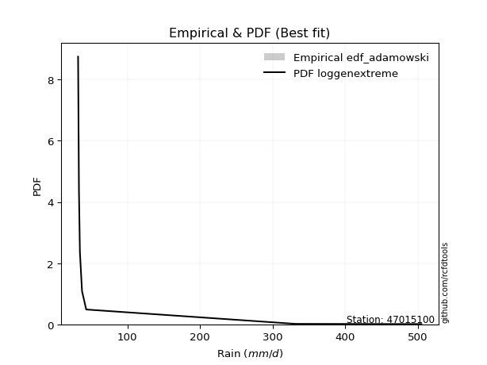</img>

</div>


## C. Best fit & Estimate extreme values for specific return periods - Tr

Best fit in probability distribution analysis means finding the theoretical distribution (like Normal, Poisson, Exponential, etc.) that most accurately mirrors your real-world data´s patterns (shape, center, spread) for better predictions, using methods like visual checks (Q-Q plots), goodness-of-fit tests (Kolmogorov-Smirnov, Chi-Squared), and information criteria (AIC) to score and select the simplest, most representative model.


### 1. Best fit (ordered by delta Δ)

:file_folder:Table: [bestfit_47015100.csv](table/bestfit_47015100.csv)

<div align="center">

|   id |   station | empirical_dist   | p_dist        |     delta |   deltao | eval   |   fit |   n |   best_fit |   best_fit_sort |
|-----:|----------:|:-----------------|:--------------|----------:|---------:|:-------|------:|----:|-----------:|----------------:|
|    0 |  47015100 | edf_hazen        | loggenextreme | 0.0729131 | 0.484421 | Δo > Δ |     1 |   7 |          1 |               1 |
|    1 |  47015100 | edf_gringorten   | loggenextreme | 0.0777285 | 0.484421 | Δo > Δ |     1 |   7 |          1 |               2 |
|    2 |  47015100 | edf_cunnane      | loggenextreme | 0.0808496 | 0.484421 | Δo > Δ |     1 |   7 |          1 |               3 |
|    3 |  47015100 | edf_blom         | loggenextreme | 0.0827653 | 0.484421 | Δo > Δ |     1 |   7 |          1 |               4 |
|    4 |  47015100 | edf_tukey        | loggenextreme | 0.0859001 | 0.484421 | Δo > Δ |     1 |   7 |          1 |               5 |
|    5 |  47015100 | edf_filliben     | loggenextreme | 0.0870727 | 0.484421 | Δo > Δ |     1 |   7 |          1 |               6 |
|    6 |  47015100 | edf_beard        | loggenextreme | 0.0876247 | 0.484421 | Δo > Δ |     1 |   7 |          1 |               7 |
|    7 |  47015100 | edf_jenkinson    | loggenextreme | 0.0876247 | 0.484421 | Δo > Δ |     1 |   7 |          1 |               8 |
|    8 |  47015100 | edf_chegodayev   | loggenextreme | 0.0883571 | 0.484421 | Δo > Δ |     1 |   7 |          1 |               9 |
|    9 |  47015100 | edf_adamowski    | loggenextreme | 0.0919607 | 0.484421 | Δo > Δ |     1 |   7 |          1 |              10 |
|   10 |  47015100 | edf_california   | logalpha      | 0.10192   | 0.484421 | Δo > Δ |     1 |   7 |          1 |              11 |
|   11 |  47015100 | edf_weibull      | loggenextreme | 0.108627  | 0.484421 | Δo > Δ |     1 |   7 |          1 |              12 |

</div>


### 2. Extreme values and % difference analysis

In hydrology, a return period (or recurrence interval $Tr$) is the statistical average time between extreme events like floods or droughts of a specific magnitude, indicating how rare an event is, with a 100-year flood, for example, having a 1% chance of occurring in any given year, not that it happens exactly every century. It is a key tool for infrastructure design (like bridges or dams) and risk assessment, calculated from historical data to determine the probability of future events, although it is important to remember it is statistical average, and events can cluster or be missed.

The extreme value porcentage difference is evaluated as $pdiff = 1 - (ETrBf / ETr) * 100$, where _ETrBf_ correspond to the bestfit extreme value for a specific recurrence interval and _ETr_ correspond to the extreme value for one of the most used PDFsused in hydrology.

> risk_rate: assuming the return period as the project useful life.

:file_folder:Table: [extreme_47015100.csv](table/extreme_47015100.csv), all PDFs.  
:file_folder:Table: [extremepdiff_47015100.csv](table/extremepdiff_47015100.csv), % difference between bestfit and most used PDFs in Hydrology.

<div align="center">

Extreme values table for only best fit PDFs
|   id |      tr |   prob_l |     prob_g |     alpha |   anglit |   arcsine |   argus |       beta |   betaprime |   bradford |      burr |   burr12 |   cosine |   crystalball |   dgamma |   dweibull |   erlang |   exponnorm |   exponpow |   exponweib |                f |   fatiguelife |   foldnorm |    gamma |   gausshyper |   genexpon |       genextreme |   gengamma |   genhalflogistic |   genlogistic |   gennorm |   genpareto |   gompertz |   gumbel_l |   gumbel_r |   halfgennorm |   halflogistic |   halfnorm |   hypsecant |         invgamma |   invgauss |      invweibull |   johnsonsb |        johnsonsu |          kappa3 |   kappa4 |   ksone |   kstwobign |   laplace |   levy_l |   loggamma |   logistic |   loglaplace |            lomax |   maxwell |   mielke |    moyal |   nakagami |       ncf |        nct |    norm |   pearson3 |   powerlaw |   rayleigh |    rdist |    rice |   semicircular |   skewnorm |                t |   trapezoid |   triang |   truncexpon |   truncnorm |   truncpareto |   truncweibull_min |   tukeylambda |   uniform |   vonmises |   vonmises_line |      wald |   weibull_max |   weibull_min |   wrapcauchy |         logalpha |   loganglit |   logarcsine |   logargus |   logbeta |   logbetaprime |   logbradford |          logburr |      logburr12 |   logcosine |   logcrystalball |   logdgamma |      logdweibull |   logerlang |   logexponnorm |      logexponpow |   logexponweib |             logf |   logfatiguelife |   logfoldnorm |   loggausshyper |   loggenexpon |   loggenextreme |   loggengamma |   loggenhalflogistic |   loggenlogistic |   loggennorm |   loggenpareto |   loggompertz |   loggumbel_l |   loggumbel_r |   loghalfgennorm |   loghalflogistic |   loghalfnorm |   loghypsecant |      loginvgamma |      loginvgauss |   loginvweibull |   logjohnsonsb |   logjohnsonsu |   logkappa3 |   logkappa4 |   logksone |   logkstwobign |   loglevy_l |   logloggamma |   loglogistic |   logloglaplace |        loglomax |   logmaxwell |        logmielke |   logmoyal |   lognakagami |     logncf |            lognct |   lognorm |   logpearson3 |   logpowerlaw |   lograyleigh |   logrdist |   logrice |   logsemicircular |   logskewnorm |      logt |   logtrapezoid |   logtriang |   logtruncexpon |   logtruncnorm |   logtruncpareto |   logtruncweibull_min |   logtukeylambda |   loguniform |   logvonmises |   logvonmises_line |     logwald |   logweibull_max |   logweibull_min |   logwrapcauchy |   station |   n |   risk_rate |
|-----:|--------:|---------:|-----------:|----------:|---------:|----------:|--------:|-----------:|------------:|-----------:|----------:|---------:|---------:|--------------:|---------:|-----------:|---------:|------------:|-----------:|------------:|-----------------:|--------------:|-----------:|---------:|-------------:|-----------:|-----------------:|-----------:|------------------:|--------------:|----------:|------------:|-----------:|-----------:|-----------:|--------------:|---------------:|-----------:|------------:|-----------------:|-----------:|----------------:|------------:|-----------------:|----------------:|---------:|--------:|------------:|----------:|---------:|-----------:|-----------:|-------------:|-----------------:|----------:|---------:|---------:|-----------:|----------:|-----------:|--------:|-----------:|-----------:|-----------:|---------:|--------:|---------------:|-----------:|-----------------:|------------:|---------:|-------------:|------------:|--------------:|-------------------:|--------------:|----------:|-----------:|----------------:|----------:|--------------:|--------------:|-------------:|-----------------:|------------:|-------------:|-----------:|----------:|---------------:|--------------:|-----------------:|---------------:|------------:|-----------------:|------------:|-----------------:|------------:|---------------:|-----------------:|---------------:|-----------------:|-----------------:|--------------:|----------------:|--------------:|----------------:|--------------:|---------------------:|-----------------:|-------------:|---------------:|--------------:|--------------:|--------------:|-----------------:|------------------:|--------------:|---------------:|-----------------:|-----------------:|----------------:|---------------:|---------------:|------------:|------------:|-----------:|---------------:|------------:|--------------:|--------------:|----------------:|----------------:|-------------:|-----------------:|-----------:|--------------:|-----------:|------------------:|----------:|--------------:|--------------:|--------------:|-----------:|----------:|------------------:|--------------:|----------:|---------------:|------------:|----------------:|---------------:|-----------------:|----------------------:|-----------------:|-------------:|--------------:|-------------------:|------------:|-----------------:|-----------------:|----------------:|----------:|----:|------------:|
|    0 |    2    | 0.5      | 0.5        |   37.1585 |  145.229 |   145.229 | 229.234 | -12.0307   |     62.4127 |    152.248 |   55.2621 |  56.0997 |  175.203 |       145.229 |  208.749 |     32     |  40.7546 |     109.928 |    87.1819 |     102.451 |     36.5848      |       43.207  |    107.609 |  40.6745 |      118.252 |    110.485 |     34.5158      |    164.625 |           338.349 |       107.974 |   33.2    |     37.0421 |    221.348 |    174.594 |    115.863 |       40.0776 |        101.264 |    108.639 |     145.229 |     36.5845      |    36.5907 |   888.631       |     32.0013 |     32.2707      |  1394.09        |  252.852 | 268.4   |     126.304 |   145.229 |  157.239 |    40.9599 |    145.229 |      71.8755 |     36.7618      |   129.941 |  41.1189 |  106.383 |    96.6776 |   62.3933 |    58.7317 | 145.229 |    111.413 |    33.3294 |    124.519 | -15.6583 | 147.078 |        145.229 |    174.724 |     33.776       |     385.14  |  229.714 |      215.151 |     143.809 |       41.7153 |             61.525 |       42.9856 |   268.4   |   0.487385 |          95.73  |   87.2857 |       504.684 |       108.979 |      268.447 |     36.9769      |     71.8755 |       71.875 |    108.829 |   32.0067 |        56.7984 |       47.3041 |    36.6264       |   39.6565      |     83.0622 |          71.8754 |     34.5    |     32           |     39.4944 |        55.8189 |     50.0059      |        63.5786 |    36.5593       |          32      |       57.5249 |         79.648  |       56.0704 |   36.4239       |       39.3622 |              201.613 |          57.0654 |      34.5    |        119.872 |       62.9988 |       86.2423 |       59.902  |     36.3796      |           54.7138 |       57.276  |        71.8755 |    36.5586       |     36.5878      |   36.4252       |        32.0009 |        71.6227 |     31.9997 |     115.323 |    127.097 |        63.0701 |     111.832 |       71.8766 |       71.8755 |         37.4    |    37.76        |      65.3703 |    42.0348       |    56.4797 |       43.0791 |    61.6562 |     44.3337       |   71.8755 |       60.3342 |       32.6604 |       63.2074 |    102.995 |   72.011  |           71.8755 |       80.7805 |   71.8755 |        252.269 |     133.967 |         92.2447 |         56.541 |          40.6597 |               37.3532 |          102.995 |      127.097 |     0.0949524 |            49.793  |     50.1679 |          133.565 |     51.2694      |         127.097 |  47015100 |   7 |    0.75     |
|    1 |    2.33 | 0.570815 | 0.429185   |   38.6764 |  182.384 |   201.005 | 266.914 |   0.496323 |     74.114  |    182.279 |   63.6989 |  63.63   |  209.059 |       177.126 |  344.351 |     47.722 |  46.48   |     127.135 |   107.742  |     143.228 |     39.4692      |       56.7803 |    142.604 |  46.0042 |      156.745 |    127.778 |     37.2666      |    280.801 |           369.39  |       130.196 |   34.628  |     38.8432 |    253.353 |    202.346 |    145.42  |       44.2862 |        131.653 |    143.065 |     170.756 |     39.4688      |    38.6431 | 24614.3         |     32.0039 |     32.9429      | 17839           |  287.486 | 308.578 |     151.373 |   164.532 |  262.62  |    43.9561 |    173.333 |      81.0219 |     39.6614      |   163.08  |  43.3134 |  134.362 |   131.797  |   74.2176 |    68.6035 | 177.126 |    142.283 |    36.0846 |    158.149 |  -5.8589 | 174.77  |        185.078 |    199.29  |     34.3362      |     412.61  |  264.806 |      247.403 |     167.265 |       47.4914 |             76.643 |       44.6183 |   301.882 |   0.837095 |         122.19  |  108.201  |       504.775 |       173.6   |      494.139 |     38.5687      |     90.5134 |      101.6   |    134.697 |   32.4225 |        65.4754 |       54.3942 |    38.7119       |   42.8514      |    101.597  |          87.6081 |     34.6316 |     34.3545      |     42.0177 |        63.1073 |     61.149       |        75.897  |    38.6998       |          32.9276 |       71.3536 |         96.9032 |       63.4458 |   38.935        |       43.431  |              240.39  |          65.9968 |      35.1367 |        178.333 |       73.139  |      102.45   |       71.9609 |     38.881       |           66.0686 |       70.9169 |        84.2127 |    38.6986       |     38.5719      |   38.9367       |        32.0056 |        87.7041 |     31.9997 |     142.479 |    160.671 |        73.9552 |     176.792 |       88.094  |       85.5699 |         41.0124 |    39.8476      |      80.2955 |    53.4965       |    67.1887 |       52.2879 |    73.3357 |     49.276        |   87.6082 |       73.2956 |       33.7134 |       77.8753 |    132.989 |   85.7036 |           92.0395 |       94.7389 |   87.6081 |        296.119 |     166.815 |        111.268  |         63.768 |          44.5002 |               40.6217 |          121.563 |      154.515 |     0.114032  |            57.7104 |     57.1207 |          172.441 |     60.5391      |         373.271 |  47015100 |   7 |    0.729209 |
|    2 |    5    | 0.8      | 0.2        |   50.4463 |  313.475 |   349.739 | 387.779 | 358.492    |    153.255  |    317.718 |  118.288  | 119.158  |  331.062 |       295.667 |  399.788 |    158.338 |  92.8139 |     213.171 |   224.685  |     550.58  |    103.291       |      218.195  |    290.597 |  87.4027 |      331.858 |    214.236 |    162.018       |   2017.51  |           451.58  |       226.738 |   56.7262 |     55.0424 |    383.713 |    291.999 |    273.828 |       85.3533 |        269.158 |    288.648 |     273.154 |    103.289       |    64.0478 |     5.29777e+10 |     32.2282 |    129.34        |     1.11767e+09 |  402.355 | 438.608 |     257.862 |   261.043 |  437.211 |    64.382  |    281.847 |     147.468  |     99.5151      |   293.516 |  56.8929 |  263.965 |   350.048  |  154.123  |   139.368  | 295.667 |    277.077 |   103.356  |    292.784 |  24.2206 | 285.631 |        321.068 |    303.18  |     41.5375      |     491.418 |  405.152 |      368.573 |     275.259 |      113.084  |            195.788 |       49.8089 |   410.24  |   2.11272  |         225.768 |  225.288  |       504.8   |      1046.3   |      503.123 |     53.4777      |    204.175  |      255.702 |    266.954 |  640.461  |       123.696  |      119.137  |    71.2331       |   79.7604      |    209.948  |         182.814  |     43.9104 |     81.3175      |     58.9183 |       116.562  |    222.522       |       194.854  |    77.0278       |          60.4197 |      176.513  |        210.13   |      117.689  |   99.9433       |       86.8299 |              380.272 |         124.126  |      44.3223 |        410.581 |      154.248  |      178.7    |      159.645  |     74.1531      |          155.084  |      175.022  |       158.978  |    77.0121       |     64.3828      |   99.9448       |        36.692  |       186.182  |     31.9997 |     285.266 |    343.087 |       145.439  |     377.563 |      187.199  |      167.789  |         67.4402 |    61.0717      |     180.389  | 29295.6          |   150.167  |      202.481  |   154.234  |    118.291        |  182.814  |      167.375  |       56.5057 |      179.572  |    263.944 |  172.053  |          214.025  |      185.892  |  182.814  |        468.974 |     312.939 |        225.871  |        112.364 |          83.1553 |               78.5991 |          207.821 |      290.754 |     0.232763  |           102.8    |    118.124  |          329.996 |    173.676       |         479.411 |  47015100 |   7 |    0.67232  |
|    3 |   10    | 0.9      | 0.1        |   72.0704 |  387.675 |   385.645 | 446.063 | 492.787    |    271.652  |    401.236 |  196.1    | 210.13   |  404.772 |       374.304 |  428.578 |    275.26  | 152.029  |     291.272 |   336.617  |    1313.25  |    550.62        |      435.244  |    400.108 | 138.975  |      429.087 |    292.721 |   1801.54        |   6541.12  |           480.295 |       305.367 |   99.9224 |     90.2693 |    473.98  |    341.914 |    378.415 |      163.57   |        383.35  |    396.376 |     354.922 |    550.616       |   142.889  |     7.63151e+15 |     35.3613 |   2141.69        |     8.34826e+12 |  453.608 | 495.344 |     338.94  |   348.652 |  479.362 |    93.1548 |    361.763 |     253.982  |    484.433       |   385.309 |  75.12   |  376.805 |   552.075  |  273.524  |   256.152  | 374.304 |    384.887 |   225.604  |    388.781 |  35.3811 | 364.677 |        390.847 |    380.055 |     86.8295      |     522.201 |  493.572 |      432.123 |     355.504 |      218.46   |            318.342 |       51.9662 |   457.52  |   2.82008  |         305.167 |  349.544  |       504.8   |      3067.64  |      504.102 |     97.487       |    323.57   |      319.522 |    371.274 |  641.886  |       212.315  |      216.329  |   392.606        |  251.543       |    325.509  |         297.807  |     68.252  |    260.216       |     81.9336 |       203.452  |    886.195       |       484.793  |   735.209        |         139.691  |      342.832  |        322.413  |      206.214  | 3468.09         |      202.095  |              444.443 |         207.633  |      66.2981 |        481.328 |      303.67   |      243.581  |      305.502  |    251.999       |          315.002  |      341.522  |       264.058  |   734.51         |    184.955       | 3465.5          |      1310.22   |       306.765  |     31.9997 |     384.399 |    477.705 |       243.392  |     453.466 |      308.029  |      275.51   |        112.179  |   132.912       |     318.854  |     2.38801e+23  |   302.464  |      772.241  |   279.821  |    729.156        |  297.807  |      317.727  |      118.439  |      325.799  |    312.353 |  282.791  |          330.002  |      306.108  |  297.806  |        561.236 |     400.111 |        328.305  |        176.126 |         156.298  |              154.549  |          262.548 |      383.109 |     0.402135  |           160.101  |    255.392  |          413.381 |    588.559       |         493.273 |  47015100 |   7 |    0.651322 |
|    4 |   15    | 0.933333 | 0.0666667  |   93.6173 |  419.36  |   392.493 | 468.221 | 502.317    |    373.072  |    433.313 |  260.908  | 292.65   |  438.348 |       413.546 |  442.648 |    347.91  | 191.372  |     336.958 |   401.437  |    1985.15  |   1681.19        |      577.038  |    457.097 | 172.943  |      460.332 |    338.632 |   7751.07        |  11259.5   |           489     |       349.728 |  137.136  |    129.522  |    518.728 |    364.519 |    437.422 |      234.456  |        447.973 |    452.438 |     401.586 |   1681.2         |   247.155  |     6.20873e+18 |     44.7947 |   9824.09        |     1.25983e+15 |  470.83  | 514.256 |     381.982 |   399.901 |  492.095 |   116.296  |    405.306 |     349.074  |   1401.87        |   432.407 |  89.6834 |  442.292 |   662.637  |  375.72   |   364.075  | 413.546 |    444.428 |   295.488  |    438.244 |  38.5651 | 405.405 |        418.058 |    420.061 |    196.571       |     532.078 |  532.744 |      455.209 |     392.902 |      283.197  |            376.759 |       52.6582 |   473.28  |   3.08152  |         348.604 |  429.336  |       504.8   |      5019.21  |      504.375 |    177.333       |    393.875  |      333.393 |    420.878 |  641.886  |       290.752  |      277.806  |  3730            |  784.865       |    397.481  |         379.917  |     93.2804 |    578.493       |     99.9394 |       281.815  |   2062.62        |       840.644  | 21400.7          |         241.671  |      483.191  |        379.052  |      286.29   |    1.04071e+06  |      355.749  |              465.526 |         277.558  |      91.8579 |        494.716 |      451.323  |      280.262  |      440.592  |    761.016       |          470.402  |      483.619  |       352.743  | 21352.4          |    500.339       |    1.03792e+06  |      5508.28   |       393.575  |     31.9997 |     423.319 |    533.432 |       319.906  |     479.267 |      394.698  |      360.98   |        155.363  |   284.784       |     427.091  |     5.72893e+67  |   454.108  |     1624.51   |   390.772  |   5332.76         |  379.918  |      450.318  |      173.91   |      442.843  |    322.716 |  365.306  |          390.706  |      396.826  |  379.916  |        594.526 |     432.936 |        376.277  |        220.79  |         213.123  |              213.465  |          283.802 |      420.005 |     0.547736  |           204.335  |    419.03   |          443.044 |   1325.94        |         497.228 |  47015100 |   7 |    0.644736 |
|    5 |   20    | 0.95     | 0.05       |  115.145  |  437.998 |   394.905 | 480.383 | 503.995    |    464.964  |    450.236 |  318.685  | 370.12   |  458.997 |       439.244 |  451.875 |    400.958 | 220.822  |     369.373 |   446.726  |    2581     |   3777.97        |      681.995  |    495.092 | 198.282  |      474.703 |    371.206 |  21682.6         |  15832.6   |           493.183 |       380.788 |  169.517  |    171.642  |    547.717 |    378.59  |    478.737 |      298.704  |        493.249 |    489.815 |     434.505 |   3778.05        |   366.007  |     6.77306e+20 |     62.4485 |  26789.9         |     4.20827e+16 |  479.466 | 523.712 |     410.977 |   436.262 |  498.616 |   136.378  |    435.401 |     437.432  |   3036.7         |   463.664 | 102.333  |  488.671 |   737.328  |  468.268  |   466.834  | 439.244 |    485.54  |   338.126  |    471.12  |  40.0049 | 432.476 |        433.151 |    446.734 |    394.429       |     536.95  |  556.094 |      467.159 |     415.011 |      324.832  |            410.267 |       52.9972 |   481.16  |   3.21609  |         377.216 |  488.797  |       504.8   |      6825.02  |      504.507 |    322.407       |    442.17   |      338.42  |    450.869 |  641.886  |       364.002  |      318.428  | 54906.3          | 2432.12        |    449.435  |         445.6    |    118.347  |   1066.95        |    115.281  |       355.11   |   3781.42        |      1250.23   |     1.72326e+06  |         362.639  |      606.886  |        413.145  |      361.329  |    2.41591e+09  |      545.807  |              475.883 |         340.107  |     120.865  |        499.291 |      597.839  |      305.833  |      569.351  |   2068.54        |          623      |      609.864  |       432.689  |     1.71617e+06  |   1236.09        |    2.40158e+09  |      6688.21   |       463.339  |     31.9997 |     443.757 |    563.687 |       384.588  |     493.043 |      464.178  |      435.1    |        198.413  |   604.152       |     518.511  |     5.26053e+144 |   605.549  |     2690.03   |   493.581  |  44128.8          |  445.6    |      571.921  |      217.987  |      543.063  |    326.484 |  433.075  |          429.067  |      471.797  |  445.599  |        611.669 |     450.107 |        403.847  |        254.317 |         255.523  |              257.015  |          295.059 |      439.765 |     0.678542  |           240.29   |    606.025  |          458.207 |   2455.65        |         499.147 |  47015100 |   7 |    0.641514 |
|    6 |   25    | 0.96     | 0.04       |  136.666  |  450.63  |   396.024 | 488.226 | 504.464    |    550.394  |    460.684 |  371.79   | 444.039  |  473.477 |       458.161 |  458.693 |    442.864 | 244.395  |     394.516 |   481.377  |    3118.24  |   7109.62        |      765.38   |    523.362 | 218.524  |      482.674 |    396.473 |  47947.2         |  20203.6   |           495.633 |       404.713 |  198.295  |    216.031  |    568.853 |    388.603 |    510.561 |      357.639  |        528.132 |    517.624 |     459.982 |   7109.82        |   493.154  |     2.51427e+22 |     89.0588 |  56115.1         |     6.26809e+17 |  484.656 | 529.386 |     432.695 |   464.466 |  502.709 |   154.449  |    458.423 |     521.099  |   5557.09        |   486.87  | 113.741  |  524.619 |   793.2    |  554.274  |   565.966  | 458.161 |    516.889 |   366.533  |    495.546 |  40.8066 | 452.589 |        442.942 |    466.579 |    702.179       |     539.853 |  572.03  |      474.467 |     429.718 |      353.527  |            431.907 |       53.1978 |   485.888 |   3.29779  |         397.492 |  536.424  |       504.8   |      8495.77  |      504.586 |    586.042       |    478.223  |      340.778 |    471.333 |  641.886  |       433.966  |      346.955  |     1.17862e+06  | 7498.27        |    489.87   |         501.103  |    143.406  |   1756.74        |    128.898  |       424.853  |   6060.63        |      1706.56   |     3.60497e+08  |         500.626  |      718.728  |        435.992  |      432.832  |    4.03221e+13  |      771.361  |              482.006 |         397.741  |     153.416  |        501.358 |      743.515  |      325.438  |      693.655  |   5170.45        |          773.567  |      724.735  |       506.799  |     3.58146e+08  |   2809.93        |    3.98957e+13  |      6966.86   |       522.48   |     31.9997 |     456.267 |    582.658 |       441.466  |     501.892 |      522.969  |      501.92   |        241.819  |  1272.33        |     598.82   |     2.03115e+260 |   756.885  |     3925.25   |   590.908  | 402588            |  501.104  |      685.686  |      252.656  |      631.945  |    328.259 |  491.444  |          455.946  |      536.628  |  501.102  |        622.116 |     460.659 |        421.711  |        280.562 |         287.716  |              289.809  |          302.023 |      452.065 |     0.796264  |           269.789  |    814.41   |          467.406 |   4047.5         |         500.286 |  47015100 |   7 |    0.639603 |
|    7 |   50    | 0.98     | 0.02       |  244.234  |  481.722 |   397.518 | 506.009 | 504.778    |    921.609  |    482.268 |  597.84   | inf      |  511.394 |       512.333 |  478.428 |    576.741 | 320.886  |     472.617 |   586.097  |    5257.21  |  51099.3         |     1032.89   |    605.532 | 284.039  |      496.431 |    474.958 | 553723           |  39353.4   |           500.382 |       478.413 |  309.9    |    462.147  |    628.232 |    415.783 |    608.594 |      600.413  |        635.613 |    598.457 |     538.972 |  51102.2         |  1158.89   |     1.72063e+27 |    330.944  | 466840           |     2.55953e+21 |  495.056 | 540.733 |     496.47  |   552.076 |  511.924 |   228.241  |    528.765 |     897.484  |  36671.9         |   554.17  | 160.586  |  636.218 |   956.267  |  927.718  |  1028.5    | 512.333 |    611.823 |   430.405  |    566.451 |  42.2255 | 510.974 |        465.311 |    524.261 |   4576.97        |     545.614 |  611.573 |      489.407 |     463.348 |      420.963  |            478.95  |       53.5916 |   495.344 |   3.46279  |         446.403 |  691.925  |       504.8   |     15406.7   |      504.74  |  11618.2         |    579.995  |      343.953 |    521.237 |  641.886  |       758.158  |      415.757  |     5.06453e+14  |    1.98786e+06 |    613.833  |         701.326  |    268.905  |   9335.88        |    183.062  |       741.55   |  26174.5         |      4559.26   |     6.46256e+25  |        1408.7    |     1172.65   |        488.8    |      758.409  |    7.69548e+46  |     2420.09   |              493.929 |         644.211  |     373.919  |        504.005 |     1463.77   |      385.229  |     1274.5    | 223351           |         1507.15   |     1196.8    |       827.389  |     6.29144e+25  |  70965.1         |    7.26822e+46  |      7112.08   |       736.999  |     31.9997 |     481.564 |    622.537 |       661.911  |     522.399 |      735.47   |      776.609  |        469.246  | 49127.3         |     909.218  |   inf            |  1512.82   |    11842.8    |  1030.69   |      7.13314e+10  |  701.326  |     1182.99   |      349.556  |      981.222  |    330.671 |  709.366  |          523.835  |      780.203  |  701.323  |        643.381 |     482.338 |        460.771  |        357.111 |         373.964  |              376.483  |          316.438 |      477.705 |     1.21978   |           358.047  |   2137.55   |          486.013 |  21415.4         |         502.547 |  47015100 |   7 |    0.63583  |
|    8 |   75    | 0.986667 | 0.0133333  |  351.787  |  495.406 |   397.796 | 513.061 | 504.795    |   1240.78   |    489.671 |  788.011  | inf      |  529.501 |       541.4   |  489.184 |    657.342 | 367.468  |     518.303 |   645.236  |    6878.64  | 162278           |     1193.99   |    650.262 | 323.845  |      500.091 |    520.869 |      2.2962e+06  |  55277.8   |           501.91  |       521.25  |  392.178  |    736.393  |    659.309 |    429.527 |    665.575 |      791.861  |        698.091 |    642.459 |     585.132 | 162290           |  1793.36   |     1.11208e+30 |    624.917  |      1.45531e+06 |     3.2055e+23  |  498.529 | 544.515 |     531.559 |   603.325 |  515.71  |   287.47   |    569.391 |    1233.5    | 110832           |   590.759 | 198.47   |  701.479 |  1045.11   | 1248.55   |  1458.24   | 541.4   |    665.956 |   453.965  |    605.027 |  42.6242 | 542.738 |        474.246 |    555.661 |  13973           |     547.521 |  629.091 |      494.486 |     476.127 |      446.885  |            495.825 |       53.7202 |   498.496 |   3.51811  |         465.12  |  787.614  |       504.8   |     20824.2   |      504.791 | 230235           |    631.397  |      344.545 |    542.463 |  641.886  |      1061.67   |      442.872  |     9.14124e+25  |    5.00321e+08 |    683.654  |         839.953  |    395.245  |  26821.2         |    225.269  |      1027.17   |  61146.5         |      8183.25   |     3.92017e+51  |        2626.71   |     1528.82   |        509.274  |     1052.91   |    2.21779e+99  |     4932.4    |              497.754 |         852.62   |     703.537  |        504.463 |     2175.49   |      419.527  |     1815.11   |      4.32373e+06 |         2220.93   |     1572.55   |      1101.82   |     3.69009e+51  | 745480           |    1.91885e+99  |      7117.94   |       886.397  |     31.9997 |     489.938 |    636.427 |       827.141  |     531.067 |      882.857  |      999.285  |        717.239  |     1.76292e+06 |    1140.98   |   inf            |  2268.11   |    21621      |  1427.6    |      4.13965e+16  |  839.953  |     1610.73   |      393.146  |     1246.6    |    331.127 |  866.14   |          553.702  |      956.499  |  839.949  |        650.579 |     489.738 |        474.873  |        394.516 |         411.438  |              413.613  |          321.388 |      486.571 |     1.46159   |           399.531  |   3870.75   |          492.269 |  61183.3         |         503.298 |  47015100 |   7 |    0.634587 |
|    9 |  100    | 0.99     | 0.01       |  459.337  |  503.543 |   397.893 | 516.998 | 504.799    |   1530.28   |    493.413 |  958.165  | inf      |  540.85  |       561.06  |  496.537 |    715.439 | 401.179  |     550.718 |   686.25   |    8214.02  | 368473           |     1309.9    |    680.734 | 352.622  |      501.673 |    553.443 |      6.28371e+06 |  69099.9   |           502.66  |       551.568 |  458.834  |   1030.67   |    679.993 |    438.518 |    705.904 |      953.676  |        742.312 |    672.434 |     617.876 | 368504           |  2373.47   |     1.08458e+32 |    858.381  |      3.14007e+06 |     9.77872e+24 |  500.267 | 546.406 |     555.6   |   639.686 |  517.924 |   338.878  |    598.074 |    1545.73   | 242984           |   615.682 | 231.52   |  747.779 |  1105.57   | 1539.4    |  1868.03   | 561.06  |    703.85  |   466.199  |    631.307 |  42.8036 | 564.378 |        479.25  |    577.052 |  30914.3         |     548.472 |  639.534 |      497.045 |     482.876 |      460.574  |            504.498 |       53.7838 |   500.072 |   3.54581  |         474.831 |  857.38   |       504.8   |     25362.7   |      504.817 |      4.562e+06   |    664.096  |      344.753 |    554.685 |  641.886  |      1355.5    |      457.341  |     2.19817e+39  |    1.2178e+11  |    731.409  |         948.937  |    522.605  |  58574.5         |    261.208  |      1294.32   | 111080           |     12442.9    |     1.44191e+85  |        4112.57   |     1830.69   |        520.289  |     1328.88   |    1.06378e+170 |     8317.37   |              499.621 |        1039.7    |    1160.86   |        504.617 |     2881.73   |      443.597  |     2331.25   |      5.27376e+07 |         2922.19   |     1894.04   |      1350.07   |     1.29538e+85  |      4.80352e+06 |    8.07413e+169 |      7118.89   |      1004.26   |     31.9997 |     494.067 |    643.488 |       963.584  |     536.201 |      998.825  |     1193.96   |        986.395  |     6.03717e+07 |    1331.81   |   inf            |  3023.02   |    32566.5    |  1800.56   |      5.53669e+22  |  948.937  |     1997.39   |      417.705  |     1467.41   |    331.289 |  992.355  |          571.165  |     1098.9    |  948.932  |        654.2   |     493.471 |        482.144  |        416.766 |         432.27   |              434.121  |          323.891 |      491.066 |     1.61107   |           423.008  |   5967.79   |          495.405 | 133023           |         503.673 |  47015100 |   7 |    0.633968 |
|   10 |  200    | 0.995    | 0.005      |  889.526  |  518.916 |   397.986 | 523.84  | 504.8      |   2528.53   |    499.076 | 1533.22   | inf      |  563.927 |       605.654 |  513.478 |    858.222 | 484.262  |     628.819 |   781.932  |   12128.5   |      2.65824e+06 |     1593.63   |    750.427 | 423.461  |      503.637 |    631.928 |      7.06823e+07 | 112519     |           503.76  |       624.457 |  649.997  |   2343.93   |    725.87  |    458.059 |    802.858 |     1446.65   |        848.625 |    740.992 |     696.76  |      2.65853e+06 |  4247.08   |     6.56635e+36 |   1249.01   |      1.79693e+07 |     3.61601e+28 |  502.876 | 549.243 |     610.973 |   727.296 |  522.118 |   504.916  |    666.88  |    2662.2    |      1.61098e+06 |   672.702 | 339.09   |  859.331 |  1243.53   | 2541.55   |  3392.26   | 605.654 |    793.673 |   485.137  |    691.44  |  43.0388 | 613.892 |        487.974 |    625.976 | 209931           |     549.896 |  659.305 |      500.908 |     493.502 |      482.074  |            517.813 |       53.8783 |   502.436 |   3.58738  |         489.712 | 1031.16   |       504.8   |     38939     |      504.855 |      7.03044e+11 |    730.566  |      344.953 |    576.587 |  641.886  |      2493.57   |      480.277  |     3.3902e+109  |    3.48423e+20 |    839.044  |        1251.46   |   1041.53   | 426383           |    374.019  |      2259.15   | 458505           |     34584.5    |     2.02228e+289 |       12322.7    |     2760.53   |        538.183  |     2328.47   |  inf            |    30908.8    |              502.333 |        1675.06   |    4679.39   |        504.758 |     5673.3    |      500.784  |     4254.79   |      1.06048e+11 |         5652.23   |     2898.36   |      2202.65   |     1.32913e+289 |      7.82005e+08 |  inf            |      7119.32   |      1333      |     31.9997 |     500.111 |    654.227 |      1369.67   |     546.063 |     1321.03   |     1829.87   |       2267.95   |     6.25781e+13 |    1897.19   |   inf            |  6040.47   |    82893.8    |  3166.78   |      4.80071e+49  | 1251.46   |     3317.6    |      458.529  |     2131.12   |    331.446 | 1354.71   |          602.936  |     1509.42   | 1251.46   |        659.657 |     499.111 |        493.334  |        456.053 |         466.509  |              467.626  |          327.678 |      497.886 |     1.87706   |           461.782  |  17544.7    |          500.112 | 958247           |         504.236 |  47015100 |   7 |    0.633042 |
|   11 |  250    | 0.996    | 0.004      | 1104.62   |  522.828 |   397.997 | 525.442 | 504.8      |   2970.17   |    500.216 | 1783.4    | inf      |  570.253 |       619.282 |  518.732 |    904.966 | 511.486  |     653.962 |   811.822  |   13615.7   |      5.02199e+06 |     1686.09   |    771.867 | 446.653  |      503.955 |    657.194 |      1.53894e+08 | 129958     |           503.976 |       647.89  |  721.343  |   3060.31   |    739.595 |    463.808 |    834.027 |     1640.44   |        882.803 |    762.084 |     722.153 |      5.0226e+06  |  4994.68   |     2.26301e+38 |   1311.6    |      3.06231e+07 |     5.07153e+29 |  503.398 | 549.811 |     628.11  |   755.5   |  523.209 |   574.426  |    688.969 |    3171.39   |      2.96188e+06 |   690.254 | 384.414  |  895.242 |  1285.86   | 2984.63   |  4110.51   | 619.282 |    822.202 |   489.011  |    709.95  |  43.0794 | 629.134 |        490.02  |    641.027 | 389038           |     550.18  |  664.344 |      501.684 |     495.705 |      486.519  |            520.52  |       53.8971 |   502.909 |   3.5957   |         492.719 | 1088.65   |       504.8   |     44175.3   |      504.863 |      2.75979e+14 |    748.52   |      344.977 |    581.836 |  641.886  |      3054.98   |      485.05   |     7.19684e+152 |    1.71704e+25 |    871.224  |        1361.9    |   1305.9    | 831932           |    420.095  |      2702.84   | 718805           |     48230.8    |   inf            |       17620.9    |     3131.15   |        542.038  |     2789.25   |  inf            |    47875.3    |              502.857 |        1952.62   |    7772.84   |        504.774 |     7055.72   |      518.974  |     5162.72   |      2.09962e+12 |         6987.62   |     3303.64   |      2578.58   |   inf            |      4.75248e+09 |  inf            |      7119.34   |      1453.49   |     31.9997 |     501.282 |    656.396 |      1527.15   |     548.659 |     1438.71   |     2098.7    |       3027.47   |     5.69359e+16 |    2115.5    |   inf            |  7548.31   |   110397      |  3805.93   |      1.60735e+64  | 1361.9    |     3895.03   |      467.321  |     2390.52   |    331.465 | 1490.93   |          610.642  |     1664.26   | 1361.89   |        660.752 |     500.245 |        495.613  |        464.944 |         473.825  |              474.753  |          328.441 |      499.261 |     1.93668   |           470.05   |  25065.9    |          501.053 |      1.86431e+06 |         504.349 |  47015100 |   7 |    0.632858 |
|   12 |  500    | 0.998    | 0.002      | 2180.08   |  532.529 |   398.012 | 529.123 | 504.8      |   4890.22   |    502.503 | 2851.11   | inf      |  587.087 |       659.696 |  534.538 |   1052.37  | 597.275  |     732.063 |   901.991  |   19013.8   |      3.62321e+07 |     1976.15   |    835.792 | 519.682  |      504.486 |    735.679 |      1.722e+09   | 196725     |           504.399 |       720.62  |  976.013  |   7032.34   |    779.48  |    480.29  |    930.771 |     2369.84   |        988.886 |    824.968 |     801.031 |      3.62375e+07 |  7744.5    |     1.33766e+43 |   1400.3    |      1.48805e+08 |     1.83937e+33 |  504.443 | 550.945 |     679.465 |   843.11  |  526.028 |   858.853  |    757.476 |    5462.06   |      1.96391e+07 |   742.63  | 571.132  | 1006.79  |  1411.7    | 4909.53   |  7464      | 659.696 |    909.805 |   496.846  |    765.178 |  43.151  | 674.61  |        494.732 |    685.901 |      2.64413e+06 |     550.748 |  676.849 |      503.239 |     500.195 |      495.558  |            525.98  |       53.9343 |   503.854 |   3.61234  |         498.753 | 1271.45   |       504.8   |     63428.9   |      504.878 |      2.57217e+27 |    794.962  |      345.009 |    594.087 |  641.886  |      5875.95   |      494.792  |   inf            |    3.10595e+48 |    963.001  |        1750.09   |   2664.6    |      7.22707e+06 |    603.612  |      4717.61   |      2.84077e+06 |    136873      |   inf            |       54109.5    |     4554.09   |        550.196  |     4887.33   |  inf            |   194441      |              503.875 |        3142.6    |   45556      |        504.794 |    13890.7    |      574.862  |     9410.23   |      1.56723e+17 |        13496.4    |     4880.5    |      4206.82   |   inf            |      2.0203e+12  |  inf            |      7119.35   |      1878.73   |    502.098  |     503.559 |    660.756 |      2116.05   |     555.422 |     1852.52   |     3210.52   |       7969.49   |     1.86546e+31 |    2927.96   |   inf            | 15082.4    |   258649      |  6791.35   |      4.18336e+143 | 1750.09   |     6363.27   |      485.585  |     3367.69   |    331.491 | 1984.32   |          628.762  |     2226.72   | 1750.07   |        662.946 |     502.52  |        500.216  |        483.958 |         488.961  |              489.463  |          329.969 |      502.023 |     2.06253   |           487.093  |  77935.4    |          502.933 |      1.60976e+07 |         504.575 |  47015100 |   7 |    0.632489 |
|   13 |  750    | 0.998667 | 0.00133333 | 3255.54   |  536.824 |   398.015 | 530.603 | 504.8      |   6541.59   |    503.268 | 3750.97   | inf      |  595.245 |       682.146 |  543.471 |   1140.03  | 648.198  |     777.749 |   952.945  |   22759.8   |      1.15112e+08 |     2147.53   |    871.504 | 563.002  |      504.624 |    781.59  |      7.06588e+09 | 245749     |           504.537 |       763.138 | 1149.67   |  11458.3    |    801.107 |    489.099 |    987.327 |     2897.42   |       1050.9   |    860.099 |     847.171 |      1.15131e+08 |  9631.09   |     8.23856e+45 |   1417.53   |      3.58111e+08 |     2.21542e+35 |  504.791 | 551.324 |     708.314 |   894.358 |  527.365 |  1087.74   |    797.5   |    7507.06   |      5.93885e+07 |   771.925 | 722.466  | 1072.04  |  1481.76   | 6563.74   | 10580.8    | 682.146 |    960.422 |   499.484  |    796.062 |  43.171  | 700.04  |        496.629 |    710.971 |      8.11253e+06 |     550.938 |  682.389 |      503.759 |     501.717 |      498.616  |            527.813 |       53.9467 |   504.17  |   3.61789  |         500.768 | 1381.06   |       504.8   |     76960     |      504.883 |      2.3972e+40  |    816.434  |      345.015 |    599.082 |  641.886  |      8767.31   |      498.098  |   inf            |    3.41258e+71 |   1010.89   |        2011.7    |   4069.46   |      2.71032e+07 |    746.887  |      6534.7    |      6.24585e+06 |    253589      |   inf            |      104992      |     5610.84   |        553.114  |     6785.15   |  inf            |   453810      |              504.2   |        4150.58   |  147450      |        504.797 |    20644.7    |      607.16   |    13366.5    |      5.17802e+20 |        19831.2    |     6069.33   |      5601.46   |   inf            |      9.20355e+13 |  inf            |      7119.36   |      2166.6    |    503.022  |     504.287 |    662.216 |      2541.55   |     558.659 |     2131.44   |     4115.66   |      14806.6    |     3.1271e+45  |    3511.66   |   inf            | 22611.2    |   415358      |  9590.63   |      6.93414e+230 | 2011.7    |     8439.9    |      491.882  |     4079.08   |    331.496 | 2328.29   |          636.205  |     2620.02   | 2011.68   |        663.678 |     503.279 |        501.763  |        490.694 |         494.161  |              494.506  |          330.479 |      502.947 |     2.10646   |           492.923  | 153857      |          503.558 |      6.03128e+07 |         504.65  |  47015100 |   7 |    0.632366 |
|   14 | 1000    | 0.999    | 0.001      | 4331      |  539.383 |   398.016 | 531.434 | 504.8      |   8039.57   |    503.65  | 4556.69   | inf      |  600.391 |       697.603 |  549.687 |   1202.82  | 684.615  |     810.163 |   988.338  |   25701.1   |      2.61404e+08 |     2269.78   |    896.167 | 593.97   |      504.684 |    814.164 |      1.92347e+10 | 285551     |           504.605 |       793.297 | 1284.66   |  16207.6    |    815.779 |    495.027 |   1027.44  |     3322.71   |       1094.89  |    884.36  |     879.908 |      2.6145e+08  | 11082.3    |     7.84432e+47 |   1423.76   |      6.55556e+08 |     6.62839e+36 |  504.965 | 551.513 |     728.301 |   930.72  |  528.205 |  1286.73   |    825.884 |    9407.26   |      1.30221e+08 |   792.172 | 854.609  | 1118.34  |  1530.03   | 8063.53   | 13553.2    | 697.603 |    996.086 |   500.808  |    817.404 |  43.1801 | 717.613 |        497.694 |    728.284 |      1.79722e+07 |     551.032 |  685.691 |      504.019 |     502.483 |      500.153  |            528.733 |       53.9528 |   504.327 |   3.62066  |         501.776 | 1459.9    |       504.8   |     87657.4   |      504.886 |      2.23412e+53 |    829.505  |      345.017 |    601.906 |  641.886  |     11744      |      499.762  |   inf            |    2.71943e+94 |   1042.32   |        2214.21   |   5508.85   |      7.09479e+07 |    869.052  |      8234.25   |      1.08448e+07 |    393848      |   inf            |      168466      |     6479.02   |        554.634  |     8563.59   |  inf            |   837650      |              504.359 |        5056.05   |  362183      |        504.799 |    27346.8    |      629.913  |    17144.8    |      3.53242e+23 |        26055.7    |     7055.46   |      6863.19   |   inf            |      1.54317e+15 |  inf            |      7119.36   |      2390.05   |    503.485  |     504.641 |    662.947 |      2885.53   |     560.703 |     2347.35   |     4908.32   |      23577.8    |     3.4177e+59  |    3981.79   |   inf            | 30136.5    |   575606      | 12290.8    |    inf            | 2214.21   |    10293.4    |      495.07   |     4656.71   |    331.498 | 2600.25   |          640.426  |     2931.49   | 2214.19   |        664.045 |     503.66  |        502.539  |        494.142 |         496.79   |              497.054  |          330.735 |      503.409 |     2.12879   |           495.865  | 250953      |          503.87  |      1.57995e+08 |         504.687 |  47015100 |   7 |    0.632305 |


</div>


<div align="center">

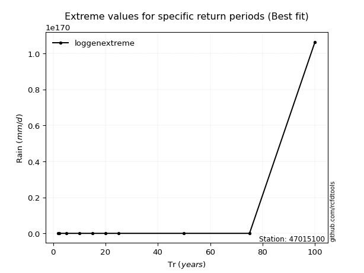</img>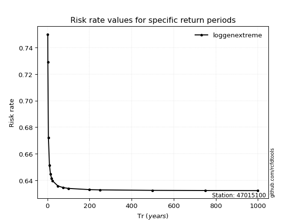</img>

</div>


<sub>**APP DISCLAIMER**: NO WARRANTY - This software is provided by [github.com/rcfdtools](https://github.com/rcfdtools) "as is", without any express or implied warranty, including warranties of merchantability, fitness for a particular purpose, or non-infringement. There is no guarantee that the software will be error-free or operate without interruption. LIMITATION OF LIABILITY - Neither the authors nor copyright holders will be liable for claims or damages arising from the software or its use. You are responsible for determining if the software is appropriate for your use and assume all associated risks, including errors, legal compliance, and data loss. NO PROFESSIONAL ADVICE - The software provides general information and does not offer professional advice. It should not replace consultation with professional advisors.</sub>