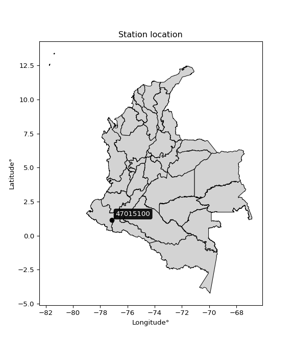

<div align="center">


</div>

# PMP Station (Rain, Pmax24h): 47015100

Probable Maximum Precipitation (PMP) is the greatest amount of rainfall for a specific duration that is meteorologically possible for a given location, acting as a "worst-case" scenario for extreme storms, crucial for designing safety-critical infrastructure like bridges, river deviations, dams, spillways, and nuclear plants to prevent catastrophic failure. PMP is calculated by hydrologists using meteorological data to determine the upper limit of extreme rainfall, often leading to the Probable Maximum Flood (PMF) for flood control design, and is increasingly being studied for climate change impacts. Probable Maximum Precipitation (PMP) is the theoretical upper limit of rainfall, a deterministic estimate for extreme events, while probability distributions (like GEV, Gumbel) describe the likelihood and frequency of various precipitation amounts, including rare ones, showing how often events occur, with PMP representing the extreme end of these distributions, used for critical infrastructure design to ensure safety against the worst conceivable weather, unlike standard statistical forecasts which cover typical probabilities.

The most common probability distributions in hydrology, used for analyzing floods, rainfall, and streamflow, include the Normal, Log-Normal, Gumbel, Gamma (including Log-Pearson Type III), and Generalized Extreme Value (GEV) distributions, often chosen based on the data´s skewness and whether modeling extremes or general conditions, with Gumbel and GEV popular for extreme events like floods, while the Normal distribution serves as a baseline, though often requiring transformations for skewed hydrological data. These distributions help in designing water infrastructure, managing water resources, and forecasting hydrologic events.

> Hydrological data often isn´t perfectly normal (it´s skewed), so different distributions are needed for different applications, such as: **Flood Frequency Analysis**: Using Gumbel, GEV, or Log-Pearson Type III for predicting extreme flood magnitudes and their return periods, **Rainfall Analysis**: Normal for annual totals, but Log-Normal, Weibull, or GEV for intensity or extreme daily rainfall, **Streamflow Modeling**: Gamma and Log-Normal for maximum flows, GEV for minimum flows, and Kappa for daily flows.

<div align="center">

</img>

</div>


## A. General information


### 1. General running parameters

• app_version: _v20260108_. • runtime: _2026-01-08 13:24:42.400241_. • Python version: _3.14.0_. • SciPy version: _1.16.3_. • Pandas version: _2.3.3_. • NumPy version: _2.3.5_. • Stations dataset (station_dataset_file): _dataset/pmax24h_in/automatic_colombia_2003_2024.csv_. • Stations catalog (station_catalog_file): _dataset/CNE.xls_. • Minimum year to eval til year_max (date_min): _1900_. • Maximum year to eval since year_min (date_max): _2024_. • Creates, save and include plots into reports (create_plot): _False_. • Plot only fit distributions with Δo > Δ (plot_only_fit): _True_. • Plot only simple graphs avoiding multiple CDFs and multiple Extreme values plots (plot_only_simple): _True_. • Eval low extreme values, if False, evaluates high extreme values (low_extreme): _False_. • Eval every SciPy distribution as logarithmic (pdist_logarithmic_on): _True_. • Standard deviation normalized (ddof): _1.0_. • Return periods to eval in years (Tr): _[2, 2.33, 5, 10, 15, 20, 25, 50, 75, 100, 200, 250, 500, 750, 1000]_. • Minimum data sample per station, 0 means any (minimum_sample): _5_. • Z-Score maximum threshold to adjust a value, 0 means disable (zscore_max): _3.5_. • Z-Score minimum threshold to adjust a value, 0 means disable (zscore_min): _-2.5_. • Avoid zeros, e.g. rain = 0 (avoid_zeros): _True_. • Avoid null values (avoid_nans): _True_. 

:file_folder:Table: [dataset.csv](../../dataset/pmax24h_in/automatic_colombia_2003_2024.csv)

> Delta Degrees of Freedom (DDOF): is a parameter used in the formulas for calculating variance and standard deviation. When ddof=0, the divisor is $N$ (the total number of observations) and this is used when your data set is the entire population. When ddof=1, the divisor is $N-1$ and this is used when your data set is a sample drawn from a larger population. Using $N-1$ provides an unbiased estimate of the population variance (known as Bessel´s correction).


### 2. Station info and location

|   id |   CODIGO | NOMBRE                     | CATEGORIA               | TECNOLOGIA                | ESTADO   | FECHA_INSTALACION   |   FECHA_SUSPENSION |   ALTITUD |   LATITUD |   LONGITUD | DEPARTAMENTO   | MUNICIPIO   | AREA_OPERATIVA                      | ENTIDAD                                                     | AREA_HIDROGRAFICA   | ZONA_HIDROGRAFICA   | SUBZONA_HIDROGRAFICA   |   CORRIENTE | Catalogo   |   Version |
|-----:|---------:|:---------------------------|:------------------------|:--------------------------|:---------|:--------------------|-------------------:|----------:|----------:|-----------:|:---------------|:------------|:------------------------------------|:------------------------------------------------------------|:--------------------|:--------------------|:-----------------------|------------:|:-----------|----------:|
|    0 | 47015100 | EL ENCANO - AUT [47015100] | Climatológica Principal | Automática con Telemetría | Activa   | 15/09/1984          |                nan |      2830 |   1.15994 |   -77.1615 | Nariño         | Pasto       | Area Operativa 07 - Nariño-Putumayo | INSTITUTO DE HIDROLOGIA METEOROLOGIA Y ESTUDIOS AMBIENTALES | Amazonas            | Putumayo            | Alto Río Putumayo      |         nan | CNE_IDEAM  |  20251226 |

<div align="center">

Dynamic map: [:earth_americas:Google](http://maps.google.com/maps?q=1.159944444,-77.16147222) [:earth_americas:OSM](https://www.openstreetmap.org/#map=18/1.159944444/-77.16147222&layers=P) [:earth_americas:Bing](https://www.bing.com/maps?cp=1.159944444~-77.16147222&lvl=18) [:earth_americas:Apple](https://maps.apple.com/frame?center=1.159944444%2C-77.16147222&span=0.003%2C0.006)

</div>


<div align="center">

```geojson
{
  "type": "Feature",
  "geometry": {
    "type": "Point", 
    "coordinates": [-77.16147222, 1.159944444]
  }, 
  "properties": {
    "Name": "47015100"
  }
}
```

</div>


### 3. Discrete values table and plot

<div align="center">

|               |          0 |           1 |           2 |           3 |           4 |          5 |
|:--------------|-----------:|------------:|------------:|------------:|------------:|-----------:|
| Date          | 2019       | 2020        | 2021        | 2022        | 2023        | 2024       |
| Value         |   37.4     |   33.2      |   34.5      |   32        |   43.2      |  331.5     |
| Value_initial |   37.4     |   33.2      |   34.5      |   32        |   43.2      |  331.5     |
| count         |    6       |    6        |    6        |    6        |    6        |    6       |
| mean          |   85.3     |   85.3      |   85.3      |   85.3      |   85.3      |   85.3     |
| std           |  120.679   |  120.679    |  120.679    |  120.679    |  120.679    |  120.679   |
| zscore        |   -0.39692 |   -0.431724 |   -0.420951 |   -0.441667 |   -0.348859 |    2.04012 |


</div>


> The initial value (value_initial) correspond to the initial obtained or null completed value, and value (value) is adjusted only when the initial value is outside the valid range (outlier) definite through the Z-Score value. If Z-Score is active, values out of range or outliers are replaced with the station mean value. A Z-Score (or standard score) measures how many standard deviations a data point is from the mean of a dataset, indicating its relative position; positive scores mean above the mean, negative mean below, and a score of zero is exactly at the mean, allowing for comparison of values from different distributions. It´s calculated using the formula $z=(x–μ)/σ$, where $x$ is the data point, $μ$ is the mean, and $σ$ is the standard deviation, helping identify outliers and understand probability.
>
> <sub>**Note**: In this study, "completing" (filling gaps in) and "extending" (forecasting or lengthening the historical record) rainfall data series are avoided for certain critical analyses because they introduce artificial bias and uncertainty, which can distort the statistics of rare events (extremes), alter day-to-day variability, and compromise the integrity and homogeneity of the original data. Some reasons against Completing/Extending rainfall data are: **Distortion of Extremes and Variability**: The primary issue is that most gap-filling or extension methods rely on averaging or regression with nearby stations, which inherently smooths the data. Rainfall is highly variable in space and time, with a large percentage of zero values and occasional large storms. Infilling methods often underestimate the highest values and overestimate the lowest (zero) values, which severely distorts analyses focused on flood frequency, drought severity, and intensity-duration-frequency (IDF) curves, **Loss of Data Homogeneity**: Infilled or extended data are synthetic estimates, not actual measurements. Combining these estimates with observed data can violate the assumption of data homogeneity, which requires that the data properties do not change over time. Inhomogeneity can lead to incorrect conclusions about long-term trends or changes in climate patterns, **Propagation of Errors**: Errors and biases from the original data (e.g., wind-induced undercatch, instrument errors, site changes) or the data used for imputation can propagate through the analysis, leading to unreliable hydrological models and inaccurate predictions, **Compromised Statistical Integrity**: For statistical analyses, especially those involving the frequency of events, using artificial data can introduce time bias or autocorrelation that doesn´t exist in reality, making it difficult to assess the true probability of events, **Difficulty in Validation**: It is difficult to accurately validate the quality of filled or extended data, especially for past periods where ground-truth measurements are unavailable. The reliability of imputation techniques heavily depends on the density of the surrounding station network and the complexity of the local topography.</sub>


### 4. Active continuous probability distributions from SciPy (43 of 104 available)

A Probability Density Function (PDF) describes the relative likelihood of a continuous random variable falling within a specific range, where the total area under its curve equals 1, and the area over any interval gives the actual probability for that range. Unlike discrete probabilities (like rolling a die), a PDF shows density, not direct probability for a single point (which is zero), with higher points indicating higher likelihood, often visualized as a bell curve for normal distributions.

A log of a probability density function (log-PDF) is simply the logarithm of the PDF´s value, denoted as $log(f(x))$, useful for converting multiplication of probabilities into addition, improving numerical stability with tiny numbers, and connecting to information theory concepts like entropy. Instead of dealing with very small probabilities (e.g., 0.000001), log-PDFs use negative numbers (e.g., $log(0.00001) ≈ -11.51$ that are easier for computers to handle, preventing underflow errors and simplifying complex calculations. In this study, each active probability distribution from SciPy is also evaluated in the $log$ form.

[scipy.stats](https://docs.scipy.org/doc/scipy/reference/stats.html) is a Python´s powerful submodule within the SciPy library for comprehensive statistical analysis, offering over 130 probability distributions (like Normal, Poisson), functions for descriptive stats (mean, variance), hypothesis testing (t-tests, chi-square), random variable generation, and statistical tests, making it essential for data science, modeling, and research. It provides tools to explore, model, and draw conclusions from data efficiently, working seamlessly with NumPy.

<div align="center">

|   id | p_dist             |   n_parameter | fit_method   | label                                                                       | active   | ref                                                                                                        |
|-----:|:-------------------|--------------:|:-------------|:----------------------------------------------------------------------------|:---------|:-----------------------------------------------------------------------------------------------------------|
|    0 | alpha              |             3 | MLE          | Alpha                                                                       | True     | [:mortar_board:](https://docs.scipy.org/doc/scipy/reference/generated/scipy.stats.alpha.html)              |
|    1 | betaprime          |             4 | MLE          | Beta prime                                                                  | True     | [:mortar_board:](https://docs.scipy.org/doc/scipy/reference/generated/scipy.stats.betaprime.html)          |
|    2 | chi2               |             3 | MLE          | Chi²                                                                        | True     | [:mortar_board:](https://docs.scipy.org/doc/scipy/reference/generated/scipy.stats.chi2.html)               |
|    3 | crystalball        |             4 | MLE          | Crystalball                                                                 | True     | [:mortar_board:](https://docs.scipy.org/doc/scipy/reference/generated/scipy.stats.crystalball.html)        |
|    4 | erlang             |             3 | MLE          | Erlang                                                                      | True     | [:mortar_board:](https://docs.scipy.org/doc/scipy/reference/generated/scipy.stats.erlang.html)             |
|    5 | expon              |             2 | MLE          | Exponential                                                                 | True     | [:mortar_board:](https://docs.scipy.org/doc/scipy/reference/generated/scipy.stats.expon.html)              |
|    6 | exponnorm          |             3 | MLE          | Exponentially modified Normal                                               | True     | [:mortar_board:](https://docs.scipy.org/doc/scipy/reference/generated/scipy.stats.exponnorm.html)          |
|    7 | f                  |             4 | MLE          | F                                                                           | True     | [:mortar_board:](https://docs.scipy.org/doc/scipy/reference/generated/scipy.stats.f.html)                  |
|    8 | fatiguelife        |             3 | MLE          | Fatigue-life (Birnbaum-Saunders)                                            | True     | [:mortar_board:](https://docs.scipy.org/doc/scipy/reference/generated/scipy.stats.fatiguelife.html)        |
|    9 | fisk               |             3 | MLE          | Fisk                                                                        | True     | [:mortar_board:](https://docs.scipy.org/doc/scipy/reference/generated/scipy.stats.fisk.html)               |
|   10 | gamma              |             3 | MLE          | Gamma                                                                       | True     | [:mortar_board:](https://docs.scipy.org/doc/scipy/reference/generated/scipy.stats.gamma.html)              |
|   11 | genexpon           |             5 | MLE          | Generalized exponential                                                     | True     | [:mortar_board:](https://docs.scipy.org/doc/scipy/reference/generated/scipy.stats.genexpon.html)           |
|   12 | genlogistic        |             3 | MLE          | Generalized logistic                                                        | True     | [:mortar_board:](https://docs.scipy.org/doc/scipy/reference/generated/scipy.stats.genlogistic.html)        |
|   13 | gibrat             |             2 | MM           | Gibrat                                                                      | True     | [:mortar_board:](https://docs.scipy.org/doc/scipy/reference/generated/scipy.stats.gibrat.html)             |
|   14 | gompertz           |             3 | MLE          | Gompertz (or truncated Gumbel)                                              | True     | [:mortar_board:](https://docs.scipy.org/doc/scipy/reference/generated/scipy.stats.gompertz.html)           |
|   15 | gumbel_l           |             2 | MM           | Gumbel Left Skew                                                            | True     | [:mortar_board:](https://docs.scipy.org/doc/scipy/reference/generated/scipy.stats.gumbel_l.html)           |
|   16 | gumbel_r           |             2 | MM           | Gumbel Right Skew                                                           | True     | [:mortar_board:](https://docs.scipy.org/doc/scipy/reference/generated/scipy.stats.gumbel_r.html)           |
|   17 | halflogistic       |             2 | MM           | Half-logistic                                                               | True     | [:mortar_board:](https://docs.scipy.org/doc/scipy/reference/generated/scipy.stats.halflogistic.html)       |
|   18 | halfnorm           |             2 | MM           | Half Normal                                                                 | True     | [:mortar_board:](https://docs.scipy.org/doc/scipy/reference/generated/scipy.stats.halfnorm.html)           |
|   19 | hypsecant          |             2 | MM           | hyperbolic secant                                                           | True     | [:mortar_board:](https://docs.scipy.org/doc/scipy/reference/generated/scipy.stats.hypsecant.html)          |
|   20 | invgamma           |             3 | MLE          | Inverted gamma                                                              | True     | [:mortar_board:](https://docs.scipy.org/doc/scipy/reference/generated/scipy.stats.invgamma.html)           |
|   21 | invgauss           |             3 | MLE          | Inverse Gaussian                                                            | True     | [:mortar_board:](https://docs.scipy.org/doc/scipy/reference/generated/scipy.stats.invgauss.html)           |
|   22 | invweibull         |             3 | MLE          | Inverted Weibull                                                            | True     | [:mortar_board:](https://docs.scipy.org/doc/scipy/reference/generated/scipy.stats.invweibull.html)         |
|   23 | kstwobign          |             2 | MLE          | Limiting distribution of scaled Kolmogorov-Smirnov two-sided test statistic | True     | [:mortar_board:](https://docs.scipy.org/doc/scipy/reference/generated/scipy.stats.kstwobign.html)          |
|   24 | laplace            |             2 | MM           | Laplace                                                                     | True     | [:mortar_board:](https://docs.scipy.org/doc/scipy/reference/generated/scipy.stats.laplace.html)            |
|   25 | laplace_asymmetric |             3 | MLE          | Asymmetric Laplace                                                          | True     | [:mortar_board:](https://docs.scipy.org/doc/scipy/reference/generated/scipy.stats.laplace_asymmetric.html) |
|   26 | loggamma           |             3 | MLE          | Log gamma                                                                   | True     | [:mortar_board:](https://docs.scipy.org/doc/scipy/reference/generated/scipy.stats.loggamma.html)           |
|   27 | logistic           |             2 | MM           | Logistic (or Sech-squared)                                                  | True     | [:mortar_board:](https://docs.scipy.org/doc/scipy/reference/generated/scipy.stats.logistic.html)           |
|   28 | lognorm            |             3 | MLE          | Log Normal                                                                  | True     | [:mortar_board:](https://docs.scipy.org/doc/scipy/reference/generated/scipy.stats.lognorm.html)            |
|   29 | maxwell            |             2 | MM           | Maxwell                                                                     | True     | [:mortar_board:](https://docs.scipy.org/doc/scipy/reference/generated/scipy.stats.maxwell.html)            |
|   30 | mielke             |             4 | MLE          | Mielke Beta-Kappa / Dagum                                                   | True     | [:mortar_board:](https://docs.scipy.org/doc/scipy/reference/generated/scipy.stats.mielke.html)             |
|   31 | moyal              |             2 | MM           | Moyal                                                                       | True     | [:mortar_board:](https://docs.scipy.org/doc/scipy/reference/generated/scipy.stats.moyal.html)              |
|   32 | nakagami           |             3 | MLE          | Nakagami                                                                    | True     | [:mortar_board:](https://docs.scipy.org/doc/scipy/reference/generated/scipy.stats.nakagami.html)           |
|   33 | ncf                |             5 | MLE          | Non-central F distribution                                                  | True     | [:mortar_board:](https://docs.scipy.org/doc/scipy/reference/generated/scipy.stats.ncf.html)                |
|   34 | nct                |             4 | MLE          | Non-central Student’s t                                                     | True     | [:mortar_board:](https://docs.scipy.org/doc/scipy/reference/generated/scipy.stats.nct.html)                |
|   35 | norm               |             2 | MM           | Normal                                                                      | True     | [:mortar_board:](https://docs.scipy.org/doc/scipy/reference/generated/scipy.stats.norm.html)               |
|   36 | pearson3           |             3 | MM           | Pearson type III                                                            | True     | [:mortar_board:](https://docs.scipy.org/doc/scipy/reference/generated/scipy.stats.pearson3.html)           |
|   37 | rayleigh           |             2 | MM           | Rayleigh                                                                    | True     | [:mortar_board:](https://docs.scipy.org/doc/scipy/reference/generated/scipy.stats.rayleigh.html)           |
|   38 | rice               |             3 | MLE          | Rice                                                                        | True     | [:mortar_board:](https://docs.scipy.org/doc/scipy/reference/generated/scipy.stats.rice.html)               |
|   39 | t                  |             3 | MLE          | Student’s t                                                                 | True     | [:mortar_board:](https://docs.scipy.org/doc/scipy/reference/generated/scipy.stats.t.html)                  |
|   40 | truncnorm          |             4 | MLE          | Truncated normal                                                            | True     | [:mortar_board:](https://docs.scipy.org/doc/scipy/reference/generated/scipy.stats.truncnorm.html)          |
|   41 | wald               |             2 | MM           | Wald                                                                        | True     | [:mortar_board:](https://docs.scipy.org/doc/scipy/reference/generated/scipy.stats.wald.html)               |
|   42 | weibull_min        |             3 | MLE          | Weibull minimum                                                             | True     | [:mortar_board:](https://docs.scipy.org/doc/scipy/reference/generated/scipy.stats.weibull_min.html)        |

</div>

> **n_parameter:** # arguments & localization & scale.
>
> **Fit methods:** (MLE) maximum likelihood, (MM) L-moments.
>
>**Inactive** (With the only purpose of prevent loops, zero divisions, infinite values, over high estimated values or horizontal trending for recurrence intervals estimations, the follow distributions were disabled.)**:** foldnorm, gennorm, norminvgauss, powernorm, powerlognorm, skewnorm, genextreme, anglit, arcsine, argus, beta, bradford, burr, burr12, cauchy, cosine, halfcauchy, foldcauchy, skewcauchy, wrapcauchy, dgamma, gengamma, exponweib, exponpow, truncexpon, gausshyper, genhalflogistic, genhyperbolic, geninvgauss, halfgennorm, johnsonsb, johnsonsu, kappa4, kappa3, ksone, kstwo, loglaplace, levy, levy_l, levy_stable, ncx2, pareto, genpareto, truncpareto, lomax, powerlaw, rdist, rel_breitwigner, recipinvgauss, semicircular, studentized_range, trapezoid, triang, truncweibull_min, tukeylambda, uniform, loguniform, vonmises, vonmises_line, weibull_max, dweibull, 


## B. Probability (PDF) vs. Empirical (EDF) distributions functions

A continuous probability distribution (CPD) describes probabilities for variables that can take any value within a range (like rain any time), unlike discrete variables with specific outcomes (like temperature). It uses a Probability Density Function (PDF), a curve where the total area under it equals 1, and the probability of the variable falling within an interval (a to b) is found by calculating the area under the curve between those points. A key feature is that the probability of hitting any single exact value is zero, so probabilities are always expressed for ranges, e.g., $P(a ≤ X ≤ b)$.

<div align="center">

Distributions parameters from station values
|    |   station | p_dist                |   n |             loc |          scale | shape                  | shape1                 | shape2                 | shape3   |
|---:|----------:|:----------------------|----:|----------------:|---------------:|:-----------------------|:-----------------------|:-----------------------|:---------|
|  0 |  47015100 | alpha                 |   6 |      30.1742    |    3.50733     | 4.772988838007833e-09  |                        |                        |          |
|  1 |  47015100 | betaprime             |   6 |      -0.36601   |    0.695773    | 151.08959307767287     | 2.4790229689378833     |                        |          |
|  2 |  47015100 | chi2                  |   6 |      32         |   56.7906      | 0.650833497611105      |                        |                        |          |
|  3 |  47015100 | crystalball           |   6 |      85.4796    |  110.344       | 7960.261130683632      | 278.4788258951696      |                        |          |
|  4 |  47015100 | erlang                |   6 |      32         |  103.875       | 0.3901246526900223     |                        |                        |          |
|  5 |  47015100 | expon                 |   6 |      32         |   53.3         |                        |                        |                        |          |
|  6 |  47015100 | exponnorm             |   6 |      31.9311    |    0.0209645   | 2525.6857757422586     |                        |                        |          |
|  7 |  47015100 | f                     |   6 |      31.6552    |    1.44194     | 3655.088236567629      | 0.9468429607358138     |                        |          |
|  8 |  47015100 | fatiguelife           |   6 |      32         |    0.000319483 | 348.20396703396364     |                        |                        |          |
|  9 |  47015100 | fisk                  |   6 |      32         |    5.32813     | 0.4471731714328849     |                        |                        |          |
| 10 |  47015100 | gamma                 |   6 |      32         |   62.4301      | 0.34241932188319835    |                        |                        |          |
| 11 |  47015100 | genexpon              |   6 |      32         |   99.3367      | 1.863719875083096      | 1.1785776056196657e-11 | 4.581672429779616      |          |
| 12 |  47015100 | genlogistic           |   6 |    -348.676     |   49.3831      | 2891.673104036965      |                        |                        |          |
| 13 |  47015100 | gibrat                |   6 |       1.25843   |   50.9738      |                        |                        |                        |          |
| 14 |  47015100 | gompertz              |   6 |      32         |  261.951       | 2.153371919147336      |                        |                        |          |
| 15 |  47015100 | gumbel_l              |   6 |     134.88      |   85.8948      |                        |                        |                        |          |
| 16 |  47015100 | gumbel_r              |   6 |      35.7201    |   85.8948      |                        |                        |                        |          |
| 17 |  47015100 | halflogistic          |   6 |     -45.2704    |   94.1867      |                        |                        |                        |          |
| 18 |  47015100 | halfnorm              |   6 |     -60.5145    |  182.751       |                        |                        |                        |          |
| 19 |  47015100 | hypsecant             |   6 |      85.3       |   70.1328      |                        |                        |                        |          |
| 20 |  47015100 | invgamma              |   6 |      31.6551    |    0.682532    | 0.4734186852382385     |                        |                        |          |
| 21 |  47015100 | invgauss              |   6 |      31.594     |    1.67613     | 32.041747237984076     |                        |                        |          |
| 22 |  47015100 | invweibull            |   6 |      32         |    4.47873e-06 | 0.1000348322458498     |                        |                        |          |
| 23 |  47015100 | kstwobign             |   6 |    -168.967     |  300.096       |                        |                        |                        |          |
| 24 |  47015100 | laplace               |   6 |      85.3       |   77.898       |                        |                        |                        |          |
| 25 |  47015100 | laplace_asymmetric    |   6 |      32         |    0.00131801  | 2.4728062566829075e-05 |                        |                        |          |
| 26 |  47015100 | loggamma              |   6 |  -51569.1       | 6403.33        | 3187.5538757726445     |                        |                        |          |
| 27 |  47015100 | logistic              |   6 |      85.3       |   60.7368      |                        |                        |                        |          |
| 28 |  47015100 | lognorm               |   6 |      32         |    0.0269849   | 13.0708847624883       |                        |                        |          |
| 29 |  47015100 | maxwell               |   6 |    -175.743     |  163.585       |                        |                        |                        |          |
| 30 |  47015100 | mielke                |   6 |      -0.12266   |    3.28634     | 1263.7638996014794     | 2.534752565743399      |                        |          |
| 31 |  47015100 | moyal                 |   6 |      22.3009    |   49.5914      |                        |                        |                        |          |
| 32 |  47015100 | nakagami              |   6 |      32         |  193.686       | 0.12831510790284612    |                        |                        |          |
| 33 |  47015100 | ncf                   |   6 |      -0.0214708 |    3.99095e-05 | 3.165988316235561e-06  | 13.14165689145427      | 4.413537457183207      |          |
| 34 |  47015100 | nct                   |   6 |       1.44915   |    0.510343    | 2.018292939367729      | 74.23155470723549      |                        |          |
| 35 |  47015100 | norm                  |   6 |      85.3       |  110.164       |                        |                        |                        |          |
| 36 |  47015100 | pearson3              |   6 |      85.3       |  110.164       | 1.7844707145929393     |                        |                        |          |
| 37 |  47015100 | rayleigh              |   6 |    -125.451     |  168.155       |                        |                        |                        |          |
| 38 |  47015100 | rice                  |   6 |     -65.3444    |  131.966       | 0.0003064365629794443  |                        |                        |          |
| 39 |  47015100 | t                     |   6 |      33.8128    |    1.73178     | 0.49598273777639235    |                        |                        |          |
| 40 |  47015100 | truncnorm             |   6 | -112490         | 3505.38        | 32.09989878427946      | 140.62892158323206     |                        |          |
| 41 |  47015100 | wald                  |   6 |     -24.8644    |  110.164       |                        |                        |                        |          |
| 42 |  47015100 | weibull_min           |   6 |      32         |   12.202       | 0.39471507917978954    |                        |                        |          |
| 43 |  47015100 | logalpha              |   6 |       3.41314   |    0.101828    | 5.8992099481913925e-06 |                        |                        |          |
| 44 |  47015100 | logbetaprime          |   6 |      -0.422706  |    0.589558    | 310.8497656162871      | 43.00416534602354      |                        |          |
| 45 |  47015100 | logchi2               |   6 |       3.46574   |    0.607444    | 1.0576317401946522     |                        |                        |          |
| 46 |  47015100 | logcrystalball        |   6 |       3.95006   |    0.834634    | 15.184315890196414     | 39.44435116886304      |                        |          |
| 47 |  47015100 | logerlang             |   6 |       3.46574   |    0.930892    | 0.3841899655950979     |                        |                        |          |
| 48 |  47015100 | logexpon              |   6 |       3.46574   |    0.484328    |                        |                        |                        |          |
| 49 |  47015100 | logexponnorm          |   6 |       3.46502   |    0.000230416 | 2102.9096385808043     |                        |                        |          |
| 50 |  47015100 | logf                  |   6 |       3.44792   |    0.0653688   | 69.07008787868457      | 1.4182067848157893     |                        |          |
| 51 |  47015100 | logfatiguelife        |   6 |       3.46574   |    5.71471e-07 | 847.7165975269872      |                        |                        |          |
| 52 |  47015100 | logfisk               |   6 |       3.46574   |    0.188349    | 0.8228222938076453     |                        |                        |          |
| 53 |  47015100 | loggamma              |   6 |       3.46574   |    0.6063      | 0.4959999892128527     |                        |                        |          |
| 54 |  47015100 | loggenexpon           |   6 |       3.46574   |    0.948463    | 1.956661346062171      | 1.06254544142819       | 0.00028092311845385337 |          |
| 55 |  47015100 | loggenlogistic        |   6 |       0.501108  |    0.394159    | 2854.287909493707      |                        |                        |          |
| 56 |  47015100 | loggibrat             |   6 |       3.31334   |    0.386191    |                        |                        |                        |          |
| 57 |  47015100 | loggompertz           |   6 |       3.46574   |    1.2777e+12  | 1946777670588.6982     |                        |                        |          |
| 58 |  47015100 | loggumbel_l           |   6 |       4.32569   |    0.650762    |                        |                        |                        |          |
| 59 |  47015100 | loggumbel_r           |   6 |       3.57443   |    0.650762    |                        |                        |                        |          |
| 60 |  47015100 | loghalflogistic       |   6 |       2.96083   |    0.713583    |                        |                        |                        |          |
| 61 |  47015100 | loghalfnorm           |   6 |       2.84534   |    1.38457     |                        |                        |                        |          |
| 62 |  47015100 | loghypsecant          |   6 |       3.95006   |    0.531345    |                        |                        |                        |          |
| 63 |  47015100 | loginvgamma           |   6 |       3.44726   |    0.0461409   | 0.7090250296586326     |                        |                        |          |
| 64 |  47015100 | loginvgauss           |   6 |       3.45132   |    0.0615365   | 8.10482284401025       |                        |                        |          |
| 65 |  47015100 | loginvweibull         |   6 |       3.45624   |    0.0560011   | 0.6559574875861485     |                        |                        |          |
| 66 |  47015100 | logkstwobign          |   6 |       1.98137   |    2.31802     |                        |                        |                        |          |
| 67 |  47015100 | loglaplace            |   6 |       3.95006   |    0.590176    |                        |                        |                        |          |
| 68 |  47015100 | loglaplace_asymmetric |   6 |       3.46574   |    0.00277852  | 0.00574058602623834    |                        |                        |          |
| 69 |  47015100 | logloggamma           |   6 |    -281.778     |   37.6995      | 1957.2340009119957     |                        |                        |          |
| 70 |  47015100 | loglogistic           |   6 |       3.95006   |    0.460158    |                        |                        |                        |          |
| 71 |  47015100 | loglognorm            |   6 |       3.46574   |    0.000715835 | 12.637202530486165     |                        |                        |          |
| 72 |  47015100 | logmaxwell            |   6 |       1.97233   |    1.23936     |                        |                        |                        |          |
| 73 |  47015100 | logmielke             |   6 |       3.46554   |    0.00128822  | 1.6103767867216208     | 0.45063961507389383    |                        |          |
| 74 |  47015100 | logmoyal              |   6 |       3.47277   |    0.375718    |                        |                        |                        |          |
| 75 |  47015100 | lognakagami           |   6 |       3.46574   |    1.4621      | 0.3530738210716111     |                        |                        |          |
| 76 |  47015100 | logncf                |   6 |      -1.14044   |    4.9911      | 286.02768833890764     | 136.72268883582387     | 0.3441439096727841     |          |
| 77 |  47015100 | lognct                |   6 |       3.39662   |    0.0872326   | 1.1723395929554639     | 2.0325876881045915     |                        |          |
| 78 |  47015100 | lognorm               |   6 |       3.95006   |    0.834634    |                        |                        |                        |          |
| 79 |  47015100 | logpearson3           |   6 |       3.95006   |    0.834636    | 1.7356376939579812     |                        |                        |          |
| 80 |  47015100 | lograyleigh           |   6 |       2.35336   |    1.27399     |                        |                        |                        |          |
| 81 |  47015100 | logrice               |   6 |       2.79624   |    1.00696     | 0.00014455471875071799 |                        |                        |          |
| 82 |  47015100 | logt                  |   6 |       3.52748   |    0.0614309   | 0.6630821786254237     |                        |                        |          |
| 83 |  47015100 | logtruncnorm          |   6 |      -9.52206   |    3.28008     | 3.9594929416126554     | 4.6723537884635356     |                        |          |
| 84 |  47015100 | logwald               |   6 |       3.11543   |    0.834634    |                        |                        |                        |          |
| 85 |  47015100 | logweibull_min        |   6 |       3.46574   |    0.795597    | 0.380989347193329      |                        |                        |          |

</div>

> **loc** (Location parameter): This shifts the distribution along the x-axis. For many common distributions, like the normal (Gaussian) distribution, loc represents the mean $μ$. For others, like the uniform distribution, it might represent the minimum value, or for the beta distribution, the left end of the support interval.
>
> **scale** (Scale parameter): This determines the width or spread of the distribution. For the normal distribution, scale represents the standard deviation $σ$. For a uniform distribution, it defines the length of the interval (from $loc$ to $loc + scale$).
>
> **shape** (Shape parameters): Refers to parameters that define the specific form of a probability distribution, distinct from its location (loc) and scale (scale). These parameters are required arguments for most distribution functions. For example, a normal (Gaussian) distribution is fully defined by its location (mean) and scale (standard deviation), so it has no specific shape parameters beyond loc and scale. However, other distributions have intrinsic properties that need specification, as Gamma distribution that takes a shape parameter, often named $a$ or $alpha$.


### 0. Cumulative distribution values - CDF (86 evaluated)

Cumulative Distribution Function (CDF), denoted as $F$<sub>$X$</sub>$(x)$, is a function that gives the probability that a random variable $X$ will take a value less than or equal to a specific value, $x$ (i.e., $(P(X≥x)$. It essentially "accumulates" probabilities from a given point up to the far right (positive infinity), providing a complete picture of the distribution´s probabilities for both discrete (like rain) and continuous (like temperature) variables, helping to find probabilities over ranges or above certain values. Each station is evaluated separately ordering the $x$ values ascending, calculating the CDF and PDF values for the activated distributions and their logarithmic forms.

<div align="center">

CDF ordered by x ascending and calculating $log(f(x))$ separately
|   id |   Station |   date |     x |   count |   mean |     std |    zscore |   Value_initial |   station |   m |     alpha |   alpha_pdf |   betaprime |   betaprime_pdf |        chi2 |    chi2_pdf |   crystalball |   crystalball_pdf |      erlang |   erlang_pdf |     expon |   expon_pdf |   exponnorm |   exponnorm_pdf |         f |       f_pdf |   fatiguelife |   fatiguelife_pdf |        fisk |    fisk_pdf |       gamma |   gamma_pdf |    genexpon |   genexpon_pdf |   genlogistic |   genlogistic_pdf |   gibrat |   gibrat_pdf |    gompertz |   gompertz_pdf |   gumbel_l |   gumbel_l_pdf |   gumbel_r |   gumbel_r_pdf |   halflogistic |   halflogistic_pdf |   halfnorm |   halfnorm_pdf |   hypsecant |   hypsecant_pdf |   invgamma |   invgamma_pdf |   invgauss |   invgauss_pdf |   invweibull |   invweibull_pdf |   kstwobign |   kstwobign_pdf |   laplace |   laplace_pdf |   laplace_asymmetric |   laplace_asymmetric_pdf |    loggamma |   loggamma_pdf |   logistic |   logistic_pdf |   lognorm |   lognorm_pdf |   maxwell |   maxwell_pdf |   mielke |   mielke_pdf |    moyal |   moyal_pdf |    nakagami |   nakagami_pdf |      ncf |     ncf_pdf |      nct |     nct_pdf |     norm |    norm_pdf |   pearson3 |   pearson3_pdf |   rayleigh |   rayleigh_pdf |     rice |    rice_pdf |        t |       t_pdf |   truncnorm |   truncnorm_pdf |     wald |   wald_pdf |   weibull_min |   weibull_min_pdf |   logalpha |   logalpha_pdf |   logbetaprime |   logbetaprime_pdf |    logchi2 |   logchi2_pdf |   logcrystalball |   logcrystalball_pdf |   logerlang |   logerlang_pdf |   logexpon |   logexpon_pdf |   logexponnorm |   logexponnorm_pdf |      logf |   logf_pdf |   logfatiguelife |   logfatiguelife_pdf |     logfisk |   logfisk_pdf |   loggenexpon |   loggenexpon_pdf |   loggenlogistic |   loggenlogistic_pdf |   loggibrat |   loggibrat_pdf |   loggompertz |   loggompertz_pdf |   loggumbel_l |   loggumbel_l_pdf |   loggumbel_r |   loggumbel_r_pdf |   loghalflogistic |   loghalflogistic_pdf |   loghalfnorm |   loghalfnorm_pdf |   loghypsecant |   loghypsecant_pdf |   loginvgamma |   loginvgamma_pdf |   loginvgauss |   loginvgauss_pdf |   loginvweibull |   loginvweibull_pdf |   logkstwobign |   logkstwobign_pdf |   loglaplace |   loglaplace_pdf |   loglaplace_asymmetric |   loglaplace_asymmetric_pdf |   logloggamma |   logloggamma_pdf |   loglogistic |   loglogistic_pdf |   loglognorm |   loglognorm_pdf |   logmaxwell |   logmaxwell_pdf |   logmielke |   logmielke_pdf |   logmoyal |   logmoyal_pdf |   lognakagami |   lognakagami_pdf |   logncf |   logncf_pdf |   lognct |   lognct_pdf |   logpearson3 |   logpearson3_pdf |   lograyleigh |   lograyleigh_pdf |   logrice |   logrice_pdf |     logt |   logt_pdf |   logtruncnorm |   logtruncnorm_pdf |   logwald |   logwald_pdf |   logweibull_min |   logweibull_min_pdf |
|-----:|----------:|-------:|------:|--------:|-------:|--------:|----------:|----------------:|----------:|----:|----------:|------------:|------------:|----------------:|------------:|------------:|--------------:|------------------:|------------:|-------------:|----------:|------------:|------------:|----------------:|----------:|------------:|--------------:|------------------:|------------:|------------:|------------:|------------:|------------:|---------------:|--------------:|------------------:|---------:|-------------:|------------:|---------------:|-----------:|---------------:|-----------:|---------------:|---------------:|-------------------:|-----------:|---------------:|------------:|----------------:|-----------:|---------------:|-----------:|---------------:|-------------:|-----------------:|------------:|----------------:|----------:|--------------:|---------------------:|-------------------------:|------------:|---------------:|-----------:|---------------:|----------:|--------------:|----------:|--------------:|---------:|-------------:|---------:|------------:|------------:|---------------:|---------:|------------:|---------:|------------:|---------:|------------:|-----------:|---------------:|-----------:|---------------:|---------:|------------:|---------:|------------:|------------:|----------------:|---------:|-----------:|--------------:|------------------:|-----------:|---------------:|---------------:|-------------------:|-----------:|--------------:|-----------------:|---------------------:|------------:|----------------:|-----------:|---------------:|---------------:|-------------------:|----------:|-----------:|-----------------:|---------------------:|------------:|--------------:|--------------:|------------------:|-----------------:|---------------------:|------------:|----------------:|--------------:|------------------:|--------------:|------------------:|--------------:|------------------:|------------------:|----------------------:|--------------:|------------------:|---------------:|-------------------:|--------------:|------------------:|--------------:|------------------:|----------------:|--------------------:|---------------:|-------------------:|-------------:|-----------------:|------------------------:|----------------------------:|--------------:|------------------:|--------------:|------------------:|-------------:|-----------------:|-------------:|-----------------:|------------:|----------------:|-----------:|---------------:|--------------:|------------------:|---------:|-------------:|---------:|-------------:|--------------:|------------------:|--------------:|------------------:|----------:|--------------:|---------:|-----------:|---------------:|-------------------:|----------:|--------------:|-----------------:|---------------------:|
|    0 |  47015100 |   2022 |  32   |       6 |   85.3 | 120.679 | -0.441667 |            32   |  47015100 |   1 | 0.0547366 | 0.13265     |    0.259748 |     0.0168908   | 4.76177e-06 | 4.36163e+08 |      0.313958 |       0.00321479  | 4.24511e-07 |  4.66157e+07 | 0         | 0.0187617   |  0.00130075 |      0.0188517  | 0.0430484 | 0.295944    |     0.0323778 |       8.66428e+07 | 3.04031e-07 | 9.56696e+06 | 3.89218e-06 | 1.87569e+08 | 3.70534e-12 |    0.0187616   |      0.273109 |       0.00717623  | 0.306535 |  0.0114197   | 1.61738e-13 |    0.00822051  |   0.26057  |    0.00259871  |   0.351951 |    0.00427883  |       0.388641 |        0.00450678  |   0.387306 |    0.00384088  |    0.278491 |     0.00348335  |   0.043047 |    0.295947    |  0.0435089 |    0.261411    |   0.00175578 |      2.61397e+10 |    0.239063 |     0.00535524  |  0.25224  |   0.00323808  |           6.7923e-10 |              0.0187616   | 3.51114e-08 |    3.92156e+07 |   0.293684 |    0.00341529  |  0.28086  |     0.403918  |  0.343499 |   0.00351205  |      nan |          nan | 0.364492 | 0.00483572  | 4.14096e-05 |    2.99122e+09 | 0.407982 | 0.00830105  | 0.214834 | 0.0217156   | 0.314256 | 0.00322135  |   0.394656 |     0.00504923 |   0.354913 |    0.00359206  | 0.238194 | 0.00425827  | 0.296374 | 0.0649479   | 4.05522e-05 |     0.00916583  | 0.37902  | 0.00778385 |   9.69568e-07 |       5.38606e+07 |  0.0528677 |      4.50815   |       0.270889 |          0.535086  | 7.7351e-09 |   9.21086e+06 |         0.28086  |            0.403918  | 1.46262e-06 |     1.26534e+09 |  0         |      2.06472   |     0.00147263 |          2.05876   | 0.0450205 |  6.63747   |        0.0251045 |          2.76886e+11 | 9.20817e-13 |  1706.12      |    3.9072e-09 |         2.06298   |         0.213352 |            0.835955  |    0.176219 |       1.69898   |   6.15741e-14 |         1.52365   |      0.234131 |       0.313926    |      0.306728 |         0.557023  |          0.339727 |             0.61982   |      0.345905 |         0.521226  |       0.243288 |           0.414577 |     0.0450549 |         6.63786   |     0.0438392 |         7.63914   |       0.0406884 |           8.99531   |       0.193219 |          0.653086  |     0.220073 |        0.372893  |             3.42284e-05 |                   2.06599   |      0.284995 |         0.396671  |      0.25874  |         0.4168    |    0.0130654 |      5.99084e+12 |     0.306603 |        0.452282  |   0.0134807 |       77.6404   |   0.312783 |      0.643966  |   8.56862e-12 |      13625        | 0.283244 |    0.503791  | 0.10489  |    2.09464   |      0.338124 |         0.697109  |      0.316954 |         0.468137  |  0.198304 |     0.529341  | 0.27857  | 2.19214    |     0.00046204 |          1.32863   |  0.290209 |     1.17698   |      1.54413e-06 |          1.32473e+09 |
|    1 |  47015100 |   2020 |  33.2 |       6 |   85.3 | 120.679 | -0.431724 |            33.2 |  47015100 |   2 | 0.246402  | 0.156125    |    0.279911 |     0.0167048   | 0.253805    | 0.0682803   |      0.317826 |       0.00323159  | 0.196996    |  0.0635137   | 0.0222625 | 0.018344    |  0.0236796  |      0.0184386  | 0.328972  | 0.151089    |     0.569838  |       0.0288154   | 0.33926     | 0.083533    | 0.288319    | 0.0811007   | 0.0222624   |    0.018344    |      0.28175  |       0.00722565  | 0.320106 |  0.0111973   | 0.00983852  |    0.008177    |   0.263703 |    0.0026241   |   0.357087 |    0.00428104  |       0.394036 |        0.00448437  |   0.391907 |    0.00382805  |    0.282694 |     0.00352147  |   0.328974 |    0.15109     |  0.316627  |    0.155296    |   0.750945   |      0.0179302   |    0.24551  |     0.00538791  |  0.256156 |   0.00328835  |           0.0222624  |              0.0183439   | 0.275659    |    3.56569     |   0.297799 |    0.00344297  |  0.295917 |     0.413987  |  0.347719 |   0.0035197   |      nan |          nan | 0.370288 | 0.00482476  | 0.221607    |    0.0473924   | 0.417881 | 0.00819711  | 0.240896 | 0.0216889   | 0.318132 | 0.00323818  |   0.400691 |     0.00500967 |   0.359226 |    0.00359525  | 0.243318 | 0.00428177  | 0.410106 | 0.131288    | 0.0109793   |     0.00906566  | 0.388283 | 0.00765454 |   0.329904    |       0.0882394   |  0.254757  |      5.31349   |       0.290818 |          0.547288  | 0.1755     |   2.4714      |         0.295917 |            0.413987  | 0.321926    |     3.26477     |  0.0731934 |      1.91359   |     0.0745269  |          1.90999   | 0.295502  |  5.37861   |        0.617683  |          1.5512      | 0.206986    |     3.66873   |    0.0731344  |         1.91212   |         0.244853 |            0.873879  |    0.237771 |       1.63467   |   0.0545477   |         1.44054   |      0.24593  |       0.32708     |      0.327328 |         0.561738  |          0.362342 |             0.608695  |      0.364978 |         0.514871  |       0.258932 |           0.435322 |     0.295546  |         5.3787    |     0.307847  |         5.26274   |       0.32217   |           5.16837   |       0.217715 |          0.676894  |     0.234237 |        0.396894  |             0.0732709   |                   1.91467   |      0.299775 |         0.406241  |      0.274378 |         0.432666  |    0.622401  |      0.816839    |     0.32336  |        0.457957  |   0.491059  |        3.85597  |   0.336482 |      0.643038  |   0.057734    |          1.10724  | 0.301991 |    0.514456  | 0.194416 |    2.66077   |      0.363455 |         0.678895  |      0.33425  |         0.471383  |  0.218079 |     0.544673  | 0.389173 | 3.93585    |     0.0483024  |          1.2708    |  0.332319 |     1.10993   |      0.266626    |          2.35357     |
|    2 |  47015100 |   2021 |  34.5 |       6 |   85.3 | 120.679 | -0.420951 |            34.5 |  47015100 |   3 | 0.417487  | 0.107654    |    0.301463 |     0.0164417   | 0.321378    | 0.041143    |      0.322039 |       0.00324945  | 0.261394    |  0.0400893   | 0.0458213 | 0.017902    |  0.047358   |      0.0179914  | 0.466859  | 0.0751996   |     0.600257  |       0.0196289   | 0.416203    | 0.0434613   | 0.368754    | 0.0490198   | 0.0458211   |    0.017902    |      0.291176 |       0.00727343  | 0.334504 |  0.0109532   | 0.0204379   |    0.00812972  |   0.267133 |    0.00265171  |   0.362654 |    0.00428247  |       0.39985  |        0.00445987  |   0.396875 |    0.00381402  |    0.287299 |     0.00356252  |   0.46686  |    0.0751994   |  0.461597  |    0.0805483   |   0.766327   |      0.00816106  |    0.252535 |     0.00542074  |  0.260466 |   0.00334368  |           0.0458211  |              0.0179019   | 0.384949    |    2.33464     |   0.302295 |    0.00347256  |  0.31201  |     0.42388   |  0.352299 |   0.00352754  |      nan |          nan | 0.376552 | 0.00481164  | 0.267538    |    0.0274629   | 0.428464 | 0.00808328  | 0.268966 | 0.0214659   | 0.322353 | 0.00325608  |   0.407176 |     0.00496676 |   0.363902 |    0.00359825  | 0.2489   | 0.00430625  | 0.599485 | 0.126409    | 0.0226948   |     0.00895838  | 0.398143 | 0.00751544 |   0.41425     |       0.049465    |  0.425658  |      3.62072   |       0.312053 |          0.558095  | 0.253336   |   1.70996     |         0.31201  |            0.42388   | 0.418892    |     2.01754     |  0.143855  |      1.7677    |     0.145056   |          1.76443   | 0.452231  |  3.07426   |        0.665668  |          1.03558     | 0.319686    |     2.37896   |    0.143744   |         1.76646   |         0.279018 |            0.903395  |    0.298517 |       1.52411   |   0.10829     |         1.35866   |      0.25876  |       0.341062    |      0.348964 |         0.564545  |          0.38549  |             0.596565  |      0.384621 |         0.50794   |       0.276067 |           0.456834 |     0.452274  |         3.07412   |     0.458479  |         2.92715   |       0.466651  |           2.75371   |       0.24411  |          0.696638  |     0.249989 |        0.423584  |             0.14397     |                   1.76861   |      0.315562 |         0.415653  |      0.291305 |         0.448643  |    0.64369   |      0.392143    |     0.341049 |        0.462947  |   0.588794  |        1.73195  |   0.361113 |      0.639045  |   0.0956086   |          0.89689  | 0.321941 |    0.524071  | 0.297667 |    2.63432   |      0.389155 |         0.659216  |      0.352406 |         0.473853  |  0.239276 |     0.558725  | 0.562565 | 4.4652     |     0.0959946  |          1.21298   |  0.373559 |     1.03737   |      0.334445    |          1.3724      |
|    3 |  47015100 |   2019 |  37.4 |       6 |   85.3 | 120.679 | -0.39692  |            37.4 |  47015100 |   4 | 0.627401  | 0.0476411   |    0.348095 |     0.0156857   | 0.410356    | 0.0238556   |      0.331519 |       0.00328801  | 0.350275    |  0.0243741   | 0.0963501 | 0.016954    |  0.09813    |      0.0170325  | 0.603327  | 0.0301375   |     0.645555  |       0.0128642   | 0.501498    | 0.0207023   | 0.474479    | 0.0282012   | 0.0963497   |    0.016954    |      0.312399 |       0.0073587   | 0.365473 |  0.0104046   | 0.0438605   |    0.00802366  |   0.274912 |    0.00271365  |   0.375074 |    0.00428209  |       0.412703 |        0.00440442  |   0.407889 |    0.0037822   |    0.297762 |     0.00365301  |   0.603328 |    0.0301373   |  0.609452  |    0.0329139   |   0.781599   |      0.00356784  |    0.268351 |     0.0054845   |  0.270346 |   0.00347051  |           0.0963496  |              0.0169539   | 0.529935    |    1.41529     |   0.312459 |    0.00353704  |  0.346991 |     0.442382  |  0.362553 |   0.00354329  |      nan |          nan | 0.390458 | 0.00477793  | 0.325997    |    0.0154913   | 0.451533 | 0.00782587  | 0.329884 | 0.0204481   | 0.331852 | 0.0032947   |   0.421441 |     0.00487094 |   0.374344 |    0.00360335  | 0.261463 | 0.0043572   | 0.779913 | 0.0285036   | 0.0483322   |     0.0087236   | 0.419493 | 0.00721001 |   0.515609    |       0.025665    |  0.625333  |      1.65838   |       0.357809 |          0.574224  | 0.364233   |   1.13491     |         0.346991 |            0.442382  | 0.541587    |     1.18089     |  0.275274  |      1.49635   |     0.276237   |          1.4937    | 0.615367  |  1.33528   |        0.731119  |          0.651945    | 0.461229    |     1.31124   |    0.27508    |         1.49553   |         0.353397 |            0.932425  |    0.410924 |       1.2615    |   0.211475    |         1.20144   |      0.287496 |       0.37113     |      0.39456  |         0.563854  |          0.432563 |             0.569583  |      0.425001 |         0.492443  |       0.314718 |           0.500411 |     0.615398  |         1.33514   |     0.614959  |         1.30156   |       0.611781  |           1.19196   |       0.301499 |          0.721908  |     0.286625 |        0.485661  |             0.27545     |                   1.49696   |      0.349842 |         0.433302  |      0.328792 |         0.479591  |    0.664955  |      0.184886    |     0.37874  |        0.470321  |   0.67751   |        0.721328 |   0.41208  |      0.622148  |   0.159848    |          0.721723 | 0.364892 |    0.539056  | 0.481155 |    1.87405   |      0.44065  |         0.616654  |      0.390768 |         0.47608   |  0.28536  |     0.581763  | 0.777295 | 1.34385    |     0.189243   |          1.09942   |  0.451273 |     0.890634  |      0.415776    |          0.767192    |
|    4 |  47015100 |   2023 |  43.2 |       6 |   85.3 | 120.679 | -0.348859 |            43.2 |  47015100 |   5 | 0.78773   | 0.0159061   |    0.433784 |     0.0138184   | 0.513977    | 0.0138576   |      0.3508   |       0.00335954  | 0.458529    |  0.0147726   | 0.189522  | 0.015206    |  0.191701   |      0.0152654  | 0.709555  | 0.01144     |     0.704608  |       0.0082879   | 0.582297    | 0.00971113  | 0.59544     | 0.0159068   | 0.189521    |    0.0152059   |      0.35538  |       0.00744382  | 0.422683 |  0.00933266  | 0.0897776   |    0.00780935  |   0.291013 |    0.00283875  |   0.399875 |    0.00426716  |       0.43792  |        0.00429055  |   0.429637 |    0.00371656  |    0.319461 |     0.003828    |   0.709555 |    0.01144     |  0.725616  |    0.0124959   |   0.795272   |      0.00162712  |    0.300445 |     0.00557412  |  0.291243 |   0.00373877  |           0.189521   |              0.0152059   | 0.682849    |    0.802181    |   0.333332 |    0.00365876  |  0.412654 |     0.466482  |  0.383179 |   0.00356772  |      nan |          nan | 0.417936 | 0.00469375  | 0.393101    |    0.00900385  | 0.495412 | 0.00730417  | 0.439963 | 0.0173957   | 0.351173 | 0.00336632  |   0.449137 |     0.00467964 |   0.395258 |    0.00360694  | 0.286996 | 0.00444402  | 0.861506 | 0.00724445  | 0.0976088   |     0.00827232  | 0.459598 | 0.00662555 |   0.619681    |       0.0129576   |  0.772806  |      0.626455  |       0.441413 |          0.580965  | 0.495177   |   0.740375    |         0.412654 |            0.466482  | 0.66923     |     0.675858    |  0.461857  |      1.11111   |     0.462501   |          1.10929   | 0.736882  |  0.53754   |        0.803682  |          0.394288    | 0.594669    |     0.660874  |    0.461585   |         1.11079   |         0.485991 |            0.889565  |    0.562949 |       0.870647  |   0.366982    |         0.964502  |      0.344943 |       0.425825    |      0.474648 |         0.543515  |          0.510986 |             0.517735  |      0.493841 |         0.462004  |       0.391785 |           0.564778 |     0.736898  |         0.537475  |     0.736355  |         0.55362   |       0.721989  |           0.498285  |       0.406078 |          0.71989   |     0.365936 |        0.620045  |             0.462092    |                   1.11135   |      0.41412  |         0.456492  |      0.401229 |         0.522091  |    0.683614  |      0.0938441   |     0.446907 |        0.473163  |   0.745352  |        0.31557  |   0.498378 |      0.571647  |   0.253081    |          0.588984 | 0.443521 |    0.547933  | 0.671522 |    0.901299  |      0.524039 |         0.5405    |      0.459153 |         0.470682  |  0.370978 |     0.601501  | 0.874323 | 0.34034    |     0.334527   |          0.920986  |  0.563266 |     0.673443  |      0.49829     |          0.439313    |
|    5 |  47015100 |   2024 | 331.5 |       6 |   85.3 | 120.679 |  2.04012  |           331.5 |  47015100 |   6 | 0.990713  | 3.08187e-05 |    0.985629 |     9.76443e-05 | 0.988731    | 0.000119283 |      0.987112 |       0.000301111 | 0.988977    |  0.000124077 | 0.996372  | 6.80632e-05 |  0.996509   |      6.5928e-05 | 0.936719  | 9.97592e-05 |     0.997287  |       3.87869e-05 | 0.858357    | 0.000181527 | 0.998989    | 1.80943e-05 | 0.996372    |    6.80646e-05 |      0.996989 |       6.08867e-05 | 0.969155 |  0.000210835 | 0.989971    |    0.000258647 |   0.999948 |    5.96323e-06 |   0.968553 |    0.000360295 |       0.964037 |        0.000374966 |   0.968053 |    0.000437436 |    0.980982 |     0.000271012 |   0.936719 |    9.97593e-05 |  0.96542   |    9.37738e-05 |   0.847984   |      4.67031e-05 |    0.992321 |     0.000170698 |  0.978799 |   0.000272168 |           0.996372   |              6.80649e-05 | 0.994591    |    0.00989139  |   0.982936 |    0.000276161 |  0.986818 |     0.0405924 |  0.977861 |   0.000383074 |      nan |          nan | 0.96469  | 0.000355779 | 0.884198    |    0.000576031 | 0.988258 | 0.000123773 | 0.987352 | 7.68329e-05 | 0.987286 | 0.000298074 |   0.961808 |     0.00036709 |   0.975084 |    0.000402653 | 0.989128 | 0.000247748 | 0.975001 | 4.16517e-05 | 0.936006    |     0.000588141 | 0.961499 | 0.00028762 |   0.970901    |       0.000135647 |  0.966023  |      0.0142048 |       0.9853   |          0.0333192 | 0.945904   |   0.0525902   |         0.986818 |            0.0405924 | 0.983297    |     0.0213859   |  0.99199   |      0.0165381 |     0.991985   |          0.0165418 | 0.932995  |  0.0199336 |        0.991483  |          0.0118178   | 0.888197    |     0.0349499 |    0.991965   |         0.0165825 |         0.995906 |            0.0103655 |    0.968827 |       0.0282052 |   0.971622    |         0.0432383 |      0.999938 |       0.000921792 |      0.967991 |         0.0483913 |          0.963452 |             0.0502813 |      0.96737  |         0.0587928 |       0.980558 |           0.036567 |     0.932991  |         0.0199327 |     0.95341   |         0.0228968 |       0.917361  |           0.0221112 |       0.991303 |          0.0247462 |     0.978374 |        0.0366438 |             0.992015    |                   0.0164965 |      0.985811 |         0.0430664 |      0.982503 |         0.0373576 |    0.739004  |      0.0110005   |     0.977262 |        0.0517468 |   0.887395  |        0.020095 |   0.964136 |      0.0476958 |   0.881988    |          0.132595 | 0.985036 |    0.0353789 | 0.960397 |    0.0192199 |      0.961546 |         0.0494472 |      0.974455 |         0.0543044 |  0.988437 |     0.0342964 | 0.971601 | 0.00827064 |     1          |          0.0612934 |  0.961052 |     0.0384548 |      0.778611    |          0.0543999   |


</div>

An Empirical Distribution Function (EDF) is a step-function estimate of a true cumulative distribution function (CDF) based on observed sample data, representing the proportion of data points less than or equal to a given value. It is calculated by ordering your data and jumping up by $1/n$ (where $n$ is sample size) at each unique data point, allowing analysis without assuming an underlying population distribution, and it gets closer to the true CDF as the sample size grows. For the empirical probability calculations, the parameter $m$ correspond to the order number which means the position of the $x$ values in an ascending order list.

The Kolmogorov-Smirnov (K-S) test is a non-parametric statistical test used to determine if a sample data set comes from a specific theoretical distribution (one-sample) or if two different samples come from the same underlying distribution (two-sample), by comparing their cumulative distribution functions (CDFs). It calculates the maximum vertical difference (D statistic) between these functions, with a small p-value indicating a significant difference and rejection of the null hypothesis (that the data/samples match).


### 1. EDF California (1923)

California´s estimates the true probability distribution of water-related data (like rainfall, streamflow) using observed samples, crucial for risk assessment.

<div align="center">


$P=m/n$


</div>


**1.1. Empirical values**

<div align="center">

|                | 0                   | 1                  | 2              | 3                  | 4                  | 5              |
|:---------------|:--------------------|:-------------------|:---------------|:-------------------|:-------------------|:---------------|
| date           | 2022                | 2020               | 2021           | 2019               | 2023               | 2024           |
| x              | 32.0                | 33.2               | 34.5           | 37.4               | 43.2               | 331.5          |
| m              | 1                   | 2                  | 3              | 4                  | 5                  | 6              |
| empirical_dist | edf_california      | edf_california     | edf_california | edf_california     | edf_california     | edf_california |
| empirical      | 0.16666666666666666 | 0.3333333333333333 | 0.5            | 0.6666666666666666 | 0.8333333333333334 | 1.0            |
| empirical_tr   | 1.2                 | 1.4999999999999998 | 2.0            | 2.9999999999999996 | 6.000000000000002  | inf            |

</div>


**1.2. Kolmogorov-Smirnov fit test (sorted by Δ)**


<div align="center">

|                | 0                   | 1                   | 2                   | 3                   | 4                  | 5                   | 6                   | 7                   | 8                   | 9                   | 10                  | 11                  | 12                  | 13                  | 14                  | 15                  | 16                  | 17                  | 18                  | 19                  | 20                  | 21                  | 22                  | 23                 | 24                  | 25                | 26                  | 27                  | 28                 | 29                  | 30                 | 31                  | 32                  | 33                  | 34                  | 35                  | 36                 | 37                 | 38                  | 39                | 40                 | 41                  | 42                    | 43                 | 44                 | 45                 | 46                 | 47                  | 48                 | 49                 | 50                  | 51                  | 52                  | 53                 | 54                 | 55                 | 56                 | 57                 | 58                 | 59                 | 60                 | 61                | 62                  | 63                 | 64                  | 65                 | 66                  | 67                 | 68                 | 69                  | 70                  | 71                  | 72                 | 73                 | 74                 | 75                 | 76                 | 77                 | 78                 | 79                | 80                 | 81                 | 82                 | 83                 | 84                 | 85             |
|:---------------|:--------------------|:--------------------|:--------------------|:--------------------|:-------------------|:--------------------|:--------------------|:--------------------|:--------------------|:--------------------|:--------------------|:--------------------|:--------------------|:--------------------|:--------------------|:--------------------|:--------------------|:--------------------|:--------------------|:--------------------|:--------------------|:--------------------|:--------------------|:-------------------|:--------------------|:------------------|:--------------------|:--------------------|:-------------------|:--------------------|:-------------------|:--------------------|:--------------------|:--------------------|:--------------------|:--------------------|:-------------------|:-------------------|:--------------------|:------------------|:-------------------|:--------------------|:----------------------|:-------------------|:-------------------|:-------------------|:-------------------|:--------------------|:-------------------|:-------------------|:--------------------|:--------------------|:--------------------|:-------------------|:-------------------|:-------------------|:-------------------|:-------------------|:-------------------|:-------------------|:-------------------|:------------------|:--------------------|:-------------------|:--------------------|:-------------------|:--------------------|:-------------------|:-------------------|:--------------------|:--------------------|:--------------------|:-------------------|:-------------------|:-------------------|:-------------------|:-------------------|:-------------------|:-------------------|:------------------|:-------------------|:-------------------|:-------------------|:-------------------|:-------------------|:---------------|
| station        | 47015100            | 47015100            | 47015100            | 47015100            | 47015100           | 47015100            | 47015100            | 47015100            | 47015100            | 47015100            | 47015100            | 47015100            | 47015100            | 47015100            | 47015100            | 47015100            | 47015100            | 47015100            | 47015100            | 47015100            | 47015100            | 47015100            | 47015100            | 47015100           | 47015100            | 47015100          | 47015100            | 47015100            | 47015100           | 47015100            | 47015100           | 47015100            | 47015100            | 47015100            | 47015100            | 47015100            | 47015100           | 47015100           | 47015100            | 47015100          | 47015100           | 47015100            | 47015100              | 47015100           | 47015100           | 47015100           | 47015100           | 47015100            | 47015100           | 47015100           | 47015100            | 47015100            | 47015100            | 47015100           | 47015100           | 47015100           | 47015100           | 47015100           | 47015100           | 47015100           | 47015100           | 47015100          | 47015100            | 47015100           | 47015100            | 47015100           | 47015100            | 47015100           | 47015100           | 47015100            | 47015100            | 47015100            | 47015100           | 47015100           | 47015100           | 47015100           | 47015100           | 47015100           | 47015100           | 47015100          | 47015100           | 47015100           | 47015100           | 47015100           | 47015100           | 47015100       |
| empirical_dist | edf_california      | edf_california      | edf_california      | edf_california      | edf_california     | edf_california      | edf_california      | edf_california      | edf_california      | edf_california      | edf_california      | edf_california      | edf_california      | edf_california      | edf_california      | edf_california      | edf_california      | edf_california      | edf_california      | edf_california      | edf_california      | edf_california      | edf_california      | edf_california     | edf_california      | edf_california    | edf_california      | edf_california      | edf_california     | edf_california      | edf_california     | edf_california      | edf_california      | edf_california      | edf_california      | edf_california      | edf_california     | edf_california     | edf_california      | edf_california    | edf_california     | edf_california      | edf_california        | edf_california     | edf_california     | edf_california     | edf_california     | edf_california      | edf_california     | edf_california     | edf_california      | edf_california      | edf_california      | edf_california     | edf_california     | edf_california     | edf_california     | edf_california     | edf_california     | edf_california     | edf_california     | edf_california    | edf_california      | edf_california     | edf_california      | edf_california     | edf_california      | edf_california     | edf_california     | edf_california      | edf_california      | edf_california      | edf_california     | edf_california     | edf_california     | edf_california     | edf_california     | edf_california     | edf_california     | edf_california    | edf_california     | edf_california     | edf_california     | edf_california     | edf_california     | edf_california |
| p_dist         | logt                | alpha               | logalpha            | loginvgamma         | logf               | loginvgauss         | invgauss            | invgamma            | f                   | loginvweibull       | t                   | logmielke           | logerlang           | loggamma            | loggamma            | lognct              | weibull_min         | fatiguelife         | gamma               | logfisk             | fisk                | logwald             | loggibrat           | logfatiguelife     | loglognorm          | logpearson3       | chi2                | loghalflogistic     | logmoyal           | logweibull_min      | ncf                | logchi2             | loghalfnorm         | loggenlogistic      | loggumbel_r         | wald                | lograyleigh        | erlang             | pearson3            | logmaxwell        | logncf             | logexponnorm        | loglaplace_asymmetric | logexpon           | loggenexpon        | logbetaprime       | nct                | halflogistic        | betaprime          | halfnorm           | gibrat              | moyal               | invweibull          | logloggamma        | logcrystalball     | lognorm            | lognorm            | logkstwobign       | loglogistic        | gumbel_r           | rayleigh           | nakagami          | loghypsecant        | maxwell            | logrice             | loggompertz        | loglaplace          | genlogistic        | norm               | crystalball         | loggumbel_l         | logtruncnorm        | logistic           | hypsecant          | kstwobign          | laplace            | gumbel_l           | rice               | lognakagami        | exponnorm         | expon              | genexpon           | laplace_asymmetric | truncnorm          | gompertz           | mielke         |
| delta          | 0.11190327911026002 | 0.11193007410402808 | 0.11379892215720065 | 0.12161176727174272 | 0.1216461605781188 | 0.12282746660087535 | 0.12315774946151267 | 0.12377786433198601 | 0.12377830355434705 | 0.12597826891696845 | 0.12970748274977592 | 0.15772602524256235 | 0.16666520404979018 | 0.16666663155531067 | 0.16666663155531067 | 0.20233265238739373 | 0.21365278089031914 | 0.23650454089654588 | 0.23789323746974678 | 0.23866449168769943 | 0.25103607714844134 | 0.27006683349345206 | 0.27038421346540087 | 0.2843492800017094 | 0.28906751402959746 | 0.309294581089508 | 0.31935623042630557 | 0.32234703825892297 | 0.3349552359397703 | 0.33504317168186903 | 0.3379213355058742 | 0.33815646590959536 | 0.33949249348104743 | 0.34734254850122626 | 0.35868547445876797 | 0.37373552092344586 | 0.3741802385563384 | 0.3748038696388542 | 0.38419631214700645 | 0.386426224401128 | 0.3898120792658166 | 0.39042937700898916 | 0.39121679943444876   | 0.3913930652547267 | 0.3915862326814605 | 0.3919199283415683 | 0.3933706226391692 | 0.39541296180469887 | 0.3995490183254369 | 0.4036963334658669 | 0.41065020032543365 | 0.41539699888899206 | 0.41761137897157724 | 0.4192129061117856 | 0.4206794638768792 | 0.4206795023742829 | 0.4206795023742829 | 0.4272554412983774 | 0.4321046753181571 | 0.4334579789269399 | 0.4380748477218639 | 0.440232829049828 | 0.44154825937400716 | 0.4501542432966302 | 0.46235491206990753 | 0.4663517007116411 | 0.46739757172580476 | 0.4779531521320401 | 0.4821605217856722 | 0.48253293900911015 | 0.48839023269833254 | 0.49880603991791245 | 0.5000016023149734 | 0.5138722051591171 | 0.5328883444078314 | 0.5420903721405808 | 0.5423198626890153 | 0.5463368748163382 | 0.5802526688673999 | 0.641632816147443 | 0.6438111305766332 | 0.6438118709049147 | 0.643812055198827  | 0.7357245585198321 | 0.7435557497995791 | nan            |
| deltao         | 0.530385761606      | 0.530385761606      | 0.530385761606      | 0.530385761606      | 0.530385761606     | 0.530385761606      | 0.530385761606      | 0.530385761606      | 0.530385761606      | 0.530385761606      | 0.530385761606      | 0.530385761606      | 0.530385761606      | 0.530385761606      | 0.530385761606      | 0.530385761606      | 0.530385761606      | 0.530385761606      | 0.530385761606      | 0.530385761606      | 0.530385761606      | 0.530385761606      | 0.530385761606      | 0.530385761606     | 0.530385761606      | 0.530385761606    | 0.530385761606      | 0.530385761606      | 0.530385761606     | 0.530385761606      | 0.530385761606     | 0.530385761606      | 0.530385761606      | 0.530385761606      | 0.530385761606      | 0.530385761606      | 0.530385761606     | 0.530385761606     | 0.530385761606      | 0.530385761606    | 0.530385761606     | 0.530385761606      | 0.530385761606        | 0.530385761606     | 0.530385761606     | 0.530385761606     | 0.530385761606     | 0.530385761606      | 0.530385761606     | 0.530385761606     | 0.530385761606      | 0.530385761606      | 0.530385761606      | 0.530385761606     | 0.530385761606     | 0.530385761606     | 0.530385761606     | 0.530385761606     | 0.530385761606     | 0.530385761606     | 0.530385761606     | 0.530385761606    | 0.530385761606      | 0.530385761606     | 0.530385761606      | 0.530385761606     | 0.530385761606      | 0.530385761606     | 0.530385761606     | 0.530385761606      | 0.530385761606      | 0.530385761606      | 0.530385761606     | 0.530385761606     | 0.530385761606     | 0.530385761606     | 0.530385761606     | 0.530385761606     | 0.530385761606     | 0.530385761606    | 0.530385761606     | 0.530385761606     | 0.530385761606     | 0.530385761606     | 0.530385761606     | 0.530385761606 |
| eval           | Δo > Δ              | Δo > Δ              | Δo > Δ              | Δo > Δ              | Δo > Δ             | Δo > Δ              | Δo > Δ              | Δo > Δ              | Δo > Δ              | Δo > Δ              | Δo > Δ              | Δo > Δ              | Δo > Δ              | Δo > Δ              | Δo > Δ              | Δo > Δ              | Δo > Δ              | Δo > Δ              | Δo > Δ              | Δo > Δ              | Δo > Δ              | Δo > Δ              | Δo > Δ              | Δo > Δ             | Δo > Δ              | Δo > Δ            | Δo > Δ              | Δo > Δ              | Δo > Δ             | Δo > Δ              | Δo > Δ             | Δo > Δ              | Δo > Δ              | Δo > Δ              | Δo > Δ              | Δo > Δ              | Δo > Δ             | Δo > Δ             | Δo > Δ              | Δo > Δ            | Δo > Δ             | Δo > Δ              | Δo > Δ                | Δo > Δ             | Δo > Δ             | Δo > Δ             | Δo > Δ             | Δo > Δ              | Δo > Δ             | Δo > Δ             | Δo > Δ              | Δo > Δ              | Δo > Δ              | Δo > Δ             | Δo > Δ             | Δo > Δ             | Δo > Δ             | Δo > Δ             | Δo > Δ             | Δo > Δ             | Δo > Δ             | Δo > Δ            | Δo > Δ              | Δo > Δ             | Δo > Δ              | Δo > Δ             | Δo > Δ              | Δo > Δ             | Δo > Δ             | Δo > Δ              | Δo > Δ              | Δo > Δ              | Δo > Δ             | Δo > Δ             | Δo <= Δ            | Δo <= Δ            | Δo <= Δ            | Δo <= Δ            | Δo <= Δ            | Δo <= Δ           | Δo <= Δ            | Δo <= Δ            | Δo <= Δ            | Δo <= Δ            | Δo <= Δ            | Δo <= Δ        |
| fit            | 1                   | 1                   | 1                   | 1                   | 1                  | 1                   | 1                   | 1                   | 1                   | 1                   | 1                   | 1                   | 1                   | 1                   | 1                   | 1                   | 1                   | 1                   | 1                   | 1                   | 1                   | 1                   | 1                   | 1                  | 1                   | 1                 | 1                   | 1                   | 1                  | 1                   | 1                  | 1                   | 1                   | 1                   | 1                   | 1                   | 1                  | 1                  | 1                   | 1                 | 1                  | 1                   | 1                     | 1                  | 1                  | 1                  | 1                  | 1                   | 1                  | 1                  | 1                   | 1                   | 1                   | 1                  | 1                  | 1                  | 1                  | 1                  | 1                  | 1                  | 1                  | 1                 | 1                   | 1                  | 1                   | 1                  | 1                   | 1                  | 1                  | 1                   | 1                   | 1                   | 1                  | 1                  | 0                  | 0                  | 0                  | 0                  | 0                  | 0                 | 0                  | 0                  | 0                  | 0                  | 0                  | 0              |
| n              | 6                   | 6                   | 6                   | 6                   | 6                  | 6                   | 6                   | 6                   | 6                   | 6                   | 6                   | 6                   | 6                   | 6                   | 6                   | 6                   | 6                   | 6                   | 6                   | 6                   | 6                   | 6                   | 6                   | 6                  | 6                   | 6                 | 6                   | 6                   | 6                  | 6                   | 6                  | 6                   | 6                   | 6                   | 6                   | 6                   | 6                  | 6                  | 6                   | 6                 | 6                  | 6                   | 6                     | 6                  | 6                  | 6                  | 6                  | 6                   | 6                  | 6                  | 6                   | 6                   | 6                   | 6                  | 6                  | 6                  | 6                  | 6                  | 6                  | 6                  | 6                  | 6                 | 6                   | 6                  | 6                   | 6                  | 6                   | 6                  | 6                  | 6                   | 6                   | 6                   | 6                  | 6                  | 6                  | 6                  | 6                  | 6                  | 6                  | 6                 | 6                  | 6                  | 6                  | 6                  | 6                  | 6              |
| best_fit       | 1                   | 0                   | 0                   | 0                   | 0                  | 0                   | 0                   | 0                   | 0                   | 0                   | 0                   | 0                   | 0                   | 0                   | 0                   | 0                   | 0                   | 0                   | 0                   | 0                   | 0                   | 0                   | 0                   | 0                  | 0                   | 0                 | 0                   | 0                   | 0                  | 0                   | 0                  | 0                   | 0                   | 0                   | 0                   | 0                   | 0                  | 0                  | 0                   | 0                 | 0                  | 0                   | 0                     | 0                  | 0                  | 0                  | 0                  | 0                   | 0                  | 0                  | 0                   | 0                   | 0                   | 0                  | 0                  | 0                  | 0                  | 0                  | 0                  | 0                  | 0                  | 0                 | 0                   | 0                  | 0                   | 0                  | 0                   | 0                  | 0                  | 0                   | 0                   | 0                   | 0                  | 0                  | 0                  | 0                  | 0                  | 0                  | 0                  | 0                 | 0                  | 0                  | 0                  | 0                  | 0                  | 0              |
| best_fit_sort  | 1                   | 2                   | 3                   | 4                   | 5                  | 6                   | 7                   | 8                   | 9                   | 10                  | 11                  | 12                  | 13                  | 14                  | 15                  | 16                  | 17                  | 18                  | 19                  | 20                  | 21                  | 22                  | 23                  | 24                 | 25                  | 26                | 27                  | 28                  | 29                 | 30                  | 31                 | 32                  | 33                  | 34                  | 35                  | 36                  | 37                 | 38                 | 39                  | 40                | 41                 | 42                  | 43                    | 44                 | 45                 | 46                 | 47                 | 48                  | 49                 | 50                 | 51                  | 52                  | 53                  | 54                 | 55                 | 56                 | 57                 | 58                 | 59                 | 60                 | 61                 | 62                | 63                  | 64                 | 65                  | 66                 | 67                  | 68                 | 69                 | 70                  | 71                  | 72                  | 73                 | 74                 | 75                 | 76                 | 77                 | 78                 | 79                 | 80                | 81                 | 82                 | 83                 | 84                 | 85                 | 86             |

</div>


<div align="center">

</img>

</div>


**1.3. Best fit**

<div align="center">

|   id |   station | empirical_dist   | p_dist   |    delta |   deltao | eval   |   fit |   n |   best_fit |   best_fit_sort |
|-----:|----------:|:-----------------|:---------|---------:|---------:|:-------|------:|----:|-----------:|----------------:|
|    0 |  47015100 | edf_california   | logt     | 0.111903 | 0.530386 | Δo > Δ |     1 |   6 |          1 |               1 |

</div>


### 2. EDF Hazen (1930)

Hazen method for plotting positions is a formula used to estimate the empirical cumulative probability distribution of flood events or other hydrological data. This formula often results in biased estimations, particularly when extrapolating to extreme events (high return periods).

<div align="center">


$P=(m-0.5)/n$


</div>


**2.1. Empirical values**

<div align="center">

|                | 0                   | 1                  | 2                  | 3                  | 4         | 5                  |
|:---------------|:--------------------|:-------------------|:-------------------|:-------------------|:----------|:-------------------|
| date           | 2022                | 2020               | 2021               | 2019               | 2023      | 2024               |
| x              | 32.0                | 33.2               | 34.5               | 37.4               | 43.2      | 331.5              |
| m              | 1                   | 2                  | 3                  | 4                  | 5         | 6                  |
| empirical_dist | edf_hazen           | edf_hazen          | edf_hazen          | edf_hazen          | edf_hazen | edf_hazen          |
| empirical      | 0.08333333333333333 | 0.25               | 0.4166666666666667 | 0.5833333333333334 | 0.75      | 0.9166666666666666 |
| empirical_tr   | 1.090909090909091   | 1.3333333333333333 | 1.7142857142857144 | 2.4000000000000004 | 4.0       | 11.999999999999995 |

</div>


**2.2. Kolmogorov-Smirnov fit test (sorted by Δ)**


<div align="center">

|                | 0                   | 1                   | 2                   | 3                    | 4                   | 5                   | 6                   | 7                   | 8                   | 9                   | 10                  | 11                  | 12                  | 13                  | 14                 | 15                  | 16                  | 17                 | 18                  | 19                  | 20                  | 21                 | 22                  | 23                 | 24                  | 25                  | 26                | 27                  | 28                  | 29                 | 30                 | 31                  | 32                  | 33                 | 34                  | 35                  | 36                 | 37                    | 38                  | 39                 | 40                  | 41                  | 42                 | 43                 | 44                 | 45                 | 46                  | 47                 | 48                 | 49                 | 50                 | 51                  | 52                  | 53                  | 54                | 55                  | 56                 | 57                 | 58                  | 59                 | 60                 | 61                 | 62                 | 63                  | 64                  | 65                 | 66                 | 67                  | 68                 | 69                  | 70                 | 71               | 72                 | 73                 | 74                  | 75                | 76                 | 77                 | 78                 | 79                 | 80                 | 81                 | 82                 | 83                 | 84                 | 85             |
|:---------------|:--------------------|:--------------------|:--------------------|:---------------------|:--------------------|:--------------------|:--------------------|:--------------------|:--------------------|:--------------------|:--------------------|:--------------------|:--------------------|:--------------------|:-------------------|:--------------------|:--------------------|:-------------------|:--------------------|:--------------------|:--------------------|:-------------------|:--------------------|:-------------------|:--------------------|:--------------------|:------------------|:--------------------|:--------------------|:-------------------|:-------------------|:--------------------|:--------------------|:-------------------|:--------------------|:--------------------|:-------------------|:----------------------|:--------------------|:-------------------|:--------------------|:--------------------|:-------------------|:-------------------|:-------------------|:-------------------|:--------------------|:-------------------|:-------------------|:-------------------|:-------------------|:--------------------|:--------------------|:--------------------|:------------------|:--------------------|:-------------------|:-------------------|:--------------------|:-------------------|:-------------------|:-------------------|:-------------------|:--------------------|:--------------------|:-------------------|:-------------------|:--------------------|:-------------------|:--------------------|:-------------------|:-----------------|:-------------------|:-------------------|:--------------------|:------------------|:-------------------|:-------------------|:-------------------|:-------------------|:-------------------|:-------------------|:-------------------|:-------------------|:-------------------|:---------------|
| station        | 47015100            | 47015100            | 47015100            | 47015100             | 47015100            | 47015100            | 47015100            | 47015100            | 47015100            | 47015100            | 47015100            | 47015100            | 47015100            | 47015100            | 47015100           | 47015100            | 47015100            | 47015100           | 47015100            | 47015100            | 47015100            | 47015100           | 47015100            | 47015100           | 47015100            | 47015100            | 47015100          | 47015100            | 47015100            | 47015100           | 47015100           | 47015100            | 47015100            | 47015100           | 47015100            | 47015100            | 47015100           | 47015100              | 47015100            | 47015100           | 47015100            | 47015100            | 47015100           | 47015100           | 47015100           | 47015100           | 47015100            | 47015100           | 47015100           | 47015100           | 47015100           | 47015100            | 47015100            | 47015100            | 47015100          | 47015100            | 47015100           | 47015100           | 47015100            | 47015100           | 47015100           | 47015100           | 47015100           | 47015100            | 47015100            | 47015100           | 47015100           | 47015100            | 47015100           | 47015100            | 47015100           | 47015100         | 47015100           | 47015100           | 47015100            | 47015100          | 47015100           | 47015100           | 47015100           | 47015100           | 47015100           | 47015100           | 47015100           | 47015100           | 47015100           | 47015100       |
| empirical_dist | edf_hazen           | edf_hazen           | edf_hazen           | edf_hazen            | edf_hazen           | edf_hazen           | edf_hazen           | edf_hazen           | edf_hazen           | edf_hazen           | edf_hazen           | edf_hazen           | edf_hazen           | edf_hazen           | edf_hazen          | edf_hazen           | edf_hazen           | edf_hazen          | edf_hazen           | edf_hazen           | edf_hazen           | edf_hazen          | edf_hazen           | edf_hazen          | edf_hazen           | edf_hazen           | edf_hazen         | edf_hazen           | edf_hazen           | edf_hazen          | edf_hazen          | edf_hazen           | edf_hazen           | edf_hazen          | edf_hazen           | edf_hazen           | edf_hazen          | edf_hazen             | edf_hazen           | edf_hazen          | edf_hazen           | edf_hazen           | edf_hazen          | edf_hazen          | edf_hazen          | edf_hazen          | edf_hazen           | edf_hazen          | edf_hazen          | edf_hazen          | edf_hazen          | edf_hazen           | edf_hazen           | edf_hazen           | edf_hazen         | edf_hazen           | edf_hazen          | edf_hazen          | edf_hazen           | edf_hazen          | edf_hazen          | edf_hazen          | edf_hazen          | edf_hazen           | edf_hazen           | edf_hazen          | edf_hazen          | edf_hazen           | edf_hazen          | edf_hazen           | edf_hazen          | edf_hazen        | edf_hazen          | edf_hazen          | edf_hazen           | edf_hazen         | edf_hazen          | edf_hazen          | edf_hazen          | edf_hazen          | edf_hazen          | edf_hazen          | edf_hazen          | edf_hazen          | edf_hazen          | edf_hazen      |
| p_dist         | logf                | loginvgamma         | logalpha            | loginvgauss          | invgauss            | loginvweibull       | alpha               | f                   | invgamma            | logerlang           | loggamma            | loggamma            | lognct              | weibull_min         | gamma              | logfisk             | fisk                | loggibrat          | logt                | logwald             | t                   | chi2               | logmielke           | logmoyal           | logweibull_min      | logpearson3         | logchi2           | loghalflogistic     | loghalfnorm         | loggenlogistic     | loggumbel_r        | lograyleigh         | erlang              | wald               | logmaxwell          | logncf              | logexponnorm       | loglaplace_asymmetric | logexpon            | loggenexpon        | logbetaprime        | nct                 | pearson3           | halflogistic       | betaprime          | fatiguelife        | halfnorm            | ncf                | gibrat             | moyal              | logloggamma        | logcrystalball      | lognorm             | lognorm             | logkstwobign      | loglogistic         | gumbel_r           | rayleigh           | nakagami            | loghypsecant       | maxwell            | logfatiguelife     | loglognorm         | logrice             | loggompertz         | loglaplace         | genlogistic        | norm                | crystalball        | loggumbel_l         | logtruncnorm       | logistic         | hypsecant          | kstwobign          | laplace             | gumbel_l          | rice               | lognakagami        | invweibull         | exponnorm          | expon              | genexpon           | laplace_asymmetric | truncnorm          | gompertz           | mielke         |
| delta          | 0.04550156132055333 | 0.04554644308852679 | 0.04935631149465758 | 0.057846823346424714 | 0.06662731128132643 | 0.07216971988467136 | 0.07404643864685156 | 0.07897226529517709 | 0.07897376636296366 | 0.08333187071645687 | 0.08333329822197733 | 0.08333329822197733 | 0.11899931905406042 | 0.13031944755698577 | 0.1545599041364134 | 0.15533115835436606 | 0.16770274381510797 | 0.1870508801320675 | 0.19523661244359336 | 0.20687569363913905 | 0.21304081608310926 | 0.2360228970929722 | 0.24105935857589567 | 0.2516219026064369 | 0.25170983834853566 | 0.25479100374331104 | 0.254823132576262 | 0.25639337289331465 | 0.26257206098397456 | 0.2640092151678929 | 0.2753521411254346 | 0.29084690522300505 | 0.29147053630552083 | 0.2956866606141167 | 0.30309289106779463 | 0.30647874593248325 | 0.3070960436756559 | 0.3078834661011155    | 0.30805973192139346 | 0.3082528993481272 | 0.30858659500823493 | 0.31003728930583585 | 0.3113227632591886 | 0.3120796284713655 | 0.3162156849921035 | 0.3198378742298792 | 0.32036300013253355 | 0.3246490081993901 | 0.3273168669921003 | 0.3320636655556587 | 0.3358795727784522 | 0.33734613054354584 | 0.33734616904094955 | 0.33734616904094955 | 0.343922107965044 | 0.34877134198482374 | 0.3501246455936065 | 0.3547415143885305 | 0.35689949571649465 | 0.3582149260406738 | 0.3668209099632968 | 0.3676826133350427 | 0.3724008473629308 | 0.37902157873657416 | 0.38301836737830774 | 0.3840642383924714 | 0.3946198187987067 | 0.39882718845233883 | 0.3991996056757768 | 0.40505689936499917 | 0.4154727065845791 | 0.41666826898164 | 0.4305388718257837 | 0.4495550110744981 | 0.45875703880724733 | 0.458986529355682 | 0.4630035414830049 | 0.4969193355340665 | 0.5009447123049106 | 0.5582994828141097 | 0.5604777972432997 | 0.5604785375715813 | 0.5604787218654936 | 0.6523912251864987 | 0.6602224164662457 | nan            |
| deltao         | 0.530385761606      | 0.530385761606      | 0.530385761606      | 0.530385761606       | 0.530385761606      | 0.530385761606      | 0.530385761606      | 0.530385761606      | 0.530385761606      | 0.530385761606      | 0.530385761606      | 0.530385761606      | 0.530385761606      | 0.530385761606      | 0.530385761606     | 0.530385761606      | 0.530385761606      | 0.530385761606     | 0.530385761606      | 0.530385761606      | 0.530385761606      | 0.530385761606     | 0.530385761606      | 0.530385761606     | 0.530385761606      | 0.530385761606      | 0.530385761606    | 0.530385761606      | 0.530385761606      | 0.530385761606     | 0.530385761606     | 0.530385761606      | 0.530385761606      | 0.530385761606     | 0.530385761606      | 0.530385761606      | 0.530385761606     | 0.530385761606        | 0.530385761606      | 0.530385761606     | 0.530385761606      | 0.530385761606      | 0.530385761606     | 0.530385761606     | 0.530385761606     | 0.530385761606     | 0.530385761606      | 0.530385761606     | 0.530385761606     | 0.530385761606     | 0.530385761606     | 0.530385761606      | 0.530385761606      | 0.530385761606      | 0.530385761606    | 0.530385761606      | 0.530385761606     | 0.530385761606     | 0.530385761606      | 0.530385761606     | 0.530385761606     | 0.530385761606     | 0.530385761606     | 0.530385761606      | 0.530385761606      | 0.530385761606     | 0.530385761606     | 0.530385761606      | 0.530385761606     | 0.530385761606      | 0.530385761606     | 0.530385761606   | 0.530385761606     | 0.530385761606     | 0.530385761606      | 0.530385761606    | 0.530385761606     | 0.530385761606     | 0.530385761606     | 0.530385761606     | 0.530385761606     | 0.530385761606     | 0.530385761606     | 0.530385761606     | 0.530385761606     | 0.530385761606 |
| eval           | Δo > Δ              | Δo > Δ              | Δo > Δ              | Δo > Δ               | Δo > Δ              | Δo > Δ              | Δo > Δ              | Δo > Δ              | Δo > Δ              | Δo > Δ              | Δo > Δ              | Δo > Δ              | Δo > Δ              | Δo > Δ              | Δo > Δ             | Δo > Δ              | Δo > Δ              | Δo > Δ             | Δo > Δ              | Δo > Δ              | Δo > Δ              | Δo > Δ             | Δo > Δ              | Δo > Δ             | Δo > Δ              | Δo > Δ              | Δo > Δ            | Δo > Δ              | Δo > Δ              | Δo > Δ             | Δo > Δ             | Δo > Δ              | Δo > Δ              | Δo > Δ             | Δo > Δ              | Δo > Δ              | Δo > Δ             | Δo > Δ                | Δo > Δ              | Δo > Δ             | Δo > Δ              | Δo > Δ              | Δo > Δ             | Δo > Δ             | Δo > Δ             | Δo > Δ             | Δo > Δ              | Δo > Δ             | Δo > Δ             | Δo > Δ             | Δo > Δ             | Δo > Δ              | Δo > Δ              | Δo > Δ              | Δo > Δ            | Δo > Δ              | Δo > Δ             | Δo > Δ             | Δo > Δ              | Δo > Δ             | Δo > Δ             | Δo > Δ             | Δo > Δ             | Δo > Δ              | Δo > Δ              | Δo > Δ             | Δo > Δ             | Δo > Δ              | Δo > Δ             | Δo > Δ              | Δo > Δ             | Δo > Δ           | Δo > Δ             | Δo > Δ             | Δo > Δ              | Δo > Δ            | Δo > Δ             | Δo > Δ             | Δo > Δ             | Δo <= Δ            | Δo <= Δ            | Δo <= Δ            | Δo <= Δ            | Δo <= Δ            | Δo <= Δ            | Δo <= Δ        |
| fit            | 1                   | 1                   | 1                   | 1                    | 1                   | 1                   | 1                   | 1                   | 1                   | 1                   | 1                   | 1                   | 1                   | 1                   | 1                  | 1                   | 1                   | 1                  | 1                   | 1                   | 1                   | 1                  | 1                   | 1                  | 1                   | 1                   | 1                 | 1                   | 1                   | 1                  | 1                  | 1                   | 1                   | 1                  | 1                   | 1                   | 1                  | 1                     | 1                   | 1                  | 1                   | 1                   | 1                  | 1                  | 1                  | 1                  | 1                   | 1                  | 1                  | 1                  | 1                  | 1                   | 1                   | 1                   | 1                 | 1                   | 1                  | 1                  | 1                   | 1                  | 1                  | 1                  | 1                  | 1                   | 1                   | 1                  | 1                  | 1                   | 1                  | 1                   | 1                  | 1                | 1                  | 1                  | 1                   | 1                 | 1                  | 1                  | 1                  | 0                  | 0                  | 0                  | 0                  | 0                  | 0                  | 0              |
| n              | 6                   | 6                   | 6                   | 6                    | 6                   | 6                   | 6                   | 6                   | 6                   | 6                   | 6                   | 6                   | 6                   | 6                   | 6                  | 6                   | 6                   | 6                  | 6                   | 6                   | 6                   | 6                  | 6                   | 6                  | 6                   | 6                   | 6                 | 6                   | 6                   | 6                  | 6                  | 6                   | 6                   | 6                  | 6                   | 6                   | 6                  | 6                     | 6                   | 6                  | 6                   | 6                   | 6                  | 6                  | 6                  | 6                  | 6                   | 6                  | 6                  | 6                  | 6                  | 6                   | 6                   | 6                   | 6                 | 6                   | 6                  | 6                  | 6                   | 6                  | 6                  | 6                  | 6                  | 6                   | 6                   | 6                  | 6                  | 6                   | 6                  | 6                   | 6                  | 6                | 6                  | 6                  | 6                   | 6                 | 6                  | 6                  | 6                  | 6                  | 6                  | 6                  | 6                  | 6                  | 6                  | 6              |
| best_fit       | 1                   | 0                   | 0                   | 0                    | 0                   | 0                   | 0                   | 0                   | 0                   | 0                   | 0                   | 0                   | 0                   | 0                   | 0                  | 0                   | 0                   | 0                  | 0                   | 0                   | 0                   | 0                  | 0                   | 0                  | 0                   | 0                   | 0                 | 0                   | 0                   | 0                  | 0                  | 0                   | 0                   | 0                  | 0                   | 0                   | 0                  | 0                     | 0                   | 0                  | 0                   | 0                   | 0                  | 0                  | 0                  | 0                  | 0                   | 0                  | 0                  | 0                  | 0                  | 0                   | 0                   | 0                   | 0                 | 0                   | 0                  | 0                  | 0                   | 0                  | 0                  | 0                  | 0                  | 0                   | 0                   | 0                  | 0                  | 0                   | 0                  | 0                   | 0                  | 0                | 0                  | 0                  | 0                   | 0                 | 0                  | 0                  | 0                  | 0                  | 0                  | 0                  | 0                  | 0                  | 0                  | 0              |
| best_fit_sort  | 1                   | 2                   | 3                   | 4                    | 5                   | 6                   | 7                   | 8                   | 9                   | 10                  | 11                  | 12                  | 13                  | 14                  | 15                 | 16                  | 17                  | 18                 | 19                  | 20                  | 21                  | 22                 | 23                  | 24                 | 25                  | 26                  | 27                | 28                  | 29                  | 30                 | 31                 | 32                  | 33                  | 34                 | 35                  | 36                  | 37                 | 38                    | 39                  | 40                 | 41                  | 42                  | 43                 | 44                 | 45                 | 46                 | 47                  | 48                 | 49                 | 50                 | 51                 | 52                  | 53                  | 54                  | 55                | 56                  | 57                 | 58                 | 59                  | 60                 | 61                 | 62                 | 63                 | 64                  | 65                  | 66                 | 67                 | 68                  | 69                 | 70                  | 71                 | 72               | 73                 | 74                 | 75                  | 76                | 77                 | 78                 | 79                 | 80                 | 81                 | 82                 | 83                 | 84                 | 85                 | 86             |

</div>


<div align="center">

</img>

</div>


**2.3. Best fit**

<div align="center">

|   id |   station | empirical_dist   | p_dist   |     delta |   deltao | eval   |   fit |   n |   best_fit |   best_fit_sort |
|-----:|----------:|:-----------------|:---------|----------:|---------:|:-------|------:|----:|-----------:|----------------:|
|    0 |  47015100 | edf_hazen        | logf     | 0.0455016 | 0.530386 | Δo > Δ |     1 |   6 |          1 |               1 |

</div>


### 3. EDF Weibull (1939)

Weibull plotting position formula is an empirical method used to estimate the non-exceedance probability or plotting position for a set of observed data, is often recommended or widely used in practice, particularly in flood frequency analysis.

<div align="center">


$P=m/(n+1)$


</div>


**3.1. Empirical values**

<div align="center">

|                | 0                   | 1                  | 2                   | 3                  | 4                  | 5                  |
|:---------------|:--------------------|:-------------------|:--------------------|:-------------------|:-------------------|:-------------------|
| date           | 2022                | 2020               | 2021                | 2019               | 2023               | 2024               |
| x              | 32.0                | 33.2               | 34.5                | 37.4               | 43.2               | 331.5              |
| m              | 1                   | 2                  | 3                   | 4                  | 5                  | 6                  |
| empirical_dist | edf_weibull         | edf_weibull        | edf_weibull         | edf_weibull        | edf_weibull        | edf_weibull        |
| empirical      | 0.14285714285714285 | 0.2857142857142857 | 0.42857142857142855 | 0.5714285714285714 | 0.7142857142857143 | 0.8571428571428571 |
| empirical_tr   | 1.1666666666666665  | 1.4                | 1.75                | 2.333333333333333  | 3.5                | 6.999999999999997  |

</div>


**3.2. Kolmogorov-Smirnov fit test (sorted by Δ)**


<div align="center">

|                | 0                   | 1                 | 2                   | 3                   | 4                   | 5                   | 6                   | 7                   | 8                   | 9                  | 10                  | 11                  | 12                  | 13                 | 14                  | 15                  | 16                  | 17                | 18                  | 19                 | 20                 | 21                 | 22                  | 23                 | 24                  | 25                 | 26                  | 27                 | 28                  | 29                 | 30                 | 31                 | 32                  | 33                  | 34                  | 35                 | 36                  | 37                  | 38                  | 39                  | 40                 | 41                 | 42                 | 43                  | 44                 | 45                  | 46                    | 47                 | 48                  | 49                | 50                 | 51                  | 52                  | 53                  | 54                 | 55                  | 56                 | 57                 | 58                  | 59                 | 60                 | 61                | 62                 | 63                  | 64                 | 65                | 66                  | 67                  | 68                 | 69                  | 70                 | 71                  | 72                | 73                 | 74                  | 75                 | 76                 | 77                 | 78                  | 79                | 80                 | 81                 | 82                 | 83                | 84               | 85             |
|:---------------|:--------------------|:------------------|:--------------------|:--------------------|:--------------------|:--------------------|:--------------------|:--------------------|:--------------------|:-------------------|:--------------------|:--------------------|:--------------------|:-------------------|:--------------------|:--------------------|:--------------------|:------------------|:--------------------|:-------------------|:-------------------|:-------------------|:--------------------|:-------------------|:--------------------|:-------------------|:--------------------|:-------------------|:--------------------|:-------------------|:-------------------|:-------------------|:--------------------|:--------------------|:--------------------|:-------------------|:--------------------|:--------------------|:--------------------|:--------------------|:-------------------|:-------------------|:-------------------|:--------------------|:-------------------|:--------------------|:----------------------|:-------------------|:--------------------|:------------------|:-------------------|:--------------------|:--------------------|:--------------------|:-------------------|:--------------------|:-------------------|:-------------------|:--------------------|:-------------------|:-------------------|:------------------|:-------------------|:--------------------|:-------------------|:------------------|:--------------------|:--------------------|:-------------------|:--------------------|:-------------------|:--------------------|:------------------|:-------------------|:--------------------|:-------------------|:-------------------|:-------------------|:--------------------|:------------------|:-------------------|:-------------------|:-------------------|:------------------|:-----------------|:---------------|
| station        | 47015100            | 47015100          | 47015100            | 47015100            | 47015100            | 47015100            | 47015100            | 47015100            | 47015100            | 47015100           | 47015100            | 47015100            | 47015100            | 47015100           | 47015100            | 47015100            | 47015100            | 47015100          | 47015100            | 47015100           | 47015100           | 47015100           | 47015100            | 47015100           | 47015100            | 47015100           | 47015100            | 47015100           | 47015100            | 47015100           | 47015100           | 47015100           | 47015100            | 47015100            | 47015100            | 47015100           | 47015100            | 47015100            | 47015100            | 47015100            | 47015100           | 47015100           | 47015100           | 47015100            | 47015100           | 47015100            | 47015100              | 47015100           | 47015100            | 47015100          | 47015100           | 47015100            | 47015100            | 47015100            | 47015100           | 47015100            | 47015100           | 47015100           | 47015100            | 47015100           | 47015100           | 47015100          | 47015100           | 47015100            | 47015100           | 47015100          | 47015100            | 47015100            | 47015100           | 47015100            | 47015100           | 47015100            | 47015100          | 47015100           | 47015100            | 47015100           | 47015100           | 47015100           | 47015100            | 47015100          | 47015100           | 47015100           | 47015100           | 47015100          | 47015100         | 47015100       |
| empirical_dist | edf_weibull         | edf_weibull       | edf_weibull         | edf_weibull         | edf_weibull         | edf_weibull         | edf_weibull         | edf_weibull         | edf_weibull         | edf_weibull        | edf_weibull         | edf_weibull         | edf_weibull         | edf_weibull        | edf_weibull         | edf_weibull         | edf_weibull         | edf_weibull       | edf_weibull         | edf_weibull        | edf_weibull        | edf_weibull        | edf_weibull         | edf_weibull        | edf_weibull         | edf_weibull        | edf_weibull         | edf_weibull        | edf_weibull         | edf_weibull        | edf_weibull        | edf_weibull        | edf_weibull         | edf_weibull         | edf_weibull         | edf_weibull        | edf_weibull         | edf_weibull         | edf_weibull         | edf_weibull         | edf_weibull        | edf_weibull        | edf_weibull        | edf_weibull         | edf_weibull        | edf_weibull         | edf_weibull           | edf_weibull        | edf_weibull         | edf_weibull       | edf_weibull        | edf_weibull         | edf_weibull         | edf_weibull         | edf_weibull        | edf_weibull         | edf_weibull        | edf_weibull        | edf_weibull         | edf_weibull        | edf_weibull        | edf_weibull       | edf_weibull        | edf_weibull         | edf_weibull        | edf_weibull       | edf_weibull         | edf_weibull         | edf_weibull        | edf_weibull         | edf_weibull        | edf_weibull         | edf_weibull       | edf_weibull        | edf_weibull         | edf_weibull        | edf_weibull        | edf_weibull        | edf_weibull         | edf_weibull       | edf_weibull        | edf_weibull        | edf_weibull        | edf_weibull       | edf_weibull      | edf_weibull    |
| p_dist         | loginvgamma         | logf              | loginvgauss         | f                   | invgamma            | loginvweibull       | invgauss            | logalpha            | lognct              | alpha              | gamma               | logerlang           | weibull_min         | fisk               | loggamma            | loggamma            | logfisk             | logwald           | loggibrat           | logpearson3        | chi2               | loghalflogistic    | logmielke           | logt               | t                   | logmoyal           | logweibull_min      | logchi2            | loghalfnorm         | loggenlogistic     | loggumbel_r        | wald               | lograyleigh         | erlang              | ncf                 | pearson3           | logmaxwell          | logncf              | logbetaprime        | nct                 | halflogistic       | betaprime          | fatiguelife        | halfnorm            | gibrat             | logexponnorm        | loglaplace_asymmetric | logexpon           | loggenexpon         | moyal             | logloggamma        | logcrystalball      | lognorm             | lognorm             | logkstwobign       | loglogistic         | gumbel_r           | rayleigh           | nakagami            | loghypsecant       | maxwell            | logfatiguelife    | loglognorm         | logrice             | loglaplace         | genlogistic       | loggompertz         | norm                | crystalball        | loggumbel_l         | logistic           | logtruncnorm        | hypsecant         | kstwobign          | laplace             | gumbel_l           | rice               | lognakagami        | invweibull          | exponnorm         | expon              | genexpon           | laplace_asymmetric | truncnorm         | gompertz         | mielke         |
| delta          | 0.09780224346221891 | 0.097836636768595 | 0.09901794279135154 | 0.09980873618341998 | 0.09981016720845107 | 0.10216874510744463 | 0.10827707204477444 | 0.10888012101846711 | 0.13090408095882228 | 0.1335702481706611 | 0.14285325067305207 | 0.14285568024026638 | 0.14285617328911765 | 0.1428568388257764 | 0.14285710774578686 | 0.14285710774578686 | 0.14285714285622203 | 0.151019214445833 | 0.16050448844078968 | 0.1952671942195015 | 0.2003086113786865 | 0.2032994192113039 | 0.20534507286160997 | 0.2058659411580459 | 0.20848427702441774 | 0.2159076168921512 | 0.21599555263424997 | 0.2191088468619763 | 0.22044487443342836 | 0.2282949294536072 | 0.2396378554111489 | 0.2546879018758268 | 0.25513261950871935 | 0.25575625059123513 | 0.26512519867558054 | 0.2651486930993874 | 0.26737860535350894 | 0.27076446021819756 | 0.27287230929394923 | 0.27432300359155015 | 0.2763653427570798 | 0.2805013992778178 | 0.2841235885155935 | 0.28464871441824785 | 0.2916025812778146 | 0.29519128177089393 | 0.2959787041963535    | 0.2961549700166315 | 0.29634813744336524 | 0.296349379841373 | 0.3001652870641665 | 0.30163184482926014 | 0.30163188332666385 | 0.30163188332666385 | 0.3082078222507583 | 0.31305705627053804 | 0.3144103598793208 | 0.3190272286742448 | 0.32118521000220895 | 0.3225006403263881 | 0.3311066242490111 | 0.331968327620757 | 0.3366865616486451 | 0.34330729302228846 | 0.3483499526781857 | 0.358905533084421 | 0.35995383838463113 | 0.36311290273805313 | 0.3634853199614911 | 0.36934261365071347 | 0.3809539832673543 | 0.38218583633108183 | 0.394824586111498 | 0.4138407253602124 | 0.42304275309296163 | 0.4232722436413963 | 0.4272892557687192 | 0.4612050498197808 | 0.46523042659062486 | 0.522585197099824 | 0.5247635115290141 | 0.5247642518572956 | 0.5247644361512079 | 0.616676939472213 | 0.62450813075196 | nan            |
| deltao         | 0.530385761606      | 0.530385761606    | 0.530385761606      | 0.530385761606      | 0.530385761606      | 0.530385761606      | 0.530385761606      | 0.530385761606      | 0.530385761606      | 0.530385761606     | 0.530385761606      | 0.530385761606      | 0.530385761606      | 0.530385761606     | 0.530385761606      | 0.530385761606      | 0.530385761606      | 0.530385761606    | 0.530385761606      | 0.530385761606     | 0.530385761606     | 0.530385761606     | 0.530385761606      | 0.530385761606     | 0.530385761606      | 0.530385761606     | 0.530385761606      | 0.530385761606     | 0.530385761606      | 0.530385761606     | 0.530385761606     | 0.530385761606     | 0.530385761606      | 0.530385761606      | 0.530385761606      | 0.530385761606     | 0.530385761606      | 0.530385761606      | 0.530385761606      | 0.530385761606      | 0.530385761606     | 0.530385761606     | 0.530385761606     | 0.530385761606      | 0.530385761606     | 0.530385761606      | 0.530385761606        | 0.530385761606     | 0.530385761606      | 0.530385761606    | 0.530385761606     | 0.530385761606      | 0.530385761606      | 0.530385761606      | 0.530385761606     | 0.530385761606      | 0.530385761606     | 0.530385761606     | 0.530385761606      | 0.530385761606     | 0.530385761606     | 0.530385761606    | 0.530385761606     | 0.530385761606      | 0.530385761606     | 0.530385761606    | 0.530385761606      | 0.530385761606      | 0.530385761606     | 0.530385761606      | 0.530385761606     | 0.530385761606      | 0.530385761606    | 0.530385761606     | 0.530385761606      | 0.530385761606     | 0.530385761606     | 0.530385761606     | 0.530385761606      | 0.530385761606    | 0.530385761606     | 0.530385761606     | 0.530385761606     | 0.530385761606    | 0.530385761606   | 0.530385761606 |
| eval           | Δo > Δ              | Δo > Δ            | Δo > Δ              | Δo > Δ              | Δo > Δ              | Δo > Δ              | Δo > Δ              | Δo > Δ              | Δo > Δ              | Δo > Δ             | Δo > Δ              | Δo > Δ              | Δo > Δ              | Δo > Δ             | Δo > Δ              | Δo > Δ              | Δo > Δ              | Δo > Δ            | Δo > Δ              | Δo > Δ             | Δo > Δ             | Δo > Δ             | Δo > Δ              | Δo > Δ             | Δo > Δ              | Δo > Δ             | Δo > Δ              | Δo > Δ             | Δo > Δ              | Δo > Δ             | Δo > Δ             | Δo > Δ             | Δo > Δ              | Δo > Δ              | Δo > Δ              | Δo > Δ             | Δo > Δ              | Δo > Δ              | Δo > Δ              | Δo > Δ              | Δo > Δ             | Δo > Δ             | Δo > Δ             | Δo > Δ              | Δo > Δ             | Δo > Δ              | Δo > Δ                | Δo > Δ             | Δo > Δ              | Δo > Δ            | Δo > Δ             | Δo > Δ              | Δo > Δ              | Δo > Δ              | Δo > Δ             | Δo > Δ              | Δo > Δ             | Δo > Δ             | Δo > Δ              | Δo > Δ             | Δo > Δ             | Δo > Δ            | Δo > Δ             | Δo > Δ              | Δo > Δ             | Δo > Δ            | Δo > Δ              | Δo > Δ              | Δo > Δ             | Δo > Δ              | Δo > Δ             | Δo > Δ              | Δo > Δ            | Δo > Δ             | Δo > Δ              | Δo > Δ             | Δo > Δ             | Δo > Δ             | Δo > Δ              | Δo > Δ            | Δo > Δ             | Δo > Δ             | Δo > Δ             | Δo <= Δ           | Δo <= Δ          | Δo <= Δ        |
| fit            | 1                   | 1                 | 1                   | 1                   | 1                   | 1                   | 1                   | 1                   | 1                   | 1                  | 1                   | 1                   | 1                   | 1                  | 1                   | 1                   | 1                   | 1                 | 1                   | 1                  | 1                  | 1                  | 1                   | 1                  | 1                   | 1                  | 1                   | 1                  | 1                   | 1                  | 1                  | 1                  | 1                   | 1                   | 1                   | 1                  | 1                   | 1                   | 1                   | 1                   | 1                  | 1                  | 1                  | 1                   | 1                  | 1                   | 1                     | 1                  | 1                   | 1                 | 1                  | 1                   | 1                   | 1                   | 1                  | 1                   | 1                  | 1                  | 1                   | 1                  | 1                  | 1                 | 1                  | 1                   | 1                  | 1                 | 1                   | 1                   | 1                  | 1                   | 1                  | 1                   | 1                 | 1                  | 1                   | 1                  | 1                  | 1                  | 1                   | 1                 | 1                  | 1                  | 1                  | 0                 | 0                | 0              |
| n              | 6                   | 6                 | 6                   | 6                   | 6                   | 6                   | 6                   | 6                   | 6                   | 6                  | 6                   | 6                   | 6                   | 6                  | 6                   | 6                   | 6                   | 6                 | 6                   | 6                  | 6                  | 6                  | 6                   | 6                  | 6                   | 6                  | 6                   | 6                  | 6                   | 6                  | 6                  | 6                  | 6                   | 6                   | 6                   | 6                  | 6                   | 6                   | 6                   | 6                   | 6                  | 6                  | 6                  | 6                   | 6                  | 6                   | 6                     | 6                  | 6                   | 6                 | 6                  | 6                   | 6                   | 6                   | 6                  | 6                   | 6                  | 6                  | 6                   | 6                  | 6                  | 6                 | 6                  | 6                   | 6                  | 6                 | 6                   | 6                   | 6                  | 6                   | 6                  | 6                   | 6                 | 6                  | 6                   | 6                  | 6                  | 6                  | 6                   | 6                 | 6                  | 6                  | 6                  | 6                 | 6                | 6              |
| best_fit       | 1                   | 0                 | 0                   | 0                   | 0                   | 0                   | 0                   | 0                   | 0                   | 0                  | 0                   | 0                   | 0                   | 0                  | 0                   | 0                   | 0                   | 0                 | 0                   | 0                  | 0                  | 0                  | 0                   | 0                  | 0                   | 0                  | 0                   | 0                  | 0                   | 0                  | 0                  | 0                  | 0                   | 0                   | 0                   | 0                  | 0                   | 0                   | 0                   | 0                   | 0                  | 0                  | 0                  | 0                   | 0                  | 0                   | 0                     | 0                  | 0                   | 0                 | 0                  | 0                   | 0                   | 0                   | 0                  | 0                   | 0                  | 0                  | 0                   | 0                  | 0                  | 0                 | 0                  | 0                   | 0                  | 0                 | 0                   | 0                   | 0                  | 0                   | 0                  | 0                   | 0                 | 0                  | 0                   | 0                  | 0                  | 0                  | 0                   | 0                 | 0                  | 0                  | 0                  | 0                 | 0                | 0              |
| best_fit_sort  | 1                   | 2                 | 3                   | 4                   | 5                   | 6                   | 7                   | 8                   | 9                   | 10                 | 11                  | 12                  | 13                  | 14                 | 15                  | 16                  | 17                  | 18                | 19                  | 20                 | 21                 | 22                 | 23                  | 24                 | 25                  | 26                 | 27                  | 28                 | 29                  | 30                 | 31                 | 32                 | 33                  | 34                  | 35                  | 36                 | 37                  | 38                  | 39                  | 40                  | 41                 | 42                 | 43                 | 44                  | 45                 | 46                  | 47                    | 48                 | 49                  | 50                | 51                 | 52                  | 53                  | 54                  | 55                 | 56                  | 57                 | 58                 | 59                  | 60                 | 61                 | 62                | 63                 | 64                  | 65                 | 66                | 67                  | 68                  | 69                 | 70                  | 71                 | 72                  | 73                | 74                 | 75                  | 76                 | 77                 | 78                 | 79                  | 80                | 81                 | 82                 | 83                 | 84                | 85               | 86             |

</div>


<div align="center">

</img>

</div>


**3.3. Best fit**

<div align="center">

|   id |   station | empirical_dist   | p_dist      |     delta |   deltao | eval   |   fit |   n |   best_fit |   best_fit_sort |
|-----:|----------:|:-----------------|:------------|----------:|---------:|:-------|------:|----:|-----------:|----------------:|
|    0 |  47015100 | edf_weibull      | loginvgamma | 0.0978022 | 0.530386 | Δo > Δ |     1 |   6 |          1 |               1 |

</div>


### 4. EDF Beard (1943)

The Beard formula (or Beard´s plotting position formula) in hydrology is used to estimate the empirical non-exceedance probability _(P)_ of a flood event (or other extreme hydrological data point) within a given dataset.

<div align="center">


$P=(m-0.31)/(n+0.38)$


</div>


**4.1. Empirical values**

<div align="center">

|                | 0                   | 1                   | 2                  | 3                  | 4                  | 5                  |
|:---------------|:--------------------|:--------------------|:-------------------|:-------------------|:-------------------|:-------------------|
| date           | 2022                | 2020                | 2021               | 2019               | 2023               | 2024               |
| x              | 32.0                | 33.2                | 34.5               | 37.4               | 43.2               | 331.5              |
| m              | 1                   | 2                   | 3                  | 4                  | 5                  | 6                  |
| empirical_dist | edf_beard           | edf_beard           | edf_beard          | edf_beard          | edf_beard          | edf_beard          |
| empirical      | 0.10815047021943573 | 0.26489028213166144 | 0.4216300940438871 | 0.5783699059561128 | 0.7351097178683387 | 0.8918495297805643 |
| empirical_tr   | 1.1212653778558874  | 1.3603411513859276  | 1.7289972899728996 | 2.3717472118959106 | 3.7751479289940844 | 9.246376811594207  |

</div>


**4.2. Kolmogorov-Smirnov fit test (sorted by Δ)**


<div align="center">

|                | 0                   | 1                  | 2                   | 3                   | 4                   | 5                   | 6                   | 7                  | 8                   | 9                   | 10                  | 11                  | 12                  | 13                  | 14                  | 15                  | 16                  | 17                  | 18                  | 19                  | 20                  | 21                  | 22                  | 23                 | 24                  | 25                  | 26                  | 27                  | 28                  | 29                  | 30                 | 31                  | 32                 | 33                 | 34                 | 35                 | 36                  | 37                 | 38                 | 39                 | 40                  | 41                 | 42                  | 43                    | 44                 | 45                  | 46                  | 47                 | 48                  | 49                  | 50                 | 51                 | 52                 | 53                 | 54                 | 55                 | 56                 | 57                 | 58                 | 59                  | 60                 | 61                  | 62                  | 63                  | 64                 | 65                  | 66                 | 67                 | 68                  | 69                  | 70                  | 71                 | 72                 | 73                  | 74                | 75                 | 76                  | 77                  | 78                 | 79                 | 80                 | 81               | 82                 | 83                 | 84                 | 85             |
|:---------------|:--------------------|:-------------------|:--------------------|:--------------------|:--------------------|:--------------------|:--------------------|:-------------------|:--------------------|:--------------------|:--------------------|:--------------------|:--------------------|:--------------------|:--------------------|:--------------------|:--------------------|:--------------------|:--------------------|:--------------------|:--------------------|:--------------------|:--------------------|:-------------------|:--------------------|:--------------------|:--------------------|:--------------------|:--------------------|:--------------------|:-------------------|:--------------------|:-------------------|:-------------------|:-------------------|:-------------------|:--------------------|:-------------------|:-------------------|:-------------------|:--------------------|:-------------------|:--------------------|:----------------------|:-------------------|:--------------------|:--------------------|:-------------------|:--------------------|:--------------------|:-------------------|:-------------------|:-------------------|:-------------------|:-------------------|:-------------------|:-------------------|:-------------------|:-------------------|:--------------------|:-------------------|:--------------------|:--------------------|:--------------------|:-------------------|:--------------------|:-------------------|:-------------------|:--------------------|:--------------------|:--------------------|:-------------------|:-------------------|:--------------------|:------------------|:-------------------|:--------------------|:--------------------|:-------------------|:-------------------|:-------------------|:-----------------|:-------------------|:-------------------|:-------------------|:---------------|
| station        | 47015100            | 47015100           | 47015100            | 47015100            | 47015100            | 47015100            | 47015100            | 47015100           | 47015100            | 47015100            | 47015100            | 47015100            | 47015100            | 47015100            | 47015100            | 47015100            | 47015100            | 47015100            | 47015100            | 47015100            | 47015100            | 47015100            | 47015100            | 47015100           | 47015100            | 47015100            | 47015100            | 47015100            | 47015100            | 47015100            | 47015100           | 47015100            | 47015100           | 47015100           | 47015100           | 47015100           | 47015100            | 47015100           | 47015100           | 47015100           | 47015100            | 47015100           | 47015100            | 47015100              | 47015100           | 47015100            | 47015100            | 47015100           | 47015100            | 47015100            | 47015100           | 47015100           | 47015100           | 47015100           | 47015100           | 47015100           | 47015100           | 47015100           | 47015100           | 47015100            | 47015100           | 47015100            | 47015100            | 47015100            | 47015100           | 47015100            | 47015100           | 47015100           | 47015100            | 47015100            | 47015100            | 47015100           | 47015100           | 47015100            | 47015100          | 47015100           | 47015100            | 47015100            | 47015100           | 47015100           | 47015100           | 47015100         | 47015100           | 47015100           | 47015100           | 47015100       |
| empirical_dist | edf_beard           | edf_beard          | edf_beard           | edf_beard           | edf_beard           | edf_beard           | edf_beard           | edf_beard          | edf_beard           | edf_beard           | edf_beard           | edf_beard           | edf_beard           | edf_beard           | edf_beard           | edf_beard           | edf_beard           | edf_beard           | edf_beard           | edf_beard           | edf_beard           | edf_beard           | edf_beard           | edf_beard          | edf_beard           | edf_beard           | edf_beard           | edf_beard           | edf_beard           | edf_beard           | edf_beard          | edf_beard           | edf_beard          | edf_beard          | edf_beard          | edf_beard          | edf_beard           | edf_beard          | edf_beard          | edf_beard          | edf_beard           | edf_beard          | edf_beard           | edf_beard             | edf_beard          | edf_beard           | edf_beard           | edf_beard          | edf_beard           | edf_beard           | edf_beard          | edf_beard          | edf_beard          | edf_beard          | edf_beard          | edf_beard          | edf_beard          | edf_beard          | edf_beard          | edf_beard           | edf_beard          | edf_beard           | edf_beard           | edf_beard           | edf_beard          | edf_beard           | edf_beard          | edf_beard          | edf_beard           | edf_beard           | edf_beard           | edf_beard          | edf_beard          | edf_beard           | edf_beard         | edf_beard          | edf_beard           | edf_beard           | edf_beard          | edf_beard          | edf_beard          | edf_beard        | edf_beard          | edf_beard          | edf_beard          | edf_beard      |
| p_dist         | loginvgamma         | logf               | loginvgauss         | f                   | invgamma            | loginvweibull       | invgauss            | logalpha           | alpha               | logerlang           | loggamma            | loggamma            | weibull_min         | lognct              | gamma               | logfisk             | fisk                | loggibrat           | logwald             | logt                | t                   | chi2                | logmielke           | logpearson3        | loghalflogistic     | logmoyal            | logweibull_min      | logchi2             | loghalfnorm         | loggenlogistic      | loggumbel_r        | wald                | lograyleigh        | erlang             | pearson3           | logmaxwell         | logncf              | logbetaprime       | nct                | halflogistic       | ncf                 | betaprime          | logexponnorm        | loglaplace_asymmetric | logexpon           | loggenexpon         | fatiguelife         | halfnorm           | gibrat              | moyal               | logloggamma        | logcrystalball     | lognorm            | lognorm            | logkstwobign       | loglogistic        | gumbel_r           | rayleigh           | nakagami           | loghypsecant        | maxwell            | logfatiguelife      | loglognorm          | logrice             | loggompertz        | loglaplace          | genlogistic        | norm               | crystalball         | loggumbel_l         | logtruncnorm        | logistic           | hypsecant          | kstwobign           | laplace           | gumbel_l           | rice                | lognakagami         | invweibull         | exponnorm          | expon              | genexpon         | laplace_asymmetric | truncnorm          | gompertz           | mielke         |
| delta          | 0.06309557082451178 | 0.0631299641308879 | 0.06431127015364442 | 0.06510206354571288 | 0.06510349457074396 | 0.06746207246973751 | 0.07357039940706722 | 0.0741734483807599 | 0.09886357553295388 | 0.10814900760255927 | 0.10815043510807973 | 0.10815043510807973 | 0.11542916542532444 | 0.12396274643128086 | 0.13966962200475208 | 0.14044087622270474 | 0.15281246168344664 | 0.17216059800040617 | 0.18205855675303662 | 0.19892460663050449 | 0.20154294249687632 | 0.22113261496131087 | 0.22616907644423423 | 0.2299738668572086 | 0.23157623600721222 | 0.23673162047477558 | 0.23681955621687434 | 0.23993285044460066 | 0.24126887801605273 | 0.24911893303623156 | 0.2604618589937733 | 0.27551190545845117 | 0.2759566230913437 | 0.2765802541738595 | 0.2865056263730862 | 0.2882026089361333 | 0.29158846380082193 | 0.2936963128765736 | 0.2951470071741745 | 0.2971893463397042 | 0.29983187131328765 | 0.3013254028604422 | 0.30213261629843535 | 0.30292003872389495   | 0.3030963045441729 | 0.30328947197090667 | 0.30494759209821776 | 0.3054727180008722 | 0.31242658486043895 | 0.31717338342399737 | 0.3209892906467909 | 0.3224558484118845 | 0.3224558869092882 | 0.3224558869092882 | 0.3290318258333827 | 0.3338810598531624 | 0.3352343634619452 | 0.3398512322568692 | 0.3420092135848333 | 0.34332464390901246 | 0.3519306278316355 | 0.35279233120338127 | 0.35751056523126934 | 0.36413129660491284 | 0.3681280852466464 | 0.36917395626081007 | 0.3797295366670454 | 0.3839369063206775 | 0.38430932354411546 | 0.39016661723333784 | 0.40058242445291775 | 0.4017779868499787 | 0.4156485896941224 | 0.43466472894283675 | 0.443866756675586 | 0.4440962472240207 | 0.44811325935134355 | 0.48202905340240515 | 0.4860544301732491 | 0.5434092006824484 | 0.5455875151116385 | 0.54558825543992 | 0.5455884397338323 | 0.6375009430548374 | 0.6453321343345844 | nan            |
| deltao         | 0.530385761606      | 0.530385761606     | 0.530385761606      | 0.530385761606      | 0.530385761606      | 0.530385761606      | 0.530385761606      | 0.530385761606     | 0.530385761606      | 0.530385761606      | 0.530385761606      | 0.530385761606      | 0.530385761606      | 0.530385761606      | 0.530385761606      | 0.530385761606      | 0.530385761606      | 0.530385761606      | 0.530385761606      | 0.530385761606      | 0.530385761606      | 0.530385761606      | 0.530385761606      | 0.530385761606     | 0.530385761606      | 0.530385761606      | 0.530385761606      | 0.530385761606      | 0.530385761606      | 0.530385761606      | 0.530385761606     | 0.530385761606      | 0.530385761606     | 0.530385761606     | 0.530385761606     | 0.530385761606     | 0.530385761606      | 0.530385761606     | 0.530385761606     | 0.530385761606     | 0.530385761606      | 0.530385761606     | 0.530385761606      | 0.530385761606        | 0.530385761606     | 0.530385761606      | 0.530385761606      | 0.530385761606     | 0.530385761606      | 0.530385761606      | 0.530385761606     | 0.530385761606     | 0.530385761606     | 0.530385761606     | 0.530385761606     | 0.530385761606     | 0.530385761606     | 0.530385761606     | 0.530385761606     | 0.530385761606      | 0.530385761606     | 0.530385761606      | 0.530385761606      | 0.530385761606      | 0.530385761606     | 0.530385761606      | 0.530385761606     | 0.530385761606     | 0.530385761606      | 0.530385761606      | 0.530385761606      | 0.530385761606     | 0.530385761606     | 0.530385761606      | 0.530385761606    | 0.530385761606     | 0.530385761606      | 0.530385761606      | 0.530385761606     | 0.530385761606     | 0.530385761606     | 0.530385761606   | 0.530385761606     | 0.530385761606     | 0.530385761606     | 0.530385761606 |
| eval           | Δo > Δ              | Δo > Δ             | Δo > Δ              | Δo > Δ              | Δo > Δ              | Δo > Δ              | Δo > Δ              | Δo > Δ             | Δo > Δ              | Δo > Δ              | Δo > Δ              | Δo > Δ              | Δo > Δ              | Δo > Δ              | Δo > Δ              | Δo > Δ              | Δo > Δ              | Δo > Δ              | Δo > Δ              | Δo > Δ              | Δo > Δ              | Δo > Δ              | Δo > Δ              | Δo > Δ             | Δo > Δ              | Δo > Δ              | Δo > Δ              | Δo > Δ              | Δo > Δ              | Δo > Δ              | Δo > Δ             | Δo > Δ              | Δo > Δ             | Δo > Δ             | Δo > Δ             | Δo > Δ             | Δo > Δ              | Δo > Δ             | Δo > Δ             | Δo > Δ             | Δo > Δ              | Δo > Δ             | Δo > Δ              | Δo > Δ                | Δo > Δ             | Δo > Δ              | Δo > Δ              | Δo > Δ             | Δo > Δ              | Δo > Δ              | Δo > Δ             | Δo > Δ             | Δo > Δ             | Δo > Δ             | Δo > Δ             | Δo > Δ             | Δo > Δ             | Δo > Δ             | Δo > Δ             | Δo > Δ              | Δo > Δ             | Δo > Δ              | Δo > Δ              | Δo > Δ              | Δo > Δ             | Δo > Δ              | Δo > Δ             | Δo > Δ             | Δo > Δ              | Δo > Δ              | Δo > Δ              | Δo > Δ             | Δo > Δ             | Δo > Δ              | Δo > Δ            | Δo > Δ             | Δo > Δ              | Δo > Δ              | Δo > Δ             | Δo <= Δ            | Δo <= Δ            | Δo <= Δ          | Δo <= Δ            | Δo <= Δ            | Δo <= Δ            | Δo <= Δ        |
| fit            | 1                   | 1                  | 1                   | 1                   | 1                   | 1                   | 1                   | 1                  | 1                   | 1                   | 1                   | 1                   | 1                   | 1                   | 1                   | 1                   | 1                   | 1                   | 1                   | 1                   | 1                   | 1                   | 1                   | 1                  | 1                   | 1                   | 1                   | 1                   | 1                   | 1                   | 1                  | 1                   | 1                  | 1                  | 1                  | 1                  | 1                   | 1                  | 1                  | 1                  | 1                   | 1                  | 1                   | 1                     | 1                  | 1                   | 1                   | 1                  | 1                   | 1                   | 1                  | 1                  | 1                  | 1                  | 1                  | 1                  | 1                  | 1                  | 1                  | 1                   | 1                  | 1                   | 1                   | 1                   | 1                  | 1                   | 1                  | 1                  | 1                   | 1                   | 1                   | 1                  | 1                  | 1                   | 1                 | 1                  | 1                   | 1                   | 1                  | 0                  | 0                  | 0                | 0                  | 0                  | 0                  | 0              |
| n              | 6                   | 6                  | 6                   | 6                   | 6                   | 6                   | 6                   | 6                  | 6                   | 6                   | 6                   | 6                   | 6                   | 6                   | 6                   | 6                   | 6                   | 6                   | 6                   | 6                   | 6                   | 6                   | 6                   | 6                  | 6                   | 6                   | 6                   | 6                   | 6                   | 6                   | 6                  | 6                   | 6                  | 6                  | 6                  | 6                  | 6                   | 6                  | 6                  | 6                  | 6                   | 6                  | 6                   | 6                     | 6                  | 6                   | 6                   | 6                  | 6                   | 6                   | 6                  | 6                  | 6                  | 6                  | 6                  | 6                  | 6                  | 6                  | 6                  | 6                   | 6                  | 6                   | 6                   | 6                   | 6                  | 6                   | 6                  | 6                  | 6                   | 6                   | 6                   | 6                  | 6                  | 6                   | 6                 | 6                  | 6                   | 6                   | 6                  | 6                  | 6                  | 6                | 6                  | 6                  | 6                  | 6              |
| best_fit       | 1                   | 0                  | 0                   | 0                   | 0                   | 0                   | 0                   | 0                  | 0                   | 0                   | 0                   | 0                   | 0                   | 0                   | 0                   | 0                   | 0                   | 0                   | 0                   | 0                   | 0                   | 0                   | 0                   | 0                  | 0                   | 0                   | 0                   | 0                   | 0                   | 0                   | 0                  | 0                   | 0                  | 0                  | 0                  | 0                  | 0                   | 0                  | 0                  | 0                  | 0                   | 0                  | 0                   | 0                     | 0                  | 0                   | 0                   | 0                  | 0                   | 0                   | 0                  | 0                  | 0                  | 0                  | 0                  | 0                  | 0                  | 0                  | 0                  | 0                   | 0                  | 0                   | 0                   | 0                   | 0                  | 0                   | 0                  | 0                  | 0                   | 0                   | 0                   | 0                  | 0                  | 0                   | 0                 | 0                  | 0                   | 0                   | 0                  | 0                  | 0                  | 0                | 0                  | 0                  | 0                  | 0              |
| best_fit_sort  | 1                   | 2                  | 3                   | 4                   | 5                   | 6                   | 7                   | 8                  | 9                   | 10                  | 11                  | 12                  | 13                  | 14                  | 15                  | 16                  | 17                  | 18                  | 19                  | 20                  | 21                  | 22                  | 23                  | 24                 | 25                  | 26                  | 27                  | 28                  | 29                  | 30                  | 31                 | 32                  | 33                 | 34                 | 35                 | 36                 | 37                  | 38                 | 39                 | 40                 | 41                  | 42                 | 43                  | 44                    | 45                 | 46                  | 47                  | 48                 | 49                  | 50                  | 51                 | 52                 | 53                 | 54                 | 55                 | 56                 | 57                 | 58                 | 59                 | 60                  | 61                 | 62                  | 63                  | 64                  | 65                 | 66                  | 67                 | 68                 | 69                  | 70                  | 71                  | 72                 | 73                 | 74                  | 75                | 76                 | 77                  | 78                  | 79                 | 80                 | 81                 | 82               | 83                 | 84                 | 85                 | 86             |

</div>


<div align="center">

</img>

</div>


**4.3. Best fit**

<div align="center">

|   id |   station | empirical_dist   | p_dist      |     delta |   deltao | eval   |   fit |   n |   best_fit |   best_fit_sort |
|-----:|----------:|:-----------------|:------------|----------:|---------:|:-------|------:|----:|-----------:|----------------:|
|    0 |  47015100 | edf_beard        | loginvgamma | 0.0630956 | 0.530386 | Δo > Δ |     1 |   6 |          1 |               1 |

</div>


### 5. EDF Chegodayev (1955)

The Chegodayev formula is an empirical plotting position formula used in hydrological frequency analysis to estimate the exceedance probability or return period of a specific event from a set of observed data. It is primarily used for plotting observed data points on probability paper to fit a theoretical distribution, particularly for analyzing extreme events like maximum flood flows or rainfall intensities. The constant _b_ value in the generalized plotting position formula is 0.3.

<div align="center">


$P=(m-b)/(n+1-2b)$


</div>


**5.1. Empirical values**

<div align="center">

|                | 0                   | 1                  | 2                  | 3                  | 4                 | 5                 |
|:---------------|:--------------------|:-------------------|:-------------------|:-------------------|:------------------|:------------------|
| date           | 2022                | 2020               | 2021               | 2019               | 2023              | 2024              |
| x              | 32.0                | 33.2               | 34.5               | 37.4               | 43.2              | 331.5             |
| m              | 1                   | 2                  | 3                  | 4                  | 5                 | 6                 |
| empirical_dist | edf_chegodayev      | edf_chegodayev     | edf_chegodayev     | edf_chegodayev     | edf_chegodayev    | edf_chegodayev    |
| empirical      | 0.10937499999999999 | 0.265625           | 0.421875           | 0.578125           | 0.734375          | 0.890625          |
| empirical_tr   | 1.1228070175438596  | 1.3617021276595744 | 1.7297297297297298 | 2.3703703703703702 | 3.764705882352941 | 9.142857142857142 |

</div>


**5.2. Kolmogorov-Smirnov fit test (sorted by Δ)**


<div align="center">

|                | 0                   | 1                   | 2                   | 3                   | 4                   | 5                   | 6                   | 7                   | 8                  | 9                   | 10                  | 11                  | 12                  | 13                  | 14                 | 15                  | 16                  | 17                 | 18                  | 19                 | 20                  | 21                 | 22                  | 23                  | 24                  | 25                 | 26                  | 27                | 28                  | 29                  | 30                 | 31                 | 32                  | 33                  | 34                  | 35                  | 36                  | 37                  | 38                  | 39                 | 40                 | 41                 | 42                  | 43                    | 44                 | 45                  | 46                 | 47                  | 48                 | 49                 | 50                 | 51                  | 52                  | 53                  | 54                | 55                  | 56                 | 57                 | 58                  | 59                 | 60                 | 61                 | 62                 | 63                  | 64                  | 65                 | 66                 | 67                  | 68                 | 69                  | 70                 | 71               | 72                 | 73                 | 74                  | 75                | 76                 | 77                 | 78                  | 79                 | 80                 | 81                 | 82                 | 83                 | 84                 | 85             |
|:---------------|:--------------------|:--------------------|:--------------------|:--------------------|:--------------------|:--------------------|:--------------------|:--------------------|:-------------------|:--------------------|:--------------------|:--------------------|:--------------------|:--------------------|:-------------------|:--------------------|:--------------------|:-------------------|:--------------------|:-------------------|:--------------------|:-------------------|:--------------------|:--------------------|:--------------------|:-------------------|:--------------------|:------------------|:--------------------|:--------------------|:-------------------|:-------------------|:--------------------|:--------------------|:--------------------|:--------------------|:--------------------|:--------------------|:--------------------|:-------------------|:-------------------|:-------------------|:--------------------|:----------------------|:-------------------|:--------------------|:-------------------|:--------------------|:-------------------|:-------------------|:-------------------|:--------------------|:--------------------|:--------------------|:------------------|:--------------------|:-------------------|:-------------------|:--------------------|:-------------------|:-------------------|:-------------------|:-------------------|:--------------------|:--------------------|:-------------------|:-------------------|:--------------------|:-------------------|:--------------------|:-------------------|:-----------------|:-------------------|:-------------------|:--------------------|:------------------|:-------------------|:-------------------|:--------------------|:-------------------|:-------------------|:-------------------|:-------------------|:-------------------|:-------------------|:---------------|
| station        | 47015100            | 47015100            | 47015100            | 47015100            | 47015100            | 47015100            | 47015100            | 47015100            | 47015100           | 47015100            | 47015100            | 47015100            | 47015100            | 47015100            | 47015100           | 47015100            | 47015100            | 47015100           | 47015100            | 47015100           | 47015100            | 47015100           | 47015100            | 47015100            | 47015100            | 47015100           | 47015100            | 47015100          | 47015100            | 47015100            | 47015100           | 47015100           | 47015100            | 47015100            | 47015100            | 47015100            | 47015100            | 47015100            | 47015100            | 47015100           | 47015100           | 47015100           | 47015100            | 47015100              | 47015100           | 47015100            | 47015100           | 47015100            | 47015100           | 47015100           | 47015100           | 47015100            | 47015100            | 47015100            | 47015100          | 47015100            | 47015100           | 47015100           | 47015100            | 47015100           | 47015100           | 47015100           | 47015100           | 47015100            | 47015100            | 47015100           | 47015100           | 47015100            | 47015100           | 47015100            | 47015100           | 47015100         | 47015100           | 47015100           | 47015100            | 47015100          | 47015100           | 47015100           | 47015100            | 47015100           | 47015100           | 47015100           | 47015100           | 47015100           | 47015100           | 47015100       |
| empirical_dist | edf_chegodayev      | edf_chegodayev      | edf_chegodayev      | edf_chegodayev      | edf_chegodayev      | edf_chegodayev      | edf_chegodayev      | edf_chegodayev      | edf_chegodayev     | edf_chegodayev      | edf_chegodayev      | edf_chegodayev      | edf_chegodayev      | edf_chegodayev      | edf_chegodayev     | edf_chegodayev      | edf_chegodayev      | edf_chegodayev     | edf_chegodayev      | edf_chegodayev     | edf_chegodayev      | edf_chegodayev     | edf_chegodayev      | edf_chegodayev      | edf_chegodayev      | edf_chegodayev     | edf_chegodayev      | edf_chegodayev    | edf_chegodayev      | edf_chegodayev      | edf_chegodayev     | edf_chegodayev     | edf_chegodayev      | edf_chegodayev      | edf_chegodayev      | edf_chegodayev      | edf_chegodayev      | edf_chegodayev      | edf_chegodayev      | edf_chegodayev     | edf_chegodayev     | edf_chegodayev     | edf_chegodayev      | edf_chegodayev        | edf_chegodayev     | edf_chegodayev      | edf_chegodayev     | edf_chegodayev      | edf_chegodayev     | edf_chegodayev     | edf_chegodayev     | edf_chegodayev      | edf_chegodayev      | edf_chegodayev      | edf_chegodayev    | edf_chegodayev      | edf_chegodayev     | edf_chegodayev     | edf_chegodayev      | edf_chegodayev     | edf_chegodayev     | edf_chegodayev     | edf_chegodayev     | edf_chegodayev      | edf_chegodayev      | edf_chegodayev     | edf_chegodayev     | edf_chegodayev      | edf_chegodayev     | edf_chegodayev      | edf_chegodayev     | edf_chegodayev   | edf_chegodayev     | edf_chegodayev     | edf_chegodayev      | edf_chegodayev    | edf_chegodayev     | edf_chegodayev     | edf_chegodayev      | edf_chegodayev     | edf_chegodayev     | edf_chegodayev     | edf_chegodayev     | edf_chegodayev     | edf_chegodayev     | edf_chegodayev |
| p_dist         | loginvgamma         | logf                | loginvgauss         | f                   | invgamma            | loginvweibull       | invgauss            | logalpha            | alpha              | logerlang           | loggamma            | loggamma            | weibull_min         | lognct              | gamma              | logfisk             | fisk                | loggibrat          | logwald             | logt               | t                   | chi2               | logmielke           | logpearson3         | loghalflogistic     | logmoyal           | logweibull_min      | logchi2           | loghalfnorm         | loggenlogistic      | loggumbel_r        | wald               | lograyleigh         | erlang              | pearson3            | logmaxwell          | logncf              | logbetaprime        | nct                 | halflogistic       | ncf                | betaprime          | logexponnorm        | loglaplace_asymmetric | logexpon           | loggenexpon         | fatiguelife        | halfnorm            | gibrat             | moyal              | logloggamma        | logcrystalball      | lognorm             | lognorm             | logkstwobign      | loglogistic         | gumbel_r           | rayleigh           | nakagami            | loghypsecant       | maxwell            | logfatiguelife     | loglognorm         | logrice             | loggompertz         | loglaplace         | genlogistic        | norm                | crystalball        | loggumbel_l         | logtruncnorm       | logistic         | hypsecant          | kstwobign          | laplace             | gumbel_l          | rice               | lognakagami        | invweibull          | exponnorm          | expon              | genexpon           | laplace_asymmetric | truncnorm          | gompertz           | mielke         |
| delta          | 0.06432010060507604 | 0.06435449391145215 | 0.06553579993420867 | 0.06632659332627713 | 0.06632802435130822 | 0.06868660225030176 | 0.07479492918763153 | 0.07539797816132421 | 0.1000881053135182 | 0.10937353738312353 | 0.10937496488864398 | 0.10937496488864398 | 0.11469444755698577 | 0.12420765238739373 | 0.1389349041364134 | 0.13970615835436606 | 0.15207774381510797 | 0.1714258801320675 | 0.18083402697247236 | 0.1991695125866173 | 0.20178784845298914 | 0.2203978970929722 | 0.22543435857589567 | 0.22874933707664435 | 0.23035170622664797 | 0.2359969026064369 | 0.23608483834853566 | 0.239198132576262 | 0.24053416014771406 | 0.24838421516789289 | 0.2597271411254346 | 0.2747771875901125 | 0.27522190522300505 | 0.27584553630552083 | 0.28528109659252193 | 0.28746789106779463 | 0.29085374593248325 | 0.29296159500823493 | 0.29441228930583585 | 0.2964546284713655 | 0.2986073415327234 | 0.3005906849921035 | 0.30188771034232253 | 0.30267513276778213   | 0.3028513985880601 | 0.30304456601479385 | 0.3042128742298792 | 0.30473800013253355 | 0.3116918669921003 | 0.3164386655556587 | 0.3202545727784522 | 0.32172113054354584 | 0.32172116904094955 | 0.32172116904094955 | 0.328297107965044 | 0.33314634198482374 | 0.3344996455936065 | 0.3391165143885305 | 0.34127449571649465 | 0.3425899260406738 | 0.3511959099632968 | 0.3520576133350427 | 0.3567758473629308 | 0.36339657873657416 | 0.36739336737830774 | 0.3684392383924714 | 0.3789948187987067 | 0.38320218845233883 | 0.3835746056757768 | 0.38943189936499917 | 0.3998477065845791 | 0.40104326898164 | 0.4149138718257837 | 0.4339300110744981 | 0.44313203880724733 | 0.443361529355682 | 0.4473785414830049 | 0.4812943355340665 | 0.48531971230491056 | 0.5426744828141097 | 0.5448527972432997 | 0.5448535375715813 | 0.5448537218654936 | 0.6367662251864987 | 0.6445974164662457 | nan            |
| deltao         | 0.530385761606      | 0.530385761606      | 0.530385761606      | 0.530385761606      | 0.530385761606      | 0.530385761606      | 0.530385761606      | 0.530385761606      | 0.530385761606     | 0.530385761606      | 0.530385761606      | 0.530385761606      | 0.530385761606      | 0.530385761606      | 0.530385761606     | 0.530385761606      | 0.530385761606      | 0.530385761606     | 0.530385761606      | 0.530385761606     | 0.530385761606      | 0.530385761606     | 0.530385761606      | 0.530385761606      | 0.530385761606      | 0.530385761606     | 0.530385761606      | 0.530385761606    | 0.530385761606      | 0.530385761606      | 0.530385761606     | 0.530385761606     | 0.530385761606      | 0.530385761606      | 0.530385761606      | 0.530385761606      | 0.530385761606      | 0.530385761606      | 0.530385761606      | 0.530385761606     | 0.530385761606     | 0.530385761606     | 0.530385761606      | 0.530385761606        | 0.530385761606     | 0.530385761606      | 0.530385761606     | 0.530385761606      | 0.530385761606     | 0.530385761606     | 0.530385761606     | 0.530385761606      | 0.530385761606      | 0.530385761606      | 0.530385761606    | 0.530385761606      | 0.530385761606     | 0.530385761606     | 0.530385761606      | 0.530385761606     | 0.530385761606     | 0.530385761606     | 0.530385761606     | 0.530385761606      | 0.530385761606      | 0.530385761606     | 0.530385761606     | 0.530385761606      | 0.530385761606     | 0.530385761606      | 0.530385761606     | 0.530385761606   | 0.530385761606     | 0.530385761606     | 0.530385761606      | 0.530385761606    | 0.530385761606     | 0.530385761606     | 0.530385761606      | 0.530385761606     | 0.530385761606     | 0.530385761606     | 0.530385761606     | 0.530385761606     | 0.530385761606     | 0.530385761606 |
| eval           | Δo > Δ              | Δo > Δ              | Δo > Δ              | Δo > Δ              | Δo > Δ              | Δo > Δ              | Δo > Δ              | Δo > Δ              | Δo > Δ             | Δo > Δ              | Δo > Δ              | Δo > Δ              | Δo > Δ              | Δo > Δ              | Δo > Δ             | Δo > Δ              | Δo > Δ              | Δo > Δ             | Δo > Δ              | Δo > Δ             | Δo > Δ              | Δo > Δ             | Δo > Δ              | Δo > Δ              | Δo > Δ              | Δo > Δ             | Δo > Δ              | Δo > Δ            | Δo > Δ              | Δo > Δ              | Δo > Δ             | Δo > Δ             | Δo > Δ              | Δo > Δ              | Δo > Δ              | Δo > Δ              | Δo > Δ              | Δo > Δ              | Δo > Δ              | Δo > Δ             | Δo > Δ             | Δo > Δ             | Δo > Δ              | Δo > Δ                | Δo > Δ             | Δo > Δ              | Δo > Δ             | Δo > Δ              | Δo > Δ             | Δo > Δ             | Δo > Δ             | Δo > Δ              | Δo > Δ              | Δo > Δ              | Δo > Δ            | Δo > Δ              | Δo > Δ             | Δo > Δ             | Δo > Δ              | Δo > Δ             | Δo > Δ             | Δo > Δ             | Δo > Δ             | Δo > Δ              | Δo > Δ              | Δo > Δ             | Δo > Δ             | Δo > Δ              | Δo > Δ             | Δo > Δ              | Δo > Δ             | Δo > Δ           | Δo > Δ             | Δo > Δ             | Δo > Δ              | Δo > Δ            | Δo > Δ             | Δo > Δ             | Δo > Δ              | Δo <= Δ            | Δo <= Δ            | Δo <= Δ            | Δo <= Δ            | Δo <= Δ            | Δo <= Δ            | Δo <= Δ        |
| fit            | 1                   | 1                   | 1                   | 1                   | 1                   | 1                   | 1                   | 1                   | 1                  | 1                   | 1                   | 1                   | 1                   | 1                   | 1                  | 1                   | 1                   | 1                  | 1                   | 1                  | 1                   | 1                  | 1                   | 1                   | 1                   | 1                  | 1                   | 1                 | 1                   | 1                   | 1                  | 1                  | 1                   | 1                   | 1                   | 1                   | 1                   | 1                   | 1                   | 1                  | 1                  | 1                  | 1                   | 1                     | 1                  | 1                   | 1                  | 1                   | 1                  | 1                  | 1                  | 1                   | 1                   | 1                   | 1                 | 1                   | 1                  | 1                  | 1                   | 1                  | 1                  | 1                  | 1                  | 1                   | 1                   | 1                  | 1                  | 1                   | 1                  | 1                   | 1                  | 1                | 1                  | 1                  | 1                   | 1                 | 1                  | 1                  | 1                   | 0                  | 0                  | 0                  | 0                  | 0                  | 0                  | 0              |
| n              | 6                   | 6                   | 6                   | 6                   | 6                   | 6                   | 6                   | 6                   | 6                  | 6                   | 6                   | 6                   | 6                   | 6                   | 6                  | 6                   | 6                   | 6                  | 6                   | 6                  | 6                   | 6                  | 6                   | 6                   | 6                   | 6                  | 6                   | 6                 | 6                   | 6                   | 6                  | 6                  | 6                   | 6                   | 6                   | 6                   | 6                   | 6                   | 6                   | 6                  | 6                  | 6                  | 6                   | 6                     | 6                  | 6                   | 6                  | 6                   | 6                  | 6                  | 6                  | 6                   | 6                   | 6                   | 6                 | 6                   | 6                  | 6                  | 6                   | 6                  | 6                  | 6                  | 6                  | 6                   | 6                   | 6                  | 6                  | 6                   | 6                  | 6                   | 6                  | 6                | 6                  | 6                  | 6                   | 6                 | 6                  | 6                  | 6                   | 6                  | 6                  | 6                  | 6                  | 6                  | 6                  | 6              |
| best_fit       | 1                   | 0                   | 0                   | 0                   | 0                   | 0                   | 0                   | 0                   | 0                  | 0                   | 0                   | 0                   | 0                   | 0                   | 0                  | 0                   | 0                   | 0                  | 0                   | 0                  | 0                   | 0                  | 0                   | 0                   | 0                   | 0                  | 0                   | 0                 | 0                   | 0                   | 0                  | 0                  | 0                   | 0                   | 0                   | 0                   | 0                   | 0                   | 0                   | 0                  | 0                  | 0                  | 0                   | 0                     | 0                  | 0                   | 0                  | 0                   | 0                  | 0                  | 0                  | 0                   | 0                   | 0                   | 0                 | 0                   | 0                  | 0                  | 0                   | 0                  | 0                  | 0                  | 0                  | 0                   | 0                   | 0                  | 0                  | 0                   | 0                  | 0                   | 0                  | 0                | 0                  | 0                  | 0                   | 0                 | 0                  | 0                  | 0                   | 0                  | 0                  | 0                  | 0                  | 0                  | 0                  | 0              |
| best_fit_sort  | 1                   | 2                   | 3                   | 4                   | 5                   | 6                   | 7                   | 8                   | 9                  | 10                  | 11                  | 12                  | 13                  | 14                  | 15                 | 16                  | 17                  | 18                 | 19                  | 20                 | 21                  | 22                 | 23                  | 24                  | 25                  | 26                 | 27                  | 28                | 29                  | 30                  | 31                 | 32                 | 33                  | 34                  | 35                  | 36                  | 37                  | 38                  | 39                  | 40                 | 41                 | 42                 | 43                  | 44                    | 45                 | 46                  | 47                 | 48                  | 49                 | 50                 | 51                 | 52                  | 53                  | 54                  | 55                | 56                  | 57                 | 58                 | 59                  | 60                 | 61                 | 62                 | 63                 | 64                  | 65                  | 66                 | 67                 | 68                  | 69                 | 70                  | 71                 | 72               | 73                 | 74                 | 75                  | 76                | 77                 | 78                 | 79                  | 80                 | 81                 | 82                 | 83                 | 84                 | 85                 | 86             |

</div>


<div align="center">

</img>

</div>


**5.3. Best fit**

<div align="center">

|   id |   station | empirical_dist   | p_dist      |     delta |   deltao | eval   |   fit |   n |   best_fit |   best_fit_sort |
|-----:|----------:|:-----------------|:------------|----------:|---------:|:-------|------:|----:|-----------:|----------------:|
|    0 |  47015100 | edf_chegodayev   | loginvgamma | 0.0643201 | 0.530386 | Δo > Δ |     1 |   6 |          1 |               1 |

</div>


### 6. EDF Blom (1958)

The Blom formula is a specific "plotting position" formula used in hydrology and statistical analysis to estimate the empirical cumulative probability (or non-exceedance probability) of a data series. It is particularly recommended for data that are approximately normally distributed. The constant _a_ is set to 0.375 (or 3/8).

<div align="center">


$P=(m-a)/(n+1-2a)$


</div>


**6.1. Empirical values**

<div align="center">

|                | 0                  | 1                  | 2                  | 3                 | 4                 | 5                  |
|:---------------|:-------------------|:-------------------|:-------------------|:------------------|:------------------|:-------------------|
| date           | 2022               | 2020               | 2021               | 2019              | 2023              | 2024               |
| x              | 32.0               | 33.2               | 34.5               | 37.4              | 43.2              | 331.5              |
| m              | 1                  | 2                  | 3                  | 4                 | 5                 | 6                  |
| empirical_dist | edf_blom           | edf_blom           | edf_blom           | edf_blom          | edf_blom          | edf_blom           |
| empirical      | 0.1                | 0.26               | 0.42               | 0.58              | 0.74              | 0.9                |
| empirical_tr   | 1.1111111111111112 | 1.3513513513513513 | 1.7241379310344827 | 2.380952380952381 | 3.846153846153846 | 10.000000000000002 |

</div>


**6.2. Kolmogorov-Smirnov fit test (sorted by Δ)**


<div align="center">

|                | 0                   | 1                   | 2                    | 3                   | 4                   | 5                   | 6                   | 7                   | 8                   | 9                   | 10                | 11                | 12                  | 13                  | 14                 | 15                  | 16                  | 17                 | 18                  | 19                  | 20                  | 21                  | 22                  | 23                  | 24                  | 25                 | 26                  | 27                  | 28                  | 29                 | 30                 | 31                 | 32                  | 33                 | 34                 | 35                 | 36                  | 37                 | 38                  | 39                 | 40                 | 41                    | 42                  | 43                 | 44                 | 45                 | 46                 | 47                  | 48                  | 49                 | 50                 | 51                  | 52                  | 53                  | 54                | 55                 | 56                 | 57                 | 58                  | 59                 | 60                 | 61                 | 62                  | 63                  | 64                  | 65                 | 66                 | 67                 | 68                  | 69                  | 70                  | 71               | 72                 | 73                  | 74                 | 75                | 76                  | 77                  | 78                  | 79                 | 80                 | 81                 | 82                 | 83                 | 84                 | 85             |
|:---------------|:--------------------|:--------------------|:---------------------|:--------------------|:--------------------|:--------------------|:--------------------|:--------------------|:--------------------|:--------------------|:------------------|:------------------|:--------------------|:--------------------|:-------------------|:--------------------|:--------------------|:-------------------|:--------------------|:--------------------|:--------------------|:--------------------|:--------------------|:--------------------|:--------------------|:-------------------|:--------------------|:--------------------|:--------------------|:-------------------|:-------------------|:-------------------|:--------------------|:-------------------|:-------------------|:-------------------|:--------------------|:-------------------|:--------------------|:-------------------|:-------------------|:----------------------|:--------------------|:-------------------|:-------------------|:-------------------|:-------------------|:--------------------|:--------------------|:-------------------|:-------------------|:--------------------|:--------------------|:--------------------|:------------------|:-------------------|:-------------------|:-------------------|:--------------------|:-------------------|:-------------------|:-------------------|:--------------------|:--------------------|:--------------------|:-------------------|:-------------------|:-------------------|:--------------------|:--------------------|:--------------------|:-----------------|:-------------------|:--------------------|:-------------------|:------------------|:--------------------|:--------------------|:--------------------|:-------------------|:-------------------|:-------------------|:-------------------|:-------------------|:-------------------|:---------------|
| station        | 47015100            | 47015100            | 47015100             | 47015100            | 47015100            | 47015100            | 47015100            | 47015100            | 47015100            | 47015100            | 47015100          | 47015100          | 47015100            | 47015100            | 47015100           | 47015100            | 47015100            | 47015100           | 47015100            | 47015100            | 47015100            | 47015100            | 47015100            | 47015100            | 47015100            | 47015100           | 47015100            | 47015100            | 47015100            | 47015100           | 47015100           | 47015100           | 47015100            | 47015100           | 47015100           | 47015100           | 47015100            | 47015100           | 47015100            | 47015100           | 47015100           | 47015100              | 47015100            | 47015100           | 47015100           | 47015100           | 47015100           | 47015100            | 47015100            | 47015100           | 47015100           | 47015100            | 47015100            | 47015100            | 47015100          | 47015100           | 47015100           | 47015100           | 47015100            | 47015100           | 47015100           | 47015100           | 47015100            | 47015100            | 47015100            | 47015100           | 47015100           | 47015100           | 47015100            | 47015100            | 47015100            | 47015100         | 47015100           | 47015100            | 47015100           | 47015100          | 47015100            | 47015100            | 47015100            | 47015100           | 47015100           | 47015100           | 47015100           | 47015100           | 47015100           | 47015100       |
| empirical_dist | edf_blom            | edf_blom            | edf_blom             | edf_blom            | edf_blom            | edf_blom            | edf_blom            | edf_blom            | edf_blom            | edf_blom            | edf_blom          | edf_blom          | edf_blom            | edf_blom            | edf_blom           | edf_blom            | edf_blom            | edf_blom           | edf_blom            | edf_blom            | edf_blom            | edf_blom            | edf_blom            | edf_blom            | edf_blom            | edf_blom           | edf_blom            | edf_blom            | edf_blom            | edf_blom           | edf_blom           | edf_blom           | edf_blom            | edf_blom           | edf_blom           | edf_blom           | edf_blom            | edf_blom           | edf_blom            | edf_blom           | edf_blom           | edf_blom              | edf_blom            | edf_blom           | edf_blom           | edf_blom           | edf_blom           | edf_blom            | edf_blom            | edf_blom           | edf_blom           | edf_blom            | edf_blom            | edf_blom            | edf_blom          | edf_blom           | edf_blom           | edf_blom           | edf_blom            | edf_blom           | edf_blom           | edf_blom           | edf_blom            | edf_blom            | edf_blom            | edf_blom           | edf_blom           | edf_blom           | edf_blom            | edf_blom            | edf_blom            | edf_blom         | edf_blom           | edf_blom            | edf_blom           | edf_blom          | edf_blom            | edf_blom            | edf_blom            | edf_blom           | edf_blom           | edf_blom           | edf_blom           | edf_blom           | edf_blom           | edf_blom       |
| p_dist         | loginvgamma         | logf                | loginvgauss          | loginvweibull       | invgauss            | logalpha            | f                   | invgamma            | alpha               | logerlang           | loggamma          | loggamma          | weibull_min         | lognct              | gamma              | logfisk             | fisk                | loggibrat          | logwald             | logt                | t                   | chi2                | logmielke           | logpearson3         | loghalflogistic     | logmoyal           | logweibull_min      | logchi2             | loghalfnorm         | loggenlogistic     | loggumbel_r        | wald               | lograyleigh         | erlang             | logmaxwell         | pearson3           | logncf              | logbetaprime       | nct                 | halflogistic       | logexponnorm       | loglaplace_asymmetric | logexpon            | loggenexpon        | betaprime          | ncf                | fatiguelife        | halfnorm            | gibrat              | moyal              | logloggamma        | logcrystalball      | lognorm             | lognorm             | logkstwobign      | loglogistic        | gumbel_r           | rayleigh           | nakagami            | loghypsecant       | maxwell            | logfatiguelife     | loglognorm          | logrice             | loggompertz         | loglaplace         | genlogistic        | norm               | crystalball         | loggumbel_l         | logtruncnorm        | logistic         | hypsecant          | kstwobign           | laplace            | gumbel_l          | rice                | lognakagami         | invweibull          | exponnorm          | expon              | genexpon           | laplace_asymmetric | truncnorm          | gompertz           | mielke         |
| delta          | 0.05494510060507606 | 0.05497949391145216 | 0.056160799934208694 | 0.06216971988467135 | 0.06541992918763151 | 0.06602297816132419 | 0.06897226529517708 | 0.06897376636296365 | 0.09071310531351817 | 0.09999853738312355 | 0.099999964888644 | 0.099999964888644 | 0.12031944755698576 | 0.12233265238739371 | 0.1445599041364134 | 0.14533115835436605 | 0.15770274381510796 | 0.1770508801320675 | 0.19020902697247236 | 0.19729451258661734 | 0.19991284845298918 | 0.22602289709297219 | 0.23105935857589566 | 0.23812433707664435 | 0.23972670622664796 | 0.2416219026064369 | 0.24170983834853565 | 0.24482313257626198 | 0.24615916014771405 | 0.2540092151678929 | 0.2653521411254346 | 0.2804021875901125 | 0.28084690522300504 | 0.2814705363055208 | 0.2930928910677946 | 0.2946560965925219 | 0.29647874593248325 | 0.2985865950082349 | 0.30003728930583584 | 0.3020796284713655 | 0.3037627103423225 | 0.3045501327677821    | 0.30472639858806005 | 0.3049195660147938 | 0.3062156849921035 | 0.3079823415327234 | 0.3098378742298792 | 0.31036300013253354 | 0.31731686699210027 | 0.3220636655556587 | 0.3258795727784522 | 0.32734613054354583 | 0.32734616904094954 | 0.32734616904094954 | 0.333922107965044 | 0.3387713419848237 | 0.3401246455936065 | 0.3447415143885305 | 0.34689949571649464 | 0.3482149260406738 | 0.3568209099632968 | 0.3576826133350427 | 0.36240084736293077 | 0.36902157873657415 | 0.37301836737830774 | 0.3740642383924714 | 0.3846198187987067 | 0.3888271884523388 | 0.38919960567577677 | 0.39505689936499916 | 0.40547270658457907 | 0.40666826898164 | 0.4205388718257837 | 0.43955501107449807 | 0.4487570388072473 | 0.448986529355682 | 0.45300354148300487 | 0.48691933553406647 | 0.49094471230491055 | 0.5482994828141097 | 0.5504777972432997 | 0.5504785375715813 | 0.5504787218654936 | 0.6423912251864987 | 0.6502224164662457 | nan            |
| deltao         | 0.530385761606      | 0.530385761606      | 0.530385761606       | 0.530385761606      | 0.530385761606      | 0.530385761606      | 0.530385761606      | 0.530385761606      | 0.530385761606      | 0.530385761606      | 0.530385761606    | 0.530385761606    | 0.530385761606      | 0.530385761606      | 0.530385761606     | 0.530385761606      | 0.530385761606      | 0.530385761606     | 0.530385761606      | 0.530385761606      | 0.530385761606      | 0.530385761606      | 0.530385761606      | 0.530385761606      | 0.530385761606      | 0.530385761606     | 0.530385761606      | 0.530385761606      | 0.530385761606      | 0.530385761606     | 0.530385761606     | 0.530385761606     | 0.530385761606      | 0.530385761606     | 0.530385761606     | 0.530385761606     | 0.530385761606      | 0.530385761606     | 0.530385761606      | 0.530385761606     | 0.530385761606     | 0.530385761606        | 0.530385761606      | 0.530385761606     | 0.530385761606     | 0.530385761606     | 0.530385761606     | 0.530385761606      | 0.530385761606      | 0.530385761606     | 0.530385761606     | 0.530385761606      | 0.530385761606      | 0.530385761606      | 0.530385761606    | 0.530385761606     | 0.530385761606     | 0.530385761606     | 0.530385761606      | 0.530385761606     | 0.530385761606     | 0.530385761606     | 0.530385761606      | 0.530385761606      | 0.530385761606      | 0.530385761606     | 0.530385761606     | 0.530385761606     | 0.530385761606      | 0.530385761606      | 0.530385761606      | 0.530385761606   | 0.530385761606     | 0.530385761606      | 0.530385761606     | 0.530385761606    | 0.530385761606      | 0.530385761606      | 0.530385761606      | 0.530385761606     | 0.530385761606     | 0.530385761606     | 0.530385761606     | 0.530385761606     | 0.530385761606     | 0.530385761606 |
| eval           | Δo > Δ              | Δo > Δ              | Δo > Δ               | Δo > Δ              | Δo > Δ              | Δo > Δ              | Δo > Δ              | Δo > Δ              | Δo > Δ              | Δo > Δ              | Δo > Δ            | Δo > Δ            | Δo > Δ              | Δo > Δ              | Δo > Δ             | Δo > Δ              | Δo > Δ              | Δo > Δ             | Δo > Δ              | Δo > Δ              | Δo > Δ              | Δo > Δ              | Δo > Δ              | Δo > Δ              | Δo > Δ              | Δo > Δ             | Δo > Δ              | Δo > Δ              | Δo > Δ              | Δo > Δ             | Δo > Δ             | Δo > Δ             | Δo > Δ              | Δo > Δ             | Δo > Δ             | Δo > Δ             | Δo > Δ              | Δo > Δ             | Δo > Δ              | Δo > Δ             | Δo > Δ             | Δo > Δ                | Δo > Δ              | Δo > Δ             | Δo > Δ             | Δo > Δ             | Δo > Δ             | Δo > Δ              | Δo > Δ              | Δo > Δ             | Δo > Δ             | Δo > Δ              | Δo > Δ              | Δo > Δ              | Δo > Δ            | Δo > Δ             | Δo > Δ             | Δo > Δ             | Δo > Δ              | Δo > Δ             | Δo > Δ             | Δo > Δ             | Δo > Δ              | Δo > Δ              | Δo > Δ              | Δo > Δ             | Δo > Δ             | Δo > Δ             | Δo > Δ              | Δo > Δ              | Δo > Δ              | Δo > Δ           | Δo > Δ             | Δo > Δ              | Δo > Δ             | Δo > Δ            | Δo > Δ              | Δo > Δ              | Δo > Δ              | Δo <= Δ            | Δo <= Δ            | Δo <= Δ            | Δo <= Δ            | Δo <= Δ            | Δo <= Δ            | Δo <= Δ        |
| fit            | 1                   | 1                   | 1                    | 1                   | 1                   | 1                   | 1                   | 1                   | 1                   | 1                   | 1                 | 1                 | 1                   | 1                   | 1                  | 1                   | 1                   | 1                  | 1                   | 1                   | 1                   | 1                   | 1                   | 1                   | 1                   | 1                  | 1                   | 1                   | 1                   | 1                  | 1                  | 1                  | 1                   | 1                  | 1                  | 1                  | 1                   | 1                  | 1                   | 1                  | 1                  | 1                     | 1                   | 1                  | 1                  | 1                  | 1                  | 1                   | 1                   | 1                  | 1                  | 1                   | 1                   | 1                   | 1                 | 1                  | 1                  | 1                  | 1                   | 1                  | 1                  | 1                  | 1                   | 1                   | 1                   | 1                  | 1                  | 1                  | 1                   | 1                   | 1                   | 1                | 1                  | 1                   | 1                  | 1                 | 1                   | 1                   | 1                   | 0                  | 0                  | 0                  | 0                  | 0                  | 0                  | 0              |
| n              | 6                   | 6                   | 6                    | 6                   | 6                   | 6                   | 6                   | 6                   | 6                   | 6                   | 6                 | 6                 | 6                   | 6                   | 6                  | 6                   | 6                   | 6                  | 6                   | 6                   | 6                   | 6                   | 6                   | 6                   | 6                   | 6                  | 6                   | 6                   | 6                   | 6                  | 6                  | 6                  | 6                   | 6                  | 6                  | 6                  | 6                   | 6                  | 6                   | 6                  | 6                  | 6                     | 6                   | 6                  | 6                  | 6                  | 6                  | 6                   | 6                   | 6                  | 6                  | 6                   | 6                   | 6                   | 6                 | 6                  | 6                  | 6                  | 6                   | 6                  | 6                  | 6                  | 6                   | 6                   | 6                   | 6                  | 6                  | 6                  | 6                   | 6                   | 6                   | 6                | 6                  | 6                   | 6                  | 6                 | 6                   | 6                   | 6                   | 6                  | 6                  | 6                  | 6                  | 6                  | 6                  | 6              |
| best_fit       | 1                   | 0                   | 0                    | 0                   | 0                   | 0                   | 0                   | 0                   | 0                   | 0                   | 0                 | 0                 | 0                   | 0                   | 0                  | 0                   | 0                   | 0                  | 0                   | 0                   | 0                   | 0                   | 0                   | 0                   | 0                   | 0                  | 0                   | 0                   | 0                   | 0                  | 0                  | 0                  | 0                   | 0                  | 0                  | 0                  | 0                   | 0                  | 0                   | 0                  | 0                  | 0                     | 0                   | 0                  | 0                  | 0                  | 0                  | 0                   | 0                   | 0                  | 0                  | 0                   | 0                   | 0                   | 0                 | 0                  | 0                  | 0                  | 0                   | 0                  | 0                  | 0                  | 0                   | 0                   | 0                   | 0                  | 0                  | 0                  | 0                   | 0                   | 0                   | 0                | 0                  | 0                   | 0                  | 0                 | 0                   | 0                   | 0                   | 0                  | 0                  | 0                  | 0                  | 0                  | 0                  | 0              |
| best_fit_sort  | 1                   | 2                   | 3                    | 4                   | 5                   | 6                   | 7                   | 8                   | 9                   | 10                  | 11                | 12                | 13                  | 14                  | 15                 | 16                  | 17                  | 18                 | 19                  | 20                  | 21                  | 22                  | 23                  | 24                  | 25                  | 26                 | 27                  | 28                  | 29                  | 30                 | 31                 | 32                 | 33                  | 34                 | 35                 | 36                 | 37                  | 38                 | 39                  | 40                 | 41                 | 42                    | 43                  | 44                 | 45                 | 46                 | 47                 | 48                  | 49                  | 50                 | 51                 | 52                  | 53                  | 54                  | 55                | 56                 | 57                 | 58                 | 59                  | 60                 | 61                 | 62                 | 63                  | 64                  | 65                  | 66                 | 67                 | 68                 | 69                  | 70                  | 71                  | 72               | 73                 | 74                  | 75                 | 76                | 77                  | 78                  | 79                  | 80                 | 81                 | 82                 | 83                 | 84                 | 85                 | 86             |

</div>


<div align="center">

</img>

</div>


**6.3. Best fit**

<div align="center">

|   id |   station | empirical_dist   | p_dist      |     delta |   deltao | eval   |   fit |   n |   best_fit |   best_fit_sort |
|-----:|----------:|:-----------------|:------------|----------:|---------:|:-------|------:|----:|-----------:|----------------:|
|    0 |  47015100 | edf_blom         | loginvgamma | 0.0549451 | 0.530386 | Δo > Δ |     1 |   6 |          1 |               1 |

</div>


### 7. EDF Tukey (1962)

In hydrology, the Tukey formula is used as a plotting position formula to estimate the empirical probability or frequency of a flood event (or other hydrological data). The formula parameter is given as _c=0.333_ (or 1/3).

<div align="center">


$P=(m-c)/(n+1-2c)$


</div>


**7.1. Empirical values**

<div align="center">

|                | 0                   | 1                  | 2                   | 3                  | 4                  | 5                  |
|:---------------|:--------------------|:-------------------|:--------------------|:-------------------|:-------------------|:-------------------|
| date           | 2022                | 2020               | 2021                | 2019               | 2023               | 2024               |
| x              | 32.0                | 33.2               | 34.5                | 37.4               | 43.2               | 331.5              |
| m              | 1                   | 2                  | 3                   | 4                  | 5                  | 6                  |
| empirical_dist | edf_tukey           | edf_tukey          | edf_tukey           | edf_tukey          | edf_tukey          | edf_tukey          |
| empirical      | 0.10526315789473684 | 0.2631578947368421 | 0.42105263157894735 | 0.5789473684210527 | 0.7368421052631579 | 0.8947368421052632 |
| empirical_tr   | 1.1176470588235294  | 1.357142857142857  | 1.7272727272727273  | 2.375              | 3.7999999999999994 | 9.5                |

</div>


**7.2. Kolmogorov-Smirnov fit test (sorted by Δ)**


<div align="center">

|                | 0                   | 1                   | 2                    | 3                   | 4                 | 5                   | 6                   | 7                   | 8                   | 9                   | 10                  | 11                  | 12                  | 13                  | 14                  | 15                  | 16                  | 17                  | 18                  | 19                  | 20                  | 21                  | 22                  | 23                  | 24                  | 25                  | 26                  | 27                  | 28                  | 29                  | 30                  | 31                  | 32                 | 33                 | 34                 | 35                 | 36                 | 37                 | 38                 | 39                  | 40                 | 41                  | 42                  | 43                    | 44                  | 45                 | 46                 | 47                 | 48                  | 49                  | 50                  | 51                 | 52                 | 53                 | 54                 | 55                 | 56                  | 57                 | 58                 | 59                  | 60                  | 61                 | 62                 | 63                | 64                 | 65                  | 66                 | 67                 | 68                  | 69                | 70                  | 71                  | 72                  | 73                  | 74                 | 75                  | 76                  | 77                  | 78                  | 79                 | 80                 | 81                 | 82                 | 83                 | 84                 | 85             |
|:---------------|:--------------------|:--------------------|:---------------------|:--------------------|:------------------|:--------------------|:--------------------|:--------------------|:--------------------|:--------------------|:--------------------|:--------------------|:--------------------|:--------------------|:--------------------|:--------------------|:--------------------|:--------------------|:--------------------|:--------------------|:--------------------|:--------------------|:--------------------|:--------------------|:--------------------|:--------------------|:--------------------|:--------------------|:--------------------|:--------------------|:--------------------|:--------------------|:-------------------|:-------------------|:-------------------|:-------------------|:-------------------|:-------------------|:-------------------|:--------------------|:-------------------|:--------------------|:--------------------|:----------------------|:--------------------|:-------------------|:-------------------|:-------------------|:--------------------|:--------------------|:--------------------|:-------------------|:-------------------|:-------------------|:-------------------|:-------------------|:--------------------|:-------------------|:-------------------|:--------------------|:--------------------|:-------------------|:-------------------|:------------------|:-------------------|:--------------------|:-------------------|:-------------------|:--------------------|:------------------|:--------------------|:--------------------|:--------------------|:--------------------|:-------------------|:--------------------|:--------------------|:--------------------|:--------------------|:-------------------|:-------------------|:-------------------|:-------------------|:-------------------|:-------------------|:---------------|
| station        | 47015100            | 47015100            | 47015100             | 47015100            | 47015100          | 47015100            | 47015100            | 47015100            | 47015100            | 47015100            | 47015100            | 47015100            | 47015100            | 47015100            | 47015100            | 47015100            | 47015100            | 47015100            | 47015100            | 47015100            | 47015100            | 47015100            | 47015100            | 47015100            | 47015100            | 47015100            | 47015100            | 47015100            | 47015100            | 47015100            | 47015100            | 47015100            | 47015100           | 47015100           | 47015100           | 47015100           | 47015100           | 47015100           | 47015100           | 47015100            | 47015100           | 47015100            | 47015100            | 47015100              | 47015100            | 47015100           | 47015100           | 47015100           | 47015100            | 47015100            | 47015100            | 47015100           | 47015100           | 47015100           | 47015100           | 47015100           | 47015100            | 47015100           | 47015100           | 47015100            | 47015100            | 47015100           | 47015100           | 47015100          | 47015100           | 47015100            | 47015100           | 47015100           | 47015100            | 47015100          | 47015100            | 47015100            | 47015100            | 47015100            | 47015100           | 47015100            | 47015100            | 47015100            | 47015100            | 47015100           | 47015100           | 47015100           | 47015100           | 47015100           | 47015100           | 47015100       |
| empirical_dist | edf_tukey           | edf_tukey           | edf_tukey            | edf_tukey           | edf_tukey         | edf_tukey           | edf_tukey           | edf_tukey           | edf_tukey           | edf_tukey           | edf_tukey           | edf_tukey           | edf_tukey           | edf_tukey           | edf_tukey           | edf_tukey           | edf_tukey           | edf_tukey           | edf_tukey           | edf_tukey           | edf_tukey           | edf_tukey           | edf_tukey           | edf_tukey           | edf_tukey           | edf_tukey           | edf_tukey           | edf_tukey           | edf_tukey           | edf_tukey           | edf_tukey           | edf_tukey           | edf_tukey          | edf_tukey          | edf_tukey          | edf_tukey          | edf_tukey          | edf_tukey          | edf_tukey          | edf_tukey           | edf_tukey          | edf_tukey           | edf_tukey           | edf_tukey             | edf_tukey           | edf_tukey          | edf_tukey          | edf_tukey          | edf_tukey           | edf_tukey           | edf_tukey           | edf_tukey          | edf_tukey          | edf_tukey          | edf_tukey          | edf_tukey          | edf_tukey           | edf_tukey          | edf_tukey          | edf_tukey           | edf_tukey           | edf_tukey          | edf_tukey          | edf_tukey         | edf_tukey          | edf_tukey           | edf_tukey          | edf_tukey          | edf_tukey           | edf_tukey         | edf_tukey           | edf_tukey           | edf_tukey           | edf_tukey           | edf_tukey          | edf_tukey           | edf_tukey           | edf_tukey           | edf_tukey           | edf_tukey          | edf_tukey          | edf_tukey          | edf_tukey          | edf_tukey          | edf_tukey          | edf_tukey      |
| p_dist         | loginvgamma         | logf                | loginvgauss          | loginvweibull       | f                 | invgamma            | invgauss            | logalpha            | alpha               | logerlang           | loggamma            | loggamma            | weibull_min         | lognct              | gamma               | logfisk             | fisk                | loggibrat           | logwald             | logt                | t                   | chi2                | logmielke           | logpearson3         | loghalflogistic     | logmoyal            | logweibull_min      | logchi2             | loghalfnorm         | loggenlogistic      | loggumbel_r         | wald                | lograyleigh        | erlang             | pearson3           | logmaxwell         | logncf             | logbetaprime       | nct                | halflogistic        | logexponnorm       | ncf                 | betaprime           | loglaplace_asymmetric | logexpon            | loggenexpon        | fatiguelife        | halfnorm           | gibrat              | moyal               | logloggamma         | logcrystalball     | lognorm            | lognorm            | logkstwobign       | loglogistic        | gumbel_r            | rayleigh           | nakagami           | loghypsecant        | maxwell             | logfatiguelife     | loglognorm         | logrice           | loggompertz        | loglaplace          | genlogistic        | norm               | crystalball         | loggumbel_l       | logtruncnorm        | logistic            | hypsecant           | kstwobign           | laplace            | gumbel_l            | rice                | lognakagami         | invweibull          | exponnorm          | expon              | genexpon           | laplace_asymmetric | truncnorm          | gompertz           | mielke         |
| delta          | 0.06020825849981289 | 0.06024265180618899 | 0.061423957828945525 | 0.06457476014503861 | 0.065814370558335 | 0.06581587162612157 | 0.07068308708236837 | 0.07128613605606104 | 0.09597626320825503 | 0.10526169527786038 | 0.10526312278338083 | 0.10526312278338083 | 0.11716155282014362 | 0.12338528396634107 | 0.14140200939957126 | 0.14217326361752392 | 0.15454484907826582 | 0.17389298539522535 | 0.18494586907773553 | 0.19834714416556465 | 0.20096548003193648 | 0.22286500235613005 | 0.22790146383905358 | 0.23286117918190752 | 0.23446354833191113 | 0.23846400786959476 | 0.23855194361169352 | 0.24166523783941984 | 0.24300126541087191 | 0.25085132043105074 | 0.26219424638859246 | 0.27724429285327035 | 0.2776890104861629 | 0.2783126415686787 | 0.2893929386977851 | 0.2899349963309525 | 0.2933208511956411 | 0.2954287002713928 | 0.2968793945689937 | 0.29892173373452335 | 0.3027100787633752 | 0.30271918363798656 | 0.30305779025526136 | 0.3034975011888348    | 0.30367376700911275 | 0.3038669344358465 | 0.3066799794930371 | 0.3072051053956914 | 0.31415897225525813 | 0.31890577081881655 | 0.32272167804161006 | 0.3241882358067037 | 0.3241882743041074 | 0.3241882743041074 | 0.3307642132282019 | 0.3356134472479816 | 0.33696675085676436 | 0.3415836196516884 | 0.3437416009796525 | 0.34505703130383164 | 0.35366301522645466 | 0.3545247185982006 | 0.3592429526260887 | 0.365863683999732 | 0.3698604726414656 | 0.37090634365562924 | 0.3814619240618646 | 0.3856692937154967 | 0.38604171093893463 | 0.391899004628157 | 0.40231481184773693 | 0.40351037424479785 | 0.41738097708894156 | 0.43639711633765593 | 0.4455991440704052 | 0.44582863461883987 | 0.44984564674616273 | 0.48376144079722433 | 0.48778681756806846 | 0.5451415880772675 | 0.5473199025064577 | 0.5473206428347391 | 0.5473208271286515 | 0.6392333304496566 | 0.6470645217294035 | nan            |
| deltao         | 0.530385761606      | 0.530385761606      | 0.530385761606       | 0.530385761606      | 0.530385761606    | 0.530385761606      | 0.530385761606      | 0.530385761606      | 0.530385761606      | 0.530385761606      | 0.530385761606      | 0.530385761606      | 0.530385761606      | 0.530385761606      | 0.530385761606      | 0.530385761606      | 0.530385761606      | 0.530385761606      | 0.530385761606      | 0.530385761606      | 0.530385761606      | 0.530385761606      | 0.530385761606      | 0.530385761606      | 0.530385761606      | 0.530385761606      | 0.530385761606      | 0.530385761606      | 0.530385761606      | 0.530385761606      | 0.530385761606      | 0.530385761606      | 0.530385761606     | 0.530385761606     | 0.530385761606     | 0.530385761606     | 0.530385761606     | 0.530385761606     | 0.530385761606     | 0.530385761606      | 0.530385761606     | 0.530385761606      | 0.530385761606      | 0.530385761606        | 0.530385761606      | 0.530385761606     | 0.530385761606     | 0.530385761606     | 0.530385761606      | 0.530385761606      | 0.530385761606      | 0.530385761606     | 0.530385761606     | 0.530385761606     | 0.530385761606     | 0.530385761606     | 0.530385761606      | 0.530385761606     | 0.530385761606     | 0.530385761606      | 0.530385761606      | 0.530385761606     | 0.530385761606     | 0.530385761606    | 0.530385761606     | 0.530385761606      | 0.530385761606     | 0.530385761606     | 0.530385761606      | 0.530385761606    | 0.530385761606      | 0.530385761606      | 0.530385761606      | 0.530385761606      | 0.530385761606     | 0.530385761606      | 0.530385761606      | 0.530385761606      | 0.530385761606      | 0.530385761606     | 0.530385761606     | 0.530385761606     | 0.530385761606     | 0.530385761606     | 0.530385761606     | 0.530385761606 |
| eval           | Δo > Δ              | Δo > Δ              | Δo > Δ               | Δo > Δ              | Δo > Δ            | Δo > Δ              | Δo > Δ              | Δo > Δ              | Δo > Δ              | Δo > Δ              | Δo > Δ              | Δo > Δ              | Δo > Δ              | Δo > Δ              | Δo > Δ              | Δo > Δ              | Δo > Δ              | Δo > Δ              | Δo > Δ              | Δo > Δ              | Δo > Δ              | Δo > Δ              | Δo > Δ              | Δo > Δ              | Δo > Δ              | Δo > Δ              | Δo > Δ              | Δo > Δ              | Δo > Δ              | Δo > Δ              | Δo > Δ              | Δo > Δ              | Δo > Δ             | Δo > Δ             | Δo > Δ             | Δo > Δ             | Δo > Δ             | Δo > Δ             | Δo > Δ             | Δo > Δ              | Δo > Δ             | Δo > Δ              | Δo > Δ              | Δo > Δ                | Δo > Δ              | Δo > Δ             | Δo > Δ             | Δo > Δ             | Δo > Δ              | Δo > Δ              | Δo > Δ              | Δo > Δ             | Δo > Δ             | Δo > Δ             | Δo > Δ             | Δo > Δ             | Δo > Δ              | Δo > Δ             | Δo > Δ             | Δo > Δ              | Δo > Δ              | Δo > Δ             | Δo > Δ             | Δo > Δ            | Δo > Δ             | Δo > Δ              | Δo > Δ             | Δo > Δ             | Δo > Δ              | Δo > Δ            | Δo > Δ              | Δo > Δ              | Δo > Δ              | Δo > Δ              | Δo > Δ             | Δo > Δ              | Δo > Δ              | Δo > Δ              | Δo > Δ              | Δo <= Δ            | Δo <= Δ            | Δo <= Δ            | Δo <= Δ            | Δo <= Δ            | Δo <= Δ            | Δo <= Δ        |
| fit            | 1                   | 1                   | 1                    | 1                   | 1                 | 1                   | 1                   | 1                   | 1                   | 1                   | 1                   | 1                   | 1                   | 1                   | 1                   | 1                   | 1                   | 1                   | 1                   | 1                   | 1                   | 1                   | 1                   | 1                   | 1                   | 1                   | 1                   | 1                   | 1                   | 1                   | 1                   | 1                   | 1                  | 1                  | 1                  | 1                  | 1                  | 1                  | 1                  | 1                   | 1                  | 1                   | 1                   | 1                     | 1                   | 1                  | 1                  | 1                  | 1                   | 1                   | 1                   | 1                  | 1                  | 1                  | 1                  | 1                  | 1                   | 1                  | 1                  | 1                   | 1                   | 1                  | 1                  | 1                 | 1                  | 1                   | 1                  | 1                  | 1                   | 1                 | 1                   | 1                   | 1                   | 1                   | 1                  | 1                   | 1                   | 1                   | 1                   | 0                  | 0                  | 0                  | 0                  | 0                  | 0                  | 0              |
| n              | 6                   | 6                   | 6                    | 6                   | 6                 | 6                   | 6                   | 6                   | 6                   | 6                   | 6                   | 6                   | 6                   | 6                   | 6                   | 6                   | 6                   | 6                   | 6                   | 6                   | 6                   | 6                   | 6                   | 6                   | 6                   | 6                   | 6                   | 6                   | 6                   | 6                   | 6                   | 6                   | 6                  | 6                  | 6                  | 6                  | 6                  | 6                  | 6                  | 6                   | 6                  | 6                   | 6                   | 6                     | 6                   | 6                  | 6                  | 6                  | 6                   | 6                   | 6                   | 6                  | 6                  | 6                  | 6                  | 6                  | 6                   | 6                  | 6                  | 6                   | 6                   | 6                  | 6                  | 6                 | 6                  | 6                   | 6                  | 6                  | 6                   | 6                 | 6                   | 6                   | 6                   | 6                   | 6                  | 6                   | 6                   | 6                   | 6                   | 6                  | 6                  | 6                  | 6                  | 6                  | 6                  | 6              |
| best_fit       | 1                   | 0                   | 0                    | 0                   | 0                 | 0                   | 0                   | 0                   | 0                   | 0                   | 0                   | 0                   | 0                   | 0                   | 0                   | 0                   | 0                   | 0                   | 0                   | 0                   | 0                   | 0                   | 0                   | 0                   | 0                   | 0                   | 0                   | 0                   | 0                   | 0                   | 0                   | 0                   | 0                  | 0                  | 0                  | 0                  | 0                  | 0                  | 0                  | 0                   | 0                  | 0                   | 0                   | 0                     | 0                   | 0                  | 0                  | 0                  | 0                   | 0                   | 0                   | 0                  | 0                  | 0                  | 0                  | 0                  | 0                   | 0                  | 0                  | 0                   | 0                   | 0                  | 0                  | 0                 | 0                  | 0                   | 0                  | 0                  | 0                   | 0                 | 0                   | 0                   | 0                   | 0                   | 0                  | 0                   | 0                   | 0                   | 0                   | 0                  | 0                  | 0                  | 0                  | 0                  | 0                  | 0              |
| best_fit_sort  | 1                   | 2                   | 3                    | 4                   | 5                 | 6                   | 7                   | 8                   | 9                   | 10                  | 11                  | 12                  | 13                  | 14                  | 15                  | 16                  | 17                  | 18                  | 19                  | 20                  | 21                  | 22                  | 23                  | 24                  | 25                  | 26                  | 27                  | 28                  | 29                  | 30                  | 31                  | 32                  | 33                 | 34                 | 35                 | 36                 | 37                 | 38                 | 39                 | 40                  | 41                 | 42                  | 43                  | 44                    | 45                  | 46                 | 47                 | 48                 | 49                  | 50                  | 51                  | 52                 | 53                 | 54                 | 55                 | 56                 | 57                  | 58                 | 59                 | 60                  | 61                  | 62                 | 63                 | 64                | 65                 | 66                  | 67                 | 68                 | 69                  | 70                | 71                  | 72                  | 73                  | 74                  | 75                 | 76                  | 77                  | 78                  | 79                  | 80                 | 81                 | 82                 | 83                 | 84                 | 85                 | 86             |

</div>


<div align="center">

</img>

</div>


**7.3. Best fit**

<div align="center">

|   id |   station | empirical_dist   | p_dist      |     delta |   deltao | eval   |   fit |   n |   best_fit |   best_fit_sort |
|-----:|----------:|:-----------------|:------------|----------:|---------:|:-------|------:|----:|-----------:|----------------:|
|    0 |  47015100 | edf_tukey        | loginvgamma | 0.0602083 | 0.530386 | Δo > Δ |     1 |   6 |          1 |               1 |

</div>


### 8. EDF Gringorten (1963)

Gringorten plotting position formula is essential for estimating the probability and return periods of extreme events like floods and heavy rainfall. The constant _a=0.44_.

<div align="center">


$P=(m-a)/(n+1-2a)$


</div>


**8.1. Empirical values**

<div align="center">

|                | 0                   | 1                  | 2                   | 3                  | 4                  | 5                  |
|:---------------|:--------------------|:-------------------|:--------------------|:-------------------|:-------------------|:-------------------|
| date           | 2022                | 2020               | 2021                | 2019               | 2023               | 2024               |
| x              | 32.0                | 33.2               | 34.5                | 37.4               | 43.2               | 331.5              |
| m              | 1                   | 2                  | 3                   | 4                  | 5                  | 6                  |
| empirical_dist | edf_gringorten      | edf_gringorten     | edf_gringorten      | edf_gringorten     | edf_gringorten     | edf_gringorten     |
| empirical      | 0.09150326797385622 | 0.2549019607843137 | 0.41830065359477125 | 0.5816993464052288 | 0.7450980392156862 | 0.9084967320261437 |
| empirical_tr   | 1.1007194244604317  | 1.3421052631578947 | 1.7191011235955058  | 2.3906250000000004 | 3.9230769230769216 | 10.928571428571415 |

</div>


**8.2. Kolmogorov-Smirnov fit test (sorted by Δ)**


<div align="center">

|                | 0                    | 1                   | 2                    | 3                   | 4                   | 5                   | 6                   | 7                   | 8                   | 9                   | 10                  | 11                  | 12                  | 13                  | 14                 | 15                  | 16                  | 17                  | 18                 | 19                  | 20                  | 21                  | 22                  | 23                  | 24                 | 25                  | 26                  | 27                  | 28                  | 29                  | 30                 | 31                  | 32                | 33                 | 34                 | 35                  | 36                 | 37                 | 38                  | 39                  | 40                    | 41                 | 42                  | 43                 | 44                 | 45                 | 46                  | 47                 | 48                  | 49                 | 50                 | 51                | 52                  | 53                  | 54                 | 55                 | 56                 | 57                 | 58                  | 59                  | 60                | 61                | 62                  | 63                  | 64                 | 65                  | 66                 | 67                | 68                  | 69                  | 70                  | 71                 | 72                 | 73                  | 74                 | 75                 | 76                  | 77                  | 78                  | 79                 | 80                | 81                 | 82                 | 83                 | 84                 | 85             |
|:---------------|:---------------------|:--------------------|:---------------------|:--------------------|:--------------------|:--------------------|:--------------------|:--------------------|:--------------------|:--------------------|:--------------------|:--------------------|:--------------------|:--------------------|:-------------------|:--------------------|:--------------------|:--------------------|:-------------------|:--------------------|:--------------------|:--------------------|:--------------------|:--------------------|:-------------------|:--------------------|:--------------------|:--------------------|:--------------------|:--------------------|:-------------------|:--------------------|:------------------|:-------------------|:-------------------|:--------------------|:-------------------|:-------------------|:--------------------|:--------------------|:----------------------|:-------------------|:--------------------|:-------------------|:-------------------|:-------------------|:--------------------|:-------------------|:--------------------|:-------------------|:-------------------|:------------------|:--------------------|:--------------------|:-------------------|:-------------------|:-------------------|:-------------------|:--------------------|:--------------------|:------------------|:------------------|:--------------------|:--------------------|:-------------------|:--------------------|:-------------------|:------------------|:--------------------|:--------------------|:--------------------|:-------------------|:-------------------|:--------------------|:-------------------|:-------------------|:--------------------|:--------------------|:--------------------|:-------------------|:------------------|:-------------------|:-------------------|:-------------------|:-------------------|:---------------|
| station        | 47015100             | 47015100            | 47015100             | 47015100            | 47015100            | 47015100            | 47015100            | 47015100            | 47015100            | 47015100            | 47015100            | 47015100            | 47015100            | 47015100            | 47015100           | 47015100            | 47015100            | 47015100            | 47015100           | 47015100            | 47015100            | 47015100            | 47015100            | 47015100            | 47015100           | 47015100            | 47015100            | 47015100            | 47015100            | 47015100            | 47015100           | 47015100            | 47015100          | 47015100           | 47015100           | 47015100            | 47015100           | 47015100           | 47015100            | 47015100            | 47015100              | 47015100           | 47015100            | 47015100           | 47015100           | 47015100           | 47015100            | 47015100           | 47015100            | 47015100           | 47015100           | 47015100          | 47015100            | 47015100            | 47015100           | 47015100           | 47015100           | 47015100           | 47015100            | 47015100            | 47015100          | 47015100          | 47015100            | 47015100            | 47015100           | 47015100            | 47015100           | 47015100          | 47015100            | 47015100            | 47015100            | 47015100           | 47015100           | 47015100            | 47015100           | 47015100           | 47015100            | 47015100            | 47015100            | 47015100           | 47015100          | 47015100           | 47015100           | 47015100           | 47015100           | 47015100       |
| empirical_dist | edf_gringorten       | edf_gringorten      | edf_gringorten       | edf_gringorten      | edf_gringorten      | edf_gringorten      | edf_gringorten      | edf_gringorten      | edf_gringorten      | edf_gringorten      | edf_gringorten      | edf_gringorten      | edf_gringorten      | edf_gringorten      | edf_gringorten     | edf_gringorten      | edf_gringorten      | edf_gringorten      | edf_gringorten     | edf_gringorten      | edf_gringorten      | edf_gringorten      | edf_gringorten      | edf_gringorten      | edf_gringorten     | edf_gringorten      | edf_gringorten      | edf_gringorten      | edf_gringorten      | edf_gringorten      | edf_gringorten     | edf_gringorten      | edf_gringorten    | edf_gringorten     | edf_gringorten     | edf_gringorten      | edf_gringorten     | edf_gringorten     | edf_gringorten      | edf_gringorten      | edf_gringorten        | edf_gringorten     | edf_gringorten      | edf_gringorten     | edf_gringorten     | edf_gringorten     | edf_gringorten      | edf_gringorten     | edf_gringorten      | edf_gringorten     | edf_gringorten     | edf_gringorten    | edf_gringorten      | edf_gringorten      | edf_gringorten     | edf_gringorten     | edf_gringorten     | edf_gringorten     | edf_gringorten      | edf_gringorten      | edf_gringorten    | edf_gringorten    | edf_gringorten      | edf_gringorten      | edf_gringorten     | edf_gringorten      | edf_gringorten     | edf_gringorten    | edf_gringorten      | edf_gringorten      | edf_gringorten      | edf_gringorten     | edf_gringorten     | edf_gringorten      | edf_gringorten     | edf_gringorten     | edf_gringorten      | edf_gringorten      | edf_gringorten      | edf_gringorten     | edf_gringorten    | edf_gringorten     | edf_gringorten     | edf_gringorten     | edf_gringorten     | edf_gringorten |
| p_dist         | loginvgamma          | logf                | loginvgauss          | logalpha            | invgauss            | loginvweibull       | f                   | invgamma            | alpha               | logerlang           | loggamma            | loggamma            | lognct              | weibull_min         | gamma              | logfisk             | fisk                | loggibrat           | logt               | logwald             | t                   | chi2                | logmielke           | logpearson3         | logmoyal           | logweibull_min      | loghalflogistic     | logchi2             | loghalfnorm         | loggenlogistic      | loggumbel_r        | lograyleigh         | erlang            | wald               | logmaxwell         | logncf              | pearson3           | logbetaprime       | nct                 | logexponnorm        | loglaplace_asymmetric | logexpon           | loggenexpon         | halflogistic       | betaprime          | fatiguelife        | halfnorm            | ncf                | gibrat              | moyal              | logloggamma        | logcrystalball    | lognorm             | lognorm             | logkstwobign       | loglogistic        | gumbel_r           | rayleigh           | nakagami            | loghypsecant        | maxwell           | logfatiguelife    | loglognorm          | logrice             | loggompertz        | loglaplace          | genlogistic        | norm              | crystalball         | loggumbel_l         | logtruncnorm        | logistic           | hypsecant          | kstwobign           | laplace            | gumbel_l           | rice                | lognakagami         | invweibull          | exponnorm          | expon             | genexpon           | laplace_asymmetric | truncnorm          | gompertz           | mielke         |
| delta          | 0.046448368578932274 | 0.04648276188530837 | 0.052944862562111006 | 0.05752624613518054 | 0.06172535049701272 | 0.06726775910035765 | 0.07407030451086338 | 0.07407180557864995 | 0.08221637328737452 | 0.09150180535697976 | 0.09150323286250021 | 0.09150323286250021 | 0.12063330598216498 | 0.12541748677267195 | 0.1496579433520996 | 0.15042919757005224 | 0.16280078303079415 | 0.18214891934775368 | 0.1955951661813885 | 0.19870575899861614 | 0.20487088144258636 | 0.23112093630865838 | 0.23615739779158196 | 0.24662106910278814 | 0.2467199418221231 | 0.24680787756422184 | 0.24822343825279175 | 0.24992117179194817 | 0.25440212634345166 | 0.25910725438357907 | 0.2704501803411208 | 0.28594494443869123 | 0.286568575521207 | 0.2875167259735938 | 0.2981909302834808 | 0.30157678514816944 | 0.3031528286186657 | 0.3036846342239211 | 0.30513532852152203 | 0.30546205674755134 | 0.30624947917301093   | 0.3064257449932889 | 0.30661891242002265 | 0.3071776676870517 | 0.3113137242077897 | 0.3149359134455655 | 0.31546103934821973 | 0.3164790735588672 | 0.32241490620778646 | 0.3271617047713449 | 0.3309776119941384 | 0.332444169759232 | 0.33244420825663573 | 0.33244420825663573 | 0.3390201471807302 | 0.3438693812005099 | 0.3452226848092927 | 0.3498395536042167 | 0.35199753493218083 | 0.35331296525635997 | 0.361918949178983 | 0.362780652550729 | 0.36749888657861707 | 0.37411961795226034 | 0.3781164065939939 | 0.37916227760815757 | 0.3897178580143929 | 0.393925227668025 | 0.39429764489146296 | 0.40015493858068535 | 0.41057074580026526 | 0.4117663081973262 | 0.4256369110414699 | 0.44465305029018426 | 0.4538550780229335 | 0.4540845685713682 | 0.45810158069869106 | 0.49201737474975266 | 0.49604275152059685 | 0.5533975220297959 | 0.555575836458986 | 0.5555765767872675 | 0.5555767610811798 | 0.6474892644021849 | 0.6553204556819319 | nan            |
| deltao         | 0.530385761606       | 0.530385761606      | 0.530385761606       | 0.530385761606      | 0.530385761606      | 0.530385761606      | 0.530385761606      | 0.530385761606      | 0.530385761606      | 0.530385761606      | 0.530385761606      | 0.530385761606      | 0.530385761606      | 0.530385761606      | 0.530385761606     | 0.530385761606      | 0.530385761606      | 0.530385761606      | 0.530385761606     | 0.530385761606      | 0.530385761606      | 0.530385761606      | 0.530385761606      | 0.530385761606      | 0.530385761606     | 0.530385761606      | 0.530385761606      | 0.530385761606      | 0.530385761606      | 0.530385761606      | 0.530385761606     | 0.530385761606      | 0.530385761606    | 0.530385761606     | 0.530385761606     | 0.530385761606      | 0.530385761606     | 0.530385761606     | 0.530385761606      | 0.530385761606      | 0.530385761606        | 0.530385761606     | 0.530385761606      | 0.530385761606     | 0.530385761606     | 0.530385761606     | 0.530385761606      | 0.530385761606     | 0.530385761606      | 0.530385761606     | 0.530385761606     | 0.530385761606    | 0.530385761606      | 0.530385761606      | 0.530385761606     | 0.530385761606     | 0.530385761606     | 0.530385761606     | 0.530385761606      | 0.530385761606      | 0.530385761606    | 0.530385761606    | 0.530385761606      | 0.530385761606      | 0.530385761606     | 0.530385761606      | 0.530385761606     | 0.530385761606    | 0.530385761606      | 0.530385761606      | 0.530385761606      | 0.530385761606     | 0.530385761606     | 0.530385761606      | 0.530385761606     | 0.530385761606     | 0.530385761606      | 0.530385761606      | 0.530385761606      | 0.530385761606     | 0.530385761606    | 0.530385761606     | 0.530385761606     | 0.530385761606     | 0.530385761606     | 0.530385761606 |
| eval           | Δo > Δ               | Δo > Δ              | Δo > Δ               | Δo > Δ              | Δo > Δ              | Δo > Δ              | Δo > Δ              | Δo > Δ              | Δo > Δ              | Δo > Δ              | Δo > Δ              | Δo > Δ              | Δo > Δ              | Δo > Δ              | Δo > Δ             | Δo > Δ              | Δo > Δ              | Δo > Δ              | Δo > Δ             | Δo > Δ              | Δo > Δ              | Δo > Δ              | Δo > Δ              | Δo > Δ              | Δo > Δ             | Δo > Δ              | Δo > Δ              | Δo > Δ              | Δo > Δ              | Δo > Δ              | Δo > Δ             | Δo > Δ              | Δo > Δ            | Δo > Δ             | Δo > Δ             | Δo > Δ              | Δo > Δ             | Δo > Δ             | Δo > Δ              | Δo > Δ              | Δo > Δ                | Δo > Δ             | Δo > Δ              | Δo > Δ             | Δo > Δ             | Δo > Δ             | Δo > Δ              | Δo > Δ             | Δo > Δ              | Δo > Δ             | Δo > Δ             | Δo > Δ            | Δo > Δ              | Δo > Δ              | Δo > Δ             | Δo > Δ             | Δo > Δ             | Δo > Δ             | Δo > Δ              | Δo > Δ              | Δo > Δ            | Δo > Δ            | Δo > Δ              | Δo > Δ              | Δo > Δ             | Δo > Δ              | Δo > Δ             | Δo > Δ            | Δo > Δ              | Δo > Δ              | Δo > Δ              | Δo > Δ             | Δo > Δ             | Δo > Δ              | Δo > Δ             | Δo > Δ             | Δo > Δ              | Δo > Δ              | Δo > Δ              | Δo <= Δ            | Δo <= Δ           | Δo <= Δ            | Δo <= Δ            | Δo <= Δ            | Δo <= Δ            | Δo <= Δ        |
| fit            | 1                    | 1                   | 1                    | 1                   | 1                   | 1                   | 1                   | 1                   | 1                   | 1                   | 1                   | 1                   | 1                   | 1                   | 1                  | 1                   | 1                   | 1                   | 1                  | 1                   | 1                   | 1                   | 1                   | 1                   | 1                  | 1                   | 1                   | 1                   | 1                   | 1                   | 1                  | 1                   | 1                 | 1                  | 1                  | 1                   | 1                  | 1                  | 1                   | 1                   | 1                     | 1                  | 1                   | 1                  | 1                  | 1                  | 1                   | 1                  | 1                   | 1                  | 1                  | 1                 | 1                   | 1                   | 1                  | 1                  | 1                  | 1                  | 1                   | 1                   | 1                 | 1                 | 1                   | 1                   | 1                  | 1                   | 1                  | 1                 | 1                   | 1                   | 1                   | 1                  | 1                  | 1                   | 1                  | 1                  | 1                   | 1                   | 1                   | 0                  | 0                 | 0                  | 0                  | 0                  | 0                  | 0              |
| n              | 6                    | 6                   | 6                    | 6                   | 6                   | 6                   | 6                   | 6                   | 6                   | 6                   | 6                   | 6                   | 6                   | 6                   | 6                  | 6                   | 6                   | 6                   | 6                  | 6                   | 6                   | 6                   | 6                   | 6                   | 6                  | 6                   | 6                   | 6                   | 6                   | 6                   | 6                  | 6                   | 6                 | 6                  | 6                  | 6                   | 6                  | 6                  | 6                   | 6                   | 6                     | 6                  | 6                   | 6                  | 6                  | 6                  | 6                   | 6                  | 6                   | 6                  | 6                  | 6                 | 6                   | 6                   | 6                  | 6                  | 6                  | 6                  | 6                   | 6                   | 6                 | 6                 | 6                   | 6                   | 6                  | 6                   | 6                  | 6                 | 6                   | 6                   | 6                   | 6                  | 6                  | 6                   | 6                  | 6                  | 6                   | 6                   | 6                   | 6                  | 6                 | 6                  | 6                  | 6                  | 6                  | 6              |
| best_fit       | 1                    | 0                   | 0                    | 0                   | 0                   | 0                   | 0                   | 0                   | 0                   | 0                   | 0                   | 0                   | 0                   | 0                   | 0                  | 0                   | 0                   | 0                   | 0                  | 0                   | 0                   | 0                   | 0                   | 0                   | 0                  | 0                   | 0                   | 0                   | 0                   | 0                   | 0                  | 0                   | 0                 | 0                  | 0                  | 0                   | 0                  | 0                  | 0                   | 0                   | 0                     | 0                  | 0                   | 0                  | 0                  | 0                  | 0                   | 0                  | 0                   | 0                  | 0                  | 0                 | 0                   | 0                   | 0                  | 0                  | 0                  | 0                  | 0                   | 0                   | 0                 | 0                 | 0                   | 0                   | 0                  | 0                   | 0                  | 0                 | 0                   | 0                   | 0                   | 0                  | 0                  | 0                   | 0                  | 0                  | 0                   | 0                   | 0                   | 0                  | 0                 | 0                  | 0                  | 0                  | 0                  | 0              |
| best_fit_sort  | 1                    | 2                   | 3                    | 4                   | 5                   | 6                   | 7                   | 8                   | 9                   | 10                  | 11                  | 12                  | 13                  | 14                  | 15                 | 16                  | 17                  | 18                  | 19                 | 20                  | 21                  | 22                  | 23                  | 24                  | 25                 | 26                  | 27                  | 28                  | 29                  | 30                  | 31                 | 32                  | 33                | 34                 | 35                 | 36                  | 37                 | 38                 | 39                  | 40                  | 41                    | 42                 | 43                  | 44                 | 45                 | 46                 | 47                  | 48                 | 49                  | 50                 | 51                 | 52                | 53                  | 54                  | 55                 | 56                 | 57                 | 58                 | 59                  | 60                  | 61                | 62                | 63                  | 64                  | 65                 | 66                  | 67                 | 68                | 69                  | 70                  | 71                  | 72                 | 73                 | 74                  | 75                 | 76                 | 77                  | 78                  | 79                  | 80                 | 81                | 82                 | 83                 | 84                 | 85                 | 86             |

</div>


<div align="center">

</img>

</div>


**8.3. Best fit**

<div align="center">

|   id |   station | empirical_dist   | p_dist      |     delta |   deltao | eval   |   fit |   n |   best_fit |   best_fit_sort |
|-----:|----------:|:-----------------|:------------|----------:|---------:|:-------|------:|----:|-----------:|----------------:|
|    0 |  47015100 | edf_gringorten   | loginvgamma | 0.0464484 | 0.530386 | Δo > Δ |     1 |   6 |          1 |               1 |

</div>


### 9. EDF Filliben (1975)

The specific values of the constants (0.3175) (often denoted as $alpha$) and (0.365) are derived from a method proposed by James J. Filliben in a 1975 paper. This particular formula is the mean value of the $i$-th order statistic of the normal distribution and is considered a robust and effective plotting position formula for the normal probability plot correlation coefficient test for normality.

<div align="center">


$P=(m-0.3175)/(n+0.365)$


</div>


**9.1. Empirical values**

<div align="center">

|                | 0                   | 1                   | 2                  | 3                  | 4                  | 5                  |
|:---------------|:--------------------|:--------------------|:-------------------|:-------------------|:-------------------|:-------------------|
| date           | 2022                | 2020                | 2021               | 2019               | 2023               | 2024               |
| x              | 32.0                | 33.2                | 34.5               | 37.4               | 43.2               | 331.5              |
| m              | 1                   | 2                   | 3                  | 4                  | 5                  | 6                  |
| empirical_dist | edf_filliben        | edf_filliben        | edf_filliben       | edf_filliben       | edf_filliben       | edf_filliben       |
| empirical      | 0.10722702278083267 | 0.26433621366849963 | 0.4214454045561665 | 0.5785545954438335 | 0.7356637863315004 | 0.8927729772191673 |
| empirical_tr   | 1.1201055873295205  | 1.3593166043780034  | 1.7284453496266123 | 2.3727865796831313 | 3.783060921248143  | 9.326007326007321  |

</div>


**9.2. Kolmogorov-Smirnov fit test (sorted by Δ)**


<div align="center">

|                | 0                    | 1                   | 2                   | 3                   | 4                   | 5                   | 6                   | 7                   | 8                   | 9                   | 10                  | 11                  | 12                  | 13                  | 14                  | 15                  | 16                 | 17                  | 18                  | 19                  | 20                  | 21                  | 22                  | 23                  | 24                  | 25                  | 26                 | 27                  | 28                  | 29                 | 30                | 31                 | 32                  | 33                  | 34                  | 35                  | 36                 | 37                  | 38                 | 39                 | 40                 | 41                  | 42                | 43                    | 44                  | 45                 | 46                  | 47                | 48                 | 49                 | 50                  | 51                  | 52               | 53               | 54                  | 55                  | 56                  | 57                  | 58                 | 59                 | 60                  | 61                 | 62                  | 63                 | 64                  | 65                 | 66                  | 67                  | 68                 | 69                 | 70                 | 71                 | 72                  | 73                 | 74                  | 75                  | 76                 | 77                 | 78                 | 79                 | 80                 | 81                 | 82                 | 83                 | 84                 | 85             |
|:---------------|:---------------------|:--------------------|:--------------------|:--------------------|:--------------------|:--------------------|:--------------------|:--------------------|:--------------------|:--------------------|:--------------------|:--------------------|:--------------------|:--------------------|:--------------------|:--------------------|:-------------------|:--------------------|:--------------------|:--------------------|:--------------------|:--------------------|:--------------------|:--------------------|:--------------------|:--------------------|:-------------------|:--------------------|:--------------------|:-------------------|:------------------|:-------------------|:--------------------|:--------------------|:--------------------|:--------------------|:-------------------|:--------------------|:-------------------|:-------------------|:-------------------|:--------------------|:------------------|:----------------------|:--------------------|:-------------------|:--------------------|:------------------|:-------------------|:-------------------|:--------------------|:--------------------|:-----------------|:-----------------|:--------------------|:--------------------|:--------------------|:--------------------|:-------------------|:-------------------|:--------------------|:-------------------|:--------------------|:-------------------|:--------------------|:-------------------|:--------------------|:--------------------|:-------------------|:-------------------|:-------------------|:-------------------|:--------------------|:-------------------|:--------------------|:--------------------|:-------------------|:-------------------|:-------------------|:-------------------|:-------------------|:-------------------|:-------------------|:-------------------|:-------------------|:---------------|
| station        | 47015100             | 47015100            | 47015100            | 47015100            | 47015100            | 47015100            | 47015100            | 47015100            | 47015100            | 47015100            | 47015100            | 47015100            | 47015100            | 47015100            | 47015100            | 47015100            | 47015100           | 47015100            | 47015100            | 47015100            | 47015100            | 47015100            | 47015100            | 47015100            | 47015100            | 47015100            | 47015100           | 47015100            | 47015100            | 47015100           | 47015100          | 47015100           | 47015100            | 47015100            | 47015100            | 47015100            | 47015100           | 47015100            | 47015100           | 47015100           | 47015100           | 47015100            | 47015100          | 47015100              | 47015100            | 47015100           | 47015100            | 47015100          | 47015100           | 47015100           | 47015100            | 47015100            | 47015100         | 47015100         | 47015100            | 47015100            | 47015100            | 47015100            | 47015100           | 47015100           | 47015100            | 47015100           | 47015100            | 47015100           | 47015100            | 47015100           | 47015100            | 47015100            | 47015100           | 47015100           | 47015100           | 47015100           | 47015100            | 47015100           | 47015100            | 47015100            | 47015100           | 47015100           | 47015100           | 47015100           | 47015100           | 47015100           | 47015100           | 47015100           | 47015100           | 47015100       |
| empirical_dist | edf_filliben         | edf_filliben        | edf_filliben        | edf_filliben        | edf_filliben        | edf_filliben        | edf_filliben        | edf_filliben        | edf_filliben        | edf_filliben        | edf_filliben        | edf_filliben        | edf_filliben        | edf_filliben        | edf_filliben        | edf_filliben        | edf_filliben       | edf_filliben        | edf_filliben        | edf_filliben        | edf_filliben        | edf_filliben        | edf_filliben        | edf_filliben        | edf_filliben        | edf_filliben        | edf_filliben       | edf_filliben        | edf_filliben        | edf_filliben       | edf_filliben      | edf_filliben       | edf_filliben        | edf_filliben        | edf_filliben        | edf_filliben        | edf_filliben       | edf_filliben        | edf_filliben       | edf_filliben       | edf_filliben       | edf_filliben        | edf_filliben      | edf_filliben          | edf_filliben        | edf_filliben       | edf_filliben        | edf_filliben      | edf_filliben       | edf_filliben       | edf_filliben        | edf_filliben        | edf_filliben     | edf_filliben     | edf_filliben        | edf_filliben        | edf_filliben        | edf_filliben        | edf_filliben       | edf_filliben       | edf_filliben        | edf_filliben       | edf_filliben        | edf_filliben       | edf_filliben        | edf_filliben       | edf_filliben        | edf_filliben        | edf_filliben       | edf_filliben       | edf_filliben       | edf_filliben       | edf_filliben        | edf_filliben       | edf_filliben        | edf_filliben        | edf_filliben       | edf_filliben       | edf_filliben       | edf_filliben       | edf_filliben       | edf_filliben       | edf_filliben       | edf_filliben       | edf_filliben       | edf_filliben   |
| p_dist         | loginvgamma          | logf                | loginvgauss         | f                   | invgamma            | loginvweibull       | invgauss            | logalpha            | alpha               | logerlang           | loggamma            | loggamma            | weibull_min         | lognct              | gamma               | logfisk             | fisk               | loggibrat           | logwald             | logt                | t                   | chi2                | logmielke           | logpearson3         | loghalflogistic     | logmoyal            | logweibull_min     | logchi2             | loghalfnorm         | loggenlogistic     | loggumbel_r       | wald               | lograyleigh         | erlang              | pearson3            | logmaxwell          | logncf             | logbetaprime        | nct                | halflogistic       | ncf                | betaprime           | logexponnorm      | loglaplace_asymmetric | logexpon            | loggenexpon        | fatiguelife         | halfnorm          | gibrat             | moyal              | logloggamma         | logcrystalball      | lognorm          | lognorm          | logkstwobign        | loglogistic         | gumbel_r            | rayleigh            | nakagami           | loghypsecant       | maxwell             | logfatiguelife     | loglognorm          | logrice            | loggompertz         | loglaplace         | genlogistic         | norm                | crystalball        | loggumbel_l        | logtruncnorm       | logistic           | hypsecant           | kstwobign          | laplace             | gumbel_l            | rice               | lognakagami        | invweibull         | exponnorm          | expon              | genexpon           | laplace_asymmetric | truncnorm          | gompertz           | mielke         |
| delta          | 0.062172123385908724 | 0.06220651669228482 | 0.06338782271504136 | 0.06463605162667746 | 0.06463755269446403 | 0.06653862503113445 | 0.07264695196846427 | 0.07325000094215695 | 0.09794012809435093 | 0.10722556016395621 | 0.10722698766947666 | 0.10722698766947666 | 0.11598323388848619 | 0.12377805694356026 | 0.14022369046791383 | 0.14099494468586649 | 0.1533665301466084 | 0.17271466646356792 | 0.18298200419163968 | 0.19873991714278383 | 0.20135825300915566 | 0.22168668342447262 | 0.22672314490739603 | 0.23089731429581167 | 0.23249968344581529 | 0.23728568893793733 | 0.2373736246800361 | 0.24048691890776241 | 0.24182294647921448 | 0.2496730014993933 | 0.261015927456935 | 0.2760659739216129 | 0.27651069155450547 | 0.27713432263702126 | 0.28742907381168925 | 0.28875667739929506 | 0.2921425322639837 | 0.29425038133973536 | 0.2957010756373363 | 0.2977434148028659 | 0.3007553187518907 | 0.30187947132360393 | 0.302317305786156 | 0.3031047282116156    | 0.30328099403189357 | 0.3034741614586273 | 0.30550166056137956 | 0.306026786464034 | 0.3129806533236007 | 0.3177274518871591 | 0.32154335910995263 | 0.32300991687504627 | 0.32300995537245 | 0.32300995537245 | 0.32958589429654445 | 0.33443512831632416 | 0.33578843192510693 | 0.34040530072003095 | 0.3425632820479951 | 0.3438787123721742 | 0.35248469629479723 | 0.3533463996665431 | 0.35806463369443114 | 0.3646853650680746 | 0.36868215370980817 | 0.3697280247239718 | 0.38028360513020715 | 0.38449097478383926 | 0.3848633920072772 | 0.3907206856964996 | 0.4011364929160795 | 0.4023320553131404 | 0.41620265815728413 | 0.4352187974059985 | 0.44442082513874775 | 0.44465031568718244 | 0.4486673278145053 | 0.4825831218655669 | 0.4866084986364109 | 0.5439632691456101 | 0.5461415835748002 | 0.5461423239030817 | 0.5461425081969941 | 0.6380550115179991 | 0.6458862027977461 | nan            |
| deltao         | 0.530385761606       | 0.530385761606      | 0.530385761606      | 0.530385761606      | 0.530385761606      | 0.530385761606      | 0.530385761606      | 0.530385761606      | 0.530385761606      | 0.530385761606      | 0.530385761606      | 0.530385761606      | 0.530385761606      | 0.530385761606      | 0.530385761606      | 0.530385761606      | 0.530385761606     | 0.530385761606      | 0.530385761606      | 0.530385761606      | 0.530385761606      | 0.530385761606      | 0.530385761606      | 0.530385761606      | 0.530385761606      | 0.530385761606      | 0.530385761606     | 0.530385761606      | 0.530385761606      | 0.530385761606     | 0.530385761606    | 0.530385761606     | 0.530385761606      | 0.530385761606      | 0.530385761606      | 0.530385761606      | 0.530385761606     | 0.530385761606      | 0.530385761606     | 0.530385761606     | 0.530385761606     | 0.530385761606      | 0.530385761606    | 0.530385761606        | 0.530385761606      | 0.530385761606     | 0.530385761606      | 0.530385761606    | 0.530385761606     | 0.530385761606     | 0.530385761606      | 0.530385761606      | 0.530385761606   | 0.530385761606   | 0.530385761606      | 0.530385761606      | 0.530385761606      | 0.530385761606      | 0.530385761606     | 0.530385761606     | 0.530385761606      | 0.530385761606     | 0.530385761606      | 0.530385761606     | 0.530385761606      | 0.530385761606     | 0.530385761606      | 0.530385761606      | 0.530385761606     | 0.530385761606     | 0.530385761606     | 0.530385761606     | 0.530385761606      | 0.530385761606     | 0.530385761606      | 0.530385761606      | 0.530385761606     | 0.530385761606     | 0.530385761606     | 0.530385761606     | 0.530385761606     | 0.530385761606     | 0.530385761606     | 0.530385761606     | 0.530385761606     | 0.530385761606 |
| eval           | Δo > Δ               | Δo > Δ              | Δo > Δ              | Δo > Δ              | Δo > Δ              | Δo > Δ              | Δo > Δ              | Δo > Δ              | Δo > Δ              | Δo > Δ              | Δo > Δ              | Δo > Δ              | Δo > Δ              | Δo > Δ              | Δo > Δ              | Δo > Δ              | Δo > Δ             | Δo > Δ              | Δo > Δ              | Δo > Δ              | Δo > Δ              | Δo > Δ              | Δo > Δ              | Δo > Δ              | Δo > Δ              | Δo > Δ              | Δo > Δ             | Δo > Δ              | Δo > Δ              | Δo > Δ             | Δo > Δ            | Δo > Δ             | Δo > Δ              | Δo > Δ              | Δo > Δ              | Δo > Δ              | Δo > Δ             | Δo > Δ              | Δo > Δ             | Δo > Δ             | Δo > Δ             | Δo > Δ              | Δo > Δ            | Δo > Δ                | Δo > Δ              | Δo > Δ             | Δo > Δ              | Δo > Δ            | Δo > Δ             | Δo > Δ             | Δo > Δ              | Δo > Δ              | Δo > Δ           | Δo > Δ           | Δo > Δ              | Δo > Δ              | Δo > Δ              | Δo > Δ              | Δo > Δ             | Δo > Δ             | Δo > Δ              | Δo > Δ             | Δo > Δ              | Δo > Δ             | Δo > Δ              | Δo > Δ             | Δo > Δ              | Δo > Δ              | Δo > Δ             | Δo > Δ             | Δo > Δ             | Δo > Δ             | Δo > Δ              | Δo > Δ             | Δo > Δ              | Δo > Δ              | Δo > Δ             | Δo > Δ             | Δo > Δ             | Δo <= Δ            | Δo <= Δ            | Δo <= Δ            | Δo <= Δ            | Δo <= Δ            | Δo <= Δ            | Δo <= Δ        |
| fit            | 1                    | 1                   | 1                   | 1                   | 1                   | 1                   | 1                   | 1                   | 1                   | 1                   | 1                   | 1                   | 1                   | 1                   | 1                   | 1                   | 1                  | 1                   | 1                   | 1                   | 1                   | 1                   | 1                   | 1                   | 1                   | 1                   | 1                  | 1                   | 1                   | 1                  | 1                 | 1                  | 1                   | 1                   | 1                   | 1                   | 1                  | 1                   | 1                  | 1                  | 1                  | 1                   | 1                 | 1                     | 1                   | 1                  | 1                   | 1                 | 1                  | 1                  | 1                   | 1                   | 1                | 1                | 1                   | 1                   | 1                   | 1                   | 1                  | 1                  | 1                   | 1                  | 1                   | 1                  | 1                   | 1                  | 1                   | 1                   | 1                  | 1                  | 1                  | 1                  | 1                   | 1                  | 1                   | 1                   | 1                  | 1                  | 1                  | 0                  | 0                  | 0                  | 0                  | 0                  | 0                  | 0              |
| n              | 6                    | 6                   | 6                   | 6                   | 6                   | 6                   | 6                   | 6                   | 6                   | 6                   | 6                   | 6                   | 6                   | 6                   | 6                   | 6                   | 6                  | 6                   | 6                   | 6                   | 6                   | 6                   | 6                   | 6                   | 6                   | 6                   | 6                  | 6                   | 6                   | 6                  | 6                 | 6                  | 6                   | 6                   | 6                   | 6                   | 6                  | 6                   | 6                  | 6                  | 6                  | 6                   | 6                 | 6                     | 6                   | 6                  | 6                   | 6                 | 6                  | 6                  | 6                   | 6                   | 6                | 6                | 6                   | 6                   | 6                   | 6                   | 6                  | 6                  | 6                   | 6                  | 6                   | 6                  | 6                   | 6                  | 6                   | 6                   | 6                  | 6                  | 6                  | 6                  | 6                   | 6                  | 6                   | 6                   | 6                  | 6                  | 6                  | 6                  | 6                  | 6                  | 6                  | 6                  | 6                  | 6              |
| best_fit       | 1                    | 0                   | 0                   | 0                   | 0                   | 0                   | 0                   | 0                   | 0                   | 0                   | 0                   | 0                   | 0                   | 0                   | 0                   | 0                   | 0                  | 0                   | 0                   | 0                   | 0                   | 0                   | 0                   | 0                   | 0                   | 0                   | 0                  | 0                   | 0                   | 0                  | 0                 | 0                  | 0                   | 0                   | 0                   | 0                   | 0                  | 0                   | 0                  | 0                  | 0                  | 0                   | 0                 | 0                     | 0                   | 0                  | 0                   | 0                 | 0                  | 0                  | 0                   | 0                   | 0                | 0                | 0                   | 0                   | 0                   | 0                   | 0                  | 0                  | 0                   | 0                  | 0                   | 0                  | 0                   | 0                  | 0                   | 0                   | 0                  | 0                  | 0                  | 0                  | 0                   | 0                  | 0                   | 0                   | 0                  | 0                  | 0                  | 0                  | 0                  | 0                  | 0                  | 0                  | 0                  | 0              |
| best_fit_sort  | 1                    | 2                   | 3                   | 4                   | 5                   | 6                   | 7                   | 8                   | 9                   | 10                  | 11                  | 12                  | 13                  | 14                  | 15                  | 16                  | 17                 | 18                  | 19                  | 20                  | 21                  | 22                  | 23                  | 24                  | 25                  | 26                  | 27                 | 28                  | 29                  | 30                 | 31                | 32                 | 33                  | 34                  | 35                  | 36                  | 37                 | 38                  | 39                 | 40                 | 41                 | 42                  | 43                | 44                    | 45                  | 46                 | 47                  | 48                | 49                 | 50                 | 51                  | 52                  | 53               | 54               | 55                  | 56                  | 57                  | 58                  | 59                 | 60                 | 61                  | 62                 | 63                  | 64                 | 65                  | 66                 | 67                  | 68                  | 69                 | 70                 | 71                 | 72                 | 73                  | 74                 | 75                  | 76                  | 77                 | 78                 | 79                 | 80                 | 81                 | 82                 | 83                 | 84                 | 85                 | 86             |

</div>


<div align="center">

</img>

</div>


**9.3. Best fit**

<div align="center">

|   id |   station | empirical_dist   | p_dist      |     delta |   deltao | eval   |   fit |   n |   best_fit |   best_fit_sort |
|-----:|----------:|:-----------------|:------------|----------:|---------:|:-------|------:|----:|-----------:|----------------:|
|    0 |  47015100 | edf_filliben     | loginvgamma | 0.0621721 | 0.530386 | Δo > Δ |     1 |   6 |          1 |               1 |

</div>


### 10. EDF Jenkinson (1977)

The Jenkinson formula in hydrology is an empirical plotting position formula used to estimate the non-exceedance probability _(P)_ or return period _(T)_ of a given ordered observation within a sample. It is a widely used method in the frequency analysis of extreme events such as floods and rainfall, as it provides a distribution-free way to plot data. _a≈0.31_ and _b≈0.38_ are constants derived to approximate the median of the probability distribution for the given rank.

<div align="center">


$P=(m-a)/(n+b)$


</div>


**10.1. Empirical values**

<div align="center">

|                | 0                   | 1                   | 2                  | 3                  | 4                  | 5                  |
|:---------------|:--------------------|:--------------------|:-------------------|:-------------------|:-------------------|:-------------------|
| date           | 2022                | 2020                | 2021               | 2019               | 2023               | 2024               |
| x              | 32.0                | 33.2                | 34.5               | 37.4               | 43.2               | 331.5              |
| m              | 1                   | 2                   | 3                  | 4                  | 5                  | 6                  |
| empirical_dist | edf_jenkinson       | edf_jenkinson       | edf_jenkinson      | edf_jenkinson      | edf_jenkinson      | edf_jenkinson      |
| empirical      | 0.10815047021943573 | 0.26489028213166144 | 0.4216300940438871 | 0.5783699059561128 | 0.7351097178683387 | 0.8918495297805643 |
| empirical_tr   | 1.1212653778558874  | 1.3603411513859276  | 1.7289972899728996 | 2.3717472118959106 | 3.7751479289940844 | 9.246376811594207  |

</div>


**10.2. Kolmogorov-Smirnov fit test (sorted by Δ)**


<div align="center">

|                | 0                   | 1                  | 2                   | 3                   | 4                   | 5                   | 6                   | 7                  | 8                   | 9                   | 10                  | 11                  | 12                  | 13                  | 14                  | 15                  | 16                  | 17                  | 18                  | 19                  | 20                  | 21                  | 22                  | 23                 | 24                  | 25                  | 26                  | 27                  | 28                  | 29                  | 30                 | 31                  | 32                 | 33                 | 34                 | 35                 | 36                  | 37                 | 38                 | 39                 | 40                  | 41                 | 42                  | 43                    | 44                 | 45                  | 46                  | 47                 | 48                  | 49                  | 50                 | 51                 | 52                 | 53                 | 54                 | 55                 | 56                 | 57                 | 58                 | 59                  | 60                 | 61                  | 62                  | 63                  | 64                 | 65                  | 66                 | 67                 | 68                  | 69                  | 70                  | 71                 | 72                 | 73                  | 74                | 75                 | 76                  | 77                  | 78                 | 79                 | 80                 | 81               | 82                 | 83                 | 84                 | 85             |
|:---------------|:--------------------|:-------------------|:--------------------|:--------------------|:--------------------|:--------------------|:--------------------|:-------------------|:--------------------|:--------------------|:--------------------|:--------------------|:--------------------|:--------------------|:--------------------|:--------------------|:--------------------|:--------------------|:--------------------|:--------------------|:--------------------|:--------------------|:--------------------|:-------------------|:--------------------|:--------------------|:--------------------|:--------------------|:--------------------|:--------------------|:-------------------|:--------------------|:-------------------|:-------------------|:-------------------|:-------------------|:--------------------|:-------------------|:-------------------|:-------------------|:--------------------|:-------------------|:--------------------|:----------------------|:-------------------|:--------------------|:--------------------|:-------------------|:--------------------|:--------------------|:-------------------|:-------------------|:-------------------|:-------------------|:-------------------|:-------------------|:-------------------|:-------------------|:-------------------|:--------------------|:-------------------|:--------------------|:--------------------|:--------------------|:-------------------|:--------------------|:-------------------|:-------------------|:--------------------|:--------------------|:--------------------|:-------------------|:-------------------|:--------------------|:------------------|:-------------------|:--------------------|:--------------------|:-------------------|:-------------------|:-------------------|:-----------------|:-------------------|:-------------------|:-------------------|:---------------|
| station        | 47015100            | 47015100           | 47015100            | 47015100            | 47015100            | 47015100            | 47015100            | 47015100           | 47015100            | 47015100            | 47015100            | 47015100            | 47015100            | 47015100            | 47015100            | 47015100            | 47015100            | 47015100            | 47015100            | 47015100            | 47015100            | 47015100            | 47015100            | 47015100           | 47015100            | 47015100            | 47015100            | 47015100            | 47015100            | 47015100            | 47015100           | 47015100            | 47015100           | 47015100           | 47015100           | 47015100           | 47015100            | 47015100           | 47015100           | 47015100           | 47015100            | 47015100           | 47015100            | 47015100              | 47015100           | 47015100            | 47015100            | 47015100           | 47015100            | 47015100            | 47015100           | 47015100           | 47015100           | 47015100           | 47015100           | 47015100           | 47015100           | 47015100           | 47015100           | 47015100            | 47015100           | 47015100            | 47015100            | 47015100            | 47015100           | 47015100            | 47015100           | 47015100           | 47015100            | 47015100            | 47015100            | 47015100           | 47015100           | 47015100            | 47015100          | 47015100           | 47015100            | 47015100            | 47015100           | 47015100           | 47015100           | 47015100         | 47015100           | 47015100           | 47015100           | 47015100       |
| empirical_dist | edf_jenkinson       | edf_jenkinson      | edf_jenkinson       | edf_jenkinson       | edf_jenkinson       | edf_jenkinson       | edf_jenkinson       | edf_jenkinson      | edf_jenkinson       | edf_jenkinson       | edf_jenkinson       | edf_jenkinson       | edf_jenkinson       | edf_jenkinson       | edf_jenkinson       | edf_jenkinson       | edf_jenkinson       | edf_jenkinson       | edf_jenkinson       | edf_jenkinson       | edf_jenkinson       | edf_jenkinson       | edf_jenkinson       | edf_jenkinson      | edf_jenkinson       | edf_jenkinson       | edf_jenkinson       | edf_jenkinson       | edf_jenkinson       | edf_jenkinson       | edf_jenkinson      | edf_jenkinson       | edf_jenkinson      | edf_jenkinson      | edf_jenkinson      | edf_jenkinson      | edf_jenkinson       | edf_jenkinson      | edf_jenkinson      | edf_jenkinson      | edf_jenkinson       | edf_jenkinson      | edf_jenkinson       | edf_jenkinson         | edf_jenkinson      | edf_jenkinson       | edf_jenkinson       | edf_jenkinson      | edf_jenkinson       | edf_jenkinson       | edf_jenkinson      | edf_jenkinson      | edf_jenkinson      | edf_jenkinson      | edf_jenkinson      | edf_jenkinson      | edf_jenkinson      | edf_jenkinson      | edf_jenkinson      | edf_jenkinson       | edf_jenkinson      | edf_jenkinson       | edf_jenkinson       | edf_jenkinson       | edf_jenkinson      | edf_jenkinson       | edf_jenkinson      | edf_jenkinson      | edf_jenkinson       | edf_jenkinson       | edf_jenkinson       | edf_jenkinson      | edf_jenkinson      | edf_jenkinson       | edf_jenkinson     | edf_jenkinson      | edf_jenkinson       | edf_jenkinson       | edf_jenkinson      | edf_jenkinson      | edf_jenkinson      | edf_jenkinson    | edf_jenkinson      | edf_jenkinson      | edf_jenkinson      | edf_jenkinson  |
| p_dist         | loginvgamma         | logf               | loginvgauss         | f                   | invgamma            | loginvweibull       | invgauss            | logalpha           | alpha               | logerlang           | loggamma            | loggamma            | weibull_min         | lognct              | gamma               | logfisk             | fisk                | loggibrat           | logwald             | logt                | t                   | chi2                | logmielke           | logpearson3        | loghalflogistic     | logmoyal            | logweibull_min      | logchi2             | loghalfnorm         | loggenlogistic      | loggumbel_r        | wald                | lograyleigh        | erlang             | pearson3           | logmaxwell         | logncf              | logbetaprime       | nct                | halflogistic       | ncf                 | betaprime          | logexponnorm        | loglaplace_asymmetric | logexpon           | loggenexpon         | fatiguelife         | halfnorm           | gibrat              | moyal               | logloggamma        | logcrystalball     | lognorm            | lognorm            | logkstwobign       | loglogistic        | gumbel_r           | rayleigh           | nakagami           | loghypsecant        | maxwell            | logfatiguelife      | loglognorm          | logrice             | loggompertz        | loglaplace          | genlogistic        | norm               | crystalball         | loggumbel_l         | logtruncnorm        | logistic           | hypsecant          | kstwobign           | laplace           | gumbel_l           | rice                | lognakagami         | invweibull         | exponnorm          | expon              | genexpon         | laplace_asymmetric | truncnorm          | gompertz           | mielke         |
| delta          | 0.06309557082451178 | 0.0631299641308879 | 0.06431127015364442 | 0.06510206354571288 | 0.06510349457074396 | 0.06746207246973751 | 0.07357039940706722 | 0.0741734483807599 | 0.09886357553295388 | 0.10814900760255927 | 0.10815043510807973 | 0.10815043510807973 | 0.11542916542532444 | 0.12396274643128086 | 0.13966962200475208 | 0.14044087622270474 | 0.15281246168344664 | 0.17216059800040617 | 0.18205855675303662 | 0.19892460663050449 | 0.20154294249687632 | 0.22113261496131087 | 0.22616907644423423 | 0.2299738668572086 | 0.23157623600721222 | 0.23673162047477558 | 0.23681955621687434 | 0.23993285044460066 | 0.24126887801605273 | 0.24911893303623156 | 0.2604618589937733 | 0.27551190545845117 | 0.2759566230913437 | 0.2765802541738595 | 0.2865056263730862 | 0.2882026089361333 | 0.29158846380082193 | 0.2936963128765736 | 0.2951470071741745 | 0.2971893463397042 | 0.29983187131328765 | 0.3013254028604422 | 0.30213261629843535 | 0.30292003872389495   | 0.3030963045441729 | 0.30328947197090667 | 0.30494759209821776 | 0.3054727180008722 | 0.31242658486043895 | 0.31717338342399737 | 0.3209892906467909 | 0.3224558484118845 | 0.3224558869092882 | 0.3224558869092882 | 0.3290318258333827 | 0.3338810598531624 | 0.3352343634619452 | 0.3398512322568692 | 0.3420092135848333 | 0.34332464390901246 | 0.3519306278316355 | 0.35279233120338127 | 0.35751056523126934 | 0.36413129660491284 | 0.3681280852466464 | 0.36917395626081007 | 0.3797295366670454 | 0.3839369063206775 | 0.38430932354411546 | 0.39016661723333784 | 0.40058242445291775 | 0.4017779868499787 | 0.4156485896941224 | 0.43466472894283675 | 0.443866756675586 | 0.4440962472240207 | 0.44811325935134355 | 0.48202905340240515 | 0.4860544301732491 | 0.5434092006824484 | 0.5455875151116385 | 0.54558825543992 | 0.5455884397338323 | 0.6375009430548374 | 0.6453321343345844 | nan            |
| deltao         | 0.530385761606      | 0.530385761606     | 0.530385761606      | 0.530385761606      | 0.530385761606      | 0.530385761606      | 0.530385761606      | 0.530385761606     | 0.530385761606      | 0.530385761606      | 0.530385761606      | 0.530385761606      | 0.530385761606      | 0.530385761606      | 0.530385761606      | 0.530385761606      | 0.530385761606      | 0.530385761606      | 0.530385761606      | 0.530385761606      | 0.530385761606      | 0.530385761606      | 0.530385761606      | 0.530385761606     | 0.530385761606      | 0.530385761606      | 0.530385761606      | 0.530385761606      | 0.530385761606      | 0.530385761606      | 0.530385761606     | 0.530385761606      | 0.530385761606     | 0.530385761606     | 0.530385761606     | 0.530385761606     | 0.530385761606      | 0.530385761606     | 0.530385761606     | 0.530385761606     | 0.530385761606      | 0.530385761606     | 0.530385761606      | 0.530385761606        | 0.530385761606     | 0.530385761606      | 0.530385761606      | 0.530385761606     | 0.530385761606      | 0.530385761606      | 0.530385761606     | 0.530385761606     | 0.530385761606     | 0.530385761606     | 0.530385761606     | 0.530385761606     | 0.530385761606     | 0.530385761606     | 0.530385761606     | 0.530385761606      | 0.530385761606     | 0.530385761606      | 0.530385761606      | 0.530385761606      | 0.530385761606     | 0.530385761606      | 0.530385761606     | 0.530385761606     | 0.530385761606      | 0.530385761606      | 0.530385761606      | 0.530385761606     | 0.530385761606     | 0.530385761606      | 0.530385761606    | 0.530385761606     | 0.530385761606      | 0.530385761606      | 0.530385761606     | 0.530385761606     | 0.530385761606     | 0.530385761606   | 0.530385761606     | 0.530385761606     | 0.530385761606     | 0.530385761606 |
| eval           | Δo > Δ              | Δo > Δ             | Δo > Δ              | Δo > Δ              | Δo > Δ              | Δo > Δ              | Δo > Δ              | Δo > Δ             | Δo > Δ              | Δo > Δ              | Δo > Δ              | Δo > Δ              | Δo > Δ              | Δo > Δ              | Δo > Δ              | Δo > Δ              | Δo > Δ              | Δo > Δ              | Δo > Δ              | Δo > Δ              | Δo > Δ              | Δo > Δ              | Δo > Δ              | Δo > Δ             | Δo > Δ              | Δo > Δ              | Δo > Δ              | Δo > Δ              | Δo > Δ              | Δo > Δ              | Δo > Δ             | Δo > Δ              | Δo > Δ             | Δo > Δ             | Δo > Δ             | Δo > Δ             | Δo > Δ              | Δo > Δ             | Δo > Δ             | Δo > Δ             | Δo > Δ              | Δo > Δ             | Δo > Δ              | Δo > Δ                | Δo > Δ             | Δo > Δ              | Δo > Δ              | Δo > Δ             | Δo > Δ              | Δo > Δ              | Δo > Δ             | Δo > Δ             | Δo > Δ             | Δo > Δ             | Δo > Δ             | Δo > Δ             | Δo > Δ             | Δo > Δ             | Δo > Δ             | Δo > Δ              | Δo > Δ             | Δo > Δ              | Δo > Δ              | Δo > Δ              | Δo > Δ             | Δo > Δ              | Δo > Δ             | Δo > Δ             | Δo > Δ              | Δo > Δ              | Δo > Δ              | Δo > Δ             | Δo > Δ             | Δo > Δ              | Δo > Δ            | Δo > Δ             | Δo > Δ              | Δo > Δ              | Δo > Δ             | Δo <= Δ            | Δo <= Δ            | Δo <= Δ          | Δo <= Δ            | Δo <= Δ            | Δo <= Δ            | Δo <= Δ        |
| fit            | 1                   | 1                  | 1                   | 1                   | 1                   | 1                   | 1                   | 1                  | 1                   | 1                   | 1                   | 1                   | 1                   | 1                   | 1                   | 1                   | 1                   | 1                   | 1                   | 1                   | 1                   | 1                   | 1                   | 1                  | 1                   | 1                   | 1                   | 1                   | 1                   | 1                   | 1                  | 1                   | 1                  | 1                  | 1                  | 1                  | 1                   | 1                  | 1                  | 1                  | 1                   | 1                  | 1                   | 1                     | 1                  | 1                   | 1                   | 1                  | 1                   | 1                   | 1                  | 1                  | 1                  | 1                  | 1                  | 1                  | 1                  | 1                  | 1                  | 1                   | 1                  | 1                   | 1                   | 1                   | 1                  | 1                   | 1                  | 1                  | 1                   | 1                   | 1                   | 1                  | 1                  | 1                   | 1                 | 1                  | 1                   | 1                   | 1                  | 0                  | 0                  | 0                | 0                  | 0                  | 0                  | 0              |
| n              | 6                   | 6                  | 6                   | 6                   | 6                   | 6                   | 6                   | 6                  | 6                   | 6                   | 6                   | 6                   | 6                   | 6                   | 6                   | 6                   | 6                   | 6                   | 6                   | 6                   | 6                   | 6                   | 6                   | 6                  | 6                   | 6                   | 6                   | 6                   | 6                   | 6                   | 6                  | 6                   | 6                  | 6                  | 6                  | 6                  | 6                   | 6                  | 6                  | 6                  | 6                   | 6                  | 6                   | 6                     | 6                  | 6                   | 6                   | 6                  | 6                   | 6                   | 6                  | 6                  | 6                  | 6                  | 6                  | 6                  | 6                  | 6                  | 6                  | 6                   | 6                  | 6                   | 6                   | 6                   | 6                  | 6                   | 6                  | 6                  | 6                   | 6                   | 6                   | 6                  | 6                  | 6                   | 6                 | 6                  | 6                   | 6                   | 6                  | 6                  | 6                  | 6                | 6                  | 6                  | 6                  | 6              |
| best_fit       | 1                   | 0                  | 0                   | 0                   | 0                   | 0                   | 0                   | 0                  | 0                   | 0                   | 0                   | 0                   | 0                   | 0                   | 0                   | 0                   | 0                   | 0                   | 0                   | 0                   | 0                   | 0                   | 0                   | 0                  | 0                   | 0                   | 0                   | 0                   | 0                   | 0                   | 0                  | 0                   | 0                  | 0                  | 0                  | 0                  | 0                   | 0                  | 0                  | 0                  | 0                   | 0                  | 0                   | 0                     | 0                  | 0                   | 0                   | 0                  | 0                   | 0                   | 0                  | 0                  | 0                  | 0                  | 0                  | 0                  | 0                  | 0                  | 0                  | 0                   | 0                  | 0                   | 0                   | 0                   | 0                  | 0                   | 0                  | 0                  | 0                   | 0                   | 0                   | 0                  | 0                  | 0                   | 0                 | 0                  | 0                   | 0                   | 0                  | 0                  | 0                  | 0                | 0                  | 0                  | 0                  | 0              |
| best_fit_sort  | 1                   | 2                  | 3                   | 4                   | 5                   | 6                   | 7                   | 8                  | 9                   | 10                  | 11                  | 12                  | 13                  | 14                  | 15                  | 16                  | 17                  | 18                  | 19                  | 20                  | 21                  | 22                  | 23                  | 24                 | 25                  | 26                  | 27                  | 28                  | 29                  | 30                  | 31                 | 32                  | 33                 | 34                 | 35                 | 36                 | 37                  | 38                 | 39                 | 40                 | 41                  | 42                 | 43                  | 44                    | 45                 | 46                  | 47                  | 48                 | 49                  | 50                  | 51                 | 52                 | 53                 | 54                 | 55                 | 56                 | 57                 | 58                 | 59                 | 60                  | 61                 | 62                  | 63                  | 64                  | 65                 | 66                  | 67                 | 68                 | 69                  | 70                  | 71                  | 72                 | 73                 | 74                  | 75                | 76                 | 77                  | 78                  | 79                 | 80                 | 81                 | 82               | 83                 | 84                 | 85                 | 86             |

</div>


<div align="center">

</img>

</div>


**10.3. Best fit**

<div align="center">

|   id |   station | empirical_dist   | p_dist      |     delta |   deltao | eval   |   fit |   n |   best_fit |   best_fit_sort |
|-----:|----------:|:-----------------|:------------|----------:|---------:|:-------|------:|----:|-----------:|----------------:|
|    0 |  47015100 | edf_jenkinson    | loginvgamma | 0.0630956 | 0.530386 | Δo > Δ |     1 |   6 |          1 |               1 |

</div>


### 11. EDF Cunnane (1978)

Cunnane´s work in statistical hydrology has focused on the performance and evaluation of different probability distributions (such as GEV, Gumbel, Lognormal) for flood frequency estimation. _b_ is a constant, typically set to 0.4.

<div align="center">


$P=(m-b)/(n+1-2b)$


</div>


**11.1. Empirical values**

<div align="center">

|                | 0                  | 1                   | 2                   | 3                  | 4                  | 5                  |
|:---------------|:-------------------|:--------------------|:--------------------|:-------------------|:-------------------|:-------------------|
| date           | 2022               | 2020                | 2021                | 2019               | 2023               | 2024               |
| x              | 32.0               | 33.2                | 34.5                | 37.4               | 43.2               | 331.5              |
| m              | 1                  | 2                   | 3                   | 4                  | 5                  | 6                  |
| empirical_dist | edf_cunnane        | edf_cunnane         | edf_cunnane         | edf_cunnane        | edf_cunnane        | edf_cunnane        |
| empirical      | 0.0967741935483871 | 0.25806451612903225 | 0.41935483870967744 | 0.5806451612903226 | 0.7419354838709676 | 0.9032258064516128 |
| empirical_tr   | 1.1071428571428572 | 1.3478260869565217  | 1.7222222222222225  | 2.384615384615385  | 3.8749999999999982 | 10.333333333333318 |

</div>


**11.2. Kolmogorov-Smirnov fit test (sorted by Δ)**


<div align="center">

|                | 0                   | 1                   | 2                   | 3                    | 4                   | 5                  | 6                   | 7                   | 8                   | 9                   | 10                  | 11                  | 12                  | 13                 | 14                  | 15                 | 16                 | 17                  | 18                  | 19                  | 20                  | 21                  | 22                  | 23                  | 24                  | 25                  | 26                 | 27                  | 28                  | 29                 | 30                  | 31                  | 32                 | 33                  | 34                 | 35                  | 36                 | 37                  | 38                 | 39                  | 40                  | 41                    | 42                 | 43                  | 44                  | 45                  | 46                  | 47                 | 48                 | 49                  | 50                  | 51                 | 52                 | 53                 | 54                  | 55                 | 56                  | 57                  | 58                 | 59                 | 60                  | 61                  | 62                 | 63                 | 64                 | 65                  | 66                  | 67                  | 68                 | 69                 | 70                 | 71                  | 72                  | 73                 | 74                  | 75                  | 76                 | 77                 | 78                 | 79                 | 80                 | 81                 | 82                 | 83                 | 84                 | 85             |
|:---------------|:--------------------|:--------------------|:--------------------|:---------------------|:--------------------|:-------------------|:--------------------|:--------------------|:--------------------|:--------------------|:--------------------|:--------------------|:--------------------|:-------------------|:--------------------|:-------------------|:-------------------|:--------------------|:--------------------|:--------------------|:--------------------|:--------------------|:--------------------|:--------------------|:--------------------|:--------------------|:-------------------|:--------------------|:--------------------|:-------------------|:--------------------|:--------------------|:-------------------|:--------------------|:-------------------|:--------------------|:-------------------|:--------------------|:-------------------|:--------------------|:--------------------|:----------------------|:-------------------|:--------------------|:--------------------|:--------------------|:--------------------|:-------------------|:-------------------|:--------------------|:--------------------|:-------------------|:-------------------|:-------------------|:--------------------|:-------------------|:--------------------|:--------------------|:-------------------|:-------------------|:--------------------|:--------------------|:-------------------|:-------------------|:-------------------|:--------------------|:--------------------|:--------------------|:-------------------|:-------------------|:-------------------|:--------------------|:--------------------|:-------------------|:--------------------|:--------------------|:-------------------|:-------------------|:-------------------|:-------------------|:-------------------|:-------------------|:-------------------|:-------------------|:-------------------|:---------------|
| station        | 47015100            | 47015100            | 47015100            | 47015100             | 47015100            | 47015100           | 47015100            | 47015100            | 47015100            | 47015100            | 47015100            | 47015100            | 47015100            | 47015100           | 47015100            | 47015100           | 47015100           | 47015100            | 47015100            | 47015100            | 47015100            | 47015100            | 47015100            | 47015100            | 47015100            | 47015100            | 47015100           | 47015100            | 47015100            | 47015100           | 47015100            | 47015100            | 47015100           | 47015100            | 47015100           | 47015100            | 47015100           | 47015100            | 47015100           | 47015100            | 47015100            | 47015100              | 47015100           | 47015100            | 47015100            | 47015100            | 47015100            | 47015100           | 47015100           | 47015100            | 47015100            | 47015100           | 47015100           | 47015100           | 47015100            | 47015100           | 47015100            | 47015100            | 47015100           | 47015100           | 47015100            | 47015100            | 47015100           | 47015100           | 47015100           | 47015100            | 47015100            | 47015100            | 47015100           | 47015100           | 47015100           | 47015100            | 47015100            | 47015100           | 47015100            | 47015100            | 47015100           | 47015100           | 47015100           | 47015100           | 47015100           | 47015100           | 47015100           | 47015100           | 47015100           | 47015100       |
| empirical_dist | edf_cunnane         | edf_cunnane         | edf_cunnane         | edf_cunnane          | edf_cunnane         | edf_cunnane        | edf_cunnane         | edf_cunnane         | edf_cunnane         | edf_cunnane         | edf_cunnane         | edf_cunnane         | edf_cunnane         | edf_cunnane        | edf_cunnane         | edf_cunnane        | edf_cunnane        | edf_cunnane         | edf_cunnane         | edf_cunnane         | edf_cunnane         | edf_cunnane         | edf_cunnane         | edf_cunnane         | edf_cunnane         | edf_cunnane         | edf_cunnane        | edf_cunnane         | edf_cunnane         | edf_cunnane        | edf_cunnane         | edf_cunnane         | edf_cunnane        | edf_cunnane         | edf_cunnane        | edf_cunnane         | edf_cunnane        | edf_cunnane         | edf_cunnane        | edf_cunnane         | edf_cunnane         | edf_cunnane           | edf_cunnane        | edf_cunnane         | edf_cunnane         | edf_cunnane         | edf_cunnane         | edf_cunnane        | edf_cunnane        | edf_cunnane         | edf_cunnane         | edf_cunnane        | edf_cunnane        | edf_cunnane        | edf_cunnane         | edf_cunnane        | edf_cunnane         | edf_cunnane         | edf_cunnane        | edf_cunnane        | edf_cunnane         | edf_cunnane         | edf_cunnane        | edf_cunnane        | edf_cunnane        | edf_cunnane         | edf_cunnane         | edf_cunnane         | edf_cunnane        | edf_cunnane        | edf_cunnane        | edf_cunnane         | edf_cunnane         | edf_cunnane        | edf_cunnane         | edf_cunnane         | edf_cunnane        | edf_cunnane        | edf_cunnane        | edf_cunnane        | edf_cunnane        | edf_cunnane        | edf_cunnane        | edf_cunnane        | edf_cunnane        | edf_cunnane    |
| p_dist         | loginvgamma         | logf                | loginvgauss         | invgauss             | logalpha            | loginvweibull      | f                   | invgamma            | alpha               | logerlang           | loggamma            | loggamma            | lognct              | weibull_min        | gamma               | logfisk            | fisk               | loggibrat           | logwald             | logt                | t                   | chi2                | logmielke           | logpearson3         | loghalflogistic     | logmoyal            | logweibull_min     | logchi2             | loghalfnorm         | loggenlogistic     | loggumbel_r         | wald                | lograyleigh        | erlang              | logmaxwell         | pearson3            | logncf             | logbetaprime        | nct                | halflogistic        | logexponnorm        | loglaplace_asymmetric | logexpon           | loggenexpon         | betaprime           | ncf                 | fatiguelife         | halfnorm           | gibrat             | moyal               | logloggamma         | logcrystalball     | lognorm            | lognorm            | logkstwobign        | loglogistic        | gumbel_r            | rayleigh            | nakagami           | loghypsecant       | maxwell             | logfatiguelife      | loglognorm         | logrice            | loggompertz        | loglaplace          | genlogistic         | norm                | crystalball        | loggumbel_l        | logtruncnorm       | logistic            | hypsecant           | kstwobign          | laplace             | gumbel_l            | rice               | lognakagami        | invweibull         | exponnorm          | expon              | genexpon           | laplace_asymmetric | truncnorm          | gompertz           | mielke         |
| delta          | 0.05171929415346315 | 0.05175368745983925 | 0.05293499348259578 | 0.062194122736018764 | 0.06279717170971144 | 0.0641052037556391 | 0.07090774916614484 | 0.07090925023393141 | 0.08748729886190543 | 0.09677273093151063 | 0.09677415843703109 | 0.09677415843703109 | 0.12168749109707117 | 0.1222549314279534 | 0.14649538800738104 | 0.1472666422253337 | 0.1596382276860756 | 0.17898636400303514 | 0.19343483342408527 | 0.19664935129629468 | 0.19959995586805548 | 0.22795838096393983 | 0.23299484244686341 | 0.24135014352825726 | 0.24295251267826087 | 0.24355738647740455 | 0.2436453222195033 | 0.24675861644722963 | 0.24913120076892079 | 0.2559446990388605 | 0.26728762499640224 | 0.28233767146108013 | 0.2827823890939727 | 0.28340602017648847 | 0.2950283749387623 | 0.29788190304413487 | 0.2984142298034509 | 0.30052207887920257 | 0.3019727731768035 | 0.30401511234233314 | 0.30440787163264516 | 0.30519529405810475   | 0.3053715598783827 | 0.30556472730511647 | 0.30815116886307115 | 0.31120814798433627 | 0.31177335810084694 | 0.3122984840035012 | 0.3192523508630679 | 0.32399914942662633 | 0.32781505664941984 | 0.3292816144145135 | 0.3292816529119172 | 0.3292816529119172 | 0.33585759183601166 | 0.3407068258557914 | 0.34206012946457415 | 0.34667699825949816 | 0.3488349795874623 | 0.3501504099116414 | 0.35875639383426444 | 0.35961809720601046 | 0.3643363312338985 | 0.3709570626075418 | 0.3749538512492754 | 0.37599972226343903 | 0.38655530266967436 | 0.39076267232330647 | 0.3911350895467444 | 0.3969923832359668 | 0.4074081904555467 | 0.40860375285260764 | 0.42247435569675135 | 0.4414904949454657 | 0.45069252267821497 | 0.45092201322664965 | 0.4549390253539725 | 0.4888548194050341 | 0.4928801961758783 | 0.5502349666850773 | 0.5524132811142675 | 0.5524140214425489 | 0.5524142057364613 | 0.6443267090574664 | 0.6521579003372133 | nan            |
| deltao         | 0.530385761606      | 0.530385761606      | 0.530385761606      | 0.530385761606       | 0.530385761606      | 0.530385761606     | 0.530385761606      | 0.530385761606      | 0.530385761606      | 0.530385761606      | 0.530385761606      | 0.530385761606      | 0.530385761606      | 0.530385761606     | 0.530385761606      | 0.530385761606     | 0.530385761606     | 0.530385761606      | 0.530385761606      | 0.530385761606      | 0.530385761606      | 0.530385761606      | 0.530385761606      | 0.530385761606      | 0.530385761606      | 0.530385761606      | 0.530385761606     | 0.530385761606      | 0.530385761606      | 0.530385761606     | 0.530385761606      | 0.530385761606      | 0.530385761606     | 0.530385761606      | 0.530385761606     | 0.530385761606      | 0.530385761606     | 0.530385761606      | 0.530385761606     | 0.530385761606      | 0.530385761606      | 0.530385761606        | 0.530385761606     | 0.530385761606      | 0.530385761606      | 0.530385761606      | 0.530385761606      | 0.530385761606     | 0.530385761606     | 0.530385761606      | 0.530385761606      | 0.530385761606     | 0.530385761606     | 0.530385761606     | 0.530385761606      | 0.530385761606     | 0.530385761606      | 0.530385761606      | 0.530385761606     | 0.530385761606     | 0.530385761606      | 0.530385761606      | 0.530385761606     | 0.530385761606     | 0.530385761606     | 0.530385761606      | 0.530385761606      | 0.530385761606      | 0.530385761606     | 0.530385761606     | 0.530385761606     | 0.530385761606      | 0.530385761606      | 0.530385761606     | 0.530385761606      | 0.530385761606      | 0.530385761606     | 0.530385761606     | 0.530385761606     | 0.530385761606     | 0.530385761606     | 0.530385761606     | 0.530385761606     | 0.530385761606     | 0.530385761606     | 0.530385761606 |
| eval           | Δo > Δ              | Δo > Δ              | Δo > Δ              | Δo > Δ               | Δo > Δ              | Δo > Δ             | Δo > Δ              | Δo > Δ              | Δo > Δ              | Δo > Δ              | Δo > Δ              | Δo > Δ              | Δo > Δ              | Δo > Δ             | Δo > Δ              | Δo > Δ             | Δo > Δ             | Δo > Δ              | Δo > Δ              | Δo > Δ              | Δo > Δ              | Δo > Δ              | Δo > Δ              | Δo > Δ              | Δo > Δ              | Δo > Δ              | Δo > Δ             | Δo > Δ              | Δo > Δ              | Δo > Δ             | Δo > Δ              | Δo > Δ              | Δo > Δ             | Δo > Δ              | Δo > Δ             | Δo > Δ              | Δo > Δ             | Δo > Δ              | Δo > Δ             | Δo > Δ              | Δo > Δ              | Δo > Δ                | Δo > Δ             | Δo > Δ              | Δo > Δ              | Δo > Δ              | Δo > Δ              | Δo > Δ             | Δo > Δ             | Δo > Δ              | Δo > Δ              | Δo > Δ             | Δo > Δ             | Δo > Δ             | Δo > Δ              | Δo > Δ             | Δo > Δ              | Δo > Δ              | Δo > Δ             | Δo > Δ             | Δo > Δ              | Δo > Δ              | Δo > Δ             | Δo > Δ             | Δo > Δ             | Δo > Δ              | Δo > Δ              | Δo > Δ              | Δo > Δ             | Δo > Δ             | Δo > Δ             | Δo > Δ              | Δo > Δ              | Δo > Δ             | Δo > Δ              | Δo > Δ              | Δo > Δ             | Δo > Δ             | Δo > Δ             | Δo <= Δ            | Δo <= Δ            | Δo <= Δ            | Δo <= Δ            | Δo <= Δ            | Δo <= Δ            | Δo <= Δ        |
| fit            | 1                   | 1                   | 1                   | 1                    | 1                   | 1                  | 1                   | 1                   | 1                   | 1                   | 1                   | 1                   | 1                   | 1                  | 1                   | 1                  | 1                  | 1                   | 1                   | 1                   | 1                   | 1                   | 1                   | 1                   | 1                   | 1                   | 1                  | 1                   | 1                   | 1                  | 1                   | 1                   | 1                  | 1                   | 1                  | 1                   | 1                  | 1                   | 1                  | 1                   | 1                   | 1                     | 1                  | 1                   | 1                   | 1                   | 1                   | 1                  | 1                  | 1                   | 1                   | 1                  | 1                  | 1                  | 1                   | 1                  | 1                   | 1                   | 1                  | 1                  | 1                   | 1                   | 1                  | 1                  | 1                  | 1                   | 1                   | 1                   | 1                  | 1                  | 1                  | 1                   | 1                   | 1                  | 1                   | 1                   | 1                  | 1                  | 1                  | 0                  | 0                  | 0                  | 0                  | 0                  | 0                  | 0              |
| n              | 6                   | 6                   | 6                   | 6                    | 6                   | 6                  | 6                   | 6                   | 6                   | 6                   | 6                   | 6                   | 6                   | 6                  | 6                   | 6                  | 6                  | 6                   | 6                   | 6                   | 6                   | 6                   | 6                   | 6                   | 6                   | 6                   | 6                  | 6                   | 6                   | 6                  | 6                   | 6                   | 6                  | 6                   | 6                  | 6                   | 6                  | 6                   | 6                  | 6                   | 6                   | 6                     | 6                  | 6                   | 6                   | 6                   | 6                   | 6                  | 6                  | 6                   | 6                   | 6                  | 6                  | 6                  | 6                   | 6                  | 6                   | 6                   | 6                  | 6                  | 6                   | 6                   | 6                  | 6                  | 6                  | 6                   | 6                   | 6                   | 6                  | 6                  | 6                  | 6                   | 6                   | 6                  | 6                   | 6                   | 6                  | 6                  | 6                  | 6                  | 6                  | 6                  | 6                  | 6                  | 6                  | 6              |
| best_fit       | 1                   | 0                   | 0                   | 0                    | 0                   | 0                  | 0                   | 0                   | 0                   | 0                   | 0                   | 0                   | 0                   | 0                  | 0                   | 0                  | 0                  | 0                   | 0                   | 0                   | 0                   | 0                   | 0                   | 0                   | 0                   | 0                   | 0                  | 0                   | 0                   | 0                  | 0                   | 0                   | 0                  | 0                   | 0                  | 0                   | 0                  | 0                   | 0                  | 0                   | 0                   | 0                     | 0                  | 0                   | 0                   | 0                   | 0                   | 0                  | 0                  | 0                   | 0                   | 0                  | 0                  | 0                  | 0                   | 0                  | 0                   | 0                   | 0                  | 0                  | 0                   | 0                   | 0                  | 0                  | 0                  | 0                   | 0                   | 0                   | 0                  | 0                  | 0                  | 0                   | 0                   | 0                  | 0                   | 0                   | 0                  | 0                  | 0                  | 0                  | 0                  | 0                  | 0                  | 0                  | 0                  | 0              |
| best_fit_sort  | 1                   | 2                   | 3                   | 4                    | 5                   | 6                  | 7                   | 8                   | 9                   | 10                  | 11                  | 12                  | 13                  | 14                 | 15                  | 16                 | 17                 | 18                  | 19                  | 20                  | 21                  | 22                  | 23                  | 24                  | 25                  | 26                  | 27                 | 28                  | 29                  | 30                 | 31                  | 32                  | 33                 | 34                  | 35                 | 36                  | 37                 | 38                  | 39                 | 40                  | 41                  | 42                    | 43                 | 44                  | 45                  | 46                  | 47                  | 48                 | 49                 | 50                  | 51                  | 52                 | 53                 | 54                 | 55                  | 56                 | 57                  | 58                  | 59                 | 60                 | 61                  | 62                  | 63                 | 64                 | 65                 | 66                  | 67                  | 68                  | 69                 | 70                 | 71                 | 72                  | 73                  | 74                 | 75                  | 76                  | 77                 | 78                 | 79                 | 80                 | 81                 | 82                 | 83                 | 84                 | 85                 | 86             |

</div>


<div align="center">

</img>

</div>


**11.3. Best fit**

<div align="center">

|   id |   station | empirical_dist   | p_dist      |     delta |   deltao | eval   |   fit |   n |   best_fit |   best_fit_sort |
|-----:|----------:|:-----------------|:------------|----------:|---------:|:-------|------:|----:|-----------:|----------------:|
|    0 |  47015100 | edf_cunnane      | loginvgamma | 0.0517193 | 0.530386 | Δo > Δ |     1 |   6 |          1 |               1 |

</div>


### 12. EDF Adamowski (1981)

The Adamowski formula in hydrology refers to a specific plotting position formula used for estimating the non-parametric empirical distribution of hydrological events (like flood peaks) to calculate their return periods. This formula provides an alternative to traditional parametric methods (like the Gumbel or Log Pearson Type III distributions). 

<div align="center">


$P=(m-0.25)/(n+0.5)$


</div>


**12.1. Empirical values**

<div align="center">

|                | 0                   | 1                  | 2                  | 3                  | 4                  | 5                  |
|:---------------|:--------------------|:-------------------|:-------------------|:-------------------|:-------------------|:-------------------|
| date           | 2022                | 2020               | 2021               | 2019               | 2023               | 2024               |
| x              | 32.0                | 33.2               | 34.5               | 37.4               | 43.2               | 331.5              |
| m              | 1                   | 2                  | 3                  | 4                  | 5                  | 6                  |
| empirical_dist | edf_adamowski       | edf_adamowski      | edf_adamowski      | edf_adamowski      | edf_adamowski      | edf_adamowski      |
| empirical      | 0.11538461538461539 | 0.2692307692307692 | 0.4230769230769231 | 0.5769230769230769 | 0.7307692307692307 | 0.8846153846153846 |
| empirical_tr   | 1.1304347826086958  | 1.3684210526315788 | 1.7333333333333334 | 2.3636363636363633 | 3.7142857142857135 | 8.666666666666664  |

</div>


**12.2. Kolmogorov-Smirnov fit test (sorted by Δ)**


<div align="center">

|                | 0                   | 1                   | 2                   | 3                   | 4                   | 5                   | 6                   | 7                   | 8                   | 9                   | 10                  | 11                  | 12                  | 13                 | 14                  | 15                 | 16                 | 17                  | 18                  | 19                  | 20                  | 21                  | 22                  | 23                  | 24                  | 25                  | 26                 | 27                  | 28                 | 29                 | 30                  | 31                 | 32                 | 33                  | 34                 | 35                  | 36                | 37                  | 38                 | 39                | 40                 | 41                  | 42               | 43                 | 44                 | 45                    | 46                  | 47                 | 48                | 49                 | 50                  | 51                  | 52                 | 53                 | 54                  | 55                  | 56                  | 57                  | 58                 | 59                 | 60                  | 61                 | 62                  | 63                 | 64                 | 65                 | 66                  | 67                  | 68                 | 69                 | 70                 | 71                 | 72                  | 73                 | 74                  | 75                  | 76                 | 77                 | 78                  | 79                 | 80                 | 81                | 82                 | 83                 | 84                 | 85             |
|:---------------|:--------------------|:--------------------|:--------------------|:--------------------|:--------------------|:--------------------|:--------------------|:--------------------|:--------------------|:--------------------|:--------------------|:--------------------|:--------------------|:-------------------|:--------------------|:-------------------|:-------------------|:--------------------|:--------------------|:--------------------|:--------------------|:--------------------|:--------------------|:--------------------|:--------------------|:--------------------|:-------------------|:--------------------|:-------------------|:-------------------|:--------------------|:-------------------|:-------------------|:--------------------|:-------------------|:--------------------|:------------------|:--------------------|:-------------------|:------------------|:-------------------|:--------------------|:-----------------|:-------------------|:-------------------|:----------------------|:--------------------|:-------------------|:------------------|:-------------------|:--------------------|:--------------------|:-------------------|:-------------------|:--------------------|:--------------------|:--------------------|:--------------------|:-------------------|:-------------------|:--------------------|:-------------------|:--------------------|:-------------------|:-------------------|:-------------------|:--------------------|:--------------------|:-------------------|:-------------------|:-------------------|:-------------------|:--------------------|:-------------------|:--------------------|:--------------------|:-------------------|:-------------------|:--------------------|:-------------------|:-------------------|:------------------|:-------------------|:-------------------|:-------------------|:---------------|
| station        | 47015100            | 47015100            | 47015100            | 47015100            | 47015100            | 47015100            | 47015100            | 47015100            | 47015100            | 47015100            | 47015100            | 47015100            | 47015100            | 47015100           | 47015100            | 47015100           | 47015100           | 47015100            | 47015100            | 47015100            | 47015100            | 47015100            | 47015100            | 47015100            | 47015100            | 47015100            | 47015100           | 47015100            | 47015100           | 47015100           | 47015100            | 47015100           | 47015100           | 47015100            | 47015100           | 47015100            | 47015100          | 47015100            | 47015100           | 47015100          | 47015100           | 47015100            | 47015100         | 47015100           | 47015100           | 47015100              | 47015100            | 47015100           | 47015100          | 47015100           | 47015100            | 47015100            | 47015100           | 47015100           | 47015100            | 47015100            | 47015100            | 47015100            | 47015100           | 47015100           | 47015100            | 47015100           | 47015100            | 47015100           | 47015100           | 47015100           | 47015100            | 47015100            | 47015100           | 47015100           | 47015100           | 47015100           | 47015100            | 47015100           | 47015100            | 47015100            | 47015100           | 47015100           | 47015100            | 47015100           | 47015100           | 47015100          | 47015100           | 47015100           | 47015100           | 47015100       |
| empirical_dist | edf_adamowski       | edf_adamowski       | edf_adamowski       | edf_adamowski       | edf_adamowski       | edf_adamowski       | edf_adamowski       | edf_adamowski       | edf_adamowski       | edf_adamowski       | edf_adamowski       | edf_adamowski       | edf_adamowski       | edf_adamowski      | edf_adamowski       | edf_adamowski      | edf_adamowski      | edf_adamowski       | edf_adamowski       | edf_adamowski       | edf_adamowski       | edf_adamowski       | edf_adamowski       | edf_adamowski       | edf_adamowski       | edf_adamowski       | edf_adamowski      | edf_adamowski       | edf_adamowski      | edf_adamowski      | edf_adamowski       | edf_adamowski      | edf_adamowski      | edf_adamowski       | edf_adamowski      | edf_adamowski       | edf_adamowski     | edf_adamowski       | edf_adamowski      | edf_adamowski     | edf_adamowski      | edf_adamowski       | edf_adamowski    | edf_adamowski      | edf_adamowski      | edf_adamowski         | edf_adamowski       | edf_adamowski      | edf_adamowski     | edf_adamowski      | edf_adamowski       | edf_adamowski       | edf_adamowski      | edf_adamowski      | edf_adamowski       | edf_adamowski       | edf_adamowski       | edf_adamowski       | edf_adamowski      | edf_adamowski      | edf_adamowski       | edf_adamowski      | edf_adamowski       | edf_adamowski      | edf_adamowski      | edf_adamowski      | edf_adamowski       | edf_adamowski       | edf_adamowski      | edf_adamowski      | edf_adamowski      | edf_adamowski      | edf_adamowski       | edf_adamowski      | edf_adamowski       | edf_adamowski       | edf_adamowski      | edf_adamowski      | edf_adamowski       | edf_adamowski      | edf_adamowski      | edf_adamowski     | edf_adamowski      | edf_adamowski      | edf_adamowski      | edf_adamowski  |
| p_dist         | loginvgamma         | logf                | loginvgauss         | f                   | invgamma            | loginvweibull       | invgauss            | logalpha            | alpha               | logerlang           | weibull_min         | loggamma            | loggamma            | lognct             | gamma               | logfisk            | fisk               | loggibrat           | logwald             | logt                | t                   | chi2                | logmielke           | logpearson3         | loghalflogistic     | logmoyal            | logweibull_min     | logchi2             | loghalfnorm        | loggenlogistic     | loggumbel_r         | wald               | lograyleigh        | erlang              | pearson3           | logmaxwell          | logncf            | logbetaprime        | nct                | ncf               | halflogistic       | betaprime           | fatiguelife      | logexponnorm       | halfnorm           | loglaplace_asymmetric | logexpon            | loggenexpon        | gibrat            | moyal              | logloggamma         | logcrystalball      | lognorm            | lognorm            | logkstwobign        | loglogistic         | gumbel_r            | rayleigh            | nakagami           | loghypsecant       | maxwell             | logfatiguelife     | loglognorm          | logrice            | loglaplace         | loggompertz        | genlogistic         | norm                | crystalball        | loggumbel_l        | logtruncnorm       | logistic           | hypsecant           | kstwobign          | laplace             | gumbel_l            | rice               | lognakagami        | invweibull          | exponnorm          | expon              | genexpon          | laplace_asymmetric | truncnorm          | gompertz           | mielke         |
| delta          | 0.07032971598969145 | 0.07036410929606754 | 0.07154541531882408 | 0.07233620871089252 | 0.07233763973592361 | 0.07469621763491717 | 0.08080454457224695 | 0.08140759354593963 | 0.10609772069813361 | 0.11538315276773893 | 0.11538364581659019 | 0.11538458027325939 | 0.11538458027325939 | 0.1254095754643168 | 0.13532913490564413 | 0.1361003891235968 | 0.1484719745843387 | 0.16782011090129823 | 0.17482441158785697 | 0.20037143566354043 | 0.20298977152991227 | 0.21679212786220292 | 0.22182858934512645 | 0.22273972169202896 | 0.22434209084203258 | 0.23239113337566764 | 0.2324790691177664 | 0.23559236334549272 | 0.2369283909169448 | 0.2447784459371236 | 0.25612137189466533 | 0.2711714183593432 | 0.2716161359922358 | 0.27223976707475156 | 0.2816322095829038 | 0.28386212183702536 | 0.287247976701714 | 0.28935582577746566 | 0.2908065200750666 | 0.292597726148108 | 0.2928488592405962 | 0.29698491576133423 | 0.30060710499911 | 0.3006857872653994 | 0.3011322309017643 | 0.301473209690859     | 0.30164947551113697 | 0.3018426429378707 | 0.308086097761331 | 0.3128328963248894 | 0.31664880354768293 | 0.31811536131277657 | 0.3181153998101803 | 0.3181153998101803 | 0.32469133873427475 | 0.32954057275405446 | 0.33089387636283724 | 0.33551074515776125 | 0.3376687264857254 | 0.3389841568099045 | 0.34759014073252753 | 0.3484518441042735 | 0.35317007813216156 | 0.3597908095058049 | 0.3648334691617021 | 0.3654483438791366 | 0.37538904956793745 | 0.37959641922156956 | 0.3799688364450075 | 0.3858261301342299 | 0.3962419373538098 | 0.3974374997508707 | 0.41130810259501444 | 0.4303242418437288 | 0.43952626957647806 | 0.43975576012491274 | 0.4437727722522356 | 0.4776885663032972 | 0.48171394307414134 | 0.5390687135833404 | 0.5412470280125306 | 0.541247768340812 | 0.5412479526347244 | 0.6331604559557295 | 0.6409916472354764 | nan            |
| deltao         | 0.530385761606      | 0.530385761606      | 0.530385761606      | 0.530385761606      | 0.530385761606      | 0.530385761606      | 0.530385761606      | 0.530385761606      | 0.530385761606      | 0.530385761606      | 0.530385761606      | 0.530385761606      | 0.530385761606      | 0.530385761606     | 0.530385761606      | 0.530385761606     | 0.530385761606     | 0.530385761606      | 0.530385761606      | 0.530385761606      | 0.530385761606      | 0.530385761606      | 0.530385761606      | 0.530385761606      | 0.530385761606      | 0.530385761606      | 0.530385761606     | 0.530385761606      | 0.530385761606     | 0.530385761606     | 0.530385761606      | 0.530385761606     | 0.530385761606     | 0.530385761606      | 0.530385761606     | 0.530385761606      | 0.530385761606    | 0.530385761606      | 0.530385761606     | 0.530385761606    | 0.530385761606     | 0.530385761606      | 0.530385761606   | 0.530385761606     | 0.530385761606     | 0.530385761606        | 0.530385761606      | 0.530385761606     | 0.530385761606    | 0.530385761606     | 0.530385761606      | 0.530385761606      | 0.530385761606     | 0.530385761606     | 0.530385761606      | 0.530385761606      | 0.530385761606      | 0.530385761606      | 0.530385761606     | 0.530385761606     | 0.530385761606      | 0.530385761606     | 0.530385761606      | 0.530385761606     | 0.530385761606     | 0.530385761606     | 0.530385761606      | 0.530385761606      | 0.530385761606     | 0.530385761606     | 0.530385761606     | 0.530385761606     | 0.530385761606      | 0.530385761606     | 0.530385761606      | 0.530385761606      | 0.530385761606     | 0.530385761606     | 0.530385761606      | 0.530385761606     | 0.530385761606     | 0.530385761606    | 0.530385761606     | 0.530385761606     | 0.530385761606     | 0.530385761606 |
| eval           | Δo > Δ              | Δo > Δ              | Δo > Δ              | Δo > Δ              | Δo > Δ              | Δo > Δ              | Δo > Δ              | Δo > Δ              | Δo > Δ              | Δo > Δ              | Δo > Δ              | Δo > Δ              | Δo > Δ              | Δo > Δ             | Δo > Δ              | Δo > Δ             | Δo > Δ             | Δo > Δ              | Δo > Δ              | Δo > Δ              | Δo > Δ              | Δo > Δ              | Δo > Δ              | Δo > Δ              | Δo > Δ              | Δo > Δ              | Δo > Δ             | Δo > Δ              | Δo > Δ             | Δo > Δ             | Δo > Δ              | Δo > Δ             | Δo > Δ             | Δo > Δ              | Δo > Δ             | Δo > Δ              | Δo > Δ            | Δo > Δ              | Δo > Δ             | Δo > Δ            | Δo > Δ             | Δo > Δ              | Δo > Δ           | Δo > Δ             | Δo > Δ             | Δo > Δ                | Δo > Δ              | Δo > Δ             | Δo > Δ            | Δo > Δ             | Δo > Δ              | Δo > Δ              | Δo > Δ             | Δo > Δ             | Δo > Δ              | Δo > Δ              | Δo > Δ              | Δo > Δ              | Δo > Δ             | Δo > Δ             | Δo > Δ              | Δo > Δ             | Δo > Δ              | Δo > Δ             | Δo > Δ             | Δo > Δ             | Δo > Δ              | Δo > Δ              | Δo > Δ             | Δo > Δ             | Δo > Δ             | Δo > Δ             | Δo > Δ              | Δo > Δ             | Δo > Δ              | Δo > Δ              | Δo > Δ             | Δo > Δ             | Δo > Δ              | Δo <= Δ            | Δo <= Δ            | Δo <= Δ           | Δo <= Δ            | Δo <= Δ            | Δo <= Δ            | Δo <= Δ        |
| fit            | 1                   | 1                   | 1                   | 1                   | 1                   | 1                   | 1                   | 1                   | 1                   | 1                   | 1                   | 1                   | 1                   | 1                  | 1                   | 1                  | 1                  | 1                   | 1                   | 1                   | 1                   | 1                   | 1                   | 1                   | 1                   | 1                   | 1                  | 1                   | 1                  | 1                  | 1                   | 1                  | 1                  | 1                   | 1                  | 1                   | 1                 | 1                   | 1                  | 1                 | 1                  | 1                   | 1                | 1                  | 1                  | 1                     | 1                   | 1                  | 1                 | 1                  | 1                   | 1                   | 1                  | 1                  | 1                   | 1                   | 1                   | 1                   | 1                  | 1                  | 1                   | 1                  | 1                   | 1                  | 1                  | 1                  | 1                   | 1                   | 1                  | 1                  | 1                  | 1                  | 1                   | 1                  | 1                   | 1                   | 1                  | 1                  | 1                   | 0                  | 0                  | 0                 | 0                  | 0                  | 0                  | 0              |
| n              | 6                   | 6                   | 6                   | 6                   | 6                   | 6                   | 6                   | 6                   | 6                   | 6                   | 6                   | 6                   | 6                   | 6                  | 6                   | 6                  | 6                  | 6                   | 6                   | 6                   | 6                   | 6                   | 6                   | 6                   | 6                   | 6                   | 6                  | 6                   | 6                  | 6                  | 6                   | 6                  | 6                  | 6                   | 6                  | 6                   | 6                 | 6                   | 6                  | 6                 | 6                  | 6                   | 6                | 6                  | 6                  | 6                     | 6                   | 6                  | 6                 | 6                  | 6                   | 6                   | 6                  | 6                  | 6                   | 6                   | 6                   | 6                   | 6                  | 6                  | 6                   | 6                  | 6                   | 6                  | 6                  | 6                  | 6                   | 6                   | 6                  | 6                  | 6                  | 6                  | 6                   | 6                  | 6                   | 6                   | 6                  | 6                  | 6                   | 6                  | 6                  | 6                 | 6                  | 6                  | 6                  | 6              |
| best_fit       | 1                   | 0                   | 0                   | 0                   | 0                   | 0                   | 0                   | 0                   | 0                   | 0                   | 0                   | 0                   | 0                   | 0                  | 0                   | 0                  | 0                  | 0                   | 0                   | 0                   | 0                   | 0                   | 0                   | 0                   | 0                   | 0                   | 0                  | 0                   | 0                  | 0                  | 0                   | 0                  | 0                  | 0                   | 0                  | 0                   | 0                 | 0                   | 0                  | 0                 | 0                  | 0                   | 0                | 0                  | 0                  | 0                     | 0                   | 0                  | 0                 | 0                  | 0                   | 0                   | 0                  | 0                  | 0                   | 0                   | 0                   | 0                   | 0                  | 0                  | 0                   | 0                  | 0                   | 0                  | 0                  | 0                  | 0                   | 0                   | 0                  | 0                  | 0                  | 0                  | 0                   | 0                  | 0                   | 0                   | 0                  | 0                  | 0                   | 0                  | 0                  | 0                 | 0                  | 0                  | 0                  | 0              |
| best_fit_sort  | 1                   | 2                   | 3                   | 4                   | 5                   | 6                   | 7                   | 8                   | 9                   | 10                  | 11                  | 12                  | 13                  | 14                 | 15                  | 16                 | 17                 | 18                  | 19                  | 20                  | 21                  | 22                  | 23                  | 24                  | 25                  | 26                  | 27                 | 28                  | 29                 | 30                 | 31                  | 32                 | 33                 | 34                  | 35                 | 36                  | 37                | 38                  | 39                 | 40                | 41                 | 42                  | 43               | 44                 | 45                 | 46                    | 47                  | 48                 | 49                | 50                 | 51                  | 52                  | 53                 | 54                 | 55                  | 56                  | 57                  | 58                  | 59                 | 60                 | 61                  | 62                 | 63                  | 64                 | 65                 | 66                 | 67                  | 68                  | 69                 | 70                 | 71                 | 72                 | 73                  | 74                 | 75                  | 76                  | 77                 | 78                 | 79                  | 80                 | 81                 | 82                | 83                 | 84                 | 85                 | 86             |

</div>


<div align="center">

</img>

</div>


**12.3. Best fit**

<div align="center">

|   id |   station | empirical_dist   | p_dist      |     delta |   deltao | eval   |   fit |   n |   best_fit |   best_fit_sort |
|-----:|----------:|:-----------------|:------------|----------:|---------:|:-------|------:|----:|-----------:|----------------:|
|    0 |  47015100 | edf_adamowski    | loginvgamma | 0.0703297 | 0.530386 | Δo > Δ |     1 |   6 |          1 |               1 |

</div>


## C. Best fit & Estimate extreme values for specific return periods - Tr

Best fit in probability distribution analysis means finding the theoretical distribution (like Normal, Poisson, Exponential) that most accurately mirrors your real-world data´s patterns (shape, center, spread) for better predictions, using methods like visual checks (Q-Q plots), goodness-of-fit tests (Kolmogorov-Smirnov, Chi-Squared), and information criteria (AIC) to score and select the simplest, most representative model.


### 1. Best fit (ordered by delta Δ)

:file_folder:Table: [bestfit_47015100.csv](table/bestfit_47015100.csv)

<div align="center">

|   id |   station | empirical_dist   | p_dist      |     delta |   deltao | eval   |   fit |   n |   best_fit |   best_fit_sort |
|-----:|----------:|:-----------------|:------------|----------:|---------:|:-------|------:|----:|-----------:|----------------:|
|    0 |  47015100 | edf_hazen        | logf        | 0.0455016 | 0.530386 | Δo > Δ |     1 |   6 |          1 |               1 |
|    1 |  47015100 | edf_gringorten   | loginvgamma | 0.0464484 | 0.530386 | Δo > Δ |     1 |   6 |          1 |               2 |
|    2 |  47015100 | edf_cunnane      | loginvgamma | 0.0517193 | 0.530386 | Δo > Δ |     1 |   6 |          1 |               3 |
|    3 |  47015100 | edf_blom         | loginvgamma | 0.0549451 | 0.530386 | Δo > Δ |     1 |   6 |          1 |               4 |
|    4 |  47015100 | edf_tukey        | loginvgamma | 0.0602083 | 0.530386 | Δo > Δ |     1 |   6 |          1 |               5 |
|    5 |  47015100 | edf_filliben     | loginvgamma | 0.0621721 | 0.530386 | Δo > Δ |     1 |   6 |          1 |               6 |
|    6 |  47015100 | edf_beard        | loginvgamma | 0.0630956 | 0.530386 | Δo > Δ |     1 |   6 |          1 |               7 |
|    7 |  47015100 | edf_jenkinson    | loginvgamma | 0.0630956 | 0.530386 | Δo > Δ |     1 |   6 |          1 |               8 |
|    8 |  47015100 | edf_chegodayev   | loginvgamma | 0.0643201 | 0.530386 | Δo > Δ |     1 |   6 |          1 |               9 |
|    9 |  47015100 | edf_adamowski    | loginvgamma | 0.0703297 | 0.530386 | Δo > Δ |     1 |   6 |          1 |              10 |
|   10 |  47015100 | edf_weibull      | loginvgamma | 0.0978022 | 0.530386 | Δo > Δ |     1 |   6 |          1 |              11 |
|   11 |  47015100 | edf_california   | logt        | 0.111903  | 0.530386 | Δo > Δ |     1 |   6 |          1 |              12 |

</div>


### 2. Extreme values and % difference analysis

In hydrology, a return period (or recurrence interval $Tr$) is the statistical average time between extreme events like floods or droughts of a specific magnitude, indicating how rare an event is, with a 100-year flood, for example, having a 1% chance of occurring in any given year, not that it happens exactly every century. It is a key tool for infrastructure design (like bridges or dams) and risk assessment, calculated from historical data to determine the probability of future events, although it is important to remember it is statistical average, and events can cluster or be missed.

> risk_rate: assuming the return period as the project useful life.

:file_folder:Table: [extreme_47015100.csv](table/extreme_47015100.csv), all PDFs.  
:file_folder:Table: [extremepdiff_47015100.csv](table/extremepdiff_47015100.csv), % difference between bestfit and most used PDFs in Hydrology.

<div align="center">

Extreme values table for only best fit PDFs
|   id |      tr |   prob_l |     prob_g |     alpha |   betaprime |     chi2 |   crystalball |   erlang |    expon |   exponnorm |                f |   fatiguelife |             fisk |    gamma |   genexpon |   genlogistic |    gibrat |   gompertz |   gumbel_l |   gumbel_r |   halflogistic |   halfnorm |   hypsecant |         invgamma |   invgauss |      invweibull |   kstwobign |   laplace |   laplace_asymmetric |   loggamma |   logistic |   lognorm |   maxwell |   mielke |    moyal |   nakagami |      ncf |       nct |    norm |   pearson3 |   rayleigh |     rice |           t |   truncnorm |     wald |   weibull_min |         logalpha |   logbetaprime |    logchi2 |   logcrystalball |   logerlang |   logexpon |   logexponnorm |            logf |   logfatiguelife |           logfisk |   loggenexpon |   loggenlogistic |   loggibrat |   loggompertz |   loggumbel_l |   loggumbel_r |   loghalflogistic |   loghalfnorm |   loghypsecant |     loginvgamma |      loginvgauss |    loginvweibull |   logkstwobign |   loglaplace |   loglaplace_asymmetric |   logloggamma |   loglogistic |    loglognorm |   logmaxwell |        logmielke |   logmoyal |   lognakagami |   logncf |          lognct |   logpearson3 |   lograyleigh |   logrice |             logt |   logtruncnorm |    logwald |   logweibull_min |   station |   n |   risk_rate |
|-----:|--------:|---------:|-----------:|----------:|------------:|---------:|--------------:|---------:|---------:|------------:|-----------------:|--------------:|-----------------:|---------:|-----------:|--------------:|----------:|-----------:|-----------:|-----------:|---------------:|-----------:|------------:|-----------------:|-----------:|----------------:|------------:|----------:|---------------------:|-----------:|-----------:|----------:|----------:|---------:|---------:|-----------:|---------:|----------:|--------:|-----------:|-----------:|---------:|------------:|------------:|---------:|--------------:|-----------------:|---------------:|-----------:|-----------------:|------------:|-----------:|---------------:|----------------:|-----------------:|------------------:|--------------:|-----------------:|------------:|--------------:|--------------:|--------------:|------------------:|--------------:|---------------:|----------------:|-----------------:|-----------------:|---------------:|-------------:|------------------------:|--------------:|--------------:|--------------:|-------------:|-----------------:|-----------:|--------------:|---------:|----------------:|--------------:|--------------:|----------:|-----------------:|---------------:|-----------:|-----------------:|----------:|----:|------------:|
|    0 |    2    | 0.5      | 0.5        |   35.3742 |     48.3101 |  42.2258 |       85.4796 |  46.2729 |  68.9447 |     68.6331 |     34.9867      |       32.0003 |     37.3281      |  38.3634 |    68.9449 |       62.9806 |   52.2322 |    105.101 |    103.398 |    67.2017 |        58.2042 |    62.7494 |      85.3   |     34.9867      |    35.0289 |    32.0002      |     79.384  |   85.3    |              68.9449 |    36.6558 |     85.3   |   51.9387 |   75.878  |  43.9011 |  61.359  |    60.6249 |  43.8306 |   46.8687 |  85.3   |    54.5153 |    72.5363 |  90.0334 |     33.8128 |     107.59  |  49.5892 |       36.8213 |     35.308       |        47.8213 |    43.4846 |          51.9387 |     36.2123 |    44.7659 |        44.7406 |   35.1014       |          32      |     38.6321       |       44.7781 |          43.8897 |     40.4285 |       50.4337 |       59.5717 |       45.2837 |           42.2997 |       43.7817 |        51.9387 |   35.1008       |     35.0431      |    34.9582       |        49.3879 |      51.9387 |                 44.7554 |       51.9814 |       51.9387 |  32.0229      |      48.3604 |    33.2797       |    43.3229 |       72.265  |  47.915  |    37.7882      |       41.3586 |       47.1514 |   53.6157 |    34.0381       |        52.9384 |    39.627  |     43.3694      |  47015100 |   6 |    0.75     |
|    1 |    2.33 | 0.570815 | 0.429185   |   36.3616 |     54.689  |  47.9344 |      105.171  |  52.9423 |  77.0848 |     76.7196 |     36.4445      |       33.2342 |     42.0819      |  41.738  |    77.085  |       73.4547 |   62.1907 |    118.791 |    120.502 |    85.4179 |        76.9333 |    83.9665 |     101.033 |     36.4444      |    36.3695 |    32.0015      |     93.4044 |   97.1967 |              77.085  |    38.579  |    102.621 |   60.2803 |   96.3023 |  47.7454 |  78.6029 |    80.0709 |  54.2719 |   51.9189 | 104.959 |    72.0511 |    93.2627 | 106.299  |     34.285  |     124.239 |  62.4798 |       39.9846 |     36.3348      |        54.3092 |    48.509  |          60.2803 |     38.3988 |    48.2026 |        48.177  |   36.3202       |          32.4213 |     41.7669       |       48.2186 |          47.7167 |     43.5967 |       55.7509 |       67.8135 |       51.9851 |           48.7486 |       51.4166 |        58.5137 |   36.3195       |     36.2989      |    36.2894       |        55.0369 |      56.8375 |                 48.189  |       60.5131 |       59.2219 |  32.2192      |      56.4537 |    34.1704       |    49.3691 |       87.2011 |  54.7646 |    39.5167      |       47.2878 |       55.1685 |   60.7008 |    34.5643       |        58.8437 |    43.6923 |     53.4345      |  47015100 |   6 |    0.729209 |
|    2 |    5    | 0.8      | 0.2        |   44.0182 |     90.6419 |  89.7301 |      178.348  |  97.2052 | 117.783  |    117.15   |     57.6097      |       59.4384 |    150.289       |  65.7187 |   117.783  |      118.957  |  119.524  |    178.203 |    175.756 |   164.557  |       161.679  |   173.691  |     164.142 |     57.6097      |    52.3641 |    46.556       |    152.96   |  156.677  |             117.784  |    52.4291 |    169.499 |  104.848  |  176.691  |  68.737  | 158.478  |   220.06   | 105.819  |   81.2092 | 178.017 |   156.456  |   176.24   | 171.418  |     38.2105 |     207.443 | 134.641  |       72.7413 |     45.3798      |        91.012  |    92.112  |         104.848  |     56.8295 |    69.7719 |        69.7463 |   50.8886       |          42.8038 |     88.3404       |       69.8143 |          68.6117 |     67.313  |       92.0228 |      103.067  |       94.6833 |           92.6408 |      101.467  |        94.3857 |   50.887        |     50.4283      |    55.0031       |        87.1846 |      89.196  |                 69.7355 |      106.256  |       98.2955 |   2.73127e+14 |     103.8    |    56.3348       |    90.4216 |      201.725  |  93.3045 |    53.7807      |       89.64   |      103.446  |   99.7677 |    38.1224       |        96.4096 |    75.4814 |    512.9         |  47015100 |   6 |    0.67232  |
|    3 |   10    | 0.9      | 0.1        |   58.0851 |    132.472  | 139.873  |      226.892  | 146.966  | 154.728  |    153.853  |    145.426       |       95.6197 |    757.302       |  93.9357 |   154.728  |      156.016  |  184.877  |    222.493 |    206.519 |   229.015  |       232.056  |   240.085  |     214.536 |    145.427       |    98.6082 | 26393.7         |    198.304  |  210.672  |             154.728  |    72.2919 |    218.752 |  151.365  |  233.264  |  92.4666 | 228.022  |   360.789  | 154.467  |  117.196  | 226.481 |   230.565  |   235.404  | 217.85   |     51.9799 |     282.92  | 211.222  |      132.947  |     68.2699      |       133.711  |   178.316  |         151.364  |     88.5019 |    97.6064 |        97.585  |  118.534        |          62.8163 |    486.113        |       97.6882 |          92.2275 |    110.442  |      145.033  |      130.119  |      154.298  |          157.895  |      167.797  |       138.267  |  118.538        |     95.7558      |   178.842        |       123.752  |     134.278  |                 97.5341 |      154.128  |      142.756  | inf           |     159.346  |   712.697        |   153.142  |      383.233  | 137.508  |    88.3513      |      156.519  |      161.95   |  142.186  |    47.7612       |       141.628  |   134.839  |  38883.9         |  47015100 |   6 |    0.651322 |
|    4 |   15    | 0.933333 | 0.0666667  |   72.1019 |    162.528  | 172.472  |      251.116  | 178.585  | 176.339  |    175.322  |    300.193       |      119.283  |   1980.17        | 112.157  |   176.34   |      176.925  |  229.955  |    245.306 |    220.451 |   265.382  |       271.884  |   274.636  |     243.295 |    300.196       |   155.786  |     1.81584e+06 |    222.376  |  242.257  |             176.34   |    88.1997 |    245.588 |  181.803  |  262.291  | 109.3    | 268.383  |   439.269  | 184.487  |  144.242  | 250.666 |   273.297  |   265.888  | 241.773  |     75.0029 |     327.048 | 260.398  |      184.249  |    102.556       |       164.307  |   267.728  |         181.803  |    117.331  |   118.786  |       118.77   |  337.207        |          80.7282 |   3362.26         |      118.9    |         108.978  |    155.401  |      189.251  |      144.604  |      203.245  |          213.508  |      218.006  |       171.929  |  337.272        |    171.461       |   858.832        |       149.041  |     170.581  |                118.683  |      185.476  |      174.941  | inf           |     198.54   | 98441.1          |   207.919  |      536.601  | 168.746  |   139.254       |      215.62   |      204.026  |  170.662  |    63.7395       |       171.243  |   195.714  |      1.68567e+06 |  47015100 |   6 |    0.644736 |
|    5 |   20    | 0.95     | 0.05       |   86.1064 |    186.917  | 196.665  |      266.98   | 201.832  | 191.673  |    190.555  |    525.115       |      136.803  |   3888.68        | 125.642  |   191.673  |      191.564  |  265.315  |    260.366 |    229.123 |   290.845  |       299.788  |   297.672  |     263.584 |    525.124       |   217.731  |     3.51607e+07 |    238.592  |  264.667  |             191.673  |   101.928  |    264.136 |  204.981  |  281.555  | 122.877  | 296.966  |   492.546  | 206.645  |  166.854  | 266.504 |   303.417  |   286.15   | 257.674  |    107.395  |     358.347 | 297.044  |      228.625  |    154.007       |       189.073  |   359.53   |         204.981  |    144.383  |   136.545  |       136.535  | 1120.85         |          97.2056 |  27230.5          |      136.688  |         122.485  |    203.143  |      228.58   |      154.424  |      246.491  |          263.771  |      259.575  |       200.495  | 1121.35         |    287.909       |  5656.69         |       168.928  |     202.147  |                136.414  |      209.35   |      201.335  | inf           |     229.739  |     1.88975e+08  |   258.192  |      671.937  | 193.781  |   214.405       |      270.148  |      237.877  |  192.677  |    89.7187       |       192.536  |   258.345  |      4.5648e+07  |  47015100 |   6 |    0.641514 |
|    6 |   25    | 0.96     | 0.04       |  100.106  |    207.827  | 215.935  |      278.658  | 220.25   | 203.566  |    202.37   |    822.528       |      150.723  |   6534.79        | 136.367  |   203.567  |      202.84   |  294.794  |    271.479 |    235.294 |   310.458  |       321.287  |   314.811  |     279.286 |    822.544       |   281.42   |     3.44648e+08 |    250.738  |  282.049  |             203.567  |   114.224  |    278.325 |  223.911  |  295.857  | 134.472  | 319.122  |   532.48   | 224.373  |  186.681  | 278.163 |   326.685  |   301.204  | 269.489  |    149.207  |     382.618 | 326.397  |      267.877  |    231.237       |       210.261  |   453.3    |         223.91   |    170.19   |   152.129  |       152.126  | 4246.52         |         112.664  | 249469            |      152.299  |         134.02   |    253.977  |      264.631  |      161.815  |      285.979  |          310.432  |      295.568  |       225.823  | 4249.77         |    457.926       | 48983            |       185.545  |     230.601  |                151.973  |      228.847  |      224.185  | inf           |     256.03   |     6.03732e+12  |   305.381  |      794.456  | 215.031  |   324.791       |      321.49   |      266.616  |  210.854  |   132.288        |       208.695  |   322.686  |      8.64117e+08 |  47015100 |   6 |    0.639603 |
|    7 |   50    | 0.98     | 0.02       |  170.082  |    285.937  | 278.056  |      312.099  | 279.196  | 240.511  |    239.072  |   3452.73        |      195.385  |  32117.6         | 170.867  |   240.512  |      237.577  |  398.705  |    303.267 |    252.045 |   370.877  |       387.529  |   364.629  |     327.967 |   3452.83        |   590.312  |     3.90084e+11 |    286.406  |  336.044  |             240.512  |   163.944  |    321.677 |  288.355  |  337.334  | 177.521  | 387.901  |   649.221  | 282.787  |  263.96   | 311.55  |   398.533  |   344.904  | 303.784  |    500.616  |     457.979 | 422.234  |      418.602  |   1763.45        |       289.072  |   944.156  |         288.355  |    288.164  |   212.818  |       212.845  |    1.51406e+07  |         180.893  |      5.90387e+10  |      213.096  |         176.84   |    558.08   |      417.073  |      183.712  |      451.993  |          512.77   |      431.097  |       326.548  |    1.51925e+07  |   2731.52        |     6.60603e+10  |       244.399  |     347.153  |                212.553  |      295.204  |      311.35   | inf           |     350.563  |     3.61704e+55  |   514.22   |     1293.14   | 292.836  |  2236.8         |      549.77   |      371.255  |  273.924  |  1619.95         |       253.504  |   666.984  |      8.01628e+13 |  47015100 |   6 |    0.63583  |
|    8 |   75    | 0.986667 | 0.0133333  |  240.048  |    342.702  | 315.669  |      330.043  | 314.657  | 262.122  |    260.541  |   8088.24        |      222.282  |  80696.4         | 191.718  |   262.123  |      257.767  |  468.887  |    320.218 |    260.516 |   405.994  |       426.035  |   391.748  |     356.417 |   8088.51        |   863.4    |     2.32345e+13 |    306.03   |  367.629  |             262.123  |   203.405  |    346.715 |  330.272  |  359.885  | 208.615  | 428.122  |   712.864  | 319.549  |  322.926  | 329.464 |   440.317  |   368.678  | 322.441  |   1091.04   |     502.038 | 481.208  |      528.332  |  13444.5         |       346.05   |  1461.67   |         330.272  |    395.636  |   258.997  |       259.053  |    3.74436e+11  |         240.583  |      6.27574e+16  |      259.362  |         207.763  |    949.77   |      544.232  |      195.889  |      589.767  |          686.467  |      529.425  |       405.092  |    3.77262e+11  |   9784.22        |     7.6057e+18   |       284.4    |     441.008  |                258.642  |      338.337  |      376.386  | inf           |     415.877  |     5.07334e+135 |   697.412  |     1685.9    | 348.007  | 13332.7         |      750.767  |      444.526  |  315.834  | 42078.5          |       274.249  |  1042.7    |      3.69043e+17 |  47015100 |   6 |    0.634587 |
|    9 |  100    | 0.99     | 0.01       |  310.011  |    388.949  | 342.815  |      342.179  | 340.171  | 277.456  |    275.774  |  14825.1         |      241.636  | 154683           | 206.753  |   277.457  |      272.056  |  523.254  |    331.613 |    266.057 |   430.849  |       453.288  |   410.222  |     376.597 |  14825.6         |  1102.69   |     4.19172e+14 |    319.475  |  390.039  |             277.457  |   237.408  |    364.393 |  362.025  |  375.245  | 233.858  | 456.657  |   756.173  | 346.907  |  372.497  | 341.581 |   469.874  |   384.875  | 335.152  |   1922.11   |     533.289 | 524.206  |      616.449  | 102493           |       392.313  |  1998.72   |         362.025  |    497.009  |   297.719  |       297.801  |    4.17737e+16  |         295.377  |      1.93776e+23  |      298.158  |         232.864  |   1433.85   |      657.33   |      204.287  |      711.97   |          843.905  |      608.963  |       472.013  |    4.23133e+16  |  26627           |     3.29513e+28  |       315.526  |     522.615  |                297.283  |      370.995  |      430.327  | inf           |     467.202  |     6.62153e+256 |   865.723  |     2019.68   | 392.217  | 72819.1         |      935.752  |      502.563  |  348.002  |     2.01242e+06  |       286.255  |  1444.22   |      3.39098e+20 |  47015100 |   6 |    0.633968 |
|   10 |  200    | 0.995    | 0.005      |  589.859  |    524.992  | 409.518  |      369.708  | 402.644  | 314.4    |    312.476  |  63996.2         |      289.01   | 736970           | 243.66   |   314.402  |      306.41   |  671.167  |    357.188 |    278.1   |   490.603  |       518.81   |   452.475  |     425.214 |  63999.1         |  1836.73   |     4.39103e+17 |    350.444  |  444.034  |             314.402  |   346.068  |    406.799 |  445.831  |  410.387  | 307.751  | 525.408  |   854.944  | 417.561  |  525.227  | 369.065 |   540.833  |   421.935  | 364.237  |   7672.3    |     608.549 | 631.308  |      865.711  |      3.46115e+08 |       527.73   |  4282.53   |         445.831  |    868.988  |   416.489  |       416.666  |    5.15857e+41  |         488.092  |      2.4692e+52   |      417.168  |         306.327  |   4397.29   |     1035.99   |      223.803  |     1119.62   |         1386.38   |      838.72   |       682.212  |    5.39111e+41  | 399255           |     3.33465e+79  |       400.794  |     786.76   |                415.789  |      457.111  |      593.372  | inf           |     609.724  |   inf            |  1457.44   |     3052.22   | 519.003  |     3.92483e+07 |     1587.12   |      665.473  |  434.473  |     1.27254e+15  |       306.877  |  3251.14   |      9.86111e+28 |  47015100 |   6 |    0.633042 |
|   11 |  250    | 0.996    | 0.004      |  729.782  |    577.494  | 431.325  |      378.121  | 423.014  | 326.294  |    324.291  | 102512           |      304.449  |      1.21656e+06 | 255.716  |   326.295  |      317.455  |  724.238  |    364.917 |    281.643 |   509.813  |       539.874  |   465.474  |     440.864 | 102517           |  2119.09   |     4.10684e+18 |    360.028  |  461.416  |             326.295  |   391.152  |    420.413 |  475.123  |  421.204  | 336.149  | 547.54   |   885.232  | 441.836  |  586.611  | 377.464 |   563.609  |   433.343  | 373.19   |  12012.2    |     632.767 | 666.74   |      957.561  |      2.01126e+10 |       579.771  |  5484.66   |         475.122  |   1042.68   |   464.023  |       464.243  |    3.88678e+56  |         574.896  |      2.12294e+68  |      464.8    |         334.557  |   6573.67   |     1199.38   |      229.893  |     1295.03   |         1626.26   |      925.523  |       768.093  |    4.14701e+56  |      1.03461e+06 |     1.66541e+111 |       431.59   |     897.504  |                463.211  |      487.182  |      657.842  | inf           |     661.799  |   inf            |  1723.5    |     3465.41   | 566.812  |     7.53e+08    |     1880.21   |      725.549  |  465.191  |     3.42576e+20  |       311.445  |  4252.25   |      1.37249e+32 |  47015100 |   6 |    0.632858 |
|   12 |  500    | 0.998    | 0.002      | 1429.39   |    774.183  | 499.92   |      403.069  | 486.954  | 363.239  |    360.993  | 443134           |      352.883  |      5.75783e+06 | 293.618  |   363.24   |      351.734  |  907.652  |    387.567 |    291.801 |   569.437  |       605.254  |   504.23   |     489.477 | 443159           |  3127.86   |     4.23752e+21 |    388.749  |  515.411  |             363.24   |   573.892  |    462.634 |  573.798  |  453.484  | 442.083  | 616.289  |   975.221  | 522.451  |  826.83   | 402.371 |   634.186  |   467.381  | 399.902  |  48488.3    |     707.961 | 779.403  |     1280.89   |      1.33256e+19 |       773.919  | 11892.2    |         573.797  |   1847.53   |   649.138  |       649.543  |    8.73435e+147 |         960.707  |      1.09623e+157 |      650.309  |         439.84   |  26381.4    |     1890.29   |      248.284  |     2034.51   |         2668.76   |     1241.39   |      1110.11   |    1.0761e+148  |      2.47542e+07 |   inf            |       538.79   |    1351.13   |                647.861  |      588.374  |      905.824  | inf           |     845.158  |   inf            |  2901.47   |     5058.77   | 741.41   |     6.99351e+14 |     3177.78   |      938.994  |  570.365  |     3.82771e+55  |       321.094  |  9984.33   |      1.936e+43   |  47015100 |   6 |    0.632489 |
|   13 |  750    | 0.998667 | 0.00133333 | 2129.01   |    917.429  | 540.564  |      416.928  | 524.76   | 384.85   |    382.463  |      1.04345e+06 |      381.499  |      1.42789e+07 | 316.063  |   384.851  |      371.774  | 1028.95   |    399.961 |    297.23  |   604.293  |       643.475  |   525.881  |     517.914 |      1.04352e+06 |  3802.1    |     2.44828e+23 |    404.884  |  546.996  |             384.852  |   719.446  |    487.301 |  637.213  |  471.539  | 518.859  | 656.504  |  1025.28   | 573.538  | 1010.65   | 416.207 |   675.364  |   486.415  | 414.84   | 109775      |     751.923 | 846.954  |     1497.77   |      8.82857e+27 |       914.702  | 18763      |         637.213  |   2591.3    |   789.993  |       790.554  |    8.41237e+260 |        1301.22   |      1.99019e+256 |      791.47   |         516.131  |  66131.7    |     2466.61   |      258.709  |     2649.41   |         3565.08   |     1462.67   |      1376.99   |    1.26431e+261 |      1.81548e+08 |   inf            |       610.303  |    1716.41   |                788.338  |      653.318  |     1091.96   | inf           |     969.042  |   inf            |  3934.95   |     6248.18   | 864.829  |     2.33971e+20 |     4315.36   |     1084.65   |  639.224  |     1.43535e+101 |       324.474  | 16656.4    |      6.70388e+50 |  47015100 |   6 |    0.632366 |
|   14 | 1000    | 0.999    | 0.001      | 2828.62   |   1034.23   | 569.603  |      426.47   | 551.741  | 400.183  |    397.695  |      1.9159e+06  |      401.912  |      2.71903e+07 | 332.093  |   400.185  |      385.989  | 1121.77   |    408.413 |    300.884 |   629.018  |       670.586  |   540.834  |     538.09  |      1.91602e+06 |  4314.16   |     4.35048e+24 |    416.061  |  569.406  |             400.185  |   845.188  |    504.794 |  684.904  |  484.017  | 581.272  | 685.037  |  1059.76   | 611.682  | 1165.36   | 425.734 |   704.538  |   499.568  | 425.162  | 196040      |     783.105 | 895.544  |     1664.56   |      5.84914e+36 |      1029.22   | 25964.1    |         684.903  |   3299      |   908.101  |       908.803  |  inf            |        1615.61   |    inf            |      909.84   |         578.142  | 133607      |     2979.2    |      265.971  |     3195.22   |         4377.99   |     1638.13   |      1604.42   |  inf            |      7.87284e+08 |   inf            |       665.34   |    2034.03   |                906.117  |      702.113  |     1246.71   | inf           |    1065.13   |   inf            |  4884.53   |     7228.64   | 963.531  |     4.20773e+25 |     5359.66   |     1198.31   |  691.609  |     1.87454e+155 |       326.196  | 24069.2    |      4.49094e+56 |  47015100 |   6 |    0.632305 |


</div>


<div align="center">

</img>

</div>


<sub>**APP DISCLAIMER**: NO WARRANTY - This software is provided by [github.com/rcfdtools](https://github.com/rcfdtools) "as is", without any express or implied warranty, including warranties of merchantability, fitness for a particular purpose, or non-infringement. There is no guarantee that the software will be error-free or operate without interruption. LIMITATION OF LIABILITY - Neither the authors nor copyright holders will be liable for claims or damages arising from the software or its use. You are responsible for determining if the software is appropriate for your use and assume all associated risks, including errors, legal compliance, and data loss. NO PROFESSIONAL ADVICE - The software provides general information and does not offer professional advice. It should not replace consultation with professional advisors.</sub>