<div align="center">


</div>

# PMP Station (Rain, Pmax24h): 47017070

Probable Maximum Precipitation (PMP) is the greatest amount of rainfall for a specific duration that is meteorologically possible for a given location, acting as a "worst-case" scenario for extreme storms, crucial for designing safety-critical infrastructure like bridges, river deviations, dams, spillways, and nuclear plants to prevent catastrophic failure. PMP is calculated by hydrologists using meteorological data to determine the upper limit of extreme rainfall, often leading to the Probable Maximum Flood (PMF) for flood control design, and is increasingly being studied for climate change impacts. Probable Maximum Precipitation (PMP) is the theoretical upper limit of rainfall, a deterministic estimate for extreme events, while probability distributions (like GEV, Gumbel) describe the likelihood and frequency of various precipitation amounts, including rare ones, showing how often events occur, with PMP representing the extreme end of these distributions, used for critical infrastructure design to ensure safety against the worst conceivable weather, unlike standard statistical forecasts which cover typical probabilities.

The most common probability distributions in hydrology, used for analyzing floods, rainfall, and streamflow, include the Normal, Log-Normal, Gumbel, Gamma (including Log-Pearson Type III), and Generalized Extreme Value (GEV) distributions, often chosen based on the data´s skewness and whether modeling extremes or general conditions, with Gumbel and GEV popular for extreme events like floods, while the Normal distribution serves as a baseline, though often requiring transformations for skewed hydrological data. These distributions help in designing water infrastructure, managing water resources, and forecasting hydrologic events.

> Hydrological data often isn´t perfectly normal (it´s skewed), so different distributions are needed for different applications, such as: **Flood Frequency Analysis**: Using Gumbel, GEV, or Log-Pearson Type III for predicting extreme flood magnitudes and their return periods, **Rainfall Analysis**: Normal for annual totals, but Log-Normal, Weibull, or GEV for intensity or extreme daily rainfall, **Streamflow Modeling**: Gamma and Log-Normal for maximum flows, GEV for minimum flows, and Kappa for daily flows.

<div align="center">

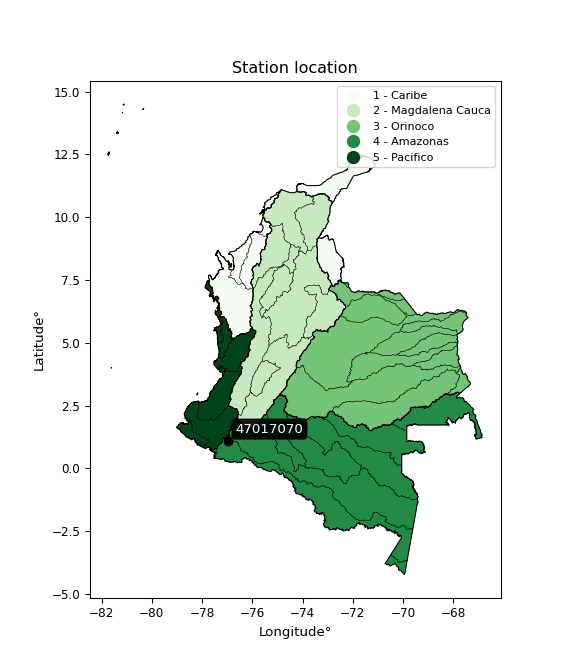</img>

</div>


## A. General information


### 1. General running parameters

• app_version: _v20260103_. • runtime: _2026-01-05 16:20:51.132608_. • Python version: _3.14.0_. • SciPy version: _1.16.3_. • Pandas version: _2.3.3_. • NumPy version: _2.3.5_. • Stations dataset (station_dataset_file): _dataset/pmax24h_in/automatic_colombia_2003_2024.csv_. • Stations catalog (station_catalog_file): _dataset/CNE.xls_. • Minimum year to eval til year_max (date_min): _1900_. • Maximum year to eval since year_min (date_max): _2024_. • Creates, save and include plots into reports (create_plot): _True_. • Plot only fit distributions with Δo > Δ (plot_only_fit): _True_. • Plot only simple graphs avoiding multiple CDFs and multiple Extreme values plots (plot_only_simple): _True_. • Eval low extreme values, if False, evaluates high extreme values (low_extreme): _False_. • Eval every SciPy distribution as logarithmic (pdist_logarithmic_on): _True_. • Standard deviation normalized (ddof): _1.0_. • Return periods to eval in years (Tr): _[2, 2.33, 5, 10, 15, 20, 25, 50, 75, 100, 200, 250, 500, 750, 1000]_. • Minimum data sample per station, 0 means any (minimum_sample): _5_. • Z-Score maximum threshold to adjust a value, 0 means disable (zscore_max): _3.5_. • Z-Score minimum threshold to adjust a value, 0 means disable (zscore_min): _-2.5_. • Avoid zeros, e.g. rain = 0 (avoid_zeros): _True_. • Avoid null values (avoid_nans): _True_. 

[:file_folder:Dataset file](../../dataset/pmax24h_in/automatic_colombia_2003_2024.csv)

> Delta Degrees of Freedom (DDOF): is a parameter used in the formulas for calculating variance and standard deviation. When ddof=0, the divisor is $N$ (the total number of observations) and this is used when your data set is the entire population. When ddof=1, the divisor is $N-1$ and this is used when your data set is a sample drawn from a larger population. Using $N-1$ provides an unbiased estimate of the population variance (known as Bessel´s correction).


### 2. Station info and location

|   id |   CODIGO | NOMBRE                   | CATEGORIA    | TECNOLOGIA                              | ESTADO   | FECHA_INSTALACION   |   FECHA_SUSPENSION |   ALTITUD |   LATITUD |   LONGITUD | DEPARTAMENTO   | MUNICIPIO   | AREA_OPERATIVA                      | ENTIDAD                                                     | AREA_HIDROGRAFICA   | ZONA_HIDROGRAFICA   | SUBZONA_HIDROGRAFICA   | CORRIENTE   | Catalogo   |   Version |
|-----:|---------:|:-------------------------|:-------------|:----------------------------------------|:---------|:--------------------|-------------------:|----------:|----------:|-----------:|:---------------|:------------|:------------------------------------|:------------------------------------------------------------|:--------------------|:--------------------|:-----------------------|:------------|:-----------|----------:|
|    0 | 47017070 | EL EDEN - AUT [47017070] | Limnigráfica | Automática con Telemetría, Convencional | Activa   | 15/02/1970          |                nan |      1450 |   1.10631 |    -76.985 | Putumayo       | Santiago    | Area Operativa 07 - Nariño-Putumayo | INSTITUTO DE HIDROLOGIA METEOROLOGIA Y ESTUDIOS AMBIENTALES | Amazonas            | Putumayo            | Alto Río Putumayo      | Putumayo    | CNE_IDEAM  |  20251226 |

<div align="center">

Dynamic map: [:earth_americas:Google](http://maps.google.com/maps?q=1.106305556,-76.985) [:earth_americas:OSM](https://www.openstreetmap.org/#map=18/1.106305556/-76.985&layers=P) [:earth_americas:Bing](https://www.bing.com/maps?cp=1.106305556~-76.985&lvl=18) [:earth_americas:Apple](https://maps.apple.com/frame?center=1.106305556%2C-76.985&span=0.003%2C0.006)

</div>


<div align="center">

```geojson
{
  "type": "Feature",
  "geometry": {
    "type": "Point", 
    "coordinates": [-76.985, 1.106305556]
  }, 
  "properties": {
    "Name": "47017070"
  }
}
```

</div>


### 3. Discrete values table and plot

<div align="center">

|               |          0 |           1 |           2 |           3 |          4 |         5 |
|:--------------|-----------:|------------:|------------:|------------:|-----------:|----------:|
| Date          | 2019       | 2020        | 2021        | 2022        | 2023       | 2024      |
| Value         |  146.4     |   49.2      |   76.4      |   30        |   32       |   66.8    |
| Value_initial |  146.4     |   49.2      |   76.4      |   30        |   32       |   66.8    |
| count         |    6       |    6        |    6        |    6        |    6       |    6      |
| mean          |   66.8     |   66.8      |   66.8      |   66.8      |   66.8     |   66.8    |
| std           |   43.1355  |   43.1355   |   43.1355   |   43.1355   |   43.1355  |   43.1355 |
| zscore        |    1.84535 |   -0.408017 |    0.222554 |   -0.853125 |   -0.80676 |    0      |


</div>


<div align="center">

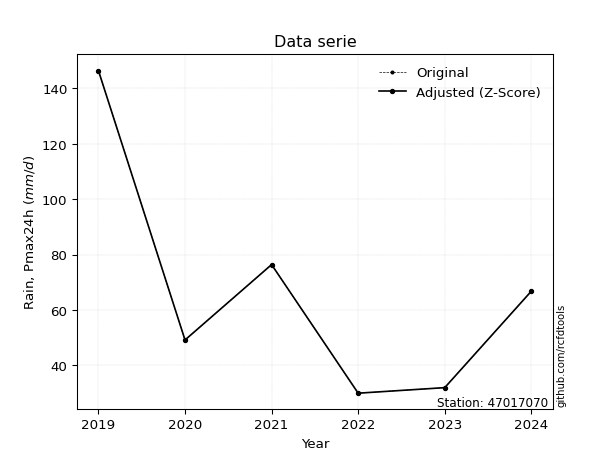</img>

</div>


> The initial value (value_initial) correspond to the initial obtained or null completed value, and value (value) is adjusted only when the initial value is outside the valid range (outlier) definite through the Z-Score value. If Z-Score is active, values out of range or outliers are replaced with the station mean value. A Z-Score (or standard score) measures how many standard deviations a data point is from the mean of a dataset, indicating its relative position; positive scores mean above the mean, negative mean below, and a score of zero is exactly at the mean, allowing for comparison of values from different distributions. It´s calculated using the formula $z=(x–μ)/σ$, where $x$ is the data point, $μ$ is the mean, and $σ$ is the standard deviation, helping identify outliers and understand probability.
>
> <sub>**Note**: In this study, "completing" (filling gaps in) and "extending" (forecasting or lengthening the historical record) rainfall data series are avoided for certain critical analyses because they introduce artificial bias and uncertainty, which can distort the statistics of rare events (extremes), alter day-to-day variability, and compromise the integrity and homogeneity of the original data. Some reasons against Completing/Extending rainfall data are: **Distortion of Extremes and Variability**: The primary issue is that most gap-filling or extension methods rely on averaging or regression with nearby stations, which inherently smooths the data. Rainfall is highly variable in space and time, with a large percentage of zero values and occasional large storms. Infilling methods often underestimate the highest values and overestimate the lowest (zero) values, which severely distorts analyses focused on flood frequency, drought severity, and intensity-duration-frequency (IDF) curves, **Loss of Data Homogeneity**: Infilled or extended data are synthetic estimates, not actual measurements. Combining these estimates with observed data can violate the assumption of data homogeneity, which requires that the data properties do not change over time. Inhomogeneity can lead to incorrect conclusions about long-term trends or changes in climate patterns, **Propagation of Errors**: Errors and biases from the original data (e.g., wind-induced undercatch, instrument errors, site changes) or the data used for imputation can propagate through the analysis, leading to unreliable hydrological models and inaccurate predictions, **Compromised Statistical Integrity**: For statistical analyses, especially those involving the frequency of events, using artificial data can introduce time bias or autocorrelation that doesn´t exist in reality, making it difficult to assess the true probability of events, **Difficulty in Validation**: It is difficult to accurately validate the quality of filled or extended data, especially for past periods where ground-truth measurements are unavailable. The reliability of imputation techniques heavily depends on the density of the surrounding station network and the complexity of the local topography.</sub>


### 4. Active continuous probability distributions from SciPy (44 of 104 available)

A Probability Density Function (PDF) describes the relative likelihood of a continuous random variable falling within a specific range, where the total area under its curve equals 1, and the area over any interval gives the actual probability for that range. Unlike discrete probabilities (like rolling a die), a PDF shows density, not direct probability for a single point (which is zero), with higher points indicating higher likelihood, often visualized as a bell curve for normal distributions.

A log of a probability density function (log-PDF) is simply the logarithm of the PDF´s value, denoted as $log(f(x))$, useful for converting multiplication of probabilities into addition, improving numerical stability with tiny numbers, and connecting to information theory concepts like entropy. Instead of dealing with very small probabilities (e.g., 0.000001), log-PDFs use negative numbers (e.g., $log(0.00001) ≈ -11.51$ that are easier for computers to handle, preventing underflow errors and simplifying complex calculations. In this study, each active probability distribution from SciPy is also evaluated in the $log$ form.

[scipy.stats](https://docs.scipy.org/doc/scipy/reference/stats.html) is a Python´s powerful submodule within the SciPy library for comprehensive statistical analysis, offering over 130 probability distributions (like Normal, Poisson), functions for descriptive stats (mean, variance), hypothesis testing (t-tests, chi-square), random variable generation, and statistical tests, making it essential for data science, modeling, and research. It provides tools to explore, model, and draw conclusions from data efficiently, working seamlessly with NumPy.

<div align="center">

|   id | p_dist             |   n_parameter | fit_method   | label                                                                       | active   | ref                                                                                                        |
|-----:|:-------------------|--------------:|:-------------|:----------------------------------------------------------------------------|:---------|:-----------------------------------------------------------------------------------------------------------|
|    0 | alpha              |             3 | MLE          | Alpha                                                                       | True     | [:mortar_board:](https://docs.scipy.org/doc/scipy/reference/generated/scipy.stats.alpha.html)              |
|    1 | betaprime          |             4 | MLE          | Beta prime                                                                  | True     | [:mortar_board:](https://docs.scipy.org/doc/scipy/reference/generated/scipy.stats.betaprime.html)          |
|    2 | chi2               |             3 | MLE          | Chi²                                                                        | True     | [:mortar_board:](https://docs.scipy.org/doc/scipy/reference/generated/scipy.stats.chi2.html)               |
|    3 | crystalball        |             4 | MLE          | Crystalball                                                                 | True     | [:mortar_board:](https://docs.scipy.org/doc/scipy/reference/generated/scipy.stats.crystalball.html)        |
|    4 | erlang             |             3 | MLE          | Erlang                                                                      | True     | [:mortar_board:](https://docs.scipy.org/doc/scipy/reference/generated/scipy.stats.erlang.html)             |
|    5 | expon              |             2 | MLE          | Exponential                                                                 | True     | [:mortar_board:](https://docs.scipy.org/doc/scipy/reference/generated/scipy.stats.expon.html)              |
|    6 | exponnorm          |             3 | MLE          | Exponentially modified Normal                                               | True     | [:mortar_board:](https://docs.scipy.org/doc/scipy/reference/generated/scipy.stats.exponnorm.html)          |
|    7 | f                  |             4 | MLE          | F                                                                           | True     | [:mortar_board:](https://docs.scipy.org/doc/scipy/reference/generated/scipy.stats.f.html)                  |
|    8 | fatiguelife        |             3 | MLE          | Fatigue-life (Birnbaum-Saunders)                                            | True     | [:mortar_board:](https://docs.scipy.org/doc/scipy/reference/generated/scipy.stats.fatiguelife.html)        |
|    9 | fisk               |             3 | MLE          | Fisk                                                                        | True     | [:mortar_board:](https://docs.scipy.org/doc/scipy/reference/generated/scipy.stats.fisk.html)               |
|   10 | gamma              |             3 | MLE          | Gamma                                                                       | True     | [:mortar_board:](https://docs.scipy.org/doc/scipy/reference/generated/scipy.stats.gamma.html)              |
|   11 | genexpon           |             5 | MLE          | Generalized exponential                                                     | True     | [:mortar_board:](https://docs.scipy.org/doc/scipy/reference/generated/scipy.stats.genexpon.html)           |
|   12 | genlogistic        |             3 | MLE          | Generalized logistic                                                        | True     | [:mortar_board:](https://docs.scipy.org/doc/scipy/reference/generated/scipy.stats.genlogistic.html)        |
|   13 | gibrat             |             2 | MM           | Gibrat                                                                      | True     | [:mortar_board:](https://docs.scipy.org/doc/scipy/reference/generated/scipy.stats.gibrat.html)             |
|   14 | gompertz           |             3 | MLE          | Gompertz (or truncated Gumbel)                                              | True     | [:mortar_board:](https://docs.scipy.org/doc/scipy/reference/generated/scipy.stats.gompertz.html)           |
|   15 | gumbel_l           |             2 | MM           | Gumbel Left Skew                                                            | True     | [:mortar_board:](https://docs.scipy.org/doc/scipy/reference/generated/scipy.stats.gumbel_l.html)           |
|   16 | gumbel_r           |             2 | MM           | Gumbel Right Skew                                                           | True     | [:mortar_board:](https://docs.scipy.org/doc/scipy/reference/generated/scipy.stats.gumbel_r.html)           |
|   17 | halflogistic       |             2 | MM           | Half-logistic                                                               | True     | [:mortar_board:](https://docs.scipy.org/doc/scipy/reference/generated/scipy.stats.halflogistic.html)       |
|   18 | halfnorm           |             2 | MM           | Half Normal                                                                 | True     | [:mortar_board:](https://docs.scipy.org/doc/scipy/reference/generated/scipy.stats.halfnorm.html)           |
|   19 | hypsecant          |             2 | MM           | hyperbolic secant                                                           | True     | [:mortar_board:](https://docs.scipy.org/doc/scipy/reference/generated/scipy.stats.hypsecant.html)          |
|   20 | invgamma           |             3 | MLE          | Inverted gamma                                                              | True     | [:mortar_board:](https://docs.scipy.org/doc/scipy/reference/generated/scipy.stats.invgamma.html)           |
|   21 | invgauss           |             3 | MLE          | Inverse Gaussian                                                            | True     | [:mortar_board:](https://docs.scipy.org/doc/scipy/reference/generated/scipy.stats.invgauss.html)           |
|   22 | invweibull         |             3 | MLE          | Inverted Weibull                                                            | True     | [:mortar_board:](https://docs.scipy.org/doc/scipy/reference/generated/scipy.stats.invweibull.html)         |
|   23 | johnsonsu          |             4 | MLE          | Johnson Su                                                                  | True     | [:mortar_board:](https://docs.scipy.org/doc/scipy/reference/generated/scipy.stats.johnsonsu.html)          |
|   24 | kstwobign          |             2 | MLE          | Limiting distribution of scaled Kolmogorov-Smirnov two-sided test statistic | True     | [:mortar_board:](https://docs.scipy.org/doc/scipy/reference/generated/scipy.stats.kstwobign.html)          |
|   25 | laplace            |             2 | MM           | Laplace                                                                     | True     | [:mortar_board:](https://docs.scipy.org/doc/scipy/reference/generated/scipy.stats.laplace.html)            |
|   26 | laplace_asymmetric |             3 | MLE          | Asymmetric Laplace                                                          | True     | [:mortar_board:](https://docs.scipy.org/doc/scipy/reference/generated/scipy.stats.laplace_asymmetric.html) |
|   27 | loggamma           |             3 | MLE          | Log gamma                                                                   | True     | [:mortar_board:](https://docs.scipy.org/doc/scipy/reference/generated/scipy.stats.loggamma.html)           |
|   28 | logistic           |             2 | MM           | Logistic (or Sech-squared)                                                  | True     | [:mortar_board:](https://docs.scipy.org/doc/scipy/reference/generated/scipy.stats.logistic.html)           |
|   29 | lognorm            |             3 | MLE          | Log Normal                                                                  | True     | [:mortar_board:](https://docs.scipy.org/doc/scipy/reference/generated/scipy.stats.lognorm.html)            |
|   30 | maxwell            |             2 | MM           | Maxwell                                                                     | True     | [:mortar_board:](https://docs.scipy.org/doc/scipy/reference/generated/scipy.stats.maxwell.html)            |
|   31 | mielke             |             4 | MLE          | Mielke Beta-Kappa / Dagum                                                   | True     | [:mortar_board:](https://docs.scipy.org/doc/scipy/reference/generated/scipy.stats.mielke.html)             |
|   32 | moyal              |             2 | MM           | Moyal                                                                       | True     | [:mortar_board:](https://docs.scipy.org/doc/scipy/reference/generated/scipy.stats.moyal.html)              |
|   33 | nakagami           |             3 | MLE          | Nakagami                                                                    | True     | [:mortar_board:](https://docs.scipy.org/doc/scipy/reference/generated/scipy.stats.nakagami.html)           |
|   34 | ncf                |             5 | MLE          | Non-central F distribution                                                  | True     | [:mortar_board:](https://docs.scipy.org/doc/scipy/reference/generated/scipy.stats.ncf.html)                |
|   35 | nct                |             4 | MLE          | Non-central Student’s t                                                     | True     | [:mortar_board:](https://docs.scipy.org/doc/scipy/reference/generated/scipy.stats.nct.html)                |
|   36 | norm               |             2 | MM           | Normal                                                                      | True     | [:mortar_board:](https://docs.scipy.org/doc/scipy/reference/generated/scipy.stats.norm.html)               |
|   37 | pearson3           |             3 | MM           | Pearson type III                                                            | True     | [:mortar_board:](https://docs.scipy.org/doc/scipy/reference/generated/scipy.stats.pearson3.html)           |
|   38 | rayleigh           |             2 | MM           | Rayleigh                                                                    | True     | [:mortar_board:](https://docs.scipy.org/doc/scipy/reference/generated/scipy.stats.rayleigh.html)           |
|   39 | rice               |             3 | MLE          | Rice                                                                        | True     | [:mortar_board:](https://docs.scipy.org/doc/scipy/reference/generated/scipy.stats.rice.html)               |
|   40 | t                  |             3 | MLE          | Student’s t                                                                 | True     | [:mortar_board:](https://docs.scipy.org/doc/scipy/reference/generated/scipy.stats.t.html)                  |
|   41 | truncnorm          |             4 | MLE          | Truncated normal                                                            | True     | [:mortar_board:](https://docs.scipy.org/doc/scipy/reference/generated/scipy.stats.truncnorm.html)          |
|   42 | wald               |             2 | MM           | Wald                                                                        | True     | [:mortar_board:](https://docs.scipy.org/doc/scipy/reference/generated/scipy.stats.wald.html)               |
|   43 | weibull_min        |             3 | MLE          | Weibull minimum                                                             | True     | [:mortar_board:](https://docs.scipy.org/doc/scipy/reference/generated/scipy.stats.weibull_min.html)        |

</div>

> **n_parameter:** # arguments & localization & scale.
>
> **Fit methods:** (MLE) maximum likelihood, (MM) L-moments.
>
>**Inactive** (With the only purpose of prevent loops, zero divisions, infinite values, over high estimated values or horizontal trending for recurrence intervals estimations, the follow distributions were disabled.)**:** foldnorm, gennorm, norminvgauss, powernorm, powerlognorm, skewnorm, genextreme, anglit, arcsine, argus, beta, bradford, burr, burr12, cauchy, cosine, halfcauchy, foldcauchy, skewcauchy, wrapcauchy, dgamma, gengamma, exponweib, exponpow, truncexpon, gausshyper, genhalflogistic, genhyperbolic, geninvgauss, halfgennorm, johnsonsb, kappa4, kappa3, ksone, kstwo, loglaplace, levy, levy_l, levy_stable, ncx2, pareto, genpareto, truncpareto, lomax, powerlaw, rdist, rel_breitwigner, recipinvgauss, semicircular, studentized_range, trapezoid, triang, truncweibull_min, tukeylambda, uniform, loguniform, vonmises, vonmises_line, weibull_max, dweibull, 


## B. Probability (PDF) vs. Empirical (EDF) distributions functions

A continuous probability distribution (CPD) describes probabilities for variables that can take any value within a range (like rain any time), unlike discrete variables with specific outcomes (like temperature). It uses a Probability Density Function (PDF), a curve where the total area under it equals 1, and the probability of the variable falling within an interval (a to b) is found by calculating the area under the curve between those points. A key feature is that the probability of hitting any single exact value is zero, so probabilities are always expressed for ranges, e.g., $P(a ≤ X ≤ b)$.

<div align="center">

Distributions parameters from station values
|    |   station | p_dist                |   n |              loc |          scale | shape                  | shape1              | shape2                | shape3   |
|---:|----------:|:----------------------|----:|-----------------:|---------------:|:-----------------------|:--------------------|:----------------------|:---------|
|  0 |  47017070 | alpha                 |   6 |     20.6948      |   16.7204      | 6.9749653111950576e-09 |                     |                       |          |
|  1 |  47017070 | betaprime             |   6 |      9.6529      |    0.671965    | 167.34290639085498     | 3.0533845780659448  |                       |          |
|  2 |  47017070 | chi2                  |   6 |     30           |   53.4098      | 0.5355118522817233     |                     |                       |          |
|  3 |  47017070 | crystalball           |   6 |     66.8         |   39.3772      | 3632.5495410455324     | 8743.11846608475    |                       |          |
|  4 |  47017070 | erlang                |   6 |     30           |   24.9378      | 0.6597171402747914     |                     |                       |          |
|  5 |  47017070 | expon                 |   6 |     30           |   36.8         |                        |                     |                       |          |
|  6 |  47017070 | exponnorm             |   6 |     29.9664      |    0.00935403  | 3930.0992667138526     |                     |                       |          |
|  7 |  47017070 | f                     |   6 |     26.2284      |   11.2216      | 7237.240348758189      | 1.7148423524284473  |                       |          |
|  8 |  47017070 | fatiguelife           |   6 |     30           |    1.02461e-05 | 1647.6407287879229     |                     |                       |          |
|  9 |  47017070 | fisk                  |   6 |     30           |   19.717       | 0.860990681043254      |                     |                       |          |
| 10 |  47017070 | gamma                 |   6 |     30           |   26.733       | 0.7011170349329436     |                     |                       |          |
| 11 |  47017070 | genexpon              |   6 |     30           |   39.8887      | 1.083930117823702      | 1.1377432001609729  | 6.200894678381833e-12 |          |
| 12 |  47017070 | genlogistic           |   6 |   -138.101       |   26.3696      | 1240.0626082054578     |                     |                       |          |
| 13 |  47017070 | gibrat                |   6 |     36.7602      |   18.2201      |                        |                     |                       |          |
| 14 |  47017070 | gompertz              |   6 |     30           |    1.04527e+10 | 284029726.6671995      |                     |                       |          |
| 15 |  47017070 | gumbel_l              |   6 |     84.5218      |   30.7022      |                        |                     |                       |          |
| 16 |  47017070 | gumbel_r              |   6 |     49.0782      |   30.7022      |                        |                     |                       |          |
| 17 |  47017070 | halflogistic          |   6 |     20.1289      |   33.6661      |                        |                     |                       |          |
| 18 |  47017070 | halfnorm              |   6 |     14.6801      |   65.3226      |                        |                     |                       |          |
| 19 |  47017070 | hypsecant             |   6 |     66.8         |   25.0683      |                        |                     |                       |          |
| 20 |  47017070 | invgamma              |   6 |     26.227       |    9.62161     | 0.8574287531989664     |                     |                       |          |
| 21 |  47017070 | invgauss              |   6 |     27.2435      |   11.5188      | 3.4340930079315855     |                     |                       |          |
| 22 |  47017070 | invweibull            |   6 |     30           |    1.24299     | 0.057988341670313324   |                     |                       |          |
| 23 |  47017070 | johnsonsu             |   6 |     30           |    2.20843e-12 | -0.9807415897931704    | 0.08699163031746893 |                       |          |
| 24 |  47017070 | kstwobign             |   6 |    -45.634       |  129.943       |                        |                     |                       |          |
| 25 |  47017070 | laplace               |   6 |     66.8         |   27.8439      |                        |                     |                       |          |
| 26 |  47017070 | laplace_asymmetric    |   6 |     30           |    0.000288348 | 7.835502411455245e-06  |                     |                       |          |
| 27 |  47017070 | loggamma              |   6 | -11253.4         | 1547.08        | 1506.1968922746519     |                     |                       |          |
| 28 |  47017070 | logistic              |   6 |     66.8         |   21.7098      |                        |                     |                       |          |
| 29 |  47017070 | lognorm               |   6 |     30           |    0.0548111   | 13.637784607284814     |                     |                       |          |
| 30 |  47017070 | maxwell               |   6 |    -26.5073      |   58.4717      |                        |                     |                       |          |
| 31 |  47017070 | mielke                |   6 |     -0.55763     |    4.4435      | 445.4690104311462      | 2.281047803047108   |                       |          |
| 32 |  47017070 | moyal                 |   6 |     44.2816      |   17.7259      |                        |                     |                       |          |
| 33 |  47017070 | nakagami              |   6 |     30           |   59.1747      | 0.1626060580285758     |                     |                       |          |
| 34 |  47017070 | ncf                   |   6 |     -0.00621559  |    1.06289e-06 | 7.688211848327263e-08  | 3.4433772995488514  | 3.2543017294342866    |          |
| 35 |  47017070 | nct                   |   6 |     -0.313856    |    0.965006    | 2.4060767784196964     | 47.22286575623789   |                       |          |
| 36 |  47017070 | norm                  |   6 |     66.8         |   39.3772      |                        |                     |                       |          |
| 37 |  47017070 | pearson3              |   6 |     66.8         |   39.3772      | 1.113201800399354      |                     |                       |          |
| 38 |  47017070 | rayleigh              |   6 |     -8.53079     |   60.1053      |                        |                     |                       |          |
| 39 |  47017070 | rice                  |   6 |      5.38224     |   51.5883      | 0.0006714855771666906  |                     |                       |          |
| 40 |  47017070 | t                     |   6 |     55.1283      |   25.3378      | 2.5991100295958343     |                     |                       |          |
| 41 |  47017070 | truncnorm             |   6 | -35527.9         | 1185.27        | 29.999872994135686     | 30.098082230819816  |                       |          |
| 42 |  47017070 | wald                  |   6 |     27.4228      |   39.3772      |                        |                     |                       |          |
| 43 |  47017070 | weibull_min           |   6 |     30           |   44.676       | 0.5625610801593626     |                     |                       |          |
| 44 |  47017070 | logalpha              |   6 |      0.754173    |   20.0789      | 6.259286853060294      |                     |                       |          |
| 45 |  47017070 | logbetaprime          |   6 |     -0.880967    |    0.639512    | 736.0731920773715      | 96.54259709429488   |                       |          |
| 46 |  47017070 | logchi2               |   6 |      3.4012      |    0.949356    | 1.0962885539375833     |                     |                       |          |
| 47 |  47017070 | logcrystalball        |   6 |      4.04781     |    0.542765    | 151.79976415354957     | 40.55923093224472   |                       |          |
| 48 |  47017070 | logerlang             |   6 |      3.4012      |    0.685687    | 0.4538004503985923     |                     |                       |          |
| 49 |  47017070 | logexpon              |   6 |      3.4012      |    0.646612    |                        |                     |                       |          |
| 50 |  47017070 | logexponnorm          |   6 |      3.58295     |    0.345526    | 1.3453625494547623     |                     |                       |          |
| 51 |  47017070 | logf                  |   6 |      3.40118     |    0.464684    | 0.8667725617605935     | 5.042384606089268   |                       |          |
| 52 |  47017070 | logfatiguelife        |   6 |      3.4012      |    1.04181e-06 | 728.2410847971282      |                     |                       |          |
| 53 |  47017070 | logfisk               |   6 |      3.4012      |    0.357264    | 0.2504595840626953     |                     |                       |          |
| 54 |  47017070 | loggamma              |   6 |      3.4012      |    0.54548     | 0.4161373781317322     |                     |                       |          |
| 55 |  47017070 | loggenexpon           |   6 |      3.40079     |    0.0146949   | 0.018281920460963594   | 2.2510805931951037  | 5.207948061667226e-05 |          |
| 56 |  47017070 | loggenlogistic        |   6 |      0.745615    |    0.443843    | 950.0317872739724      |                     |                       |          |
| 57 |  47017070 | loggibrat             |   6 |      3.63372     |    0.251155    |                        |                     |                       |          |
| 58 |  47017070 | loggompertz           |   6 |      3.4012      |    1.84299     | 2.0602298013171847     |                     |                       |          |
| 59 |  47017070 | loggumbel_l           |   6 |      4.29208     |    0.423193    |                        |                     |                       |          |
| 60 |  47017070 | loggumbel_r           |   6 |      3.80354     |    0.423193    |                        |                     |                       |          |
| 61 |  47017070 | loghalflogistic       |   6 |      3.40449     |    0.464059    |                        |                     |                       |          |
| 62 |  47017070 | loghalfnorm           |   6 |      3.3294      |    0.900392    |                        |                     |                       |          |
| 63 |  47017070 | loghypsecant          |   6 |      4.04781     |    0.345535    |                        |                     |                       |          |
| 64 |  47017070 | loginvgamma           |   6 |      2.40163     |   13.6431      | 9.2518516186731        |                     |                       |          |
| 65 |  47017070 | loginvgauss           |   6 |      3.22641     |    0.911363    | 0.9012804863387796     |                     |                       |          |
| 66 |  47017070 | loginvweibull         |   6 |     -5.39413e+06 |    5.39413e+06 | 12141393.889421254     |                     |                       |          |
| 67 |  47017070 | logjohnsonsu          |   6 |      3.4012      |    1.39391e-11 | -3.0902855953003514    | 0.14443046405997234 |                       |          |
| 68 |  47017070 | logkstwobign          |   6 |      2.25702     |    2.04824     |                        |                     |                       |          |
| 69 |  47017070 | loglaplace            |   6 |      4.04781     |    0.383793    |                        |                     |                       |          |
| 70 |  47017070 | loglaplace_asymmetric |   6 |      4.2017      |    0.440317    | 1.1897928469655916     |                     |                       |          |
| 71 |  47017070 | logloggamma           |   6 |   -144.467       |   20.5114      | 1395.6417864658738     |                     |                       |          |
| 72 |  47017070 | loglogistic           |   6 |      4.04781     |    0.299242    |                        |                     |                       |          |
| 73 |  47017070 | loglognorm            |   6 |      3.4012      |    0.00160065  | 12.969795500403476     |                     |                       |          |
| 74 |  47017070 | logmaxwell            |   6 |      2.76168     |    0.80596     |                        |                     |                       |          |
| 75 |  47017070 | logmielke             |   6 |   -110.523       |  112.057       | 45505.18477968029      | 259.52800218026414  |                       |          |
| 76 |  47017070 | logmoyal              |   6 |      3.73742     |    0.24433     |                        |                     |                       |          |
| 77 |  47017070 | lognakagami           |   6 |      3.4012      |    1.08748     | 0.18578675971211728    |                     |                       |          |
| 78 |  47017070 | logncf                |   6 |      2.41128     |    0.874153    | 1162.5216882082805     | 18.505816228740954  | 787.1422802775393     |          |
| 79 |  47017070 | lognct                |   6 |      0.448427    |    0.0788543   | 24.326673672901443     | 44.1497319690648    |                       |          |
| 80 |  47017070 | lognorm               |   6 |      4.04781     |    0.542766    |                        |                     |                       |          |
| 81 |  47017070 | logpearson3           |   6 |      4.04781     |    0.542766    | 0.3994452738273846     |                     |                       |          |
| 82 |  47017070 | lograyleigh           |   6 |      3.00947     |    0.828477    |                        |                     |                       |          |
| 83 |  47017070 | logrice               |   6 |      3.0984      |    0.75821     | 0.28352229107662863    |                     |                       |          |
| 84 |  47017070 | logt                  |   6 |      4.04781     |    0.54277     | 607804971.2222763      |                     |                       |          |
| 85 |  47017070 | logtruncnorm          |   6 |     -0.128628    |    0.977244    | 4.431167726991825      | 5.234106656445007   |                       |          |
| 86 |  47017070 | logwald               |   6 |      3.50507     |    0.542744    |                        |                     |                       |          |
| 87 |  47017070 | logweibull_min        |   6 |      3.4012      |    0.928403    | 0.44269580782474965    |                     |                       |          |

</div>

> **loc** (Location parameter): This shifts the distribution along the x-axis. For many common distributions, like the normal (Gaussian) distribution, loc represents the mean $μ$. For others, like the uniform distribution, it might represent the minimum value, or for the beta distribution, the left end of the support interval.
>
> **scale** (Scale parameter): This determines the width or spread of the distribution. For the normal distribution, scale represents the standard deviation $σ$. For a uniform distribution, it defines the length of the interval (from $loc$ to $loc + scale$).
>
> **shape** (Shape parameters): Refers to parameters that define the specific form of a probability distribution, distinct from its location (loc) and scale (scale). These parameters are required arguments for most distribution functions. For example, a normal (Gaussian) distribution is fully defined by its location (mean) and scale (standard deviation), so it has no specific shape parameters beyond loc and scale. However, other distributions have intrinsic properties that need specification, as Gamma distribution that takes a shape parameter, often named $a$ or $alpha$.


### 0. Cumulative distribution values - CDF (88 evaluated)

Cumulative Distribution Function (CDF), denoted as $F$<sub>$X$</sub>$(x)$, is a function that gives the probability that a random variable $X$ will take a value less than or equal to a specific value, $x$ (i.e., $(P(X≥x)$. It essentially "accumulates" probabilities from a given point up to the far right (positive infinity), providing a complete picture of the distribution´s probabilities for both discrete (like rain) and continuous (like temperature) variables, helping to find probabilities over ranges or above certain values. Each station is evaluated separately ordering the $x$ values ascending, calculating the CDF and PDF values for the activated distributions and their logarithmic forms.

<div align="center">

CDF ordered by x ascending and calculating $log(f(x))$ separately
|   id |   Station |   date |     x |   count |   mean |     std |    zscore |   Value_initial |   station |   m |     alpha |   alpha_pdf |   betaprime |   betaprime_pdf |        chi2 |    chi2_pdf |   crystalball |   crystalball_pdf |      erlang |     erlang_pdf |     expon |   expon_pdf |   exponnorm |   exponnorm_pdf |         f |       f_pdf |   fatiguelife |   fatiguelife_pdf |       fisk |   fisk_pdf |       gamma |      gamma_pdf |    genexpon |   genexpon_pdf |   genlogistic |   genlogistic_pdf |   gibrat |   gibrat_pdf |    gompertz |   gompertz_pdf |   gumbel_l |   gumbel_l_pdf |   gumbel_r |   gumbel_r_pdf |   halflogistic |   halflogistic_pdf |   halfnorm |   halfnorm_pdf |   hypsecant |   hypsecant_pdf |   invgamma |   invgamma_pdf |   invgauss |   invgauss_pdf |   invweibull |   invweibull_pdf |   johnsonsu |   johnsonsu_pdf |   kstwobign |   kstwobign_pdf |   laplace |   laplace_pdf |   laplace_asymmetric |   laplace_asymmetric_pdf |    loggamma |   loggamma_pdf |   logistic |   logistic_pdf |   lognorm |   lognorm_pdf |   maxwell |   maxwell_pdf |   mielke |   mielke_pdf |    moyal |   moyal_pdf |   nakagami |   nakagami_pdf |      ncf |    ncf_pdf |       nct |    nct_pdf |     norm |   norm_pdf |   pearson3 |   pearson3_pdf |   rayleigh |   rayleigh_pdf |     rice |   rice_pdf |        t |       t_pdf |   truncnorm |   truncnorm_pdf |        wald |    wald_pdf |   weibull_min |   weibull_min_pdf |   logalpha |   logalpha_pdf |   logbetaprime |   logbetaprime_pdf |     logchi2 |   logchi2_pdf |   logcrystalball |   logcrystalball_pdf |   logerlang |   logerlang_pdf |   logexpon |   logexpon_pdf |   logexponnorm |   logexponnorm_pdf |      logf |    logf_pdf |   logfatiguelife |   logfatiguelife_pdf |     logfisk |   logfisk_pdf |   loggenexpon |   loggenexpon_pdf |   loggenlogistic |   loggenlogistic_pdf |   loggibrat |   loggibrat_pdf |   loggompertz |   loggompertz_pdf |   loggumbel_l |   loggumbel_l_pdf |   loggumbel_r |   loggumbel_r_pdf |   loghalflogistic |   loghalflogistic_pdf |   loghalfnorm |   loghalfnorm_pdf |   loghypsecant |   loghypsecant_pdf |   loginvgamma |   loginvgamma_pdf |   loginvgauss |   loginvgauss_pdf |   loginvweibull |   loginvweibull_pdf |   logjohnsonsu |   logjohnsonsu_pdf |   logkstwobign |   logkstwobign_pdf |   loglaplace |   loglaplace_pdf |   loglaplace_asymmetric |   loglaplace_asymmetric_pdf |   logloggamma |   logloggamma_pdf |   loglogistic |   loglogistic_pdf |   loglognorm |   loglognorm_pdf |   logmaxwell |   logmaxwell_pdf |   logmielke |   logmielke_pdf |   logmoyal |   logmoyal_pdf |   lognakagami |   lognakagami_pdf |    logncf |   logncf_pdf |    lognct |   lognct_pdf |   logpearson3 |   logpearson3_pdf |   lograyleigh |   lograyleigh_pdf |   logrice |   logrice_pdf |     logt |   logt_pdf |   logtruncnorm |   logtruncnorm_pdf |   logwald |   logwald_pdf |   logweibull_min |   logweibull_min_pdf |
|-----:|----------:|-------:|------:|--------:|-------:|--------:|----------:|----------------:|----------:|----:|----------:|------------:|------------:|----------------:|------------:|------------:|--------------:|------------------:|------------:|---------------:|----------:|------------:|------------:|----------------:|----------:|------------:|--------------:|------------------:|-----------:|-----------:|------------:|---------------:|------------:|---------------:|--------------:|------------------:|---------:|-------------:|------------:|---------------:|-----------:|---------------:|-----------:|---------------:|---------------:|-------------------:|-----------:|---------------:|------------:|----------------:|-----------:|---------------:|-----------:|---------------:|-------------:|-----------------:|------------:|----------------:|------------:|----------------:|----------:|--------------:|---------------------:|-------------------------:|------------:|---------------:|-----------:|---------------:|----------:|--------------:|----------:|--------------:|---------:|-------------:|---------:|------------:|-----------:|---------------:|---------:|-----------:|----------:|-----------:|---------:|-----------:|-----------:|---------------:|-----------:|---------------:|---------:|-----------:|---------:|------------:|------------:|----------------:|------------:|------------:|--------------:|------------------:|-----------:|---------------:|---------------:|-------------------:|------------:|--------------:|-----------------:|---------------------:|------------:|----------------:|-----------:|---------------:|---------------:|-------------------:|----------:|------------:|-----------------:|---------------------:|------------:|--------------:|--------------:|------------------:|-----------------:|---------------------:|------------:|----------------:|--------------:|------------------:|--------------:|------------------:|--------------:|------------------:|------------------:|----------------------:|--------------:|------------------:|---------------:|-------------------:|--------------:|------------------:|--------------:|------------------:|----------------:|--------------------:|---------------:|-------------------:|---------------:|-------------------:|-------------:|-----------------:|------------------------:|----------------------------:|--------------:|------------------:|--------------:|------------------:|-------------:|-----------------:|-------------:|-----------------:|------------:|----------------:|-----------:|---------------:|--------------:|------------------:|----------:|-------------:|----------:|-------------:|--------------:|------------------:|--------------:|------------------:|----------:|--------------:|---------:|-----------:|---------------:|-------------------:|----------:|--------------:|-----------------:|---------------------:|
|    0 |  47017070 |   2022 |  30   |       6 |   66.8 | 43.1355 | -0.853125 |            30   |  47017070 |   1 | 0.0723525 | 0.0306624   |   0.0950261 |     0.017357    | 5.16235e-05 | 1.94534e+09 |      0.17501  |        0.00654654 | 6.15879e-11 | 5718.25        | 0         |  0.0271739  | 0.000912661 |      0.0271724  | 0.0592554 | 0.0417686   |      0.123992 |       4.18097e+10 | 5.0525e-14 | 6.1223     | 8.13265e-12 | 1604.95        | 2.25817e-11 |     0.0271738  |      0.121087 |       0.00968643  | 0        |  0           | 2.70479e-11 |     0.0271729  |   0.155781 |    0.00465644  |   0.155436 |     0.00942431 |       0.145561 |         0.0145371  |   0.185424 |     0.0118832  |    0.144154 |      0.0055559  |  0.0592557 |    0.0417683   |  0.0543556 |    0.0484988   |   0.00123384 |      6.74419e+10 |    0.157048 |     9.06248e+09 |    0.112883 |      0.00937743 |  0.133347 |    0.00478909 |            7.768e-11 |               0.0271738  | 5.93054e-07 |    5.55726e+08 |   0.155108 |     0.00603642 |  0.116762 |      0.3615   |  0.182769 |    0.00798933 |      nan |          nan | 0.134634 |  0.0109958  | 5.3231e-06 |    2.43636e+08 | 0.474143 | 0.00700142 | 0.0938548 | 0.0158056  | 0.17501  | 0.00654654 |   0.163583 |     0.0103084  |   0.18574  |     0.00868452 | 0.107616 | 0.00825465 | 0.202239 | 0.0080435   | 5.36742e-09 |      0.0267317  | 0.000244749 | 0.000765666 |   8.77081e-10 |   138883          |   0.092391 |       0.474492 |       0.106254 |           0.408775 | 3.04222e-09 |   3.75505e+06 |         0.116762 |             0.3615   | 1.44587e-07 |     1.47749e+08 |  0         |       1.54652  |       0.100334 |           0.428303 | 0.0099965 | 196.801     |        0.0520722 |          1.16361e+11 | 0.000184795 |   1.04202e+11 |   0.000504171 |          1.24369  |        0.0914578 |             0.492248 |    0        |       0         |   2.08443e-11 |          1.11787  |      0.114698 |         0.254857  |      0.075202 |          0.459817 |         0         |              0        |     0.0635558 |          0.88334  |      0.0972244 |           0.277019 |     0.0852323 |          0.540786 |     0.0619567 |          1.03597  |       0.0914479 |            0.492356 |      0.0014864 |        3.67653e+07 |      0.0860968 |           0.519739 |    0.0927415 |         0.241644 |                0.127147 |                    0.242701 |      0.118961 |          0.358275 |      0.103324 |          0.309608 |     0.012898 |      5.77249e+12 |     0.110379 |         0.454969 |         nan |             nan |  0.0466092 |       0.448712 |   1.51811e-06 |       1.27021e+09 | 0.0852326 |     0.540777 | 0.0988877 |     0.45062  |      0.10869  |          0.412087 |      0.105763 |          0.510362 | 0.0737446 |      0.468682 | 0.116763 |   0.361499 |    0           |          0         |  0        |     0         |      1.65113e-07 |          1.64595e+08 |
|    1 |  47017070 |   2023 |  32   |       6 |   66.8 | 43.1355 | -0.80676  |            32   |  47017070 |   2 | 0.139139  | 0.0349649   |   0.131854  |     0.0193402   | 0.380241    | 0.0501589   |      0.188413 |        0.00685593 | 0.203385    |    0.0639051   | 0.0528974 |  0.0257365  | 0.0538145   |      0.0257379  | 0.149882  | 0.0458605   |      0.605707 |       0.0257996   | 0.122364   | 0.0462313  | 0.173283    |    0.0581175   | 0.0528972   |     0.0257364  |      0.141259 |       0.010476    | 0        |  0           | 0.0528954   |     0.0257356  |   0.16535  |    0.00491354  |   0.174798 |     0.00992988 |       0.174502 |         0.0143995  |   0.209102 |     0.0117926  |    0.155672 |      0.00596531 |  0.149882  |    0.0458603   |  0.158253  |    0.0511304   |   0.378025   |      0.0106623   |    0.92984  |     0.00585036  |    0.132352 |      0.01008    |  0.143277 |    0.00514574 |            0.0528971 |               0.0257364  | 0.448473    |    2.65834     |   0.167568 |     0.00642516 |  0.141765 |      0.41358  |  0.199043 |    0.00828155 |      nan |          nan | 0.157359 |  0.0117107  | 0.266248   |    0.0432866   | 0.487888 | 0.00674583 | 0.127368  | 0.0176057  | 0.188413 | 0.00685593 |   0.184591 |     0.0106893  |   0.203366 |     0.00893755 | 0.124631 | 0.00875509 | 0.218967 | 0.00868855  | 0.0521328   |      0.0254122  | 0.0086862   | 0.00888339  |   0.159882    |        0.041168   |   0.125974 |       0.565212 |       0.134754 |           0.474339 | 0.17418     |   1.44716     |         0.141765 |             0.41358  | 0.375333    |     2.47274     |  0.0949909 |       1.39962  |       0.130579 |           0.509046 | 0.311468  |   1.99134   |        0.633738  |          0.996424    | 0.394463    |   0.92697     |   0.0786741   |          1.1787   |        0.126371  |             0.588312 |    0        |       0         |   0.0707931   |          1.07575  |      0.13229  |         0.290946  |      0.108438 |          0.569252 |         0.0658969 |              1.07277  |     0.120354  |          0.876052 |      0.116782  |           0.330444 |     0.123802  |          0.651585 |     0.13733   |          1.25034  |       0.126366  |            0.588368 |      0.588717  |        0.870623    |      0.122918  |           0.618823 |    0.109725  |         0.285896 |                0.143817 |                    0.274519 |      0.143702 |          0.408669 |      0.125082 |          0.365713 |     0.612192 |      0.457631    |     0.14173  |         0.515827 |         nan |             nan |  0.0812206 |       0.622583 |   0.277723    |       1.59808     | 0.123801  |     0.651573 | 0.130547  |     0.529921 |      0.137339 |          0.475567 |      0.140713 |          0.571213 | 0.106619  |      0.548413 | 0.141766 |   0.413578 |    0           |          0         |  0        |     0         |      0.264483    |          1.54979     |
|    2 |  47017070 |   2020 |  49.2 |       6 |   66.8 | 43.1355 | -0.408017 |            49.2 |  47017070 |   3 | 0.557489  | 0.0138237   |   0.47365   |     0.0168738   | 0.674213    | 0.00814998  |      0.327452 |        0.00916823 | 0.705271    |    0.0148507   | 0.406513  |  0.0161274  | 0.407371    |      0.0161206  | 0.584583  | 0.0122814   |      0.796964 |       0.00611221  | 0.494281   | 0.0112093  | 0.663659    |    0.0155345   | 0.406512    |     0.0161274  |      0.360667 |       0.0139425   | 0.35137  |  0.0298176   | 0.406501    |     0.0161271  |   0.271298 |    0.00751173  |   0.369339 |     0.0119821  |       0.406788 |         0.0123941  |   0.402815 |     0.0106227  |    0.292898 |      0.0101036  |  0.584583  |    0.0122814   |  0.606386  |    0.0124944   |   0.42604    |      0.00109787  |    0.952674 |     0.0004472   |    0.338793 |      0.0129772  |  0.265738 |    0.00954387 |            0.406511  |               0.0161273  | 0.85725     |    0.367871    |   0.307742 |     0.00981296 |  0.38978  |      0.706784 |  0.357813 |    0.00989344 |      nan |          nan | 0.384049 |  0.0134127  | 0.554253   |    0.00925071  | 0.587385 | 0.00493291 | 0.446852  | 0.0162417  | 0.327452 | 0.00916823 |   0.382146 |     0.0116537  |   0.369521 |     0.0100752  | 0.302825 | 0.0114786  | 0.416099 | 0.0138031   | 0.406491    |      0.0164406  | 0.409745    | 0.0205632   |   0.463036    |        0.00978321 |   0.447585 |       0.804535 |       0.413859 |           0.757087 | 0.492364    |   0.459674    |         0.38978  |             0.706785 | 0.794241    |     0.434115    |  0.534694  |       0.719607 |       0.437897 |           0.816494 | 0.665155  |   0.409897  |        0.827986  |          0.243847    | 0.520368    |   0.126362    |   0.494626    |          0.764457 |        0.455969  |             0.806453 |    0.51712  |       1.52028   |   0.469713    |          0.775311 |      0.324376 |         0.626015  |      0.447566 |          0.850233 |         0.484973  |              0.824035 |     0.470758  |          0.727029 |      0.364356  |           0.838824 |     0.47216   |          0.804151 |     0.571875  |          0.679261 |       0.455866  |            0.806049 |      0.697912  |        0.101829    |      0.456083  |           0.794238 |    0.336562  |         0.876935 |                0.326892 |                    0.623976 |      0.387762 |          0.695819 |      0.37574  |          0.783845 |     0.67078  |      0.05639     |     0.423522 |         0.728352 |         nan |             nan |  0.469659  |       0.909016 |   0.588469    |       0.427888    | 0.472156  |     0.804153 | 0.435833  |     0.789928 |      0.413585 |          0.745012 |      0.435826 |          0.728609 | 0.412265  |      0.783544 | 0.389779 |   0.706777 |    0           |          0         |  0.528365 |     1.13922   |      0.530824    |          0.317739    |
|    3 |  47017070 |   2024 |  66.8 |       6 |   66.8 | 43.1355 |  0        |            66.8 |  47017070 |   4 | 0.71686   | 0.00587663  |   0.697407  |     0.00913959  | 0.777411    | 0.00429247  |      0.5      |        0.0101313  | 0.873607    |    0.00587617  | 0.632121  |  0.00999672 | 0.632833    |      0.0099876  | 0.724021  | 0.00512068  |      0.874974 |       0.00321755  | 0.631178   | 0.00544652 | 0.845686    |    0.00662103  | 0.632119    |     0.00999672 |      0.592571 |       0.0117566   | 0.691462 |  0.01172     | 0.632107    |     0.00999672 |   0.429624 |    0.0104306   |   0.570376 |     0.0104306  |       0.6      |         0.00950512 |   0.575063 |     0.00888457 |    0.5      |      0.0126977  |  0.724022  |    0.0051207   |  0.751069  |    0.00544234  |   0.439714   |      0.000569298 |    0.958001 |     0.000211923 |    0.557553 |      0.0113847  |  0.5      |    0.0179573  |            0.632119  |               0.00999672 | 0.932456    |    0.158554    |   0.5      |     0.0115156  |  0.611617 |      0.706058 |  0.53305  |    0.00972688 |      nan |          nan | 0.596223 |  0.010363   | 0.680548   |    0.00569691  | 0.662247 | 0.00365423 | 0.666624  | 0.00917613 | 0.5      | 0.0101313  |   0.574054 |     0.0098739  |   0.544062 |     0.00950721 | 0.507711 | 0.0113609  | 0.659595 | 0.0124432   | 0.639956    |      0.010527   | 0.668102    | 0.0101313   |   0.592061    |        0.00559157 |   0.668272 |       0.613079 |       0.638266 |           0.673584 | 0.608377    |   0.314813    |         0.611618 |             0.70606  | 0.888346    |     0.21367     |  0.710037  |       0.448435 |       0.666423 |           0.638712 | 0.760654  |   0.238263  |        0.885644  |          0.14535     | 0.550345    |   0.0774262   |   0.689749    |          0.520695 |        0.6741    |             0.598848 |    0.792755 |       0.50348   |   0.673943    |          0.562758 |      0.554117 |         0.851005  |      0.676861 |          0.624236 |         0.695721  |              0.555933 |     0.667357  |          0.554241 |      0.637301  |           0.83683  |     0.682775  |          0.562325 |     0.730431  |          0.388983 |       0.6739    |            0.59866  |      0.721707  |        0.0605547   |      0.67183   |           0.600274 |    0.665169  |         0.872426 |                0.586025 |                    1.11861  |      0.607088 |          0.701903 |      0.625809 |          0.78255  |     0.684094 |      0.0342573   |     0.637091 |         0.640512 |         nan |             nan |  0.69898   |       0.585913 |   0.69706     |       0.297132    | 0.682773  |     0.562333 | 0.659373  |     0.640484 |      0.634834 |          0.666971 |      0.644937 |          0.616746 | 0.638479  |      0.667039 | 0.611614 |   0.706054 |    4.04203e-06 |          4.83165   |  0.760787 |     0.489891  |      0.607998    |          0.203017    |
|    4 |  47017070 |   2021 |  76.4 |       6 |   66.8 | 43.1355 |  0.222554 |            76.4 |  47017070 |   5 | 0.764056  | 0.00410991  |   0.771575  |     0.006477    | 0.813585    | 0.00331102  |      0.596306 |        0.00983466 | 0.918675    |    0.00369532  | 0.716593  |  0.00770129 | 0.717217    |      0.0076922  | 0.765294  | 0.00361175  |      0.901747 |       0.00241127  | 0.676307   | 0.00406216 | 0.897317    |    0.00431399  | 0.716591    |     0.0077013  |      0.695149 |       0.0095845   | 0.781512 |  0.00744005  | 0.716579    |     0.00770137 |   0.535857 |    0.0116037   |   0.663187 |     0.00887133 |       0.683538 |         0.00791266 |   0.655263 |     0.00781666 |    0.619023 |      0.0118203  |  0.765295  |    0.00361176  |  0.795295  |    0.00390161  |   0.444564   |      0.000450398 |    0.959778 |     0.000162289 |    0.658987 |      0.00970879 |  0.645812 |    0.0127205  |            0.716591  |               0.0077013  | 0.950512    |    0.113226    |   0.608783 |     0.0109705  |  0.702268 |      0.638389 |  0.623154 |    0.00898251 |      nan |          nan | 0.686103 |  0.00838252 | 0.730158   |    0.00469461  | 0.694743 | 0.00313312 | 0.741778  | 0.00662996 | 0.596306 | 0.00983466 |   0.662147 |     0.00846019 |   0.631507 |     0.00866303 | 0.61231  | 0.0103455  | 0.764332 | 0.00930559  | 0.729662    |      0.00825379 | 0.749926    | 0.00713124  |   0.639956    |        0.00445921 |   0.74328  |       0.504327 |       0.722828 |           0.58268  | 0.647773    |   0.273468    |         0.702269 |             0.63839  | 0.913337    |     0.161402    |  0.764411  |       0.364344 |       0.744156 |           0.518852 | 0.789623  |   0.195273  |        0.903324  |          0.119115    | 0.559936    |   0.0660207   |   0.753555    |          0.43152  |        0.747189  |             0.490545 |    0.84808  |       0.334834  |   0.74362     |          0.475942 |      0.670213 |         0.864466  |      0.752635 |          0.505396 |         0.763118  |              0.449997 |     0.736406  |          0.474374 |      0.739157  |           0.6732   |     0.750964  |          0.455156 |     0.777104  |          0.309792 |       0.746973  |            0.490487 |      0.729174  |        0.051165    |      0.745735  |           0.500871 |    0.764019  |         0.614865 |                0.711999 |                    0.778216 |      0.697472 |          0.638539 |      0.723724 |          0.668179 |     0.688334 |      0.0291666   |     0.717908 |         0.560604 |         nan |             nan |  0.768921  |       0.459433 |   0.73437     |       0.259853    | 0.750963  |     0.455164 | 0.738497  |     0.536842 |      0.718813 |          0.580606 |      0.722474 |          0.536359 | 0.722045  |      0.575387 | 0.702265 |   0.638388 |    0.48464     |          2.60355   |  0.816831 |     0.353906  |      0.633236    |          0.17422     |
|    5 |  47017070 |   2019 | 146.4 |       6 |   66.8 | 43.1355 |  1.84535  |           146.4 |  47017070 |   6 | 0.894183  | 0.000836834 |   0.952832  |     0.000845924 | 0.935419    | 0.000876759 |      0.978385 |        0.00131317 | 0.996168    |    0.000163183 | 0.957703  |  0.00114937 | 0.957879    |      0.00114577 | 0.883294  | 0.000797335 |      0.979606 |       0.000432566 | 0.821821   | 0.00108313 | 0.993961    |    0.000238945 | 0.957703    |     0.00114938 |      0.974747 |       0.000945446 | 0.963647 |  0.000727008 | 0.957698    |     0.00114946 |   0.999449 |    0.000134647 |   0.958861 |     0.001312   |       0.954076 |         0.00133277 |   0.956247 |     0.00159933 |    0.973417 |      0.00105918 |  0.883295  |    0.000797335 |  0.924199  |    0.000855921 |   0.463681   |      0.000177535 |    0.966235 |     5.60687e-05 |    0.974646 |      0.0011534  |  0.971331 |    0.00102963 |            0.957702  |               0.00114938 | 0.988135    |    0.0252486   |   0.975073 |     0.00111958 |  0.958111 |      0.164825 |  0.967112 |    0.0015062  |      nan |          nan | 0.955256 |  0.00126079 | 0.923431   |    0.00148675  | 0.833593 | 0.00122501 | 0.936183  | 0.00099223 | 0.978385 | 0.00131317 |   0.957468 |     0.00140146 |   0.963925 |     0.0015471  | 0.976152 | 0.00126362 | 0.976879 | 0.000571382 | 0.999994    |      0.00139776 | 0.954026    | 0.000980975 |   0.819818    |        0.0014924  |   0.935106 |       0.14196  |       0.949649 |           0.155628 | 0.781249    |   0.152937    |         0.958111 |             0.164824 | 0.972813    |     0.0468506   |  0.913833  |       0.13326  |       0.93561  |           0.138463 | 0.875886  |   0.0890532 |        0.954849  |          0.0507788   | 0.592226    |   0.0381571   |   0.929612    |          0.14799  |        0.934884  |             0.141821 |    0.953883 |       0.0714718 |   0.939727    |          0.159238 |      0.994246 |         0.0701273 |      0.940713 |          0.135857 |         0.935953  |              0.133595 |     0.934268  |          0.162982 |      0.957963  |           0.121304 |     0.926032  |          0.137538 |     0.903676  |          0.116333 |       0.934739  |            0.141992 |      0.75383   |        0.0287167   |      0.942623  |           0.1493   |    0.956655  |         0.112939 |                0.95032  |                    0.134242 |      0.956677 |          0.169986 |      0.958368 |          0.133332 |     0.702586 |      0.0168455   |     0.945422 |         0.167138 |         nan |             nan |  0.938123  |       0.126372 |   0.861608    |       0.144139    | 0.926034  |     0.137539 | 0.943619  |     0.146105 |      0.948182 |          0.160631 |      0.941974 |          0.167124 | 0.949279  |      0.160374 | 0.958109 |   0.164829 |    0.999997    |          0.0997609 |  0.941004 |     0.0942629 |      0.718387    |          0.0996647   |


</div>

An Empirical Distribution Function (EDF) is a step-function estimate of a true cumulative distribution function (CDF) based on observed sample data, representing the proportion of data points less than or equal to a given value. It is calculated by ordering your data and jumping up by $1/n$ (where $n$ is sample size) at each unique data point, allowing analysis without assuming an underlying population distribution, and it gets closer to the true CDF as the sample size grows. For the empirical probability calculations, the parameter $m$ correspond to the order number which means the position of the $x$ values in an ascending order list.

The Kolmogorov-Smirnov (K-S) test is a non-parametric statistical test used to determine if a sample data set comes from a specific theoretical distribution (one-sample) or if two different samples come from the same underlying distribution (two-sample), by comparing their cumulative distribution functions (CDFs). It calculates the maximum vertical difference (D statistic) between these functions, with a small p-value indicating a significant difference and rejection of the null hypothesis (that the data/samples match).


### 1. EDF California (1923)

California´s estimates the true probability distribution of water-related data (like rainfall, streamflow) using observed samples, crucial for risk assessment.

<div align="center">


$P=m/n$


</div>


**1.1. Empirical values**

<div align="center">

|                | 0                   | 1                  | 2              | 3                  | 4                  | 5              |
|:---------------|:--------------------|:-------------------|:---------------|:-------------------|:-------------------|:---------------|
| date           | 2022                | 2023               | 2020           | 2024               | 2021               | 2019           |
| x              | 30.0                | 32.0               | 49.2           | 66.8               | 76.4               | 146.4          |
| m              | 1                   | 2                  | 3              | 4                  | 5                  | 6              |
| empirical_dist | edf_california      | edf_california     | edf_california | edf_california     | edf_california     | edf_california |
| empirical      | 0.16666666666666666 | 0.3333333333333333 | 0.5            | 0.6666666666666666 | 0.8333333333333334 | 1.0            |
| empirical_tr   | 1.2                 | 1.4999999999999998 | 2.0            | 2.9999999999999996 | 6.000000000000002  | inf            |

</div>


**1.2. Kolmogorov-Smirnov fit test (sorted by Δ)**


<div align="center">

|                | 0                   | 1                  | 2                   | 3                   | 4                   | 5                   | 6                   | 7                   | 8                  | 9                   | 10                  | 11                  | 12                  | 13                 | 14                    | 15                  | 16                  | 17                 | 18                 | 19                | 20                  | 21                 | 22                  | 23                 | 24                  | 25                  | 26                  | 27                  | 28                  | 29                  | 30                  | 31                 | 32                  | 33                  | 34                 | 35                  | 36                  | 37                 | 38                 | 39                  | 40                  | 41                  | 42                  | 43                  | 44                  | 45                 | 46                 | 47                 | 48                 | 49                  | 50                 | 51                  | 52                  | 53                 | 54                 | 55                 | 56                  | 57                  | 58                  | 59                  | 60                 | 61                 | 62                  | 63                | 64                  | 65                 | 66                 | 67                  | 68                  | 69                 | 70                  | 71                 | 72                  | 73                | 74                  | 75                 | 76                 | 77                 | 78                 | 79                 | 80                 | 81                 | 82                  | 83                 | 84                 | 85                 | 86             | 87             |
|:---------------|:--------------------|:-------------------|:--------------------|:--------------------|:--------------------|:--------------------|:--------------------|:--------------------|:-------------------|:--------------------|:--------------------|:--------------------|:--------------------|:-------------------|:----------------------|:--------------------|:--------------------|:-------------------|:-------------------|:------------------|:--------------------|:-------------------|:--------------------|:-------------------|:--------------------|:--------------------|:--------------------|:--------------------|:--------------------|:--------------------|:--------------------|:-------------------|:--------------------|:--------------------|:-------------------|:--------------------|:--------------------|:-------------------|:-------------------|:--------------------|:--------------------|:--------------------|:--------------------|:--------------------|:--------------------|:-------------------|:-------------------|:-------------------|:-------------------|:--------------------|:-------------------|:--------------------|:--------------------|:-------------------|:-------------------|:-------------------|:--------------------|:--------------------|:--------------------|:--------------------|:-------------------|:-------------------|:--------------------|:------------------|:--------------------|:-------------------|:-------------------|:--------------------|:--------------------|:-------------------|:--------------------|:-------------------|:--------------------|:------------------|:--------------------|:-------------------|:-------------------|:-------------------|:-------------------|:-------------------|:-------------------|:-------------------|:--------------------|:-------------------|:-------------------|:-------------------|:---------------|:---------------|
| station        | 47017070            | 47017070           | 47017070            | 47017070            | 47017070            | 47017070            | 47017070            | 47017070            | 47017070           | 47017070            | 47017070            | 47017070            | 47017070            | 47017070           | 47017070              | 47017070            | 47017070            | 47017070           | 47017070           | 47017070          | 47017070            | 47017070           | 47017070            | 47017070           | 47017070            | 47017070            | 47017070            | 47017070            | 47017070            | 47017070            | 47017070            | 47017070           | 47017070            | 47017070            | 47017070           | 47017070            | 47017070            | 47017070           | 47017070           | 47017070            | 47017070            | 47017070            | 47017070            | 47017070            | 47017070            | 47017070           | 47017070           | 47017070           | 47017070           | 47017070            | 47017070           | 47017070            | 47017070            | 47017070           | 47017070           | 47017070           | 47017070            | 47017070            | 47017070            | 47017070            | 47017070           | 47017070           | 47017070            | 47017070          | 47017070            | 47017070           | 47017070           | 47017070            | 47017070            | 47017070           | 47017070            | 47017070           | 47017070            | 47017070          | 47017070            | 47017070           | 47017070           | 47017070           | 47017070           | 47017070           | 47017070           | 47017070           | 47017070            | 47017070           | 47017070           | 47017070           | 47017070       | 47017070       |
| empirical_dist | edf_california      | edf_california     | edf_california      | edf_california      | edf_california      | edf_california      | edf_california      | edf_california      | edf_california     | edf_california      | edf_california      | edf_california      | edf_california      | edf_california     | edf_california        | edf_california      | edf_california      | edf_california     | edf_california     | edf_california    | edf_california      | edf_california     | edf_california      | edf_california     | edf_california      | edf_california      | edf_california      | edf_california      | edf_california      | edf_california      | edf_california      | edf_california     | edf_california      | edf_california      | edf_california     | edf_california      | edf_california      | edf_california     | edf_california     | edf_california      | edf_california      | edf_california      | edf_california      | edf_california      | edf_california      | edf_california     | edf_california     | edf_california     | edf_california     | edf_california      | edf_california     | edf_california      | edf_california      | edf_california     | edf_california     | edf_california     | edf_california      | edf_california      | edf_california      | edf_california      | edf_california     | edf_california     | edf_california      | edf_california    | edf_california      | edf_california     | edf_california     | edf_california      | edf_california      | edf_california     | edf_california      | edf_california     | edf_california      | edf_california    | edf_california      | edf_california     | edf_california     | edf_california     | edf_california     | edf_california     | edf_california     | edf_california     | edf_california      | edf_california     | edf_california     | edf_california     | edf_california | edf_california |
| p_dist         | t                   | halflogistic       | logf                | nakagami            | lognakagami         | gumbel_r            | pearson3            | chi2                | invgauss           | moyal               | halfnorm            | gamma               | f                   | invgamma           | loglaplace_asymmetric | logloggamma         | logt                | lognorm            | lognorm            | logcrystalball    | logmaxwell          | genlogistic        | lograyleigh         | weibull_min        | alpha               | logpearson3         | loginvgauss         | logbetaprime        | kstwobign           | loggumbel_l         | betaprime           | rayleigh           | logexponnorm        | lognct              | nct                | erlang              | loggenlogistic      | loginvweibull      | logalpha           | loglogistic         | loginvgamma         | logncf              | maxwell             | logkstwobign        | fisk                | loghalfnorm        | hypsecant          | loghypsecant       | logchi2            | rice                | loglaplace         | logistic            | loggumbel_r         | logrice            | laplace            | norm               | crystalball         | logexpon            | logmoyal            | loggenexpon         | logjohnsonsu       | loggompertz        | loghalflogistic     | exponnorm         | expon               | genexpon           | laplace_asymmetric | gompertz            | truncnorm           | logweibull_min     | logerlang           | fatiguelife        | loglognorm          | gumbel_l          | ncf                 | wald               | logfatiguelife     | logwald            | loggibrat          | gibrat             | loggamma           | loggamma           | logfisk             | invweibull         | johnsonsu          | logtruncnorm       | mielke         | logmielke      |
| delta          | 0.11436660911798735 | 0.1588314259655669 | 0.16515467250546512 | 0.16666134356732726 | 0.16666514855888456 | 0.17014633430280202 | 0.17118597304052952 | 0.17421317475023157 | 0.1750806858758238 | 0.17597473385870538 | 0.17807011204828882 | 0.17901947702420518 | 0.18345119300637674 | 0.1834514953337856 | 0.18951673379670153   | 0.18963168507671077 | 0.19156730401338473 | 0.1915678941062594 | 0.1915678941062594 | 0.191568181068817 | 0.19160351122722202 | 0.1920740830606903 | 0.19261985758291106 | 0.1933774978188899 | 0.19419445216578982 | 0.19599401652651877 | 0.19600314768372862 | 0.19857955226827953 | 0.20098155779617205 | 0.20104340401538895 | 0.20147906401999027 | 0.2018267608773615 | 0.20275457829120083 | 0.20278604588905566 | 0.2059650676260933 | 0.20694051506547229 | 0.20696253611571808 | 0.2069668683658121 | 0.2073593443180292 | 0.20825092754886995 | 0.20953181167962495 | 0.20953229416001154 | 0.21017959121952112 | 0.21041522490805248 | 0.21096938771064844 | 0.2129793034268085 | 0.2143099123804839 | 0.2165510417508973 | 0.2187512260238007 | 0.22102325589153482 | 0.2236085285589675 | 0.22455082954795513 | 0.22489553280404462 | 0.2267142738527621 | 0.2342618009178049 | 0.2370276622958738 | 0.23702766600335512 | 0.23834241512491364 | 0.25211272330044804 | 0.25465926530635385 | 0.2553836896595078 | 0.2625402243165911 | 0.26743644562403457 | 0.279518823727207 | 0.28043595553780887 | 0.2804361072402607 | 0.2804362275986067 | 0.28043789809847897 | 0.28120051779595834 | 0.2816128922860831 | 0.29424112483555875 | 0.2969637508298264 | 0.29741393771092006 | 0.297476198428983 | 0.30747612466254204 | 0.3246471284465486 | 0.3279856007079909 | 0.3333333333333333 | 0.3333333333333333 | 0.3333333333333333 | 0.3572501744015575 | 0.3572501744015575 | 0.40777430990786345 | 0.5363189118567229 | 0.5965066344749528 | 0.6666626246359663 | nan            | nan            |
| deltao         | 0.530385761606      | 0.530385761606     | 0.530385761606      | 0.530385761606      | 0.530385761606      | 0.530385761606      | 0.530385761606      | 0.530385761606      | 0.530385761606     | 0.530385761606      | 0.530385761606      | 0.530385761606      | 0.530385761606      | 0.530385761606     | 0.530385761606        | 0.530385761606      | 0.530385761606      | 0.530385761606     | 0.530385761606     | 0.530385761606    | 0.530385761606      | 0.530385761606     | 0.530385761606      | 0.530385761606     | 0.530385761606      | 0.530385761606      | 0.530385761606      | 0.530385761606      | 0.530385761606      | 0.530385761606      | 0.530385761606      | 0.530385761606     | 0.530385761606      | 0.530385761606      | 0.530385761606     | 0.530385761606      | 0.530385761606      | 0.530385761606     | 0.530385761606     | 0.530385761606      | 0.530385761606      | 0.530385761606      | 0.530385761606      | 0.530385761606      | 0.530385761606      | 0.530385761606     | 0.530385761606     | 0.530385761606     | 0.530385761606     | 0.530385761606      | 0.530385761606     | 0.530385761606      | 0.530385761606      | 0.530385761606     | 0.530385761606     | 0.530385761606     | 0.530385761606      | 0.530385761606      | 0.530385761606      | 0.530385761606      | 0.530385761606     | 0.530385761606     | 0.530385761606      | 0.530385761606    | 0.530385761606      | 0.530385761606     | 0.530385761606     | 0.530385761606      | 0.530385761606      | 0.530385761606     | 0.530385761606      | 0.530385761606     | 0.530385761606      | 0.530385761606    | 0.530385761606      | 0.530385761606     | 0.530385761606     | 0.530385761606     | 0.530385761606     | 0.530385761606     | 0.530385761606     | 0.530385761606     | 0.530385761606      | 0.530385761606     | 0.530385761606     | 0.530385761606     | 0.530385761606 | 0.530385761606 |
| eval           | Δo > Δ              | Δo > Δ             | Δo > Δ              | Δo > Δ              | Δo > Δ              | Δo > Δ              | Δo > Δ              | Δo > Δ              | Δo > Δ             | Δo > Δ              | Δo > Δ              | Δo > Δ              | Δo > Δ              | Δo > Δ             | Δo > Δ                | Δo > Δ              | Δo > Δ              | Δo > Δ             | Δo > Δ             | Δo > Δ            | Δo > Δ              | Δo > Δ             | Δo > Δ              | Δo > Δ             | Δo > Δ              | Δo > Δ              | Δo > Δ              | Δo > Δ              | Δo > Δ              | Δo > Δ              | Δo > Δ              | Δo > Δ             | Δo > Δ              | Δo > Δ              | Δo > Δ             | Δo > Δ              | Δo > Δ              | Δo > Δ             | Δo > Δ             | Δo > Δ              | Δo > Δ              | Δo > Δ              | Δo > Δ              | Δo > Δ              | Δo > Δ              | Δo > Δ             | Δo > Δ             | Δo > Δ             | Δo > Δ             | Δo > Δ              | Δo > Δ             | Δo > Δ              | Δo > Δ              | Δo > Δ             | Δo > Δ             | Δo > Δ             | Δo > Δ              | Δo > Δ              | Δo > Δ              | Δo > Δ              | Δo > Δ             | Δo > Δ             | Δo > Δ              | Δo > Δ            | Δo > Δ              | Δo > Δ             | Δo > Δ             | Δo > Δ              | Δo > Δ              | Δo > Δ             | Δo > Δ              | Δo > Δ             | Δo > Δ              | Δo > Δ            | Δo > Δ              | Δo > Δ             | Δo > Δ             | Δo > Δ             | Δo > Δ             | Δo > Δ             | Δo > Δ             | Δo > Δ             | Δo > Δ              | Δo <= Δ            | Δo <= Δ            | Δo <= Δ            | Δo <= Δ        | Δo <= Δ        |
| fit            | 1                   | 1                  | 1                   | 1                   | 1                   | 1                   | 1                   | 1                   | 1                  | 1                   | 1                   | 1                   | 1                   | 1                  | 1                     | 1                   | 1                   | 1                  | 1                  | 1                 | 1                   | 1                  | 1                   | 1                  | 1                   | 1                   | 1                   | 1                   | 1                   | 1                   | 1                   | 1                  | 1                   | 1                   | 1                  | 1                   | 1                   | 1                  | 1                  | 1                   | 1                   | 1                   | 1                   | 1                   | 1                   | 1                  | 1                  | 1                  | 1                  | 1                   | 1                  | 1                   | 1                   | 1                  | 1                  | 1                  | 1                   | 1                   | 1                   | 1                   | 1                  | 1                  | 1                   | 1                 | 1                   | 1                  | 1                  | 1                   | 1                   | 1                  | 1                   | 1                  | 1                   | 1                 | 1                   | 1                  | 1                  | 1                  | 1                  | 1                  | 1                  | 1                  | 1                   | 0                  | 0                  | 0                  | 0              | 0              |
| n              | 6                   | 6                  | 6                   | 6                   | 6                   | 6                   | 6                   | 6                   | 6                  | 6                   | 6                   | 6                   | 6                   | 6                  | 6                     | 6                   | 6                   | 6                  | 6                  | 6                 | 6                   | 6                  | 6                   | 6                  | 6                   | 6                   | 6                   | 6                   | 6                   | 6                   | 6                   | 6                  | 6                   | 6                   | 6                  | 6                   | 6                   | 6                  | 6                  | 6                   | 6                   | 6                   | 6                   | 6                   | 6                   | 6                  | 6                  | 6                  | 6                  | 6                   | 6                  | 6                   | 6                   | 6                  | 6                  | 6                  | 6                   | 6                   | 6                   | 6                   | 6                  | 6                  | 6                   | 6                 | 6                   | 6                  | 6                  | 6                   | 6                   | 6                  | 6                   | 6                  | 6                   | 6                 | 6                   | 6                  | 6                  | 6                  | 6                  | 6                  | 6                  | 6                  | 6                   | 6                  | 6                  | 6                  | 6              | 6              |
| best_fit       | 1                   | 0                  | 0                   | 0                   | 0                   | 0                   | 0                   | 0                   | 0                  | 0                   | 0                   | 0                   | 0                   | 0                  | 0                     | 0                   | 0                   | 0                  | 0                  | 0                 | 0                   | 0                  | 0                   | 0                  | 0                   | 0                   | 0                   | 0                   | 0                   | 0                   | 0                   | 0                  | 0                   | 0                   | 0                  | 0                   | 0                   | 0                  | 0                  | 0                   | 0                   | 0                   | 0                   | 0                   | 0                   | 0                  | 0                  | 0                  | 0                  | 0                   | 0                  | 0                   | 0                   | 0                  | 0                  | 0                  | 0                   | 0                   | 0                   | 0                   | 0                  | 0                  | 0                   | 0                 | 0                   | 0                  | 0                  | 0                   | 0                   | 0                  | 0                   | 0                  | 0                   | 0                 | 0                   | 0                  | 0                  | 0                  | 0                  | 0                  | 0                  | 0                  | 0                   | 0                  | 0                  | 0                  | 0              | 0              |
| best_fit_sort  | 1                   | 2                  | 3                   | 4                   | 5                   | 6                   | 7                   | 8                   | 9                  | 10                  | 11                  | 12                  | 13                  | 14                 | 15                    | 16                  | 17                  | 18                 | 19                 | 20                | 21                  | 22                 | 23                  | 24                 | 25                  | 26                  | 27                  | 28                  | 29                  | 30                  | 31                  | 32                 | 33                  | 34                  | 35                 | 36                  | 37                  | 38                 | 39                 | 40                  | 41                  | 42                  | 43                  | 44                  | 45                  | 46                 | 47                 | 48                 | 49                 | 50                  | 51                 | 52                  | 53                  | 54                 | 55                 | 56                 | 57                  | 58                  | 59                  | 60                  | 61                 | 62                 | 63                  | 64                | 65                  | 66                 | 67                 | 68                  | 69                  | 70                 | 71                  | 72                 | 73                  | 74                | 75                  | 76                 | 77                 | 78                 | 79                 | 80                 | 81                 | 82                 | 83                  | 84                 | 85                 | 86                 | 87             | 88             |

</div>


**1.3. Best fit**

<div align="center">

|   id |   station | empirical_dist   | p_dist   |    delta |   deltao | eval   |   fit |   n |   best_fit |   best_fit_sort |
|-----:|----------:|:-----------------|:---------|---------:|---------:|:-------|------:|----:|-----------:|----------------:|
|    0 |  47017070 | edf_california   | t        | 0.114367 | 0.530386 | Δo > Δ |     1 |   6 |          1 |               1 |

</div>


<div align="center">

</img>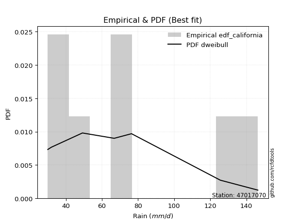</img>

</div>


### 2. EDF Hazen (1930)

Hazen method for plotting positions is a formula used to estimate the empirical cumulative probability distribution of flood events or other hydrological data. This formula often results in biased estimations, particularly when extrapolating to extreme events (high return periods).

<div align="center">


$P=(m-0.5)/n$


</div>


**2.1. Empirical values**

<div align="center">

|                | 0                   | 1                  | 2                  | 3                  | 4         | 5                  |
|:---------------|:--------------------|:-------------------|:-------------------|:-------------------|:----------|:-------------------|
| date           | 2022                | 2023               | 2020               | 2024               | 2021      | 2019               |
| x              | 30.0                | 32.0               | 49.2               | 66.8               | 76.4      | 146.4              |
| m              | 1                   | 2                  | 3                  | 4                  | 5         | 6                  |
| empirical_dist | edf_hazen           | edf_hazen          | edf_hazen          | edf_hazen          | edf_hazen | edf_hazen          |
| empirical      | 0.08333333333333333 | 0.25               | 0.4166666666666667 | 0.5833333333333334 | 0.75      | 0.9166666666666666 |
| empirical_tr   | 1.090909090909091   | 1.3333333333333333 | 1.7142857142857144 | 2.4000000000000004 | 4.0       | 11.999999999999995 |

</div>


**2.2. Kolmogorov-Smirnov fit test (sorted by Δ)**


<div align="center">

|                | 0                   | 1                   | 2                   | 3                   | 4                   | 5                     | 6                   | 7                   | 8                   | 9                   | 10                 | 11                  | 12                  | 13                  | 14                  | 15                  | 16                  | 17                  | 18                  | 19                  | 20                  | 21                  | 22                  | 23                  | 24                  | 25                  | 26                  | 27                  | 28                  | 29                  | 30                  | 31                  | 32                  | 33                  | 34                  | 35                  | 36                  | 37                  | 38                 | 39                  | 40                 | 41                 | 42                  | 43                 | 44                 | 45                 | 46                  | 47                  | 48                  | 49                 | 50                 | 51                 | 52                  | 53                  | 54                  | 55                 | 56                  | 57                  | 58                  | 59                  | 60                  | 61                 | 62                  | 63                  | 64                  | 65                  | 66                  | 67                  | 68             | 69             | 70             | 71                 | 72                  | 73                  | 74                 | 75                 | 76                  | 77                  | 78                 | 79                 | 80                 | 81                 | 82                 | 83                 | 84                | 85                 | 86             | 87             |
|:---------------|:--------------------|:--------------------|:--------------------|:--------------------|:--------------------|:----------------------|:--------------------|:--------------------|:--------------------|:--------------------|:-------------------|:--------------------|:--------------------|:--------------------|:--------------------|:--------------------|:--------------------|:--------------------|:--------------------|:--------------------|:--------------------|:--------------------|:--------------------|:--------------------|:--------------------|:--------------------|:--------------------|:--------------------|:--------------------|:--------------------|:--------------------|:--------------------|:--------------------|:--------------------|:--------------------|:--------------------|:--------------------|:--------------------|:-------------------|:--------------------|:-------------------|:-------------------|:--------------------|:-------------------|:-------------------|:-------------------|:--------------------|:--------------------|:--------------------|:-------------------|:-------------------|:-------------------|:--------------------|:--------------------|:--------------------|:-------------------|:--------------------|:--------------------|:--------------------|:--------------------|:--------------------|:-------------------|:--------------------|:--------------------|:--------------------|:--------------------|:--------------------|:--------------------|:---------------|:---------------|:---------------|:-------------------|:--------------------|:--------------------|:-------------------|:-------------------|:--------------------|:--------------------|:-------------------|:-------------------|:-------------------|:-------------------|:-------------------|:-------------------|:------------------|:-------------------|:---------------|:---------------|
| station        | 47017070            | 47017070            | 47017070            | 47017070            | 47017070            | 47017070              | 47017070            | 47017070            | 47017070            | 47017070            | 47017070           | 47017070            | 47017070            | 47017070            | 47017070            | 47017070            | 47017070            | 47017070            | 47017070            | 47017070            | 47017070            | 47017070            | 47017070            | 47017070            | 47017070            | 47017070            | 47017070            | 47017070            | 47017070            | 47017070            | 47017070            | 47017070            | 47017070            | 47017070            | 47017070            | 47017070            | 47017070            | 47017070            | 47017070           | 47017070            | 47017070           | 47017070           | 47017070            | 47017070           | 47017070           | 47017070           | 47017070            | 47017070            | 47017070            | 47017070           | 47017070           | 47017070           | 47017070            | 47017070            | 47017070            | 47017070           | 47017070            | 47017070            | 47017070            | 47017070            | 47017070            | 47017070           | 47017070            | 47017070            | 47017070            | 47017070            | 47017070            | 47017070            | 47017070       | 47017070       | 47017070       | 47017070           | 47017070            | 47017070            | 47017070           | 47017070           | 47017070            | 47017070            | 47017070           | 47017070           | 47017070           | 47017070           | 47017070           | 47017070           | 47017070          | 47017070           | 47017070       | 47017070       |
| empirical_dist | edf_hazen           | edf_hazen           | edf_hazen           | edf_hazen           | edf_hazen           | edf_hazen             | edf_hazen           | edf_hazen           | edf_hazen           | edf_hazen           | edf_hazen          | edf_hazen           | edf_hazen           | edf_hazen           | edf_hazen           | edf_hazen           | edf_hazen           | edf_hazen           | edf_hazen           | edf_hazen           | edf_hazen           | edf_hazen           | edf_hazen           | edf_hazen           | edf_hazen           | edf_hazen           | edf_hazen           | edf_hazen           | edf_hazen           | edf_hazen           | edf_hazen           | edf_hazen           | edf_hazen           | edf_hazen           | edf_hazen           | edf_hazen           | edf_hazen           | edf_hazen           | edf_hazen          | edf_hazen           | edf_hazen          | edf_hazen          | edf_hazen           | edf_hazen          | edf_hazen          | edf_hazen          | edf_hazen           | edf_hazen           | edf_hazen           | edf_hazen          | edf_hazen          | edf_hazen          | edf_hazen           | edf_hazen           | edf_hazen           | edf_hazen          | edf_hazen           | edf_hazen           | edf_hazen           | edf_hazen           | edf_hazen           | edf_hazen          | edf_hazen           | edf_hazen           | edf_hazen           | edf_hazen           | edf_hazen           | edf_hazen           | edf_hazen      | edf_hazen      | edf_hazen      | edf_hazen          | edf_hazen           | edf_hazen           | edf_hazen          | edf_hazen          | edf_hazen           | edf_hazen           | edf_hazen          | edf_hazen          | edf_hazen          | edf_hazen          | edf_hazen          | edf_hazen          | edf_hazen         | edf_hazen          | edf_hazen      | edf_hazen      |
| p_dist         | halflogistic        | gumbel_r            | pearson3            | moyal               | halfnorm            | loglaplace_asymmetric | logloggamma         | logt                | lognorm             | lognorm             | logcrystalball     | logmaxwell          | genlogistic         | lograyleigh         | weibull_min         | logpearson3         | logbetaprime        | kstwobign           | loggumbel_l         | betaprime           | rayleigh            | t                   | logexponnorm        | lognct              | nct                 | loggenlogistic      | loginvweibull       | logalpha            | loglogistic         | loginvgamma         | logncf              | maxwell             | logkstwobign        | fisk                | loghalfnorm         | hypsecant           | loghypsecant        | logchi2             | nakagami           | rice                | loglaplace         | alpha              | logistic            | loggumbel_r        | logrice            | laplace            | norm                | crystalball         | logexpon            | loginvgauss        | invgamma           | f                  | logmoyal            | loggenexpon         | lognakagami         | loggompertz        | loghalflogistic     | invgauss            | exponnorm           | expon               | genexpon            | laplace_asymmetric | gompertz            | truncnorm           | logweibull_min      | gumbel_l            | wald                | logf                | gibrat         | loggibrat      | logwald        | chi2               | gamma               | erlang              | logfisk            | logjohnsonsu       | loglognorm          | logerlang           | fatiguelife        | ncf                | logfatiguelife     | loggamma           | loggamma           | invweibull         | logtruncnorm      | johnsonsu          | mielke         | logmielke      |
| delta          | 0.07549809263223359 | 0.08681300096946865 | 0.08785263970719615 | 0.09264140052537206 | 0.10209074216185028 | 0.10618340046336822   | 0.10629835174337746 | 0.10823397068005142 | 0.10823456077292609 | 0.10823456077292609 | 0.1082348477354837 | 0.10827017789388871 | 0.10874074972735698 | 0.10928652424957774 | 0.11004416448555654 | 0.11266068319318545 | 0.11524621893494622 | 0.11764822446283874 | 0.11771007068205563 | 0.11814573068665696 | 0.11849342754402814 | 0.11890532511531056 | 0.11942124495786752 | 0.11945271255572235 | 0.12263173429275998 | 0.12362920278238476 | 0.12363353503247879 | 0.12402601098469587 | 0.12491759421553664 | 0.12619847834629164 | 0.12619896082667822 | 0.12684625788618775 | 0.12708189157471916 | 0.12763605437731512 | 0.12964597009347517 | 0.13097657904715054 | 0.13321770841756397 | 0.13541789269046733 | 0.1375858646968237 | 0.13768992255820145 | 0.1402751952256342 | 0.1408224374983405 | 0.14121749621462176 | 0.1415621994707113 | 0.1433809405194288 | 0.1509284675844716 | 0.15369432896254043 | 0.15369433267002175 | 0.15500908179158032 | 0.1552087830829762 | 0.1679161684356208 | 0.1679163005844157 | 0.16877938996711472 | 0.17132593197302054 | 0.17180254266313638 | 0.1792068909832578 | 0.18410311229070123 | 0.18971892618417313 | 0.19618549039387367 | 0.19710262220447555 | 0.19710277390692735 | 0.1971028942652734 | 0.19710456476514562 | 0.19786718446262502 | 0.19827955895274973 | 0.21414286509564961 | 0.24131379511321527 | 0.24848800583879843 | 0.25           | 0.25           | 0.25           | 0.2575465080835649 | 0.26235281035753844 | 0.29027384839880555 | 0.3244409765745301 | 0.3387170229928411 | 0.36219159496509823 | 0.37757445816889207 | 0.3802970841631597 | 0.3908094579958754 | 0.4113189340413242 | 0.4405835077348908 | 0.4405835077348908 | 0.4529855785233895 | 0.583329291302633 | 0.6798399678082861 | nan            | nan            |
| deltao         | 0.530385761606      | 0.530385761606      | 0.530385761606      | 0.530385761606      | 0.530385761606      | 0.530385761606        | 0.530385761606      | 0.530385761606      | 0.530385761606      | 0.530385761606      | 0.530385761606     | 0.530385761606      | 0.530385761606      | 0.530385761606      | 0.530385761606      | 0.530385761606      | 0.530385761606      | 0.530385761606      | 0.530385761606      | 0.530385761606      | 0.530385761606      | 0.530385761606      | 0.530385761606      | 0.530385761606      | 0.530385761606      | 0.530385761606      | 0.530385761606      | 0.530385761606      | 0.530385761606      | 0.530385761606      | 0.530385761606      | 0.530385761606      | 0.530385761606      | 0.530385761606      | 0.530385761606      | 0.530385761606      | 0.530385761606      | 0.530385761606      | 0.530385761606     | 0.530385761606      | 0.530385761606     | 0.530385761606     | 0.530385761606      | 0.530385761606     | 0.530385761606     | 0.530385761606     | 0.530385761606      | 0.530385761606      | 0.530385761606      | 0.530385761606     | 0.530385761606     | 0.530385761606     | 0.530385761606      | 0.530385761606      | 0.530385761606      | 0.530385761606     | 0.530385761606      | 0.530385761606      | 0.530385761606      | 0.530385761606      | 0.530385761606      | 0.530385761606     | 0.530385761606      | 0.530385761606      | 0.530385761606      | 0.530385761606      | 0.530385761606      | 0.530385761606      | 0.530385761606 | 0.530385761606 | 0.530385761606 | 0.530385761606     | 0.530385761606      | 0.530385761606      | 0.530385761606     | 0.530385761606     | 0.530385761606      | 0.530385761606      | 0.530385761606     | 0.530385761606     | 0.530385761606     | 0.530385761606     | 0.530385761606     | 0.530385761606     | 0.530385761606    | 0.530385761606     | 0.530385761606 | 0.530385761606 |
| eval           | Δo > Δ              | Δo > Δ              | Δo > Δ              | Δo > Δ              | Δo > Δ              | Δo > Δ                | Δo > Δ              | Δo > Δ              | Δo > Δ              | Δo > Δ              | Δo > Δ             | Δo > Δ              | Δo > Δ              | Δo > Δ              | Δo > Δ              | Δo > Δ              | Δo > Δ              | Δo > Δ              | Δo > Δ              | Δo > Δ              | Δo > Δ              | Δo > Δ              | Δo > Δ              | Δo > Δ              | Δo > Δ              | Δo > Δ              | Δo > Δ              | Δo > Δ              | Δo > Δ              | Δo > Δ              | Δo > Δ              | Δo > Δ              | Δo > Δ              | Δo > Δ              | Δo > Δ              | Δo > Δ              | Δo > Δ              | Δo > Δ              | Δo > Δ             | Δo > Δ              | Δo > Δ             | Δo > Δ             | Δo > Δ              | Δo > Δ             | Δo > Δ             | Δo > Δ             | Δo > Δ              | Δo > Δ              | Δo > Δ              | Δo > Δ             | Δo > Δ             | Δo > Δ             | Δo > Δ              | Δo > Δ              | Δo > Δ              | Δo > Δ             | Δo > Δ              | Δo > Δ              | Δo > Δ              | Δo > Δ              | Δo > Δ              | Δo > Δ             | Δo > Δ              | Δo > Δ              | Δo > Δ              | Δo > Δ              | Δo > Δ              | Δo > Δ              | Δo > Δ         | Δo > Δ         | Δo > Δ         | Δo > Δ             | Δo > Δ              | Δo > Δ              | Δo > Δ             | Δo > Δ             | Δo > Δ              | Δo > Δ              | Δo > Δ             | Δo > Δ             | Δo > Δ             | Δo > Δ             | Δo > Δ             | Δo > Δ             | Δo <= Δ           | Δo <= Δ            | Δo <= Δ        | Δo <= Δ        |
| fit            | 1                   | 1                   | 1                   | 1                   | 1                   | 1                     | 1                   | 1                   | 1                   | 1                   | 1                  | 1                   | 1                   | 1                   | 1                   | 1                   | 1                   | 1                   | 1                   | 1                   | 1                   | 1                   | 1                   | 1                   | 1                   | 1                   | 1                   | 1                   | 1                   | 1                   | 1                   | 1                   | 1                   | 1                   | 1                   | 1                   | 1                   | 1                   | 1                  | 1                   | 1                  | 1                  | 1                   | 1                  | 1                  | 1                  | 1                   | 1                   | 1                   | 1                  | 1                  | 1                  | 1                   | 1                   | 1                   | 1                  | 1                   | 1                   | 1                   | 1                   | 1                   | 1                  | 1                   | 1                   | 1                   | 1                   | 1                   | 1                   | 1              | 1              | 1              | 1                  | 1                   | 1                   | 1                  | 1                  | 1                   | 1                   | 1                  | 1                  | 1                  | 1                  | 1                  | 1                  | 0                 | 0                  | 0              | 0              |
| n              | 6                   | 6                   | 6                   | 6                   | 6                   | 6                     | 6                   | 6                   | 6                   | 6                   | 6                  | 6                   | 6                   | 6                   | 6                   | 6                   | 6                   | 6                   | 6                   | 6                   | 6                   | 6                   | 6                   | 6                   | 6                   | 6                   | 6                   | 6                   | 6                   | 6                   | 6                   | 6                   | 6                   | 6                   | 6                   | 6                   | 6                   | 6                   | 6                  | 6                   | 6                  | 6                  | 6                   | 6                  | 6                  | 6                  | 6                   | 6                   | 6                   | 6                  | 6                  | 6                  | 6                   | 6                   | 6                   | 6                  | 6                   | 6                   | 6                   | 6                   | 6                   | 6                  | 6                   | 6                   | 6                   | 6                   | 6                   | 6                   | 6              | 6              | 6              | 6                  | 6                   | 6                   | 6                  | 6                  | 6                   | 6                   | 6                  | 6                  | 6                  | 6                  | 6                  | 6                  | 6                 | 6                  | 6              | 6              |
| best_fit       | 1                   | 0                   | 0                   | 0                   | 0                   | 0                     | 0                   | 0                   | 0                   | 0                   | 0                  | 0                   | 0                   | 0                   | 0                   | 0                   | 0                   | 0                   | 0                   | 0                   | 0                   | 0                   | 0                   | 0                   | 0                   | 0                   | 0                   | 0                   | 0                   | 0                   | 0                   | 0                   | 0                   | 0                   | 0                   | 0                   | 0                   | 0                   | 0                  | 0                   | 0                  | 0                  | 0                   | 0                  | 0                  | 0                  | 0                   | 0                   | 0                   | 0                  | 0                  | 0                  | 0                   | 0                   | 0                   | 0                  | 0                   | 0                   | 0                   | 0                   | 0                   | 0                  | 0                   | 0                   | 0                   | 0                   | 0                   | 0                   | 0              | 0              | 0              | 0                  | 0                   | 0                   | 0                  | 0                  | 0                   | 0                   | 0                  | 0                  | 0                  | 0                  | 0                  | 0                  | 0                 | 0                  | 0              | 0              |
| best_fit_sort  | 1                   | 2                   | 3                   | 4                   | 5                   | 6                     | 7                   | 8                   | 9                   | 10                  | 11                 | 12                  | 13                  | 14                  | 15                  | 16                  | 17                  | 18                  | 19                  | 20                  | 21                  | 22                  | 23                  | 24                  | 25                  | 26                  | 27                  | 28                  | 29                  | 30                  | 31                  | 32                  | 33                  | 34                  | 35                  | 36                  | 37                  | 38                  | 39                 | 40                  | 41                 | 42                 | 43                  | 44                 | 45                 | 46                 | 47                  | 48                  | 49                  | 50                 | 51                 | 52                 | 53                  | 54                  | 55                  | 56                 | 57                  | 58                  | 59                  | 60                  | 61                  | 62                 | 63                  | 64                  | 65                  | 66                  | 67                  | 68                  | 69             | 70             | 71             | 72                 | 73                  | 74                  | 75                 | 76                 | 77                  | 78                  | 79                 | 80                 | 81                 | 82                 | 83                 | 84                 | 85                | 86                 | 87             | 88             |

</div>


**2.3. Best fit**

<div align="center">

|   id |   station | empirical_dist   | p_dist       |     delta |   deltao | eval   |   fit |   n |   best_fit |   best_fit_sort |
|-----:|----------:|:-----------------|:-------------|----------:|---------:|:-------|------:|----:|-----------:|----------------:|
|    0 |  47017070 | edf_hazen        | halflogistic | 0.0754981 | 0.530386 | Δo > Δ |     1 |   6 |          1 |               1 |

</div>


<div align="center">

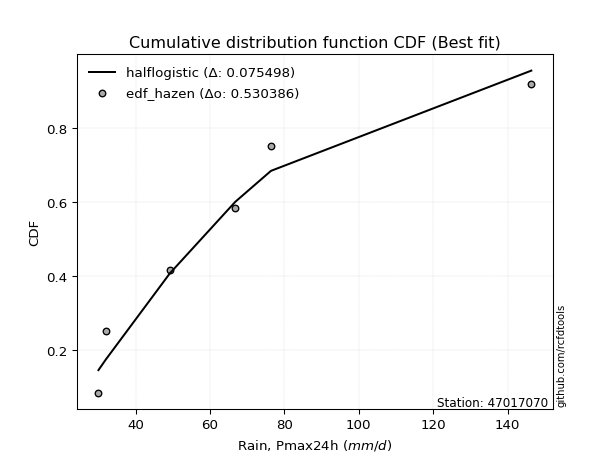</img>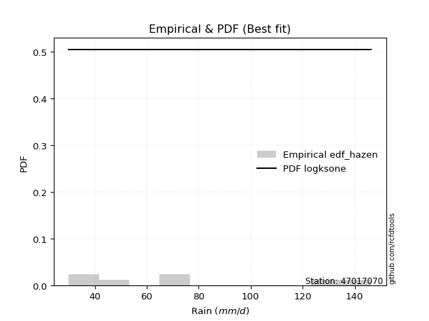</img>

</div>


### 3. EDF Weibull (1939)

Weibull plotting position formula is an empirical method used to estimate the non-exceedance probability or plotting position for a set of observed data, is often recommended or widely used in practice, particularly in flood frequency analysis.

<div align="center">


$P=m/(n+1)$


</div>


**3.1. Empirical values**

<div align="center">

|                | 0                   | 1                  | 2                   | 3                  | 4                  | 5                  |
|:---------------|:--------------------|:-------------------|:--------------------|:-------------------|:-------------------|:-------------------|
| date           | 2022                | 2023               | 2020                | 2024               | 2021               | 2019               |
| x              | 30.0                | 32.0               | 49.2                | 66.8               | 76.4               | 146.4              |
| m              | 1                   | 2                  | 3                   | 4                  | 5                  | 6                  |
| empirical_dist | edf_weibull         | edf_weibull        | edf_weibull         | edf_weibull        | edf_weibull        | edf_weibull        |
| empirical      | 0.14285714285714285 | 0.2857142857142857 | 0.42857142857142855 | 0.5714285714285714 | 0.7142857142857143 | 0.8571428571428571 |
| empirical_tr   | 1.1666666666666665  | 1.4                | 1.75                | 2.333333333333333  | 3.5                | 6.999999999999997  |

</div>


**3.2. Kolmogorov-Smirnov fit test (sorted by Δ)**


<div align="center">

|                | 0                   | 1                   | 2                   | 3                   | 4                   | 5                   | 6                   | 7                   | 8                   | 9                  | 10                  | 11                 | 12                    | 13                  | 14                  | 15                  | 16                  | 17                  | 18                  | 19                 | 20                 | 21                 | 22                 | 23                  | 24                  | 25                 | 26                  | 27                 | 28                  | 29                  | 30                  | 31                  | 32                  | 33                  | 34                  | 35                  | 36                | 37                  | 38                  | 39                  | 40                  | 41                  | 42                  | 43                  | 44                  | 45                  | 46                  | 47                  | 48                  | 49                  | 50                 | 51                | 52                  | 53                 | 54                  | 55                  | 56                  | 57                  | 58                 | 59                  | 60                  | 61                  | 62                  | 63                  | 64                  | 65                  | 66                  | 67                  | 68                  | 69                 | 70                  | 71                 | 72                 | 73                 | 74                 | 75                 | 76                  | 77                 | 78                 | 79                  | 80                  | 81                  | 82                  | 83                  | 84                | 85                 | 86             | 87             |
|:---------------|:--------------------|:--------------------|:--------------------|:--------------------|:--------------------|:--------------------|:--------------------|:--------------------|:--------------------|:-------------------|:--------------------|:-------------------|:----------------------|:--------------------|:--------------------|:--------------------|:--------------------|:--------------------|:--------------------|:-------------------|:-------------------|:-------------------|:-------------------|:--------------------|:--------------------|:-------------------|:--------------------|:-------------------|:--------------------|:--------------------|:--------------------|:--------------------|:--------------------|:--------------------|:--------------------|:--------------------|:------------------|:--------------------|:--------------------|:--------------------|:--------------------|:--------------------|:--------------------|:--------------------|:--------------------|:--------------------|:--------------------|:--------------------|:--------------------|:--------------------|:-------------------|:------------------|:--------------------|:-------------------|:--------------------|:--------------------|:--------------------|:--------------------|:-------------------|:--------------------|:--------------------|:--------------------|:--------------------|:--------------------|:--------------------|:--------------------|:--------------------|:--------------------|:--------------------|:-------------------|:--------------------|:-------------------|:-------------------|:-------------------|:-------------------|:-------------------|:--------------------|:-------------------|:-------------------|:--------------------|:--------------------|:--------------------|:--------------------|:--------------------|:------------------|:-------------------|:---------------|:---------------|
| station        | 47017070            | 47017070            | 47017070            | 47017070            | 47017070            | 47017070            | 47017070            | 47017070            | 47017070            | 47017070           | 47017070            | 47017070           | 47017070              | 47017070            | 47017070            | 47017070            | 47017070            | 47017070            | 47017070            | 47017070           | 47017070           | 47017070           | 47017070           | 47017070            | 47017070            | 47017070           | 47017070            | 47017070           | 47017070            | 47017070            | 47017070            | 47017070            | 47017070            | 47017070            | 47017070            | 47017070            | 47017070          | 47017070            | 47017070            | 47017070            | 47017070            | 47017070            | 47017070            | 47017070            | 47017070            | 47017070            | 47017070            | 47017070            | 47017070            | 47017070            | 47017070           | 47017070          | 47017070            | 47017070           | 47017070            | 47017070            | 47017070            | 47017070            | 47017070           | 47017070            | 47017070            | 47017070            | 47017070            | 47017070            | 47017070            | 47017070            | 47017070            | 47017070            | 47017070            | 47017070           | 47017070            | 47017070           | 47017070           | 47017070           | 47017070           | 47017070           | 47017070            | 47017070           | 47017070           | 47017070            | 47017070            | 47017070            | 47017070            | 47017070            | 47017070          | 47017070           | 47017070       | 47017070       |
| empirical_dist | edf_weibull         | edf_weibull         | edf_weibull         | edf_weibull         | edf_weibull         | edf_weibull         | edf_weibull         | edf_weibull         | edf_weibull         | edf_weibull        | edf_weibull         | edf_weibull        | edf_weibull           | edf_weibull         | edf_weibull         | edf_weibull         | edf_weibull         | edf_weibull         | edf_weibull         | edf_weibull        | edf_weibull        | edf_weibull        | edf_weibull        | edf_weibull         | edf_weibull         | edf_weibull        | edf_weibull         | edf_weibull        | edf_weibull         | edf_weibull         | edf_weibull         | edf_weibull         | edf_weibull         | edf_weibull         | edf_weibull         | edf_weibull         | edf_weibull       | edf_weibull         | edf_weibull         | edf_weibull         | edf_weibull         | edf_weibull         | edf_weibull         | edf_weibull         | edf_weibull         | edf_weibull         | edf_weibull         | edf_weibull         | edf_weibull         | edf_weibull         | edf_weibull        | edf_weibull       | edf_weibull         | edf_weibull        | edf_weibull         | edf_weibull         | edf_weibull         | edf_weibull         | edf_weibull        | edf_weibull         | edf_weibull         | edf_weibull         | edf_weibull         | edf_weibull         | edf_weibull         | edf_weibull         | edf_weibull         | edf_weibull         | edf_weibull         | edf_weibull        | edf_weibull         | edf_weibull        | edf_weibull        | edf_weibull        | edf_weibull        | edf_weibull        | edf_weibull         | edf_weibull        | edf_weibull        | edf_weibull         | edf_weibull         | edf_weibull         | edf_weibull         | edf_weibull         | edf_weibull       | edf_weibull        | edf_weibull    | edf_weibull    |
| p_dist         | halfnorm            | pearson3            | rayleigh            | maxwell             | gumbel_r            | halflogistic        | t                   | logistic            | crystalball         | norm               | moyal               | hypsecant          | loglaplace_asymmetric | logloggamma         | nakagami            | logweibull_min      | logchi2             | weibull_min         | logt                | lognorm            | lognorm            | logcrystalball     | logmaxwell         | genlogistic         | lograyleigh         | alpha              | logpearson3         | logbetaprime       | kstwobign           | loggumbel_l         | betaprime           | logexponnorm        | lognct              | invgamma            | f                   | nct                 | loginvgauss       | loggenlogistic      | loginvweibull       | logalpha            | lognakagami         | loglogistic         | rice                | loginvgamma         | logncf              | logkstwobign        | laplace             | fisk                | loghalfnorm         | loghypsecant        | loglaplace         | loggumbel_r       | gumbel_l            | logrice            | invgauss            | logexpon            | logmoyal            | loggenexpon         | loggompertz        | loghalflogistic     | exponnorm           | expon               | genexpon            | laplace_asymmetric  | gompertz            | truncnorm           | logf                | chi2                | logfisk             | gamma              | wald                | logwald            | gibrat             | loggibrat          | erlang             | logjohnsonsu       | loglognorm          | ncf                | logerlang          | fatiguelife         | invweibull          | logfatiguelife      | loggamma            | loggamma            | logtruncnorm      | johnsonsu          | mielke         | logmielke      |
| delta          | 0.09910436815705359 | 0.10112306532552129 | 0.10678225457871904 | 0.10996925476941544 | 0.11091616564374696 | 0.11121237834651929 | 0.11973636378270591 | 0.12082906529645632 | 0.12124192963445801 | 0.1212419314479517 | 0.12835568623965776 | 0.1356734905127414 | 0.14189768617765391   | 0.14201263745766315 | 0.14285181975780345 | 0.14285697774374298 | 0.14285713981492013 | 0.14285714198006144 | 0.14394825639433712 | 0.1439488464872118 | 0.1439488464872118 | 0.1439491334497694 | 0.1439844636081744 | 0.14445503544164268 | 0.14500080996386344 | 0.1465754045467422 | 0.14837496890747115 | 0.1509605046492319 | 0.15336251017712443 | 0.15342435639634133 | 0.15386001640094266 | 0.15513553067215322 | 0.15516699827000804 | 0.15601140653085893 | 0.15601153867965384 | 0.15834602000704567 | 0.159001930335121 | 0.15934348849667046 | 0.15934782074676448 | 0.15974029669898157 | 0.15989778075837452 | 0.16063187992982234 | 0.16108300109370066 | 0.16191276406057734 | 0.16191324654096392 | 0.16279617728900486 | 0.16283322948923346 | 0.16335034009160082 | 0.16536025580776087 | 0.16893199413184967 | 0.1759894809399199 | 0.177276485184997 | 0.17842857938136392 | 0.1790952262337145 | 0.17964087119256467 | 0.19072336750586602 | 0.20449367568140042 | 0.20704021768730624 | 0.2149211766975435 | 0.21981739800498692 | 0.23189977610815937 | 0.23281690791876125 | 0.23281705962121305 | 0.23281717997955909 | 0.23281885047943132 | 0.23358147017691072 | 0.23658324393403657 | 0.24564174617880302 | 0.26491716705072055 | 0.2742575722623004 | 0.27702808082750097 | 0.2857142857142857 | 0.2857142857142857 | 0.2857142857142857 | 0.3021786103035675 | 0.3030027372785554 | 0.32647730925081253 | 0.3312856484720659 | 0.3656696962641302 | 0.36839232225839785 | 0.39346176899957996 | 0.39941417213656233 | 0.42867874583012894 | 0.42867874583012894 | 0.571424529397871 | 0.6441256820940005 | nan            | nan            |
| deltao         | 0.530385761606      | 0.530385761606      | 0.530385761606      | 0.530385761606      | 0.530385761606      | 0.530385761606      | 0.530385761606      | 0.530385761606      | 0.530385761606      | 0.530385761606     | 0.530385761606      | 0.530385761606     | 0.530385761606        | 0.530385761606      | 0.530385761606      | 0.530385761606      | 0.530385761606      | 0.530385761606      | 0.530385761606      | 0.530385761606     | 0.530385761606     | 0.530385761606     | 0.530385761606     | 0.530385761606      | 0.530385761606      | 0.530385761606     | 0.530385761606      | 0.530385761606     | 0.530385761606      | 0.530385761606      | 0.530385761606      | 0.530385761606      | 0.530385761606      | 0.530385761606      | 0.530385761606      | 0.530385761606      | 0.530385761606    | 0.530385761606      | 0.530385761606      | 0.530385761606      | 0.530385761606      | 0.530385761606      | 0.530385761606      | 0.530385761606      | 0.530385761606      | 0.530385761606      | 0.530385761606      | 0.530385761606      | 0.530385761606      | 0.530385761606      | 0.530385761606     | 0.530385761606    | 0.530385761606      | 0.530385761606     | 0.530385761606      | 0.530385761606      | 0.530385761606      | 0.530385761606      | 0.530385761606     | 0.530385761606      | 0.530385761606      | 0.530385761606      | 0.530385761606      | 0.530385761606      | 0.530385761606      | 0.530385761606      | 0.530385761606      | 0.530385761606      | 0.530385761606      | 0.530385761606     | 0.530385761606      | 0.530385761606     | 0.530385761606     | 0.530385761606     | 0.530385761606     | 0.530385761606     | 0.530385761606      | 0.530385761606     | 0.530385761606     | 0.530385761606      | 0.530385761606      | 0.530385761606      | 0.530385761606      | 0.530385761606      | 0.530385761606    | 0.530385761606     | 0.530385761606 | 0.530385761606 |
| eval           | Δo > Δ              | Δo > Δ              | Δo > Δ              | Δo > Δ              | Δo > Δ              | Δo > Δ              | Δo > Δ              | Δo > Δ              | Δo > Δ              | Δo > Δ             | Δo > Δ              | Δo > Δ             | Δo > Δ                | Δo > Δ              | Δo > Δ              | Δo > Δ              | Δo > Δ              | Δo > Δ              | Δo > Δ              | Δo > Δ             | Δo > Δ             | Δo > Δ             | Δo > Δ             | Δo > Δ              | Δo > Δ              | Δo > Δ             | Δo > Δ              | Δo > Δ             | Δo > Δ              | Δo > Δ              | Δo > Δ              | Δo > Δ              | Δo > Δ              | Δo > Δ              | Δo > Δ              | Δo > Δ              | Δo > Δ            | Δo > Δ              | Δo > Δ              | Δo > Δ              | Δo > Δ              | Δo > Δ              | Δo > Δ              | Δo > Δ              | Δo > Δ              | Δo > Δ              | Δo > Δ              | Δo > Δ              | Δo > Δ              | Δo > Δ              | Δo > Δ             | Δo > Δ            | Δo > Δ              | Δo > Δ             | Δo > Δ              | Δo > Δ              | Δo > Δ              | Δo > Δ              | Δo > Δ             | Δo > Δ              | Δo > Δ              | Δo > Δ              | Δo > Δ              | Δo > Δ              | Δo > Δ              | Δo > Δ              | Δo > Δ              | Δo > Δ              | Δo > Δ              | Δo > Δ             | Δo > Δ              | Δo > Δ             | Δo > Δ             | Δo > Δ             | Δo > Δ             | Δo > Δ             | Δo > Δ              | Δo > Δ             | Δo > Δ             | Δo > Δ              | Δo > Δ              | Δo > Δ              | Δo > Δ              | Δo > Δ              | Δo <= Δ           | Δo <= Δ            | Δo <= Δ        | Δo <= Δ        |
| fit            | 1                   | 1                   | 1                   | 1                   | 1                   | 1                   | 1                   | 1                   | 1                   | 1                  | 1                   | 1                  | 1                     | 1                   | 1                   | 1                   | 1                   | 1                   | 1                   | 1                  | 1                  | 1                  | 1                  | 1                   | 1                   | 1                  | 1                   | 1                  | 1                   | 1                   | 1                   | 1                   | 1                   | 1                   | 1                   | 1                   | 1                 | 1                   | 1                   | 1                   | 1                   | 1                   | 1                   | 1                   | 1                   | 1                   | 1                   | 1                   | 1                   | 1                   | 1                  | 1                 | 1                   | 1                  | 1                   | 1                   | 1                   | 1                   | 1                  | 1                   | 1                   | 1                   | 1                   | 1                   | 1                   | 1                   | 1                   | 1                   | 1                   | 1                  | 1                   | 1                  | 1                  | 1                  | 1                  | 1                  | 1                   | 1                  | 1                  | 1                   | 1                   | 1                   | 1                   | 1                   | 0                 | 0                  | 0              | 0              |
| n              | 6                   | 6                   | 6                   | 6                   | 6                   | 6                   | 6                   | 6                   | 6                   | 6                  | 6                   | 6                  | 6                     | 6                   | 6                   | 6                   | 6                   | 6                   | 6                   | 6                  | 6                  | 6                  | 6                  | 6                   | 6                   | 6                  | 6                   | 6                  | 6                   | 6                   | 6                   | 6                   | 6                   | 6                   | 6                   | 6                   | 6                 | 6                   | 6                   | 6                   | 6                   | 6                   | 6                   | 6                   | 6                   | 6                   | 6                   | 6                   | 6                   | 6                   | 6                  | 6                 | 6                   | 6                  | 6                   | 6                   | 6                   | 6                   | 6                  | 6                   | 6                   | 6                   | 6                   | 6                   | 6                   | 6                   | 6                   | 6                   | 6                   | 6                  | 6                   | 6                  | 6                  | 6                  | 6                  | 6                  | 6                   | 6                  | 6                  | 6                   | 6                   | 6                   | 6                   | 6                   | 6                 | 6                  | 6              | 6              |
| best_fit       | 1                   | 0                   | 0                   | 0                   | 0                   | 0                   | 0                   | 0                   | 0                   | 0                  | 0                   | 0                  | 0                     | 0                   | 0                   | 0                   | 0                   | 0                   | 0                   | 0                  | 0                  | 0                  | 0                  | 0                   | 0                   | 0                  | 0                   | 0                  | 0                   | 0                   | 0                   | 0                   | 0                   | 0                   | 0                   | 0                   | 0                 | 0                   | 0                   | 0                   | 0                   | 0                   | 0                   | 0                   | 0                   | 0                   | 0                   | 0                   | 0                   | 0                   | 0                  | 0                 | 0                   | 0                  | 0                   | 0                   | 0                   | 0                   | 0                  | 0                   | 0                   | 0                   | 0                   | 0                   | 0                   | 0                   | 0                   | 0                   | 0                   | 0                  | 0                   | 0                  | 0                  | 0                  | 0                  | 0                  | 0                   | 0                  | 0                  | 0                   | 0                   | 0                   | 0                   | 0                   | 0                 | 0                  | 0              | 0              |
| best_fit_sort  | 1                   | 2                   | 3                   | 4                   | 5                   | 6                   | 7                   | 8                   | 9                   | 10                 | 11                  | 12                 | 13                    | 14                  | 15                  | 16                  | 17                  | 18                  | 19                  | 20                 | 21                 | 22                 | 23                 | 24                  | 25                  | 26                 | 27                  | 28                 | 29                  | 30                  | 31                  | 32                  | 33                  | 34                  | 35                  | 36                  | 37                | 38                  | 39                  | 40                  | 41                  | 42                  | 43                  | 44                  | 45                  | 46                  | 47                  | 48                  | 49                  | 50                  | 51                 | 52                | 53                  | 54                 | 55                  | 56                  | 57                  | 58                  | 59                 | 60                  | 61                  | 62                  | 63                  | 64                  | 65                  | 66                  | 67                  | 68                  | 69                  | 70                 | 71                  | 72                 | 73                 | 74                 | 75                 | 76                 | 77                  | 78                 | 79                 | 80                  | 81                  | 82                  | 83                  | 84                  | 85                | 86                 | 87             | 88             |

</div>


**3.3. Best fit**

<div align="center">

|   id |   station | empirical_dist   | p_dist   |     delta |   deltao | eval   |   fit |   n |   best_fit |   best_fit_sort |
|-----:|----------:|:-----------------|:---------|----------:|---------:|:-------|------:|----:|-----------:|----------------:|
|    0 |  47017070 | edf_weibull      | halfnorm | 0.0991044 | 0.530386 | Δo > Δ |     1 |   6 |          1 |               1 |

</div>


<div align="center">

</img>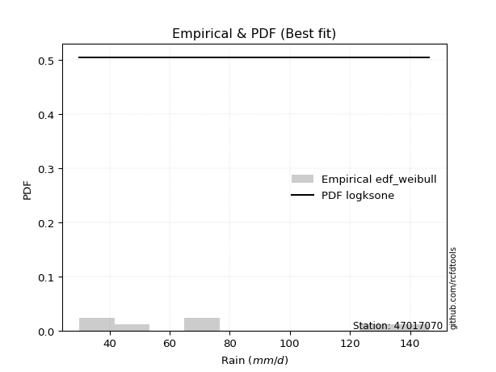</img>

</div>


### 4. EDF Beard (1943)

The Beard formula (or Beard´s plotting position formula) in hydrology is used to estimate the empirical non-exceedance probability _(P)_ of a flood event (or other extreme hydrological data point) within a given dataset.

<div align="center">


$P=(m-0.31)/(n+0.38)$


</div>


**4.1. Empirical values**

<div align="center">

|                | 0                   | 1                   | 2                  | 3                  | 4                  | 5                  |
|:---------------|:--------------------|:--------------------|:-------------------|:-------------------|:-------------------|:-------------------|
| date           | 2022                | 2023                | 2020               | 2024               | 2021               | 2019               |
| x              | 30.0                | 32.0                | 49.2               | 66.8               | 76.4               | 146.4              |
| m              | 1                   | 2                   | 3                  | 4                  | 5                  | 6                  |
| empirical_dist | edf_beard           | edf_beard           | edf_beard          | edf_beard          | edf_beard          | edf_beard          |
| empirical      | 0.10815047021943573 | 0.26489028213166144 | 0.4216300940438871 | 0.5783699059561128 | 0.7351097178683387 | 0.8918495297805643 |
| empirical_tr   | 1.1212653778558874  | 1.3603411513859276  | 1.7289972899728996 | 2.3717472118959106 | 3.7751479289940844 | 9.246376811594207  |

</div>


**4.2. Kolmogorov-Smirnov fit test (sorted by Δ)**


<div align="center">

|                | 0                   | 1                   | 2                  | 3                   | 4                   | 5                   | 6                  | 7                   | 8                   | 9                   | 10                    | 11                  | 12                  | 13                  | 14                  | 15                  | 16                  | 17                  | 18                  | 19                  | 20                 | 21              | 22                  | 23                  | 24                  | 25                  | 26                 | 27                  | 28                  | 29                 | 30                 | 31                 | 32                  | 33                 | 34                  | 35                 | 36                  | 37                 | 38                  | 39                  | 40                 | 41                  | 42                 | 43                 | 44                  | 45                  | 46                  | 47                  | 48                  | 49                  | 50                  | 51                  | 52                  | 53                  | 54                  | 55                 | 56                  | 57                  | 58                  | 59                 | 60                 | 61                | 62                  | 63                  | 64                  | 65                  | 66                | 67                  | 68                 | 69                  | 70                  | 71                  | 72                | 73                 | 74                  | 75                 | 76                 | 77                | 78                 | 79                 | 80                  | 81                 | 82                  | 83                  | 84                 | 85                 | 86             | 87             |
|:---------------|:--------------------|:--------------------|:-------------------|:--------------------|:--------------------|:--------------------|:-------------------|:--------------------|:--------------------|:--------------------|:----------------------|:--------------------|:--------------------|:--------------------|:--------------------|:--------------------|:--------------------|:--------------------|:--------------------|:--------------------|:-------------------|:----------------|:--------------------|:--------------------|:--------------------|:--------------------|:-------------------|:--------------------|:--------------------|:-------------------|:-------------------|:-------------------|:--------------------|:-------------------|:--------------------|:-------------------|:--------------------|:-------------------|:--------------------|:--------------------|:-------------------|:--------------------|:-------------------|:-------------------|:--------------------|:--------------------|:--------------------|:--------------------|:--------------------|:--------------------|:--------------------|:--------------------|:--------------------|:--------------------|:--------------------|:-------------------|:--------------------|:--------------------|:--------------------|:-------------------|:-------------------|:------------------|:--------------------|:--------------------|:--------------------|:--------------------|:------------------|:--------------------|:-------------------|:--------------------|:--------------------|:--------------------|:------------------|:-------------------|:--------------------|:-------------------|:-------------------|:------------------|:-------------------|:-------------------|:--------------------|:-------------------|:--------------------|:--------------------|:-------------------|:-------------------|:---------------|:---------------|
| station        | 47017070            | 47017070            | 47017070           | 47017070            | 47017070            | 47017070            | 47017070           | 47017070            | 47017070            | 47017070            | 47017070              | 47017070            | 47017070            | 47017070            | 47017070            | 47017070            | 47017070            | 47017070            | 47017070            | 47017070            | 47017070           | 47017070        | 47017070            | 47017070            | 47017070            | 47017070            | 47017070           | 47017070            | 47017070            | 47017070           | 47017070           | 47017070           | 47017070            | 47017070           | 47017070            | 47017070           | 47017070            | 47017070           | 47017070            | 47017070            | 47017070           | 47017070            | 47017070           | 47017070           | 47017070            | 47017070            | 47017070            | 47017070            | 47017070            | 47017070            | 47017070            | 47017070            | 47017070            | 47017070            | 47017070            | 47017070           | 47017070            | 47017070            | 47017070            | 47017070           | 47017070           | 47017070          | 47017070            | 47017070            | 47017070            | 47017070            | 47017070          | 47017070            | 47017070           | 47017070            | 47017070            | 47017070            | 47017070          | 47017070           | 47017070            | 47017070           | 47017070           | 47017070          | 47017070           | 47017070           | 47017070            | 47017070           | 47017070            | 47017070            | 47017070           | 47017070           | 47017070       | 47017070       |
| empirical_dist | edf_beard           | edf_beard           | edf_beard          | edf_beard           | edf_beard           | edf_beard           | edf_beard          | edf_beard           | edf_beard           | edf_beard           | edf_beard             | edf_beard           | edf_beard           | edf_beard           | edf_beard           | edf_beard           | edf_beard           | edf_beard           | edf_beard           | edf_beard           | edf_beard          | edf_beard       | edf_beard           | edf_beard           | edf_beard           | edf_beard           | edf_beard          | edf_beard           | edf_beard           | edf_beard          | edf_beard          | edf_beard          | edf_beard           | edf_beard          | edf_beard           | edf_beard          | edf_beard           | edf_beard          | edf_beard           | edf_beard           | edf_beard          | edf_beard           | edf_beard          | edf_beard          | edf_beard           | edf_beard           | edf_beard           | edf_beard           | edf_beard           | edf_beard           | edf_beard           | edf_beard           | edf_beard           | edf_beard           | edf_beard           | edf_beard          | edf_beard           | edf_beard           | edf_beard           | edf_beard          | edf_beard          | edf_beard         | edf_beard           | edf_beard           | edf_beard           | edf_beard           | edf_beard         | edf_beard           | edf_beard          | edf_beard           | edf_beard           | edf_beard           | edf_beard         | edf_beard          | edf_beard           | edf_beard          | edf_beard          | edf_beard         | edf_beard          | edf_beard          | edf_beard           | edf_beard          | edf_beard           | edf_beard           | edf_beard          | edf_beard          | edf_beard      | edf_beard      |
| p_dist         | halfnorm            | pearson3            | gumbel_r           | halflogistic        | t                   | rayleigh            | moyal              | weibull_min         | logchi2             | maxwell             | loglaplace_asymmetric | logloggamma         | logt                | lognorm             | lognorm             | logcrystalball      | logmaxwell          | genlogistic         | lograyleigh         | logistic            | logpearson3        | hypsecant       | logbetaprime        | kstwobign           | loggumbel_l         | nakagami            | betaprime          | logexponnorm        | lognct              | nct                | alpha              | loggenlogistic     | loginvweibull       | norm               | crystalball         | logalpha           | loglogistic         | rice               | loginvgamma         | logncf              | logkstwobign       | fisk                | loghalfnorm        | loghypsecant       | loginvgauss         | loglaplace          | laplace             | loggumbel_r         | logrice             | invgamma            | f                   | lognakagami         | logexpon            | logweibull_min      | logmoyal            | invgauss           | loggenexpon         | loggompertz         | loghalflogistic     | gumbel_l           | exponnorm          | expon             | genexpon            | laplace_asymmetric  | gompertz            | truncnorm           | logf              | chi2                | wald               | loggibrat           | logwald             | gibrat              | gamma             | erlang             | logfisk             | logjohnsonsu       | loglognorm         | ncf               | logerlang          | fatiguelife        | logfatiguelife      | invweibull         | loggamma            | loggamma            | logtruncnorm       | johnsonsu          | mielke         | logmielke      |
| delta          | 0.07984649658329412 | 0.08029906174289703 | 0.0900921620611227 | 0.09038837476389502 | 0.09408818822920816 | 0.10360314541236681 | 0.1075316826570335 | 0.10815046934235432 | 0.11060075580436501 | 0.11195597575452643 | 0.12107368259502965   | 0.12118863387503889 | 0.12312425281171285 | 0.12312484290458753 | 0.12312484290458753 | 0.12312512986714513 | 0.12316046002555014 | 0.12363103185901841 | 0.12417680638123918 | 0.12632721408296044 | 0.1275509653248469 | 0.1287321559852 | 0.13013650106660765 | 0.13253850659450017 | 0.13260035281371707 | 0.13262243731960327 | 0.1330360128183184 | 0.13431152708952895 | 0.13434299468738378 | 0.1375220164244214 | 0.1384901723739922 | 0.1385194849140462 | 0.13852381716414022 | 0.1388040468308791 | 0.13880405053836042 | 0.1389162931163573 | 0.13980787634719807 | 0.1402589975110764 | 0.14108876047795307 | 0.14108924295833966 | 0.1419721737063806 | 0.14252633650897656 | 0.1445362522251366 | 0.1481079905492254 | 0.15206059580757958 | 0.15516547735729563 | 0.15589189496169203 | 0.15645248160237274 | 0.15827122265109023 | 0.16295274105840035 | 0.16295287320719526 | 0.16683911528591594 | 0.16989936392324176 | 0.17346242206664741 | 0.18366967209877616 | 0.1847554988069527 | 0.18621621410468198 | 0.19409717311491922 | 0.19899339442236266 | 0.1992525829639883 | 0.2110757725255351 | 0.211992904336137 | 0.21199305603858878 | 0.21199317639693482 | 0.21199484689680706 | 0.21275746659428646 | 0.243524578461578 | 0.25258308070634444 | 0.2562040772448767 | 0.26489028213166144 | 0.26489028213166144 | 0.26489028213166144 | 0.267316237734759 | 0.2952372757760261 | 0.29962383968842776 | 0.3238267408611797 | 0.3473013128334368 | 0.365992321109773 | 0.3726110307916716 | 0.3753336567859393 | 0.40635550666410375 | 0.4281684416372872 | 0.43562008035767036 | 0.43562008035767036 | 0.5783658639254124 | 0.6649496856766247 | nan            | nan            |
| deltao         | 0.530385761606      | 0.530385761606      | 0.530385761606     | 0.530385761606      | 0.530385761606      | 0.530385761606      | 0.530385761606     | 0.530385761606      | 0.530385761606      | 0.530385761606      | 0.530385761606        | 0.530385761606      | 0.530385761606      | 0.530385761606      | 0.530385761606      | 0.530385761606      | 0.530385761606      | 0.530385761606      | 0.530385761606      | 0.530385761606      | 0.530385761606     | 0.530385761606  | 0.530385761606      | 0.530385761606      | 0.530385761606      | 0.530385761606      | 0.530385761606     | 0.530385761606      | 0.530385761606      | 0.530385761606     | 0.530385761606     | 0.530385761606     | 0.530385761606      | 0.530385761606     | 0.530385761606      | 0.530385761606     | 0.530385761606      | 0.530385761606     | 0.530385761606      | 0.530385761606      | 0.530385761606     | 0.530385761606      | 0.530385761606     | 0.530385761606     | 0.530385761606      | 0.530385761606      | 0.530385761606      | 0.530385761606      | 0.530385761606      | 0.530385761606      | 0.530385761606      | 0.530385761606      | 0.530385761606      | 0.530385761606      | 0.530385761606      | 0.530385761606     | 0.530385761606      | 0.530385761606      | 0.530385761606      | 0.530385761606     | 0.530385761606     | 0.530385761606    | 0.530385761606      | 0.530385761606      | 0.530385761606      | 0.530385761606      | 0.530385761606    | 0.530385761606      | 0.530385761606     | 0.530385761606      | 0.530385761606      | 0.530385761606      | 0.530385761606    | 0.530385761606     | 0.530385761606      | 0.530385761606     | 0.530385761606     | 0.530385761606    | 0.530385761606     | 0.530385761606     | 0.530385761606      | 0.530385761606     | 0.530385761606      | 0.530385761606      | 0.530385761606     | 0.530385761606     | 0.530385761606 | 0.530385761606 |
| eval           | Δo > Δ              | Δo > Δ              | Δo > Δ             | Δo > Δ              | Δo > Δ              | Δo > Δ              | Δo > Δ             | Δo > Δ              | Δo > Δ              | Δo > Δ              | Δo > Δ                | Δo > Δ              | Δo > Δ              | Δo > Δ              | Δo > Δ              | Δo > Δ              | Δo > Δ              | Δo > Δ              | Δo > Δ              | Δo > Δ              | Δo > Δ             | Δo > Δ          | Δo > Δ              | Δo > Δ              | Δo > Δ              | Δo > Δ              | Δo > Δ             | Δo > Δ              | Δo > Δ              | Δo > Δ             | Δo > Δ             | Δo > Δ             | Δo > Δ              | Δo > Δ             | Δo > Δ              | Δo > Δ             | Δo > Δ              | Δo > Δ             | Δo > Δ              | Δo > Δ              | Δo > Δ             | Δo > Δ              | Δo > Δ             | Δo > Δ             | Δo > Δ              | Δo > Δ              | Δo > Δ              | Δo > Δ              | Δo > Δ              | Δo > Δ              | Δo > Δ              | Δo > Δ              | Δo > Δ              | Δo > Δ              | Δo > Δ              | Δo > Δ             | Δo > Δ              | Δo > Δ              | Δo > Δ              | Δo > Δ             | Δo > Δ             | Δo > Δ            | Δo > Δ              | Δo > Δ              | Δo > Δ              | Δo > Δ              | Δo > Δ            | Δo > Δ              | Δo > Δ             | Δo > Δ              | Δo > Δ              | Δo > Δ              | Δo > Δ            | Δo > Δ             | Δo > Δ              | Δo > Δ             | Δo > Δ             | Δo > Δ            | Δo > Δ             | Δo > Δ             | Δo > Δ              | Δo > Δ             | Δo > Δ              | Δo > Δ              | Δo <= Δ            | Δo <= Δ            | Δo <= Δ        | Δo <= Δ        |
| fit            | 1                   | 1                   | 1                  | 1                   | 1                   | 1                   | 1                  | 1                   | 1                   | 1                   | 1                     | 1                   | 1                   | 1                   | 1                   | 1                   | 1                   | 1                   | 1                   | 1                   | 1                  | 1               | 1                   | 1                   | 1                   | 1                   | 1                  | 1                   | 1                   | 1                  | 1                  | 1                  | 1                   | 1                  | 1                   | 1                  | 1                   | 1                  | 1                   | 1                   | 1                  | 1                   | 1                  | 1                  | 1                   | 1                   | 1                   | 1                   | 1                   | 1                   | 1                   | 1                   | 1                   | 1                   | 1                   | 1                  | 1                   | 1                   | 1                   | 1                  | 1                  | 1                 | 1                   | 1                   | 1                   | 1                   | 1                 | 1                   | 1                  | 1                   | 1                   | 1                   | 1                 | 1                  | 1                   | 1                  | 1                  | 1                 | 1                  | 1                  | 1                   | 1                  | 1                   | 1                   | 0                  | 0                  | 0              | 0              |
| n              | 6                   | 6                   | 6                  | 6                   | 6                   | 6                   | 6                  | 6                   | 6                   | 6                   | 6                     | 6                   | 6                   | 6                   | 6                   | 6                   | 6                   | 6                   | 6                   | 6                   | 6                  | 6               | 6                   | 6                   | 6                   | 6                   | 6                  | 6                   | 6                   | 6                  | 6                  | 6                  | 6                   | 6                  | 6                   | 6                  | 6                   | 6                  | 6                   | 6                   | 6                  | 6                   | 6                  | 6                  | 6                   | 6                   | 6                   | 6                   | 6                   | 6                   | 6                   | 6                   | 6                   | 6                   | 6                   | 6                  | 6                   | 6                   | 6                   | 6                  | 6                  | 6                 | 6                   | 6                   | 6                   | 6                   | 6                 | 6                   | 6                  | 6                   | 6                   | 6                   | 6                 | 6                  | 6                   | 6                  | 6                  | 6                 | 6                  | 6                  | 6                   | 6                  | 6                   | 6                   | 6                  | 6                  | 6              | 6              |
| best_fit       | 1                   | 0                   | 0                  | 0                   | 0                   | 0                   | 0                  | 0                   | 0                   | 0                   | 0                     | 0                   | 0                   | 0                   | 0                   | 0                   | 0                   | 0                   | 0                   | 0                   | 0                  | 0               | 0                   | 0                   | 0                   | 0                   | 0                  | 0                   | 0                   | 0                  | 0                  | 0                  | 0                   | 0                  | 0                   | 0                  | 0                   | 0                  | 0                   | 0                   | 0                  | 0                   | 0                  | 0                  | 0                   | 0                   | 0                   | 0                   | 0                   | 0                   | 0                   | 0                   | 0                   | 0                   | 0                   | 0                  | 0                   | 0                   | 0                   | 0                  | 0                  | 0                 | 0                   | 0                   | 0                   | 0                   | 0                 | 0                   | 0                  | 0                   | 0                   | 0                   | 0                 | 0                  | 0                   | 0                  | 0                  | 0                 | 0                  | 0                  | 0                   | 0                  | 0                   | 0                   | 0                  | 0                  | 0              | 0              |
| best_fit_sort  | 1                   | 2                   | 3                  | 4                   | 5                   | 6                   | 7                  | 8                   | 9                   | 10                  | 11                    | 12                  | 13                  | 14                  | 15                  | 16                  | 17                  | 18                  | 19                  | 20                  | 21                 | 22              | 23                  | 24                  | 25                  | 26                  | 27                 | 28                  | 29                  | 30                 | 31                 | 32                 | 33                  | 34                 | 35                  | 36                 | 37                  | 38                 | 39                  | 40                  | 41                 | 42                  | 43                 | 44                 | 45                  | 46                  | 47                  | 48                  | 49                  | 50                  | 51                  | 52                  | 53                  | 54                  | 55                  | 56                 | 57                  | 58                  | 59                  | 60                 | 61                 | 62                | 63                  | 64                  | 65                  | 66                  | 67                | 68                  | 69                 | 70                  | 71                  | 72                  | 73                | 74                 | 75                  | 76                 | 77                 | 78                | 79                 | 80                 | 81                  | 82                 | 83                  | 84                  | 85                 | 86                 | 87             | 88             |

</div>


**4.3. Best fit**

<div align="center">

|   id |   station | empirical_dist   | p_dist   |     delta |   deltao | eval   |   fit |   n |   best_fit |   best_fit_sort |
|-----:|----------:|:-----------------|:---------|----------:|---------:|:-------|------:|----:|-----------:|----------------:|
|    0 |  47017070 | edf_beard        | halfnorm | 0.0798465 | 0.530386 | Δo > Δ |     1 |   6 |          1 |               1 |

</div>


<div align="center">

</img></img>

</div>


### 5. EDF Chegodayev (1955)

The Chegodayev formula is an empirical plotting position formula used in hydrological frequency analysis to estimate the exceedance probability or return period of a specific event from a set of observed data. It is primarily used for plotting observed data points on probability paper to fit a theoretical distribution, particularly for analyzing extreme events like maximum flood flows or rainfall intensities. The constant _b_ value in the generalized plotting position formula is 0.3.

<div align="center">


$P=(m-b)/(n+1-2b)$


</div>


**5.1. Empirical values**

<div align="center">

|                | 0                   | 1                  | 2                  | 3                  | 4                 | 5                 |
|:---------------|:--------------------|:-------------------|:-------------------|:-------------------|:------------------|:------------------|
| date           | 2022                | 2023               | 2020               | 2024               | 2021              | 2019              |
| x              | 30.0                | 32.0               | 49.2               | 66.8               | 76.4              | 146.4             |
| m              | 1                   | 2                  | 3                  | 4                  | 5                 | 6                 |
| empirical_dist | edf_chegodayev      | edf_chegodayev     | edf_chegodayev     | edf_chegodayev     | edf_chegodayev    | edf_chegodayev    |
| empirical      | 0.10937499999999999 | 0.265625           | 0.421875           | 0.578125           | 0.734375          | 0.890625          |
| empirical_tr   | 1.1228070175438596  | 1.3617021276595744 | 1.7297297297297298 | 2.3703703703703702 | 3.764705882352941 | 9.142857142857142 |

</div>


**5.2. Kolmogorov-Smirnov fit test (sorted by Δ)**


<div align="center">

|                | 0                   | 1                   | 2                   | 3                   | 4                  | 5                   | 6                   | 7                   | 8                  | 9                   | 10                    | 11                  | 12                  | 13                  | 14                  | 15                 | 16                  | 17                  | 18                  | 19                  | 20                  | 21                  | 22                  | 23                 | 24                  | 25                  | 26                  | 27                  | 28                  | 29                  | 30                  | 31                  | 32                | 33                  | 34                 | 35                  | 36                  | 37                  | 38                  | 39                  | 40                  | 41                  | 42                  | 43                  | 44                 | 45                 | 46                 | 47                 | 48                 | 49                  | 50                  | 51                  | 52                  | 53                 | 54                  | 55                  | 56                  | 57                 | 58                  | 59                  | 60                  | 61                  | 62                  | 63                 | 64                  | 65                  | 66                  | 67                  | 68                  | 69             | 70             | 71             | 72                 | 73                 | 74                  | 75                 | 76                  | 77                 | 78                  | 79                 | 80                 | 81                  | 82                 | 83                 | 84                 | 85                 | 86             | 87             |
|:---------------|:--------------------|:--------------------|:--------------------|:--------------------|:-------------------|:--------------------|:--------------------|:--------------------|:-------------------|:--------------------|:----------------------|:--------------------|:--------------------|:--------------------|:--------------------|:-------------------|:--------------------|:--------------------|:--------------------|:--------------------|:--------------------|:--------------------|:--------------------|:-------------------|:--------------------|:--------------------|:--------------------|:--------------------|:--------------------|:--------------------|:--------------------|:--------------------|:------------------|:--------------------|:-------------------|:--------------------|:--------------------|:--------------------|:--------------------|:--------------------|:--------------------|:--------------------|:--------------------|:--------------------|:-------------------|:-------------------|:-------------------|:-------------------|:-------------------|:--------------------|:--------------------|:--------------------|:--------------------|:-------------------|:--------------------|:--------------------|:--------------------|:-------------------|:--------------------|:--------------------|:--------------------|:--------------------|:--------------------|:-------------------|:--------------------|:--------------------|:--------------------|:--------------------|:--------------------|:---------------|:---------------|:---------------|:-------------------|:-------------------|:--------------------|:-------------------|:--------------------|:-------------------|:--------------------|:-------------------|:-------------------|:--------------------|:-------------------|:-------------------|:-------------------|:-------------------|:---------------|:---------------|
| station        | 47017070            | 47017070            | 47017070            | 47017070            | 47017070           | 47017070            | 47017070            | 47017070            | 47017070           | 47017070            | 47017070              | 47017070            | 47017070            | 47017070            | 47017070            | 47017070           | 47017070            | 47017070            | 47017070            | 47017070            | 47017070            | 47017070            | 47017070            | 47017070           | 47017070            | 47017070            | 47017070            | 47017070            | 47017070            | 47017070            | 47017070            | 47017070            | 47017070          | 47017070            | 47017070           | 47017070            | 47017070            | 47017070            | 47017070            | 47017070            | 47017070            | 47017070            | 47017070            | 47017070            | 47017070           | 47017070           | 47017070           | 47017070           | 47017070           | 47017070            | 47017070            | 47017070            | 47017070            | 47017070           | 47017070            | 47017070            | 47017070            | 47017070           | 47017070            | 47017070            | 47017070            | 47017070            | 47017070            | 47017070           | 47017070            | 47017070            | 47017070            | 47017070            | 47017070            | 47017070       | 47017070       | 47017070       | 47017070           | 47017070           | 47017070            | 47017070           | 47017070            | 47017070           | 47017070            | 47017070           | 47017070           | 47017070            | 47017070           | 47017070           | 47017070           | 47017070           | 47017070       | 47017070       |
| empirical_dist | edf_chegodayev      | edf_chegodayev      | edf_chegodayev      | edf_chegodayev      | edf_chegodayev     | edf_chegodayev      | edf_chegodayev      | edf_chegodayev      | edf_chegodayev     | edf_chegodayev      | edf_chegodayev        | edf_chegodayev      | edf_chegodayev      | edf_chegodayev      | edf_chegodayev      | edf_chegodayev     | edf_chegodayev      | edf_chegodayev      | edf_chegodayev      | edf_chegodayev      | edf_chegodayev      | edf_chegodayev      | edf_chegodayev      | edf_chegodayev     | edf_chegodayev      | edf_chegodayev      | edf_chegodayev      | edf_chegodayev      | edf_chegodayev      | edf_chegodayev      | edf_chegodayev      | edf_chegodayev      | edf_chegodayev    | edf_chegodayev      | edf_chegodayev     | edf_chegodayev      | edf_chegodayev      | edf_chegodayev      | edf_chegodayev      | edf_chegodayev      | edf_chegodayev      | edf_chegodayev      | edf_chegodayev      | edf_chegodayev      | edf_chegodayev     | edf_chegodayev     | edf_chegodayev     | edf_chegodayev     | edf_chegodayev     | edf_chegodayev      | edf_chegodayev      | edf_chegodayev      | edf_chegodayev      | edf_chegodayev     | edf_chegodayev      | edf_chegodayev      | edf_chegodayev      | edf_chegodayev     | edf_chegodayev      | edf_chegodayev      | edf_chegodayev      | edf_chegodayev      | edf_chegodayev      | edf_chegodayev     | edf_chegodayev      | edf_chegodayev      | edf_chegodayev      | edf_chegodayev      | edf_chegodayev      | edf_chegodayev | edf_chegodayev | edf_chegodayev | edf_chegodayev     | edf_chegodayev     | edf_chegodayev      | edf_chegodayev     | edf_chegodayev      | edf_chegodayev     | edf_chegodayev      | edf_chegodayev     | edf_chegodayev     | edf_chegodayev      | edf_chegodayev     | edf_chegodayev     | edf_chegodayev     | edf_chegodayev     | edf_chegodayev | edf_chegodayev |
| p_dist         | halfnorm            | pearson3            | gumbel_r            | halflogistic        | t                  | rayleigh            | moyal               | weibull_min         | logchi2            | maxwell             | loglaplace_asymmetric | logloggamma         | logt                | lognorm             | lognorm             | logcrystalball     | logmaxwell          | genlogistic         | lograyleigh         | logistic            | logpearson3         | hypsecant           | logbetaprime        | nakagami           | kstwobign           | loggumbel_l         | betaprime           | logexponnorm        | lognct              | norm                | crystalball         | nct                 | alpha             | loggenlogistic      | loginvweibull      | logalpha            | loglogistic         | rice                | loginvgamma         | logncf              | logkstwobign        | fisk                | loghalfnorm         | loghypsecant        | loginvgauss        | loglaplace         | laplace            | loggumbel_r        | logrice            | invgamma            | f                   | lognakagami         | logexpon            | logweibull_min     | logmoyal            | invgauss            | loggenexpon         | loggompertz        | gumbel_l            | loghalflogistic     | exponnorm           | expon               | genexpon            | laplace_asymmetric | gompertz            | truncnorm           | logf                | chi2                | wald                | loggibrat      | logwald        | gibrat         | gamma              | erlang             | logfisk             | logjohnsonsu       | loglognorm          | ncf                | logerlang           | fatiguelife        | logfatiguelife     | invweibull          | loggamma           | loggamma           | logtruncnorm       | johnsonsu          | mielke         | logmielke      |
| delta          | 0.07911177871495545 | 0.08103377961123559 | 0.09082687992946126 | 0.09112309263223359 | 0.0928636584486439 | 0.10286842754402814 | 0.10826640052537206 | 0.10937499912291858 | 0.1093762260238007 | 0.11122125788618775 | 0.12180840046336822   | 0.12192335174337746 | 0.12385897068005142 | 0.12385956077292609 | 0.12385956077292609 | 0.1238598477354837 | 0.12389517789388871 | 0.12436574972735698 | 0.12491152424957774 | 0.12559249621462176 | 0.12828568319318545 | 0.12897706194131286 | 0.13087121893494622 | 0.1323775313634904 | 0.13327322446283874 | 0.13333507068205563 | 0.13377073068665696 | 0.13504624495786752 | 0.13507771255572235 | 0.13806932896254043 | 0.13806933267002175 | 0.13825673429275998 | 0.138735078330105 | 0.13925420278238476 | 0.1392585350324788 | 0.13965101098469587 | 0.14054259421553664 | 0.14099371537941496 | 0.14182347834629164 | 0.14182396082667822 | 0.14270689157471916 | 0.14326105437731512 | 0.14527097009347517 | 0.14884270841756397 | 0.1523055017636924 | 0.1559001952256342 | 0.1561368009178049 | 0.1571871994707113 | 0.1590059405194288 | 0.16270783510228748 | 0.16270796725108239 | 0.16659420932980307 | 0.17063408179158032 | 0.1722378922860831 | 0.18440438996711472 | 0.18451059285083982 | 0.18695093197302054 | 0.1948318909832578 | 0.19851786509564961 | 0.19972811229070123 | 0.21181049039387367 | 0.21272762220447555 | 0.21272777390692735 | 0.2127278942652734 | 0.21272956476514562 | 0.21349218446262502 | 0.24327967250546512 | 0.25233817475023157 | 0.25693879511321527 | 0.265625       | 0.265625       | 0.265625       | 0.2675611436908718 | 0.2954821817321389 | 0.29839930990786345 | 0.3230920229928411 | 0.34656659496509823 | 0.3647677913292087 | 0.37236612483555875 | 0.3750887508298264 | 0.4061106007079909 | 0.42694391185672287 | 0.4353751744015575 | 0.4353751744015575 | 0.5781209579692996 | 0.6642149678082861 | nan            | nan            |
| deltao         | 0.530385761606      | 0.530385761606      | 0.530385761606      | 0.530385761606      | 0.530385761606     | 0.530385761606      | 0.530385761606      | 0.530385761606      | 0.530385761606     | 0.530385761606      | 0.530385761606        | 0.530385761606      | 0.530385761606      | 0.530385761606      | 0.530385761606      | 0.530385761606     | 0.530385761606      | 0.530385761606      | 0.530385761606      | 0.530385761606      | 0.530385761606      | 0.530385761606      | 0.530385761606      | 0.530385761606     | 0.530385761606      | 0.530385761606      | 0.530385761606      | 0.530385761606      | 0.530385761606      | 0.530385761606      | 0.530385761606      | 0.530385761606      | 0.530385761606    | 0.530385761606      | 0.530385761606     | 0.530385761606      | 0.530385761606      | 0.530385761606      | 0.530385761606      | 0.530385761606      | 0.530385761606      | 0.530385761606      | 0.530385761606      | 0.530385761606      | 0.530385761606     | 0.530385761606     | 0.530385761606     | 0.530385761606     | 0.530385761606     | 0.530385761606      | 0.530385761606      | 0.530385761606      | 0.530385761606      | 0.530385761606     | 0.530385761606      | 0.530385761606      | 0.530385761606      | 0.530385761606     | 0.530385761606      | 0.530385761606      | 0.530385761606      | 0.530385761606      | 0.530385761606      | 0.530385761606     | 0.530385761606      | 0.530385761606      | 0.530385761606      | 0.530385761606      | 0.530385761606      | 0.530385761606 | 0.530385761606 | 0.530385761606 | 0.530385761606     | 0.530385761606     | 0.530385761606      | 0.530385761606     | 0.530385761606      | 0.530385761606     | 0.530385761606      | 0.530385761606     | 0.530385761606     | 0.530385761606      | 0.530385761606     | 0.530385761606     | 0.530385761606     | 0.530385761606     | 0.530385761606 | 0.530385761606 |
| eval           | Δo > Δ              | Δo > Δ              | Δo > Δ              | Δo > Δ              | Δo > Δ             | Δo > Δ              | Δo > Δ              | Δo > Δ              | Δo > Δ             | Δo > Δ              | Δo > Δ                | Δo > Δ              | Δo > Δ              | Δo > Δ              | Δo > Δ              | Δo > Δ             | Δo > Δ              | Δo > Δ              | Δo > Δ              | Δo > Δ              | Δo > Δ              | Δo > Δ              | Δo > Δ              | Δo > Δ             | Δo > Δ              | Δo > Δ              | Δo > Δ              | Δo > Δ              | Δo > Δ              | Δo > Δ              | Δo > Δ              | Δo > Δ              | Δo > Δ            | Δo > Δ              | Δo > Δ             | Δo > Δ              | Δo > Δ              | Δo > Δ              | Δo > Δ              | Δo > Δ              | Δo > Δ              | Δo > Δ              | Δo > Δ              | Δo > Δ              | Δo > Δ             | Δo > Δ             | Δo > Δ             | Δo > Δ             | Δo > Δ             | Δo > Δ              | Δo > Δ              | Δo > Δ              | Δo > Δ              | Δo > Δ             | Δo > Δ              | Δo > Δ              | Δo > Δ              | Δo > Δ             | Δo > Δ              | Δo > Δ              | Δo > Δ              | Δo > Δ              | Δo > Δ              | Δo > Δ             | Δo > Δ              | Δo > Δ              | Δo > Δ              | Δo > Δ              | Δo > Δ              | Δo > Δ         | Δo > Δ         | Δo > Δ         | Δo > Δ             | Δo > Δ             | Δo > Δ              | Δo > Δ             | Δo > Δ              | Δo > Δ             | Δo > Δ              | Δo > Δ             | Δo > Δ             | Δo > Δ              | Δo > Δ             | Δo > Δ             | Δo <= Δ            | Δo <= Δ            | Δo <= Δ        | Δo <= Δ        |
| fit            | 1                   | 1                   | 1                   | 1                   | 1                  | 1                   | 1                   | 1                   | 1                  | 1                   | 1                     | 1                   | 1                   | 1                   | 1                   | 1                  | 1                   | 1                   | 1                   | 1                   | 1                   | 1                   | 1                   | 1                  | 1                   | 1                   | 1                   | 1                   | 1                   | 1                   | 1                   | 1                   | 1                 | 1                   | 1                  | 1                   | 1                   | 1                   | 1                   | 1                   | 1                   | 1                   | 1                   | 1                   | 1                  | 1                  | 1                  | 1                  | 1                  | 1                   | 1                   | 1                   | 1                   | 1                  | 1                   | 1                   | 1                   | 1                  | 1                   | 1                   | 1                   | 1                   | 1                   | 1                  | 1                   | 1                   | 1                   | 1                   | 1                   | 1              | 1              | 1              | 1                  | 1                  | 1                   | 1                  | 1                   | 1                  | 1                   | 1                  | 1                  | 1                   | 1                  | 1                  | 0                  | 0                  | 0              | 0              |
| n              | 6                   | 6                   | 6                   | 6                   | 6                  | 6                   | 6                   | 6                   | 6                  | 6                   | 6                     | 6                   | 6                   | 6                   | 6                   | 6                  | 6                   | 6                   | 6                   | 6                   | 6                   | 6                   | 6                   | 6                  | 6                   | 6                   | 6                   | 6                   | 6                   | 6                   | 6                   | 6                   | 6                 | 6                   | 6                  | 6                   | 6                   | 6                   | 6                   | 6                   | 6                   | 6                   | 6                   | 6                   | 6                  | 6                  | 6                  | 6                  | 6                  | 6                   | 6                   | 6                   | 6                   | 6                  | 6                   | 6                   | 6                   | 6                  | 6                   | 6                   | 6                   | 6                   | 6                   | 6                  | 6                   | 6                   | 6                   | 6                   | 6                   | 6              | 6              | 6              | 6                  | 6                  | 6                   | 6                  | 6                   | 6                  | 6                   | 6                  | 6                  | 6                   | 6                  | 6                  | 6                  | 6                  | 6              | 6              |
| best_fit       | 1                   | 0                   | 0                   | 0                   | 0                  | 0                   | 0                   | 0                   | 0                  | 0                   | 0                     | 0                   | 0                   | 0                   | 0                   | 0                  | 0                   | 0                   | 0                   | 0                   | 0                   | 0                   | 0                   | 0                  | 0                   | 0                   | 0                   | 0                   | 0                   | 0                   | 0                   | 0                   | 0                 | 0                   | 0                  | 0                   | 0                   | 0                   | 0                   | 0                   | 0                   | 0                   | 0                   | 0                   | 0                  | 0                  | 0                  | 0                  | 0                  | 0                   | 0                   | 0                   | 0                   | 0                  | 0                   | 0                   | 0                   | 0                  | 0                   | 0                   | 0                   | 0                   | 0                   | 0                  | 0                   | 0                   | 0                   | 0                   | 0                   | 0              | 0              | 0              | 0                  | 0                  | 0                   | 0                  | 0                   | 0                  | 0                   | 0                  | 0                  | 0                   | 0                  | 0                  | 0                  | 0                  | 0              | 0              |
| best_fit_sort  | 1                   | 2                   | 3                   | 4                   | 5                  | 6                   | 7                   | 8                   | 9                  | 10                  | 11                    | 12                  | 13                  | 14                  | 15                  | 16                 | 17                  | 18                  | 19                  | 20                  | 21                  | 22                  | 23                  | 24                 | 25                  | 26                  | 27                  | 28                  | 29                  | 30                  | 31                  | 32                  | 33                | 34                  | 35                 | 36                  | 37                  | 38                  | 39                  | 40                  | 41                  | 42                  | 43                  | 44                  | 45                 | 46                 | 47                 | 48                 | 49                 | 50                  | 51                  | 52                  | 53                  | 54                 | 55                  | 56                  | 57                  | 58                 | 59                  | 60                  | 61                  | 62                  | 63                  | 64                 | 65                  | 66                  | 67                  | 68                  | 69                  | 70             | 71             | 72             | 73                 | 74                 | 75                  | 76                 | 77                  | 78                 | 79                  | 80                 | 81                 | 82                  | 83                 | 84                 | 85                 | 86                 | 87             | 88             |

</div>


**5.3. Best fit**

<div align="center">

|   id |   station | empirical_dist   | p_dist   |     delta |   deltao | eval   |   fit |   n |   best_fit |   best_fit_sort |
|-----:|----------:|:-----------------|:---------|----------:|---------:|:-------|------:|----:|-----------:|----------------:|
|    0 |  47017070 | edf_chegodayev   | halfnorm | 0.0791118 | 0.530386 | Δo > Δ |     1 |   6 |          1 |               1 |

</div>


<div align="center">

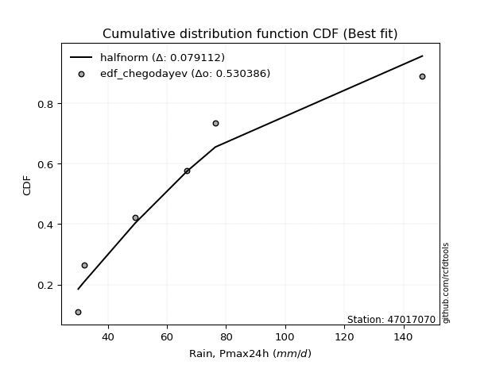</img></img>

</div>


### 6. EDF Blom (1958)

The Blom formula is a specific "plotting position" formula used in hydrology and statistical analysis to estimate the empirical cumulative probability (or non-exceedance probability) of a data series. It is particularly recommended for data that are approximately normally distributed. The constant _a_ is set to 0.375 (or 3/8).

<div align="center">


$P=(m-a)/(n+1-2a)$


</div>


**6.1. Empirical values**

<div align="center">

|                | 0                  | 1                  | 2                  | 3                 | 4                 | 5                  |
|:---------------|:-------------------|:-------------------|:-------------------|:------------------|:------------------|:-------------------|
| date           | 2022               | 2023               | 2020               | 2024              | 2021              | 2019               |
| x              | 30.0               | 32.0               | 49.2               | 66.8              | 76.4              | 146.4              |
| m              | 1                  | 2                  | 3                  | 4                 | 5                 | 6                  |
| empirical_dist | edf_blom           | edf_blom           | edf_blom           | edf_blom          | edf_blom          | edf_blom           |
| empirical      | 0.1                | 0.26               | 0.42               | 0.58              | 0.74              | 0.9                |
| empirical_tr   | 1.1111111111111112 | 1.3513513513513513 | 1.7241379310344827 | 2.380952380952381 | 3.846153846153846 | 10.000000000000002 |

</div>


**6.2. Kolmogorov-Smirnov fit test (sorted by Δ)**


<div align="center">

|                | 0                   | 1                   | 2                  | 3                  | 4                   | 5                   | 6                   | 7                   | 8                     | 9                   | 10                  | 11                  | 12                 | 13                 | 14                 | 15                  | 16                  | 17                  | 18                  | 19                  | 20                  | 21                  | 22                  | 23                  | 24                  | 25                  | 26                  | 27                  | 28                  | 29                  | 30                 | 31                  | 32                 | 33                  | 34                  | 35                  | 36                  | 37                  | 38                 | 39                  | 40                  | 41                  | 42                  | 43                  | 44                 | 45                 | 46                 | 47                 | 48                 | 49                 | 50                 | 51                  | 52                  | 53                  | 54                  | 55                  | 56                  | 57                 | 58                  | 59                 | 60                  | 61                  | 62                  | 63                 | 64                  | 65                  | 66                  | 67                 | 68                 | 69             | 70             | 71             | 72                  | 73                  | 74                 | 75                 | 76                 | 77                 | 78                  | 79                 | 80                 | 81                 | 82                 | 83                 | 84                 | 85                 | 86             | 87             |
|:---------------|:--------------------|:--------------------|:-------------------|:-------------------|:--------------------|:--------------------|:--------------------|:--------------------|:----------------------|:--------------------|:--------------------|:--------------------|:-------------------|:-------------------|:-------------------|:--------------------|:--------------------|:--------------------|:--------------------|:--------------------|:--------------------|:--------------------|:--------------------|:--------------------|:--------------------|:--------------------|:--------------------|:--------------------|:--------------------|:--------------------|:-------------------|:--------------------|:-------------------|:--------------------|:--------------------|:--------------------|:--------------------|:--------------------|:-------------------|:--------------------|:--------------------|:--------------------|:--------------------|:--------------------|:-------------------|:-------------------|:-------------------|:-------------------|:-------------------|:-------------------|:-------------------|:--------------------|:--------------------|:--------------------|:--------------------|:--------------------|:--------------------|:-------------------|:--------------------|:-------------------|:--------------------|:--------------------|:--------------------|:-------------------|:--------------------|:--------------------|:--------------------|:-------------------|:-------------------|:---------------|:---------------|:---------------|:--------------------|:--------------------|:-------------------|:-------------------|:-------------------|:-------------------|:--------------------|:-------------------|:-------------------|:-------------------|:-------------------|:-------------------|:-------------------|:-------------------|:---------------|:---------------|
| station        | 47017070            | 47017070            | 47017070           | 47017070           | 47017070            | 47017070            | 47017070            | 47017070            | 47017070              | 47017070            | 47017070            | 47017070            | 47017070           | 47017070           | 47017070           | 47017070            | 47017070            | 47017070            | 47017070            | 47017070            | 47017070            | 47017070            | 47017070            | 47017070            | 47017070            | 47017070            | 47017070            | 47017070            | 47017070            | 47017070            | 47017070           | 47017070            | 47017070           | 47017070            | 47017070            | 47017070            | 47017070            | 47017070            | 47017070           | 47017070            | 47017070            | 47017070            | 47017070            | 47017070            | 47017070           | 47017070           | 47017070           | 47017070           | 47017070           | 47017070           | 47017070           | 47017070            | 47017070            | 47017070            | 47017070            | 47017070            | 47017070            | 47017070           | 47017070            | 47017070           | 47017070            | 47017070            | 47017070            | 47017070           | 47017070            | 47017070            | 47017070            | 47017070           | 47017070           | 47017070       | 47017070       | 47017070       | 47017070            | 47017070            | 47017070           | 47017070           | 47017070           | 47017070           | 47017070            | 47017070           | 47017070           | 47017070           | 47017070           | 47017070           | 47017070           | 47017070           | 47017070       | 47017070       |
| empirical_dist | edf_blom            | edf_blom            | edf_blom           | edf_blom           | edf_blom            | edf_blom            | edf_blom            | edf_blom            | edf_blom              | edf_blom            | edf_blom            | edf_blom            | edf_blom           | edf_blom           | edf_blom           | edf_blom            | edf_blom            | edf_blom            | edf_blom            | edf_blom            | edf_blom            | edf_blom            | edf_blom            | edf_blom            | edf_blom            | edf_blom            | edf_blom            | edf_blom            | edf_blom            | edf_blom            | edf_blom           | edf_blom            | edf_blom           | edf_blom            | edf_blom            | edf_blom            | edf_blom            | edf_blom            | edf_blom           | edf_blom            | edf_blom            | edf_blom            | edf_blom            | edf_blom            | edf_blom           | edf_blom           | edf_blom           | edf_blom           | edf_blom           | edf_blom           | edf_blom           | edf_blom            | edf_blom            | edf_blom            | edf_blom            | edf_blom            | edf_blom            | edf_blom           | edf_blom            | edf_blom           | edf_blom            | edf_blom            | edf_blom            | edf_blom           | edf_blom            | edf_blom            | edf_blom            | edf_blom           | edf_blom           | edf_blom       | edf_blom       | edf_blom       | edf_blom            | edf_blom            | edf_blom           | edf_blom           | edf_blom           | edf_blom           | edf_blom            | edf_blom           | edf_blom           | edf_blom           | edf_blom           | edf_blom           | edf_blom           | edf_blom           | edf_blom       | edf_blom       |
| p_dist         | pearson3            | gumbel_r            | halfnorm           | halflogistic       | weibull_min         | t                   | moyal               | rayleigh            | loglaplace_asymmetric | logloggamma         | maxwell             | logt                | lognorm            | lognorm            | logcrystalball     | logmaxwell          | genlogistic         | logchi2             | lograyleigh         | logpearson3         | logbetaprime        | hypsecant           | kstwobign           | loggumbel_l         | betaprime           | logexponnorm        | lognct              | logistic            | nct                 | loggenlogistic      | loginvweibull      | logalpha            | nakagami           | loglogistic         | rice                | loginvgamma         | logncf              | logkstwobign        | alpha              | fisk                | loghalfnorm         | loghypsecant        | norm                | crystalball         | loglaplace         | loggumbel_r        | loginvgauss        | logrice            | laplace            | invgamma           | f                  | logexpon            | lognakagami         | logmoyal            | loggenexpon         | logweibull_min      | invgauss            | loggompertz        | loghalflogistic     | gumbel_l           | exponnorm           | expon               | genexpon            | laplace_asymmetric | gompertz            | truncnorm           | logf                | wald               | chi2               | loggibrat      | logwald        | gibrat         | gamma               | erlang              | logfisk            | logjohnsonsu       | loglognorm         | ncf                | logerlang           | fatiguelife        | logfatiguelife     | invweibull         | loggamma           | loggamma           | logtruncnorm       | johnsonsu          | mielke         | logmielke      |
| delta          | 0.07785263970719614 | 0.08520187992946127 | 0.0854240754951836 | 0.0854980926322336 | 0.10011808016537907 | 0.10223865844864388 | 0.10264140052537207 | 0.10849342754402813 | 0.11618340046336822   | 0.11629835174337746 | 0.11684625788618774 | 0.11823397068005143 | 0.1182345607729261 | 0.1182345607729261 | 0.1182348477354837 | 0.11827017789388872 | 0.11874074972735699 | 0.11875122602380073 | 0.11928652424957775 | 0.12266068319318546 | 0.12524621893494622 | 0.12710206194131285 | 0.12764822446283874 | 0.12771007068205564 | 0.12814573068665697 | 0.12942124495786753 | 0.12945271255572235 | 0.13121749621462175 | 0.13263173429275998 | 0.13362920278238477 | 0.1336335350324788 | 0.13402601098469588 | 0.1342525313634904 | 0.13491759421553665 | 0.13536871537941497 | 0.13619847834629165 | 0.13619896082667823 | 0.13708189157471917 | 0.1374891041650072 | 0.13763605437731513 | 0.13964597009347518 | 0.14321770841756398 | 0.14369432896254042 | 0.14369433267002174 | 0.1502751952256342 | 0.1515621994707113 | 0.1518754497496429 | 0.1533809405194288 | 0.1542618009178049 | 0.1645828351022875 | 0.1645829672510824 | 0.16500908179158033 | 0.16846920932980308 | 0.17877938996711473 | 0.18132593197302055 | 0.18161289228608313 | 0.18638559285083983 | 0.1892068909832578 | 0.19410311229070124 | 0.2041428650956496 | 0.20618549039387368 | 0.20710262220447556 | 0.20710277390692736 | 0.2071028942652734 | 0.20710456476514563 | 0.20786718446262503 | 0.24515467250546513 | 0.2513137951132153 | 0.2542131747502316 | 0.26           | 0.26           | 0.26           | 0.26568614369087185 | 0.29360718173213896 | 0.3077743099078635 | 0.3287170229928411 | 0.3521915949650982 | 0.3741427913292087 | 0.37424112483555877 | 0.3769637508298264 | 0.4079856007079909 | 0.4363189118567229 | 0.4372501744015575 | 0.4372501744015575 | 0.5799959579692996 | 0.6698399678082861 | nan            | nan            |
| deltao         | 0.530385761606      | 0.530385761606      | 0.530385761606     | 0.530385761606     | 0.530385761606      | 0.530385761606      | 0.530385761606      | 0.530385761606      | 0.530385761606        | 0.530385761606      | 0.530385761606      | 0.530385761606      | 0.530385761606     | 0.530385761606     | 0.530385761606     | 0.530385761606      | 0.530385761606      | 0.530385761606      | 0.530385761606      | 0.530385761606      | 0.530385761606      | 0.530385761606      | 0.530385761606      | 0.530385761606      | 0.530385761606      | 0.530385761606      | 0.530385761606      | 0.530385761606      | 0.530385761606      | 0.530385761606      | 0.530385761606     | 0.530385761606      | 0.530385761606     | 0.530385761606      | 0.530385761606      | 0.530385761606      | 0.530385761606      | 0.530385761606      | 0.530385761606     | 0.530385761606      | 0.530385761606      | 0.530385761606      | 0.530385761606      | 0.530385761606      | 0.530385761606     | 0.530385761606     | 0.530385761606     | 0.530385761606     | 0.530385761606     | 0.530385761606     | 0.530385761606     | 0.530385761606      | 0.530385761606      | 0.530385761606      | 0.530385761606      | 0.530385761606      | 0.530385761606      | 0.530385761606     | 0.530385761606      | 0.530385761606     | 0.530385761606      | 0.530385761606      | 0.530385761606      | 0.530385761606     | 0.530385761606      | 0.530385761606      | 0.530385761606      | 0.530385761606     | 0.530385761606     | 0.530385761606 | 0.530385761606 | 0.530385761606 | 0.530385761606      | 0.530385761606      | 0.530385761606     | 0.530385761606     | 0.530385761606     | 0.530385761606     | 0.530385761606      | 0.530385761606     | 0.530385761606     | 0.530385761606     | 0.530385761606     | 0.530385761606     | 0.530385761606     | 0.530385761606     | 0.530385761606 | 0.530385761606 |
| eval           | Δo > Δ              | Δo > Δ              | Δo > Δ             | Δo > Δ             | Δo > Δ              | Δo > Δ              | Δo > Δ              | Δo > Δ              | Δo > Δ                | Δo > Δ              | Δo > Δ              | Δo > Δ              | Δo > Δ             | Δo > Δ             | Δo > Δ             | Δo > Δ              | Δo > Δ              | Δo > Δ              | Δo > Δ              | Δo > Δ              | Δo > Δ              | Δo > Δ              | Δo > Δ              | Δo > Δ              | Δo > Δ              | Δo > Δ              | Δo > Δ              | Δo > Δ              | Δo > Δ              | Δo > Δ              | Δo > Δ             | Δo > Δ              | Δo > Δ             | Δo > Δ              | Δo > Δ              | Δo > Δ              | Δo > Δ              | Δo > Δ              | Δo > Δ             | Δo > Δ              | Δo > Δ              | Δo > Δ              | Δo > Δ              | Δo > Δ              | Δo > Δ             | Δo > Δ             | Δo > Δ             | Δo > Δ             | Δo > Δ             | Δo > Δ             | Δo > Δ             | Δo > Δ              | Δo > Δ              | Δo > Δ              | Δo > Δ              | Δo > Δ              | Δo > Δ              | Δo > Δ             | Δo > Δ              | Δo > Δ             | Δo > Δ              | Δo > Δ              | Δo > Δ              | Δo > Δ             | Δo > Δ              | Δo > Δ              | Δo > Δ              | Δo > Δ             | Δo > Δ             | Δo > Δ         | Δo > Δ         | Δo > Δ         | Δo > Δ              | Δo > Δ              | Δo > Δ             | Δo > Δ             | Δo > Δ             | Δo > Δ             | Δo > Δ              | Δo > Δ             | Δo > Δ             | Δo > Δ             | Δo > Δ             | Δo > Δ             | Δo <= Δ            | Δo <= Δ            | Δo <= Δ        | Δo <= Δ        |
| fit            | 1                   | 1                   | 1                  | 1                  | 1                   | 1                   | 1                   | 1                   | 1                     | 1                   | 1                   | 1                   | 1                  | 1                  | 1                  | 1                   | 1                   | 1                   | 1                   | 1                   | 1                   | 1                   | 1                   | 1                   | 1                   | 1                   | 1                   | 1                   | 1                   | 1                   | 1                  | 1                   | 1                  | 1                   | 1                   | 1                   | 1                   | 1                   | 1                  | 1                   | 1                   | 1                   | 1                   | 1                   | 1                  | 1                  | 1                  | 1                  | 1                  | 1                  | 1                  | 1                   | 1                   | 1                   | 1                   | 1                   | 1                   | 1                  | 1                   | 1                  | 1                   | 1                   | 1                   | 1                  | 1                   | 1                   | 1                   | 1                  | 1                  | 1              | 1              | 1              | 1                   | 1                   | 1                  | 1                  | 1                  | 1                  | 1                   | 1                  | 1                  | 1                  | 1                  | 1                  | 0                  | 0                  | 0              | 0              |
| n              | 6                   | 6                   | 6                  | 6                  | 6                   | 6                   | 6                   | 6                   | 6                     | 6                   | 6                   | 6                   | 6                  | 6                  | 6                  | 6                   | 6                   | 6                   | 6                   | 6                   | 6                   | 6                   | 6                   | 6                   | 6                   | 6                   | 6                   | 6                   | 6                   | 6                   | 6                  | 6                   | 6                  | 6                   | 6                   | 6                   | 6                   | 6                   | 6                  | 6                   | 6                   | 6                   | 6                   | 6                   | 6                  | 6                  | 6                  | 6                  | 6                  | 6                  | 6                  | 6                   | 6                   | 6                   | 6                   | 6                   | 6                   | 6                  | 6                   | 6                  | 6                   | 6                   | 6                   | 6                  | 6                   | 6                   | 6                   | 6                  | 6                  | 6              | 6              | 6              | 6                   | 6                   | 6                  | 6                  | 6                  | 6                  | 6                   | 6                  | 6                  | 6                  | 6                  | 6                  | 6                  | 6                  | 6              | 6              |
| best_fit       | 1                   | 0                   | 0                  | 0                  | 0                   | 0                   | 0                   | 0                   | 0                     | 0                   | 0                   | 0                   | 0                  | 0                  | 0                  | 0                   | 0                   | 0                   | 0                   | 0                   | 0                   | 0                   | 0                   | 0                   | 0                   | 0                   | 0                   | 0                   | 0                   | 0                   | 0                  | 0                   | 0                  | 0                   | 0                   | 0                   | 0                   | 0                   | 0                  | 0                   | 0                   | 0                   | 0                   | 0                   | 0                  | 0                  | 0                  | 0                  | 0                  | 0                  | 0                  | 0                   | 0                   | 0                   | 0                   | 0                   | 0                   | 0                  | 0                   | 0                  | 0                   | 0                   | 0                   | 0                  | 0                   | 0                   | 0                   | 0                  | 0                  | 0              | 0              | 0              | 0                   | 0                   | 0                  | 0                  | 0                  | 0                  | 0                   | 0                  | 0                  | 0                  | 0                  | 0                  | 0                  | 0                  | 0              | 0              |
| best_fit_sort  | 1                   | 2                   | 3                  | 4                  | 5                   | 6                   | 7                   | 8                   | 9                     | 10                  | 11                  | 12                  | 13                 | 14                 | 15                 | 16                  | 17                  | 18                  | 19                  | 20                  | 21                  | 22                  | 23                  | 24                  | 25                  | 26                  | 27                  | 28                  | 29                  | 30                  | 31                 | 32                  | 33                 | 34                  | 35                  | 36                  | 37                  | 38                  | 39                 | 40                  | 41                  | 42                  | 43                  | 44                  | 45                 | 46                 | 47                 | 48                 | 49                 | 50                 | 51                 | 52                  | 53                  | 54                  | 55                  | 56                  | 57                  | 58                 | 59                  | 60                 | 61                  | 62                  | 63                  | 64                 | 65                  | 66                  | 67                  | 68                 | 69                 | 70             | 71             | 72             | 73                  | 74                  | 75                 | 76                 | 77                 | 78                 | 79                  | 80                 | 81                 | 82                 | 83                 | 84                 | 85                 | 86                 | 87             | 88             |

</div>


**6.3. Best fit**

<div align="center">

|   id |   station | empirical_dist   | p_dist   |     delta |   deltao | eval   |   fit |   n |   best_fit |   best_fit_sort |
|-----:|----------:|:-----------------|:---------|----------:|---------:|:-------|------:|----:|-----------:|----------------:|
|    0 |  47017070 | edf_blom         | pearson3 | 0.0778526 | 0.530386 | Δo > Δ |     1 |   6 |          1 |               1 |

</div>


<div align="center">

</img></img>

</div>


### 7. EDF Tukey (1962)

In hydrology, the Tukey formula is used as a plotting position formula to estimate the empirical probability or frequency of a flood event (or other hydrological data). The formula parameter is given as _c=0.333_ (or 1/3).

<div align="center">


$P=(m-c)/(n+1-2c)$


</div>


**7.1. Empirical values**

<div align="center">

|                | 0                   | 1                  | 2                   | 3                  | 4                  | 5                  |
|:---------------|:--------------------|:-------------------|:--------------------|:-------------------|:-------------------|:-------------------|
| date           | 2022                | 2023               | 2020                | 2024               | 2021               | 2019               |
| x              | 30.0                | 32.0               | 49.2                | 66.8               | 76.4               | 146.4              |
| m              | 1                   | 2                  | 3                   | 4                  | 5                  | 6                  |
| empirical_dist | edf_tukey           | edf_tukey          | edf_tukey           | edf_tukey          | edf_tukey          | edf_tukey          |
| empirical      | 0.10526315789473684 | 0.2631578947368421 | 0.42105263157894735 | 0.5789473684210527 | 0.7368421052631579 | 0.8947368421052632 |
| empirical_tr   | 1.1176470588235294  | 1.357142857142857  | 1.7272727272727273  | 2.375              | 3.7999999999999994 | 9.5                |

</div>


**7.2. Kolmogorov-Smirnov fit test (sorted by Δ)**


<div align="center">

|                | 0                   | 1                  | 2                   | 3                   | 4                   | 5                   | 6                 | 7                   | 8                   | 9                  | 10                    | 11                  | 12                  | 13                  | 14                  | 15                  | 16                 | 17                  | 18                  | 19                  | 20                  | 21                 | 22                 | 23                  | 24                  | 25                  | 26                 | 27                  | 28                  | 29                  | 30                  | 31                  | 32                  | 33                  | 34                  | 35                  | 36                  | 37                  | 38                  | 39                  | 40                 | 41                 | 42                  | 43                  | 44                  | 45                 | 46                 | 47                  | 48                  | 49                  | 50                  | 51                  | 52                 | 53                  | 54                  | 55                  | 56                  | 57                  | 58                  | 59                  | 60                  | 61                  | 62                  | 63                  | 64                  | 65                 | 66                  | 67                 | 68                  | 69                 | 70                 | 71                 | 72                  | 73                  | 74                 | 75                  | 76                  | 77                 | 78                 | 79                  | 80                  | 81                  | 82                  | 83                  | 84                 | 85                | 86             | 87             |
|:---------------|:--------------------|:-------------------|:--------------------|:--------------------|:--------------------|:--------------------|:------------------|:--------------------|:--------------------|:-------------------|:----------------------|:--------------------|:--------------------|:--------------------|:--------------------|:--------------------|:-------------------|:--------------------|:--------------------|:--------------------|:--------------------|:-------------------|:-------------------|:--------------------|:--------------------|:--------------------|:-------------------|:--------------------|:--------------------|:--------------------|:--------------------|:--------------------|:--------------------|:--------------------|:--------------------|:--------------------|:--------------------|:--------------------|:--------------------|:--------------------|:-------------------|:-------------------|:--------------------|:--------------------|:--------------------|:-------------------|:-------------------|:--------------------|:--------------------|:--------------------|:--------------------|:--------------------|:-------------------|:--------------------|:--------------------|:--------------------|:--------------------|:--------------------|:--------------------|:--------------------|:--------------------|:--------------------|:--------------------|:--------------------|:--------------------|:-------------------|:--------------------|:-------------------|:--------------------|:-------------------|:-------------------|:-------------------|:--------------------|:--------------------|:-------------------|:--------------------|:--------------------|:-------------------|:-------------------|:--------------------|:--------------------|:--------------------|:--------------------|:--------------------|:-------------------|:------------------|:---------------|:---------------|
| station        | 47017070            | 47017070           | 47017070            | 47017070            | 47017070            | 47017070            | 47017070          | 47017070            | 47017070            | 47017070           | 47017070              | 47017070            | 47017070            | 47017070            | 47017070            | 47017070            | 47017070           | 47017070            | 47017070            | 47017070            | 47017070            | 47017070           | 47017070           | 47017070            | 47017070            | 47017070            | 47017070           | 47017070            | 47017070            | 47017070            | 47017070            | 47017070            | 47017070            | 47017070            | 47017070            | 47017070            | 47017070            | 47017070            | 47017070            | 47017070            | 47017070           | 47017070           | 47017070            | 47017070            | 47017070            | 47017070           | 47017070           | 47017070            | 47017070            | 47017070            | 47017070            | 47017070            | 47017070           | 47017070            | 47017070            | 47017070            | 47017070            | 47017070            | 47017070            | 47017070            | 47017070            | 47017070            | 47017070            | 47017070            | 47017070            | 47017070           | 47017070            | 47017070           | 47017070            | 47017070           | 47017070           | 47017070           | 47017070            | 47017070            | 47017070           | 47017070            | 47017070            | 47017070           | 47017070           | 47017070            | 47017070            | 47017070            | 47017070            | 47017070            | 47017070           | 47017070          | 47017070       | 47017070       |
| empirical_dist | edf_tukey           | edf_tukey          | edf_tukey           | edf_tukey           | edf_tukey           | edf_tukey           | edf_tukey         | edf_tukey           | edf_tukey           | edf_tukey          | edf_tukey             | edf_tukey           | edf_tukey           | edf_tukey           | edf_tukey           | edf_tukey           | edf_tukey          | edf_tukey           | edf_tukey           | edf_tukey           | edf_tukey           | edf_tukey          | edf_tukey          | edf_tukey           | edf_tukey           | edf_tukey           | edf_tukey          | edf_tukey           | edf_tukey           | edf_tukey           | edf_tukey           | edf_tukey           | edf_tukey           | edf_tukey           | edf_tukey           | edf_tukey           | edf_tukey           | edf_tukey           | edf_tukey           | edf_tukey           | edf_tukey          | edf_tukey          | edf_tukey           | edf_tukey           | edf_tukey           | edf_tukey          | edf_tukey          | edf_tukey           | edf_tukey           | edf_tukey           | edf_tukey           | edf_tukey           | edf_tukey          | edf_tukey           | edf_tukey           | edf_tukey           | edf_tukey           | edf_tukey           | edf_tukey           | edf_tukey           | edf_tukey           | edf_tukey           | edf_tukey           | edf_tukey           | edf_tukey           | edf_tukey          | edf_tukey           | edf_tukey          | edf_tukey           | edf_tukey          | edf_tukey          | edf_tukey          | edf_tukey           | edf_tukey           | edf_tukey          | edf_tukey           | edf_tukey           | edf_tukey          | edf_tukey          | edf_tukey           | edf_tukey           | edf_tukey           | edf_tukey           | edf_tukey           | edf_tukey          | edf_tukey         | edf_tukey      | edf_tukey      |
| p_dist         | pearson3            | halfnorm           | gumbel_r            | halflogistic        | t                   | weibull_min         | rayleigh          | moyal               | logchi2             | maxwell            | loglaplace_asymmetric | logloggamma         | logt                | lognorm             | lognorm             | logcrystalball      | logmaxwell         | genlogistic         | lograyleigh         | logpearson3         | logistic            | hypsecant          | logbetaprime       | kstwobign           | loggumbel_l         | betaprime           | logexponnorm       | lognct              | nakagami            | nct                 | loggenlogistic      | loginvweibull       | logalpha            | alpha               | loglogistic         | rice                | loginvgamma         | logncf              | logkstwobign        | norm                | crystalball        | fisk               | loghalfnorm         | loghypsecant        | loginvgauss         | loglaplace         | loggumbel_r        | laplace             | logrice             | invgamma            | f                   | lognakagami         | logexpon           | logweibull_min      | logmoyal            | loggenexpon         | invgauss            | loggompertz         | loghalflogistic     | gumbel_l            | exponnorm           | expon               | genexpon            | laplace_asymmetric  | gompertz            | truncnorm          | logf                | chi2               | wald                | loggibrat          | logwald            | gibrat             | gamma               | erlang              | logfisk            | logjohnsonsu        | loglognorm          | ncf                | logerlang          | fatiguelife         | logfatiguelife      | invweibull          | loggamma            | loggamma            | logtruncnorm       | johnsonsu         | mielke         | logmielke      |
| delta          | 0.07856667434807768 | 0.0815788839781133 | 0.08835977466630335 | 0.08865598736907568 | 0.09697550055390705 | 0.10526315701765543 | 0.105335532807186 | 0.10579929526221415 | 0.11348806812906387 | 0.1136883631493456 | 0.1193412952002103    | 0.11945624648021955 | 0.12139186541689351 | 0.12139245550976818 | 0.12139245550976818 | 0.12139274247232579 | 0.1214280726307308 | 0.12189864446419907 | 0.12244441898641983 | 0.12581857793002754 | 0.12805960147777962 | 0.1281546935202602 | 0.1284041136717883 | 0.13080611919968083 | 0.13086796541889772 | 0.13130362542349905 | 0.1325791396947096 | 0.13261060729256444 | 0.13319989978454305 | 0.13578962902960207 | 0.13678709751922685 | 0.13679142976932088 | 0.13718390572153796 | 0.13791270990905236 | 0.13807548895237873 | 0.13852661011625705 | 0.13935637308313373 | 0.13935685556352032 | 0.14023978631156125 | 0.14053643422569828 | 0.1405364379331796 | 0.1407939491141572 | 0.14280386483031726 | 0.14637560315440606 | 0.15148313334263974 | 0.1534330899624763 | 0.1547200942075534 | 0.15531443249675225 | 0.15653883525627088 | 0.16353020352334013 | 0.16353033567213504 | 0.16741657775085572 | 0.1681669765284224 | 0.17634973439134627 | 0.18193728470395681 | 0.18448382670986263 | 0.18533296127189247 | 0.19236478572009988 | 0.19726100702754332 | 0.20098497035880747 | 0.20934338513071576 | 0.21026051694131764 | 0.21026066864376944 | 0.21026078900211548 | 0.21026245950198771 | 0.2110250791994671 | 0.24410204092651777 | 0.2531605431712842 | 0.25447168985005736 | 0.2631578947368421 | 0.2631578947368421 | 0.2631578947368421 | 0.26673877526981915 | 0.29465981331108626 | 0.3025111520131266 | 0.32555912825599903 | 0.34903370022825614 | 0.3688796334344719 | 0.3731884932566114 | 0.37591111925087906 | 0.40693296912904353 | 0.43105575396198603 | 0.43619754282261014 | 0.43619754282261014 | 0.5789433263903523 | 0.666682073071444 | nan            | nan            |
| deltao         | 0.530385761606      | 0.530385761606     | 0.530385761606      | 0.530385761606      | 0.530385761606      | 0.530385761606      | 0.530385761606    | 0.530385761606      | 0.530385761606      | 0.530385761606     | 0.530385761606        | 0.530385761606      | 0.530385761606      | 0.530385761606      | 0.530385761606      | 0.530385761606      | 0.530385761606     | 0.530385761606      | 0.530385761606      | 0.530385761606      | 0.530385761606      | 0.530385761606     | 0.530385761606     | 0.530385761606      | 0.530385761606      | 0.530385761606      | 0.530385761606     | 0.530385761606      | 0.530385761606      | 0.530385761606      | 0.530385761606      | 0.530385761606      | 0.530385761606      | 0.530385761606      | 0.530385761606      | 0.530385761606      | 0.530385761606      | 0.530385761606      | 0.530385761606      | 0.530385761606      | 0.530385761606     | 0.530385761606     | 0.530385761606      | 0.530385761606      | 0.530385761606      | 0.530385761606     | 0.530385761606     | 0.530385761606      | 0.530385761606      | 0.530385761606      | 0.530385761606      | 0.530385761606      | 0.530385761606     | 0.530385761606      | 0.530385761606      | 0.530385761606      | 0.530385761606      | 0.530385761606      | 0.530385761606      | 0.530385761606      | 0.530385761606      | 0.530385761606      | 0.530385761606      | 0.530385761606      | 0.530385761606      | 0.530385761606     | 0.530385761606      | 0.530385761606     | 0.530385761606      | 0.530385761606     | 0.530385761606     | 0.530385761606     | 0.530385761606      | 0.530385761606      | 0.530385761606     | 0.530385761606      | 0.530385761606      | 0.530385761606     | 0.530385761606     | 0.530385761606      | 0.530385761606      | 0.530385761606      | 0.530385761606      | 0.530385761606      | 0.530385761606     | 0.530385761606    | 0.530385761606 | 0.530385761606 |
| eval           | Δo > Δ              | Δo > Δ             | Δo > Δ              | Δo > Δ              | Δo > Δ              | Δo > Δ              | Δo > Δ            | Δo > Δ              | Δo > Δ              | Δo > Δ             | Δo > Δ                | Δo > Δ              | Δo > Δ              | Δo > Δ              | Δo > Δ              | Δo > Δ              | Δo > Δ             | Δo > Δ              | Δo > Δ              | Δo > Δ              | Δo > Δ              | Δo > Δ             | Δo > Δ             | Δo > Δ              | Δo > Δ              | Δo > Δ              | Δo > Δ             | Δo > Δ              | Δo > Δ              | Δo > Δ              | Δo > Δ              | Δo > Δ              | Δo > Δ              | Δo > Δ              | Δo > Δ              | Δo > Δ              | Δo > Δ              | Δo > Δ              | Δo > Δ              | Δo > Δ              | Δo > Δ             | Δo > Δ             | Δo > Δ              | Δo > Δ              | Δo > Δ              | Δo > Δ             | Δo > Δ             | Δo > Δ              | Δo > Δ              | Δo > Δ              | Δo > Δ              | Δo > Δ              | Δo > Δ             | Δo > Δ              | Δo > Δ              | Δo > Δ              | Δo > Δ              | Δo > Δ              | Δo > Δ              | Δo > Δ              | Δo > Δ              | Δo > Δ              | Δo > Δ              | Δo > Δ              | Δo > Δ              | Δo > Δ             | Δo > Δ              | Δo > Δ             | Δo > Δ              | Δo > Δ             | Δo > Δ             | Δo > Δ             | Δo > Δ              | Δo > Δ              | Δo > Δ             | Δo > Δ              | Δo > Δ              | Δo > Δ             | Δo > Δ             | Δo > Δ              | Δo > Δ              | Δo > Δ              | Δo > Δ              | Δo > Δ              | Δo <= Δ            | Δo <= Δ           | Δo <= Δ        | Δo <= Δ        |
| fit            | 1                   | 1                  | 1                   | 1                   | 1                   | 1                   | 1                 | 1                   | 1                   | 1                  | 1                     | 1                   | 1                   | 1                   | 1                   | 1                   | 1                  | 1                   | 1                   | 1                   | 1                   | 1                  | 1                  | 1                   | 1                   | 1                   | 1                  | 1                   | 1                   | 1                   | 1                   | 1                   | 1                   | 1                   | 1                   | 1                   | 1                   | 1                   | 1                   | 1                   | 1                  | 1                  | 1                   | 1                   | 1                   | 1                  | 1                  | 1                   | 1                   | 1                   | 1                   | 1                   | 1                  | 1                   | 1                   | 1                   | 1                   | 1                   | 1                   | 1                   | 1                   | 1                   | 1                   | 1                   | 1                   | 1                  | 1                   | 1                  | 1                   | 1                  | 1                  | 1                  | 1                   | 1                   | 1                  | 1                   | 1                   | 1                  | 1                  | 1                   | 1                   | 1                   | 1                   | 1                   | 0                  | 0                 | 0              | 0              |
| n              | 6                   | 6                  | 6                   | 6                   | 6                   | 6                   | 6                 | 6                   | 6                   | 6                  | 6                     | 6                   | 6                   | 6                   | 6                   | 6                   | 6                  | 6                   | 6                   | 6                   | 6                   | 6                  | 6                  | 6                   | 6                   | 6                   | 6                  | 6                   | 6                   | 6                   | 6                   | 6                   | 6                   | 6                   | 6                   | 6                   | 6                   | 6                   | 6                   | 6                   | 6                  | 6                  | 6                   | 6                   | 6                   | 6                  | 6                  | 6                   | 6                   | 6                   | 6                   | 6                   | 6                  | 6                   | 6                   | 6                   | 6                   | 6                   | 6                   | 6                   | 6                   | 6                   | 6                   | 6                   | 6                   | 6                  | 6                   | 6                  | 6                   | 6                  | 6                  | 6                  | 6                   | 6                   | 6                  | 6                   | 6                   | 6                  | 6                  | 6                   | 6                   | 6                   | 6                   | 6                   | 6                  | 6                 | 6              | 6              |
| best_fit       | 1                   | 0                  | 0                   | 0                   | 0                   | 0                   | 0                 | 0                   | 0                   | 0                  | 0                     | 0                   | 0                   | 0                   | 0                   | 0                   | 0                  | 0                   | 0                   | 0                   | 0                   | 0                  | 0                  | 0                   | 0                   | 0                   | 0                  | 0                   | 0                   | 0                   | 0                   | 0                   | 0                   | 0                   | 0                   | 0                   | 0                   | 0                   | 0                   | 0                   | 0                  | 0                  | 0                   | 0                   | 0                   | 0                  | 0                  | 0                   | 0                   | 0                   | 0                   | 0                   | 0                  | 0                   | 0                   | 0                   | 0                   | 0                   | 0                   | 0                   | 0                   | 0                   | 0                   | 0                   | 0                   | 0                  | 0                   | 0                  | 0                   | 0                  | 0                  | 0                  | 0                   | 0                   | 0                  | 0                   | 0                   | 0                  | 0                  | 0                   | 0                   | 0                   | 0                   | 0                   | 0                  | 0                 | 0              | 0              |
| best_fit_sort  | 1                   | 2                  | 3                   | 4                   | 5                   | 6                   | 7                 | 8                   | 9                   | 10                 | 11                    | 12                  | 13                  | 14                  | 15                  | 16                  | 17                 | 18                  | 19                  | 20                  | 21                  | 22                 | 23                 | 24                  | 25                  | 26                  | 27                 | 28                  | 29                  | 30                  | 31                  | 32                  | 33                  | 34                  | 35                  | 36                  | 37                  | 38                  | 39                  | 40                  | 41                 | 42                 | 43                  | 44                  | 45                  | 46                 | 47                 | 48                  | 49                  | 50                  | 51                  | 52                  | 53                 | 54                  | 55                  | 56                  | 57                  | 58                  | 59                  | 60                  | 61                  | 62                  | 63                  | 64                  | 65                  | 66                 | 67                  | 68                 | 69                  | 70                 | 71                 | 72                 | 73                  | 74                  | 75                 | 76                  | 77                  | 78                 | 79                 | 80                  | 81                  | 82                  | 83                  | 84                  | 85                 | 86                | 87             | 88             |

</div>


**7.3. Best fit**

<div align="center">

|   id |   station | empirical_dist   | p_dist   |     delta |   deltao | eval   |   fit |   n |   best_fit |   best_fit_sort |
|-----:|----------:|:-----------------|:---------|----------:|---------:|:-------|------:|----:|-----------:|----------------:|
|    0 |  47017070 | edf_tukey        | pearson3 | 0.0785667 | 0.530386 | Δo > Δ |     1 |   6 |          1 |               1 |

</div>


<div align="center">

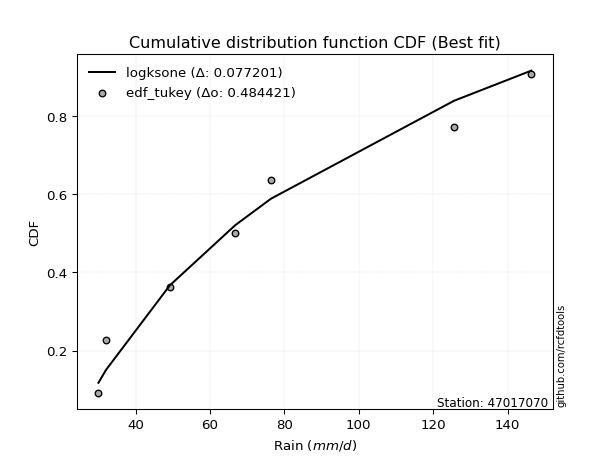</img></img>

</div>


### 8. EDF Gringorten (1963)

Gringorten plotting position formula is essential for estimating the probability and return periods of extreme events like floods and heavy rainfall. The constant _a=0.44_.

<div align="center">


$P=(m-a)/(n+1-2a)$


</div>


**8.1. Empirical values**

<div align="center">

|                | 0                   | 1                  | 2                   | 3                  | 4                  | 5                  |
|:---------------|:--------------------|:-------------------|:--------------------|:-------------------|:-------------------|:-------------------|
| date           | 2022                | 2023               | 2020                | 2024               | 2021               | 2019               |
| x              | 30.0                | 32.0               | 49.2                | 66.8               | 76.4               | 146.4              |
| m              | 1                   | 2                  | 3                   | 4                  | 5                  | 6                  |
| empirical_dist | edf_gringorten      | edf_gringorten     | edf_gringorten      | edf_gringorten     | edf_gringorten     | edf_gringorten     |
| empirical      | 0.09150326797385622 | 0.2549019607843137 | 0.41830065359477125 | 0.5816993464052288 | 0.7450980392156862 | 0.9084967320261437 |
| empirical_tr   | 1.1007194244604317  | 1.3421052631578947 | 1.7191011235955058  | 2.3906250000000004 | 3.9230769230769216 | 10.928571428571415 |

</div>


**8.2. Kolmogorov-Smirnov fit test (sorted by Δ)**


<div align="center">

|                | 0                  | 1                   | 2                   | 3                   | 4                   | 5                   | 6                   | 7                     | 8                   | 9                   | 10                 | 11                 | 12                 | 13                  | 14                  | 15                  | 16                  | 17                  | 18                  | 19                  | 20                  | 21                  | 22                  | 23                  | 24                  | 25                  | 26                  | 27                  | 28                  | 29                 | 30                  | 31                  | 32                  | 33                  | 34                  | 35                  | 36                  | 37                  | 38                  | 39                  | 40                  | 41                  | 42                 | 43                | 44                 | 45                 | 46                  | 47                  | 48                  | 49                  | 50                  | 51                  | 52                 | 53                  | 54                  | 55                 | 56                  | 57                  | 58                  | 59                  | 60                  | 61                  | 62                 | 63                  | 64                  | 65                 | 66                  | 67                  | 68                 | 69                 | 70                 | 71                 | 72                | 73                 | 74                 | 75                 | 76                 | 77                 | 78                  | 79                 | 80                 | 81                  | 82                  | 83                  | 84                 | 85                 | 86             | 87             |
|:---------------|:-------------------|:--------------------|:--------------------|:--------------------|:--------------------|:--------------------|:--------------------|:----------------------|:--------------------|:--------------------|:-------------------|:-------------------|:-------------------|:--------------------|:--------------------|:--------------------|:--------------------|:--------------------|:--------------------|:--------------------|:--------------------|:--------------------|:--------------------|:--------------------|:--------------------|:--------------------|:--------------------|:--------------------|:--------------------|:-------------------|:--------------------|:--------------------|:--------------------|:--------------------|:--------------------|:--------------------|:--------------------|:--------------------|:--------------------|:--------------------|:--------------------|:--------------------|:-------------------|:------------------|:-------------------|:-------------------|:--------------------|:--------------------|:--------------------|:--------------------|:--------------------|:--------------------|:-------------------|:--------------------|:--------------------|:-------------------|:--------------------|:--------------------|:--------------------|:--------------------|:--------------------|:--------------------|:-------------------|:--------------------|:--------------------|:-------------------|:--------------------|:--------------------|:-------------------|:-------------------|:-------------------|:-------------------|:------------------|:-------------------|:-------------------|:-------------------|:-------------------|:-------------------|:--------------------|:-------------------|:-------------------|:--------------------|:--------------------|:--------------------|:-------------------|:-------------------|:---------------|:---------------|
| station        | 47017070           | 47017070            | 47017070            | 47017070            | 47017070            | 47017070            | 47017070            | 47017070              | 47017070            | 47017070            | 47017070           | 47017070           | 47017070           | 47017070            | 47017070            | 47017070            | 47017070            | 47017070            | 47017070            | 47017070            | 47017070            | 47017070            | 47017070            | 47017070            | 47017070            | 47017070            | 47017070            | 47017070            | 47017070            | 47017070           | 47017070            | 47017070            | 47017070            | 47017070            | 47017070            | 47017070            | 47017070            | 47017070            | 47017070            | 47017070            | 47017070            | 47017070            | 47017070           | 47017070          | 47017070           | 47017070           | 47017070            | 47017070            | 47017070            | 47017070            | 47017070            | 47017070            | 47017070           | 47017070            | 47017070            | 47017070           | 47017070            | 47017070            | 47017070            | 47017070            | 47017070            | 47017070            | 47017070           | 47017070            | 47017070            | 47017070           | 47017070            | 47017070            | 47017070           | 47017070           | 47017070           | 47017070           | 47017070          | 47017070           | 47017070           | 47017070           | 47017070           | 47017070           | 47017070            | 47017070           | 47017070           | 47017070            | 47017070            | 47017070            | 47017070           | 47017070           | 47017070       | 47017070       |
| empirical_dist | edf_gringorten     | edf_gringorten      | edf_gringorten      | edf_gringorten      | edf_gringorten      | edf_gringorten      | edf_gringorten      | edf_gringorten        | edf_gringorten      | edf_gringorten      | edf_gringorten     | edf_gringorten     | edf_gringorten     | edf_gringorten      | edf_gringorten      | edf_gringorten      | edf_gringorten      | edf_gringorten      | edf_gringorten      | edf_gringorten      | edf_gringorten      | edf_gringorten      | edf_gringorten      | edf_gringorten      | edf_gringorten      | edf_gringorten      | edf_gringorten      | edf_gringorten      | edf_gringorten      | edf_gringorten     | edf_gringorten      | edf_gringorten      | edf_gringorten      | edf_gringorten      | edf_gringorten      | edf_gringorten      | edf_gringorten      | edf_gringorten      | edf_gringorten      | edf_gringorten      | edf_gringorten      | edf_gringorten      | edf_gringorten     | edf_gringorten    | edf_gringorten     | edf_gringorten     | edf_gringorten      | edf_gringorten      | edf_gringorten      | edf_gringorten      | edf_gringorten      | edf_gringorten      | edf_gringorten     | edf_gringorten      | edf_gringorten      | edf_gringorten     | edf_gringorten      | edf_gringorten      | edf_gringorten      | edf_gringorten      | edf_gringorten      | edf_gringorten      | edf_gringorten     | edf_gringorten      | edf_gringorten      | edf_gringorten     | edf_gringorten      | edf_gringorten      | edf_gringorten     | edf_gringorten     | edf_gringorten     | edf_gringorten     | edf_gringorten    | edf_gringorten     | edf_gringorten     | edf_gringorten     | edf_gringorten     | edf_gringorten     | edf_gringorten      | edf_gringorten     | edf_gringorten     | edf_gringorten      | edf_gringorten      | edf_gringorten      | edf_gringorten     | edf_gringorten     | edf_gringorten | edf_gringorten |
| p_dist         | halflogistic       | gumbel_r            | pearson3            | halfnorm            | moyal               | weibull_min         | t                   | loglaplace_asymmetric | logloggamma         | logt                | lognorm            | lognorm            | logcrystalball     | logmaxwell          | rayleigh            | genlogistic         | lograyleigh         | logpearson3         | logbetaprime        | maxwell             | kstwobign           | loggumbel_l         | betaprime           | logexponnorm        | lognct              | hypsecant           | logchi2             | nct                 | loggenlogistic      | loginvweibull      | logalpha            | loglogistic         | loginvgamma         | logncf              | logkstwobign        | fisk                | rice                | loghalfnorm         | nakagami            | logistic            | loghypsecant        | alpha               | loglaplace         | loggumbel_r       | logrice            | norm               | crystalball         | laplace             | loginvgauss         | logexpon            | invgamma            | f                   | lognakagami        | logmoyal            | loggenexpon         | loggompertz        | invgauss            | loghalflogistic     | logweibull_min      | exponnorm           | expon               | genexpon            | laplace_asymmetric | gompertz            | truncnorm           | gumbel_l           | wald                | logf                | gibrat             | loggibrat          | logwald            | chi2               | gamma             | erlang             | logfisk            | logjohnsonsu       | loglognorm         | logerlang          | fatiguelife         | ncf                | logfatiguelife     | loggamma            | loggamma            | invweibull          | logtruncnorm       | johnsonsu          | mielke         | logmielke      |
| delta          | 0.0804000534165473 | 0.08191104018515483 | 0.08295067892288233 | 0.09392080752132739 | 0.09754336130968577 | 0.10514220370124272 | 0.11073539047478767 | 0.11108536124768192   | 0.11120031252769116 | 0.11313593146436512 | 0.1131365215572398 | 0.1131365215572398 | 0.1131368085197974 | 0.11317213867820242 | 0.11359146675971432 | 0.11364271051167069 | 0.11418848503389145 | 0.11756264397749916 | 0.12014817971925992 | 0.12194429710187393 | 0.12255018524715244 | 0.12261203146636934 | 0.12304769147097067 | 0.12432320574218123 | 0.12435467334003605 | 0.12607461826283672 | 0.12724795804994438 | 0.12753369507707368 | 0.12853116356669847 | 0.1285354958167925 | 0.12892797176900958 | 0.12981955499985035 | 0.13110043913060535 | 0.13110092161099193 | 0.13198385235903287 | 0.13253801516162883 | 0.13278796177388763 | 0.13454793087778888 | 0.13595187776871914 | 0.13631553543030794 | 0.13811966920187768 | 0.13918845057023593 | 0.1451771560099479 | 0.146464160255025 | 0.1482829013037425 | 0.1487923681782266 | 0.14879237188570793 | 0.15256245451257616 | 0.15357479615487163 | 0.15991104257589403 | 0.16628218150751622 | 0.16628231365631113 | 0.1701685557350318 | 0.17368135075142843 | 0.17622789275733425 | 0.1841088517675715 | 0.18808493925606856 | 0.18900507307501493 | 0.19010962431222678 | 0.20108745117818738 | 0.20200458298878926 | 0.20200473469124106 | 0.2020048550495871 | 0.20200652554945933 | 0.20276914524693873 | 0.2092409043113358 | 0.24621575589752898 | 0.24685401891069386 | 0.2549019607843137 | 0.2549019607843137 | 0.2549019607843137 | 0.2559125211554603 | 0.263986797285643 | 0.2919078353269101 | 0.3162710419340071 | 0.3338150622085274 | 0.3572896341807845 | 0.3759404712407875 | 0.37866309723505515 | 0.3826395233553525 | 0.4096849471132196 | 0.43894952080678623 | 0.43894952080678623 | 0.44481564388286654 | 0.5816953043745284 | 0.6749380070239724 | nan            | nan            |
| deltao         | 0.530385761606     | 0.530385761606      | 0.530385761606      | 0.530385761606      | 0.530385761606      | 0.530385761606      | 0.530385761606      | 0.530385761606        | 0.530385761606      | 0.530385761606      | 0.530385761606     | 0.530385761606     | 0.530385761606     | 0.530385761606      | 0.530385761606      | 0.530385761606      | 0.530385761606      | 0.530385761606      | 0.530385761606      | 0.530385761606      | 0.530385761606      | 0.530385761606      | 0.530385761606      | 0.530385761606      | 0.530385761606      | 0.530385761606      | 0.530385761606      | 0.530385761606      | 0.530385761606      | 0.530385761606     | 0.530385761606      | 0.530385761606      | 0.530385761606      | 0.530385761606      | 0.530385761606      | 0.530385761606      | 0.530385761606      | 0.530385761606      | 0.530385761606      | 0.530385761606      | 0.530385761606      | 0.530385761606      | 0.530385761606     | 0.530385761606    | 0.530385761606     | 0.530385761606     | 0.530385761606      | 0.530385761606      | 0.530385761606      | 0.530385761606      | 0.530385761606      | 0.530385761606      | 0.530385761606     | 0.530385761606      | 0.530385761606      | 0.530385761606     | 0.530385761606      | 0.530385761606      | 0.530385761606      | 0.530385761606      | 0.530385761606      | 0.530385761606      | 0.530385761606     | 0.530385761606      | 0.530385761606      | 0.530385761606     | 0.530385761606      | 0.530385761606      | 0.530385761606     | 0.530385761606     | 0.530385761606     | 0.530385761606     | 0.530385761606    | 0.530385761606     | 0.530385761606     | 0.530385761606     | 0.530385761606     | 0.530385761606     | 0.530385761606      | 0.530385761606     | 0.530385761606     | 0.530385761606      | 0.530385761606      | 0.530385761606      | 0.530385761606     | 0.530385761606     | 0.530385761606 | 0.530385761606 |
| eval           | Δo > Δ             | Δo > Δ              | Δo > Δ              | Δo > Δ              | Δo > Δ              | Δo > Δ              | Δo > Δ              | Δo > Δ                | Δo > Δ              | Δo > Δ              | Δo > Δ             | Δo > Δ             | Δo > Δ             | Δo > Δ              | Δo > Δ              | Δo > Δ              | Δo > Δ              | Δo > Δ              | Δo > Δ              | Δo > Δ              | Δo > Δ              | Δo > Δ              | Δo > Δ              | Δo > Δ              | Δo > Δ              | Δo > Δ              | Δo > Δ              | Δo > Δ              | Δo > Δ              | Δo > Δ             | Δo > Δ              | Δo > Δ              | Δo > Δ              | Δo > Δ              | Δo > Δ              | Δo > Δ              | Δo > Δ              | Δo > Δ              | Δo > Δ              | Δo > Δ              | Δo > Δ              | Δo > Δ              | Δo > Δ             | Δo > Δ            | Δo > Δ             | Δo > Δ             | Δo > Δ              | Δo > Δ              | Δo > Δ              | Δo > Δ              | Δo > Δ              | Δo > Δ              | Δo > Δ             | Δo > Δ              | Δo > Δ              | Δo > Δ             | Δo > Δ              | Δo > Δ              | Δo > Δ              | Δo > Δ              | Δo > Δ              | Δo > Δ              | Δo > Δ             | Δo > Δ              | Δo > Δ              | Δo > Δ             | Δo > Δ              | Δo > Δ              | Δo > Δ             | Δo > Δ             | Δo > Δ             | Δo > Δ             | Δo > Δ            | Δo > Δ             | Δo > Δ             | Δo > Δ             | Δo > Δ             | Δo > Δ             | Δo > Δ              | Δo > Δ             | Δo > Δ             | Δo > Δ              | Δo > Δ              | Δo > Δ              | Δo <= Δ            | Δo <= Δ            | Δo <= Δ        | Δo <= Δ        |
| fit            | 1                  | 1                   | 1                   | 1                   | 1                   | 1                   | 1                   | 1                     | 1                   | 1                   | 1                  | 1                  | 1                  | 1                   | 1                   | 1                   | 1                   | 1                   | 1                   | 1                   | 1                   | 1                   | 1                   | 1                   | 1                   | 1                   | 1                   | 1                   | 1                   | 1                  | 1                   | 1                   | 1                   | 1                   | 1                   | 1                   | 1                   | 1                   | 1                   | 1                   | 1                   | 1                   | 1                  | 1                 | 1                  | 1                  | 1                   | 1                   | 1                   | 1                   | 1                   | 1                   | 1                  | 1                   | 1                   | 1                  | 1                   | 1                   | 1                   | 1                   | 1                   | 1                   | 1                  | 1                   | 1                   | 1                  | 1                   | 1                   | 1                  | 1                  | 1                  | 1                  | 1                 | 1                  | 1                  | 1                  | 1                  | 1                  | 1                   | 1                  | 1                  | 1                   | 1                   | 1                   | 0                  | 0                  | 0              | 0              |
| n              | 6                  | 6                   | 6                   | 6                   | 6                   | 6                   | 6                   | 6                     | 6                   | 6                   | 6                  | 6                  | 6                  | 6                   | 6                   | 6                   | 6                   | 6                   | 6                   | 6                   | 6                   | 6                   | 6                   | 6                   | 6                   | 6                   | 6                   | 6                   | 6                   | 6                  | 6                   | 6                   | 6                   | 6                   | 6                   | 6                   | 6                   | 6                   | 6                   | 6                   | 6                   | 6                   | 6                  | 6                 | 6                  | 6                  | 6                   | 6                   | 6                   | 6                   | 6                   | 6                   | 6                  | 6                   | 6                   | 6                  | 6                   | 6                   | 6                   | 6                   | 6                   | 6                   | 6                  | 6                   | 6                   | 6                  | 6                   | 6                   | 6                  | 6                  | 6                  | 6                  | 6                 | 6                  | 6                  | 6                  | 6                  | 6                  | 6                   | 6                  | 6                  | 6                   | 6                   | 6                   | 6                  | 6                  | 6              | 6              |
| best_fit       | 1                  | 0                   | 0                   | 0                   | 0                   | 0                   | 0                   | 0                     | 0                   | 0                   | 0                  | 0                  | 0                  | 0                   | 0                   | 0                   | 0                   | 0                   | 0                   | 0                   | 0                   | 0                   | 0                   | 0                   | 0                   | 0                   | 0                   | 0                   | 0                   | 0                  | 0                   | 0                   | 0                   | 0                   | 0                   | 0                   | 0                   | 0                   | 0                   | 0                   | 0                   | 0                   | 0                  | 0                 | 0                  | 0                  | 0                   | 0                   | 0                   | 0                   | 0                   | 0                   | 0                  | 0                   | 0                   | 0                  | 0                   | 0                   | 0                   | 0                   | 0                   | 0                   | 0                  | 0                   | 0                   | 0                  | 0                   | 0                   | 0                  | 0                  | 0                  | 0                  | 0                 | 0                  | 0                  | 0                  | 0                  | 0                  | 0                   | 0                  | 0                  | 0                   | 0                   | 0                   | 0                  | 0                  | 0              | 0              |
| best_fit_sort  | 1                  | 2                   | 3                   | 4                   | 5                   | 6                   | 7                   | 8                     | 9                   | 10                  | 11                 | 12                 | 13                 | 14                  | 15                  | 16                  | 17                  | 18                  | 19                  | 20                  | 21                  | 22                  | 23                  | 24                  | 25                  | 26                  | 27                  | 28                  | 29                  | 30                 | 31                  | 32                  | 33                  | 34                  | 35                  | 36                  | 37                  | 38                  | 39                  | 40                  | 41                  | 42                  | 43                 | 44                | 45                 | 46                 | 47                  | 48                  | 49                  | 50                  | 51                  | 52                  | 53                 | 54                  | 55                  | 56                 | 57                  | 58                  | 59                  | 60                  | 61                  | 62                  | 63                 | 64                  | 65                  | 66                 | 67                  | 68                  | 69                 | 70                 | 71                 | 72                 | 73                | 74                 | 75                 | 76                 | 77                 | 78                 | 79                  | 80                 | 81                 | 82                  | 83                  | 84                  | 85                 | 86                 | 87             | 88             |

</div>


**8.3. Best fit**

<div align="center">

|   id |   station | empirical_dist   | p_dist       |     delta |   deltao | eval   |   fit |   n |   best_fit |   best_fit_sort |
|-----:|----------:|:-----------------|:-------------|----------:|---------:|:-------|------:|----:|-----------:|----------------:|
|    0 |  47017070 | edf_gringorten   | halflogistic | 0.0804001 | 0.530386 | Δo > Δ |     1 |   6 |          1 |               1 |

</div>


<div align="center">

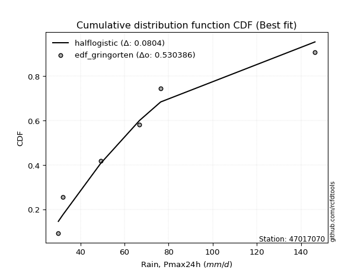</img>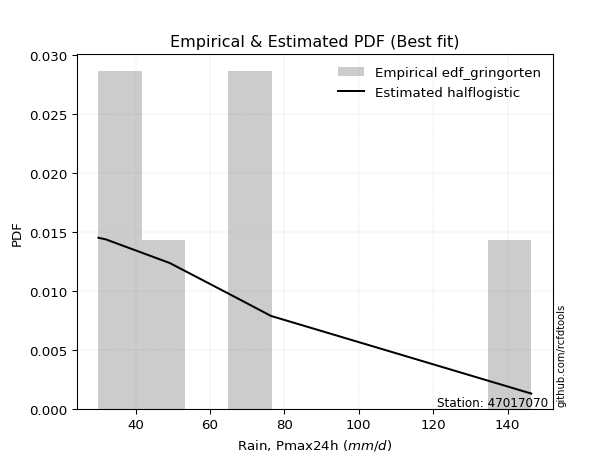</img>

</div>


### 9. EDF Filliben (1975)

The specific values of the constants (0.3175) (often denoted as $alpha$) and (0.365) are derived from a method proposed by James J. Filliben in a 1975 paper. This particular formula is the mean value of the $i$-th order statistic of the normal distribution and is considered a robust and effective plotting position formula for the normal probability plot correlation coefficient test for normality.

<div align="center">


$P=(m-0.3175)/(n+0.365)$


</div>


**9.1. Empirical values**

<div align="center">

|                | 0                   | 1                   | 2                  | 3                  | 4                  | 5                  |
|:---------------|:--------------------|:--------------------|:-------------------|:-------------------|:-------------------|:-------------------|
| date           | 2022                | 2023                | 2020               | 2024               | 2021               | 2019               |
| x              | 30.0                | 32.0                | 49.2               | 66.8               | 76.4               | 146.4              |
| m              | 1                   | 2                   | 3                  | 4                  | 5                  | 6                  |
| empirical_dist | edf_filliben        | edf_filliben        | edf_filliben       | edf_filliben       | edf_filliben       | edf_filliben       |
| empirical      | 0.10722702278083267 | 0.26433621366849963 | 0.4214454045561665 | 0.5785545954438335 | 0.7356637863315004 | 0.8927729772191673 |
| empirical_tr   | 1.1201055873295205  | 1.3593166043780034  | 1.7284453496266123 | 2.3727865796831313 | 3.783060921248143  | 9.326007326007321  |

</div>


**9.2. Kolmogorov-Smirnov fit test (sorted by Δ)**


<div align="center">

|                | 0                   | 1                   | 2                   | 3                   | 4                   | 5                   | 6                  | 7                   | 8                   | 9                   | 10                    | 11                  | 12                  | 13                  | 14                  | 15                  | 16                  | 17                  | 18                  | 19                 | 20                  | 21                 | 22                  | 23                  | 24                  | 25                 | 26                  | 27                  | 28                  | 29                 | 30                 | 31                  | 32                  | 33                 | 34                  | 35                  | 36                  | 37                 | 38                  | 39                  | 40                 | 41                  | 42                 | 43                 | 44                  | 45                  | 46                  | 47                  | 48                  | 49                  | 50                  | 51                  | 52                  | 53                  | 54                  | 55                 | 56                  | 57                  | 58                  | 59                  | 60                 | 61                  | 62                  | 63                  | 64                  | 65                  | 66                 | 67                  | 68                 | 69                  | 70                  | 71                  | 72                  | 73                  | 74                 | 75                 | 76                 | 77                  | 78                  | 79                 | 80                  | 81                  | 82                  | 83                  | 84                 | 85                 | 86             | 87             |
|:---------------|:--------------------|:--------------------|:--------------------|:--------------------|:--------------------|:--------------------|:-------------------|:--------------------|:--------------------|:--------------------|:----------------------|:--------------------|:--------------------|:--------------------|:--------------------|:--------------------|:--------------------|:--------------------|:--------------------|:-------------------|:--------------------|:-------------------|:--------------------|:--------------------|:--------------------|:-------------------|:--------------------|:--------------------|:--------------------|:-------------------|:-------------------|:--------------------|:--------------------|:-------------------|:--------------------|:--------------------|:--------------------|:-------------------|:--------------------|:--------------------|:-------------------|:--------------------|:-------------------|:-------------------|:--------------------|:--------------------|:--------------------|:--------------------|:--------------------|:--------------------|:--------------------|:--------------------|:--------------------|:--------------------|:--------------------|:-------------------|:--------------------|:--------------------|:--------------------|:--------------------|:-------------------|:--------------------|:--------------------|:--------------------|:--------------------|:--------------------|:-------------------|:--------------------|:-------------------|:--------------------|:--------------------|:--------------------|:--------------------|:--------------------|:-------------------|:-------------------|:-------------------|:--------------------|:--------------------|:-------------------|:--------------------|:--------------------|:--------------------|:--------------------|:-------------------|:-------------------|:---------------|:---------------|
| station        | 47017070            | 47017070            | 47017070            | 47017070            | 47017070            | 47017070            | 47017070           | 47017070            | 47017070            | 47017070            | 47017070              | 47017070            | 47017070            | 47017070            | 47017070            | 47017070            | 47017070            | 47017070            | 47017070            | 47017070           | 47017070            | 47017070           | 47017070            | 47017070            | 47017070            | 47017070           | 47017070            | 47017070            | 47017070            | 47017070           | 47017070           | 47017070            | 47017070            | 47017070           | 47017070            | 47017070            | 47017070            | 47017070           | 47017070            | 47017070            | 47017070           | 47017070            | 47017070           | 47017070           | 47017070            | 47017070            | 47017070            | 47017070            | 47017070            | 47017070            | 47017070            | 47017070            | 47017070            | 47017070            | 47017070            | 47017070           | 47017070            | 47017070            | 47017070            | 47017070            | 47017070           | 47017070            | 47017070            | 47017070            | 47017070            | 47017070            | 47017070           | 47017070            | 47017070           | 47017070            | 47017070            | 47017070            | 47017070            | 47017070            | 47017070           | 47017070           | 47017070           | 47017070            | 47017070            | 47017070           | 47017070            | 47017070            | 47017070            | 47017070            | 47017070           | 47017070           | 47017070       | 47017070       |
| empirical_dist | edf_filliben        | edf_filliben        | edf_filliben        | edf_filliben        | edf_filliben        | edf_filliben        | edf_filliben       | edf_filliben        | edf_filliben        | edf_filliben        | edf_filliben          | edf_filliben        | edf_filliben        | edf_filliben        | edf_filliben        | edf_filliben        | edf_filliben        | edf_filliben        | edf_filliben        | edf_filliben       | edf_filliben        | edf_filliben       | edf_filliben        | edf_filliben        | edf_filliben        | edf_filliben       | edf_filliben        | edf_filliben        | edf_filliben        | edf_filliben       | edf_filliben       | edf_filliben        | edf_filliben        | edf_filliben       | edf_filliben        | edf_filliben        | edf_filliben        | edf_filliben       | edf_filliben        | edf_filliben        | edf_filliben       | edf_filliben        | edf_filliben       | edf_filliben       | edf_filliben        | edf_filliben        | edf_filliben        | edf_filliben        | edf_filliben        | edf_filliben        | edf_filliben        | edf_filliben        | edf_filliben        | edf_filliben        | edf_filliben        | edf_filliben       | edf_filliben        | edf_filliben        | edf_filliben        | edf_filliben        | edf_filliben       | edf_filliben        | edf_filliben        | edf_filliben        | edf_filliben        | edf_filliben        | edf_filliben       | edf_filliben        | edf_filliben       | edf_filliben        | edf_filliben        | edf_filliben        | edf_filliben        | edf_filliben        | edf_filliben       | edf_filliben       | edf_filliben       | edf_filliben        | edf_filliben        | edf_filliben       | edf_filliben        | edf_filliben        | edf_filliben        | edf_filliben        | edf_filliben       | edf_filliben       | edf_filliben   | edf_filliben   |
| p_dist         | pearson3            | halfnorm            | gumbel_r            | halflogistic        | t                   | rayleigh            | moyal              | weibull_min         | logchi2             | maxwell             | loglaplace_asymmetric | logloggamma         | logt                | lognorm             | lognorm             | logcrystalball      | logmaxwell          | genlogistic         | lograyleigh         | logistic           | logpearson3         | hypsecant          | logbetaprime        | kstwobign           | loggumbel_l         | betaprime          | nakagami            | logexponnorm        | lognct              | nct                | loggenlogistic     | loginvweibull       | alpha               | logalpha           | loglogistic         | norm                | crystalball         | rice               | loginvgamma         | logncf              | logkstwobign       | fisk                | loghalfnorm        | loghypsecant       | loginvgauss         | loglaplace          | laplace             | loggumbel_r         | logrice             | invgamma            | f                   | lognakagami         | logexpon            | logweibull_min      | logmoyal            | invgauss           | loggenexpon         | loggompertz         | loghalflogistic     | gumbel_l            | exponnorm          | expon               | genexpon            | laplace_asymmetric  | gompertz            | truncnorm           | logf               | chi2                | wald               | loggibrat           | logwald             | gibrat              | gamma               | erlang              | logfisk            | logjohnsonsu       | loglognorm         | ncf                 | logerlang           | fatiguelife        | logfatiguelife      | invweibull          | loggamma            | loggamma            | logtruncnorm       | johnsonsu          | mielke         | logmielke      |
| delta          | 0.07974499327973522 | 0.08040056504645587 | 0.08953809359796089 | 0.08983430630073322 | 0.09501163566781122 | 0.10415721387552856 | 0.1069776141938717 | 0.10722702190375126 | 0.11152420324296797 | 0.11251004421768818 | 0.12051961413186785   | 0.12063456541187709 | 0.12257018434855105 | 0.12257077444142572 | 0.12257077444142572 | 0.12257106140398333 | 0.12260639156238834 | 0.12307696339585661 | 0.12362273791807737 | 0.1268812825461222 | 0.12699689686168508 | 0.1285474664974794 | 0.12958243260344585 | 0.13198443813133837 | 0.13204628435055527 | 0.1324819443551566 | 0.13280712680732387 | 0.13375745862636715 | 0.13378892622422198 | 0.1369679479612596 | 0.1379654164508844 | 0.13796974870097842 | 0.13830548288627154 | 0.1383622246531955 | 0.13925380788403627 | 0.13935811529404085 | 0.13935811900152217 | 0.1397049290479146 | 0.14053469201479127 | 0.14053517449517786 | 0.1414181052432188 | 0.14197226804581475 | 0.1439821837619748 | 0.1475539220860636 | 0.15187590631985892 | 0.15461140889413383 | 0.15570720547397143 | 0.15589841313921093 | 0.15771715418792842 | 0.16313743054612095 | 0.16313756269491586 | 0.16702380477363654 | 0.16934529546007995 | 0.17438586950525037 | 0.18311560363561435 | 0.1849401882946733 | 0.18566214564152017 | 0.19354310465175742 | 0.19843932595920086 | 0.19980665142715004 | 0.2105217040623733 | 0.21143883587297518 | 0.21143898757542698 | 0.21143910793377302 | 0.21144077843364525 | 0.21220339813112465 | 0.2437092679492986 | 0.25276777019406504 | 0.2556500087817149 | 0.26433621366849963 | 0.26433621366849963 | 0.26433621366849963 | 0.26713154824703833 | 0.29505258628830544 | 0.3005472871270307 | 0.3243808093243415 | 0.3478553812965986 | 0.36691576854837604 | 0.37279572027939223 | 0.3755183462736599 | 0.40654019615182435 | 0.42909188907589013 | 0.43580476984539096 | 0.43580476984539096 | 0.5785505534131331 | 0.6655037541397866 | nan            | nan            |
| deltao         | 0.530385761606      | 0.530385761606      | 0.530385761606      | 0.530385761606      | 0.530385761606      | 0.530385761606      | 0.530385761606     | 0.530385761606      | 0.530385761606      | 0.530385761606      | 0.530385761606        | 0.530385761606      | 0.530385761606      | 0.530385761606      | 0.530385761606      | 0.530385761606      | 0.530385761606      | 0.530385761606      | 0.530385761606      | 0.530385761606     | 0.530385761606      | 0.530385761606     | 0.530385761606      | 0.530385761606      | 0.530385761606      | 0.530385761606     | 0.530385761606      | 0.530385761606      | 0.530385761606      | 0.530385761606     | 0.530385761606     | 0.530385761606      | 0.530385761606      | 0.530385761606     | 0.530385761606      | 0.530385761606      | 0.530385761606      | 0.530385761606     | 0.530385761606      | 0.530385761606      | 0.530385761606     | 0.530385761606      | 0.530385761606     | 0.530385761606     | 0.530385761606      | 0.530385761606      | 0.530385761606      | 0.530385761606      | 0.530385761606      | 0.530385761606      | 0.530385761606      | 0.530385761606      | 0.530385761606      | 0.530385761606      | 0.530385761606      | 0.530385761606     | 0.530385761606      | 0.530385761606      | 0.530385761606      | 0.530385761606      | 0.530385761606     | 0.530385761606      | 0.530385761606      | 0.530385761606      | 0.530385761606      | 0.530385761606      | 0.530385761606     | 0.530385761606      | 0.530385761606     | 0.530385761606      | 0.530385761606      | 0.530385761606      | 0.530385761606      | 0.530385761606      | 0.530385761606     | 0.530385761606     | 0.530385761606     | 0.530385761606      | 0.530385761606      | 0.530385761606     | 0.530385761606      | 0.530385761606      | 0.530385761606      | 0.530385761606      | 0.530385761606     | 0.530385761606     | 0.530385761606 | 0.530385761606 |
| eval           | Δo > Δ              | Δo > Δ              | Δo > Δ              | Δo > Δ              | Δo > Δ              | Δo > Δ              | Δo > Δ             | Δo > Δ              | Δo > Δ              | Δo > Δ              | Δo > Δ                | Δo > Δ              | Δo > Δ              | Δo > Δ              | Δo > Δ              | Δo > Δ              | Δo > Δ              | Δo > Δ              | Δo > Δ              | Δo > Δ             | Δo > Δ              | Δo > Δ             | Δo > Δ              | Δo > Δ              | Δo > Δ              | Δo > Δ             | Δo > Δ              | Δo > Δ              | Δo > Δ              | Δo > Δ             | Δo > Δ             | Δo > Δ              | Δo > Δ              | Δo > Δ             | Δo > Δ              | Δo > Δ              | Δo > Δ              | Δo > Δ             | Δo > Δ              | Δo > Δ              | Δo > Δ             | Δo > Δ              | Δo > Δ             | Δo > Δ             | Δo > Δ              | Δo > Δ              | Δo > Δ              | Δo > Δ              | Δo > Δ              | Δo > Δ              | Δo > Δ              | Δo > Δ              | Δo > Δ              | Δo > Δ              | Δo > Δ              | Δo > Δ             | Δo > Δ              | Δo > Δ              | Δo > Δ              | Δo > Δ              | Δo > Δ             | Δo > Δ              | Δo > Δ              | Δo > Δ              | Δo > Δ              | Δo > Δ              | Δo > Δ             | Δo > Δ              | Δo > Δ             | Δo > Δ              | Δo > Δ              | Δo > Δ              | Δo > Δ              | Δo > Δ              | Δo > Δ             | Δo > Δ             | Δo > Δ             | Δo > Δ              | Δo > Δ              | Δo > Δ             | Δo > Δ              | Δo > Δ              | Δo > Δ              | Δo > Δ              | Δo <= Δ            | Δo <= Δ            | Δo <= Δ        | Δo <= Δ        |
| fit            | 1                   | 1                   | 1                   | 1                   | 1                   | 1                   | 1                  | 1                   | 1                   | 1                   | 1                     | 1                   | 1                   | 1                   | 1                   | 1                   | 1                   | 1                   | 1                   | 1                  | 1                   | 1                  | 1                   | 1                   | 1                   | 1                  | 1                   | 1                   | 1                   | 1                  | 1                  | 1                   | 1                   | 1                  | 1                   | 1                   | 1                   | 1                  | 1                   | 1                   | 1                  | 1                   | 1                  | 1                  | 1                   | 1                   | 1                   | 1                   | 1                   | 1                   | 1                   | 1                   | 1                   | 1                   | 1                   | 1                  | 1                   | 1                   | 1                   | 1                   | 1                  | 1                   | 1                   | 1                   | 1                   | 1                   | 1                  | 1                   | 1                  | 1                   | 1                   | 1                   | 1                   | 1                   | 1                  | 1                  | 1                  | 1                   | 1                   | 1                  | 1                   | 1                   | 1                   | 1                   | 0                  | 0                  | 0              | 0              |
| n              | 6                   | 6                   | 6                   | 6                   | 6                   | 6                   | 6                  | 6                   | 6                   | 6                   | 6                     | 6                   | 6                   | 6                   | 6                   | 6                   | 6                   | 6                   | 6                   | 6                  | 6                   | 6                  | 6                   | 6                   | 6                   | 6                  | 6                   | 6                   | 6                   | 6                  | 6                  | 6                   | 6                   | 6                  | 6                   | 6                   | 6                   | 6                  | 6                   | 6                   | 6                  | 6                   | 6                  | 6                  | 6                   | 6                   | 6                   | 6                   | 6                   | 6                   | 6                   | 6                   | 6                   | 6                   | 6                   | 6                  | 6                   | 6                   | 6                   | 6                   | 6                  | 6                   | 6                   | 6                   | 6                   | 6                   | 6                  | 6                   | 6                  | 6                   | 6                   | 6                   | 6                   | 6                   | 6                  | 6                  | 6                  | 6                   | 6                   | 6                  | 6                   | 6                   | 6                   | 6                   | 6                  | 6                  | 6              | 6              |
| best_fit       | 1                   | 0                   | 0                   | 0                   | 0                   | 0                   | 0                  | 0                   | 0                   | 0                   | 0                     | 0                   | 0                   | 0                   | 0                   | 0                   | 0                   | 0                   | 0                   | 0                  | 0                   | 0                  | 0                   | 0                   | 0                   | 0                  | 0                   | 0                   | 0                   | 0                  | 0                  | 0                   | 0                   | 0                  | 0                   | 0                   | 0                   | 0                  | 0                   | 0                   | 0                  | 0                   | 0                  | 0                  | 0                   | 0                   | 0                   | 0                   | 0                   | 0                   | 0                   | 0                   | 0                   | 0                   | 0                   | 0                  | 0                   | 0                   | 0                   | 0                   | 0                  | 0                   | 0                   | 0                   | 0                   | 0                   | 0                  | 0                   | 0                  | 0                   | 0                   | 0                   | 0                   | 0                   | 0                  | 0                  | 0                  | 0                   | 0                   | 0                  | 0                   | 0                   | 0                   | 0                   | 0                  | 0                  | 0              | 0              |
| best_fit_sort  | 1                   | 2                   | 3                   | 4                   | 5                   | 6                   | 7                  | 8                   | 9                   | 10                  | 11                    | 12                  | 13                  | 14                  | 15                  | 16                  | 17                  | 18                  | 19                  | 20                 | 21                  | 22                 | 23                  | 24                  | 25                  | 26                 | 27                  | 28                  | 29                  | 30                 | 31                 | 32                  | 33                  | 34                 | 35                  | 36                  | 37                  | 38                 | 39                  | 40                  | 41                 | 42                  | 43                 | 44                 | 45                  | 46                  | 47                  | 48                  | 49                  | 50                  | 51                  | 52                  | 53                  | 54                  | 55                  | 56                 | 57                  | 58                  | 59                  | 60                  | 61                 | 62                  | 63                  | 64                  | 65                  | 66                  | 67                 | 68                  | 69                 | 70                  | 71                  | 72                  | 73                  | 74                  | 75                 | 76                 | 77                 | 78                  | 79                  | 80                 | 81                  | 82                  | 83                  | 84                  | 85                 | 86                 | 87             | 88             |

</div>


**9.3. Best fit**

<div align="center">

|   id |   station | empirical_dist   | p_dist   |    delta |   deltao | eval   |   fit |   n |   best_fit |   best_fit_sort |
|-----:|----------:|:-----------------|:---------|---------:|---------:|:-------|------:|----:|-----------:|----------------:|
|    0 |  47017070 | edf_filliben     | pearson3 | 0.079745 | 0.530386 | Δo > Δ |     1 |   6 |          1 |               1 |

</div>


<div align="center">

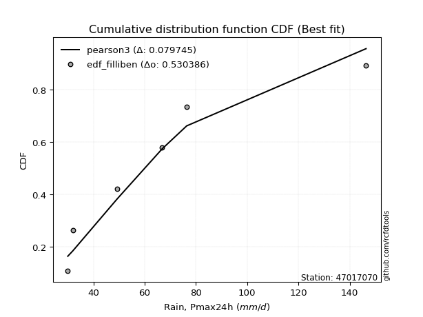</img></img>

</div>


### 10. EDF Jenkinson (1977)

The Jenkinson formula in hydrology is an empirical plotting position formula used to estimate the non-exceedance probability _(P)_ or return period _(T)_ of a given ordered observation within a sample. It is a widely used method in the frequency analysis of extreme events such as floods and rainfall, as it provides a distribution-free way to plot data. _a≈0.31_ and _b≈0.38_ are constants derived to approximate the median of the probability distribution for the given rank.

<div align="center">


$P=(m-a)/(n+b)$


</div>


**10.1. Empirical values**

<div align="center">

|                | 0                   | 1                   | 2                  | 3                  | 4                  | 5                  |
|:---------------|:--------------------|:--------------------|:-------------------|:-------------------|:-------------------|:-------------------|
| date           | 2022                | 2023                | 2020               | 2024               | 2021               | 2019               |
| x              | 30.0                | 32.0                | 49.2               | 66.8               | 76.4               | 146.4              |
| m              | 1                   | 2                   | 3                  | 4                  | 5                  | 6                  |
| empirical_dist | edf_jenkinson       | edf_jenkinson       | edf_jenkinson      | edf_jenkinson      | edf_jenkinson      | edf_jenkinson      |
| empirical      | 0.10815047021943573 | 0.26489028213166144 | 0.4216300940438871 | 0.5783699059561128 | 0.7351097178683387 | 0.8918495297805643 |
| empirical_tr   | 1.1212653778558874  | 1.3603411513859276  | 1.7289972899728996 | 2.3717472118959106 | 3.7751479289940844 | 9.246376811594207  |

</div>


**10.2. Kolmogorov-Smirnov fit test (sorted by Δ)**


<div align="center">

|                | 0                   | 1                   | 2                  | 3                   | 4                   | 5                   | 6                  | 7                   | 8                   | 9                   | 10                    | 11                  | 12                  | 13                  | 14                  | 15                  | 16                  | 17                  | 18                  | 19                  | 20                 | 21              | 22                  | 23                  | 24                  | 25                  | 26                 | 27                  | 28                  | 29                 | 30                 | 31                 | 32                  | 33                 | 34                  | 35                 | 36                  | 37                 | 38                  | 39                  | 40                 | 41                  | 42                 | 43                 | 44                  | 45                  | 46                  | 47                  | 48                  | 49                  | 50                  | 51                  | 52                  | 53                  | 54                  | 55                 | 56                  | 57                  | 58                  | 59                 | 60                 | 61                | 62                  | 63                  | 64                  | 65                  | 66                | 67                  | 68                 | 69                  | 70                  | 71                  | 72                | 73                 | 74                  | 75                 | 76                 | 77                | 78                 | 79                 | 80                  | 81                 | 82                  | 83                  | 84                 | 85                 | 86             | 87             |
|:---------------|:--------------------|:--------------------|:-------------------|:--------------------|:--------------------|:--------------------|:-------------------|:--------------------|:--------------------|:--------------------|:----------------------|:--------------------|:--------------------|:--------------------|:--------------------|:--------------------|:--------------------|:--------------------|:--------------------|:--------------------|:-------------------|:----------------|:--------------------|:--------------------|:--------------------|:--------------------|:-------------------|:--------------------|:--------------------|:-------------------|:-------------------|:-------------------|:--------------------|:-------------------|:--------------------|:-------------------|:--------------------|:-------------------|:--------------------|:--------------------|:-------------------|:--------------------|:-------------------|:-------------------|:--------------------|:--------------------|:--------------------|:--------------------|:--------------------|:--------------------|:--------------------|:--------------------|:--------------------|:--------------------|:--------------------|:-------------------|:--------------------|:--------------------|:--------------------|:-------------------|:-------------------|:------------------|:--------------------|:--------------------|:--------------------|:--------------------|:------------------|:--------------------|:-------------------|:--------------------|:--------------------|:--------------------|:------------------|:-------------------|:--------------------|:-------------------|:-------------------|:------------------|:-------------------|:-------------------|:--------------------|:-------------------|:--------------------|:--------------------|:-------------------|:-------------------|:---------------|:---------------|
| station        | 47017070            | 47017070            | 47017070           | 47017070            | 47017070            | 47017070            | 47017070           | 47017070            | 47017070            | 47017070            | 47017070              | 47017070            | 47017070            | 47017070            | 47017070            | 47017070            | 47017070            | 47017070            | 47017070            | 47017070            | 47017070           | 47017070        | 47017070            | 47017070            | 47017070            | 47017070            | 47017070           | 47017070            | 47017070            | 47017070           | 47017070           | 47017070           | 47017070            | 47017070           | 47017070            | 47017070           | 47017070            | 47017070           | 47017070            | 47017070            | 47017070           | 47017070            | 47017070           | 47017070           | 47017070            | 47017070            | 47017070            | 47017070            | 47017070            | 47017070            | 47017070            | 47017070            | 47017070            | 47017070            | 47017070            | 47017070           | 47017070            | 47017070            | 47017070            | 47017070           | 47017070           | 47017070          | 47017070            | 47017070            | 47017070            | 47017070            | 47017070          | 47017070            | 47017070           | 47017070            | 47017070            | 47017070            | 47017070          | 47017070           | 47017070            | 47017070           | 47017070           | 47017070          | 47017070           | 47017070           | 47017070            | 47017070           | 47017070            | 47017070            | 47017070           | 47017070           | 47017070       | 47017070       |
| empirical_dist | edf_jenkinson       | edf_jenkinson       | edf_jenkinson      | edf_jenkinson       | edf_jenkinson       | edf_jenkinson       | edf_jenkinson      | edf_jenkinson       | edf_jenkinson       | edf_jenkinson       | edf_jenkinson         | edf_jenkinson       | edf_jenkinson       | edf_jenkinson       | edf_jenkinson       | edf_jenkinson       | edf_jenkinson       | edf_jenkinson       | edf_jenkinson       | edf_jenkinson       | edf_jenkinson      | edf_jenkinson   | edf_jenkinson       | edf_jenkinson       | edf_jenkinson       | edf_jenkinson       | edf_jenkinson      | edf_jenkinson       | edf_jenkinson       | edf_jenkinson      | edf_jenkinson      | edf_jenkinson      | edf_jenkinson       | edf_jenkinson      | edf_jenkinson       | edf_jenkinson      | edf_jenkinson       | edf_jenkinson      | edf_jenkinson       | edf_jenkinson       | edf_jenkinson      | edf_jenkinson       | edf_jenkinson      | edf_jenkinson      | edf_jenkinson       | edf_jenkinson       | edf_jenkinson       | edf_jenkinson       | edf_jenkinson       | edf_jenkinson       | edf_jenkinson       | edf_jenkinson       | edf_jenkinson       | edf_jenkinson       | edf_jenkinson       | edf_jenkinson      | edf_jenkinson       | edf_jenkinson       | edf_jenkinson       | edf_jenkinson      | edf_jenkinson      | edf_jenkinson     | edf_jenkinson       | edf_jenkinson       | edf_jenkinson       | edf_jenkinson       | edf_jenkinson     | edf_jenkinson       | edf_jenkinson      | edf_jenkinson       | edf_jenkinson       | edf_jenkinson       | edf_jenkinson     | edf_jenkinson      | edf_jenkinson       | edf_jenkinson      | edf_jenkinson      | edf_jenkinson     | edf_jenkinson      | edf_jenkinson      | edf_jenkinson       | edf_jenkinson      | edf_jenkinson       | edf_jenkinson       | edf_jenkinson      | edf_jenkinson      | edf_jenkinson  | edf_jenkinson  |
| p_dist         | halfnorm            | pearson3            | gumbel_r           | halflogistic        | t                   | rayleigh            | moyal              | weibull_min         | logchi2             | maxwell             | loglaplace_asymmetric | logloggamma         | logt                | lognorm             | lognorm             | logcrystalball      | logmaxwell          | genlogistic         | lograyleigh         | logistic            | logpearson3        | hypsecant       | logbetaprime        | kstwobign           | loggumbel_l         | nakagami            | betaprime          | logexponnorm        | lognct              | nct                | alpha              | loggenlogistic     | loginvweibull       | norm               | crystalball         | logalpha           | loglogistic         | rice               | loginvgamma         | logncf              | logkstwobign       | fisk                | loghalfnorm        | loghypsecant       | loginvgauss         | loglaplace          | laplace             | loggumbel_r         | logrice             | invgamma            | f                   | lognakagami         | logexpon            | logweibull_min      | logmoyal            | invgauss           | loggenexpon         | loggompertz         | loghalflogistic     | gumbel_l           | exponnorm          | expon             | genexpon            | laplace_asymmetric  | gompertz            | truncnorm           | logf              | chi2                | wald               | loggibrat           | logwald             | gibrat              | gamma             | erlang             | logfisk             | logjohnsonsu       | loglognorm         | ncf               | logerlang          | fatiguelife        | logfatiguelife      | invweibull         | loggamma            | loggamma            | logtruncnorm       | johnsonsu          | mielke         | logmielke      |
| delta          | 0.07984649658329412 | 0.08029906174289703 | 0.0900921620611227 | 0.09038837476389502 | 0.09408818822920816 | 0.10360314541236681 | 0.1075316826570335 | 0.10815046934235432 | 0.11060075580436501 | 0.11195597575452643 | 0.12107368259502965   | 0.12118863387503889 | 0.12312425281171285 | 0.12312484290458753 | 0.12312484290458753 | 0.12312512986714513 | 0.12316046002555014 | 0.12363103185901841 | 0.12417680638123918 | 0.12632721408296044 | 0.1275509653248469 | 0.1287321559852 | 0.13013650106660765 | 0.13253850659450017 | 0.13260035281371707 | 0.13262243731960327 | 0.1330360128183184 | 0.13431152708952895 | 0.13434299468738378 | 0.1375220164244214 | 0.1384901723739922 | 0.1385194849140462 | 0.13852381716414022 | 0.1388040468308791 | 0.13880405053836042 | 0.1389162931163573 | 0.13980787634719807 | 0.1402589975110764 | 0.14108876047795307 | 0.14108924295833966 | 0.1419721737063806 | 0.14252633650897656 | 0.1445362522251366 | 0.1481079905492254 | 0.15206059580757958 | 0.15516547735729563 | 0.15589189496169203 | 0.15645248160237274 | 0.15827122265109023 | 0.16295274105840035 | 0.16295287320719526 | 0.16683911528591594 | 0.16989936392324176 | 0.17346242206664741 | 0.18366967209877616 | 0.1847554988069527 | 0.18621621410468198 | 0.19409717311491922 | 0.19899339442236266 | 0.1992525829639883 | 0.2110757725255351 | 0.211992904336137 | 0.21199305603858878 | 0.21199317639693482 | 0.21199484689680706 | 0.21275746659428646 | 0.243524578461578 | 0.25258308070634444 | 0.2562040772448767 | 0.26489028213166144 | 0.26489028213166144 | 0.26489028213166144 | 0.267316237734759 | 0.2952372757760261 | 0.29962383968842776 | 0.3238267408611797 | 0.3473013128334368 | 0.365992321109773 | 0.3726110307916716 | 0.3753336567859393 | 0.40635550666410375 | 0.4281684416372872 | 0.43562008035767036 | 0.43562008035767036 | 0.5783658639254124 | 0.6649496856766247 | nan            | nan            |
| deltao         | 0.530385761606      | 0.530385761606      | 0.530385761606     | 0.530385761606      | 0.530385761606      | 0.530385761606      | 0.530385761606     | 0.530385761606      | 0.530385761606      | 0.530385761606      | 0.530385761606        | 0.530385761606      | 0.530385761606      | 0.530385761606      | 0.530385761606      | 0.530385761606      | 0.530385761606      | 0.530385761606      | 0.530385761606      | 0.530385761606      | 0.530385761606     | 0.530385761606  | 0.530385761606      | 0.530385761606      | 0.530385761606      | 0.530385761606      | 0.530385761606     | 0.530385761606      | 0.530385761606      | 0.530385761606     | 0.530385761606     | 0.530385761606     | 0.530385761606      | 0.530385761606     | 0.530385761606      | 0.530385761606     | 0.530385761606      | 0.530385761606     | 0.530385761606      | 0.530385761606      | 0.530385761606     | 0.530385761606      | 0.530385761606     | 0.530385761606     | 0.530385761606      | 0.530385761606      | 0.530385761606      | 0.530385761606      | 0.530385761606      | 0.530385761606      | 0.530385761606      | 0.530385761606      | 0.530385761606      | 0.530385761606      | 0.530385761606      | 0.530385761606     | 0.530385761606      | 0.530385761606      | 0.530385761606      | 0.530385761606     | 0.530385761606     | 0.530385761606    | 0.530385761606      | 0.530385761606      | 0.530385761606      | 0.530385761606      | 0.530385761606    | 0.530385761606      | 0.530385761606     | 0.530385761606      | 0.530385761606      | 0.530385761606      | 0.530385761606    | 0.530385761606     | 0.530385761606      | 0.530385761606     | 0.530385761606     | 0.530385761606    | 0.530385761606     | 0.530385761606     | 0.530385761606      | 0.530385761606     | 0.530385761606      | 0.530385761606      | 0.530385761606     | 0.530385761606     | 0.530385761606 | 0.530385761606 |
| eval           | Δo > Δ              | Δo > Δ              | Δo > Δ             | Δo > Δ              | Δo > Δ              | Δo > Δ              | Δo > Δ             | Δo > Δ              | Δo > Δ              | Δo > Δ              | Δo > Δ                | Δo > Δ              | Δo > Δ              | Δo > Δ              | Δo > Δ              | Δo > Δ              | Δo > Δ              | Δo > Δ              | Δo > Δ              | Δo > Δ              | Δo > Δ             | Δo > Δ          | Δo > Δ              | Δo > Δ              | Δo > Δ              | Δo > Δ              | Δo > Δ             | Δo > Δ              | Δo > Δ              | Δo > Δ             | Δo > Δ             | Δo > Δ             | Δo > Δ              | Δo > Δ             | Δo > Δ              | Δo > Δ             | Δo > Δ              | Δo > Δ             | Δo > Δ              | Δo > Δ              | Δo > Δ             | Δo > Δ              | Δo > Δ             | Δo > Δ             | Δo > Δ              | Δo > Δ              | Δo > Δ              | Δo > Δ              | Δo > Δ              | Δo > Δ              | Δo > Δ              | Δo > Δ              | Δo > Δ              | Δo > Δ              | Δo > Δ              | Δo > Δ             | Δo > Δ              | Δo > Δ              | Δo > Δ              | Δo > Δ             | Δo > Δ             | Δo > Δ            | Δo > Δ              | Δo > Δ              | Δo > Δ              | Δo > Δ              | Δo > Δ            | Δo > Δ              | Δo > Δ             | Δo > Δ              | Δo > Δ              | Δo > Δ              | Δo > Δ            | Δo > Δ             | Δo > Δ              | Δo > Δ             | Δo > Δ             | Δo > Δ            | Δo > Δ             | Δo > Δ             | Δo > Δ              | Δo > Δ             | Δo > Δ              | Δo > Δ              | Δo <= Δ            | Δo <= Δ            | Δo <= Δ        | Δo <= Δ        |
| fit            | 1                   | 1                   | 1                  | 1                   | 1                   | 1                   | 1                  | 1                   | 1                   | 1                   | 1                     | 1                   | 1                   | 1                   | 1                   | 1                   | 1                   | 1                   | 1                   | 1                   | 1                  | 1               | 1                   | 1                   | 1                   | 1                   | 1                  | 1                   | 1                   | 1                  | 1                  | 1                  | 1                   | 1                  | 1                   | 1                  | 1                   | 1                  | 1                   | 1                   | 1                  | 1                   | 1                  | 1                  | 1                   | 1                   | 1                   | 1                   | 1                   | 1                   | 1                   | 1                   | 1                   | 1                   | 1                   | 1                  | 1                   | 1                   | 1                   | 1                  | 1                  | 1                 | 1                   | 1                   | 1                   | 1                   | 1                 | 1                   | 1                  | 1                   | 1                   | 1                   | 1                 | 1                  | 1                   | 1                  | 1                  | 1                 | 1                  | 1                  | 1                   | 1                  | 1                   | 1                   | 0                  | 0                  | 0              | 0              |
| n              | 6                   | 6                   | 6                  | 6                   | 6                   | 6                   | 6                  | 6                   | 6                   | 6                   | 6                     | 6                   | 6                   | 6                   | 6                   | 6                   | 6                   | 6                   | 6                   | 6                   | 6                  | 6               | 6                   | 6                   | 6                   | 6                   | 6                  | 6                   | 6                   | 6                  | 6                  | 6                  | 6                   | 6                  | 6                   | 6                  | 6                   | 6                  | 6                   | 6                   | 6                  | 6                   | 6                  | 6                  | 6                   | 6                   | 6                   | 6                   | 6                   | 6                   | 6                   | 6                   | 6                   | 6                   | 6                   | 6                  | 6                   | 6                   | 6                   | 6                  | 6                  | 6                 | 6                   | 6                   | 6                   | 6                   | 6                 | 6                   | 6                  | 6                   | 6                   | 6                   | 6                 | 6                  | 6                   | 6                  | 6                  | 6                 | 6                  | 6                  | 6                   | 6                  | 6                   | 6                   | 6                  | 6                  | 6              | 6              |
| best_fit       | 1                   | 0                   | 0                  | 0                   | 0                   | 0                   | 0                  | 0                   | 0                   | 0                   | 0                     | 0                   | 0                   | 0                   | 0                   | 0                   | 0                   | 0                   | 0                   | 0                   | 0                  | 0               | 0                   | 0                   | 0                   | 0                   | 0                  | 0                   | 0                   | 0                  | 0                  | 0                  | 0                   | 0                  | 0                   | 0                  | 0                   | 0                  | 0                   | 0                   | 0                  | 0                   | 0                  | 0                  | 0                   | 0                   | 0                   | 0                   | 0                   | 0                   | 0                   | 0                   | 0                   | 0                   | 0                   | 0                  | 0                   | 0                   | 0                   | 0                  | 0                  | 0                 | 0                   | 0                   | 0                   | 0                   | 0                 | 0                   | 0                  | 0                   | 0                   | 0                   | 0                 | 0                  | 0                   | 0                  | 0                  | 0                 | 0                  | 0                  | 0                   | 0                  | 0                   | 0                   | 0                  | 0                  | 0              | 0              |
| best_fit_sort  | 1                   | 2                   | 3                  | 4                   | 5                   | 6                   | 7                  | 8                   | 9                   | 10                  | 11                    | 12                  | 13                  | 14                  | 15                  | 16                  | 17                  | 18                  | 19                  | 20                  | 21                 | 22              | 23                  | 24                  | 25                  | 26                  | 27                 | 28                  | 29                  | 30                 | 31                 | 32                 | 33                  | 34                 | 35                  | 36                 | 37                  | 38                 | 39                  | 40                  | 41                 | 42                  | 43                 | 44                 | 45                  | 46                  | 47                  | 48                  | 49                  | 50                  | 51                  | 52                  | 53                  | 54                  | 55                  | 56                 | 57                  | 58                  | 59                  | 60                 | 61                 | 62                | 63                  | 64                  | 65                  | 66                  | 67                | 68                  | 69                 | 70                  | 71                  | 72                  | 73                | 74                 | 75                  | 76                 | 77                 | 78                | 79                 | 80                 | 81                  | 82                 | 83                  | 84                  | 85                 | 86                 | 87             | 88             |

</div>


**10.3. Best fit**

<div align="center">

|   id |   station | empirical_dist   | p_dist   |     delta |   deltao | eval   |   fit |   n |   best_fit |   best_fit_sort |
|-----:|----------:|:-----------------|:---------|----------:|---------:|:-------|------:|----:|-----------:|----------------:|
|    0 |  47017070 | edf_jenkinson    | halfnorm | 0.0798465 | 0.530386 | Δo > Δ |     1 |   6 |          1 |               1 |

</div>


<div align="center">

</img></img>

</div>


### 11. EDF Cunnane (1978)

Cunnane´s work in statistical hydrology has focused on the performance and evaluation of different probability distributions (such as GEV, Gumbel, Lognormal) for flood frequency estimation. _b_ is a constant, typically set to 0.4.

<div align="center">


$P=(m-b)/(n+1-2b)$


</div>


**11.1. Empirical values**

<div align="center">

|                | 0                  | 1                   | 2                   | 3                  | 4                  | 5                  |
|:---------------|:-------------------|:--------------------|:--------------------|:-------------------|:-------------------|:-------------------|
| date           | 2022               | 2023                | 2020                | 2024               | 2021               | 2019               |
| x              | 30.0               | 32.0                | 49.2                | 66.8               | 76.4               | 146.4              |
| m              | 1                  | 2                   | 3                   | 4                  | 5                  | 6                  |
| empirical_dist | edf_cunnane        | edf_cunnane         | edf_cunnane         | edf_cunnane        | edf_cunnane        | edf_cunnane        |
| empirical      | 0.0967741935483871 | 0.25806451612903225 | 0.41935483870967744 | 0.5806451612903226 | 0.7419354838709676 | 0.9032258064516128 |
| empirical_tr   | 1.1071428571428572 | 1.3478260869565217  | 1.7222222222222225  | 2.384615384615385  | 3.8749999999999982 | 10.333333333333318 |

</div>


**11.2. Kolmogorov-Smirnov fit test (sorted by Δ)**


<div align="center">

|                | 0                   | 1                   | 2                   | 3                   | 4                   | 5                   | 6                  | 7                   | 8                     | 9                   | 10                  | 11                  | 12                  | 13                  | 14                  | 15                  | 16               | 17                  | 18                 | 19                  | 20                  | 21                | 22                  | 23                 | 24                 | 25                  | 26                 | 27                  | 28                | 29                  | 30                  | 31                 | 32                 | 33                  | 34                 | 35                  | 36                  | 37                  | 38                  | 39                  | 40                  | 41                  | 42                  | 43                 | 44                  | 45                  | 46                  | 47                  | 48                  | 49                  | 50                  | 51                  | 52                  | 53                  | 54                 | 55                  | 56                  | 57                  | 58                  | 59                  | 60                 | 61                 | 62                  | 63                  | 64                  | 65                  | 66                  | 67                  | 68                  | 69                  | 70                  | 71                  | 72                 | 73                 | 74                 | 75                  | 76                | 77                 | 78                  | 79                  | 80                  | 81                  | 82                  | 83                  | 84                 | 85                 | 86             | 87             |
|:---------------|:--------------------|:--------------------|:--------------------|:--------------------|:--------------------|:--------------------|:-------------------|:--------------------|:----------------------|:--------------------|:--------------------|:--------------------|:--------------------|:--------------------|:--------------------|:--------------------|:-----------------|:--------------------|:-------------------|:--------------------|:--------------------|:------------------|:--------------------|:-------------------|:-------------------|:--------------------|:-------------------|:--------------------|:------------------|:--------------------|:--------------------|:-------------------|:-------------------|:--------------------|:-------------------|:--------------------|:--------------------|:--------------------|:--------------------|:--------------------|:--------------------|:--------------------|:--------------------|:-------------------|:--------------------|:--------------------|:--------------------|:--------------------|:--------------------|:--------------------|:--------------------|:--------------------|:--------------------|:--------------------|:-------------------|:--------------------|:--------------------|:--------------------|:--------------------|:--------------------|:-------------------|:-------------------|:--------------------|:--------------------|:--------------------|:--------------------|:--------------------|:--------------------|:--------------------|:--------------------|:--------------------|:--------------------|:-------------------|:-------------------|:-------------------|:--------------------|:------------------|:-------------------|:--------------------|:--------------------|:--------------------|:--------------------|:--------------------|:--------------------|:-------------------|:-------------------|:---------------|:---------------|
| station        | 47017070            | 47017070            | 47017070            | 47017070            | 47017070            | 47017070            | 47017070           | 47017070            | 47017070              | 47017070            | 47017070            | 47017070            | 47017070            | 47017070            | 47017070            | 47017070            | 47017070         | 47017070            | 47017070           | 47017070            | 47017070            | 47017070          | 47017070            | 47017070           | 47017070           | 47017070            | 47017070           | 47017070            | 47017070          | 47017070            | 47017070            | 47017070           | 47017070           | 47017070            | 47017070           | 47017070            | 47017070            | 47017070            | 47017070            | 47017070            | 47017070            | 47017070            | 47017070            | 47017070           | 47017070            | 47017070            | 47017070            | 47017070            | 47017070            | 47017070            | 47017070            | 47017070            | 47017070            | 47017070            | 47017070           | 47017070            | 47017070            | 47017070            | 47017070            | 47017070            | 47017070           | 47017070           | 47017070            | 47017070            | 47017070            | 47017070            | 47017070            | 47017070            | 47017070            | 47017070            | 47017070            | 47017070            | 47017070           | 47017070           | 47017070           | 47017070            | 47017070          | 47017070           | 47017070            | 47017070            | 47017070            | 47017070            | 47017070            | 47017070            | 47017070           | 47017070           | 47017070       | 47017070       |
| empirical_dist | edf_cunnane         | edf_cunnane         | edf_cunnane         | edf_cunnane         | edf_cunnane         | edf_cunnane         | edf_cunnane        | edf_cunnane         | edf_cunnane           | edf_cunnane         | edf_cunnane         | edf_cunnane         | edf_cunnane         | edf_cunnane         | edf_cunnane         | edf_cunnane         | edf_cunnane      | edf_cunnane         | edf_cunnane        | edf_cunnane         | edf_cunnane         | edf_cunnane       | edf_cunnane         | edf_cunnane        | edf_cunnane        | edf_cunnane         | edf_cunnane        | edf_cunnane         | edf_cunnane       | edf_cunnane         | edf_cunnane         | edf_cunnane        | edf_cunnane        | edf_cunnane         | edf_cunnane        | edf_cunnane         | edf_cunnane         | edf_cunnane         | edf_cunnane         | edf_cunnane         | edf_cunnane         | edf_cunnane         | edf_cunnane         | edf_cunnane        | edf_cunnane         | edf_cunnane         | edf_cunnane         | edf_cunnane         | edf_cunnane         | edf_cunnane         | edf_cunnane         | edf_cunnane         | edf_cunnane         | edf_cunnane         | edf_cunnane        | edf_cunnane         | edf_cunnane         | edf_cunnane         | edf_cunnane         | edf_cunnane         | edf_cunnane        | edf_cunnane        | edf_cunnane         | edf_cunnane         | edf_cunnane         | edf_cunnane         | edf_cunnane         | edf_cunnane         | edf_cunnane         | edf_cunnane         | edf_cunnane         | edf_cunnane         | edf_cunnane        | edf_cunnane        | edf_cunnane        | edf_cunnane         | edf_cunnane       | edf_cunnane        | edf_cunnane         | edf_cunnane         | edf_cunnane         | edf_cunnane         | edf_cunnane         | edf_cunnane         | edf_cunnane        | edf_cunnane        | edf_cunnane    | edf_cunnane    |
| p_dist         | pearson3            | gumbel_r            | halflogistic        | halfnorm            | moyal               | weibull_min         | t                  | rayleigh            | loglaplace_asymmetric | logloggamma         | logt                | lognorm             | lognorm             | logcrystalball      | logmaxwell          | genlogistic         | lograyleigh      | maxwell             | logpearson3        | logchi2             | logbetaprime        | kstwobign         | loggumbel_l         | betaprime          | hypsecant          | logexponnorm        | lognct             | nct                 | loggenlogistic    | loginvweibull       | logalpha            | loglogistic        | logistic           | rice                | loginvgamma        | logncf              | nakagami            | logkstwobign        | fisk                | loghalfnorm         | alpha               | loghypsecant        | norm                | crystalball        | loglaplace          | loggumbel_r         | logrice             | loginvgauss         | laplace             | logexpon            | invgamma            | f                   | lognakagami         | logmoyal            | loggenexpon        | logweibull_min      | invgauss            | loggompertz         | loghalflogistic     | exponnorm           | expon              | genexpon           | laplace_asymmetric  | gompertz            | truncnorm           | gumbel_l            | logf                | wald                | chi2                | loggibrat           | logwald             | gibrat              | gamma              | erlang             | logfisk            | logjohnsonsu        | loglognorm        | logerlang          | ncf                 | fatiguelife         | logfatiguelife      | loggamma            | loggamma            | invweibull          | logtruncnorm       | johnsonsu          | mielke         | logmielke      |
| delta          | 0.07978812357816378 | 0.08326639605849351 | 0.08356260876126584 | 0.08864988194679652 | 0.10070591665440431 | 0.10197964835652418 | 0.1054644649002568 | 0.11042891141499578 | 0.11424791659240047   | 0.11436286787240971 | 0.11629848680908367 | 0.11629907690195834 | 0.11629907690195834 | 0.11629936386451595 | 0.11633469402292096 | 0.11680526585638923 | 0.11735104037861 | 0.11878174175715539 | 0.1207251993222177 | 0.12197703247541347 | 0.12331073506397847 | 0.125712740591871 | 0.12577458681108789 | 0.1262102468156892 | 0.1264569006509903 | 0.12748576108689977 | 0.1275172286847546 | 0.13069625042179223 | 0.131693718911417 | 0.13169805116151104 | 0.13209052711372812 | 0.1329821103445689 | 0.1331529800855894 | 0.13343323150844721 | 0.1342629944753239 | 0.13426347695571048 | 0.13489769265381296 | 0.13514640770375141 | 0.13570057050634737 | 0.13771048622250742 | 0.13813426545532975 | 0.14128222454659622 | 0.14562981283350807 | 0.1456298165409894 | 0.14833971135466645 | 0.14962671559974355 | 0.15144545664846104 | 0.15252061103996545 | 0.15361663962748234 | 0.16307359792061257 | 0.16522799639261004 | 0.16522812854140495 | 0.16911437062012563 | 0.17684390609614697 | 0.1793904481020528 | 0.18483869873769587 | 0.18703075414116238 | 0.18727140711229004 | 0.19216762841973348 | 0.20425000652290592 | 0.2051671383335078 | 0.2051672900359596 | 0.20516741039430564 | 0.20516908089417787 | 0.20593170059165727 | 0.20607834896661725 | 0.24579983379578768 | 0.24937831124224752 | 0.25485833604055413 | 0.25806451612903225 | 0.25806451612903225 | 0.25806451612903225 | 0.2650409824005492 | 0.2929620204418163 | 0.3110001163594762 | 0.33065250686380887 | 0.354127078836066 | 0.3748862861258813 | 0.37736859778082166 | 0.37760891212014897 | 0.40863076199831344 | 0.43789533569188005 | 0.43789533569188005 | 0.43954471830833564 | 0.5806411192596223 | 0.6717754516792539 | nan            | nan            |
| deltao         | 0.530385761606      | 0.530385761606      | 0.530385761606      | 0.530385761606      | 0.530385761606      | 0.530385761606      | 0.530385761606     | 0.530385761606      | 0.530385761606        | 0.530385761606      | 0.530385761606      | 0.530385761606      | 0.530385761606      | 0.530385761606      | 0.530385761606      | 0.530385761606      | 0.530385761606   | 0.530385761606      | 0.530385761606     | 0.530385761606      | 0.530385761606      | 0.530385761606    | 0.530385761606      | 0.530385761606     | 0.530385761606     | 0.530385761606      | 0.530385761606     | 0.530385761606      | 0.530385761606    | 0.530385761606      | 0.530385761606      | 0.530385761606     | 0.530385761606     | 0.530385761606      | 0.530385761606     | 0.530385761606      | 0.530385761606      | 0.530385761606      | 0.530385761606      | 0.530385761606      | 0.530385761606      | 0.530385761606      | 0.530385761606      | 0.530385761606     | 0.530385761606      | 0.530385761606      | 0.530385761606      | 0.530385761606      | 0.530385761606      | 0.530385761606      | 0.530385761606      | 0.530385761606      | 0.530385761606      | 0.530385761606      | 0.530385761606     | 0.530385761606      | 0.530385761606      | 0.530385761606      | 0.530385761606      | 0.530385761606      | 0.530385761606     | 0.530385761606     | 0.530385761606      | 0.530385761606      | 0.530385761606      | 0.530385761606      | 0.530385761606      | 0.530385761606      | 0.530385761606      | 0.530385761606      | 0.530385761606      | 0.530385761606      | 0.530385761606     | 0.530385761606     | 0.530385761606     | 0.530385761606      | 0.530385761606    | 0.530385761606     | 0.530385761606      | 0.530385761606      | 0.530385761606      | 0.530385761606      | 0.530385761606      | 0.530385761606      | 0.530385761606     | 0.530385761606     | 0.530385761606 | 0.530385761606 |
| eval           | Δo > Δ              | Δo > Δ              | Δo > Δ              | Δo > Δ              | Δo > Δ              | Δo > Δ              | Δo > Δ             | Δo > Δ              | Δo > Δ                | Δo > Δ              | Δo > Δ              | Δo > Δ              | Δo > Δ              | Δo > Δ              | Δo > Δ              | Δo > Δ              | Δo > Δ           | Δo > Δ              | Δo > Δ             | Δo > Δ              | Δo > Δ              | Δo > Δ            | Δo > Δ              | Δo > Δ             | Δo > Δ             | Δo > Δ              | Δo > Δ             | Δo > Δ              | Δo > Δ            | Δo > Δ              | Δo > Δ              | Δo > Δ             | Δo > Δ             | Δo > Δ              | Δo > Δ             | Δo > Δ              | Δo > Δ              | Δo > Δ              | Δo > Δ              | Δo > Δ              | Δo > Δ              | Δo > Δ              | Δo > Δ              | Δo > Δ             | Δo > Δ              | Δo > Δ              | Δo > Δ              | Δo > Δ              | Δo > Δ              | Δo > Δ              | Δo > Δ              | Δo > Δ              | Δo > Δ              | Δo > Δ              | Δo > Δ             | Δo > Δ              | Δo > Δ              | Δo > Δ              | Δo > Δ              | Δo > Δ              | Δo > Δ             | Δo > Δ             | Δo > Δ              | Δo > Δ              | Δo > Δ              | Δo > Δ              | Δo > Δ              | Δo > Δ              | Δo > Δ              | Δo > Δ              | Δo > Δ              | Δo > Δ              | Δo > Δ             | Δo > Δ             | Δo > Δ             | Δo > Δ              | Δo > Δ            | Δo > Δ             | Δo > Δ              | Δo > Δ              | Δo > Δ              | Δo > Δ              | Δo > Δ              | Δo > Δ              | Δo <= Δ            | Δo <= Δ            | Δo <= Δ        | Δo <= Δ        |
| fit            | 1                   | 1                   | 1                   | 1                   | 1                   | 1                   | 1                  | 1                   | 1                     | 1                   | 1                   | 1                   | 1                   | 1                   | 1                   | 1                   | 1                | 1                   | 1                  | 1                   | 1                   | 1                 | 1                   | 1                  | 1                  | 1                   | 1                  | 1                   | 1                 | 1                   | 1                   | 1                  | 1                  | 1                   | 1                  | 1                   | 1                   | 1                   | 1                   | 1                   | 1                   | 1                   | 1                   | 1                  | 1                   | 1                   | 1                   | 1                   | 1                   | 1                   | 1                   | 1                   | 1                   | 1                   | 1                  | 1                   | 1                   | 1                   | 1                   | 1                   | 1                  | 1                  | 1                   | 1                   | 1                   | 1                   | 1                   | 1                   | 1                   | 1                   | 1                   | 1                   | 1                  | 1                  | 1                  | 1                   | 1                 | 1                  | 1                   | 1                   | 1                   | 1                   | 1                   | 1                   | 0                  | 0                  | 0              | 0              |
| n              | 6                   | 6                   | 6                   | 6                   | 6                   | 6                   | 6                  | 6                   | 6                     | 6                   | 6                   | 6                   | 6                   | 6                   | 6                   | 6                   | 6                | 6                   | 6                  | 6                   | 6                   | 6                 | 6                   | 6                  | 6                  | 6                   | 6                  | 6                   | 6                 | 6                   | 6                   | 6                  | 6                  | 6                   | 6                  | 6                   | 6                   | 6                   | 6                   | 6                   | 6                   | 6                   | 6                   | 6                  | 6                   | 6                   | 6                   | 6                   | 6                   | 6                   | 6                   | 6                   | 6                   | 6                   | 6                  | 6                   | 6                   | 6                   | 6                   | 6                   | 6                  | 6                  | 6                   | 6                   | 6                   | 6                   | 6                   | 6                   | 6                   | 6                   | 6                   | 6                   | 6                  | 6                  | 6                  | 6                   | 6                 | 6                  | 6                   | 6                   | 6                   | 6                   | 6                   | 6                   | 6                  | 6                  | 6              | 6              |
| best_fit       | 1                   | 0                   | 0                   | 0                   | 0                   | 0                   | 0                  | 0                   | 0                     | 0                   | 0                   | 0                   | 0                   | 0                   | 0                   | 0                   | 0                | 0                   | 0                  | 0                   | 0                   | 0                 | 0                   | 0                  | 0                  | 0                   | 0                  | 0                   | 0                 | 0                   | 0                   | 0                  | 0                  | 0                   | 0                  | 0                   | 0                   | 0                   | 0                   | 0                   | 0                   | 0                   | 0                   | 0                  | 0                   | 0                   | 0                   | 0                   | 0                   | 0                   | 0                   | 0                   | 0                   | 0                   | 0                  | 0                   | 0                   | 0                   | 0                   | 0                   | 0                  | 0                  | 0                   | 0                   | 0                   | 0                   | 0                   | 0                   | 0                   | 0                   | 0                   | 0                   | 0                  | 0                  | 0                  | 0                   | 0                 | 0                  | 0                   | 0                   | 0                   | 0                   | 0                   | 0                   | 0                  | 0                  | 0              | 0              |
| best_fit_sort  | 1                   | 2                   | 3                   | 4                   | 5                   | 6                   | 7                  | 8                   | 9                     | 10                  | 11                  | 12                  | 13                  | 14                  | 15                  | 16                  | 17               | 18                  | 19                 | 20                  | 21                  | 22                | 23                  | 24                 | 25                 | 26                  | 27                 | 28                  | 29                | 30                  | 31                  | 32                 | 33                 | 34                  | 35                 | 36                  | 37                  | 38                  | 39                  | 40                  | 41                  | 42                  | 43                  | 44                 | 45                  | 46                  | 47                  | 48                  | 49                  | 50                  | 51                  | 52                  | 53                  | 54                  | 55                 | 56                  | 57                  | 58                  | 59                  | 60                  | 61                 | 62                 | 63                  | 64                  | 65                  | 66                  | 67                  | 68                  | 69                  | 70                  | 71                  | 72                  | 73                 | 74                 | 75                 | 76                  | 77                | 78                 | 79                  | 80                  | 81                  | 82                  | 83                  | 84                  | 85                 | 86                 | 87             | 88             |

</div>


**11.3. Best fit**

<div align="center">

|   id |   station | empirical_dist   | p_dist   |     delta |   deltao | eval   |   fit |   n |   best_fit |   best_fit_sort |
|-----:|----------:|:-----------------|:---------|----------:|---------:|:-------|------:|----:|-----------:|----------------:|
|    0 |  47017070 | edf_cunnane      | pearson3 | 0.0797881 | 0.530386 | Δo > Δ |     1 |   6 |          1 |               1 |

</div>


<div align="center">

</img>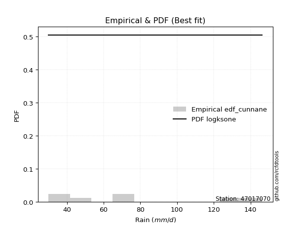</img>

</div>


### 12. EDF Adamowski (1981)

The Adamowski formula in hydrology refers to a specific plotting position formula used for estimating the non-parametric empirical distribution of hydrological events (like flood peaks) to calculate their return periods. This formula provides an alternative to traditional parametric methods (like the Gumbel or Log Pearson Type III distributions). 

<div align="center">


$P=(m-0.25)/(n+0.5)$


</div>


**12.1. Empirical values**

<div align="center">

|                | 0                   | 1                  | 2                  | 3                  | 4                  | 5                  |
|:---------------|:--------------------|:-------------------|:-------------------|:-------------------|:-------------------|:-------------------|
| date           | 2022                | 2023               | 2020               | 2024               | 2021               | 2019               |
| x              | 30.0                | 32.0               | 49.2               | 66.8               | 76.4               | 146.4              |
| m              | 1                   | 2                  | 3                  | 4                  | 5                  | 6                  |
| empirical_dist | edf_adamowski       | edf_adamowski      | edf_adamowski      | edf_adamowski      | edf_adamowski      | edf_adamowski      |
| empirical      | 0.11538461538461539 | 0.2692307692307692 | 0.4230769230769231 | 0.5769230769230769 | 0.7307692307692307 | 0.8846153846153846 |
| empirical_tr   | 1.1304347826086958  | 1.3684210526315788 | 1.7333333333333334 | 2.3636363636363633 | 3.7142857142857135 | 8.666666666666664  |

</div>


**12.2. Kolmogorov-Smirnov fit test (sorted by Δ)**


<div align="center">

|                | 0                   | 1                   | 2                   | 3                   | 4                  | 5                   | 6                   | 7                   | 8                   | 9                   | 10                  | 11                    | 12                  | 13                  | 14                 | 15                 | 16                  | 17                  | 18                 | 19                  | 20                  | 21                  | 22                  | 23                  | 24                  | 25                  | 26                  | 27                  | 28                  | 29                  | 30                  | 31                  | 32                 | 33                  | 34                | 35                 | 36                  | 37                  | 38                  | 39                  | 40                  | 41                  | 42                 | 43                 | 44                  | 45                  | 46                  | 47                  | 48                 | 49                 | 50                | 51               | 52                 | 53                  | 54                  | 55                  | 56                  | 57                  | 58                | 59                  | 60                 | 61                  | 62                  | 63                 | 64                  | 65                  | 66                  | 67                 | 68                 | 69                  | 70                 | 71                 | 72                 | 73                  | 74                  | 75                 | 76                | 77                  | 78                 | 79                  | 80                 | 81                  | 82                 | 83                 | 84                 | 85                 | 86             | 87             |
|:---------------|:--------------------|:--------------------|:--------------------|:--------------------|:-------------------|:--------------------|:--------------------|:--------------------|:--------------------|:--------------------|:--------------------|:----------------------|:--------------------|:--------------------|:-------------------|:-------------------|:--------------------|:--------------------|:-------------------|:--------------------|:--------------------|:--------------------|:--------------------|:--------------------|:--------------------|:--------------------|:--------------------|:--------------------|:--------------------|:--------------------|:--------------------|:--------------------|:-------------------|:--------------------|:------------------|:-------------------|:--------------------|:--------------------|:--------------------|:--------------------|:--------------------|:--------------------|:-------------------|:-------------------|:--------------------|:--------------------|:--------------------|:--------------------|:-------------------|:-------------------|:------------------|:-----------------|:-------------------|:--------------------|:--------------------|:--------------------|:--------------------|:--------------------|:------------------|:--------------------|:-------------------|:--------------------|:--------------------|:-------------------|:--------------------|:--------------------|:--------------------|:-------------------|:-------------------|:--------------------|:-------------------|:-------------------|:-------------------|:--------------------|:--------------------|:-------------------|:------------------|:--------------------|:-------------------|:--------------------|:-------------------|:--------------------|:-------------------|:-------------------|:-------------------|:-------------------|:---------------|:---------------|
| station        | 47017070            | 47017070            | 47017070            | 47017070            | 47017070           | 47017070            | 47017070            | 47017070            | 47017070            | 47017070            | 47017070            | 47017070              | 47017070            | 47017070            | 47017070           | 47017070           | 47017070            | 47017070            | 47017070           | 47017070            | 47017070            | 47017070            | 47017070            | 47017070            | 47017070            | 47017070            | 47017070            | 47017070            | 47017070            | 47017070            | 47017070            | 47017070            | 47017070           | 47017070            | 47017070          | 47017070           | 47017070            | 47017070            | 47017070            | 47017070            | 47017070            | 47017070            | 47017070           | 47017070           | 47017070            | 47017070            | 47017070            | 47017070            | 47017070           | 47017070           | 47017070          | 47017070         | 47017070           | 47017070            | 47017070            | 47017070            | 47017070            | 47017070            | 47017070          | 47017070            | 47017070           | 47017070            | 47017070            | 47017070           | 47017070            | 47017070            | 47017070            | 47017070           | 47017070           | 47017070            | 47017070           | 47017070           | 47017070           | 47017070            | 47017070            | 47017070           | 47017070          | 47017070            | 47017070           | 47017070            | 47017070           | 47017070            | 47017070           | 47017070           | 47017070           | 47017070           | 47017070       | 47017070       |
| empirical_dist | edf_adamowski       | edf_adamowski       | edf_adamowski       | edf_adamowski       | edf_adamowski      | edf_adamowski       | edf_adamowski       | edf_adamowski       | edf_adamowski       | edf_adamowski       | edf_adamowski       | edf_adamowski         | edf_adamowski       | edf_adamowski       | edf_adamowski      | edf_adamowski      | edf_adamowski       | edf_adamowski       | edf_adamowski      | edf_adamowski       | edf_adamowski       | edf_adamowski       | edf_adamowski       | edf_adamowski       | edf_adamowski       | edf_adamowski       | edf_adamowski       | edf_adamowski       | edf_adamowski       | edf_adamowski       | edf_adamowski       | edf_adamowski       | edf_adamowski      | edf_adamowski       | edf_adamowski     | edf_adamowski      | edf_adamowski       | edf_adamowski       | edf_adamowski       | edf_adamowski       | edf_adamowski       | edf_adamowski       | edf_adamowski      | edf_adamowski      | edf_adamowski       | edf_adamowski       | edf_adamowski       | edf_adamowski       | edf_adamowski      | edf_adamowski      | edf_adamowski     | edf_adamowski    | edf_adamowski      | edf_adamowski       | edf_adamowski       | edf_adamowski       | edf_adamowski       | edf_adamowski       | edf_adamowski     | edf_adamowski       | edf_adamowski      | edf_adamowski       | edf_adamowski       | edf_adamowski      | edf_adamowski       | edf_adamowski       | edf_adamowski       | edf_adamowski      | edf_adamowski      | edf_adamowski       | edf_adamowski      | edf_adamowski      | edf_adamowski      | edf_adamowski       | edf_adamowski       | edf_adamowski      | edf_adamowski     | edf_adamowski       | edf_adamowski      | edf_adamowski       | edf_adamowski      | edf_adamowski       | edf_adamowski      | edf_adamowski      | edf_adamowski      | edf_adamowski      | edf_adamowski  | edf_adamowski  |
| p_dist         | halfnorm            | pearson3            | t                   | gumbel_r            | halflogistic       | rayleigh            | maxwell             | moyal               | logchi2             | weibull_min         | logistic            | loglaplace_asymmetric | logloggamma         | logt                | lognorm            | lognorm            | logcrystalball      | logmaxwell          | genlogistic        | lograyleigh         | hypsecant           | nakagami            | logpearson3         | norm                | crystalball         | logbetaprime        | kstwobign           | loggumbel_l         | betaprime           | logexponnorm        | lognct              | alpha               | nct                | loggenlogistic      | loginvweibull     | logalpha           | loglogistic         | rice                | loginvgamma         | logncf              | logkstwobign        | fisk                | loghalfnorm        | loghypsecant       | loginvgauss         | laplace             | loglaplace          | loggumbel_r         | invgamma           | f                  | logrice           | lognakagami      | logweibull_min     | logexpon            | invgauss            | logmoyal            | loggenexpon         | gumbel_l            | loggompertz       | loghalflogistic     | exponnorm          | expon               | genexpon            | laplace_asymmetric | gompertz            | truncnorm           | logf                | chi2               | wald               | gamma               | logwald            | loggibrat          | gibrat             | logfisk             | erlang              | logjohnsonsu       | loglognorm        | ncf                 | logerlang          | fatiguelife         | logfatiguelife     | invweibull          | loggamma           | loggamma           | logtruncnorm       | johnsonsu          | mielke         | logmielke      |
| delta          | 0.07550600948418618 | 0.08463954884200481 | 0.09226383631017843 | 0.09443264916023048 | 0.0947288618630028 | 0.09926265831325887 | 0.10761548865541848 | 0.11187216975614128 | 0.11538461234239267 | 0.11538461450753398 | 0.12198672698385249 | 0.12541416969413743   | 0.12552912097414667 | 0.12746473991082063 | 0.1274653300036953 | 0.1274653300036953 | 0.12746561696625291 | 0.12750094712465793 | 0.1279715189581262 | 0.12851729348034696 | 0.13017898501823594 | 0.13117560828656732 | 0.13189145242395467 | 0.13446355973177115 | 0.13446356343925248 | 0.13447698816571543 | 0.13687899369360795 | 0.13694083991282485 | 0.13737649991742618 | 0.13865201418863674 | 0.13868348178649156 | 0.13993700140702814 | 0.1418625035235292 | 0.14285997201315398 | 0.142864304263248 | 0.1432567802154651 | 0.14414836344630585 | 0.14459948461018418 | 0.14542924757706086 | 0.14542973005744744 | 0.14631266080548838 | 0.14686682360808434 | 0.1488767393242444 | 0.1524484776483332 | 0.15350742484061553 | 0.15733872399472798 | 0.15950596445640342 | 0.16079296870148052 | 0.1615059120253644 | 0.1615060441741593 | 0.162611709750198 | 0.16539228625288 | 0.1662282769014677 | 0.17423985102234954 | 0.18330866977391674 | 0.18801015919788394 | 0.19055670120378976 | 0.19491209586488034 | 0.198437660214027 | 0.20333388152147044 | 0.2154162596246429 | 0.21633339143524477 | 0.21633354313769657 | 0.2163336634960426 | 0.21633533399591484 | 0.21709795369339424 | 0.24207774942854204 | 0.2511362516733085 | 0.2605445643439845 | 0.26876306676779493 | 0.2692307692307692 | 0.2692307692307692 | 0.2692307692307692 | 0.29238969452324803 | 0.29668410480906204 | 0.3194862537620719 | 0.342960825734329 | 0.35875817594459336 | 0.3711642017586357 | 0.37388682775290333 | 0.4049086776310678 | 0.42093429647210745 | 0.4341732513246344 | 0.4341732513246344 | 0.5769190348923765 | 0.6606091985775169 | nan            | nan            |
| deltao         | 0.530385761606      | 0.530385761606      | 0.530385761606      | 0.530385761606      | 0.530385761606     | 0.530385761606      | 0.530385761606      | 0.530385761606      | 0.530385761606      | 0.530385761606      | 0.530385761606      | 0.530385761606        | 0.530385761606      | 0.530385761606      | 0.530385761606     | 0.530385761606     | 0.530385761606      | 0.530385761606      | 0.530385761606     | 0.530385761606      | 0.530385761606      | 0.530385761606      | 0.530385761606      | 0.530385761606      | 0.530385761606      | 0.530385761606      | 0.530385761606      | 0.530385761606      | 0.530385761606      | 0.530385761606      | 0.530385761606      | 0.530385761606      | 0.530385761606     | 0.530385761606      | 0.530385761606    | 0.530385761606     | 0.530385761606      | 0.530385761606      | 0.530385761606      | 0.530385761606      | 0.530385761606      | 0.530385761606      | 0.530385761606     | 0.530385761606     | 0.530385761606      | 0.530385761606      | 0.530385761606      | 0.530385761606      | 0.530385761606     | 0.530385761606     | 0.530385761606    | 0.530385761606   | 0.530385761606     | 0.530385761606      | 0.530385761606      | 0.530385761606      | 0.530385761606      | 0.530385761606      | 0.530385761606    | 0.530385761606      | 0.530385761606     | 0.530385761606      | 0.530385761606      | 0.530385761606     | 0.530385761606      | 0.530385761606      | 0.530385761606      | 0.530385761606     | 0.530385761606     | 0.530385761606      | 0.530385761606     | 0.530385761606     | 0.530385761606     | 0.530385761606      | 0.530385761606      | 0.530385761606     | 0.530385761606    | 0.530385761606      | 0.530385761606     | 0.530385761606      | 0.530385761606     | 0.530385761606      | 0.530385761606     | 0.530385761606     | 0.530385761606     | 0.530385761606     | 0.530385761606 | 0.530385761606 |
| eval           | Δo > Δ              | Δo > Δ              | Δo > Δ              | Δo > Δ              | Δo > Δ             | Δo > Δ              | Δo > Δ              | Δo > Δ              | Δo > Δ              | Δo > Δ              | Δo > Δ              | Δo > Δ                | Δo > Δ              | Δo > Δ              | Δo > Δ             | Δo > Δ             | Δo > Δ              | Δo > Δ              | Δo > Δ             | Δo > Δ              | Δo > Δ              | Δo > Δ              | Δo > Δ              | Δo > Δ              | Δo > Δ              | Δo > Δ              | Δo > Δ              | Δo > Δ              | Δo > Δ              | Δo > Δ              | Δo > Δ              | Δo > Δ              | Δo > Δ             | Δo > Δ              | Δo > Δ            | Δo > Δ             | Δo > Δ              | Δo > Δ              | Δo > Δ              | Δo > Δ              | Δo > Δ              | Δo > Δ              | Δo > Δ             | Δo > Δ             | Δo > Δ              | Δo > Δ              | Δo > Δ              | Δo > Δ              | Δo > Δ             | Δo > Δ             | Δo > Δ            | Δo > Δ           | Δo > Δ             | Δo > Δ              | Δo > Δ              | Δo > Δ              | Δo > Δ              | Δo > Δ              | Δo > Δ            | Δo > Δ              | Δo > Δ             | Δo > Δ              | Δo > Δ              | Δo > Δ             | Δo > Δ              | Δo > Δ              | Δo > Δ              | Δo > Δ             | Δo > Δ             | Δo > Δ              | Δo > Δ             | Δo > Δ             | Δo > Δ             | Δo > Δ              | Δo > Δ              | Δo > Δ             | Δo > Δ            | Δo > Δ              | Δo > Δ             | Δo > Δ              | Δo > Δ             | Δo > Δ              | Δo > Δ             | Δo > Δ             | Δo <= Δ            | Δo <= Δ            | Δo <= Δ        | Δo <= Δ        |
| fit            | 1                   | 1                   | 1                   | 1                   | 1                  | 1                   | 1                   | 1                   | 1                   | 1                   | 1                   | 1                     | 1                   | 1                   | 1                  | 1                  | 1                   | 1                   | 1                  | 1                   | 1                   | 1                   | 1                   | 1                   | 1                   | 1                   | 1                   | 1                   | 1                   | 1                   | 1                   | 1                   | 1                  | 1                   | 1                 | 1                  | 1                   | 1                   | 1                   | 1                   | 1                   | 1                   | 1                  | 1                  | 1                   | 1                   | 1                   | 1                   | 1                  | 1                  | 1                 | 1                | 1                  | 1                   | 1                   | 1                   | 1                   | 1                   | 1                 | 1                   | 1                  | 1                   | 1                   | 1                  | 1                   | 1                   | 1                   | 1                  | 1                  | 1                   | 1                  | 1                  | 1                  | 1                   | 1                   | 1                  | 1                 | 1                   | 1                  | 1                   | 1                  | 1                   | 1                  | 1                  | 0                  | 0                  | 0              | 0              |
| n              | 6                   | 6                   | 6                   | 6                   | 6                  | 6                   | 6                   | 6                   | 6                   | 6                   | 6                   | 6                     | 6                   | 6                   | 6                  | 6                  | 6                   | 6                   | 6                  | 6                   | 6                   | 6                   | 6                   | 6                   | 6                   | 6                   | 6                   | 6                   | 6                   | 6                   | 6                   | 6                   | 6                  | 6                   | 6                 | 6                  | 6                   | 6                   | 6                   | 6                   | 6                   | 6                   | 6                  | 6                  | 6                   | 6                   | 6                   | 6                   | 6                  | 6                  | 6                 | 6                | 6                  | 6                   | 6                   | 6                   | 6                   | 6                   | 6                 | 6                   | 6                  | 6                   | 6                   | 6                  | 6                   | 6                   | 6                   | 6                  | 6                  | 6                   | 6                  | 6                  | 6                  | 6                   | 6                   | 6                  | 6                 | 6                   | 6                  | 6                   | 6                  | 6                   | 6                  | 6                  | 6                  | 6                  | 6              | 6              |
| best_fit       | 1                   | 0                   | 0                   | 0                   | 0                  | 0                   | 0                   | 0                   | 0                   | 0                   | 0                   | 0                     | 0                   | 0                   | 0                  | 0                  | 0                   | 0                   | 0                  | 0                   | 0                   | 0                   | 0                   | 0                   | 0                   | 0                   | 0                   | 0                   | 0                   | 0                   | 0                   | 0                   | 0                  | 0                   | 0                 | 0                  | 0                   | 0                   | 0                   | 0                   | 0                   | 0                   | 0                  | 0                  | 0                   | 0                   | 0                   | 0                   | 0                  | 0                  | 0                 | 0                | 0                  | 0                   | 0                   | 0                   | 0                   | 0                   | 0                 | 0                   | 0                  | 0                   | 0                   | 0                  | 0                   | 0                   | 0                   | 0                  | 0                  | 0                   | 0                  | 0                  | 0                  | 0                   | 0                   | 0                  | 0                 | 0                   | 0                  | 0                   | 0                  | 0                   | 0                  | 0                  | 0                  | 0                  | 0              | 0              |
| best_fit_sort  | 1                   | 2                   | 3                   | 4                   | 5                  | 6                   | 7                   | 8                   | 9                   | 10                  | 11                  | 12                    | 13                  | 14                  | 15                 | 16                 | 17                  | 18                  | 19                 | 20                  | 21                  | 22                  | 23                  | 24                  | 25                  | 26                  | 27                  | 28                  | 29                  | 30                  | 31                  | 32                  | 33                 | 34                  | 35                | 36                 | 37                  | 38                  | 39                  | 40                  | 41                  | 42                  | 43                 | 44                 | 45                  | 46                  | 47                  | 48                  | 49                 | 50                 | 51                | 52               | 53                 | 54                  | 55                  | 56                  | 57                  | 58                  | 59                | 60                  | 61                 | 62                  | 63                  | 64                 | 65                  | 66                  | 67                  | 68                 | 69                 | 70                  | 71                 | 72                 | 73                 | 74                  | 75                  | 76                 | 77                | 78                  | 79                 | 80                  | 81                 | 82                  | 83                 | 84                 | 85                 | 86                 | 87             | 88             |

</div>


**12.3. Best fit**

<div align="center">

|   id |   station | empirical_dist   | p_dist   |    delta |   deltao | eval   |   fit |   n |   best_fit |   best_fit_sort |
|-----:|----------:|:-----------------|:---------|---------:|---------:|:-------|------:|----:|-----------:|----------------:|
|    0 |  47017070 | edf_adamowski    | halfnorm | 0.075506 | 0.530386 | Δo > Δ |     1 |   6 |          1 |               1 |

</div>


<div align="center">

</img>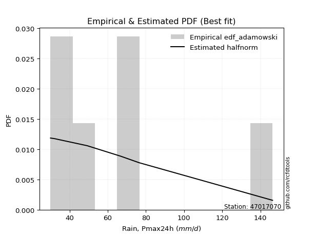</img>

</div>


## C. Best fit & Estimate extreme values for specific return periods - Tr

Best fit in probability distribution analysis means finding the theoretical distribution (like Normal, Poisson, Exponential) that most accurately mirrors your real-world data´s patterns (shape, center, spread) for better predictions, using methods like visual checks (Q-Q plots), goodness-of-fit tests (Kolmogorov-Smirnov, Chi-Squared), and information criteria (AIC) to score and select the simplest, most representative model.


### 1. Best fit (ordered by delta Δ)

<div align="center">

|   id |   station | empirical_dist   | p_dist       |     delta |   deltao | eval   |   fit |   n |   best_fit |   best_fit_sort |
|-----:|----------:|:-----------------|:-------------|----------:|---------:|:-------|------:|----:|-----------:|----------------:|
|    0 |  47017070 | edf_hazen        | halflogistic | 0.0754981 | 0.530386 | Δo > Δ |     1 |   6 |          1 |               1 |
|    1 |  47017070 | edf_adamowski    | halfnorm     | 0.075506  | 0.530386 | Δo > Δ |     1 |   6 |          1 |               2 |
|    2 |  47017070 | edf_blom         | pearson3     | 0.0778526 | 0.530386 | Δo > Δ |     1 |   6 |          1 |               3 |
|    3 |  47017070 | edf_tukey        | pearson3     | 0.0785667 | 0.530386 | Δo > Δ |     1 |   6 |          1 |               4 |
|    4 |  47017070 | edf_chegodayev   | halfnorm     | 0.0791118 | 0.530386 | Δo > Δ |     1 |   6 |          1 |               5 |
|    5 |  47017070 | edf_filliben     | pearson3     | 0.079745  | 0.530386 | Δo > Δ |     1 |   6 |          1 |               6 |
|    6 |  47017070 | edf_cunnane      | pearson3     | 0.0797881 | 0.530386 | Δo > Δ |     1 |   6 |          1 |               7 |
|    7 |  47017070 | edf_jenkinson    | halfnorm     | 0.0798465 | 0.530386 | Δo > Δ |     1 |   6 |          1 |               8 |
|    8 |  47017070 | edf_beard        | halfnorm     | 0.0798465 | 0.530386 | Δo > Δ |     1 |   6 |          1 |               9 |
|    9 |  47017070 | edf_gringorten   | halflogistic | 0.0804001 | 0.530386 | Δo > Δ |     1 |   6 |          1 |              10 |
|   10 |  47017070 | edf_weibull      | halfnorm     | 0.0991044 | 0.530386 | Δo > Δ |     1 |   6 |          1 |              11 |
|   11 |  47017070 | edf_california   | t            | 0.114367  | 0.530386 | Δo > Δ |     1 |   6 |          1 |              12 |

</div>

:file_folder:Tables: [bestfit_47017070.csv](table/bestfit_47017070.csv) | [extreme_47017070.csv](table/extreme_47017070.csv)


### 2. Extreme values

In hydrology, a return period (or recurrence interval $Tr$) is the statistical average time between extreme events like floods or droughts of a specific magnitude, indicating how rare an event is, with a 100-year flood, for example, having a 1% chance of occurring in any given year, not that it happens exactly every century. It is a key tool for infrastructure design (like bridges or dams) and risk assessment, calculated from historical data to determine the probability of future events, although it is important to remember it is statistical average, and events can cluster or be missed.

> risk_rate: assuming the return period as the project useful life.

|   id |      tr |   prob_l |     prob_g |      alpha |   betaprime |     chi2 |   crystalball |   erlang |    expon |   exponnorm |          f |   fatiguelife |       fisk |    gamma |   genexpon |   genlogistic |   gibrat |   gompertz |   gumbel_l |   gumbel_r |   halflogistic |   halfnorm |   hypsecant |   invgamma |   invgauss |      invweibull |        johnsonsu |   kstwobign |   laplace |   laplace_asymmetric |   loggamma |   logistic |   lognorm |   maxwell |   mielke |    moyal |   nakagami |       ncf |      nct |     norm |   pearson3 |   rayleigh |     rice |        t |   truncnorm |     wald |   weibull_min |   logalpha |   logbetaprime |          logchi2 |   logcrystalball |   logerlang |   logexpon |   logexponnorm |            logf |   logfatiguelife |       logfisk |   loggenexpon |   loggenlogistic |   loggibrat |   loggompertz |   loggumbel_l |   loggumbel_r |   loghalflogistic |   loghalfnorm |   loghypsecant |   loginvgamma |   loginvgauss |   loginvweibull |    logjohnsonsu |   logkstwobign |   loglaplace |   loglaplace_asymmetric |   logloggamma |   loglogistic |    loglognorm |   logmaxwell |   logmielke |   logmoyal |   lognakagami |    logncf |   lognct |   logpearson3 |   lograyleigh |   logrice |     logt |   logtruncnorm |   logwald |   logweibull_min |   station |   n |   risk_rate |
|-----:|--------:|---------:|-----------:|-----------:|------------:|---------:|--------------:|---------:|---------:|------------:|-----------:|--------------:|-----------:|---------:|-----------:|--------------:|---------:|-----------:|-----------:|-----------:|---------------:|-----------:|------------:|-----------:|-----------:|----------------:|-----------------:|------------:|----------:|---------------------:|-----------:|-----------:|----------:|----------:|---------:|---------:|-----------:|----------:|---------:|---------:|-----------:|-----------:|---------:|---------:|------------:|---------:|--------------:|-----------:|---------------:|-----------------:|-----------------:|------------:|-----------:|---------------:|----------------:|-----------------:|--------------:|--------------:|-----------------:|------------:|--------------:|--------------:|--------------:|------------------:|--------------:|---------------:|--------------:|--------------:|----------------:|----------------:|---------------:|-------------:|------------------------:|--------------:|--------------:|--------------:|-------------:|------------:|-----------:|--------------:|----------:|---------:|--------------:|--------------:|----------:|---------:|---------------:|----------:|-----------------:|----------:|----:|------------:|
|    0 |    2    | 0.5      | 0.5        |    45.4846 |     50.8007 |  35.7134 |       66.8    |  39.2308 |  55.5078 |     55.4481 |    43.5324 |       30      |    49.717  |  40.9194 |    55.5076 |       59.3853 |  54.9803 |    55.5088 |    73.269  |    60.331  |        57.1149 |    58.7395 |     66.8    |    43.5324 |    42.4313 |   720.888       |     30           |     61.9038 |   66.8    |              55.508  |    32.6972 |    66.8    |   57.2718 |   63.4322 |  52.0917 |  58.2425 |    43.939  |   33.826  |  52.6364 |  66.8    |    59.6437 |    62.2378 |  66.1228 |  55.1283 |     55.3414 |  54.0356 |       53.2878 |    52.5639 |        55.1224 |     50.0342      |          57.2718 |     34.1386 |    46.9646 |        53.1283 |    37.1562      |          30      |  42.8824      |       49.5485 |          52.0047 |     48.661  |       51.1972 |       62.6133 |       52.3861 |           50.1144 |       51.2495 |        57.2718 |       50.9578 |       44.6789 |         52.013  |   30.4127       |        52.0438 |      57.2718 |                  61.469 |       57.5511 |       57.2718 |  30.0481      |      54.674  |     51.8098 |    50.8996 |       41.1523 |   50.958  |  53.4093 |       55.2441 |       53.7812 |   55.0981 |  57.272  |        76.8584 |   48.0325 |     45.0095      |  47017070 |   6 |    0.75     |
|    1 |    2.33 | 0.570815 | 0.429185   |    50.1919 |     55.5697 |  39.6386 |       73.8269 |  41.9846 |  61.128  |     61.0625 |    48.117  |       30.8858 |    57.4592 |  44.0281 |    61.1274 |       64.979  |  58.5398 |    61.1291 |    79.3825 |    66.8421 |        63.8094 |    66.3234 |     72.4236 |    48.117  |    46.578  | 26803.9         |     30           |     67.9747 |   71.0523 |              61.1281 |    33.9595 |    72.9912 |   63.0965 |   70.7327 |  57.23   |  64.4062 |    51.0506 |   45.9374 |  57.8671 |  73.8269 |    66.4728 |    69.6462 |  72.4814 |  60.1138 |     60.7245 |  58.6431 |       63.1779 |    57.7527 |        60.661  |     59.7228      |          63.0965 |     35.9817 |    51.8392 |        58.2186 |    40.8856      |          30.5326 |  91.5368      |       54.7025 |          57.1394 |     51.1082 |       56.5529 |       68.1181 |       57.3051 |           54.9589 |       56.8968 |        61.8878 |       56.026  |       49.1234 |         57.152  |   31.4437       |        57.2702 |      60.7291 |                  65.886 |       63.4709 |       62.3739 |  30.4899      |      60.4621 |     56.9017 |    55.413  |       47.2678 |   56.0263 |  58.7    |       60.8869 |       59.5634 |   60.6078 |  63.0968 |        79.1979 |   51.1819 |     56.6726      |  47017070 |   6 |    0.729209 |
|    2 |    5    | 0.8      | 0.2        |    86.6929 |     81.1651 |  72.4985 |       99.9406 |  57.0869 |  89.2273 |     89.133  |    87.8247 |       49.7022 |   128.652  |  60.8076 |    89.2296 |       89.2783 |  79.033  |    89.2296 |    99.1325 |    95.1297 |        94.1008 |    98.3944 |     94.9812 |    87.8244 |    77.6294 |     2.12828e+11 |     30.0014      |     93.7627 |   92.3131 |              89.2276 |    43.3426 |    96.8961 |   90.4333 |   99.4666 |  86.0225 |  92.9569 |    93.6956 |  122.664  |  86.7561 |  99.9406 |    96.0854 |    99.3054 |  97.9379 |  80.5364 |     86.0007 |  84.4366 |      134.101  |    86.5189 |        88.4499 |    166.572       |          90.4332 |     49.8685 |    84.9344 |        86.0951 |    80.7381      |          44.3697 |   6.24287e+40 |       85.8948 |          86.0138 |     67.7913 |       86.9321 |       89.4316 |       84.6309 |           83.4401 |       88.5263 |        84.4578 |       86.0485 |       82.6634 |         86.0604 | 3096.88         |        85.9928 |      81.4081 |                  87.438 |       91.2021 |       86.7168 |   5.39716e+39 |      89.8443 |     85.5576 |    82.1338 |      101.918  |   86.0484 |  86.6743 |       89.2048 |       89.6449 |   88.7554 |  90.4339 |        91.4621 |   73.0323 |    455.471       |  47017070 |   6 |    0.67232  |
|    3 |   10    | 0.9      | 0.1        |   153.754  |    109.007  | 115.375  |      117.264  |  71.8722 | 114.735  |    114.615  |   171.176  |       75.6829 |   283.016  |  77.0306 |   114.736  |      109.068  | 102.393  |   114.738  |   110.128  |   118.17   |       119.257  |   122.126  |    112.994  |   171.174  |   123.251  |     8.87638e+16 |     30.2174      |    113.397  |  111.613  |             114.736  |    56.7025 |   114.501  |  114.823  |  119.688  | 119.766  | 117.815  |   132.384  |  226.584  | 119.885  | 117.264  |   119.601  |   120.453  | 116.089  |  98.4139 |    105.614  | 111.809  |      226.763  |   120.051  |       115.878  |    474.685       |         114.823  |     70.787  |   132.964  |       119.279  |   200.867       |          74.3382 | inf           |      123.419  |         120.014  |     93.5447 |      119.581  |      104.067  |      116.265  |          118.023  |      122.782  |       108.26   |      124.573  |      141.942  |        120.115  |    6.73123e+43  |       117.184  |     106.219  |                 113.007 |      115.859  |      110.533  | inf           |     118.725  |    119.374  |   115.698  |      198.545  |  124.572  | 116.684  |      117.033  |      119.983  |  116.485  | 114.824  |       103.103  |  106.505  |  13491.1         |  47017070 |   6 |    0.651322 |
|    4 |   15    | 0.933333 | 0.0666667  |   220.576  |    128.111  | 144.064  |      125.908  |  80.7921 | 129.656  |    129.521  |   262.006  |       92.6748 |   452.682  |  86.7694 |   129.657  |      120.233  | 118.506  |   129.66   |   115.108  |   131.168  |       133.493  |   134.476  |    123.274  |   262.003  |   158.066  |     1.31556e+20 |     32.7118      |    123.82   |  122.903  |             129.657  |    67.1733 |   124.093  |  129.353  |  130.064  | 144.312  | 132.241  |   153.461  |  309.382  | 143.614  | 125.908  |   132.543  |   131.349  | 125.441  | 109.863  |    115.15   | 129.387  |      292.518  |   144.608  |       133.45   |    902.171       |         129.353  |     88.1048 |   172.821  |       144.053  |   397.029       |         104.182  | inf           |      150.219  |         144.826  |    116.81   |      140.862  |      111.462  |      139.08   |          143.611  |      145.568  |       124.74   |      154.832  |      200.108  |        144.973  |    1.30439e+195 |       138.11   |     124.103  |                 131.302 |      130.508  |      126.157  | inf           |     136.978  |    144.109  |   141.151  |      284.502  |  154.829  | 137.173  |      134.757  |      139.427  |  133.995  | 129.355  |       109.877  |  135.702  | 201368           |  47017070 |   6 |    0.644736 |
|    5 |   20    | 0.95     | 0.05       |   287.34   |    143.179  | 165.599  |      131.57   |  87.2084 | 140.243  |    140.096  |   358.094  |      105.255  |   632.631  |  93.7595 |   140.245  |      128.05   | 131.145  |   140.247  |   118.208  |   140.27   |       143.467  |   142.71   |    130.526  |   358.089  |   186.301  |     2.1841e+22  |     44.1579      |    130.842  |  130.913  |             140.244  |    76.0575 |   130.723  |  139.851  |  136.949  | 164.421  | 142.458  |   167.683  |  381.015  | 162.871  | 131.57   |   141.464  |   138.592  | 131.657  | 118.7    |    120.951  | 142.486  |      344.122  |   164.926  |       146.731  |   1436.51        |         139.851  |    103.37   |   208.153  |       164.67   |   695.212       |         133.758  | inf           |      171.7    |         165.192  |    139.041  |      156.922  |      116.327  |      157.669  |          164.777  |      163.063  |       137.853  |      181.025  |      258.127  |        165.38   |  inf            |       154.273  |     138.591  |                 146.053 |      141.073  |      138.229  | inf           |     150.616  |    164.447  |   162.497  |      362.441  |  181.021  | 153.314  |      148.092  |      154.064  |  147.063  | 139.853  |       114.544  |  162.554  |      1.92428e+06 |  47017070 |   6 |    0.641514 |
|    6 |   25    | 0.96     | 0.04       |   354.079  |    155.834  | 182.863  |      135.737  |  92.2268 | 148.455  |    148.3    |   458.297  |      115.251  |   820.478  |  99.2196 |   148.455  |      134.072  | 141.681  |   148.459  |   120.414  |   147.28   |       151.151  |   148.836  |    136.138  |   458.288  |   210.135  |     1.12042e+24 |     77.7918      |    136.101  |  137.126  |             148.455  |    83.9084 |   135.795  |  148.12   |  142.061  | 181.793  | 150.377  |   178.317  |  445.377  | 179.392  | 135.737  |   148.259  |   143.973  | 136.276  | 126.057  |    124.892  | 152.978  |      386.912  |   182.662  |       157.544  |   2070.03        |         148.119  |    117.261  |   240.462  |       182.67   |  1127.31        |         163.136  | inf           |      189.892  |         182.812  |    160.776  |      169.922  |      119.918  |      173.666  |          183.19   |      177.431  |       148.941  |      204.677  |      316.305  |        183.038  |  inf            |       167.608  |     150.983  |                 158.626 |      149.384  |      148.238  | inf           |     161.611  |    182.067  |   181.239  |      434.286  |  204.671  | 166.869  |      158.908  |      165.926  |  157.59   | 148.121  |       118.03   |  187.846  |      1.35292e+07 |  47017070 |   6 |    0.639603 |
|    7 |   50    | 0.98     | 0.02       |   687.674  |    201.361  | 238.998  |      147.671  | 108.003  | 173.962  |    173.781  |  1002.42   |      147.321  |  1841.02   | 116.352  |   173.965  |      152.62   | 178.823  |   173.968  |   126.401  |   168.876  |       174.829  |   166.643  |    153.539  |  1002.39   |   294.147  |     2.07691e+29 |   1587.24        |    151.546  |  156.426  |             173.963  |   114.82   |   151.29   |  174.603  |  156.887  | 247.664  | 174.962  |   209.34   |  707.574  | 241.265  | 147.671  |   168.801  |   159.593  | 149.682  | 152.411  |    134.197  | 187.234  |      534.799  |   251.783  |       194.297  |   6572.35        |         174.602  |    175.159  |   376.44   |       252.119  |  6942.53        |         308.467  | inf           |      255.905  |         249.801  |    268.271  |      213.302  |      130.235  |      233.88   |          253.888  |      226.79   |       189.313  |      303.048  |      612.27   |        250.185  |  inf            |       213.806  |     196.998  |                 205.012 |      175.94   |      183.535  | inf           |     198.254  |    249.257  |   254.344  |      735.734  |  303.032  | 215.727  |      195.396  |      205.787  |  192.605  | 174.605  |       127.715  |  301.201  |      1.82411e+10 |  47017070 |   6 |    0.63583  |
|    8 |   75    | 0.986667 | 0.0133333  |  1021.22   |    233.068  | 273.245  |      154.074  | 117.338  | 188.884  |    188.687  |  1595.79   |      166.635  |  2953.24   | 126.472  |   188.885  |      163.401  | 203.909  |   188.89   |   129.429  |   181.429  |       188.592  |   176.337  |    163.708  |  1595.74   |   349.621  |     2.39552e+32 |  10126.8         |    160.043  |  167.716  |             188.884  |   138.605  |   160.24   |  190.714  |  164.948  | 296.393  | 189.338  |   226.241  |  917.525  | 286.412  | 154.074  |   180.494  |   168.091  | 156.976  | 170.873  |    137.862  | 208.313  |      631.522  |   305.089  |       218.272  |  13069.1         |         190.713  |    222.713  |   489.281  |       304.412  | 26142.4         |         452.717  | inf           |      301.997  |         299.505  |    379.098  |      240.752  |      135.785  |      278.057  |          306.928  |      259.209  |       217.797  |      384.777  |      917.584  |        300.017  |  inf            |       244.449  |     230.167  |                 238.203 |      192.051  |      207.632  | inf           |     221.551  |    299.299  |   310.086  |      980.416  |  384.751  | 249.909  |      218.967  |      231.36   |  214.813  | 190.716  |       132.343  |  402.753  |      2.83745e+12 |  47017070 |   6 |    0.634587 |
|    9 |  100    | 0.99     | 0.01       |  1354.76   |    258.216  | 298.05   |      158.405  | 123.999  | 199.47   |    199.263  |  2223.59   |      180.533  |  4128.98   | 133.688  |   199.472  |      171.032  | 223.342  |   199.477  |   131.41   |   190.313  |       198.334  |   182.94   |    170.921  |  2223.52   |   391.501  |     3.5201e+34  |  35779.5         |    165.865  |  175.726  |             199.471  |   158.688  |   166.559  |  202.446  |  170.438  | 336.558  | 199.538  |   237.743  | 1099.45   | 323.307  | 158.405  |   188.671  |   173.88   | 161.945  | 185.646  |    139.83   | 223.682  |      704.605  |   350.545  |       236.515  |  21373.7         |         202.445  |    264.614  |   589.312  |       347.969  | 77049.8         |         596.642  | inf           |      338.463  |         340.551  |    495.551  |      261.146  |      139.543  |      314.28   |          351.037  |      283.91   |       240.565  |      457.963  |     1231.56   |        341.176  |  inf            |       267.944  |     257.036  |                 264.962 |      203.761  |      226.527  | inf           |     238.968  |    340.735  |   356.894  |     1192.02   |  457.928  | 277.139  |      236.782  |      250.579  |  231.389  | 202.448  |       135.103  |  497.779  |      1.49492e+14 |  47017070 |   6 |    0.633968 |
|   10 |  200    | 0.995    | 0.005      |  2688.87   |    329.368  | 359.24   |      168.229  | 140.16   | 224.978  |    224.745  |  4964.3    |      214.551  |  9252.51   | 151.175  |   224.98   |      189.376  | 276.212  |   224.985  |   135.714  |   211.671  |       221.754  |   198.043  |    188.299  |  4964.1    |   500.014  |     5.70968e+39 | 629209           |    179.275  |  195.026  |             224.979  |   220.935  |   181.716  |  231.801  |  182.999  | 456.773  | 224.112  |   263.991  | 1685.41   | 432.384  | 168.229  |   208.032  |   187.127  | 173.315  | 228.185  |    142.98   | 261.965  |      895.548  |   495.355  |       285.13   |  70760.5         |         231.801  |    403.113  |   922.56   |       480.26   |     1.84852e+06 |        1172.67   | inf           |      440.733  |         463.743  |   1027.06   |      313.378  |      148.074  |      421.865  |          484.791  |      349.615  |       305.674  |      709.234  |     2558.39   |        464.734  |  inf            |       331.009  |     335.373  |                 342.443 |      232.989  |      279.161  | inf           |     284.14   |    465.642  |   500.778  |     1862.2    |  709.156  | 354.848  |      283.765  |      300.776  |  274.278  | 231.805  |       140.043  |  843.714  |      8.05192e+18 |  47017070 |   6 |    0.633042 |
|   11 |  250    | 0.996    | 0.004      |  3355.92   |    355.9    | 379.305  |      171.231  | 145.392  | 233.19   |    232.948  |  6433.7    |      225.637  | 11995      | 156.831  |   233.189  |      195.274  | 295.182  |   233.197  |   136.981  |   218.538  |       229.283  |   202.689  |    193.893  |  6433.42   |   536.998  |     2.70127e+41 |      1.51148e+06 |    183.424  |  201.239  |             233.191  |   246.084  |   186.583  |  241.595  |  186.866  | 503.884  | 232.023  |   272.046  | 1930.04   | 474.678  | 171.231  |   214.175  |   191.204  | 176.815  | 244.341  |    143.641  | 274.63   |      961.404  |   555.843  |       302.309  | 104353           |         241.594  |    462.282  |  1065.76   |       532.753  |     6.29129e+06 |        1461.55   | inf           |      478.438  |         512.138  |   1334.01   |      331.116  |      150.681  |      463.742  |          537.809  |      372.737  |       330.176  |      821.229  |     3256.8    |        513.282  |  inf            |       353.385  |     365.36   |                 371.923 |      242.716  |      298.528  | inf           |     299.695  |    514.913  |   558.472  |     2135.51   |  821.129  | 384.098  |      300.202  |      318.165  |  289.014  | 241.598  |       141.18   | 1004.63   |      4.05604e+20 |  47017070 |   6 |    0.632858 |
|   12 |  500    | 0.998    | 0.002      |  6691.18   |    451.768  | 442.567  |      180.134  | 161.716  | 258.698  |    258.43   | 14413.2    |      260.416  | 26856      | 174.468  |   258.697  |      213.578  | 360.741  |   258.706  |   140.612  |   239.85   |       252.652  |   216.542  |    211.269  | 14412.5    |   657.392  |     4.26867e+46 |      2.03297e+07 |    195.861  |  220.539  |             258.699  |   345.09   |   201.674  |  273.138  |  198.404  | 683.311  | 256.596  |   295.996  | 2927.57   | 633.962  | 180.134  |   233.023  |   203.371  | 187.257  | 304.016  |    144.999  | 314.9    |     1179.3    |   806.496  |       360.996  | 351604           |         273.137  |    710.048  |  1668.43   |       735.296  |     6.12862e+08 |        2916.32   | inf           |      612.457  |         696.932  |   3293.32   |      389.046  |      158.414  |      622.092  |          742.207  |      451.159  |       419.531  |     1320.8    |     7007.13   |        698.699  |  inf            |       429.915  |     476.71   |                 480.681 |      273.974  |      367.559  | inf           |     351.357  |    703.966  |   783.617  |     3209.39   | 1320.59   | 491.092  |      355.742  |      376.257  |  337.844  | 273.142  |       143.642  | 1750.11   |      2.92662e+26 |  47017070 |   6 |    0.632489 |
|   13 |  750    | 0.998667 | 0.00133333 | 10026.4    |    518.76   | 480.139  |      185.079  | 171.31   | 273.619  |    273.335  | 23115      |      280.964  | 43024.7    | 184.826  |   273.617  |      224.279  | 404.098  |   273.628  |   142.552  |   252.309  |       266.314  |   224.281  |    221.433  | 23113.8    |   731.252  |     4.67153e+49 |      8.61305e+07 |    202.847  |  231.828  |             273.62   |   421.401  |   210.491  |  292.407  |  204.857  | 816.465  | 270.971  |   309.331  | 3726.81   | 750.686  | 185.079  |   243.902  |   210.174  | 193.097  | 346.853  |    145.462  | 339.045  |     1315.96   |  1014.15   |       399.424  | 719063           |         292.406  |    914.742  |  2168.55   |       887.809  |     1.70475e+10 |        4386.31   | inf           |      704.006  |         834.472  |   5986.77   |      424.904  |      162.709  |      738.646  |          896.002  |      501.947  |       482.625  |     1770.11   |    11084.5    |        836.734  |  inf            |       479.964  |     556.977  |                 558.502 |      293.015  |      415.057  | inf           |     384.043  |    845.51   |   955.328  |     4027.01   | 1769.77   | 567.1    |      391.62   |      413.248  |  368.654  | 292.412  |       144.526  | 2441.17   |      2.00139e+30 |  47017070 |   6 |    0.632366 |
|   14 | 1000    | 0.999    | 0.001      | 13361.7    |    571.969  | 507.015  |      188.485  | 178.135  | 284.205  |    283.911  | 32321.8    |      295.622  | 60104.9    | 192.192  |   284.205  |      231.869  | 437.277  |   284.215  |   143.858  |   261.146  |       276.005  |   229.626  |    228.645  | 32320      |   785.018  |     6.68741e+51 |      2.32737e+08 |    207.688  |  239.839  |             284.207  |   485.949  |   216.744  |  306.458  |  209.317  | 926.355  | 281.17   |   318.522  | 4419.52   | 846.25   | 188.485  |   251.564  |   214.876  | 197.132  | 381.492  |    145.695  | 356.414  |     1416.97   |  1200.03   |       428.709  |      1.19687e+06 |         306.457  |   1095.81   |  2611.9    |      1014.84   |     2.55317e+11 |        5868.76   | inf           |      775.511  |         948.193  |   9458.43   |      451.219  |      165.664  |      834.335  |         1024.05   |      540.322  |       533.066  |     2194.35   |    15412      |        950.883  |  inf            |       518.015  |     621.996  |                 621.244 |      306.875  |      452.416  | inf           |     408.395  |    963.018  |  1099.53   |     4709.02   | 2193.88   | 628.201  |      418.718  |      440.915  |  391.568  | 306.463  |       144.981  | 3101.44   |      1.61609e+33 |  47017070 |   6 |    0.632305 |

<div align="center">

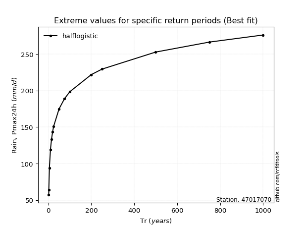</img>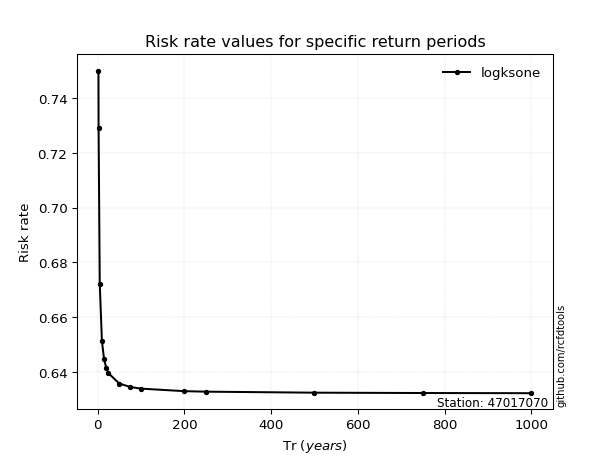</img>

</div>


<sub>**APP DISCLAIMER**: NO WARRANTY - This software is provided by [github.com/rcfdtools](https://github.com/rcfdtools) "as is", without any express or implied warranty, including warranties of merchantability, fitness for a particular purpose, or non-infringement. There is no guarantee that the software will be error-free or operate without interruption. LIMITATION OF LIABILITY - Neither the authors nor copyright holders will be liable for claims or damages arising from the software or its use. You are responsible for determining if the software is appropriate for your use and assume all associated risks, including errors, legal compliance, and data loss. NO PROFESSIONAL ADVICE - The software provides general information and does not offer professional advice. It should not replace consultation with professional advisors.</sub>