<div align="center">


</div>

# PMP Station (Rain, Pmax24h): 47017110

Probable Maximum Precipitation (PMP) is the greatest amount of rainfall for a specific duration that is meteorologically possible for a given location, acting as a "worst-case" scenario for extreme storms, crucial for designing safety-critical infrastructure like bridges, river deviations, dams, spillways, and nuclear plants to prevent catastrophic failure. PMP is calculated by hydrologists using meteorological data to determine the upper limit of extreme rainfall, often leading to the Probable Maximum Flood (PMF) for flood control design, and is increasingly being studied for climate change impacts. Probable Maximum Precipitation (PMP) is the theoretical upper limit of rainfall, a deterministic estimate for extreme events, while probability distributions (like GEV, Gumbel) describe the likelihood and frequency of various precipitation amounts, including rare ones, showing how often events occur, with PMP representing the extreme end of these distributions, used for critical infrastructure design to ensure safety against the worst conceivable weather, unlike standard statistical forecasts which cover typical probabilities.

The most common probability distributions in hydrology, used for analyzing floods, rainfall, and streamflow, include the Normal, Log-Normal, Gumbel, Gamma (including Log-Pearson Type III), and Generalized Extreme Value (GEV) distributions, often chosen based on the data´s skewness and whether modeling extremes or general conditions, with Gumbel and GEV popular for extreme events like floods, while the Normal distribution serves as a baseline, though often requiring transformations for skewed hydrological data. These distributions help in designing water infrastructure, managing water resources, and forecasting hydrologic events.

> Hydrological data often isn´t perfectly normal (it´s skewed), so different distributions are needed for different applications, such as: **Flood Frequency Analysis**: Using Gumbel, GEV, or Log-Pearson Type III for predicting extreme flood magnitudes and their return periods, **Rainfall Analysis**: Normal for annual totals, but Log-Normal, Weibull, or GEV for intensity or extreme daily rainfall, **Streamflow Modeling**: Gamma and Log-Normal for maximum flows, GEV for minimum flows, and Kappa for daily flows.

<div align="center">

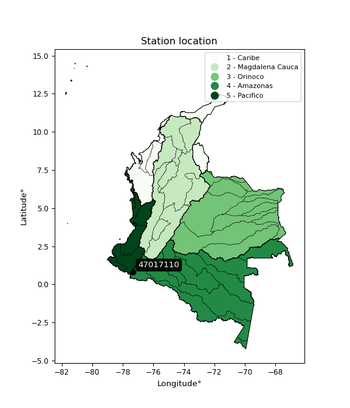</img>

</div>


## A. General information


### 1. General running parameters

• app_version: _v20260103_. • runtime: _2026-01-05 16:20:51.132608_. • Python version: _3.14.0_. • SciPy version: _1.16.3_. • Pandas version: _2.3.3_. • NumPy version: _2.3.5_. • Stations dataset (station_dataset_file): _dataset/pmax24h_in/automatic_colombia_2003_2024.csv_. • Stations catalog (station_catalog_file): _dataset/CNE.xls_. • Minimum year to eval til year_max (date_min): _1900_. • Maximum year to eval since year_min (date_max): _2024_. • Creates, save and include plots into reports (create_plot): _True_. • Plot only fit distributions with Δo > Δ (plot_only_fit): _True_. • Plot only simple graphs avoiding multiple CDFs and multiple Extreme values plots (plot_only_simple): _True_. • Eval low extreme values, if False, evaluates high extreme values (low_extreme): _False_. • Eval every SciPy distribution as logarithmic (pdist_logarithmic_on): _True_. • Standard deviation normalized (ddof): _1.0_. • Return periods to eval in years (Tr): _[2, 2.33, 5, 10, 15, 20, 25, 50, 75, 100, 200, 250, 500, 750, 1000]_. • Minimum data sample per station, 0 means any (minimum_sample): _5_. • Z-Score maximum threshold to adjust a value, 0 means disable (zscore_max): _3.5_. • Z-Score minimum threshold to adjust a value, 0 means disable (zscore_min): _-2.5_. • Avoid zeros, e.g. rain = 0 (avoid_zeros): _True_. • Avoid null values (avoid_nans): _True_. 

[:file_folder:Dataset file](../../dataset/pmax24h_in/automatic_colombia_2003_2024.csv)

> Delta Degrees of Freedom (DDOF): is a parameter used in the formulas for calculating variance and standard deviation. When ddof=0, the divisor is $N$ (the total number of observations) and this is used when your data set is the entire population. When ddof=1, the divisor is $N-1$ and this is used when your data set is a sample drawn from a larger population. Using $N-1$ provides an unbiased estimate of the population variance (known as Bessel´s correction).


### 2. Station info and location

|   id |   CODIGO | NOMBRE                      | CATEGORIA    | TECNOLOGIA                              | ESTADO   | FECHA_INSTALACION   |   FECHA_SUSPENSION |   ALTITUD |   LATITUD |   LONGITUD | DEPARTAMENTO   | MUNICIPIO   | AREA_OPERATIVA                      | ENTIDAD                                                     | AREA_HIDROGRAFICA   | ZONA_HIDROGRAFICA   | SUBZONA_HIDROGRAFICA   | CORRIENTE   | Catalogo   |   Version |
|-----:|---------:|:----------------------------|:-------------|:----------------------------------------|:---------|:--------------------|-------------------:|----------:|----------:|-----------:|:---------------|:------------|:------------------------------------|:------------------------------------------------------------|:--------------------|:--------------------|:-----------------------|:------------|:-----------|----------:|
|    0 | 47017110 | MONOPAMBA  - AUT [47017110] | Limnigráfica | Automática con Telemetría, Convencional | Activa   | 15/05/1980          |                nan |      1650 |  0.807778 |   -77.3069 | Nariño         | Puerres     | Area Operativa 07 - Nariño-Putumayo | INSTITUTO DE HIDROLOGIA METEOROLOGIA Y ESTUDIOS AMBIENTALES | Amazonas            | Putumayo            | Alto Río Putumayo      | Sucio       | CNE_IDEAM  |  20251226 |

<div align="center">

Dynamic map: [:earth_americas:Google](http://maps.google.com/maps?q=0.807777778,-77.30694444) [:earth_americas:OSM](https://www.openstreetmap.org/#map=18/0.807777778/-77.30694444&layers=P) [:earth_americas:Bing](https://www.bing.com/maps?cp=0.807777778~-77.30694444&lvl=18) [:earth_americas:Apple](https://maps.apple.com/frame?center=0.807777778%2C-77.30694444&span=0.003%2C0.006)

</div>


<div align="center">

```geojson
{
  "type": "Feature",
  "geometry": {
    "type": "Point", 
    "coordinates": [-77.30694444, 0.807777778]
  }, 
  "properties": {
    "Name": "47017110"
  }
}
```

</div>


### 3. Discrete values table and plot

<div align="center">

|               |          0 |           1 |           2 |           3 |           4 |
|:--------------|-----------:|------------:|------------:|------------:|------------:|
| Date          | 2019       | 2020        | 2021        | 2022        | 2023        |
| Value         |  140.2     |   52.8      |   84.2      |   53.8      |   37.4      |
| Value_initial |  140.2     |   52.8      |   84.2      |   53.8      |   37.4      |
| count         |    5       |    5        |    5        |    5        |    5        |
| mean          |   73.68    |   73.68     |   73.68     |   73.68     |   73.68     |
| std           |   40.8748  |   40.8748   |   40.8748   |   40.8748   |   40.8748   |
| zscore        |    1.62741 |   -0.510828 |    0.257371 |   -0.486363 |   -0.887588 |


</div>


<div align="center">

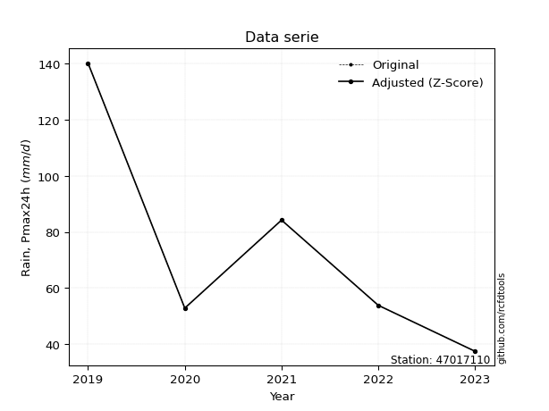</img>

</div>


> The initial value (value_initial) correspond to the initial obtained or null completed value, and value (value) is adjusted only when the initial value is outside the valid range (outlier) definite through the Z-Score value. If Z-Score is active, values out of range or outliers are replaced with the station mean value. A Z-Score (or standard score) measures how many standard deviations a data point is from the mean of a dataset, indicating its relative position; positive scores mean above the mean, negative mean below, and a score of zero is exactly at the mean, allowing for comparison of values from different distributions. It´s calculated using the formula $z=(x–μ)/σ$, where $x$ is the data point, $μ$ is the mean, and $σ$ is the standard deviation, helping identify outliers and understand probability.
>
> <sub>**Note**: In this study, "completing" (filling gaps in) and "extending" (forecasting or lengthening the historical record) rainfall data series are avoided for certain critical analyses because they introduce artificial bias and uncertainty, which can distort the statistics of rare events (extremes), alter day-to-day variability, and compromise the integrity and homogeneity of the original data. Some reasons against Completing/Extending rainfall data are: **Distortion of Extremes and Variability**: The primary issue is that most gap-filling or extension methods rely on averaging or regression with nearby stations, which inherently smooths the data. Rainfall is highly variable in space and time, with a large percentage of zero values and occasional large storms. Infilling methods often underestimate the highest values and overestimate the lowest (zero) values, which severely distorts analyses focused on flood frequency, drought severity, and intensity-duration-frequency (IDF) curves, **Loss of Data Homogeneity**: Infilled or extended data are synthetic estimates, not actual measurements. Combining these estimates with observed data can violate the assumption of data homogeneity, which requires that the data properties do not change over time. Inhomogeneity can lead to incorrect conclusions about long-term trends or changes in climate patterns, **Propagation of Errors**: Errors and biases from the original data (e.g., wind-induced undercatch, instrument errors, site changes) or the data used for imputation can propagate through the analysis, leading to unreliable hydrological models and inaccurate predictions, **Compromised Statistical Integrity**: For statistical analyses, especially those involving the frequency of events, using artificial data can introduce time bias or autocorrelation that doesn´t exist in reality, making it difficult to assess the true probability of events, **Difficulty in Validation**: It is difficult to accurately validate the quality of filled or extended data, especially for past periods where ground-truth measurements are unavailable. The reliability of imputation techniques heavily depends on the density of the surrounding station network and the complexity of the local topography.</sub>


### 4. Active continuous probability distributions from SciPy (44 of 104 available)

A Probability Density Function (PDF) describes the relative likelihood of a continuous random variable falling within a specific range, where the total area under its curve equals 1, and the area over any interval gives the actual probability for that range. Unlike discrete probabilities (like rolling a die), a PDF shows density, not direct probability for a single point (which is zero), with higher points indicating higher likelihood, often visualized as a bell curve for normal distributions.

A log of a probability density function (log-PDF) is simply the logarithm of the PDF´s value, denoted as $log(f(x))$, useful for converting multiplication of probabilities into addition, improving numerical stability with tiny numbers, and connecting to information theory concepts like entropy. Instead of dealing with very small probabilities (e.g., 0.000001), log-PDFs use negative numbers (e.g., $log(0.00001) ≈ -11.51$ that are easier for computers to handle, preventing underflow errors and simplifying complex calculations. In this study, each active probability distribution from SciPy is also evaluated in the $log$ form.

[scipy.stats](https://docs.scipy.org/doc/scipy/reference/stats.html) is a Python´s powerful submodule within the SciPy library for comprehensive statistical analysis, offering over 130 probability distributions (like Normal, Poisson), functions for descriptive stats (mean, variance), hypothesis testing (t-tests, chi-square), random variable generation, and statistical tests, making it essential for data science, modeling, and research. It provides tools to explore, model, and draw conclusions from data efficiently, working seamlessly with NumPy.

<div align="center">

|   id | p_dist             |   n_parameter | fit_method   | label                                                                       | active   | ref                                                                                                        |
|-----:|:-------------------|--------------:|:-------------|:----------------------------------------------------------------------------|:---------|:-----------------------------------------------------------------------------------------------------------|
|    0 | alpha              |             3 | MLE          | Alpha                                                                       | True     | [:mortar_board:](https://docs.scipy.org/doc/scipy/reference/generated/scipy.stats.alpha.html)              |
|    1 | betaprime          |             4 | MLE          | Beta prime                                                                  | True     | [:mortar_board:](https://docs.scipy.org/doc/scipy/reference/generated/scipy.stats.betaprime.html)          |
|    2 | chi2               |             3 | MLE          | Chi²                                                                        | True     | [:mortar_board:](https://docs.scipy.org/doc/scipy/reference/generated/scipy.stats.chi2.html)               |
|    3 | crystalball        |             4 | MLE          | Crystalball                                                                 | True     | [:mortar_board:](https://docs.scipy.org/doc/scipy/reference/generated/scipy.stats.crystalball.html)        |
|    4 | erlang             |             3 | MLE          | Erlang                                                                      | True     | [:mortar_board:](https://docs.scipy.org/doc/scipy/reference/generated/scipy.stats.erlang.html)             |
|    5 | expon              |             2 | MLE          | Exponential                                                                 | True     | [:mortar_board:](https://docs.scipy.org/doc/scipy/reference/generated/scipy.stats.expon.html)              |
|    6 | exponnorm          |             3 | MLE          | Exponentially modified Normal                                               | True     | [:mortar_board:](https://docs.scipy.org/doc/scipy/reference/generated/scipy.stats.exponnorm.html)          |
|    7 | f                  |             4 | MLE          | F                                                                           | True     | [:mortar_board:](https://docs.scipy.org/doc/scipy/reference/generated/scipy.stats.f.html)                  |
|    8 | fatiguelife        |             3 | MLE          | Fatigue-life (Birnbaum-Saunders)                                            | True     | [:mortar_board:](https://docs.scipy.org/doc/scipy/reference/generated/scipy.stats.fatiguelife.html)        |
|    9 | fisk               |             3 | MLE          | Fisk                                                                        | True     | [:mortar_board:](https://docs.scipy.org/doc/scipy/reference/generated/scipy.stats.fisk.html)               |
|   10 | gamma              |             3 | MLE          | Gamma                                                                       | True     | [:mortar_board:](https://docs.scipy.org/doc/scipy/reference/generated/scipy.stats.gamma.html)              |
|   11 | genexpon           |             5 | MLE          | Generalized exponential                                                     | True     | [:mortar_board:](https://docs.scipy.org/doc/scipy/reference/generated/scipy.stats.genexpon.html)           |
|   12 | genlogistic        |             3 | MLE          | Generalized logistic                                                        | True     | [:mortar_board:](https://docs.scipy.org/doc/scipy/reference/generated/scipy.stats.genlogistic.html)        |
|   13 | gibrat             |             2 | MM           | Gibrat                                                                      | True     | [:mortar_board:](https://docs.scipy.org/doc/scipy/reference/generated/scipy.stats.gibrat.html)             |
|   14 | gompertz           |             3 | MLE          | Gompertz (or truncated Gumbel)                                              | True     | [:mortar_board:](https://docs.scipy.org/doc/scipy/reference/generated/scipy.stats.gompertz.html)           |
|   15 | gumbel_l           |             2 | MM           | Gumbel Left Skew                                                            | True     | [:mortar_board:](https://docs.scipy.org/doc/scipy/reference/generated/scipy.stats.gumbel_l.html)           |
|   16 | gumbel_r           |             2 | MM           | Gumbel Right Skew                                                           | True     | [:mortar_board:](https://docs.scipy.org/doc/scipy/reference/generated/scipy.stats.gumbel_r.html)           |
|   17 | halflogistic       |             2 | MM           | Half-logistic                                                               | True     | [:mortar_board:](https://docs.scipy.org/doc/scipy/reference/generated/scipy.stats.halflogistic.html)       |
|   18 | halfnorm           |             2 | MM           | Half Normal                                                                 | True     | [:mortar_board:](https://docs.scipy.org/doc/scipy/reference/generated/scipy.stats.halfnorm.html)           |
|   19 | hypsecant          |             2 | MM           | hyperbolic secant                                                           | True     | [:mortar_board:](https://docs.scipy.org/doc/scipy/reference/generated/scipy.stats.hypsecant.html)          |
|   20 | invgamma           |             3 | MLE          | Inverted gamma                                                              | True     | [:mortar_board:](https://docs.scipy.org/doc/scipy/reference/generated/scipy.stats.invgamma.html)           |
|   21 | invgauss           |             3 | MLE          | Inverse Gaussian                                                            | True     | [:mortar_board:](https://docs.scipy.org/doc/scipy/reference/generated/scipy.stats.invgauss.html)           |
|   22 | invweibull         |             3 | MLE          | Inverted Weibull                                                            | True     | [:mortar_board:](https://docs.scipy.org/doc/scipy/reference/generated/scipy.stats.invweibull.html)         |
|   23 | johnsonsu          |             4 | MLE          | Johnson Su                                                                  | True     | [:mortar_board:](https://docs.scipy.org/doc/scipy/reference/generated/scipy.stats.johnsonsu.html)          |
|   24 | kstwobign          |             2 | MLE          | Limiting distribution of scaled Kolmogorov-Smirnov two-sided test statistic | True     | [:mortar_board:](https://docs.scipy.org/doc/scipy/reference/generated/scipy.stats.kstwobign.html)          |
|   25 | laplace            |             2 | MM           | Laplace                                                                     | True     | [:mortar_board:](https://docs.scipy.org/doc/scipy/reference/generated/scipy.stats.laplace.html)            |
|   26 | laplace_asymmetric |             3 | MLE          | Asymmetric Laplace                                                          | True     | [:mortar_board:](https://docs.scipy.org/doc/scipy/reference/generated/scipy.stats.laplace_asymmetric.html) |
|   27 | loggamma           |             3 | MLE          | Log gamma                                                                   | True     | [:mortar_board:](https://docs.scipy.org/doc/scipy/reference/generated/scipy.stats.loggamma.html)           |
|   28 | logistic           |             2 | MM           | Logistic (or Sech-squared)                                                  | True     | [:mortar_board:](https://docs.scipy.org/doc/scipy/reference/generated/scipy.stats.logistic.html)           |
|   29 | lognorm            |             3 | MLE          | Log Normal                                                                  | True     | [:mortar_board:](https://docs.scipy.org/doc/scipy/reference/generated/scipy.stats.lognorm.html)            |
|   30 | maxwell            |             2 | MM           | Maxwell                                                                     | True     | [:mortar_board:](https://docs.scipy.org/doc/scipy/reference/generated/scipy.stats.maxwell.html)            |
|   31 | mielke             |             4 | MLE          | Mielke Beta-Kappa / Dagum                                                   | True     | [:mortar_board:](https://docs.scipy.org/doc/scipy/reference/generated/scipy.stats.mielke.html)             |
|   32 | moyal              |             2 | MM           | Moyal                                                                       | True     | [:mortar_board:](https://docs.scipy.org/doc/scipy/reference/generated/scipy.stats.moyal.html)              |
|   33 | nakagami           |             3 | MLE          | Nakagami                                                                    | True     | [:mortar_board:](https://docs.scipy.org/doc/scipy/reference/generated/scipy.stats.nakagami.html)           |
|   34 | ncf                |             5 | MLE          | Non-central F distribution                                                  | True     | [:mortar_board:](https://docs.scipy.org/doc/scipy/reference/generated/scipy.stats.ncf.html)                |
|   35 | nct                |             4 | MLE          | Non-central Student’s t                                                     | True     | [:mortar_board:](https://docs.scipy.org/doc/scipy/reference/generated/scipy.stats.nct.html)                |
|   36 | norm               |             2 | MM           | Normal                                                                      | True     | [:mortar_board:](https://docs.scipy.org/doc/scipy/reference/generated/scipy.stats.norm.html)               |
|   37 | pearson3           |             3 | MM           | Pearson type III                                                            | True     | [:mortar_board:](https://docs.scipy.org/doc/scipy/reference/generated/scipy.stats.pearson3.html)           |
|   38 | rayleigh           |             2 | MM           | Rayleigh                                                                    | True     | [:mortar_board:](https://docs.scipy.org/doc/scipy/reference/generated/scipy.stats.rayleigh.html)           |
|   39 | rice               |             3 | MLE          | Rice                                                                        | True     | [:mortar_board:](https://docs.scipy.org/doc/scipy/reference/generated/scipy.stats.rice.html)               |
|   40 | t                  |             3 | MLE          | Student’s t                                                                 | True     | [:mortar_board:](https://docs.scipy.org/doc/scipy/reference/generated/scipy.stats.t.html)                  |
|   41 | truncnorm          |             4 | MLE          | Truncated normal                                                            | True     | [:mortar_board:](https://docs.scipy.org/doc/scipy/reference/generated/scipy.stats.truncnorm.html)          |
|   42 | wald               |             2 | MM           | Wald                                                                        | True     | [:mortar_board:](https://docs.scipy.org/doc/scipy/reference/generated/scipy.stats.wald.html)               |
|   43 | weibull_min        |             3 | MLE          | Weibull minimum                                                             | True     | [:mortar_board:](https://docs.scipy.org/doc/scipy/reference/generated/scipy.stats.weibull_min.html)        |

</div>

> **n_parameter:** # arguments & localization & scale.
>
> **Fit methods:** (MLE) maximum likelihood, (MM) L-moments.
>
>**Inactive** (With the only purpose of prevent loops, zero divisions, infinite values, over high estimated values or horizontal trending for recurrence intervals estimations, the follow distributions were disabled.)**:** foldnorm, gennorm, norminvgauss, powernorm, powerlognorm, skewnorm, genextreme, anglit, arcsine, argus, beta, bradford, burr, burr12, cauchy, cosine, halfcauchy, foldcauchy, skewcauchy, wrapcauchy, dgamma, gengamma, exponweib, exponpow, truncexpon, gausshyper, genhalflogistic, genhyperbolic, geninvgauss, halfgennorm, johnsonsb, kappa4, kappa3, ksone, kstwo, loglaplace, levy, levy_l, levy_stable, ncx2, pareto, genpareto, truncpareto, lomax, powerlaw, rdist, rel_breitwigner, recipinvgauss, semicircular, studentized_range, trapezoid, triang, truncweibull_min, tukeylambda, uniform, loguniform, vonmises, vonmises_line, weibull_max, dweibull, 


## B. Probability (PDF) vs. Empirical (EDF) distributions functions

A continuous probability distribution (CPD) describes probabilities for variables that can take any value within a range (like rain any time), unlike discrete variables with specific outcomes (like temperature). It uses a Probability Density Function (PDF), a curve where the total area under it equals 1, and the probability of the variable falling within an interval (a to b) is found by calculating the area under the curve between those points. A key feature is that the probability of hitting any single exact value is zero, so probabilities are always expressed for ranges, e.g., $P(a ≤ X ≤ b)$.

<div align="center">

Distributions parameters from station values
|    |   station | p_dist                |   n |             loc |           scale | shape                  | shape1                 | shape2             | shape3   |
|---:|----------:|:----------------------|----:|----------------:|----------------:|:-----------------------|:-----------------------|:-------------------|:---------|
|  0 |  47017110 | alpha                 |   5 |      7.87605    |   105.125       | 2.0192395254119555     |                        |                    |          |
|  1 |  47017110 | betaprime             |   5 |     -0.700354   |     1.46147     | 235.30042097940134     | 5.629899133262552      |                    |          |
|  2 |  47017110 | chi2                  |   5 |     37.4        |    25.9558      | 0.26620354174438776    |                        |                    |          |
|  3 |  47017110 | crystalball           |   5 |     73.68       |    36.5596      | 6637.130612475205      | 35.46843560642155      |                    |          |
|  4 |  47017110 | erlang                |   5 |     37.4        |    37.6669      | 0.1357737931996716     |                        |                    |          |
|  5 |  47017110 | expon                 |   5 |     37.4        |    36.28        |                        |                        |                    |          |
|  6 |  47017110 | exponnorm             |   5 |     37.3331     |     0.0189221   | 1925.0296083178864     |                        |                    |          |
|  7 |  47017110 | f                     |   5 |     24.2716     |    29.3439      | 42133.40981833151      | 4.265798877442043      |                    |          |
|  8 |  47017110 | fatiguelife           |   5 |     37.4        |     2.40924e-05 | 1372.0899677672369     |                        |                    |          |
|  9 |  47017110 | fisk                  |   5 |     37.4        |    14.4916      | 0.5603168665133456     |                        |                    |          |
| 10 |  47017110 | gamma                 |   5 |     37.4        |    26.3988      | 0.14561650287886058    |                        |                    |          |
| 11 |  47017110 | genexpon              |   5 |     37.4        |    54.7052      | 1.5078591175889584     | 2.7324640491392904e-11 | 1.1471816515489022 |          |
| 12 |  47017110 | genlogistic           |   5 |   -127.632      |    24.7705      | 1764.5601706760654     |                        |                    |          |
| 13 |  47017110 | gibrat                |   5 |     45.7897     |    16.9163      |                        |                        |                    |          |
| 14 |  47017110 | gompertz              |   5 |     37.3996     | 27088.5         | 745.3012588014271      |                        |                    |          |
| 15 |  47017110 | gumbel_l              |   5 |     90.1337     |    28.5054      |                        |                        |                    |          |
| 16 |  47017110 | gumbel_r              |   5 |     57.2263     |    28.5054      |                        |                        |                    |          |
| 17 |  47017110 | halflogistic          |   5 |     30.3484     |    31.2571      |                        |                        |                    |          |
| 18 |  47017110 | halfnorm              |   5 |     25.2895     |    60.6485      |                        |                        |                    |          |
| 19 |  47017110 | hypsecant             |   5 |     73.68       |    23.2745      |                        |                        |                    |          |
| 20 |  47017110 | invgamma              |   5 |     24.2701     |    62.5893      | 2.13290355597411       |                        |                    |          |
| 21 |  47017110 | invgauss              |   5 |     30.4908     |    34.62        | 1.2475202005048227     |                        |                    |          |
| 22 |  47017110 | invweibull            |   5 |     37.4        |     1.35451     | 0.04466663138336388    |                        |                    |          |
| 23 |  47017110 | johnsonsu             |   5 |     37.4        |     3.34263e-07 | -3.3597283325936145    | 0.22835167874498596    |                    |          |
| 24 |  47017110 | kstwobign             |   5 |    -31.2546     |   121           |                        |                        |                    |          |
| 25 |  47017110 | laplace               |   5 |     73.68       |    25.8515      |                        |                        |                    |          |
| 26 |  47017110 | laplace_asymmetric    |   5 |     52.8        |    19.4905      | 0.5987768509861588     |                        |                    |          |
| 27 |  47017110 | loggamma              |   5 |  -9952.2        |  1382.09        | 1414.249231003957      |                        |                    |          |
| 28 |  47017110 | logistic              |   5 |     73.68       |    20.1563      |                        |                        |                    |          |
| 29 |  47017110 | lognorm               |   5 |     37.4        |     0.0243915   | 14.449391817195096     |                        |                    |          |
| 30 |  47017110 | maxwell               |   5 |    -12.9508     |    54.2878      |                        |                        |                    |          |
| 31 |  47017110 | mielke                |   5 |     -0.623231   |     7.78784     | 617.0854153127245      | 2.7892887496598586     |                    |          |
| 32 |  47017110 | moyal                 |   5 |     52.7729     |    16.4576      |                        |                        |                    |          |
| 33 |  47017110 | nakagami              |   5 |     37.4        |    66.1902      | 0.3112399076450458     |                        |                    |          |
| 34 |  47017110 | ncf                   |   5 |     -0.00114665 |     1.08407e-06 | 9.898896193963769e-08  | 3.2861364327398244     | 5.292750924626391  |          |
| 35 |  47017110 | nct                   |   5 |      0.00735789 |     1.23778     | 3.2608080938740365     | 44.98345639701708      |                    |          |
| 36 |  47017110 | norm                  |   5 |     73.68       |    36.5596      |                        |                        |                    |          |
| 37 |  47017110 | pearson3              |   5 |     73.68       |    36.5595      | 0.9446452725099652     |                        |                    |          |
| 38 |  47017110 | rayleigh              |   5 |      3.73942    |    55.8045      |                        |                        |                    |          |
| 39 |  47017110 | rice                  |   5 |     16.202      |    48.168       | 0.00025969714224661415 |                        |                    |          |
| 40 |  47017110 | t                     |   5 |     73.6803     |    36.5591      | 52451262.51358013      |                        |                    |          |
| 41 |  47017110 | truncnorm             |   5 | -51210.1        |  1370.26        | 37.399981135509535     | 145.02252817357618     |                    |          |
| 42 |  47017110 | wald                  |   5 |     37.1204     |    36.5596      |                        |                        |                    |          |
| 43 |  47017110 | weibull_min           |   5 |     37.4        |    69.4164      | 0.13488875237882741    |                        |                    |          |
| 44 |  47017110 | logalpha              |   5 |      1.9574     |    11.0477      | 5.149500338722678      |                        |                    |          |
| 45 |  47017110 | logbetaprime          |   5 |     -2.14722    |     2.23623     | 738.5953514798716      | 261.6770912962985      |                    |          |
| 46 |  47017110 | logchi2               |   5 |      3.62167    |     0.974769    | 1.0149546312268685     |                        |                    |          |
| 47 |  47017110 | logcrystalball        |   5 |      4.18994    |     0.456315    | 7.849240036436854      | 6.663995951509058      |                    |          |
| 48 |  47017110 | logerlang             |   5 |      3.62167    |     0.620334    | 0.3996356931383872     |                        |                    |          |
| 49 |  47017110 | logexpon              |   5 |      3.62167    |     0.568273    |                        |                        |                    |          |
| 50 |  47017110 | logexponnorm          |   5 |      3.68847    |     0.162895    | 3.0785070744729968     |                        |                    |          |
| 51 |  47017110 | logf                  |   5 |      3.62167    |     0.588901    | 1.169278667783603      | 375.6221081495014      |                    |          |
| 52 |  47017110 | logfatiguelife        |   5 |      3.34112    |     0.716298    | 0.6064116034549403     |                        |                    |          |
| 53 |  47017110 | logfisk               |   5 |      3.37142    |     0.705528    | 2.72938348375913       |                        |                    |          |
| 54 |  47017110 | loggamma              |   5 |      3.62167    |     0.53719     | 0.7106631831764325     |                        |                    |          |
| 55 |  47017110 | loggenexpon           |   5 |      3.62167    |     0.923712    | 1.3035994363921097     | 0.8958391180247522     | 0.9929197419382688 |          |
| 56 |  47017110 | loggenlogistic        |   5 |      1.59947    |     0.361601    | 711.9656953677695      |                        |                    |          |
| 57 |  47017110 | loggibrat             |   5 |      3.84185    |     0.211128    |                        |                        |                    |          |
| 58 |  47017110 | loggompertz           |   5 |      3.62167    |     1.03415     | 1.08440500730927       |                        |                    |          |
| 59 |  47017110 | loggumbel_l           |   5 |      4.39531    |     0.355787    |                        |                        |                    |          |
| 60 |  47017110 | loggumbel_r           |   5 |      3.98458    |     0.355787    |                        |                        |                    |          |
| 61 |  47017110 | loghalflogistic       |   5 |      3.64914    |     0.39011     |                        |                        |                    |          |
| 62 |  47017110 | loghalfnorm           |   5 |      3.58596    |     0.756979    |                        |                        |                    |          |
| 63 |  47017110 | loghypsecant          |   5 |      4.18994    |     0.290499    |                        |                        |                    |          |
| 64 |  47017110 | loginvgamma           |   5 |      2.87106    |    10.2108      | 8.71064893594793       |                        |                    |          |
| 65 |  47017110 | loginvgauss           |   5 |      3.2601     |     3.06802     | 0.3030746139409454     |                        |                    |          |
| 66 |  47017110 | loginvweibull         |   5 |     -4.48475    |     8.45188     | 23.744475153846974     |                        |                    |          |
| 67 |  47017110 | logjohnsonsu          |   5 |      3.26525    |     0.025351    | -7.952081906174044     | 1.9116525234667185     |                    |          |
| 68 |  47017110 | logkstwobign          |   5 |      2.70573    |     1.70139     |                        |                        |                    |          |
| 69 |  47017110 | loglaplace            |   5 |      4.18994    |     0.322663    |                        |                        |                    |          |
| 70 |  47017110 | loglaplace_asymmetric |   5 |      3.96651    |     0.302663    | 0.6958299795297725     |                        |                    |          |
| 71 |  47017110 | logloggamma           |   5 |   -111.425      |    16.2158      | 1249.16870113808       |                        |                    |          |
| 72 |  47017110 | loglogistic           |   5 |      4.18994    |     0.25158     |                        |                        |                    |          |
| 73 |  47017110 | loglognorm            |   5 |      3.62167    |     0.000569128 | 13.94867159696821      |                        |                    |          |
| 74 |  47017110 | logmaxwell            |   5 |      3.10867    |     0.677588    |                        |                        |                    |          |
| 75 |  47017110 | logmielke             |   5 |    -14.9254     |    17.538       | 2767.7437415434597     | 52.859046087142566     |                    |          |
| 76 |  47017110 | logmoyal              |   5 |      3.92899    |     0.205414    |                        |                        |                    |          |
| 77 |  47017110 | lognakagami           |   5 |      3.62167    |     0.897517    | 0.25890393450573224    |                        |                    |          |
| 78 |  47017110 | logncf                |   5 |      2.91211    |     0.952887    | 222.85625991464784     | 17.46421576991503      | 42.87688369246832  |          |
| 79 |  47017110 | lognct                |   5 |     -0.451008   |     0.0984159   | 58.05644846281163      | 46.531369321949256     |                    |          |
| 80 |  47017110 | lognorm               |   5 |      4.18994    |     0.456315    |                        |                        |                    |          |
| 81 |  47017110 | logpearson3           |   5 |      4.18994    |     0.456315    | 0.5016403194005878     |                        |                    |          |
| 82 |  47017110 | lograyleigh           |   5 |      3.31699    |     0.696519    |                        |                        |                    |          |
| 83 |  47017110 | logrice               |   5 |      3.39486    |     0.648222    | 0.0012116221604774984  |                        |                    |          |
| 84 |  47017110 | logt                  |   5 |      4.18994    |     0.456319    | 174662873.57154346     |                        |                    |          |
| 85 |  47017110 | logtruncnorm          |   5 |     -0.131212   |     1.0367      | 4.40283760777424       | 4.894668917330634      |                    |          |
| 86 |  47017110 | logwald               |   5 |      3.73362    |     0.45632     |                        |                        |                    |          |
| 87 |  47017110 | logweibull_min        |   5 |      3.62167    |     0.482913    | 0.9318701411386278     |                        |                    |          |

</div>

> **loc** (Location parameter): This shifts the distribution along the x-axis. For many common distributions, like the normal (Gaussian) distribution, loc represents the mean $μ$. For others, like the uniform distribution, it might represent the minimum value, or for the beta distribution, the left end of the support interval.
>
> **scale** (Scale parameter): This determines the width or spread of the distribution. For the normal distribution, scale represents the standard deviation $σ$. For a uniform distribution, it defines the length of the interval (from $loc$ to $loc + scale$).
>
> **shape** (Shape parameters): Refers to parameters that define the specific form of a probability distribution, distinct from its location (loc) and scale (scale). These parameters are required arguments for most distribution functions. For example, a normal (Gaussian) distribution is fully defined by its location (mean) and scale (standard deviation), so it has no specific shape parameters beyond loc and scale. However, other distributions have intrinsic properties that need specification, as Gamma distribution that takes a shape parameter, often named $a$ or $alpha$.


### 0. Cumulative distribution values - CDF (88 evaluated)

Cumulative Distribution Function (CDF), denoted as $F$<sub>$X$</sub>$(x)$, is a function that gives the probability that a random variable $X$ will take a value less than or equal to a specific value, $x$ (i.e., $(P(X≥x)$. It essentially "accumulates" probabilities from a given point up to the far right (positive infinity), providing a complete picture of the distribution´s probabilities for both discrete (like rain) and continuous (like temperature) variables, helping to find probabilities over ranges or above certain values. Each station is evaluated separately ordering the $x$ values ascending, calculating the CDF and PDF values for the activated distributions and their logarithmic forms.

<div align="center">

CDF ordered by x ascending and calculating $log(f(x))$ separately
|   id |   Station |   date |     x |   count |   mean |     std |    zscore |   Value_initial |   station |   m |     alpha |   alpha_pdf |   betaprime |   betaprime_pdf |       chi2 |    chi2_pdf |   crystalball |   crystalball_pdf |     erlang |   erlang_pdf |    expon |   expon_pdf |   exponnorm |   exponnorm_pdf |         f |      f_pdf |   fatiguelife |   fatiguelife_pdf |        fisk |        fisk_pdf |      gamma |   gamma_pdf |    genexpon |   genexpon_pdf |   genlogistic |   genlogistic_pdf |   gibrat |   gibrat_pdf |    gompertz |   gompertz_pdf |   gumbel_l |   gumbel_l_pdf |   gumbel_r |   gumbel_r_pdf |   halflogistic |   halflogistic_pdf |   halfnorm |   halfnorm_pdf |   hypsecant |   hypsecant_pdf |   invgamma |   invgamma_pdf |   invgauss |   invgauss_pdf |   invweibull |   invweibull_pdf |   johnsonsu |   johnsonsu_pdf |   kstwobign |   kstwobign_pdf |   laplace |   laplace_pdf |   laplace_asymmetric |   laplace_asymmetric_pdf |    loggamma |   loggamma_pdf |   logistic |   logistic_pdf |   lognorm |   lognorm_pdf |   maxwell |   maxwell_pdf |   mielke |   mielke_pdf |    moyal |   moyal_pdf |    nakagami |   nakagami_pdf |      ncf |    ncf_pdf |       nct |    nct_pdf |     norm |   norm_pdf |   pearson3 |   pearson3_pdf |   rayleigh |   rayleigh_pdf |      rice |   rice_pdf |        t |      t_pdf |   truncnorm |   truncnorm_pdf |        wald |    wald_pdf |   weibull_min |   weibull_min_pdf |   logalpha |   logalpha_pdf |   logbetaprime |   logbetaprime_pdf |     logchi2 |   logchi2_pdf |   logcrystalball |   logcrystalball_pdf |   logerlang |   logerlang_pdf |   logexpon |   logexpon_pdf |   logexponnorm |   logexponnorm_pdf |        logf |    logf_pdf |   logfatiguelife |   logfatiguelife_pdf |   logfisk |   logfisk_pdf |   loggenexpon |   loggenexpon_pdf |   loggenlogistic |   loggenlogistic_pdf |   loggibrat |   loggibrat_pdf |   loggompertz |   loggompertz_pdf |   loggumbel_l |   loggumbel_l_pdf |   loggumbel_r |   loggumbel_r_pdf |   loghalflogistic |   loghalflogistic_pdf |   loghalfnorm |   loghalfnorm_pdf |   loghypsecant |   loghypsecant_pdf |   loginvgamma |   loginvgamma_pdf |   loginvgauss |   loginvgauss_pdf |   loginvweibull |   loginvweibull_pdf |   logjohnsonsu |   logjohnsonsu_pdf |   logkstwobign |   logkstwobign_pdf |   loglaplace |   loglaplace_pdf |   loglaplace_asymmetric |   loglaplace_asymmetric_pdf |   logloggamma |   logloggamma_pdf |   loglogistic |   loglogistic_pdf |   loglognorm |   loglognorm_pdf |   logmaxwell |   logmaxwell_pdf |   logmielke |   logmielke_pdf |   logmoyal |   logmoyal_pdf |   lognakagami |   lognakagami_pdf |    logncf |   logncf_pdf |    lognct |   lognct_pdf |   logpearson3 |   logpearson3_pdf |   lograyleigh |   lograyleigh_pdf |   logrice |   logrice_pdf |     logt |   logt_pdf |   logtruncnorm |   logtruncnorm_pdf |   logwald |   logwald_pdf |   logweibull_min |   logweibull_min_pdf |
|-----:|----------:|-------:|------:|--------:|-------:|--------:|----------:|----------------:|----------:|----:|----------:|------------:|------------:|----------------:|-----------:|------------:|--------------:|------------------:|-----------:|-------------:|---------:|------------:|------------:|----------------:|----------:|-----------:|--------------:|------------------:|------------:|----------------:|-----------:|------------:|------------:|---------------:|--------------:|------------------:|---------:|-------------:|------------:|---------------:|-----------:|---------------:|-----------:|---------------:|---------------:|-------------------:|-----------:|---------------:|------------:|----------------:|-----------:|---------------:|-----------:|---------------:|-------------:|-----------------:|------------:|----------------:|------------:|----------------:|----------:|--------------:|---------------------:|-------------------------:|------------:|---------------:|-----------:|---------------:|----------:|--------------:|----------:|--------------:|---------:|-------------:|---------:|------------:|------------:|---------------:|---------:|-----------:|----------:|-----------:|---------:|-----------:|-----------:|---------------:|-----------:|---------------:|----------:|-----------:|---------:|-----------:|------------:|----------------:|------------:|------------:|--------------:|------------------:|-----------:|---------------:|---------------:|-------------------:|------------:|--------------:|-----------------:|---------------------:|------------:|----------------:|-----------:|---------------:|---------------:|-------------------:|------------:|------------:|-----------------:|---------------------:|----------:|--------------:|--------------:|------------------:|-----------------:|---------------------:|------------:|----------------:|--------------:|------------------:|--------------:|------------------:|--------------:|------------------:|------------------:|----------------------:|--------------:|------------------:|---------------:|-------------------:|--------------:|------------------:|--------------:|------------------:|----------------:|--------------------:|---------------:|-------------------:|---------------:|-------------------:|-------------:|-----------------:|------------------------:|----------------------------:|--------------:|------------------:|--------------:|------------------:|-------------:|-----------------:|-------------:|-----------------:|------------:|----------------:|-----------:|---------------:|--------------:|------------------:|----------:|-------------:|----------:|-------------:|--------------:|------------------:|--------------:|------------------:|----------:|--------------:|---------:|-----------:|---------------:|-------------------:|----------:|--------------:|-----------------:|---------------------:|
|    0 |  47017110 |   2023 |  37.4 |       5 |  73.68 | 40.8748 | -0.887588 |            37.4 |  47017110 |   1 | 0.0629732 |  0.014992   |   0.0925613 |      0.0118358  | 0.00824009 | 1.54357e+11 |      0.160513 |        0.00666914 | 0.00781436 |  1.4932e+11  | 0        |  0.0275634  |  0.00183474 |      0.0273972  | 0.0583339 | 0.0170331  |     0.0597443 |       1.75066e+10 | 2.64128e-09 | 208285          | 0.00578324 | 1.1852e+11  | 1.43654e-11 |     0.0275634  |      0.105007 |        0.00954787 | 0        |  0           | 1.13343e-05 |     0.0275132  |   0.145504 |    0.00471364  |   0.134692 |     0.0094728  |       0.112324 |         0.0157945  |   0.158272 |     0.0128962  |    0.132014 |      0.00551083 |  0.0583347 |     0.0170332  |  0.0534226 |     0.0220622  |    0.0129899 |      3.54689e+11 |  0.00102489 |  1286.2         |   0.0957019 |      0.00928981 |  0.12288  |    0.0047533  |            0.0705307 |               0.00604351 | 3.43451e-11 |   27480.8      |   0.14186  |     0.00603956 |  0.106501 |      0.402597 |  0.164984 |    0.00822341 |      nan |          nan | 0.110651 |  0.0108333  | 8.90223e-11 |  7798.91       | 0.392763 | 0.00704354 | 0.0788833 | 0.0130561  | 0.160513 | 0.00666914 |   0.147702 |     0.0096775  |   0.16633  |     0.00901109 | 0.0922959 | 0.00829317 | 0.160508 | 0.00666909 |    0        |      0.0273137  | 7.51288e-30 | 1.77034e-27 |    0.00694439 |       1.31373e+11 |  0.0682869 |       0.525417 |       0.101992 |           0.434898 | 1.30056e-08 |    1.4862e+07 |         0.106501 |             0.402597 | 9.98603e-07 |     8.98642e+08 |   0        |       1.75972  |      0.0624239 |           0.555253 | 1.17999e-09 | 1.55344e+06 |        0.0544783 |             0.721531 | 0.0557817 |      0.574441 |   9.55983e-11 |          1.41126  |        0.0707921 |             0.517449 |    0        |       0         |   2.73735e-10 |          1.0486   |      0.107449 |          0.285163 |      0.06246  |          0.486853 |          0        |              0        |     0.0376244 |          1.05287  |      0.0894222 |           0.30379  |     0.0630262 |          0.566011 |     0.0566745 |          0.658937 |       0.0676314 |            0.533615 |      0.0580263 |           0.6208   |      0.0659653 |           0.541128 |    0.0859196 |         0.266283 |               0.0634462 |                    0.301261 |      0.107839 |          0.399285 |     0.0945913 |          0.340424 |    0.0228208 |      8.73884e+12 |    0.0974604 |         0.50677  |   0.0704369 |        0.519316 |  0.0346099 |       0.440294 |   1.32473e-08 |       7.72317e+06 | 0.0630309 |     0.565944 | 0.0911613 |     0.452971 |     0.0935386 |          0.471091 |     0.0912415 |          0.570731 | 0.0593783 |      0.50773  | 0.106503 |   0.402601 |    0           |           0        |  0        |      0        |      9.72812e-15 |            20.4133   |
|    1 |  47017110 |   2020 |  52.8 |       5 |  73.68 | 40.8748 | -0.510828 |            52.8 |  47017110 |   2 | 0.38248   |  0.0201768  |   0.325723  |      0.0163819  | 0.876844   | 0.005821    |      0.283958 |        0.00927    | 0.902735   |  0.00553154  | 0.345888 |  0.0180296  |  0.345979   |      0.017955   | 0.393185  | 0.0196279  |     0.719949  |       0.00636899  | 0.508516    |      0.00909341 | 0.926022   | 0.00522006  | 0.345887    |     0.0180295  |      0.297997 |        0.0145598  | 0.189187 |  0.0386074   | 0.345472    |     0.0180186  |   0.236543 |    0.00722867  |   0.310994 |     0.0127427  |       0.344459 |         0.0140984  |   0.349887 |     0.0118697  |    0.246476 |      0.00956296 |  0.393186  |     0.0196279  |  0.419749  |     0.0185818  |    0.407748  |      0.00106096  |  0.796159   |     0.00419883  |   0.279901  |      0.0136968  |  0.222944 |    0.008624   |            0.263912  |               0.0226137  | 0.624928    |       0.869103 |   0.261941 |     0.00959143 |  0.312192 |      0.775503 |  0.310067 |    0.0103539  |      nan |          nan | 0.317709 |  0.0147027  | 0.311942    |     0.0124478  | 0.489507 | 0.0055687  | 0.344907  | 0.018142   | 0.283958 | 0.00927    |   0.318992 |     0.0120093  |   0.320537 |     0.0107043  | 0.250723  | 0.011819   | 0.283953 | 0.00927002 |    0.343409 |      0.0179393  | 0.299161    | 0.0265619   |    0.557887   |       0.00316067  |  0.363429  |       1.02725  |       0.324276 |           0.821452 | 0.441856    |    0.57746    |         0.312192 |             0.775503 | 0.770066    |     0.59245     |   0.454919 |       0.959187 |      0.401116  |           1.10666  | 0.530289    | 0.72029     |        0.411392  |             1.02824  | 0.385893  |      1.0869   |   0.41821     |          0.99582  |        0.360044  |             1.0164   |    0.299136 |       2.78552   |   0.348962    |          0.95287  |      0.258907 |          0.624117 |      0.349207 |          1.03263  |          0.385729 |              1.09099  |     0.384839  |          0.928917 |      0.276263  |           0.83602  |     0.376454  |          1.04307  |     0.398286  |          1.03825  |       0.367242  |            1.03358  |      0.389893  |           1.04516  |      0.357716  |           0.991152 |    0.250171  |         0.775331 |               0.326228  |                    1.54902  |      0.311111 |          0.76648  |     0.291498  |          0.820921 |    0.676993  |      0.0746361   |    0.341248  |         0.846858 |   0.36139   |        1.01922  |  0.361387  |       1.16875  |   0.471082    |       0.686181    | 0.376398  |     1.04296  | 0.329565  |     0.877933 |     0.334817  |          0.869995 |     0.352609  |          0.866754 | 0.322166  |      0.922162 | 0.312195 |   0.7755   |    0           |           0        |  0.374011 |      1.89591  |      0.518407    |             0.95089  |
|    2 |  47017110 |   2022 |  53.8 |       5 |  73.68 | 40.8748 | -0.486363 |            53.8 |  47017110 |   3 | 0.402371  |  0.0196004  |   0.342065  |      0.0162969  | 0.882454   | 0.00540686  |      0.2933   |        0.00941243 | 0.908047   |  0.00510156  | 0.363671 |  0.0175394  |  0.36369    |      0.0174688  | 0.412488  | 0.0189786  |     0.726184  |       0.0061041   | 0.517323    |      0.00853116 | 0.931009   | 0.00476299  | 0.363671    |     0.0175394  |      0.312614 |        0.01467    | 0.227366 |  0.0376627   | 0.363245    |     0.01753    |   0.243865 |    0.00741496  |   0.323771 |     0.0128089  |       0.358479 |         0.0139407  |   0.361712 |     0.0117797  |    0.256186 |      0.00985671 |  0.41249   |     0.0189786  |  0.437948  |     0.0178217  |    0.408776  |      0.000995974 |  0.800203   |     0.00389578  |   0.293645  |      0.0137878  |  0.231736 |    0.00896414 |            0.286182  |               0.0219295  | 0.64083     |       0.826505 |   0.271645 |     0.00981598 |  0.326886 |      0.790606 |  0.320462 |    0.010434   |      nan |          nan | 0.332407 |  0.0146887  | 0.324228    |     0.0121282  | 0.495033 | 0.00548347 | 0.362933  | 0.0179052  | 0.2933   | 0.00941243 |   0.331021 |     0.0120473  |   0.331265 |     0.0107501  | 0.262608  | 0.0119494  | 0.293295 | 0.00941246 |    0.361105 |      0.0174561  | 0.32525     | 0.0256094   |    0.560951   |       0.00297249  |  0.382686  |       1.02509  |       0.339807 |           0.833902 | 0.452498    |    0.557199   |         0.326886 |             0.790606 | 0.780842    |     0.556804    |   0.472622 |       0.928036 |      0.421681  |           1.08499  | 0.543531    | 0.691594    |        0.430488  |             1.00717  | 0.406155  |      1.07241  |   0.436668    |          0.971756 |        0.379116  |             1.0162   |    0.349496 |       2.58125   |   0.366756    |          0.943796 |      0.270834 |          0.647324 |      0.368598 |          1.03399  |          0.406007 |              1.07041  |     0.402158  |          0.917132 |      0.292274  |           0.870576 |     0.395951  |          1.0348   |     0.41761   |          1.02134  |       0.386605  |            1.02998  |      0.409374  |           1.0311   |      0.376294  |           0.988872 |    0.265149  |         0.821751 |               0.354673  |                    1.48362  |      0.325636 |          0.781661 |     0.307136  |          0.84587  |    0.678356  |      0.0706609   |    0.357201  |         0.853516 |   0.380508  |        1.01827  |  0.38322   |       1.15792  |   0.483765    |       0.666022    | 0.395893  |     1.03472  | 0.346141  |     0.888705 |     0.351226  |          0.878891 |     0.368898  |          0.869353 | 0.339526  |      0.928037 | 0.326888 |   0.790602 |    0           |           0        |  0.408479 |      1.77883  |      0.53589     |             0.913068 |
|    3 |  47017110 |   2021 |  84.2 |       5 |  73.68 | 40.8748 |  0.257371 |            84.2 |  47017110 |   4 | 0.755953  |  0.00598922 |   0.72358   |      0.00829537 | 0.961311   | 0.00121291  |      0.613231 |        0.0104696  | 0.976678   |  0.000919654 | 0.72472  |  0.00758765 |  0.723804   |      0.00758245 | 0.755277  | 0.00605619 |     0.845133  |       0.00258452  | 0.658557    |      0.00269215 | 0.988063   | 0.000614714 | 0.72472     |     0.00758765 |      0.711142 |        0.00978556 | 0.793905 |  0.00742055  | 0.724387    |     0.0075962  |   0.556064 |    0.0126471   |   0.678286 |     0.00923691 |       0.696993 |         0.00822533 |   0.668622 |     0.00820805 |    0.639212 |      0.0123891  |  0.755278  |     0.00605618 |  0.755553  |     0.00585055 |    0.425856  |      0.000346962 |  0.860328   |     0.00108429  |   0.677604  |      0.0100393  |  0.667158 |    0.0128752  |            0.719465  |               0.00861842 | 0.865005    |       0.284601 |   0.627597 |     0.0115953  |  0.70301  |      0.75847  |  0.638554 |    0.00949103 |      nan |          nan | 0.700317 |  0.00866393 | 0.603473    |     0.00712193 | 0.628603 | 0.00348185 | 0.742417  | 0.00747393 | 0.613231 | 0.0104696  |   0.667196 |     0.00907829 |   0.646346 |     0.00913741 | 0.630803  | 0.0108202  | 0.613229 | 0.0104697  |    0.721646 |      0.0076098  | 0.761903    | 0.00723102  |    0.612566   |       0.00105884  |  0.754024  |       0.567812 |       0.714184 |           0.713142 | 0.633238    |    0.298193   |         0.70301  |             0.75847  | 0.921267    |     0.167025    |   0.760225 |       0.421937 |      0.761244  |           0.476105 | 0.754042    | 0.317616    |        0.758236  |             0.481811 | 0.753181  |      0.477869 |   0.755171    |          0.483715 |        0.754897  |             0.586877 |    0.848479 |       0.396945  |   0.725392    |          0.631143 |      0.671217 |          1.02793  |      0.753222 |          0.599964 |          0.763651 |              0.534255 |     0.736957  |          0.563432 |      0.739938  |           0.798902 |     0.755858  |          0.538293 |     0.757409  |          0.502893 |       0.756114  |            0.562813 |      0.756528  |           0.512689 |      0.746066  |           0.602399 |    0.764732  |         0.729143 |               0.769564  |                    0.529779 |      0.700037 |          0.761451 |     0.7245    |          0.793386 |    0.698699  |      0.0307758   |    0.718559  |         0.665918 |   0.75414   |        0.579495 |  0.769455  |       0.545288 |   0.709133    |       0.381846    | 0.755843  |     0.538454 | 0.726838  |     0.687151 |     0.723696  |          0.67323  |     0.723097  |          0.6371   | 0.722772  |      0.685058 | 0.70301  |   0.758464 |    1.28868e-05 |           4.89926  |  0.817239 |      0.419803 |      0.802513    |             0.367845 |
|    4 |  47017110 |   2019 | 140.2 |       5 |  73.68 | 40.8748 |  1.62741  |           140.2 |  47017110 |   5 | 0.909435  |  0.00115649 |   0.943413  |      0.0014668  | 0.991882   | 0.000208483 |      0.965582 |        0.00208463 | 0.996835   |  0.000105343 | 0.941194 |  0.00162088 |  0.940633   |      0.0016298  | 0.91739   | 0.00126928 |     0.933899  |       0.000940601 | 0.749844    |      0.0010224  | 0.999162   | 3.762e-05   | 0.941194    |     0.00162089 |      0.965077 |        0.00138495 | 0.957227 |  0.000963724 | 0.94121     |     0.00162368 |   0.996946 |    0.000620401 |   0.947023 |     0.00180836 |       0.942192 |         0.00179597 |   0.941867 |     0.00218569 |    0.963511 |      0.00156434 |  0.91739   |     0.00126927 |  0.922643  |     0.00140494 |    0.438599  |      0.000157063 |  0.896433   |     0.000399912 |   0.963938  |      0.00168921 |  0.961853 |    0.00147563 |            0.949786  |               0.00154265 | 0.952865    |       0.095667 |   0.964436 |     0.00170167 |  0.950575 |      0.223943 |  0.953124 |    0.00218723 |      nan |          nan | 0.944019 |  0.00169797 | 0.8719      |     0.00291817 | 0.765978 | 0.00170039 | 0.936103  | 0.00134441 | 0.965582 | 0.00208463 |   0.946684 |     0.00197212 |   0.949704 |     0.00220396 | 0.96361   | 0.00194483 | 0.965583 | 0.00208461 |    0.939834 |      0.00164663 | 0.945424    | 0.0012814   |    0.651596   |       0.000482023 |  0.926366  |       0.172989 |       0.944027 |           0.216897 | 0.751634    |    0.180564   |         0.950575 |             0.223943 | 0.972005    |     0.0547902   |   0.902245 |       0.172022 |      0.913626  |           0.172241 | 0.869163    | 0.156558    |        0.913623  |             0.175428 | 0.898991  |      0.157697 |   0.914747    |          0.183018 |        0.93365   |             0.177254 |    0.950703 |       0.0926039 |   0.939621    |          0.227207 |      0.990558 |          0.123737 |      0.934625 |          0.177606 |          0.930004 |              0.173147 |     0.926994  |          0.21131  |      0.95245   |           0.163076 |     0.921858  |          0.173115 |     0.917376  |          0.176009 |       0.928052  |            0.174525 |      0.917364  |           0.173559 |      0.937047  |           0.194608 |    0.951551  |         0.150154 |               0.928639  |                    0.164062 |      0.950231 |          0.227431 |     0.952284  |          0.180617 |    0.710763  |      0.0185485   |    0.937887  |         0.221063 |   0.930953  |        0.177081 |  0.932482  |       0.163954 |   0.857194    |       0.212809    | 0.921893  |     0.173147 | 0.942558  |     0.203181 |     0.939044  |          0.210129 |     0.934463  |          0.219665 | 0.942284  |      0.212657 | 0.950574 |   0.223945 |    0.999999    |           0.497929 |  0.936812 |      0.121198 |      0.922303    |             0.139993 |


</div>

An Empirical Distribution Function (EDF) is a step-function estimate of a true cumulative distribution function (CDF) based on observed sample data, representing the proportion of data points less than or equal to a given value. It is calculated by ordering your data and jumping up by $1/n$ (where $n$ is sample size) at each unique data point, allowing analysis without assuming an underlying population distribution, and it gets closer to the true CDF as the sample size grows. For the empirical probability calculations, the parameter $m$ correspond to the order number which means the position of the $x$ values in an ascending order list.

The Kolmogorov-Smirnov (K-S) test is a non-parametric statistical test used to determine if a sample data set comes from a specific theoretical distribution (one-sample) or if two different samples come from the same underlying distribution (two-sample), by comparing their cumulative distribution functions (CDFs). It calculates the maximum vertical difference (D statistic) between these functions, with a small p-value indicating a significant difference and rejection of the null hypothesis (that the data/samples match).


### 1. EDF California (1923)

California´s estimates the true probability distribution of water-related data (like rainfall, streamflow) using observed samples, crucial for risk assessment.

<div align="center">


$P=m/n$


</div>


**1.1. Empirical values**

<div align="center">

|                | 0              | 1                  | 2              | 3                 | 4              |
|:---------------|:---------------|:-------------------|:---------------|:------------------|:---------------|
| date           | 2023           | 2020               | 2022           | 2021              | 2019           |
| x              | 37.4           | 52.8               | 53.8           | 84.2              | 140.2          |
| m              | 1              | 2                  | 3              | 4                 | 5              |
| empirical_dist | edf_california | edf_california     | edf_california | edf_california    | edf_california |
| empirical      | 0.2            | 0.4                | 0.6            | 0.8               | 1.0            |
| empirical_tr   | 1.25           | 1.6666666666666667 | 2.5            | 5.000000000000001 | inf            |

</div>


**1.2. Kolmogorov-Smirnov fit test (sorted by Δ)**


<div align="center">

|                | 0                   | 1                   | 2                   | 3                  | 4                   | 5                  | 6                   | 7                   | 8                   | 9                   | 10                  | 11                 | 12                  | 13                 | 14                 | 15                 | 16                 | 17                  | 18                  | 19                  | 20                 | 21                  | 22                 | 23                  | 24                  | 25                  | 26                  | 27                  | 28                  | 29                  | 30                  | 31                  | 32                  | 33                  | 34                  | 35                  | 36                  | 37                  | 38                  | 39                  | 40                    | 41                 | 42                  | 43                 | 44                  | 45                 | 46                 | 47                 | 48                  | 49                  | 50                 | 51                  | 52                 | 53                  | 54                 | 55                 | 56                  | 57                 | 58                 | 59                  | 60                  | 61                  | 62                 | 63                 | 64                 | 65                 | 66                  | 67                 | 68                 | 69                  | 70                  | 71                  | 72                 | 73                 | 74                 | 75                 | 76                 | 77                  | 78                  | 79                  | 80                 | 81                  | 82                  | 83                 | 84                 | 85                 | 86                 | 87                 |
|:---------------|:--------------------|:--------------------|:--------------------|:-------------------|:--------------------|:-------------------|:--------------------|:--------------------|:--------------------|:--------------------|:--------------------|:-------------------|:--------------------|:-------------------|:-------------------|:-------------------|:-------------------|:--------------------|:--------------------|:--------------------|:-------------------|:--------------------|:-------------------|:--------------------|:--------------------|:--------------------|:--------------------|:--------------------|:--------------------|:--------------------|:--------------------|:--------------------|:--------------------|:--------------------|:--------------------|:--------------------|:--------------------|:--------------------|:--------------------|:--------------------|:----------------------|:-------------------|:--------------------|:-------------------|:--------------------|:-------------------|:-------------------|:-------------------|:--------------------|:--------------------|:-------------------|:--------------------|:-------------------|:--------------------|:-------------------|:-------------------|:--------------------|:-------------------|:-------------------|:--------------------|:--------------------|:--------------------|:-------------------|:-------------------|:-------------------|:-------------------|:--------------------|:-------------------|:-------------------|:--------------------|:--------------------|:--------------------|:-------------------|:-------------------|:-------------------|:-------------------|:-------------------|:--------------------|:--------------------|:--------------------|:-------------------|:--------------------|:--------------------|:-------------------|:-------------------|:-------------------|:-------------------|:-------------------|
| station        | 47017110            | 47017110            | 47017110            | 47017110           | 47017110            | 47017110           | 47017110            | 47017110            | 47017110            | 47017110            | 47017110            | 47017110           | 47017110            | 47017110           | 47017110           | 47017110           | 47017110           | 47017110            | 47017110            | 47017110            | 47017110           | 47017110            | 47017110           | 47017110            | 47017110            | 47017110            | 47017110            | 47017110            | 47017110            | 47017110            | 47017110            | 47017110            | 47017110            | 47017110            | 47017110            | 47017110            | 47017110            | 47017110            | 47017110            | 47017110            | 47017110              | 47017110           | 47017110            | 47017110           | 47017110            | 47017110           | 47017110           | 47017110           | 47017110            | 47017110            | 47017110           | 47017110            | 47017110           | 47017110            | 47017110           | 47017110           | 47017110            | 47017110           | 47017110           | 47017110            | 47017110            | 47017110            | 47017110           | 47017110           | 47017110           | 47017110           | 47017110            | 47017110           | 47017110           | 47017110            | 47017110            | 47017110            | 47017110           | 47017110           | 47017110           | 47017110           | 47017110           | 47017110            | 47017110            | 47017110            | 47017110           | 47017110            | 47017110            | 47017110           | 47017110           | 47017110           | 47017110           | 47017110           |
| empirical_dist | edf_california      | edf_california      | edf_california      | edf_california     | edf_california      | edf_california     | edf_california      | edf_california      | edf_california      | edf_california      | edf_california      | edf_california     | edf_california      | edf_california     | edf_california     | edf_california     | edf_california     | edf_california      | edf_california      | edf_california      | edf_california     | edf_california      | edf_california     | edf_california      | edf_california      | edf_california      | edf_california      | edf_california      | edf_california      | edf_california      | edf_california      | edf_california      | edf_california      | edf_california      | edf_california      | edf_california      | edf_california      | edf_california      | edf_california      | edf_california      | edf_california        | edf_california     | edf_california      | edf_california     | edf_california      | edf_california     | edf_california     | edf_california     | edf_california      | edf_california      | edf_california     | edf_california      | edf_california     | edf_california      | edf_california     | edf_california     | edf_california      | edf_california     | edf_california     | edf_california      | edf_california      | edf_california      | edf_california     | edf_california     | edf_california     | edf_california     | edf_california      | edf_california     | edf_california     | edf_california      | edf_california      | edf_california      | edf_california     | edf_california     | edf_california     | edf_california     | edf_california     | edf_california      | edf_california      | edf_california      | edf_california     | edf_california      | edf_california      | edf_california     | edf_california     | edf_california     | edf_california     | edf_california     |
| p_dist         | invgauss            | logfatiguelife      | logexponnorm        | loginvgauss        | invgamma            | f                  | logjohnsonsu        | logfisk             | alpha               | loghalfnorm         | lognakagami         | logf               | loggenexpon         | logweibull_min     | loghalflogistic    | logexpon           | logwald            | loginvgamma         | logncf              | loginvweibull       | logmoyal           | logalpha            | logmielke          | loggenlogistic      | logkstwobign        | loggamma            | loggamma            | lograyleigh         | loggumbel_r         | loggompertz         | ncf                 | exponnorm           | expon               | genexpon            | gompertz            | nct                 | halfnorm            | truncnorm           | halflogistic        | logmaxwell          | loglaplace_asymmetric | logchi2            | logpearson3         | fisk               | loggibrat           | lognct             | betaprime          | logbetaprime       | logrice             | moyal               | rayleigh           | pearson3            | logt               | logcrystalball      | lognorm            | lognorm            | logloggamma         | wald               | nakagami           | gumbel_r            | maxwell             | genlogistic         | loglognorm         | loglogistic        | kstwobign          | norm               | crystalball         | t                  | loghypsecant       | laplace_asymmetric  | fatiguelife         | logistic            | loggumbel_l        | loglaplace         | rice               | hypsecant          | weibull_min        | gumbel_l            | laplace             | logerlang           | gibrat             | johnsonsu           | chi2                | erlang             | gamma              | invweibull         | logtruncnorm       | mielke             |
| delta          | 0.16205169150514814 | 0.16951200982045816 | 0.17831938350435972 | 0.1823901911977009 | 0.18750998378036032 | 0.1875115149492288 | 0.19062634416185098 | 0.19384523203112364 | 0.19762917361891413 | 0.19784188581206058 | 0.19999998675271324 | 0.1999999988200131 | 0.19999999990440173 | 0.1999999999999903 | 0.2                | 0.2                | 0.2                | 0.20404948858964939 | 0.20410677919470266 | 0.21339509974495252 | 0.2167798058633037 | 0.21731380050940002 | 0.2194921443836697 | 0.22088371915897992 | 0.22370598251372864 | 0.22492798297046546 | 0.22492798297046546 | 0.23110198495672862 | 0.23140151556183874 | 0.23324424620298156 | 0.23402228977313233 | 0.23631040996503871 | 0.23632891250846388 | 0.23632938305126217 | 0.23675527586311512 | 0.23706666419464378 | 0.23828764217529325 | 0.23889481331227896 | 0.24152085435151432 | 0.24279883541479147 | 0.24532679343752262   | 0.2483657536295525 | 0.24877354003241525 | 0.2501555795236039 | 0.25050409218709463 | 0.2538588929065644 | 0.2579345087446774 | 0.2601926516599577 | 0.26047397022783075 | 0.26759311588022705 | 0.2687347745536135 | 0.26897863844793446 | 0.273111664125936  | 0.27311435250860466 | 0.2731143559915871 | 0.2731143559915871 | 0.27436398042675714 | 0.2747502099635341 | 0.2757718859127887 | 0.27622894883329907 | 0.27953827208848075 | 0.28738612939569347 | 0.2892369248871508 | 0.2928637799661873 | 0.3063545227778164 | 0.306700186010095  | 0.30670018697741896 | 0.3067053657317558 | 0.3077260337436771 | 0.31381790351246597 | 0.31994894706948995 | 0.32835450863100046 | 0.3291662619362077 | 0.3348509917657267 | 0.3373919159408135 | 0.3438140776579364 | 0.3484036498446197 | 0.35613531611796606 | 0.36826350528162577 | 0.37006608371185945 | 0.3726341664124072 | 0.39615886855012405 | 0.47684448640245636 | 0.5027345377029125 | 0.5260222522714338 | 0.561401497494243  | 0.7999871132091246 | nan                |
| deltao         | 0.5865427407550001  | 0.5865427407550001  | 0.5865427407550001  | 0.5865427407550001 | 0.5865427407550001  | 0.5865427407550001 | 0.5865427407550001  | 0.5865427407550001  | 0.5865427407550001  | 0.5865427407550001  | 0.5865427407550001  | 0.5865427407550001 | 0.5865427407550001  | 0.5865427407550001 | 0.5865427407550001 | 0.5865427407550001 | 0.5865427407550001 | 0.5865427407550001  | 0.5865427407550001  | 0.5865427407550001  | 0.5865427407550001 | 0.5865427407550001  | 0.5865427407550001 | 0.5865427407550001  | 0.5865427407550001  | 0.5865427407550001  | 0.5865427407550001  | 0.5865427407550001  | 0.5865427407550001  | 0.5865427407550001  | 0.5865427407550001  | 0.5865427407550001  | 0.5865427407550001  | 0.5865427407550001  | 0.5865427407550001  | 0.5865427407550001  | 0.5865427407550001  | 0.5865427407550001  | 0.5865427407550001  | 0.5865427407550001  | 0.5865427407550001    | 0.5865427407550001 | 0.5865427407550001  | 0.5865427407550001 | 0.5865427407550001  | 0.5865427407550001 | 0.5865427407550001 | 0.5865427407550001 | 0.5865427407550001  | 0.5865427407550001  | 0.5865427407550001 | 0.5865427407550001  | 0.5865427407550001 | 0.5865427407550001  | 0.5865427407550001 | 0.5865427407550001 | 0.5865427407550001  | 0.5865427407550001 | 0.5865427407550001 | 0.5865427407550001  | 0.5865427407550001  | 0.5865427407550001  | 0.5865427407550001 | 0.5865427407550001 | 0.5865427407550001 | 0.5865427407550001 | 0.5865427407550001  | 0.5865427407550001 | 0.5865427407550001 | 0.5865427407550001  | 0.5865427407550001  | 0.5865427407550001  | 0.5865427407550001 | 0.5865427407550001 | 0.5865427407550001 | 0.5865427407550001 | 0.5865427407550001 | 0.5865427407550001  | 0.5865427407550001  | 0.5865427407550001  | 0.5865427407550001 | 0.5865427407550001  | 0.5865427407550001  | 0.5865427407550001 | 0.5865427407550001 | 0.5865427407550001 | 0.5865427407550001 | 0.5865427407550001 |
| eval           | Δo > Δ              | Δo > Δ              | Δo > Δ              | Δo > Δ             | Δo > Δ              | Δo > Δ             | Δo > Δ              | Δo > Δ              | Δo > Δ              | Δo > Δ              | Δo > Δ              | Δo > Δ             | Δo > Δ              | Δo > Δ             | Δo > Δ             | Δo > Δ             | Δo > Δ             | Δo > Δ              | Δo > Δ              | Δo > Δ              | Δo > Δ             | Δo > Δ              | Δo > Δ             | Δo > Δ              | Δo > Δ              | Δo > Δ              | Δo > Δ              | Δo > Δ              | Δo > Δ              | Δo > Δ              | Δo > Δ              | Δo > Δ              | Δo > Δ              | Δo > Δ              | Δo > Δ              | Δo > Δ              | Δo > Δ              | Δo > Δ              | Δo > Δ              | Δo > Δ              | Δo > Δ                | Δo > Δ             | Δo > Δ              | Δo > Δ             | Δo > Δ              | Δo > Δ             | Δo > Δ             | Δo > Δ             | Δo > Δ              | Δo > Δ              | Δo > Δ             | Δo > Δ              | Δo > Δ             | Δo > Δ              | Δo > Δ             | Δo > Δ             | Δo > Δ              | Δo > Δ             | Δo > Δ             | Δo > Δ              | Δo > Δ              | Δo > Δ              | Δo > Δ             | Δo > Δ             | Δo > Δ             | Δo > Δ             | Δo > Δ              | Δo > Δ             | Δo > Δ             | Δo > Δ              | Δo > Δ              | Δo > Δ              | Δo > Δ             | Δo > Δ             | Δo > Δ             | Δo > Δ             | Δo > Δ             | Δo > Δ              | Δo > Δ              | Δo > Δ              | Δo > Δ             | Δo > Δ              | Δo > Δ              | Δo > Δ             | Δo > Δ             | Δo > Δ             | Δo <= Δ            | Δo <= Δ            |
| fit            | 1                   | 1                   | 1                   | 1                  | 1                   | 1                  | 1                   | 1                   | 1                   | 1                   | 1                   | 1                  | 1                   | 1                  | 1                  | 1                  | 1                  | 1                   | 1                   | 1                   | 1                  | 1                   | 1                  | 1                   | 1                   | 1                   | 1                   | 1                   | 1                   | 1                   | 1                   | 1                   | 1                   | 1                   | 1                   | 1                   | 1                   | 1                   | 1                   | 1                   | 1                     | 1                  | 1                   | 1                  | 1                   | 1                  | 1                  | 1                  | 1                   | 1                   | 1                  | 1                   | 1                  | 1                   | 1                  | 1                  | 1                   | 1                  | 1                  | 1                   | 1                   | 1                   | 1                  | 1                  | 1                  | 1                  | 1                   | 1                  | 1                  | 1                   | 1                   | 1                   | 1                  | 1                  | 1                  | 1                  | 1                  | 1                   | 1                   | 1                   | 1                  | 1                   | 1                   | 1                  | 1                  | 1                  | 0                  | 0                  |
| n              | 5                   | 5                   | 5                   | 5                  | 5                   | 5                  | 5                   | 5                   | 5                   | 5                   | 5                   | 5                  | 5                   | 5                  | 5                  | 5                  | 5                  | 5                   | 5                   | 5                   | 5                  | 5                   | 5                  | 5                   | 5                   | 5                   | 5                   | 5                   | 5                   | 5                   | 5                   | 5                   | 5                   | 5                   | 5                   | 5                   | 5                   | 5                   | 5                   | 5                   | 5                     | 5                  | 5                   | 5                  | 5                   | 5                  | 5                  | 5                  | 5                   | 5                   | 5                  | 5                   | 5                  | 5                   | 5                  | 5                  | 5                   | 5                  | 5                  | 5                   | 5                   | 5                   | 5                  | 5                  | 5                  | 5                  | 5                   | 5                  | 5                  | 5                   | 5                   | 5                   | 5                  | 5                  | 5                  | 5                  | 5                  | 5                   | 5                   | 5                   | 5                  | 5                   | 5                   | 5                  | 5                  | 5                  | 5                  | 5                  |
| best_fit       | 1                   | 0                   | 0                   | 0                  | 0                   | 0                  | 0                   | 0                   | 0                   | 0                   | 0                   | 0                  | 0                   | 0                  | 0                  | 0                  | 0                  | 0                   | 0                   | 0                   | 0                  | 0                   | 0                  | 0                   | 0                   | 0                   | 0                   | 0                   | 0                   | 0                   | 0                   | 0                   | 0                   | 0                   | 0                   | 0                   | 0                   | 0                   | 0                   | 0                   | 0                     | 0                  | 0                   | 0                  | 0                   | 0                  | 0                  | 0                  | 0                   | 0                   | 0                  | 0                   | 0                  | 0                   | 0                  | 0                  | 0                   | 0                  | 0                  | 0                   | 0                   | 0                   | 0                  | 0                  | 0                  | 0                  | 0                   | 0                  | 0                  | 0                   | 0                   | 0                   | 0                  | 0                  | 0                  | 0                  | 0                  | 0                   | 0                   | 0                   | 0                  | 0                   | 0                   | 0                  | 0                  | 0                  | 0                  | 0                  |
| best_fit_sort  | 1                   | 2                   | 3                   | 4                  | 5                   | 6                  | 7                   | 8                   | 9                   | 10                  | 11                  | 12                 | 13                  | 14                 | 15                 | 16                 | 17                 | 18                  | 19                  | 20                  | 21                 | 22                  | 23                 | 24                  | 25                  | 26                  | 27                  | 28                  | 29                  | 30                  | 31                  | 32                  | 33                  | 34                  | 35                  | 36                  | 37                  | 38                  | 39                  | 40                  | 41                    | 42                 | 43                  | 44                 | 45                  | 46                 | 47                 | 48                 | 49                  | 50                  | 51                 | 52                  | 53                 | 54                  | 55                 | 56                 | 57                  | 58                 | 59                 | 60                  | 61                  | 62                  | 63                 | 64                 | 65                 | 66                 | 67                  | 68                 | 69                 | 70                  | 71                  | 72                  | 73                 | 74                 | 75                 | 76                 | 77                 | 78                  | 79                  | 80                  | 81                 | 82                  | 83                  | 84                 | 85                 | 86                 | 87                 | 88                 |

</div>


**1.3. Best fit**

<div align="center">

|   id |   station | empirical_dist   | p_dist   |    delta |   deltao | eval   |   fit |   n |   best_fit |   best_fit_sort |
|-----:|----------:|:-----------------|:---------|---------:|---------:|:-------|------:|----:|-----------:|----------------:|
|    0 |  47017110 | edf_california   | invgauss | 0.162052 | 0.586543 | Δo > Δ |     1 |   5 |          1 |               1 |

</div>


<div align="center">

</img>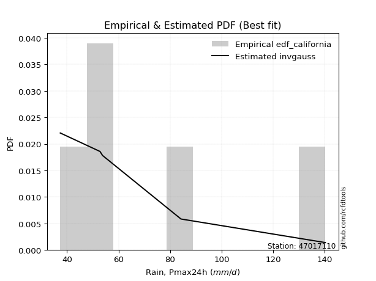</img>

</div>


### 2. EDF Hazen (1930)

Hazen method for plotting positions is a formula used to estimate the empirical cumulative probability distribution of flood events or other hydrological data. This formula often results in biased estimations, particularly when extrapolating to extreme events (high return periods).

<div align="center">


$P=(m-0.5)/n$


</div>


**2.1. Empirical values**

<div align="center">

|                | 0                  | 1                  | 2         | 3                 | 4                  |
|:---------------|:-------------------|:-------------------|:----------|:------------------|:-------------------|
| date           | 2023               | 2020               | 2022      | 2021              | 2019               |
| x              | 37.4               | 52.8               | 53.8      | 84.2              | 140.2              |
| m              | 1                  | 2                  | 3         | 4                 | 5                  |
| empirical_dist | edf_hazen          | edf_hazen          | edf_hazen | edf_hazen         | edf_hazen          |
| empirical      | 0.1                | 0.3                | 0.5       | 0.7               | 0.9                |
| empirical_tr   | 1.1111111111111112 | 1.4285714285714286 | 2.0       | 3.333333333333333 | 10.000000000000002 |

</div>


**2.2. Kolmogorov-Smirnov fit test (sorted by Δ)**


<div align="center">

|                | 0                  | 1                   | 2                   | 3                   | 4                   | 5                  | 6                   | 7                  | 8                   | 9                   | 10                  | 11                 | 12                  | 13                  | 14                  | 15                  | 16                  | 17                  | 18                 | 19                  | 20                  | 21                  | 22                  | 23                 | 24                  | 25                 | 26                 | 27                  | 28                 | 29                  | 30                 | 31                  | 32                 | 33                    | 34                 | 35                  | 36                  | 37                 | 38                  | 39                 | 40                  | 41                  | 42                  | 43                  | 44                  | 45                  | 46                  | 47                  | 48                  | 49                  | 50                  | 51                  | 52                 | 53                 | 54                  | 55                 | 56                 | 57                 | 58                  | 59                 | 60                 | 61                 | 62                  | 63                 | 64                 | 65                  | 66                 | 67                  | 68                 | 69                  | 70                  | 71                 | 72                  | 73                 | 74                  | 75                 | 76                 | 77                 | 78                 | 79                 | 80                 | 81                 | 82                 | 83                 | 84                 | 85                 | 86                 | 87                 |
|:---------------|:-------------------|:--------------------|:--------------------|:--------------------|:--------------------|:-------------------|:--------------------|:-------------------|:--------------------|:--------------------|:--------------------|:-------------------|:--------------------|:--------------------|:--------------------|:--------------------|:--------------------|:--------------------|:-------------------|:--------------------|:--------------------|:--------------------|:--------------------|:-------------------|:--------------------|:-------------------|:-------------------|:--------------------|:-------------------|:--------------------|:-------------------|:--------------------|:-------------------|:----------------------|:-------------------|:--------------------|:--------------------|:-------------------|:--------------------|:-------------------|:--------------------|:--------------------|:--------------------|:--------------------|:--------------------|:--------------------|:--------------------|:--------------------|:--------------------|:--------------------|:--------------------|:--------------------|:-------------------|:-------------------|:--------------------|:-------------------|:-------------------|:-------------------|:--------------------|:-------------------|:-------------------|:-------------------|:--------------------|:-------------------|:-------------------|:--------------------|:-------------------|:--------------------|:-------------------|:--------------------|:--------------------|:-------------------|:--------------------|:-------------------|:--------------------|:-------------------|:-------------------|:-------------------|:-------------------|:-------------------|:-------------------|:-------------------|:-------------------|:-------------------|:-------------------|:-------------------|:-------------------|:-------------------|
| station        | 47017110           | 47017110            | 47017110            | 47017110            | 47017110            | 47017110           | 47017110            | 47017110           | 47017110            | 47017110            | 47017110            | 47017110           | 47017110            | 47017110            | 47017110            | 47017110            | 47017110            | 47017110            | 47017110           | 47017110            | 47017110            | 47017110            | 47017110            | 47017110           | 47017110            | 47017110           | 47017110           | 47017110            | 47017110           | 47017110            | 47017110           | 47017110            | 47017110           | 47017110              | 47017110           | 47017110            | 47017110            | 47017110           | 47017110            | 47017110           | 47017110            | 47017110            | 47017110            | 47017110            | 47017110            | 47017110            | 47017110            | 47017110            | 47017110            | 47017110            | 47017110            | 47017110            | 47017110           | 47017110           | 47017110            | 47017110           | 47017110           | 47017110           | 47017110            | 47017110           | 47017110           | 47017110           | 47017110            | 47017110           | 47017110           | 47017110            | 47017110           | 47017110            | 47017110           | 47017110            | 47017110            | 47017110           | 47017110            | 47017110           | 47017110            | 47017110           | 47017110           | 47017110           | 47017110           | 47017110           | 47017110           | 47017110           | 47017110           | 47017110           | 47017110           | 47017110           | 47017110           | 47017110           |
| empirical_dist | edf_hazen          | edf_hazen           | edf_hazen           | edf_hazen           | edf_hazen           | edf_hazen          | edf_hazen           | edf_hazen          | edf_hazen           | edf_hazen           | edf_hazen           | edf_hazen          | edf_hazen           | edf_hazen           | edf_hazen           | edf_hazen           | edf_hazen           | edf_hazen           | edf_hazen          | edf_hazen           | edf_hazen           | edf_hazen           | edf_hazen           | edf_hazen          | edf_hazen           | edf_hazen          | edf_hazen          | edf_hazen           | edf_hazen          | edf_hazen           | edf_hazen          | edf_hazen           | edf_hazen          | edf_hazen             | edf_hazen          | edf_hazen           | edf_hazen           | edf_hazen          | edf_hazen           | edf_hazen          | edf_hazen           | edf_hazen           | edf_hazen           | edf_hazen           | edf_hazen           | edf_hazen           | edf_hazen           | edf_hazen           | edf_hazen           | edf_hazen           | edf_hazen           | edf_hazen           | edf_hazen          | edf_hazen          | edf_hazen           | edf_hazen          | edf_hazen          | edf_hazen          | edf_hazen           | edf_hazen          | edf_hazen          | edf_hazen          | edf_hazen           | edf_hazen          | edf_hazen          | edf_hazen           | edf_hazen          | edf_hazen           | edf_hazen          | edf_hazen           | edf_hazen           | edf_hazen          | edf_hazen           | edf_hazen          | edf_hazen           | edf_hazen          | edf_hazen          | edf_hazen          | edf_hazen          | edf_hazen          | edf_hazen          | edf_hazen          | edf_hazen          | edf_hazen          | edf_hazen          | edf_hazen          | edf_hazen          | edf_hazen          |
| p_dist         | logjohnsonsu       | f                   | invgamma            | logfisk             | alpha               | loghalfnorm        | loginvgauss         | loghalflogistic    | logexponnorm        | loginvgamma         | logncf              | logfatiguelife     | loginvweibull       | logmoyal            | logwald             | logalpha            | loggenexpon         | logmielke           | invgauss           | loggenlogistic      | logkstwobign        | lograyleigh         | loggumbel_r         | loggompertz        | exponnorm           | expon              | genexpon           | gompertz            | nct                | halfnorm            | truncnorm          | halflogistic        | logmaxwell         | loglaplace_asymmetric | logchi2            | logpearson3         | loggibrat           | lognct             | logexpon            | betaprime          | logbetaprime        | logrice             | moyal               | rayleigh            | pearson3            | lognakagami         | logt                | logcrystalball      | lognorm             | lognorm             | logloggamma         | wald                | nakagami           | gumbel_r           | maxwell             | genlogistic        | loglogistic        | kstwobign          | norm                | crystalball        | t                  | loghypsecant       | fisk                | laplace_asymmetric | logweibull_min     | logistic            | loggumbel_l        | logf                | loglaplace         | rice                | hypsecant           | gumbel_l           | weibull_min         | laplace            | gibrat              | ncf                | loggamma           | loggamma           | loglognorm         | fatiguelife        | invweibull         | logerlang          | johnsonsu          | chi2               | erlang             | gamma              | logtruncnorm       | mielke             |
| delta          | 0.090626344161851  | 0.09318478913494888 | 0.09318632681753103 | 0.09384523203112366 | 0.09762917361891416 | 0.0978418858120606 | 0.09828586177495652 | 0.1                | 0.10111552597061874 | 0.10404948858964941 | 0.10410677919470268 | 0.1113917527049843 | 0.11339509974495254 | 0.11677980586330372 | 0.11723876760858476 | 0.11731380050940005 | 0.11820979770224954 | 0.11949214438366973 | 0.1197491532692469 | 0.12088371915897994 | 0.12370598251372866 | 0.13110198495672865 | 0.13140151556183877 | 0.1332442462029816 | 0.13631040996503874 | 0.1363289125084639 | 0.1363293830512622 | 0.13675527586311514 | 0.1370666641946438 | 0.13828764217529327 | 0.138894813312279  | 0.14152085435151435 | 0.1427988354147915 | 0.14532679343752264   | 0.1483657536295525 | 0.14877354003241527 | 0.15050409218709465 | 0.1538588929065644 | 0.15491934385225686 | 0.1579345087446774 | 0.16019265165995772 | 0.16047397022783078 | 0.16759311588022707 | 0.16873477455361352 | 0.16897863844793448 | 0.17108170144349705 | 0.17311166412593604 | 0.17311435250860469 | 0.17311435599158714 | 0.17311435599158714 | 0.17436398042675716 | 0.17475020996353413 | 0.1757718859127887 | 0.1762289488332991 | 0.17953827208848078 | 0.1873861293956935 | 0.1928637799661873 | 0.2063545227778164 | 0.20670018601009504 | 0.206700186977419  | 0.2067053657317558 | 0.2077260337436771 | 0.20851596784747267 | 0.213817903512466  | 0.2184071370605652 | 0.22835450863100049 | 0.2291662619362077 | 0.23028859550653363 | 0.2348509917657267 | 0.23739191594081355 | 0.24381407765793645 | 0.2561353161179661 | 0.25788661976107025 | 0.2682635052816258 | 0.27263416641240723 | 0.2927628726744921 | 0.3249279829704655 | 0.3249279829704655 | 0.3769933631369134 | 0.41994894706949   | 0.461401497494243  | 0.4700660837118595 | 0.4961588685501241 | 0.5768444864024564 | 0.6027345377029125 | 0.6260222522714338 | 0.6999871132091245 | nan                |
| deltao         | 0.5865427407550001 | 0.5865427407550001  | 0.5865427407550001  | 0.5865427407550001  | 0.5865427407550001  | 0.5865427407550001 | 0.5865427407550001  | 0.5865427407550001 | 0.5865427407550001  | 0.5865427407550001  | 0.5865427407550001  | 0.5865427407550001 | 0.5865427407550001  | 0.5865427407550001  | 0.5865427407550001  | 0.5865427407550001  | 0.5865427407550001  | 0.5865427407550001  | 0.5865427407550001 | 0.5865427407550001  | 0.5865427407550001  | 0.5865427407550001  | 0.5865427407550001  | 0.5865427407550001 | 0.5865427407550001  | 0.5865427407550001 | 0.5865427407550001 | 0.5865427407550001  | 0.5865427407550001 | 0.5865427407550001  | 0.5865427407550001 | 0.5865427407550001  | 0.5865427407550001 | 0.5865427407550001    | 0.5865427407550001 | 0.5865427407550001  | 0.5865427407550001  | 0.5865427407550001 | 0.5865427407550001  | 0.5865427407550001 | 0.5865427407550001  | 0.5865427407550001  | 0.5865427407550001  | 0.5865427407550001  | 0.5865427407550001  | 0.5865427407550001  | 0.5865427407550001  | 0.5865427407550001  | 0.5865427407550001  | 0.5865427407550001  | 0.5865427407550001  | 0.5865427407550001  | 0.5865427407550001 | 0.5865427407550001 | 0.5865427407550001  | 0.5865427407550001 | 0.5865427407550001 | 0.5865427407550001 | 0.5865427407550001  | 0.5865427407550001 | 0.5865427407550001 | 0.5865427407550001 | 0.5865427407550001  | 0.5865427407550001 | 0.5865427407550001 | 0.5865427407550001  | 0.5865427407550001 | 0.5865427407550001  | 0.5865427407550001 | 0.5865427407550001  | 0.5865427407550001  | 0.5865427407550001 | 0.5865427407550001  | 0.5865427407550001 | 0.5865427407550001  | 0.5865427407550001 | 0.5865427407550001 | 0.5865427407550001 | 0.5865427407550001 | 0.5865427407550001 | 0.5865427407550001 | 0.5865427407550001 | 0.5865427407550001 | 0.5865427407550001 | 0.5865427407550001 | 0.5865427407550001 | 0.5865427407550001 | 0.5865427407550001 |
| eval           | Δo > Δ             | Δo > Δ              | Δo > Δ              | Δo > Δ              | Δo > Δ              | Δo > Δ             | Δo > Δ              | Δo > Δ             | Δo > Δ              | Δo > Δ              | Δo > Δ              | Δo > Δ             | Δo > Δ              | Δo > Δ              | Δo > Δ              | Δo > Δ              | Δo > Δ              | Δo > Δ              | Δo > Δ             | Δo > Δ              | Δo > Δ              | Δo > Δ              | Δo > Δ              | Δo > Δ             | Δo > Δ              | Δo > Δ             | Δo > Δ             | Δo > Δ              | Δo > Δ             | Δo > Δ              | Δo > Δ             | Δo > Δ              | Δo > Δ             | Δo > Δ                | Δo > Δ             | Δo > Δ              | Δo > Δ              | Δo > Δ             | Δo > Δ              | Δo > Δ             | Δo > Δ              | Δo > Δ              | Δo > Δ              | Δo > Δ              | Δo > Δ              | Δo > Δ              | Δo > Δ              | Δo > Δ              | Δo > Δ              | Δo > Δ              | Δo > Δ              | Δo > Δ              | Δo > Δ             | Δo > Δ             | Δo > Δ              | Δo > Δ             | Δo > Δ             | Δo > Δ             | Δo > Δ              | Δo > Δ             | Δo > Δ             | Δo > Δ             | Δo > Δ              | Δo > Δ             | Δo > Δ             | Δo > Δ              | Δo > Δ             | Δo > Δ              | Δo > Δ             | Δo > Δ              | Δo > Δ              | Δo > Δ             | Δo > Δ              | Δo > Δ             | Δo > Δ              | Δo > Δ             | Δo > Δ             | Δo > Δ             | Δo > Δ             | Δo > Δ             | Δo > Δ             | Δo > Δ             | Δo > Δ             | Δo > Δ             | Δo <= Δ            | Δo <= Δ            | Δo <= Δ            | Δo <= Δ            |
| fit            | 1                  | 1                   | 1                   | 1                   | 1                   | 1                  | 1                   | 1                  | 1                   | 1                   | 1                   | 1                  | 1                   | 1                   | 1                   | 1                   | 1                   | 1                   | 1                  | 1                   | 1                   | 1                   | 1                   | 1                  | 1                   | 1                  | 1                  | 1                   | 1                  | 1                   | 1                  | 1                   | 1                  | 1                     | 1                  | 1                   | 1                   | 1                  | 1                   | 1                  | 1                   | 1                   | 1                   | 1                   | 1                   | 1                   | 1                   | 1                   | 1                   | 1                   | 1                   | 1                   | 1                  | 1                  | 1                   | 1                  | 1                  | 1                  | 1                   | 1                  | 1                  | 1                  | 1                   | 1                  | 1                  | 1                   | 1                  | 1                   | 1                  | 1                   | 1                   | 1                  | 1                   | 1                  | 1                   | 1                  | 1                  | 1                  | 1                  | 1                  | 1                  | 1                  | 1                  | 1                  | 0                  | 0                  | 0                  | 0                  |
| n              | 5                  | 5                   | 5                   | 5                   | 5                   | 5                  | 5                   | 5                  | 5                   | 5                   | 5                   | 5                  | 5                   | 5                   | 5                   | 5                   | 5                   | 5                   | 5                  | 5                   | 5                   | 5                   | 5                   | 5                  | 5                   | 5                  | 5                  | 5                   | 5                  | 5                   | 5                  | 5                   | 5                  | 5                     | 5                  | 5                   | 5                   | 5                  | 5                   | 5                  | 5                   | 5                   | 5                   | 5                   | 5                   | 5                   | 5                   | 5                   | 5                   | 5                   | 5                   | 5                   | 5                  | 5                  | 5                   | 5                  | 5                  | 5                  | 5                   | 5                  | 5                  | 5                  | 5                   | 5                  | 5                  | 5                   | 5                  | 5                   | 5                  | 5                   | 5                   | 5                  | 5                   | 5                  | 5                   | 5                  | 5                  | 5                  | 5                  | 5                  | 5                  | 5                  | 5                  | 5                  | 5                  | 5                  | 5                  | 5                  |
| best_fit       | 1                  | 0                   | 0                   | 0                   | 0                   | 0                  | 0                   | 0                  | 0                   | 0                   | 0                   | 0                  | 0                   | 0                   | 0                   | 0                   | 0                   | 0                   | 0                  | 0                   | 0                   | 0                   | 0                   | 0                  | 0                   | 0                  | 0                  | 0                   | 0                  | 0                   | 0                  | 0                   | 0                  | 0                     | 0                  | 0                   | 0                   | 0                  | 0                   | 0                  | 0                   | 0                   | 0                   | 0                   | 0                   | 0                   | 0                   | 0                   | 0                   | 0                   | 0                   | 0                   | 0                  | 0                  | 0                   | 0                  | 0                  | 0                  | 0                   | 0                  | 0                  | 0                  | 0                   | 0                  | 0                  | 0                   | 0                  | 0                   | 0                  | 0                   | 0                   | 0                  | 0                   | 0                  | 0                   | 0                  | 0                  | 0                  | 0                  | 0                  | 0                  | 0                  | 0                  | 0                  | 0                  | 0                  | 0                  | 0                  |
| best_fit_sort  | 1                  | 2                   | 3                   | 4                   | 5                   | 6                  | 7                   | 8                  | 9                   | 10                  | 11                  | 12                 | 13                  | 14                  | 15                  | 16                  | 17                  | 18                  | 19                 | 20                  | 21                  | 22                  | 23                  | 24                 | 25                  | 26                 | 27                 | 28                  | 29                 | 30                  | 31                 | 32                  | 33                 | 34                    | 35                 | 36                  | 37                  | 38                 | 39                  | 40                 | 41                  | 42                  | 43                  | 44                  | 45                  | 46                  | 47                  | 48                  | 49                  | 50                  | 51                  | 52                  | 53                 | 54                 | 55                  | 56                 | 57                 | 58                 | 59                  | 60                 | 61                 | 62                 | 63                  | 64                 | 65                 | 66                  | 67                 | 68                  | 69                 | 70                  | 71                  | 72                 | 73                  | 74                 | 75                  | 76                 | 77                 | 78                 | 79                 | 80                 | 81                 | 82                 | 83                 | 84                 | 85                 | 86                 | 87                 | 88                 |

</div>


**2.3. Best fit**

<div align="center">

|   id |   station | empirical_dist   | p_dist       |     delta |   deltao | eval   |   fit |   n |   best_fit |   best_fit_sort |
|-----:|----------:|:-----------------|:-------------|----------:|---------:|:-------|------:|----:|-----------:|----------------:|
|    0 |  47017110 | edf_hazen        | logjohnsonsu | 0.0906263 | 0.586543 | Δo > Δ |     1 |   5 |          1 |               1 |

</div>


<div align="center">

</img></img>

</div>


### 3. EDF Weibull (1939)

Weibull plotting position formula is an empirical method used to estimate the non-exceedance probability or plotting position for a set of observed data, is often recommended or widely used in practice, particularly in flood frequency analysis.

<div align="center">


$P=m/(n+1)$


</div>


**3.1. Empirical values**

<div align="center">

|                | 0                   | 1                  | 2           | 3                  | 4                  |
|:---------------|:--------------------|:-------------------|:------------|:-------------------|:-------------------|
| date           | 2023                | 2020               | 2022        | 2021               | 2019               |
| x              | 37.4                | 52.8               | 53.8        | 84.2               | 140.2              |
| m              | 1                   | 2                  | 3           | 4                  | 5                  |
| empirical_dist | edf_weibull         | edf_weibull        | edf_weibull | edf_weibull        | edf_weibull        |
| empirical      | 0.16666666666666666 | 0.3333333333333333 | 0.5         | 0.6666666666666666 | 0.8333333333333334 |
| empirical_tr   | 1.2                 | 1.4999999999999998 | 2.0         | 2.9999999999999996 | 6.000000000000002  |

</div>


**3.2. Kolmogorov-Smirnov fit test (sorted by Δ)**


<div align="center">

|                | 0                   | 1                   | 2                   | 3                   | 4                   | 5                   | 6                   | 7                   | 8                   | 9                   | 10                  | 11                  | 12                  | 13                  | 14                  | 15                  | 16                 | 17                  | 18                  | 19                 | 20                 | 21                  | 22                  | 23                 | 24                    | 25                  | 26                 | 27                 | 28                  | 29                  | 30                  | 31                  | 32                 | 33                  | 34                  | 35                  | 36                 | 37                  | 38                  | 39                  | 40                  | 41                  | 42                  | 43                  | 44                  | 45                  | 46                  | 47                  | 48                  | 49                  | 50                  | 51                  | 52                 | 53                 | 54                  | 55                  | 56                  | 57                 | 58                 | 59                 | 60                 | 61                  | 62                 | 63                 | 64                 | 65                 | 66                  | 67                 | 68                  | 69                 | 70                 | 71                  | 72                  | 73                 | 74                 | 75                  | 76                  | 77                  | 78                  | 79                  | 80                 | 81                  | 82                  | 83                 | 84                 | 85                 | 86                 | 87                 |
|:---------------|:--------------------|:--------------------|:--------------------|:--------------------|:--------------------|:--------------------|:--------------------|:--------------------|:--------------------|:--------------------|:--------------------|:--------------------|:--------------------|:--------------------|:--------------------|:--------------------|:-------------------|:--------------------|:--------------------|:-------------------|:-------------------|:--------------------|:--------------------|:-------------------|:----------------------|:--------------------|:-------------------|:-------------------|:--------------------|:--------------------|:--------------------|:--------------------|:-------------------|:--------------------|:--------------------|:--------------------|:-------------------|:--------------------|:--------------------|:--------------------|:--------------------|:--------------------|:--------------------|:--------------------|:--------------------|:--------------------|:--------------------|:--------------------|:--------------------|:--------------------|:--------------------|:--------------------|:-------------------|:-------------------|:--------------------|:--------------------|:--------------------|:-------------------|:-------------------|:-------------------|:-------------------|:--------------------|:-------------------|:-------------------|:-------------------|:-------------------|:--------------------|:-------------------|:--------------------|:-------------------|:-------------------|:--------------------|:--------------------|:-------------------|:-------------------|:--------------------|:--------------------|:--------------------|:--------------------|:--------------------|:-------------------|:--------------------|:--------------------|:-------------------|:-------------------|:-------------------|:-------------------|:-------------------|
| station        | 47017110            | 47017110            | 47017110            | 47017110            | 47017110            | 47017110            | 47017110            | 47017110            | 47017110            | 47017110            | 47017110            | 47017110            | 47017110            | 47017110            | 47017110            | 47017110            | 47017110           | 47017110            | 47017110            | 47017110           | 47017110           | 47017110            | 47017110            | 47017110           | 47017110              | 47017110            | 47017110           | 47017110           | 47017110            | 47017110            | 47017110            | 47017110            | 47017110           | 47017110            | 47017110            | 47017110            | 47017110           | 47017110            | 47017110            | 47017110            | 47017110            | 47017110            | 47017110            | 47017110            | 47017110            | 47017110            | 47017110            | 47017110            | 47017110            | 47017110            | 47017110            | 47017110            | 47017110           | 47017110           | 47017110            | 47017110            | 47017110            | 47017110           | 47017110           | 47017110           | 47017110           | 47017110            | 47017110           | 47017110           | 47017110           | 47017110           | 47017110            | 47017110           | 47017110            | 47017110           | 47017110           | 47017110            | 47017110            | 47017110           | 47017110           | 47017110            | 47017110            | 47017110            | 47017110            | 47017110            | 47017110           | 47017110            | 47017110            | 47017110           | 47017110           | 47017110           | 47017110           | 47017110           |
| empirical_dist | edf_weibull         | edf_weibull         | edf_weibull         | edf_weibull         | edf_weibull         | edf_weibull         | edf_weibull         | edf_weibull         | edf_weibull         | edf_weibull         | edf_weibull         | edf_weibull         | edf_weibull         | edf_weibull         | edf_weibull         | edf_weibull         | edf_weibull        | edf_weibull         | edf_weibull         | edf_weibull        | edf_weibull        | edf_weibull         | edf_weibull         | edf_weibull        | edf_weibull           | edf_weibull         | edf_weibull        | edf_weibull        | edf_weibull         | edf_weibull         | edf_weibull         | edf_weibull         | edf_weibull        | edf_weibull         | edf_weibull         | edf_weibull         | edf_weibull        | edf_weibull         | edf_weibull         | edf_weibull         | edf_weibull         | edf_weibull         | edf_weibull         | edf_weibull         | edf_weibull         | edf_weibull         | edf_weibull         | edf_weibull         | edf_weibull         | edf_weibull         | edf_weibull         | edf_weibull         | edf_weibull        | edf_weibull        | edf_weibull         | edf_weibull         | edf_weibull         | edf_weibull        | edf_weibull        | edf_weibull        | edf_weibull        | edf_weibull         | edf_weibull        | edf_weibull        | edf_weibull        | edf_weibull        | edf_weibull         | edf_weibull        | edf_weibull         | edf_weibull        | edf_weibull        | edf_weibull         | edf_weibull         | edf_weibull        | edf_weibull        | edf_weibull         | edf_weibull         | edf_weibull         | edf_weibull         | edf_weibull         | edf_weibull        | edf_weibull         | edf_weibull         | edf_weibull        | edf_weibull        | edf_weibull        | edf_weibull        | edf_weibull        |
| p_dist         | alpha               | loginvgamma         | logncf              | logexponnorm        | invgamma            | f                   | logjohnsonsu        | loginvgauss         | logfisk             | logfatiguelife      | invgauss            | loginvweibull       | logalpha            | logmielke           | loggenlogistic      | logkstwobign        | loghalfnorm        | lograyleigh         | loggumbel_r         | logmoyal           | nct                | halfnorm            | halflogistic        | logmaxwell         | loglaplace_asymmetric | logpearson3         | lognct             | betaprime          | logbetaprime        | logrice             | exponnorm           | gompertz            | lognakagami        | logchi2             | loggompertz         | loggenexpon         | genexpon           | logwald             | logexpon            | truncnorm           | expon               | loghalflogistic     | moyal               | rayleigh            | pearson3            | logt                | logcrystalball      | lognorm             | lognorm             | logloggamma         | wald                | fisk                | nakagami           | gumbel_r           | maxwell             | loggibrat           | logweibull_min      | genlogistic        | loglogistic        | logf               | kstwobign          | norm                | crystalball        | t                  | loghypsecant       | laplace_asymmetric | weibull_min         | ncf                | logistic            | loggumbel_l        | loglaplace         | rice                | hypsecant           | gumbel_l           | laplace            | gibrat              | loggamma            | loggamma            | loglognorm          | fatiguelife         | invweibull         | logerlang           | johnsonsu           | chi2               | erlang             | gamma              | logtruncnorm       | mielke             |
| delta          | 0.10369342221132212 | 0.10404948858964941 | 0.10410677919470268 | 0.10424277574273047 | 0.10833193665817084 | 0.10833277966549737 | 0.10864039538446382 | 0.10999218513031749 | 0.11088493539613417 | 0.11218836310600186 | 0.11324406822265207 | 0.11339509974495254 | 0.11731380050940005 | 0.11949214438366973 | 0.12088371915897994 | 0.12370598251372866 | 0.1290422350215465 | 0.13110198495672865 | 0.13140151556183877 | 0.1320568023471547 | 0.1370666641946438 | 0.13828764217529327 | 0.14152085435151435 | 0.1427988354147915 | 0.14532679343752264   | 0.14877354003241527 | 0.1538588929065644 | 0.1579345087446774 | 0.16019265165995772 | 0.16047397022783078 | 0.16483193100345075 | 0.16665533236995966 | 0.1666666534193799 | 0.16666665366105377 | 0.16666666639293154 | 0.16666666657106838 | 0.1666666666523013 | 0.16666666666666666 | 0.16666666666666666 | 0.16666666666666666 | 0.16666666666666666 | 0.16666666666666666 | 0.16759311588022707 | 0.16873477455361352 | 0.16897863844793448 | 0.17311166412593604 | 0.17311435250860469 | 0.17311435599158714 | 0.17311435599158714 | 0.17436398042675716 | 0.17475020996353413 | 0.17518263451413935 | 0.1757718859127887 | 0.1762289488332991 | 0.17953827208848078 | 0.18181214440008442 | 0.18507380372723187 | 0.1873861293956935 | 0.1928637799661873 | 0.1969552621732003 | 0.2063545227778164 | 0.20670018601009504 | 0.206700186977419  | 0.2067053657317558 | 0.2077260337436771 | 0.213817903512466  | 0.22455328642773692 | 0.2260962060078254 | 0.22835450863100049 | 0.2291662619362077 | 0.2348509917657267 | 0.23739191594081355 | 0.24381407765793645 | 0.2561353161179661 | 0.2682635052816258 | 0.27263416641240723 | 0.29159464963713216 | 0.29159464963713216 | 0.34366002980358007 | 0.38661561373615666 | 0.3947348308275763 | 0.43673275037852616 | 0.46282553521679076 | 0.543511153069123  | 0.5694012043695793 | 0.5926889189381006 | 0.6666537798757912 | nan                |
| deltao         | 0.5865427407550001  | 0.5865427407550001  | 0.5865427407550001  | 0.5865427407550001  | 0.5865427407550001  | 0.5865427407550001  | 0.5865427407550001  | 0.5865427407550001  | 0.5865427407550001  | 0.5865427407550001  | 0.5865427407550001  | 0.5865427407550001  | 0.5865427407550001  | 0.5865427407550001  | 0.5865427407550001  | 0.5865427407550001  | 0.5865427407550001 | 0.5865427407550001  | 0.5865427407550001  | 0.5865427407550001 | 0.5865427407550001 | 0.5865427407550001  | 0.5865427407550001  | 0.5865427407550001 | 0.5865427407550001    | 0.5865427407550001  | 0.5865427407550001 | 0.5865427407550001 | 0.5865427407550001  | 0.5865427407550001  | 0.5865427407550001  | 0.5865427407550001  | 0.5865427407550001 | 0.5865427407550001  | 0.5865427407550001  | 0.5865427407550001  | 0.5865427407550001 | 0.5865427407550001  | 0.5865427407550001  | 0.5865427407550001  | 0.5865427407550001  | 0.5865427407550001  | 0.5865427407550001  | 0.5865427407550001  | 0.5865427407550001  | 0.5865427407550001  | 0.5865427407550001  | 0.5865427407550001  | 0.5865427407550001  | 0.5865427407550001  | 0.5865427407550001  | 0.5865427407550001  | 0.5865427407550001 | 0.5865427407550001 | 0.5865427407550001  | 0.5865427407550001  | 0.5865427407550001  | 0.5865427407550001 | 0.5865427407550001 | 0.5865427407550001 | 0.5865427407550001 | 0.5865427407550001  | 0.5865427407550001 | 0.5865427407550001 | 0.5865427407550001 | 0.5865427407550001 | 0.5865427407550001  | 0.5865427407550001 | 0.5865427407550001  | 0.5865427407550001 | 0.5865427407550001 | 0.5865427407550001  | 0.5865427407550001  | 0.5865427407550001 | 0.5865427407550001 | 0.5865427407550001  | 0.5865427407550001  | 0.5865427407550001  | 0.5865427407550001  | 0.5865427407550001  | 0.5865427407550001 | 0.5865427407550001  | 0.5865427407550001  | 0.5865427407550001 | 0.5865427407550001 | 0.5865427407550001 | 0.5865427407550001 | 0.5865427407550001 |
| eval           | Δo > Δ              | Δo > Δ              | Δo > Δ              | Δo > Δ              | Δo > Δ              | Δo > Δ              | Δo > Δ              | Δo > Δ              | Δo > Δ              | Δo > Δ              | Δo > Δ              | Δo > Δ              | Δo > Δ              | Δo > Δ              | Δo > Δ              | Δo > Δ              | Δo > Δ             | Δo > Δ              | Δo > Δ              | Δo > Δ             | Δo > Δ             | Δo > Δ              | Δo > Δ              | Δo > Δ             | Δo > Δ                | Δo > Δ              | Δo > Δ             | Δo > Δ             | Δo > Δ              | Δo > Δ              | Δo > Δ              | Δo > Δ              | Δo > Δ             | Δo > Δ              | Δo > Δ              | Δo > Δ              | Δo > Δ             | Δo > Δ              | Δo > Δ              | Δo > Δ              | Δo > Δ              | Δo > Δ              | Δo > Δ              | Δo > Δ              | Δo > Δ              | Δo > Δ              | Δo > Δ              | Δo > Δ              | Δo > Δ              | Δo > Δ              | Δo > Δ              | Δo > Δ              | Δo > Δ             | Δo > Δ             | Δo > Δ              | Δo > Δ              | Δo > Δ              | Δo > Δ             | Δo > Δ             | Δo > Δ             | Δo > Δ             | Δo > Δ              | Δo > Δ             | Δo > Δ             | Δo > Δ             | Δo > Δ             | Δo > Δ              | Δo > Δ             | Δo > Δ              | Δo > Δ             | Δo > Δ             | Δo > Δ              | Δo > Δ              | Δo > Δ             | Δo > Δ             | Δo > Δ              | Δo > Δ              | Δo > Δ              | Δo > Δ              | Δo > Δ              | Δo > Δ             | Δo > Δ              | Δo > Δ              | Δo > Δ             | Δo > Δ             | Δo <= Δ            | Δo <= Δ            | Δo <= Δ            |
| fit            | 1                   | 1                   | 1                   | 1                   | 1                   | 1                   | 1                   | 1                   | 1                   | 1                   | 1                   | 1                   | 1                   | 1                   | 1                   | 1                   | 1                  | 1                   | 1                   | 1                  | 1                  | 1                   | 1                   | 1                  | 1                     | 1                   | 1                  | 1                  | 1                   | 1                   | 1                   | 1                   | 1                  | 1                   | 1                   | 1                   | 1                  | 1                   | 1                   | 1                   | 1                   | 1                   | 1                   | 1                   | 1                   | 1                   | 1                   | 1                   | 1                   | 1                   | 1                   | 1                   | 1                  | 1                  | 1                   | 1                   | 1                   | 1                  | 1                  | 1                  | 1                  | 1                   | 1                  | 1                  | 1                  | 1                  | 1                   | 1                  | 1                   | 1                  | 1                  | 1                   | 1                   | 1                  | 1                  | 1                   | 1                   | 1                   | 1                   | 1                   | 1                  | 1                   | 1                   | 1                  | 1                  | 0                  | 0                  | 0                  |
| n              | 5                   | 5                   | 5                   | 5                   | 5                   | 5                   | 5                   | 5                   | 5                   | 5                   | 5                   | 5                   | 5                   | 5                   | 5                   | 5                   | 5                  | 5                   | 5                   | 5                  | 5                  | 5                   | 5                   | 5                  | 5                     | 5                   | 5                  | 5                  | 5                   | 5                   | 5                   | 5                   | 5                  | 5                   | 5                   | 5                   | 5                  | 5                   | 5                   | 5                   | 5                   | 5                   | 5                   | 5                   | 5                   | 5                   | 5                   | 5                   | 5                   | 5                   | 5                   | 5                   | 5                  | 5                  | 5                   | 5                   | 5                   | 5                  | 5                  | 5                  | 5                  | 5                   | 5                  | 5                  | 5                  | 5                  | 5                   | 5                  | 5                   | 5                  | 5                  | 5                   | 5                   | 5                  | 5                  | 5                   | 5                   | 5                   | 5                   | 5                   | 5                  | 5                   | 5                   | 5                  | 5                  | 5                  | 5                  | 5                  |
| best_fit       | 1                   | 0                   | 0                   | 0                   | 0                   | 0                   | 0                   | 0                   | 0                   | 0                   | 0                   | 0                   | 0                   | 0                   | 0                   | 0                   | 0                  | 0                   | 0                   | 0                  | 0                  | 0                   | 0                   | 0                  | 0                     | 0                   | 0                  | 0                  | 0                   | 0                   | 0                   | 0                   | 0                  | 0                   | 0                   | 0                   | 0                  | 0                   | 0                   | 0                   | 0                   | 0                   | 0                   | 0                   | 0                   | 0                   | 0                   | 0                   | 0                   | 0                   | 0                   | 0                   | 0                  | 0                  | 0                   | 0                   | 0                   | 0                  | 0                  | 0                  | 0                  | 0                   | 0                  | 0                  | 0                  | 0                  | 0                   | 0                  | 0                   | 0                  | 0                  | 0                   | 0                   | 0                  | 0                  | 0                   | 0                   | 0                   | 0                   | 0                   | 0                  | 0                   | 0                   | 0                  | 0                  | 0                  | 0                  | 0                  |
| best_fit_sort  | 1                   | 2                   | 3                   | 4                   | 5                   | 6                   | 7                   | 8                   | 9                   | 10                  | 11                  | 12                  | 13                  | 14                  | 15                  | 16                  | 17                 | 18                  | 19                  | 20                 | 21                 | 22                  | 23                  | 24                 | 25                    | 26                  | 27                 | 28                 | 29                  | 30                  | 31                  | 32                  | 33                 | 34                  | 35                  | 36                  | 37                 | 38                  | 39                  | 40                  | 41                  | 42                  | 43                  | 44                  | 45                  | 46                  | 47                  | 48                  | 49                  | 50                  | 51                  | 52                  | 53                 | 54                 | 55                  | 56                  | 57                  | 58                 | 59                 | 60                 | 61                 | 62                  | 63                 | 64                 | 65                 | 66                 | 67                  | 68                 | 69                  | 70                 | 71                 | 72                  | 73                  | 74                 | 75                 | 76                  | 77                  | 78                  | 79                  | 80                  | 81                 | 82                  | 83                  | 84                 | 85                 | 86                 | 87                 | 88                 |

</div>


**3.3. Best fit**

<div align="center">

|   id |   station | empirical_dist   | p_dist   |    delta |   deltao | eval   |   fit |   n |   best_fit |   best_fit_sort |
|-----:|----------:|:-----------------|:---------|---------:|---------:|:-------|------:|----:|-----------:|----------------:|
|    0 |  47017110 | edf_weibull      | alpha    | 0.103693 | 0.586543 | Δo > Δ |     1 |   5 |          1 |               1 |

</div>


<div align="center">

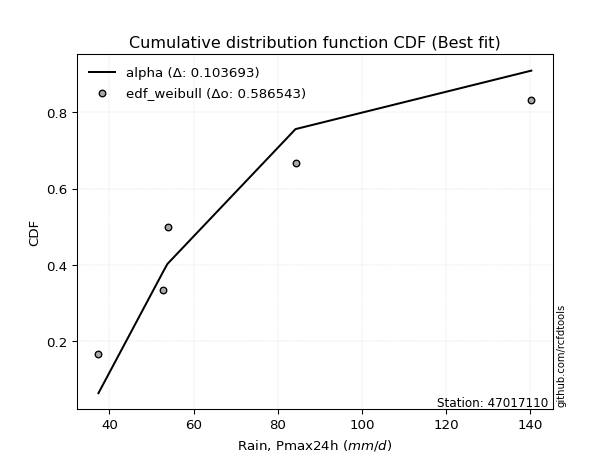</img>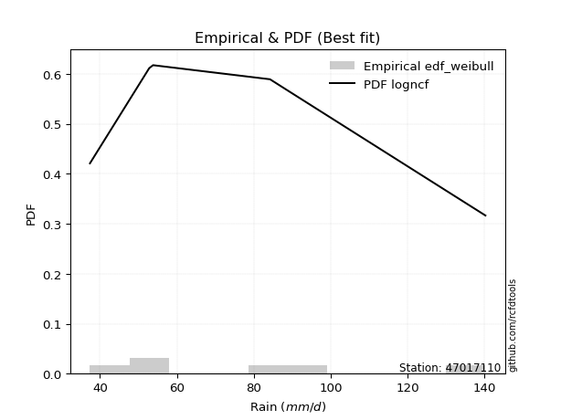</img>

</div>


### 4. EDF Beard (1943)

The Beard formula (or Beard´s plotting position formula) in hydrology is used to estimate the empirical non-exceedance probability _(P)_ of a flood event (or other extreme hydrological data point) within a given dataset.

<div align="center">


$P=(m-0.31)/(n+0.38)$


</div>


**4.1. Empirical values**

<div align="center">

|                | 0                   | 1                  | 2         | 3                  | 4                  |
|:---------------|:--------------------|:-------------------|:----------|:-------------------|:-------------------|
| date           | 2023                | 2020               | 2022      | 2021               | 2019               |
| x              | 37.4                | 52.8               | 53.8      | 84.2               | 140.2              |
| m              | 1                   | 2                  | 3         | 4                  | 5                  |
| empirical_dist | edf_beard           | edf_beard          | edf_beard | edf_beard          | edf_beard          |
| empirical      | 0.12825278810408922 | 0.3141263940520446 | 0.5       | 0.6858736059479554 | 0.8717472118959109 |
| empirical_tr   | 1.1471215351812367  | 1.4579945799457996 | 2.0       | 3.183431952662722  | 7.797101449275368  |

</div>


**4.2. Kolmogorov-Smirnov fit test (sorted by Δ)**


<div align="center">

|                | 0                   | 1                  | 2                   | 3                   | 4                  | 5                   | 6                   | 7                   | 8                  | 9                   | 10                  | 11                  | 12                  | 13                  | 14                  | 15                  | 16                  | 17                  | 18                  | 19                  | 20                  | 21                  | 22                  | 23                  | 24                 | 25                  | 26                 | 27                 | 28                  | 29                 | 30                  | 31                 | 32                  | 33                  | 34                 | 35                    | 36                  | 37                 | 38                  | 39                 | 40                  | 41                  | 42                  | 43                  | 44                  | 45                  | 46                  | 47                  | 48                  | 49                  | 50                  | 51                  | 52                 | 53                 | 54                  | 55                 | 56                 | 57                  | 58                  | 59                 | 60                  | 61                 | 62                 | 63                 | 64                 | 65                 | 66                  | 67                 | 68                 | 69                  | 70                 | 71                  | 72                 | 73                 | 74                 | 75                  | 76                  | 77                  | 78                  | 79                  | 80                 | 81                  | 82                  | 83                 | 84                 | 85                 | 86                 | 87                 |
|:---------------|:--------------------|:-------------------|:--------------------|:--------------------|:-------------------|:--------------------|:--------------------|:--------------------|:-------------------|:--------------------|:--------------------|:--------------------|:--------------------|:--------------------|:--------------------|:--------------------|:--------------------|:--------------------|:--------------------|:--------------------|:--------------------|:--------------------|:--------------------|:--------------------|:-------------------|:--------------------|:-------------------|:-------------------|:--------------------|:-------------------|:--------------------|:-------------------|:--------------------|:--------------------|:-------------------|:----------------------|:--------------------|:-------------------|:--------------------|:-------------------|:--------------------|:--------------------|:--------------------|:--------------------|:--------------------|:--------------------|:--------------------|:--------------------|:--------------------|:--------------------|:--------------------|:--------------------|:-------------------|:-------------------|:--------------------|:-------------------|:-------------------|:--------------------|:--------------------|:-------------------|:--------------------|:-------------------|:-------------------|:-------------------|:-------------------|:-------------------|:--------------------|:-------------------|:-------------------|:--------------------|:-------------------|:--------------------|:-------------------|:-------------------|:-------------------|:--------------------|:--------------------|:--------------------|:--------------------|:--------------------|:-------------------|:--------------------|:--------------------|:-------------------|:-------------------|:-------------------|:-------------------|:-------------------|
| station        | 47017110            | 47017110           | 47017110            | 47017110            | 47017110           | 47017110            | 47017110            | 47017110            | 47017110           | 47017110            | 47017110            | 47017110            | 47017110            | 47017110            | 47017110            | 47017110            | 47017110            | 47017110            | 47017110            | 47017110            | 47017110            | 47017110            | 47017110            | 47017110            | 47017110           | 47017110            | 47017110           | 47017110           | 47017110            | 47017110           | 47017110            | 47017110           | 47017110            | 47017110            | 47017110           | 47017110              | 47017110            | 47017110           | 47017110            | 47017110           | 47017110            | 47017110            | 47017110            | 47017110            | 47017110            | 47017110            | 47017110            | 47017110            | 47017110            | 47017110            | 47017110            | 47017110            | 47017110           | 47017110           | 47017110            | 47017110           | 47017110           | 47017110            | 47017110            | 47017110           | 47017110            | 47017110           | 47017110           | 47017110           | 47017110           | 47017110           | 47017110            | 47017110           | 47017110           | 47017110            | 47017110           | 47017110            | 47017110           | 47017110           | 47017110           | 47017110            | 47017110            | 47017110            | 47017110            | 47017110            | 47017110           | 47017110            | 47017110            | 47017110           | 47017110           | 47017110           | 47017110           | 47017110           |
| empirical_dist | edf_beard           | edf_beard          | edf_beard           | edf_beard           | edf_beard          | edf_beard           | edf_beard           | edf_beard           | edf_beard          | edf_beard           | edf_beard           | edf_beard           | edf_beard           | edf_beard           | edf_beard           | edf_beard           | edf_beard           | edf_beard           | edf_beard           | edf_beard           | edf_beard           | edf_beard           | edf_beard           | edf_beard           | edf_beard          | edf_beard           | edf_beard          | edf_beard          | edf_beard           | edf_beard          | edf_beard           | edf_beard          | edf_beard           | edf_beard           | edf_beard          | edf_beard             | edf_beard           | edf_beard          | edf_beard           | edf_beard          | edf_beard           | edf_beard           | edf_beard           | edf_beard           | edf_beard           | edf_beard           | edf_beard           | edf_beard           | edf_beard           | edf_beard           | edf_beard           | edf_beard           | edf_beard          | edf_beard          | edf_beard           | edf_beard          | edf_beard          | edf_beard           | edf_beard           | edf_beard          | edf_beard           | edf_beard          | edf_beard          | edf_beard          | edf_beard          | edf_beard          | edf_beard           | edf_beard          | edf_beard          | edf_beard           | edf_beard          | edf_beard           | edf_beard          | edf_beard          | edf_beard          | edf_beard           | edf_beard           | edf_beard           | edf_beard           | edf_beard           | edf_beard          | edf_beard           | edf_beard           | edf_beard          | edf_beard          | edf_beard          | edf_beard          | edf_beard          |
| p_dist         | loginvgauss         | logexponnorm       | invgamma            | f                   | logjohnsonsu       | logfisk             | logfatiguelife      | alpha               | loghalfnorm        | loginvgamma         | logncf              | invgauss            | loginvweibull       | logmoyal            | logalpha            | logmielke           | loggenlogistic      | logkstwobign        | logchi2             | loggenexpon         | loghalflogistic     | lograyleigh         | logwald             | loggumbel_r         | loggompertz        | exponnorm           | expon              | genexpon           | gompertz            | nct                | halfnorm            | truncnorm          | logexpon            | halflogistic        | logmaxwell         | loglaplace_asymmetric | logpearson3         | lognct             | lognakagami         | betaprime          | logbetaprime        | logrice             | loggibrat           | moyal               | rayleigh            | pearson3            | logt                | logcrystalball      | lognorm             | lognorm             | logloggamma         | wald                | nakagami           | gumbel_r           | maxwell             | genlogistic        | loglogistic        | fisk                | logweibull_min      | kstwobign          | norm                | crystalball        | t                  | loghypsecant       | laplace_asymmetric | logf               | logistic            | loggumbel_l        | loglaplace         | rice                | weibull_min        | hypsecant           | gumbel_l           | ncf                | laplace            | gibrat              | loggamma            | loggamma            | loglognorm          | fatiguelife         | invweibull         | logerlang           | johnsonsu           | chi2               | erlang             | gamma              | logtruncnorm       | mielke             |
| delta          | 0.08415946772291188 | 0.0869891319185741 | 0.08750998378036035 | 0.08751151494922882 | 0.090626344161851  | 0.09384523203112366 | 0.09726535865293967 | 0.09762917361891416 | 0.0978418858120606 | 0.10404948858964941 | 0.10410677919470268 | 0.10562275921720227 | 0.11339509974495254 | 0.11677980586330372 | 0.11731380050940005 | 0.11949214438366973 | 0.12088371915897994 | 0.12370598251372866 | 0.12825277509847632 | 0.12825278800849094 | 0.12825278810408922 | 0.13110198495672865 | 0.13136516166062928 | 0.13140151556183877 | 0.1332442462029816 | 0.13631040996503874 | 0.1363289125084639 | 0.1363293830512622 | 0.13675527586311514 | 0.1370666641946438 | 0.13828764217529327 | 0.138894813312279  | 0.14079294980021223 | 0.14152085435151435 | 0.1427988354147915 | 0.14532679343752264   | 0.14877354003241527 | 0.1538588929065644 | 0.15695530739145241 | 0.1579345087446774 | 0.16019265165995772 | 0.16047397022783078 | 0.16260520511879561 | 0.16759311588022707 | 0.16873477455361352 | 0.16897863844793448 | 0.17311166412593604 | 0.17311435250860469 | 0.17311435599158714 | 0.17311435599158714 | 0.17436398042675716 | 0.17475020996353413 | 0.1757718859127887 | 0.1762289488332991 | 0.17953827208848078 | 0.1873861293956935 | 0.1928637799661873 | 0.19438957379542804 | 0.20428074300852056 | 0.2063545227778164 | 0.20670018601009504 | 0.206700186977419  | 0.2067053657317558 | 0.2077260337436771 | 0.213817903512466  | 0.216162201454489  | 0.22835450863100049 | 0.2291662619362077 | 0.2348509917657267 | 0.23739191594081355 | 0.2437602257090256 | 0.24381407765793645 | 0.2561353161179661 | 0.2645100845704028 | 0.2682635052816258 | 0.27263416641240723 | 0.31080158891842086 | 0.31080158891842086 | 0.36286696908486876 | 0.40582255301744535 | 0.4331487093901538 | 0.45593968965981485 | 0.48203247449807946 | 0.5627180923504118 | 0.5886081436508679 | 0.6118958582193892 | 0.68586071915708   | nan                |
| deltao         | 0.5865427407550001  | 0.5865427407550001 | 0.5865427407550001  | 0.5865427407550001  | 0.5865427407550001 | 0.5865427407550001  | 0.5865427407550001  | 0.5865427407550001  | 0.5865427407550001 | 0.5865427407550001  | 0.5865427407550001  | 0.5865427407550001  | 0.5865427407550001  | 0.5865427407550001  | 0.5865427407550001  | 0.5865427407550001  | 0.5865427407550001  | 0.5865427407550001  | 0.5865427407550001  | 0.5865427407550001  | 0.5865427407550001  | 0.5865427407550001  | 0.5865427407550001  | 0.5865427407550001  | 0.5865427407550001 | 0.5865427407550001  | 0.5865427407550001 | 0.5865427407550001 | 0.5865427407550001  | 0.5865427407550001 | 0.5865427407550001  | 0.5865427407550001 | 0.5865427407550001  | 0.5865427407550001  | 0.5865427407550001 | 0.5865427407550001    | 0.5865427407550001  | 0.5865427407550001 | 0.5865427407550001  | 0.5865427407550001 | 0.5865427407550001  | 0.5865427407550001  | 0.5865427407550001  | 0.5865427407550001  | 0.5865427407550001  | 0.5865427407550001  | 0.5865427407550001  | 0.5865427407550001  | 0.5865427407550001  | 0.5865427407550001  | 0.5865427407550001  | 0.5865427407550001  | 0.5865427407550001 | 0.5865427407550001 | 0.5865427407550001  | 0.5865427407550001 | 0.5865427407550001 | 0.5865427407550001  | 0.5865427407550001  | 0.5865427407550001 | 0.5865427407550001  | 0.5865427407550001 | 0.5865427407550001 | 0.5865427407550001 | 0.5865427407550001 | 0.5865427407550001 | 0.5865427407550001  | 0.5865427407550001 | 0.5865427407550001 | 0.5865427407550001  | 0.5865427407550001 | 0.5865427407550001  | 0.5865427407550001 | 0.5865427407550001 | 0.5865427407550001 | 0.5865427407550001  | 0.5865427407550001  | 0.5865427407550001  | 0.5865427407550001  | 0.5865427407550001  | 0.5865427407550001 | 0.5865427407550001  | 0.5865427407550001  | 0.5865427407550001 | 0.5865427407550001 | 0.5865427407550001 | 0.5865427407550001 | 0.5865427407550001 |
| eval           | Δo > Δ              | Δo > Δ             | Δo > Δ              | Δo > Δ              | Δo > Δ             | Δo > Δ              | Δo > Δ              | Δo > Δ              | Δo > Δ             | Δo > Δ              | Δo > Δ              | Δo > Δ              | Δo > Δ              | Δo > Δ              | Δo > Δ              | Δo > Δ              | Δo > Δ              | Δo > Δ              | Δo > Δ              | Δo > Δ              | Δo > Δ              | Δo > Δ              | Δo > Δ              | Δo > Δ              | Δo > Δ             | Δo > Δ              | Δo > Δ             | Δo > Δ             | Δo > Δ              | Δo > Δ             | Δo > Δ              | Δo > Δ             | Δo > Δ              | Δo > Δ              | Δo > Δ             | Δo > Δ                | Δo > Δ              | Δo > Δ             | Δo > Δ              | Δo > Δ             | Δo > Δ              | Δo > Δ              | Δo > Δ              | Δo > Δ              | Δo > Δ              | Δo > Δ              | Δo > Δ              | Δo > Δ              | Δo > Δ              | Δo > Δ              | Δo > Δ              | Δo > Δ              | Δo > Δ             | Δo > Δ             | Δo > Δ              | Δo > Δ             | Δo > Δ             | Δo > Δ              | Δo > Δ              | Δo > Δ             | Δo > Δ              | Δo > Δ             | Δo > Δ             | Δo > Δ             | Δo > Δ             | Δo > Δ             | Δo > Δ              | Δo > Δ             | Δo > Δ             | Δo > Δ              | Δo > Δ             | Δo > Δ              | Δo > Δ             | Δo > Δ             | Δo > Δ             | Δo > Δ              | Δo > Δ              | Δo > Δ              | Δo > Δ              | Δo > Δ              | Δo > Δ             | Δo > Δ              | Δo > Δ              | Δo > Δ             | Δo <= Δ            | Δo <= Δ            | Δo <= Δ            | Δo <= Δ            |
| fit            | 1                   | 1                  | 1                   | 1                   | 1                  | 1                   | 1                   | 1                   | 1                  | 1                   | 1                   | 1                   | 1                   | 1                   | 1                   | 1                   | 1                   | 1                   | 1                   | 1                   | 1                   | 1                   | 1                   | 1                   | 1                  | 1                   | 1                  | 1                  | 1                   | 1                  | 1                   | 1                  | 1                   | 1                   | 1                  | 1                     | 1                   | 1                  | 1                   | 1                  | 1                   | 1                   | 1                   | 1                   | 1                   | 1                   | 1                   | 1                   | 1                   | 1                   | 1                   | 1                   | 1                  | 1                  | 1                   | 1                  | 1                  | 1                   | 1                   | 1                  | 1                   | 1                  | 1                  | 1                  | 1                  | 1                  | 1                   | 1                  | 1                  | 1                   | 1                  | 1                   | 1                  | 1                  | 1                  | 1                   | 1                   | 1                   | 1                   | 1                   | 1                  | 1                   | 1                   | 1                  | 0                  | 0                  | 0                  | 0                  |
| n              | 5                   | 5                  | 5                   | 5                   | 5                  | 5                   | 5                   | 5                   | 5                  | 5                   | 5                   | 5                   | 5                   | 5                   | 5                   | 5                   | 5                   | 5                   | 5                   | 5                   | 5                   | 5                   | 5                   | 5                   | 5                  | 5                   | 5                  | 5                  | 5                   | 5                  | 5                   | 5                  | 5                   | 5                   | 5                  | 5                     | 5                   | 5                  | 5                   | 5                  | 5                   | 5                   | 5                   | 5                   | 5                   | 5                   | 5                   | 5                   | 5                   | 5                   | 5                   | 5                   | 5                  | 5                  | 5                   | 5                  | 5                  | 5                   | 5                   | 5                  | 5                   | 5                  | 5                  | 5                  | 5                  | 5                  | 5                   | 5                  | 5                  | 5                   | 5                  | 5                   | 5                  | 5                  | 5                  | 5                   | 5                   | 5                   | 5                   | 5                   | 5                  | 5                   | 5                   | 5                  | 5                  | 5                  | 5                  | 5                  |
| best_fit       | 1                   | 0                  | 0                   | 0                   | 0                  | 0                   | 0                   | 0                   | 0                  | 0                   | 0                   | 0                   | 0                   | 0                   | 0                   | 0                   | 0                   | 0                   | 0                   | 0                   | 0                   | 0                   | 0                   | 0                   | 0                  | 0                   | 0                  | 0                  | 0                   | 0                  | 0                   | 0                  | 0                   | 0                   | 0                  | 0                     | 0                   | 0                  | 0                   | 0                  | 0                   | 0                   | 0                   | 0                   | 0                   | 0                   | 0                   | 0                   | 0                   | 0                   | 0                   | 0                   | 0                  | 0                  | 0                   | 0                  | 0                  | 0                   | 0                   | 0                  | 0                   | 0                  | 0                  | 0                  | 0                  | 0                  | 0                   | 0                  | 0                  | 0                   | 0                  | 0                   | 0                  | 0                  | 0                  | 0                   | 0                   | 0                   | 0                   | 0                   | 0                  | 0                   | 0                   | 0                  | 0                  | 0                  | 0                  | 0                  |
| best_fit_sort  | 1                   | 2                  | 3                   | 4                   | 5                  | 6                   | 7                   | 8                   | 9                  | 10                  | 11                  | 12                  | 13                  | 14                  | 15                  | 16                  | 17                  | 18                  | 19                  | 20                  | 21                  | 22                  | 23                  | 24                  | 25                 | 26                  | 27                 | 28                 | 29                  | 30                 | 31                  | 32                 | 33                  | 34                  | 35                 | 36                    | 37                  | 38                 | 39                  | 40                 | 41                  | 42                  | 43                  | 44                  | 45                  | 46                  | 47                  | 48                  | 49                  | 50                  | 51                  | 52                  | 53                 | 54                 | 55                  | 56                 | 57                 | 58                  | 59                  | 60                 | 61                  | 62                 | 63                 | 64                 | 65                 | 66                 | 67                  | 68                 | 69                 | 70                  | 71                 | 72                  | 73                 | 74                 | 75                 | 76                  | 77                  | 78                  | 79                  | 80                  | 81                 | 82                  | 83                  | 84                 | 85                 | 86                 | 87                 | 88                 |

</div>


**4.3. Best fit**

<div align="center">

|   id |   station | empirical_dist   | p_dist      |     delta |   deltao | eval   |   fit |   n |   best_fit |   best_fit_sort |
|-----:|----------:|:-----------------|:------------|----------:|---------:|:-------|------:|----:|-----------:|----------------:|
|    0 |  47017110 | edf_beard        | loginvgauss | 0.0841595 | 0.586543 | Δo > Δ |     1 |   5 |          1 |               1 |

</div>


<div align="center">

</img>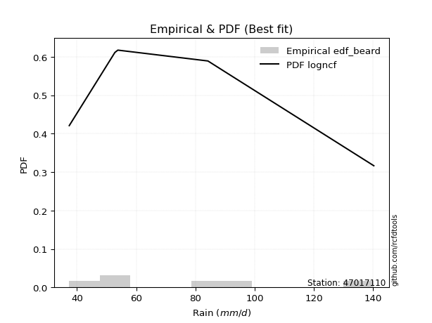</img>

</div>


### 5. EDF Chegodayev (1955)

The Chegodayev formula is an empirical plotting position formula used in hydrological frequency analysis to estimate the exceedance probability or return period of a specific event from a set of observed data. It is primarily used for plotting observed data points on probability paper to fit a theoretical distribution, particularly for analyzing extreme events like maximum flood flows or rainfall intensities. The constant _b_ value in the generalized plotting position formula is 0.3.

<div align="center">


$P=(m-b)/(n+1-2b)$


</div>


**5.1. Empirical values**

<div align="center">

|                | 0                   | 1                   | 2              | 3                  | 4                  |
|:---------------|:--------------------|:--------------------|:---------------|:-------------------|:-------------------|
| date           | 2023                | 2020                | 2022           | 2021               | 2019               |
| x              | 37.4                | 52.8                | 53.8           | 84.2               | 140.2              |
| m              | 1                   | 2                   | 3              | 4                  | 5                  |
| empirical_dist | edf_chegodayev      | edf_chegodayev      | edf_chegodayev | edf_chegodayev     | edf_chegodayev     |
| empirical      | 0.12962962962962962 | 0.31481481481481477 | 0.5            | 0.6851851851851851 | 0.8703703703703703 |
| empirical_tr   | 1.148936170212766   | 1.4594594594594594  | 2.0            | 3.1764705882352935 | 7.714285714285713  |

</div>


**5.2. Kolmogorov-Smirnov fit test (sorted by Δ)**


<div align="center">

|                | 0                   | 1                   | 2                   | 3                   | 4                  | 5                   | 6                   | 7                   | 8                  | 9                   | 10                  | 11                  | 12                  | 13                  | 14                  | 15                  | 16                  | 17                  | 18                  | 19                  | 20                  | 21                  | 22                  | 23                 | 24                 | 25                  | 26                 | 27                 | 28                  | 29                 | 30                  | 31                 | 32                  | 33                  | 34                 | 35                    | 36                  | 37                 | 38                  | 39                 | 40                  | 41                  | 42                  | 43                  | 44                  | 45                  | 46                  | 47                  | 48                  | 49                  | 50                  | 51                  | 52                 | 53                 | 54                  | 55                 | 56                 | 57                 | 58                 | 59                 | 60                  | 61                 | 62                 | 63                 | 64                 | 65                  | 66                  | 67                 | 68                 | 69                  | 70                  | 71                  | 72                 | 73                 | 74                 | 75                  | 76                 | 77                 | 78                 | 79                 | 80                 | 81                 | 82                 | 83                 | 84                 | 85                 | 86                 | 87                 |
|:---------------|:--------------------|:--------------------|:--------------------|:--------------------|:-------------------|:--------------------|:--------------------|:--------------------|:-------------------|:--------------------|:--------------------|:--------------------|:--------------------|:--------------------|:--------------------|:--------------------|:--------------------|:--------------------|:--------------------|:--------------------|:--------------------|:--------------------|:--------------------|:-------------------|:-------------------|:--------------------|:-------------------|:-------------------|:--------------------|:-------------------|:--------------------|:-------------------|:--------------------|:--------------------|:-------------------|:----------------------|:--------------------|:-------------------|:--------------------|:-------------------|:--------------------|:--------------------|:--------------------|:--------------------|:--------------------|:--------------------|:--------------------|:--------------------|:--------------------|:--------------------|:--------------------|:--------------------|:-------------------|:-------------------|:--------------------|:-------------------|:-------------------|:-------------------|:-------------------|:-------------------|:--------------------|:-------------------|:-------------------|:-------------------|:-------------------|:--------------------|:--------------------|:-------------------|:-------------------|:--------------------|:--------------------|:--------------------|:-------------------|:-------------------|:-------------------|:--------------------|:-------------------|:-------------------|:-------------------|:-------------------|:-------------------|:-------------------|:-------------------|:-------------------|:-------------------|:-------------------|:-------------------|:-------------------|
| station        | 47017110            | 47017110            | 47017110            | 47017110            | 47017110           | 47017110            | 47017110            | 47017110            | 47017110           | 47017110            | 47017110            | 47017110            | 47017110            | 47017110            | 47017110            | 47017110            | 47017110            | 47017110            | 47017110            | 47017110            | 47017110            | 47017110            | 47017110            | 47017110           | 47017110           | 47017110            | 47017110           | 47017110           | 47017110            | 47017110           | 47017110            | 47017110           | 47017110            | 47017110            | 47017110           | 47017110              | 47017110            | 47017110           | 47017110            | 47017110           | 47017110            | 47017110            | 47017110            | 47017110            | 47017110            | 47017110            | 47017110            | 47017110            | 47017110            | 47017110            | 47017110            | 47017110            | 47017110           | 47017110           | 47017110            | 47017110           | 47017110           | 47017110           | 47017110           | 47017110           | 47017110            | 47017110           | 47017110           | 47017110           | 47017110           | 47017110            | 47017110            | 47017110           | 47017110           | 47017110            | 47017110            | 47017110            | 47017110           | 47017110           | 47017110           | 47017110            | 47017110           | 47017110           | 47017110           | 47017110           | 47017110           | 47017110           | 47017110           | 47017110           | 47017110           | 47017110           | 47017110           | 47017110           |
| empirical_dist | edf_chegodayev      | edf_chegodayev      | edf_chegodayev      | edf_chegodayev      | edf_chegodayev     | edf_chegodayev      | edf_chegodayev      | edf_chegodayev      | edf_chegodayev     | edf_chegodayev      | edf_chegodayev      | edf_chegodayev      | edf_chegodayev      | edf_chegodayev      | edf_chegodayev      | edf_chegodayev      | edf_chegodayev      | edf_chegodayev      | edf_chegodayev      | edf_chegodayev      | edf_chegodayev      | edf_chegodayev      | edf_chegodayev      | edf_chegodayev     | edf_chegodayev     | edf_chegodayev      | edf_chegodayev     | edf_chegodayev     | edf_chegodayev      | edf_chegodayev     | edf_chegodayev      | edf_chegodayev     | edf_chegodayev      | edf_chegodayev      | edf_chegodayev     | edf_chegodayev        | edf_chegodayev      | edf_chegodayev     | edf_chegodayev      | edf_chegodayev     | edf_chegodayev      | edf_chegodayev      | edf_chegodayev      | edf_chegodayev      | edf_chegodayev      | edf_chegodayev      | edf_chegodayev      | edf_chegodayev      | edf_chegodayev      | edf_chegodayev      | edf_chegodayev      | edf_chegodayev      | edf_chegodayev     | edf_chegodayev     | edf_chegodayev      | edf_chegodayev     | edf_chegodayev     | edf_chegodayev     | edf_chegodayev     | edf_chegodayev     | edf_chegodayev      | edf_chegodayev     | edf_chegodayev     | edf_chegodayev     | edf_chegodayev     | edf_chegodayev      | edf_chegodayev      | edf_chegodayev     | edf_chegodayev     | edf_chegodayev      | edf_chegodayev      | edf_chegodayev      | edf_chegodayev     | edf_chegodayev     | edf_chegodayev     | edf_chegodayev      | edf_chegodayev     | edf_chegodayev     | edf_chegodayev     | edf_chegodayev     | edf_chegodayev     | edf_chegodayev     | edf_chegodayev     | edf_chegodayev     | edf_chegodayev     | edf_chegodayev     | edf_chegodayev     | edf_chegodayev     |
| p_dist         | loginvgauss         | logexponnorm        | invgamma            | f                   | logjohnsonsu       | logfisk             | logfatiguelife      | alpha               | loghalfnorm        | loginvgamma         | logncf              | invgauss            | loginvweibull       | logmoyal            | logalpha            | logmielke           | loggenlogistic      | logkstwobign        | logchi2             | loggenexpon         | loghalflogistic     | lograyleigh         | loggumbel_r         | logwald            | loggompertz        | exponnorm           | expon              | genexpon           | gompertz            | nct                | halfnorm            | truncnorm          | logexpon            | halflogistic        | logmaxwell         | loglaplace_asymmetric | logpearson3         | lognct             | lognakagami         | betaprime          | logbetaprime        | logrice             | loggibrat           | moyal               | rayleigh            | pearson3            | logt                | logcrystalball      | lognorm             | lognorm             | logloggamma         | wald                | nakagami           | gumbel_r           | maxwell             | genlogistic        | loglogistic        | fisk               | logweibull_min     | kstwobign          | norm                | crystalball        | t                  | loghypsecant       | laplace_asymmetric | logf                | logistic            | loggumbel_l        | loglaplace         | rice                | weibull_min         | hypsecant           | gumbel_l           | ncf                | laplace            | gibrat              | loggamma           | loggamma           | loglognorm         | fatiguelife        | invweibull         | logerlang          | johnsonsu          | chi2               | erlang             | gamma              | logtruncnorm       | mielke             |
| delta          | 0.08347104696014174 | 0.08630071115580396 | 0.08750998378036035 | 0.08751151494922882 | 0.090626344161851  | 0.09384523203112366 | 0.09657693789016952 | 0.09762917361891416 | 0.0978418858120606 | 0.10404948858964941 | 0.10410677919470268 | 0.10493433845443212 | 0.11339509974495254 | 0.11677980586330372 | 0.11731380050940005 | 0.11949214438366973 | 0.12088371915897994 | 0.12370598251372866 | 0.12962961662401673 | 0.12962962953403134 | 0.12962962962962962 | 0.13110198495672865 | 0.13140151556183877 | 0.1320535824233996 | 0.1332442462029816 | 0.13631040996503874 | 0.1363289125084639 | 0.1363293830512622 | 0.13675527586311514 | 0.1370666641946438 | 0.13828764217529327 | 0.138894813312279  | 0.14010452903744208 | 0.14152085435151435 | 0.1427988354147915 | 0.14532679343752264   | 0.14877354003241527 | 0.1538588929065644 | 0.15626688662868227 | 0.1579345087446774 | 0.16019265165995772 | 0.16047397022783078 | 0.16329362588156593 | 0.16759311588022707 | 0.16873477455361352 | 0.16897863844793448 | 0.17311166412593604 | 0.17311435250860469 | 0.17311435599158714 | 0.17311435599158714 | 0.17436398042675716 | 0.17475020996353413 | 0.1757718859127887 | 0.1762289488332991 | 0.17953827208848078 | 0.1873861293956935 | 0.1928637799661873 | 0.1937011530326579 | 0.2035923222457504 | 0.2063545227778164 | 0.20670018601009504 | 0.206700186977419  | 0.2067053657317558 | 0.2077260337436771 | 0.213817903512466  | 0.21547378069171885 | 0.22835450863100049 | 0.2291662619362077 | 0.2348509917657267 | 0.23739191594081355 | 0.24307180494625547 | 0.24381407765793645 | 0.2561353161179661 | 0.2631332430448624 | 0.2682635052816258 | 0.27263416641240723 | 0.3101131681556507 | 0.3101131681556507 | 0.3621785483220986 | 0.4051341322546752 | 0.4317718678646133 | 0.4552512688970447 | 0.4813440537353093 | 0.5620296715876416 | 0.5879197228880978 | 0.6112074374566191 | 0.6851722983943097 | nan                |
| deltao         | 0.5865427407550001  | 0.5865427407550001  | 0.5865427407550001  | 0.5865427407550001  | 0.5865427407550001 | 0.5865427407550001  | 0.5865427407550001  | 0.5865427407550001  | 0.5865427407550001 | 0.5865427407550001  | 0.5865427407550001  | 0.5865427407550001  | 0.5865427407550001  | 0.5865427407550001  | 0.5865427407550001  | 0.5865427407550001  | 0.5865427407550001  | 0.5865427407550001  | 0.5865427407550001  | 0.5865427407550001  | 0.5865427407550001  | 0.5865427407550001  | 0.5865427407550001  | 0.5865427407550001 | 0.5865427407550001 | 0.5865427407550001  | 0.5865427407550001 | 0.5865427407550001 | 0.5865427407550001  | 0.5865427407550001 | 0.5865427407550001  | 0.5865427407550001 | 0.5865427407550001  | 0.5865427407550001  | 0.5865427407550001 | 0.5865427407550001    | 0.5865427407550001  | 0.5865427407550001 | 0.5865427407550001  | 0.5865427407550001 | 0.5865427407550001  | 0.5865427407550001  | 0.5865427407550001  | 0.5865427407550001  | 0.5865427407550001  | 0.5865427407550001  | 0.5865427407550001  | 0.5865427407550001  | 0.5865427407550001  | 0.5865427407550001  | 0.5865427407550001  | 0.5865427407550001  | 0.5865427407550001 | 0.5865427407550001 | 0.5865427407550001  | 0.5865427407550001 | 0.5865427407550001 | 0.5865427407550001 | 0.5865427407550001 | 0.5865427407550001 | 0.5865427407550001  | 0.5865427407550001 | 0.5865427407550001 | 0.5865427407550001 | 0.5865427407550001 | 0.5865427407550001  | 0.5865427407550001  | 0.5865427407550001 | 0.5865427407550001 | 0.5865427407550001  | 0.5865427407550001  | 0.5865427407550001  | 0.5865427407550001 | 0.5865427407550001 | 0.5865427407550001 | 0.5865427407550001  | 0.5865427407550001 | 0.5865427407550001 | 0.5865427407550001 | 0.5865427407550001 | 0.5865427407550001 | 0.5865427407550001 | 0.5865427407550001 | 0.5865427407550001 | 0.5865427407550001 | 0.5865427407550001 | 0.5865427407550001 | 0.5865427407550001 |
| eval           | Δo > Δ              | Δo > Δ              | Δo > Δ              | Δo > Δ              | Δo > Δ             | Δo > Δ              | Δo > Δ              | Δo > Δ              | Δo > Δ             | Δo > Δ              | Δo > Δ              | Δo > Δ              | Δo > Δ              | Δo > Δ              | Δo > Δ              | Δo > Δ              | Δo > Δ              | Δo > Δ              | Δo > Δ              | Δo > Δ              | Δo > Δ              | Δo > Δ              | Δo > Δ              | Δo > Δ             | Δo > Δ             | Δo > Δ              | Δo > Δ             | Δo > Δ             | Δo > Δ              | Δo > Δ             | Δo > Δ              | Δo > Δ             | Δo > Δ              | Δo > Δ              | Δo > Δ             | Δo > Δ                | Δo > Δ              | Δo > Δ             | Δo > Δ              | Δo > Δ             | Δo > Δ              | Δo > Δ              | Δo > Δ              | Δo > Δ              | Δo > Δ              | Δo > Δ              | Δo > Δ              | Δo > Δ              | Δo > Δ              | Δo > Δ              | Δo > Δ              | Δo > Δ              | Δo > Δ             | Δo > Δ             | Δo > Δ              | Δo > Δ             | Δo > Δ             | Δo > Δ             | Δo > Δ             | Δo > Δ             | Δo > Δ              | Δo > Δ             | Δo > Δ             | Δo > Δ             | Δo > Δ             | Δo > Δ              | Δo > Δ              | Δo > Δ             | Δo > Δ             | Δo > Δ              | Δo > Δ              | Δo > Δ              | Δo > Δ             | Δo > Δ             | Δo > Δ             | Δo > Δ              | Δo > Δ             | Δo > Δ             | Δo > Δ             | Δo > Δ             | Δo > Δ             | Δo > Δ             | Δo > Δ             | Δo > Δ             | Δo <= Δ            | Δo <= Δ            | Δo <= Δ            | Δo <= Δ            |
| fit            | 1                   | 1                   | 1                   | 1                   | 1                  | 1                   | 1                   | 1                   | 1                  | 1                   | 1                   | 1                   | 1                   | 1                   | 1                   | 1                   | 1                   | 1                   | 1                   | 1                   | 1                   | 1                   | 1                   | 1                  | 1                  | 1                   | 1                  | 1                  | 1                   | 1                  | 1                   | 1                  | 1                   | 1                   | 1                  | 1                     | 1                   | 1                  | 1                   | 1                  | 1                   | 1                   | 1                   | 1                   | 1                   | 1                   | 1                   | 1                   | 1                   | 1                   | 1                   | 1                   | 1                  | 1                  | 1                   | 1                  | 1                  | 1                  | 1                  | 1                  | 1                   | 1                  | 1                  | 1                  | 1                  | 1                   | 1                   | 1                  | 1                  | 1                   | 1                   | 1                   | 1                  | 1                  | 1                  | 1                   | 1                  | 1                  | 1                  | 1                  | 1                  | 1                  | 1                  | 1                  | 0                  | 0                  | 0                  | 0                  |
| n              | 5                   | 5                   | 5                   | 5                   | 5                  | 5                   | 5                   | 5                   | 5                  | 5                   | 5                   | 5                   | 5                   | 5                   | 5                   | 5                   | 5                   | 5                   | 5                   | 5                   | 5                   | 5                   | 5                   | 5                  | 5                  | 5                   | 5                  | 5                  | 5                   | 5                  | 5                   | 5                  | 5                   | 5                   | 5                  | 5                     | 5                   | 5                  | 5                   | 5                  | 5                   | 5                   | 5                   | 5                   | 5                   | 5                   | 5                   | 5                   | 5                   | 5                   | 5                   | 5                   | 5                  | 5                  | 5                   | 5                  | 5                  | 5                  | 5                  | 5                  | 5                   | 5                  | 5                  | 5                  | 5                  | 5                   | 5                   | 5                  | 5                  | 5                   | 5                   | 5                   | 5                  | 5                  | 5                  | 5                   | 5                  | 5                  | 5                  | 5                  | 5                  | 5                  | 5                  | 5                  | 5                  | 5                  | 5                  | 5                  |
| best_fit       | 1                   | 0                   | 0                   | 0                   | 0                  | 0                   | 0                   | 0                   | 0                  | 0                   | 0                   | 0                   | 0                   | 0                   | 0                   | 0                   | 0                   | 0                   | 0                   | 0                   | 0                   | 0                   | 0                   | 0                  | 0                  | 0                   | 0                  | 0                  | 0                   | 0                  | 0                   | 0                  | 0                   | 0                   | 0                  | 0                     | 0                   | 0                  | 0                   | 0                  | 0                   | 0                   | 0                   | 0                   | 0                   | 0                   | 0                   | 0                   | 0                   | 0                   | 0                   | 0                   | 0                  | 0                  | 0                   | 0                  | 0                  | 0                  | 0                  | 0                  | 0                   | 0                  | 0                  | 0                  | 0                  | 0                   | 0                   | 0                  | 0                  | 0                   | 0                   | 0                   | 0                  | 0                  | 0                  | 0                   | 0                  | 0                  | 0                  | 0                  | 0                  | 0                  | 0                  | 0                  | 0                  | 0                  | 0                  | 0                  |
| best_fit_sort  | 1                   | 2                   | 3                   | 4                   | 5                  | 6                   | 7                   | 8                   | 9                  | 10                  | 11                  | 12                  | 13                  | 14                  | 15                  | 16                  | 17                  | 18                  | 19                  | 20                  | 21                  | 22                  | 23                  | 24                 | 25                 | 26                  | 27                 | 28                 | 29                  | 30                 | 31                  | 32                 | 33                  | 34                  | 35                 | 36                    | 37                  | 38                 | 39                  | 40                 | 41                  | 42                  | 43                  | 44                  | 45                  | 46                  | 47                  | 48                  | 49                  | 50                  | 51                  | 52                  | 53                 | 54                 | 55                  | 56                 | 57                 | 58                 | 59                 | 60                 | 61                  | 62                 | 63                 | 64                 | 65                 | 66                  | 67                  | 68                 | 69                 | 70                  | 71                  | 72                  | 73                 | 74                 | 75                 | 76                  | 77                 | 78                 | 79                 | 80                 | 81                 | 82                 | 83                 | 84                 | 85                 | 86                 | 87                 | 88                 |

</div>


**5.3. Best fit**

<div align="center">

|   id |   station | empirical_dist   | p_dist      |    delta |   deltao | eval   |   fit |   n |   best_fit |   best_fit_sort |
|-----:|----------:|:-----------------|:------------|---------:|---------:|:-------|------:|----:|-----------:|----------------:|
|    0 |  47017110 | edf_chegodayev   | loginvgauss | 0.083471 | 0.586543 | Δo > Δ |     1 |   5 |          1 |               1 |

</div>


<div align="center">

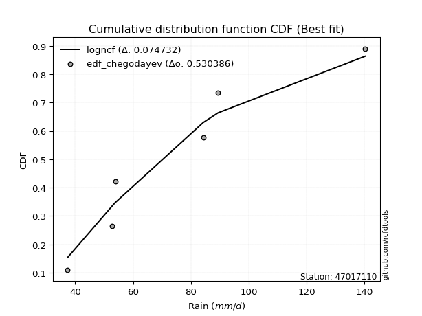</img>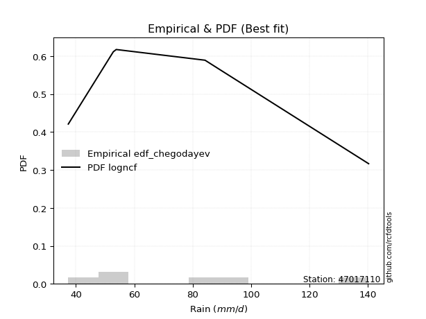</img>

</div>


### 6. EDF Blom (1958)

The Blom formula is a specific "plotting position" formula used in hydrology and statistical analysis to estimate the empirical cumulative probability (or non-exceedance probability) of a data series. It is particularly recommended for data that are approximately normally distributed. The constant _a_ is set to 0.375 (or 3/8).

<div align="center">


$P=(m-a)/(n+1-2a)$


</div>


**6.1. Empirical values**

<div align="center">

|                | 0                   | 1                   | 2        | 3                  | 4                  |
|:---------------|:--------------------|:--------------------|:---------|:-------------------|:-------------------|
| date           | 2023                | 2020                | 2022     | 2021               | 2019               |
| x              | 37.4                | 52.8                | 53.8     | 84.2               | 140.2              |
| m              | 1                   | 2                   | 3        | 4                  | 5                  |
| empirical_dist | edf_blom            | edf_blom            | edf_blom | edf_blom           | edf_blom           |
| empirical      | 0.11904761904761904 | 0.30952380952380953 | 0.5      | 0.6904761904761905 | 0.8809523809523809 |
| empirical_tr   | 1.135135135135135   | 1.4482758620689655  | 2.0      | 3.230769230769231  | 8.399999999999999  |

</div>


**6.2. Kolmogorov-Smirnov fit test (sorted by Δ)**


<div align="center">

|                | 0                   | 1                   | 2                   | 3                  | 4                   | 5                   | 6                   | 7                  | 8                   | 9                   | 10                  | 11                  | 12                  | 13                  | 14                  | 15                  | 16                  | 17                  | 18                  | 19                  | 20                  | 21                  | 22                  | 23                 | 24                 | 25                  | 26                 | 27                 | 28                  | 29                 | 30                  | 31                 | 32                  | 33                 | 34                    | 35                  | 36                  | 37                 | 38                 | 39                  | 40                  | 41                  | 42                 | 43                  | 44                  | 45                  | 46                  | 47                  | 48                  | 49                  | 50                  | 51                  | 52                 | 53                 | 54                  | 55                 | 56                 | 57                  | 58                 | 59                  | 60                 | 61                 | 62                 | 63                  | 64                 | 65                 | 66                  | 67                 | 68                 | 69                  | 70                  | 71                 | 72                 | 73                 | 74                  | 75                 | 76                  | 77                  | 78                  | 79                  | 80                 | 81                  | 82                  | 83                 | 84                 | 85                 | 86                 | 87                 |
|:---------------|:--------------------|:--------------------|:--------------------|:-------------------|:--------------------|:--------------------|:--------------------|:-------------------|:--------------------|:--------------------|:--------------------|:--------------------|:--------------------|:--------------------|:--------------------|:--------------------|:--------------------|:--------------------|:--------------------|:--------------------|:--------------------|:--------------------|:--------------------|:-------------------|:-------------------|:--------------------|:-------------------|:-------------------|:--------------------|:-------------------|:--------------------|:-------------------|:--------------------|:-------------------|:----------------------|:--------------------|:--------------------|:-------------------|:-------------------|:--------------------|:--------------------|:--------------------|:-------------------|:--------------------|:--------------------|:--------------------|:--------------------|:--------------------|:--------------------|:--------------------|:--------------------|:--------------------|:-------------------|:-------------------|:--------------------|:-------------------|:-------------------|:--------------------|:-------------------|:--------------------|:-------------------|:-------------------|:-------------------|:--------------------|:-------------------|:-------------------|:--------------------|:-------------------|:-------------------|:--------------------|:--------------------|:-------------------|:-------------------|:-------------------|:--------------------|:-------------------|:--------------------|:--------------------|:--------------------|:--------------------|:-------------------|:--------------------|:--------------------|:-------------------|:-------------------|:-------------------|:-------------------|:-------------------|
| station        | 47017110            | 47017110            | 47017110            | 47017110           | 47017110            | 47017110            | 47017110            | 47017110           | 47017110            | 47017110            | 47017110            | 47017110            | 47017110            | 47017110            | 47017110            | 47017110            | 47017110            | 47017110            | 47017110            | 47017110            | 47017110            | 47017110            | 47017110            | 47017110           | 47017110           | 47017110            | 47017110           | 47017110           | 47017110            | 47017110           | 47017110            | 47017110           | 47017110            | 47017110           | 47017110              | 47017110            | 47017110            | 47017110           | 47017110           | 47017110            | 47017110            | 47017110            | 47017110           | 47017110            | 47017110            | 47017110            | 47017110            | 47017110            | 47017110            | 47017110            | 47017110            | 47017110            | 47017110           | 47017110           | 47017110            | 47017110           | 47017110           | 47017110            | 47017110           | 47017110            | 47017110           | 47017110           | 47017110           | 47017110            | 47017110           | 47017110           | 47017110            | 47017110           | 47017110           | 47017110            | 47017110            | 47017110           | 47017110           | 47017110           | 47017110            | 47017110           | 47017110            | 47017110            | 47017110            | 47017110            | 47017110           | 47017110            | 47017110            | 47017110           | 47017110           | 47017110           | 47017110           | 47017110           |
| empirical_dist | edf_blom            | edf_blom            | edf_blom            | edf_blom           | edf_blom            | edf_blom            | edf_blom            | edf_blom           | edf_blom            | edf_blom            | edf_blom            | edf_blom            | edf_blom            | edf_blom            | edf_blom            | edf_blom            | edf_blom            | edf_blom            | edf_blom            | edf_blom            | edf_blom            | edf_blom            | edf_blom            | edf_blom           | edf_blom           | edf_blom            | edf_blom           | edf_blom           | edf_blom            | edf_blom           | edf_blom            | edf_blom           | edf_blom            | edf_blom           | edf_blom              | edf_blom            | edf_blom            | edf_blom           | edf_blom           | edf_blom            | edf_blom            | edf_blom            | edf_blom           | edf_blom            | edf_blom            | edf_blom            | edf_blom            | edf_blom            | edf_blom            | edf_blom            | edf_blom            | edf_blom            | edf_blom           | edf_blom           | edf_blom            | edf_blom           | edf_blom           | edf_blom            | edf_blom           | edf_blom            | edf_blom           | edf_blom           | edf_blom           | edf_blom            | edf_blom           | edf_blom           | edf_blom            | edf_blom           | edf_blom           | edf_blom            | edf_blom            | edf_blom           | edf_blom           | edf_blom           | edf_blom            | edf_blom           | edf_blom            | edf_blom            | edf_blom            | edf_blom            | edf_blom           | edf_blom            | edf_blom            | edf_blom           | edf_blom           | edf_blom           | edf_blom           | edf_blom           |
| p_dist         | invgamma            | f                   | loginvgauss         | logjohnsonsu       | logexponnorm        | logfisk             | alpha               | loghalfnorm        | logfatiguelife      | loginvgamma         | logncf              | invgauss            | loginvweibull       | logmoyal            | logalpha            | loggenexpon         | loghalflogistic     | logmielke           | loggenlogistic      | logkstwobign        | logwald             | lograyleigh         | loggumbel_r         | logchi2            | loggompertz        | exponnorm           | expon              | genexpon           | gompertz            | nct                | halfnorm            | truncnorm          | halflogistic        | logmaxwell         | loglaplace_asymmetric | logexpon            | logpearson3         | lognct             | betaprime          | loggibrat           | logbetaprime        | logrice             | lognakagami        | moyal               | rayleigh            | pearson3            | logt                | logcrystalball      | lognorm             | lognorm             | logloggamma         | wald                | nakagami           | gumbel_r           | maxwell             | genlogistic        | loglogistic        | fisk                | kstwobign          | norm                | crystalball        | t                  | loghypsecant       | logweibull_min      | laplace_asymmetric | logf               | logistic            | loggumbel_l        | loglaplace         | rice                | hypsecant           | weibull_min        | gumbel_l           | laplace            | gibrat              | ncf                | loggamma            | loggamma            | loglognorm          | fatiguelife         | invweibull         | logerlang           | johnsonsu           | chi2               | erlang             | gamma              | logtruncnorm       | mielke             |
| delta          | 0.08750998378036035 | 0.08751151494922882 | 0.08876205225114697 | 0.090626344161851  | 0.09159171644680919 | 0.09384523203112366 | 0.09762917361891416 | 0.0978418858120606 | 0.10186794318117476 | 0.10404948858964941 | 0.10410677919470268 | 0.11022534374543735 | 0.11339509974495254 | 0.11677980586330372 | 0.11731380050940005 | 0.11904761895202076 | 0.11904761904761904 | 0.11949214438366973 | 0.12088371915897994 | 0.12370598251372866 | 0.12676257713239425 | 0.13110198495672865 | 0.13140151556183877 | 0.1323324350217055 | 0.1332442462029816 | 0.13631040996503874 | 0.1363289125084639 | 0.1363293830512622 | 0.13675527586311514 | 0.1370666641946438 | 0.13828764217529327 | 0.138894813312279  | 0.14152085435151435 | 0.1427988354147915 | 0.14532679343752264   | 0.14539553432844732 | 0.14877354003241527 | 0.1538588929065644 | 0.1579345087446774 | 0.15800262059056058 | 0.16019265165995772 | 0.16047397022783078 | 0.1615578919196875 | 0.16759311588022707 | 0.16873477455361352 | 0.16897863844793448 | 0.17311166412593604 | 0.17311435250860469 | 0.17311435599158714 | 0.17311435599158714 | 0.17436398042675716 | 0.17475020996353413 | 0.1757718859127887 | 0.1762289488332991 | 0.17953827208848078 | 0.1873861293956935 | 0.1928637799661873 | 0.19899215832366313 | 0.2063545227778164 | 0.20670018601009504 | 0.206700186977419  | 0.2067053657317558 | 0.2077260337436771 | 0.20888332753675565 | 0.213817903512466  | 0.2207647859827241 | 0.22835450863100049 | 0.2291662619362077 | 0.2348509917657267 | 0.23739191594081355 | 0.24381407765793645 | 0.2483628102372607 | 0.2561353161179661 | 0.2682635052816258 | 0.27263416641240723 | 0.273715253626873  | 0.31540417344665594 | 0.31540417344665594 | 0.36746955361310385 | 0.41042513754568044 | 0.4423538784466239 | 0.46054227418804994 | 0.48663505902631454 | 0.5673206768786468 | 0.593210728179103  | 0.6164984427476243 | 0.690463303685315  | nan                |
| deltao         | 0.5865427407550001  | 0.5865427407550001  | 0.5865427407550001  | 0.5865427407550001 | 0.5865427407550001  | 0.5865427407550001  | 0.5865427407550001  | 0.5865427407550001 | 0.5865427407550001  | 0.5865427407550001  | 0.5865427407550001  | 0.5865427407550001  | 0.5865427407550001  | 0.5865427407550001  | 0.5865427407550001  | 0.5865427407550001  | 0.5865427407550001  | 0.5865427407550001  | 0.5865427407550001  | 0.5865427407550001  | 0.5865427407550001  | 0.5865427407550001  | 0.5865427407550001  | 0.5865427407550001 | 0.5865427407550001 | 0.5865427407550001  | 0.5865427407550001 | 0.5865427407550001 | 0.5865427407550001  | 0.5865427407550001 | 0.5865427407550001  | 0.5865427407550001 | 0.5865427407550001  | 0.5865427407550001 | 0.5865427407550001    | 0.5865427407550001  | 0.5865427407550001  | 0.5865427407550001 | 0.5865427407550001 | 0.5865427407550001  | 0.5865427407550001  | 0.5865427407550001  | 0.5865427407550001 | 0.5865427407550001  | 0.5865427407550001  | 0.5865427407550001  | 0.5865427407550001  | 0.5865427407550001  | 0.5865427407550001  | 0.5865427407550001  | 0.5865427407550001  | 0.5865427407550001  | 0.5865427407550001 | 0.5865427407550001 | 0.5865427407550001  | 0.5865427407550001 | 0.5865427407550001 | 0.5865427407550001  | 0.5865427407550001 | 0.5865427407550001  | 0.5865427407550001 | 0.5865427407550001 | 0.5865427407550001 | 0.5865427407550001  | 0.5865427407550001 | 0.5865427407550001 | 0.5865427407550001  | 0.5865427407550001 | 0.5865427407550001 | 0.5865427407550001  | 0.5865427407550001  | 0.5865427407550001 | 0.5865427407550001 | 0.5865427407550001 | 0.5865427407550001  | 0.5865427407550001 | 0.5865427407550001  | 0.5865427407550001  | 0.5865427407550001  | 0.5865427407550001  | 0.5865427407550001 | 0.5865427407550001  | 0.5865427407550001  | 0.5865427407550001 | 0.5865427407550001 | 0.5865427407550001 | 0.5865427407550001 | 0.5865427407550001 |
| eval           | Δo > Δ              | Δo > Δ              | Δo > Δ              | Δo > Δ             | Δo > Δ              | Δo > Δ              | Δo > Δ              | Δo > Δ             | Δo > Δ              | Δo > Δ              | Δo > Δ              | Δo > Δ              | Δo > Δ              | Δo > Δ              | Δo > Δ              | Δo > Δ              | Δo > Δ              | Δo > Δ              | Δo > Δ              | Δo > Δ              | Δo > Δ              | Δo > Δ              | Δo > Δ              | Δo > Δ             | Δo > Δ             | Δo > Δ              | Δo > Δ             | Δo > Δ             | Δo > Δ              | Δo > Δ             | Δo > Δ              | Δo > Δ             | Δo > Δ              | Δo > Δ             | Δo > Δ                | Δo > Δ              | Δo > Δ              | Δo > Δ             | Δo > Δ             | Δo > Δ              | Δo > Δ              | Δo > Δ              | Δo > Δ             | Δo > Δ              | Δo > Δ              | Δo > Δ              | Δo > Δ              | Δo > Δ              | Δo > Δ              | Δo > Δ              | Δo > Δ              | Δo > Δ              | Δo > Δ             | Δo > Δ             | Δo > Δ              | Δo > Δ             | Δo > Δ             | Δo > Δ              | Δo > Δ             | Δo > Δ              | Δo > Δ             | Δo > Δ             | Δo > Δ             | Δo > Δ              | Δo > Δ             | Δo > Δ             | Δo > Δ              | Δo > Δ             | Δo > Δ             | Δo > Δ              | Δo > Δ              | Δo > Δ             | Δo > Δ             | Δo > Δ             | Δo > Δ              | Δo > Δ             | Δo > Δ              | Δo > Δ              | Δo > Δ              | Δo > Δ              | Δo > Δ             | Δo > Δ              | Δo > Δ              | Δo > Δ             | Δo <= Δ            | Δo <= Δ            | Δo <= Δ            | Δo <= Δ            |
| fit            | 1                   | 1                   | 1                   | 1                  | 1                   | 1                   | 1                   | 1                  | 1                   | 1                   | 1                   | 1                   | 1                   | 1                   | 1                   | 1                   | 1                   | 1                   | 1                   | 1                   | 1                   | 1                   | 1                   | 1                  | 1                  | 1                   | 1                  | 1                  | 1                   | 1                  | 1                   | 1                  | 1                   | 1                  | 1                     | 1                   | 1                   | 1                  | 1                  | 1                   | 1                   | 1                   | 1                  | 1                   | 1                   | 1                   | 1                   | 1                   | 1                   | 1                   | 1                   | 1                   | 1                  | 1                  | 1                   | 1                  | 1                  | 1                   | 1                  | 1                   | 1                  | 1                  | 1                  | 1                   | 1                  | 1                  | 1                   | 1                  | 1                  | 1                   | 1                   | 1                  | 1                  | 1                  | 1                   | 1                  | 1                   | 1                   | 1                   | 1                   | 1                  | 1                   | 1                   | 1                  | 0                  | 0                  | 0                  | 0                  |
| n              | 5                   | 5                   | 5                   | 5                  | 5                   | 5                   | 5                   | 5                  | 5                   | 5                   | 5                   | 5                   | 5                   | 5                   | 5                   | 5                   | 5                   | 5                   | 5                   | 5                   | 5                   | 5                   | 5                   | 5                  | 5                  | 5                   | 5                  | 5                  | 5                   | 5                  | 5                   | 5                  | 5                   | 5                  | 5                     | 5                   | 5                   | 5                  | 5                  | 5                   | 5                   | 5                   | 5                  | 5                   | 5                   | 5                   | 5                   | 5                   | 5                   | 5                   | 5                   | 5                   | 5                  | 5                  | 5                   | 5                  | 5                  | 5                   | 5                  | 5                   | 5                  | 5                  | 5                  | 5                   | 5                  | 5                  | 5                   | 5                  | 5                  | 5                   | 5                   | 5                  | 5                  | 5                  | 5                   | 5                  | 5                   | 5                   | 5                   | 5                   | 5                  | 5                   | 5                   | 5                  | 5                  | 5                  | 5                  | 5                  |
| best_fit       | 1                   | 0                   | 0                   | 0                  | 0                   | 0                   | 0                   | 0                  | 0                   | 0                   | 0                   | 0                   | 0                   | 0                   | 0                   | 0                   | 0                   | 0                   | 0                   | 0                   | 0                   | 0                   | 0                   | 0                  | 0                  | 0                   | 0                  | 0                  | 0                   | 0                  | 0                   | 0                  | 0                   | 0                  | 0                     | 0                   | 0                   | 0                  | 0                  | 0                   | 0                   | 0                   | 0                  | 0                   | 0                   | 0                   | 0                   | 0                   | 0                   | 0                   | 0                   | 0                   | 0                  | 0                  | 0                   | 0                  | 0                  | 0                   | 0                  | 0                   | 0                  | 0                  | 0                  | 0                   | 0                  | 0                  | 0                   | 0                  | 0                  | 0                   | 0                   | 0                  | 0                  | 0                  | 0                   | 0                  | 0                   | 0                   | 0                   | 0                   | 0                  | 0                   | 0                   | 0                  | 0                  | 0                  | 0                  | 0                  |
| best_fit_sort  | 1                   | 2                   | 3                   | 4                  | 5                   | 6                   | 7                   | 8                  | 9                   | 10                  | 11                  | 12                  | 13                  | 14                  | 15                  | 16                  | 17                  | 18                  | 19                  | 20                  | 21                  | 22                  | 23                  | 24                 | 25                 | 26                  | 27                 | 28                 | 29                  | 30                 | 31                  | 32                 | 33                  | 34                 | 35                    | 36                  | 37                  | 38                 | 39                 | 40                  | 41                  | 42                  | 43                 | 44                  | 45                  | 46                  | 47                  | 48                  | 49                  | 50                  | 51                  | 52                  | 53                 | 54                 | 55                  | 56                 | 57                 | 58                  | 59                 | 60                  | 61                 | 62                 | 63                 | 64                  | 65                 | 66                 | 67                  | 68                 | 69                 | 70                  | 71                  | 72                 | 73                 | 74                 | 75                  | 76                 | 77                  | 78                  | 79                  | 80                  | 81                 | 82                  | 83                  | 84                 | 85                 | 86                 | 87                 | 88                 |

</div>


**6.3. Best fit**

<div align="center">

|   id |   station | empirical_dist   | p_dist   |   delta |   deltao | eval   |   fit |   n |   best_fit |   best_fit_sort |
|-----:|----------:|:-----------------|:---------|--------:|---------:|:-------|------:|----:|-----------:|----------------:|
|    0 |  47017110 | edf_blom         | invgamma | 0.08751 | 0.586543 | Δo > Δ |     1 |   5 |          1 |               1 |

</div>


<div align="center">

</img>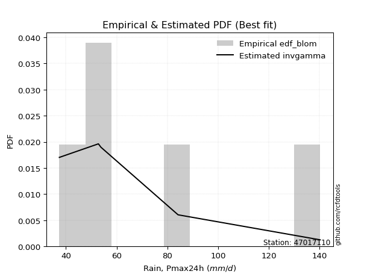</img>

</div>


### 7. EDF Tukey (1962)

In hydrology, the Tukey formula is used as a plotting position formula to estimate the empirical probability or frequency of a flood event (or other hydrological data). The formula parameter is given as _c=0.333_ (or 1/3).

<div align="center">


$P=(m-c)/(n+1-2c)$


</div>


**7.1. Empirical values**

<div align="center">

|                | 0                  | 1                  | 2         | 3         | 4         |
|:---------------|:-------------------|:-------------------|:----------|:----------|:----------|
| date           | 2023               | 2020               | 2022      | 2021      | 2019      |
| x              | 37.4               | 52.8               | 53.8      | 84.2      | 140.2     |
| m              | 1                  | 2                  | 3         | 4         | 5         |
| empirical_dist | edf_tukey          | edf_tukey          | edf_tukey | edf_tukey | edf_tukey |
| empirical      | 0.125              | 0.3125             | 0.5       | 0.6875    | 0.875     |
| empirical_tr   | 1.1428571428571428 | 1.4545454545454546 | 2.0       | 3.2       | 8.0       |

</div>


**7.2. Kolmogorov-Smirnov fit test (sorted by Δ)**


<div align="center">

|                | 0                  | 1                   | 2                   | 3                   | 4                  | 5                   | 6                   | 7                  | 8                   | 9                   | 10                  | 11                  | 12                  | 13                  | 14                  | 15                  | 16                  | 17                  | 18                  | 19                 | 20                  | 21                  | 22                  | 23                  | 24                 | 25                  | 26                 | 27                 | 28                  | 29                 | 30                  | 31                 | 32                  | 33                  | 34                 | 35                    | 36                  | 37                 | 38                 | 39                  | 40                  | 41                  | 42                  | 43                  | 44                  | 45                  | 46                  | 47                  | 48                  | 49                  | 50                  | 51                  | 52                 | 53                 | 54                  | 55                 | 56                 | 57                  | 58                  | 59                 | 60                  | 61                 | 62                 | 63                 | 64                 | 65                  | 66                  | 67                 | 68                 | 69                  | 70                  | 71                  | 72                 | 73                  | 74                 | 75                  | 76                 | 77                 | 78                 | 79                 | 80                  | 81                 | 82                 | 83                 | 84                 | 85                 | 86                 | 87                 |
|:---------------|:-------------------|:--------------------|:--------------------|:--------------------|:-------------------|:--------------------|:--------------------|:-------------------|:--------------------|:--------------------|:--------------------|:--------------------|:--------------------|:--------------------|:--------------------|:--------------------|:--------------------|:--------------------|:--------------------|:-------------------|:--------------------|:--------------------|:--------------------|:--------------------|:-------------------|:--------------------|:-------------------|:-------------------|:--------------------|:-------------------|:--------------------|:-------------------|:--------------------|:--------------------|:-------------------|:----------------------|:--------------------|:-------------------|:-------------------|:--------------------|:--------------------|:--------------------|:--------------------|:--------------------|:--------------------|:--------------------|:--------------------|:--------------------|:--------------------|:--------------------|:--------------------|:--------------------|:-------------------|:-------------------|:--------------------|:-------------------|:-------------------|:--------------------|:--------------------|:-------------------|:--------------------|:-------------------|:-------------------|:-------------------|:-------------------|:--------------------|:--------------------|:-------------------|:-------------------|:--------------------|:--------------------|:--------------------|:-------------------|:--------------------|:-------------------|:--------------------|:-------------------|:-------------------|:-------------------|:-------------------|:--------------------|:-------------------|:-------------------|:-------------------|:-------------------|:-------------------|:-------------------|:-------------------|
| station        | 47017110           | 47017110            | 47017110            | 47017110            | 47017110           | 47017110            | 47017110            | 47017110           | 47017110            | 47017110            | 47017110            | 47017110            | 47017110            | 47017110            | 47017110            | 47017110            | 47017110            | 47017110            | 47017110            | 47017110           | 47017110            | 47017110            | 47017110            | 47017110            | 47017110           | 47017110            | 47017110           | 47017110           | 47017110            | 47017110           | 47017110            | 47017110           | 47017110            | 47017110            | 47017110           | 47017110              | 47017110            | 47017110           | 47017110           | 47017110            | 47017110            | 47017110            | 47017110            | 47017110            | 47017110            | 47017110            | 47017110            | 47017110            | 47017110            | 47017110            | 47017110            | 47017110            | 47017110           | 47017110           | 47017110            | 47017110           | 47017110           | 47017110            | 47017110            | 47017110           | 47017110            | 47017110           | 47017110           | 47017110           | 47017110           | 47017110            | 47017110            | 47017110           | 47017110           | 47017110            | 47017110            | 47017110            | 47017110           | 47017110            | 47017110           | 47017110            | 47017110           | 47017110           | 47017110           | 47017110           | 47017110            | 47017110           | 47017110           | 47017110           | 47017110           | 47017110           | 47017110           | 47017110           |
| empirical_dist | edf_tukey          | edf_tukey           | edf_tukey           | edf_tukey           | edf_tukey          | edf_tukey           | edf_tukey           | edf_tukey          | edf_tukey           | edf_tukey           | edf_tukey           | edf_tukey           | edf_tukey           | edf_tukey           | edf_tukey           | edf_tukey           | edf_tukey           | edf_tukey           | edf_tukey           | edf_tukey          | edf_tukey           | edf_tukey           | edf_tukey           | edf_tukey           | edf_tukey          | edf_tukey           | edf_tukey          | edf_tukey          | edf_tukey           | edf_tukey          | edf_tukey           | edf_tukey          | edf_tukey           | edf_tukey           | edf_tukey          | edf_tukey             | edf_tukey           | edf_tukey          | edf_tukey          | edf_tukey           | edf_tukey           | edf_tukey           | edf_tukey           | edf_tukey           | edf_tukey           | edf_tukey           | edf_tukey           | edf_tukey           | edf_tukey           | edf_tukey           | edf_tukey           | edf_tukey           | edf_tukey          | edf_tukey          | edf_tukey           | edf_tukey          | edf_tukey          | edf_tukey           | edf_tukey           | edf_tukey          | edf_tukey           | edf_tukey          | edf_tukey          | edf_tukey          | edf_tukey          | edf_tukey           | edf_tukey           | edf_tukey          | edf_tukey          | edf_tukey           | edf_tukey           | edf_tukey           | edf_tukey          | edf_tukey           | edf_tukey          | edf_tukey           | edf_tukey          | edf_tukey          | edf_tukey          | edf_tukey          | edf_tukey           | edf_tukey          | edf_tukey          | edf_tukey          | edf_tukey          | edf_tukey          | edf_tukey          | edf_tukey          |
| p_dist         | loginvgauss        | invgamma            | f                   | logexponnorm        | logjohnsonsu       | logfisk             | alpha               | loghalfnorm        | logfatiguelife      | loginvgamma         | logncf              | invgauss            | loginvweibull       | logmoyal            | logalpha            | logmielke           | loggenlogistic      | logkstwobign        | loggenexpon         | loghalflogistic    | logchi2             | logwald             | lograyleigh         | loggumbel_r         | loggompertz        | exponnorm           | expon              | genexpon           | gompertz            | nct                | halfnorm            | truncnorm          | halflogistic        | logexpon            | logmaxwell         | loglaplace_asymmetric | logpearson3         | lognct             | betaprime          | lognakagami         | logbetaprime        | logrice             | loggibrat           | moyal               | rayleigh            | pearson3            | logt                | logcrystalball      | lognorm             | lognorm             | logloggamma         | wald                | nakagami           | gumbel_r           | maxwell             | genlogistic        | loglogistic        | fisk                | logweibull_min      | kstwobign          | norm                | crystalball        | t                  | loghypsecant       | laplace_asymmetric | logf                | logistic            | loggumbel_l        | loglaplace         | rice                | hypsecant           | weibull_min         | gumbel_l           | ncf                 | laplace            | gibrat              | loggamma           | loggamma           | loglognorm         | fatiguelife        | invweibull          | logerlang          | johnsonsu          | chi2               | erlang             | gamma              | logtruncnorm       | mielke             |
| delta          | 0.0857858617749565 | 0.08750998378036035 | 0.08751151494922882 | 0.08861552597061872 | 0.090626344161851  | 0.09384523203112366 | 0.09762917361891416 | 0.0978418858120606 | 0.09889175270498429 | 0.10404948858964941 | 0.10410677919470268 | 0.10724915326924689 | 0.11339509974495254 | 0.11677980586330372 | 0.11731380050940005 | 0.11949214438366973 | 0.12088371915897994 | 0.12370598251372866 | 0.12499999990440172 | 0.125              | 0.12935624454551503 | 0.12973876760858472 | 0.13110198495672865 | 0.13140151556183877 | 0.1332442462029816 | 0.13631040996503874 | 0.1363289125084639 | 0.1363293830512622 | 0.13675527586311514 | 0.1370666641946438 | 0.13828764217529327 | 0.138894813312279  | 0.14152085435151435 | 0.14241934385225685 | 0.1427988354147915 | 0.14532679343752264   | 0.14877354003241527 | 0.1538588929065644 | 0.1579345087446774 | 0.15858170144349704 | 0.16019265165995772 | 0.16047397022783078 | 0.16097881106675105 | 0.16759311588022707 | 0.16873477455361352 | 0.16897863844793448 | 0.17311166412593604 | 0.17311435250860469 | 0.17311435599158714 | 0.17311435599158714 | 0.17436398042675716 | 0.17475020996353413 | 0.1757718859127887 | 0.1762289488332991 | 0.17953827208848078 | 0.1873861293956935 | 0.1928637799661873 | 0.19601596784747266 | 0.20590713706056518 | 0.2063545227778164 | 0.20670018601009504 | 0.206700186977419  | 0.2067053657317558 | 0.2077260337436771 | 0.213817903512466  | 0.21778859550653362 | 0.22835450863100049 | 0.2291662619362077 | 0.2348509917657267 | 0.23739191594081355 | 0.24381407765793645 | 0.24538661976107023 | 0.2561353161179661 | 0.26776287267449206 | 0.2682635052816258 | 0.27263416641240723 | 0.3124279829704655 | 0.3124279829704655 | 0.3644933631369134 | 0.40744894706949   | 0.43640149749424295 | 0.4575660837118595 | 0.4836588685501241 | 0.5643444864024564 | 0.5902345377029126 | 0.6135222522714339 | 0.6874871132091246 | nan                |
| deltao         | 0.5865427407550001 | 0.5865427407550001  | 0.5865427407550001  | 0.5865427407550001  | 0.5865427407550001 | 0.5865427407550001  | 0.5865427407550001  | 0.5865427407550001 | 0.5865427407550001  | 0.5865427407550001  | 0.5865427407550001  | 0.5865427407550001  | 0.5865427407550001  | 0.5865427407550001  | 0.5865427407550001  | 0.5865427407550001  | 0.5865427407550001  | 0.5865427407550001  | 0.5865427407550001  | 0.5865427407550001 | 0.5865427407550001  | 0.5865427407550001  | 0.5865427407550001  | 0.5865427407550001  | 0.5865427407550001 | 0.5865427407550001  | 0.5865427407550001 | 0.5865427407550001 | 0.5865427407550001  | 0.5865427407550001 | 0.5865427407550001  | 0.5865427407550001 | 0.5865427407550001  | 0.5865427407550001  | 0.5865427407550001 | 0.5865427407550001    | 0.5865427407550001  | 0.5865427407550001 | 0.5865427407550001 | 0.5865427407550001  | 0.5865427407550001  | 0.5865427407550001  | 0.5865427407550001  | 0.5865427407550001  | 0.5865427407550001  | 0.5865427407550001  | 0.5865427407550001  | 0.5865427407550001  | 0.5865427407550001  | 0.5865427407550001  | 0.5865427407550001  | 0.5865427407550001  | 0.5865427407550001 | 0.5865427407550001 | 0.5865427407550001  | 0.5865427407550001 | 0.5865427407550001 | 0.5865427407550001  | 0.5865427407550001  | 0.5865427407550001 | 0.5865427407550001  | 0.5865427407550001 | 0.5865427407550001 | 0.5865427407550001 | 0.5865427407550001 | 0.5865427407550001  | 0.5865427407550001  | 0.5865427407550001 | 0.5865427407550001 | 0.5865427407550001  | 0.5865427407550001  | 0.5865427407550001  | 0.5865427407550001 | 0.5865427407550001  | 0.5865427407550001 | 0.5865427407550001  | 0.5865427407550001 | 0.5865427407550001 | 0.5865427407550001 | 0.5865427407550001 | 0.5865427407550001  | 0.5865427407550001 | 0.5865427407550001 | 0.5865427407550001 | 0.5865427407550001 | 0.5865427407550001 | 0.5865427407550001 | 0.5865427407550001 |
| eval           | Δo > Δ             | Δo > Δ              | Δo > Δ              | Δo > Δ              | Δo > Δ             | Δo > Δ              | Δo > Δ              | Δo > Δ             | Δo > Δ              | Δo > Δ              | Δo > Δ              | Δo > Δ              | Δo > Δ              | Δo > Δ              | Δo > Δ              | Δo > Δ              | Δo > Δ              | Δo > Δ              | Δo > Δ              | Δo > Δ             | Δo > Δ              | Δo > Δ              | Δo > Δ              | Δo > Δ              | Δo > Δ             | Δo > Δ              | Δo > Δ             | Δo > Δ             | Δo > Δ              | Δo > Δ             | Δo > Δ              | Δo > Δ             | Δo > Δ              | Δo > Δ              | Δo > Δ             | Δo > Δ                | Δo > Δ              | Δo > Δ             | Δo > Δ             | Δo > Δ              | Δo > Δ              | Δo > Δ              | Δo > Δ              | Δo > Δ              | Δo > Δ              | Δo > Δ              | Δo > Δ              | Δo > Δ              | Δo > Δ              | Δo > Δ              | Δo > Δ              | Δo > Δ              | Δo > Δ             | Δo > Δ             | Δo > Δ              | Δo > Δ             | Δo > Δ             | Δo > Δ              | Δo > Δ              | Δo > Δ             | Δo > Δ              | Δo > Δ             | Δo > Δ             | Δo > Δ             | Δo > Δ             | Δo > Δ              | Δo > Δ              | Δo > Δ             | Δo > Δ             | Δo > Δ              | Δo > Δ              | Δo > Δ              | Δo > Δ             | Δo > Δ              | Δo > Δ             | Δo > Δ              | Δo > Δ             | Δo > Δ             | Δo > Δ             | Δo > Δ             | Δo > Δ              | Δo > Δ             | Δo > Δ             | Δo > Δ             | Δo <= Δ            | Δo <= Δ            | Δo <= Δ            | Δo <= Δ            |
| fit            | 1                  | 1                   | 1                   | 1                   | 1                  | 1                   | 1                   | 1                  | 1                   | 1                   | 1                   | 1                   | 1                   | 1                   | 1                   | 1                   | 1                   | 1                   | 1                   | 1                  | 1                   | 1                   | 1                   | 1                   | 1                  | 1                   | 1                  | 1                  | 1                   | 1                  | 1                   | 1                  | 1                   | 1                   | 1                  | 1                     | 1                   | 1                  | 1                  | 1                   | 1                   | 1                   | 1                   | 1                   | 1                   | 1                   | 1                   | 1                   | 1                   | 1                   | 1                   | 1                   | 1                  | 1                  | 1                   | 1                  | 1                  | 1                   | 1                   | 1                  | 1                   | 1                  | 1                  | 1                  | 1                  | 1                   | 1                   | 1                  | 1                  | 1                   | 1                   | 1                   | 1                  | 1                   | 1                  | 1                   | 1                  | 1                  | 1                  | 1                  | 1                   | 1                  | 1                  | 1                  | 0                  | 0                  | 0                  | 0                  |
| n              | 5                  | 5                   | 5                   | 5                   | 5                  | 5                   | 5                   | 5                  | 5                   | 5                   | 5                   | 5                   | 5                   | 5                   | 5                   | 5                   | 5                   | 5                   | 5                   | 5                  | 5                   | 5                   | 5                   | 5                   | 5                  | 5                   | 5                  | 5                  | 5                   | 5                  | 5                   | 5                  | 5                   | 5                   | 5                  | 5                     | 5                   | 5                  | 5                  | 5                   | 5                   | 5                   | 5                   | 5                   | 5                   | 5                   | 5                   | 5                   | 5                   | 5                   | 5                   | 5                   | 5                  | 5                  | 5                   | 5                  | 5                  | 5                   | 5                   | 5                  | 5                   | 5                  | 5                  | 5                  | 5                  | 5                   | 5                   | 5                  | 5                  | 5                   | 5                   | 5                   | 5                  | 5                   | 5                  | 5                   | 5                  | 5                  | 5                  | 5                  | 5                   | 5                  | 5                  | 5                  | 5                  | 5                  | 5                  | 5                  |
| best_fit       | 1                  | 0                   | 0                   | 0                   | 0                  | 0                   | 0                   | 0                  | 0                   | 0                   | 0                   | 0                   | 0                   | 0                   | 0                   | 0                   | 0                   | 0                   | 0                   | 0                  | 0                   | 0                   | 0                   | 0                   | 0                  | 0                   | 0                  | 0                  | 0                   | 0                  | 0                   | 0                  | 0                   | 0                   | 0                  | 0                     | 0                   | 0                  | 0                  | 0                   | 0                   | 0                   | 0                   | 0                   | 0                   | 0                   | 0                   | 0                   | 0                   | 0                   | 0                   | 0                   | 0                  | 0                  | 0                   | 0                  | 0                  | 0                   | 0                   | 0                  | 0                   | 0                  | 0                  | 0                  | 0                  | 0                   | 0                   | 0                  | 0                  | 0                   | 0                   | 0                   | 0                  | 0                   | 0                  | 0                   | 0                  | 0                  | 0                  | 0                  | 0                   | 0                  | 0                  | 0                  | 0                  | 0                  | 0                  | 0                  |
| best_fit_sort  | 1                  | 2                   | 3                   | 4                   | 5                  | 6                   | 7                   | 8                  | 9                   | 10                  | 11                  | 12                  | 13                  | 14                  | 15                  | 16                  | 17                  | 18                  | 19                  | 20                 | 21                  | 22                  | 23                  | 24                  | 25                 | 26                  | 27                 | 28                 | 29                  | 30                 | 31                  | 32                 | 33                  | 34                  | 35                 | 36                    | 37                  | 38                 | 39                 | 40                  | 41                  | 42                  | 43                  | 44                  | 45                  | 46                  | 47                  | 48                  | 49                  | 50                  | 51                  | 52                  | 53                 | 54                 | 55                  | 56                 | 57                 | 58                  | 59                  | 60                 | 61                  | 62                 | 63                 | 64                 | 65                 | 66                  | 67                  | 68                 | 69                 | 70                  | 71                  | 72                  | 73                 | 74                  | 75                 | 76                  | 77                 | 78                 | 79                 | 80                 | 81                  | 82                 | 83                 | 84                 | 85                 | 86                 | 87                 | 88                 |

</div>


**7.3. Best fit**

<div align="center">

|   id |   station | empirical_dist   | p_dist      |     delta |   deltao | eval   |   fit |   n |   best_fit |   best_fit_sort |
|-----:|----------:|:-----------------|:------------|----------:|---------:|:-------|------:|----:|-----------:|----------------:|
|    0 |  47017110 | edf_tukey        | loginvgauss | 0.0857859 | 0.586543 | Δo > Δ |     1 |   5 |          1 |               1 |

</div>


<div align="center">

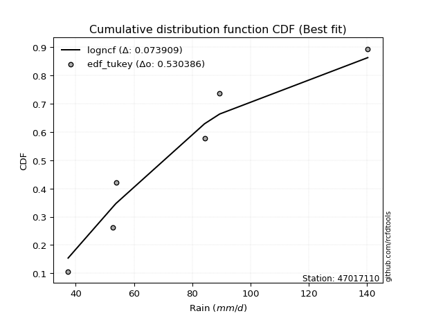</img></img>

</div>


### 8. EDF Gringorten (1963)

Gringorten plotting position formula is essential for estimating the probability and return periods of extreme events like floods and heavy rainfall. The constant _a=0.44_.

<div align="center">


$P=(m-a)/(n+1-2a)$


</div>


**8.1. Empirical values**

<div align="center">

|                | 0                   | 1                  | 2              | 3                 | 4                  |
|:---------------|:--------------------|:-------------------|:---------------|:------------------|:-------------------|
| date           | 2023                | 2020               | 2022           | 2021              | 2019               |
| x              | 37.4                | 52.8               | 53.8           | 84.2              | 140.2              |
| m              | 1                   | 2                  | 3              | 4                 | 5                  |
| empirical_dist | edf_gringorten      | edf_gringorten     | edf_gringorten | edf_gringorten    | edf_gringorten     |
| empirical      | 0.10937500000000001 | 0.3046875          | 0.5            | 0.6953125         | 0.8906249999999999 |
| empirical_tr   | 1.1228070175438596  | 1.4382022471910112 | 2.0            | 3.282051282051282 | 9.142857142857133  |

</div>


**8.2. Kolmogorov-Smirnov fit test (sorted by Δ)**


<div align="center">

|                | 0                   | 1                   | 2                  | 3                  | 4                   | 5                   | 6                   | 7                  | 8                   | 9                   | 10                  | 11                  | 12                  | 13                  | 14                  | 15                  | 16                  | 17                  | 18                  | 19                  | 20                  | 21                  | 22                  | 23                 | 24                  | 25                 | 26                 | 27                  | 28                 | 29                  | 30                 | 31                  | 32                  | 33                 | 34                    | 35                  | 36                  | 37                  | 38                 | 39                 | 40                  | 41                  | 42                  | 43                  | 44                  | 45                  | 46                  | 47                  | 48                  | 49                  | 50                  | 51                  | 52                 | 53                 | 54                  | 55                 | 56                 | 57                  | 58                 | 59                  | 60                 | 61                 | 62                 | 63                  | 64                 | 65                  | 66                  | 67                 | 68                 | 69                  | 70                  | 71                  | 72                 | 73                 | 74                  | 75                  | 76                 | 77                 | 78                 | 79                 | 80                  | 81                 | 82                 | 83                 | 84                 | 85                 | 86                 | 87                 |
|:---------------|:--------------------|:--------------------|:-------------------|:-------------------|:--------------------|:--------------------|:--------------------|:-------------------|:--------------------|:--------------------|:--------------------|:--------------------|:--------------------|:--------------------|:--------------------|:--------------------|:--------------------|:--------------------|:--------------------|:--------------------|:--------------------|:--------------------|:--------------------|:-------------------|:--------------------|:-------------------|:-------------------|:--------------------|:-------------------|:--------------------|:-------------------|:--------------------|:--------------------|:-------------------|:----------------------|:--------------------|:--------------------|:--------------------|:-------------------|:-------------------|:--------------------|:--------------------|:--------------------|:--------------------|:--------------------|:--------------------|:--------------------|:--------------------|:--------------------|:--------------------|:--------------------|:--------------------|:-------------------|:-------------------|:--------------------|:-------------------|:-------------------|:--------------------|:-------------------|:--------------------|:-------------------|:-------------------|:-------------------|:--------------------|:-------------------|:--------------------|:--------------------|:-------------------|:-------------------|:--------------------|:--------------------|:--------------------|:-------------------|:-------------------|:--------------------|:--------------------|:-------------------|:-------------------|:-------------------|:-------------------|:--------------------|:-------------------|:-------------------|:-------------------|:-------------------|:-------------------|:-------------------|:-------------------|
| station        | 47017110            | 47017110            | 47017110           | 47017110           | 47017110            | 47017110            | 47017110            | 47017110           | 47017110            | 47017110            | 47017110            | 47017110            | 47017110            | 47017110            | 47017110            | 47017110            | 47017110            | 47017110            | 47017110            | 47017110            | 47017110            | 47017110            | 47017110            | 47017110           | 47017110            | 47017110           | 47017110           | 47017110            | 47017110           | 47017110            | 47017110           | 47017110            | 47017110            | 47017110           | 47017110              | 47017110            | 47017110            | 47017110            | 47017110           | 47017110           | 47017110            | 47017110            | 47017110            | 47017110            | 47017110            | 47017110            | 47017110            | 47017110            | 47017110            | 47017110            | 47017110            | 47017110            | 47017110           | 47017110           | 47017110            | 47017110           | 47017110           | 47017110            | 47017110           | 47017110            | 47017110           | 47017110           | 47017110           | 47017110            | 47017110           | 47017110            | 47017110            | 47017110           | 47017110           | 47017110            | 47017110            | 47017110            | 47017110           | 47017110           | 47017110            | 47017110            | 47017110           | 47017110           | 47017110           | 47017110           | 47017110            | 47017110           | 47017110           | 47017110           | 47017110           | 47017110           | 47017110           | 47017110           |
| empirical_dist | edf_gringorten      | edf_gringorten      | edf_gringorten     | edf_gringorten     | edf_gringorten      | edf_gringorten      | edf_gringorten      | edf_gringorten     | edf_gringorten      | edf_gringorten      | edf_gringorten      | edf_gringorten      | edf_gringorten      | edf_gringorten      | edf_gringorten      | edf_gringorten      | edf_gringorten      | edf_gringorten      | edf_gringorten      | edf_gringorten      | edf_gringorten      | edf_gringorten      | edf_gringorten      | edf_gringorten     | edf_gringorten      | edf_gringorten     | edf_gringorten     | edf_gringorten      | edf_gringorten     | edf_gringorten      | edf_gringorten     | edf_gringorten      | edf_gringorten      | edf_gringorten     | edf_gringorten        | edf_gringorten      | edf_gringorten      | edf_gringorten      | edf_gringorten     | edf_gringorten     | edf_gringorten      | edf_gringorten      | edf_gringorten      | edf_gringorten      | edf_gringorten      | edf_gringorten      | edf_gringorten      | edf_gringorten      | edf_gringorten      | edf_gringorten      | edf_gringorten      | edf_gringorten      | edf_gringorten     | edf_gringorten     | edf_gringorten      | edf_gringorten     | edf_gringorten     | edf_gringorten      | edf_gringorten     | edf_gringorten      | edf_gringorten     | edf_gringorten     | edf_gringorten     | edf_gringorten      | edf_gringorten     | edf_gringorten      | edf_gringorten      | edf_gringorten     | edf_gringorten     | edf_gringorten      | edf_gringorten      | edf_gringorten      | edf_gringorten     | edf_gringorten     | edf_gringorten      | edf_gringorten      | edf_gringorten     | edf_gringorten     | edf_gringorten     | edf_gringorten     | edf_gringorten      | edf_gringorten     | edf_gringorten     | edf_gringorten     | edf_gringorten     | edf_gringorten     | edf_gringorten     | edf_gringorten     |
| p_dist         | f                   | invgamma            | logjohnsonsu       | loginvgauss        | logfisk             | logexponnorm        | alpha               | loghalfnorm        | loginvgamma         | logncf              | logfatiguelife      | loghalflogistic     | loginvweibull       | loggenexpon         | invgauss            | logmoyal            | logalpha            | logmielke           | loggenlogistic      | logwald             | logkstwobign        | lograyleigh         | loggumbel_r         | loggompertz        | exponnorm           | expon              | genexpon           | gompertz            | nct                | halfnorm            | truncnorm          | logchi2             | halflogistic        | logmaxwell         | loglaplace_asymmetric | logpearson3         | logexpon            | loggibrat           | lognct             | betaprime          | logbetaprime        | logrice             | lognakagami         | moyal               | rayleigh            | pearson3            | logt                | logcrystalball      | lognorm             | lognorm             | logloggamma         | wald                | nakagami           | gumbel_r           | maxwell             | genlogistic        | loglogistic        | fisk                | kstwobign          | norm                | crystalball        | t                  | loghypsecant       | logweibull_min      | laplace_asymmetric | logf                | logistic            | loggumbel_l        | loglaplace         | rice                | hypsecant           | weibull_min         | gumbel_l           | laplace            | gibrat              | ncf                 | loggamma           | loggamma           | loglognorm         | fatiguelife        | invweibull          | logerlang          | johnsonsu          | chi2               | erlang             | gamma              | logtruncnorm       | mielke             |
| delta          | 0.08849728913494886 | 0.08849882681753102 | 0.090626344161851  | 0.0935983617749565 | 0.09384523203112366 | 0.09642802597061872 | 0.09762917361891416 | 0.0978418858120606 | 0.10404948858964941 | 0.10410677919470268 | 0.10670425270498429 | 0.10937500000000001 | 0.11339509974495254 | 0.11352229770224953 | 0.11506165326924689 | 0.11677980586330372 | 0.11731380050940005 | 0.11949214438366973 | 0.12088371915897994 | 0.12192626760858472 | 0.12370598251372866 | 0.13110198495672865 | 0.13140151556183877 | 0.1332442462029816 | 0.13631040996503874 | 0.1363289125084639 | 0.1363293830512622 | 0.13675527586311514 | 0.1370666641946438 | 0.13828764217529327 | 0.138894813312279  | 0.13899075362955238 | 0.14152085435151435 | 0.1427988354147915 | 0.14532679343752264   | 0.14877354003241527 | 0.15023184385225685 | 0.15316631106675105 | 0.1538588929065644 | 0.1579345087446774 | 0.16019265165995772 | 0.16047397022783078 | 0.16639420144349704 | 0.16759311588022707 | 0.16873477455361352 | 0.16897863844793448 | 0.17311166412593604 | 0.17311435250860469 | 0.17311435599158714 | 0.17311435599158714 | 0.17436398042675716 | 0.17475020996353413 | 0.1757718859127887 | 0.1762289488332991 | 0.17953827208848078 | 0.1873861293956935 | 0.1928637799661873 | 0.20382846784747266 | 0.2063545227778164 | 0.20670018601009504 | 0.206700186977419  | 0.2067053657317558 | 0.2077260337436771 | 0.21371963706056518 | 0.213817903512466  | 0.22560109550653362 | 0.22835450863100049 | 0.2291662619362077 | 0.2348509917657267 | 0.23739191594081355 | 0.24381407765793645 | 0.25319911976107023 | 0.2561353161179661 | 0.2682635052816258 | 0.27263416641240723 | 0.28338787267449206 | 0.3202404829704655 | 0.3202404829704655 | 0.3723058631369134 | 0.41526144706949   | 0.45202649749424284 | 0.4653785837118595 | 0.4914713685501241 | 0.5721569864024564 | 0.5980470377029126 | 0.6213347522714339 | 0.6952996132091246 | nan                |
| deltao         | 0.5865427407550001  | 0.5865427407550001  | 0.5865427407550001 | 0.5865427407550001 | 0.5865427407550001  | 0.5865427407550001  | 0.5865427407550001  | 0.5865427407550001 | 0.5865427407550001  | 0.5865427407550001  | 0.5865427407550001  | 0.5865427407550001  | 0.5865427407550001  | 0.5865427407550001  | 0.5865427407550001  | 0.5865427407550001  | 0.5865427407550001  | 0.5865427407550001  | 0.5865427407550001  | 0.5865427407550001  | 0.5865427407550001  | 0.5865427407550001  | 0.5865427407550001  | 0.5865427407550001 | 0.5865427407550001  | 0.5865427407550001 | 0.5865427407550001 | 0.5865427407550001  | 0.5865427407550001 | 0.5865427407550001  | 0.5865427407550001 | 0.5865427407550001  | 0.5865427407550001  | 0.5865427407550001 | 0.5865427407550001    | 0.5865427407550001  | 0.5865427407550001  | 0.5865427407550001  | 0.5865427407550001 | 0.5865427407550001 | 0.5865427407550001  | 0.5865427407550001  | 0.5865427407550001  | 0.5865427407550001  | 0.5865427407550001  | 0.5865427407550001  | 0.5865427407550001  | 0.5865427407550001  | 0.5865427407550001  | 0.5865427407550001  | 0.5865427407550001  | 0.5865427407550001  | 0.5865427407550001 | 0.5865427407550001 | 0.5865427407550001  | 0.5865427407550001 | 0.5865427407550001 | 0.5865427407550001  | 0.5865427407550001 | 0.5865427407550001  | 0.5865427407550001 | 0.5865427407550001 | 0.5865427407550001 | 0.5865427407550001  | 0.5865427407550001 | 0.5865427407550001  | 0.5865427407550001  | 0.5865427407550001 | 0.5865427407550001 | 0.5865427407550001  | 0.5865427407550001  | 0.5865427407550001  | 0.5865427407550001 | 0.5865427407550001 | 0.5865427407550001  | 0.5865427407550001  | 0.5865427407550001 | 0.5865427407550001 | 0.5865427407550001 | 0.5865427407550001 | 0.5865427407550001  | 0.5865427407550001 | 0.5865427407550001 | 0.5865427407550001 | 0.5865427407550001 | 0.5865427407550001 | 0.5865427407550001 | 0.5865427407550001 |
| eval           | Δo > Δ              | Δo > Δ              | Δo > Δ             | Δo > Δ             | Δo > Δ              | Δo > Δ              | Δo > Δ              | Δo > Δ             | Δo > Δ              | Δo > Δ              | Δo > Δ              | Δo > Δ              | Δo > Δ              | Δo > Δ              | Δo > Δ              | Δo > Δ              | Δo > Δ              | Δo > Δ              | Δo > Δ              | Δo > Δ              | Δo > Δ              | Δo > Δ              | Δo > Δ              | Δo > Δ             | Δo > Δ              | Δo > Δ             | Δo > Δ             | Δo > Δ              | Δo > Δ             | Δo > Δ              | Δo > Δ             | Δo > Δ              | Δo > Δ              | Δo > Δ             | Δo > Δ                | Δo > Δ              | Δo > Δ              | Δo > Δ              | Δo > Δ             | Δo > Δ             | Δo > Δ              | Δo > Δ              | Δo > Δ              | Δo > Δ              | Δo > Δ              | Δo > Δ              | Δo > Δ              | Δo > Δ              | Δo > Δ              | Δo > Δ              | Δo > Δ              | Δo > Δ              | Δo > Δ             | Δo > Δ             | Δo > Δ              | Δo > Δ             | Δo > Δ             | Δo > Δ              | Δo > Δ             | Δo > Δ              | Δo > Δ             | Δo > Δ             | Δo > Δ             | Δo > Δ              | Δo > Δ             | Δo > Δ              | Δo > Δ              | Δo > Δ             | Δo > Δ             | Δo > Δ              | Δo > Δ              | Δo > Δ              | Δo > Δ             | Δo > Δ             | Δo > Δ              | Δo > Δ              | Δo > Δ             | Δo > Δ             | Δo > Δ             | Δo > Δ             | Δo > Δ              | Δo > Δ             | Δo > Δ             | Δo > Δ             | Δo <= Δ            | Δo <= Δ            | Δo <= Δ            | Δo <= Δ            |
| fit            | 1                   | 1                   | 1                  | 1                  | 1                   | 1                   | 1                   | 1                  | 1                   | 1                   | 1                   | 1                   | 1                   | 1                   | 1                   | 1                   | 1                   | 1                   | 1                   | 1                   | 1                   | 1                   | 1                   | 1                  | 1                   | 1                  | 1                  | 1                   | 1                  | 1                   | 1                  | 1                   | 1                   | 1                  | 1                     | 1                   | 1                   | 1                   | 1                  | 1                  | 1                   | 1                   | 1                   | 1                   | 1                   | 1                   | 1                   | 1                   | 1                   | 1                   | 1                   | 1                   | 1                  | 1                  | 1                   | 1                  | 1                  | 1                   | 1                  | 1                   | 1                  | 1                  | 1                  | 1                   | 1                  | 1                   | 1                   | 1                  | 1                  | 1                   | 1                   | 1                   | 1                  | 1                  | 1                   | 1                   | 1                  | 1                  | 1                  | 1                  | 1                   | 1                  | 1                  | 1                  | 0                  | 0                  | 0                  | 0                  |
| n              | 5                   | 5                   | 5                  | 5                  | 5                   | 5                   | 5                   | 5                  | 5                   | 5                   | 5                   | 5                   | 5                   | 5                   | 5                   | 5                   | 5                   | 5                   | 5                   | 5                   | 5                   | 5                   | 5                   | 5                  | 5                   | 5                  | 5                  | 5                   | 5                  | 5                   | 5                  | 5                   | 5                   | 5                  | 5                     | 5                   | 5                   | 5                   | 5                  | 5                  | 5                   | 5                   | 5                   | 5                   | 5                   | 5                   | 5                   | 5                   | 5                   | 5                   | 5                   | 5                   | 5                  | 5                  | 5                   | 5                  | 5                  | 5                   | 5                  | 5                   | 5                  | 5                  | 5                  | 5                   | 5                  | 5                   | 5                   | 5                  | 5                  | 5                   | 5                   | 5                   | 5                  | 5                  | 5                   | 5                   | 5                  | 5                  | 5                  | 5                  | 5                   | 5                  | 5                  | 5                  | 5                  | 5                  | 5                  | 5                  |
| best_fit       | 1                   | 0                   | 0                  | 0                  | 0                   | 0                   | 0                   | 0                  | 0                   | 0                   | 0                   | 0                   | 0                   | 0                   | 0                   | 0                   | 0                   | 0                   | 0                   | 0                   | 0                   | 0                   | 0                   | 0                  | 0                   | 0                  | 0                  | 0                   | 0                  | 0                   | 0                  | 0                   | 0                   | 0                  | 0                     | 0                   | 0                   | 0                   | 0                  | 0                  | 0                   | 0                   | 0                   | 0                   | 0                   | 0                   | 0                   | 0                   | 0                   | 0                   | 0                   | 0                   | 0                  | 0                  | 0                   | 0                  | 0                  | 0                   | 0                  | 0                   | 0                  | 0                  | 0                  | 0                   | 0                  | 0                   | 0                   | 0                  | 0                  | 0                   | 0                   | 0                   | 0                  | 0                  | 0                   | 0                   | 0                  | 0                  | 0                  | 0                  | 0                   | 0                  | 0                  | 0                  | 0                  | 0                  | 0                  | 0                  |
| best_fit_sort  | 1                   | 2                   | 3                  | 4                  | 5                   | 6                   | 7                   | 8                  | 9                   | 10                  | 11                  | 12                  | 13                  | 14                  | 15                  | 16                  | 17                  | 18                  | 19                  | 20                  | 21                  | 22                  | 23                  | 24                 | 25                  | 26                 | 27                 | 28                  | 29                 | 30                  | 31                 | 32                  | 33                  | 34                 | 35                    | 36                  | 37                  | 38                  | 39                 | 40                 | 41                  | 42                  | 43                  | 44                  | 45                  | 46                  | 47                  | 48                  | 49                  | 50                  | 51                  | 52                  | 53                 | 54                 | 55                  | 56                 | 57                 | 58                  | 59                 | 60                  | 61                 | 62                 | 63                 | 64                  | 65                 | 66                  | 67                  | 68                 | 69                 | 70                  | 71                  | 72                  | 73                 | 74                 | 75                  | 76                  | 77                 | 78                 | 79                 | 80                 | 81                  | 82                 | 83                 | 84                 | 85                 | 86                 | 87                 | 88                 |

</div>


**8.3. Best fit**

<div align="center">

|   id |   station | empirical_dist   | p_dist   |     delta |   deltao | eval   |   fit |   n |   best_fit |   best_fit_sort |
|-----:|----------:|:-----------------|:---------|----------:|---------:|:-------|------:|----:|-----------:|----------------:|
|    0 |  47017110 | edf_gringorten   | f        | 0.0884973 | 0.586543 | Δo > Δ |     1 |   5 |          1 |               1 |

</div>


<div align="center">

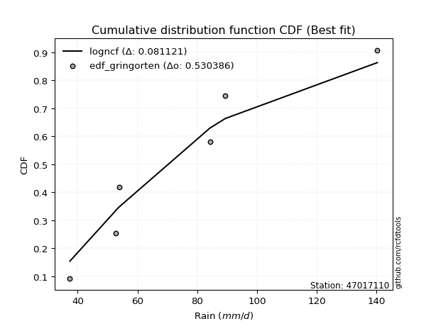</img>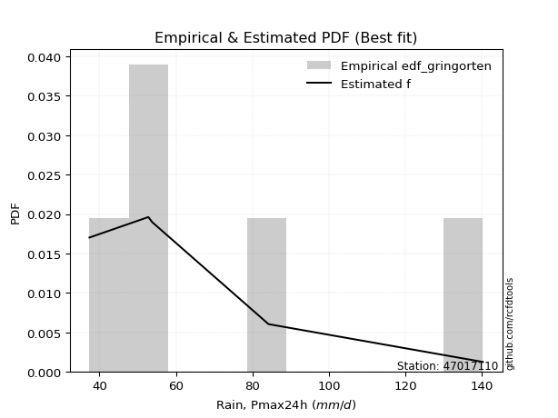</img>

</div>


### 9. EDF Filliben (1975)

The specific values of the constants (0.3175) (often denoted as $alpha$) and (0.365) are derived from a method proposed by James J. Filliben in a 1975 paper. This particular formula is the mean value of the $i$-th order statistic of the normal distribution and is considered a robust and effective plotting position formula for the normal probability plot correlation coefficient test for normality.

<div align="center">


$P=(m-0.3175)/(n+0.365)$


</div>


**9.1. Empirical values**

<div align="center">

|                | 0                   | 1                  | 2            | 3                  | 4                  |
|:---------------|:--------------------|:-------------------|:-------------|:-------------------|:-------------------|
| date           | 2023                | 2020               | 2022         | 2021               | 2019               |
| x              | 37.4                | 52.8               | 53.8         | 84.2               | 140.2              |
| m              | 1                   | 2                  | 3            | 4                  | 5                  |
| empirical_dist | edf_filliben        | edf_filliben       | edf_filliben | edf_filliben       | edf_filliben       |
| empirical      | 0.12721342031686858 | 0.3136067101584343 | 0.5          | 0.6863932898415657 | 0.8727865796831314 |
| empirical_tr   | 1.1457554725040042  | 1.456890699253225  | 2.0          | 3.188707280832095  | 7.860805860805863  |

</div>


**9.2. Kolmogorov-Smirnov fit test (sorted by Δ)**


<div align="center">

|                | 0                   | 1                   | 2                   | 3                   | 4                  | 5                   | 6                   | 7                   | 8                  | 9                   | 10                  | 11                  | 12                  | 13                  | 14                  | 15                  | 16                  | 17                  | 18                 | 19                  | 20                  | 21                  | 22                  | 23                  | 24                 | 25                  | 26                 | 27                 | 28                  | 29                 | 30                  | 31                 | 32                  | 33                  | 34                 | 35                    | 36                  | 37                 | 38                  | 39                 | 40                  | 41                  | 42                  | 43                  | 44                  | 45                  | 46                  | 47                  | 48                  | 49                  | 50                  | 51                  | 52                 | 53                 | 54                  | 55                 | 56                 | 57                  | 58                 | 59                 | 60                  | 61                 | 62                 | 63                 | 64                 | 65                  | 66                  | 67                 | 68                 | 69                  | 70                  | 71                  | 72                 | 73                 | 74                 | 75                  | 76                 | 77                 | 78                 | 79                 | 80                 | 81                 | 82                 | 83                 | 84                 | 85                 | 86                 | 87                 |
|:---------------|:--------------------|:--------------------|:--------------------|:--------------------|:-------------------|:--------------------|:--------------------|:--------------------|:-------------------|:--------------------|:--------------------|:--------------------|:--------------------|:--------------------|:--------------------|:--------------------|:--------------------|:--------------------|:-------------------|:--------------------|:--------------------|:--------------------|:--------------------|:--------------------|:-------------------|:--------------------|:-------------------|:-------------------|:--------------------|:-------------------|:--------------------|:-------------------|:--------------------|:--------------------|:-------------------|:----------------------|:--------------------|:-------------------|:--------------------|:-------------------|:--------------------|:--------------------|:--------------------|:--------------------|:--------------------|:--------------------|:--------------------|:--------------------|:--------------------|:--------------------|:--------------------|:--------------------|:-------------------|:-------------------|:--------------------|:-------------------|:-------------------|:--------------------|:-------------------|:-------------------|:--------------------|:-------------------|:-------------------|:-------------------|:-------------------|:--------------------|:--------------------|:-------------------|:-------------------|:--------------------|:--------------------|:--------------------|:-------------------|:-------------------|:-------------------|:--------------------|:-------------------|:-------------------|:-------------------|:-------------------|:-------------------|:-------------------|:-------------------|:-------------------|:-------------------|:-------------------|:-------------------|:-------------------|
| station        | 47017110            | 47017110            | 47017110            | 47017110            | 47017110           | 47017110            | 47017110            | 47017110            | 47017110           | 47017110            | 47017110            | 47017110            | 47017110            | 47017110            | 47017110            | 47017110            | 47017110            | 47017110            | 47017110           | 47017110            | 47017110            | 47017110            | 47017110            | 47017110            | 47017110           | 47017110            | 47017110           | 47017110           | 47017110            | 47017110           | 47017110            | 47017110           | 47017110            | 47017110            | 47017110           | 47017110              | 47017110            | 47017110           | 47017110            | 47017110           | 47017110            | 47017110            | 47017110            | 47017110            | 47017110            | 47017110            | 47017110            | 47017110            | 47017110            | 47017110            | 47017110            | 47017110            | 47017110           | 47017110           | 47017110            | 47017110           | 47017110           | 47017110            | 47017110           | 47017110           | 47017110            | 47017110           | 47017110           | 47017110           | 47017110           | 47017110            | 47017110            | 47017110           | 47017110           | 47017110            | 47017110            | 47017110            | 47017110           | 47017110           | 47017110           | 47017110            | 47017110           | 47017110           | 47017110           | 47017110           | 47017110           | 47017110           | 47017110           | 47017110           | 47017110           | 47017110           | 47017110           | 47017110           |
| empirical_dist | edf_filliben        | edf_filliben        | edf_filliben        | edf_filliben        | edf_filliben       | edf_filliben        | edf_filliben        | edf_filliben        | edf_filliben       | edf_filliben        | edf_filliben        | edf_filliben        | edf_filliben        | edf_filliben        | edf_filliben        | edf_filliben        | edf_filliben        | edf_filliben        | edf_filliben       | edf_filliben        | edf_filliben        | edf_filliben        | edf_filliben        | edf_filliben        | edf_filliben       | edf_filliben        | edf_filliben       | edf_filliben       | edf_filliben        | edf_filliben       | edf_filliben        | edf_filliben       | edf_filliben        | edf_filliben        | edf_filliben       | edf_filliben          | edf_filliben        | edf_filliben       | edf_filliben        | edf_filliben       | edf_filliben        | edf_filliben        | edf_filliben        | edf_filliben        | edf_filliben        | edf_filliben        | edf_filliben        | edf_filliben        | edf_filliben        | edf_filliben        | edf_filliben        | edf_filliben        | edf_filliben       | edf_filliben       | edf_filliben        | edf_filliben       | edf_filliben       | edf_filliben        | edf_filliben       | edf_filliben       | edf_filliben        | edf_filliben       | edf_filliben       | edf_filliben       | edf_filliben       | edf_filliben        | edf_filliben        | edf_filliben       | edf_filliben       | edf_filliben        | edf_filliben        | edf_filliben        | edf_filliben       | edf_filliben       | edf_filliben       | edf_filliben        | edf_filliben       | edf_filliben       | edf_filliben       | edf_filliben       | edf_filliben       | edf_filliben       | edf_filliben       | edf_filliben       | edf_filliben       | edf_filliben       | edf_filliben       | edf_filliben       |
| p_dist         | loginvgauss         | logexponnorm        | invgamma            | f                   | logjohnsonsu       | logfisk             | alpha               | logfatiguelife      | loghalfnorm        | loginvgamma         | logncf              | invgauss            | loginvweibull       | logmoyal            | logalpha            | logmielke           | loggenlogistic      | logkstwobign        | loggenexpon        | loghalflogistic     | logchi2             | logwald             | lograyleigh         | loggumbel_r         | loggompertz        | exponnorm           | expon              | genexpon           | gompertz            | nct                | halfnorm            | truncnorm          | logexpon            | halflogistic        | logmaxwell         | loglaplace_asymmetric | logpearson3         | lognct             | lognakagami         | betaprime          | logbetaprime        | logrice             | loggibrat           | moyal               | rayleigh            | pearson3            | logt                | logcrystalball      | lognorm             | lognorm             | logloggamma         | wald                | nakagami           | gumbel_r           | maxwell             | genlogistic        | loglogistic        | fisk                | logweibull_min     | kstwobign          | norm                | crystalball        | t                  | loghypsecant       | laplace_asymmetric | logf                | logistic            | loggumbel_l        | loglaplace         | rice                | hypsecant           | weibull_min         | gumbel_l           | ncf                | laplace            | gibrat              | loggamma           | loggamma           | loglognorm         | fatiguelife        | invweibull         | logerlang          | johnsonsu          | chi2               | erlang             | gamma              | logtruncnorm       | mielke             |
| delta          | 0.08467915161652223 | 0.08750881581218445 | 0.08750998378036035 | 0.08751151494922882 | 0.090626344161851  | 0.09384523203112366 | 0.09762917361891416 | 0.09778504254655002 | 0.0978418858120606 | 0.10404948858964941 | 0.10410677919470268 | 0.10614244311081261 | 0.11339509974495254 | 0.11677980586330372 | 0.11731380050940005 | 0.11949214438366973 | 0.12088371915897994 | 0.12370598251372866 | 0.1272134202212703 | 0.12721342031686858 | 0.12824953438708075 | 0.13084547776701905 | 0.13110198495672865 | 0.13140151556183877 | 0.1332442462029816 | 0.13631040996503874 | 0.1363289125084639 | 0.1363293830512622 | 0.13675527586311514 | 0.1370666641946438 | 0.13828764217529327 | 0.138894813312279  | 0.14131263369382258 | 0.14152085435151435 | 0.1427988354147915 | 0.14532679343752264   | 0.14877354003241527 | 0.1538588929065644 | 0.15747499128506276 | 0.1579345087446774 | 0.16019265165995772 | 0.16047397022783078 | 0.16208552122518538 | 0.16759311588022707 | 0.16873477455361352 | 0.16897863844793448 | 0.17311166412593604 | 0.17311435250860469 | 0.17311435599158714 | 0.17311435599158714 | 0.17436398042675716 | 0.17475020996353413 | 0.1757718859127887 | 0.1762289488332991 | 0.17953827208848078 | 0.1873861293956935 | 0.1928637799661873 | 0.19490925768903838 | 0.2048004269021309 | 0.2063545227778164 | 0.20670018601009504 | 0.206700186977419  | 0.2067053657317558 | 0.2077260337436771 | 0.213817903512466  | 0.21668188534809935 | 0.22835450863100049 | 0.2291662619362077 | 0.2348509917657267 | 0.23739191594081355 | 0.24381407765793645 | 0.24427990960263596 | 0.2561353161179661 | 0.2655494523576235 | 0.2682635052816258 | 0.27263416641240723 | 0.3113212728120312 | 0.3113212728120312 | 0.3633866529784791 | 0.4063422369110557 | 0.4341880771773744 | 0.4564593735534252 | 0.4825521583916898 | 0.5632377762440222 | 0.5891278275444782 | 0.6124155421129995 | 0.6863804030506903 | nan                |
| deltao         | 0.5865427407550001  | 0.5865427407550001  | 0.5865427407550001  | 0.5865427407550001  | 0.5865427407550001 | 0.5865427407550001  | 0.5865427407550001  | 0.5865427407550001  | 0.5865427407550001 | 0.5865427407550001  | 0.5865427407550001  | 0.5865427407550001  | 0.5865427407550001  | 0.5865427407550001  | 0.5865427407550001  | 0.5865427407550001  | 0.5865427407550001  | 0.5865427407550001  | 0.5865427407550001 | 0.5865427407550001  | 0.5865427407550001  | 0.5865427407550001  | 0.5865427407550001  | 0.5865427407550001  | 0.5865427407550001 | 0.5865427407550001  | 0.5865427407550001 | 0.5865427407550001 | 0.5865427407550001  | 0.5865427407550001 | 0.5865427407550001  | 0.5865427407550001 | 0.5865427407550001  | 0.5865427407550001  | 0.5865427407550001 | 0.5865427407550001    | 0.5865427407550001  | 0.5865427407550001 | 0.5865427407550001  | 0.5865427407550001 | 0.5865427407550001  | 0.5865427407550001  | 0.5865427407550001  | 0.5865427407550001  | 0.5865427407550001  | 0.5865427407550001  | 0.5865427407550001  | 0.5865427407550001  | 0.5865427407550001  | 0.5865427407550001  | 0.5865427407550001  | 0.5865427407550001  | 0.5865427407550001 | 0.5865427407550001 | 0.5865427407550001  | 0.5865427407550001 | 0.5865427407550001 | 0.5865427407550001  | 0.5865427407550001 | 0.5865427407550001 | 0.5865427407550001  | 0.5865427407550001 | 0.5865427407550001 | 0.5865427407550001 | 0.5865427407550001 | 0.5865427407550001  | 0.5865427407550001  | 0.5865427407550001 | 0.5865427407550001 | 0.5865427407550001  | 0.5865427407550001  | 0.5865427407550001  | 0.5865427407550001 | 0.5865427407550001 | 0.5865427407550001 | 0.5865427407550001  | 0.5865427407550001 | 0.5865427407550001 | 0.5865427407550001 | 0.5865427407550001 | 0.5865427407550001 | 0.5865427407550001 | 0.5865427407550001 | 0.5865427407550001 | 0.5865427407550001 | 0.5865427407550001 | 0.5865427407550001 | 0.5865427407550001 |
| eval           | Δo > Δ              | Δo > Δ              | Δo > Δ              | Δo > Δ              | Δo > Δ             | Δo > Δ              | Δo > Δ              | Δo > Δ              | Δo > Δ             | Δo > Δ              | Δo > Δ              | Δo > Δ              | Δo > Δ              | Δo > Δ              | Δo > Δ              | Δo > Δ              | Δo > Δ              | Δo > Δ              | Δo > Δ             | Δo > Δ              | Δo > Δ              | Δo > Δ              | Δo > Δ              | Δo > Δ              | Δo > Δ             | Δo > Δ              | Δo > Δ             | Δo > Δ             | Δo > Δ              | Δo > Δ             | Δo > Δ              | Δo > Δ             | Δo > Δ              | Δo > Δ              | Δo > Δ             | Δo > Δ                | Δo > Δ              | Δo > Δ             | Δo > Δ              | Δo > Δ             | Δo > Δ              | Δo > Δ              | Δo > Δ              | Δo > Δ              | Δo > Δ              | Δo > Δ              | Δo > Δ              | Δo > Δ              | Δo > Δ              | Δo > Δ              | Δo > Δ              | Δo > Δ              | Δo > Δ             | Δo > Δ             | Δo > Δ              | Δo > Δ             | Δo > Δ             | Δo > Δ              | Δo > Δ             | Δo > Δ             | Δo > Δ              | Δo > Δ             | Δo > Δ             | Δo > Δ             | Δo > Δ             | Δo > Δ              | Δo > Δ              | Δo > Δ             | Δo > Δ             | Δo > Δ              | Δo > Δ              | Δo > Δ              | Δo > Δ             | Δo > Δ             | Δo > Δ             | Δo > Δ              | Δo > Δ             | Δo > Δ             | Δo > Δ             | Δo > Δ             | Δo > Δ             | Δo > Δ             | Δo > Δ             | Δo > Δ             | Δo <= Δ            | Δo <= Δ            | Δo <= Δ            | Δo <= Δ            |
| fit            | 1                   | 1                   | 1                   | 1                   | 1                  | 1                   | 1                   | 1                   | 1                  | 1                   | 1                   | 1                   | 1                   | 1                   | 1                   | 1                   | 1                   | 1                   | 1                  | 1                   | 1                   | 1                   | 1                   | 1                   | 1                  | 1                   | 1                  | 1                  | 1                   | 1                  | 1                   | 1                  | 1                   | 1                   | 1                  | 1                     | 1                   | 1                  | 1                   | 1                  | 1                   | 1                   | 1                   | 1                   | 1                   | 1                   | 1                   | 1                   | 1                   | 1                   | 1                   | 1                   | 1                  | 1                  | 1                   | 1                  | 1                  | 1                   | 1                  | 1                  | 1                   | 1                  | 1                  | 1                  | 1                  | 1                   | 1                   | 1                  | 1                  | 1                   | 1                   | 1                   | 1                  | 1                  | 1                  | 1                   | 1                  | 1                  | 1                  | 1                  | 1                  | 1                  | 1                  | 1                  | 0                  | 0                  | 0                  | 0                  |
| n              | 5                   | 5                   | 5                   | 5                   | 5                  | 5                   | 5                   | 5                   | 5                  | 5                   | 5                   | 5                   | 5                   | 5                   | 5                   | 5                   | 5                   | 5                   | 5                  | 5                   | 5                   | 5                   | 5                   | 5                   | 5                  | 5                   | 5                  | 5                  | 5                   | 5                  | 5                   | 5                  | 5                   | 5                   | 5                  | 5                     | 5                   | 5                  | 5                   | 5                  | 5                   | 5                   | 5                   | 5                   | 5                   | 5                   | 5                   | 5                   | 5                   | 5                   | 5                   | 5                   | 5                  | 5                  | 5                   | 5                  | 5                  | 5                   | 5                  | 5                  | 5                   | 5                  | 5                  | 5                  | 5                  | 5                   | 5                   | 5                  | 5                  | 5                   | 5                   | 5                   | 5                  | 5                  | 5                  | 5                   | 5                  | 5                  | 5                  | 5                  | 5                  | 5                  | 5                  | 5                  | 5                  | 5                  | 5                  | 5                  |
| best_fit       | 1                   | 0                   | 0                   | 0                   | 0                  | 0                   | 0                   | 0                   | 0                  | 0                   | 0                   | 0                   | 0                   | 0                   | 0                   | 0                   | 0                   | 0                   | 0                  | 0                   | 0                   | 0                   | 0                   | 0                   | 0                  | 0                   | 0                  | 0                  | 0                   | 0                  | 0                   | 0                  | 0                   | 0                   | 0                  | 0                     | 0                   | 0                  | 0                   | 0                  | 0                   | 0                   | 0                   | 0                   | 0                   | 0                   | 0                   | 0                   | 0                   | 0                   | 0                   | 0                   | 0                  | 0                  | 0                   | 0                  | 0                  | 0                   | 0                  | 0                  | 0                   | 0                  | 0                  | 0                  | 0                  | 0                   | 0                   | 0                  | 0                  | 0                   | 0                   | 0                   | 0                  | 0                  | 0                  | 0                   | 0                  | 0                  | 0                  | 0                  | 0                  | 0                  | 0                  | 0                  | 0                  | 0                  | 0                  | 0                  |
| best_fit_sort  | 1                   | 2                   | 3                   | 4                   | 5                  | 6                   | 7                   | 8                   | 9                  | 10                  | 11                  | 12                  | 13                  | 14                  | 15                  | 16                  | 17                  | 18                  | 19                 | 20                  | 21                  | 22                  | 23                  | 24                  | 25                 | 26                  | 27                 | 28                 | 29                  | 30                 | 31                  | 32                 | 33                  | 34                  | 35                 | 36                    | 37                  | 38                 | 39                  | 40                 | 41                  | 42                  | 43                  | 44                  | 45                  | 46                  | 47                  | 48                  | 49                  | 50                  | 51                  | 52                  | 53                 | 54                 | 55                  | 56                 | 57                 | 58                  | 59                 | 60                 | 61                  | 62                 | 63                 | 64                 | 65                 | 66                  | 67                  | 68                 | 69                 | 70                  | 71                  | 72                  | 73                 | 74                 | 75                 | 76                  | 77                 | 78                 | 79                 | 80                 | 81                 | 82                 | 83                 | 84                 | 85                 | 86                 | 87                 | 88                 |

</div>


**9.3. Best fit**

<div align="center">

|   id |   station | empirical_dist   | p_dist      |     delta |   deltao | eval   |   fit |   n |   best_fit |   best_fit_sort |
|-----:|----------:|:-----------------|:------------|----------:|---------:|:-------|------:|----:|-----------:|----------------:|
|    0 |  47017110 | edf_filliben     | loginvgauss | 0.0846792 | 0.586543 | Δo > Δ |     1 |   5 |          1 |               1 |

</div>


<div align="center">

</img></img>

</div>


### 10. EDF Jenkinson (1977)

The Jenkinson formula in hydrology is an empirical plotting position formula used to estimate the non-exceedance probability _(P)_ or return period _(T)_ of a given ordered observation within a sample. It is a widely used method in the frequency analysis of extreme events such as floods and rainfall, as it provides a distribution-free way to plot data. _a≈0.31_ and _b≈0.38_ are constants derived to approximate the median of the probability distribution for the given rank.

<div align="center">


$P=(m-a)/(n+b)$


</div>


**10.1. Empirical values**

<div align="center">

|                | 0                   | 1                  | 2             | 3                  | 4                  |
|:---------------|:--------------------|:-------------------|:--------------|:-------------------|:-------------------|
| date           | 2023                | 2020               | 2022          | 2021               | 2019               |
| x              | 37.4                | 52.8               | 53.8          | 84.2               | 140.2              |
| m              | 1                   | 2                  | 3             | 4                  | 5                  |
| empirical_dist | edf_jenkinson       | edf_jenkinson      | edf_jenkinson | edf_jenkinson      | edf_jenkinson      |
| empirical      | 0.12825278810408922 | 0.3141263940520446 | 0.5           | 0.6858736059479554 | 0.8717472118959109 |
| empirical_tr   | 1.1471215351812367  | 1.4579945799457996 | 2.0           | 3.183431952662722  | 7.797101449275368  |

</div>


**10.2. Kolmogorov-Smirnov fit test (sorted by Δ)**


<div align="center">

|                | 0                   | 1                  | 2                   | 3                   | 4                  | 5                   | 6                   | 7                   | 8                  | 9                   | 10                  | 11                  | 12                  | 13                  | 14                  | 15                  | 16                  | 17                  | 18                  | 19                  | 20                  | 21                  | 22                  | 23                  | 24                 | 25                  | 26                 | 27                 | 28                  | 29                 | 30                  | 31                 | 32                  | 33                  | 34                 | 35                    | 36                  | 37                 | 38                  | 39                 | 40                  | 41                  | 42                  | 43                  | 44                  | 45                  | 46                  | 47                  | 48                  | 49                  | 50                  | 51                  | 52                 | 53                 | 54                  | 55                 | 56                 | 57                  | 58                  | 59                 | 60                  | 61                 | 62                 | 63                 | 64                 | 65                 | 66                  | 67                 | 68                 | 69                  | 70                 | 71                  | 72                 | 73                 | 74                 | 75                  | 76                  | 77                  | 78                  | 79                  | 80                 | 81                  | 82                  | 83                 | 84                 | 85                 | 86                 | 87                 |
|:---------------|:--------------------|:-------------------|:--------------------|:--------------------|:-------------------|:--------------------|:--------------------|:--------------------|:-------------------|:--------------------|:--------------------|:--------------------|:--------------------|:--------------------|:--------------------|:--------------------|:--------------------|:--------------------|:--------------------|:--------------------|:--------------------|:--------------------|:--------------------|:--------------------|:-------------------|:--------------------|:-------------------|:-------------------|:--------------------|:-------------------|:--------------------|:-------------------|:--------------------|:--------------------|:-------------------|:----------------------|:--------------------|:-------------------|:--------------------|:-------------------|:--------------------|:--------------------|:--------------------|:--------------------|:--------------------|:--------------------|:--------------------|:--------------------|:--------------------|:--------------------|:--------------------|:--------------------|:-------------------|:-------------------|:--------------------|:-------------------|:-------------------|:--------------------|:--------------------|:-------------------|:--------------------|:-------------------|:-------------------|:-------------------|:-------------------|:-------------------|:--------------------|:-------------------|:-------------------|:--------------------|:-------------------|:--------------------|:-------------------|:-------------------|:-------------------|:--------------------|:--------------------|:--------------------|:--------------------|:--------------------|:-------------------|:--------------------|:--------------------|:-------------------|:-------------------|:-------------------|:-------------------|:-------------------|
| station        | 47017110            | 47017110           | 47017110            | 47017110            | 47017110           | 47017110            | 47017110            | 47017110            | 47017110           | 47017110            | 47017110            | 47017110            | 47017110            | 47017110            | 47017110            | 47017110            | 47017110            | 47017110            | 47017110            | 47017110            | 47017110            | 47017110            | 47017110            | 47017110            | 47017110           | 47017110            | 47017110           | 47017110           | 47017110            | 47017110           | 47017110            | 47017110           | 47017110            | 47017110            | 47017110           | 47017110              | 47017110            | 47017110           | 47017110            | 47017110           | 47017110            | 47017110            | 47017110            | 47017110            | 47017110            | 47017110            | 47017110            | 47017110            | 47017110            | 47017110            | 47017110            | 47017110            | 47017110           | 47017110           | 47017110            | 47017110           | 47017110           | 47017110            | 47017110            | 47017110           | 47017110            | 47017110           | 47017110           | 47017110           | 47017110           | 47017110           | 47017110            | 47017110           | 47017110           | 47017110            | 47017110           | 47017110            | 47017110           | 47017110           | 47017110           | 47017110            | 47017110            | 47017110            | 47017110            | 47017110            | 47017110           | 47017110            | 47017110            | 47017110           | 47017110           | 47017110           | 47017110           | 47017110           |
| empirical_dist | edf_jenkinson       | edf_jenkinson      | edf_jenkinson       | edf_jenkinson       | edf_jenkinson      | edf_jenkinson       | edf_jenkinson       | edf_jenkinson       | edf_jenkinson      | edf_jenkinson       | edf_jenkinson       | edf_jenkinson       | edf_jenkinson       | edf_jenkinson       | edf_jenkinson       | edf_jenkinson       | edf_jenkinson       | edf_jenkinson       | edf_jenkinson       | edf_jenkinson       | edf_jenkinson       | edf_jenkinson       | edf_jenkinson       | edf_jenkinson       | edf_jenkinson      | edf_jenkinson       | edf_jenkinson      | edf_jenkinson      | edf_jenkinson       | edf_jenkinson      | edf_jenkinson       | edf_jenkinson      | edf_jenkinson       | edf_jenkinson       | edf_jenkinson      | edf_jenkinson         | edf_jenkinson       | edf_jenkinson      | edf_jenkinson       | edf_jenkinson      | edf_jenkinson       | edf_jenkinson       | edf_jenkinson       | edf_jenkinson       | edf_jenkinson       | edf_jenkinson       | edf_jenkinson       | edf_jenkinson       | edf_jenkinson       | edf_jenkinson       | edf_jenkinson       | edf_jenkinson       | edf_jenkinson      | edf_jenkinson      | edf_jenkinson       | edf_jenkinson      | edf_jenkinson      | edf_jenkinson       | edf_jenkinson       | edf_jenkinson      | edf_jenkinson       | edf_jenkinson      | edf_jenkinson      | edf_jenkinson      | edf_jenkinson      | edf_jenkinson      | edf_jenkinson       | edf_jenkinson      | edf_jenkinson      | edf_jenkinson       | edf_jenkinson      | edf_jenkinson       | edf_jenkinson      | edf_jenkinson      | edf_jenkinson      | edf_jenkinson       | edf_jenkinson       | edf_jenkinson       | edf_jenkinson       | edf_jenkinson       | edf_jenkinson      | edf_jenkinson       | edf_jenkinson       | edf_jenkinson      | edf_jenkinson      | edf_jenkinson      | edf_jenkinson      | edf_jenkinson      |
| p_dist         | loginvgauss         | logexponnorm       | invgamma            | f                   | logjohnsonsu       | logfisk             | logfatiguelife      | alpha               | loghalfnorm        | loginvgamma         | logncf              | invgauss            | loginvweibull       | logmoyal            | logalpha            | logmielke           | loggenlogistic      | logkstwobign        | logchi2             | loggenexpon         | loghalflogistic     | lograyleigh         | logwald             | loggumbel_r         | loggompertz        | exponnorm           | expon              | genexpon           | gompertz            | nct                | halfnorm            | truncnorm          | logexpon            | halflogistic        | logmaxwell         | loglaplace_asymmetric | logpearson3         | lognct             | lognakagami         | betaprime          | logbetaprime        | logrice             | loggibrat           | moyal               | rayleigh            | pearson3            | logt                | logcrystalball      | lognorm             | lognorm             | logloggamma         | wald                | nakagami           | gumbel_r           | maxwell             | genlogistic        | loglogistic        | fisk                | logweibull_min      | kstwobign          | norm                | crystalball        | t                  | loghypsecant       | laplace_asymmetric | logf               | logistic            | loggumbel_l        | loglaplace         | rice                | weibull_min        | hypsecant           | gumbel_l           | ncf                | laplace            | gibrat              | loggamma            | loggamma            | loglognorm          | fatiguelife         | invweibull         | logerlang           | johnsonsu           | chi2               | erlang             | gamma              | logtruncnorm       | mielke             |
| delta          | 0.08415946772291188 | 0.0869891319185741 | 0.08750998378036035 | 0.08751151494922882 | 0.090626344161851  | 0.09384523203112366 | 0.09726535865293967 | 0.09762917361891416 | 0.0978418858120606 | 0.10404948858964941 | 0.10410677919470268 | 0.10562275921720227 | 0.11339509974495254 | 0.11677980586330372 | 0.11731380050940005 | 0.11949214438366973 | 0.12088371915897994 | 0.12370598251372866 | 0.12825277509847632 | 0.12825278800849094 | 0.12825278810408922 | 0.13110198495672865 | 0.13136516166062928 | 0.13140151556183877 | 0.1332442462029816 | 0.13631040996503874 | 0.1363289125084639 | 0.1363293830512622 | 0.13675527586311514 | 0.1370666641946438 | 0.13828764217529327 | 0.138894813312279  | 0.14079294980021223 | 0.14152085435151435 | 0.1427988354147915 | 0.14532679343752264   | 0.14877354003241527 | 0.1538588929065644 | 0.15695530739145241 | 0.1579345087446774 | 0.16019265165995772 | 0.16047397022783078 | 0.16260520511879561 | 0.16759311588022707 | 0.16873477455361352 | 0.16897863844793448 | 0.17311166412593604 | 0.17311435250860469 | 0.17311435599158714 | 0.17311435599158714 | 0.17436398042675716 | 0.17475020996353413 | 0.1757718859127887 | 0.1762289488332991 | 0.17953827208848078 | 0.1873861293956935 | 0.1928637799661873 | 0.19438957379542804 | 0.20428074300852056 | 0.2063545227778164 | 0.20670018601009504 | 0.206700186977419  | 0.2067053657317558 | 0.2077260337436771 | 0.213817903512466  | 0.216162201454489  | 0.22835450863100049 | 0.2291662619362077 | 0.2348509917657267 | 0.23739191594081355 | 0.2437602257090256 | 0.24381407765793645 | 0.2561353161179661 | 0.2645100845704028 | 0.2682635052816258 | 0.27263416641240723 | 0.31080158891842086 | 0.31080158891842086 | 0.36286696908486876 | 0.40582255301744535 | 0.4331487093901538 | 0.45593968965981485 | 0.48203247449807946 | 0.5627180923504118 | 0.5886081436508679 | 0.6118958582193892 | 0.68586071915708   | nan                |
| deltao         | 0.5865427407550001  | 0.5865427407550001 | 0.5865427407550001  | 0.5865427407550001  | 0.5865427407550001 | 0.5865427407550001  | 0.5865427407550001  | 0.5865427407550001  | 0.5865427407550001 | 0.5865427407550001  | 0.5865427407550001  | 0.5865427407550001  | 0.5865427407550001  | 0.5865427407550001  | 0.5865427407550001  | 0.5865427407550001  | 0.5865427407550001  | 0.5865427407550001  | 0.5865427407550001  | 0.5865427407550001  | 0.5865427407550001  | 0.5865427407550001  | 0.5865427407550001  | 0.5865427407550001  | 0.5865427407550001 | 0.5865427407550001  | 0.5865427407550001 | 0.5865427407550001 | 0.5865427407550001  | 0.5865427407550001 | 0.5865427407550001  | 0.5865427407550001 | 0.5865427407550001  | 0.5865427407550001  | 0.5865427407550001 | 0.5865427407550001    | 0.5865427407550001  | 0.5865427407550001 | 0.5865427407550001  | 0.5865427407550001 | 0.5865427407550001  | 0.5865427407550001  | 0.5865427407550001  | 0.5865427407550001  | 0.5865427407550001  | 0.5865427407550001  | 0.5865427407550001  | 0.5865427407550001  | 0.5865427407550001  | 0.5865427407550001  | 0.5865427407550001  | 0.5865427407550001  | 0.5865427407550001 | 0.5865427407550001 | 0.5865427407550001  | 0.5865427407550001 | 0.5865427407550001 | 0.5865427407550001  | 0.5865427407550001  | 0.5865427407550001 | 0.5865427407550001  | 0.5865427407550001 | 0.5865427407550001 | 0.5865427407550001 | 0.5865427407550001 | 0.5865427407550001 | 0.5865427407550001  | 0.5865427407550001 | 0.5865427407550001 | 0.5865427407550001  | 0.5865427407550001 | 0.5865427407550001  | 0.5865427407550001 | 0.5865427407550001 | 0.5865427407550001 | 0.5865427407550001  | 0.5865427407550001  | 0.5865427407550001  | 0.5865427407550001  | 0.5865427407550001  | 0.5865427407550001 | 0.5865427407550001  | 0.5865427407550001  | 0.5865427407550001 | 0.5865427407550001 | 0.5865427407550001 | 0.5865427407550001 | 0.5865427407550001 |
| eval           | Δo > Δ              | Δo > Δ             | Δo > Δ              | Δo > Δ              | Δo > Δ             | Δo > Δ              | Δo > Δ              | Δo > Δ              | Δo > Δ             | Δo > Δ              | Δo > Δ              | Δo > Δ              | Δo > Δ              | Δo > Δ              | Δo > Δ              | Δo > Δ              | Δo > Δ              | Δo > Δ              | Δo > Δ              | Δo > Δ              | Δo > Δ              | Δo > Δ              | Δo > Δ              | Δo > Δ              | Δo > Δ             | Δo > Δ              | Δo > Δ             | Δo > Δ             | Δo > Δ              | Δo > Δ             | Δo > Δ              | Δo > Δ             | Δo > Δ              | Δo > Δ              | Δo > Δ             | Δo > Δ                | Δo > Δ              | Δo > Δ             | Δo > Δ              | Δo > Δ             | Δo > Δ              | Δo > Δ              | Δo > Δ              | Δo > Δ              | Δo > Δ              | Δo > Δ              | Δo > Δ              | Δo > Δ              | Δo > Δ              | Δo > Δ              | Δo > Δ              | Δo > Δ              | Δo > Δ             | Δo > Δ             | Δo > Δ              | Δo > Δ             | Δo > Δ             | Δo > Δ              | Δo > Δ              | Δo > Δ             | Δo > Δ              | Δo > Δ             | Δo > Δ             | Δo > Δ             | Δo > Δ             | Δo > Δ             | Δo > Δ              | Δo > Δ             | Δo > Δ             | Δo > Δ              | Δo > Δ             | Δo > Δ              | Δo > Δ             | Δo > Δ             | Δo > Δ             | Δo > Δ              | Δo > Δ              | Δo > Δ              | Δo > Δ              | Δo > Δ              | Δo > Δ             | Δo > Δ              | Δo > Δ              | Δo > Δ             | Δo <= Δ            | Δo <= Δ            | Δo <= Δ            | Δo <= Δ            |
| fit            | 1                   | 1                  | 1                   | 1                   | 1                  | 1                   | 1                   | 1                   | 1                  | 1                   | 1                   | 1                   | 1                   | 1                   | 1                   | 1                   | 1                   | 1                   | 1                   | 1                   | 1                   | 1                   | 1                   | 1                   | 1                  | 1                   | 1                  | 1                  | 1                   | 1                  | 1                   | 1                  | 1                   | 1                   | 1                  | 1                     | 1                   | 1                  | 1                   | 1                  | 1                   | 1                   | 1                   | 1                   | 1                   | 1                   | 1                   | 1                   | 1                   | 1                   | 1                   | 1                   | 1                  | 1                  | 1                   | 1                  | 1                  | 1                   | 1                   | 1                  | 1                   | 1                  | 1                  | 1                  | 1                  | 1                  | 1                   | 1                  | 1                  | 1                   | 1                  | 1                   | 1                  | 1                  | 1                  | 1                   | 1                   | 1                   | 1                   | 1                   | 1                  | 1                   | 1                   | 1                  | 0                  | 0                  | 0                  | 0                  |
| n              | 5                   | 5                  | 5                   | 5                   | 5                  | 5                   | 5                   | 5                   | 5                  | 5                   | 5                   | 5                   | 5                   | 5                   | 5                   | 5                   | 5                   | 5                   | 5                   | 5                   | 5                   | 5                   | 5                   | 5                   | 5                  | 5                   | 5                  | 5                  | 5                   | 5                  | 5                   | 5                  | 5                   | 5                   | 5                  | 5                     | 5                   | 5                  | 5                   | 5                  | 5                   | 5                   | 5                   | 5                   | 5                   | 5                   | 5                   | 5                   | 5                   | 5                   | 5                   | 5                   | 5                  | 5                  | 5                   | 5                  | 5                  | 5                   | 5                   | 5                  | 5                   | 5                  | 5                  | 5                  | 5                  | 5                  | 5                   | 5                  | 5                  | 5                   | 5                  | 5                   | 5                  | 5                  | 5                  | 5                   | 5                   | 5                   | 5                   | 5                   | 5                  | 5                   | 5                   | 5                  | 5                  | 5                  | 5                  | 5                  |
| best_fit       | 1                   | 0                  | 0                   | 0                   | 0                  | 0                   | 0                   | 0                   | 0                  | 0                   | 0                   | 0                   | 0                   | 0                   | 0                   | 0                   | 0                   | 0                   | 0                   | 0                   | 0                   | 0                   | 0                   | 0                   | 0                  | 0                   | 0                  | 0                  | 0                   | 0                  | 0                   | 0                  | 0                   | 0                   | 0                  | 0                     | 0                   | 0                  | 0                   | 0                  | 0                   | 0                   | 0                   | 0                   | 0                   | 0                   | 0                   | 0                   | 0                   | 0                   | 0                   | 0                   | 0                  | 0                  | 0                   | 0                  | 0                  | 0                   | 0                   | 0                  | 0                   | 0                  | 0                  | 0                  | 0                  | 0                  | 0                   | 0                  | 0                  | 0                   | 0                  | 0                   | 0                  | 0                  | 0                  | 0                   | 0                   | 0                   | 0                   | 0                   | 0                  | 0                   | 0                   | 0                  | 0                  | 0                  | 0                  | 0                  |
| best_fit_sort  | 1                   | 2                  | 3                   | 4                   | 5                  | 6                   | 7                   | 8                   | 9                  | 10                  | 11                  | 12                  | 13                  | 14                  | 15                  | 16                  | 17                  | 18                  | 19                  | 20                  | 21                  | 22                  | 23                  | 24                  | 25                 | 26                  | 27                 | 28                 | 29                  | 30                 | 31                  | 32                 | 33                  | 34                  | 35                 | 36                    | 37                  | 38                 | 39                  | 40                 | 41                  | 42                  | 43                  | 44                  | 45                  | 46                  | 47                  | 48                  | 49                  | 50                  | 51                  | 52                  | 53                 | 54                 | 55                  | 56                 | 57                 | 58                  | 59                  | 60                 | 61                  | 62                 | 63                 | 64                 | 65                 | 66                 | 67                  | 68                 | 69                 | 70                  | 71                 | 72                  | 73                 | 74                 | 75                 | 76                  | 77                  | 78                  | 79                  | 80                  | 81                 | 82                  | 83                  | 84                 | 85                 | 86                 | 87                 | 88                 |

</div>


**10.3. Best fit**

<div align="center">

|   id |   station | empirical_dist   | p_dist      |     delta |   deltao | eval   |   fit |   n |   best_fit |   best_fit_sort |
|-----:|----------:|:-----------------|:------------|----------:|---------:|:-------|------:|----:|-----------:|----------------:|
|    0 |  47017110 | edf_jenkinson    | loginvgauss | 0.0841595 | 0.586543 | Δo > Δ |     1 |   5 |          1 |               1 |

</div>


<div align="center">

</img>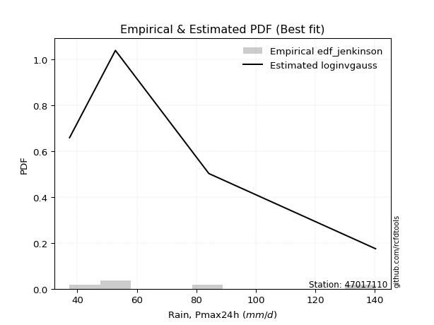</img>

</div>


### 11. EDF Cunnane (1978)

Cunnane´s work in statistical hydrology has focused on the performance and evaluation of different probability distributions (such as GEV, Gumbel, Lognormal) for flood frequency estimation. _b_ is a constant, typically set to 0.4.

<div align="center">


$P=(m-b)/(n+1-2b)$


</div>


**11.1. Empirical values**

<div align="center">

|                | 0                   | 1                  | 2           | 3                  | 4                  |
|:---------------|:--------------------|:-------------------|:------------|:-------------------|:-------------------|
| date           | 2023                | 2020               | 2022        | 2021               | 2019               |
| x              | 37.4                | 52.8               | 53.8        | 84.2               | 140.2              |
| m              | 1                   | 2                  | 3           | 4                  | 5                  |
| empirical_dist | edf_cunnane         | edf_cunnane        | edf_cunnane | edf_cunnane        | edf_cunnane        |
| empirical      | 0.11538461538461538 | 0.3076923076923077 | 0.5         | 0.6923076923076923 | 0.8846153846153845 |
| empirical_tr   | 1.1304347826086958  | 1.4444444444444444 | 2.0         | 3.25               | 8.666666666666655  |

</div>


**11.2. Kolmogorov-Smirnov fit test (sorted by Δ)**


<div align="center">

|                | 0                   | 1                   | 2                  | 3                  | 4                   | 5                   | 6                   | 7                  | 8                   | 9                   | 10                  | 11                  | 12                  | 13                 | 14                  | 15                  | 16                  | 17                  | 18                  | 19                  | 20                  | 21                  | 22                  | 23                 | 24                  | 25                  | 26                 | 27                 | 28                  | 29                 | 30                  | 31                 | 32                  | 33                 | 34                    | 35                  | 36                  | 37                 | 38                  | 39                 | 40                  | 41                  | 42                  | 43                  | 44                  | 45                  | 46                  | 47                  | 48                  | 49                  | 50                  | 51                  | 52                 | 53                 | 54                  | 55                 | 56                 | 57                  | 58                 | 59                  | 60                 | 61                 | 62                 | 63                  | 64                 | 65                 | 66                  | 67                 | 68                 | 69                  | 70                  | 71                 | 72                 | 73                 | 74                  | 75                 | 76                  | 77                  | 78                 | 79                  | 80                 | 81                  | 82                  | 83                 | 84                 | 85                 | 86                 | 87                 |
|:---------------|:--------------------|:--------------------|:-------------------|:-------------------|:--------------------|:--------------------|:--------------------|:-------------------|:--------------------|:--------------------|:--------------------|:--------------------|:--------------------|:-------------------|:--------------------|:--------------------|:--------------------|:--------------------|:--------------------|:--------------------|:--------------------|:--------------------|:--------------------|:-------------------|:--------------------|:--------------------|:-------------------|:-------------------|:--------------------|:-------------------|:--------------------|:-------------------|:--------------------|:-------------------|:----------------------|:--------------------|:--------------------|:-------------------|:--------------------|:-------------------|:--------------------|:--------------------|:--------------------|:--------------------|:--------------------|:--------------------|:--------------------|:--------------------|:--------------------|:--------------------|:--------------------|:--------------------|:-------------------|:-------------------|:--------------------|:-------------------|:-------------------|:--------------------|:-------------------|:--------------------|:-------------------|:-------------------|:-------------------|:--------------------|:-------------------|:-------------------|:--------------------|:-------------------|:-------------------|:--------------------|:--------------------|:-------------------|:-------------------|:-------------------|:--------------------|:-------------------|:--------------------|:--------------------|:-------------------|:--------------------|:-------------------|:--------------------|:--------------------|:-------------------|:-------------------|:-------------------|:-------------------|:-------------------|
| station        | 47017110            | 47017110            | 47017110           | 47017110           | 47017110            | 47017110            | 47017110            | 47017110           | 47017110            | 47017110            | 47017110            | 47017110            | 47017110            | 47017110           | 47017110            | 47017110            | 47017110            | 47017110            | 47017110            | 47017110            | 47017110            | 47017110            | 47017110            | 47017110           | 47017110            | 47017110            | 47017110           | 47017110           | 47017110            | 47017110           | 47017110            | 47017110           | 47017110            | 47017110           | 47017110              | 47017110            | 47017110            | 47017110           | 47017110            | 47017110           | 47017110            | 47017110            | 47017110            | 47017110            | 47017110            | 47017110            | 47017110            | 47017110            | 47017110            | 47017110            | 47017110            | 47017110            | 47017110           | 47017110           | 47017110            | 47017110           | 47017110           | 47017110            | 47017110           | 47017110            | 47017110           | 47017110           | 47017110           | 47017110            | 47017110           | 47017110           | 47017110            | 47017110           | 47017110           | 47017110            | 47017110            | 47017110           | 47017110           | 47017110           | 47017110            | 47017110           | 47017110            | 47017110            | 47017110           | 47017110            | 47017110           | 47017110            | 47017110            | 47017110           | 47017110           | 47017110           | 47017110           | 47017110           |
| empirical_dist | edf_cunnane         | edf_cunnane         | edf_cunnane        | edf_cunnane        | edf_cunnane         | edf_cunnane         | edf_cunnane         | edf_cunnane        | edf_cunnane         | edf_cunnane         | edf_cunnane         | edf_cunnane         | edf_cunnane         | edf_cunnane        | edf_cunnane         | edf_cunnane         | edf_cunnane         | edf_cunnane         | edf_cunnane         | edf_cunnane         | edf_cunnane         | edf_cunnane         | edf_cunnane         | edf_cunnane        | edf_cunnane         | edf_cunnane         | edf_cunnane        | edf_cunnane        | edf_cunnane         | edf_cunnane        | edf_cunnane         | edf_cunnane        | edf_cunnane         | edf_cunnane        | edf_cunnane           | edf_cunnane         | edf_cunnane         | edf_cunnane        | edf_cunnane         | edf_cunnane        | edf_cunnane         | edf_cunnane         | edf_cunnane         | edf_cunnane         | edf_cunnane         | edf_cunnane         | edf_cunnane         | edf_cunnane         | edf_cunnane         | edf_cunnane         | edf_cunnane         | edf_cunnane         | edf_cunnane        | edf_cunnane        | edf_cunnane         | edf_cunnane        | edf_cunnane        | edf_cunnane         | edf_cunnane        | edf_cunnane         | edf_cunnane        | edf_cunnane        | edf_cunnane        | edf_cunnane         | edf_cunnane        | edf_cunnane        | edf_cunnane         | edf_cunnane        | edf_cunnane        | edf_cunnane         | edf_cunnane         | edf_cunnane        | edf_cunnane        | edf_cunnane        | edf_cunnane         | edf_cunnane        | edf_cunnane         | edf_cunnane         | edf_cunnane        | edf_cunnane         | edf_cunnane        | edf_cunnane         | edf_cunnane         | edf_cunnane        | edf_cunnane        | edf_cunnane        | edf_cunnane        | edf_cunnane        |
| p_dist         | invgamma            | f                   | loginvgauss        | logjohnsonsu       | logexponnorm        | logfisk             | alpha               | loghalfnorm        | logfatiguelife      | loginvgamma         | logncf              | invgauss            | loginvweibull       | loggenexpon        | loghalflogistic     | logmoyal            | logalpha            | logmielke           | loggenlogistic      | logkstwobign        | logwald             | lograyleigh         | loggumbel_r         | loggompertz        | logchi2             | exponnorm           | expon              | genexpon           | gompertz            | nct                | halfnorm            | truncnorm          | halflogistic        | logmaxwell         | loglaplace_asymmetric | logexpon            | logpearson3         | lognct             | loggibrat           | betaprime          | logbetaprime        | logrice             | lognakagami         | moyal               | rayleigh            | pearson3            | logt                | logcrystalball      | lognorm             | lognorm             | logloggamma         | wald                | nakagami           | gumbel_r           | maxwell             | genlogistic        | loglogistic        | fisk                | kstwobign          | norm                | crystalball        | t                  | loghypsecant       | logweibull_min      | laplace_asymmetric | logf               | logistic            | loggumbel_l        | loglaplace         | rice                | hypsecant           | weibull_min        | gumbel_l           | laplace            | gibrat              | ncf                | loggamma            | loggamma            | loglognorm         | fatiguelife         | invweibull         | logerlang           | johnsonsu           | chi2               | erlang             | gamma              | logtruncnorm       | mielke             |
| delta          | 0.08750998378036035 | 0.08751151494922882 | 0.0905935540826488 | 0.090626344161851  | 0.09342321827831102 | 0.09384523203112366 | 0.09762917361891416 | 0.0978418858120606 | 0.10369944501267658 | 0.10404948858964941 | 0.10410677919470268 | 0.11205684557693918 | 0.11339509974495254 | 0.1153846152890171 | 0.11538461538461538 | 0.11677980586330372 | 0.11731380050940005 | 0.11949214438366973 | 0.12088371915897994 | 0.12370598251372866 | 0.12493107530089242 | 0.13110198495672865 | 0.13140151556183877 | 0.1332442462029816 | 0.13416393685320732 | 0.13631040996503874 | 0.1363289125084639 | 0.1363293830512622 | 0.13675527586311514 | 0.1370666641946438 | 0.13828764217529327 | 0.138894813312279  | 0.14152085435151435 | 0.1427988354147915 | 0.14532679343752264   | 0.14722703615994914 | 0.14877354003241527 | 0.1538588929065644 | 0.15617111875905876 | 0.1579345087446774 | 0.16019265165995772 | 0.16047397022783078 | 0.16338939375118933 | 0.16759311588022707 | 0.16873477455361352 | 0.16897863844793448 | 0.17311166412593604 | 0.17311435250860469 | 0.17311435599158714 | 0.17311435599158714 | 0.17436398042675716 | 0.17475020996353413 | 0.1757718859127887 | 0.1762289488332991 | 0.17953827208848078 | 0.1873861293956935 | 0.1928637799661873 | 0.20082366015516495 | 0.2063545227778164 | 0.20670018601009504 | 0.206700186977419  | 0.2067053657317558 | 0.2077260337436771 | 0.21071482936825747 | 0.213817903512466  | 0.2225962878142259 | 0.22835450863100049 | 0.2291662619362077 | 0.2348509917657267 | 0.23739191594081355 | 0.24381407765793645 | 0.2501943120687625 | 0.2561353161179661 | 0.2682635052816258 | 0.27263416641240723 | 0.2773782572898767 | 0.31723567527815777 | 0.31723567527815777 | 0.3693010554446057 | 0.41225663937718227 | 0.4460168821096274 | 0.46237377601955176 | 0.48846656085781637 | 0.5691521787101487 | 0.5950422300106049 | 0.6183299445791262 | 0.6922948055168169 | nan                |
| deltao         | 0.5865427407550001  | 0.5865427407550001  | 0.5865427407550001 | 0.5865427407550001 | 0.5865427407550001  | 0.5865427407550001  | 0.5865427407550001  | 0.5865427407550001 | 0.5865427407550001  | 0.5865427407550001  | 0.5865427407550001  | 0.5865427407550001  | 0.5865427407550001  | 0.5865427407550001 | 0.5865427407550001  | 0.5865427407550001  | 0.5865427407550001  | 0.5865427407550001  | 0.5865427407550001  | 0.5865427407550001  | 0.5865427407550001  | 0.5865427407550001  | 0.5865427407550001  | 0.5865427407550001 | 0.5865427407550001  | 0.5865427407550001  | 0.5865427407550001 | 0.5865427407550001 | 0.5865427407550001  | 0.5865427407550001 | 0.5865427407550001  | 0.5865427407550001 | 0.5865427407550001  | 0.5865427407550001 | 0.5865427407550001    | 0.5865427407550001  | 0.5865427407550001  | 0.5865427407550001 | 0.5865427407550001  | 0.5865427407550001 | 0.5865427407550001  | 0.5865427407550001  | 0.5865427407550001  | 0.5865427407550001  | 0.5865427407550001  | 0.5865427407550001  | 0.5865427407550001  | 0.5865427407550001  | 0.5865427407550001  | 0.5865427407550001  | 0.5865427407550001  | 0.5865427407550001  | 0.5865427407550001 | 0.5865427407550001 | 0.5865427407550001  | 0.5865427407550001 | 0.5865427407550001 | 0.5865427407550001  | 0.5865427407550001 | 0.5865427407550001  | 0.5865427407550001 | 0.5865427407550001 | 0.5865427407550001 | 0.5865427407550001  | 0.5865427407550001 | 0.5865427407550001 | 0.5865427407550001  | 0.5865427407550001 | 0.5865427407550001 | 0.5865427407550001  | 0.5865427407550001  | 0.5865427407550001 | 0.5865427407550001 | 0.5865427407550001 | 0.5865427407550001  | 0.5865427407550001 | 0.5865427407550001  | 0.5865427407550001  | 0.5865427407550001 | 0.5865427407550001  | 0.5865427407550001 | 0.5865427407550001  | 0.5865427407550001  | 0.5865427407550001 | 0.5865427407550001 | 0.5865427407550001 | 0.5865427407550001 | 0.5865427407550001 |
| eval           | Δo > Δ              | Δo > Δ              | Δo > Δ             | Δo > Δ             | Δo > Δ              | Δo > Δ              | Δo > Δ              | Δo > Δ             | Δo > Δ              | Δo > Δ              | Δo > Δ              | Δo > Δ              | Δo > Δ              | Δo > Δ             | Δo > Δ              | Δo > Δ              | Δo > Δ              | Δo > Δ              | Δo > Δ              | Δo > Δ              | Δo > Δ              | Δo > Δ              | Δo > Δ              | Δo > Δ             | Δo > Δ              | Δo > Δ              | Δo > Δ             | Δo > Δ             | Δo > Δ              | Δo > Δ             | Δo > Δ              | Δo > Δ             | Δo > Δ              | Δo > Δ             | Δo > Δ                | Δo > Δ              | Δo > Δ              | Δo > Δ             | Δo > Δ              | Δo > Δ             | Δo > Δ              | Δo > Δ              | Δo > Δ              | Δo > Δ              | Δo > Δ              | Δo > Δ              | Δo > Δ              | Δo > Δ              | Δo > Δ              | Δo > Δ              | Δo > Δ              | Δo > Δ              | Δo > Δ             | Δo > Δ             | Δo > Δ              | Δo > Δ             | Δo > Δ             | Δo > Δ              | Δo > Δ             | Δo > Δ              | Δo > Δ             | Δo > Δ             | Δo > Δ             | Δo > Δ              | Δo > Δ             | Δo > Δ             | Δo > Δ              | Δo > Δ             | Δo > Δ             | Δo > Δ              | Δo > Δ              | Δo > Δ             | Δo > Δ             | Δo > Δ             | Δo > Δ              | Δo > Δ             | Δo > Δ              | Δo > Δ              | Δo > Δ             | Δo > Δ              | Δo > Δ             | Δo > Δ              | Δo > Δ              | Δo > Δ             | Δo <= Δ            | Δo <= Δ            | Δo <= Δ            | Δo <= Δ            |
| fit            | 1                   | 1                   | 1                  | 1                  | 1                   | 1                   | 1                   | 1                  | 1                   | 1                   | 1                   | 1                   | 1                   | 1                  | 1                   | 1                   | 1                   | 1                   | 1                   | 1                   | 1                   | 1                   | 1                   | 1                  | 1                   | 1                   | 1                  | 1                  | 1                   | 1                  | 1                   | 1                  | 1                   | 1                  | 1                     | 1                   | 1                   | 1                  | 1                   | 1                  | 1                   | 1                   | 1                   | 1                   | 1                   | 1                   | 1                   | 1                   | 1                   | 1                   | 1                   | 1                   | 1                  | 1                  | 1                   | 1                  | 1                  | 1                   | 1                  | 1                   | 1                  | 1                  | 1                  | 1                   | 1                  | 1                  | 1                   | 1                  | 1                  | 1                   | 1                   | 1                  | 1                  | 1                  | 1                   | 1                  | 1                   | 1                   | 1                  | 1                   | 1                  | 1                   | 1                   | 1                  | 0                  | 0                  | 0                  | 0                  |
| n              | 5                   | 5                   | 5                  | 5                  | 5                   | 5                   | 5                   | 5                  | 5                   | 5                   | 5                   | 5                   | 5                   | 5                  | 5                   | 5                   | 5                   | 5                   | 5                   | 5                   | 5                   | 5                   | 5                   | 5                  | 5                   | 5                   | 5                  | 5                  | 5                   | 5                  | 5                   | 5                  | 5                   | 5                  | 5                     | 5                   | 5                   | 5                  | 5                   | 5                  | 5                   | 5                   | 5                   | 5                   | 5                   | 5                   | 5                   | 5                   | 5                   | 5                   | 5                   | 5                   | 5                  | 5                  | 5                   | 5                  | 5                  | 5                   | 5                  | 5                   | 5                  | 5                  | 5                  | 5                   | 5                  | 5                  | 5                   | 5                  | 5                  | 5                   | 5                   | 5                  | 5                  | 5                  | 5                   | 5                  | 5                   | 5                   | 5                  | 5                   | 5                  | 5                   | 5                   | 5                  | 5                  | 5                  | 5                  | 5                  |
| best_fit       | 1                   | 0                   | 0                  | 0                  | 0                   | 0                   | 0                   | 0                  | 0                   | 0                   | 0                   | 0                   | 0                   | 0                  | 0                   | 0                   | 0                   | 0                   | 0                   | 0                   | 0                   | 0                   | 0                   | 0                  | 0                   | 0                   | 0                  | 0                  | 0                   | 0                  | 0                   | 0                  | 0                   | 0                  | 0                     | 0                   | 0                   | 0                  | 0                   | 0                  | 0                   | 0                   | 0                   | 0                   | 0                   | 0                   | 0                   | 0                   | 0                   | 0                   | 0                   | 0                   | 0                  | 0                  | 0                   | 0                  | 0                  | 0                   | 0                  | 0                   | 0                  | 0                  | 0                  | 0                   | 0                  | 0                  | 0                   | 0                  | 0                  | 0                   | 0                   | 0                  | 0                  | 0                  | 0                   | 0                  | 0                   | 0                   | 0                  | 0                   | 0                  | 0                   | 0                   | 0                  | 0                  | 0                  | 0                  | 0                  |
| best_fit_sort  | 1                   | 2                   | 3                  | 4                  | 5                   | 6                   | 7                   | 8                  | 9                   | 10                  | 11                  | 12                  | 13                  | 14                 | 15                  | 16                  | 17                  | 18                  | 19                  | 20                  | 21                  | 22                  | 23                  | 24                 | 25                  | 26                  | 27                 | 28                 | 29                  | 30                 | 31                  | 32                 | 33                  | 34                 | 35                    | 36                  | 37                  | 38                 | 39                  | 40                 | 41                  | 42                  | 43                  | 44                  | 45                  | 46                  | 47                  | 48                  | 49                  | 50                  | 51                  | 52                  | 53                 | 54                 | 55                  | 56                 | 57                 | 58                  | 59                 | 60                  | 61                 | 62                 | 63                 | 64                  | 65                 | 66                 | 67                  | 68                 | 69                 | 70                  | 71                  | 72                 | 73                 | 74                 | 75                  | 76                 | 77                  | 78                  | 79                 | 80                  | 81                 | 82                  | 83                  | 84                 | 85                 | 86                 | 87                 | 88                 |

</div>


**11.3. Best fit**

<div align="center">

|   id |   station | empirical_dist   | p_dist   |   delta |   deltao | eval   |   fit |   n |   best_fit |   best_fit_sort |
|-----:|----------:|:-----------------|:---------|--------:|---------:|:-------|------:|----:|-----------:|----------------:|
|    0 |  47017110 | edf_cunnane      | invgamma | 0.08751 | 0.586543 | Δo > Δ |     1 |   5 |          1 |               1 |

</div>


<div align="center">

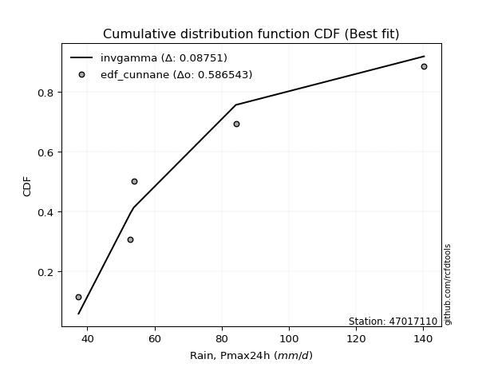</img></img>

</div>


### 12. EDF Adamowski (1981)

The Adamowski formula in hydrology refers to a specific plotting position formula used for estimating the non-parametric empirical distribution of hydrological events (like flood peaks) to calculate their return periods. This formula provides an alternative to traditional parametric methods (like the Gumbel or Log Pearson Type III distributions). 

<div align="center">


$P=(m-0.25)/(n+0.5)$


</div>


**12.1. Empirical values**

<div align="center">

|                | 0                   | 1                  | 2             | 3                  | 4                  |
|:---------------|:--------------------|:-------------------|:--------------|:-------------------|:-------------------|
| date           | 2023                | 2020               | 2022          | 2021               | 2019               |
| x              | 37.4                | 52.8               | 53.8          | 84.2               | 140.2              |
| m              | 1                   | 2                  | 3             | 4                  | 5                  |
| empirical_dist | edf_adamowski       | edf_adamowski      | edf_adamowski | edf_adamowski      | edf_adamowski      |
| empirical      | 0.13636363636363635 | 0.3181818181818182 | 0.5           | 0.6818181818181818 | 0.8636363636363636 |
| empirical_tr   | 1.1578947368421053  | 1.4666666666666666 | 2.0           | 3.1428571428571423 | 7.333333333333334  |

</div>


**12.2. Kolmogorov-Smirnov fit test (sorted by Δ)**


<div align="center">

|                | 0                   | 1                   | 2                   | 3                   | 4                  | 5                   | 6                   | 7                   | 8                   | 9                   | 10                  | 11                  | 12                  | 13                  | 14                  | 15                  | 16                  | 17                  | 18                  | 19                  | 20                  | 21                  | 22                  | 23                  | 24                  | 25                  | 26                  | 27                  | 28                  | 29                  | 30                 | 31                  | 32                 | 33                  | 34                 | 35                    | 36                  | 37                  | 38                 | 39                 | 40                  | 41                  | 42                  | 43                  | 44                  | 45                  | 46                  | 47                  | 48                  | 49                  | 50                  | 51                  | 52                 | 53                 | 54                  | 55                 | 56                  | 57                 | 58                 | 59                 | 60                  | 61                 | 62                 | 63                 | 64                  | 65                 | 66                  | 67                 | 68                 | 69                  | 70                  | 71                  | 72                 | 73                 | 74                 | 75                  | 76                 | 77                 | 78                 | 79                 | 80                 | 81                 | 82                 | 83                 | 84                 | 85                 | 86                 | 87                 |
|:---------------|:--------------------|:--------------------|:--------------------|:--------------------|:-------------------|:--------------------|:--------------------|:--------------------|:--------------------|:--------------------|:--------------------|:--------------------|:--------------------|:--------------------|:--------------------|:--------------------|:--------------------|:--------------------|:--------------------|:--------------------|:--------------------|:--------------------|:--------------------|:--------------------|:--------------------|:--------------------|:--------------------|:--------------------|:--------------------|:--------------------|:-------------------|:--------------------|:-------------------|:--------------------|:-------------------|:----------------------|:--------------------|:--------------------|:-------------------|:-------------------|:--------------------|:--------------------|:--------------------|:--------------------|:--------------------|:--------------------|:--------------------|:--------------------|:--------------------|:--------------------|:--------------------|:--------------------|:-------------------|:-------------------|:--------------------|:-------------------|:--------------------|:-------------------|:-------------------|:-------------------|:--------------------|:-------------------|:-------------------|:-------------------|:--------------------|:-------------------|:--------------------|:-------------------|:-------------------|:--------------------|:--------------------|:--------------------|:-------------------|:-------------------|:-------------------|:--------------------|:-------------------|:-------------------|:-------------------|:-------------------|:-------------------|:-------------------|:-------------------|:-------------------|:-------------------|:-------------------|:-------------------|:-------------------|
| station        | 47017110            | 47017110            | 47017110            | 47017110            | 47017110           | 47017110            | 47017110            | 47017110            | 47017110            | 47017110            | 47017110            | 47017110            | 47017110            | 47017110            | 47017110            | 47017110            | 47017110            | 47017110            | 47017110            | 47017110            | 47017110            | 47017110            | 47017110            | 47017110            | 47017110            | 47017110            | 47017110            | 47017110            | 47017110            | 47017110            | 47017110           | 47017110            | 47017110           | 47017110            | 47017110           | 47017110              | 47017110            | 47017110            | 47017110           | 47017110           | 47017110            | 47017110            | 47017110            | 47017110            | 47017110            | 47017110            | 47017110            | 47017110            | 47017110            | 47017110            | 47017110            | 47017110            | 47017110           | 47017110           | 47017110            | 47017110           | 47017110            | 47017110           | 47017110           | 47017110           | 47017110            | 47017110           | 47017110           | 47017110           | 47017110            | 47017110           | 47017110            | 47017110           | 47017110           | 47017110            | 47017110            | 47017110            | 47017110           | 47017110           | 47017110           | 47017110            | 47017110           | 47017110           | 47017110           | 47017110           | 47017110           | 47017110           | 47017110           | 47017110           | 47017110           | 47017110           | 47017110           | 47017110           |
| empirical_dist | edf_adamowski       | edf_adamowski       | edf_adamowski       | edf_adamowski       | edf_adamowski      | edf_adamowski       | edf_adamowski       | edf_adamowski       | edf_adamowski       | edf_adamowski       | edf_adamowski       | edf_adamowski       | edf_adamowski       | edf_adamowski       | edf_adamowski       | edf_adamowski       | edf_adamowski       | edf_adamowski       | edf_adamowski       | edf_adamowski       | edf_adamowski       | edf_adamowski       | edf_adamowski       | edf_adamowski       | edf_adamowski       | edf_adamowski       | edf_adamowski       | edf_adamowski       | edf_adamowski       | edf_adamowski       | edf_adamowski      | edf_adamowski       | edf_adamowski      | edf_adamowski       | edf_adamowski      | edf_adamowski         | edf_adamowski       | edf_adamowski       | edf_adamowski      | edf_adamowski      | edf_adamowski       | edf_adamowski       | edf_adamowski       | edf_adamowski       | edf_adamowski       | edf_adamowski       | edf_adamowski       | edf_adamowski       | edf_adamowski       | edf_adamowski       | edf_adamowski       | edf_adamowski       | edf_adamowski      | edf_adamowski      | edf_adamowski       | edf_adamowski      | edf_adamowski       | edf_adamowski      | edf_adamowski      | edf_adamowski      | edf_adamowski       | edf_adamowski      | edf_adamowski      | edf_adamowski      | edf_adamowski       | edf_adamowski      | edf_adamowski       | edf_adamowski      | edf_adamowski      | edf_adamowski       | edf_adamowski       | edf_adamowski       | edf_adamowski      | edf_adamowski      | edf_adamowski      | edf_adamowski       | edf_adamowski      | edf_adamowski      | edf_adamowski      | edf_adamowski      | edf_adamowski      | edf_adamowski      | edf_adamowski      | edf_adamowski      | edf_adamowski      | edf_adamowski      | edf_adamowski      | edf_adamowski      |
| p_dist         | loginvgauss         | logexponnorm        | invgamma            | f                   | logjohnsonsu       | logfatiguelife      | logfisk             | alpha               | loghalfnorm         | invgauss            | loginvgamma         | logncf              | loginvweibull       | logmoyal            | logalpha            | logmielke           | loggenlogistic      | logkstwobign        | lograyleigh         | loggumbel_r         | exponnorm           | logchi2             | loggompertz         | loggenexpon         | genexpon            | loghalflogistic     | expon               | logwald             | logexpon            | gompertz            | nct                | halfnorm            | truncnorm          | halflogistic        | logmaxwell         | loglaplace_asymmetric | logpearson3         | lognakagami         | lognct             | betaprime          | logbetaprime        | logrice             | loggibrat           | moyal               | rayleigh            | pearson3            | logt                | logcrystalball      | lognorm             | lognorm             | logloggamma         | wald                | nakagami           | gumbel_r           | maxwell             | genlogistic        | fisk                | loglogistic        | logweibull_min     | kstwobign          | norm                | crystalball        | t                  | loghypsecant       | logf                | laplace_asymmetric | logistic            | loggumbel_l        | loglaplace         | rice                | weibull_min         | hypsecant           | gumbel_l           | ncf                | laplace            | gibrat              | loggamma           | loggamma           | loglognorm         | fatiguelife        | invweibull         | logerlang          | johnsonsu          | chi2               | erlang             | gamma              | logtruncnorm       | mielke             |
| delta          | 0.08239019119770091 | 0.08293370778880055 | 0.08750998378036035 | 0.08751151494922882 | 0.090626344161851  | 0.09320993452316612 | 0.09384523203112366 | 0.09762917361891416 | 0.09873920471851619 | 0.10156733508742871 | 0.10404948858964941 | 0.10410677919470268 | 0.11339509974495254 | 0.11677980586330372 | 0.11731380050940005 | 0.11949214438366973 | 0.12088371915897994 | 0.12370598251372866 | 0.13110198495672865 | 0.13140151556183877 | 0.13631040996503874 | 0.13636362335802346 | 0.13636363608990124 | 0.13636363626803807 | 0.13636363634927098 | 0.13636363636363635 | 0.13636363636363635 | 0.13636363636363635 | 0.13673752567043868 | 0.13675527586311514 | 0.1370666641946438 | 0.13828764217529327 | 0.138894813312279  | 0.14152085435151435 | 0.1427988354147915 | 0.14532679343752264   | 0.14877354003241527 | 0.15289988326167886 | 0.1538588929065644 | 0.1579345087446774 | 0.16019265165995772 | 0.16047397022783078 | 0.16666062924856928 | 0.16759311588022707 | 0.16873477455361352 | 0.16897863844793448 | 0.17311166412593604 | 0.17311435250860469 | 0.17311435599158714 | 0.17311435599158714 | 0.17436398042675716 | 0.17475020996353413 | 0.1757718859127887 | 0.1762289488332991 | 0.17953827208848078 | 0.1873861293956935 | 0.19033414966565448 | 0.1928637799661873 | 0.200225318878747  | 0.2063545227778164 | 0.20670018601009504 | 0.206700186977419  | 0.2067053657317558 | 0.2077260337436771 | 0.21210677732471545 | 0.213817903512466  | 0.22835450863100049 | 0.2291662619362077 | 0.2348509917657267 | 0.23739191594081355 | 0.23970480157925206 | 0.24381407765793645 | 0.2561353161179661 | 0.2563992363108557 | 0.2682635052816258 | 0.27263416641240723 | 0.3067461647886473 | 0.3067461647886473 | 0.3588115449550952 | 0.4017671288876718 | 0.4250378611306066 | 0.4518842655300413 | 0.4779770503683059 | 0.5586626682206381 | 0.5845527195210944 | 0.6078404340896157 | 0.6818052950273064 | nan                |
| deltao         | 0.5865427407550001  | 0.5865427407550001  | 0.5865427407550001  | 0.5865427407550001  | 0.5865427407550001 | 0.5865427407550001  | 0.5865427407550001  | 0.5865427407550001  | 0.5865427407550001  | 0.5865427407550001  | 0.5865427407550001  | 0.5865427407550001  | 0.5865427407550001  | 0.5865427407550001  | 0.5865427407550001  | 0.5865427407550001  | 0.5865427407550001  | 0.5865427407550001  | 0.5865427407550001  | 0.5865427407550001  | 0.5865427407550001  | 0.5865427407550001  | 0.5865427407550001  | 0.5865427407550001  | 0.5865427407550001  | 0.5865427407550001  | 0.5865427407550001  | 0.5865427407550001  | 0.5865427407550001  | 0.5865427407550001  | 0.5865427407550001 | 0.5865427407550001  | 0.5865427407550001 | 0.5865427407550001  | 0.5865427407550001 | 0.5865427407550001    | 0.5865427407550001  | 0.5865427407550001  | 0.5865427407550001 | 0.5865427407550001 | 0.5865427407550001  | 0.5865427407550001  | 0.5865427407550001  | 0.5865427407550001  | 0.5865427407550001  | 0.5865427407550001  | 0.5865427407550001  | 0.5865427407550001  | 0.5865427407550001  | 0.5865427407550001  | 0.5865427407550001  | 0.5865427407550001  | 0.5865427407550001 | 0.5865427407550001 | 0.5865427407550001  | 0.5865427407550001 | 0.5865427407550001  | 0.5865427407550001 | 0.5865427407550001 | 0.5865427407550001 | 0.5865427407550001  | 0.5865427407550001 | 0.5865427407550001 | 0.5865427407550001 | 0.5865427407550001  | 0.5865427407550001 | 0.5865427407550001  | 0.5865427407550001 | 0.5865427407550001 | 0.5865427407550001  | 0.5865427407550001  | 0.5865427407550001  | 0.5865427407550001 | 0.5865427407550001 | 0.5865427407550001 | 0.5865427407550001  | 0.5865427407550001 | 0.5865427407550001 | 0.5865427407550001 | 0.5865427407550001 | 0.5865427407550001 | 0.5865427407550001 | 0.5865427407550001 | 0.5865427407550001 | 0.5865427407550001 | 0.5865427407550001 | 0.5865427407550001 | 0.5865427407550001 |
| eval           | Δo > Δ              | Δo > Δ              | Δo > Δ              | Δo > Δ              | Δo > Δ             | Δo > Δ              | Δo > Δ              | Δo > Δ              | Δo > Δ              | Δo > Δ              | Δo > Δ              | Δo > Δ              | Δo > Δ              | Δo > Δ              | Δo > Δ              | Δo > Δ              | Δo > Δ              | Δo > Δ              | Δo > Δ              | Δo > Δ              | Δo > Δ              | Δo > Δ              | Δo > Δ              | Δo > Δ              | Δo > Δ              | Δo > Δ              | Δo > Δ              | Δo > Δ              | Δo > Δ              | Δo > Δ              | Δo > Δ             | Δo > Δ              | Δo > Δ             | Δo > Δ              | Δo > Δ             | Δo > Δ                | Δo > Δ              | Δo > Δ              | Δo > Δ             | Δo > Δ             | Δo > Δ              | Δo > Δ              | Δo > Δ              | Δo > Δ              | Δo > Δ              | Δo > Δ              | Δo > Δ              | Δo > Δ              | Δo > Δ              | Δo > Δ              | Δo > Δ              | Δo > Δ              | Δo > Δ             | Δo > Δ             | Δo > Δ              | Δo > Δ             | Δo > Δ              | Δo > Δ             | Δo > Δ             | Δo > Δ             | Δo > Δ              | Δo > Δ             | Δo > Δ             | Δo > Δ             | Δo > Δ              | Δo > Δ             | Δo > Δ              | Δo > Δ             | Δo > Δ             | Δo > Δ              | Δo > Δ              | Δo > Δ              | Δo > Δ             | Δo > Δ             | Δo > Δ             | Δo > Δ              | Δo > Δ             | Δo > Δ             | Δo > Δ             | Δo > Δ             | Δo > Δ             | Δo > Δ             | Δo > Δ             | Δo > Δ             | Δo > Δ             | Δo <= Δ            | Δo <= Δ            | Δo <= Δ            |
| fit            | 1                   | 1                   | 1                   | 1                   | 1                  | 1                   | 1                   | 1                   | 1                   | 1                   | 1                   | 1                   | 1                   | 1                   | 1                   | 1                   | 1                   | 1                   | 1                   | 1                   | 1                   | 1                   | 1                   | 1                   | 1                   | 1                   | 1                   | 1                   | 1                   | 1                   | 1                  | 1                   | 1                  | 1                   | 1                  | 1                     | 1                   | 1                   | 1                  | 1                  | 1                   | 1                   | 1                   | 1                   | 1                   | 1                   | 1                   | 1                   | 1                   | 1                   | 1                   | 1                   | 1                  | 1                  | 1                   | 1                  | 1                   | 1                  | 1                  | 1                  | 1                   | 1                  | 1                  | 1                  | 1                   | 1                  | 1                   | 1                  | 1                  | 1                   | 1                   | 1                   | 1                  | 1                  | 1                  | 1                   | 1                  | 1                  | 1                  | 1                  | 1                  | 1                  | 1                  | 1                  | 1                  | 0                  | 0                  | 0                  |
| n              | 5                   | 5                   | 5                   | 5                   | 5                  | 5                   | 5                   | 5                   | 5                   | 5                   | 5                   | 5                   | 5                   | 5                   | 5                   | 5                   | 5                   | 5                   | 5                   | 5                   | 5                   | 5                   | 5                   | 5                   | 5                   | 5                   | 5                   | 5                   | 5                   | 5                   | 5                  | 5                   | 5                  | 5                   | 5                  | 5                     | 5                   | 5                   | 5                  | 5                  | 5                   | 5                   | 5                   | 5                   | 5                   | 5                   | 5                   | 5                   | 5                   | 5                   | 5                   | 5                   | 5                  | 5                  | 5                   | 5                  | 5                   | 5                  | 5                  | 5                  | 5                   | 5                  | 5                  | 5                  | 5                   | 5                  | 5                   | 5                  | 5                  | 5                   | 5                   | 5                   | 5                  | 5                  | 5                  | 5                   | 5                  | 5                  | 5                  | 5                  | 5                  | 5                  | 5                  | 5                  | 5                  | 5                  | 5                  | 5                  |
| best_fit       | 1                   | 0                   | 0                   | 0                   | 0                  | 0                   | 0                   | 0                   | 0                   | 0                   | 0                   | 0                   | 0                   | 0                   | 0                   | 0                   | 0                   | 0                   | 0                   | 0                   | 0                   | 0                   | 0                   | 0                   | 0                   | 0                   | 0                   | 0                   | 0                   | 0                   | 0                  | 0                   | 0                  | 0                   | 0                  | 0                     | 0                   | 0                   | 0                  | 0                  | 0                   | 0                   | 0                   | 0                   | 0                   | 0                   | 0                   | 0                   | 0                   | 0                   | 0                   | 0                   | 0                  | 0                  | 0                   | 0                  | 0                   | 0                  | 0                  | 0                  | 0                   | 0                  | 0                  | 0                  | 0                   | 0                  | 0                   | 0                  | 0                  | 0                   | 0                   | 0                   | 0                  | 0                  | 0                  | 0                   | 0                  | 0                  | 0                  | 0                  | 0                  | 0                  | 0                  | 0                  | 0                  | 0                  | 0                  | 0                  |
| best_fit_sort  | 1                   | 2                   | 3                   | 4                   | 5                  | 6                   | 7                   | 8                   | 9                   | 10                  | 11                  | 12                  | 13                  | 14                  | 15                  | 16                  | 17                  | 18                  | 19                  | 20                  | 21                  | 22                  | 23                  | 24                  | 25                  | 26                  | 27                  | 28                  | 29                  | 30                  | 31                 | 32                  | 33                 | 34                  | 35                 | 36                    | 37                  | 38                  | 39                 | 40                 | 41                  | 42                  | 43                  | 44                  | 45                  | 46                  | 47                  | 48                  | 49                  | 50                  | 51                  | 52                  | 53                 | 54                 | 55                  | 56                 | 57                  | 58                 | 59                 | 60                 | 61                  | 62                 | 63                 | 64                 | 65                  | 66                 | 67                  | 68                 | 69                 | 70                  | 71                  | 72                  | 73                 | 74                 | 75                 | 76                  | 77                 | 78                 | 79                 | 80                 | 81                 | 82                 | 83                 | 84                 | 85                 | 86                 | 87                 | 88                 |

</div>


**12.3. Best fit**

<div align="center">

|   id |   station | empirical_dist   | p_dist      |     delta |   deltao | eval   |   fit |   n |   best_fit |   best_fit_sort |
|-----:|----------:|:-----------------|:------------|----------:|---------:|:-------|------:|----:|-----------:|----------------:|
|    0 |  47017110 | edf_adamowski    | loginvgauss | 0.0823902 | 0.586543 | Δo > Δ |     1 |   5 |          1 |               1 |

</div>


<div align="center">

</img>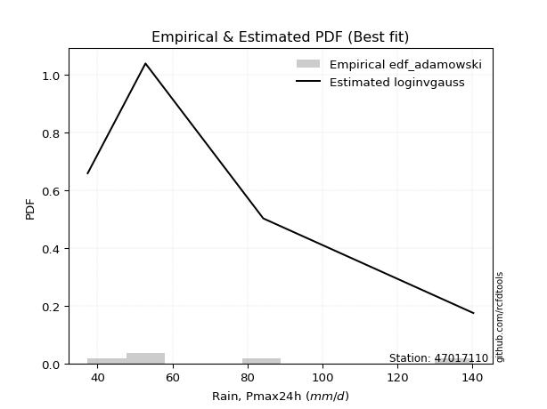</img>

</div>


## C. Best fit & Estimate extreme values for specific return periods - Tr

Best fit in probability distribution analysis means finding the theoretical distribution (like Normal, Poisson, Exponential) that most accurately mirrors your real-world data´s patterns (shape, center, spread) for better predictions, using methods like visual checks (Q-Q plots), goodness-of-fit tests (Kolmogorov-Smirnov, Chi-Squared), and information criteria (AIC) to score and select the simplest, most representative model.


### 1. Best fit (ordered by delta Δ)

<div align="center">

|   id |   station | empirical_dist   | p_dist       |     delta |   deltao | eval   |   fit |   n |   best_fit |   best_fit_sort |
|-----:|----------:|:-----------------|:-------------|----------:|---------:|:-------|------:|----:|-----------:|----------------:|
|    0 |  47017110 | edf_adamowski    | loginvgauss  | 0.0823902 | 0.586543 | Δo > Δ |     1 |   5 |          1 |               1 |
|    1 |  47017110 | edf_chegodayev   | loginvgauss  | 0.083471  | 0.586543 | Δo > Δ |     1 |   5 |          1 |               2 |
|    2 |  47017110 | edf_jenkinson    | loginvgauss  | 0.0841595 | 0.586543 | Δo > Δ |     1 |   5 |          1 |               3 |
|    3 |  47017110 | edf_beard        | loginvgauss  | 0.0841595 | 0.586543 | Δo > Δ |     1 |   5 |          1 |               4 |
|    4 |  47017110 | edf_filliben     | loginvgauss  | 0.0846792 | 0.586543 | Δo > Δ |     1 |   5 |          1 |               5 |
|    5 |  47017110 | edf_tukey        | loginvgauss  | 0.0857859 | 0.586543 | Δo > Δ |     1 |   5 |          1 |               6 |
|    6 |  47017110 | edf_blom         | invgamma     | 0.08751   | 0.586543 | Δo > Δ |     1 |   5 |          1 |               7 |
|    7 |  47017110 | edf_cunnane      | invgamma     | 0.08751   | 0.586543 | Δo > Δ |     1 |   5 |          1 |               8 |
|    8 |  47017110 | edf_gringorten   | f            | 0.0884973 | 0.586543 | Δo > Δ |     1 |   5 |          1 |               9 |
|    9 |  47017110 | edf_hazen        | logjohnsonsu | 0.0906263 | 0.586543 | Δo > Δ |     1 |   5 |          1 |              10 |
|   10 |  47017110 | edf_weibull      | alpha        | 0.103693  | 0.586543 | Δo > Δ |     1 |   5 |          1 |              11 |
|   11 |  47017110 | edf_california   | invgauss     | 0.162052  | 0.586543 | Δo > Δ |     1 |   5 |          1 |              12 |

</div>

:file_folder:Tables: [bestfit_47017110.csv](table/bestfit_47017110.csv) | [extreme_47017110.csv](table/extreme_47017110.csv)


### 2. Extreme values

In hydrology, a return period (or recurrence interval $Tr$) is the statistical average time between extreme events like floods or droughts of a specific magnitude, indicating how rare an event is, with a 100-year flood, for example, having a 1% chance of occurring in any given year, not that it happens exactly every century. It is a key tool for infrastructure design (like bridges or dams) and risk assessment, calculated from historical data to determine the probability of future events, although it is important to remember it is statistical average, and events can cluster or be missed.

> risk_rate: assuming the return period as the project useful life.

|   id |      tr |   prob_l |     prob_g |     alpha |   betaprime |     chi2 |   crystalball |   erlang |    expon |   exponnorm |         f |   fatiguelife |             fisk |    gamma |   genexpon |   genlogistic |   gibrat |   gompertz |   gumbel_l |   gumbel_r |   halflogistic |   halfnorm |   hypsecant |   invgamma |   invgauss |       invweibull |   johnsonsu |   kstwobign |   laplace |   laplace_asymmetric |   loggamma |   logistic |   lognorm |   maxwell |   mielke |    moyal |   nakagami |       ncf |      nct |     norm |   pearson3 |   rayleigh |     rice |        t |   truncnorm |     wald |      weibull_min |   logalpha |   logbetaprime |          logchi2 |   logcrystalball |   logerlang |   logexpon |   logexponnorm |       logf |   logfatiguelife |     logfisk |   loggenexpon |   loggenlogistic |   loggibrat |   loggompertz |   loggumbel_l |   loggumbel_r |   loghalflogistic |   loghalfnorm |   loghypsecant |   loginvgamma |   loginvgauss |   loginvweibull |   logjohnsonsu |   logkstwobign |   loglaplace |   loglaplace_asymmetric |   logloggamma |   loglogistic |    loglognorm |   logmaxwell |   logmielke |   logmoyal |   lognakagami |    logncf |   lognct |   logpearson3 |   lograyleigh |   logrice |     logt |   logtruncnorm |   logwald |   logweibull_min |   station |   n |   risk_rate |
|-----:|--------:|---------:|-----------:|----------:|------------:|---------:|--------------:|---------:|---------:|------------:|----------:|--------------:|-----------------:|---------:|-----------:|--------------:|---------:|-----------:|-----------:|-----------:|---------------:|-----------:|------------:|-----------:|-----------:|-----------------:|------------:|------------:|----------:|---------------------:|-----------:|-----------:|----------:|----------:|---------:|---------:|-----------:|----------:|---------:|---------:|-----------:|-----------:|---------:|---------:|------------:|---------:|-----------------:|-----------:|---------------:|-----------------:|-----------------:|------------:|-----------:|---------------:|-----------:|-----------------:|------------:|--------------:|-----------------:|------------:|--------------:|--------------:|--------------:|------------------:|--------------:|---------------:|--------------:|--------------:|----------------:|---------------:|---------------:|-------------:|------------------------:|--------------:|--------------:|--------------:|-------------:|------------:|-----------:|--------------:|----------:|---------:|--------------:|--------------:|----------:|---------:|---------------:|----------:|-----------------:|----------:|----:|------------:|
|    0 |    2    | 0.5      | 0.5        |   59.2449 |     64.0875 |  37.5774 |       73.68   |  37.5429 |  62.5474 |     62.5814 |   58.8419 |       37.4    |     51.8916      |  37.5427 |    62.5474 |       66.6179 |  62.706  |    62.5808 |    79.6862 |    67.6738 |        64.6879 |    66.1963 |     73.68   |    58.8418 |    57.5615 |   4996.38        |     37.81   |     68.8821 |   73.68   |              65.3887 |    46.7993 |    73.68   |   66.0191 |   70.5532 |  60.8807 |  65.7348 |    71.055  |   54.7123 |  62.0743 |  73.68   |    68.0064 |    69.4442 |  72.9156 |  73.6803 |     62.771  |  61.8289 |     41.9858      |    60.5093 |        64.7054 |     59.0079      |          66.0191 |     40.9148 |    55.4548 |        58.041  |    50.7206 |          57.8245 |     58.965  |       57.5977 |          60.7537 |     57.5688 |       62.3492 |       71.1585 |       61.2509 |           59.0107 |       60.1317 |        66.0191 |       59.7152 |       58.533  |         60.2559 |        58.9698 |        61.1761 |      66.0191 |                 60.1147 |       66.2289 |       66.0191 |  37.4213      |      63.4922 |     60.6687 |    59.7863 |       55.1534 |   59.719  |  63.7232 |       63.5571 |       62.6194 |   63.9488 |  66.019  |        96.2937 |   56.9414 |          51.8083 |  47017110 |   5 |    0.75     |
|    1 |    2.33 | 0.570815 | 0.429185   |   64.0238 |     69.4087 |  37.8824 |       80.2041 |  37.7813 |  68.0881 |     68.1444 |   63.7724 |       38.8444 |     61.5076      |  37.7568 |    68.0882 |       71.872  |  66.0109 |    68.1259 |    85.3622 |    73.7191 |        70.9034 |    73.2375 |     78.9012 |    63.7723 |    62.7072 | 572050           |     38.2958 |     74.5352 |   77.6281 |              70.3598 |    49.8512 |    79.4282 |   71.62   |   77.3313 |  65.7464 |  71.4575 |    79.7631 |   69.3293 |  67.1207 |  80.2041 |    74.4275 |    76.3225 |  78.8526 |  80.2043 |     68.3594 |  66.1068 |     57.4687      |    65.3536 |        70.2165 |     69.8267      |          71.62   |     42.6285 |    60.4826 |        62.7245 |    56.0617 |          62.7548 |     63.7296 |       62.7026 |          65.5982 |     59.993  |       67.8969 |       76.3825 |       66.0513 |           63.7706 |       65.6554 |        70.4647 |       64.5615 |       63.4378 |         65.0793 |        63.847  |        66.2374 |      69.3538 |                 64.2437 |       71.8752 |       70.9297 |  37.6574      |      69.0974 |     65.5225 |    64.2129 |       62.1861 |   64.5656 |  69.0118 |       68.9641 |       68.2329 |   69.2678 |  71.6199 |        98.9635 |   60.0644 |          55.9906 |  47017110 |   5 |    0.729209 |
|    2 |    5    | 0.8      | 0.2        |   92.7789 |     95.0236 |  44.1574 |      104.449  |  42.4982 |  95.7904 |     95.9579 |   92.7056 |       69.5276 |    209.434       |  41.4818 |    95.7905 |       94.6967 |  85.0377 |    95.8328 |   103.699  |    99.9826 |        99.0273 |   103.014  |     99.8447 |    92.7054 |    92.8387 |      5.19667e+14 |     53.7481 |     98.5484 |   97.3675 |              95.2144 |    70.0269 |   101.623  |   96.9299 |  104.009  |  91.7495 |  97.9653 |   119.726  |  162.831  |  93.1144 | 104.449  |   101.61   |   103.86   | 102.621  | 104.449  |     96.2905 |  90.0546 |   2401.38        |    92.0139 |        96.1873 |    190.1         |          96.9299 |     55.7977 |    93.3421 |        92.0212 |    99.0792 |          92.5727 |     94.0549 |       93.174  |          91.5418 |     76.0732 |       95.8398 |       96.0265 |       91.6739 |           90.5859 |       95.2086 |        91.5162 |       92.117  |       92.3706 |         91.6758 |        92.4071 |        92.8418 |      88.73   |                 89.5512 |       97.2974 |       93.5698 |   3.75981e+32 |      96.399  |     91.7947 |    89.3944 |      111.032  |   92.1173 |  94.7039 |       95.4608 |       96.2191 |   95.3781 |  96.9301 |       111.768  |   80.9898 |          83.6304 |  47017110 |   5 |    0.67232  |
|    3 |   10    | 0.9      | 0.1        |  132.722  |    119.037  |  57.4711 |      120.533  |  52.3156 | 120.938  |    121.206  |  128.291  |      111.893  |    768.803       |  48.7495 |   120.938  |      113.286  | 106.726  |   120.96   |   113.908  |   121.374  |       122.383  |   125.047  |    116.569  |   128.291  |   126.406  |      1.02836e+22 |    149.642  |    116.831  |  115.286  |             117.777  |    97.1791 |   117.968  |  118.479  |  122.784  | 120.277  | 121.044  |   150.814  |  291.896  | 120.125  | 120.533  |   122.658  |   123.494  | 119.569  | 120.533  |    121.632  | 115.469  |  33669.5         |   123.177  |       119.703  |    539.226       |         118.479  |     75.3411 |   138.403  |       130.271  |   175.954  |         130.443  |    141.106  |      130.114  |         120.083  |     99.7216 |      121.446  |      109.076  |      119.729  |          121.243  |      125.347  |       112.759  |      125.493  |      128.179  |        122.405  |       128.067  |       120.058  |     110.969  |                121.062  |      118.822  |      114.746  | inf           |     121.855  |    121.268  |   119.238  |      176.718  |  125.476  | 119.093  |      120.752  |      122.94   |  119.812  | 118.479  |       121.686  |  111.222  |         121.94   |  47017110 |   5 |    0.651322 |
|    4 |   15    | 0.933333 | 0.0666667  |  167.288  |    133.946  |  67.9192 |      128.559  |  59.9717 | 135.648  |    135.976  |  154.862  |      139.601  |   1646.62        |  54.299  |   135.648  |      123.774  | 121.686  |   135.647  |   118.532  |   133.443  |       135.6    |   136.514  |    126.113  |   154.862  |   148.5    |      1.345e+26   |    330.949  |    126.537  |  125.768  |             130.975  |   118.28   |   126.874  |  130.963  |  132.417  | 140.099  | 134.438  |   167.182  |  396.264  | 138.195  | 128.559  |   134.096  |   133.611  | 128.301  | 128.559  |    136.451  | 131.789  | 111973           |   146.275  |       133.922  |   1026.76        |         130.963  |     91.1307 |   174.266  |       159.643  |   249.927  |         159.264  |    186.198  |      157.102  |         139.95   |    120.192  |      136.511  |      115.556  |      139.193  |          142.987  |      144.633  |       127.025  |      150.659  |      155.056  |        144.678  |       155.359  |       137.614  |     126.479  |                144.412  |      131.244  |      128.237  | inf           |     137.423  |    142.13   |   140.935  |      226.083  |  150.621  | 134.363  |      136.581  |      139.486  |  134.752  | 130.963  |       126.363  |  136.351  |         152.662  |  47017110 |   5 |    0.644736 |
|    5 |   20    | 0.95     | 0.05       |  199.629  |    145.016  |  76.2455 |      133.815  |  66.059  | 146.085  |    146.455  |  176.943  |      160.115  |   2812.72        |  58.6775 |   146.085  |      131.117  | 133.421  |   146.063  |   121.41   |   141.893  |       144.861  |   144.158  |    132.846  |   176.943  |   165.162  |      1.02576e+29 |    588.343  |    133.076  |  133.205  |             140.339  |   136.186  |   133.029  |  139.842  |  138.81   | 155.88   | 143.924  |   178.13   |  487.427  | 152.254  | 133.815  |   141.931  |   140.335  | 134.105  | 133.815  |    146.962  | 143.95   | 236643           |   165.622  |       144.303  |   1639.5         |         139.842  |    104.797  |   205.216  |       184.418  |   322.194  |         183.488  |    231.937  |      179.18   |         155.786  |    139.149  |      147.233  |      119.782  |      154.676  |          160.506  |      159.113  |       138.161  |      171.885  |      177.48   |        162.934  |       178.542  |       150.865  |     138.782  |                163.662  |      140.058  |      138.477  | inf           |     148.838  |    158.955  |   158.649  |      266.654  |  171.825  | 145.759  |      148.376  |      151.698  |  145.699  | 139.843  |       129.128  |  158.701  |         179.321  |  47017110 |   5 |    0.641514 |
|    6 |   25    | 0.96     | 0.04       |  230.759  |    153.916  |  83.141  |      137.684  |  71.0941 | 154.181  |    154.583  |  196.208  |      176.415  |   4248.4         |  62.2843 |   154.181  |      136.773  | 143.203  |   154.14   |   123.457  |   148.402  |       151.996  |   149.846  |    138.057  |   196.207  |   178.608  |      1.7029e+31  |    913.162  |    137.973  |  138.974  |             147.603  |   152.034  |   137.738  |  146.761  |  143.556  | 169.233  | 151.277  |   186.286  |  569.918  | 163.953  | 137.684  |   147.875  |   145.331  | 138.417  | 137.684  |    155.114  | 153.691  | 403066           |   182.703  |       152.546  |   2369.38        |         146.761  |    117.057  |   232.961  |       206.254  |   393.301  |         204.796  |    279.191  |      198.212  |         169.196  |    157.22   |      155.568  |      122.884  |      167.767  |          175.454  |      170.819  |       147.445  |      190.687  |      197.109  |        178.734  |       199.158  |       161.62   |     149.143  |                180.343  |      146.914  |      146.86   | inf           |     157.921  |    173.333  |   173.897  |      301.571  |  190.603  | 154.956  |      157.878  |      161.458  |  154.404  | 146.762  |       130.963  |  179.219  |         203.325  |  47017110 |   5 |    0.639603 |
|    7 |   50    | 0.98     | 0.02       |  378.813  |    183.535  | 106.518  |      148.764  |  88.1386 | 179.328  |    179.831  |  270.513  |      228.711  |  15090.2         |  74.431  |   179.328  |      154.197  | 177.688  |   179.213  |   129.017  |   168.452  |       173.979  |   166.379  |    154.212  |   270.512  |   222.988  |      1.17599e+38 |   3339.36   |    152.355  |  156.893  |             170.165  |   214.73   |   152.125  |  168.528  |  157.321  | 217.956  | 174.102  |   210.016  |  910.498  | 205.397  | 148.764  |   165.732  |   159.833  | 150.935  | 148.764  |    180.427  | 185.496  |      1.711e+06   |   251.155  |       179.354  |   7614.7         |         168.528  |    166.736  |   345.423  |       291.985  |   738.948  |         288.253  |    548.691  |      269.96   |         218.2    |    241.781  |      181.549  |      131.713  |      215.474  |          230.844  |      209.969  |       180.387  |      266.074  |      273.363  |        239.048  |       282.214  |       197.842  |     186.524  |                243.803  |      168.418  |      175.747  | inf           |     187.523  |    226.851  |   231.217  |      431.477  |  265.867  | 185.769  |      189.574  |      193.496  |  182.734  | 168.529  |       135.136  |  266.555  |         301.556  |  47017110 |   5 |    0.63583  |
|    8 |   75    | 0.986667 | 0.0133333  |  522.173  |    202.409  | 121.286  |      154.709  |  98.8924 | 194.038  |    194.6    |  326.496  |      260.206  |  31452.7         |  82.0629 |   194.039  |      164.324  | 200.979  |   193.869  |   131.828  |   180.107  |       186.757  |   175.379  |    163.654  |   326.494  |   250.578  |      1.11075e+42 |   6767.81   |    160.267  |  167.375  |             183.363  |   263.288  |   160.434  |  181.509  |  164.805  | 252.463  | 187.45   |   222.935  | 1187.3    | 233.794  | 154.709  |   175.831  |   167.723  | 157.745  | 154.709  |    195.228  | 205.067  |      3.55437e+06 |   306.102  |       195.976  |  15277           |         181.509  |    206.241  |   434.93   |       357.821  |  1075.67   |         352.233  |    885.585  |      322.612  |         252.965  |    323.345  |      196.806  |      136.416  |      249.211  |          270.759  |      234.93   |       202.947  |      326.173  |      331.352  |        284.198  |       348.542  |       221.124  |     212.594  |                290.825  |      181.197  |      194.953  | inf           |     205.883  |    265.689  |   273.133  |      524.395  |  325.84   | 205.56   |      209.8    |      213.52   |  200.273  | 181.51   |       136.709  |  340.311  |         380.681  |  47017110 |   5 |    0.634587 |
|    9 |  100    | 0.99     | 0.01       |  663.911  |    216.571  | 132.152  |      158.73   | 106.801  | 204.476  |    205.079  |  373.161  |      282.867  |  52849.7         |  87.6653 |   204.476  |      171.492  | 219.021  |   204.263  |   133.667  |   188.355  |       195.802  |   181.51   |    170.351  |   373.16   |   270.798  |      7.22964e+44 |  10932.2    |    165.688  |  174.812  |             192.727  |   304.473  |   166.301  |  190.851  |  169.902  | 280.129  | 196.92   |   231.733  | 1429.46   | 256.102  | 158.73   |   182.869  |   173.098  | 162.385  | 158.73   |    205.727  | 219.337  |      5.73387e+06 |   354.481  |       208.232  |  25158.8         |         190.851  |    240.321  |   512.175  |       413.351  |  1407.53   |         406.168  |   1300.52   |      365.764  |         280.869  |    405.006  |      207.654  |      139.583  |      276.235  |          303.114  |      253.614  |       220.64   |      378.559  |      380.017  |        321.8    |       406.288  |       238.639  |     233.273  |                329.592  |      190.374  |      209.764  | inf           |     219.408  |    297.351  |   307.401  |      598.868  |  378.099  | 220.484  |      224.978  |      228.337  |  213.176  | 190.852  |       137.536  |  406.654  |         449.559  |  47017110 |   5 |    0.633968 |
|   10 |  200    | 0.995    | 0.005      | 1225.86   |    253.592  | 159.411  |      167.851  | 126.63   | 229.623  |    230.328  |  515.101  |      338.339  | 183644           | 101.685  |   229.623  |      188.724  | 268.108  |   229.29   |   137.663  |   208.185  |       217.546  |   195.532  |    186.485  |   515.098  |   321.463  |      4.19817e+51 |  32523.6    |    178.175  |  192.731  |             215.29   |   432.99   |   180.374  |  213.863  |  181.564  | 359.657  | 219.736  |   251.84   | 2220.55   | 318.396  | 167.851  |   199.458  |   185.397  | 173.001  | 167.85   |    231.015  | 254.88   |      1.62133e+07 |   518.004  |       239.465  |  84851.2         |         213.863  |    349.418  |   759.426  |       585.163  |  2710.29   |         573.023  |   3936.14   |      493.784  |         361.204  |    747.354  |      233.868  |      146.723  |      353.81   |          397.619  |      302.121  |       269.862  |      551.162  |      529.694  |        436.564  |       595.438  |       284.442  |     291.74   |                445.568  |      212.909  |      250.043  | inf           |     253.787  |    390.764  |   408.677  |      811.12   |  550.191  | 259.784  |      264.619  |      266.221  |  245.914  | 213.864  |       138.831  |  633.714  |         673.181  |  47017110 |   5 |    0.633042 |
|   11 |  250    | 0.996    | 0.004      | 1505.79   |    266.455  | 168.46   |      170.639  | 133.21   | 237.719  |    238.456  |  571.503  |      356.417  | 273957           | 106.331  |   237.719  |      194.264  | 285.72   |   237.342  |   138.839  |   214.56   |       224.537  |   199.846  |    191.679  |   571.5    |   338.301  |      6.27435e+53 |  45400      |    182.039  |  198.499  |             222.553  |   485.212  |   184.892  |  221.434  |  185.154  | 389.735  | 227.081  |   258.021  | 2554.88   | 341.366  | 170.639  |   204.702  |   189.183  | 176.269  | 170.638  |    239.154  | 266.639  |      2.20137e+07 |   590.53   |       250.066  | 125942           |         221.434  |    394.756  |   862.099  |       654.447  |  3353.38   |         640.327  |   5990.38   |      543.556  |         391.628  |    931.09   |      242.329  |      148.892  |      383.113  |          433.867  |      318.834  |       287.935  |      625.412  |      589.8    |        482.462  |       676.149  |       300.325  |     313.52   |                490.984  |      220.302  |      264.548  | inf           |     265.417  |    426.961  |   447.914  |      890.362  |  624.183  | 273.532  |      278.372  |      279.103  |  256.97   | 221.435  |       139.099  |  733.894  |         767.273  |  47017110 |   5 |    0.632858 |
|   12 |  500    | 0.998    | 0.002      | 2903.02   |    309.673  | 197.261  |      178.904  | 154.145  | 262.866  |    263.704  |  789.499  |      413.129  | 947207           | 121.097  |   262.866  |      211.458  | 346.589  |   262.338  |   142.21   |   234.347  |       246.234  |   212.708  |    207.812  |   789.494  |   392.038  |      3.52208e+60 | 122132      |    193.62   |  216.418  |             245.115  |   692.023  |   198.903  |  245.499  |  195.867  | 500.037  | 249.896  |   276.432  | 3936.41   | 423.438  | 178.904  |   220.738  |   200.479  | 186.019  | 178.903  |    264.425  | 304.028  |      5.28991e+07 |   917.205  |       284.83   | 433435           |         245.499  |    578.886  |  1278.28   |       926.474  |  6532.28   |         904.811  |  28083.5    |      731.479  |         503.366  |   1990.29   |      268.67   |      155.291  |      490.439  |          568.803  |      374.355  |       352.164  |      943.415  |      825.033  |        661.988  |      1016.99   |       353.435  |     392.1    |                663.751  |      243.737  |      315.106  | inf           |     303.387  |    563.438  |   595.479  |     1175.16   |  940.885  | 320.052  |      324.47   |      321.363  |  293      | 245.501  |       139.644  | 1170.32   |        1154.75   |  47017110 |   5 |    0.632489 |
|   13 |  750    | 0.998667 | 0.00133333 | 4299.11   |    337.442  | 214.521  |      183.496  | 166.689  | 277.576  |    278.473  |  953.975  |      446.637  |      1.95535e+06 | 129.936  |   277.577  |      221.51   | 386.843  |   276.949  |   144.012  |   245.915  |       258.918  |   219.893  |    217.249  |   953.969  |   424.375  |      3.10734e+64 | 211661      |    200.125  |  226.9    |             258.314  |   852.446  |   207.09   |  259.98   |  201.859  | 578.441  | 263.242  |   286.705  | 5059.87   | 480.074  | 183.496  |   229.961  |   206.795  | 191.471  | 183.495  |    279.203  | 326.445  |      8.45166e+07 |  1219.27   |       306.533  | 898128           |         259.98   |    725.895  |  1609.5    |      1135.37   |  9681.94   |        1108.21   |  84576.6    |      869.557  |         582.923  |   3289.32   |      284.119  |      158.822  |      566.614  |          666.366  |      409.479  |       396.186  |     1216.69   |     1005.22   |        799.919  |      1303.89   |       387.29   |     446.905  |                791.77   |      257.792  |      349.004  | inf           |     326.945  |    663.744  |   703.412  |     1371.9    | 1212.83   | 350.198  |      353.984  |      347.725  |  315.306  | 259.982  |       139.828  | 1548.19   |        1469.01   |  47017110 |   5 |    0.632366 |
|   14 | 1000    | 0.999    | 0.001      | 5694.89   |    358.358  | 226.926  |      186.658  | 175.702  | 288.013  |    288.952  | 1091.15   |      470.538  |      3.26933e+06 | 136.284  |   288.014  |      228.64   | 417.648  |   287.311  |   145.225  |   254.12   |       267.915  |   224.855  |    223.944  |  1091.14   |   447.681  |      1.95501e+67 | 309085      |    204.632  |  234.337  |             267.678  |   988.661  |   212.895  |  270.443  |  206      | 641.392  | 272.711  |   293.795  | 6042.9    | 524.709  | 186.658  |   236.444  |   211.16   | 195.239  | 186.657  |    289.685  | 342.571  |      1.15851e+08 |  1513.51   |       322.581  |      1.50933e+06 |         270.443  |    853.106  |  1895.36   |      1311.57   | 12818.4    |        1279.97   | 205430      |      982.786  |         646.868  |   4831.46   |      295.097  |      161.244  |      627.718  |          745.558  |      435.643  |       430.719  |     1467.08   |     1157.07   |        916.661  |      1562.34   |       412.629  |     490.375  |                897.311  |      267.928  |      375.231  | inf           |     344.289  |    746.114  |   791.658  |     1526.5    | 1461.87   | 373.032  |      376.154  |      367.195  |  331.706  | 270.446  |       139.92   | 1893.37   |        1743.74   |  47017110 |   5 |    0.632305 |

<div align="center">

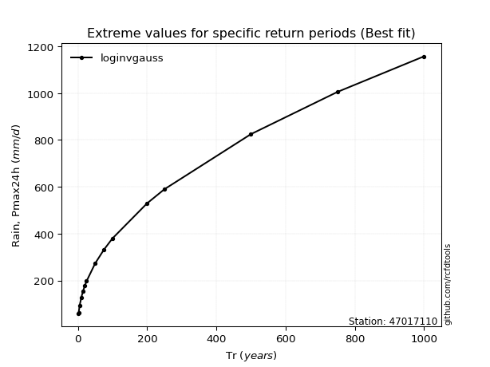</img>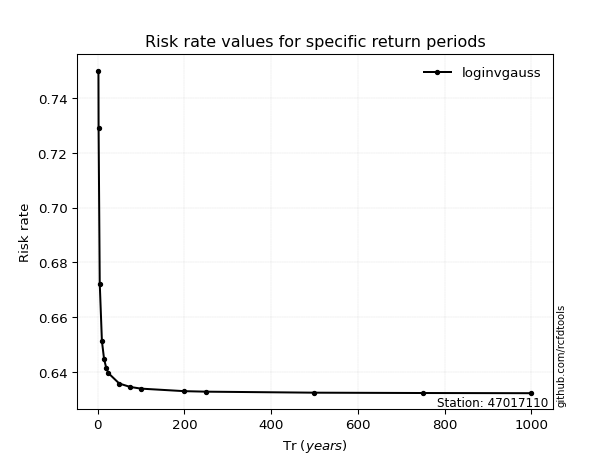</img>

</div>


<sub>**APP DISCLAIMER**: NO WARRANTY - This software is provided by [github.com/rcfdtools](https://github.com/rcfdtools) "as is", without any express or implied warranty, including warranties of merchantability, fitness for a particular purpose, or non-infringement. There is no guarantee that the software will be error-free or operate without interruption. LIMITATION OF LIABILITY - Neither the authors nor copyright holders will be liable for claims or damages arising from the software or its use. You are responsible for determining if the software is appropriate for your use and assume all associated risks, including errors, legal compliance, and data loss. NO PROFESSIONAL ADVICE - The software provides general information and does not offer professional advice. It should not replace consultation with professional advisors.</sub>