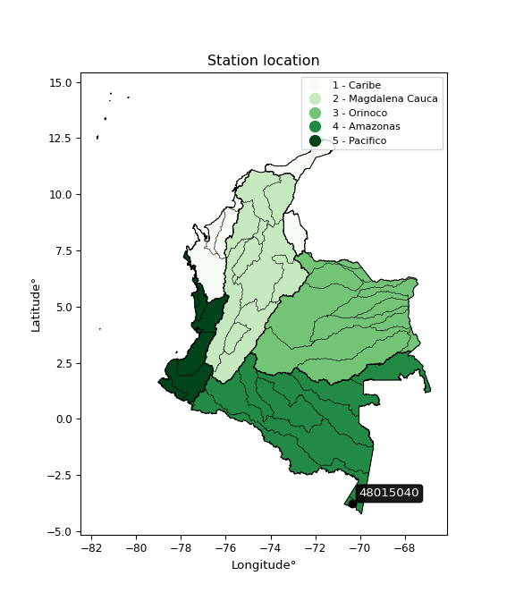

<div align="center">


</div>

# PMP Station (Rain, Pmax24h): 48015040

Probable Maximum Precipitation (PMP) is the greatest amount of rainfall for a specific duration that is meteorologically possible for a given location, acting as a "worst-case" scenario for extreme storms, crucial for designing safety-critical infrastructure like bridges, river deviations, dams, spillways, and nuclear plants to prevent catastrophic failure. PMP is calculated by hydrologists using meteorological data to determine the upper limit of extreme rainfall, often leading to the Probable Maximum Flood (PMF) for flood control design, and is increasingly being studied for climate change impacts. Probable Maximum Precipitation (PMP) is the theoretical upper limit of rainfall, a deterministic estimate for extreme events, while probability distributions (like GEV, Gumbel) describe the likelihood and frequency of various precipitation amounts, including rare ones, showing how often events occur, with PMP representing the extreme end of these distributions, used for critical infrastructure design to ensure safety against the worst conceivable weather, unlike standard statistical forecasts which cover typical probabilities.

The most common probability distributions in hydrology, used for analyzing floods, rainfall, and streamflow, include the Normal, Log-Normal, Gumbel, Gamma (including Log-Pearson Type III), and Generalized Extreme Value (GEV) distributions, often chosen based on the data´s skewness and whether modeling extremes or general conditions, with Gumbel and GEV popular for extreme events like floods, while the Normal distribution serves as a baseline, though often requiring transformations for skewed hydrological data. These distributions help in designing water infrastructure, managing water resources, and forecasting hydrologic events.

> Hydrological data often isn´t perfectly normal (it´s skewed), so different distributions are needed for different applications, such as: **Flood Frequency Analysis**: Using Gumbel, GEV, or Log-Pearson Type III for predicting extreme flood magnitudes and their return periods, **Rainfall Analysis**: Normal for annual totals, but Log-Normal, Weibull, or GEV for intensity or extreme daily rainfall, **Streamflow Modeling**: Gamma and Log-Normal for maximum flows, GEV for minimum flows, and Kappa for daily flows.

<div align="center">

</img>

</div>


## A. General information


### 1. General running parameters

• app_version: _v20260108_. • runtime: _2026-01-08 18:05:13.093906_. • Python version: _3.14.0_. • SciPy version: _1.16.3_. • Pandas version: _2.3.3_. • NumPy version: _2.3.5_. • Stations dataset (station_dataset_file): _dataset/pmax24h_in/automatic_colombia_2003_2024.csv_. • Stations catalog (station_catalog_file): _dataset/CNE.xls_. • Minimum year to eval til year_max (date_min): _1900_. • Maximum year to eval since year_min (date_max): _2024_. • Creates, save and include plots into reports (create_plot): _False_. • Plot only fit distributions with Δo > Δ (plot_only_fit): _True_. • Plot only simple graphs avoiding multiple CDFs and multiple Extreme values plots (plot_only_simple): _False_. • Eval low extreme values, if False, evaluates high extreme values (low_extreme): _False_. • Eval every SciPy distribution as logarithmic (pdist_logarithmic_on): _True_. • Standard deviation normalized (ddof): _1.0_. • Return periods to eval in years (Tr): _[2, 2.33, 5, 10, 15, 20, 25, 50, 75, 100, 200, 250, 500, 750, 1000]_. • Minimum data sample per station, 0 means any (minimum_sample): _5_. • Z-Score maximum threshold to adjust a value, 0 means disable (zscore_max): _3.5_. • Z-Score minimum threshold to adjust a value, 0 means disable (zscore_min): _-2.5_. • Avoid zeros, e.g. rain = 0 (avoid_zeros): _True_. • Avoid null values (avoid_nans): _True_. 

:file_folder:Table: [dataset.csv](../../dataset/pmax24h_in/automatic_colombia_2003_2024.csv)

> Delta Degrees of Freedom (DDOF): is a parameter used in the formulas for calculating variance and standard deviation. When ddof=0, the divisor is $N$ (the total number of observations) and this is used when your data set is the entire population. When ddof=1, the divisor is $N-1$ and this is used when your data set is a sample drawn from a larger population. Using $N-1$ provides an unbiased estimate of the population variance (known as Bessel´s correction).


### 2. Station info and location

|   id |   CODIGO | NOMBRE                   | CATEGORIA               | TECNOLOGIA                              | ESTADO   | FECHA_INSTALACION   |   FECHA_SUSPENSION |   ALTITUD |   LATITUD |   LONGITUD | DEPARTAMENTO   | MUNICIPIO     | AREA_OPERATIVA                            | ENTIDAD                                                     | AREA_HIDROGRAFICA   | ZONA_HIDROGRAFICA   | SUBZONA_HIDROGRAFICA       |   CORRIENTE | Catalogo   |   Version |
|-----:|---------:|:-------------------------|:------------------------|:----------------------------------------|:---------|:--------------------|-------------------:|----------:|----------:|-----------:|:---------------|:--------------|:------------------------------------------|:------------------------------------------------------------|:--------------------|:--------------------|:---------------------------|------------:|:-----------|----------:|
|    0 | 48015040 | PUERTO NARIÑO [48015040] | Climatológica Principal | Automática con Telemetría, Convencional | Activa   | 19/07/2005          |                nan |       158 |  -3.78015 |   -70.3624 | Amazonas       | Puerto Nariño | Area Operativa 11 - Cundinamarca-Amazonas | INSTITUTO DE HIDROLOGIA METEOROLOGIA Y ESTUDIOS AMBIENTALES | Amazonas            | Amazonas - Directos | Directos Río Amazonas (mi) |         nan | CNE_IDEAM  |  20251226 |

<div align="center">

Dynamic map: [:earth_americas:Google](http://maps.google.com/maps?q=-3.780152,-70.362447) [:earth_americas:OSM](https://www.openstreetmap.org/#map=18/-3.780152/-70.362447&layers=P) [:earth_americas:Bing](https://www.bing.com/maps?cp=-3.780152~-70.362447&lvl=18) [:earth_americas:Apple](https://maps.apple.com/frame?center=-3.780152%2C-70.362447&span=0.003%2C0.006)

</div>


<div align="center">

```geojson
{
  "type": "Feature",
  "geometry": {
    "type": "Point", 
    "coordinates": [-70.362447, -3.780152]
  }, 
  "properties": {
    "Name": "48015040"
  }
}
```

</div>


### 3. Discrete values table and plot

<div align="center">

|               |           0 |           1 |          2 |           3 |          4 |           5 |           6 |
|:--------------|------------:|------------:|-----------:|------------:|-----------:|------------:|------------:|
| Date          | 2017        | 2018        | 2019       | 2020        | 2021       | 2023        | 2024        |
| Value         |   62.5      |   89.8      |  563.8     |  344.4      |  135.1     |    7.7      |  108        |
| Value_initial |   62.5      |   89.8      |  563.8     |  344.4      |  135.1     |    7.7      |  108        |
| count         |    7        |    7        |    7       |    7        |    7       |    7        |    7        |
| mean          |  187.329    |  187.329    |  187.329   |  187.329    |  187.329   |  187.329    |  187.329    |
| std           |  196.97     |  196.97     |  196.97    |  196.97     |  196.97    |  196.97     |  196.97     |
| zscore        |   -0.633744 |   -0.495144 |    1.91131 |    0.797438 |   -0.26516 |   -0.911958 |   -0.402744 |


</div>


> The initial value (value_initial) correspond to the initial obtained or null completed value, and value (value) is adjusted only when the initial value is outside the valid range (outlier) definite through the Z-Score value. If Z-Score is active, values out of range or outliers are replaced with the station mean value. A Z-Score (or standard score) measures how many standard deviations a data point is from the mean of a dataset, indicating its relative position; positive scores mean above the mean, negative mean below, and a score of zero is exactly at the mean, allowing for comparison of values from different distributions. It´s calculated using the formula $z=(x–μ)/σ$, where $x$ is the data point, $μ$ is the mean, and $σ$ is the standard deviation, helping identify outliers and understand probability.
>
> <sub>**Note**: In this study, "completing" (filling gaps in) and "extending" (forecasting or lengthening the historical record) rainfall data series are avoided for certain critical analyses because they introduce artificial bias and uncertainty, which can distort the statistics of rare events (extremes), alter day-to-day variability, and compromise the integrity and homogeneity of the original data. Some reasons against Completing/Extending rainfall data are: **Distortion of Extremes and Variability**: The primary issue is that most gap-filling or extension methods rely on averaging or regression with nearby stations, which inherently smooths the data. Rainfall is highly variable in space and time, with a large percentage of zero values and occasional large storms. Infilling methods often underestimate the highest values and overestimate the lowest (zero) values, which severely distorts analyses focused on flood frequency, drought severity, and intensity-duration-frequency (IDF) curves, **Loss of Data Homogeneity**: Infilled or extended data are synthetic estimates, not actual measurements. Combining these estimates with observed data can violate the assumption of data homogeneity, which requires that the data properties do not change over time. Inhomogeneity can lead to incorrect conclusions about long-term trends or changes in climate patterns, **Propagation of Errors**: Errors and biases from the original data (e.g., wind-induced undercatch, instrument errors, site changes) or the data used for imputation can propagate through the analysis, leading to unreliable hydrological models and inaccurate predictions, **Compromised Statistical Integrity**: For statistical analyses, especially those involving the frequency of events, using artificial data can introduce time bias or autocorrelation that doesn´t exist in reality, making it difficult to assess the true probability of events, **Difficulty in Validation**: It is difficult to accurately validate the quality of filled or extended data, especially for past periods where ground-truth measurements are unavailable. The reliability of imputation techniques heavily depends on the density of the surrounding station network and the complexity of the local topography.</sub>


### 4. Active continuous probability distributions from SciPy (43 of 104 available)

A Probability Density Function (PDF) describes the relative likelihood of a continuous random variable falling within a specific range, where the total area under its curve equals 1, and the area over any interval gives the actual probability for that range. Unlike discrete probabilities (like rolling a die), a PDF shows density, not direct probability for a single point (which is zero), with higher points indicating higher likelihood, often visualized as a bell curve for normal distributions.

A log of a probability density function (log-PDF) is simply the logarithm of the PDF´s value, denoted as $log(f(x))$, useful for converting multiplication of probabilities into addition, improving numerical stability with tiny numbers, and connecting to information theory concepts like entropy. Instead of dealing with very small probabilities (e.g., 0.000001), log-PDFs use negative numbers (e.g., $log(0.00001) ≈ -11.51$ that are easier for computers to handle, preventing underflow errors and simplifying complex calculations. In this study, each active probability distribution from SciPy is also evaluated in the $log$ form.

[scipy.stats](https://docs.scipy.org/doc/scipy/reference/stats.html) is a Python´s powerful submodule within the SciPy library for comprehensive statistical analysis, offering over 130 probability distributions (like Normal, Poisson), functions for descriptive stats (mean, variance), hypothesis testing (t-tests, chi-square), random variable generation, and statistical tests, making it essential for data science, modeling, and research. It provides tools to explore, model, and draw conclusions from data efficiently, working seamlessly with NumPy.

<div align="center">

|   id | p_dist             |   n_parameter | fit_method   | label                                                                       | active   | ref                                                                                                        |
|-----:|:-------------------|--------------:|:-------------|:----------------------------------------------------------------------------|:---------|:-----------------------------------------------------------------------------------------------------------|
|    0 | alpha              |             3 | MLE          | Alpha                                                                       | True     | [:mortar_board:](https://docs.scipy.org/doc/scipy/reference/generated/scipy.stats.alpha.html)              |
|    1 | betaprime          |             4 | MLE          | Beta prime                                                                  | True     | [:mortar_board:](https://docs.scipy.org/doc/scipy/reference/generated/scipy.stats.betaprime.html)          |
|    2 | chi2               |             3 | MLE          | Chi²                                                                        | True     | [:mortar_board:](https://docs.scipy.org/doc/scipy/reference/generated/scipy.stats.chi2.html)               |
|    3 | crystalball        |             4 | MLE          | Crystalball                                                                 | True     | [:mortar_board:](https://docs.scipy.org/doc/scipy/reference/generated/scipy.stats.crystalball.html)        |
|    4 | erlang             |             3 | MLE          | Erlang                                                                      | True     | [:mortar_board:](https://docs.scipy.org/doc/scipy/reference/generated/scipy.stats.erlang.html)             |
|    5 | expon              |             2 | MLE          | Exponential                                                                 | True     | [:mortar_board:](https://docs.scipy.org/doc/scipy/reference/generated/scipy.stats.expon.html)              |
|    6 | exponnorm          |             3 | MLE          | Exponentially modified Normal                                               | True     | [:mortar_board:](https://docs.scipy.org/doc/scipy/reference/generated/scipy.stats.exponnorm.html)          |
|    7 | f                  |             4 | MLE          | F                                                                           | True     | [:mortar_board:](https://docs.scipy.org/doc/scipy/reference/generated/scipy.stats.f.html)                  |
|    8 | fatiguelife        |             3 | MLE          | Fatigue-life (Birnbaum-Saunders)                                            | True     | [:mortar_board:](https://docs.scipy.org/doc/scipy/reference/generated/scipy.stats.fatiguelife.html)        |
|    9 | fisk               |             3 | MLE          | Fisk                                                                        | True     | [:mortar_board:](https://docs.scipy.org/doc/scipy/reference/generated/scipy.stats.fisk.html)               |
|   10 | gamma              |             3 | MLE          | Gamma                                                                       | True     | [:mortar_board:](https://docs.scipy.org/doc/scipy/reference/generated/scipy.stats.gamma.html)              |
|   11 | genexpon           |             5 | MLE          | Generalized exponential                                                     | True     | [:mortar_board:](https://docs.scipy.org/doc/scipy/reference/generated/scipy.stats.genexpon.html)           |
|   12 | genlogistic        |             3 | MLE          | Generalized logistic                                                        | True     | [:mortar_board:](https://docs.scipy.org/doc/scipy/reference/generated/scipy.stats.genlogistic.html)        |
|   13 | gibrat             |             2 | MM           | Gibrat                                                                      | True     | [:mortar_board:](https://docs.scipy.org/doc/scipy/reference/generated/scipy.stats.gibrat.html)             |
|   14 | gompertz           |             3 | MLE          | Gompertz (or truncated Gumbel)                                              | True     | [:mortar_board:](https://docs.scipy.org/doc/scipy/reference/generated/scipy.stats.gompertz.html)           |
|   15 | gumbel_l           |             2 | MM           | Gumbel Left Skew                                                            | True     | [:mortar_board:](https://docs.scipy.org/doc/scipy/reference/generated/scipy.stats.gumbel_l.html)           |
|   16 | gumbel_r           |             2 | MM           | Gumbel Right Skew                                                           | True     | [:mortar_board:](https://docs.scipy.org/doc/scipy/reference/generated/scipy.stats.gumbel_r.html)           |
|   17 | halflogistic       |             2 | MM           | Half-logistic                                                               | True     | [:mortar_board:](https://docs.scipy.org/doc/scipy/reference/generated/scipy.stats.halflogistic.html)       |
|   18 | halfnorm           |             2 | MM           | Half Normal                                                                 | True     | [:mortar_board:](https://docs.scipy.org/doc/scipy/reference/generated/scipy.stats.halfnorm.html)           |
|   19 | hypsecant          |             2 | MM           | hyperbolic secant                                                           | True     | [:mortar_board:](https://docs.scipy.org/doc/scipy/reference/generated/scipy.stats.hypsecant.html)          |
|   20 | invgamma           |             3 | MLE          | Inverted gamma                                                              | True     | [:mortar_board:](https://docs.scipy.org/doc/scipy/reference/generated/scipy.stats.invgamma.html)           |
|   21 | invgauss           |             3 | MLE          | Inverse Gaussian                                                            | True     | [:mortar_board:](https://docs.scipy.org/doc/scipy/reference/generated/scipy.stats.invgauss.html)           |
|   22 | invweibull         |             3 | MLE          | Inverted Weibull                                                            | True     | [:mortar_board:](https://docs.scipy.org/doc/scipy/reference/generated/scipy.stats.invweibull.html)         |
|   23 | kstwobign          |             2 | MLE          | Limiting distribution of scaled Kolmogorov-Smirnov two-sided test statistic | True     | [:mortar_board:](https://docs.scipy.org/doc/scipy/reference/generated/scipy.stats.kstwobign.html)          |
|   24 | laplace            |             2 | MM           | Laplace                                                                     | True     | [:mortar_board:](https://docs.scipy.org/doc/scipy/reference/generated/scipy.stats.laplace.html)            |
|   25 | laplace_asymmetric |             3 | MLE          | Asymmetric Laplace                                                          | True     | [:mortar_board:](https://docs.scipy.org/doc/scipy/reference/generated/scipy.stats.laplace_asymmetric.html) |
|   26 | loggamma           |             3 | MLE          | Log gamma                                                                   | True     | [:mortar_board:](https://docs.scipy.org/doc/scipy/reference/generated/scipy.stats.loggamma.html)           |
|   27 | logistic           |             2 | MM           | Logistic (or Sech-squared)                                                  | True     | [:mortar_board:](https://docs.scipy.org/doc/scipy/reference/generated/scipy.stats.logistic.html)           |
|   28 | lognorm            |             3 | MLE          | Log Normal                                                                  | True     | [:mortar_board:](https://docs.scipy.org/doc/scipy/reference/generated/scipy.stats.lognorm.html)            |
|   29 | maxwell            |             2 | MM           | Maxwell                                                                     | True     | [:mortar_board:](https://docs.scipy.org/doc/scipy/reference/generated/scipy.stats.maxwell.html)            |
|   30 | mielke             |             4 | MLE          | Mielke Beta-Kappa / Dagum                                                   | True     | [:mortar_board:](https://docs.scipy.org/doc/scipy/reference/generated/scipy.stats.mielke.html)             |
|   31 | moyal              |             2 | MM           | Moyal                                                                       | True     | [:mortar_board:](https://docs.scipy.org/doc/scipy/reference/generated/scipy.stats.moyal.html)              |
|   32 | nakagami           |             3 | MLE          | Nakagami                                                                    | True     | [:mortar_board:](https://docs.scipy.org/doc/scipy/reference/generated/scipy.stats.nakagami.html)           |
|   33 | ncf                |             5 | MLE          | Non-central F distribution                                                  | True     | [:mortar_board:](https://docs.scipy.org/doc/scipy/reference/generated/scipy.stats.ncf.html)                |
|   34 | nct                |             4 | MLE          | Non-central Student’s t                                                     | True     | [:mortar_board:](https://docs.scipy.org/doc/scipy/reference/generated/scipy.stats.nct.html)                |
|   35 | norm               |             2 | MM           | Normal                                                                      | True     | [:mortar_board:](https://docs.scipy.org/doc/scipy/reference/generated/scipy.stats.norm.html)               |
|   36 | pearson3           |             3 | MM           | Pearson type III                                                            | True     | [:mortar_board:](https://docs.scipy.org/doc/scipy/reference/generated/scipy.stats.pearson3.html)           |
|   37 | rayleigh           |             2 | MM           | Rayleigh                                                                    | True     | [:mortar_board:](https://docs.scipy.org/doc/scipy/reference/generated/scipy.stats.rayleigh.html)           |
|   38 | rice               |             3 | MLE          | Rice                                                                        | True     | [:mortar_board:](https://docs.scipy.org/doc/scipy/reference/generated/scipy.stats.rice.html)               |
|   39 | t                  |             3 | MLE          | Student’s t                                                                 | True     | [:mortar_board:](https://docs.scipy.org/doc/scipy/reference/generated/scipy.stats.t.html)                  |
|   40 | truncnorm          |             4 | MLE          | Truncated normal                                                            | True     | [:mortar_board:](https://docs.scipy.org/doc/scipy/reference/generated/scipy.stats.truncnorm.html)          |
|   41 | wald               |             2 | MM           | Wald                                                                        | True     | [:mortar_board:](https://docs.scipy.org/doc/scipy/reference/generated/scipy.stats.wald.html)               |
|   42 | weibull_min        |             3 | MLE          | Weibull minimum                                                             | True     | [:mortar_board:](https://docs.scipy.org/doc/scipy/reference/generated/scipy.stats.weibull_min.html)        |

</div>

> **n_parameter:** # arguments & localization & scale.
>
> **Fit methods:** (MLE) maximum likelihood, (MM) L-moments.
>
>**Inactive** (With the only purpose of prevent loops, zero divisions, infinite values, over high estimated values or horizontal trending for recurrence intervals estimations, the follow distributions were disabled.)**:** foldnorm, gennorm, norminvgauss, powernorm, powerlognorm, skewnorm, genextreme, anglit, arcsine, argus, beta, bradford, burr, burr12, cauchy, cosine, halfcauchy, foldcauchy, skewcauchy, wrapcauchy, dgamma, gengamma, exponweib, exponpow, truncexpon, gausshyper, genhalflogistic, genhyperbolic, geninvgauss, halfgennorm, johnsonsb, johnsonsu, kappa4, kappa3, ksone, kstwo, loglaplace, levy, levy_l, levy_stable, ncx2, pareto, genpareto, truncpareto, lomax, powerlaw, rdist, rel_breitwigner, recipinvgauss, semicircular, studentized_range, trapezoid, triang, truncweibull_min, tukeylambda, uniform, loguniform, vonmises, vonmises_line, weibull_max, dweibull, 


## B. Probability (PDF) vs. Empirical (EDF) distributions functions

A continuous probability distribution (CPD) describes probabilities for variables that can take any value within a range (like rain any time), unlike discrete variables with specific outcomes (like temperature). It uses a Probability Density Function (PDF), a curve where the total area under it equals 1, and the probability of the variable falling within an interval (a to b) is found by calculating the area under the curve between those points. A key feature is that the probability of hitting any single exact value is zero, so probabilities are always expressed for ranges, e.g., $P(a ≤ X ≤ b)$.

<div align="center">

Distributions parameters from station values
|    |   station | p_dist                |   n |              loc |           scale | shape                  | shape1             | shape2                | shape3   |
|---:|----------:|:----------------------|----:|-----------------:|----------------:|:-----------------------|:-------------------|:----------------------|:---------|
|  0 |  48015040 | alpha                 |   7 |     -0.0517295   |    20.2339      | 2.5567371150586224e-11 |                    |                       |          |
|  1 |  48015040 | betaprime             |   7 |      7.7         |  1630.3         | 0.6418283666099317     | 7.554491877394234  |                       |          |
|  2 |  48015040 | chi2                  |   7 |      7.7         |   108.985       | 1.4767238439984856     |                    |                       |          |
|  3 |  48015040 | crystalball           |   7 |     12.5314      |   225.636       | 109.07290060235619     | 23.36430394633772  |                       |          |
|  4 |  48015040 | erlang                |   7 |      7.7         |   185.407       | 0.7172712768808305     |                    |                       |          |
|  5 |  48015040 | expon                 |   7 |      7.7         |   179.629       |                        |                    |                       |          |
|  6 |  48015040 | exponnorm             |   7 |      7.47418     |     0.0659403   | 2716.977974121479      |                    |                       |          |
|  7 |  48015040 | f                     |   7 |      7.7         |   180.607       | 1.5826455365583485     | 331.5737375672634  |                       |          |
|  8 |  48015040 | fatiguelife           |   7 |    -18.4155      |   134.648       | 1.0215455710936916     |                    |                       |          |
|  9 |  48015040 | fisk                  |   7 |     -4.23323     |   120.623       | 1.5489887034453473     |                    |                       |          |
| 10 |  48015040 | gamma                 |   7 |      7.7         |   126.757       | 0.4434321848631611     |                    |                       |          |
| 11 |  48015040 | genexpon              |   7 |      7.7         |   267.027       | 1.4865568787820198     | 0.5681404614063832 | 3.363136244796505e-10 |          |
| 12 |  48015040 | genlogistic           |   7 |   -780.79        |   117.023       | 2003.0539053285065     |                    |                       |          |
| 13 |  48015040 | gibrat                |   7 |     48.2117      |    84.3786      |                        |                    |                       |          |
| 14 |  48015040 | gompertz              |   7 |      7.7         |     1.29905e+10 | 73343544.62701291      |                    |                       |          |
| 15 |  48015040 | gumbel_l              |   7 |    269.4         |   142.185       |                        |                    |                       |          |
| 16 |  48015040 | gumbel_r              |   7 |    105.257       |   142.185       |                        |                    |                       |          |
| 17 |  48015040 | halflogistic          |   7 |    -28.8091      |   155.91        |                        |                    |                       |          |
| 18 |  48015040 | halfnorm              |   7 |    -54.0432      |   302.515       |                        |                    |                       |          |
| 19 |  48015040 | hypsecant             |   7 |    187.329       |   116.093       |                        |                    |                       |          |
| 20 |  48015040 | invgamma              |   7 |    -56.3697      |   360.477       | 2.383069623391868      |                    |                       |          |
| 21 |  48015040 | invgauss              |   7 |    -29.2181      |   220.107       | 0.9838241023096077     |                    |                       |          |
| 22 |  48015040 | invweibull            |   7 |    -92.8265      |   176.519       | 2.058965648289544      |                    |                       |          |
| 23 |  48015040 | kstwobign             |   7 |   -318.263       |   584.907       |                        |                    |                       |          |
| 24 |  48015040 | laplace               |   7 |    187.329       |   128.947       |                        |                    |                       |          |
| 25 |  48015040 | laplace_asymmetric    |   7 |     62.5         |    81.267       | 0.4928761231242478     |                    |                       |          |
| 26 |  48015040 | loggamma              |   7 | -54770.5         |  7446.65        | 1604.399453560347      |                    |                       |          |
| 27 |  48015040 | logistic              |   7 |    187.329       |   100.54        |                        |                    |                       |          |
| 28 |  48015040 | lognorm               |   7 |      7.7         |     0.514634    | 13.897852538347971     |                    |                       |          |
| 29 |  48015040 | maxwell               |   7 |   -244.786       |   270.787       |                        |                    |                       |          |
| 30 |  48015040 | mielke                |   7 |      7.60313     |   180.889       | 0.6801961027453117     | 1.869192779386334  |                       |          |
| 31 |  48015040 | moyal                 |   7 |     83.044       |    82.0904      |                        |                    |                       |          |
| 32 |  48015040 | nakagami              |   7 |      7.7         |   378.306       | 0.16336220407531904    |                    |                       |          |
| 33 |  48015040 | ncf                   |   7 |     -1.09764     |   135.091       | 1.9896964864403976     | 49.18160161953608  | 0.6694922159241381    |          |
| 34 |  48015040 | nct                   |   7 |     -0.111975    |    53.5406      | 1.558313860773691      | 1.7807442150525237 |                       |          |
| 35 |  48015040 | norm                  |   7 |    187.329       |   182.359       |                        |                    |                       |          |
| 36 |  48015040 | pearson3              |   7 |    187.329       |   182.359       | 1.12891131687946       |                    |                       |          |
| 37 |  48015040 | rayleigh              |   7 |   -161.535       |   278.353       |                        |                    |                       |          |
| 38 |  48015040 | rice                  |   7 |    -92.465       |   236.156       | 0.0010701721553599084  |                    |                       |          |
| 39 |  48015040 | t                     |   7 |     95.9132      |    44.9904      | 0.881053486284221      |                    |                       |          |
| 40 |  48015040 | truncnorm             |   7 | -11321.9         |  1471.45        | 7.699623482229256      | 611.08449111755    |                       |          |
| 41 |  48015040 | wald                  |   7 |      4.96965     |   182.359       |                        |                    |                       |          |
| 42 |  48015040 | weibull_min           |   7 |      7.7         |   236.551       | 0.5880570518205881     |                    |                       |          |
| 43 |  48015040 | logalpha              |   7 |    -29.5253      |   868.883       | 25.500226314841612     |                    |                       |          |
| 44 |  48015040 | logbetaprime          |   7 |    -22.6312      |   381.967       | 462.50083407699276     | 6479.683019208551  |                       |          |
| 45 |  48015040 | logchi2               |   7 |      2.04122     |     1.1809      | 1.205735948534186      |                    |                       |          |
| 46 |  48015040 | logcrystalball        |   7 |      4.63409     |     1.27713     | 18.09701451114195      | 20396.6342310708   |                       |          |
| 47 |  48015040 | logerlang             |   7 |    -17.2413      |     0.0791868   | 276.19586233379687     |                    |                       |          |
| 48 |  48015040 | logexpon              |   7 |      2.04122     |     2.59287     |                        |                    |                       |          |
| 49 |  48015040 | logexponnorm          |   7 |      4.63302     |     1.27713     | 0.0008514554000159786  |                    |                       |          |
| 50 |  48015040 | logf                  |   7 |   -211.784       |   216.404       | 86119.1192166318       | 162545.79963327874 |                       |          |
| 51 |  48015040 | logfatiguelife        |   7 |   -563.472       |   568.098       | 0.002244294071470019   |                    |                       |          |
| 52 |  48015040 | logfisk               |   7 |     -6.52364e+07 |     6.52364e+07 | 93127766.75335415      |                    |                       |          |
| 53 |  48015040 | loggamma              |   7 |    -17.9617      |     0.0774176   | 292.0030554838553      |                    |                       |          |
| 54 |  48015040 | loggenexpon           |   7 |      2.0396      |     3.02264     | 0.3716597054202534     | 24.719070050939436 | 0.059231361971114116  |          |
| 55 |  48015040 | loggenlogistic        |   7 |      5.42044     |     0.48984     | 0.4613402257019224     |                    |                       |          |
| 56 |  48015040 | loggibrat             |   7 |      3.65984     |     0.590921    |                        |                    |                       |          |
| 57 |  48015040 | loggompertz           |   7 |      2.04122     |     1.20407     | 0.08140044270705907    |                    |                       |          |
| 58 |  48015040 | loggumbel_l           |   7 |      5.20887     |     0.995774    |                        |                    |                       |          |
| 59 |  48015040 | loggumbel_r           |   7 |      4.05931     |     0.995774    |                        |                    |                       |          |
| 60 |  48015040 | loghalflogistic       |   7 |      3.12036     |     1.09192     |                        |                    |                       |          |
| 61 |  48015040 | loghalfnorm           |   7 |      2.94364     |     2.11866     |                        |                    |                       |          |
| 62 |  48015040 | loghypsecant          |   7 |      4.63409     |     0.813046    |                        |                    |                       |          |
| 63 |  48015040 | loginvgamma           |   7 |    -21.8313      | 10639           | 403.27227618270035     |                    |                       |          |
| 64 |  48015040 | loginvgauss           |   7 |     -7.58679     |   946.613       | 0.012887230902357025   |                    |                       |          |
| 65 |  48015040 | loginvweibull         |   7 |     -1.82087e+08 |     1.82087e+08 | 129492659.50918114     |                    |                       |          |
| 66 |  48015040 | logkstwobign          |   7 |     -1.08883     |     6.55004     |                        |                    |                       |          |
| 67 |  48015040 | loglaplace            |   7 |      4.63409     |     0.903067    |                        |                    |                       |          |
| 68 |  48015040 | loglaplace_asymmetric |   7 |      4.68213     |     0.914602    | 1.0266063268262466     |                    |                       |          |
| 69 |  48015040 | logloggamma           |   7 |      5.30442     |     0.979891    | 0.9380051685257687     |                    |                       |          |
| 70 |  48015040 | loglogistic           |   7 |      4.63409     |     0.704119    |                        |                    |                       |          |
| 71 |  48015040 | loglognorm            |   7 |      2.04122     |     0.016113    | 12.748549457609595     |                    |                       |          |
| 72 |  48015040 | logmaxwell            |   7 |      1.60783     |     1.89643     |                        |                    |                       |          |
| 73 |  48015040 | logmielke             |   7 |      1.41746     |     4.92401     | 1.7512886900172306     | 4139.1051675374365 |                       |          |
| 74 |  48015040 | logmoyal              |   7 |      3.90374     |     0.574911    |                        |                    |                       |          |
| 75 |  48015040 | lognakagami           |   7 |      4.13517     |     1.11679     | 0.34438221920803314    |                    |                       |          |
| 76 |  48015040 | logncf                |   7 |     -0.132779    |     5.96701e-08 | 7.969874991644098e-07  | 123.61195903412181 | 62.936820337538684    |          |
| 77 |  48015040 | lognct                |   7 |     68.8551      |     1.26628     | 78917.32148228935      | -50.71533749742308 |                       |          |
| 78 |  48015040 | lognorm               |   7 |      4.63409     |     1.27713     |                        |                    |                       |          |
| 79 |  48015040 | logpearson3           |   7 |      4.63409     |     1.27713     | -0.7447063301390853    |                    |                       |          |
| 80 |  48015040 | lograyleigh           |   7 |      2.19086     |     1.94942     |                        |                    |                       |          |
| 81 |  48015040 | logrice               |   7 |      1.0946      |     1.36224     | 2.3727589662216255     |                    |                       |          |
| 82 |  48015040 | logt                  |   7 |      4.63409     |     1.27713     | 14623886665.193195     |                    |                       |          |
| 83 |  48015040 | logtruncnorm          |   7 |      4.45106     |     1.45296     | -1.6585756378566492    | 33.8352346009314   |                       |          |
| 84 |  48015040 | logwald               |   7 |      3.35688     |     1.27719     |                        |                    |                       |          |
| 85 |  48015040 | logweibull_min        |   7 |    -58.846       |    64.0615      | 62.45378917508497      |                    |                       |          |

</div>

> **loc** (Location parameter): This shifts the distribution along the x-axis. For many common distributions, like the normal (Gaussian) distribution, loc represents the mean $μ$. For others, like the uniform distribution, it might represent the minimum value, or for the beta distribution, the left end of the support interval.
>
> **scale** (Scale parameter): This determines the width or spread of the distribution. For the normal distribution, scale represents the standard deviation $σ$. For a uniform distribution, it defines the length of the interval (from $loc$ to $loc + scale$).
>
> **shape** (Shape parameters): Refers to parameters that define the specific form of a probability distribution, distinct from its location (loc) and scale (scale). These parameters are required arguments for most distribution functions. For example, a normal (Gaussian) distribution is fully defined by its location (mean) and scale (standard deviation), so it has no specific shape parameters beyond loc and scale. However, other distributions have intrinsic properties that need specification, as Gamma distribution that takes a shape parameter, often named $a$ or $alpha$.


### 0. Cumulative distribution values - CDF (86 evaluated)

Cumulative Distribution Function (CDF), denoted as $F$<sub>$X$</sub>$(x)$, is a function that gives the probability that a random variable $X$ will take a value less than or equal to a specific value, $x$ (i.e., $(P(X≥x)$. It essentially "accumulates" probabilities from a given point up to the far right (positive infinity), providing a complete picture of the distribution´s probabilities for both discrete (like rain) and continuous (like temperature) variables, helping to find probabilities over ranges or above certain values. Each station is evaluated separately ordering the $x$ values ascending, calculating the CDF and PDF values for the activated distributions and their logarithmic forms.

<div align="center">

CDF ordered by x ascending and calculating $log(f(x))$ separately
|   id |   Station |   date |     x |   count |    mean |    std |    zscore |   Value_initial |   station |   m |      alpha |   alpha_pdf |   betaprime |   betaprime_pdf |        chi2 |      chi2_pdf |   crystalball |   crystalball_pdf |      erlang |   erlang_pdf |    expon |   expon_pdf |   exponnorm |   exponnorm_pdf |           f |       f_pdf |   fatiguelife |   fatiguelife_pdf |      fisk |    fisk_pdf |       gamma |   gamma_pdf |    genexpon |   genexpon_pdf |   genlogistic |   genlogistic_pdf |    gibrat |   gibrat_pdf |    gompertz |   gompertz_pdf |   gumbel_l |   gumbel_l_pdf |   gumbel_r |   gumbel_r_pdf |   halflogistic |   halflogistic_pdf |   halfnorm |   halfnorm_pdf |   hypsecant |   hypsecant_pdf |   invgamma |   invgamma_pdf |   invgauss |   invgauss_pdf |   invweibull |   invweibull_pdf |   kstwobign |   kstwobign_pdf |   laplace |   laplace_pdf |   laplace_asymmetric |   laplace_asymmetric_pdf |   loggamma |   loggamma_pdf |   logistic |   logistic_pdf |   lognorm |   lognorm_pdf |   maxwell |   maxwell_pdf |    mielke |   mielke_pdf |    moyal |   moyal_pdf |    nakagami |   nakagami_pdf |       ncf |     ncf_pdf |       nct |     nct_pdf |     norm |    norm_pdf |   pearson3 |   pearson3_pdf |   rayleigh |   rayleigh_pdf |      rice |   rice_pdf |        t |       t_pdf |   truncnorm |   truncnorm_pdf |        wald |    wald_pdf |   weibull_min |   weibull_min_pdf |   logalpha |   logalpha_pdf |   logbetaprime |   logbetaprime_pdf |     logchi2 |    logchi2_pdf |   logcrystalball |   logcrystalball_pdf |   logerlang |   logerlang_pdf |   logexpon |   logexpon_pdf |   logexponnorm |   logexponnorm_pdf |      logf |   logf_pdf |   logfatiguelife |   logfatiguelife_pdf |   logfisk |   logfisk_pdf |   loggenexpon |   loggenexpon_pdf |   loggenlogistic |   loggenlogistic_pdf |   loggibrat |   loggibrat_pdf |   loggompertz |   loggompertz_pdf |   loggumbel_l |   loggumbel_l_pdf |   loggumbel_r |   loggumbel_r_pdf |   loghalflogistic |   loghalflogistic_pdf |   loghalfnorm |   loghalfnorm_pdf |   loghypsecant |   loghypsecant_pdf |   loginvgamma |   loginvgamma_pdf |   loginvgauss |   loginvgauss_pdf |   loginvweibull |   loginvweibull_pdf |   logkstwobign |   logkstwobign_pdf |   loglaplace |   loglaplace_pdf |   loglaplace_asymmetric |   loglaplace_asymmetric_pdf |   logloggamma |   logloggamma_pdf |   loglogistic |   loglogistic_pdf |   loglognorm |   loglognorm_pdf |   logmaxwell |   logmaxwell_pdf |   logmielke |   logmielke_pdf |    logmoyal |   logmoyal_pdf |   lognakagami |   lognakagami_pdf |     logncf |   logncf_pdf |    lognct |   lognct_pdf |   logpearson3 |   logpearson3_pdf |   lograyleigh |   lograyleigh_pdf |   logrice |   logrice_pdf |      logt |   logt_pdf |   logtruncnorm |   logtruncnorm_pdf |   logwald |   logwald_pdf |   logweibull_min |   logweibull_min_pdf |
|-----:|----------:|-------:|------:|--------:|--------:|-------:|----------:|----------------:|----------:|----:|-----------:|------------:|------------:|----------------:|------------:|--------------:|--------------:|------------------:|------------:|-------------:|---------:|------------:|------------:|----------------:|------------:|------------:|--------------:|------------------:|----------:|------------:|------------:|------------:|------------:|---------------:|--------------:|------------------:|----------:|-------------:|------------:|---------------:|-----------:|---------------:|-----------:|---------------:|---------------:|-------------------:|-----------:|---------------:|------------:|----------------:|-----------:|---------------:|-----------:|---------------:|-------------:|-----------------:|------------:|----------------:|----------:|--------------:|---------------------:|-------------------------:|-----------:|---------------:|-----------:|---------------:|----------:|--------------:|----------:|--------------:|----------:|-------------:|---------:|------------:|------------:|---------------:|----------:|------------:|----------:|------------:|---------:|------------:|-----------:|---------------:|-----------:|---------------:|----------:|-----------:|---------:|------------:|------------:|----------------:|------------:|------------:|--------------:|------------------:|-----------:|---------------:|---------------:|-------------------:|------------:|---------------:|-----------------:|---------------------:|------------:|----------------:|-----------:|---------------:|---------------:|-------------------:|----------:|-----------:|-----------------:|---------------------:|----------:|--------------:|--------------:|------------------:|-----------------:|---------------------:|------------:|----------------:|--------------:|------------------:|--------------:|------------------:|--------------:|------------------:|------------------:|----------------------:|--------------:|------------------:|---------------:|-------------------:|--------------:|------------------:|--------------:|------------------:|----------------:|--------------------:|---------------:|-------------------:|-------------:|-----------------:|------------------------:|----------------------------:|--------------:|------------------:|--------------:|------------------:|-------------:|-----------------:|-------------:|-----------------:|------------:|----------------:|------------:|---------------:|--------------:|------------------:|-----------:|-------------:|----------:|-------------:|--------------:|------------------:|--------------:|------------------:|----------:|--------------:|----------:|-----------:|---------------:|-------------------:|----------:|--------------:|-----------------:|---------------------:|
|    0 |  48015040 |   2023 |   7.7 |       7 | 187.329 | 196.97 | -0.911958 |             7.7 |  48015040 |   1 | 0.00904776 | 0.00890671  | 1.09377e-06 |     7.27477     | 1.57705e-13 | 131.103       |      0.491458 |       0.00176767  | 4.14118e-13 | 334.431      | 0        | 0.00556704  |   0.0012596 |     0.0055729   | 2.62269e-08 | 0.379561    |      0.036595 |       0.00407213  | 0.0270317 | 0.00341399  | 2.79155e-08 | 1.39371e+07 | 3.98951e-13 |    0.00556707  |     0.0932495 |       0.00188938  | 0         |  0           | 9.08966e-12 |    0.00564595  |   0.146772 |    0.000952503 |   0.137241 |    0.00191696  |       0.116552 |        0.00316341  |   0.161724 |     0.00258314 |    0.133498 |     0.0011165   |  0.0403152 |    0.00280732  |  0.0376873 |    0.00339261  |    0.0412776 |      0.00269479  |   0.0846915 |     0.00180437  |  0.12416  |   0.000962872 |            0.0497573 |              0.00124224  |  0.0212192 |      0.0417644 |   0.143485 |    0.00122237  | 0.0211666 |     0.0397768 |  0.167193 |   0.0016586   | 0.0059558 |  0.0418182   | 0.11357  | 0.00219898  | 1.39196e-06 |    5.12044e+08 | 0.0460761 | 0.00509407  | 0.0493945 | 0.00175674  | 0.162305 | 0.00134676  |   0.142768 |    0.00214905  |   0.168749 |    0.00181564  | 0.0860237 | 0.00164155 | 0.162652 | 0.00142101  |    0        |     0.00531817  | 8.15218e-16 | 1.01139e-14 |   5.66052e-11 |   37477.9         |  0.0214222 |      0.0447488 |      0.0211116 |          0.0414708 | 3.69977e-10 | 502257         |        0.0211666 |            0.0397768 |   0.0211706 |       0.0420043 |   0        |      0.385673  |      0.0211661 |           0.039776 | 0.0222581 |  0.0415366 |         0.021087 |            0.0398988 | 0.0206955 |     0.0289323 |   0.000198849 |          0.123193 |        0.0414581 |            0.0390066 |    0        |       0         |   8.80947e-11 |         0.0676044 |     0.0406895 |         0.0400193 |   0.000506154 |        0.00385734 |          0        |             0         |      0        |          0        |      0.0262201 |          0.0322128 |     0.0198217 |         0.0417992 |      0.020838 |         0.0462667 |       0.0203545 |           0.0563732 |       0.023632 |          0.0740285 |     0.028316 |        0.0313554 |               0.0308106 |                   0.0328144 |     0.0443331 |         0.0416594 |     0.0245442 |         0.0340024 |   0.00716083 |      3.51171e+12 |   0.00312509 |        0.0214069 |   0.0268267 |       0.0753194 | 4.36588e-07 |    1.00466e-05 |   0           |          0        | 0.00950207 |    0.0310588 | 0.0211497 |    0.0397149 |     0.0370126 |          0.043729 |      0        |          0        | 0.0175333 |     0.0433082 | 0.0211665 |  0.0397768 |    7.89689e-10 |          0.0729372 |  0        |     0         |        0.0409751 |            0.0411563 |
|    1 |  48015040 |   2017 |  62.5 |       7 | 187.329 | 196.97 | -0.633744 |            62.5 |  48015040 |   2 | 0.746336   | 0.00391579  | 0.410003    |     0.00406078  | 0.354804    |   0.00412526  |      0.587631 |       0.00172525  | 0.40586     |   0.00445502 | 0.262931 | 0.00410329  |   0.264449  |     0.00410559  | 0.313516    | 0.00394719  |      0.307159 |       0.00438944  | 0.28558   | 0.00473573  | 0.686965    | 0.00408778  | 0.262932    |    0.00410331  |     0.226349  |       0.00287257  | 0.0378768 |  0.00576907  | 0.266111    |    0.0041435   |   0.208136 |    0.00129968  |   0.259026 |    0.00246088  |       0.284733 |        0.00294697  |   0.299946 |     0.00244887 |    0.209338 |     0.00167599  |  0.273934  |    0.00464173  |  0.290677  |    0.00452252  |    0.272185  |      0.00469501  |   0.209506  |     0.00265344  |  0.18991  |   0.00147277  |            0.195447  |              0.00487953  |  0.356286  |      0.286067  |   0.22416  |    0.00172979  | 0.348025  |     0.289424  |  0.267953 |   0.00199301  | 0.428147  |  0.00478935  | 0.25709  | 0.00289778  | 0.425806    |    0.00253124  | 0.287779  | 0.00380022  | 0.249301  | 0.00502353  | 0.246823 | 0.00173075  |   0.272854 |    0.0025209   |   0.276677 |    0.0020915   | 0.193699  | 0.00224044 | 0.303212 | 0.00436598  |    0.25332  |     0.00398958  | 0.182328    | 0.00587499  |   0.345023    |       0.00297416  |  0.377169  |      0.291318  |      0.356608  |          0.28789   | 0.771048    |      0.123435  |        0.348025  |            0.289424  |   0.359939  |       0.288607  |   0.554064 |      0.171986  |      0.34802   |           0.289422 | 0.353662  |  0.288817  |         0.350119 |            0.290801  | 0.295728  |     0.297319  |   0.453801    |          0.246872 |        0.288578  |            0.25341   |    0.413841 |       0.819647  |   0.317456    |         0.262644  |     0.288364  |         0.243118  |   0.395876    |        0.368397   |          0.433899 |             0.371699  |      0.426155 |          0.321513 |      0.315888  |          0.327819  |     0.368439  |         0.293125  |      0.383794 |         0.287512  |       0.415418  |           0.259525  |       0.451868 |          0.249032  |     0.287762 |        0.318649  |               0.286571  |                   0.305208  |     0.2902    |         0.236635  |     0.329913  |         0.313968  |   0.648689   |      0.0138942   |   0.379839   |        0.307464  |   0.353154  |       0.227572  | 0.413533    |    0.406173    |   3.09279e-11 |      23984        | 0.381458   |    0.3046    | 0.347696  |    0.289381  |     0.309855  |          0.251442 |      0.391879 |          0.311133 | 0.357279  |     0.288796  | 0.348025  |  0.289424  |    0.384004    |          0.281857  |  0.45337  |     0.57937   |        0.292264  |            0.242605  |
|    2 |  48015040 |   2018 |  89.8 |       7 | 187.329 | 196.97 | -0.495144 |            89.8 |  48015040 |   3 | 0.82183    | 0.00194964  | 0.506368    |     0.00307979  | 0.455004    |   0.00327434  |      0.633993 |       0.00166739  | 0.512468    |   0.00342978 | 0.366854 | 0.00352475  |   0.368409  |     0.00352532  | 0.410701    | 0.00321774  |      0.415136 |       0.00354791  | 0.404745  | 0.00396873  | 0.776551    | 0.00263172  | 0.366855    |    0.00352476  |     0.308313  |       0.00309911  | 0.239629  |  0.00746872  | 0.370942    |    0.00355163  |   0.246302 |    0.00149888  |   0.327967 |    0.00257153  |       0.363034 |        0.00278431  |   0.365563 |     0.00235558 |    0.259428 |     0.00199534  |  0.393475  |    0.00406354  |  0.404077  |    0.00377876  |    0.393622  |      0.00413762  |   0.284863  |     0.00284082  |  0.234689 |   0.00182004  |            0.318215  |              0.00413496  |  0.463433  |      0.301574  |   0.274871 |    0.00198247  | 0.457441  |     0.310595  |  0.323881 |   0.00209675  | 0.54252   |  0.00365316  | 0.337213 | 0.00294276  | 0.485638    |    0.0019199   | 0.384374  | 0.00328847  | 0.385484  | 0.00476773  | 0.296388 | 0.00189615  |   0.34225  |    0.00254803  |   0.334786 |    0.00215786  | 0.257578  | 0.00242637 | 0.458112 | 0.00676367  |    0.354774 |     0.00345551  | 0.333581    | 0.00507024  |   0.415331    |       0.00224764  |  0.48486   |      0.299237  |      0.464513  |          0.303867  | 0.811231    |      0.0993721 |        0.457441  |            0.310595  |   0.467884  |       0.303355  |   0.612234 |      0.149551  |      0.457436  |           0.310594 | 0.462503  |  0.308074  |         0.459938 |            0.311392  | 0.413296  |     0.346154  |   0.540977    |          0.232967 |        0.392809  |            0.321146  |    0.636468 |       0.448067  |   0.419956    |         0.301592  |     0.387089  |         0.301315  |   0.525213    |        0.339647   |          0.558496 |             0.315079  |      0.536721 |          0.287782 |      0.446808  |          0.386049  |     0.477339  |         0.303974  |      0.489291 |         0.291174  |       0.507185  |           0.244864  |       0.539048 |          0.230819  |     0.429857 |        0.475997  |               0.421565  |                   0.448981  |     0.386091  |         0.292288  |     0.451685  |         0.351739  |   0.653322   |      0.0117868   |   0.491668   |        0.305951  |   0.439717  |       0.250013  | 0.550757    |    0.34651     |   0.354549    |          0.655839 | 0.492      |    0.301453  | 0.457121  |    0.310685  |     0.409201  |          0.29532  |      0.503458 |          0.3014   | 0.465571  |     0.305175  | 0.457441  |  0.310595  |    0.487882    |          0.28845   |  0.621814 |     0.367708  |        0.390225  |            0.297397  |
|    3 |  48015040 |   2024 | 108   |       7 | 187.329 | 196.97 | -0.402744 |           108   |  48015040 |   4 | 0.851456   | 0.00135876  | 0.558141    |     0.00262871  | 0.510677    |   0.00285831  |      0.663892 |       0.00161669  | 0.570244    |   0.00293798 | 0.427862 | 0.00318512  |   0.429419  |     0.00318478  | 0.465802    | 0.00284899  |      0.475375 |       0.00308489  | 0.472112  | 0.00343965  | 0.81875     | 0.00203932  | 0.427863    |    0.00318513  |     0.365238  |       0.00314278  | 0.365233  |  0.00628814  | 0.432372    |    0.0032048   |   0.27485  |    0.00163904  |   0.374975 |    0.00258686  |       0.412602 |        0.00266101  |   0.407802 |     0.00228501 |    0.297678 |     0.00220638  |  0.463134  |    0.00358988  |  0.468481  |    0.00330648  |    0.464532  |      0.0036516   |   0.33704   |     0.00288266  |  0.270266 |   0.00209594  |            0.389466  |              0.00370282  |  0.519111  |      0.300854  |   0.312378 |    0.00213645  | 0.515004  |     0.312153  |  0.362471 |   0.00214046  | 0.603516  |  0.00306809  | 0.390348 | 0.00288656  | 0.518195    |    0.00167142  | 0.441423  | 0.0029854   | 0.467287  | 0.00419859  | 0.331776 | 0.00199017  |   0.388423 |    0.00252054  |   0.374262 |    0.00217679  | 0.302524  | 0.00250709 | 0.581317 | 0.0064046   |    0.414741 |     0.00313921  | 0.419328    | 0.00435707  |   0.453257    |       0.00193543  |  0.539756  |      0.294759  |      0.520622  |          0.303202  | 0.82862     |      0.0892967 |        0.515004  |            0.312153  |   0.523842  |       0.30209   |   0.638874 |      0.139277  |      0.514998  |           0.312152 | 0.519525  |  0.308835  |         0.517613 |            0.312565  | 0.478286  |     0.356213  |   0.583102    |          0.223315 |        0.454907  |            0.350743  |    0.708196 |       0.335811  |   0.477091    |         0.316918  |     0.445236  |         0.328261  |   0.585661    |        0.314667   |          0.613896 |             0.285337  |      0.588105 |          0.268949 |      0.518798  |          0.39082   |     0.533215  |         0.300597  |      0.542556 |         0.285259  |       0.551352  |           0.233448  |       0.58059  |          0.219184  |     0.525904 |        0.524984  |               0.513126  |                   0.546497  |     0.44249   |         0.31844   |     0.517051  |         0.354641  |   0.655417   |      0.0109384   |   0.547393   |        0.297144  |   0.48689   |       0.261185  | 0.611343    |    0.30991     |   0.4653      |          0.550858 | 0.546784   |    0.291429  | 0.514707  |    0.312309  |     0.465394  |          0.31295  |      0.558063 |          0.289716 | 0.521951  |     0.304843  | 0.515004  |  0.312153  |    0.540864    |          0.284972  |  0.682698 |     0.295323  |        0.447456  |            0.322239  |
|    4 |  48015040 |   2021 | 135.1 |       7 | 187.329 | 196.97 | -0.26516  |           135.1 |  48015040 |   5 | 0.880991   | 0.000873996 | 0.622183    |     0.00212437  | 0.581241    |   0.00237104  |      0.706508 |       0.00152555  | 0.641832    |   0.00237248 | 0.507983 | 0.00273908  |   0.509516  |     0.00273771  | 0.536772    | 0.00240635  |      0.55111  |       0.00252842  | 0.555609  | 0.00274491  | 0.865325    | 0.00144154  | 0.507984    |    0.00273909  |     0.449762  |       0.00307038  | 0.511691  |  0.00458947  | 0.512904    |    0.00275012  |   0.322168 |    0.00185378  |   0.444557 |    0.00253468  |       0.48205  |        0.00246176  |   0.468184 |     0.00216923 |    0.361397 |     0.002486    |  0.551175  |    0.00292188  |  0.549622  |    0.00270258  |    0.553877  |      0.00295609  |   0.414871  |     0.00284318  |  0.333476 |   0.00258614  |            0.482     |              0.00314162  |  0.585662  |      0.292306  |   0.372973 |    0.00232609  | 0.584305  |     0.305373  |  0.420947 |   0.00216766  | 0.676849  |  0.00237557  | 0.46644  | 0.00271484  | 0.559761    |    0.00141284  | 0.516761  | 0.00258401  | 0.568501  | 0.00328264  | 0.387284 | 0.00209977  |   0.455587 |    0.00242701  |   0.43325  |    0.00216982  | 0.371415  | 0.00256491 | 0.720467 | 0.00384534  |    0.494004 |     0.00272029  | 0.524327    | 0.00342645  |   0.500903    |       0.001601    |  0.604488  |      0.282304  |      0.587689  |          0.294529  | 0.84739     |      0.078638  |        0.584305  |            0.305373  |   0.590588  |       0.292806  |   0.668748 |      0.127755  |      0.5843    |           0.305373 | 0.588     |  0.301372  |         0.586951 |            0.305289  | 0.557913  |     0.352098  |   0.631623    |          0.209847 |        0.536388  |            0.374242  |    0.772213 |       0.242345  |   0.549534    |         0.328803  |     0.521817  |         0.354282  |   0.652275    |        0.279892   |          0.673798 |             0.250016  |      0.645677 |          0.245237 |      0.604529  |          0.370582  |     0.599359  |         0.288981  |      0.605046 |         0.271942  |       0.60185   |           0.217321  |       0.627961 |          0.20382   |     0.630003 |        0.409711  |               0.621315  |                   0.425059  |     0.516841  |         0.344374  |     0.595366  |         0.342137  |   0.657765   |      0.0100577   |   0.612163   |        0.280468  |   0.546863  |       0.27453   | 0.675764    |    0.265925    |   0.577631    |          0.456333 | 0.610112   |    0.273347  | 0.584051  |    0.305593  |     0.537243  |          0.327442 |      0.620899 |          0.270858 | 0.589431  |     0.296566  | 0.584305  |  0.305373  |    0.603642    |          0.274792  |  0.741067 |     0.229504  |        0.522403  |            0.345751  |
|    5 |  48015040 |   2020 | 344.4 |       7 | 187.329 | 196.97 |  0.797438 |           344.4 |  48015040 |   6 | 0.953157   | 0.000135836 | 0.864927    |     0.000596467 | 0.862714    |   0.000703865 |      0.929329 |       0.000599445 | 0.902835    |   0.00058292 | 0.846557 | 0.000854226 |   0.847502  |     0.000851192 | 0.834857    | 0.000786237 |      0.843882 |       0.000726951 | 0.838081  | 0.000602924 | 0.982484    | 0.000160995 | 0.846558    |    0.000854223 |     0.874918  |       0.000999009 | 0.895384  |  0.000612292 | 0.85058     |    0.00084362  |   0.816339 |    0.00218901  |   0.830259 |    0.00108621  |       0.832698 |        0.000983304 |   0.812196 |     0.00110789 |    0.838977 |     0.00132861  |  0.85634   |    0.000641798 |  0.85033   |    0.000701907 |    0.856839  |      0.000623428 |   0.846552  |     0.00118727  |  0.852105 |   0.00114694  |            0.854439  |              0.000882809 |  0.818313  |      0.19276   |   0.826681 |    0.00142511  | 0.827836  |     0.199752  |  0.807673 |   0.00130779  | 0.905683  |  0.000435926 | 0.838711 | 0.000968896 | 0.757421    |    0.000657308 | 0.841736  | 0.000839185 | 0.869927  | 0.000547219 | 0.805472 | 0.00150967  |   0.82496  |    0.00108088  |   0.808303 |    0.00125175  | 0.819327  | 0.00141528 | 0.931202 | 0.000239447 |    0.837392 |     0.000889686 | 0.868976    | 0.000705825 |   0.707918    |       0.000627828 |  0.824509  |      0.17938   |      0.821541  |          0.192832  | 0.904923    |      0.0472941 |        0.827836  |            0.199752  |   0.822376  |       0.190741  |   0.769103 |      0.0890508 |      0.827832  |           0.199754 | 0.82783   |  0.196784  |         0.829631 |            0.198328  | 0.82758   |     0.203698  |   0.797629    |          0.14371  |        0.849788  |            0.237938  |    0.904274 |       0.0778966 |   0.839659    |         0.254594  |     0.848656  |         0.28698   |   0.846241    |        0.14188    |          0.847207 |             0.12924   |      0.828665 |          0.147757 |      0.858254  |          0.168634  |     0.82523   |         0.18395   |      0.817014 |         0.174381  |       0.770287  |           0.142971  |       0.787164 |          0.137028  |     0.868729 |        0.145361  |               0.867535  |                   0.148687  |     0.839325  |         0.290886  |     0.847511  |         0.183543  |   0.665872   |      0.00751139  |   0.827066   |        0.173481  |   0.82912   |       0.32819   | 0.852958    |    0.126425    |   0.867424    |          0.18786  | 0.81759    |    0.16673   | 0.827821  |    0.199971  |     0.831111  |          0.263958 |      0.826879 |          0.166321 | 0.825293  |     0.194354  | 0.827836  |  0.199752  |    0.822116    |          0.182535  |  0.879313 |     0.0914686 |        0.840548  |            0.282646  |
|    6 |  48015040 |   2019 | 563.8 |       7 | 187.329 | 196.97 |  1.91131  |           563.8 |  48015040 |   7 | 0.971374   | 5.0747e-05  | 0.944859    |     0.000209468 | 0.954434    |   0.000225597 |      0.992721 |       8.93982e-05 | 0.973281    |   0.00015491 | 0.954763 | 0.000251838 |   0.955185  |     0.000250141 | 0.940733    | 0.00027258  |      0.941186 |       0.00025242  | 0.916841  | 0.000207912 | 0.997531    | 2.15688e-05 | 0.954763    |    0.000251836 |     0.979713  |       0.000171589 | 0.964852  |  0.000150389 | 0.956705    |    0.000244443 |   0.99964  |    2.00808e-05 |   0.961023 |    0.000268714 |       0.956279 |        0.000274297 |   0.958884 |     0.00032766 |    0.975151 |     0.000213829 |  0.937239  |    0.000201424 |  0.942093  |    0.000233896 |    0.935306  |      0.000196151 |   0.978831  |     0.000218316 |  0.973022 |   0.000209219 |            0.961527  |              0.000233334 |  0.89733   |      0.128891  |   0.976899 |    0.000224463 | 0.908502  |     0.12872   |  0.969578 |   0.000304306 | 0.958817  |  0.000127976 | 0.957339 | 0.000259591 | 0.867223    |    0.00037493  | 0.949933  | 0.000259391 | 0.93751   | 0.000168004 | 0.980513 | 0.000259722 |   0.959598 |    0.000286839 |   0.966464 |    0.000313951 | 0.978959  | 0.0002476  | 0.960374 | 7.42236e-05 |    0.951577 |     0.000269775 | 0.955653    | 0.000203447 |   0.808548    |       0.000334681 |  0.898023  |      0.120285  |      0.900293  |          0.127824  | 0.925468    |      0.0365713 |        0.908502  |            0.12872   |   0.900295  |       0.12658   |   0.809076 |      0.0736343 |      0.908499  |           0.128722 | 0.907487  |  0.127585  |         0.909602 |            0.127402  | 0.906549  |     0.120939  |   0.859941    |          0.109681 |        0.935805  |            0.11806   |    0.934474 |       0.0476992 |   0.939042    |         0.145753  |     0.95484   |         0.140478  |   0.903238    |        0.0923123  |          0.899934 |             0.0870567 |      0.890528 |          0.104613 |      0.921784  |          0.0952356 |     0.900323  |         0.122143  |      0.889257 |         0.119999  |       0.832085  |           0.108775  |       0.846843 |          0.10586   |     0.923945 |        0.0842187 |               0.923823  |                   0.0855058 |     0.949346  |         0.150436  |     0.917982  |         0.10693   |   0.669346   |      0.00662157  |   0.898288   |        0.117011  |   0.997591  |       0.354106  | 0.903905    |    0.0831683   |   0.937381    |          0.102013 | 0.886424   |    0.114278  | 0.908566  |    0.128818  |     0.935825  |          0.156693 |      0.895573 |          0.11387  | 0.904399  |     0.12769   | 0.908502  |  0.12872   |    0.897607    |          0.124548  |  0.915993 |     0.0599882 |        0.947639  |            0.147983  |


</div>

An Empirical Distribution Function (EDF) is a step-function estimate of a true cumulative distribution function (CDF) based on observed sample data, representing the proportion of data points less than or equal to a given value. It is calculated by ordering your data and jumping up by $1/n$ (where $n$ is sample size) at each unique data point, allowing analysis without assuming an underlying population distribution, and it gets closer to the true CDF as the sample size grows. For the empirical probability calculations, the parameter $m$ correspond to the order number which means the position of the $x$ values in an ascending order list.

The Kolmogorov-Smirnov (K-S) test is a non-parametric statistical test used to determine if a sample data set comes from a specific theoretical distribution (one-sample) or if two different samples come from the same underlying distribution (two-sample), by comparing their cumulative distribution functions (CDFs). It calculates the maximum vertical difference (D statistic) between these functions, with a small p-value indicating a significant difference and rejection of the null hypothesis (that the data/samples match).


### 1. EDF California (1923)

California´s estimates the true probability distribution of water-related data (like rainfall, streamflow) using observed samples, crucial for risk assessment.

<div align="center">


$P=m/n$


</div>


**1.1. Empirical values**

<div align="center">

|                | 0                   | 1                  | 2                   | 3                  | 4                  | 5                  | 6              |
|:---------------|:--------------------|:-------------------|:--------------------|:-------------------|:-------------------|:-------------------|:---------------|
| date           | 2023                | 2017               | 2018                | 2024               | 2021               | 2020               | 2019           |
| x              | 7.7                 | 62.5               | 89.8                | 108.0              | 135.1              | 344.4              | 563.8          |
| m              | 1                   | 2                  | 3                   | 4                  | 5                  | 6                  | 7              |
| empirical_dist | edf_california      | edf_california     | edf_california      | edf_california     | edf_california     | edf_california     | edf_california |
| empirical      | 0.14285714285714285 | 0.2857142857142857 | 0.42857142857142855 | 0.5714285714285714 | 0.7142857142857143 | 0.8571428571428571 | 1.0            |
| empirical_tr   | 1.1666666666666665  | 1.4                | 1.75                | 2.333333333333333  | 3.5                | 6.999999999999997  | inf            |

</div>


**1.2. Kolmogorov-Smirnov fit test (sorted by Δ)**


<div align="center">

|                | 0                   | 1                     | 2                   | 3                   | 4                   | 5                   | 6                   | 7                   | 8                   | 9                   | 10                  | 11                  | 12                  | 13                  | 14                  | 15                  | 16                  | 17                  | 18                  | 19                  | 20                  | 21                  | 22                  | 23                  | 24                  | 25                  | 26                  | 27                  | 28                  | 29                  | 30                  | 31                  | 32                  | 33                  | 34                  | 35                  | 36                  | 37                  | 38                  | 39                  | 40                  | 41                  | 42                  | 43                  | 44                  | 45                  | 46                  | 47                  | 48                  | 49                  | 50                  | 51                  | 52                  | 53                  | 54                  | 55                  | 56                  | 57                  | 58                  | 59                  | 60                  | 61                  | 62                  | 63                  | 64                  | 65                  | 66                  | 67                  | 68                  | 69                  | 70                  | 71                  | 72                  | 73                  | 74                  | 75                  | 76                  | 77                  | 78                  | 79                  | 80                  | 81                  | 82                  | 83                  | 84                  | 85                  |
|:---------------|:--------------------|:----------------------|:--------------------|:--------------------|:--------------------|:--------------------|:--------------------|:--------------------|:--------------------|:--------------------|:--------------------|:--------------------|:--------------------|:--------------------|:--------------------|:--------------------|:--------------------|:--------------------|:--------------------|:--------------------|:--------------------|:--------------------|:--------------------|:--------------------|:--------------------|:--------------------|:--------------------|:--------------------|:--------------------|:--------------------|:--------------------|:--------------------|:--------------------|:--------------------|:--------------------|:--------------------|:--------------------|:--------------------|:--------------------|:--------------------|:--------------------|:--------------------|:--------------------|:--------------------|:--------------------|:--------------------|:--------------------|:--------------------|:--------------------|:--------------------|:--------------------|:--------------------|:--------------------|:--------------------|:--------------------|:--------------------|:--------------------|:--------------------|:--------------------|:--------------------|:--------------------|:--------------------|:--------------------|:--------------------|:--------------------|:--------------------|:--------------------|:--------------------|:--------------------|:--------------------|:--------------------|:--------------------|:--------------------|:--------------------|:--------------------|:--------------------|:--------------------|:--------------------|:--------------------|:--------------------|:--------------------|:--------------------|:--------------------|:--------------------|:--------------------|:--------------------|
| station        | 48015040            | 48015040              | 48015040            | 48015040            | 48015040            | 48015040            | 48015040            | 48015040            | 48015040            | 48015040            | 48015040            | 48015040            | 48015040            | 48015040            | 48015040            | 48015040            | 48015040            | 48015040            | 48015040            | 48015040            | 48015040            | 48015040            | 48015040            | 48015040            | 48015040            | 48015040            | 48015040            | 48015040            | 48015040            | 48015040            | 48015040            | 48015040            | 48015040            | 48015040            | 48015040            | 48015040            | 48015040            | 48015040            | 48015040            | 48015040            | 48015040            | 48015040            | 48015040            | 48015040            | 48015040            | 48015040            | 48015040            | 48015040            | 48015040            | 48015040            | 48015040            | 48015040            | 48015040            | 48015040            | 48015040            | 48015040            | 48015040            | 48015040            | 48015040            | 48015040            | 48015040            | 48015040            | 48015040            | 48015040            | 48015040            | 48015040            | 48015040            | 48015040            | 48015040            | 48015040            | 48015040            | 48015040            | 48015040            | 48015040            | 48015040            | 48015040            | 48015040            | 48015040            | 48015040            | 48015040            | 48015040            | 48015040            | 48015040            | 48015040            | 48015040            | 48015040            |
| empirical_dist | edf_california      | edf_california        | edf_california      | edf_california      | edf_california      | edf_california      | edf_california      | edf_california      | edf_california      | edf_california      | edf_california      | edf_california      | edf_california      | edf_california      | edf_california      | edf_california      | edf_california      | edf_california      | edf_california      | edf_california      | edf_california      | edf_california      | edf_california      | edf_california      | edf_california      | edf_california      | edf_california      | edf_california      | edf_california      | edf_california      | edf_california      | edf_california      | edf_california      | edf_california      | edf_california      | edf_california      | edf_california      | edf_california      | edf_california      | edf_california      | edf_california      | edf_california      | edf_california      | edf_california      | edf_california      | edf_california      | edf_california      | edf_california      | edf_california      | edf_california      | edf_california      | edf_california      | edf_california      | edf_california      | edf_california      | edf_california      | edf_california      | edf_california      | edf_california      | edf_california      | edf_california      | edf_california      | edf_california      | edf_california      | edf_california      | edf_california      | edf_california      | edf_california      | edf_california      | edf_california      | edf_california      | edf_california      | edf_california      | edf_california      | edf_california      | edf_california      | edf_california      | edf_california      | edf_california      | edf_california      | edf_california      | edf_california      | edf_california      | edf_california      | edf_california      | edf_california      |
| p_dist         | t                   | loglaplace_asymmetric | loglaplace          | loghypsecant        | loglogistic         | logalpha            | loginvgauss         | loginvgamma         | logerlang           | logrice             | logf                | logbetaprime        | logfatiguelife      | loggamma            | loggamma            | logt                | logcrystalball      | lognorm             | lognorm             | logexponnorm        | lognct              | logncf              | logmaxwell          | loggumbel_r         | mielke              | betaprime           | logmoyal            | logtruncnorm        | erlang              | chi2                | loghalfnorm         | lograyleigh         | nct                 | loghalflogistic     | nakagami            | logfisk             | fisk                | invweibull          | invgamma            | fatiguelife         | invgauss            | loggompertz         | logkstwobign        | logmielke           | loginvweibull       | loggenexpon         | logpearson3         | f                   | loggenlogistic      | wald                | logweibull_min      | loggumbel_l         | logwald             | logloggamma         | ncf                 | gompertz            | exponnorm           | genexpon            | expon               | loggibrat           | weibull_min         | truncnorm           | halflogistic        | laplace_asymmetric  | halfnorm            | gibrat              | moyal               | pearson3            | genlogistic         | logexpon            | gumbel_r            | rayleigh            | lognakagami         | maxwell             | kstwobign           | norm                | logistic            | rice                | crystalball         | hypsecant           | loglognorm          | laplace             | gumbel_l            | gamma               | alpha               | logchi2             |
| delta          | 0.07405895535234974 | 0.1120465079416167    | 0.11454110151501867 | 0.11663699368634688 | 0.11891956135681692 | 0.12143496498986929 | 0.12201914089448683 | 0.12303542551518336 | 0.12369742443955556 | 0.12532382713860657 | 0.12628527551538216 | 0.12659717269466808 | 0.1273344935574614  | 0.12862357688788417 | 0.12862357688788417 | 0.12998041480130207 | 0.1299804199331389  | 0.12998042514680563 | 0.12998042514680563 | 0.12998586829964853 | 0.13023508592379895 | 0.13335506892065466 | 0.1397320548894359  | 0.14235098859190812 | 0.1424323606716062  | 0.1428560490883919  | 0.14285670626873467 | 0.14285714206745342 | 0.14285714285672874 | 0.14285714285698514 | 0.14285714285714285 | 0.14285714285714285 | 0.14578509771564707 | 0.14818442730327813 | 0.1545246411124186  | 0.15637318967728353 | 0.1586763011397534  | 0.16040871412630553 | 0.163110817730175   | 0.16317529329780178 | 0.1646635090286287  | 0.16475204288001477 | 0.1661539824340289  | 0.16742268976968722 | 0.16791533381531165 | 0.16808627081959227 | 0.1770424822098684  | 0.17751363343444226 | 0.17789816025643623 | 0.18995844908484494 | 0.19188284004802336 | 0.1924690485761843  | 0.19324281801273663 | 0.19744431098850934 | 0.19752474094318584 | 0.2013818100085797  | 0.20476958579334248 | 0.20630152354294784 | 0.20630306789217912 | 0.2078965711033593  | 0.21338277523107918 | 0.22028204939470647 | 0.23223549369599344 | 0.23228546996766974 | 0.24610158279756122 | 0.24783749393849852 | 0.24784557582383926 | 0.25869844936340425 | 0.26452413076857506 | 0.2683493575911152  | 0.269728372848631   | 0.2810360061627981  | 0.2857142856833578  | 0.2933382232083937  | 0.2994144900011422  | 0.3270018768363518  | 0.3413123113561839  | 0.34287102839846184 | 0.34860125103192774 | 0.3528886954835254  | 0.36297453903963117 | 0.3808100929564349  | 0.39211722092570983 | 0.4012508000159909  | 0.4606214271934258  | 0.485333281985005   |
| deltao         | 0.48442053926100004 | 0.48442053926100004   | 0.48442053926100004 | 0.48442053926100004 | 0.48442053926100004 | 0.48442053926100004 | 0.48442053926100004 | 0.48442053926100004 | 0.48442053926100004 | 0.48442053926100004 | 0.48442053926100004 | 0.48442053926100004 | 0.48442053926100004 | 0.48442053926100004 | 0.48442053926100004 | 0.48442053926100004 | 0.48442053926100004 | 0.48442053926100004 | 0.48442053926100004 | 0.48442053926100004 | 0.48442053926100004 | 0.48442053926100004 | 0.48442053926100004 | 0.48442053926100004 | 0.48442053926100004 | 0.48442053926100004 | 0.48442053926100004 | 0.48442053926100004 | 0.48442053926100004 | 0.48442053926100004 | 0.48442053926100004 | 0.48442053926100004 | 0.48442053926100004 | 0.48442053926100004 | 0.48442053926100004 | 0.48442053926100004 | 0.48442053926100004 | 0.48442053926100004 | 0.48442053926100004 | 0.48442053926100004 | 0.48442053926100004 | 0.48442053926100004 | 0.48442053926100004 | 0.48442053926100004 | 0.48442053926100004 | 0.48442053926100004 | 0.48442053926100004 | 0.48442053926100004 | 0.48442053926100004 | 0.48442053926100004 | 0.48442053926100004 | 0.48442053926100004 | 0.48442053926100004 | 0.48442053926100004 | 0.48442053926100004 | 0.48442053926100004 | 0.48442053926100004 | 0.48442053926100004 | 0.48442053926100004 | 0.48442053926100004 | 0.48442053926100004 | 0.48442053926100004 | 0.48442053926100004 | 0.48442053926100004 | 0.48442053926100004 | 0.48442053926100004 | 0.48442053926100004 | 0.48442053926100004 | 0.48442053926100004 | 0.48442053926100004 | 0.48442053926100004 | 0.48442053926100004 | 0.48442053926100004 | 0.48442053926100004 | 0.48442053926100004 | 0.48442053926100004 | 0.48442053926100004 | 0.48442053926100004 | 0.48442053926100004 | 0.48442053926100004 | 0.48442053926100004 | 0.48442053926100004 | 0.48442053926100004 | 0.48442053926100004 | 0.48442053926100004 | 0.48442053926100004 |
| eval           | Δo > Δ              | Δo > Δ                | Δo > Δ              | Δo > Δ              | Δo > Δ              | Δo > Δ              | Δo > Δ              | Δo > Δ              | Δo > Δ              | Δo > Δ              | Δo > Δ              | Δo > Δ              | Δo > Δ              | Δo > Δ              | Δo > Δ              | Δo > Δ              | Δo > Δ              | Δo > Δ              | Δo > Δ              | Δo > Δ              | Δo > Δ              | Δo > Δ              | Δo > Δ              | Δo > Δ              | Δo > Δ              | Δo > Δ              | Δo > Δ              | Δo > Δ              | Δo > Δ              | Δo > Δ              | Δo > Δ              | Δo > Δ              | Δo > Δ              | Δo > Δ              | Δo > Δ              | Δo > Δ              | Δo > Δ              | Δo > Δ              | Δo > Δ              | Δo > Δ              | Δo > Δ              | Δo > Δ              | Δo > Δ              | Δo > Δ              | Δo > Δ              | Δo > Δ              | Δo > Δ              | Δo > Δ              | Δo > Δ              | Δo > Δ              | Δo > Δ              | Δo > Δ              | Δo > Δ              | Δo > Δ              | Δo > Δ              | Δo > Δ              | Δo > Δ              | Δo > Δ              | Δo > Δ              | Δo > Δ              | Δo > Δ              | Δo > Δ              | Δo > Δ              | Δo > Δ              | Δo > Δ              | Δo > Δ              | Δo > Δ              | Δo > Δ              | Δo > Δ              | Δo > Δ              | Δo > Δ              | Δo > Δ              | Δo > Δ              | Δo > Δ              | Δo > Δ              | Δo > Δ              | Δo > Δ              | Δo > Δ              | Δo > Δ              | Δo > Δ              | Δo > Δ              | Δo > Δ              | Δo > Δ              | Δo > Δ              | Δo > Δ              | Δo <= Δ             |
| fit            | 1                   | 1                     | 1                   | 1                   | 1                   | 1                   | 1                   | 1                   | 1                   | 1                   | 1                   | 1                   | 1                   | 1                   | 1                   | 1                   | 1                   | 1                   | 1                   | 1                   | 1                   | 1                   | 1                   | 1                   | 1                   | 1                   | 1                   | 1                   | 1                   | 1                   | 1                   | 1                   | 1                   | 1                   | 1                   | 1                   | 1                   | 1                   | 1                   | 1                   | 1                   | 1                   | 1                   | 1                   | 1                   | 1                   | 1                   | 1                   | 1                   | 1                   | 1                   | 1                   | 1                   | 1                   | 1                   | 1                   | 1                   | 1                   | 1                   | 1                   | 1                   | 1                   | 1                   | 1                   | 1                   | 1                   | 1                   | 1                   | 1                   | 1                   | 1                   | 1                   | 1                   | 1                   | 1                   | 1                   | 1                   | 1                   | 1                   | 1                   | 1                   | 1                   | 1                   | 1                   | 1                   | 0                   |
| n              | 7                   | 7                     | 7                   | 7                   | 7                   | 7                   | 7                   | 7                   | 7                   | 7                   | 7                   | 7                   | 7                   | 7                   | 7                   | 7                   | 7                   | 7                   | 7                   | 7                   | 7                   | 7                   | 7                   | 7                   | 7                   | 7                   | 7                   | 7                   | 7                   | 7                   | 7                   | 7                   | 7                   | 7                   | 7                   | 7                   | 7                   | 7                   | 7                   | 7                   | 7                   | 7                   | 7                   | 7                   | 7                   | 7                   | 7                   | 7                   | 7                   | 7                   | 7                   | 7                   | 7                   | 7                   | 7                   | 7                   | 7                   | 7                   | 7                   | 7                   | 7                   | 7                   | 7                   | 7                   | 7                   | 7                   | 7                   | 7                   | 7                   | 7                   | 7                   | 7                   | 7                   | 7                   | 7                   | 7                   | 7                   | 7                   | 7                   | 7                   | 7                   | 7                   | 7                   | 7                   | 7                   | 7                   |
| best_fit       | 1                   | 0                     | 0                   | 0                   | 0                   | 0                   | 0                   | 0                   | 0                   | 0                   | 0                   | 0                   | 0                   | 0                   | 0                   | 0                   | 0                   | 0                   | 0                   | 0                   | 0                   | 0                   | 0                   | 0                   | 0                   | 0                   | 0                   | 0                   | 0                   | 0                   | 0                   | 0                   | 0                   | 0                   | 0                   | 0                   | 0                   | 0                   | 0                   | 0                   | 0                   | 0                   | 0                   | 0                   | 0                   | 0                   | 0                   | 0                   | 0                   | 0                   | 0                   | 0                   | 0                   | 0                   | 0                   | 0                   | 0                   | 0                   | 0                   | 0                   | 0                   | 0                   | 0                   | 0                   | 0                   | 0                   | 0                   | 0                   | 0                   | 0                   | 0                   | 0                   | 0                   | 0                   | 0                   | 0                   | 0                   | 0                   | 0                   | 0                   | 0                   | 0                   | 0                   | 0                   | 0                   | 0                   |
| best_fit_sort  | 1                   | 2                     | 3                   | 4                   | 5                   | 6                   | 7                   | 8                   | 9                   | 10                  | 11                  | 12                  | 13                  | 14                  | 15                  | 16                  | 17                  | 18                  | 19                  | 20                  | 21                  | 22                  | 23                  | 24                  | 25                  | 26                  | 27                  | 28                  | 29                  | 30                  | 31                  | 32                  | 33                  | 34                  | 35                  | 36                  | 37                  | 38                  | 39                  | 40                  | 41                  | 42                  | 43                  | 44                  | 45                  | 46                  | 47                  | 48                  | 49                  | 50                  | 51                  | 52                  | 53                  | 54                  | 55                  | 56                  | 57                  | 58                  | 59                  | 60                  | 61                  | 62                  | 63                  | 64                  | 65                  | 66                  | 67                  | 68                  | 69                  | 70                  | 71                  | 72                  | 73                  | 74                  | 75                  | 76                  | 77                  | 78                  | 79                  | 80                  | 81                  | 82                  | 83                  | 84                  | 85                  | 86                  |

</div>


**1.3. Best fit**

<div align="center">

|   id |   station | empirical_dist   | p_dist   |    delta |   deltao | eval   |   fit |   n |   best_fit |   best_fit_sort |
|-----:|----------:|:-----------------|:---------|---------:|---------:|:-------|------:|----:|-----------:|----------------:|
|    0 |  48015040 | edf_california   | t        | 0.074059 | 0.484421 | Δo > Δ |     1 |   7 |          1 |               1 |

</div>


### 2. EDF Hazen (1930)

Hazen method for plotting positions is a formula used to estimate the empirical cumulative probability distribution of flood events or other hydrological data. This formula often results in biased estimations, particularly when extrapolating to extreme events (high return periods).

<div align="center">


$P=(m-0.5)/n$


</div>


**2.1. Empirical values**

<div align="center">

|                | 0                   | 1                   | 2                   | 3         | 4                  | 5                  | 6                  |
|:---------------|:--------------------|:--------------------|:--------------------|:----------|:-------------------|:-------------------|:-------------------|
| date           | 2023                | 2017                | 2018                | 2024      | 2021               | 2020               | 2019               |
| x              | 7.7                 | 62.5                | 89.8                | 108.0     | 135.1              | 344.4              | 563.8              |
| m              | 1                   | 2                   | 3                   | 4         | 5                  | 6                  | 7                  |
| empirical_dist | edf_hazen           | edf_hazen           | edf_hazen           | edf_hazen | edf_hazen          | edf_hazen          | edf_hazen          |
| empirical      | 0.07142857142857142 | 0.21428571428571427 | 0.35714285714285715 | 0.5       | 0.6428571428571429 | 0.7857142857142857 | 0.9285714285714286 |
| empirical_tr   | 1.0769230769230769  | 1.2727272727272727  | 1.5555555555555558  | 2.0       | 2.8000000000000003 | 4.666666666666666  | 14.000000000000007 |

</div>


**2.2. Kolmogorov-Smirnov fit test (sorted by Δ)**


<div align="center">

|                | 0                     | 1                   | 2                   | 3                   | 4                   | 5                   | 6                   | 7                   | 8                   | 9                   | 10                  | 11                  | 12                  | 13                  | 14                  | 15                  | 16                  | 17                  | 18                  | 19                  | 20                  | 21                  | 22                  | 23                  | 24                  | 25                  | 26                  | 27                  | 28                  | 29                  | 30                  | 31                  | 32                  | 33                  | 34                  | 35                  | 36                  | 37                  | 38                  | 39                  | 40                  | 41                  | 42                  | 43                  | 44                  | 45                  | 46                  | 47                  | 48                  | 49                  | 50                  | 51                  | 52                  | 53                  | 54                  | 55                  | 56                  | 57                  | 58                  | 59                  | 60                  | 61                  | 62                  | 63                  | 64                  | 65                  | 66                  | 67                  | 68                  | 69                  | 70                  | 71                  | 72                  | 73                  | 74                  | 75                  | 76                  | 77                  | 78                  | 79                  | 80                  | 81                  | 82                  | 83                  | 84                  | 85                  |
|:---------------|:----------------------|:--------------------|:--------------------|:--------------------|:--------------------|:--------------------|:--------------------|:--------------------|:--------------------|:--------------------|:--------------------|:--------------------|:--------------------|:--------------------|:--------------------|:--------------------|:--------------------|:--------------------|:--------------------|:--------------------|:--------------------|:--------------------|:--------------------|:--------------------|:--------------------|:--------------------|:--------------------|:--------------------|:--------------------|:--------------------|:--------------------|:--------------------|:--------------------|:--------------------|:--------------------|:--------------------|:--------------------|:--------------------|:--------------------|:--------------------|:--------------------|:--------------------|:--------------------|:--------------------|:--------------------|:--------------------|:--------------------|:--------------------|:--------------------|:--------------------|:--------------------|:--------------------|:--------------------|:--------------------|:--------------------|:--------------------|:--------------------|:--------------------|:--------------------|:--------------------|:--------------------|:--------------------|:--------------------|:--------------------|:--------------------|:--------------------|:--------------------|:--------------------|:--------------------|:--------------------|:--------------------|:--------------------|:--------------------|:--------------------|:--------------------|:--------------------|:--------------------|:--------------------|:--------------------|:--------------------|:--------------------|:--------------------|:--------------------|:--------------------|:--------------------|:--------------------|
| station        | 48015040              | 48015040            | 48015040            | 48015040            | 48015040            | 48015040            | 48015040            | 48015040            | 48015040            | 48015040            | 48015040            | 48015040            | 48015040            | 48015040            | 48015040            | 48015040            | 48015040            | 48015040            | 48015040            | 48015040            | 48015040            | 48015040            | 48015040            | 48015040            | 48015040            | 48015040            | 48015040            | 48015040            | 48015040            | 48015040            | 48015040            | 48015040            | 48015040            | 48015040            | 48015040            | 48015040            | 48015040            | 48015040            | 48015040            | 48015040            | 48015040            | 48015040            | 48015040            | 48015040            | 48015040            | 48015040            | 48015040            | 48015040            | 48015040            | 48015040            | 48015040            | 48015040            | 48015040            | 48015040            | 48015040            | 48015040            | 48015040            | 48015040            | 48015040            | 48015040            | 48015040            | 48015040            | 48015040            | 48015040            | 48015040            | 48015040            | 48015040            | 48015040            | 48015040            | 48015040            | 48015040            | 48015040            | 48015040            | 48015040            | 48015040            | 48015040            | 48015040            | 48015040            | 48015040            | 48015040            | 48015040            | 48015040            | 48015040            | 48015040            | 48015040            | 48015040            |
| empirical_dist | edf_hazen             | edf_hazen           | edf_hazen           | edf_hazen           | edf_hazen           | edf_hazen           | edf_hazen           | edf_hazen           | edf_hazen           | edf_hazen           | edf_hazen           | edf_hazen           | edf_hazen           | edf_hazen           | edf_hazen           | edf_hazen           | edf_hazen           | edf_hazen           | edf_hazen           | edf_hazen           | edf_hazen           | edf_hazen           | edf_hazen           | edf_hazen           | edf_hazen           | edf_hazen           | edf_hazen           | edf_hazen           | edf_hazen           | edf_hazen           | edf_hazen           | edf_hazen           | edf_hazen           | edf_hazen           | edf_hazen           | edf_hazen           | edf_hazen           | edf_hazen           | edf_hazen           | edf_hazen           | edf_hazen           | edf_hazen           | edf_hazen           | edf_hazen           | edf_hazen           | edf_hazen           | edf_hazen           | edf_hazen           | edf_hazen           | edf_hazen           | edf_hazen           | edf_hazen           | edf_hazen           | edf_hazen           | edf_hazen           | edf_hazen           | edf_hazen           | edf_hazen           | edf_hazen           | edf_hazen           | edf_hazen           | edf_hazen           | edf_hazen           | edf_hazen           | edf_hazen           | edf_hazen           | edf_hazen           | edf_hazen           | edf_hazen           | edf_hazen           | edf_hazen           | edf_hazen           | edf_hazen           | edf_hazen           | edf_hazen           | edf_hazen           | edf_hazen           | edf_hazen           | edf_hazen           | edf_hazen           | edf_hazen           | edf_hazen           | edf_hazen           | edf_hazen           | edf_hazen           | edf_hazen           |
| p_dist         | loglaplace_asymmetric | loglaplace          | nct                 | logfisk             | fisk                | invweibull          | invgamma            | fatiguelife         | invgauss            | loghypsecant        | loggompertz         | logpearson3         | f                   | loggenlogistic      | loglogistic         | wald                | logweibull_min      | loggumbel_l         | logloggamma         | ncf                 | gompertz            | exponnorm           | lognct              | logexponnorm        | logt                | lognorm             | lognorm             | logcrystalball      | genexpon            | expon               | logfatiguelife      | logmielke           | logf                | chi2                | weibull_min         | loggamma            | loggamma            | logbetaprime        | logrice             | t                   | logerlang           | truncnorm           | loginvgamma         | halflogistic        | laplace_asymmetric  | logalpha            | logmaxwell          | logncf              | loginvgauss         | logtruncnorm        | halfnorm            | gibrat              | moyal               | lograyleigh         | loggumbel_r         | pearson3            | erlang              | genlogistic         | betaprime           | gumbel_r            | logmoyal            | loginvweibull       | rayleigh            | nakagami            | loghalfnorm         | mielke              | lognakagami         | loghalflogistic     | maxwell             | kstwobign           | logkstwobign        | loggenexpon         | norm                | logwald             | logistic            | rice                | loggibrat           | hypsecant           | laplace             | gumbel_l            | logexpon            | crystalball         | loglognorm          | gamma               | alpha               | logchi2             |
| delta          | 0.08182098547586059   | 0.08301516648161156 | 0.08421269296277967 | 0.08494461824871213 | 0.087247729711182   | 0.08898014269773413 | 0.0916822463016036  | 0.0928736170842406  | 0.0932349376000573  | 0.10160257460473285 | 0.10317043728709788 | 0.105613910781297   | 0.10608506200587087 | 0.10646958882786484 | 0.11562765211530981 | 0.11852987765627354 | 0.12045426861945197 | 0.1210404771476129  | 0.12601573955993794 | 0.12609616951461444 | 0.1299532385800083  | 0.13334101436477108 | 0.1334107763115415  | 0.13373439043392635 | 0.13373894364522812 | 0.13373896683225764 | 0.13373896683225764 | 0.13373897124741055 | 0.13487295211437644 | 0.13487449646360772 | 0.13583293415604972 | 0.1388678142515071  | 0.13937634834479054 | 0.14051785901264566 | 0.14195420380250778 | 0.14200009423244989 | 0.14200009423244989 | 0.1423220210117838  | 0.14299296763244765 | 0.14548752678092114 | 0.14565377570312824 | 0.14885347796613507 | 0.1541537675352959  | 0.16080692226742205 | 0.16085689853909835 | 0.16288315980468807 | 0.16555296738618389 | 0.1671721114233087  | 0.16950871353200977 | 0.16971855023295826 | 0.17467301136898983 | 0.1764089225099271  | 0.17641700439526786 | 0.17759367451064242 | 0.18159078521521435 | 0.18726987793483285 | 0.19157471120094513 | 0.19309555934000366 | 0.19571737562465788 | 0.1982998014200596  | 0.19924685662282896 | 0.2011327532546612  | 0.20960743473422672 | 0.21151983430517554 | 0.21186890370866188 | 0.21386093210017762 | 0.21428571425478637 | 0.21961299873184956 | 0.2219096517798223  | 0.22798591857257078 | 0.23758255386260033 | 0.2395148422481637  | 0.2555733054077804  | 0.264671389441308   | 0.2698837399276125  | 0.27144245696989044 | 0.2793251425319307  | 0.281460124054954   | 0.3093815215278635  | 0.32068864949713843 | 0.3397779290196866  | 0.42002982246049914 | 0.43440311046820257 | 0.4726793714445623  | 0.5320499986219972  | 0.5567618534135764  |
| deltao         | 0.48442053926100004   | 0.48442053926100004 | 0.48442053926100004 | 0.48442053926100004 | 0.48442053926100004 | 0.48442053926100004 | 0.48442053926100004 | 0.48442053926100004 | 0.48442053926100004 | 0.48442053926100004 | 0.48442053926100004 | 0.48442053926100004 | 0.48442053926100004 | 0.48442053926100004 | 0.48442053926100004 | 0.48442053926100004 | 0.48442053926100004 | 0.48442053926100004 | 0.48442053926100004 | 0.48442053926100004 | 0.48442053926100004 | 0.48442053926100004 | 0.48442053926100004 | 0.48442053926100004 | 0.48442053926100004 | 0.48442053926100004 | 0.48442053926100004 | 0.48442053926100004 | 0.48442053926100004 | 0.48442053926100004 | 0.48442053926100004 | 0.48442053926100004 | 0.48442053926100004 | 0.48442053926100004 | 0.48442053926100004 | 0.48442053926100004 | 0.48442053926100004 | 0.48442053926100004 | 0.48442053926100004 | 0.48442053926100004 | 0.48442053926100004 | 0.48442053926100004 | 0.48442053926100004 | 0.48442053926100004 | 0.48442053926100004 | 0.48442053926100004 | 0.48442053926100004 | 0.48442053926100004 | 0.48442053926100004 | 0.48442053926100004 | 0.48442053926100004 | 0.48442053926100004 | 0.48442053926100004 | 0.48442053926100004 | 0.48442053926100004 | 0.48442053926100004 | 0.48442053926100004 | 0.48442053926100004 | 0.48442053926100004 | 0.48442053926100004 | 0.48442053926100004 | 0.48442053926100004 | 0.48442053926100004 | 0.48442053926100004 | 0.48442053926100004 | 0.48442053926100004 | 0.48442053926100004 | 0.48442053926100004 | 0.48442053926100004 | 0.48442053926100004 | 0.48442053926100004 | 0.48442053926100004 | 0.48442053926100004 | 0.48442053926100004 | 0.48442053926100004 | 0.48442053926100004 | 0.48442053926100004 | 0.48442053926100004 | 0.48442053926100004 | 0.48442053926100004 | 0.48442053926100004 | 0.48442053926100004 | 0.48442053926100004 | 0.48442053926100004 | 0.48442053926100004 | 0.48442053926100004 |
| eval           | Δo > Δ                | Δo > Δ              | Δo > Δ              | Δo > Δ              | Δo > Δ              | Δo > Δ              | Δo > Δ              | Δo > Δ              | Δo > Δ              | Δo > Δ              | Δo > Δ              | Δo > Δ              | Δo > Δ              | Δo > Δ              | Δo > Δ              | Δo > Δ              | Δo > Δ              | Δo > Δ              | Δo > Δ              | Δo > Δ              | Δo > Δ              | Δo > Δ              | Δo > Δ              | Δo > Δ              | Δo > Δ              | Δo > Δ              | Δo > Δ              | Δo > Δ              | Δo > Δ              | Δo > Δ              | Δo > Δ              | Δo > Δ              | Δo > Δ              | Δo > Δ              | Δo > Δ              | Δo > Δ              | Δo > Δ              | Δo > Δ              | Δo > Δ              | Δo > Δ              | Δo > Δ              | Δo > Δ              | Δo > Δ              | Δo > Δ              | Δo > Δ              | Δo > Δ              | Δo > Δ              | Δo > Δ              | Δo > Δ              | Δo > Δ              | Δo > Δ              | Δo > Δ              | Δo > Δ              | Δo > Δ              | Δo > Δ              | Δo > Δ              | Δo > Δ              | Δo > Δ              | Δo > Δ              | Δo > Δ              | Δo > Δ              | Δo > Δ              | Δo > Δ              | Δo > Δ              | Δo > Δ              | Δo > Δ              | Δo > Δ              | Δo > Δ              | Δo > Δ              | Δo > Δ              | Δo > Δ              | Δo > Δ              | Δo > Δ              | Δo > Δ              | Δo > Δ              | Δo > Δ              | Δo > Δ              | Δo > Δ              | Δo > Δ              | Δo > Δ              | Δo > Δ              | Δo > Δ              | Δo > Δ              | Δo > Δ              | Δo <= Δ             | Δo <= Δ             |
| fit            | 1                     | 1                   | 1                   | 1                   | 1                   | 1                   | 1                   | 1                   | 1                   | 1                   | 1                   | 1                   | 1                   | 1                   | 1                   | 1                   | 1                   | 1                   | 1                   | 1                   | 1                   | 1                   | 1                   | 1                   | 1                   | 1                   | 1                   | 1                   | 1                   | 1                   | 1                   | 1                   | 1                   | 1                   | 1                   | 1                   | 1                   | 1                   | 1                   | 1                   | 1                   | 1                   | 1                   | 1                   | 1                   | 1                   | 1                   | 1                   | 1                   | 1                   | 1                   | 1                   | 1                   | 1                   | 1                   | 1                   | 1                   | 1                   | 1                   | 1                   | 1                   | 1                   | 1                   | 1                   | 1                   | 1                   | 1                   | 1                   | 1                   | 1                   | 1                   | 1                   | 1                   | 1                   | 1                   | 1                   | 1                   | 1                   | 1                   | 1                   | 1                   | 1                   | 1                   | 1                   | 0                   | 0                   |
| n              | 7                     | 7                   | 7                   | 7                   | 7                   | 7                   | 7                   | 7                   | 7                   | 7                   | 7                   | 7                   | 7                   | 7                   | 7                   | 7                   | 7                   | 7                   | 7                   | 7                   | 7                   | 7                   | 7                   | 7                   | 7                   | 7                   | 7                   | 7                   | 7                   | 7                   | 7                   | 7                   | 7                   | 7                   | 7                   | 7                   | 7                   | 7                   | 7                   | 7                   | 7                   | 7                   | 7                   | 7                   | 7                   | 7                   | 7                   | 7                   | 7                   | 7                   | 7                   | 7                   | 7                   | 7                   | 7                   | 7                   | 7                   | 7                   | 7                   | 7                   | 7                   | 7                   | 7                   | 7                   | 7                   | 7                   | 7                   | 7                   | 7                   | 7                   | 7                   | 7                   | 7                   | 7                   | 7                   | 7                   | 7                   | 7                   | 7                   | 7                   | 7                   | 7                   | 7                   | 7                   | 7                   | 7                   |
| best_fit       | 1                     | 0                   | 0                   | 0                   | 0                   | 0                   | 0                   | 0                   | 0                   | 0                   | 0                   | 0                   | 0                   | 0                   | 0                   | 0                   | 0                   | 0                   | 0                   | 0                   | 0                   | 0                   | 0                   | 0                   | 0                   | 0                   | 0                   | 0                   | 0                   | 0                   | 0                   | 0                   | 0                   | 0                   | 0                   | 0                   | 0                   | 0                   | 0                   | 0                   | 0                   | 0                   | 0                   | 0                   | 0                   | 0                   | 0                   | 0                   | 0                   | 0                   | 0                   | 0                   | 0                   | 0                   | 0                   | 0                   | 0                   | 0                   | 0                   | 0                   | 0                   | 0                   | 0                   | 0                   | 0                   | 0                   | 0                   | 0                   | 0                   | 0                   | 0                   | 0                   | 0                   | 0                   | 0                   | 0                   | 0                   | 0                   | 0                   | 0                   | 0                   | 0                   | 0                   | 0                   | 0                   | 0                   |
| best_fit_sort  | 1                     | 2                   | 3                   | 4                   | 5                   | 6                   | 7                   | 8                   | 9                   | 10                  | 11                  | 12                  | 13                  | 14                  | 15                  | 16                  | 17                  | 18                  | 19                  | 20                  | 21                  | 22                  | 23                  | 24                  | 25                  | 26                  | 27                  | 28                  | 29                  | 30                  | 31                  | 32                  | 33                  | 34                  | 35                  | 36                  | 37                  | 38                  | 39                  | 40                  | 41                  | 42                  | 43                  | 44                  | 45                  | 46                  | 47                  | 48                  | 49                  | 50                  | 51                  | 52                  | 53                  | 54                  | 55                  | 56                  | 57                  | 58                  | 59                  | 60                  | 61                  | 62                  | 63                  | 64                  | 65                  | 66                  | 67                  | 68                  | 69                  | 70                  | 71                  | 72                  | 73                  | 74                  | 75                  | 76                  | 77                  | 78                  | 79                  | 80                  | 81                  | 82                  | 83                  | 84                  | 85                  | 86                  |

</div>


**2.3. Best fit**

<div align="center">

|   id |   station | empirical_dist   | p_dist                |    delta |   deltao | eval   |   fit |   n |   best_fit |   best_fit_sort |
|-----:|----------:|:-----------------|:----------------------|---------:|---------:|:-------|------:|----:|-----------:|----------------:|
|    0 |  48015040 | edf_hazen        | loglaplace_asymmetric | 0.081821 | 0.484421 | Δo > Δ |     1 |   7 |          1 |               1 |

</div>


### 3. EDF Weibull (1939)

Weibull plotting position formula is an empirical method used to estimate the non-exceedance probability or plotting position for a set of observed data, is often recommended or widely used in practice, particularly in flood frequency analysis.

<div align="center">


$P=m/(n+1)$


</div>


**3.1. Empirical values**

<div align="center">

|                | 0                  | 1                  | 2           | 3           | 4                  | 5           | 6           |
|:---------------|:-------------------|:-------------------|:------------|:------------|:-------------------|:------------|:------------|
| date           | 2023               | 2017               | 2018        | 2024        | 2021               | 2020        | 2019        |
| x              | 7.7                | 62.5               | 89.8        | 108.0       | 135.1              | 344.4       | 563.8       |
| m              | 1                  | 2                  | 3           | 4           | 5                  | 6           | 7           |
| empirical_dist | edf_weibull        | edf_weibull        | edf_weibull | edf_weibull | edf_weibull        | edf_weibull | edf_weibull |
| empirical      | 0.125              | 0.25               | 0.375       | 0.5         | 0.625              | 0.75        | 0.875       |
| empirical_tr   | 1.1428571428571428 | 1.3333333333333333 | 1.6         | 2.0         | 2.6666666666666665 | 4.0         | 8.0         |

</div>


**3.2. Kolmogorov-Smirnov fit test (sorted by Δ)**


<div align="center">

|                | 0                   | 1                   | 2                   | 3                   | 4                   | 5                   | 6                   | 7                   | 8                   | 9                   | 10                  | 11                  | 12                  | 13                  | 14                  | 15                  | 16                  | 17                  | 18                  | 19                  | 20                  | 21                  | 22                  | 23                  | 24                  | 25                  | 26                  | 27                    | 28                  | 29                  | 30                  | 31                  | 32                  | 33                  | 34                  | 35                  | 36                  | 37                  | 38                  | 39                  | 40                  | 41                  | 42                  | 43                  | 44                  | 45                  | 46                  | 47                  | 48                  | 49                  | 50                  | 51                  | 52                  | 53                  | 54                  | 55                  | 56                  | 57                  | 58                  | 59                  | 60                  | 61                  | 62                  | 63                  | 64                  | 65                  | 66                  | 67                  | 68                  | 69                  | 70                  | 71                  | 72                  | 73                  | 74                  | 75                  | 76                  | 77                  | 78                  | 79                  | 80                  | 81                  | 82                  | 83                  | 84                  | 85                  |
|:---------------|:--------------------|:--------------------|:--------------------|:--------------------|:--------------------|:--------------------|:--------------------|:--------------------|:--------------------|:--------------------|:--------------------|:--------------------|:--------------------|:--------------------|:--------------------|:--------------------|:--------------------|:--------------------|:--------------------|:--------------------|:--------------------|:--------------------|:--------------------|:--------------------|:--------------------|:--------------------|:--------------------|:----------------------|:--------------------|:--------------------|:--------------------|:--------------------|:--------------------|:--------------------|:--------------------|:--------------------|:--------------------|:--------------------|:--------------------|:--------------------|:--------------------|:--------------------|:--------------------|:--------------------|:--------------------|:--------------------|:--------------------|:--------------------|:--------------------|:--------------------|:--------------------|:--------------------|:--------------------|:--------------------|:--------------------|:--------------------|:--------------------|:--------------------|:--------------------|:--------------------|:--------------------|:--------------------|:--------------------|:--------------------|:--------------------|:--------------------|:--------------------|:--------------------|:--------------------|:--------------------|:--------------------|:--------------------|:--------------------|:--------------------|:--------------------|:--------------------|:--------------------|:--------------------|:--------------------|:--------------------|:--------------------|:--------------------|:--------------------|:--------------------|:--------------------|:--------------------|
| station        | 48015040            | 48015040            | 48015040            | 48015040            | 48015040            | 48015040            | 48015040            | 48015040            | 48015040            | 48015040            | 48015040            | 48015040            | 48015040            | 48015040            | 48015040            | 48015040            | 48015040            | 48015040            | 48015040            | 48015040            | 48015040            | 48015040            | 48015040            | 48015040            | 48015040            | 48015040            | 48015040            | 48015040              | 48015040            | 48015040            | 48015040            | 48015040            | 48015040            | 48015040            | 48015040            | 48015040            | 48015040            | 48015040            | 48015040            | 48015040            | 48015040            | 48015040            | 48015040            | 48015040            | 48015040            | 48015040            | 48015040            | 48015040            | 48015040            | 48015040            | 48015040            | 48015040            | 48015040            | 48015040            | 48015040            | 48015040            | 48015040            | 48015040            | 48015040            | 48015040            | 48015040            | 48015040            | 48015040            | 48015040            | 48015040            | 48015040            | 48015040            | 48015040            | 48015040            | 48015040            | 48015040            | 48015040            | 48015040            | 48015040            | 48015040            | 48015040            | 48015040            | 48015040            | 48015040            | 48015040            | 48015040            | 48015040            | 48015040            | 48015040            | 48015040            | 48015040            |
| empirical_dist | edf_weibull         | edf_weibull         | edf_weibull         | edf_weibull         | edf_weibull         | edf_weibull         | edf_weibull         | edf_weibull         | edf_weibull         | edf_weibull         | edf_weibull         | edf_weibull         | edf_weibull         | edf_weibull         | edf_weibull         | edf_weibull         | edf_weibull         | edf_weibull         | edf_weibull         | edf_weibull         | edf_weibull         | edf_weibull         | edf_weibull         | edf_weibull         | edf_weibull         | edf_weibull         | edf_weibull         | edf_weibull           | edf_weibull         | edf_weibull         | edf_weibull         | edf_weibull         | edf_weibull         | edf_weibull         | edf_weibull         | edf_weibull         | edf_weibull         | edf_weibull         | edf_weibull         | edf_weibull         | edf_weibull         | edf_weibull         | edf_weibull         | edf_weibull         | edf_weibull         | edf_weibull         | edf_weibull         | edf_weibull         | edf_weibull         | edf_weibull         | edf_weibull         | edf_weibull         | edf_weibull         | edf_weibull         | edf_weibull         | edf_weibull         | edf_weibull         | edf_weibull         | edf_weibull         | edf_weibull         | edf_weibull         | edf_weibull         | edf_weibull         | edf_weibull         | edf_weibull         | edf_weibull         | edf_weibull         | edf_weibull         | edf_weibull         | edf_weibull         | edf_weibull         | edf_weibull         | edf_weibull         | edf_weibull         | edf_weibull         | edf_weibull         | edf_weibull         | edf_weibull         | edf_weibull         | edf_weibull         | edf_weibull         | edf_weibull         | edf_weibull         | edf_weibull         | edf_weibull         | edf_weibull         |
| p_dist         | logpearson3         | fatiguelife         | fisk                | loggenlogistic      | invgauss            | loglogistic         | logweibull_min      | loggumbel_l         | logf                | logcrystalball      | lognorm             | lognorm             | logt                | logexponnorm        | lognct              | logfatiguelife      | logfisk             | loggamma            | loggamma            | invgamma            | logbetaprime        | invweibull          | logrice             | logloggamma         | ncf                 | loghypsecant        | logerlang           | loglaplace_asymmetric | loginvgamma         | loglaplace          | nct                 | logmielke           | exponnorm           | f                   | loggompertz         | weibull_min         | gompertz            | genexpon            | chi2                | wald                | expon               | logalpha            | logmaxwell          | truncnorm           | logncf              | loginvgauss         | logtruncnorm        | lograyleigh         | halflogistic        | laplace_asymmetric  | loggumbel_r         | erlang              | halfnorm            | moyal               | betaprime           | loginvweibull       | pearson3            | genlogistic         | logmoyal            | nakagami            | loghalfnorm         | mielke              | gumbel_r            | t                   | loghalflogistic     | rayleigh            | logkstwobign        | loggenexpon         | maxwell             | kstwobign           | gibrat              | norm                | logwald             | lognakagami         | logistic            | rice                | loggibrat           | hypsecant           | laplace             | gumbel_l            | logexpon            | crystalball         | loglognorm          | gamma               | alpha               | logchi2             |
| delta          | 0.08798739244238746 | 0.09388244888820751 | 0.09796833825716808 | 0.09978755589876176 | 0.10033008166431501 | 0.100455839791807   | 0.10259712576230906 | 0.10318333429047    | 0.10366206263050481 | 0.1038334462338413  | 0.10383344664418023 | 0.10383344664418023 | 0.10383346214073975 | 0.10383385818543425 | 0.1038503296211855  | 0.10391301335570334 | 0.10430447263450196 | 0.10628580851816416 | 0.10628580851816416 | 0.10633962897140603 | 0.10660773529749806 | 0.10683864485473993 | 0.10746668428146372 | 0.10815859670279504 | 0.10823902665747154 | 0.10825437366717039 | 0.10993948998884251 | 0.11753527119014628   | 0.11843948182101016 | 0.11872945219589726 | 0.11992697867706537 | 0.12259112687487062 | 0.12374039939483628 | 0.12499997377311656 | 0.12499999991190526 | 0.12499999994339482 | 0.12499999999091034 | 0.12499999999960106 | 0.12499999999984229 | 0.12499999999999918 | 0.125               | 0.12716887409040234 | 0.12983868167189816 | 0.13099633510899217 | 0.13145782570902298 | 0.13379442781772405 | 0.13400426451867253 | 0.1418793887963567  | 0.14294977941027914 | 0.14299975568195544 | 0.15021316860381573 | 0.1558604254866594  | 0.15681586851184692 | 0.15855986153812496 | 0.16000308991037215 | 0.16541846754037548 | 0.16941273507768995 | 0.17523841648286076 | 0.1757567619158994  | 0.17580554859088982 | 0.17615461799437615 | 0.1781466463858919  | 0.1804426585629167  | 0.18120181249520684 | 0.18389871301756383 | 0.1917502918770838  | 0.2018682681483146  | 0.20380055653387796 | 0.2040525089226794  | 0.21012877571542787 | 0.21212320822421282 | 0.2377161625506375  | 0.24681424658416518 | 0.2499999999690721  | 0.2520265970704696  | 0.25358531411274754 | 0.26146799967478784 | 0.2636029811978111  | 0.2915243786707206  | 0.30283150663999553 | 0.3040636433054009  | 0.3664583938890706  | 0.39868882475391687 | 0.4369650857302766  | 0.4963357129077115  | 0.5210475676992907  |
| deltao         | 0.48442053926100004 | 0.48442053926100004 | 0.48442053926100004 | 0.48442053926100004 | 0.48442053926100004 | 0.48442053926100004 | 0.48442053926100004 | 0.48442053926100004 | 0.48442053926100004 | 0.48442053926100004 | 0.48442053926100004 | 0.48442053926100004 | 0.48442053926100004 | 0.48442053926100004 | 0.48442053926100004 | 0.48442053926100004 | 0.48442053926100004 | 0.48442053926100004 | 0.48442053926100004 | 0.48442053926100004 | 0.48442053926100004 | 0.48442053926100004 | 0.48442053926100004 | 0.48442053926100004 | 0.48442053926100004 | 0.48442053926100004 | 0.48442053926100004 | 0.48442053926100004   | 0.48442053926100004 | 0.48442053926100004 | 0.48442053926100004 | 0.48442053926100004 | 0.48442053926100004 | 0.48442053926100004 | 0.48442053926100004 | 0.48442053926100004 | 0.48442053926100004 | 0.48442053926100004 | 0.48442053926100004 | 0.48442053926100004 | 0.48442053926100004 | 0.48442053926100004 | 0.48442053926100004 | 0.48442053926100004 | 0.48442053926100004 | 0.48442053926100004 | 0.48442053926100004 | 0.48442053926100004 | 0.48442053926100004 | 0.48442053926100004 | 0.48442053926100004 | 0.48442053926100004 | 0.48442053926100004 | 0.48442053926100004 | 0.48442053926100004 | 0.48442053926100004 | 0.48442053926100004 | 0.48442053926100004 | 0.48442053926100004 | 0.48442053926100004 | 0.48442053926100004 | 0.48442053926100004 | 0.48442053926100004 | 0.48442053926100004 | 0.48442053926100004 | 0.48442053926100004 | 0.48442053926100004 | 0.48442053926100004 | 0.48442053926100004 | 0.48442053926100004 | 0.48442053926100004 | 0.48442053926100004 | 0.48442053926100004 | 0.48442053926100004 | 0.48442053926100004 | 0.48442053926100004 | 0.48442053926100004 | 0.48442053926100004 | 0.48442053926100004 | 0.48442053926100004 | 0.48442053926100004 | 0.48442053926100004 | 0.48442053926100004 | 0.48442053926100004 | 0.48442053926100004 | 0.48442053926100004 |
| eval           | Δo > Δ              | Δo > Δ              | Δo > Δ              | Δo > Δ              | Δo > Δ              | Δo > Δ              | Δo > Δ              | Δo > Δ              | Δo > Δ              | Δo > Δ              | Δo > Δ              | Δo > Δ              | Δo > Δ              | Δo > Δ              | Δo > Δ              | Δo > Δ              | Δo > Δ              | Δo > Δ              | Δo > Δ              | Δo > Δ              | Δo > Δ              | Δo > Δ              | Δo > Δ              | Δo > Δ              | Δo > Δ              | Δo > Δ              | Δo > Δ              | Δo > Δ                | Δo > Δ              | Δo > Δ              | Δo > Δ              | Δo > Δ              | Δo > Δ              | Δo > Δ              | Δo > Δ              | Δo > Δ              | Δo > Δ              | Δo > Δ              | Δo > Δ              | Δo > Δ              | Δo > Δ              | Δo > Δ              | Δo > Δ              | Δo > Δ              | Δo > Δ              | Δo > Δ              | Δo > Δ              | Δo > Δ              | Δo > Δ              | Δo > Δ              | Δo > Δ              | Δo > Δ              | Δo > Δ              | Δo > Δ              | Δo > Δ              | Δo > Δ              | Δo > Δ              | Δo > Δ              | Δo > Δ              | Δo > Δ              | Δo > Δ              | Δo > Δ              | Δo > Δ              | Δo > Δ              | Δo > Δ              | Δo > Δ              | Δo > Δ              | Δo > Δ              | Δo > Δ              | Δo > Δ              | Δo > Δ              | Δo > Δ              | Δo > Δ              | Δo > Δ              | Δo > Δ              | Δo > Δ              | Δo > Δ              | Δo > Δ              | Δo > Δ              | Δo > Δ              | Δo > Δ              | Δo > Δ              | Δo > Δ              | Δo > Δ              | Δo <= Δ             | Δo <= Δ             |
| fit            | 1                   | 1                   | 1                   | 1                   | 1                   | 1                   | 1                   | 1                   | 1                   | 1                   | 1                   | 1                   | 1                   | 1                   | 1                   | 1                   | 1                   | 1                   | 1                   | 1                   | 1                   | 1                   | 1                   | 1                   | 1                   | 1                   | 1                   | 1                     | 1                   | 1                   | 1                   | 1                   | 1                   | 1                   | 1                   | 1                   | 1                   | 1                   | 1                   | 1                   | 1                   | 1                   | 1                   | 1                   | 1                   | 1                   | 1                   | 1                   | 1                   | 1                   | 1                   | 1                   | 1                   | 1                   | 1                   | 1                   | 1                   | 1                   | 1                   | 1                   | 1                   | 1                   | 1                   | 1                   | 1                   | 1                   | 1                   | 1                   | 1                   | 1                   | 1                   | 1                   | 1                   | 1                   | 1                   | 1                   | 1                   | 1                   | 1                   | 1                   | 1                   | 1                   | 1                   | 1                   | 0                   | 0                   |
| n              | 7                   | 7                   | 7                   | 7                   | 7                   | 7                   | 7                   | 7                   | 7                   | 7                   | 7                   | 7                   | 7                   | 7                   | 7                   | 7                   | 7                   | 7                   | 7                   | 7                   | 7                   | 7                   | 7                   | 7                   | 7                   | 7                   | 7                   | 7                     | 7                   | 7                   | 7                   | 7                   | 7                   | 7                   | 7                   | 7                   | 7                   | 7                   | 7                   | 7                   | 7                   | 7                   | 7                   | 7                   | 7                   | 7                   | 7                   | 7                   | 7                   | 7                   | 7                   | 7                   | 7                   | 7                   | 7                   | 7                   | 7                   | 7                   | 7                   | 7                   | 7                   | 7                   | 7                   | 7                   | 7                   | 7                   | 7                   | 7                   | 7                   | 7                   | 7                   | 7                   | 7                   | 7                   | 7                   | 7                   | 7                   | 7                   | 7                   | 7                   | 7                   | 7                   | 7                   | 7                   | 7                   | 7                   |
| best_fit       | 1                   | 0                   | 0                   | 0                   | 0                   | 0                   | 0                   | 0                   | 0                   | 0                   | 0                   | 0                   | 0                   | 0                   | 0                   | 0                   | 0                   | 0                   | 0                   | 0                   | 0                   | 0                   | 0                   | 0                   | 0                   | 0                   | 0                   | 0                     | 0                   | 0                   | 0                   | 0                   | 0                   | 0                   | 0                   | 0                   | 0                   | 0                   | 0                   | 0                   | 0                   | 0                   | 0                   | 0                   | 0                   | 0                   | 0                   | 0                   | 0                   | 0                   | 0                   | 0                   | 0                   | 0                   | 0                   | 0                   | 0                   | 0                   | 0                   | 0                   | 0                   | 0                   | 0                   | 0                   | 0                   | 0                   | 0                   | 0                   | 0                   | 0                   | 0                   | 0                   | 0                   | 0                   | 0                   | 0                   | 0                   | 0                   | 0                   | 0                   | 0                   | 0                   | 0                   | 0                   | 0                   | 0                   |
| best_fit_sort  | 1                   | 2                   | 3                   | 4                   | 5                   | 6                   | 7                   | 8                   | 9                   | 10                  | 11                  | 12                  | 13                  | 14                  | 15                  | 16                  | 17                  | 18                  | 19                  | 20                  | 21                  | 22                  | 23                  | 24                  | 25                  | 26                  | 27                  | 28                    | 29                  | 30                  | 31                  | 32                  | 33                  | 34                  | 35                  | 36                  | 37                  | 38                  | 39                  | 40                  | 41                  | 42                  | 43                  | 44                  | 45                  | 46                  | 47                  | 48                  | 49                  | 50                  | 51                  | 52                  | 53                  | 54                  | 55                  | 56                  | 57                  | 58                  | 59                  | 60                  | 61                  | 62                  | 63                  | 64                  | 65                  | 66                  | 67                  | 68                  | 69                  | 70                  | 71                  | 72                  | 73                  | 74                  | 75                  | 76                  | 77                  | 78                  | 79                  | 80                  | 81                  | 82                  | 83                  | 84                  | 85                  | 86                  |

</div>


**3.3. Best fit**

<div align="center">

|   id |   station | empirical_dist   | p_dist      |     delta |   deltao | eval   |   fit |   n |   best_fit |   best_fit_sort |
|-----:|----------:|:-----------------|:------------|----------:|---------:|:-------|------:|----:|-----------:|----------------:|
|    0 |  48015040 | edf_weibull      | logpearson3 | 0.0879874 | 0.484421 | Δo > Δ |     1 |   7 |          1 |               1 |

</div>


### 4. EDF Beard (1943)

The Beard formula (or Beard´s plotting position formula) in hydrology is used to estimate the empirical non-exceedance probability _(P)_ of a flood event (or other extreme hydrological data point) within a given dataset.

<div align="center">


$P=(m-0.31)/(n+0.38)$


</div>


**4.1. Empirical values**

<div align="center">

|                | 0                   | 1                   | 2                   | 3         | 4                  | 5                  | 6                  |
|:---------------|:--------------------|:--------------------|:--------------------|:----------|:-------------------|:-------------------|:-------------------|
| date           | 2023                | 2017                | 2018                | 2024      | 2021               | 2020               | 2019               |
| x              | 7.7                 | 62.5                | 89.8                | 108.0     | 135.1              | 344.4              | 563.8              |
| m              | 1                   | 2                   | 3                   | 4         | 5                  | 6                  | 7                  |
| empirical_dist | edf_beard           | edf_beard           | edf_beard           | edf_beard | edf_beard          | edf_beard          | edf_beard          |
| empirical      | 0.09349593495934959 | 0.22899728997289973 | 0.36449864498644985 | 0.5       | 0.6355013550135502 | 0.7710027100271003 | 0.9065040650406505 |
| empirical_tr   | 1.1031390134529149  | 1.29701230228471    | 1.5735607675906182  | 2.0       | 2.743494423791822  | 4.366863905325444  | 10.695652173913055 |

</div>


**4.2. Kolmogorov-Smirnov fit test (sorted by Δ)**


<div align="center">

|                | 0                   | 1                   | 2                   | 3                   | 4                   | 5                   | 6                   | 7                   | 8                     | 9                   | 10                  | 11                  | 12                  | 13                  | 14                  | 15                  | 16                  | 17                  | 18                  | 19                  | 20                  | 21                  | 22                  | 23                  | 24                  | 25                  | 26                  | 27                  | 28                  | 29                  | 30                  | 31                  | 32                  | 33                  | 34                  | 35                  | 36                  | 37                  | 38                  | 39                  | 40                  | 41                  | 42                  | 43                  | 44                  | 45                  | 46                  | 47                  | 48                  | 49                  | 50                  | 51                  | 52                  | 53                  | 54                  | 55                  | 56                  | 57                  | 58                  | 59                  | 60                  | 61                  | 62                  | 63                  | 64                  | 65                  | 66                  | 67                  | 68                  | 69                  | 70                  | 71                  | 72                  | 73                  | 74                  | 75                  | 76                  | 77                  | 78                  | 79                  | 80                  | 81                  | 82                  | 83                  | 84                  | 85                  |
|:---------------|:--------------------|:--------------------|:--------------------|:--------------------|:--------------------|:--------------------|:--------------------|:--------------------|:----------------------|:--------------------|:--------------------|:--------------------|:--------------------|:--------------------|:--------------------|:--------------------|:--------------------|:--------------------|:--------------------|:--------------------|:--------------------|:--------------------|:--------------------|:--------------------|:--------------------|:--------------------|:--------------------|:--------------------|:--------------------|:--------------------|:--------------------|:--------------------|:--------------------|:--------------------|:--------------------|:--------------------|:--------------------|:--------------------|:--------------------|:--------------------|:--------------------|:--------------------|:--------------------|:--------------------|:--------------------|:--------------------|:--------------------|:--------------------|:--------------------|:--------------------|:--------------------|:--------------------|:--------------------|:--------------------|:--------------------|:--------------------|:--------------------|:--------------------|:--------------------|:--------------------|:--------------------|:--------------------|:--------------------|:--------------------|:--------------------|:--------------------|:--------------------|:--------------------|:--------------------|:--------------------|:--------------------|:--------------------|:--------------------|:--------------------|:--------------------|:--------------------|:--------------------|:--------------------|:--------------------|:--------------------|:--------------------|:--------------------|:--------------------|:--------------------|:--------------------|:--------------------|
| station        | 48015040            | 48015040            | 48015040            | 48015040            | 48015040            | 48015040            | 48015040            | 48015040            | 48015040              | 48015040            | 48015040            | 48015040            | 48015040            | 48015040            | 48015040            | 48015040            | 48015040            | 48015040            | 48015040            | 48015040            | 48015040            | 48015040            | 48015040            | 48015040            | 48015040            | 48015040            | 48015040            | 48015040            | 48015040            | 48015040            | 48015040            | 48015040            | 48015040            | 48015040            | 48015040            | 48015040            | 48015040            | 48015040            | 48015040            | 48015040            | 48015040            | 48015040            | 48015040            | 48015040            | 48015040            | 48015040            | 48015040            | 48015040            | 48015040            | 48015040            | 48015040            | 48015040            | 48015040            | 48015040            | 48015040            | 48015040            | 48015040            | 48015040            | 48015040            | 48015040            | 48015040            | 48015040            | 48015040            | 48015040            | 48015040            | 48015040            | 48015040            | 48015040            | 48015040            | 48015040            | 48015040            | 48015040            | 48015040            | 48015040            | 48015040            | 48015040            | 48015040            | 48015040            | 48015040            | 48015040            | 48015040            | 48015040            | 48015040            | 48015040            | 48015040            | 48015040            |
| empirical_dist | edf_beard           | edf_beard           | edf_beard           | edf_beard           | edf_beard           | edf_beard           | edf_beard           | edf_beard           | edf_beard             | edf_beard           | edf_beard           | edf_beard           | edf_beard           | edf_beard           | edf_beard           | edf_beard           | edf_beard           | edf_beard           | edf_beard           | edf_beard           | edf_beard           | edf_beard           | edf_beard           | edf_beard           | edf_beard           | edf_beard           | edf_beard           | edf_beard           | edf_beard           | edf_beard           | edf_beard           | edf_beard           | edf_beard           | edf_beard           | edf_beard           | edf_beard           | edf_beard           | edf_beard           | edf_beard           | edf_beard           | edf_beard           | edf_beard           | edf_beard           | edf_beard           | edf_beard           | edf_beard           | edf_beard           | edf_beard           | edf_beard           | edf_beard           | edf_beard           | edf_beard           | edf_beard           | edf_beard           | edf_beard           | edf_beard           | edf_beard           | edf_beard           | edf_beard           | edf_beard           | edf_beard           | edf_beard           | edf_beard           | edf_beard           | edf_beard           | edf_beard           | edf_beard           | edf_beard           | edf_beard           | edf_beard           | edf_beard           | edf_beard           | edf_beard           | edf_beard           | edf_beard           | edf_beard           | edf_beard           | edf_beard           | edf_beard           | edf_beard           | edf_beard           | edf_beard           | edf_beard           | edf_beard           | edf_beard           | edf_beard           |
| p_dist         | logfisk             | fisk                | fatiguelife         | invgamma            | invweibull          | invgauss            | loghypsecant        | loggompertz         | loglaplace_asymmetric | loglaplace          | logpearson3         | f                   | nct                 | loggenlogistic      | loglogistic         | wald                | logweibull_min      | loggumbel_l         | logloggamma         | lognct              | ncf                 | logexponnorm        | logt                | lognorm             | lognorm             | logcrystalball      | logfatiguelife      | gompertz            | logmielke           | logf                | chi2                | exponnorm           | loggamma            | loggamma            | genexpon            | expon               | logbetaprime        | logrice             | logerlang           | weibull_min         | loginvgamma         | truncnorm           | logalpha            | logmaxwell          | logncf              | halflogistic        | laplace_asymmetric  | loginvgauss         | logtruncnorm        | t                   | lograyleigh         | loggumbel_r         | halfnorm            | moyal               | erlang              | pearson3            | betaprime           | genlogistic         | logmoyal            | loginvweibull       | gumbel_r            | gibrat              | nakagami            | loghalfnorm         | mielke              | rayleigh            | loghalflogistic     | maxwell             | kstwobign           | logkstwobign        | loggenexpon         | lognakagami         | norm                | logwald             | logistic            | rice                | loggibrat           | hypsecant           | laplace             | gumbel_l            | logexpon            | crystalball         | loglognorm          | gamma               | alpha               | logchi2             |
| delta          | 0.07758883040511944 | 0.0798919418675893  | 0.08439093402563769 | 0.08533691894430573 | 0.08583593482763963 | 0.0858791497564646  | 0.08725166364007009 | 0.09349593487125485 | 0.09653256116304598   | 0.09772674216879695 | 0.0982581229377043  | 0.09872927416227817 | 0.09892426864996506 | 0.09911380098427214 | 0.10091607642812436 | 0.11117408981268084 | 0.11309848077585927 | 0.1136846893040202  | 0.11865995171634525 | 0.11869920062435604 | 0.11874038167102174 | 0.1190228147467409  | 0.11902736795804267 | 0.11902739114507219 | 0.11902739114507219 | 0.1190273955602251  | 0.12112135846886427 | 0.12259745073641559 | 0.12415623856432165 | 0.12466477265760509 | 0.1258062833254602  | 0.12598522652117838 | 0.12728851854526443 | 0.12728851854526443 | 0.12751716427078374 | 0.12751870862001502 | 0.12761044532459834 | 0.1282813919452622  | 0.13094220001594278 | 0.13459841595891509 | 0.13944219184811044 | 0.14149769012254237 | 0.1481715841175026  | 0.15084139169899843 | 0.15246053573612325 | 0.15345113442382935 | 0.15350111069550565 | 0.15479713784482432 | 0.1550069745457728  | 0.16019910246810654 | 0.16288209882345697 | 0.1668792095280289  | 0.16731722352539713 | 0.16906121655167516 | 0.17686313551375968 | 0.17991409009124015 | 0.18100579993747243 | 0.18573977149641097 | 0.18625811692944955 | 0.18642117756747575 | 0.1909440135764669  | 0.19112049819711255 | 0.1968082586179901  | 0.19715732802147642 | 0.19914935641299217 | 0.20225164689063402 | 0.2049014230446641  | 0.2145538639362296  | 0.22063013072897808 | 0.22287097817541487 | 0.22480326656097824 | 0.22899728994197183 | 0.2482175175641877  | 0.2573156015977153  | 0.2625279520840198  | 0.26408666912629775 | 0.271969354688338   | 0.2741043362113613  | 0.3020257336842708  | 0.31333286165354574 | 0.3250663533325012  | 0.397962458929721   | 0.4196915347810172  | 0.4579677957573769  | 0.5173384229348118  | 0.542050277726391   |
| deltao         | 0.48442053926100004 | 0.48442053926100004 | 0.48442053926100004 | 0.48442053926100004 | 0.48442053926100004 | 0.48442053926100004 | 0.48442053926100004 | 0.48442053926100004 | 0.48442053926100004   | 0.48442053926100004 | 0.48442053926100004 | 0.48442053926100004 | 0.48442053926100004 | 0.48442053926100004 | 0.48442053926100004 | 0.48442053926100004 | 0.48442053926100004 | 0.48442053926100004 | 0.48442053926100004 | 0.48442053926100004 | 0.48442053926100004 | 0.48442053926100004 | 0.48442053926100004 | 0.48442053926100004 | 0.48442053926100004 | 0.48442053926100004 | 0.48442053926100004 | 0.48442053926100004 | 0.48442053926100004 | 0.48442053926100004 | 0.48442053926100004 | 0.48442053926100004 | 0.48442053926100004 | 0.48442053926100004 | 0.48442053926100004 | 0.48442053926100004 | 0.48442053926100004 | 0.48442053926100004 | 0.48442053926100004 | 0.48442053926100004 | 0.48442053926100004 | 0.48442053926100004 | 0.48442053926100004 | 0.48442053926100004 | 0.48442053926100004 | 0.48442053926100004 | 0.48442053926100004 | 0.48442053926100004 | 0.48442053926100004 | 0.48442053926100004 | 0.48442053926100004 | 0.48442053926100004 | 0.48442053926100004 | 0.48442053926100004 | 0.48442053926100004 | 0.48442053926100004 | 0.48442053926100004 | 0.48442053926100004 | 0.48442053926100004 | 0.48442053926100004 | 0.48442053926100004 | 0.48442053926100004 | 0.48442053926100004 | 0.48442053926100004 | 0.48442053926100004 | 0.48442053926100004 | 0.48442053926100004 | 0.48442053926100004 | 0.48442053926100004 | 0.48442053926100004 | 0.48442053926100004 | 0.48442053926100004 | 0.48442053926100004 | 0.48442053926100004 | 0.48442053926100004 | 0.48442053926100004 | 0.48442053926100004 | 0.48442053926100004 | 0.48442053926100004 | 0.48442053926100004 | 0.48442053926100004 | 0.48442053926100004 | 0.48442053926100004 | 0.48442053926100004 | 0.48442053926100004 | 0.48442053926100004 |
| eval           | Δo > Δ              | Δo > Δ              | Δo > Δ              | Δo > Δ              | Δo > Δ              | Δo > Δ              | Δo > Δ              | Δo > Δ              | Δo > Δ                | Δo > Δ              | Δo > Δ              | Δo > Δ              | Δo > Δ              | Δo > Δ              | Δo > Δ              | Δo > Δ              | Δo > Δ              | Δo > Δ              | Δo > Δ              | Δo > Δ              | Δo > Δ              | Δo > Δ              | Δo > Δ              | Δo > Δ              | Δo > Δ              | Δo > Δ              | Δo > Δ              | Δo > Δ              | Δo > Δ              | Δo > Δ              | Δo > Δ              | Δo > Δ              | Δo > Δ              | Δo > Δ              | Δo > Δ              | Δo > Δ              | Δo > Δ              | Δo > Δ              | Δo > Δ              | Δo > Δ              | Δo > Δ              | Δo > Δ              | Δo > Δ              | Δo > Δ              | Δo > Δ              | Δo > Δ              | Δo > Δ              | Δo > Δ              | Δo > Δ              | Δo > Δ              | Δo > Δ              | Δo > Δ              | Δo > Δ              | Δo > Δ              | Δo > Δ              | Δo > Δ              | Δo > Δ              | Δo > Δ              | Δo > Δ              | Δo > Δ              | Δo > Δ              | Δo > Δ              | Δo > Δ              | Δo > Δ              | Δo > Δ              | Δo > Δ              | Δo > Δ              | Δo > Δ              | Δo > Δ              | Δo > Δ              | Δo > Δ              | Δo > Δ              | Δo > Δ              | Δo > Δ              | Δo > Δ              | Δo > Δ              | Δo > Δ              | Δo > Δ              | Δo > Δ              | Δo > Δ              | Δo > Δ              | Δo > Δ              | Δo > Δ              | Δo > Δ              | Δo <= Δ             | Δo <= Δ             |
| fit            | 1                   | 1                   | 1                   | 1                   | 1                   | 1                   | 1                   | 1                   | 1                     | 1                   | 1                   | 1                   | 1                   | 1                   | 1                   | 1                   | 1                   | 1                   | 1                   | 1                   | 1                   | 1                   | 1                   | 1                   | 1                   | 1                   | 1                   | 1                   | 1                   | 1                   | 1                   | 1                   | 1                   | 1                   | 1                   | 1                   | 1                   | 1                   | 1                   | 1                   | 1                   | 1                   | 1                   | 1                   | 1                   | 1                   | 1                   | 1                   | 1                   | 1                   | 1                   | 1                   | 1                   | 1                   | 1                   | 1                   | 1                   | 1                   | 1                   | 1                   | 1                   | 1                   | 1                   | 1                   | 1                   | 1                   | 1                   | 1                   | 1                   | 1                   | 1                   | 1                   | 1                   | 1                   | 1                   | 1                   | 1                   | 1                   | 1                   | 1                   | 1                   | 1                   | 1                   | 1                   | 0                   | 0                   |
| n              | 7                   | 7                   | 7                   | 7                   | 7                   | 7                   | 7                   | 7                   | 7                     | 7                   | 7                   | 7                   | 7                   | 7                   | 7                   | 7                   | 7                   | 7                   | 7                   | 7                   | 7                   | 7                   | 7                   | 7                   | 7                   | 7                   | 7                   | 7                   | 7                   | 7                   | 7                   | 7                   | 7                   | 7                   | 7                   | 7                   | 7                   | 7                   | 7                   | 7                   | 7                   | 7                   | 7                   | 7                   | 7                   | 7                   | 7                   | 7                   | 7                   | 7                   | 7                   | 7                   | 7                   | 7                   | 7                   | 7                   | 7                   | 7                   | 7                   | 7                   | 7                   | 7                   | 7                   | 7                   | 7                   | 7                   | 7                   | 7                   | 7                   | 7                   | 7                   | 7                   | 7                   | 7                   | 7                   | 7                   | 7                   | 7                   | 7                   | 7                   | 7                   | 7                   | 7                   | 7                   | 7                   | 7                   |
| best_fit       | 1                   | 0                   | 0                   | 0                   | 0                   | 0                   | 0                   | 0                   | 0                     | 0                   | 0                   | 0                   | 0                   | 0                   | 0                   | 0                   | 0                   | 0                   | 0                   | 0                   | 0                   | 0                   | 0                   | 0                   | 0                   | 0                   | 0                   | 0                   | 0                   | 0                   | 0                   | 0                   | 0                   | 0                   | 0                   | 0                   | 0                   | 0                   | 0                   | 0                   | 0                   | 0                   | 0                   | 0                   | 0                   | 0                   | 0                   | 0                   | 0                   | 0                   | 0                   | 0                   | 0                   | 0                   | 0                   | 0                   | 0                   | 0                   | 0                   | 0                   | 0                   | 0                   | 0                   | 0                   | 0                   | 0                   | 0                   | 0                   | 0                   | 0                   | 0                   | 0                   | 0                   | 0                   | 0                   | 0                   | 0                   | 0                   | 0                   | 0                   | 0                   | 0                   | 0                   | 0                   | 0                   | 0                   |
| best_fit_sort  | 1                   | 2                   | 3                   | 4                   | 5                   | 6                   | 7                   | 8                   | 9                     | 10                  | 11                  | 12                  | 13                  | 14                  | 15                  | 16                  | 17                  | 18                  | 19                  | 20                  | 21                  | 22                  | 23                  | 24                  | 25                  | 26                  | 27                  | 28                  | 29                  | 30                  | 31                  | 32                  | 33                  | 34                  | 35                  | 36                  | 37                  | 38                  | 39                  | 40                  | 41                  | 42                  | 43                  | 44                  | 45                  | 46                  | 47                  | 48                  | 49                  | 50                  | 51                  | 52                  | 53                  | 54                  | 55                  | 56                  | 57                  | 58                  | 59                  | 60                  | 61                  | 62                  | 63                  | 64                  | 65                  | 66                  | 67                  | 68                  | 69                  | 70                  | 71                  | 72                  | 73                  | 74                  | 75                  | 76                  | 77                  | 78                  | 79                  | 80                  | 81                  | 82                  | 83                  | 84                  | 85                  | 86                  |

</div>


**4.3. Best fit**

<div align="center">

|   id |   station | empirical_dist   | p_dist   |     delta |   deltao | eval   |   fit |   n |   best_fit |   best_fit_sort |
|-----:|----------:|:-----------------|:---------|----------:|---------:|:-------|------:|----:|-----------:|----------------:|
|    0 |  48015040 | edf_beard        | logfisk  | 0.0775888 | 0.484421 | Δo > Δ |     1 |   7 |          1 |               1 |

</div>


### 5. EDF Chegodayev (1955)

The Chegodayev formula is an empirical plotting position formula used in hydrological frequency analysis to estimate the exceedance probability or return period of a specific event from a set of observed data. It is primarily used for plotting observed data points on probability paper to fit a theoretical distribution, particularly for analyzing extreme events like maximum flood flows or rainfall intensities. The constant _b_ value in the generalized plotting position formula is 0.3.

<div align="center">


$P=(m-b)/(n+1-2b)$


</div>


**5.1. Empirical values**

<div align="center">

|                | 0                   | 1                   | 2                   | 3              | 4                  | 5                  | 6                  |
|:---------------|:--------------------|:--------------------|:--------------------|:---------------|:-------------------|:-------------------|:-------------------|
| date           | 2023                | 2017                | 2018                | 2024           | 2021               | 2020               | 2019               |
| x              | 7.7                 | 62.5                | 89.8                | 108.0          | 135.1              | 344.4              | 563.8              |
| m              | 1                   | 2                   | 3                   | 4              | 5                  | 6                  | 7                  |
| empirical_dist | edf_chegodayev      | edf_chegodayev      | edf_chegodayev      | edf_chegodayev | edf_chegodayev     | edf_chegodayev     | edf_chegodayev     |
| empirical      | 0.09459459459459459 | 0.22972972972972971 | 0.36486486486486486 | 0.5            | 0.6351351351351351 | 0.7702702702702703 | 0.9054054054054054 |
| empirical_tr   | 1.1044776119402986  | 1.2982456140350878  | 1.574468085106383   | 2.0            | 2.7407407407407405 | 4.352941176470589  | 10.571428571428568 |

</div>


**5.2. Kolmogorov-Smirnov fit test (sorted by Δ)**


<div align="center">

|                | 0                   | 1                   | 2                   | 3                   | 4                   | 5                   | 6                   | 7                   | 8                     | 9                   | 10                  | 11                  | 12                  | 13                  | 14                  | 15                  | 16                  | 17                  | 18                  | 19                  | 20                  | 21                  | 22                  | 23                  | 24                  | 25                  | 26                  | 27                  | 28                  | 29                  | 30                  | 31                  | 32                  | 33                  | 34                  | 35                  | 36                  | 37                  | 38                  | 39                  | 40                  | 41                  | 42                  | 43                  | 44                  | 45                  | 46                  | 47                  | 48                  | 49                  | 50                  | 51                  | 52                  | 53                  | 54                  | 55                  | 56                  | 57                  | 58                  | 59                  | 60                  | 61                  | 62                  | 63                  | 64                  | 65                  | 66                  | 67                  | 68                  | 69                  | 70                  | 71                  | 72                  | 73                  | 74                  | 75                  | 76                  | 77                  | 78                  | 79                  | 80                  | 81                  | 82                  | 83                  | 84                  | 85                  |
|:---------------|:--------------------|:--------------------|:--------------------|:--------------------|:--------------------|:--------------------|:--------------------|:--------------------|:----------------------|:--------------------|:--------------------|:--------------------|:--------------------|:--------------------|:--------------------|:--------------------|:--------------------|:--------------------|:--------------------|:--------------------|:--------------------|:--------------------|:--------------------|:--------------------|:--------------------|:--------------------|:--------------------|:--------------------|:--------------------|:--------------------|:--------------------|:--------------------|:--------------------|:--------------------|:--------------------|:--------------------|:--------------------|:--------------------|:--------------------|:--------------------|:--------------------|:--------------------|:--------------------|:--------------------|:--------------------|:--------------------|:--------------------|:--------------------|:--------------------|:--------------------|:--------------------|:--------------------|:--------------------|:--------------------|:--------------------|:--------------------|:--------------------|:--------------------|:--------------------|:--------------------|:--------------------|:--------------------|:--------------------|:--------------------|:--------------------|:--------------------|:--------------------|:--------------------|:--------------------|:--------------------|:--------------------|:--------------------|:--------------------|:--------------------|:--------------------|:--------------------|:--------------------|:--------------------|:--------------------|:--------------------|:--------------------|:--------------------|:--------------------|:--------------------|:--------------------|:--------------------|
| station        | 48015040            | 48015040            | 48015040            | 48015040            | 48015040            | 48015040            | 48015040            | 48015040            | 48015040              | 48015040            | 48015040            | 48015040            | 48015040            | 48015040            | 48015040            | 48015040            | 48015040            | 48015040            | 48015040            | 48015040            | 48015040            | 48015040            | 48015040            | 48015040            | 48015040            | 48015040            | 48015040            | 48015040            | 48015040            | 48015040            | 48015040            | 48015040            | 48015040            | 48015040            | 48015040            | 48015040            | 48015040            | 48015040            | 48015040            | 48015040            | 48015040            | 48015040            | 48015040            | 48015040            | 48015040            | 48015040            | 48015040            | 48015040            | 48015040            | 48015040            | 48015040            | 48015040            | 48015040            | 48015040            | 48015040            | 48015040            | 48015040            | 48015040            | 48015040            | 48015040            | 48015040            | 48015040            | 48015040            | 48015040            | 48015040            | 48015040            | 48015040            | 48015040            | 48015040            | 48015040            | 48015040            | 48015040            | 48015040            | 48015040            | 48015040            | 48015040            | 48015040            | 48015040            | 48015040            | 48015040            | 48015040            | 48015040            | 48015040            | 48015040            | 48015040            | 48015040            |
| empirical_dist | edf_chegodayev      | edf_chegodayev      | edf_chegodayev      | edf_chegodayev      | edf_chegodayev      | edf_chegodayev      | edf_chegodayev      | edf_chegodayev      | edf_chegodayev        | edf_chegodayev      | edf_chegodayev      | edf_chegodayev      | edf_chegodayev      | edf_chegodayev      | edf_chegodayev      | edf_chegodayev      | edf_chegodayev      | edf_chegodayev      | edf_chegodayev      | edf_chegodayev      | edf_chegodayev      | edf_chegodayev      | edf_chegodayev      | edf_chegodayev      | edf_chegodayev      | edf_chegodayev      | edf_chegodayev      | edf_chegodayev      | edf_chegodayev      | edf_chegodayev      | edf_chegodayev      | edf_chegodayev      | edf_chegodayev      | edf_chegodayev      | edf_chegodayev      | edf_chegodayev      | edf_chegodayev      | edf_chegodayev      | edf_chegodayev      | edf_chegodayev      | edf_chegodayev      | edf_chegodayev      | edf_chegodayev      | edf_chegodayev      | edf_chegodayev      | edf_chegodayev      | edf_chegodayev      | edf_chegodayev      | edf_chegodayev      | edf_chegodayev      | edf_chegodayev      | edf_chegodayev      | edf_chegodayev      | edf_chegodayev      | edf_chegodayev      | edf_chegodayev      | edf_chegodayev      | edf_chegodayev      | edf_chegodayev      | edf_chegodayev      | edf_chegodayev      | edf_chegodayev      | edf_chegodayev      | edf_chegodayev      | edf_chegodayev      | edf_chegodayev      | edf_chegodayev      | edf_chegodayev      | edf_chegodayev      | edf_chegodayev      | edf_chegodayev      | edf_chegodayev      | edf_chegodayev      | edf_chegodayev      | edf_chegodayev      | edf_chegodayev      | edf_chegodayev      | edf_chegodayev      | edf_chegodayev      | edf_chegodayev      | edf_chegodayev      | edf_chegodayev      | edf_chegodayev      | edf_chegodayev      | edf_chegodayev      | edf_chegodayev      |
| p_dist         | logfisk             | fisk                | fatiguelife         | invgauss            | invgamma            | invweibull          | loghypsecant        | loggompertz         | loglaplace_asymmetric | logpearson3         | f                   | loglaplace          | loggenlogistic      | nct                 | loglogistic         | wald                | logweibull_min      | loggumbel_l         | lognct              | logexponnorm        | logloggamma         | logt                | lognorm             | lognorm             | logcrystalball      | ncf                 | logfatiguelife      | gompertz            | logmielke           | logf                | chi2                | exponnorm           | loggamma            | loggamma            | logbetaprime        | genexpon            | expon               | logrice             | logerlang           | weibull_min         | loginvgamma         | truncnorm           | logalpha            | logmaxwell          | logncf              | halflogistic        | laplace_asymmetric  | loginvgauss         | logtruncnorm        | t                   | lograyleigh         | loggumbel_r         | halfnorm            | moyal               | erlang              | pearson3            | betaprime           | genlogistic         | loginvweibull       | logmoyal            | gumbel_r            | gibrat              | nakagami            | loghalfnorm         | mielke              | rayleigh            | loghalflogistic     | maxwell             | kstwobign           | logkstwobign        | loggenexpon         | lognakagami         | norm                | logwald             | logistic            | rice                | loggibrat           | hypsecant           | laplace             | gumbel_l            | logexpon            | crystalball         | loglognorm          | gamma               | alpha               | logchi2             |
| delta          | 0.07722261052670432 | 0.07952572198917418 | 0.08402471414722257 | 0.08551292987804948 | 0.08606935870113575 | 0.08656837458446964 | 0.0879841033969001  | 0.09459459450649985 | 0.097265000919876     | 0.09789190305928919 | 0.09836305428386305 | 0.09845918192562697 | 0.09874758110585702 | 0.09965670840679508 | 0.10018363667129437 | 0.11080786993426572 | 0.11273226089744415 | 0.11331846942560508 | 0.11796676086752605 | 0.1182903749899109  | 0.11829373183793013 | 0.11829492820121268 | 0.1182949513882422  | 0.1182949513882422  | 0.11829495580339511 | 0.11837416179260662 | 0.12038891871203428 | 0.12223123085800047 | 0.12342379880749166 | 0.1239323329007751  | 0.12507384356863022 | 0.12561900664276326 | 0.12655607878843445 | 0.12655607878843445 | 0.12687800556776835 | 0.12715094439236863 | 0.1271524887415999  | 0.1275489521884322  | 0.1302097602591128  | 0.13423219608049997 | 0.13870975209128045 | 0.14113147024412726 | 0.14743914436067262 | 0.15010895194216844 | 0.15172809597929326 | 0.15308491454541423 | 0.15313489081709053 | 0.15406469808799433 | 0.15427453478894282 | 0.16093154222493655 | 0.16214965906662698 | 0.1661467697711989  | 0.166951003646982   | 0.16869499667326004 | 0.1761306957569297  | 0.17954787021282503 | 0.18027336018064244 | 0.18537355161799585 | 0.18568873781064577 | 0.18589189705103454 | 0.19057779369805178 | 0.19185293795394254 | 0.1960758188611601  | 0.19642488826464644 | 0.19841691665616218 | 0.2018854270122189  | 0.20416898328783412 | 0.21418764405781449 | 0.22026391085056296 | 0.22213853841858489 | 0.22407082680414825 | 0.22972972969880182 | 0.24785129768577258 | 0.2569493817193003  | 0.2621617322056047  | 0.2637204492478826  | 0.271603134809923   | 0.2737381163329462  | 0.3016595138058557  | 0.3129666417751306  | 0.3243339135756712  | 0.396863799294476   | 0.41895909502418716 | 0.4572353560005469  | 0.5166059831779818  | 0.541317837969561   |
| deltao         | 0.48442053926100004 | 0.48442053926100004 | 0.48442053926100004 | 0.48442053926100004 | 0.48442053926100004 | 0.48442053926100004 | 0.48442053926100004 | 0.48442053926100004 | 0.48442053926100004   | 0.48442053926100004 | 0.48442053926100004 | 0.48442053926100004 | 0.48442053926100004 | 0.48442053926100004 | 0.48442053926100004 | 0.48442053926100004 | 0.48442053926100004 | 0.48442053926100004 | 0.48442053926100004 | 0.48442053926100004 | 0.48442053926100004 | 0.48442053926100004 | 0.48442053926100004 | 0.48442053926100004 | 0.48442053926100004 | 0.48442053926100004 | 0.48442053926100004 | 0.48442053926100004 | 0.48442053926100004 | 0.48442053926100004 | 0.48442053926100004 | 0.48442053926100004 | 0.48442053926100004 | 0.48442053926100004 | 0.48442053926100004 | 0.48442053926100004 | 0.48442053926100004 | 0.48442053926100004 | 0.48442053926100004 | 0.48442053926100004 | 0.48442053926100004 | 0.48442053926100004 | 0.48442053926100004 | 0.48442053926100004 | 0.48442053926100004 | 0.48442053926100004 | 0.48442053926100004 | 0.48442053926100004 | 0.48442053926100004 | 0.48442053926100004 | 0.48442053926100004 | 0.48442053926100004 | 0.48442053926100004 | 0.48442053926100004 | 0.48442053926100004 | 0.48442053926100004 | 0.48442053926100004 | 0.48442053926100004 | 0.48442053926100004 | 0.48442053926100004 | 0.48442053926100004 | 0.48442053926100004 | 0.48442053926100004 | 0.48442053926100004 | 0.48442053926100004 | 0.48442053926100004 | 0.48442053926100004 | 0.48442053926100004 | 0.48442053926100004 | 0.48442053926100004 | 0.48442053926100004 | 0.48442053926100004 | 0.48442053926100004 | 0.48442053926100004 | 0.48442053926100004 | 0.48442053926100004 | 0.48442053926100004 | 0.48442053926100004 | 0.48442053926100004 | 0.48442053926100004 | 0.48442053926100004 | 0.48442053926100004 | 0.48442053926100004 | 0.48442053926100004 | 0.48442053926100004 | 0.48442053926100004 |
| eval           | Δo > Δ              | Δo > Δ              | Δo > Δ              | Δo > Δ              | Δo > Δ              | Δo > Δ              | Δo > Δ              | Δo > Δ              | Δo > Δ                | Δo > Δ              | Δo > Δ              | Δo > Δ              | Δo > Δ              | Δo > Δ              | Δo > Δ              | Δo > Δ              | Δo > Δ              | Δo > Δ              | Δo > Δ              | Δo > Δ              | Δo > Δ              | Δo > Δ              | Δo > Δ              | Δo > Δ              | Δo > Δ              | Δo > Δ              | Δo > Δ              | Δo > Δ              | Δo > Δ              | Δo > Δ              | Δo > Δ              | Δo > Δ              | Δo > Δ              | Δo > Δ              | Δo > Δ              | Δo > Δ              | Δo > Δ              | Δo > Δ              | Δo > Δ              | Δo > Δ              | Δo > Δ              | Δo > Δ              | Δo > Δ              | Δo > Δ              | Δo > Δ              | Δo > Δ              | Δo > Δ              | Δo > Δ              | Δo > Δ              | Δo > Δ              | Δo > Δ              | Δo > Δ              | Δo > Δ              | Δo > Δ              | Δo > Δ              | Δo > Δ              | Δo > Δ              | Δo > Δ              | Δo > Δ              | Δo > Δ              | Δo > Δ              | Δo > Δ              | Δo > Δ              | Δo > Δ              | Δo > Δ              | Δo > Δ              | Δo > Δ              | Δo > Δ              | Δo > Δ              | Δo > Δ              | Δo > Δ              | Δo > Δ              | Δo > Δ              | Δo > Δ              | Δo > Δ              | Δo > Δ              | Δo > Δ              | Δo > Δ              | Δo > Δ              | Δo > Δ              | Δo > Δ              | Δo > Δ              | Δo > Δ              | Δo > Δ              | Δo <= Δ             | Δo <= Δ             |
| fit            | 1                   | 1                   | 1                   | 1                   | 1                   | 1                   | 1                   | 1                   | 1                     | 1                   | 1                   | 1                   | 1                   | 1                   | 1                   | 1                   | 1                   | 1                   | 1                   | 1                   | 1                   | 1                   | 1                   | 1                   | 1                   | 1                   | 1                   | 1                   | 1                   | 1                   | 1                   | 1                   | 1                   | 1                   | 1                   | 1                   | 1                   | 1                   | 1                   | 1                   | 1                   | 1                   | 1                   | 1                   | 1                   | 1                   | 1                   | 1                   | 1                   | 1                   | 1                   | 1                   | 1                   | 1                   | 1                   | 1                   | 1                   | 1                   | 1                   | 1                   | 1                   | 1                   | 1                   | 1                   | 1                   | 1                   | 1                   | 1                   | 1                   | 1                   | 1                   | 1                   | 1                   | 1                   | 1                   | 1                   | 1                   | 1                   | 1                   | 1                   | 1                   | 1                   | 1                   | 1                   | 0                   | 0                   |
| n              | 7                   | 7                   | 7                   | 7                   | 7                   | 7                   | 7                   | 7                   | 7                     | 7                   | 7                   | 7                   | 7                   | 7                   | 7                   | 7                   | 7                   | 7                   | 7                   | 7                   | 7                   | 7                   | 7                   | 7                   | 7                   | 7                   | 7                   | 7                   | 7                   | 7                   | 7                   | 7                   | 7                   | 7                   | 7                   | 7                   | 7                   | 7                   | 7                   | 7                   | 7                   | 7                   | 7                   | 7                   | 7                   | 7                   | 7                   | 7                   | 7                   | 7                   | 7                   | 7                   | 7                   | 7                   | 7                   | 7                   | 7                   | 7                   | 7                   | 7                   | 7                   | 7                   | 7                   | 7                   | 7                   | 7                   | 7                   | 7                   | 7                   | 7                   | 7                   | 7                   | 7                   | 7                   | 7                   | 7                   | 7                   | 7                   | 7                   | 7                   | 7                   | 7                   | 7                   | 7                   | 7                   | 7                   |
| best_fit       | 1                   | 0                   | 0                   | 0                   | 0                   | 0                   | 0                   | 0                   | 0                     | 0                   | 0                   | 0                   | 0                   | 0                   | 0                   | 0                   | 0                   | 0                   | 0                   | 0                   | 0                   | 0                   | 0                   | 0                   | 0                   | 0                   | 0                   | 0                   | 0                   | 0                   | 0                   | 0                   | 0                   | 0                   | 0                   | 0                   | 0                   | 0                   | 0                   | 0                   | 0                   | 0                   | 0                   | 0                   | 0                   | 0                   | 0                   | 0                   | 0                   | 0                   | 0                   | 0                   | 0                   | 0                   | 0                   | 0                   | 0                   | 0                   | 0                   | 0                   | 0                   | 0                   | 0                   | 0                   | 0                   | 0                   | 0                   | 0                   | 0                   | 0                   | 0                   | 0                   | 0                   | 0                   | 0                   | 0                   | 0                   | 0                   | 0                   | 0                   | 0                   | 0                   | 0                   | 0                   | 0                   | 0                   |
| best_fit_sort  | 1                   | 2                   | 3                   | 4                   | 5                   | 6                   | 7                   | 8                   | 9                     | 10                  | 11                  | 12                  | 13                  | 14                  | 15                  | 16                  | 17                  | 18                  | 19                  | 20                  | 21                  | 22                  | 23                  | 24                  | 25                  | 26                  | 27                  | 28                  | 29                  | 30                  | 31                  | 32                  | 33                  | 34                  | 35                  | 36                  | 37                  | 38                  | 39                  | 40                  | 41                  | 42                  | 43                  | 44                  | 45                  | 46                  | 47                  | 48                  | 49                  | 50                  | 51                  | 52                  | 53                  | 54                  | 55                  | 56                  | 57                  | 58                  | 59                  | 60                  | 61                  | 62                  | 63                  | 64                  | 65                  | 66                  | 67                  | 68                  | 69                  | 70                  | 71                  | 72                  | 73                  | 74                  | 75                  | 76                  | 77                  | 78                  | 79                  | 80                  | 81                  | 82                  | 83                  | 84                  | 85                  | 86                  |

</div>


**5.3. Best fit**

<div align="center">

|   id |   station | empirical_dist   | p_dist   |     delta |   deltao | eval   |   fit |   n |   best_fit |   best_fit_sort |
|-----:|----------:|:-----------------|:---------|----------:|---------:|:-------|------:|----:|-----------:|----------------:|
|    0 |  48015040 | edf_chegodayev   | logfisk  | 0.0772226 | 0.484421 | Δo > Δ |     1 |   7 |          1 |               1 |

</div>


### 6. EDF Blom (1958)

The Blom formula is a specific "plotting position" formula used in hydrology and statistical analysis to estimate the empirical cumulative probability (or non-exceedance probability) of a data series. It is particularly recommended for data that are approximately normally distributed. The constant _a_ is set to 0.375 (or 3/8).

<div align="center">


$P=(m-a)/(n+1-2a)$


</div>


**6.1. Empirical values**

<div align="center">

|                | 0                   | 1                   | 2                  | 3        | 4                  | 5                  | 6                  |
|:---------------|:--------------------|:--------------------|:-------------------|:---------|:-------------------|:-------------------|:-------------------|
| date           | 2023                | 2017                | 2018               | 2024     | 2021               | 2020               | 2019               |
| x              | 7.7                 | 62.5                | 89.8               | 108.0    | 135.1              | 344.4              | 563.8              |
| m              | 1                   | 2                   | 3                  | 4        | 5                  | 6                  | 7                  |
| empirical_dist | edf_blom            | edf_blom            | edf_blom           | edf_blom | edf_blom           | edf_blom           | edf_blom           |
| empirical      | 0.08620689655172414 | 0.22413793103448276 | 0.3620689655172414 | 0.5      | 0.6379310344827587 | 0.7758620689655172 | 0.9137931034482759 |
| empirical_tr   | 1.0943396226415094  | 1.288888888888889   | 1.5675675675675675 | 2.0      | 2.7619047619047623 | 4.461538461538462  | 11.600000000000007 |

</div>


**6.2. Kolmogorov-Smirnov fit test (sorted by Δ)**


<div align="center">

|                | 0                   | 1                   | 2                   | 3                   | 4                   | 5                   | 6                     | 7                   | 8                   | 9                   | 10                  | 11                  | 12                  | 13                  | 14                  | 15                  | 16                  | 17                  | 18                  | 19                  | 20                  | 21                  | 22                  | 23                  | 24                  | 25                  | 26                  | 27                  | 28                  | 29                  | 30                  | 31                  | 32                  | 33                  | 34                  | 35                  | 36                  | 37                  | 38                  | 39                  | 40                  | 41                  | 42                  | 43                  | 44                  | 45                  | 46                  | 47                  | 48                  | 49                  | 50                  | 51                  | 52                  | 53                  | 54                  | 55                  | 56                  | 57                  | 58                  | 59                  | 60                  | 61                  | 62                  | 63                  | 64                  | 65                  | 66                  | 67                  | 68                  | 69                  | 70                  | 71                  | 72                  | 73                  | 74                  | 75                  | 76                  | 77                  | 78                  | 79                  | 80                  | 81                  | 82                  | 83                  | 84                  | 85                  |
|:---------------|:--------------------|:--------------------|:--------------------|:--------------------|:--------------------|:--------------------|:----------------------|:--------------------|:--------------------|:--------------------|:--------------------|:--------------------|:--------------------|:--------------------|:--------------------|:--------------------|:--------------------|:--------------------|:--------------------|:--------------------|:--------------------|:--------------------|:--------------------|:--------------------|:--------------------|:--------------------|:--------------------|:--------------------|:--------------------|:--------------------|:--------------------|:--------------------|:--------------------|:--------------------|:--------------------|:--------------------|:--------------------|:--------------------|:--------------------|:--------------------|:--------------------|:--------------------|:--------------------|:--------------------|:--------------------|:--------------------|:--------------------|:--------------------|:--------------------|:--------------------|:--------------------|:--------------------|:--------------------|:--------------------|:--------------------|:--------------------|:--------------------|:--------------------|:--------------------|:--------------------|:--------------------|:--------------------|:--------------------|:--------------------|:--------------------|:--------------------|:--------------------|:--------------------|:--------------------|:--------------------|:--------------------|:--------------------|:--------------------|:--------------------|:--------------------|:--------------------|:--------------------|:--------------------|:--------------------|:--------------------|:--------------------|:--------------------|:--------------------|:--------------------|:--------------------|:--------------------|
| station        | 48015040            | 48015040            | 48015040            | 48015040            | 48015040            | 48015040            | 48015040              | 48015040            | 48015040            | 48015040            | 48015040            | 48015040            | 48015040            | 48015040            | 48015040            | 48015040            | 48015040            | 48015040            | 48015040            | 48015040            | 48015040            | 48015040            | 48015040            | 48015040            | 48015040            | 48015040            | 48015040            | 48015040            | 48015040            | 48015040            | 48015040            | 48015040            | 48015040            | 48015040            | 48015040            | 48015040            | 48015040            | 48015040            | 48015040            | 48015040            | 48015040            | 48015040            | 48015040            | 48015040            | 48015040            | 48015040            | 48015040            | 48015040            | 48015040            | 48015040            | 48015040            | 48015040            | 48015040            | 48015040            | 48015040            | 48015040            | 48015040            | 48015040            | 48015040            | 48015040            | 48015040            | 48015040            | 48015040            | 48015040            | 48015040            | 48015040            | 48015040            | 48015040            | 48015040            | 48015040            | 48015040            | 48015040            | 48015040            | 48015040            | 48015040            | 48015040            | 48015040            | 48015040            | 48015040            | 48015040            | 48015040            | 48015040            | 48015040            | 48015040            | 48015040            | 48015040            |
| empirical_dist | edf_blom            | edf_blom            | edf_blom            | edf_blom            | edf_blom            | edf_blom            | edf_blom              | edf_blom            | edf_blom            | edf_blom            | edf_blom            | edf_blom            | edf_blom            | edf_blom            | edf_blom            | edf_blom            | edf_blom            | edf_blom            | edf_blom            | edf_blom            | edf_blom            | edf_blom            | edf_blom            | edf_blom            | edf_blom            | edf_blom            | edf_blom            | edf_blom            | edf_blom            | edf_blom            | edf_blom            | edf_blom            | edf_blom            | edf_blom            | edf_blom            | edf_blom            | edf_blom            | edf_blom            | edf_blom            | edf_blom            | edf_blom            | edf_blom            | edf_blom            | edf_blom            | edf_blom            | edf_blom            | edf_blom            | edf_blom            | edf_blom            | edf_blom            | edf_blom            | edf_blom            | edf_blom            | edf_blom            | edf_blom            | edf_blom            | edf_blom            | edf_blom            | edf_blom            | edf_blom            | edf_blom            | edf_blom            | edf_blom            | edf_blom            | edf_blom            | edf_blom            | edf_blom            | edf_blom            | edf_blom            | edf_blom            | edf_blom            | edf_blom            | edf_blom            | edf_blom            | edf_blom            | edf_blom            | edf_blom            | edf_blom            | edf_blom            | edf_blom            | edf_blom            | edf_blom            | edf_blom            | edf_blom            | edf_blom            | edf_blom            |
| p_dist         | logfisk             | fisk                | invweibull          | invgamma            | fatiguelife         | invgauss            | loglaplace_asymmetric | loghypsecant        | loglaplace          | loggompertz         | nct                 | logpearson3         | f                   | loggenlogistic      | loglogistic         | wald                | logweibull_min      | loggumbel_l         | logloggamma         | ncf                 | lognct              | logexponnorm        | logt                | lognorm             | lognorm             | logcrystalball      | gompertz            | logfatiguelife      | exponnorm           | logmielke           | logf                | genexpon            | expon               | chi2                | loggamma            | loggamma            | logbetaprime        | logrice             | logerlang           | weibull_min         | truncnorm           | loginvgamma         | logalpha            | t                   | logmaxwell          | halflogistic        | laplace_asymmetric  | logncf              | loginvgauss         | logtruncnorm        | lograyleigh         | halfnorm            | moyal               | loggumbel_r         | erlang              | pearson3            | betaprime           | gibrat              | genlogistic         | logmoyal            | loginvweibull       | gumbel_r            | nakagami            | loghalfnorm         | mielke              | rayleigh            | loghalflogistic     | maxwell             | kstwobign           | lognakagami         | logkstwobign        | loggenexpon         | norm                | logwald             | logistic            | rice                | loggibrat           | hypsecant           | laplace             | gumbel_l            | logexpon            | crystalball         | loglognorm          | gamma               | alpha               | logchi2             |
| delta          | 0.0800185098743279  | 0.08232162133679777 | 0.0840540343233499  | 0.08675613792721937 | 0.08682061349484615 | 0.08830882922567307 | 0.09167320222462905   | 0.09175035785596436 | 0.09286738323038002 | 0.09331822053832939 | 0.09406490971154813 | 0.10068780240691277 | 0.10115895363148664 | 0.1015434804534806  | 0.10577543536654133 | 0.11360376928188931 | 0.11552816024506773 | 0.11611436877322867 | 0.12108963118555371 | 0.12117006114023021 | 0.12355855956277301 | 0.12388217368515786 | 0.12388672689645963 | 0.12388675008348915 | 0.12388675008348915 | 0.12388675449864206 | 0.12502713020562406 | 0.12598071740728123 | 0.12841490599038685 | 0.1290155975027386  | 0.12952413159602205 | 0.1299468437399922  | 0.1299483880892235  | 0.13066564226387717 | 0.1321478774836814  | 0.1321478774836814  | 0.1324698042630153  | 0.13314075088367916 | 0.13580155895435975 | 0.13702809542812355 | 0.14392736959175084 | 0.1443015507865274  | 0.15303094305591958 | 0.1553397435296896  | 0.1557007506374154  | 0.15588081389303782 | 0.15593079016471412 | 0.15731989467454022 | 0.1596564967832413  | 0.15986633348418977 | 0.16774145776187394 | 0.1697469029946056  | 0.17149089602088363 | 0.17173856846644586 | 0.18172249445217664 | 0.18234376956044862 | 0.1858651588758894  | 0.18626113925869558 | 0.18816945096561943 | 0.18939463987406047 | 0.19128053650589272 | 0.19337369304567537 | 0.20166761755640705 | 0.2020166869598934  | 0.20400871535140913 | 0.20468132635984249 | 0.20976078198308107 | 0.21698354340543807 | 0.22305981019818655 | 0.22413793100355486 | 0.22773033711383184 | 0.2296626254993952  | 0.25064719703339616 | 0.2597452810669238  | 0.26495763155322827 | 0.2665163485955062  | 0.27439903415754646 | 0.2765340156805698  | 0.3044554131534793  | 0.3157625411227542  | 0.32992571227091816 | 0.40525149733734644 | 0.4245508937194341  | 0.46282715469579383 | 0.5221977818732287  | 0.546909636664808   |
| deltao         | 0.48442053926100004 | 0.48442053926100004 | 0.48442053926100004 | 0.48442053926100004 | 0.48442053926100004 | 0.48442053926100004 | 0.48442053926100004   | 0.48442053926100004 | 0.48442053926100004 | 0.48442053926100004 | 0.48442053926100004 | 0.48442053926100004 | 0.48442053926100004 | 0.48442053926100004 | 0.48442053926100004 | 0.48442053926100004 | 0.48442053926100004 | 0.48442053926100004 | 0.48442053926100004 | 0.48442053926100004 | 0.48442053926100004 | 0.48442053926100004 | 0.48442053926100004 | 0.48442053926100004 | 0.48442053926100004 | 0.48442053926100004 | 0.48442053926100004 | 0.48442053926100004 | 0.48442053926100004 | 0.48442053926100004 | 0.48442053926100004 | 0.48442053926100004 | 0.48442053926100004 | 0.48442053926100004 | 0.48442053926100004 | 0.48442053926100004 | 0.48442053926100004 | 0.48442053926100004 | 0.48442053926100004 | 0.48442053926100004 | 0.48442053926100004 | 0.48442053926100004 | 0.48442053926100004 | 0.48442053926100004 | 0.48442053926100004 | 0.48442053926100004 | 0.48442053926100004 | 0.48442053926100004 | 0.48442053926100004 | 0.48442053926100004 | 0.48442053926100004 | 0.48442053926100004 | 0.48442053926100004 | 0.48442053926100004 | 0.48442053926100004 | 0.48442053926100004 | 0.48442053926100004 | 0.48442053926100004 | 0.48442053926100004 | 0.48442053926100004 | 0.48442053926100004 | 0.48442053926100004 | 0.48442053926100004 | 0.48442053926100004 | 0.48442053926100004 | 0.48442053926100004 | 0.48442053926100004 | 0.48442053926100004 | 0.48442053926100004 | 0.48442053926100004 | 0.48442053926100004 | 0.48442053926100004 | 0.48442053926100004 | 0.48442053926100004 | 0.48442053926100004 | 0.48442053926100004 | 0.48442053926100004 | 0.48442053926100004 | 0.48442053926100004 | 0.48442053926100004 | 0.48442053926100004 | 0.48442053926100004 | 0.48442053926100004 | 0.48442053926100004 | 0.48442053926100004 | 0.48442053926100004 |
| eval           | Δo > Δ              | Δo > Δ              | Δo > Δ              | Δo > Δ              | Δo > Δ              | Δo > Δ              | Δo > Δ                | Δo > Δ              | Δo > Δ              | Δo > Δ              | Δo > Δ              | Δo > Δ              | Δo > Δ              | Δo > Δ              | Δo > Δ              | Δo > Δ              | Δo > Δ              | Δo > Δ              | Δo > Δ              | Δo > Δ              | Δo > Δ              | Δo > Δ              | Δo > Δ              | Δo > Δ              | Δo > Δ              | Δo > Δ              | Δo > Δ              | Δo > Δ              | Δo > Δ              | Δo > Δ              | Δo > Δ              | Δo > Δ              | Δo > Δ              | Δo > Δ              | Δo > Δ              | Δo > Δ              | Δo > Δ              | Δo > Δ              | Δo > Δ              | Δo > Δ              | Δo > Δ              | Δo > Δ              | Δo > Δ              | Δo > Δ              | Δo > Δ              | Δo > Δ              | Δo > Δ              | Δo > Δ              | Δo > Δ              | Δo > Δ              | Δo > Δ              | Δo > Δ              | Δo > Δ              | Δo > Δ              | Δo > Δ              | Δo > Δ              | Δo > Δ              | Δo > Δ              | Δo > Δ              | Δo > Δ              | Δo > Δ              | Δo > Δ              | Δo > Δ              | Δo > Δ              | Δo > Δ              | Δo > Δ              | Δo > Δ              | Δo > Δ              | Δo > Δ              | Δo > Δ              | Δo > Δ              | Δo > Δ              | Δo > Δ              | Δo > Δ              | Δo > Δ              | Δo > Δ              | Δo > Δ              | Δo > Δ              | Δo > Δ              | Δo > Δ              | Δo > Δ              | Δo > Δ              | Δo > Δ              | Δo > Δ              | Δo <= Δ             | Δo <= Δ             |
| fit            | 1                   | 1                   | 1                   | 1                   | 1                   | 1                   | 1                     | 1                   | 1                   | 1                   | 1                   | 1                   | 1                   | 1                   | 1                   | 1                   | 1                   | 1                   | 1                   | 1                   | 1                   | 1                   | 1                   | 1                   | 1                   | 1                   | 1                   | 1                   | 1                   | 1                   | 1                   | 1                   | 1                   | 1                   | 1                   | 1                   | 1                   | 1                   | 1                   | 1                   | 1                   | 1                   | 1                   | 1                   | 1                   | 1                   | 1                   | 1                   | 1                   | 1                   | 1                   | 1                   | 1                   | 1                   | 1                   | 1                   | 1                   | 1                   | 1                   | 1                   | 1                   | 1                   | 1                   | 1                   | 1                   | 1                   | 1                   | 1                   | 1                   | 1                   | 1                   | 1                   | 1                   | 1                   | 1                   | 1                   | 1                   | 1                   | 1                   | 1                   | 1                   | 1                   | 1                   | 1                   | 0                   | 0                   |
| n              | 7                   | 7                   | 7                   | 7                   | 7                   | 7                   | 7                     | 7                   | 7                   | 7                   | 7                   | 7                   | 7                   | 7                   | 7                   | 7                   | 7                   | 7                   | 7                   | 7                   | 7                   | 7                   | 7                   | 7                   | 7                   | 7                   | 7                   | 7                   | 7                   | 7                   | 7                   | 7                   | 7                   | 7                   | 7                   | 7                   | 7                   | 7                   | 7                   | 7                   | 7                   | 7                   | 7                   | 7                   | 7                   | 7                   | 7                   | 7                   | 7                   | 7                   | 7                   | 7                   | 7                   | 7                   | 7                   | 7                   | 7                   | 7                   | 7                   | 7                   | 7                   | 7                   | 7                   | 7                   | 7                   | 7                   | 7                   | 7                   | 7                   | 7                   | 7                   | 7                   | 7                   | 7                   | 7                   | 7                   | 7                   | 7                   | 7                   | 7                   | 7                   | 7                   | 7                   | 7                   | 7                   | 7                   |
| best_fit       | 1                   | 0                   | 0                   | 0                   | 0                   | 0                   | 0                     | 0                   | 0                   | 0                   | 0                   | 0                   | 0                   | 0                   | 0                   | 0                   | 0                   | 0                   | 0                   | 0                   | 0                   | 0                   | 0                   | 0                   | 0                   | 0                   | 0                   | 0                   | 0                   | 0                   | 0                   | 0                   | 0                   | 0                   | 0                   | 0                   | 0                   | 0                   | 0                   | 0                   | 0                   | 0                   | 0                   | 0                   | 0                   | 0                   | 0                   | 0                   | 0                   | 0                   | 0                   | 0                   | 0                   | 0                   | 0                   | 0                   | 0                   | 0                   | 0                   | 0                   | 0                   | 0                   | 0                   | 0                   | 0                   | 0                   | 0                   | 0                   | 0                   | 0                   | 0                   | 0                   | 0                   | 0                   | 0                   | 0                   | 0                   | 0                   | 0                   | 0                   | 0                   | 0                   | 0                   | 0                   | 0                   | 0                   |
| best_fit_sort  | 1                   | 2                   | 3                   | 4                   | 5                   | 6                   | 7                     | 8                   | 9                   | 10                  | 11                  | 12                  | 13                  | 14                  | 15                  | 16                  | 17                  | 18                  | 19                  | 20                  | 21                  | 22                  | 23                  | 24                  | 25                  | 26                  | 27                  | 28                  | 29                  | 30                  | 31                  | 32                  | 33                  | 34                  | 35                  | 36                  | 37                  | 38                  | 39                  | 40                  | 41                  | 42                  | 43                  | 44                  | 45                  | 46                  | 47                  | 48                  | 49                  | 50                  | 51                  | 52                  | 53                  | 54                  | 55                  | 56                  | 57                  | 58                  | 59                  | 60                  | 61                  | 62                  | 63                  | 64                  | 65                  | 66                  | 67                  | 68                  | 69                  | 70                  | 71                  | 72                  | 73                  | 74                  | 75                  | 76                  | 77                  | 78                  | 79                  | 80                  | 81                  | 82                  | 83                  | 84                  | 85                  | 86                  |

</div>


**6.3. Best fit**

<div align="center">

|   id |   station | empirical_dist   | p_dist   |     delta |   deltao | eval   |   fit |   n |   best_fit |   best_fit_sort |
|-----:|----------:|:-----------------|:---------|----------:|---------:|:-------|------:|----:|-----------:|----------------:|
|    0 |  48015040 | edf_blom         | logfisk  | 0.0800185 | 0.484421 | Δo > Δ |     1 |   7 |          1 |               1 |

</div>


### 7. EDF Tukey (1962)

In hydrology, the Tukey formula is used as a plotting position formula to estimate the empirical probability or frequency of a flood event (or other hydrological data). The formula parameter is given as _c=0.333_ (or 1/3).

<div align="center">


$P=(m-c)/(n+1-2c)$


</div>


**7.1. Empirical values**

<div align="center">

|                | 0                   | 1                   | 2                   | 3         | 4                  | 5                  | 6                  |
|:---------------|:--------------------|:--------------------|:--------------------|:----------|:-------------------|:-------------------|:-------------------|
| date           | 2023                | 2017                | 2018                | 2024      | 2021               | 2020               | 2019               |
| x              | 7.7                 | 62.5                | 89.8                | 108.0     | 135.1              | 344.4              | 563.8              |
| m              | 1                   | 2                   | 3                   | 4         | 5                  | 6                  | 7                  |
| empirical_dist | edf_tukey           | edf_tukey           | edf_tukey           | edf_tukey | edf_tukey          | edf_tukey          | edf_tukey          |
| empirical      | 0.09090909090909091 | 0.22727272727272727 | 0.36363636363636365 | 0.5       | 0.6363636363636364 | 0.7727272727272727 | 0.9090909090909091 |
| empirical_tr   | 1.1                 | 1.2941176470588236  | 1.5714285714285714  | 2.0       | 2.75               | 4.3999999999999995 | 10.999999999999996 |

</div>


**7.2. Kolmogorov-Smirnov fit test (sorted by Δ)**


<div align="center">

|                | 0                   | 1                   | 2                   | 3                   | 4                   | 5                   | 6                   | 7                   | 8                     | 9                   | 10                  | 11                  | 12                  | 13                  | 14                  | 15                  | 16                  | 17                  | 18                  | 19                  | 20                  | 21                  | 22                  | 23                  | 24                  | 25                  | 26                  | 27                  | 28                  | 29                  | 30                  | 31                  | 32                  | 33                  | 34                  | 35                  | 36                  | 37                  | 38                  | 39                  | 40                  | 41                  | 42                  | 43                  | 44                  | 45                  | 46                  | 47                  | 48                  | 49                  | 50                  | 51                  | 52                  | 53                  | 54                  | 55                  | 56                  | 57                  | 58                  | 59                  | 60                  | 61                  | 62                  | 63                  | 64                  | 65                  | 66                  | 67                  | 68                  | 69                  | 70                  | 71                  | 72                  | 73                  | 74                  | 75                  | 76                  | 77                  | 78                  | 79                  | 80                  | 81                  | 82                  | 83                  | 84                  | 85                  |
|:---------------|:--------------------|:--------------------|:--------------------|:--------------------|:--------------------|:--------------------|:--------------------|:--------------------|:----------------------|:--------------------|:--------------------|:--------------------|:--------------------|:--------------------|:--------------------|:--------------------|:--------------------|:--------------------|:--------------------|:--------------------|:--------------------|:--------------------|:--------------------|:--------------------|:--------------------|:--------------------|:--------------------|:--------------------|:--------------------|:--------------------|:--------------------|:--------------------|:--------------------|:--------------------|:--------------------|:--------------------|:--------------------|:--------------------|:--------------------|:--------------------|:--------------------|:--------------------|:--------------------|:--------------------|:--------------------|:--------------------|:--------------------|:--------------------|:--------------------|:--------------------|:--------------------|:--------------------|:--------------------|:--------------------|:--------------------|:--------------------|:--------------------|:--------------------|:--------------------|:--------------------|:--------------------|:--------------------|:--------------------|:--------------------|:--------------------|:--------------------|:--------------------|:--------------------|:--------------------|:--------------------|:--------------------|:--------------------|:--------------------|:--------------------|:--------------------|:--------------------|:--------------------|:--------------------|:--------------------|:--------------------|:--------------------|:--------------------|:--------------------|:--------------------|:--------------------|:--------------------|
| station        | 48015040            | 48015040            | 48015040            | 48015040            | 48015040            | 48015040            | 48015040            | 48015040            | 48015040              | 48015040            | 48015040            | 48015040            | 48015040            | 48015040            | 48015040            | 48015040            | 48015040            | 48015040            | 48015040            | 48015040            | 48015040            | 48015040            | 48015040            | 48015040            | 48015040            | 48015040            | 48015040            | 48015040            | 48015040            | 48015040            | 48015040            | 48015040            | 48015040            | 48015040            | 48015040            | 48015040            | 48015040            | 48015040            | 48015040            | 48015040            | 48015040            | 48015040            | 48015040            | 48015040            | 48015040            | 48015040            | 48015040            | 48015040            | 48015040            | 48015040            | 48015040            | 48015040            | 48015040            | 48015040            | 48015040            | 48015040            | 48015040            | 48015040            | 48015040            | 48015040            | 48015040            | 48015040            | 48015040            | 48015040            | 48015040            | 48015040            | 48015040            | 48015040            | 48015040            | 48015040            | 48015040            | 48015040            | 48015040            | 48015040            | 48015040            | 48015040            | 48015040            | 48015040            | 48015040            | 48015040            | 48015040            | 48015040            | 48015040            | 48015040            | 48015040            | 48015040            |
| empirical_dist | edf_tukey           | edf_tukey           | edf_tukey           | edf_tukey           | edf_tukey           | edf_tukey           | edf_tukey           | edf_tukey           | edf_tukey             | edf_tukey           | edf_tukey           | edf_tukey           | edf_tukey           | edf_tukey           | edf_tukey           | edf_tukey           | edf_tukey           | edf_tukey           | edf_tukey           | edf_tukey           | edf_tukey           | edf_tukey           | edf_tukey           | edf_tukey           | edf_tukey           | edf_tukey           | edf_tukey           | edf_tukey           | edf_tukey           | edf_tukey           | edf_tukey           | edf_tukey           | edf_tukey           | edf_tukey           | edf_tukey           | edf_tukey           | edf_tukey           | edf_tukey           | edf_tukey           | edf_tukey           | edf_tukey           | edf_tukey           | edf_tukey           | edf_tukey           | edf_tukey           | edf_tukey           | edf_tukey           | edf_tukey           | edf_tukey           | edf_tukey           | edf_tukey           | edf_tukey           | edf_tukey           | edf_tukey           | edf_tukey           | edf_tukey           | edf_tukey           | edf_tukey           | edf_tukey           | edf_tukey           | edf_tukey           | edf_tukey           | edf_tukey           | edf_tukey           | edf_tukey           | edf_tukey           | edf_tukey           | edf_tukey           | edf_tukey           | edf_tukey           | edf_tukey           | edf_tukey           | edf_tukey           | edf_tukey           | edf_tukey           | edf_tukey           | edf_tukey           | edf_tukey           | edf_tukey           | edf_tukey           | edf_tukey           | edf_tukey           | edf_tukey           | edf_tukey           | edf_tukey           | edf_tukey           |
| p_dist         | logfisk             | fisk                | invweibull          | invgamma            | fatiguelife         | invgauss            | loghypsecant        | loggompertz         | loglaplace_asymmetric | loglaplace          | nct                 | logpearson3         | f                   | loggenlogistic      | loglogistic         | wald                | logweibull_min      | loggumbel_l         | logloggamma         | ncf                 | lognct              | logexponnorm        | logt                | lognorm             | lognorm             | logcrystalball      | logfatiguelife      | gompertz            | logmielke           | logf                | exponnorm           | chi2                | genexpon            | expon               | loggamma            | loggamma            | logbetaprime        | logrice             | logerlang           | weibull_min         | loginvgamma         | truncnorm           | logalpha            | logmaxwell          | logncf              | halflogistic        | laplace_asymmetric  | loginvgauss         | logtruncnorm        | t                   | lograyleigh         | halfnorm            | loggumbel_r         | moyal               | erlang              | pearson3            | betaprime           | genlogistic         | logmoyal            | loginvweibull       | gibrat              | gumbel_r            | nakagami            | loghalfnorm         | mielke              | rayleigh            | loghalflogistic     | maxwell             | kstwobign           | logkstwobign        | loggenexpon         | lognakagami         | norm                | logwald             | logistic            | rice                | loggibrat           | hypsecant           | laplace             | gumbel_l            | logexpon            | crystalball         | loglognorm          | gamma               | alpha               | logchi2             |
| delta          | 0.07845111175520558 | 0.08075422321767545 | 0.08411137212746722 | 0.08518873980809705 | 0.08525321537572383 | 0.08674143110655075 | 0.08861556161771986 | 0.09090909082099617 | 0.09480799846287358   | 0.09600217946862455 | 0.09719970594979266 | 0.09912040428779045 | 0.09959155551236432 | 0.09997608233435828 | 0.10264063912829682 | 0.11203637116276699 | 0.11396076212594541 | 0.11454697065410635 | 0.1195222330664314  | 0.11960266302110789 | 0.1204237633245285  | 0.12074737744691336 | 0.12075193065821513 | 0.12075195384524465 | 0.12075195384524465 | 0.12075195826039756 | 0.12284592116903673 | 0.12345973208650174 | 0.1258808012644941  | 0.12638933535777755 | 0.12684750787126453 | 0.12753084602563267 | 0.1283794456208699  | 0.12838098997010117 | 0.1290130812454369  | 0.1290130812454369  | 0.1293350080247708  | 0.13000595464543466 | 0.13266676271611524 | 0.13546069730900123 | 0.1411667545482829  | 0.14235997147262852 | 0.14989614681767507 | 0.1525659543991709  | 0.15418509843629571 | 0.1543134157739155  | 0.1543633920455918  | 0.15652170054499678 | 0.15673153724594527 | 0.15847453976793413 | 0.16460666152362943 | 0.16817950487548328 | 0.16860377222820136 | 0.1699234979017613  | 0.17858769821393214 | 0.1807763714413263  | 0.1827303626376449  | 0.1866020528464971  | 0.18712039827953575 | 0.18814574026764821 | 0.1893959354969401  | 0.19180629492655304 | 0.19853282131816255 | 0.19888189072164889 | 0.20087391911316463 | 0.20311392824072017 | 0.20662598574483657 | 0.21541614528631575 | 0.22149241207906423 | 0.22459554087558734 | 0.2265278292611507  | 0.22727272724179937 | 0.24907979891427384 | 0.25817788294780153 | 0.26339023343410595 | 0.2649489504763839  | 0.2728316360384242  | 0.27496661756144747 | 0.30288801503435697 | 0.3141951430036319  | 0.32679091603267363 | 0.4005493029799797  | 0.4214160974811896  | 0.4596923584575493  | 0.5190629856349842  | 0.5437748404265634  |
| deltao         | 0.48442053926100004 | 0.48442053926100004 | 0.48442053926100004 | 0.48442053926100004 | 0.48442053926100004 | 0.48442053926100004 | 0.48442053926100004 | 0.48442053926100004 | 0.48442053926100004   | 0.48442053926100004 | 0.48442053926100004 | 0.48442053926100004 | 0.48442053926100004 | 0.48442053926100004 | 0.48442053926100004 | 0.48442053926100004 | 0.48442053926100004 | 0.48442053926100004 | 0.48442053926100004 | 0.48442053926100004 | 0.48442053926100004 | 0.48442053926100004 | 0.48442053926100004 | 0.48442053926100004 | 0.48442053926100004 | 0.48442053926100004 | 0.48442053926100004 | 0.48442053926100004 | 0.48442053926100004 | 0.48442053926100004 | 0.48442053926100004 | 0.48442053926100004 | 0.48442053926100004 | 0.48442053926100004 | 0.48442053926100004 | 0.48442053926100004 | 0.48442053926100004 | 0.48442053926100004 | 0.48442053926100004 | 0.48442053926100004 | 0.48442053926100004 | 0.48442053926100004 | 0.48442053926100004 | 0.48442053926100004 | 0.48442053926100004 | 0.48442053926100004 | 0.48442053926100004 | 0.48442053926100004 | 0.48442053926100004 | 0.48442053926100004 | 0.48442053926100004 | 0.48442053926100004 | 0.48442053926100004 | 0.48442053926100004 | 0.48442053926100004 | 0.48442053926100004 | 0.48442053926100004 | 0.48442053926100004 | 0.48442053926100004 | 0.48442053926100004 | 0.48442053926100004 | 0.48442053926100004 | 0.48442053926100004 | 0.48442053926100004 | 0.48442053926100004 | 0.48442053926100004 | 0.48442053926100004 | 0.48442053926100004 | 0.48442053926100004 | 0.48442053926100004 | 0.48442053926100004 | 0.48442053926100004 | 0.48442053926100004 | 0.48442053926100004 | 0.48442053926100004 | 0.48442053926100004 | 0.48442053926100004 | 0.48442053926100004 | 0.48442053926100004 | 0.48442053926100004 | 0.48442053926100004 | 0.48442053926100004 | 0.48442053926100004 | 0.48442053926100004 | 0.48442053926100004 | 0.48442053926100004 |
| eval           | Δo > Δ              | Δo > Δ              | Δo > Δ              | Δo > Δ              | Δo > Δ              | Δo > Δ              | Δo > Δ              | Δo > Δ              | Δo > Δ                | Δo > Δ              | Δo > Δ              | Δo > Δ              | Δo > Δ              | Δo > Δ              | Δo > Δ              | Δo > Δ              | Δo > Δ              | Δo > Δ              | Δo > Δ              | Δo > Δ              | Δo > Δ              | Δo > Δ              | Δo > Δ              | Δo > Δ              | Δo > Δ              | Δo > Δ              | Δo > Δ              | Δo > Δ              | Δo > Δ              | Δo > Δ              | Δo > Δ              | Δo > Δ              | Δo > Δ              | Δo > Δ              | Δo > Δ              | Δo > Δ              | Δo > Δ              | Δo > Δ              | Δo > Δ              | Δo > Δ              | Δo > Δ              | Δo > Δ              | Δo > Δ              | Δo > Δ              | Δo > Δ              | Δo > Δ              | Δo > Δ              | Δo > Δ              | Δo > Δ              | Δo > Δ              | Δo > Δ              | Δo > Δ              | Δo > Δ              | Δo > Δ              | Δo > Δ              | Δo > Δ              | Δo > Δ              | Δo > Δ              | Δo > Δ              | Δo > Δ              | Δo > Δ              | Δo > Δ              | Δo > Δ              | Δo > Δ              | Δo > Δ              | Δo > Δ              | Δo > Δ              | Δo > Δ              | Δo > Δ              | Δo > Δ              | Δo > Δ              | Δo > Δ              | Δo > Δ              | Δo > Δ              | Δo > Δ              | Δo > Δ              | Δo > Δ              | Δo > Δ              | Δo > Δ              | Δo > Δ              | Δo > Δ              | Δo > Δ              | Δo > Δ              | Δo > Δ              | Δo <= Δ             | Δo <= Δ             |
| fit            | 1                   | 1                   | 1                   | 1                   | 1                   | 1                   | 1                   | 1                   | 1                     | 1                   | 1                   | 1                   | 1                   | 1                   | 1                   | 1                   | 1                   | 1                   | 1                   | 1                   | 1                   | 1                   | 1                   | 1                   | 1                   | 1                   | 1                   | 1                   | 1                   | 1                   | 1                   | 1                   | 1                   | 1                   | 1                   | 1                   | 1                   | 1                   | 1                   | 1                   | 1                   | 1                   | 1                   | 1                   | 1                   | 1                   | 1                   | 1                   | 1                   | 1                   | 1                   | 1                   | 1                   | 1                   | 1                   | 1                   | 1                   | 1                   | 1                   | 1                   | 1                   | 1                   | 1                   | 1                   | 1                   | 1                   | 1                   | 1                   | 1                   | 1                   | 1                   | 1                   | 1                   | 1                   | 1                   | 1                   | 1                   | 1                   | 1                   | 1                   | 1                   | 1                   | 1                   | 1                   | 0                   | 0                   |
| n              | 7                   | 7                   | 7                   | 7                   | 7                   | 7                   | 7                   | 7                   | 7                     | 7                   | 7                   | 7                   | 7                   | 7                   | 7                   | 7                   | 7                   | 7                   | 7                   | 7                   | 7                   | 7                   | 7                   | 7                   | 7                   | 7                   | 7                   | 7                   | 7                   | 7                   | 7                   | 7                   | 7                   | 7                   | 7                   | 7                   | 7                   | 7                   | 7                   | 7                   | 7                   | 7                   | 7                   | 7                   | 7                   | 7                   | 7                   | 7                   | 7                   | 7                   | 7                   | 7                   | 7                   | 7                   | 7                   | 7                   | 7                   | 7                   | 7                   | 7                   | 7                   | 7                   | 7                   | 7                   | 7                   | 7                   | 7                   | 7                   | 7                   | 7                   | 7                   | 7                   | 7                   | 7                   | 7                   | 7                   | 7                   | 7                   | 7                   | 7                   | 7                   | 7                   | 7                   | 7                   | 7                   | 7                   |
| best_fit       | 1                   | 0                   | 0                   | 0                   | 0                   | 0                   | 0                   | 0                   | 0                     | 0                   | 0                   | 0                   | 0                   | 0                   | 0                   | 0                   | 0                   | 0                   | 0                   | 0                   | 0                   | 0                   | 0                   | 0                   | 0                   | 0                   | 0                   | 0                   | 0                   | 0                   | 0                   | 0                   | 0                   | 0                   | 0                   | 0                   | 0                   | 0                   | 0                   | 0                   | 0                   | 0                   | 0                   | 0                   | 0                   | 0                   | 0                   | 0                   | 0                   | 0                   | 0                   | 0                   | 0                   | 0                   | 0                   | 0                   | 0                   | 0                   | 0                   | 0                   | 0                   | 0                   | 0                   | 0                   | 0                   | 0                   | 0                   | 0                   | 0                   | 0                   | 0                   | 0                   | 0                   | 0                   | 0                   | 0                   | 0                   | 0                   | 0                   | 0                   | 0                   | 0                   | 0                   | 0                   | 0                   | 0                   |
| best_fit_sort  | 1                   | 2                   | 3                   | 4                   | 5                   | 6                   | 7                   | 8                   | 9                     | 10                  | 11                  | 12                  | 13                  | 14                  | 15                  | 16                  | 17                  | 18                  | 19                  | 20                  | 21                  | 22                  | 23                  | 24                  | 25                  | 26                  | 27                  | 28                  | 29                  | 30                  | 31                  | 32                  | 33                  | 34                  | 35                  | 36                  | 37                  | 38                  | 39                  | 40                  | 41                  | 42                  | 43                  | 44                  | 45                  | 46                  | 47                  | 48                  | 49                  | 50                  | 51                  | 52                  | 53                  | 54                  | 55                  | 56                  | 57                  | 58                  | 59                  | 60                  | 61                  | 62                  | 63                  | 64                  | 65                  | 66                  | 67                  | 68                  | 69                  | 70                  | 71                  | 72                  | 73                  | 74                  | 75                  | 76                  | 77                  | 78                  | 79                  | 80                  | 81                  | 82                  | 83                  | 84                  | 85                  | 86                  |

</div>


**7.3. Best fit**

<div align="center">

|   id |   station | empirical_dist   | p_dist   |     delta |   deltao | eval   |   fit |   n |   best_fit |   best_fit_sort |
|-----:|----------:|:-----------------|:---------|----------:|---------:|:-------|------:|----:|-----------:|----------------:|
|    0 |  48015040 | edf_tukey        | logfisk  | 0.0784511 | 0.484421 | Δo > Δ |     1 |   7 |          1 |               1 |

</div>


### 8. EDF Gringorten (1963)

Gringorten plotting position formula is essential for estimating the probability and return periods of extreme events like floods and heavy rainfall. The constant _a=0.44_.

<div align="center">


$P=(m-a)/(n+1-2a)$


</div>


**8.1. Empirical values**

<div align="center">

|                | 0                   | 1                   | 2                  | 3              | 4                  | 5                  | 6                  |
|:---------------|:--------------------|:--------------------|:-------------------|:---------------|:-------------------|:-------------------|:-------------------|
| date           | 2023                | 2017                | 2018               | 2024           | 2021               | 2020               | 2019               |
| x              | 7.7                 | 62.5                | 89.8               | 108.0          | 135.1              | 344.4              | 563.8              |
| m              | 1                   | 2                   | 3                  | 4              | 5                  | 6                  | 7                  |
| empirical_dist | edf_gringorten      | edf_gringorten      | edf_gringorten     | edf_gringorten | edf_gringorten     | edf_gringorten     | edf_gringorten     |
| empirical      | 0.07865168539325844 | 0.21910112359550563 | 0.3595505617977528 | 0.5            | 0.6404494382022471 | 0.7808988764044943 | 0.9213483146067415 |
| empirical_tr   | 1.0853658536585364  | 1.2805755395683454  | 1.5614035087719298 | 2.0            | 2.781249999999999  | 4.564102564102562  | 12.714285714285701 |

</div>


**8.2. Kolmogorov-Smirnov fit test (sorted by Δ)**


<div align="center">

|                | 0                   | 1                   | 2                   | 3                     | 4                   | 5                   | 6                   | 7                   | 8                   | 9                   | 10                  | 11                  | 12                  | 13                  | 14                  | 15                  | 16                  | 17                  | 18                  | 19                  | 20                  | 21                  | 22                  | 23                  | 24                  | 25                  | 26                  | 27                  | 28                  | 29                  | 30                  | 31                  | 32                  | 33                  | 34                  | 35                  | 36                  | 37                  | 38                  | 39                  | 40                  | 41                  | 42                  | 43                  | 44                  | 45                  | 46                  | 47                  | 48                  | 49                  | 50                  | 51                  | 52                  | 53                  | 54                  | 55                  | 56                  | 57                  | 58                  | 59                  | 60                  | 61                  | 62                  | 63                  | 64                  | 65                  | 66                  | 67                  | 68                  | 69                  | 70                  | 71                  | 72                  | 73                  | 74                  | 75                  | 76                  | 77                  | 78                  | 79                  | 80                  | 81                  | 82                  | 83                  | 84                  | 85                  |
|:---------------|:--------------------|:--------------------|:--------------------|:----------------------|:--------------------|:--------------------|:--------------------|:--------------------|:--------------------|:--------------------|:--------------------|:--------------------|:--------------------|:--------------------|:--------------------|:--------------------|:--------------------|:--------------------|:--------------------|:--------------------|:--------------------|:--------------------|:--------------------|:--------------------|:--------------------|:--------------------|:--------------------|:--------------------|:--------------------|:--------------------|:--------------------|:--------------------|:--------------------|:--------------------|:--------------------|:--------------------|:--------------------|:--------------------|:--------------------|:--------------------|:--------------------|:--------------------|:--------------------|:--------------------|:--------------------|:--------------------|:--------------------|:--------------------|:--------------------|:--------------------|:--------------------|:--------------------|:--------------------|:--------------------|:--------------------|:--------------------|:--------------------|:--------------------|:--------------------|:--------------------|:--------------------|:--------------------|:--------------------|:--------------------|:--------------------|:--------------------|:--------------------|:--------------------|:--------------------|:--------------------|:--------------------|:--------------------|:--------------------|:--------------------|:--------------------|:--------------------|:--------------------|:--------------------|:--------------------|:--------------------|:--------------------|:--------------------|:--------------------|:--------------------|:--------------------|:--------------------|
| station        | 48015040            | 48015040            | 48015040            | 48015040              | 48015040            | 48015040            | 48015040            | 48015040            | 48015040            | 48015040            | 48015040            | 48015040            | 48015040            | 48015040            | 48015040            | 48015040            | 48015040            | 48015040            | 48015040            | 48015040            | 48015040            | 48015040            | 48015040            | 48015040            | 48015040            | 48015040            | 48015040            | 48015040            | 48015040            | 48015040            | 48015040            | 48015040            | 48015040            | 48015040            | 48015040            | 48015040            | 48015040            | 48015040            | 48015040            | 48015040            | 48015040            | 48015040            | 48015040            | 48015040            | 48015040            | 48015040            | 48015040            | 48015040            | 48015040            | 48015040            | 48015040            | 48015040            | 48015040            | 48015040            | 48015040            | 48015040            | 48015040            | 48015040            | 48015040            | 48015040            | 48015040            | 48015040            | 48015040            | 48015040            | 48015040            | 48015040            | 48015040            | 48015040            | 48015040            | 48015040            | 48015040            | 48015040            | 48015040            | 48015040            | 48015040            | 48015040            | 48015040            | 48015040            | 48015040            | 48015040            | 48015040            | 48015040            | 48015040            | 48015040            | 48015040            | 48015040            |
| empirical_dist | edf_gringorten      | edf_gringorten      | edf_gringorten      | edf_gringorten        | edf_gringorten      | edf_gringorten      | edf_gringorten      | edf_gringorten      | edf_gringorten      | edf_gringorten      | edf_gringorten      | edf_gringorten      | edf_gringorten      | edf_gringorten      | edf_gringorten      | edf_gringorten      | edf_gringorten      | edf_gringorten      | edf_gringorten      | edf_gringorten      | edf_gringorten      | edf_gringorten      | edf_gringorten      | edf_gringorten      | edf_gringorten      | edf_gringorten      | edf_gringorten      | edf_gringorten      | edf_gringorten      | edf_gringorten      | edf_gringorten      | edf_gringorten      | edf_gringorten      | edf_gringorten      | edf_gringorten      | edf_gringorten      | edf_gringorten      | edf_gringorten      | edf_gringorten      | edf_gringorten      | edf_gringorten      | edf_gringorten      | edf_gringorten      | edf_gringorten      | edf_gringorten      | edf_gringorten      | edf_gringorten      | edf_gringorten      | edf_gringorten      | edf_gringorten      | edf_gringorten      | edf_gringorten      | edf_gringorten      | edf_gringorten      | edf_gringorten      | edf_gringorten      | edf_gringorten      | edf_gringorten      | edf_gringorten      | edf_gringorten      | edf_gringorten      | edf_gringorten      | edf_gringorten      | edf_gringorten      | edf_gringorten      | edf_gringorten      | edf_gringorten      | edf_gringorten      | edf_gringorten      | edf_gringorten      | edf_gringorten      | edf_gringorten      | edf_gringorten      | edf_gringorten      | edf_gringorten      | edf_gringorten      | edf_gringorten      | edf_gringorten      | edf_gringorten      | edf_gringorten      | edf_gringorten      | edf_gringorten      | edf_gringorten      | edf_gringorten      | edf_gringorten      | edf_gringorten      |
| p_dist         | logfisk             | fisk                | invweibull          | loglaplace_asymmetric | loglaplace          | nct                 | invgamma            | fatiguelife         | invgauss            | loghypsecant        | loggompertz         | logpearson3         | f                   | loggenlogistic      | loglogistic         | wald                | logweibull_min      | loggumbel_l         | logloggamma         | ncf                 | gompertz            | lognct              | logexponnorm        | logt                | lognorm             | lognorm             | logcrystalball      | exponnorm           | logfatiguelife      | genexpon            | expon               | logmielke           | logf                | chi2                | loggamma            | loggamma            | logbetaprime        | logrice             | weibull_min         | logerlang           | truncnorm           | loginvgamma         | t                   | logalpha            | halflogistic        | laplace_asymmetric  | logmaxwell          | logncf              | loginvgauss         | logtruncnorm        | halfnorm            | lograyleigh         | moyal               | loggumbel_r         | gibrat              | pearson3            | erlang              | genlogistic         | betaprime           | logmoyal            | gumbel_r            | loginvweibull       | nakagami            | loghalfnorm         | rayleigh            | mielke              | loghalflogistic     | lognakagami         | maxwell             | kstwobign           | logkstwobign        | loggenexpon         | norm                | logwald             | logistic            | rice                | loggibrat           | hypsecant           | laplace             | gumbel_l            | logexpon            | crystalball         | loglognorm          | gamma               | alpha               | logchi2             |
| delta          | 0.08253691359381632 | 0.08484002505628618 | 0.08657243804283832 | 0.086636394785652     | 0.08783057579140297 | 0.08902810227257107 | 0.08927454164670778 | 0.08933901721433457 | 0.09082723294516148 | 0.0967871652949415  | 0.09835502797730653 | 0.10320620612640119 | 0.10367735735097505 | 0.10406188417296902 | 0.11081224280551846 | 0.11612217300137773 | 0.11804656396455615 | 0.11863277249271709 | 0.12360803490504213 | 0.12368846485971863 | 0.12754553392511248 | 0.12859536700175014 | 0.128918981124135   | 0.12892353433543677 | 0.1289235575224663  | 0.1289235575224663  | 0.1289235619376192  | 0.13093330970987527 | 0.13101752484625837 | 0.13246524745948063 | 0.1324667918087119  | 0.13405240494171575 | 0.1345609390349992  | 0.1357024497028543  | 0.13718468492265853 | 0.13718468492265853 | 0.13750661170199244 | 0.1381775583226563  | 0.13954649914761197 | 0.14083836639333688 | 0.14644577331123926 | 0.14933835822550454 | 0.15030293609071255 | 0.1580677504948967  | 0.15839921761252623 | 0.15844919388420253 | 0.16073755807639253 | 0.16235670211351735 | 0.16469330422221842 | 0.1649031409231669  | 0.172265306714094   | 0.17277826520085107 | 0.17400929974037205 | 0.176775375905423   | 0.18122433181971845 | 0.18486217327993704 | 0.18675930189115378 | 0.19068785468510785 | 0.19090196631486653 | 0.1944314473130376  | 0.19589209676516378 | 0.19631734394486985 | 0.2067044249953842  | 0.20705349439887052 | 0.2071997300793309  | 0.20904552279038627 | 0.2147975894220582  | 0.21910112356457773 | 0.2195019471249265  | 0.22557821391767496 | 0.23276714455280897 | 0.23469943293837234 | 0.2531656007528846  | 0.2622636847864124  | 0.2674760352727167  | 0.26903475231499463 | 0.27691743787703504 | 0.2790524194000582  | 0.3069738168729677  | 0.3182809448422426  | 0.3349625197098953  | 0.41280670849581214 | 0.4295877011584113  | 0.467863962134771   | 0.5272345893122059  | 0.5519464441037851  |
| deltao         | 0.48442053926100004 | 0.48442053926100004 | 0.48442053926100004 | 0.48442053926100004   | 0.48442053926100004 | 0.48442053926100004 | 0.48442053926100004 | 0.48442053926100004 | 0.48442053926100004 | 0.48442053926100004 | 0.48442053926100004 | 0.48442053926100004 | 0.48442053926100004 | 0.48442053926100004 | 0.48442053926100004 | 0.48442053926100004 | 0.48442053926100004 | 0.48442053926100004 | 0.48442053926100004 | 0.48442053926100004 | 0.48442053926100004 | 0.48442053926100004 | 0.48442053926100004 | 0.48442053926100004 | 0.48442053926100004 | 0.48442053926100004 | 0.48442053926100004 | 0.48442053926100004 | 0.48442053926100004 | 0.48442053926100004 | 0.48442053926100004 | 0.48442053926100004 | 0.48442053926100004 | 0.48442053926100004 | 0.48442053926100004 | 0.48442053926100004 | 0.48442053926100004 | 0.48442053926100004 | 0.48442053926100004 | 0.48442053926100004 | 0.48442053926100004 | 0.48442053926100004 | 0.48442053926100004 | 0.48442053926100004 | 0.48442053926100004 | 0.48442053926100004 | 0.48442053926100004 | 0.48442053926100004 | 0.48442053926100004 | 0.48442053926100004 | 0.48442053926100004 | 0.48442053926100004 | 0.48442053926100004 | 0.48442053926100004 | 0.48442053926100004 | 0.48442053926100004 | 0.48442053926100004 | 0.48442053926100004 | 0.48442053926100004 | 0.48442053926100004 | 0.48442053926100004 | 0.48442053926100004 | 0.48442053926100004 | 0.48442053926100004 | 0.48442053926100004 | 0.48442053926100004 | 0.48442053926100004 | 0.48442053926100004 | 0.48442053926100004 | 0.48442053926100004 | 0.48442053926100004 | 0.48442053926100004 | 0.48442053926100004 | 0.48442053926100004 | 0.48442053926100004 | 0.48442053926100004 | 0.48442053926100004 | 0.48442053926100004 | 0.48442053926100004 | 0.48442053926100004 | 0.48442053926100004 | 0.48442053926100004 | 0.48442053926100004 | 0.48442053926100004 | 0.48442053926100004 | 0.48442053926100004 |
| eval           | Δo > Δ              | Δo > Δ              | Δo > Δ              | Δo > Δ                | Δo > Δ              | Δo > Δ              | Δo > Δ              | Δo > Δ              | Δo > Δ              | Δo > Δ              | Δo > Δ              | Δo > Δ              | Δo > Δ              | Δo > Δ              | Δo > Δ              | Δo > Δ              | Δo > Δ              | Δo > Δ              | Δo > Δ              | Δo > Δ              | Δo > Δ              | Δo > Δ              | Δo > Δ              | Δo > Δ              | Δo > Δ              | Δo > Δ              | Δo > Δ              | Δo > Δ              | Δo > Δ              | Δo > Δ              | Δo > Δ              | Δo > Δ              | Δo > Δ              | Δo > Δ              | Δo > Δ              | Δo > Δ              | Δo > Δ              | Δo > Δ              | Δo > Δ              | Δo > Δ              | Δo > Δ              | Δo > Δ              | Δo > Δ              | Δo > Δ              | Δo > Δ              | Δo > Δ              | Δo > Δ              | Δo > Δ              | Δo > Δ              | Δo > Δ              | Δo > Δ              | Δo > Δ              | Δo > Δ              | Δo > Δ              | Δo > Δ              | Δo > Δ              | Δo > Δ              | Δo > Δ              | Δo > Δ              | Δo > Δ              | Δo > Δ              | Δo > Δ              | Δo > Δ              | Δo > Δ              | Δo > Δ              | Δo > Δ              | Δo > Δ              | Δo > Δ              | Δo > Δ              | Δo > Δ              | Δo > Δ              | Δo > Δ              | Δo > Δ              | Δo > Δ              | Δo > Δ              | Δo > Δ              | Δo > Δ              | Δo > Δ              | Δo > Δ              | Δo > Δ              | Δo > Δ              | Δo > Δ              | Δo > Δ              | Δo > Δ              | Δo <= Δ             | Δo <= Δ             |
| fit            | 1                   | 1                   | 1                   | 1                     | 1                   | 1                   | 1                   | 1                   | 1                   | 1                   | 1                   | 1                   | 1                   | 1                   | 1                   | 1                   | 1                   | 1                   | 1                   | 1                   | 1                   | 1                   | 1                   | 1                   | 1                   | 1                   | 1                   | 1                   | 1                   | 1                   | 1                   | 1                   | 1                   | 1                   | 1                   | 1                   | 1                   | 1                   | 1                   | 1                   | 1                   | 1                   | 1                   | 1                   | 1                   | 1                   | 1                   | 1                   | 1                   | 1                   | 1                   | 1                   | 1                   | 1                   | 1                   | 1                   | 1                   | 1                   | 1                   | 1                   | 1                   | 1                   | 1                   | 1                   | 1                   | 1                   | 1                   | 1                   | 1                   | 1                   | 1                   | 1                   | 1                   | 1                   | 1                   | 1                   | 1                   | 1                   | 1                   | 1                   | 1                   | 1                   | 1                   | 1                   | 0                   | 0                   |
| n              | 7                   | 7                   | 7                   | 7                     | 7                   | 7                   | 7                   | 7                   | 7                   | 7                   | 7                   | 7                   | 7                   | 7                   | 7                   | 7                   | 7                   | 7                   | 7                   | 7                   | 7                   | 7                   | 7                   | 7                   | 7                   | 7                   | 7                   | 7                   | 7                   | 7                   | 7                   | 7                   | 7                   | 7                   | 7                   | 7                   | 7                   | 7                   | 7                   | 7                   | 7                   | 7                   | 7                   | 7                   | 7                   | 7                   | 7                   | 7                   | 7                   | 7                   | 7                   | 7                   | 7                   | 7                   | 7                   | 7                   | 7                   | 7                   | 7                   | 7                   | 7                   | 7                   | 7                   | 7                   | 7                   | 7                   | 7                   | 7                   | 7                   | 7                   | 7                   | 7                   | 7                   | 7                   | 7                   | 7                   | 7                   | 7                   | 7                   | 7                   | 7                   | 7                   | 7                   | 7                   | 7                   | 7                   |
| best_fit       | 1                   | 0                   | 0                   | 0                     | 0                   | 0                   | 0                   | 0                   | 0                   | 0                   | 0                   | 0                   | 0                   | 0                   | 0                   | 0                   | 0                   | 0                   | 0                   | 0                   | 0                   | 0                   | 0                   | 0                   | 0                   | 0                   | 0                   | 0                   | 0                   | 0                   | 0                   | 0                   | 0                   | 0                   | 0                   | 0                   | 0                   | 0                   | 0                   | 0                   | 0                   | 0                   | 0                   | 0                   | 0                   | 0                   | 0                   | 0                   | 0                   | 0                   | 0                   | 0                   | 0                   | 0                   | 0                   | 0                   | 0                   | 0                   | 0                   | 0                   | 0                   | 0                   | 0                   | 0                   | 0                   | 0                   | 0                   | 0                   | 0                   | 0                   | 0                   | 0                   | 0                   | 0                   | 0                   | 0                   | 0                   | 0                   | 0                   | 0                   | 0                   | 0                   | 0                   | 0                   | 0                   | 0                   |
| best_fit_sort  | 1                   | 2                   | 3                   | 4                     | 5                   | 6                   | 7                   | 8                   | 9                   | 10                  | 11                  | 12                  | 13                  | 14                  | 15                  | 16                  | 17                  | 18                  | 19                  | 20                  | 21                  | 22                  | 23                  | 24                  | 25                  | 26                  | 27                  | 28                  | 29                  | 30                  | 31                  | 32                  | 33                  | 34                  | 35                  | 36                  | 37                  | 38                  | 39                  | 40                  | 41                  | 42                  | 43                  | 44                  | 45                  | 46                  | 47                  | 48                  | 49                  | 50                  | 51                  | 52                  | 53                  | 54                  | 55                  | 56                  | 57                  | 58                  | 59                  | 60                  | 61                  | 62                  | 63                  | 64                  | 65                  | 66                  | 67                  | 68                  | 69                  | 70                  | 71                  | 72                  | 73                  | 74                  | 75                  | 76                  | 77                  | 78                  | 79                  | 80                  | 81                  | 82                  | 83                  | 84                  | 85                  | 86                  |

</div>


**8.3. Best fit**

<div align="center">

|   id |   station | empirical_dist   | p_dist   |     delta |   deltao | eval   |   fit |   n |   best_fit |   best_fit_sort |
|-----:|----------:|:-----------------|:---------|----------:|---------:|:-------|------:|----:|-----------:|----------------:|
|    0 |  48015040 | edf_gringorten   | logfisk  | 0.0825369 | 0.484421 | Δo > Δ |     1 |   7 |          1 |               1 |

</div>


### 9. EDF Filliben (1975)

The specific values of the constants (0.3175) (often denoted as $alpha$) and (0.365) are derived from a method proposed by James J. Filliben in a 1975 paper. This particular formula is the mean value of the $i$-th order statistic of the normal distribution and is considered a robust and effective plotting position formula for the normal probability plot correlation coefficient test for normality.

<div align="center">


$P=(m-0.3175)/(n+0.365)$


</div>


**9.1. Empirical values**

<div align="center">

|                | 0                   | 1                   | 2                   | 3            | 4                  | 5                  | 6                  |
|:---------------|:--------------------|:--------------------|:--------------------|:-------------|:-------------------|:-------------------|:-------------------|
| date           | 2023                | 2017                | 2018                | 2024         | 2021               | 2020               | 2019               |
| x              | 7.7                 | 62.5                | 89.8                | 108.0        | 135.1              | 344.4              | 563.8              |
| m              | 1                   | 2                   | 3                   | 4            | 5                  | 6                  | 7                  |
| empirical_dist | edf_filliben        | edf_filliben        | edf_filliben        | edf_filliben | edf_filliben       | edf_filliben       | edf_filliben       |
| empirical      | 0.09266802443991853 | 0.22844534962661237 | 0.36422267481330617 | 0.5          | 0.6357773251866938 | 0.7715546503733877 | 0.9073319755600815 |
| empirical_tr   | 1.1021324354657687  | 1.2960844698636163  | 1.5728777362520021  | 2.0          | 2.7455731593662627 | 4.377414561664191  | 10.791208791208794 |

</div>


**9.2. Kolmogorov-Smirnov fit test (sorted by Δ)**


<div align="center">

|                | 0                   | 1                   | 2                   | 3                   | 4                   | 5                   | 6                   | 7                   | 8                     | 9                   | 10                  | 11                  | 12                  | 13                  | 14                  | 15                  | 16                  | 17                  | 18                  | 19                  | 20                  | 21                  | 22                  | 23                  | 24                  | 25                  | 26                  | 27                  | 28                  | 29                  | 30                  | 31                  | 32                  | 33                  | 34                  | 35                  | 36                  | 37                  | 38                  | 39                  | 40                  | 41                  | 42                  | 43                  | 44                  | 45                  | 46                  | 47                  | 48                  | 49                  | 50                  | 51                  | 52                  | 53                  | 54                  | 55                  | 56                  | 57                  | 58                  | 59                  | 60                  | 61                  | 62                  | 63                  | 64                  | 65                  | 66                  | 67                  | 68                  | 69                  | 70                  | 71                  | 72                  | 73                  | 74                  | 75                  | 76                  | 77                  | 78                  | 79                  | 80                  | 81                  | 82                  | 83                  | 84                  | 85                  |
|:---------------|:--------------------|:--------------------|:--------------------|:--------------------|:--------------------|:--------------------|:--------------------|:--------------------|:----------------------|:--------------------|:--------------------|:--------------------|:--------------------|:--------------------|:--------------------|:--------------------|:--------------------|:--------------------|:--------------------|:--------------------|:--------------------|:--------------------|:--------------------|:--------------------|:--------------------|:--------------------|:--------------------|:--------------------|:--------------------|:--------------------|:--------------------|:--------------------|:--------------------|:--------------------|:--------------------|:--------------------|:--------------------|:--------------------|:--------------------|:--------------------|:--------------------|:--------------------|:--------------------|:--------------------|:--------------------|:--------------------|:--------------------|:--------------------|:--------------------|:--------------------|:--------------------|:--------------------|:--------------------|:--------------------|:--------------------|:--------------------|:--------------------|:--------------------|:--------------------|:--------------------|:--------------------|:--------------------|:--------------------|:--------------------|:--------------------|:--------------------|:--------------------|:--------------------|:--------------------|:--------------------|:--------------------|:--------------------|:--------------------|:--------------------|:--------------------|:--------------------|:--------------------|:--------------------|:--------------------|:--------------------|:--------------------|:--------------------|:--------------------|:--------------------|:--------------------|:--------------------|
| station        | 48015040            | 48015040            | 48015040            | 48015040            | 48015040            | 48015040            | 48015040            | 48015040            | 48015040              | 48015040            | 48015040            | 48015040            | 48015040            | 48015040            | 48015040            | 48015040            | 48015040            | 48015040            | 48015040            | 48015040            | 48015040            | 48015040            | 48015040            | 48015040            | 48015040            | 48015040            | 48015040            | 48015040            | 48015040            | 48015040            | 48015040            | 48015040            | 48015040            | 48015040            | 48015040            | 48015040            | 48015040            | 48015040            | 48015040            | 48015040            | 48015040            | 48015040            | 48015040            | 48015040            | 48015040            | 48015040            | 48015040            | 48015040            | 48015040            | 48015040            | 48015040            | 48015040            | 48015040            | 48015040            | 48015040            | 48015040            | 48015040            | 48015040            | 48015040            | 48015040            | 48015040            | 48015040            | 48015040            | 48015040            | 48015040            | 48015040            | 48015040            | 48015040            | 48015040            | 48015040            | 48015040            | 48015040            | 48015040            | 48015040            | 48015040            | 48015040            | 48015040            | 48015040            | 48015040            | 48015040            | 48015040            | 48015040            | 48015040            | 48015040            | 48015040            | 48015040            |
| empirical_dist | edf_filliben        | edf_filliben        | edf_filliben        | edf_filliben        | edf_filliben        | edf_filliben        | edf_filliben        | edf_filliben        | edf_filliben          | edf_filliben        | edf_filliben        | edf_filliben        | edf_filliben        | edf_filliben        | edf_filliben        | edf_filliben        | edf_filliben        | edf_filliben        | edf_filliben        | edf_filliben        | edf_filliben        | edf_filliben        | edf_filliben        | edf_filliben        | edf_filliben        | edf_filliben        | edf_filliben        | edf_filliben        | edf_filliben        | edf_filliben        | edf_filliben        | edf_filliben        | edf_filliben        | edf_filliben        | edf_filliben        | edf_filliben        | edf_filliben        | edf_filliben        | edf_filliben        | edf_filliben        | edf_filliben        | edf_filliben        | edf_filliben        | edf_filliben        | edf_filliben        | edf_filliben        | edf_filliben        | edf_filliben        | edf_filliben        | edf_filliben        | edf_filliben        | edf_filliben        | edf_filliben        | edf_filliben        | edf_filliben        | edf_filliben        | edf_filliben        | edf_filliben        | edf_filliben        | edf_filliben        | edf_filliben        | edf_filliben        | edf_filliben        | edf_filliben        | edf_filliben        | edf_filliben        | edf_filliben        | edf_filliben        | edf_filliben        | edf_filliben        | edf_filliben        | edf_filliben        | edf_filliben        | edf_filliben        | edf_filliben        | edf_filliben        | edf_filliben        | edf_filliben        | edf_filliben        | edf_filliben        | edf_filliben        | edf_filliben        | edf_filliben        | edf_filliben        | edf_filliben        | edf_filliben        |
| p_dist         | logfisk             | fisk                | fatiguelife         | invgamma            | invweibull          | invgauss            | loghypsecant        | loggompertz         | loglaplace_asymmetric | loglaplace          | nct                 | logpearson3         | f                   | loggenlogistic      | loglogistic         | wald                | logweibull_min      | loggumbel_l         | logloggamma         | ncf                 | lognct              | logexponnorm        | logt                | lognorm             | lognorm             | logcrystalball      | logfatiguelife      | gompertz            | logmielke           | logf                | exponnorm           | chi2                | genexpon            | expon               | loggamma            | loggamma            | logbetaprime        | logrice             | logerlang           | weibull_min         | loginvgamma         | truncnorm           | logalpha            | logmaxwell          | logncf              | halflogistic        | laplace_asymmetric  | loginvgauss         | logtruncnorm        | t                   | lograyleigh         | loggumbel_r         | halfnorm            | moyal               | erlang              | pearson3            | betaprime           | genlogistic         | logmoyal            | loginvweibull       | gibrat              | gumbel_r            | nakagami            | loghalfnorm         | mielke              | rayleigh            | loghalflogistic     | maxwell             | kstwobign           | logkstwobign        | loggenexpon         | lognakagami         | norm                | logwald             | logistic            | rice                | loggibrat           | hypsecant           | laplace             | gumbel_l            | logexpon            | crystalball         | loglognorm          | gamma               | alpha               | logchi2             |
| delta          | 0.07786480057826306 | 0.08016791204073292 | 0.08466690419878131 | 0.08478497859801837 | 0.08528399448135227 | 0.08615511992960823 | 0.08744293926383476 | 0.0926680243518238  | 0.09598062081675862   | 0.0971748018225096  | 0.0983723283036777  | 0.09853409311084793 | 0.0990052443354218  | 0.09938977115741576 | 0.10146801677441172 | 0.11145005998582447 | 0.11337445094900289 | 0.11396065947716383 | 0.11893592188948887 | 0.11901635184416537 | 0.1192511409706434  | 0.11957475509302826 | 0.11957930830433003 | 0.11957933149135955 | 0.11957933149135955 | 0.11957933590651246 | 0.12167329881515163 | 0.12287342090955922 | 0.12470817891060901 | 0.12521671300389245 | 0.126261196694322   | 0.12635822367174757 | 0.12779313444392737 | 0.12779467879315864 | 0.1278404588915518  | 0.1278404588915518  | 0.1281623856708857  | 0.12883333229154956 | 0.13149414036223014 | 0.1348743861320587  | 0.1399941321943978  | 0.141773660295686   | 0.14872352446378997 | 0.1513933320452858  | 0.15301247608241061 | 0.15372710459697297 | 0.15377708086864927 | 0.15534907819111168 | 0.15555891489206017 | 0.15964716212181917 | 0.16343403916974433 | 0.16743114987431626 | 0.16759319369854075 | 0.1693371867248188  | 0.17741507586004704 | 0.18019006026438378 | 0.1815577402837598  | 0.1860157416695546  | 0.18653408710259323 | 0.18697311791376311 | 0.1905685578508252  | 0.19121998374961052 | 0.19736019896427745 | 0.19770926836776379 | 0.19970129675927953 | 0.20252761706377764 | 0.20545336339095147 | 0.21482983410937323 | 0.2209061009021217  | 0.22342291852170224 | 0.2253552069072656  | 0.22844534959568447 | 0.24849348773733132 | 0.257591571770859   | 0.2628039222571634  | 0.26436263929944137 | 0.2722453248614817  | 0.27438030638450495 | 0.30230170385741445 | 0.31360883182668936 | 0.3256182936787886  | 0.398790369449152   | 0.42024347512730453 | 0.45851973610366425 | 0.5178903632810992  | 0.5426022180726784  |
| deltao         | 0.48442053926100004 | 0.48442053926100004 | 0.48442053926100004 | 0.48442053926100004 | 0.48442053926100004 | 0.48442053926100004 | 0.48442053926100004 | 0.48442053926100004 | 0.48442053926100004   | 0.48442053926100004 | 0.48442053926100004 | 0.48442053926100004 | 0.48442053926100004 | 0.48442053926100004 | 0.48442053926100004 | 0.48442053926100004 | 0.48442053926100004 | 0.48442053926100004 | 0.48442053926100004 | 0.48442053926100004 | 0.48442053926100004 | 0.48442053926100004 | 0.48442053926100004 | 0.48442053926100004 | 0.48442053926100004 | 0.48442053926100004 | 0.48442053926100004 | 0.48442053926100004 | 0.48442053926100004 | 0.48442053926100004 | 0.48442053926100004 | 0.48442053926100004 | 0.48442053926100004 | 0.48442053926100004 | 0.48442053926100004 | 0.48442053926100004 | 0.48442053926100004 | 0.48442053926100004 | 0.48442053926100004 | 0.48442053926100004 | 0.48442053926100004 | 0.48442053926100004 | 0.48442053926100004 | 0.48442053926100004 | 0.48442053926100004 | 0.48442053926100004 | 0.48442053926100004 | 0.48442053926100004 | 0.48442053926100004 | 0.48442053926100004 | 0.48442053926100004 | 0.48442053926100004 | 0.48442053926100004 | 0.48442053926100004 | 0.48442053926100004 | 0.48442053926100004 | 0.48442053926100004 | 0.48442053926100004 | 0.48442053926100004 | 0.48442053926100004 | 0.48442053926100004 | 0.48442053926100004 | 0.48442053926100004 | 0.48442053926100004 | 0.48442053926100004 | 0.48442053926100004 | 0.48442053926100004 | 0.48442053926100004 | 0.48442053926100004 | 0.48442053926100004 | 0.48442053926100004 | 0.48442053926100004 | 0.48442053926100004 | 0.48442053926100004 | 0.48442053926100004 | 0.48442053926100004 | 0.48442053926100004 | 0.48442053926100004 | 0.48442053926100004 | 0.48442053926100004 | 0.48442053926100004 | 0.48442053926100004 | 0.48442053926100004 | 0.48442053926100004 | 0.48442053926100004 | 0.48442053926100004 |
| eval           | Δo > Δ              | Δo > Δ              | Δo > Δ              | Δo > Δ              | Δo > Δ              | Δo > Δ              | Δo > Δ              | Δo > Δ              | Δo > Δ                | Δo > Δ              | Δo > Δ              | Δo > Δ              | Δo > Δ              | Δo > Δ              | Δo > Δ              | Δo > Δ              | Δo > Δ              | Δo > Δ              | Δo > Δ              | Δo > Δ              | Δo > Δ              | Δo > Δ              | Δo > Δ              | Δo > Δ              | Δo > Δ              | Δo > Δ              | Δo > Δ              | Δo > Δ              | Δo > Δ              | Δo > Δ              | Δo > Δ              | Δo > Δ              | Δo > Δ              | Δo > Δ              | Δo > Δ              | Δo > Δ              | Δo > Δ              | Δo > Δ              | Δo > Δ              | Δo > Δ              | Δo > Δ              | Δo > Δ              | Δo > Δ              | Δo > Δ              | Δo > Δ              | Δo > Δ              | Δo > Δ              | Δo > Δ              | Δo > Δ              | Δo > Δ              | Δo > Δ              | Δo > Δ              | Δo > Δ              | Δo > Δ              | Δo > Δ              | Δo > Δ              | Δo > Δ              | Δo > Δ              | Δo > Δ              | Δo > Δ              | Δo > Δ              | Δo > Δ              | Δo > Δ              | Δo > Δ              | Δo > Δ              | Δo > Δ              | Δo > Δ              | Δo > Δ              | Δo > Δ              | Δo > Δ              | Δo > Δ              | Δo > Δ              | Δo > Δ              | Δo > Δ              | Δo > Δ              | Δo > Δ              | Δo > Δ              | Δo > Δ              | Δo > Δ              | Δo > Δ              | Δo > Δ              | Δo > Δ              | Δo > Δ              | Δo > Δ              | Δo <= Δ             | Δo <= Δ             |
| fit            | 1                   | 1                   | 1                   | 1                   | 1                   | 1                   | 1                   | 1                   | 1                     | 1                   | 1                   | 1                   | 1                   | 1                   | 1                   | 1                   | 1                   | 1                   | 1                   | 1                   | 1                   | 1                   | 1                   | 1                   | 1                   | 1                   | 1                   | 1                   | 1                   | 1                   | 1                   | 1                   | 1                   | 1                   | 1                   | 1                   | 1                   | 1                   | 1                   | 1                   | 1                   | 1                   | 1                   | 1                   | 1                   | 1                   | 1                   | 1                   | 1                   | 1                   | 1                   | 1                   | 1                   | 1                   | 1                   | 1                   | 1                   | 1                   | 1                   | 1                   | 1                   | 1                   | 1                   | 1                   | 1                   | 1                   | 1                   | 1                   | 1                   | 1                   | 1                   | 1                   | 1                   | 1                   | 1                   | 1                   | 1                   | 1                   | 1                   | 1                   | 1                   | 1                   | 1                   | 1                   | 0                   | 0                   |
| n              | 7                   | 7                   | 7                   | 7                   | 7                   | 7                   | 7                   | 7                   | 7                     | 7                   | 7                   | 7                   | 7                   | 7                   | 7                   | 7                   | 7                   | 7                   | 7                   | 7                   | 7                   | 7                   | 7                   | 7                   | 7                   | 7                   | 7                   | 7                   | 7                   | 7                   | 7                   | 7                   | 7                   | 7                   | 7                   | 7                   | 7                   | 7                   | 7                   | 7                   | 7                   | 7                   | 7                   | 7                   | 7                   | 7                   | 7                   | 7                   | 7                   | 7                   | 7                   | 7                   | 7                   | 7                   | 7                   | 7                   | 7                   | 7                   | 7                   | 7                   | 7                   | 7                   | 7                   | 7                   | 7                   | 7                   | 7                   | 7                   | 7                   | 7                   | 7                   | 7                   | 7                   | 7                   | 7                   | 7                   | 7                   | 7                   | 7                   | 7                   | 7                   | 7                   | 7                   | 7                   | 7                   | 7                   |
| best_fit       | 1                   | 0                   | 0                   | 0                   | 0                   | 0                   | 0                   | 0                   | 0                     | 0                   | 0                   | 0                   | 0                   | 0                   | 0                   | 0                   | 0                   | 0                   | 0                   | 0                   | 0                   | 0                   | 0                   | 0                   | 0                   | 0                   | 0                   | 0                   | 0                   | 0                   | 0                   | 0                   | 0                   | 0                   | 0                   | 0                   | 0                   | 0                   | 0                   | 0                   | 0                   | 0                   | 0                   | 0                   | 0                   | 0                   | 0                   | 0                   | 0                   | 0                   | 0                   | 0                   | 0                   | 0                   | 0                   | 0                   | 0                   | 0                   | 0                   | 0                   | 0                   | 0                   | 0                   | 0                   | 0                   | 0                   | 0                   | 0                   | 0                   | 0                   | 0                   | 0                   | 0                   | 0                   | 0                   | 0                   | 0                   | 0                   | 0                   | 0                   | 0                   | 0                   | 0                   | 0                   | 0                   | 0                   |
| best_fit_sort  | 1                   | 2                   | 3                   | 4                   | 5                   | 6                   | 7                   | 8                   | 9                     | 10                  | 11                  | 12                  | 13                  | 14                  | 15                  | 16                  | 17                  | 18                  | 19                  | 20                  | 21                  | 22                  | 23                  | 24                  | 25                  | 26                  | 27                  | 28                  | 29                  | 30                  | 31                  | 32                  | 33                  | 34                  | 35                  | 36                  | 37                  | 38                  | 39                  | 40                  | 41                  | 42                  | 43                  | 44                  | 45                  | 46                  | 47                  | 48                  | 49                  | 50                  | 51                  | 52                  | 53                  | 54                  | 55                  | 56                  | 57                  | 58                  | 59                  | 60                  | 61                  | 62                  | 63                  | 64                  | 65                  | 66                  | 67                  | 68                  | 69                  | 70                  | 71                  | 72                  | 73                  | 74                  | 75                  | 76                  | 77                  | 78                  | 79                  | 80                  | 81                  | 82                  | 83                  | 84                  | 85                  | 86                  |

</div>


**9.3. Best fit**

<div align="center">

|   id |   station | empirical_dist   | p_dist   |     delta |   deltao | eval   |   fit |   n |   best_fit |   best_fit_sort |
|-----:|----------:|:-----------------|:---------|----------:|---------:|:-------|------:|----:|-----------:|----------------:|
|    0 |  48015040 | edf_filliben     | logfisk  | 0.0778648 | 0.484421 | Δo > Δ |     1 |   7 |          1 |               1 |

</div>


### 10. EDF Jenkinson (1977)

The Jenkinson formula in hydrology is an empirical plotting position formula used to estimate the non-exceedance probability _(P)_ or return period _(T)_ of a given ordered observation within a sample. It is a widely used method in the frequency analysis of extreme events such as floods and rainfall, as it provides a distribution-free way to plot data. _a≈0.31_ and _b≈0.38_ are constants derived to approximate the median of the probability distribution for the given rank.

<div align="center">


$P=(m-a)/(n+b)$


</div>


**10.1. Empirical values**

<div align="center">

|                | 0                   | 1                   | 2                   | 3             | 4                  | 5                  | 6                  |
|:---------------|:--------------------|:--------------------|:--------------------|:--------------|:-------------------|:-------------------|:-------------------|
| date           | 2023                | 2017                | 2018                | 2024          | 2021               | 2020               | 2019               |
| x              | 7.7                 | 62.5                | 89.8                | 108.0         | 135.1              | 344.4              | 563.8              |
| m              | 1                   | 2                   | 3                   | 4             | 5                  | 6                  | 7                  |
| empirical_dist | edf_jenkinson       | edf_jenkinson       | edf_jenkinson       | edf_jenkinson | edf_jenkinson      | edf_jenkinson      | edf_jenkinson      |
| empirical      | 0.09349593495934959 | 0.22899728997289973 | 0.36449864498644985 | 0.5           | 0.6355013550135502 | 0.7710027100271003 | 0.9065040650406505 |
| empirical_tr   | 1.1031390134529149  | 1.29701230228471    | 1.5735607675906182  | 2.0           | 2.743494423791822  | 4.366863905325444  | 10.695652173913055 |

</div>


**10.2. Kolmogorov-Smirnov fit test (sorted by Δ)**


<div align="center">

|                | 0                   | 1                   | 2                   | 3                   | 4                   | 5                   | 6                   | 7                   | 8                     | 9                   | 10                  | 11                  | 12                  | 13                  | 14                  | 15                  | 16                  | 17                  | 18                  | 19                  | 20                  | 21                  | 22                  | 23                  | 24                  | 25                  | 26                  | 27                  | 28                  | 29                  | 30                  | 31                  | 32                  | 33                  | 34                  | 35                  | 36                  | 37                  | 38                  | 39                  | 40                  | 41                  | 42                  | 43                  | 44                  | 45                  | 46                  | 47                  | 48                  | 49                  | 50                  | 51                  | 52                  | 53                  | 54                  | 55                  | 56                  | 57                  | 58                  | 59                  | 60                  | 61                  | 62                  | 63                  | 64                  | 65                  | 66                  | 67                  | 68                  | 69                  | 70                  | 71                  | 72                  | 73                  | 74                  | 75                  | 76                  | 77                  | 78                  | 79                  | 80                  | 81                  | 82                  | 83                  | 84                  | 85                  |
|:---------------|:--------------------|:--------------------|:--------------------|:--------------------|:--------------------|:--------------------|:--------------------|:--------------------|:----------------------|:--------------------|:--------------------|:--------------------|:--------------------|:--------------------|:--------------------|:--------------------|:--------------------|:--------------------|:--------------------|:--------------------|:--------------------|:--------------------|:--------------------|:--------------------|:--------------------|:--------------------|:--------------------|:--------------------|:--------------------|:--------------------|:--------------------|:--------------------|:--------------------|:--------------------|:--------------------|:--------------------|:--------------------|:--------------------|:--------------------|:--------------------|:--------------------|:--------------------|:--------------------|:--------------------|:--------------------|:--------------------|:--------------------|:--------------------|:--------------------|:--------------------|:--------------------|:--------------------|:--------------------|:--------------------|:--------------------|:--------------------|:--------------------|:--------------------|:--------------------|:--------------------|:--------------------|:--------------------|:--------------------|:--------------------|:--------------------|:--------------------|:--------------------|:--------------------|:--------------------|:--------------------|:--------------------|:--------------------|:--------------------|:--------------------|:--------------------|:--------------------|:--------------------|:--------------------|:--------------------|:--------------------|:--------------------|:--------------------|:--------------------|:--------------------|:--------------------|:--------------------|
| station        | 48015040            | 48015040            | 48015040            | 48015040            | 48015040            | 48015040            | 48015040            | 48015040            | 48015040              | 48015040            | 48015040            | 48015040            | 48015040            | 48015040            | 48015040            | 48015040            | 48015040            | 48015040            | 48015040            | 48015040            | 48015040            | 48015040            | 48015040            | 48015040            | 48015040            | 48015040            | 48015040            | 48015040            | 48015040            | 48015040            | 48015040            | 48015040            | 48015040            | 48015040            | 48015040            | 48015040            | 48015040            | 48015040            | 48015040            | 48015040            | 48015040            | 48015040            | 48015040            | 48015040            | 48015040            | 48015040            | 48015040            | 48015040            | 48015040            | 48015040            | 48015040            | 48015040            | 48015040            | 48015040            | 48015040            | 48015040            | 48015040            | 48015040            | 48015040            | 48015040            | 48015040            | 48015040            | 48015040            | 48015040            | 48015040            | 48015040            | 48015040            | 48015040            | 48015040            | 48015040            | 48015040            | 48015040            | 48015040            | 48015040            | 48015040            | 48015040            | 48015040            | 48015040            | 48015040            | 48015040            | 48015040            | 48015040            | 48015040            | 48015040            | 48015040            | 48015040            |
| empirical_dist | edf_jenkinson       | edf_jenkinson       | edf_jenkinson       | edf_jenkinson       | edf_jenkinson       | edf_jenkinson       | edf_jenkinson       | edf_jenkinson       | edf_jenkinson         | edf_jenkinson       | edf_jenkinson       | edf_jenkinson       | edf_jenkinson       | edf_jenkinson       | edf_jenkinson       | edf_jenkinson       | edf_jenkinson       | edf_jenkinson       | edf_jenkinson       | edf_jenkinson       | edf_jenkinson       | edf_jenkinson       | edf_jenkinson       | edf_jenkinson       | edf_jenkinson       | edf_jenkinson       | edf_jenkinson       | edf_jenkinson       | edf_jenkinson       | edf_jenkinson       | edf_jenkinson       | edf_jenkinson       | edf_jenkinson       | edf_jenkinson       | edf_jenkinson       | edf_jenkinson       | edf_jenkinson       | edf_jenkinson       | edf_jenkinson       | edf_jenkinson       | edf_jenkinson       | edf_jenkinson       | edf_jenkinson       | edf_jenkinson       | edf_jenkinson       | edf_jenkinson       | edf_jenkinson       | edf_jenkinson       | edf_jenkinson       | edf_jenkinson       | edf_jenkinson       | edf_jenkinson       | edf_jenkinson       | edf_jenkinson       | edf_jenkinson       | edf_jenkinson       | edf_jenkinson       | edf_jenkinson       | edf_jenkinson       | edf_jenkinson       | edf_jenkinson       | edf_jenkinson       | edf_jenkinson       | edf_jenkinson       | edf_jenkinson       | edf_jenkinson       | edf_jenkinson       | edf_jenkinson       | edf_jenkinson       | edf_jenkinson       | edf_jenkinson       | edf_jenkinson       | edf_jenkinson       | edf_jenkinson       | edf_jenkinson       | edf_jenkinson       | edf_jenkinson       | edf_jenkinson       | edf_jenkinson       | edf_jenkinson       | edf_jenkinson       | edf_jenkinson       | edf_jenkinson       | edf_jenkinson       | edf_jenkinson       | edf_jenkinson       |
| p_dist         | logfisk             | fisk                | fatiguelife         | invgamma            | invweibull          | invgauss            | loghypsecant        | loggompertz         | loglaplace_asymmetric | loglaplace          | logpearson3         | f                   | nct                 | loggenlogistic      | loglogistic         | wald                | logweibull_min      | loggumbel_l         | logloggamma         | lognct              | ncf                 | logexponnorm        | logt                | lognorm             | lognorm             | logcrystalball      | logfatiguelife      | gompertz            | logmielke           | logf                | chi2                | exponnorm           | loggamma            | loggamma            | genexpon            | expon               | logbetaprime        | logrice             | logerlang           | weibull_min         | loginvgamma         | truncnorm           | logalpha            | logmaxwell          | logncf              | halflogistic        | laplace_asymmetric  | loginvgauss         | logtruncnorm        | t                   | lograyleigh         | loggumbel_r         | halfnorm            | moyal               | erlang              | pearson3            | betaprime           | genlogistic         | logmoyal            | loginvweibull       | gumbel_r            | gibrat              | nakagami            | loghalfnorm         | mielke              | rayleigh            | loghalflogistic     | maxwell             | kstwobign           | logkstwobign        | loggenexpon         | lognakagami         | norm                | logwald             | logistic            | rice                | loggibrat           | hypsecant           | laplace             | gumbel_l            | logexpon            | crystalball         | loglognorm          | gamma               | alpha               | logchi2             |
| delta          | 0.07758883040511944 | 0.0798919418675893  | 0.08439093402563769 | 0.08533691894430573 | 0.08583593482763963 | 0.0858791497564646  | 0.08725166364007009 | 0.09349593487125485 | 0.09653256116304598   | 0.09772674216879695 | 0.0982581229377043  | 0.09872927416227817 | 0.09892426864996506 | 0.09911380098427214 | 0.10091607642812436 | 0.11117408981268084 | 0.11309848077585927 | 0.1136846893040202  | 0.11865995171634525 | 0.11869920062435604 | 0.11874038167102174 | 0.1190228147467409  | 0.11902736795804267 | 0.11902739114507219 | 0.11902739114507219 | 0.1190273955602251  | 0.12112135846886427 | 0.12259745073641559 | 0.12415623856432165 | 0.12466477265760509 | 0.1258062833254602  | 0.12598522652117838 | 0.12728851854526443 | 0.12728851854526443 | 0.12751716427078374 | 0.12751870862001502 | 0.12761044532459834 | 0.1282813919452622  | 0.13094220001594278 | 0.13459841595891509 | 0.13944219184811044 | 0.14149769012254237 | 0.1481715841175026  | 0.15084139169899843 | 0.15246053573612325 | 0.15345113442382935 | 0.15350111069550565 | 0.15479713784482432 | 0.1550069745457728  | 0.16019910246810654 | 0.16288209882345697 | 0.1668792095280289  | 0.16731722352539713 | 0.16906121655167516 | 0.17686313551375968 | 0.17991409009124015 | 0.18100579993747243 | 0.18573977149641097 | 0.18625811692944955 | 0.18642117756747575 | 0.1909440135764669  | 0.19112049819711255 | 0.1968082586179901  | 0.19715732802147642 | 0.19914935641299217 | 0.20225164689063402 | 0.2049014230446641  | 0.2145538639362296  | 0.22063013072897808 | 0.22287097817541487 | 0.22480326656097824 | 0.22899728994197183 | 0.2482175175641877  | 0.2573156015977153  | 0.2625279520840198  | 0.26408666912629775 | 0.271969354688338   | 0.2741043362113613  | 0.3020257336842708  | 0.31333286165354574 | 0.3250663533325012  | 0.397962458929721   | 0.4196915347810172  | 0.4579677957573769  | 0.5173384229348118  | 0.542050277726391   |
| deltao         | 0.48442053926100004 | 0.48442053926100004 | 0.48442053926100004 | 0.48442053926100004 | 0.48442053926100004 | 0.48442053926100004 | 0.48442053926100004 | 0.48442053926100004 | 0.48442053926100004   | 0.48442053926100004 | 0.48442053926100004 | 0.48442053926100004 | 0.48442053926100004 | 0.48442053926100004 | 0.48442053926100004 | 0.48442053926100004 | 0.48442053926100004 | 0.48442053926100004 | 0.48442053926100004 | 0.48442053926100004 | 0.48442053926100004 | 0.48442053926100004 | 0.48442053926100004 | 0.48442053926100004 | 0.48442053926100004 | 0.48442053926100004 | 0.48442053926100004 | 0.48442053926100004 | 0.48442053926100004 | 0.48442053926100004 | 0.48442053926100004 | 0.48442053926100004 | 0.48442053926100004 | 0.48442053926100004 | 0.48442053926100004 | 0.48442053926100004 | 0.48442053926100004 | 0.48442053926100004 | 0.48442053926100004 | 0.48442053926100004 | 0.48442053926100004 | 0.48442053926100004 | 0.48442053926100004 | 0.48442053926100004 | 0.48442053926100004 | 0.48442053926100004 | 0.48442053926100004 | 0.48442053926100004 | 0.48442053926100004 | 0.48442053926100004 | 0.48442053926100004 | 0.48442053926100004 | 0.48442053926100004 | 0.48442053926100004 | 0.48442053926100004 | 0.48442053926100004 | 0.48442053926100004 | 0.48442053926100004 | 0.48442053926100004 | 0.48442053926100004 | 0.48442053926100004 | 0.48442053926100004 | 0.48442053926100004 | 0.48442053926100004 | 0.48442053926100004 | 0.48442053926100004 | 0.48442053926100004 | 0.48442053926100004 | 0.48442053926100004 | 0.48442053926100004 | 0.48442053926100004 | 0.48442053926100004 | 0.48442053926100004 | 0.48442053926100004 | 0.48442053926100004 | 0.48442053926100004 | 0.48442053926100004 | 0.48442053926100004 | 0.48442053926100004 | 0.48442053926100004 | 0.48442053926100004 | 0.48442053926100004 | 0.48442053926100004 | 0.48442053926100004 | 0.48442053926100004 | 0.48442053926100004 |
| eval           | Δo > Δ              | Δo > Δ              | Δo > Δ              | Δo > Δ              | Δo > Δ              | Δo > Δ              | Δo > Δ              | Δo > Δ              | Δo > Δ                | Δo > Δ              | Δo > Δ              | Δo > Δ              | Δo > Δ              | Δo > Δ              | Δo > Δ              | Δo > Δ              | Δo > Δ              | Δo > Δ              | Δo > Δ              | Δo > Δ              | Δo > Δ              | Δo > Δ              | Δo > Δ              | Δo > Δ              | Δo > Δ              | Δo > Δ              | Δo > Δ              | Δo > Δ              | Δo > Δ              | Δo > Δ              | Δo > Δ              | Δo > Δ              | Δo > Δ              | Δo > Δ              | Δo > Δ              | Δo > Δ              | Δo > Δ              | Δo > Δ              | Δo > Δ              | Δo > Δ              | Δo > Δ              | Δo > Δ              | Δo > Δ              | Δo > Δ              | Δo > Δ              | Δo > Δ              | Δo > Δ              | Δo > Δ              | Δo > Δ              | Δo > Δ              | Δo > Δ              | Δo > Δ              | Δo > Δ              | Δo > Δ              | Δo > Δ              | Δo > Δ              | Δo > Δ              | Δo > Δ              | Δo > Δ              | Δo > Δ              | Δo > Δ              | Δo > Δ              | Δo > Δ              | Δo > Δ              | Δo > Δ              | Δo > Δ              | Δo > Δ              | Δo > Δ              | Δo > Δ              | Δo > Δ              | Δo > Δ              | Δo > Δ              | Δo > Δ              | Δo > Δ              | Δo > Δ              | Δo > Δ              | Δo > Δ              | Δo > Δ              | Δo > Δ              | Δo > Δ              | Δo > Δ              | Δo > Δ              | Δo > Δ              | Δo > Δ              | Δo <= Δ             | Δo <= Δ             |
| fit            | 1                   | 1                   | 1                   | 1                   | 1                   | 1                   | 1                   | 1                   | 1                     | 1                   | 1                   | 1                   | 1                   | 1                   | 1                   | 1                   | 1                   | 1                   | 1                   | 1                   | 1                   | 1                   | 1                   | 1                   | 1                   | 1                   | 1                   | 1                   | 1                   | 1                   | 1                   | 1                   | 1                   | 1                   | 1                   | 1                   | 1                   | 1                   | 1                   | 1                   | 1                   | 1                   | 1                   | 1                   | 1                   | 1                   | 1                   | 1                   | 1                   | 1                   | 1                   | 1                   | 1                   | 1                   | 1                   | 1                   | 1                   | 1                   | 1                   | 1                   | 1                   | 1                   | 1                   | 1                   | 1                   | 1                   | 1                   | 1                   | 1                   | 1                   | 1                   | 1                   | 1                   | 1                   | 1                   | 1                   | 1                   | 1                   | 1                   | 1                   | 1                   | 1                   | 1                   | 1                   | 0                   | 0                   |
| n              | 7                   | 7                   | 7                   | 7                   | 7                   | 7                   | 7                   | 7                   | 7                     | 7                   | 7                   | 7                   | 7                   | 7                   | 7                   | 7                   | 7                   | 7                   | 7                   | 7                   | 7                   | 7                   | 7                   | 7                   | 7                   | 7                   | 7                   | 7                   | 7                   | 7                   | 7                   | 7                   | 7                   | 7                   | 7                   | 7                   | 7                   | 7                   | 7                   | 7                   | 7                   | 7                   | 7                   | 7                   | 7                   | 7                   | 7                   | 7                   | 7                   | 7                   | 7                   | 7                   | 7                   | 7                   | 7                   | 7                   | 7                   | 7                   | 7                   | 7                   | 7                   | 7                   | 7                   | 7                   | 7                   | 7                   | 7                   | 7                   | 7                   | 7                   | 7                   | 7                   | 7                   | 7                   | 7                   | 7                   | 7                   | 7                   | 7                   | 7                   | 7                   | 7                   | 7                   | 7                   | 7                   | 7                   |
| best_fit       | 1                   | 0                   | 0                   | 0                   | 0                   | 0                   | 0                   | 0                   | 0                     | 0                   | 0                   | 0                   | 0                   | 0                   | 0                   | 0                   | 0                   | 0                   | 0                   | 0                   | 0                   | 0                   | 0                   | 0                   | 0                   | 0                   | 0                   | 0                   | 0                   | 0                   | 0                   | 0                   | 0                   | 0                   | 0                   | 0                   | 0                   | 0                   | 0                   | 0                   | 0                   | 0                   | 0                   | 0                   | 0                   | 0                   | 0                   | 0                   | 0                   | 0                   | 0                   | 0                   | 0                   | 0                   | 0                   | 0                   | 0                   | 0                   | 0                   | 0                   | 0                   | 0                   | 0                   | 0                   | 0                   | 0                   | 0                   | 0                   | 0                   | 0                   | 0                   | 0                   | 0                   | 0                   | 0                   | 0                   | 0                   | 0                   | 0                   | 0                   | 0                   | 0                   | 0                   | 0                   | 0                   | 0                   |
| best_fit_sort  | 1                   | 2                   | 3                   | 4                   | 5                   | 6                   | 7                   | 8                   | 9                     | 10                  | 11                  | 12                  | 13                  | 14                  | 15                  | 16                  | 17                  | 18                  | 19                  | 20                  | 21                  | 22                  | 23                  | 24                  | 25                  | 26                  | 27                  | 28                  | 29                  | 30                  | 31                  | 32                  | 33                  | 34                  | 35                  | 36                  | 37                  | 38                  | 39                  | 40                  | 41                  | 42                  | 43                  | 44                  | 45                  | 46                  | 47                  | 48                  | 49                  | 50                  | 51                  | 52                  | 53                  | 54                  | 55                  | 56                  | 57                  | 58                  | 59                  | 60                  | 61                  | 62                  | 63                  | 64                  | 65                  | 66                  | 67                  | 68                  | 69                  | 70                  | 71                  | 72                  | 73                  | 74                  | 75                  | 76                  | 77                  | 78                  | 79                  | 80                  | 81                  | 82                  | 83                  | 84                  | 85                  | 86                  |

</div>


**10.3. Best fit**

<div align="center">

|   id |   station | empirical_dist   | p_dist   |     delta |   deltao | eval   |   fit |   n |   best_fit |   best_fit_sort |
|-----:|----------:|:-----------------|:---------|----------:|---------:|:-------|------:|----:|-----------:|----------------:|
|    0 |  48015040 | edf_jenkinson    | logfisk  | 0.0775888 | 0.484421 | Δo > Δ |     1 |   7 |          1 |               1 |

</div>


### 11. EDF Cunnane (1978)

Cunnane´s work in statistical hydrology has focused on the performance and evaluation of different probability distributions (such as GEV, Gumbel, Lognormal) for flood frequency estimation. _b_ is a constant, typically set to 0.4.

<div align="center">


$P=(m-b)/(n+1-2b)$


</div>


**11.1. Empirical values**

<div align="center">

|                | 0                   | 1                   | 2                  | 3           | 4                  | 5                  | 6                  |
|:---------------|:--------------------|:--------------------|:-------------------|:------------|:-------------------|:-------------------|:-------------------|
| date           | 2023                | 2017                | 2018               | 2024        | 2021               | 2020               | 2019               |
| x              | 7.7                 | 62.5                | 89.8               | 108.0       | 135.1              | 344.4              | 563.8              |
| m              | 1                   | 2                   | 3                  | 4           | 5                  | 6                  | 7                  |
| empirical_dist | edf_cunnane         | edf_cunnane         | edf_cunnane        | edf_cunnane | edf_cunnane        | edf_cunnane        | edf_cunnane        |
| empirical      | 0.08333333333333333 | 0.22222222222222224 | 0.3611111111111111 | 0.5         | 0.6388888888888888 | 0.7777777777777777 | 0.9166666666666666 |
| empirical_tr   | 1.090909090909091   | 1.2857142857142856  | 1.565217391304348  | 2.0         | 2.7692307692307687 | 4.499999999999998  | 11.999999999999995 |

</div>


**11.2. Kolmogorov-Smirnov fit test (sorted by Δ)**


<div align="center">

|                | 0                   | 1                   | 2                   | 3                   | 4                   | 5                   | 6                     | 7                   | 8                   | 9                   | 10                  | 11                  | 12                  | 13                  | 14                  | 15                  | 16                  | 17                  | 18                  | 19                  | 20                  | 21                  | 22                  | 23                  | 24                  | 25                  | 26                  | 27                  | 28                  | 29                  | 30                  | 31                  | 32                  | 33                  | 34                  | 35                  | 36                  | 37                  | 38                  | 39                  | 40                  | 41                  | 42                  | 43                  | 44                  | 45                  | 46                  | 47                  | 48                  | 49                  | 50                  | 51                  | 52                  | 53                  | 54                  | 55                  | 56                  | 57                  | 58                  | 59                  | 60                  | 61                  | 62                  | 63                  | 64                  | 65                  | 66                  | 67                  | 68                  | 69                  | 70                  | 71                  | 72                  | 73                  | 74                  | 75                  | 76                  | 77                  | 78                  | 79                  | 80                  | 81                  | 82                  | 83                  | 84                  | 85                  |
|:---------------|:--------------------|:--------------------|:--------------------|:--------------------|:--------------------|:--------------------|:----------------------|:--------------------|:--------------------|:--------------------|:--------------------|:--------------------|:--------------------|:--------------------|:--------------------|:--------------------|:--------------------|:--------------------|:--------------------|:--------------------|:--------------------|:--------------------|:--------------------|:--------------------|:--------------------|:--------------------|:--------------------|:--------------------|:--------------------|:--------------------|:--------------------|:--------------------|:--------------------|:--------------------|:--------------------|:--------------------|:--------------------|:--------------------|:--------------------|:--------------------|:--------------------|:--------------------|:--------------------|:--------------------|:--------------------|:--------------------|:--------------------|:--------------------|:--------------------|:--------------------|:--------------------|:--------------------|:--------------------|:--------------------|:--------------------|:--------------------|:--------------------|:--------------------|:--------------------|:--------------------|:--------------------|:--------------------|:--------------------|:--------------------|:--------------------|:--------------------|:--------------------|:--------------------|:--------------------|:--------------------|:--------------------|:--------------------|:--------------------|:--------------------|:--------------------|:--------------------|:--------------------|:--------------------|:--------------------|:--------------------|:--------------------|:--------------------|:--------------------|:--------------------|:--------------------|:--------------------|
| station        | 48015040            | 48015040            | 48015040            | 48015040            | 48015040            | 48015040            | 48015040              | 48015040            | 48015040            | 48015040            | 48015040            | 48015040            | 48015040            | 48015040            | 48015040            | 48015040            | 48015040            | 48015040            | 48015040            | 48015040            | 48015040            | 48015040            | 48015040            | 48015040            | 48015040            | 48015040            | 48015040            | 48015040            | 48015040            | 48015040            | 48015040            | 48015040            | 48015040            | 48015040            | 48015040            | 48015040            | 48015040            | 48015040            | 48015040            | 48015040            | 48015040            | 48015040            | 48015040            | 48015040            | 48015040            | 48015040            | 48015040            | 48015040            | 48015040            | 48015040            | 48015040            | 48015040            | 48015040            | 48015040            | 48015040            | 48015040            | 48015040            | 48015040            | 48015040            | 48015040            | 48015040            | 48015040            | 48015040            | 48015040            | 48015040            | 48015040            | 48015040            | 48015040            | 48015040            | 48015040            | 48015040            | 48015040            | 48015040            | 48015040            | 48015040            | 48015040            | 48015040            | 48015040            | 48015040            | 48015040            | 48015040            | 48015040            | 48015040            | 48015040            | 48015040            | 48015040            |
| empirical_dist | edf_cunnane         | edf_cunnane         | edf_cunnane         | edf_cunnane         | edf_cunnane         | edf_cunnane         | edf_cunnane           | edf_cunnane         | edf_cunnane         | edf_cunnane         | edf_cunnane         | edf_cunnane         | edf_cunnane         | edf_cunnane         | edf_cunnane         | edf_cunnane         | edf_cunnane         | edf_cunnane         | edf_cunnane         | edf_cunnane         | edf_cunnane         | edf_cunnane         | edf_cunnane         | edf_cunnane         | edf_cunnane         | edf_cunnane         | edf_cunnane         | edf_cunnane         | edf_cunnane         | edf_cunnane         | edf_cunnane         | edf_cunnane         | edf_cunnane         | edf_cunnane         | edf_cunnane         | edf_cunnane         | edf_cunnane         | edf_cunnane         | edf_cunnane         | edf_cunnane         | edf_cunnane         | edf_cunnane         | edf_cunnane         | edf_cunnane         | edf_cunnane         | edf_cunnane         | edf_cunnane         | edf_cunnane         | edf_cunnane         | edf_cunnane         | edf_cunnane         | edf_cunnane         | edf_cunnane         | edf_cunnane         | edf_cunnane         | edf_cunnane         | edf_cunnane         | edf_cunnane         | edf_cunnane         | edf_cunnane         | edf_cunnane         | edf_cunnane         | edf_cunnane         | edf_cunnane         | edf_cunnane         | edf_cunnane         | edf_cunnane         | edf_cunnane         | edf_cunnane         | edf_cunnane         | edf_cunnane         | edf_cunnane         | edf_cunnane         | edf_cunnane         | edf_cunnane         | edf_cunnane         | edf_cunnane         | edf_cunnane         | edf_cunnane         | edf_cunnane         | edf_cunnane         | edf_cunnane         | edf_cunnane         | edf_cunnane         | edf_cunnane         | edf_cunnane         |
| p_dist         | logfisk             | fisk                | invweibull          | invgamma            | fatiguelife         | invgauss            | loglaplace_asymmetric | loglaplace          | nct                 | loghypsecant        | loggompertz         | logpearson3         | f                   | loggenlogistic      | loglogistic         | wald                | logweibull_min      | loggumbel_l         | logloggamma         | ncf                 | lognct              | logexponnorm        | logt                | lognorm             | lognorm             | logcrystalball      | gompertz            | logfatiguelife      | exponnorm           | genexpon            | expon               | logmielke           | logf                | chi2                | loggamma            | loggamma            | logbetaprime        | logrice             | logerlang           | weibull_min         | truncnorm           | loginvgamma         | t                   | logalpha            | halflogistic        | laplace_asymmetric  | logmaxwell          | logncf              | loginvgauss         | logtruncnorm        | lograyleigh         | halfnorm            | moyal               | loggumbel_r         | pearson3            | erlang              | gibrat              | betaprime           | genlogistic         | logmoyal            | loginvweibull       | gumbel_r            | nakagami            | loghalfnorm         | rayleigh            | mielke              | loghalflogistic     | maxwell             | lognakagami         | kstwobign           | logkstwobign        | loggenexpon         | norm                | logwald             | logistic            | rice                | loggibrat           | hypsecant           | laplace             | gumbel_l            | logexpon            | crystalball         | loglognorm          | gamma               | alpha               | logchi2             |
| delta          | 0.08097636428045807 | 0.08327947574292793 | 0.08501188872948007 | 0.08771399233334953 | 0.08777846790097632 | 0.08926668363180323 | 0.0897574934123686    | 0.09095167441811958 | 0.09214920089928769 | 0.09366606666822488 | 0.09523392935058991 | 0.10164565681304294 | 0.1021168080376168  | 0.10250133485961077 | 0.10769114417880185 | 0.11456162368801948 | 0.1164860146511979  | 0.11707222317935884 | 0.12204748559168388 | 0.12212791554636038 | 0.12547426837503353 | 0.12579788249741838 | 0.12580243570872016 | 0.12580245889574967 | 0.12580245889574967 | 0.12580246331090258 | 0.12598498461175422 | 0.12789642621954175 | 0.12937276039651702 | 0.13090469814612238 | 0.13090624249535365 | 0.13093130631499914 | 0.13143984040828258 | 0.1325813510761377  | 0.13406358629594192 | 0.13406358629594192 | 0.13438551307527583 | 0.13505645969593968 | 0.13771726776662027 | 0.13798594983425372 | 0.144885223997881   | 0.14621725959878792 | 0.15342403471742916 | 0.1549466518681801  | 0.15683866829916798 | 0.15688864457084428 | 0.15761645944967592 | 0.15923560348680074 | 0.1615722055955018  | 0.1617820422964503  | 0.16965716657413446 | 0.17070475740073576 | 0.1724487504270138  | 0.1736542772787064  | 0.18330162396657879 | 0.18363820326443717 | 0.18434543044643506 | 0.18778086768814992 | 0.1891273053717496  | 0.191310348686321   | 0.19319624531815324 | 0.19433154745180553 | 0.20358332636866758 | 0.2039323957721539  | 0.20563918076597265 | 0.20592442416366966 | 0.2116764907953416  | 0.21794139781156824 | 0.22222222219129434 | 0.2240176646043167  | 0.22964604592609236 | 0.23157833431165573 | 0.25160505143952633 | 0.26070313547305407 | 0.26591548595935843 | 0.2674742030016364  | 0.27535688856367674 | 0.27749187008669995 | 0.30541326755960946 | 0.31672039552888437 | 0.3318414210831787  | 0.4081250605557373  | 0.42646660253169466 | 0.4647428635080544  | 0.5241134906854893  | 0.5488253454770685  |
| deltao         | 0.48442053926100004 | 0.48442053926100004 | 0.48442053926100004 | 0.48442053926100004 | 0.48442053926100004 | 0.48442053926100004 | 0.48442053926100004   | 0.48442053926100004 | 0.48442053926100004 | 0.48442053926100004 | 0.48442053926100004 | 0.48442053926100004 | 0.48442053926100004 | 0.48442053926100004 | 0.48442053926100004 | 0.48442053926100004 | 0.48442053926100004 | 0.48442053926100004 | 0.48442053926100004 | 0.48442053926100004 | 0.48442053926100004 | 0.48442053926100004 | 0.48442053926100004 | 0.48442053926100004 | 0.48442053926100004 | 0.48442053926100004 | 0.48442053926100004 | 0.48442053926100004 | 0.48442053926100004 | 0.48442053926100004 | 0.48442053926100004 | 0.48442053926100004 | 0.48442053926100004 | 0.48442053926100004 | 0.48442053926100004 | 0.48442053926100004 | 0.48442053926100004 | 0.48442053926100004 | 0.48442053926100004 | 0.48442053926100004 | 0.48442053926100004 | 0.48442053926100004 | 0.48442053926100004 | 0.48442053926100004 | 0.48442053926100004 | 0.48442053926100004 | 0.48442053926100004 | 0.48442053926100004 | 0.48442053926100004 | 0.48442053926100004 | 0.48442053926100004 | 0.48442053926100004 | 0.48442053926100004 | 0.48442053926100004 | 0.48442053926100004 | 0.48442053926100004 | 0.48442053926100004 | 0.48442053926100004 | 0.48442053926100004 | 0.48442053926100004 | 0.48442053926100004 | 0.48442053926100004 | 0.48442053926100004 | 0.48442053926100004 | 0.48442053926100004 | 0.48442053926100004 | 0.48442053926100004 | 0.48442053926100004 | 0.48442053926100004 | 0.48442053926100004 | 0.48442053926100004 | 0.48442053926100004 | 0.48442053926100004 | 0.48442053926100004 | 0.48442053926100004 | 0.48442053926100004 | 0.48442053926100004 | 0.48442053926100004 | 0.48442053926100004 | 0.48442053926100004 | 0.48442053926100004 | 0.48442053926100004 | 0.48442053926100004 | 0.48442053926100004 | 0.48442053926100004 | 0.48442053926100004 |
| eval           | Δo > Δ              | Δo > Δ              | Δo > Δ              | Δo > Δ              | Δo > Δ              | Δo > Δ              | Δo > Δ                | Δo > Δ              | Δo > Δ              | Δo > Δ              | Δo > Δ              | Δo > Δ              | Δo > Δ              | Δo > Δ              | Δo > Δ              | Δo > Δ              | Δo > Δ              | Δo > Δ              | Δo > Δ              | Δo > Δ              | Δo > Δ              | Δo > Δ              | Δo > Δ              | Δo > Δ              | Δo > Δ              | Δo > Δ              | Δo > Δ              | Δo > Δ              | Δo > Δ              | Δo > Δ              | Δo > Δ              | Δo > Δ              | Δo > Δ              | Δo > Δ              | Δo > Δ              | Δo > Δ              | Δo > Δ              | Δo > Δ              | Δo > Δ              | Δo > Δ              | Δo > Δ              | Δo > Δ              | Δo > Δ              | Δo > Δ              | Δo > Δ              | Δo > Δ              | Δo > Δ              | Δo > Δ              | Δo > Δ              | Δo > Δ              | Δo > Δ              | Δo > Δ              | Δo > Δ              | Δo > Δ              | Δo > Δ              | Δo > Δ              | Δo > Δ              | Δo > Δ              | Δo > Δ              | Δo > Δ              | Δo > Δ              | Δo > Δ              | Δo > Δ              | Δo > Δ              | Δo > Δ              | Δo > Δ              | Δo > Δ              | Δo > Δ              | Δo > Δ              | Δo > Δ              | Δo > Δ              | Δo > Δ              | Δo > Δ              | Δo > Δ              | Δo > Δ              | Δo > Δ              | Δo > Δ              | Δo > Δ              | Δo > Δ              | Δo > Δ              | Δo > Δ              | Δo > Δ              | Δo > Δ              | Δo > Δ              | Δo <= Δ             | Δo <= Δ             |
| fit            | 1                   | 1                   | 1                   | 1                   | 1                   | 1                   | 1                     | 1                   | 1                   | 1                   | 1                   | 1                   | 1                   | 1                   | 1                   | 1                   | 1                   | 1                   | 1                   | 1                   | 1                   | 1                   | 1                   | 1                   | 1                   | 1                   | 1                   | 1                   | 1                   | 1                   | 1                   | 1                   | 1                   | 1                   | 1                   | 1                   | 1                   | 1                   | 1                   | 1                   | 1                   | 1                   | 1                   | 1                   | 1                   | 1                   | 1                   | 1                   | 1                   | 1                   | 1                   | 1                   | 1                   | 1                   | 1                   | 1                   | 1                   | 1                   | 1                   | 1                   | 1                   | 1                   | 1                   | 1                   | 1                   | 1                   | 1                   | 1                   | 1                   | 1                   | 1                   | 1                   | 1                   | 1                   | 1                   | 1                   | 1                   | 1                   | 1                   | 1                   | 1                   | 1                   | 1                   | 1                   | 0                   | 0                   |
| n              | 7                   | 7                   | 7                   | 7                   | 7                   | 7                   | 7                     | 7                   | 7                   | 7                   | 7                   | 7                   | 7                   | 7                   | 7                   | 7                   | 7                   | 7                   | 7                   | 7                   | 7                   | 7                   | 7                   | 7                   | 7                   | 7                   | 7                   | 7                   | 7                   | 7                   | 7                   | 7                   | 7                   | 7                   | 7                   | 7                   | 7                   | 7                   | 7                   | 7                   | 7                   | 7                   | 7                   | 7                   | 7                   | 7                   | 7                   | 7                   | 7                   | 7                   | 7                   | 7                   | 7                   | 7                   | 7                   | 7                   | 7                   | 7                   | 7                   | 7                   | 7                   | 7                   | 7                   | 7                   | 7                   | 7                   | 7                   | 7                   | 7                   | 7                   | 7                   | 7                   | 7                   | 7                   | 7                   | 7                   | 7                   | 7                   | 7                   | 7                   | 7                   | 7                   | 7                   | 7                   | 7                   | 7                   |
| best_fit       | 1                   | 0                   | 0                   | 0                   | 0                   | 0                   | 0                     | 0                   | 0                   | 0                   | 0                   | 0                   | 0                   | 0                   | 0                   | 0                   | 0                   | 0                   | 0                   | 0                   | 0                   | 0                   | 0                   | 0                   | 0                   | 0                   | 0                   | 0                   | 0                   | 0                   | 0                   | 0                   | 0                   | 0                   | 0                   | 0                   | 0                   | 0                   | 0                   | 0                   | 0                   | 0                   | 0                   | 0                   | 0                   | 0                   | 0                   | 0                   | 0                   | 0                   | 0                   | 0                   | 0                   | 0                   | 0                   | 0                   | 0                   | 0                   | 0                   | 0                   | 0                   | 0                   | 0                   | 0                   | 0                   | 0                   | 0                   | 0                   | 0                   | 0                   | 0                   | 0                   | 0                   | 0                   | 0                   | 0                   | 0                   | 0                   | 0                   | 0                   | 0                   | 0                   | 0                   | 0                   | 0                   | 0                   |
| best_fit_sort  | 1                   | 2                   | 3                   | 4                   | 5                   | 6                   | 7                     | 8                   | 9                   | 10                  | 11                  | 12                  | 13                  | 14                  | 15                  | 16                  | 17                  | 18                  | 19                  | 20                  | 21                  | 22                  | 23                  | 24                  | 25                  | 26                  | 27                  | 28                  | 29                  | 30                  | 31                  | 32                  | 33                  | 34                  | 35                  | 36                  | 37                  | 38                  | 39                  | 40                  | 41                  | 42                  | 43                  | 44                  | 45                  | 46                  | 47                  | 48                  | 49                  | 50                  | 51                  | 52                  | 53                  | 54                  | 55                  | 56                  | 57                  | 58                  | 59                  | 60                  | 61                  | 62                  | 63                  | 64                  | 65                  | 66                  | 67                  | 68                  | 69                  | 70                  | 71                  | 72                  | 73                  | 74                  | 75                  | 76                  | 77                  | 78                  | 79                  | 80                  | 81                  | 82                  | 83                  | 84                  | 85                  | 86                  |

</div>


**11.3. Best fit**

<div align="center">

|   id |   station | empirical_dist   | p_dist   |     delta |   deltao | eval   |   fit |   n |   best_fit |   best_fit_sort |
|-----:|----------:|:-----------------|:---------|----------:|---------:|:-------|------:|----:|-----------:|----------------:|
|    0 |  48015040 | edf_cunnane      | logfisk  | 0.0809764 | 0.484421 | Δo > Δ |     1 |   7 |          1 |               1 |

</div>


### 12. EDF Adamowski (1981)

The Adamowski formula in hydrology refers to a specific plotting position formula used for estimating the non-parametric empirical distribution of hydrological events (like flood peaks) to calculate their return periods. This formula provides an alternative to traditional parametric methods (like the Gumbel or Log Pearson Type III distributions). 

<div align="center">


$P=(m-0.25)/(n+0.5)$


</div>


**12.1. Empirical values**

<div align="center">

|                | 0                  | 1                   | 2                   | 3             | 4                  | 5                  | 6                  |
|:---------------|:-------------------|:--------------------|:--------------------|:--------------|:-------------------|:-------------------|:-------------------|
| date           | 2023               | 2017                | 2018                | 2024          | 2021               | 2020               | 2019               |
| x              | 7.7                | 62.5                | 89.8                | 108.0         | 135.1              | 344.4              | 563.8              |
| m              | 1                  | 2                   | 3                   | 4             | 5                  | 6                  | 7                  |
| empirical_dist | edf_adamowski      | edf_adamowski       | edf_adamowski       | edf_adamowski | edf_adamowski      | edf_adamowski      | edf_adamowski      |
| empirical      | 0.1                | 0.23333333333333334 | 0.36666666666666664 | 0.5           | 0.6333333333333333 | 0.7666666666666667 | 0.9                |
| empirical_tr   | 1.1111111111111112 | 1.3043478260869565  | 1.5789473684210527  | 2.0           | 2.727272727272727  | 4.2857142857142865 | 10.000000000000002 |

</div>


**12.2. Kolmogorov-Smirnov fit test (sorted by Δ)**


<div align="center">

|                | 0                   | 1                   | 2                   | 3                   | 4                   | 5                   | 6                   | 7                   | 8                   | 9                   | 10                  | 11                  | 12                    | 13                  | 14                  | 15                  | 16                  | 17                  | 18                  | 19                  | 20                  | 21                  | 22                  | 23                  | 24                  | 25                  | 26                  | 27                  | 28                  | 29                  | 30                  | 31                  | 32                  | 33                  | 34                  | 35                  | 36                  | 37                  | 38                  | 39                  | 40                  | 41                  | 42                  | 43                  | 44                  | 45                  | 46                  | 47                  | 48                  | 49                  | 50                  | 51                  | 52                  | 53                  | 54                  | 55                  | 56                  | 57                  | 58                  | 59                  | 60                  | 61                  | 62                  | 63                  | 64                  | 65                  | 66                  | 67                  | 68                  | 69                  | 70                  | 71                  | 72                  | 73                  | 74                  | 75                  | 76                  | 77                  | 78                  | 79                  | 80                  | 81                  | 82                  | 83                  | 84                  | 85                  |
|:---------------|:--------------------|:--------------------|:--------------------|:--------------------|:--------------------|:--------------------|:--------------------|:--------------------|:--------------------|:--------------------|:--------------------|:--------------------|:----------------------|:--------------------|:--------------------|:--------------------|:--------------------|:--------------------|:--------------------|:--------------------|:--------------------|:--------------------|:--------------------|:--------------------|:--------------------|:--------------------|:--------------------|:--------------------|:--------------------|:--------------------|:--------------------|:--------------------|:--------------------|:--------------------|:--------------------|:--------------------|:--------------------|:--------------------|:--------------------|:--------------------|:--------------------|:--------------------|:--------------------|:--------------------|:--------------------|:--------------------|:--------------------|:--------------------|:--------------------|:--------------------|:--------------------|:--------------------|:--------------------|:--------------------|:--------------------|:--------------------|:--------------------|:--------------------|:--------------------|:--------------------|:--------------------|:--------------------|:--------------------|:--------------------|:--------------------|:--------------------|:--------------------|:--------------------|:--------------------|:--------------------|:--------------------|:--------------------|:--------------------|:--------------------|:--------------------|:--------------------|:--------------------|:--------------------|:--------------------|:--------------------|:--------------------|:--------------------|:--------------------|:--------------------|:--------------------|:--------------------|
| station        | 48015040            | 48015040            | 48015040            | 48015040            | 48015040            | 48015040            | 48015040            | 48015040            | 48015040            | 48015040            | 48015040            | 48015040            | 48015040              | 48015040            | 48015040            | 48015040            | 48015040            | 48015040            | 48015040            | 48015040            | 48015040            | 48015040            | 48015040            | 48015040            | 48015040            | 48015040            | 48015040            | 48015040            | 48015040            | 48015040            | 48015040            | 48015040            | 48015040            | 48015040            | 48015040            | 48015040            | 48015040            | 48015040            | 48015040            | 48015040            | 48015040            | 48015040            | 48015040            | 48015040            | 48015040            | 48015040            | 48015040            | 48015040            | 48015040            | 48015040            | 48015040            | 48015040            | 48015040            | 48015040            | 48015040            | 48015040            | 48015040            | 48015040            | 48015040            | 48015040            | 48015040            | 48015040            | 48015040            | 48015040            | 48015040            | 48015040            | 48015040            | 48015040            | 48015040            | 48015040            | 48015040            | 48015040            | 48015040            | 48015040            | 48015040            | 48015040            | 48015040            | 48015040            | 48015040            | 48015040            | 48015040            | 48015040            | 48015040            | 48015040            | 48015040            | 48015040            |
| empirical_dist | edf_adamowski       | edf_adamowski       | edf_adamowski       | edf_adamowski       | edf_adamowski       | edf_adamowski       | edf_adamowski       | edf_adamowski       | edf_adamowski       | edf_adamowski       | edf_adamowski       | edf_adamowski       | edf_adamowski         | edf_adamowski       | edf_adamowski       | edf_adamowski       | edf_adamowski       | edf_adamowski       | edf_adamowski       | edf_adamowski       | edf_adamowski       | edf_adamowski       | edf_adamowski       | edf_adamowski       | edf_adamowski       | edf_adamowski       | edf_adamowski       | edf_adamowski       | edf_adamowski       | edf_adamowski       | edf_adamowski       | edf_adamowski       | edf_adamowski       | edf_adamowski       | edf_adamowski       | edf_adamowski       | edf_adamowski       | edf_adamowski       | edf_adamowski       | edf_adamowski       | edf_adamowski       | edf_adamowski       | edf_adamowski       | edf_adamowski       | edf_adamowski       | edf_adamowski       | edf_adamowski       | edf_adamowski       | edf_adamowski       | edf_adamowski       | edf_adamowski       | edf_adamowski       | edf_adamowski       | edf_adamowski       | edf_adamowski       | edf_adamowski       | edf_adamowski       | edf_adamowski       | edf_adamowski       | edf_adamowski       | edf_adamowski       | edf_adamowski       | edf_adamowski       | edf_adamowski       | edf_adamowski       | edf_adamowski       | edf_adamowski       | edf_adamowski       | edf_adamowski       | edf_adamowski       | edf_adamowski       | edf_adamowski       | edf_adamowski       | edf_adamowski       | edf_adamowski       | edf_adamowski       | edf_adamowski       | edf_adamowski       | edf_adamowski       | edf_adamowski       | edf_adamowski       | edf_adamowski       | edf_adamowski       | edf_adamowski       | edf_adamowski       | edf_adamowski       |
| p_dist         | fisk                | logfisk             | fatiguelife         | invgauss            | invgamma            | invweibull          | loghypsecant        | logpearson3         | loglogistic         | loggenlogistic      | f                   | loggompertz         | loglaplace_asymmetric | loglaplace          | nct                 | wald                | logweibull_min      | loggumbel_l         | lognct              | logexponnorm        | logt                | lognorm             | lognorm             | logcrystalball      | logloggamma         | ncf                 | logfatiguelife      | logmielke           | logf                | gompertz            | chi2                | loggamma            | loggamma            | logbetaprime        | exponnorm           | logrice             | genexpon            | expon               | logerlang           | weibull_min         | loginvgamma         | truncnorm           | logalpha            | logmaxwell          | logncf              | loginvgauss         | logtruncnorm        | halflogistic        | laplace_asymmetric  | lograyleigh         | loggumbel_r         | t                   | halfnorm            | moyal               | erlang              | betaprime           | pearson3            | loginvweibull       | genlogistic         | logmoyal            | gumbel_r            | nakagami            | loghalfnorm         | mielke              | gibrat              | rayleigh            | loghalflogistic     | maxwell             | kstwobign           | logkstwobign        | loggenexpon         | lognakagami         | norm                | logwald             | logistic            | rice                | loggibrat           | hypsecant           | laplace             | gumbel_l            | logexpon            | crystalball         | loglognorm          | gamma               | alpha               | logchi2             |
| delta          | 0.0777239201873724  | 0.07930447263450197 | 0.08222291234542078 | 0.0837111280762477  | 0.08967296230473931 | 0.09017197818807321 | 0.09158770700050367 | 0.0960901012574874  | 0.09658003306769075 | 0.09694577930405524 | 0.09999997377311656 | 0.09999999991190527 | 0.10086860452347957   | 0.10206278552923054 | 0.10326031201039865 | 0.10900606813246394 | 0.11093045909564236 | 0.1115166676238033  | 0.11436315726392243 | 0.11468677138630728 | 0.11469132459760906 | 0.11469134778463858 | 0.11469134778463858 | 0.11469135219979149 | 0.11649193003612834 | 0.11657235999080484 | 0.11678531510843065 | 0.11982019520388804 | 0.12032872929717148 | 0.12042942905619869 | 0.1214702399650266  | 0.12295247518483082 | 0.12295247518483082 | 0.12327440196416473 | 0.12381720484096148 | 0.12394534858482859 | 0.12534914259056684 | 0.12535068693979812 | 0.12660615665550917 | 0.13243039427869818 | 0.13510614848767682 | 0.13932966844232547 | 0.143835540757069   | 0.14650534833856482 | 0.14812449237568964 | 0.1504610944843907  | 0.1506709311853392  | 0.15128311274361245 | 0.15133308901528875 | 0.15854605546302336 | 0.1625431661675953  | 0.16453514582854012 | 0.16514920184518023 | 0.16689319487145826 | 0.17252709215332607 | 0.17666975657703882 | 0.17774606841102325 | 0.18208513420704214 | 0.18357174981619406 | 0.18409009524923275 | 0.18877599189625    | 0.19247221525755648 | 0.1928212846610428  | 0.19481331305255856 | 0.19545654155754616 | 0.20008362521041712 | 0.2005653796842305  | 0.2123858422560127  | 0.21846210904876118 | 0.21853493481498126 | 0.22046722320054463 | 0.23333333330240544 | 0.2460494958839708  | 0.25514757991749853 | 0.2603599304038029  | 0.26191864744608084 | 0.2698013330081212  | 0.2719363145311444  | 0.2998577120040539  | 0.31116483997332883 | 0.3207303099720676  | 0.39145839388907056 | 0.41535549142058353 | 0.45363175239694326 | 0.5130023795743781  | 0.5377142343659573  |
| deltao         | 0.48442053926100004 | 0.48442053926100004 | 0.48442053926100004 | 0.48442053926100004 | 0.48442053926100004 | 0.48442053926100004 | 0.48442053926100004 | 0.48442053926100004 | 0.48442053926100004 | 0.48442053926100004 | 0.48442053926100004 | 0.48442053926100004 | 0.48442053926100004   | 0.48442053926100004 | 0.48442053926100004 | 0.48442053926100004 | 0.48442053926100004 | 0.48442053926100004 | 0.48442053926100004 | 0.48442053926100004 | 0.48442053926100004 | 0.48442053926100004 | 0.48442053926100004 | 0.48442053926100004 | 0.48442053926100004 | 0.48442053926100004 | 0.48442053926100004 | 0.48442053926100004 | 0.48442053926100004 | 0.48442053926100004 | 0.48442053926100004 | 0.48442053926100004 | 0.48442053926100004 | 0.48442053926100004 | 0.48442053926100004 | 0.48442053926100004 | 0.48442053926100004 | 0.48442053926100004 | 0.48442053926100004 | 0.48442053926100004 | 0.48442053926100004 | 0.48442053926100004 | 0.48442053926100004 | 0.48442053926100004 | 0.48442053926100004 | 0.48442053926100004 | 0.48442053926100004 | 0.48442053926100004 | 0.48442053926100004 | 0.48442053926100004 | 0.48442053926100004 | 0.48442053926100004 | 0.48442053926100004 | 0.48442053926100004 | 0.48442053926100004 | 0.48442053926100004 | 0.48442053926100004 | 0.48442053926100004 | 0.48442053926100004 | 0.48442053926100004 | 0.48442053926100004 | 0.48442053926100004 | 0.48442053926100004 | 0.48442053926100004 | 0.48442053926100004 | 0.48442053926100004 | 0.48442053926100004 | 0.48442053926100004 | 0.48442053926100004 | 0.48442053926100004 | 0.48442053926100004 | 0.48442053926100004 | 0.48442053926100004 | 0.48442053926100004 | 0.48442053926100004 | 0.48442053926100004 | 0.48442053926100004 | 0.48442053926100004 | 0.48442053926100004 | 0.48442053926100004 | 0.48442053926100004 | 0.48442053926100004 | 0.48442053926100004 | 0.48442053926100004 | 0.48442053926100004 | 0.48442053926100004 |
| eval           | Δo > Δ              | Δo > Δ              | Δo > Δ              | Δo > Δ              | Δo > Δ              | Δo > Δ              | Δo > Δ              | Δo > Δ              | Δo > Δ              | Δo > Δ              | Δo > Δ              | Δo > Δ              | Δo > Δ                | Δo > Δ              | Δo > Δ              | Δo > Δ              | Δo > Δ              | Δo > Δ              | Δo > Δ              | Δo > Δ              | Δo > Δ              | Δo > Δ              | Δo > Δ              | Δo > Δ              | Δo > Δ              | Δo > Δ              | Δo > Δ              | Δo > Δ              | Δo > Δ              | Δo > Δ              | Δo > Δ              | Δo > Δ              | Δo > Δ              | Δo > Δ              | Δo > Δ              | Δo > Δ              | Δo > Δ              | Δo > Δ              | Δo > Δ              | Δo > Δ              | Δo > Δ              | Δo > Δ              | Δo > Δ              | Δo > Δ              | Δo > Δ              | Δo > Δ              | Δo > Δ              | Δo > Δ              | Δo > Δ              | Δo > Δ              | Δo > Δ              | Δo > Δ              | Δo > Δ              | Δo > Δ              | Δo > Δ              | Δo > Δ              | Δo > Δ              | Δo > Δ              | Δo > Δ              | Δo > Δ              | Δo > Δ              | Δo > Δ              | Δo > Δ              | Δo > Δ              | Δo > Δ              | Δo > Δ              | Δo > Δ              | Δo > Δ              | Δo > Δ              | Δo > Δ              | Δo > Δ              | Δo > Δ              | Δo > Δ              | Δo > Δ              | Δo > Δ              | Δo > Δ              | Δo > Δ              | Δo > Δ              | Δo > Δ              | Δo > Δ              | Δo > Δ              | Δo > Δ              | Δo > Δ              | Δo > Δ              | Δo <= Δ             | Δo <= Δ             |
| fit            | 1                   | 1                   | 1                   | 1                   | 1                   | 1                   | 1                   | 1                   | 1                   | 1                   | 1                   | 1                   | 1                     | 1                   | 1                   | 1                   | 1                   | 1                   | 1                   | 1                   | 1                   | 1                   | 1                   | 1                   | 1                   | 1                   | 1                   | 1                   | 1                   | 1                   | 1                   | 1                   | 1                   | 1                   | 1                   | 1                   | 1                   | 1                   | 1                   | 1                   | 1                   | 1                   | 1                   | 1                   | 1                   | 1                   | 1                   | 1                   | 1                   | 1                   | 1                   | 1                   | 1                   | 1                   | 1                   | 1                   | 1                   | 1                   | 1                   | 1                   | 1                   | 1                   | 1                   | 1                   | 1                   | 1                   | 1                   | 1                   | 1                   | 1                   | 1                   | 1                   | 1                   | 1                   | 1                   | 1                   | 1                   | 1                   | 1                   | 1                   | 1                   | 1                   | 1                   | 1                   | 0                   | 0                   |
| n              | 7                   | 7                   | 7                   | 7                   | 7                   | 7                   | 7                   | 7                   | 7                   | 7                   | 7                   | 7                   | 7                     | 7                   | 7                   | 7                   | 7                   | 7                   | 7                   | 7                   | 7                   | 7                   | 7                   | 7                   | 7                   | 7                   | 7                   | 7                   | 7                   | 7                   | 7                   | 7                   | 7                   | 7                   | 7                   | 7                   | 7                   | 7                   | 7                   | 7                   | 7                   | 7                   | 7                   | 7                   | 7                   | 7                   | 7                   | 7                   | 7                   | 7                   | 7                   | 7                   | 7                   | 7                   | 7                   | 7                   | 7                   | 7                   | 7                   | 7                   | 7                   | 7                   | 7                   | 7                   | 7                   | 7                   | 7                   | 7                   | 7                   | 7                   | 7                   | 7                   | 7                   | 7                   | 7                   | 7                   | 7                   | 7                   | 7                   | 7                   | 7                   | 7                   | 7                   | 7                   | 7                   | 7                   |
| best_fit       | 1                   | 0                   | 0                   | 0                   | 0                   | 0                   | 0                   | 0                   | 0                   | 0                   | 0                   | 0                   | 0                     | 0                   | 0                   | 0                   | 0                   | 0                   | 0                   | 0                   | 0                   | 0                   | 0                   | 0                   | 0                   | 0                   | 0                   | 0                   | 0                   | 0                   | 0                   | 0                   | 0                   | 0                   | 0                   | 0                   | 0                   | 0                   | 0                   | 0                   | 0                   | 0                   | 0                   | 0                   | 0                   | 0                   | 0                   | 0                   | 0                   | 0                   | 0                   | 0                   | 0                   | 0                   | 0                   | 0                   | 0                   | 0                   | 0                   | 0                   | 0                   | 0                   | 0                   | 0                   | 0                   | 0                   | 0                   | 0                   | 0                   | 0                   | 0                   | 0                   | 0                   | 0                   | 0                   | 0                   | 0                   | 0                   | 0                   | 0                   | 0                   | 0                   | 0                   | 0                   | 0                   | 0                   |
| best_fit_sort  | 1                   | 2                   | 3                   | 4                   | 5                   | 6                   | 7                   | 8                   | 9                   | 10                  | 11                  | 12                  | 13                    | 14                  | 15                  | 16                  | 17                  | 18                  | 19                  | 20                  | 21                  | 22                  | 23                  | 24                  | 25                  | 26                  | 27                  | 28                  | 29                  | 30                  | 31                  | 32                  | 33                  | 34                  | 35                  | 36                  | 37                  | 38                  | 39                  | 40                  | 41                  | 42                  | 43                  | 44                  | 45                  | 46                  | 47                  | 48                  | 49                  | 50                  | 51                  | 52                  | 53                  | 54                  | 55                  | 56                  | 57                  | 58                  | 59                  | 60                  | 61                  | 62                  | 63                  | 64                  | 65                  | 66                  | 67                  | 68                  | 69                  | 70                  | 71                  | 72                  | 73                  | 74                  | 75                  | 76                  | 77                  | 78                  | 79                  | 80                  | 81                  | 82                  | 83                  | 84                  | 85                  | 86                  |

</div>


**12.3. Best fit**

<div align="center">

|   id |   station | empirical_dist   | p_dist   |     delta |   deltao | eval   |   fit |   n |   best_fit |   best_fit_sort |
|-----:|----------:|:-----------------|:---------|----------:|---------:|:-------|------:|----:|-----------:|----------------:|
|    0 |  48015040 | edf_adamowski    | fisk     | 0.0777239 | 0.484421 | Δo > Δ |     1 |   7 |          1 |               1 |

</div>


## C. Best fit & Estimate extreme values for specific return periods - Tr

Best fit in probability distribution analysis means finding the theoretical distribution (like Normal, Poisson, Exponential) that most accurately mirrors your real-world data´s patterns (shape, center, spread) for better predictions, using methods like visual checks (Q-Q plots), goodness-of-fit tests (Kolmogorov-Smirnov, Chi-Squared), and information criteria (AIC) to score and select the simplest, most representative model.


### 1. Best fit (ordered by delta Δ)

:file_folder:Table: [bestfit_48015040.csv](table/bestfit_48015040.csv)

<div align="center">

|   id |   station | empirical_dist   | p_dist                |     delta |   deltao | eval   |   fit |   n |   best_fit |   best_fit_sort |
|-----:|----------:|:-----------------|:----------------------|----------:|---------:|:-------|------:|----:|-----------:|----------------:|
|    0 |  48015040 | edf_california   | t                     | 0.074059  | 0.484421 | Δo > Δ |     1 |   7 |          1 |               1 |
|    1 |  48015040 | edf_chegodayev   | logfisk               | 0.0772226 | 0.484421 | Δo > Δ |     1 |   7 |          1 |               2 |
|    2 |  48015040 | edf_beard        | logfisk               | 0.0775888 | 0.484421 | Δo > Δ |     1 |   7 |          1 |               3 |
|    3 |  48015040 | edf_jenkinson    | logfisk               | 0.0775888 | 0.484421 | Δo > Δ |     1 |   7 |          1 |               4 |
|    4 |  48015040 | edf_adamowski    | fisk                  | 0.0777239 | 0.484421 | Δo > Δ |     1 |   7 |          1 |               5 |
|    5 |  48015040 | edf_filliben     | logfisk               | 0.0778648 | 0.484421 | Δo > Δ |     1 |   7 |          1 |               6 |
|    6 |  48015040 | edf_tukey        | logfisk               | 0.0784511 | 0.484421 | Δo > Δ |     1 |   7 |          1 |               7 |
|    7 |  48015040 | edf_blom         | logfisk               | 0.0800185 | 0.484421 | Δo > Δ |     1 |   7 |          1 |               8 |
|    8 |  48015040 | edf_cunnane      | logfisk               | 0.0809764 | 0.484421 | Δo > Δ |     1 |   7 |          1 |               9 |
|    9 |  48015040 | edf_hazen        | loglaplace_asymmetric | 0.081821  | 0.484421 | Δo > Δ |     1 |   7 |          1 |              10 |
|   10 |  48015040 | edf_gringorten   | logfisk               | 0.0825369 | 0.484421 | Δo > Δ |     1 |   7 |          1 |              11 |
|   11 |  48015040 | edf_weibull      | logpearson3           | 0.0879874 | 0.484421 | Δo > Δ |     1 |   7 |          1 |              12 |

</div>


### 2. Extreme values and % difference analysis

In hydrology, a return period (or recurrence interval $Tr$) is the statistical average time between extreme events like floods or droughts of a specific magnitude, indicating how rare an event is, with a 100-year flood, for example, having a 1% chance of occurring in any given year, not that it happens exactly every century. It is a key tool for infrastructure design (like bridges or dams) and risk assessment, calculated from historical data to determine the probability of future events, although it is important to remember it is statistical average, and events can cluster or be missed.

> risk_rate: assuming the return period as the project useful life.

:file_folder:Table: [extreme_48015040.csv](table/extreme_48015040.csv), all PDFs.  
:file_folder:Table: [extremepdiff_48015040.csv](table/extremepdiff_48015040.csv), % difference between bestfit and most used PDFs in Hydrology.

<div align="center">

Extreme values table for only best fit PDFs
|   id |      tr |   prob_l |     prob_g |      alpha |   betaprime |     chi2 |   crystalball |    erlang |    expon |   exponnorm |        f |   fatiguelife |      fisk |    gamma |   genexpon |   genlogistic |   gibrat |   gompertz |   gumbel_l |   gumbel_r |   halflogistic |   halfnorm |   hypsecant |   invgamma |   invgauss |   invweibull |   kstwobign |   laplace |   laplace_asymmetric |   loggamma |   logistic |   lognorm |   maxwell |    mielke |    moyal |   nakagami |      ncf |      nct |    norm |   pearson3 |   rayleigh |    rice |          t |   truncnorm |     wald |   weibull_min |   logalpha |   logbetaprime |          logchi2 |   logcrystalball |   logerlang |         logexpon |   logexponnorm |     logf |   logfatiguelife |   logfisk |   loggenexpon |   loggenlogistic |        loggibrat |   loggompertz |   loggumbel_l |   loggumbel_r |   loghalflogistic |   loghalfnorm |   loghypsecant |   loginvgamma |   loginvgauss |   loginvweibull |   logkstwobign |   loglaplace |   loglaplace_asymmetric |   logloggamma |   loglogistic |   loglognorm |   logmaxwell |   logmielke |    logmoyal |   lognakagami |     logncf |   lognct |   logpearson3 |   lograyleigh |   logrice |     logt |   logtruncnorm |          logwald |   logweibull_min |   station |   n |   risk_rate |
|-----:|--------:|---------:|-----------:|-----------:|------------:|---------:|--------------:|----------:|---------:|------------:|---------:|--------------:|----------:|---------:|-----------:|--------------:|---------:|-----------:|-----------:|-----------:|---------------:|-----------:|------------:|-----------:|-----------:|-------------:|------------:|----------:|---------------------:|-----------:|-----------:|----------:|----------:|----------:|---------:|-----------:|---------:|---------:|--------:|-----------:|-----------:|--------:|-----------:|------------:|---------:|--------------:|-----------:|---------------:|-----------------:|-----------------:|------------:|-----------------:|---------------:|---------:|-----------------:|----------:|--------------:|-----------------:|-----------------:|--------------:|--------------:|--------------:|------------------:|--------------:|---------------:|--------------:|--------------:|----------------:|---------------:|-------------:|------------------------:|--------------:|--------------:|-------------:|-------------:|------------:|------------:|--------------:|-----------:|---------:|--------------:|--------------:|----------:|---------:|---------------:|-----------------:|-----------------:|----------:|----:|------------:|
|    0 |    2    | 0.5      | 0.5        |    29.9471 |     87.7518 |  104.314 |       12.5314 |   86.2224 |  132.209 |     131.657 |  120.489 |       116.232 |   116.39  |  30.5064 |    132.209 |       151.74  |  132.59  |    130.469 |    217.287 |    157.37  |        142.476 |    150     |     187.329 |    118.678 |    117.888 |      118.085 |     165.791 |   187.329 |              140.931 |    101.364 |    187.329 |   102.934 |   171.732 |   78.773  |  147.698 |    97.5186 |  128.723 |  116.057 | 187.329 |    153.741 |    166.2   | 185.587 |    95.9132 |     137.317 |  128.215 |       134.537 |     94.465 |        100.911 |     16.3293      |          102.934 |     99.8228 |     46.4539      |        102.936 |  101.389 |          102.087 |   114.779 |       75.5352 |          122.462 |     70.1586      |       116.032 |       126.964 |       83.4524 |           75.1853 |       79.2535 |        102.934 |       96.7561 |       93.1687 |         87.2117 |        76.0822 |      102.934 |                 105.404 |       128.607 |       102.934 |      7.82508 |       92.283 |     4.12662 |     77.987  |       115.226 |    92.2196 |  103.034 |       120.45  |       88.7766 |   100.508 |  102.934 |        93.6553 |     68.0378      |          126.555 |  48015040 |   7 |    0.75     |
|    1 |    2.33 | 0.570815 | 0.429185   |    35.6436 |    112.92   |  130.766 |       52.7963 |  108.195  |  159.642 |     159.019 |  149.88  |       143.117 |   140.773 |  39.9789 |    159.641 |       176.561 |  149.075 |    157.519 |    245.599 |    187.524 |        173.479 |    185.121 |     213.372 |    142.006 |    143.178 |      140.967 |     193.118 |   207.022 |              166.113 |    128.439 |    216     |   129.282 |   205.541 |   97.8499 |  176.243 |   143.097  |  157.283 |  135.808 | 219.871 |    185.325 |    200.51  | 214.695 |   106.375  |     165.685 |  149.554 |       185.652 |    120.104 |        127.616 |     20.7745      |          129.282 |    126.332  |     69.0234      |        129.284 |  127.646 |          128.174 |   140.159 |      102.256  |          148.036 |     78.7441      |       144.107 |       154.807 |      103.075  |           93.4181 |      101.354  |        123.53  |      122.523  |      119.351  |        117.513  |       103.32   |      118.156 |                 120.843 |       157.569 |       125.825 |      9.00666 |      116.937 |     4.12662 |     95.2448 |       133.109 |   117.382  |  129.393 |       149.598 |      112.889  |   126.924 |  129.282 |       120.053  |     79.005       |          155.098 |  48015040 |   7 |    0.729209 |
|    2 |    5    | 0.8      | 0.2        |    79.8146 |    258.788  |  271.727 |      202.432  |  226.116  |  296.801 |     295.819 |  304.365 |       292.003 |   290.962 |  99.3369 |    296.8   |       284.391 |  243.981 |    292.761 |    337.063 |    318.526 |        313.761 |    333.645 |     317.838 |    274.826 |    284.306 |      272.913 |     309.196 |   305.482 |              292.012 |    314.104 |    326.706 |   301.554 |   338.611 |  205.38   |  308.463 |   415.593  |  300.333 |  253.909 | 340.806 |    322.591 |    337.864 | 331.228 |   162.665  |     306.512 |  269.005 |       539.046 |    302.231 |        309.256 |     80.4922      |          301.554 |    307.654  |    499.837       |        301.56  |  300.969 |          298.833 |   303.116 |      350.152  |          285.142 |    153.063       |       297.046 |       293.753 |      257.988  |          249.524  |      286.806  |        256.748 |      302.112  |      313.321  |        429.282  |       379.072  |      235.465 |                 238.591 |       302.749 |       273.2   |    inf       |      296.953 |   314.944   |    240.433  |       254.289 |   311.044  |  301.617 |       307.42  |      295.406  |   304.049 |  301.554 |       306.468  |    182.385       |          300.523 |  48015040 |   7 |    0.67232  |
|    3 |   10    | 0.9      | 0.1        |   160.968  |    414.356  |  406.628 |      301.696  |  339.609  |  421.31  |     420.002 |  450.867 |       442.301 |   494.046 | 163.47   |    421.308 |       372.211 |  352.163 |    415.53  |    387.986 |    425.225 |        430.26  |    443.549 |     401.257 |    431.53  |    433.566 |      433.747 |     397.575 |   394.861 |              406.301 |    575.718 |    408.237 |   528.899 |   432.258 |  331.907  |  423.582 |   662.388  |  431.315 |  412.079 | 421.031 |    431.851 |    435.801 | 414.318 |   256.408  |     432.932 |  395.771 |       984.663 |    573.214 |        562.512 |    311.211       |          528.899 |    562.491  |   3015.5         |        528.91  |  532.562 |          524.331 |   534.952 |      853.053  |          440.015 |    326.513       |       449.234 |       419.63  |      544.665  |          564.226  |      619.256  |        460.5   |      562.312  |      618.836  |       1233.15   |      1019.87   |      440.328 |                 442.427 |       434.585 |       483.57  |    inf       |      572.163 |   425.8     |    538.432  |       417.914 |   638.986  |  528.679 |       461.998 |      586.54   |   545.017 |  528.899 |       574.833  |    443.171       |          435.618 |  48015040 |   7 |    0.651322 |
|    4 |   15    | 0.933333 | 0.0666667  |   241.831  |    514.574  |  487.28  |      351.231  |  407.617  |  494.143 |     492.644 |  538.258 |       534.713 |   658.518 | 203.638  |    494.141 |       421.758 |  426.781 |    487.345 |    411.048 |    485.424 |        496.187 |    500.743 |     448.864 |    545.217 |    529.248 |      553.963 |     444.493 |   447.145 |              473.155 |    781.936 |    452.659 |   700.063 |   480.307 |  425.815  |  490.392 |   796.79   |  508.718 |  540.211 | 461.065 |    492.051 |    486.262 | 457.129 |   353.603  |     506.275 |  477.175 |      1294.95  |    795.877 |        760.728 |    708.115       |          700.063 |    763.087  |   8628.61        |        700.079 |  708.385 |          694.297 |   729.006 |     1354.08   |          552.312 |    550.618       |       542.761 |       493.185 |      830.282  |          895.32   |      924.334  |        642.728 |      772.057  |      880.016  |       2236.52   |      1724.75   |      635.036 |                 634.924 |       511.636 |       660.039 |    inf       |      801.057 |   469.308   |    859.677  |       542.424 |   937.335  |  699.515 |       555.008 |      835.175  |   729.943 |  700.063 |       787.76   |    783.745       |          515.735 |  48015040 |   7 |    0.644736 |
|    5 |   20    | 0.95     | 0.05       |   322.623  |    589.762  |  545.065 |      383.67   |  456.391  |  545.819 |     544.185 |  600.848 |       601.81  |   802.948 | 232.996  |    545.817 |       456.449 |  485.314 |    538.299 |    425.403 |    527.574 |        542.378 |    538.875 |     482.448 |    638.019 |    600.491 |      654.123 |     476.099 |   484.241 |              520.589 |    956.846 |    483.362 |   841.159 |   512.196 |  504.285  |  537.707 |   887.471  |  564.059 |  652.798 | 487.282 |    533.571 |    519.802 | 485.585 |   454.599  |     558.046 |  537.836 |      1536.06  |    989.933 |        928.125 |   1281.72        |          841.159 |    933.103  |  18192.4         |        841.178 |  854.057 |          834.514 |   902.892 |     1842.92   |          644.789 |    829.613       |       610.851 |       545.344 |     1115.39   |         1237.29   |     1207.28   |        813.158 |      952.631  |     1113.33   |       3393.17   |      2457.2    |      823.43  |                 820.407 |       566.265 |       818.377 |    inf       |     1001.51  |   492.426   |   1197.42   |       645.689 |  1215.67   |  840.28  |       621.547 |     1056.31   |   884.097 |  841.159 |       968.634  |   1198.64        |          573.009 |  48015040 |   7 |    0.641514 |
|    6 |   25    | 0.96     | 0.04       |   403.387  |    650.438  |  590.153 |      407.55   |  494.472  |  585.902 |     584.163 |  649.687 |       654.597 |   934.345 | 256.176  |    585.9   |       483.171 |  534.111 |    577.821 |    435.618 |    560.04  |        577.966 |    567.246 |     508.44  |    717.931 |    657.525 |      741.727 |     499.773 |   513.014 |              557.382 |   1110.92  |    506.849 |   962.893 |   535.87  |  573.25   |  574.382 |   955.271  |  607.25  |  755.261 | 506.582 |    565.207 |    544.722 | 506.727 |   558.811  |     598.052 |  586.425 |      1734.67  |   1164.38  |       1075.12  |   2040.54        |          962.893 |   1082.79   |  32446.3         |        962.915 |  980.198 |          955.561 |  1063.43  |     2318.46   |          725.184 |   1167.58        |       664.574 |       585.788 |     1400.14   |         1587.51   |     1472.66   |        975.505 |     1113.5    |     1326.86   |       4677.88   |      3203.14   |     1007.26  |                1000.84  |       608.614 |       964.699 |    inf       |     1182.11  |   506.752   |   1548.08   |       735.174 |  1479.12   |  961.693 |       673.28  |     1257.72   |  1018.15  |  962.893 |      1127.98   |   1684.54        |          617.664 |  48015040 |   7 |    0.639603 |
|    7 |   50    | 0.98     | 0.02       |   807.08   |    852.363  |  731.413 |      475.932  |  613.879  |  710.411 |     708.346 |  802.788 |       821.97  |  1483.73  | 330.01   |    710.408 |       565.486 |  706.118 |    700.59  |    463.347 |    660.053 |        687.618 |    649.711 |     589.024 |   1018.83  |    843.599 |     1081.59  |     569.291 |   602.394 |              671.67  |   1709.17  |    578.611 |  1417.99  |   604.529 |  844.46   |  688.235 |  1153.06   |  743.03  | 1183.77  | 561.848 |    660.902 |    617.059 | 568.098 |  1114.71   |     721.499 |  745.067 |      2413.79  |   1868.4   |       1642.68  |   8838.78        |         1417.99  |   1663.55   | 195748           |       1418.02  | 1454.87  |         1408.6   |  1753.29  |     4525.82   |         1034.89  |   3894.41        |       836.055 |       711.344 |     2820.76   |         3421.62   |     2623.77   |       1715.26  |     1751.72   |     2217.64   |      12577.9    |      6977.07   |     1883.62  |                1855.9   |       740.023 |      1594.62  |    inf       |     1912     |   536.462   |   3436.23   |      1072.38  |  2654.56   | 1415.33  |       833.492 |     2087.39   |  1526.22  | 1417.99  |      1745.62   |   5117.06        |          757.547 |  48015040 |   7 |    0.63583  |
|    8 |   75    | 0.986667 | 0.0133333  |  1210.72   |    980.26   |  814.728 |      512.623  |  684.364  |  783.244 |     780.989 |  893.198 |       921.83  |  1937.43  | 374.235  |    783.241 |       613.33  |  822.293 |    772.406 |    477.37  |    718.185 |        751.358 |    694.602 |     636.117 |   1239.48  |    958.017 |     1339.56  |     607.54  |   654.677 |              738.525 |   2158     |    620.058 |  1745.28  |   641.858 | 1054.31   |  754.814 |  1260.81   |  823.686 | 1537.57  | 591.502 |    715.405 |    656.414 | 601.487 |  1710.64   |     793.144 |  842.689 |      2853.11  |   2420.3   |       2065.86  |  21091           |         1745.28  |   2098.92   | 560116           |       1745.33  | 1798.72  |         1734.85  |  2340.28  |     6522.33   |         1268.94  |   8785.81        |       939.296 |       784.744 |     4238.14   |         5346.92   |     3593.06   |       2385.42  |     2242.55   |     2941.59   |      22350.3    |     10707.6    |     2716.54  |                2663.38  |       816.794 |      2131.67  |    inf       |     2483.28  |   546.686   |   5477.53   |      1317.08  |  3686.91   | 1741.38  |       926.123 |     2749.8    |  1897.06  | 1745.28  |      2207.16   |  10138           |          840.132 |  48015040 |   7 |    0.634587 |
|    9 |  100    | 0.99     | 0.01       |  1614.34   |   1075.58   |  874.09  |      537.44   |  734.605  |  834.92  |     832.529 |  957.68  |       993.398 |  2338.79  | 405.989  |    834.916 |       647.193 |  912.289 |    823.359 |    486.541 |    759.328 |        796.472 |    725.183 |     669.523 |   1420.28  |   1041.41  |     1555.7   |     633.746 |   691.773 |              785.958 |   2528.65  |    649.321 |  2008.49  |   667.284 | 1232.61   |  802.049 |  1334.15   |  881.503 | 1850.4   | 611.559 |    753.533 |    683.225 | 624.234 |  2334.39   |     843.728 |  913.864 |      3183     |   2889.27  |       2413.99  |  39265.2         |         2008.49  |   2458.3    |      1.18094e+06 |       2008.54  | 2076.49  |         1997.43  |  2869.55  |     8371.16   |         1464.81  |  16500.6         |      1013.75  |       836.805 |     5653.46   |         7333.69   |     4451.22   |       3014.17  |     2654.5    |     3570.85   |      33573.4    |     14359.6    |     3522.44  |                3441.44  |       871.22  |      2616.52  |    inf       |     2967.29  |   551.86    |   7625.21   |      1514.98  |  4632.25   | 2003.47  |       991.069 |     3317.79   |  2197.96  | 2008.49  |      2586.93   |  16689.6         |          899.04  |  48015040 |   7 |    0.633968 |
|   10 |  200    | 0.995    | 0.005      |  3228.79   |   1321.63   | 1017.83  |      593.732  |  856.315  |  959.429 |     956.712 | 1114.08  |      1167.88  |  3673.07  | 483.558  |    959.425 |       728.601 | 1157.13  |    946.128 |    506.477 |    858.241 |        904.932 |    795.126 |     750     |   1956.54  |   1249.04  |     2218.33  |     694.105 |   781.153 |              900.247 |   3631.41  |    719.516 |  2762.13  |   725.456 | 1791.56   |  915.854 |  1501.49   | 1022.94  | 2889.22  | 657.054 |    843.842 |    744.572 | 676.281 |  5012.49   |     964.774 | 1091.15  |      4037.95  |   4345.07  |       3444.05  | 177745           |         2762.13  |   3526.9    |      7.12457e+06 |       2762.2   | 2876.94  |         2750.27  |  4679.72  |    14844      |         2065.08  |  91661           |      1196.9   |       962.187 |    11302.1    |        15675.2    |     7264.66   |       5295.92  |     3910.03   |     5589.69   |      89294.8    |     28229      |     6587.09  |                6381.58  |      1002.21  |      4277.84  |    inf       |     4459.54  |   559.699   |  16919.7    |      2086.27  |  7921.75   | 2753.53  |      1144.14  |     5098.44   |  3070.32  | 2762.13  |      3709.31   |  57770.5         |         1041.97  |  48015040 |   7 |    0.633042 |
|   11 |  250    | 0.996    | 0.004      |  4036.01   |   1406.01   | 1064.28  |      610.935  |  895.669  |  999.512 |     996.69  | 1164.72  |      1224.58  |  4245.63  | 508.805  |    999.508 |       754.773 | 1244.98  |    985.651 |    512.343 |    890.04  |        939.801 |    816.643 |     775.906 |   2165.01  |   1317.71  |     2483.51  |     712.785 |   809.926 |              937.039 |   4058.81  |    742.052 |  3044.61  |   743.362 | 2019.79   |  952.49  |  1552.85   | 1069.15  | 3334.48  | 670.957 |    872.507 |    763.456 | 692.302 |  6429.65   |    1003.5   | 1149.81  |      4330.84  |   4930.87  |       3841.38  | 289956           |         3044.61  |   3940.88   |      1.27067e+07 |       3044.69  | 3178.64  |         3032.77  |  5475.34  |    17715      |         2305.4   | 169582           |      1256.93  |      1002.54  |    14121.4    |        20011      |     8446.21   |       6349.45  |     4407.17   |     6425.13   |     122294      |     34797.2    |     8057.68  |                7785.12  |      1044.34  |      5009.2   |    inf       |     5055.38  |   561.278   |  21868.7    |      2301.95  |  9383.58   | 3034.52  |      1192.23  |     5819.34   |  3400.78  | 3044.6   |      4141.4    |  87118           |         1088.27  |  48015040 |   7 |    0.632858 |
|   12 |  500    | 0.998    | 0.002      |  8072.1    |   1685.16   | 1209.07  |      661.949  | 1018.35   | 1124.02  |    1120.87  | 1322.84  |      1402.09  |  6652.74  | 587.934  |   1124.02  |       836.005 | 1548.6   |   1108.42  |    529.157 |    988.737 |       1048.03  |    880.797 |     856.377 |   2952.07  |   1535.99  |     3516.44  |     768.765 |   899.306 |             1051.33  |   5655.85  |    811.942 |  4063.81  |   796.796 | 2929.01   | 1066.29  |  1705.55   | 1214.87  | 5203.7   | 712.187 |    960.474 |    819.8   | 740.105 | 14006.2    |    1123.03  | 1336.3   |      5293.82  |   7210.84  |       5318.73  |      1.33718e+06 |         4063.81  |   5487.12   |      7.66593e+07 |       4063.92  | 4273.5   |         4053.3   |  8910.34  |    30064.2    |         3242.49  |      1.42167e+06 |      1446.45  |      1127.83  |    28188.3    |        42701.7    |    13237.1    |      11155.5   |     6308.52   |     9775.11   |     324572      |     65132.1    |    15068.2   |               14436.2   |      1175.08  |      8172.26  |    inf       |     7349.8   |   564.453   |  48523.8    |      3085.96  | 15745.7    | 4047.85  |      1337.39  |     8634.69   |  4605.93  | 4063.81  |      5742.77   | 321640           |         1232.91  |  48015040 |   7 |    0.632489 |
|   13 |  750    | 0.998667 | 0.00133333 | 12108.2    |   1861.1    | 1294.06  |      690.288  | 1090.39   | 1196.85  |    1193.52  | 1415.88  |      1506.77  |  8648.34  | 634.652  |   1196.85  |       883.493 | 1749.38  |   1180.24  |    538.144 |   1046.44  |       1111.29  |    916.638 |     903.449 |   3530.33  |   1666.83  |     4302.73  |     800.212 |   951.589 |             1118.18  |   6808.66  |    852.775 |  4770.85  |   826.682 | 3639.13   | 1132.86  |  1790.57   | 1301.71  | 6750.63  | 735.091 |   1011.27  |    851.307 | 766.836 | 22135.4    |    1192.44  | 1448.12  |      5893.62  |   8935.39  |       6379.23  |      3.28674e+06 |         4770.85  |   6602.78   |      2.19354e+08 |       4770.98  | 5037.99  |         4762.27  | 11842.7   |    40446.5    |         3956.95  |      5.80081e+06 |      1559.34  |      1201.09  |    42224.1    |        66509.2    |    17013.9    |      15511.8   |     7718.23   |    12394      |     574283      |     92627.2    |    21731.2   |               20717.2   |      1251.47  |     10877.7   |    inf       |     9060.97  |   565.536   |  77344.4    |      3634.48  | 21207.8    | 4750.41  |      1419.13  |    10766.6    |  5451.95  | 4770.85  |      6886.93   | 703859           |         1318.07  |  48015040 |   7 |    0.632366 |
|   14 | 1000    | 0.999    | 0.001      | 16144.3    |   1991.92   | 1354.47  |      709.8    | 1141.61   | 1248.53  |    1245.06  | 1482.13  |      1581.37  | 10416.5   | 667.967  |   1248.52  |       917.178 | 1903.04  |   1231.19  |    544.192 |   1087.36  |       1156.17  |    941.389 |     936.847 |   4004.51  |   1760.94  |     4962.27  |     821.999 |   988.685 |             1165.62  |   7740.06  |    881.732 |  5327.93  |   847.338 | 4244.78   | 1180.09  |  1849.17   | 1364.06  | 8119.58  | 750.86  |   1047.05  |    873.08  | 785.308 | 30645.6    |    1241.45  | 1528.55  |      6335.17  |  10371.4   |       7233.07  |      6.23385e+06 |         5327.93  |   7503.94   |      4.62483e+08 |       5328.07  | 5642.81  |         5321.38  | 14490.1   |    49667.1    |         4556.94  |      1.70146e+07 |      1640.28  |      1253.06  |    56239.7    |        91071.9    |    20234.2    |      19599.4   |     8877.05   |    14620.7    |     860818      |    118221      |    28178     |               26769.5   |      1305.63  |     13323.2   |    inf       |    10471.3   |   566.104   | 107668      |      4068.99  | 26148.9    | 5303.76  |      1475.62  |    12540.1    |  6123.42  | 5327.92  |      7804.84   |      1.23635e+06 |         1378.72  |  48015040 |   7 |    0.632305 |


</div>


<sub>**APP DISCLAIMER**: NO WARRANTY - This software is provided by [github.com/rcfdtools](https://github.com/rcfdtools) "as is", without any express or implied warranty, including warranties of merchantability, fitness for a particular purpose, or non-infringement. There is no guarantee that the software will be error-free or operate without interruption. LIMITATION OF LIABILITY - Neither the authors nor copyright holders will be liable for claims or damages arising from the software or its use. You are responsible for determining if the software is appropriate for your use and assume all associated risks, including errors, legal compliance, and data loss. NO PROFESSIONAL ADVICE - The software provides general information and does not offer professional advice. It should not replace consultation with professional advisors.</sub>