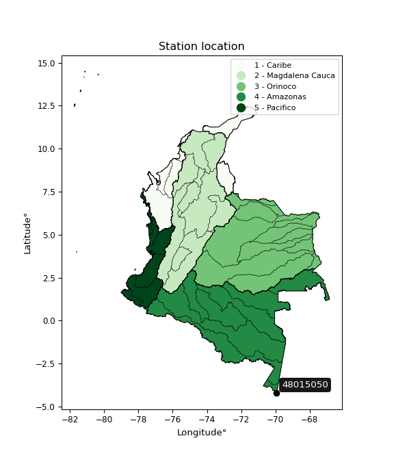

<div align="center">


</div>

# PMP Station (Rain, Pmax24h): 48015050

Probable Maximum Precipitation (PMP) is the greatest amount of rainfall for a specific duration that is meteorologically possible for a given location, acting as a "worst-case" scenario for extreme storms, crucial for designing safety-critical infrastructure like bridges, river deviations, dams, spillways, and nuclear plants to prevent catastrophic failure. PMP is calculated by hydrologists using meteorological data to determine the upper limit of extreme rainfall, often leading to the Probable Maximum Flood (PMF) for flood control design, and is increasingly being studied for climate change impacts. Probable Maximum Precipitation (PMP) is the theoretical upper limit of rainfall, a deterministic estimate for extreme events, while probability distributions (like GEV, Gumbel) describe the likelihood and frequency of various precipitation amounts, including rare ones, showing how often events occur, with PMP representing the extreme end of these distributions, used for critical infrastructure design to ensure safety against the worst conceivable weather, unlike standard statistical forecasts which cover typical probabilities.

The most common probability distributions in hydrology, used for analyzing floods, rainfall, and streamflow, include the Normal, Log-Normal, Gumbel, Gamma (including Log-Pearson Type III), and Generalized Extreme Value (GEV) distributions, often chosen based on the data´s skewness and whether modeling extremes or general conditions, with Gumbel and GEV popular for extreme events like floods, while the Normal distribution serves as a baseline, though often requiring transformations for skewed hydrological data. These distributions help in designing water infrastructure, managing water resources, and forecasting hydrologic events.

> Hydrological data often isn´t perfectly normal (it´s skewed), so different distributions are needed for different applications, such as: **Flood Frequency Analysis**: Using Gumbel, GEV, or Log-Pearson Type III for predicting extreme flood magnitudes and their return periods, **Rainfall Analysis**: Normal for annual totals, but Log-Normal, Weibull, or GEV for intensity or extreme daily rainfall, **Streamflow Modeling**: Gamma and Log-Normal for maximum flows, GEV for minimum flows, and Kappa for daily flows.

<div align="center">

</img>

</div>


## A. General information


### 1. General running parameters

• app_version: _v20260113_. • runtime: _2026-01-17 18:24:04.630693_. • Python version: _3.14.0_. • SciPy version: _1.16.3_. • Pandas version: _2.3.3_. • NumPy version: _2.3.5_. • Stations dataset (station_dataset_file): _dataset/pmax24h_in/automatic_colombia_2003_2025.csv_. • Stations catalog (station_catalog_file): _dataset/CNE.xls_. • Minimum year to eval til year_max (date_min): _1900_. • Maximum year to eval since year_min (date_max): _2025_. • Creates, save and include plots into reports (create_plot): _False_. • Plot only fit distributions with Δo > Δ (plot_only_fit): _True_. • Plot only simple graphs avoiding multiple CDFs and multiple Extreme values plots (plot_only_simple): _True_. • Eval low extreme values, if False, evaluates high extreme values (low_extreme): _False_. • Eval every SciPy distribution as logarithmic (pdist_logarithmic_on): _True_. • Standard deviation normalized (ddof): _1.0_. • Return periods to eval in years (Tr): _[2, 2.33, 5, 10, 15, 20, 25, 50, 75, 100, 200, 250, 500, 750, 1000]_. • Minimum data sample per station, 0 means any (minimum_sample): _5_. • Z-Score maximum threshold to adjust a value, 0 means disable (zscore_max): _3.5_. • Z-Score minimum threshold to adjust a value, 0 means disable (zscore_min): _-2.5_. • Avoid zeros, e.g. rain = 0 (avoid_zeros): _True_. • Avoid null values (avoid_nans): _True_. 

:file_folder:Table: [dataset.csv](../../dataset/pmax24h_in/automatic_colombia_2003_2025.csv)

> Delta Degrees of Freedom (DDOF): is a parameter used in the formulas for calculating variance and standard deviation. When ddof=0, the divisor is $N$ (the total number of observations) and this is used when your data set is the entire population. When ddof=1, the divisor is $N-1$ and this is used when your data set is a sample drawn from a larger population. Using $N-1$ provides an unbiased estimate of the population variance (known as Bessel´s correction).


### 2. Station info and location

|   id |   CODIGO | NOMBRE                             | CATEGORIA           | TECNOLOGIA                              | ESTADO   | FECHA_INSTALACION   |   FECHA_SUSPENSION |   ALTITUD |   LATITUD |   LONGITUD | DEPARTAMENTO   | MUNICIPIO   | AREA_OPERATIVA                            | ENTIDAD                                                     | AREA_HIDROGRAFICA   | ZONA_HIDROGRAFICA   | SUBZONA_HIDROGRAFICA       |   CORRIENTE | Catalogo   |   Version |
|-----:|---------:|:-----------------------------------|:--------------------|:----------------------------------------|:---------|:--------------------|-------------------:|----------:|----------:|-----------:|:---------------|:------------|:------------------------------------------|:------------------------------------------------------------|:--------------------|:--------------------|:---------------------------|------------:|:-----------|----------:|
|    0 | 48015050 | AEROPUERTO VASQUEZ COBO [48015050] | Sinóptica Principal | Automática con Telemetría, Convencional | Activa   | 22/07/2009          |                nan |        84 |  -4.19951 |   -69.9431 | Amazonas       | Leticia     | Area Operativa 11 - Cundinamarca-Amazonas | INSTITUTO DE HIDROLOGIA METEOROLOGIA Y ESTUDIOS AMBIENTALES | Amazonas            | Amazonas - Directos | Directos Río Amazonas (mi) |         nan | CNE_IDEAM  |  20251226 |

<div align="center">

Dynamic map: [:earth_americas:Google](http://maps.google.com/maps?q=-4.199509,-69.943095) [:earth_americas:OSM](https://www.openstreetmap.org/#map=18/-4.199509/-69.943095&layers=P) [:earth_americas:Bing](https://www.bing.com/maps?cp=-4.199509~-69.943095&lvl=18) [:earth_americas:Apple](https://maps.apple.com/frame?center=-4.199509%2C-69.943095&span=0.003%2C0.006)

</div>


<div align="center">

```geojson
{
  "type": "Feature",
  "geometry": {
    "type": "Point", 
    "coordinates": [-69.943095, -4.199509]
  }, 
  "properties": {
    "Name": "48015050"
  }
}
```

</div>


### 3. Discrete values table and plot

<div align="center">

|               |           0 |           1 |           2 |           3 |           4 |          5 |         6 |           7 |
|:--------------|------------:|------------:|------------:|------------:|------------:|-----------:|----------:|------------:|
| Date          | 2018        | 2019        | 2020        | 2021        | 2022        | 2023       | 2024      | 2025        |
| Value         |   66.07     |   87.51     |   91.99     |   68.27     |  102.08     |  297.64    |  410      |  216.4      |
| Value_initial |   66.07     |   87.51     |   91.99     |   68.27     |  102.08     |  297.64    |  410      |  216.4      |
| count         |    8        |    8        |    8        |    8        |    8        |    8       |    8      |    8        |
| mean          |  167.495    |  167.495    |  167.495    |  167.495    |  167.495    |  167.495   |  167.495  |  167.495    |
| std           |  127.978    |  127.978    |  127.978    |  127.978    |  127.978    |  127.978   |  127.978  |  127.978    |
| zscore        |   -0.792519 |   -0.624991 |   -0.589985 |   -0.775329 |   -0.511143 |    1.01693 |    1.8949 |    0.382136 |


</div>


> The initial value (value_initial) correspond to the initial obtained or null completed value, and value (value) is adjusted only when the initial value is outside the valid range (outlier) definite through the Z-Score value. If Z-Score is active, values out of range or outliers are replaced with the station mean value. A Z-Score (or standard score) measures how many standard deviations a data point is from the mean of a dataset, indicating its relative position; positive scores mean above the mean, negative mean below, and a score of zero is exactly at the mean, allowing for comparison of values from different distributions. It´s calculated using the formula $z=(x–μ)/σ$, where $x$ is the data point, $μ$ is the mean, and $σ$ is the standard deviation, helping identify outliers and understand probability.
>
> <sub>**Note**: In this study, "completing" (filling gaps in) and "extending" (forecasting or lengthening the historical record) rainfall data series are avoided for certain critical analyses because they introduce artificial bias and uncertainty, which can distort the statistics of rare events (extremes), alter day-to-day variability, and compromise the integrity and homogeneity of the original data. Some reasons against Completing/Extending rainfall data are: **Distortion of Extremes and Variability**: The primary issue is that most gap-filling or extension methods rely on averaging or regression with nearby stations, which inherently smooths the data. Rainfall is highly variable in space and time, with a large percentage of zero values and occasional large storms. Infilling methods often underestimate the highest values and overestimate the lowest (zero) values, which severely distorts analyses focused on flood frequency, drought severity, and intensity-duration-frequency (IDF) curves, **Loss of Data Homogeneity**: Infilled or extended data are synthetic estimates, not actual measurements. Combining these estimates with observed data can violate the assumption of data homogeneity, which requires that the data properties do not change over time. Inhomogeneity can lead to incorrect conclusions about long-term trends or changes in climate patterns, **Propagation of Errors**: Errors and biases from the original data (e.g., wind-induced undercatch, instrument errors, site changes) or the data used for imputation can propagate through the analysis, leading to unreliable hydrological models and inaccurate predictions, **Compromised Statistical Integrity**: For statistical analyses, especially those involving the frequency of events, using artificial data can introduce time bias or autocorrelation that doesn´t exist in reality, making it difficult to assess the true probability of events, **Difficulty in Validation**: It is difficult to accurately validate the quality of filled or extended data, especially for past periods where ground-truth measurements are unavailable. The reliability of imputation techniques heavily depends on the density of the surrounding station network and the complexity of the local topography.</sub>


### 4. Active continuous probability distributions from SciPy (80 of 104 available)

A Probability Density Function (PDF) describes the relative likelihood of a continuous random variable falling within a specific range, where the total area under its curve equals 1, and the area over any interval gives the actual probability for that range. Unlike discrete probabilities (like rolling a die), a PDF shows density, not direct probability for a single point (which is zero), with higher points indicating higher likelihood, often visualized as a bell curve for normal distributions.

A log of a probability density function (log-PDF) is simply the logarithm of the PDF´s value, denoted as $log(f(x))$, useful for converting multiplication of probabilities into addition, improving numerical stability with tiny numbers, and connecting to information theory concepts like entropy. Instead of dealing with very small probabilities (e.g., 0.000001), log-PDFs use negative numbers (e.g., $log(0.00001) ≈ -11.51$ that are easier for computers to handle, preventing underflow errors and simplifying complex calculations. In this study, each active probability distribution from SciPy is also evaluated in the $log$ form.

[scipy.stats](https://docs.scipy.org/doc/scipy/reference/stats.html) is a Python´s powerful submodule within the SciPy library for comprehensive statistical analysis, offering over 130 probability distributions (like Normal, Poisson), functions for descriptive stats (mean, variance), hypothesis testing (t-tests, chi-square), random variable generation, and statistical tests, making it essential for data science, modeling, and research. It provides tools to explore, model, and draw conclusions from data efficiently, working seamlessly with NumPy.

<div align="center">

|   id | p_dist           |   n_parameter | fit_method   | label                                                                       | active   | ref                                                                                                      |
|-----:|:-----------------|--------------:|:-------------|:----------------------------------------------------------------------------|:---------|:---------------------------------------------------------------------------------------------------------|
|    0 | alpha            |             3 | MLE          | Alpha                                                                       | True     | [:mortar_board:](https://docs.scipy.org/doc/scipy/reference/generated/scipy.stats.alpha.html)            |
|    1 | anglit           |             2 | MM           | Anglit                                                                      | True     | [:mortar_board:](https://docs.scipy.org/doc/scipy/reference/generated/scipy.stats.anglit.html)           |
|    2 | arcsine          |             2 | MM           | Arcsine                                                                     | True     | [:mortar_board:](https://docs.scipy.org/doc/scipy/reference/generated/scipy.stats.arcsine.html)          |
|    3 | argus            |             3 | MLE          | Argus                                                                       | True     | [:mortar_board:](https://docs.scipy.org/doc/scipy/reference/generated/scipy.stats.argus.html)            |
|    4 | beta             |             4 | MLE          | Beta                                                                        | True     | [:mortar_board:](https://docs.scipy.org/doc/scipy/reference/generated/scipy.stats.beta.html)             |
|    5 | betaprime        |             4 | MLE          | Beta prime                                                                  | True     | [:mortar_board:](https://docs.scipy.org/doc/scipy/reference/generated/scipy.stats.betaprime.html)        |
|    6 | bradford         |             3 | MLE          | Bradford                                                                    | True     | [:mortar_board:](https://docs.scipy.org/doc/scipy/reference/generated/scipy.stats.bradford.html)         |
|    7 | burr             |             4 | MLE          | Burr (Type III)                                                             | True     | [:mortar_board:](https://docs.scipy.org/doc/scipy/reference/generated/scipy.stats.burr.html)             |
|    8 | burr12           |             4 | MLE          | Burr (Type III) 12                                                          | True     | [:mortar_board:](https://docs.scipy.org/doc/scipy/reference/generated/scipy.stats.burr12.html)           |
|    9 | cosine           |             2 | MLE          | Cosine                                                                      | True     | [:mortar_board:](https://docs.scipy.org/doc/scipy/reference/generated/scipy.stats.cosine.html)           |
|   10 | crystalball      |             4 | MLE          | Crystalball                                                                 | True     | [:mortar_board:](https://docs.scipy.org/doc/scipy/reference/generated/scipy.stats.crystalball.html)      |
|   11 | dgamma           |             3 | MLE          | Double gamma                                                                | True     | [:mortar_board:](https://docs.scipy.org/doc/scipy/reference/generated/scipy.stats.dgamma.html)           |
|   12 | dweibull         |             3 | MLE          | Double Weibull                                                              | True     | [:mortar_board:](https://docs.scipy.org/doc/scipy/reference/generated/scipy.stats.dweibull.html)         |
|   13 | erlang           |             3 | MLE          | Erlang                                                                      | True     | [:mortar_board:](https://docs.scipy.org/doc/scipy/reference/generated/scipy.stats.erlang.html)           |
|   14 | exponnorm        |             3 | MLE          | Exponentially modified Normal                                               | True     | [:mortar_board:](https://docs.scipy.org/doc/scipy/reference/generated/scipy.stats.exponnorm.html)        |
|   15 | exponpow         |             3 | MLE          | Exponential power                                                           | True     | [:mortar_board:](https://docs.scipy.org/doc/scipy/reference/generated/scipy.stats.exponpow.html)         |
|   16 | exponweib        |             4 | MLE          | Exponentiated Weibull                                                       | True     | [:mortar_board:](https://docs.scipy.org/doc/scipy/reference/generated/scipy.stats.exponweib.html)        |
|   17 | f                |             4 | MLE          | F                                                                           | True     | [:mortar_board:](https://docs.scipy.org/doc/scipy/reference/generated/scipy.stats.f.html)                |
|   18 | fatiguelife      |             3 | MLE          | Fatigue-life (Birnbaum-Saunders)                                            | True     | [:mortar_board:](https://docs.scipy.org/doc/scipy/reference/generated/scipy.stats.fatiguelife.html)      |
|   19 | foldnorm         |             3 | MM           | Fold Normal                                                                 | True     | [:mortar_board:](https://docs.scipy.org/doc/scipy/reference/generated/scipy.stats.foldnorm.html)         |
|   20 | gamma            |             3 | MLE          | Gamma                                                                       | True     | [:mortar_board:](https://docs.scipy.org/doc/scipy/reference/generated/scipy.stats.gamma.html)            |
|   21 | gausshyper       |             6 | MLE          | Gauss hypergeometric                                                        | True     | [:mortar_board:](https://docs.scipy.org/doc/scipy/reference/generated/scipy.stats.gausshyper.html)       |
|   22 | genexpon         |             5 | MLE          | Generalized exponential                                                     | True     | [:mortar_board:](https://docs.scipy.org/doc/scipy/reference/generated/scipy.stats.genexpon.html)         |
|   23 | genextreme       |             3 | MLE          | Generalized exponential                                                     | True     | [:mortar_board:](https://docs.scipy.org/doc/scipy/reference/generated/scipy.stats.genextreme.html)       |
|   24 | gengamma         |             4 | MLE          | Generalized gamma                                                           | True     | [:mortar_board:](https://docs.scipy.org/doc/scipy/reference/generated/scipy.stats.gengamma.html)         |
|   25 | genhalflogistic  |             3 | MLE          | Generalized half-logistic                                                   | True     | [:mortar_board:](https://docs.scipy.org/doc/scipy/reference/generated/scipy.stats.genhalflogistic.html)  |
|   26 | genlogistic      |             3 | MLE          | Generalized logistic                                                        | True     | [:mortar_board:](https://docs.scipy.org/doc/scipy/reference/generated/scipy.stats.genlogistic.html)      |
|   27 | gennorm          |             3 | MLE          | Generalized Normal                                                          | True     | [:mortar_board:](https://docs.scipy.org/doc/scipy/reference/generated/scipy.stats.gennorm.html)          |
|   28 | genpareto        |             3 | MLE          | Generalized Pareto                                                          | True     | [:mortar_board:](https://docs.scipy.org/doc/scipy/reference/generated/scipy.stats.genpareto.html)        |
|   29 | gompertz         |             3 | MLE          | Gompertz (or truncated Gumbel)                                              | True     | [:mortar_board:](https://docs.scipy.org/doc/scipy/reference/generated/scipy.stats.gompertz.html)         |
|   30 | gumbel_l         |             2 | MM           | Gumbel Left Skew                                                            | True     | [:mortar_board:](https://docs.scipy.org/doc/scipy/reference/generated/scipy.stats.gumbel_l.html)         |
|   31 | gumbel_r         |             2 | MM           | Gumbel Right Skew                                                           | True     | [:mortar_board:](https://docs.scipy.org/doc/scipy/reference/generated/scipy.stats.gumbel_r.html)         |
|   32 | halfgennorm      |             3 | MLE          | Upper half of a generalized normal                                          | True     | [:mortar_board:](https://docs.scipy.org/doc/scipy/reference/generated/scipy.stats.halfgennorm.html)      |
|   33 | halflogistic     |             2 | MM           | Half-logistic                                                               | True     | [:mortar_board:](https://docs.scipy.org/doc/scipy/reference/generated/scipy.stats.halflogistic.html)     |
|   34 | halfnorm         |             2 | MM           | Half Normal                                                                 | True     | [:mortar_board:](https://docs.scipy.org/doc/scipy/reference/generated/scipy.stats.halfnorm.html)         |
|   35 | hypsecant        |             2 | MM           | hyperbolic secant                                                           | True     | [:mortar_board:](https://docs.scipy.org/doc/scipy/reference/generated/scipy.stats.hypsecant.html)        |
|   36 | invgamma         |             3 | MLE          | Inverted gamma                                                              | True     | [:mortar_board:](https://docs.scipy.org/doc/scipy/reference/generated/scipy.stats.invgamma.html)         |
|   37 | invgauss         |             3 | MLE          | Inverse Gaussian                                                            | True     | [:mortar_board:](https://docs.scipy.org/doc/scipy/reference/generated/scipy.stats.invgauss.html)         |
|   38 | invweibull       |             3 | MLE          | Inverted Weibull                                                            | True     | [:mortar_board:](https://docs.scipy.org/doc/scipy/reference/generated/scipy.stats.invweibull.html)       |
|   39 | johnsonsb        |             4 | MLE          | Johnson SB                                                                  | True     | [:mortar_board:](https://docs.scipy.org/doc/scipy/reference/generated/scipy.stats.johnsonsb.html)        |
|   40 | johnsonsu        |             4 | MLE          | Johnson Su                                                                  | True     | [:mortar_board:](https://docs.scipy.org/doc/scipy/reference/generated/scipy.stats.johnsonsu.html)        |
|   41 | kappa3           |             3 | MLE          | Kappa 3                                                                     | True     | [:mortar_board:](https://docs.scipy.org/doc/scipy/reference/generated/scipy.stats.kappa3.html)           |
|   42 | kappa4           |             4 | MLE          | Kappa 4                                                                     | True     | [:mortar_board:](https://docs.scipy.org/doc/scipy/reference/generated/scipy.stats.kappa4.html)           |
|   43 | ksone            |             3 | MLE          | Kolmogorov-Smirnov one-sided test statistic distribution                    | True     | [:mortar_board:](https://docs.scipy.org/doc/scipy/reference/generated/scipy.stats.ksone.html)            |
|   44 | kstwobign        |             2 | MLE          | Limiting distribution of scaled Kolmogorov-Smirnov two-sided test statistic | True     | [:mortar_board:](https://docs.scipy.org/doc/scipy/reference/generated/scipy.stats.kstwobign.html)        |
|   45 | laplace          |             2 | MM           | Laplace                                                                     | True     | [:mortar_board:](https://docs.scipy.org/doc/scipy/reference/generated/scipy.stats.laplace.html)          |
|   46 | levy_l           |             2 | MLE          | Left-skewed Levy                                                            | True     | [:mortar_board:](https://docs.scipy.org/doc/scipy/reference/generated/scipy.stats.levy_l.html)           |
|   47 | loggamma         |             3 | MLE          | Log gamma                                                                   | True     | [:mortar_board:](https://docs.scipy.org/doc/scipy/reference/generated/scipy.stats.loggamma.html)         |
|   48 | logistic         |             2 | MM           | Logistic (or Sech-squared)                                                  | True     | [:mortar_board:](https://docs.scipy.org/doc/scipy/reference/generated/scipy.stats.logistic.html)         |
|   49 | loglaplace       |             3 | MLE          | Log-Laplace                                                                 | True     | [:mortar_board:](https://docs.scipy.org/doc/scipy/reference/generated/scipy.stats.loglaplace.html)       |
|   50 | lomax            |             3 | MLE          | Lomax (Pareto of the second kind)                                           | True     | [:mortar_board:](https://docs.scipy.org/doc/scipy/reference/generated/scipy.stats.lomax.html)            |
|   51 | maxwell          |             2 | MM           | Maxwell                                                                     | True     | [:mortar_board:](https://docs.scipy.org/doc/scipy/reference/generated/scipy.stats.maxwell.html)          |
|   52 | mielke           |             4 | MLE          | Mielke Beta-Kappa / Dagum                                                   | True     | [:mortar_board:](https://docs.scipy.org/doc/scipy/reference/generated/scipy.stats.mielke.html)           |
|   53 | moyal            |             2 | MM           | Moyal                                                                       | True     | [:mortar_board:](https://docs.scipy.org/doc/scipy/reference/generated/scipy.stats.moyal.html)            |
|   54 | nakagami         |             3 | MLE          | Nakagami                                                                    | True     | [:mortar_board:](https://docs.scipy.org/doc/scipy/reference/generated/scipy.stats.nakagami.html)         |
|   55 | ncf              |             5 | MLE          | Non-central F distribution                                                  | True     | [:mortar_board:](https://docs.scipy.org/doc/scipy/reference/generated/scipy.stats.ncf.html)              |
|   56 | nct              |             4 | MLE          | Non-central Student’s t                                                     | True     | [:mortar_board:](https://docs.scipy.org/doc/scipy/reference/generated/scipy.stats.nct.html)              |
|   57 | norm             |             2 | MM           | Normal                                                                      | True     | [:mortar_board:](https://docs.scipy.org/doc/scipy/reference/generated/scipy.stats.norm.html)             |
|   58 | pearson3         |             3 | MM           | Pearson type III                                                            | True     | [:mortar_board:](https://docs.scipy.org/doc/scipy/reference/generated/scipy.stats.pearson3.html)         |
|   59 | powerlaw         |             3 | MLE          | Power-function                                                              | True     | [:mortar_board:](https://docs.scipy.org/doc/scipy/reference/generated/scipy.stats.powerlaw.html)         |
|   60 | rayleigh         |             2 | MM           | Rayleigh                                                                    | True     | [:mortar_board:](https://docs.scipy.org/doc/scipy/reference/generated/scipy.stats.rayleigh.html)         |
|   61 | rdist            |             3 | MLE          | R-distributed (symmetric beta)                                              | True     | [:mortar_board:](https://docs.scipy.org/doc/scipy/reference/generated/scipy.stats.rdist.html)            |
|   62 | rice             |             3 | MLE          | Rice                                                                        | True     | [:mortar_board:](https://docs.scipy.org/doc/scipy/reference/generated/scipy.stats.rice.html)             |
|   63 | semicircular     |             2 | MM           | Semicircular                                                                | True     | [:mortar_board:](https://docs.scipy.org/doc/scipy/reference/generated/scipy.stats.semicircular.html)     |
|   64 | skewnorm         |             3 | MLE          | Skew normal                                                                 | True     | [:mortar_board:](https://docs.scipy.org/doc/scipy/reference/generated/scipy.stats.skewnorm.html)         |
|   65 | t                |             3 | MLE          | Student’s t                                                                 | True     | [:mortar_board:](https://docs.scipy.org/doc/scipy/reference/generated/scipy.stats.t.html)                |
|   66 | trapezoid        |             4 | MLE          | Trapezoid                                                                   | True     | [:mortar_board:](https://docs.scipy.org/doc/scipy/reference/generated/scipy.stats.trapezoid.html)        |
|   67 | triang           |             3 | MLE          | Triangular                                                                  | True     | [:mortar_board:](https://docs.scipy.org/doc/scipy/reference/generated/scipy.stats.triang.html)           |
|   68 | truncexpon       |             3 | MLE          | Truncated exponential                                                       | True     | [:mortar_board:](https://docs.scipy.org/doc/scipy/reference/generated/scipy.stats.truncexpon.html)       |
|   69 | truncnorm        |             4 | MLE          | Truncated normal                                                            | True     | [:mortar_board:](https://docs.scipy.org/doc/scipy/reference/generated/scipy.stats.truncnorm.html)        |
|   70 | truncpareto      |             4 | MLE          | Upper truncated Pareto                                                      | True     | [:mortar_board:](https://docs.scipy.org/doc/scipy/reference/generated/scipy.stats.truncpareto.html)      |
|   71 | truncweibull_min |             5 | MLE          | Doubly truncated Weibull minimum                                            | True     | [:mortar_board:](https://docs.scipy.org/doc/scipy/reference/generated/scipy.stats.truncweibull_min.html) |
|   72 | tukeylambda      |             3 | MLE          | Tukey-Lamdba                                                                | True     | [:mortar_board:](https://docs.scipy.org/doc/scipy/reference/generated/scipy.stats.tukeylambda.html)      |
|   73 | uniform          |             2 | MLE          | Uniform                                                                     | True     | [:mortar_board:](https://docs.scipy.org/doc/scipy/reference/generated/scipy.stats.uniform.html)          |
|   74 | vonmises         |             3 | MLE          | Von Mises                                                                   | True     | [:mortar_board:](https://docs.scipy.org/doc/scipy/reference/generated/scipy.stats.vonmises.html)         |
|   75 | vonmises_line    |             3 | MLE          | Von Mises line                                                              | True     | [:mortar_board:](https://docs.scipy.org/doc/scipy/reference/generated/scipy.stats.vonmises_line.html)    |
|   76 | wald             |             2 | MM           | Wald                                                                        | True     | [:mortar_board:](https://docs.scipy.org/doc/scipy/reference/generated/scipy.stats.wald.html)             |
|   77 | weibull_max      |             3 | MLE          | Weibull maximum                                                             | True     | [:mortar_board:](https://docs.scipy.org/doc/scipy/reference/generated/scipy.stats.weibull_max.html)      |
|   78 | weibull_min      |             3 | MLE          | Weibull minimum                                                             | True     | [:mortar_board:](https://docs.scipy.org/doc/scipy/reference/generated/scipy.stats.weibull_min.html)      |
|   79 | wrapcauchy       |             3 | MLE          | Wrapped  Cauchy                                                             | True     | [:mortar_board:](https://docs.scipy.org/doc/scipy/reference/generated/scipy.stats.wrapcauchy.html)       |

</div>

> **n_parameter:** # arguments & localization & scale.
>
> **Fit methods:** (MLE) maximum likelihood, (MM) L-moments.
>
>**Inactive** (With the only purpose of prevent loops, zero divisions, infinite values, over high estimated values or horizontal trending for recurrence intervals estimations, the follow distributions were disabled.)**:** lognorm, norminvgauss, powernorm, powerlognorm, cauchy, halfcauchy, foldcauchy, skewcauchy, chi2, expon, fisk, genhyperbolic, geninvgauss, gibrat, kstwo, laplace_asymmetric, levy, levy_stable, ncx2, pareto, rel_breitwigner, recipinvgauss, studentized_range, loguniform, 


## B. Probability (PDF) vs. Empirical (EDF) distributions functions

A continuous probability distribution (CPD) describes probabilities for variables that can take any value within a range (like rain any time), unlike discrete variables with specific outcomes (like temperature). It uses a Probability Density Function (PDF), a curve where the total area under it equals 1, and the probability of the variable falling within an interval (a to b) is found by calculating the area under the curve between those points. A key feature is that the probability of hitting any single exact value is zero, so probabilities are always expressed for ranges, e.g., $P(a ≤ X ≤ b)$.

<div align="center">

Distributions parameters from station values
|     |   station | p_dist              |   n |               loc |           scale | shape                  | shape1                | shape2              | shape3             |
|----:|----------:|:--------------------|----:|------------------:|----------------:|:-----------------------|:----------------------|:--------------------|:-------------------|
|   0 |  48015050 | alpha               |   8 |      48.0397      |    33.6139      | 3.4959423439261687e-07 |                       |                     |                    |
|   1 |  48015050 | anglit              |   8 |     167.495       |   350.207       |                        |                       |                     |                    |
|   2 |  48015050 | arcsine             |   8 |      -1.80387     |   338.598       |                        |                       |                     |                    |
|   3 |  48015050 | argus               |   8 |     -99.4741      |   528.068       | 2.612702059993502e-07  |                       |                     |                    |
|   4 |  48015050 | beta                |   8 |      39.5204      |   370.48        | 0.3101987015648551     | 0.3175606460095375    |                     |                    |
|   5 |  48015050 | betaprime           |   8 |      -0.914445    |     1.53618     | 216.0745649519406      | 2.9510359484552975    |                     |                    |
|   6 |  48015050 | bradford            |   8 |      66.0073      |   343.993       | 237.6107873437446      |                       |                     |                    |
|   7 |  48015050 | burr                |   8 |      60.1845      |     0.00485447  | 0.8589184926244524     | 1382.3656943876458    |                     |                    |
|   8 |  48015050 | burr12              |   8 |      -0.927997    |    66.3981      | 389.4022317809653      | 0.0036527484607178154 |                     |                    |
|   9 |  48015050 | cosine              |   8 |     185.336       |   101.506       |                        |                       |                     |                    |
|  10 |  48015050 | crystalball         |   8 |      -0.13518     |   205.941       | 4.370407335002756      | 2.3380483671570502    |                     |                    |
|  11 |  48015050 | dgamma              |   8 |     171.333       |    22.5938      | 4.706978666066072      |                       |                     |                    |
|  12 |  48015050 | dweibull            |   8 |     182.612       |   123.433       | 2.2385375349992085     |                       |                     |                    |
|  13 |  48015050 | erlang              |   8 |      66.07        |    69.8599      | 0.4621758395444958     |                       |                     |                    |
|  14 |  48015050 | exponnorm           |   8 |      65.9275      |     0.0454492   | 2230.626360361929      |                       |                     |                    |
|  15 |  48015050 | exponpow            |   8 |      66.07        |   169.319       | 0.4104141665734271     |                       |                     |                    |
|  16 |  48015050 | exponweib           |   8 |      66.07        |   133.773       | 0.35592944362245804    | 1.0819047368788262    |                     |                    |
|  17 |  48015050 | f                   |   8 |      61.0389      |    17.9926      | 2171.9423727948315     | 1.3387956878524983    |                     |                    |
|  18 |  48015050 | fatiguelife         |   8 |      66.07        |     3.06725e-05 | 1992.126170827844      |                       |                     |                    |
|  19 |  48015050 | foldnorm            |   8 |       8.1954      |   184.427       | 0.4091477670215885     |                       |                     |                    |
|  20 |  48015050 | gamma               |   8 |      66.07        |    72.3754      | 0.25622051017828407    |                       |                     |                    |
|  21 |  48015050 | gausshyper          |   8 |      32.0256      |   377.974       | 0.9601921998045702     | 0.746954272591664     | 1.2533165278931917  | 1.2449758571455414 |
|  22 |  48015050 | genexpon            |   8 |      66.07        |   152.531       | 1.503878628543649      | 6.252772746439729e-10 | 0.5407997641430418  |                    |
|  23 |  48015050 | genextreme          |   8 |      67.4613      |     8.72936     | -6.274251923748537     |                       |                     |                    |
|  24 |  48015050 | gengamma            |   8 |      66.07        |   116.843       | 0.7618605354282639     | 0.7214895861868784    |                     |                    |
|  25 |  48015050 | genhalflogistic     |   8 |      32.4978      |   391.914       | 1.0381775912713094     |                       |                     |                    |
|  26 |  48015050 | genlogistic         |   8 |    -465.365       |    78.6437      | 1597.437511888425      |                       |                     |                    |
|  27 |  48015050 | gennorm             |   8 |      91.99        |     1.19576     | 0.32794929423579633    |                       |                     |                    |
|  28 |  48015050 | genpareto           |   8 |      66.07        |    38.0994      | 0.8367960973654268     |                       |                     |                    |
|  29 |  48015050 | gompertz            |   8 |      66.07        |     2.10217e+08 | 2067224.3507103897     |                       |                     |                    |
|  30 |  48015050 | gumbel_l            |   8 |     221.372       |    93.3394      |                        |                       |                     |                    |
|  31 |  48015050 | gumbel_r            |   8 |     113.618       |    93.3394      |                        |                       |                     |                    |
|  32 |  48015050 | halfgennorm         |   8 |      66.07        |     0.212637    | 0.259439092873164      |                       |                     |                    |
|  33 |  48015050 | halflogistic        |   8 |      25.608       |   102.35        |                        |                       |                     |                    |
|  34 |  48015050 | halfnorm            |   8 |       9.04271     |   198.59        |                        |                       |                     |                    |
|  35 |  48015050 | hypsecant           |   8 |     167.495       |    76.2113      |                        |                       |                     |                    |
|  36 |  48015050 | invgamma            |   8 |      61.0334      |    12.0424      | 0.6693976084291562     |                       |                     |                    |
|  37 |  48015050 | invgauss            |   8 |      61.2848      |    20.7482      | 5.118992599386068      |                       |                     |                    |
|  38 |  48015050 | invweibull          |   8 |      66.07        |     1.83913     | 0.06322176499802222    |                       |                     |                    |
|  39 |  48015050 | johnsonsb           |   8 |      66.07        |   724.774       | 1.538450665249938      | 0.11639822726710128   |                     |                    |
|  40 |  48015050 | johnsonsu           |   8 |      66.07        |     4.95532e-11 | -2.6752067613518005    | 0.12218648768214868   |                     |                    |
|  41 |  48015050 | kappa3              |   8 |      66.07        |     2.09527     | 0.28063745714108645    |                       |                     |                    |
|  42 |  48015050 | kappa4              |   8 |      31.4212      |   378.554       | 1.1007430808680239     | 0.9984610546411075    |                     |                    |
|  43 |  48015050 | ksone               |   8 |      31.677       |   412.716       | 1.0                    |                       |                     |                    |
|  44 |  48015050 | kstwobign           |   8 |    -164.97        |   383.281       |                        |                       |                     |                    |
|  45 |  48015050 | laplace             |   8 |     167.495       |    84.6494      |                        |                       |                     |                    |
|  46 |  48015050 | levy_l              |   8 |     437.009       |   127.214       |                        |                       |                     |                    |
|  47 |  48015050 | loggamma            |   8 |  -33035           |  4568.34        | 1434.0351256280414     |                       |                     |                    |
|  48 |  48015050 | logistic            |   8 |     167.495       |    66.0009      |                        |                       |                     |                    |
|  49 |  48015050 | loglaplace          |   8 |      -0.235951    |    92.226       | 1.8602863633269209     |                       |                     |                    |
|  50 |  48015050 | lomax               |   8 |      66.07        |     1.68771e+10 | 109774896.6075247      |                       |                     |                    |
|  51 |  48015050 | maxwell             |   8 |    -116.173       |   177.763       |                        |                       |                     |                    |
|  52 |  48015050 | mielke              |   8 |       4.19822     |     4.10949     | 1001.8778962873804     | 2.006010421877398     |                     |                    |
|  53 |  48015050 | moyal               |   8 |      99.0358      |    53.8895      |                        |                       |                     |                    |
|  54 |  48015050 | nakagami            |   8 |      66.07        |   209.083       | 0.1648992967359213     |                       |                     |                    |
|  55 |  48015050 | ncf                 |   8 |      -2.08163     |   111.596       | 252.05514386002355     | 5.963891563521662     | 5.216249586482913   |                    |
|  56 |  48015050 | nct                 |   8 |      -0.285879    |     1.90486     | 1.9285767471989725     | 51.83543653226644     |                     |                    |
|  57 |  48015050 | norm                |   8 |     167.495       |   119.712       |                        |                       |                     |                    |
|  58 |  48015050 | pearson3            |   8 |     167.495       |   119.712       | 0.971986531763128      |                       |                     |                    |
|  59 |  48015050 | powerlaw            |   8 |      66.07        |   343.93        | 0.15498591124577085    |                       |                     |                    |
|  60 |  48015050 | rayleigh            |   8 |     -61.5218      |   182.729       |                        |                       |                     |                    |
|  61 |  48015050 | rdist               |   8 |      36.9755      |   179.425       | 1.0603327653883987     |                       |                     |                    |
|  62 |  48015050 | rice                |   8 |     -16.2664      |   155.08        | 0.0003599683434179821  |                       |                     |                    |
|  63 |  48015050 | semicircular        |   8 |     167.495       |   239.425       |                        |                       |                     |                    |
|  64 |  48015050 | skewnorm            |   8 |      66.0699      |   156.896       | 8827908.78120163       |                       |                     |                    |
|  65 |  48015050 | t                   |   8 |     167.489       |   119.702       | 1889949.4328022501     |                       |                     |                    |
|  66 |  48015050 | trapezoid           |   8 |      31.677       |   412.716       | 1.0                    | 1.0                   |                     |                    |
|  67 |  48015050 | triang              |   8 |    -125.891       |   536.425       | 0.999999999999982      |                       |                     |                    |
|  68 |  48015050 | truncexpon          |   8 |      19.7639      |   474.298       | 0.8227658665100239     |                       |                     |                    |
|  69 |  48015050 | truncnorm           |   8 | -522873           |  7914.96        | 66.06980501480001      | 425.66550017849585    |                     |                    |
|  70 |  48015050 | truncpareto         |   8 |      -4.29497e+09 |     4.29497e+09 | 34431488.582408816     | 1.0000000800774482    |                     |                    |
|  71 |  48015050 | truncweibull_min    |   8 |      37.6568      |   322.557       | 0.7238002236413368     | 0.012008953827888743  | 1.1543495768076748  |                    |
|  72 |  48015050 | tukeylambda         |   8 |     141.233       |    90.1779      | 1.19970656916479       |                       |                     |                    |
|  73 |  48015050 | uniform             |   8 |      66.07        |   343.93        |                        |                       |                     |                    |
|  74 |  48015050 | vonmises            |   8 |       2.5941      |     1           | 0.5103839166396181     |                       |                     |                    |
|  75 |  48015050 | vonmises_line       |   8 |     142.301       |    85.2111      | 0.8701909691599912     |                       |                     |                    |
|  76 |  48015050 | wald                |   8 |      47.7826      |   119.712       |                        |                       |                     |                    |
|  77 |  48015050 | weibull_max         |   8 |     410           |     1.74274     | 0.1908757646924796     |                       |                     |                    |
|  78 |  48015050 | weibull_min         |   8 |      66.07        |    76.6297      | 0.6791328504412135     |                       |                     |                    |
|  79 |  48015050 | wrapcauchy          |   8 |      66.0671      |    54.7386      | 0.6999531325318271     |                       |                     |                    |
|  80 |  48015050 | logalpha            |   8 |       3.98666     |     0.431356    | 0.28909987233382095    |                       |                     |                    |
|  81 |  48015050 | loganglit           |   8 |       4.89032     |     1.92628     |                        |                       |                     |                    |
|  82 |  48015050 | logarcsine          |   8 |       3.95912     |     1.8624      |                        |                       |                     |                    |
|  83 |  48015050 | logargus            |   8 |       3.50053     |     2.61949     | 2.47736400250061e-05   |                       |                     |                    |
|  84 |  48015050 | logbeta             |   8 |       3.92877     |     2.08739     | 0.25358534293283913    | 0.44687430094145214   |                     |                    |
|  85 |  48015050 | logbetaprime        |   8 |      -0.958194    |     2.72437     | 257.20149102438313     | 120.93114638035073    |                     |                    |
|  86 |  48015050 | logbradford         |   8 |       4.19071     |     1.82545     | 1.0242849905246318     |                       |                     |                    |
|  87 |  48015050 | logburr             |   8 |       3.63692     |     0.158423    | 2.378111703913068      | 51.95054359937602     |                     |                    |
|  88 |  48015050 | logburr12           |   8 |     -14.585       |    18.7671      | 7611.818334481475      | 0.0036077775725722374 |                     |                    |
|  89 |  48015050 | logcosine           |   8 |       4.9445      |     0.531713    |                        |                       |                     |                    |
|  90 |  48015050 | logcrystalball      |   8 |       4.89032     |     0.658469    | 7.406170627613061      | 3495.1972422419294    |                     |                    |
|  91 |  48015050 | logdgamma           |   8 |       4.62576     |     0.667352    | 0.5817804472185594     |                       |                     |                    |
|  92 |  48015050 | logdweibull         |   8 |       4.52168     |     0.524101    | 0.9122035865639242     |                       |                     |                    |
|  93 |  48015050 | logerlang           |   8 |       4.19071     |     0.682358    | 0.21517564389771648    |                       |                     |                    |
|  94 |  48015050 | logexponnorm        |   8 |       4.19004     |     0.000211938 | 3274.724288446623      |                       |                     |                    |
|  95 |  48015050 | logexponpow         |   8 |       4.19071     |     1.63571     | 0.2049901307518372     |                       |                     |                    |
|  96 |  48015050 | logexponweib        |   8 |       4.19071     |     1.30918     | 0.5591389587112683     | 0.34860937590319185   |                     |                    |
|  97 |  48015050 | logf                |   8 |       4.19071     |     0.576431    | 0.5639355985119394     | 10.852503729643203    |                     |                    |
|  98 |  48015050 | logfatiguelife      |   8 |       4.19071     |     1.06491e-06 | 1119.2196875497657     |                       |                     |                    |
|  99 |  48015050 | logfoldnorm         |   8 |       3.86247     |     0.772039    | 1.2247015290097822     |                       |                     |                    |
| 100 |  48015050 | loggamma            |   8 |       4.19071     |     0.469976    | 0.2466852968356185     |                       |                     |                    |
| 101 |  48015050 | loggausshyper       |   8 |       4.19071     |     1.85928     | 0.8231366947604198     | 1.0904537377120254    | 1.3577813848528462  | 0.9275367180940642 |
| 102 |  48015050 | loggenexpon         |   8 |       4.19071     |     1.26919     | 1.749903027173312      | 1.053292777630928     | 0.12257133126858802 |                    |
| 103 |  48015050 | loggenextreme       |   8 |       4.44108     |     0.334276    | -0.6700489649541768    |                       |                     |                    |
| 104 |  48015050 | loggengamma         |   8 |       4.19071     |     0.978195    | 0.9322023021391892     | 1.0045801518737583    |                     |                    |
| 105 |  48015050 | loggenhalflogistic  |   8 |       3.95862     |     2.16383     | 1.051659229221104      |                       |                     |                    |
| 106 |  48015050 | loggenlogistic      |   8 |       0.953901    |     0.488795    | 1679.2925266391278     |                       |                     |                    |
| 107 |  48015050 | loggennorm          |   8 |       4.52168     |     0.00870839  | 0.3281057745980658     |                       |                     |                    |
| 108 |  48015050 | loggenpareto        |   8 |      -0.0392927   |    14.8974      | -2.4601690628275845    |                       |                     |                    |
| 109 |  48015050 | loggompertz         |   8 |       4.19071     |     6.07807     | 7.769339447617371      |                       |                     |                    |
| 110 |  48015050 | loggumbel_l         |   8 |       5.18666     |     0.513406    |                        |                       |                     |                    |
| 111 |  48015050 | loggumbel_r         |   8 |       4.59397     |     0.513406    |                        |                       |                     |                    |
| 112 |  48015050 | loghalfgennorm      |   8 |       4.19071     |     0.955331    | 1.2232314536590372     |                       |                     |                    |
| 113 |  48015050 | loghalflogistic     |   8 |       4.10988     |     0.562967    |                        |                       |                     |                    |
| 114 |  48015050 | loghalfnorm         |   8 |       4.01876     |     1.09233     |                        |                       |                     |                    |
| 115 |  48015050 | loghypsecant        |   8 |       4.89032     |     0.419194    |                        |                       |                     |                    |
| 116 |  48015050 | loginvgamma         |   8 |       3.84712     |     1.92987     | 2.8755572835613243     |                       |                     |                    |
| 117 |  48015050 | loginvgauss         |   8 |       4.08587     |     0.515719    | 1.5598439643060635     |                       |                     |                    |
| 118 |  48015050 | loginvweibull       |   8 |       3.94217     |     0.498922    | 1.492516697275819      |                       |                     |                    |
| 119 |  48015050 | logjohnsonsb        |   8 |       4.19071     |     4.21113     | 1.0130925145393683     | 0.09822437438122483   |                     |                    |
| 120 |  48015050 | logjohnsonsu        |   8 |       4.19071     |     4.89679e-07 | -2.6866752798022056    | 0.22598185562828793   |                     |                    |
| 121 |  48015050 | logkappa3           |   8 |       4.18916     |     1.80356     | 217.4910111149639      |                       |                     |                    |
| 122 |  48015050 | logkappa4           |   8 |       3.85105     |     2.14444     | 1.187536221883648      | 0.9640844543951604    |                     |                    |
| 123 |  48015050 | logksone            |   8 |       3.74982     |     2.281       | 1.0                    |                       |                     |                    |
| 124 |  48015050 | logkstwobign        |   8 |       2.89191     |     2.28962     |                        |                       |                     |                    |
| 125 |  48015050 | loglaplace          |   8 |       4.89032     |     0.465608    |                        |                       |                     |                    |
| 126 |  48015050 | loglevy_l           |   8 |       6.12465     |     0.505464    |                        |                       |                     |                    |
| 127 |  48015050 | logloggamma         |   8 |    -177.487       |    25.1602      | 1406.7806120428768     |                       |                     |                    |
| 128 |  48015050 | loglogistic         |   8 |       4.89032     |     0.363033    |                        |                       |                     |                    |
| 129 |  48015050 | logloglaplace       |   8 |      -0.0141157   |     4.5358      | 9.24552246162504       |                       |                     |                    |
| 130 |  48015050 | loglomax            |   8 |       4.19071     | 25688.4         | 36666.11055219069      |                       |                     |                    |
| 131 |  48015050 | logmaxwell          |   8 |       3.33002     |     0.97777     |                        |                       |                     |                    |
| 132 |  48015050 | logmielke           |   8 |       3.86121     |     0.0859851   | 52.81477230416289      | 1.7519264776467294    |                     |                    |
| 133 |  48015050 | logmoyal            |   8 |       4.51376     |     0.296415    |                        |                       |                     |                    |
| 134 |  48015050 | lognakagami         |   8 |       4.19071     |     1.34244     | 0.08222349325181168    |                       |                     |                    |
| 135 |  48015050 | logncf              |   8 |       3.67701     |     4.4594e-05  | 0.0005910962076596375  | 894.5453812338471     | 16.142116759004434  |                    |
| 136 |  48015050 | lognct              |   8 |      -0.0844776   |     0.105632    | 33.06939775069205      | 45.99659535937609     |                     |                    |
| 137 |  48015050 | lognorm             |   8 |       4.89032     |     0.658469    |                        |                       |                     |                    |
| 138 |  48015050 | logpearson3         |   8 |       4.89032     |     0.658469    | 0.5623368098435435     |                       |                     |                    |
| 139 |  48015050 | logpowerlaw         |   8 |       4.19071     |     1.82544     | 0.1781091640161526     |                       |                     |                    |
| 140 |  48015050 | lograyleigh         |   8 |       3.63063     |     1.00509     |                        |                       |                     |                    |
| 141 |  48015050 | logrdist            |   8 |       5.23218     |     1.04146     | 1.0296016359071207     |                       |                     |                    |
| 142 |  48015050 | logrice             |   8 |       3.8093      |     0.895034    | 0.0003934359377830727  |                       |                     |                    |
| 143 |  48015050 | logsemicircular     |   8 |       4.89032     |     1.31694     |                        |                       |                     |                    |
| 144 |  48015050 | logskewnorm         |   8 |       4.19071     |     0.960774    | 163280417.26988554     |                       |                     |                    |
| 145 |  48015050 | logt                |   8 |       4.89024     |     0.65843     | 4944186.490019246      |                       |                     |                    |
| 146 |  48015050 | logtrapezoid        |   8 |       4.00817     |     2.19053     | 1.0                    | 1.0                   |                     |                    |
| 147 |  48015050 | logtriang           |   8 |       3.29748     |     2.71867     | 0.9999999370385595     |                       |                     |                    |
| 148 |  48015050 | logtruncexpon       |   8 |       4.19071     |     1.88462     | 0.9686051563810495     |                       |                     |                    |
| 149 |  48015050 | logtruncnorm        |   8 |      -0.201323    |     1.20395     | 4.633451837097308      | 5.164234181251754     |                     |                    |
| 150 |  48015050 | logtruncpareto      |   8 |       4.19055     |     0.000164064 | 3.16243923531609e-10   | 11127.401672586046    |                     |                    |
| 151 |  48015050 | logtruncweibull_min |   8 |       4.18872     |     1.98489     | 0.5167629720582871     | 0.0009807071571424262 | 0.9206769256461178  |                    |
| 152 |  48015050 | logtukeylambda      |   8 |       5.10119     |     0.99709     | 1.0897599424595346     |                       |                     |                    |
| 153 |  48015050 | loguniform          |   8 |       4.19071     |     1.82544     |                        |                       |                     |                    |
| 154 |  48015050 | logvonmises         |   8 |      -1.42411     |     1           | 2.8299064627082866     |                       |                     |                    |
| 155 |  48015050 | logvonmises_line    |   8 |       4.66731     |     0.429352    | 0.9863685390990795     |                       |                     |                    |
| 156 |  48015050 | logwald             |   8 |       4.23182     |     0.658492    |                        |                       |                     |                    |
| 157 |  48015050 | logweibull_max      |   8 |       6.01616     |     1.18068     | 0.9882642834771955     |                       |                     |                    |
| 158 |  48015050 | logweibull_min      |   8 |       4.19071     |     0.756174    | 0.6785419276262854     |                       |                     |                    |
| 159 |  48015050 | logwrapcauchy       |   8 |       4.19071     |     0.290529    | 0.5053504101787861     |                       |                     |                    |

</div>

> **loc** (Location parameter): This shifts the distribution along the x-axis. For many common distributions, like the normal (Gaussian) distribution, loc represents the mean $μ$. For others, like the uniform distribution, it might represent the minimum value, or for the beta distribution, the left end of the support interval.
>
> **scale** (Scale parameter): This determines the width or spread of the distribution. For the normal distribution, scale represents the standard deviation $σ$. For a uniform distribution, it defines the length of the interval (from $loc$ to $loc + scale$).
>
> **shape** (Shape parameters): Refers to parameters that define the specific form of a probability distribution, distinct from its location (loc) and scale (scale). These parameters are required arguments for most distribution functions. For example, a normal (Gaussian) distribution is fully defined by its location (mean) and scale (standard deviation), so it has no specific shape parameters beyond loc and scale. However, other distributions have intrinsic properties that need specification, as Gamma distribution that takes a shape parameter, often named $a$ or $alpha$.


### 0. Cumulative distribution values - CDF (160 evaluated)

Cumulative Distribution Function (CDF), denoted as $F$<sub>$X$</sub>$(x)$, is a function that gives the probability that a random variable $X$ will take a value less than or equal to a specific value, $x$ (i.e., $(P(X≥x)$. It essentially "accumulates" probabilities from a given point up to the far right (positive infinity), providing a complete picture of the distribution´s probabilities for both discrete (like rain) and continuous (like temperature) variables, helping to find probabilities over ranges or above certain values. Each station is evaluated separately ordering the $x$ values ascending, calculating the CDF and PDF values for the activated distributions and their logarithmic forms.

<div align="center">

CDF ordered by x ascending and calculating $log(f(x))$ separately
|   id |   Station |   date |      x |   count |    mean |     std |    zscore |   Value_initial |   station |   m |     alpha |   alpha_pdf |   anglit |   anglit_pdf |   arcsine |   arcsine_pdf |    argus |   argus_pdf |     beta |   beta_pdf |   betaprime |   betaprime_pdf |   bradford |   bradford_pdf |      burr |    burr_pdf |    burr12 |   burr12_pdf |   cosine |   cosine_pdf |   crystalball |   crystalball_pdf |   dgamma |   dgamma_pdf |   dweibull |   dweibull_pdf |      erlang |   erlang_pdf |   exponnorm |   exponnorm_pdf |    exponpow |   exponpow_pdf |   exponweib |   exponweib_pdf |         f |       f_pdf |   fatiguelife |   fatiguelife_pdf |   foldnorm |   foldnorm_pdf |       gamma |   gamma_pdf |   gausshyper |   gausshyper_pdf |    genexpon |   genexpon_pdf |   genextreme |   genextreme_pdf |    gengamma |    gengamma_pdf |   genhalflogistic |   genhalflogistic_pdf |   genlogistic |   genlogistic_pdf |   gennorm |   gennorm_pdf |   genpareto |   genpareto_pdf |    gompertz |   gompertz_pdf |   gumbel_l |   gumbel_l_pdf |   gumbel_r |   gumbel_r_pdf |   halfgennorm |   halfgennorm_pdf |   halflogistic |   halflogistic_pdf |   halfnorm |   halfnorm_pdf |   hypsecant |   hypsecant_pdf |   invgamma |   invgamma_pdf |   invgauss |   invgauss_pdf |   invweibull |   invweibull_pdf |   johnsonsb |   johnsonsb_pdf |   johnsonsu |   johnsonsu_pdf |      kappa3 |   kappa3_pdf |      kappa4 |   kappa4_pdf |     ksone |   ksone_pdf |   kstwobign |   kstwobign_pdf |   laplace |   laplace_pdf |   levy_l |   levy_l_pdf |    loggamma |   loggamma_pdf |   logistic |   logistic_pdf |   loglaplace |   loglaplace_pdf |      lomax |   lomax_pdf |   maxwell |   maxwell_pdf |   mielke |   mielke_pdf |    moyal |   moyal_pdf |    nakagami |   nakagami_pdf |      ncf |     ncf_pdf |      nct |     nct_pdf |     norm |    norm_pdf |   pearson3 |   pearson3_pdf |   powerlaw |   powerlaw_pdf |   rayleigh |   rayleigh_pdf |    rdist |      rdist_pdf |     rice |    rice_pdf |   semicircular |   semicircular_pdf |   skewnorm |   skewnorm_pdf |        t |       t_pdf |   trapezoid |   trapezoid_pdf |   triang |   triang_pdf |   truncexpon |   truncexpon_pdf |   truncnorm |   truncnorm_pdf |   truncpareto |   truncpareto_pdf |   truncweibull_min |   truncweibull_min_pdf |   tukeylambda |   tukeylambda_pdf |    uniform |   uniform_pdf |   vonmises |   vonmises_pdf |   vonmises_line |   vonmises_line_pdf |      wald |    wald_pdf |   weibull_max |   weibull_max_pdf |   weibull_min |   weibull_min_pdf |   wrapcauchy |   wrapcauchy_pdf |   logalpha |   logalpha_pdf |   loganglit |   loganglit_pdf |   logarcsine |   logarcsine_pdf |   logargus |   logargus_pdf |   logbeta |   logbeta_pdf |   logbetaprime |   logbetaprime_pdf |   logbradford |   logbradford_pdf |   logburr |   logburr_pdf |   logburr12 |   logburr12_pdf |   logcosine |   logcosine_pdf |   logcrystalball |   logcrystalball_pdf |   logdgamma |   logdgamma_pdf |   logdweibull |   logdweibull_pdf |   logerlang |   logerlang_pdf |   logexponnorm |   logexponnorm_pdf |   logexponpow |   logexponpow_pdf |   logexponweib |   logexponweib_pdf |        logf |    logf_pdf |   logfatiguelife |   logfatiguelife_pdf |   logfoldnorm |   logfoldnorm_pdf |   loggausshyper |   loggausshyper_pdf |   loggenexpon |   loggenexpon_pdf |   loggenextreme |   loggenextreme_pdf |   loggengamma |   loggengamma_pdf |   loggenhalflogistic |   loggenhalflogistic_pdf |   loggenlogistic |   loggenlogistic_pdf |   loggennorm |   loggennorm_pdf |   loggenpareto |   loggenpareto_pdf |   loggompertz |   loggompertz_pdf |   loggumbel_l |   loggumbel_l_pdf |   loggumbel_r |   loggumbel_r_pdf |   loghalfgennorm |   loghalfgennorm_pdf |   loghalflogistic |   loghalflogistic_pdf |   loghalfnorm |   loghalfnorm_pdf |   loghypsecant |   loghypsecant_pdf |   loginvgamma |   loginvgamma_pdf |   loginvgauss |   loginvgauss_pdf |   loginvweibull |   loginvweibull_pdf |   logjohnsonsb |   logjohnsonsb_pdf |   logjohnsonsu |   logjohnsonsu_pdf |   logkappa3 |   logkappa3_pdf |   logkappa4 |   logkappa4_pdf |   logksone |   logksone_pdf |   logkstwobign |   logkstwobign_pdf |   loglevy_l |   loglevy_l_pdf |   logloggamma |   logloggamma_pdf |   loglogistic |   loglogistic_pdf |   logloglaplace |   logloglaplace_pdf |    loglomax |   loglomax_pdf |   logmaxwell |   logmaxwell_pdf |   logmielke |   logmielke_pdf |   logmoyal |   logmoyal_pdf |   lognakagami |   lognakagami_pdf |   logncf |   logncf_pdf |   lognct |   lognct_pdf |   lognorm |   lognorm_pdf |   logpearson3 |   logpearson3_pdf |   logpowerlaw |   logpowerlaw_pdf |   lograyleigh |   lograyleigh_pdf |    logrdist |   logrdist_pdf |   logrice |   logrice_pdf |   logsemicircular |   logsemicircular_pdf |   logskewnorm |   logskewnorm_pdf |     logt |   logt_pdf |   logtrapezoid |   logtrapezoid_pdf |   logtriang |   logtriang_pdf |   logtruncexpon |   logtruncexpon_pdf |   logtruncnorm |   logtruncnorm_pdf |   logtruncpareto |   logtruncpareto_pdf |   logtruncweibull_min |   logtruncweibull_min_pdf |   logtukeylambda |   logtukeylambda_pdf |   loguniform |   loguniform_pdf |   logvonmises |   logvonmises_pdf |   logvonmises_line |   logvonmises_line_pdf |   logwald |   logwald_pdf |   logweibull_max |   logweibull_max_pdf |   logweibull_min |   logweibull_min_pdf |   logwrapcauchy |   logwrapcauchy_pdf |
|-----:|----------:|-------:|-------:|--------:|--------:|--------:|----------:|----------------:|----------:|----:|----------:|------------:|---------:|-------------:|----------:|--------------:|---------:|------------:|---------:|-----------:|------------:|----------------:|-----------:|---------------:|----------:|------------:|----------:|-------------:|---------:|-------------:|--------------:|------------------:|---------:|-------------:|-----------:|---------------:|------------:|-------------:|------------:|----------------:|------------:|---------------:|------------:|----------------:|----------:|------------:|--------------:|------------------:|-----------:|---------------:|------------:|------------:|-------------:|-----------------:|------------:|---------------:|-------------:|-----------------:|------------:|----------------:|------------------:|----------------------:|--------------:|------------------:|----------:|--------------:|------------:|----------------:|------------:|---------------:|-----------:|---------------:|-----------:|---------------:|--------------:|------------------:|---------------:|-------------------:|-----------:|---------------:|------------:|----------------:|-----------:|---------------:|-----------:|---------------:|-------------:|-----------------:|------------:|----------------:|------------:|----------------:|------------:|-------------:|------------:|-------------:|----------:|------------:|------------:|----------------:|----------:|--------------:|---------:|-------------:|------------:|---------------:|-----------:|---------------:|-------------:|-----------------:|-----------:|------------:|----------:|--------------:|---------:|-------------:|---------:|------------:|------------:|---------------:|---------:|------------:|---------:|------------:|---------:|------------:|-----------:|---------------:|-----------:|---------------:|-----------:|---------------:|---------:|---------------:|---------:|------------:|---------------:|-------------------:|-----------:|---------------:|---------:|------------:|------------:|----------------:|---------:|-------------:|-------------:|-----------------:|------------:|----------------:|--------------:|------------------:|-------------------:|-----------------------:|--------------:|------------------:|-----------:|--------------:|-----------:|---------------:|----------------:|--------------------:|----------:|------------:|--------------:|------------------:|--------------:|------------------:|-------------:|-----------------:|-----------:|---------------:|------------:|----------------:|-------------:|-----------------:|-----------:|---------------:|----------:|--------------:|---------------:|-------------------:|--------------:|------------------:|----------:|--------------:|------------:|----------------:|------------:|----------------:|-----------------:|---------------------:|------------:|----------------:|--------------:|------------------:|------------:|----------------:|---------------:|-------------------:|--------------:|------------------:|---------------:|-------------------:|------------:|------------:|-----------------:|---------------------:|--------------:|------------------:|----------------:|--------------------:|--------------:|------------------:|----------------:|--------------------:|--------------:|------------------:|---------------------:|-------------------------:|-----------------:|---------------------:|-------------:|-----------------:|---------------:|-------------------:|--------------:|------------------:|--------------:|------------------:|--------------:|------------------:|-----------------:|---------------------:|------------------:|----------------------:|--------------:|------------------:|---------------:|-------------------:|--------------:|------------------:|--------------:|------------------:|----------------:|--------------------:|---------------:|-------------------:|---------------:|-------------------:|------------:|----------------:|------------:|----------------:|-----------:|---------------:|---------------:|-------------------:|------------:|----------------:|--------------:|------------------:|--------------:|------------------:|----------------:|--------------------:|------------:|---------------:|-------------:|-----------------:|------------:|----------------:|-----------:|---------------:|--------------:|------------------:|---------:|-------------:|---------:|-------------:|----------:|--------------:|--------------:|------------------:|--------------:|------------------:|--------------:|------------------:|------------:|---------------:|----------:|--------------:|------------------:|----------------------:|--------------:|------------------:|---------:|-----------:|---------------:|-------------------:|------------:|----------------:|----------------:|--------------------:|---------------:|-------------------:|-----------------:|---------------------:|----------------------:|--------------------------:|-----------------:|---------------------:|-------------:|-----------------:|--------------:|------------------:|-------------------:|-----------------------:|----------:|--------------:|-----------------:|---------------------:|-----------------:|---------------------:|----------------:|--------------------:|
|    0 |  48015050 |   2018 |  66.07 |       8 | 167.495 | 127.978 | -0.792519 |           66.07 |  48015050 |   1 | 0.0622793 | 0.0145122   | 0.22631  |  0.00238969  |  0.29553  |    0.0023482  | 0.143731 |  0.00169119 | 0.252806 | 0.00307065 |    0.125709 |     0.00620206  | 0.00774562 |    0.120929    | 0.0449923 | 0.0203403   | 0.0128187 |  0.0203452   | 0.166151 |   0.0021725  |      0.626077 |       0.0018396   | 0.223694 |  0.00403822  |   0.20753  |    0.00350521  | 6.31653e-08 |  2.05431e+06 |  0.00140488 |     0.00984156  | 2.52433e-07 |    7.29036e+06 | 7.05995e-07 |     1.91308e+07 | 0.0459927 | 0.0241433   |     0.0376846 |       2.98599e+10 |   0.227168 |    0.003819    | 0.000104432 | 1.88291e+09 |     0.127031 |       0.00339135 | 7.03362e-13 |    0.0098595   |  0.000617954 |    147.342       | 1.93775e-09 | 74952.1         |         0.0448265 |            0.00139751 |      0.156399 |       0.00368759  |  0.247653 |   0.00421824  |  1.0593e-13 |     0.0262471   | 1.89269e-08 |    0.00983374  |   0.172553 |     0.00167911 |   0.189321 |    0.00337574  |      0        |       0.243395    |       0.19513  |        0.0046992   |   0.22601  |    0.00385545  |    0.164471 |     0.00206333  |  0.0459925 |    0.0241433   |  0.0452148 |    0.0240406   |  0.000409069 |      1.4198e+10  |  0.00164391 |     4.34499e+10 |  0.00426317 |     2.8964e+07  | 0.000206191 | 28.3834      | 3.20346e-15 |   0.0762109  | 0.0833333 |  0.00242297 |    0.13944  |     0.00349474  |  0.150872 |   0.00178231  | 0.441869 |  0.000530583 | 0.000257193 |    7.14335e+10 |   0.177012 |    0.00220723  |     0.11128  |        0.238999  | 1.1084e-07 | 0.00650437  |  0.211097 |   0.00278926  |      nan |          nan | 0.174528 | 0.00399857  | 3.72532e-06 |    8.64554e+07 | 0.128895 | 0.00616493  | 0.11153  | 0.00724529  | 0.198431 | 0.00232755  |   0.202086 |     0.00335841 | 0.00288891 |    3.15069e+10 |   0.216341 |    0.00299457  | 0.553967 |     0.00187044 | 0.131462 | 0.00297353  |       0.238614 |         0.00240859 |  0         |    0.00508544  | 0.198425 | 0.0023277   |  0.00694444 |     0.000403829 | 0.128058 |   0.00133421 |     0.165868 |       0.00340998 |    0        |     0.00834938  |   8.16346e-09 |       0.00856001  |           0.187788 |             0.00586145 |   3.25337e-05 |        0.00983968 | 0          |    0.00290757 |    10.6548 |      0.224511  |        0.245102 |         0.00268664  | 0.0268539 | 0.00532589  |     0.064426  |       9.80499e-05 |    2.0703e-11 |     989.391       |  4.76896e-05 |      0.0164731   |  0.0554213 |      1.274     |    0.167918 |        0.388098 |     0.229431 |         0.517944 |   0.102304 |       0.29109  |  0.433321 |    0.445164   |       0.137662 |           0.392559 |    2.0397e-06 |          0.795662 | 0.0755229 |     0.817314  |   0.0126342 |        1.40157  |    0.117082 |        0.344986 |         0.144011 |             0.344548 |    0.149583 |       0.304655  |      0.259073 |         0.46949   | 0.000685362 |      1.6604e+11 |    0.000965028 |           1.43832  |   0.000742648 |       1.71402e+11 |     0.00110494 |        2.42492e+11 | 0.000703187 | 2.00053e+07 |        0.0396873 |          2.71909e+11 |      0.162504 |          0.507858 |     3.92681e-13 |          364.041    |   1.88361e-10 |          1.37875  |       0.0590577 |           1.00342   |   8.42277e-15 |          8.88074  |            0.0568435 |                 0.25961  |         0.107185 |             0.489379 |     0.185165 |        0.332671  |       0.385791 |        0.136768    |   3.97362e-13 |          1.27826  |      0.13387  |         0.24246   |      0.111536 |          0.476512 |      2.65181e-09 |             1.11815  |         0.0716707 |              0.883589 |      0.125084 |          0.721447 |       0.11858  |           0.276379 |     0.0716712 |         0.845911  |     0.0488285 |         1.31358   |       0.0590527 |           1.00332   |     0.00566544 |        1.78704e+12 |     0.00497221 |       5936.93      | 0.000839881 |        0.540905 | 3.67253e-14 |      153.307    |   0.193291 |       0.438404 |      0.0955483 |           0.490543 |    0.390817 |       0.0925418 |      0.148168 |          0.34151  |      0.127071 |          0.305548 |        0.248164 |           0.54566   | 1.13677e-07 |       1.42734  |     0.144529 |         0.429207 |   0.0647785 |       0.90108   |  0.0846211 |       0.524697 |    0.00270938 |       5.01644e+11 | 0.105438 |     0.449908 | 0.126012 |     0.419777 |  0.144011 |      0.344548 |      0.136708 |          0.421949 |    0.00187343 |       3.75685e+11 |      0.143811 |          0.474698 | 3.93952e-09 |    8.76998e+06 | 0.0867976 |      0.434791 |          0.178465 |              0.409556 |      0        |          0.83046  | 0.144026 |   0.344592 |     0.00694444 |          0.0760851 |    0.107948 |        0.241702 |     1.20111e-07 |            0.85529  |    0           |           0        |      0.000172082 |          653.14      |           0.000635091 |                 12.0631   |       0.00291362 |             0.630031 |    0         |         0.547812 |       1.14992 |          0.344551 |           0.184671 |               0.456719 |  0        |     0         |         0.214766 |             0.178848 |      7.40094e-11 |         56540.9      |      4.2529e-06 |            1.66713  |
|    1 |  48015050 |   2021 |  68.27 |       8 | 167.495 | 127.978 | -0.775329 |           68.27 |  48015050 |   2 | 0.0966004 | 0.01648     | 0.231589 |  0.00240914  |  0.300665 |    0.00232049 | 0.147473 |  0.00171117 | 0.259391 | 0.00291933 |    0.139557 |     0.00638149  | 0.171907   |    0.0492272   | 0.0942776 | 0.0236305   | 0.0570569 |  0.0193825   | 0.170965 |   0.00220371 |      0.630117 |       0.00183319  | 0.232665 |  0.00411599  |   0.215293 |    0.0035515   | 0.22613     |  0.0464912   |  0.0228414  |     0.00963856  | 0.167382    |    0.0309129   | 0.205177    |     0.035703    | 0.103937  | 0.027272    |     0.553471  |       0.0120798   |   0.235557 |    0.00380688  | 0.448617    | 0.0509969   |     0.134459 |       0.00336094 | 0.0214573   |    0.00964794  |  0.394723    |      0.0265821   | 0.119246    |     0.0288424   |         0.0479105 |            0.0014061  |      0.164608 |       0.00377418  |  0.257304 |   0.00456327  |  0.0548314  |     0.0236645   | 0.0214019   |    0.00962328  |   0.176282 |     0.0017114  |   0.196805 |    0.00342744  |      0.131554 |       0.0389085   |       0.205447 |        0.00467901  |   0.234479 |    0.00384297  |    0.169067 |     0.00211556  |  0.103937  |    0.027272    |  0.102636  |    0.026927    |  0.372046    |      0.0105711   |  0.806205   |     0.0145766   |  0.657284   |     0.0204118   | 0.418624    |  0.0412544   | 0.010156    |   0.00419385 | 0.0886639 |  0.00242297 |    0.147217 |     0.00357437  |  0.154844 |   0.00182924  | 0.443041 |  0.000534791 | 0.563729    |    4.01397     |   0.181921 |    0.0022549   |     0.11939  |        0.256418  | 0.0142078  | 0.00641196  |  0.217268 |   0.00282078  |      nan |          nan | 0.183398 | 0.00406494  | 0.178213    |    0.0267152   | 0.142649 | 0.00633399  | 0.1278   | 0.00753454  | 0.203591 | 0.00236368  |   0.209516 |     0.00339527 | 0.457039   |    0.0321976   |   0.222958 |    0.00302049  | 0.558086 |     0.00187418 | 0.138066 | 0.00302977  |       0.243925 |         0.00241986 |  0.0111881 |    0.00508495  | 0.203585 | 0.00236383  |  0.00786128 |     0.00042966  | 0.13101  |   0.0013495  |     0.173353 |       0.0033942  |    0.018201 |     0.00819744  |   0.0186669   |       0.00841036  |           0.200489 |             0.00568734 |   0.017819    |        0.00768051 | 0.00639665 |    0.00290757 |    10.9731 |      0.0916364 |        0.251064 |         0.00273363  | 0.0397027 | 0.00632473  |     0.0646426 |       9.88917e-05 |    0.085795   |       0.0253146   |  0.0361372   |      0.0162682   |  0.102175  |      1.54534   |    0.18082  |        0.399597 |     0.245918 |         0.489737 |   0.112047 |       0.303798 |  0.447336 |    0.411789   |       0.150883 |           0.414673 |    0.0258278  |          0.781302 | 0.104307  |     0.935441  |   0.0586818 |        1.37439  |    0.128679 |        0.363112 |         0.155596 |             0.362799 |    0.15998  |       0.330631  |      0.274991 |         0.502916  | 0.564291    |      3.56304    |    0.0470199   |           1.3731   |   0.432258    |       2.49606     |     0.451855   |        2.3343      | 0.338504    | 2.87588     |        0.562258  |          0.942644    |      0.179197 |          0.511392 |     0.0571303   |            1.41719  |   0.0441984   |          1.32032  |       0.0951875 |           1.18786   |   0.0420224   |          1.18103  |            0.06542   |                 0.264075 |         0.123868 |             0.528938 |     0.196682 |        0.371685  |       0.390295 |        0.138245    |   0.0411141   |          1.23233  |      0.142032 |         0.255998  |      0.12773  |          0.511968 |      0.0363612   |             1.10024  |         0.100545  |              0.879172 |      0.148656 |          0.717727 |       0.127969 |           0.297117 |     0.101492  |         0.969093  |     0.0964113 |         1.54861   |       0.0951793 |           1.18777   |     0.704311   |        1.04389     |     0.492346   |          2.75178   | 0.0185576   |        0.540905 | 0.0339815   |        0.873307 |   0.207652 |       0.438404 |      0.112284  |           0.530863 |    0.393883 |       0.0947301 |      0.15964  |          0.358944 |      0.137421 |          0.326517 |        0.266622 |           0.581714  | 0.0456774   |       1.36214  |     0.158911 |         0.448807 |   0.0969209 |       1.05266   |  0.102725  |       0.580057 |    0.461196   |       2.31529     | 0.120685 |     0.48085  | 0.140195 |     0.446137 |  0.155596 |      0.362799 |      0.150909 |          0.444976 |    0.48866    |       2.65709     |      0.159666 |          0.493155 | 0.0761424   |    1.20278     | 0.101531  |      0.464513 |          0.192001 |              0.416854 |      0.027197 |          0.829978 | 0.155612 |   0.362845 |     0.00966026 |          0.0897377 |    0.11601  |        0.250565 |     0.0277736   |            0.840553 |    0           |           0        |      0.569012    |            3.26029   |           0.150806    |                  2.75878  |       0.0226071  |             0.586633 |    0.0179439 |         0.547812 |       1.16153 |          0.364485 |           0.20014  |               0.48791  |  0        |     0         |         0.220706 |             0.183834 |      0.11204     |             2.18577  |      0.054142   |            1.62452  |
|    2 |  48015050 |   2019 |  87.51 |       8 | 167.495 | 127.978 | -0.624991 |           87.51 |  48015050 |   3 | 0.394422  | 0.0119792   | 0.279466 |  0.0025627   |  0.34337  |    0.00213326 | 0.182046 |  0.00188129 | 0.306869 | 0.00213288 |    0.269466 |     0.00683174  | 0.504737   |    0.00795863  | 0.435962  | 0.0113733   | 0.334824  |  0.0106983   | 0.215897 |   0.00246236 |      0.664796 |       0.00176944  | 0.316443 |  0.00448375  |   0.286223 |    0.00375824  | 0.596059    |  0.0103743   |  0.191753   |     0.00797245  | 0.414046    |    0.00737043  | 0.482242    |     0.0080778   | 0.450527  | 0.0104827   |     0.662641  |       0.00357545  |   0.307665 |    0.00368376  | 0.763814    | 0.00718856  |     0.19681  |       0.00312963 | 0.19054     |    0.00798087  |  0.523785    |      0.00251798  | 0.377562    |     0.00815982  |         0.0757109 |            0.00148486 |      0.243456 |       0.00437171  |  0.403674 |   0.0140093   |  0.36943    |     0.0112521   | 0.190093    |    0.00796442  |   0.212049 |     0.00201184 |   0.266402 |    0.00377529  |      0.452664 |       0.00888919  |       0.293511 |        0.00446435  |   0.307246 |    0.00371604  |    0.214394 |     0.00260523  |  0.450527  |    0.0104827   |  0.449081  |    0.0108116   |  0.42478     |      0.00107244  |  0.871215   |     0.00117582  |  0.752778   |     0.00180026  | 0.615101    |  0.00365761  | 0.0803546   |   0.00340469 | 0.135282  |  0.00242297 |    0.221637 |     0.00411372  |  0.19436  |   0.00229606  | 0.453701 |  0.000574076 | 0.872898    |    0.468746    |   0.229369 |    0.00267813  |     0.203495 |        0.437053  | 0.130167   | 0.00565772  |  0.273926 |   0.00305659  |      nan |          nan | 0.265766 | 0.00443525  | 0.37752     |    0.00579852  | 0.271177 | 0.00675006  | 0.281897 | 0.00796664  | 0.252021 | 0.00266583  |   0.277348 |     0.00362987 | 0.650435   |    0.00470188  |   0.282938 |    0.00320052  | 0.594548 |     0.00192031 | 0.200607 | 0.00344945  |       0.291348 |         0.00250619 |  0.108694  |    0.00503818  | 0.252018 | 0.00266604  |  0.0183012  |     0.000655569 | 0.158261 |   0.00148323 |     0.23735  |       0.00325927 |    0.163906 |     0.00698115  |   0.168621    |       0.00720823  |           0.298487 |             0.00460236 |   0.15274     |        0.00670221 | 0.0623383  |    0.00290757 |    14.0083 |      0.0898016 |        0.307511 |         0.00312715  | 0.199829  | 0.00889687  |     0.0666198 |       0.000106809 |    0.343636   |       0.00875382  |  0.268578    |      0.00756373  |  0.446784  |      0.995175  |    0.289484 |        0.470878 |     0.351606 |         0.382663 |   0.198944 |       0.39436  |  0.530609 |    0.283391   |       0.272881 |           0.559029 |    0.207641   |          0.687281 | 0.372131  |     1.03797   |   0.343356  |        0.946257 |    0.234911 |        0.487933 |         0.262498 |             0.495031 |    0.279971 |       0.716668  |      0.444747 |         0.951563  | 0.844585    |      0.458333   |    0.333622    |           0.960148 |   0.634905    |       0.372602    |     0.634144   |        0.323675    | 0.603936    | 0.541737    |        0.676882  |          0.29321     |      0.309583 |          0.537995 |     0.310472    |            0.818049 |   0.323362    |          0.947952 |       0.400597  |           1.0328    |   0.279381    |          0.800225 |            0.135551  |                 0.30219  |         0.284493 |             0.731364 |     0.373905 |        1.52911   |       0.426144 |        0.151035    |   0.307657    |          0.926874 |      0.219996 |         0.377473  |      0.281175 |          0.694866 |      0.284766    |             0.893877 |         0.310771  |              0.802375 |      0.321638 |          0.670257 |       0.224727 |           0.492654 |     0.374482  |         1.04427   |     0.430825  |         0.997393  |       0.400582  |           1.03281   |     0.774571   |        0.112438    |     0.679585   |          0.287709  | 0.152855    |        0.540905 | 0.207184    |        0.618872 |   0.3165   |       0.438404 |      0.272187  |           0.7206   |    0.419734 |       0.114547  |      0.264831 |          0.485351 |      0.239947 |          0.502359 |        0.451357 |           0.930262  | 0.33044     |       0.955679 |     0.285886 |         0.562701 |   0.38403   |       1.03805   |  0.283076  |       0.812035 |    0.656563   |       0.382905    | 0.263944 |     0.65199  | 0.272724 |     0.607109 |  0.262498 |      0.495031 |      0.280051 |          0.582362 |    0.716586   |       0.454139    |      0.295434 |          0.586644 | 0.235086    |    0.4513      | 0.239593  |      0.628809 |          0.301122 |              0.458343 |      0.230105 |          0.795681 | 0.262527 |   0.495088 |     0.0447873  |          0.193223  |    0.186561 |        0.317749 |     0.223306    |            0.736802 |    0           |           0        |      0.799232    |            0.381678  |           0.473149    |                  0.786211 |       0.161643   |             0.547026 |    0.153956  |         0.547812 |       1.27086 |          0.51363  |           0.350597 |               0.714304 |  0.234107 |     1.58223   |         0.271459 |             0.226504 |      0.400037    |             0.740049 |      0.322066   |            0.598272 |
|    3 |  48015050 |   2020 |  91.99 |       8 | 167.495 | 127.978 | -0.589985 |           91.99 |  48015050 |   4 | 0.444381  | 0.0103637   | 0.291018 |  0.00259408  |  0.352853 |    0.00210065 | 0.190561 |  0.00191966 | 0.316175 | 0.00202477 |    0.299867 |     0.00673108  | 0.537307   |    0.00665881  | 0.482522  | 0.00949332  | 0.379973  |  0.00949138  | 0.227054 |   0.00251831 |      0.672686 |       0.00175272  | 0.336495 |  0.00445992  |   0.303047 |    0.0037483   | 0.63881     |  0.00878593  |  0.226691   |     0.00762781  | 0.444934    |    0.00646322  | 0.51598     |     0.00703475  | 0.493119  | 0.00862429  |     0.677762  |       0.00319252  |   0.324095 |    0.00365089  | 0.792895    | 0.00586765  |     0.210725 |       0.00308275 | 0.225516    |    0.00763603  |  0.533973    |      0.00206003  | 0.411812    |     0.00717496  |         0.0824062 |            0.00150417 |      0.263258 |       0.00446575  |  0.5      |   0.0654595   |  0.416384   |     0.00976122  | 0.224999    |    0.00762116  |   0.221228 |     0.00208617 |   0.283439 |    0.00382848  |      0.489268 |       0.00752186  |       0.313381 |        0.00440544  |   0.323819 |    0.00368213  |    0.226335 |     0.00272584  |  0.49312   |    0.00862429  |  0.493274  |    0.00900385  |  0.429139    |      0.000885496 |  0.875952   |     0.000953598 |  0.760044   |     0.00146531  | 0.629813    |  0.00295669  | 0.0954716   |   0.00334601 | 0.146137  |  0.00242297 |    0.240261 |     0.00419786  |  0.204923 |   0.00242085  | 0.456295 |  0.000583912 | 0.893775    |    0.372652    |   0.241587 |    0.00277606  |     0.226529 |        0.486523  | 0.155148   | 0.00549523  |  0.28772  |   0.00310067  |      nan |          nan | 0.285721 | 0.00447012  | 0.401855    |    0.00510197  | 0.301215 | 0.00665124  | 0.317083 | 0.00772975  | 0.264112 | 0.00273142  |   0.293686 |     0.00366247 | 0.669848   |    0.00400529  |   0.297345 |    0.00323049  | 0.603183 |     0.00193488 | 0.216239 | 0.003528    |       0.302615 |         0.00252327 |  0.131218  |    0.00501652  | 0.26411  | 0.00273164  |  0.021356   |     0.000708171 | 0.164975 |   0.00151436 |     0.251883 |       0.00322863 |    0.194604 |     0.00672489  |   0.20034     |       0.00695394  |           0.31869  |             0.00442012 |   0.182598    |        0.00662994 | 0.0753642  |    0.00290757 |    14.8068 |      0.160252  |        0.32171  |         0.00321099  | 0.239218  | 0.00866592  |     0.0671028 |       0.000108808 |    0.380567   |       0.00777328  |  0.298986    |      0.0060756   |  0.49292   |      0.856923  |    0.313266 |        0.481571 |     0.370441 |         0.372237 |   0.219054 |       0.411133 |  0.54442  |    0.27025    |       0.301328 |           0.579975 |    0.241546   |          0.671043 | 0.422305  |     0.970414  |   0.388882  |        0.878349 |    0.259803 |        0.508895 |         0.287794 |             0.517984 |    0.320168 |       0.909872  |      0.5      |        17.2377    | 0.865274    |      0.374688   |    0.379875    |           0.893504 |   0.652108    |       0.319258    |     0.649053   |        0.276053    | 0.629105    | 0.469827    |        0.690794  |          0.265182    |      0.336546 |          0.541981 |     0.350073    |            0.769509 |   0.369134    |          0.886277 |       0.449462  |           0.92571   |   0.318126    |          0.752577 |            0.150854  |                 0.310891 |         0.321413 |             0.746099 |     0.5      |        9.00351   |       0.433758 |        0.15401     |   0.352599    |          0.873857 |      0.23954  |         0.405601  |      0.316255 |          0.709136 |      0.328313    |             0.850646 |         0.350261  |              0.77919  |      0.354775 |          0.656986 |       0.250445 |           0.537683 |     0.424904  |         0.974309  |     0.477602  |         0.87945   |       0.449448  |           0.925733  |     0.779736   |        0.0954363   |     0.692691   |          0.239968  | 0.179861    |        0.540905 | 0.237659    |        0.602438 |   0.338388 |       0.438404 |      0.308496  |           0.732522 |    0.425572 |       0.11937   |      0.289621 |          0.507411 |      0.265916 |          0.537706 |        0.499991 |           1.01916   | 0.376494    |       0.889944 |     0.314344 |         0.576757 |   0.433612  |       0.947898  |  0.323773  |       0.81618  |    0.674387   |       0.333539    | 0.296969 |     0.66996  | 0.30356  |     0.627334 |  0.287794 |      0.517984 |      0.309569 |          0.59942  |    0.737763   |       0.397028    |      0.324956 |          0.595425 | 0.256869    |    0.4226      | 0.271483  |      0.647843 |          0.324152 |              0.464084 |      0.269513 |          0.78262  | 0.287826 |   0.518041 |     0.0549538  |          0.214032  |    0.202763 |        0.331258 |     0.259609    |            0.717539 |    0           |           0        |      0.816773    |            0.324129  |           0.510263    |                  0.703953 |       0.188885   |             0.544342 |    0.181307  |         0.547812 |       1.29717 |          0.540007 |           0.387101 |               0.746702 |  0.31006  |     1.45314   |         0.283008 |             0.236232 |      0.434948    |             0.661295 |      0.349095   |            0.489941 |
|    4 |  48015050 |   2022 | 102.08 |       8 | 167.495 | 127.978 | -0.511143 |          102.08 |  48015050 |   5 | 0.533932  | 0.00756848  | 0.317525 |  0.00265851  |  0.373723 |    0.00203848 | 0.210359 |  0.00200421 | 0.335588 | 0.00183333 |    0.366012 |     0.00635138  | 0.59452    |    0.00486812  | 0.562601  | 0.00663288  | 0.464538  |  0.00739394  | 0.253073 |   0.00263738 |      0.690172 |       0.00171266  | 0.380475 |  0.00421022  |   0.340413 |    0.00363779  | 0.714264    |  0.00637187  |  0.29995    |     0.0069052   | 0.502688    |    0.00510022  | 0.578384    |     0.00546755  | 0.565197  | 0.00592532  |     0.706745  |       0.0025986   |   0.360538 |    0.00357145  | 0.841731    | 0.00399683  |     0.241327 |       0.00298465 | 0.298855    |    0.00691294  |  0.551354    |      0.00145291  | 0.47592     |     0.00565312  |         0.0978084 |            0.00154912 |      0.309135 |       0.00461301  |  0.657701 |   0.0087516   |  0.50161    |     0.0073043   | 0.298204    |    0.00690128  |   0.243143 |     0.00225892 |   0.322524 |    0.00391004  |      0.554132 |       0.00551915  |       0.35712  |        0.00426217  |   0.360564 |    0.00360016  |    0.255227 |     0.00300146  |  0.565198  |    0.00592532  |  0.569391  |    0.00633277  |  0.436673    |      0.000635228 |  0.883946   |     0.000664509 |  0.772352   |     0.00102439  | 0.654484    |  0.00203853  | 0.128702    |   0.00324667 | 0.170585  |  0.00242297 |    0.283357 |     0.00433194  |  0.230865 |   0.00272731  | 0.462302 |  0.000607115 | 0.925188    |    0.243037    |   0.27069  |    0.00299113  |     0.28327  |        0.608388  | 0.208814   | 0.00514617  |  0.319446 |   0.00318422  |      nan |          nan | 0.330976 | 0.00448661  | 0.447729    |    0.00408336  | 0.3666   | 0.00628162  | 0.391621 | 0.00701587  | 0.292384 | 0.00287034  |   0.330899 |     0.00370728 | 0.704866   |    0.00303372  |   0.330218 |    0.00328176  | 0.622895 |     0.00197385 | 0.252624 | 0.00367778  |       0.328253 |         0.00255779 |  0.181532  |    0.00495325  | 0.292384 | 0.00287058  |  0.0290991  |     0.000826644 | 0.180609 |   0.00158449 |     0.284116 |       0.00316067 |    0.259679 |     0.00618164  |   0.267743    |       0.00641359  |           0.36145  |             0.00406726 |   0.248872    |        0.00651565 | 0.104702   |    0.00290757 |    16.2613 |      0.192852  |        0.354998 |         0.00338295  | 0.322751  | 0.00784981  |     0.0682243 |       0.00011355  |    0.450515   |       0.00620512  |  0.348101    |      0.00388001  |  0.56995   |      0.637226  |    0.364378 |        0.499672 |     0.408302 |         0.356519 |   0.26359  |       0.444255 |  0.57139  |    0.249276   |       0.363495 |           0.611893 |    0.309721   |          0.639544 | 0.515319  |     0.816414  |   0.473576  |        0.752522 |    0.314798 |        0.546459 |         0.343922 |             0.558883 |    0.5      |  813918         |      0.602282 |         0.797794  | 0.897754    |      0.259556   |    0.466232    |           0.769077 |   0.681165    |       0.245415    |     0.67409    |        0.21076     | 0.672214    | 0.366598    |        0.716026  |          0.222447    |      0.393264 |          0.547156 |     0.42567     |            0.686644 |   0.455177    |          0.769779 |       0.53527   |           0.730396  |   0.39177     |          0.664948 |            0.184207  |                 0.330341 |         0.399553 |             0.749708 |     0.69047  |        0.943017  |       0.450131 |        0.160751    |   0.438128    |          0.771509 |      0.284926 |         0.467104  |      0.39064  |          0.715203 |      0.412253    |             0.763099 |         0.428597  |              0.725002 |      0.421574 |          0.625941 |       0.311253 |           0.629709 |     0.518222  |         0.818975  |     0.558506  |         0.685848  |       0.535259  |           0.730423  |     0.788385   |        0.072894    |     0.714059   |          0.17663   | 0.236156    |        0.540905 | 0.298892    |        0.575598 |   0.384015 |       0.438404 |      0.385042  |           0.733463 |    0.438565 |       0.130579  |      0.344573 |          0.546985 |      0.325468 |          0.604735 |        0.594599 |           0.807813  | 0.462565    |       0.767089 |     0.375474 |         0.595555 |   0.522747  |       0.768699  |  0.407751  |       0.790941 |    0.705208   |       0.264452    | 0.367897 |     0.688954 | 0.370407 |     0.653616 |  0.343922 |      0.558883 |      0.373274 |          0.621778 |    0.774581   |       0.317119    |      0.38746  |          0.603402 | 0.298532    |    0.381257    | 0.340357  |      0.672296 |          0.372974 |              0.473554 |      0.34931  |          0.749544 | 0.34396  |   0.558939 |     0.0794871  |          0.257412  |    0.238704 |        0.359421 |     0.332264    |            0.678987 |    0           |           0        |      0.846107    |            0.246616  |           0.576701    |                  0.581312 |       0.245309   |             0.540205 |    0.238321  |         0.547812 |       1.35591 |          0.586665 |           0.467231 |               0.786228 |  0.445057 |     1.14409   |         0.308705 |             0.2579   |      0.497022    |             0.539117 |      0.391804   |            0.345311 |
|    5 |  48015050 |   2025 | 216.4  |       8 | 167.495 | 127.978 |  0.382136 |          216.4  |  48015050 |   6 | 0.841751  | 0.00092752  | 0.637838 |  0.00274481  |  0.593279 |    0.00196389 | 0.485366 |  0.00272326 | 0.496108 | 0.0012286  |    0.792227 |     0.00181921  | 0.84986    |    0.00120293  | 0.830474  | 0.000848151 | 0.814849  |  0.0012118   | 0.596656 |   0.00306301 |      0.853473 |       0.00111456  | 0.535587 |  0.00249776  |   0.526761 |    0.00172471  | 0.966222    |  0.000575167 |  0.773326   |     0.00223589  | 0.796441    |    0.00137172  | 0.871023    |     0.00119983  | 0.806191  | 0.000796928 |     0.86678   |       0.000795228 |   0.702153 |    0.0023323   | 0.983822    | 0.000284526 |     0.537925 |       0.00231136 | 0.772858    |    0.00223951  |  0.62244     |      0.000312872 | 0.788712    |     0.00137304  |         0.310964  |            0.00224712 |      0.759986 |       0.00265201  |  0.914537 |   0.000666781 |  0.825108   |     0.0010671   | 0.771977    |    0.00224233  |   0.612534 |     0.00393582 |   0.71714  |    0.00255452  |      0.816402 |       0.00100883  |       0.731552 |        0.0022708   |   0.703582 |    0.00232937  |    0.691532 |     0.00344311  |  0.806191  |    0.000796927 |  0.838963  |    0.000927386 |  0.469074    |      0.000149333 |  0.916577   |     0.000149894 |  0.821533   |     0.000212131 | 0.748743    |  0.000388469 | 0.471282    |   0.00284668 | 0.447579  |  0.00242297 |    0.724617 |     0.00283699  |  0.719416 |   0.00331466  | 0.552371 |  0.00102926  | 0.99122     |    0.023074    |   0.677209 |    0.00331203  |     0.824249 |        0.377467  | 0.623863   | 0.00244653  |  0.679264 |   0.00272982  |      nan |          nan | 0.736437 | 0.00235445  | 0.709322    |    0.00144603  | 0.790882 | 0.00182554  | 0.804581 | 0.00156782  | 0.658554 | 0.00306571  |   0.706982 |     0.00253237 | 0.879618   |    0.000906861 |   0.685461 |    0.00261808  | 1        | 21787.5        | 0.675496 | 0.00313939  |       0.629126 |         0.0026029  |  0.662014  |    0.00321348  | 0.658584 | 0.00306587  |  0.200327   |     0.00216894  | 0.407166 |   0.00237907 |     0.605196 |       0.00248371 |    0.715022 |     0.00238008  |   0.747817    |       0.00256498  |           0.696796 |             0.00218251 |   1           |        0.0110726  | 0.437095   |    0.00290757 |    34.544  |      0.246692  |        0.74912  |         0.0027322   | 0.791369  | 0.00187887  |     0.0856605 |       0.000207537 |    0.794093   |       0.00147004  |  0.488756    |      0.000533097 |  0.800938  |      0.144989  |    0.742096 |        0.454222 |     0.675104 |         0.400984 |   0.66038  |       0.57243  |  0.737906 |    0.221988   |       0.785628 |           0.412675 |    0.723543   |          0.47767  | 0.840559  |     0.199179  |   0.816448  |        0.252511 |    0.745171 |        0.504915 |         0.77014  |             0.460986 |    0.91893  |       0.150903  |      0.895299 |         0.174561  | 0.979913    |      0.0392699  |    0.819207    |           0.260494 |   0.787858    |       0.0875304   |     0.765104   |        0.0746032   | 0.830519    | 0.124396    |        0.827179  |          0.101639    |      0.768776 |          0.397011 |     0.804736    |            0.373156 |   0.815496    |          0.270962 |       0.813308  |           0.1748    |   0.728872    |          0.288627 |            0.504958  |                 0.554295 |         0.820969 |             0.331311 |     0.909995 |        0.0996042 |       0.59911  |        0.255       |   0.812631    |          0.291132 |      0.765232 |         0.662664  |      0.804503 |          0.340869 |      0.793127    |             0.303692 |         0.809476  |              0.306188 |      0.786333 |          0.337122 |       0.806842 |           0.433021 |     0.846266  |         0.201815  |     0.828586  |         0.181483  |       0.813309  |           0.174807  |     0.821518   |        0.0300848   |     0.785819   |          0.0555315 | 0.642577    |        0.540905 | 0.689412    |        0.478886 |   0.713419 |       0.438404 |      0.81062   |           0.358195 |    0.589097 |       0.31296   |      0.764719 |          0.461306 |      0.792647 |          0.452735 |        0.898787 |           0.173571  | 0.816103    |       0.262472 |     0.777067 |         0.399647 |   0.821186  |       0.186355  |  0.815694  |       0.305302 |    0.828253   |       0.108181    | 0.799074 |     0.383657 | 0.794366 |     0.387597 |  0.77014  |      0.460986 |      0.784036 |          0.391791 |    0.926126   |       0.139034    |      0.779031 |          0.382026 | 0.545348    |    0.314837    | 0.784375  |      0.422006 |          0.729854 |              0.449169 |      0.783115 |          0.387436 | 0.770191 |   0.460955 |     0.390554   |          0.570586  |    0.585146 |        0.562736 |     0.753005    |            0.455737 |    2.41634e-07 |           4.30291  |      0.953759    |            0.0904523 |           0.862888    |                  0.263016 |       0.647431   |             0.535633 |    0.649932  |         0.547812 |       1.79137 |          0.436947 |           0.898782 |               0.271583 |  0.852087 |     0.225719  |         0.579755 |             0.48878  |      0.742691    |             0.199769 |      0.552776   |            0.220516 |
|    6 |  48015050 |   2023 | 297.64 |       8 | 167.495 | 127.978 |  1.01693  |          297.64 |  48015050 |   7 | 0.892872  | 0.000426609 | 0.838341 |  0.0021024   |  0.779111 |    0.00293971 | 0.713617 |  0.00281605 | 0.599052 | 0.00137227 |    0.891287 |     0.000788419 | 0.928137   |    0.000783652 | 0.878407  | 0.000411909 | 0.882147  |  0.000561455 | 0.818383 |   0.00227021 |      0.925901 |       0.000681044 | 0.852059 |  0.00312681  |   0.787135 |    0.00353752  | 0.991207    |  0.000142507 |  0.898285   |     0.0010033   | 0.879702    |    0.000755879 | 0.938414    |     0.000552464 | 0.852204  | 0.000405536 |     0.916094  |       0.000458933 |   0.853099 |    0.00140895  | 0.995915    | 6.71544e-05 |     0.717645 |       0.0021554  | 0.898039    |    0.00100528  |  0.64239     |      0.000195671 | 0.870415    |     0.000728886 |         0.525315  |            0.0031035  |      0.906927 |       0.00112657  |  0.950632 |   0.000293097 |  0.884471   |     0.000498234 | 0.897429    |    0.00100866  |   0.896059 |     0.00252107 |   0.870017 |    0.00129788  |      0.875615 |       0.000526285 |       0.868988 |        0.00119619  |   0.85384  |    0.00139764  |    0.885831 |     0.00146615  |  0.852204  |    0.000405536 |  0.892437  |    0.000468199 |  0.47874     |      9.62752e-05 |  0.926533   |     0.000102924 |  0.834976   |     0.000130991 | 0.772995    |  0.000232697 | 0.69763     |   0.00273411 | 0.644421  |  0.00242297 |    0.891454 |     0.00136661  |  0.892537 |   0.00126951  | 0.660624 |  0.00173269  | 0.996141    |    0.00978842  |   0.877812 |    0.00162511  |     0.91137  |        0.190353  | 0.778253   | 0.00144233  |  0.856442 |   0.00161914  |      nan |          nan | 0.87415  | 0.00115794  | 0.805243    |    0.000962936 | 0.89049  | 0.000794358 | 0.889364 | 0.000678207 | 0.861514 | 0.00184555  |   0.863445 |     0.0013756  | 0.940536   |    0.000629485 |   0.855096 |    0.00155868  | 1        |     0          | 0.871087 | 0.00168262  |       0.82816  |         0.00223182 |  0.860042  |    0.00171116  | 0.861544 | 0.00184543  |  0.415279   |     0.00312283  | 0.623378 |   0.00294372 |     0.790638 |       0.00209273 |    0.855416 |     0.00120772  |   0.900954    |       0.00133733  |           0.848736 |             0.00160608 |   1           |        0          | 0.673306   |    0.00290757 |    47.4348 |      0.244328  |        0.90567  |         0.0012543   | 0.894597  | 0.000832678 |     0.109157  |       0.000410733 |    0.879876   |       0.000746588 |  0.533891    |      0.00069343  |  0.838537  |      0.0959101 |    0.871116 |        0.347894 |     0.832734 |         0.681433 |   0.837637 |       0.523624 |  0.815699 |    0.280405   |       0.890637 |           0.250608 |    0.868171   |          0.431353 | 0.890038  |     0.119619  |   0.881199  |        0.160865 |    0.88209  |        0.346319 |         0.889409 |             0.286663 |    0.954534 |       0.0807289 |      0.937985 |         0.100557  | 0.989067    |      0.0204208  |    0.885786    |           0.164565 |   0.812263    |       0.0671807   |     0.785949   |        0.0575353   | 0.864372    | 0.0905874   |        0.855936  |          0.0800754   |      0.874782 |          0.267518 |     0.911152    |            0.296653 |   0.884882    |          0.171644 |       0.857975  |           0.111846  |   0.806735    |          0.204831 |            0.708598  |                 0.739108 |         0.902336 |             0.189709 |     0.934839 |        0.0608184 |       0.697252 |        0.384235    |   0.887316    |          0.184514 |      0.932539 |         0.354277  |      0.889658 |          0.202603 |      0.871579    |             0.195508 |         0.887199  |              0.189068 |      0.875304 |          0.224749 |       0.907483 |           0.217608 |     0.896287  |         0.12047   |     0.87564   |         0.119432  |       0.857977  |           0.111849  |     0.830332   |        0.0256672   |     0.801161   |          0.0418856 | 0.814994    |        0.540905 | 0.837681    |        0.451337 |   0.853163 |       0.438404 |      0.900388  |           0.213037 |    0.722417 |       0.560319  |      0.885079 |          0.29228  |      0.901942 |          0.243622 |        0.940491 |           0.0963564 | 0.883321    |       0.166531 |     0.881103 |         0.255785 |   0.868361  |       0.116766  |  0.891706  |       0.181547 |    0.858843   |       0.08527     | 0.895263 |     0.22737  | 0.891836 |     0.230966 |  0.889409 |      0.286663 |      0.884423 |          0.242963 |    0.966223   |       0.114335    |      0.878896 |          0.247585 | 0.649715    |    0.347154    | 0.891551  |      0.255401 |          0.863546 |              0.382421 |      0.882797 |          0.243429 | 0.889447 |   0.286611 |     0.593607   |          0.703445  |    0.778269 |        0.64899  |     0.886653    |            0.384822 |    0.783677    |           1.21835  |      0.979297    |            0.071299  |           0.938081    |                  0.212123 |       0.819381   |             0.545099 |    0.824551  |         0.547812 |       1.89987 |          0.248839 |           0.961423 |               0.142745 |  0.907212 |     0.13052   |         0.759233 |             0.645305 |      0.797165    |             0.145879 |      0.656252   |            0.510476 |
|    7 |  48015050 |   2024 | 410    |       8 | 167.495 | 127.978 |  1.8949   |          410    |  48015050 |   8 | 0.92601   | 0.000203828 | 0.991388 |  0.000527695 |  1        |    0          | 0.981804 |  0.00144165 | 0.999995 | 3.6611e+07 |    0.947377 |     0.000303304 | 1          |    0.000528757 | 0.91124   | 0.000207957 | 0.925179  |  0.000258986 | 0.979677 |   0.00062842 |      0.976788 |       0.000266641 | 0.992465 |  0.000228988 |   0.99014  |    0.000381108 | 0.998527    |  2.30644e-05 |  0.966422   |     0.000331208 | 0.939777    |    0.000366197 | 0.97741     |     0.000201545 | 0.88531   | 0.000215489 |     0.953609  |       0.000237364 |   0.956766 |    0.000528038 | 0.999324    | 1.05944e-05 |     1        |      13.5924     | 0.966324    |    0.000332026 |  0.659997    |      0.000127087 | 0.92819     |     0.000355084 |         1         |            0.0197037  |      0.976863 |       0.000290773 |  0.972549 |   0.000127643 |  0.923081   |     0.00023602  | 0.966025    |    0.000334105 |   0.999471 |     4.2741e-05 |   0.95908  |    0.000429307 |      0.918151 |       0.000271142 |       0.954299 |        0.000436314 |   0.956514 |    0.000523356 |    0.973594 |     0.000346086 |  0.88531   |    0.000215488 |  0.930052  |    0.000238967 |  0.487529    |      6.43823e-05 |  0.936568   |     8.01289e-05 |  0.846692   |     8.40432e-05 | 0.793511    |  0.000144998 | 0.998542    |   0.0026156  | 0.916667  |  0.00242297 |    0.977799 |     0.000347571 |  0.971503 |   0.000336645 | 0.970014 |  0.00304184  | 0.998269    |    0.00428194  |   0.97526  |    0.000365575 |     0.95545  |        0.0956811 | 0.893227   | 0.000694493 |  0.967364 |   0.000492209 |      nan |          nan | 0.955466 | 0.000412764 | 0.889965    |    0.000578807 | 0.947052 | 0.00030603  | 0.938848 | 0.000279341 | 0.978604 | 0.000428242 |   0.959432 |     0.00046405 | 1          |    0.000450632 |   0.964183 |    0.000505791 | 1        |     0          | 0.977124 | 0.000405465 |       1        |         0          |  0.971627  |    0.000460126 | 0.978615 | 0.000428091 |  0.840278   |     0.00444212  | 0.998008 |   0.00372467 |     1        |       0.00165131 |    0.943445 |     0.000472508 |   1           |       0.000543305 |           1        |             0.00112815 |   1           |        0          | 1          |    0.00290757 |    65.2699 |      0.196577  |        1        |         0.000652802 | 0.95419   | 0.000321384 |     0.997338  |       8.926e+09   |    0.937484   |       0.000342234 |  1           |      0.0164731   |  0.864381  |      0.0678744 |    0.960165 |        0.203056 |     1        |         0        |   0.978328 |       0.306642 |  1        |    3.9984e+07 |       0.950245 |           0.130343 |    0.999999   |          0.393059 | 0.920696  |     0.0759769 |   0.922741  |        0.102988 |    0.964451 |        0.170563 |         0.956347 |             0.140467 |    0.974023 |       0.0447766 |      0.962896 |         0.0589039 | 0.993928    |      0.0109768  |    0.928004    |           0.103735 |   0.831503    |       0.053815    |     0.802477   |        0.0463997   | 0.889592    | 0.0683399   |        0.87896   |          0.0644871   |      0.941167 |          0.152041 |     0.993656    |            0.20592  |   0.928842    |          0.107654 |       0.88758   |           0.0761698 |   0.862287    |          0.145506 |            1         |                 5.61723  |         0.948028 |             0.103512 |     0.950718 |        0.0402981 |       1        |        1.97842e+08 |   0.934235    |          0.113514 |      0.993469 |         0.0639991 |      0.939267 |          0.114628 |      0.921757    |             0.122913 |         0.934536  |              0.112477 |      0.932534 |          0.137254 |       0.956667 |           0.103052 |     0.927014  |         0.0756679 |     0.907459  |         0.0822333 |       0.887583  |           0.0761716 |     0.83813    |        0.0232859   |     0.813098   |          0.0332549 | 0.987898    |        0.502449 | 0.97669     |        0.409206 |   0.993572 |       0.438404 |      0.951719  |           0.11509  |    0.969109 |       0.772626  |      0.953938 |          0.146126 |      0.956942 |          0.113498 |        0.96407  |           0.0550875 | 0.926129    |       0.105432 |     0.94364  |         0.141464 |   0.898941  |       0.0777227 |  0.936779  |       0.10642  |    0.883432   |       0.0691282   | 0.94962  |     0.120572 | 0.94714  |     0.122981 |  0.956347 |      0.140467 |      0.943445 |          0.133206 |    1          |       0.0975704   |      0.940194 |          0.141229 | 0.775735    |    0.467922    | 0.952153  |      0.13181  |          0.967554 |              0.250796 |      0.942563 |          0.136597 | 0.956368 |   0.140421 |     0.840278   |          0.836936  |    1        |        0.735653 |     0.999997    |            0.32468  |    0.999998    |           0.319533 |      1           |            0.0587907 |           1           |                  0.176486 |       1          |             0.951799 |    1         |         0.547812 |       1.95648 |          0.116617 |           1        |               0.109851 |  0.939997 |     0.0791989 |         1        |             1.25958  |      0.837728    |             0.109688 |      0.999995   |            1.66713  |


</div>

An Empirical Distribution Function (EDF) is a step-function estimate of a true cumulative distribution function (CDF) based on observed sample data, representing the proportion of data points less than or equal to a given value. It is calculated by ordering your data and jumping up by $1/n$ (where $n$ is sample size) at each unique data point, allowing analysis without assuming an underlying population distribution, and it gets closer to the true CDF as the sample size grows. For the empirical probability calculations, the parameter $m$ correspond to the order number which means the position of the $x$ values in an ascending order list.

The Kolmogorov-Smirnov (K-S) test is a non-parametric statistical test used to determine if a sample data set comes from a specific theoretical distribution (one-sample) or if two different samples come from the same underlying distribution (two-sample), by comparing their cumulative distribution functions (CDFs). It calculates the maximum vertical difference (D statistic) between these functions, with a small p-value indicating a significant difference and rejection of the null hypothesis (that the data/samples match).


### 1. EDF California (1923)

California´s estimates the true probability distribution of water-related data (like rainfall, streamflow) using observed samples, crucial for risk assessment.

<div align="center">


$P=m/n$


</div>


**1.1. Empirical values**

<div align="center">

|                | 0                  | 1                  | 2              | 3              | 4                  | 5              | 6              | 7              |
|:---------------|:-------------------|:-------------------|:---------------|:---------------|:-------------------|:---------------|:---------------|:---------------|
| date           | 2018               | 2021               | 2019           | 2020           | 2022               | 2025           | 2023           | 2024           |
| x              | 66.07              | 68.27              | 87.51          | 91.99          | 102.08             | 216.4          | 297.64         | 410.0          |
| m              | 1                  | 2                  | 3              | 4              | 5                  | 6              | 7              | 8              |
| empirical_dist | edf_california     | edf_california     | edf_california | edf_california | edf_california     | edf_california | edf_california | edf_california |
| empirical      | 0.125              | 0.25               | 0.375          | 0.5            | 0.625              | 0.75           | 0.875          | 1.0            |
| empirical_tr   | 1.1428571428571428 | 1.3333333333333333 | 1.6            | 2.0            | 2.6666666666666665 | 4.0            | 8.0            | inf            |

</div>


**1.2. Kolmogorov-Smirnov fit test (sorted by Δ)**


<div align="center">

|                | 0                   | 1                   | 2                  | 3                  | 4                   | 5                  | 6                   | 7                  | 8                   | 9                  | 10                 | 11                 | 12                  | 13                  | 14                  | 15                  | 16                  | 17                 | 18                  | 19                 | 20                  | 21                  | 22                 | 23                 | 24                  | 25                  | 26                  | 27                 | 28                 | 29                  | 30                  | 31                  | 32                  | 33                  | 34                  | 35                  | 36                  | 37                 | 38                  | 39                  | 40                 | 41                 | 42                  | 43                 | 44                  | 45                 | 46                  | 47                 | 48                  | 49                 | 50                  | 51                  | 52                  | 53                  | 54                 | 55                 | 56                  | 57                 | 58                  | 59                 | 60                  | 61                  | 62                 | 63                  | 64                 | 65                  | 66                  | 67                 | 68                 | 69                 | 70                 | 71                  | 72                 | 73                  | 74                 | 75                  | 76                  | 77                 | 78                 | 79                 | 80                 | 81                  | 82                  | 83                 | 84                 | 85                 | 86                 | 87                 | 88                  | 89                 | 90                 | 91                  | 92                  | 93                 | 94                  | 95                 | 96                 | 97                  | 98                 | 99                  | 100                | 101                | 102                | 103                 | 104                | 105                | 106                | 107                 | 108                | 109                 | 110                | 111                | 112                | 113                 | 114                 | 115                | 116                | 117                | 118                 | 119                | 120                 | 121                | 122                | 123                | 124                | 125                 | 126                | 127                | 128                | 129                | 130                | 131                 | 132                | 133                | 134                 | 135                 | 136                | 137                 | 138                | 139                | 140                 | 141                | 142                 | 143                | 144                | 145                | 146                 | 147                 | 148                | 149                | 150                | 151                | 152                | 153                | 154                | 155                | 156                | 157                | 158                | 159                |
|:---------------|:--------------------|:--------------------|:-------------------|:-------------------|:--------------------|:-------------------|:--------------------|:-------------------|:--------------------|:-------------------|:-------------------|:-------------------|:--------------------|:--------------------|:--------------------|:--------------------|:--------------------|:-------------------|:--------------------|:-------------------|:--------------------|:--------------------|:-------------------|:-------------------|:--------------------|:--------------------|:--------------------|:-------------------|:-------------------|:--------------------|:--------------------|:--------------------|:--------------------|:--------------------|:--------------------|:--------------------|:--------------------|:-------------------|:--------------------|:--------------------|:-------------------|:-------------------|:--------------------|:-------------------|:--------------------|:-------------------|:--------------------|:-------------------|:--------------------|:-------------------|:--------------------|:--------------------|:--------------------|:--------------------|:-------------------|:-------------------|:--------------------|:-------------------|:--------------------|:-------------------|:--------------------|:--------------------|:-------------------|:--------------------|:-------------------|:--------------------|:--------------------|:-------------------|:-------------------|:-------------------|:-------------------|:--------------------|:-------------------|:--------------------|:-------------------|:--------------------|:--------------------|:-------------------|:-------------------|:-------------------|:-------------------|:--------------------|:--------------------|:-------------------|:-------------------|:-------------------|:-------------------|:-------------------|:--------------------|:-------------------|:-------------------|:--------------------|:--------------------|:-------------------|:--------------------|:-------------------|:-------------------|:--------------------|:-------------------|:--------------------|:-------------------|:-------------------|:-------------------|:--------------------|:-------------------|:-------------------|:-------------------|:--------------------|:-------------------|:--------------------|:-------------------|:-------------------|:-------------------|:--------------------|:--------------------|:-------------------|:-------------------|:-------------------|:--------------------|:-------------------|:--------------------|:-------------------|:-------------------|:-------------------|:-------------------|:--------------------|:-------------------|:-------------------|:-------------------|:-------------------|:-------------------|:--------------------|:-------------------|:-------------------|:--------------------|:--------------------|:-------------------|:--------------------|:-------------------|:-------------------|:--------------------|:-------------------|:--------------------|:-------------------|:-------------------|:-------------------|:--------------------|:--------------------|:-------------------|:-------------------|:-------------------|:-------------------|:-------------------|:-------------------|:-------------------|:-------------------|:-------------------|:-------------------|:-------------------|:-------------------|
| station        | 48015050            | 48015050            | 48015050           | 48015050           | 48015050            | 48015050           | 48015050            | 48015050           | 48015050            | 48015050           | 48015050           | 48015050           | 48015050            | 48015050            | 48015050            | 48015050            | 48015050            | 48015050           | 48015050            | 48015050           | 48015050            | 48015050            | 48015050           | 48015050           | 48015050            | 48015050            | 48015050            | 48015050           | 48015050           | 48015050            | 48015050            | 48015050            | 48015050            | 48015050            | 48015050            | 48015050            | 48015050            | 48015050           | 48015050            | 48015050            | 48015050           | 48015050           | 48015050            | 48015050           | 48015050            | 48015050           | 48015050            | 48015050           | 48015050            | 48015050           | 48015050            | 48015050            | 48015050            | 48015050            | 48015050           | 48015050           | 48015050            | 48015050           | 48015050            | 48015050           | 48015050            | 48015050            | 48015050           | 48015050            | 48015050           | 48015050            | 48015050            | 48015050           | 48015050           | 48015050           | 48015050           | 48015050            | 48015050           | 48015050            | 48015050           | 48015050            | 48015050            | 48015050           | 48015050           | 48015050           | 48015050           | 48015050            | 48015050            | 48015050           | 48015050           | 48015050           | 48015050           | 48015050           | 48015050            | 48015050           | 48015050           | 48015050            | 48015050            | 48015050           | 48015050            | 48015050           | 48015050           | 48015050            | 48015050           | 48015050            | 48015050           | 48015050           | 48015050           | 48015050            | 48015050           | 48015050           | 48015050           | 48015050            | 48015050           | 48015050            | 48015050           | 48015050           | 48015050           | 48015050            | 48015050            | 48015050           | 48015050           | 48015050           | 48015050            | 48015050           | 48015050            | 48015050           | 48015050           | 48015050           | 48015050           | 48015050            | 48015050           | 48015050           | 48015050           | 48015050           | 48015050           | 48015050            | 48015050           | 48015050           | 48015050            | 48015050            | 48015050           | 48015050            | 48015050           | 48015050           | 48015050            | 48015050           | 48015050            | 48015050           | 48015050           | 48015050           | 48015050            | 48015050            | 48015050           | 48015050           | 48015050           | 48015050           | 48015050           | 48015050           | 48015050           | 48015050           | 48015050           | 48015050           | 48015050           | 48015050           |
| empirical_dist | edf_california      | edf_california      | edf_california     | edf_california     | edf_california      | edf_california     | edf_california      | edf_california     | edf_california      | edf_california     | edf_california     | edf_california     | edf_california      | edf_california      | edf_california      | edf_california      | edf_california      | edf_california     | edf_california      | edf_california     | edf_california      | edf_california      | edf_california     | edf_california     | edf_california      | edf_california      | edf_california      | edf_california     | edf_california     | edf_california      | edf_california      | edf_california      | edf_california      | edf_california      | edf_california      | edf_california      | edf_california      | edf_california     | edf_california      | edf_california      | edf_california     | edf_california     | edf_california      | edf_california     | edf_california      | edf_california     | edf_california      | edf_california     | edf_california      | edf_california     | edf_california      | edf_california      | edf_california      | edf_california      | edf_california     | edf_california     | edf_california      | edf_california     | edf_california      | edf_california     | edf_california      | edf_california      | edf_california     | edf_california      | edf_california     | edf_california      | edf_california      | edf_california     | edf_california     | edf_california     | edf_california     | edf_california      | edf_california     | edf_california      | edf_california     | edf_california      | edf_california      | edf_california     | edf_california     | edf_california     | edf_california     | edf_california      | edf_california      | edf_california     | edf_california     | edf_california     | edf_california     | edf_california     | edf_california      | edf_california     | edf_california     | edf_california      | edf_california      | edf_california     | edf_california      | edf_california     | edf_california     | edf_california      | edf_california     | edf_california      | edf_california     | edf_california     | edf_california     | edf_california      | edf_california     | edf_california     | edf_california     | edf_california      | edf_california     | edf_california      | edf_california     | edf_california     | edf_california     | edf_california      | edf_california      | edf_california     | edf_california     | edf_california     | edf_california      | edf_california     | edf_california      | edf_california     | edf_california     | edf_california     | edf_california     | edf_california      | edf_california     | edf_california     | edf_california     | edf_california     | edf_california     | edf_california      | edf_california     | edf_california     | edf_california      | edf_california      | edf_california     | edf_california      | edf_california     | edf_california     | edf_california      | edf_california     | edf_california      | edf_california     | edf_california     | edf_california     | edf_california      | edf_california      | edf_california     | edf_california     | edf_california     | edf_california     | edf_california     | edf_california     | edf_california     | edf_california     | edf_california     | edf_california     | edf_california     | edf_california     |
| p_dist         | logtruncweibull_min | exponweib           | exponpow           | halfgennorm        | bradford            | logdweibull        | logburr             | f                  | invgamma            | invgauss           | logalpha           | loginvgamma        | logloglaplace       | gengamma            | logmielke           | alpha               | loginvgauss         | loggenextreme      | loginvweibull       | burr               | logvonmises_line    | loggennorm          | logweibull_min     | gennorm            | weibull_min         | nakagami            | logdgamma           | logburr12          | burr12             | genpareto           | loghalflogistic     | loggausshyper       | logexponnorm        | loghalfnorm         | loglomax            | loggenexpon         | loggompertz         | loghalfgennorm     | logarcsine          | logmoyal            | erlang             | loggenlogistic     | logf                | logfoldnorm        | logwrapcauchy       | loggengamma        | nct                 | loggumbel_r        | lograyleigh         | logkstwobign       | kappa3              | logksone            | dgamma              | logmaxwell          | logwald            | arcsine            | logpearson3         | logsemicircular    | lognct              | logncf             | ncf                 | betaprime           | logexponweib       | logexponpow         | loganglit          | loggenpareto        | logbetaprime        | truncweibull_min   | halfnorm           | foldnorm           | loglevy_l          | halflogistic        | vonmises_line      | powerlaw            | logskewnorm        | logloggamma         | logt                | lognorm            | logcrystalball     | lognakagami        | dweibull           | logrice             | beta                | logtruncexpon      | moyal              | pearson3           | rayleigh           | semicircular       | loglogistic         | wald               | gumbel_r           | fatiguelife         | logjohnsonsu        | maxwell            | anglit              | logbeta            | logcosine          | logfatiguelife      | loghypsecant       | logbradford         | genlogistic        | logweibull_max     | levy_l             | exponnorm           | logkappa4          | genexpon           | logrdist           | gompertz            | t                  | norm                | genextreme         | loggumbel_l        | truncexpon         | wrapcauchy          | logpowerlaw         | kstwobign          | loglaplace         | loglaplace         | logistic            | truncpareto        | logargus            | truncnorm          | hypsecant          | cosine             | rice               | tukeylambda         | logtukeylambda     | gumbel_l           | gausshyper         | logtriang          | loguniform         | gamma               | logkappa3          | laplace            | johnsonsu           | argus               | lomax              | logtruncpareto      | rdist              | loggenhalflogistic | skewnorm            | triang             | logjohnsonsb        | ksone              | logerlang          | kappa4             | loggamma            | loggamma            | crystalball        | invweibull         | uniform            | genhalflogistic    | logtrapezoid       | johnsonsb          | trapezoid          | logtruncnorm       | weibull_max        | logvonmises        | vonmises           | mielke             |
| delta          | 0.12436490891662311 | 0.12499929400519708 | 0.1249997475666478 | 0.125              | 0.12973680224445816 | 0.1452991143278064 | 0.14569311671802132 | 0.1460630611046475 | 0.14606321479116696 | 0.1473635536486551 | 0.147824807466261  | 0.1485077411809978 | 0.14878737433833433 | 0.14907961492447175 | 0.15307914189866512 | 0.15339961527223522 | 0.15358868851440816 | 0.1548125373846409 | 0.15482069713854624 | 0.1557224220551283 | 0.15776920447192944 | 0.15999516403059977 | 0.1622715436881269 | 0.1645367794964131 | 0.17448543276957462 | 0.17727050585536042 | 0.17983182099308248 | 0.1913181994665514 | 0.1929431162527562 | 0.19516863052990283 | 0.19640291786459274 | 0.19932973604973658 | 0.20298010615380913 | 0.20342563140335512 | 0.20432257572729587 | 0.20580163485423858 | 0.20888590919389277 | 0.2136387868743325 | 0.21669764551981757 | 0.21724932837686062 | 0.2210589666241668 | 0.2254468853342056 | 0.22893596895330803 | 0.2317359542306442 | 0.23319644005127477 | 0.2332301328879544 | 0.23337948841885992 | 0.2343596840901162 | 0.23754014650298194 | 0.2399575628785322 | 0.24010069009979984 | 0.24098466108188876 | 0.24452523956554117 | 0.24952645352919056 | 0.25               | 0.251277322636245  | 0.25172580194064753 | 0.2520258804056159 | 0.25459297613120674 | 0.257102780570108  | 0.25840032561736415 | 0.25898828267515506 | 0.2591439542301185 | 0.25990494765903216 | 0.2606222151767609 | 0.26079116615936854 | 0.26150499255843124 | 0.2635504640339642 | 0.2644355550787385 | 0.2644622393529531 | 0.2658165759700326 | 0.26787960431616803 | 0.2700017572082075 | 0.27543508918134973 | 0.2756899878929167 | 0.28042660239445705 | 0.28104029124021057 | 0.2810780046801298 | 0.2810780071384896 | 0.281563094397565  | 0.2845868361635523 | 0.28464296365612796 | 0.28941235529181536 | 0.2927364211567898 | 0.2940240930056366 | 0.2941012687410176 | 0.2947817601988942 | 0.2967466540517581 | 0.29953159337477514 | 0.3022494706466366 | 0.3024764151383633 | 0.30347088994694793 | 0.30458544017594735 | 0.3055543092875696 | 0.30747521375140247 | 0.3083205124345067 | 0.3102021178801109 | 0.31225770467942404 | 0.3137465230217708 | 0.31527913328963464 | 0.3158645991795627 | 0.3162945014851692 | 0.3168691187731363 | 0.32504992714060876 | 0.3261076360050942 | 0.3261449396372516 | 0.3264684644201808 | 0.32679560906596755 | 0.3326158106086224 | 0.33261640459603486 | 0.3400030852621905 | 0.3400737138656933 | 0.3408840612583757 | 0.34110924293019906 | 0.34158551208371557 | 0.3416431524578709 | 0.3417296836655327 | 0.3417296836655327 | 0.35430964684118155 | 0.3572570677081399 | 0.36140999682798514 | 0.3653210273925671 | 0.3697728466605527 | 0.3719270291660372 | 0.3723762535737534 | 0.37612830530795094 | 0.3796908753955748 | 0.3818567335346671 | 0.3836734378906337 | 0.3862955021368967 | 0.3866785718174993 | 0.38881392367198553 | 0.3888435505078841 | 0.3941350766877842 | 0.40728444248447493 | 0.41464118884525825 | 0.4161857692343274 | 0.42423164878439024 | 0.4289665672741668 | 0.4407930547126102 | 0.44346780306158307 | 0.4443909560994326 | 0.45431149838588236 | 0.4544153849135968 | 0.4695848843945949 | 0.4962982224353134 | 0.49789757722831884 | 0.49789757722831884 | 0.5010773502072771 | 0.5124706562897499 | 0.5202984618963161 | 0.527191594568728  | 0.5455129244670507 | 0.5562052671901414 | 0.5959008890958236 | 0.7499997583660497 | 0.7658425115064784 | 1.0413656052049811 | 64.26985551243375  | nan                |
| deltao         | 0.4472608134160001  | 0.4472608134160001  | 0.4472608134160001 | 0.4472608134160001 | 0.4472608134160001  | 0.4472608134160001 | 0.4472608134160001  | 0.4472608134160001 | 0.4472608134160001  | 0.4472608134160001 | 0.4472608134160001 | 0.4472608134160001 | 0.4472608134160001  | 0.4472608134160001  | 0.4472608134160001  | 0.4472608134160001  | 0.4472608134160001  | 0.4472608134160001 | 0.4472608134160001  | 0.4472608134160001 | 0.4472608134160001  | 0.4472608134160001  | 0.4472608134160001 | 0.4472608134160001 | 0.4472608134160001  | 0.4472608134160001  | 0.4472608134160001  | 0.4472608134160001 | 0.4472608134160001 | 0.4472608134160001  | 0.4472608134160001  | 0.4472608134160001  | 0.4472608134160001  | 0.4472608134160001  | 0.4472608134160001  | 0.4472608134160001  | 0.4472608134160001  | 0.4472608134160001 | 0.4472608134160001  | 0.4472608134160001  | 0.4472608134160001 | 0.4472608134160001 | 0.4472608134160001  | 0.4472608134160001 | 0.4472608134160001  | 0.4472608134160001 | 0.4472608134160001  | 0.4472608134160001 | 0.4472608134160001  | 0.4472608134160001 | 0.4472608134160001  | 0.4472608134160001  | 0.4472608134160001  | 0.4472608134160001  | 0.4472608134160001 | 0.4472608134160001 | 0.4472608134160001  | 0.4472608134160001 | 0.4472608134160001  | 0.4472608134160001 | 0.4472608134160001  | 0.4472608134160001  | 0.4472608134160001 | 0.4472608134160001  | 0.4472608134160001 | 0.4472608134160001  | 0.4472608134160001  | 0.4472608134160001 | 0.4472608134160001 | 0.4472608134160001 | 0.4472608134160001 | 0.4472608134160001  | 0.4472608134160001 | 0.4472608134160001  | 0.4472608134160001 | 0.4472608134160001  | 0.4472608134160001  | 0.4472608134160001 | 0.4472608134160001 | 0.4472608134160001 | 0.4472608134160001 | 0.4472608134160001  | 0.4472608134160001  | 0.4472608134160001 | 0.4472608134160001 | 0.4472608134160001 | 0.4472608134160001 | 0.4472608134160001 | 0.4472608134160001  | 0.4472608134160001 | 0.4472608134160001 | 0.4472608134160001  | 0.4472608134160001  | 0.4472608134160001 | 0.4472608134160001  | 0.4472608134160001 | 0.4472608134160001 | 0.4472608134160001  | 0.4472608134160001 | 0.4472608134160001  | 0.4472608134160001 | 0.4472608134160001 | 0.4472608134160001 | 0.4472608134160001  | 0.4472608134160001 | 0.4472608134160001 | 0.4472608134160001 | 0.4472608134160001  | 0.4472608134160001 | 0.4472608134160001  | 0.4472608134160001 | 0.4472608134160001 | 0.4472608134160001 | 0.4472608134160001  | 0.4472608134160001  | 0.4472608134160001 | 0.4472608134160001 | 0.4472608134160001 | 0.4472608134160001  | 0.4472608134160001 | 0.4472608134160001  | 0.4472608134160001 | 0.4472608134160001 | 0.4472608134160001 | 0.4472608134160001 | 0.4472608134160001  | 0.4472608134160001 | 0.4472608134160001 | 0.4472608134160001 | 0.4472608134160001 | 0.4472608134160001 | 0.4472608134160001  | 0.4472608134160001 | 0.4472608134160001 | 0.4472608134160001  | 0.4472608134160001  | 0.4472608134160001 | 0.4472608134160001  | 0.4472608134160001 | 0.4472608134160001 | 0.4472608134160001  | 0.4472608134160001 | 0.4472608134160001  | 0.4472608134160001 | 0.4472608134160001 | 0.4472608134160001 | 0.4472608134160001  | 0.4472608134160001  | 0.4472608134160001 | 0.4472608134160001 | 0.4472608134160001 | 0.4472608134160001 | 0.4472608134160001 | 0.4472608134160001 | 0.4472608134160001 | 0.4472608134160001 | 0.4472608134160001 | 0.4472608134160001 | 0.4472608134160001 | 0.4472608134160001 |
| eval           | Δo > Δ              | Δo > Δ              | Δo > Δ             | Δo > Δ             | Δo > Δ              | Δo > Δ             | Δo > Δ              | Δo > Δ             | Δo > Δ              | Δo > Δ             | Δo > Δ             | Δo > Δ             | Δo > Δ              | Δo > Δ              | Δo > Δ              | Δo > Δ              | Δo > Δ              | Δo > Δ             | Δo > Δ              | Δo > Δ             | Δo > Δ              | Δo > Δ              | Δo > Δ             | Δo > Δ             | Δo > Δ              | Δo > Δ              | Δo > Δ              | Δo > Δ             | Δo > Δ             | Δo > Δ              | Δo > Δ              | Δo > Δ              | Δo > Δ              | Δo > Δ              | Δo > Δ              | Δo > Δ              | Δo > Δ              | Δo > Δ             | Δo > Δ              | Δo > Δ              | Δo > Δ             | Δo > Δ             | Δo > Δ              | Δo > Δ             | Δo > Δ              | Δo > Δ             | Δo > Δ              | Δo > Δ             | Δo > Δ              | Δo > Δ             | Δo > Δ              | Δo > Δ              | Δo > Δ              | Δo > Δ              | Δo > Δ             | Δo > Δ             | Δo > Δ              | Δo > Δ             | Δo > Δ              | Δo > Δ             | Δo > Δ              | Δo > Δ              | Δo > Δ             | Δo > Δ              | Δo > Δ             | Δo > Δ              | Δo > Δ              | Δo > Δ             | Δo > Δ             | Δo > Δ             | Δo > Δ             | Δo > Δ              | Δo > Δ             | Δo > Δ              | Δo > Δ             | Δo > Δ              | Δo > Δ              | Δo > Δ             | Δo > Δ             | Δo > Δ             | Δo > Δ             | Δo > Δ              | Δo > Δ              | Δo > Δ             | Δo > Δ             | Δo > Δ             | Δo > Δ             | Δo > Δ             | Δo > Δ              | Δo > Δ             | Δo > Δ             | Δo > Δ              | Δo > Δ              | Δo > Δ             | Δo > Δ              | Δo > Δ             | Δo > Δ             | Δo > Δ              | Δo > Δ             | Δo > Δ              | Δo > Δ             | Δo > Δ             | Δo > Δ             | Δo > Δ              | Δo > Δ             | Δo > Δ             | Δo > Δ             | Δo > Δ              | Δo > Δ             | Δo > Δ              | Δo > Δ             | Δo > Δ             | Δo > Δ             | Δo > Δ              | Δo > Δ              | Δo > Δ             | Δo > Δ             | Δo > Δ             | Δo > Δ              | Δo > Δ             | Δo > Δ              | Δo > Δ             | Δo > Δ             | Δo > Δ             | Δo > Δ             | Δo > Δ              | Δo > Δ             | Δo > Δ             | Δo > Δ             | Δo > Δ             | Δo > Δ             | Δo > Δ              | Δo > Δ             | Δo > Δ             | Δo > Δ              | Δo > Δ              | Δo > Δ             | Δo > Δ              | Δo > Δ             | Δo > Δ             | Δo > Δ              | Δo > Δ             | Δo <= Δ             | Δo <= Δ            | Δo <= Δ            | Δo <= Δ            | Δo <= Δ             | Δo <= Δ             | Δo <= Δ            | Δo <= Δ            | Δo <= Δ            | Δo <= Δ            | Δo <= Δ            | Δo <= Δ            | Δo <= Δ            | Δo <= Δ            | Δo <= Δ            | Δo <= Δ            | Δo <= Δ            | Δo <= Δ            |
| fit            | 1                   | 1                   | 1                  | 1                  | 1                   | 1                  | 1                   | 1                  | 1                   | 1                  | 1                  | 1                  | 1                   | 1                   | 1                   | 1                   | 1                   | 1                  | 1                   | 1                  | 1                   | 1                   | 1                  | 1                  | 1                   | 1                   | 1                   | 1                  | 1                  | 1                   | 1                   | 1                   | 1                   | 1                   | 1                   | 1                   | 1                   | 1                  | 1                   | 1                   | 1                  | 1                  | 1                   | 1                  | 1                   | 1                  | 1                   | 1                  | 1                   | 1                  | 1                   | 1                   | 1                   | 1                   | 1                  | 1                  | 1                   | 1                  | 1                   | 1                  | 1                   | 1                   | 1                  | 1                   | 1                  | 1                   | 1                   | 1                  | 1                  | 1                  | 1                  | 1                   | 1                  | 1                   | 1                  | 1                   | 1                   | 1                  | 1                  | 1                  | 1                  | 1                   | 1                   | 1                  | 1                  | 1                  | 1                  | 1                  | 1                   | 1                  | 1                  | 1                   | 1                   | 1                  | 1                   | 1                  | 1                  | 1                   | 1                  | 1                   | 1                  | 1                  | 1                  | 1                   | 1                  | 1                  | 1                  | 1                   | 1                  | 1                   | 1                  | 1                  | 1                  | 1                   | 1                   | 1                  | 1                  | 1                  | 1                   | 1                  | 1                   | 1                  | 1                  | 1                  | 1                  | 1                   | 1                  | 1                  | 1                  | 1                  | 1                  | 1                   | 1                  | 1                  | 1                   | 1                   | 1                  | 1                   | 1                  | 1                  | 1                   | 1                  | 0                   | 0                  | 0                  | 0                  | 0                   | 0                   | 0                  | 0                  | 0                  | 0                  | 0                  | 0                  | 0                  | 0                  | 0                  | 0                  | 0                  | 0                  |
| n              | 8                   | 8                   | 8                  | 8                  | 8                   | 8                  | 8                   | 8                  | 8                   | 8                  | 8                  | 8                  | 8                   | 8                   | 8                   | 8                   | 8                   | 8                  | 8                   | 8                  | 8                   | 8                   | 8                  | 8                  | 8                   | 8                   | 8                   | 8                  | 8                  | 8                   | 8                   | 8                   | 8                   | 8                   | 8                   | 8                   | 8                   | 8                  | 8                   | 8                   | 8                  | 8                  | 8                   | 8                  | 8                   | 8                  | 8                   | 8                  | 8                   | 8                  | 8                   | 8                   | 8                   | 8                   | 8                  | 8                  | 8                   | 8                  | 8                   | 8                  | 8                   | 8                   | 8                  | 8                   | 8                  | 8                   | 8                   | 8                  | 8                  | 8                  | 8                  | 8                   | 8                  | 8                   | 8                  | 8                   | 8                   | 8                  | 8                  | 8                  | 8                  | 8                   | 8                   | 8                  | 8                  | 8                  | 8                  | 8                  | 8                   | 8                  | 8                  | 8                   | 8                   | 8                  | 8                   | 8                  | 8                  | 8                   | 8                  | 8                   | 8                  | 8                  | 8                  | 8                   | 8                  | 8                  | 8                  | 8                   | 8                  | 8                   | 8                  | 8                  | 8                  | 8                   | 8                   | 8                  | 8                  | 8                  | 8                   | 8                  | 8                   | 8                  | 8                  | 8                  | 8                  | 8                   | 8                  | 8                  | 8                  | 8                  | 8                  | 8                   | 8                  | 8                  | 8                   | 8                   | 8                  | 8                   | 8                  | 8                  | 8                   | 8                  | 8                   | 8                  | 8                  | 8                  | 8                   | 8                   | 8                  | 8                  | 8                  | 8                  | 8                  | 8                  | 8                  | 8                  | 8                  | 8                  | 8                  | 8                  |
| best_fit       | 1                   | 0                   | 0                  | 0                  | 0                   | 0                  | 0                   | 0                  | 0                   | 0                  | 0                  | 0                  | 0                   | 0                   | 0                   | 0                   | 0                   | 0                  | 0                   | 0                  | 0                   | 0                   | 0                  | 0                  | 0                   | 0                   | 0                   | 0                  | 0                  | 0                   | 0                   | 0                   | 0                   | 0                   | 0                   | 0                   | 0                   | 0                  | 0                   | 0                   | 0                  | 0                  | 0                   | 0                  | 0                   | 0                  | 0                   | 0                  | 0                   | 0                  | 0                   | 0                   | 0                   | 0                   | 0                  | 0                  | 0                   | 0                  | 0                   | 0                  | 0                   | 0                   | 0                  | 0                   | 0                  | 0                   | 0                   | 0                  | 0                  | 0                  | 0                  | 0                   | 0                  | 0                   | 0                  | 0                   | 0                   | 0                  | 0                  | 0                  | 0                  | 0                   | 0                   | 0                  | 0                  | 0                  | 0                  | 0                  | 0                   | 0                  | 0                  | 0                   | 0                   | 0                  | 0                   | 0                  | 0                  | 0                   | 0                  | 0                   | 0                  | 0                  | 0                  | 0                   | 0                  | 0                  | 0                  | 0                   | 0                  | 0                   | 0                  | 0                  | 0                  | 0                   | 0                   | 0                  | 0                  | 0                  | 0                   | 0                  | 0                   | 0                  | 0                  | 0                  | 0                  | 0                   | 0                  | 0                  | 0                  | 0                  | 0                  | 0                   | 0                  | 0                  | 0                   | 0                   | 0                  | 0                   | 0                  | 0                  | 0                   | 0                  | 0                   | 0                  | 0                  | 0                  | 0                   | 0                   | 0                  | 0                  | 0                  | 0                  | 0                  | 0                  | 0                  | 0                  | 0                  | 0                  | 0                  | 0                  |
| best_fit_sort  | 1                   | 2                   | 3                  | 4                  | 5                   | 6                  | 7                   | 8                  | 9                   | 10                 | 11                 | 12                 | 13                  | 14                  | 15                  | 16                  | 17                  | 18                 | 19                  | 20                 | 21                  | 22                  | 23                 | 24                 | 25                  | 26                  | 27                  | 28                 | 29                 | 30                  | 31                  | 32                  | 33                  | 34                  | 35                  | 36                  | 37                  | 38                 | 39                  | 40                  | 41                 | 42                 | 43                  | 44                 | 45                  | 46                 | 47                  | 48                 | 49                  | 50                 | 51                  | 52                  | 53                  | 54                  | 55                 | 56                 | 57                  | 58                 | 59                  | 60                 | 61                  | 62                  | 63                 | 64                  | 65                 | 66                  | 67                  | 68                 | 69                 | 70                 | 71                 | 72                  | 73                 | 74                  | 75                 | 76                  | 77                  | 78                 | 79                 | 80                 | 81                 | 82                  | 83                  | 84                 | 85                 | 86                 | 87                 | 88                 | 89                  | 90                 | 91                 | 92                  | 93                  | 94                 | 95                  | 96                 | 97                 | 98                  | 99                 | 100                 | 101                | 102                | 103                | 104                 | 105                | 106                | 107                | 108                 | 109                | 110                 | 111                | 112                | 113                | 114                 | 115                 | 116                | 117                | 118                | 119                 | 120                | 121                 | 122                | 123                | 124                | 125                | 126                 | 127                | 128                | 129                | 130                | 131                | 132                 | 133                | 134                | 135                 | 136                 | 137                | 138                 | 139                | 140                | 141                 | 142                | 143                 | 144                | 145                | 146                | 147                 | 148                 | 149                | 150                | 151                | 152                | 153                | 154                | 155                | 156                | 157                | 158                | 159                | 160                |

</div>


**1.3. Best fit**

<div align="center">

|   id |   station | empirical_dist   | p_dist              |    delta |   deltao | eval   |   fit |   n |   best_fit |   best_fit_sort |
|-----:|----------:|:-----------------|:--------------------|---------:|---------:|:-------|------:|----:|-----------:|----------------:|
|    0 |  48015050 | edf_california   | logtruncweibull_min | 0.124365 | 0.447261 | Δo > Δ |     1 |   8 |          1 |               1 |

</div>


### 2. EDF Hazen (1930)

Hazen method for plotting positions is a formula used to estimate the empirical cumulative probability distribution of flood events or other hydrological data. This formula often results in biased estimations, particularly when extrapolating to extreme events (high return periods).

<div align="center">


$P=(m-0.5)/n$


</div>


**2.1. Empirical values**

<div align="center">

|                | 0                  | 1                  | 2                  | 3                  | 4                  | 5         | 6                 | 7         |
|:---------------|:-------------------|:-------------------|:-------------------|:-------------------|:-------------------|:----------|:------------------|:----------|
| date           | 2018               | 2021               | 2019               | 2020               | 2022               | 2025      | 2023              | 2024      |
| x              | 66.07              | 68.27              | 87.51              | 91.99              | 102.08             | 216.4     | 297.64            | 410.0     |
| m              | 1                  | 2                  | 3                  | 4                  | 5                  | 6         | 7                 | 8         |
| empirical_dist | edf_hazen          | edf_hazen          | edf_hazen          | edf_hazen          | edf_hazen          | edf_hazen | edf_hazen         | edf_hazen |
| empirical      | 0.0625             | 0.1875             | 0.3125             | 0.4375             | 0.5625             | 0.6875    | 0.8125            | 0.9375    |
| empirical_tr   | 1.0666666666666667 | 1.2307692307692308 | 1.4545454545454546 | 1.7777777777777777 | 2.2857142857142856 | 3.2       | 5.333333333333333 | 16.0      |

</div>


**2.2. Kolmogorov-Smirnov fit test (sorted by Δ)**


<div align="center">

|                | 0                  | 1                   | 2                   | 3                   | 4                   | 5                   | 6                   | 7                   | 8                  | 9                   | 10                  | 11                 | 12                  | 13                  | 14                  | 15                 | 16                  | 17                  | 18                  | 19                  | 20                  | 21                 | 22                  | 23                  | 24                 | 25                  | 26                  | 27                 | 28                  | 29                 | 30                 | 31                  | 32                 | 33                  | 34                 | 35                  | 36                 | 37                  | 38                  | 39                 | 40                  | 41                  | 42                 | 43                  | 44                 | 45                  | 46                 | 47                  | 48                  | 49                 | 50                  | 51                  | 52                  | 53                  | 54                 | 55                 | 56                 | 57                  | 58                  | 59                 | 60                  | 61                  | 62                 | 63                  | 64                  | 65                  | 66                  | 67                 | 68                  | 69                  | 70                  | 71                 | 72                  | 73                 | 74                 | 75                 | 76                  | 77                  | 78                 | 79                  | 80                 | 81                  | 82                 | 83                  | 84                  | 85                 | 86                  | 87                 | 88                 | 89                  | 90                 | 91                 | 92                 | 93                  | 94                 | 95                  | 96                 | 97                 | 98                 | 99                  | 100                | 101                | 102                | 103                | 104                 | 105                 | 106                | 107                 | 108                 | 109                | 110                | 111                | 112                | 113                 | 114                | 115                | 116                | 117                | 118                 | 119                 | 120                | 121                | 122                | 123                | 124                | 125                 | 126                | 127                 | 128                | 129                 | 130                 | 131                | 132                 | 133                | 134                | 135                 | 136                | 137                | 138                 | 139                | 140                 | 141                 | 142                | 143                 | 144                 | 145                | 146                 | 147                | 148                | 149                | 150                | 151                | 152                | 153                | 154                | 155                | 156                | 157                | 158                | 159                |
|:---------------|:-------------------|:--------------------|:--------------------|:--------------------|:--------------------|:--------------------|:--------------------|:--------------------|:-------------------|:--------------------|:--------------------|:-------------------|:--------------------|:--------------------|:--------------------|:-------------------|:--------------------|:--------------------|:--------------------|:--------------------|:--------------------|:-------------------|:--------------------|:--------------------|:-------------------|:--------------------|:--------------------|:-------------------|:--------------------|:-------------------|:-------------------|:--------------------|:-------------------|:--------------------|:-------------------|:--------------------|:-------------------|:--------------------|:--------------------|:-------------------|:--------------------|:--------------------|:-------------------|:--------------------|:-------------------|:--------------------|:-------------------|:--------------------|:--------------------|:-------------------|:--------------------|:--------------------|:--------------------|:--------------------|:-------------------|:-------------------|:-------------------|:--------------------|:--------------------|:-------------------|:--------------------|:--------------------|:-------------------|:--------------------|:--------------------|:--------------------|:--------------------|:-------------------|:--------------------|:--------------------|:--------------------|:-------------------|:--------------------|:-------------------|:-------------------|:-------------------|:--------------------|:--------------------|:-------------------|:--------------------|:-------------------|:--------------------|:-------------------|:--------------------|:--------------------|:-------------------|:--------------------|:-------------------|:-------------------|:--------------------|:-------------------|:-------------------|:-------------------|:--------------------|:-------------------|:--------------------|:-------------------|:-------------------|:-------------------|:--------------------|:-------------------|:-------------------|:-------------------|:-------------------|:--------------------|:--------------------|:-------------------|:--------------------|:--------------------|:-------------------|:-------------------|:-------------------|:-------------------|:--------------------|:-------------------|:-------------------|:-------------------|:-------------------|:--------------------|:--------------------|:-------------------|:-------------------|:-------------------|:-------------------|:-------------------|:--------------------|:-------------------|:--------------------|:-------------------|:--------------------|:--------------------|:-------------------|:--------------------|:-------------------|:-------------------|:--------------------|:-------------------|:-------------------|:--------------------|:-------------------|:--------------------|:--------------------|:-------------------|:--------------------|:--------------------|:-------------------|:--------------------|:-------------------|:-------------------|:-------------------|:-------------------|:-------------------|:-------------------|:-------------------|:-------------------|:-------------------|:-------------------|:-------------------|:-------------------|:-------------------|
| station        | 48015050           | 48015050            | 48015050            | 48015050            | 48015050            | 48015050            | 48015050            | 48015050            | 48015050           | 48015050            | 48015050            | 48015050           | 48015050            | 48015050            | 48015050            | 48015050           | 48015050            | 48015050            | 48015050            | 48015050            | 48015050            | 48015050           | 48015050            | 48015050            | 48015050           | 48015050            | 48015050            | 48015050           | 48015050            | 48015050           | 48015050           | 48015050            | 48015050           | 48015050            | 48015050           | 48015050            | 48015050           | 48015050            | 48015050            | 48015050           | 48015050            | 48015050            | 48015050           | 48015050            | 48015050           | 48015050            | 48015050           | 48015050            | 48015050            | 48015050           | 48015050            | 48015050            | 48015050            | 48015050            | 48015050           | 48015050           | 48015050           | 48015050            | 48015050            | 48015050           | 48015050            | 48015050            | 48015050           | 48015050            | 48015050            | 48015050            | 48015050            | 48015050           | 48015050            | 48015050            | 48015050            | 48015050           | 48015050            | 48015050           | 48015050           | 48015050           | 48015050            | 48015050            | 48015050           | 48015050            | 48015050           | 48015050            | 48015050           | 48015050            | 48015050            | 48015050           | 48015050            | 48015050           | 48015050           | 48015050            | 48015050           | 48015050           | 48015050           | 48015050            | 48015050           | 48015050            | 48015050           | 48015050           | 48015050           | 48015050            | 48015050           | 48015050           | 48015050           | 48015050           | 48015050            | 48015050            | 48015050           | 48015050            | 48015050            | 48015050           | 48015050           | 48015050           | 48015050           | 48015050            | 48015050           | 48015050           | 48015050           | 48015050           | 48015050            | 48015050            | 48015050           | 48015050           | 48015050           | 48015050           | 48015050           | 48015050            | 48015050           | 48015050            | 48015050           | 48015050            | 48015050            | 48015050           | 48015050            | 48015050           | 48015050           | 48015050            | 48015050           | 48015050           | 48015050            | 48015050           | 48015050            | 48015050            | 48015050           | 48015050            | 48015050            | 48015050           | 48015050            | 48015050           | 48015050           | 48015050           | 48015050           | 48015050           | 48015050           | 48015050           | 48015050           | 48015050           | 48015050           | 48015050           | 48015050           | 48015050           |
| empirical_dist | edf_hazen          | edf_hazen           | edf_hazen           | edf_hazen           | edf_hazen           | edf_hazen           | edf_hazen           | edf_hazen           | edf_hazen          | edf_hazen           | edf_hazen           | edf_hazen          | edf_hazen           | edf_hazen           | edf_hazen           | edf_hazen          | edf_hazen           | edf_hazen           | edf_hazen           | edf_hazen           | edf_hazen           | edf_hazen          | edf_hazen           | edf_hazen           | edf_hazen          | edf_hazen           | edf_hazen           | edf_hazen          | edf_hazen           | edf_hazen          | edf_hazen          | edf_hazen           | edf_hazen          | edf_hazen           | edf_hazen          | edf_hazen           | edf_hazen          | edf_hazen           | edf_hazen           | edf_hazen          | edf_hazen           | edf_hazen           | edf_hazen          | edf_hazen           | edf_hazen          | edf_hazen           | edf_hazen          | edf_hazen           | edf_hazen           | edf_hazen          | edf_hazen           | edf_hazen           | edf_hazen           | edf_hazen           | edf_hazen          | edf_hazen          | edf_hazen          | edf_hazen           | edf_hazen           | edf_hazen          | edf_hazen           | edf_hazen           | edf_hazen          | edf_hazen           | edf_hazen           | edf_hazen           | edf_hazen           | edf_hazen          | edf_hazen           | edf_hazen           | edf_hazen           | edf_hazen          | edf_hazen           | edf_hazen          | edf_hazen          | edf_hazen          | edf_hazen           | edf_hazen           | edf_hazen          | edf_hazen           | edf_hazen          | edf_hazen           | edf_hazen          | edf_hazen           | edf_hazen           | edf_hazen          | edf_hazen           | edf_hazen          | edf_hazen          | edf_hazen           | edf_hazen          | edf_hazen          | edf_hazen          | edf_hazen           | edf_hazen          | edf_hazen           | edf_hazen          | edf_hazen          | edf_hazen          | edf_hazen           | edf_hazen          | edf_hazen          | edf_hazen          | edf_hazen          | edf_hazen           | edf_hazen           | edf_hazen          | edf_hazen           | edf_hazen           | edf_hazen          | edf_hazen          | edf_hazen          | edf_hazen          | edf_hazen           | edf_hazen          | edf_hazen          | edf_hazen          | edf_hazen          | edf_hazen           | edf_hazen           | edf_hazen          | edf_hazen          | edf_hazen          | edf_hazen          | edf_hazen          | edf_hazen           | edf_hazen          | edf_hazen           | edf_hazen          | edf_hazen           | edf_hazen           | edf_hazen          | edf_hazen           | edf_hazen          | edf_hazen          | edf_hazen           | edf_hazen          | edf_hazen          | edf_hazen           | edf_hazen          | edf_hazen           | edf_hazen           | edf_hazen          | edf_hazen           | edf_hazen           | edf_hazen          | edf_hazen           | edf_hazen          | edf_hazen          | edf_hazen          | edf_hazen          | edf_hazen          | edf_hazen          | edf_hazen          | edf_hazen          | edf_hazen          | edf_hazen          | edf_hazen          | edf_hazen          | edf_hazen          |
| p_dist         | logweibull_min     | gengamma            | exponpow            | weibull_min         | nakagami            | loggenextreme       | loginvweibull       | logburr12           | burr12             | logmielke           | loghalflogistic     | logalpha           | loggausshyper       | genpareto           | f                   | invgamma           | halfgennorm         | logexponnorm        | loghalfnorm         | loginvgauss         | loglomax            | burr               | loggenexpon         | loggompertz         | loghalfgennorm     | invgauss            | logburr             | alpha              | logmoyal            | loginvgamma        | loggenlogistic     | logarcsine          | logfoldnorm        | logwrapcauchy       | loggengamma        | nct                 | loggumbel_r        | lograyleigh         | logtruncweibull_min | logkstwobign       | logksone            | dgamma              | exponweib          | logmaxwell          | logwald            | logpearson3         | logsemicircular    | lognct              | bradford            | logncf             | ncf                 | betaprime           | loganglit           | logbetaprime        | truncweibull_min   | halfnorm           | foldnorm           | halflogistic        | vonmises_line       | logdweibull        | logvonmises_line    | logloglaplace       | logskewnorm        | logloggamma         | logt                | lognorm             | logcrystalball      | dweibull           | logrice             | loggennorm          | beta                | gennorm            | logtruncexpon       | logdgamma          | moyal              | pearson3           | rayleigh            | arcsine             | semicircular       | loglogistic         | wald               | gumbel_r            | maxwell            | anglit              | logcosine           | loghypsecant       | logbradford         | genlogistic        | logweibull_max     | exponnorm           | logkappa4          | genexpon           | logrdist           | gompertz            | t                  | norm                | genextreme         | loggumbel_l        | truncexpon         | wrapcauchy          | kstwobign          | loglaplace         | loglaplace         | erlang             | logf                | logistic            | truncpareto        | logargus            | kappa3              | truncnorm          | hypsecant          | cosine             | rice               | tukeylambda         | logtukeylambda     | gumbel_l           | gausshyper         | logexponweib       | logexponpow         | loggenpareto        | logtriang          | loguniform         | logkappa3          | loglevy_l          | laplace            | powerlaw            | lognakagami        | argus               | lomax              | fatiguelife         | logjohnsonsu        | logbeta            | logfatiguelife      | loggenhalflogistic | levy_l             | skewnorm            | triang             | ksone              | logpowerlaw         | kappa4             | invweibull          | gamma               | uniform            | genhalflogistic     | johnsonsu           | logtrapezoid       | logtruncpareto      | rdist              | logjohnsonsb       | logerlang          | trapezoid          | loggamma           | loggamma           | crystalball        | johnsonsb          | logtruncnorm       | weibull_max        | logvonmises        | vonmises           | mielke             |
| delta          | 0.0997715436881269 | 0.10121177613592014 | 0.10894132675634349 | 0.11198543276957462 | 0.11477050585536042 | 0.12580827992546184 | 0.12580870275699874 | 0.12894812542125578 | 0.1304431162527562 | 0.13368634308371796 | 0.13390291786459274 | 0.1342841556451777 | 0.13682973604973658 | 0.13760796346307258 | 0.13802683499755353 | 0.1380271333229386 | 0.14016449572264528 | 0.14048010615380913 | 0.14092563140335512 | 0.14108642520320058 | 0.14182257572729587 | 0.142974260817609  | 0.14330163485423858 | 0.14638590919389277 | 0.1511387868743325 | 0.15146322990823624 | 0.15305918393609563 | 0.1542509071657946 | 0.15474932837686062 | 0.1587664028725273 | 0.1629468853342056 | 0.16693080437171523 | 0.1692359542306442 | 0.17069644005127477 | 0.1707301328879544 | 0.17087948841885992 | 0.1718596840901162 | 0.17504014650298194 | 0.1753879767741272  | 0.1774575628785322 | 0.17848466108188876 | 0.18202523956554117 | 0.1835227024327969 | 0.18702645352919056 | 0.1875             | 0.18922580194064753 | 0.1895258804056159 | 0.19209297613120674 | 0.19223680224445816 | 0.194602780570108  | 0.19590032561736415 | 0.19648828267515506 | 0.19812221517676087 | 0.19900499255843124 | 0.2010504640339642 | 0.2019355550787385 | 0.2019622393529531 | 0.20537960431616803 | 0.20750175720820752 | 0.2077991143278064 | 0.21128217698288143 | 0.21128737433833433 | 0.2131899878929167 | 0.21792660239445705 | 0.21854029124021057 | 0.21857800468012978 | 0.21857800713848963 | 0.2220868361635523 | 0.22214296365612796 | 0.22249516403059977 | 0.22691235529181536 | 0.2270367794964131 | 0.23023642115678977 | 0.2314302572540794 | 0.2315240930056366 | 0.2316012687410176 | 0.23228176019889418 | 0.23302976407862402 | 0.2342466540517581 | 0.23703159337477514 | 0.2397494706466366 | 0.23997641513836332 | 0.2430543092875696 | 0.24497521375140247 | 0.24770211788011087 | 0.2512465230217708 | 0.25277913328963464 | 0.2533645991795627 | 0.2537945014851692 | 0.26254992714060876 | 0.2636076360050942 | 0.2636449396372516 | 0.2639684644201808 | 0.26429560906596755 | 0.2701158106086224 | 0.27011640459603486 | 0.2775030852621905 | 0.2775737138656933 | 0.2783840612583757 | 0.27860924293019906 | 0.2791431524578709 | 0.2792296836655327 | 0.2792296836655327 | 0.2835589666241668 | 0.29143596895330803 | 0.29180964684118155 | 0.2947570677081399 | 0.29890999682798514 | 0.30260069009979984 | 0.3028210273925671 | 0.3072728466605527 | 0.3094270291660372 | 0.3098762535737534 | 0.31362830530795094 | 0.3171908753955748 | 0.3193567335346671 | 0.3211734378906337 | 0.3216439542301185 | 0.32240494765903216 | 0.32329116615936854 | 0.3237955021368967 | 0.3241785718174993 | 0.3263435505078841 | 0.3283165759700326 | 0.3316350766877842 | 0.33793508918134973 | 0.344063094397565  | 0.35214118884525825 | 0.3536857692343274 | 0.36597088994694793 | 0.36708544017594735 | 0.3708205124345067 | 0.37475770467942404 | 0.3782930547126102 | 0.3793691187731363 | 0.38096780306158307 | 0.3818909560994326 | 0.3919153849135968 | 0.40408551208371557 | 0.4337982224353134 | 0.44997065628974986 | 0.45131392367198553 | 0.4577984618963161 | 0.46469159456872805 | 0.46978444248447493 | 0.4830129244670507 | 0.48673164878439024 | 0.4914665672741668 | 0.5168114983858824 | 0.5320848843945949 | 0.5334008890958236 | 0.5603975772283188 | 0.5603975772283188 | 0.5635773502072771 | 0.6187052671901414 | 0.6874997583660497 | 0.7033425115064784 | 1.1038656052049811 | 64.33235551243375  | nan                |
| deltao         | 0.4472608134160001 | 0.4472608134160001  | 0.4472608134160001  | 0.4472608134160001  | 0.4472608134160001  | 0.4472608134160001  | 0.4472608134160001  | 0.4472608134160001  | 0.4472608134160001 | 0.4472608134160001  | 0.4472608134160001  | 0.4472608134160001 | 0.4472608134160001  | 0.4472608134160001  | 0.4472608134160001  | 0.4472608134160001 | 0.4472608134160001  | 0.4472608134160001  | 0.4472608134160001  | 0.4472608134160001  | 0.4472608134160001  | 0.4472608134160001 | 0.4472608134160001  | 0.4472608134160001  | 0.4472608134160001 | 0.4472608134160001  | 0.4472608134160001  | 0.4472608134160001 | 0.4472608134160001  | 0.4472608134160001 | 0.4472608134160001 | 0.4472608134160001  | 0.4472608134160001 | 0.4472608134160001  | 0.4472608134160001 | 0.4472608134160001  | 0.4472608134160001 | 0.4472608134160001  | 0.4472608134160001  | 0.4472608134160001 | 0.4472608134160001  | 0.4472608134160001  | 0.4472608134160001 | 0.4472608134160001  | 0.4472608134160001 | 0.4472608134160001  | 0.4472608134160001 | 0.4472608134160001  | 0.4472608134160001  | 0.4472608134160001 | 0.4472608134160001  | 0.4472608134160001  | 0.4472608134160001  | 0.4472608134160001  | 0.4472608134160001 | 0.4472608134160001 | 0.4472608134160001 | 0.4472608134160001  | 0.4472608134160001  | 0.4472608134160001 | 0.4472608134160001  | 0.4472608134160001  | 0.4472608134160001 | 0.4472608134160001  | 0.4472608134160001  | 0.4472608134160001  | 0.4472608134160001  | 0.4472608134160001 | 0.4472608134160001  | 0.4472608134160001  | 0.4472608134160001  | 0.4472608134160001 | 0.4472608134160001  | 0.4472608134160001 | 0.4472608134160001 | 0.4472608134160001 | 0.4472608134160001  | 0.4472608134160001  | 0.4472608134160001 | 0.4472608134160001  | 0.4472608134160001 | 0.4472608134160001  | 0.4472608134160001 | 0.4472608134160001  | 0.4472608134160001  | 0.4472608134160001 | 0.4472608134160001  | 0.4472608134160001 | 0.4472608134160001 | 0.4472608134160001  | 0.4472608134160001 | 0.4472608134160001 | 0.4472608134160001 | 0.4472608134160001  | 0.4472608134160001 | 0.4472608134160001  | 0.4472608134160001 | 0.4472608134160001 | 0.4472608134160001 | 0.4472608134160001  | 0.4472608134160001 | 0.4472608134160001 | 0.4472608134160001 | 0.4472608134160001 | 0.4472608134160001  | 0.4472608134160001  | 0.4472608134160001 | 0.4472608134160001  | 0.4472608134160001  | 0.4472608134160001 | 0.4472608134160001 | 0.4472608134160001 | 0.4472608134160001 | 0.4472608134160001  | 0.4472608134160001 | 0.4472608134160001 | 0.4472608134160001 | 0.4472608134160001 | 0.4472608134160001  | 0.4472608134160001  | 0.4472608134160001 | 0.4472608134160001 | 0.4472608134160001 | 0.4472608134160001 | 0.4472608134160001 | 0.4472608134160001  | 0.4472608134160001 | 0.4472608134160001  | 0.4472608134160001 | 0.4472608134160001  | 0.4472608134160001  | 0.4472608134160001 | 0.4472608134160001  | 0.4472608134160001 | 0.4472608134160001 | 0.4472608134160001  | 0.4472608134160001 | 0.4472608134160001 | 0.4472608134160001  | 0.4472608134160001 | 0.4472608134160001  | 0.4472608134160001  | 0.4472608134160001 | 0.4472608134160001  | 0.4472608134160001  | 0.4472608134160001 | 0.4472608134160001  | 0.4472608134160001 | 0.4472608134160001 | 0.4472608134160001 | 0.4472608134160001 | 0.4472608134160001 | 0.4472608134160001 | 0.4472608134160001 | 0.4472608134160001 | 0.4472608134160001 | 0.4472608134160001 | 0.4472608134160001 | 0.4472608134160001 | 0.4472608134160001 |
| eval           | Δo > Δ             | Δo > Δ              | Δo > Δ              | Δo > Δ              | Δo > Δ              | Δo > Δ              | Δo > Δ              | Δo > Δ              | Δo > Δ             | Δo > Δ              | Δo > Δ              | Δo > Δ             | Δo > Δ              | Δo > Δ              | Δo > Δ              | Δo > Δ             | Δo > Δ              | Δo > Δ              | Δo > Δ              | Δo > Δ              | Δo > Δ              | Δo > Δ             | Δo > Δ              | Δo > Δ              | Δo > Δ             | Δo > Δ              | Δo > Δ              | Δo > Δ             | Δo > Δ              | Δo > Δ             | Δo > Δ             | Δo > Δ              | Δo > Δ             | Δo > Δ              | Δo > Δ             | Δo > Δ              | Δo > Δ             | Δo > Δ              | Δo > Δ              | Δo > Δ             | Δo > Δ              | Δo > Δ              | Δo > Δ             | Δo > Δ              | Δo > Δ             | Δo > Δ              | Δo > Δ             | Δo > Δ              | Δo > Δ              | Δo > Δ             | Δo > Δ              | Δo > Δ              | Δo > Δ              | Δo > Δ              | Δo > Δ             | Δo > Δ             | Δo > Δ             | Δo > Δ              | Δo > Δ              | Δo > Δ             | Δo > Δ              | Δo > Δ              | Δo > Δ             | Δo > Δ              | Δo > Δ              | Δo > Δ              | Δo > Δ              | Δo > Δ             | Δo > Δ              | Δo > Δ              | Δo > Δ              | Δo > Δ             | Δo > Δ              | Δo > Δ             | Δo > Δ             | Δo > Δ             | Δo > Δ              | Δo > Δ              | Δo > Δ             | Δo > Δ              | Δo > Δ             | Δo > Δ              | Δo > Δ             | Δo > Δ              | Δo > Δ              | Δo > Δ             | Δo > Δ              | Δo > Δ             | Δo > Δ             | Δo > Δ              | Δo > Δ             | Δo > Δ             | Δo > Δ             | Δo > Δ              | Δo > Δ             | Δo > Δ              | Δo > Δ             | Δo > Δ             | Δo > Δ             | Δo > Δ              | Δo > Δ             | Δo > Δ             | Δo > Δ             | Δo > Δ             | Δo > Δ              | Δo > Δ              | Δo > Δ             | Δo > Δ              | Δo > Δ              | Δo > Δ             | Δo > Δ             | Δo > Δ             | Δo > Δ             | Δo > Δ              | Δo > Δ             | Δo > Δ             | Δo > Δ             | Δo > Δ             | Δo > Δ              | Δo > Δ              | Δo > Δ             | Δo > Δ             | Δo > Δ             | Δo > Δ             | Δo > Δ             | Δo > Δ              | Δo > Δ             | Δo > Δ              | Δo > Δ             | Δo > Δ              | Δo > Δ              | Δo > Δ             | Δo > Δ              | Δo > Δ             | Δo > Δ             | Δo > Δ              | Δo > Δ             | Δo > Δ             | Δo > Δ              | Δo > Δ             | Δo <= Δ             | Δo <= Δ             | Δo <= Δ            | Δo <= Δ             | Δo <= Δ             | Δo <= Δ            | Δo <= Δ             | Δo <= Δ            | Δo <= Δ            | Δo <= Δ            | Δo <= Δ            | Δo <= Δ            | Δo <= Δ            | Δo <= Δ            | Δo <= Δ            | Δo <= Δ            | Δo <= Δ            | Δo <= Δ            | Δo <= Δ            | Δo <= Δ            |
| fit            | 1                  | 1                   | 1                   | 1                   | 1                   | 1                   | 1                   | 1                   | 1                  | 1                   | 1                   | 1                  | 1                   | 1                   | 1                   | 1                  | 1                   | 1                   | 1                   | 1                   | 1                   | 1                  | 1                   | 1                   | 1                  | 1                   | 1                   | 1                  | 1                   | 1                  | 1                  | 1                   | 1                  | 1                   | 1                  | 1                   | 1                  | 1                   | 1                   | 1                  | 1                   | 1                   | 1                  | 1                   | 1                  | 1                   | 1                  | 1                   | 1                   | 1                  | 1                   | 1                   | 1                   | 1                   | 1                  | 1                  | 1                  | 1                   | 1                   | 1                  | 1                   | 1                   | 1                  | 1                   | 1                   | 1                   | 1                   | 1                  | 1                   | 1                   | 1                   | 1                  | 1                   | 1                  | 1                  | 1                  | 1                   | 1                   | 1                  | 1                   | 1                  | 1                   | 1                  | 1                   | 1                   | 1                  | 1                   | 1                  | 1                  | 1                   | 1                  | 1                  | 1                  | 1                   | 1                  | 1                   | 1                  | 1                  | 1                  | 1                   | 1                  | 1                  | 1                  | 1                  | 1                   | 1                   | 1                  | 1                   | 1                   | 1                  | 1                  | 1                  | 1                  | 1                   | 1                  | 1                  | 1                  | 1                  | 1                   | 1                   | 1                  | 1                  | 1                  | 1                  | 1                  | 1                   | 1                  | 1                   | 1                  | 1                   | 1                   | 1                  | 1                   | 1                  | 1                  | 1                   | 1                  | 1                  | 1                   | 1                  | 0                   | 0                   | 0                  | 0                   | 0                   | 0                  | 0                   | 0                  | 0                  | 0                  | 0                  | 0                  | 0                  | 0                  | 0                  | 0                  | 0                  | 0                  | 0                  | 0                  |
| n              | 8                  | 8                   | 8                   | 8                   | 8                   | 8                   | 8                   | 8                   | 8                  | 8                   | 8                   | 8                  | 8                   | 8                   | 8                   | 8                  | 8                   | 8                   | 8                   | 8                   | 8                   | 8                  | 8                   | 8                   | 8                  | 8                   | 8                   | 8                  | 8                   | 8                  | 8                  | 8                   | 8                  | 8                   | 8                  | 8                   | 8                  | 8                   | 8                   | 8                  | 8                   | 8                   | 8                  | 8                   | 8                  | 8                   | 8                  | 8                   | 8                   | 8                  | 8                   | 8                   | 8                   | 8                   | 8                  | 8                  | 8                  | 8                   | 8                   | 8                  | 8                   | 8                   | 8                  | 8                   | 8                   | 8                   | 8                   | 8                  | 8                   | 8                   | 8                   | 8                  | 8                   | 8                  | 8                  | 8                  | 8                   | 8                   | 8                  | 8                   | 8                  | 8                   | 8                  | 8                   | 8                   | 8                  | 8                   | 8                  | 8                  | 8                   | 8                  | 8                  | 8                  | 8                   | 8                  | 8                   | 8                  | 8                  | 8                  | 8                   | 8                  | 8                  | 8                  | 8                  | 8                   | 8                   | 8                  | 8                   | 8                   | 8                  | 8                  | 8                  | 8                  | 8                   | 8                  | 8                  | 8                  | 8                  | 8                   | 8                   | 8                  | 8                  | 8                  | 8                  | 8                  | 8                   | 8                  | 8                   | 8                  | 8                   | 8                   | 8                  | 8                   | 8                  | 8                  | 8                   | 8                  | 8                  | 8                   | 8                  | 8                   | 8                   | 8                  | 8                   | 8                   | 8                  | 8                   | 8                  | 8                  | 8                  | 8                  | 8                  | 8                  | 8                  | 8                  | 8                  | 8                  | 8                  | 8                  | 8                  |
| best_fit       | 1                  | 0                   | 0                   | 0                   | 0                   | 0                   | 0                   | 0                   | 0                  | 0                   | 0                   | 0                  | 0                   | 0                   | 0                   | 0                  | 0                   | 0                   | 0                   | 0                   | 0                   | 0                  | 0                   | 0                   | 0                  | 0                   | 0                   | 0                  | 0                   | 0                  | 0                  | 0                   | 0                  | 0                   | 0                  | 0                   | 0                  | 0                   | 0                   | 0                  | 0                   | 0                   | 0                  | 0                   | 0                  | 0                   | 0                  | 0                   | 0                   | 0                  | 0                   | 0                   | 0                   | 0                   | 0                  | 0                  | 0                  | 0                   | 0                   | 0                  | 0                   | 0                   | 0                  | 0                   | 0                   | 0                   | 0                   | 0                  | 0                   | 0                   | 0                   | 0                  | 0                   | 0                  | 0                  | 0                  | 0                   | 0                   | 0                  | 0                   | 0                  | 0                   | 0                  | 0                   | 0                   | 0                  | 0                   | 0                  | 0                  | 0                   | 0                  | 0                  | 0                  | 0                   | 0                  | 0                   | 0                  | 0                  | 0                  | 0                   | 0                  | 0                  | 0                  | 0                  | 0                   | 0                   | 0                  | 0                   | 0                   | 0                  | 0                  | 0                  | 0                  | 0                   | 0                  | 0                  | 0                  | 0                  | 0                   | 0                   | 0                  | 0                  | 0                  | 0                  | 0                  | 0                   | 0                  | 0                   | 0                  | 0                   | 0                   | 0                  | 0                   | 0                  | 0                  | 0                   | 0                  | 0                  | 0                   | 0                  | 0                   | 0                   | 0                  | 0                   | 0                   | 0                  | 0                   | 0                  | 0                  | 0                  | 0                  | 0                  | 0                  | 0                  | 0                  | 0                  | 0                  | 0                  | 0                  | 0                  |
| best_fit_sort  | 1                  | 2                   | 3                   | 4                   | 5                   | 6                   | 7                   | 8                   | 9                  | 10                  | 11                  | 12                 | 13                  | 14                  | 15                  | 16                 | 17                  | 18                  | 19                  | 20                  | 21                  | 22                 | 23                  | 24                  | 25                 | 26                  | 27                  | 28                 | 29                  | 30                 | 31                 | 32                  | 33                 | 34                  | 35                 | 36                  | 37                 | 38                  | 39                  | 40                 | 41                  | 42                  | 43                 | 44                  | 45                 | 46                  | 47                 | 48                  | 49                  | 50                 | 51                  | 52                  | 53                  | 54                  | 55                 | 56                 | 57                 | 58                  | 59                  | 60                 | 61                  | 62                  | 63                 | 64                  | 65                  | 66                  | 67                  | 68                 | 69                  | 70                  | 71                  | 72                 | 73                  | 74                 | 75                 | 76                 | 77                  | 78                  | 79                 | 80                  | 81                 | 82                  | 83                 | 84                  | 85                  | 86                 | 87                  | 88                 | 89                 | 90                  | 91                 | 92                 | 93                 | 94                  | 95                 | 96                  | 97                 | 98                 | 99                 | 100                 | 101                | 102                | 103                | 104                | 105                 | 106                 | 107                | 108                 | 109                 | 110                | 111                | 112                | 113                | 114                 | 115                | 116                | 117                | 118                | 119                 | 120                 | 121                | 122                | 123                | 124                | 125                | 126                 | 127                | 128                 | 129                | 130                 | 131                 | 132                | 133                 | 134                | 135                | 136                 | 137                | 138                | 139                 | 140                | 141                 | 142                 | 143                | 144                 | 145                 | 146                | 147                 | 148                | 149                | 150                | 151                | 152                | 153                | 154                | 155                | 156                | 157                | 158                | 159                | 160                |

</div>


**2.3. Best fit**

<div align="center">

|   id |   station | empirical_dist   | p_dist         |     delta |   deltao | eval   |   fit |   n |   best_fit |   best_fit_sort |
|-----:|----------:|:-----------------|:---------------|----------:|---------:|:-------|------:|----:|-----------:|----------------:|
|    0 |  48015050 | edf_hazen        | logweibull_min | 0.0997715 | 0.447261 | Δo > Δ |     1 |   8 |          1 |               1 |

</div>


### 3. EDF Weibull (1939)

Weibull plotting position formula is an empirical method used to estimate the non-exceedance probability or plotting position for a set of observed data, is often recommended or widely used in practice, particularly in flood frequency analysis.

<div align="center">


$P=m/(n+1)$


</div>


**3.1. Empirical values**

<div align="center">

|                | 0                  | 1                  | 2                  | 3                  | 4                  | 5                  | 6                  | 7                  |
|:---------------|:-------------------|:-------------------|:-------------------|:-------------------|:-------------------|:-------------------|:-------------------|:-------------------|
| date           | 2018               | 2021               | 2019               | 2020               | 2022               | 2025               | 2023               | 2024               |
| x              | 66.07              | 68.27              | 87.51              | 91.99              | 102.08             | 216.4              | 297.64             | 410.0              |
| m              | 1                  | 2                  | 3                  | 4                  | 5                  | 6                  | 7                  | 8                  |
| empirical_dist | edf_weibull        | edf_weibull        | edf_weibull        | edf_weibull        | edf_weibull        | edf_weibull        | edf_weibull        | edf_weibull        |
| empirical      | 0.1111111111111111 | 0.2222222222222222 | 0.3333333333333333 | 0.4444444444444444 | 0.5555555555555556 | 0.6666666666666666 | 0.7777777777777778 | 0.8888888888888888 |
| empirical_tr   | 1.125              | 1.2857142857142856 | 1.4999999999999998 | 1.7999999999999998 | 2.25               | 2.9999999999999996 | 4.5                | 8.999999999999996  |

</div>


**3.2. Kolmogorov-Smirnov fit test (sorted by Δ)**


<div align="center">

|                | 0                  | 1                   | 2                   | 3                   | 4                  | 5                  | 6                  | 7                  | 8                   | 9                  | 10                 | 11                 | 12                  | 13                 | 14                  | 15                  | 16                  | 17                  | 18                  | 19                 | 20                  | 21                 | 22                  | 23                  | 24                 | 25                  | 26                  | 27                  | 28                  | 29                  | 30                 | 31                 | 32                  | 33                  | 34                  | 35                  | 36                 | 37                  | 38                  | 39                 | 40                  | 41                 | 42                 | 43                  | 44                  | 45                  | 46                 | 47                  | 48                  | 49                  | 50                  | 51                  | 52                  | 53                  | 54                  | 55                  | 56                 | 57                 | 58                  | 59                 | 60                  | 61                  | 62                  | 63                 | 64                  | 65                  | 66                  | 67                 | 68                  | 69                  | 70                 | 71                  | 72                  | 73                  | 74                 | 75                  | 76                 | 77                 | 78                  | 79                 | 80                  | 81                  | 82                  | 83                  | 84                  | 85                 | 86                  | 87                 | 88                  | 89                  | 90                  | 91                  | 92                  | 93                 | 94                 | 95                  | 96                  | 97                  | 98                 | 99                 | 100                | 101                | 102                 | 103                 | 104                 | 105                | 106                | 107                | 108                | 109                | 110                | 111                | 112                | 113                | 114                 | 115                | 116                | 117                 | 118                | 119                 | 120                 | 121                | 122                | 123                | 124                | 125                | 126                 | 127                | 128                | 129                 | 130                | 131                | 132                 | 133                 | 134                | 135                 | 136                 | 137                 | 138                 | 139                | 140                | 141                | 142                | 143                | 144                | 145                 | 146                | 147                 | 148                 | 149                | 150                | 151                | 152                | 153                | 154                | 155                | 156                | 157                | 158                | 159                |
|:---------------|:-------------------|:--------------------|:--------------------|:--------------------|:-------------------|:-------------------|:-------------------|:-------------------|:--------------------|:-------------------|:-------------------|:-------------------|:--------------------|:-------------------|:--------------------|:--------------------|:--------------------|:--------------------|:--------------------|:-------------------|:--------------------|:-------------------|:--------------------|:--------------------|:-------------------|:--------------------|:--------------------|:--------------------|:--------------------|:--------------------|:-------------------|:-------------------|:--------------------|:--------------------|:--------------------|:--------------------|:-------------------|:--------------------|:--------------------|:-------------------|:--------------------|:-------------------|:-------------------|:--------------------|:--------------------|:--------------------|:-------------------|:--------------------|:--------------------|:--------------------|:--------------------|:--------------------|:--------------------|:--------------------|:--------------------|:--------------------|:-------------------|:-------------------|:--------------------|:-------------------|:--------------------|:--------------------|:--------------------|:-------------------|:--------------------|:--------------------|:--------------------|:-------------------|:--------------------|:--------------------|:-------------------|:--------------------|:--------------------|:--------------------|:-------------------|:--------------------|:-------------------|:-------------------|:--------------------|:-------------------|:--------------------|:--------------------|:--------------------|:--------------------|:--------------------|:-------------------|:--------------------|:-------------------|:--------------------|:--------------------|:--------------------|:--------------------|:--------------------|:-------------------|:-------------------|:--------------------|:--------------------|:--------------------|:-------------------|:-------------------|:-------------------|:-------------------|:--------------------|:--------------------|:--------------------|:-------------------|:-------------------|:-------------------|:-------------------|:-------------------|:-------------------|:-------------------|:-------------------|:-------------------|:--------------------|:-------------------|:-------------------|:--------------------|:-------------------|:--------------------|:--------------------|:-------------------|:-------------------|:-------------------|:-------------------|:-------------------|:--------------------|:-------------------|:-------------------|:--------------------|:-------------------|:-------------------|:--------------------|:--------------------|:-------------------|:--------------------|:--------------------|:--------------------|:--------------------|:-------------------|:-------------------|:-------------------|:-------------------|:-------------------|:-------------------|:--------------------|:-------------------|:--------------------|:--------------------|:-------------------|:-------------------|:-------------------|:-------------------|:-------------------|:-------------------|:-------------------|:-------------------|:-------------------|:-------------------|:-------------------|
| station        | 48015050           | 48015050            | 48015050            | 48015050            | 48015050           | 48015050           | 48015050           | 48015050           | 48015050            | 48015050           | 48015050           | 48015050           | 48015050            | 48015050           | 48015050            | 48015050            | 48015050            | 48015050            | 48015050            | 48015050           | 48015050            | 48015050           | 48015050            | 48015050            | 48015050           | 48015050            | 48015050            | 48015050            | 48015050            | 48015050            | 48015050           | 48015050           | 48015050            | 48015050            | 48015050            | 48015050            | 48015050           | 48015050            | 48015050            | 48015050           | 48015050            | 48015050           | 48015050           | 48015050            | 48015050            | 48015050            | 48015050           | 48015050            | 48015050            | 48015050            | 48015050            | 48015050            | 48015050            | 48015050            | 48015050            | 48015050            | 48015050           | 48015050           | 48015050            | 48015050           | 48015050            | 48015050            | 48015050            | 48015050           | 48015050            | 48015050            | 48015050            | 48015050           | 48015050            | 48015050            | 48015050           | 48015050            | 48015050            | 48015050            | 48015050           | 48015050            | 48015050           | 48015050           | 48015050            | 48015050           | 48015050            | 48015050            | 48015050            | 48015050            | 48015050            | 48015050           | 48015050            | 48015050           | 48015050            | 48015050            | 48015050            | 48015050            | 48015050            | 48015050           | 48015050           | 48015050            | 48015050            | 48015050            | 48015050           | 48015050           | 48015050           | 48015050           | 48015050            | 48015050            | 48015050            | 48015050           | 48015050           | 48015050           | 48015050           | 48015050           | 48015050           | 48015050           | 48015050           | 48015050           | 48015050            | 48015050           | 48015050           | 48015050            | 48015050           | 48015050            | 48015050            | 48015050           | 48015050           | 48015050           | 48015050           | 48015050           | 48015050            | 48015050           | 48015050           | 48015050            | 48015050           | 48015050           | 48015050            | 48015050            | 48015050           | 48015050            | 48015050            | 48015050            | 48015050            | 48015050           | 48015050           | 48015050           | 48015050           | 48015050           | 48015050           | 48015050            | 48015050           | 48015050            | 48015050            | 48015050           | 48015050           | 48015050           | 48015050           | 48015050           | 48015050           | 48015050           | 48015050           | 48015050           | 48015050           | 48015050           |
| empirical_dist | edf_weibull        | edf_weibull         | edf_weibull         | edf_weibull         | edf_weibull        | edf_weibull        | edf_weibull        | edf_weibull        | edf_weibull         | edf_weibull        | edf_weibull        | edf_weibull        | edf_weibull         | edf_weibull        | edf_weibull         | edf_weibull         | edf_weibull         | edf_weibull         | edf_weibull         | edf_weibull        | edf_weibull         | edf_weibull        | edf_weibull         | edf_weibull         | edf_weibull        | edf_weibull         | edf_weibull         | edf_weibull         | edf_weibull         | edf_weibull         | edf_weibull        | edf_weibull        | edf_weibull         | edf_weibull         | edf_weibull         | edf_weibull         | edf_weibull        | edf_weibull         | edf_weibull         | edf_weibull        | edf_weibull         | edf_weibull        | edf_weibull        | edf_weibull         | edf_weibull         | edf_weibull         | edf_weibull        | edf_weibull         | edf_weibull         | edf_weibull         | edf_weibull         | edf_weibull         | edf_weibull         | edf_weibull         | edf_weibull         | edf_weibull         | edf_weibull        | edf_weibull        | edf_weibull         | edf_weibull        | edf_weibull         | edf_weibull         | edf_weibull         | edf_weibull        | edf_weibull         | edf_weibull         | edf_weibull         | edf_weibull        | edf_weibull         | edf_weibull         | edf_weibull        | edf_weibull         | edf_weibull         | edf_weibull         | edf_weibull        | edf_weibull         | edf_weibull        | edf_weibull        | edf_weibull         | edf_weibull        | edf_weibull         | edf_weibull         | edf_weibull         | edf_weibull         | edf_weibull         | edf_weibull        | edf_weibull         | edf_weibull        | edf_weibull         | edf_weibull         | edf_weibull         | edf_weibull         | edf_weibull         | edf_weibull        | edf_weibull        | edf_weibull         | edf_weibull         | edf_weibull         | edf_weibull        | edf_weibull        | edf_weibull        | edf_weibull        | edf_weibull         | edf_weibull         | edf_weibull         | edf_weibull        | edf_weibull        | edf_weibull        | edf_weibull        | edf_weibull        | edf_weibull        | edf_weibull        | edf_weibull        | edf_weibull        | edf_weibull         | edf_weibull        | edf_weibull        | edf_weibull         | edf_weibull        | edf_weibull         | edf_weibull         | edf_weibull        | edf_weibull        | edf_weibull        | edf_weibull        | edf_weibull        | edf_weibull         | edf_weibull        | edf_weibull        | edf_weibull         | edf_weibull        | edf_weibull        | edf_weibull         | edf_weibull         | edf_weibull        | edf_weibull         | edf_weibull         | edf_weibull         | edf_weibull         | edf_weibull        | edf_weibull        | edf_weibull        | edf_weibull        | edf_weibull        | edf_weibull        | edf_weibull         | edf_weibull        | edf_weibull         | edf_weibull         | edf_weibull        | edf_weibull        | edf_weibull        | edf_weibull        | edf_weibull        | edf_weibull        | edf_weibull        | edf_weibull        | edf_weibull        | edf_weibull        | edf_weibull        |
| p_dist         | nakagami           | logweibull_min      | gengamma            | exponpow            | loghalfnorm        | logalpha           | weibull_min        | f                  | invgamma            | loghalflogistic    | loggenextreme      | loginvweibull      | logarcsine          | logmoyal           | halfgennorm         | logmielke           | loggenlogistic      | loginvgauss         | logfoldnorm         | logburr12          | burr                | nct                | loggumbel_r         | loggausshyper       | burr12             | genpareto           | logwrapcauchy       | lograyleigh         | logkstwobign        | logksone            | invgauss           | logburr            | dgamma              | alpha               | logexponnorm        | loglomax            | loggenexpon        | loginvgamma         | logmaxwell          | loggengamma        | loggompertz         | logpearson3        | logsemicircular    | bradford            | arcsine             | lognct              | loghalfgennorm     | logncf              | ncf                 | betaprime           | loganglit           | logbetaprime        | truncweibull_min    | halfnorm            | foldnorm            | logtruncweibull_min | halflogistic       | vonmises_line      | exponweib           | logskewnorm        | logloggamma         | logt                | lognorm             | logcrystalball     | dweibull            | logrice             | beta                | logwald            | logtruncexpon       | moyal               | pearson3           | rayleigh            | semicircular        | logdweibull         | genextreme         | loglogistic         | logvonmises_line   | logloglaplace      | wald                | gumbel_r           | maxwell             | anglit              | logcosine           | loggennorm          | wrapcauchy          | loghypsecant       | logbradford         | genlogistic        | logweibull_max      | gennorm             | logdgamma           | exponnorm           | logkappa4           | genexpon           | logrdist           | gompertz            | t                   | norm                | logf               | loggumbel_l        | truncexpon         | kstwobign          | loglaplace          | loglaplace          | loggenpareto        | loglevy_l          | kappa3             | logistic           | truncpareto        | logargus           | truncnorm          | erlang             | hypsecant          | logexponweib       | logexponpow         | cosine             | rice               | logtukeylambda      | gumbel_l           | gausshyper          | logtriang           | powerlaw           | loguniform         | logkappa3          | logbeta            | lognakagami        | laplace             | levy_l             | fatiguelife        | tukeylambda         | logfatiguelife     | argus              | logjohnsonsu        | lomax               | loggenhalflogistic | skewnorm            | triang              | logpowerlaw         | ksone               | invweibull         | kappa4             | gamma              | johnsonsu          | rdist              | uniform            | genhalflogistic     | logtruncpareto     | logtrapezoid        | logjohnsonsb        | logerlang          | crystalball        | trapezoid          | loggamma           | loggamma           | johnsonsb          | logtruncnorm       | weibull_max        | logvonmises        | vonmises           | mielke             |
| delta          | 0.1111073857911218 | 0.11111111103710175 | 0.12204510946925351 | 0.12977466008967686 | 0.1339811869589107 | 0.1342712070523846 | 0.1364272130702842 | 0.1395243681976407 | 0.13952452716518093 | 0.1428096836412126 | 0.1466416132587952 | 0.1466420360903321 | 0.14725320107537315 | 0.1490273848496967 | 0.14973540149916342 | 0.15451967641705133 | 0.15600244088976117 | 0.16191975853653395 | 0.16229150978619977 | 0.1635404216887736 | 0.16380759415094237 | 0.1639350439744155 | 0.16491523964567179 | 0.16509192436021525 | 0.1651653384749784 | 0.16739085275212504 | 0.16808023723809132 | 0.16809570205853752 | 0.17051311843408778 | 0.17154021663744434 | 0.1722965632415696 | 0.173892517269429  | 0.17508079512109676 | 0.17508424049912796 | 0.17520232837603134 | 0.17654479794951808 | 0.1780238570764608 | 0.17959973620586067 | 0.18008200908474614 | 0.1801997915656139 | 0.18110813141611498 | 0.1822813574962031 | 0.1825814359611715 | 0.18319360354088499 | 0.18441865296751292 | 0.18514853168676232 | 0.1858610090965547 | 0.18765833612566357 | 0.18895588117291973 | 0.18954383823071064 | 0.19117777073231645 | 0.19206054811398682 | 0.19410601958951978 | 0.19499111063429408 | 0.19501779490850868 | 0.19622131010746058 | 0.1984351598717236 | 0.2005573127637631 | 0.20435603576613026 | 0.2062455434484723 | 0.21098215795001263 | 0.21159584679576615 | 0.21163356023568536 | 0.2116335626940452 | 0.21514239171910787 | 0.21519851921168354 | 0.21996791084737094 | 0.2222222222222222 | 0.22329197671234535 | 0.22457964856119217 | 0.2246568242965732 | 0.22533731575444976 | 0.22730220960731368 | 0.22863244766113977 | 0.2288919741510793 | 0.23008714893033072 | 0.2321155103162148 | 0.2321207076716677 | 0.23280502620219218 | 0.2330319706939189 | 0.23610986484312518 | 0.23803076930695805 | 0.24075767343566645 | 0.24332849736393314 | 0.24388702070797685 | 0.2443020785773264 | 0.24583468884519022 | 0.2464201547351183 | 0.24685005704072477 | 0.24787011282974647 | 0.25226359058741277 | 0.25560548269616434 | 0.25666319156064976 | 0.2567004951928072 | 0.2570240199757364 | 0.25735116462152313 | 0.26317136616417797 | 0.26317196015159044 | 0.2706026356199747 | 0.2706292694212489 | 0.2714396168139313 | 0.2721987080134265 | 0.27228523922108827 | 0.27228523922108827 | 0.27468005504825743 | 0.2797054648589215 | 0.2817673567664665 | 0.2848652023967371 | 0.2878126232636955 | 0.2919655523835407 | 0.2958765829481227 | 0.2995555384724766 | 0.3003284022161083 | 0.3008106208967852 | 0.30157161432569884 | 0.3024825847215928 | 0.302931809129309  | 0.31024643095113036 | 0.3124122890902227 | 0.31422899344618926 | 0.31685105769245225 | 0.3171017558480164 | 0.3172341273730549 | 0.3193991060634397 | 0.3222094013233956 | 0.3232297610642317 | 0.32469063224333977 | 0.3307580076620252 | 0.3312486677247257 | 0.33333333333332626 | 0.343548381343947  | 0.3451967444008138 | 0.34625210684261404 | 0.34674132478988295 | 0.3713486102681658 | 0.37402335861713865 | 0.37494651165498816 | 0.38325217875038226 | 0.38497094046915237 | 0.4013595451786387 | 0.426853777990869  | 0.4304805903386522 | 0.4350622202622527 | 0.4428554561630557 | 0.4508540174518717 | 0.45774715012428363 | 0.4658983154510569 | 0.47606848002260627 | 0.48208927616366015 | 0.5112515510612616 | 0.514966239096166  | 0.5264564446513792 | 0.5395642438949855 | 0.5395642438949855 | 0.5839830449679192 | 0.6666664250327163 | 0.6686202892842562 | 1.1246989385383146 | 64.38096662354486  | nan                |
| deltao         | 0.4472608134160001 | 0.4472608134160001  | 0.4472608134160001  | 0.4472608134160001  | 0.4472608134160001 | 0.4472608134160001 | 0.4472608134160001 | 0.4472608134160001 | 0.4472608134160001  | 0.4472608134160001 | 0.4472608134160001 | 0.4472608134160001 | 0.4472608134160001  | 0.4472608134160001 | 0.4472608134160001  | 0.4472608134160001  | 0.4472608134160001  | 0.4472608134160001  | 0.4472608134160001  | 0.4472608134160001 | 0.4472608134160001  | 0.4472608134160001 | 0.4472608134160001  | 0.4472608134160001  | 0.4472608134160001 | 0.4472608134160001  | 0.4472608134160001  | 0.4472608134160001  | 0.4472608134160001  | 0.4472608134160001  | 0.4472608134160001 | 0.4472608134160001 | 0.4472608134160001  | 0.4472608134160001  | 0.4472608134160001  | 0.4472608134160001  | 0.4472608134160001 | 0.4472608134160001  | 0.4472608134160001  | 0.4472608134160001 | 0.4472608134160001  | 0.4472608134160001 | 0.4472608134160001 | 0.4472608134160001  | 0.4472608134160001  | 0.4472608134160001  | 0.4472608134160001 | 0.4472608134160001  | 0.4472608134160001  | 0.4472608134160001  | 0.4472608134160001  | 0.4472608134160001  | 0.4472608134160001  | 0.4472608134160001  | 0.4472608134160001  | 0.4472608134160001  | 0.4472608134160001 | 0.4472608134160001 | 0.4472608134160001  | 0.4472608134160001 | 0.4472608134160001  | 0.4472608134160001  | 0.4472608134160001  | 0.4472608134160001 | 0.4472608134160001  | 0.4472608134160001  | 0.4472608134160001  | 0.4472608134160001 | 0.4472608134160001  | 0.4472608134160001  | 0.4472608134160001 | 0.4472608134160001  | 0.4472608134160001  | 0.4472608134160001  | 0.4472608134160001 | 0.4472608134160001  | 0.4472608134160001 | 0.4472608134160001 | 0.4472608134160001  | 0.4472608134160001 | 0.4472608134160001  | 0.4472608134160001  | 0.4472608134160001  | 0.4472608134160001  | 0.4472608134160001  | 0.4472608134160001 | 0.4472608134160001  | 0.4472608134160001 | 0.4472608134160001  | 0.4472608134160001  | 0.4472608134160001  | 0.4472608134160001  | 0.4472608134160001  | 0.4472608134160001 | 0.4472608134160001 | 0.4472608134160001  | 0.4472608134160001  | 0.4472608134160001  | 0.4472608134160001 | 0.4472608134160001 | 0.4472608134160001 | 0.4472608134160001 | 0.4472608134160001  | 0.4472608134160001  | 0.4472608134160001  | 0.4472608134160001 | 0.4472608134160001 | 0.4472608134160001 | 0.4472608134160001 | 0.4472608134160001 | 0.4472608134160001 | 0.4472608134160001 | 0.4472608134160001 | 0.4472608134160001 | 0.4472608134160001  | 0.4472608134160001 | 0.4472608134160001 | 0.4472608134160001  | 0.4472608134160001 | 0.4472608134160001  | 0.4472608134160001  | 0.4472608134160001 | 0.4472608134160001 | 0.4472608134160001 | 0.4472608134160001 | 0.4472608134160001 | 0.4472608134160001  | 0.4472608134160001 | 0.4472608134160001 | 0.4472608134160001  | 0.4472608134160001 | 0.4472608134160001 | 0.4472608134160001  | 0.4472608134160001  | 0.4472608134160001 | 0.4472608134160001  | 0.4472608134160001  | 0.4472608134160001  | 0.4472608134160001  | 0.4472608134160001 | 0.4472608134160001 | 0.4472608134160001 | 0.4472608134160001 | 0.4472608134160001 | 0.4472608134160001 | 0.4472608134160001  | 0.4472608134160001 | 0.4472608134160001  | 0.4472608134160001  | 0.4472608134160001 | 0.4472608134160001 | 0.4472608134160001 | 0.4472608134160001 | 0.4472608134160001 | 0.4472608134160001 | 0.4472608134160001 | 0.4472608134160001 | 0.4472608134160001 | 0.4472608134160001 | 0.4472608134160001 |
| eval           | Δo > Δ             | Δo > Δ              | Δo > Δ              | Δo > Δ              | Δo > Δ             | Δo > Δ             | Δo > Δ             | Δo > Δ             | Δo > Δ              | Δo > Δ             | Δo > Δ             | Δo > Δ             | Δo > Δ              | Δo > Δ             | Δo > Δ              | Δo > Δ              | Δo > Δ              | Δo > Δ              | Δo > Δ              | Δo > Δ             | Δo > Δ              | Δo > Δ             | Δo > Δ              | Δo > Δ              | Δo > Δ             | Δo > Δ              | Δo > Δ              | Δo > Δ              | Δo > Δ              | Δo > Δ              | Δo > Δ             | Δo > Δ             | Δo > Δ              | Δo > Δ              | Δo > Δ              | Δo > Δ              | Δo > Δ             | Δo > Δ              | Δo > Δ              | Δo > Δ             | Δo > Δ              | Δo > Δ             | Δo > Δ             | Δo > Δ              | Δo > Δ              | Δo > Δ              | Δo > Δ             | Δo > Δ              | Δo > Δ              | Δo > Δ              | Δo > Δ              | Δo > Δ              | Δo > Δ              | Δo > Δ              | Δo > Δ              | Δo > Δ              | Δo > Δ             | Δo > Δ             | Δo > Δ              | Δo > Δ             | Δo > Δ              | Δo > Δ              | Δo > Δ              | Δo > Δ             | Δo > Δ              | Δo > Δ              | Δo > Δ              | Δo > Δ             | Δo > Δ              | Δo > Δ              | Δo > Δ             | Δo > Δ              | Δo > Δ              | Δo > Δ              | Δo > Δ             | Δo > Δ              | Δo > Δ             | Δo > Δ             | Δo > Δ              | Δo > Δ             | Δo > Δ              | Δo > Δ              | Δo > Δ              | Δo > Δ              | Δo > Δ              | Δo > Δ             | Δo > Δ              | Δo > Δ             | Δo > Δ              | Δo > Δ              | Δo > Δ              | Δo > Δ              | Δo > Δ              | Δo > Δ             | Δo > Δ             | Δo > Δ              | Δo > Δ              | Δo > Δ              | Δo > Δ             | Δo > Δ             | Δo > Δ             | Δo > Δ             | Δo > Δ              | Δo > Δ              | Δo > Δ              | Δo > Δ             | Δo > Δ             | Δo > Δ             | Δo > Δ             | Δo > Δ             | Δo > Δ             | Δo > Δ             | Δo > Δ             | Δo > Δ             | Δo > Δ              | Δo > Δ             | Δo > Δ             | Δo > Δ              | Δo > Δ             | Δo > Δ              | Δo > Δ              | Δo > Δ             | Δo > Δ             | Δo > Δ             | Δo > Δ             | Δo > Δ             | Δo > Δ              | Δo > Δ             | Δo > Δ             | Δo > Δ              | Δo > Δ             | Δo > Δ             | Δo > Δ              | Δo > Δ              | Δo > Δ             | Δo > Δ              | Δo > Δ              | Δo > Δ              | Δo > Δ              | Δo > Δ             | Δo > Δ             | Δo > Δ             | Δo > Δ             | Δo > Δ             | Δo <= Δ            | Δo <= Δ             | Δo <= Δ            | Δo <= Δ             | Δo <= Δ             | Δo <= Δ            | Δo <= Δ            | Δo <= Δ            | Δo <= Δ            | Δo <= Δ            | Δo <= Δ            | Δo <= Δ            | Δo <= Δ            | Δo <= Δ            | Δo <= Δ            | Δo <= Δ            |
| fit            | 1                  | 1                   | 1                   | 1                   | 1                  | 1                  | 1                  | 1                  | 1                   | 1                  | 1                  | 1                  | 1                   | 1                  | 1                   | 1                   | 1                   | 1                   | 1                   | 1                  | 1                   | 1                  | 1                   | 1                   | 1                  | 1                   | 1                   | 1                   | 1                   | 1                   | 1                  | 1                  | 1                   | 1                   | 1                   | 1                   | 1                  | 1                   | 1                   | 1                  | 1                   | 1                  | 1                  | 1                   | 1                   | 1                   | 1                  | 1                   | 1                   | 1                   | 1                   | 1                   | 1                   | 1                   | 1                   | 1                   | 1                  | 1                  | 1                   | 1                  | 1                   | 1                   | 1                   | 1                  | 1                   | 1                   | 1                   | 1                  | 1                   | 1                   | 1                  | 1                   | 1                   | 1                   | 1                  | 1                   | 1                  | 1                  | 1                   | 1                  | 1                   | 1                   | 1                   | 1                   | 1                   | 1                  | 1                   | 1                  | 1                   | 1                   | 1                   | 1                   | 1                   | 1                  | 1                  | 1                   | 1                   | 1                   | 1                  | 1                  | 1                  | 1                  | 1                   | 1                   | 1                   | 1                  | 1                  | 1                  | 1                  | 1                  | 1                  | 1                  | 1                  | 1                  | 1                   | 1                  | 1                  | 1                   | 1                  | 1                   | 1                   | 1                  | 1                  | 1                  | 1                  | 1                  | 1                   | 1                  | 1                  | 1                   | 1                  | 1                  | 1                   | 1                   | 1                  | 1                   | 1                   | 1                   | 1                   | 1                  | 1                  | 1                  | 1                  | 1                  | 0                  | 0                   | 0                  | 0                   | 0                   | 0                  | 0                  | 0                  | 0                  | 0                  | 0                  | 0                  | 0                  | 0                  | 0                  | 0                  |
| n              | 8                  | 8                   | 8                   | 8                   | 8                  | 8                  | 8                  | 8                  | 8                   | 8                  | 8                  | 8                  | 8                   | 8                  | 8                   | 8                   | 8                   | 8                   | 8                   | 8                  | 8                   | 8                  | 8                   | 8                   | 8                  | 8                   | 8                   | 8                   | 8                   | 8                   | 8                  | 8                  | 8                   | 8                   | 8                   | 8                   | 8                  | 8                   | 8                   | 8                  | 8                   | 8                  | 8                  | 8                   | 8                   | 8                   | 8                  | 8                   | 8                   | 8                   | 8                   | 8                   | 8                   | 8                   | 8                   | 8                   | 8                  | 8                  | 8                   | 8                  | 8                   | 8                   | 8                   | 8                  | 8                   | 8                   | 8                   | 8                  | 8                   | 8                   | 8                  | 8                   | 8                   | 8                   | 8                  | 8                   | 8                  | 8                  | 8                   | 8                  | 8                   | 8                   | 8                   | 8                   | 8                   | 8                  | 8                   | 8                  | 8                   | 8                   | 8                   | 8                   | 8                   | 8                  | 8                  | 8                   | 8                   | 8                   | 8                  | 8                  | 8                  | 8                  | 8                   | 8                   | 8                   | 8                  | 8                  | 8                  | 8                  | 8                  | 8                  | 8                  | 8                  | 8                  | 8                   | 8                  | 8                  | 8                   | 8                  | 8                   | 8                   | 8                  | 8                  | 8                  | 8                  | 8                  | 8                   | 8                  | 8                  | 8                   | 8                  | 8                  | 8                   | 8                   | 8                  | 8                   | 8                   | 8                   | 8                   | 8                  | 8                  | 8                  | 8                  | 8                  | 8                  | 8                   | 8                  | 8                   | 8                   | 8                  | 8                  | 8                  | 8                  | 8                  | 8                  | 8                  | 8                  | 8                  | 8                  | 8                  |
| best_fit       | 1                  | 0                   | 0                   | 0                   | 0                  | 0                  | 0                  | 0                  | 0                   | 0                  | 0                  | 0                  | 0                   | 0                  | 0                   | 0                   | 0                   | 0                   | 0                   | 0                  | 0                   | 0                  | 0                   | 0                   | 0                  | 0                   | 0                   | 0                   | 0                   | 0                   | 0                  | 0                  | 0                   | 0                   | 0                   | 0                   | 0                  | 0                   | 0                   | 0                  | 0                   | 0                  | 0                  | 0                   | 0                   | 0                   | 0                  | 0                   | 0                   | 0                   | 0                   | 0                   | 0                   | 0                   | 0                   | 0                   | 0                  | 0                  | 0                   | 0                  | 0                   | 0                   | 0                   | 0                  | 0                   | 0                   | 0                   | 0                  | 0                   | 0                   | 0                  | 0                   | 0                   | 0                   | 0                  | 0                   | 0                  | 0                  | 0                   | 0                  | 0                   | 0                   | 0                   | 0                   | 0                   | 0                  | 0                   | 0                  | 0                   | 0                   | 0                   | 0                   | 0                   | 0                  | 0                  | 0                   | 0                   | 0                   | 0                  | 0                  | 0                  | 0                  | 0                   | 0                   | 0                   | 0                  | 0                  | 0                  | 0                  | 0                  | 0                  | 0                  | 0                  | 0                  | 0                   | 0                  | 0                  | 0                   | 0                  | 0                   | 0                   | 0                  | 0                  | 0                  | 0                  | 0                  | 0                   | 0                  | 0                  | 0                   | 0                  | 0                  | 0                   | 0                   | 0                  | 0                   | 0                   | 0                   | 0                   | 0                  | 0                  | 0                  | 0                  | 0                  | 0                  | 0                   | 0                  | 0                   | 0                   | 0                  | 0                  | 0                  | 0                  | 0                  | 0                  | 0                  | 0                  | 0                  | 0                  | 0                  |
| best_fit_sort  | 1                  | 2                   | 3                   | 4                   | 5                  | 6                  | 7                  | 8                  | 9                   | 10                 | 11                 | 12                 | 13                  | 14                 | 15                  | 16                  | 17                  | 18                  | 19                  | 20                 | 21                  | 22                 | 23                  | 24                  | 25                 | 26                  | 27                  | 28                  | 29                  | 30                  | 31                 | 32                 | 33                  | 34                  | 35                  | 36                  | 37                 | 38                  | 39                  | 40                 | 41                  | 42                 | 43                 | 44                  | 45                  | 46                  | 47                 | 48                  | 49                  | 50                  | 51                  | 52                  | 53                  | 54                  | 55                  | 56                  | 57                 | 58                 | 59                  | 60                 | 61                  | 62                  | 63                  | 64                 | 65                  | 66                  | 67                  | 68                 | 69                  | 70                  | 71                 | 72                  | 73                  | 74                  | 75                 | 76                  | 77                 | 78                 | 79                  | 80                 | 81                  | 82                  | 83                  | 84                  | 85                  | 86                 | 87                  | 88                 | 89                  | 90                  | 91                  | 92                  | 93                  | 94                 | 95                 | 96                  | 97                  | 98                  | 99                 | 100                | 101                | 102                | 103                 | 104                 | 105                 | 106                | 107                | 108                | 109                | 110                | 111                | 112                | 113                | 114                | 115                 | 116                | 117                | 118                 | 119                | 120                 | 121                 | 122                | 123                | 124                | 125                | 126                | 127                 | 128                | 129                | 130                 | 131                | 132                | 133                 | 134                 | 135                | 136                 | 137                 | 138                 | 139                 | 140                | 141                | 142                | 143                | 144                | 145                | 146                 | 147                | 148                 | 149                 | 150                | 151                | 152                | 153                | 154                | 155                | 156                | 157                | 158                | 159                | 160                |

</div>


**3.3. Best fit**

<div align="center">

|   id |   station | empirical_dist   | p_dist   |    delta |   deltao | eval   |   fit |   n |   best_fit |   best_fit_sort |
|-----:|----------:|:-----------------|:---------|---------:|---------:|:-------|------:|----:|-----------:|----------------:|
|    0 |  48015050 | edf_weibull      | nakagami | 0.111107 | 0.447261 | Δo > Δ |     1 |   8 |          1 |               1 |

</div>


### 4. EDF Beard (1943)

The Beard formula (or Beard´s plotting position formula) in hydrology is used to estimate the empirical non-exceedance probability _(P)_ of a flood event (or other extreme hydrological data point) within a given dataset.

<div align="center">


$P=(m-0.31)/(n+0.38)$


</div>


**4.1. Empirical values**

<div align="center">

|                | 0                   | 1                   | 2                  | 3                   | 4                  | 5                  | 6                  | 7                  |
|:---------------|:--------------------|:--------------------|:-------------------|:--------------------|:-------------------|:-------------------|:-------------------|:-------------------|
| date           | 2018                | 2021                | 2019               | 2020                | 2022               | 2025               | 2023               | 2024               |
| x              | 66.07               | 68.27               | 87.51              | 91.99               | 102.08             | 216.4              | 297.64             | 410.0              |
| m              | 1                   | 2                   | 3                  | 4                   | 5                  | 6                  | 7                  | 8                  |
| empirical_dist | edf_beard           | edf_beard           | edf_beard          | edf_beard           | edf_beard          | edf_beard          | edf_beard          | edf_beard          |
| empirical      | 0.08233890214797135 | 0.20167064439140808 | 0.3210023866348448 | 0.44033412887828155 | 0.5596658711217184 | 0.6789976133651551 | 0.7983293556085919 | 0.9176610978520287 |
| empirical_tr   | 1.0897269180754225  | 1.2526158445440956  | 1.4727592267135323 | 1.7867803837953091  | 2.2710027100271004 | 3.115241635687732  | 4.958579881656804  | 12.144927536231886 |

</div>


**4.2. Kolmogorov-Smirnov fit test (sorted by Δ)**


<div align="center">

|                | 0                   | 1                   | 2                   | 3                   | 4                   | 5                  | 6                  | 7                   | 8                   | 9                   | 10                  | 11                  | 12                  | 13                 | 14                  | 15                  | 16                  | 17                 | 18                 | 19                  | 20                  | 21                 | 22                 | 23                  | 24                  | 25                  | 26                 | 27                  | 28                  | 29                  | 30                  | 31                 | 32                  | 33                  | 34                 | 35                 | 36                 | 37                  | 38                 | 39                  | 40                  | 41                  | 42                  | 43                  | 44                  | 45                 | 46                  | 47                 | 48                  | 49                  | 50                  | 51                  | 52                  | 53                 | 54                 | 55                 | 56                  | 57                  | 58                 | 59                 | 60                  | 61                  | 62                  | 63                  | 64                  | 65                  | 66                 | 67                  | 68                  | 69                  | 70                  | 71                  | 72                  | 73                 | 74                  | 75                 | 76                 | 77                  | 78                  | 79                 | 80                 | 81                  | 82                 | 83                  | 84                  | 85                 | 86                  | 87                 | 88                 | 89                 | 90                  | 91                 | 92                 | 93                 | 94                  | 95                 | 96                 | 97                  | 98                 | 99                 | 100                | 101                | 102                | 103                | 104                | 105                 | 106                | 107                | 108                 | 109                | 110                | 111                | 112                | 113                | 114                 | 115                | 116                 | 117                | 118                | 119                | 120                 | 121                | 122                | 123                | 124                | 125                | 126                | 127                 | 128                 | 129                 | 130                 | 131                 | 132                 | 133                 | 134                | 135                 | 136                 | 137                | 138                 | 139                | 140                | 141                | 142                | 143                 | 144                 | 145                 | 146                | 147                | 148                | 149                | 150                | 151                | 152                | 153                | 154                | 155                | 156                | 157                | 158                | 159                |
|:---------------|:--------------------|:--------------------|:--------------------|:--------------------|:--------------------|:-------------------|:-------------------|:--------------------|:--------------------|:--------------------|:--------------------|:--------------------|:--------------------|:-------------------|:--------------------|:--------------------|:--------------------|:-------------------|:-------------------|:--------------------|:--------------------|:-------------------|:-------------------|:--------------------|:--------------------|:--------------------|:-------------------|:--------------------|:--------------------|:--------------------|:--------------------|:-------------------|:--------------------|:--------------------|:-------------------|:-------------------|:-------------------|:--------------------|:-------------------|:--------------------|:--------------------|:--------------------|:--------------------|:--------------------|:--------------------|:-------------------|:--------------------|:-------------------|:--------------------|:--------------------|:--------------------|:--------------------|:--------------------|:-------------------|:-------------------|:-------------------|:--------------------|:--------------------|:-------------------|:-------------------|:--------------------|:--------------------|:--------------------|:--------------------|:--------------------|:--------------------|:-------------------|:--------------------|:--------------------|:--------------------|:--------------------|:--------------------|:--------------------|:-------------------|:--------------------|:-------------------|:-------------------|:--------------------|:--------------------|:-------------------|:-------------------|:--------------------|:-------------------|:--------------------|:--------------------|:-------------------|:--------------------|:-------------------|:-------------------|:-------------------|:--------------------|:-------------------|:-------------------|:-------------------|:--------------------|:-------------------|:-------------------|:--------------------|:-------------------|:-------------------|:-------------------|:-------------------|:-------------------|:-------------------|:-------------------|:--------------------|:-------------------|:-------------------|:--------------------|:-------------------|:-------------------|:-------------------|:-------------------|:-------------------|:--------------------|:-------------------|:--------------------|:-------------------|:-------------------|:-------------------|:--------------------|:-------------------|:-------------------|:-------------------|:-------------------|:-------------------|:-------------------|:--------------------|:--------------------|:--------------------|:--------------------|:--------------------|:--------------------|:--------------------|:-------------------|:--------------------|:--------------------|:-------------------|:--------------------|:-------------------|:-------------------|:-------------------|:-------------------|:--------------------|:--------------------|:--------------------|:-------------------|:-------------------|:-------------------|:-------------------|:-------------------|:-------------------|:-------------------|:-------------------|:-------------------|:-------------------|:-------------------|:-------------------|:-------------------|:-------------------|
| station        | 48015050            | 48015050            | 48015050            | 48015050            | 48015050            | 48015050           | 48015050           | 48015050            | 48015050            | 48015050            | 48015050            | 48015050            | 48015050            | 48015050           | 48015050            | 48015050            | 48015050            | 48015050           | 48015050           | 48015050            | 48015050            | 48015050           | 48015050           | 48015050            | 48015050            | 48015050            | 48015050           | 48015050            | 48015050            | 48015050            | 48015050            | 48015050           | 48015050            | 48015050            | 48015050           | 48015050           | 48015050           | 48015050            | 48015050           | 48015050            | 48015050            | 48015050            | 48015050            | 48015050            | 48015050            | 48015050           | 48015050            | 48015050           | 48015050            | 48015050            | 48015050            | 48015050            | 48015050            | 48015050           | 48015050           | 48015050           | 48015050            | 48015050            | 48015050           | 48015050           | 48015050            | 48015050            | 48015050            | 48015050            | 48015050            | 48015050            | 48015050           | 48015050            | 48015050            | 48015050            | 48015050            | 48015050            | 48015050            | 48015050           | 48015050            | 48015050           | 48015050           | 48015050            | 48015050            | 48015050           | 48015050           | 48015050            | 48015050           | 48015050            | 48015050            | 48015050           | 48015050            | 48015050           | 48015050           | 48015050           | 48015050            | 48015050           | 48015050           | 48015050           | 48015050            | 48015050           | 48015050           | 48015050            | 48015050           | 48015050           | 48015050           | 48015050           | 48015050           | 48015050           | 48015050           | 48015050            | 48015050           | 48015050           | 48015050            | 48015050           | 48015050           | 48015050           | 48015050           | 48015050           | 48015050            | 48015050           | 48015050            | 48015050           | 48015050           | 48015050           | 48015050            | 48015050           | 48015050           | 48015050           | 48015050           | 48015050           | 48015050           | 48015050            | 48015050            | 48015050            | 48015050            | 48015050            | 48015050            | 48015050            | 48015050           | 48015050            | 48015050            | 48015050           | 48015050            | 48015050           | 48015050           | 48015050           | 48015050           | 48015050            | 48015050            | 48015050            | 48015050           | 48015050           | 48015050           | 48015050           | 48015050           | 48015050           | 48015050           | 48015050           | 48015050           | 48015050           | 48015050           | 48015050           | 48015050           | 48015050           |
| empirical_dist | edf_beard           | edf_beard           | edf_beard           | edf_beard           | edf_beard           | edf_beard          | edf_beard          | edf_beard           | edf_beard           | edf_beard           | edf_beard           | edf_beard           | edf_beard           | edf_beard          | edf_beard           | edf_beard           | edf_beard           | edf_beard          | edf_beard          | edf_beard           | edf_beard           | edf_beard          | edf_beard          | edf_beard           | edf_beard           | edf_beard           | edf_beard          | edf_beard           | edf_beard           | edf_beard           | edf_beard           | edf_beard          | edf_beard           | edf_beard           | edf_beard          | edf_beard          | edf_beard          | edf_beard           | edf_beard          | edf_beard           | edf_beard           | edf_beard           | edf_beard           | edf_beard           | edf_beard           | edf_beard          | edf_beard           | edf_beard          | edf_beard           | edf_beard           | edf_beard           | edf_beard           | edf_beard           | edf_beard          | edf_beard          | edf_beard          | edf_beard           | edf_beard           | edf_beard          | edf_beard          | edf_beard           | edf_beard           | edf_beard           | edf_beard           | edf_beard           | edf_beard           | edf_beard          | edf_beard           | edf_beard           | edf_beard           | edf_beard           | edf_beard           | edf_beard           | edf_beard          | edf_beard           | edf_beard          | edf_beard          | edf_beard           | edf_beard           | edf_beard          | edf_beard          | edf_beard           | edf_beard          | edf_beard           | edf_beard           | edf_beard          | edf_beard           | edf_beard          | edf_beard          | edf_beard          | edf_beard           | edf_beard          | edf_beard          | edf_beard          | edf_beard           | edf_beard          | edf_beard          | edf_beard           | edf_beard          | edf_beard          | edf_beard          | edf_beard          | edf_beard          | edf_beard          | edf_beard          | edf_beard           | edf_beard          | edf_beard          | edf_beard           | edf_beard          | edf_beard          | edf_beard          | edf_beard          | edf_beard          | edf_beard           | edf_beard          | edf_beard           | edf_beard          | edf_beard          | edf_beard          | edf_beard           | edf_beard          | edf_beard          | edf_beard          | edf_beard          | edf_beard          | edf_beard          | edf_beard           | edf_beard           | edf_beard           | edf_beard           | edf_beard           | edf_beard           | edf_beard           | edf_beard          | edf_beard           | edf_beard           | edf_beard          | edf_beard           | edf_beard          | edf_beard          | edf_beard          | edf_beard          | edf_beard           | edf_beard           | edf_beard           | edf_beard          | edf_beard          | edf_beard          | edf_beard          | edf_beard          | edf_beard          | edf_beard          | edf_beard          | edf_beard          | edf_beard          | edf_beard          | edf_beard          | edf_beard          | edf_beard          |
| p_dist         | logweibull_min      | gengamma            | nakagami            | weibull_min         | exponpow            | logalpha           | f                  | invgamma            | loghalflogistic     | loggenextreme       | loginvweibull       | halfgennorm         | loghalfnorm         | logmielke          | logburr12           | loggausshyper       | burr12              | genpareto          | loginvgauss        | logarcsine          | burr                | logmoyal           | logexponnorm       | loglomax            | loggenexpon         | invgauss            | loggenlogistic     | loggompertz         | logburr             | alpha               | loghalfgennorm      | logfoldnorm        | loginvgamma         | logwrapcauchy       | loggengamma        | nct                | loggumbel_r        | lograyleigh         | logkstwobign       | logksone            | dgamma              | bradford            | logtruncweibull_min | logmaxwell          | logpearson3         | logsemicircular    | lognct              | logncf             | exponweib           | ncf                 | betaprime           | loganglit           | logbetaprime        | truncweibull_min   | halfnorm           | foldnorm           | logwald             | halflogistic        | vonmises_line      | logskewnorm        | arcsine             | logloggamma         | logt                | lognorm             | logcrystalball      | logdweibull         | dweibull           | logrice             | logvonmises_line    | logloglaplace       | beta                | logtruncexpon       | moyal               | pearson3           | rayleigh            | loggennorm         | semicircular       | loglogistic         | gennorm             | wald               | gumbel_r           | logdgamma           | maxwell            | anglit              | logcosine           | loghypsecant       | logbradford         | genlogistic        | logweibull_max     | genextreme         | exponnorm           | logkappa4          | genexpon           | logrdist           | gompertz            | wrapcauchy         | t                  | norm                | loggumbel_l        | truncexpon         | kstwobign          | loglaplace         | loglaplace         | logf               | erlang             | logistic            | truncpareto        | kappa3             | logargus            | truncnorm          | loggenpareto       | hypsecant          | cosine             | rice               | loglevy_l           | logexponweib       | logexponpow         | logtukeylambda     | gumbel_l           | gausshyper         | logtriang           | tukeylambda        | loguniform         | logkappa3          | laplace            | powerlaw           | lognakagami        | argus               | lomax               | logbeta             | fatiguelife         | logjohnsonsu        | levy_l              | logfatiguelife      | loggenhalflogistic | skewnorm            | triang              | ksone              | logpowerlaw         | invweibull         | kappa4             | gamma              | uniform            | johnsonsu           | genhalflogistic     | rdist               | logtruncpareto     | logtrapezoid       | logjohnsonsb       | logerlang          | trapezoid          | crystalball        | loggamma           | loggamma           | johnsonsb          | logtruncnorm       | weibull_max        | logvonmises        | vonmises           | mielke             |
| delta          | 0.08963094028966477 | 0.10971416277076507 | 0.11193637697707881 | 0.11587563523947006 | 0.11744371339118842 | 0.1257817690103329 | 0.1295244483627087 | 0.12952474668809377 | 0.13106878898631114 | 0.13431066656030677 | 0.13431108939184366 | 0.13740445480067498 | 0.13809150252507352 | 0.1421887297185629 | 0.14298884385795949 | 0.14454034652940112 | 0.14461376064416429 | 0.1468392749213109 | 0.1495888118380455 | 0.15136351664153597 | 0.15147664745245393 | 0.151915199498579  | 0.1546507505452172 | 0.15599322011870395 | 0.15747227924564666 | 0.15996561654308117 | 0.160112756455924  | 0.16055655358530085 | 0.16156157057094056 | 0.16275329380063952 | 0.16530943126574058 | 0.1664018253523626 | 0.16726878950737223 | 0.16786231117299316 | 0.1678960040096728 | 0.1680453595405783 | 0.1690255552118346 | 0.17220601762470034 | 0.1746234340002506 | 0.17565053220360716 | 0.17919111068725957 | 0.18373441560961334 | 0.18389036340897214 | 0.18419232465090896 | 0.18639167306236593 | 0.1866917515273343 | 0.18925884725292513 | 0.1917686516918264 | 0.19202508906764182 | 0.19306619673908254 | 0.19365415379687345 | 0.19528808629847927 | 0.19617086368014963 | 0.1982163351556826 | 0.1991014262004569 | 0.1991281104746715 | 0.20167064439140808 | 0.20254547543788642 | 0.2046676283299259 | 0.2103558590146351 | 0.21319086193065268 | 0.21509247351617544 | 0.21570616236192897 | 0.21574387580184817 | 0.21574387826020802 | 0.21630150096265133 | 0.2192527072852707 | 0.21930883477784635 | 0.21978456361772636 | 0.21978976097317926 | 0.22407822641353375 | 0.22740229227850817 | 0.22868996412735498 | 0.228767139862736  | 0.22944763132061258 | 0.2309975506654447 | 0.2314125251734765 | 0.23419746449649353 | 0.23553916613125803 | 0.236915341768355  | 0.2371422862600817 | 0.23993264388892432 | 0.240220180409288  | 0.24214108487312086 | 0.24486798900182927 | 0.2484123941434892 | 0.24994500441135303 | 0.2505304703012811 | 0.2509603726068876 | 0.2576641831142191 | 0.25971579826232716 | 0.2607735071268126 | 0.26081081075897   | 0.2611343355418992 | 0.26146148018768595 | 0.2644385985387909 | 0.2672816817303408 | 0.26728227571775326 | 0.2747395849874117 | 0.2755499323800941 | 0.2763090235795893 | 0.2763955547872511 | 0.2763955547872511 | 0.2829335823184632 | 0.2872245917739882 | 0.28897551796289994 | 0.2919229388298583 | 0.294098303464955  | 0.29607586794970353 | 0.2999868985142855 | 0.3034522640113972 | 0.3044387177822711 | 0.3065929002877556 | 0.3070421246954718 | 0.30847767382206126 | 0.3131415675952737 | 0.31390256102418734 | 0.3143567465172932 | 0.3165226046563855 | 0.3183393090123521 | 0.32096137325861507 | 0.3210023866348378 | 0.3213444429392177 | 0.3235094216296025 | 0.3288009478095026 | 0.3294327025465049 | 0.3355607077627202 | 0.34930705996697664 | 0.35085164035604577 | 0.35098161028653535 | 0.35180024555553985 | 0.35858305354110254 | 0.35953021662516493 | 0.36058706028801596 | 0.3754589258343286 | 0.37813367418330146 | 0.37905682722115097 | 0.3890812560353152 | 0.39558312544887075 | 0.4301317541417785 | 0.4309640935570318 | 0.4428115370371407 | 0.4549643330180345 | 0.45561379809306685 | 0.46185746569044644 | 0.47162766512619547 | 0.4782292621495454 | 0.4801787955887691 | 0.5026408539944742 | 0.5235824977597501 | 0.530566760217542  | 0.5437384480593057 | 0.551895190593474  | 0.551895190593474  | 0.6045346227987334 | 0.6789973717312048 | 0.6891718671150703 | 1.1123679918398262 | 64.35219441458172  | nan                |
| deltao         | 0.4472608134160001  | 0.4472608134160001  | 0.4472608134160001  | 0.4472608134160001  | 0.4472608134160001  | 0.4472608134160001 | 0.4472608134160001 | 0.4472608134160001  | 0.4472608134160001  | 0.4472608134160001  | 0.4472608134160001  | 0.4472608134160001  | 0.4472608134160001  | 0.4472608134160001 | 0.4472608134160001  | 0.4472608134160001  | 0.4472608134160001  | 0.4472608134160001 | 0.4472608134160001 | 0.4472608134160001  | 0.4472608134160001  | 0.4472608134160001 | 0.4472608134160001 | 0.4472608134160001  | 0.4472608134160001  | 0.4472608134160001  | 0.4472608134160001 | 0.4472608134160001  | 0.4472608134160001  | 0.4472608134160001  | 0.4472608134160001  | 0.4472608134160001 | 0.4472608134160001  | 0.4472608134160001  | 0.4472608134160001 | 0.4472608134160001 | 0.4472608134160001 | 0.4472608134160001  | 0.4472608134160001 | 0.4472608134160001  | 0.4472608134160001  | 0.4472608134160001  | 0.4472608134160001  | 0.4472608134160001  | 0.4472608134160001  | 0.4472608134160001 | 0.4472608134160001  | 0.4472608134160001 | 0.4472608134160001  | 0.4472608134160001  | 0.4472608134160001  | 0.4472608134160001  | 0.4472608134160001  | 0.4472608134160001 | 0.4472608134160001 | 0.4472608134160001 | 0.4472608134160001  | 0.4472608134160001  | 0.4472608134160001 | 0.4472608134160001 | 0.4472608134160001  | 0.4472608134160001  | 0.4472608134160001  | 0.4472608134160001  | 0.4472608134160001  | 0.4472608134160001  | 0.4472608134160001 | 0.4472608134160001  | 0.4472608134160001  | 0.4472608134160001  | 0.4472608134160001  | 0.4472608134160001  | 0.4472608134160001  | 0.4472608134160001 | 0.4472608134160001  | 0.4472608134160001 | 0.4472608134160001 | 0.4472608134160001  | 0.4472608134160001  | 0.4472608134160001 | 0.4472608134160001 | 0.4472608134160001  | 0.4472608134160001 | 0.4472608134160001  | 0.4472608134160001  | 0.4472608134160001 | 0.4472608134160001  | 0.4472608134160001 | 0.4472608134160001 | 0.4472608134160001 | 0.4472608134160001  | 0.4472608134160001 | 0.4472608134160001 | 0.4472608134160001 | 0.4472608134160001  | 0.4472608134160001 | 0.4472608134160001 | 0.4472608134160001  | 0.4472608134160001 | 0.4472608134160001 | 0.4472608134160001 | 0.4472608134160001 | 0.4472608134160001 | 0.4472608134160001 | 0.4472608134160001 | 0.4472608134160001  | 0.4472608134160001 | 0.4472608134160001 | 0.4472608134160001  | 0.4472608134160001 | 0.4472608134160001 | 0.4472608134160001 | 0.4472608134160001 | 0.4472608134160001 | 0.4472608134160001  | 0.4472608134160001 | 0.4472608134160001  | 0.4472608134160001 | 0.4472608134160001 | 0.4472608134160001 | 0.4472608134160001  | 0.4472608134160001 | 0.4472608134160001 | 0.4472608134160001 | 0.4472608134160001 | 0.4472608134160001 | 0.4472608134160001 | 0.4472608134160001  | 0.4472608134160001  | 0.4472608134160001  | 0.4472608134160001  | 0.4472608134160001  | 0.4472608134160001  | 0.4472608134160001  | 0.4472608134160001 | 0.4472608134160001  | 0.4472608134160001  | 0.4472608134160001 | 0.4472608134160001  | 0.4472608134160001 | 0.4472608134160001 | 0.4472608134160001 | 0.4472608134160001 | 0.4472608134160001  | 0.4472608134160001  | 0.4472608134160001  | 0.4472608134160001 | 0.4472608134160001 | 0.4472608134160001 | 0.4472608134160001 | 0.4472608134160001 | 0.4472608134160001 | 0.4472608134160001 | 0.4472608134160001 | 0.4472608134160001 | 0.4472608134160001 | 0.4472608134160001 | 0.4472608134160001 | 0.4472608134160001 | 0.4472608134160001 |
| eval           | Δo > Δ              | Δo > Δ              | Δo > Δ              | Δo > Δ              | Δo > Δ              | Δo > Δ             | Δo > Δ             | Δo > Δ              | Δo > Δ              | Δo > Δ              | Δo > Δ              | Δo > Δ              | Δo > Δ              | Δo > Δ             | Δo > Δ              | Δo > Δ              | Δo > Δ              | Δo > Δ             | Δo > Δ             | Δo > Δ              | Δo > Δ              | Δo > Δ             | Δo > Δ             | Δo > Δ              | Δo > Δ              | Δo > Δ              | Δo > Δ             | Δo > Δ              | Δo > Δ              | Δo > Δ              | Δo > Δ              | Δo > Δ             | Δo > Δ              | Δo > Δ              | Δo > Δ             | Δo > Δ             | Δo > Δ             | Δo > Δ              | Δo > Δ             | Δo > Δ              | Δo > Δ              | Δo > Δ              | Δo > Δ              | Δo > Δ              | Δo > Δ              | Δo > Δ             | Δo > Δ              | Δo > Δ             | Δo > Δ              | Δo > Δ              | Δo > Δ              | Δo > Δ              | Δo > Δ              | Δo > Δ             | Δo > Δ             | Δo > Δ             | Δo > Δ              | Δo > Δ              | Δo > Δ             | Δo > Δ             | Δo > Δ              | Δo > Δ              | Δo > Δ              | Δo > Δ              | Δo > Δ              | Δo > Δ              | Δo > Δ             | Δo > Δ              | Δo > Δ              | Δo > Δ              | Δo > Δ              | Δo > Δ              | Δo > Δ              | Δo > Δ             | Δo > Δ              | Δo > Δ             | Δo > Δ             | Δo > Δ              | Δo > Δ              | Δo > Δ             | Δo > Δ             | Δo > Δ              | Δo > Δ             | Δo > Δ              | Δo > Δ              | Δo > Δ             | Δo > Δ              | Δo > Δ             | Δo > Δ             | Δo > Δ             | Δo > Δ              | Δo > Δ             | Δo > Δ             | Δo > Δ             | Δo > Δ              | Δo > Δ             | Δo > Δ             | Δo > Δ              | Δo > Δ             | Δo > Δ             | Δo > Δ             | Δo > Δ             | Δo > Δ             | Δo > Δ             | Δo > Δ             | Δo > Δ              | Δo > Δ             | Δo > Δ             | Δo > Δ              | Δo > Δ             | Δo > Δ             | Δo > Δ             | Δo > Δ             | Δo > Δ             | Δo > Δ              | Δo > Δ             | Δo > Δ              | Δo > Δ             | Δo > Δ             | Δo > Δ             | Δo > Δ              | Δo > Δ             | Δo > Δ             | Δo > Δ             | Δo > Δ             | Δo > Δ             | Δo > Δ             | Δo > Δ              | Δo > Δ              | Δo > Δ              | Δo > Δ              | Δo > Δ              | Δo > Δ              | Δo > Δ              | Δo > Δ             | Δo > Δ              | Δo > Δ              | Δo > Δ             | Δo > Δ              | Δo > Δ             | Δo > Δ             | Δo > Δ             | Δo <= Δ            | Δo <= Δ             | Δo <= Δ             | Δo <= Δ             | Δo <= Δ            | Δo <= Δ            | Δo <= Δ            | Δo <= Δ            | Δo <= Δ            | Δo <= Δ            | Δo <= Δ            | Δo <= Δ            | Δo <= Δ            | Δo <= Δ            | Δo <= Δ            | Δo <= Δ            | Δo <= Δ            | Δo <= Δ            |
| fit            | 1                   | 1                   | 1                   | 1                   | 1                   | 1                  | 1                  | 1                   | 1                   | 1                   | 1                   | 1                   | 1                   | 1                  | 1                   | 1                   | 1                   | 1                  | 1                  | 1                   | 1                   | 1                  | 1                  | 1                   | 1                   | 1                   | 1                  | 1                   | 1                   | 1                   | 1                   | 1                  | 1                   | 1                   | 1                  | 1                  | 1                  | 1                   | 1                  | 1                   | 1                   | 1                   | 1                   | 1                   | 1                   | 1                  | 1                   | 1                  | 1                   | 1                   | 1                   | 1                   | 1                   | 1                  | 1                  | 1                  | 1                   | 1                   | 1                  | 1                  | 1                   | 1                   | 1                   | 1                   | 1                   | 1                   | 1                  | 1                   | 1                   | 1                   | 1                   | 1                   | 1                   | 1                  | 1                   | 1                  | 1                  | 1                   | 1                   | 1                  | 1                  | 1                   | 1                  | 1                   | 1                   | 1                  | 1                   | 1                  | 1                  | 1                  | 1                   | 1                  | 1                  | 1                  | 1                   | 1                  | 1                  | 1                   | 1                  | 1                  | 1                  | 1                  | 1                  | 1                  | 1                  | 1                   | 1                  | 1                  | 1                   | 1                  | 1                  | 1                  | 1                  | 1                  | 1                   | 1                  | 1                   | 1                  | 1                  | 1                  | 1                   | 1                  | 1                  | 1                  | 1                  | 1                  | 1                  | 1                   | 1                   | 1                   | 1                   | 1                   | 1                   | 1                   | 1                  | 1                   | 1                   | 1                  | 1                   | 1                  | 1                  | 1                  | 0                  | 0                   | 0                   | 0                   | 0                  | 0                  | 0                  | 0                  | 0                  | 0                  | 0                  | 0                  | 0                  | 0                  | 0                  | 0                  | 0                  | 0                  |
| n              | 8                   | 8                   | 8                   | 8                   | 8                   | 8                  | 8                  | 8                   | 8                   | 8                   | 8                   | 8                   | 8                   | 8                  | 8                   | 8                   | 8                   | 8                  | 8                  | 8                   | 8                   | 8                  | 8                  | 8                   | 8                   | 8                   | 8                  | 8                   | 8                   | 8                   | 8                   | 8                  | 8                   | 8                   | 8                  | 8                  | 8                  | 8                   | 8                  | 8                   | 8                   | 8                   | 8                   | 8                   | 8                   | 8                  | 8                   | 8                  | 8                   | 8                   | 8                   | 8                   | 8                   | 8                  | 8                  | 8                  | 8                   | 8                   | 8                  | 8                  | 8                   | 8                   | 8                   | 8                   | 8                   | 8                   | 8                  | 8                   | 8                   | 8                   | 8                   | 8                   | 8                   | 8                  | 8                   | 8                  | 8                  | 8                   | 8                   | 8                  | 8                  | 8                   | 8                  | 8                   | 8                   | 8                  | 8                   | 8                  | 8                  | 8                  | 8                   | 8                  | 8                  | 8                  | 8                   | 8                  | 8                  | 8                   | 8                  | 8                  | 8                  | 8                  | 8                  | 8                  | 8                  | 8                   | 8                  | 8                  | 8                   | 8                  | 8                  | 8                  | 8                  | 8                  | 8                   | 8                  | 8                   | 8                  | 8                  | 8                  | 8                   | 8                  | 8                  | 8                  | 8                  | 8                  | 8                  | 8                   | 8                   | 8                   | 8                   | 8                   | 8                   | 8                   | 8                  | 8                   | 8                   | 8                  | 8                   | 8                  | 8                  | 8                  | 8                  | 8                   | 8                   | 8                   | 8                  | 8                  | 8                  | 8                  | 8                  | 8                  | 8                  | 8                  | 8                  | 8                  | 8                  | 8                  | 8                  | 8                  |
| best_fit       | 1                   | 0                   | 0                   | 0                   | 0                   | 0                  | 0                  | 0                   | 0                   | 0                   | 0                   | 0                   | 0                   | 0                  | 0                   | 0                   | 0                   | 0                  | 0                  | 0                   | 0                   | 0                  | 0                  | 0                   | 0                   | 0                   | 0                  | 0                   | 0                   | 0                   | 0                   | 0                  | 0                   | 0                   | 0                  | 0                  | 0                  | 0                   | 0                  | 0                   | 0                   | 0                   | 0                   | 0                   | 0                   | 0                  | 0                   | 0                  | 0                   | 0                   | 0                   | 0                   | 0                   | 0                  | 0                  | 0                  | 0                   | 0                   | 0                  | 0                  | 0                   | 0                   | 0                   | 0                   | 0                   | 0                   | 0                  | 0                   | 0                   | 0                   | 0                   | 0                   | 0                   | 0                  | 0                   | 0                  | 0                  | 0                   | 0                   | 0                  | 0                  | 0                   | 0                  | 0                   | 0                   | 0                  | 0                   | 0                  | 0                  | 0                  | 0                   | 0                  | 0                  | 0                  | 0                   | 0                  | 0                  | 0                   | 0                  | 0                  | 0                  | 0                  | 0                  | 0                  | 0                  | 0                   | 0                  | 0                  | 0                   | 0                  | 0                  | 0                  | 0                  | 0                  | 0                   | 0                  | 0                   | 0                  | 0                  | 0                  | 0                   | 0                  | 0                  | 0                  | 0                  | 0                  | 0                  | 0                   | 0                   | 0                   | 0                   | 0                   | 0                   | 0                   | 0                  | 0                   | 0                   | 0                  | 0                   | 0                  | 0                  | 0                  | 0                  | 0                   | 0                   | 0                   | 0                  | 0                  | 0                  | 0                  | 0                  | 0                  | 0                  | 0                  | 0                  | 0                  | 0                  | 0                  | 0                  | 0                  |
| best_fit_sort  | 1                   | 2                   | 3                   | 4                   | 5                   | 6                  | 7                  | 8                   | 9                   | 10                  | 11                  | 12                  | 13                  | 14                 | 15                  | 16                  | 17                  | 18                 | 19                 | 20                  | 21                  | 22                 | 23                 | 24                  | 25                  | 26                  | 27                 | 28                  | 29                  | 30                  | 31                  | 32                 | 33                  | 34                  | 35                 | 36                 | 37                 | 38                  | 39                 | 40                  | 41                  | 42                  | 43                  | 44                  | 45                  | 46                 | 47                  | 48                 | 49                  | 50                  | 51                  | 52                  | 53                  | 54                 | 55                 | 56                 | 57                  | 58                  | 59                 | 60                 | 61                  | 62                  | 63                  | 64                  | 65                  | 66                  | 67                 | 68                  | 69                  | 70                  | 71                  | 72                  | 73                  | 74                 | 75                  | 76                 | 77                 | 78                  | 79                  | 80                 | 81                 | 82                  | 83                 | 84                  | 85                  | 86                 | 87                  | 88                 | 89                 | 90                 | 91                  | 92                 | 93                 | 94                 | 95                  | 96                 | 97                 | 98                  | 99                 | 100                | 101                | 102                | 103                | 104                | 105                | 106                 | 107                | 108                | 109                 | 110                | 111                | 112                | 113                | 114                | 115                 | 116                | 117                 | 118                | 119                | 120                | 121                 | 122                | 123                | 124                | 125                | 126                | 127                | 128                 | 129                 | 130                 | 131                 | 132                 | 133                 | 134                 | 135                | 136                 | 137                 | 138                | 139                 | 140                | 141                | 142                | 143                | 144                 | 145                 | 146                 | 147                | 148                | 149                | 150                | 151                | 152                | 153                | 154                | 155                | 156                | 157                | 158                | 159                | 160                |

</div>


**4.3. Best fit**

<div align="center">

|   id |   station | empirical_dist   | p_dist         |     delta |   deltao | eval   |   fit |   n |   best_fit |   best_fit_sort |
|-----:|----------:|:-----------------|:---------------|----------:|---------:|:-------|------:|----:|-----------:|----------------:|
|    0 |  48015050 | edf_beard        | logweibull_min | 0.0896309 | 0.447261 | Δo > Δ |     1 |   8 |          1 |               1 |

</div>


### 5. EDF Chegodayev (1955)

The Chegodayev formula is an empirical plotting position formula used in hydrological frequency analysis to estimate the exceedance probability or return period of a specific event from a set of observed data. It is primarily used for plotting observed data points on probability paper to fit a theoretical distribution, particularly for analyzing extreme events like maximum flood flows or rainfall intensities. The constant _b_ value in the generalized plotting position formula is 0.3.

<div align="center">


$P=(m-b)/(n+1-2b)$


</div>


**5.1. Empirical values**

<div align="center">

|                | 0                   | 1                   | 2                   | 3                   | 4                  | 5                  | 6                  | 7                  |
|:---------------|:--------------------|:--------------------|:--------------------|:--------------------|:-------------------|:-------------------|:-------------------|:-------------------|
| date           | 2018                | 2021                | 2019                | 2020                | 2022               | 2025               | 2023               | 2024               |
| x              | 66.07               | 68.27               | 87.51               | 91.99               | 102.08             | 216.4              | 297.64             | 410.0              |
| m              | 1                   | 2                   | 3                   | 4                   | 5                  | 6                  | 7                  | 8                  |
| empirical_dist | edf_chegodayev      | edf_chegodayev      | edf_chegodayev      | edf_chegodayev      | edf_chegodayev     | edf_chegodayev     | edf_chegodayev     | edf_chegodayev     |
| empirical      | 0.08333333333333333 | 0.20238095238095236 | 0.32142857142857145 | 0.44047619047619047 | 0.5595238095238095 | 0.6785714285714286 | 0.7976190476190476 | 0.9166666666666666 |
| empirical_tr   | 1.090909090909091   | 1.253731343283582   | 1.4736842105263157  | 1.7872340425531914  | 2.27027027027027   | 3.1111111111111116 | 4.941176470588234  | 11.999999999999995 |

</div>


**5.2. Kolmogorov-Smirnov fit test (sorted by Δ)**


<div align="center">

|                | 0                   | 1                   | 2                   | 3                   | 4                   | 5                   | 6                   | 7                   | 8                   | 9                   | 10                  | 11                  | 12                  | 13                  | 14                  | 15                  | 16                  | 17                  | 18                  | 19                 | 20                  | 21                 | 22                  | 23                  | 24                 | 25                  | 26                  | 27                  | 28                  | 29                 | 30                  | 31                  | 32                 | 33                 | 34                  | 35                  | 36                  | 37                  | 38                  | 39                 | 40                 | 41                 | 42                 | 43                  | 44                  | 45                  | 46                  | 47                  | 48                 | 49                  | 50                 | 51                 | 52                  | 53                  | 54                  | 55                  | 56                  | 57                  | 58                  | 59                  | 60                 | 61                  | 62                 | 63                 | 64                  | 65                 | 66                  | 67                 | 68                  | 69                  | 70                 | 71                 | 72                  | 73                  | 74                  | 75                  | 76                  | 77                  | 78                 | 79                  | 80                  | 81                  | 82                 | 83                 | 84                 | 85                  | 86                  | 87                  | 88                 | 89                 | 90                 | 91                 | 92                  | 93                 | 94                 | 95                 | 96                 | 97                 | 98                  | 99                  | 100                 | 101                | 102                | 103                | 104                 | 105                | 106                 | 107                | 108                 | 109                 | 110                | 111                 | 112                 | 113                 | 114                | 115                 | 116                | 117                | 118                | 119                | 120                | 121                 | 122                | 123                 | 124                | 125                | 126                 | 127                | 128                | 129                | 130                | 131                | 132                 | 133                | 134                 | 135                | 136                | 137                | 138                | 139                | 140                 | 141                | 142                 | 143                | 144                | 145                | 146                | 147                | 148                | 149                | 150                | 151                | 152                | 153                | 154                | 155                | 156                | 157                | 158                | 159                |
|:---------------|:--------------------|:--------------------|:--------------------|:--------------------|:--------------------|:--------------------|:--------------------|:--------------------|:--------------------|:--------------------|:--------------------|:--------------------|:--------------------|:--------------------|:--------------------|:--------------------|:--------------------|:--------------------|:--------------------|:-------------------|:--------------------|:-------------------|:--------------------|:--------------------|:-------------------|:--------------------|:--------------------|:--------------------|:--------------------|:-------------------|:--------------------|:--------------------|:-------------------|:-------------------|:--------------------|:--------------------|:--------------------|:--------------------|:--------------------|:-------------------|:-------------------|:-------------------|:-------------------|:--------------------|:--------------------|:--------------------|:--------------------|:--------------------|:-------------------|:--------------------|:-------------------|:-------------------|:--------------------|:--------------------|:--------------------|:--------------------|:--------------------|:--------------------|:--------------------|:--------------------|:-------------------|:--------------------|:-------------------|:-------------------|:--------------------|:-------------------|:--------------------|:-------------------|:--------------------|:--------------------|:-------------------|:-------------------|:--------------------|:--------------------|:--------------------|:--------------------|:--------------------|:--------------------|:-------------------|:--------------------|:--------------------|:--------------------|:-------------------|:-------------------|:-------------------|:--------------------|:--------------------|:--------------------|:-------------------|:-------------------|:-------------------|:-------------------|:--------------------|:-------------------|:-------------------|:-------------------|:-------------------|:-------------------|:--------------------|:--------------------|:--------------------|:-------------------|:-------------------|:-------------------|:--------------------|:-------------------|:--------------------|:-------------------|:--------------------|:--------------------|:-------------------|:--------------------|:--------------------|:--------------------|:-------------------|:--------------------|:-------------------|:-------------------|:-------------------|:-------------------|:-------------------|:--------------------|:-------------------|:--------------------|:-------------------|:-------------------|:--------------------|:-------------------|:-------------------|:-------------------|:-------------------|:-------------------|:--------------------|:-------------------|:--------------------|:-------------------|:-------------------|:-------------------|:-------------------|:-------------------|:--------------------|:-------------------|:--------------------|:-------------------|:-------------------|:-------------------|:-------------------|:-------------------|:-------------------|:-------------------|:-------------------|:-------------------|:-------------------|:-------------------|:-------------------|:-------------------|:-------------------|:-------------------|:-------------------|:-------------------|
| station        | 48015050            | 48015050            | 48015050            | 48015050            | 48015050            | 48015050            | 48015050            | 48015050            | 48015050            | 48015050            | 48015050            | 48015050            | 48015050            | 48015050            | 48015050            | 48015050            | 48015050            | 48015050            | 48015050            | 48015050           | 48015050            | 48015050           | 48015050            | 48015050            | 48015050           | 48015050            | 48015050            | 48015050            | 48015050            | 48015050           | 48015050            | 48015050            | 48015050           | 48015050           | 48015050            | 48015050            | 48015050            | 48015050            | 48015050            | 48015050           | 48015050           | 48015050           | 48015050           | 48015050            | 48015050            | 48015050            | 48015050            | 48015050            | 48015050           | 48015050            | 48015050           | 48015050           | 48015050            | 48015050            | 48015050            | 48015050            | 48015050            | 48015050            | 48015050            | 48015050            | 48015050           | 48015050            | 48015050           | 48015050           | 48015050            | 48015050           | 48015050            | 48015050           | 48015050            | 48015050            | 48015050           | 48015050           | 48015050            | 48015050            | 48015050            | 48015050            | 48015050            | 48015050            | 48015050           | 48015050            | 48015050            | 48015050            | 48015050           | 48015050           | 48015050           | 48015050            | 48015050            | 48015050            | 48015050           | 48015050           | 48015050           | 48015050           | 48015050            | 48015050           | 48015050           | 48015050           | 48015050           | 48015050           | 48015050            | 48015050            | 48015050            | 48015050           | 48015050           | 48015050           | 48015050            | 48015050           | 48015050            | 48015050           | 48015050            | 48015050            | 48015050           | 48015050            | 48015050            | 48015050            | 48015050           | 48015050            | 48015050           | 48015050           | 48015050           | 48015050           | 48015050           | 48015050            | 48015050           | 48015050            | 48015050           | 48015050           | 48015050            | 48015050           | 48015050           | 48015050           | 48015050           | 48015050           | 48015050            | 48015050           | 48015050            | 48015050           | 48015050           | 48015050           | 48015050           | 48015050           | 48015050            | 48015050           | 48015050            | 48015050           | 48015050           | 48015050           | 48015050           | 48015050           | 48015050           | 48015050           | 48015050           | 48015050           | 48015050           | 48015050           | 48015050           | 48015050           | 48015050           | 48015050           | 48015050           | 48015050           |
| empirical_dist | edf_chegodayev      | edf_chegodayev      | edf_chegodayev      | edf_chegodayev      | edf_chegodayev      | edf_chegodayev      | edf_chegodayev      | edf_chegodayev      | edf_chegodayev      | edf_chegodayev      | edf_chegodayev      | edf_chegodayev      | edf_chegodayev      | edf_chegodayev      | edf_chegodayev      | edf_chegodayev      | edf_chegodayev      | edf_chegodayev      | edf_chegodayev      | edf_chegodayev     | edf_chegodayev      | edf_chegodayev     | edf_chegodayev      | edf_chegodayev      | edf_chegodayev     | edf_chegodayev      | edf_chegodayev      | edf_chegodayev      | edf_chegodayev      | edf_chegodayev     | edf_chegodayev      | edf_chegodayev      | edf_chegodayev     | edf_chegodayev     | edf_chegodayev      | edf_chegodayev      | edf_chegodayev      | edf_chegodayev      | edf_chegodayev      | edf_chegodayev     | edf_chegodayev     | edf_chegodayev     | edf_chegodayev     | edf_chegodayev      | edf_chegodayev      | edf_chegodayev      | edf_chegodayev      | edf_chegodayev      | edf_chegodayev     | edf_chegodayev      | edf_chegodayev     | edf_chegodayev     | edf_chegodayev      | edf_chegodayev      | edf_chegodayev      | edf_chegodayev      | edf_chegodayev      | edf_chegodayev      | edf_chegodayev      | edf_chegodayev      | edf_chegodayev     | edf_chegodayev      | edf_chegodayev     | edf_chegodayev     | edf_chegodayev      | edf_chegodayev     | edf_chegodayev      | edf_chegodayev     | edf_chegodayev      | edf_chegodayev      | edf_chegodayev     | edf_chegodayev     | edf_chegodayev      | edf_chegodayev      | edf_chegodayev      | edf_chegodayev      | edf_chegodayev      | edf_chegodayev      | edf_chegodayev     | edf_chegodayev      | edf_chegodayev      | edf_chegodayev      | edf_chegodayev     | edf_chegodayev     | edf_chegodayev     | edf_chegodayev      | edf_chegodayev      | edf_chegodayev      | edf_chegodayev     | edf_chegodayev     | edf_chegodayev     | edf_chegodayev     | edf_chegodayev      | edf_chegodayev     | edf_chegodayev     | edf_chegodayev     | edf_chegodayev     | edf_chegodayev     | edf_chegodayev      | edf_chegodayev      | edf_chegodayev      | edf_chegodayev     | edf_chegodayev     | edf_chegodayev     | edf_chegodayev      | edf_chegodayev     | edf_chegodayev      | edf_chegodayev     | edf_chegodayev      | edf_chegodayev      | edf_chegodayev     | edf_chegodayev      | edf_chegodayev      | edf_chegodayev      | edf_chegodayev     | edf_chegodayev      | edf_chegodayev     | edf_chegodayev     | edf_chegodayev     | edf_chegodayev     | edf_chegodayev     | edf_chegodayev      | edf_chegodayev     | edf_chegodayev      | edf_chegodayev     | edf_chegodayev     | edf_chegodayev      | edf_chegodayev     | edf_chegodayev     | edf_chegodayev     | edf_chegodayev     | edf_chegodayev     | edf_chegodayev      | edf_chegodayev     | edf_chegodayev      | edf_chegodayev     | edf_chegodayev     | edf_chegodayev     | edf_chegodayev     | edf_chegodayev     | edf_chegodayev      | edf_chegodayev     | edf_chegodayev      | edf_chegodayev     | edf_chegodayev     | edf_chegodayev     | edf_chegodayev     | edf_chegodayev     | edf_chegodayev     | edf_chegodayev     | edf_chegodayev     | edf_chegodayev     | edf_chegodayev     | edf_chegodayev     | edf_chegodayev     | edf_chegodayev     | edf_chegodayev     | edf_chegodayev     | edf_chegodayev     | edf_chegodayev     |
| p_dist         | logweibull_min      | gengamma            | nakagami            | weibull_min         | exponpow            | logalpha            | f                   | invgamma            | loghalflogistic     | loggenextreme       | loginvweibull       | halfgennorm         | loghalfnorm         | logmielke           | logburr12           | loggausshyper       | burr12              | genpareto           | loginvgauss         | logarcsine         | logmoyal            | burr               | logexponnorm        | loglomax            | loggenexpon        | loggenlogistic      | invgauss            | loggompertz         | logburr             | alpha              | loghalfgennorm      | logfoldnorm         | loginvgamma        | logwrapcauchy      | loggengamma         | nct                 | loggumbel_r         | lograyleigh         | logkstwobign        | logksone           | dgamma             | bradford           | logmaxwell         | logtruncweibull_min | logpearson3         | logsemicircular     | lognct              | logncf              | exponweib          | ncf                 | betaprime          | loganglit          | logbetaprime        | truncweibull_min    | halfnorm            | foldnorm            | logwald             | halflogistic        | vonmises_line       | logskewnorm         | arcsine            | logloggamma         | logt               | lognorm            | logcrystalball      | logdweibull        | dweibull            | logrice            | logvonmises_line    | logloglaplace       | beta               | logtruncexpon      | moyal               | pearson3            | rayleigh            | semicircular        | loggennorm          | loglogistic         | gennorm            | wald                | gumbel_r            | maxwell             | logdgamma          | anglit             | logcosine          | loghypsecant        | logbradford         | genlogistic         | logweibull_max     | genextreme         | exponnorm          | logkappa4          | genexpon            | logrdist           | gompertz           | wrapcauchy         | t                  | norm               | loggumbel_l         | truncexpon          | kstwobign           | loglaplace         | loglaplace         | logf               | erlang              | logistic           | truncpareto         | kappa3             | logargus            | truncnorm           | loggenpareto       | hypsecant           | cosine              | rice                | loglevy_l          | logexponweib        | logexponpow        | logtukeylambda     | gumbel_l           | gausshyper         | logtriang          | loguniform          | tukeylambda        | logkappa3           | laplace            | powerlaw           | lognakagami         | argus              | logbeta            | lomax              | fatiguelife        | logjohnsonsu       | levy_l              | logfatiguelife     | loggenhalflogistic  | skewnorm           | triang             | ksone              | logpowerlaw        | invweibull         | kappa4              | gamma              | uniform             | johnsonsu          | genhalflogistic    | rdist              | logtruncpareto     | logtrapezoid       | logjohnsonsb       | logerlang          | trapezoid          | crystalball        | loggamma           | loggamma           | johnsonsb          | logtruncnorm       | weibull_max        | logvonmises        | vonmises           | mielke             |
| delta          | 0.09034124827920904 | 0.11014034756449154 | 0.11179431537916995 | 0.11658594322901433 | 0.11786989818491489 | 0.12535558421660625 | 0.12909826356898207 | 0.12909856189436714 | 0.13092672738840228 | 0.13473685135403324 | 0.13473727418557013 | 0.13783063959440145 | 0.13794944092716466 | 0.14261491451228936 | 0.14369915184750376 | 0.14525065451894542 | 0.14532406863370856 | 0.14754958291085518 | 0.15001499663177198 | 0.1512214550436271 | 0.15177313790067015 | 0.1519028322461804 | 0.15536105853476148 | 0.15670352810824822 | 0.1581825872351909 | 0.15997069485801513 | 0.16039180133680764 | 0.16126686157484516 | 0.16198775536466703 | 0.163179478594366  | 0.16601973925528485 | 0.16625976375445373 | 0.1676949743010987 | 0.1677202495750843 | 0.16775394241176395 | 0.16790329794266945 | 0.16888349361392574 | 0.17206395602679148 | 0.17448137240234174 | 0.1755084706056983 | 0.1790490490893507 | 0.1833082308158867 | 0.1840502630530001 | 0.1843165482026986  | 0.18624961146445707 | 0.18654968992942544 | 0.18911678565501627 | 0.19162659009391753 | 0.1924512738613683 | 0.19292413514117368 | 0.1935120921989646 | 0.1951460247005704 | 0.19602880208224077 | 0.19807427355777374 | 0.19895936460254804 | 0.19898604887676263 | 0.20238095238095236 | 0.20240341383997756 | 0.20452556673201705 | 0.21021379741672624 | 0.2121964307452907 | 0.21495041191826658 | 0.2155641007640201 | 0.2156018142039393 | 0.21560181666229916 | 0.2167276857563778 | 0.21911064568736183 | 0.2191667731799375 | 0.22021074841145283 | 0.22021594576690573 | 0.2239361648156249 | 0.2272602306805993 | 0.22854790252944612 | 0.22862507826482714 | 0.22930556972270372 | 0.23127046357556763 | 0.23142373545917116 | 0.23405540289858467 | 0.2359653509249845 | 0.23677328017044613 | 0.23700022466217285 | 0.24007811881137914 | 0.2403588286826508 | 0.241999023275212  | 0.2447259274039204 | 0.24827033254558034 | 0.24980294281344417 | 0.25038840870337226 | 0.2508183110089787 | 0.2566697519288571 | 0.2595737366644183 | 0.2606314455289037 | 0.26066874916106114 | 0.2609922739439903 | 0.2613194185897771 | 0.2637282905492466 | 0.2671396201324319 | 0.2671402141198444 | 0.27459752338950283 | 0.27540787078218526 | 0.27616696198168045 | 0.2762534931893422 | 0.2762534931893422 | 0.2825073975247366 | 0.28765077656771465 | 0.2888334563649911 | 0.29178087723194945 | 0.2936721186712284 | 0.29593380635179467 | 0.29984483691637664 | 0.3024578328260352 | 0.30429665618436225 | 0.30645083868984674 | 0.30690006309756296 | 0.3074832426366993 | 0.31271538280154704 | 0.3134763762304607 | 0.3142146849193843 | 0.3163805430584766 | 0.3181972474144432 | 0.3208193116607062 | 0.32120238134130885 | 0.3214285714285643 | 0.32336736003169364 | 0.3286588862115937 | 0.3290065177527783 | 0.33513452296899354 | 0.3491649983690678 | 0.3499871791011734 | 0.3507095787581369 | 0.3510899375659956 | 0.3581568687473759 | 0.35853578543980297 | 0.3598767522984717 | 0.37531686423641974 | 0.3779916125853926 | 0.3789147656232421 | 0.3889391944374063 | 0.3951569406551441 | 0.4291373229564165 | 0.43082203195912294 | 0.4423853522434141 | 0.45482227142012566 | 0.4549034901035226 | 0.4617154040925376 | 0.4706332339408335 | 0.4778030773558188 | 0.4800367339908602 | 0.50193054600493   | 0.5231563129660235 | 0.5304246986196332 | 0.5427440168739437 | 0.5514690057997473 | 0.5514690057997473 | 0.6038243148091891 | 0.6785711869374783 | 0.688461559125526  | 1.1127941766335525 | 64.35318884576708  | nan                |
| deltao         | 0.4472608134160001  | 0.4472608134160001  | 0.4472608134160001  | 0.4472608134160001  | 0.4472608134160001  | 0.4472608134160001  | 0.4472608134160001  | 0.4472608134160001  | 0.4472608134160001  | 0.4472608134160001  | 0.4472608134160001  | 0.4472608134160001  | 0.4472608134160001  | 0.4472608134160001  | 0.4472608134160001  | 0.4472608134160001  | 0.4472608134160001  | 0.4472608134160001  | 0.4472608134160001  | 0.4472608134160001 | 0.4472608134160001  | 0.4472608134160001 | 0.4472608134160001  | 0.4472608134160001  | 0.4472608134160001 | 0.4472608134160001  | 0.4472608134160001  | 0.4472608134160001  | 0.4472608134160001  | 0.4472608134160001 | 0.4472608134160001  | 0.4472608134160001  | 0.4472608134160001 | 0.4472608134160001 | 0.4472608134160001  | 0.4472608134160001  | 0.4472608134160001  | 0.4472608134160001  | 0.4472608134160001  | 0.4472608134160001 | 0.4472608134160001 | 0.4472608134160001 | 0.4472608134160001 | 0.4472608134160001  | 0.4472608134160001  | 0.4472608134160001  | 0.4472608134160001  | 0.4472608134160001  | 0.4472608134160001 | 0.4472608134160001  | 0.4472608134160001 | 0.4472608134160001 | 0.4472608134160001  | 0.4472608134160001  | 0.4472608134160001  | 0.4472608134160001  | 0.4472608134160001  | 0.4472608134160001  | 0.4472608134160001  | 0.4472608134160001  | 0.4472608134160001 | 0.4472608134160001  | 0.4472608134160001 | 0.4472608134160001 | 0.4472608134160001  | 0.4472608134160001 | 0.4472608134160001  | 0.4472608134160001 | 0.4472608134160001  | 0.4472608134160001  | 0.4472608134160001 | 0.4472608134160001 | 0.4472608134160001  | 0.4472608134160001  | 0.4472608134160001  | 0.4472608134160001  | 0.4472608134160001  | 0.4472608134160001  | 0.4472608134160001 | 0.4472608134160001  | 0.4472608134160001  | 0.4472608134160001  | 0.4472608134160001 | 0.4472608134160001 | 0.4472608134160001 | 0.4472608134160001  | 0.4472608134160001  | 0.4472608134160001  | 0.4472608134160001 | 0.4472608134160001 | 0.4472608134160001 | 0.4472608134160001 | 0.4472608134160001  | 0.4472608134160001 | 0.4472608134160001 | 0.4472608134160001 | 0.4472608134160001 | 0.4472608134160001 | 0.4472608134160001  | 0.4472608134160001  | 0.4472608134160001  | 0.4472608134160001 | 0.4472608134160001 | 0.4472608134160001 | 0.4472608134160001  | 0.4472608134160001 | 0.4472608134160001  | 0.4472608134160001 | 0.4472608134160001  | 0.4472608134160001  | 0.4472608134160001 | 0.4472608134160001  | 0.4472608134160001  | 0.4472608134160001  | 0.4472608134160001 | 0.4472608134160001  | 0.4472608134160001 | 0.4472608134160001 | 0.4472608134160001 | 0.4472608134160001 | 0.4472608134160001 | 0.4472608134160001  | 0.4472608134160001 | 0.4472608134160001  | 0.4472608134160001 | 0.4472608134160001 | 0.4472608134160001  | 0.4472608134160001 | 0.4472608134160001 | 0.4472608134160001 | 0.4472608134160001 | 0.4472608134160001 | 0.4472608134160001  | 0.4472608134160001 | 0.4472608134160001  | 0.4472608134160001 | 0.4472608134160001 | 0.4472608134160001 | 0.4472608134160001 | 0.4472608134160001 | 0.4472608134160001  | 0.4472608134160001 | 0.4472608134160001  | 0.4472608134160001 | 0.4472608134160001 | 0.4472608134160001 | 0.4472608134160001 | 0.4472608134160001 | 0.4472608134160001 | 0.4472608134160001 | 0.4472608134160001 | 0.4472608134160001 | 0.4472608134160001 | 0.4472608134160001 | 0.4472608134160001 | 0.4472608134160001 | 0.4472608134160001 | 0.4472608134160001 | 0.4472608134160001 | 0.4472608134160001 |
| eval           | Δo > Δ              | Δo > Δ              | Δo > Δ              | Δo > Δ              | Δo > Δ              | Δo > Δ              | Δo > Δ              | Δo > Δ              | Δo > Δ              | Δo > Δ              | Δo > Δ              | Δo > Δ              | Δo > Δ              | Δo > Δ              | Δo > Δ              | Δo > Δ              | Δo > Δ              | Δo > Δ              | Δo > Δ              | Δo > Δ             | Δo > Δ              | Δo > Δ             | Δo > Δ              | Δo > Δ              | Δo > Δ             | Δo > Δ              | Δo > Δ              | Δo > Δ              | Δo > Δ              | Δo > Δ             | Δo > Δ              | Δo > Δ              | Δo > Δ             | Δo > Δ             | Δo > Δ              | Δo > Δ              | Δo > Δ              | Δo > Δ              | Δo > Δ              | Δo > Δ             | Δo > Δ             | Δo > Δ             | Δo > Δ             | Δo > Δ              | Δo > Δ              | Δo > Δ              | Δo > Δ              | Δo > Δ              | Δo > Δ             | Δo > Δ              | Δo > Δ             | Δo > Δ             | Δo > Δ              | Δo > Δ              | Δo > Δ              | Δo > Δ              | Δo > Δ              | Δo > Δ              | Δo > Δ              | Δo > Δ              | Δo > Δ             | Δo > Δ              | Δo > Δ             | Δo > Δ             | Δo > Δ              | Δo > Δ             | Δo > Δ              | Δo > Δ             | Δo > Δ              | Δo > Δ              | Δo > Δ             | Δo > Δ             | Δo > Δ              | Δo > Δ              | Δo > Δ              | Δo > Δ              | Δo > Δ              | Δo > Δ              | Δo > Δ             | Δo > Δ              | Δo > Δ              | Δo > Δ              | Δo > Δ             | Δo > Δ             | Δo > Δ             | Δo > Δ              | Δo > Δ              | Δo > Δ              | Δo > Δ             | Δo > Δ             | Δo > Δ             | Δo > Δ             | Δo > Δ              | Δo > Δ             | Δo > Δ             | Δo > Δ             | Δo > Δ             | Δo > Δ             | Δo > Δ              | Δo > Δ              | Δo > Δ              | Δo > Δ             | Δo > Δ             | Δo > Δ             | Δo > Δ              | Δo > Δ             | Δo > Δ              | Δo > Δ             | Δo > Δ              | Δo > Δ              | Δo > Δ             | Δo > Δ              | Δo > Δ              | Δo > Δ              | Δo > Δ             | Δo > Δ              | Δo > Δ             | Δo > Δ             | Δo > Δ             | Δo > Δ             | Δo > Δ             | Δo > Δ              | Δo > Δ             | Δo > Δ              | Δo > Δ             | Δo > Δ             | Δo > Δ              | Δo > Δ             | Δo > Δ             | Δo > Δ             | Δo > Δ             | Δo > Δ             | Δo > Δ              | Δo > Δ             | Δo > Δ              | Δo > Δ             | Δo > Δ             | Δo > Δ             | Δo > Δ             | Δo > Δ             | Δo > Δ              | Δo > Δ             | Δo <= Δ             | Δo <= Δ            | Δo <= Δ            | Δo <= Δ            | Δo <= Δ            | Δo <= Δ            | Δo <= Δ            | Δo <= Δ            | Δo <= Δ            | Δo <= Δ            | Δo <= Δ            | Δo <= Δ            | Δo <= Δ            | Δo <= Δ            | Δo <= Δ            | Δo <= Δ            | Δo <= Δ            | Δo <= Δ            |
| fit            | 1                   | 1                   | 1                   | 1                   | 1                   | 1                   | 1                   | 1                   | 1                   | 1                   | 1                   | 1                   | 1                   | 1                   | 1                   | 1                   | 1                   | 1                   | 1                   | 1                  | 1                   | 1                  | 1                   | 1                   | 1                  | 1                   | 1                   | 1                   | 1                   | 1                  | 1                   | 1                   | 1                  | 1                  | 1                   | 1                   | 1                   | 1                   | 1                   | 1                  | 1                  | 1                  | 1                  | 1                   | 1                   | 1                   | 1                   | 1                   | 1                  | 1                   | 1                  | 1                  | 1                   | 1                   | 1                   | 1                   | 1                   | 1                   | 1                   | 1                   | 1                  | 1                   | 1                  | 1                  | 1                   | 1                  | 1                   | 1                  | 1                   | 1                   | 1                  | 1                  | 1                   | 1                   | 1                   | 1                   | 1                   | 1                   | 1                  | 1                   | 1                   | 1                   | 1                  | 1                  | 1                  | 1                   | 1                   | 1                   | 1                  | 1                  | 1                  | 1                  | 1                   | 1                  | 1                  | 1                  | 1                  | 1                  | 1                   | 1                   | 1                   | 1                  | 1                  | 1                  | 1                   | 1                  | 1                   | 1                  | 1                   | 1                   | 1                  | 1                   | 1                   | 1                   | 1                  | 1                   | 1                  | 1                  | 1                  | 1                  | 1                  | 1                   | 1                  | 1                   | 1                  | 1                  | 1                   | 1                  | 1                  | 1                  | 1                  | 1                  | 1                   | 1                  | 1                   | 1                  | 1                  | 1                  | 1                  | 1                  | 1                   | 1                  | 0                   | 0                  | 0                  | 0                  | 0                  | 0                  | 0                  | 0                  | 0                  | 0                  | 0                  | 0                  | 0                  | 0                  | 0                  | 0                  | 0                  | 0                  |
| n              | 8                   | 8                   | 8                   | 8                   | 8                   | 8                   | 8                   | 8                   | 8                   | 8                   | 8                   | 8                   | 8                   | 8                   | 8                   | 8                   | 8                   | 8                   | 8                   | 8                  | 8                   | 8                  | 8                   | 8                   | 8                  | 8                   | 8                   | 8                   | 8                   | 8                  | 8                   | 8                   | 8                  | 8                  | 8                   | 8                   | 8                   | 8                   | 8                   | 8                  | 8                  | 8                  | 8                  | 8                   | 8                   | 8                   | 8                   | 8                   | 8                  | 8                   | 8                  | 8                  | 8                   | 8                   | 8                   | 8                   | 8                   | 8                   | 8                   | 8                   | 8                  | 8                   | 8                  | 8                  | 8                   | 8                  | 8                   | 8                  | 8                   | 8                   | 8                  | 8                  | 8                   | 8                   | 8                   | 8                   | 8                   | 8                   | 8                  | 8                   | 8                   | 8                   | 8                  | 8                  | 8                  | 8                   | 8                   | 8                   | 8                  | 8                  | 8                  | 8                  | 8                   | 8                  | 8                  | 8                  | 8                  | 8                  | 8                   | 8                   | 8                   | 8                  | 8                  | 8                  | 8                   | 8                  | 8                   | 8                  | 8                   | 8                   | 8                  | 8                   | 8                   | 8                   | 8                  | 8                   | 8                  | 8                  | 8                  | 8                  | 8                  | 8                   | 8                  | 8                   | 8                  | 8                  | 8                   | 8                  | 8                  | 8                  | 8                  | 8                  | 8                   | 8                  | 8                   | 8                  | 8                  | 8                  | 8                  | 8                  | 8                   | 8                  | 8                   | 8                  | 8                  | 8                  | 8                  | 8                  | 8                  | 8                  | 8                  | 8                  | 8                  | 8                  | 8                  | 8                  | 8                  | 8                  | 8                  | 8                  |
| best_fit       | 1                   | 0                   | 0                   | 0                   | 0                   | 0                   | 0                   | 0                   | 0                   | 0                   | 0                   | 0                   | 0                   | 0                   | 0                   | 0                   | 0                   | 0                   | 0                   | 0                  | 0                   | 0                  | 0                   | 0                   | 0                  | 0                   | 0                   | 0                   | 0                   | 0                  | 0                   | 0                   | 0                  | 0                  | 0                   | 0                   | 0                   | 0                   | 0                   | 0                  | 0                  | 0                  | 0                  | 0                   | 0                   | 0                   | 0                   | 0                   | 0                  | 0                   | 0                  | 0                  | 0                   | 0                   | 0                   | 0                   | 0                   | 0                   | 0                   | 0                   | 0                  | 0                   | 0                  | 0                  | 0                   | 0                  | 0                   | 0                  | 0                   | 0                   | 0                  | 0                  | 0                   | 0                   | 0                   | 0                   | 0                   | 0                   | 0                  | 0                   | 0                   | 0                   | 0                  | 0                  | 0                  | 0                   | 0                   | 0                   | 0                  | 0                  | 0                  | 0                  | 0                   | 0                  | 0                  | 0                  | 0                  | 0                  | 0                   | 0                   | 0                   | 0                  | 0                  | 0                  | 0                   | 0                  | 0                   | 0                  | 0                   | 0                   | 0                  | 0                   | 0                   | 0                   | 0                  | 0                   | 0                  | 0                  | 0                  | 0                  | 0                  | 0                   | 0                  | 0                   | 0                  | 0                  | 0                   | 0                  | 0                  | 0                  | 0                  | 0                  | 0                   | 0                  | 0                   | 0                  | 0                  | 0                  | 0                  | 0                  | 0                   | 0                  | 0                   | 0                  | 0                  | 0                  | 0                  | 0                  | 0                  | 0                  | 0                  | 0                  | 0                  | 0                  | 0                  | 0                  | 0                  | 0                  | 0                  | 0                  |
| best_fit_sort  | 1                   | 2                   | 3                   | 4                   | 5                   | 6                   | 7                   | 8                   | 9                   | 10                  | 11                  | 12                  | 13                  | 14                  | 15                  | 16                  | 17                  | 18                  | 19                  | 20                 | 21                  | 22                 | 23                  | 24                  | 25                 | 26                  | 27                  | 28                  | 29                  | 30                 | 31                  | 32                  | 33                 | 34                 | 35                  | 36                  | 37                  | 38                  | 39                  | 40                 | 41                 | 42                 | 43                 | 44                  | 45                  | 46                  | 47                  | 48                  | 49                 | 50                  | 51                 | 52                 | 53                  | 54                  | 55                  | 56                  | 57                  | 58                  | 59                  | 60                  | 61                 | 62                  | 63                 | 64                 | 65                  | 66                 | 67                  | 68                 | 69                  | 70                  | 71                 | 72                 | 73                  | 74                  | 75                  | 76                  | 77                  | 78                  | 79                 | 80                  | 81                  | 82                  | 83                 | 84                 | 85                 | 86                  | 87                  | 88                  | 89                 | 90                 | 91                 | 92                 | 93                  | 94                 | 95                 | 96                 | 97                 | 98                 | 99                  | 100                 | 101                 | 102                | 103                | 104                | 105                 | 106                | 107                 | 108                | 109                 | 110                 | 111                | 112                 | 113                 | 114                 | 115                | 116                 | 117                | 118                | 119                | 120                | 121                | 122                 | 123                | 124                 | 125                | 126                | 127                 | 128                | 129                | 130                | 131                | 132                | 133                 | 134                | 135                 | 136                | 137                | 138                | 139                | 140                | 141                 | 142                | 143                 | 144                | 145                | 146                | 147                | 148                | 149                | 150                | 151                | 152                | 153                | 154                | 155                | 156                | 157                | 158                | 159                | 160                |

</div>


**5.3. Best fit**

<div align="center">

|   id |   station | empirical_dist   | p_dist         |     delta |   deltao | eval   |   fit |   n |   best_fit |   best_fit_sort |
|-----:|----------:|:-----------------|:---------------|----------:|---------:|:-------|------:|----:|-----------:|----------------:|
|    0 |  48015050 | edf_chegodayev   | logweibull_min | 0.0903412 | 0.447261 | Δo > Δ |     1 |   8 |          1 |               1 |

</div>


### 6. EDF Blom (1958)

The Blom formula is a specific "plotting position" formula used in hydrology and statistical analysis to estimate the empirical cumulative probability (or non-exceedance probability) of a data series. It is particularly recommended for data that are approximately normally distributed. The constant _a_ is set to 0.375 (or 3/8).

<div align="center">


$P=(m-a)/(n+1-2a)$


</div>


**6.1. Empirical values**

<div align="center">

|                | 0                   | 1                   | 2                  | 3                  | 4                  | 5                  | 6                 | 7                  |
|:---------------|:--------------------|:--------------------|:-------------------|:-------------------|:-------------------|:-------------------|:------------------|:-------------------|
| date           | 2018                | 2021                | 2019               | 2020               | 2022               | 2025               | 2023              | 2024               |
| x              | 66.07               | 68.27               | 87.51              | 91.99              | 102.08             | 216.4              | 297.64            | 410.0              |
| m              | 1                   | 2                   | 3                  | 4                  | 5                  | 6                  | 7                 | 8                  |
| empirical_dist | edf_blom            | edf_blom            | edf_blom           | edf_blom           | edf_blom           | edf_blom           | edf_blom          | edf_blom           |
| empirical      | 0.07575757575757576 | 0.19696969696969696 | 0.3181818181818182 | 0.4393939393939394 | 0.5606060606060606 | 0.6818181818181818 | 0.803030303030303 | 0.9242424242424242 |
| empirical_tr   | 1.0819672131147542  | 1.2452830188679247  | 1.4666666666666666 | 1.783783783783784  | 2.275862068965517  | 3.1428571428571423 | 5.076923076923076 | 13.199999999999992 |

</div>


**6.2. Kolmogorov-Smirnov fit test (sorted by Δ)**


<div align="center">

|                | 0                  | 1                   | 2                   | 3                   | 4                   | 5                   | 6                   | 7                   | 8                  | 9                   | 10                 | 11                  | 12                  | 13                  | 14                 | 15                 | 16                  | 17                 | 18                  | 19                  | 20                 | 21                  | 22                  | 23                  | 24                  | 25                  | 26                  | 27                  | 28                  | 29                  | 30                  | 31                  | 32                  | 33                  | 34                  | 35                  | 36                  | 37                 | 38                  | 39                  | 40                  | 41                  | 42                  | 43                  | 44                  | 45                  | 46                  | 47                 | 48                  | 49                 | 50                 | 51                  | 52                  | 53                 | 54                  | 55                  | 56                  | 57                  | 58                  | 59                  | 60                  | 61                 | 62                  | 63                  | 64                  | 65                  | 66                  | 67                  | 68                  | 69                 | 70                 | 71                 | 72                  | 73                  | 74                  | 75                  | 76                  | 77                  | 78                 | 79                  | 80                  | 81                  | 82                  | 83                  | 84                  | 85                  | 86                 | 87                 | 88                  | 89                 | 90                  | 91                  | 92                  | 93                 | 94                 | 95                  | 96                 | 97                  | 98                  | 99                 | 100                 | 101                 | 102                 | 103                | 104                 | 105                | 106                 | 107                 | 108                | 109                 | 110                 | 111                 | 112                | 113                | 114                 | 115                 | 116                | 117                | 118                 | 119                | 120                 | 121                | 122                 | 123                 | 124                 | 125                 | 126                | 127                | 128                | 129                 | 130                 | 131                | 132                | 133                 | 134                 | 135                | 136                 | 137                 | 138                | 139                 | 140                 | 141                 | 142                | 143                 | 144                | 145                | 146                 | 147                 | 148                | 149                | 150                | 151                | 152                | 153                | 154                | 155                | 156                | 157                | 158                | 159                |
|:---------------|:-------------------|:--------------------|:--------------------|:--------------------|:--------------------|:--------------------|:--------------------|:--------------------|:-------------------|:--------------------|:-------------------|:--------------------|:--------------------|:--------------------|:-------------------|:-------------------|:--------------------|:-------------------|:--------------------|:--------------------|:-------------------|:--------------------|:--------------------|:--------------------|:--------------------|:--------------------|:--------------------|:--------------------|:--------------------|:--------------------|:--------------------|:--------------------|:--------------------|:--------------------|:--------------------|:--------------------|:--------------------|:-------------------|:--------------------|:--------------------|:--------------------|:--------------------|:--------------------|:--------------------|:--------------------|:--------------------|:--------------------|:-------------------|:--------------------|:-------------------|:-------------------|:--------------------|:--------------------|:-------------------|:--------------------|:--------------------|:--------------------|:--------------------|:--------------------|:--------------------|:--------------------|:-------------------|:--------------------|:--------------------|:--------------------|:--------------------|:--------------------|:--------------------|:--------------------|:-------------------|:-------------------|:-------------------|:--------------------|:--------------------|:--------------------|:--------------------|:--------------------|:--------------------|:-------------------|:--------------------|:--------------------|:--------------------|:--------------------|:--------------------|:--------------------|:--------------------|:-------------------|:-------------------|:--------------------|:-------------------|:--------------------|:--------------------|:--------------------|:-------------------|:-------------------|:--------------------|:-------------------|:--------------------|:--------------------|:-------------------|:--------------------|:--------------------|:--------------------|:-------------------|:--------------------|:-------------------|:--------------------|:--------------------|:-------------------|:--------------------|:--------------------|:--------------------|:-------------------|:-------------------|:--------------------|:--------------------|:-------------------|:-------------------|:--------------------|:-------------------|:--------------------|:-------------------|:--------------------|:--------------------|:--------------------|:--------------------|:-------------------|:-------------------|:-------------------|:--------------------|:--------------------|:-------------------|:-------------------|:--------------------|:--------------------|:-------------------|:--------------------|:--------------------|:-------------------|:--------------------|:--------------------|:--------------------|:-------------------|:--------------------|:-------------------|:-------------------|:--------------------|:--------------------|:-------------------|:-------------------|:-------------------|:-------------------|:-------------------|:-------------------|:-------------------|:-------------------|:-------------------|:-------------------|:-------------------|:-------------------|
| station        | 48015050           | 48015050            | 48015050            | 48015050            | 48015050            | 48015050            | 48015050            | 48015050            | 48015050           | 48015050            | 48015050           | 48015050            | 48015050            | 48015050            | 48015050           | 48015050           | 48015050            | 48015050           | 48015050            | 48015050            | 48015050           | 48015050            | 48015050            | 48015050            | 48015050            | 48015050            | 48015050            | 48015050            | 48015050            | 48015050            | 48015050            | 48015050            | 48015050            | 48015050            | 48015050            | 48015050            | 48015050            | 48015050           | 48015050            | 48015050            | 48015050            | 48015050            | 48015050            | 48015050            | 48015050            | 48015050            | 48015050            | 48015050           | 48015050            | 48015050           | 48015050           | 48015050            | 48015050            | 48015050           | 48015050            | 48015050            | 48015050            | 48015050            | 48015050            | 48015050            | 48015050            | 48015050           | 48015050            | 48015050            | 48015050            | 48015050            | 48015050            | 48015050            | 48015050            | 48015050           | 48015050           | 48015050           | 48015050            | 48015050            | 48015050            | 48015050            | 48015050            | 48015050            | 48015050           | 48015050            | 48015050            | 48015050            | 48015050            | 48015050            | 48015050            | 48015050            | 48015050           | 48015050           | 48015050            | 48015050           | 48015050            | 48015050            | 48015050            | 48015050           | 48015050           | 48015050            | 48015050           | 48015050            | 48015050            | 48015050           | 48015050            | 48015050            | 48015050            | 48015050           | 48015050            | 48015050           | 48015050            | 48015050            | 48015050           | 48015050            | 48015050            | 48015050            | 48015050           | 48015050           | 48015050            | 48015050            | 48015050           | 48015050           | 48015050            | 48015050           | 48015050            | 48015050           | 48015050            | 48015050            | 48015050            | 48015050            | 48015050           | 48015050           | 48015050           | 48015050            | 48015050            | 48015050           | 48015050           | 48015050            | 48015050            | 48015050           | 48015050            | 48015050            | 48015050           | 48015050            | 48015050            | 48015050            | 48015050           | 48015050            | 48015050           | 48015050           | 48015050            | 48015050            | 48015050           | 48015050           | 48015050           | 48015050           | 48015050           | 48015050           | 48015050           | 48015050           | 48015050           | 48015050           | 48015050           | 48015050           |
| empirical_dist | edf_blom           | edf_blom            | edf_blom            | edf_blom            | edf_blom            | edf_blom            | edf_blom            | edf_blom            | edf_blom           | edf_blom            | edf_blom           | edf_blom            | edf_blom            | edf_blom            | edf_blom           | edf_blom           | edf_blom            | edf_blom           | edf_blom            | edf_blom            | edf_blom           | edf_blom            | edf_blom            | edf_blom            | edf_blom            | edf_blom            | edf_blom            | edf_blom            | edf_blom            | edf_blom            | edf_blom            | edf_blom            | edf_blom            | edf_blom            | edf_blom            | edf_blom            | edf_blom            | edf_blom           | edf_blom            | edf_blom            | edf_blom            | edf_blom            | edf_blom            | edf_blom            | edf_blom            | edf_blom            | edf_blom            | edf_blom           | edf_blom            | edf_blom           | edf_blom           | edf_blom            | edf_blom            | edf_blom           | edf_blom            | edf_blom            | edf_blom            | edf_blom            | edf_blom            | edf_blom            | edf_blom            | edf_blom           | edf_blom            | edf_blom            | edf_blom            | edf_blom            | edf_blom            | edf_blom            | edf_blom            | edf_blom           | edf_blom           | edf_blom           | edf_blom            | edf_blom            | edf_blom            | edf_blom            | edf_blom            | edf_blom            | edf_blom           | edf_blom            | edf_blom            | edf_blom            | edf_blom            | edf_blom            | edf_blom            | edf_blom            | edf_blom           | edf_blom           | edf_blom            | edf_blom           | edf_blom            | edf_blom            | edf_blom            | edf_blom           | edf_blom           | edf_blom            | edf_blom           | edf_blom            | edf_blom            | edf_blom           | edf_blom            | edf_blom            | edf_blom            | edf_blom           | edf_blom            | edf_blom           | edf_blom            | edf_blom            | edf_blom           | edf_blom            | edf_blom            | edf_blom            | edf_blom           | edf_blom           | edf_blom            | edf_blom            | edf_blom           | edf_blom           | edf_blom            | edf_blom           | edf_blom            | edf_blom           | edf_blom            | edf_blom            | edf_blom            | edf_blom            | edf_blom           | edf_blom           | edf_blom           | edf_blom            | edf_blom            | edf_blom           | edf_blom           | edf_blom            | edf_blom            | edf_blom           | edf_blom            | edf_blom            | edf_blom           | edf_blom            | edf_blom            | edf_blom            | edf_blom           | edf_blom            | edf_blom           | edf_blom           | edf_blom            | edf_blom            | edf_blom           | edf_blom           | edf_blom           | edf_blom           | edf_blom           | edf_blom           | edf_blom           | edf_blom           | edf_blom           | edf_blom           | edf_blom           | edf_blom           |
| p_dist         | logweibull_min     | gengamma            | weibull_min         | nakagami            | exponpow            | logalpha            | loggenextreme       | loginvweibull       | loghalflogistic    | f                   | invgamma           | halfgennorm         | logburr12           | loghalfnorm         | logmielke          | loggausshyper      | burr12              | genpareto          | loginvgauss         | burr                | logexponnorm       | loglomax            | loggenexpon         | logmoyal            | logarcsine          | loggompertz         | invgauss            | logburr             | alpha               | loghalfgennorm      | loggenlogistic      | loginvgamma         | logfoldnorm         | logwrapcauchy       | loggengamma         | nct                 | loggumbel_r         | lograyleigh        | logkstwobign        | logksone            | dgamma              | logtruncweibull_min | logmaxwell          | bradford            | logpearson3         | logsemicircular     | exponweib           | lognct             | logncf              | ncf                | betaprime          | loganglit           | logwald             | logbetaprime       | truncweibull_min    | halfnorm            | foldnorm            | halflogistic        | vonmises_line       | logskewnorm         | logdweibull         | logloggamma        | logt                | lognorm             | logcrystalball      | logvonmises_line    | logloglaplace       | arcsine             | dweibull            | logrice            | beta               | loggennorm         | logtruncexpon       | moyal               | pearson3            | rayleigh            | semicircular        | gennorm             | loglogistic        | logdgamma           | wald                | gumbel_r            | maxwell             | anglit              | logcosine           | loghypsecant        | logbradford        | genlogistic        | logweibull_max      | exponnorm          | logkappa4           | genexpon            | logrdist            | gompertz           | genextreme         | t                   | norm               | wrapcauchy          | loggumbel_l         | truncexpon         | kstwobign           | loglaplace          | loglaplace          | erlang             | logf                | logistic           | truncpareto         | kappa3              | logargus           | truncnorm           | hypsecant           | cosine              | rice               | loggenpareto       | loglevy_l           | logtukeylambda      | logexponweib       | logexponpow        | gumbel_l            | tukeylambda        | gausshyper          | logtriang          | loguniform          | logkappa3           | laplace             | powerlaw            | lognakagami        | argus              | lomax              | fatiguelife         | logbeta             | logjohnsonsu       | logfatiguelife     | levy_l              | loggenhalflogistic  | skewnorm           | triang              | ksone               | logpowerlaw        | kappa4              | invweibull          | gamma               | uniform            | johnsonsu           | genhalflogistic    | rdist              | logtruncpareto      | logtrapezoid        | logjohnsonsb       | logerlang          | trapezoid          | crystalball        | loggamma           | loggamma           | johnsonsb          | logtruncnorm       | weibull_max        | logvonmises        | vonmises           | mielke             |
| delta          | 0.0865139679305511 | 0.10689359431773837 | 0.11227437143897523 | 0.11287656646142097 | 0.11462314493816173 | 0.12860233746335953 | 0.13149009810728007 | 0.13149052093881697 | 0.1320089784706533 | 0.13234501681573535 | 0.1323453151411204 | 0.13458388634764828 | 0.13828789643624836 | 0.13903169200941567 | 0.1393681612655362 | 0.13983939910769   | 0.13991281322245316 | 0.1432897816448908 | 0.14676824338501882 | 0.14865607899942723 | 0.1499498031235061 | 0.15129227269699283 | 0.15277133182393554 | 0.15285538898292117 | 0.15367322861413946 | 0.15585560616358973 | 0.15714504809005447 | 0.15874100211791387 | 0.15993272534761283 | 0.16060848384402945 | 0.16105294594026615 | 0.16444822105434553 | 0.16734201483670474 | 0.16880250065733532 | 0.16883619349401496 | 0.16898554902492047 | 0.16996574469617676 | 0.1731462071090425 | 0.17556362348459276 | 0.17659072168794931 | 0.18013130017160173 | 0.18106979495594544 | 0.18513251413525111 | 0.18655498406263998 | 0.18733186254670808 | 0.18763194101167646 | 0.18920452061461512 | 0.1901990367372673 | 0.19270884117616854 | 0.1940063862234247 | 0.1945943432812156 | 0.19622827578282143 | 0.19696969696969696 | 0.1971110531644918 | 0.19915652464002476 | 0.20004161568479906 | 0.20006829995901365 | 0.20348566492222858 | 0.20560781781426807 | 0.21129604849897726 | 0.21348093250962463 | 0.2160326630005176 | 0.21664635184627112 | 0.21668406528619033 | 0.21668406774455018 | 0.21696399516469966 | 0.21696919252015257 | 0.21977218832104828 | 0.22019289676961284 | 0.2202490242621885 | 0.2250184158978759 | 0.228176982212418  | 0.22834248176285032 | 0.22963015361169714 | 0.22970732934707816 | 0.23038782080495473 | 0.23235271465781865 | 0.23271859767823133 | 0.2351376539808357 | 0.23711207543589763 | 0.23785553125269715 | 0.23808247574442387 | 0.24116036989363016 | 0.24308127435746302 | 0.24580817848617142 | 0.24935258362783136 | 0.2508851938956952 | 0.2514706597856233 | 0.25190056209122974 | 0.2606559877466693 | 0.26171369661115473 | 0.26175100024331216 | 0.26207452502624135 | 0.2624016696720281 | 0.2642455095046147 | 0.26822187121468294 | 0.2682224652020954 | 0.26913954596050205 | 0.27567977447175385 | 0.2764901218644363 | 0.27724921306393147 | 0.27733574427159324 | 0.27733574427159324 | 0.2844040233209615 | 0.28575415077148986 | 0.2899157074472421 | 0.29286312831420047 | 0.29691887191798166 | 0.2970160574340457 | 0.30092708799862766 | 0.30537890726661326 | 0.30753308977209776 | 0.307982314179814  | 0.3100335904017928 | 0.31505900021245686 | 0.31529693600163533 | 0.3159621360483003 | 0.316723129477214  | 0.31746279414072764 | 0.3181818181818111 | 0.31927949849669424 | 0.3219015627429572 | 0.32228463242355987 | 0.32444961111394466 | 0.32974113729384474 | 0.33225327099953156 | 0.3383812762157468 | 0.3502472494513188 | 0.3517918298403879 | 0.35650119297725097 | 0.35756293667693095 | 0.3614036219941292 | 0.3652880077097271 | 0.36611154301556054 | 0.37639911531867076 | 0.3790738636676436 | 0.37999701670549313 | 0.39002144551965734 | 0.3984036939018974 | 0.43190428304137396 | 0.43671308053217406 | 0.44563210549016735 | 0.4559045225023767 | 0.46031474551477797 | 0.4627976551747886 | 0.4782089915165911 | 0.48104983060257206 | 0.48111898507311124 | 0.5073418014161855 | 0.5264030662127768 | 0.5315069497018842 | 0.5503197744497013 | 0.5547157590465006 | 0.5547157590465006 | 0.6092355702204444 | 0.6818179401842315 | 0.6938728145367814 | 1.1095474233867995 | 64.34561308819133  | nan                |
| deltao         | 0.4472608134160001 | 0.4472608134160001  | 0.4472608134160001  | 0.4472608134160001  | 0.4472608134160001  | 0.4472608134160001  | 0.4472608134160001  | 0.4472608134160001  | 0.4472608134160001 | 0.4472608134160001  | 0.4472608134160001 | 0.4472608134160001  | 0.4472608134160001  | 0.4472608134160001  | 0.4472608134160001 | 0.4472608134160001 | 0.4472608134160001  | 0.4472608134160001 | 0.4472608134160001  | 0.4472608134160001  | 0.4472608134160001 | 0.4472608134160001  | 0.4472608134160001  | 0.4472608134160001  | 0.4472608134160001  | 0.4472608134160001  | 0.4472608134160001  | 0.4472608134160001  | 0.4472608134160001  | 0.4472608134160001  | 0.4472608134160001  | 0.4472608134160001  | 0.4472608134160001  | 0.4472608134160001  | 0.4472608134160001  | 0.4472608134160001  | 0.4472608134160001  | 0.4472608134160001 | 0.4472608134160001  | 0.4472608134160001  | 0.4472608134160001  | 0.4472608134160001  | 0.4472608134160001  | 0.4472608134160001  | 0.4472608134160001  | 0.4472608134160001  | 0.4472608134160001  | 0.4472608134160001 | 0.4472608134160001  | 0.4472608134160001 | 0.4472608134160001 | 0.4472608134160001  | 0.4472608134160001  | 0.4472608134160001 | 0.4472608134160001  | 0.4472608134160001  | 0.4472608134160001  | 0.4472608134160001  | 0.4472608134160001  | 0.4472608134160001  | 0.4472608134160001  | 0.4472608134160001 | 0.4472608134160001  | 0.4472608134160001  | 0.4472608134160001  | 0.4472608134160001  | 0.4472608134160001  | 0.4472608134160001  | 0.4472608134160001  | 0.4472608134160001 | 0.4472608134160001 | 0.4472608134160001 | 0.4472608134160001  | 0.4472608134160001  | 0.4472608134160001  | 0.4472608134160001  | 0.4472608134160001  | 0.4472608134160001  | 0.4472608134160001 | 0.4472608134160001  | 0.4472608134160001  | 0.4472608134160001  | 0.4472608134160001  | 0.4472608134160001  | 0.4472608134160001  | 0.4472608134160001  | 0.4472608134160001 | 0.4472608134160001 | 0.4472608134160001  | 0.4472608134160001 | 0.4472608134160001  | 0.4472608134160001  | 0.4472608134160001  | 0.4472608134160001 | 0.4472608134160001 | 0.4472608134160001  | 0.4472608134160001 | 0.4472608134160001  | 0.4472608134160001  | 0.4472608134160001 | 0.4472608134160001  | 0.4472608134160001  | 0.4472608134160001  | 0.4472608134160001 | 0.4472608134160001  | 0.4472608134160001 | 0.4472608134160001  | 0.4472608134160001  | 0.4472608134160001 | 0.4472608134160001  | 0.4472608134160001  | 0.4472608134160001  | 0.4472608134160001 | 0.4472608134160001 | 0.4472608134160001  | 0.4472608134160001  | 0.4472608134160001 | 0.4472608134160001 | 0.4472608134160001  | 0.4472608134160001 | 0.4472608134160001  | 0.4472608134160001 | 0.4472608134160001  | 0.4472608134160001  | 0.4472608134160001  | 0.4472608134160001  | 0.4472608134160001 | 0.4472608134160001 | 0.4472608134160001 | 0.4472608134160001  | 0.4472608134160001  | 0.4472608134160001 | 0.4472608134160001 | 0.4472608134160001  | 0.4472608134160001  | 0.4472608134160001 | 0.4472608134160001  | 0.4472608134160001  | 0.4472608134160001 | 0.4472608134160001  | 0.4472608134160001  | 0.4472608134160001  | 0.4472608134160001 | 0.4472608134160001  | 0.4472608134160001 | 0.4472608134160001 | 0.4472608134160001  | 0.4472608134160001  | 0.4472608134160001 | 0.4472608134160001 | 0.4472608134160001 | 0.4472608134160001 | 0.4472608134160001 | 0.4472608134160001 | 0.4472608134160001 | 0.4472608134160001 | 0.4472608134160001 | 0.4472608134160001 | 0.4472608134160001 | 0.4472608134160001 |
| eval           | Δo > Δ             | Δo > Δ              | Δo > Δ              | Δo > Δ              | Δo > Δ              | Δo > Δ              | Δo > Δ              | Δo > Δ              | Δo > Δ             | Δo > Δ              | Δo > Δ             | Δo > Δ              | Δo > Δ              | Δo > Δ              | Δo > Δ             | Δo > Δ             | Δo > Δ              | Δo > Δ             | Δo > Δ              | Δo > Δ              | Δo > Δ             | Δo > Δ              | Δo > Δ              | Δo > Δ              | Δo > Δ              | Δo > Δ              | Δo > Δ              | Δo > Δ              | Δo > Δ              | Δo > Δ              | Δo > Δ              | Δo > Δ              | Δo > Δ              | Δo > Δ              | Δo > Δ              | Δo > Δ              | Δo > Δ              | Δo > Δ             | Δo > Δ              | Δo > Δ              | Δo > Δ              | Δo > Δ              | Δo > Δ              | Δo > Δ              | Δo > Δ              | Δo > Δ              | Δo > Δ              | Δo > Δ             | Δo > Δ              | Δo > Δ             | Δo > Δ             | Δo > Δ              | Δo > Δ              | Δo > Δ             | Δo > Δ              | Δo > Δ              | Δo > Δ              | Δo > Δ              | Δo > Δ              | Δo > Δ              | Δo > Δ              | Δo > Δ             | Δo > Δ              | Δo > Δ              | Δo > Δ              | Δo > Δ              | Δo > Δ              | Δo > Δ              | Δo > Δ              | Δo > Δ             | Δo > Δ             | Δo > Δ             | Δo > Δ              | Δo > Δ              | Δo > Δ              | Δo > Δ              | Δo > Δ              | Δo > Δ              | Δo > Δ             | Δo > Δ              | Δo > Δ              | Δo > Δ              | Δo > Δ              | Δo > Δ              | Δo > Δ              | Δo > Δ              | Δo > Δ             | Δo > Δ             | Δo > Δ              | Δo > Δ             | Δo > Δ              | Δo > Δ              | Δo > Δ              | Δo > Δ             | Δo > Δ             | Δo > Δ              | Δo > Δ             | Δo > Δ              | Δo > Δ              | Δo > Δ             | Δo > Δ              | Δo > Δ              | Δo > Δ              | Δo > Δ             | Δo > Δ              | Δo > Δ             | Δo > Δ              | Δo > Δ              | Δo > Δ             | Δo > Δ              | Δo > Δ              | Δo > Δ              | Δo > Δ             | Δo > Δ             | Δo > Δ              | Δo > Δ              | Δo > Δ             | Δo > Δ             | Δo > Δ              | Δo > Δ             | Δo > Δ              | Δo > Δ             | Δo > Δ              | Δo > Δ              | Δo > Δ              | Δo > Δ              | Δo > Δ             | Δo > Δ             | Δo > Δ             | Δo > Δ              | Δo > Δ              | Δo > Δ             | Δo > Δ             | Δo > Δ              | Δo > Δ              | Δo > Δ             | Δo > Δ              | Δo > Δ              | Δo > Δ             | Δo > Δ              | Δo > Δ              | Δo > Δ              | Δo <= Δ            | Δo <= Δ             | Δo <= Δ            | Δo <= Δ            | Δo <= Δ             | Δo <= Δ             | Δo <= Δ            | Δo <= Δ            | Δo <= Δ            | Δo <= Δ            | Δo <= Δ            | Δo <= Δ            | Δo <= Δ            | Δo <= Δ            | Δo <= Δ            | Δo <= Δ            | Δo <= Δ            | Δo <= Δ            |
| fit            | 1                  | 1                   | 1                   | 1                   | 1                   | 1                   | 1                   | 1                   | 1                  | 1                   | 1                  | 1                   | 1                   | 1                   | 1                  | 1                  | 1                   | 1                  | 1                   | 1                   | 1                  | 1                   | 1                   | 1                   | 1                   | 1                   | 1                   | 1                   | 1                   | 1                   | 1                   | 1                   | 1                   | 1                   | 1                   | 1                   | 1                   | 1                  | 1                   | 1                   | 1                   | 1                   | 1                   | 1                   | 1                   | 1                   | 1                   | 1                  | 1                   | 1                  | 1                  | 1                   | 1                   | 1                  | 1                   | 1                   | 1                   | 1                   | 1                   | 1                   | 1                   | 1                  | 1                   | 1                   | 1                   | 1                   | 1                   | 1                   | 1                   | 1                  | 1                  | 1                  | 1                   | 1                   | 1                   | 1                   | 1                   | 1                   | 1                  | 1                   | 1                   | 1                   | 1                   | 1                   | 1                   | 1                   | 1                  | 1                  | 1                   | 1                  | 1                   | 1                   | 1                   | 1                  | 1                  | 1                   | 1                  | 1                   | 1                   | 1                  | 1                   | 1                   | 1                   | 1                  | 1                   | 1                  | 1                   | 1                   | 1                  | 1                   | 1                   | 1                   | 1                  | 1                  | 1                   | 1                   | 1                  | 1                  | 1                   | 1                  | 1                   | 1                  | 1                   | 1                   | 1                   | 1                   | 1                  | 1                  | 1                  | 1                   | 1                   | 1                  | 1                  | 1                   | 1                   | 1                  | 1                   | 1                   | 1                  | 1                   | 1                   | 1                   | 0                  | 0                   | 0                  | 0                  | 0                   | 0                   | 0                  | 0                  | 0                  | 0                  | 0                  | 0                  | 0                  | 0                  | 0                  | 0                  | 0                  | 0                  |
| n              | 8                  | 8                   | 8                   | 8                   | 8                   | 8                   | 8                   | 8                   | 8                  | 8                   | 8                  | 8                   | 8                   | 8                   | 8                  | 8                  | 8                   | 8                  | 8                   | 8                   | 8                  | 8                   | 8                   | 8                   | 8                   | 8                   | 8                   | 8                   | 8                   | 8                   | 8                   | 8                   | 8                   | 8                   | 8                   | 8                   | 8                   | 8                  | 8                   | 8                   | 8                   | 8                   | 8                   | 8                   | 8                   | 8                   | 8                   | 8                  | 8                   | 8                  | 8                  | 8                   | 8                   | 8                  | 8                   | 8                   | 8                   | 8                   | 8                   | 8                   | 8                   | 8                  | 8                   | 8                   | 8                   | 8                   | 8                   | 8                   | 8                   | 8                  | 8                  | 8                  | 8                   | 8                   | 8                   | 8                   | 8                   | 8                   | 8                  | 8                   | 8                   | 8                   | 8                   | 8                   | 8                   | 8                   | 8                  | 8                  | 8                   | 8                  | 8                   | 8                   | 8                   | 8                  | 8                  | 8                   | 8                  | 8                   | 8                   | 8                  | 8                   | 8                   | 8                   | 8                  | 8                   | 8                  | 8                   | 8                   | 8                  | 8                   | 8                   | 8                   | 8                  | 8                  | 8                   | 8                   | 8                  | 8                  | 8                   | 8                  | 8                   | 8                  | 8                   | 8                   | 8                   | 8                   | 8                  | 8                  | 8                  | 8                   | 8                   | 8                  | 8                  | 8                   | 8                   | 8                  | 8                   | 8                   | 8                  | 8                   | 8                   | 8                   | 8                  | 8                   | 8                  | 8                  | 8                   | 8                   | 8                  | 8                  | 8                  | 8                  | 8                  | 8                  | 8                  | 8                  | 8                  | 8                  | 8                  | 8                  |
| best_fit       | 1                  | 0                   | 0                   | 0                   | 0                   | 0                   | 0                   | 0                   | 0                  | 0                   | 0                  | 0                   | 0                   | 0                   | 0                  | 0                  | 0                   | 0                  | 0                   | 0                   | 0                  | 0                   | 0                   | 0                   | 0                   | 0                   | 0                   | 0                   | 0                   | 0                   | 0                   | 0                   | 0                   | 0                   | 0                   | 0                   | 0                   | 0                  | 0                   | 0                   | 0                   | 0                   | 0                   | 0                   | 0                   | 0                   | 0                   | 0                  | 0                   | 0                  | 0                  | 0                   | 0                   | 0                  | 0                   | 0                   | 0                   | 0                   | 0                   | 0                   | 0                   | 0                  | 0                   | 0                   | 0                   | 0                   | 0                   | 0                   | 0                   | 0                  | 0                  | 0                  | 0                   | 0                   | 0                   | 0                   | 0                   | 0                   | 0                  | 0                   | 0                   | 0                   | 0                   | 0                   | 0                   | 0                   | 0                  | 0                  | 0                   | 0                  | 0                   | 0                   | 0                   | 0                  | 0                  | 0                   | 0                  | 0                   | 0                   | 0                  | 0                   | 0                   | 0                   | 0                  | 0                   | 0                  | 0                   | 0                   | 0                  | 0                   | 0                   | 0                   | 0                  | 0                  | 0                   | 0                   | 0                  | 0                  | 0                   | 0                  | 0                   | 0                  | 0                   | 0                   | 0                   | 0                   | 0                  | 0                  | 0                  | 0                   | 0                   | 0                  | 0                  | 0                   | 0                   | 0                  | 0                   | 0                   | 0                  | 0                   | 0                   | 0                   | 0                  | 0                   | 0                  | 0                  | 0                   | 0                   | 0                  | 0                  | 0                  | 0                  | 0                  | 0                  | 0                  | 0                  | 0                  | 0                  | 0                  | 0                  |
| best_fit_sort  | 1                  | 2                   | 3                   | 4                   | 5                   | 6                   | 7                   | 8                   | 9                  | 10                  | 11                 | 12                  | 13                  | 14                  | 15                 | 16                 | 17                  | 18                 | 19                  | 20                  | 21                 | 22                  | 23                  | 24                  | 25                  | 26                  | 27                  | 28                  | 29                  | 30                  | 31                  | 32                  | 33                  | 34                  | 35                  | 36                  | 37                  | 38                 | 39                  | 40                  | 41                  | 42                  | 43                  | 44                  | 45                  | 46                  | 47                  | 48                 | 49                  | 50                 | 51                 | 52                  | 53                  | 54                 | 55                  | 56                  | 57                  | 58                  | 59                  | 60                  | 61                  | 62                 | 63                  | 64                  | 65                  | 66                  | 67                  | 68                  | 69                  | 70                 | 71                 | 72                 | 73                  | 74                  | 75                  | 76                  | 77                  | 78                  | 79                 | 80                  | 81                  | 82                  | 83                  | 84                  | 85                  | 86                  | 87                 | 88                 | 89                  | 90                 | 91                  | 92                  | 93                  | 94                 | 95                 | 96                  | 97                 | 98                  | 99                  | 100                | 101                 | 102                 | 103                 | 104                | 105                 | 106                | 107                 | 108                 | 109                | 110                 | 111                 | 112                 | 113                | 114                | 115                 | 116                 | 117                | 118                | 119                 | 120                | 121                 | 122                | 123                 | 124                 | 125                 | 126                 | 127                | 128                | 129                | 130                 | 131                 | 132                | 133                | 134                 | 135                 | 136                | 137                 | 138                 | 139                | 140                 | 141                 | 142                 | 143                | 144                 | 145                | 146                | 147                 | 148                 | 149                | 150                | 151                | 152                | 153                | 154                | 155                | 156                | 157                | 158                | 159                | 160                |

</div>


**6.3. Best fit**

<div align="center">

|   id |   station | empirical_dist   | p_dist         |    delta |   deltao | eval   |   fit |   n |   best_fit |   best_fit_sort |
|-----:|----------:|:-----------------|:---------------|---------:|---------:|:-------|------:|----:|-----------:|----------------:|
|    0 |  48015050 | edf_blom         | logweibull_min | 0.086514 | 0.447261 | Δo > Δ |     1 |   8 |          1 |               1 |

</div>


### 7. EDF Tukey (1962)

In hydrology, the Tukey formula is used as a plotting position formula to estimate the empirical probability or frequency of a flood event (or other hydrological data). The formula parameter is given as _c=0.333_ (or 1/3).

<div align="center">


$P=(m-c)/(n+1-2c)$


</div>


**7.1. Empirical values**

<div align="center">

|                | 0                  | 1         | 2                  | 3                  | 4                 | 5                  | 6                 | 7                  |
|:---------------|:-------------------|:----------|:-------------------|:-------------------|:------------------|:-------------------|:------------------|:-------------------|
| date           | 2018               | 2021      | 2019               | 2020               | 2022              | 2025               | 2023              | 2024               |
| x              | 66.07              | 68.27     | 87.51              | 91.99              | 102.08            | 216.4              | 297.64            | 410.0              |
| m              | 1                  | 2         | 3                  | 4                  | 5                 | 6                  | 7                 | 8                  |
| empirical_dist | edf_tukey          | edf_tukey | edf_tukey          | edf_tukey          | edf_tukey         | edf_tukey          | edf_tukey         | edf_tukey          |
| empirical      | 0.08               | 0.2       | 0.32               | 0.44               | 0.56              | 0.68               | 0.8               | 0.92               |
| empirical_tr   | 1.0869565217391304 | 1.25      | 1.4705882352941178 | 1.7857142857142856 | 2.272727272727273 | 3.1250000000000004 | 5.000000000000001 | 12.500000000000007 |

</div>


**7.2. Kolmogorov-Smirnov fit test (sorted by Δ)**


<div align="center">

|                | 0                  | 1                   | 2                   | 3                   | 4                   | 5                  | 6                   | 7                   | 8                  | 9                  | 10                 | 11                 | 12                  | 13                 | 14                  | 15                  | 16                 | 17                  | 18                  | 19                  | 20                  | 21                  | 22                  | 23                  | 24                 | 25                  | 26                 | 27                  | 28                  | 29                  | 30                 | 31                  | 32                  | 33                  | 34                  | 35                  | 36                  | 37                 | 38                  | 39                  | 40                  | 41                  | 42                  | 43                  | 44                  | 45                  | 46                 | 47                  | 48                  | 49                 | 50                 | 51                  | 52                 | 53                  | 54                  | 55                  | 56                 | 57                  | 58                  | 59                  | 60                  | 61                 | 62                 | 63                  | 64                  | 65                  | 66                  | 67                  | 68                  | 69                 | 70                 | 71                  | 72                  | 73                  | 74                  | 75                  | 76                  | 77                 | 78                  | 79                  | 80                  | 81                  | 82                  | 83                  | 84                  | 85                  | 86                 | 87                 | 88                  | 89                 | 90                 | 91                  | 92                  | 93                  | 94                 | 95                 | 96                  | 97                 | 98                  | 99                 | 100                 | 101                 | 102                 | 103                | 104                | 105                | 106                | 107                 | 108                | 109                 | 110                 | 111                | 112                 | 113                | 114                | 115                | 116                 | 117                 | 118                 | 119                 | 120                 | 121                | 122                 | 123                 | 124                 | 125                 | 126                | 127                | 128                | 129                | 130                | 131                 | 132                 | 133                 | 134                 | 135                | 136                 | 137                 | 138                 | 139                 | 140                | 141                | 142                | 143                | 144                | 145                | 146                 | 147                 | 148                | 149                | 150                | 151                | 152                | 153                | 154                | 155                | 156                | 157                | 158                | 159                |
|:---------------|:-------------------|:--------------------|:--------------------|:--------------------|:--------------------|:-------------------|:--------------------|:--------------------|:-------------------|:-------------------|:-------------------|:-------------------|:--------------------|:-------------------|:--------------------|:--------------------|:-------------------|:--------------------|:--------------------|:--------------------|:--------------------|:--------------------|:--------------------|:--------------------|:-------------------|:--------------------|:-------------------|:--------------------|:--------------------|:--------------------|:-------------------|:--------------------|:--------------------|:--------------------|:--------------------|:--------------------|:--------------------|:-------------------|:--------------------|:--------------------|:--------------------|:--------------------|:--------------------|:--------------------|:--------------------|:--------------------|:-------------------|:--------------------|:--------------------|:-------------------|:-------------------|:--------------------|:-------------------|:--------------------|:--------------------|:--------------------|:-------------------|:--------------------|:--------------------|:--------------------|:--------------------|:-------------------|:-------------------|:--------------------|:--------------------|:--------------------|:--------------------|:--------------------|:--------------------|:-------------------|:-------------------|:--------------------|:--------------------|:--------------------|:--------------------|:--------------------|:--------------------|:-------------------|:--------------------|:--------------------|:--------------------|:--------------------|:--------------------|:--------------------|:--------------------|:--------------------|:-------------------|:-------------------|:--------------------|:-------------------|:-------------------|:--------------------|:--------------------|:--------------------|:-------------------|:-------------------|:--------------------|:-------------------|:--------------------|:-------------------|:--------------------|:--------------------|:--------------------|:-------------------|:-------------------|:-------------------|:-------------------|:--------------------|:-------------------|:--------------------|:--------------------|:-------------------|:--------------------|:-------------------|:-------------------|:-------------------|:--------------------|:--------------------|:--------------------|:--------------------|:--------------------|:-------------------|:--------------------|:--------------------|:--------------------|:--------------------|:-------------------|:-------------------|:-------------------|:-------------------|:-------------------|:--------------------|:--------------------|:--------------------|:--------------------|:-------------------|:--------------------|:--------------------|:--------------------|:--------------------|:-------------------|:-------------------|:-------------------|:-------------------|:-------------------|:-------------------|:--------------------|:--------------------|:-------------------|:-------------------|:-------------------|:-------------------|:-------------------|:-------------------|:-------------------|:-------------------|:-------------------|:-------------------|:-------------------|:-------------------|
| station        | 48015050           | 48015050            | 48015050            | 48015050            | 48015050            | 48015050           | 48015050            | 48015050            | 48015050           | 48015050           | 48015050           | 48015050           | 48015050            | 48015050           | 48015050            | 48015050            | 48015050           | 48015050            | 48015050            | 48015050            | 48015050            | 48015050            | 48015050            | 48015050            | 48015050           | 48015050            | 48015050           | 48015050            | 48015050            | 48015050            | 48015050           | 48015050            | 48015050            | 48015050            | 48015050            | 48015050            | 48015050            | 48015050           | 48015050            | 48015050            | 48015050            | 48015050            | 48015050            | 48015050            | 48015050            | 48015050            | 48015050           | 48015050            | 48015050            | 48015050           | 48015050           | 48015050            | 48015050           | 48015050            | 48015050            | 48015050            | 48015050           | 48015050            | 48015050            | 48015050            | 48015050            | 48015050           | 48015050           | 48015050            | 48015050            | 48015050            | 48015050            | 48015050            | 48015050            | 48015050           | 48015050           | 48015050            | 48015050            | 48015050            | 48015050            | 48015050            | 48015050            | 48015050           | 48015050            | 48015050            | 48015050            | 48015050            | 48015050            | 48015050            | 48015050            | 48015050            | 48015050           | 48015050           | 48015050            | 48015050           | 48015050           | 48015050            | 48015050            | 48015050            | 48015050           | 48015050           | 48015050            | 48015050           | 48015050            | 48015050           | 48015050            | 48015050            | 48015050            | 48015050           | 48015050           | 48015050           | 48015050           | 48015050            | 48015050           | 48015050            | 48015050            | 48015050           | 48015050            | 48015050           | 48015050           | 48015050           | 48015050            | 48015050            | 48015050            | 48015050            | 48015050            | 48015050           | 48015050            | 48015050            | 48015050            | 48015050            | 48015050           | 48015050           | 48015050           | 48015050           | 48015050           | 48015050            | 48015050            | 48015050            | 48015050            | 48015050           | 48015050            | 48015050            | 48015050            | 48015050            | 48015050           | 48015050           | 48015050           | 48015050           | 48015050           | 48015050           | 48015050            | 48015050            | 48015050           | 48015050           | 48015050           | 48015050           | 48015050           | 48015050           | 48015050           | 48015050           | 48015050           | 48015050           | 48015050           | 48015050           |
| empirical_dist | edf_tukey          | edf_tukey           | edf_tukey           | edf_tukey           | edf_tukey           | edf_tukey          | edf_tukey           | edf_tukey           | edf_tukey          | edf_tukey          | edf_tukey          | edf_tukey          | edf_tukey           | edf_tukey          | edf_tukey           | edf_tukey           | edf_tukey          | edf_tukey           | edf_tukey           | edf_tukey           | edf_tukey           | edf_tukey           | edf_tukey           | edf_tukey           | edf_tukey          | edf_tukey           | edf_tukey          | edf_tukey           | edf_tukey           | edf_tukey           | edf_tukey          | edf_tukey           | edf_tukey           | edf_tukey           | edf_tukey           | edf_tukey           | edf_tukey           | edf_tukey          | edf_tukey           | edf_tukey           | edf_tukey           | edf_tukey           | edf_tukey           | edf_tukey           | edf_tukey           | edf_tukey           | edf_tukey          | edf_tukey           | edf_tukey           | edf_tukey          | edf_tukey          | edf_tukey           | edf_tukey          | edf_tukey           | edf_tukey           | edf_tukey           | edf_tukey          | edf_tukey           | edf_tukey           | edf_tukey           | edf_tukey           | edf_tukey          | edf_tukey          | edf_tukey           | edf_tukey           | edf_tukey           | edf_tukey           | edf_tukey           | edf_tukey           | edf_tukey          | edf_tukey          | edf_tukey           | edf_tukey           | edf_tukey           | edf_tukey           | edf_tukey           | edf_tukey           | edf_tukey          | edf_tukey           | edf_tukey           | edf_tukey           | edf_tukey           | edf_tukey           | edf_tukey           | edf_tukey           | edf_tukey           | edf_tukey          | edf_tukey          | edf_tukey           | edf_tukey          | edf_tukey          | edf_tukey           | edf_tukey           | edf_tukey           | edf_tukey          | edf_tukey          | edf_tukey           | edf_tukey          | edf_tukey           | edf_tukey          | edf_tukey           | edf_tukey           | edf_tukey           | edf_tukey          | edf_tukey          | edf_tukey          | edf_tukey          | edf_tukey           | edf_tukey          | edf_tukey           | edf_tukey           | edf_tukey          | edf_tukey           | edf_tukey          | edf_tukey          | edf_tukey          | edf_tukey           | edf_tukey           | edf_tukey           | edf_tukey           | edf_tukey           | edf_tukey          | edf_tukey           | edf_tukey           | edf_tukey           | edf_tukey           | edf_tukey          | edf_tukey          | edf_tukey          | edf_tukey          | edf_tukey          | edf_tukey           | edf_tukey           | edf_tukey           | edf_tukey           | edf_tukey          | edf_tukey           | edf_tukey           | edf_tukey           | edf_tukey           | edf_tukey          | edf_tukey          | edf_tukey          | edf_tukey          | edf_tukey          | edf_tukey          | edf_tukey           | edf_tukey           | edf_tukey          | edf_tukey          | edf_tukey          | edf_tukey          | edf_tukey          | edf_tukey          | edf_tukey          | edf_tukey          | edf_tukey          | edf_tukey          | edf_tukey          | edf_tukey          |
| p_dist         | logweibull_min     | gengamma            | nakagami            | weibull_min         | exponpow            | logalpha           | f                   | invgamma            | loghalflogistic    | loggenextreme      | loginvweibull      | halfgennorm        | loghalfnorm         | logmielke          | logburr12           | loggausshyper       | burr12             | genpareto           | loginvgauss         | burr                | logarcsine          | logmoyal            | logexponnorm        | loglomax            | loggenexpon        | loggompertz         | invgauss           | loggenlogistic      | logburr             | alpha               | loghalfgennorm     | loginvgamma         | logfoldnorm         | logwrapcauchy       | loggengamma         | nct                 | loggumbel_r         | lograyleigh        | logkstwobign        | logksone            | dgamma              | logtruncweibull_min | logmaxwell          | bradford            | logpearson3         | logsemicircular     | lognct             | exponweib           | logncf              | ncf                | betaprime          | loganglit           | logbetaprime       | truncweibull_min    | halfnorm            | foldnorm            | logwald            | halflogistic        | vonmises_line       | logskewnorm         | logdweibull         | logloggamma        | arcsine            | logt                | lognorm             | logcrystalball      | logvonmises_line    | logloglaplace       | dweibull            | logrice            | beta               | logtruncexpon       | moyal               | pearson3            | rayleigh            | loggennorm          | semicircular        | loglogistic        | gennorm             | wald                | gumbel_r            | logdgamma           | maxwell             | anglit              | logcosine           | loghypsecant        | logbradford        | genlogistic        | logweibull_max      | genextreme         | exponnorm          | logkappa4           | genexpon            | logrdist            | gompertz           | wrapcauchy         | t                   | norm               | loggumbel_l         | truncexpon         | kstwobign           | loglaplace          | loglaplace          | logf               | erlang             | logistic           | truncpareto        | kappa3              | logargus           | truncnorm           | hypsecant           | loggenpareto       | cosine              | rice               | loglevy_l          | logexponweib       | logtukeylambda      | logexponpow         | gumbel_l            | gausshyper          | tukeylambda         | logtriang          | loguniform          | logkappa3           | laplace             | powerlaw            | lognakagami        | argus              | lomax              | logbeta            | fatiguelife        | logjohnsonsu        | levy_l              | logfatiguelife      | loggenhalflogistic  | skewnorm           | triang              | ksone               | logpowerlaw         | kappa4              | invweibull         | gamma              | uniform            | johnsonsu          | genhalflogistic    | rdist              | logtruncpareto      | logtrapezoid        | logjohnsonsb       | logerlang          | trapezoid          | crystalball        | loggamma           | loggamma           | johnsonsb          | logtruncnorm       | weibull_max        | logvonmises        | vonmises           | mielke             |
| delta          | 0.0879602958982567 | 0.10871177613592009 | 0.11227050585536047 | 0.11420499084806199 | 0.11644132675634344 | 0.1267841556451777 | 0.13052683499755352 | 0.13052713332293858 | 0.1314029178645928 | 0.1333082799254618 | 0.1333087027569987 | 0.13640206816583   | 0.13842563140335518 | 0.1411863430837179 | 0.14131819946655141 | 0.14286970213799305 | 0.1429431162527562 | 0.14516863052990284 | 0.14858642520320053 | 0.15047426081760895 | 0.15169764551981763 | 0.15224932837686067 | 0.15298010615380914 | 0.15432257572729588 | 0.1558016348542386 | 0.15888590919389278 | 0.1589632299082362 | 0.16044688533420565 | 0.16055918393609558 | 0.16175090716579454 | 0.1636387868743325 | 0.16626640287252725 | 0.16673595423064425 | 0.16819644005127482 | 0.16823013288795446 | 0.16837948841885997 | 0.16935968409011626 | 0.172540146502982  | 0.17495756287853226 | 0.17598466108188882 | 0.17952523956554123 | 0.18288797677412716 | 0.18452645352919061 | 0.18473680224445815 | 0.18672580194064758 | 0.18702588040561596 | 0.1895929761312068 | 0.19102270243279684 | 0.19210278057010804 | 0.1934003256173642 | 0.1939882826751551 | 0.19562221517676093 | 0.1965049925584313 | 0.19855046403396426 | 0.19943555507873856 | 0.19946223935295315 | 0.2                | 0.20287960431616808 | 0.20500175720820757 | 0.21068998789291676 | 0.21529911432780635 | 0.2154266023944571 | 0.215529764078624  | 0.21604029124021062 | 0.21607800468012983 | 0.21607800713848968 | 0.21878217698288138 | 0.21878737433833428 | 0.21958683616355235 | 0.219642963656128  | 0.2244123552918154 | 0.22773642115678983 | 0.22902409300563664 | 0.22910126874101766 | 0.22978176019889424 | 0.22999516403059972 | 0.23174665405175815 | 0.2345315933747752 | 0.23453677949641305 | 0.23724947064663665 | 0.23747641513836337 | 0.23893025725407935 | 0.24055430928756966 | 0.24247521375140252 | 0.24520211788011093 | 0.24874652302177086 | 0.2502791332896347 | 0.2508645991795628 | 0.25129450148516924 | 0.2600030852621905 | 0.2600499271406088 | 0.26110763600509423 | 0.26114493963725166 | 0.26146846442018085 | 0.2617956090659676 | 0.2661092429301991 | 0.26761581060862244 | 0.2676164045960349 | 0.27507371386569335 | 0.2758840612583758 | 0.27664315245787097 | 0.27672968366553274 | 0.27672968366553274 | 0.283935968953308  | 0.2862222051391432 | 0.2893096468411816 | 0.29225706770814   | 0.29510069009979983 | 0.2964099968279852 | 0.30032102739256716 | 0.30477284666055277 | 0.3057911661593685 | 0.30692702916603726 | 0.3073762535737535 | 0.3108165759700326 | 0.3141439542301185 | 0.31469087539557483 | 0.31490494765903215 | 0.31685673353466715 | 0.31867343789063374 | 0.31999999999999285 | 0.3212955021368967 | 0.32167857181749937 | 0.32384355050788416 | 0.32913507668778424 | 0.33043508918134973 | 0.336563094397565  | 0.3496411888452583 | 0.3511857692343274 | 0.3533205124345067 | 0.3534708899469479 | 0.35958544017594735 | 0.36186911877313627 | 0.36225770467942403 | 0.37579305471261026 | 0.3784678030615831 | 0.37939095609943263 | 0.38941538491359684 | 0.39658551208371556 | 0.43129822243531346 | 0.4324706562897499 | 0.4438139236719855 | 0.4552984618963162 | 0.4572844424844749 | 0.4621915945687281 | 0.4739665672741668 | 0.47923164878439023 | 0.48051292446705074 | 0.5043114983858823 | 0.5245848843945948 | 0.5309008890958237 | 0.5460773502072771 | 0.5528975772283189 | 0.5528975772283189 | 0.6062052671901415 | 0.6799997583660498 | 0.6908425115064785 | 1.111365605204981  | 64.34985551243375  | nan                |
| deltao         | 0.4472608134160001 | 0.4472608134160001  | 0.4472608134160001  | 0.4472608134160001  | 0.4472608134160001  | 0.4472608134160001 | 0.4472608134160001  | 0.4472608134160001  | 0.4472608134160001 | 0.4472608134160001 | 0.4472608134160001 | 0.4472608134160001 | 0.4472608134160001  | 0.4472608134160001 | 0.4472608134160001  | 0.4472608134160001  | 0.4472608134160001 | 0.4472608134160001  | 0.4472608134160001  | 0.4472608134160001  | 0.4472608134160001  | 0.4472608134160001  | 0.4472608134160001  | 0.4472608134160001  | 0.4472608134160001 | 0.4472608134160001  | 0.4472608134160001 | 0.4472608134160001  | 0.4472608134160001  | 0.4472608134160001  | 0.4472608134160001 | 0.4472608134160001  | 0.4472608134160001  | 0.4472608134160001  | 0.4472608134160001  | 0.4472608134160001  | 0.4472608134160001  | 0.4472608134160001 | 0.4472608134160001  | 0.4472608134160001  | 0.4472608134160001  | 0.4472608134160001  | 0.4472608134160001  | 0.4472608134160001  | 0.4472608134160001  | 0.4472608134160001  | 0.4472608134160001 | 0.4472608134160001  | 0.4472608134160001  | 0.4472608134160001 | 0.4472608134160001 | 0.4472608134160001  | 0.4472608134160001 | 0.4472608134160001  | 0.4472608134160001  | 0.4472608134160001  | 0.4472608134160001 | 0.4472608134160001  | 0.4472608134160001  | 0.4472608134160001  | 0.4472608134160001  | 0.4472608134160001 | 0.4472608134160001 | 0.4472608134160001  | 0.4472608134160001  | 0.4472608134160001  | 0.4472608134160001  | 0.4472608134160001  | 0.4472608134160001  | 0.4472608134160001 | 0.4472608134160001 | 0.4472608134160001  | 0.4472608134160001  | 0.4472608134160001  | 0.4472608134160001  | 0.4472608134160001  | 0.4472608134160001  | 0.4472608134160001 | 0.4472608134160001  | 0.4472608134160001  | 0.4472608134160001  | 0.4472608134160001  | 0.4472608134160001  | 0.4472608134160001  | 0.4472608134160001  | 0.4472608134160001  | 0.4472608134160001 | 0.4472608134160001 | 0.4472608134160001  | 0.4472608134160001 | 0.4472608134160001 | 0.4472608134160001  | 0.4472608134160001  | 0.4472608134160001  | 0.4472608134160001 | 0.4472608134160001 | 0.4472608134160001  | 0.4472608134160001 | 0.4472608134160001  | 0.4472608134160001 | 0.4472608134160001  | 0.4472608134160001  | 0.4472608134160001  | 0.4472608134160001 | 0.4472608134160001 | 0.4472608134160001 | 0.4472608134160001 | 0.4472608134160001  | 0.4472608134160001 | 0.4472608134160001  | 0.4472608134160001  | 0.4472608134160001 | 0.4472608134160001  | 0.4472608134160001 | 0.4472608134160001 | 0.4472608134160001 | 0.4472608134160001  | 0.4472608134160001  | 0.4472608134160001  | 0.4472608134160001  | 0.4472608134160001  | 0.4472608134160001 | 0.4472608134160001  | 0.4472608134160001  | 0.4472608134160001  | 0.4472608134160001  | 0.4472608134160001 | 0.4472608134160001 | 0.4472608134160001 | 0.4472608134160001 | 0.4472608134160001 | 0.4472608134160001  | 0.4472608134160001  | 0.4472608134160001  | 0.4472608134160001  | 0.4472608134160001 | 0.4472608134160001  | 0.4472608134160001  | 0.4472608134160001  | 0.4472608134160001  | 0.4472608134160001 | 0.4472608134160001 | 0.4472608134160001 | 0.4472608134160001 | 0.4472608134160001 | 0.4472608134160001 | 0.4472608134160001  | 0.4472608134160001  | 0.4472608134160001 | 0.4472608134160001 | 0.4472608134160001 | 0.4472608134160001 | 0.4472608134160001 | 0.4472608134160001 | 0.4472608134160001 | 0.4472608134160001 | 0.4472608134160001 | 0.4472608134160001 | 0.4472608134160001 | 0.4472608134160001 |
| eval           | Δo > Δ             | Δo > Δ              | Δo > Δ              | Δo > Δ              | Δo > Δ              | Δo > Δ             | Δo > Δ              | Δo > Δ              | Δo > Δ             | Δo > Δ             | Δo > Δ             | Δo > Δ             | Δo > Δ              | Δo > Δ             | Δo > Δ              | Δo > Δ              | Δo > Δ             | Δo > Δ              | Δo > Δ              | Δo > Δ              | Δo > Δ              | Δo > Δ              | Δo > Δ              | Δo > Δ              | Δo > Δ             | Δo > Δ              | Δo > Δ             | Δo > Δ              | Δo > Δ              | Δo > Δ              | Δo > Δ             | Δo > Δ              | Δo > Δ              | Δo > Δ              | Δo > Δ              | Δo > Δ              | Δo > Δ              | Δo > Δ             | Δo > Δ              | Δo > Δ              | Δo > Δ              | Δo > Δ              | Δo > Δ              | Δo > Δ              | Δo > Δ              | Δo > Δ              | Δo > Δ             | Δo > Δ              | Δo > Δ              | Δo > Δ             | Δo > Δ             | Δo > Δ              | Δo > Δ             | Δo > Δ              | Δo > Δ              | Δo > Δ              | Δo > Δ             | Δo > Δ              | Δo > Δ              | Δo > Δ              | Δo > Δ              | Δo > Δ             | Δo > Δ             | Δo > Δ              | Δo > Δ              | Δo > Δ              | Δo > Δ              | Δo > Δ              | Δo > Δ              | Δo > Δ             | Δo > Δ             | Δo > Δ              | Δo > Δ              | Δo > Δ              | Δo > Δ              | Δo > Δ              | Δo > Δ              | Δo > Δ             | Δo > Δ              | Δo > Δ              | Δo > Δ              | Δo > Δ              | Δo > Δ              | Δo > Δ              | Δo > Δ              | Δo > Δ              | Δo > Δ             | Δo > Δ             | Δo > Δ              | Δo > Δ             | Δo > Δ             | Δo > Δ              | Δo > Δ              | Δo > Δ              | Δo > Δ             | Δo > Δ             | Δo > Δ              | Δo > Δ             | Δo > Δ              | Δo > Δ             | Δo > Δ              | Δo > Δ              | Δo > Δ              | Δo > Δ             | Δo > Δ             | Δo > Δ             | Δo > Δ             | Δo > Δ              | Δo > Δ             | Δo > Δ              | Δo > Δ              | Δo > Δ             | Δo > Δ              | Δo > Δ             | Δo > Δ             | Δo > Δ             | Δo > Δ              | Δo > Δ              | Δo > Δ              | Δo > Δ              | Δo > Δ              | Δo > Δ             | Δo > Δ              | Δo > Δ              | Δo > Δ              | Δo > Δ              | Δo > Δ             | Δo > Δ             | Δo > Δ             | Δo > Δ             | Δo > Δ             | Δo > Δ              | Δo > Δ              | Δo > Δ              | Δo > Δ              | Δo > Δ             | Δo > Δ              | Δo > Δ              | Δo > Δ              | Δo > Δ              | Δo > Δ             | Δo > Δ             | Δo <= Δ            | Δo <= Δ            | Δo <= Δ            | Δo <= Δ            | Δo <= Δ             | Δo <= Δ             | Δo <= Δ            | Δo <= Δ            | Δo <= Δ            | Δo <= Δ            | Δo <= Δ            | Δo <= Δ            | Δo <= Δ            | Δo <= Δ            | Δo <= Δ            | Δo <= Δ            | Δo <= Δ            | Δo <= Δ            |
| fit            | 1                  | 1                   | 1                   | 1                   | 1                   | 1                  | 1                   | 1                   | 1                  | 1                  | 1                  | 1                  | 1                   | 1                  | 1                   | 1                   | 1                  | 1                   | 1                   | 1                   | 1                   | 1                   | 1                   | 1                   | 1                  | 1                   | 1                  | 1                   | 1                   | 1                   | 1                  | 1                   | 1                   | 1                   | 1                   | 1                   | 1                   | 1                  | 1                   | 1                   | 1                   | 1                   | 1                   | 1                   | 1                   | 1                   | 1                  | 1                   | 1                   | 1                  | 1                  | 1                   | 1                  | 1                   | 1                   | 1                   | 1                  | 1                   | 1                   | 1                   | 1                   | 1                  | 1                  | 1                   | 1                   | 1                   | 1                   | 1                   | 1                   | 1                  | 1                  | 1                   | 1                   | 1                   | 1                   | 1                   | 1                   | 1                  | 1                   | 1                   | 1                   | 1                   | 1                   | 1                   | 1                   | 1                   | 1                  | 1                  | 1                   | 1                  | 1                  | 1                   | 1                   | 1                   | 1                  | 1                  | 1                   | 1                  | 1                   | 1                  | 1                   | 1                   | 1                   | 1                  | 1                  | 1                  | 1                  | 1                   | 1                  | 1                   | 1                   | 1                  | 1                   | 1                  | 1                  | 1                  | 1                   | 1                   | 1                   | 1                   | 1                   | 1                  | 1                   | 1                   | 1                   | 1                   | 1                  | 1                  | 1                  | 1                  | 1                  | 1                   | 1                   | 1                   | 1                   | 1                  | 1                   | 1                   | 1                   | 1                   | 1                  | 1                  | 0                  | 0                  | 0                  | 0                  | 0                   | 0                   | 0                  | 0                  | 0                  | 0                  | 0                  | 0                  | 0                  | 0                  | 0                  | 0                  | 0                  | 0                  |
| n              | 8                  | 8                   | 8                   | 8                   | 8                   | 8                  | 8                   | 8                   | 8                  | 8                  | 8                  | 8                  | 8                   | 8                  | 8                   | 8                   | 8                  | 8                   | 8                   | 8                   | 8                   | 8                   | 8                   | 8                   | 8                  | 8                   | 8                  | 8                   | 8                   | 8                   | 8                  | 8                   | 8                   | 8                   | 8                   | 8                   | 8                   | 8                  | 8                   | 8                   | 8                   | 8                   | 8                   | 8                   | 8                   | 8                   | 8                  | 8                   | 8                   | 8                  | 8                  | 8                   | 8                  | 8                   | 8                   | 8                   | 8                  | 8                   | 8                   | 8                   | 8                   | 8                  | 8                  | 8                   | 8                   | 8                   | 8                   | 8                   | 8                   | 8                  | 8                  | 8                   | 8                   | 8                   | 8                   | 8                   | 8                   | 8                  | 8                   | 8                   | 8                   | 8                   | 8                   | 8                   | 8                   | 8                   | 8                  | 8                  | 8                   | 8                  | 8                  | 8                   | 8                   | 8                   | 8                  | 8                  | 8                   | 8                  | 8                   | 8                  | 8                   | 8                   | 8                   | 8                  | 8                  | 8                  | 8                  | 8                   | 8                  | 8                   | 8                   | 8                  | 8                   | 8                  | 8                  | 8                  | 8                   | 8                   | 8                   | 8                   | 8                   | 8                  | 8                   | 8                   | 8                   | 8                   | 8                  | 8                  | 8                  | 8                  | 8                  | 8                   | 8                   | 8                   | 8                   | 8                  | 8                   | 8                   | 8                   | 8                   | 8                  | 8                  | 8                  | 8                  | 8                  | 8                  | 8                   | 8                   | 8                  | 8                  | 8                  | 8                  | 8                  | 8                  | 8                  | 8                  | 8                  | 8                  | 8                  | 8                  |
| best_fit       | 1                  | 0                   | 0                   | 0                   | 0                   | 0                  | 0                   | 0                   | 0                  | 0                  | 0                  | 0                  | 0                   | 0                  | 0                   | 0                   | 0                  | 0                   | 0                   | 0                   | 0                   | 0                   | 0                   | 0                   | 0                  | 0                   | 0                  | 0                   | 0                   | 0                   | 0                  | 0                   | 0                   | 0                   | 0                   | 0                   | 0                   | 0                  | 0                   | 0                   | 0                   | 0                   | 0                   | 0                   | 0                   | 0                   | 0                  | 0                   | 0                   | 0                  | 0                  | 0                   | 0                  | 0                   | 0                   | 0                   | 0                  | 0                   | 0                   | 0                   | 0                   | 0                  | 0                  | 0                   | 0                   | 0                   | 0                   | 0                   | 0                   | 0                  | 0                  | 0                   | 0                   | 0                   | 0                   | 0                   | 0                   | 0                  | 0                   | 0                   | 0                   | 0                   | 0                   | 0                   | 0                   | 0                   | 0                  | 0                  | 0                   | 0                  | 0                  | 0                   | 0                   | 0                   | 0                  | 0                  | 0                   | 0                  | 0                   | 0                  | 0                   | 0                   | 0                   | 0                  | 0                  | 0                  | 0                  | 0                   | 0                  | 0                   | 0                   | 0                  | 0                   | 0                  | 0                  | 0                  | 0                   | 0                   | 0                   | 0                   | 0                   | 0                  | 0                   | 0                   | 0                   | 0                   | 0                  | 0                  | 0                  | 0                  | 0                  | 0                   | 0                   | 0                   | 0                   | 0                  | 0                   | 0                   | 0                   | 0                   | 0                  | 0                  | 0                  | 0                  | 0                  | 0                  | 0                   | 0                   | 0                  | 0                  | 0                  | 0                  | 0                  | 0                  | 0                  | 0                  | 0                  | 0                  | 0                  | 0                  |
| best_fit_sort  | 1                  | 2                   | 3                   | 4                   | 5                   | 6                  | 7                   | 8                   | 9                  | 10                 | 11                 | 12                 | 13                  | 14                 | 15                  | 16                  | 17                 | 18                  | 19                  | 20                  | 21                  | 22                  | 23                  | 24                  | 25                 | 26                  | 27                 | 28                  | 29                  | 30                  | 31                 | 32                  | 33                  | 34                  | 35                  | 36                  | 37                  | 38                 | 39                  | 40                  | 41                  | 42                  | 43                  | 44                  | 45                  | 46                  | 47                 | 48                  | 49                  | 50                 | 51                 | 52                  | 53                 | 54                  | 55                  | 56                  | 57                 | 58                  | 59                  | 60                  | 61                  | 62                 | 63                 | 64                  | 65                  | 66                  | 67                  | 68                  | 69                  | 70                 | 71                 | 72                  | 73                  | 74                  | 75                  | 76                  | 77                  | 78                 | 79                  | 80                  | 81                  | 82                  | 83                  | 84                  | 85                  | 86                  | 87                 | 88                 | 89                  | 90                 | 91                 | 92                  | 93                  | 94                  | 95                 | 96                 | 97                  | 98                 | 99                  | 100                | 101                 | 102                 | 103                 | 104                | 105                | 106                | 107                | 108                 | 109                | 110                 | 111                 | 112                | 113                 | 114                | 115                | 116                | 117                 | 118                 | 119                 | 120                 | 121                 | 122                | 123                 | 124                 | 125                 | 126                 | 127                | 128                | 129                | 130                | 131                | 132                 | 133                 | 134                 | 135                 | 136                | 137                 | 138                 | 139                 | 140                 | 141                | 142                | 143                | 144                | 145                | 146                | 147                 | 148                 | 149                | 150                | 151                | 152                | 153                | 154                | 155                | 156                | 157                | 158                | 159                | 160                |

</div>


**7.3. Best fit**

<div align="center">

|   id |   station | empirical_dist   | p_dist         |     delta |   deltao | eval   |   fit |   n |   best_fit |   best_fit_sort |
|-----:|----------:|:-----------------|:---------------|----------:|---------:|:-------|------:|----:|-----------:|----------------:|
|    0 |  48015050 | edf_tukey        | logweibull_min | 0.0879603 | 0.447261 | Δo > Δ |     1 |   8 |          1 |               1 |

</div>


### 8. EDF Gringorten (1963)

Gringorten plotting position formula is essential for estimating the probability and return periods of extreme events like floods and heavy rainfall. The constant _a=0.44_.

<div align="center">


$P=(m-a)/(n+1-2a)$


</div>


**8.1. Empirical values**

<div align="center">

|                | 0                   | 1                   | 2                  | 3                  | 4                  | 5                  | 6                  | 7                  |
|:---------------|:--------------------|:--------------------|:-------------------|:-------------------|:-------------------|:-------------------|:-------------------|:-------------------|
| date           | 2018                | 2021                | 2019               | 2020               | 2022               | 2025               | 2023               | 2024               |
| x              | 66.07               | 68.27               | 87.51              | 91.99              | 102.08             | 216.4              | 297.64             | 410.0              |
| m              | 1                   | 2                   | 3                  | 4                  | 5                  | 6                  | 7                  | 8                  |
| empirical_dist | edf_gringorten      | edf_gringorten      | edf_gringorten     | edf_gringorten     | edf_gringorten     | edf_gringorten     | edf_gringorten     | edf_gringorten     |
| empirical      | 0.06896551724137932 | 0.19211822660098524 | 0.3152709359605912 | 0.4384236453201971 | 0.5615763546798029 | 0.6847290640394089 | 0.8078817733990148 | 0.9310344827586208 |
| empirical_tr   | 1.0740740740740742  | 1.2378048780487805  | 1.460431654676259  | 1.780701754385965  | 2.2808988764044944 | 3.1718750000000004 | 5.205128205128205  | 14.500000000000018 |

</div>


**8.2. Kolmogorov-Smirnov fit test (sorted by Δ)**


<div align="center">

|                | 0                   | 1                   | 2                   | 3                   | 4                   | 5                   | 6                   | 7                  | 8                   | 9                   | 10                  | 11                  | 12                 | 13                  | 14                  | 15                  | 16                  | 17                  | 18                  | 19                  | 20                  | 21                 | 22                 | 23                  | 24                  | 25                  | 26                  | 27                  | 28                  | 29                  | 30                  | 31                  | 32                  | 33                 | 34                  | 35                  | 36                  | 37                  | 38                  | 39                 | 40                  | 41                 | 42                 | 43                  | 44                  | 45                  | 46                  | 47                  | 48                  | 49                  | 50                  | 51                 | 52                 | 53                  | 54                  | 55                  | 56                  | 57                  | 58                  | 59                  | 60                  | 61                 | 62                 | 63                  | 64                 | 65                  | 66                  | 67                  | 68                 | 69                  | 70                 | 71                 | 72                 | 73                  | 74                  | 75                  | 76                  | 77                  | 78                  | 79                  | 80                  | 81                  | 82                  | 83                 | 84                 | 85                  | 86                 | 87                  | 88                 | 89                 | 90                 | 91                  | 92                  | 93                 | 94                 | 95                 | 96                  | 97                  | 98                  | 99                  | 100                 | 101                | 102                | 103                 | 104                 | 105                | 106                 | 107                 | 108                 | 109                 | 110                 | 111                 | 112                 | 113                | 114                | 115                | 116                 | 117                | 118                 | 119                | 120                 | 121                | 122                 | 123                 | 124                | 125                 | 126                | 127                | 128                | 129                | 130                 | 131                 | 132                 | 133                 | 134                 | 135                | 136                | 137                | 138                | 139                 | 140                 | 141                 | 142                 | 143                | 144                | 145                | 146                 | 147                | 148                | 149                | 150                | 151                | 152                | 153                | 154                | 155                | 156                | 157                | 158                | 159                |
|:---------------|:--------------------|:--------------------|:--------------------|:--------------------|:--------------------|:--------------------|:--------------------|:-------------------|:--------------------|:--------------------|:--------------------|:--------------------|:-------------------|:--------------------|:--------------------|:--------------------|:--------------------|:--------------------|:--------------------|:--------------------|:--------------------|:-------------------|:-------------------|:--------------------|:--------------------|:--------------------|:--------------------|:--------------------|:--------------------|:--------------------|:--------------------|:--------------------|:--------------------|:-------------------|:--------------------|:--------------------|:--------------------|:--------------------|:--------------------|:-------------------|:--------------------|:-------------------|:-------------------|:--------------------|:--------------------|:--------------------|:--------------------|:--------------------|:--------------------|:--------------------|:--------------------|:-------------------|:-------------------|:--------------------|:--------------------|:--------------------|:--------------------|:--------------------|:--------------------|:--------------------|:--------------------|:-------------------|:-------------------|:--------------------|:-------------------|:--------------------|:--------------------|:--------------------|:-------------------|:--------------------|:-------------------|:-------------------|:-------------------|:--------------------|:--------------------|:--------------------|:--------------------|:--------------------|:--------------------|:--------------------|:--------------------|:--------------------|:--------------------|:-------------------|:-------------------|:--------------------|:-------------------|:--------------------|:-------------------|:-------------------|:-------------------|:--------------------|:--------------------|:-------------------|:-------------------|:-------------------|:--------------------|:--------------------|:--------------------|:--------------------|:--------------------|:-------------------|:-------------------|:--------------------|:--------------------|:-------------------|:--------------------|:--------------------|:--------------------|:--------------------|:--------------------|:--------------------|:--------------------|:-------------------|:-------------------|:-------------------|:--------------------|:-------------------|:--------------------|:-------------------|:--------------------|:-------------------|:--------------------|:--------------------|:-------------------|:--------------------|:-------------------|:-------------------|:-------------------|:-------------------|:--------------------|:--------------------|:--------------------|:--------------------|:--------------------|:-------------------|:-------------------|:-------------------|:-------------------|:--------------------|:--------------------|:--------------------|:--------------------|:-------------------|:-------------------|:-------------------|:--------------------|:-------------------|:-------------------|:-------------------|:-------------------|:-------------------|:-------------------|:-------------------|:-------------------|:-------------------|:-------------------|:-------------------|:-------------------|:-------------------|
| station        | 48015050            | 48015050            | 48015050            | 48015050            | 48015050            | 48015050            | 48015050            | 48015050           | 48015050            | 48015050            | 48015050            | 48015050            | 48015050           | 48015050            | 48015050            | 48015050            | 48015050            | 48015050            | 48015050            | 48015050            | 48015050            | 48015050           | 48015050           | 48015050            | 48015050            | 48015050            | 48015050            | 48015050            | 48015050            | 48015050            | 48015050            | 48015050            | 48015050            | 48015050           | 48015050            | 48015050            | 48015050            | 48015050            | 48015050            | 48015050           | 48015050            | 48015050           | 48015050           | 48015050            | 48015050            | 48015050            | 48015050            | 48015050            | 48015050            | 48015050            | 48015050            | 48015050           | 48015050           | 48015050            | 48015050            | 48015050            | 48015050            | 48015050            | 48015050            | 48015050            | 48015050            | 48015050           | 48015050           | 48015050            | 48015050           | 48015050            | 48015050            | 48015050            | 48015050           | 48015050            | 48015050           | 48015050           | 48015050           | 48015050            | 48015050            | 48015050            | 48015050            | 48015050            | 48015050            | 48015050            | 48015050            | 48015050            | 48015050            | 48015050           | 48015050           | 48015050            | 48015050           | 48015050            | 48015050           | 48015050           | 48015050           | 48015050            | 48015050            | 48015050           | 48015050           | 48015050           | 48015050            | 48015050            | 48015050            | 48015050            | 48015050            | 48015050           | 48015050           | 48015050            | 48015050            | 48015050           | 48015050            | 48015050            | 48015050            | 48015050            | 48015050            | 48015050            | 48015050            | 48015050           | 48015050           | 48015050           | 48015050            | 48015050           | 48015050            | 48015050           | 48015050            | 48015050           | 48015050            | 48015050            | 48015050           | 48015050            | 48015050           | 48015050           | 48015050           | 48015050           | 48015050            | 48015050            | 48015050            | 48015050            | 48015050            | 48015050           | 48015050           | 48015050           | 48015050           | 48015050            | 48015050            | 48015050            | 48015050            | 48015050           | 48015050           | 48015050           | 48015050            | 48015050           | 48015050           | 48015050           | 48015050           | 48015050           | 48015050           | 48015050           | 48015050           | 48015050           | 48015050           | 48015050           | 48015050           | 48015050           |
| empirical_dist | edf_gringorten      | edf_gringorten      | edf_gringorten      | edf_gringorten      | edf_gringorten      | edf_gringorten      | edf_gringorten      | edf_gringorten     | edf_gringorten      | edf_gringorten      | edf_gringorten      | edf_gringorten      | edf_gringorten     | edf_gringorten      | edf_gringorten      | edf_gringorten      | edf_gringorten      | edf_gringorten      | edf_gringorten      | edf_gringorten      | edf_gringorten      | edf_gringorten     | edf_gringorten     | edf_gringorten      | edf_gringorten      | edf_gringorten      | edf_gringorten      | edf_gringorten      | edf_gringorten      | edf_gringorten      | edf_gringorten      | edf_gringorten      | edf_gringorten      | edf_gringorten     | edf_gringorten      | edf_gringorten      | edf_gringorten      | edf_gringorten      | edf_gringorten      | edf_gringorten     | edf_gringorten      | edf_gringorten     | edf_gringorten     | edf_gringorten      | edf_gringorten      | edf_gringorten      | edf_gringorten      | edf_gringorten      | edf_gringorten      | edf_gringorten      | edf_gringorten      | edf_gringorten     | edf_gringorten     | edf_gringorten      | edf_gringorten      | edf_gringorten      | edf_gringorten      | edf_gringorten      | edf_gringorten      | edf_gringorten      | edf_gringorten      | edf_gringorten     | edf_gringorten     | edf_gringorten      | edf_gringorten     | edf_gringorten      | edf_gringorten      | edf_gringorten      | edf_gringorten     | edf_gringorten      | edf_gringorten     | edf_gringorten     | edf_gringorten     | edf_gringorten      | edf_gringorten      | edf_gringorten      | edf_gringorten      | edf_gringorten      | edf_gringorten      | edf_gringorten      | edf_gringorten      | edf_gringorten      | edf_gringorten      | edf_gringorten     | edf_gringorten     | edf_gringorten      | edf_gringorten     | edf_gringorten      | edf_gringorten     | edf_gringorten     | edf_gringorten     | edf_gringorten      | edf_gringorten      | edf_gringorten     | edf_gringorten     | edf_gringorten     | edf_gringorten      | edf_gringorten      | edf_gringorten      | edf_gringorten      | edf_gringorten      | edf_gringorten     | edf_gringorten     | edf_gringorten      | edf_gringorten      | edf_gringorten     | edf_gringorten      | edf_gringorten      | edf_gringorten      | edf_gringorten      | edf_gringorten      | edf_gringorten      | edf_gringorten      | edf_gringorten     | edf_gringorten     | edf_gringorten     | edf_gringorten      | edf_gringorten     | edf_gringorten      | edf_gringorten     | edf_gringorten      | edf_gringorten     | edf_gringorten      | edf_gringorten      | edf_gringorten     | edf_gringorten      | edf_gringorten     | edf_gringorten     | edf_gringorten     | edf_gringorten     | edf_gringorten      | edf_gringorten      | edf_gringorten      | edf_gringorten      | edf_gringorten      | edf_gringorten     | edf_gringorten     | edf_gringorten     | edf_gringorten     | edf_gringorten      | edf_gringorten      | edf_gringorten      | edf_gringorten      | edf_gringorten     | edf_gringorten     | edf_gringorten     | edf_gringorten      | edf_gringorten     | edf_gringorten     | edf_gringorten     | edf_gringorten     | edf_gringorten     | edf_gringorten     | edf_gringorten     | edf_gringorten     | edf_gringorten     | edf_gringorten     | edf_gringorten     | edf_gringorten     | edf_gringorten     |
| p_dist         | logweibull_min      | gengamma            | weibull_min         | exponpow            | nakagami            | loggenextreme       | loginvweibull       | logalpha           | loghalflogistic     | logburr12           | burr12              | f                   | invgamma           | loggausshyper       | logmielke           | halfgennorm         | loghalfnorm         | genpareto           | loginvgauss         | logexponnorm        | burr                | loglomax           | loggenexpon        | loggompertz         | logmoyal            | invgauss            | loghalfgennorm      | logburr             | alpha               | logarcsine          | loginvgamma         | loggenlogistic      | logfoldnorm         | logwrapcauchy      | loggengamma         | nct                 | loggumbel_r         | lograyleigh         | logkstwobign        | logksone           | logtruncweibull_min | dgamma             | logmaxwell         | exponweib           | logpearson3         | logsemicircular     | bradford            | lognct              | logwald             | logncf              | ncf                 | betaprime          | loganglit          | logbetaprime        | truncweibull_min    | halfnorm            | foldnorm            | halflogistic        | vonmises_line       | logdweibull         | logskewnorm         | logvonmises_line   | logloglaplace      | logloggamma         | logt               | lognorm             | logcrystalball      | dweibull            | logrice            | loggennorm          | beta               | arcsine            | logtruncexpon      | gennorm             | moyal               | pearson3            | rayleigh            | semicircular        | logdgamma           | loglogistic         | wald                | gumbel_r            | maxwell             | anglit             | logcosine          | loghypsecant        | logbradford        | genlogistic         | logweibull_max     | exponnorm          | logkappa4          | genexpon            | logrdist            | gompertz           | t                  | norm               | genextreme          | wrapcauchy          | loggumbel_l         | truncexpon          | kstwobign           | loglaplace         | loglaplace         | erlang              | logf                | logistic           | truncpareto         | logargus            | kappa3              | truncnorm           | hypsecant           | cosine              | rice                | tukeylambda        | logtukeylambda     | loggenpareto       | gumbel_l            | logexponweib       | logexponpow         | gausshyper         | loglevy_l           | logtriang          | loguniform          | logkappa3           | laplace            | powerlaw            | lognakagami        | argus              | lomax              | fatiguelife        | logjohnsonsu        | logbeta             | logfatiguelife      | levy_l              | loggenhalflogistic  | skewnorm           | triang             | ksone              | logpowerlaw        | kappa4              | invweibull          | gamma               | uniform             | genhalflogistic    | johnsonsu          | logtrapezoid       | logtruncpareto      | rdist              | logjohnsonsb       | logerlang          | trapezoid          | crystalball        | loggamma           | loggamma           | johnsonsb          | logtruncnorm       | weibull_max        | logvonmises        | vonmises           | mielke             |
| delta          | 0.09330602644674768 | 0.10398271209651122 | 0.11106178744937756 | 0.11171226271693457 | 0.11384686053516335 | 0.12857921588605292 | 0.12857963871758982 | 0.1315132196845865 | 0.13297927254439568 | 0.13343642606753664 | 0.13506134285374144 | 0.13525589903696233 | 0.1352561973623474 | 0.13590609072953952 | 0.13645727904430904 | 0.13739355976205408 | 0.14000198608315806 | 0.14037889942366366 | 0.14385736116379166 | 0.14509833275479436 | 0.14574519677820008 | 0.1464408023282811 | 0.1479198614552238 | 0.15100413579487804 | 0.15382568305666355 | 0.15423416586882732 | 0.15575701347531773 | 0.15583011989668671 | 0.15702184312638567 | 0.16046528713033592 | 0.16153733883311838 | 0.16202324001400853 | 0.16831230891044713 | 0.1697727947310777 | 0.16980648756775735 | 0.16995584309866285 | 0.17093603876991914 | 0.17411650118278488 | 0.17653391755833514 | 0.1775610157616917 | 0.1781589127347183  | 0.1811015942453441 | 0.1861028082089935 | 0.18629363839338797 | 0.18830215662045047 | 0.18860223508541885 | 0.18946586628386697 | 0.19116933081100967 | 0.19211822660098524 | 0.19367913524991093 | 0.19497668029716708 | 0.195564637354958  | 0.1971985698565638 | 0.19808134723823417 | 0.20012681871376714 | 0.20101190975854144 | 0.20103859403275604 | 0.20445595899597097 | 0.20657811188801045 | 0.21057005028839748 | 0.21226634257271965 | 0.2140531129434725 | 0.2140583102989254 | 0.21700295707425998 | 0.2176166459200135 | 0.21765435935993271 | 0.21765436181829256 | 0.22116319084335523 | 0.2212193183359309 | 0.22526609999119085 | 0.2259887099716183 | 0.2265642468372447 | 0.2293127758365927 | 0.22980771545700418 | 0.23060044768543952 | 0.23067762342082054 | 0.23135811487869712 | 0.23332300873156103 | 0.23420119321467048 | 0.23610794805457808 | 0.23882582532643953 | 0.23905276981816626 | 0.24213066396737254 | 0.2440515684312054 | 0.2467784725599138 | 0.25032287770157374 | 0.2518554879694376 | 0.25244095385936566 | 0.2528708561649721 | 0.2616262818204117 | 0.2626839906848971 | 0.26272129431705454 | 0.26304481909998373 | 0.2633719637457705 | 0.2691921652884253 | 0.2691927592758378 | 0.27103756802081125 | 0.27399101632921385 | 0.27665006854549623 | 0.27746041593817866 | 0.27821950713767385 | 0.2783060383453356 | 0.2783060383453356 | 0.28149314109973433 | 0.28866503299271684 | 0.2908860015209845 | 0.29383342238794286 | 0.29798635150778807 | 0.29982975413920865 | 0.30189738207237005 | 0.30634920134035565 | 0.30850338384584014 | 0.30895260825355636 | 0.315270935960584  | 0.3162672300753777 | 0.3168256489179892 | 0.31843308821447003 | 0.3188730182695273 | 0.31963401169844097 | 0.3202497925704366 | 0.32185105872865327 | 0.3228718568166996 | 0.32325492649730225 | 0.32541990518768704 | 0.3307114313675871 | 0.33516415322075854 | 0.3412921584369738 | 0.3512175435250612 | 0.3527621239141303 | 0.3613526633459627 | 0.36431450421535616 | 0.36435499519312736 | 0.37013947807843883 | 0.37290360153175695 | 0.37736940939241315 | 0.380044157741386  | 0.3809673107792355 | 0.3909917395933997 | 0.4013145761231244 | 0.43287457711511634 | 0.44350513904837063 | 0.44854298771139434 | 0.45687481657611906 | 0.463767949248531  | 0.4651662158834897 | 0.4820892791468536 | 0.48396071282379904 | 0.4850010500327875 | 0.5121932717848972 | 0.5293139484340037 | 0.5324772437756266 | 0.5571118329658977 | 0.5576266412677277 | 0.5576266412677277 | 0.6140870405891562 | 0.6847288224054586 | 0.6987242849054932 | 1.1066365411655723 | 64.33882102967513  | nan                |
| deltao         | 0.4472608134160001  | 0.4472608134160001  | 0.4472608134160001  | 0.4472608134160001  | 0.4472608134160001  | 0.4472608134160001  | 0.4472608134160001  | 0.4472608134160001 | 0.4472608134160001  | 0.4472608134160001  | 0.4472608134160001  | 0.4472608134160001  | 0.4472608134160001 | 0.4472608134160001  | 0.4472608134160001  | 0.4472608134160001  | 0.4472608134160001  | 0.4472608134160001  | 0.4472608134160001  | 0.4472608134160001  | 0.4472608134160001  | 0.4472608134160001 | 0.4472608134160001 | 0.4472608134160001  | 0.4472608134160001  | 0.4472608134160001  | 0.4472608134160001  | 0.4472608134160001  | 0.4472608134160001  | 0.4472608134160001  | 0.4472608134160001  | 0.4472608134160001  | 0.4472608134160001  | 0.4472608134160001 | 0.4472608134160001  | 0.4472608134160001  | 0.4472608134160001  | 0.4472608134160001  | 0.4472608134160001  | 0.4472608134160001 | 0.4472608134160001  | 0.4472608134160001 | 0.4472608134160001 | 0.4472608134160001  | 0.4472608134160001  | 0.4472608134160001  | 0.4472608134160001  | 0.4472608134160001  | 0.4472608134160001  | 0.4472608134160001  | 0.4472608134160001  | 0.4472608134160001 | 0.4472608134160001 | 0.4472608134160001  | 0.4472608134160001  | 0.4472608134160001  | 0.4472608134160001  | 0.4472608134160001  | 0.4472608134160001  | 0.4472608134160001  | 0.4472608134160001  | 0.4472608134160001 | 0.4472608134160001 | 0.4472608134160001  | 0.4472608134160001 | 0.4472608134160001  | 0.4472608134160001  | 0.4472608134160001  | 0.4472608134160001 | 0.4472608134160001  | 0.4472608134160001 | 0.4472608134160001 | 0.4472608134160001 | 0.4472608134160001  | 0.4472608134160001  | 0.4472608134160001  | 0.4472608134160001  | 0.4472608134160001  | 0.4472608134160001  | 0.4472608134160001  | 0.4472608134160001  | 0.4472608134160001  | 0.4472608134160001  | 0.4472608134160001 | 0.4472608134160001 | 0.4472608134160001  | 0.4472608134160001 | 0.4472608134160001  | 0.4472608134160001 | 0.4472608134160001 | 0.4472608134160001 | 0.4472608134160001  | 0.4472608134160001  | 0.4472608134160001 | 0.4472608134160001 | 0.4472608134160001 | 0.4472608134160001  | 0.4472608134160001  | 0.4472608134160001  | 0.4472608134160001  | 0.4472608134160001  | 0.4472608134160001 | 0.4472608134160001 | 0.4472608134160001  | 0.4472608134160001  | 0.4472608134160001 | 0.4472608134160001  | 0.4472608134160001  | 0.4472608134160001  | 0.4472608134160001  | 0.4472608134160001  | 0.4472608134160001  | 0.4472608134160001  | 0.4472608134160001 | 0.4472608134160001 | 0.4472608134160001 | 0.4472608134160001  | 0.4472608134160001 | 0.4472608134160001  | 0.4472608134160001 | 0.4472608134160001  | 0.4472608134160001 | 0.4472608134160001  | 0.4472608134160001  | 0.4472608134160001 | 0.4472608134160001  | 0.4472608134160001 | 0.4472608134160001 | 0.4472608134160001 | 0.4472608134160001 | 0.4472608134160001  | 0.4472608134160001  | 0.4472608134160001  | 0.4472608134160001  | 0.4472608134160001  | 0.4472608134160001 | 0.4472608134160001 | 0.4472608134160001 | 0.4472608134160001 | 0.4472608134160001  | 0.4472608134160001  | 0.4472608134160001  | 0.4472608134160001  | 0.4472608134160001 | 0.4472608134160001 | 0.4472608134160001 | 0.4472608134160001  | 0.4472608134160001 | 0.4472608134160001 | 0.4472608134160001 | 0.4472608134160001 | 0.4472608134160001 | 0.4472608134160001 | 0.4472608134160001 | 0.4472608134160001 | 0.4472608134160001 | 0.4472608134160001 | 0.4472608134160001 | 0.4472608134160001 | 0.4472608134160001 |
| eval           | Δo > Δ              | Δo > Δ              | Δo > Δ              | Δo > Δ              | Δo > Δ              | Δo > Δ              | Δo > Δ              | Δo > Δ             | Δo > Δ              | Δo > Δ              | Δo > Δ              | Δo > Δ              | Δo > Δ             | Δo > Δ              | Δo > Δ              | Δo > Δ              | Δo > Δ              | Δo > Δ              | Δo > Δ              | Δo > Δ              | Δo > Δ              | Δo > Δ             | Δo > Δ             | Δo > Δ              | Δo > Δ              | Δo > Δ              | Δo > Δ              | Δo > Δ              | Δo > Δ              | Δo > Δ              | Δo > Δ              | Δo > Δ              | Δo > Δ              | Δo > Δ             | Δo > Δ              | Δo > Δ              | Δo > Δ              | Δo > Δ              | Δo > Δ              | Δo > Δ             | Δo > Δ              | Δo > Δ             | Δo > Δ             | Δo > Δ              | Δo > Δ              | Δo > Δ              | Δo > Δ              | Δo > Δ              | Δo > Δ              | Δo > Δ              | Δo > Δ              | Δo > Δ             | Δo > Δ             | Δo > Δ              | Δo > Δ              | Δo > Δ              | Δo > Δ              | Δo > Δ              | Δo > Δ              | Δo > Δ              | Δo > Δ              | Δo > Δ             | Δo > Δ             | Δo > Δ              | Δo > Δ             | Δo > Δ              | Δo > Δ              | Δo > Δ              | Δo > Δ             | Δo > Δ              | Δo > Δ             | Δo > Δ             | Δo > Δ             | Δo > Δ              | Δo > Δ              | Δo > Δ              | Δo > Δ              | Δo > Δ              | Δo > Δ              | Δo > Δ              | Δo > Δ              | Δo > Δ              | Δo > Δ              | Δo > Δ             | Δo > Δ             | Δo > Δ              | Δo > Δ             | Δo > Δ              | Δo > Δ             | Δo > Δ             | Δo > Δ             | Δo > Δ              | Δo > Δ              | Δo > Δ             | Δo > Δ             | Δo > Δ             | Δo > Δ              | Δo > Δ              | Δo > Δ              | Δo > Δ              | Δo > Δ              | Δo > Δ             | Δo > Δ             | Δo > Δ              | Δo > Δ              | Δo > Δ             | Δo > Δ              | Δo > Δ              | Δo > Δ              | Δo > Δ              | Δo > Δ              | Δo > Δ              | Δo > Δ              | Δo > Δ             | Δo > Δ             | Δo > Δ             | Δo > Δ              | Δo > Δ             | Δo > Δ              | Δo > Δ             | Δo > Δ              | Δo > Δ             | Δo > Δ              | Δo > Δ              | Δo > Δ             | Δo > Δ              | Δo > Δ             | Δo > Δ             | Δo > Δ             | Δo > Δ             | Δo > Δ              | Δo > Δ              | Δo > Δ              | Δo > Δ              | Δo > Δ              | Δo > Δ             | Δo > Δ             | Δo > Δ             | Δo > Δ             | Δo > Δ              | Δo > Δ              | Δo <= Δ             | Δo <= Δ             | Δo <= Δ            | Δo <= Δ            | Δo <= Δ            | Δo <= Δ             | Δo <= Δ            | Δo <= Δ            | Δo <= Δ            | Δo <= Δ            | Δo <= Δ            | Δo <= Δ            | Δo <= Δ            | Δo <= Δ            | Δo <= Δ            | Δo <= Δ            | Δo <= Δ            | Δo <= Δ            | Δo <= Δ            |
| fit            | 1                   | 1                   | 1                   | 1                   | 1                   | 1                   | 1                   | 1                  | 1                   | 1                   | 1                   | 1                   | 1                  | 1                   | 1                   | 1                   | 1                   | 1                   | 1                   | 1                   | 1                   | 1                  | 1                  | 1                   | 1                   | 1                   | 1                   | 1                   | 1                   | 1                   | 1                   | 1                   | 1                   | 1                  | 1                   | 1                   | 1                   | 1                   | 1                   | 1                  | 1                   | 1                  | 1                  | 1                   | 1                   | 1                   | 1                   | 1                   | 1                   | 1                   | 1                   | 1                  | 1                  | 1                   | 1                   | 1                   | 1                   | 1                   | 1                   | 1                   | 1                   | 1                  | 1                  | 1                   | 1                  | 1                   | 1                   | 1                   | 1                  | 1                   | 1                  | 1                  | 1                  | 1                   | 1                   | 1                   | 1                   | 1                   | 1                   | 1                   | 1                   | 1                   | 1                   | 1                  | 1                  | 1                   | 1                  | 1                   | 1                  | 1                  | 1                  | 1                   | 1                   | 1                  | 1                  | 1                  | 1                   | 1                   | 1                   | 1                   | 1                   | 1                  | 1                  | 1                   | 1                   | 1                  | 1                   | 1                   | 1                   | 1                   | 1                   | 1                   | 1                   | 1                  | 1                  | 1                  | 1                   | 1                  | 1                   | 1                  | 1                   | 1                  | 1                   | 1                   | 1                  | 1                   | 1                  | 1                  | 1                  | 1                  | 1                   | 1                   | 1                   | 1                   | 1                   | 1                  | 1                  | 1                  | 1                  | 1                   | 1                   | 0                   | 0                   | 0                  | 0                  | 0                  | 0                   | 0                  | 0                  | 0                  | 0                  | 0                  | 0                  | 0                  | 0                  | 0                  | 0                  | 0                  | 0                  | 0                  |
| n              | 8                   | 8                   | 8                   | 8                   | 8                   | 8                   | 8                   | 8                  | 8                   | 8                   | 8                   | 8                   | 8                  | 8                   | 8                   | 8                   | 8                   | 8                   | 8                   | 8                   | 8                   | 8                  | 8                  | 8                   | 8                   | 8                   | 8                   | 8                   | 8                   | 8                   | 8                   | 8                   | 8                   | 8                  | 8                   | 8                   | 8                   | 8                   | 8                   | 8                  | 8                   | 8                  | 8                  | 8                   | 8                   | 8                   | 8                   | 8                   | 8                   | 8                   | 8                   | 8                  | 8                  | 8                   | 8                   | 8                   | 8                   | 8                   | 8                   | 8                   | 8                   | 8                  | 8                  | 8                   | 8                  | 8                   | 8                   | 8                   | 8                  | 8                   | 8                  | 8                  | 8                  | 8                   | 8                   | 8                   | 8                   | 8                   | 8                   | 8                   | 8                   | 8                   | 8                   | 8                  | 8                  | 8                   | 8                  | 8                   | 8                  | 8                  | 8                  | 8                   | 8                   | 8                  | 8                  | 8                  | 8                   | 8                   | 8                   | 8                   | 8                   | 8                  | 8                  | 8                   | 8                   | 8                  | 8                   | 8                   | 8                   | 8                   | 8                   | 8                   | 8                   | 8                  | 8                  | 8                  | 8                   | 8                  | 8                   | 8                  | 8                   | 8                  | 8                   | 8                   | 8                  | 8                   | 8                  | 8                  | 8                  | 8                  | 8                   | 8                   | 8                   | 8                   | 8                   | 8                  | 8                  | 8                  | 8                  | 8                   | 8                   | 8                   | 8                   | 8                  | 8                  | 8                  | 8                   | 8                  | 8                  | 8                  | 8                  | 8                  | 8                  | 8                  | 8                  | 8                  | 8                  | 8                  | 8                  | 8                  |
| best_fit       | 1                   | 0                   | 0                   | 0                   | 0                   | 0                   | 0                   | 0                  | 0                   | 0                   | 0                   | 0                   | 0                  | 0                   | 0                   | 0                   | 0                   | 0                   | 0                   | 0                   | 0                   | 0                  | 0                  | 0                   | 0                   | 0                   | 0                   | 0                   | 0                   | 0                   | 0                   | 0                   | 0                   | 0                  | 0                   | 0                   | 0                   | 0                   | 0                   | 0                  | 0                   | 0                  | 0                  | 0                   | 0                   | 0                   | 0                   | 0                   | 0                   | 0                   | 0                   | 0                  | 0                  | 0                   | 0                   | 0                   | 0                   | 0                   | 0                   | 0                   | 0                   | 0                  | 0                  | 0                   | 0                  | 0                   | 0                   | 0                   | 0                  | 0                   | 0                  | 0                  | 0                  | 0                   | 0                   | 0                   | 0                   | 0                   | 0                   | 0                   | 0                   | 0                   | 0                   | 0                  | 0                  | 0                   | 0                  | 0                   | 0                  | 0                  | 0                  | 0                   | 0                   | 0                  | 0                  | 0                  | 0                   | 0                   | 0                   | 0                   | 0                   | 0                  | 0                  | 0                   | 0                   | 0                  | 0                   | 0                   | 0                   | 0                   | 0                   | 0                   | 0                   | 0                  | 0                  | 0                  | 0                   | 0                  | 0                   | 0                  | 0                   | 0                  | 0                   | 0                   | 0                  | 0                   | 0                  | 0                  | 0                  | 0                  | 0                   | 0                   | 0                   | 0                   | 0                   | 0                  | 0                  | 0                  | 0                  | 0                   | 0                   | 0                   | 0                   | 0                  | 0                  | 0                  | 0                   | 0                  | 0                  | 0                  | 0                  | 0                  | 0                  | 0                  | 0                  | 0                  | 0                  | 0                  | 0                  | 0                  |
| best_fit_sort  | 1                   | 2                   | 3                   | 4                   | 5                   | 6                   | 7                   | 8                  | 9                   | 10                  | 11                  | 12                  | 13                 | 14                  | 15                  | 16                  | 17                  | 18                  | 19                  | 20                  | 21                  | 22                 | 23                 | 24                  | 25                  | 26                  | 27                  | 28                  | 29                  | 30                  | 31                  | 32                  | 33                  | 34                 | 35                  | 36                  | 37                  | 38                  | 39                  | 40                 | 41                  | 42                 | 43                 | 44                  | 45                  | 46                  | 47                  | 48                  | 49                  | 50                  | 51                  | 52                 | 53                 | 54                  | 55                  | 56                  | 57                  | 58                  | 59                  | 60                  | 61                  | 62                 | 63                 | 64                  | 65                 | 66                  | 67                  | 68                  | 69                 | 70                  | 71                 | 72                 | 73                 | 74                  | 75                  | 76                  | 77                  | 78                  | 79                  | 80                  | 81                  | 82                  | 83                  | 84                 | 85                 | 86                  | 87                 | 88                  | 89                 | 90                 | 91                 | 92                  | 93                  | 94                 | 95                 | 96                 | 97                  | 98                  | 99                  | 100                 | 101                 | 102                | 103                | 104                 | 105                 | 106                | 107                 | 108                 | 109                 | 110                 | 111                 | 112                 | 113                 | 114                | 115                | 116                | 117                 | 118                | 119                 | 120                | 121                 | 122                | 123                 | 124                 | 125                | 126                 | 127                | 128                | 129                | 130                | 131                 | 132                 | 133                 | 134                 | 135                 | 136                | 137                | 138                | 139                | 140                 | 141                 | 142                 | 143                 | 144                | 145                | 146                | 147                 | 148                | 149                | 150                | 151                | 152                | 153                | 154                | 155                | 156                | 157                | 158                | 159                | 160                |

</div>


**8.3. Best fit**

<div align="center">

|   id |   station | empirical_dist   | p_dist         |    delta |   deltao | eval   |   fit |   n |   best_fit |   best_fit_sort |
|-----:|----------:|:-----------------|:---------------|---------:|---------:|:-------|------:|----:|-----------:|----------------:|
|    0 |  48015050 | edf_gringorten   | logweibull_min | 0.093306 | 0.447261 | Δo > Δ |     1 |   8 |          1 |               1 |

</div>


### 9. EDF Filliben (1975)

The specific values of the constants (0.3175) (often denoted as $alpha$) and (0.365) are derived from a method proposed by James J. Filliben in a 1975 paper. This particular formula is the mean value of the $i$-th order statistic of the normal distribution and is considered a robust and effective plotting position formula for the normal probability plot correlation coefficient test for normality.

<div align="center">


$P=(m-0.3175)/(n+0.365)$


</div>


**9.1. Empirical values**

<div align="center">

|                | 0                  | 1                   | 2                  | 3                   | 4                  | 5                  | 6                  | 7                  |
|:---------------|:-------------------|:--------------------|:-------------------|:--------------------|:-------------------|:-------------------|:-------------------|:-------------------|
| date           | 2018               | 2021                | 2019               | 2020                | 2022               | 2025               | 2023               | 2024               |
| x              | 66.07              | 68.27               | 87.51              | 91.99               | 102.08             | 216.4              | 297.64             | 410.0              |
| m              | 1                  | 2                   | 3                  | 4                   | 5                  | 6                  | 7                  | 8                  |
| empirical_dist | edf_filliben       | edf_filliben        | edf_filliben       | edf_filliben        | edf_filliben       | edf_filliben       | edf_filliben       | edf_filliben       |
| empirical      | 0.0815899581589958 | 0.20113568439928273 | 0.3206814106395696 | 0.44022713687985654 | 0.5597728631201434 | 0.6793185893604303 | 0.7988643156007172 | 0.9184100418410042 |
| empirical_tr   | 1.0888382687927107 | 1.2517770295548074  | 1.4720633523977125 | 1.7864388681260008  | 2.271554650373387  | 3.118359739049394  | 4.971768202080237  | 12.256410256410254 |

</div>


**9.2. Kolmogorov-Smirnov fit test (sorted by Δ)**


<div align="center">

|                | 0                   | 1                   | 2                   | 3                  | 4                   | 5                   | 6                  | 7                   | 8                   | 9                   | 10                 | 11                  | 12                  | 13                  | 14                  | 15                 | 16                  | 17                  | 18                  | 19                  | 20                  | 21                  | 22                  | 23                 | 24                  | 25                  | 26                  | 27                 | 28                 | 29                  | 30                  | 31                 | 32                  | 33                  | 34                  | 35                  | 36                 | 37                  | 38                 | 39                  | 40                  | 41                  | 42                  | 43                  | 44                  | 45                  | 46                  | 47                  | 48                 | 49                  | 50                  | 51                  | 52                  | 53                 | 54                 | 55                 | 56                  | 57                  | 58                  | 59                  | 60                  | 61                  | 62                  | 63                  | 64                  | 65                  | 66                 | 67                  | 68                 | 69                 | 70                  | 71                  | 72                 | 73                 | 74                 | 75                  | 76                 | 77                  | 78                  | 79                 | 80                  | 81                  | 82                 | 83                  | 84                  | 85                 | 86                  | 87                 | 88                 | 89                  | 90                  | 91                 | 92                 | 93                 | 94                  | 95                 | 96                 | 97                  | 98                 | 99                  | 100                | 101                | 102                | 103                | 104                 | 105                 | 106                | 107                | 108                 | 109                | 110                 | 111                | 112                | 113                 | 114                | 115                 | 116                 | 117                | 118                | 119                | 120                 | 121                | 122                | 123                | 124                | 125                | 126                | 127                 | 128                | 129                | 130                | 131                 | 132                 | 133                | 134                | 135                 | 136                | 137                | 138                 | 139                | 140                | 141                | 142                | 143                | 144                 | 145                | 146                | 147                | 148                | 149                | 150                | 151                | 152                | 153                | 154                | 155                | 156                | 157                | 158                | 159                |
|:---------------|:--------------------|:--------------------|:--------------------|:-------------------|:--------------------|:--------------------|:-------------------|:--------------------|:--------------------|:--------------------|:-------------------|:--------------------|:--------------------|:--------------------|:--------------------|:-------------------|:--------------------|:--------------------|:--------------------|:--------------------|:--------------------|:--------------------|:--------------------|:-------------------|:--------------------|:--------------------|:--------------------|:-------------------|:-------------------|:--------------------|:--------------------|:-------------------|:--------------------|:--------------------|:--------------------|:--------------------|:-------------------|:--------------------|:-------------------|:--------------------|:--------------------|:--------------------|:--------------------|:--------------------|:--------------------|:--------------------|:--------------------|:--------------------|:-------------------|:--------------------|:--------------------|:--------------------|:--------------------|:-------------------|:-------------------|:-------------------|:--------------------|:--------------------|:--------------------|:--------------------|:--------------------|:--------------------|:--------------------|:--------------------|:--------------------|:--------------------|:-------------------|:--------------------|:-------------------|:-------------------|:--------------------|:--------------------|:-------------------|:-------------------|:-------------------|:--------------------|:-------------------|:--------------------|:--------------------|:-------------------|:--------------------|:--------------------|:-------------------|:--------------------|:--------------------|:-------------------|:--------------------|:-------------------|:-------------------|:--------------------|:--------------------|:-------------------|:-------------------|:-------------------|:--------------------|:-------------------|:-------------------|:--------------------|:-------------------|:--------------------|:-------------------|:-------------------|:-------------------|:-------------------|:--------------------|:--------------------|:-------------------|:-------------------|:--------------------|:-------------------|:--------------------|:-------------------|:-------------------|:--------------------|:-------------------|:--------------------|:--------------------|:-------------------|:-------------------|:-------------------|:--------------------|:-------------------|:-------------------|:-------------------|:-------------------|:-------------------|:-------------------|:--------------------|:-------------------|:-------------------|:-------------------|:--------------------|:--------------------|:-------------------|:-------------------|:--------------------|:-------------------|:-------------------|:--------------------|:-------------------|:-------------------|:-------------------|:-------------------|:-------------------|:--------------------|:-------------------|:-------------------|:-------------------|:-------------------|:-------------------|:-------------------|:-------------------|:-------------------|:-------------------|:-------------------|:-------------------|:-------------------|:-------------------|:-------------------|:-------------------|
| station        | 48015050            | 48015050            | 48015050            | 48015050           | 48015050            | 48015050            | 48015050           | 48015050            | 48015050            | 48015050            | 48015050           | 48015050            | 48015050            | 48015050            | 48015050            | 48015050           | 48015050            | 48015050            | 48015050            | 48015050            | 48015050            | 48015050            | 48015050            | 48015050           | 48015050            | 48015050            | 48015050            | 48015050           | 48015050           | 48015050            | 48015050            | 48015050           | 48015050            | 48015050            | 48015050            | 48015050            | 48015050           | 48015050            | 48015050           | 48015050            | 48015050            | 48015050            | 48015050            | 48015050            | 48015050            | 48015050            | 48015050            | 48015050            | 48015050           | 48015050            | 48015050            | 48015050            | 48015050            | 48015050           | 48015050           | 48015050           | 48015050            | 48015050            | 48015050            | 48015050            | 48015050            | 48015050            | 48015050            | 48015050            | 48015050            | 48015050            | 48015050           | 48015050            | 48015050           | 48015050           | 48015050            | 48015050            | 48015050           | 48015050           | 48015050           | 48015050            | 48015050           | 48015050            | 48015050            | 48015050           | 48015050            | 48015050            | 48015050           | 48015050            | 48015050            | 48015050           | 48015050            | 48015050           | 48015050           | 48015050            | 48015050            | 48015050           | 48015050           | 48015050           | 48015050            | 48015050           | 48015050           | 48015050            | 48015050           | 48015050            | 48015050           | 48015050           | 48015050           | 48015050           | 48015050            | 48015050            | 48015050           | 48015050           | 48015050            | 48015050           | 48015050            | 48015050           | 48015050           | 48015050            | 48015050           | 48015050            | 48015050            | 48015050           | 48015050           | 48015050           | 48015050            | 48015050           | 48015050           | 48015050           | 48015050           | 48015050           | 48015050           | 48015050            | 48015050           | 48015050           | 48015050           | 48015050            | 48015050            | 48015050           | 48015050           | 48015050            | 48015050           | 48015050           | 48015050            | 48015050           | 48015050           | 48015050           | 48015050           | 48015050           | 48015050            | 48015050           | 48015050           | 48015050           | 48015050           | 48015050           | 48015050           | 48015050           | 48015050           | 48015050           | 48015050           | 48015050           | 48015050           | 48015050           | 48015050           | 48015050           |
| empirical_dist | edf_filliben        | edf_filliben        | edf_filliben        | edf_filliben       | edf_filliben        | edf_filliben        | edf_filliben       | edf_filliben        | edf_filliben        | edf_filliben        | edf_filliben       | edf_filliben        | edf_filliben        | edf_filliben        | edf_filliben        | edf_filliben       | edf_filliben        | edf_filliben        | edf_filliben        | edf_filliben        | edf_filliben        | edf_filliben        | edf_filliben        | edf_filliben       | edf_filliben        | edf_filliben        | edf_filliben        | edf_filliben       | edf_filliben       | edf_filliben        | edf_filliben        | edf_filliben       | edf_filliben        | edf_filliben        | edf_filliben        | edf_filliben        | edf_filliben       | edf_filliben        | edf_filliben       | edf_filliben        | edf_filliben        | edf_filliben        | edf_filliben        | edf_filliben        | edf_filliben        | edf_filliben        | edf_filliben        | edf_filliben        | edf_filliben       | edf_filliben        | edf_filliben        | edf_filliben        | edf_filliben        | edf_filliben       | edf_filliben       | edf_filliben       | edf_filliben        | edf_filliben        | edf_filliben        | edf_filliben        | edf_filliben        | edf_filliben        | edf_filliben        | edf_filliben        | edf_filliben        | edf_filliben        | edf_filliben       | edf_filliben        | edf_filliben       | edf_filliben       | edf_filliben        | edf_filliben        | edf_filliben       | edf_filliben       | edf_filliben       | edf_filliben        | edf_filliben       | edf_filliben        | edf_filliben        | edf_filliben       | edf_filliben        | edf_filliben        | edf_filliben       | edf_filliben        | edf_filliben        | edf_filliben       | edf_filliben        | edf_filliben       | edf_filliben       | edf_filliben        | edf_filliben        | edf_filliben       | edf_filliben       | edf_filliben       | edf_filliben        | edf_filliben       | edf_filliben       | edf_filliben        | edf_filliben       | edf_filliben        | edf_filliben       | edf_filliben       | edf_filliben       | edf_filliben       | edf_filliben        | edf_filliben        | edf_filliben       | edf_filliben       | edf_filliben        | edf_filliben       | edf_filliben        | edf_filliben       | edf_filliben       | edf_filliben        | edf_filliben       | edf_filliben        | edf_filliben        | edf_filliben       | edf_filliben       | edf_filliben       | edf_filliben        | edf_filliben       | edf_filliben       | edf_filliben       | edf_filliben       | edf_filliben       | edf_filliben       | edf_filliben        | edf_filliben       | edf_filliben       | edf_filliben       | edf_filliben        | edf_filliben        | edf_filliben       | edf_filliben       | edf_filliben        | edf_filliben       | edf_filliben       | edf_filliben        | edf_filliben       | edf_filliben       | edf_filliben       | edf_filliben       | edf_filliben       | edf_filliben        | edf_filliben       | edf_filliben       | edf_filliben       | edf_filliben       | edf_filliben       | edf_filliben       | edf_filliben       | edf_filliben       | edf_filliben       | edf_filliben       | edf_filliben       | edf_filliben       | edf_filliben       | edf_filliben       | edf_filliben       |
| p_dist         | logweibull_min      | gengamma            | nakagami            | weibull_min        | exponpow            | logalpha            | f                  | invgamma            | loghalflogistic     | loggenextreme       | loginvweibull      | halfgennorm         | loghalfnorm         | logmielke           | logburr12           | loggausshyper      | burr12              | genpareto           | loginvgauss         | burr                | logarcsine          | logmoyal            | logexponnorm        | loglomax           | loggenexpon         | invgauss            | loggompertz         | loggenlogistic     | logburr            | alpha               | loghalfgennorm      | logfoldnorm        | loginvgamma         | logwrapcauchy       | loggengamma         | nct                 | loggumbel_r        | lograyleigh         | logkstwobign       | logksone            | dgamma              | logtruncweibull_min | bradford            | logmaxwell          | logpearson3         | logsemicircular     | lognct              | exponweib           | logncf             | ncf                 | betaprime           | loganglit           | logbetaprime        | truncweibull_min   | halfnorm           | foldnorm           | logwald             | halflogistic        | vonmises_line       | logskewnorm         | arcsine             | logloggamma         | logt                | lognorm             | logcrystalball      | logdweibull         | dweibull           | logrice             | logvonmises_line   | logloglaplace      | beta                | logtruncexpon       | moyal              | pearson3           | rayleigh           | loggennorm          | semicircular       | loglogistic         | gennorm             | wald               | gumbel_r            | logdgamma           | maxwell            | anglit              | logcosine           | loghypsecant       | logbradford         | genlogistic        | logweibull_max     | genextreme          | exponnorm           | logkappa4          | genexpon           | logrdist           | gompertz            | wrapcauchy         | t                  | norm                | loggumbel_l        | truncexpon          | kstwobign          | loglaplace         | loglaplace         | logf               | erlang              | logistic            | truncpareto        | kappa3             | logargus            | truncnorm          | loggenpareto        | hypsecant          | cosine             | rice                | loglevy_l          | logexponweib        | logexponpow         | logtukeylambda     | gumbel_l           | gausshyper         | tukeylambda         | logtriang          | loguniform         | logkappa3          | laplace            | powerlaw           | lognakagami        | argus               | lomax              | logbeta            | fatiguelife        | logjohnsonsu        | levy_l              | logfatiguelife     | loggenhalflogistic | skewnorm            | triang             | ksone              | logpowerlaw         | invweibull         | kappa4             | gamma              | uniform            | johnsonsu          | genhalflogistic     | rdist              | logtruncpareto     | logtrapezoid       | logjohnsonsb       | logerlang          | trapezoid          | crystalball        | loggamma           | loggamma           | johnsonsb          | logtruncnorm       | weibull_max        | logvonmises        | vonmises           | mielke             |
| delta          | 0.08909598029753941 | 0.10939318677548981 | 0.11204336897550382 | 0.1153406752473447 | 0.11712273739591317 | 0.12610274500560809 | 0.1298454243579839 | 0.12984572268336897 | 0.13117578098473615 | 0.13398969056503152 | 0.1339901133965684 | 0.13708347880539973 | 0.13819849452349853 | 0.14186775372328764 | 0.14245388386583413 | 0.1440053865372758 | 0.14407880065203893 | 0.14630431492918555 | 0.14926783584277026 | 0.15115567145717868 | 0.15147050863996098 | 0.15202219149700402 | 0.15411579055309185 | 0.1554582601265786 | 0.15693731925352128 | 0.15964464054780592 | 0.16002159359317553 | 0.160219748454349  | 0.1612405945756653 | 0.16243231780536427 | 0.16477447127361522 | 0.1665088173507876 | 0.16694781351209698 | 0.16796930317141817 | 0.16800299600809782 | 0.16815235153900332 | 0.1691325472102596 | 0.17231300962312535 | 0.1747304259986756 | 0.17575752420203217 | 0.17929810268568458 | 0.18356938741369688 | 0.18405539160488854 | 0.18429931664933397 | 0.18649866506079094 | 0.18679874352575931 | 0.18936583925135014 | 0.19170411307236657 | 0.1918756436902514 | 0.19317318873750755 | 0.19376114579529846 | 0.19539507829690428 | 0.19627785567857464 | 0.1983233271541076 | 0.1992084181988819 | 0.1992351024730965 | 0.20113568439928273 | 0.20265246743631143 | 0.20477462032835092 | 0.21046285101306011 | 0.21393980591962822 | 0.21519946551460045 | 0.21581315436035398 | 0.21585086780027318 | 0.21585087025863303 | 0.21598052496737608 | 0.2193596992836957 | 0.21941582677627136 | 0.2194635876224511 | 0.219468784977904  | 0.22418521841195876 | 0.22750928427693318 | 0.22879695612578   | 0.228874131861161  | 0.2295546233190376 | 0.23067657467016944 | 0.2315195171719015 | 0.23430445649491854 | 0.23521819013598277 | 0.23702233376678   | 0.23724927825850672 | 0.23961166789364907 | 0.240327172407713  | 0.24224807687154587 | 0.24497498100025428 | 0.2485193861419142 | 0.25005199640977804 | 0.2506374622997061 | 0.2510673646053126 | 0.25841312710319464 | 0.25982279026075217 | 0.2608804991252376 | 0.260917802757395  | 0.2612413275403242 | 0.26156847218611096 | 0.2649735585309163 | 0.2673886737287658 | 0.26738926771617827 | 0.2748465769858367 | 0.27565692437851913 | 0.2764160155780143 | 0.2765025467856761 | 0.2765025467856761 | 0.2832545583137384 | 0.28690361577871293 | 0.28908250996132495 | 0.2920299308282833 | 0.2944192794602302 | 0.29618285994812854 | 0.3000938905127105 | 0.30420120800037276 | 0.3045457097806961 | 0.3066998922861806 | 0.30714911669389683 | 0.3092266178110368 | 0.31346254359054887 | 0.31422353701946254 | 0.3144637385157182 | 0.3166295966548105 | 0.3184463010107771 | 0.32068141063956257 | 0.3210683652570401 | 0.3214514349376427 | 0.3236164136280275 | 0.3289079398079276 | 0.3297536785417801 | 0.3358816837579954 | 0.34941405196540165 | 0.3509586323544708 | 0.3517305542755109 | 0.3523352055476652 | 0.35890402953637773 | 0.36027916061414045 | 0.3611220202801413 | 0.3755659178327536 | 0.37824066618172647 | 0.379163819219576  | 0.3891882480337402 | 0.39590410144414595 | 0.430880698130754  | 0.4310710855554568 | 0.4431325130324159 | 0.4550713250164595 | 0.4561487580851922 | 0.46196445768887145 | 0.472376609115171  | 0.4785502381448206 | 0.4802857875871941 | 0.5031758139865996 | 0.5239034737550252 | 0.530673752215967  | 0.5444873920482812 | 0.5522161665887493 | 0.5522161665887493 | 0.6050695827908587 | 0.67931834772648   | 0.6897068271071957 | 1.1120470158445508 | 64.35144547059275  | nan                |
| deltao         | 0.4472608134160001  | 0.4472608134160001  | 0.4472608134160001  | 0.4472608134160001 | 0.4472608134160001  | 0.4472608134160001  | 0.4472608134160001 | 0.4472608134160001  | 0.4472608134160001  | 0.4472608134160001  | 0.4472608134160001 | 0.4472608134160001  | 0.4472608134160001  | 0.4472608134160001  | 0.4472608134160001  | 0.4472608134160001 | 0.4472608134160001  | 0.4472608134160001  | 0.4472608134160001  | 0.4472608134160001  | 0.4472608134160001  | 0.4472608134160001  | 0.4472608134160001  | 0.4472608134160001 | 0.4472608134160001  | 0.4472608134160001  | 0.4472608134160001  | 0.4472608134160001 | 0.4472608134160001 | 0.4472608134160001  | 0.4472608134160001  | 0.4472608134160001 | 0.4472608134160001  | 0.4472608134160001  | 0.4472608134160001  | 0.4472608134160001  | 0.4472608134160001 | 0.4472608134160001  | 0.4472608134160001 | 0.4472608134160001  | 0.4472608134160001  | 0.4472608134160001  | 0.4472608134160001  | 0.4472608134160001  | 0.4472608134160001  | 0.4472608134160001  | 0.4472608134160001  | 0.4472608134160001  | 0.4472608134160001 | 0.4472608134160001  | 0.4472608134160001  | 0.4472608134160001  | 0.4472608134160001  | 0.4472608134160001 | 0.4472608134160001 | 0.4472608134160001 | 0.4472608134160001  | 0.4472608134160001  | 0.4472608134160001  | 0.4472608134160001  | 0.4472608134160001  | 0.4472608134160001  | 0.4472608134160001  | 0.4472608134160001  | 0.4472608134160001  | 0.4472608134160001  | 0.4472608134160001 | 0.4472608134160001  | 0.4472608134160001 | 0.4472608134160001 | 0.4472608134160001  | 0.4472608134160001  | 0.4472608134160001 | 0.4472608134160001 | 0.4472608134160001 | 0.4472608134160001  | 0.4472608134160001 | 0.4472608134160001  | 0.4472608134160001  | 0.4472608134160001 | 0.4472608134160001  | 0.4472608134160001  | 0.4472608134160001 | 0.4472608134160001  | 0.4472608134160001  | 0.4472608134160001 | 0.4472608134160001  | 0.4472608134160001 | 0.4472608134160001 | 0.4472608134160001  | 0.4472608134160001  | 0.4472608134160001 | 0.4472608134160001 | 0.4472608134160001 | 0.4472608134160001  | 0.4472608134160001 | 0.4472608134160001 | 0.4472608134160001  | 0.4472608134160001 | 0.4472608134160001  | 0.4472608134160001 | 0.4472608134160001 | 0.4472608134160001 | 0.4472608134160001 | 0.4472608134160001  | 0.4472608134160001  | 0.4472608134160001 | 0.4472608134160001 | 0.4472608134160001  | 0.4472608134160001 | 0.4472608134160001  | 0.4472608134160001 | 0.4472608134160001 | 0.4472608134160001  | 0.4472608134160001 | 0.4472608134160001  | 0.4472608134160001  | 0.4472608134160001 | 0.4472608134160001 | 0.4472608134160001 | 0.4472608134160001  | 0.4472608134160001 | 0.4472608134160001 | 0.4472608134160001 | 0.4472608134160001 | 0.4472608134160001 | 0.4472608134160001 | 0.4472608134160001  | 0.4472608134160001 | 0.4472608134160001 | 0.4472608134160001 | 0.4472608134160001  | 0.4472608134160001  | 0.4472608134160001 | 0.4472608134160001 | 0.4472608134160001  | 0.4472608134160001 | 0.4472608134160001 | 0.4472608134160001  | 0.4472608134160001 | 0.4472608134160001 | 0.4472608134160001 | 0.4472608134160001 | 0.4472608134160001 | 0.4472608134160001  | 0.4472608134160001 | 0.4472608134160001 | 0.4472608134160001 | 0.4472608134160001 | 0.4472608134160001 | 0.4472608134160001 | 0.4472608134160001 | 0.4472608134160001 | 0.4472608134160001 | 0.4472608134160001 | 0.4472608134160001 | 0.4472608134160001 | 0.4472608134160001 | 0.4472608134160001 | 0.4472608134160001 |
| eval           | Δo > Δ              | Δo > Δ              | Δo > Δ              | Δo > Δ             | Δo > Δ              | Δo > Δ              | Δo > Δ             | Δo > Δ              | Δo > Δ              | Δo > Δ              | Δo > Δ             | Δo > Δ              | Δo > Δ              | Δo > Δ              | Δo > Δ              | Δo > Δ             | Δo > Δ              | Δo > Δ              | Δo > Δ              | Δo > Δ              | Δo > Δ              | Δo > Δ              | Δo > Δ              | Δo > Δ             | Δo > Δ              | Δo > Δ              | Δo > Δ              | Δo > Δ             | Δo > Δ             | Δo > Δ              | Δo > Δ              | Δo > Δ             | Δo > Δ              | Δo > Δ              | Δo > Δ              | Δo > Δ              | Δo > Δ             | Δo > Δ              | Δo > Δ             | Δo > Δ              | Δo > Δ              | Δo > Δ              | Δo > Δ              | Δo > Δ              | Δo > Δ              | Δo > Δ              | Δo > Δ              | Δo > Δ              | Δo > Δ             | Δo > Δ              | Δo > Δ              | Δo > Δ              | Δo > Δ              | Δo > Δ             | Δo > Δ             | Δo > Δ             | Δo > Δ              | Δo > Δ              | Δo > Δ              | Δo > Δ              | Δo > Δ              | Δo > Δ              | Δo > Δ              | Δo > Δ              | Δo > Δ              | Δo > Δ              | Δo > Δ             | Δo > Δ              | Δo > Δ             | Δo > Δ             | Δo > Δ              | Δo > Δ              | Δo > Δ             | Δo > Δ             | Δo > Δ             | Δo > Δ              | Δo > Δ             | Δo > Δ              | Δo > Δ              | Δo > Δ             | Δo > Δ              | Δo > Δ              | Δo > Δ             | Δo > Δ              | Δo > Δ              | Δo > Δ             | Δo > Δ              | Δo > Δ             | Δo > Δ             | Δo > Δ              | Δo > Δ              | Δo > Δ             | Δo > Δ             | Δo > Δ             | Δo > Δ              | Δo > Δ             | Δo > Δ             | Δo > Δ              | Δo > Δ             | Δo > Δ              | Δo > Δ             | Δo > Δ             | Δo > Δ             | Δo > Δ             | Δo > Δ              | Δo > Δ              | Δo > Δ             | Δo > Δ             | Δo > Δ              | Δo > Δ             | Δo > Δ              | Δo > Δ             | Δo > Δ             | Δo > Δ              | Δo > Δ             | Δo > Δ              | Δo > Δ              | Δo > Δ             | Δo > Δ             | Δo > Δ             | Δo > Δ              | Δo > Δ             | Δo > Δ             | Δo > Δ             | Δo > Δ             | Δo > Δ             | Δo > Δ             | Δo > Δ              | Δo > Δ             | Δo > Δ             | Δo > Δ             | Δo > Δ              | Δo > Δ              | Δo > Δ             | Δo > Δ             | Δo > Δ              | Δo > Δ             | Δo > Δ             | Δo > Δ              | Δo > Δ             | Δo > Δ             | Δo > Δ             | Δo <= Δ            | Δo <= Δ            | Δo <= Δ             | Δo <= Δ            | Δo <= Δ            | Δo <= Δ            | Δo <= Δ            | Δo <= Δ            | Δo <= Δ            | Δo <= Δ            | Δo <= Δ            | Δo <= Δ            | Δo <= Δ            | Δo <= Δ            | Δo <= Δ            | Δo <= Δ            | Δo <= Δ            | Δo <= Δ            |
| fit            | 1                   | 1                   | 1                   | 1                  | 1                   | 1                   | 1                  | 1                   | 1                   | 1                   | 1                  | 1                   | 1                   | 1                   | 1                   | 1                  | 1                   | 1                   | 1                   | 1                   | 1                   | 1                   | 1                   | 1                  | 1                   | 1                   | 1                   | 1                  | 1                  | 1                   | 1                   | 1                  | 1                   | 1                   | 1                   | 1                   | 1                  | 1                   | 1                  | 1                   | 1                   | 1                   | 1                   | 1                   | 1                   | 1                   | 1                   | 1                   | 1                  | 1                   | 1                   | 1                   | 1                   | 1                  | 1                  | 1                  | 1                   | 1                   | 1                   | 1                   | 1                   | 1                   | 1                   | 1                   | 1                   | 1                   | 1                  | 1                   | 1                  | 1                  | 1                   | 1                   | 1                  | 1                  | 1                  | 1                   | 1                  | 1                   | 1                   | 1                  | 1                   | 1                   | 1                  | 1                   | 1                   | 1                  | 1                   | 1                  | 1                  | 1                   | 1                   | 1                  | 1                  | 1                  | 1                   | 1                  | 1                  | 1                   | 1                  | 1                   | 1                  | 1                  | 1                  | 1                  | 1                   | 1                   | 1                  | 1                  | 1                   | 1                  | 1                   | 1                  | 1                  | 1                   | 1                  | 1                   | 1                   | 1                  | 1                  | 1                  | 1                   | 1                  | 1                  | 1                  | 1                  | 1                  | 1                  | 1                   | 1                  | 1                  | 1                  | 1                   | 1                   | 1                  | 1                  | 1                   | 1                  | 1                  | 1                   | 1                  | 1                  | 1                  | 0                  | 0                  | 0                   | 0                  | 0                  | 0                  | 0                  | 0                  | 0                  | 0                  | 0                  | 0                  | 0                  | 0                  | 0                  | 0                  | 0                  | 0                  |
| n              | 8                   | 8                   | 8                   | 8                  | 8                   | 8                   | 8                  | 8                   | 8                   | 8                   | 8                  | 8                   | 8                   | 8                   | 8                   | 8                  | 8                   | 8                   | 8                   | 8                   | 8                   | 8                   | 8                   | 8                  | 8                   | 8                   | 8                   | 8                  | 8                  | 8                   | 8                   | 8                  | 8                   | 8                   | 8                   | 8                   | 8                  | 8                   | 8                  | 8                   | 8                   | 8                   | 8                   | 8                   | 8                   | 8                   | 8                   | 8                   | 8                  | 8                   | 8                   | 8                   | 8                   | 8                  | 8                  | 8                  | 8                   | 8                   | 8                   | 8                   | 8                   | 8                   | 8                   | 8                   | 8                   | 8                   | 8                  | 8                   | 8                  | 8                  | 8                   | 8                   | 8                  | 8                  | 8                  | 8                   | 8                  | 8                   | 8                   | 8                  | 8                   | 8                   | 8                  | 8                   | 8                   | 8                  | 8                   | 8                  | 8                  | 8                   | 8                   | 8                  | 8                  | 8                  | 8                   | 8                  | 8                  | 8                   | 8                  | 8                   | 8                  | 8                  | 8                  | 8                  | 8                   | 8                   | 8                  | 8                  | 8                   | 8                  | 8                   | 8                  | 8                  | 8                   | 8                  | 8                   | 8                   | 8                  | 8                  | 8                  | 8                   | 8                  | 8                  | 8                  | 8                  | 8                  | 8                  | 8                   | 8                  | 8                  | 8                  | 8                   | 8                   | 8                  | 8                  | 8                   | 8                  | 8                  | 8                   | 8                  | 8                  | 8                  | 8                  | 8                  | 8                   | 8                  | 8                  | 8                  | 8                  | 8                  | 8                  | 8                  | 8                  | 8                  | 8                  | 8                  | 8                  | 8                  | 8                  | 8                  |
| best_fit       | 1                   | 0                   | 0                   | 0                  | 0                   | 0                   | 0                  | 0                   | 0                   | 0                   | 0                  | 0                   | 0                   | 0                   | 0                   | 0                  | 0                   | 0                   | 0                   | 0                   | 0                   | 0                   | 0                   | 0                  | 0                   | 0                   | 0                   | 0                  | 0                  | 0                   | 0                   | 0                  | 0                   | 0                   | 0                   | 0                   | 0                  | 0                   | 0                  | 0                   | 0                   | 0                   | 0                   | 0                   | 0                   | 0                   | 0                   | 0                   | 0                  | 0                   | 0                   | 0                   | 0                   | 0                  | 0                  | 0                  | 0                   | 0                   | 0                   | 0                   | 0                   | 0                   | 0                   | 0                   | 0                   | 0                   | 0                  | 0                   | 0                  | 0                  | 0                   | 0                   | 0                  | 0                  | 0                  | 0                   | 0                  | 0                   | 0                   | 0                  | 0                   | 0                   | 0                  | 0                   | 0                   | 0                  | 0                   | 0                  | 0                  | 0                   | 0                   | 0                  | 0                  | 0                  | 0                   | 0                  | 0                  | 0                   | 0                  | 0                   | 0                  | 0                  | 0                  | 0                  | 0                   | 0                   | 0                  | 0                  | 0                   | 0                  | 0                   | 0                  | 0                  | 0                   | 0                  | 0                   | 0                   | 0                  | 0                  | 0                  | 0                   | 0                  | 0                  | 0                  | 0                  | 0                  | 0                  | 0                   | 0                  | 0                  | 0                  | 0                   | 0                   | 0                  | 0                  | 0                   | 0                  | 0                  | 0                   | 0                  | 0                  | 0                  | 0                  | 0                  | 0                   | 0                  | 0                  | 0                  | 0                  | 0                  | 0                  | 0                  | 0                  | 0                  | 0                  | 0                  | 0                  | 0                  | 0                  | 0                  |
| best_fit_sort  | 1                   | 2                   | 3                   | 4                  | 5                   | 6                   | 7                  | 8                   | 9                   | 10                  | 11                 | 12                  | 13                  | 14                  | 15                  | 16                 | 17                  | 18                  | 19                  | 20                  | 21                  | 22                  | 23                  | 24                 | 25                  | 26                  | 27                  | 28                 | 29                 | 30                  | 31                  | 32                 | 33                  | 34                  | 35                  | 36                  | 37                 | 38                  | 39                 | 40                  | 41                  | 42                  | 43                  | 44                  | 45                  | 46                  | 47                  | 48                  | 49                 | 50                  | 51                  | 52                  | 53                  | 54                 | 55                 | 56                 | 57                  | 58                  | 59                  | 60                  | 61                  | 62                  | 63                  | 64                  | 65                  | 66                  | 67                 | 68                  | 69                 | 70                 | 71                  | 72                  | 73                 | 74                 | 75                 | 76                  | 77                 | 78                  | 79                  | 80                 | 81                  | 82                  | 83                 | 84                  | 85                  | 86                 | 87                  | 88                 | 89                 | 90                  | 91                  | 92                 | 93                 | 94                 | 95                  | 96                 | 97                 | 98                  | 99                 | 100                 | 101                | 102                | 103                | 104                | 105                 | 106                 | 107                | 108                | 109                 | 110                | 111                 | 112                | 113                | 114                 | 115                | 116                 | 117                 | 118                | 119                | 120                | 121                 | 122                | 123                | 124                | 125                | 126                | 127                | 128                 | 129                | 130                | 131                | 132                 | 133                 | 134                | 135                | 136                 | 137                | 138                | 139                 | 140                | 141                | 142                | 143                | 144                | 145                 | 146                | 147                | 148                | 149                | 150                | 151                | 152                | 153                | 154                | 155                | 156                | 157                | 158                | 159                | 160                |

</div>


**9.3. Best fit**

<div align="center">

|   id |   station | empirical_dist   | p_dist         |    delta |   deltao | eval   |   fit |   n |   best_fit |   best_fit_sort |
|-----:|----------:|:-----------------|:---------------|---------:|---------:|:-------|------:|----:|-----------:|----------------:|
|    0 |  48015050 | edf_filliben     | logweibull_min | 0.089096 | 0.447261 | Δo > Δ |     1 |   8 |          1 |               1 |

</div>


### 10. EDF Jenkinson (1977)

The Jenkinson formula in hydrology is an empirical plotting position formula used to estimate the non-exceedance probability _(P)_ or return period _(T)_ of a given ordered observation within a sample. It is a widely used method in the frequency analysis of extreme events such as floods and rainfall, as it provides a distribution-free way to plot data. _a≈0.31_ and _b≈0.38_ are constants derived to approximate the median of the probability distribution for the given rank.

<div align="center">


$P=(m-a)/(n+b)$


</div>


**10.1. Empirical values**

<div align="center">

|                | 0                   | 1                   | 2                  | 3                   | 4                  | 5                  | 6                  | 7                  |
|:---------------|:--------------------|:--------------------|:-------------------|:--------------------|:-------------------|:-------------------|:-------------------|:-------------------|
| date           | 2018                | 2021                | 2019               | 2020                | 2022               | 2025               | 2023               | 2024               |
| x              | 66.07               | 68.27               | 87.51              | 91.99               | 102.08             | 216.4              | 297.64             | 410.0              |
| m              | 1                   | 2                   | 3                  | 4                   | 5                  | 6                  | 7                  | 8                  |
| empirical_dist | edf_jenkinson       | edf_jenkinson       | edf_jenkinson      | edf_jenkinson       | edf_jenkinson      | edf_jenkinson      | edf_jenkinson      | edf_jenkinson      |
| empirical      | 0.08233890214797135 | 0.20167064439140808 | 0.3210023866348448 | 0.44033412887828155 | 0.5596658711217184 | 0.6789976133651551 | 0.7983293556085919 | 0.9176610978520287 |
| empirical_tr   | 1.0897269180754225  | 1.2526158445440956  | 1.4727592267135323 | 1.7867803837953091  | 2.2710027100271004 | 3.115241635687732  | 4.958579881656804  | 12.144927536231886 |

</div>


**10.2. Kolmogorov-Smirnov fit test (sorted by Δ)**


<div align="center">

|                | 0                   | 1                   | 2                   | 3                   | 4                   | 5                  | 6                  | 7                   | 8                   | 9                   | 10                  | 11                  | 12                  | 13                 | 14                  | 15                  | 16                  | 17                 | 18                 | 19                  | 20                  | 21                 | 22                 | 23                  | 24                  | 25                  | 26                 | 27                  | 28                  | 29                  | 30                  | 31                 | 32                  | 33                  | 34                 | 35                 | 36                 | 37                  | 38                 | 39                  | 40                  | 41                  | 42                  | 43                  | 44                  | 45                 | 46                  | 47                 | 48                  | 49                  | 50                  | 51                  | 52                  | 53                 | 54                 | 55                 | 56                  | 57                  | 58                 | 59                 | 60                  | 61                  | 62                  | 63                  | 64                  | 65                  | 66                 | 67                  | 68                  | 69                  | 70                  | 71                  | 72                  | 73                 | 74                  | 75                 | 76                 | 77                  | 78                  | 79                 | 80                 | 81                  | 82                 | 83                  | 84                  | 85                 | 86                  | 87                 | 88                 | 89                 | 90                  | 91                 | 92                 | 93                 | 94                  | 95                 | 96                 | 97                  | 98                 | 99                 | 100                | 101                | 102                | 103                | 104                | 105                 | 106                | 107                | 108                 | 109                | 110                | 111                | 112                | 113                | 114                 | 115                | 116                 | 117                | 118                | 119                | 120                 | 121                | 122                | 123                | 124                | 125                | 126                | 127                 | 128                 | 129                 | 130                 | 131                 | 132                 | 133                 | 134                | 135                 | 136                 | 137                | 138                 | 139                | 140                | 141                | 142                | 143                 | 144                 | 145                 | 146                | 147                | 148                | 149                | 150                | 151                | 152                | 153                | 154                | 155                | 156                | 157                | 158                | 159                |
|:---------------|:--------------------|:--------------------|:--------------------|:--------------------|:--------------------|:-------------------|:-------------------|:--------------------|:--------------------|:--------------------|:--------------------|:--------------------|:--------------------|:-------------------|:--------------------|:--------------------|:--------------------|:-------------------|:-------------------|:--------------------|:--------------------|:-------------------|:-------------------|:--------------------|:--------------------|:--------------------|:-------------------|:--------------------|:--------------------|:--------------------|:--------------------|:-------------------|:--------------------|:--------------------|:-------------------|:-------------------|:-------------------|:--------------------|:-------------------|:--------------------|:--------------------|:--------------------|:--------------------|:--------------------|:--------------------|:-------------------|:--------------------|:-------------------|:--------------------|:--------------------|:--------------------|:--------------------|:--------------------|:-------------------|:-------------------|:-------------------|:--------------------|:--------------------|:-------------------|:-------------------|:--------------------|:--------------------|:--------------------|:--------------------|:--------------------|:--------------------|:-------------------|:--------------------|:--------------------|:--------------------|:--------------------|:--------------------|:--------------------|:-------------------|:--------------------|:-------------------|:-------------------|:--------------------|:--------------------|:-------------------|:-------------------|:--------------------|:-------------------|:--------------------|:--------------------|:-------------------|:--------------------|:-------------------|:-------------------|:-------------------|:--------------------|:-------------------|:-------------------|:-------------------|:--------------------|:-------------------|:-------------------|:--------------------|:-------------------|:-------------------|:-------------------|:-------------------|:-------------------|:-------------------|:-------------------|:--------------------|:-------------------|:-------------------|:--------------------|:-------------------|:-------------------|:-------------------|:-------------------|:-------------------|:--------------------|:-------------------|:--------------------|:-------------------|:-------------------|:-------------------|:--------------------|:-------------------|:-------------------|:-------------------|:-------------------|:-------------------|:-------------------|:--------------------|:--------------------|:--------------------|:--------------------|:--------------------|:--------------------|:--------------------|:-------------------|:--------------------|:--------------------|:-------------------|:--------------------|:-------------------|:-------------------|:-------------------|:-------------------|:--------------------|:--------------------|:--------------------|:-------------------|:-------------------|:-------------------|:-------------------|:-------------------|:-------------------|:-------------------|:-------------------|:-------------------|:-------------------|:-------------------|:-------------------|:-------------------|:-------------------|
| station        | 48015050            | 48015050            | 48015050            | 48015050            | 48015050            | 48015050           | 48015050           | 48015050            | 48015050            | 48015050            | 48015050            | 48015050            | 48015050            | 48015050           | 48015050            | 48015050            | 48015050            | 48015050           | 48015050           | 48015050            | 48015050            | 48015050           | 48015050           | 48015050            | 48015050            | 48015050            | 48015050           | 48015050            | 48015050            | 48015050            | 48015050            | 48015050           | 48015050            | 48015050            | 48015050           | 48015050           | 48015050           | 48015050            | 48015050           | 48015050            | 48015050            | 48015050            | 48015050            | 48015050            | 48015050            | 48015050           | 48015050            | 48015050           | 48015050            | 48015050            | 48015050            | 48015050            | 48015050            | 48015050           | 48015050           | 48015050           | 48015050            | 48015050            | 48015050           | 48015050           | 48015050            | 48015050            | 48015050            | 48015050            | 48015050            | 48015050            | 48015050           | 48015050            | 48015050            | 48015050            | 48015050            | 48015050            | 48015050            | 48015050           | 48015050            | 48015050           | 48015050           | 48015050            | 48015050            | 48015050           | 48015050           | 48015050            | 48015050           | 48015050            | 48015050            | 48015050           | 48015050            | 48015050           | 48015050           | 48015050           | 48015050            | 48015050           | 48015050           | 48015050           | 48015050            | 48015050           | 48015050           | 48015050            | 48015050           | 48015050           | 48015050           | 48015050           | 48015050           | 48015050           | 48015050           | 48015050            | 48015050           | 48015050           | 48015050            | 48015050           | 48015050           | 48015050           | 48015050           | 48015050           | 48015050            | 48015050           | 48015050            | 48015050           | 48015050           | 48015050           | 48015050            | 48015050           | 48015050           | 48015050           | 48015050           | 48015050           | 48015050           | 48015050            | 48015050            | 48015050            | 48015050            | 48015050            | 48015050            | 48015050            | 48015050           | 48015050            | 48015050            | 48015050           | 48015050            | 48015050           | 48015050           | 48015050           | 48015050           | 48015050            | 48015050            | 48015050            | 48015050           | 48015050           | 48015050           | 48015050           | 48015050           | 48015050           | 48015050           | 48015050           | 48015050           | 48015050           | 48015050           | 48015050           | 48015050           | 48015050           |
| empirical_dist | edf_jenkinson       | edf_jenkinson       | edf_jenkinson       | edf_jenkinson       | edf_jenkinson       | edf_jenkinson      | edf_jenkinson      | edf_jenkinson       | edf_jenkinson       | edf_jenkinson       | edf_jenkinson       | edf_jenkinson       | edf_jenkinson       | edf_jenkinson      | edf_jenkinson       | edf_jenkinson       | edf_jenkinson       | edf_jenkinson      | edf_jenkinson      | edf_jenkinson       | edf_jenkinson       | edf_jenkinson      | edf_jenkinson      | edf_jenkinson       | edf_jenkinson       | edf_jenkinson       | edf_jenkinson      | edf_jenkinson       | edf_jenkinson       | edf_jenkinson       | edf_jenkinson       | edf_jenkinson      | edf_jenkinson       | edf_jenkinson       | edf_jenkinson      | edf_jenkinson      | edf_jenkinson      | edf_jenkinson       | edf_jenkinson      | edf_jenkinson       | edf_jenkinson       | edf_jenkinson       | edf_jenkinson       | edf_jenkinson       | edf_jenkinson       | edf_jenkinson      | edf_jenkinson       | edf_jenkinson      | edf_jenkinson       | edf_jenkinson       | edf_jenkinson       | edf_jenkinson       | edf_jenkinson       | edf_jenkinson      | edf_jenkinson      | edf_jenkinson      | edf_jenkinson       | edf_jenkinson       | edf_jenkinson      | edf_jenkinson      | edf_jenkinson       | edf_jenkinson       | edf_jenkinson       | edf_jenkinson       | edf_jenkinson       | edf_jenkinson       | edf_jenkinson      | edf_jenkinson       | edf_jenkinson       | edf_jenkinson       | edf_jenkinson       | edf_jenkinson       | edf_jenkinson       | edf_jenkinson      | edf_jenkinson       | edf_jenkinson      | edf_jenkinson      | edf_jenkinson       | edf_jenkinson       | edf_jenkinson      | edf_jenkinson      | edf_jenkinson       | edf_jenkinson      | edf_jenkinson       | edf_jenkinson       | edf_jenkinson      | edf_jenkinson       | edf_jenkinson      | edf_jenkinson      | edf_jenkinson      | edf_jenkinson       | edf_jenkinson      | edf_jenkinson      | edf_jenkinson      | edf_jenkinson       | edf_jenkinson      | edf_jenkinson      | edf_jenkinson       | edf_jenkinson      | edf_jenkinson      | edf_jenkinson      | edf_jenkinson      | edf_jenkinson      | edf_jenkinson      | edf_jenkinson      | edf_jenkinson       | edf_jenkinson      | edf_jenkinson      | edf_jenkinson       | edf_jenkinson      | edf_jenkinson      | edf_jenkinson      | edf_jenkinson      | edf_jenkinson      | edf_jenkinson       | edf_jenkinson      | edf_jenkinson       | edf_jenkinson      | edf_jenkinson      | edf_jenkinson      | edf_jenkinson       | edf_jenkinson      | edf_jenkinson      | edf_jenkinson      | edf_jenkinson      | edf_jenkinson      | edf_jenkinson      | edf_jenkinson       | edf_jenkinson       | edf_jenkinson       | edf_jenkinson       | edf_jenkinson       | edf_jenkinson       | edf_jenkinson       | edf_jenkinson      | edf_jenkinson       | edf_jenkinson       | edf_jenkinson      | edf_jenkinson       | edf_jenkinson      | edf_jenkinson      | edf_jenkinson      | edf_jenkinson      | edf_jenkinson       | edf_jenkinson       | edf_jenkinson       | edf_jenkinson      | edf_jenkinson      | edf_jenkinson      | edf_jenkinson      | edf_jenkinson      | edf_jenkinson      | edf_jenkinson      | edf_jenkinson      | edf_jenkinson      | edf_jenkinson      | edf_jenkinson      | edf_jenkinson      | edf_jenkinson      | edf_jenkinson      |
| p_dist         | logweibull_min      | gengamma            | nakagami            | weibull_min         | exponpow            | logalpha           | f                  | invgamma            | loghalflogistic     | loggenextreme       | loginvweibull       | halfgennorm         | loghalfnorm         | logmielke          | logburr12           | loggausshyper       | burr12              | genpareto          | loginvgauss        | logarcsine          | burr                | logmoyal           | logexponnorm       | loglomax            | loggenexpon         | invgauss            | loggenlogistic     | loggompertz         | logburr             | alpha               | loghalfgennorm      | logfoldnorm        | loginvgamma         | logwrapcauchy       | loggengamma        | nct                | loggumbel_r        | lograyleigh         | logkstwobign       | logksone            | dgamma              | bradford            | logtruncweibull_min | logmaxwell          | logpearson3         | logsemicircular    | lognct              | logncf             | exponweib           | ncf                 | betaprime           | loganglit           | logbetaprime        | truncweibull_min   | halfnorm           | foldnorm           | logwald             | halflogistic        | vonmises_line      | logskewnorm        | arcsine             | logloggamma         | logt                | lognorm             | logcrystalball      | logdweibull         | dweibull           | logrice             | logvonmises_line    | logloglaplace       | beta                | logtruncexpon       | moyal               | pearson3           | rayleigh            | loggennorm         | semicircular       | loglogistic         | gennorm             | wald               | gumbel_r           | logdgamma           | maxwell            | anglit              | logcosine           | loghypsecant       | logbradford         | genlogistic        | logweibull_max     | genextreme         | exponnorm           | logkappa4          | genexpon           | logrdist           | gompertz            | wrapcauchy         | t                  | norm                | loggumbel_l        | truncexpon         | kstwobign          | loglaplace         | loglaplace         | logf               | erlang             | logistic            | truncpareto        | kappa3             | logargus            | truncnorm          | loggenpareto       | hypsecant          | cosine             | rice               | loglevy_l           | logexponweib       | logexponpow         | logtukeylambda     | gumbel_l           | gausshyper         | logtriang           | tukeylambda        | loguniform         | logkappa3          | laplace            | powerlaw           | lognakagami        | argus               | lomax               | logbeta             | fatiguelife         | logjohnsonsu        | levy_l              | logfatiguelife      | loggenhalflogistic | skewnorm            | triang              | ksone              | logpowerlaw         | invweibull         | kappa4             | gamma              | uniform            | johnsonsu           | genhalflogistic     | rdist               | logtruncpareto     | logtrapezoid       | logjohnsonsb       | logerlang          | trapezoid          | crystalball        | loggamma           | loggamma           | johnsonsb          | logtruncnorm       | weibull_max        | logvonmises        | vonmises           | mielke             |
| delta          | 0.08963094028966477 | 0.10971416277076507 | 0.11193637697707881 | 0.11587563523947006 | 0.11744371339118842 | 0.1257817690103329 | 0.1295244483627087 | 0.12952474668809377 | 0.13106878898631114 | 0.13431066656030677 | 0.13431108939184366 | 0.13740445480067498 | 0.13809150252507352 | 0.1421887297185629 | 0.14298884385795949 | 0.14454034652940112 | 0.14461376064416429 | 0.1468392749213109 | 0.1495888118380455 | 0.15136351664153597 | 0.15147664745245393 | 0.151915199498579  | 0.1546507505452172 | 0.15599322011870395 | 0.15747227924564666 | 0.15996561654308117 | 0.160112756455924  | 0.16055655358530085 | 0.16156157057094056 | 0.16275329380063952 | 0.16530943126574058 | 0.1664018253523626 | 0.16726878950737223 | 0.16786231117299316 | 0.1678960040096728 | 0.1680453595405783 | 0.1690255552118346 | 0.17220601762470034 | 0.1746234340002506 | 0.17565053220360716 | 0.17919111068725957 | 0.18373441560961334 | 0.18389036340897214 | 0.18419232465090896 | 0.18639167306236593 | 0.1866917515273343 | 0.18925884725292513 | 0.1917686516918264 | 0.19202508906764182 | 0.19306619673908254 | 0.19365415379687345 | 0.19528808629847927 | 0.19617086368014963 | 0.1982163351556826 | 0.1991014262004569 | 0.1991281104746715 | 0.20167064439140808 | 0.20254547543788642 | 0.2046676283299259 | 0.2103558590146351 | 0.21319086193065268 | 0.21509247351617544 | 0.21570616236192897 | 0.21574387580184817 | 0.21574387826020802 | 0.21630150096265133 | 0.2192527072852707 | 0.21930883477784635 | 0.21978456361772636 | 0.21978976097317926 | 0.22407822641353375 | 0.22740229227850817 | 0.22868996412735498 | 0.228767139862736  | 0.22944763132061258 | 0.2309975506654447 | 0.2314125251734765 | 0.23419746449649353 | 0.23553916613125803 | 0.236915341768355  | 0.2371422862600817 | 0.23993264388892432 | 0.240220180409288  | 0.24214108487312086 | 0.24486798900182927 | 0.2484123941434892 | 0.24994500441135303 | 0.2505304703012811 | 0.2509603726068876 | 0.2576641831142191 | 0.25971579826232716 | 0.2607735071268126 | 0.26081081075897   | 0.2611343355418992 | 0.26146148018768595 | 0.2644385985387909 | 0.2672816817303408 | 0.26728227571775326 | 0.2747395849874117 | 0.2755499323800941 | 0.2763090235795893 | 0.2763955547872511 | 0.2763955547872511 | 0.2829335823184632 | 0.2872245917739882 | 0.28897551796289994 | 0.2919229388298583 | 0.294098303464955  | 0.29607586794970353 | 0.2999868985142855 | 0.3034522640113972 | 0.3044387177822711 | 0.3065929002877556 | 0.3070421246954718 | 0.30847767382206126 | 0.3131415675952737 | 0.31390256102418734 | 0.3143567465172932 | 0.3165226046563855 | 0.3183393090123521 | 0.32096137325861507 | 0.3210023866348378 | 0.3213444429392177 | 0.3235094216296025 | 0.3288009478095026 | 0.3294327025465049 | 0.3355607077627202 | 0.34930705996697664 | 0.35085164035604577 | 0.35098161028653535 | 0.35180024555553985 | 0.35858305354110254 | 0.35953021662516493 | 0.36058706028801596 | 0.3754589258343286 | 0.37813367418330146 | 0.37905682722115097 | 0.3890812560353152 | 0.39558312544887075 | 0.4301317541417785 | 0.4309640935570318 | 0.4428115370371407 | 0.4549643330180345 | 0.45561379809306685 | 0.46185746569044644 | 0.47162766512619547 | 0.4782292621495454 | 0.4801787955887691 | 0.5026408539944742 | 0.5235824977597501 | 0.530566760217542  | 0.5437384480593057 | 0.551895190593474  | 0.551895190593474  | 0.6045346227987334 | 0.6789973717312048 | 0.6891718671150703 | 1.1123679918398262 | 64.35219441458172  | nan                |
| deltao         | 0.4472608134160001  | 0.4472608134160001  | 0.4472608134160001  | 0.4472608134160001  | 0.4472608134160001  | 0.4472608134160001 | 0.4472608134160001 | 0.4472608134160001  | 0.4472608134160001  | 0.4472608134160001  | 0.4472608134160001  | 0.4472608134160001  | 0.4472608134160001  | 0.4472608134160001 | 0.4472608134160001  | 0.4472608134160001  | 0.4472608134160001  | 0.4472608134160001 | 0.4472608134160001 | 0.4472608134160001  | 0.4472608134160001  | 0.4472608134160001 | 0.4472608134160001 | 0.4472608134160001  | 0.4472608134160001  | 0.4472608134160001  | 0.4472608134160001 | 0.4472608134160001  | 0.4472608134160001  | 0.4472608134160001  | 0.4472608134160001  | 0.4472608134160001 | 0.4472608134160001  | 0.4472608134160001  | 0.4472608134160001 | 0.4472608134160001 | 0.4472608134160001 | 0.4472608134160001  | 0.4472608134160001 | 0.4472608134160001  | 0.4472608134160001  | 0.4472608134160001  | 0.4472608134160001  | 0.4472608134160001  | 0.4472608134160001  | 0.4472608134160001 | 0.4472608134160001  | 0.4472608134160001 | 0.4472608134160001  | 0.4472608134160001  | 0.4472608134160001  | 0.4472608134160001  | 0.4472608134160001  | 0.4472608134160001 | 0.4472608134160001 | 0.4472608134160001 | 0.4472608134160001  | 0.4472608134160001  | 0.4472608134160001 | 0.4472608134160001 | 0.4472608134160001  | 0.4472608134160001  | 0.4472608134160001  | 0.4472608134160001  | 0.4472608134160001  | 0.4472608134160001  | 0.4472608134160001 | 0.4472608134160001  | 0.4472608134160001  | 0.4472608134160001  | 0.4472608134160001  | 0.4472608134160001  | 0.4472608134160001  | 0.4472608134160001 | 0.4472608134160001  | 0.4472608134160001 | 0.4472608134160001 | 0.4472608134160001  | 0.4472608134160001  | 0.4472608134160001 | 0.4472608134160001 | 0.4472608134160001  | 0.4472608134160001 | 0.4472608134160001  | 0.4472608134160001  | 0.4472608134160001 | 0.4472608134160001  | 0.4472608134160001 | 0.4472608134160001 | 0.4472608134160001 | 0.4472608134160001  | 0.4472608134160001 | 0.4472608134160001 | 0.4472608134160001 | 0.4472608134160001  | 0.4472608134160001 | 0.4472608134160001 | 0.4472608134160001  | 0.4472608134160001 | 0.4472608134160001 | 0.4472608134160001 | 0.4472608134160001 | 0.4472608134160001 | 0.4472608134160001 | 0.4472608134160001 | 0.4472608134160001  | 0.4472608134160001 | 0.4472608134160001 | 0.4472608134160001  | 0.4472608134160001 | 0.4472608134160001 | 0.4472608134160001 | 0.4472608134160001 | 0.4472608134160001 | 0.4472608134160001  | 0.4472608134160001 | 0.4472608134160001  | 0.4472608134160001 | 0.4472608134160001 | 0.4472608134160001 | 0.4472608134160001  | 0.4472608134160001 | 0.4472608134160001 | 0.4472608134160001 | 0.4472608134160001 | 0.4472608134160001 | 0.4472608134160001 | 0.4472608134160001  | 0.4472608134160001  | 0.4472608134160001  | 0.4472608134160001  | 0.4472608134160001  | 0.4472608134160001  | 0.4472608134160001  | 0.4472608134160001 | 0.4472608134160001  | 0.4472608134160001  | 0.4472608134160001 | 0.4472608134160001  | 0.4472608134160001 | 0.4472608134160001 | 0.4472608134160001 | 0.4472608134160001 | 0.4472608134160001  | 0.4472608134160001  | 0.4472608134160001  | 0.4472608134160001 | 0.4472608134160001 | 0.4472608134160001 | 0.4472608134160001 | 0.4472608134160001 | 0.4472608134160001 | 0.4472608134160001 | 0.4472608134160001 | 0.4472608134160001 | 0.4472608134160001 | 0.4472608134160001 | 0.4472608134160001 | 0.4472608134160001 | 0.4472608134160001 |
| eval           | Δo > Δ              | Δo > Δ              | Δo > Δ              | Δo > Δ              | Δo > Δ              | Δo > Δ             | Δo > Δ             | Δo > Δ              | Δo > Δ              | Δo > Δ              | Δo > Δ              | Δo > Δ              | Δo > Δ              | Δo > Δ             | Δo > Δ              | Δo > Δ              | Δo > Δ              | Δo > Δ             | Δo > Δ             | Δo > Δ              | Δo > Δ              | Δo > Δ             | Δo > Δ             | Δo > Δ              | Δo > Δ              | Δo > Δ              | Δo > Δ             | Δo > Δ              | Δo > Δ              | Δo > Δ              | Δo > Δ              | Δo > Δ             | Δo > Δ              | Δo > Δ              | Δo > Δ             | Δo > Δ             | Δo > Δ             | Δo > Δ              | Δo > Δ             | Δo > Δ              | Δo > Δ              | Δo > Δ              | Δo > Δ              | Δo > Δ              | Δo > Δ              | Δo > Δ             | Δo > Δ              | Δo > Δ             | Δo > Δ              | Δo > Δ              | Δo > Δ              | Δo > Δ              | Δo > Δ              | Δo > Δ             | Δo > Δ             | Δo > Δ             | Δo > Δ              | Δo > Δ              | Δo > Δ             | Δo > Δ             | Δo > Δ              | Δo > Δ              | Δo > Δ              | Δo > Δ              | Δo > Δ              | Δo > Δ              | Δo > Δ             | Δo > Δ              | Δo > Δ              | Δo > Δ              | Δo > Δ              | Δo > Δ              | Δo > Δ              | Δo > Δ             | Δo > Δ              | Δo > Δ             | Δo > Δ             | Δo > Δ              | Δo > Δ              | Δo > Δ             | Δo > Δ             | Δo > Δ              | Δo > Δ             | Δo > Δ              | Δo > Δ              | Δo > Δ             | Δo > Δ              | Δo > Δ             | Δo > Δ             | Δo > Δ             | Δo > Δ              | Δo > Δ             | Δo > Δ             | Δo > Δ             | Δo > Δ              | Δo > Δ             | Δo > Δ             | Δo > Δ              | Δo > Δ             | Δo > Δ             | Δo > Δ             | Δo > Δ             | Δo > Δ             | Δo > Δ             | Δo > Δ             | Δo > Δ              | Δo > Δ             | Δo > Δ             | Δo > Δ              | Δo > Δ             | Δo > Δ             | Δo > Δ             | Δo > Δ             | Δo > Δ             | Δo > Δ              | Δo > Δ             | Δo > Δ              | Δo > Δ             | Δo > Δ             | Δo > Δ             | Δo > Δ              | Δo > Δ             | Δo > Δ             | Δo > Δ             | Δo > Δ             | Δo > Δ             | Δo > Δ             | Δo > Δ              | Δo > Δ              | Δo > Δ              | Δo > Δ              | Δo > Δ              | Δo > Δ              | Δo > Δ              | Δo > Δ             | Δo > Δ              | Δo > Δ              | Δo > Δ             | Δo > Δ              | Δo > Δ             | Δo > Δ             | Δo > Δ             | Δo <= Δ            | Δo <= Δ             | Δo <= Δ             | Δo <= Δ             | Δo <= Δ            | Δo <= Δ            | Δo <= Δ            | Δo <= Δ            | Δo <= Δ            | Δo <= Δ            | Δo <= Δ            | Δo <= Δ            | Δo <= Δ            | Δo <= Δ            | Δo <= Δ            | Δo <= Δ            | Δo <= Δ            | Δo <= Δ            |
| fit            | 1                   | 1                   | 1                   | 1                   | 1                   | 1                  | 1                  | 1                   | 1                   | 1                   | 1                   | 1                   | 1                   | 1                  | 1                   | 1                   | 1                   | 1                  | 1                  | 1                   | 1                   | 1                  | 1                  | 1                   | 1                   | 1                   | 1                  | 1                   | 1                   | 1                   | 1                   | 1                  | 1                   | 1                   | 1                  | 1                  | 1                  | 1                   | 1                  | 1                   | 1                   | 1                   | 1                   | 1                   | 1                   | 1                  | 1                   | 1                  | 1                   | 1                   | 1                   | 1                   | 1                   | 1                  | 1                  | 1                  | 1                   | 1                   | 1                  | 1                  | 1                   | 1                   | 1                   | 1                   | 1                   | 1                   | 1                  | 1                   | 1                   | 1                   | 1                   | 1                   | 1                   | 1                  | 1                   | 1                  | 1                  | 1                   | 1                   | 1                  | 1                  | 1                   | 1                  | 1                   | 1                   | 1                  | 1                   | 1                  | 1                  | 1                  | 1                   | 1                  | 1                  | 1                  | 1                   | 1                  | 1                  | 1                   | 1                  | 1                  | 1                  | 1                  | 1                  | 1                  | 1                  | 1                   | 1                  | 1                  | 1                   | 1                  | 1                  | 1                  | 1                  | 1                  | 1                   | 1                  | 1                   | 1                  | 1                  | 1                  | 1                   | 1                  | 1                  | 1                  | 1                  | 1                  | 1                  | 1                   | 1                   | 1                   | 1                   | 1                   | 1                   | 1                   | 1                  | 1                   | 1                   | 1                  | 1                   | 1                  | 1                  | 1                  | 0                  | 0                   | 0                   | 0                   | 0                  | 0                  | 0                  | 0                  | 0                  | 0                  | 0                  | 0                  | 0                  | 0                  | 0                  | 0                  | 0                  | 0                  |
| n              | 8                   | 8                   | 8                   | 8                   | 8                   | 8                  | 8                  | 8                   | 8                   | 8                   | 8                   | 8                   | 8                   | 8                  | 8                   | 8                   | 8                   | 8                  | 8                  | 8                   | 8                   | 8                  | 8                  | 8                   | 8                   | 8                   | 8                  | 8                   | 8                   | 8                   | 8                   | 8                  | 8                   | 8                   | 8                  | 8                  | 8                  | 8                   | 8                  | 8                   | 8                   | 8                   | 8                   | 8                   | 8                   | 8                  | 8                   | 8                  | 8                   | 8                   | 8                   | 8                   | 8                   | 8                  | 8                  | 8                  | 8                   | 8                   | 8                  | 8                  | 8                   | 8                   | 8                   | 8                   | 8                   | 8                   | 8                  | 8                   | 8                   | 8                   | 8                   | 8                   | 8                   | 8                  | 8                   | 8                  | 8                  | 8                   | 8                   | 8                  | 8                  | 8                   | 8                  | 8                   | 8                   | 8                  | 8                   | 8                  | 8                  | 8                  | 8                   | 8                  | 8                  | 8                  | 8                   | 8                  | 8                  | 8                   | 8                  | 8                  | 8                  | 8                  | 8                  | 8                  | 8                  | 8                   | 8                  | 8                  | 8                   | 8                  | 8                  | 8                  | 8                  | 8                  | 8                   | 8                  | 8                   | 8                  | 8                  | 8                  | 8                   | 8                  | 8                  | 8                  | 8                  | 8                  | 8                  | 8                   | 8                   | 8                   | 8                   | 8                   | 8                   | 8                   | 8                  | 8                   | 8                   | 8                  | 8                   | 8                  | 8                  | 8                  | 8                  | 8                   | 8                   | 8                   | 8                  | 8                  | 8                  | 8                  | 8                  | 8                  | 8                  | 8                  | 8                  | 8                  | 8                  | 8                  | 8                  | 8                  |
| best_fit       | 1                   | 0                   | 0                   | 0                   | 0                   | 0                  | 0                  | 0                   | 0                   | 0                   | 0                   | 0                   | 0                   | 0                  | 0                   | 0                   | 0                   | 0                  | 0                  | 0                   | 0                   | 0                  | 0                  | 0                   | 0                   | 0                   | 0                  | 0                   | 0                   | 0                   | 0                   | 0                  | 0                   | 0                   | 0                  | 0                  | 0                  | 0                   | 0                  | 0                   | 0                   | 0                   | 0                   | 0                   | 0                   | 0                  | 0                   | 0                  | 0                   | 0                   | 0                   | 0                   | 0                   | 0                  | 0                  | 0                  | 0                   | 0                   | 0                  | 0                  | 0                   | 0                   | 0                   | 0                   | 0                   | 0                   | 0                  | 0                   | 0                   | 0                   | 0                   | 0                   | 0                   | 0                  | 0                   | 0                  | 0                  | 0                   | 0                   | 0                  | 0                  | 0                   | 0                  | 0                   | 0                   | 0                  | 0                   | 0                  | 0                  | 0                  | 0                   | 0                  | 0                  | 0                  | 0                   | 0                  | 0                  | 0                   | 0                  | 0                  | 0                  | 0                  | 0                  | 0                  | 0                  | 0                   | 0                  | 0                  | 0                   | 0                  | 0                  | 0                  | 0                  | 0                  | 0                   | 0                  | 0                   | 0                  | 0                  | 0                  | 0                   | 0                  | 0                  | 0                  | 0                  | 0                  | 0                  | 0                   | 0                   | 0                   | 0                   | 0                   | 0                   | 0                   | 0                  | 0                   | 0                   | 0                  | 0                   | 0                  | 0                  | 0                  | 0                  | 0                   | 0                   | 0                   | 0                  | 0                  | 0                  | 0                  | 0                  | 0                  | 0                  | 0                  | 0                  | 0                  | 0                  | 0                  | 0                  | 0                  |
| best_fit_sort  | 1                   | 2                   | 3                   | 4                   | 5                   | 6                  | 7                  | 8                   | 9                   | 10                  | 11                  | 12                  | 13                  | 14                 | 15                  | 16                  | 17                  | 18                 | 19                 | 20                  | 21                  | 22                 | 23                 | 24                  | 25                  | 26                  | 27                 | 28                  | 29                  | 30                  | 31                  | 32                 | 33                  | 34                  | 35                 | 36                 | 37                 | 38                  | 39                 | 40                  | 41                  | 42                  | 43                  | 44                  | 45                  | 46                 | 47                  | 48                 | 49                  | 50                  | 51                  | 52                  | 53                  | 54                 | 55                 | 56                 | 57                  | 58                  | 59                 | 60                 | 61                  | 62                  | 63                  | 64                  | 65                  | 66                  | 67                 | 68                  | 69                  | 70                  | 71                  | 72                  | 73                  | 74                 | 75                  | 76                 | 77                 | 78                  | 79                  | 80                 | 81                 | 82                  | 83                 | 84                  | 85                  | 86                 | 87                  | 88                 | 89                 | 90                 | 91                  | 92                 | 93                 | 94                 | 95                  | 96                 | 97                 | 98                  | 99                 | 100                | 101                | 102                | 103                | 104                | 105                | 106                 | 107                | 108                | 109                 | 110                | 111                | 112                | 113                | 114                | 115                 | 116                | 117                 | 118                | 119                | 120                | 121                 | 122                | 123                | 124                | 125                | 126                | 127                | 128                 | 129                 | 130                 | 131                 | 132                 | 133                 | 134                 | 135                | 136                 | 137                 | 138                | 139                 | 140                | 141                | 142                | 143                | 144                 | 145                 | 146                 | 147                | 148                | 149                | 150                | 151                | 152                | 153                | 154                | 155                | 156                | 157                | 158                | 159                | 160                |

</div>


**10.3. Best fit**

<div align="center">

|   id |   station | empirical_dist   | p_dist         |     delta |   deltao | eval   |   fit |   n |   best_fit |   best_fit_sort |
|-----:|----------:|:-----------------|:---------------|----------:|---------:|:-------|------:|----:|-----------:|----------------:|
|    0 |  48015050 | edf_jenkinson    | logweibull_min | 0.0896309 | 0.447261 | Δo > Δ |     1 |   8 |          1 |               1 |

</div>


### 11. EDF Cunnane (1978)

Cunnane´s work in statistical hydrology has focused on the performance and evaluation of different probability distributions (such as GEV, Gumbel, Lognormal) for flood frequency estimation. _b_ is a constant, typically set to 0.4.

<div align="center">


$P=(m-b)/(n+1-2b)$


</div>


**11.1. Empirical values**

<div align="center">

|                | 0                   | 1                   | 2                  | 3                  | 4                  | 5                  | 6                  | 7                  |
|:---------------|:--------------------|:--------------------|:-------------------|:-------------------|:-------------------|:-------------------|:-------------------|:-------------------|
| date           | 2018                | 2021                | 2019               | 2020               | 2022               | 2025               | 2023               | 2024               |
| x              | 66.07               | 68.27               | 87.51              | 91.99              | 102.08             | 216.4              | 297.64             | 410.0              |
| m              | 1                   | 2                   | 3                  | 4                  | 5                  | 6                  | 7                  | 8                  |
| empirical_dist | edf_cunnane         | edf_cunnane         | edf_cunnane        | edf_cunnane        | edf_cunnane        | edf_cunnane        | edf_cunnane        | edf_cunnane        |
| empirical      | 0.07317073170731708 | 0.19512195121951223 | 0.3170731707317074 | 0.4390243902439025 | 0.5609756097560976 | 0.6829268292682927 | 0.8048780487804879 | 0.926829268292683  |
| empirical_tr   | 1.0789473684210527  | 1.2424242424242424  | 1.4642857142857144 | 1.782608695652174  | 2.277777777777778  | 3.153846153846154  | 5.125000000000001  | 13.666666666666675 |

</div>


**11.2. Kolmogorov-Smirnov fit test (sorted by Δ)**


<div align="center">

|                | 0                   | 1                  | 2                   | 3                   | 4                   | 5                   | 6                  | 7                  | 8                   | 9                   | 10                 | 11                 | 12                  | 13                 | 14                  | 15                  | 16                  | 17                  | 18                  | 19                  | 20                  | 21                 | 22                  | 23                  | 24                  | 25                 | 26                  | 27                 | 28                  | 29                  | 30                 | 31                  | 32                 | 33                  | 34                  | 35                  | 36                  | 37                  | 38                  | 39                  | 40                  | 41                 | 42                  | 43                  | 44                  | 45                  | 46                  | 47                  | 48                 | 49                  | 50                  | 51                  | 52                 | 53                  | 54                  | 55                  | 56                  | 57                  | 58                  | 59                  | 60                  | 61                 | 62                 | 63                  | 64                 | 65                 | 66                  | 67                 | 68                  | 69                  | 70                  | 71                  | 72                 | 73                 | 74                  | 75                 | 76                  | 77                 | 78                  | 79                  | 80                 | 81                  | 82                  | 83                  | 84                 | 85                  | 86                  | 87                  | 88                 | 89                 | 90                 | 91                 | 92                 | 93                  | 94                  | 95                 | 96                 | 97                 | 98                 | 99                  | 100                 | 101                | 102                | 103                | 104                 | 105                 | 106                 | 107                 | 108                 | 109                | 110                | 111                | 112                 | 113                 | 114                | 115                | 116                 | 117                | 118                | 119                | 120                | 121                | 122                 | 123                | 124                | 125                 | 126                | 127                 | 128                | 129                | 130                | 131                | 132                | 133                | 134                | 135                | 136                | 137                | 138                | 139                | 140                 | 141                 | 142                 | 143                 | 144                 | 145                 | 146                | 147                 | 148                | 149                | 150                | 151                | 152                | 153                | 154                | 155                | 156                | 157                | 158                | 159                |
|:---------------|:--------------------|:-------------------|:--------------------|:--------------------|:--------------------|:--------------------|:-------------------|:-------------------|:--------------------|:--------------------|:-------------------|:-------------------|:--------------------|:-------------------|:--------------------|:--------------------|:--------------------|:--------------------|:--------------------|:--------------------|:--------------------|:-------------------|:--------------------|:--------------------|:--------------------|:-------------------|:--------------------|:-------------------|:--------------------|:--------------------|:-------------------|:--------------------|:-------------------|:--------------------|:--------------------|:--------------------|:--------------------|:--------------------|:--------------------|:--------------------|:--------------------|:-------------------|:--------------------|:--------------------|:--------------------|:--------------------|:--------------------|:--------------------|:-------------------|:--------------------|:--------------------|:--------------------|:-------------------|:--------------------|:--------------------|:--------------------|:--------------------|:--------------------|:--------------------|:--------------------|:--------------------|:-------------------|:-------------------|:--------------------|:-------------------|:-------------------|:--------------------|:-------------------|:--------------------|:--------------------|:--------------------|:--------------------|:-------------------|:-------------------|:--------------------|:-------------------|:--------------------|:-------------------|:--------------------|:--------------------|:-------------------|:--------------------|:--------------------|:--------------------|:-------------------|:--------------------|:--------------------|:--------------------|:-------------------|:-------------------|:-------------------|:-------------------|:-------------------|:--------------------|:--------------------|:-------------------|:-------------------|:-------------------|:-------------------|:--------------------|:--------------------|:-------------------|:-------------------|:-------------------|:--------------------|:--------------------|:--------------------|:--------------------|:--------------------|:-------------------|:-------------------|:-------------------|:--------------------|:--------------------|:-------------------|:-------------------|:--------------------|:-------------------|:-------------------|:-------------------|:-------------------|:-------------------|:--------------------|:-------------------|:-------------------|:--------------------|:-------------------|:--------------------|:-------------------|:-------------------|:-------------------|:-------------------|:-------------------|:-------------------|:-------------------|:-------------------|:-------------------|:-------------------|:-------------------|:-------------------|:--------------------|:--------------------|:--------------------|:--------------------|:--------------------|:--------------------|:-------------------|:--------------------|:-------------------|:-------------------|:-------------------|:-------------------|:-------------------|:-------------------|:-------------------|:-------------------|:-------------------|:-------------------|:-------------------|:-------------------|
| station        | 48015050            | 48015050           | 48015050            | 48015050            | 48015050            | 48015050            | 48015050           | 48015050           | 48015050            | 48015050            | 48015050           | 48015050           | 48015050            | 48015050           | 48015050            | 48015050            | 48015050            | 48015050            | 48015050            | 48015050            | 48015050            | 48015050           | 48015050            | 48015050            | 48015050            | 48015050           | 48015050            | 48015050           | 48015050            | 48015050            | 48015050           | 48015050            | 48015050           | 48015050            | 48015050            | 48015050            | 48015050            | 48015050            | 48015050            | 48015050            | 48015050            | 48015050           | 48015050            | 48015050            | 48015050            | 48015050            | 48015050            | 48015050            | 48015050           | 48015050            | 48015050            | 48015050            | 48015050           | 48015050            | 48015050            | 48015050            | 48015050            | 48015050            | 48015050            | 48015050            | 48015050            | 48015050           | 48015050           | 48015050            | 48015050           | 48015050           | 48015050            | 48015050           | 48015050            | 48015050            | 48015050            | 48015050            | 48015050           | 48015050           | 48015050            | 48015050           | 48015050            | 48015050           | 48015050            | 48015050            | 48015050           | 48015050            | 48015050            | 48015050            | 48015050           | 48015050            | 48015050            | 48015050            | 48015050           | 48015050           | 48015050           | 48015050           | 48015050           | 48015050            | 48015050            | 48015050           | 48015050           | 48015050           | 48015050           | 48015050            | 48015050            | 48015050           | 48015050           | 48015050           | 48015050            | 48015050            | 48015050            | 48015050            | 48015050            | 48015050           | 48015050           | 48015050           | 48015050            | 48015050            | 48015050           | 48015050           | 48015050            | 48015050           | 48015050           | 48015050           | 48015050           | 48015050           | 48015050            | 48015050           | 48015050           | 48015050            | 48015050           | 48015050            | 48015050           | 48015050           | 48015050           | 48015050           | 48015050           | 48015050           | 48015050           | 48015050           | 48015050           | 48015050           | 48015050           | 48015050           | 48015050            | 48015050            | 48015050            | 48015050            | 48015050            | 48015050            | 48015050           | 48015050            | 48015050           | 48015050           | 48015050           | 48015050           | 48015050           | 48015050           | 48015050           | 48015050           | 48015050           | 48015050           | 48015050           | 48015050           |
| empirical_dist | edf_cunnane         | edf_cunnane        | edf_cunnane         | edf_cunnane         | edf_cunnane         | edf_cunnane         | edf_cunnane        | edf_cunnane        | edf_cunnane         | edf_cunnane         | edf_cunnane        | edf_cunnane        | edf_cunnane         | edf_cunnane        | edf_cunnane         | edf_cunnane         | edf_cunnane         | edf_cunnane         | edf_cunnane         | edf_cunnane         | edf_cunnane         | edf_cunnane        | edf_cunnane         | edf_cunnane         | edf_cunnane         | edf_cunnane        | edf_cunnane         | edf_cunnane        | edf_cunnane         | edf_cunnane         | edf_cunnane        | edf_cunnane         | edf_cunnane        | edf_cunnane         | edf_cunnane         | edf_cunnane         | edf_cunnane         | edf_cunnane         | edf_cunnane         | edf_cunnane         | edf_cunnane         | edf_cunnane        | edf_cunnane         | edf_cunnane         | edf_cunnane         | edf_cunnane         | edf_cunnane         | edf_cunnane         | edf_cunnane        | edf_cunnane         | edf_cunnane         | edf_cunnane         | edf_cunnane        | edf_cunnane         | edf_cunnane         | edf_cunnane         | edf_cunnane         | edf_cunnane         | edf_cunnane         | edf_cunnane         | edf_cunnane         | edf_cunnane        | edf_cunnane        | edf_cunnane         | edf_cunnane        | edf_cunnane        | edf_cunnane         | edf_cunnane        | edf_cunnane         | edf_cunnane         | edf_cunnane         | edf_cunnane         | edf_cunnane        | edf_cunnane        | edf_cunnane         | edf_cunnane        | edf_cunnane         | edf_cunnane        | edf_cunnane         | edf_cunnane         | edf_cunnane        | edf_cunnane         | edf_cunnane         | edf_cunnane         | edf_cunnane        | edf_cunnane         | edf_cunnane         | edf_cunnane         | edf_cunnane        | edf_cunnane        | edf_cunnane        | edf_cunnane        | edf_cunnane        | edf_cunnane         | edf_cunnane         | edf_cunnane        | edf_cunnane        | edf_cunnane        | edf_cunnane        | edf_cunnane         | edf_cunnane         | edf_cunnane        | edf_cunnane        | edf_cunnane        | edf_cunnane         | edf_cunnane         | edf_cunnane         | edf_cunnane         | edf_cunnane         | edf_cunnane        | edf_cunnane        | edf_cunnane        | edf_cunnane         | edf_cunnane         | edf_cunnane        | edf_cunnane        | edf_cunnane         | edf_cunnane        | edf_cunnane        | edf_cunnane        | edf_cunnane        | edf_cunnane        | edf_cunnane         | edf_cunnane        | edf_cunnane        | edf_cunnane         | edf_cunnane        | edf_cunnane         | edf_cunnane        | edf_cunnane        | edf_cunnane        | edf_cunnane        | edf_cunnane        | edf_cunnane        | edf_cunnane        | edf_cunnane        | edf_cunnane        | edf_cunnane        | edf_cunnane        | edf_cunnane        | edf_cunnane         | edf_cunnane         | edf_cunnane         | edf_cunnane         | edf_cunnane         | edf_cunnane         | edf_cunnane        | edf_cunnane         | edf_cunnane        | edf_cunnane        | edf_cunnane        | edf_cunnane        | edf_cunnane        | edf_cunnane        | edf_cunnane        | edf_cunnane        | edf_cunnane        | edf_cunnane        | edf_cunnane        | edf_cunnane        |
| p_dist         | logweibull_min      | gengamma           | weibull_min         | nakagami            | exponpow            | logalpha            | loggenextreme      | loginvweibull      | loghalflogistic     | f                   | invgamma           | halfgennorm        | logburr12           | loggausshyper      | burr12              | logmielke           | loghalfnorm         | genpareto           | loginvgauss         | burr                | logexponnorm        | loglomax           | loggenexpon         | logmoyal            | loggompertz         | invgauss           | logarcsine          | logburr            | loghalfgennorm      | alpha               | loggenlogistic     | loginvgamma         | logfoldnorm        | logwrapcauchy       | loggengamma         | nct                 | loggumbel_r         | lograyleigh         | logkstwobign        | logksone            | logtruncweibull_min | dgamma             | logmaxwell          | bradford            | logpearson3         | logsemicircular     | exponweib           | lognct              | logncf             | ncf                 | betaprime           | logwald             | loganglit          | logbetaprime        | truncweibull_min    | halfnorm            | foldnorm            | halflogistic        | vonmises_line       | logskewnorm         | logdweibull         | logvonmises_line   | logloglaplace      | logloggamma         | logt               | lognorm            | logcrystalball      | dweibull           | logrice             | arcsine             | beta                | loggennorm          | logtruncexpon      | moyal              | pearson3            | rayleigh           | gennorm             | semicircular       | loglogistic         | logdgamma           | wald               | gumbel_r            | maxwell             | anglit              | logcosine          | loghypsecant        | logbradford         | genlogistic         | logweibull_max     | exponnorm          | logkappa4          | genexpon           | logrdist           | gompertz            | genextreme          | t                  | norm               | wrapcauchy         | loggumbel_l        | truncexpon          | kstwobign           | loglaplace         | loglaplace         | erlang             | logf                | logistic            | truncpareto         | logargus            | kappa3              | truncnorm          | hypsecant          | cosine             | rice                | loggenpareto        | logtukeylambda     | logexponweib       | tukeylambda         | loglevy_l          | logexponpow        | gumbel_l           | gausshyper         | logtriang          | loguniform          | logkappa3          | laplace            | powerlaw            | lognakagami        | argus               | lomax              | fatiguelife        | logbeta            | logjohnsonsu       | logfatiguelife     | levy_l             | loggenhalflogistic | skewnorm           | triang             | ksone              | logpowerlaw        | kappa4             | invweibull          | gamma               | uniform             | johnsonsu           | genhalflogistic     | rdist               | logtrapezoid       | logtruncpareto      | logjohnsonsb       | logerlang          | trapezoid          | crystalball        | loggamma           | loggamma           | johnsonsb          | logtruncnorm       | weibull_max        | logvonmises        | vonmises           | mielke             |
| delta          | 0.08910081198080988 | 0.1057849468676274 | 0.11116572398886426 | 0.11324611561145803 | 0.11351449748805076 | 0.12971098491347033 | 0.1303814506571691 | 0.130381873488706  | 0.13237852762069036 | 0.13345366426584615 | 0.1334539625912312 | 0.1355913249909379 | 0.13644015068606363 | 0.1379916533575053 | 0.13806506747226843 | 0.13825951381542523 | 0.13940124115945274 | 0.14218113419477985 | 0.14565959593490785 | 0.14754743154931627 | 0.14810205737332136 | 0.1494445269468081 | 0.15092358607375078 | 0.15322493813295823 | 0.15400786041340503 | 0.1560364006399435 | 0.15626007266439815 | 0.1576323546678029 | 0.15876073809384472 | 0.15882407789750186 | 0.1614224950903032 | 0.16333957360423457 | 0.1677115639867418 | 0.16917204980737238 | 0.16920574264405203 | 0.16935509817495753 | 0.17033529384621382 | 0.17351575625907956 | 0.17593317263462982 | 0.17696027083798638 | 0.17996114750583447 | 0.1805008493216388 | 0.18550206328528818 | 0.18766363151275078 | 0.18770141169674515 | 0.18800149016171352 | 0.18809587316450416 | 0.19056858588730435 | 0.1930783903262056 | 0.19437593537346176 | 0.19496389243125267 | 0.19512195121951223 | 0.1965978249328585 | 0.19748060231452885 | 0.19952607379006182 | 0.20041116483483612 | 0.20043784910905071 | 0.20385521407226564 | 0.20597736696430513 | 0.21166559764901433 | 0.21237228505951367 | 0.2158553477145887 | 0.2158605450700416 | 0.21640221215055466 | 0.2170159009963082 | 0.2170536144362274 | 0.21705361689458724 | 0.2205624459196499 | 0.22061857341222557 | 0.22235903237130694 | 0.22538796504791297 | 0.22706833476230703 | 0.2287120309128874 | 0.2299997027617342 | 0.23007687849711522 | 0.2307573699549918 | 0.23160995022812036 | 0.2327222638078557 | 0.23550720313087276 | 0.23600342798578666 | 0.2382250804027342 | 0.23845202489446093 | 0.24152991904366722 | 0.24345082350750008 | 0.2461777276362085 | 0.24972213277786842 | 0.25125474304573225 | 0.25184020893566034 | 0.2522701112412668 | 0.2610255368967064 | 0.2620832457611918 | 0.2621205493933492 | 0.2624440741762784 | 0.26277121882206517 | 0.26683235355487345 | 0.26859142036472   | 0.2685920143521325 | 0.2709872917106869 | 0.2760493236217909 | 0.27685967101447334 | 0.27761876221396853 | 0.2777052934216303 | 0.2777052934216303 | 0.2832953758708505 | 0.28686279822160066 | 0.29028525659727916 | 0.29323267746423753 | 0.29738560658408275 | 0.29802751936809246 | 0.3012966371486647 | 0.3057484564166503 | 0.3079026389221348 | 0.30835186332985104 | 0.31262043445205145 | 0.3156664851516724 | 0.3170707834984111 | 0.31707317073170016 | 0.3176458442627155 | 0.3178317769273248 | 0.3178323432907647 | 0.3196490476467313 | 0.3222711118929943 | 0.32265418157359693 | 0.3248191602639817 | 0.3301106864438818 | 0.33336191844964236 | 0.3394899236658576 | 0.35061679860135586 | 0.352161378990425  | 0.3583489387274357 | 0.3601497807271896 | 0.36251226944424   | 0.3671357534599118 | 0.3686983870658192 | 0.3767686644687078 | 0.3794434128176807 | 0.3803665658555302 | 0.3903909946696944 | 0.3995123413520082 | 0.432273832191411  | 0.43929992458243283 | 0.44674075294027815 | 0.45627407165241374 | 0.46216249126496267 | 0.46316720432482567 | 0.48079583556684974 | 0.4814885342231483 | 0.48215847805268286 | 0.5091895471663701 | 0.5275117136628875 | 0.5318764988519212 | 0.55290661849996   | 0.5558244064966115 | 0.5558244064966115 | 0.6110833159706291 | 0.6829265876343424 | 0.6957205602869663 | 1.1084387759366883 | 64.34302624414107  | nan                |
| deltao         | 0.4472608134160001  | 0.4472608134160001 | 0.4472608134160001  | 0.4472608134160001  | 0.4472608134160001  | 0.4472608134160001  | 0.4472608134160001 | 0.4472608134160001 | 0.4472608134160001  | 0.4472608134160001  | 0.4472608134160001 | 0.4472608134160001 | 0.4472608134160001  | 0.4472608134160001 | 0.4472608134160001  | 0.4472608134160001  | 0.4472608134160001  | 0.4472608134160001  | 0.4472608134160001  | 0.4472608134160001  | 0.4472608134160001  | 0.4472608134160001 | 0.4472608134160001  | 0.4472608134160001  | 0.4472608134160001  | 0.4472608134160001 | 0.4472608134160001  | 0.4472608134160001 | 0.4472608134160001  | 0.4472608134160001  | 0.4472608134160001 | 0.4472608134160001  | 0.4472608134160001 | 0.4472608134160001  | 0.4472608134160001  | 0.4472608134160001  | 0.4472608134160001  | 0.4472608134160001  | 0.4472608134160001  | 0.4472608134160001  | 0.4472608134160001  | 0.4472608134160001 | 0.4472608134160001  | 0.4472608134160001  | 0.4472608134160001  | 0.4472608134160001  | 0.4472608134160001  | 0.4472608134160001  | 0.4472608134160001 | 0.4472608134160001  | 0.4472608134160001  | 0.4472608134160001  | 0.4472608134160001 | 0.4472608134160001  | 0.4472608134160001  | 0.4472608134160001  | 0.4472608134160001  | 0.4472608134160001  | 0.4472608134160001  | 0.4472608134160001  | 0.4472608134160001  | 0.4472608134160001 | 0.4472608134160001 | 0.4472608134160001  | 0.4472608134160001 | 0.4472608134160001 | 0.4472608134160001  | 0.4472608134160001 | 0.4472608134160001  | 0.4472608134160001  | 0.4472608134160001  | 0.4472608134160001  | 0.4472608134160001 | 0.4472608134160001 | 0.4472608134160001  | 0.4472608134160001 | 0.4472608134160001  | 0.4472608134160001 | 0.4472608134160001  | 0.4472608134160001  | 0.4472608134160001 | 0.4472608134160001  | 0.4472608134160001  | 0.4472608134160001  | 0.4472608134160001 | 0.4472608134160001  | 0.4472608134160001  | 0.4472608134160001  | 0.4472608134160001 | 0.4472608134160001 | 0.4472608134160001 | 0.4472608134160001 | 0.4472608134160001 | 0.4472608134160001  | 0.4472608134160001  | 0.4472608134160001 | 0.4472608134160001 | 0.4472608134160001 | 0.4472608134160001 | 0.4472608134160001  | 0.4472608134160001  | 0.4472608134160001 | 0.4472608134160001 | 0.4472608134160001 | 0.4472608134160001  | 0.4472608134160001  | 0.4472608134160001  | 0.4472608134160001  | 0.4472608134160001  | 0.4472608134160001 | 0.4472608134160001 | 0.4472608134160001 | 0.4472608134160001  | 0.4472608134160001  | 0.4472608134160001 | 0.4472608134160001 | 0.4472608134160001  | 0.4472608134160001 | 0.4472608134160001 | 0.4472608134160001 | 0.4472608134160001 | 0.4472608134160001 | 0.4472608134160001  | 0.4472608134160001 | 0.4472608134160001 | 0.4472608134160001  | 0.4472608134160001 | 0.4472608134160001  | 0.4472608134160001 | 0.4472608134160001 | 0.4472608134160001 | 0.4472608134160001 | 0.4472608134160001 | 0.4472608134160001 | 0.4472608134160001 | 0.4472608134160001 | 0.4472608134160001 | 0.4472608134160001 | 0.4472608134160001 | 0.4472608134160001 | 0.4472608134160001  | 0.4472608134160001  | 0.4472608134160001  | 0.4472608134160001  | 0.4472608134160001  | 0.4472608134160001  | 0.4472608134160001 | 0.4472608134160001  | 0.4472608134160001 | 0.4472608134160001 | 0.4472608134160001 | 0.4472608134160001 | 0.4472608134160001 | 0.4472608134160001 | 0.4472608134160001 | 0.4472608134160001 | 0.4472608134160001 | 0.4472608134160001 | 0.4472608134160001 | 0.4472608134160001 |
| eval           | Δo > Δ              | Δo > Δ             | Δo > Δ              | Δo > Δ              | Δo > Δ              | Δo > Δ              | Δo > Δ             | Δo > Δ             | Δo > Δ              | Δo > Δ              | Δo > Δ             | Δo > Δ             | Δo > Δ              | Δo > Δ             | Δo > Δ              | Δo > Δ              | Δo > Δ              | Δo > Δ              | Δo > Δ              | Δo > Δ              | Δo > Δ              | Δo > Δ             | Δo > Δ              | Δo > Δ              | Δo > Δ              | Δo > Δ             | Δo > Δ              | Δo > Δ             | Δo > Δ              | Δo > Δ              | Δo > Δ             | Δo > Δ              | Δo > Δ             | Δo > Δ              | Δo > Δ              | Δo > Δ              | Δo > Δ              | Δo > Δ              | Δo > Δ              | Δo > Δ              | Δo > Δ              | Δo > Δ             | Δo > Δ              | Δo > Δ              | Δo > Δ              | Δo > Δ              | Δo > Δ              | Δo > Δ              | Δo > Δ             | Δo > Δ              | Δo > Δ              | Δo > Δ              | Δo > Δ             | Δo > Δ              | Δo > Δ              | Δo > Δ              | Δo > Δ              | Δo > Δ              | Δo > Δ              | Δo > Δ              | Δo > Δ              | Δo > Δ             | Δo > Δ             | Δo > Δ              | Δo > Δ             | Δo > Δ             | Δo > Δ              | Δo > Δ             | Δo > Δ              | Δo > Δ              | Δo > Δ              | Δo > Δ              | Δo > Δ             | Δo > Δ             | Δo > Δ              | Δo > Δ             | Δo > Δ              | Δo > Δ             | Δo > Δ              | Δo > Δ              | Δo > Δ             | Δo > Δ              | Δo > Δ              | Δo > Δ              | Δo > Δ             | Δo > Δ              | Δo > Δ              | Δo > Δ              | Δo > Δ             | Δo > Δ             | Δo > Δ             | Δo > Δ             | Δo > Δ             | Δo > Δ              | Δo > Δ              | Δo > Δ             | Δo > Δ             | Δo > Δ             | Δo > Δ             | Δo > Δ              | Δo > Δ              | Δo > Δ             | Δo > Δ             | Δo > Δ             | Δo > Δ              | Δo > Δ              | Δo > Δ              | Δo > Δ              | Δo > Δ              | Δo > Δ             | Δo > Δ             | Δo > Δ             | Δo > Δ              | Δo > Δ              | Δo > Δ             | Δo > Δ             | Δo > Δ              | Δo > Δ             | Δo > Δ             | Δo > Δ             | Δo > Δ             | Δo > Δ             | Δo > Δ              | Δo > Δ             | Δo > Δ             | Δo > Δ              | Δo > Δ             | Δo > Δ              | Δo > Δ             | Δo > Δ             | Δo > Δ             | Δo > Δ             | Δo > Δ             | Δo > Δ             | Δo > Δ             | Δo > Δ             | Δo > Δ             | Δo > Δ             | Δo > Δ             | Δo > Δ             | Δo > Δ              | Δo > Δ              | Δo <= Δ             | Δo <= Δ             | Δo <= Δ             | Δo <= Δ             | Δo <= Δ            | Δo <= Δ             | Δo <= Δ            | Δo <= Δ            | Δo <= Δ            | Δo <= Δ            | Δo <= Δ            | Δo <= Δ            | Δo <= Δ            | Δo <= Δ            | Δo <= Δ            | Δo <= Δ            | Δo <= Δ            | Δo <= Δ            |
| fit            | 1                   | 1                  | 1                   | 1                   | 1                   | 1                   | 1                  | 1                  | 1                   | 1                   | 1                  | 1                  | 1                   | 1                  | 1                   | 1                   | 1                   | 1                   | 1                   | 1                   | 1                   | 1                  | 1                   | 1                   | 1                   | 1                  | 1                   | 1                  | 1                   | 1                   | 1                  | 1                   | 1                  | 1                   | 1                   | 1                   | 1                   | 1                   | 1                   | 1                   | 1                   | 1                  | 1                   | 1                   | 1                   | 1                   | 1                   | 1                   | 1                  | 1                   | 1                   | 1                   | 1                  | 1                   | 1                   | 1                   | 1                   | 1                   | 1                   | 1                   | 1                   | 1                  | 1                  | 1                   | 1                  | 1                  | 1                   | 1                  | 1                   | 1                   | 1                   | 1                   | 1                  | 1                  | 1                   | 1                  | 1                   | 1                  | 1                   | 1                   | 1                  | 1                   | 1                   | 1                   | 1                  | 1                   | 1                   | 1                   | 1                  | 1                  | 1                  | 1                  | 1                  | 1                   | 1                   | 1                  | 1                  | 1                  | 1                  | 1                   | 1                   | 1                  | 1                  | 1                  | 1                   | 1                   | 1                   | 1                   | 1                   | 1                  | 1                  | 1                  | 1                   | 1                   | 1                  | 1                  | 1                   | 1                  | 1                  | 1                  | 1                  | 1                  | 1                   | 1                  | 1                  | 1                   | 1                  | 1                   | 1                  | 1                  | 1                  | 1                  | 1                  | 1                  | 1                  | 1                  | 1                  | 1                  | 1                  | 1                  | 1                   | 1                   | 0                   | 0                   | 0                   | 0                   | 0                  | 0                   | 0                  | 0                  | 0                  | 0                  | 0                  | 0                  | 0                  | 0                  | 0                  | 0                  | 0                  | 0                  |
| n              | 8                   | 8                  | 8                   | 8                   | 8                   | 8                   | 8                  | 8                  | 8                   | 8                   | 8                  | 8                  | 8                   | 8                  | 8                   | 8                   | 8                   | 8                   | 8                   | 8                   | 8                   | 8                  | 8                   | 8                   | 8                   | 8                  | 8                   | 8                  | 8                   | 8                   | 8                  | 8                   | 8                  | 8                   | 8                   | 8                   | 8                   | 8                   | 8                   | 8                   | 8                   | 8                  | 8                   | 8                   | 8                   | 8                   | 8                   | 8                   | 8                  | 8                   | 8                   | 8                   | 8                  | 8                   | 8                   | 8                   | 8                   | 8                   | 8                   | 8                   | 8                   | 8                  | 8                  | 8                   | 8                  | 8                  | 8                   | 8                  | 8                   | 8                   | 8                   | 8                   | 8                  | 8                  | 8                   | 8                  | 8                   | 8                  | 8                   | 8                   | 8                  | 8                   | 8                   | 8                   | 8                  | 8                   | 8                   | 8                   | 8                  | 8                  | 8                  | 8                  | 8                  | 8                   | 8                   | 8                  | 8                  | 8                  | 8                  | 8                   | 8                   | 8                  | 8                  | 8                  | 8                   | 8                   | 8                   | 8                   | 8                   | 8                  | 8                  | 8                  | 8                   | 8                   | 8                  | 8                  | 8                   | 8                  | 8                  | 8                  | 8                  | 8                  | 8                   | 8                  | 8                  | 8                   | 8                  | 8                   | 8                  | 8                  | 8                  | 8                  | 8                  | 8                  | 8                  | 8                  | 8                  | 8                  | 8                  | 8                  | 8                   | 8                   | 8                   | 8                   | 8                   | 8                   | 8                  | 8                   | 8                  | 8                  | 8                  | 8                  | 8                  | 8                  | 8                  | 8                  | 8                  | 8                  | 8                  | 8                  |
| best_fit       | 1                   | 0                  | 0                   | 0                   | 0                   | 0                   | 0                  | 0                  | 0                   | 0                   | 0                  | 0                  | 0                   | 0                  | 0                   | 0                   | 0                   | 0                   | 0                   | 0                   | 0                   | 0                  | 0                   | 0                   | 0                   | 0                  | 0                   | 0                  | 0                   | 0                   | 0                  | 0                   | 0                  | 0                   | 0                   | 0                   | 0                   | 0                   | 0                   | 0                   | 0                   | 0                  | 0                   | 0                   | 0                   | 0                   | 0                   | 0                   | 0                  | 0                   | 0                   | 0                   | 0                  | 0                   | 0                   | 0                   | 0                   | 0                   | 0                   | 0                   | 0                   | 0                  | 0                  | 0                   | 0                  | 0                  | 0                   | 0                  | 0                   | 0                   | 0                   | 0                   | 0                  | 0                  | 0                   | 0                  | 0                   | 0                  | 0                   | 0                   | 0                  | 0                   | 0                   | 0                   | 0                  | 0                   | 0                   | 0                   | 0                  | 0                  | 0                  | 0                  | 0                  | 0                   | 0                   | 0                  | 0                  | 0                  | 0                  | 0                   | 0                   | 0                  | 0                  | 0                  | 0                   | 0                   | 0                   | 0                   | 0                   | 0                  | 0                  | 0                  | 0                   | 0                   | 0                  | 0                  | 0                   | 0                  | 0                  | 0                  | 0                  | 0                  | 0                   | 0                  | 0                  | 0                   | 0                  | 0                   | 0                  | 0                  | 0                  | 0                  | 0                  | 0                  | 0                  | 0                  | 0                  | 0                  | 0                  | 0                  | 0                   | 0                   | 0                   | 0                   | 0                   | 0                   | 0                  | 0                   | 0                  | 0                  | 0                  | 0                  | 0                  | 0                  | 0                  | 0                  | 0                  | 0                  | 0                  | 0                  |
| best_fit_sort  | 1                   | 2                  | 3                   | 4                   | 5                   | 6                   | 7                  | 8                  | 9                   | 10                  | 11                 | 12                 | 13                  | 14                 | 15                  | 16                  | 17                  | 18                  | 19                  | 20                  | 21                  | 22                 | 23                  | 24                  | 25                  | 26                 | 27                  | 28                 | 29                  | 30                  | 31                 | 32                  | 33                 | 34                  | 35                  | 36                  | 37                  | 38                  | 39                  | 40                  | 41                  | 42                 | 43                  | 44                  | 45                  | 46                  | 47                  | 48                  | 49                 | 50                  | 51                  | 52                  | 53                 | 54                  | 55                  | 56                  | 57                  | 58                  | 59                  | 60                  | 61                  | 62                 | 63                 | 64                  | 65                 | 66                 | 67                  | 68                 | 69                  | 70                  | 71                  | 72                  | 73                 | 74                 | 75                  | 76                 | 77                  | 78                 | 79                  | 80                  | 81                 | 82                  | 83                  | 84                  | 85                 | 86                  | 87                  | 88                  | 89                 | 90                 | 91                 | 92                 | 93                 | 94                  | 95                  | 96                 | 97                 | 98                 | 99                 | 100                 | 101                 | 102                | 103                | 104                | 105                 | 106                 | 107                 | 108                 | 109                 | 110                | 111                | 112                | 113                 | 114                 | 115                | 116                | 117                 | 118                | 119                | 120                | 121                | 122                | 123                 | 124                | 125                | 126                 | 127                | 128                 | 129                | 130                | 131                | 132                | 133                | 134                | 135                | 136                | 137                | 138                | 139                | 140                | 141                 | 142                 | 143                 | 144                 | 145                 | 146                 | 147                | 148                 | 149                | 150                | 151                | 152                | 153                | 154                | 155                | 156                | 157                | 158                | 159                | 160                |

</div>


**11.3. Best fit**

<div align="center">

|   id |   station | empirical_dist   | p_dist         |     delta |   deltao | eval   |   fit |   n |   best_fit |   best_fit_sort |
|-----:|----------:|:-----------------|:---------------|----------:|---------:|:-------|------:|----:|-----------:|----------------:|
|    0 |  48015050 | edf_cunnane      | logweibull_min | 0.0891008 | 0.447261 | Δo > Δ |     1 |   8 |          1 |               1 |

</div>


### 12. EDF Adamowski (1981)

The Adamowski formula in hydrology refers to a specific plotting position formula used for estimating the non-parametric empirical distribution of hydrological events (like flood peaks) to calculate their return periods. This formula provides an alternative to traditional parametric methods (like the Gumbel or Log Pearson Type III distributions). 

<div align="center">


$P=(m-0.25)/(n+0.5)$


</div>


**12.1. Empirical values**

<div align="center">

|                | 0                   | 1                   | 2                  | 3                  | 4                  | 5                  | 6                  | 7                  |
|:---------------|:--------------------|:--------------------|:-------------------|:-------------------|:-------------------|:-------------------|:-------------------|:-------------------|
| date           | 2018                | 2021                | 2019               | 2020               | 2022               | 2025               | 2023               | 2024               |
| x              | 66.07               | 68.27               | 87.51              | 91.99              | 102.08             | 216.4              | 297.64             | 410.0              |
| m              | 1                   | 2                   | 3                  | 4                  | 5                  | 6                  | 7                  | 8                  |
| empirical_dist | edf_adamowski       | edf_adamowski       | edf_adamowski      | edf_adamowski      | edf_adamowski      | edf_adamowski      | edf_adamowski      | edf_adamowski      |
| empirical      | 0.08823529411764706 | 0.20588235294117646 | 0.3235294117647059 | 0.4411764705882353 | 0.5588235294117647 | 0.6764705882352942 | 0.7941176470588235 | 0.9117647058823529 |
| empirical_tr   | 1.096774193548387   | 1.259259259259259   | 1.4782608695652173 | 1.7894736842105263 | 2.2666666666666666 | 3.0909090909090913 | 4.857142857142856  | 11.33333333333333  |

</div>


**12.2. Kolmogorov-Smirnov fit test (sorted by Δ)**


<div align="center">

|                | 0                   | 1                   | 2                   | 3                   | 4                   | 5                   | 6                   | 7                  | 8                   | 9                   | 10                  | 11                  | 12                 | 13                 | 14                  | 15                 | 16                  | 17                 | 18                 | 19                  | 20                  | 21                  | 22                 | 23                 | 24                  | 25                  | 26                  | 27                  | 28                  | 29                  | 30                 | 31                  | 32                  | 33                  | 34                  | 35                  | 36                  | 37                  | 38                  | 39                  | 40                 | 41                  | 42                  | 43                  | 44                  | 45                  | 46                  | 47                 | 48                  | 49                  | 50                 | 51                  | 52                  | 53                  | 54                  | 55                  | 56                  | 57                  | 58                  | 59                  | 60                  | 61                  | 62                 | 63                 | 64                  | 65                 | 66                  | 67                  | 68                  | 69                  | 70                  | 71                 | 72                 | 73                  | 74                 | 75                  | 76                  | 77                 | 78                  | 79                  | 80                  | 81                  | 82                  | 83                  | 84                 | 85                  | 86                  | 87                  | 88                 | 89                 | 90                 | 91                 | 92                 | 93                  | 94                 | 95                  | 96                 | 97                 | 98                 | 99                  | 100                 | 101                | 102                | 103                 | 104                 | 105                | 106                 | 107                 | 108                 | 109                 | 110                 | 111                 | 112                 | 113                | 114                 | 115                | 116                 | 117                | 118                | 119                | 120                | 121                 | 122                | 123                 | 124                 | 125                | 126                | 127                | 128                 | 129                 | 130                | 131                | 132                 | 133                | 134                 | 135                | 136                | 137                | 138                 | 139                | 140                | 141                 | 142                 | 143                 | 144                 | 145                 | 146                 | 147                | 148                | 149                | 150                | 151                | 152                | 153                | 154                | 155                | 156                | 157                | 158                | 159                |
|:---------------|:--------------------|:--------------------|:--------------------|:--------------------|:--------------------|:--------------------|:--------------------|:-------------------|:--------------------|:--------------------|:--------------------|:--------------------|:-------------------|:-------------------|:--------------------|:-------------------|:--------------------|:-------------------|:-------------------|:--------------------|:--------------------|:--------------------|:-------------------|:-------------------|:--------------------|:--------------------|:--------------------|:--------------------|:--------------------|:--------------------|:-------------------|:--------------------|:--------------------|:--------------------|:--------------------|:--------------------|:--------------------|:--------------------|:--------------------|:--------------------|:-------------------|:--------------------|:--------------------|:--------------------|:--------------------|:--------------------|:--------------------|:-------------------|:--------------------|:--------------------|:-------------------|:--------------------|:--------------------|:--------------------|:--------------------|:--------------------|:--------------------|:--------------------|:--------------------|:--------------------|:--------------------|:--------------------|:-------------------|:-------------------|:--------------------|:-------------------|:--------------------|:--------------------|:--------------------|:--------------------|:--------------------|:-------------------|:-------------------|:--------------------|:-------------------|:--------------------|:--------------------|:-------------------|:--------------------|:--------------------|:--------------------|:--------------------|:--------------------|:--------------------|:-------------------|:--------------------|:--------------------|:--------------------|:-------------------|:-------------------|:-------------------|:-------------------|:-------------------|:--------------------|:-------------------|:--------------------|:-------------------|:-------------------|:-------------------|:--------------------|:--------------------|:-------------------|:-------------------|:--------------------|:--------------------|:-------------------|:--------------------|:--------------------|:--------------------|:--------------------|:--------------------|:--------------------|:--------------------|:-------------------|:--------------------|:-------------------|:--------------------|:-------------------|:-------------------|:-------------------|:-------------------|:--------------------|:-------------------|:--------------------|:--------------------|:-------------------|:-------------------|:-------------------|:--------------------|:--------------------|:-------------------|:-------------------|:--------------------|:-------------------|:--------------------|:-------------------|:-------------------|:-------------------|:--------------------|:-------------------|:-------------------|:--------------------|:--------------------|:--------------------|:--------------------|:--------------------|:--------------------|:-------------------|:-------------------|:-------------------|:-------------------|:-------------------|:-------------------|:-------------------|:-------------------|:-------------------|:-------------------|:-------------------|:-------------------|:-------------------|
| station        | 48015050            | 48015050            | 48015050            | 48015050            | 48015050            | 48015050            | 48015050            | 48015050           | 48015050            | 48015050            | 48015050            | 48015050            | 48015050           | 48015050           | 48015050            | 48015050           | 48015050            | 48015050           | 48015050           | 48015050            | 48015050            | 48015050            | 48015050           | 48015050           | 48015050            | 48015050            | 48015050            | 48015050            | 48015050            | 48015050            | 48015050           | 48015050            | 48015050            | 48015050            | 48015050            | 48015050            | 48015050            | 48015050            | 48015050            | 48015050            | 48015050           | 48015050            | 48015050            | 48015050            | 48015050            | 48015050            | 48015050            | 48015050           | 48015050            | 48015050            | 48015050           | 48015050            | 48015050            | 48015050            | 48015050            | 48015050            | 48015050            | 48015050            | 48015050            | 48015050            | 48015050            | 48015050            | 48015050           | 48015050           | 48015050            | 48015050           | 48015050            | 48015050            | 48015050            | 48015050            | 48015050            | 48015050           | 48015050           | 48015050            | 48015050           | 48015050            | 48015050            | 48015050           | 48015050            | 48015050            | 48015050            | 48015050            | 48015050            | 48015050            | 48015050           | 48015050            | 48015050            | 48015050            | 48015050           | 48015050           | 48015050           | 48015050           | 48015050           | 48015050            | 48015050           | 48015050            | 48015050           | 48015050           | 48015050           | 48015050            | 48015050            | 48015050           | 48015050           | 48015050            | 48015050            | 48015050           | 48015050            | 48015050            | 48015050            | 48015050            | 48015050            | 48015050            | 48015050            | 48015050           | 48015050            | 48015050           | 48015050            | 48015050           | 48015050           | 48015050           | 48015050           | 48015050            | 48015050           | 48015050            | 48015050            | 48015050           | 48015050           | 48015050           | 48015050            | 48015050            | 48015050           | 48015050           | 48015050            | 48015050           | 48015050            | 48015050           | 48015050           | 48015050           | 48015050            | 48015050           | 48015050           | 48015050            | 48015050            | 48015050            | 48015050            | 48015050            | 48015050            | 48015050           | 48015050           | 48015050           | 48015050           | 48015050           | 48015050           | 48015050           | 48015050           | 48015050           | 48015050           | 48015050           | 48015050           | 48015050           |
| empirical_dist | edf_adamowski       | edf_adamowski       | edf_adamowski       | edf_adamowski       | edf_adamowski       | edf_adamowski       | edf_adamowski       | edf_adamowski      | edf_adamowski       | edf_adamowski       | edf_adamowski       | edf_adamowski       | edf_adamowski      | edf_adamowski      | edf_adamowski       | edf_adamowski      | edf_adamowski       | edf_adamowski      | edf_adamowski      | edf_adamowski       | edf_adamowski       | edf_adamowski       | edf_adamowski      | edf_adamowski      | edf_adamowski       | edf_adamowski       | edf_adamowski       | edf_adamowski       | edf_adamowski       | edf_adamowski       | edf_adamowski      | edf_adamowski       | edf_adamowski       | edf_adamowski       | edf_adamowski       | edf_adamowski       | edf_adamowski       | edf_adamowski       | edf_adamowski       | edf_adamowski       | edf_adamowski      | edf_adamowski       | edf_adamowski       | edf_adamowski       | edf_adamowski       | edf_adamowski       | edf_adamowski       | edf_adamowski      | edf_adamowski       | edf_adamowski       | edf_adamowski      | edf_adamowski       | edf_adamowski       | edf_adamowski       | edf_adamowski       | edf_adamowski       | edf_adamowski       | edf_adamowski       | edf_adamowski       | edf_adamowski       | edf_adamowski       | edf_adamowski       | edf_adamowski      | edf_adamowski      | edf_adamowski       | edf_adamowski      | edf_adamowski       | edf_adamowski       | edf_adamowski       | edf_adamowski       | edf_adamowski       | edf_adamowski      | edf_adamowski      | edf_adamowski       | edf_adamowski      | edf_adamowski       | edf_adamowski       | edf_adamowski      | edf_adamowski       | edf_adamowski       | edf_adamowski       | edf_adamowski       | edf_adamowski       | edf_adamowski       | edf_adamowski      | edf_adamowski       | edf_adamowski       | edf_adamowski       | edf_adamowski      | edf_adamowski      | edf_adamowski      | edf_adamowski      | edf_adamowski      | edf_adamowski       | edf_adamowski      | edf_adamowski       | edf_adamowski      | edf_adamowski      | edf_adamowski      | edf_adamowski       | edf_adamowski       | edf_adamowski      | edf_adamowski      | edf_adamowski       | edf_adamowski       | edf_adamowski      | edf_adamowski       | edf_adamowski       | edf_adamowski       | edf_adamowski       | edf_adamowski       | edf_adamowski       | edf_adamowski       | edf_adamowski      | edf_adamowski       | edf_adamowski      | edf_adamowski       | edf_adamowski      | edf_adamowski      | edf_adamowski      | edf_adamowski      | edf_adamowski       | edf_adamowski      | edf_adamowski       | edf_adamowski       | edf_adamowski      | edf_adamowski      | edf_adamowski      | edf_adamowski       | edf_adamowski       | edf_adamowski      | edf_adamowski      | edf_adamowski       | edf_adamowski      | edf_adamowski       | edf_adamowski      | edf_adamowski      | edf_adamowski      | edf_adamowski       | edf_adamowski      | edf_adamowski      | edf_adamowski       | edf_adamowski       | edf_adamowski       | edf_adamowski       | edf_adamowski       | edf_adamowski       | edf_adamowski      | edf_adamowski      | edf_adamowski      | edf_adamowski      | edf_adamowski      | edf_adamowski      | edf_adamowski      | edf_adamowski      | edf_adamowski      | edf_adamowski      | edf_adamowski      | edf_adamowski      | edf_adamowski      |
| p_dist         | logweibull_min      | nakagami            | gengamma            | exponpow            | weibull_min         | logalpha            | f                   | invgamma           | loghalflogistic     | loggenextreme       | loginvweibull       | loghalfnorm         | halfgennorm        | logmielke          | logburr12           | loggausshyper      | burr12              | logarcsine         | genpareto          | logmoyal            | loginvgauss         | burr                | logexponnorm       | loggenlogistic     | loglomax            | loggenexpon         | invgauss            | logburr             | loggompertz         | alpha               | logfoldnorm        | logwrapcauchy       | loggengamma         | nct                 | loggumbel_r         | loghalfgennorm      | loginvgamma         | lograyleigh         | logkstwobign        | logksone            | dgamma             | bradford            | logmaxwell          | logpearson3         | logsemicircular     | logtruncweibull_min | lognct              | logncf             | ncf                 | betaprime           | loganglit          | exponweib           | logbetaprime        | truncweibull_min    | halfnorm            | foldnorm            | halflogistic        | vonmises_line       | logwald             | arcsine             | logskewnorm         | logloggamma         | logt               | lognorm            | logcrystalball      | dweibull           | logrice             | logdweibull         | logvonmises_line    | logloglaplace       | beta                | logtruncexpon      | moyal              | pearson3            | rayleigh           | semicircular        | loglogistic         | loggennorm         | wald                | gumbel_r            | gennorm             | maxwell             | anglit              | logdgamma           | logcosine          | loghypsecant        | logbradford         | genlogistic         | logweibull_max     | genextreme         | exponnorm          | logkappa4          | genexpon           | wrapcauchy          | logrdist           | gompertz            | t                  | norm               | loggumbel_l        | truncexpon          | kstwobign           | loglaplace         | loglaplace         | logf                | logistic            | erlang             | truncpareto         | kappa3              | logargus            | loggenpareto        | truncnorm           | loglevy_l           | hypsecant           | cosine             | rice                | logexponweib       | logexponpow         | logtukeylambda     | gumbel_l           | gausshyper         | logtriang          | loguniform          | logkappa3          | tukeylambda         | powerlaw            | laplace            | lognakagami        | logbeta            | fatiguelife         | argus               | lomax              | levy_l             | logjohnsonsu        | logfatiguelife     | loggenhalflogistic  | skewnorm           | triang             | ksone              | logpowerlaw         | invweibull         | kappa4             | gamma               | johnsonsu           | uniform             | genhalflogistic     | rdist               | logtruncpareto      | logtrapezoid       | logjohnsonsb       | logerlang          | trapezoid          | crystalball        | loggamma           | loggamma           | johnsonsb          | logtruncnorm       | weibull_max        | logvonmises        | vonmises           | mielke             |
| delta          | 0.09384264883943315 | 0.11109403526712514 | 0.11224118790062598 | 0.11997073852104934 | 0.12008734378923844 | 0.12446728548375707 | 0.12972044662901316 | 0.1297206055965534 | 0.13300576207258508 | 0.13683769169016768 | 0.13683811452170458 | 0.13724916081511984 | 0.1399314799305359 | 0.1447157548484238 | 0.14720055240772786 | 0.1487520550791695 | 0.14882546919393266 | 0.1505211749315823 | 0.1510509834710793 | 0.15107285778862534 | 0.15211583696790643 | 0.15400367258231484 | 0.1588624590949856 | 0.1592704147459703 | 0.16020492866847233 | 0.16168398779541504 | 0.16249264167294208 | 0.16408859570080148 | 0.16476826213506923 | 0.16528031893050044 | 0.1655594836424089 | 0.16701996946303949 | 0.16705366229971913 | 0.16720301783062463 | 0.16818321350188092 | 0.16952113981550895 | 0.16979581463723314 | 0.17136367591474666 | 0.17378109229029692 | 0.17480819049365348 | 0.1783487689773059 | 0.18120739047975226 | 0.18334998294095528 | 0.18554933135241225 | 0.18584940981738063 | 0.18641738853883305 | 0.18841650554297146 | 0.1909263099818727 | 0.19222385502912887 | 0.19281181208691978 | 0.1944457445885256 | 0.19455211419750273 | 0.19532852197019596 | 0.19737399344572892 | 0.19825908449050322 | 0.19828576876471782 | 0.20170313372793275 | 0.20382528661997223 | 0.20588235294117646 | 0.20729446996097695 | 0.20951351730468143 | 0.21425013180622177 | 0.2148638206519753 | 0.2149015340918945 | 0.21490153655025435 | 0.218410365575317  | 0.21846649306789268 | 0.21882852609251224 | 0.22231158874758727 | 0.22231678610304018 | 0.22323588470358008 | 0.2265599505685545 | 0.2278476224174013 | 0.22792479815278233 | 0.2286052896106589 | 0.23057018346352282 | 0.23335512278653986 | 0.2335245757953056 | 0.23607300005840132 | 0.23629994455012804 | 0.23806619126111894 | 0.23937783869933432 | 0.24129874316316718 | 0.24245966901878524 | 0.2440256472918756 | 0.24757005243353553 | 0.24910266270139936 | 0.24968812859132744 | 0.2501180308969339 | 0.2517677911445434 | 0.2588734565523735 | 0.2599311654168589 | 0.2599684690490163 | 0.26022688998902255 | 0.2602919938319455 | 0.26061913847773227 | 0.2664393400203871 | 0.2664399340077996 | 0.273897243277458  | 0.27470759067014044 | 0.27546668186963563 | 0.2755532130772974 | 0.2755532130772974 | 0.28040655718860213 | 0.28813317625294627 | 0.2897516169038491 | 0.29108059711990464 | 0.29157127833509394 | 0.29523352623974985 | 0.29755587204172146 | 0.29914455680433183 | 0.30258128185238553 | 0.30359637607231743 | 0.3057505585778019 | 0.30619978298551814 | 0.3106145424654126 | 0.31137553589432626 | 0.3135144048073395 | 0.3156802629464318 | 0.3174969673023984 | 0.3201190315486614 | 0.32050210122926404 | 0.3226670799196488 | 0.32352941176469874 | 0.32690567741664384 | 0.3279586060995489 | 0.3330336826328591 | 0.3450852183168596 | 0.34758853700577147 | 0.34846471825702297 | 0.3500092986460921 | 0.3536338246554892 | 0.35605602841124145 | 0.3563753517382476 | 0.37461658412437493 | 0.3772913324733478 | 0.3782144855111973 | 0.3882389143253615 | 0.39305610031900967 | 0.4242353621721028 | 0.4301217518470781 | 0.44028451190727963 | 0.45140208954329847 | 0.45412199130808084 | 0.46101512398049277 | 0.46573127315651974 | 0.47570223701968434 | 0.4793364538788154 | 0.4984291454447059 | 0.521055472629889  | 0.5297244185075883 | 0.53784205608963   | 0.5493681654636129 | 0.5493681654636129 | 0.600322914248965  | 0.6764703466013439 | 0.6849601585653019 | 1.114895016969687  | 64.3580908065514   | nan                |
| deltao         | 0.4472608134160001  | 0.4472608134160001  | 0.4472608134160001  | 0.4472608134160001  | 0.4472608134160001  | 0.4472608134160001  | 0.4472608134160001  | 0.4472608134160001 | 0.4472608134160001  | 0.4472608134160001  | 0.4472608134160001  | 0.4472608134160001  | 0.4472608134160001 | 0.4472608134160001 | 0.4472608134160001  | 0.4472608134160001 | 0.4472608134160001  | 0.4472608134160001 | 0.4472608134160001 | 0.4472608134160001  | 0.4472608134160001  | 0.4472608134160001  | 0.4472608134160001 | 0.4472608134160001 | 0.4472608134160001  | 0.4472608134160001  | 0.4472608134160001  | 0.4472608134160001  | 0.4472608134160001  | 0.4472608134160001  | 0.4472608134160001 | 0.4472608134160001  | 0.4472608134160001  | 0.4472608134160001  | 0.4472608134160001  | 0.4472608134160001  | 0.4472608134160001  | 0.4472608134160001  | 0.4472608134160001  | 0.4472608134160001  | 0.4472608134160001 | 0.4472608134160001  | 0.4472608134160001  | 0.4472608134160001  | 0.4472608134160001  | 0.4472608134160001  | 0.4472608134160001  | 0.4472608134160001 | 0.4472608134160001  | 0.4472608134160001  | 0.4472608134160001 | 0.4472608134160001  | 0.4472608134160001  | 0.4472608134160001  | 0.4472608134160001  | 0.4472608134160001  | 0.4472608134160001  | 0.4472608134160001  | 0.4472608134160001  | 0.4472608134160001  | 0.4472608134160001  | 0.4472608134160001  | 0.4472608134160001 | 0.4472608134160001 | 0.4472608134160001  | 0.4472608134160001 | 0.4472608134160001  | 0.4472608134160001  | 0.4472608134160001  | 0.4472608134160001  | 0.4472608134160001  | 0.4472608134160001 | 0.4472608134160001 | 0.4472608134160001  | 0.4472608134160001 | 0.4472608134160001  | 0.4472608134160001  | 0.4472608134160001 | 0.4472608134160001  | 0.4472608134160001  | 0.4472608134160001  | 0.4472608134160001  | 0.4472608134160001  | 0.4472608134160001  | 0.4472608134160001 | 0.4472608134160001  | 0.4472608134160001  | 0.4472608134160001  | 0.4472608134160001 | 0.4472608134160001 | 0.4472608134160001 | 0.4472608134160001 | 0.4472608134160001 | 0.4472608134160001  | 0.4472608134160001 | 0.4472608134160001  | 0.4472608134160001 | 0.4472608134160001 | 0.4472608134160001 | 0.4472608134160001  | 0.4472608134160001  | 0.4472608134160001 | 0.4472608134160001 | 0.4472608134160001  | 0.4472608134160001  | 0.4472608134160001 | 0.4472608134160001  | 0.4472608134160001  | 0.4472608134160001  | 0.4472608134160001  | 0.4472608134160001  | 0.4472608134160001  | 0.4472608134160001  | 0.4472608134160001 | 0.4472608134160001  | 0.4472608134160001 | 0.4472608134160001  | 0.4472608134160001 | 0.4472608134160001 | 0.4472608134160001 | 0.4472608134160001 | 0.4472608134160001  | 0.4472608134160001 | 0.4472608134160001  | 0.4472608134160001  | 0.4472608134160001 | 0.4472608134160001 | 0.4472608134160001 | 0.4472608134160001  | 0.4472608134160001  | 0.4472608134160001 | 0.4472608134160001 | 0.4472608134160001  | 0.4472608134160001 | 0.4472608134160001  | 0.4472608134160001 | 0.4472608134160001 | 0.4472608134160001 | 0.4472608134160001  | 0.4472608134160001 | 0.4472608134160001 | 0.4472608134160001  | 0.4472608134160001  | 0.4472608134160001  | 0.4472608134160001  | 0.4472608134160001  | 0.4472608134160001  | 0.4472608134160001 | 0.4472608134160001 | 0.4472608134160001 | 0.4472608134160001 | 0.4472608134160001 | 0.4472608134160001 | 0.4472608134160001 | 0.4472608134160001 | 0.4472608134160001 | 0.4472608134160001 | 0.4472608134160001 | 0.4472608134160001 | 0.4472608134160001 |
| eval           | Δo > Δ              | Δo > Δ              | Δo > Δ              | Δo > Δ              | Δo > Δ              | Δo > Δ              | Δo > Δ              | Δo > Δ             | Δo > Δ              | Δo > Δ              | Δo > Δ              | Δo > Δ              | Δo > Δ             | Δo > Δ             | Δo > Δ              | Δo > Δ             | Δo > Δ              | Δo > Δ             | Δo > Δ             | Δo > Δ              | Δo > Δ              | Δo > Δ              | Δo > Δ             | Δo > Δ             | Δo > Δ              | Δo > Δ              | Δo > Δ              | Δo > Δ              | Δo > Δ              | Δo > Δ              | Δo > Δ             | Δo > Δ              | Δo > Δ              | Δo > Δ              | Δo > Δ              | Δo > Δ              | Δo > Δ              | Δo > Δ              | Δo > Δ              | Δo > Δ              | Δo > Δ             | Δo > Δ              | Δo > Δ              | Δo > Δ              | Δo > Δ              | Δo > Δ              | Δo > Δ              | Δo > Δ             | Δo > Δ              | Δo > Δ              | Δo > Δ             | Δo > Δ              | Δo > Δ              | Δo > Δ              | Δo > Δ              | Δo > Δ              | Δo > Δ              | Δo > Δ              | Δo > Δ              | Δo > Δ              | Δo > Δ              | Δo > Δ              | Δo > Δ             | Δo > Δ             | Δo > Δ              | Δo > Δ             | Δo > Δ              | Δo > Δ              | Δo > Δ              | Δo > Δ              | Δo > Δ              | Δo > Δ             | Δo > Δ             | Δo > Δ              | Δo > Δ             | Δo > Δ              | Δo > Δ              | Δo > Δ             | Δo > Δ              | Δo > Δ              | Δo > Δ              | Δo > Δ              | Δo > Δ              | Δo > Δ              | Δo > Δ             | Δo > Δ              | Δo > Δ              | Δo > Δ              | Δo > Δ             | Δo > Δ             | Δo > Δ             | Δo > Δ             | Δo > Δ             | Δo > Δ              | Δo > Δ             | Δo > Δ              | Δo > Δ             | Δo > Δ             | Δo > Δ             | Δo > Δ              | Δo > Δ              | Δo > Δ             | Δo > Δ             | Δo > Δ              | Δo > Δ              | Δo > Δ             | Δo > Δ              | Δo > Δ              | Δo > Δ              | Δo > Δ              | Δo > Δ              | Δo > Δ              | Δo > Δ              | Δo > Δ             | Δo > Δ              | Δo > Δ             | Δo > Δ              | Δo > Δ             | Δo > Δ             | Δo > Δ             | Δo > Δ             | Δo > Δ              | Δo > Δ             | Δo > Δ              | Δo > Δ              | Δo > Δ             | Δo > Δ             | Δo > Δ             | Δo > Δ              | Δo > Δ              | Δo > Δ             | Δo > Δ             | Δo > Δ              | Δo > Δ             | Δo > Δ              | Δo > Δ             | Δo > Δ             | Δo > Δ             | Δo > Δ              | Δo > Δ             | Δo > Δ             | Δo > Δ              | Δo <= Δ             | Δo <= Δ             | Δo <= Δ             | Δo <= Δ             | Δo <= Δ             | Δo <= Δ            | Δo <= Δ            | Δo <= Δ            | Δo <= Δ            | Δo <= Δ            | Δo <= Δ            | Δo <= Δ            | Δo <= Δ            | Δo <= Δ            | Δo <= Δ            | Δo <= Δ            | Δo <= Δ            | Δo <= Δ            |
| fit            | 1                   | 1                   | 1                   | 1                   | 1                   | 1                   | 1                   | 1                  | 1                   | 1                   | 1                   | 1                   | 1                  | 1                  | 1                   | 1                  | 1                   | 1                  | 1                  | 1                   | 1                   | 1                   | 1                  | 1                  | 1                   | 1                   | 1                   | 1                   | 1                   | 1                   | 1                  | 1                   | 1                   | 1                   | 1                   | 1                   | 1                   | 1                   | 1                   | 1                   | 1                  | 1                   | 1                   | 1                   | 1                   | 1                   | 1                   | 1                  | 1                   | 1                   | 1                  | 1                   | 1                   | 1                   | 1                   | 1                   | 1                   | 1                   | 1                   | 1                   | 1                   | 1                   | 1                  | 1                  | 1                   | 1                  | 1                   | 1                   | 1                   | 1                   | 1                   | 1                  | 1                  | 1                   | 1                  | 1                   | 1                   | 1                  | 1                   | 1                   | 1                   | 1                   | 1                   | 1                   | 1                  | 1                   | 1                   | 1                   | 1                  | 1                  | 1                  | 1                  | 1                  | 1                   | 1                  | 1                   | 1                  | 1                  | 1                  | 1                   | 1                   | 1                  | 1                  | 1                   | 1                   | 1                  | 1                   | 1                   | 1                   | 1                   | 1                   | 1                   | 1                   | 1                  | 1                   | 1                  | 1                   | 1                  | 1                  | 1                  | 1                  | 1                   | 1                  | 1                   | 1                   | 1                  | 1                  | 1                  | 1                   | 1                   | 1                  | 1                  | 1                   | 1                  | 1                   | 1                  | 1                  | 1                  | 1                   | 1                  | 1                  | 1                   | 0                   | 0                   | 0                   | 0                   | 0                   | 0                  | 0                  | 0                  | 0                  | 0                  | 0                  | 0                  | 0                  | 0                  | 0                  | 0                  | 0                  | 0                  |
| n              | 8                   | 8                   | 8                   | 8                   | 8                   | 8                   | 8                   | 8                  | 8                   | 8                   | 8                   | 8                   | 8                  | 8                  | 8                   | 8                  | 8                   | 8                  | 8                  | 8                   | 8                   | 8                   | 8                  | 8                  | 8                   | 8                   | 8                   | 8                   | 8                   | 8                   | 8                  | 8                   | 8                   | 8                   | 8                   | 8                   | 8                   | 8                   | 8                   | 8                   | 8                  | 8                   | 8                   | 8                   | 8                   | 8                   | 8                   | 8                  | 8                   | 8                   | 8                  | 8                   | 8                   | 8                   | 8                   | 8                   | 8                   | 8                   | 8                   | 8                   | 8                   | 8                   | 8                  | 8                  | 8                   | 8                  | 8                   | 8                   | 8                   | 8                   | 8                   | 8                  | 8                  | 8                   | 8                  | 8                   | 8                   | 8                  | 8                   | 8                   | 8                   | 8                   | 8                   | 8                   | 8                  | 8                   | 8                   | 8                   | 8                  | 8                  | 8                  | 8                  | 8                  | 8                   | 8                  | 8                   | 8                  | 8                  | 8                  | 8                   | 8                   | 8                  | 8                  | 8                   | 8                   | 8                  | 8                   | 8                   | 8                   | 8                   | 8                   | 8                   | 8                   | 8                  | 8                   | 8                  | 8                   | 8                  | 8                  | 8                  | 8                  | 8                   | 8                  | 8                   | 8                   | 8                  | 8                  | 8                  | 8                   | 8                   | 8                  | 8                  | 8                   | 8                  | 8                   | 8                  | 8                  | 8                  | 8                   | 8                  | 8                  | 8                   | 8                   | 8                   | 8                   | 8                   | 8                   | 8                  | 8                  | 8                  | 8                  | 8                  | 8                  | 8                  | 8                  | 8                  | 8                  | 8                  | 8                  | 8                  |
| best_fit       | 1                   | 0                   | 0                   | 0                   | 0                   | 0                   | 0                   | 0                  | 0                   | 0                   | 0                   | 0                   | 0                  | 0                  | 0                   | 0                  | 0                   | 0                  | 0                  | 0                   | 0                   | 0                   | 0                  | 0                  | 0                   | 0                   | 0                   | 0                   | 0                   | 0                   | 0                  | 0                   | 0                   | 0                   | 0                   | 0                   | 0                   | 0                   | 0                   | 0                   | 0                  | 0                   | 0                   | 0                   | 0                   | 0                   | 0                   | 0                  | 0                   | 0                   | 0                  | 0                   | 0                   | 0                   | 0                   | 0                   | 0                   | 0                   | 0                   | 0                   | 0                   | 0                   | 0                  | 0                  | 0                   | 0                  | 0                   | 0                   | 0                   | 0                   | 0                   | 0                  | 0                  | 0                   | 0                  | 0                   | 0                   | 0                  | 0                   | 0                   | 0                   | 0                   | 0                   | 0                   | 0                  | 0                   | 0                   | 0                   | 0                  | 0                  | 0                  | 0                  | 0                  | 0                   | 0                  | 0                   | 0                  | 0                  | 0                  | 0                   | 0                   | 0                  | 0                  | 0                   | 0                   | 0                  | 0                   | 0                   | 0                   | 0                   | 0                   | 0                   | 0                   | 0                  | 0                   | 0                  | 0                   | 0                  | 0                  | 0                  | 0                  | 0                   | 0                  | 0                   | 0                   | 0                  | 0                  | 0                  | 0                   | 0                   | 0                  | 0                  | 0                   | 0                  | 0                   | 0                  | 0                  | 0                  | 0                   | 0                  | 0                  | 0                   | 0                   | 0                   | 0                   | 0                   | 0                   | 0                  | 0                  | 0                  | 0                  | 0                  | 0                  | 0                  | 0                  | 0                  | 0                  | 0                  | 0                  | 0                  |
| best_fit_sort  | 1                   | 2                   | 3                   | 4                   | 5                   | 6                   | 7                   | 8                  | 9                   | 10                  | 11                  | 12                  | 13                 | 14                 | 15                  | 16                 | 17                  | 18                 | 19                 | 20                  | 21                  | 22                  | 23                 | 24                 | 25                  | 26                  | 27                  | 28                  | 29                  | 30                  | 31                 | 32                  | 33                  | 34                  | 35                  | 36                  | 37                  | 38                  | 39                  | 40                  | 41                 | 42                  | 43                  | 44                  | 45                  | 46                  | 47                  | 48                 | 49                  | 50                  | 51                 | 52                  | 53                  | 54                  | 55                  | 56                  | 57                  | 58                  | 59                  | 60                  | 61                  | 62                  | 63                 | 64                 | 65                  | 66                 | 67                  | 68                  | 69                  | 70                  | 71                  | 72                 | 73                 | 74                  | 75                 | 76                  | 77                  | 78                 | 79                  | 80                  | 81                  | 82                  | 83                  | 84                  | 85                 | 86                  | 87                  | 88                  | 89                 | 90                 | 91                 | 92                 | 93                 | 94                  | 95                 | 96                  | 97                 | 98                 | 99                 | 100                 | 101                 | 102                | 103                | 104                 | 105                 | 106                | 107                 | 108                 | 109                 | 110                 | 111                 | 112                 | 113                 | 114                | 115                 | 116                | 117                 | 118                | 119                | 120                | 121                | 122                 | 123                | 124                 | 125                 | 126                | 127                | 128                | 129                 | 130                 | 131                | 132                | 133                 | 134                | 135                 | 136                | 137                | 138                | 139                 | 140                | 141                | 142                 | 143                 | 144                 | 145                 | 146                 | 147                 | 148                | 149                | 150                | 151                | 152                | 153                | 154                | 155                | 156                | 157                | 158                | 159                | 160                |

</div>


**12.3. Best fit**

<div align="center">

|   id |   station | empirical_dist   | p_dist         |     delta |   deltao | eval   |   fit |   n |   best_fit |   best_fit_sort |
|-----:|----------:|:-----------------|:---------------|----------:|---------:|:-------|------:|----:|-----------:|----------------:|
|    0 |  48015050 | edf_adamowski    | logweibull_min | 0.0938426 | 0.447261 | Δo > Δ |     1 |   8 |          1 |               1 |

</div>


## C. Best fit & Estimate extreme values for specific return periods - Tr

Best fit in probability distribution analysis means finding the theoretical distribution (like Normal, Poisson, Exponential) that most accurately mirrors your real-world data´s patterns (shape, center, spread) for better predictions, using methods like visual checks (Q-Q plots), goodness-of-fit tests (Kolmogorov-Smirnov, Chi-Squared), and information criteria (AIC) to score and select the simplest, most representative model.


### 1. Best fit (ordered by delta Δ)

:file_folder:Table: [bestfit_48015050.csv](table/bestfit_48015050.csv)

<div align="center">

|   id |   station | empirical_dist   | p_dist              |     delta |   deltao | eval   |   fit |   n |   best_fit |   best_fit_sort |
|-----:|----------:|:-----------------|:--------------------|----------:|---------:|:-------|------:|----:|-----------:|----------------:|
|    0 |  48015050 | edf_blom         | logweibull_min      | 0.086514  | 0.447261 | Δo > Δ |     1 |   8 |          1 |               1 |
|    1 |  48015050 | edf_tukey        | logweibull_min      | 0.0879603 | 0.447261 | Δo > Δ |     1 |   8 |          1 |               2 |
|    2 |  48015050 | edf_filliben     | logweibull_min      | 0.089096  | 0.447261 | Δo > Δ |     1 |   8 |          1 |               3 |
|    3 |  48015050 | edf_cunnane      | logweibull_min      | 0.0891008 | 0.447261 | Δo > Δ |     1 |   8 |          1 |               4 |
|    4 |  48015050 | edf_jenkinson    | logweibull_min      | 0.0896309 | 0.447261 | Δo > Δ |     1 |   8 |          1 |               5 |
|    5 |  48015050 | edf_beard        | logweibull_min      | 0.0896309 | 0.447261 | Δo > Δ |     1 |   8 |          1 |               6 |
|    6 |  48015050 | edf_chegodayev   | logweibull_min      | 0.0903412 | 0.447261 | Δo > Δ |     1 |   8 |          1 |               7 |
|    7 |  48015050 | edf_gringorten   | logweibull_min      | 0.093306  | 0.447261 | Δo > Δ |     1 |   8 |          1 |               8 |
|    8 |  48015050 | edf_adamowski    | logweibull_min      | 0.0938426 | 0.447261 | Δo > Δ |     1 |   8 |          1 |               9 |
|    9 |  48015050 | edf_hazen        | logweibull_min      | 0.0997715 | 0.447261 | Δo > Δ |     1 |   8 |          1 |              10 |
|   10 |  48015050 | edf_weibull      | nakagami            | 0.111107  | 0.447261 | Δo > Δ |     1 |   8 |          1 |              11 |
|   11 |  48015050 | edf_california   | logtruncweibull_min | 0.124365  | 0.447261 | Δo > Δ |     1 |   8 |          1 |              12 |

</div>


### 2. Extreme values and % difference analysis

In hydrology, a return period (or recurrence interval $Tr$) is the statistical average time between extreme events like floods or droughts of a specific magnitude, indicating how rare an event is, with a 100-year flood, for example, having a 1% chance of occurring in any given year, not that it happens exactly every century. It is a key tool for infrastructure design (like bridges or dams) and risk assessment, calculated from historical data to determine the probability of future events, although it is important to remember it is statistical average, and events can cluster or be missed.

The extreme value porcentage difference is evaluated as $pdiff = 1 - (ETrBf / ETr) * 100$, where _ETrBf_ correspond to the bestfit extreme value for a specific recurrence interval and _ETr_ correspond to the extreme value for one of the most used PDFsused in hydrology.

> risk_rate: assuming the return period as the project useful life.

:file_folder:Table: [extreme_48015050.csv](table/extreme_48015050.csv), all PDFs.  
:file_folder:Table: [extremepdiff_48015050.csv](table/extremepdiff_48015050.csv), % difference between bestfit and most used PDFs in Hydrology.

<div align="center">

Extreme values table for only best fit PDFs
|   id |      tr |   prob_l |     prob_g |      alpha |   anglit |   arcsine |   argus |    beta |   betaprime |   bradford |       burr |   burr12 |   cosine |   crystalball |   dgamma |   dweibull |   erlang |   exponnorm |   exponpow |   exponweib |           f |   fatiguelife |   foldnorm |    gamma |   gausshyper |   genexpon |      genextreme |   gengamma |   genhalflogistic |   genlogistic |   gennorm |   genpareto |   gompertz |   gumbel_l |   gumbel_r |   halfgennorm |   halflogistic |   halfnorm |   hypsecant |    invgamma |   invgauss |      invweibull |   johnsonsb |        johnsonsu |           kappa3 |   kappa4 |   ksone |   kstwobign |   laplace |   levy_l |   loggamma |   logistic |   loglaplace |    lomax |   maxwell |   mielke |   moyal |   nakagami |      ncf |      nct |    norm |   pearson3 |   powerlaw |   rayleigh |    rdist |    rice |   semicircular |   skewnorm |       t |   trapezoid |   triang |   truncexpon |   truncnorm |   truncpareto |   truncweibull_min |   tukeylambda |   uniform |   vonmises |   vonmises_line |     wald |   weibull_max |   weibull_min |   wrapcauchy |         logalpha |   loganglit |   logarcsine |   logargus |   logbeta |   logbetaprime |   logbradford |          logburr |   logburr12 |   logcosine |   logcrystalball |   logdgamma |   logdweibull |   logerlang |   logexponnorm |      logexponpow |     logexponweib |             logf |   logfatiguelife |   logfoldnorm |   loggausshyper |   loggenexpon |    loggenextreme |   loggengamma |   loggenhalflogistic |   loggenlogistic |       loggennorm |   loggenpareto |   loggompertz |   loggumbel_l |   loggumbel_r |   loghalfgennorm |   loghalflogistic |   loghalfnorm |   loghypsecant |      loginvgamma |   loginvgauss |    loginvweibull |   logjohnsonsb |   logjohnsonsu |   logkappa3 |   logkappa4 |   logksone |   logkstwobign |   loglevy_l |   logloggamma |   loglogistic |   logloglaplace |   loglomax |   logmaxwell |        logmielke |   logmoyal |   lognakagami |   logncf |   lognct |   lognorm |   logpearson3 |   logpowerlaw |   lograyleigh |   logrdist |   logrice |   logsemicircular |   logskewnorm |     logt |   logtrapezoid |   logtriang |   logtruncexpon |   logtruncnorm |   logtruncpareto |   logtruncweibull_min |   logtukeylambda |   loguniform |   logvonmises |   logvonmises_line |   logwald |   logweibull_max |   logweibull_min |   logwrapcauchy |   station |   n |   risk_rate |
|-----:|--------:|---------:|-----------:|-----------:|---------:|----------:|--------:|--------:|------------:|-----------:|-----------:|---------:|---------:|--------------:|---------:|-----------:|---------:|------------:|-----------:|------------:|------------:|--------------:|-----------:|---------:|-------------:|-----------:|----------------:|-----------:|------------------:|--------------:|----------:|------------:|-----------:|-----------:|-----------:|--------------:|---------------:|-----------:|------------:|------------:|-----------:|----------------:|------------:|-----------------:|-----------------:|---------:|--------:|------------:|----------:|---------:|-----------:|-----------:|-------------:|---------:|----------:|---------:|--------:|-----------:|---------:|---------:|--------:|-----------:|-----------:|-----------:|---------:|--------:|---------------:|-----------:|--------:|------------:|---------:|-------------:|------------:|--------------:|-------------------:|--------------:|----------:|-----------:|----------------:|---------:|--------------:|--------------:|-------------:|-----------------:|------------:|-------------:|-----------:|----------:|---------------:|--------------:|-----------------:|------------:|------------:|-----------------:|------------:|--------------:|------------:|---------------:|-----------------:|-----------------:|-----------------:|-----------------:|--------------:|----------------:|--------------:|-----------------:|--------------:|---------------------:|-----------------:|-----------------:|---------------:|--------------:|--------------:|--------------:|-----------------:|------------------:|--------------:|---------------:|-----------------:|--------------:|-----------------:|---------------:|---------------:|------------:|------------:|-----------:|---------------:|------------:|--------------:|--------------:|----------------:|-----------:|-------------:|-----------------:|-----------:|--------------:|---------:|---------:|----------:|--------------:|--------------:|--------------:|-----------:|----------:|------------------:|--------------:|---------:|---------------:|------------:|----------------:|---------------:|-----------------:|----------------------:|-----------------:|-------------:|--------------:|-------------------:|----------:|-----------------:|-----------------:|----------------:|----------:|----:|------------:|
|    0 |    2    | 0.5      | 0.5        |    97.8757 |  167.495 |   167.495 | 221.754 | 219.569 |     125.327 |    86.9225 |    93.8993 |  107.164 |  185.336 |     -0.136511 |  171.333 |    182.612 |  79.7232 |     136.199 |    101.556 |     89.7908 |     92.8012 |       66.07   |    143.293 |  69.4733 |      200.197 |    136.372 |    79.9414      |    106.537 |           289.335 |       143.53  |   91.99   |     101.86  |    136.557 |    187.162 |    147.828 |       93.4528 |        138.051 |    142.99  |     167.495 |     92.8012 |    92.7479 |   671.872       |     66.0713 |     66.1499      |     71.5084      |  226.519 | 238.035 |     152.223 |   167.495 |  157.379 |    67.3849 |    167.495 |      132.996 |  172.636 |   157.256 |  113.389 | 141.479 |    116.502 |  125.458 |  119.18  | 167.495 |    148.397 |    69.9979 |    153.625 |  36.9755 | 166.326 |        167.495 |    171.894 | 167.489 |     323.511 |  253.419 |      175.831 |     149.081 |       144.857 |            140.97  |       141.233 |   238.035 |    2.5941  |         142.301 |  128.689 |       409.745 |       110.74  |      238.034 |    92.7626       |     132.996 |      132.996 |    163.039 |   79.0274 |        127.051 |       140.354 |    100.213       |     105.828 |     140.4   |          132.996 |     102.08  |       91.99   |     67.2938 |        106.817 |     70.9747      |    70.1682       |     75.7004      |     66.0701      |       124.113 |         114.463 |       108.464 |     97.5096      |       122.245 |              214.466 |          117.074 |     91.99        |        136.419 |       111.067 |       148.19  |       119.36  |          115.429 |           113.11  |       116.225 |        132.996 |     99.8767      |       94.4418 |     97.5112      |        66.0792 |  68.4685       |     166.258 |     147.82  |    132.996 |        119.911 |     150.443 |       133.566 |       132.996 |         91.9908 |    107.376 |      125.713 |     99.19        |    115.263 |       69.7035 |  123.867 |  124.389 |   132.996 |       125.074 |       68.5781 |       123.227 |    187.2   |   129.428 |           132.996 |       126.311 |  132.985 |        259.073 |     184.911 |         133.028 |        252.559 |          67.2123 |               90.6784 |          164.218 |      164.586 |      0.240723 |            106.411 |   107.432 |          181.513 |    102.648       |         164.586 |  48015050 |   8 |    0.75     |
|    1 |    2.33 | 0.570815 | 0.429185   |   107.339  |  192.379 |   204.85  | 247.214 | 276.406 |     140.223 |    97.5134 |   103.344  |  119.416 |  208.012 |     36.6139   |  228.068 |    235.929 |  85.1889 |     151.682 |    117.445 |    100.717  |    103.043  |       69.9464 |    166.481 |  71.9298 |      230.775 |    151.862 |   118.551       |    122.275 |           311.842 |       160.212 |   94.8283 |     112.946 |    152.087 |    205.748 |    167.623 |      105.232  |        158.403 |    166.046 |     184.592 |    103.043  |   102.306  | 17410.4         |     66.0761 |     66.4143      |     78.4657      |  251.72  | 267.262 |     170.13  |   180.423 |  233.476 |    68.3934 |    186.317 |      142.797 |  196.116 |   179.451 |  125.572 | 160.217 |    141.816 |  140.482 |  132.892 | 188.858 |    169.384 |    75.3028 |    176.148 |  75.0389 | 185.441 |        194.183 |    190.11  | 188.85  |     343.494 |  279.391 |      202.756 |     167.369 |       161.474 |            165.016 |       152.348 |   262.391 |    2.88085 |         161.474 |  142.697 |       409.916 |       125.96  |      337.463 |   102.219        |     152.504 |      163.331 |    184.987 |  101.845  |        142.613 |       159.814 |    109.77        |     117.819 |     158.109 |          149.579 |     104.079 |       98.3447 |     68.3981 |        118.76  |     76.7787      |    75.8891       |     82.7634      |     68.9372      |       141.735 |         129.27  |       120.765 |    107.483       |       140.842 |              242.362 |          129.864 |     93.9061      |        192.556 |       123.822 |       164.141 |       133.09  |          129.291 |           126.508 |       131.94  |        146.11  |    109.297       |      103.968  |    107.485       |        66.1268 |  71.4686       |     189.513 |     169.879 |    156.311 |        133.449 |     203.557 |       150.538 |       147.503 |         99.2096 |    119.503 |      142.036 |    109.155       |    127.777 |       74.4811 |  138.201 |  139.172 |   149.579 |       140.69  |       71.4569 |       139.479 |    234.512 |   144.524 |           154.025 |       141.216 |  149.565 |        288.06  |     210.925 |         150.593 |        260.778 |          68.3081 |              101.06   |          187.515 |      187.299 |      0.269378 |            116.468 |   116.037 |          212.447 |    119.292       |         233.638 |  48015050 |   8 |    0.729209 |
|    2 |    5    | 0.8      | 0.2        |   180.719  |  280.174 |   304.461 | 328.881 | 395.232 |     220.777 |   180.127  |   186.367  |  204.927 |  289.73  |    173.188    |  282.638 |    301.318 | 118.869  |     229.092 |    219.022 |    170.384  |    208.929  |      152.292  |    264.171 |  93.2328 |      335.658 |    229.307 | 17070.7         |    224.929 |           371.43  |       232.678 |  131.857  |     195.603 |    229.735 |    265.791 |    253.622 |      201.305  |        250.494 |    263.547 |     253.17  |    208.929  |   181.819  |     3.70062e+10 |     67.8862 |    144.432       |    458.472       |  335.358 | 361.85  |     246.194 |   245.059 |  359.552 |    78.1233 |    258.992 |      203.762 |  313.509 |   266.806 |  196.361 | 247.016 |    292.263 |  221.537 |  213.527 | 268.247 |    258.574 |   147.576  |    266.316 | 179.02   | 261.965 |        285.259 |    267.14  | 268.233 |     400.821 |  353.903 |      302.135 |     258.796 |       238.609 |            268.806 |       187.845 |   341.214 |    3.9832  |         236.625 |  221.113 |       409.999 |       220.495 |      396.037 |   215.011        |     247.176 |      282.499 |    277.383 |  280.877  |        224.254 |       255.082 |    181.78        |     203.333 |     242.582 |          231.481 |     137.419 |      148.1    |     80.7457 |        201.755 |    250.934       |   389.023        |    174.208       |    169.966       |       234.891 |         213.683 |       204.822 |    201.37        |       288.176 |              334.311 |          203.748 |    122.867       |        365.279 |       207.472 |       228.374 |       213.588 |          221.431 |           209.945 |       225.573 |        213.059 |    178.452       |      187.758  |    201.37        |       123.525  | 289.59         |     289.502 |     273.984 |    263.649 |        210.21  |     335.924 |       234.42  |       219.991 |        147.562  |    204.04  |      229.654 |    194.946       |    205.967 |      170.969  |  216.924 |  219.602 |   231.481 |       225.653 |      111.3    |       229.036 |    430.861 |   224.776 |           254.187 |       226.33  |  231.455 |        390.505 |     307.704 |         240.61  |        301.769 |          87.687  |              173.793  |          287.227 |      284.595 |      0.412296 |            165.908 |   178.617 |          316.507 |    303.535       |         357.805 |  48015050 |   8 |    0.67232  |
|    3 |   10    | 0.9      | 0.1        |   315.535  |  329.867 |   328.508 | 368.263 | 408.303 |     309.309 |   264.364  |   362.5    |  334.191 |  339.101 |    263.788    |  315.258 |    335.284 | 154.829  |     299.364 |    327.26  |    244.021  |    490.951  |      265.989  |    336.001 | 121.63   |      379.036 |    299.61  |     1.88539e+06 |    345.188 |           392.244 |       291.698 |  197.129  |     333.216 |    300.221 |    299.22  |    323.666 |      352.801  |        326.971 |    335.695 |     307.932 |    490.95   |   314.774  |     5.28746e+15 |    137.908  |   2935.37        |   6102.94        |  372.707 | 403.121 |     304.108 |   303.733 |  389.989 |    93.5995 |    312.514 |      281.374 |  420.076 |   328.283 |  283.555 | 322.587 |    428.061 |  310.338 |  314.543 | 320.913 |    327.918 |   240.344  |    330.608 | 206.039  | 316.529 |        331.992 |    324.14  | 320.894 |     423.214 |  383.007 |      353.008 |     341.777 |       296.929 |            331.412 |       202.729 |   375.607 |    4.71288 |         293.218 |  304.33  |       410     |       327.736 |      403.728 |   834.177        |     324.873 |      322.449 |    337.226 |  375.91   |        309.386 |       320.701 |    325.315       |     338.159 |     314.177 |          309.259 |     193.581 |      222.454  |    102.98   |        326.4   |   3250.64        | 50806.4          |    482.45        |    590.861       |       329.579 |         286.809 |       327.046 |    490.619       |       555.219 |              373.585 |          294.038 |    197.308       |        401.484 |       320.019 |       274.475 |       313.978 |          350.312 |           319.738 |       335.456 |        287.948 |    307.187       |      376.064  |    490.595       |      3445.3    |   2.07128e+06  |     348.291 |     342.411 |    331.199 |        297.099 |     379.109 |       314.031 |       295.297 |        217.927  |    331.612 |      322.054 |    415.671       |    312.121 |      531.304  |  304.03  |  308.717 |   309.259 |       318.566 |      181.461  |       326.2   |    501.809 |   307.974 |           328.691 |       320.874 |  309.218 |        439.787 |     356.61  |         308.244 |        335.957 |         135.587  |              251.112  |          344.639 |      341.591 |      0.556124 |            217.378 |   282.306 |          363.231 |    876.18        |         385.429 |  48015050 |   8 |    0.651322 |
|    4 |   15    | 0.933333 | 0.0666667  |   449.871  |  351.088 |   333.094 | 383.235 | 409.526 |     370.484 |   304.366  |   555.113  |  inf     |  361.591 |    308.999    |  332.05  |    351.403 | 177.253  |     340.47  |    393.3   |    288.812  |    854.939  |      340.35   |    373.21  | 140.767  |      391.742 |    340.734 |     2.68569e+07 |    425.133 |           398.553 |       324.995 |  250.436  |     459.523 |    341.453 |    314.359 |    363.184 |      475.483  |        370.25  |    373.241 |     339.184 |    854.938  |   424.235  |     4.28193e+18 |    370.787  |  17367.4         |  27859.4         |  385.264 | 416.879 |     334.853 |   338.055 |  399.184 |   105.807  |    341.675 |      339.839 |  482.413 |   359.826 |  349.206 | 366.446 |    501.959 |  371.566 |  391.503 | 347.194 |    365.681 |   286.434  |    363.734 | 211.555  | 344.643 |        350.216 |    353.803 | 347.173 |     430.399 |  392.345 |      371.255 |     390.311 |       324.558 |            355.554 |       207.511 |   387.071 |    5.02287 |         322.416 |  357.769 |       410     |       398.323 |      405.895 |  3212.54         |     365.094 |      330.687 |    363.224 |  395.703  |        365.784 |       347.399 |    494.585       |     inf     |     353.457 |          357.357 |     240.622 |      284.676  |    121.962  |        432.478 |  29992.1         |     8.9809e+06   |    993.691       |   1334.72        |       390.38  |         321.473 |       428.037 |   1027.47        |       815.944 |              386.27  |          361.644 |    290.484       |        406.839 |       406.778 |       298.31  |       390.213 |          453.781 |           405.677 |       412.405 |        341.955 |    448.012       |      601.656  |   1027.35        |      4327.53   |   4.99178e+13  |     370.43  |     369.792 |    357.363 |        356.997 |     393.216 |       363.205 |       346.673 |        277.598  |    440.564 |      383.07  |    752.726       |    397.276 |     1050.84   |  364.013 |  370.65  |   357.357 |       382.041 |      228.128  |       391.395 |    517.138 |   362.228 |           363.347 |       384.788 |  357.307 |        456.882 |     373.894 |         337.4   |        353.124 |         176.179  |              291.097  |          365.787 |      363.021 |      0.651864 |            251.377 |   378.773 |          378.889 |   1760.84        |         393.721 |  48015050 |   8 |    0.644736 |
|    5 |   20    | 0.95     | 0.05       |   584.088  |  363.57  |   334.71  | 391.453 | 409.808 |     418.943 |   327.277  |   759.119  |  inf     |  375.421 |    338.607    |  343.332 |    361.773 | 193.612  |     369.635 |    440.638 |    320.919  |   1285.07   |      395.405  |    397.952 | 155.173  |      397.496 |    369.912 |     1.72514e+08 |    485.645 |           401.584 |       348.309 |  295.505  |     579.005 |    370.708 |    323.783 |    390.854 |      579.756  |        400.573 |    398.273 |     361.231 |   1285.07   |   516.547  |     4.65608e+20 |    583.446  |  56181.4         |  80705.9         |  391.562 | 423.757 |     355.563 |   362.408 |  403.893 |   116.062  |    361.831 |      388.549 |  526.642 |   380.759 |  404.154 | 397.507 |    551.808 |  420.003 |  456.391 | 364.404 |    391.576 |   313.094  |    385.752 | 213.579  | 363.329 |        360.324 |    373.58  | 364.382 |     433.943 |  396.952 |      380.648 |     424.744 |       341.068 |            368.348 |       209.848 |   392.803 |    5.19149 |         340.476 |  397.591 |       410     |       451.576 |      406.94  | 12348.6          |     391.042 |      333.638 |    378.337 |  402.395  |        409.233 |       361.828 |    695.54        |     inf     |     380.014 |          392.84  |     282.173 |      340.132  |    138.742  |        528.051 | 200602           |     1.30907e+09  |   1750.64        |   2440.13        |       436.173 |         341.774 |       517.091 |   1983.13        |      1072.68  |              392.484 |          418.035 |    402.831       |        408.439 |       479.577 |       314.18  |       454.359 |          543.316 |           479.309 |       473.283 |        386.043 |    604.711       |      861.629  |   1982.8         |      4425.22   |   1.82493e+24  |     382.021 |     384.557 |    371.211 |        404.014 |     400.642 |       399.448 |       387.318 |        331.767  |    538.949 |      429.818 |   1253.34        |    471.293 |     1685.18   |  411.3   |  419.896 |   392.84  |       431.833 |      259.661  |       441.786 |    522.764 |   403.478 |           384.121 |       434.327 |  392.783 |        465.558 |     382.726 |         353.589 |        363.676 |         207.741  |              315.155  |          376.702 |      374.235 |      0.726926 |            276.091 |   471.531 |          386.718 |   2981.58        |         397.799 |  48015050 |   8 |    0.641514 |
|    6 |   25    | 0.96     | 0.04       |   718.258  |  372.03  |   335.459 | 396.752 | 409.905 |     459.77  |   342.061  |   971.971  |  inf     |  385.12  |    360.402    |  351.8   |    369.331 | 206.515  |     392.257 |    477.456 |    345.915  |   1772.21   |      439.148  |    416.326 | 166.74   |      400.692 |    392.544 |     7.22803e+08 |    534.599 |           403.36  |       366.267 |  334.79   |     693.656 |    393.399 |    330.489 |    412.167 |      671.254  |        423.935 |    416.898 |     378.294 |   1772.21   |   596.41   |     1.72412e+22 |    690.078  | 133494           | 182956           |  395.348 | 427.884 |     371.077 |   381.297 |  406.848 |   125.025  |    377.249 |      431.09  |  560.949 |   396.301 |  452.374 | 421.582 |    589.076 |  460.771 |  513.641 | 377.074 |    411.233 |   330.36   |    402.111 | 214.546  | 377.213 |        366.881 |    388.294 | 377.051 |     436.054 |  399.697 |      386.375 |     451.451 |       352.137 |            376.273 |       211.227 |   396.243 |    5.29652 |         352.633 |  429.488 |       410     |       494.593 |      407.559 | 47430.5          |     409.667 |      335.016 |    388.415 |  405.359  |        445.075 |       370.857 |    932.493       |     inf     |     399.819 |          421.193 |     319.998 |      391.069  |    153.979  |        616.503 |      1.05051e+06 |     1.45695e+11  |   2800.08        |   3940.95        |       473.29  |         355.156 |       598.109 |   3626.06        |      1326.51  |              396.158 |          467.396 |    535.667       |        409.098 |       543.27  |       325.985 |       510.872 |          623.626 |           545.034 |       524.339 |        424.028 |    779.035       |     1154.04   |   3625.21        |      4445.01   |   4.63113e+37  |     389.15  |     393.807 |    379.775 |        443.244 |     405.374 |       428.386 |       421.6   |        382.441  |    630.158 |      468.177 |   1977.29        |    538.025 |     2408.04   |  450.957 |  461.507 |   421.193 |       473.437 |      282.098  |       483.382 |    525.435 |   437.138 |           398.229 |       475.279 |  421.129 |        470.805 |     388.087 |         363.881 |        370.872 |         232.334  |              331.16   |          383.343 |      381.13  |      0.790139 |            294.709 |   561.964 |          391.41  |   4562.75        |         400.236 |  48015050 |   8 |    0.639603 |
|    7 |   50    | 0.98     | 0.02       |  1388.9    |  392.853 |   336.46  | 408.767 | 409.989 |     607.484 |   374.173  |  2128.23   |  inf     |  410.517 |    422.815    |  376.889 |    390.694 | 247.553  |     462.529 |    591.535 |    423.645  |   4893.6    |      579.496  |    469.566 | 204.429  |      406.297 |    462.847 |     5.96634e+10 |    697.037 |           406.8   |       421.585 |  482.297  |    1222.78  |    463.886 |    348.692 |    477.823 |     1020.41   |        495.918 |    471.033 |     431.194 |   4893.6    |   888.275  |     1.17091e+27 |    782.285  |      1.59389e+06 |      2.26581e+06 |  402.937 | 436.139 |     416.631 |   439.971 |  413.502 |   159.385  |    424.359 |      595.292 |  667.515 |   441.373 |  640.61  | 496.323 |    697.793 |  608.015 |  739.354 | 413.354 |    470.351 |   367.967  |    449.598 | 215.898  | 417.514 |        381.862 |    431.064 | 413.328 |     440.245 |  405.143 |      398.04  |     534.401 |       377.743 |            392.715 |       213.912 |   403.121 |    5.51342 |         379.912 |  533.631 |       410     |       637.138 |      408.784 |     3.95126e+07  |     459.383 |      336.865 |    412.269 |  409.009  |        569.703 |       389.8   |   2807.12        |     inf     |     456.709 |          514.218 |     477.561 |      607.651  |    216.882  |        997.382 |      4.76625e+08 |     7.53444e+19  |  14297.9         |  18346.8         |       598.016 |         385.408 |       934.836 |  46960.3         |      2568.05  |              403.334 |          659.182 |   1561.62        |        409.836 |       787.93  |       360.315 |       733.077 |          948.458 |           809.796 |       706.206 |        567.237 |   1955.9         |     3063.07   |  46934.5         |      4454.8    |   7.34565e+138 |     403.85  |     413.339 |    397.502 |        581.873 |     416.235 |       523.192 |       546.305 |        608.278  |   1024.17  |      599.9   |  12488.9         |    811.603 |     6887.72   |  592.92  |  612.931 |   514.218 |       621.361 |      337.111  |       627.665 |    529.106 |   551.614 |           432.433 |       617.58  |  514.135 |        481.394 |     398.949 |         385.889 |        387.882 |         300.601  |              367.303  |          396.768 |      395.301 |      1.02334  |            343.478 |   996.54  |          400.769 |  18691.5         |         405.106 |  48015050 |   8 |    0.63583  |
|    8 |   75    | 0.986667 | 0.0133333  |  2059.44   |  402.018 |   336.645 | 413.532 | 409.997 |     711.024 |   385.682  |  3388.96   |  inf     |  422.645 |    456.304    |  390.902 |    402.02  | 272.101  |     503.635 |    657.635 |    468.981  |   8923.04   |      664.019  |    498.446 | 227.464  |      407.844 |    503.971 |     7.75818e+11 |    798.774 |           407.907 |       453.739 |  587.502  |    1708.43  |    505.118 |    357.897 |    515.984 |     1274.77   |        537.761 |    500.502 |     462.109 |   8923.04   |  1087.36   |     7.53422e+29 |    788.708  |      6.03162e+06 |      9.75861e+06 |  405.473 | 438.89  |     441.695 |   474.293 |  416.237 |   184.928  |    451.567 |      718.984 |  729.853 |   465.878 |  784.483 | 540.03  |    757.015 |  711.021 |  913.789 | 432.821 |    503.821 |   381.466  |    475.433 | 216.166  | 439.44  |        387.846 |    454.346 | 432.794 |     441.632 |  406.946 |      401.994 |     582.918 |       387.597 |            398.38  |       214.776 |   405.414 |    5.58717 |         389.742 |  597.716 |       410     |       726.388 |      409.19  |     3.28651e+10  |     483.133 |      337.209 |    422.13  |  409.6    |        653.038 |       396.389 |   6293.19        |     inf     |     486.666 |          572.335 |     606.753 |      789.835  |    267.817  |       1321.52  |      3.26817e+10 |     7.17081e+26  |  42022.3         |  46327.3         |       677.998 |         396.864 |      1209.5   | 402207           |      3781.13  |              405.651 |          805     |   3349.37        |        409.939 |       969.522 |       379.028 |       904.294 |         1205.39  |          1019.37  |       830.477 |        672.379 |   3741.05        |     5658.3    | 401862           |      4455.18   |   1.80294e+283 |     409.006 |     420.222 |    403.593 |        675.853 |     420.782 |       582.309 |       634.499 |        811.319  |   1360.68  |      686.463 |  54039.5         |   1032.17  |    12238      |  690.984 |  719.846 |   572.335 |       722.733 |      359.114  |       723.506 |    529.814 |   626.026 |           446.904 |       712.215 |  572.238 |        484.951 |     402.611 |         393.681 |        394.56  |         331.254  |              380.738  |          401.252 |      400.141 |      1.19535  |            363.699 |  1417.71  |          403.873 |  45202.2         |         406.734 |  48015050 |   8 |    0.634587 |
|    9 |  100    | 0.99     | 0.01       |  2729.97   |  407.467 |   336.71  | 416.193 | 409.999 |     793.479 |   391.596  |  4722.45   |  inf     |  430.247 |    478.954    |  400.611 |    409.636 | 289.715  |     532.8   |    704.118 |    501.036  |  13684.9    |      724.837  |    518.08  | 244.162  |      408.532 |    533.149 |     4.76698e+12 |    873.745 |           408.45  |       476.496 |  671.108  |    2167.83  |    534.372 |    363.918 |    542.993 |     1479.87   |        567.377 |    520.578 |     484.039 |  13684.9    |  1240.07   |     7.32484e+31 |    790.012  |      1.48374e+07 |      2.74107e+07 |  406.742 | 440.266 |     458.867 |   498.646 |  417.835 |   205.984  |    470.777 |      822.038 |  774.082 |   482.569 |  905.562 | 571.038 |    797.322 |  792.948 | 1061.62  | 445.988 |    527.16  |   388.405  |    493.034 | 216.264  | 454.377 |        391.197 |    470.206 | 445.959 |     442.324 |  407.846 |      403.983 |     617.338 |       392.832 |            401.248 |       215.199 |   406.561 |    5.62421 |         394.752 |  644.441 |       410     |       792.182 |      409.393 |     2.73251e+13  |     497.834 |      337.33  |    427.737 |  409.79   |        717.395 |       399.737 |  12191.9         |     inf     |     506.436 |          615.322 |     720.415 |      953.001  |    312.238  |       1613.57  |      8.62814e+11 |     5.67439e+32  |  95730.1         |  90217           |       738.077 |         402.954 |      1449.83  |      2.73695e+06 |      4976.24  |              406.788 |          927.306 |   6141.86        |        409.97  |      1118.53  |       391.791 |      1049.13  |         1425.73  |          1199.71  |       927.436 |        758.577 |   6280.47        |     8894.25   |      2.73378e+06 |      4455.24   | inf            |     411.756 |     423.754 |    406.673 |        748.866 |     423.463 |       625.981 |       705.212 |       1003.07   |   1664.56  |      752.47  | 191262           |   1224.12  |    18097.3    |  768.246 |  805.42  |   615.322 |       802.194 |      370.926  |       797.052 |    530.067 |   682.39  |           455.218 |       784.859 |  615.216 |        486.736 |     404.451 |         397.667 |        398.137 |         348.537  |              387.744  |          403.485 |      402.584 |      1.33982  |            374.573 |  1833.18  |          405.419 |  86678.5         |         407.549 |  48015050 |   8 |    0.633968 |
|   10 |  200    | 0.995    | 0.005      |  5412      |  417.763 |   336.773 | 420.816 | 410     |    1028.13  |   400.672  | 10539.8    |  inf     |  445.703 |    530.333    |  423.349 |    426.797 | 332.711  |     603.072 |    814.435 |    577.814  |  38445      |      873.708  |    562.869 | 285.393  |      409.419 |    603.452 |     3.74831e+14 |   1063.27  |           409.247 |       531.205 |  904.782  |    3855.77  |    604.859 |    377.005 |    607.926 |     2065.74   |        638.577 |    566.493 |     536.869 |  38445      |  1642.81   |     4.40121e+36 |    790.746  |      1.14315e+08 |      3.27772e+08 |  408.647 | 442.329 |     498.42  |   557.32  |  420.864 |   268.879  |    516.858 |     1135.15  |  880.648 |   520.757 | 1279.2   | 645.747 |    889.304 | 1025.68  | 1522.54  | 475.854 |    582.214 |   399.055  |    533.306 | 216.363  | 488.556 |        397.04  |    506.481 | 475.823 |     443.36  |  409.192 |      406.982 |     700.262 |       401.121 |            405.596 |       215.819 |   408.28  |    5.6799  |         402.35  |  760.825 |       410     |       958.688 |      409.696 |     1.30449e+25  |     526.839 |      337.446 |    437.661 |  409.955  |        892.396 |       404.828 |  86676           |     inf     |     549.145 |          725.181 |    1095.08  |     1506.3    |    456.744  |       2610.44  |      5.50904e+15 |     3.48976e+50  | 860031           | 461119           |       894.84  |         412.714 |      2232.66  |      1.75041e+09 |      9649     |              408.451 |         1302.86  |  33438.3         |        409.995 |      1557.81  |       421.033 |      1499.48  |         2122.14  |          1774.85  |      1193.89  |       1014.38  |  27621.7         |    27824.7    |      1.74636e+09 |      4455.27   | inf            |     416.605 |     429.202 |    411.338 |        948.458 |     428.589 |       737.381 |       908.652 |       1719.77   |   2705.4   |      928.35  |      1.09427e+07 |   1846.24  |    44131.5    |  984.338 | 1050.96  |   725.181 |      1022.77  |      389.748  |       994.693 |    530.317 |   831.192 |           470.084 |       980.085 |  725.049 |        489.419 |     407.219 |         403.763 |        403.84  |         377.307  |              398.632  |          406.803 |      406.275 |      1.79786  |            391.789 |  3477.24  |          407.728 | 450372           |         408.773 |  48015050 |   8 |    0.633042 |
|   11 |  250    | 0.996    | 0.004      |  6753.01   |  420.383 |   336.781 | 421.898 | 410     |    1116.09  |   402.517  | 13656.7    |  inf     |  449.94  |    546.034    |  430.502 |    432.013 | 346.696  |     625.694 |    849.402 |    602.385  |  53633.9    |      922.225  |    576.615 | 298.922  |      409.569 |    626.084 |     1.5249e+15  |   1126.82  |           409.403 |       548.794 |  990.137  |    4643.13  |    627.55  |    380.856 |    628.801 |     2283.98   |        661.467 |    580.618 |     553.876 |  53634      |  1781.87   |     1.51314e+38 |    790.793  |      2.13348e+08 |      7.27591e+08 |  409.029 | 442.742 |     510.66  |   576.209 |  421.652 |   293.463  |    531.652 |     1259.44  |  914.955 |   532.512 | 1429.57  | 669.797 |    917.532 | 1112.78  | 1709.7   | 484.981 |    599.628 |   401.22   |    545.703 | 216.376  | 499.077 |        398.411 |    517.641 | 484.949 |     443.567 |  409.461 |      407.584 |     726.955 |       402.847 |            406.473 |       215.94  |   408.624 |    5.69106 |         403.877 |  799.328 |       410     |      1014.59  |      409.757 |     9.01158e+30  |     534.487 |      337.46  |    440.016 |  409.973  |        955.33  |       405.856 | 185813           |     inf     |     561.469 |          762.516 |    1254.73  |     1748.05   |    517.644  |       3047.7   |      1.1854e+17  |     2.72251e+57  |      1.86538e+06 | 784732           |       949.09  |         414.79  |      2561.97  |      2.8883e+10  |     11942.9   |              408.775 |         1453.37  |  62093.7         |        409.997 |      1726.67  |       430.046 |      1681.93  |         2407.54  |          2012.99  |      1290.35  |       1113.85  |  48233           |    40724.2    |      2.88003e+10 |      4455.27   | inf            |     417.845 |     430.32  |    412.277 |       1020.41  |     429.934 |       775.172 |       985.683 |       2063.76   |   3163.27  |      990.358 |      5.87918e+07 |   2107.37  |    57983      | 1063.99  | 1143.73  |   762.516 |      1103.52  |      393.68   |      1064.88  |    530.348 |   883.227 |           473.642 |      1049.4   |  762.375 |        489.956 |     407.775 |         404.999 |        405.034 |         383.512  |              400.867  |          407.459 |      407.017 |      1.98916  |            395.356 |  4297.49  |          408.187 | 783197           |         409.019 |  48015050 |   8 |    0.632858 |
|   12 |  500    | 0.998    | 0.002      | 13458      |  426.88  |   336.791 | 424.386 | 410     |    1435.63  |   406.238  | 30567.9    |  inf     |  461.216 |    592.595    |  452.289 |    447.416 | 390.511  |     695.965 |    956.228 |    678.254  | 150960      |     1074.42   |    617.516 | 341.601  |      409.83  |    696.387 |     1.18771e+17 |   1331.6   |           409.71  |       603.384 | 1288.54   |    8276.86  |    698.037 |    391.894 |    693.592 |     3062.78   |        732.513 |    622.733 |     606.702 | 150960      |  2239.09   |     8.87684e+42 |    790.837  |      1.35737e+09 |      8.64051e+09 |  409.793 | 443.568 |     547.343 |   634.884 |  423.687 |   386.787  |    577.533 |     1739.15  | 1021.52  |   567.59  | 2018.9   | 744.504 |   1001.47  | 1428.66  | 2450.27  | 512.047 |    652.911 |   405.586  |    582.691 | 216.393  | 530.468 |        401.566 |    550.914 | 512.013 |     443.98  |  409.998 |      408.79  |     809.861 |       406.372 |            408.232 |       216.176 |   409.312 |    5.71337 |         406.937 |  921.756 |       410     |      1195.01  |      409.879 |     1.41726e+60  |     553.933 |      337.479 |    445.479 |  409.994  |       1174.06  |       407.922 |      3.30923e+06 |     inf     |     595.632 |          884.921 |    1921.07  |     2787.04   |    768.926  |       4930.58  |      3.33668e+21 |     6.7676e+82   |      2.59571e+07 |      4.15991e+06 |      1130.09  |         419.138 |      3912.12  |      4.38037e+15 |     23170.9   |              409.409 |         2040.47  | 540397           |        409.999 |      2351.83  |       456.965 |      2402.04  |         3544.32  |          2975.47  |      1626.72  |       1489.42  | 368615           |   137984      |      4.35664e+15 |      4455.27   | inf            |     421.185 |     432.6   |    414.162 |       1270.41  |     433.425 |       898.84  |      1268.64  |       3742.77   |   5141.3   |     1201.12  |      5.3902e+10  |   3178.34  |   130309      | 1347.85  | 1483.94  |   884.921 |      1389.21  |      401.719  |      1305.15  |    530.39  |  1058.66  |           481.935 |      1286.56  |  884.749 |        491.032 |     408.886 |         407.489 |        407.478 |         396.412  |              405.394  |          408.755 |      408.506 |      2.75056  |            402.605 |  8427.16  |          409.101 |      4.67216e+06 |         409.51  |  48015050 |   8 |    0.632489 |
|   13 |  750    | 0.998667 | 0.00133333 | 20163      |  429.756 |   336.792 | 425.385 | 410     |    1660.31  |   407.488  | 48992.3    |  inf     |  466.68  |    618.461    |  464.772 |    455.932 | 416.367  |     737.071 |   1017.44  |    722.324  | 276599      |     1164.35   |    640.312 | 366.962  |      409.901 |    737.511 |     1.51517e+18 |   1456.31  |           409.81  |       635.298 | 1487.45   |   11612     |    739.269 |    397.793 |    731.469 |     3594.3    |        774.047 |    646.261 |     637.603 | 276599      |  2522.29   |     5.4431e+45  |    790.842  |      3.79417e+09 |      3.67003e+10 |  410.048 | 443.843 |     567.95  |   669.206 |  424.653 |   455.789  |    604.338 |     2100.52  | 1083.86  |   587.209 | 2470.6   | 788.205 |   1048.21  | 1650.35  | 3024.05  | 527.082 |    683.578 |   407.052  |    603.374 | 216.397  | 548.022 |        402.837 |    569.502 | 527.047 |     444.118 |  410.177 |      409.193 |     858.353 |       407.57  |            408.82  |       216.253 |   409.541 |    5.72081 |         407.958 |  995.161 |       410     |      1305.12  |      409.919 |     2.2286e+89   |     562.766 |      337.482 |    447.694 |  409.998  |       1320.09  |       408.613 |      2.74749e+07 |     inf     |     612.926 |          961.217 |    2469.46  |     3671.23   |    973.25   |       6532.99  |      2.13504e+24 |     4.89471e+100 |      1.43819e+08 |      1.11446e+07 |      1245.15  |         420.674 |      4997.7   |      9.86137e+19 |     34149.1   |              409.614 |         2488.13  |      2.28585e+06 |        410     |      2798.04  |       472.036 |      2958.43  |         4429.11  |          3739.13  |      1851.47  |       1765.37  |      1.55114e+06 |   288391      |      9.78474e+19 |      4455.27   | inf            |     422.924 |     433.379 |    414.792 |       1436.83  |     435.091 |       975.749 |      1470.18  |       5415.74   |   6830.7   |     1337.99  |      1.23542e+13 |   4041.97  |   204271      | 1542.81  | 1726.02  |   961.217 |      1583.75  |      404.452  |      1462.41  |    530.399 |  1171.53  |           485.314 |      1441.67  |  961.026 |        491.391 |     409.257 |         408.325 |        408.311 |         400.862  |              406.92   |          409.18  |      409.003 |      3.28735  |            405.054 | 12619.3   |          409.403 |      1.38976e+07 |         409.673 |  48015050 |   8 |    0.632366 |
|   14 | 1000    | 0.999    | 0.001      | 26868      |  431.47  |   336.793 | 425.947 | 410     |    1839.48  |   408.114  | 68473.3    |  inf     |  470.127 |    636.269    |  473.526 |    461.781 | 434.8    |     766.237 |   1060.3   |    753.457  | 425073      |     1228.5    |    656.034 | 385.108  |      409.933 |    766.689 |     9.22175e+18 |   1546.9   |           409.859 |       657.935 | 1639.97   |   14767     |    768.523 |    401.764 |    758.337 |     4007.91   |        803.508 |    662.51  |     659.528 | 425074      |  2729.44   |     5.16643e+47 |    790.843  |      7.69971e+09 |      1.02376e+11 |  410.175 | 443.98  |     582.227 |   693.558 |  425.26  |   512.61   |    623.347 |     2401.59  | 1128.09  |   600.769 | 2851.17  | 819.211 |   1080.42  | 1826.91  | 3510.81  | 537.434 |    705.137 |   407.787  |    617.668 | 216.398  | 560.152 |        403.55  |    582.339 | 537.398 |     444.187 |  410.266 |      409.395 |     892.755 |       408.173 |            409.115 |       216.291 |   409.656 |    5.72453 |         408.468 | 1047.96  |       410     |      1385.21  |      409.939 |     3.50424e+118 |     568.098 |      337.483 |    448.942 |  409.999  |       1432.69  |       408.96  |      1.55914e+08 |     inf     |     624.094 |         1017.54  |    2953.28  |     4468.9    |   1152.22   |       7976.72  |      2.54294e+26 |     6.34601e+114 |      5.26628e+08 |      2.2509e+07  |      1331.12  |         421.467 |      5939.26  |      7.63857e+23 |     44968.8   |              409.715 |         2864.03  |      6.90678e+06 |        410     |      3155.79  |       482.459 |      3429.6   |         5180.59  |          4396.92  |      2024.57  |       1991.63  |      4.89589e+06 |   491117      |      7.56227e+23 |      4455.27   | inf            |     424.103 |     433.774 |    415.108 |       1564.75  |     436.141 |      1032.44  |      1632.22  |       7109.74   |   8356.29  |     1441.6   |      1.34974e+15 |   4793.58  |   278300      | 1695.82  | 1920.66  |  1017.54  |      1735.61  |      405.829  |      1582.02  |    530.401 |  1256.49  |           487.223 |      1559.57  | 1017.33  |        491.571 |     409.443 |         408.743 |        408.73  |         403.117  |              407.687  |          409.39  |      409.252 |      3.67189  |            406.285 | 16872.3   |          409.554 |      3.07128e+07 |         409.755 |  48015050 |   8 |    0.632305 |


</div>


<sub>**APP DISCLAIMER**: NO WARRANTY - This software is provided by [github.com/rcfdtools](https://github.com/rcfdtools) "as is", without any express or implied warranty, including warranties of merchantability, fitness for a particular purpose, or non-infringement. There is no guarantee that the software will be error-free or operate without interruption. LIMITATION OF LIABILITY - Neither the authors nor copyright holders will be liable for claims or damages arising from the software or its use. You are responsible for determining if the software is appropriate for your use and assume all associated risks, including errors, legal compliance, and data loss. NO PROFESSIONAL ADVICE - The software provides general information and does not offer professional advice. It should not replace consultation with professional advisors.</sub>