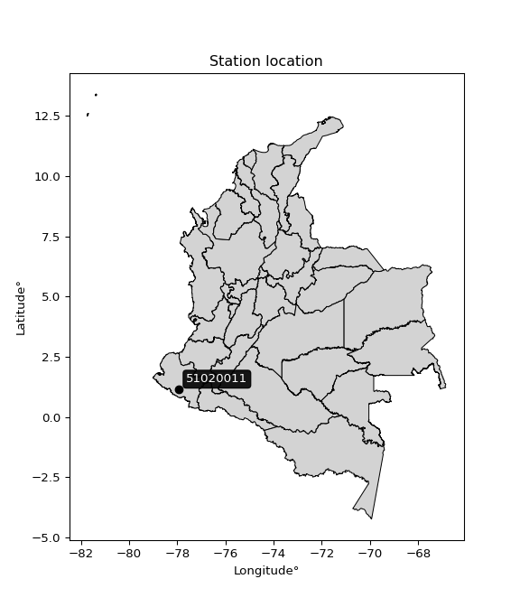

<div align="center">


</div>

# PMP Station (Rain, Pmax24h): 51020011

Probable Maximum Precipitation (PMP) is the greatest amount of rainfall for a specific duration that is meteorologically possible for a given location, acting as a "worst-case" scenario for extreme storms, crucial for designing safety-critical infrastructure like bridges, river deviations, dams, spillways, and nuclear plants to prevent catastrophic failure. PMP is calculated by hydrologists using meteorological data to determine the upper limit of extreme rainfall, often leading to the Probable Maximum Flood (PMF) for flood control design, and is increasingly being studied for climate change impacts.

<div align="center">

</img>

</div>


## A. General information


### 1. General running parameters

• app_version: _v20260103_. • runtime: _2026-01-03 07:24:50.581521_. • Python version: _3.14.0_. • SciPy version: _1.16.3_. • Pandas version: _2.3.3_. • NumPy version: _2.3.5_. • Stations dataset (station_dataset_file): _dataset/pmax24h_in/automatic_colombia_2003_2024.csv_. • Stations catalog (station_catalog_file): _dataset/CNE.xls_. • Minimum year to eval til year_max (date_min): _1900_. • Maximum year to eval since year_min (date_max): _2024_. • Creates, save and include plots into reports (create_plot): _False_. • Plot only fit distributions with Δo > Δ (plot_only_fit): _True_. • Eval low extreme values, if False, evaluates high extreme values (low_extreme): _False_. • Eval every SciPy distribution as logarithmic (pdist_logarithmic_on): _True_. • Standard deviation normalized (ddof): _1.0_. • Return periods to eval in years (Tr): _[2, 2.33, 5, 10, 15, 20, 25, 50, 75, 100, 200, 250, 500, 750, 1000]_. • Minimum data sample per station, 0 means any (minimum_sample): _5_. • Z-Score maximum threshold to adjust a value, 0 means disable (zscore_max): _3.5_. • Z-Score minimum threshold to adjust a value, 0 means disable (zscore_min): _-2.5_. • Avoid zeros, e.g. rain = 0 (avoid_zeros): _True_. • Avoid null values (avoid_nans): _True_. [:file_folder:Dataset file.](../../dataset/pmax24h_in/automatic_colombia_2003_2024.csv)

> Delta Degrees of Freedom (DDOF): is a parameter used in the formulas for calculating variance and standard deviation. When ddof=0, the divisor is $N$ (the total number of observations) and this is used when your data set is the entire population. When ddof=1, the divisor is $N-1$ and this is used when your data set is a sample drawn from a larger population. Using $N-1$ provides an unbiased estimate of the population variance (known as Bessel´s correction).


### 2. Station info and location

|   id |   CODIGO | NOMBRE                        | CATEGORIA     | TECNOLOGIA                | ESTADO   | FECHA_INSTALACION   |   FECHA_SUSPENSION |   ALTITUD |   LATITUD |   LONGITUD | DEPARTAMENTO   | MUNICIPIO            | AREA_OPERATIVA                      | ENTIDAD                                                     | AREA_HIDROGRAFICA   | ZONA_HIDROGRAFICA   | SUBZONA_HIDROGRAFICA   |   CORRIENTE | Catalogo   |   Version |
|-----:|---------:|:------------------------------|:--------------|:--------------------------|:---------|:--------------------|-------------------:|----------:|----------:|-----------:|:---------------|:---------------------|:------------------------------------|:------------------------------------------------------------|:--------------------|:--------------------|:-----------------------|------------:|:-----------|----------:|
|    0 | 51020011 | Piedrancha - - AUT [51020011] | Pluviográfica | Automática con Telemetría | Activa   | 01/07/2016          |                nan |      1830 |   1.14153 |    -77.929 | Nariño         | Mallama (Piedrancha) | Area Operativa 07 - Nariño-Putumayo | INSTITUTO DE HIDROLOGIA METEOROLOGIA Y ESTUDIOS AMBIENTALES | Pacifico            | Mira                | Río Mira               |         nan | CNE_IDEAM  |  20251226 |

<div align="center">

Dynamic map: [:earth_americas:Google](http://maps.google.com/maps?q=1.141527778,-77.92897222) [:earth_americas:OSM](https://www.openstreetmap.org/#map=18/1.141527778/-77.92897222&layers=P) [:earth_americas:Bing](https://www.bing.com/maps?cp=1.141527778~-77.92897222&lvl=18) [:earth_americas:Apple](https://maps.apple.com/frame?center=1.141527778%2C-77.92897222&span=0.003%2C0.006)

</div>


<div align="center">

```geojson
{
  "type": "Feature",
  "geometry": {
    "type": "Point", 
    "coordinates": [-77.92897222, 1.141527778]
  }, 
  "properties": {
    "Name": "51020011"
  }
}
```

</div>


### 3. Discrete values table and plot

<div align="center">

|               |          0 |           1 |           2 |           3 |           4 |           5 |           6 |            7 |
|:--------------|-----------:|------------:|------------:|------------:|------------:|------------:|------------:|-------------:|
| Date          | 2017       | 2018        | 2019        | 2020        | 2021        | 2022        | 2023        | 2024         |
| Value         |  410.05    |   98.14     |   82.43     |   57.87     |   81.8      |   34.3      |   77.7      |  130.4       |
| Value_initial |  410.05    |   98.14     |   82.43     |   57.87     |   81.8      |   34.3      |   77.7      |  130.4       |
| count         |    8       |    8        |    8        |    8        |    8        |    8        |    8        |    8         |
| mean          |  121.586   |  121.586    |  121.586    |  121.586    |  121.586    |  121.586    |  121.586    |  121.586     |
| std           |  119.857   |  119.857    |  119.857    |  119.857    |  119.857    |  119.857    |  119.857    |  119.857     |
| zscore        |    2.40674 |   -0.195619 |   -0.326692 |   -0.531603 |   -0.331948 |   -0.728255 |   -0.366156 |    0.0735357 |


</div>


> The initial value (value_initial) correspond to the initial obtained or null completed value, and value (value) is adjusted only when the initial value is outside the valid range definite through the Z-Score value. If Z-Score is active, values out of range or outliers are replaced with the station mean value


### 4. Active continuous probability distributions from SciPy (44 of 104 available)

A Probability Density Function (PDF) describes the relative likelihood of a continuous random variable falling within a specific range, where the total area under its curve equals 1, and the area over any interval gives the actual probability for that range. Unlike discrete probabilities (like rolling a die), a PDF shows density, not direct probability for a single point (which is zero), with higher points indicating higher likelihood, often visualized as a bell curve for normal distributions.

A log of a probability density function (log-PDF) is simply the logarithm of the PDF´s value, denoted as $log(f(x))$, useful for converting multiplication of probabilities into addition, improving numerical stability with tiny numbers, and connecting to information theory concepts like entropy. Instead of dealing with very small probabilities (e.g., 0.000001), log-PDFs use negative numbers (e.g., $log(0.00001) ≈ -11.51$ that are easier for computers to handle, preventing underflow errors and simplifying complex calculations. In this study, each active probability distribution from SciPy is also evaluated in the $log$ form.

[scipy.stats](https://docs.scipy.org/doc/scipy/reference/stats.html) is a Python´s powerful submodule within the SciPy library for comprehensive statistical analysis, offering over 130 probability distributions (like Normal, Poisson), functions for descriptive stats (mean, variance), hypothesis testing (t-tests, chi-square), random variable generation, and statistical tests, making it essential for data science, modeling, and research. It provides tools to explore, model, and draw conclusions from data efficiently, working seamlessly with NumPy.

<div align="center">

|   id | p_dist             |   n_parameter | fit_method   | label                                                                       | active   | ref                                                                                                        |
|-----:|:-------------------|--------------:|:-------------|:----------------------------------------------------------------------------|:---------|:-----------------------------------------------------------------------------------------------------------|
|    0 | alpha              |             3 | MLE          | Alpha                                                                       | True     | [:mortar_board:](https://docs.scipy.org/doc/scipy/reference/generated/scipy.stats.alpha.html)              |
|    1 | betaprime          |             4 | MLE          | Beta prime                                                                  | True     | [:mortar_board:](https://docs.scipy.org/doc/scipy/reference/generated/scipy.stats.betaprime.html)          |
|    2 | chi2               |             3 | MLE          | Chi²                                                                        | True     | [:mortar_board:](https://docs.scipy.org/doc/scipy/reference/generated/scipy.stats.chi2.html)               |
|    3 | crystalball        |             4 | MLE          | Crystalball                                                                 | True     | [:mortar_board:](https://docs.scipy.org/doc/scipy/reference/generated/scipy.stats.crystalball.html)        |
|    4 | erlang             |             3 | MLE          | Erlang                                                                      | True     | [:mortar_board:](https://docs.scipy.org/doc/scipy/reference/generated/scipy.stats.erlang.html)             |
|    5 | expon              |             2 | MLE          | Exponential                                                                 | True     | [:mortar_board:](https://docs.scipy.org/doc/scipy/reference/generated/scipy.stats.expon.html)              |
|    6 | exponnorm          |             3 | MLE          | Exponentially modified Normal                                               | True     | [:mortar_board:](https://docs.scipy.org/doc/scipy/reference/generated/scipy.stats.exponnorm.html)          |
|    7 | f                  |             4 | MLE          | F                                                                           | True     | [:mortar_board:](https://docs.scipy.org/doc/scipy/reference/generated/scipy.stats.f.html)                  |
|    8 | fatiguelife        |             3 | MLE          | Fatigue-life (Birnbaum-Saunders)                                            | True     | [:mortar_board:](https://docs.scipy.org/doc/scipy/reference/generated/scipy.stats.fatiguelife.html)        |
|    9 | fisk               |             3 | MLE          | Fisk                                                                        | True     | [:mortar_board:](https://docs.scipy.org/doc/scipy/reference/generated/scipy.stats.fisk.html)               |
|   10 | gamma              |             3 | MLE          | Gamma                                                                       | True     | [:mortar_board:](https://docs.scipy.org/doc/scipy/reference/generated/scipy.stats.gamma.html)              |
|   11 | genexpon           |             5 | MLE          | Generalized exponential                                                     | True     | [:mortar_board:](https://docs.scipy.org/doc/scipy/reference/generated/scipy.stats.genexpon.html)           |
|   12 | genlogistic        |             3 | MLE          | Generalized logistic                                                        | True     | [:mortar_board:](https://docs.scipy.org/doc/scipy/reference/generated/scipy.stats.genlogistic.html)        |
|   13 | gibrat             |             2 | MM           | Gibrat                                                                      | True     | [:mortar_board:](https://docs.scipy.org/doc/scipy/reference/generated/scipy.stats.gibrat.html)             |
|   14 | gompertz           |             3 | MLE          | Gompertz (or truncated Gumbel)                                              | True     | [:mortar_board:](https://docs.scipy.org/doc/scipy/reference/generated/scipy.stats.gompertz.html)           |
|   15 | gumbel_l           |             2 | MM           | Gumbel Left Skew                                                            | True     | [:mortar_board:](https://docs.scipy.org/doc/scipy/reference/generated/scipy.stats.gumbel_l.html)           |
|   16 | gumbel_r           |             2 | MM           | Gumbel Right Skew                                                           | True     | [:mortar_board:](https://docs.scipy.org/doc/scipy/reference/generated/scipy.stats.gumbel_r.html)           |
|   17 | halflogistic       |             2 | MM           | Half-logistic                                                               | True     | [:mortar_board:](https://docs.scipy.org/doc/scipy/reference/generated/scipy.stats.halflogistic.html)       |
|   18 | halfnorm           |             2 | MM           | Half Normal                                                                 | True     | [:mortar_board:](https://docs.scipy.org/doc/scipy/reference/generated/scipy.stats.halfnorm.html)           |
|   19 | hypsecant          |             2 | MM           | hyperbolic secant                                                           | True     | [:mortar_board:](https://docs.scipy.org/doc/scipy/reference/generated/scipy.stats.hypsecant.html)          |
|   20 | invgamma           |             3 | MLE          | Inverted gamma                                                              | True     | [:mortar_board:](https://docs.scipy.org/doc/scipy/reference/generated/scipy.stats.invgamma.html)           |
|   21 | invgauss           |             3 | MLE          | Inverse Gaussian                                                            | True     | [:mortar_board:](https://docs.scipy.org/doc/scipy/reference/generated/scipy.stats.invgauss.html)           |
|   22 | invweibull         |             3 | MLE          | Inverted Weibull                                                            | True     | [:mortar_board:](https://docs.scipy.org/doc/scipy/reference/generated/scipy.stats.invweibull.html)         |
|   23 | johnsonsu          |             4 | MLE          | Johnson Su                                                                  | True     | [:mortar_board:](https://docs.scipy.org/doc/scipy/reference/generated/scipy.stats.johnsonsu.html)          |
|   24 | kstwobign          |             2 | MLE          | Limiting distribution of scaled Kolmogorov-Smirnov two-sided test statistic | True     | [:mortar_board:](https://docs.scipy.org/doc/scipy/reference/generated/scipy.stats.kstwobign.html)          |
|   25 | laplace            |             2 | MM           | Laplace                                                                     | True     | [:mortar_board:](https://docs.scipy.org/doc/scipy/reference/generated/scipy.stats.laplace.html)            |
|   26 | laplace_asymmetric |             3 | MLE          | Asymmetric Laplace                                                          | True     | [:mortar_board:](https://docs.scipy.org/doc/scipy/reference/generated/scipy.stats.laplace_asymmetric.html) |
|   27 | loggamma           |             3 | MLE          | Log gamma                                                                   | True     | [:mortar_board:](https://docs.scipy.org/doc/scipy/reference/generated/scipy.stats.loggamma.html)           |
|   28 | logistic           |             2 | MM           | Logistic (or Sech-squared)                                                  | True     | [:mortar_board:](https://docs.scipy.org/doc/scipy/reference/generated/scipy.stats.logistic.html)           |
|   29 | lognorm            |             3 | MLE          | Log Normal                                                                  | True     | [:mortar_board:](https://docs.scipy.org/doc/scipy/reference/generated/scipy.stats.lognorm.html)            |
|   30 | maxwell            |             2 | MM           | Maxwell                                                                     | True     | [:mortar_board:](https://docs.scipy.org/doc/scipy/reference/generated/scipy.stats.maxwell.html)            |
|   31 | mielke             |             4 | MLE          | Mielke Beta-Kappa / Dagum                                                   | True     | [:mortar_board:](https://docs.scipy.org/doc/scipy/reference/generated/scipy.stats.mielke.html)             |
|   32 | moyal              |             2 | MM           | Moyal                                                                       | True     | [:mortar_board:](https://docs.scipy.org/doc/scipy/reference/generated/scipy.stats.moyal.html)              |
|   33 | nakagami           |             3 | MLE          | Nakagami                                                                    | True     | [:mortar_board:](https://docs.scipy.org/doc/scipy/reference/generated/scipy.stats.nakagami.html)           |
|   34 | ncf                |             5 | MLE          | Non-central F distribution                                                  | True     | [:mortar_board:](https://docs.scipy.org/doc/scipy/reference/generated/scipy.stats.ncf.html)                |
|   35 | nct                |             4 | MLE          | Non-central Student’s t                                                     | True     | [:mortar_board:](https://docs.scipy.org/doc/scipy/reference/generated/scipy.stats.nct.html)                |
|   36 | norm               |             2 | MM           | Normal                                                                      | True     | [:mortar_board:](https://docs.scipy.org/doc/scipy/reference/generated/scipy.stats.norm.html)               |
|   37 | pearson3           |             3 | MM           | Pearson type III                                                            | True     | [:mortar_board:](https://docs.scipy.org/doc/scipy/reference/generated/scipy.stats.pearson3.html)           |
|   38 | rayleigh           |             2 | MM           | Rayleigh                                                                    | True     | [:mortar_board:](https://docs.scipy.org/doc/scipy/reference/generated/scipy.stats.rayleigh.html)           |
|   39 | rice               |             3 | MLE          | Rice                                                                        | True     | [:mortar_board:](https://docs.scipy.org/doc/scipy/reference/generated/scipy.stats.rice.html)               |
|   40 | t                  |             3 | MLE          | Student’s t                                                                 | True     | [:mortar_board:](https://docs.scipy.org/doc/scipy/reference/generated/scipy.stats.t.html)                  |
|   41 | truncnorm          |             4 | MLE          | Truncated normal                                                            | True     | [:mortar_board:](https://docs.scipy.org/doc/scipy/reference/generated/scipy.stats.truncnorm.html)          |
|   42 | wald               |             2 | MM           | Wald                                                                        | True     | [:mortar_board:](https://docs.scipy.org/doc/scipy/reference/generated/scipy.stats.wald.html)               |
|   43 | weibull_min        |             3 | MLE          | Weibull minimum                                                             | True     | [:mortar_board:](https://docs.scipy.org/doc/scipy/reference/generated/scipy.stats.weibull_min.html)        |

</div>

> **n_parameter:** # arguments & localization & scale.
>
> **Fit methods:** (MLE) maximum likelihood, (MM) L-moments.
>
>**Inactive** (With the only purpose of prevent loops, zero divisions, infinite values, over high estimated values or horizontal trending for recurrence intervals estimations, the follow distributions were disabled.)**:** foldnorm, gennorm, norminvgauss, powernorm, powerlognorm, skewnorm, genextreme, anglit, arcsine, argus, beta, bradford, burr, burr12, cauchy, cosine, halfcauchy, foldcauchy, skewcauchy, wrapcauchy, dgamma, gengamma, exponweib, exponpow, truncexpon, gausshyper, genhalflogistic, genhyperbolic, geninvgauss, halfgennorm, johnsonsb, kappa4, kappa3, ksone, kstwo, loglaplace, levy, levy_l, levy_stable, ncx2, pareto, genpareto, truncpareto, lomax, powerlaw, rdist, rel_breitwigner, recipinvgauss, semicircular, studentized_range, trapezoid, triang, truncweibull_min, tukeylambda, uniform, loguniform, vonmises, vonmises_line, weibull_max, dweibull, 


## B. Probability distributions vs. Empirical distributions

A continuous probability distribution (CPD) describes probabilities for variables that can take any value within a range (like rain any time), unlike discrete variables with specific outcomes (like temperature). It uses a Probability Density Function (PDF), a curve where the total area under it equals 1, and the probability of the variable falling within an interval (a to b) is found by calculating the area under the curve between those points. A key feature is that the probability of hitting any single exact value is zero, so probabilities are always expressed for ranges, e.g., $P(a ≤ X ≤ b)$.

<div align="center">

Distributions parameters from station values
|    |   station | p_dist                |   n |               loc |          scale | shape                  | shape1                 | shape2                 | shape3   |
|---:|----------:|:----------------------|----:|------------------:|---------------:|:-----------------------|:-----------------------|:-----------------------|:---------|
|  0 |  51020011 | alpha                 |   8 |     -27.18        |  255.896       | 2.2887013118038473     |                        |                        |          |
|  1 |  51020011 | betaprime             |   8 |      -0.733625    |    1.48938     | 153.76203746389933     | 2.9221351570140754     |                        |          |
|  2 |  51020011 | chi2                  |   8 |      34.3         |   22.0136      | 0.7635339649494564     |                        |                        |          |
|  3 |  51020011 | crystalball           |   8 |     121.586       |  112.116       | 7552.43826261647       | 24320.317106240982     |                        |          |
|  4 |  51020011 | erlang                |   8 |      34.3         |   66.3716      | 0.923572702493655      |                        |                        |          |
|  5 |  51020011 | expon                 |   8 |      34.3         |   87.2862      |                        |                        |                        |          |
|  6 |  51020011 | exponnorm             |   8 |      34.2022      |    0.0316715   | 2758.3681629317784     |                        |                        |          |
|  7 |  51020011 | f                     |   8 |       8.13534     |   65.869       | 4001.844289211952      | 4.692600916906582      |                        |          |
|  8 |  51020011 | fatiguelife           |   8 |      22.7672      |   64.4341      | 1.0401969552655514     |                        |                        |          |
|  9 |  51020011 | fisk                  |   8 |      26.4326      |   57.7147      | 1.8452032091241182     |                        |                        |          |
| 10 |  51020011 | gamma                 |   8 |      34.3         |  122.207       | 0.5514130468969718     |                        |                        |          |
| 11 |  51020011 | genexpon              |   8 |      34.3         |  143.93        | 1.6489370224321966     | 4.3770806128296716e-12 | 6.603220208283492      |          |
| 12 |  51020011 | genlogistic           |   8 |    -343.08        |   54.752       | 2297.444133416473      |                        |                        |          |
| 13 |  51020011 | gibrat                |   8 |      36.056       |   51.8767      |                        |                        |                        |          |
| 14 |  51020011 | gompertz              |   8 |      34.3         |    6.12545e+10 | 721207711.3038342      |                        |                        |          |
| 15 |  51020011 | gumbel_l              |   8 |     172.044       |   87.4163      |                        |                        |                        |          |
| 16 |  51020011 | gumbel_r              |   8 |      71.1282      |   87.4163      |                        |                        |                        |          |
| 17 |  51020011 | halflogistic          |   8 |     -11.297       |   95.855       |                        |                        |                        |          |
| 18 |  51020011 | halfnorm              |   8 |     -26.8111      |  185.988       |                        |                        |                        |          |
| 19 |  51020011 | hypsecant             |   8 |     121.586       |   71.3751      |                        |                        |                        |          |
| 20 |  51020011 | invgamma              |   8 |       8.09677     |  154.6         | 2.34630036581877       |                        |                        |          |
| 21 |  51020011 | invgauss              |   8 |      19.6996      |   89.0866      | 1.1436809821007161     |                        |                        |          |
| 22 |  51020011 | invweibull            |   8 |     -10.1361      |   79.7221      | 2.127633116638384      |                        |                        |          |
| 23 |  51020011 | johnsonsu             |   8 |      81.9836      |    0.66563     | -0.13089271330658056   | 0.24333638432279672    |                        |          |
| 24 |  51020011 | kstwobign             |   8 |    -147.762       |  318.045       |                        |                        |                        |          |
| 25 |  51020011 | laplace               |   8 |     121.586       |   79.2778      |                        |                        |                        |          |
| 26 |  51020011 | laplace_asymmetric    |   8 |      57.87        |   36.9913      | 0.4585143204222323     |                        |                        |          |
| 27 |  51020011 | loggamma              |   8 |  -44354.2         | 5713.09        | 2404.829071734809      |                        |                        |          |
| 28 |  51020011 | logistic              |   8 |     121.586       |   61.8127      |                        |                        |                        |          |
| 29 |  51020011 | lognorm               |   8 |      34.3         |    0.665132    | 12.182852185289233     |                        |                        |          |
| 30 |  51020011 | maxwell               |   8 |    -144.081       |  166.482       |                        |                        |                        |          |
| 31 |  51020011 | mielke                |   8 |       0.406466    |   36.6531      | 9.255947071396404      | 2.1107129530186244     |                        |          |
| 32 |  51020011 | moyal                 |   8 |      57.4713      |   50.4698      |                        |                        |                        |          |
| 33 |  51020011 | nakagami              |   8 |      34.3         |  190.419       | 0.16175355901518068    |                        |                        |          |
| 34 |  51020011 | ncf                   |   8 |       4.55054     |   71.3414      | 345.27971055506805     | 5.1931806578005535     | 5.6359763012273134e-08 |          |
| 35 |  51020011 | nct                   |   8 |      -0.061625    |   13.4523      | 2.0396027874744527     | 5.299325597068262      |                        |          |
| 36 |  51020011 | norm                  |   8 |     121.586       |  112.116       |                        |                        |                        |          |
| 37 |  51020011 | pearson3              |   8 |     121.586       |  112.116       | 2.027619828698805      |                        |                        |          |
| 38 |  51020011 | rayleigh              |   8 |     -92.8977      |  171.133       |                        |                        |                        |          |
| 39 |  51020011 | rice                  |   8 |     -33.8421      |  135.514       | 0.00047633638231034045 |                        |                        |          |
| 40 |  51020011 | t                     |   8 |      81.0486      |    7.75097     | 0.5597424716646511     |                        |                        |          |
| 41 |  51020011 | truncnorm             |   8 | -132011           | 3845.54        | 34.33734583588837      | 105602.2219351278      |                        |          |
| 42 |  51020011 | wald                  |   8 |       9.47049     |  112.116       |                        |                        |                        |          |
| 43 |  51020011 | weibull_min           |   8 |      34.3         |   89.059       | 0.691684047473885      |                        |                        |          |
| 44 |  51020011 | logalpha              |   8 |       0.272552    |   28.3491      | 6.813531613386466      |                        |                        |          |
| 45 |  51020011 | logbetaprime          |   8 |       1.79563     |    0.314856    | 170.3385276432487      | 20.61984053417534      |                        |          |
| 46 |  51020011 | logchi2               |   8 |       3.53515     |    0.993599    | 1.0326439195274206     |                        |                        |          |
| 47 |  51020011 | logcrystalball        |   8 |       4.52946     |    0.670976    | 7.626645392688975      | 189.14154717198457     |                        |          |
| 48 |  51020011 | logerlang             |   8 |       2.98955     |    0.289966    | 5.310652609469628      |                        |                        |          |
| 49 |  51020011 | logexpon              |   8 |       3.53515     |    0.994318    |                        |                        |                        |          |
| 50 |  51020011 | logexponnorm          |   8 |       3.97465     |    0.366176    | 1.5151785556816342     |                        |                        |          |
| 51 |  51020011 | logf                  |   8 |       2.64507     |    1.81428     | 23.196267873598806     | 58.02972341031514      |                        |          |
| 52 |  51020011 | logfatiguelife        |   8 |       2.29534     |    2.14075     | 0.29536520316602416    |                        |                        |          |
| 53 |  51020011 | logfisk               |   8 |       2.36174     |    2.0717      | 6.150050019101411      |                        |                        |          |
| 54 |  51020011 | loggamma              |   8 |       2.98955     |    0.289965    | 5.310679428375064      |                        |                        |          |
| 55 |  51020011 | loggenexpon           |   8 |       3.53478     |    0.081811    | 0.037968956425489045   | 4.879275713642629      | 0.0010344460838894723  |          |
| 56 |  51020011 | loggenlogistic        |   8 |       3.58626     |    0.473408    | 4.565557522401846      |                        |                        |          |
| 57 |  51020011 | loggibrat             |   8 |       4.01763     |    0.310447    |                        |                        |                        |          |
| 58 |  51020011 | loggompertz           |   8 |       3.53515     |    1.2971      | 0.6507635075296611     |                        |                        |          |
| 59 |  51020011 | loggumbel_l           |   8 |       4.83144     |    0.523158    |                        |                        |                        |          |
| 60 |  51020011 | loggumbel_r           |   8 |       4.22749     |    0.523158    |                        |                        |                        |          |
| 61 |  51020011 | loghalflogistic       |   8 |       3.73421     |    0.573653    |                        |                        |                        |          |
| 62 |  51020011 | loghalfnorm           |   8 |       3.64132     |    1.11312     |                        |                        |                        |          |
| 63 |  51020011 | loghypsecant          |   8 |       4.52946     |    0.427157    |                        |                        |                        |          |
| 64 |  51020011 | loginvgamma           |   8 |       1.63836     |   56.9574      | 20.701107403478886     |                        |                        |          |
| 65 |  51020011 | loginvgauss           |   8 |       2.27236     |   25.9142      | 0.08709918631326936    |                        |                        |          |
| 66 |  51020011 | loginvweibull         |   8 |      -1.60963e+07 |    1.60963e+07 | 29784125.05172594      |                        |                        |          |
| 67 |  51020011 | logjohnsonsu          |   8 |       4.39706     |    0.0431274   | -0.1322467871067003    | 0.3841808404604189     |                        |          |
| 68 |  51020011 | logkstwobign          |   8 |       2.25038     |    2.62975     |                        |                        |                        |          |
| 69 |  51020011 | loglaplace            |   8 |       4.52946     |    0.474452    |                        |                        |                        |          |
| 70 |  51020011 | loglaplace_asymmetric |   8 |       4.40428     |    0.428206    | 0.8644501419511352     |                        |                        |          |
| 71 |  51020011 | logloggamma           |   8 |    -210.09        |   28.8002      | 1723.8019818379685     |                        |                        |          |
| 72 |  51020011 | loglogistic           |   8 |       4.52946     |    0.369928    |                        |                        |                        |          |
| 73 |  51020011 | loglognorm            |   8 |       3.53515     |    0.0122412   | 11.704593486958148     |                        |                        |          |
| 74 |  51020011 | logmaxwell            |   8 |       2.93953     |    0.996342    |                        |                        |                        |          |
| 75 |  51020011 | logmielke             |   8 |      -0.198158    |    4.38829     | 19.608483337790723     | 11.827065731053189     |                        |          |
| 76 |  51020011 | logmoyal              |   8 |       4.14576     |    0.302045    |                        |                        |                        |          |
| 77 |  51020011 | lognakagami           |   8 |       4.0582      |    0.619068    | 0.2509563948097725     |                        |                        |          |
| 78 |  51020011 | logncf                |   8 |       2.00976     |    0.294817    | 28.776935702678742     | 41.30174224083043      | 205.23786826264976     |          |
| 79 |  51020011 | lognct                |   8 |       0.170504    |    0.0957989   | 25.01628898990782      | 44.06599779953743      |                        |          |
| 80 |  51020011 | lognorm               |   8 |       4.52946     |    0.670976    |                        |                        |                        |          |
| 81 |  51020011 | logpearson3           |   8 |       4.52946     |    0.670977    | 0.9227149819813126     |                        |                        |          |
| 82 |  51020011 | lograyleigh           |   8 |       3.24585     |    1.02418     |                        |                        |                        |          |
| 83 |  51020011 | logrice               |   8 |       3.29567     |    0.993092    | 0.0011969112513382733  |                        |                        |          |
| 84 |  51020011 | logt                  |   8 |       4.41702     |    0.239034    | 1.1867249535156268     |                        |                        |          |
| 85 |  51020011 | logtruncnorm          |   8 |       1.92358     |    1.40338     | 1.521023732719947      | 38.02311451740264      |                        |          |
| 86 |  51020011 | logwald               |   8 |       3.85845     |    0.671009    |                        |                        |                        |          |
| 87 |  51020011 | logweibull_min        |   8 |       3.39225     |    1.27087     | 1.7166931921463329     |                        |                        |          |

</div>

> **loc** (Location parameter): This shifts the distribution along the x-axis. For many common distributions, like the normal (Gaussian) distribution, loc represents the mean $μ$. For others, like the uniform distribution, it might represent the minimum value, or for the beta distribution, the left end of the support interval.
>
> **scale** (Scale parameter): This determines the width or spread of the distribution. For the normal distribution, scale represents the standard deviation $σ$. For a uniform distribution, it defines the length of the interval (from $loc$ to $loc + scale$).
>
> **shape** (Shape parameters): Refers to parameters that define the specific form of a probability distribution, distinct from its location (loc) and scale (scale). These parameters are required arguments for most distribution functions. For example, a normal (Gaussian) distribution is fully defined by its location (mean) and scale (standard deviation), so it has no specific shape parameters beyond loc and scale. However, other distributions have intrinsic properties that need specification, as Gamma distribution that takes a shape parameter, often named $a$ or $alpha$.


### 0. Cumulative distribution values - CDF (88 evaluated)

Cumulative Distribution Function (CDF), denoted as $F$<sub>$X$</sub>$(x)$, is a function that gives the probability that a random variable $X$ will take a value less than or equal to a specific value, $x$ (i.e., $(P(X≥x)$. It essentially "accumulates" probabilities from a given point up to the far right (positive infinity), providing a complete picture of the distribution´s probabilities for both discrete (like rain) and continuous (like temperature) variables, helping to find probabilities over ranges or above certain values. Each station is evaluated separately ordering the $x$ values ascending, calculating the CDF and PDF values for the activated distributions and their logarithmic forms.

<div align="center">

CDF ordered by x ascending and calculating $log(f(x))$ separately
|   id |   Station |   date |      x |   count |    mean |     std |     zscore |   Value_initial |   station |   m |     alpha |   alpha_pdf |   betaprime |   betaprime_pdf |        chi2 |    chi2_pdf |   crystalball |   crystalball_pdf |     erlang |   erlang_pdf |    expon |   expon_pdf |   exponnorm |   exponnorm_pdf |         f |       f_pdf |   fatiguelife |   fatiguelife_pdf |      fisk |    fisk_pdf |     gamma |       gamma_pdf |    genexpon |   genexpon_pdf |   genlogistic |   genlogistic_pdf |   gibrat |   gibrat_pdf |    gompertz |   gompertz_pdf |   gumbel_l |   gumbel_l_pdf |   gumbel_r |   gumbel_r_pdf |   halflogistic |   halflogistic_pdf |   halfnorm |   halfnorm_pdf |   hypsecant |   hypsecant_pdf |   invgamma |   invgamma_pdf |   invgauss |   invgauss_pdf |   invweibull |   invweibull_pdf |   johnsonsu |   johnsonsu_pdf |   kstwobign |   kstwobign_pdf |   laplace |   laplace_pdf |   laplace_asymmetric |   laplace_asymmetric_pdf |   loggamma |   loggamma_pdf |   logistic |   logistic_pdf |   lognorm |   lognorm_pdf |   maxwell |   maxwell_pdf |    mielke |   mielke_pdf |    moyal |   moyal_pdf |    nakagami |   nakagami_pdf |       ncf |     ncf_pdf |       nct |     nct_pdf |     norm |    norm_pdf |   pearson3 |   pearson3_pdf |   rayleigh |   rayleigh_pdf |     rice |    rice_pdf |        t |       t_pdf |   truncnorm |   truncnorm_pdf |      wald |    wald_pdf |   weibull_min |   weibull_min_pdf |   logalpha |   logalpha_pdf |   logbetaprime |   logbetaprime_pdf |     logchi2 |   logchi2_pdf |   logcrystalball |   logcrystalball_pdf |   logerlang |   logerlang_pdf |   logexpon |   logexpon_pdf |   logexponnorm |   logexponnorm_pdf |     logf |   logf_pdf |   logfatiguelife |   logfatiguelife_pdf |   logfisk |   logfisk_pdf |   loggenexpon |   loggenexpon_pdf |   loggenlogistic |   loggenlogistic_pdf |   loggibrat |   loggibrat_pdf |   loggompertz |   loggompertz_pdf |   loggumbel_l |   loggumbel_l_pdf |   loggumbel_r |   loggumbel_r_pdf |   loghalflogistic |   loghalflogistic_pdf |   loghalfnorm |   loghalfnorm_pdf |   loghypsecant |   loghypsecant_pdf |   loginvgamma |   loginvgamma_pdf |   loginvgauss |   loginvgauss_pdf |   loginvweibull |   loginvweibull_pdf |   logjohnsonsu |   logjohnsonsu_pdf |   logkstwobign |   logkstwobign_pdf |   loglaplace |   loglaplace_pdf |   loglaplace_asymmetric |   loglaplace_asymmetric_pdf |   logloggamma |   logloggamma_pdf |   loglogistic |   loglogistic_pdf |   loglognorm |   loglognorm_pdf |   logmaxwell |   logmaxwell_pdf |   logmielke |   logmielke_pdf |   logmoyal |   logmoyal_pdf |   lognakagami |   lognakagami_pdf |    logncf |   logncf_pdf |    lognct |   lognct_pdf |   logpearson3 |   logpearson3_pdf |   lograyleigh |   lograyleigh_pdf |   logrice |   logrice_pdf |      logt |   logt_pdf |   logtruncnorm |   logtruncnorm_pdf |   logwald |   logwald_pdf |   logweibull_min |   logweibull_min_pdf |
|-----:|----------:|-------:|-------:|--------:|--------:|--------:|-----------:|----------------:|----------:|----:|----------:|------------:|------------:|----------------:|------------:|------------:|--------------:|------------------:|-----------:|-------------:|---------:|------------:|------------:|----------------:|----------:|------------:|--------------:|------------------:|----------:|------------:|----------:|----------------:|------------:|---------------:|--------------:|------------------:|---------:|-------------:|------------:|---------------:|-----------:|---------------:|-----------:|---------------:|---------------:|-------------------:|-----------:|---------------:|------------:|----------------:|-----------:|---------------:|-----------:|---------------:|-------------:|-----------------:|------------:|----------------:|------------:|----------------:|----------:|--------------:|---------------------:|-------------------------:|-----------:|---------------:|-----------:|---------------:|----------:|--------------:|----------:|--------------:|----------:|-------------:|---------:|------------:|------------:|---------------:|----------:|------------:|----------:|------------:|---------:|------------:|-----------:|---------------:|-----------:|---------------:|---------:|------------:|---------:|------------:|------------:|----------------:|----------:|------------:|--------------:|------------------:|-----------:|---------------:|---------------:|-------------------:|------------:|--------------:|-----------------:|---------------------:|------------:|----------------:|-----------:|---------------:|---------------:|-------------------:|---------:|-----------:|-----------------:|---------------------:|----------:|--------------:|--------------:|------------------:|-----------------:|---------------------:|------------:|----------------:|--------------:|------------------:|--------------:|------------------:|--------------:|------------------:|------------------:|----------------------:|--------------:|------------------:|---------------:|-------------------:|--------------:|------------------:|--------------:|------------------:|----------------:|--------------------:|---------------:|-------------------:|---------------:|-------------------:|-------------:|-----------------:|------------------------:|----------------------------:|--------------:|------------------:|--------------:|------------------:|-------------:|-----------------:|-------------:|-----------------:|------------:|----------------:|-----------:|---------------:|--------------:|------------------:|----------:|-------------:|----------:|-------------:|--------------:|------------------:|--------------:|------------------:|----------:|--------------:|----------:|-----------:|---------------:|-------------------:|----------:|--------------:|-----------------:|---------------------:|
|    0 |  51020011 |   2022 |  34.3  |       8 | 121.586 | 119.857 | -0.728255  |           34.3  |  51020011 |   1 | 0.0308357 | 0.0047216   |   0.0411568 |     0.00552847  | 1.05311e-06 | 5.65823e+07 |      0.218126 |       0.00262801  | 8.2952e-09 |  0.0670678   | 0        | 0.0114566   |  0.00111849 |     0.0114223   | 0.0308833 | 0.00560616  |     0.0310469 |       0.0081308   | 0.0246723 | 0.00564382  | 1.255e-09 | 97393.3         | 4.91679e-14 |    0.0114566   |     0.0971507 |       0.00413485  | 0        |  0           | 5.92919e-11 |    0.0117739   |   0.186864 |    0.00192416  |   0.217853 |    0.00379785  |       0.233458 |        0.00493192  |   0.257523 |    0.00406453  |    0.182253 |     0.00241621  |  0.0308832 |    0.00560615  |  0.0307886 |    0.00719178  |    0.0311783 |      0.00517721  |   0.0902836 |     0.000830561 |    0.101461 |     0.00363894  |  0.166266 |   0.00209726  |            0.0432829 |              0.0025519   |  0.0296955 |      0.206973  |   0.195902 |    0.00254841  | 0.0691837 |     0.198309  |  0.234511 |   0.00309911  | 0.0328171 |  0.00485032  | 0.208377 | 0.00450714  | 3.88403e-06 |    1.76838e+08 | 0.0350305 | 0.00553841  | 0.0319097 | 0.00493859  | 0.218126 | 0.00262801  |   0.19594  |    0.00736064  |   0.241356 |    0.00329494  | 0.11876  | 0.00326997  | 0.11534  | 0.00136824  | 8.05827e-06 |     0.00893663  | 0.0839187 | 0.00868928  |   7.33178e-12 |     713.719       |  0.0303547 |      0.182988  |      0.0303857 |          0.187567  | 9.36065e-09 |   1.08832e+07 |        0.0691837 |            0.198309  |   0.0296954 |       0.206974  |   0        |       1.00571  |      0.0287432 |          0.155507  | 0.030477 |  0.196335  |        0.0305815 |            0.195872  | 0.0294248 |     0.149683  |   0.000169546 |         0.464302  |        0.0327867 |            0.166625  |   0         |       0         |   2.67657e-08 |         0.501705  |     0.0805004 |        0.147507   |     0.0233737 |         0.167818  |          0        |             0         |      0        |         0         |      0.0618836 |          0.143963  |     0.0303954 |         0.187234  |     0.0305513 |         0.195387  |       0.0279084 |           0.184813  |      0.0606425 |          0.0534741 |      0.0292008 |           0.21223  |    0.0614908 |        0.129604  |               0.0408702 |                   0.110411  |     0.0766322 |         0.205053  |     0.0636932 |         0.161211  |     0.004096 |      2.32811e+12 |    0.0510981 |        0.239355  |   0.0334329 |       0.152987  | 0.00600002 |      0.0832327 |    0          |       0           | 0.0303968 |    0.187649  | 0.0363673 |    0.191271  |     0.0268079 |         0.205525  |      0.039109 |         0.265014  | 0.0286569 |     0.235864  | 0.0684977 |  0.0870529 |    0           |           0        |  0        |     0         |        0.0232065 |            0.275541  |
|    1 |  51020011 |   2020 |  57.87 |       8 | 121.586 | 119.857 | -0.531603  |           57.87 |  51020011 |   2 | 0.238373  | 0.0110118   |   0.241411  |     0.00980724  | 0.77362     | 0.0084087   |      0.284913 |       0.00302768  | 0.335909   |  0.0108849   | 0.236644 | 0.00874543  |  0.23732    |     0.00873015  | 0.253011  | 0.0107065   |     0.276622  |       0.00959052  | 0.245829  | 0.0108818   | 0.424564  |     0.00875694  | 0.236644    |    0.00874543  |     0.219547  |       0.00607768  | 0.193158 |  0.0125662   | 0.242333    |    0.00892073  |   0.237288 |    0.0023634   |   0.312306 |    0.00415772  |       0.345909 |        0.00459208  |   0.351109 |    0.00386758  |    0.247462 |     0.00312822  |  0.253011  |    0.0107065   |  0.272352  |    0.0101164   |    0.246006  |      0.0107936   |   0.120371  |     0.00202228  |    0.202663 |     0.00483173  |  0.223833 |   0.0028234   |            0.173714  |              0.010242    |  0.259663  |      0.618129  |   0.26293  |    0.00313524  | 0.241228  |     0.464604  |  0.311133 |   0.00337908  | 0.23814   |  0.0107046   | 0.319222 | 0.00479429  | 0.40758     |    0.00558226  | 0.246043  | 0.0102863   | 0.242226  | 0.0108125   | 0.284913 | 0.00302768  |   0.351032 |    0.0058701   |   0.321639 |    0.0034922   | 0.20468  | 0.00397193  | 0.169487 | 0.00394454  | 0.189955    |     0.00724043  | 0.30189   | 0.00863022  |   0.328828    |       0.00785345  |  0.249822  |      0.628373  |      0.251918  |          0.625716  | 0.519075    |   0.429434    |        0.241228  |            0.464604  |   0.259664  |       0.61813   |   0.409061 |       0.594316 |      0.234165  |          0.641793  | 0.257402 |  0.628353  |        0.255079  |            0.619715  | 0.226367  |     0.634866  |   0.292485    |         0.60671   |        0.238346  |            0.619598  |   0.0209314 |       1.24025   |   0.276185    |         0.543506  |     0.203946  |        0.347066   |     0.251055  |         0.66324   |          0.275115 |             0.805637  |      0.291978 |         0.668255  |      0.203947  |          0.445449  |     0.25156   |         0.625126  |     0.254956  |         0.620227  |       0.256762  |           0.645954  |      0.116621  |          0.22048   |      0.267985  |           0.625715 |    0.18518   |        0.390302  |               0.167912  |                   0.453617  |     0.248098  |         0.453727  |     0.218585  |         0.461725  |     0.62582  |      0.0618956   |    0.261496  |        0.537497  |   0.228698  |       0.620868  | 0.247693   |      0.78274   |    2.7675e-08 |       1.56392e+07 | 0.251947  |    0.625646  | 0.247664  |    0.597282  |     0.261779  |         0.629071  |      0.269892 |         0.565432  | 0.25531   |     0.575778  | 0.172692  |  0.42911   |    6.39505e-05 |           1.39412  |  0.163242 |     1.59862   |        0.280899  |            0.61127   |
|    2 |  51020011 |   2023 |  77.7  |       8 | 121.586 | 119.857 | -0.366156  |           77.7  |  51020011 |   3 | 0.444825  | 0.0092779   |   0.424837  |     0.00837195  | 0.884872    | 0.00367459  |      0.347737 |       0.00329588  | 0.517992   |  0.00770563  | 0.391778 | 0.00696814  |  0.392197   |     0.00695732  | 0.445472  | 0.00844566  |     0.43899   |       0.00692188  | 0.445572  | 0.00889132  | 0.563358  |     0.0056617   | 0.391778    |    0.00696814  |     0.347979  |       0.00670746  | 0.413047 |  0.00935137  | 0.400098    |    0.00706321  |   0.288122 |    0.00276757  |   0.39551  |    0.00419678  |       0.433523 |        0.00423587  |   0.425831 |    0.00366343  |    0.315563 |     0.00373175  |  0.445472  |    0.00844567  |  0.445565  |    0.00739246  |    0.443237  |      0.0087357   |   0.225405  |     0.016852    |    0.303625 |     0.00526537  |  0.287445 |   0.0036258   |            0.353777  |              0.00801005  |  0.448879  |      0.639216  |   0.329601 |    0.00357474  | 0.396194  |     0.574327  |  0.379533 |   0.00350207  | 0.438154  |  0.00900001  | 0.413129 | 0.00462811  | 0.496166    |    0.0036718   | 0.434707  | 0.00844188  | 0.44149   | 0.00886493  | 0.347737 | 0.00329588  |   0.457325 |    0.00488351  |   0.391571 |    0.00354416  | 0.287341 | 0.00432867  | 0.388676 | 0.0286846   | 0.321537    |     0.00606522  | 0.452773  | 0.00660864  |   0.455684    |       0.00527635  |  0.446596  |      0.673209  |      0.446779  |          0.664564  | 0.624269    |   0.298292    |        0.396194  |            0.574327  |   0.44888   |       0.639216  |   0.560616 |       0.441894 |      0.443328  |          0.731474  | 0.451319 |  0.657123  |        0.446593  |            0.650696  | 0.4393    |     0.760806  |   0.468021    |         0.573394  |        0.438271  |            0.698673  |   0.530611  |       1.18655   |   0.43539     |         0.532085  |     0.330081  |        0.512978   |     0.455247  |         0.684766  |          0.492393 |             0.660285  |      0.477324 |         0.584347  |      0.371991  |          0.685733  |     0.446358  |         0.66473   |     0.446678  |         0.651433  |       0.454671  |           0.663103  |      0.316464  |          2.21417   |      0.455038  |           0.619027 |    0.344596  |        0.726303  |               0.37221   |                   1.00553   |     0.398458  |         0.555194  |     0.382864  |         0.638715  |     0.640195 |      0.0390815   |    0.430117  |        0.589195  |   0.435892  |       0.739926  | 0.477853   |      0.728718  |    0.531333   |       0.864753    | 0.446776  |    0.664441  | 0.437341  |    0.660269  |     0.452787  |         0.640253  |      0.442418 |         0.588449  | 0.432563  |     0.608262  | 0.413731  |  1.28811   |    0.349349    |           0.990899 |  0.538563 |     0.896882  |        0.461235  |            0.595486  |
|    3 |  51020011 |   2021 |  81.8  |       8 | 121.586 | 119.857 | -0.331948  |           81.8  |  51020011 |   4 | 0.481637  | 0.00867639  |   0.458252  |     0.00792607  | 0.898864    | 0.00316613  |      0.361344 |       0.00334116  | 0.548523   |  0.00719422  | 0.419686 | 0.0066484   |  0.420063   |     0.00663835  | 0.478958  | 0.00789071  |     0.466452  |       0.00648004  | 0.480856  | 0.00831942  | 0.585725  |     0.00525763  | 0.419686    |    0.0066484   |     0.375511  |       0.00671615  | 0.449941 |  0.00865245  | 0.42837     |    0.00673035  |   0.299645 |    0.00285352  |   0.412682 |    0.00417835  |       0.450728 |        0.00415651  |   0.440757 |    0.00361745  |    0.3311   |     0.00384645  |  0.478958  |    0.00789071  |  0.474847  |    0.00689722  |    0.477885  |      0.00816614  |   0.421837  |     0.137884    |    0.325277 |     0.00529383  |  0.302702 |   0.00381825  |            0.385798  |              0.00761315  |  0.481475  |      0.627978  |   0.34442  |    0.00365289  | 0.425998  |     0.584311  |  0.393919 |   0.00351443  | 0.473906  |  0.00843824  | 0.431971 | 0.00456153  | 0.510751    |    0.00344854  | 0.468284  | 0.00793729  | 0.476654  | 0.00828778  | 0.361344 | 0.00334116  |   0.476974 |    0.0047029   |   0.4061   |    0.00354267  | 0.305187 | 0.0043754   | 0.526861 | 0.0354383   | 0.345954    |     0.00584711  | 0.479082  | 0.00622849  |   0.476602    |       0.00493432  |  0.480939  |      0.661745  |      0.480677  |          0.653147  | 0.639189    |   0.282223    |        0.425998  |            0.584311  |   0.481476  |       0.627978  |   0.582762 |       0.419622 |      0.480657  |          0.719157  | 0.484816 |  0.64504   |        0.479786  |            0.639648  | 0.478216  |     0.751317  |   0.4972      |         0.561234  |        0.473989  |            0.689571  |   0.586875  |       1.00722   |   0.462622    |         0.526902  |     0.357233  |        0.543021   |     0.49005   |         0.66811   |          0.525591 |             0.630829  |      0.506923 |         0.566738  |      0.408021  |          0.714288  |     0.480268  |         0.653424  |     0.479908  |         0.64033   |       0.488389  |           0.647629  |      0.472786  |          3.49692   |      0.486518  |           0.604917 |    0.384043  |        0.809445  |               0.42768   |                   1.15538   |     0.427263  |         0.564656  |     0.416197  |         0.656822  |     0.642142 |      0.0367001   |    0.460381  |        0.587391  |   0.473775  |       0.732187  | 0.514502   |      0.69617   |    0.573581   |       0.781136    | 0.480668  |    0.653028  | 0.471142  |    0.653607  |     0.485395  |         0.627449  |      0.472536 |         0.582522  | 0.463714  |     0.602832  | 0.482514  |  1.37026   |    0.39871     |           0.929376 |  0.581955 |     0.793233  |        0.491554  |            0.583375  |
|    4 |  51020011 |   2019 |  82.43 |       8 | 121.586 | 119.857 | -0.326692  |           82.43 |  51020011 |   5 | 0.487074  | 0.00858304  |   0.463224  |     0.00785675  | 0.900836    | 0.00309582  |      0.363451 |       0.00334778  | 0.553031   |  0.00711909  | 0.42386  | 0.00660058  |  0.424231   |     0.00659065  | 0.483902  | 0.00780669  |     0.470514  |       0.0064154   | 0.486069  | 0.0082315   | 0.589019  |     0.00519977  | 0.42386     |    0.00660058  |     0.379741  |       0.00671415  | 0.45536  |  0.0085488   | 0.432594    |    0.00668061  |   0.301447 |    0.00286677  |   0.415314 |    0.00417479  |       0.453343 |        0.00414418  |   0.443034 |    0.00361029  |    0.333529 |     0.00386356  |  0.483902  |    0.0078067   |  0.47917   |    0.00682422  |    0.483002  |      0.00807917  |   0.508787  |     0.121098    |    0.328613 |     0.00529653  |  0.305117 |   0.00384871  |            0.390576  |              0.00755393  |  0.486286  |      0.626007  |   0.346725 |    0.00366441  | 0.430485  |     0.585521  |  0.396133 |   0.00351594  | 0.479195  |  0.0083513   | 0.434841 | 0.00455055  | 0.512914    |    0.00341702  | 0.47326   | 0.00785995  | 0.481847  | 0.00819928  | 0.363451 | 0.00334778  |   0.479928 |    0.00467578  |   0.408332 |    0.00354209  | 0.307946 | 0.00438177  | 0.548885 | 0.0343889   | 0.349628    |     0.0058143   | 0.482988  | 0.00617191  |   0.479695    |       0.00488528  |  0.486008  |      0.659642  |      0.485681  |          0.651077  | 0.641345    |   0.279943    |        0.430485  |            0.585521  |   0.486287  |       0.626007  |   0.585969 |       0.416397 |      0.486165  |          0.716705  | 0.489757 |  0.642899  |        0.484686  |            0.637671  | 0.483973  |     0.749158  |   0.501499    |         0.559289  |        0.479273  |            0.687717  |   0.59451   |       0.983186  |   0.466661    |         0.526044  |     0.361417  |        0.547457   |     0.495165  |         0.665256  |          0.530414 |             0.62639   |      0.511261 |         0.564054  |      0.413515  |          0.717847  |     0.485274  |         0.651369  |     0.484813  |         0.638343  |       0.493347  |           0.644983  |      0.49915   |          3.35927   |      0.49115   |           0.602587 |    0.390303  |        0.822641  |               0.436476  |                   1.13763   |     0.4316    |         0.565816  |     0.421245  |         0.65904   |     0.642422 |      0.036369    |    0.464886  |        0.586861  |   0.479386  |       0.730365  | 0.519824   |      0.691057  |    0.579531   |       0.76994     | 0.48567   |    0.650959  | 0.476151  |    0.652221  |     0.490201  |         0.625257  |      0.477001 |         0.581416  | 0.468335  |     0.601774  | 0.49304   |  1.37328   |    0.405806    |           0.920425 |  0.587986 |     0.778978  |        0.496022  |            0.581387  |
|    5 |  51020011 |   2018 |  98.14 |       8 | 121.586 | 119.857 | -0.195619  |           98.14 |  51020011 |   6 | 0.604127  | 0.00637582  |   0.573261  |     0.00618013  | 0.938408    | 0.00181956  |      0.417175 |       0.00348134  | 0.651546   |  0.0054986   | 0.518759 | 0.00551337  |  0.518994   |     0.00550592  | 0.591082  | 0.00590773  |     0.559972  |       0.00504625  | 0.598823  | 0.0061818   | 0.6609    |     0.00402832  | 0.518759    |    0.00551337  |     0.483462  |       0.0064165   | 0.571274 |  0.00632302  | 0.528412    |    0.00555246  |   0.349083 |    0.00319719  |   0.479899 |    0.00403051  |       0.515981 |        0.00382747  |   0.498303 |    0.00342331  |    0.397269 |     0.00422942  |  0.591082  |    0.00590773  |  0.573465  |    0.00525953  |    0.593723  |      0.00608234  |   0.792166  |     0.0043106   |    0.411649 |     0.00523568  |  0.371987 |   0.0046922   |            0.498408  |              0.00621732  |  0.590558  |      0.564777  |   0.406293 |    0.00390242  | 0.533809  |     0.592434  |  0.451486 |   0.00352042  | 0.593873  |  0.0063015   | 0.503892 | 0.00422566  | 0.561383    |    0.00280059  | 0.582183  | 0.0060564   | 0.594088  | 0.00615431  | 0.417175 | 0.00348134  |   0.548349 |    0.00405035  |   0.463706 |    0.00349826  | 0.377666 | 0.00447272  | 0.800671 | 0.00610972  | 0.434851    |     0.00505301  | 0.569725  | 0.00492124  |   0.548109    |       0.00388903  |  0.595559  |      0.590225  |      0.593892  |          0.583835  | 0.686074    |   0.234871    |        0.533809  |            0.592434  |   0.590559  |       0.564777  |   0.652593 |       0.349393 |      0.604245  |          0.627875  | 0.596503 |  0.575686  |        0.590869  |            0.574513  | 0.607802  |     0.658997  |   0.594732    |         0.507355  |        0.593833  |            0.617797  |   0.727565  |       0.583942  |   0.55637     |         0.50055   |     0.465278  |        0.639846   |     0.604371  |         0.581739  |          0.630815 |             0.52477   |      0.604137 |         0.499882  |      0.542299  |          0.738613  |     0.593561  |         0.584378  |     0.591088  |         0.57488   |       0.59952   |           0.567563  |      0.760302  |          0.614624  |      0.590918  |           0.53805  |    0.556537  |        0.934684  |               0.603751  |                   0.799938  |     0.53151   |         0.573642  |     0.538399  |         0.67182   |     0.648192 |      0.0301591   |    0.565202  |        0.558161  |   0.600839  |       0.651421  | 0.629674   |      0.566977  |    0.695158   |       0.570148    | 0.593864  |    0.583749  | 0.585759  |    0.597679  |     0.593972  |         0.560158  |      0.575402 |         0.542638  | 0.570279  |     0.562396  | 0.704123  |  0.934106  |    0.549557    |           0.732675 |  0.699905 |     0.524428  |        0.592865  |            0.525953  |
|    6 |  51020011 |   2024 | 130.4  |       8 | 121.586 | 119.857 |  0.0735357 |          130.4  |  51020011 |   7 | 0.755251  | 0.00333296  |   0.72782   |     0.00362151  | 0.975419    | 0.000679092 |      0.53133  |       0.00354733  | 0.789888   |  0.00327783  | 0.667453 | 0.00380984  |  0.66751    |     0.00380591  | 0.735798  | 0.00333496  |     0.690999  |       0.00325076  | 0.747632  | 0.00334864  | 0.765019  |     0.00257511  | 0.667453    |    0.00380984  |     0.668161  |       0.0049203   | 0.725106 |  0.00353609  | 0.677443    |    0.00379777  |   0.462604 |    0.00381775  |   0.601932 |    0.00349531  |       0.628614 |        0.003155    |   0.602042 |    0.00300127  |    0.539207 |     0.00442589  |  0.735798  |    0.00333496  |  0.70691   |    0.00322318  |    0.741311  |      0.00335943  |   0.860137  |     0.0011178   |    0.571259 |     0.00457102  |  0.552609 |   0.00564333  |            0.663729  |              0.00416814  |  0.732319  |      0.429396  |   0.535587 |    0.00402399  | 0.694424  |     0.522481  |  0.562864 |   0.00334658  | 0.746002  |  0.00343342  | 0.627295 | 0.00341122  | 0.638776    |    0.00207533  | 0.731924  | 0.00347582  | 0.742757  | 0.0033656   | 0.53133  | 0.00354733  |   0.661621 |    0.00302364  |   0.573129 |    0.0032547   | 0.520239 | 0.00429085  | 0.888075 | 0.00125889  | 0.576473    |     0.00378769  | 0.6977    | 0.00316738  |   0.651473    |       0.0026441   |  0.74153   |      0.433611  |      0.738867  |          0.432985  | 0.744754    |   0.181322    |        0.694424  |            0.522481  |   0.73232   |       0.429396  |   0.738963 |       0.262529 |      0.75462   |          0.42928   | 0.739635 |  0.428484  |        0.734521  |            0.432849  | 0.764497  |     0.441339  |   0.724462    |         0.403117  |        0.745835  |            0.44748   |   0.843926  |       0.280634  |   0.690032    |         0.435414  |     0.659637  |        0.701172   |     0.746397  |         0.41731   |          0.757571 |             0.37138   |      0.730564 |         0.38955   |      0.730834  |          0.557677  |     0.738705  |         0.433571  |     0.734767  |         0.432697  |       0.739054  |           0.413517  |      0.854372  |          0.184684  |      0.726098  |           0.41188  |    0.756387  |        0.513463  |               0.776752  |                   0.450688  |     0.687824  |         0.512103  |     0.715488  |         0.550282  |     0.655749 |      0.0235518   |    0.711011  |        0.459836  |   0.75812   |       0.451121  | 0.763244   |      0.38021   |    0.824949   |       0.35851     | 0.738824  |    0.432968  | 0.735982  |    0.453209  |     0.73405   |         0.423     |      0.715874 |         0.440097  | 0.715645  |     0.454094  | 0.861339  |  0.298962  |    0.721387    |           0.488788 |  0.812439 |     0.294573  |        0.726492  |            0.411748  |
|    7 |  51020011 |   2017 | 410.05 |       8 | 121.586 | 119.857 |  2.40674   |          410.05 |  51020011 |   8 | 0.966434  | 0.000126557 |   0.977636  |     0.000136816 | 0.999979    | 5.09674e-07 |      0.994958 |       0.000129944 | 0.997133   |  4.36993e-05 | 0.986496 | 0.000154704 |  0.986461   |     0.000154972 | 0.971082  | 0.000149925 |     0.97528   |       0.000205482 | 0.970547  | 0.000137497 | 0.984501  |     0.000141691 | 0.986496    |    0.000154704 |     0.997563  |       4.44563e-05 | 0.975887 |  0.000151607 | 0.988015    |    0.000141116 |   1        |    4.27066e-08 |   0.979502 |    0.000232065 |       0.975639 |        0.000251047 |   0.981169 |    0.000271907 |    0.988815 |     0.000156672 |  0.971083  |    0.000149925 |  0.972245  |    0.000195608 |    0.971303  |      0.000143202 |   0.93901   |     8.9495e-05  |    0.995742 |     9.39184e-05 |  0.986856 |   0.000165796 |            0.989498  |              0.000130179 |  0.970658  |      0.0641794 |   0.990685 |    0.000149298 | 0.986651  |     0.0510463 |  0.988692 |   0.000208618 | 0.973563  |  0.000133991 | 0.97574  | 0.000240271 | 0.923955    |    0.000457975 | 0.974293  | 0.000144045 | 0.97094   | 0.000141946 | 0.994958 | 0.000129945 |   0.971766 |    0.000249947 |   0.986682 |    0.000228716 | 0.995322 | 0.000113079 | 0.961207 | 6.59868e-05 | 0.96536     |     0.000310447 | 0.970729  | 0.000208632 |   0.93325     |       0.000332597 |  0.9698    |      0.0587922 |      0.970244  |          0.0603482 | 0.881013    |   0.0755003   |        0.986651  |            0.0510463 |   0.970658  |       0.0641792 |   0.917529 |       0.082942 |      0.968633  |          0.0565348 | 0.970609 |  0.0607535 |        0.970992  |            0.0625215 | 0.970424  |     0.0483001 |   0.968237    |         0.0732581 |        0.973506  |            0.0550548 |   0.968714  |       0.0352483 |   0.976631    |         0.0794003 |     0.999934  |        0.00121088 |     0.967792  |         0.0605622 |          0.963247 |             0.0628912 |      0.967125 |         0.0736006 |      0.980408  |          0.0458375 |     0.970328  |         0.0603091 |     0.970915  |         0.0624446 |       0.964352  |           0.0647718 |      0.936617  |          0.0294899 |      0.966903  |           0.072091 |    0.978223  |        0.0458992 |               0.977903  |                   0.0446084 |     0.984566  |         0.0569194 |     0.98235   |         0.0468705 |     0.675017 |      0.0123932   |    0.977049  |        0.0648902 |   0.97351   |       0.0493411 | 0.96394    |      0.0596531 |    0.990859   |       0.0289432   | 0.970232  |    0.0603722 | 0.975166  |    0.0568807 |     0.969484  |         0.0648141 |      0.974231 |         0.0680595 | 0.976542  |     0.0647119 | 0.965397  |  0.0252204 |    0.972384    |           0.063078 |  0.960891 |     0.0480526 |        0.968933  |            0.0705596 |


</div>

An Empirical Distribution Function (EDF) is a step-function estimate of a true cumulative distribution function (CDF) based on observed sample data, representing the proportion of data points less than or equal to a given value. It is calculated by ordering your data and jumping up by $1/n$ (where $n$ is sample size) at each unique data point, allowing analysis without assuming an underlying population distribution, and it gets closer to the true CDF as the sample size grows. For the empirical probability calculations, the parameter $m$ correspond to the order number which means the position of the $x$ values in an ascending order list.


### 1. Empirical - EDF California (1923)

California´s estimates the true probability distribution of water-related data (like rainfall, streamflow) using observed samples, crucial for risk assessment.

<div align="center">


$P=m/n$


</div>


**1.1. Empirical values**

<div align="center">

|                | 0                  | 1                  | 2              | 3              | 4                  | 5              | 6              | 7              |
|:---------------|:-------------------|:-------------------|:---------------|:---------------|:-------------------|:---------------|:---------------|:---------------|
| date           | 2022               | 2020               | 2023           | 2021           | 2019               | 2018           | 2024           | 2017           |
| x              | 34.3               | 57.87              | 77.7           | 81.8           | 82.43              | 98.14          | 130.4          | 410.05         |
| m              | 1                  | 2                  | 3              | 4              | 5                  | 6              | 7              | 8              |
| empirical_dist | edf_california     | edf_california     | edf_california | edf_california | edf_california     | edf_california | edf_california | edf_california |
| empirical      | 0.125              | 0.25               | 0.375          | 0.5            | 0.625              | 0.75           | 0.875          | 1.0            |
| empirical_tr   | 1.1428571428571428 | 1.3333333333333333 | 1.6            | 2.0            | 2.6666666666666665 | 4.0            | 8.0            | inf            |

</div>


**1.2. Kolmogorov-Smirnov fit test (sorted by Δ)**


<div align="center">

|                | 0                  | 1                   | 2                  | 3                   | 4                   | 5                  | 6                   | 7                   | 8                  | 9                   | 10                 | 11                 | 12                 | 13                  | 14                  | 15                  | 16                 | 17                  | 18                  | 19                  | 20                  | 21                 | 22                 | 23                  | 24                  | 25                  | 26                 | 27                  | 28                 | 29                  | 30                  | 31                  | 32                  | 33                  | 34                  | 35                  | 36                  | 37                  | 38                  | 39                  | 40                  | 41                 | 42                  | 43                  | 44                  | 45                  | 46                  | 47                    | 48                  | 49                  | 50                  | 51                  | 52                  | 53                  | 54                 | 55                 | 56                  | 57                  | 58                 | 59                  | 60                  | 61                  | 62                  | 63                  | 64                 | 65                  | 66                 | 67                  | 68                  | 69                 | 70                 | 71                  | 72                 | 73                 | 74                 | 75                 | 76                 | 77                 | 78                 | 79                 | 80                  | 81                 | 82                  | 83                 | 84                 | 85                  | 86                 | 87                 |
|:---------------|:-------------------|:--------------------|:-------------------|:--------------------|:--------------------|:-------------------|:--------------------|:--------------------|:-------------------|:--------------------|:-------------------|:-------------------|:-------------------|:--------------------|:--------------------|:--------------------|:-------------------|:--------------------|:--------------------|:--------------------|:--------------------|:-------------------|:-------------------|:--------------------|:--------------------|:--------------------|:-------------------|:--------------------|:-------------------|:--------------------|:--------------------|:--------------------|:--------------------|:--------------------|:--------------------|:--------------------|:--------------------|:--------------------|:--------------------|:--------------------|:--------------------|:-------------------|:--------------------|:--------------------|:--------------------|:--------------------|:--------------------|:----------------------|:--------------------|:--------------------|:--------------------|:--------------------|:--------------------|:--------------------|:-------------------|:-------------------|:--------------------|:--------------------|:-------------------|:--------------------|:--------------------|:--------------------|:--------------------|:--------------------|:-------------------|:--------------------|:-------------------|:--------------------|:--------------------|:-------------------|:-------------------|:--------------------|:-------------------|:-------------------|:-------------------|:-------------------|:-------------------|:-------------------|:-------------------|:-------------------|:--------------------|:-------------------|:--------------------|:-------------------|:-------------------|:--------------------|:-------------------|:-------------------|
| station        | 51020011           | 51020011            | 51020011           | 51020011            | 51020011            | 51020011           | 51020011            | 51020011            | 51020011           | 51020011            | 51020011           | 51020011           | 51020011           | 51020011            | 51020011            | 51020011            | 51020011           | 51020011            | 51020011            | 51020011            | 51020011            | 51020011           | 51020011           | 51020011            | 51020011            | 51020011            | 51020011           | 51020011            | 51020011           | 51020011            | 51020011            | 51020011            | 51020011            | 51020011            | 51020011            | 51020011            | 51020011            | 51020011            | 51020011            | 51020011            | 51020011            | 51020011           | 51020011            | 51020011            | 51020011            | 51020011            | 51020011            | 51020011              | 51020011            | 51020011            | 51020011            | 51020011            | 51020011            | 51020011            | 51020011           | 51020011           | 51020011            | 51020011            | 51020011           | 51020011            | 51020011            | 51020011            | 51020011            | 51020011            | 51020011           | 51020011            | 51020011           | 51020011            | 51020011            | 51020011           | 51020011           | 51020011            | 51020011           | 51020011           | 51020011           | 51020011           | 51020011           | 51020011           | 51020011           | 51020011           | 51020011            | 51020011           | 51020011            | 51020011           | 51020011           | 51020011            | 51020011           | 51020011           |
| empirical_dist | edf_california     | edf_california      | edf_california     | edf_california      | edf_california      | edf_california     | edf_california      | edf_california      | edf_california     | edf_california      | edf_california     | edf_california     | edf_california     | edf_california      | edf_california      | edf_california      | edf_california     | edf_california      | edf_california      | edf_california      | edf_california      | edf_california     | edf_california     | edf_california      | edf_california      | edf_california      | edf_california     | edf_california      | edf_california     | edf_california      | edf_california      | edf_california      | edf_california      | edf_california      | edf_california      | edf_california      | edf_california      | edf_california      | edf_california      | edf_california      | edf_california      | edf_california     | edf_california      | edf_california      | edf_california      | edf_california      | edf_california      | edf_california        | edf_california      | edf_california      | edf_california      | edf_california      | edf_california      | edf_california      | edf_california     | edf_california     | edf_california      | edf_california      | edf_california     | edf_california      | edf_california      | edf_california      | edf_california      | edf_california      | edf_california     | edf_california      | edf_california     | edf_california      | edf_california      | edf_california     | edf_california     | edf_california      | edf_california     | edf_california     | edf_california     | edf_california     | edf_california     | edf_california     | edf_california     | edf_california     | edf_california      | edf_california     | edf_california      | edf_california     | edf_california     | edf_california      | edf_california     | edf_california     |
| p_dist         | t                  | logmoyal            | loghalflogistic    | logt                | logjohnsonsu        | logfisk            | erlang              | loggumbel_r         | logexponnorm       | loghalfnorm         | alpha              | logmielke          | johnsonsu          | loginvweibull       | fisk                | logf                | logalpha           | loggenexpon         | nct                 | logpearson3         | logbetaprime        | mielke             | logncf             | loggenlogistic      | invweibull          | loginvgamma         | logweibull_min     | loginvgauss         | f                  | invgamma            | logkstwobign        | logfatiguelife      | logerlang           | loggamma            | loggamma            | logwald             | lognct              | ncf                 | lograyleigh         | invgauss            | betaprime           | gibrat             | logrice             | wald                | logmaxwell          | logexpon            | gamma               | loglaplace_asymmetric | fatiguelife         | loggompertz         | loghypsecant        | loglogistic         | pearson3            | logcrystalball      | lognorm            | lognorm            | logloggamma         | gompertz            | weibull_min        | loggibrat           | exponnorm           | genexpon            | expon               | loglaplace          | nakagami           | halflogistic        | moyal              | logtruncnorm        | lognakagami         | laplace_asymmetric | genlogistic        | logchi2             | halfnorm           | gumbel_r           | loggumbel_l        | rayleigh           | maxwell            | truncnorm          | kstwobign          | crystalball        | norm                | logistic           | hypsecant           | rice               | loglognorm         | laplace             | gumbel_l           | chi2               |
| delta          | 0.0805126218636352 | 0.12032631825255424 | 0.125              | 0.13196020912529577 | 0.13337941069061182 | 0.1421984708531957 | 0.14299163859040942 | 0.14562892095076396 | 0.1457549700212355 | 0.14586277842984907 | 0.1458732479909166 | 0.1491611848789015 | 0.1495948577481494 | 0.15048007943411912 | 0.15117747763418676 | 0.15349677547619434 | 0.154441186164886  | 0.15526819371289724 | 0.15591213007551596 | 0.15602778509036497 | 0.15610762864328054 | 0.1561265578435339 | 0.1561359754944197 | 0.15616700132547645 | 0.15627661805516746 | 0.15643878860565996 | 0.1571347077677192 | 0.15891211962648666 | 0.1589184503850778 | 0.15891845325773646 | 0.15908191714372844 | 0.15913119375911866 | 0.15944127903813765 | 0.15944198681042332 | 0.15944198681042332 | 0.16356273300182333 | 0.16424124365299564 | 0.16781671467689074 | 0.17459820993168274 | 0.17653466146222385 | 0.17673935705513877 | 0.1787261116679596 | 0.17972100408034963 | 0.18027450519363764 | 0.18479796097379741 | 0.18561648790497332 | 0.18835763370576408 | 0.1885239905360101    | 0.19002768813613613 | 0.19362987656529673 | 0.21148525925345157 | 0.21160100504477186 | 0.21337898009199752 | 0.21619072768182768 | 0.2161907282560167 | 0.2161907282560167 | 0.21849010294824067 | 0.22158834299234087 | 0.2235268944206702 | 0.22906861396273304 | 0.23100612989167146 | 0.23124118663314452 | 0.23124120293696604 | 0.23469659242722357 | 0.2362239261254091 | 0.24638585632299403 | 0.247704986857753  | 0.24993604949578607 | 0.24999997232500532 | 0.2515916294944447 | 0.2665381675561794 | 0.26907477560070525 | 0.2729582927087325 | 0.2730678754229712 | 0.2847223230238455 | 0.3018712494498855 | 0.312135597266744  | 0.3151494300905534 | 0.3383509186318764 | 0.3436702341009168 | 0.34367024647550926 | 0.3437070239040237 | 0.35273135309140136 | 0.3723337032862442 | 0.3758204287137563 | 0.37801253068817414 | 0.4123955660366556 | 0.5236203544007698 |
| deltao         | 0.4472608134160001 | 0.4472608134160001  | 0.4472608134160001 | 0.4472608134160001  | 0.4472608134160001  | 0.4472608134160001 | 0.4472608134160001  | 0.4472608134160001  | 0.4472608134160001 | 0.4472608134160001  | 0.4472608134160001 | 0.4472608134160001 | 0.4472608134160001 | 0.4472608134160001  | 0.4472608134160001  | 0.4472608134160001  | 0.4472608134160001 | 0.4472608134160001  | 0.4472608134160001  | 0.4472608134160001  | 0.4472608134160001  | 0.4472608134160001 | 0.4472608134160001 | 0.4472608134160001  | 0.4472608134160001  | 0.4472608134160001  | 0.4472608134160001 | 0.4472608134160001  | 0.4472608134160001 | 0.4472608134160001  | 0.4472608134160001  | 0.4472608134160001  | 0.4472608134160001  | 0.4472608134160001  | 0.4472608134160001  | 0.4472608134160001  | 0.4472608134160001  | 0.4472608134160001  | 0.4472608134160001  | 0.4472608134160001  | 0.4472608134160001  | 0.4472608134160001 | 0.4472608134160001  | 0.4472608134160001  | 0.4472608134160001  | 0.4472608134160001  | 0.4472608134160001  | 0.4472608134160001    | 0.4472608134160001  | 0.4472608134160001  | 0.4472608134160001  | 0.4472608134160001  | 0.4472608134160001  | 0.4472608134160001  | 0.4472608134160001 | 0.4472608134160001 | 0.4472608134160001  | 0.4472608134160001  | 0.4472608134160001 | 0.4472608134160001  | 0.4472608134160001  | 0.4472608134160001  | 0.4472608134160001  | 0.4472608134160001  | 0.4472608134160001 | 0.4472608134160001  | 0.4472608134160001 | 0.4472608134160001  | 0.4472608134160001  | 0.4472608134160001 | 0.4472608134160001 | 0.4472608134160001  | 0.4472608134160001 | 0.4472608134160001 | 0.4472608134160001 | 0.4472608134160001 | 0.4472608134160001 | 0.4472608134160001 | 0.4472608134160001 | 0.4472608134160001 | 0.4472608134160001  | 0.4472608134160001 | 0.4472608134160001  | 0.4472608134160001 | 0.4472608134160001 | 0.4472608134160001  | 0.4472608134160001 | 0.4472608134160001 |
| eval           | Δo > Δ             | Δo > Δ              | Δo > Δ             | Δo > Δ              | Δo > Δ              | Δo > Δ             | Δo > Δ              | Δo > Δ              | Δo > Δ             | Δo > Δ              | Δo > Δ             | Δo > Δ             | Δo > Δ             | Δo > Δ              | Δo > Δ              | Δo > Δ              | Δo > Δ             | Δo > Δ              | Δo > Δ              | Δo > Δ              | Δo > Δ              | Δo > Δ             | Δo > Δ             | Δo > Δ              | Δo > Δ              | Δo > Δ              | Δo > Δ             | Δo > Δ              | Δo > Δ             | Δo > Δ              | Δo > Δ              | Δo > Δ              | Δo > Δ              | Δo > Δ              | Δo > Δ              | Δo > Δ              | Δo > Δ              | Δo > Δ              | Δo > Δ              | Δo > Δ              | Δo > Δ              | Δo > Δ             | Δo > Δ              | Δo > Δ              | Δo > Δ              | Δo > Δ              | Δo > Δ              | Δo > Δ                | Δo > Δ              | Δo > Δ              | Δo > Δ              | Δo > Δ              | Δo > Δ              | Δo > Δ              | Δo > Δ             | Δo > Δ             | Δo > Δ              | Δo > Δ              | Δo > Δ             | Δo > Δ              | Δo > Δ              | Δo > Δ              | Δo > Δ              | Δo > Δ              | Δo > Δ             | Δo > Δ              | Δo > Δ             | Δo > Δ              | Δo > Δ              | Δo > Δ             | Δo > Δ             | Δo > Δ              | Δo > Δ             | Δo > Δ             | Δo > Δ             | Δo > Δ             | Δo > Δ             | Δo > Δ             | Δo > Δ             | Δo > Δ             | Δo > Δ              | Δo > Δ             | Δo > Δ              | Δo > Δ             | Δo > Δ             | Δo > Δ              | Δo > Δ             | Δo <= Δ            |
| fit            | 1                  | 1                   | 1                  | 1                   | 1                   | 1                  | 1                   | 1                   | 1                  | 1                   | 1                  | 1                  | 1                  | 1                   | 1                   | 1                   | 1                  | 1                   | 1                   | 1                   | 1                   | 1                  | 1                  | 1                   | 1                   | 1                   | 1                  | 1                   | 1                  | 1                   | 1                   | 1                   | 1                   | 1                   | 1                   | 1                   | 1                   | 1                   | 1                   | 1                   | 1                   | 1                  | 1                   | 1                   | 1                   | 1                   | 1                   | 1                     | 1                   | 1                   | 1                   | 1                   | 1                   | 1                   | 1                  | 1                  | 1                   | 1                   | 1                  | 1                   | 1                   | 1                   | 1                   | 1                   | 1                  | 1                   | 1                  | 1                   | 1                   | 1                  | 1                  | 1                   | 1                  | 1                  | 1                  | 1                  | 1                  | 1                  | 1                  | 1                  | 1                   | 1                  | 1                   | 1                  | 1                  | 1                   | 1                  | 0                  |
| n              | 8                  | 8                   | 8                  | 8                   | 8                   | 8                  | 8                   | 8                   | 8                  | 8                   | 8                  | 8                  | 8                  | 8                   | 8                   | 8                   | 8                  | 8                   | 8                   | 8                   | 8                   | 8                  | 8                  | 8                   | 8                   | 8                   | 8                  | 8                   | 8                  | 8                   | 8                   | 8                   | 8                   | 8                   | 8                   | 8                   | 8                   | 8                   | 8                   | 8                   | 8                   | 8                  | 8                   | 8                   | 8                   | 8                   | 8                   | 8                     | 8                   | 8                   | 8                   | 8                   | 8                   | 8                   | 8                  | 8                  | 8                   | 8                   | 8                  | 8                   | 8                   | 8                   | 8                   | 8                   | 8                  | 8                   | 8                  | 8                   | 8                   | 8                  | 8                  | 8                   | 8                  | 8                  | 8                  | 8                  | 8                  | 8                  | 8                  | 8                  | 8                   | 8                  | 8                   | 8                  | 8                  | 8                   | 8                  | 8                  |
| best_fit       | 1                  | 0                   | 0                  | 0                   | 0                   | 0                  | 0                   | 0                   | 0                  | 0                   | 0                  | 0                  | 0                  | 0                   | 0                   | 0                   | 0                  | 0                   | 0                   | 0                   | 0                   | 0                  | 0                  | 0                   | 0                   | 0                   | 0                  | 0                   | 0                  | 0                   | 0                   | 0                   | 0                   | 0                   | 0                   | 0                   | 0                   | 0                   | 0                   | 0                   | 0                   | 0                  | 0                   | 0                   | 0                   | 0                   | 0                   | 0                     | 0                   | 0                   | 0                   | 0                   | 0                   | 0                   | 0                  | 0                  | 0                   | 0                   | 0                  | 0                   | 0                   | 0                   | 0                   | 0                   | 0                  | 0                   | 0                  | 0                   | 0                   | 0                  | 0                  | 0                   | 0                  | 0                  | 0                  | 0                  | 0                  | 0                  | 0                  | 0                  | 0                   | 0                  | 0                   | 0                  | 0                  | 0                   | 0                  | 0                  |
| best_fit_sort  | 1                  | 2                   | 3                  | 4                   | 5                   | 6                  | 7                   | 8                   | 9                  | 10                  | 11                 | 12                 | 13                 | 14                  | 15                  | 16                  | 17                 | 18                  | 19                  | 20                  | 21                  | 22                 | 23                 | 24                  | 25                  | 26                  | 27                 | 28                  | 29                 | 30                  | 31                  | 32                  | 33                  | 34                  | 35                  | 36                  | 37                  | 38                  | 39                  | 40                  | 41                  | 42                 | 43                  | 44                  | 45                  | 46                  | 47                  | 48                    | 49                  | 50                  | 51                  | 52                  | 53                  | 54                  | 55                 | 56                 | 57                  | 58                  | 59                 | 60                  | 61                  | 62                  | 63                  | 64                  | 65                 | 66                  | 67                 | 68                  | 69                  | 70                 | 71                 | 72                  | 73                 | 74                 | 75                 | 76                 | 77                 | 78                 | 79                 | 80                 | 81                  | 82                 | 83                  | 84                 | 85                 | 86                  | 87                 | 88                 |

</div>


**1.3. Best fit**

<div align="center">

|   id |   station | empirical_dist   | p_dist   |     delta |   deltao | eval   |   fit |   n |   best_fit |   best_fit_sort |
|-----:|----------:|:-----------------|:---------|----------:|---------:|:-------|------:|----:|-----------:|----------------:|
|    0 |  51020011 | edf_california   | t        | 0.0805126 | 0.447261 | Δo > Δ |     1 |   8 |          1 |               1 |

</div>


### 2. Empirical - EDF Hazen (1930)

Hazen method for plotting positions is a formula used to estimate the empirical cumulative probability distribution of flood events or other hydrological data. This formula often results in biased estimations, particularly when extrapolating to extreme events (high return periods).

<div align="center">


$P=(m-0.5)/n$


</div>


**2.1. Empirical values**

<div align="center">

|                | 0                  | 1                  | 2                  | 3                  | 4                  | 5         | 6                 | 7         |
|:---------------|:-------------------|:-------------------|:-------------------|:-------------------|:-------------------|:----------|:------------------|:----------|
| date           | 2022               | 2020               | 2023               | 2021               | 2019               | 2018      | 2024              | 2017      |
| x              | 34.3               | 57.87              | 77.7               | 81.8               | 82.43              | 98.14     | 130.4             | 410.05    |
| m              | 1                  | 2                  | 3                  | 4                  | 5                  | 6         | 7                 | 8         |
| empirical_dist | edf_hazen          | edf_hazen          | edf_hazen          | edf_hazen          | edf_hazen          | edf_hazen | edf_hazen         | edf_hazen |
| empirical      | 0.0625             | 0.1875             | 0.3125             | 0.4375             | 0.5625             | 0.6875    | 0.8125            | 0.9375    |
| empirical_tr   | 1.0666666666666667 | 1.2307692307692308 | 1.4545454545454546 | 1.7777777777777777 | 2.2857142857142856 | 3.2       | 5.333333333333333 | 16.0      |

</div>


**2.2. Kolmogorov-Smirnov fit test (sorted by Δ)**


<div align="center">

|                | 0                   | 1                   | 2                  | 3                   | 4                   | 5                  | 6                  | 7                  | 8                   | 9                   | 10                  | 11                 | 12                 | 13                    | 14                  | 15                  | 16                  | 17                 | 18                  | 19                 | 20                  | 21                  | 22                  | 23                  | 24                  | 25                 | 26                  | 27                  | 28                  | 29                 | 30                  | 31                  | 32                  | 33                  | 34                 | 35                 | 36                  | 37                 | 38                 | 39                  | 40                  | 41                  | 42                  | 43                  | 44                  | 45                 | 46                 | 47                  | 48                  | 49                  | 50                 | 51                 | 52                  | 53                  | 54                  | 55                  | 56                  | 57                  | 58                  | 59                  | 60                 | 61                  | 62                 | 63                  | 64                  | 65                 | 66                  | 67                 | 68                 | 69                 | 70                  | 71                  | 72                  | 73                  | 74                 | 75                 | 76                 | 77                 | 78                 | 79                  | 80                 | 81                  | 82                 | 83                  | 84                  | 85                 | 86                 | 87                 |
|:---------------|:--------------------|:--------------------|:-------------------|:--------------------|:--------------------|:-------------------|:-------------------|:-------------------|:--------------------|:--------------------|:--------------------|:-------------------|:-------------------|:----------------------|:--------------------|:--------------------|:--------------------|:-------------------|:--------------------|:-------------------|:--------------------|:--------------------|:--------------------|:--------------------|:--------------------|:-------------------|:--------------------|:--------------------|:--------------------|:-------------------|:--------------------|:--------------------|:--------------------|:--------------------|:-------------------|:-------------------|:--------------------|:-------------------|:-------------------|:--------------------|:--------------------|:--------------------|:--------------------|:--------------------|:--------------------|:-------------------|:-------------------|:--------------------|:--------------------|:--------------------|:-------------------|:-------------------|:--------------------|:--------------------|:--------------------|:--------------------|:--------------------|:--------------------|:--------------------|:--------------------|:-------------------|:--------------------|:-------------------|:--------------------|:--------------------|:-------------------|:--------------------|:-------------------|:-------------------|:-------------------|:--------------------|:--------------------|:--------------------|:--------------------|:-------------------|:-------------------|:-------------------|:-------------------|:-------------------|:--------------------|:-------------------|:--------------------|:-------------------|:--------------------|:--------------------|:-------------------|:-------------------|:-------------------|
| station        | 51020011            | 51020011            | 51020011           | 51020011            | 51020011            | 51020011           | 51020011           | 51020011           | 51020011            | 51020011            | 51020011            | 51020011           | 51020011           | 51020011              | 51020011            | 51020011            | 51020011            | 51020011           | 51020011            | 51020011           | 51020011            | 51020011            | 51020011            | 51020011            | 51020011            | 51020011           | 51020011            | 51020011            | 51020011            | 51020011           | 51020011            | 51020011            | 51020011            | 51020011            | 51020011           | 51020011           | 51020011            | 51020011           | 51020011           | 51020011            | 51020011            | 51020011            | 51020011            | 51020011            | 51020011            | 51020011           | 51020011           | 51020011            | 51020011            | 51020011            | 51020011           | 51020011           | 51020011            | 51020011            | 51020011            | 51020011            | 51020011            | 51020011            | 51020011            | 51020011            | 51020011           | 51020011            | 51020011           | 51020011            | 51020011            | 51020011           | 51020011            | 51020011           | 51020011           | 51020011           | 51020011            | 51020011            | 51020011            | 51020011            | 51020011           | 51020011           | 51020011           | 51020011           | 51020011           | 51020011            | 51020011           | 51020011            | 51020011           | 51020011            | 51020011            | 51020011           | 51020011           | 51020011           |
| empirical_dist | edf_hazen           | edf_hazen           | edf_hazen          | edf_hazen           | edf_hazen           | edf_hazen          | edf_hazen          | edf_hazen          | edf_hazen           | edf_hazen           | edf_hazen           | edf_hazen          | edf_hazen          | edf_hazen             | edf_hazen           | edf_hazen           | edf_hazen           | edf_hazen          | edf_hazen           | edf_hazen          | edf_hazen           | edf_hazen           | edf_hazen           | edf_hazen           | edf_hazen           | edf_hazen          | edf_hazen           | edf_hazen           | edf_hazen           | edf_hazen          | edf_hazen           | edf_hazen           | edf_hazen           | edf_hazen           | edf_hazen          | edf_hazen          | edf_hazen           | edf_hazen          | edf_hazen          | edf_hazen           | edf_hazen           | edf_hazen           | edf_hazen           | edf_hazen           | edf_hazen           | edf_hazen          | edf_hazen          | edf_hazen           | edf_hazen           | edf_hazen           | edf_hazen          | edf_hazen          | edf_hazen           | edf_hazen           | edf_hazen           | edf_hazen           | edf_hazen           | edf_hazen           | edf_hazen           | edf_hazen           | edf_hazen          | edf_hazen           | edf_hazen          | edf_hazen           | edf_hazen           | edf_hazen          | edf_hazen           | edf_hazen          | edf_hazen          | edf_hazen          | edf_hazen           | edf_hazen           | edf_hazen           | edf_hazen           | edf_hazen          | edf_hazen          | edf_hazen          | edf_hazen          | edf_hazen          | edf_hazen           | edf_hazen          | edf_hazen           | edf_hazen          | edf_hazen           | edf_hazen           | edf_hazen          | edf_hazen          | edf_hazen          |
| p_dist         | logjohnsonsu        | logt                | johnsonsu          | t                   | betaprime           | gibrat             | logrice            | ncf                | logmaxwell          | logmielke           | lognct              | mielke             | loggenlogistic     | loglaplace_asymmetric | logfisk             | fatiguelife         | nct                 | lograyleigh        | invweibull          | logexponnorm       | loggompertz         | alpha               | invgamma            | f                   | invgauss            | fisk               | loginvgamma         | logfatiguelife      | logalpha            | loginvgauss        | logncf              | logbetaprime        | loggamma            | loggamma            | logerlang          | logf               | wald                | logpearson3        | loginvweibull      | logkstwobign        | loggumbel_r         | logweibull_min      | loghypsecant        | loglogistic         | logcrystalball      | lognorm            | lognorm            | loggenexpon         | logloggamma         | gompertz            | weibull_min        | pearson3           | loghalfnorm         | logmoyal            | exponnorm           | genexpon            | expon               | loglaplace          | loghalflogistic     | halflogistic        | moyal              | logtruncnorm        | laplace_asymmetric | genlogistic         | erlang              | halfnorm           | gumbel_r            | loggibrat          | lognakagami        | nakagami           | loggumbel_l         | logwald             | rayleigh            | logexpon            | maxwell            | gamma              | truncnorm          | kstwobign          | crystalball        | norm                | logistic           | hypsecant           | rice               | laplace             | logchi2             | gumbel_l           | loglognorm         | chi2               |
| delta          | 0.07280183093515658 | 0.10123147685350742 | 0.1046660739045564 | 0.11317087803201475 | 0.11423935705513877 | 0.1162261116679596 | 0.1200630811148008 | 0.1222068755483191 | 0.12229796097379741 | 0.12339150648988301 | 0.12484074347553198 | 0.1256540012018189 | 0.1257708526037833 | 0.1260239905360101    | 0.12680026450335913 | 0.12752768813613613 | 0.12899034879373938 | 0.129917922151504  | 0.13073679278576678 | 0.1308280573128976 | 0.13112987656529673 | 0.13232544820430292 | 0.13297219561864582 | 0.13297225195464402 | 0.13306546826902066 | 0.1330724767092405 | 0.13385844667005686 | 0.13409304094754598 | 0.13409578035572517 | 0.1341780680197487 | 0.13427572623218065 | 0.13427878406870364 | 0.13637930434558176 | 0.13637930434558176 | 0.1363800249189719 | 0.1388191265116333 | 0.14027260756117887 | 0.1402868371384393 | 0.1421710202018578 | 0.14253781912890107 | 0.14274694406972432 | 0.14873521943195622 | 0.14898525925345157 | 0.14910100504477186 | 0.15369072768182768 | 0.1536907282560167 | 0.1536907282560167 | 0.15552109426117677 | 0.15599010294824067 | 0.15908834299234087 | 0.1610268944206702 | 0.1635321946519599 | 0.16482420741751908 | 0.16535268385541346 | 0.16850612989167146 | 0.16874118663314452 | 0.16874120293696604 | 0.17219659242722357 | 0.17989284753753026 | 0.18388585632299403 | 0.185204986857753  | 0.18743604949578607 | 0.1890916294944447 | 0.20403816755617937 | 0.20549163859040942 | 0.2104582927087325 | 0.21056787542297117 | 0.2181109447623728 | 0.2188330387327545 | 0.2200798307476075 | 0.22222232302384548 | 0.22606273300182333 | 0.23937124944988553 | 0.24811648790497332 | 0.249635597266744  | 0.2508576337057641 | 0.2526494300905534 | 0.2758509186318764 | 0.2811702341009168 | 0.28117024647550926 | 0.2812070239040237 | 0.29023135309140136 | 0.3098337032862442 | 0.31551253068817414 | 0.33157477560070525 | 0.3498955660366556 | 0.4383204287137563 | 0.5861203544007698 |
| deltao         | 0.4472608134160001  | 0.4472608134160001  | 0.4472608134160001 | 0.4472608134160001  | 0.4472608134160001  | 0.4472608134160001 | 0.4472608134160001 | 0.4472608134160001 | 0.4472608134160001  | 0.4472608134160001  | 0.4472608134160001  | 0.4472608134160001 | 0.4472608134160001 | 0.4472608134160001    | 0.4472608134160001  | 0.4472608134160001  | 0.4472608134160001  | 0.4472608134160001 | 0.4472608134160001  | 0.4472608134160001 | 0.4472608134160001  | 0.4472608134160001  | 0.4472608134160001  | 0.4472608134160001  | 0.4472608134160001  | 0.4472608134160001 | 0.4472608134160001  | 0.4472608134160001  | 0.4472608134160001  | 0.4472608134160001 | 0.4472608134160001  | 0.4472608134160001  | 0.4472608134160001  | 0.4472608134160001  | 0.4472608134160001 | 0.4472608134160001 | 0.4472608134160001  | 0.4472608134160001 | 0.4472608134160001 | 0.4472608134160001  | 0.4472608134160001  | 0.4472608134160001  | 0.4472608134160001  | 0.4472608134160001  | 0.4472608134160001  | 0.4472608134160001 | 0.4472608134160001 | 0.4472608134160001  | 0.4472608134160001  | 0.4472608134160001  | 0.4472608134160001 | 0.4472608134160001 | 0.4472608134160001  | 0.4472608134160001  | 0.4472608134160001  | 0.4472608134160001  | 0.4472608134160001  | 0.4472608134160001  | 0.4472608134160001  | 0.4472608134160001  | 0.4472608134160001 | 0.4472608134160001  | 0.4472608134160001 | 0.4472608134160001  | 0.4472608134160001  | 0.4472608134160001 | 0.4472608134160001  | 0.4472608134160001 | 0.4472608134160001 | 0.4472608134160001 | 0.4472608134160001  | 0.4472608134160001  | 0.4472608134160001  | 0.4472608134160001  | 0.4472608134160001 | 0.4472608134160001 | 0.4472608134160001 | 0.4472608134160001 | 0.4472608134160001 | 0.4472608134160001  | 0.4472608134160001 | 0.4472608134160001  | 0.4472608134160001 | 0.4472608134160001  | 0.4472608134160001  | 0.4472608134160001 | 0.4472608134160001 | 0.4472608134160001 |
| eval           | Δo > Δ              | Δo > Δ              | Δo > Δ             | Δo > Δ              | Δo > Δ              | Δo > Δ             | Δo > Δ             | Δo > Δ             | Δo > Δ              | Δo > Δ              | Δo > Δ              | Δo > Δ             | Δo > Δ             | Δo > Δ                | Δo > Δ              | Δo > Δ              | Δo > Δ              | Δo > Δ             | Δo > Δ              | Δo > Δ             | Δo > Δ              | Δo > Δ              | Δo > Δ              | Δo > Δ              | Δo > Δ              | Δo > Δ             | Δo > Δ              | Δo > Δ              | Δo > Δ              | Δo > Δ             | Δo > Δ              | Δo > Δ              | Δo > Δ              | Δo > Δ              | Δo > Δ             | Δo > Δ             | Δo > Δ              | Δo > Δ             | Δo > Δ             | Δo > Δ              | Δo > Δ              | Δo > Δ              | Δo > Δ              | Δo > Δ              | Δo > Δ              | Δo > Δ             | Δo > Δ             | Δo > Δ              | Δo > Δ              | Δo > Δ              | Δo > Δ             | Δo > Δ             | Δo > Δ              | Δo > Δ              | Δo > Δ              | Δo > Δ              | Δo > Δ              | Δo > Δ              | Δo > Δ              | Δo > Δ              | Δo > Δ             | Δo > Δ              | Δo > Δ             | Δo > Δ              | Δo > Δ              | Δo > Δ             | Δo > Δ              | Δo > Δ             | Δo > Δ             | Δo > Δ             | Δo > Δ              | Δo > Δ              | Δo > Δ              | Δo > Δ              | Δo > Δ             | Δo > Δ             | Δo > Δ             | Δo > Δ             | Δo > Δ             | Δo > Δ              | Δo > Δ             | Δo > Δ              | Δo > Δ             | Δo > Δ              | Δo > Δ              | Δo > Δ             | Δo > Δ             | Δo <= Δ            |
| fit            | 1                   | 1                   | 1                  | 1                   | 1                   | 1                  | 1                  | 1                  | 1                   | 1                   | 1                   | 1                  | 1                  | 1                     | 1                   | 1                   | 1                   | 1                  | 1                   | 1                  | 1                   | 1                   | 1                   | 1                   | 1                   | 1                  | 1                   | 1                   | 1                   | 1                  | 1                   | 1                   | 1                   | 1                   | 1                  | 1                  | 1                   | 1                  | 1                  | 1                   | 1                   | 1                   | 1                   | 1                   | 1                   | 1                  | 1                  | 1                   | 1                   | 1                   | 1                  | 1                  | 1                   | 1                   | 1                   | 1                   | 1                   | 1                   | 1                   | 1                   | 1                  | 1                   | 1                  | 1                   | 1                   | 1                  | 1                   | 1                  | 1                  | 1                  | 1                   | 1                   | 1                   | 1                   | 1                  | 1                  | 1                  | 1                  | 1                  | 1                   | 1                  | 1                   | 1                  | 1                   | 1                   | 1                  | 1                  | 0                  |
| n              | 8                   | 8                   | 8                  | 8                   | 8                   | 8                  | 8                  | 8                  | 8                   | 8                   | 8                   | 8                  | 8                  | 8                     | 8                   | 8                   | 8                   | 8                  | 8                   | 8                  | 8                   | 8                   | 8                   | 8                   | 8                   | 8                  | 8                   | 8                   | 8                   | 8                  | 8                   | 8                   | 8                   | 8                   | 8                  | 8                  | 8                   | 8                  | 8                  | 8                   | 8                   | 8                   | 8                   | 8                   | 8                   | 8                  | 8                  | 8                   | 8                   | 8                   | 8                  | 8                  | 8                   | 8                   | 8                   | 8                   | 8                   | 8                   | 8                   | 8                   | 8                  | 8                   | 8                  | 8                   | 8                   | 8                  | 8                   | 8                  | 8                  | 8                  | 8                   | 8                   | 8                   | 8                   | 8                  | 8                  | 8                  | 8                  | 8                  | 8                   | 8                  | 8                   | 8                  | 8                   | 8                   | 8                  | 8                  | 8                  |
| best_fit       | 1                   | 0                   | 0                  | 0                   | 0                   | 0                  | 0                  | 0                  | 0                   | 0                   | 0                   | 0                  | 0                  | 0                     | 0                   | 0                   | 0                   | 0                  | 0                   | 0                  | 0                   | 0                   | 0                   | 0                   | 0                   | 0                  | 0                   | 0                   | 0                   | 0                  | 0                   | 0                   | 0                   | 0                   | 0                  | 0                  | 0                   | 0                  | 0                  | 0                   | 0                   | 0                   | 0                   | 0                   | 0                   | 0                  | 0                  | 0                   | 0                   | 0                   | 0                  | 0                  | 0                   | 0                   | 0                   | 0                   | 0                   | 0                   | 0                   | 0                   | 0                  | 0                   | 0                  | 0                   | 0                   | 0                  | 0                   | 0                  | 0                  | 0                  | 0                   | 0                   | 0                   | 0                   | 0                  | 0                  | 0                  | 0                  | 0                  | 0                   | 0                  | 0                   | 0                  | 0                   | 0                   | 0                  | 0                  | 0                  |
| best_fit_sort  | 1                   | 2                   | 3                  | 4                   | 5                   | 6                  | 7                  | 8                  | 9                   | 10                  | 11                  | 12                 | 13                 | 14                    | 15                  | 16                  | 17                  | 18                 | 19                  | 20                 | 21                  | 22                  | 23                  | 24                  | 25                  | 26                 | 27                  | 28                  | 29                  | 30                 | 31                  | 32                  | 33                  | 34                  | 35                 | 36                 | 37                  | 38                 | 39                 | 40                  | 41                  | 42                  | 43                  | 44                  | 45                  | 46                 | 47                 | 48                  | 49                  | 50                  | 51                 | 52                 | 53                  | 54                  | 55                  | 56                  | 57                  | 58                  | 59                  | 60                  | 61                 | 62                  | 63                 | 64                  | 65                  | 66                 | 67                  | 68                 | 69                 | 70                 | 71                  | 72                  | 73                  | 74                  | 75                 | 76                 | 77                 | 78                 | 79                 | 80                  | 81                 | 82                  | 83                 | 84                  | 85                  | 86                 | 87                 | 88                 |

</div>


**2.3. Best fit**

<div align="center">

|   id |   station | empirical_dist   | p_dist       |     delta |   deltao | eval   |   fit |   n |   best_fit |   best_fit_sort |
|-----:|----------:|:-----------------|:-------------|----------:|---------:|:-------|------:|----:|-----------:|----------------:|
|    0 |  51020011 | edf_hazen        | logjohnsonsu | 0.0728018 | 0.447261 | Δo > Δ |     1 |   8 |          1 |               1 |

</div>


### 3. Empirical - EDF Weibull (1939)

Weibull plotting position formula is an empirical method used to estimate the non-exceedance probability or plotting position for a set of observed data, is often recommended or widely used in practice, particularly in flood frequency analysis.

<div align="center">


$P=m/(n+1)$


</div>


**3.1. Empirical values**

<div align="center">

|                | 0                  | 1                  | 2                  | 3                  | 4                  | 5                  | 6                  | 7                  |
|:---------------|:-------------------|:-------------------|:-------------------|:-------------------|:-------------------|:-------------------|:-------------------|:-------------------|
| date           | 2022               | 2020               | 2023               | 2021               | 2019               | 2018               | 2024               | 2017               |
| x              | 34.3               | 57.87              | 77.7               | 81.8               | 82.43              | 98.14              | 130.4              | 410.05             |
| m              | 1                  | 2                  | 3                  | 4                  | 5                  | 6                  | 7                  | 8                  |
| empirical_dist | edf_weibull        | edf_weibull        | edf_weibull        | edf_weibull        | edf_weibull        | edf_weibull        | edf_weibull        | edf_weibull        |
| empirical      | 0.1111111111111111 | 0.2222222222222222 | 0.3333333333333333 | 0.4444444444444444 | 0.5555555555555556 | 0.6666666666666666 | 0.7777777777777778 | 0.8888888888888888 |
| empirical_tr   | 1.125              | 1.2857142857142856 | 1.4999999999999998 | 1.7999999999999998 | 2.25               | 2.9999999999999996 | 4.5                | 8.999999999999996  |

</div>


**3.2. Kolmogorov-Smirnov fit test (sorted by Δ)**


<div align="center">

|                | 0                   | 1                  | 2                   | 3                   | 4                   | 5                   | 6                   | 7                  | 8                   | 9                   | 10                  | 11                  | 12                  | 13                  | 14                  | 15                  | 16                  | 17                 | 18                 | 19                 | 20                 | 21                  | 22                  | 23                  | 24                  | 25                  | 26                  | 27                  | 28                  | 29                  | 30                  | 31                  | 32                  | 33                    | 34                  | 35                 | 36                  | 37                  | 38                  | 39                  | 40                 | 41                 | 42                  | 43                 | 44                  | 45                  | 46                  | 47                  | 48                  | 49                 | 50                 | 51                  | 52                  | 53                  | 54                 | 55                  | 56                  | 57                  | 58                  | 59                 | 60                  | 61                  | 62                 | 63                 | 64                 | 65                 | 66                  | 67                  | 68                 | 69                  | 70                  | 71                  | 72                  | 73                  | 74                 | 75                  | 76                  | 77                  | 78                  | 79                 | 80                 | 81                 | 82                  | 83                  | 84                  | 85                  | 86                 | 87                 |
|:---------------|:--------------------|:-------------------|:--------------------|:--------------------|:--------------------|:--------------------|:--------------------|:-------------------|:--------------------|:--------------------|:--------------------|:--------------------|:--------------------|:--------------------|:--------------------|:--------------------|:--------------------|:-------------------|:-------------------|:-------------------|:-------------------|:--------------------|:--------------------|:--------------------|:--------------------|:--------------------|:--------------------|:--------------------|:--------------------|:--------------------|:--------------------|:--------------------|:--------------------|:----------------------|:--------------------|:-------------------|:--------------------|:--------------------|:--------------------|:--------------------|:-------------------|:-------------------|:--------------------|:-------------------|:--------------------|:--------------------|:--------------------|:--------------------|:--------------------|:-------------------|:-------------------|:--------------------|:--------------------|:--------------------|:-------------------|:--------------------|:--------------------|:--------------------|:--------------------|:-------------------|:--------------------|:--------------------|:-------------------|:-------------------|:-------------------|:-------------------|:--------------------|:--------------------|:-------------------|:--------------------|:--------------------|:--------------------|:--------------------|:--------------------|:-------------------|:--------------------|:--------------------|:--------------------|:--------------------|:-------------------|:-------------------|:-------------------|:--------------------|:--------------------|:--------------------|:--------------------|:-------------------|:-------------------|
| station        | 51020011            | 51020011           | 51020011            | 51020011            | 51020011            | 51020011            | 51020011            | 51020011           | 51020011            | 51020011            | 51020011            | 51020011            | 51020011            | 51020011            | 51020011            | 51020011            | 51020011            | 51020011           | 51020011           | 51020011           | 51020011           | 51020011            | 51020011            | 51020011            | 51020011            | 51020011            | 51020011            | 51020011            | 51020011            | 51020011            | 51020011            | 51020011            | 51020011            | 51020011              | 51020011            | 51020011           | 51020011            | 51020011            | 51020011            | 51020011            | 51020011           | 51020011           | 51020011            | 51020011           | 51020011            | 51020011            | 51020011            | 51020011            | 51020011            | 51020011           | 51020011           | 51020011            | 51020011            | 51020011            | 51020011           | 51020011            | 51020011            | 51020011            | 51020011            | 51020011           | 51020011            | 51020011            | 51020011           | 51020011           | 51020011           | 51020011           | 51020011            | 51020011            | 51020011           | 51020011            | 51020011            | 51020011            | 51020011            | 51020011            | 51020011           | 51020011            | 51020011            | 51020011            | 51020011            | 51020011           | 51020011           | 51020011           | 51020011            | 51020011            | 51020011            | 51020011            | 51020011           | 51020011           |
| empirical_dist | edf_weibull         | edf_weibull        | edf_weibull         | edf_weibull         | edf_weibull         | edf_weibull         | edf_weibull         | edf_weibull        | edf_weibull         | edf_weibull         | edf_weibull         | edf_weibull         | edf_weibull         | edf_weibull         | edf_weibull         | edf_weibull         | edf_weibull         | edf_weibull        | edf_weibull        | edf_weibull        | edf_weibull        | edf_weibull         | edf_weibull         | edf_weibull         | edf_weibull         | edf_weibull         | edf_weibull         | edf_weibull         | edf_weibull         | edf_weibull         | edf_weibull         | edf_weibull         | edf_weibull         | edf_weibull           | edf_weibull         | edf_weibull        | edf_weibull         | edf_weibull         | edf_weibull         | edf_weibull         | edf_weibull        | edf_weibull        | edf_weibull         | edf_weibull        | edf_weibull         | edf_weibull         | edf_weibull         | edf_weibull         | edf_weibull         | edf_weibull        | edf_weibull        | edf_weibull         | edf_weibull         | edf_weibull         | edf_weibull        | edf_weibull         | edf_weibull         | edf_weibull         | edf_weibull         | edf_weibull        | edf_weibull         | edf_weibull         | edf_weibull        | edf_weibull        | edf_weibull        | edf_weibull        | edf_weibull         | edf_weibull         | edf_weibull        | edf_weibull         | edf_weibull         | edf_weibull         | edf_weibull         | edf_weibull         | edf_weibull        | edf_weibull         | edf_weibull         | edf_weibull         | edf_weibull         | edf_weibull        | edf_weibull        | edf_weibull        | edf_weibull         | edf_weibull         | edf_weibull         | edf_weibull         | edf_weibull        | edf_weibull        |
| p_dist         | logt                | betaprime          | logrice             | ncf                 | logmaxwell          | logmielke           | lognct              | mielke             | loggenlogistic      | logjohnsonsu        | logfisk             | fatiguelife         | nct                 | lograyleigh         | invweibull          | logexponnorm        | loggompertz         | gibrat             | alpha              | invgamma           | f                  | invgauss            | fisk                | loginvgamma         | logfatiguelife      | logalpha            | loginvgauss         | logncf              | logbetaprime        | loggamma            | loggamma            | logerlang           | logf                | loglaplace_asymmetric | wald                | logpearson3        | loginvweibull       | logkstwobign        | loggumbel_r         | johnsonsu           | weibull_min        | logweibull_min     | pearson3            | logcrystalball     | lognorm             | lognorm             | t                   | loglogistic         | loggenexpon         | logloggamma        | gompertz           | loghypsecant        | loghalfnorm         | logmoyal            | exponnorm          | genexpon            | expon               | halflogistic        | loghalflogistic     | moyal              | loglaplace          | laplace_asymmetric  | halfnorm           | genlogistic        | erlang             | nakagami           | gumbel_r            | loggibrat           | loggumbel_l        | rayleigh            | logwald             | maxwell             | logtruncnorm        | lognakagami         | logexpon           | gamma               | truncnorm           | crystalball         | norm                | kstwobign          | logistic           | hypsecant          | rice                | laplace             | logchi2             | gumbel_l            | loglognorm         | chi2               |
| delta          | 0.08356106999563484 | 0.0934060237218054 | 0.09922974778146748 | 0.10137354221498579 | 0.10146462764046404 | 0.10255817315654969 | 0.10400741014219866 | 0.1048206678684856 | 0.10493751927044997 | 0.10560163291283403 | 0.10596693117002581 | 0.10669435480280276 | 0.10815701546040607 | 0.10908458881817068 | 0.10990345945243346 | 0.10999472397956428 | 0.11111108434540348 | 0.1111111111111111 | 0.1114921148709696 | 0.1121388622853125 | 0.1121389186213107 | 0.11223213493568734 | 0.11223914337590718 | 0.11302511333672355 | 0.11325970761421267 | 0.11326244702239185 | 0.11334473468641537 | 0.11344239289884733 | 0.11344545073537032 | 0.11554597101224845 | 0.11554597101224845 | 0.11554669158563857 | 0.11798579317829999 | 0.11907954609156568   | 0.11943927422784556 | 0.119453503805106  | 0.12133768686852447 | 0.12170448579556775 | 0.12191361073639101 | 0.12549940723788977 | 0.126304672198448  | 0.1279018860986229 | 0.12880997242973768 | 0.1328573943484943 | 0.13285739492268334 | 0.13285739492268334 | 0.13400421136534812 | 0.13431105453092346 | 0.13468776092784346 | 0.1351567696149073 | 0.1382550096590075 | 0.14204081480900715 | 0.14399087408418576 | 0.14451935052208015 | 0.1476727965583381 | 0.14790785329981115 | 0.14790786960363267 | 0.15068594394011747 | 0.15905951420419695 | 0.1627742697844362 | 0.16525214798277915 | 0.16825829616111132 | 0.1757360704865103 | 0.183204834222846  | 0.1846583052570761 | 0.1853576085253853 | 0.18676753029934456 | 0.20129083618495525 | 0.2013889896905121 | 0.20464902722766332 | 0.20522939966849002 | 0.21518045999956043 | 0.22215827171800828 | 0.22222219454722753 | 0.22728315457164   | 0.23002430037243077 | 0.23181609675722004 | 0.24949146940290873 | 0.24949148017670109 | 0.255017585298543  | 0.2603736905706903 | 0.269398019758068  | 0.28900036995291084 | 0.29467919735484077 | 0.29685255337848304 | 0.31758378477941335 | 0.4035982064915341 | 0.5515384771767404 |
| deltao         | 0.4472608134160001  | 0.4472608134160001 | 0.4472608134160001  | 0.4472608134160001  | 0.4472608134160001  | 0.4472608134160001  | 0.4472608134160001  | 0.4472608134160001 | 0.4472608134160001  | 0.4472608134160001  | 0.4472608134160001  | 0.4472608134160001  | 0.4472608134160001  | 0.4472608134160001  | 0.4472608134160001  | 0.4472608134160001  | 0.4472608134160001  | 0.4472608134160001 | 0.4472608134160001 | 0.4472608134160001 | 0.4472608134160001 | 0.4472608134160001  | 0.4472608134160001  | 0.4472608134160001  | 0.4472608134160001  | 0.4472608134160001  | 0.4472608134160001  | 0.4472608134160001  | 0.4472608134160001  | 0.4472608134160001  | 0.4472608134160001  | 0.4472608134160001  | 0.4472608134160001  | 0.4472608134160001    | 0.4472608134160001  | 0.4472608134160001 | 0.4472608134160001  | 0.4472608134160001  | 0.4472608134160001  | 0.4472608134160001  | 0.4472608134160001 | 0.4472608134160001 | 0.4472608134160001  | 0.4472608134160001 | 0.4472608134160001  | 0.4472608134160001  | 0.4472608134160001  | 0.4472608134160001  | 0.4472608134160001  | 0.4472608134160001 | 0.4472608134160001 | 0.4472608134160001  | 0.4472608134160001  | 0.4472608134160001  | 0.4472608134160001 | 0.4472608134160001  | 0.4472608134160001  | 0.4472608134160001  | 0.4472608134160001  | 0.4472608134160001 | 0.4472608134160001  | 0.4472608134160001  | 0.4472608134160001 | 0.4472608134160001 | 0.4472608134160001 | 0.4472608134160001 | 0.4472608134160001  | 0.4472608134160001  | 0.4472608134160001 | 0.4472608134160001  | 0.4472608134160001  | 0.4472608134160001  | 0.4472608134160001  | 0.4472608134160001  | 0.4472608134160001 | 0.4472608134160001  | 0.4472608134160001  | 0.4472608134160001  | 0.4472608134160001  | 0.4472608134160001 | 0.4472608134160001 | 0.4472608134160001 | 0.4472608134160001  | 0.4472608134160001  | 0.4472608134160001  | 0.4472608134160001  | 0.4472608134160001 | 0.4472608134160001 |
| eval           | Δo > Δ              | Δo > Δ             | Δo > Δ              | Δo > Δ              | Δo > Δ              | Δo > Δ              | Δo > Δ              | Δo > Δ             | Δo > Δ              | Δo > Δ              | Δo > Δ              | Δo > Δ              | Δo > Δ              | Δo > Δ              | Δo > Δ              | Δo > Δ              | Δo > Δ              | Δo > Δ             | Δo > Δ             | Δo > Δ             | Δo > Δ             | Δo > Δ              | Δo > Δ              | Δo > Δ              | Δo > Δ              | Δo > Δ              | Δo > Δ              | Δo > Δ              | Δo > Δ              | Δo > Δ              | Δo > Δ              | Δo > Δ              | Δo > Δ              | Δo > Δ                | Δo > Δ              | Δo > Δ             | Δo > Δ              | Δo > Δ              | Δo > Δ              | Δo > Δ              | Δo > Δ             | Δo > Δ             | Δo > Δ              | Δo > Δ             | Δo > Δ              | Δo > Δ              | Δo > Δ              | Δo > Δ              | Δo > Δ              | Δo > Δ             | Δo > Δ             | Δo > Δ              | Δo > Δ              | Δo > Δ              | Δo > Δ             | Δo > Δ              | Δo > Δ              | Δo > Δ              | Δo > Δ              | Δo > Δ             | Δo > Δ              | Δo > Δ              | Δo > Δ             | Δo > Δ             | Δo > Δ             | Δo > Δ             | Δo > Δ              | Δo > Δ              | Δo > Δ             | Δo > Δ              | Δo > Δ              | Δo > Δ              | Δo > Δ              | Δo > Δ              | Δo > Δ             | Δo > Δ              | Δo > Δ              | Δo > Δ              | Δo > Δ              | Δo > Δ             | Δo > Δ             | Δo > Δ             | Δo > Δ              | Δo > Δ              | Δo > Δ              | Δo > Δ              | Δo > Δ             | Δo <= Δ            |
| fit            | 1                   | 1                  | 1                   | 1                   | 1                   | 1                   | 1                   | 1                  | 1                   | 1                   | 1                   | 1                   | 1                   | 1                   | 1                   | 1                   | 1                   | 1                  | 1                  | 1                  | 1                  | 1                   | 1                   | 1                   | 1                   | 1                   | 1                   | 1                   | 1                   | 1                   | 1                   | 1                   | 1                   | 1                     | 1                   | 1                  | 1                   | 1                   | 1                   | 1                   | 1                  | 1                  | 1                   | 1                  | 1                   | 1                   | 1                   | 1                   | 1                   | 1                  | 1                  | 1                   | 1                   | 1                   | 1                  | 1                   | 1                   | 1                   | 1                   | 1                  | 1                   | 1                   | 1                  | 1                  | 1                  | 1                  | 1                   | 1                   | 1                  | 1                   | 1                   | 1                   | 1                   | 1                   | 1                  | 1                   | 1                   | 1                   | 1                   | 1                  | 1                  | 1                  | 1                   | 1                   | 1                   | 1                   | 1                  | 0                  |
| n              | 8                   | 8                  | 8                   | 8                   | 8                   | 8                   | 8                   | 8                  | 8                   | 8                   | 8                   | 8                   | 8                   | 8                   | 8                   | 8                   | 8                   | 8                  | 8                  | 8                  | 8                  | 8                   | 8                   | 8                   | 8                   | 8                   | 8                   | 8                   | 8                   | 8                   | 8                   | 8                   | 8                   | 8                     | 8                   | 8                  | 8                   | 8                   | 8                   | 8                   | 8                  | 8                  | 8                   | 8                  | 8                   | 8                   | 8                   | 8                   | 8                   | 8                  | 8                  | 8                   | 8                   | 8                   | 8                  | 8                   | 8                   | 8                   | 8                   | 8                  | 8                   | 8                   | 8                  | 8                  | 8                  | 8                  | 8                   | 8                   | 8                  | 8                   | 8                   | 8                   | 8                   | 8                   | 8                  | 8                   | 8                   | 8                   | 8                   | 8                  | 8                  | 8                  | 8                   | 8                   | 8                   | 8                   | 8                  | 8                  |
| best_fit       | 1                   | 0                  | 0                   | 0                   | 0                   | 0                   | 0                   | 0                  | 0                   | 0                   | 0                   | 0                   | 0                   | 0                   | 0                   | 0                   | 0                   | 0                  | 0                  | 0                  | 0                  | 0                   | 0                   | 0                   | 0                   | 0                   | 0                   | 0                   | 0                   | 0                   | 0                   | 0                   | 0                   | 0                     | 0                   | 0                  | 0                   | 0                   | 0                   | 0                   | 0                  | 0                  | 0                   | 0                  | 0                   | 0                   | 0                   | 0                   | 0                   | 0                  | 0                  | 0                   | 0                   | 0                   | 0                  | 0                   | 0                   | 0                   | 0                   | 0                  | 0                   | 0                   | 0                  | 0                  | 0                  | 0                  | 0                   | 0                   | 0                  | 0                   | 0                   | 0                   | 0                   | 0                   | 0                  | 0                   | 0                   | 0                   | 0                   | 0                  | 0                  | 0                  | 0                   | 0                   | 0                   | 0                   | 0                  | 0                  |
| best_fit_sort  | 1                   | 2                  | 3                   | 4                   | 5                   | 6                   | 7                   | 8                  | 9                   | 10                  | 11                  | 12                  | 13                  | 14                  | 15                  | 16                  | 17                  | 18                 | 19                 | 20                 | 21                 | 22                  | 23                  | 24                  | 25                  | 26                  | 27                  | 28                  | 29                  | 30                  | 31                  | 32                  | 33                  | 34                    | 35                  | 36                 | 37                  | 38                  | 39                  | 40                  | 41                 | 42                 | 43                  | 44                 | 45                  | 46                  | 47                  | 48                  | 49                  | 50                 | 51                 | 52                  | 53                  | 54                  | 55                 | 56                  | 57                  | 58                  | 59                  | 60                 | 61                  | 62                  | 63                 | 64                 | 65                 | 66                 | 67                  | 68                  | 69                 | 70                  | 71                  | 72                  | 73                  | 74                  | 75                 | 76                  | 77                  | 78                  | 79                  | 80                 | 81                 | 82                 | 83                  | 84                  | 85                  | 86                  | 87                 | 88                 |

</div>


**3.3. Best fit**

<div align="center">

|   id |   station | empirical_dist   | p_dist   |     delta |   deltao | eval   |   fit |   n |   best_fit |   best_fit_sort |
|-----:|----------:|:-----------------|:---------|----------:|---------:|:-------|------:|----:|-----------:|----------------:|
|    0 |  51020011 | edf_weibull      | logt     | 0.0835611 | 0.447261 | Δo > Δ |     1 |   8 |          1 |               1 |

</div>


### 4. Empirical - EDF Beard (1943)

The Beard formula (or Beard´s plotting position formula) in hydrology is used to estimate the empirical non-exceedance probability _(P)_ of a flood event (or other extreme hydrological data point) within a given dataset.

<div align="center">


$P=(m-0.31)/(n+0.38)$


</div>


**4.1. Empirical values**

<div align="center">

|                | 0                   | 1                   | 2                  | 3                   | 4                  | 5                  | 6                  | 7                  |
|:---------------|:--------------------|:--------------------|:-------------------|:--------------------|:-------------------|:-------------------|:-------------------|:-------------------|
| date           | 2022                | 2020                | 2023               | 2021                | 2019               | 2018               | 2024               | 2017               |
| x              | 34.3                | 57.87               | 77.7               | 81.8                | 82.43              | 98.14              | 130.4              | 410.05             |
| m              | 1                   | 2                   | 3                  | 4                   | 5                  | 6                  | 7                  | 8                  |
| empirical_dist | edf_beard           | edf_beard           | edf_beard          | edf_beard           | edf_beard          | edf_beard          | edf_beard          | edf_beard          |
| empirical      | 0.08233890214797135 | 0.20167064439140808 | 0.3210023866348448 | 0.44033412887828155 | 0.5596658711217184 | 0.6789976133651551 | 0.7983293556085919 | 0.9176610978520287 |
| empirical_tr   | 1.0897269180754225  | 1.2526158445440956  | 1.4727592267135323 | 1.7867803837953091  | 2.2710027100271004 | 3.115241635687732  | 4.958579881656804  | 12.144927536231886 |

</div>


**4.2. Kolmogorov-Smirnov fit test (sorted by Δ)**


<div align="center">

|                | 0                  | 1                  | 2                   | 3                   | 4                   | 5                   | 6                   | 7                   | 8                   | 9                   | 10                 | 11                  | 12                  | 13                 | 14                  | 15                  | 16                  | 17                  | 18                  | 19                 | 20                    | 21                 | 22                 | 23                 | 24                  | 25                  | 26                  | 27                  | 28                  | 29                  | 30                  | 31                  | 32                  | 33                  | 34                  | 35                 | 36                  | 37                 | 38                  | 39                  | 40                 | 41                 | 42                  | 43                  | 44                  | 45                  | 46                  | 47                  | 48                  | 49                  | 50                 | 51                  | 52                  | 53                  | 54                  | 55                 | 56                 | 57                  | 58                 | 59                  | 60                  | 61                  | 62                  | 63                  | 64                 | 65                 | 66                  | 67                  | 68                 | 69                 | 70                  | 71                  | 72                 | 73                  | 74                 | 75                  | 76                  | 77                  | 78                 | 79                  | 80                  | 81                  | 82                 | 83                 | 84                  | 85                 | 86                  | 87                 |
|:---------------|:-------------------|:-------------------|:--------------------|:--------------------|:--------------------|:--------------------|:--------------------|:--------------------|:--------------------|:--------------------|:-------------------|:--------------------|:--------------------|:-------------------|:--------------------|:--------------------|:--------------------|:--------------------|:--------------------|:-------------------|:----------------------|:-------------------|:-------------------|:-------------------|:--------------------|:--------------------|:--------------------|:--------------------|:--------------------|:--------------------|:--------------------|:--------------------|:--------------------|:--------------------|:--------------------|:-------------------|:--------------------|:-------------------|:--------------------|:--------------------|:-------------------|:-------------------|:--------------------|:--------------------|:--------------------|:--------------------|:--------------------|:--------------------|:--------------------|:--------------------|:-------------------|:--------------------|:--------------------|:--------------------|:--------------------|:-------------------|:-------------------|:--------------------|:-------------------|:--------------------|:--------------------|:--------------------|:--------------------|:--------------------|:-------------------|:-------------------|:--------------------|:--------------------|:-------------------|:-------------------|:--------------------|:--------------------|:-------------------|:--------------------|:-------------------|:--------------------|:--------------------|:--------------------|:-------------------|:--------------------|:--------------------|:--------------------|:-------------------|:-------------------|:--------------------|:-------------------|:--------------------|:-------------------|
| station        | 51020011           | 51020011           | 51020011            | 51020011            | 51020011            | 51020011            | 51020011            | 51020011            | 51020011            | 51020011            | 51020011           | 51020011            | 51020011            | 51020011           | 51020011            | 51020011            | 51020011            | 51020011            | 51020011            | 51020011           | 51020011              | 51020011           | 51020011           | 51020011           | 51020011            | 51020011            | 51020011            | 51020011            | 51020011            | 51020011            | 51020011            | 51020011            | 51020011            | 51020011            | 51020011            | 51020011           | 51020011            | 51020011           | 51020011            | 51020011            | 51020011           | 51020011           | 51020011            | 51020011            | 51020011            | 51020011            | 51020011            | 51020011            | 51020011            | 51020011            | 51020011           | 51020011            | 51020011            | 51020011            | 51020011            | 51020011           | 51020011           | 51020011            | 51020011           | 51020011            | 51020011            | 51020011            | 51020011            | 51020011            | 51020011           | 51020011           | 51020011            | 51020011            | 51020011           | 51020011           | 51020011            | 51020011            | 51020011           | 51020011            | 51020011           | 51020011            | 51020011            | 51020011            | 51020011           | 51020011            | 51020011            | 51020011            | 51020011           | 51020011           | 51020011            | 51020011           | 51020011            | 51020011           |
| empirical_dist | edf_beard          | edf_beard          | edf_beard           | edf_beard           | edf_beard           | edf_beard           | edf_beard           | edf_beard           | edf_beard           | edf_beard           | edf_beard          | edf_beard           | edf_beard           | edf_beard          | edf_beard           | edf_beard           | edf_beard           | edf_beard           | edf_beard           | edf_beard          | edf_beard             | edf_beard          | edf_beard          | edf_beard          | edf_beard           | edf_beard           | edf_beard           | edf_beard           | edf_beard           | edf_beard           | edf_beard           | edf_beard           | edf_beard           | edf_beard           | edf_beard           | edf_beard          | edf_beard           | edf_beard          | edf_beard           | edf_beard           | edf_beard          | edf_beard          | edf_beard           | edf_beard           | edf_beard           | edf_beard           | edf_beard           | edf_beard           | edf_beard           | edf_beard           | edf_beard          | edf_beard           | edf_beard           | edf_beard           | edf_beard           | edf_beard          | edf_beard          | edf_beard           | edf_beard          | edf_beard           | edf_beard           | edf_beard           | edf_beard           | edf_beard           | edf_beard          | edf_beard          | edf_beard           | edf_beard           | edf_beard          | edf_beard          | edf_beard           | edf_beard           | edf_beard          | edf_beard           | edf_beard          | edf_beard           | edf_beard           | edf_beard           | edf_beard          | edf_beard           | edf_beard           | edf_beard           | edf_beard          | edf_beard          | edf_beard           | edf_beard          | edf_beard           | edf_beard          |
| p_dist         | logjohnsonsu       | logt               | betaprime           | gibrat              | logrice             | johnsonsu           | ncf                 | logmaxwell          | logmielke           | lognct              | mielke             | loggenlogistic      | logfisk             | fatiguelife        | nct                 | lograyleigh         | t                   | invweibull          | logexponnorm        | loggompertz        | loglaplace_asymmetric | alpha              | invgamma           | f                  | invgauss            | fisk                | loginvgamma         | logfatiguelife      | logalpha            | loginvgauss         | logncf              | logbetaprime        | loggamma            | loggamma            | logerlang           | logf               | wald                | logpearson3        | loginvweibull       | logkstwobign        | loggumbel_r        | logweibull_min     | loglogistic         | logcrystalball      | lognorm             | lognorm             | loghypsecant        | weibull_min         | loggenexpon         | logloggamma         | pearson3           | gompertz            | loghalfnorm         | logmoyal            | exponnorm           | genexpon           | expon              | loglaplace          | halflogistic       | loghalflogistic     | moyal               | laplace_asymmetric  | genlogistic         | halfnorm            | erlang             | gumbel_r           | logtruncnorm        | nakagami            | loggibrat          | lognakagami        | loggumbel_l         | logwald             | rayleigh           | maxwell             | logexpon           | gamma               | truncnorm           | crystalball         | norm               | kstwobign           | logistic            | hypsecant           | rice               | laplace            | logchi2             | gumbel_l           | loglognorm          | chi2               |
| delta          | 0.0850500550820199 | 0.0927290902186626 | 0.10573697042029384 | 0.10772372503311467 | 0.11156069447995598 | 0.11316846053940133 | 0.11370448891347429 | 0.11379557433895249 | 0.11488911985503819 | 0.11633835684068716 | 0.1171516145669741 | 0.11726846596893847 | 0.11829787786851431 | 0.1190253015012912 | 0.12048796215889457 | 0.12141553551665918 | 0.12167326466685968 | 0.12223440615092196 | 0.12232567067805278 | 0.1226274899304518 | 0.1231898616577285    | 0.1238230615694581 | 0.124469808983801  | 0.1244698653197992 | 0.12456308163417584 | 0.12457009007439568 | 0.12535606003521205 | 0.12559065431270117 | 0.12559339372088035 | 0.12567568138490387 | 0.12577333959733583 | 0.12577639743385882 | 0.12787691771073695 | 0.12787691771073695 | 0.12787763828412707 | 0.1303167398767885 | 0.13177022092633406 | 0.1317844505035945 | 0.13366863356701297 | 0.13403543249405625 | 0.1342445574348795 | 0.1402328327971114 | 0.14059861840992693 | 0.14518834104698275 | 0.14518834162117178 | 0.14518834162117178 | 0.14615113037516997 | 0.14685625002926206 | 0.14701870762633196 | 0.14748771631339574 | 0.1493615502605518 | 0.15058595635749594 | 0.15632182078267426 | 0.15685029722056865 | 0.16000374325682654 | 0.1602387999982996 | 0.1602388163021211 | 0.16936246354894197 | 0.1697152119315859 | 0.17139046090268545 | 0.17510521648292465 | 0.18058924285959976 | 0.19553578092133445 | 0.19628764831732437 | 0.1969892519555646 | 0.199098476997833  | 0.20160669388719415 | 0.20590918635619943 | 0.209608558127528  | 0.2103306520979097 | 0.21371993638900055 | 0.21756034636697852 | 0.2252006050584774 | 0.23546495287533586 | 0.2396141012701285 | 0.24235524707091927 | 0.24414704345570848 | 0.26699958970950866 | 0.2669996020841011 | 0.26734853199703146 | 0.27270463726917876 | 0.28172896645655643 | 0.3013313166513993 | 0.3070101440533292 | 0.31740413120929717 | 0.3357249216452475 | 0.42414978432234823 | 0.5719497100093618 |
| deltao         | 0.4472608134160001 | 0.4472608134160001 | 0.4472608134160001  | 0.4472608134160001  | 0.4472608134160001  | 0.4472608134160001  | 0.4472608134160001  | 0.4472608134160001  | 0.4472608134160001  | 0.4472608134160001  | 0.4472608134160001 | 0.4472608134160001  | 0.4472608134160001  | 0.4472608134160001 | 0.4472608134160001  | 0.4472608134160001  | 0.4472608134160001  | 0.4472608134160001  | 0.4472608134160001  | 0.4472608134160001 | 0.4472608134160001    | 0.4472608134160001 | 0.4472608134160001 | 0.4472608134160001 | 0.4472608134160001  | 0.4472608134160001  | 0.4472608134160001  | 0.4472608134160001  | 0.4472608134160001  | 0.4472608134160001  | 0.4472608134160001  | 0.4472608134160001  | 0.4472608134160001  | 0.4472608134160001  | 0.4472608134160001  | 0.4472608134160001 | 0.4472608134160001  | 0.4472608134160001 | 0.4472608134160001  | 0.4472608134160001  | 0.4472608134160001 | 0.4472608134160001 | 0.4472608134160001  | 0.4472608134160001  | 0.4472608134160001  | 0.4472608134160001  | 0.4472608134160001  | 0.4472608134160001  | 0.4472608134160001  | 0.4472608134160001  | 0.4472608134160001 | 0.4472608134160001  | 0.4472608134160001  | 0.4472608134160001  | 0.4472608134160001  | 0.4472608134160001 | 0.4472608134160001 | 0.4472608134160001  | 0.4472608134160001 | 0.4472608134160001  | 0.4472608134160001  | 0.4472608134160001  | 0.4472608134160001  | 0.4472608134160001  | 0.4472608134160001 | 0.4472608134160001 | 0.4472608134160001  | 0.4472608134160001  | 0.4472608134160001 | 0.4472608134160001 | 0.4472608134160001  | 0.4472608134160001  | 0.4472608134160001 | 0.4472608134160001  | 0.4472608134160001 | 0.4472608134160001  | 0.4472608134160001  | 0.4472608134160001  | 0.4472608134160001 | 0.4472608134160001  | 0.4472608134160001  | 0.4472608134160001  | 0.4472608134160001 | 0.4472608134160001 | 0.4472608134160001  | 0.4472608134160001 | 0.4472608134160001  | 0.4472608134160001 |
| eval           | Δo > Δ             | Δo > Δ             | Δo > Δ              | Δo > Δ              | Δo > Δ              | Δo > Δ              | Δo > Δ              | Δo > Δ              | Δo > Δ              | Δo > Δ              | Δo > Δ             | Δo > Δ              | Δo > Δ              | Δo > Δ             | Δo > Δ              | Δo > Δ              | Δo > Δ              | Δo > Δ              | Δo > Δ              | Δo > Δ             | Δo > Δ                | Δo > Δ             | Δo > Δ             | Δo > Δ             | Δo > Δ              | Δo > Δ              | Δo > Δ              | Δo > Δ              | Δo > Δ              | Δo > Δ              | Δo > Δ              | Δo > Δ              | Δo > Δ              | Δo > Δ              | Δo > Δ              | Δo > Δ             | Δo > Δ              | Δo > Δ             | Δo > Δ              | Δo > Δ              | Δo > Δ             | Δo > Δ             | Δo > Δ              | Δo > Δ              | Δo > Δ              | Δo > Δ              | Δo > Δ              | Δo > Δ              | Δo > Δ              | Δo > Δ              | Δo > Δ             | Δo > Δ              | Δo > Δ              | Δo > Δ              | Δo > Δ              | Δo > Δ             | Δo > Δ             | Δo > Δ              | Δo > Δ             | Δo > Δ              | Δo > Δ              | Δo > Δ              | Δo > Δ              | Δo > Δ              | Δo > Δ             | Δo > Δ             | Δo > Δ              | Δo > Δ              | Δo > Δ             | Δo > Δ             | Δo > Δ              | Δo > Δ              | Δo > Δ             | Δo > Δ              | Δo > Δ             | Δo > Δ              | Δo > Δ              | Δo > Δ              | Δo > Δ             | Δo > Δ              | Δo > Δ              | Δo > Δ              | Δo > Δ             | Δo > Δ             | Δo > Δ              | Δo > Δ             | Δo > Δ              | Δo <= Δ            |
| fit            | 1                  | 1                  | 1                   | 1                   | 1                   | 1                   | 1                   | 1                   | 1                   | 1                   | 1                  | 1                   | 1                   | 1                  | 1                   | 1                   | 1                   | 1                   | 1                   | 1                  | 1                     | 1                  | 1                  | 1                  | 1                   | 1                   | 1                   | 1                   | 1                   | 1                   | 1                   | 1                   | 1                   | 1                   | 1                   | 1                  | 1                   | 1                  | 1                   | 1                   | 1                  | 1                  | 1                   | 1                   | 1                   | 1                   | 1                   | 1                   | 1                   | 1                   | 1                  | 1                   | 1                   | 1                   | 1                   | 1                  | 1                  | 1                   | 1                  | 1                   | 1                   | 1                   | 1                   | 1                   | 1                  | 1                  | 1                   | 1                   | 1                  | 1                  | 1                   | 1                   | 1                  | 1                   | 1                  | 1                   | 1                   | 1                   | 1                  | 1                   | 1                   | 1                   | 1                  | 1                  | 1                   | 1                  | 1                   | 0                  |
| n              | 8                  | 8                  | 8                   | 8                   | 8                   | 8                   | 8                   | 8                   | 8                   | 8                   | 8                  | 8                   | 8                   | 8                  | 8                   | 8                   | 8                   | 8                   | 8                   | 8                  | 8                     | 8                  | 8                  | 8                  | 8                   | 8                   | 8                   | 8                   | 8                   | 8                   | 8                   | 8                   | 8                   | 8                   | 8                   | 8                  | 8                   | 8                  | 8                   | 8                   | 8                  | 8                  | 8                   | 8                   | 8                   | 8                   | 8                   | 8                   | 8                   | 8                   | 8                  | 8                   | 8                   | 8                   | 8                   | 8                  | 8                  | 8                   | 8                  | 8                   | 8                   | 8                   | 8                   | 8                   | 8                  | 8                  | 8                   | 8                   | 8                  | 8                  | 8                   | 8                   | 8                  | 8                   | 8                  | 8                   | 8                   | 8                   | 8                  | 8                   | 8                   | 8                   | 8                  | 8                  | 8                   | 8                  | 8                   | 8                  |
| best_fit       | 1                  | 0                  | 0                   | 0                   | 0                   | 0                   | 0                   | 0                   | 0                   | 0                   | 0                  | 0                   | 0                   | 0                  | 0                   | 0                   | 0                   | 0                   | 0                   | 0                  | 0                     | 0                  | 0                  | 0                  | 0                   | 0                   | 0                   | 0                   | 0                   | 0                   | 0                   | 0                   | 0                   | 0                   | 0                   | 0                  | 0                   | 0                  | 0                   | 0                   | 0                  | 0                  | 0                   | 0                   | 0                   | 0                   | 0                   | 0                   | 0                   | 0                   | 0                  | 0                   | 0                   | 0                   | 0                   | 0                  | 0                  | 0                   | 0                  | 0                   | 0                   | 0                   | 0                   | 0                   | 0                  | 0                  | 0                   | 0                   | 0                  | 0                  | 0                   | 0                   | 0                  | 0                   | 0                  | 0                   | 0                   | 0                   | 0                  | 0                   | 0                   | 0                   | 0                  | 0                  | 0                   | 0                  | 0                   | 0                  |
| best_fit_sort  | 1                  | 2                  | 3                   | 4                   | 5                   | 6                   | 7                   | 8                   | 9                   | 10                  | 11                 | 12                  | 13                  | 14                 | 15                  | 16                  | 17                  | 18                  | 19                  | 20                 | 21                    | 22                 | 23                 | 24                 | 25                  | 26                  | 27                  | 28                  | 29                  | 30                  | 31                  | 32                  | 33                  | 34                  | 35                  | 36                 | 37                  | 38                 | 39                  | 40                  | 41                 | 42                 | 43                  | 44                  | 45                  | 46                  | 47                  | 48                  | 49                  | 50                  | 51                 | 52                  | 53                  | 54                  | 55                  | 56                 | 57                 | 58                  | 59                 | 60                  | 61                  | 62                  | 63                  | 64                  | 65                 | 66                 | 67                  | 68                  | 69                 | 70                 | 71                  | 72                  | 73                 | 74                  | 75                 | 76                  | 77                  | 78                  | 79                 | 80                  | 81                  | 82                  | 83                 | 84                 | 85                  | 86                 | 87                  | 88                 |

</div>


**4.3. Best fit**

<div align="center">

|   id |   station | empirical_dist   | p_dist       |     delta |   deltao | eval   |   fit |   n |   best_fit |   best_fit_sort |
|-----:|----------:|:-----------------|:-------------|----------:|---------:|:-------|------:|----:|-----------:|----------------:|
|    0 |  51020011 | edf_beard        | logjohnsonsu | 0.0850501 | 0.447261 | Δo > Δ |     1 |   8 |          1 |               1 |

</div>


### 5. Empirical - EDF Chegodayev (1955)

The Chegodayev formula is an empirical plotting position formula used in hydrological frequency analysis to estimate the exceedance probability or return period of a specific event from a set of observed data. It is primarily used for plotting observed data points on probability paper to fit a theoretical distribution, particularly for analyzing extreme events like maximum flood flows or rainfall intensities. The constant _b_ value in the generalized plotting position formula is 0.3.

<div align="center">


$P=(m-b)/(n+1-2b)$


</div>


**5.1. Empirical values**

<div align="center">

|                | 0                   | 1                   | 2                   | 3                   | 4                  | 5                  | 6                  | 7                  |
|:---------------|:--------------------|:--------------------|:--------------------|:--------------------|:-------------------|:-------------------|:-------------------|:-------------------|
| date           | 2022                | 2020                | 2023                | 2021                | 2019               | 2018               | 2024               | 2017               |
| x              | 34.3                | 57.87               | 77.7                | 81.8                | 82.43              | 98.14              | 130.4              | 410.05             |
| m              | 1                   | 2                   | 3                   | 4                   | 5                  | 6                  | 7                  | 8                  |
| empirical_dist | edf_chegodayev      | edf_chegodayev      | edf_chegodayev      | edf_chegodayev      | edf_chegodayev     | edf_chegodayev     | edf_chegodayev     | edf_chegodayev     |
| empirical      | 0.08333333333333333 | 0.20238095238095236 | 0.32142857142857145 | 0.44047619047619047 | 0.5595238095238095 | 0.6785714285714286 | 0.7976190476190476 | 0.9166666666666666 |
| empirical_tr   | 1.090909090909091   | 1.253731343283582   | 1.4736842105263157  | 1.7872340425531914  | 2.27027027027027   | 3.1111111111111116 | 4.941176470588234  | 11.999999999999995 |

</div>


**5.2. Kolmogorov-Smirnov fit test (sorted by Δ)**


<div align="center">

|                | 0                   | 1                   | 2                   | 3                  | 4                   | 5                   | 6                   | 7                  | 8                   | 9                   | 10                  | 11                  | 12                  | 13                  | 14                  | 15                  | 16                  | 17                  | 18                  | 19                  | 20                    | 21                  | 22                  | 23                  | 24                 | 25                  | 26                  | 27                  | 28                  | 29                  | 30                 | 31                  | 32                 | 33                 | 34                  | 35                  | 36                  | 37                  | 38                  | 39                  | 40                  | 41                  | 42                  | 43                  | 44                 | 45                 | 46                 | 47                  | 48                  | 49                  | 50                  | 51                  | 52                  | 53                 | 54                  | 55                  | 56                  | 57                 | 58                 | 59                 | 60                  | 61                 | 62                  | 63                  | 64                  | 65                  | 66                  | 67                  | 68                  | 69                  | 70                  | 71                  | 72                 | 73                  | 74                  | 75                  | 76                 | 77                  | 78                 | 79                 | 80                 | 81                  | 82                 | 83                  | 84                 | 85                 | 86                 | 87                 |
|:---------------|:--------------------|:--------------------|:--------------------|:-------------------|:--------------------|:--------------------|:--------------------|:-------------------|:--------------------|:--------------------|:--------------------|:--------------------|:--------------------|:--------------------|:--------------------|:--------------------|:--------------------|:--------------------|:--------------------|:--------------------|:----------------------|:--------------------|:--------------------|:--------------------|:-------------------|:--------------------|:--------------------|:--------------------|:--------------------|:--------------------|:-------------------|:--------------------|:-------------------|:-------------------|:--------------------|:--------------------|:--------------------|:--------------------|:--------------------|:--------------------|:--------------------|:--------------------|:--------------------|:--------------------|:-------------------|:-------------------|:-------------------|:--------------------|:--------------------|:--------------------|:--------------------|:--------------------|:--------------------|:-------------------|:--------------------|:--------------------|:--------------------|:-------------------|:-------------------|:-------------------|:--------------------|:-------------------|:--------------------|:--------------------|:--------------------|:--------------------|:--------------------|:--------------------|:--------------------|:--------------------|:--------------------|:--------------------|:-------------------|:--------------------|:--------------------|:--------------------|:-------------------|:--------------------|:-------------------|:-------------------|:-------------------|:--------------------|:-------------------|:--------------------|:-------------------|:-------------------|:-------------------|:-------------------|
| station        | 51020011            | 51020011            | 51020011            | 51020011           | 51020011            | 51020011            | 51020011            | 51020011           | 51020011            | 51020011            | 51020011            | 51020011            | 51020011            | 51020011            | 51020011            | 51020011            | 51020011            | 51020011            | 51020011            | 51020011            | 51020011              | 51020011            | 51020011            | 51020011            | 51020011           | 51020011            | 51020011            | 51020011            | 51020011            | 51020011            | 51020011           | 51020011            | 51020011           | 51020011           | 51020011            | 51020011            | 51020011            | 51020011            | 51020011            | 51020011            | 51020011            | 51020011            | 51020011            | 51020011            | 51020011           | 51020011           | 51020011           | 51020011            | 51020011            | 51020011            | 51020011            | 51020011            | 51020011            | 51020011           | 51020011            | 51020011            | 51020011            | 51020011           | 51020011           | 51020011           | 51020011            | 51020011           | 51020011            | 51020011            | 51020011            | 51020011            | 51020011            | 51020011            | 51020011            | 51020011            | 51020011            | 51020011            | 51020011           | 51020011            | 51020011            | 51020011            | 51020011           | 51020011            | 51020011           | 51020011           | 51020011           | 51020011            | 51020011           | 51020011            | 51020011           | 51020011           | 51020011           | 51020011           |
| empirical_dist | edf_chegodayev      | edf_chegodayev      | edf_chegodayev      | edf_chegodayev     | edf_chegodayev      | edf_chegodayev      | edf_chegodayev      | edf_chegodayev     | edf_chegodayev      | edf_chegodayev      | edf_chegodayev      | edf_chegodayev      | edf_chegodayev      | edf_chegodayev      | edf_chegodayev      | edf_chegodayev      | edf_chegodayev      | edf_chegodayev      | edf_chegodayev      | edf_chegodayev      | edf_chegodayev        | edf_chegodayev      | edf_chegodayev      | edf_chegodayev      | edf_chegodayev     | edf_chegodayev      | edf_chegodayev      | edf_chegodayev      | edf_chegodayev      | edf_chegodayev      | edf_chegodayev     | edf_chegodayev      | edf_chegodayev     | edf_chegodayev     | edf_chegodayev      | edf_chegodayev      | edf_chegodayev      | edf_chegodayev      | edf_chegodayev      | edf_chegodayev      | edf_chegodayev      | edf_chegodayev      | edf_chegodayev      | edf_chegodayev      | edf_chegodayev     | edf_chegodayev     | edf_chegodayev     | edf_chegodayev      | edf_chegodayev      | edf_chegodayev      | edf_chegodayev      | edf_chegodayev      | edf_chegodayev      | edf_chegodayev     | edf_chegodayev      | edf_chegodayev      | edf_chegodayev      | edf_chegodayev     | edf_chegodayev     | edf_chegodayev     | edf_chegodayev      | edf_chegodayev     | edf_chegodayev      | edf_chegodayev      | edf_chegodayev      | edf_chegodayev      | edf_chegodayev      | edf_chegodayev      | edf_chegodayev      | edf_chegodayev      | edf_chegodayev      | edf_chegodayev      | edf_chegodayev     | edf_chegodayev      | edf_chegodayev      | edf_chegodayev      | edf_chegodayev     | edf_chegodayev      | edf_chegodayev     | edf_chegodayev     | edf_chegodayev     | edf_chegodayev      | edf_chegodayev     | edf_chegodayev      | edf_chegodayev     | edf_chegodayev     | edf_chegodayev     | edf_chegodayev     |
| p_dist         | logjohnsonsu        | logt                | betaprime           | gibrat             | logrice             | ncf                 | logmaxwell          | johnsonsu          | logmielke           | lognct              | mielke              | loggenlogistic      | logfisk             | fatiguelife         | nct                 | lograyleigh         | invweibull          | logexponnorm        | t                   | loggompertz         | loglaplace_asymmetric | alpha               | invgamma            | f                   | invgauss           | fisk                | loginvgamma         | logfatiguelife      | logalpha            | loginvgauss         | logncf             | logbetaprime        | loggamma           | loggamma           | logerlang           | logf                | wald                | logpearson3         | loginvweibull       | logkstwobign        | loggumbel_r         | logweibull_min      | loglogistic         | logcrystalball      | lognorm            | lognorm            | loghypsecant       | weibull_min         | loggenexpon         | logloggamma         | pearson3            | gompertz            | loghalfnorm         | logmoyal           | exponnorm           | genexpon            | expon               | halflogistic       | loglaplace         | loghalflogistic    | moyal               | laplace_asymmetric | genlogistic         | halfnorm            | erlang              | gumbel_r            | logtruncnorm        | nakagami            | loggibrat           | lognakagami         | loggumbel_l         | logwald             | rayleigh           | maxwell             | logexpon            | gamma               | truncnorm          | crystalball         | norm               | kstwobign          | logistic           | hypsecant           | rice               | laplace             | logchi2            | gumbel_l           | loglognorm         | chi2               |
| delta          | 0.08576036307156418 | 0.09230290542493597 | 0.10531078562656737 | 0.1072975402393882 | 0.11113450968622934 | 0.11327830411974765 | 0.11336938954522602 | 0.1135946453331278 | 0.11446293506131155 | 0.11591217204696053 | 0.11672542977324746 | 0.11684228117521184 | 0.11787169307478768 | 0.11859911670756473 | 0.12006177736516793 | 0.12098935072293254 | 0.12180822135719532 | 0.12189948588432614 | 0.12209944946058615 | 0.12220130513672534 | 0.12304780005981963   | 0.12339687677573147 | 0.12404362419007436 | 0.12404368052607256 | 0.1241368968404492 | 0.12414390528066904 | 0.12492987524148541 | 0.12516446951897453 | 0.12516720892715372 | 0.12524949659117723 | 0.1253471548036092 | 0.12535021264013219 | 0.1274507329170103 | 0.1274507329170103 | 0.12745145349040043 | 0.12989055508306185 | 0.13134403613260742 | 0.13135826570986786 | 0.13324244877328634 | 0.13360924770032961 | 0.13381837264115287 | 0.13980664800338477 | 0.14017243361620046 | 0.14476215625325628 | 0.1447621568274453 | 0.1447621568274453 | 0.1460090687772611 | 0.14614594203971776 | 0.14659252283260532 | 0.14706153151966928 | 0.14865124227100754 | 0.15015977156376947 | 0.15589563598894762 | 0.156424112426842  | 0.15957755846310007 | 0.15981261520457313 | 0.15981263150839464 | 0.1690049039420416 | 0.1692204019510331 | 0.1709642761089588 | 0.17467903168919818 | 0.1801630580658733 | 0.19510959612760798 | 0.19557734032778007 | 0.19656306716183797 | 0.19867229220410654 | 0.20231700187673843 | 0.20519887836665515 | 0.20918237333380135 | 0.20990446730418305 | 0.21329375159527408 | 0.21713416157325188 | 0.2244902970689331 | 0.23475464488579156 | 0.23918791647640186 | 0.24192906227719263 | 0.243720858661982  | 0.26628928171996435 | 0.2662892940945568 | 0.266922347203305  | 0.2722784524754523 | 0.28130278166282996 | 0.3009051318576728 | 0.30658395925960275 | 0.3166938232197529 | 0.3350146136557032 | 0.423439476332804  | 0.5712394020198175 |
| deltao         | 0.4472608134160001  | 0.4472608134160001  | 0.4472608134160001  | 0.4472608134160001 | 0.4472608134160001  | 0.4472608134160001  | 0.4472608134160001  | 0.4472608134160001 | 0.4472608134160001  | 0.4472608134160001  | 0.4472608134160001  | 0.4472608134160001  | 0.4472608134160001  | 0.4472608134160001  | 0.4472608134160001  | 0.4472608134160001  | 0.4472608134160001  | 0.4472608134160001  | 0.4472608134160001  | 0.4472608134160001  | 0.4472608134160001    | 0.4472608134160001  | 0.4472608134160001  | 0.4472608134160001  | 0.4472608134160001 | 0.4472608134160001  | 0.4472608134160001  | 0.4472608134160001  | 0.4472608134160001  | 0.4472608134160001  | 0.4472608134160001 | 0.4472608134160001  | 0.4472608134160001 | 0.4472608134160001 | 0.4472608134160001  | 0.4472608134160001  | 0.4472608134160001  | 0.4472608134160001  | 0.4472608134160001  | 0.4472608134160001  | 0.4472608134160001  | 0.4472608134160001  | 0.4472608134160001  | 0.4472608134160001  | 0.4472608134160001 | 0.4472608134160001 | 0.4472608134160001 | 0.4472608134160001  | 0.4472608134160001  | 0.4472608134160001  | 0.4472608134160001  | 0.4472608134160001  | 0.4472608134160001  | 0.4472608134160001 | 0.4472608134160001  | 0.4472608134160001  | 0.4472608134160001  | 0.4472608134160001 | 0.4472608134160001 | 0.4472608134160001 | 0.4472608134160001  | 0.4472608134160001 | 0.4472608134160001  | 0.4472608134160001  | 0.4472608134160001  | 0.4472608134160001  | 0.4472608134160001  | 0.4472608134160001  | 0.4472608134160001  | 0.4472608134160001  | 0.4472608134160001  | 0.4472608134160001  | 0.4472608134160001 | 0.4472608134160001  | 0.4472608134160001  | 0.4472608134160001  | 0.4472608134160001 | 0.4472608134160001  | 0.4472608134160001 | 0.4472608134160001 | 0.4472608134160001 | 0.4472608134160001  | 0.4472608134160001 | 0.4472608134160001  | 0.4472608134160001 | 0.4472608134160001 | 0.4472608134160001 | 0.4472608134160001 |
| eval           | Δo > Δ              | Δo > Δ              | Δo > Δ              | Δo > Δ             | Δo > Δ              | Δo > Δ              | Δo > Δ              | Δo > Δ             | Δo > Δ              | Δo > Δ              | Δo > Δ              | Δo > Δ              | Δo > Δ              | Δo > Δ              | Δo > Δ              | Δo > Δ              | Δo > Δ              | Δo > Δ              | Δo > Δ              | Δo > Δ              | Δo > Δ                | Δo > Δ              | Δo > Δ              | Δo > Δ              | Δo > Δ             | Δo > Δ              | Δo > Δ              | Δo > Δ              | Δo > Δ              | Δo > Δ              | Δo > Δ             | Δo > Δ              | Δo > Δ             | Δo > Δ             | Δo > Δ              | Δo > Δ              | Δo > Δ              | Δo > Δ              | Δo > Δ              | Δo > Δ              | Δo > Δ              | Δo > Δ              | Δo > Δ              | Δo > Δ              | Δo > Δ             | Δo > Δ             | Δo > Δ             | Δo > Δ              | Δo > Δ              | Δo > Δ              | Δo > Δ              | Δo > Δ              | Δo > Δ              | Δo > Δ             | Δo > Δ              | Δo > Δ              | Δo > Δ              | Δo > Δ             | Δo > Δ             | Δo > Δ             | Δo > Δ              | Δo > Δ             | Δo > Δ              | Δo > Δ              | Δo > Δ              | Δo > Δ              | Δo > Δ              | Δo > Δ              | Δo > Δ              | Δo > Δ              | Δo > Δ              | Δo > Δ              | Δo > Δ             | Δo > Δ              | Δo > Δ              | Δo > Δ              | Δo > Δ             | Δo > Δ              | Δo > Δ             | Δo > Δ             | Δo > Δ             | Δo > Δ              | Δo > Δ             | Δo > Δ              | Δo > Δ             | Δo > Δ             | Δo > Δ             | Δo <= Δ            |
| fit            | 1                   | 1                   | 1                   | 1                  | 1                   | 1                   | 1                   | 1                  | 1                   | 1                   | 1                   | 1                   | 1                   | 1                   | 1                   | 1                   | 1                   | 1                   | 1                   | 1                   | 1                     | 1                   | 1                   | 1                   | 1                  | 1                   | 1                   | 1                   | 1                   | 1                   | 1                  | 1                   | 1                  | 1                  | 1                   | 1                   | 1                   | 1                   | 1                   | 1                   | 1                   | 1                   | 1                   | 1                   | 1                  | 1                  | 1                  | 1                   | 1                   | 1                   | 1                   | 1                   | 1                   | 1                  | 1                   | 1                   | 1                   | 1                  | 1                  | 1                  | 1                   | 1                  | 1                   | 1                   | 1                   | 1                   | 1                   | 1                   | 1                   | 1                   | 1                   | 1                   | 1                  | 1                   | 1                   | 1                   | 1                  | 1                   | 1                  | 1                  | 1                  | 1                   | 1                  | 1                   | 1                  | 1                  | 1                  | 0                  |
| n              | 8                   | 8                   | 8                   | 8                  | 8                   | 8                   | 8                   | 8                  | 8                   | 8                   | 8                   | 8                   | 8                   | 8                   | 8                   | 8                   | 8                   | 8                   | 8                   | 8                   | 8                     | 8                   | 8                   | 8                   | 8                  | 8                   | 8                   | 8                   | 8                   | 8                   | 8                  | 8                   | 8                  | 8                  | 8                   | 8                   | 8                   | 8                   | 8                   | 8                   | 8                   | 8                   | 8                   | 8                   | 8                  | 8                  | 8                  | 8                   | 8                   | 8                   | 8                   | 8                   | 8                   | 8                  | 8                   | 8                   | 8                   | 8                  | 8                  | 8                  | 8                   | 8                  | 8                   | 8                   | 8                   | 8                   | 8                   | 8                   | 8                   | 8                   | 8                   | 8                   | 8                  | 8                   | 8                   | 8                   | 8                  | 8                   | 8                  | 8                  | 8                  | 8                   | 8                  | 8                   | 8                  | 8                  | 8                  | 8                  |
| best_fit       | 1                   | 0                   | 0                   | 0                  | 0                   | 0                   | 0                   | 0                  | 0                   | 0                   | 0                   | 0                   | 0                   | 0                   | 0                   | 0                   | 0                   | 0                   | 0                   | 0                   | 0                     | 0                   | 0                   | 0                   | 0                  | 0                   | 0                   | 0                   | 0                   | 0                   | 0                  | 0                   | 0                  | 0                  | 0                   | 0                   | 0                   | 0                   | 0                   | 0                   | 0                   | 0                   | 0                   | 0                   | 0                  | 0                  | 0                  | 0                   | 0                   | 0                   | 0                   | 0                   | 0                   | 0                  | 0                   | 0                   | 0                   | 0                  | 0                  | 0                  | 0                   | 0                  | 0                   | 0                   | 0                   | 0                   | 0                   | 0                   | 0                   | 0                   | 0                   | 0                   | 0                  | 0                   | 0                   | 0                   | 0                  | 0                   | 0                  | 0                  | 0                  | 0                   | 0                  | 0                   | 0                  | 0                  | 0                  | 0                  |
| best_fit_sort  | 1                   | 2                   | 3                   | 4                  | 5                   | 6                   | 7                   | 8                  | 9                   | 10                  | 11                  | 12                  | 13                  | 14                  | 15                  | 16                  | 17                  | 18                  | 19                  | 20                  | 21                    | 22                  | 23                  | 24                  | 25                 | 26                  | 27                  | 28                  | 29                  | 30                  | 31                 | 32                  | 33                 | 34                 | 35                  | 36                  | 37                  | 38                  | 39                  | 40                  | 41                  | 42                  | 43                  | 44                  | 45                 | 46                 | 47                 | 48                  | 49                  | 50                  | 51                  | 52                  | 53                  | 54                 | 55                  | 56                  | 57                  | 58                 | 59                 | 60                 | 61                  | 62                 | 63                  | 64                  | 65                  | 66                  | 67                  | 68                  | 69                  | 70                  | 71                  | 72                  | 73                 | 74                  | 75                  | 76                  | 77                 | 78                  | 79                 | 80                 | 81                 | 82                  | 83                 | 84                  | 85                 | 86                 | 87                 | 88                 |

</div>


**5.3. Best fit**

<div align="center">

|   id |   station | empirical_dist   | p_dist       |     delta |   deltao | eval   |   fit |   n |   best_fit |   best_fit_sort |
|-----:|----------:|:-----------------|:-------------|----------:|---------:|:-------|------:|----:|-----------:|----------------:|
|    0 |  51020011 | edf_chegodayev   | logjohnsonsu | 0.0857604 | 0.447261 | Δo > Δ |     1 |   8 |          1 |               1 |

</div>


### 6. Empirical - EDF Blom (1958)

The Blom formula is a specific "plotting position" formula used in hydrology and statistical analysis to estimate the empirical cumulative probability (or non-exceedance probability) of a data series. It is particularly recommended for data that are approximately normally distributed. The constant _a_ is set to 0.375 (or 3/8).

<div align="center">


$P=(m-a)/(n+1-2a)$


</div>


**6.1. Empirical values**

<div align="center">

|                | 0                   | 1                   | 2                  | 3                  | 4                  | 5                  | 6                 | 7                  |
|:---------------|:--------------------|:--------------------|:-------------------|:-------------------|:-------------------|:-------------------|:------------------|:-------------------|
| date           | 2022                | 2020                | 2023               | 2021               | 2019               | 2018               | 2024              | 2017               |
| x              | 34.3                | 57.87               | 77.7               | 81.8               | 82.43              | 98.14              | 130.4             | 410.05             |
| m              | 1                   | 2                   | 3                  | 4                  | 5                  | 6                  | 7                 | 8                  |
| empirical_dist | edf_blom            | edf_blom            | edf_blom           | edf_blom           | edf_blom           | edf_blom           | edf_blom          | edf_blom           |
| empirical      | 0.07575757575757576 | 0.19696969696969696 | 0.3181818181818182 | 0.4393939393939394 | 0.5606060606060606 | 0.6818181818181818 | 0.803030303030303 | 0.9242424242424242 |
| empirical_tr   | 1.0819672131147542  | 1.2452830188679247  | 1.4666666666666666 | 1.783783783783784  | 2.275862068965517  | 3.1428571428571423 | 5.076923076923076 | 13.199999999999992 |

</div>


**6.2. Kolmogorov-Smirnov fit test (sorted by Δ)**


<div align="center">

|                | 0                   | 1                   | 2                   | 3                   | 4                   | 5                   | 6                   | 7                   | 8                   | 9                   | 10                 | 11                  | 12                  | 13                  | 14                 | 15                  | 16                    | 17                  | 18                 | 19                  | 20                 | 21                  | 22                  | 23                  | 24                  | 25                  | 26                 | 27                 | 28                 | 29                 | 30                  | 31                  | 32                 | 33                 | 34                 | 35                  | 36                 | 37                  | 38                 | 39                 | 40                  | 41                  | 42                  | 43                  | 44                  | 45                  | 46                  | 47                 | 48                  | 49                  | 50                  | 51                  | 52                 | 53                  | 54                  | 55                 | 56                 | 57                  | 58                 | 59                  | 60                  | 61                  | 62                  | 63                  | 64                  | 65                 | 66                 | 67                  | 68                  | 69                  | 70                  | 71                  | 72                 | 73                  | 74                  | 75                 | 76                  | 77                  | 78                 | 79                  | 80                  | 81                 | 82                 | 83                 | 84                 | 85                 | 86                  | 87                 |
|:---------------|:--------------------|:--------------------|:--------------------|:--------------------|:--------------------|:--------------------|:--------------------|:--------------------|:--------------------|:--------------------|:-------------------|:--------------------|:--------------------|:--------------------|:-------------------|:--------------------|:----------------------|:--------------------|:-------------------|:--------------------|:-------------------|:--------------------|:--------------------|:--------------------|:--------------------|:--------------------|:-------------------|:-------------------|:-------------------|:-------------------|:--------------------|:--------------------|:-------------------|:-------------------|:-------------------|:--------------------|:-------------------|:--------------------|:-------------------|:-------------------|:--------------------|:--------------------|:--------------------|:--------------------|:--------------------|:--------------------|:--------------------|:-------------------|:--------------------|:--------------------|:--------------------|:--------------------|:-------------------|:--------------------|:--------------------|:-------------------|:-------------------|:--------------------|:-------------------|:--------------------|:--------------------|:--------------------|:--------------------|:--------------------|:--------------------|:-------------------|:-------------------|:--------------------|:--------------------|:--------------------|:--------------------|:--------------------|:-------------------|:--------------------|:--------------------|:-------------------|:--------------------|:--------------------|:-------------------|:--------------------|:--------------------|:-------------------|:-------------------|:-------------------|:-------------------|:-------------------|:--------------------|:-------------------|
| station        | 51020011            | 51020011            | 51020011            | 51020011            | 51020011            | 51020011            | 51020011            | 51020011            | 51020011            | 51020011            | 51020011           | 51020011            | 51020011            | 51020011            | 51020011           | 51020011            | 51020011              | 51020011            | 51020011           | 51020011            | 51020011           | 51020011            | 51020011            | 51020011            | 51020011            | 51020011            | 51020011           | 51020011           | 51020011           | 51020011           | 51020011            | 51020011            | 51020011           | 51020011           | 51020011           | 51020011            | 51020011           | 51020011            | 51020011           | 51020011           | 51020011            | 51020011            | 51020011            | 51020011            | 51020011            | 51020011            | 51020011            | 51020011           | 51020011            | 51020011            | 51020011            | 51020011            | 51020011           | 51020011            | 51020011            | 51020011           | 51020011           | 51020011            | 51020011           | 51020011            | 51020011            | 51020011            | 51020011            | 51020011            | 51020011            | 51020011           | 51020011           | 51020011            | 51020011            | 51020011            | 51020011            | 51020011            | 51020011           | 51020011            | 51020011            | 51020011           | 51020011            | 51020011            | 51020011           | 51020011            | 51020011            | 51020011           | 51020011           | 51020011           | 51020011           | 51020011           | 51020011            | 51020011           |
| empirical_dist | edf_blom            | edf_blom            | edf_blom            | edf_blom            | edf_blom            | edf_blom            | edf_blom            | edf_blom            | edf_blom            | edf_blom            | edf_blom           | edf_blom            | edf_blom            | edf_blom            | edf_blom           | edf_blom            | edf_blom              | edf_blom            | edf_blom           | edf_blom            | edf_blom           | edf_blom            | edf_blom            | edf_blom            | edf_blom            | edf_blom            | edf_blom           | edf_blom           | edf_blom           | edf_blom           | edf_blom            | edf_blom            | edf_blom           | edf_blom           | edf_blom           | edf_blom            | edf_blom           | edf_blom            | edf_blom           | edf_blom           | edf_blom            | edf_blom            | edf_blom            | edf_blom            | edf_blom            | edf_blom            | edf_blom            | edf_blom           | edf_blom            | edf_blom            | edf_blom            | edf_blom            | edf_blom           | edf_blom            | edf_blom            | edf_blom           | edf_blom           | edf_blom            | edf_blom           | edf_blom            | edf_blom            | edf_blom            | edf_blom            | edf_blom            | edf_blom            | edf_blom           | edf_blom           | edf_blom            | edf_blom            | edf_blom            | edf_blom            | edf_blom            | edf_blom           | edf_blom            | edf_blom            | edf_blom           | edf_blom            | edf_blom            | edf_blom           | edf_blom            | edf_blom            | edf_blom           | edf_blom           | edf_blom           | edf_blom           | edf_blom           | edf_blom            | edf_blom           |
| p_dist         | logjohnsonsu        | logt                | betaprime           | johnsonsu           | gibrat              | logrice             | ncf                 | logmaxwell          | logmielke           | t                   | lognct             | mielke              | loggenlogistic      | logfisk             | fatiguelife        | nct                 | loglaplace_asymmetric | lograyleigh         | invweibull         | logexponnorm        | loggompertz        | alpha               | invgamma            | f                   | invgauss            | fisk                | loginvgamma        | logfatiguelife     | logalpha           | loginvgauss        | logncf              | logbetaprime        | loggamma           | loggamma           | logerlang          | logf                | wald               | logpearson3         | loginvweibull      | logkstwobign       | loggumbel_r         | logweibull_min      | loglogistic         | loghypsecant        | logcrystalball      | lognorm             | lognorm             | loggenexpon        | logloggamma         | weibull_min         | gompertz            | pearson3            | loghalfnorm        | logmoyal            | exponnorm           | genexpon           | expon              | loglaplace          | loghalflogistic    | halflogistic        | moyal               | laplace_asymmetric  | logtruncnorm        | genlogistic         | erlang              | halfnorm           | gumbel_r           | nakagami            | loggibrat           | lognakagami         | loggumbel_l         | logwald             | rayleigh           | maxwell             | logexpon            | gamma              | truncnorm           | kstwobign           | crystalball        | norm                | logistic            | hypsecant          | rice               | laplace            | logchi2            | gumbel_l           | loglognorm          | chi2               |
| delta          | 0.08034910766030878 | 0.09554965867168924 | 0.10855753887332054 | 0.11034789208637463 | 0.11054429348614137 | 0.11438126293298262 | 0.11652505736650093 | 0.11661614279197918 | 0.11770968830806483 | 0.11885269621383299 | 0.1191589252937138 | 0.11997218302000073 | 0.12008903442196511 | 0.12111844632154095 | 0.1218458699543179 | 0.12330853061192121 | 0.12413005114207065   | 0.12423610396968582 | 0.1250549746039486 | 0.12514623913107942 | 0.1254480583834785 | 0.12664363002248474 | 0.12729037743682764 | 0.12729043377282584 | 0.12738365008720248 | 0.12739065852742232 | 0.1281766284882387 | 0.1284112227657278 | 0.128413962173907  | 0.1284962498379305 | 0.12859390805036247 | 0.12859696588688546 | 0.1306974861637636 | 0.1306974861637636 | 0.1306982067371537 | 0.13313730832981513 | 0.1345907893793607 | 0.13460501895662114 | 0.1364892020200396 | 0.1368560009470829 | 0.13706512588790615 | 0.14305340125013805 | 0.14341918686295363 | 0.14709131985951213 | 0.14800890950000944 | 0.14800891007419847 | 0.14800891007419847 | 0.1498392760793586 | 0.15030828476642244 | 0.15155719745097318 | 0.15340652481052264 | 0.15406249768226293 | 0.1591423892357009 | 0.15967086567359529 | 0.16282431170985323 | 0.1630593684513263 | 0.1630593847551478 | 0.17030265303328412 | 0.1742110293557121 | 0.17441615935329702 | 0.17792578493595135 | 0.18340981131262646 | 0.19690574646548303 | 0.19835634937436114 | 0.19980982040859124 | 0.2009885957390355 | 0.2019190454508597 | 0.21061013377791055 | 0.21242912658055463 | 0.21315122055093633 | 0.21654050484202725 | 0.22038091482000516 | 0.2299015524801885 | 0.24016590029704699 | 0.24243466972315514 | 0.2451758155239459 | 0.24696761190873517 | 0.27016910045005815 | 0.2717005371312198 | 0.27170054950581224 | 0.27552520572220546 | 0.2845495349095831 | 0.304151885104426  | 0.3098307125063559 | 0.3221050786310083 | 0.3404258690669586 | 0.42885073174405935 | 0.5766506574310728 |
| deltao         | 0.4472608134160001  | 0.4472608134160001  | 0.4472608134160001  | 0.4472608134160001  | 0.4472608134160001  | 0.4472608134160001  | 0.4472608134160001  | 0.4472608134160001  | 0.4472608134160001  | 0.4472608134160001  | 0.4472608134160001 | 0.4472608134160001  | 0.4472608134160001  | 0.4472608134160001  | 0.4472608134160001 | 0.4472608134160001  | 0.4472608134160001    | 0.4472608134160001  | 0.4472608134160001 | 0.4472608134160001  | 0.4472608134160001 | 0.4472608134160001  | 0.4472608134160001  | 0.4472608134160001  | 0.4472608134160001  | 0.4472608134160001  | 0.4472608134160001 | 0.4472608134160001 | 0.4472608134160001 | 0.4472608134160001 | 0.4472608134160001  | 0.4472608134160001  | 0.4472608134160001 | 0.4472608134160001 | 0.4472608134160001 | 0.4472608134160001  | 0.4472608134160001 | 0.4472608134160001  | 0.4472608134160001 | 0.4472608134160001 | 0.4472608134160001  | 0.4472608134160001  | 0.4472608134160001  | 0.4472608134160001  | 0.4472608134160001  | 0.4472608134160001  | 0.4472608134160001  | 0.4472608134160001 | 0.4472608134160001  | 0.4472608134160001  | 0.4472608134160001  | 0.4472608134160001  | 0.4472608134160001 | 0.4472608134160001  | 0.4472608134160001  | 0.4472608134160001 | 0.4472608134160001 | 0.4472608134160001  | 0.4472608134160001 | 0.4472608134160001  | 0.4472608134160001  | 0.4472608134160001  | 0.4472608134160001  | 0.4472608134160001  | 0.4472608134160001  | 0.4472608134160001 | 0.4472608134160001 | 0.4472608134160001  | 0.4472608134160001  | 0.4472608134160001  | 0.4472608134160001  | 0.4472608134160001  | 0.4472608134160001 | 0.4472608134160001  | 0.4472608134160001  | 0.4472608134160001 | 0.4472608134160001  | 0.4472608134160001  | 0.4472608134160001 | 0.4472608134160001  | 0.4472608134160001  | 0.4472608134160001 | 0.4472608134160001 | 0.4472608134160001 | 0.4472608134160001 | 0.4472608134160001 | 0.4472608134160001  | 0.4472608134160001 |
| eval           | Δo > Δ              | Δo > Δ              | Δo > Δ              | Δo > Δ              | Δo > Δ              | Δo > Δ              | Δo > Δ              | Δo > Δ              | Δo > Δ              | Δo > Δ              | Δo > Δ             | Δo > Δ              | Δo > Δ              | Δo > Δ              | Δo > Δ             | Δo > Δ              | Δo > Δ                | Δo > Δ              | Δo > Δ             | Δo > Δ              | Δo > Δ             | Δo > Δ              | Δo > Δ              | Δo > Δ              | Δo > Δ              | Δo > Δ              | Δo > Δ             | Δo > Δ             | Δo > Δ             | Δo > Δ             | Δo > Δ              | Δo > Δ              | Δo > Δ             | Δo > Δ             | Δo > Δ             | Δo > Δ              | Δo > Δ             | Δo > Δ              | Δo > Δ             | Δo > Δ             | Δo > Δ              | Δo > Δ              | Δo > Δ              | Δo > Δ              | Δo > Δ              | Δo > Δ              | Δo > Δ              | Δo > Δ             | Δo > Δ              | Δo > Δ              | Δo > Δ              | Δo > Δ              | Δo > Δ             | Δo > Δ              | Δo > Δ              | Δo > Δ             | Δo > Δ             | Δo > Δ              | Δo > Δ             | Δo > Δ              | Δo > Δ              | Δo > Δ              | Δo > Δ              | Δo > Δ              | Δo > Δ              | Δo > Δ             | Δo > Δ             | Δo > Δ              | Δo > Δ              | Δo > Δ              | Δo > Δ              | Δo > Δ              | Δo > Δ             | Δo > Δ              | Δo > Δ              | Δo > Δ             | Δo > Δ              | Δo > Δ              | Δo > Δ             | Δo > Δ              | Δo > Δ              | Δo > Δ             | Δo > Δ             | Δo > Δ             | Δo > Δ             | Δo > Δ             | Δo > Δ              | Δo <= Δ            |
| fit            | 1                   | 1                   | 1                   | 1                   | 1                   | 1                   | 1                   | 1                   | 1                   | 1                   | 1                  | 1                   | 1                   | 1                   | 1                  | 1                   | 1                     | 1                   | 1                  | 1                   | 1                  | 1                   | 1                   | 1                   | 1                   | 1                   | 1                  | 1                  | 1                  | 1                  | 1                   | 1                   | 1                  | 1                  | 1                  | 1                   | 1                  | 1                   | 1                  | 1                  | 1                   | 1                   | 1                   | 1                   | 1                   | 1                   | 1                   | 1                  | 1                   | 1                   | 1                   | 1                   | 1                  | 1                   | 1                   | 1                  | 1                  | 1                   | 1                  | 1                   | 1                   | 1                   | 1                   | 1                   | 1                   | 1                  | 1                  | 1                   | 1                   | 1                   | 1                   | 1                   | 1                  | 1                   | 1                   | 1                  | 1                   | 1                   | 1                  | 1                   | 1                   | 1                  | 1                  | 1                  | 1                  | 1                  | 1                   | 0                  |
| n              | 8                   | 8                   | 8                   | 8                   | 8                   | 8                   | 8                   | 8                   | 8                   | 8                   | 8                  | 8                   | 8                   | 8                   | 8                  | 8                   | 8                     | 8                   | 8                  | 8                   | 8                  | 8                   | 8                   | 8                   | 8                   | 8                   | 8                  | 8                  | 8                  | 8                  | 8                   | 8                   | 8                  | 8                  | 8                  | 8                   | 8                  | 8                   | 8                  | 8                  | 8                   | 8                   | 8                   | 8                   | 8                   | 8                   | 8                   | 8                  | 8                   | 8                   | 8                   | 8                   | 8                  | 8                   | 8                   | 8                  | 8                  | 8                   | 8                  | 8                   | 8                   | 8                   | 8                   | 8                   | 8                   | 8                  | 8                  | 8                   | 8                   | 8                   | 8                   | 8                   | 8                  | 8                   | 8                   | 8                  | 8                   | 8                   | 8                  | 8                   | 8                   | 8                  | 8                  | 8                  | 8                  | 8                  | 8                   | 8                  |
| best_fit       | 1                   | 0                   | 0                   | 0                   | 0                   | 0                   | 0                   | 0                   | 0                   | 0                   | 0                  | 0                   | 0                   | 0                   | 0                  | 0                   | 0                     | 0                   | 0                  | 0                   | 0                  | 0                   | 0                   | 0                   | 0                   | 0                   | 0                  | 0                  | 0                  | 0                  | 0                   | 0                   | 0                  | 0                  | 0                  | 0                   | 0                  | 0                   | 0                  | 0                  | 0                   | 0                   | 0                   | 0                   | 0                   | 0                   | 0                   | 0                  | 0                   | 0                   | 0                   | 0                   | 0                  | 0                   | 0                   | 0                  | 0                  | 0                   | 0                  | 0                   | 0                   | 0                   | 0                   | 0                   | 0                   | 0                  | 0                  | 0                   | 0                   | 0                   | 0                   | 0                   | 0                  | 0                   | 0                   | 0                  | 0                   | 0                   | 0                  | 0                   | 0                   | 0                  | 0                  | 0                  | 0                  | 0                  | 0                   | 0                  |
| best_fit_sort  | 1                   | 2                   | 3                   | 4                   | 5                   | 6                   | 7                   | 8                   | 9                   | 10                  | 11                 | 12                  | 13                  | 14                  | 15                 | 16                  | 17                    | 18                  | 19                 | 20                  | 21                 | 22                  | 23                  | 24                  | 25                  | 26                  | 27                 | 28                 | 29                 | 30                 | 31                  | 32                  | 33                 | 34                 | 35                 | 36                  | 37                 | 38                  | 39                 | 40                 | 41                  | 42                  | 43                  | 44                  | 45                  | 46                  | 47                  | 48                 | 49                  | 50                  | 51                  | 52                  | 53                 | 54                  | 55                  | 56                 | 57                 | 58                  | 59                 | 60                  | 61                  | 62                  | 63                  | 64                  | 65                  | 66                 | 67                 | 68                  | 69                  | 70                  | 71                  | 72                  | 73                 | 74                  | 75                  | 76                 | 77                  | 78                  | 79                 | 80                  | 81                  | 82                 | 83                 | 84                 | 85                 | 86                 | 87                  | 88                 |

</div>


**6.3. Best fit**

<div align="center">

|   id |   station | empirical_dist   | p_dist       |     delta |   deltao | eval   |   fit |   n |   best_fit |   best_fit_sort |
|-----:|----------:|:-----------------|:-------------|----------:|---------:|:-------|------:|----:|-----------:|----------------:|
|    0 |  51020011 | edf_blom         | logjohnsonsu | 0.0803491 | 0.447261 | Δo > Δ |     1 |   8 |          1 |               1 |

</div>


### 7. Empirical - EDF Tukey (1962)

In hydrology, the Tukey formula is used as a plotting position formula to estimate the empirical probability or frequency of a flood event (or other hydrological data). The formula parameter is given as _c=0.333_ (or 1/3).

<div align="center">


$P=(m-c)/(n+1-2c)$


</div>


**7.1. Empirical values**

<div align="center">

|                | 0                  | 1         | 2                  | 3                  | 4                 | 5                  | 6                 | 7                  |
|:---------------|:-------------------|:----------|:-------------------|:-------------------|:------------------|:-------------------|:------------------|:-------------------|
| date           | 2022               | 2020      | 2023               | 2021               | 2019              | 2018               | 2024              | 2017               |
| x              | 34.3               | 57.87     | 77.7               | 81.8               | 82.43             | 98.14              | 130.4             | 410.05             |
| m              | 1                  | 2         | 3                  | 4                  | 5                 | 6                  | 7                 | 8                  |
| empirical_dist | edf_tukey          | edf_tukey | edf_tukey          | edf_tukey          | edf_tukey         | edf_tukey          | edf_tukey         | edf_tukey          |
| empirical      | 0.08               | 0.2       | 0.32               | 0.44               | 0.56              | 0.68               | 0.8               | 0.92               |
| empirical_tr   | 1.0869565217391304 | 1.25      | 1.4705882352941178 | 1.7857142857142856 | 2.272727272727273 | 3.1250000000000004 | 5.000000000000001 | 12.500000000000007 |

</div>


**7.2. Kolmogorov-Smirnov fit test (sorted by Δ)**


<div align="center">

|                | 0                   | 1                   | 2                   | 3                   | 4                   | 5                   | 6                  | 7                   | 8                  | 9                   | 10                 | 11                  | 12                  | 13                  | 14                 | 15                  | 16                  | 17                  | 18                  | 19                    | 20                  | 21                  | 22                 | 23                 | 24                  | 25                 | 26                  | 27                  | 28                  | 29                  | 30                  | 31                  | 32                  | 33                  | 34                  | 35                 | 36                  | 37                 | 38                  | 39                  | 40                  | 41                  | 42                 | 43                  | 44                  | 45                  | 46                  | 47                  | 48                  | 49                  | 50                  | 51                  | 52                  | 53                  | 54                 | 55                  | 56                 | 57                  | 58                  | 59                  | 60                  | 61                  | 62                  | 63                  | 64                 | 65                  | 66                  | 67                 | 68                 | 69                 | 70                  | 71                  | 72                  | 73                  | 74                 | 75                  | 76                  | 77                  | 78                  | 79                 | 80                  | 81                 | 82                  | 83                 | 84                  | 85                  | 86                 | 87                 |
|:---------------|:--------------------|:--------------------|:--------------------|:--------------------|:--------------------|:--------------------|:-------------------|:--------------------|:-------------------|:--------------------|:-------------------|:--------------------|:--------------------|:--------------------|:-------------------|:--------------------|:--------------------|:--------------------|:--------------------|:----------------------|:--------------------|:--------------------|:-------------------|:-------------------|:--------------------|:-------------------|:--------------------|:--------------------|:--------------------|:--------------------|:--------------------|:--------------------|:--------------------|:--------------------|:--------------------|:-------------------|:--------------------|:-------------------|:--------------------|:--------------------|:--------------------|:--------------------|:-------------------|:--------------------|:--------------------|:--------------------|:--------------------|:--------------------|:--------------------|:--------------------|:--------------------|:--------------------|:--------------------|:--------------------|:-------------------|:--------------------|:-------------------|:--------------------|:--------------------|:--------------------|:--------------------|:--------------------|:--------------------|:--------------------|:-------------------|:--------------------|:--------------------|:-------------------|:-------------------|:-------------------|:--------------------|:--------------------|:--------------------|:--------------------|:-------------------|:--------------------|:--------------------|:--------------------|:--------------------|:-------------------|:--------------------|:-------------------|:--------------------|:-------------------|:--------------------|:--------------------|:-------------------|:-------------------|
| station        | 51020011            | 51020011            | 51020011            | 51020011            | 51020011            | 51020011            | 51020011           | 51020011            | 51020011           | 51020011            | 51020011           | 51020011            | 51020011            | 51020011            | 51020011           | 51020011            | 51020011            | 51020011            | 51020011            | 51020011              | 51020011            | 51020011            | 51020011           | 51020011           | 51020011            | 51020011           | 51020011            | 51020011            | 51020011            | 51020011            | 51020011            | 51020011            | 51020011            | 51020011            | 51020011            | 51020011           | 51020011            | 51020011           | 51020011            | 51020011            | 51020011            | 51020011            | 51020011           | 51020011            | 51020011            | 51020011            | 51020011            | 51020011            | 51020011            | 51020011            | 51020011            | 51020011            | 51020011            | 51020011            | 51020011           | 51020011            | 51020011           | 51020011            | 51020011            | 51020011            | 51020011            | 51020011            | 51020011            | 51020011            | 51020011           | 51020011            | 51020011            | 51020011           | 51020011           | 51020011           | 51020011            | 51020011            | 51020011            | 51020011            | 51020011           | 51020011            | 51020011            | 51020011            | 51020011            | 51020011           | 51020011            | 51020011           | 51020011            | 51020011           | 51020011            | 51020011            | 51020011           | 51020011           |
| empirical_dist | edf_tukey           | edf_tukey           | edf_tukey           | edf_tukey           | edf_tukey           | edf_tukey           | edf_tukey          | edf_tukey           | edf_tukey          | edf_tukey           | edf_tukey          | edf_tukey           | edf_tukey           | edf_tukey           | edf_tukey          | edf_tukey           | edf_tukey           | edf_tukey           | edf_tukey           | edf_tukey             | edf_tukey           | edf_tukey           | edf_tukey          | edf_tukey          | edf_tukey           | edf_tukey          | edf_tukey           | edf_tukey           | edf_tukey           | edf_tukey           | edf_tukey           | edf_tukey           | edf_tukey           | edf_tukey           | edf_tukey           | edf_tukey          | edf_tukey           | edf_tukey          | edf_tukey           | edf_tukey           | edf_tukey           | edf_tukey           | edf_tukey          | edf_tukey           | edf_tukey           | edf_tukey           | edf_tukey           | edf_tukey           | edf_tukey           | edf_tukey           | edf_tukey           | edf_tukey           | edf_tukey           | edf_tukey           | edf_tukey          | edf_tukey           | edf_tukey          | edf_tukey           | edf_tukey           | edf_tukey           | edf_tukey           | edf_tukey           | edf_tukey           | edf_tukey           | edf_tukey          | edf_tukey           | edf_tukey           | edf_tukey          | edf_tukey          | edf_tukey          | edf_tukey           | edf_tukey           | edf_tukey           | edf_tukey           | edf_tukey          | edf_tukey           | edf_tukey           | edf_tukey           | edf_tukey           | edf_tukey          | edf_tukey           | edf_tukey          | edf_tukey           | edf_tukey          | edf_tukey           | edf_tukey           | edf_tukey          | edf_tukey          |
| p_dist         | logjohnsonsu        | logt                | betaprime           | gibrat              | johnsonsu           | logrice             | ncf                | logmaxwell          | logmielke          | lognct              | mielke             | loggenlogistic      | logfisk             | fatiguelife         | t                  | nct                 | lograyleigh         | invweibull          | logexponnorm        | loglaplace_asymmetric | loggompertz         | alpha               | invgamma           | f                  | invgauss            | fisk               | loginvgamma         | logfatiguelife      | logalpha            | loginvgauss         | logncf              | logbetaprime        | loggamma            | loggamma            | logerlang           | logf               | wald                | logpearson3        | loginvweibull       | logkstwobign        | loggumbel_r         | logweibull_min      | loglogistic        | logcrystalball      | lognorm             | lognorm             | loghypsecant        | loggenexpon         | logloggamma         | weibull_min         | pearson3            | gompertz            | loghalfnorm         | logmoyal            | exponnorm          | genexpon            | expon              | loglaplace          | halflogistic        | loghalflogistic     | moyal               | laplace_asymmetric  | genlogistic         | halfnorm            | erlang             | logtruncnorm        | gumbel_r            | nakagami           | loggibrat          | lognakagami        | loggumbel_l         | logwald             | rayleigh            | maxwell             | logexpon           | gamma               | truncnorm           | kstwobign           | crystalball         | norm               | logistic            | hypsecant          | rice                | laplace            | logchi2             | gumbel_l            | loglognorm         | chi2               |
| delta          | 0.08337941069061183 | 0.09373147685350741 | 0.10673935705513882 | 0.10872611166795965 | 0.11216607390455635 | 0.11256308111480079 | 0.1147068755483191 | 0.11479796097379746 | 0.115891506489883  | 0.11734074347553197 | 0.1181540012018189 | 0.11827085260378328 | 0.11930026450335912 | 0.12002768813613618 | 0.1206708780320147 | 0.12149034879373938 | 0.12241792215150399 | 0.12323679278576677 | 0.12332805731289759 | 0.12352399053601015   | 0.12362987656529678 | 0.12482544820430291 | 0.1254721956186458 | 0.125472251954644  | 0.12556546826902065 | 0.1255724767092405 | 0.12635844667005686 | 0.12659304094754598 | 0.12659578035572516 | 0.12667806801974868 | 0.12677572623218064 | 0.12677878406870363 | 0.12887930434558176 | 0.12887930434558176 | 0.12888002491897188 | 0.1313191265116333 | 0.13277260756117887 | 0.1327868371384393 | 0.13467102020185778 | 0.13503781912890106 | 0.13524694406972432 | 0.14123521943195622 | 0.1416010050447719 | 0.14619072768182773 | 0.14619072825601676 | 0.14619072825601676 | 0.14648525925345163 | 0.14802109426117677 | 0.14849010294824072 | 0.14852689442067024 | 0.15103219465195988 | 0.15158834299234092 | 0.15732420741751907 | 0.15785268385541346 | 0.1610061298916715 | 0.16124118663314457 | 0.1612412029369661 | 0.16969659242722362 | 0.17138585632299408 | 0.17239284753753026 | 0.17610760311776963 | 0.18159162949444474 | 0.19653816755617942 | 0.19795829270873255 | 0.1979916385904094 | 0.19993604949578608 | 0.20010086363267798 | 0.2075798307476075 | 0.2106109447623728 | 0.2113330387327545 | 0.21472232302384553 | 0.21856273300182333 | 0.22687124944988557 | 0.23713559726674405 | 0.2406164879049733 | 0.24335763370576408 | 0.24514943009055346 | 0.26835091863187643 | 0.26867023410091684 | 0.2686702464755093 | 0.27370702390402374 | 0.2827313530914014 | 0.30233370328624426 | 0.3080125306881742 | 0.31907477560070524 | 0.33739556603665566 | 0.4258204287137563 | 0.5736203544007699 |
| deltao         | 0.4472608134160001  | 0.4472608134160001  | 0.4472608134160001  | 0.4472608134160001  | 0.4472608134160001  | 0.4472608134160001  | 0.4472608134160001 | 0.4472608134160001  | 0.4472608134160001 | 0.4472608134160001  | 0.4472608134160001 | 0.4472608134160001  | 0.4472608134160001  | 0.4472608134160001  | 0.4472608134160001 | 0.4472608134160001  | 0.4472608134160001  | 0.4472608134160001  | 0.4472608134160001  | 0.4472608134160001    | 0.4472608134160001  | 0.4472608134160001  | 0.4472608134160001 | 0.4472608134160001 | 0.4472608134160001  | 0.4472608134160001 | 0.4472608134160001  | 0.4472608134160001  | 0.4472608134160001  | 0.4472608134160001  | 0.4472608134160001  | 0.4472608134160001  | 0.4472608134160001  | 0.4472608134160001  | 0.4472608134160001  | 0.4472608134160001 | 0.4472608134160001  | 0.4472608134160001 | 0.4472608134160001  | 0.4472608134160001  | 0.4472608134160001  | 0.4472608134160001  | 0.4472608134160001 | 0.4472608134160001  | 0.4472608134160001  | 0.4472608134160001  | 0.4472608134160001  | 0.4472608134160001  | 0.4472608134160001  | 0.4472608134160001  | 0.4472608134160001  | 0.4472608134160001  | 0.4472608134160001  | 0.4472608134160001  | 0.4472608134160001 | 0.4472608134160001  | 0.4472608134160001 | 0.4472608134160001  | 0.4472608134160001  | 0.4472608134160001  | 0.4472608134160001  | 0.4472608134160001  | 0.4472608134160001  | 0.4472608134160001  | 0.4472608134160001 | 0.4472608134160001  | 0.4472608134160001  | 0.4472608134160001 | 0.4472608134160001 | 0.4472608134160001 | 0.4472608134160001  | 0.4472608134160001  | 0.4472608134160001  | 0.4472608134160001  | 0.4472608134160001 | 0.4472608134160001  | 0.4472608134160001  | 0.4472608134160001  | 0.4472608134160001  | 0.4472608134160001 | 0.4472608134160001  | 0.4472608134160001 | 0.4472608134160001  | 0.4472608134160001 | 0.4472608134160001  | 0.4472608134160001  | 0.4472608134160001 | 0.4472608134160001 |
| eval           | Δo > Δ              | Δo > Δ              | Δo > Δ              | Δo > Δ              | Δo > Δ              | Δo > Δ              | Δo > Δ             | Δo > Δ              | Δo > Δ             | Δo > Δ              | Δo > Δ             | Δo > Δ              | Δo > Δ              | Δo > Δ              | Δo > Δ             | Δo > Δ              | Δo > Δ              | Δo > Δ              | Δo > Δ              | Δo > Δ                | Δo > Δ              | Δo > Δ              | Δo > Δ             | Δo > Δ             | Δo > Δ              | Δo > Δ             | Δo > Δ              | Δo > Δ              | Δo > Δ              | Δo > Δ              | Δo > Δ              | Δo > Δ              | Δo > Δ              | Δo > Δ              | Δo > Δ              | Δo > Δ             | Δo > Δ              | Δo > Δ             | Δo > Δ              | Δo > Δ              | Δo > Δ              | Δo > Δ              | Δo > Δ             | Δo > Δ              | Δo > Δ              | Δo > Δ              | Δo > Δ              | Δo > Δ              | Δo > Δ              | Δo > Δ              | Δo > Δ              | Δo > Δ              | Δo > Δ              | Δo > Δ              | Δo > Δ             | Δo > Δ              | Δo > Δ             | Δo > Δ              | Δo > Δ              | Δo > Δ              | Δo > Δ              | Δo > Δ              | Δo > Δ              | Δo > Δ              | Δo > Δ             | Δo > Δ              | Δo > Δ              | Δo > Δ             | Δo > Δ             | Δo > Δ             | Δo > Δ              | Δo > Δ              | Δo > Δ              | Δo > Δ              | Δo > Δ             | Δo > Δ              | Δo > Δ              | Δo > Δ              | Δo > Δ              | Δo > Δ             | Δo > Δ              | Δo > Δ             | Δo > Δ              | Δo > Δ             | Δo > Δ              | Δo > Δ              | Δo > Δ             | Δo <= Δ            |
| fit            | 1                   | 1                   | 1                   | 1                   | 1                   | 1                   | 1                  | 1                   | 1                  | 1                   | 1                  | 1                   | 1                   | 1                   | 1                  | 1                   | 1                   | 1                   | 1                   | 1                     | 1                   | 1                   | 1                  | 1                  | 1                   | 1                  | 1                   | 1                   | 1                   | 1                   | 1                   | 1                   | 1                   | 1                   | 1                   | 1                  | 1                   | 1                  | 1                   | 1                   | 1                   | 1                   | 1                  | 1                   | 1                   | 1                   | 1                   | 1                   | 1                   | 1                   | 1                   | 1                   | 1                   | 1                   | 1                  | 1                   | 1                  | 1                   | 1                   | 1                   | 1                   | 1                   | 1                   | 1                   | 1                  | 1                   | 1                   | 1                  | 1                  | 1                  | 1                   | 1                   | 1                   | 1                   | 1                  | 1                   | 1                   | 1                   | 1                   | 1                  | 1                   | 1                  | 1                   | 1                  | 1                   | 1                   | 1                  | 0                  |
| n              | 8                   | 8                   | 8                   | 8                   | 8                   | 8                   | 8                  | 8                   | 8                  | 8                   | 8                  | 8                   | 8                   | 8                   | 8                  | 8                   | 8                   | 8                   | 8                   | 8                     | 8                   | 8                   | 8                  | 8                  | 8                   | 8                  | 8                   | 8                   | 8                   | 8                   | 8                   | 8                   | 8                   | 8                   | 8                   | 8                  | 8                   | 8                  | 8                   | 8                   | 8                   | 8                   | 8                  | 8                   | 8                   | 8                   | 8                   | 8                   | 8                   | 8                   | 8                   | 8                   | 8                   | 8                   | 8                  | 8                   | 8                  | 8                   | 8                   | 8                   | 8                   | 8                   | 8                   | 8                   | 8                  | 8                   | 8                   | 8                  | 8                  | 8                  | 8                   | 8                   | 8                   | 8                   | 8                  | 8                   | 8                   | 8                   | 8                   | 8                  | 8                   | 8                  | 8                   | 8                  | 8                   | 8                   | 8                  | 8                  |
| best_fit       | 1                   | 0                   | 0                   | 0                   | 0                   | 0                   | 0                  | 0                   | 0                  | 0                   | 0                  | 0                   | 0                   | 0                   | 0                  | 0                   | 0                   | 0                   | 0                   | 0                     | 0                   | 0                   | 0                  | 0                  | 0                   | 0                  | 0                   | 0                   | 0                   | 0                   | 0                   | 0                   | 0                   | 0                   | 0                   | 0                  | 0                   | 0                  | 0                   | 0                   | 0                   | 0                   | 0                  | 0                   | 0                   | 0                   | 0                   | 0                   | 0                   | 0                   | 0                   | 0                   | 0                   | 0                   | 0                  | 0                   | 0                  | 0                   | 0                   | 0                   | 0                   | 0                   | 0                   | 0                   | 0                  | 0                   | 0                   | 0                  | 0                  | 0                  | 0                   | 0                   | 0                   | 0                   | 0                  | 0                   | 0                   | 0                   | 0                   | 0                  | 0                   | 0                  | 0                   | 0                  | 0                   | 0                   | 0                  | 0                  |
| best_fit_sort  | 1                   | 2                   | 3                   | 4                   | 5                   | 6                   | 7                  | 8                   | 9                  | 10                  | 11                 | 12                  | 13                  | 14                  | 15                 | 16                  | 17                  | 18                  | 19                  | 20                    | 21                  | 22                  | 23                 | 24                 | 25                  | 26                 | 27                  | 28                  | 29                  | 30                  | 31                  | 32                  | 33                  | 34                  | 35                  | 36                 | 37                  | 38                 | 39                  | 40                  | 41                  | 42                  | 43                 | 44                  | 45                  | 46                  | 47                  | 48                  | 49                  | 50                  | 51                  | 52                  | 53                  | 54                  | 55                 | 56                  | 57                 | 58                  | 59                  | 60                  | 61                  | 62                  | 63                  | 64                  | 65                 | 66                  | 67                  | 68                 | 69                 | 70                 | 71                  | 72                  | 73                  | 74                  | 75                 | 76                  | 77                  | 78                  | 79                  | 80                 | 81                  | 82                 | 83                  | 84                 | 85                  | 86                  | 87                 | 88                 |

</div>


**7.3. Best fit**

<div align="center">

|   id |   station | empirical_dist   | p_dist       |     delta |   deltao | eval   |   fit |   n |   best_fit |   best_fit_sort |
|-----:|----------:|:-----------------|:-------------|----------:|---------:|:-------|------:|----:|-----------:|----------------:|
|    0 |  51020011 | edf_tukey        | logjohnsonsu | 0.0833794 | 0.447261 | Δo > Δ |     1 |   8 |          1 |               1 |

</div>


### 8. Empirical - EDF Gringorten (1963)

Gringorten plotting position formula is essential for estimating the probability and return periods of extreme events like floods and heavy rainfall. The constant _a=0.44_.

<div align="center">


$P=(m-a)/(n+1-2a)$


</div>


**8.1. Empirical values**

<div align="center">

|                | 0                   | 1                   | 2                  | 3                  | 4                  | 5                  | 6                  | 7                  |
|:---------------|:--------------------|:--------------------|:-------------------|:-------------------|:-------------------|:-------------------|:-------------------|:-------------------|
| date           | 2022                | 2020                | 2023               | 2021               | 2019               | 2018               | 2024               | 2017               |
| x              | 34.3                | 57.87               | 77.7               | 81.8               | 82.43              | 98.14              | 130.4              | 410.05             |
| m              | 1                   | 2                   | 3                  | 4                  | 5                  | 6                  | 7                  | 8                  |
| empirical_dist | edf_gringorten      | edf_gringorten      | edf_gringorten     | edf_gringorten     | edf_gringorten     | edf_gringorten     | edf_gringorten     | edf_gringorten     |
| empirical      | 0.06896551724137932 | 0.19211822660098524 | 0.3152709359605912 | 0.4384236453201971 | 0.5615763546798029 | 0.6847290640394089 | 0.8078817733990148 | 0.9310344827586208 |
| empirical_tr   | 1.0740740740740742  | 1.2378048780487805  | 1.460431654676259  | 1.780701754385965  | 2.2808988764044944 | 3.1718750000000004 | 5.205128205128205  | 14.500000000000018 |

</div>


**8.2. Kolmogorov-Smirnov fit test (sorted by Δ)**


<div align="center">

|                | 0                   | 1                   | 2                   | 3                   | 4                   | 5                   | 6                  | 7                   | 8                   | 9                   | 10                  | 11                  | 12                 | 13                  | 14                  | 15                    | 16                 | 17                 | 18                  | 19                 | 20                  | 21                  | 22                  | 23                  | 24                  | 25                 | 26                  | 27                 | 28                  | 29                 | 30                  | 31                  | 32                  | 33                  | 34                 | 35                  | 36                  | 37                  | 38                 | 39                  | 40                  | 41                  | 42                  | 43                 | 44                 | 45                  | 46                  | 47                  | 48                 | 49                 | 50                 | 51                  | 52                  | 53                  | 54                  | 55                  | 56                  | 57                 | 58                  | 59                  | 60                 | 61                 | 62                 | 63                 | 64                  | 65                 | 66                  | 67                 | 68                  | 69                 | 70                 | 71                  | 72                  | 73                 | 74                  | 75                 | 76                  | 77                 | 78                 | 79                  | 80                 | 81                 | 82                  | 83                  | 84                  | 85                 | 86                 | 87                 |
|:---------------|:--------------------|:--------------------|:--------------------|:--------------------|:--------------------|:--------------------|:-------------------|:--------------------|:--------------------|:--------------------|:--------------------|:--------------------|:-------------------|:--------------------|:--------------------|:----------------------|:-------------------|:-------------------|:--------------------|:-------------------|:--------------------|:--------------------|:--------------------|:--------------------|:--------------------|:-------------------|:--------------------|:-------------------|:--------------------|:-------------------|:--------------------|:--------------------|:--------------------|:--------------------|:-------------------|:--------------------|:--------------------|:--------------------|:-------------------|:--------------------|:--------------------|:--------------------|:--------------------|:-------------------|:-------------------|:--------------------|:--------------------|:--------------------|:-------------------|:-------------------|:-------------------|:--------------------|:--------------------|:--------------------|:--------------------|:--------------------|:--------------------|:-------------------|:--------------------|:--------------------|:-------------------|:-------------------|:-------------------|:-------------------|:--------------------|:-------------------|:--------------------|:-------------------|:--------------------|:-------------------|:-------------------|:--------------------|:--------------------|:-------------------|:--------------------|:-------------------|:--------------------|:-------------------|:-------------------|:--------------------|:-------------------|:-------------------|:--------------------|:--------------------|:--------------------|:-------------------|:-------------------|:-------------------|
| station        | 51020011            | 51020011            | 51020011            | 51020011            | 51020011            | 51020011            | 51020011           | 51020011            | 51020011            | 51020011            | 51020011            | 51020011            | 51020011           | 51020011            | 51020011            | 51020011              | 51020011           | 51020011           | 51020011            | 51020011           | 51020011            | 51020011            | 51020011            | 51020011            | 51020011            | 51020011           | 51020011            | 51020011           | 51020011            | 51020011           | 51020011            | 51020011            | 51020011            | 51020011            | 51020011           | 51020011            | 51020011            | 51020011            | 51020011           | 51020011            | 51020011            | 51020011            | 51020011            | 51020011           | 51020011           | 51020011            | 51020011            | 51020011            | 51020011           | 51020011           | 51020011           | 51020011            | 51020011            | 51020011            | 51020011            | 51020011            | 51020011            | 51020011           | 51020011            | 51020011            | 51020011           | 51020011           | 51020011           | 51020011           | 51020011            | 51020011           | 51020011            | 51020011           | 51020011            | 51020011           | 51020011           | 51020011            | 51020011            | 51020011           | 51020011            | 51020011           | 51020011            | 51020011           | 51020011           | 51020011            | 51020011           | 51020011           | 51020011            | 51020011            | 51020011            | 51020011           | 51020011           | 51020011           |
| empirical_dist | edf_gringorten      | edf_gringorten      | edf_gringorten      | edf_gringorten      | edf_gringorten      | edf_gringorten      | edf_gringorten     | edf_gringorten      | edf_gringorten      | edf_gringorten      | edf_gringorten      | edf_gringorten      | edf_gringorten     | edf_gringorten      | edf_gringorten      | edf_gringorten        | edf_gringorten     | edf_gringorten     | edf_gringorten      | edf_gringorten     | edf_gringorten      | edf_gringorten      | edf_gringorten      | edf_gringorten      | edf_gringorten      | edf_gringorten     | edf_gringorten      | edf_gringorten     | edf_gringorten      | edf_gringorten     | edf_gringorten      | edf_gringorten      | edf_gringorten      | edf_gringorten      | edf_gringorten     | edf_gringorten      | edf_gringorten      | edf_gringorten      | edf_gringorten     | edf_gringorten      | edf_gringorten      | edf_gringorten      | edf_gringorten      | edf_gringorten     | edf_gringorten     | edf_gringorten      | edf_gringorten      | edf_gringorten      | edf_gringorten     | edf_gringorten     | edf_gringorten     | edf_gringorten      | edf_gringorten      | edf_gringorten      | edf_gringorten      | edf_gringorten      | edf_gringorten      | edf_gringorten     | edf_gringorten      | edf_gringorten      | edf_gringorten     | edf_gringorten     | edf_gringorten     | edf_gringorten     | edf_gringorten      | edf_gringorten     | edf_gringorten      | edf_gringorten     | edf_gringorten      | edf_gringorten     | edf_gringorten     | edf_gringorten      | edf_gringorten      | edf_gringorten     | edf_gringorten      | edf_gringorten     | edf_gringorten      | edf_gringorten     | edf_gringorten     | edf_gringorten      | edf_gringorten     | edf_gringorten     | edf_gringorten      | edf_gringorten      | edf_gringorten      | edf_gringorten     | edf_gringorten     | edf_gringorten     |
| p_dist         | logjohnsonsu        | logt                | johnsonsu           | betaprime           | gibrat              | t                   | logrice            | ncf                 | logmaxwell          | logmielke           | lognct              | mielke              | loggenlogistic     | logfisk             | fatiguelife         | loglaplace_asymmetric | nct                | lograyleigh        | invweibull          | logexponnorm       | loggompertz         | alpha               | invgamma            | f                   | invgauss            | fisk               | loginvgamma         | logfatiguelife     | logalpha            | loginvgauss        | logncf              | logbetaprime        | loggamma            | loggamma            | logerlang          | logf                | wald                | logpearson3         | loginvweibull      | logkstwobign        | loggumbel_r         | logweibull_min      | loglogistic         | loghypsecant       | logcrystalball     | lognorm             | lognorm             | loggenexpon         | logloggamma        | gompertz           | weibull_min        | pearson3            | loghalfnorm         | logmoyal            | exponnorm           | genexpon            | expon               | loglaplace         | loghalflogistic     | halflogistic        | moyal              | laplace_asymmetric | logtruncnorm       | genlogistic        | erlang              | halfnorm           | gumbel_r            | loggibrat          | nakagami            | lognakagami        | loggumbel_l        | logwald             | rayleigh            | maxwell            | logexpon            | gamma              | truncnorm           | kstwobign          | crystalball        | norm                | logistic           | hypsecant          | rice                | laplace             | logchi2             | gumbel_l           | loglognorm         | chi2               |
| delta          | 0.07557276689574766 | 0.09846054089291623 | 0.10743700986514748 | 0.11146842109454769 | 0.11345517570736852 | 0.11594181399260584 | 0.1172921451542096 | 0.11943593958772791 | 0.11952702501320633 | 0.12062057052929182 | 0.12206980751494079 | 0.12288306524122772 | 0.1229999166431921 | 0.12402932854276794 | 0.12475675217554505 | 0.12510034521581304   | 0.1262194128331482 | 0.1271469861909128 | 0.12796585682517558 | 0.1280571213523064 | 0.12835894060470565 | 0.12955451224371173 | 0.13020125965805462 | 0.13020131599405282 | 0.13029453230842947 | 0.1303015407486493 | 0.13108751070946567 | 0.1313221049869548 | 0.13132484439513398 | 0.1314071320591575 | 0.13150479027158946 | 0.13150784810811245 | 0.13360836838499057 | 0.13360836838499057 | 0.1336090889583807 | 0.13604819055104211 | 0.13750167160058768 | 0.13751590117784812 | 0.1394000842412666 | 0.13976688316830987 | 0.13997600810913313 | 0.14596428347136503 | 0.14633006908418078 | 0.1480616139332545 | 0.1509197917212366 | 0.15091979229542563 | 0.15091979229542563 | 0.15275015830058558 | 0.1532191669876496 | 0.1563174070317498 | 0.156408667819685  | 0.15891396805097466 | 0.16205327145692788 | 0.16258174789482227 | 0.16573519393108038 | 0.16597025067255344 | 0.16597026697637496 | 0.1712729471070265 | 0.17712191157693907 | 0.17926762972200883 | 0.1808366671571785 | 0.1863206935338536 | 0.1920542760967713 | 0.2012672315955883 | 0.20272070262981823 | 0.2058400661077473 | 0.20594964882198596 | 0.2153400088017816 | 0.21546160414662227 | 0.2160621027721633 | 0.2194513870632544 | 0.22329179704123214 | 0.23475302284890032 | 0.2450173706657588 | 0.24534555194438212 | 0.2480866977451729 | 0.24987849412996233 | 0.2730799826712853 | 0.2765520074999316 | 0.27655201987452405 | 0.2784360879434326 | 0.2874604171308103 | 0.30706276732565313 | 0.31274159472758306 | 0.32695654899972004 | 0.3452773394356704 | 0.4337022021127711 | 0.5815021277997846 |
| deltao         | 0.4472608134160001  | 0.4472608134160001  | 0.4472608134160001  | 0.4472608134160001  | 0.4472608134160001  | 0.4472608134160001  | 0.4472608134160001 | 0.4472608134160001  | 0.4472608134160001  | 0.4472608134160001  | 0.4472608134160001  | 0.4472608134160001  | 0.4472608134160001 | 0.4472608134160001  | 0.4472608134160001  | 0.4472608134160001    | 0.4472608134160001 | 0.4472608134160001 | 0.4472608134160001  | 0.4472608134160001 | 0.4472608134160001  | 0.4472608134160001  | 0.4472608134160001  | 0.4472608134160001  | 0.4472608134160001  | 0.4472608134160001 | 0.4472608134160001  | 0.4472608134160001 | 0.4472608134160001  | 0.4472608134160001 | 0.4472608134160001  | 0.4472608134160001  | 0.4472608134160001  | 0.4472608134160001  | 0.4472608134160001 | 0.4472608134160001  | 0.4472608134160001  | 0.4472608134160001  | 0.4472608134160001 | 0.4472608134160001  | 0.4472608134160001  | 0.4472608134160001  | 0.4472608134160001  | 0.4472608134160001 | 0.4472608134160001 | 0.4472608134160001  | 0.4472608134160001  | 0.4472608134160001  | 0.4472608134160001 | 0.4472608134160001 | 0.4472608134160001 | 0.4472608134160001  | 0.4472608134160001  | 0.4472608134160001  | 0.4472608134160001  | 0.4472608134160001  | 0.4472608134160001  | 0.4472608134160001 | 0.4472608134160001  | 0.4472608134160001  | 0.4472608134160001 | 0.4472608134160001 | 0.4472608134160001 | 0.4472608134160001 | 0.4472608134160001  | 0.4472608134160001 | 0.4472608134160001  | 0.4472608134160001 | 0.4472608134160001  | 0.4472608134160001 | 0.4472608134160001 | 0.4472608134160001  | 0.4472608134160001  | 0.4472608134160001 | 0.4472608134160001  | 0.4472608134160001 | 0.4472608134160001  | 0.4472608134160001 | 0.4472608134160001 | 0.4472608134160001  | 0.4472608134160001 | 0.4472608134160001 | 0.4472608134160001  | 0.4472608134160001  | 0.4472608134160001  | 0.4472608134160001 | 0.4472608134160001 | 0.4472608134160001 |
| eval           | Δo > Δ              | Δo > Δ              | Δo > Δ              | Δo > Δ              | Δo > Δ              | Δo > Δ              | Δo > Δ             | Δo > Δ              | Δo > Δ              | Δo > Δ              | Δo > Δ              | Δo > Δ              | Δo > Δ             | Δo > Δ              | Δo > Δ              | Δo > Δ                | Δo > Δ             | Δo > Δ             | Δo > Δ              | Δo > Δ             | Δo > Δ              | Δo > Δ              | Δo > Δ              | Δo > Δ              | Δo > Δ              | Δo > Δ             | Δo > Δ              | Δo > Δ             | Δo > Δ              | Δo > Δ             | Δo > Δ              | Δo > Δ              | Δo > Δ              | Δo > Δ              | Δo > Δ             | Δo > Δ              | Δo > Δ              | Δo > Δ              | Δo > Δ             | Δo > Δ              | Δo > Δ              | Δo > Δ              | Δo > Δ              | Δo > Δ             | Δo > Δ             | Δo > Δ              | Δo > Δ              | Δo > Δ              | Δo > Δ             | Δo > Δ             | Δo > Δ             | Δo > Δ              | Δo > Δ              | Δo > Δ              | Δo > Δ              | Δo > Δ              | Δo > Δ              | Δo > Δ             | Δo > Δ              | Δo > Δ              | Δo > Δ             | Δo > Δ             | Δo > Δ             | Δo > Δ             | Δo > Δ              | Δo > Δ             | Δo > Δ              | Δo > Δ             | Δo > Δ              | Δo > Δ             | Δo > Δ             | Δo > Δ              | Δo > Δ              | Δo > Δ             | Δo > Δ              | Δo > Δ             | Δo > Δ              | Δo > Δ             | Δo > Δ             | Δo > Δ              | Δo > Δ             | Δo > Δ             | Δo > Δ              | Δo > Δ              | Δo > Δ              | Δo > Δ             | Δo > Δ             | Δo <= Δ            |
| fit            | 1                   | 1                   | 1                   | 1                   | 1                   | 1                   | 1                  | 1                   | 1                   | 1                   | 1                   | 1                   | 1                  | 1                   | 1                   | 1                     | 1                  | 1                  | 1                   | 1                  | 1                   | 1                   | 1                   | 1                   | 1                   | 1                  | 1                   | 1                  | 1                   | 1                  | 1                   | 1                   | 1                   | 1                   | 1                  | 1                   | 1                   | 1                   | 1                  | 1                   | 1                   | 1                   | 1                   | 1                  | 1                  | 1                   | 1                   | 1                   | 1                  | 1                  | 1                  | 1                   | 1                   | 1                   | 1                   | 1                   | 1                   | 1                  | 1                   | 1                   | 1                  | 1                  | 1                  | 1                  | 1                   | 1                  | 1                   | 1                  | 1                   | 1                  | 1                  | 1                   | 1                   | 1                  | 1                   | 1                  | 1                   | 1                  | 1                  | 1                   | 1                  | 1                  | 1                   | 1                   | 1                   | 1                  | 1                  | 0                  |
| n              | 8                   | 8                   | 8                   | 8                   | 8                   | 8                   | 8                  | 8                   | 8                   | 8                   | 8                   | 8                   | 8                  | 8                   | 8                   | 8                     | 8                  | 8                  | 8                   | 8                  | 8                   | 8                   | 8                   | 8                   | 8                   | 8                  | 8                   | 8                  | 8                   | 8                  | 8                   | 8                   | 8                   | 8                   | 8                  | 8                   | 8                   | 8                   | 8                  | 8                   | 8                   | 8                   | 8                   | 8                  | 8                  | 8                   | 8                   | 8                   | 8                  | 8                  | 8                  | 8                   | 8                   | 8                   | 8                   | 8                   | 8                   | 8                  | 8                   | 8                   | 8                  | 8                  | 8                  | 8                  | 8                   | 8                  | 8                   | 8                  | 8                   | 8                  | 8                  | 8                   | 8                   | 8                  | 8                   | 8                  | 8                   | 8                  | 8                  | 8                   | 8                  | 8                  | 8                   | 8                   | 8                   | 8                  | 8                  | 8                  |
| best_fit       | 1                   | 0                   | 0                   | 0                   | 0                   | 0                   | 0                  | 0                   | 0                   | 0                   | 0                   | 0                   | 0                  | 0                   | 0                   | 0                     | 0                  | 0                  | 0                   | 0                  | 0                   | 0                   | 0                   | 0                   | 0                   | 0                  | 0                   | 0                  | 0                   | 0                  | 0                   | 0                   | 0                   | 0                   | 0                  | 0                   | 0                   | 0                   | 0                  | 0                   | 0                   | 0                   | 0                   | 0                  | 0                  | 0                   | 0                   | 0                   | 0                  | 0                  | 0                  | 0                   | 0                   | 0                   | 0                   | 0                   | 0                   | 0                  | 0                   | 0                   | 0                  | 0                  | 0                  | 0                  | 0                   | 0                  | 0                   | 0                  | 0                   | 0                  | 0                  | 0                   | 0                   | 0                  | 0                   | 0                  | 0                   | 0                  | 0                  | 0                   | 0                  | 0                  | 0                   | 0                   | 0                   | 0                  | 0                  | 0                  |
| best_fit_sort  | 1                   | 2                   | 3                   | 4                   | 5                   | 6                   | 7                  | 8                   | 9                   | 10                  | 11                  | 12                  | 13                 | 14                  | 15                  | 16                    | 17                 | 18                 | 19                  | 20                 | 21                  | 22                  | 23                  | 24                  | 25                  | 26                 | 27                  | 28                 | 29                  | 30                 | 31                  | 32                  | 33                  | 34                  | 35                 | 36                  | 37                  | 38                  | 39                 | 40                  | 41                  | 42                  | 43                  | 44                 | 45                 | 46                  | 47                  | 48                  | 49                 | 50                 | 51                 | 52                  | 53                  | 54                  | 55                  | 56                  | 57                  | 58                 | 59                  | 60                  | 61                 | 62                 | 63                 | 64                 | 65                  | 66                 | 67                  | 68                 | 69                  | 70                 | 71                 | 72                  | 73                  | 74                 | 75                  | 76                 | 77                  | 78                 | 79                 | 80                  | 81                 | 82                 | 83                  | 84                  | 85                  | 86                 | 87                 | 88                 |

</div>


**8.3. Best fit**

<div align="center">

|   id |   station | empirical_dist   | p_dist       |     delta |   deltao | eval   |   fit |   n |   best_fit |   best_fit_sort |
|-----:|----------:|:-----------------|:-------------|----------:|---------:|:-------|------:|----:|-----------:|----------------:|
|    0 |  51020011 | edf_gringorten   | logjohnsonsu | 0.0755728 | 0.447261 | Δo > Δ |     1 |   8 |          1 |               1 |

</div>


### 9. Empirical - EDF Filliben (1975)

The specific values of the constants (0.3175) (often denoted as $alpha$) and (0.365) are derived from a method proposed by James J. Filliben in a 1975 paper. This particular formula is the mean value of the $i$-th order statistic of the normal distribution and is considered a robust and effective plotting position formula for the normal probability plot correlation coefficient test for normality.

<div align="center">


$P=(m-0.3175)/(n+0.365)$


</div>


**9.1. Empirical values**

<div align="center">

|                | 0                  | 1                   | 2                  | 3                   | 4                  | 5                  | 6                  | 7                  |
|:---------------|:-------------------|:--------------------|:-------------------|:--------------------|:-------------------|:-------------------|:-------------------|:-------------------|
| date           | 2022               | 2020                | 2023               | 2021                | 2019               | 2018               | 2024               | 2017               |
| x              | 34.3               | 57.87               | 77.7               | 81.8                | 82.43              | 98.14              | 130.4              | 410.05             |
| m              | 1                  | 2                   | 3                  | 4                   | 5                  | 6                  | 7                  | 8                  |
| empirical_dist | edf_filliben       | edf_filliben        | edf_filliben       | edf_filliben        | edf_filliben       | edf_filliben       | edf_filliben       | edf_filliben       |
| empirical      | 0.0815899581589958 | 0.20113568439928273 | 0.3206814106395696 | 0.44022713687985654 | 0.5597728631201434 | 0.6793185893604303 | 0.7988643156007172 | 0.9184100418410042 |
| empirical_tr   | 1.0888382687927107 | 1.2517770295548074  | 1.4720633523977125 | 1.7864388681260008  | 2.271554650373387  | 3.118359739049394  | 4.971768202080237  | 12.256410256410254 |

</div>


**9.2. Kolmogorov-Smirnov fit test (sorted by Δ)**


<div align="center">

|                | 0                   | 1                  | 2                  | 3                   | 4                   | 5                   | 6                   | 7                   | 8                   | 9                   | 10                  | 11                  | 12                  | 13                  | 14                  | 15                  | 16                  | 17                  | 18                  | 19                  | 20                    | 21                 | 22                 | 23                 | 24                  | 25                  | 26                  | 27                  | 28                  | 29                  | 30                  | 31                  | 32                  | 33                  | 34                  | 35                 | 36                  | 37                 | 38                  | 39                  | 40                 | 41                 | 42                 | 43                 | 44                  | 45                  | 46                  | 47                  | 48                  | 49                 | 50                  | 51                 | 52                  | 53                  | 54                 | 55                  | 56                  | 57                  | 58                  | 59                  | 60                 | 61                  | 62                 | 63                  | 64                 | 65                  | 66                 | 67                  | 68                  | 69                  | 70                 | 71                  | 72                  | 73                  | 74                 | 75                  | 76                  | 77                  | 78                 | 79                 | 80                 | 81                 | 82                  | 83                  | 84                 | 85                  | 86                  | 87                 |
|:---------------|:--------------------|:-------------------|:-------------------|:--------------------|:--------------------|:--------------------|:--------------------|:--------------------|:--------------------|:--------------------|:--------------------|:--------------------|:--------------------|:--------------------|:--------------------|:--------------------|:--------------------|:--------------------|:--------------------|:--------------------|:----------------------|:-------------------|:-------------------|:-------------------|:--------------------|:--------------------|:--------------------|:--------------------|:--------------------|:--------------------|:--------------------|:--------------------|:--------------------|:--------------------|:--------------------|:-------------------|:--------------------|:-------------------|:--------------------|:--------------------|:-------------------|:-------------------|:-------------------|:-------------------|:--------------------|:--------------------|:--------------------|:--------------------|:--------------------|:-------------------|:--------------------|:-------------------|:--------------------|:--------------------|:-------------------|:--------------------|:--------------------|:--------------------|:--------------------|:--------------------|:-------------------|:--------------------|:-------------------|:--------------------|:-------------------|:--------------------|:-------------------|:--------------------|:--------------------|:--------------------|:-------------------|:--------------------|:--------------------|:--------------------|:-------------------|:--------------------|:--------------------|:--------------------|:-------------------|:-------------------|:-------------------|:-------------------|:--------------------|:--------------------|:-------------------|:--------------------|:--------------------|:-------------------|
| station        | 51020011            | 51020011           | 51020011           | 51020011            | 51020011            | 51020011            | 51020011            | 51020011            | 51020011            | 51020011            | 51020011            | 51020011            | 51020011            | 51020011            | 51020011            | 51020011            | 51020011            | 51020011            | 51020011            | 51020011            | 51020011              | 51020011           | 51020011           | 51020011           | 51020011            | 51020011            | 51020011            | 51020011            | 51020011            | 51020011            | 51020011            | 51020011            | 51020011            | 51020011            | 51020011            | 51020011           | 51020011            | 51020011           | 51020011            | 51020011            | 51020011           | 51020011           | 51020011           | 51020011           | 51020011            | 51020011            | 51020011            | 51020011            | 51020011            | 51020011           | 51020011            | 51020011           | 51020011            | 51020011            | 51020011           | 51020011            | 51020011            | 51020011            | 51020011            | 51020011            | 51020011           | 51020011            | 51020011           | 51020011            | 51020011           | 51020011            | 51020011           | 51020011            | 51020011            | 51020011            | 51020011           | 51020011            | 51020011            | 51020011            | 51020011           | 51020011            | 51020011            | 51020011            | 51020011           | 51020011           | 51020011           | 51020011           | 51020011            | 51020011            | 51020011           | 51020011            | 51020011            | 51020011           |
| empirical_dist | edf_filliben        | edf_filliben       | edf_filliben       | edf_filliben        | edf_filliben        | edf_filliben        | edf_filliben        | edf_filliben        | edf_filliben        | edf_filliben        | edf_filliben        | edf_filliben        | edf_filliben        | edf_filliben        | edf_filliben        | edf_filliben        | edf_filliben        | edf_filliben        | edf_filliben        | edf_filliben        | edf_filliben          | edf_filliben       | edf_filliben       | edf_filliben       | edf_filliben        | edf_filliben        | edf_filliben        | edf_filliben        | edf_filliben        | edf_filliben        | edf_filliben        | edf_filliben        | edf_filliben        | edf_filliben        | edf_filliben        | edf_filliben       | edf_filliben        | edf_filliben       | edf_filliben        | edf_filliben        | edf_filliben       | edf_filliben       | edf_filliben       | edf_filliben       | edf_filliben        | edf_filliben        | edf_filliben        | edf_filliben        | edf_filliben        | edf_filliben       | edf_filliben        | edf_filliben       | edf_filliben        | edf_filliben        | edf_filliben       | edf_filliben        | edf_filliben        | edf_filliben        | edf_filliben        | edf_filliben        | edf_filliben       | edf_filliben        | edf_filliben       | edf_filliben        | edf_filliben       | edf_filliben        | edf_filliben       | edf_filliben        | edf_filliben        | edf_filliben        | edf_filliben       | edf_filliben        | edf_filliben        | edf_filliben        | edf_filliben       | edf_filliben        | edf_filliben        | edf_filliben        | edf_filliben       | edf_filliben       | edf_filliben       | edf_filliben       | edf_filliben        | edf_filliben        | edf_filliben       | edf_filliben        | edf_filliben        | edf_filliben       |
| p_dist         | logjohnsonsu        | logt               | betaprime          | gibrat              | logrice             | johnsonsu           | ncf                 | logmaxwell          | logmielke           | lognct              | mielke              | loggenlogistic      | logfisk             | fatiguelife         | nct                 | t                   | lograyleigh         | invweibull          | logexponnorm        | loggompertz         | loglaplace_asymmetric | alpha              | invgamma           | f                  | invgauss            | fisk                | loginvgamma         | logfatiguelife      | logalpha            | loginvgauss         | logncf              | logbetaprime        | loggamma            | loggamma            | logerlang           | logf               | wald                | logpearson3        | loginvweibull       | logkstwobign        | loggumbel_r        | logweibull_min     | loglogistic        | logcrystalball     | lognorm             | lognorm             | loghypsecant        | loggenexpon         | weibull_min         | logloggamma        | pearson3            | gompertz           | loghalfnorm         | logmoyal            | exponnorm          | genexpon            | expon               | loglaplace          | halflogistic        | loghalflogistic     | moyal              | laplace_asymmetric  | genlogistic        | halfnorm            | erlang             | gumbel_r            | logtruncnorm       | nakagami            | loggibrat           | lognakagami         | loggumbel_l        | logwald             | rayleigh            | maxwell             | logexpon           | gamma               | truncnorm           | crystalball         | norm               | kstwobign          | logistic           | hypsecant          | rice                | laplace             | logchi2            | gumbel_l            | loglognorm          | chi2               |
| delta          | 0.08451509508989455 | 0.0930500662139378 | 0.1060579464155691 | 0.10804470102838992 | 0.11188167047523118 | 0.11284748454412608 | 0.11402546490874949 | 0.11411655033422774 | 0.11521009585031339 | 0.11665933283596236 | 0.11747259056224929 | 0.11758944196421367 | 0.11861885386378951 | 0.11934627749656646 | 0.12080893815416976 | 0.12135228867158443 | 0.12173651151193438 | 0.12255538214619716 | 0.12264664667332797 | 0.12294846592572706 | 0.1232968536561535    | 0.1241440375647333 | 0.1247907849790762 | 0.1247908413150744 | 0.12488405762945104 | 0.12489106606967088 | 0.12567703603048724 | 0.12591163030797636 | 0.12591436971615555 | 0.12599665738017907 | 0.12609431559261103 | 0.12609737342913402 | 0.12819789370601214 | 0.12819789370601214 | 0.12819861427940227 | 0.1306377158720637 | 0.13209119692160926 | 0.1321054264988697 | 0.13398960956228817 | 0.13435640848933145 | 0.1345655334301547 | 0.1405538087923866 | 0.1409195944052022 | 0.145509317042258  | 0.14550931761644703 | 0.14550931761644703 | 0.14625812237359498 | 0.14733968362160715 | 0.14739121002138744 | 0.147808692308671  | 0.14989651025267717 | 0.1509069323527712 | 0.15664279677794946 | 0.15717127321584384 | 0.1603247192521018 | 0.16055977599357485 | 0.16055979229739636 | 0.16946945554736698 | 0.17025017192371128 | 0.17171143689796065 | 0.1754261924781999 | 0.18091021885487502 | 0.1958567569166097 | 0.19682260830944975 | 0.1973102279508398 | 0.19941945299310826 | 0.2010717338950688 | 0.20644414634832478 | 0.20992953412280319 | 0.21065162809318488 | 0.2140409123842758 | 0.21788132236225372 | 0.22573556505060277 | 0.23599991286746125 | 0.2399350772654037 | 0.24267622306619446 | 0.24446801945098373 | 0.26753454970163404 | 0.2675345620762265 | 0.2676695079923067 | 0.273025613264454  | 0.2820499424518317 | 0.30165229264667454 | 0.30733112004860447 | 0.3179390912014225 | 0.33625988163737286 | 0.42468474431447356 | 0.5724846700014871 |
| deltao         | 0.4472608134160001  | 0.4472608134160001 | 0.4472608134160001 | 0.4472608134160001  | 0.4472608134160001  | 0.4472608134160001  | 0.4472608134160001  | 0.4472608134160001  | 0.4472608134160001  | 0.4472608134160001  | 0.4472608134160001  | 0.4472608134160001  | 0.4472608134160001  | 0.4472608134160001  | 0.4472608134160001  | 0.4472608134160001  | 0.4472608134160001  | 0.4472608134160001  | 0.4472608134160001  | 0.4472608134160001  | 0.4472608134160001    | 0.4472608134160001 | 0.4472608134160001 | 0.4472608134160001 | 0.4472608134160001  | 0.4472608134160001  | 0.4472608134160001  | 0.4472608134160001  | 0.4472608134160001  | 0.4472608134160001  | 0.4472608134160001  | 0.4472608134160001  | 0.4472608134160001  | 0.4472608134160001  | 0.4472608134160001  | 0.4472608134160001 | 0.4472608134160001  | 0.4472608134160001 | 0.4472608134160001  | 0.4472608134160001  | 0.4472608134160001 | 0.4472608134160001 | 0.4472608134160001 | 0.4472608134160001 | 0.4472608134160001  | 0.4472608134160001  | 0.4472608134160001  | 0.4472608134160001  | 0.4472608134160001  | 0.4472608134160001 | 0.4472608134160001  | 0.4472608134160001 | 0.4472608134160001  | 0.4472608134160001  | 0.4472608134160001 | 0.4472608134160001  | 0.4472608134160001  | 0.4472608134160001  | 0.4472608134160001  | 0.4472608134160001  | 0.4472608134160001 | 0.4472608134160001  | 0.4472608134160001 | 0.4472608134160001  | 0.4472608134160001 | 0.4472608134160001  | 0.4472608134160001 | 0.4472608134160001  | 0.4472608134160001  | 0.4472608134160001  | 0.4472608134160001 | 0.4472608134160001  | 0.4472608134160001  | 0.4472608134160001  | 0.4472608134160001 | 0.4472608134160001  | 0.4472608134160001  | 0.4472608134160001  | 0.4472608134160001 | 0.4472608134160001 | 0.4472608134160001 | 0.4472608134160001 | 0.4472608134160001  | 0.4472608134160001  | 0.4472608134160001 | 0.4472608134160001  | 0.4472608134160001  | 0.4472608134160001 |
| eval           | Δo > Δ              | Δo > Δ             | Δo > Δ             | Δo > Δ              | Δo > Δ              | Δo > Δ              | Δo > Δ              | Δo > Δ              | Δo > Δ              | Δo > Δ              | Δo > Δ              | Δo > Δ              | Δo > Δ              | Δo > Δ              | Δo > Δ              | Δo > Δ              | Δo > Δ              | Δo > Δ              | Δo > Δ              | Δo > Δ              | Δo > Δ                | Δo > Δ             | Δo > Δ             | Δo > Δ             | Δo > Δ              | Δo > Δ              | Δo > Δ              | Δo > Δ              | Δo > Δ              | Δo > Δ              | Δo > Δ              | Δo > Δ              | Δo > Δ              | Δo > Δ              | Δo > Δ              | Δo > Δ             | Δo > Δ              | Δo > Δ             | Δo > Δ              | Δo > Δ              | Δo > Δ             | Δo > Δ             | Δo > Δ             | Δo > Δ             | Δo > Δ              | Δo > Δ              | Δo > Δ              | Δo > Δ              | Δo > Δ              | Δo > Δ             | Δo > Δ              | Δo > Δ             | Δo > Δ              | Δo > Δ              | Δo > Δ             | Δo > Δ              | Δo > Δ              | Δo > Δ              | Δo > Δ              | Δo > Δ              | Δo > Δ             | Δo > Δ              | Δo > Δ             | Δo > Δ              | Δo > Δ             | Δo > Δ              | Δo > Δ             | Δo > Δ              | Δo > Δ              | Δo > Δ              | Δo > Δ             | Δo > Δ              | Δo > Δ              | Δo > Δ              | Δo > Δ             | Δo > Δ              | Δo > Δ              | Δo > Δ              | Δo > Δ             | Δo > Δ             | Δo > Δ             | Δo > Δ             | Δo > Δ              | Δo > Δ              | Δo > Δ             | Δo > Δ              | Δo > Δ              | Δo <= Δ            |
| fit            | 1                   | 1                  | 1                  | 1                   | 1                   | 1                   | 1                   | 1                   | 1                   | 1                   | 1                   | 1                   | 1                   | 1                   | 1                   | 1                   | 1                   | 1                   | 1                   | 1                   | 1                     | 1                  | 1                  | 1                  | 1                   | 1                   | 1                   | 1                   | 1                   | 1                   | 1                   | 1                   | 1                   | 1                   | 1                   | 1                  | 1                   | 1                  | 1                   | 1                   | 1                  | 1                  | 1                  | 1                  | 1                   | 1                   | 1                   | 1                   | 1                   | 1                  | 1                   | 1                  | 1                   | 1                   | 1                  | 1                   | 1                   | 1                   | 1                   | 1                   | 1                  | 1                   | 1                  | 1                   | 1                  | 1                   | 1                  | 1                   | 1                   | 1                   | 1                  | 1                   | 1                   | 1                   | 1                  | 1                   | 1                   | 1                   | 1                  | 1                  | 1                  | 1                  | 1                   | 1                   | 1                  | 1                   | 1                   | 0                  |
| n              | 8                   | 8                  | 8                  | 8                   | 8                   | 8                   | 8                   | 8                   | 8                   | 8                   | 8                   | 8                   | 8                   | 8                   | 8                   | 8                   | 8                   | 8                   | 8                   | 8                   | 8                     | 8                  | 8                  | 8                  | 8                   | 8                   | 8                   | 8                   | 8                   | 8                   | 8                   | 8                   | 8                   | 8                   | 8                   | 8                  | 8                   | 8                  | 8                   | 8                   | 8                  | 8                  | 8                  | 8                  | 8                   | 8                   | 8                   | 8                   | 8                   | 8                  | 8                   | 8                  | 8                   | 8                   | 8                  | 8                   | 8                   | 8                   | 8                   | 8                   | 8                  | 8                   | 8                  | 8                   | 8                  | 8                   | 8                  | 8                   | 8                   | 8                   | 8                  | 8                   | 8                   | 8                   | 8                  | 8                   | 8                   | 8                   | 8                  | 8                  | 8                  | 8                  | 8                   | 8                   | 8                  | 8                   | 8                   | 8                  |
| best_fit       | 1                   | 0                  | 0                  | 0                   | 0                   | 0                   | 0                   | 0                   | 0                   | 0                   | 0                   | 0                   | 0                   | 0                   | 0                   | 0                   | 0                   | 0                   | 0                   | 0                   | 0                     | 0                  | 0                  | 0                  | 0                   | 0                   | 0                   | 0                   | 0                   | 0                   | 0                   | 0                   | 0                   | 0                   | 0                   | 0                  | 0                   | 0                  | 0                   | 0                   | 0                  | 0                  | 0                  | 0                  | 0                   | 0                   | 0                   | 0                   | 0                   | 0                  | 0                   | 0                  | 0                   | 0                   | 0                  | 0                   | 0                   | 0                   | 0                   | 0                   | 0                  | 0                   | 0                  | 0                   | 0                  | 0                   | 0                  | 0                   | 0                   | 0                   | 0                  | 0                   | 0                   | 0                   | 0                  | 0                   | 0                   | 0                   | 0                  | 0                  | 0                  | 0                  | 0                   | 0                   | 0                  | 0                   | 0                   | 0                  |
| best_fit_sort  | 1                   | 2                  | 3                  | 4                   | 5                   | 6                   | 7                   | 8                   | 9                   | 10                  | 11                  | 12                  | 13                  | 14                  | 15                  | 16                  | 17                  | 18                  | 19                  | 20                  | 21                    | 22                 | 23                 | 24                 | 25                  | 26                  | 27                  | 28                  | 29                  | 30                  | 31                  | 32                  | 33                  | 34                  | 35                  | 36                 | 37                  | 38                 | 39                  | 40                  | 41                 | 42                 | 43                 | 44                 | 45                  | 46                  | 47                  | 48                  | 49                  | 50                 | 51                  | 52                 | 53                  | 54                  | 55                 | 56                  | 57                  | 58                  | 59                  | 60                  | 61                 | 62                  | 63                 | 64                  | 65                 | 66                  | 67                 | 68                  | 69                  | 70                  | 71                 | 72                  | 73                  | 74                  | 75                 | 76                  | 77                  | 78                  | 79                 | 80                 | 81                 | 82                 | 83                  | 84                  | 85                 | 86                  | 87                  | 88                 |

</div>


**9.3. Best fit**

<div align="center">

|   id |   station | empirical_dist   | p_dist       |     delta |   deltao | eval   |   fit |   n |   best_fit |   best_fit_sort |
|-----:|----------:|:-----------------|:-------------|----------:|---------:|:-------|------:|----:|-----------:|----------------:|
|    0 |  51020011 | edf_filliben     | logjohnsonsu | 0.0845151 | 0.447261 | Δo > Δ |     1 |   8 |          1 |               1 |

</div>


### 10. Empirical - EDF Jenkinson (1977)

The Jenkinson formula in hydrology is an empirical plotting position formula used to estimate the non-exceedance probability _(P)_ or return period _(T)_ of a given ordered observation within a sample. It is a widely used method in the frequency analysis of extreme events such as floods and rainfall, as it provides a distribution-free way to plot data. _a≈0.31_ and _b≈0.38_ are constants derived to approximate the median of the probability distribution for the given rank.

<div align="center">


$P=(m-a)/(n+b)$


</div>


**10.1. Empirical values**

<div align="center">

|                | 0                   | 1                   | 2                  | 3                   | 4                  | 5                  | 6                  | 7                  |
|:---------------|:--------------------|:--------------------|:-------------------|:--------------------|:-------------------|:-------------------|:-------------------|:-------------------|
| date           | 2022                | 2020                | 2023               | 2021                | 2019               | 2018               | 2024               | 2017               |
| x              | 34.3                | 57.87               | 77.7               | 81.8                | 82.43              | 98.14              | 130.4              | 410.05             |
| m              | 1                   | 2                   | 3                  | 4                   | 5                  | 6                  | 7                  | 8                  |
| empirical_dist | edf_jenkinson       | edf_jenkinson       | edf_jenkinson      | edf_jenkinson       | edf_jenkinson      | edf_jenkinson      | edf_jenkinson      | edf_jenkinson      |
| empirical      | 0.08233890214797135 | 0.20167064439140808 | 0.3210023866348448 | 0.44033412887828155 | 0.5596658711217184 | 0.6789976133651551 | 0.7983293556085919 | 0.9176610978520287 |
| empirical_tr   | 1.0897269180754225  | 1.2526158445440956  | 1.4727592267135323 | 1.7867803837953091  | 2.2710027100271004 | 3.115241635687732  | 4.958579881656804  | 12.144927536231886 |

</div>


**10.2. Kolmogorov-Smirnov fit test (sorted by Δ)**


<div align="center">

|                | 0                  | 1                  | 2                   | 3                   | 4                   | 5                   | 6                   | 7                   | 8                   | 9                   | 10                 | 11                  | 12                  | 13                 | 14                  | 15                  | 16                  | 17                  | 18                  | 19                 | 20                    | 21                 | 22                 | 23                 | 24                  | 25                  | 26                  | 27                  | 28                  | 29                  | 30                  | 31                  | 32                  | 33                  | 34                  | 35                 | 36                  | 37                 | 38                  | 39                  | 40                 | 41                 | 42                  | 43                  | 44                  | 45                  | 46                  | 47                  | 48                  | 49                  | 50                 | 51                  | 52                  | 53                  | 54                  | 55                 | 56                 | 57                  | 58                 | 59                  | 60                  | 61                  | 62                  | 63                  | 64                 | 65                 | 66                  | 67                  | 68                 | 69                 | 70                  | 71                  | 72                 | 73                  | 74                 | 75                  | 76                  | 77                  | 78                 | 79                  | 80                  | 81                  | 82                 | 83                 | 84                  | 85                 | 86                  | 87                 |
|:---------------|:-------------------|:-------------------|:--------------------|:--------------------|:--------------------|:--------------------|:--------------------|:--------------------|:--------------------|:--------------------|:-------------------|:--------------------|:--------------------|:-------------------|:--------------------|:--------------------|:--------------------|:--------------------|:--------------------|:-------------------|:----------------------|:-------------------|:-------------------|:-------------------|:--------------------|:--------------------|:--------------------|:--------------------|:--------------------|:--------------------|:--------------------|:--------------------|:--------------------|:--------------------|:--------------------|:-------------------|:--------------------|:-------------------|:--------------------|:--------------------|:-------------------|:-------------------|:--------------------|:--------------------|:--------------------|:--------------------|:--------------------|:--------------------|:--------------------|:--------------------|:-------------------|:--------------------|:--------------------|:--------------------|:--------------------|:-------------------|:-------------------|:--------------------|:-------------------|:--------------------|:--------------------|:--------------------|:--------------------|:--------------------|:-------------------|:-------------------|:--------------------|:--------------------|:-------------------|:-------------------|:--------------------|:--------------------|:-------------------|:--------------------|:-------------------|:--------------------|:--------------------|:--------------------|:-------------------|:--------------------|:--------------------|:--------------------|:-------------------|:-------------------|:--------------------|:-------------------|:--------------------|:-------------------|
| station        | 51020011           | 51020011           | 51020011            | 51020011            | 51020011            | 51020011            | 51020011            | 51020011            | 51020011            | 51020011            | 51020011           | 51020011            | 51020011            | 51020011           | 51020011            | 51020011            | 51020011            | 51020011            | 51020011            | 51020011           | 51020011              | 51020011           | 51020011           | 51020011           | 51020011            | 51020011            | 51020011            | 51020011            | 51020011            | 51020011            | 51020011            | 51020011            | 51020011            | 51020011            | 51020011            | 51020011           | 51020011            | 51020011           | 51020011            | 51020011            | 51020011           | 51020011           | 51020011            | 51020011            | 51020011            | 51020011            | 51020011            | 51020011            | 51020011            | 51020011            | 51020011           | 51020011            | 51020011            | 51020011            | 51020011            | 51020011           | 51020011           | 51020011            | 51020011           | 51020011            | 51020011            | 51020011            | 51020011            | 51020011            | 51020011           | 51020011           | 51020011            | 51020011            | 51020011           | 51020011           | 51020011            | 51020011            | 51020011           | 51020011            | 51020011           | 51020011            | 51020011            | 51020011            | 51020011           | 51020011            | 51020011            | 51020011            | 51020011           | 51020011           | 51020011            | 51020011           | 51020011            | 51020011           |
| empirical_dist | edf_jenkinson      | edf_jenkinson      | edf_jenkinson       | edf_jenkinson       | edf_jenkinson       | edf_jenkinson       | edf_jenkinson       | edf_jenkinson       | edf_jenkinson       | edf_jenkinson       | edf_jenkinson      | edf_jenkinson       | edf_jenkinson       | edf_jenkinson      | edf_jenkinson       | edf_jenkinson       | edf_jenkinson       | edf_jenkinson       | edf_jenkinson       | edf_jenkinson      | edf_jenkinson         | edf_jenkinson      | edf_jenkinson      | edf_jenkinson      | edf_jenkinson       | edf_jenkinson       | edf_jenkinson       | edf_jenkinson       | edf_jenkinson       | edf_jenkinson       | edf_jenkinson       | edf_jenkinson       | edf_jenkinson       | edf_jenkinson       | edf_jenkinson       | edf_jenkinson      | edf_jenkinson       | edf_jenkinson      | edf_jenkinson       | edf_jenkinson       | edf_jenkinson      | edf_jenkinson      | edf_jenkinson       | edf_jenkinson       | edf_jenkinson       | edf_jenkinson       | edf_jenkinson       | edf_jenkinson       | edf_jenkinson       | edf_jenkinson       | edf_jenkinson      | edf_jenkinson       | edf_jenkinson       | edf_jenkinson       | edf_jenkinson       | edf_jenkinson      | edf_jenkinson      | edf_jenkinson       | edf_jenkinson      | edf_jenkinson       | edf_jenkinson       | edf_jenkinson       | edf_jenkinson       | edf_jenkinson       | edf_jenkinson      | edf_jenkinson      | edf_jenkinson       | edf_jenkinson       | edf_jenkinson      | edf_jenkinson      | edf_jenkinson       | edf_jenkinson       | edf_jenkinson      | edf_jenkinson       | edf_jenkinson      | edf_jenkinson       | edf_jenkinson       | edf_jenkinson       | edf_jenkinson      | edf_jenkinson       | edf_jenkinson       | edf_jenkinson       | edf_jenkinson      | edf_jenkinson      | edf_jenkinson       | edf_jenkinson      | edf_jenkinson       | edf_jenkinson      |
| p_dist         | logjohnsonsu       | logt               | betaprime           | gibrat              | logrice             | johnsonsu           | ncf                 | logmaxwell          | logmielke           | lognct              | mielke             | loggenlogistic      | logfisk             | fatiguelife        | nct                 | lograyleigh         | t                   | invweibull          | logexponnorm        | loggompertz        | loglaplace_asymmetric | alpha              | invgamma           | f                  | invgauss            | fisk                | loginvgamma         | logfatiguelife      | logalpha            | loginvgauss         | logncf              | logbetaprime        | loggamma            | loggamma            | logerlang           | logf               | wald                | logpearson3        | loginvweibull       | logkstwobign        | loggumbel_r        | logweibull_min     | loglogistic         | logcrystalball      | lognorm             | lognorm             | loghypsecant        | weibull_min         | loggenexpon         | logloggamma         | pearson3           | gompertz            | loghalfnorm         | logmoyal            | exponnorm           | genexpon           | expon              | loglaplace          | halflogistic       | loghalflogistic     | moyal               | laplace_asymmetric  | genlogistic         | halfnorm            | erlang             | gumbel_r           | logtruncnorm        | nakagami            | loggibrat          | lognakagami        | loggumbel_l         | logwald             | rayleigh           | maxwell             | logexpon           | gamma               | truncnorm           | crystalball         | norm               | kstwobign           | logistic            | hypsecant           | rice               | laplace            | logchi2             | gumbel_l           | loglognorm          | chi2               |
| delta          | 0.0850500550820199 | 0.0927290902186626 | 0.10573697042029384 | 0.10772372503311467 | 0.11156069447995598 | 0.11316846053940133 | 0.11370448891347429 | 0.11379557433895249 | 0.11488911985503819 | 0.11633835684068716 | 0.1171516145669741 | 0.11726846596893847 | 0.11829787786851431 | 0.1190253015012912 | 0.12048796215889457 | 0.12141553551665918 | 0.12167326466685968 | 0.12223440615092196 | 0.12232567067805278 | 0.1226274899304518 | 0.1231898616577285    | 0.1238230615694581 | 0.124469808983801  | 0.1244698653197992 | 0.12456308163417584 | 0.12457009007439568 | 0.12535606003521205 | 0.12559065431270117 | 0.12559339372088035 | 0.12567568138490387 | 0.12577333959733583 | 0.12577639743385882 | 0.12787691771073695 | 0.12787691771073695 | 0.12787763828412707 | 0.1303167398767885 | 0.13177022092633406 | 0.1317844505035945 | 0.13366863356701297 | 0.13403543249405625 | 0.1342445574348795 | 0.1402328327971114 | 0.14059861840992693 | 0.14518834104698275 | 0.14518834162117178 | 0.14518834162117178 | 0.14615113037516997 | 0.14685625002926206 | 0.14701870762633196 | 0.14748771631339574 | 0.1493615502605518 | 0.15058595635749594 | 0.15632182078267426 | 0.15685029722056865 | 0.16000374325682654 | 0.1602387999982996 | 0.1602388163021211 | 0.16936246354894197 | 0.1697152119315859 | 0.17139046090268545 | 0.17510521648292465 | 0.18058924285959976 | 0.19553578092133445 | 0.19628764831732437 | 0.1969892519555646 | 0.199098476997833  | 0.20160669388719415 | 0.20590918635619943 | 0.209608558127528  | 0.2103306520979097 | 0.21371993638900055 | 0.21756034636697852 | 0.2252006050584774 | 0.23546495287533586 | 0.2396141012701285 | 0.24235524707091927 | 0.24414704345570848 | 0.26699958970950866 | 0.2669996020841011 | 0.26734853199703146 | 0.27270463726917876 | 0.28172896645655643 | 0.3013313166513993 | 0.3070101440533292 | 0.31740413120929717 | 0.3357249216452475 | 0.42414978432234823 | 0.5719497100093618 |
| deltao         | 0.4472608134160001 | 0.4472608134160001 | 0.4472608134160001  | 0.4472608134160001  | 0.4472608134160001  | 0.4472608134160001  | 0.4472608134160001  | 0.4472608134160001  | 0.4472608134160001  | 0.4472608134160001  | 0.4472608134160001 | 0.4472608134160001  | 0.4472608134160001  | 0.4472608134160001 | 0.4472608134160001  | 0.4472608134160001  | 0.4472608134160001  | 0.4472608134160001  | 0.4472608134160001  | 0.4472608134160001 | 0.4472608134160001    | 0.4472608134160001 | 0.4472608134160001 | 0.4472608134160001 | 0.4472608134160001  | 0.4472608134160001  | 0.4472608134160001  | 0.4472608134160001  | 0.4472608134160001  | 0.4472608134160001  | 0.4472608134160001  | 0.4472608134160001  | 0.4472608134160001  | 0.4472608134160001  | 0.4472608134160001  | 0.4472608134160001 | 0.4472608134160001  | 0.4472608134160001 | 0.4472608134160001  | 0.4472608134160001  | 0.4472608134160001 | 0.4472608134160001 | 0.4472608134160001  | 0.4472608134160001  | 0.4472608134160001  | 0.4472608134160001  | 0.4472608134160001  | 0.4472608134160001  | 0.4472608134160001  | 0.4472608134160001  | 0.4472608134160001 | 0.4472608134160001  | 0.4472608134160001  | 0.4472608134160001  | 0.4472608134160001  | 0.4472608134160001 | 0.4472608134160001 | 0.4472608134160001  | 0.4472608134160001 | 0.4472608134160001  | 0.4472608134160001  | 0.4472608134160001  | 0.4472608134160001  | 0.4472608134160001  | 0.4472608134160001 | 0.4472608134160001 | 0.4472608134160001  | 0.4472608134160001  | 0.4472608134160001 | 0.4472608134160001 | 0.4472608134160001  | 0.4472608134160001  | 0.4472608134160001 | 0.4472608134160001  | 0.4472608134160001 | 0.4472608134160001  | 0.4472608134160001  | 0.4472608134160001  | 0.4472608134160001 | 0.4472608134160001  | 0.4472608134160001  | 0.4472608134160001  | 0.4472608134160001 | 0.4472608134160001 | 0.4472608134160001  | 0.4472608134160001 | 0.4472608134160001  | 0.4472608134160001 |
| eval           | Δo > Δ             | Δo > Δ             | Δo > Δ              | Δo > Δ              | Δo > Δ              | Δo > Δ              | Δo > Δ              | Δo > Δ              | Δo > Δ              | Δo > Δ              | Δo > Δ             | Δo > Δ              | Δo > Δ              | Δo > Δ             | Δo > Δ              | Δo > Δ              | Δo > Δ              | Δo > Δ              | Δo > Δ              | Δo > Δ             | Δo > Δ                | Δo > Δ             | Δo > Δ             | Δo > Δ             | Δo > Δ              | Δo > Δ              | Δo > Δ              | Δo > Δ              | Δo > Δ              | Δo > Δ              | Δo > Δ              | Δo > Δ              | Δo > Δ              | Δo > Δ              | Δo > Δ              | Δo > Δ             | Δo > Δ              | Δo > Δ             | Δo > Δ              | Δo > Δ              | Δo > Δ             | Δo > Δ             | Δo > Δ              | Δo > Δ              | Δo > Δ              | Δo > Δ              | Δo > Δ              | Δo > Δ              | Δo > Δ              | Δo > Δ              | Δo > Δ             | Δo > Δ              | Δo > Δ              | Δo > Δ              | Δo > Δ              | Δo > Δ             | Δo > Δ             | Δo > Δ              | Δo > Δ             | Δo > Δ              | Δo > Δ              | Δo > Δ              | Δo > Δ              | Δo > Δ              | Δo > Δ             | Δo > Δ             | Δo > Δ              | Δo > Δ              | Δo > Δ             | Δo > Δ             | Δo > Δ              | Δo > Δ              | Δo > Δ             | Δo > Δ              | Δo > Δ             | Δo > Δ              | Δo > Δ              | Δo > Δ              | Δo > Δ             | Δo > Δ              | Δo > Δ              | Δo > Δ              | Δo > Δ             | Δo > Δ             | Δo > Δ              | Δo > Δ             | Δo > Δ              | Δo <= Δ            |
| fit            | 1                  | 1                  | 1                   | 1                   | 1                   | 1                   | 1                   | 1                   | 1                   | 1                   | 1                  | 1                   | 1                   | 1                  | 1                   | 1                   | 1                   | 1                   | 1                   | 1                  | 1                     | 1                  | 1                  | 1                  | 1                   | 1                   | 1                   | 1                   | 1                   | 1                   | 1                   | 1                   | 1                   | 1                   | 1                   | 1                  | 1                   | 1                  | 1                   | 1                   | 1                  | 1                  | 1                   | 1                   | 1                   | 1                   | 1                   | 1                   | 1                   | 1                   | 1                  | 1                   | 1                   | 1                   | 1                   | 1                  | 1                  | 1                   | 1                  | 1                   | 1                   | 1                   | 1                   | 1                   | 1                  | 1                  | 1                   | 1                   | 1                  | 1                  | 1                   | 1                   | 1                  | 1                   | 1                  | 1                   | 1                   | 1                   | 1                  | 1                   | 1                   | 1                   | 1                  | 1                  | 1                   | 1                  | 1                   | 0                  |
| n              | 8                  | 8                  | 8                   | 8                   | 8                   | 8                   | 8                   | 8                   | 8                   | 8                   | 8                  | 8                   | 8                   | 8                  | 8                   | 8                   | 8                   | 8                   | 8                   | 8                  | 8                     | 8                  | 8                  | 8                  | 8                   | 8                   | 8                   | 8                   | 8                   | 8                   | 8                   | 8                   | 8                   | 8                   | 8                   | 8                  | 8                   | 8                  | 8                   | 8                   | 8                  | 8                  | 8                   | 8                   | 8                   | 8                   | 8                   | 8                   | 8                   | 8                   | 8                  | 8                   | 8                   | 8                   | 8                   | 8                  | 8                  | 8                   | 8                  | 8                   | 8                   | 8                   | 8                   | 8                   | 8                  | 8                  | 8                   | 8                   | 8                  | 8                  | 8                   | 8                   | 8                  | 8                   | 8                  | 8                   | 8                   | 8                   | 8                  | 8                   | 8                   | 8                   | 8                  | 8                  | 8                   | 8                  | 8                   | 8                  |
| best_fit       | 1                  | 0                  | 0                   | 0                   | 0                   | 0                   | 0                   | 0                   | 0                   | 0                   | 0                  | 0                   | 0                   | 0                  | 0                   | 0                   | 0                   | 0                   | 0                   | 0                  | 0                     | 0                  | 0                  | 0                  | 0                   | 0                   | 0                   | 0                   | 0                   | 0                   | 0                   | 0                   | 0                   | 0                   | 0                   | 0                  | 0                   | 0                  | 0                   | 0                   | 0                  | 0                  | 0                   | 0                   | 0                   | 0                   | 0                   | 0                   | 0                   | 0                   | 0                  | 0                   | 0                   | 0                   | 0                   | 0                  | 0                  | 0                   | 0                  | 0                   | 0                   | 0                   | 0                   | 0                   | 0                  | 0                  | 0                   | 0                   | 0                  | 0                  | 0                   | 0                   | 0                  | 0                   | 0                  | 0                   | 0                   | 0                   | 0                  | 0                   | 0                   | 0                   | 0                  | 0                  | 0                   | 0                  | 0                   | 0                  |
| best_fit_sort  | 1                  | 2                  | 3                   | 4                   | 5                   | 6                   | 7                   | 8                   | 9                   | 10                  | 11                 | 12                  | 13                  | 14                 | 15                  | 16                  | 17                  | 18                  | 19                  | 20                 | 21                    | 22                 | 23                 | 24                 | 25                  | 26                  | 27                  | 28                  | 29                  | 30                  | 31                  | 32                  | 33                  | 34                  | 35                  | 36                 | 37                  | 38                 | 39                  | 40                  | 41                 | 42                 | 43                  | 44                  | 45                  | 46                  | 47                  | 48                  | 49                  | 50                  | 51                 | 52                  | 53                  | 54                  | 55                  | 56                 | 57                 | 58                  | 59                 | 60                  | 61                  | 62                  | 63                  | 64                  | 65                 | 66                 | 67                  | 68                  | 69                 | 70                 | 71                  | 72                  | 73                 | 74                  | 75                 | 76                  | 77                  | 78                  | 79                 | 80                  | 81                  | 82                  | 83                 | 84                 | 85                  | 86                 | 87                  | 88                 |

</div>


**10.3. Best fit**

<div align="center">

|   id |   station | empirical_dist   | p_dist       |     delta |   deltao | eval   |   fit |   n |   best_fit |   best_fit_sort |
|-----:|----------:|:-----------------|:-------------|----------:|---------:|:-------|------:|----:|-----------:|----------------:|
|    0 |  51020011 | edf_jenkinson    | logjohnsonsu | 0.0850501 | 0.447261 | Δo > Δ |     1 |   8 |          1 |               1 |

</div>


### 11. Empirical - EDF Cunnane (1978)

Cunnane´s work in statistical hydrology has focused on the performance and evaluation of different probability distributions (such as GEV, Gumbel, Lognormal) for flood frequency estimation. _b_ is a constant, typically set to 0.4.

<div align="center">


$P=(m-b)/(n+1-2b)$


</div>


**11.1. Empirical values**

<div align="center">

|                | 0                   | 1                   | 2                  | 3                  | 4                  | 5                  | 6                  | 7                  |
|:---------------|:--------------------|:--------------------|:-------------------|:-------------------|:-------------------|:-------------------|:-------------------|:-------------------|
| date           | 2022                | 2020                | 2023               | 2021               | 2019               | 2018               | 2024               | 2017               |
| x              | 34.3                | 57.87               | 77.7               | 81.8               | 82.43              | 98.14              | 130.4              | 410.05             |
| m              | 1                   | 2                   | 3                  | 4                  | 5                  | 6                  | 7                  | 8                  |
| empirical_dist | edf_cunnane         | edf_cunnane         | edf_cunnane        | edf_cunnane        | edf_cunnane        | edf_cunnane        | edf_cunnane        | edf_cunnane        |
| empirical      | 0.07317073170731708 | 0.19512195121951223 | 0.3170731707317074 | 0.4390243902439025 | 0.5609756097560976 | 0.6829268292682927 | 0.8048780487804879 | 0.926829268292683  |
| empirical_tr   | 1.0789473684210527  | 1.2424242424242424  | 1.4642857142857144 | 1.782608695652174  | 2.277777777777778  | 3.153846153846154  | 5.125000000000001  | 13.666666666666675 |

</div>


**11.2. Kolmogorov-Smirnov fit test (sorted by Δ)**


<div align="center">

|                | 0                   | 1                   | 2                   | 3                  | 4                   | 5                   | 6                   | 7                   | 8                   | 9                   | 10                 | 11                  | 12                  | 13                  | 14                  | 15                  | 16                    | 17                  | 18                 | 19                  | 20                  | 21                  | 22                  | 23                  | 24                  | 25                  | 26                 | 27                 | 28                 | 29                 | 30                  | 31                  | 32                 | 33                 | 34                 | 35                  | 36                 | 37                  | 38                 | 39                 | 40                  | 41                  | 42                 | 43                 | 44                 | 45                  | 46                  | 47                 | 48                 | 49                  | 50                 | 51                  | 52                 | 53                  | 54                 | 55                  | 56                  | 57                 | 58                 | 59                 | 60                  | 61                  | 62                 | 63                 | 64                  | 65                  | 66                  | 67                  | 68                  | 69                  | 70                  | 71                  | 72                  | 73                  | 74                  | 75                 | 76                  | 77                 | 78                  | 79                 | 80                 | 81                 | 82                  | 83                 | 84                 | 85                  | 86                  | 87                 |
|:---------------|:--------------------|:--------------------|:--------------------|:-------------------|:--------------------|:--------------------|:--------------------|:--------------------|:--------------------|:--------------------|:-------------------|:--------------------|:--------------------|:--------------------|:--------------------|:--------------------|:----------------------|:--------------------|:-------------------|:--------------------|:--------------------|:--------------------|:--------------------|:--------------------|:--------------------|:--------------------|:-------------------|:-------------------|:-------------------|:-------------------|:--------------------|:--------------------|:-------------------|:-------------------|:-------------------|:--------------------|:-------------------|:--------------------|:-------------------|:-------------------|:--------------------|:--------------------|:-------------------|:-------------------|:-------------------|:--------------------|:--------------------|:-------------------|:-------------------|:--------------------|:-------------------|:--------------------|:-------------------|:--------------------|:-------------------|:--------------------|:--------------------|:-------------------|:-------------------|:-------------------|:--------------------|:--------------------|:-------------------|:-------------------|:--------------------|:--------------------|:--------------------|:--------------------|:--------------------|:--------------------|:--------------------|:--------------------|:--------------------|:--------------------|:--------------------|:-------------------|:--------------------|:-------------------|:--------------------|:-------------------|:-------------------|:-------------------|:--------------------|:-------------------|:-------------------|:--------------------|:--------------------|:-------------------|
| station        | 51020011            | 51020011            | 51020011            | 51020011           | 51020011            | 51020011            | 51020011            | 51020011            | 51020011            | 51020011            | 51020011           | 51020011            | 51020011            | 51020011            | 51020011            | 51020011            | 51020011              | 51020011            | 51020011           | 51020011            | 51020011            | 51020011            | 51020011            | 51020011            | 51020011            | 51020011            | 51020011           | 51020011           | 51020011           | 51020011           | 51020011            | 51020011            | 51020011           | 51020011           | 51020011           | 51020011            | 51020011           | 51020011            | 51020011           | 51020011           | 51020011            | 51020011            | 51020011           | 51020011           | 51020011           | 51020011            | 51020011            | 51020011           | 51020011           | 51020011            | 51020011           | 51020011            | 51020011           | 51020011            | 51020011           | 51020011            | 51020011            | 51020011           | 51020011           | 51020011           | 51020011            | 51020011            | 51020011           | 51020011           | 51020011            | 51020011            | 51020011            | 51020011            | 51020011            | 51020011            | 51020011            | 51020011            | 51020011            | 51020011            | 51020011            | 51020011           | 51020011            | 51020011           | 51020011            | 51020011           | 51020011           | 51020011           | 51020011            | 51020011           | 51020011           | 51020011            | 51020011            | 51020011           |
| empirical_dist | edf_cunnane         | edf_cunnane         | edf_cunnane         | edf_cunnane        | edf_cunnane         | edf_cunnane         | edf_cunnane         | edf_cunnane         | edf_cunnane         | edf_cunnane         | edf_cunnane        | edf_cunnane         | edf_cunnane         | edf_cunnane         | edf_cunnane         | edf_cunnane         | edf_cunnane           | edf_cunnane         | edf_cunnane        | edf_cunnane         | edf_cunnane         | edf_cunnane         | edf_cunnane         | edf_cunnane         | edf_cunnane         | edf_cunnane         | edf_cunnane        | edf_cunnane        | edf_cunnane        | edf_cunnane        | edf_cunnane         | edf_cunnane         | edf_cunnane        | edf_cunnane        | edf_cunnane        | edf_cunnane         | edf_cunnane        | edf_cunnane         | edf_cunnane        | edf_cunnane        | edf_cunnane         | edf_cunnane         | edf_cunnane        | edf_cunnane        | edf_cunnane        | edf_cunnane         | edf_cunnane         | edf_cunnane        | edf_cunnane        | edf_cunnane         | edf_cunnane        | edf_cunnane         | edf_cunnane        | edf_cunnane         | edf_cunnane        | edf_cunnane         | edf_cunnane         | edf_cunnane        | edf_cunnane        | edf_cunnane        | edf_cunnane         | edf_cunnane         | edf_cunnane        | edf_cunnane        | edf_cunnane         | edf_cunnane         | edf_cunnane         | edf_cunnane         | edf_cunnane         | edf_cunnane         | edf_cunnane         | edf_cunnane         | edf_cunnane         | edf_cunnane         | edf_cunnane         | edf_cunnane        | edf_cunnane         | edf_cunnane        | edf_cunnane         | edf_cunnane        | edf_cunnane        | edf_cunnane        | edf_cunnane         | edf_cunnane        | edf_cunnane        | edf_cunnane         | edf_cunnane         | edf_cunnane        |
| p_dist         | logjohnsonsu        | logt                | johnsonsu           | betaprime          | gibrat              | logrice             | ncf                 | logmaxwell          | t                   | logmielke           | lognct             | mielke              | loggenlogistic      | logfisk             | fatiguelife         | nct                 | loglaplace_asymmetric | lograyleigh         | invweibull         | logexponnorm        | loggompertz         | alpha               | invgamma            | f                   | invgauss            | fisk                | loginvgamma        | logfatiguelife     | logalpha           | loginvgauss        | logncf              | logbetaprime        | loggamma           | loggamma           | logerlang          | logf                | wald               | logpearson3         | loginvweibull      | logkstwobign       | loggumbel_r         | logweibull_min      | loglogistic        | loghypsecant       | logcrystalball     | lognorm             | lognorm             | loggenexpon        | logloggamma        | weibull_min         | gompertz           | pearson3            | loghalfnorm        | logmoyal            | exponnorm          | genexpon            | expon               | loglaplace         | loghalflogistic    | halflogistic       | moyal               | laplace_asymmetric  | logtruncnorm       | genlogistic        | erlang              | halfnorm            | gumbel_r            | nakagami            | loggibrat           | lognakagami         | loggumbel_l         | logwald             | rayleigh            | maxwell             | logexpon            | gamma              | truncnorm           | kstwobign          | crystalball         | norm               | logistic           | hypsecant          | rice                | laplace            | logchi2            | gumbel_l            | loglognorm          | chi2               |
| delta          | 0.07850136191012405 | 0.09665830612180004 | 0.10923924463626367 | 0.1096661863234315 | 0.11165294093625233 | 0.11548991038309342 | 0.11763370481661173 | 0.11772479024209015 | 0.11774404876372202 | 0.11881833575817563 | 0.1202675727438246 | 0.12108083047011153 | 0.12119768187207591 | 0.12222709377165175 | 0.12295451740442886 | 0.12441717806203201 | 0.12449960029210771   | 0.12534475141979662 | 0.1261636220540594 | 0.12625488658119022 | 0.12655670583358947 | 0.12775227747259554 | 0.12839902488693844 | 0.12839908122293664 | 0.12849229753731328 | 0.12849930597753312 | 0.1292852759383495 | 0.1295198702158386 | 0.1295226096240178 | 0.1296048972880413 | 0.12970255550047327 | 0.12970561333699626 | 0.1318061336138744 | 0.1318061336138744 | 0.1318068541872645 | 0.13424595577992593 | 0.1356994368294715 | 0.13571366640673194 | 0.1375978494701504 | 0.1379646483971937 | 0.13817377333801695 | 0.14416204870024885 | 0.1445278343130646 | 0.1474608690095492 | 0.1491175569501204 | 0.14911755752430944 | 0.14911755752430944 | 0.1509479235294694 | 0.1514169322165334 | 0.15340494320115805 | 0.1545151722606336 | 0.15591024343244766 | 0.1602510366858117 | 0.16077951312370609 | 0.1639329591599642 | 0.16416801590143726 | 0.16416803220525877 | 0.1706722021833212 | 0.1753196768058229 | 0.1762639051034819 | 0.17903443238606231 | 0.18451845876273743 | 0.1950580007152983 | 0.1994649968244721 | 0.20091846785870204 | 0.20283634148922036 | 0.20302769290097067 | 0.21245787952809528 | 0.21353777403066543 | 0.21425986800104713 | 0.21764915229213821 | 0.22148956227011596 | 0.23174929823037338 | 0.24201364604723186 | 0.24354331717326594 | 0.2462844629740567 | 0.24807625935884614 | 0.2712777479001691 | 0.27354828288140465 | 0.2735482952559971 | 0.2766338531723164 | 0.2856581823596941 | 0.30526053255453695 | 0.3109393599564669 | 0.323952824381193  | 0.34227361481714347 | 0.43069847749424406 | 0.5784984031812576 |
| deltao         | 0.4472608134160001  | 0.4472608134160001  | 0.4472608134160001  | 0.4472608134160001 | 0.4472608134160001  | 0.4472608134160001  | 0.4472608134160001  | 0.4472608134160001  | 0.4472608134160001  | 0.4472608134160001  | 0.4472608134160001 | 0.4472608134160001  | 0.4472608134160001  | 0.4472608134160001  | 0.4472608134160001  | 0.4472608134160001  | 0.4472608134160001    | 0.4472608134160001  | 0.4472608134160001 | 0.4472608134160001  | 0.4472608134160001  | 0.4472608134160001  | 0.4472608134160001  | 0.4472608134160001  | 0.4472608134160001  | 0.4472608134160001  | 0.4472608134160001 | 0.4472608134160001 | 0.4472608134160001 | 0.4472608134160001 | 0.4472608134160001  | 0.4472608134160001  | 0.4472608134160001 | 0.4472608134160001 | 0.4472608134160001 | 0.4472608134160001  | 0.4472608134160001 | 0.4472608134160001  | 0.4472608134160001 | 0.4472608134160001 | 0.4472608134160001  | 0.4472608134160001  | 0.4472608134160001 | 0.4472608134160001 | 0.4472608134160001 | 0.4472608134160001  | 0.4472608134160001  | 0.4472608134160001 | 0.4472608134160001 | 0.4472608134160001  | 0.4472608134160001 | 0.4472608134160001  | 0.4472608134160001 | 0.4472608134160001  | 0.4472608134160001 | 0.4472608134160001  | 0.4472608134160001  | 0.4472608134160001 | 0.4472608134160001 | 0.4472608134160001 | 0.4472608134160001  | 0.4472608134160001  | 0.4472608134160001 | 0.4472608134160001 | 0.4472608134160001  | 0.4472608134160001  | 0.4472608134160001  | 0.4472608134160001  | 0.4472608134160001  | 0.4472608134160001  | 0.4472608134160001  | 0.4472608134160001  | 0.4472608134160001  | 0.4472608134160001  | 0.4472608134160001  | 0.4472608134160001 | 0.4472608134160001  | 0.4472608134160001 | 0.4472608134160001  | 0.4472608134160001 | 0.4472608134160001 | 0.4472608134160001 | 0.4472608134160001  | 0.4472608134160001 | 0.4472608134160001 | 0.4472608134160001  | 0.4472608134160001  | 0.4472608134160001 |
| eval           | Δo > Δ              | Δo > Δ              | Δo > Δ              | Δo > Δ             | Δo > Δ              | Δo > Δ              | Δo > Δ              | Δo > Δ              | Δo > Δ              | Δo > Δ              | Δo > Δ             | Δo > Δ              | Δo > Δ              | Δo > Δ              | Δo > Δ              | Δo > Δ              | Δo > Δ                | Δo > Δ              | Δo > Δ             | Δo > Δ              | Δo > Δ              | Δo > Δ              | Δo > Δ              | Δo > Δ              | Δo > Δ              | Δo > Δ              | Δo > Δ             | Δo > Δ             | Δo > Δ             | Δo > Δ             | Δo > Δ              | Δo > Δ              | Δo > Δ             | Δo > Δ             | Δo > Δ             | Δo > Δ              | Δo > Δ             | Δo > Δ              | Δo > Δ             | Δo > Δ             | Δo > Δ              | Δo > Δ              | Δo > Δ             | Δo > Δ             | Δo > Δ             | Δo > Δ              | Δo > Δ              | Δo > Δ             | Δo > Δ             | Δo > Δ              | Δo > Δ             | Δo > Δ              | Δo > Δ             | Δo > Δ              | Δo > Δ             | Δo > Δ              | Δo > Δ              | Δo > Δ             | Δo > Δ             | Δo > Δ             | Δo > Δ              | Δo > Δ              | Δo > Δ             | Δo > Δ             | Δo > Δ              | Δo > Δ              | Δo > Δ              | Δo > Δ              | Δo > Δ              | Δo > Δ              | Δo > Δ              | Δo > Δ              | Δo > Δ              | Δo > Δ              | Δo > Δ              | Δo > Δ             | Δo > Δ              | Δo > Δ             | Δo > Δ              | Δo > Δ             | Δo > Δ             | Δo > Δ             | Δo > Δ              | Δo > Δ             | Δo > Δ             | Δo > Δ              | Δo > Δ              | Δo <= Δ            |
| fit            | 1                   | 1                   | 1                   | 1                  | 1                   | 1                   | 1                   | 1                   | 1                   | 1                   | 1                  | 1                   | 1                   | 1                   | 1                   | 1                   | 1                     | 1                   | 1                  | 1                   | 1                   | 1                   | 1                   | 1                   | 1                   | 1                   | 1                  | 1                  | 1                  | 1                  | 1                   | 1                   | 1                  | 1                  | 1                  | 1                   | 1                  | 1                   | 1                  | 1                  | 1                   | 1                   | 1                  | 1                  | 1                  | 1                   | 1                   | 1                  | 1                  | 1                   | 1                  | 1                   | 1                  | 1                   | 1                  | 1                   | 1                   | 1                  | 1                  | 1                  | 1                   | 1                   | 1                  | 1                  | 1                   | 1                   | 1                   | 1                   | 1                   | 1                   | 1                   | 1                   | 1                   | 1                   | 1                   | 1                  | 1                   | 1                  | 1                   | 1                  | 1                  | 1                  | 1                   | 1                  | 1                  | 1                   | 1                   | 0                  |
| n              | 8                   | 8                   | 8                   | 8                  | 8                   | 8                   | 8                   | 8                   | 8                   | 8                   | 8                  | 8                   | 8                   | 8                   | 8                   | 8                   | 8                     | 8                   | 8                  | 8                   | 8                   | 8                   | 8                   | 8                   | 8                   | 8                   | 8                  | 8                  | 8                  | 8                  | 8                   | 8                   | 8                  | 8                  | 8                  | 8                   | 8                  | 8                   | 8                  | 8                  | 8                   | 8                   | 8                  | 8                  | 8                  | 8                   | 8                   | 8                  | 8                  | 8                   | 8                  | 8                   | 8                  | 8                   | 8                  | 8                   | 8                   | 8                  | 8                  | 8                  | 8                   | 8                   | 8                  | 8                  | 8                   | 8                   | 8                   | 8                   | 8                   | 8                   | 8                   | 8                   | 8                   | 8                   | 8                   | 8                  | 8                   | 8                  | 8                   | 8                  | 8                  | 8                  | 8                   | 8                  | 8                  | 8                   | 8                   | 8                  |
| best_fit       | 1                   | 0                   | 0                   | 0                  | 0                   | 0                   | 0                   | 0                   | 0                   | 0                   | 0                  | 0                   | 0                   | 0                   | 0                   | 0                   | 0                     | 0                   | 0                  | 0                   | 0                   | 0                   | 0                   | 0                   | 0                   | 0                   | 0                  | 0                  | 0                  | 0                  | 0                   | 0                   | 0                  | 0                  | 0                  | 0                   | 0                  | 0                   | 0                  | 0                  | 0                   | 0                   | 0                  | 0                  | 0                  | 0                   | 0                   | 0                  | 0                  | 0                   | 0                  | 0                   | 0                  | 0                   | 0                  | 0                   | 0                   | 0                  | 0                  | 0                  | 0                   | 0                   | 0                  | 0                  | 0                   | 0                   | 0                   | 0                   | 0                   | 0                   | 0                   | 0                   | 0                   | 0                   | 0                   | 0                  | 0                   | 0                  | 0                   | 0                  | 0                  | 0                  | 0                   | 0                  | 0                  | 0                   | 0                   | 0                  |
| best_fit_sort  | 1                   | 2                   | 3                   | 4                  | 5                   | 6                   | 7                   | 8                   | 9                   | 10                  | 11                 | 12                  | 13                  | 14                  | 15                  | 16                  | 17                    | 18                  | 19                 | 20                  | 21                  | 22                  | 23                  | 24                  | 25                  | 26                  | 27                 | 28                 | 29                 | 30                 | 31                  | 32                  | 33                 | 34                 | 35                 | 36                  | 37                 | 38                  | 39                 | 40                 | 41                  | 42                  | 43                 | 44                 | 45                 | 46                  | 47                  | 48                 | 49                 | 50                  | 51                 | 52                  | 53                 | 54                  | 55                 | 56                  | 57                  | 58                 | 59                 | 60                 | 61                  | 62                  | 63                 | 64                 | 65                  | 66                  | 67                  | 68                  | 69                  | 70                  | 71                  | 72                  | 73                  | 74                  | 75                  | 76                 | 77                  | 78                 | 79                  | 80                 | 81                 | 82                 | 83                  | 84                 | 85                 | 86                  | 87                  | 88                 |

</div>


**11.3. Best fit**

<div align="center">

|   id |   station | empirical_dist   | p_dist       |     delta |   deltao | eval   |   fit |   n |   best_fit |   best_fit_sort |
|-----:|----------:|:-----------------|:-------------|----------:|---------:|:-------|------:|----:|-----------:|----------------:|
|    0 |  51020011 | edf_cunnane      | logjohnsonsu | 0.0785014 | 0.447261 | Δo > Δ |     1 |   8 |          1 |               1 |

</div>


### 12. Empirical - EDF Adamowski (1981)

The Adamowski formula in hydrology refers to a specific plotting position formula used for estimating the non-parametric empirical distribution of hydrological events (like flood peaks) to calculate their return periods. This formula provides an alternative to traditional parametric methods (like the Gumbel or Log Pearson Type III distributions). 

<div align="center">


$P=(m-0.25)/(n+0.5)$


</div>


**12.1. Empirical values**

<div align="center">

|                | 0                   | 1                   | 2                  | 3                  | 4                  | 5                  | 6                  | 7                  |
|:---------------|:--------------------|:--------------------|:-------------------|:-------------------|:-------------------|:-------------------|:-------------------|:-------------------|
| date           | 2022                | 2020                | 2023               | 2021               | 2019               | 2018               | 2024               | 2017               |
| x              | 34.3                | 57.87               | 77.7               | 81.8               | 82.43              | 98.14              | 130.4              | 410.05             |
| m              | 1                   | 2                   | 3                  | 4                  | 5                  | 6                  | 7                  | 8                  |
| empirical_dist | edf_adamowski       | edf_adamowski       | edf_adamowski      | edf_adamowski      | edf_adamowski      | edf_adamowski      | edf_adamowski      | edf_adamowski      |
| empirical      | 0.08823529411764706 | 0.20588235294117646 | 0.3235294117647059 | 0.4411764705882353 | 0.5588235294117647 | 0.6764705882352942 | 0.7941176470588235 | 0.9117647058823529 |
| empirical_tr   | 1.096774193548387   | 1.259259259259259   | 1.4782608695652173 | 1.7894736842105263 | 2.2666666666666666 | 3.0909090909090913 | 4.857142857142856  | 11.33333333333333  |

</div>


**12.2. Kolmogorov-Smirnov fit test (sorted by Δ)**


<div align="center">

|                | 0                   | 1                   | 2                   | 3                   | 4                  | 5                  | 6                   | 7                   | 8                   | 9                   | 10                  | 11                  | 12                  | 13                  | 14                  | 15                 | 16                  | 17                 | 18                  | 19                  | 20                  | 21                  | 22                  | 23                 | 24                    | 25                  | 26                  | 27                  | 28                  | 29                  | 30                  | 31                 | 32                  | 33                  | 34                 | 35                 | 36                  | 37                  | 38                 | 39                  | 40                  | 41                  | 42                  | 43                  | 44                  | 45                  | 46                  | 47                  | 48                  | 49                  | 50                 | 51                  | 52                  | 53                  | 54                  | 55                  | 56                 | 57                  | 58                 | 59                  | 60                  | 61                  | 62                 | 63                  | 64                  | 65                 | 66                  | 67                  | 68                 | 69                 | 70                  | 71                  | 72                 | 73                 | 74                  | 75                  | 76                  | 77                 | 78                  | 79                  | 80                  | 81                 | 82                  | 83                 | 84                 | 85                 | 86                  | 87                 |
|:---------------|:--------------------|:--------------------|:--------------------|:--------------------|:-------------------|:-------------------|:--------------------|:--------------------|:--------------------|:--------------------|:--------------------|:--------------------|:--------------------|:--------------------|:--------------------|:-------------------|:--------------------|:-------------------|:--------------------|:--------------------|:--------------------|:--------------------|:--------------------|:-------------------|:----------------------|:--------------------|:--------------------|:--------------------|:--------------------|:--------------------|:--------------------|:-------------------|:--------------------|:--------------------|:-------------------|:-------------------|:--------------------|:--------------------|:-------------------|:--------------------|:--------------------|:--------------------|:--------------------|:--------------------|:--------------------|:--------------------|:--------------------|:--------------------|:--------------------|:--------------------|:-------------------|:--------------------|:--------------------|:--------------------|:--------------------|:--------------------|:-------------------|:--------------------|:-------------------|:--------------------|:--------------------|:--------------------|:-------------------|:--------------------|:--------------------|:-------------------|:--------------------|:--------------------|:-------------------|:-------------------|:--------------------|:--------------------|:-------------------|:-------------------|:--------------------|:--------------------|:--------------------|:-------------------|:--------------------|:--------------------|:--------------------|:-------------------|:--------------------|:-------------------|:-------------------|:-------------------|:--------------------|:-------------------|
| station        | 51020011            | 51020011            | 51020011            | 51020011            | 51020011           | 51020011           | 51020011            | 51020011            | 51020011            | 51020011            | 51020011            | 51020011            | 51020011            | 51020011            | 51020011            | 51020011           | 51020011            | 51020011           | 51020011            | 51020011            | 51020011            | 51020011            | 51020011            | 51020011           | 51020011              | 51020011            | 51020011            | 51020011            | 51020011            | 51020011            | 51020011            | 51020011           | 51020011            | 51020011            | 51020011           | 51020011           | 51020011            | 51020011            | 51020011           | 51020011            | 51020011            | 51020011            | 51020011            | 51020011            | 51020011            | 51020011            | 51020011            | 51020011            | 51020011            | 51020011            | 51020011           | 51020011            | 51020011            | 51020011            | 51020011            | 51020011            | 51020011           | 51020011            | 51020011           | 51020011            | 51020011            | 51020011            | 51020011           | 51020011            | 51020011            | 51020011           | 51020011            | 51020011            | 51020011           | 51020011           | 51020011            | 51020011            | 51020011           | 51020011           | 51020011            | 51020011            | 51020011            | 51020011           | 51020011            | 51020011            | 51020011            | 51020011           | 51020011            | 51020011           | 51020011           | 51020011           | 51020011            | 51020011           |
| empirical_dist | edf_adamowski       | edf_adamowski       | edf_adamowski       | edf_adamowski       | edf_adamowski      | edf_adamowski      | edf_adamowski       | edf_adamowski       | edf_adamowski       | edf_adamowski       | edf_adamowski       | edf_adamowski       | edf_adamowski       | edf_adamowski       | edf_adamowski       | edf_adamowski      | edf_adamowski       | edf_adamowski      | edf_adamowski       | edf_adamowski       | edf_adamowski       | edf_adamowski       | edf_adamowski       | edf_adamowski      | edf_adamowski         | edf_adamowski       | edf_adamowski       | edf_adamowski       | edf_adamowski       | edf_adamowski       | edf_adamowski       | edf_adamowski      | edf_adamowski       | edf_adamowski       | edf_adamowski      | edf_adamowski      | edf_adamowski       | edf_adamowski       | edf_adamowski      | edf_adamowski       | edf_adamowski       | edf_adamowski       | edf_adamowski       | edf_adamowski       | edf_adamowski       | edf_adamowski       | edf_adamowski       | edf_adamowski       | edf_adamowski       | edf_adamowski       | edf_adamowski      | edf_adamowski       | edf_adamowski       | edf_adamowski       | edf_adamowski       | edf_adamowski       | edf_adamowski      | edf_adamowski       | edf_adamowski      | edf_adamowski       | edf_adamowski       | edf_adamowski       | edf_adamowski      | edf_adamowski       | edf_adamowski       | edf_adamowski      | edf_adamowski       | edf_adamowski       | edf_adamowski      | edf_adamowski      | edf_adamowski       | edf_adamowski       | edf_adamowski      | edf_adamowski      | edf_adamowski       | edf_adamowski       | edf_adamowski       | edf_adamowski      | edf_adamowski       | edf_adamowski       | edf_adamowski       | edf_adamowski      | edf_adamowski       | edf_adamowski      | edf_adamowski      | edf_adamowski      | edf_adamowski       | edf_adamowski      |
| p_dist         | logjohnsonsu        | logt                | betaprime           | gibrat              | logrice            | ncf                | logmaxwell          | logmielke           | lognct              | mielke              | loggenlogistic      | johnsonsu           | logfisk             | fatiguelife         | nct                 | lograyleigh        | invweibull          | logexponnorm       | loggompertz         | alpha               | invgamma            | f                   | invgauss            | fisk               | loglaplace_asymmetric | loginvgamma         | logfatiguelife      | logalpha            | loginvgauss         | logncf              | logbetaprime        | t                  | loggamma            | loggamma            | logerlang          | logf               | wald                | logpearson3         | loginvweibull      | logkstwobign        | loggumbel_r         | logweibull_min      | loglogistic         | weibull_min         | logcrystalball      | lognorm             | lognorm             | loggenexpon         | logloggamma         | pearson3            | loghypsecant       | gompertz            | loghalfnorm         | logmoyal            | exponnorm           | genexpon            | expon              | halflogistic        | loglaplace         | loghalflogistic     | moyal               | laplace_asymmetric  | halfnorm           | genlogistic         | erlang              | gumbel_r           | nakagami            | logtruncnorm        | loggibrat          | lognakagami        | loggumbel_l         | logwald             | rayleigh           | maxwell            | logexpon            | gamma               | truncnorm           | crystalball        | norm                | kstwobign           | logistic            | hypsecant          | rice                | laplace            | logchi2            | gumbel_l           | loglognorm          | chi2               |
| delta          | 0.08926176363178828 | 0.09020206508880152 | 0.10320994529043293 | 0.10519669990325375 | 0.1090336693500949 | 0.1111774637836132 | 0.11126854920909157 | 0.11236209472517711 | 0.11381133171082608 | 0.11462458943711301 | 0.11474144083907739 | 0.11569548566926224 | 0.11577085273865323 | 0.11649827637143029 | 0.11796093702903349 | 0.1188885103867981 | 0.11970738102106088 | 0.1197986455481917 | 0.12010046480059089 | 0.12129603643959702 | 0.12194278385393992 | 0.12194284018993812 | 0.12203605650431476 | 0.1220430649445346 | 0.12234751994777482   | 0.12282903490535096 | 0.12306362918284008 | 0.12306636859101927 | 0.12314865625504279 | 0.12324631446747475 | 0.12324937230399774 | 0.1242002897967206 | 0.12534989258087587 | 0.12534989258087587 | 0.125350613154266  | 0.1277897147469274 | 0.12924319579647298 | 0.12925742537373341 | 0.1311416084371519 | 0.13150840736419517 | 0.13171753230501843 | 0.13770580766725032 | 0.13807159328006602 | 0.14264454147949368 | 0.14266131591712183 | 0.14266131649131086 | 0.14266131649131086 | 0.14449168249647087 | 0.14496069118353483 | 0.14514984171078343 | 0.1453087886652163 | 0.14805893122763503 | 0.15379479565281318 | 0.15432327209070756 | 0.15747671812696562 | 0.15771177486843868 | 0.1577117911722602 | 0.16550350338181752 | 0.1685201218389883 | 0.16886343577282437 | 0.17257819135306374 | 0.17806221772973885 | 0.192075939767556  | 0.19300875579147353 | 0.19446222682570352 | 0.1965714518679721 | 0.20169747780643105 | 0.20581840243696253 | 0.2070815329976669 | 0.2078036269680486 | 0.21119291125913964 | 0.21503332123711744 | 0.220988896508709  | 0.2312532443255675 | 0.23708707614026742 | 0.23982822194105818 | 0.24162001832584756 | 0.2627878811597403 | 0.26278789353433274 | 0.26482150686717054 | 0.27017761213931785 | 0.2792019413266955 | 0.29880429152153837 | 0.3044831189234683 | 0.3131924226595288 | 0.3315132130954791 | 0.41993807577257986 | 0.5677380014595934 |
| deltao         | 0.4472608134160001  | 0.4472608134160001  | 0.4472608134160001  | 0.4472608134160001  | 0.4472608134160001 | 0.4472608134160001 | 0.4472608134160001  | 0.4472608134160001  | 0.4472608134160001  | 0.4472608134160001  | 0.4472608134160001  | 0.4472608134160001  | 0.4472608134160001  | 0.4472608134160001  | 0.4472608134160001  | 0.4472608134160001 | 0.4472608134160001  | 0.4472608134160001 | 0.4472608134160001  | 0.4472608134160001  | 0.4472608134160001  | 0.4472608134160001  | 0.4472608134160001  | 0.4472608134160001 | 0.4472608134160001    | 0.4472608134160001  | 0.4472608134160001  | 0.4472608134160001  | 0.4472608134160001  | 0.4472608134160001  | 0.4472608134160001  | 0.4472608134160001 | 0.4472608134160001  | 0.4472608134160001  | 0.4472608134160001 | 0.4472608134160001 | 0.4472608134160001  | 0.4472608134160001  | 0.4472608134160001 | 0.4472608134160001  | 0.4472608134160001  | 0.4472608134160001  | 0.4472608134160001  | 0.4472608134160001  | 0.4472608134160001  | 0.4472608134160001  | 0.4472608134160001  | 0.4472608134160001  | 0.4472608134160001  | 0.4472608134160001  | 0.4472608134160001 | 0.4472608134160001  | 0.4472608134160001  | 0.4472608134160001  | 0.4472608134160001  | 0.4472608134160001  | 0.4472608134160001 | 0.4472608134160001  | 0.4472608134160001 | 0.4472608134160001  | 0.4472608134160001  | 0.4472608134160001  | 0.4472608134160001 | 0.4472608134160001  | 0.4472608134160001  | 0.4472608134160001 | 0.4472608134160001  | 0.4472608134160001  | 0.4472608134160001 | 0.4472608134160001 | 0.4472608134160001  | 0.4472608134160001  | 0.4472608134160001 | 0.4472608134160001 | 0.4472608134160001  | 0.4472608134160001  | 0.4472608134160001  | 0.4472608134160001 | 0.4472608134160001  | 0.4472608134160001  | 0.4472608134160001  | 0.4472608134160001 | 0.4472608134160001  | 0.4472608134160001 | 0.4472608134160001 | 0.4472608134160001 | 0.4472608134160001  | 0.4472608134160001 |
| eval           | Δo > Δ              | Δo > Δ              | Δo > Δ              | Δo > Δ              | Δo > Δ             | Δo > Δ             | Δo > Δ              | Δo > Δ              | Δo > Δ              | Δo > Δ              | Δo > Δ              | Δo > Δ              | Δo > Δ              | Δo > Δ              | Δo > Δ              | Δo > Δ             | Δo > Δ              | Δo > Δ             | Δo > Δ              | Δo > Δ              | Δo > Δ              | Δo > Δ              | Δo > Δ              | Δo > Δ             | Δo > Δ                | Δo > Δ              | Δo > Δ              | Δo > Δ              | Δo > Δ              | Δo > Δ              | Δo > Δ              | Δo > Δ             | Δo > Δ              | Δo > Δ              | Δo > Δ             | Δo > Δ             | Δo > Δ              | Δo > Δ              | Δo > Δ             | Δo > Δ              | Δo > Δ              | Δo > Δ              | Δo > Δ              | Δo > Δ              | Δo > Δ              | Δo > Δ              | Δo > Δ              | Δo > Δ              | Δo > Δ              | Δo > Δ              | Δo > Δ             | Δo > Δ              | Δo > Δ              | Δo > Δ              | Δo > Δ              | Δo > Δ              | Δo > Δ             | Δo > Δ              | Δo > Δ             | Δo > Δ              | Δo > Δ              | Δo > Δ              | Δo > Δ             | Δo > Δ              | Δo > Δ              | Δo > Δ             | Δo > Δ              | Δo > Δ              | Δo > Δ             | Δo > Δ             | Δo > Δ              | Δo > Δ              | Δo > Δ             | Δo > Δ             | Δo > Δ              | Δo > Δ              | Δo > Δ              | Δo > Δ             | Δo > Δ              | Δo > Δ              | Δo > Δ              | Δo > Δ             | Δo > Δ              | Δo > Δ             | Δo > Δ             | Δo > Δ             | Δo > Δ              | Δo <= Δ            |
| fit            | 1                   | 1                   | 1                   | 1                   | 1                  | 1                  | 1                   | 1                   | 1                   | 1                   | 1                   | 1                   | 1                   | 1                   | 1                   | 1                  | 1                   | 1                  | 1                   | 1                   | 1                   | 1                   | 1                   | 1                  | 1                     | 1                   | 1                   | 1                   | 1                   | 1                   | 1                   | 1                  | 1                   | 1                   | 1                  | 1                  | 1                   | 1                   | 1                  | 1                   | 1                   | 1                   | 1                   | 1                   | 1                   | 1                   | 1                   | 1                   | 1                   | 1                   | 1                  | 1                   | 1                   | 1                   | 1                   | 1                   | 1                  | 1                   | 1                  | 1                   | 1                   | 1                   | 1                  | 1                   | 1                   | 1                  | 1                   | 1                   | 1                  | 1                  | 1                   | 1                   | 1                  | 1                  | 1                   | 1                   | 1                   | 1                  | 1                   | 1                   | 1                   | 1                  | 1                   | 1                  | 1                  | 1                  | 1                   | 0                  |
| n              | 8                   | 8                   | 8                   | 8                   | 8                  | 8                  | 8                   | 8                   | 8                   | 8                   | 8                   | 8                   | 8                   | 8                   | 8                   | 8                  | 8                   | 8                  | 8                   | 8                   | 8                   | 8                   | 8                   | 8                  | 8                     | 8                   | 8                   | 8                   | 8                   | 8                   | 8                   | 8                  | 8                   | 8                   | 8                  | 8                  | 8                   | 8                   | 8                  | 8                   | 8                   | 8                   | 8                   | 8                   | 8                   | 8                   | 8                   | 8                   | 8                   | 8                   | 8                  | 8                   | 8                   | 8                   | 8                   | 8                   | 8                  | 8                   | 8                  | 8                   | 8                   | 8                   | 8                  | 8                   | 8                   | 8                  | 8                   | 8                   | 8                  | 8                  | 8                   | 8                   | 8                  | 8                  | 8                   | 8                   | 8                   | 8                  | 8                   | 8                   | 8                   | 8                  | 8                   | 8                  | 8                  | 8                  | 8                   | 8                  |
| best_fit       | 1                   | 0                   | 0                   | 0                   | 0                  | 0                  | 0                   | 0                   | 0                   | 0                   | 0                   | 0                   | 0                   | 0                   | 0                   | 0                  | 0                   | 0                  | 0                   | 0                   | 0                   | 0                   | 0                   | 0                  | 0                     | 0                   | 0                   | 0                   | 0                   | 0                   | 0                   | 0                  | 0                   | 0                   | 0                  | 0                  | 0                   | 0                   | 0                  | 0                   | 0                   | 0                   | 0                   | 0                   | 0                   | 0                   | 0                   | 0                   | 0                   | 0                   | 0                  | 0                   | 0                   | 0                   | 0                   | 0                   | 0                  | 0                   | 0                  | 0                   | 0                   | 0                   | 0                  | 0                   | 0                   | 0                  | 0                   | 0                   | 0                  | 0                  | 0                   | 0                   | 0                  | 0                  | 0                   | 0                   | 0                   | 0                  | 0                   | 0                   | 0                   | 0                  | 0                   | 0                  | 0                  | 0                  | 0                   | 0                  |
| best_fit_sort  | 1                   | 2                   | 3                   | 4                   | 5                  | 6                  | 7                   | 8                   | 9                   | 10                  | 11                  | 12                  | 13                  | 14                  | 15                  | 16                 | 17                  | 18                 | 19                  | 20                  | 21                  | 22                  | 23                  | 24                 | 25                    | 26                  | 27                  | 28                  | 29                  | 30                  | 31                  | 32                 | 33                  | 34                  | 35                 | 36                 | 37                  | 38                  | 39                 | 40                  | 41                  | 42                  | 43                  | 44                  | 45                  | 46                  | 47                  | 48                  | 49                  | 50                  | 51                 | 52                  | 53                  | 54                  | 55                  | 56                  | 57                 | 58                  | 59                 | 60                  | 61                  | 62                  | 63                 | 64                  | 65                  | 66                 | 67                  | 68                  | 69                 | 70                 | 71                  | 72                  | 73                 | 74                 | 75                  | 76                  | 77                  | 78                 | 79                  | 80                  | 81                  | 82                 | 83                  | 84                 | 85                 | 86                 | 87                  | 88                 |

</div>


**12.3. Best fit**

<div align="center">

|   id |   station | empirical_dist   | p_dist       |     delta |   deltao | eval   |   fit |   n |   best_fit |   best_fit_sort |
|-----:|----------:|:-----------------|:-------------|----------:|---------:|:-------|------:|----:|-----------:|----------------:|
|    0 |  51020011 | edf_adamowski    | logjohnsonsu | 0.0892618 | 0.447261 | Δo > Δ |     1 |   8 |          1 |               1 |

</div>


## C. Best fit & Estimate extreme values for specific return periods - Tr

Best fit in probability distribution analysis means finding the theoretical distribution (like Normal, Poisson, Exponential) that most accurately mirrors your real-world data´s patterns (shape, center, spread) for better predictions, using methods like visual checks (Q-Q plots), goodness-of-fit tests (Kolmogorov-Smirnov, Chi-Squared), and information criteria (AIC) to score and select the simplest, most representative model.


### 1. Best fit (ordered by delta Δ)

<div align="center">

|   id |   station | empirical_dist   | p_dist       |     delta |   deltao | eval   |   fit |   n |   best_fit |   best_fit_sort |
|-----:|----------:|:-----------------|:-------------|----------:|---------:|:-------|------:|----:|-----------:|----------------:|
|    0 |  51020011 | edf_hazen        | logjohnsonsu | 0.0728018 | 0.447261 | Δo > Δ |     1 |   8 |          1 |               1 |
|    1 |  51020011 | edf_gringorten   | logjohnsonsu | 0.0755728 | 0.447261 | Δo > Δ |     1 |   8 |          1 |               2 |
|    2 |  51020011 | edf_cunnane      | logjohnsonsu | 0.0785014 | 0.447261 | Δo > Δ |     1 |   8 |          1 |               3 |
|    3 |  51020011 | edf_blom         | logjohnsonsu | 0.0803491 | 0.447261 | Δo > Δ |     1 |   8 |          1 |               4 |
|    4 |  51020011 | edf_california   | t            | 0.0805126 | 0.447261 | Δo > Δ |     1 |   8 |          1 |               5 |
|    5 |  51020011 | edf_tukey        | logjohnsonsu | 0.0833794 | 0.447261 | Δo > Δ |     1 |   8 |          1 |               6 |
|    6 |  51020011 | edf_weibull      | logt         | 0.0835611 | 0.447261 | Δo > Δ |     1 |   8 |          1 |               7 |
|    7 |  51020011 | edf_filliben     | logjohnsonsu | 0.0845151 | 0.447261 | Δo > Δ |     1 |   8 |          1 |               8 |
|    8 |  51020011 | edf_jenkinson    | logjohnsonsu | 0.0850501 | 0.447261 | Δo > Δ |     1 |   8 |          1 |               9 |
|    9 |  51020011 | edf_beard        | logjohnsonsu | 0.0850501 | 0.447261 | Δo > Δ |     1 |   8 |          1 |              10 |
|   10 |  51020011 | edf_chegodayev   | logjohnsonsu | 0.0857604 | 0.447261 | Δo > Δ |     1 |   8 |          1 |              11 |
|   11 |  51020011 | edf_adamowski    | logjohnsonsu | 0.0892618 | 0.447261 | Δo > Δ |     1 |   8 |          1 |              12 |

</div>

:file_folder:Tables: [bestfit_51020011.csv](table/bestfit_51020011.csv) | [extreme_51020011.csv](table/extreme_51020011.csv)


### 2. Extreme values

In hydrology, a return period (or recurrence interval $Tr$) is the statistical average time between extreme events like floods or droughts of a specific magnitude, indicating how rare an event is, with a 100-year flood, for example, having a 1% chance of occurring in any given year, not that it happens exactly every century. It is a key tool for infrastructure design (like bridges or dams) and risk assessment, calculated from historical data to determine the probability of future events, although it is important to remember it is statistical average, and events can cluster or be missed.

> risk_rate: assuming the return period as the project useful life.

|   id |      tr |   prob_l |     prob_g |     alpha |   betaprime |     chi2 |   crystalball |   erlang |    expon |   exponnorm |         f |   fatiguelife |      fisk |    gamma |   genexpon |   genlogistic |    gibrat |   gompertz |   gumbel_l |   gumbel_r |   halflogistic |   halfnorm |   hypsecant |   invgamma |   invgauss |   invweibull |   johnsonsu |   kstwobign |   laplace |   laplace_asymmetric |   loggamma |   logistic |   lognorm |   maxwell |    mielke |    moyal |   nakagami |       ncf |       nct |    norm |   pearson3 |   rayleigh |    rice |           t |   truncnorm |     wald |   weibull_min |   logalpha |   logbetaprime |          logchi2 |   logcrystalball |   logerlang |   logexpon |   logexponnorm |      logf |   logfatiguelife |   logfisk |   loggenexpon |   loggenlogistic |   loggibrat |   loggompertz |   loggumbel_l |   loggumbel_r |   loghalflogistic |   loghalfnorm |   loghypsecant |   loginvgamma |   loginvgauss |   loginvweibull |    logjohnsonsu |   logkstwobign |   loglaplace |   loglaplace_asymmetric |   logloggamma |   loglogistic |    loglognorm |   logmaxwell |   logmielke |   logmoyal |   lognakagami |    logncf |    lognct |   logpearson3 |   lograyleigh |   logrice |             logt |   logtruncnorm |    logwald |   logweibull_min |   station |   n |   risk_rate |
|-----:|--------:|---------:|-----------:|----------:|------------:|---------:|--------------:|---------:|---------:|------------:|----------:|--------------:|----------:|---------:|-----------:|--------------:|----------:|-----------:|-----------:|-----------:|---------------:|-----------:|------------:|-----------:|-----------:|-------------:|------------:|------------:|----------:|---------------------:|-----------:|-----------:|----------:|----------:|----------:|---------:|-----------:|----------:|----------:|--------:|-----------:|-----------:|--------:|------------:|------------:|---------:|--------------:|-----------:|---------------:|-----------------:|-----------------:|------------:|-----------:|---------------:|----------:|-----------------:|----------:|--------------:|-----------------:|------------:|--------------:|--------------:|--------------:|------------------:|--------------:|---------------:|--------------:|--------------:|----------------:|----------------:|---------------:|-------------:|------------------------:|--------------:|--------------:|--------------:|-------------:|------------:|-----------:|--------------:|----------:|----------:|--------------:|--------------:|----------:|-----------------:|---------------:|-----------:|-----------------:|----------:|----:|------------:|
|    0 |    2    | 0.5      | 0.5        |   83.9561 |     87.2754 |  40.0672 |       121.586 |  75.4099 |  94.8022 |     94.7567 |   84.5293 |       87.2013 |   84.1473 |  67.5751 |    94.8022 |       100.735 |   87.9327 |    93.1713 |    140.005 |    103.167 |        94.0105 |    98.6362 |     121.586 |    84.5293 |    85.5638 |      84.5729 |     82.3592 |     115.444 |   121.586 |              98.3964 |    84.2646 |    121.586 |   92.7088 |   111.997 |   84.9747 |  97.2212 |     78.753 |   85.9269 |   84.6874 | 121.586 |    86.8094 |    108.597 | 125.713 |     81.0486 |     111.838 |  85.243  |       86.7266 |    84.2056 |        84.2721 |     55.432       |          92.7088 |     84.2645 |    68.3304 |        84.0443 |   83.7587 |          84.4441 |   84.2207 |       82.2095 |          84.9675 |     75.798  |       87.8645 |       103.513 |       83.0325 |           78.6049 |       80.8106 |        92.7088 |       84.3243 |       84.4251 |         83.2871 |    82.4509      |        83.6542 |      92.7088 |                 87.4611 |       92.9036 |       92.7088 |  34.7225      |      87.5384 |     84.8025 |    80.1297 |       75.0349 |   84.2737 |   85.5182 |       83.7369 |       85.7747 |   86.9161 |     82.8487      |        91.9873 |    74.5855 |          82.9968 |  51020011 |   8 |    0.75     |
|    1 |    2.33 | 0.570815 | 0.429185   |   93.1687 |     97.7456 |  42.818  |       141.593 |  84.9814 | 108.133  |    108.099  |   94.8117 |      100.323  |   93.7934 |  79.0335 |   108.133  |       112.348 |   98.0675 |   106.142  |    157.412 |    121.706 |       113.071  |   120.229  |     137.598 |    94.8117 |    97.6382 |      94.4998 |     83.0769 |     130.303 |   133.694 |             110.717  |    94.8102 |    139.214 |  104.501  |   132.783 |   94.6008 | 114.771  |    101.572 |   96.2926 |   94.4873 | 141.593 |   103.832  |    129.69  | 142.416 |     83.0821 |     128.916 |  98.3618 |      104.216  |    94.1758 |        94.3932 |     66.0087      |         104.501  |     94.8101 |    79.5358 |        93.1763 |   93.9285 |          94.816  |   92.9227 |       93.6864 |          94.6032 |     80.5374 |      101.029  |       114.877 |       92.7754 |           88.1029 |       91.9586 |       102.032  |       94.4483 |       94.783  |         93.4014 |    84.4254      |        94.5901 |      99.6757 |                 94.3343 |      105.138  |      103.024  |  37.8634      |      99.1342 |     93.8064 |    89.0033 |       81.5119 |   94.3971 |   95.7369 |       94.2256 |       97.3159 |   98.2337 |     87.2966      |       101.089  |    80.6777 |          94.1654 |  51020011 |   8 |    0.729209 |
|    2 |    5    | 0.8      | 0.2        |  145.928  |    154.488  |  61.2688 |       215.945 | 133.563  | 174.782  |    174.805  |  153.595  |      173.469  |  148.773  | 145.303  |   174.782  |       162.798 |  156.416  |   170.995  |    213.644 |    202.247 |       199.318  |   211.543  |     201.825 |   153.595  |   167.073  |     151.206  |    100.087  |     193.421 |   194.228 |             172.32   |   155.356  |    207.277 |  163.069  |   214.596 |  148.876  | 196.061  |    238.874 |  154.046  |  150.613  | 215.945 |   189.373  |    214.137 | 209.286 |     98.0307 |     214.27  | 171.802  |      211.505  |   151.355  |       152.464  |    185.378       |         163.069  |    155.355  |   169.939  |       146.424  |  152.361  |         154.237  |  142.202  |      160.558  |         148.951  |    114.194  |      172.452  |       160.839 |      150.234  |          147.622  |      158.831  |       149.854  |      152.497  |      154.147  |        153.674  |   106.419       |       159.404  |     143.194  |                137.7    |      166.243  |      154.825  |   2.5553e+102 |     161.757  |    144.206  |   144.773  |      122.09   |  152.483  |  152.413  |      155.05   |      161.313  |  160.356  |    112.081       |       156.83   |   125.211  |         159.03   |  51020011 |   8 |    0.67232  |
|    3 |   10    | 0.9      | 0.1        |  213.806  |    217.039  |  82.1613 |       265.268 | 178.233  | 235.284  |    235.36   |  223.34   |      247.68   |  216.293  | 212.865  |   235.284  |       203.887 |  222.928  |   229.866  |    244.952 |    267.847 |       270.942  |   279.113  |     253.111 |   223.34   |   242.923  |     219.439  |    192.406  |     241.477 |   249.179 |             228.24   |   226.711  |    257.403 |  219.062  |   272.171 |  213.624  | 266.837  |    363.678 |  220.182  |  218.786  | 265.268 |   267.363  |    274.349 | 256.966 |    141.487  |     291.703 | 249.738  |      331.706  |   220.774  |       222.326  |    540.528       |         219.062  |    226.71   |   338.542  |       215.495  |  222.356  |         224.566  |  205.013  |      237.93   |         213.795  |    170.021  |      243.978  |       193.983 |      222.469  |          226.625  |      237.992  |       203.69   |      222.265  |      224.498  |        230.532  |   190.847       |       237.174  |     198.952  |                194.111  |      224.99   |      208.989  | inf           |     228.301  |    205.76   |   221.128  |      169.117  |  222.363  |  217.149  |      227.719  |      231.296  |  227.422  |    154.656       |       224.978  |   199.626  |         234.65   |  51020011 |   8 |    0.651322 |
|    4 |   15    | 0.933333 | 0.0666667  |  269.337  |    260.351  |  95.4705 |       289.882 | 204.504  | 270.676  |    270.782  |  274.137  |      293.387  |  267.659  | 254.27   |   270.676  |       227.068 |  268.804  |   264.304  |    259.131 |    304.858 |       311.475  |   314.276  |     282.38  |   274.137  |   292.353  |     269.986  |    354.176  |     266.989 |   281.323 |             260.952  |   278.067  |    284.713 |  253.828  |   301.712 |  261.498  | 307.912  |    431.699 |  267.187  |  269.744  | 289.882 |   313.068  |    305.373 | 281.532 |    206.026  |     336.978 | 299.786  |      410.302  |   272.847  |       274.022  |   1045.75        |         253.828  |    278.067  |   506.644  |       269.876  |  273.794  |         275.527  |  255.609  |      291.928  |         261.738  |    223.735  |      288.285  |       211.162 |      277.628  |          288.839  |      293.736  |       242.685  |      273.854  |      275.543  |        289.804  |   368.968       |       292.873  |     241.154  |                237.289  |      261.56   |      246.097  | inf           |     272.45   |    253.011  |   282.75   |      201.045  |  274.072  |  263.206  |      280.52   |      278.486  |  272.283  |    204.473       |       274.187  |   269.341  |         287.953  |  51020011 |   8 |    0.644736 |
|    5 |   20    | 0.95     | 0.05       |  319.527  |    294.704  | 105.266  |       306     | 223.189  | 295.786  |    295.914  |  315.701  |      326.597  |  311.076  | 284.257  |   295.786  |       243.299 |  304.79   |   288.737  |    267.956 |    330.772 |       339.874  |   337.72   |     303.028 |   315.701  |   329.451  |     311.865  |    573.417  |     284.175 |   304.13  |             284.161  |   319.677  |    303.59  |  279.533  |   321.317 |  301.156  | 337.002  |    477.602 |  305.072  |  312.226  | 306     |   345.524  |    325.994 | 297.861 |    290.085  |     369.092 | 337.081  |      469.391  |   316.507  |       316.855  |   1688.68        |         279.533  |    319.677  |   674.422  |       316.581  |  316.169  |         317.04   |  300.557  |      334.623  |         301.449  |    277.499  |      320.712  |       222.614 |      324.203  |          342.347  |      337.981  |       274.605  |      316.579  |      317.166  |        340.158  |   733.569       |       337.593  |     276.422  |                273.631  |      288.632  |      275.53   | inf           |     306.369  |    293.412  |   336.519  |      225.752  |  316.915  |  300.397  |      323.554  |      315.064  |  306.895  |    265.245       |       313.892  |   336.7    |         330.41   |  51020011 |   8 |    0.641514 |
|    6 |   25    | 0.96     | 0.04       |  366.689  |    323.672  | 113.032  |       317.866 | 237.704  | 315.264  |    315.408  |  351.555  |      352.733  |  349.495  | 307.806  |   315.264  |       255.801 |  334.791  |   307.69   |    274.237 |    350.732 |       361.753  |   355.163  |     319.008 |   351.555  |   359.298  |     348.345  |    841.172  |     297.048 |   321.821 |             302.163  |   355.276  |    318.03  |  300.105  |   335.872 |  335.706  | 359.55   |    511.926 |  337.394  |  349.406  | 317.866 |   370.711  |    341.314 | 309.993 |    392.516  |     393.996 | 366.954  |      517.014  |   354.957  |       354.192  |   2461.72        |         300.105  |    355.276  |   841.959  |       358.305  |  352.924  |         352.713  |  342.099  |      370.432  |         336.044  |    332.071  |      346.396  |       231.141 |      365.339  |          390.242  |      375.172  |       302.164  |      353.807  |      352.964  |        384.834  |  1474.48        |       375.508  |     307.292  |                305.612  |      310.313  |      300.4    | inf           |     334.252  |    329.576  |   385.136  |      246.132  |  354.26   |  332.191  |      360.531  |      345.318  |  335.43   |    339.972       |       347.68   |   402.614  |         366.226  |  51020011 |   8 |    0.639603 |
|    7 |   50    | 0.98     | 0.02       |  582.197  |    428.658  | 137.907  |       351.844 | 282.89   | 375.766  |    375.963  |  486.996  |      435.643  |  502.075  | 382.257  |   375.766  |       294.314 |  440.543  |   366.561  |    291.285 |    412.221 |       429.168  |   405.863  |     368.552 |   486.996  |   457.381  |     488.801  |   2719.78   |     334.849 |   376.772 |             358.084  |   487.432  |    362.15  |  367.778  |   378.085 |  468.84   | 429.548  |    612.066 |  457.051  |  493.862  | 351.844 |   449.007  |    385.788 | 345.21  |   1155.67   |     471.325 | 464.489  |      674.242  |   507.006  |       498.419  |   8126.37        |         367.778  |    487.431  |  1677.3    |       526.345  |  493.4    |         486.368  |  524.549  |      498.122  |         469.332  |    625.281  |      428.937  |       255.968 |      527.853  |          584.184  |      508.171  |       406.455  |      497.517  |      487.3    |        562.818  | 47938.1         |       513.287  |     426.949  |                430.809  |      381.705  |      391.176  | inf           |     430.317  |    477.51   |   585.526  |      316.551  |  498.511  |  450.507  |      498.899  |      450.62   |  434.195  |   1063.31        |       471.326  |   721.78   |         495.39   |  51020011 |   8 |    0.63583  |
|    8 |   75    | 0.986667 | 0.0133333  |  783.99   |    502.388  | 152.882  |       370.075 | 309.377  | 411.157  |    411.385  |  586.677  |      485.131  |  621.147  | 426.545  |   411.157  |       316.7   |  511.968  |   400.998  |    299.906 |    447.961 |       468.356  |   433.462  |     397.505 |   586.676  |   518.107  |     594.508  |   5227.94   |     355.646 |   408.916 |             390.796  |   582.564  |    387.632 |  410.177  |   401.035 |  569.168  | 470.481  |    666.62  |  543.131  |  603.722  | 370.075 |   494.841  |    409.984 | 364.369 |   2298.48   |     516.538 | 524.507  |      772.308  |   625.906  |       607.687  |  16559.9         |         410.177  |    582.563  |  2510.16   |       659.129  |  598.358  |         583.692  |  687.441  |      585.554  |         569.759  |    958.751  |      479.018  |       269.521 |      653.74   |          738.588  |      599.44   |       483.353  |      606.305  |      585.318  |        701.984  |     1.38334e+06 |       609.599  |     517.515  |                526.638  |      426.473  |      455.62   | inf           |     493.672  |    598.044  |   748.061  |      363.029  |  607.79   |  536.292  |      599.407  |      520.832  |  499.647  |   3025.82        |       558.477  |  1033.73   |         585.04   |  51020011 |   8 |    0.634587 |
|    9 |  100    | 0.99     | 0.01       |  980.491  |    561.173  | 163.66   |       382.407 | 328.191  | 436.268  |    436.517  |  668.54   |      520.604  |  722.758  | 458.237  |   436.268  |       332.543 |  567.298  |   425.432  |    305.545 |    473.256 |       496.093  |   452.263  |     418.043 |   668.54   |   562.52   |     682.596  |   8168.5    |     369.896 |   431.723 |             414.005  |   659.489  |    405.623 |  441.592  |   416.667 |  652.858  | 499.522  |    703.748 |  612.814  |  695.894  | 382.407 |   527.372  |    426.467 | 377.422 |   3788.36   |     548.609 | 568.266  |      844.446  |   728.036  |       699.322  |  27574.3         |         441.592  |    659.489  |  3341.41   |       773.195  |  685.502  |         663.018  |  841.452  |      653.888  |         653.522  |   1335.08   |      515.302  |       278.772 |      760.589  |          871.949  |      670.833  |       546.569  |      697.489  |      665.321  |        820.812  |     3.49541e+07 |       685.827  |     593.199  |                607.296  |      459.655  |      507.415  | inf           |     542.086  |    704.517  |   890.054  |      398.521  |  699.432  |  606.172  |      681.148  |      574.832  |  549.801  |   8144.52        |       627.826  |  1343.22   |         655.74   |  51020011 |   8 |    0.633968 |
|   10 |  200    | 0.995    | 0.005      | 1748.42   |    728.756  | 190.063  |       410.377 | 373.579  | 496.77   |    497.071  |  912.177  |      607.104  | 1043.01   | 535.354  |   496.77   |       370.632 |  717.831  |   484.303  |    317.801 |    534.069 |       562.775  |   495.265  |     467.521 |   912.176  |   673.539  |     950.513  |  22625.6    |     402.717 |   486.674 |             469.925  |   882.878  |    448.78  |  522.06   |   452.431 |  907.817  | 569.49   |    788.473 |  815.886  |  979.075  | 410.377 |   605.789  |    464.184 | 407.288 |  12870.8    |     625.848 | 677.265  |     1026.5    |  1056.05   |       981.643  |  95498.1         |         522.06   |    882.877  |  6656.56   |      1135.81   |  949.574  |         896.256  | 1423.53   |      842.242  |         908.659  |   3286.5    |      605.126  |       299.989 |     1094.48   |         1299.58   |      867.728  |       734.926  |      978.189  |      901.063  |       1195.42   |     4.95376e+12 |       899.646  |     824.184  |                856.083  |      544.676  |      656.95   | inf           |     671.465  |   1061.8    |  1352.92   |      493.164  |  981.747  |  812.107  |      920.52   |      720.394  |  684.321  | 312172           |       823.908  |  2579.06   |         853.23   |  51020011 |   8 |    0.633042 |
|   11 |  250    | 0.996    | 0.004      | 2128.27   |    791.668  | 198.675  |       418.925 | 388.205  | 516.248  |    516.566  | 1007.17   |      635.218  | 1174.31   | 560.378  |   516.248  |       382.877 |  771.842  |   503.256  |    321.408 |    553.619 |       584.212  |   508.494  |     483.448 |  1007.17   |   710.368  |    1056.99   |  30920.5    |     412.874 |   504.364 |             487.928  |   968.002  |    462.635 |  549.461  |   463.44  | 1009.3    | 592.014  |    814.472 |  893.615  | 1092.62   | 418.925 |   631.042  |    475.794 | 416.482 |  19135.4    |     650.703 | 713.325  |     1087.47   |  1193.75   |      1095.42   | 142958           |         549.462  |    968.001  |  8310.16   |      1285.51   | 1054.34   |         986.164  | 1707.44   |      910.629  |        1010.19   |   4540.55   |      634.73   |       306.534 |     1230.33   |         1477.48   |      939.222  |       808.427  |     1091.23   |      992.119  |       1349      |     1.15459e+15 |       978.466  |     916.228  |                956.137  |      573.632  |      713.745  | inf           |     717.195  |   1217.68   |  1548.15   |      526.529  | 1095.52   |  891.836  |     1012.41   |      772.229  |  732.015  |      1.71656e+06 |       896.71   |  3200.3    |         925.813  |  51020011 |   8 |    0.632858 |
|   12 |  500    | 0.998    | 0.002      | 4017.12   |   1020.59   | 225.712  |       444.274 | 433.679  | 576.75   |    577.12   | 1366.92   |      723.242  | 1699.49   | 638.617  |   576.75   |       420.883 |  958.504  |   562.127  |    331.745 |    614.299 |       650.75   |   547.937  |     532.923 |  1366.92   |   827.733  |    1468.65   |  78174.8    |     443.313 |   559.316 |             543.848  |  1282.09   |    505.604 |  639.471  |   496.292 | 1402.31   | 661.98   |    891.777 | 1182.29   | 1535.81   | 444.274 |   709.51   |    510.435 | 443.913 |  65815.7    |     727.883 | 827.984  |     1283.85   |  1765.57   |      1543.9    | 505171           |         639.471  |   1282.09   | 16555      |      1888.39   | 1459.54   |        1322.24   | 3136.25   |     1149.92   |        1403.35   |  13875.1    |      728.692  |       326.098 |     1769.03   |         2200.17   |     1189.29   |      1087      |     1536.44   |     1333.27   |       1963.06   |     3.9964e+25  |      1258.49   |    1273      |               1347.83   |      668.749  |      923.05   | inf           |     873.017  |   1894.18   |  2353.23   |      639.835  | 1543.91   | 1192.24   |     1354.15   |      950.126  |  894.999  |      4.57404e+09 |      1157.34   |  6356.48   |        1183.09   |  51020011 |   8 |    0.632489 |
|   13 |  750    | 0.998667 | 0.00133333 | 5900.74   |   1181.85   | 241.703  |       458.355 | 460.304  | 612.141  |    612.542  | 1632.18   |      775.155  | 2111.4    | 684.695  |   612.141  |       443.101 | 1081.95   |   596.565  |    337.27  |    649.772 |       689.648  |   569.971  |     561.863 |  1632.18   |   898.257  |    1779.39   | 130931      |     460.413 |   591.46  |             576.56   |  1506.57   |    530.708 |  695.697  |   514.666 | 1699.55   | 702.908  |    934.82  | 1390.46   | 1874      | 458.355 |   755.425  |    529.806 | 459.252 | 135721      |     773.01  | 896.731  |     1403.41   |  2238.84   |      1891.32   |      1.06305e+06 |         695.697  |   1506.57   | 24775.3    |      2364.79   | 1766.25   |        1566.18   | 4624.64   |     1310.48   |        1700.64   |  29044.8    |      784.997  |       337.06  |     2187.43   |         2776.87   |     1356.94   |      1292.55   |     1880.97   |     1581.56   |       2444.43   |     5.79718e+34 |      1449.62   |    1543.03   |               1647.64   |      728.157  |     1072.69   | inf           |     974.494  |   2482.49   |  3006.35   |      713.298  | 1891.23   | 1412.96   |     1600.59   |     1066.91   | 1001.48   |      6.51562e+12 |      1336.8    |  9591.93   |        1358.36   |  51020011 |   8 |    0.632366 |
|   14 | 1000    | 0.999    | 0.001      | 7782.89   |   1310.58   | 253.117  |       468.05  | 479.204  | 637.252  |    637.674  | 1850.19   |      812.153  | 2463.61   | 717.508  |   637.252  |       458.862 | 1176.42   |   620.998  |    340.989 |    674.935 |       717.24   |   585.189  |     582.396 |  1850.19   |   949.046  |    2038.64   | 186765      |     472.259 |   614.267 |             599.769  |  1687.26   |    548.511 |  737.256  |   527.366 | 1947.85   | 731.946  |    964.484 | 1559.13   | 2158.11   | 468.05  |   788.008  |    543.192 | 469.852 | 226856      |     805.018 | 946.183  |     1490.25   |  2661.2    |      2186.84   |      1.80614e+06 |         737.256  |   1687.26   | 32979.8    |      2774.03   | 2022.98   |        1764.56   | 6189.06   |     1434.49   |        1948.95   |  51119.4    |      825.52   |       344.646 |     2542.93   |         3275.43   |     1486.33   |      1461.56   |     2173.86   |     1783.86   |       2855.87   |     1.13879e+43 |      1598.81   |    1768.69   |               1899.99   |      772.062  |     1193.29   | inf           |    1051.44   |   3024.66   |  3576.96   |      768.837  | 2186.63   | 1594.24   |     1800.1    |     1155.9    | 1082.38   |      6.35491e+15 |      1477.67   | 12895.6    |        1495.06   |  51020011 |   8 |    0.632305 |

<sub>**APP DISCLAIMER**: NO WARRANTY - This software is provided by [github.com/rcfdtools](https://github.com/rcfdtools) "as is", without any express or implied warranty, including warranties of merchantability, fitness for a particular purpose, or non-infringement. There is no guarantee that the software will be error-free or operate without interruption. LIMITATION OF LIABILITY - Neither the authors nor copyright holders will be liable for claims or damages arising from the software or its use. You are responsible for determining if the software is appropriate for your use and assume all associated risks, including errors, legal compliance, and data loss. NO PROFESSIONAL ADVICE - The software provides general information and does not offer professional advice. It should not replace consultation with professional advisors.</sub>