<div align="center">


</div>

# PMax24h Station (Rain): 51025080

Maximum Precipitation in 24 hours (PMax24h) is the greatest amount of rainfall for a specific duration that is meteorologically possible for a given location, acting as a "worst-case" scenario for extreme storms, crucial for designing safety-critical infrastructure like bridges, river deviations, dams, spillways, and nuclear plants to prevent catastrophic failure. The PMax24h is related with the Probable Maximum Precipitation (PMP) and it is calculated by hydrologists using meteorological data to determine the upper limit of extreme rainfall, often leading to the Probable Maximum Flood (PMF) for flood control design, and is increasingly being studied for climate change impacts. Probable Maximum Precipitation (PMP) is the theoretical upper limit of rainfall, a deterministic estimate for extreme events, while probability distributions (like GEV, Gumbel) describe the likelihood and frequency of various precipitation amounts, including rare ones, showing how often events occur, with PMP representing the extreme end of these distributions, used for critical infrastructure design to ensure safety against the worst conceivable weather, unlike standard statistical forecasts which cover typical probabilities.

The most common probability distributions in hydrology, used for analyzing floods, rainfall, and streamflow, include the Normal, Log-Normal, Gumbel, Gamma (including Log-Pearson Type III), and Generalized Extreme Value (GEV) distributions, often chosen based on the data´s skewness and whether modeling extremes or general conditions, with Gumbel and GEV popular for extreme events like floods, while the Normal distribution serves as a baseline, though often requiring transformations for skewed hydrological data. These distributions help in designing water infrastructure, managing water resources, and forecasting hydrologic events.

> Hydrological data often isn´t perfectly normal (it´s skewed), so different distributions are needed for different applications, such as: **Flood Frequency Analysis**: Using Gumbel, GEV, or Log-Pearson Type III for predicting extreme flood magnitudes and their return periods, **Rainfall Analysis**: Normal for annual totals, but Log-Normal, Weibull, or GEV for intensity or extreme daily rainfall, **Streamflow Modeling**: Gamma and Log-Normal for maximum flows, GEV for minimum flows, and Kappa for daily flows.

<div align="center">

</img>

</div>


## A. General information


### 1. General running parameters

• app_version: _v20260312_. • runtime: _2026-03-12 07:15:23.203550_. • Python version: _3.14.0_. • SciPy version: _1.16.3_. • Pandas version: _2.3.3_. • NumPy version: _2.3.5_. • Stations dataset (station_dataset_file): _dataset/pmax24h_in/automatic_colombia_2003_2025.csv_. • Stations catalog (station_catalog_file): _dataset/CNE.xls_. • Minimum year to eval til year_max (date_min): _1900_. • Maximum year to eval since year_min (date_max): _2025_. • Creates, save and include plots into reports (create_plot): _True_. • Plot only fit distributions with Δo > Δ (plot_only_fit): _True_. • Plot only simple graphs avoiding multiple CDFs and multiple Extreme values plots (plot_only_simple): _True_. • Eval low extreme values, if False, evaluates high extreme values (low_extreme): _False_. • Eval every SciPy distribution as logarithmic (pdist_logarithmic_on): _True_. • Standard deviation normalized (ddof): _1.0_. • Return periods to eval in years (Tr): _[2, 2.33, 5, 10, 15, 20, 25, 50, 75, 100, 200, 250, 500, 750, 1000]_. • Minimum data sample per station, 0 means any (minimum_sample): _5_. • Z-Score maximum threshold to adjust a value, 0 means disable (zscore_max): _3.5_. • Z-Score minimum threshold to adjust a value, 0 means disable (zscore_min): _-2.5_. • Avoid zeros, e.g. rain = 0 (avoid_zeros): _True_. • Avoid null values (avoid_nans): _True_. 

:file_folder:Table: [dataset.csv](../../dataset/pmax24h_in/automatic_colombia_2003_2025.csv)

> Delta Degrees of Freedom (DDOF): is a parameter used in the formulas for calculating variance and standard deviation. When ddof=0, the divisor is $N$ (the total number of observations) and this is used when your data set is the entire population. When ddof=1, the divisor is $N-1$ and this is used when your data set is a sample drawn from a larger population. Using $N-1$ provides an unbiased estimate of the population variance (known as Bessel´s correction).


### 2. Station info and location

|   id |   CODIGO | NOMBRE                    | CATEGORIA               | TECNOLOGIA                | ESTADO   | FECHA_INSTALACION   |   FECHA_SUSPENSION |   ALTITUD |   LATITUD |   LONGITUD | DEPARTAMENTO   | MUNICIPIO   | AREA_OPERATIVA                      | ENTIDAD                                                     | AREA_HIDROGRAFICA   | ZONA_HIDROGRAFICA   | SUBZONA_HIDROGRAFICA   |   CORRIENTE | Catalogo   |   Version |
|-----:|---------:|:--------------------------|:------------------------|:--------------------------|:---------|:--------------------|-------------------:|----------:|----------:|-----------:|:---------------|:------------|:------------------------------------|:------------------------------------------------------------|:--------------------|:--------------------|:-----------------------|------------:|:-----------|----------:|
|    0 | 51025080 | ALTAQUER - AUT [51025080] | Climatológica Principal | Automática con Telemetría | Activa   | 27/02/2007          |                nan |       110 |   1.24833 |   -78.0925 | Nariño         | Barbacoas   | Area Operativa 07 - Nariño-Putumayo | INSTITUTO DE HIDROLOGIA METEOROLOGIA Y ESTUDIOS AMBIENTALES | Pacifico            | Mira                | Río Mira               |         nan | CNE_IDEAM  |  20251226 |

<div align="center">

Dynamic map: [:earth_americas:Google](http://maps.google.com/maps?q=1.248333333,-78.0925) [:earth_americas:OSM](https://www.openstreetmap.org/#map=18/1.248333333/-78.0925&layers=P) [:earth_americas:Bing](https://www.bing.com/maps?cp=1.248333333~-78.0925&lvl=18) [:earth_americas:Apple](https://maps.apple.com/frame?center=1.248333333%2C-78.0925&span=0.003%2C0.006)

</div>


<div align="center">

```geojson
{
  "type": "Feature",
  "geometry": {
    "type": "Point", 
    "coordinates": [-78.0925, 1.248333333]
  }, 
  "properties": {
    "Name": "51025080"
  }
}
```

</div>


### 3. Discrete values table and plot

<div align="center">

|               |           0 |           1 |          2 |           3 |           4 |          5 |          6 |
|:--------------|------------:|------------:|-----------:|------------:|------------:|-----------:|-----------:|
| Date          | 2017        | 2018        | 2019       | 2020        | 2021        | 2023       | 2024       |
| Value         |   59        |  108.2      |  128.6     |  117.4      |   96.6      |   10       |    7.6     |
| Value_initial |   59        |  108.2      |  128.6     |  117.4      |   96.6      |   10       |    7.6     |
| count         |    7        |    7        |    7       |    7        |    7        |    7       |    7       |
| mean          |   75.3429   |   75.3429   |   75.3429  |   75.3429   |   75.3429   |   75.3429  |   75.3429  |
| std           |   50.4355   |   50.4355   |   50.4355  |   50.4355   |   50.4355   |   50.4355  |   50.4355  |
| zscore        |   -0.324035 |    0.651468 |    1.05594 |    0.833879 |    0.421472 |   -1.29557 |   -1.34316 |


</div>


<div align="center">

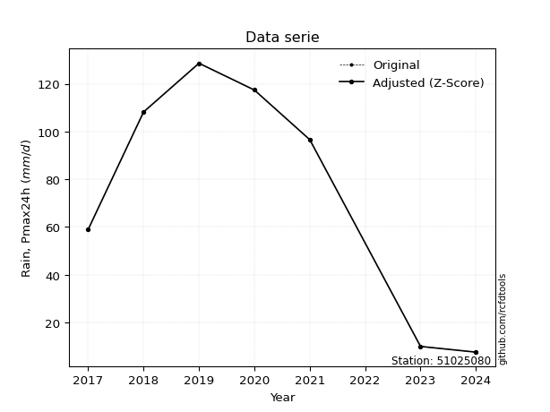</img>

</div>


> The initial value (value_initial) correspond to the initial obtained or null completed value, and value (value) is adjusted only when the initial value is outside the valid range (outlier) definite through the Z-Score value. If Z-Score is active, values out of range or outliers are replaced with the station mean value. A Z-Score (or standard score) measures how many standard deviations a data point is from the mean of a dataset, indicating its relative position; positive scores mean above the mean, negative mean below, and a score of zero is exactly at the mean, allowing for comparison of values from different distributions. It´s calculated using the formula $z=(x–μ)/σ$, where $x$ is the data point, $μ$ is the mean, and $σ$ is the standard deviation, helping identify outliers and understand probability.
>
> <sub>**Note**: In this study, "completing" (filling gaps in) and "extending" (forecasting or lengthening the historical record) rainfall data series are avoided for certain critical analyses because they introduce artificial bias and uncertainty, which can distort the statistics of rare events (extremes), alter day-to-day variability, and compromise the integrity and homogeneity of the original data. Some reasons against Completing/Extending rainfall data are: **Distortion of Extremes and Variability**: The primary issue is that most gap-filling or extension methods rely on averaging or regression with nearby stations, which inherently smooths the data. Rainfall is highly variable in space and time, with a large percentage of zero values and occasional large storms. Infilling methods often underestimate the highest values and overestimate the lowest (zero) values, which severely distorts analyses focused on flood frequency, drought severity, and intensity-duration-frequency (IDF) curves, **Loss of Data Homogeneity**: Infilled or extended data are synthetic estimates, not actual measurements. Combining these estimates with observed data can violate the assumption of data homogeneity, which requires that the data properties do not change over time. Inhomogeneity can lead to incorrect conclusions about long-term trends or changes in climate patterns, **Propagation of Errors**: Errors and biases from the original data (e.g., wind-induced undercatch, instrument errors, site changes) or the data used for imputation can propagate through the analysis, leading to unreliable hydrological models and inaccurate predictions, **Compromised Statistical Integrity**: For statistical analyses, especially those involving the frequency of events, using artificial data can introduce time bias or autocorrelation that doesn´t exist in reality, making it difficult to assess the true probability of events, **Difficulty in Validation**: It is difficult to accurately validate the quality of filled or extended data, especially for past periods where ground-truth measurements are unavailable. The reliability of imputation techniques heavily depends on the density of the surrounding station network and the complexity of the local topography.</sub>


### 4. Active continuous probability distributions from SciPy (80 of 104 available)

A Probability Density Function (PDF) describes the relative likelihood of a continuous random variable falling within a specific range, where the total area under its curve equals 1, and the area over any interval gives the actual probability for that range. Unlike discrete probabilities (like rolling a die), a PDF shows density, not direct probability for a single point (which is zero), with higher points indicating higher likelihood, often visualized as a bell curve for normal distributions.

A log of a probability density function (log-PDF) is simply the logarithm of the PDF´s value, denoted as $log(f(x))$, useful for converting multiplication of probabilities into addition, improving numerical stability with tiny numbers, and connecting to information theory concepts like entropy. Instead of dealing with very small probabilities (e.g., 0.000001), log-PDFs use negative numbers (e.g., $log(0.00001) ≈ -11.51$ that are easier for computers to handle, preventing underflow errors and simplifying complex calculations. In this study, each active probability distribution from SciPy is also evaluated in the $log$ form.

[scipy.stats](https://docs.scipy.org/doc/scipy/reference/stats.html) is a Python´s powerful submodule within the SciPy library for comprehensive statistical analysis, offering over 130 probability distributions (like Normal, Poisson, etc.), functions for descriptive stats (mean, variance), hypothesis testing (t-tests, chi-square), random variable generation, and statistical tests, making it essential for data science, modeling, and research. It provides tools to explore, model, and draw conclusions from data efficiently, working seamlessly with [NumPy](https://numpy.org/).

<div align="center">

|   id | p_dist           |   n_parameter | fit_method   | label                                                                       | active   | ref                                                                                                      |
|-----:|:-----------------|--------------:|:-------------|:----------------------------------------------------------------------------|:---------|:---------------------------------------------------------------------------------------------------------|
|    0 | alpha            |             3 | MLE          | Alpha                                                                       | True     | [:mortar_board:](https://docs.scipy.org/doc/scipy/reference/generated/scipy.stats.alpha.html)            |
|    1 | anglit           |             2 | MM           | Anglit                                                                      | True     | [:mortar_board:](https://docs.scipy.org/doc/scipy/reference/generated/scipy.stats.anglit.html)           |
|    2 | arcsine          |             2 | MM           | Arcsine                                                                     | True     | [:mortar_board:](https://docs.scipy.org/doc/scipy/reference/generated/scipy.stats.arcsine.html)          |
|    3 | argus            |             3 | MLE          | Argus                                                                       | True     | [:mortar_board:](https://docs.scipy.org/doc/scipy/reference/generated/scipy.stats.argus.html)            |
|    4 | beta             |             4 | MLE          | Beta                                                                        | True     | [:mortar_board:](https://docs.scipy.org/doc/scipy/reference/generated/scipy.stats.beta.html)             |
|    5 | betaprime        |             4 | MLE          | Beta prime                                                                  | True     | [:mortar_board:](https://docs.scipy.org/doc/scipy/reference/generated/scipy.stats.betaprime.html)        |
|    6 | bradford         |             3 | MLE          | Bradford                                                                    | True     | [:mortar_board:](https://docs.scipy.org/doc/scipy/reference/generated/scipy.stats.bradford.html)         |
|    7 | burr             |             4 | MLE          | Burr (Type III)                                                             | True     | [:mortar_board:](https://docs.scipy.org/doc/scipy/reference/generated/scipy.stats.burr.html)             |
|    8 | burr12           |             4 | MLE          | Burr (Type III) 12                                                          | True     | [:mortar_board:](https://docs.scipy.org/doc/scipy/reference/generated/scipy.stats.burr12.html)           |
|    9 | cosine           |             2 | MLE          | Cosine                                                                      | True     | [:mortar_board:](https://docs.scipy.org/doc/scipy/reference/generated/scipy.stats.cosine.html)           |
|   10 | crystalball      |             4 | MLE          | Crystalball                                                                 | True     | [:mortar_board:](https://docs.scipy.org/doc/scipy/reference/generated/scipy.stats.crystalball.html)      |
|   11 | dgamma           |             3 | MLE          | Double gamma                                                                | True     | [:mortar_board:](https://docs.scipy.org/doc/scipy/reference/generated/scipy.stats.dgamma.html)           |
|   12 | dweibull         |             3 | MLE          | Double Weibull                                                              | True     | [:mortar_board:](https://docs.scipy.org/doc/scipy/reference/generated/scipy.stats.dweibull.html)         |
|   13 | erlang           |             3 | MLE          | Erlang                                                                      | True     | [:mortar_board:](https://docs.scipy.org/doc/scipy/reference/generated/scipy.stats.erlang.html)           |
|   14 | exponnorm        |             3 | MLE          | Exponentially modified Normal                                               | True     | [:mortar_board:](https://docs.scipy.org/doc/scipy/reference/generated/scipy.stats.exponnorm.html)        |
|   15 | exponpow         |             3 | MLE          | Exponential power                                                           | True     | [:mortar_board:](https://docs.scipy.org/doc/scipy/reference/generated/scipy.stats.exponpow.html)         |
|   16 | exponweib        |             4 | MLE          | Exponentiated Weibull                                                       | True     | [:mortar_board:](https://docs.scipy.org/doc/scipy/reference/generated/scipy.stats.exponweib.html)        |
|   17 | f                |             4 | MLE          | F                                                                           | True     | [:mortar_board:](https://docs.scipy.org/doc/scipy/reference/generated/scipy.stats.f.html)                |
|   18 | fatiguelife      |             3 | MLE          | Fatigue-life (Birnbaum-Saunders)                                            | True     | [:mortar_board:](https://docs.scipy.org/doc/scipy/reference/generated/scipy.stats.fatiguelife.html)      |
|   19 | foldnorm         |             3 | MM           | Fold Normal                                                                 | True     | [:mortar_board:](https://docs.scipy.org/doc/scipy/reference/generated/scipy.stats.foldnorm.html)         |
|   20 | gamma            |             3 | MLE          | Gamma                                                                       | True     | [:mortar_board:](https://docs.scipy.org/doc/scipy/reference/generated/scipy.stats.gamma.html)            |
|   21 | gausshyper       |             6 | MLE          | Gauss hypergeometric                                                        | True     | [:mortar_board:](https://docs.scipy.org/doc/scipy/reference/generated/scipy.stats.gausshyper.html)       |
|   22 | genexpon         |             5 | MLE          | Generalized exponential                                                     | True     | [:mortar_board:](https://docs.scipy.org/doc/scipy/reference/generated/scipy.stats.genexpon.html)         |
|   23 | genextreme       |             3 | MLE          | Generalized exponential                                                     | True     | [:mortar_board:](https://docs.scipy.org/doc/scipy/reference/generated/scipy.stats.genextreme.html)       |
|   24 | gengamma         |             4 | MLE          | Generalized gamma                                                           | True     | [:mortar_board:](https://docs.scipy.org/doc/scipy/reference/generated/scipy.stats.gengamma.html)         |
|   25 | genhalflogistic  |             3 | MLE          | Generalized half-logistic                                                   | True     | [:mortar_board:](https://docs.scipy.org/doc/scipy/reference/generated/scipy.stats.genhalflogistic.html)  |
|   26 | genlogistic      |             3 | MLE          | Generalized logistic                                                        | True     | [:mortar_board:](https://docs.scipy.org/doc/scipy/reference/generated/scipy.stats.genlogistic.html)      |
|   27 | gennorm          |             3 | MLE          | Generalized Normal                                                          | True     | [:mortar_board:](https://docs.scipy.org/doc/scipy/reference/generated/scipy.stats.gennorm.html)          |
|   28 | genpareto        |             3 | MLE          | Generalized Pareto                                                          | True     | [:mortar_board:](https://docs.scipy.org/doc/scipy/reference/generated/scipy.stats.genpareto.html)        |
|   29 | gompertz         |             3 | MLE          | Gompertz (or truncated Gumbel)                                              | True     | [:mortar_board:](https://docs.scipy.org/doc/scipy/reference/generated/scipy.stats.gompertz.html)         |
|   30 | gumbel_l         |             2 | MM           | Gumbel Left Skew                                                            | True     | [:mortar_board:](https://docs.scipy.org/doc/scipy/reference/generated/scipy.stats.gumbel_l.html)         |
|   31 | gumbel_r         |             2 | MM           | Gumbel Right Skew                                                           | True     | [:mortar_board:](https://docs.scipy.org/doc/scipy/reference/generated/scipy.stats.gumbel_r.html)         |
|   32 | halfgennorm      |             3 | MLE          | Upper half of a generalized normal                                          | True     | [:mortar_board:](https://docs.scipy.org/doc/scipy/reference/generated/scipy.stats.halfgennorm.html)      |
|   33 | halflogistic     |             2 | MM           | Half-logistic                                                               | True     | [:mortar_board:](https://docs.scipy.org/doc/scipy/reference/generated/scipy.stats.halflogistic.html)     |
|   34 | halfnorm         |             2 | MM           | Half Normal                                                                 | True     | [:mortar_board:](https://docs.scipy.org/doc/scipy/reference/generated/scipy.stats.halfnorm.html)         |
|   35 | hypsecant        |             2 | MM           | hyperbolic secant                                                           | True     | [:mortar_board:](https://docs.scipy.org/doc/scipy/reference/generated/scipy.stats.hypsecant.html)        |
|   36 | invgamma         |             3 | MLE          | Inverted gamma                                                              | True     | [:mortar_board:](https://docs.scipy.org/doc/scipy/reference/generated/scipy.stats.invgamma.html)         |
|   37 | invgauss         |             3 | MLE          | Inverse Gaussian                                                            | True     | [:mortar_board:](https://docs.scipy.org/doc/scipy/reference/generated/scipy.stats.invgauss.html)         |
|   38 | invweibull       |             3 | MLE          | Inverted Weibull                                                            | True     | [:mortar_board:](https://docs.scipy.org/doc/scipy/reference/generated/scipy.stats.invweibull.html)       |
|   39 | johnsonsb        |             4 | MLE          | Johnson SB                                                                  | True     | [:mortar_board:](https://docs.scipy.org/doc/scipy/reference/generated/scipy.stats.johnsonsb.html)        |
|   40 | johnsonsu        |             4 | MLE          | Johnson Su                                                                  | True     | [:mortar_board:](https://docs.scipy.org/doc/scipy/reference/generated/scipy.stats.johnsonsu.html)        |
|   41 | kappa3           |             3 | MLE          | Kappa 3                                                                     | True     | [:mortar_board:](https://docs.scipy.org/doc/scipy/reference/generated/scipy.stats.kappa3.html)           |
|   42 | kappa4           |             4 | MLE          | Kappa 4                                                                     | True     | [:mortar_board:](https://docs.scipy.org/doc/scipy/reference/generated/scipy.stats.kappa4.html)           |
|   43 | ksone            |             3 | MLE          | Kolmogorov-Smirnov one-sided test statistic distribution                    | True     | [:mortar_board:](https://docs.scipy.org/doc/scipy/reference/generated/scipy.stats.ksone.html)            |
|   44 | kstwobign        |             2 | MLE          | Limiting distribution of scaled Kolmogorov-Smirnov two-sided test statistic | True     | [:mortar_board:](https://docs.scipy.org/doc/scipy/reference/generated/scipy.stats.kstwobign.html)        |
|   45 | laplace          |             2 | MM           | Laplace                                                                     | True     | [:mortar_board:](https://docs.scipy.org/doc/scipy/reference/generated/scipy.stats.laplace.html)          |
|   46 | levy_l           |             2 | MLE          | Left-skewed Levy                                                            | True     | [:mortar_board:](https://docs.scipy.org/doc/scipy/reference/generated/scipy.stats.levy_l.html)           |
|   47 | loggamma         |             3 | MLE          | Log gamma                                                                   | True     | [:mortar_board:](https://docs.scipy.org/doc/scipy/reference/generated/scipy.stats.loggamma.html)         |
|   48 | logistic         |             2 | MM           | Logistic (or Sech-squared)                                                  | True     | [:mortar_board:](https://docs.scipy.org/doc/scipy/reference/generated/scipy.stats.logistic.html)         |
|   49 | loglaplace       |             3 | MLE          | Log-Laplace                                                                 | True     | [:mortar_board:](https://docs.scipy.org/doc/scipy/reference/generated/scipy.stats.loglaplace.html)       |
|   50 | lomax            |             3 | MLE          | Lomax (Pareto of the second kind)                                           | True     | [:mortar_board:](https://docs.scipy.org/doc/scipy/reference/generated/scipy.stats.lomax.html)            |
|   51 | maxwell          |             2 | MM           | Maxwell                                                                     | True     | [:mortar_board:](https://docs.scipy.org/doc/scipy/reference/generated/scipy.stats.maxwell.html)          |
|   52 | mielke           |             4 | MLE          | Mielke Beta-Kappa / Dagum                                                   | True     | [:mortar_board:](https://docs.scipy.org/doc/scipy/reference/generated/scipy.stats.mielke.html)           |
|   53 | moyal            |             2 | MM           | Moyal                                                                       | True     | [:mortar_board:](https://docs.scipy.org/doc/scipy/reference/generated/scipy.stats.moyal.html)            |
|   54 | nakagami         |             3 | MLE          | Nakagami                                                                    | True     | [:mortar_board:](https://docs.scipy.org/doc/scipy/reference/generated/scipy.stats.nakagami.html)         |
|   55 | ncf              |             5 | MLE          | Non-central F distribution                                                  | True     | [:mortar_board:](https://docs.scipy.org/doc/scipy/reference/generated/scipy.stats.ncf.html)              |
|   56 | nct              |             4 | MLE          | Non-central Student’s t                                                     | True     | [:mortar_board:](https://docs.scipy.org/doc/scipy/reference/generated/scipy.stats.nct.html)              |
|   57 | norm             |             2 | MM           | Normal                                                                      | True     | [:mortar_board:](https://docs.scipy.org/doc/scipy/reference/generated/scipy.stats.norm.html)             |
|   58 | pearson3         |             3 | MM           | Pearson type III                                                            | True     | [:mortar_board:](https://docs.scipy.org/doc/scipy/reference/generated/scipy.stats.pearson3.html)         |
|   59 | powerlaw         |             3 | MLE          | Power-function                                                              | True     | [:mortar_board:](https://docs.scipy.org/doc/scipy/reference/generated/scipy.stats.powerlaw.html)         |
|   60 | rayleigh         |             2 | MM           | Rayleigh                                                                    | True     | [:mortar_board:](https://docs.scipy.org/doc/scipy/reference/generated/scipy.stats.rayleigh.html)         |
|   61 | rdist            |             3 | MLE          | R-distributed (symmetric beta)                                              | True     | [:mortar_board:](https://docs.scipy.org/doc/scipy/reference/generated/scipy.stats.rdist.html)            |
|   62 | rice             |             3 | MLE          | Rice                                                                        | True     | [:mortar_board:](https://docs.scipy.org/doc/scipy/reference/generated/scipy.stats.rice.html)             |
|   63 | semicircular     |             2 | MM           | Semicircular                                                                | True     | [:mortar_board:](https://docs.scipy.org/doc/scipy/reference/generated/scipy.stats.semicircular.html)     |
|   64 | skewnorm         |             3 | MLE          | Skew normal                                                                 | True     | [:mortar_board:](https://docs.scipy.org/doc/scipy/reference/generated/scipy.stats.skewnorm.html)         |
|   65 | t                |             3 | MLE          | Student’s t                                                                 | True     | [:mortar_board:](https://docs.scipy.org/doc/scipy/reference/generated/scipy.stats.t.html)                |
|   66 | trapezoid        |             4 | MLE          | Trapezoid                                                                   | True     | [:mortar_board:](https://docs.scipy.org/doc/scipy/reference/generated/scipy.stats.trapezoid.html)        |
|   67 | triang           |             3 | MLE          | Triangular                                                                  | True     | [:mortar_board:](https://docs.scipy.org/doc/scipy/reference/generated/scipy.stats.triang.html)           |
|   68 | truncexpon       |             3 | MLE          | Truncated exponential                                                       | True     | [:mortar_board:](https://docs.scipy.org/doc/scipy/reference/generated/scipy.stats.truncexpon.html)       |
|   69 | truncnorm        |             4 | MLE          | Truncated normal                                                            | True     | [:mortar_board:](https://docs.scipy.org/doc/scipy/reference/generated/scipy.stats.truncnorm.html)        |
|   70 | truncpareto      |             4 | MLE          | Upper truncated Pareto                                                      | True     | [:mortar_board:](https://docs.scipy.org/doc/scipy/reference/generated/scipy.stats.truncpareto.html)      |
|   71 | truncweibull_min |             5 | MLE          | Doubly truncated Weibull minimum                                            | True     | [:mortar_board:](https://docs.scipy.org/doc/scipy/reference/generated/scipy.stats.truncweibull_min.html) |
|   72 | tukeylambda      |             3 | MLE          | Tukey-Lamdba                                                                | True     | [:mortar_board:](https://docs.scipy.org/doc/scipy/reference/generated/scipy.stats.tukeylambda.html)      |
|   73 | uniform          |             2 | MLE          | Uniform                                                                     | True     | [:mortar_board:](https://docs.scipy.org/doc/scipy/reference/generated/scipy.stats.uniform.html)          |
|   74 | vonmises         |             3 | MLE          | Von Mises                                                                   | True     | [:mortar_board:](https://docs.scipy.org/doc/scipy/reference/generated/scipy.stats.vonmises.html)         |
|   75 | vonmises_line    |             3 | MLE          | Von Mises line                                                              | True     | [:mortar_board:](https://docs.scipy.org/doc/scipy/reference/generated/scipy.stats.vonmises_line.html)    |
|   76 | wald             |             2 | MM           | Wald                                                                        | True     | [:mortar_board:](https://docs.scipy.org/doc/scipy/reference/generated/scipy.stats.wald.html)             |
|   77 | weibull_max      |             3 | MLE          | Weibull maximum                                                             | True     | [:mortar_board:](https://docs.scipy.org/doc/scipy/reference/generated/scipy.stats.weibull_max.html)      |
|   78 | weibull_min      |             3 | MLE          | Weibull minimum                                                             | True     | [:mortar_board:](https://docs.scipy.org/doc/scipy/reference/generated/scipy.stats.weibull_min.html)      |
|   79 | wrapcauchy       |             3 | MLE          | Wrapped  Cauchy                                                             | True     | [:mortar_board:](https://docs.scipy.org/doc/scipy/reference/generated/scipy.stats.wrapcauchy.html)       |

</div>

> **n_parameter:** # arguments & localization & scale.
>
> **Fit methods:** (MLE) maximum likelihood, (MM) L-moments.
>
>**Inactive** (With the only purpose of prevent loops, zero divisions, infinite values, over high estimated values or horizontal trending for recurrence intervals estimations, the follow distributions were disabled.)**:** lognorm, norminvgauss, powernorm, powerlognorm, cauchy, halfcauchy, foldcauchy, skewcauchy, chi2, expon, fisk, genhyperbolic, geninvgauss, gibrat, kstwo, laplace_asymmetric, levy, levy_stable, ncx2, pareto, rel_breitwigner, recipinvgauss, studentized_range, loguniform, 


## B. Probability (PDF) vs. Empirical (EDF) distributions functions

A continuous probability distribution (CPD) describes probabilities for variables that can take any value within a range (like rain any time), unlike discrete variables with specific outcomes (like temperature). It uses a Probability Density Function (PDF), a curve where the total area under it equals 1, and the probability of the variable falling within an interval (a to b) is found by calculating the area under the curve between those points. A key feature is that the probability of hitting any single exact value is zero, so probabilities are always expressed for ranges, e.g., $P(a ≤ X ≤ b)$.

<div align="center">

Distributions parameters from station values
|     |   station | p_dist              |   n |               loc |            scale | shape                  | shape1                | shape2                | shape3             |
|----:|----------:|:--------------------|----:|------------------:|-----------------:|:-----------------------|:----------------------|:----------------------|:-------------------|
|   0 |  51025080 | alpha               |   7 |      -0.0371869   |     15.9147      | 3.5651158141968104e-10 |                       |                       |                    |
|   1 |  51025080 | anglit              |   7 |      75.3429      |    136.599       |                        |                       |                       |                    |
|   2 |  51025080 | arcsine             |   7 |       9.30722     |    132.071       |                        |                       |                       |                    |
|   3 |  51025080 | argus               |   7 |     -42.1099      |    175.92        | 1.8057414786816552     |                       |                       |                    |
|   4 |  51025080 | beta                |   7 |      -4.37565     |    132.976       | 0.39477622259305445    | 0.25107166552173876   |                       |                    |
|   5 |  51025080 | betaprime           |   7 |      -1.89452     |   3161.18        | 1.4802482417544245     | 61.321121628477584    |                       |                    |
|   6 |  51025080 | bradford            |   7 |       7.59998     |    121           | 0.16149812292082982    |                       |                       |                    |
|   7 |  51025080 | burr                |   7 |      -1.29863     |    131.647       | 263.4452884715282      | 0.0040719047545522    |                       |                    |
|   8 |  51025080 | burr12              |   7 |      -1.14495     |      8.60641     | 261.6166694544535      | 0.0021359948593112693 |                       |                    |
|   9 |  51025080 | cosine              |   7 |      72.4585      |     37.1648      |                        |                       |                       |                    |
|  10 |  51025080 | crystalball         |   7 |      75.3429      |     46.6942      | 6994.223079983598      | 2.1208103896215666    |                       |                    |
|  11 |  51025080 | dgamma              |   7 |      75.5339      |      9.71904     | 4.389998780373995      |                       |                       |                    |
|  12 |  51025080 | dweibull            |   7 |      71.8513      |     48.64        | 2.666410668143394      |                       |                       |                    |
|  13 |  51025080 | erlang              |   7 |    -650.114       |      3.12566     | 232.16706908246783     |                       |                       |                    |
|  14 |  51025080 | exponnorm           |   7 |      75.2988      |     46.694       | 0.0009451539029210546  |                       |                       |                    |
|  15 |  51025080 | exponpow            |   7 |       7.6         |      6.56173     | 0.14298049555718173    |                       |                       |                    |
|  16 |  51025080 | exponweib           |   7 |       7.6         |     22.3401      | 1.2588334363339673     | 0.5408584601917689    |                       |                    |
|  17 |  51025080 | f                   |   7 |       2.89001     |     65.8592      | 2.166412869160917      | 206.86595980095774    |                       |                    |
|  18 |  51025080 | fatiguelife         |   7 |       7.6         |      1.28284e-05 | 2044.0214738851043     |                       |                       |                    |
|  19 |  51025080 | foldnorm            |   7 |    -278.083       |     44.0854      | 8.031462773683598      |                       |                       |                    |
|  20 |  51025080 | gamma               |   7 |    -664.432       |      3.07651     | 240.53096566603335     |                       |                       |                    |
|  21 |  51025080 | gausshyper          |   7 |       7.5213      |    121.079       | 0.4154985313348144     | 0.1761149827665815    | 1.323366712647876     | 2.4257726129009747 |
|  22 |  51025080 | genexpon            |   7 |      -5.7451      |      2.2338      | 5.7535067362763165e-09 | 0.0284703048058405    | 0.9186198431855834    |                    |
|  23 |  51025080 | genextreme          |   7 |      84.3675      |     48.5456      | 1.09750959757219       |                       |                       |                    |
|  24 |  51025080 | gengamma            |   7 |       7.6         |     13.9677      | 1.4808056977360267     | 0.5413763025368642    |                       |                    |
|  25 |  51025080 | genhalflogistic     |   7 |     -27.1374      |    167.865       | 1.0778712447530463     |                       |                       |                    |
|  26 |  51025080 | genlogistic         |   7 |     128.603       |      0.000130274 | 2.4439007733803997e-06 |                       |                       |                    |
|  27 |  51025080 | gennorm             |   7 |      68.1         |     60.5004      | 2128035.4181211386     |                       |                       |                    |
|  28 |  51025080 | genpareto           |   7 |      -0.684606    |    198.351       | -1.5342168285354947    |                       |                       |                    |
|  29 |  51025080 | gompertz            |   7 |      58.9987      |     13.9849      | 0.01974505424320005    |                       |                       |                    |
|  30 |  51025080 | gumbel_l            |   7 |      96.3577      |     36.4073      |                        |                       |                       |                    |
|  31 |  51025080 | gumbel_r            |   7 |      54.328       |     36.4073      |                        |                       |                       |                    |
|  32 |  51025080 | halfgennorm         |   7 |       7.6         |      7.19575     | 0.43470248467210426    |                       |                       |                    |
|  33 |  51025080 | halflogistic        |   7 |      19.9993      |     39.9219      |                        |                       |                       |                    |
|  34 |  51025080 | halfnorm            |   7 |      13.538       |     77.4609      |                        |                       |                       |                    |
|  35 |  51025080 | hypsecant           |   7 |      75.3429      |     29.7265      |                        |                       |                       |                    |
|  36 |  51025080 | invgamma            |   7 |    -397.866       |  41861.9         | 89.77084898516631      |                       |                       |                    |
|  37 |  51025080 | invgauss            |   7 |    -199.782       |   8217.22        | 0.03345109041018729    |                       |                       |                    |
|  38 |  51025080 | invweibull          |   7 |       7.6         |      3.90732     | 0.06363935544916582    |                       |                       |                    |
|  39 |  51025080 | johnsonsb           |   7 |      -5.68421     |    134.284       | 0.1018372108471509     | 0.09479996933190679   |                       |                    |
|  40 |  51025080 | johnsonsu           |   7 |     134.928       |      0.211556    | 5.790717876287605      | 0.9799140443840615    |                       |                    |
|  41 |  51025080 | kappa3              |   7 |       7.6         |    120.765       | 1003.7523201928179     |                       |                       |                    |
|  42 |  51025080 | kappa4              |   7 |      -5.82633     |    136.828       | 1.1088617211403151     | 1.009818182555053     |                       |                    |
|  43 |  51025080 | ksone               |   7 |      -5.53392     |    161.754       | 1.0                    |                       |                       |                    |
|  44 |  51025080 | kstwobign           |   7 |    -102.661       |    202.379       |                        |                       |                       |                    |
|  45 |  51025080 | laplace             |   7 |      75.3429      |     33.0178      |                        |                       |                       |                    |
|  46 |  51025080 | levy_l              |   7 |     132.175       |     15.6568      |                        |                       |                       |                    |
|  47 |  51025080 | loggamma            |   7 |     128.6         |      1.00939e-05 | 1.8929525409644526e-07 |                       |                       |                    |
|  48 |  51025080 | logistic            |   7 |      75.3429      |     25.7439      |                        |                       |                       |                    |
|  49 |  51025080 | loglaplace          |   7 |      -0.271593    |     96.8716      | 1.2091363804059663     |                       |                       |                    |
|  50 |  51025080 | lomax               |   7 |       7.6         |      5.25168e+11 | 5939579150.673083      |                       |                       |                    |
|  51 |  51025080 | maxwell             |   7 |     -35.3029      |     69.3369      |                        |                       |                       |                    |
|  52 |  51025080 | mielke              |   7 |      -3.95103     |    134.278       | 1.155378742556171      | 268.4641335815485     |                       |                    |
|  53 |  51025080 | moyal               |   7 |      48.6401      |     21.0198      |                        |                       |                       |                    |
|  54 |  51025080 | nakagami            |   7 |       7.6         |    111.663       | 0.1277659780914894     |                       |                       |                    |
|  55 |  51025080 | ncf                 |   7 |      -0.74474     |     24.4879      | 1.8223162319024984     | 245.1770901535058     | 3.8059156151128724    |                    |
|  56 |  51025080 | nct                 |   7 |      -0.26543     |      0.295807    | 0.6159972081593957     | 55.28982751990473     |                       |                    |
|  57 |  51025080 | norm                |   7 |      75.3429      |     46.6942      |                        |                       |                       |                    |
|  58 |  51025080 | pearson3            |   7 |      75.3429      |     46.6942      | -0.4542261197513303    |                       |                       |                    |
|  59 |  51025080 | powerlaw            |   7 |       7.6         |    121           | 0.15618534263140152    |                       |                       |                    |
|  60 |  51025080 | rayleigh            |   7 |     -13.9859      |     71.2741      |                        |                       |                       |                    |
|  61 |  51025080 | rdist               |   7 |      -3.59043     |     62.5904      | 1.0813021994080887     |                       |                       |                    |
|  62 |  51025080 | rice                |   7 |     -22.173       |     53.6752      | 1.4343900101456613     |                       |                       |                    |
|  63 |  51025080 | semicircular        |   7 |      75.3429      |     93.3885      |                        |                       |                       |                    |
|  64 |  51025080 | skewnorm            |   7 |     128.6         |     70.8253      | -71347800.7147961      |                       |                       |                    |
|  65 |  51025080 | t                   |   7 |      75.3456      |     46.6917      | 45708022.73079238      |                       |                       |                    |
|  66 |  51025080 | trapezoid           |   7 |     -59.5648      |    198.107       | 1.0                    | 1.0                   |                       |                    |
|  67 |  51025080 | triang              |   7 |     -32.8837      |    161.502       | 0.9999999999936142     |                       |                       |                    |
|  68 |  51025080 | truncexpon          |   7 |       7.34722     |    157.22        | 0.7712299513663394     |                       |                       |                    |
|  69 |  51025080 | truncnorm           |   7 |      75.3429      |     46.6942      | -516.9957737545299     | 6.9412267151760645    |                       |                    |
|  70 |  51025080 | truncpareto         |   7 |       7.5443      |      0.0556967   | 0.1717263490403729     | 2173.48178040258      |                       |                    |
|  71 |  51025080 | truncweibull_min    |   7 |       7.22071     |    156.669       | 0.7151879640614094     | 0.0024209643595651865 | 0.7747487438933494    |                    |
|  72 |  51025080 | tukeylambda         |   7 |      67.7262      |     70.4845      | 1.1578795353355524     |                       |                       |                    |
|  73 |  51025080 | uniform             |   7 |       7.6         |    121           |                        |                       |                       |                    |
|  74 |  51025080 | vonmises            |   7 |       2.58195     |      1           | 1.3221104984989427     |                       |                       |                    |
|  75 |  51025080 | vonmises_line       |   7 |      68.1028      |     19.2586      | 0.0004094889139250781  |                       |                       |                    |
|  76 |  51025080 | wald                |   7 |      28.6486      |     46.6943      |                        |                       |                       |                    |
|  77 |  51025080 | weibull_max         |   7 |     128.6         |      1.57659     | 0.24746926413707626    |                       |                       |                    |
|  78 |  51025080 | weibull_min         |   7 |      -2.55115e+09 |      2.55115e+09 | 71376373.94638841      |                       |                       |                    |
|  79 |  51025080 | wrapcauchy          |   7 |       7.6         |     19.2581      | 0.6188480945121226     |                       |                       |                    |
|  80 |  51025080 | logalpha            |   7 |     -24.4165      |    692.71        | 24.517632187426422     |                       |                       |                    |
|  81 |  51025080 | loganglit           |   7 |       3.89787     |      3.28299     |                        |                       |                       |                    |
|  82 |  51025080 | logarcsine          |   7 |       2.31082     |      3.17412     |                        |                       |                       |                    |
|  83 |  51025080 | logargus            |   7 |       0.665683    |      4.29363     | 2.6129736285971896     |                       |                       |                    |
|  84 |  51025080 | logbeta             |   7 |       1.77578     |      3.08093     | 0.16613620271547683    | 0.07315171693736187   |                       |                    |
|  85 |  51025080 | logbetaprime        |   7 |    -193.736       |   6062.58        | 31903.730501808197     | 978614.8335983958     |                       |                    |
|  86 |  51025080 | logbradford         |   7 |       2.02185     |      2.84252     | 4.380576271789411e-06  |                       |                       |                    |
|  87 |  51025080 | logburr             |   7 |      -1.25736e+06 |      1.25737e+06 | 287543142.4666935      | 0.004490102318383294  |                       |                    |
|  88 |  51025080 | logburr12           |   7 |   -2271.78        |   2286.65        | 2893.5098282863437     | 602619.2400974785     |                       |                    |
|  89 |  51025080 | logcosine           |   7 |       3.77134     |      0.905157    |                        |                       |                       |                    |
|  90 |  51025080 | logcrystalball      |   7 |       3.89788     |      1.12224     | 1798.721009088005      | 1334.2161468692002    |                       |                    |
|  91 |  51025080 | logdgamma           |   7 |       4.68398     |      1.48891     | 0.4178313944917951     |                       |                       |                    |
|  92 |  51025080 | logdweibull         |   7 |       4.68398     |      0.77844     | 0.9546634996232364     |                       |                       |                    |
|  93 |  51025080 | logerlang           |   7 |     -13.739       |      0.0768196   | 229.63835491715213     |                       |                       |                    |
|  94 |  51025080 | logexponnorm        |   7 |       3.8971      |      1.12223     | 0.000685040640494296   |                       |                       |                    |
|  95 |  51025080 | logexponpow         |   7 |       2.02815     |      1.37772     | 0.3725996489625554     |                       |                       |                    |
|  96 |  51025080 | logexponweib        |   7 |       2.02815     |      1.17847     | 1.1564639837629334     | 0.7197831730051021    |                       |                    |
|  97 |  51025080 | logf                |   7 |   -1479.65        |   1483.55        | 9063933.750883102      | 5642873.555022262     |                       |                    |
|  98 |  51025080 | logfatiguelife      |   7 |    -409.741       |    413.649       | 0.0027203721192737475  |                       |                       |                    |
|  99 |  51025080 | logfoldnorm         |   7 |      -3.04794     |      1.0584      | 6.572897579549964      |                       |                       |                    |
| 100 |  51025080 | loggamma            |   7 |     -14.4096      |      0.0732303   | 249.98933718421904     |                       |                       |                    |
| 101 |  51025080 | loggausshyper       |   7 |       1.94824     |      2.90847     | 1.139021641176881      | 0.6892489379421965    | 1.054594844041279     | 1.137836829152981  |
| 102 |  51025080 | loggenexpon         |   7 |       2.02764     |      0.00758154  | 0.0019949320791338787  | 1.4262068915347035    | 8.552207335768443e-06 |                    |
| 103 |  51025080 | loggenextreme       |   7 |       3.99142     |      1.0563      | 1.2207507822659505     |                       |                       |                    |
| 104 |  51025080 | loggengamma         |   7 |       2.02815     |      1.17847     | 1.1564639837629334     | 0.7197831730051021    |                       |                    |
| 105 |  51025080 | loggenhalflogistic  |   7 |       1.52426     |      3.50512     | 1.0518170686041137     |                       |                       |                    |
| 106 |  51025080 | loggenlogistic      |   7 |       4.85672     |      1.67068e-06 | 1.7421029546173652e-06 |                       |                       |                    |
| 107 |  51025080 | loggennorm          |   7 |       4.57058     |      0.0110641   | 0.3248748614392851     |                       |                       |                    |
| 108 |  51025080 | loggenpareto        |   7 |      -0.181893    |      9.61834     | -1.9089314424628645    |                       |                       |                    |
| 109 |  51025080 | loggompertz         |   7 |       2.02815     |      0.92014     | 0.08783931196735217    |                       |                       |                    |
| 110 |  51025080 | loggumbel_l         |   7 |       4.40294     |      0.875003    |                        |                       |                       |                    |
| 111 |  51025080 | loggumbel_r         |   7 |       3.39281     |      0.875003    |                        |                       |                       |                    |
| 112 |  51025080 | loghalfgennorm      |   7 |       2.02815     |      1.17018     | 0.7695707558194653     |                       |                       |                    |
| 113 |  51025080 | loghalflogistic     |   7 |       2.56772     |      0.959491    |                        |                       |                       |                    |
| 114 |  51025080 | loghalfnorm         |   7 |       2.41244     |      1.86171     |                        |                       |                       |                    |
| 115 |  51025080 | loghypsecant        |   7 |       3.89787     |      0.714437    |                        |                       |                       |                    |
| 116 |  51025080 | loginvgamma         |   7 |     -18.6043      |   8239.18        | 367.562761503464       |                       |                       |                    |
| 117 |  51025080 | loginvgauss         |   7 |      -6.78596     |    851.019       | 0.012543327121913708   |                       |                       |                    |
| 118 |  51025080 | loginvweibull       |   7 | -821483           | 821487           | 701554.5737112404      |                       |                       |                    |
| 119 |  51025080 | logjohnsonsb        |   7 |       0.278922    |      4.57779     | -1.414187306624112     | 0.1272491535406136    |                       |                    |
| 120 |  51025080 | logjohnsonsu        |   7 |       4.85671     |      6.54274e-16 | 2.484170383735692      | 0.09520169970746134   |                       |                    |
| 121 |  51025080 | logkappa3           |   7 |       2.02815     |      2.78798     | 143.17251768946187     |                       |                       |                    |
| 122 |  51025080 | logkappa4           |   7 |       1.81228     |      3.61068     | 1.0639742327293233     | 1.1857338085162104    |                       |                    |
| 123 |  51025080 | logksone            |   7 |       1.95411     |      3.88754     | 1.0                    |                       |                       |                    |
| 124 |  51025080 | logkstwobign        |   7 |      -0.701864    |      5.22693     |                        |                       |                       |                    |
| 125 |  51025080 | loglaplace          |   7 |       3.89787     |      0.79354     |                        |                       |                       |                    |
| 126 |  51025080 | loglevy_l           |   7 |       4.89099     |      0.148761    |                        |                       |                       |                    |
| 127 |  51025080 | logloggamma         |   7 |       4.85679     |      6.14765e-06 | 6.424287784617198e-06  |                       |                       |                    |
| 128 |  51025080 | loglogistic         |   7 |       3.89787     |      0.618721    |                        |                       |                       |                    |
| 129 |  51025080 | logloglaplace       |   7 |      -0.0524412   |      4.62302     | 4.097694919094462      |                       |                       |                    |
| 130 |  51025080 | loglomax            |   7 |       2.02815     | 558897           | 285269.24559863325     |                       |                       |                    |
| 131 |  51025080 | logmaxwell          |   7 |       1.23865     |      1.66642     |                        |                       |                       |                    |
| 132 |  51025080 | logmielke           |   7 |      -3.77888e+07 |      3.77888e+07 | 38905911.38955332      | 96013806408.34839     |                       |                    |
| 133 |  51025080 | logmoyal            |   7 |       3.25611     |      0.505183    |                        |                       |                       |                    |
| 134 |  51025080 | lognakagami         |   7 |       2.02815     |      2.3406      | 0.4650889900127586     |                       |                       |                    |
| 135 |  51025080 | logncf              |   7 |      -0.737608    |      8.58934e-07 | 1.312795196906495e-05  | 141.51788672690148    | 70.04232601018246     |                    |
| 136 |  51025080 | lognct              |   7 |     -79.6544      |      1.09246     | 49898.19511157446      | 76.47882997099842     |                       |                    |
| 137 |  51025080 | lognorm             |   7 |       3.89787     |      1.12224     |                        |                       |                       |                    |
| 138 |  51025080 | logpearson3         |   7 |       3.89788     |      1.12224     | -0.8354746742125083    |                       |                       |                    |
| 139 |  51025080 | logpowerlaw         |   7 |       2.02815     |      2.82856     | 0.17835439867928093    |                       |                       |                    |
| 140 |  51025080 | lograyleigh         |   7 |       1.75097     |      1.71298     |                        |                       |                       |                    |
| 141 |  51025080 | logrdist            |   7 |       2.89        |      1.68058     | 0.9947459568253347     |                       |                       |                    |
| 142 |  51025080 | logrice             |   7 |       1.3255      |      1.25236     | 1.7383530317721099     |                       |                       |                    |
| 143 |  51025080 | logsemicircular     |   7 |       3.89787     |      2.24447     |                        |                       |                       |                    |
| 144 |  51025080 | logskewnorm         |   7 |       4.85671     |      1.47608     | -19761268.72349704     |                       |                       |                    |
| 145 |  51025080 | logt                |   7 |       3.89787     |      1.12223     | 10895666372.021738     |                       |                       |                    |
| 146 |  51025080 | logtrapezoid        |   7 |       0.723715    |      4.76124     | 1.0                    | 1.0                   |                       |                    |
| 147 |  51025080 | logtriang           |   7 |       0.885951    |      3.97076     | 0.9999984432030562     |                       |                       |                    |
| 148 |  51025080 | logtruncexpon       |   7 |       2.02813     |      3.65077     | 0.7747916892547284     |                       |                       |                    |
| 149 |  51025080 | logtruncnorm        |   7 |      -0.117028    |      3.82938     | 0.5599232536749538     | 1.2988385063263976    |                       |                    |
| 150 |  51025080 | logtruncpareto      |   7 |       2.02641     |      0.00173581  | 0.1685585497764149     | 1630.531904183866     |                       |                    |
| 151 |  51025080 | logtruncweibull_min |   7 |       2.0255      |      4.11307     | 0.9367632430203628     | 0.0006433004014213799 | 0.6883447736313573    |                    |
| 152 |  51025080 | logtukeylambda      |   7 |       3.44243     |      1.52985     | 1.0817199652951992     |                       |                       |                    |
| 153 |  51025080 | loguniform          |   7 |       2.02815     |      2.82856     |                        |                       |                       |                    |
| 154 |  51025080 | logvonmises         |   7 |      -2.06076     |      1           | 1.186743553642017      |                       |                       |                    |
| 155 |  51025080 | logvonmises_line    |   7 |       3.43427     |      0.45278     | 4.728156136706719e-06  |                       |                       |                    |
| 156 |  51025080 | logwald             |   7 |       2.77565     |      1.12223     |                        |                       |                       |                    |
| 157 |  51025080 | logweibull_max      |   7 |       4.85671     |      1.01494     | 0.5876719649056423     |                       |                       |                    |
| 158 |  51025080 | logweibull_min      |   7 |      -7.69229e+07 |      7.69229e+07 | 104204727.17956519     |                       |                       |                    |
| 159 |  51025080 | logwrapcauchy       |   7 |       2.02815     |      0.450179    | 0.7289423245068001     |                       |                       |                    |

</div>

> **loc** (Location parameter): This shifts the distribution along the x-axis. For many common distributions, like the normal (Gaussian) distribution, loc represents the mean $μ$. For others, like the uniform distribution, it might represent the minimum value, or for the beta distribution, the left end of the support interval.
>
> **scale** (Scale parameter): This determines the width or spread of the distribution. For the normal distribution, scale represents the standard deviation $σ$. For a uniform distribution, it defines the length of the interval (from $loc$ to $loc + scale$).
>
> **shape** (Shape parameters): Refers to parameters that define the specific form of a probability distribution, distinct from its location (loc) and scale (scale). These parameters are required arguments for most distribution functions. For example, a normal (Gaussian) distribution is fully defined by its location (mean) and scale (standard deviation), so it has no specific shape parameters beyond loc and scale. However, other distributions have intrinsic properties that need specification, as Gamma distribution that takes a shape parameter, often named $a$ or $alpha$.


### 0. Cumulative distribution values - CDF (160 evaluated)

Cumulative Distribution Function (CDF), denoted as $F$<sub>$X$</sub>$(x)$, is a function that gives the probability that a random variable $X$ will take a value less than or equal to a specific value, $x$ (i.e., $(P(X≥x)$. It essentially "accumulates" probabilities from a given point up to the far right (positive infinity), providing a complete picture of the distribution´s probabilities for both discrete (like rain) and continuous (like temperature) variables, helping to find probabilities over ranges or above certain values. Each station is evaluated separately ordering the $x$ values ascending, calculating the CDF and PDF values for the activated distributions and their logarithmic forms.

<div align="center">

CDF ordered by x ascending and calculating $log(f(x))$ separately
|   id |   Station |   date |     x |   count |    mean |     std |    zscore |   Value_initial |   station |   m |     alpha |   alpha_pdf |    anglit |   anglit_pdf |   arcsine |   arcsine_pdf |     argus |   argus_pdf |     beta |    beta_pdf |   betaprime |   betaprime_pdf |    bradford |   bradford_pdf |      burr |     burr_pdf |     burr12 |   burr12_pdf |    cosine |   cosine_pdf |   crystalball |   crystalball_pdf |    dgamma |   dgamma_pdf |   dweibull |   dweibull_pdf |    erlang |   erlang_pdf |   exponnorm |   exponnorm_pdf |   exponpow |   exponpow_pdf |   exponweib |   exponweib_pdf |         f |      f_pdf |   fatiguelife |   fatiguelife_pdf |   foldnorm |   foldnorm_pdf |     gamma |   gamma_pdf |   gausshyper |   gausshyper_pdf |   genexpon |   genexpon_pdf |   genextreme |   genextreme_pdf |    gengamma |   gengamma_pdf |   genhalflogistic |   genhalflogistic_pdf |   genlogistic |   genlogistic_pdf |     gennorm |   gennorm_pdf |   genpareto |   genpareto_pdf |    gompertz |   gompertz_pdf |   gumbel_l |   gumbel_l_pdf |   gumbel_r |   gumbel_r_pdf |   halfgennorm |   halfgennorm_pdf |   halflogistic |   halflogistic_pdf |   halfnorm |   halfnorm_pdf |   hypsecant |   hypsecant_pdf |   invgamma |   invgamma_pdf |   invgauss |   invgauss_pdf |   invweibull |   invweibull_pdf |   johnsonsb |   johnsonsb_pdf |   johnsonsu |   johnsonsu_pdf |      kappa3 |   kappa3_pdf |      kappa4 |   kappa4_pdf |     ksone |   ksone_pdf |   kstwobign |   kstwobign_pdf |   laplace |   laplace_pdf |   levy_l |   levy_l_pdf |   loggamma |   loggamma_pdf |   logistic |   logistic_pdf |   loglaplace |   loglaplace_pdf |       lomax |   lomax_pdf |   maxwell |   maxwell_pdf |    mielke |   mielke_pdf |      moyal |   moyal_pdf |    nakagami |   nakagami_pdf |       ncf |    ncf_pdf |       nct |    nct_pdf |      norm |   norm_pdf |   pearson3 |   pearson3_pdf |   powerlaw |   powerlaw_pdf |   rayleigh |   rayleigh_pdf |    rdist |      rdist_pdf |      rice |   rice_pdf |   semicircular |   semicircular_pdf |   skewnorm |   skewnorm_pdf |         t |      t_pdf |   trapezoid |   trapezoid_pdf |    triang |   triang_pdf |   truncexpon |   truncexpon_pdf |   truncnorm |   truncnorm_pdf |   truncpareto |   truncpareto_pdf |   truncweibull_min |   truncweibull_min_pdf |   tukeylambda |   tukeylambda_pdf |   uniform |   uniform_pdf |   vonmises |   vonmises_pdf |   vonmises_line |   vonmises_line_pdf |     wald |   wald_pdf |   weibull_max |   weibull_max_pdf |   weibull_min |   weibull_min_pdf |   wrapcauchy |   wrapcauchy_pdf |   logalpha |   logalpha_pdf |   loganglit |   loganglit_pdf |   logarcsine |   logarcsine_pdf |   logargus |   logargus_pdf |   logbeta |   logbeta_pdf |   logbetaprime |   logbetaprime_pdf |   logbradford |   logbradford_pdf |   logburr |   logburr_pdf |   logburr12 |   logburr12_pdf |   logcosine |   logcosine_pdf |   logcrystalball |   logcrystalball_pdf |   logdgamma |   logdgamma_pdf |   logdweibull |   logdweibull_pdf |   logerlang |   logerlang_pdf |   logexponnorm |   logexponnorm_pdf |   logexponpow |   logexponpow_pdf |   logexponweib |   logexponweib_pdf |      logf |   logf_pdf |   logfatiguelife |   logfatiguelife_pdf |   logfoldnorm |   logfoldnorm_pdf |   loggausshyper |   loggausshyper_pdf |   loggenexpon |   loggenexpon_pdf |   loggenextreme |   loggenextreme_pdf |   loggengamma |   loggengamma_pdf |   loggenhalflogistic |   loggenhalflogistic_pdf |   loggenlogistic |   loggenlogistic_pdf |   loggennorm |   loggennorm_pdf |   loggenpareto |   loggenpareto_pdf |   loggompertz |   loggompertz_pdf |   loggumbel_l |   loggumbel_l_pdf |   loggumbel_r |   loggumbel_r_pdf |   loghalfgennorm |   loghalfgennorm_pdf |   loghalflogistic |   loghalflogistic_pdf |   loghalfnorm |   loghalfnorm_pdf |   loghypsecant |   loghypsecant_pdf |   loginvgamma |   loginvgamma_pdf |   loginvgauss |   loginvgauss_pdf |   loginvweibull |   loginvweibull_pdf |   logjohnsonsb |   logjohnsonsb_pdf |   logjohnsonsu |   logjohnsonsu_pdf |   logkappa3 |   logkappa3_pdf |   logkappa4 |   logkappa4_pdf |   logksone |   logksone_pdf |   logkstwobign |   logkstwobign_pdf |   loglevy_l |   loglevy_l_pdf |   logloggamma |   logloggamma_pdf |   loglogistic |   loglogistic_pdf |   logloglaplace |   logloglaplace_pdf |    loglomax |   loglomax_pdf |   logmaxwell |   logmaxwell_pdf |   logmielke |   logmielke_pdf |    logmoyal |   logmoyal_pdf |   lognakagami |   lognakagami_pdf |    logncf |   logncf_pdf |    lognct |   lognct_pdf |   lognorm |   lognorm_pdf |   logpearson3 |   logpearson3_pdf |   logpowerlaw |   logpowerlaw_pdf |   lograyleigh |   lograyleigh_pdf |   logrdist |   logrdist_pdf |   logrice |   logrice_pdf |   logsemicircular |   logsemicircular_pdf |   logskewnorm |   logskewnorm_pdf |      logt |   logt_pdf |   logtrapezoid |   logtrapezoid_pdf |   logtriang |   logtriang_pdf |   logtruncexpon |   logtruncexpon_pdf |   logtruncnorm |   logtruncnorm_pdf |   logtruncpareto |   logtruncpareto_pdf |   logtruncweibull_min |   logtruncweibull_min_pdf |   logtukeylambda |   logtukeylambda_pdf |   loguniform |   loguniform_pdf |   logvonmises |   logvonmises_pdf |   logvonmises_line |   logvonmises_line_pdf |   logwald |   logwald_pdf |   logweibull_max |   logweibull_max_pdf |   logweibull_min |   logweibull_min_pdf |   logwrapcauchy |   logwrapcauchy_pdf |
|-----:|----------:|-------:|------:|--------:|--------:|--------:|----------:|----------------:|----------:|----:|----------:|------------:|----------:|-------------:|----------:|--------------:|----------:|------------:|---------:|------------:|------------:|----------------:|------------:|---------------:|----------:|-------------:|-----------:|-------------:|----------:|-------------:|--------------:|------------------:|----------:|-------------:|-----------:|---------------:|----------:|-------------:|------------:|----------------:|-----------:|---------------:|------------:|----------------:|----------:|-----------:|--------------:|------------------:|-----------:|---------------:|----------:|------------:|-------------:|-----------------:|-----------:|---------------:|-------------:|-----------------:|------------:|---------------:|------------------:|----------------------:|--------------:|------------------:|------------:|--------------:|------------:|----------------:|------------:|---------------:|-----------:|---------------:|-----------:|---------------:|--------------:|------------------:|---------------:|-------------------:|-----------:|---------------:|------------:|----------------:|-----------:|---------------:|-----------:|---------------:|-------------:|-----------------:|------------:|----------------:|------------:|----------------:|------------:|-------------:|------------:|-------------:|----------:|------------:|------------:|----------------:|----------:|--------------:|---------:|-------------:|-----------:|---------------:|-----------:|---------------:|-------------:|-----------------:|------------:|------------:|----------:|--------------:|----------:|-------------:|-----------:|------------:|------------:|---------------:|----------:|-----------:|----------:|-----------:|----------:|-----------:|-----------:|---------------:|-----------:|---------------:|-----------:|---------------:|---------:|---------------:|----------:|-----------:|---------------:|-------------------:|-----------:|---------------:|----------:|-----------:|------------:|----------------:|----------:|-------------:|-------------:|-----------------:|------------:|----------------:|--------------:|------------------:|-------------------:|-----------------------:|--------------:|------------------:|----------:|--------------:|-----------:|---------------:|----------------:|--------------------:|---------:|-----------:|--------------:|------------------:|--------------:|------------------:|-------------:|-----------------:|-----------:|---------------:|------------:|----------------:|-------------:|-----------------:|-----------:|---------------:|----------:|--------------:|---------------:|-------------------:|--------------:|------------------:|----------:|--------------:|------------:|----------------:|------------:|----------------:|-----------------:|---------------------:|------------:|----------------:|--------------:|------------------:|------------:|----------------:|---------------:|-------------------:|--------------:|------------------:|---------------:|-------------------:|----------:|-----------:|-----------------:|---------------------:|--------------:|------------------:|----------------:|--------------------:|--------------:|------------------:|----------------:|--------------------:|--------------:|------------------:|---------------------:|-------------------------:|-----------------:|---------------------:|-------------:|-----------------:|---------------:|-------------------:|--------------:|------------------:|--------------:|------------------:|--------------:|------------------:|-----------------:|---------------------:|------------------:|----------------------:|--------------:|------------------:|---------------:|-------------------:|--------------:|------------------:|--------------:|------------------:|----------------:|--------------------:|---------------:|-------------------:|---------------:|-------------------:|------------:|----------------:|------------:|----------------:|-----------:|---------------:|---------------:|-------------------:|------------:|----------------:|--------------:|------------------:|--------------:|------------------:|----------------:|--------------------:|------------:|---------------:|-------------:|-----------------:|------------:|----------------:|------------:|---------------:|--------------:|------------------:|----------:|-------------:|----------:|-------------:|----------:|--------------:|--------------:|------------------:|--------------:|------------------:|--------------:|------------------:|-----------:|---------------:|----------:|--------------:|------------------:|----------------------:|--------------:|------------------:|----------:|-----------:|---------------:|-------------------:|------------:|----------------:|----------------:|--------------------:|---------------:|-------------------:|-----------------:|---------------------:|----------------------:|--------------------------:|-----------------:|---------------------:|-------------:|-----------------:|--------------:|------------------:|-------------------:|-----------------------:|----------:|--------------:|-----------------:|---------------------:|-----------------:|---------------------:|----------------:|--------------------:|
|    0 |  51025080 |   2024 |   7.6 |       7 | 75.3429 | 50.4355 | -1.34316  |             7.6 |  51025080 |   1 | 0.0371749 | 0.0248276   | 0.0814807 |   0.00400547 | 0         |    0          | 0.0593985 |  0.00249648 | 0.171448 | 0.00594666  |   0.0560943 |      0.00809632 | 1.98655e-07 |     0.00891515 | 0.055567  | nan          | 0.00891623 |  0.062375    | 0.0655077 |   0.00353949 |     0.0734211 |        0.00298268 | 0.0566051 |   0.00345542 |  0.0611927 |     0.00533438 | 0.0732426 |   0.00311712 |   0.0734202 |      0.00298266 | 0.00538405 |    8.66726e+11 | 6.81789e-12 |   5226.39       | 0.0579529 | 0.0128336  |     0.0242432 |       7.12439e+10 |  0.0604195 |     0.00271687 | 0.0736899 |  0.00312172 |    0.0433697 |      0.228718    |   0.129965 |     0.0110429  |    0.0819556 |       0.00154383 | 7.90293e-14 |    71.3321     |          0.116542 |            0.00378163 |      0        |        0.00193815 | 3.30005e-06 |    0.0082644  |   0.0422474 |      0.00515919 | 0           |     0          |  0.0836376 |     0.00219841 |  0.0270744 |     0.00268397 |   4.75177e-12 |        0.0517647  |       0        |         0          |   0        |     0          |   0.0649631 |      0.00217022 |  0.0820706 |     0.00371146 |  0.0719526 |     0.00366751 |  5.02899e-05 |      3.56649e+10 |    0.457158 |     0.00314129  |    0.123027 |      0.00156671 | 2.33947e-10 |   0.00822372 | 4.09017e-15 |   0.269523   | 0.0811971 |  0.00618224 |   0.0720831 |      0.00478041 | 0.0642577 |    0.00194615 | 0.277048 |   0.00106616 |  0.0493252 |      0.0946936 |  0.0671437 |     0.00243302 |    0.0473906 |        0.0597205 | 1.65115e-10 |  0.0113099  | 0.0562406 |    0.00363816 | 0.0587595 |   0.00587735 | 0.00794454 |  0.00148678 | 3.49073e-05 |     1.0043e+10 | 0.0609425 | 0.0074825  | 0.0547277 | 0.0252021  | 0.0734212 | 0.00298268 |  0.082211  |     0.00269015 | 0.00210803 |    3.70694e+11 |  0.0448258 |     0.00405873 | 0.560353 |     0.00544732 | 0.0550037 | 0.00368874 |      0.0827239 |         0.00469235 |  0.0875566 |     0.00261792 | 0.0734021 | 0.00298225 |    0.114943 |      0.00342273 | 0.0628356 |   0.00310424 |   0.00298854 |       0.0118133  |   0.0734212 |      0.00298268 |      0        |       4.20779     |         4.2497e-09 |             0.0453688  |    0.00758106 |        0.00970784 | 0         |    0.00826446 |    1.11927 |       0.159316 |     1.51643e-07 |          0.00826069 | 0        | 0          |     0.053531  |       0.000320507 |     0.078045  |        0.00209604 |  6.59938e-09 |       0.0351006  |  0.0467664 |      0.0968409 |   0.0458838 |        0.127465 |     0        |         0        |  0.0296927 |      0.0502046 |  0.207521 |   0.14622     |      0.0467507 |          0.0874969 |    0.00221499 |          0.351802 | 0.0539422 |     0.0553895 |   0.0490089 |        0.060812 |   0.0442639 |        0.114706 |        0.0478493 |            0.0887296 |   0.0228087 |     0.0189875   |     0.0198362 |         0.0230102 |   0.0496716 |       0.0950038 |      0.0478494 |          0.0887299 |   1.68967e-06 |       1.41766e+09 |    1.44923e-13 |        271.645     | 0.0480183 |  0.0888793 |        0.0470876 |            0.0877582 |     0.0377928 |         0.0777409 |       0.0185019 |            0.260816 |   0.000135014 |          0.263204 |       0.0714563 |           0.0546051 |   1.34613e-13 |       252.32      |             0.077774 |                 0.167044 |         0        |            0.0546046 |    0.0373715 |        0.0196518 |       0.260996 |        0.136865    |   1.18385e-09 |         0.0954629 |     0.0641206 |         0.0708791 |    0.00859176 |         0.0467091 |       1.4392e-08 |             0.732714 |          0        |              0        |      0        |          0        |      0.0464017 |          0.0647189 |     0.0516785 |          0.101156 |     0.0485067 |          0.102614 |       0.0520769 |            0.131422 |      0.0700603 |        0.0158183   |       0.156405 |        0.00806799  | 1.35858e-12 |        0.34646  | 1.01093e-15 |        2.55108  |  0.0190459 |       0.257232 |      0.0521308 |           0.153621 |    0.180317 |       0.0309509 |     0.0520303 |         0.0543716 |     0.0464452 |          0.07158  |       0.0189731 |           0.0373672 | 3.45872e-07 |       0.510414 |    0.0264523 |        0.0960612 |   0.0542285 |       0.0558315 | 0.000747567 |     0.00905634 |   1.87935e-15 |          3.93644  | 0.0455462 |     0.107957 | 0.0480638 |     0.089121 | 0.0478494 |     0.0887296 |     0.0643052 |         0.0790109 |    0.00151799 |       6.09654e+11 |     0.0130057 |         0.0932318 |   0.329179 |    0.219996    | 0.0360116 |      0.105792 |         0.0399068 |              0.156914 |     0.0553315 |         0.0861888 | 0.0478492 |  0.0887295 |      0.0750592 |           0.115083 |   0.0827437 |        0.144885 |      1.0598e-05 |            0.507998 |     0.00047476 |           0.466806 |         0        |          136.277     |           2.62757e-06 |                  0.717325 |      7.10543e-15 |             0.611014 |    0         |         0.353537 |       1.03984 |         0.0574989 |         0.00573807 |               0.351505 |  0        |      0        |         0.160997 |            0.0610909 |        0.0395934 |            0.0525597 |     4.12965e-08 |           2.25504   |
|    1 |  51025080 |   2023 |  10   |       7 | 75.3429 | 50.4355 | -1.29557  |            10   |  51025080 |   2 | 0.112837  | 0.035859    | 0.0913502 |   0.00421827 | 0.0461481 |    0.033365   | 0.065561  |  0.00263952 | 0.185037 | 0.00540477  |   0.0761681 |      0.00860309 | 0.0213624   |     0.00888669 | 0.0717895 |   0.00681591 | 0.134494   |  0.0433968   | 0.0743304 |   0.00381321 |     0.0808499 |        0.00320935 | 0.065442  |   0.00391553 |  0.0749475 |     0.00613183 | 0.08101   |   0.00335706 |   0.0808489 |      0.00320933 | 0.747795   |    0.0309377   | 0.182217    |      0.0443444  | 0.0887036 | 0.0127621  |     0.583793  |       0.0171981   |  0.0672198 |     0.0029519  | 0.0814674 |  0.00336081 |    0.179411  |      0.0290934   |   0.156108 |     0.010739   |    0.0857493 |       0.00161817 | 0.148362    |     0.0422077  |          0.125699 |            0.00384948 |      0        |        0.0020274  | 0.5         |    0.00826441 |   0.0546726 |      0.0051953  | 0           |     0          |  0.0890754 |     0.00233428 |  0.0340843 |     0.00316332 |   0.081408    |        0.0278346  |       0        |         0          |   0        |     0          |   0.0703828 |      0.00234844 |  0.0913089 |     0.00398782 |  0.081115  |     0.00396855 |  0.356471    |      0.0097501   |    0.464162 |     0.00271919  |    0.126864 |      0.00163143 | 0.0197369   |   0.00822372 | 0.0286637   |   0.0107717  | 0.0960345 |  0.00618224 |   0.0840553 |      0.00519422 | 0.0691024 |    0.00209288 | 0.279643 |   0.00109638 |  0.0810372 |      0.137793  |  0.0732239 |     0.00263605 |    0.0669712 |        0.0843955 | 0.0267786   |  0.011007   | 0.065368  |    0.00396824 | 0.0730806 |   0.0060523  | 0.0121718  |  0.00205372 | 0.306344    |     0.0326152  | 0.0791454 | 0.00768432 | 0.12071   | 0.0283924  | 0.0808499 | 0.00320935 |  0.0888798 |     0.00286839 | 0.542104   |    0.0352786   |  0.0550531 |     0.00446171 | 0.573473 |     0.00548702 | 0.0642077 | 0.0039809  |      0.0942017 |         0.00487032 |  0.0940238 |     0.00277236 | 0.0808298 | 0.00320892 |    0.123305 |      0.00354503 | 0.0705067 |   0.00328827 |   0.0311251  |       0.0116343  |   0.0808499 |      0.00320935 |      0.652418 |       0.0498116   |         0.074331   |             0.0246581  |    0.0298935  |        0.00903798 | 0.0198347 |    0.00826446 |    1.8582  |       0.187037 |     0.0198258   |          0.00826072 | 0        | 0          |     0.0543116 |       0.00033012  |     0.0832336 |        0.002229   |  0.0824554   |       0.0329251  |  0.0795656 |      0.143658  |   0.0870341 |        0.171725 |     0        |         0        |  0.0458649 |      0.0684827 |  0.23765  |   0.087011    |      0.076122  |          0.12804   |    0.0987623  |          0.351802 | 0.0715011 |     0.0734194 |   0.0687735 |        0.084426 |   0.0828059 |        0.166718 |        0.0775815 |            0.129428  |   0.0287187 |     0.0243273   |     0.027293  |         0.0318171 |   0.0814494 |       0.137935  |      0.0775817 |          0.129428  |   0.518129    |       0.620454    |    0.244222    |          0.618566  | 0.0777839 |  0.129511  |        0.0765226 |            0.128234  |     0.0645576 |         0.119164  |       0.0969352 |            0.29831  |   0.077223    |          0.296641 |       0.088298  |           0.068732  |   0.229963    |         0.590053  |             0.125777 |                 0.183174 |         0        |            0.0726961 |    0.0433742 |        0.0243193 |       0.299469 |        0.14368     |   0.0300635   |         0.12477   |     0.0866918 |         0.0946517 |    0.0309219  |         0.122849  |       0.167775   |             0.528042 |          0        |              0        |      0        |          0        |      0.0679945 |          0.0944501 |     0.0855127 |          0.146717 |     0.0831446 |          0.151094 |       0.0965559 |            0.19276  |      0.0743961 |        0.0158554   |       0.158745 |        0.00902252  | 0.0950814   |        0.34646  | 0.0958006   |        0.330765 |  0.0896399 |       0.257232 |      0.104212  |           0.224348 |    0.189463 |       0.0359025 |     0.0693116 |         0.0724306 |     0.0705436 |          0.105972 |       0.0315233 |           0.0548499 | 0.130709    |       0.443699 |    0.0613371 |        0.159185  |   0.0719345 |       0.0740609 | 0.0101824   |     0.0747414  |   0.107489    |          0.362736 | 0.0824013 |     0.161731 | 0.0779173 |     0.129914 | 0.0775815 |     0.129428  |     0.0895185 |         0.105753  |    0.659637   |       0.428693    |     0.0505269 |         0.178489  |   0.386743 |    0.201487    | 0.0715337 |      0.153696 |         0.0892028 |              0.19952  |     0.0835693 |         0.120969  | 0.0775814 |  0.129428  |      0.109965  |           0.139295 |   0.127282  |        0.179697 |      0.134313   |            0.471211 |     0.12594    |           0.447287 |         0.806254 |            0.364445  |           0.150101    |                  0.494037 |      0.101769    |             0.358968 |    0.0970236 |         0.353537 |       1.05805 |         0.0766154 |         0.102204   |               0.351505 |  0        |      0        |         0.179058 |            0.0708642 |        0.0569066 |            0.0748531 |     0.352846    |           0.492978  |
|    2 |  51025080 |   2017 |  59   |       7 | 75.3429 | 50.4355 | -0.324035 |            59   |  51025080 |   3 | 0.787491  | 0.00351323  | 0.381498  |   0.00711211 | 0.420396  |    0.00497504 | 0.281427  |  0.00651684 | 0.369034 | 0.00328241  |   0.504187  |      0.00719945 | 0.443205    |     0.00834281 | 0.432747  |   0.00769865 | 0.662595   |  0.00313486  | 0.385982  |   0.00828707 |     0.36317   |        0.00803613 | 0.469509  |   0.00568628 |  0.485828  |     0.00289838 | 0.371276  |   0.00805893 |   0.363169  |      0.00803615 | 0.940836   |    0.000845463 | 0.745401    |      0.00407387 | 0.564133  | 0.00674015 |     0.83628   |       0.00235279  |  0.349991  |     0.00840177 | 0.371365  |  0.00804231 |    0.533471  |      0.00319904  |   0.548057 |     0.00576012 |    0.220603  |       0.00436486 | 0.749037    |     0.00446252 |          0.357145 |            0.00581478 |      0        |        0.00508339 | 0.5         |    0.00826441 |   0.332107  |      0.00625476 | 1.78769e-06 |     0.00141201 |  0.301207  |     0.00687904 |  0.414963  |     0.0100251  |   0.60028     |        0.00493367 |       0.452995 |         0.00995438 |   0.442731 |     0.00867082 |   0.333204  |      0.00927119 |  0.409104  |     0.0081106  |  0.404987  |     0.00822691 |  0.427947    |      0.000449713 |    0.5378   |     0.001123    |    0.256752 |      0.00415903 | 0.422699    |   0.00822372 | 0.455353    |   0.00801245 | 0.398964  |  0.00618224 |   0.453914  |      0.00804956 | 0.304794  |    0.00923121 | 0.356322 |   0.00226598 |  0.569977  |      0.336995  |  0.346417  |     0.0087948  |    0.601303  |        0.502428  | 0.440844    |  0.00632398 | 0.395838  |    0.00844153 | 0.416752  |   0.00764891 | 0.434459   |  0.0109297  | 0.668247    |     0.00324329 | 0.477305  | 0.00738949 | 0.650712  | 0.00356581 | 0.36317   | 0.00803613 |  0.338544  |     0.0074352  | 0.874836   |    0.0026583   |  0.408034  |     0.00850497 | 1        | 60515.9        | 0.382582  | 0.00825232 |      0.389164  |         0.00671171 |  0.325755  |     0.00695109 | 0.363142  | 0.00803635 |    0.358189 |      0.00604208 | 0.323685  |   0.00704553 |   0.520922   |       0.00851895 |   0.36317   |      0.00803613 |      0.942279 |       0.00140986  |         0.635783   |             0.00720664 |    0.43091    |        0.00792427 | 0.424793  |    0.00826446 |    9.44776 |       0.39698  |     0.424744    |          0.00826709 | 0.482469 | 0.0148372  |     0.0778436 |       0.000706634 |     0.289872  |        0.00680104 |  0.481973    |       0.00205202 |  0.581979  |      0.333159  |   0.554616  |        0.302778 |     0.536111 |         0.201863 |  0.427945  |      0.492713  |  0.35083  |   0.0764634   |      0.559955  |          0.350576  |    0.723193   |          0.351801 | 0.442431  |     0.4543    |   0.493964  |        0.43823  |   0.606657  |        0.341698 |        0.563596  |            0.350963  |   0.153901  |     0.177687    |     0.227395  |         0.282048  |   0.568479  |       0.335376  |      0.563598  |          0.350963  |   0.887887    |       0.0753506   |    0.7441      |          0.13108   | 0.562913  |  0.350139  |        0.560103  |            0.350352  |     0.563329  |         0.37217   |       0.647076  |            0.335036 |   0.62652     |          0.260546 |       0.399433  |           0.385381  |   0.722918    |         0.13487   |             0.598509 |                 0.391552 |         0        |            0.46272   |    0.175119  |        0.220226  |       0.623882 |        0.252872    |   0.516555    |         0.428024  |     0.498139  |         0.395426  |    0.633027   |         0.330795  |       0.688137   |             0.157207 |          0.65658  |              0.296461 |      0.628887 |          0.287293 |      0.579216  |          0.431814  |     0.582564  |          0.328641 |     0.584223  |          0.32107  |       0.598452  |            0.262394 |      0.112641  |        0.0376416   |       0.187647 |        0.0329027   | 0.710031    |        0.34646  | 0.679307    |        0.351416 |  0.546215  |       0.257232 |      0.626815  |           0.255911 |    0.331086 |       0.1914    |     0.442941  |         0.462873  |     0.572089  |          0.39566  |       0.314973  |           0.312511  | 0.648672    |       0.179322 |    0.593048  |        0.325595  |   0.447277  |       0.460498  | 0.657386    |     0.317441   |   0.627575    |          0.2221   | 0.589149  |     0.305477 | 0.564085  |     0.35025  | 0.563596  |     0.350963  |     0.509275  |         0.370468  |    0.94415    |       0.0821675   |     0.602416  |         0.315238  |   0.749016 |    0.267185    | 0.575697  |      0.335232 |         0.550905  |              0.282729 |     0.597594  |         0.470245  | 0.563596  |  0.350963  |      0.496181  |           0.29589  |   0.64605   |        0.404845 |      0.796678   |            0.28978  |     0.792002   |           0.299738 |         0.977502 |            0.0349975 |           0.802844    |                  0.279935 |      0.720235    |             0.348677 |    0.724535  |         0.353537 |       1.44565 |         0.372031  |         0.726112   |               0.351506 |  0.724993 |      0.28138  |         0.42481  |            0.274302  |        0.477295  |            0.459365  |     0.542246    |           0.0939442 |
|    3 |  51025080 |   2021 |  96.6 |       7 | 75.3429 | 50.4355 |  0.421472 |            96.6 |  51025080 |   4 | 0.869192  | 0.0013414   | 0.653117  |   0.00696897 | 0.604323  |    0.00509127 | 0.60575   |  0.0108054  | 0.5062   | 0.00443091  |   0.71927   |      0.00437681 | 0.749751    |     0.00796858 | 0.727795  |   0.00797482 | 0.742782   |  0.00147053  | 0.699648  |   0.00769265 |     0.675532  |        0.00770272 | 0.561943  |   0.0081089  |  0.576066  |     0.00753768 | 0.677027  |   0.00739473 |   0.675533  |      0.00770275 | 0.962024   |    0.00037828  | 0.850137    |      0.00189079 | 0.757175  | 0.00379323 |     0.901234  |       0.00125903  |  0.679945  |     0.00811235 | 0.676601  |  0.00738784 |    0.640738  |      0.00290113  |   0.720127 |     0.00356705 |    0.474944  |       0.0100689  | 0.861828    |     0.001986   |          0.62554  |            0.0088238  |      0        |        0.0102917  | 0.5         |    0.00826441 |   0.597513  |      0.00819813 | 0.237198    |     0.0158453  |  0.634568  |     0.0101043  |  0.731143  |     0.00628869 |   0.735468    |        0.00261824 |       0.744001 |         0.0055917  |   0.716419 |     0.00579658 |   0.710384  |      0.00845303 |  0.696568  |     0.00656556 |  0.693043  |     0.00651085 |  0.440602    |      0.000258221 |    0.583945 |     0.00151714  |    0.506575 |      0.0101981  | 0.731911    |   0.00822372 | 0.74883     |   0.00764635 | 0.631417  |  0.00618224 |   0.713121  |      0.00553278 | 0.737356  |    0.00795462 | 0.492929 |   0.00597    |  0.724286  |      0.281664  |  0.695448  |     0.0082272  |    0.785806  |        0.269922  | 0.634533    |  0.00413339 | 0.694337  |    0.00681892 | 0.715918  |   0.00822624 | 0.749306   |  0.00576305 | 0.764294    |     0.0020417  | 0.708279  | 0.00487356 | 0.741033  | 0.00163582 | 0.675532  | 0.00770272 |  0.653757  |     0.0084881  | 0.95316    |    0.00167269  |  0.699909  |     0.00653267 | 1        |     0          | 0.685293  | 0.00716646 |      0.643647  |         0.00663796 |  0.651401  |     0.0101724  | 0.67552   | 0.00770326 |    0.621394 |      0.00795819 | 0.642799  |   0.00992865 |   0.805811   |       0.00670691 |   0.675532  |      0.00770272 |      0.980256 |       0.000741376 |         0.85986    |             0.00496871 |    0.72965    |        0.00803884 | 0.735537  |    0.00826446 |   15.4088  |       0.387771 |     0.735568    |          0.00826439 | 0.801564 | 0.00453231 |     0.12167   |       0.00198201  |     0.624741  |        0.0102905  |  0.567395    |       0.00340999 |  0.732522  |      0.271304  |   0.699219  |        0.279379 |     0.639327 |         0.221442 |  0.737341  |      0.753264  |  0.403181 |   0.164593    |      0.721971  |          0.297662  |    0.896645   |          0.3518   | 0.734032  |     0.753724  |   0.720518  |        0.452884 |   0.7635    |        0.287458 |        0.725558  |            0.297031  |   0.311876  |     0.656726    |     0.426509  |         0.570798  |   0.722197  |       0.280979  |      0.72556   |          0.29703   |   0.918969    |       0.0524154   |    0.799804    |          0.0970458 | 0.724568  |  0.296672  |        0.72205   |            0.297603  |     0.734097  |         0.310005  |       0.828475  |            0.423683 |   0.741943    |          0.206954 |       0.667689  |           0.772139  |   0.780638    |         0.101312  |             0.82332  |                 0.535203 |         0        |            0.773744  |    0.5       |        6.81956   |       0.777459 |        0.407436    |   0.728638    |         0.410561  |     0.702151  |         0.412279  |    0.77084    |         0.229291  |       0.755735   |             0.119081 |          0.779348 |              0.204597 |      0.753635 |          0.21889  |      0.763264  |          0.301646  |     0.731589  |          0.269701 |     0.728974  |          0.260978 |       0.713925  |            0.205453 |      0.1424    |        0.106809    |       0.214405 |        0.0970624   | 0.88085     |        0.34646  | 0.863008    |        0.40478  |  0.673041  |       0.257232 |      0.739217  |           0.199956 |    0.504368 |       0.672621  |     0.741492  |         0.774859  |     0.747863  |          0.304764 |       0.5       |           0.443184  | 0.726838    |       0.139425 |    0.738298  |        0.259337  |   0.743072  |       0.765038  | 0.785419    |     0.207183   |   0.726791    |          0.180527 | 0.725546  |     0.244379 | 0.725656  |     0.296241 | 0.725558  |     0.297031  |     0.696892  |         0.376334  |    0.981159   |       0.0688294   |     0.741975  |         0.24794   |   1        |    9.82653e+06 | 0.728837  |      0.279161 |         0.687909  |              0.2706   |     0.846298  |         0.530482  | 0.725558  |  0.297031  |      0.65279   |           0.339388 |   0.861073  |        0.467387 |      0.930324   |            0.253172 |     0.929471   |           0.258163 |         0.992688 |            0.0272092 |           0.932211    |                  0.245777 |      0.894037    |             0.358503 |    0.898843  |         0.353537 |       1.62808 |         0.350799  |         0.899419   |               0.351505 |  0.829434 |      0.157071 |         0.621778 |            0.606822  |        0.717799  |            0.483646  |     0.641571    |           0.46259   |
|    4 |  51025080 |   2018 | 108.2 |       7 | 75.3429 | 50.4355 |  0.651468 |           108.2 |  51025080 |   5 | 0.883104  | 0.00107223  | 0.731366  |   0.00648978 | 0.665773  |    0.00555699 | 0.737476  |  0.0118022  | 0.564473 | 0.00581219  |   0.765989  |      0.00369396 | 0.841553    |     0.00785982 | 0.820688  |   0.00804003 | 0.758407   |  0.00123467  | 0.783593  |   0.00673248 |     0.75918   |        0.00667002 | 0.677356  |   0.0108757  |  0.684334  |     0.0106501  | 0.757137  |   0.00637928 |   0.75918   |      0.00667004 | 0.966013   |    0.000312718 | 0.870029    |      0.00155397 | 0.797445  | 0.00316814 |     0.91466   |       0.00106276  |  0.76751   |     0.00692922 | 0.756663  |  0.00637781 |    0.677299  |      0.00351973  |   0.758591 |     0.00307681 |    0.610164  |       0.0134635  | 0.882572    |     0.00160791 |          0.736549 |            0.010403   |      0        |        0.0127937  | 0.5         |    0.00826441 |   0.699868  |      0.00958948 | 0.475921    |     0.0249528  |  0.749527  |     0.00952433 |  0.796359  |     0.00498073 |   0.763464    |        0.0022239  |       0.802168 |         0.00446529 |   0.778316 |     0.0048816  |   0.796444  |      0.00639036 |  0.767044  |     0.00557096 |  0.762845  |     0.00551362 |  0.443416    |      0.000228119 |    0.604441 |     0.00211065  |    0.644199 |      0.0136597  | 0.827306    |   0.00822372 | 0.837152    |   0.00758589 | 0.703131  |  0.00618224 |   0.77225   |      0.00466922 | 0.815163  |    0.0055981  | 0.580974 |   0.00970094 |  0.755229  |      0.263848  |  0.781821  |     0.00662593 |    0.814329  |        0.233978  | 0.679468    |  0.00362518 | 0.76756   |    0.00578938 | 0.812171  |   0.00836698 | 0.808394   |  0.00446912 | 0.786664    |     0.00182219 | 0.760533  | 0.00414609 | 0.758362  | 0.00136498 | 0.75918   | 0.00667002 |  0.748008  |     0.00767102 | 0.971574   |    0.00150841  |  0.769944  |     0.0055334  | 1        |     0          | 0.762786  | 0.00616432 |      0.719273  |         0.00638105 |  0.773322  |     0.0108078  | 0.759174  | 0.00667048 |    0.717138 |      0.00854933 | 0.76313   |   0.0108181  |   0.88081    |       0.00622987 |   0.75918   |      0.00667002 |      0.988256 |       0.000642289 |         0.914793   |             0.00451481 |    0.823733   |        0.00820016 | 0.831405  |    0.00826446 |   17.1308  |       0.173628 |     0.831423    |          0.00826242 | 0.846678 | 0.00332246 |     0.151926  |       0.00347286  |     0.742292  |        0.0097765  |  0.621698    |       0.00656057 |  0.762258  |      0.252981  |   0.7304    |        0.270334 |     0.664949 |         0.230877 |  0.824435  |      0.775755  |  0.426103 |   0.254201    |      0.754685  |          0.279019  |    0.93654    |          0.3518   | 0.824681  |     0.846805  |   0.770644  |        0.429263 |   0.795101  |        0.269607 |        0.758187  |            0.278149  |   0.5       |     1.15506e+08 |     0.5       |         2.91774   |   0.753078  |       0.263432  |      0.758189  |          0.278148  |   0.924681    |       0.0483911   |    0.810453    |          0.0908535 | 0.757165  |  0.277932  |        0.754759  |            0.27899   |     0.768036  |         0.288258  |       0.879705  |            0.487297 |   0.764697    |          0.194352 |       0.765564  |           0.969933  |   0.791773    |         0.0951441 |             0.88685  |                 0.587579 |         0        |            0.870869  |    0.670022  |        0.810827  |       0.829164 |        0.518123    |   0.773927    |         0.386903  |     0.748111  |         0.396909  |    0.795617   |         0.207894  |       0.768828   |             0.111916 |          0.801503 |              0.186345 |      0.777587 |          0.203589 |      0.795492  |          0.266959  |     0.761179  |          0.251999 |     0.757604  |          0.243838 |       0.736481  |            0.192381 |      0.158159  |        0.184873    |       0.228687 |        0.166827    | 0.92014     |        0.346458 | 0.910529    |        0.436477 |  0.702212  |       0.257232 |      0.761175  |           0.187353 |    0.6034   |       1.14056   |     0.834781  |         0.872346  |     0.780834  |          0.27659  |       0.547266  |           0.391681  | 0.7422      |       0.131584 |    0.766698  |        0.241455  |   0.835097  |       0.859783  | 0.807728    |     0.186572   |   0.746733    |          0.171192 | 0.752351  |     0.228306 | 0.758198  |     0.27741  | 0.758187  |     0.278149  |     0.738943  |         0.364377  |    0.988825   |       0.0664053   |     0.76912   |         0.230778  |   1        |    0           | 0.759503  |      0.261478 |         0.718324  |              0.265673 |     0.906847  |         0.536855  | 0.758187  |  0.278149  |      0.691845  |           0.349393 |   0.914891  |        0.481771 |      0.958593   |            0.245429 |     0.958219   |           0.248863 |         0.995696 |            0.0258573 |           0.959678    |                  0.23867  |      0.93499     |             0.364286 |    0.938935  |         0.353537 |       1.66687 |         0.332698  |         0.93928    |               0.351505 |  0.846183 |      0.138775 |         0.70243  |            0.844138  |        0.77127   |            0.457098  |     0.716164    |           0.923172  |
|    5 |  51025080 |   2020 | 117.4 |       7 | 75.3429 | 50.4355 |  0.833879 |           117.4 |  51025080 |   6 | 0.892204  | 0.000912301 | 0.788795  |   0.00597607 | 0.719778  |    0.00625232 | 0.846959  |  0.0118132  | 0.628798 | 0.00868405  |   0.797742  |      0.00321835 | 0.913475    |     0.00777564 | 0.894877  |   0.00808734 | 0.769071   |  0.00108858  | 0.841323  |   0.0057972  |     0.816124  |        0.00569491 | 0.773988  |   0.00978769 |  0.784012  |     0.0106131  | 0.811638  |   0.0054595  |   0.816125  |      0.00569492 | 0.968698   |    0.000272227 | 0.88332     |      0.00134229 | 0.8246    | 0.00274516 |     0.923827  |       0.000933594 |  0.826226  |     0.00582112 | 0.811168  |  0.00546167 |    0.71539   |      0.00506736  |   0.785301 |     0.00273638 |    0.751209  |       0.0174827  | 0.896243    |     0.00137204 |          0.839962 |            0.012196   |      0        |        0.0152037  | 0.5         |    0.00826441 |   0.796963  |      0.011816   | 0.717983    |     0.0259238  |  0.831768  |     0.00823621 |  0.837897  |     0.00407034 |   0.782715    |        0.00196841 |       0.839622 |         0.00369516 |   0.820025 |     0.00419241 |   0.848259  |      0.00491342 |  0.814538  |     0.00475493 |  0.809861  |     0.00471022 |  0.445423    |      0.000208785 |    0.628948 |     0.00348987  |    0.783224 |      0.0164122  | 0.902964    |   0.00822372 | 0.906807    |   0.00756119 | 0.760008  |  0.00618224 |   0.812213  |      0.00402584 | 0.860113  |    0.00423672 | 0.696711 |   0.0163629  |  0.776213  |      0.250363  |  0.836673  |     0.00530812 |    0.832474  |        0.211112  | 0.711143    |  0.00326694 | 0.816904  |    0.00493764 | 0.889627  |   0.00847011 | 0.845522   |  0.00362833 | 0.802731    |     0.00167373 | 0.796209  | 0.00361722 | 0.770124  | 0.00119797 | 0.816124  | 0.00569491 |  0.814206  |     0.00667691 | 0.984944   |    0.00140104  |  0.817142  |     0.00472934 | 1        |     0          | 0.815464  | 0.00528068 |      0.77669   |         0.0060865  |  0.87435   |     0.0111256  | 0.816122  | 0.00569526 |    0.797948 |      0.00901816 | 0.865902  |   0.0115236  |   0.936481   |       0.00587578 |   0.816124  |      0.00569491 |      0.993868 |       0.000579726 |         0.954862   |             0.00420187 |    0.900196   |        0.0084523  | 0.907438  |    0.00826446 |   18.9355  |       0.087845 |     0.907432    |          0.00826125 | 0.873929 | 0.00263389 |     0.19701   |       0.0070715   |     0.826916  |        0.00849377 |  0.712152    |       0.014618   |  0.782349  |      0.239367  |   0.752167  |        0.263025 |     0.684131 |         0.239537 |  0.887171  |      0.754261  |  0.45319  |   0.449345    |      0.776874  |          0.264672  |    0.965249   |          0.3518   | 0.896763  |     0.920821  |   0.804738  |        0.40538  |   0.816546  |        0.255834 |        0.780298  |            0.263638  |   0.664974  |     0.812555    |     0.554815  |         0.604746  |   0.774036  |       0.25014   |      0.7803    |          0.263637  |   0.92852     |       0.0457183   |    0.817696    |          0.0866994 | 0.779262  |  0.263525  |        0.776946  |            0.264662  |     0.790886  |         0.271623  |       0.922966  |            0.587311 |   0.780189    |          0.185351 |       0.853673  |           1.21416   |   0.799366    |         0.0909942 |             0.936768 |                 0.638895 |         0        |            0.94822   |    0.723627  |        0.538021  |       0.877797 |        0.702553    |   0.804645    |         0.365338  |     0.779871  |         0.380769  |    0.811981   |         0.193277  |       0.777762   |             0.107069 |          0.8162   |              0.173955 |      0.793759 |          0.192801 |      0.816296  |          0.243093  |     0.781207  |          0.238791 |     0.776987  |          0.231183 |       0.751803  |            0.183163 |      0.179221  |        0.372867    |       0.247527 |        0.330259    | 0.948409    |        0.346282 | 0.947739    |        0.480968 |  0.723204  |       0.257232 |      0.776101  |           0.178469 |    0.723909 |       1.91465   |     0.909093  |         0.950002  |     0.802569  |          0.256096 |       0.577873  |           0.359015  | 0.752718    |       0.126216 |    0.78587   |        0.228391  |   0.908292  |       0.935142  | 0.822388    |     0.172857   |   0.760432    |          0.164566 | 0.770506  |     0.216639 | 0.780251  |     0.262948 | 0.780298  |     0.263638  |     0.768207  |         0.352353  |    0.994177   |       0.0647744   |     0.787447  |         0.218371  |   1        |    0           | 0.780299  |      0.248116 |         0.739841  |              0.261586 |     0.950777  |         0.539514  | 0.780298  |  0.263638  |      0.720651  |           0.356593 |   0.954629  |        0.492123 |      0.978399   |            0.240004 |     0.978257   |           0.242247 |         0.997769 |            0.0249594 |           0.978951    |                  0.23371  |      0.964995    |             0.371932 |    0.967786  |         0.353537 |       1.69342 |         0.317544  |         0.967965   |               0.351505 |  0.857027 |      0.127198 |         0.784621 |            1.22741   |        0.807498  |            0.429666  |     0.81704     |           1.60492   |
|    6 |  51025080 |   2019 | 128.6 |       7 | 75.3429 | 50.4355 |  1.05594  |           128.6 |  51025080 |   7 | 0.901539  | 0.000761519 | 0.851553  |   0.00520562 | 0.798636  |    0.00815274 | 0.967756  |  0.00879944 | 0.99992  | 6.82694e+08 |   0.830883  |      0.00271263 | 0.999999    |     0.00767557 | 0.98564   |   0.00790627 | 0.780432   |  0.000945681 | 0.899287  |   0.00454001 |     0.872972  |        0.0044583  | 0.86802   |   0.00690599 |  0.889381  |     0.00784064 | 0.86637   |   0.00431913 |   0.872972  |      0.0044583  | 0.971517   |    0.000232743 | 0.897141    |      0.00113356 | 0.852809  | 0.00230471 |     0.933519  |       0.000801107 |  0.883645  |     0.00443965 | 0.865943  |  0.00432443 |    1         |      8.59374e+09 |   0.813862 |     0.00237237 |    1         |       0.53871    | 0.910267    |     0.00114131 |          1        |            0.169323   |      0.999941 |        0.0187585  | 0.999997    |    0.0082644  |   1         |   1811.26       | 0.941792    |     0.0119184  |  0.911472  |     0.00589527 |  0.878074  |     0.00313595 |   0.803264    |        0.00170953 |       0.876431 |         0.00290403 |   0.862568 |     0.00341765 |   0.894844  |      0.00347346 |  0.862389  |     0.00380249 |  0.857346  |     0.00378273 |  0.447648    |      0.000189233 |    0.999783 |     2.59768e+09 |    0.962566 |      0.0126362  | 0.995063    |   0.00816643 | 0.991707    |   0.0076675  | 0.829249  |  0.00618224 |   0.853224  |      0.0033111  | 0.900354  |    0.00301795 | 0.963624 |   0.0261429  |  0.798323  |      0.234864  |  0.887827  |     0.00386851 |    0.850647  |        0.188211  | 0.74551     |  0.00287825 | 0.866522  |    0.00393401 | 0.985026  |   0.00832814 | 0.881343   |  0.00280162 | 0.820573    |     0.00151628 | 0.833408  | 0.00303738 | 0.782595  | 0.00103529 | 0.872972  | 0.0044583  |  0.880938  |     0.0052088  | 1          |    0.00129079  |  0.864808  |     0.00379458 | 1        |     0          | 0.868497  | 0.00419492 |      0.842277  |         0.00559977 |  1         |     0.0112655  | 0.872972  | 0.00445852 |    0.902148 |      0.00958891 | 0.999775  |   0.0123824  |   1          |       0.00547177 |   0.872972  |      0.0044583  |      1        |       0.000517392 |         1          |             0.003866   |    1          |        0.0141052  | 1         |    0.00826446 |   20.6384  |       0.369819 |     0.999954    |          0.00826069 | 0.899767 | 0.00201323 |     0.999603  |       3.45513e+09 |     0.909232  |        0.00609343 |  0.999919    |       0.0351006  |  0.803458  |      0.223942  |   0.775734  |        0.254097 |     0.706489 |         0.251692 |  0.952037  |      0.648872  |  0.951933 |   1.02796e+13 |      0.800235  |          0.247988  |    0.997305   |          0.3518   | 0.984578  |     0.979261  |   0.840222  |        0.372426 |   0.839128  |        0.239694 |        0.803557  |            0.24678   |   0.721737  |     0.493968    |     0.605726  |         0.517688  |   0.796135  |       0.234853  |      0.803559  |          0.24678   |   0.932557    |       0.0429342   |    0.825395    |          0.0823348 | 0.802516  |  0.246782  |        0.800307  |            0.247994  |     0.814764  |         0.2524    |       1         |        17931.2      |   0.796624    |          0.175412 |       1         |         726.631     |   0.807456    |         0.0866227 |             1        |                 3.48593  |         0.999984 |            1.04265   |    0.764946  |        0.384127  |       1        |        4.10795e+06 |   0.836684    |         0.337215  |     0.813562  |         0.357887  |    0.82888    |         0.177787  |       0.787282   |             0.101941 |          0.831448 |              0.160863 |      0.810788 |          0.181018 |      0.837288  |          0.217958  |     0.802282  |          0.223773 |     0.797403  |          0.216902 |       0.768032  |            0.173108 |      0.999244  |        3.25957e+11 |       0.991301 |        2.03593e+12 | 0.979614    |        0.328183 | 0.99917     |        1.0343   |  0.746643  |       0.257232 |      0.791919  |           0.168766 |    0.962747 |       2.76897   |     0.999913  |         1.04491   |     0.82487   |          0.23348  |       0.609069  |           0.326313  | 0.763955    |       0.12048  |    0.806014  |        0.213759  |   0.997626  |       1.02421   | 0.837481    |     0.158608   |   0.775094    |          0.157271 | 0.789653  |     0.203636 | 0.80345   |     0.246156 | 0.803557  |     0.24678   |     0.799575  |         0.335579  |    1          |       0.0630549   |     0.806715  |         0.204577  |   1        |    0           | 0.802211  |      0.232767 |         0.763448  |              0.256455 |     1         |         0.540543  | 0.803557  |  0.24678   |      0.75351   |           0.364632 |   0.999998  |        0.503681 |      0.999998   |            0.234088 |     0.999997   |           0.234941 |         1        |            0.024023  |           1           |                  0.228319 |      1           |             0.546413 |    1         |         0.353537 |       1.72152 |         0.299044  |         0.999994   |               0.351505 |  0.86808  |      0.115623 |         1        |       936497         |        0.844967  |            0.391498  |     1           |           2.25504   |


</div>

An Empirical Distribution Function (EDF) is a step-function estimate of a true cumulative distribution function (CDF) based on observed sample data, representing the proportion of data points less than or equal to a given value. It is calculated by ordering your data and jumping up by $1/n$ (where $n$ is sample size) at each unique data point, allowing analysis without assuming an underlying population distribution, and it gets closer to the true CDF as the sample size grows. For the empirical probability calculations, the parameter $m$ correspond to the order number which means the position of the $x$ values in an ascending order list.

The Kolmogorov-Smirnov (K-S) test is a non-parametric statistical test used to determine if a sample data set comes from a specific theoretical distribution (one-sample) or if two different samples come from the same underlying distribution (two-sample), by comparing their cumulative distribution functions (CDFs). It calculates the maximum vertical difference (D statistic) between these functions, with a small p-value indicating a significant difference and rejection of the null hypothesis (that the data/samples match).


### 1. EDF California (1923)

California´s estimates the true probability distribution of water-related data (like rainfall, streamflow) using observed samples, crucial for risk assessment.

<div align="center">


$P=m/n$


</div>


**1.1. Empirical values**

<div align="center">

|                | 0                   | 1                  | 2                   | 3                  | 4                  | 5                  | 6              |
|:---------------|:--------------------|:-------------------|:--------------------|:-------------------|:-------------------|:-------------------|:---------------|
| date           | 2024                | 2023               | 2017                | 2021               | 2018               | 2020               | 2019           |
| x              | 7.6                 | 10.0               | 59.0                | 96.6               | 108.2              | 117.4              | 128.6          |
| m              | 1                   | 2                  | 3                   | 4                  | 5                  | 6                  | 7              |
| empirical_dist | edf_california      | edf_california     | edf_california      | edf_california     | edf_california     | edf_california     | edf_california |
| empirical      | 0.14285714285714285 | 0.2857142857142857 | 0.42857142857142855 | 0.5714285714285714 | 0.7142857142857143 | 0.8571428571428571 | 1.0            |
| empirical_tr   | 1.1666666666666665  | 1.4                | 1.75                | 2.333333333333333  | 3.5                | 6.999999999999997  | inf            |

</div>


**1.2. Kolmogorov-Smirnov fit test (sorted by Δ)**


<div align="center">

|                | 0                   | 1                   | 2                   | 3                   | 4                   | 5                   | 6                   | 7                   | 8                   | 9                   | 10                  | 11                  | 12                  | 13                  | 14                  | 15                  | 16                  | 17                  | 18                  | 19                  | 20                  | 21                  | 22                  | 23                  | 24                  | 25                  | 26                  | 27                  | 28                  | 29                  | 30                  | 31                  | 32                  | 33                  | 34                  | 35                  | 36                  | 37                  | 38                  | 39                  | 40                  | 41                  | 42                  | 43                  | 44                  | 45                  | 46                  | 47                  | 48                  | 49                  | 50                  | 51                  | 52                  | 53                  | 54                  | 55                  | 56                  | 57                  | 58                  | 59                  | 60                  | 61                  | 62                  | 63                  | 64                  | 65                  | 66                  | 67                  | 68                  | 69                  | 70                  | 71                  | 72                  | 73                  | 74                  | 75                  | 76                  | 77                  | 78                  | 79                  | 80                  | 81                  | 82                  | 83                  | 84                  | 85                  | 86                  | 87                  | 88                  | 89                  | 90                  | 91                  | 92                  | 93                  | 94                  | 95                  | 96                  | 97                  | 98                  | 99                  | 100                 | 101                 | 102                 | 103                 | 104                 | 105                 | 106                 | 107                 | 108                 | 109                 | 110                 | 111                 | 112                 | 113                 | 114                 | 115                 | 116                 | 117                 | 118                 | 119                 | 120                 | 121                 | 122                 | 123                 | 124                 | 125                 | 126                 | 127                 | 128                 | 129                 | 130                 | 131                 | 132                 | 133                 | 134                 | 135                 | 136                 | 137                 | 138                 | 139                 | 140                 | 141                 | 142                 | 143                 | 144                 | 145                 | 146                 | 147                 | 148                 | 149                 | 150                 | 151                 | 152                 | 153                 | 154                 | 155                 | 156                 | 157                 | 158                 | 159                 |
|:---------------|:--------------------|:--------------------|:--------------------|:--------------------|:--------------------|:--------------------|:--------------------|:--------------------|:--------------------|:--------------------|:--------------------|:--------------------|:--------------------|:--------------------|:--------------------|:--------------------|:--------------------|:--------------------|:--------------------|:--------------------|:--------------------|:--------------------|:--------------------|:--------------------|:--------------------|:--------------------|:--------------------|:--------------------|:--------------------|:--------------------|:--------------------|:--------------------|:--------------------|:--------------------|:--------------------|:--------------------|:--------------------|:--------------------|:--------------------|:--------------------|:--------------------|:--------------------|:--------------------|:--------------------|:--------------------|:--------------------|:--------------------|:--------------------|:--------------------|:--------------------|:--------------------|:--------------------|:--------------------|:--------------------|:--------------------|:--------------------|:--------------------|:--------------------|:--------------------|:--------------------|:--------------------|:--------------------|:--------------------|:--------------------|:--------------------|:--------------------|:--------------------|:--------------------|:--------------------|:--------------------|:--------------------|:--------------------|:--------------------|:--------------------|:--------------------|:--------------------|:--------------------|:--------------------|:--------------------|:--------------------|:--------------------|:--------------------|:--------------------|:--------------------|:--------------------|:--------------------|:--------------------|:--------------------|:--------------------|:--------------------|:--------------------|:--------------------|:--------------------|:--------------------|:--------------------|:--------------------|:--------------------|:--------------------|:--------------------|:--------------------|:--------------------|:--------------------|:--------------------|:--------------------|:--------------------|:--------------------|:--------------------|:--------------------|:--------------------|:--------------------|:--------------------|:--------------------|:--------------------|:--------------------|:--------------------|:--------------------|:--------------------|:--------------------|:--------------------|:--------------------|:--------------------|:--------------------|:--------------------|:--------------------|:--------------------|:--------------------|:--------------------|:--------------------|:--------------------|:--------------------|:--------------------|:--------------------|:--------------------|:--------------------|:--------------------|:--------------------|:--------------------|:--------------------|:--------------------|:--------------------|:--------------------|:--------------------|:--------------------|:--------------------|:--------------------|:--------------------|:--------------------|:--------------------|:--------------------|:--------------------|:--------------------|:--------------------|:--------------------|:--------------------|:--------------------|:--------------------|:--------------------|:--------------------|:--------------------|:--------------------|
| station        | 51025080            | 51025080            | 51025080            | 51025080            | 51025080            | 51025080            | 51025080            | 51025080            | 51025080            | 51025080            | 51025080            | 51025080            | 51025080            | 51025080            | 51025080            | 51025080            | 51025080            | 51025080            | 51025080            | 51025080            | 51025080            | 51025080            | 51025080            | 51025080            | 51025080            | 51025080            | 51025080            | 51025080            | 51025080            | 51025080            | 51025080            | 51025080            | 51025080            | 51025080            | 51025080            | 51025080            | 51025080            | 51025080            | 51025080            | 51025080            | 51025080            | 51025080            | 51025080            | 51025080            | 51025080            | 51025080            | 51025080            | 51025080            | 51025080            | 51025080            | 51025080            | 51025080            | 51025080            | 51025080            | 51025080            | 51025080            | 51025080            | 51025080            | 51025080            | 51025080            | 51025080            | 51025080            | 51025080            | 51025080            | 51025080            | 51025080            | 51025080            | 51025080            | 51025080            | 51025080            | 51025080            | 51025080            | 51025080            | 51025080            | 51025080            | 51025080            | 51025080            | 51025080            | 51025080            | 51025080            | 51025080            | 51025080            | 51025080            | 51025080            | 51025080            | 51025080            | 51025080            | 51025080            | 51025080            | 51025080            | 51025080            | 51025080            | 51025080            | 51025080            | 51025080            | 51025080            | 51025080            | 51025080            | 51025080            | 51025080            | 51025080            | 51025080            | 51025080            | 51025080            | 51025080            | 51025080            | 51025080            | 51025080            | 51025080            | 51025080            | 51025080            | 51025080            | 51025080            | 51025080            | 51025080            | 51025080            | 51025080            | 51025080            | 51025080            | 51025080            | 51025080            | 51025080            | 51025080            | 51025080            | 51025080            | 51025080            | 51025080            | 51025080            | 51025080            | 51025080            | 51025080            | 51025080            | 51025080            | 51025080            | 51025080            | 51025080            | 51025080            | 51025080            | 51025080            | 51025080            | 51025080            | 51025080            | 51025080            | 51025080            | 51025080            | 51025080            | 51025080            | 51025080            | 51025080            | 51025080            | 51025080            | 51025080            | 51025080            | 51025080            | 51025080            | 51025080            | 51025080            | 51025080            | 51025080            | 51025080            |
| empirical_dist | edf_california      | edf_california      | edf_california      | edf_california      | edf_california      | edf_california      | edf_california      | edf_california      | edf_california      | edf_california      | edf_california      | edf_california      | edf_california      | edf_california      | edf_california      | edf_california      | edf_california      | edf_california      | edf_california      | edf_california      | edf_california      | edf_california      | edf_california      | edf_california      | edf_california      | edf_california      | edf_california      | edf_california      | edf_california      | edf_california      | edf_california      | edf_california      | edf_california      | edf_california      | edf_california      | edf_california      | edf_california      | edf_california      | edf_california      | edf_california      | edf_california      | edf_california      | edf_california      | edf_california      | edf_california      | edf_california      | edf_california      | edf_california      | edf_california      | edf_california      | edf_california      | edf_california      | edf_california      | edf_california      | edf_california      | edf_california      | edf_california      | edf_california      | edf_california      | edf_california      | edf_california      | edf_california      | edf_california      | edf_california      | edf_california      | edf_california      | edf_california      | edf_california      | edf_california      | edf_california      | edf_california      | edf_california      | edf_california      | edf_california      | edf_california      | edf_california      | edf_california      | edf_california      | edf_california      | edf_california      | edf_california      | edf_california      | edf_california      | edf_california      | edf_california      | edf_california      | edf_california      | edf_california      | edf_california      | edf_california      | edf_california      | edf_california      | edf_california      | edf_california      | edf_california      | edf_california      | edf_california      | edf_california      | edf_california      | edf_california      | edf_california      | edf_california      | edf_california      | edf_california      | edf_california      | edf_california      | edf_california      | edf_california      | edf_california      | edf_california      | edf_california      | edf_california      | edf_california      | edf_california      | edf_california      | edf_california      | edf_california      | edf_california      | edf_california      | edf_california      | edf_california      | edf_california      | edf_california      | edf_california      | edf_california      | edf_california      | edf_california      | edf_california      | edf_california      | edf_california      | edf_california      | edf_california      | edf_california      | edf_california      | edf_california      | edf_california      | edf_california      | edf_california      | edf_california      | edf_california      | edf_california      | edf_california      | edf_california      | edf_california      | edf_california      | edf_california      | edf_california      | edf_california      | edf_california      | edf_california      | edf_california      | edf_california      | edf_california      | edf_california      | edf_california      | edf_california      | edf_california      | edf_california      | edf_california      | edf_california      |
| p_dist         | logweibull_max      | loglevy_l           | gausshyper          | logwrapcauchy       | genhalflogistic     | levy_l              | trapezoid           | johnsonsu           | genexpon            | ksone               | semicircular        | skewnorm            | anglit              | invgamma            | gumbel_l            | pearson3            | f                   | loggenextreme       | loggumbel_l         | loginvgamma         | logpearson3         | kstwobign           | weibull_min         | loginvgauss         | logcosine           | wrapcauchy          | gamma               | logerlang           | halfgennorm         | invgauss            | loggamma            | loggamma            | erlang              | truncnorm           | norm                | crystalball         | exponnorm           | t                   | loggenpareto        | logalpha            | ncf                 | lognct              | logf                | genextreme          | logkstwobign        | logexponnorm        | lognorm             | logcrystalball      | logt                | loggenexpon         | logfatiguelife      | betaprime           | logbetaprime        | logncf              | dweibull            | cosine              | logistic            | mielke              | logmielke           | burr                | logrice             | logburr             | loglogistic         | triang              | hypsecant           | logloggamma         | laplace             | logburr12           | loghypsecant        | foldnorm            | loglaplace          | loglaplace          | argus               | dgamma              | maxwell             | logfoldnorm         | rice                | nct                 | loganglit           | logmaxwell          | lognakagami         | beta                | logweibull_min      | rayleigh            | genpareto           | loginvweibull       | burr12              | lograyleigh         | loglomax            | logsemicircular     | arcsine             | nakagami            | logargus            | logtrapezoid        | gumbel_r            | loggenhalflogistic  | logksone            | loggennorm          | truncexpon          | loggumbel_r         | loggompertz         | tukeylambda         | loggausshyper       | kappa4              | lomax               | loghalfgennorm      | bradford            | uniform             | vonmises_line       | kappa3              | moyal               | logskewnorm         | logmoyal            | logdgamma           | halflogistic        | loghalflogistic     | loghalfnorm         | wald                | halfnorm            | truncweibull_min    | logtriang           | logkappa4           | logarcsine          | loggengamma         | logwald             | logkappa3           | johnsonsb           | logexponweib        | exponweib           | gengamma            | logtukeylambda      | logbradford         | loguniform          | logvonmises_line    | gennorm             | alpha               | logtruncnorm        | logtruncexpon       | logtruncweibull_min | logloglaplace       | logdweibull         | logbeta             | fatiguelife         | gompertz            | logrdist            | powerlaw            | logexponpow         | exponpow            | truncpareto         | logpowerlaw         | logtruncpareto      | invweibull          | rdist               | logjohnsonsu        | weibull_max         | logjohnsonsb        | genlogistic         | loggenlogistic      | logvonmises         | vonmises            |
| delta          | 0.10665659221531312 | 0.13323375084417044 | 0.14175283023053886 | 0.1428571015606154  | 0.1600155824378389  | 0.1604319787110685  | 0.1624094888308939  | 0.1718192177403805  | 0.1861380650733444  | 0.18967979689118697 | 0.19151256553369295 | 0.191690466916207   | 0.19436407380585655 | 0.1944054067921056  | 0.19663888581028524 | 0.19683453518686006 | 0.19701064677362118 | 0.19741626293742665 | 0.1990224691189402  | 0.2002015383367743  | 0.20042452679053058 | 0.20165894351279906 | 0.20248069546739203 | 0.2025971972824273  | 0.20290837005305468 | 0.2032588802868743  | 0.20424691989299343 | 0.2042649294986621  | 0.2043062407103844  | 0.20459929301670546 | 0.20467706049850087 | 0.20467706049850087 | 0.20470426988651652 | 0.2048643783841846  | 0.20486439246100313 | 0.20486439442606208 | 0.2048654220771188  | 0.2048844443422487  | 0.20603039772540277 | 0.20614871150547348 | 0.20656886113652223 | 0.20779695526858027 | 0.20793035841731977 | 0.20796833835756934 | 0.208081212722397   | 0.20813259610833457 | 0.20813277149440929 | 0.20813277789232124 | 0.20813289692559414 | 0.20849125038710958 | 0.2091916372224022  | 0.20954618968884575 | 0.20959225514397495 | 0.21034697998871255 | 0.2107668327892796  | 0.21138386538341764 | 0.21249038776873275 | 0.21263366960369764 | 0.21377978490493593 | 0.21392473639104204 | 0.2141805468288063  | 0.21421314138949576 | 0.21517065025579515 | 0.21520762638513924 | 0.21533144732304615 | 0.21640272255284915 | 0.21661189374068904 | 0.21694076775553772 | 0.21771974567556263 | 0.2184945141463674  | 0.21874309720992666 | 0.21874309720992666 | 0.22015323778958473 | 0.2202723158171606  | 0.22034632331483545 | 0.2211566930405049  | 0.22150659821962093 | 0.22214055599069388 | 0.22426648018994444 | 0.22437716455556944 | 0.22490575628944898 | 0.22834476225280598 | 0.22880766455270604 | 0.230661179729595   | 0.2310416902992172  | 0.2319676697319516  | 0.23402323087717097 | 0.2351874176713803  | 0.23604478671058504 | 0.23655244452021373 | 0.23956618362127285 | 0.23967533719136874 | 0.23984942546595178 | 0.24649016019570247 | 0.25163000306906946 | 0.2518919101337044  | 0.2533574744574363  | 0.2534522423164353  | 0.2545891930131335  | 0.2547924187120456  | 0.25565077995290403 | 0.25582076381337615 | 0.2570459926119123  | 0.2570505624022257  | 0.25893568966901137 | 0.25956553583512426 | 0.2643519116012177  | 0.26587957497048403 | 0.26588844768207076 | 0.26597735705646375 | 0.2735424846129801  | 0.2748698884611256  | 0.2755319357011541  | 0.27826334335356817 | 0.2857142857142857  | 0.2857142857142857  | 0.2857142857142857  | 0.2857142857142857  | 0.2857142857142857  | 0.288431672273572   | 0.28964424174305503 | 0.2915795307103155  | 0.29351140324062697 | 0.2943469276188126  | 0.29642116604335406 | 0.3094215404081764  | 0.31430083980260254 | 0.3155280766472431  | 0.31682921601146447 | 0.32046508065893337 | 0.32260826418366206 | 0.32521622785739923 | 0.32741457992951684 | 0.32798995961612976 | 0.3571428571428571  | 0.3589195988453579  | 0.36343094663032    | 0.3681066304664354  | 0.3742721609144058  | 0.3909314800354282  | 0.3942743280062553  | 0.40395320418462516 | 0.4077090498533927  | 0.4285696408836316  | 0.4285714211988755  | 0.44626491000767127 | 0.4593152035745763  | 0.5122648906116782  | 0.5137076376541139  | 0.5155784786173843  | 0.5489306194985994  | 0.5523518090646002  | 0.5714285698729615  | 0.6096159344350309  | 0.6601329372712678  | 0.6779216160617879  | 0.8571428571428571  | 0.8571428571428571  | 1.056655002002022   | 19.63844339083552   |
| deltao         | 0.48442053926100004 | 0.48442053926100004 | 0.48442053926100004 | 0.48442053926100004 | 0.48442053926100004 | 0.48442053926100004 | 0.48442053926100004 | 0.48442053926100004 | 0.48442053926100004 | 0.48442053926100004 | 0.48442053926100004 | 0.48442053926100004 | 0.48442053926100004 | 0.48442053926100004 | 0.48442053926100004 | 0.48442053926100004 | 0.48442053926100004 | 0.48442053926100004 | 0.48442053926100004 | 0.48442053926100004 | 0.48442053926100004 | 0.48442053926100004 | 0.48442053926100004 | 0.48442053926100004 | 0.48442053926100004 | 0.48442053926100004 | 0.48442053926100004 | 0.48442053926100004 | 0.48442053926100004 | 0.48442053926100004 | 0.48442053926100004 | 0.48442053926100004 | 0.48442053926100004 | 0.48442053926100004 | 0.48442053926100004 | 0.48442053926100004 | 0.48442053926100004 | 0.48442053926100004 | 0.48442053926100004 | 0.48442053926100004 | 0.48442053926100004 | 0.48442053926100004 | 0.48442053926100004 | 0.48442053926100004 | 0.48442053926100004 | 0.48442053926100004 | 0.48442053926100004 | 0.48442053926100004 | 0.48442053926100004 | 0.48442053926100004 | 0.48442053926100004 | 0.48442053926100004 | 0.48442053926100004 | 0.48442053926100004 | 0.48442053926100004 | 0.48442053926100004 | 0.48442053926100004 | 0.48442053926100004 | 0.48442053926100004 | 0.48442053926100004 | 0.48442053926100004 | 0.48442053926100004 | 0.48442053926100004 | 0.48442053926100004 | 0.48442053926100004 | 0.48442053926100004 | 0.48442053926100004 | 0.48442053926100004 | 0.48442053926100004 | 0.48442053926100004 | 0.48442053926100004 | 0.48442053926100004 | 0.48442053926100004 | 0.48442053926100004 | 0.48442053926100004 | 0.48442053926100004 | 0.48442053926100004 | 0.48442053926100004 | 0.48442053926100004 | 0.48442053926100004 | 0.48442053926100004 | 0.48442053926100004 | 0.48442053926100004 | 0.48442053926100004 | 0.48442053926100004 | 0.48442053926100004 | 0.48442053926100004 | 0.48442053926100004 | 0.48442053926100004 | 0.48442053926100004 | 0.48442053926100004 | 0.48442053926100004 | 0.48442053926100004 | 0.48442053926100004 | 0.48442053926100004 | 0.48442053926100004 | 0.48442053926100004 | 0.48442053926100004 | 0.48442053926100004 | 0.48442053926100004 | 0.48442053926100004 | 0.48442053926100004 | 0.48442053926100004 | 0.48442053926100004 | 0.48442053926100004 | 0.48442053926100004 | 0.48442053926100004 | 0.48442053926100004 | 0.48442053926100004 | 0.48442053926100004 | 0.48442053926100004 | 0.48442053926100004 | 0.48442053926100004 | 0.48442053926100004 | 0.48442053926100004 | 0.48442053926100004 | 0.48442053926100004 | 0.48442053926100004 | 0.48442053926100004 | 0.48442053926100004 | 0.48442053926100004 | 0.48442053926100004 | 0.48442053926100004 | 0.48442053926100004 | 0.48442053926100004 | 0.48442053926100004 | 0.48442053926100004 | 0.48442053926100004 | 0.48442053926100004 | 0.48442053926100004 | 0.48442053926100004 | 0.48442053926100004 | 0.48442053926100004 | 0.48442053926100004 | 0.48442053926100004 | 0.48442053926100004 | 0.48442053926100004 | 0.48442053926100004 | 0.48442053926100004 | 0.48442053926100004 | 0.48442053926100004 | 0.48442053926100004 | 0.48442053926100004 | 0.48442053926100004 | 0.48442053926100004 | 0.48442053926100004 | 0.48442053926100004 | 0.48442053926100004 | 0.48442053926100004 | 0.48442053926100004 | 0.48442053926100004 | 0.48442053926100004 | 0.48442053926100004 | 0.48442053926100004 | 0.48442053926100004 | 0.48442053926100004 | 0.48442053926100004 | 0.48442053926100004 | 0.48442053926100004 | 0.48442053926100004 |
| eval           | Δo > Δ              | Δo > Δ              | Δo > Δ              | Δo > Δ              | Δo > Δ              | Δo > Δ              | Δo > Δ              | Δo > Δ              | Δo > Δ              | Δo > Δ              | Δo > Δ              | Δo > Δ              | Δo > Δ              | Δo > Δ              | Δo > Δ              | Δo > Δ              | Δo > Δ              | Δo > Δ              | Δo > Δ              | Δo > Δ              | Δo > Δ              | Δo > Δ              | Δo > Δ              | Δo > Δ              | Δo > Δ              | Δo > Δ              | Δo > Δ              | Δo > Δ              | Δo > Δ              | Δo > Δ              | Δo > Δ              | Δo > Δ              | Δo > Δ              | Δo > Δ              | Δo > Δ              | Δo > Δ              | Δo > Δ              | Δo > Δ              | Δo > Δ              | Δo > Δ              | Δo > Δ              | Δo > Δ              | Δo > Δ              | Δo > Δ              | Δo > Δ              | Δo > Δ              | Δo > Δ              | Δo > Δ              | Δo > Δ              | Δo > Δ              | Δo > Δ              | Δo > Δ              | Δo > Δ              | Δo > Δ              | Δo > Δ              | Δo > Δ              | Δo > Δ              | Δo > Δ              | Δo > Δ              | Δo > Δ              | Δo > Δ              | Δo > Δ              | Δo > Δ              | Δo > Δ              | Δo > Δ              | Δo > Δ              | Δo > Δ              | Δo > Δ              | Δo > Δ              | Δo > Δ              | Δo > Δ              | Δo > Δ              | Δo > Δ              | Δo > Δ              | Δo > Δ              | Δo > Δ              | Δo > Δ              | Δo > Δ              | Δo > Δ              | Δo > Δ              | Δo > Δ              | Δo > Δ              | Δo > Δ              | Δo > Δ              | Δo > Δ              | Δo > Δ              | Δo > Δ              | Δo > Δ              | Δo > Δ              | Δo > Δ              | Δo > Δ              | Δo > Δ              | Δo > Δ              | Δo > Δ              | Δo > Δ              | Δo > Δ              | Δo > Δ              | Δo > Δ              | Δo > Δ              | Δo > Δ              | Δo > Δ              | Δo > Δ              | Δo > Δ              | Δo > Δ              | Δo > Δ              | Δo > Δ              | Δo > Δ              | Δo > Δ              | Δo > Δ              | Δo > Δ              | Δo > Δ              | Δo > Δ              | Δo > Δ              | Δo > Δ              | Δo > Δ              | Δo > Δ              | Δo > Δ              | Δo > Δ              | Δo > Δ              | Δo > Δ              | Δo > Δ              | Δo > Δ              | Δo > Δ              | Δo > Δ              | Δo > Δ              | Δo > Δ              | Δo > Δ              | Δo > Δ              | Δo > Δ              | Δo > Δ              | Δo > Δ              | Δo > Δ              | Δo > Δ              | Δo > Δ              | Δo > Δ              | Δo > Δ              | Δo > Δ              | Δo > Δ              | Δo > Δ              | Δo > Δ              | Δo > Δ              | Δo > Δ              | Δo > Δ              | Δo > Δ              | Δo > Δ              | Δo > Δ              | Δo > Δ              | Δo <= Δ             | Δo <= Δ             | Δo <= Δ             | Δo <= Δ             | Δo <= Δ             | Δo <= Δ             | Δo <= Δ             | Δo <= Δ             | Δo <= Δ             | Δo <= Δ             | Δo <= Δ             | Δo <= Δ             | Δo <= Δ             |
| fit            | 1                   | 1                   | 1                   | 1                   | 1                   | 1                   | 1                   | 1                   | 1                   | 1                   | 1                   | 1                   | 1                   | 1                   | 1                   | 1                   | 1                   | 1                   | 1                   | 1                   | 1                   | 1                   | 1                   | 1                   | 1                   | 1                   | 1                   | 1                   | 1                   | 1                   | 1                   | 1                   | 1                   | 1                   | 1                   | 1                   | 1                   | 1                   | 1                   | 1                   | 1                   | 1                   | 1                   | 1                   | 1                   | 1                   | 1                   | 1                   | 1                   | 1                   | 1                   | 1                   | 1                   | 1                   | 1                   | 1                   | 1                   | 1                   | 1                   | 1                   | 1                   | 1                   | 1                   | 1                   | 1                   | 1                   | 1                   | 1                   | 1                   | 1                   | 1                   | 1                   | 1                   | 1                   | 1                   | 1                   | 1                   | 1                   | 1                   | 1                   | 1                   | 1                   | 1                   | 1                   | 1                   | 1                   | 1                   | 1                   | 1                   | 1                   | 1                   | 1                   | 1                   | 1                   | 1                   | 1                   | 1                   | 1                   | 1                   | 1                   | 1                   | 1                   | 1                   | 1                   | 1                   | 1                   | 1                   | 1                   | 1                   | 1                   | 1                   | 1                   | 1                   | 1                   | 1                   | 1                   | 1                   | 1                   | 1                   | 1                   | 1                   | 1                   | 1                   | 1                   | 1                   | 1                   | 1                   | 1                   | 1                   | 1                   | 1                   | 1                   | 1                   | 1                   | 1                   | 1                   | 1                   | 1                   | 1                   | 1                   | 1                   | 1                   | 1                   | 1                   | 1                   | 1                   | 1                   | 0                   | 0                   | 0                   | 0                   | 0                   | 0                   | 0                   | 0                   | 0                   | 0                   | 0                   | 0                   | 0                   |
| n              | 7                   | 7                   | 7                   | 7                   | 7                   | 7                   | 7                   | 7                   | 7                   | 7                   | 7                   | 7                   | 7                   | 7                   | 7                   | 7                   | 7                   | 7                   | 7                   | 7                   | 7                   | 7                   | 7                   | 7                   | 7                   | 7                   | 7                   | 7                   | 7                   | 7                   | 7                   | 7                   | 7                   | 7                   | 7                   | 7                   | 7                   | 7                   | 7                   | 7                   | 7                   | 7                   | 7                   | 7                   | 7                   | 7                   | 7                   | 7                   | 7                   | 7                   | 7                   | 7                   | 7                   | 7                   | 7                   | 7                   | 7                   | 7                   | 7                   | 7                   | 7                   | 7                   | 7                   | 7                   | 7                   | 7                   | 7                   | 7                   | 7                   | 7                   | 7                   | 7                   | 7                   | 7                   | 7                   | 7                   | 7                   | 7                   | 7                   | 7                   | 7                   | 7                   | 7                   | 7                   | 7                   | 7                   | 7                   | 7                   | 7                   | 7                   | 7                   | 7                   | 7                   | 7                   | 7                   | 7                   | 7                   | 7                   | 7                   | 7                   | 7                   | 7                   | 7                   | 7                   | 7                   | 7                   | 7                   | 7                   | 7                   | 7                   | 7                   | 7                   | 7                   | 7                   | 7                   | 7                   | 7                   | 7                   | 7                   | 7                   | 7                   | 7                   | 7                   | 7                   | 7                   | 7                   | 7                   | 7                   | 7                   | 7                   | 7                   | 7                   | 7                   | 7                   | 7                   | 7                   | 7                   | 7                   | 7                   | 7                   | 7                   | 7                   | 7                   | 7                   | 7                   | 7                   | 7                   | 7                   | 7                   | 7                   | 7                   | 7                   | 7                   | 7                   | 7                   | 7                   | 7                   | 7                   | 7                   | 7                   |
| best_fit       | 1                   | 0                   | 0                   | 0                   | 0                   | 0                   | 0                   | 0                   | 0                   | 0                   | 0                   | 0                   | 0                   | 0                   | 0                   | 0                   | 0                   | 0                   | 0                   | 0                   | 0                   | 0                   | 0                   | 0                   | 0                   | 0                   | 0                   | 0                   | 0                   | 0                   | 0                   | 0                   | 0                   | 0                   | 0                   | 0                   | 0                   | 0                   | 0                   | 0                   | 0                   | 0                   | 0                   | 0                   | 0                   | 0                   | 0                   | 0                   | 0                   | 0                   | 0                   | 0                   | 0                   | 0                   | 0                   | 0                   | 0                   | 0                   | 0                   | 0                   | 0                   | 0                   | 0                   | 0                   | 0                   | 0                   | 0                   | 0                   | 0                   | 0                   | 0                   | 0                   | 0                   | 0                   | 0                   | 0                   | 0                   | 0                   | 0                   | 0                   | 0                   | 0                   | 0                   | 0                   | 0                   | 0                   | 0                   | 0                   | 0                   | 0                   | 0                   | 0                   | 0                   | 0                   | 0                   | 0                   | 0                   | 0                   | 0                   | 0                   | 0                   | 0                   | 0                   | 0                   | 0                   | 0                   | 0                   | 0                   | 0                   | 0                   | 0                   | 0                   | 0                   | 0                   | 0                   | 0                   | 0                   | 0                   | 0                   | 0                   | 0                   | 0                   | 0                   | 0                   | 0                   | 0                   | 0                   | 0                   | 0                   | 0                   | 0                   | 0                   | 0                   | 0                   | 0                   | 0                   | 0                   | 0                   | 0                   | 0                   | 0                   | 0                   | 0                   | 0                   | 0                   | 0                   | 0                   | 0                   | 0                   | 0                   | 0                   | 0                   | 0                   | 0                   | 0                   | 0                   | 0                   | 0                   | 0                   | 0                   |
| best_fit_sort  | 1                   | 2                   | 3                   | 4                   | 5                   | 6                   | 7                   | 8                   | 9                   | 10                  | 11                  | 12                  | 13                  | 14                  | 15                  | 16                  | 17                  | 18                  | 19                  | 20                  | 21                  | 22                  | 23                  | 24                  | 25                  | 26                  | 27                  | 28                  | 29                  | 30                  | 31                  | 32                  | 33                  | 34                  | 35                  | 36                  | 37                  | 38                  | 39                  | 40                  | 41                  | 42                  | 43                  | 44                  | 45                  | 46                  | 47                  | 48                  | 49                  | 50                  | 51                  | 52                  | 53                  | 54                  | 55                  | 56                  | 57                  | 58                  | 59                  | 60                  | 61                  | 62                  | 63                  | 64                  | 65                  | 66                  | 67                  | 68                  | 69                  | 70                  | 71                  | 72                  | 73                  | 74                  | 75                  | 76                  | 77                  | 78                  | 79                  | 80                  | 81                  | 82                  | 83                  | 84                  | 85                  | 86                  | 87                  | 88                  | 89                  | 90                  | 91                  | 92                  | 93                  | 94                  | 95                  | 96                  | 97                  | 98                  | 99                  | 100                 | 101                 | 102                 | 103                 | 104                 | 105                 | 106                 | 107                 | 108                 | 109                 | 110                 | 111                 | 112                 | 113                 | 114                 | 115                 | 116                 | 117                 | 118                 | 119                 | 120                 | 121                 | 122                 | 123                 | 124                 | 125                 | 126                 | 127                 | 128                 | 129                 | 130                 | 131                 | 132                 | 133                 | 134                 | 135                 | 136                 | 137                 | 138                 | 139                 | 140                 | 141                 | 142                 | 143                 | 144                 | 145                 | 146                 | 147                 | 148                 | 149                 | 150                 | 151                 | 152                 | 153                 | 154                 | 155                 | 156                 | 157                 | 158                 | 159                 | 160                 |

</div>


**1.3. Best fit**

<div align="center">

|   id |   station | empirical_dist   | p_dist         |    delta |   deltao | eval   |   fit |   n |   best_fit |   best_fit_sort |
|-----:|----------:|:-----------------|:---------------|---------:|---------:|:-------|------:|----:|-----------:|----------------:|
|    0 |  51025080 | edf_california   | logweibull_max | 0.106657 | 0.484421 | Δo > Δ |     1 |   7 |          1 |               1 |

</div>


<div align="center">

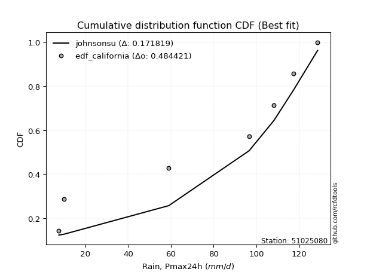</img></img>

</div>


### 2. EDF Hazen (1930)

Hazen method for plotting positions is a formula used to estimate the empirical cumulative probability distribution of flood events or other hydrological data. This formula often results in biased estimations, particularly when extrapolating to extreme events (high return periods).

<div align="center">


$P=(m-0.5)/n$


</div>


**2.1. Empirical values**

<div align="center">

|                | 0                   | 1                   | 2                   | 3         | 4                  | 5                  | 6                  |
|:---------------|:--------------------|:--------------------|:--------------------|:----------|:-------------------|:-------------------|:-------------------|
| date           | 2024                | 2023                | 2017                | 2021      | 2018               | 2020               | 2019               |
| x              | 7.6                 | 10.0                | 59.0                | 96.6      | 108.2              | 117.4              | 128.6              |
| m              | 1                   | 2                   | 3                   | 4         | 5                  | 6                  | 7                  |
| empirical_dist | edf_hazen           | edf_hazen           | edf_hazen           | edf_hazen | edf_hazen          | edf_hazen          | edf_hazen          |
| empirical      | 0.07142857142857142 | 0.21428571428571427 | 0.35714285714285715 | 0.5       | 0.6428571428571429 | 0.7857142857142857 | 0.9285714285714286 |
| empirical_tr   | 1.0769230769230769  | 1.2727272727272727  | 1.5555555555555558  | 2.0       | 2.8000000000000003 | 4.666666666666666  | 14.000000000000007 |

</div>


**2.2. Kolmogorov-Smirnov fit test (sorted by Δ)**


<div align="center">

|                | 0                   | 1                   | 2                   | 3                   | 4                   | 5                   | 6                   | 7                   | 8                   | 9                   | 10                  | 11                  | 12                  | 13                  | 14                  | 15                  | 16                  | 17                  | 18                  | 19                  | 20                  | 21                  | 22                  | 23                  | 24                  | 25                  | 26                  | 27                  | 28                  | 29                  | 30                  | 31                  | 32                  | 33                  | 34                  | 35                  | 36                  | 37                  | 38                  | 39                  | 40                  | 41                  | 42                  | 43                  | 44                  | 45                  | 46                  | 47                  | 48                  | 49                  | 50                  | 51                  | 52                  | 53                  | 54                  | 55                  | 56                  | 57                  | 58                  | 59                  | 60                  | 61                  | 62                  | 63                  | 64                  | 65                  | 66                  | 67                  | 68                  | 69                  | 70                  | 71                  | 72                  | 73                  | 74                  | 75                  | 76                  | 77                  | 78                  | 79                  | 80                  | 81                  | 82                  | 83                  | 84                  | 85                  | 86                  | 87                  | 88                  | 89                  | 90                  | 91                  | 92                  | 93                  | 94                  | 95                  | 96                  | 97                  | 98                  | 99                  | 100                 | 101                 | 102                 | 103                 | 104                 | 105                 | 106                 | 107                 | 108                 | 109                 | 110                 | 111                 | 112                 | 113                 | 114                 | 115                 | 116                 | 117                 | 118                 | 119                 | 120                 | 121                 | 122                 | 123                 | 124                 | 125                 | 126                 | 127                 | 128                 | 129                 | 130                 | 131                 | 132                 | 133                 | 134                 | 135                 | 136                 | 137                 | 138                 | 139                 | 140                 | 141                 | 142                 | 143                 | 144                 | 145                 | 146                 | 147                 | 148                 | 149                 | 150                 | 151                 | 152                 | 153                 | 154                 | 155                 | 156                 | 157                 | 158                 | 159                 |
|:---------------|:--------------------|:--------------------|:--------------------|:--------------------|:--------------------|:--------------------|:--------------------|:--------------------|:--------------------|:--------------------|:--------------------|:--------------------|:--------------------|:--------------------|:--------------------|:--------------------|:--------------------|:--------------------|:--------------------|:--------------------|:--------------------|:--------------------|:--------------------|:--------------------|:--------------------|:--------------------|:--------------------|:--------------------|:--------------------|:--------------------|:--------------------|:--------------------|:--------------------|:--------------------|:--------------------|:--------------------|:--------------------|:--------------------|:--------------------|:--------------------|:--------------------|:--------------------|:--------------------|:--------------------|:--------------------|:--------------------|:--------------------|:--------------------|:--------------------|:--------------------|:--------------------|:--------------------|:--------------------|:--------------------|:--------------------|:--------------------|:--------------------|:--------------------|:--------------------|:--------------------|:--------------------|:--------------------|:--------------------|:--------------------|:--------------------|:--------------------|:--------------------|:--------------------|:--------------------|:--------------------|:--------------------|:--------------------|:--------------------|:--------------------|:--------------------|:--------------------|:--------------------|:--------------------|:--------------------|:--------------------|:--------------------|:--------------------|:--------------------|:--------------------|:--------------------|:--------------------|:--------------------|:--------------------|:--------------------|:--------------------|:--------------------|:--------------------|:--------------------|:--------------------|:--------------------|:--------------------|:--------------------|:--------------------|:--------------------|:--------------------|:--------------------|:--------------------|:--------------------|:--------------------|:--------------------|:--------------------|:--------------------|:--------------------|:--------------------|:--------------------|:--------------------|:--------------------|:--------------------|:--------------------|:--------------------|:--------------------|:--------------------|:--------------------|:--------------------|:--------------------|:--------------------|:--------------------|:--------------------|:--------------------|:--------------------|:--------------------|:--------------------|:--------------------|:--------------------|:--------------------|:--------------------|:--------------------|:--------------------|:--------------------|:--------------------|:--------------------|:--------------------|:--------------------|:--------------------|:--------------------|:--------------------|:--------------------|:--------------------|:--------------------|:--------------------|:--------------------|:--------------------|:--------------------|:--------------------|:--------------------|:--------------------|:--------------------|:--------------------|:--------------------|:--------------------|:--------------------|:--------------------|:--------------------|:--------------------|:--------------------|
| station        | 51025080            | 51025080            | 51025080            | 51025080            | 51025080            | 51025080            | 51025080            | 51025080            | 51025080            | 51025080            | 51025080            | 51025080            | 51025080            | 51025080            | 51025080            | 51025080            | 51025080            | 51025080            | 51025080            | 51025080            | 51025080            | 51025080            | 51025080            | 51025080            | 51025080            | 51025080            | 51025080            | 51025080            | 51025080            | 51025080            | 51025080            | 51025080            | 51025080            | 51025080            | 51025080            | 51025080            | 51025080            | 51025080            | 51025080            | 51025080            | 51025080            | 51025080            | 51025080            | 51025080            | 51025080            | 51025080            | 51025080            | 51025080            | 51025080            | 51025080            | 51025080            | 51025080            | 51025080            | 51025080            | 51025080            | 51025080            | 51025080            | 51025080            | 51025080            | 51025080            | 51025080            | 51025080            | 51025080            | 51025080            | 51025080            | 51025080            | 51025080            | 51025080            | 51025080            | 51025080            | 51025080            | 51025080            | 51025080            | 51025080            | 51025080            | 51025080            | 51025080            | 51025080            | 51025080            | 51025080            | 51025080            | 51025080            | 51025080            | 51025080            | 51025080            | 51025080            | 51025080            | 51025080            | 51025080            | 51025080            | 51025080            | 51025080            | 51025080            | 51025080            | 51025080            | 51025080            | 51025080            | 51025080            | 51025080            | 51025080            | 51025080            | 51025080            | 51025080            | 51025080            | 51025080            | 51025080            | 51025080            | 51025080            | 51025080            | 51025080            | 51025080            | 51025080            | 51025080            | 51025080            | 51025080            | 51025080            | 51025080            | 51025080            | 51025080            | 51025080            | 51025080            | 51025080            | 51025080            | 51025080            | 51025080            | 51025080            | 51025080            | 51025080            | 51025080            | 51025080            | 51025080            | 51025080            | 51025080            | 51025080            | 51025080            | 51025080            | 51025080            | 51025080            | 51025080            | 51025080            | 51025080            | 51025080            | 51025080            | 51025080            | 51025080            | 51025080            | 51025080            | 51025080            | 51025080            | 51025080            | 51025080            | 51025080            | 51025080            | 51025080            | 51025080            | 51025080            | 51025080            | 51025080            | 51025080            | 51025080            |
| empirical_dist | edf_hazen           | edf_hazen           | edf_hazen           | edf_hazen           | edf_hazen           | edf_hazen           | edf_hazen           | edf_hazen           | edf_hazen           | edf_hazen           | edf_hazen           | edf_hazen           | edf_hazen           | edf_hazen           | edf_hazen           | edf_hazen           | edf_hazen           | edf_hazen           | edf_hazen           | edf_hazen           | edf_hazen           | edf_hazen           | edf_hazen           | edf_hazen           | edf_hazen           | edf_hazen           | edf_hazen           | edf_hazen           | edf_hazen           | edf_hazen           | edf_hazen           | edf_hazen           | edf_hazen           | edf_hazen           | edf_hazen           | edf_hazen           | edf_hazen           | edf_hazen           | edf_hazen           | edf_hazen           | edf_hazen           | edf_hazen           | edf_hazen           | edf_hazen           | edf_hazen           | edf_hazen           | edf_hazen           | edf_hazen           | edf_hazen           | edf_hazen           | edf_hazen           | edf_hazen           | edf_hazen           | edf_hazen           | edf_hazen           | edf_hazen           | edf_hazen           | edf_hazen           | edf_hazen           | edf_hazen           | edf_hazen           | edf_hazen           | edf_hazen           | edf_hazen           | edf_hazen           | edf_hazen           | edf_hazen           | edf_hazen           | edf_hazen           | edf_hazen           | edf_hazen           | edf_hazen           | edf_hazen           | edf_hazen           | edf_hazen           | edf_hazen           | edf_hazen           | edf_hazen           | edf_hazen           | edf_hazen           | edf_hazen           | edf_hazen           | edf_hazen           | edf_hazen           | edf_hazen           | edf_hazen           | edf_hazen           | edf_hazen           | edf_hazen           | edf_hazen           | edf_hazen           | edf_hazen           | edf_hazen           | edf_hazen           | edf_hazen           | edf_hazen           | edf_hazen           | edf_hazen           | edf_hazen           | edf_hazen           | edf_hazen           | edf_hazen           | edf_hazen           | edf_hazen           | edf_hazen           | edf_hazen           | edf_hazen           | edf_hazen           | edf_hazen           | edf_hazen           | edf_hazen           | edf_hazen           | edf_hazen           | edf_hazen           | edf_hazen           | edf_hazen           | edf_hazen           | edf_hazen           | edf_hazen           | edf_hazen           | edf_hazen           | edf_hazen           | edf_hazen           | edf_hazen           | edf_hazen           | edf_hazen           | edf_hazen           | edf_hazen           | edf_hazen           | edf_hazen           | edf_hazen           | edf_hazen           | edf_hazen           | edf_hazen           | edf_hazen           | edf_hazen           | edf_hazen           | edf_hazen           | edf_hazen           | edf_hazen           | edf_hazen           | edf_hazen           | edf_hazen           | edf_hazen           | edf_hazen           | edf_hazen           | edf_hazen           | edf_hazen           | edf_hazen           | edf_hazen           | edf_hazen           | edf_hazen           | edf_hazen           | edf_hazen           | edf_hazen           | edf_hazen           | edf_hazen           | edf_hazen           | edf_hazen           | edf_hazen           |
| p_dist         | johnsonsu           | loglevy_l           | trapezoid           | logweibull_max      | genhalflogistic     | weibull_min         | ksone               | wrapcauchy          | gumbel_l            | genextreme          | dweibull            | semicircular        | triang              | argus               | dgamma              | skewnorm            | anglit              | pearson3            | beta                | genpareto           | loggenextreme       | arcsine             | logtrapezoid        | t                   | truncnorm           | crystalball         | norm                | exponnorm           | gausshyper          | gamma               | erlang              | foldnorm            | loggennorm          | logwrapcauchy       | rice                | lomax               | logksone            | invgauss            | logsemicircular     | maxwell             | logistic            | invgamma            | logpearson3         | loganglit           | cosine              | rayleigh            | loggumbel_l         | levy_l              | logdgamma           | ncf                 | hypsecant           | kstwobign           | mielke              | halfnorm            | logweibull_min      | betaprime           | genexpon            | logburr12           | logbetaprime        | logfatiguelife      | logarcsine          | logerlang           | loggamma            | loggamma            | logf                | logcrystalball      | lognorm             | logt                | logexponnorm        | lognct              | burr                | loggompertz         | logrice             | loginvgauss         | tukeylambda         | gumbel_r            | loginvgamma         | kappa3              | logncf              | logalpha            | logburr             | logfoldnorm         | uniform             | vonmises_line       | logargus            | laplace             | logmaxwell          | loginvweibull       | logloggamma         | logmielke           | halfgennorm         | halflogistic        | lograyleigh         | loglogistic         | kappa4              | moyal               | bradford            | f                   | loghypsecant        | logcosine           | loggenexpon         | logkstwobign        | lognakagami         | loghalfnorm         | loggumbel_r         | loggenpareto        | gennorm             | loglaplace          | loglaplace          | loglomax            | nct                 | loghalflogistic     | logmoyal            | wald                | burr12              | truncexpon          | nakagami            | logloglaplace       | logdweibull         | loggenhalflogistic  | loggausshyper       | loghalfgennorm      | logbeta             | logskewnorm         | gompertz            | truncweibull_min    | logtriang           | logkappa4           | loggengamma         | logwald             | logkappa3           | johnsonsb           | logexponweib        | exponweib           | gengamma            | logtukeylambda      | logbradford         | loguniform          | logvonmises_line    | alpha               | logtruncnorm        | logtruncexpon       | logtruncweibull_min | fatiguelife         | invweibull          | logrdist            | powerlaw            | logexponpow         | logjohnsonsu        | exponpow            | truncpareto         | logpowerlaw         | weibull_max         | logjohnsonsb        | logtruncpareto      | rdist               | genlogistic         | loggenlogistic      | logvonmises         | vonmises            |
| delta          | 0.1003906463118091  | 0.10888858367039364 | 0.12139433950693157 | 0.12177750078241267 | 0.12554042577773772 | 0.1310521240388206  | 0.13141685190888264 | 0.13183030885830288 | 0.1345684194504746  | 0.13653976692899794 | 0.1393382613607082  | 0.14364659906502786 | 0.1437790549565678  | 0.1487246663610133  | 0.14884374438858916 | 0.1514014017510703  | 0.1531166257443881  | 0.15375720698935957 | 0.15691619082423458 | 0.15961311887064578 | 0.16768910944347104 | 0.16813761219270143 | 0.17506158876713107 | 0.17552033100091768 | 0.17553217659900877 | 0.1755321835337742  | 0.17553218478242916 | 0.17553257066007333 | 0.17632822569564227 | 0.17660089934303735 | 0.17702711064780596 | 0.17994502583590033 | 0.18202367088786392 | 0.18510301622320707 | 0.18529270625123173 | 0.18750711824043995 | 0.18907214063049121 | 0.1930428752733413  | 0.19376199765267482 | 0.19433740181359294 | 0.19544843104339715 | 0.19656820925336405 | 0.1968916246960748  | 0.19921853553865843 | 0.19964839048070426 | 0.1999085804893287  | 0.20215106375226266 | 0.2056195497105828  | 0.20683477192499677 | 0.2082786891344438  | 0.21038390711274557 | 0.21312087533097868 | 0.21591803055859904 | 0.2164186624279809  | 0.2177991763445808  | 0.21927003530220723 | 0.22012697706864404 | 0.2205182867557962  | 0.22197076339032007 | 0.22204967254287167 | 0.22208283181205557 | 0.22219739261330407 | 0.22428589440951263 | 0.22428589440951263 | 0.2245681235180612  | 0.22555758977819518 | 0.22555761408064423 | 0.22555787264656268 | 0.22555977019128592 | 0.2256556586636025  | 0.2277954277248847  | 0.22863828490635596 | 0.2288368874983837  | 0.2289740322579895  | 0.22964969529302692 | 0.23114306869950674 | 0.2315890986499498  | 0.2319110959526336  | 0.23200576080596863 | 0.2325222907771658  | 0.2340318196319381  | 0.23409667228154107 | 0.23553719008264462 | 0.23556796206189978 | 0.23734131143511006 | 0.23735596485483823 | 0.23829843761686087 | 0.2413088717367034  | 0.24149187483270684 | 0.24307214700467294 | 0.24313743831037643 | 0.2440007177640866  | 0.24527343799308327 | 0.2478634448123911  | 0.24882986279975983 | 0.249306062416619   | 0.2497512491059536  | 0.2571750867384043  | 0.2632641599543164  | 0.2634999517095067  | 0.26937738671076944 | 0.26967238241601527 | 0.27043249782551376 | 0.27174434681406995 | 0.27588456190949956 | 0.27745896915397417 | 0.2857142857142857  | 0.2858057993783647  | 0.2858057993783647  | 0.2915295532786783  | 0.2935691274192653  | 0.2994370885402899  | 0.30024299941206983 | 0.3015636467715511  | 0.30545180230574237 | 0.30581116670251307 | 0.31110390861994014 | 0.3195029086068568  | 0.3228457565776839  | 0.3233204815622758  | 0.3284745640404837  | 0.33099410726369566 | 0.33252463275605376 | 0.346298459889697   | 0.3571410694550602  | 0.3598602437021434  | 0.3610728131716264  | 0.3630081021388869  | 0.365775499047384   | 0.36784973747192545 | 0.3808501118367478  | 0.385729411231174   | 0.3869566480758145  | 0.38825778744003586 | 0.39189365208750476 | 0.39403683561223346 | 0.39664479928597063 | 0.39884315135808823 | 0.39941853104470115 | 0.4303481702739293  | 0.4348595180588914  | 0.4395352018950068  | 0.4457007323429772  | 0.4791376212819641  | 0.4809232376360288  | 0.4999999926274469  | 0.5176934814362426  | 0.5307437750031476  | 0.5381873630064595  | 0.5836934620402496  | 0.5851362090826853  | 0.5870070500459557  | 0.5887043658426964  | 0.6064930446332165  | 0.6203591909271708  | 0.6428571413015329  | 0.7857142857142857  | 0.7857142857142857  | 1.1280835734305934  | 19.709871962264092  |
| deltao         | 0.48442053926100004 | 0.48442053926100004 | 0.48442053926100004 | 0.48442053926100004 | 0.48442053926100004 | 0.48442053926100004 | 0.48442053926100004 | 0.48442053926100004 | 0.48442053926100004 | 0.48442053926100004 | 0.48442053926100004 | 0.48442053926100004 | 0.48442053926100004 | 0.48442053926100004 | 0.48442053926100004 | 0.48442053926100004 | 0.48442053926100004 | 0.48442053926100004 | 0.48442053926100004 | 0.48442053926100004 | 0.48442053926100004 | 0.48442053926100004 | 0.48442053926100004 | 0.48442053926100004 | 0.48442053926100004 | 0.48442053926100004 | 0.48442053926100004 | 0.48442053926100004 | 0.48442053926100004 | 0.48442053926100004 | 0.48442053926100004 | 0.48442053926100004 | 0.48442053926100004 | 0.48442053926100004 | 0.48442053926100004 | 0.48442053926100004 | 0.48442053926100004 | 0.48442053926100004 | 0.48442053926100004 | 0.48442053926100004 | 0.48442053926100004 | 0.48442053926100004 | 0.48442053926100004 | 0.48442053926100004 | 0.48442053926100004 | 0.48442053926100004 | 0.48442053926100004 | 0.48442053926100004 | 0.48442053926100004 | 0.48442053926100004 | 0.48442053926100004 | 0.48442053926100004 | 0.48442053926100004 | 0.48442053926100004 | 0.48442053926100004 | 0.48442053926100004 | 0.48442053926100004 | 0.48442053926100004 | 0.48442053926100004 | 0.48442053926100004 | 0.48442053926100004 | 0.48442053926100004 | 0.48442053926100004 | 0.48442053926100004 | 0.48442053926100004 | 0.48442053926100004 | 0.48442053926100004 | 0.48442053926100004 | 0.48442053926100004 | 0.48442053926100004 | 0.48442053926100004 | 0.48442053926100004 | 0.48442053926100004 | 0.48442053926100004 | 0.48442053926100004 | 0.48442053926100004 | 0.48442053926100004 | 0.48442053926100004 | 0.48442053926100004 | 0.48442053926100004 | 0.48442053926100004 | 0.48442053926100004 | 0.48442053926100004 | 0.48442053926100004 | 0.48442053926100004 | 0.48442053926100004 | 0.48442053926100004 | 0.48442053926100004 | 0.48442053926100004 | 0.48442053926100004 | 0.48442053926100004 | 0.48442053926100004 | 0.48442053926100004 | 0.48442053926100004 | 0.48442053926100004 | 0.48442053926100004 | 0.48442053926100004 | 0.48442053926100004 | 0.48442053926100004 | 0.48442053926100004 | 0.48442053926100004 | 0.48442053926100004 | 0.48442053926100004 | 0.48442053926100004 | 0.48442053926100004 | 0.48442053926100004 | 0.48442053926100004 | 0.48442053926100004 | 0.48442053926100004 | 0.48442053926100004 | 0.48442053926100004 | 0.48442053926100004 | 0.48442053926100004 | 0.48442053926100004 | 0.48442053926100004 | 0.48442053926100004 | 0.48442053926100004 | 0.48442053926100004 | 0.48442053926100004 | 0.48442053926100004 | 0.48442053926100004 | 0.48442053926100004 | 0.48442053926100004 | 0.48442053926100004 | 0.48442053926100004 | 0.48442053926100004 | 0.48442053926100004 | 0.48442053926100004 | 0.48442053926100004 | 0.48442053926100004 | 0.48442053926100004 | 0.48442053926100004 | 0.48442053926100004 | 0.48442053926100004 | 0.48442053926100004 | 0.48442053926100004 | 0.48442053926100004 | 0.48442053926100004 | 0.48442053926100004 | 0.48442053926100004 | 0.48442053926100004 | 0.48442053926100004 | 0.48442053926100004 | 0.48442053926100004 | 0.48442053926100004 | 0.48442053926100004 | 0.48442053926100004 | 0.48442053926100004 | 0.48442053926100004 | 0.48442053926100004 | 0.48442053926100004 | 0.48442053926100004 | 0.48442053926100004 | 0.48442053926100004 | 0.48442053926100004 | 0.48442053926100004 | 0.48442053926100004 | 0.48442053926100004 | 0.48442053926100004 | 0.48442053926100004 |
| eval           | Δo > Δ              | Δo > Δ              | Δo > Δ              | Δo > Δ              | Δo > Δ              | Δo > Δ              | Δo > Δ              | Δo > Δ              | Δo > Δ              | Δo > Δ              | Δo > Δ              | Δo > Δ              | Δo > Δ              | Δo > Δ              | Δo > Δ              | Δo > Δ              | Δo > Δ              | Δo > Δ              | Δo > Δ              | Δo > Δ              | Δo > Δ              | Δo > Δ              | Δo > Δ              | Δo > Δ              | Δo > Δ              | Δo > Δ              | Δo > Δ              | Δo > Δ              | Δo > Δ              | Δo > Δ              | Δo > Δ              | Δo > Δ              | Δo > Δ              | Δo > Δ              | Δo > Δ              | Δo > Δ              | Δo > Δ              | Δo > Δ              | Δo > Δ              | Δo > Δ              | Δo > Δ              | Δo > Δ              | Δo > Δ              | Δo > Δ              | Δo > Δ              | Δo > Δ              | Δo > Δ              | Δo > Δ              | Δo > Δ              | Δo > Δ              | Δo > Δ              | Δo > Δ              | Δo > Δ              | Δo > Δ              | Δo > Δ              | Δo > Δ              | Δo > Δ              | Δo > Δ              | Δo > Δ              | Δo > Δ              | Δo > Δ              | Δo > Δ              | Δo > Δ              | Δo > Δ              | Δo > Δ              | Δo > Δ              | Δo > Δ              | Δo > Δ              | Δo > Δ              | Δo > Δ              | Δo > Δ              | Δo > Δ              | Δo > Δ              | Δo > Δ              | Δo > Δ              | Δo > Δ              | Δo > Δ              | Δo > Δ              | Δo > Δ              | Δo > Δ              | Δo > Δ              | Δo > Δ              | Δo > Δ              | Δo > Δ              | Δo > Δ              | Δo > Δ              | Δo > Δ              | Δo > Δ              | Δo > Δ              | Δo > Δ              | Δo > Δ              | Δo > Δ              | Δo > Δ              | Δo > Δ              | Δo > Δ              | Δo > Δ              | Δo > Δ              | Δo > Δ              | Δo > Δ              | Δo > Δ              | Δo > Δ              | Δo > Δ              | Δo > Δ              | Δo > Δ              | Δo > Δ              | Δo > Δ              | Δo > Δ              | Δo > Δ              | Δo > Δ              | Δo > Δ              | Δo > Δ              | Δo > Δ              | Δo > Δ              | Δo > Δ              | Δo > Δ              | Δo > Δ              | Δo > Δ              | Δo > Δ              | Δo > Δ              | Δo > Δ              | Δo > Δ              | Δo > Δ              | Δo > Δ              | Δo > Δ              | Δo > Δ              | Δo > Δ              | Δo > Δ              | Δo > Δ              | Δo > Δ              | Δo > Δ              | Δo > Δ              | Δo > Δ              | Δo > Δ              | Δo > Δ              | Δo > Δ              | Δo > Δ              | Δo > Δ              | Δo > Δ              | Δo > Δ              | Δo > Δ              | Δo > Δ              | Δo > Δ              | Δo > Δ              | Δo > Δ              | Δo > Δ              | Δo <= Δ             | Δo <= Δ             | Δo <= Δ             | Δo <= Δ             | Δo <= Δ             | Δo <= Δ             | Δo <= Δ             | Δo <= Δ             | Δo <= Δ             | Δo <= Δ             | Δo <= Δ             | Δo <= Δ             | Δo <= Δ             | Δo <= Δ             | Δo <= Δ             |
| fit            | 1                   | 1                   | 1                   | 1                   | 1                   | 1                   | 1                   | 1                   | 1                   | 1                   | 1                   | 1                   | 1                   | 1                   | 1                   | 1                   | 1                   | 1                   | 1                   | 1                   | 1                   | 1                   | 1                   | 1                   | 1                   | 1                   | 1                   | 1                   | 1                   | 1                   | 1                   | 1                   | 1                   | 1                   | 1                   | 1                   | 1                   | 1                   | 1                   | 1                   | 1                   | 1                   | 1                   | 1                   | 1                   | 1                   | 1                   | 1                   | 1                   | 1                   | 1                   | 1                   | 1                   | 1                   | 1                   | 1                   | 1                   | 1                   | 1                   | 1                   | 1                   | 1                   | 1                   | 1                   | 1                   | 1                   | 1                   | 1                   | 1                   | 1                   | 1                   | 1                   | 1                   | 1                   | 1                   | 1                   | 1                   | 1                   | 1                   | 1                   | 1                   | 1                   | 1                   | 1                   | 1                   | 1                   | 1                   | 1                   | 1                   | 1                   | 1                   | 1                   | 1                   | 1                   | 1                   | 1                   | 1                   | 1                   | 1                   | 1                   | 1                   | 1                   | 1                   | 1                   | 1                   | 1                   | 1                   | 1                   | 1                   | 1                   | 1                   | 1                   | 1                   | 1                   | 1                   | 1                   | 1                   | 1                   | 1                   | 1                   | 1                   | 1                   | 1                   | 1                   | 1                   | 1                   | 1                   | 1                   | 1                   | 1                   | 1                   | 1                   | 1                   | 1                   | 1                   | 1                   | 1                   | 1                   | 1                   | 1                   | 1                   | 1                   | 1                   | 1                   | 1                   | 0                   | 0                   | 0                   | 0                   | 0                   | 0                   | 0                   | 0                   | 0                   | 0                   | 0                   | 0                   | 0                   | 0                   | 0                   |
| n              | 7                   | 7                   | 7                   | 7                   | 7                   | 7                   | 7                   | 7                   | 7                   | 7                   | 7                   | 7                   | 7                   | 7                   | 7                   | 7                   | 7                   | 7                   | 7                   | 7                   | 7                   | 7                   | 7                   | 7                   | 7                   | 7                   | 7                   | 7                   | 7                   | 7                   | 7                   | 7                   | 7                   | 7                   | 7                   | 7                   | 7                   | 7                   | 7                   | 7                   | 7                   | 7                   | 7                   | 7                   | 7                   | 7                   | 7                   | 7                   | 7                   | 7                   | 7                   | 7                   | 7                   | 7                   | 7                   | 7                   | 7                   | 7                   | 7                   | 7                   | 7                   | 7                   | 7                   | 7                   | 7                   | 7                   | 7                   | 7                   | 7                   | 7                   | 7                   | 7                   | 7                   | 7                   | 7                   | 7                   | 7                   | 7                   | 7                   | 7                   | 7                   | 7                   | 7                   | 7                   | 7                   | 7                   | 7                   | 7                   | 7                   | 7                   | 7                   | 7                   | 7                   | 7                   | 7                   | 7                   | 7                   | 7                   | 7                   | 7                   | 7                   | 7                   | 7                   | 7                   | 7                   | 7                   | 7                   | 7                   | 7                   | 7                   | 7                   | 7                   | 7                   | 7                   | 7                   | 7                   | 7                   | 7                   | 7                   | 7                   | 7                   | 7                   | 7                   | 7                   | 7                   | 7                   | 7                   | 7                   | 7                   | 7                   | 7                   | 7                   | 7                   | 7                   | 7                   | 7                   | 7                   | 7                   | 7                   | 7                   | 7                   | 7                   | 7                   | 7                   | 7                   | 7                   | 7                   | 7                   | 7                   | 7                   | 7                   | 7                   | 7                   | 7                   | 7                   | 7                   | 7                   | 7                   | 7                   | 7                   |
| best_fit       | 1                   | 0                   | 0                   | 0                   | 0                   | 0                   | 0                   | 0                   | 0                   | 0                   | 0                   | 0                   | 0                   | 0                   | 0                   | 0                   | 0                   | 0                   | 0                   | 0                   | 0                   | 0                   | 0                   | 0                   | 0                   | 0                   | 0                   | 0                   | 0                   | 0                   | 0                   | 0                   | 0                   | 0                   | 0                   | 0                   | 0                   | 0                   | 0                   | 0                   | 0                   | 0                   | 0                   | 0                   | 0                   | 0                   | 0                   | 0                   | 0                   | 0                   | 0                   | 0                   | 0                   | 0                   | 0                   | 0                   | 0                   | 0                   | 0                   | 0                   | 0                   | 0                   | 0                   | 0                   | 0                   | 0                   | 0                   | 0                   | 0                   | 0                   | 0                   | 0                   | 0                   | 0                   | 0                   | 0                   | 0                   | 0                   | 0                   | 0                   | 0                   | 0                   | 0                   | 0                   | 0                   | 0                   | 0                   | 0                   | 0                   | 0                   | 0                   | 0                   | 0                   | 0                   | 0                   | 0                   | 0                   | 0                   | 0                   | 0                   | 0                   | 0                   | 0                   | 0                   | 0                   | 0                   | 0                   | 0                   | 0                   | 0                   | 0                   | 0                   | 0                   | 0                   | 0                   | 0                   | 0                   | 0                   | 0                   | 0                   | 0                   | 0                   | 0                   | 0                   | 0                   | 0                   | 0                   | 0                   | 0                   | 0                   | 0                   | 0                   | 0                   | 0                   | 0                   | 0                   | 0                   | 0                   | 0                   | 0                   | 0                   | 0                   | 0                   | 0                   | 0                   | 0                   | 0                   | 0                   | 0                   | 0                   | 0                   | 0                   | 0                   | 0                   | 0                   | 0                   | 0                   | 0                   | 0                   | 0                   |
| best_fit_sort  | 1                   | 2                   | 3                   | 4                   | 5                   | 6                   | 7                   | 8                   | 9                   | 10                  | 11                  | 12                  | 13                  | 14                  | 15                  | 16                  | 17                  | 18                  | 19                  | 20                  | 21                  | 22                  | 23                  | 24                  | 25                  | 26                  | 27                  | 28                  | 29                  | 30                  | 31                  | 32                  | 33                  | 34                  | 35                  | 36                  | 37                  | 38                  | 39                  | 40                  | 41                  | 42                  | 43                  | 44                  | 45                  | 46                  | 47                  | 48                  | 49                  | 50                  | 51                  | 52                  | 53                  | 54                  | 55                  | 56                  | 57                  | 58                  | 59                  | 60                  | 61                  | 62                  | 63                  | 64                  | 65                  | 66                  | 67                  | 68                  | 69                  | 70                  | 71                  | 72                  | 73                  | 74                  | 75                  | 76                  | 77                  | 78                  | 79                  | 80                  | 81                  | 82                  | 83                  | 84                  | 85                  | 86                  | 87                  | 88                  | 89                  | 90                  | 91                  | 92                  | 93                  | 94                  | 95                  | 96                  | 97                  | 98                  | 99                  | 100                 | 101                 | 102                 | 103                 | 104                 | 105                 | 106                 | 107                 | 108                 | 109                 | 110                 | 111                 | 112                 | 113                 | 114                 | 115                 | 116                 | 117                 | 118                 | 119                 | 120                 | 121                 | 122                 | 123                 | 124                 | 125                 | 126                 | 127                 | 128                 | 129                 | 130                 | 131                 | 132                 | 133                 | 134                 | 135                 | 136                 | 137                 | 138                 | 139                 | 140                 | 141                 | 142                 | 143                 | 144                 | 145                 | 146                 | 147                 | 148                 | 149                 | 150                 | 151                 | 152                 | 153                 | 154                 | 155                 | 156                 | 157                 | 158                 | 159                 | 160                 |

</div>


**2.3. Best fit**

<div align="center">

|   id |   station | empirical_dist   | p_dist    |    delta |   deltao | eval   |   fit |   n |   best_fit |   best_fit_sort |
|-----:|----------:|:-----------------|:----------|---------:|---------:|:-------|------:|----:|-----------:|----------------:|
|    0 |  51025080 | edf_hazen        | johnsonsu | 0.100391 | 0.484421 | Δo > Δ |     1 |   7 |          1 |               1 |

</div>


<div align="center">

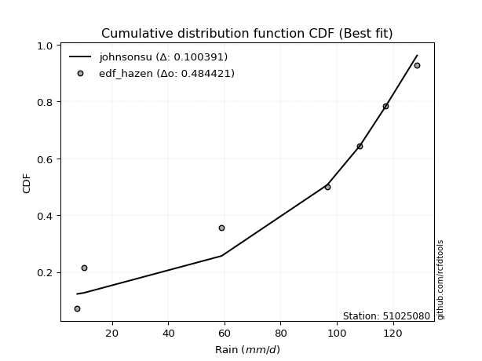</img>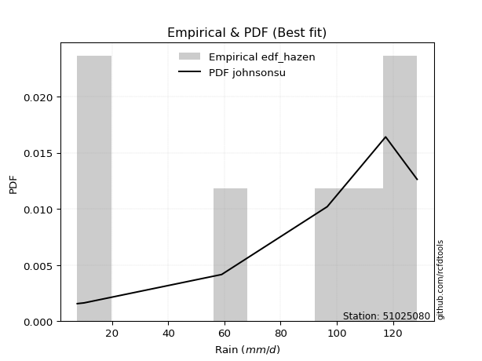</img>

</div>


### 3. EDF Weibull (1939)

Weibull plotting position formula is an empirical method used to estimate the non-exceedance probability or plotting position for a set of observed data, is often recommended or widely used in practice, particularly in flood frequency analysis.

<div align="center">


$P=m/(n+1)$


</div>


**3.1. Empirical values**

<div align="center">

|                | 0                  | 1                  | 2           | 3           | 4                  | 5           | 6           |
|:---------------|:-------------------|:-------------------|:------------|:------------|:-------------------|:------------|:------------|
| date           | 2024               | 2023               | 2017        | 2021        | 2018               | 2020        | 2019        |
| x              | 7.6                | 10.0               | 59.0        | 96.6        | 108.2              | 117.4       | 128.6       |
| m              | 1                  | 2                  | 3           | 4           | 5                  | 6           | 7           |
| empirical_dist | edf_weibull        | edf_weibull        | edf_weibull | edf_weibull | edf_weibull        | edf_weibull | edf_weibull |
| empirical      | 0.125              | 0.25               | 0.375       | 0.5         | 0.625              | 0.75        | 0.875       |
| empirical_tr   | 1.1428571428571428 | 1.3333333333333333 | 1.6         | 2.0         | 2.6666666666666665 | 4.0         | 8.0         |

</div>


**3.2. Kolmogorov-Smirnov fit test (sorted by Δ)**


<div align="center">

|                | 0                   | 1                   | 2                   | 3                   | 4                   | 5                   | 6                   | 7                   | 8                   | 9                   | 10                  | 11                  | 12                  | 13                  | 14                  | 15                  | 16                  | 17                  | 18                  | 19                  | 20                  | 21                  | 22                  | 23                  | 24                  | 25                  | 26                  | 27                  | 28                  | 29                  | 30                  | 31                  | 32                  | 33                  | 34                  | 35                  | 36                  | 37                  | 38                  | 39                  | 40                  | 41                  | 42                  | 43                  | 44                  | 45                  | 46                  | 47                  | 48                  | 49                  | 50                  | 51                  | 52                  | 53                  | 54                  | 55                  | 56                  | 57                  | 58                  | 59                  | 60                  | 61                  | 62                  | 63                  | 64                  | 65                  | 66                  | 67                  | 68                  | 69                  | 70                  | 71                  | 72                  | 73                  | 74                  | 75                  | 76                  | 77                  | 78                  | 79                  | 80                  | 81                  | 82                  | 83                  | 84                  | 85                  | 86                  | 87                  | 88                  | 89                  | 90                  | 91                  | 92                  | 93                  | 94                  | 95                  | 96                  | 97                  | 98                  | 99                  | 100                 | 101                 | 102                 | 103                 | 104                 | 105                 | 106                 | 107                 | 108                 | 109                 | 110                 | 111                 | 112                 | 113                 | 114                 | 115                 | 116                 | 117                 | 118                 | 119                 | 120                 | 121                 | 122                 | 123                 | 124                 | 125                 | 126                 | 127                 | 128                 | 129                 | 130                 | 131                 | 132                 | 133                 | 134                 | 135                 | 136                 | 137                 | 138                 | 139                 | 140                 | 141                 | 142                 | 143                 | 144                 | 145                 | 146                 | 147                 | 148                 | 149                 | 150                 | 151                 | 152                 | 153                 | 154                 | 155                 | 156                 | 157                 | 158                 | 159                 |
|:---------------|:--------------------|:--------------------|:--------------------|:--------------------|:--------------------|:--------------------|:--------------------|:--------------------|:--------------------|:--------------------|:--------------------|:--------------------|:--------------------|:--------------------|:--------------------|:--------------------|:--------------------|:--------------------|:--------------------|:--------------------|:--------------------|:--------------------|:--------------------|:--------------------|:--------------------|:--------------------|:--------------------|:--------------------|:--------------------|:--------------------|:--------------------|:--------------------|:--------------------|:--------------------|:--------------------|:--------------------|:--------------------|:--------------------|:--------------------|:--------------------|:--------------------|:--------------------|:--------------------|:--------------------|:--------------------|:--------------------|:--------------------|:--------------------|:--------------------|:--------------------|:--------------------|:--------------------|:--------------------|:--------------------|:--------------------|:--------------------|:--------------------|:--------------------|:--------------------|:--------------------|:--------------------|:--------------------|:--------------------|:--------------------|:--------------------|:--------------------|:--------------------|:--------------------|:--------------------|:--------------------|:--------------------|:--------------------|:--------------------|:--------------------|:--------------------|:--------------------|:--------------------|:--------------------|:--------------------|:--------------------|:--------------------|:--------------------|:--------------------|:--------------------|:--------------------|:--------------------|:--------------------|:--------------------|:--------------------|:--------------------|:--------------------|:--------------------|:--------------------|:--------------------|:--------------------|:--------------------|:--------------------|:--------------------|:--------------------|:--------------------|:--------------------|:--------------------|:--------------------|:--------------------|:--------------------|:--------------------|:--------------------|:--------------------|:--------------------|:--------------------|:--------------------|:--------------------|:--------------------|:--------------------|:--------------------|:--------------------|:--------------------|:--------------------|:--------------------|:--------------------|:--------------------|:--------------------|:--------------------|:--------------------|:--------------------|:--------------------|:--------------------|:--------------------|:--------------------|:--------------------|:--------------------|:--------------------|:--------------------|:--------------------|:--------------------|:--------------------|:--------------------|:--------------------|:--------------------|:--------------------|:--------------------|:--------------------|:--------------------|:--------------------|:--------------------|:--------------------|:--------------------|:--------------------|:--------------------|:--------------------|:--------------------|:--------------------|:--------------------|:--------------------|:--------------------|:--------------------|:--------------------|:--------------------|:--------------------|:--------------------|
| station        | 51025080            | 51025080            | 51025080            | 51025080            | 51025080            | 51025080            | 51025080            | 51025080            | 51025080            | 51025080            | 51025080            | 51025080            | 51025080            | 51025080            | 51025080            | 51025080            | 51025080            | 51025080            | 51025080            | 51025080            | 51025080            | 51025080            | 51025080            | 51025080            | 51025080            | 51025080            | 51025080            | 51025080            | 51025080            | 51025080            | 51025080            | 51025080            | 51025080            | 51025080            | 51025080            | 51025080            | 51025080            | 51025080            | 51025080            | 51025080            | 51025080            | 51025080            | 51025080            | 51025080            | 51025080            | 51025080            | 51025080            | 51025080            | 51025080            | 51025080            | 51025080            | 51025080            | 51025080            | 51025080            | 51025080            | 51025080            | 51025080            | 51025080            | 51025080            | 51025080            | 51025080            | 51025080            | 51025080            | 51025080            | 51025080            | 51025080            | 51025080            | 51025080            | 51025080            | 51025080            | 51025080            | 51025080            | 51025080            | 51025080            | 51025080            | 51025080            | 51025080            | 51025080            | 51025080            | 51025080            | 51025080            | 51025080            | 51025080            | 51025080            | 51025080            | 51025080            | 51025080            | 51025080            | 51025080            | 51025080            | 51025080            | 51025080            | 51025080            | 51025080            | 51025080            | 51025080            | 51025080            | 51025080            | 51025080            | 51025080            | 51025080            | 51025080            | 51025080            | 51025080            | 51025080            | 51025080            | 51025080            | 51025080            | 51025080            | 51025080            | 51025080            | 51025080            | 51025080            | 51025080            | 51025080            | 51025080            | 51025080            | 51025080            | 51025080            | 51025080            | 51025080            | 51025080            | 51025080            | 51025080            | 51025080            | 51025080            | 51025080            | 51025080            | 51025080            | 51025080            | 51025080            | 51025080            | 51025080            | 51025080            | 51025080            | 51025080            | 51025080            | 51025080            | 51025080            | 51025080            | 51025080            | 51025080            | 51025080            | 51025080            | 51025080            | 51025080            | 51025080            | 51025080            | 51025080            | 51025080            | 51025080            | 51025080            | 51025080            | 51025080            | 51025080            | 51025080            | 51025080            | 51025080            | 51025080            | 51025080            |
| empirical_dist | edf_weibull         | edf_weibull         | edf_weibull         | edf_weibull         | edf_weibull         | edf_weibull         | edf_weibull         | edf_weibull         | edf_weibull         | edf_weibull         | edf_weibull         | edf_weibull         | edf_weibull         | edf_weibull         | edf_weibull         | edf_weibull         | edf_weibull         | edf_weibull         | edf_weibull         | edf_weibull         | edf_weibull         | edf_weibull         | edf_weibull         | edf_weibull         | edf_weibull         | edf_weibull         | edf_weibull         | edf_weibull         | edf_weibull         | edf_weibull         | edf_weibull         | edf_weibull         | edf_weibull         | edf_weibull         | edf_weibull         | edf_weibull         | edf_weibull         | edf_weibull         | edf_weibull         | edf_weibull         | edf_weibull         | edf_weibull         | edf_weibull         | edf_weibull         | edf_weibull         | edf_weibull         | edf_weibull         | edf_weibull         | edf_weibull         | edf_weibull         | edf_weibull         | edf_weibull         | edf_weibull         | edf_weibull         | edf_weibull         | edf_weibull         | edf_weibull         | edf_weibull         | edf_weibull         | edf_weibull         | edf_weibull         | edf_weibull         | edf_weibull         | edf_weibull         | edf_weibull         | edf_weibull         | edf_weibull         | edf_weibull         | edf_weibull         | edf_weibull         | edf_weibull         | edf_weibull         | edf_weibull         | edf_weibull         | edf_weibull         | edf_weibull         | edf_weibull         | edf_weibull         | edf_weibull         | edf_weibull         | edf_weibull         | edf_weibull         | edf_weibull         | edf_weibull         | edf_weibull         | edf_weibull         | edf_weibull         | edf_weibull         | edf_weibull         | edf_weibull         | edf_weibull         | edf_weibull         | edf_weibull         | edf_weibull         | edf_weibull         | edf_weibull         | edf_weibull         | edf_weibull         | edf_weibull         | edf_weibull         | edf_weibull         | edf_weibull         | edf_weibull         | edf_weibull         | edf_weibull         | edf_weibull         | edf_weibull         | edf_weibull         | edf_weibull         | edf_weibull         | edf_weibull         | edf_weibull         | edf_weibull         | edf_weibull         | edf_weibull         | edf_weibull         | edf_weibull         | edf_weibull         | edf_weibull         | edf_weibull         | edf_weibull         | edf_weibull         | edf_weibull         | edf_weibull         | edf_weibull         | edf_weibull         | edf_weibull         | edf_weibull         | edf_weibull         | edf_weibull         | edf_weibull         | edf_weibull         | edf_weibull         | edf_weibull         | edf_weibull         | edf_weibull         | edf_weibull         | edf_weibull         | edf_weibull         | edf_weibull         | edf_weibull         | edf_weibull         | edf_weibull         | edf_weibull         | edf_weibull         | edf_weibull         | edf_weibull         | edf_weibull         | edf_weibull         | edf_weibull         | edf_weibull         | edf_weibull         | edf_weibull         | edf_weibull         | edf_weibull         | edf_weibull         | edf_weibull         | edf_weibull         | edf_weibull         | edf_weibull         |
| p_dist         | loglevy_l           | johnsonsu           | beta                | logweibull_max      | genhalflogistic     | trapezoid           | levy_l              | logtrapezoid        | ksone               | semicircular        | skewnorm            | gausshyper          | anglit              | gumbel_l            | pearson3            | genextreme          | weibull_min         | logwrapcauchy       | wrapcauchy          | loggenextreme       | logksone            | dweibull            | t                   | truncnorm           | crystalball         | norm                | exponnorm           | gamma               | erlang              | triang              | foldnorm            | argus               | dgamma              | rice                | logsemicircular     | invgauss            | maxwell             | genpareto           | logistic            | invgamma            | logpearson3         | loganglit           | cosine              | rayleigh            | loggumbel_l         | arcsine             | loggennorm          | ncf                 | hypsecant           | kstwobign           | mielke              | logweibull_min      | betaprime           | genexpon            | logburr12           | logdgamma           | logbetaprime        | logfatiguelife      | logerlang           | lomax               | loginvweibull       | loggamma            | loggamma            | logf                | logncf              | logcrystalball      | lognorm             | logt                | logexponnorm        | lognct              | burr                | loggompertz         | logrice             | loginvgauss         | tukeylambda         | gumbel_r            | loginvgamma         | kappa3              | logalpha            | logburr             | logfoldnorm         | halfgennorm         | uniform             | vonmises_line       | logargus            | laplace             | logmaxwell          | logloggamma         | lograyleigh         | logmielke           | loglogistic         | kappa4              | moyal               | bradford            | halflogistic        | logarcsine          | gennorm             | halfnorm            | loggenexpon         | logkstwobign        | lognakagami         | loghalfnorm         | f                   | loghypsecant        | logcosine           | logloglaplace       | logdweibull         | loggumbel_r         | loglomax            | nct                 | loggenpareto        | loghalflogistic     | logmoyal            | loglaplace          | loglaplace          | burr12              | nakagami            | logbeta             | wald                | truncexpon          | loghalfgennorm      | loggenhalflogistic  | loggausshyper       | johnsonsb           | logskewnorm         | loggengamma         | logwald             | truncweibull_min    | logtriang           | logkappa4           | logexponweib        | exponweib           | gengamma            | gompertz            | logkappa3           | logtukeylambda      | logbradford         | loguniform          | logvonmises_line    | alpha               | invweibull          | logtruncnorm        | logtruncexpon       | logtruncweibull_min | fatiguelife         | powerlaw            | logrdist            | logjohnsonsu        | logexponpow         | weibull_max         | exponpow            | truncpareto         | logpowerlaw         | logjohnsonsb        | logtruncpareto      | rdist               | genlogistic         | loggenlogistic      | logvonmises         | vonmises            |
| delta          | 0.08774685899637236 | 0.12313600727033286 | 0.12491971385602418 | 0.12499999858462518 | 0.12554042577773772 | 0.1266952031166082  | 0.15204812113915422 | 0.15278993957360987 | 0.15396551117690127 | 0.15579827981940725 | 0.1559761812019213  | 0.15847108283849942 | 0.15864978809157085 | 0.16092460009599954 | 0.16112024947257436 | 0.16425073558152437 | 0.16676640975310633 | 0.16724587336606422 | 0.1675445945725886  | 0.16768910944347104 | 0.1730411441542511  | 0.1750525470749939  | 0.17552033100091768 | 0.17553217659900877 | 0.1755321835337742  | 0.17553218478242916 | 0.17553257066007333 | 0.17660089934303735 | 0.17702711064780596 | 0.17949334067085354 | 0.1827802284320817  | 0.18443895207529903 | 0.18455803010287491 | 0.18579231250533523 | 0.1879087197942575  | 0.1930428752733413  | 0.19433740181359294 | 0.1953274045849315  | 0.19544843104339715 | 0.19656820925336405 | 0.1968916246960748  | 0.19921853553865843 | 0.19964839048070426 | 0.1999085804893287  | 0.20215106375226266 | 0.20385189790698716 | 0.2066257563620414  | 0.2082786891344438  | 0.21038390711274557 | 0.21312087533097868 | 0.21591803055859904 | 0.2177991763445808  | 0.21927003530220723 | 0.22012697706864404 | 0.2205182867557962  | 0.22128132537752332 | 0.22197076339032007 | 0.22204967254287167 | 0.22219739261330407 | 0.22322140395472567 | 0.22345172887956055 | 0.22428589440951263 | 0.22428589440951263 | 0.2245681235180612  | 0.22554635576603987 | 0.22555758977819518 | 0.22555761408064423 | 0.22555787264656268 | 0.22555977019128592 | 0.2256556586636025  | 0.2277954277248847  | 0.22863828490635596 | 0.2288368874983837  | 0.2289740322579895  | 0.22964969529302692 | 0.23114306869950674 | 0.2315890986499498  | 0.2319110959526336  | 0.2325222907771658  | 0.2340318196319381  | 0.23409667228154107 | 0.23546834701925    | 0.23553719008264462 | 0.23556796206189978 | 0.23734131143511006 | 0.23735596485483823 | 0.23829843761686087 | 0.24149187483270684 | 0.2419746303129391  | 0.24307214700467294 | 0.2478634448123911  | 0.24882986279975983 | 0.249306062416619   | 0.2497512491059536  | 0.25                | 0.25                | 0.25                | 0.25                | 0.2515202438536266  | 0.2518152395588724  | 0.2525753549683709  | 0.2538872039569271  | 0.2571750867384043  | 0.2632641599543164  | 0.2634999517095067  | 0.2659314800354282  | 0.2692743280062553  | 0.2708397156581088  | 0.27367241042153545 | 0.2757119845621224  | 0.27745896915397417 | 0.28157994568314704 | 0.28541903432053783 | 0.2858057993783647  | 0.2858057993783647  | 0.2875946594485995  | 0.2932467657627973  | 0.29681034704176806 | 0.3015636467715511  | 0.30581116670251307 | 0.3131369644065528  | 0.3233204815622758  | 0.3284745640404837  | 0.3321579826597454  | 0.346298459889697   | 0.34791835619024114 | 0.3499925946147826  | 0.3598602437021434  | 0.3610728131716264  | 0.3630081021388869  | 0.36909950521867163 | 0.370400644582893   | 0.3740365092303619  | 0.37499821231220304 | 0.3808501118367478  | 0.39403683561223346 | 0.39664479928597063 | 0.39884315135808823 | 0.39941853104470115 | 0.41249102741678645 | 0.4273518090646002  | 0.42947121764356555 | 0.43032386035885284 | 0.4322112034720118  | 0.4612804784248212  | 0.4998363385790998  | 0.4999999926274469  | 0.5024730772921739  | 0.5128866321460048  | 0.5529900801284107  | 0.5658363191831068  | 0.5672790662255425  | 0.5691499071888128  | 0.5707787589189308  | 0.602502048070028   | 0.62499999844439    | 0.75                | 0.75                | 1.1280835734305934  | 19.76344339083552   |
| deltao         | 0.48442053926100004 | 0.48442053926100004 | 0.48442053926100004 | 0.48442053926100004 | 0.48442053926100004 | 0.48442053926100004 | 0.48442053926100004 | 0.48442053926100004 | 0.48442053926100004 | 0.48442053926100004 | 0.48442053926100004 | 0.48442053926100004 | 0.48442053926100004 | 0.48442053926100004 | 0.48442053926100004 | 0.48442053926100004 | 0.48442053926100004 | 0.48442053926100004 | 0.48442053926100004 | 0.48442053926100004 | 0.48442053926100004 | 0.48442053926100004 | 0.48442053926100004 | 0.48442053926100004 | 0.48442053926100004 | 0.48442053926100004 | 0.48442053926100004 | 0.48442053926100004 | 0.48442053926100004 | 0.48442053926100004 | 0.48442053926100004 | 0.48442053926100004 | 0.48442053926100004 | 0.48442053926100004 | 0.48442053926100004 | 0.48442053926100004 | 0.48442053926100004 | 0.48442053926100004 | 0.48442053926100004 | 0.48442053926100004 | 0.48442053926100004 | 0.48442053926100004 | 0.48442053926100004 | 0.48442053926100004 | 0.48442053926100004 | 0.48442053926100004 | 0.48442053926100004 | 0.48442053926100004 | 0.48442053926100004 | 0.48442053926100004 | 0.48442053926100004 | 0.48442053926100004 | 0.48442053926100004 | 0.48442053926100004 | 0.48442053926100004 | 0.48442053926100004 | 0.48442053926100004 | 0.48442053926100004 | 0.48442053926100004 | 0.48442053926100004 | 0.48442053926100004 | 0.48442053926100004 | 0.48442053926100004 | 0.48442053926100004 | 0.48442053926100004 | 0.48442053926100004 | 0.48442053926100004 | 0.48442053926100004 | 0.48442053926100004 | 0.48442053926100004 | 0.48442053926100004 | 0.48442053926100004 | 0.48442053926100004 | 0.48442053926100004 | 0.48442053926100004 | 0.48442053926100004 | 0.48442053926100004 | 0.48442053926100004 | 0.48442053926100004 | 0.48442053926100004 | 0.48442053926100004 | 0.48442053926100004 | 0.48442053926100004 | 0.48442053926100004 | 0.48442053926100004 | 0.48442053926100004 | 0.48442053926100004 | 0.48442053926100004 | 0.48442053926100004 | 0.48442053926100004 | 0.48442053926100004 | 0.48442053926100004 | 0.48442053926100004 | 0.48442053926100004 | 0.48442053926100004 | 0.48442053926100004 | 0.48442053926100004 | 0.48442053926100004 | 0.48442053926100004 | 0.48442053926100004 | 0.48442053926100004 | 0.48442053926100004 | 0.48442053926100004 | 0.48442053926100004 | 0.48442053926100004 | 0.48442053926100004 | 0.48442053926100004 | 0.48442053926100004 | 0.48442053926100004 | 0.48442053926100004 | 0.48442053926100004 | 0.48442053926100004 | 0.48442053926100004 | 0.48442053926100004 | 0.48442053926100004 | 0.48442053926100004 | 0.48442053926100004 | 0.48442053926100004 | 0.48442053926100004 | 0.48442053926100004 | 0.48442053926100004 | 0.48442053926100004 | 0.48442053926100004 | 0.48442053926100004 | 0.48442053926100004 | 0.48442053926100004 | 0.48442053926100004 | 0.48442053926100004 | 0.48442053926100004 | 0.48442053926100004 | 0.48442053926100004 | 0.48442053926100004 | 0.48442053926100004 | 0.48442053926100004 | 0.48442053926100004 | 0.48442053926100004 | 0.48442053926100004 | 0.48442053926100004 | 0.48442053926100004 | 0.48442053926100004 | 0.48442053926100004 | 0.48442053926100004 | 0.48442053926100004 | 0.48442053926100004 | 0.48442053926100004 | 0.48442053926100004 | 0.48442053926100004 | 0.48442053926100004 | 0.48442053926100004 | 0.48442053926100004 | 0.48442053926100004 | 0.48442053926100004 | 0.48442053926100004 | 0.48442053926100004 | 0.48442053926100004 | 0.48442053926100004 | 0.48442053926100004 | 0.48442053926100004 | 0.48442053926100004 | 0.48442053926100004 |
| eval           | Δo > Δ              | Δo > Δ              | Δo > Δ              | Δo > Δ              | Δo > Δ              | Δo > Δ              | Δo > Δ              | Δo > Δ              | Δo > Δ              | Δo > Δ              | Δo > Δ              | Δo > Δ              | Δo > Δ              | Δo > Δ              | Δo > Δ              | Δo > Δ              | Δo > Δ              | Δo > Δ              | Δo > Δ              | Δo > Δ              | Δo > Δ              | Δo > Δ              | Δo > Δ              | Δo > Δ              | Δo > Δ              | Δo > Δ              | Δo > Δ              | Δo > Δ              | Δo > Δ              | Δo > Δ              | Δo > Δ              | Δo > Δ              | Δo > Δ              | Δo > Δ              | Δo > Δ              | Δo > Δ              | Δo > Δ              | Δo > Δ              | Δo > Δ              | Δo > Δ              | Δo > Δ              | Δo > Δ              | Δo > Δ              | Δo > Δ              | Δo > Δ              | Δo > Δ              | Δo > Δ              | Δo > Δ              | Δo > Δ              | Δo > Δ              | Δo > Δ              | Δo > Δ              | Δo > Δ              | Δo > Δ              | Δo > Δ              | Δo > Δ              | Δo > Δ              | Δo > Δ              | Δo > Δ              | Δo > Δ              | Δo > Δ              | Δo > Δ              | Δo > Δ              | Δo > Δ              | Δo > Δ              | Δo > Δ              | Δo > Δ              | Δo > Δ              | Δo > Δ              | Δo > Δ              | Δo > Δ              | Δo > Δ              | Δo > Δ              | Δo > Δ              | Δo > Δ              | Δo > Δ              | Δo > Δ              | Δo > Δ              | Δo > Δ              | Δo > Δ              | Δo > Δ              | Δo > Δ              | Δo > Δ              | Δo > Δ              | Δo > Δ              | Δo > Δ              | Δo > Δ              | Δo > Δ              | Δo > Δ              | Δo > Δ              | Δo > Δ              | Δo > Δ              | Δo > Δ              | Δo > Δ              | Δo > Δ              | Δo > Δ              | Δo > Δ              | Δo > Δ              | Δo > Δ              | Δo > Δ              | Δo > Δ              | Δo > Δ              | Δo > Δ              | Δo > Δ              | Δo > Δ              | Δo > Δ              | Δo > Δ              | Δo > Δ              | Δo > Δ              | Δo > Δ              | Δo > Δ              | Δo > Δ              | Δo > Δ              | Δo > Δ              | Δo > Δ              | Δo > Δ              | Δo > Δ              | Δo > Δ              | Δo > Δ              | Δo > Δ              | Δo > Δ              | Δo > Δ              | Δo > Δ              | Δo > Δ              | Δo > Δ              | Δo > Δ              | Δo > Δ              | Δo > Δ              | Δo > Δ              | Δo > Δ              | Δo > Δ              | Δo > Δ              | Δo > Δ              | Δo > Δ              | Δo > Δ              | Δo > Δ              | Δo > Δ              | Δo > Δ              | Δo > Δ              | Δo > Δ              | Δo > Δ              | Δo > Δ              | Δo > Δ              | Δo > Δ              | Δo > Δ              | Δo <= Δ             | Δo <= Δ             | Δo <= Δ             | Δo <= Δ             | Δo <= Δ             | Δo <= Δ             | Δo <= Δ             | Δo <= Δ             | Δo <= Δ             | Δo <= Δ             | Δo <= Δ             | Δo <= Δ             | Δo <= Δ             | Δo <= Δ             | Δo <= Δ             |
| fit            | 1                   | 1                   | 1                   | 1                   | 1                   | 1                   | 1                   | 1                   | 1                   | 1                   | 1                   | 1                   | 1                   | 1                   | 1                   | 1                   | 1                   | 1                   | 1                   | 1                   | 1                   | 1                   | 1                   | 1                   | 1                   | 1                   | 1                   | 1                   | 1                   | 1                   | 1                   | 1                   | 1                   | 1                   | 1                   | 1                   | 1                   | 1                   | 1                   | 1                   | 1                   | 1                   | 1                   | 1                   | 1                   | 1                   | 1                   | 1                   | 1                   | 1                   | 1                   | 1                   | 1                   | 1                   | 1                   | 1                   | 1                   | 1                   | 1                   | 1                   | 1                   | 1                   | 1                   | 1                   | 1                   | 1                   | 1                   | 1                   | 1                   | 1                   | 1                   | 1                   | 1                   | 1                   | 1                   | 1                   | 1                   | 1                   | 1                   | 1                   | 1                   | 1                   | 1                   | 1                   | 1                   | 1                   | 1                   | 1                   | 1                   | 1                   | 1                   | 1                   | 1                   | 1                   | 1                   | 1                   | 1                   | 1                   | 1                   | 1                   | 1                   | 1                   | 1                   | 1                   | 1                   | 1                   | 1                   | 1                   | 1                   | 1                   | 1                   | 1                   | 1                   | 1                   | 1                   | 1                   | 1                   | 1                   | 1                   | 1                   | 1                   | 1                   | 1                   | 1                   | 1                   | 1                   | 1                   | 1                   | 1                   | 1                   | 1                   | 1                   | 1                   | 1                   | 1                   | 1                   | 1                   | 1                   | 1                   | 1                   | 1                   | 1                   | 1                   | 1                   | 1                   | 0                   | 0                   | 0                   | 0                   | 0                   | 0                   | 0                   | 0                   | 0                   | 0                   | 0                   | 0                   | 0                   | 0                   | 0                   |
| n              | 7                   | 7                   | 7                   | 7                   | 7                   | 7                   | 7                   | 7                   | 7                   | 7                   | 7                   | 7                   | 7                   | 7                   | 7                   | 7                   | 7                   | 7                   | 7                   | 7                   | 7                   | 7                   | 7                   | 7                   | 7                   | 7                   | 7                   | 7                   | 7                   | 7                   | 7                   | 7                   | 7                   | 7                   | 7                   | 7                   | 7                   | 7                   | 7                   | 7                   | 7                   | 7                   | 7                   | 7                   | 7                   | 7                   | 7                   | 7                   | 7                   | 7                   | 7                   | 7                   | 7                   | 7                   | 7                   | 7                   | 7                   | 7                   | 7                   | 7                   | 7                   | 7                   | 7                   | 7                   | 7                   | 7                   | 7                   | 7                   | 7                   | 7                   | 7                   | 7                   | 7                   | 7                   | 7                   | 7                   | 7                   | 7                   | 7                   | 7                   | 7                   | 7                   | 7                   | 7                   | 7                   | 7                   | 7                   | 7                   | 7                   | 7                   | 7                   | 7                   | 7                   | 7                   | 7                   | 7                   | 7                   | 7                   | 7                   | 7                   | 7                   | 7                   | 7                   | 7                   | 7                   | 7                   | 7                   | 7                   | 7                   | 7                   | 7                   | 7                   | 7                   | 7                   | 7                   | 7                   | 7                   | 7                   | 7                   | 7                   | 7                   | 7                   | 7                   | 7                   | 7                   | 7                   | 7                   | 7                   | 7                   | 7                   | 7                   | 7                   | 7                   | 7                   | 7                   | 7                   | 7                   | 7                   | 7                   | 7                   | 7                   | 7                   | 7                   | 7                   | 7                   | 7                   | 7                   | 7                   | 7                   | 7                   | 7                   | 7                   | 7                   | 7                   | 7                   | 7                   | 7                   | 7                   | 7                   | 7                   |
| best_fit       | 1                   | 0                   | 0                   | 0                   | 0                   | 0                   | 0                   | 0                   | 0                   | 0                   | 0                   | 0                   | 0                   | 0                   | 0                   | 0                   | 0                   | 0                   | 0                   | 0                   | 0                   | 0                   | 0                   | 0                   | 0                   | 0                   | 0                   | 0                   | 0                   | 0                   | 0                   | 0                   | 0                   | 0                   | 0                   | 0                   | 0                   | 0                   | 0                   | 0                   | 0                   | 0                   | 0                   | 0                   | 0                   | 0                   | 0                   | 0                   | 0                   | 0                   | 0                   | 0                   | 0                   | 0                   | 0                   | 0                   | 0                   | 0                   | 0                   | 0                   | 0                   | 0                   | 0                   | 0                   | 0                   | 0                   | 0                   | 0                   | 0                   | 0                   | 0                   | 0                   | 0                   | 0                   | 0                   | 0                   | 0                   | 0                   | 0                   | 0                   | 0                   | 0                   | 0                   | 0                   | 0                   | 0                   | 0                   | 0                   | 0                   | 0                   | 0                   | 0                   | 0                   | 0                   | 0                   | 0                   | 0                   | 0                   | 0                   | 0                   | 0                   | 0                   | 0                   | 0                   | 0                   | 0                   | 0                   | 0                   | 0                   | 0                   | 0                   | 0                   | 0                   | 0                   | 0                   | 0                   | 0                   | 0                   | 0                   | 0                   | 0                   | 0                   | 0                   | 0                   | 0                   | 0                   | 0                   | 0                   | 0                   | 0                   | 0                   | 0                   | 0                   | 0                   | 0                   | 0                   | 0                   | 0                   | 0                   | 0                   | 0                   | 0                   | 0                   | 0                   | 0                   | 0                   | 0                   | 0                   | 0                   | 0                   | 0                   | 0                   | 0                   | 0                   | 0                   | 0                   | 0                   | 0                   | 0                   | 0                   |
| best_fit_sort  | 1                   | 2                   | 3                   | 4                   | 5                   | 6                   | 7                   | 8                   | 9                   | 10                  | 11                  | 12                  | 13                  | 14                  | 15                  | 16                  | 17                  | 18                  | 19                  | 20                  | 21                  | 22                  | 23                  | 24                  | 25                  | 26                  | 27                  | 28                  | 29                  | 30                  | 31                  | 32                  | 33                  | 34                  | 35                  | 36                  | 37                  | 38                  | 39                  | 40                  | 41                  | 42                  | 43                  | 44                  | 45                  | 46                  | 47                  | 48                  | 49                  | 50                  | 51                  | 52                  | 53                  | 54                  | 55                  | 56                  | 57                  | 58                  | 59                  | 60                  | 61                  | 62                  | 63                  | 64                  | 65                  | 66                  | 67                  | 68                  | 69                  | 70                  | 71                  | 72                  | 73                  | 74                  | 75                  | 76                  | 77                  | 78                  | 79                  | 80                  | 81                  | 82                  | 83                  | 84                  | 85                  | 86                  | 87                  | 88                  | 89                  | 90                  | 91                  | 92                  | 93                  | 94                  | 95                  | 96                  | 97                  | 98                  | 99                  | 100                 | 101                 | 102                 | 103                 | 104                 | 105                 | 106                 | 107                 | 108                 | 109                 | 110                 | 111                 | 112                 | 113                 | 114                 | 115                 | 116                 | 117                 | 118                 | 119                 | 120                 | 121                 | 122                 | 123                 | 124                 | 125                 | 126                 | 127                 | 128                 | 129                 | 130                 | 131                 | 132                 | 133                 | 134                 | 135                 | 136                 | 137                 | 138                 | 139                 | 140                 | 141                 | 142                 | 143                 | 144                 | 145                 | 146                 | 147                 | 148                 | 149                 | 150                 | 151                 | 152                 | 153                 | 154                 | 155                 | 156                 | 157                 | 158                 | 159                 | 160                 |

</div>


**3.3. Best fit**

<div align="center">

|   id |   station | empirical_dist   | p_dist    |     delta |   deltao | eval   |   fit |   n |   best_fit |   best_fit_sort |
|-----:|----------:|:-----------------|:----------|----------:|---------:|:-------|------:|----:|-----------:|----------------:|
|    0 |  51025080 | edf_weibull      | loglevy_l | 0.0877469 | 0.484421 | Δo > Δ |     1 |   7 |          1 |               1 |

</div>


<div align="center">

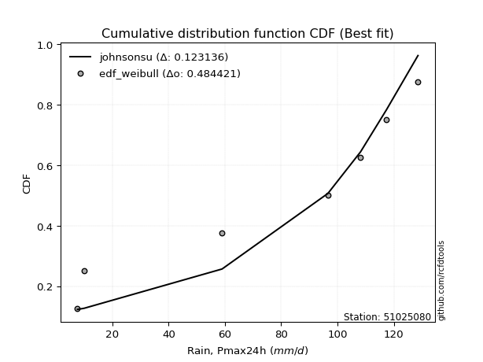</img>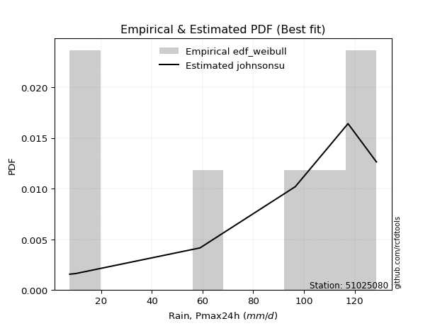</img>

</div>


### 4. EDF Beard (1943)

The Beard formula (or Beard´s plotting position formula) in hydrology is used to estimate the empirical non-exceedance probability _(P)_ of a flood event (or other extreme hydrological data point) within a given dataset.

<div align="center">


$P=(m-0.31)/(n+0.38)$


</div>


**4.1. Empirical values**

<div align="center">

|                | 0                   | 1                   | 2                   | 3         | 4                  | 5                  | 6                  |
|:---------------|:--------------------|:--------------------|:--------------------|:----------|:-------------------|:-------------------|:-------------------|
| date           | 2024                | 2023                | 2017                | 2021      | 2018               | 2020               | 2019               |
| x              | 7.6                 | 10.0                | 59.0                | 96.6      | 108.2              | 117.4              | 128.6              |
| m              | 1                   | 2                   | 3                   | 4         | 5                  | 6                  | 7                  |
| empirical_dist | edf_beard           | edf_beard           | edf_beard           | edf_beard | edf_beard          | edf_beard          | edf_beard          |
| empirical      | 0.09349593495934959 | 0.22899728997289973 | 0.36449864498644985 | 0.5       | 0.6355013550135502 | 0.7710027100271003 | 0.9065040650406505 |
| empirical_tr   | 1.1031390134529149  | 1.29701230228471    | 1.5735607675906182  | 2.0       | 2.743494423791822  | 4.366863905325444  | 10.695652173913055 |

</div>


**4.2. Kolmogorov-Smirnov fit test (sorted by Δ)**


<div align="center">

|                | 0                   | 1                   | 2                   | 3                   | 4                   | 5                   | 6                   | 7                   | 8                   | 9                   | 10                  | 11                  | 12                  | 13                  | 14                  | 15                  | 16                  | 17                  | 18                  | 19                  | 20                  | 21                  | 22                  | 23                  | 24                  | 25                  | 26                  | 27                  | 28                  | 29                  | 30                  | 31                  | 32                  | 33                  | 34                  | 35                  | 36                  | 37                  | 38                  | 39                  | 40                  | 41                  | 42                  | 43                  | 44                  | 45                  | 46                  | 47                  | 48                  | 49                  | 50                  | 51                  | 52                  | 53                  | 54                  | 55                  | 56                  | 57                  | 58                  | 59                  | 60                  | 61                  | 62                  | 63                  | 64                  | 65                  | 66                  | 67                  | 68                  | 69                  | 70                  | 71                  | 72                  | 73                  | 74                  | 75                  | 76                  | 77                  | 78                  | 79                  | 80                  | 81                  | 82                  | 83                  | 84                  | 85                  | 86                  | 87                  | 88                  | 89                  | 90                  | 91                  | 92                  | 93                  | 94                  | 95                  | 96                  | 97                  | 98                  | 99                  | 100                 | 101                 | 102                 | 103                 | 104                 | 105                 | 106                 | 107                 | 108                 | 109                 | 110                 | 111                 | 112                 | 113                 | 114                 | 115                 | 116                 | 117                 | 118                 | 119                 | 120                 | 121                 | 122                 | 123                 | 124                 | 125                 | 126                 | 127                 | 128                 | 129                 | 130                 | 131                 | 132                 | 133                 | 134                 | 135                 | 136                 | 137                 | 138                 | 139                 | 140                 | 141                 | 142                 | 143                 | 144                 | 145                 | 146                 | 147                 | 148                 | 149                 | 150                 | 151                 | 152                 | 153                 | 154                 | 155                 | 156                 | 157                 | 158                 | 159                 |
|:---------------|:--------------------|:--------------------|:--------------------|:--------------------|:--------------------|:--------------------|:--------------------|:--------------------|:--------------------|:--------------------|:--------------------|:--------------------|:--------------------|:--------------------|:--------------------|:--------------------|:--------------------|:--------------------|:--------------------|:--------------------|:--------------------|:--------------------|:--------------------|:--------------------|:--------------------|:--------------------|:--------------------|:--------------------|:--------------------|:--------------------|:--------------------|:--------------------|:--------------------|:--------------------|:--------------------|:--------------------|:--------------------|:--------------------|:--------------------|:--------------------|:--------------------|:--------------------|:--------------------|:--------------------|:--------------------|:--------------------|:--------------------|:--------------------|:--------------------|:--------------------|:--------------------|:--------------------|:--------------------|:--------------------|:--------------------|:--------------------|:--------------------|:--------------------|:--------------------|:--------------------|:--------------------|:--------------------|:--------------------|:--------------------|:--------------------|:--------------------|:--------------------|:--------------------|:--------------------|:--------------------|:--------------------|:--------------------|:--------------------|:--------------------|:--------------------|:--------------------|:--------------------|:--------------------|:--------------------|:--------------------|:--------------------|:--------------------|:--------------------|:--------------------|:--------------------|:--------------------|:--------------------|:--------------------|:--------------------|:--------------------|:--------------------|:--------------------|:--------------------|:--------------------|:--------------------|:--------------------|:--------------------|:--------------------|:--------------------|:--------------------|:--------------------|:--------------------|:--------------------|:--------------------|:--------------------|:--------------------|:--------------------|:--------------------|:--------------------|:--------------------|:--------------------|:--------------------|:--------------------|:--------------------|:--------------------|:--------------------|:--------------------|:--------------------|:--------------------|:--------------------|:--------------------|:--------------------|:--------------------|:--------------------|:--------------------|:--------------------|:--------------------|:--------------------|:--------------------|:--------------------|:--------------------|:--------------------|:--------------------|:--------------------|:--------------------|:--------------------|:--------------------|:--------------------|:--------------------|:--------------------|:--------------------|:--------------------|:--------------------|:--------------------|:--------------------|:--------------------|:--------------------|:--------------------|:--------------------|:--------------------|:--------------------|:--------------------|:--------------------|:--------------------|:--------------------|:--------------------|:--------------------|:--------------------|:--------------------|:--------------------|
| station        | 51025080            | 51025080            | 51025080            | 51025080            | 51025080            | 51025080            | 51025080            | 51025080            | 51025080            | 51025080            | 51025080            | 51025080            | 51025080            | 51025080            | 51025080            | 51025080            | 51025080            | 51025080            | 51025080            | 51025080            | 51025080            | 51025080            | 51025080            | 51025080            | 51025080            | 51025080            | 51025080            | 51025080            | 51025080            | 51025080            | 51025080            | 51025080            | 51025080            | 51025080            | 51025080            | 51025080            | 51025080            | 51025080            | 51025080            | 51025080            | 51025080            | 51025080            | 51025080            | 51025080            | 51025080            | 51025080            | 51025080            | 51025080            | 51025080            | 51025080            | 51025080            | 51025080            | 51025080            | 51025080            | 51025080            | 51025080            | 51025080            | 51025080            | 51025080            | 51025080            | 51025080            | 51025080            | 51025080            | 51025080            | 51025080            | 51025080            | 51025080            | 51025080            | 51025080            | 51025080            | 51025080            | 51025080            | 51025080            | 51025080            | 51025080            | 51025080            | 51025080            | 51025080            | 51025080            | 51025080            | 51025080            | 51025080            | 51025080            | 51025080            | 51025080            | 51025080            | 51025080            | 51025080            | 51025080            | 51025080            | 51025080            | 51025080            | 51025080            | 51025080            | 51025080            | 51025080            | 51025080            | 51025080            | 51025080            | 51025080            | 51025080            | 51025080            | 51025080            | 51025080            | 51025080            | 51025080            | 51025080            | 51025080            | 51025080            | 51025080            | 51025080            | 51025080            | 51025080            | 51025080            | 51025080            | 51025080            | 51025080            | 51025080            | 51025080            | 51025080            | 51025080            | 51025080            | 51025080            | 51025080            | 51025080            | 51025080            | 51025080            | 51025080            | 51025080            | 51025080            | 51025080            | 51025080            | 51025080            | 51025080            | 51025080            | 51025080            | 51025080            | 51025080            | 51025080            | 51025080            | 51025080            | 51025080            | 51025080            | 51025080            | 51025080            | 51025080            | 51025080            | 51025080            | 51025080            | 51025080            | 51025080            | 51025080            | 51025080            | 51025080            | 51025080            | 51025080            | 51025080            | 51025080            | 51025080            | 51025080            |
| empirical_dist | edf_beard           | edf_beard           | edf_beard           | edf_beard           | edf_beard           | edf_beard           | edf_beard           | edf_beard           | edf_beard           | edf_beard           | edf_beard           | edf_beard           | edf_beard           | edf_beard           | edf_beard           | edf_beard           | edf_beard           | edf_beard           | edf_beard           | edf_beard           | edf_beard           | edf_beard           | edf_beard           | edf_beard           | edf_beard           | edf_beard           | edf_beard           | edf_beard           | edf_beard           | edf_beard           | edf_beard           | edf_beard           | edf_beard           | edf_beard           | edf_beard           | edf_beard           | edf_beard           | edf_beard           | edf_beard           | edf_beard           | edf_beard           | edf_beard           | edf_beard           | edf_beard           | edf_beard           | edf_beard           | edf_beard           | edf_beard           | edf_beard           | edf_beard           | edf_beard           | edf_beard           | edf_beard           | edf_beard           | edf_beard           | edf_beard           | edf_beard           | edf_beard           | edf_beard           | edf_beard           | edf_beard           | edf_beard           | edf_beard           | edf_beard           | edf_beard           | edf_beard           | edf_beard           | edf_beard           | edf_beard           | edf_beard           | edf_beard           | edf_beard           | edf_beard           | edf_beard           | edf_beard           | edf_beard           | edf_beard           | edf_beard           | edf_beard           | edf_beard           | edf_beard           | edf_beard           | edf_beard           | edf_beard           | edf_beard           | edf_beard           | edf_beard           | edf_beard           | edf_beard           | edf_beard           | edf_beard           | edf_beard           | edf_beard           | edf_beard           | edf_beard           | edf_beard           | edf_beard           | edf_beard           | edf_beard           | edf_beard           | edf_beard           | edf_beard           | edf_beard           | edf_beard           | edf_beard           | edf_beard           | edf_beard           | edf_beard           | edf_beard           | edf_beard           | edf_beard           | edf_beard           | edf_beard           | edf_beard           | edf_beard           | edf_beard           | edf_beard           | edf_beard           | edf_beard           | edf_beard           | edf_beard           | edf_beard           | edf_beard           | edf_beard           | edf_beard           | edf_beard           | edf_beard           | edf_beard           | edf_beard           | edf_beard           | edf_beard           | edf_beard           | edf_beard           | edf_beard           | edf_beard           | edf_beard           | edf_beard           | edf_beard           | edf_beard           | edf_beard           | edf_beard           | edf_beard           | edf_beard           | edf_beard           | edf_beard           | edf_beard           | edf_beard           | edf_beard           | edf_beard           | edf_beard           | edf_beard           | edf_beard           | edf_beard           | edf_beard           | edf_beard           | edf_beard           | edf_beard           | edf_beard           | edf_beard           | edf_beard           |
| p_dist         | loglevy_l           | johnsonsu           | trapezoid           | logweibull_max      | genhalflogistic     | ksone               | gumbel_l            | beta                | semicircular        | genextreme          | weibull_min         | wrapcauchy          | skewnorm            | logtrapezoid        | anglit              | pearson3            | dweibull            | triang              | argus               | dgamma              | loggenextreme       | gausshyper          | genpareto           | t                   | truncnorm           | crystalball         | norm                | exponnorm           | gamma               | erlang              | logwrapcauchy       | foldnorm            | logksone            | arcsine             | levy_l              | rice                | logsemicircular     | loggennorm          | invgauss            | maxwell             | logistic            | invgamma            | logpearson3         | loganglit           | cosine              | rayleigh            | loggumbel_l         | lomax               | ncf                 | hypsecant           | logdgamma           | kstwobign           | mielke              | logweibull_min      | betaprime           | genexpon            | logburr12           | logbetaprime        | logfatiguelife      | logerlang           | loggamma            | loggamma            | logf                | logncf              | logcrystalball      | lognorm             | logt                | logexponnorm        | lognct              | burr                | loggompertz         | logrice             | loginvgauss         | halfnorm            | logarcsine          | tukeylambda         | gumbel_r            | loginvgamma         | kappa3              | logalpha            | loginvweibull       | logburr             | logfoldnorm         | uniform             | vonmises_line       | halfgennorm         | logargus            | laplace             | logmaxwell          | logloggamma         | lograyleigh         | logmielke           | halflogistic        | loglogistic         | kappa4              | moyal               | bradford            | f                   | loggenexpon         | logkstwobign        | lognakagami         | loghypsecant        | logcosine           | loghalfnorm         | loggumbel_r         | gennorm             | loggenpareto        | loglomax            | loglaplace          | loglaplace          | nct                 | loghalflogistic     | logmoyal            | logloglaplace       | burr12              | logdweibull         | wald                | nakagami            | truncexpon          | logbeta             | loggenhalflogistic  | loghalfgennorm      | loggausshyper       | logskewnorm         | loggengamma         | truncweibull_min    | logwald             | logtriang           | logkappa4           | johnsonsb           | gompertz            | logexponweib        | logkappa3           | exponweib           | gengamma            | logtukeylambda      | logbradford         | loguniform          | logvonmises_line    | alpha               | logtruncnorm        | logtruncexpon       | logtruncweibull_min | invweibull          | fatiguelife         | logrdist            | powerlaw            | logexponpow         | logjohnsonsu        | weibull_max         | exponpow            | truncpareto         | logpowerlaw         | logjohnsonsb        | logtruncpareto      | rdist               | genlogistic         | loggenlogistic      | logvonmises         | vonmises            |
| delta          | 0.08682122013961548 | 0.1077464341554018  | 0.12139433950693157 | 0.12177750078241267 | 0.12554042577773772 | 0.132962801149801   | 0.13992189006889927 | 0.14220461513704918 | 0.14364659906502786 | 0.14389555477259064 | 0.14576369972600606 | 0.14654188454548833 | 0.1514014017510703  | 0.15299422523635298 | 0.1531166257443881  | 0.15375720698935957 | 0.15404983704789366 | 0.15849063064375324 | 0.16343624204819876 | 0.1635553200757746  | 0.16768910944347104 | 0.16897243785204957 | 0.17432469455783123 | 0.17552033100091768 | 0.17553217659900877 | 0.1755321835337742  | 0.17553218478242916 | 0.17553257066007333 | 0.17660089934303735 | 0.17702711064780596 | 0.17774722837961437 | 0.17994502583590033 | 0.18171635278689852 | 0.18284918787988688 | 0.18355218617980462 | 0.18529270625123173 | 0.1879087197942575  | 0.18937945873145662 | 0.1930428752733413  | 0.19433740181359294 | 0.19544843104339715 | 0.19656820925336405 | 0.1968916246960748  | 0.19921853553865843 | 0.19964839048070426 | 0.1999085804893287  | 0.20215106375226266 | 0.2022186939276254  | 0.2082786891344438  | 0.21038390711274557 | 0.21059751999909385 | 0.21312087533097868 | 0.21591803055859904 | 0.2177991763445808  | 0.21927003530220723 | 0.22012697706864404 | 0.2205182867557962  | 0.22197076339032007 | 0.22204967254287167 | 0.22219739261330407 | 0.22428589440951263 | 0.22428589440951263 | 0.2245681235180612  | 0.22554635576603987 | 0.22555758977819518 | 0.22555761408064423 | 0.22555787264656268 | 0.22555977019128592 | 0.2256556586636025  | 0.2277954277248847  | 0.22863828490635596 | 0.2288368874983837  | 0.2289740322579895  | 0.22899728997289973 | 0.22899728997289973 | 0.22964969529302692 | 0.23114306869950674 | 0.2315890986499498  | 0.2319110959526336  | 0.2325222907771658  | 0.2339530838931107  | 0.2340318196319381  | 0.23409667228154107 | 0.23553719008264462 | 0.23556796206189978 | 0.23578165046678373 | 0.23734131143511006 | 0.23735596485483823 | 0.23829843761686087 | 0.24149187483270684 | 0.2419746303129391  | 0.24307214700467294 | 0.2440007177640866  | 0.2478634448123911  | 0.24882986279975983 | 0.249306062416619   | 0.2497512491059536  | 0.2571750867384043  | 0.26202159886717674 | 0.26231659457242257 | 0.26307670998192106 | 0.2632641599543164  | 0.2634999517095067  | 0.26438855897047725 | 0.2708397156581088  | 0.2710027100271003  | 0.27745896915397417 | 0.2841737654350856  | 0.2858057993783647  | 0.2858057993783647  | 0.2862133395756726  | 0.2920813006966972  | 0.29288721156847713 | 0.2974355450760787  | 0.29809601446214967 | 0.3007783930469058  | 0.3015636467715511  | 0.30374812077634744 | 0.30581116670251307 | 0.31781305706886837 | 0.3233204815622758  | 0.32363831942010296 | 0.3284745640404837  | 0.346298459889697   | 0.3584197112037913  | 0.3598602437021434  | 0.36049394962833275 | 0.3610728131716264  | 0.3630081021388869  | 0.3636620477003958  | 0.3644968572986529  | 0.3796008602322218  | 0.3808501118367478  | 0.38090199959644316 | 0.38453786424391206 | 0.39403683561223346 | 0.39664479928597063 | 0.39884315135808823 | 0.39941853104470115 | 0.4229923824303366  | 0.42947121764356555 | 0.4321794140514141  | 0.4383449444993845  | 0.4588558741052507  | 0.4717818334383714  | 0.4999999926274469  | 0.51033769359265    | 0.523387987159555   | 0.5234757873192741  | 0.573992790155511   | 0.576337674196657   | 0.5777804212390927  | 0.5796512622023628  | 0.5917814689460311  | 0.6130034030835783  | 0.6355013534579401  | 0.7710027100271003  | 0.7710027100271003  | 1.1280835734305934  | 19.73193932579487   |
| deltao         | 0.48442053926100004 | 0.48442053926100004 | 0.48442053926100004 | 0.48442053926100004 | 0.48442053926100004 | 0.48442053926100004 | 0.48442053926100004 | 0.48442053926100004 | 0.48442053926100004 | 0.48442053926100004 | 0.48442053926100004 | 0.48442053926100004 | 0.48442053926100004 | 0.48442053926100004 | 0.48442053926100004 | 0.48442053926100004 | 0.48442053926100004 | 0.48442053926100004 | 0.48442053926100004 | 0.48442053926100004 | 0.48442053926100004 | 0.48442053926100004 | 0.48442053926100004 | 0.48442053926100004 | 0.48442053926100004 | 0.48442053926100004 | 0.48442053926100004 | 0.48442053926100004 | 0.48442053926100004 | 0.48442053926100004 | 0.48442053926100004 | 0.48442053926100004 | 0.48442053926100004 | 0.48442053926100004 | 0.48442053926100004 | 0.48442053926100004 | 0.48442053926100004 | 0.48442053926100004 | 0.48442053926100004 | 0.48442053926100004 | 0.48442053926100004 | 0.48442053926100004 | 0.48442053926100004 | 0.48442053926100004 | 0.48442053926100004 | 0.48442053926100004 | 0.48442053926100004 | 0.48442053926100004 | 0.48442053926100004 | 0.48442053926100004 | 0.48442053926100004 | 0.48442053926100004 | 0.48442053926100004 | 0.48442053926100004 | 0.48442053926100004 | 0.48442053926100004 | 0.48442053926100004 | 0.48442053926100004 | 0.48442053926100004 | 0.48442053926100004 | 0.48442053926100004 | 0.48442053926100004 | 0.48442053926100004 | 0.48442053926100004 | 0.48442053926100004 | 0.48442053926100004 | 0.48442053926100004 | 0.48442053926100004 | 0.48442053926100004 | 0.48442053926100004 | 0.48442053926100004 | 0.48442053926100004 | 0.48442053926100004 | 0.48442053926100004 | 0.48442053926100004 | 0.48442053926100004 | 0.48442053926100004 | 0.48442053926100004 | 0.48442053926100004 | 0.48442053926100004 | 0.48442053926100004 | 0.48442053926100004 | 0.48442053926100004 | 0.48442053926100004 | 0.48442053926100004 | 0.48442053926100004 | 0.48442053926100004 | 0.48442053926100004 | 0.48442053926100004 | 0.48442053926100004 | 0.48442053926100004 | 0.48442053926100004 | 0.48442053926100004 | 0.48442053926100004 | 0.48442053926100004 | 0.48442053926100004 | 0.48442053926100004 | 0.48442053926100004 | 0.48442053926100004 | 0.48442053926100004 | 0.48442053926100004 | 0.48442053926100004 | 0.48442053926100004 | 0.48442053926100004 | 0.48442053926100004 | 0.48442053926100004 | 0.48442053926100004 | 0.48442053926100004 | 0.48442053926100004 | 0.48442053926100004 | 0.48442053926100004 | 0.48442053926100004 | 0.48442053926100004 | 0.48442053926100004 | 0.48442053926100004 | 0.48442053926100004 | 0.48442053926100004 | 0.48442053926100004 | 0.48442053926100004 | 0.48442053926100004 | 0.48442053926100004 | 0.48442053926100004 | 0.48442053926100004 | 0.48442053926100004 | 0.48442053926100004 | 0.48442053926100004 | 0.48442053926100004 | 0.48442053926100004 | 0.48442053926100004 | 0.48442053926100004 | 0.48442053926100004 | 0.48442053926100004 | 0.48442053926100004 | 0.48442053926100004 | 0.48442053926100004 | 0.48442053926100004 | 0.48442053926100004 | 0.48442053926100004 | 0.48442053926100004 | 0.48442053926100004 | 0.48442053926100004 | 0.48442053926100004 | 0.48442053926100004 | 0.48442053926100004 | 0.48442053926100004 | 0.48442053926100004 | 0.48442053926100004 | 0.48442053926100004 | 0.48442053926100004 | 0.48442053926100004 | 0.48442053926100004 | 0.48442053926100004 | 0.48442053926100004 | 0.48442053926100004 | 0.48442053926100004 | 0.48442053926100004 | 0.48442053926100004 | 0.48442053926100004 | 0.48442053926100004 | 0.48442053926100004 |
| eval           | Δo > Δ              | Δo > Δ              | Δo > Δ              | Δo > Δ              | Δo > Δ              | Δo > Δ              | Δo > Δ              | Δo > Δ              | Δo > Δ              | Δo > Δ              | Δo > Δ              | Δo > Δ              | Δo > Δ              | Δo > Δ              | Δo > Δ              | Δo > Δ              | Δo > Δ              | Δo > Δ              | Δo > Δ              | Δo > Δ              | Δo > Δ              | Δo > Δ              | Δo > Δ              | Δo > Δ              | Δo > Δ              | Δo > Δ              | Δo > Δ              | Δo > Δ              | Δo > Δ              | Δo > Δ              | Δo > Δ              | Δo > Δ              | Δo > Δ              | Δo > Δ              | Δo > Δ              | Δo > Δ              | Δo > Δ              | Δo > Δ              | Δo > Δ              | Δo > Δ              | Δo > Δ              | Δo > Δ              | Δo > Δ              | Δo > Δ              | Δo > Δ              | Δo > Δ              | Δo > Δ              | Δo > Δ              | Δo > Δ              | Δo > Δ              | Δo > Δ              | Δo > Δ              | Δo > Δ              | Δo > Δ              | Δo > Δ              | Δo > Δ              | Δo > Δ              | Δo > Δ              | Δo > Δ              | Δo > Δ              | Δo > Δ              | Δo > Δ              | Δo > Δ              | Δo > Δ              | Δo > Δ              | Δo > Δ              | Δo > Δ              | Δo > Δ              | Δo > Δ              | Δo > Δ              | Δo > Δ              | Δo > Δ              | Δo > Δ              | Δo > Δ              | Δo > Δ              | Δo > Δ              | Δo > Δ              | Δo > Δ              | Δo > Δ              | Δo > Δ              | Δo > Δ              | Δo > Δ              | Δo > Δ              | Δo > Δ              | Δo > Δ              | Δo > Δ              | Δo > Δ              | Δo > Δ              | Δo > Δ              | Δo > Δ              | Δo > Δ              | Δo > Δ              | Δo > Δ              | Δo > Δ              | Δo > Δ              | Δo > Δ              | Δo > Δ              | Δo > Δ              | Δo > Δ              | Δo > Δ              | Δo > Δ              | Δo > Δ              | Δo > Δ              | Δo > Δ              | Δo > Δ              | Δo > Δ              | Δo > Δ              | Δo > Δ              | Δo > Δ              | Δo > Δ              | Δo > Δ              | Δo > Δ              | Δo > Δ              | Δo > Δ              | Δo > Δ              | Δo > Δ              | Δo > Δ              | Δo > Δ              | Δo > Δ              | Δo > Δ              | Δo > Δ              | Δo > Δ              | Δo > Δ              | Δo > Δ              | Δo > Δ              | Δo > Δ              | Δo > Δ              | Δo > Δ              | Δo > Δ              | Δo > Δ              | Δo > Δ              | Δo > Δ              | Δo > Δ              | Δo > Δ              | Δo > Δ              | Δo > Δ              | Δo > Δ              | Δo > Δ              | Δo > Δ              | Δo > Δ              | Δo > Δ              | Δo > Δ              | Δo > Δ              | Δo > Δ              | Δo > Δ              | Δo <= Δ             | Δo <= Δ             | Δo <= Δ             | Δo <= Δ             | Δo <= Δ             | Δo <= Δ             | Δo <= Δ             | Δo <= Δ             | Δo <= Δ             | Δo <= Δ             | Δo <= Δ             | Δo <= Δ             | Δo <= Δ             | Δo <= Δ             | Δo <= Δ             |
| fit            | 1                   | 1                   | 1                   | 1                   | 1                   | 1                   | 1                   | 1                   | 1                   | 1                   | 1                   | 1                   | 1                   | 1                   | 1                   | 1                   | 1                   | 1                   | 1                   | 1                   | 1                   | 1                   | 1                   | 1                   | 1                   | 1                   | 1                   | 1                   | 1                   | 1                   | 1                   | 1                   | 1                   | 1                   | 1                   | 1                   | 1                   | 1                   | 1                   | 1                   | 1                   | 1                   | 1                   | 1                   | 1                   | 1                   | 1                   | 1                   | 1                   | 1                   | 1                   | 1                   | 1                   | 1                   | 1                   | 1                   | 1                   | 1                   | 1                   | 1                   | 1                   | 1                   | 1                   | 1                   | 1                   | 1                   | 1                   | 1                   | 1                   | 1                   | 1                   | 1                   | 1                   | 1                   | 1                   | 1                   | 1                   | 1                   | 1                   | 1                   | 1                   | 1                   | 1                   | 1                   | 1                   | 1                   | 1                   | 1                   | 1                   | 1                   | 1                   | 1                   | 1                   | 1                   | 1                   | 1                   | 1                   | 1                   | 1                   | 1                   | 1                   | 1                   | 1                   | 1                   | 1                   | 1                   | 1                   | 1                   | 1                   | 1                   | 1                   | 1                   | 1                   | 1                   | 1                   | 1                   | 1                   | 1                   | 1                   | 1                   | 1                   | 1                   | 1                   | 1                   | 1                   | 1                   | 1                   | 1                   | 1                   | 1                   | 1                   | 1                   | 1                   | 1                   | 1                   | 1                   | 1                   | 1                   | 1                   | 1                   | 1                   | 1                   | 1                   | 1                   | 1                   | 0                   | 0                   | 0                   | 0                   | 0                   | 0                   | 0                   | 0                   | 0                   | 0                   | 0                   | 0                   | 0                   | 0                   | 0                   |
| n              | 7                   | 7                   | 7                   | 7                   | 7                   | 7                   | 7                   | 7                   | 7                   | 7                   | 7                   | 7                   | 7                   | 7                   | 7                   | 7                   | 7                   | 7                   | 7                   | 7                   | 7                   | 7                   | 7                   | 7                   | 7                   | 7                   | 7                   | 7                   | 7                   | 7                   | 7                   | 7                   | 7                   | 7                   | 7                   | 7                   | 7                   | 7                   | 7                   | 7                   | 7                   | 7                   | 7                   | 7                   | 7                   | 7                   | 7                   | 7                   | 7                   | 7                   | 7                   | 7                   | 7                   | 7                   | 7                   | 7                   | 7                   | 7                   | 7                   | 7                   | 7                   | 7                   | 7                   | 7                   | 7                   | 7                   | 7                   | 7                   | 7                   | 7                   | 7                   | 7                   | 7                   | 7                   | 7                   | 7                   | 7                   | 7                   | 7                   | 7                   | 7                   | 7                   | 7                   | 7                   | 7                   | 7                   | 7                   | 7                   | 7                   | 7                   | 7                   | 7                   | 7                   | 7                   | 7                   | 7                   | 7                   | 7                   | 7                   | 7                   | 7                   | 7                   | 7                   | 7                   | 7                   | 7                   | 7                   | 7                   | 7                   | 7                   | 7                   | 7                   | 7                   | 7                   | 7                   | 7                   | 7                   | 7                   | 7                   | 7                   | 7                   | 7                   | 7                   | 7                   | 7                   | 7                   | 7                   | 7                   | 7                   | 7                   | 7                   | 7                   | 7                   | 7                   | 7                   | 7                   | 7                   | 7                   | 7                   | 7                   | 7                   | 7                   | 7                   | 7                   | 7                   | 7                   | 7                   | 7                   | 7                   | 7                   | 7                   | 7                   | 7                   | 7                   | 7                   | 7                   | 7                   | 7                   | 7                   | 7                   |
| best_fit       | 1                   | 0                   | 0                   | 0                   | 0                   | 0                   | 0                   | 0                   | 0                   | 0                   | 0                   | 0                   | 0                   | 0                   | 0                   | 0                   | 0                   | 0                   | 0                   | 0                   | 0                   | 0                   | 0                   | 0                   | 0                   | 0                   | 0                   | 0                   | 0                   | 0                   | 0                   | 0                   | 0                   | 0                   | 0                   | 0                   | 0                   | 0                   | 0                   | 0                   | 0                   | 0                   | 0                   | 0                   | 0                   | 0                   | 0                   | 0                   | 0                   | 0                   | 0                   | 0                   | 0                   | 0                   | 0                   | 0                   | 0                   | 0                   | 0                   | 0                   | 0                   | 0                   | 0                   | 0                   | 0                   | 0                   | 0                   | 0                   | 0                   | 0                   | 0                   | 0                   | 0                   | 0                   | 0                   | 0                   | 0                   | 0                   | 0                   | 0                   | 0                   | 0                   | 0                   | 0                   | 0                   | 0                   | 0                   | 0                   | 0                   | 0                   | 0                   | 0                   | 0                   | 0                   | 0                   | 0                   | 0                   | 0                   | 0                   | 0                   | 0                   | 0                   | 0                   | 0                   | 0                   | 0                   | 0                   | 0                   | 0                   | 0                   | 0                   | 0                   | 0                   | 0                   | 0                   | 0                   | 0                   | 0                   | 0                   | 0                   | 0                   | 0                   | 0                   | 0                   | 0                   | 0                   | 0                   | 0                   | 0                   | 0                   | 0                   | 0                   | 0                   | 0                   | 0                   | 0                   | 0                   | 0                   | 0                   | 0                   | 0                   | 0                   | 0                   | 0                   | 0                   | 0                   | 0                   | 0                   | 0                   | 0                   | 0                   | 0                   | 0                   | 0                   | 0                   | 0                   | 0                   | 0                   | 0                   | 0                   |
| best_fit_sort  | 1                   | 2                   | 3                   | 4                   | 5                   | 6                   | 7                   | 8                   | 9                   | 10                  | 11                  | 12                  | 13                  | 14                  | 15                  | 16                  | 17                  | 18                  | 19                  | 20                  | 21                  | 22                  | 23                  | 24                  | 25                  | 26                  | 27                  | 28                  | 29                  | 30                  | 31                  | 32                  | 33                  | 34                  | 35                  | 36                  | 37                  | 38                  | 39                  | 40                  | 41                  | 42                  | 43                  | 44                  | 45                  | 46                  | 47                  | 48                  | 49                  | 50                  | 51                  | 52                  | 53                  | 54                  | 55                  | 56                  | 57                  | 58                  | 59                  | 60                  | 61                  | 62                  | 63                  | 64                  | 65                  | 66                  | 67                  | 68                  | 69                  | 70                  | 71                  | 72                  | 73                  | 74                  | 75                  | 76                  | 77                  | 78                  | 79                  | 80                  | 81                  | 82                  | 83                  | 84                  | 85                  | 86                  | 87                  | 88                  | 89                  | 90                  | 91                  | 92                  | 93                  | 94                  | 95                  | 96                  | 97                  | 98                  | 99                  | 100                 | 101                 | 102                 | 103                 | 104                 | 105                 | 106                 | 107                 | 108                 | 109                 | 110                 | 111                 | 112                 | 113                 | 114                 | 115                 | 116                 | 117                 | 118                 | 119                 | 120                 | 121                 | 122                 | 123                 | 124                 | 125                 | 126                 | 127                 | 128                 | 129                 | 130                 | 131                 | 132                 | 133                 | 134                 | 135                 | 136                 | 137                 | 138                 | 139                 | 140                 | 141                 | 142                 | 143                 | 144                 | 145                 | 146                 | 147                 | 148                 | 149                 | 150                 | 151                 | 152                 | 153                 | 154                 | 155                 | 156                 | 157                 | 158                 | 159                 | 160                 |

</div>


**4.3. Best fit**

<div align="center">

|   id |   station | empirical_dist   | p_dist    |     delta |   deltao | eval   |   fit |   n |   best_fit |   best_fit_sort |
|-----:|----------:|:-----------------|:----------|----------:|---------:|:-------|------:|----:|-----------:|----------------:|
|    0 |  51025080 | edf_beard        | loglevy_l | 0.0868212 | 0.484421 | Δo > Δ |     1 |   7 |          1 |               1 |

</div>


<div align="center">

</img>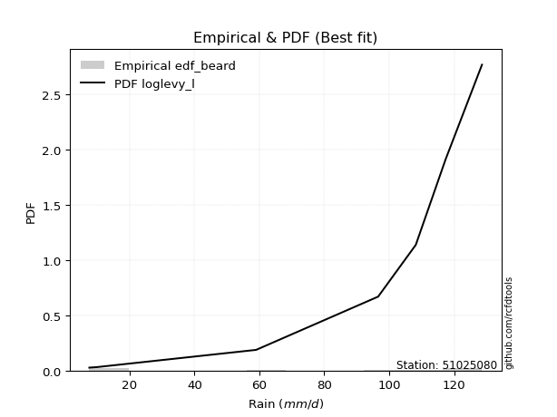</img>

</div>


### 5. EDF Chegodayev (1955)

The Chegodayev formula is an empirical plotting position formula used in hydrological frequency analysis to estimate the exceedance probability or return period of a specific event from a set of observed data. It is primarily used for plotting observed data points on probability paper to fit a theoretical distribution, particularly for analyzing extreme events like maximum flood flows or rainfall intensities. The constant _b_ value in the generalized plotting position formula is 0.3.

<div align="center">


$P=(m-b)/(n+1-2b)$


</div>


**5.1. Empirical values**

<div align="center">

|                | 0                   | 1                   | 2                   | 3              | 4                  | 5                  | 6                  |
|:---------------|:--------------------|:--------------------|:--------------------|:---------------|:-------------------|:-------------------|:-------------------|
| date           | 2024                | 2023                | 2017                | 2021           | 2018               | 2020               | 2019               |
| x              | 7.6                 | 10.0                | 59.0                | 96.6           | 108.2              | 117.4              | 128.6              |
| m              | 1                   | 2                   | 3                   | 4              | 5                  | 6                  | 7                  |
| empirical_dist | edf_chegodayev      | edf_chegodayev      | edf_chegodayev      | edf_chegodayev | edf_chegodayev     | edf_chegodayev     | edf_chegodayev     |
| empirical      | 0.09459459459459459 | 0.22972972972972971 | 0.36486486486486486 | 0.5            | 0.6351351351351351 | 0.7702702702702703 | 0.9054054054054054 |
| empirical_tr   | 1.1044776119402986  | 1.2982456140350878  | 1.574468085106383   | 2.0            | 2.7407407407407405 | 4.352941176470589  | 10.571428571428568 |

</div>


**5.2. Kolmogorov-Smirnov fit test (sorted by Δ)**


<div align="center">

|                | 0                   | 1                   | 2                   | 3                   | 4                   | 5                   | 6                   | 7                   | 8                   | 9                   | 10                  | 11                  | 12                  | 13                  | 14                  | 15                  | 16                  | 17                  | 18                  | 19                  | 20                  | 21                  | 22                  | 23                  | 24                  | 25                  | 26                  | 27                  | 28                  | 29                  | 30                  | 31                  | 32                  | 33                  | 34                  | 35                  | 36                  | 37                  | 38                  | 39                  | 40                  | 41                  | 42                  | 43                  | 44                  | 45                  | 46                  | 47                  | 48                  | 49                  | 50                  | 51                  | 52                  | 53                  | 54                  | 55                  | 56                  | 57                  | 58                  | 59                  | 60                  | 61                  | 62                  | 63                  | 64                  | 65                  | 66                  | 67                  | 68                  | 69                  | 70                  | 71                  | 72                  | 73                  | 74                  | 75                  | 76                  | 77                  | 78                  | 79                  | 80                  | 81                  | 82                  | 83                  | 84                  | 85                  | 86                  | 87                  | 88                  | 89                  | 90                  | 91                  | 92                  | 93                  | 94                  | 95                  | 96                  | 97                  | 98                  | 99                  | 100                 | 101                 | 102                 | 103                 | 104                 | 105                 | 106                 | 107                 | 108                 | 109                 | 110                 | 111                 | 112                 | 113                 | 114                 | 115                 | 116                 | 117                 | 118                 | 119                 | 120                 | 121                 | 122                 | 123                 | 124                 | 125                 | 126                 | 127                 | 128                 | 129                 | 130                 | 131                 | 132                 | 133                 | 134                 | 135                 | 136                 | 137                 | 138                 | 139                 | 140                 | 141                 | 142                 | 143                 | 144                 | 145                 | 146                 | 147                 | 148                 | 149                 | 150                 | 151                 | 152                 | 153                 | 154                 | 155                 | 156                 | 157                 | 158                 | 159                 |
|:---------------|:--------------------|:--------------------|:--------------------|:--------------------|:--------------------|:--------------------|:--------------------|:--------------------|:--------------------|:--------------------|:--------------------|:--------------------|:--------------------|:--------------------|:--------------------|:--------------------|:--------------------|:--------------------|:--------------------|:--------------------|:--------------------|:--------------------|:--------------------|:--------------------|:--------------------|:--------------------|:--------------------|:--------------------|:--------------------|:--------------------|:--------------------|:--------------------|:--------------------|:--------------------|:--------------------|:--------------------|:--------------------|:--------------------|:--------------------|:--------------------|:--------------------|:--------------------|:--------------------|:--------------------|:--------------------|:--------------------|:--------------------|:--------------------|:--------------------|:--------------------|:--------------------|:--------------------|:--------------------|:--------------------|:--------------------|:--------------------|:--------------------|:--------------------|:--------------------|:--------------------|:--------------------|:--------------------|:--------------------|:--------------------|:--------------------|:--------------------|:--------------------|:--------------------|:--------------------|:--------------------|:--------------------|:--------------------|:--------------------|:--------------------|:--------------------|:--------------------|:--------------------|:--------------------|:--------------------|:--------------------|:--------------------|:--------------------|:--------------------|:--------------------|:--------------------|:--------------------|:--------------------|:--------------------|:--------------------|:--------------------|:--------------------|:--------------------|:--------------------|:--------------------|:--------------------|:--------------------|:--------------------|:--------------------|:--------------------|:--------------------|:--------------------|:--------------------|:--------------------|:--------------------|:--------------------|:--------------------|:--------------------|:--------------------|:--------------------|:--------------------|:--------------------|:--------------------|:--------------------|:--------------------|:--------------------|:--------------------|:--------------------|:--------------------|:--------------------|:--------------------|:--------------------|:--------------------|:--------------------|:--------------------|:--------------------|:--------------------|:--------------------|:--------------------|:--------------------|:--------------------|:--------------------|:--------------------|:--------------------|:--------------------|:--------------------|:--------------------|:--------------------|:--------------------|:--------------------|:--------------------|:--------------------|:--------------------|:--------------------|:--------------------|:--------------------|:--------------------|:--------------------|:--------------------|:--------------------|:--------------------|:--------------------|:--------------------|:--------------------|:--------------------|:--------------------|:--------------------|:--------------------|:--------------------|:--------------------|:--------------------|
| station        | 51025080            | 51025080            | 51025080            | 51025080            | 51025080            | 51025080            | 51025080            | 51025080            | 51025080            | 51025080            | 51025080            | 51025080            | 51025080            | 51025080            | 51025080            | 51025080            | 51025080            | 51025080            | 51025080            | 51025080            | 51025080            | 51025080            | 51025080            | 51025080            | 51025080            | 51025080            | 51025080            | 51025080            | 51025080            | 51025080            | 51025080            | 51025080            | 51025080            | 51025080            | 51025080            | 51025080            | 51025080            | 51025080            | 51025080            | 51025080            | 51025080            | 51025080            | 51025080            | 51025080            | 51025080            | 51025080            | 51025080            | 51025080            | 51025080            | 51025080            | 51025080            | 51025080            | 51025080            | 51025080            | 51025080            | 51025080            | 51025080            | 51025080            | 51025080            | 51025080            | 51025080            | 51025080            | 51025080            | 51025080            | 51025080            | 51025080            | 51025080            | 51025080            | 51025080            | 51025080            | 51025080            | 51025080            | 51025080            | 51025080            | 51025080            | 51025080            | 51025080            | 51025080            | 51025080            | 51025080            | 51025080            | 51025080            | 51025080            | 51025080            | 51025080            | 51025080            | 51025080            | 51025080            | 51025080            | 51025080            | 51025080            | 51025080            | 51025080            | 51025080            | 51025080            | 51025080            | 51025080            | 51025080            | 51025080            | 51025080            | 51025080            | 51025080            | 51025080            | 51025080            | 51025080            | 51025080            | 51025080            | 51025080            | 51025080            | 51025080            | 51025080            | 51025080            | 51025080            | 51025080            | 51025080            | 51025080            | 51025080            | 51025080            | 51025080            | 51025080            | 51025080            | 51025080            | 51025080            | 51025080            | 51025080            | 51025080            | 51025080            | 51025080            | 51025080            | 51025080            | 51025080            | 51025080            | 51025080            | 51025080            | 51025080            | 51025080            | 51025080            | 51025080            | 51025080            | 51025080            | 51025080            | 51025080            | 51025080            | 51025080            | 51025080            | 51025080            | 51025080            | 51025080            | 51025080            | 51025080            | 51025080            | 51025080            | 51025080            | 51025080            | 51025080            | 51025080            | 51025080            | 51025080            | 51025080            | 51025080            |
| empirical_dist | edf_chegodayev      | edf_chegodayev      | edf_chegodayev      | edf_chegodayev      | edf_chegodayev      | edf_chegodayev      | edf_chegodayev      | edf_chegodayev      | edf_chegodayev      | edf_chegodayev      | edf_chegodayev      | edf_chegodayev      | edf_chegodayev      | edf_chegodayev      | edf_chegodayev      | edf_chegodayev      | edf_chegodayev      | edf_chegodayev      | edf_chegodayev      | edf_chegodayev      | edf_chegodayev      | edf_chegodayev      | edf_chegodayev      | edf_chegodayev      | edf_chegodayev      | edf_chegodayev      | edf_chegodayev      | edf_chegodayev      | edf_chegodayev      | edf_chegodayev      | edf_chegodayev      | edf_chegodayev      | edf_chegodayev      | edf_chegodayev      | edf_chegodayev      | edf_chegodayev      | edf_chegodayev      | edf_chegodayev      | edf_chegodayev      | edf_chegodayev      | edf_chegodayev      | edf_chegodayev      | edf_chegodayev      | edf_chegodayev      | edf_chegodayev      | edf_chegodayev      | edf_chegodayev      | edf_chegodayev      | edf_chegodayev      | edf_chegodayev      | edf_chegodayev      | edf_chegodayev      | edf_chegodayev      | edf_chegodayev      | edf_chegodayev      | edf_chegodayev      | edf_chegodayev      | edf_chegodayev      | edf_chegodayev      | edf_chegodayev      | edf_chegodayev      | edf_chegodayev      | edf_chegodayev      | edf_chegodayev      | edf_chegodayev      | edf_chegodayev      | edf_chegodayev      | edf_chegodayev      | edf_chegodayev      | edf_chegodayev      | edf_chegodayev      | edf_chegodayev      | edf_chegodayev      | edf_chegodayev      | edf_chegodayev      | edf_chegodayev      | edf_chegodayev      | edf_chegodayev      | edf_chegodayev      | edf_chegodayev      | edf_chegodayev      | edf_chegodayev      | edf_chegodayev      | edf_chegodayev      | edf_chegodayev      | edf_chegodayev      | edf_chegodayev      | edf_chegodayev      | edf_chegodayev      | edf_chegodayev      | edf_chegodayev      | edf_chegodayev      | edf_chegodayev      | edf_chegodayev      | edf_chegodayev      | edf_chegodayev      | edf_chegodayev      | edf_chegodayev      | edf_chegodayev      | edf_chegodayev      | edf_chegodayev      | edf_chegodayev      | edf_chegodayev      | edf_chegodayev      | edf_chegodayev      | edf_chegodayev      | edf_chegodayev      | edf_chegodayev      | edf_chegodayev      | edf_chegodayev      | edf_chegodayev      | edf_chegodayev      | edf_chegodayev      | edf_chegodayev      | edf_chegodayev      | edf_chegodayev      | edf_chegodayev      | edf_chegodayev      | edf_chegodayev      | edf_chegodayev      | edf_chegodayev      | edf_chegodayev      | edf_chegodayev      | edf_chegodayev      | edf_chegodayev      | edf_chegodayev      | edf_chegodayev      | edf_chegodayev      | edf_chegodayev      | edf_chegodayev      | edf_chegodayev      | edf_chegodayev      | edf_chegodayev      | edf_chegodayev      | edf_chegodayev      | edf_chegodayev      | edf_chegodayev      | edf_chegodayev      | edf_chegodayev      | edf_chegodayev      | edf_chegodayev      | edf_chegodayev      | edf_chegodayev      | edf_chegodayev      | edf_chegodayev      | edf_chegodayev      | edf_chegodayev      | edf_chegodayev      | edf_chegodayev      | edf_chegodayev      | edf_chegodayev      | edf_chegodayev      | edf_chegodayev      | edf_chegodayev      | edf_chegodayev      | edf_chegodayev      | edf_chegodayev      | edf_chegodayev      | edf_chegodayev      | edf_chegodayev      |
| p_dist         | loglevy_l           | johnsonsu           | trapezoid           | logweibull_max      | genhalflogistic     | ksone               | gumbel_l            | beta                | semicircular        | genextreme          | weibull_min         | wrapcauchy          | skewnorm            | logtrapezoid        | anglit              | pearson3            | dweibull            | triang              | argus               | dgamma              | loggenextreme       | gausshyper          | genpareto           | t                   | truncnorm           | crystalball         | norm                | exponnorm           | gamma               | erlang              | logwrapcauchy       | foldnorm            | logksone            | levy_l              | arcsine             | rice                | logsemicircular     | loggennorm          | invgauss            | maxwell             | logistic            | invgamma            | logpearson3         | loganglit           | cosine              | rayleigh            | loggumbel_l         | lomax               | ncf                 | hypsecant           | logdgamma           | kstwobign           | mielke              | logweibull_min      | betaprime           | genexpon            | logburr12           | logbetaprime        | logfatiguelife      | logerlang           | loggamma            | loggamma            | logf                | logncf              | logcrystalball      | lognorm             | logt                | logexponnorm        | lognct              | burr                | loggompertz         | logrice             | loginvgauss         | tukeylambda         | logarcsine          | halfnorm            | gumbel_r            | loginvgamma         | kappa3              | logalpha            | loginvweibull       | logburr             | logfoldnorm         | halfgennorm         | uniform             | vonmises_line       | logargus            | laplace             | logmaxwell          | logloggamma         | lograyleigh         | logmielke           | halflogistic        | loglogistic         | kappa4              | moyal               | bradford            | f                   | loggenexpon         | logkstwobign        | lognakagami         | loghypsecant        | logcosine           | loghalfnorm         | gennorm             | loggumbel_r         | loggenpareto        | loglomax            | loglaplace          | loglaplace          | nct                 | loghalflogistic     | logmoyal            | logloglaplace       | burr12              | logdweibull         | wald                | nakagami            | truncexpon          | logbeta             | loghalfgennorm      | loggenhalflogistic  | loggausshyper       | logskewnorm         | loggengamma         | truncweibull_min    | logwald             | logtriang           | johnsonsb           | logkappa4           | gompertz            | logexponweib        | exponweib           | logkappa3           | gengamma            | logtukeylambda      | logbradford         | loguniform          | logvonmises_line    | alpha               | logtruncnorm        | logtruncexpon       | logtruncweibull_min | invweibull          | fatiguelife         | logrdist            | powerlaw            | logjohnsonsu        | logexponpow         | weibull_max         | exponpow            | truncpareto         | logpowerlaw         | logjohnsonsb        | logtruncpareto      | rdist               | genlogistic         | loggenlogistic      | logvonmises         | vonmises            |
| delta          | 0.08572256050437048 | 0.10811265403381681 | 0.12139433950693157 | 0.12177750078241267 | 0.12554042577773772 | 0.13369524090663099 | 0.14065432982572926 | 0.14147217538021917 | 0.14364659906502786 | 0.14426177465100565 | 0.14649613948283605 | 0.14727432430231832 | 0.1514014017510703  | 0.15278993957360987 | 0.1531166257443881  | 0.15375720698935957 | 0.15478227680472362 | 0.15922307040058326 | 0.16416868180502875 | 0.16428775983260463 | 0.16768910944347104 | 0.16860621797363456 | 0.17505713431466122 | 0.17552033100091768 | 0.17553217659900877 | 0.1755321835337742  | 0.17553218478242916 | 0.17553257066007333 | 0.17660089934303735 | 0.17702711064780596 | 0.17738100850119937 | 0.17994502583590033 | 0.1813501329084835  | 0.18245352654455965 | 0.18358162763671687 | 0.18529270625123173 | 0.1879087197942575  | 0.18974567860987163 | 0.1930428752733413  | 0.19433740181359294 | 0.19544843104339715 | 0.19656820925336405 | 0.1968916246960748  | 0.19921853553865843 | 0.19964839048070426 | 0.1999085804893287  | 0.20215106375226266 | 0.2029511336844554  | 0.2082786891344438  | 0.21038390711274557 | 0.21096373987750885 | 0.21312087533097868 | 0.21591803055859904 | 0.2177991763445808  | 0.21927003530220723 | 0.22012697706864404 | 0.2205182867557962  | 0.22197076339032007 | 0.22204967254287167 | 0.22219739261330407 | 0.22428589440951263 | 0.22428589440951263 | 0.2245681235180612  | 0.22554635576603987 | 0.22555758977819518 | 0.22555761408064423 | 0.22555787264656268 | 0.22555977019128592 | 0.2256556586636025  | 0.2277954277248847  | 0.22863828490635596 | 0.2288368874983837  | 0.2289740322579895  | 0.22964969529302692 | 0.22972972972972971 | 0.22972972972972971 | 0.23114306869950674 | 0.2315890986499498  | 0.2319110959526336  | 0.2325222907771658  | 0.2335868640146957  | 0.2340318196319381  | 0.23409667228154107 | 0.23546834701925    | 0.23553719008264462 | 0.23556796206189978 | 0.23734131143511006 | 0.23735596485483823 | 0.23829843761686087 | 0.24149187483270684 | 0.2419746303129391  | 0.24307214700467294 | 0.2440007177640866  | 0.2478634448123911  | 0.24882986279975983 | 0.249306062416619   | 0.2497512491059536  | 0.2571750867384043  | 0.26165537898876173 | 0.26195037469400756 | 0.26271049010350606 | 0.2632641599543164  | 0.2634999517095067  | 0.26402233909206224 | 0.2702702702702703  | 0.2708397156581088  | 0.27745896915397417 | 0.2838075455566706  | 0.2858057993783647  | 0.2858057993783647  | 0.28584711969725757 | 0.2917150808182822  | 0.2925209916900621  | 0.2963368854408336  | 0.29772979458373466 | 0.29967973341166065 | 0.3015636467715511  | 0.30338190089793243 | 0.30581116670251307 | 0.31708061731203835 | 0.32327209954168795 | 0.3233204815622758  | 0.3284745640404837  | 0.346298459889697   | 0.3580534913253763  | 0.3598602437021434  | 0.36012772974991775 | 0.3610728131716264  | 0.3625633880651508  | 0.3630081021388869  | 0.3648630771770679  | 0.3792346403538068  | 0.38053577971802816 | 0.3808501118367478  | 0.38417164436549706 | 0.39403683561223346 | 0.39664479928597063 | 0.39884315135808823 | 0.39941853104470115 | 0.4226261625519216  | 0.42947121764356555 | 0.43181319417299907 | 0.4379787246209695  | 0.45775721447000556 | 0.47141561355995637 | 0.4999999926274469  | 0.5099714737142349  | 0.5227433475624441  | 0.5230217672811399  | 0.573260350398681   | 0.5759714543182419  | 0.5774142013606776  | 0.579285042323948   | 0.5910490291892011  | 0.6126371832051631  | 0.6351351335795252  | 0.7702702702702703  | 0.7702702702702703  | 1.1280835734305934  | 19.733037985430112  |
| deltao         | 0.48442053926100004 | 0.48442053926100004 | 0.48442053926100004 | 0.48442053926100004 | 0.48442053926100004 | 0.48442053926100004 | 0.48442053926100004 | 0.48442053926100004 | 0.48442053926100004 | 0.48442053926100004 | 0.48442053926100004 | 0.48442053926100004 | 0.48442053926100004 | 0.48442053926100004 | 0.48442053926100004 | 0.48442053926100004 | 0.48442053926100004 | 0.48442053926100004 | 0.48442053926100004 | 0.48442053926100004 | 0.48442053926100004 | 0.48442053926100004 | 0.48442053926100004 | 0.48442053926100004 | 0.48442053926100004 | 0.48442053926100004 | 0.48442053926100004 | 0.48442053926100004 | 0.48442053926100004 | 0.48442053926100004 | 0.48442053926100004 | 0.48442053926100004 | 0.48442053926100004 | 0.48442053926100004 | 0.48442053926100004 | 0.48442053926100004 | 0.48442053926100004 | 0.48442053926100004 | 0.48442053926100004 | 0.48442053926100004 | 0.48442053926100004 | 0.48442053926100004 | 0.48442053926100004 | 0.48442053926100004 | 0.48442053926100004 | 0.48442053926100004 | 0.48442053926100004 | 0.48442053926100004 | 0.48442053926100004 | 0.48442053926100004 | 0.48442053926100004 | 0.48442053926100004 | 0.48442053926100004 | 0.48442053926100004 | 0.48442053926100004 | 0.48442053926100004 | 0.48442053926100004 | 0.48442053926100004 | 0.48442053926100004 | 0.48442053926100004 | 0.48442053926100004 | 0.48442053926100004 | 0.48442053926100004 | 0.48442053926100004 | 0.48442053926100004 | 0.48442053926100004 | 0.48442053926100004 | 0.48442053926100004 | 0.48442053926100004 | 0.48442053926100004 | 0.48442053926100004 | 0.48442053926100004 | 0.48442053926100004 | 0.48442053926100004 | 0.48442053926100004 | 0.48442053926100004 | 0.48442053926100004 | 0.48442053926100004 | 0.48442053926100004 | 0.48442053926100004 | 0.48442053926100004 | 0.48442053926100004 | 0.48442053926100004 | 0.48442053926100004 | 0.48442053926100004 | 0.48442053926100004 | 0.48442053926100004 | 0.48442053926100004 | 0.48442053926100004 | 0.48442053926100004 | 0.48442053926100004 | 0.48442053926100004 | 0.48442053926100004 | 0.48442053926100004 | 0.48442053926100004 | 0.48442053926100004 | 0.48442053926100004 | 0.48442053926100004 | 0.48442053926100004 | 0.48442053926100004 | 0.48442053926100004 | 0.48442053926100004 | 0.48442053926100004 | 0.48442053926100004 | 0.48442053926100004 | 0.48442053926100004 | 0.48442053926100004 | 0.48442053926100004 | 0.48442053926100004 | 0.48442053926100004 | 0.48442053926100004 | 0.48442053926100004 | 0.48442053926100004 | 0.48442053926100004 | 0.48442053926100004 | 0.48442053926100004 | 0.48442053926100004 | 0.48442053926100004 | 0.48442053926100004 | 0.48442053926100004 | 0.48442053926100004 | 0.48442053926100004 | 0.48442053926100004 | 0.48442053926100004 | 0.48442053926100004 | 0.48442053926100004 | 0.48442053926100004 | 0.48442053926100004 | 0.48442053926100004 | 0.48442053926100004 | 0.48442053926100004 | 0.48442053926100004 | 0.48442053926100004 | 0.48442053926100004 | 0.48442053926100004 | 0.48442053926100004 | 0.48442053926100004 | 0.48442053926100004 | 0.48442053926100004 | 0.48442053926100004 | 0.48442053926100004 | 0.48442053926100004 | 0.48442053926100004 | 0.48442053926100004 | 0.48442053926100004 | 0.48442053926100004 | 0.48442053926100004 | 0.48442053926100004 | 0.48442053926100004 | 0.48442053926100004 | 0.48442053926100004 | 0.48442053926100004 | 0.48442053926100004 | 0.48442053926100004 | 0.48442053926100004 | 0.48442053926100004 | 0.48442053926100004 | 0.48442053926100004 | 0.48442053926100004 | 0.48442053926100004 |
| eval           | Δo > Δ              | Δo > Δ              | Δo > Δ              | Δo > Δ              | Δo > Δ              | Δo > Δ              | Δo > Δ              | Δo > Δ              | Δo > Δ              | Δo > Δ              | Δo > Δ              | Δo > Δ              | Δo > Δ              | Δo > Δ              | Δo > Δ              | Δo > Δ              | Δo > Δ              | Δo > Δ              | Δo > Δ              | Δo > Δ              | Δo > Δ              | Δo > Δ              | Δo > Δ              | Δo > Δ              | Δo > Δ              | Δo > Δ              | Δo > Δ              | Δo > Δ              | Δo > Δ              | Δo > Δ              | Δo > Δ              | Δo > Δ              | Δo > Δ              | Δo > Δ              | Δo > Δ              | Δo > Δ              | Δo > Δ              | Δo > Δ              | Δo > Δ              | Δo > Δ              | Δo > Δ              | Δo > Δ              | Δo > Δ              | Δo > Δ              | Δo > Δ              | Δo > Δ              | Δo > Δ              | Δo > Δ              | Δo > Δ              | Δo > Δ              | Δo > Δ              | Δo > Δ              | Δo > Δ              | Δo > Δ              | Δo > Δ              | Δo > Δ              | Δo > Δ              | Δo > Δ              | Δo > Δ              | Δo > Δ              | Δo > Δ              | Δo > Δ              | Δo > Δ              | Δo > Δ              | Δo > Δ              | Δo > Δ              | Δo > Δ              | Δo > Δ              | Δo > Δ              | Δo > Δ              | Δo > Δ              | Δo > Δ              | Δo > Δ              | Δo > Δ              | Δo > Δ              | Δo > Δ              | Δo > Δ              | Δo > Δ              | Δo > Δ              | Δo > Δ              | Δo > Δ              | Δo > Δ              | Δo > Δ              | Δo > Δ              | Δo > Δ              | Δo > Δ              | Δo > Δ              | Δo > Δ              | Δo > Δ              | Δo > Δ              | Δo > Δ              | Δo > Δ              | Δo > Δ              | Δo > Δ              | Δo > Δ              | Δo > Δ              | Δo > Δ              | Δo > Δ              | Δo > Δ              | Δo > Δ              | Δo > Δ              | Δo > Δ              | Δo > Δ              | Δo > Δ              | Δo > Δ              | Δo > Δ              | Δo > Δ              | Δo > Δ              | Δo > Δ              | Δo > Δ              | Δo > Δ              | Δo > Δ              | Δo > Δ              | Δo > Δ              | Δo > Δ              | Δo > Δ              | Δo > Δ              | Δo > Δ              | Δo > Δ              | Δo > Δ              | Δo > Δ              | Δo > Δ              | Δo > Δ              | Δo > Δ              | Δo > Δ              | Δo > Δ              | Δo > Δ              | Δo > Δ              | Δo > Δ              | Δo > Δ              | Δo > Δ              | Δo > Δ              | Δo > Δ              | Δo > Δ              | Δo > Δ              | Δo > Δ              | Δo > Δ              | Δo > Δ              | Δo > Δ              | Δo > Δ              | Δo > Δ              | Δo > Δ              | Δo > Δ              | Δo > Δ              | Δo > Δ              | Δo <= Δ             | Δo <= Δ             | Δo <= Δ             | Δo <= Δ             | Δo <= Δ             | Δo <= Δ             | Δo <= Δ             | Δo <= Δ             | Δo <= Δ             | Δo <= Δ             | Δo <= Δ             | Δo <= Δ             | Δo <= Δ             | Δo <= Δ             | Δo <= Δ             |
| fit            | 1                   | 1                   | 1                   | 1                   | 1                   | 1                   | 1                   | 1                   | 1                   | 1                   | 1                   | 1                   | 1                   | 1                   | 1                   | 1                   | 1                   | 1                   | 1                   | 1                   | 1                   | 1                   | 1                   | 1                   | 1                   | 1                   | 1                   | 1                   | 1                   | 1                   | 1                   | 1                   | 1                   | 1                   | 1                   | 1                   | 1                   | 1                   | 1                   | 1                   | 1                   | 1                   | 1                   | 1                   | 1                   | 1                   | 1                   | 1                   | 1                   | 1                   | 1                   | 1                   | 1                   | 1                   | 1                   | 1                   | 1                   | 1                   | 1                   | 1                   | 1                   | 1                   | 1                   | 1                   | 1                   | 1                   | 1                   | 1                   | 1                   | 1                   | 1                   | 1                   | 1                   | 1                   | 1                   | 1                   | 1                   | 1                   | 1                   | 1                   | 1                   | 1                   | 1                   | 1                   | 1                   | 1                   | 1                   | 1                   | 1                   | 1                   | 1                   | 1                   | 1                   | 1                   | 1                   | 1                   | 1                   | 1                   | 1                   | 1                   | 1                   | 1                   | 1                   | 1                   | 1                   | 1                   | 1                   | 1                   | 1                   | 1                   | 1                   | 1                   | 1                   | 1                   | 1                   | 1                   | 1                   | 1                   | 1                   | 1                   | 1                   | 1                   | 1                   | 1                   | 1                   | 1                   | 1                   | 1                   | 1                   | 1                   | 1                   | 1                   | 1                   | 1                   | 1                   | 1                   | 1                   | 1                   | 1                   | 1                   | 1                   | 1                   | 1                   | 1                   | 1                   | 0                   | 0                   | 0                   | 0                   | 0                   | 0                   | 0                   | 0                   | 0                   | 0                   | 0                   | 0                   | 0                   | 0                   | 0                   |
| n              | 7                   | 7                   | 7                   | 7                   | 7                   | 7                   | 7                   | 7                   | 7                   | 7                   | 7                   | 7                   | 7                   | 7                   | 7                   | 7                   | 7                   | 7                   | 7                   | 7                   | 7                   | 7                   | 7                   | 7                   | 7                   | 7                   | 7                   | 7                   | 7                   | 7                   | 7                   | 7                   | 7                   | 7                   | 7                   | 7                   | 7                   | 7                   | 7                   | 7                   | 7                   | 7                   | 7                   | 7                   | 7                   | 7                   | 7                   | 7                   | 7                   | 7                   | 7                   | 7                   | 7                   | 7                   | 7                   | 7                   | 7                   | 7                   | 7                   | 7                   | 7                   | 7                   | 7                   | 7                   | 7                   | 7                   | 7                   | 7                   | 7                   | 7                   | 7                   | 7                   | 7                   | 7                   | 7                   | 7                   | 7                   | 7                   | 7                   | 7                   | 7                   | 7                   | 7                   | 7                   | 7                   | 7                   | 7                   | 7                   | 7                   | 7                   | 7                   | 7                   | 7                   | 7                   | 7                   | 7                   | 7                   | 7                   | 7                   | 7                   | 7                   | 7                   | 7                   | 7                   | 7                   | 7                   | 7                   | 7                   | 7                   | 7                   | 7                   | 7                   | 7                   | 7                   | 7                   | 7                   | 7                   | 7                   | 7                   | 7                   | 7                   | 7                   | 7                   | 7                   | 7                   | 7                   | 7                   | 7                   | 7                   | 7                   | 7                   | 7                   | 7                   | 7                   | 7                   | 7                   | 7                   | 7                   | 7                   | 7                   | 7                   | 7                   | 7                   | 7                   | 7                   | 7                   | 7                   | 7                   | 7                   | 7                   | 7                   | 7                   | 7                   | 7                   | 7                   | 7                   | 7                   | 7                   | 7                   | 7                   |
| best_fit       | 1                   | 0                   | 0                   | 0                   | 0                   | 0                   | 0                   | 0                   | 0                   | 0                   | 0                   | 0                   | 0                   | 0                   | 0                   | 0                   | 0                   | 0                   | 0                   | 0                   | 0                   | 0                   | 0                   | 0                   | 0                   | 0                   | 0                   | 0                   | 0                   | 0                   | 0                   | 0                   | 0                   | 0                   | 0                   | 0                   | 0                   | 0                   | 0                   | 0                   | 0                   | 0                   | 0                   | 0                   | 0                   | 0                   | 0                   | 0                   | 0                   | 0                   | 0                   | 0                   | 0                   | 0                   | 0                   | 0                   | 0                   | 0                   | 0                   | 0                   | 0                   | 0                   | 0                   | 0                   | 0                   | 0                   | 0                   | 0                   | 0                   | 0                   | 0                   | 0                   | 0                   | 0                   | 0                   | 0                   | 0                   | 0                   | 0                   | 0                   | 0                   | 0                   | 0                   | 0                   | 0                   | 0                   | 0                   | 0                   | 0                   | 0                   | 0                   | 0                   | 0                   | 0                   | 0                   | 0                   | 0                   | 0                   | 0                   | 0                   | 0                   | 0                   | 0                   | 0                   | 0                   | 0                   | 0                   | 0                   | 0                   | 0                   | 0                   | 0                   | 0                   | 0                   | 0                   | 0                   | 0                   | 0                   | 0                   | 0                   | 0                   | 0                   | 0                   | 0                   | 0                   | 0                   | 0                   | 0                   | 0                   | 0                   | 0                   | 0                   | 0                   | 0                   | 0                   | 0                   | 0                   | 0                   | 0                   | 0                   | 0                   | 0                   | 0                   | 0                   | 0                   | 0                   | 0                   | 0                   | 0                   | 0                   | 0                   | 0                   | 0                   | 0                   | 0                   | 0                   | 0                   | 0                   | 0                   | 0                   |
| best_fit_sort  | 1                   | 2                   | 3                   | 4                   | 5                   | 6                   | 7                   | 8                   | 9                   | 10                  | 11                  | 12                  | 13                  | 14                  | 15                  | 16                  | 17                  | 18                  | 19                  | 20                  | 21                  | 22                  | 23                  | 24                  | 25                  | 26                  | 27                  | 28                  | 29                  | 30                  | 31                  | 32                  | 33                  | 34                  | 35                  | 36                  | 37                  | 38                  | 39                  | 40                  | 41                  | 42                  | 43                  | 44                  | 45                  | 46                  | 47                  | 48                  | 49                  | 50                  | 51                  | 52                  | 53                  | 54                  | 55                  | 56                  | 57                  | 58                  | 59                  | 60                  | 61                  | 62                  | 63                  | 64                  | 65                  | 66                  | 67                  | 68                  | 69                  | 70                  | 71                  | 72                  | 73                  | 74                  | 75                  | 76                  | 77                  | 78                  | 79                  | 80                  | 81                  | 82                  | 83                  | 84                  | 85                  | 86                  | 87                  | 88                  | 89                  | 90                  | 91                  | 92                  | 93                  | 94                  | 95                  | 96                  | 97                  | 98                  | 99                  | 100                 | 101                 | 102                 | 103                 | 104                 | 105                 | 106                 | 107                 | 108                 | 109                 | 110                 | 111                 | 112                 | 113                 | 114                 | 115                 | 116                 | 117                 | 118                 | 119                 | 120                 | 121                 | 122                 | 123                 | 124                 | 125                 | 126                 | 127                 | 128                 | 129                 | 130                 | 131                 | 132                 | 133                 | 134                 | 135                 | 136                 | 137                 | 138                 | 139                 | 140                 | 141                 | 142                 | 143                 | 144                 | 145                 | 146                 | 147                 | 148                 | 149                 | 150                 | 151                 | 152                 | 153                 | 154                 | 155                 | 156                 | 157                 | 158                 | 159                 | 160                 |

</div>


**5.3. Best fit**

<div align="center">

|   id |   station | empirical_dist   | p_dist    |     delta |   deltao | eval   |   fit |   n |   best_fit |   best_fit_sort |
|-----:|----------:|:-----------------|:----------|----------:|---------:|:-------|------:|----:|-----------:|----------------:|
|    0 |  51025080 | edf_chegodayev   | loglevy_l | 0.0857226 | 0.484421 | Δo > Δ |     1 |   7 |          1 |               1 |

</div>


<div align="center">

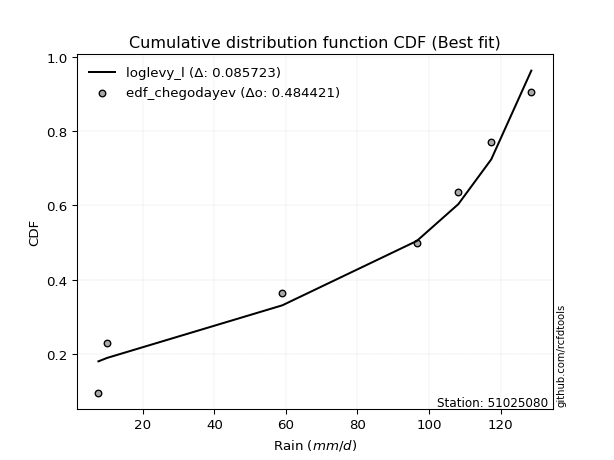</img></img>

</div>


### 6. EDF Blom (1958)

The Blom formula is a specific "plotting position" formula used in hydrology and statistical analysis to estimate the empirical cumulative probability (or non-exceedance probability) of a data series. It is particularly recommended for data that are approximately normally distributed. The constant _a_ is set to 0.375 (or 3/8).

<div align="center">


$P=(m-a)/(n+1-2a)$


</div>


**6.1. Empirical values**

<div align="center">

|                | 0                   | 1                   | 2                  | 3        | 4                  | 5                  | 6                  |
|:---------------|:--------------------|:--------------------|:-------------------|:---------|:-------------------|:-------------------|:-------------------|
| date           | 2024                | 2023                | 2017               | 2021     | 2018               | 2020               | 2019               |
| x              | 7.6                 | 10.0                | 59.0               | 96.6     | 108.2              | 117.4              | 128.6              |
| m              | 1                   | 2                   | 3                  | 4        | 5                  | 6                  | 7                  |
| empirical_dist | edf_blom            | edf_blom            | edf_blom           | edf_blom | edf_blom           | edf_blom           | edf_blom           |
| empirical      | 0.08620689655172414 | 0.22413793103448276 | 0.3620689655172414 | 0.5      | 0.6379310344827587 | 0.7758620689655172 | 0.9137931034482759 |
| empirical_tr   | 1.0943396226415094  | 1.288888888888889   | 1.5675675675675675 | 2.0      | 2.7619047619047623 | 4.461538461538462  | 11.600000000000007 |

</div>


**6.2. Kolmogorov-Smirnov fit test (sorted by Δ)**


<div align="center">

|                | 0                   | 1                   | 2                   | 3                   | 4                   | 5                   | 6                   | 7                   | 8                   | 9                   | 10                  | 11                  | 12                  | 13                  | 14                  | 15                  | 16                  | 17                  | 18                  | 19                  | 20                  | 21                  | 22                  | 23                  | 24                  | 25                  | 26                  | 27                  | 28                  | 29                  | 30                  | 31                  | 32                  | 33                  | 34                  | 35                  | 36                  | 37                  | 38                  | 39                  | 40                  | 41                  | 42                  | 43                  | 44                  | 45                  | 46                  | 47                  | 48                  | 49                  | 50                  | 51                  | 52                  | 53                  | 54                  | 55                  | 56                  | 57                  | 58                  | 59                  | 60                  | 61                  | 62                  | 63                  | 64                  | 65                  | 66                  | 67                  | 68                  | 69                  | 70                  | 71                  | 72                  | 73                  | 74                  | 75                  | 76                  | 77                  | 78                  | 79                  | 80                  | 81                  | 82                  | 83                  | 84                  | 85                  | 86                  | 87                  | 88                  | 89                  | 90                  | 91                  | 92                  | 93                  | 94                  | 95                  | 96                  | 97                  | 98                  | 99                  | 100                 | 101                 | 102                 | 103                 | 104                 | 105                 | 106                 | 107                 | 108                 | 109                 | 110                 | 111                 | 112                 | 113                 | 114                 | 115                 | 116                 | 117                 | 118                 | 119                 | 120                 | 121                 | 122                 | 123                 | 124                 | 125                 | 126                 | 127                 | 128                 | 129                 | 130                 | 131                 | 132                 | 133                 | 134                 | 135                 | 136                 | 137                 | 138                 | 139                 | 140                 | 141                 | 142                 | 143                 | 144                 | 145                 | 146                 | 147                 | 148                 | 149                 | 150                 | 151                 | 152                 | 153                 | 154                 | 155                 | 156                 | 157                 | 158                 | 159                 |
|:---------------|:--------------------|:--------------------|:--------------------|:--------------------|:--------------------|:--------------------|:--------------------|:--------------------|:--------------------|:--------------------|:--------------------|:--------------------|:--------------------|:--------------------|:--------------------|:--------------------|:--------------------|:--------------------|:--------------------|:--------------------|:--------------------|:--------------------|:--------------------|:--------------------|:--------------------|:--------------------|:--------------------|:--------------------|:--------------------|:--------------------|:--------------------|:--------------------|:--------------------|:--------------------|:--------------------|:--------------------|:--------------------|:--------------------|:--------------------|:--------------------|:--------------------|:--------------------|:--------------------|:--------------------|:--------------------|:--------------------|:--------------------|:--------------------|:--------------------|:--------------------|:--------------------|:--------------------|:--------------------|:--------------------|:--------------------|:--------------------|:--------------------|:--------------------|:--------------------|:--------------------|:--------------------|:--------------------|:--------------------|:--------------------|:--------------------|:--------------------|:--------------------|:--------------------|:--------------------|:--------------------|:--------------------|:--------------------|:--------------------|:--------------------|:--------------------|:--------------------|:--------------------|:--------------------|:--------------------|:--------------------|:--------------------|:--------------------|:--------------------|:--------------------|:--------------------|:--------------------|:--------------------|:--------------------|:--------------------|:--------------------|:--------------------|:--------------------|:--------------------|:--------------------|:--------------------|:--------------------|:--------------------|:--------------------|:--------------------|:--------------------|:--------------------|:--------------------|:--------------------|:--------------------|:--------------------|:--------------------|:--------------------|:--------------------|:--------------------|:--------------------|:--------------------|:--------------------|:--------------------|:--------------------|:--------------------|:--------------------|:--------------------|:--------------------|:--------------------|:--------------------|:--------------------|:--------------------|:--------------------|:--------------------|:--------------------|:--------------------|:--------------------|:--------------------|:--------------------|:--------------------|:--------------------|:--------------------|:--------------------|:--------------------|:--------------------|:--------------------|:--------------------|:--------------------|:--------------------|:--------------------|:--------------------|:--------------------|:--------------------|:--------------------|:--------------------|:--------------------|:--------------------|:--------------------|:--------------------|:--------------------|:--------------------|:--------------------|:--------------------|:--------------------|:--------------------|:--------------------|:--------------------|:--------------------|:--------------------|:--------------------|
| station        | 51025080            | 51025080            | 51025080            | 51025080            | 51025080            | 51025080            | 51025080            | 51025080            | 51025080            | 51025080            | 51025080            | 51025080            | 51025080            | 51025080            | 51025080            | 51025080            | 51025080            | 51025080            | 51025080            | 51025080            | 51025080            | 51025080            | 51025080            | 51025080            | 51025080            | 51025080            | 51025080            | 51025080            | 51025080            | 51025080            | 51025080            | 51025080            | 51025080            | 51025080            | 51025080            | 51025080            | 51025080            | 51025080            | 51025080            | 51025080            | 51025080            | 51025080            | 51025080            | 51025080            | 51025080            | 51025080            | 51025080            | 51025080            | 51025080            | 51025080            | 51025080            | 51025080            | 51025080            | 51025080            | 51025080            | 51025080            | 51025080            | 51025080            | 51025080            | 51025080            | 51025080            | 51025080            | 51025080            | 51025080            | 51025080            | 51025080            | 51025080            | 51025080            | 51025080            | 51025080            | 51025080            | 51025080            | 51025080            | 51025080            | 51025080            | 51025080            | 51025080            | 51025080            | 51025080            | 51025080            | 51025080            | 51025080            | 51025080            | 51025080            | 51025080            | 51025080            | 51025080            | 51025080            | 51025080            | 51025080            | 51025080            | 51025080            | 51025080            | 51025080            | 51025080            | 51025080            | 51025080            | 51025080            | 51025080            | 51025080            | 51025080            | 51025080            | 51025080            | 51025080            | 51025080            | 51025080            | 51025080            | 51025080            | 51025080            | 51025080            | 51025080            | 51025080            | 51025080            | 51025080            | 51025080            | 51025080            | 51025080            | 51025080            | 51025080            | 51025080            | 51025080            | 51025080            | 51025080            | 51025080            | 51025080            | 51025080            | 51025080            | 51025080            | 51025080            | 51025080            | 51025080            | 51025080            | 51025080            | 51025080            | 51025080            | 51025080            | 51025080            | 51025080            | 51025080            | 51025080            | 51025080            | 51025080            | 51025080            | 51025080            | 51025080            | 51025080            | 51025080            | 51025080            | 51025080            | 51025080            | 51025080            | 51025080            | 51025080            | 51025080            | 51025080            | 51025080            | 51025080            | 51025080            | 51025080            | 51025080            |
| empirical_dist | edf_blom            | edf_blom            | edf_blom            | edf_blom            | edf_blom            | edf_blom            | edf_blom            | edf_blom            | edf_blom            | edf_blom            | edf_blom            | edf_blom            | edf_blom            | edf_blom            | edf_blom            | edf_blom            | edf_blom            | edf_blom            | edf_blom            | edf_blom            | edf_blom            | edf_blom            | edf_blom            | edf_blom            | edf_blom            | edf_blom            | edf_blom            | edf_blom            | edf_blom            | edf_blom            | edf_blom            | edf_blom            | edf_blom            | edf_blom            | edf_blom            | edf_blom            | edf_blom            | edf_blom            | edf_blom            | edf_blom            | edf_blom            | edf_blom            | edf_blom            | edf_blom            | edf_blom            | edf_blom            | edf_blom            | edf_blom            | edf_blom            | edf_blom            | edf_blom            | edf_blom            | edf_blom            | edf_blom            | edf_blom            | edf_blom            | edf_blom            | edf_blom            | edf_blom            | edf_blom            | edf_blom            | edf_blom            | edf_blom            | edf_blom            | edf_blom            | edf_blom            | edf_blom            | edf_blom            | edf_blom            | edf_blom            | edf_blom            | edf_blom            | edf_blom            | edf_blom            | edf_blom            | edf_blom            | edf_blom            | edf_blom            | edf_blom            | edf_blom            | edf_blom            | edf_blom            | edf_blom            | edf_blom            | edf_blom            | edf_blom            | edf_blom            | edf_blom            | edf_blom            | edf_blom            | edf_blom            | edf_blom            | edf_blom            | edf_blom            | edf_blom            | edf_blom            | edf_blom            | edf_blom            | edf_blom            | edf_blom            | edf_blom            | edf_blom            | edf_blom            | edf_blom            | edf_blom            | edf_blom            | edf_blom            | edf_blom            | edf_blom            | edf_blom            | edf_blom            | edf_blom            | edf_blom            | edf_blom            | edf_blom            | edf_blom            | edf_blom            | edf_blom            | edf_blom            | edf_blom            | edf_blom            | edf_blom            | edf_blom            | edf_blom            | edf_blom            | edf_blom            | edf_blom            | edf_blom            | edf_blom            | edf_blom            | edf_blom            | edf_blom            | edf_blom            | edf_blom            | edf_blom            | edf_blom            | edf_blom            | edf_blom            | edf_blom            | edf_blom            | edf_blom            | edf_blom            | edf_blom            | edf_blom            | edf_blom            | edf_blom            | edf_blom            | edf_blom            | edf_blom            | edf_blom            | edf_blom            | edf_blom            | edf_blom            | edf_blom            | edf_blom            | edf_blom            | edf_blom            | edf_blom            | edf_blom            | edf_blom            |
| p_dist         | loglevy_l           | johnsonsu           | trapezoid           | logweibull_max      | genhalflogistic     | ksone               | gumbel_l            | weibull_min         | genextreme          | wrapcauchy          | semicircular        | beta                | dweibull            | skewnorm            | anglit              | triang              | pearson3            | argus               | dgamma              | logtrapezoid        | loggenextreme       | genpareto           | gausshyper          | t                   | truncnorm           | crystalball         | norm                | exponnorm           | gamma               | erlang              | arcsine             | foldnorm            | logwrapcauchy       | logksone            | rice                | loggennorm          | logsemicircular     | levy_l              | invgauss            | maxwell             | logistic            | invgamma            | logpearson3         | lomax               | loganglit           | cosine              | rayleigh            | loggumbel_l         | logdgamma           | ncf                 | hypsecant           | kstwobign           | mielke              | logweibull_min      | betaprime           | genexpon            | logburr12           | logbetaprime        | logfatiguelife      | logerlang           | halfnorm            | logarcsine          | loggamma            | loggamma            | logf                | logcrystalball      | lognorm             | logt                | logexponnorm        | lognct              | logncf              | burr                | loggompertz         | logrice             | loginvgauss         | tukeylambda         | gumbel_r            | loginvgamma         | kappa3              | logalpha            | logburr             | logfoldnorm         | uniform             | vonmises_line       | loginvweibull       | logargus            | laplace             | halfgennorm         | logmaxwell          | logloggamma         | lograyleigh         | logmielke           | halflogistic        | loglogistic         | kappa4              | moyal               | bradford            | f                   | loghypsecant        | logcosine           | loggenexpon         | logkstwobign        | lognakagami         | loghalfnorm         | loggumbel_r         | gennorm             | loggenpareto        | loglaplace          | loglaplace          | loglomax            | nct                 | loghalflogistic     | logmoyal            | burr12              | wald                | logloglaplace       | truncexpon          | nakagami            | logdweibull         | logbeta             | loggenhalflogistic  | loghalfgennorm      | loggausshyper       | logskewnorm         | truncweibull_min    | loggengamma         | logtriang           | gompertz            | logwald             | logkappa4           | johnsonsb           | logkappa3           | logexponweib        | exponweib           | gengamma            | logtukeylambda      | logbradford         | loguniform          | logvonmises_line    | alpha               | logtruncnorm        | logtruncexpon       | logtruncweibull_min | invweibull          | fatiguelife         | logrdist            | powerlaw            | logexponpow         | logjohnsonsu        | exponpow            | weibull_max         | truncpareto         | logpowerlaw         | logjohnsonsb        | logtruncpareto      | rdist               | genlogistic         | loggenlogistic      | logvonmises         | vonmises            |
| delta          | 0.09411025854724092 | 0.10531675468619334 | 0.12139433950693157 | 0.12177750078241267 | 0.12554042577773772 | 0.13141685190888264 | 0.1350625311304823  | 0.1409043407875891  | 0.14146587530338217 | 0.14168252560707137 | 0.14364659906502786 | 0.14706397407546612 | 0.14919047810947667 | 0.1514014017510703  | 0.1531166257443881  | 0.1536312717053363  | 0.15375720698935957 | 0.1585768831097818  | 0.15869596113735768 | 0.16028326364397838 | 0.16768910944347104 | 0.16946533561941426 | 0.17140211732125804 | 0.17552033100091768 | 0.17553217659900877 | 0.1755321835337742  | 0.17553218478242916 | 0.17553257066007333 | 0.17660089934303735 | 0.17702711064780596 | 0.17798982894146992 | 0.17994502583590033 | 0.18017690784882284 | 0.18414603225610698 | 0.18529270625123173 | 0.18694977926224815 | 0.1888358892782906  | 0.19084122458743008 | 0.1930428752733413  | 0.19433740181359294 | 0.19544843104339715 | 0.19656820925336405 | 0.1968916246960748  | 0.19735933498920843 | 0.19921853553865843 | 0.19964839048070426 | 0.1999085804893287  | 0.20215106375226266 | 0.20816784052988538 | 0.2082786891344438  | 0.21038390711274557 | 0.21312087533097868 | 0.21591803055859904 | 0.2177991763445808  | 0.21927003530220723 | 0.22012697706864404 | 0.2205182867557962  | 0.22197076339032007 | 0.22204967254287167 | 0.22219739261330407 | 0.22413793103448276 | 0.22413793103448276 | 0.22428589440951263 | 0.22428589440951263 | 0.2245681235180612  | 0.22555758977819518 | 0.22555761408064423 | 0.22555787264656268 | 0.22555977019128592 | 0.2256556586636025  | 0.2270796524315844  | 0.2277954277248847  | 0.22863828490635596 | 0.2288368874983837  | 0.2289740322579895  | 0.22964969529302692 | 0.23114306869950674 | 0.2315890986499498  | 0.2319110959526336  | 0.2325222907771658  | 0.2340318196319381  | 0.23409667228154107 | 0.23553719008264462 | 0.23556796206189978 | 0.23638276336231917 | 0.23734131143511006 | 0.23735596485483823 | 0.2382113299359922  | 0.23829843761686087 | 0.24149187483270684 | 0.2419746303129391  | 0.24307214700467294 | 0.2440007177640866  | 0.2478634448123911  | 0.24882986279975983 | 0.249306062416619   | 0.2497512491059536  | 0.2571750867384043  | 0.2632641599543164  | 0.2634999517095067  | 0.2644512783363852  | 0.26474627404163104 | 0.26550638945112953 | 0.2668182384396857  | 0.27095845353511533 | 0.27586206896551724 | 0.27745896915397417 | 0.2858057993783647  | 0.2858057993783647  | 0.28660344490429407 | 0.28864301904488104 | 0.29451098016590566 | 0.2953168910376856  | 0.30052569393135814 | 0.3015636467715511  | 0.3047245834837041  | 0.30581116670251307 | 0.3061778002455559  | 0.3080674314545312  | 0.3226724160072853  | 0.3233204815622758  | 0.32606799888931143 | 0.3284745640404837  | 0.346298459889697   | 0.3598602437021434  | 0.36084939067299976 | 0.3610728131716264  | 0.3620671778294444  | 0.3629236290975412  | 0.3630081021388869  | 0.37095108610802124 | 0.3808501118367478  | 0.38203053970143025 | 0.38333167906565163 | 0.38696754371312053 | 0.39403683561223346 | 0.39664479928597063 | 0.39884315135808823 | 0.39941853104470115 | 0.42542206189954507 | 0.42993340968450716 | 0.43460909352062255 | 0.44077462396859296 | 0.4661449125128761  | 0.47421151290757985 | 0.4999999926274469  | 0.5127673730618585  | 0.5258176666287635  | 0.5283351462576911  | 0.5787673536658655  | 0.5788521490939279  | 0.5802101007083011  | 0.5820809416715713  | 0.596640827884448   | 0.6154330825527867  | 0.6379310329271486  | 0.7758620689655172  | 0.7758620689655172  | 1.1280835734305934  | 19.72465028738724   |
| deltao         | 0.48442053926100004 | 0.48442053926100004 | 0.48442053926100004 | 0.48442053926100004 | 0.48442053926100004 | 0.48442053926100004 | 0.48442053926100004 | 0.48442053926100004 | 0.48442053926100004 | 0.48442053926100004 | 0.48442053926100004 | 0.48442053926100004 | 0.48442053926100004 | 0.48442053926100004 | 0.48442053926100004 | 0.48442053926100004 | 0.48442053926100004 | 0.48442053926100004 | 0.48442053926100004 | 0.48442053926100004 | 0.48442053926100004 | 0.48442053926100004 | 0.48442053926100004 | 0.48442053926100004 | 0.48442053926100004 | 0.48442053926100004 | 0.48442053926100004 | 0.48442053926100004 | 0.48442053926100004 | 0.48442053926100004 | 0.48442053926100004 | 0.48442053926100004 | 0.48442053926100004 | 0.48442053926100004 | 0.48442053926100004 | 0.48442053926100004 | 0.48442053926100004 | 0.48442053926100004 | 0.48442053926100004 | 0.48442053926100004 | 0.48442053926100004 | 0.48442053926100004 | 0.48442053926100004 | 0.48442053926100004 | 0.48442053926100004 | 0.48442053926100004 | 0.48442053926100004 | 0.48442053926100004 | 0.48442053926100004 | 0.48442053926100004 | 0.48442053926100004 | 0.48442053926100004 | 0.48442053926100004 | 0.48442053926100004 | 0.48442053926100004 | 0.48442053926100004 | 0.48442053926100004 | 0.48442053926100004 | 0.48442053926100004 | 0.48442053926100004 | 0.48442053926100004 | 0.48442053926100004 | 0.48442053926100004 | 0.48442053926100004 | 0.48442053926100004 | 0.48442053926100004 | 0.48442053926100004 | 0.48442053926100004 | 0.48442053926100004 | 0.48442053926100004 | 0.48442053926100004 | 0.48442053926100004 | 0.48442053926100004 | 0.48442053926100004 | 0.48442053926100004 | 0.48442053926100004 | 0.48442053926100004 | 0.48442053926100004 | 0.48442053926100004 | 0.48442053926100004 | 0.48442053926100004 | 0.48442053926100004 | 0.48442053926100004 | 0.48442053926100004 | 0.48442053926100004 | 0.48442053926100004 | 0.48442053926100004 | 0.48442053926100004 | 0.48442053926100004 | 0.48442053926100004 | 0.48442053926100004 | 0.48442053926100004 | 0.48442053926100004 | 0.48442053926100004 | 0.48442053926100004 | 0.48442053926100004 | 0.48442053926100004 | 0.48442053926100004 | 0.48442053926100004 | 0.48442053926100004 | 0.48442053926100004 | 0.48442053926100004 | 0.48442053926100004 | 0.48442053926100004 | 0.48442053926100004 | 0.48442053926100004 | 0.48442053926100004 | 0.48442053926100004 | 0.48442053926100004 | 0.48442053926100004 | 0.48442053926100004 | 0.48442053926100004 | 0.48442053926100004 | 0.48442053926100004 | 0.48442053926100004 | 0.48442053926100004 | 0.48442053926100004 | 0.48442053926100004 | 0.48442053926100004 | 0.48442053926100004 | 0.48442053926100004 | 0.48442053926100004 | 0.48442053926100004 | 0.48442053926100004 | 0.48442053926100004 | 0.48442053926100004 | 0.48442053926100004 | 0.48442053926100004 | 0.48442053926100004 | 0.48442053926100004 | 0.48442053926100004 | 0.48442053926100004 | 0.48442053926100004 | 0.48442053926100004 | 0.48442053926100004 | 0.48442053926100004 | 0.48442053926100004 | 0.48442053926100004 | 0.48442053926100004 | 0.48442053926100004 | 0.48442053926100004 | 0.48442053926100004 | 0.48442053926100004 | 0.48442053926100004 | 0.48442053926100004 | 0.48442053926100004 | 0.48442053926100004 | 0.48442053926100004 | 0.48442053926100004 | 0.48442053926100004 | 0.48442053926100004 | 0.48442053926100004 | 0.48442053926100004 | 0.48442053926100004 | 0.48442053926100004 | 0.48442053926100004 | 0.48442053926100004 | 0.48442053926100004 | 0.48442053926100004 | 0.48442053926100004 |
| eval           | Δo > Δ              | Δo > Δ              | Δo > Δ              | Δo > Δ              | Δo > Δ              | Δo > Δ              | Δo > Δ              | Δo > Δ              | Δo > Δ              | Δo > Δ              | Δo > Δ              | Δo > Δ              | Δo > Δ              | Δo > Δ              | Δo > Δ              | Δo > Δ              | Δo > Δ              | Δo > Δ              | Δo > Δ              | Δo > Δ              | Δo > Δ              | Δo > Δ              | Δo > Δ              | Δo > Δ              | Δo > Δ              | Δo > Δ              | Δo > Δ              | Δo > Δ              | Δo > Δ              | Δo > Δ              | Δo > Δ              | Δo > Δ              | Δo > Δ              | Δo > Δ              | Δo > Δ              | Δo > Δ              | Δo > Δ              | Δo > Δ              | Δo > Δ              | Δo > Δ              | Δo > Δ              | Δo > Δ              | Δo > Δ              | Δo > Δ              | Δo > Δ              | Δo > Δ              | Δo > Δ              | Δo > Δ              | Δo > Δ              | Δo > Δ              | Δo > Δ              | Δo > Δ              | Δo > Δ              | Δo > Δ              | Δo > Δ              | Δo > Δ              | Δo > Δ              | Δo > Δ              | Δo > Δ              | Δo > Δ              | Δo > Δ              | Δo > Δ              | Δo > Δ              | Δo > Δ              | Δo > Δ              | Δo > Δ              | Δo > Δ              | Δo > Δ              | Δo > Δ              | Δo > Δ              | Δo > Δ              | Δo > Δ              | Δo > Δ              | Δo > Δ              | Δo > Δ              | Δo > Δ              | Δo > Δ              | Δo > Δ              | Δo > Δ              | Δo > Δ              | Δo > Δ              | Δo > Δ              | Δo > Δ              | Δo > Δ              | Δo > Δ              | Δo > Δ              | Δo > Δ              | Δo > Δ              | Δo > Δ              | Δo > Δ              | Δo > Δ              | Δo > Δ              | Δo > Δ              | Δo > Δ              | Δo > Δ              | Δo > Δ              | Δo > Δ              | Δo > Δ              | Δo > Δ              | Δo > Δ              | Δo > Δ              | Δo > Δ              | Δo > Δ              | Δo > Δ              | Δo > Δ              | Δo > Δ              | Δo > Δ              | Δo > Δ              | Δo > Δ              | Δo > Δ              | Δo > Δ              | Δo > Δ              | Δo > Δ              | Δo > Δ              | Δo > Δ              | Δo > Δ              | Δo > Δ              | Δo > Δ              | Δo > Δ              | Δo > Δ              | Δo > Δ              | Δo > Δ              | Δo > Δ              | Δo > Δ              | Δo > Δ              | Δo > Δ              | Δo > Δ              | Δo > Δ              | Δo > Δ              | Δo > Δ              | Δo > Δ              | Δo > Δ              | Δo > Δ              | Δo > Δ              | Δo > Δ              | Δo > Δ              | Δo > Δ              | Δo > Δ              | Δo > Δ              | Δo > Δ              | Δo > Δ              | Δo > Δ              | Δo > Δ              | Δo > Δ              | Δo > Δ              | Δo <= Δ             | Δo <= Δ             | Δo <= Δ             | Δo <= Δ             | Δo <= Δ             | Δo <= Δ             | Δo <= Δ             | Δo <= Δ             | Δo <= Δ             | Δo <= Δ             | Δo <= Δ             | Δo <= Δ             | Δo <= Δ             | Δo <= Δ             | Δo <= Δ             |
| fit            | 1                   | 1                   | 1                   | 1                   | 1                   | 1                   | 1                   | 1                   | 1                   | 1                   | 1                   | 1                   | 1                   | 1                   | 1                   | 1                   | 1                   | 1                   | 1                   | 1                   | 1                   | 1                   | 1                   | 1                   | 1                   | 1                   | 1                   | 1                   | 1                   | 1                   | 1                   | 1                   | 1                   | 1                   | 1                   | 1                   | 1                   | 1                   | 1                   | 1                   | 1                   | 1                   | 1                   | 1                   | 1                   | 1                   | 1                   | 1                   | 1                   | 1                   | 1                   | 1                   | 1                   | 1                   | 1                   | 1                   | 1                   | 1                   | 1                   | 1                   | 1                   | 1                   | 1                   | 1                   | 1                   | 1                   | 1                   | 1                   | 1                   | 1                   | 1                   | 1                   | 1                   | 1                   | 1                   | 1                   | 1                   | 1                   | 1                   | 1                   | 1                   | 1                   | 1                   | 1                   | 1                   | 1                   | 1                   | 1                   | 1                   | 1                   | 1                   | 1                   | 1                   | 1                   | 1                   | 1                   | 1                   | 1                   | 1                   | 1                   | 1                   | 1                   | 1                   | 1                   | 1                   | 1                   | 1                   | 1                   | 1                   | 1                   | 1                   | 1                   | 1                   | 1                   | 1                   | 1                   | 1                   | 1                   | 1                   | 1                   | 1                   | 1                   | 1                   | 1                   | 1                   | 1                   | 1                   | 1                   | 1                   | 1                   | 1                   | 1                   | 1                   | 1                   | 1                   | 1                   | 1                   | 1                   | 1                   | 1                   | 1                   | 1                   | 1                   | 1                   | 1                   | 0                   | 0                   | 0                   | 0                   | 0                   | 0                   | 0                   | 0                   | 0                   | 0                   | 0                   | 0                   | 0                   | 0                   | 0                   |
| n              | 7                   | 7                   | 7                   | 7                   | 7                   | 7                   | 7                   | 7                   | 7                   | 7                   | 7                   | 7                   | 7                   | 7                   | 7                   | 7                   | 7                   | 7                   | 7                   | 7                   | 7                   | 7                   | 7                   | 7                   | 7                   | 7                   | 7                   | 7                   | 7                   | 7                   | 7                   | 7                   | 7                   | 7                   | 7                   | 7                   | 7                   | 7                   | 7                   | 7                   | 7                   | 7                   | 7                   | 7                   | 7                   | 7                   | 7                   | 7                   | 7                   | 7                   | 7                   | 7                   | 7                   | 7                   | 7                   | 7                   | 7                   | 7                   | 7                   | 7                   | 7                   | 7                   | 7                   | 7                   | 7                   | 7                   | 7                   | 7                   | 7                   | 7                   | 7                   | 7                   | 7                   | 7                   | 7                   | 7                   | 7                   | 7                   | 7                   | 7                   | 7                   | 7                   | 7                   | 7                   | 7                   | 7                   | 7                   | 7                   | 7                   | 7                   | 7                   | 7                   | 7                   | 7                   | 7                   | 7                   | 7                   | 7                   | 7                   | 7                   | 7                   | 7                   | 7                   | 7                   | 7                   | 7                   | 7                   | 7                   | 7                   | 7                   | 7                   | 7                   | 7                   | 7                   | 7                   | 7                   | 7                   | 7                   | 7                   | 7                   | 7                   | 7                   | 7                   | 7                   | 7                   | 7                   | 7                   | 7                   | 7                   | 7                   | 7                   | 7                   | 7                   | 7                   | 7                   | 7                   | 7                   | 7                   | 7                   | 7                   | 7                   | 7                   | 7                   | 7                   | 7                   | 7                   | 7                   | 7                   | 7                   | 7                   | 7                   | 7                   | 7                   | 7                   | 7                   | 7                   | 7                   | 7                   | 7                   | 7                   |
| best_fit       | 1                   | 0                   | 0                   | 0                   | 0                   | 0                   | 0                   | 0                   | 0                   | 0                   | 0                   | 0                   | 0                   | 0                   | 0                   | 0                   | 0                   | 0                   | 0                   | 0                   | 0                   | 0                   | 0                   | 0                   | 0                   | 0                   | 0                   | 0                   | 0                   | 0                   | 0                   | 0                   | 0                   | 0                   | 0                   | 0                   | 0                   | 0                   | 0                   | 0                   | 0                   | 0                   | 0                   | 0                   | 0                   | 0                   | 0                   | 0                   | 0                   | 0                   | 0                   | 0                   | 0                   | 0                   | 0                   | 0                   | 0                   | 0                   | 0                   | 0                   | 0                   | 0                   | 0                   | 0                   | 0                   | 0                   | 0                   | 0                   | 0                   | 0                   | 0                   | 0                   | 0                   | 0                   | 0                   | 0                   | 0                   | 0                   | 0                   | 0                   | 0                   | 0                   | 0                   | 0                   | 0                   | 0                   | 0                   | 0                   | 0                   | 0                   | 0                   | 0                   | 0                   | 0                   | 0                   | 0                   | 0                   | 0                   | 0                   | 0                   | 0                   | 0                   | 0                   | 0                   | 0                   | 0                   | 0                   | 0                   | 0                   | 0                   | 0                   | 0                   | 0                   | 0                   | 0                   | 0                   | 0                   | 0                   | 0                   | 0                   | 0                   | 0                   | 0                   | 0                   | 0                   | 0                   | 0                   | 0                   | 0                   | 0                   | 0                   | 0                   | 0                   | 0                   | 0                   | 0                   | 0                   | 0                   | 0                   | 0                   | 0                   | 0                   | 0                   | 0                   | 0                   | 0                   | 0                   | 0                   | 0                   | 0                   | 0                   | 0                   | 0                   | 0                   | 0                   | 0                   | 0                   | 0                   | 0                   | 0                   |
| best_fit_sort  | 1                   | 2                   | 3                   | 4                   | 5                   | 6                   | 7                   | 8                   | 9                   | 10                  | 11                  | 12                  | 13                  | 14                  | 15                  | 16                  | 17                  | 18                  | 19                  | 20                  | 21                  | 22                  | 23                  | 24                  | 25                  | 26                  | 27                  | 28                  | 29                  | 30                  | 31                  | 32                  | 33                  | 34                  | 35                  | 36                  | 37                  | 38                  | 39                  | 40                  | 41                  | 42                  | 43                  | 44                  | 45                  | 46                  | 47                  | 48                  | 49                  | 50                  | 51                  | 52                  | 53                  | 54                  | 55                  | 56                  | 57                  | 58                  | 59                  | 60                  | 61                  | 62                  | 63                  | 64                  | 65                  | 66                  | 67                  | 68                  | 69                  | 70                  | 71                  | 72                  | 73                  | 74                  | 75                  | 76                  | 77                  | 78                  | 79                  | 80                  | 81                  | 82                  | 83                  | 84                  | 85                  | 86                  | 87                  | 88                  | 89                  | 90                  | 91                  | 92                  | 93                  | 94                  | 95                  | 96                  | 97                  | 98                  | 99                  | 100                 | 101                 | 102                 | 103                 | 104                 | 105                 | 106                 | 107                 | 108                 | 109                 | 110                 | 111                 | 112                 | 113                 | 114                 | 115                 | 116                 | 117                 | 118                 | 119                 | 120                 | 121                 | 122                 | 123                 | 124                 | 125                 | 126                 | 127                 | 128                 | 129                 | 130                 | 131                 | 132                 | 133                 | 134                 | 135                 | 136                 | 137                 | 138                 | 139                 | 140                 | 141                 | 142                 | 143                 | 144                 | 145                 | 146                 | 147                 | 148                 | 149                 | 150                 | 151                 | 152                 | 153                 | 154                 | 155                 | 156                 | 157                 | 158                 | 159                 | 160                 |

</div>


**6.3. Best fit**

<div align="center">

|   id |   station | empirical_dist   | p_dist    |     delta |   deltao | eval   |   fit |   n |   best_fit |   best_fit_sort |
|-----:|----------:|:-----------------|:----------|----------:|---------:|:-------|------:|----:|-----------:|----------------:|
|    0 |  51025080 | edf_blom         | loglevy_l | 0.0941103 | 0.484421 | Δo > Δ |     1 |   7 |          1 |               1 |

</div>


<div align="center">

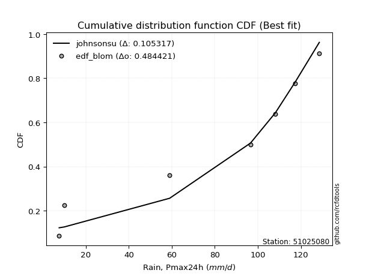</img>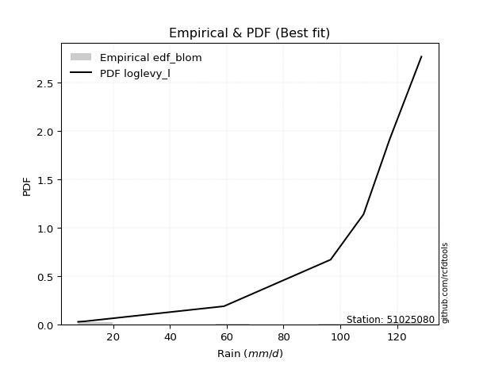</img>

</div>


### 7. EDF Tukey (1962)

In hydrology, the Tukey formula is used as a plotting position formula to estimate the empirical probability or frequency of a flood event (or other hydrological data). The formula parameter is given as _c=0.333_ (or 1/3).

<div align="center">


$P=(m-c)/(n+1-2c)$


</div>


**7.1. Empirical values**

<div align="center">

|                | 0                   | 1                   | 2                   | 3         | 4                  | 5                  | 6                  |
|:---------------|:--------------------|:--------------------|:--------------------|:----------|:-------------------|:-------------------|:-------------------|
| date           | 2024                | 2023                | 2017                | 2021      | 2018               | 2020               | 2019               |
| x              | 7.6                 | 10.0                | 59.0                | 96.6      | 108.2              | 117.4              | 128.6              |
| m              | 1                   | 2                   | 3                   | 4         | 5                  | 6                  | 7                  |
| empirical_dist | edf_tukey           | edf_tukey           | edf_tukey           | edf_tukey | edf_tukey          | edf_tukey          | edf_tukey          |
| empirical      | 0.09090909090909091 | 0.22727272727272727 | 0.36363636363636365 | 0.5       | 0.6363636363636364 | 0.7727272727272727 | 0.9090909090909091 |
| empirical_tr   | 1.1                 | 1.2941176470588236  | 1.5714285714285714  | 2.0       | 2.75               | 4.3999999999999995 | 10.999999999999996 |

</div>


**7.2. Kolmogorov-Smirnov fit test (sorted by Δ)**


<div align="center">

|                | 0                   | 1                   | 2                   | 3                   | 4                   | 5                   | 6                   | 7                   | 8                   | 9                   | 10                  | 11                  | 12                  | 13                  | 14                  | 15                  | 16                  | 17                  | 18                  | 19                  | 20                  | 21                  | 22                  | 23                  | 24                  | 25                  | 26                  | 27                  | 28                  | 29                  | 30                  | 31                  | 32                  | 33                  | 34                  | 35                  | 36                  | 37                  | 38                  | 39                  | 40                  | 41                  | 42                  | 43                  | 44                  | 45                  | 46                  | 47                  | 48                  | 49                  | 50                  | 51                  | 52                  | 53                  | 54                  | 55                  | 56                  | 57                  | 58                  | 59                  | 60                  | 61                  | 62                  | 63                  | 64                  | 65                  | 66                  | 67                  | 68                  | 69                  | 70                  | 71                  | 72                  | 73                  | 74                  | 75                  | 76                  | 77                  | 78                  | 79                  | 80                  | 81                  | 82                  | 83                  | 84                  | 85                  | 86                  | 87                  | 88                  | 89                  | 90                  | 91                  | 92                  | 93                  | 94                  | 95                  | 96                  | 97                  | 98                  | 99                  | 100                 | 101                 | 102                 | 103                 | 104                 | 105                 | 106                 | 107                 | 108                 | 109                 | 110                 | 111                 | 112                 | 113                 | 114                 | 115                 | 116                 | 117                 | 118                 | 119                 | 120                 | 121                 | 122                 | 123                 | 124                 | 125                 | 126                 | 127                 | 128                 | 129                 | 130                 | 131                 | 132                 | 133                 | 134                 | 135                 | 136                 | 137                 | 138                 | 139                 | 140                 | 141                 | 142                 | 143                 | 144                 | 145                 | 146                 | 147                 | 148                 | 149                 | 150                 | 151                 | 152                 | 153                 | 154                 | 155                 | 156                 | 157                 | 158                 | 159                 |
|:---------------|:--------------------|:--------------------|:--------------------|:--------------------|:--------------------|:--------------------|:--------------------|:--------------------|:--------------------|:--------------------|:--------------------|:--------------------|:--------------------|:--------------------|:--------------------|:--------------------|:--------------------|:--------------------|:--------------------|:--------------------|:--------------------|:--------------------|:--------------------|:--------------------|:--------------------|:--------------------|:--------------------|:--------------------|:--------------------|:--------------------|:--------------------|:--------------------|:--------------------|:--------------------|:--------------------|:--------------------|:--------------------|:--------------------|:--------------------|:--------------------|:--------------------|:--------------------|:--------------------|:--------------------|:--------------------|:--------------------|:--------------------|:--------------------|:--------------------|:--------------------|:--------------------|:--------------------|:--------------------|:--------------------|:--------------------|:--------------------|:--------------------|:--------------------|:--------------------|:--------------------|:--------------------|:--------------------|:--------------------|:--------------------|:--------------------|:--------------------|:--------------------|:--------------------|:--------------------|:--------------------|:--------------------|:--------------------|:--------------------|:--------------------|:--------------------|:--------------------|:--------------------|:--------------------|:--------------------|:--------------------|:--------------------|:--------------------|:--------------------|:--------------------|:--------------------|:--------------------|:--------------------|:--------------------|:--------------------|:--------------------|:--------------------|:--------------------|:--------------------|:--------------------|:--------------------|:--------------------|:--------------------|:--------------------|:--------------------|:--------------------|:--------------------|:--------------------|:--------------------|:--------------------|:--------------------|:--------------------|:--------------------|:--------------------|:--------------------|:--------------------|:--------------------|:--------------------|:--------------------|:--------------------|:--------------------|:--------------------|:--------------------|:--------------------|:--------------------|:--------------------|:--------------------|:--------------------|:--------------------|:--------------------|:--------------------|:--------------------|:--------------------|:--------------------|:--------------------|:--------------------|:--------------------|:--------------------|:--------------------|:--------------------|:--------------------|:--------------------|:--------------------|:--------------------|:--------------------|:--------------------|:--------------------|:--------------------|:--------------------|:--------------------|:--------------------|:--------------------|:--------------------|:--------------------|:--------------------|:--------------------|:--------------------|:--------------------|:--------------------|:--------------------|:--------------------|:--------------------|:--------------------|:--------------------|:--------------------|:--------------------|
| station        | 51025080            | 51025080            | 51025080            | 51025080            | 51025080            | 51025080            | 51025080            | 51025080            | 51025080            | 51025080            | 51025080            | 51025080            | 51025080            | 51025080            | 51025080            | 51025080            | 51025080            | 51025080            | 51025080            | 51025080            | 51025080            | 51025080            | 51025080            | 51025080            | 51025080            | 51025080            | 51025080            | 51025080            | 51025080            | 51025080            | 51025080            | 51025080            | 51025080            | 51025080            | 51025080            | 51025080            | 51025080            | 51025080            | 51025080            | 51025080            | 51025080            | 51025080            | 51025080            | 51025080            | 51025080            | 51025080            | 51025080            | 51025080            | 51025080            | 51025080            | 51025080            | 51025080            | 51025080            | 51025080            | 51025080            | 51025080            | 51025080            | 51025080            | 51025080            | 51025080            | 51025080            | 51025080            | 51025080            | 51025080            | 51025080            | 51025080            | 51025080            | 51025080            | 51025080            | 51025080            | 51025080            | 51025080            | 51025080            | 51025080            | 51025080            | 51025080            | 51025080            | 51025080            | 51025080            | 51025080            | 51025080            | 51025080            | 51025080            | 51025080            | 51025080            | 51025080            | 51025080            | 51025080            | 51025080            | 51025080            | 51025080            | 51025080            | 51025080            | 51025080            | 51025080            | 51025080            | 51025080            | 51025080            | 51025080            | 51025080            | 51025080            | 51025080            | 51025080            | 51025080            | 51025080            | 51025080            | 51025080            | 51025080            | 51025080            | 51025080            | 51025080            | 51025080            | 51025080            | 51025080            | 51025080            | 51025080            | 51025080            | 51025080            | 51025080            | 51025080            | 51025080            | 51025080            | 51025080            | 51025080            | 51025080            | 51025080            | 51025080            | 51025080            | 51025080            | 51025080            | 51025080            | 51025080            | 51025080            | 51025080            | 51025080            | 51025080            | 51025080            | 51025080            | 51025080            | 51025080            | 51025080            | 51025080            | 51025080            | 51025080            | 51025080            | 51025080            | 51025080            | 51025080            | 51025080            | 51025080            | 51025080            | 51025080            | 51025080            | 51025080            | 51025080            | 51025080            | 51025080            | 51025080            | 51025080            | 51025080            |
| empirical_dist | edf_tukey           | edf_tukey           | edf_tukey           | edf_tukey           | edf_tukey           | edf_tukey           | edf_tukey           | edf_tukey           | edf_tukey           | edf_tukey           | edf_tukey           | edf_tukey           | edf_tukey           | edf_tukey           | edf_tukey           | edf_tukey           | edf_tukey           | edf_tukey           | edf_tukey           | edf_tukey           | edf_tukey           | edf_tukey           | edf_tukey           | edf_tukey           | edf_tukey           | edf_tukey           | edf_tukey           | edf_tukey           | edf_tukey           | edf_tukey           | edf_tukey           | edf_tukey           | edf_tukey           | edf_tukey           | edf_tukey           | edf_tukey           | edf_tukey           | edf_tukey           | edf_tukey           | edf_tukey           | edf_tukey           | edf_tukey           | edf_tukey           | edf_tukey           | edf_tukey           | edf_tukey           | edf_tukey           | edf_tukey           | edf_tukey           | edf_tukey           | edf_tukey           | edf_tukey           | edf_tukey           | edf_tukey           | edf_tukey           | edf_tukey           | edf_tukey           | edf_tukey           | edf_tukey           | edf_tukey           | edf_tukey           | edf_tukey           | edf_tukey           | edf_tukey           | edf_tukey           | edf_tukey           | edf_tukey           | edf_tukey           | edf_tukey           | edf_tukey           | edf_tukey           | edf_tukey           | edf_tukey           | edf_tukey           | edf_tukey           | edf_tukey           | edf_tukey           | edf_tukey           | edf_tukey           | edf_tukey           | edf_tukey           | edf_tukey           | edf_tukey           | edf_tukey           | edf_tukey           | edf_tukey           | edf_tukey           | edf_tukey           | edf_tukey           | edf_tukey           | edf_tukey           | edf_tukey           | edf_tukey           | edf_tukey           | edf_tukey           | edf_tukey           | edf_tukey           | edf_tukey           | edf_tukey           | edf_tukey           | edf_tukey           | edf_tukey           | edf_tukey           | edf_tukey           | edf_tukey           | edf_tukey           | edf_tukey           | edf_tukey           | edf_tukey           | edf_tukey           | edf_tukey           | edf_tukey           | edf_tukey           | edf_tukey           | edf_tukey           | edf_tukey           | edf_tukey           | edf_tukey           | edf_tukey           | edf_tukey           | edf_tukey           | edf_tukey           | edf_tukey           | edf_tukey           | edf_tukey           | edf_tukey           | edf_tukey           | edf_tukey           | edf_tukey           | edf_tukey           | edf_tukey           | edf_tukey           | edf_tukey           | edf_tukey           | edf_tukey           | edf_tukey           | edf_tukey           | edf_tukey           | edf_tukey           | edf_tukey           | edf_tukey           | edf_tukey           | edf_tukey           | edf_tukey           | edf_tukey           | edf_tukey           | edf_tukey           | edf_tukey           | edf_tukey           | edf_tukey           | edf_tukey           | edf_tukey           | edf_tukey           | edf_tukey           | edf_tukey           | edf_tukey           | edf_tukey           | edf_tukey           | edf_tukey           | edf_tukey           |
| p_dist         | loglevy_l           | johnsonsu           | trapezoid           | logweibull_max      | genhalflogistic     | ksone               | gumbel_l            | genextreme          | semicircular        | beta                | weibull_min         | wrapcauchy          | skewnorm            | dweibull            | anglit              | pearson3            | logtrapezoid        | triang              | argus               | dgamma              | loggenextreme       | gausshyper          | genpareto           | t                   | truncnorm           | crystalball         | norm                | exponnorm           | gamma               | erlang              | logwrapcauchy       | foldnorm            | arcsine             | logksone            | rice                | levy_l              | logsemicircular     | loggennorm          | invgauss            | maxwell             | logistic            | invgamma            | logpearson3         | loganglit           | cosine              | rayleigh            | lomax               | loggumbel_l         | ncf                 | logdgamma           | hypsecant           | kstwobign           | mielke              | logweibull_min      | betaprime           | genexpon            | logburr12           | logbetaprime        | logfatiguelife      | logerlang           | loggamma            | loggamma            | logf                | logncf              | logcrystalball      | lognorm             | logt                | logexponnorm        | lognct              | logarcsine          | halfnorm            | burr                | loggompertz         | logrice             | loginvgauss         | tukeylambda         | gumbel_r            | loginvgamma         | kappa3              | logalpha            | logburr             | logfoldnorm         | loginvweibull       | uniform             | vonmises_line       | halfgennorm         | logargus            | laplace             | logmaxwell          | logloggamma         | lograyleigh         | logmielke           | halflogistic        | loglogistic         | kappa4              | moyal               | bradford            | f                   | loggenexpon         | logkstwobign        | loghypsecant        | logcosine           | lognakagami         | loghalfnorm         | loggumbel_r         | gennorm             | loggenpareto        | loglomax            | loglaplace          | loglaplace          | nct                 | loghalflogistic     | logmoyal            | burr12              | logloglaplace       | wald                | logdweibull         | nakagami            | truncexpon          | logbeta             | loggenhalflogistic  | loghalfgennorm      | loggausshyper       | logskewnorm         | loggengamma         | truncweibull_min    | logtriang           | logwald             | logkappa4           | gompertz            | johnsonsb           | logexponweib        | logkappa3           | exponweib           | gengamma            | logtukeylambda      | logbradford         | loguniform          | logvonmises_line    | alpha               | logtruncnorm        | logtruncexpon       | logtruncweibull_min | invweibull          | fatiguelife         | logrdist            | powerlaw            | logexponpow         | logjohnsonsu        | weibull_max         | exponpow            | truncpareto         | logpowerlaw         | logjohnsonsb        | logtruncpareto      | rdist               | genlogistic         | loggenlogistic      | logvonmises         | vonmises            |
| delta          | 0.08940806418987415 | 0.1068841528053156  | 0.12139433950693157 | 0.12177750078241267 | 0.12554042577773772 | 0.13141685190888264 | 0.1381973273687268  | 0.14303327342250444 | 0.14364659906502786 | 0.1439291778372216  | 0.1440391370258336  | 0.14481732184531587 | 0.1514014017510703  | 0.1523252743477212  | 0.1531166257443881  | 0.15375720698935957 | 0.15558106928661153 | 0.15676606794358078 | 0.1617116793480263  | 0.16183075737560215 | 0.16768910944347104 | 0.16983471920213578 | 0.17260013185765877 | 0.17552033100091768 | 0.17553217659900877 | 0.1755321835337742  | 0.17553218478242916 | 0.17553257066007333 | 0.17660089934303735 | 0.17702711064780596 | 0.17860950972970058 | 0.17994502583590033 | 0.18112462517971442 | 0.18257863413698472 | 0.18529270625123173 | 0.1861390302300633  | 0.1879087197942575  | 0.18851717738137042 | 0.1930428752733413  | 0.19433740181359294 | 0.19544843104339715 | 0.19656820925336405 | 0.1968916246960748  | 0.19921853553865843 | 0.19964839048070426 | 0.1999085804893287  | 0.20049413122745294 | 0.20215106375226266 | 0.2082786891344438  | 0.20973523864900764 | 0.21038390711274557 | 0.21312087533097868 | 0.21591803055859904 | 0.2177991763445808  | 0.21927003530220723 | 0.22012697706864404 | 0.2205182867557962  | 0.22197076339032007 | 0.22204967254287167 | 0.22219739261330407 | 0.22428589440951263 | 0.22428589440951263 | 0.2245681235180612  | 0.22554635576603987 | 0.22555758977819518 | 0.22555761408064423 | 0.22555787264656268 | 0.22555977019128592 | 0.2256556586636025  | 0.22727272727272727 | 0.22727272727272727 | 0.2277954277248847  | 0.22863828490635596 | 0.2288368874983837  | 0.2289740322579895  | 0.22964969529302692 | 0.23114306869950674 | 0.2315890986499498  | 0.2319110959526336  | 0.2325222907771658  | 0.2340318196319381  | 0.23409667228154107 | 0.2348153652431969  | 0.23553719008264462 | 0.23556796206189978 | 0.23664393181686993 | 0.23734131143511006 | 0.23735596485483823 | 0.23829843761686087 | 0.24149187483270684 | 0.2419746303129391  | 0.24307214700467294 | 0.2440007177640866  | 0.2478634448123911  | 0.24882986279975983 | 0.249306062416619   | 0.2497512491059536  | 0.2571750867384043  | 0.26288388021726294 | 0.26317887592250877 | 0.2632641599543164  | 0.2634999517095067  | 0.26393899133200727 | 0.26525084032056345 | 0.2708397156581088  | 0.2727272727272727  | 0.27745896915397417 | 0.2850360467851718  | 0.2858057993783647  | 0.2858057993783647  | 0.2870756209257588  | 0.2929435820467834  | 0.29374949291856334 | 0.2989582958122359  | 0.3000223891263373  | 0.3015636467715511  | 0.30336523709716434 | 0.30461040212643364 | 0.30581116670251307 | 0.31953761976904077 | 0.3233204815622758  | 0.32450060077018916 | 0.3284745640404837  | 0.346298459889697   | 0.3592819925538775  | 0.3598602437021434  | 0.3610728131716264  | 0.36135623097841896 | 0.3630081021388869  | 0.3636345759485667  | 0.36624889175065445 | 0.380463141582308   | 0.3808501118367478  | 0.38176428094652937 | 0.38540014559399827 | 0.39403683561223346 | 0.39664479928597063 | 0.39884315135808823 | 0.39941853104470115 | 0.4238546637804228  | 0.42947121764356555 | 0.4330416954015003  | 0.4392072258494707  | 0.46144271815550925 | 0.4726441147884576  | 0.4999999926274469  | 0.5111999749427362  | 0.5242502685096412  | 0.5252003500194466  | 0.5757173528556834  | 0.5771999555467432  | 0.5786427025891788  | 0.5805135435524491  | 0.5935060316462035  | 0.6138656844336644  | 0.6363636348080264  | 0.7727272727272727  | 0.7727272727272727  | 1.1280835734305934  | 19.72935248174461   |
| deltao         | 0.48442053926100004 | 0.48442053926100004 | 0.48442053926100004 | 0.48442053926100004 | 0.48442053926100004 | 0.48442053926100004 | 0.48442053926100004 | 0.48442053926100004 | 0.48442053926100004 | 0.48442053926100004 | 0.48442053926100004 | 0.48442053926100004 | 0.48442053926100004 | 0.48442053926100004 | 0.48442053926100004 | 0.48442053926100004 | 0.48442053926100004 | 0.48442053926100004 | 0.48442053926100004 | 0.48442053926100004 | 0.48442053926100004 | 0.48442053926100004 | 0.48442053926100004 | 0.48442053926100004 | 0.48442053926100004 | 0.48442053926100004 | 0.48442053926100004 | 0.48442053926100004 | 0.48442053926100004 | 0.48442053926100004 | 0.48442053926100004 | 0.48442053926100004 | 0.48442053926100004 | 0.48442053926100004 | 0.48442053926100004 | 0.48442053926100004 | 0.48442053926100004 | 0.48442053926100004 | 0.48442053926100004 | 0.48442053926100004 | 0.48442053926100004 | 0.48442053926100004 | 0.48442053926100004 | 0.48442053926100004 | 0.48442053926100004 | 0.48442053926100004 | 0.48442053926100004 | 0.48442053926100004 | 0.48442053926100004 | 0.48442053926100004 | 0.48442053926100004 | 0.48442053926100004 | 0.48442053926100004 | 0.48442053926100004 | 0.48442053926100004 | 0.48442053926100004 | 0.48442053926100004 | 0.48442053926100004 | 0.48442053926100004 | 0.48442053926100004 | 0.48442053926100004 | 0.48442053926100004 | 0.48442053926100004 | 0.48442053926100004 | 0.48442053926100004 | 0.48442053926100004 | 0.48442053926100004 | 0.48442053926100004 | 0.48442053926100004 | 0.48442053926100004 | 0.48442053926100004 | 0.48442053926100004 | 0.48442053926100004 | 0.48442053926100004 | 0.48442053926100004 | 0.48442053926100004 | 0.48442053926100004 | 0.48442053926100004 | 0.48442053926100004 | 0.48442053926100004 | 0.48442053926100004 | 0.48442053926100004 | 0.48442053926100004 | 0.48442053926100004 | 0.48442053926100004 | 0.48442053926100004 | 0.48442053926100004 | 0.48442053926100004 | 0.48442053926100004 | 0.48442053926100004 | 0.48442053926100004 | 0.48442053926100004 | 0.48442053926100004 | 0.48442053926100004 | 0.48442053926100004 | 0.48442053926100004 | 0.48442053926100004 | 0.48442053926100004 | 0.48442053926100004 | 0.48442053926100004 | 0.48442053926100004 | 0.48442053926100004 | 0.48442053926100004 | 0.48442053926100004 | 0.48442053926100004 | 0.48442053926100004 | 0.48442053926100004 | 0.48442053926100004 | 0.48442053926100004 | 0.48442053926100004 | 0.48442053926100004 | 0.48442053926100004 | 0.48442053926100004 | 0.48442053926100004 | 0.48442053926100004 | 0.48442053926100004 | 0.48442053926100004 | 0.48442053926100004 | 0.48442053926100004 | 0.48442053926100004 | 0.48442053926100004 | 0.48442053926100004 | 0.48442053926100004 | 0.48442053926100004 | 0.48442053926100004 | 0.48442053926100004 | 0.48442053926100004 | 0.48442053926100004 | 0.48442053926100004 | 0.48442053926100004 | 0.48442053926100004 | 0.48442053926100004 | 0.48442053926100004 | 0.48442053926100004 | 0.48442053926100004 | 0.48442053926100004 | 0.48442053926100004 | 0.48442053926100004 | 0.48442053926100004 | 0.48442053926100004 | 0.48442053926100004 | 0.48442053926100004 | 0.48442053926100004 | 0.48442053926100004 | 0.48442053926100004 | 0.48442053926100004 | 0.48442053926100004 | 0.48442053926100004 | 0.48442053926100004 | 0.48442053926100004 | 0.48442053926100004 | 0.48442053926100004 | 0.48442053926100004 | 0.48442053926100004 | 0.48442053926100004 | 0.48442053926100004 | 0.48442053926100004 | 0.48442053926100004 | 0.48442053926100004 | 0.48442053926100004 |
| eval           | Δo > Δ              | Δo > Δ              | Δo > Δ              | Δo > Δ              | Δo > Δ              | Δo > Δ              | Δo > Δ              | Δo > Δ              | Δo > Δ              | Δo > Δ              | Δo > Δ              | Δo > Δ              | Δo > Δ              | Δo > Δ              | Δo > Δ              | Δo > Δ              | Δo > Δ              | Δo > Δ              | Δo > Δ              | Δo > Δ              | Δo > Δ              | Δo > Δ              | Δo > Δ              | Δo > Δ              | Δo > Δ              | Δo > Δ              | Δo > Δ              | Δo > Δ              | Δo > Δ              | Δo > Δ              | Δo > Δ              | Δo > Δ              | Δo > Δ              | Δo > Δ              | Δo > Δ              | Δo > Δ              | Δo > Δ              | Δo > Δ              | Δo > Δ              | Δo > Δ              | Δo > Δ              | Δo > Δ              | Δo > Δ              | Δo > Δ              | Δo > Δ              | Δo > Δ              | Δo > Δ              | Δo > Δ              | Δo > Δ              | Δo > Δ              | Δo > Δ              | Δo > Δ              | Δo > Δ              | Δo > Δ              | Δo > Δ              | Δo > Δ              | Δo > Δ              | Δo > Δ              | Δo > Δ              | Δo > Δ              | Δo > Δ              | Δo > Δ              | Δo > Δ              | Δo > Δ              | Δo > Δ              | Δo > Δ              | Δo > Δ              | Δo > Δ              | Δo > Δ              | Δo > Δ              | Δo > Δ              | Δo > Δ              | Δo > Δ              | Δo > Δ              | Δo > Δ              | Δo > Δ              | Δo > Δ              | Δo > Δ              | Δo > Δ              | Δo > Δ              | Δo > Δ              | Δo > Δ              | Δo > Δ              | Δo > Δ              | Δo > Δ              | Δo > Δ              | Δo > Δ              | Δo > Δ              | Δo > Δ              | Δo > Δ              | Δo > Δ              | Δo > Δ              | Δo > Δ              | Δo > Δ              | Δo > Δ              | Δo > Δ              | Δo > Δ              | Δo > Δ              | Δo > Δ              | Δo > Δ              | Δo > Δ              | Δo > Δ              | Δo > Δ              | Δo > Δ              | Δo > Δ              | Δo > Δ              | Δo > Δ              | Δo > Δ              | Δo > Δ              | Δo > Δ              | Δo > Δ              | Δo > Δ              | Δo > Δ              | Δo > Δ              | Δo > Δ              | Δo > Δ              | Δo > Δ              | Δo > Δ              | Δo > Δ              | Δo > Δ              | Δo > Δ              | Δo > Δ              | Δo > Δ              | Δo > Δ              | Δo > Δ              | Δo > Δ              | Δo > Δ              | Δo > Δ              | Δo > Δ              | Δo > Δ              | Δo > Δ              | Δo > Δ              | Δo > Δ              | Δo > Δ              | Δo > Δ              | Δo > Δ              | Δo > Δ              | Δo > Δ              | Δo > Δ              | Δo > Δ              | Δo > Δ              | Δo > Δ              | Δo > Δ              | Δo > Δ              | Δo > Δ              | Δo <= Δ             | Δo <= Δ             | Δo <= Δ             | Δo <= Δ             | Δo <= Δ             | Δo <= Δ             | Δo <= Δ             | Δo <= Δ             | Δo <= Δ             | Δo <= Δ             | Δo <= Δ             | Δo <= Δ             | Δo <= Δ             | Δo <= Δ             | Δo <= Δ             |
| fit            | 1                   | 1                   | 1                   | 1                   | 1                   | 1                   | 1                   | 1                   | 1                   | 1                   | 1                   | 1                   | 1                   | 1                   | 1                   | 1                   | 1                   | 1                   | 1                   | 1                   | 1                   | 1                   | 1                   | 1                   | 1                   | 1                   | 1                   | 1                   | 1                   | 1                   | 1                   | 1                   | 1                   | 1                   | 1                   | 1                   | 1                   | 1                   | 1                   | 1                   | 1                   | 1                   | 1                   | 1                   | 1                   | 1                   | 1                   | 1                   | 1                   | 1                   | 1                   | 1                   | 1                   | 1                   | 1                   | 1                   | 1                   | 1                   | 1                   | 1                   | 1                   | 1                   | 1                   | 1                   | 1                   | 1                   | 1                   | 1                   | 1                   | 1                   | 1                   | 1                   | 1                   | 1                   | 1                   | 1                   | 1                   | 1                   | 1                   | 1                   | 1                   | 1                   | 1                   | 1                   | 1                   | 1                   | 1                   | 1                   | 1                   | 1                   | 1                   | 1                   | 1                   | 1                   | 1                   | 1                   | 1                   | 1                   | 1                   | 1                   | 1                   | 1                   | 1                   | 1                   | 1                   | 1                   | 1                   | 1                   | 1                   | 1                   | 1                   | 1                   | 1                   | 1                   | 1                   | 1                   | 1                   | 1                   | 1                   | 1                   | 1                   | 1                   | 1                   | 1                   | 1                   | 1                   | 1                   | 1                   | 1                   | 1                   | 1                   | 1                   | 1                   | 1                   | 1                   | 1                   | 1                   | 1                   | 1                   | 1                   | 1                   | 1                   | 1                   | 1                   | 1                   | 0                   | 0                   | 0                   | 0                   | 0                   | 0                   | 0                   | 0                   | 0                   | 0                   | 0                   | 0                   | 0                   | 0                   | 0                   |
| n              | 7                   | 7                   | 7                   | 7                   | 7                   | 7                   | 7                   | 7                   | 7                   | 7                   | 7                   | 7                   | 7                   | 7                   | 7                   | 7                   | 7                   | 7                   | 7                   | 7                   | 7                   | 7                   | 7                   | 7                   | 7                   | 7                   | 7                   | 7                   | 7                   | 7                   | 7                   | 7                   | 7                   | 7                   | 7                   | 7                   | 7                   | 7                   | 7                   | 7                   | 7                   | 7                   | 7                   | 7                   | 7                   | 7                   | 7                   | 7                   | 7                   | 7                   | 7                   | 7                   | 7                   | 7                   | 7                   | 7                   | 7                   | 7                   | 7                   | 7                   | 7                   | 7                   | 7                   | 7                   | 7                   | 7                   | 7                   | 7                   | 7                   | 7                   | 7                   | 7                   | 7                   | 7                   | 7                   | 7                   | 7                   | 7                   | 7                   | 7                   | 7                   | 7                   | 7                   | 7                   | 7                   | 7                   | 7                   | 7                   | 7                   | 7                   | 7                   | 7                   | 7                   | 7                   | 7                   | 7                   | 7                   | 7                   | 7                   | 7                   | 7                   | 7                   | 7                   | 7                   | 7                   | 7                   | 7                   | 7                   | 7                   | 7                   | 7                   | 7                   | 7                   | 7                   | 7                   | 7                   | 7                   | 7                   | 7                   | 7                   | 7                   | 7                   | 7                   | 7                   | 7                   | 7                   | 7                   | 7                   | 7                   | 7                   | 7                   | 7                   | 7                   | 7                   | 7                   | 7                   | 7                   | 7                   | 7                   | 7                   | 7                   | 7                   | 7                   | 7                   | 7                   | 7                   | 7                   | 7                   | 7                   | 7                   | 7                   | 7                   | 7                   | 7                   | 7                   | 7                   | 7                   | 7                   | 7                   | 7                   |
| best_fit       | 1                   | 0                   | 0                   | 0                   | 0                   | 0                   | 0                   | 0                   | 0                   | 0                   | 0                   | 0                   | 0                   | 0                   | 0                   | 0                   | 0                   | 0                   | 0                   | 0                   | 0                   | 0                   | 0                   | 0                   | 0                   | 0                   | 0                   | 0                   | 0                   | 0                   | 0                   | 0                   | 0                   | 0                   | 0                   | 0                   | 0                   | 0                   | 0                   | 0                   | 0                   | 0                   | 0                   | 0                   | 0                   | 0                   | 0                   | 0                   | 0                   | 0                   | 0                   | 0                   | 0                   | 0                   | 0                   | 0                   | 0                   | 0                   | 0                   | 0                   | 0                   | 0                   | 0                   | 0                   | 0                   | 0                   | 0                   | 0                   | 0                   | 0                   | 0                   | 0                   | 0                   | 0                   | 0                   | 0                   | 0                   | 0                   | 0                   | 0                   | 0                   | 0                   | 0                   | 0                   | 0                   | 0                   | 0                   | 0                   | 0                   | 0                   | 0                   | 0                   | 0                   | 0                   | 0                   | 0                   | 0                   | 0                   | 0                   | 0                   | 0                   | 0                   | 0                   | 0                   | 0                   | 0                   | 0                   | 0                   | 0                   | 0                   | 0                   | 0                   | 0                   | 0                   | 0                   | 0                   | 0                   | 0                   | 0                   | 0                   | 0                   | 0                   | 0                   | 0                   | 0                   | 0                   | 0                   | 0                   | 0                   | 0                   | 0                   | 0                   | 0                   | 0                   | 0                   | 0                   | 0                   | 0                   | 0                   | 0                   | 0                   | 0                   | 0                   | 0                   | 0                   | 0                   | 0                   | 0                   | 0                   | 0                   | 0                   | 0                   | 0                   | 0                   | 0                   | 0                   | 0                   | 0                   | 0                   | 0                   |
| best_fit_sort  | 1                   | 2                   | 3                   | 4                   | 5                   | 6                   | 7                   | 8                   | 9                   | 10                  | 11                  | 12                  | 13                  | 14                  | 15                  | 16                  | 17                  | 18                  | 19                  | 20                  | 21                  | 22                  | 23                  | 24                  | 25                  | 26                  | 27                  | 28                  | 29                  | 30                  | 31                  | 32                  | 33                  | 34                  | 35                  | 36                  | 37                  | 38                  | 39                  | 40                  | 41                  | 42                  | 43                  | 44                  | 45                  | 46                  | 47                  | 48                  | 49                  | 50                  | 51                  | 52                  | 53                  | 54                  | 55                  | 56                  | 57                  | 58                  | 59                  | 60                  | 61                  | 62                  | 63                  | 64                  | 65                  | 66                  | 67                  | 68                  | 69                  | 70                  | 71                  | 72                  | 73                  | 74                  | 75                  | 76                  | 77                  | 78                  | 79                  | 80                  | 81                  | 82                  | 83                  | 84                  | 85                  | 86                  | 87                  | 88                  | 89                  | 90                  | 91                  | 92                  | 93                  | 94                  | 95                  | 96                  | 97                  | 98                  | 99                  | 100                 | 101                 | 102                 | 103                 | 104                 | 105                 | 106                 | 107                 | 108                 | 109                 | 110                 | 111                 | 112                 | 113                 | 114                 | 115                 | 116                 | 117                 | 118                 | 119                 | 120                 | 121                 | 122                 | 123                 | 124                 | 125                 | 126                 | 127                 | 128                 | 129                 | 130                 | 131                 | 132                 | 133                 | 134                 | 135                 | 136                 | 137                 | 138                 | 139                 | 140                 | 141                 | 142                 | 143                 | 144                 | 145                 | 146                 | 147                 | 148                 | 149                 | 150                 | 151                 | 152                 | 153                 | 154                 | 155                 | 156                 | 157                 | 158                 | 159                 | 160                 |

</div>


**7.3. Best fit**

<div align="center">

|   id |   station | empirical_dist   | p_dist    |     delta |   deltao | eval   |   fit |   n |   best_fit |   best_fit_sort |
|-----:|----------:|:-----------------|:----------|----------:|---------:|:-------|------:|----:|-----------:|----------------:|
|    0 |  51025080 | edf_tukey        | loglevy_l | 0.0894081 | 0.484421 | Δo > Δ |     1 |   7 |          1 |               1 |

</div>


<div align="center">

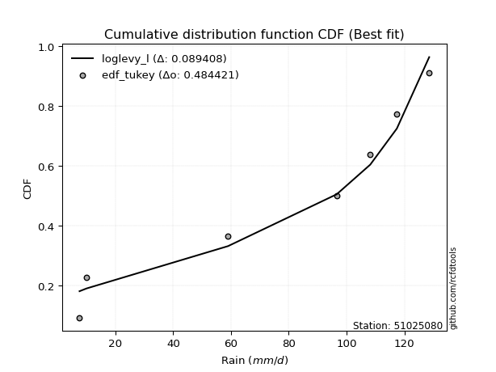</img></img>

</div>


### 8. EDF Gringorten (1963)

Gringorten plotting position formula is essential for estimating the probability and return periods of extreme events like floods and heavy rainfall. The constant _a=0.44_.

<div align="center">


$P=(m-a)/(n+1-2a)$


</div>


**8.1. Empirical values**

<div align="center">

|                | 0                   | 1                   | 2                  | 3              | 4                  | 5                  | 6                  |
|:---------------|:--------------------|:--------------------|:-------------------|:---------------|:-------------------|:-------------------|:-------------------|
| date           | 2024                | 2023                | 2017               | 2021           | 2018               | 2020               | 2019               |
| x              | 7.6                 | 10.0                | 59.0               | 96.6           | 108.2              | 117.4              | 128.6              |
| m              | 1                   | 2                   | 3                  | 4              | 5                  | 6                  | 7                  |
| empirical_dist | edf_gringorten      | edf_gringorten      | edf_gringorten     | edf_gringorten | edf_gringorten     | edf_gringorten     | edf_gringorten     |
| empirical      | 0.07865168539325844 | 0.21910112359550563 | 0.3595505617977528 | 0.5            | 0.6404494382022471 | 0.7808988764044943 | 0.9213483146067415 |
| empirical_tr   | 1.0853658536585364  | 1.2805755395683454  | 1.5614035087719298 | 2.0            | 2.781249999999999  | 4.564102564102562  | 12.714285714285701 |

</div>


**8.2. Kolmogorov-Smirnov fit test (sorted by Δ)**


<div align="center">

|                | 0                   | 1                   | 2                   | 3                   | 4                   | 5                   | 6                   | 7                   | 8                   | 9                   | 10                  | 11                  | 12                  | 13                  | 14                  | 15                  | 16                  | 17                  | 18                  | 19                  | 20                  | 21                  | 22                  | 23                  | 24                  | 25                  | 26                  | 27                  | 28                  | 29                  | 30                  | 31                  | 32                  | 33                  | 34                  | 35                  | 36                  | 37                  | 38                  | 39                  | 40                  | 41                  | 42                  | 43                  | 44                  | 45                  | 46                  | 47                  | 48                  | 49                  | 50                  | 51                  | 52                  | 53                  | 54                  | 55                  | 56                  | 57                  | 58                  | 59                  | 60                  | 61                  | 62                  | 63                  | 64                  | 65                  | 66                  | 67                  | 68                  | 69                  | 70                  | 71                  | 72                  | 73                  | 74                  | 75                  | 76                  | 77                  | 78                  | 79                  | 80                  | 81                  | 82                  | 83                  | 84                  | 85                  | 86                  | 87                  | 88                  | 89                  | 90                  | 91                  | 92                  | 93                  | 94                  | 95                  | 96                  | 97                  | 98                  | 99                  | 100                 | 101                 | 102                 | 103                 | 104                 | 105                 | 106                 | 107                 | 108                 | 109                 | 110                 | 111                 | 112                 | 113                 | 114                 | 115                 | 116                 | 117                 | 118                 | 119                 | 120                 | 121                 | 122                 | 123                 | 124                 | 125                 | 126                 | 127                 | 128                 | 129                 | 130                 | 131                 | 132                 | 133                 | 134                 | 135                 | 136                 | 137                 | 138                 | 139                 | 140                 | 141                 | 142                 | 143                 | 144                 | 145                 | 146                 | 147                 | 148                 | 149                 | 150                 | 151                 | 152                 | 153                 | 154                 | 155                 | 156                 | 157                 | 158                 | 159                 |
|:---------------|:--------------------|:--------------------|:--------------------|:--------------------|:--------------------|:--------------------|:--------------------|:--------------------|:--------------------|:--------------------|:--------------------|:--------------------|:--------------------|:--------------------|:--------------------|:--------------------|:--------------------|:--------------------|:--------------------|:--------------------|:--------------------|:--------------------|:--------------------|:--------------------|:--------------------|:--------------------|:--------------------|:--------------------|:--------------------|:--------------------|:--------------------|:--------------------|:--------------------|:--------------------|:--------------------|:--------------------|:--------------------|:--------------------|:--------------------|:--------------------|:--------------------|:--------------------|:--------------------|:--------------------|:--------------------|:--------------------|:--------------------|:--------------------|:--------------------|:--------------------|:--------------------|:--------------------|:--------------------|:--------------------|:--------------------|:--------------------|:--------------------|:--------------------|:--------------------|:--------------------|:--------------------|:--------------------|:--------------------|:--------------------|:--------------------|:--------------------|:--------------------|:--------------------|:--------------------|:--------------------|:--------------------|:--------------------|:--------------------|:--------------------|:--------------------|:--------------------|:--------------------|:--------------------|:--------------------|:--------------------|:--------------------|:--------------------|:--------------------|:--------------------|:--------------------|:--------------------|:--------------------|:--------------------|:--------------------|:--------------------|:--------------------|:--------------------|:--------------------|:--------------------|:--------------------|:--------------------|:--------------------|:--------------------|:--------------------|:--------------------|:--------------------|:--------------------|:--------------------|:--------------------|:--------------------|:--------------------|:--------------------|:--------------------|:--------------------|:--------------------|:--------------------|:--------------------|:--------------------|:--------------------|:--------------------|:--------------------|:--------------------|:--------------------|:--------------------|:--------------------|:--------------------|:--------------------|:--------------------|:--------------------|:--------------------|:--------------------|:--------------------|:--------------------|:--------------------|:--------------------|:--------------------|:--------------------|:--------------------|:--------------------|:--------------------|:--------------------|:--------------------|:--------------------|:--------------------|:--------------------|:--------------------|:--------------------|:--------------------|:--------------------|:--------------------|:--------------------|:--------------------|:--------------------|:--------------------|:--------------------|:--------------------|:--------------------|:--------------------|:--------------------|:--------------------|:--------------------|:--------------------|:--------------------|:--------------------|:--------------------|
| station        | 51025080            | 51025080            | 51025080            | 51025080            | 51025080            | 51025080            | 51025080            | 51025080            | 51025080            | 51025080            | 51025080            | 51025080            | 51025080            | 51025080            | 51025080            | 51025080            | 51025080            | 51025080            | 51025080            | 51025080            | 51025080            | 51025080            | 51025080            | 51025080            | 51025080            | 51025080            | 51025080            | 51025080            | 51025080            | 51025080            | 51025080            | 51025080            | 51025080            | 51025080            | 51025080            | 51025080            | 51025080            | 51025080            | 51025080            | 51025080            | 51025080            | 51025080            | 51025080            | 51025080            | 51025080            | 51025080            | 51025080            | 51025080            | 51025080            | 51025080            | 51025080            | 51025080            | 51025080            | 51025080            | 51025080            | 51025080            | 51025080            | 51025080            | 51025080            | 51025080            | 51025080            | 51025080            | 51025080            | 51025080            | 51025080            | 51025080            | 51025080            | 51025080            | 51025080            | 51025080            | 51025080            | 51025080            | 51025080            | 51025080            | 51025080            | 51025080            | 51025080            | 51025080            | 51025080            | 51025080            | 51025080            | 51025080            | 51025080            | 51025080            | 51025080            | 51025080            | 51025080            | 51025080            | 51025080            | 51025080            | 51025080            | 51025080            | 51025080            | 51025080            | 51025080            | 51025080            | 51025080            | 51025080            | 51025080            | 51025080            | 51025080            | 51025080            | 51025080            | 51025080            | 51025080            | 51025080            | 51025080            | 51025080            | 51025080            | 51025080            | 51025080            | 51025080            | 51025080            | 51025080            | 51025080            | 51025080            | 51025080            | 51025080            | 51025080            | 51025080            | 51025080            | 51025080            | 51025080            | 51025080            | 51025080            | 51025080            | 51025080            | 51025080            | 51025080            | 51025080            | 51025080            | 51025080            | 51025080            | 51025080            | 51025080            | 51025080            | 51025080            | 51025080            | 51025080            | 51025080            | 51025080            | 51025080            | 51025080            | 51025080            | 51025080            | 51025080            | 51025080            | 51025080            | 51025080            | 51025080            | 51025080            | 51025080            | 51025080            | 51025080            | 51025080            | 51025080            | 51025080            | 51025080            | 51025080            | 51025080            |
| empirical_dist | edf_gringorten      | edf_gringorten      | edf_gringorten      | edf_gringorten      | edf_gringorten      | edf_gringorten      | edf_gringorten      | edf_gringorten      | edf_gringorten      | edf_gringorten      | edf_gringorten      | edf_gringorten      | edf_gringorten      | edf_gringorten      | edf_gringorten      | edf_gringorten      | edf_gringorten      | edf_gringorten      | edf_gringorten      | edf_gringorten      | edf_gringorten      | edf_gringorten      | edf_gringorten      | edf_gringorten      | edf_gringorten      | edf_gringorten      | edf_gringorten      | edf_gringorten      | edf_gringorten      | edf_gringorten      | edf_gringorten      | edf_gringorten      | edf_gringorten      | edf_gringorten      | edf_gringorten      | edf_gringorten      | edf_gringorten      | edf_gringorten      | edf_gringorten      | edf_gringorten      | edf_gringorten      | edf_gringorten      | edf_gringorten      | edf_gringorten      | edf_gringorten      | edf_gringorten      | edf_gringorten      | edf_gringorten      | edf_gringorten      | edf_gringorten      | edf_gringorten      | edf_gringorten      | edf_gringorten      | edf_gringorten      | edf_gringorten      | edf_gringorten      | edf_gringorten      | edf_gringorten      | edf_gringorten      | edf_gringorten      | edf_gringorten      | edf_gringorten      | edf_gringorten      | edf_gringorten      | edf_gringorten      | edf_gringorten      | edf_gringorten      | edf_gringorten      | edf_gringorten      | edf_gringorten      | edf_gringorten      | edf_gringorten      | edf_gringorten      | edf_gringorten      | edf_gringorten      | edf_gringorten      | edf_gringorten      | edf_gringorten      | edf_gringorten      | edf_gringorten      | edf_gringorten      | edf_gringorten      | edf_gringorten      | edf_gringorten      | edf_gringorten      | edf_gringorten      | edf_gringorten      | edf_gringorten      | edf_gringorten      | edf_gringorten      | edf_gringorten      | edf_gringorten      | edf_gringorten      | edf_gringorten      | edf_gringorten      | edf_gringorten      | edf_gringorten      | edf_gringorten      | edf_gringorten      | edf_gringorten      | edf_gringorten      | edf_gringorten      | edf_gringorten      | edf_gringorten      | edf_gringorten      | edf_gringorten      | edf_gringorten      | edf_gringorten      | edf_gringorten      | edf_gringorten      | edf_gringorten      | edf_gringorten      | edf_gringorten      | edf_gringorten      | edf_gringorten      | edf_gringorten      | edf_gringorten      | edf_gringorten      | edf_gringorten      | edf_gringorten      | edf_gringorten      | edf_gringorten      | edf_gringorten      | edf_gringorten      | edf_gringorten      | edf_gringorten      | edf_gringorten      | edf_gringorten      | edf_gringorten      | edf_gringorten      | edf_gringorten      | edf_gringorten      | edf_gringorten      | edf_gringorten      | edf_gringorten      | edf_gringorten      | edf_gringorten      | edf_gringorten      | edf_gringorten      | edf_gringorten      | edf_gringorten      | edf_gringorten      | edf_gringorten      | edf_gringorten      | edf_gringorten      | edf_gringorten      | edf_gringorten      | edf_gringorten      | edf_gringorten      | edf_gringorten      | edf_gringorten      | edf_gringorten      | edf_gringorten      | edf_gringorten      | edf_gringorten      | edf_gringorten      | edf_gringorten      | edf_gringorten      | edf_gringorten      | edf_gringorten      |
| p_dist         | loglevy_l           | johnsonsu           | trapezoid           | logweibull_max      | genhalflogistic     | ksone               | gumbel_l            | weibull_min         | wrapcauchy          | genextreme          | semicircular        | dweibull            | triang              | skewnorm            | beta                | anglit              | argus               | dgamma              | pearson3            | genpareto           | loggenextreme       | logtrapezoid        | arcsine             | gausshyper          | t                   | truncnorm           | crystalball         | norm                | exponnorm           | gamma               | erlang              | foldnorm            | logwrapcauchy       | loggennorm          | rice                | logksone            | logsemicircular     | lomax               | invgauss            | maxwell             | logistic            | invgamma            | logpearson3         | levy_l              | loganglit           | cosine              | rayleigh            | loggumbel_l         | logdgamma           | ncf                 | hypsecant           | kstwobign           | mielke              | logweibull_min      | halfnorm            | logarcsine          | betaprime           | genexpon            | logburr12           | logbetaprime        | logfatiguelife      | logerlang           | loggamma            | loggamma            | logf                | logcrystalball      | lognorm             | logt                | logexponnorm        | lognct              | burr                | loggompertz         | logrice             | loginvgauss         | logncf              | tukeylambda         | gumbel_r            | loginvgamma         | kappa3              | logalpha            | logburr             | logfoldnorm         | uniform             | vonmises_line       | logargus            | laplace             | logmaxwell          | loginvweibull       | halfgennorm         | logloggamma         | lograyleigh         | logmielke           | halflogistic        | loglogistic         | kappa4              | moyal               | bradford            | f                   | loghypsecant        | logcosine           | loggenexpon         | logkstwobign        | lognakagami         | loghalfnorm         | loggumbel_r         | loggenpareto        | gennorm             | loglaplace          | loglaplace          | loglomax            | nct                 | loghalflogistic     | logmoyal            | wald                | burr12              | truncexpon          | nakagami            | logloglaplace       | logdweibull         | loggenhalflogistic  | logbeta             | loggausshyper       | loghalfgennorm      | logskewnorm         | gompertz            | truncweibull_min    | logtriang           | logkappa4           | loggengamma         | logwald             | johnsonsb           | logkappa3           | logexponweib        | exponweib           | gengamma            | logtukeylambda      | logbradford         | loguniform          | logvonmises_line    | alpha               | logtruncnorm        | logtruncexpon       | logtruncweibull_min | invweibull          | fatiguelife         | logrdist            | powerlaw            | logexponpow         | logjohnsonsu        | exponpow            | truncpareto         | weibull_max         | logpowerlaw         | logjohnsonsb        | logtruncpareto      | rdist               | genlogistic         | loggenlogistic      | logvonmises         | vonmises            |
| delta          | 0.10166546970570663 | 0.10279835096670475 | 0.12139433950693157 | 0.12177750078241267 | 0.12554042577773772 | 0.13141685190888264 | 0.1345684194504746  | 0.13586753334861196 | 0.13664571816809423 | 0.1389474715838936  | 0.14364659906502786 | 0.14415367067049956 | 0.14859446426635914 | 0.1514014017510703  | 0.15210078151444317 | 0.1531166257443881  | 0.15354007567080466 | 0.1536591536983805  | 0.15375720698935957 | 0.16442852818043713 | 0.16768910944347104 | 0.16783847480244396 | 0.17295302150249278 | 0.17392052104074662 | 0.17552033100091768 | 0.17553217659900877 | 0.1755321835337742  | 0.17553218478242916 | 0.17553257066007333 | 0.17660089934303735 | 0.17702711064780596 | 0.17994502583590033 | 0.18269531156831142 | 0.18443137554275957 | 0.18529270625123173 | 0.18666443597559557 | 0.19135429299777917 | 0.1923225275502313  | 0.1930428752733413  | 0.19433740181359294 | 0.19544843104339715 | 0.19656820925336405 | 0.1968916246960748  | 0.19839643574589577 | 0.19921853553865843 | 0.19964839048070426 | 0.1999085804893287  | 0.20215106375226266 | 0.2056494368103968  | 0.2082786891344438  | 0.21038390711274557 | 0.21312087533097868 | 0.21591803055859904 | 0.2177991763445808  | 0.21910112359550563 | 0.21910112359550563 | 0.21927003530220723 | 0.22012697706864404 | 0.2205182867557962  | 0.22197076339032007 | 0.22204967254287167 | 0.22219739261330407 | 0.22428589440951263 | 0.22428589440951263 | 0.2245681235180612  | 0.22555758977819518 | 0.22555761408064423 | 0.22555787264656268 | 0.22555977019128592 | 0.2256556586636025  | 0.2277954277248847  | 0.22863828490635596 | 0.2288368874983837  | 0.2289740322579895  | 0.22959805615107298 | 0.22964969529302692 | 0.23114306869950674 | 0.2315890986499498  | 0.2319110959526336  | 0.2325222907771658  | 0.2340318196319381  | 0.23409667228154107 | 0.23553719008264462 | 0.23556796206189978 | 0.23734131143511006 | 0.23735596485483823 | 0.23829843761686087 | 0.23890116708180775 | 0.24072973365548078 | 0.24149187483270684 | 0.24286573333818762 | 0.24307214700467294 | 0.2440007177640866  | 0.2478634448123911  | 0.24882986279975983 | 0.249306062416619   | 0.2497512491059536  | 0.2571750867384043  | 0.2632641599543164  | 0.2634999517095067  | 0.2669696820558738  | 0.2672646777611196  | 0.2680247931706181  | 0.2693366421591743  | 0.2734768572546039  | 0.27745896915397417 | 0.2808988764044944  | 0.2858057993783647  | 0.2858057993783647  | 0.28912184862378265 | 0.2911614227643696  | 0.29702938388539424 | 0.2978352947571742  | 0.3015636467715511  | 0.3030440976508467  | 0.30581116670251307 | 0.3086962039650445  | 0.3122797946421697  | 0.3156226426129968  | 0.3233204815622758  | 0.32770922344626235 | 0.3284745640404837  | 0.3285864026088     | 0.346298459889697   | 0.35954877410995584 | 0.3598602437021434  | 0.3610728131716264  | 0.3630081021388869  | 0.36336779439248834 | 0.3654420328170298  | 0.37850629726648694 | 0.3808501118367478  | 0.38454894342091883 | 0.3858500827851402  | 0.3894859474326091  | 0.39403683561223346 | 0.39664479928597063 | 0.39884315135808823 | 0.39941853104470115 | 0.42794046561903365 | 0.43245181340399574 | 0.43712749724011113 | 0.44329302768808154 | 0.4737001236713417  | 0.47672991662706843 | 0.4999999926274469  | 0.515285776781347   | 0.528336070348252   | 0.5333719536966681  | 0.581285757385354   | 0.5827285044277897  | 0.583888956532905   | 0.58459934539106    | 0.6016776353234251  | 0.6179514862722753  | 0.6404494366466372  | 0.7808988764044943  | 0.7808988764044943  | 1.1280835734305934  | 19.717095076228777  |
| deltao         | 0.48442053926100004 | 0.48442053926100004 | 0.48442053926100004 | 0.48442053926100004 | 0.48442053926100004 | 0.48442053926100004 | 0.48442053926100004 | 0.48442053926100004 | 0.48442053926100004 | 0.48442053926100004 | 0.48442053926100004 | 0.48442053926100004 | 0.48442053926100004 | 0.48442053926100004 | 0.48442053926100004 | 0.48442053926100004 | 0.48442053926100004 | 0.48442053926100004 | 0.48442053926100004 | 0.48442053926100004 | 0.48442053926100004 | 0.48442053926100004 | 0.48442053926100004 | 0.48442053926100004 | 0.48442053926100004 | 0.48442053926100004 | 0.48442053926100004 | 0.48442053926100004 | 0.48442053926100004 | 0.48442053926100004 | 0.48442053926100004 | 0.48442053926100004 | 0.48442053926100004 | 0.48442053926100004 | 0.48442053926100004 | 0.48442053926100004 | 0.48442053926100004 | 0.48442053926100004 | 0.48442053926100004 | 0.48442053926100004 | 0.48442053926100004 | 0.48442053926100004 | 0.48442053926100004 | 0.48442053926100004 | 0.48442053926100004 | 0.48442053926100004 | 0.48442053926100004 | 0.48442053926100004 | 0.48442053926100004 | 0.48442053926100004 | 0.48442053926100004 | 0.48442053926100004 | 0.48442053926100004 | 0.48442053926100004 | 0.48442053926100004 | 0.48442053926100004 | 0.48442053926100004 | 0.48442053926100004 | 0.48442053926100004 | 0.48442053926100004 | 0.48442053926100004 | 0.48442053926100004 | 0.48442053926100004 | 0.48442053926100004 | 0.48442053926100004 | 0.48442053926100004 | 0.48442053926100004 | 0.48442053926100004 | 0.48442053926100004 | 0.48442053926100004 | 0.48442053926100004 | 0.48442053926100004 | 0.48442053926100004 | 0.48442053926100004 | 0.48442053926100004 | 0.48442053926100004 | 0.48442053926100004 | 0.48442053926100004 | 0.48442053926100004 | 0.48442053926100004 | 0.48442053926100004 | 0.48442053926100004 | 0.48442053926100004 | 0.48442053926100004 | 0.48442053926100004 | 0.48442053926100004 | 0.48442053926100004 | 0.48442053926100004 | 0.48442053926100004 | 0.48442053926100004 | 0.48442053926100004 | 0.48442053926100004 | 0.48442053926100004 | 0.48442053926100004 | 0.48442053926100004 | 0.48442053926100004 | 0.48442053926100004 | 0.48442053926100004 | 0.48442053926100004 | 0.48442053926100004 | 0.48442053926100004 | 0.48442053926100004 | 0.48442053926100004 | 0.48442053926100004 | 0.48442053926100004 | 0.48442053926100004 | 0.48442053926100004 | 0.48442053926100004 | 0.48442053926100004 | 0.48442053926100004 | 0.48442053926100004 | 0.48442053926100004 | 0.48442053926100004 | 0.48442053926100004 | 0.48442053926100004 | 0.48442053926100004 | 0.48442053926100004 | 0.48442053926100004 | 0.48442053926100004 | 0.48442053926100004 | 0.48442053926100004 | 0.48442053926100004 | 0.48442053926100004 | 0.48442053926100004 | 0.48442053926100004 | 0.48442053926100004 | 0.48442053926100004 | 0.48442053926100004 | 0.48442053926100004 | 0.48442053926100004 | 0.48442053926100004 | 0.48442053926100004 | 0.48442053926100004 | 0.48442053926100004 | 0.48442053926100004 | 0.48442053926100004 | 0.48442053926100004 | 0.48442053926100004 | 0.48442053926100004 | 0.48442053926100004 | 0.48442053926100004 | 0.48442053926100004 | 0.48442053926100004 | 0.48442053926100004 | 0.48442053926100004 | 0.48442053926100004 | 0.48442053926100004 | 0.48442053926100004 | 0.48442053926100004 | 0.48442053926100004 | 0.48442053926100004 | 0.48442053926100004 | 0.48442053926100004 | 0.48442053926100004 | 0.48442053926100004 | 0.48442053926100004 | 0.48442053926100004 | 0.48442053926100004 | 0.48442053926100004 | 0.48442053926100004 |
| eval           | Δo > Δ              | Δo > Δ              | Δo > Δ              | Δo > Δ              | Δo > Δ              | Δo > Δ              | Δo > Δ              | Δo > Δ              | Δo > Δ              | Δo > Δ              | Δo > Δ              | Δo > Δ              | Δo > Δ              | Δo > Δ              | Δo > Δ              | Δo > Δ              | Δo > Δ              | Δo > Δ              | Δo > Δ              | Δo > Δ              | Δo > Δ              | Δo > Δ              | Δo > Δ              | Δo > Δ              | Δo > Δ              | Δo > Δ              | Δo > Δ              | Δo > Δ              | Δo > Δ              | Δo > Δ              | Δo > Δ              | Δo > Δ              | Δo > Δ              | Δo > Δ              | Δo > Δ              | Δo > Δ              | Δo > Δ              | Δo > Δ              | Δo > Δ              | Δo > Δ              | Δo > Δ              | Δo > Δ              | Δo > Δ              | Δo > Δ              | Δo > Δ              | Δo > Δ              | Δo > Δ              | Δo > Δ              | Δo > Δ              | Δo > Δ              | Δo > Δ              | Δo > Δ              | Δo > Δ              | Δo > Δ              | Δo > Δ              | Δo > Δ              | Δo > Δ              | Δo > Δ              | Δo > Δ              | Δo > Δ              | Δo > Δ              | Δo > Δ              | Δo > Δ              | Δo > Δ              | Δo > Δ              | Δo > Δ              | Δo > Δ              | Δo > Δ              | Δo > Δ              | Δo > Δ              | Δo > Δ              | Δo > Δ              | Δo > Δ              | Δo > Δ              | Δo > Δ              | Δo > Δ              | Δo > Δ              | Δo > Δ              | Δo > Δ              | Δo > Δ              | Δo > Δ              | Δo > Δ              | Δo > Δ              | Δo > Δ              | Δo > Δ              | Δo > Δ              | Δo > Δ              | Δo > Δ              | Δo > Δ              | Δo > Δ              | Δo > Δ              | Δo > Δ              | Δo > Δ              | Δo > Δ              | Δo > Δ              | Δo > Δ              | Δo > Δ              | Δo > Δ              | Δo > Δ              | Δo > Δ              | Δo > Δ              | Δo > Δ              | Δo > Δ              | Δo > Δ              | Δo > Δ              | Δo > Δ              | Δo > Δ              | Δo > Δ              | Δo > Δ              | Δo > Δ              | Δo > Δ              | Δo > Δ              | Δo > Δ              | Δo > Δ              | Δo > Δ              | Δo > Δ              | Δo > Δ              | Δo > Δ              | Δo > Δ              | Δo > Δ              | Δo > Δ              | Δo > Δ              | Δo > Δ              | Δo > Δ              | Δo > Δ              | Δo > Δ              | Δo > Δ              | Δo > Δ              | Δo > Δ              | Δo > Δ              | Δo > Δ              | Δo > Δ              | Δo > Δ              | Δo > Δ              | Δo > Δ              | Δo > Δ              | Δo > Δ              | Δo > Δ              | Δo > Δ              | Δo > Δ              | Δo > Δ              | Δo > Δ              | Δo > Δ              | Δo > Δ              | Δo > Δ              | Δo <= Δ             | Δo <= Δ             | Δo <= Δ             | Δo <= Δ             | Δo <= Δ             | Δo <= Δ             | Δo <= Δ             | Δo <= Δ             | Δo <= Δ             | Δo <= Δ             | Δo <= Δ             | Δo <= Δ             | Δo <= Δ             | Δo <= Δ             | Δo <= Δ             |
| fit            | 1                   | 1                   | 1                   | 1                   | 1                   | 1                   | 1                   | 1                   | 1                   | 1                   | 1                   | 1                   | 1                   | 1                   | 1                   | 1                   | 1                   | 1                   | 1                   | 1                   | 1                   | 1                   | 1                   | 1                   | 1                   | 1                   | 1                   | 1                   | 1                   | 1                   | 1                   | 1                   | 1                   | 1                   | 1                   | 1                   | 1                   | 1                   | 1                   | 1                   | 1                   | 1                   | 1                   | 1                   | 1                   | 1                   | 1                   | 1                   | 1                   | 1                   | 1                   | 1                   | 1                   | 1                   | 1                   | 1                   | 1                   | 1                   | 1                   | 1                   | 1                   | 1                   | 1                   | 1                   | 1                   | 1                   | 1                   | 1                   | 1                   | 1                   | 1                   | 1                   | 1                   | 1                   | 1                   | 1                   | 1                   | 1                   | 1                   | 1                   | 1                   | 1                   | 1                   | 1                   | 1                   | 1                   | 1                   | 1                   | 1                   | 1                   | 1                   | 1                   | 1                   | 1                   | 1                   | 1                   | 1                   | 1                   | 1                   | 1                   | 1                   | 1                   | 1                   | 1                   | 1                   | 1                   | 1                   | 1                   | 1                   | 1                   | 1                   | 1                   | 1                   | 1                   | 1                   | 1                   | 1                   | 1                   | 1                   | 1                   | 1                   | 1                   | 1                   | 1                   | 1                   | 1                   | 1                   | 1                   | 1                   | 1                   | 1                   | 1                   | 1                   | 1                   | 1                   | 1                   | 1                   | 1                   | 1                   | 1                   | 1                   | 1                   | 1                   | 1                   | 1                   | 0                   | 0                   | 0                   | 0                   | 0                   | 0                   | 0                   | 0                   | 0                   | 0                   | 0                   | 0                   | 0                   | 0                   | 0                   |
| n              | 7                   | 7                   | 7                   | 7                   | 7                   | 7                   | 7                   | 7                   | 7                   | 7                   | 7                   | 7                   | 7                   | 7                   | 7                   | 7                   | 7                   | 7                   | 7                   | 7                   | 7                   | 7                   | 7                   | 7                   | 7                   | 7                   | 7                   | 7                   | 7                   | 7                   | 7                   | 7                   | 7                   | 7                   | 7                   | 7                   | 7                   | 7                   | 7                   | 7                   | 7                   | 7                   | 7                   | 7                   | 7                   | 7                   | 7                   | 7                   | 7                   | 7                   | 7                   | 7                   | 7                   | 7                   | 7                   | 7                   | 7                   | 7                   | 7                   | 7                   | 7                   | 7                   | 7                   | 7                   | 7                   | 7                   | 7                   | 7                   | 7                   | 7                   | 7                   | 7                   | 7                   | 7                   | 7                   | 7                   | 7                   | 7                   | 7                   | 7                   | 7                   | 7                   | 7                   | 7                   | 7                   | 7                   | 7                   | 7                   | 7                   | 7                   | 7                   | 7                   | 7                   | 7                   | 7                   | 7                   | 7                   | 7                   | 7                   | 7                   | 7                   | 7                   | 7                   | 7                   | 7                   | 7                   | 7                   | 7                   | 7                   | 7                   | 7                   | 7                   | 7                   | 7                   | 7                   | 7                   | 7                   | 7                   | 7                   | 7                   | 7                   | 7                   | 7                   | 7                   | 7                   | 7                   | 7                   | 7                   | 7                   | 7                   | 7                   | 7                   | 7                   | 7                   | 7                   | 7                   | 7                   | 7                   | 7                   | 7                   | 7                   | 7                   | 7                   | 7                   | 7                   | 7                   | 7                   | 7                   | 7                   | 7                   | 7                   | 7                   | 7                   | 7                   | 7                   | 7                   | 7                   | 7                   | 7                   | 7                   |
| best_fit       | 1                   | 0                   | 0                   | 0                   | 0                   | 0                   | 0                   | 0                   | 0                   | 0                   | 0                   | 0                   | 0                   | 0                   | 0                   | 0                   | 0                   | 0                   | 0                   | 0                   | 0                   | 0                   | 0                   | 0                   | 0                   | 0                   | 0                   | 0                   | 0                   | 0                   | 0                   | 0                   | 0                   | 0                   | 0                   | 0                   | 0                   | 0                   | 0                   | 0                   | 0                   | 0                   | 0                   | 0                   | 0                   | 0                   | 0                   | 0                   | 0                   | 0                   | 0                   | 0                   | 0                   | 0                   | 0                   | 0                   | 0                   | 0                   | 0                   | 0                   | 0                   | 0                   | 0                   | 0                   | 0                   | 0                   | 0                   | 0                   | 0                   | 0                   | 0                   | 0                   | 0                   | 0                   | 0                   | 0                   | 0                   | 0                   | 0                   | 0                   | 0                   | 0                   | 0                   | 0                   | 0                   | 0                   | 0                   | 0                   | 0                   | 0                   | 0                   | 0                   | 0                   | 0                   | 0                   | 0                   | 0                   | 0                   | 0                   | 0                   | 0                   | 0                   | 0                   | 0                   | 0                   | 0                   | 0                   | 0                   | 0                   | 0                   | 0                   | 0                   | 0                   | 0                   | 0                   | 0                   | 0                   | 0                   | 0                   | 0                   | 0                   | 0                   | 0                   | 0                   | 0                   | 0                   | 0                   | 0                   | 0                   | 0                   | 0                   | 0                   | 0                   | 0                   | 0                   | 0                   | 0                   | 0                   | 0                   | 0                   | 0                   | 0                   | 0                   | 0                   | 0                   | 0                   | 0                   | 0                   | 0                   | 0                   | 0                   | 0                   | 0                   | 0                   | 0                   | 0                   | 0                   | 0                   | 0                   | 0                   |
| best_fit_sort  | 1                   | 2                   | 3                   | 4                   | 5                   | 6                   | 7                   | 8                   | 9                   | 10                  | 11                  | 12                  | 13                  | 14                  | 15                  | 16                  | 17                  | 18                  | 19                  | 20                  | 21                  | 22                  | 23                  | 24                  | 25                  | 26                  | 27                  | 28                  | 29                  | 30                  | 31                  | 32                  | 33                  | 34                  | 35                  | 36                  | 37                  | 38                  | 39                  | 40                  | 41                  | 42                  | 43                  | 44                  | 45                  | 46                  | 47                  | 48                  | 49                  | 50                  | 51                  | 52                  | 53                  | 54                  | 55                  | 56                  | 57                  | 58                  | 59                  | 60                  | 61                  | 62                  | 63                  | 64                  | 65                  | 66                  | 67                  | 68                  | 69                  | 70                  | 71                  | 72                  | 73                  | 74                  | 75                  | 76                  | 77                  | 78                  | 79                  | 80                  | 81                  | 82                  | 83                  | 84                  | 85                  | 86                  | 87                  | 88                  | 89                  | 90                  | 91                  | 92                  | 93                  | 94                  | 95                  | 96                  | 97                  | 98                  | 99                  | 100                 | 101                 | 102                 | 103                 | 104                 | 105                 | 106                 | 107                 | 108                 | 109                 | 110                 | 111                 | 112                 | 113                 | 114                 | 115                 | 116                 | 117                 | 118                 | 119                 | 120                 | 121                 | 122                 | 123                 | 124                 | 125                 | 126                 | 127                 | 128                 | 129                 | 130                 | 131                 | 132                 | 133                 | 134                 | 135                 | 136                 | 137                 | 138                 | 139                 | 140                 | 141                 | 142                 | 143                 | 144                 | 145                 | 146                 | 147                 | 148                 | 149                 | 150                 | 151                 | 152                 | 153                 | 154                 | 155                 | 156                 | 157                 | 158                 | 159                 | 160                 |

</div>


**8.3. Best fit**

<div align="center">

|   id |   station | empirical_dist   | p_dist    |    delta |   deltao | eval   |   fit |   n |   best_fit |   best_fit_sort |
|-----:|----------:|:-----------------|:----------|---------:|---------:|:-------|------:|----:|-----------:|----------------:|
|    0 |  51025080 | edf_gringorten   | loglevy_l | 0.101665 | 0.484421 | Δo > Δ |     1 |   7 |          1 |               1 |

</div>


<div align="center">

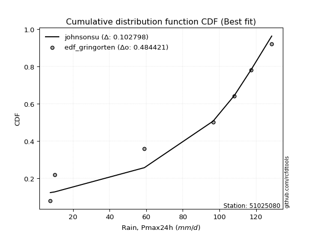</img></img>

</div>


### 9. EDF Filliben (1975)

The specific values of the constants (0.3175) (often denoted as $alpha$) and (0.365) are derived from a method proposed by James J. Filliben in a 1975 paper. This particular formula is the mean value of the $i$-th order statistic of the normal distribution and is considered a robust and effective plotting position formula for the normal probability plot correlation coefficient test for normality.

<div align="center">


$P=(m-0.3175)/(n+0.365)$


</div>


**9.1. Empirical values**

<div align="center">

|                | 0                   | 1                   | 2                   | 3            | 4                  | 5                  | 6                  |
|:---------------|:--------------------|:--------------------|:--------------------|:-------------|:-------------------|:-------------------|:-------------------|
| date           | 2024                | 2023                | 2017                | 2021         | 2018               | 2020               | 2019               |
| x              | 7.6                 | 10.0                | 59.0                | 96.6         | 108.2              | 117.4              | 128.6              |
| m              | 1                   | 2                   | 3                   | 4            | 5                  | 6                  | 7                  |
| empirical_dist | edf_filliben        | edf_filliben        | edf_filliben        | edf_filliben | edf_filliben       | edf_filliben       | edf_filliben       |
| empirical      | 0.09266802443991853 | 0.22844534962661237 | 0.36422267481330617 | 0.5          | 0.6357773251866938 | 0.7715546503733877 | 0.9073319755600815 |
| empirical_tr   | 1.1021324354657687  | 1.2960844698636163  | 1.5728777362520021  | 2.0          | 2.7455731593662627 | 4.377414561664191  | 10.791208791208794 |

</div>


**9.2. Kolmogorov-Smirnov fit test (sorted by Δ)**


<div align="center">

|                | 0                   | 1                   | 2                   | 3                   | 4                   | 5                   | 6                   | 7                   | 8                   | 9                   | 10                  | 11                  | 12                  | 13                  | 14                  | 15                  | 16                  | 17                  | 18                  | 19                  | 20                  | 21                  | 22                  | 23                  | 24                  | 25                  | 26                  | 27                  | 28                  | 29                  | 30                  | 31                  | 32                  | 33                  | 34                  | 35                  | 36                  | 37                  | 38                  | 39                  | 40                  | 41                  | 42                  | 43                  | 44                  | 45                  | 46                  | 47                  | 48                  | 49                  | 50                  | 51                  | 52                  | 53                  | 54                  | 55                  | 56                  | 57                  | 58                  | 59                  | 60                  | 61                  | 62                  | 63                  | 64                  | 65                  | 66                  | 67                  | 68                  | 69                  | 70                  | 71                  | 72                  | 73                  | 74                  | 75                  | 76                  | 77                  | 78                  | 79                  | 80                  | 81                  | 82                  | 83                  | 84                  | 85                  | 86                  | 87                  | 88                  | 89                  | 90                  | 91                  | 92                  | 93                  | 94                  | 95                  | 96                  | 97                  | 98                  | 99                  | 100                 | 101                 | 102                 | 103                 | 104                 | 105                 | 106                 | 107                 | 108                 | 109                 | 110                 | 111                 | 112                 | 113                 | 114                 | 115                 | 116                 | 117                 | 118                 | 119                 | 120                 | 121                 | 122                 | 123                 | 124                 | 125                 | 126                 | 127                 | 128                 | 129                 | 130                 | 131                 | 132                 | 133                 | 134                 | 135                 | 136                 | 137                 | 138                 | 139                 | 140                 | 141                 | 142                 | 143                 | 144                 | 145                 | 146                 | 147                 | 148                 | 149                 | 150                 | 151                 | 152                 | 153                 | 154                 | 155                 | 156                 | 157                 | 158                 | 159                 |
|:---------------|:--------------------|:--------------------|:--------------------|:--------------------|:--------------------|:--------------------|:--------------------|:--------------------|:--------------------|:--------------------|:--------------------|:--------------------|:--------------------|:--------------------|:--------------------|:--------------------|:--------------------|:--------------------|:--------------------|:--------------------|:--------------------|:--------------------|:--------------------|:--------------------|:--------------------|:--------------------|:--------------------|:--------------------|:--------------------|:--------------------|:--------------------|:--------------------|:--------------------|:--------------------|:--------------------|:--------------------|:--------------------|:--------------------|:--------------------|:--------------------|:--------------------|:--------------------|:--------------------|:--------------------|:--------------------|:--------------------|:--------------------|:--------------------|:--------------------|:--------------------|:--------------------|:--------------------|:--------------------|:--------------------|:--------------------|:--------------------|:--------------------|:--------------------|:--------------------|:--------------------|:--------------------|:--------------------|:--------------------|:--------------------|:--------------------|:--------------------|:--------------------|:--------------------|:--------------------|:--------------------|:--------------------|:--------------------|:--------------------|:--------------------|:--------------------|:--------------------|:--------------------|:--------------------|:--------------------|:--------------------|:--------------------|:--------------------|:--------------------|:--------------------|:--------------------|:--------------------|:--------------------|:--------------------|:--------------------|:--------------------|:--------------------|:--------------------|:--------------------|:--------------------|:--------------------|:--------------------|:--------------------|:--------------------|:--------------------|:--------------------|:--------------------|:--------------------|:--------------------|:--------------------|:--------------------|:--------------------|:--------------------|:--------------------|:--------------------|:--------------------|:--------------------|:--------------------|:--------------------|:--------------------|:--------------------|:--------------------|:--------------------|:--------------------|:--------------------|:--------------------|:--------------------|:--------------------|:--------------------|:--------------------|:--------------------|:--------------------|:--------------------|:--------------------|:--------------------|:--------------------|:--------------------|:--------------------|:--------------------|:--------------------|:--------------------|:--------------------|:--------------------|:--------------------|:--------------------|:--------------------|:--------------------|:--------------------|:--------------------|:--------------------|:--------------------|:--------------------|:--------------------|:--------------------|:--------------------|:--------------------|:--------------------|:--------------------|:--------------------|:--------------------|:--------------------|:--------------------|:--------------------|:--------------------|:--------------------|:--------------------|
| station        | 51025080            | 51025080            | 51025080            | 51025080            | 51025080            | 51025080            | 51025080            | 51025080            | 51025080            | 51025080            | 51025080            | 51025080            | 51025080            | 51025080            | 51025080            | 51025080            | 51025080            | 51025080            | 51025080            | 51025080            | 51025080            | 51025080            | 51025080            | 51025080            | 51025080            | 51025080            | 51025080            | 51025080            | 51025080            | 51025080            | 51025080            | 51025080            | 51025080            | 51025080            | 51025080            | 51025080            | 51025080            | 51025080            | 51025080            | 51025080            | 51025080            | 51025080            | 51025080            | 51025080            | 51025080            | 51025080            | 51025080            | 51025080            | 51025080            | 51025080            | 51025080            | 51025080            | 51025080            | 51025080            | 51025080            | 51025080            | 51025080            | 51025080            | 51025080            | 51025080            | 51025080            | 51025080            | 51025080            | 51025080            | 51025080            | 51025080            | 51025080            | 51025080            | 51025080            | 51025080            | 51025080            | 51025080            | 51025080            | 51025080            | 51025080            | 51025080            | 51025080            | 51025080            | 51025080            | 51025080            | 51025080            | 51025080            | 51025080            | 51025080            | 51025080            | 51025080            | 51025080            | 51025080            | 51025080            | 51025080            | 51025080            | 51025080            | 51025080            | 51025080            | 51025080            | 51025080            | 51025080            | 51025080            | 51025080            | 51025080            | 51025080            | 51025080            | 51025080            | 51025080            | 51025080            | 51025080            | 51025080            | 51025080            | 51025080            | 51025080            | 51025080            | 51025080            | 51025080            | 51025080            | 51025080            | 51025080            | 51025080            | 51025080            | 51025080            | 51025080            | 51025080            | 51025080            | 51025080            | 51025080            | 51025080            | 51025080            | 51025080            | 51025080            | 51025080            | 51025080            | 51025080            | 51025080            | 51025080            | 51025080            | 51025080            | 51025080            | 51025080            | 51025080            | 51025080            | 51025080            | 51025080            | 51025080            | 51025080            | 51025080            | 51025080            | 51025080            | 51025080            | 51025080            | 51025080            | 51025080            | 51025080            | 51025080            | 51025080            | 51025080            | 51025080            | 51025080            | 51025080            | 51025080            | 51025080            | 51025080            |
| empirical_dist | edf_filliben        | edf_filliben        | edf_filliben        | edf_filliben        | edf_filliben        | edf_filliben        | edf_filliben        | edf_filliben        | edf_filliben        | edf_filliben        | edf_filliben        | edf_filliben        | edf_filliben        | edf_filliben        | edf_filliben        | edf_filliben        | edf_filliben        | edf_filliben        | edf_filliben        | edf_filliben        | edf_filliben        | edf_filliben        | edf_filliben        | edf_filliben        | edf_filliben        | edf_filliben        | edf_filliben        | edf_filliben        | edf_filliben        | edf_filliben        | edf_filliben        | edf_filliben        | edf_filliben        | edf_filliben        | edf_filliben        | edf_filliben        | edf_filliben        | edf_filliben        | edf_filliben        | edf_filliben        | edf_filliben        | edf_filliben        | edf_filliben        | edf_filliben        | edf_filliben        | edf_filliben        | edf_filliben        | edf_filliben        | edf_filliben        | edf_filliben        | edf_filliben        | edf_filliben        | edf_filliben        | edf_filliben        | edf_filliben        | edf_filliben        | edf_filliben        | edf_filliben        | edf_filliben        | edf_filliben        | edf_filliben        | edf_filliben        | edf_filliben        | edf_filliben        | edf_filliben        | edf_filliben        | edf_filliben        | edf_filliben        | edf_filliben        | edf_filliben        | edf_filliben        | edf_filliben        | edf_filliben        | edf_filliben        | edf_filliben        | edf_filliben        | edf_filliben        | edf_filliben        | edf_filliben        | edf_filliben        | edf_filliben        | edf_filliben        | edf_filliben        | edf_filliben        | edf_filliben        | edf_filliben        | edf_filliben        | edf_filliben        | edf_filliben        | edf_filliben        | edf_filliben        | edf_filliben        | edf_filliben        | edf_filliben        | edf_filliben        | edf_filliben        | edf_filliben        | edf_filliben        | edf_filliben        | edf_filliben        | edf_filliben        | edf_filliben        | edf_filliben        | edf_filliben        | edf_filliben        | edf_filliben        | edf_filliben        | edf_filliben        | edf_filliben        | edf_filliben        | edf_filliben        | edf_filliben        | edf_filliben        | edf_filliben        | edf_filliben        | edf_filliben        | edf_filliben        | edf_filliben        | edf_filliben        | edf_filliben        | edf_filliben        | edf_filliben        | edf_filliben        | edf_filliben        | edf_filliben        | edf_filliben        | edf_filliben        | edf_filliben        | edf_filliben        | edf_filliben        | edf_filliben        | edf_filliben        | edf_filliben        | edf_filliben        | edf_filliben        | edf_filliben        | edf_filliben        | edf_filliben        | edf_filliben        | edf_filliben        | edf_filliben        | edf_filliben        | edf_filliben        | edf_filliben        | edf_filliben        | edf_filliben        | edf_filliben        | edf_filliben        | edf_filliben        | edf_filliben        | edf_filliben        | edf_filliben        | edf_filliben        | edf_filliben        | edf_filliben        | edf_filliben        | edf_filliben        | edf_filliben        | edf_filliben        | edf_filliben        |
| p_dist         | loglevy_l           | johnsonsu           | trapezoid           | logweibull_max      | genhalflogistic     | ksone               | gumbel_l            | beta                | genextreme          | semicircular        | weibull_min         | wrapcauchy          | skewnorm            | anglit              | dweibull            | pearson3            | logtrapezoid        | triang              | argus               | dgamma              | loggenextreme       | gausshyper          | genpareto           | t                   | truncnorm           | crystalball         | norm                | exponnorm           | gamma               | erlang              | logwrapcauchy       | foldnorm            | logksone            | arcsine             | levy_l              | rice                | logsemicircular     | loggennorm          | invgauss            | maxwell             | logistic            | invgamma            | logpearson3         | loganglit           | cosine              | rayleigh            | lomax               | loggumbel_l         | ncf                 | logdgamma           | hypsecant           | kstwobign           | mielke              | logweibull_min      | betaprime           | genexpon            | logburr12           | logbetaprime        | logfatiguelife      | logerlang           | loggamma            | loggamma            | logf                | logncf              | logcrystalball      | lognorm             | logt                | logexponnorm        | lognct              | burr                | halfnorm            | logarcsine          | loggompertz         | logrice             | loginvgauss         | tukeylambda         | gumbel_r            | loginvgamma         | kappa3              | logalpha            | logburr             | logfoldnorm         | loginvweibull       | uniform             | vonmises_line       | halfgennorm         | logargus            | laplace             | logmaxwell          | logloggamma         | lograyleigh         | logmielke           | halflogistic        | loglogistic         | kappa4              | moyal               | bradford            | f                   | loggenexpon         | logkstwobign        | loghypsecant        | lognakagami         | logcosine           | loghalfnorm         | loggumbel_r         | gennorm             | loggenpareto        | loglomax            | loglaplace          | loglaplace          | nct                 | loghalflogistic     | logmoyal            | logloglaplace       | burr12              | wald                | logdweibull         | nakagami            | truncexpon          | logbeta             | loggenhalflogistic  | loghalfgennorm      | loggausshyper       | logskewnorm         | loggengamma         | truncweibull_min    | logwald             | logtriang           | logkappa4           | gompertz            | johnsonsb           | logexponweib        | logkappa3           | exponweib           | gengamma            | logtukeylambda      | logbradford         | loguniform          | logvonmises_line    | alpha               | logtruncnorm        | logtruncexpon       | logtruncweibull_min | invweibull          | fatiguelife         | logrdist            | powerlaw            | logexponpow         | logjohnsonsu        | weibull_max         | exponpow            | truncpareto         | logpowerlaw         | logjohnsonsb        | logtruncpareto      | rdist               | genlogistic         | loggenlogistic      | logvonmises         | vonmises            |
| delta          | 0.08764913065904653 | 0.10747046398225812 | 0.12139433950693157 | 0.12177750078241267 | 0.12554042577773772 | 0.13241086080351364 | 0.1393699497226119  | 0.14275655548333654 | 0.14361958459944696 | 0.14364659906502786 | 0.1452117593797187  | 0.14598994419920097 | 0.1514014017510703  | 0.1531166257443881  | 0.1534978967016063  | 0.15375720698935957 | 0.15382213575578396 | 0.15793869029746588 | 0.1628843017019114  | 0.16300337972948725 | 0.16768910944347104 | 0.16924840802519325 | 0.17377275421154387 | 0.17552033100091768 | 0.17553217659900877 | 0.1755321835337742  | 0.17553218478242916 | 0.17553257066007333 | 0.17660089934303735 | 0.17702711064780596 | 0.17802319855275806 | 0.17994502583590033 | 0.1819923229600422  | 0.18229724753359952 | 0.1843800966992357  | 0.18529270625123173 | 0.1879087197942575  | 0.18910348855831294 | 0.1930428752733413  | 0.19433740181359294 | 0.19544843104339715 | 0.19656820925336405 | 0.1968916246960748  | 0.19921853553865843 | 0.19964839048070426 | 0.1999085804893287  | 0.20166675358133804 | 0.20215106375226266 | 0.2082786891344438  | 0.21032154982595017 | 0.21038390711274557 | 0.21312087533097868 | 0.21591803055859904 | 0.2177991763445808  | 0.21927003530220723 | 0.22012697706864404 | 0.2205182867557962  | 0.22197076339032007 | 0.22204967254287167 | 0.22219739261330407 | 0.22428589440951263 | 0.22428589440951263 | 0.2245681235180612  | 0.22554635576603987 | 0.22555758977819518 | 0.22555761408064423 | 0.22555787264656268 | 0.22555977019128592 | 0.2256556586636025  | 0.2277954277248847  | 0.22844534962661237 | 0.22844534962661237 | 0.22863828490635596 | 0.2288368874983837  | 0.2289740322579895  | 0.22964969529302692 | 0.23114306869950674 | 0.2315890986499498  | 0.2319110959526336  | 0.2325222907771658  | 0.2340318196319381  | 0.23409667228154107 | 0.23422905406625438 | 0.23553719008264462 | 0.23556796206189978 | 0.2360576206399274  | 0.23734131143511006 | 0.23735596485483823 | 0.23829843761686087 | 0.24149187483270684 | 0.2419746303129391  | 0.24307214700467294 | 0.2440007177640866  | 0.2478634448123911  | 0.24882986279975983 | 0.249306062416619   | 0.2497512491059536  | 0.2571750867384043  | 0.2622975690403204  | 0.26259256474556625 | 0.2632641599543164  | 0.26335268015506474 | 0.2634999517095067  | 0.26466452914362093 | 0.2708397156581088  | 0.27155465037338766 | 0.27745896915397417 | 0.2844497356082293  | 0.2858057993783647  | 0.2858057993783647  | 0.28648930974881626 | 0.29235727086984087 | 0.2931631817416208  | 0.2982634555955097  | 0.29837198463529335 | 0.3015636467715511  | 0.3016063035663368  | 0.3040240909494911  | 0.30581116670251307 | 0.3183649974151557  | 0.3233204815622758  | 0.32391428959324664 | 0.3284745640404837  | 0.346298459889697   | 0.35869568137693497 | 0.3598602437021434  | 0.36076991980147644 | 0.3610728131716264  | 0.3630081021388869  | 0.3642208871255092  | 0.3644899582198269  | 0.37987683040536546 | 0.3808501118367478  | 0.38117796976958684 | 0.38481383441705574 | 0.39403683561223346 | 0.39664479928597063 | 0.39884315135808823 | 0.39941853104470115 | 0.4232683526034803  | 0.42947121764356555 | 0.43245538422455776 | 0.4386209146725282  | 0.4596837846246817  | 0.47205780361151506 | 0.4999999926274469  | 0.5106136637657936  | 0.5236639573326987  | 0.5240277276655616  | 0.5745447305017983  | 0.5766136443698007  | 0.5780563914122363  | 0.5799272323755066  | 0.5923334092923185  | 0.6132793732567219  | 0.6357773236310839  | 0.7715546503733877  | 0.7715546503733877  | 1.1280835734305934  | 19.73111141527544   |
| deltao         | 0.48442053926100004 | 0.48442053926100004 | 0.48442053926100004 | 0.48442053926100004 | 0.48442053926100004 | 0.48442053926100004 | 0.48442053926100004 | 0.48442053926100004 | 0.48442053926100004 | 0.48442053926100004 | 0.48442053926100004 | 0.48442053926100004 | 0.48442053926100004 | 0.48442053926100004 | 0.48442053926100004 | 0.48442053926100004 | 0.48442053926100004 | 0.48442053926100004 | 0.48442053926100004 | 0.48442053926100004 | 0.48442053926100004 | 0.48442053926100004 | 0.48442053926100004 | 0.48442053926100004 | 0.48442053926100004 | 0.48442053926100004 | 0.48442053926100004 | 0.48442053926100004 | 0.48442053926100004 | 0.48442053926100004 | 0.48442053926100004 | 0.48442053926100004 | 0.48442053926100004 | 0.48442053926100004 | 0.48442053926100004 | 0.48442053926100004 | 0.48442053926100004 | 0.48442053926100004 | 0.48442053926100004 | 0.48442053926100004 | 0.48442053926100004 | 0.48442053926100004 | 0.48442053926100004 | 0.48442053926100004 | 0.48442053926100004 | 0.48442053926100004 | 0.48442053926100004 | 0.48442053926100004 | 0.48442053926100004 | 0.48442053926100004 | 0.48442053926100004 | 0.48442053926100004 | 0.48442053926100004 | 0.48442053926100004 | 0.48442053926100004 | 0.48442053926100004 | 0.48442053926100004 | 0.48442053926100004 | 0.48442053926100004 | 0.48442053926100004 | 0.48442053926100004 | 0.48442053926100004 | 0.48442053926100004 | 0.48442053926100004 | 0.48442053926100004 | 0.48442053926100004 | 0.48442053926100004 | 0.48442053926100004 | 0.48442053926100004 | 0.48442053926100004 | 0.48442053926100004 | 0.48442053926100004 | 0.48442053926100004 | 0.48442053926100004 | 0.48442053926100004 | 0.48442053926100004 | 0.48442053926100004 | 0.48442053926100004 | 0.48442053926100004 | 0.48442053926100004 | 0.48442053926100004 | 0.48442053926100004 | 0.48442053926100004 | 0.48442053926100004 | 0.48442053926100004 | 0.48442053926100004 | 0.48442053926100004 | 0.48442053926100004 | 0.48442053926100004 | 0.48442053926100004 | 0.48442053926100004 | 0.48442053926100004 | 0.48442053926100004 | 0.48442053926100004 | 0.48442053926100004 | 0.48442053926100004 | 0.48442053926100004 | 0.48442053926100004 | 0.48442053926100004 | 0.48442053926100004 | 0.48442053926100004 | 0.48442053926100004 | 0.48442053926100004 | 0.48442053926100004 | 0.48442053926100004 | 0.48442053926100004 | 0.48442053926100004 | 0.48442053926100004 | 0.48442053926100004 | 0.48442053926100004 | 0.48442053926100004 | 0.48442053926100004 | 0.48442053926100004 | 0.48442053926100004 | 0.48442053926100004 | 0.48442053926100004 | 0.48442053926100004 | 0.48442053926100004 | 0.48442053926100004 | 0.48442053926100004 | 0.48442053926100004 | 0.48442053926100004 | 0.48442053926100004 | 0.48442053926100004 | 0.48442053926100004 | 0.48442053926100004 | 0.48442053926100004 | 0.48442053926100004 | 0.48442053926100004 | 0.48442053926100004 | 0.48442053926100004 | 0.48442053926100004 | 0.48442053926100004 | 0.48442053926100004 | 0.48442053926100004 | 0.48442053926100004 | 0.48442053926100004 | 0.48442053926100004 | 0.48442053926100004 | 0.48442053926100004 | 0.48442053926100004 | 0.48442053926100004 | 0.48442053926100004 | 0.48442053926100004 | 0.48442053926100004 | 0.48442053926100004 | 0.48442053926100004 | 0.48442053926100004 | 0.48442053926100004 | 0.48442053926100004 | 0.48442053926100004 | 0.48442053926100004 | 0.48442053926100004 | 0.48442053926100004 | 0.48442053926100004 | 0.48442053926100004 | 0.48442053926100004 | 0.48442053926100004 | 0.48442053926100004 | 0.48442053926100004 |
| eval           | Δo > Δ              | Δo > Δ              | Δo > Δ              | Δo > Δ              | Δo > Δ              | Δo > Δ              | Δo > Δ              | Δo > Δ              | Δo > Δ              | Δo > Δ              | Δo > Δ              | Δo > Δ              | Δo > Δ              | Δo > Δ              | Δo > Δ              | Δo > Δ              | Δo > Δ              | Δo > Δ              | Δo > Δ              | Δo > Δ              | Δo > Δ              | Δo > Δ              | Δo > Δ              | Δo > Δ              | Δo > Δ              | Δo > Δ              | Δo > Δ              | Δo > Δ              | Δo > Δ              | Δo > Δ              | Δo > Δ              | Δo > Δ              | Δo > Δ              | Δo > Δ              | Δo > Δ              | Δo > Δ              | Δo > Δ              | Δo > Δ              | Δo > Δ              | Δo > Δ              | Δo > Δ              | Δo > Δ              | Δo > Δ              | Δo > Δ              | Δo > Δ              | Δo > Δ              | Δo > Δ              | Δo > Δ              | Δo > Δ              | Δo > Δ              | Δo > Δ              | Δo > Δ              | Δo > Δ              | Δo > Δ              | Δo > Δ              | Δo > Δ              | Δo > Δ              | Δo > Δ              | Δo > Δ              | Δo > Δ              | Δo > Δ              | Δo > Δ              | Δo > Δ              | Δo > Δ              | Δo > Δ              | Δo > Δ              | Δo > Δ              | Δo > Δ              | Δo > Δ              | Δo > Δ              | Δo > Δ              | Δo > Δ              | Δo > Δ              | Δo > Δ              | Δo > Δ              | Δo > Δ              | Δo > Δ              | Δo > Δ              | Δo > Δ              | Δo > Δ              | Δo > Δ              | Δo > Δ              | Δo > Δ              | Δo > Δ              | Δo > Δ              | Δo > Δ              | Δo > Δ              | Δo > Δ              | Δo > Δ              | Δo > Δ              | Δo > Δ              | Δo > Δ              | Δo > Δ              | Δo > Δ              | Δo > Δ              | Δo > Δ              | Δo > Δ              | Δo > Δ              | Δo > Δ              | Δo > Δ              | Δo > Δ              | Δo > Δ              | Δo > Δ              | Δo > Δ              | Δo > Δ              | Δo > Δ              | Δo > Δ              | Δo > Δ              | Δo > Δ              | Δo > Δ              | Δo > Δ              | Δo > Δ              | Δo > Δ              | Δo > Δ              | Δo > Δ              | Δo > Δ              | Δo > Δ              | Δo > Δ              | Δo > Δ              | Δo > Δ              | Δo > Δ              | Δo > Δ              | Δo > Δ              | Δo > Δ              | Δo > Δ              | Δo > Δ              | Δo > Δ              | Δo > Δ              | Δo > Δ              | Δo > Δ              | Δo > Δ              | Δo > Δ              | Δo > Δ              | Δo > Δ              | Δo > Δ              | Δo > Δ              | Δo > Δ              | Δo > Δ              | Δo > Δ              | Δo > Δ              | Δo > Δ              | Δo > Δ              | Δo > Δ              | Δo > Δ              | Δo > Δ              | Δo <= Δ             | Δo <= Δ             | Δo <= Δ             | Δo <= Δ             | Δo <= Δ             | Δo <= Δ             | Δo <= Δ             | Δo <= Δ             | Δo <= Δ             | Δo <= Δ             | Δo <= Δ             | Δo <= Δ             | Δo <= Δ             | Δo <= Δ             | Δo <= Δ             |
| fit            | 1                   | 1                   | 1                   | 1                   | 1                   | 1                   | 1                   | 1                   | 1                   | 1                   | 1                   | 1                   | 1                   | 1                   | 1                   | 1                   | 1                   | 1                   | 1                   | 1                   | 1                   | 1                   | 1                   | 1                   | 1                   | 1                   | 1                   | 1                   | 1                   | 1                   | 1                   | 1                   | 1                   | 1                   | 1                   | 1                   | 1                   | 1                   | 1                   | 1                   | 1                   | 1                   | 1                   | 1                   | 1                   | 1                   | 1                   | 1                   | 1                   | 1                   | 1                   | 1                   | 1                   | 1                   | 1                   | 1                   | 1                   | 1                   | 1                   | 1                   | 1                   | 1                   | 1                   | 1                   | 1                   | 1                   | 1                   | 1                   | 1                   | 1                   | 1                   | 1                   | 1                   | 1                   | 1                   | 1                   | 1                   | 1                   | 1                   | 1                   | 1                   | 1                   | 1                   | 1                   | 1                   | 1                   | 1                   | 1                   | 1                   | 1                   | 1                   | 1                   | 1                   | 1                   | 1                   | 1                   | 1                   | 1                   | 1                   | 1                   | 1                   | 1                   | 1                   | 1                   | 1                   | 1                   | 1                   | 1                   | 1                   | 1                   | 1                   | 1                   | 1                   | 1                   | 1                   | 1                   | 1                   | 1                   | 1                   | 1                   | 1                   | 1                   | 1                   | 1                   | 1                   | 1                   | 1                   | 1                   | 1                   | 1                   | 1                   | 1                   | 1                   | 1                   | 1                   | 1                   | 1                   | 1                   | 1                   | 1                   | 1                   | 1                   | 1                   | 1                   | 1                   | 0                   | 0                   | 0                   | 0                   | 0                   | 0                   | 0                   | 0                   | 0                   | 0                   | 0                   | 0                   | 0                   | 0                   | 0                   |
| n              | 7                   | 7                   | 7                   | 7                   | 7                   | 7                   | 7                   | 7                   | 7                   | 7                   | 7                   | 7                   | 7                   | 7                   | 7                   | 7                   | 7                   | 7                   | 7                   | 7                   | 7                   | 7                   | 7                   | 7                   | 7                   | 7                   | 7                   | 7                   | 7                   | 7                   | 7                   | 7                   | 7                   | 7                   | 7                   | 7                   | 7                   | 7                   | 7                   | 7                   | 7                   | 7                   | 7                   | 7                   | 7                   | 7                   | 7                   | 7                   | 7                   | 7                   | 7                   | 7                   | 7                   | 7                   | 7                   | 7                   | 7                   | 7                   | 7                   | 7                   | 7                   | 7                   | 7                   | 7                   | 7                   | 7                   | 7                   | 7                   | 7                   | 7                   | 7                   | 7                   | 7                   | 7                   | 7                   | 7                   | 7                   | 7                   | 7                   | 7                   | 7                   | 7                   | 7                   | 7                   | 7                   | 7                   | 7                   | 7                   | 7                   | 7                   | 7                   | 7                   | 7                   | 7                   | 7                   | 7                   | 7                   | 7                   | 7                   | 7                   | 7                   | 7                   | 7                   | 7                   | 7                   | 7                   | 7                   | 7                   | 7                   | 7                   | 7                   | 7                   | 7                   | 7                   | 7                   | 7                   | 7                   | 7                   | 7                   | 7                   | 7                   | 7                   | 7                   | 7                   | 7                   | 7                   | 7                   | 7                   | 7                   | 7                   | 7                   | 7                   | 7                   | 7                   | 7                   | 7                   | 7                   | 7                   | 7                   | 7                   | 7                   | 7                   | 7                   | 7                   | 7                   | 7                   | 7                   | 7                   | 7                   | 7                   | 7                   | 7                   | 7                   | 7                   | 7                   | 7                   | 7                   | 7                   | 7                   | 7                   |
| best_fit       | 1                   | 0                   | 0                   | 0                   | 0                   | 0                   | 0                   | 0                   | 0                   | 0                   | 0                   | 0                   | 0                   | 0                   | 0                   | 0                   | 0                   | 0                   | 0                   | 0                   | 0                   | 0                   | 0                   | 0                   | 0                   | 0                   | 0                   | 0                   | 0                   | 0                   | 0                   | 0                   | 0                   | 0                   | 0                   | 0                   | 0                   | 0                   | 0                   | 0                   | 0                   | 0                   | 0                   | 0                   | 0                   | 0                   | 0                   | 0                   | 0                   | 0                   | 0                   | 0                   | 0                   | 0                   | 0                   | 0                   | 0                   | 0                   | 0                   | 0                   | 0                   | 0                   | 0                   | 0                   | 0                   | 0                   | 0                   | 0                   | 0                   | 0                   | 0                   | 0                   | 0                   | 0                   | 0                   | 0                   | 0                   | 0                   | 0                   | 0                   | 0                   | 0                   | 0                   | 0                   | 0                   | 0                   | 0                   | 0                   | 0                   | 0                   | 0                   | 0                   | 0                   | 0                   | 0                   | 0                   | 0                   | 0                   | 0                   | 0                   | 0                   | 0                   | 0                   | 0                   | 0                   | 0                   | 0                   | 0                   | 0                   | 0                   | 0                   | 0                   | 0                   | 0                   | 0                   | 0                   | 0                   | 0                   | 0                   | 0                   | 0                   | 0                   | 0                   | 0                   | 0                   | 0                   | 0                   | 0                   | 0                   | 0                   | 0                   | 0                   | 0                   | 0                   | 0                   | 0                   | 0                   | 0                   | 0                   | 0                   | 0                   | 0                   | 0                   | 0                   | 0                   | 0                   | 0                   | 0                   | 0                   | 0                   | 0                   | 0                   | 0                   | 0                   | 0                   | 0                   | 0                   | 0                   | 0                   | 0                   |
| best_fit_sort  | 1                   | 2                   | 3                   | 4                   | 5                   | 6                   | 7                   | 8                   | 9                   | 10                  | 11                  | 12                  | 13                  | 14                  | 15                  | 16                  | 17                  | 18                  | 19                  | 20                  | 21                  | 22                  | 23                  | 24                  | 25                  | 26                  | 27                  | 28                  | 29                  | 30                  | 31                  | 32                  | 33                  | 34                  | 35                  | 36                  | 37                  | 38                  | 39                  | 40                  | 41                  | 42                  | 43                  | 44                  | 45                  | 46                  | 47                  | 48                  | 49                  | 50                  | 51                  | 52                  | 53                  | 54                  | 55                  | 56                  | 57                  | 58                  | 59                  | 60                  | 61                  | 62                  | 63                  | 64                  | 65                  | 66                  | 67                  | 68                  | 69                  | 70                  | 71                  | 72                  | 73                  | 74                  | 75                  | 76                  | 77                  | 78                  | 79                  | 80                  | 81                  | 82                  | 83                  | 84                  | 85                  | 86                  | 87                  | 88                  | 89                  | 90                  | 91                  | 92                  | 93                  | 94                  | 95                  | 96                  | 97                  | 98                  | 99                  | 100                 | 101                 | 102                 | 103                 | 104                 | 105                 | 106                 | 107                 | 108                 | 109                 | 110                 | 111                 | 112                 | 113                 | 114                 | 115                 | 116                 | 117                 | 118                 | 119                 | 120                 | 121                 | 122                 | 123                 | 124                 | 125                 | 126                 | 127                 | 128                 | 129                 | 130                 | 131                 | 132                 | 133                 | 134                 | 135                 | 136                 | 137                 | 138                 | 139                 | 140                 | 141                 | 142                 | 143                 | 144                 | 145                 | 146                 | 147                 | 148                 | 149                 | 150                 | 151                 | 152                 | 153                 | 154                 | 155                 | 156                 | 157                 | 158                 | 159                 | 160                 |

</div>


**9.3. Best fit**

<div align="center">

|   id |   station | empirical_dist   | p_dist    |     delta |   deltao | eval   |   fit |   n |   best_fit |   best_fit_sort |
|-----:|----------:|:-----------------|:----------|----------:|---------:|:-------|------:|----:|-----------:|----------------:|
|    0 |  51025080 | edf_filliben     | loglevy_l | 0.0876491 | 0.484421 | Δo > Δ |     1 |   7 |          1 |               1 |

</div>


<div align="center">

</img></img>

</div>


### 10. EDF Jenkinson (1977)

The Jenkinson formula in hydrology is an empirical plotting position formula used to estimate the non-exceedance probability _(P)_ or return period _(T)_ of a given ordered observation within a sample. It is a widely used method in the frequency analysis of extreme events such as floods and rainfall, as it provides a distribution-free way to plot data. _a≈0.31_ and _b≈0.38_ are constants derived to approximate the median of the probability distribution for the given rank.

<div align="center">


$P=(m-a)/(n+b)$


</div>


**10.1. Empirical values**

<div align="center">

|                | 0                   | 1                   | 2                   | 3             | 4                  | 5                  | 6                  |
|:---------------|:--------------------|:--------------------|:--------------------|:--------------|:-------------------|:-------------------|:-------------------|
| date           | 2024                | 2023                | 2017                | 2021          | 2018               | 2020               | 2019               |
| x              | 7.6                 | 10.0                | 59.0                | 96.6          | 108.2              | 117.4              | 128.6              |
| m              | 1                   | 2                   | 3                   | 4             | 5                  | 6                  | 7                  |
| empirical_dist | edf_jenkinson       | edf_jenkinson       | edf_jenkinson       | edf_jenkinson | edf_jenkinson      | edf_jenkinson      | edf_jenkinson      |
| empirical      | 0.09349593495934959 | 0.22899728997289973 | 0.36449864498644985 | 0.5           | 0.6355013550135502 | 0.7710027100271003 | 0.9065040650406505 |
| empirical_tr   | 1.1031390134529149  | 1.29701230228471    | 1.5735607675906182  | 2.0           | 2.743494423791822  | 4.366863905325444  | 10.695652173913055 |

</div>


**10.2. Kolmogorov-Smirnov fit test (sorted by Δ)**


<div align="center">

|                | 0                   | 1                   | 2                   | 3                   | 4                   | 5                   | 6                   | 7                   | 8                   | 9                   | 10                  | 11                  | 12                  | 13                  | 14                  | 15                  | 16                  | 17                  | 18                  | 19                  | 20                  | 21                  | 22                  | 23                  | 24                  | 25                  | 26                  | 27                  | 28                  | 29                  | 30                  | 31                  | 32                  | 33                  | 34                  | 35                  | 36                  | 37                  | 38                  | 39                  | 40                  | 41                  | 42                  | 43                  | 44                  | 45                  | 46                  | 47                  | 48                  | 49                  | 50                  | 51                  | 52                  | 53                  | 54                  | 55                  | 56                  | 57                  | 58                  | 59                  | 60                  | 61                  | 62                  | 63                  | 64                  | 65                  | 66                  | 67                  | 68                  | 69                  | 70                  | 71                  | 72                  | 73                  | 74                  | 75                  | 76                  | 77                  | 78                  | 79                  | 80                  | 81                  | 82                  | 83                  | 84                  | 85                  | 86                  | 87                  | 88                  | 89                  | 90                  | 91                  | 92                  | 93                  | 94                  | 95                  | 96                  | 97                  | 98                  | 99                  | 100                 | 101                 | 102                 | 103                 | 104                 | 105                 | 106                 | 107                 | 108                 | 109                 | 110                 | 111                 | 112                 | 113                 | 114                 | 115                 | 116                 | 117                 | 118                 | 119                 | 120                 | 121                 | 122                 | 123                 | 124                 | 125                 | 126                 | 127                 | 128                 | 129                 | 130                 | 131                 | 132                 | 133                 | 134                 | 135                 | 136                 | 137                 | 138                 | 139                 | 140                 | 141                 | 142                 | 143                 | 144                 | 145                 | 146                 | 147                 | 148                 | 149                 | 150                 | 151                 | 152                 | 153                 | 154                 | 155                 | 156                 | 157                 | 158                 | 159                 |
|:---------------|:--------------------|:--------------------|:--------------------|:--------------------|:--------------------|:--------------------|:--------------------|:--------------------|:--------------------|:--------------------|:--------------------|:--------------------|:--------------------|:--------------------|:--------------------|:--------------------|:--------------------|:--------------------|:--------------------|:--------------------|:--------------------|:--------------------|:--------------------|:--------------------|:--------------------|:--------------------|:--------------------|:--------------------|:--------------------|:--------------------|:--------------------|:--------------------|:--------------------|:--------------------|:--------------------|:--------------------|:--------------------|:--------------------|:--------------------|:--------------------|:--------------------|:--------------------|:--------------------|:--------------------|:--------------------|:--------------------|:--------------------|:--------------------|:--------------------|:--------------------|:--------------------|:--------------------|:--------------------|:--------------------|:--------------------|:--------------------|:--------------------|:--------------------|:--------------------|:--------------------|:--------------------|:--------------------|:--------------------|:--------------------|:--------------------|:--------------------|:--------------------|:--------------------|:--------------------|:--------------------|:--------------------|:--------------------|:--------------------|:--------------------|:--------------------|:--------------------|:--------------------|:--------------------|:--------------------|:--------------------|:--------------------|:--------------------|:--------------------|:--------------------|:--------------------|:--------------------|:--------------------|:--------------------|:--------------------|:--------------------|:--------------------|:--------------------|:--------------------|:--------------------|:--------------------|:--------------------|:--------------------|:--------------------|:--------------------|:--------------------|:--------------------|:--------------------|:--------------------|:--------------------|:--------------------|:--------------------|:--------------------|:--------------------|:--------------------|:--------------------|:--------------------|:--------------------|:--------------------|:--------------------|:--------------------|:--------------------|:--------------------|:--------------------|:--------------------|:--------------------|:--------------------|:--------------------|:--------------------|:--------------------|:--------------------|:--------------------|:--------------------|:--------------------|:--------------------|:--------------------|:--------------------|:--------------------|:--------------------|:--------------------|:--------------------|:--------------------|:--------------------|:--------------------|:--------------------|:--------------------|:--------------------|:--------------------|:--------------------|:--------------------|:--------------------|:--------------------|:--------------------|:--------------------|:--------------------|:--------------------|:--------------------|:--------------------|:--------------------|:--------------------|:--------------------|:--------------------|:--------------------|:--------------------|:--------------------|:--------------------|
| station        | 51025080            | 51025080            | 51025080            | 51025080            | 51025080            | 51025080            | 51025080            | 51025080            | 51025080            | 51025080            | 51025080            | 51025080            | 51025080            | 51025080            | 51025080            | 51025080            | 51025080            | 51025080            | 51025080            | 51025080            | 51025080            | 51025080            | 51025080            | 51025080            | 51025080            | 51025080            | 51025080            | 51025080            | 51025080            | 51025080            | 51025080            | 51025080            | 51025080            | 51025080            | 51025080            | 51025080            | 51025080            | 51025080            | 51025080            | 51025080            | 51025080            | 51025080            | 51025080            | 51025080            | 51025080            | 51025080            | 51025080            | 51025080            | 51025080            | 51025080            | 51025080            | 51025080            | 51025080            | 51025080            | 51025080            | 51025080            | 51025080            | 51025080            | 51025080            | 51025080            | 51025080            | 51025080            | 51025080            | 51025080            | 51025080            | 51025080            | 51025080            | 51025080            | 51025080            | 51025080            | 51025080            | 51025080            | 51025080            | 51025080            | 51025080            | 51025080            | 51025080            | 51025080            | 51025080            | 51025080            | 51025080            | 51025080            | 51025080            | 51025080            | 51025080            | 51025080            | 51025080            | 51025080            | 51025080            | 51025080            | 51025080            | 51025080            | 51025080            | 51025080            | 51025080            | 51025080            | 51025080            | 51025080            | 51025080            | 51025080            | 51025080            | 51025080            | 51025080            | 51025080            | 51025080            | 51025080            | 51025080            | 51025080            | 51025080            | 51025080            | 51025080            | 51025080            | 51025080            | 51025080            | 51025080            | 51025080            | 51025080            | 51025080            | 51025080            | 51025080            | 51025080            | 51025080            | 51025080            | 51025080            | 51025080            | 51025080            | 51025080            | 51025080            | 51025080            | 51025080            | 51025080            | 51025080            | 51025080            | 51025080            | 51025080            | 51025080            | 51025080            | 51025080            | 51025080            | 51025080            | 51025080            | 51025080            | 51025080            | 51025080            | 51025080            | 51025080            | 51025080            | 51025080            | 51025080            | 51025080            | 51025080            | 51025080            | 51025080            | 51025080            | 51025080            | 51025080            | 51025080            | 51025080            | 51025080            | 51025080            |
| empirical_dist | edf_jenkinson       | edf_jenkinson       | edf_jenkinson       | edf_jenkinson       | edf_jenkinson       | edf_jenkinson       | edf_jenkinson       | edf_jenkinson       | edf_jenkinson       | edf_jenkinson       | edf_jenkinson       | edf_jenkinson       | edf_jenkinson       | edf_jenkinson       | edf_jenkinson       | edf_jenkinson       | edf_jenkinson       | edf_jenkinson       | edf_jenkinson       | edf_jenkinson       | edf_jenkinson       | edf_jenkinson       | edf_jenkinson       | edf_jenkinson       | edf_jenkinson       | edf_jenkinson       | edf_jenkinson       | edf_jenkinson       | edf_jenkinson       | edf_jenkinson       | edf_jenkinson       | edf_jenkinson       | edf_jenkinson       | edf_jenkinson       | edf_jenkinson       | edf_jenkinson       | edf_jenkinson       | edf_jenkinson       | edf_jenkinson       | edf_jenkinson       | edf_jenkinson       | edf_jenkinson       | edf_jenkinson       | edf_jenkinson       | edf_jenkinson       | edf_jenkinson       | edf_jenkinson       | edf_jenkinson       | edf_jenkinson       | edf_jenkinson       | edf_jenkinson       | edf_jenkinson       | edf_jenkinson       | edf_jenkinson       | edf_jenkinson       | edf_jenkinson       | edf_jenkinson       | edf_jenkinson       | edf_jenkinson       | edf_jenkinson       | edf_jenkinson       | edf_jenkinson       | edf_jenkinson       | edf_jenkinson       | edf_jenkinson       | edf_jenkinson       | edf_jenkinson       | edf_jenkinson       | edf_jenkinson       | edf_jenkinson       | edf_jenkinson       | edf_jenkinson       | edf_jenkinson       | edf_jenkinson       | edf_jenkinson       | edf_jenkinson       | edf_jenkinson       | edf_jenkinson       | edf_jenkinson       | edf_jenkinson       | edf_jenkinson       | edf_jenkinson       | edf_jenkinson       | edf_jenkinson       | edf_jenkinson       | edf_jenkinson       | edf_jenkinson       | edf_jenkinson       | edf_jenkinson       | edf_jenkinson       | edf_jenkinson       | edf_jenkinson       | edf_jenkinson       | edf_jenkinson       | edf_jenkinson       | edf_jenkinson       | edf_jenkinson       | edf_jenkinson       | edf_jenkinson       | edf_jenkinson       | edf_jenkinson       | edf_jenkinson       | edf_jenkinson       | edf_jenkinson       | edf_jenkinson       | edf_jenkinson       | edf_jenkinson       | edf_jenkinson       | edf_jenkinson       | edf_jenkinson       | edf_jenkinson       | edf_jenkinson       | edf_jenkinson       | edf_jenkinson       | edf_jenkinson       | edf_jenkinson       | edf_jenkinson       | edf_jenkinson       | edf_jenkinson       | edf_jenkinson       | edf_jenkinson       | edf_jenkinson       | edf_jenkinson       | edf_jenkinson       | edf_jenkinson       | edf_jenkinson       | edf_jenkinson       | edf_jenkinson       | edf_jenkinson       | edf_jenkinson       | edf_jenkinson       | edf_jenkinson       | edf_jenkinson       | edf_jenkinson       | edf_jenkinson       | edf_jenkinson       | edf_jenkinson       | edf_jenkinson       | edf_jenkinson       | edf_jenkinson       | edf_jenkinson       | edf_jenkinson       | edf_jenkinson       | edf_jenkinson       | edf_jenkinson       | edf_jenkinson       | edf_jenkinson       | edf_jenkinson       | edf_jenkinson       | edf_jenkinson       | edf_jenkinson       | edf_jenkinson       | edf_jenkinson       | edf_jenkinson       | edf_jenkinson       | edf_jenkinson       | edf_jenkinson       | edf_jenkinson       | edf_jenkinson       | edf_jenkinson       |
| p_dist         | loglevy_l           | johnsonsu           | trapezoid           | logweibull_max      | genhalflogistic     | ksone               | gumbel_l            | beta                | semicircular        | genextreme          | weibull_min         | wrapcauchy          | skewnorm            | logtrapezoid        | anglit              | pearson3            | dweibull            | triang              | argus               | dgamma              | loggenextreme       | gausshyper          | genpareto           | t                   | truncnorm           | crystalball         | norm                | exponnorm           | gamma               | erlang              | logwrapcauchy       | foldnorm            | logksone            | arcsine             | levy_l              | rice                | logsemicircular     | loggennorm          | invgauss            | maxwell             | logistic            | invgamma            | logpearson3         | loganglit           | cosine              | rayleigh            | loggumbel_l         | lomax               | ncf                 | hypsecant           | logdgamma           | kstwobign           | mielke              | logweibull_min      | betaprime           | genexpon            | logburr12           | logbetaprime        | logfatiguelife      | logerlang           | loggamma            | loggamma            | logf                | logncf              | logcrystalball      | lognorm             | logt                | logexponnorm        | lognct              | burr                | loggompertz         | logrice             | loginvgauss         | halfnorm            | logarcsine          | tukeylambda         | gumbel_r            | loginvgamma         | kappa3              | logalpha            | loginvweibull       | logburr             | logfoldnorm         | uniform             | vonmises_line       | halfgennorm         | logargus            | laplace             | logmaxwell          | logloggamma         | lograyleigh         | logmielke           | halflogistic        | loglogistic         | kappa4              | moyal               | bradford            | f                   | loggenexpon         | logkstwobign        | lognakagami         | loghypsecant        | logcosine           | loghalfnorm         | loggumbel_r         | gennorm             | loggenpareto        | loglomax            | loglaplace          | loglaplace          | nct                 | loghalflogistic     | logmoyal            | logloglaplace       | burr12              | logdweibull         | wald                | nakagami            | truncexpon          | logbeta             | loggenhalflogistic  | loghalfgennorm      | loggausshyper       | logskewnorm         | loggengamma         | truncweibull_min    | logwald             | logtriang           | logkappa4           | johnsonsb           | gompertz            | logexponweib        | logkappa3           | exponweib           | gengamma            | logtukeylambda      | logbradford         | loguniform          | logvonmises_line    | alpha               | logtruncnorm        | logtruncexpon       | logtruncweibull_min | invweibull          | fatiguelife         | logrdist            | powerlaw            | logexponpow         | logjohnsonsu        | weibull_max         | exponpow            | truncpareto         | logpowerlaw         | logjohnsonsb        | logtruncpareto      | rdist               | genlogistic         | loggenlogistic      | logvonmises         | vonmises            |
| delta          | 0.08682122013961548 | 0.1077464341554018  | 0.12139433950693157 | 0.12177750078241267 | 0.12554042577773772 | 0.132962801149801   | 0.13992189006889927 | 0.14220461513704918 | 0.14364659906502786 | 0.14389555477259064 | 0.14576369972600606 | 0.14654188454548833 | 0.1514014017510703  | 0.15299422523635298 | 0.1531166257443881  | 0.15375720698935957 | 0.15404983704789366 | 0.15849063064375324 | 0.16343624204819876 | 0.1635553200757746  | 0.16768910944347104 | 0.16897243785204957 | 0.17432469455783123 | 0.17552033100091768 | 0.17553217659900877 | 0.1755321835337742  | 0.17553218478242916 | 0.17553257066007333 | 0.17660089934303735 | 0.17702711064780596 | 0.17774722837961437 | 0.17994502583590033 | 0.18171635278689852 | 0.18284918787988688 | 0.18355218617980462 | 0.18529270625123173 | 0.1879087197942575  | 0.18937945873145662 | 0.1930428752733413  | 0.19433740181359294 | 0.19544843104339715 | 0.19656820925336405 | 0.1968916246960748  | 0.19921853553865843 | 0.19964839048070426 | 0.1999085804893287  | 0.20215106375226266 | 0.2022186939276254  | 0.2082786891344438  | 0.21038390711274557 | 0.21059751999909385 | 0.21312087533097868 | 0.21591803055859904 | 0.2177991763445808  | 0.21927003530220723 | 0.22012697706864404 | 0.2205182867557962  | 0.22197076339032007 | 0.22204967254287167 | 0.22219739261330407 | 0.22428589440951263 | 0.22428589440951263 | 0.2245681235180612  | 0.22554635576603987 | 0.22555758977819518 | 0.22555761408064423 | 0.22555787264656268 | 0.22555977019128592 | 0.2256556586636025  | 0.2277954277248847  | 0.22863828490635596 | 0.2288368874983837  | 0.2289740322579895  | 0.22899728997289973 | 0.22899728997289973 | 0.22964969529302692 | 0.23114306869950674 | 0.2315890986499498  | 0.2319110959526336  | 0.2325222907771658  | 0.2339530838931107  | 0.2340318196319381  | 0.23409667228154107 | 0.23553719008264462 | 0.23556796206189978 | 0.23578165046678373 | 0.23734131143511006 | 0.23735596485483823 | 0.23829843761686087 | 0.24149187483270684 | 0.2419746303129391  | 0.24307214700467294 | 0.2440007177640866  | 0.2478634448123911  | 0.24882986279975983 | 0.249306062416619   | 0.2497512491059536  | 0.2571750867384043  | 0.26202159886717674 | 0.26231659457242257 | 0.26307670998192106 | 0.2632641599543164  | 0.2634999517095067  | 0.26438855897047725 | 0.2708397156581088  | 0.2710027100271003  | 0.27745896915397417 | 0.2841737654350856  | 0.2858057993783647  | 0.2858057993783647  | 0.2862133395756726  | 0.2920813006966972  | 0.29288721156847713 | 0.2974355450760787  | 0.29809601446214967 | 0.3007783930469058  | 0.3015636467715511  | 0.30374812077634744 | 0.30581116670251307 | 0.31781305706886837 | 0.3233204815622758  | 0.32363831942010296 | 0.3284745640404837  | 0.346298459889697   | 0.3584197112037913  | 0.3598602437021434  | 0.36049394962833275 | 0.3610728131716264  | 0.3630081021388869  | 0.3636620477003958  | 0.3644968572986529  | 0.3796008602322218  | 0.3808501118367478  | 0.38090199959644316 | 0.38453786424391206 | 0.39403683561223346 | 0.39664479928597063 | 0.39884315135808823 | 0.39941853104470115 | 0.4229923824303366  | 0.42947121764356555 | 0.4321794140514141  | 0.4383449444993845  | 0.4588558741052507  | 0.4717818334383714  | 0.4999999926274469  | 0.51033769359265    | 0.523387987159555   | 0.5234757873192741  | 0.573992790155511   | 0.576337674196657   | 0.5777804212390927  | 0.5796512622023628  | 0.5917814689460311  | 0.6130034030835783  | 0.6355013534579401  | 0.7710027100271003  | 0.7710027100271003  | 1.1280835734305934  | 19.73193932579487   |
| deltao         | 0.48442053926100004 | 0.48442053926100004 | 0.48442053926100004 | 0.48442053926100004 | 0.48442053926100004 | 0.48442053926100004 | 0.48442053926100004 | 0.48442053926100004 | 0.48442053926100004 | 0.48442053926100004 | 0.48442053926100004 | 0.48442053926100004 | 0.48442053926100004 | 0.48442053926100004 | 0.48442053926100004 | 0.48442053926100004 | 0.48442053926100004 | 0.48442053926100004 | 0.48442053926100004 | 0.48442053926100004 | 0.48442053926100004 | 0.48442053926100004 | 0.48442053926100004 | 0.48442053926100004 | 0.48442053926100004 | 0.48442053926100004 | 0.48442053926100004 | 0.48442053926100004 | 0.48442053926100004 | 0.48442053926100004 | 0.48442053926100004 | 0.48442053926100004 | 0.48442053926100004 | 0.48442053926100004 | 0.48442053926100004 | 0.48442053926100004 | 0.48442053926100004 | 0.48442053926100004 | 0.48442053926100004 | 0.48442053926100004 | 0.48442053926100004 | 0.48442053926100004 | 0.48442053926100004 | 0.48442053926100004 | 0.48442053926100004 | 0.48442053926100004 | 0.48442053926100004 | 0.48442053926100004 | 0.48442053926100004 | 0.48442053926100004 | 0.48442053926100004 | 0.48442053926100004 | 0.48442053926100004 | 0.48442053926100004 | 0.48442053926100004 | 0.48442053926100004 | 0.48442053926100004 | 0.48442053926100004 | 0.48442053926100004 | 0.48442053926100004 | 0.48442053926100004 | 0.48442053926100004 | 0.48442053926100004 | 0.48442053926100004 | 0.48442053926100004 | 0.48442053926100004 | 0.48442053926100004 | 0.48442053926100004 | 0.48442053926100004 | 0.48442053926100004 | 0.48442053926100004 | 0.48442053926100004 | 0.48442053926100004 | 0.48442053926100004 | 0.48442053926100004 | 0.48442053926100004 | 0.48442053926100004 | 0.48442053926100004 | 0.48442053926100004 | 0.48442053926100004 | 0.48442053926100004 | 0.48442053926100004 | 0.48442053926100004 | 0.48442053926100004 | 0.48442053926100004 | 0.48442053926100004 | 0.48442053926100004 | 0.48442053926100004 | 0.48442053926100004 | 0.48442053926100004 | 0.48442053926100004 | 0.48442053926100004 | 0.48442053926100004 | 0.48442053926100004 | 0.48442053926100004 | 0.48442053926100004 | 0.48442053926100004 | 0.48442053926100004 | 0.48442053926100004 | 0.48442053926100004 | 0.48442053926100004 | 0.48442053926100004 | 0.48442053926100004 | 0.48442053926100004 | 0.48442053926100004 | 0.48442053926100004 | 0.48442053926100004 | 0.48442053926100004 | 0.48442053926100004 | 0.48442053926100004 | 0.48442053926100004 | 0.48442053926100004 | 0.48442053926100004 | 0.48442053926100004 | 0.48442053926100004 | 0.48442053926100004 | 0.48442053926100004 | 0.48442053926100004 | 0.48442053926100004 | 0.48442053926100004 | 0.48442053926100004 | 0.48442053926100004 | 0.48442053926100004 | 0.48442053926100004 | 0.48442053926100004 | 0.48442053926100004 | 0.48442053926100004 | 0.48442053926100004 | 0.48442053926100004 | 0.48442053926100004 | 0.48442053926100004 | 0.48442053926100004 | 0.48442053926100004 | 0.48442053926100004 | 0.48442053926100004 | 0.48442053926100004 | 0.48442053926100004 | 0.48442053926100004 | 0.48442053926100004 | 0.48442053926100004 | 0.48442053926100004 | 0.48442053926100004 | 0.48442053926100004 | 0.48442053926100004 | 0.48442053926100004 | 0.48442053926100004 | 0.48442053926100004 | 0.48442053926100004 | 0.48442053926100004 | 0.48442053926100004 | 0.48442053926100004 | 0.48442053926100004 | 0.48442053926100004 | 0.48442053926100004 | 0.48442053926100004 | 0.48442053926100004 | 0.48442053926100004 | 0.48442053926100004 | 0.48442053926100004 | 0.48442053926100004 |
| eval           | Δo > Δ              | Δo > Δ              | Δo > Δ              | Δo > Δ              | Δo > Δ              | Δo > Δ              | Δo > Δ              | Δo > Δ              | Δo > Δ              | Δo > Δ              | Δo > Δ              | Δo > Δ              | Δo > Δ              | Δo > Δ              | Δo > Δ              | Δo > Δ              | Δo > Δ              | Δo > Δ              | Δo > Δ              | Δo > Δ              | Δo > Δ              | Δo > Δ              | Δo > Δ              | Δo > Δ              | Δo > Δ              | Δo > Δ              | Δo > Δ              | Δo > Δ              | Δo > Δ              | Δo > Δ              | Δo > Δ              | Δo > Δ              | Δo > Δ              | Δo > Δ              | Δo > Δ              | Δo > Δ              | Δo > Δ              | Δo > Δ              | Δo > Δ              | Δo > Δ              | Δo > Δ              | Δo > Δ              | Δo > Δ              | Δo > Δ              | Δo > Δ              | Δo > Δ              | Δo > Δ              | Δo > Δ              | Δo > Δ              | Δo > Δ              | Δo > Δ              | Δo > Δ              | Δo > Δ              | Δo > Δ              | Δo > Δ              | Δo > Δ              | Δo > Δ              | Δo > Δ              | Δo > Δ              | Δo > Δ              | Δo > Δ              | Δo > Δ              | Δo > Δ              | Δo > Δ              | Δo > Δ              | Δo > Δ              | Δo > Δ              | Δo > Δ              | Δo > Δ              | Δo > Δ              | Δo > Δ              | Δo > Δ              | Δo > Δ              | Δo > Δ              | Δo > Δ              | Δo > Δ              | Δo > Δ              | Δo > Δ              | Δo > Δ              | Δo > Δ              | Δo > Δ              | Δo > Δ              | Δo > Δ              | Δo > Δ              | Δo > Δ              | Δo > Δ              | Δo > Δ              | Δo > Δ              | Δo > Δ              | Δo > Δ              | Δo > Δ              | Δo > Δ              | Δo > Δ              | Δo > Δ              | Δo > Δ              | Δo > Δ              | Δo > Δ              | Δo > Δ              | Δo > Δ              | Δo > Δ              | Δo > Δ              | Δo > Δ              | Δo > Δ              | Δo > Δ              | Δo > Δ              | Δo > Δ              | Δo > Δ              | Δo > Δ              | Δo > Δ              | Δo > Δ              | Δo > Δ              | Δo > Δ              | Δo > Δ              | Δo > Δ              | Δo > Δ              | Δo > Δ              | Δo > Δ              | Δo > Δ              | Δo > Δ              | Δo > Δ              | Δo > Δ              | Δo > Δ              | Δo > Δ              | Δo > Δ              | Δo > Δ              | Δo > Δ              | Δo > Δ              | Δo > Δ              | Δo > Δ              | Δo > Δ              | Δo > Δ              | Δo > Δ              | Δo > Δ              | Δo > Δ              | Δo > Δ              | Δo > Δ              | Δo > Δ              | Δo > Δ              | Δo > Δ              | Δo > Δ              | Δo > Δ              | Δo > Δ              | Δo > Δ              | Δo > Δ              | Δo > Δ              | Δo <= Δ             | Δo <= Δ             | Δo <= Δ             | Δo <= Δ             | Δo <= Δ             | Δo <= Δ             | Δo <= Δ             | Δo <= Δ             | Δo <= Δ             | Δo <= Δ             | Δo <= Δ             | Δo <= Δ             | Δo <= Δ             | Δo <= Δ             | Δo <= Δ             |
| fit            | 1                   | 1                   | 1                   | 1                   | 1                   | 1                   | 1                   | 1                   | 1                   | 1                   | 1                   | 1                   | 1                   | 1                   | 1                   | 1                   | 1                   | 1                   | 1                   | 1                   | 1                   | 1                   | 1                   | 1                   | 1                   | 1                   | 1                   | 1                   | 1                   | 1                   | 1                   | 1                   | 1                   | 1                   | 1                   | 1                   | 1                   | 1                   | 1                   | 1                   | 1                   | 1                   | 1                   | 1                   | 1                   | 1                   | 1                   | 1                   | 1                   | 1                   | 1                   | 1                   | 1                   | 1                   | 1                   | 1                   | 1                   | 1                   | 1                   | 1                   | 1                   | 1                   | 1                   | 1                   | 1                   | 1                   | 1                   | 1                   | 1                   | 1                   | 1                   | 1                   | 1                   | 1                   | 1                   | 1                   | 1                   | 1                   | 1                   | 1                   | 1                   | 1                   | 1                   | 1                   | 1                   | 1                   | 1                   | 1                   | 1                   | 1                   | 1                   | 1                   | 1                   | 1                   | 1                   | 1                   | 1                   | 1                   | 1                   | 1                   | 1                   | 1                   | 1                   | 1                   | 1                   | 1                   | 1                   | 1                   | 1                   | 1                   | 1                   | 1                   | 1                   | 1                   | 1                   | 1                   | 1                   | 1                   | 1                   | 1                   | 1                   | 1                   | 1                   | 1                   | 1                   | 1                   | 1                   | 1                   | 1                   | 1                   | 1                   | 1                   | 1                   | 1                   | 1                   | 1                   | 1                   | 1                   | 1                   | 1                   | 1                   | 1                   | 1                   | 1                   | 1                   | 0                   | 0                   | 0                   | 0                   | 0                   | 0                   | 0                   | 0                   | 0                   | 0                   | 0                   | 0                   | 0                   | 0                   | 0                   |
| n              | 7                   | 7                   | 7                   | 7                   | 7                   | 7                   | 7                   | 7                   | 7                   | 7                   | 7                   | 7                   | 7                   | 7                   | 7                   | 7                   | 7                   | 7                   | 7                   | 7                   | 7                   | 7                   | 7                   | 7                   | 7                   | 7                   | 7                   | 7                   | 7                   | 7                   | 7                   | 7                   | 7                   | 7                   | 7                   | 7                   | 7                   | 7                   | 7                   | 7                   | 7                   | 7                   | 7                   | 7                   | 7                   | 7                   | 7                   | 7                   | 7                   | 7                   | 7                   | 7                   | 7                   | 7                   | 7                   | 7                   | 7                   | 7                   | 7                   | 7                   | 7                   | 7                   | 7                   | 7                   | 7                   | 7                   | 7                   | 7                   | 7                   | 7                   | 7                   | 7                   | 7                   | 7                   | 7                   | 7                   | 7                   | 7                   | 7                   | 7                   | 7                   | 7                   | 7                   | 7                   | 7                   | 7                   | 7                   | 7                   | 7                   | 7                   | 7                   | 7                   | 7                   | 7                   | 7                   | 7                   | 7                   | 7                   | 7                   | 7                   | 7                   | 7                   | 7                   | 7                   | 7                   | 7                   | 7                   | 7                   | 7                   | 7                   | 7                   | 7                   | 7                   | 7                   | 7                   | 7                   | 7                   | 7                   | 7                   | 7                   | 7                   | 7                   | 7                   | 7                   | 7                   | 7                   | 7                   | 7                   | 7                   | 7                   | 7                   | 7                   | 7                   | 7                   | 7                   | 7                   | 7                   | 7                   | 7                   | 7                   | 7                   | 7                   | 7                   | 7                   | 7                   | 7                   | 7                   | 7                   | 7                   | 7                   | 7                   | 7                   | 7                   | 7                   | 7                   | 7                   | 7                   | 7                   | 7                   | 7                   |
| best_fit       | 1                   | 0                   | 0                   | 0                   | 0                   | 0                   | 0                   | 0                   | 0                   | 0                   | 0                   | 0                   | 0                   | 0                   | 0                   | 0                   | 0                   | 0                   | 0                   | 0                   | 0                   | 0                   | 0                   | 0                   | 0                   | 0                   | 0                   | 0                   | 0                   | 0                   | 0                   | 0                   | 0                   | 0                   | 0                   | 0                   | 0                   | 0                   | 0                   | 0                   | 0                   | 0                   | 0                   | 0                   | 0                   | 0                   | 0                   | 0                   | 0                   | 0                   | 0                   | 0                   | 0                   | 0                   | 0                   | 0                   | 0                   | 0                   | 0                   | 0                   | 0                   | 0                   | 0                   | 0                   | 0                   | 0                   | 0                   | 0                   | 0                   | 0                   | 0                   | 0                   | 0                   | 0                   | 0                   | 0                   | 0                   | 0                   | 0                   | 0                   | 0                   | 0                   | 0                   | 0                   | 0                   | 0                   | 0                   | 0                   | 0                   | 0                   | 0                   | 0                   | 0                   | 0                   | 0                   | 0                   | 0                   | 0                   | 0                   | 0                   | 0                   | 0                   | 0                   | 0                   | 0                   | 0                   | 0                   | 0                   | 0                   | 0                   | 0                   | 0                   | 0                   | 0                   | 0                   | 0                   | 0                   | 0                   | 0                   | 0                   | 0                   | 0                   | 0                   | 0                   | 0                   | 0                   | 0                   | 0                   | 0                   | 0                   | 0                   | 0                   | 0                   | 0                   | 0                   | 0                   | 0                   | 0                   | 0                   | 0                   | 0                   | 0                   | 0                   | 0                   | 0                   | 0                   | 0                   | 0                   | 0                   | 0                   | 0                   | 0                   | 0                   | 0                   | 0                   | 0                   | 0                   | 0                   | 0                   | 0                   |
| best_fit_sort  | 1                   | 2                   | 3                   | 4                   | 5                   | 6                   | 7                   | 8                   | 9                   | 10                  | 11                  | 12                  | 13                  | 14                  | 15                  | 16                  | 17                  | 18                  | 19                  | 20                  | 21                  | 22                  | 23                  | 24                  | 25                  | 26                  | 27                  | 28                  | 29                  | 30                  | 31                  | 32                  | 33                  | 34                  | 35                  | 36                  | 37                  | 38                  | 39                  | 40                  | 41                  | 42                  | 43                  | 44                  | 45                  | 46                  | 47                  | 48                  | 49                  | 50                  | 51                  | 52                  | 53                  | 54                  | 55                  | 56                  | 57                  | 58                  | 59                  | 60                  | 61                  | 62                  | 63                  | 64                  | 65                  | 66                  | 67                  | 68                  | 69                  | 70                  | 71                  | 72                  | 73                  | 74                  | 75                  | 76                  | 77                  | 78                  | 79                  | 80                  | 81                  | 82                  | 83                  | 84                  | 85                  | 86                  | 87                  | 88                  | 89                  | 90                  | 91                  | 92                  | 93                  | 94                  | 95                  | 96                  | 97                  | 98                  | 99                  | 100                 | 101                 | 102                 | 103                 | 104                 | 105                 | 106                 | 107                 | 108                 | 109                 | 110                 | 111                 | 112                 | 113                 | 114                 | 115                 | 116                 | 117                 | 118                 | 119                 | 120                 | 121                 | 122                 | 123                 | 124                 | 125                 | 126                 | 127                 | 128                 | 129                 | 130                 | 131                 | 132                 | 133                 | 134                 | 135                 | 136                 | 137                 | 138                 | 139                 | 140                 | 141                 | 142                 | 143                 | 144                 | 145                 | 146                 | 147                 | 148                 | 149                 | 150                 | 151                 | 152                 | 153                 | 154                 | 155                 | 156                 | 157                 | 158                 | 159                 | 160                 |

</div>


**10.3. Best fit**

<div align="center">

|   id |   station | empirical_dist   | p_dist    |     delta |   deltao | eval   |   fit |   n |   best_fit |   best_fit_sort |
|-----:|----------:|:-----------------|:----------|----------:|---------:|:-------|------:|----:|-----------:|----------------:|
|    0 |  51025080 | edf_jenkinson    | loglevy_l | 0.0868212 | 0.484421 | Δo > Δ |     1 |   7 |          1 |               1 |

</div>


<div align="center">

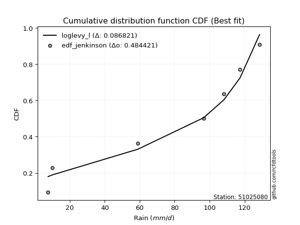</img>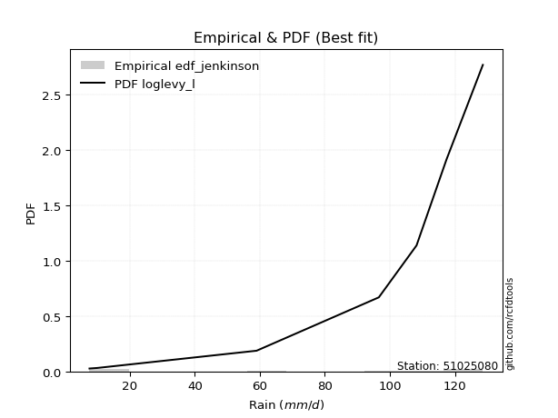</img>

</div>


### 11. EDF Cunnane (1978)

Cunnane´s work in statistical hydrology has focused on the performance and evaluation of different probability distributions (such as GEV, Gumbel, Lognormal) for flood frequency estimation. _b_ is a constant, typically set to 0.4.

<div align="center">


$P=(m-b)/(n+1-2b)$


</div>


**11.1. Empirical values**

<div align="center">

|                | 0                   | 1                   | 2                  | 3           | 4                  | 5                  | 6                  |
|:---------------|:--------------------|:--------------------|:-------------------|:------------|:-------------------|:-------------------|:-------------------|
| date           | 2024                | 2023                | 2017               | 2021        | 2018               | 2020               | 2019               |
| x              | 7.6                 | 10.0                | 59.0               | 96.6        | 108.2              | 117.4              | 128.6              |
| m              | 1                   | 2                   | 3                  | 4           | 5                  | 6                  | 7                  |
| empirical_dist | edf_cunnane         | edf_cunnane         | edf_cunnane        | edf_cunnane | edf_cunnane        | edf_cunnane        | edf_cunnane        |
| empirical      | 0.08333333333333333 | 0.22222222222222224 | 0.3611111111111111 | 0.5         | 0.6388888888888888 | 0.7777777777777777 | 0.9166666666666666 |
| empirical_tr   | 1.090909090909091   | 1.2857142857142856  | 1.565217391304348  | 2.0         | 2.7692307692307687 | 4.499999999999998  | 11.999999999999995 |

</div>


**11.2. Kolmogorov-Smirnov fit test (sorted by Δ)**


<div align="center">

|                | 0                   | 1                   | 2                   | 3                   | 4                   | 5                   | 6                   | 7                   | 8                   | 9                   | 10                  | 11                  | 12                  | 13                  | 14                  | 15                  | 16                  | 17                  | 18                  | 19                  | 20                  | 21                  | 22                  | 23                  | 24                  | 25                  | 26                  | 27                  | 28                  | 29                  | 30                  | 31                  | 32                  | 33                  | 34                  | 35                  | 36                  | 37                  | 38                  | 39                  | 40                  | 41                  | 42                  | 43                  | 44                  | 45                  | 46                  | 47                  | 48                  | 49                  | 50                  | 51                  | 52                  | 53                  | 54                  | 55                  | 56                  | 57                  | 58                  | 59                  | 60                  | 61                  | 62                  | 63                  | 64                  | 65                  | 66                  | 67                  | 68                  | 69                  | 70                  | 71                  | 72                  | 73                  | 74                  | 75                  | 76                  | 77                  | 78                  | 79                  | 80                  | 81                  | 82                  | 83                  | 84                  | 85                  | 86                  | 87                  | 88                  | 89                  | 90                  | 91                  | 92                  | 93                  | 94                  | 95                  | 96                  | 97                  | 98                  | 99                  | 100                 | 101                 | 102                 | 103                 | 104                 | 105                 | 106                 | 107                 | 108                 | 109                 | 110                 | 111                 | 112                 | 113                 | 114                 | 115                 | 116                 | 117                 | 118                 | 119                 | 120                 | 121                 | 122                 | 123                 | 124                 | 125                 | 126                 | 127                 | 128                 | 129                 | 130                 | 131                 | 132                 | 133                 | 134                 | 135                 | 136                 | 137                 | 138                 | 139                 | 140                 | 141                 | 142                 | 143                 | 144                 | 145                 | 146                 | 147                 | 148                 | 149                 | 150                 | 151                 | 152                 | 153                 | 154                 | 155                 | 156                 | 157                 | 158                 | 159                 |
|:---------------|:--------------------|:--------------------|:--------------------|:--------------------|:--------------------|:--------------------|:--------------------|:--------------------|:--------------------|:--------------------|:--------------------|:--------------------|:--------------------|:--------------------|:--------------------|:--------------------|:--------------------|:--------------------|:--------------------|:--------------------|:--------------------|:--------------------|:--------------------|:--------------------|:--------------------|:--------------------|:--------------------|:--------------------|:--------------------|:--------------------|:--------------------|:--------------------|:--------------------|:--------------------|:--------------------|:--------------------|:--------------------|:--------------------|:--------------------|:--------------------|:--------------------|:--------------------|:--------------------|:--------------------|:--------------------|:--------------------|:--------------------|:--------------------|:--------------------|:--------------------|:--------------------|:--------------------|:--------------------|:--------------------|:--------------------|:--------------------|:--------------------|:--------------------|:--------------------|:--------------------|:--------------------|:--------------------|:--------------------|:--------------------|:--------------------|:--------------------|:--------------------|:--------------------|:--------------------|:--------------------|:--------------------|:--------------------|:--------------------|:--------------------|:--------------------|:--------------------|:--------------------|:--------------------|:--------------------|:--------------------|:--------------------|:--------------------|:--------------------|:--------------------|:--------------------|:--------------------|:--------------------|:--------------------|:--------------------|:--------------------|:--------------------|:--------------------|:--------------------|:--------------------|:--------------------|:--------------------|:--------------------|:--------------------|:--------------------|:--------------------|:--------------------|:--------------------|:--------------------|:--------------------|:--------------------|:--------------------|:--------------------|:--------------------|:--------------------|:--------------------|:--------------------|:--------------------|:--------------------|:--------------------|:--------------------|:--------------------|:--------------------|:--------------------|:--------------------|:--------------------|:--------------------|:--------------------|:--------------------|:--------------------|:--------------------|:--------------------|:--------------------|:--------------------|:--------------------|:--------------------|:--------------------|:--------------------|:--------------------|:--------------------|:--------------------|:--------------------|:--------------------|:--------------------|:--------------------|:--------------------|:--------------------|:--------------------|:--------------------|:--------------------|:--------------------|:--------------------|:--------------------|:--------------------|:--------------------|:--------------------|:--------------------|:--------------------|:--------------------|:--------------------|:--------------------|:--------------------|:--------------------|:--------------------|:--------------------|:--------------------|
| station        | 51025080            | 51025080            | 51025080            | 51025080            | 51025080            | 51025080            | 51025080            | 51025080            | 51025080            | 51025080            | 51025080            | 51025080            | 51025080            | 51025080            | 51025080            | 51025080            | 51025080            | 51025080            | 51025080            | 51025080            | 51025080            | 51025080            | 51025080            | 51025080            | 51025080            | 51025080            | 51025080            | 51025080            | 51025080            | 51025080            | 51025080            | 51025080            | 51025080            | 51025080            | 51025080            | 51025080            | 51025080            | 51025080            | 51025080            | 51025080            | 51025080            | 51025080            | 51025080            | 51025080            | 51025080            | 51025080            | 51025080            | 51025080            | 51025080            | 51025080            | 51025080            | 51025080            | 51025080            | 51025080            | 51025080            | 51025080            | 51025080            | 51025080            | 51025080            | 51025080            | 51025080            | 51025080            | 51025080            | 51025080            | 51025080            | 51025080            | 51025080            | 51025080            | 51025080            | 51025080            | 51025080            | 51025080            | 51025080            | 51025080            | 51025080            | 51025080            | 51025080            | 51025080            | 51025080            | 51025080            | 51025080            | 51025080            | 51025080            | 51025080            | 51025080            | 51025080            | 51025080            | 51025080            | 51025080            | 51025080            | 51025080            | 51025080            | 51025080            | 51025080            | 51025080            | 51025080            | 51025080            | 51025080            | 51025080            | 51025080            | 51025080            | 51025080            | 51025080            | 51025080            | 51025080            | 51025080            | 51025080            | 51025080            | 51025080            | 51025080            | 51025080            | 51025080            | 51025080            | 51025080            | 51025080            | 51025080            | 51025080            | 51025080            | 51025080            | 51025080            | 51025080            | 51025080            | 51025080            | 51025080            | 51025080            | 51025080            | 51025080            | 51025080            | 51025080            | 51025080            | 51025080            | 51025080            | 51025080            | 51025080            | 51025080            | 51025080            | 51025080            | 51025080            | 51025080            | 51025080            | 51025080            | 51025080            | 51025080            | 51025080            | 51025080            | 51025080            | 51025080            | 51025080            | 51025080            | 51025080            | 51025080            | 51025080            | 51025080            | 51025080            | 51025080            | 51025080            | 51025080            | 51025080            | 51025080            | 51025080            |
| empirical_dist | edf_cunnane         | edf_cunnane         | edf_cunnane         | edf_cunnane         | edf_cunnane         | edf_cunnane         | edf_cunnane         | edf_cunnane         | edf_cunnane         | edf_cunnane         | edf_cunnane         | edf_cunnane         | edf_cunnane         | edf_cunnane         | edf_cunnane         | edf_cunnane         | edf_cunnane         | edf_cunnane         | edf_cunnane         | edf_cunnane         | edf_cunnane         | edf_cunnane         | edf_cunnane         | edf_cunnane         | edf_cunnane         | edf_cunnane         | edf_cunnane         | edf_cunnane         | edf_cunnane         | edf_cunnane         | edf_cunnane         | edf_cunnane         | edf_cunnane         | edf_cunnane         | edf_cunnane         | edf_cunnane         | edf_cunnane         | edf_cunnane         | edf_cunnane         | edf_cunnane         | edf_cunnane         | edf_cunnane         | edf_cunnane         | edf_cunnane         | edf_cunnane         | edf_cunnane         | edf_cunnane         | edf_cunnane         | edf_cunnane         | edf_cunnane         | edf_cunnane         | edf_cunnane         | edf_cunnane         | edf_cunnane         | edf_cunnane         | edf_cunnane         | edf_cunnane         | edf_cunnane         | edf_cunnane         | edf_cunnane         | edf_cunnane         | edf_cunnane         | edf_cunnane         | edf_cunnane         | edf_cunnane         | edf_cunnane         | edf_cunnane         | edf_cunnane         | edf_cunnane         | edf_cunnane         | edf_cunnane         | edf_cunnane         | edf_cunnane         | edf_cunnane         | edf_cunnane         | edf_cunnane         | edf_cunnane         | edf_cunnane         | edf_cunnane         | edf_cunnane         | edf_cunnane         | edf_cunnane         | edf_cunnane         | edf_cunnane         | edf_cunnane         | edf_cunnane         | edf_cunnane         | edf_cunnane         | edf_cunnane         | edf_cunnane         | edf_cunnane         | edf_cunnane         | edf_cunnane         | edf_cunnane         | edf_cunnane         | edf_cunnane         | edf_cunnane         | edf_cunnane         | edf_cunnane         | edf_cunnane         | edf_cunnane         | edf_cunnane         | edf_cunnane         | edf_cunnane         | edf_cunnane         | edf_cunnane         | edf_cunnane         | edf_cunnane         | edf_cunnane         | edf_cunnane         | edf_cunnane         | edf_cunnane         | edf_cunnane         | edf_cunnane         | edf_cunnane         | edf_cunnane         | edf_cunnane         | edf_cunnane         | edf_cunnane         | edf_cunnane         | edf_cunnane         | edf_cunnane         | edf_cunnane         | edf_cunnane         | edf_cunnane         | edf_cunnane         | edf_cunnane         | edf_cunnane         | edf_cunnane         | edf_cunnane         | edf_cunnane         | edf_cunnane         | edf_cunnane         | edf_cunnane         | edf_cunnane         | edf_cunnane         | edf_cunnane         | edf_cunnane         | edf_cunnane         | edf_cunnane         | edf_cunnane         | edf_cunnane         | edf_cunnane         | edf_cunnane         | edf_cunnane         | edf_cunnane         | edf_cunnane         | edf_cunnane         | edf_cunnane         | edf_cunnane         | edf_cunnane         | edf_cunnane         | edf_cunnane         | edf_cunnane         | edf_cunnane         | edf_cunnane         | edf_cunnane         | edf_cunnane         | edf_cunnane         | edf_cunnane         |
| p_dist         | loglevy_l           | johnsonsu           | trapezoid           | logweibull_max      | genhalflogistic     | ksone               | gumbel_l            | weibull_min         | wrapcauchy          | genextreme          | semicircular        | dweibull            | beta                | skewnorm            | triang              | anglit              | pearson3            | argus               | dgamma              | logtrapezoid        | genpareto           | loggenextreme       | gausshyper          | t                   | truncnorm           | crystalball         | norm                | exponnorm           | arcsine             | gamma               | erlang              | foldnorm            | logwrapcauchy       | logksone            | rice                | loggennorm          | logsemicircular     | invgauss            | levy_l              | maxwell             | lomax               | logistic            | invgamma            | logpearson3         | loganglit           | cosine              | rayleigh            | loggumbel_l         | logdgamma           | ncf                 | hypsecant           | kstwobign           | mielke              | logweibull_min      | betaprime           | genexpon            | logburr12           | logbetaprime        | logfatiguelife      | logerlang           | halfnorm            | logarcsine          | loggamma            | loggamma            | logf                | logcrystalball      | lognorm             | logt                | logexponnorm        | lognct              | burr                | logncf              | loggompertz         | logrice             | loginvgauss         | tukeylambda         | gumbel_r            | loginvgamma         | kappa3              | logalpha            | logburr             | logfoldnorm         | uniform             | vonmises_line       | loginvweibull       | logargus            | laplace             | logmaxwell          | halfgennorm         | logloggamma         | lograyleigh         | logmielke           | halflogistic        | loglogistic         | kappa4              | moyal               | bradford            | f                   | loghypsecant        | logcosine           | loggenexpon         | logkstwobign        | lognakagami         | loghalfnorm         | loggumbel_r         | loggenpareto        | gennorm             | loglaplace          | loglaplace          | loglomax            | nct                 | loghalflogistic     | logmoyal            | burr12              | wald                | truncexpon          | nakagami            | logloglaplace       | logdweibull         | loggenhalflogistic  | logbeta             | loghalfgennorm      | loggausshyper       | logskewnorm         | truncweibull_min    | logtriang           | gompertz            | loggengamma         | logkappa4           | logwald             | johnsonsb           | logkappa3           | logexponweib        | exponweib           | gengamma            | logtukeylambda      | logbradford         | loguniform          | logvonmises_line    | alpha               | logtruncnorm        | logtruncexpon       | logtruncweibull_min | invweibull          | fatiguelife         | logrdist            | powerlaw            | logexponpow         | logjohnsonsu        | exponpow            | weibull_max         | truncpareto         | logpowerlaw         | logjohnsonsb        | logtruncpareto      | rdist               | genlogistic         | loggenlogistic      | logvonmises         | vonmises            |
| delta          | 0.09698382176563174 | 0.10435890028006306 | 0.12139433950693157 | 0.12177750078241267 | 0.12554042577773772 | 0.13141685190888264 | 0.1345684194504746  | 0.13898863197532857 | 0.13976681679481084 | 0.1405080208972519  | 0.14364659906502786 | 0.14727476929721617 | 0.14897968288772656 | 0.1514014017510703  | 0.15171556289307575 | 0.1531166257443881  | 0.15375720698935957 | 0.15666117429752127 | 0.15678025232509712 | 0.1631568268623691  | 0.16754962680715374 | 0.16768910944347104 | 0.17235997172738832 | 0.17552033100091768 | 0.17553217659900877 | 0.1755321835337742  | 0.17553218478242916 | 0.17553257066007333 | 0.1760741201292094  | 0.17660089934303735 | 0.17702711064780596 | 0.17994502583590033 | 0.18113476225495312 | 0.18510388666223726 | 0.18529270625123173 | 0.18599192485611787 | 0.18979374368442087 | 0.1930428752733413  | 0.1937147878058209  | 0.19433740181359294 | 0.1954436261769479  | 0.19544843104339715 | 0.19656820925336405 | 0.1968916246960748  | 0.19921853553865843 | 0.19964839048070426 | 0.1999085804893287  | 0.20215106375226266 | 0.2072099861237551  | 0.2082786891344438  | 0.21038390711274557 | 0.21312087533097868 | 0.21591803055859904 | 0.2177991763445808  | 0.21927003530220723 | 0.22012697706864404 | 0.2205182867557962  | 0.22197076339032007 | 0.22204967254287167 | 0.22219739261330407 | 0.22222222222222224 | 0.22222222222222224 | 0.22428589440951263 | 0.22428589440951263 | 0.2245681235180612  | 0.22555758977819518 | 0.22555761408064423 | 0.22555787264656268 | 0.22555977019128592 | 0.2256556586636025  | 0.2277954277248847  | 0.22803750683771468 | 0.22863828490635596 | 0.2288368874983837  | 0.2289740322579895  | 0.22964969529302692 | 0.23114306869950674 | 0.2315890986499498  | 0.2319110959526336  | 0.2325222907771658  | 0.2340318196319381  | 0.23409667228154107 | 0.23553719008264462 | 0.23556796206189978 | 0.23734061776844945 | 0.23734131143511006 | 0.23735596485483823 | 0.23829843761686087 | 0.23916918434212248 | 0.24149187483270684 | 0.2419746303129391  | 0.24307214700467294 | 0.2440007177640866  | 0.2478634448123911  | 0.24882986279975983 | 0.249306062416619   | 0.2497512491059536  | 0.2571750867384043  | 0.2632641599543164  | 0.2634999517095067  | 0.2654091327425155  | 0.2657041284477613  | 0.2664642438572598  | 0.267776092845816   | 0.2719163079412456  | 0.27745896915397417 | 0.2777777777777778  | 0.2858057993783647  | 0.2858057993783647  | 0.28756129931042435 | 0.2896008734510113  | 0.29546883457203593 | 0.2962747454438159  | 0.3014835483374884  | 0.3015636467715511  | 0.30581116670251307 | 0.3071356546516862  | 0.30759814670209484 | 0.3109409946729219  | 0.3233204815622758  | 0.32458812481954574 | 0.3270258532954417  | 0.3284745640404837  | 0.346298459889697   | 0.3598602437021434  | 0.3610728131716264  | 0.36110932342331414 | 0.36180724507913004 | 0.3630081021388869  | 0.3638814835036715  | 0.3738246493264121  | 0.3808501118367478  | 0.3829883941075605  | 0.3842895334717819  | 0.3879253981192508  | 0.39403683561223346 | 0.39664479928597063 | 0.39884315135808823 | 0.39941853104470115 | 0.42637991630567534 | 0.43089126409063744 | 0.4355669479267528  | 0.44173247837472324 | 0.4690184757312668  | 0.4751693673137101  | 0.4999999926274469  | 0.5137252274679887  | 0.5267755210348937  | 0.5302508550699516  | 0.5797252080719957  | 0.5807678579061883  | 0.5811679551144313  | 0.5830387960777017  | 0.5985565366967085  | 0.6163909369589169  | 0.638888887333279   | 0.7777777777777777  | 0.7777777777777777  | 1.1280835734305934  | 19.72177672416885   |
| deltao         | 0.48442053926100004 | 0.48442053926100004 | 0.48442053926100004 | 0.48442053926100004 | 0.48442053926100004 | 0.48442053926100004 | 0.48442053926100004 | 0.48442053926100004 | 0.48442053926100004 | 0.48442053926100004 | 0.48442053926100004 | 0.48442053926100004 | 0.48442053926100004 | 0.48442053926100004 | 0.48442053926100004 | 0.48442053926100004 | 0.48442053926100004 | 0.48442053926100004 | 0.48442053926100004 | 0.48442053926100004 | 0.48442053926100004 | 0.48442053926100004 | 0.48442053926100004 | 0.48442053926100004 | 0.48442053926100004 | 0.48442053926100004 | 0.48442053926100004 | 0.48442053926100004 | 0.48442053926100004 | 0.48442053926100004 | 0.48442053926100004 | 0.48442053926100004 | 0.48442053926100004 | 0.48442053926100004 | 0.48442053926100004 | 0.48442053926100004 | 0.48442053926100004 | 0.48442053926100004 | 0.48442053926100004 | 0.48442053926100004 | 0.48442053926100004 | 0.48442053926100004 | 0.48442053926100004 | 0.48442053926100004 | 0.48442053926100004 | 0.48442053926100004 | 0.48442053926100004 | 0.48442053926100004 | 0.48442053926100004 | 0.48442053926100004 | 0.48442053926100004 | 0.48442053926100004 | 0.48442053926100004 | 0.48442053926100004 | 0.48442053926100004 | 0.48442053926100004 | 0.48442053926100004 | 0.48442053926100004 | 0.48442053926100004 | 0.48442053926100004 | 0.48442053926100004 | 0.48442053926100004 | 0.48442053926100004 | 0.48442053926100004 | 0.48442053926100004 | 0.48442053926100004 | 0.48442053926100004 | 0.48442053926100004 | 0.48442053926100004 | 0.48442053926100004 | 0.48442053926100004 | 0.48442053926100004 | 0.48442053926100004 | 0.48442053926100004 | 0.48442053926100004 | 0.48442053926100004 | 0.48442053926100004 | 0.48442053926100004 | 0.48442053926100004 | 0.48442053926100004 | 0.48442053926100004 | 0.48442053926100004 | 0.48442053926100004 | 0.48442053926100004 | 0.48442053926100004 | 0.48442053926100004 | 0.48442053926100004 | 0.48442053926100004 | 0.48442053926100004 | 0.48442053926100004 | 0.48442053926100004 | 0.48442053926100004 | 0.48442053926100004 | 0.48442053926100004 | 0.48442053926100004 | 0.48442053926100004 | 0.48442053926100004 | 0.48442053926100004 | 0.48442053926100004 | 0.48442053926100004 | 0.48442053926100004 | 0.48442053926100004 | 0.48442053926100004 | 0.48442053926100004 | 0.48442053926100004 | 0.48442053926100004 | 0.48442053926100004 | 0.48442053926100004 | 0.48442053926100004 | 0.48442053926100004 | 0.48442053926100004 | 0.48442053926100004 | 0.48442053926100004 | 0.48442053926100004 | 0.48442053926100004 | 0.48442053926100004 | 0.48442053926100004 | 0.48442053926100004 | 0.48442053926100004 | 0.48442053926100004 | 0.48442053926100004 | 0.48442053926100004 | 0.48442053926100004 | 0.48442053926100004 | 0.48442053926100004 | 0.48442053926100004 | 0.48442053926100004 | 0.48442053926100004 | 0.48442053926100004 | 0.48442053926100004 | 0.48442053926100004 | 0.48442053926100004 | 0.48442053926100004 | 0.48442053926100004 | 0.48442053926100004 | 0.48442053926100004 | 0.48442053926100004 | 0.48442053926100004 | 0.48442053926100004 | 0.48442053926100004 | 0.48442053926100004 | 0.48442053926100004 | 0.48442053926100004 | 0.48442053926100004 | 0.48442053926100004 | 0.48442053926100004 | 0.48442053926100004 | 0.48442053926100004 | 0.48442053926100004 | 0.48442053926100004 | 0.48442053926100004 | 0.48442053926100004 | 0.48442053926100004 | 0.48442053926100004 | 0.48442053926100004 | 0.48442053926100004 | 0.48442053926100004 | 0.48442053926100004 | 0.48442053926100004 | 0.48442053926100004 |
| eval           | Δo > Δ              | Δo > Δ              | Δo > Δ              | Δo > Δ              | Δo > Δ              | Δo > Δ              | Δo > Δ              | Δo > Δ              | Δo > Δ              | Δo > Δ              | Δo > Δ              | Δo > Δ              | Δo > Δ              | Δo > Δ              | Δo > Δ              | Δo > Δ              | Δo > Δ              | Δo > Δ              | Δo > Δ              | Δo > Δ              | Δo > Δ              | Δo > Δ              | Δo > Δ              | Δo > Δ              | Δo > Δ              | Δo > Δ              | Δo > Δ              | Δo > Δ              | Δo > Δ              | Δo > Δ              | Δo > Δ              | Δo > Δ              | Δo > Δ              | Δo > Δ              | Δo > Δ              | Δo > Δ              | Δo > Δ              | Δo > Δ              | Δo > Δ              | Δo > Δ              | Δo > Δ              | Δo > Δ              | Δo > Δ              | Δo > Δ              | Δo > Δ              | Δo > Δ              | Δo > Δ              | Δo > Δ              | Δo > Δ              | Δo > Δ              | Δo > Δ              | Δo > Δ              | Δo > Δ              | Δo > Δ              | Δo > Δ              | Δo > Δ              | Δo > Δ              | Δo > Δ              | Δo > Δ              | Δo > Δ              | Δo > Δ              | Δo > Δ              | Δo > Δ              | Δo > Δ              | Δo > Δ              | Δo > Δ              | Δo > Δ              | Δo > Δ              | Δo > Δ              | Δo > Δ              | Δo > Δ              | Δo > Δ              | Δo > Δ              | Δo > Δ              | Δo > Δ              | Δo > Δ              | Δo > Δ              | Δo > Δ              | Δo > Δ              | Δo > Δ              | Δo > Δ              | Δo > Δ              | Δo > Δ              | Δo > Δ              | Δo > Δ              | Δo > Δ              | Δo > Δ              | Δo > Δ              | Δo > Δ              | Δo > Δ              | Δo > Δ              | Δo > Δ              | Δo > Δ              | Δo > Δ              | Δo > Δ              | Δo > Δ              | Δo > Δ              | Δo > Δ              | Δo > Δ              | Δo > Δ              | Δo > Δ              | Δo > Δ              | Δo > Δ              | Δo > Δ              | Δo > Δ              | Δo > Δ              | Δo > Δ              | Δo > Δ              | Δo > Δ              | Δo > Δ              | Δo > Δ              | Δo > Δ              | Δo > Δ              | Δo > Δ              | Δo > Δ              | Δo > Δ              | Δo > Δ              | Δo > Δ              | Δo > Δ              | Δo > Δ              | Δo > Δ              | Δo > Δ              | Δo > Δ              | Δo > Δ              | Δo > Δ              | Δo > Δ              | Δo > Δ              | Δo > Δ              | Δo > Δ              | Δo > Δ              | Δo > Δ              | Δo > Δ              | Δo > Δ              | Δo > Δ              | Δo > Δ              | Δo > Δ              | Δo > Δ              | Δo > Δ              | Δo > Δ              | Δo > Δ              | Δo > Δ              | Δo > Δ              | Δo > Δ              | Δo > Δ              | Δo > Δ              | Δo <= Δ             | Δo <= Δ             | Δo <= Δ             | Δo <= Δ             | Δo <= Δ             | Δo <= Δ             | Δo <= Δ             | Δo <= Δ             | Δo <= Δ             | Δo <= Δ             | Δo <= Δ             | Δo <= Δ             | Δo <= Δ             | Δo <= Δ             | Δo <= Δ             |
| fit            | 1                   | 1                   | 1                   | 1                   | 1                   | 1                   | 1                   | 1                   | 1                   | 1                   | 1                   | 1                   | 1                   | 1                   | 1                   | 1                   | 1                   | 1                   | 1                   | 1                   | 1                   | 1                   | 1                   | 1                   | 1                   | 1                   | 1                   | 1                   | 1                   | 1                   | 1                   | 1                   | 1                   | 1                   | 1                   | 1                   | 1                   | 1                   | 1                   | 1                   | 1                   | 1                   | 1                   | 1                   | 1                   | 1                   | 1                   | 1                   | 1                   | 1                   | 1                   | 1                   | 1                   | 1                   | 1                   | 1                   | 1                   | 1                   | 1                   | 1                   | 1                   | 1                   | 1                   | 1                   | 1                   | 1                   | 1                   | 1                   | 1                   | 1                   | 1                   | 1                   | 1                   | 1                   | 1                   | 1                   | 1                   | 1                   | 1                   | 1                   | 1                   | 1                   | 1                   | 1                   | 1                   | 1                   | 1                   | 1                   | 1                   | 1                   | 1                   | 1                   | 1                   | 1                   | 1                   | 1                   | 1                   | 1                   | 1                   | 1                   | 1                   | 1                   | 1                   | 1                   | 1                   | 1                   | 1                   | 1                   | 1                   | 1                   | 1                   | 1                   | 1                   | 1                   | 1                   | 1                   | 1                   | 1                   | 1                   | 1                   | 1                   | 1                   | 1                   | 1                   | 1                   | 1                   | 1                   | 1                   | 1                   | 1                   | 1                   | 1                   | 1                   | 1                   | 1                   | 1                   | 1                   | 1                   | 1                   | 1                   | 1                   | 1                   | 1                   | 1                   | 1                   | 0                   | 0                   | 0                   | 0                   | 0                   | 0                   | 0                   | 0                   | 0                   | 0                   | 0                   | 0                   | 0                   | 0                   | 0                   |
| n              | 7                   | 7                   | 7                   | 7                   | 7                   | 7                   | 7                   | 7                   | 7                   | 7                   | 7                   | 7                   | 7                   | 7                   | 7                   | 7                   | 7                   | 7                   | 7                   | 7                   | 7                   | 7                   | 7                   | 7                   | 7                   | 7                   | 7                   | 7                   | 7                   | 7                   | 7                   | 7                   | 7                   | 7                   | 7                   | 7                   | 7                   | 7                   | 7                   | 7                   | 7                   | 7                   | 7                   | 7                   | 7                   | 7                   | 7                   | 7                   | 7                   | 7                   | 7                   | 7                   | 7                   | 7                   | 7                   | 7                   | 7                   | 7                   | 7                   | 7                   | 7                   | 7                   | 7                   | 7                   | 7                   | 7                   | 7                   | 7                   | 7                   | 7                   | 7                   | 7                   | 7                   | 7                   | 7                   | 7                   | 7                   | 7                   | 7                   | 7                   | 7                   | 7                   | 7                   | 7                   | 7                   | 7                   | 7                   | 7                   | 7                   | 7                   | 7                   | 7                   | 7                   | 7                   | 7                   | 7                   | 7                   | 7                   | 7                   | 7                   | 7                   | 7                   | 7                   | 7                   | 7                   | 7                   | 7                   | 7                   | 7                   | 7                   | 7                   | 7                   | 7                   | 7                   | 7                   | 7                   | 7                   | 7                   | 7                   | 7                   | 7                   | 7                   | 7                   | 7                   | 7                   | 7                   | 7                   | 7                   | 7                   | 7                   | 7                   | 7                   | 7                   | 7                   | 7                   | 7                   | 7                   | 7                   | 7                   | 7                   | 7                   | 7                   | 7                   | 7                   | 7                   | 7                   | 7                   | 7                   | 7                   | 7                   | 7                   | 7                   | 7                   | 7                   | 7                   | 7                   | 7                   | 7                   | 7                   | 7                   |
| best_fit       | 1                   | 0                   | 0                   | 0                   | 0                   | 0                   | 0                   | 0                   | 0                   | 0                   | 0                   | 0                   | 0                   | 0                   | 0                   | 0                   | 0                   | 0                   | 0                   | 0                   | 0                   | 0                   | 0                   | 0                   | 0                   | 0                   | 0                   | 0                   | 0                   | 0                   | 0                   | 0                   | 0                   | 0                   | 0                   | 0                   | 0                   | 0                   | 0                   | 0                   | 0                   | 0                   | 0                   | 0                   | 0                   | 0                   | 0                   | 0                   | 0                   | 0                   | 0                   | 0                   | 0                   | 0                   | 0                   | 0                   | 0                   | 0                   | 0                   | 0                   | 0                   | 0                   | 0                   | 0                   | 0                   | 0                   | 0                   | 0                   | 0                   | 0                   | 0                   | 0                   | 0                   | 0                   | 0                   | 0                   | 0                   | 0                   | 0                   | 0                   | 0                   | 0                   | 0                   | 0                   | 0                   | 0                   | 0                   | 0                   | 0                   | 0                   | 0                   | 0                   | 0                   | 0                   | 0                   | 0                   | 0                   | 0                   | 0                   | 0                   | 0                   | 0                   | 0                   | 0                   | 0                   | 0                   | 0                   | 0                   | 0                   | 0                   | 0                   | 0                   | 0                   | 0                   | 0                   | 0                   | 0                   | 0                   | 0                   | 0                   | 0                   | 0                   | 0                   | 0                   | 0                   | 0                   | 0                   | 0                   | 0                   | 0                   | 0                   | 0                   | 0                   | 0                   | 0                   | 0                   | 0                   | 0                   | 0                   | 0                   | 0                   | 0                   | 0                   | 0                   | 0                   | 0                   | 0                   | 0                   | 0                   | 0                   | 0                   | 0                   | 0                   | 0                   | 0                   | 0                   | 0                   | 0                   | 0                   | 0                   |
| best_fit_sort  | 1                   | 2                   | 3                   | 4                   | 5                   | 6                   | 7                   | 8                   | 9                   | 10                  | 11                  | 12                  | 13                  | 14                  | 15                  | 16                  | 17                  | 18                  | 19                  | 20                  | 21                  | 22                  | 23                  | 24                  | 25                  | 26                  | 27                  | 28                  | 29                  | 30                  | 31                  | 32                  | 33                  | 34                  | 35                  | 36                  | 37                  | 38                  | 39                  | 40                  | 41                  | 42                  | 43                  | 44                  | 45                  | 46                  | 47                  | 48                  | 49                  | 50                  | 51                  | 52                  | 53                  | 54                  | 55                  | 56                  | 57                  | 58                  | 59                  | 60                  | 61                  | 62                  | 63                  | 64                  | 65                  | 66                  | 67                  | 68                  | 69                  | 70                  | 71                  | 72                  | 73                  | 74                  | 75                  | 76                  | 77                  | 78                  | 79                  | 80                  | 81                  | 82                  | 83                  | 84                  | 85                  | 86                  | 87                  | 88                  | 89                  | 90                  | 91                  | 92                  | 93                  | 94                  | 95                  | 96                  | 97                  | 98                  | 99                  | 100                 | 101                 | 102                 | 103                 | 104                 | 105                 | 106                 | 107                 | 108                 | 109                 | 110                 | 111                 | 112                 | 113                 | 114                 | 115                 | 116                 | 117                 | 118                 | 119                 | 120                 | 121                 | 122                 | 123                 | 124                 | 125                 | 126                 | 127                 | 128                 | 129                 | 130                 | 131                 | 132                 | 133                 | 134                 | 135                 | 136                 | 137                 | 138                 | 139                 | 140                 | 141                 | 142                 | 143                 | 144                 | 145                 | 146                 | 147                 | 148                 | 149                 | 150                 | 151                 | 152                 | 153                 | 154                 | 155                 | 156                 | 157                 | 158                 | 159                 | 160                 |

</div>


**11.3. Best fit**

<div align="center">

|   id |   station | empirical_dist   | p_dist    |     delta |   deltao | eval   |   fit |   n |   best_fit |   best_fit_sort |
|-----:|----------:|:-----------------|:----------|----------:|---------:|:-------|------:|----:|-----------:|----------------:|
|    0 |  51025080 | edf_cunnane      | loglevy_l | 0.0969838 | 0.484421 | Δo > Δ |     1 |   7 |          1 |               1 |

</div>


<div align="center">

</img></img>

</div>


### 12. EDF Adamowski (1981)

The Adamowski formula in hydrology refers to a specific plotting position formula used for estimating the non-parametric empirical distribution of hydrological events (like flood peaks) to calculate their return periods. This formula provides an alternative to traditional parametric methods (like the Gumbel or Log Pearson Type III distributions). 

<div align="center">


$P=(m-0.25)/(n+0.5)$


</div>


**12.1. Empirical values**

<div align="center">

|                | 0                  | 1                   | 2                   | 3             | 4                  | 5                  | 6                  |
|:---------------|:-------------------|:--------------------|:--------------------|:--------------|:-------------------|:-------------------|:-------------------|
| date           | 2024               | 2023                | 2017                | 2021          | 2018               | 2020               | 2019               |
| x              | 7.6                | 10.0                | 59.0                | 96.6          | 108.2              | 117.4              | 128.6              |
| m              | 1                  | 2                   | 3                   | 4             | 5                  | 6                  | 7                  |
| empirical_dist | edf_adamowski      | edf_adamowski       | edf_adamowski       | edf_adamowski | edf_adamowski      | edf_adamowski      | edf_adamowski      |
| empirical      | 0.1                | 0.23333333333333334 | 0.36666666666666664 | 0.5           | 0.6333333333333333 | 0.7666666666666667 | 0.9                |
| empirical_tr   | 1.1111111111111112 | 1.3043478260869565  | 1.5789473684210527  | 2.0           | 2.727272727272727  | 4.2857142857142865 | 10.000000000000002 |

</div>


**12.2. Kolmogorov-Smirnov fit test (sorted by Δ)**


<div align="center">

|                | 0                   | 1                   | 2                   | 3                   | 4                   | 5                   | 6                   | 7                   | 8                   | 9                   | 10                  | 11                  | 12                  | 13                  | 14                  | 15                  | 16                  | 17                  | 18                  | 19                  | 20                  | 21                  | 22                  | 23                  | 24                  | 25                  | 26                  | 27                  | 28                  | 29                  | 30                  | 31                  | 32                  | 33                  | 34                  | 35                  | 36                  | 37                  | 38                  | 39                  | 40                  | 41                  | 42                  | 43                  | 44                  | 45                  | 46                  | 47                  | 48                  | 49                  | 50                  | 51                  | 52                  | 53                  | 54                  | 55                  | 56                  | 57                  | 58                  | 59                  | 60                  | 61                  | 62                  | 63                  | 64                  | 65                  | 66                  | 67                  | 68                  | 69                  | 70                  | 71                  | 72                  | 73                  | 74                  | 75                  | 76                  | 77                  | 78                  | 79                  | 80                  | 81                  | 82                  | 83                  | 84                  | 85                  | 86                  | 87                  | 88                  | 89                  | 90                  | 91                  | 92                  | 93                  | 94                  | 95                  | 96                  | 97                  | 98                  | 99                  | 100                 | 101                 | 102                 | 103                 | 104                 | 105                 | 106                 | 107                 | 108                 | 109                 | 110                 | 111                 | 112                 | 113                 | 114                 | 115                 | 116                 | 117                 | 118                 | 119                 | 120                 | 121                 | 122                 | 123                 | 124                 | 125                 | 126                 | 127                 | 128                 | 129                 | 130                 | 131                 | 132                 | 133                 | 134                 | 135                 | 136                 | 137                 | 138                 | 139                 | 140                 | 141                 | 142                 | 143                 | 144                 | 145                 | 146                 | 147                 | 148                 | 149                 | 150                 | 151                 | 152                 | 153                 | 154                 | 155                 | 156                 | 157                 | 158                 | 159                 |
|:---------------|:--------------------|:--------------------|:--------------------|:--------------------|:--------------------|:--------------------|:--------------------|:--------------------|:--------------------|:--------------------|:--------------------|:--------------------|:--------------------|:--------------------|:--------------------|:--------------------|:--------------------|:--------------------|:--------------------|:--------------------|:--------------------|:--------------------|:--------------------|:--------------------|:--------------------|:--------------------|:--------------------|:--------------------|:--------------------|:--------------------|:--------------------|:--------------------|:--------------------|:--------------------|:--------------------|:--------------------|:--------------------|:--------------------|:--------------------|:--------------------|:--------------------|:--------------------|:--------------------|:--------------------|:--------------------|:--------------------|:--------------------|:--------------------|:--------------------|:--------------------|:--------------------|:--------------------|:--------------------|:--------------------|:--------------------|:--------------------|:--------------------|:--------------------|:--------------------|:--------------------|:--------------------|:--------------------|:--------------------|:--------------------|:--------------------|:--------------------|:--------------------|:--------------------|:--------------------|:--------------------|:--------------------|:--------------------|:--------------------|:--------------------|:--------------------|:--------------------|:--------------------|:--------------------|:--------------------|:--------------------|:--------------------|:--------------------|:--------------------|:--------------------|:--------------------|:--------------------|:--------------------|:--------------------|:--------------------|:--------------------|:--------------------|:--------------------|:--------------------|:--------------------|:--------------------|:--------------------|:--------------------|:--------------------|:--------------------|:--------------------|:--------------------|:--------------------|:--------------------|:--------------------|:--------------------|:--------------------|:--------------------|:--------------------|:--------------------|:--------------------|:--------------------|:--------------------|:--------------------|:--------------------|:--------------------|:--------------------|:--------------------|:--------------------|:--------------------|:--------------------|:--------------------|:--------------------|:--------------------|:--------------------|:--------------------|:--------------------|:--------------------|:--------------------|:--------------------|:--------------------|:--------------------|:--------------------|:--------------------|:--------------------|:--------------------|:--------------------|:--------------------|:--------------------|:--------------------|:--------------------|:--------------------|:--------------------|:--------------------|:--------------------|:--------------------|:--------------------|:--------------------|:--------------------|:--------------------|:--------------------|:--------------------|:--------------------|:--------------------|:--------------------|:--------------------|:--------------------|:--------------------|:--------------------|:--------------------|:--------------------|
| station        | 51025080            | 51025080            | 51025080            | 51025080            | 51025080            | 51025080            | 51025080            | 51025080            | 51025080            | 51025080            | 51025080            | 51025080            | 51025080            | 51025080            | 51025080            | 51025080            | 51025080            | 51025080            | 51025080            | 51025080            | 51025080            | 51025080            | 51025080            | 51025080            | 51025080            | 51025080            | 51025080            | 51025080            | 51025080            | 51025080            | 51025080            | 51025080            | 51025080            | 51025080            | 51025080            | 51025080            | 51025080            | 51025080            | 51025080            | 51025080            | 51025080            | 51025080            | 51025080            | 51025080            | 51025080            | 51025080            | 51025080            | 51025080            | 51025080            | 51025080            | 51025080            | 51025080            | 51025080            | 51025080            | 51025080            | 51025080            | 51025080            | 51025080            | 51025080            | 51025080            | 51025080            | 51025080            | 51025080            | 51025080            | 51025080            | 51025080            | 51025080            | 51025080            | 51025080            | 51025080            | 51025080            | 51025080            | 51025080            | 51025080            | 51025080            | 51025080            | 51025080            | 51025080            | 51025080            | 51025080            | 51025080            | 51025080            | 51025080            | 51025080            | 51025080            | 51025080            | 51025080            | 51025080            | 51025080            | 51025080            | 51025080            | 51025080            | 51025080            | 51025080            | 51025080            | 51025080            | 51025080            | 51025080            | 51025080            | 51025080            | 51025080            | 51025080            | 51025080            | 51025080            | 51025080            | 51025080            | 51025080            | 51025080            | 51025080            | 51025080            | 51025080            | 51025080            | 51025080            | 51025080            | 51025080            | 51025080            | 51025080            | 51025080            | 51025080            | 51025080            | 51025080            | 51025080            | 51025080            | 51025080            | 51025080            | 51025080            | 51025080            | 51025080            | 51025080            | 51025080            | 51025080            | 51025080            | 51025080            | 51025080            | 51025080            | 51025080            | 51025080            | 51025080            | 51025080            | 51025080            | 51025080            | 51025080            | 51025080            | 51025080            | 51025080            | 51025080            | 51025080            | 51025080            | 51025080            | 51025080            | 51025080            | 51025080            | 51025080            | 51025080            | 51025080            | 51025080            | 51025080            | 51025080            | 51025080            | 51025080            |
| empirical_dist | edf_adamowski       | edf_adamowski       | edf_adamowski       | edf_adamowski       | edf_adamowski       | edf_adamowski       | edf_adamowski       | edf_adamowski       | edf_adamowski       | edf_adamowski       | edf_adamowski       | edf_adamowski       | edf_adamowski       | edf_adamowski       | edf_adamowski       | edf_adamowski       | edf_adamowski       | edf_adamowski       | edf_adamowski       | edf_adamowski       | edf_adamowski       | edf_adamowski       | edf_adamowski       | edf_adamowski       | edf_adamowski       | edf_adamowski       | edf_adamowski       | edf_adamowski       | edf_adamowski       | edf_adamowski       | edf_adamowski       | edf_adamowski       | edf_adamowski       | edf_adamowski       | edf_adamowski       | edf_adamowski       | edf_adamowski       | edf_adamowski       | edf_adamowski       | edf_adamowski       | edf_adamowski       | edf_adamowski       | edf_adamowski       | edf_adamowski       | edf_adamowski       | edf_adamowski       | edf_adamowski       | edf_adamowski       | edf_adamowski       | edf_adamowski       | edf_adamowski       | edf_adamowski       | edf_adamowski       | edf_adamowski       | edf_adamowski       | edf_adamowski       | edf_adamowski       | edf_adamowski       | edf_adamowski       | edf_adamowski       | edf_adamowski       | edf_adamowski       | edf_adamowski       | edf_adamowski       | edf_adamowski       | edf_adamowski       | edf_adamowski       | edf_adamowski       | edf_adamowski       | edf_adamowski       | edf_adamowski       | edf_adamowski       | edf_adamowski       | edf_adamowski       | edf_adamowski       | edf_adamowski       | edf_adamowski       | edf_adamowski       | edf_adamowski       | edf_adamowski       | edf_adamowski       | edf_adamowski       | edf_adamowski       | edf_adamowski       | edf_adamowski       | edf_adamowski       | edf_adamowski       | edf_adamowski       | edf_adamowski       | edf_adamowski       | edf_adamowski       | edf_adamowski       | edf_adamowski       | edf_adamowski       | edf_adamowski       | edf_adamowski       | edf_adamowski       | edf_adamowski       | edf_adamowski       | edf_adamowski       | edf_adamowski       | edf_adamowski       | edf_adamowski       | edf_adamowski       | edf_adamowski       | edf_adamowski       | edf_adamowski       | edf_adamowski       | edf_adamowski       | edf_adamowski       | edf_adamowski       | edf_adamowski       | edf_adamowski       | edf_adamowski       | edf_adamowski       | edf_adamowski       | edf_adamowski       | edf_adamowski       | edf_adamowski       | edf_adamowski       | edf_adamowski       | edf_adamowski       | edf_adamowski       | edf_adamowski       | edf_adamowski       | edf_adamowski       | edf_adamowski       | edf_adamowski       | edf_adamowski       | edf_adamowski       | edf_adamowski       | edf_adamowski       | edf_adamowski       | edf_adamowski       | edf_adamowski       | edf_adamowski       | edf_adamowski       | edf_adamowski       | edf_adamowski       | edf_adamowski       | edf_adamowski       | edf_adamowski       | edf_adamowski       | edf_adamowski       | edf_adamowski       | edf_adamowski       | edf_adamowski       | edf_adamowski       | edf_adamowski       | edf_adamowski       | edf_adamowski       | edf_adamowski       | edf_adamowski       | edf_adamowski       | edf_adamowski       | edf_adamowski       | edf_adamowski       | edf_adamowski       | edf_adamowski       | edf_adamowski       |
| p_dist         | loglevy_l           | johnsonsu           | trapezoid           | logweibull_max      | genhalflogistic     | ksone               | beta                | semicircular        | gumbel_l            | genextreme          | weibull_min         | wrapcauchy          | skewnorm            | logtrapezoid        | anglit              | pearson3            | dweibull            | triang              | gausshyper          | loggenextreme       | argus               | dgamma              | t                   | truncnorm           | crystalball         | norm                | exponnorm           | logwrapcauchy       | gamma               | erlang              | levy_l              | genpareto           | logksone            | foldnorm            | rice                | arcsine             | logsemicircular     | loggennorm          | invgauss            | maxwell             | logistic            | invgamma            | logpearson3         | loganglit           | cosine              | rayleigh            | loggumbel_l         | lomax               | ncf                 | hypsecant           | logdgamma           | kstwobign           | mielke              | logweibull_min      | betaprime           | genexpon            | logburr12           | logbetaprime        | logfatiguelife      | logerlang           | loggamma            | loggamma            | logf                | logncf              | logcrystalball      | lognorm             | logt                | logexponnorm        | lognct              | burr                | loggompertz         | logrice             | loginvgauss         | tukeylambda         | gumbel_r            | loginvgamma         | loginvweibull       | kappa3              | logalpha            | logarcsine          | halfnorm            | logburr             | logfoldnorm         | halfgennorm         | uniform             | vonmises_line       | logargus            | laplace             | logmaxwell          | logloggamma         | lograyleigh         | logmielke           | halflogistic        | loglogistic         | kappa4              | moyal               | bradford            | f                   | loggenexpon         | logkstwobign        | lognakagami         | loghalfnorm         | loghypsecant        | logcosine           | gennorm             | loggumbel_r         | loggenpareto        | loglomax            | nct                 | loglaplace          | loglaplace          | loghalflogistic     | logmoyal            | logloglaplace       | logdweibull         | burr12              | wald                | nakagami            | truncexpon          | logbeta             | loghalfgennorm      | loggenhalflogistic  | loggausshyper       | logskewnorm         | loggengamma         | johnsonsb           | logwald             | truncweibull_min    | logtriang           | logkappa4           | gompertz            | logexponweib        | exponweib           | logkappa3           | gengamma            | logtukeylambda      | logbradford         | loguniform          | logvonmises_line    | alpha               | logtruncnorm        | logtruncexpon       | logtruncweibull_min | invweibull          | fatiguelife         | logrdist            | powerlaw            | logjohnsonsu        | logexponpow         | weibull_max         | exponpow            | truncpareto         | logpowerlaw         | logjohnsonsb        | logtruncpareto      | rdist               | genlogistic         | loggenlogistic      | logvonmises         | vonmises            |
| delta          | 0.08031715509896506 | 0.1099144558356186  | 0.12139433950693157 | 0.12177750078241267 | 0.12554042577773772 | 0.1372988445102346  | 0.1378685717766156  | 0.14364659906502786 | 0.14425793342933288 | 0.1475840689148577  | 0.15009974308643967 | 0.15087792790592194 | 0.1514014017510703  | 0.15278993957360987 | 0.1531166257443881  | 0.15375720698935957 | 0.15838588040832724 | 0.16282667400418688 | 0.16680441617183278 | 0.16768910944347104 | 0.16777228540863237 | 0.16789136343620825 | 0.17552033100091768 | 0.17553217659900877 | 0.1755321835337742  | 0.17553218478242916 | 0.17553257066007333 | 0.17557920669939758 | 0.17660089934303735 | 0.17702711064780596 | 0.17704812113915422 | 0.17866073791826484 | 0.17954833110668172 | 0.17994502583590033 | 0.18529270625123173 | 0.1871852312403205  | 0.1879087197942575  | 0.1915474804116734  | 0.1930428752733413  | 0.19433740181359294 | 0.19544843104339715 | 0.19656820925336405 | 0.1968916246960748  | 0.19921853553865843 | 0.19964839048070426 | 0.1999085804893287  | 0.20215106375226266 | 0.206554737288059   | 0.2082786891344438  | 0.21038390711274557 | 0.21276554167931064 | 0.21312087533097868 | 0.21591803055859904 | 0.2177991763445808  | 0.21927003530220723 | 0.22012697706864404 | 0.2205182867557962  | 0.22197076339032007 | 0.22204967254287167 | 0.22219739261330407 | 0.22428589440951263 | 0.22428589440951263 | 0.2245681235180612  | 0.22554635576603987 | 0.22555758977819518 | 0.22555761408064423 | 0.22555787264656268 | 0.22555977019128592 | 0.2256556586636025  | 0.2277954277248847  | 0.22863828490635596 | 0.2288368874983837  | 0.2289740322579895  | 0.22964969529302692 | 0.23114306869950674 | 0.2315890986499498  | 0.2317850622128939  | 0.2319110959526336  | 0.2325222907771658  | 0.23333333333333334 | 0.23333333333333334 | 0.2340318196319381  | 0.23409667228154107 | 0.23546834701925    | 0.23553719008264462 | 0.23556796206189978 | 0.23734131143511006 | 0.23735596485483823 | 0.23829843761686087 | 0.24149187483270684 | 0.2419746303129391  | 0.24307214700467294 | 0.2440007177640866  | 0.2478634448123911  | 0.24882986279975983 | 0.249306062416619   | 0.2497512491059536  | 0.2571750867384043  | 0.25985357718695995 | 0.2601485728922058  | 0.2609086883017043  | 0.26222053729026046 | 0.2632641599543164  | 0.2634999517095067  | 0.2666666666666667  | 0.2708397156581088  | 0.27745896915397417 | 0.2820057437548688  | 0.2840453178954558  | 0.2858057993783647  | 0.2858057993783647  | 0.2899132790164804  | 0.29071918988826034 | 0.29093148003542824 | 0.2942743280062553  | 0.2959279927819329  | 0.3015636467715511  | 0.30158009909613065 | 0.30581116670251307 | 0.3134770137084348  | 0.32147029773988617 | 0.3233204815622758  | 0.3284745640404837  | 0.346298459889697   | 0.3562516895235745  | 0.3571579826597454  | 0.35832592794811596 | 0.3598602437021434  | 0.3610728131716264  | 0.3630081021388869  | 0.3666648789788697  | 0.377432838552005   | 0.37873397791622637 | 0.3808501118367478  | 0.3823698425636953  | 0.39403683561223346 | 0.39664479928597063 | 0.39884315135808823 | 0.39941853104470115 | 0.4208243607501198  | 0.42947121764356555 | 0.43032386035885284 | 0.4361769228191677  | 0.4523518090646002  | 0.4696138117581546  | 0.4999999926274469  | 0.5081696719124331  | 0.5191397439588405  | 0.5212199654793381  | 0.5696567467950774  | 0.5741696525164401  | 0.5756123995588758  | 0.5774832405221462  | 0.5874454255855975  | 0.6108353814033614  | 0.6333333317777234  | 0.7666666666666667  | 0.7666666666666667  | 1.1280835734305934  | 19.73844339083552   |
| deltao         | 0.48442053926100004 | 0.48442053926100004 | 0.48442053926100004 | 0.48442053926100004 | 0.48442053926100004 | 0.48442053926100004 | 0.48442053926100004 | 0.48442053926100004 | 0.48442053926100004 | 0.48442053926100004 | 0.48442053926100004 | 0.48442053926100004 | 0.48442053926100004 | 0.48442053926100004 | 0.48442053926100004 | 0.48442053926100004 | 0.48442053926100004 | 0.48442053926100004 | 0.48442053926100004 | 0.48442053926100004 | 0.48442053926100004 | 0.48442053926100004 | 0.48442053926100004 | 0.48442053926100004 | 0.48442053926100004 | 0.48442053926100004 | 0.48442053926100004 | 0.48442053926100004 | 0.48442053926100004 | 0.48442053926100004 | 0.48442053926100004 | 0.48442053926100004 | 0.48442053926100004 | 0.48442053926100004 | 0.48442053926100004 | 0.48442053926100004 | 0.48442053926100004 | 0.48442053926100004 | 0.48442053926100004 | 0.48442053926100004 | 0.48442053926100004 | 0.48442053926100004 | 0.48442053926100004 | 0.48442053926100004 | 0.48442053926100004 | 0.48442053926100004 | 0.48442053926100004 | 0.48442053926100004 | 0.48442053926100004 | 0.48442053926100004 | 0.48442053926100004 | 0.48442053926100004 | 0.48442053926100004 | 0.48442053926100004 | 0.48442053926100004 | 0.48442053926100004 | 0.48442053926100004 | 0.48442053926100004 | 0.48442053926100004 | 0.48442053926100004 | 0.48442053926100004 | 0.48442053926100004 | 0.48442053926100004 | 0.48442053926100004 | 0.48442053926100004 | 0.48442053926100004 | 0.48442053926100004 | 0.48442053926100004 | 0.48442053926100004 | 0.48442053926100004 | 0.48442053926100004 | 0.48442053926100004 | 0.48442053926100004 | 0.48442053926100004 | 0.48442053926100004 | 0.48442053926100004 | 0.48442053926100004 | 0.48442053926100004 | 0.48442053926100004 | 0.48442053926100004 | 0.48442053926100004 | 0.48442053926100004 | 0.48442053926100004 | 0.48442053926100004 | 0.48442053926100004 | 0.48442053926100004 | 0.48442053926100004 | 0.48442053926100004 | 0.48442053926100004 | 0.48442053926100004 | 0.48442053926100004 | 0.48442053926100004 | 0.48442053926100004 | 0.48442053926100004 | 0.48442053926100004 | 0.48442053926100004 | 0.48442053926100004 | 0.48442053926100004 | 0.48442053926100004 | 0.48442053926100004 | 0.48442053926100004 | 0.48442053926100004 | 0.48442053926100004 | 0.48442053926100004 | 0.48442053926100004 | 0.48442053926100004 | 0.48442053926100004 | 0.48442053926100004 | 0.48442053926100004 | 0.48442053926100004 | 0.48442053926100004 | 0.48442053926100004 | 0.48442053926100004 | 0.48442053926100004 | 0.48442053926100004 | 0.48442053926100004 | 0.48442053926100004 | 0.48442053926100004 | 0.48442053926100004 | 0.48442053926100004 | 0.48442053926100004 | 0.48442053926100004 | 0.48442053926100004 | 0.48442053926100004 | 0.48442053926100004 | 0.48442053926100004 | 0.48442053926100004 | 0.48442053926100004 | 0.48442053926100004 | 0.48442053926100004 | 0.48442053926100004 | 0.48442053926100004 | 0.48442053926100004 | 0.48442053926100004 | 0.48442053926100004 | 0.48442053926100004 | 0.48442053926100004 | 0.48442053926100004 | 0.48442053926100004 | 0.48442053926100004 | 0.48442053926100004 | 0.48442053926100004 | 0.48442053926100004 | 0.48442053926100004 | 0.48442053926100004 | 0.48442053926100004 | 0.48442053926100004 | 0.48442053926100004 | 0.48442053926100004 | 0.48442053926100004 | 0.48442053926100004 | 0.48442053926100004 | 0.48442053926100004 | 0.48442053926100004 | 0.48442053926100004 | 0.48442053926100004 | 0.48442053926100004 | 0.48442053926100004 | 0.48442053926100004 | 0.48442053926100004 |
| eval           | Δo > Δ              | Δo > Δ              | Δo > Δ              | Δo > Δ              | Δo > Δ              | Δo > Δ              | Δo > Δ              | Δo > Δ              | Δo > Δ              | Δo > Δ              | Δo > Δ              | Δo > Δ              | Δo > Δ              | Δo > Δ              | Δo > Δ              | Δo > Δ              | Δo > Δ              | Δo > Δ              | Δo > Δ              | Δo > Δ              | Δo > Δ              | Δo > Δ              | Δo > Δ              | Δo > Δ              | Δo > Δ              | Δo > Δ              | Δo > Δ              | Δo > Δ              | Δo > Δ              | Δo > Δ              | Δo > Δ              | Δo > Δ              | Δo > Δ              | Δo > Δ              | Δo > Δ              | Δo > Δ              | Δo > Δ              | Δo > Δ              | Δo > Δ              | Δo > Δ              | Δo > Δ              | Δo > Δ              | Δo > Δ              | Δo > Δ              | Δo > Δ              | Δo > Δ              | Δo > Δ              | Δo > Δ              | Δo > Δ              | Δo > Δ              | Δo > Δ              | Δo > Δ              | Δo > Δ              | Δo > Δ              | Δo > Δ              | Δo > Δ              | Δo > Δ              | Δo > Δ              | Δo > Δ              | Δo > Δ              | Δo > Δ              | Δo > Δ              | Δo > Δ              | Δo > Δ              | Δo > Δ              | Δo > Δ              | Δo > Δ              | Δo > Δ              | Δo > Δ              | Δo > Δ              | Δo > Δ              | Δo > Δ              | Δo > Δ              | Δo > Δ              | Δo > Δ              | Δo > Δ              | Δo > Δ              | Δo > Δ              | Δo > Δ              | Δo > Δ              | Δo > Δ              | Δo > Δ              | Δo > Δ              | Δo > Δ              | Δo > Δ              | Δo > Δ              | Δo > Δ              | Δo > Δ              | Δo > Δ              | Δo > Δ              | Δo > Δ              | Δo > Δ              | Δo > Δ              | Δo > Δ              | Δo > Δ              | Δo > Δ              | Δo > Δ              | Δo > Δ              | Δo > Δ              | Δo > Δ              | Δo > Δ              | Δo > Δ              | Δo > Δ              | Δo > Δ              | Δo > Δ              | Δo > Δ              | Δo > Δ              | Δo > Δ              | Δo > Δ              | Δo > Δ              | Δo > Δ              | Δo > Δ              | Δo > Δ              | Δo > Δ              | Δo > Δ              | Δo > Δ              | Δo > Δ              | Δo > Δ              | Δo > Δ              | Δo > Δ              | Δo > Δ              | Δo > Δ              | Δo > Δ              | Δo > Δ              | Δo > Δ              | Δo > Δ              | Δo > Δ              | Δo > Δ              | Δo > Δ              | Δo > Δ              | Δo > Δ              | Δo > Δ              | Δo > Δ              | Δo > Δ              | Δo > Δ              | Δo > Δ              | Δo > Δ              | Δo > Δ              | Δo > Δ              | Δo > Δ              | Δo > Δ              | Δo > Δ              | Δo > Δ              | Δo > Δ              | Δo > Δ              | Δo <= Δ             | Δo <= Δ             | Δo <= Δ             | Δo <= Δ             | Δo <= Δ             | Δo <= Δ             | Δo <= Δ             | Δo <= Δ             | Δo <= Δ             | Δo <= Δ             | Δo <= Δ             | Δo <= Δ             | Δo <= Δ             | Δo <= Δ             | Δo <= Δ             |
| fit            | 1                   | 1                   | 1                   | 1                   | 1                   | 1                   | 1                   | 1                   | 1                   | 1                   | 1                   | 1                   | 1                   | 1                   | 1                   | 1                   | 1                   | 1                   | 1                   | 1                   | 1                   | 1                   | 1                   | 1                   | 1                   | 1                   | 1                   | 1                   | 1                   | 1                   | 1                   | 1                   | 1                   | 1                   | 1                   | 1                   | 1                   | 1                   | 1                   | 1                   | 1                   | 1                   | 1                   | 1                   | 1                   | 1                   | 1                   | 1                   | 1                   | 1                   | 1                   | 1                   | 1                   | 1                   | 1                   | 1                   | 1                   | 1                   | 1                   | 1                   | 1                   | 1                   | 1                   | 1                   | 1                   | 1                   | 1                   | 1                   | 1                   | 1                   | 1                   | 1                   | 1                   | 1                   | 1                   | 1                   | 1                   | 1                   | 1                   | 1                   | 1                   | 1                   | 1                   | 1                   | 1                   | 1                   | 1                   | 1                   | 1                   | 1                   | 1                   | 1                   | 1                   | 1                   | 1                   | 1                   | 1                   | 1                   | 1                   | 1                   | 1                   | 1                   | 1                   | 1                   | 1                   | 1                   | 1                   | 1                   | 1                   | 1                   | 1                   | 1                   | 1                   | 1                   | 1                   | 1                   | 1                   | 1                   | 1                   | 1                   | 1                   | 1                   | 1                   | 1                   | 1                   | 1                   | 1                   | 1                   | 1                   | 1                   | 1                   | 1                   | 1                   | 1                   | 1                   | 1                   | 1                   | 1                   | 1                   | 1                   | 1                   | 1                   | 1                   | 1                   | 1                   | 0                   | 0                   | 0                   | 0                   | 0                   | 0                   | 0                   | 0                   | 0                   | 0                   | 0                   | 0                   | 0                   | 0                   | 0                   |
| n              | 7                   | 7                   | 7                   | 7                   | 7                   | 7                   | 7                   | 7                   | 7                   | 7                   | 7                   | 7                   | 7                   | 7                   | 7                   | 7                   | 7                   | 7                   | 7                   | 7                   | 7                   | 7                   | 7                   | 7                   | 7                   | 7                   | 7                   | 7                   | 7                   | 7                   | 7                   | 7                   | 7                   | 7                   | 7                   | 7                   | 7                   | 7                   | 7                   | 7                   | 7                   | 7                   | 7                   | 7                   | 7                   | 7                   | 7                   | 7                   | 7                   | 7                   | 7                   | 7                   | 7                   | 7                   | 7                   | 7                   | 7                   | 7                   | 7                   | 7                   | 7                   | 7                   | 7                   | 7                   | 7                   | 7                   | 7                   | 7                   | 7                   | 7                   | 7                   | 7                   | 7                   | 7                   | 7                   | 7                   | 7                   | 7                   | 7                   | 7                   | 7                   | 7                   | 7                   | 7                   | 7                   | 7                   | 7                   | 7                   | 7                   | 7                   | 7                   | 7                   | 7                   | 7                   | 7                   | 7                   | 7                   | 7                   | 7                   | 7                   | 7                   | 7                   | 7                   | 7                   | 7                   | 7                   | 7                   | 7                   | 7                   | 7                   | 7                   | 7                   | 7                   | 7                   | 7                   | 7                   | 7                   | 7                   | 7                   | 7                   | 7                   | 7                   | 7                   | 7                   | 7                   | 7                   | 7                   | 7                   | 7                   | 7                   | 7                   | 7                   | 7                   | 7                   | 7                   | 7                   | 7                   | 7                   | 7                   | 7                   | 7                   | 7                   | 7                   | 7                   | 7                   | 7                   | 7                   | 7                   | 7                   | 7                   | 7                   | 7                   | 7                   | 7                   | 7                   | 7                   | 7                   | 7                   | 7                   | 7                   |
| best_fit       | 1                   | 0                   | 0                   | 0                   | 0                   | 0                   | 0                   | 0                   | 0                   | 0                   | 0                   | 0                   | 0                   | 0                   | 0                   | 0                   | 0                   | 0                   | 0                   | 0                   | 0                   | 0                   | 0                   | 0                   | 0                   | 0                   | 0                   | 0                   | 0                   | 0                   | 0                   | 0                   | 0                   | 0                   | 0                   | 0                   | 0                   | 0                   | 0                   | 0                   | 0                   | 0                   | 0                   | 0                   | 0                   | 0                   | 0                   | 0                   | 0                   | 0                   | 0                   | 0                   | 0                   | 0                   | 0                   | 0                   | 0                   | 0                   | 0                   | 0                   | 0                   | 0                   | 0                   | 0                   | 0                   | 0                   | 0                   | 0                   | 0                   | 0                   | 0                   | 0                   | 0                   | 0                   | 0                   | 0                   | 0                   | 0                   | 0                   | 0                   | 0                   | 0                   | 0                   | 0                   | 0                   | 0                   | 0                   | 0                   | 0                   | 0                   | 0                   | 0                   | 0                   | 0                   | 0                   | 0                   | 0                   | 0                   | 0                   | 0                   | 0                   | 0                   | 0                   | 0                   | 0                   | 0                   | 0                   | 0                   | 0                   | 0                   | 0                   | 0                   | 0                   | 0                   | 0                   | 0                   | 0                   | 0                   | 0                   | 0                   | 0                   | 0                   | 0                   | 0                   | 0                   | 0                   | 0                   | 0                   | 0                   | 0                   | 0                   | 0                   | 0                   | 0                   | 0                   | 0                   | 0                   | 0                   | 0                   | 0                   | 0                   | 0                   | 0                   | 0                   | 0                   | 0                   | 0                   | 0                   | 0                   | 0                   | 0                   | 0                   | 0                   | 0                   | 0                   | 0                   | 0                   | 0                   | 0                   | 0                   |
| best_fit_sort  | 1                   | 2                   | 3                   | 4                   | 5                   | 6                   | 7                   | 8                   | 9                   | 10                  | 11                  | 12                  | 13                  | 14                  | 15                  | 16                  | 17                  | 18                  | 19                  | 20                  | 21                  | 22                  | 23                  | 24                  | 25                  | 26                  | 27                  | 28                  | 29                  | 30                  | 31                  | 32                  | 33                  | 34                  | 35                  | 36                  | 37                  | 38                  | 39                  | 40                  | 41                  | 42                  | 43                  | 44                  | 45                  | 46                  | 47                  | 48                  | 49                  | 50                  | 51                  | 52                  | 53                  | 54                  | 55                  | 56                  | 57                  | 58                  | 59                  | 60                  | 61                  | 62                  | 63                  | 64                  | 65                  | 66                  | 67                  | 68                  | 69                  | 70                  | 71                  | 72                  | 73                  | 74                  | 75                  | 76                  | 77                  | 78                  | 79                  | 80                  | 81                  | 82                  | 83                  | 84                  | 85                  | 86                  | 87                  | 88                  | 89                  | 90                  | 91                  | 92                  | 93                  | 94                  | 95                  | 96                  | 97                  | 98                  | 99                  | 100                 | 101                 | 102                 | 103                 | 104                 | 105                 | 106                 | 107                 | 108                 | 109                 | 110                 | 111                 | 112                 | 113                 | 114                 | 115                 | 116                 | 117                 | 118                 | 119                 | 120                 | 121                 | 122                 | 123                 | 124                 | 125                 | 126                 | 127                 | 128                 | 129                 | 130                 | 131                 | 132                 | 133                 | 134                 | 135                 | 136                 | 137                 | 138                 | 139                 | 140                 | 141                 | 142                 | 143                 | 144                 | 145                 | 146                 | 147                 | 148                 | 149                 | 150                 | 151                 | 152                 | 153                 | 154                 | 155                 | 156                 | 157                 | 158                 | 159                 | 160                 |

</div>


**12.3. Best fit**

<div align="center">

|   id |   station | empirical_dist   | p_dist    |     delta |   deltao | eval   |   fit |   n |   best_fit |   best_fit_sort |
|-----:|----------:|:-----------------|:----------|----------:|---------:|:-------|------:|----:|-----------:|----------------:|
|    0 |  51025080 | edf_adamowski    | loglevy_l | 0.0803172 | 0.484421 | Δo > Δ |     1 |   7 |          1 |               1 |

</div>


<div align="center">

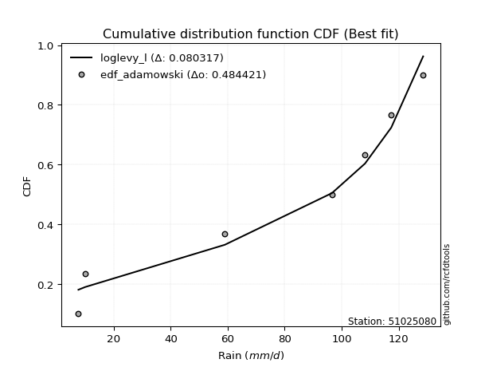</img></img>

</div>


## C. Best fit & Estimate extreme values for specific return periods - Tr

Best fit in probability distribution analysis means finding the theoretical distribution (like Normal, Poisson, Exponential, etc.) that most accurately mirrors your real-world data´s patterns (shape, center, spread) for better predictions, using methods like visual checks (Q-Q plots), goodness-of-fit tests (Kolmogorov-Smirnov, Chi-Squared), and information criteria (AIC) to score and select the simplest, most representative model.


### 1. Best fit (ordered by delta Δ)

:file_folder:Table: [bestfit_51025080.csv](table/bestfit_51025080.csv)

<div align="center">

|   id |   station | empirical_dist   | p_dist         |     delta |   deltao | eval   |   fit |   n |   best_fit |   best_fit_sort |
|-----:|----------:|:-----------------|:---------------|----------:|---------:|:-------|------:|----:|-----------:|----------------:|
|    0 |  51025080 | edf_adamowski    | loglevy_l      | 0.0803172 | 0.484421 | Δo > Δ |     1 |   7 |          1 |               1 |
|    1 |  51025080 | edf_chegodayev   | loglevy_l      | 0.0857226 | 0.484421 | Δo > Δ |     1 |   7 |          1 |               2 |
|    2 |  51025080 | edf_jenkinson    | loglevy_l      | 0.0868212 | 0.484421 | Δo > Δ |     1 |   7 |          1 |               3 |
|    3 |  51025080 | edf_beard        | loglevy_l      | 0.0868212 | 0.484421 | Δo > Δ |     1 |   7 |          1 |               4 |
|    4 |  51025080 | edf_filliben     | loglevy_l      | 0.0876491 | 0.484421 | Δo > Δ |     1 |   7 |          1 |               5 |
|    5 |  51025080 | edf_weibull      | loglevy_l      | 0.0877469 | 0.484421 | Δo > Δ |     1 |   7 |          1 |               6 |
|    6 |  51025080 | edf_tukey        | loglevy_l      | 0.0894081 | 0.484421 | Δo > Δ |     1 |   7 |          1 |               7 |
|    7 |  51025080 | edf_blom         | loglevy_l      | 0.0941103 | 0.484421 | Δo > Δ |     1 |   7 |          1 |               8 |
|    8 |  51025080 | edf_cunnane      | loglevy_l      | 0.0969838 | 0.484421 | Δo > Δ |     1 |   7 |          1 |               9 |
|    9 |  51025080 | edf_hazen        | johnsonsu      | 0.100391  | 0.484421 | Δo > Δ |     1 |   7 |          1 |              10 |
|   10 |  51025080 | edf_gringorten   | loglevy_l      | 0.101665  | 0.484421 | Δo > Δ |     1 |   7 |          1 |              11 |
|   11 |  51025080 | edf_california   | logweibull_max | 0.106657  | 0.484421 | Δo > Δ |     1 |   7 |          1 |              12 |

</div>


### 2. Extreme values and % difference analysis

In hydrology, a return period (or recurrence interval $Tr$) is the statistical average time between extreme events like floods or droughts of a specific magnitude, indicating how rare an event is, with a 100-year flood, for example, having a 1% chance of occurring in any given year, not that it happens exactly every century. It is a key tool for infrastructure design (like bridges or dams) and risk assessment, calculated from historical data to determine the probability of future events, although it is important to remember it is statistical average, and events can cluster or be missed.

The extreme value porcentage difference is evaluated as $pdiff = 1 - (ETrBf / ETr) * 100$, where _ETrBf_ correspond to the bestfit extreme value for a specific recurrence interval and _ETr_ correspond to the extreme value for one of the most used PDFsused in hydrology.

> risk_rate: assuming the return period as the project useful life.

:file_folder:Table: [extreme_51025080.csv](table/extreme_51025080.csv), all PDFs.  
:file_folder:Table: [extremepdiff_51025080.csv](table/extremepdiff_51025080.csv), % difference between bestfit and most used PDFs in Hydrology.

<div align="center">

Extreme values table for only best fit PDFs
|   id |      tr |   prob_l |     prob_g |      alpha |   anglit |   arcsine |    argus |     beta |   betaprime |   bradford |     burr |   burr12 |   cosine |   crystalball |   dgamma |   dweibull |   erlang |   exponnorm |   exponpow |   exponweib |        f |   fatiguelife |   foldnorm |    gamma |   gausshyper |   genexpon |   genextreme |   gengamma |   genhalflogistic |   genlogistic |   gennorm |   genpareto |   gompertz |   gumbel_l |   gumbel_r |   halfgennorm |   halflogistic |   halfnorm |   hypsecant |   invgamma |   invgauss |      invweibull |   johnsonsb |   johnsonsu |   kappa3 |   kappa4 |    ksone |   kstwobign |   laplace |   levy_l |   loggamma |   logistic |   loglaplace |    lomax |   maxwell |   mielke |    moyal |   nakagami |      ncf |         nct |     norm |   pearson3 |   powerlaw |   rayleigh |    rdist |     rice |   semicircular |   skewnorm |        t |   trapezoid |   triang |   truncexpon |   truncnorm |   truncpareto |   truncweibull_min |   tukeylambda |   uniform |   vonmises |   vonmises_line |     wald |   weibull_max |   weibull_min |   wrapcauchy |   logalpha |   loganglit |   logarcsine |   logargus |   logbeta |   logbetaprime |   logbradford |   logburr |   logburr12 |   logcosine |   logcrystalball |   logdgamma |   logdweibull |   logerlang |   logexponnorm |   logexponpow |     logexponweib |     logf |   logfatiguelife |   logfoldnorm |   loggausshyper |   loggenexpon |   loggenextreme |      loggengamma |   loggenhalflogistic |   loggenlogistic |       loggennorm |   loggenpareto |   loggompertz |   loggumbel_l |   loggumbel_r |   loghalfgennorm |   loghalflogistic |   loghalfnorm |   loghypsecant |   loginvgamma |   loginvgauss |   loginvweibull |   logjohnsonsb |   logjohnsonsu |   logkappa3 |   logkappa4 |   logksone |   logkstwobign |   loglevy_l |   logloggamma |   loglogistic |    logloglaplace |         loglomax |   logmaxwell |   logmielke |   logmoyal |   lognakagami |    logncf |    lognct |   lognorm |   logpearson3 |   logpowerlaw |   lograyleigh |   logrdist |   logrice |   logsemicircular |   logskewnorm |      logt |   logtrapezoid |   logtriang |   logtruncexpon |   logtruncnorm |   logtruncpareto |   logtruncweibull_min |   logtukeylambda |   loguniform |   logvonmises |   logvonmises_line |     logwald |   logweibull_max |   logweibull_min |   logwrapcauchy |   station |   n |   risk_rate |
|-----:|--------:|---------:|-----------:|-----------:|---------:|----------:|---------:|---------:|------------:|-----------:|---------:|---------:|---------:|--------------:|---------:|-----------:|---------:|------------:|-----------:|------------:|---------:|--------------:|-----------:|---------:|-------------:|-----------:|-------------:|-----------:|------------------:|--------------:|----------:|------------:|-----------:|-----------:|-----------:|--------------:|---------------:|-----------:|------------:|-----------:|-----------:|----------------:|------------:|------------:|---------:|---------:|---------:|------------:|----------:|---------:|-----------:|-----------:|-------------:|---------:|----------:|---------:|---------:|-----------:|---------:|------------:|---------:|-----------:|-----------:|-----------:|---------:|---------:|---------------:|-----------:|---------:|------------:|---------:|-------------:|------------:|--------------:|-------------------:|--------------:|----------:|-----------:|----------------:|---------:|--------------:|--------------:|-------------:|-----------:|------------:|-------------:|-----------:|----------:|---------------:|--------------:|----------:|------------:|------------:|-----------------:|------------:|--------------:|------------:|---------------:|--------------:|-----------------:|---------:|-----------------:|--------------:|----------------:|--------------:|----------------:|-----------------:|---------------------:|-----------------:|-----------------:|---------------:|--------------:|--------------:|--------------:|-----------------:|------------------:|--------------:|---------------:|--------------:|--------------:|----------------:|---------------:|---------------:|------------:|------------:|-----------:|---------------:|------------:|--------------:|--------------:|-----------------:|-----------------:|-------------:|------------:|-----------:|--------------:|----------:|----------:|----------:|--------------:|--------------:|--------------:|-----------:|----------:|------------------:|--------------:|----------:|---------------:|------------:|----------------:|---------------:|-----------------:|----------------------:|-----------------:|-------------:|--------------:|-------------------:|------------:|-----------------:|-----------------:|----------------:|----------:|----:|------------:|
|    0 |    2    | 0.5      | 0.5        |    23.5579 |  75.3429 |   75.3429 |  86.2506 |  95.1837 |     58.4204 |    65.8367 |  67.692  |  28.6072 |  72.4585 |       75.3429 |  75.5339 |    71.8513 |  74.5186 |     75.3429 |    7.67396 |     24.4822 |  50.1022 |       7.60001 |    75.9881 |  74.5387 |      49.2515 |    51.0714 |      99.0167 |    26.0917 |           80.944  |       inf     |      68.1 |     83.9623 |    109.155 |    83.014  |    67.6717 |       42.1176 |        63.858  |    65.7846 |     75.3429 |    70.1905 |    70.583  |  1246.61        |     28.5044 |     95.9499 |  68.3997 |  64.5989 |  75.3429 |     64.8219 |   75.3429 |  97.7597 |    48.0764 |    75.3429 |      49.2976 |  68.887  |   71.3493 |  69.7474 |  65.1952 |    23.9436 |  62.1116 |     32.1637 |  75.3429 |    78.8668 |     9.0302 |    69.9329 | -3.59043 |  73.0649 |        75.3429 |    80.8291 |  75.3456 |     80.5179 |  81.3153 |      56.5631 |     75.3429 |       8.33826 |            42.1095 |       67.7262 |   68.1    |    2.58195 |         68.1028 |  60.2065 |       128.241 |        84.217 |      68.1012 |    46.3867 |     49.2976 |      49.2977 |    67.6071 |   125.143 |        49.7923 |       31.2841 |   66.4643 |     59.8161 |     43.4382 |          49.2976 |     108.2   |       108.2   |     48.2372 |        49.2973 |       9.72349 |     17.9473      |   49.368 |          49.7656 |       49.8398 |         37.3624 |       37.6666 |         73.962  |     19.3233      |              45.0314 |          inf     |     96.6         |        33.6152 |       56.7525 |       59.2781 |       40.9974 |     23.9562      |           37.4061 |       39.1792 |        49.2976 |       46.1417 |       45.7044 |         41.515  |        128.591 |        128.591 |     32.1791 |     34.7934 |    49.2976 |         37.48  |     95.9667 |       66.2537 |       49.2976 |     96.6         |     29.5522      |      44.7859 |       0     |    38.6285 |       34.9821 |   44.5451 |   49.2137 |   49.2976 |       57.5366 |       8.05418 |        43.287 |    17.9932 |   47.2529 |           49.2976 |       47.5179 |   49.2976 |        59.765  |     40.1934 |         23.9284 |        24.8107 |          7.76865 |               22.9127 |          31.2628 |      31.2628 |      0.127358 |            31.0089 |     34.2641 |          74.6437 |          61.9554 |         31.2628 |  51025080 |   7 |    0.75     |
|    1 |    2.33 | 0.570815 | 0.429185   |    28.0384 |  85.0488 |   89.9131 |  93.3119 | 109.273  |     68.8088 |    74.4429 |  76.7591 |  37.958  |  80.7612 |       83.6755 |  97.6623 |    95.8909 |  83.0435 |     83.6755 |    7.81393 |     30.9088 |  59.9988 |       9.30682 |    83.8551 |  83.0791 |      71.4527 |    63.054  |     105.16   |    32.3249 |           90.1379 |       inf     |      68.1 |     93.2863 |    111.869 |    90.2635 |    75.3928 |       53.3632 |        71.7965 |    74.7776 |     82.0114 |    79.1318 |    79.5151 | 34708.7         |     87.2025 |    102.439  |  77.0109 |  73.5801 |  86.7975 |     74.277  |   80.3854 | 107.125  |    59.147  |    82.6845 |      55.6491 |  82.3903 |   80.0063 |  78.6999 |  72.5042 |    35.1063 |  72.4338 |     41.7853 |  83.6755 |    87.0036 |    10.9397 |    78.7179 |  9.51536 |  81.671  |        85.7527 |    88.4526 |  83.6777 |     90.1095 |  89.1347 |      64.9687 |     83.6755 |       8.85011 |            50.4471 |       76.6702 |   76.6687 |    2.75956 |         76.6685 |  65.6703 |       128.448 |        91.334 |      97.5819 |    57.0633 |     62.2492 |      69.9689 |    76.0781 |   128.164 |        60.8606 |       38.2599 |   75.6156 |     69.9581 |     53.1731 |          60.2281 |     109.334 |       120.629 |     59.4127 |        60.2277 |      11.0069  |     23.0152      |   60.349 |          60.8359 |       60.2008 |         46.7347 |       48.0304 |         83.9081 |     25.2789      |              54.894  |          inf     |     99.3127      |        47.1946 |       66.8895 |       70.5606 |       49.3568 |     31.8072      |           45.2693 |       48.6322 |        57.8669 |       56.9362 |       56.5997 |         53.2173 |        128.598 |        128.599 |     39.4768 |     43.0236 |    64.9211 |         47.847 |    104.898  |       75.2071 |       58.8105 |    115.138       |     39.8598      |      55.1444 |       0     |    46.0465 |       46.2165 |   55.594  |   60.1464 |   60.2281 |       69.4708 |       8.58594 |        53.463 |    26.1049 |   58.1483 |           63.3111 |       55.7005 |   60.228  |        75.2595 |     48.7133 |         29.1103 |        30.106  |          7.88413 |               27.9666 |          38.364  |      38.1961 |      0.153904 |            37.9298 |     39.0723 |          88.0158 |          71.7655 |         74.5193 |  51025080 |   7 |    0.729209 |
|    2 |    5    | 0.8      | 0.2        |    62.7804 | 119.294  |  128.767  | 113.455  | 127.609  |    118.105  |   102.93   | 105.625  | inf      | 110.681  |      114.642  | 120.145  |   118.922  | 115.309  |    114.642  |   12.501   |     75.023  | 109.012  |      45.5645  |   113.091  | 115.393  |     126.917  |   122.964  |     120.073  |    72.3606 |          114.017  |       inf     |      68.1 |    117.656  |    120.713 |   113.683  |   108.937  |      126.713  |       107.717  |   112.808  |    108.761  |   114.425  |   115.345  |     6.72868e+10 |    128.545  |    118.416  | 104.88   | 103.309  | 123.869  |    114.44   |  105.597  | 122.642  |   129.524  |   111.031  |     102.002  | 149.904  |  114.08   | 106.744  | 106.36   |   115.781  | 118.456  |    147.361  | 114.642  |   115.311  |    36.5938 |   113.888  | 45.593   | 114.547  |       121.277  |   110.657  | 114.642  |    117.627  | 111.568  |      95.7359 |    114.642  |      17.0356  |            85.1467 |      105.297  |  104.4    |    3.45051 |        104.397  |  96.2566 |       128.596 |       114.326 |     122.077  |   126.641  |    141.766  |     178.01   |   104.843  |   128.6   |       128.478  |       73.3956 |  105.045  |    116.042  |    110.195  |         126.77   |     160.295 |       220.149 |    130.747  |       126.769  |      26.0474  |     96.7957      |  127.3   |         128.441  |      121.46   |         90.1395 |      131.114  |        111.95   |    118.222       |              92.4142 |          inf     |    143.101       |       101.834  |      115.924  |      123.883  |      110.527  |    146.324       |          107.334  |      121.306  |       110.06   |      127.3    |      130.156  |        156.529  |        128.6   |        128.6   |     76.4944 |     82.219  |   158.244  |        135.007 |    121.561  |      103.882  |      116.234  |    307.673       |    177.924       |     125.069  |     103.78  |   103.89   |      151.697  |  135.429  |  126.82   |  126.77   |      128.763  |      17.0753  |       124.495 |    70.2604 |  127.389  |          148.687  |       88.4774 |  126.77   |       145.809  |     84.5639 |         59.6813 |        60.6016 |          9.83582 |               58.4045 |          74.0996 |      73.0391 |      0.322264 |            72.8019 |     81.4927 |         118.824  |         115.384  |        116.116  |  51025080 |   7 |    0.67232  |
|    3 |   10    | 0.9      | 0.1        |   126.61   | 138.677  |  138.146  | 121.984  | 128.537  |    161.077  |   115.669  | 118.033  | inf      | 128.757  |      135.184  | 133.735  |   129.995  | 137.225  |    135.184  |   30.3708  |    131.17   | 153.285  |      95.6272  |   132.486  | 137.332  |     128.567  |   177.349  |     124.858  |   120.203  |          122.083  |       inf     |      68.1 |    124.821  |    125.671 |   126.723  |   136.258  |      217.23   |       137.547  |   140.95   |    130.121  |   139.772  |   141.535  |     8.89358e+15 |    128.599  |    124.389  | 117.04   | 116.5    | 140.044  |    145.019  |  128.483  | 126.388  |   220.485  |   131.908  |     176.802  | 211.191  |  138.059  | 118.624  | 135.837  |   197.058  | 155.823  |    455.155  | 135.184  |   132.456  |    69.2334 |   138.966  | 55.1894  | 136.865  |       139.505  |   119.7    | 135.183  |    128.376  | 120.33   |     111.311  |    135.184  |      37.0706  |           104.966  |      117.377  |  116.5    |    3.97848 |        116.5    | 128.716  |       128.6   |       127.127 |     125.661  |   220.367  |    225.884  |     223.021  |   119.429  |   128.6   |       211.132  |       97.5257 |  117.813  |    153.815  |    171.144  |         207.696  |     296.72  |       389.735 |    223.426  |       207.694  |      70.0346  |    445.696       |  208.913 |         211.018  |      193.487  |        112.633  |      273.189  |        121.66   |    601.44        |             110.624  |          inf     |    273.623       |       120.852  |      158.861  |      169.478  |      213.127  |    663.512       |          219.837  |      238.574  |       183.9    |      221.718  |      234.039  |        376.893  |        128.6   |        128.6   |    102.09   |    105.595  |   233.432  |        297.408 |    125.966  |      116.276  |      191.971  |    893.001       |    691.853       |     222.554  |     116.359 |   210.983  |      367.414  |  260.317  |  208.105  |  207.696  |      181.057  |      36.4135  |       227.459 |    89.0843 |  215.996  |          230.427  |      106.828  |  207.696  |       188.788  |    104.893  |         85.8607 |        86.3526 |         16.234   |               84.9197 |          98.2187 |      96.9166 |      0.568337 |            96.7599 |    177.794  |         125.795  |         150.302  |        122.84   |  51025080 |   7 |    0.651322 |
|    4 |   15    | 0.933333 | 0.0666667  |   190.212  | 146.954  |  139.935  | 125.052  | 128.587  |    185.873  |   119.958  | 122.148  | inf      | 136.991  |      145.435  | 140.758  |   135.107  | 148.315  |    145.435  |   51.0894  |    170.761  | 179.19   |     128.369   |   142.164  | 148.432  |     128.597  |   209.162  |     126.249  |   152.859  |          124.468  |       inf     |      68.1 |    126.572  |    127.921 |   132.628  |   151.672  |      280.609  |       154.428  |   155.595  |    142.311  |   153.044  |   155.367  |     6.89261e+18 |    128.6    |    126.505  | 121.093  | 120.908  | 145.436  |    161.253  |  141.871  | 127.52   |   288.557  |   143.282  |     243.906  | 247.041  |  150.362  | 122.543  | 152.944  |   242.408  | 176.568  |    879.415  | 145.435  |   140.539  |    85.3931 |   151.887  | 57.1912  | 148.104  |       146.614  |   122.675  | 145.434  |    131.825  | 123.142  |     116.865  |    145.435  |      53.0891  |           112.375  |      121.28   |  120.533  |    4.27811 |        120.535  | 149.56   |       128.6   |       132.924 |     126.676  |   292.845  |    275.6    |     232.818  |   125.076  |   128.6   |       270.61   |      107.218  |  122.06   |    174.755  |    209.15   |         265.721  |     451.356 |       547.588 |    293.021  |       265.718  |     130.961   |   1181.52        |  267.517 |         270.404  |      244.096  |        119.428  |      400.177  |        124.415  |   1689.88        |             116.769  |          inf     |    465.431       |       124.967  |      183.497  |      195.321  |      308.694  |   1682.16        |          329.843  |      339.223  |       246.5    |      294.369  |      316.996  |        618.765  |        128.6   |        128.6   |    112.4    |    113.856  |   265.728  |        452.318 |    127.327  |      120.394  |      252.324  |   1820.29        |   1531.13        |     299.126  |     120.543 |   318.277  |      582.589  |  368.07   |  266.485  |  265.721  |      210.565  |      51.9002  |       310.29  |    93.1835 |  281.562  |          273.356  |      113.662  |  265.72   |       205.103  |    112.401  |         97.757  |        98.0595 |         23.7743  |               97.0423 |         107.709  |     106.499  |      0.781347 |           106.385  |    293.413  |         127.228  |         169.419  |        124.8    |  51025080 |   7 |    0.644736 |
|    5 |   20    | 0.95     | 0.05       |   253.758  | 151.823  |  140.565  | 126.697  | 128.596  |    203.385  |   122.11   | 124.202  | inf      | 142.055  |      152.148  | 145.484  |   138.354  | 155.634  |    152.148  |   71.693   |    201.795  | 197.589  |     152.61    |   148.502  | 155.756  |     128.599  |   231.734  |     126.902  |   178.03   |          125.598  |       inf     |      68.1 |    127.295  |    129.323 |   136.303  |   162.465  |      330.245  |       166.256  |   165.359  |    150.91   |   161.971  |   164.708  |     7.2678e+20  |    128.6    |    127.654  | 123.119  | 123.111  | 148.132  |    172.189  |  151.369  | 128.099  |   344.605  |   151.144  |     306.454  | 272.478  |  158.527  | 124.496  | 165.06   |   273.197  | 190.926  |   1403.06   | 152.148  |   145.665  |    94.7279 |   160.475  | 57.9357  | 155.492  |       150.556  |   124.159  | 152.147  |    133.526  | 124.529  |     119.718  |    152.148  |      64.8348  |           116.248  |      123.193  |  122.55   |    4.48795 |        122.553  | 165.093  |       128.6   |       136.533 |     127.167  |   353.829  |    309.813  |     236.371  |   128.199  |   128.6   |       318.407  |      112.42   |  124.182  |    189.205  |    236.602  |         312.245  |     618.587 |       698.422 |    350.441  |       312.242  |     206.79    |   2438.64        |  314.548 |         318.107  |      284.214  |        122.469  |      516.272  |        125.671  |   3633.56        |             119.825  |          inf     |    729.9         |       126.489  |      200.801  |      213.361  |      400.11   |   3315.3         |          438.29   |      428.943  |       303.093  |      355.262  |      388.185  |        875.546  |        128.6   |        128.6   |    117.941  |    117.951  |   283.515  |        599.938 |    128.03   |      122.45   |      304.801  |   3154.3         |   2690.26        |     363.983  |     122.633 |   425.857  |      792.312  |  465.352  |  313.343  |  312.245  |      230.923  |      63.4187  |       381.425 |    94.6659 |  335.099  |          300.526  |      117.231  |  312.244  |       213.663  |    116.3    |        104.495  |       104.703  |         31.2311  |              103.922  |         112.732  |     111.64   |      0.971232 |           111.551  |    426.193  |         127.77   |         182.528  |        125.757  |  51025080 |   7 |    0.641514 |
|    6 |   25    | 0.96     | 0.04       |   317.281  | 155.122  |  140.858  | 127.743  | 128.598  |    216.938  |   123.404  | 125.433  | inf      | 145.606  |      157.09   | 149.036  |   140.701  | 161.049  |    157.089  |   91.4861  |    227.526  | 211.876  |     171.871   |   153.168  | 161.175  |     128.6    |   249.242  |     127.278  |   198.673  |          126.253  |       inf     |      68.1 |    127.674  |    130.322 |   138.919  |   170.778  |      371.42   |       175.368  |   172.623  |    157.566  |   168.666  |   171.731  |     2.6282e+22  |    128.6    |    128.399  | 124.335  | 124.432  | 149.749  |    180.38   |  158.737  | 128.463  |   392.968  |   157.158  |     365.82   | 292.208  |  164.589  | 125.665  | 174.45   |   296.277  | 201.891  |   2015.71   | 157.09   |   149.355  |   100.77   |   166.856  | 58.295   | 160.944  |       153.114  |   125.048  | 157.088  |    134.539  | 125.355  |     121.455  |    157.09   |      73.5847  |           118.629  |      124.325  |  123.76   |    4.64677 |        123.763  | 177.534  |       128.6   |       139.101 |     127.457  |   407.318  |    335.382  |     238.037  |   130.221  |   128.6   |       358.928  |      115.661  |  125.455  |    200.21   |    257.976  |         351.622  |     796.229 |       844.336 |    400.061  |       351.618  |     296.223   |   4354.72        |  354.379 |         358.536  |      317.901  |        124.13   |      624.114  |        126.377  |   6695.88        |             121.646  |          inf     |   1080.95        |       127.218  |      214.134  |      227.204  |      488.597  |   5667.23        |          545.603  |      510.772  |       355.666  |      408.504  |      451.518  |       1143.93   |        128.6   |        128.6   |    121.4    |    120.361  |   294.754  |        741.284 |    128.474  |      123.684  |      352.201  |   4965.89        |   4165.45        |     421.069  |     123.886 |   533.681  |      996.017  |  555.262  |  353.033  |  351.622  |      246.359  |      72.0996  |       444.642 |    95.3597 |  380.995  |          319.58   |      119.424  |  351.621  |       218.931  |    118.687  |        108.823  |       108.978  |         38.1528  |              108.346  |         115.83   |     114.843  |      1.13969  |           114.77   |    574.732  |         128.036  |         192.47   |        126.327  |  51025080 |   7 |    0.639603 |
|    7 |   50    | 0.98     | 0.02       |   634.799  | 163.245  |  141.248  | 130.077  | 128.6    |    258.962  |   125.998  | 127.896  | inf      | 154.905  |      171.241  | 159.576  |   147.256  | 176.691  |    171.241  |  176.956   |    316.553  | 256.36   |     233.668   |   166.528  | 176.824  |     128.6    |   303.627  |     127.989  |   268.863  |          127.5    |       inf     |      68.1 |    128.28   |    133.034 |   146.019  |   196.387  |      514.291  |       203.445  |   193.739  |    178.2    |   188.431  |   192.538  |     1.65923e+27 |    128.6    |    130.137  | 126.767  | 127.067  | 152.985  |    204.434  |  181.623  | 129.282  |   574.163  |   175.533  |     634.084  | 353.495  |  182.17   | 128.004  | 203.603  |   363.751  | 235.169  |   6210.93   | 171.241  |   159.535  |   113.919  |   185.378  | 58.8041  | 176.611  |       158.957  |   126.824  | 171.239  |    136.551  | 126.995  |     124.987  |    171.241  |      96.2549  |           123.522  |      126.536  |  126.18   |    5.08379 |        126.185  | 218.156  |       128.6   |       146.071 |     128.032  |   614.051  |    407.679  |     240.281  |   134.827  |   128.6   |       505.948  |      122.427  |  128.006  |    233.422  |    323.544  |         494.064  |    1805.12  |      1529.54  |    586.452  |       494.058  |     920.16    |  28925.9         |  498.625 |         505.136  |      438.124  |        126.943  |     1084.41   |        127.653  |  48953.1         |             125.233  |          inf     |   4736.75        |       128.23   |      255.114  |      269.48   |      904.171  |  31543.9         |         1071.38   |      848.46   |       584.003  |      612.957  |      702.673  |       2606.8    |        128.6   |        128.6   |    128.752  |    124.955  |   318.586  |       1379.7   |    129.477  |      126.148  |      547.753  |  24064.8         |  16197.4         |     642.473  |     126.392 |  1075.4    |     1937.04   |  938.937  |  496.799  |  494.064  |      292.204  |      94.9916  |       693.973 |    96.2904 |  550.734  |          367.764  |      123.928  |  494.062  |       229.775  |    123.569  |        118.186  |       118.249  |         63.4585  |              117.928  |         122.191  |     121.527  |      1.72088  |           121.489  |   1525.66   |         128.429  |         222.272  |        127.463  |  51025080 |   7 |    0.63583  |
|    8 |   75    | 0.986667 | 0.0133333  |   952.273  | 166.819  |  141.321  | 130.987  | 128.6    |    283.542  |   126.865  | 128.73   | inf      | 159.345  |      178.834  | 165.473  |   150.687  | 185.164  |    178.834  |  245.563   |    374.914  | 282.468  |     270.885   |   173.697  | 185.3    |     128.6    |   335.44   |     128.21   |   314.074  |          127.892  |       inf     |      68.1 |    128.428  |    134.407 |   149.61   |   211.272  |      608.427  |       219.766  |   205.234  |    190.258  |   199.413  |   204.138  |     1.02328e+30 |    128.6    |    130.87   | 127.578  | 127.941  | 154.063  |    217.668  |  195.011  | 129.619  |   705.056  |   186.146  |     874.747  | 389.345  |  191.728  | 128.798  | 220.651  |   400.536  | 254.192  |  11995.8    | 178.834  |   164.765  |   118.635  |   195.455  | 58.9075  | 185.047  |       161.292  |   127.416  | 178.831  |    137.217  | 127.538  |     126.182  |    178.834  |     105.76    |           125.194  |      127.251  |  126.987  |    5.27647 |        126.992  | 243.152  |       128.6   |       149.596 |     128.222  |   768.875  |    444.252  |     240.699  |   136.663  |   128.6   |       608.387  |      124.769  |  128.877  |    252.261  |    360.498  |         592.977  |    2968.42  |      2171.61  |    721.488  |       592.97   |    1795.84    |  93029.9         |  598.916 |         607.213  |      520.408  |        127.677  |     1466.03   |        128.025  | 166290           |             126.4    |          inf     |  13617.9         |       128.429  |      278.817  |      293.766  |     1293.05   |  89034.2         |         1586      |     1118.43   |       780.33   |      764.861  |      896.128  |       4207.49   |        128.6   |        128.6   |    131.519  |    126.366  |   326.951  |       1941.91  |    129.892  |      126.969  |      706.9    |  69097.4         |  35846.5         |     808.391  |     127.228 |  1619.99   |     2782.24   | 1260.11   |  596.785  |  592.977  |      317.489  |     104.757   |       884.144 |    96.4628 |  671.456  |          388.985  |      125.467  |  592.975  |       233.482  |    125.23   |        121.534  |       121.572  |         78.2652  |              121.358  |         124.346  |     123.84   |      2.03611  |           123.815  |   2782.05   |         128.515  |         239.057  |        127.841  |  51025080 |   7 |    0.634587 |
|    9 |  100    | 0.99     | 0.01       |  1269.74   | 168.945  |  141.346  | 131.492  | 128.6    |    300.998  |   127.298  | 129.165  | inf      | 162.129  |      183.97   | 169.562  |   152.978  | 190.928  |    183.969  |  303.268   |    419.093  | 301.035  |     297.664   |   178.546  | 191.065  |     128.6    |   358.012  |     128.316  |   347.969  |          128.082  |       inf     |      68.1 |    128.49   |    135.305 |   151.958  |   221.807  |      679.981  |       231.318  |   213.064  |    198.812  |   206.995  |   212.159  |     9.65403e+31 |    128.6    |    131.302  | 127.983  | 128.377  | 154.602  |    226.735  |  204.509  | 129.815  |   810.728  |   193.639  |    1099.07   | 414.782  |  198.239  | 129.214  | 232.746  |   425.567  | 267.529  |  19136.2    | 183.97   |   168.211  |   121.059  |   202.32   | 58.9456  | 190.762  |       162.599  |   127.712  | 183.967  |    137.549  | 127.809  |     126.783  |    183.97   |     110.958   |           126.037  |      127.601  |  127.39   |    5.38196 |        127.395  | 261.377  |       128.6   |       151.902 |     128.317  |   896.839  |    467.537  |     240.846  |   137.69   |   128.6   |       689.235  |      125.957  |  129.335  |    265.399  |    385.782  |         670.876  |    4252.18  |      2787.92  |    830.699  |       670.868  |    2887.28    | 218585           |  677.96  |         687.739  |      584.654  |        127.991  |     1800.92   |        128.196  | 405913           |             126.973  |          inf     |  31552.4         |       128.501  |      295.527  |      310.824  |     1665.62   | 188521           |         2093.52   |     1350.03   |       958.427  |      889.727  |     1058.84   |       5904.41   |        128.6   |        128.6   |    133.091  |    127.032  |   331.215  |       2454.34  |    130.135  |      127.38   |      846.382  | 155987           |  62983.9         |     945.315  |     127.645 |  2166.48   |     3560.55   | 1545.36   |  675.604  |  670.876  |      334.728  |     110.137   |      1042.75  |    96.523  |  767.91   |          401.4    |      126.243  |  670.874  |       235.354  |    126.066  |        123.254  |       123.28   |         87.7059  |              123.119  |         125.425  |     125.013  |      2.22614  |           124.995  |   4311.11   |         128.548  |         250.716  |        128.031  |  51025080 |   7 |    0.633968 |
|   10 |  200    | 0.995    | 0.005      |  2539.56   | 172.961  |  141.37   | 132.362  | 128.6    |    343.162  |   127.949  | 129.907  | inf      | 167.788  |      195.619  | 179.15   |   158.096  | 204.099  |    195.619  |  474.916   |    534.863  | 345.93   |     363.214   |   189.545  | 204.237  |     128.6    |   412.396  |     128.468  |   435.708  |          128.355  |       inf     |      68.1 |    128.562  |    137.258 |   157.063  |   247.134  |      868.746  |       259.09   |   230.973  |    219.419  |   224.67   |   230.888  |     5.39667e+36 |    128.6    |    132.118  | 128.592  | 129.029  | 155.411  |    247.62   |  227.395  | 130.188  |  1115.42   |   211.613  |    1905.05   | 476.069  |  213.134  | 129.932  | 261.887  |   482.655  | 299.206  |  58958.7    | 195.619  |   175.762  |   124.778  |   218.029  | 58.9849  | 203.753  |       164.878  |   128.156  | 195.615  |    138.046  | 128.214  |     127.689  |    195.619  |     119.372   |           127.313  |      128.116  |  127.995  |    5.54945 |        128      | 306.773  |       128.6   |       156.913 |     128.46   |  1278.96   |    514.909  |     240.987  |   139.478  |   128.6   |       914.888  |      127.76   |  130.133  |    296.365  |    442.793  |         887.636  |   10290.6   |      5107.57  |   1146.39   |       887.624  |    9034.04    |      1.85794e+06 |  898.141 |         912.349  |      761.334  |        128.377  |     2886.16   |        128.427  |      3.77396e+06 |             127.815  |          inf     | 331621           |       128.574  |      335.465  |      351.395  |     3061.5    |      1.20178e+06 |         4080.93   |     2076.25   |      1572.7    |     1259.43   |     1557      |      13333.7    |        128.6   |        128.6   |    136.116  |    127.957  |   337.716  |       4209.11  |    130.597  |      127.995  |     1303.69   |      1.4269e+06  | 244915           |    1352.22   |     128.271 |  4364.3    |     6258.92   | 2493.84   |  895.221  |  887.636  |      373.876  |     118.904   |      1521.03  |    96.5809 | 1041.7    |          423.997  |      127.416  |  887.633  |       238.182  |    127.329  |        125.891  |       125.903  |        105.344   |              125.822  |         127.036  |     126.794  |      2.5572   |           126.786  |  12835.7    |         128.584  |         278.056  |        128.315  |  51025080 |   7 |    0.633042 |
|   11 |  250    | 0.996    | 0.004      |  3174.46   | 173.983  |  141.373  | 132.565  | 128.6    |    356.776  |   128.079  | 130.091  | inf      | 169.339  |      199.179  | 182.169  |   159.641  | 208.151  |    199.179  |  540.368   |    574.906  | 360.433  |     384.577   |   192.906  | 208.289  |     128.6    |   429.904  |     128.497  |   465.752  |          128.408  |       inf     |      68.1 |    128.573  |    137.832 |   158.565  |   255.277  |      934.47   |       268.018  |   236.483  |    226.052  |   230.206  |   236.761  |     1.8128e+38  |    128.6    |    132.329  | 128.715  | 129.158  | 155.573  |    254.083  |  234.763  | 130.285  |  1230.42   |   217.383  |    2274.09   | 495.799  |  217.719  | 130.112  | 271.268  |   500.161  | 309.287  |  84697.6    | 199.179  |   177.997  |   125.534  |   222.864  | 58.99    | 207.731  |       165.412  |   128.245  | 199.175  |    138.145  | 128.295  |     127.871  |    199.179  |     121.15    |           127.569  |      128.216  |  128.116  |    5.58394 |        128.121  | 321.792  |       128.6   |       158.388 |     128.488  |  1427.78   |    527.713  |     241.004  |   139.897  |   128.6   |       997.655  |      128.124  |  130.334  |    306.146  |    459.844  |         966.925  |   13739.3   |      6212.64  |   1265.82   |       966.912  |   13017.2     |      3.78818e+06 |  978.758 |         994.685  |      825.315  |        128.439  |     3337.84   |        128.468  |      7.915e+06   |             127.979  |          inf     | 784013           |       128.583  |      348.232  |      364.311  |     3723.25   |      2.20992e+06 |         5057.7    |     2370.22   |      1844.52   |     1402.29   |     1755.22   |      17325.4    |        128.6   |        128.6   |    136.952  |    128.126  |   339.032  |       4973.78  |    130.717  |      128.118  |     1497.63   |      3.16303e+06 | 379214           |    1509.75   |     128.396 |  5468.02   |     7444.89   | 2899.53   |  975.652  |  966.925  |      385.767  |     120.766   |      1708.48  |    96.5878 | 1143.57   |          429.48   |      127.652  |  966.922  |       238.751  |    127.582  |        126.428  |       126.437  |        109.484   |              126.372  |         127.356  |     127.153  |      2.6304   |           127.147  |  18415.2    |         128.589  |         286.653  |        128.372  |  51025080 |   7 |    0.632858 |
|   12 |  500    | 0.998    | 0.002      |  6348.99   | 176.517  |  141.377  | 133.03   | 128.6    |    399.223  |   128.34   | 130.576  | inf      | 173.468  |      209.736  | 191.371  |   164.17   | 220.241  |    209.736  |  776.565   |    707.791  | 405.647  |     451.592   |   202.873  | 220.378  |     128.6    |   484.289  |     128.552  |   564.56   |          128.509  |       inf     |      68.1 |    128.591  |    139.481 |   162.87   |   280.549  |     1154.17   |       295.73   |   252.91   |    246.657  |   247.012  |   254.599  |     9.89558e+42 |    128.6    |    132.867  | 128.974  | 129.417  | 155.896  |    273.452  |  257.649  | 130.536  |  1648.89   |   235.279  |    3941.73   | 557.086  |  231.401  | 130.589  | 300.407  |   552.171  | 340.303  | 260951      | 209.736  |   184.426  |   127.059  |   237.291  | 58.9972  | 219.542  |       166.643  |   128.422  | 209.732  |    138.344  | 128.457  |     128.235  |    209.736  |     124.806   |           128.084  |      128.413  |  128.358  |    5.65352 |        128.364  | 369.545  |       128.6   |       162.614 |     128.545  |  1987.99   |    560.852  |     241.027  |   140.861  |   128.6   |      1289.99   |      128.854  |  130.873  |    336.012  |    508.485  |        1246.19   |   34103.7   |     11446.1   |   1701.33   |      1246.18   |   40132.3     |      3.7103e+07  | 1262.97  |        1285.32   |     1048.44   |        128.541  |     5153.53   |        128.543  |      8.44604e+07 |             128.3    |          inf     |      1.59383e+07 |       128.595  |      387.64   |      404.029  |     6834.48   |      1.52211e+07 |         9844.77   |     3517.67   |      3026.59   |     1935.31   |     2518.15   |      39056      |        128.6   |        128.6   |    139.324  |    128.44   |   341.678  |       8202.44  |    131.029  |      128.365  |     2302.48   |      5.03844e+07 |      1.47459e+06 |    2097.57   |     128.647 | 11014.9    |    12488.7    | 4591.91   | 1259.29   | 1246.19   |      420.547  |     124.603   |      2416.56  |    96.597  | 1508.56   |          442.376  |      128.125  | 1246.19   |       239.893  |    128.091  |        127.509  |       127.513  |        118.494   |              127.48   |         127.989  |     127.875  |      2.78397  |           127.873  |  58024.3    |         128.597  |         312.803  |        128.486  |  51025080 |   7 |    0.632489 |
|   13 |  750    | 0.998667 | 0.00133333 |  9523.5    | 177.639  |  141.378  | 133.216  | 128.6    |    424.177  |   128.426  | 130.823  | inf      | 175.468  |      215.601  | 196.648  |   166.657  | 227.005  |    215.6    |  938.3     |    791.424  | 432.213  |     491.187   |   208.41   | 227.141  |     128.6    |   516.102  |     128.569  |   626.152  |          128.541  |       128.532 |      68.1 |    128.595  |    140.362 |   165.171  |   295.323  |     1293.67   |       311.93   |   262.087  |    258.71   |   256.603  |   264.783  |     5.81752e+45 |    128.6    |    133.116  | 129.074  | 129.502  | 156.004  |    284.333  |  271.037  | 130.654  |  1942.25   |   245.735  |    5437.79   | 592.936  |  239.054  | 130.834  | 317.453  |   581.102  | 358.267  | 503991      | 215.601  |   187.872  |   127.571  |   245.359  | 58.9987  | 226.113  |       167.139  |   128.482  | 215.596  |    138.41   | 128.51   |     128.357  |    215.601  |     126.055   |           128.256  |      128.477  |  128.439  |    5.67683 |        128.444  | 398.177  |       128.6   |       164.874 |     128.564  |  2396.49   |    576.181  |     241.031  |   141.249  |   128.6   |      1488.08   |      129.099  |  131.15   |    353.152  |    533.875  |        1434.83   |   58440.7   |     16392.6   |   2007.43   |      1434.81   |   76988.2     |      1.47629e+08 | 1455.15  |        1482.12   |     1197.5    |        128.567  |     6572.45   |        128.566  |      3.52877e+08 |             128.404  |          inf     |      1.19042e+08 |       128.598  |      410.53   |      427.002  |     9747.94   |      4.82618e+07 |        14531.2    |     4385.76   |      4043.53   |     2319.93   |     3088.4    |      62813.6    |        128.6   |        128.6   |    140.622  |    128.534  |   342.564  |      10864.1   |    131.177  |      128.447  |     2960.24   |      3.20469e+08 |      3.26345e+06 |    2521.11   |     128.732 | 16592      |    16672.6    | 5978.62   | 1451.15   | 1434.83   |      439.421  |     125.917   |      2933.62  |    96.5987 | 1759.82   |          447.675  |      128.283  | 1434.82   |       240.274  |    128.26   |        127.871  |       127.874  |        121.734   |              127.852  |         128.197  |     128.116  |      2.83729  |           128.115  | 115467      |         128.598  |         327.743  |        128.524  |  51025080 |   7 |    0.632366 |
|   14 | 1000    | 0.999    | 0.001      | 12698      | 178.307  |  141.378  | 133.32   | 128.6    |    441.944  |   128.47   | 130.989  | inf      | 176.73   |      219.639  | 200.351  |   168.357  | 231.682  |    219.638  | 1063.78    |    853.377  | 451.117  |     519.431   |   212.222  | 231.817  |     128.6    |   538.674  |     128.577  |   671.528  |          128.557  |       128.55  |      68.1 |    128.597  |    140.955 |   166.72   |   305.803  |     1397.6    |       323.422  |   268.425  |    267.262  |   263.316  |   271.91   |     5.35928e+47 |    128.6    |    133.27   | 129.133  | 129.545  | 156.058  |    291.871  |  280.536  | 130.729  |  2175.05   |   253.15   |    6832.29   | 618.373  |  244.343  | 130.999  | 329.547  |   601.03   | 370.945  | 803983      | 219.639  |   190.193  |   127.827  |   250.934  | 58.9992  | 230.642  |       167.417  |   128.511  | 219.634  |    138.443  | 128.537  |     128.417  |    219.639  |     126.685   |           128.342  |      128.509  |  128.479  |    5.6885  |        128.485  | 418.773  |       128.6   |       166.394 |     128.574  |  2729.03   |    585.515  |     241.033  |   141.467  |   128.6   |      1641.94   |      129.221  |  131.338  |    365.177  |    550.539  |        1581.05   |   85863.4   |     21165.7   |   2250.73   |      1581.02   |  121794       |      4.01158e+08 | 1604.22  |        1634.91   |     1312.27   |        128.578  |     7776.24   |        128.576  |      9.92144e+08 |             128.455  |          128.479 |      5.5701e+08  |       128.599  |      426.703  |      443.195  |    12540      |      1.10625e+08 |        19153.6    |     5107.38   |      4966.17   |     2630.84   |     3559.84   |      87990.8    |        128.6   |        128.6   |    141.521  |    128.579  |   343.009  |      13199.2   |    131.27   |      128.488  |     3537.68   |      1.33678e+09 |      5.73405e+06 |    2862.84   |     128.776 | 22188.8    |    20354.4    | 7195.92   | 1600      | 1581.05   |      452.178  |     126.581   |      3354.26  |    96.5992 | 1956.88   |          450.68   |      128.362  | 1581.04   |       240.465  |    128.345  |        128.053  |       128.056  |        123.401   |              128.038  |         128.3    |     128.237  |      2.86436  |           128.237  | 189422      |         128.599  |         338.198  |        128.543  |  51025080 |   7 |    0.632305 |


</div>


<div align="center">

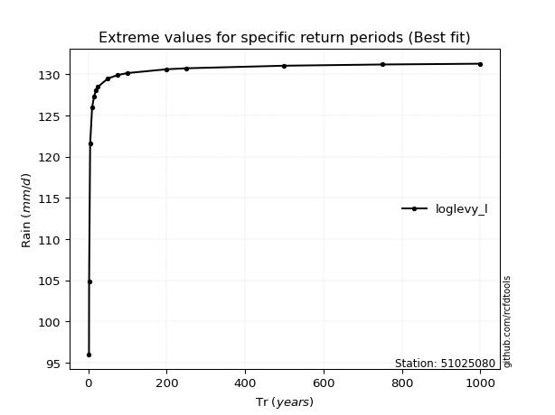</img>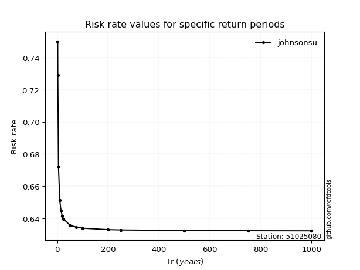</img>

</div>


<sub>**APP DISCLAIMER**: NO WARRANTY - This software is provided by [github.com/rcfdtools](https://github.com/rcfdtools) "as is", without any express or implied warranty, including warranties of merchantability, fitness for a particular purpose, or non-infringement. There is no guarantee that the software will be error-free or operate without interruption. LIMITATION OF LIABILITY - Neither the authors nor copyright holders will be liable for claims or damages arising from the software or its use. You are responsible for determining if the software is appropriate for your use and assume all associated risks, including errors, legal compliance, and data loss. NO PROFESSIONAL ADVICE - The software provides general information and does not offer professional advice. It should not replace consultation with professional advisors.</sub>