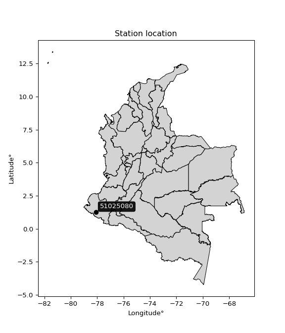

<div align="center">


</div>

# PMP Station (Rain, Pmax24h): 51025080

Probable Maximum Precipitation (PMP) is the greatest amount of rainfall for a specific duration that is meteorologically possible for a given location, acting as a "worst-case" scenario for extreme storms, crucial for designing safety-critical infrastructure like bridges, river deviations, dams, spillways, and nuclear plants to prevent catastrophic failure. PMP is calculated by hydrologists using meteorological data to determine the upper limit of extreme rainfall, often leading to the Probable Maximum Flood (PMF) for flood control design, and is increasingly being studied for climate change impacts. Probable Maximum Precipitation (PMP) is the theoretical upper limit of rainfall, a deterministic estimate for extreme events, while probability distributions (like GEV, Gumbel) describe the likelihood and frequency of various precipitation amounts, including rare ones, showing how often events occur, with PMP representing the extreme end of these distributions, used for critical infrastructure design to ensure safety against the worst conceivable weather, unlike standard statistical forecasts which cover typical probabilities.

The most common probability distributions in hydrology, used for analyzing floods, rainfall, and streamflow, include the Normal, Log-Normal, Gumbel, Gamma (including Log-Pearson Type III), and Generalized Extreme Value (GEV) distributions, often chosen based on the data´s skewness and whether modeling extremes or general conditions, with Gumbel and GEV popular for extreme events like floods, while the Normal distribution serves as a baseline, though often requiring transformations for skewed hydrological data. These distributions help in designing water infrastructure, managing water resources, and forecasting hydrologic events.

> Hydrological data often isn´t perfectly normal (it´s skewed), so different distributions are needed for different applications, such as: **Flood Frequency Analysis**: Using Gumbel, GEV, or Log-Pearson Type III for predicting extreme flood magnitudes and their return periods, **Rainfall Analysis**: Normal for annual totals, but Log-Normal, Weibull, or GEV for intensity or extreme daily rainfall, **Streamflow Modeling**: Gamma and Log-Normal for maximum flows, GEV for minimum flows, and Kappa for daily flows.

<div align="center">

</img>

</div>


## A. General information


### 1. General running parameters

• app_version: _v20260108_. • runtime: _2026-01-09 11:32:22.148588_. • Python version: _3.14.0_. • SciPy version: _1.16.3_. • Pandas version: _2.3.3_. • NumPy version: _2.3.5_. • Stations dataset (station_dataset_file): _dataset/pmax24h_in/automatic_colombia_2003_2024.csv_. • Stations catalog (station_catalog_file): _dataset/CNE.xls_. • Minimum year to eval til year_max (date_min): _1900_. • Maximum year to eval since year_min (date_max): _2024_. • Creates, save and include plots into reports (create_plot): _False_. • Plot only fit distributions with Δo > Δ (plot_only_fit): _True_. • Plot only simple graphs avoiding multiple CDFs and multiple Extreme values plots (plot_only_simple): _True_. • Eval low extreme values, if False, evaluates high extreme values (low_extreme): _False_. • Eval every SciPy distribution as logarithmic (pdist_logarithmic_on): _True_. • Standard deviation normalized (ddof): _1.0_. • Return periods to eval in years (Tr): _[2, 2.33, 5, 10, 15, 20, 25, 50, 75, 100, 200, 250, 500, 750, 1000]_. • Minimum data sample per station, 0 means any (minimum_sample): _5_. • Z-Score maximum threshold to adjust a value, 0 means disable (zscore_max): _3.5_. • Z-Score minimum threshold to adjust a value, 0 means disable (zscore_min): _-2.5_. • Avoid zeros, e.g. rain = 0 (avoid_zeros): _True_. • Avoid null values (avoid_nans): _True_. 

:file_folder:Table: [dataset.csv](../../dataset/pmax24h_in/automatic_colombia_2003_2024.csv)

> Delta Degrees of Freedom (DDOF): is a parameter used in the formulas for calculating variance and standard deviation. When ddof=0, the divisor is $N$ (the total number of observations) and this is used when your data set is the entire population. When ddof=1, the divisor is $N-1$ and this is used when your data set is a sample drawn from a larger population. Using $N-1$ provides an unbiased estimate of the population variance (known as Bessel´s correction).


### 2. Station info and location

|   id |   CODIGO | NOMBRE                    | CATEGORIA               | TECNOLOGIA                | ESTADO   | FECHA_INSTALACION   |   FECHA_SUSPENSION |   ALTITUD |   LATITUD |   LONGITUD | DEPARTAMENTO   | MUNICIPIO   | AREA_OPERATIVA                      | ENTIDAD                                                     | AREA_HIDROGRAFICA   | ZONA_HIDROGRAFICA   | SUBZONA_HIDROGRAFICA   |   CORRIENTE | Catalogo   |   Version |
|-----:|---------:|:--------------------------|:------------------------|:--------------------------|:---------|:--------------------|-------------------:|----------:|----------:|-----------:|:---------------|:------------|:------------------------------------|:------------------------------------------------------------|:--------------------|:--------------------|:-----------------------|------------:|:-----------|----------:|
|    0 | 51025080 | ALTAQUER - AUT [51025080] | Climatológica Principal | Automática con Telemetría | Activa   | 27/02/2007          |                nan |       110 |   1.24833 |   -78.0925 | Nariño         | Barbacoas   | Area Operativa 07 - Nariño-Putumayo | INSTITUTO DE HIDROLOGIA METEOROLOGIA Y ESTUDIOS AMBIENTALES | Pacifico            | Mira                | Río Mira               |         nan | CNE_IDEAM  |  20251226 |

<div align="center">

Dynamic map: [:earth_americas:Google](http://maps.google.com/maps?q=1.248333333,-78.0925) [:earth_americas:OSM](https://www.openstreetmap.org/#map=18/1.248333333/-78.0925&layers=P) [:earth_americas:Bing](https://www.bing.com/maps?cp=1.248333333~-78.0925&lvl=18) [:earth_americas:Apple](https://maps.apple.com/frame?center=1.248333333%2C-78.0925&span=0.003%2C0.006)

</div>


<div align="center">

```geojson
{
  "type": "Feature",
  "geometry": {
    "type": "Point", 
    "coordinates": [-78.0925, 1.248333333]
  }, 
  "properties": {
    "Name": "51025080"
  }
}
```

</div>


### 3. Discrete values table and plot

<div align="center">

|               |           0 |           1 |          2 |           3 |           4 |          5 |          6 |
|:--------------|------------:|------------:|-----------:|------------:|------------:|-----------:|-----------:|
| Date          | 2017        | 2018        | 2019       | 2020        | 2021        | 2023       | 2024       |
| Value         |   59        |  108.2      |  128.6     |  117.4      |   96.6      |   10       |    7.6     |
| Value_initial |   59        |  108.2      |  128.6     |  117.4      |   96.6      |   10       |    7.6     |
| count         |    7        |    7        |    7       |    7        |    7        |    7       |    7       |
| mean          |   75.3429   |   75.3429   |   75.3429  |   75.3429   |   75.3429   |   75.3429  |   75.3429  |
| std           |   50.4355   |   50.4355   |   50.4355  |   50.4355   |   50.4355   |   50.4355  |   50.4355  |
| zscore        |   -0.324035 |    0.651468 |    1.05594 |    0.833879 |    0.421472 |   -1.29557 |   -1.34316 |


</div>


> The initial value (value_initial) correspond to the initial obtained or null completed value, and value (value) is adjusted only when the initial value is outside the valid range (outlier) definite through the Z-Score value. If Z-Score is active, values out of range or outliers are replaced with the station mean value. A Z-Score (or standard score) measures how many standard deviations a data point is from the mean of a dataset, indicating its relative position; positive scores mean above the mean, negative mean below, and a score of zero is exactly at the mean, allowing for comparison of values from different distributions. It´s calculated using the formula $z=(x–μ)/σ$, where $x$ is the data point, $μ$ is the mean, and $σ$ is the standard deviation, helping identify outliers and understand probability.
>
> <sub>**Note**: In this study, "completing" (filling gaps in) and "extending" (forecasting or lengthening the historical record) rainfall data series are avoided for certain critical analyses because they introduce artificial bias and uncertainty, which can distort the statistics of rare events (extremes), alter day-to-day variability, and compromise the integrity and homogeneity of the original data. Some reasons against Completing/Extending rainfall data are: **Distortion of Extremes and Variability**: The primary issue is that most gap-filling or extension methods rely on averaging or regression with nearby stations, which inherently smooths the data. Rainfall is highly variable in space and time, with a large percentage of zero values and occasional large storms. Infilling methods often underestimate the highest values and overestimate the lowest (zero) values, which severely distorts analyses focused on flood frequency, drought severity, and intensity-duration-frequency (IDF) curves, **Loss of Data Homogeneity**: Infilled or extended data are synthetic estimates, not actual measurements. Combining these estimates with observed data can violate the assumption of data homogeneity, which requires that the data properties do not change over time. Inhomogeneity can lead to incorrect conclusions about long-term trends or changes in climate patterns, **Propagation of Errors**: Errors and biases from the original data (e.g., wind-induced undercatch, instrument errors, site changes) or the data used for imputation can propagate through the analysis, leading to unreliable hydrological models and inaccurate predictions, **Compromised Statistical Integrity**: For statistical analyses, especially those involving the frequency of events, using artificial data can introduce time bias or autocorrelation that doesn´t exist in reality, making it difficult to assess the true probability of events, **Difficulty in Validation**: It is difficult to accurately validate the quality of filled or extended data, especially for past periods where ground-truth measurements are unavailable. The reliability of imputation techniques heavily depends on the density of the surrounding station network and the complexity of the local topography.</sub>


### 4. Active continuous probability distributions from SciPy (45 of 104 available)

A Probability Density Function (PDF) describes the relative likelihood of a continuous random variable falling within a specific range, where the total area under its curve equals 1, and the area over any interval gives the actual probability for that range. Unlike discrete probabilities (like rolling a die), a PDF shows density, not direct probability for a single point (which is zero), with higher points indicating higher likelihood, often visualized as a bell curve for normal distributions.

A log of a probability density function (log-PDF) is simply the logarithm of the PDF´s value, denoted as $log(f(x))$, useful for converting multiplication of probabilities into addition, improving numerical stability with tiny numbers, and connecting to information theory concepts like entropy. Instead of dealing with very small probabilities (e.g., 0.000001), log-PDFs use negative numbers (e.g., $log(0.00001) ≈ -11.51$ that are easier for computers to handle, preventing underflow errors and simplifying complex calculations. In this study, each active probability distribution from SciPy is also evaluated in the $log$ form.

[scipy.stats](https://docs.scipy.org/doc/scipy/reference/stats.html) is a Python´s powerful submodule within the SciPy library for comprehensive statistical analysis, offering over 130 probability distributions (like Normal, Poisson), functions for descriptive stats (mean, variance), hypothesis testing (t-tests, chi-square), random variable generation, and statistical tests, making it essential for data science, modeling, and research. It provides tools to explore, model, and draw conclusions from data efficiently, working seamlessly with NumPy.

<div align="center">

|   id | p_dist             |   n_parameter | fit_method   | label                                                                       | active   | ref                                                                                                        |
|-----:|:-------------------|--------------:|:-------------|:----------------------------------------------------------------------------|:---------|:-----------------------------------------------------------------------------------------------------------|
|    0 | alpha              |             3 | MLE          | Alpha                                                                       | True     | [:mortar_board:](https://docs.scipy.org/doc/scipy/reference/generated/scipy.stats.alpha.html)              |
|    1 | betaprime          |             4 | MLE          | Beta prime                                                                  | True     | [:mortar_board:](https://docs.scipy.org/doc/scipy/reference/generated/scipy.stats.betaprime.html)          |
|    2 | chi2               |             3 | MLE          | Chi²                                                                        | True     | [:mortar_board:](https://docs.scipy.org/doc/scipy/reference/generated/scipy.stats.chi2.html)               |
|    3 | crystalball        |             4 | MLE          | Crystalball                                                                 | True     | [:mortar_board:](https://docs.scipy.org/doc/scipy/reference/generated/scipy.stats.crystalball.html)        |
|    4 | dweibull           |             3 | MLE          | Double Weibull                                                              | True     | [:mortar_board:](https://docs.scipy.org/doc/scipy/reference/generated/scipy.stats.dweibull.html)           |
|    5 | erlang             |             3 | MLE          | Erlang                                                                      | True     | [:mortar_board:](https://docs.scipy.org/doc/scipy/reference/generated/scipy.stats.erlang.html)             |
|    6 | expon              |             2 | MLE          | Exponential                                                                 | True     | [:mortar_board:](https://docs.scipy.org/doc/scipy/reference/generated/scipy.stats.expon.html)              |
|    7 | exponnorm          |             3 | MLE          | Exponentially modified Normal                                               | True     | [:mortar_board:](https://docs.scipy.org/doc/scipy/reference/generated/scipy.stats.exponnorm.html)          |
|    8 | f                  |             4 | MLE          | F                                                                           | True     | [:mortar_board:](https://docs.scipy.org/doc/scipy/reference/generated/scipy.stats.f.html)                  |
|    9 | fatiguelife        |             3 | MLE          | Fatigue-life (Birnbaum-Saunders)                                            | True     | [:mortar_board:](https://docs.scipy.org/doc/scipy/reference/generated/scipy.stats.fatiguelife.html)        |
|   10 | fisk               |             3 | MLE          | Fisk                                                                        | True     | [:mortar_board:](https://docs.scipy.org/doc/scipy/reference/generated/scipy.stats.fisk.html)               |
|   11 | gamma              |             3 | MLE          | Gamma                                                                       | True     | [:mortar_board:](https://docs.scipy.org/doc/scipy/reference/generated/scipy.stats.gamma.html)              |
|   12 | genexpon           |             5 | MLE          | Generalized exponential                                                     | True     | [:mortar_board:](https://docs.scipy.org/doc/scipy/reference/generated/scipy.stats.genexpon.html)           |
|   13 | genlogistic        |             3 | MLE          | Generalized logistic                                                        | True     | [:mortar_board:](https://docs.scipy.org/doc/scipy/reference/generated/scipy.stats.genlogistic.html)        |
|   14 | gibrat             |             2 | MM           | Gibrat                                                                      | True     | [:mortar_board:](https://docs.scipy.org/doc/scipy/reference/generated/scipy.stats.gibrat.html)             |
|   15 | gompertz           |             3 | MLE          | Gompertz (or truncated Gumbel)                                              | True     | [:mortar_board:](https://docs.scipy.org/doc/scipy/reference/generated/scipy.stats.gompertz.html)           |
|   16 | gumbel_l           |             2 | MM           | Gumbel Left Skew                                                            | True     | [:mortar_board:](https://docs.scipy.org/doc/scipy/reference/generated/scipy.stats.gumbel_l.html)           |
|   17 | gumbel_r           |             2 | MM           | Gumbel Right Skew                                                           | True     | [:mortar_board:](https://docs.scipy.org/doc/scipy/reference/generated/scipy.stats.gumbel_r.html)           |
|   18 | halflogistic       |             2 | MM           | Half-logistic                                                               | True     | [:mortar_board:](https://docs.scipy.org/doc/scipy/reference/generated/scipy.stats.halflogistic.html)       |
|   19 | halfnorm           |             2 | MM           | Half Normal                                                                 | True     | [:mortar_board:](https://docs.scipy.org/doc/scipy/reference/generated/scipy.stats.halfnorm.html)           |
|   20 | hypsecant          |             2 | MM           | hyperbolic secant                                                           | True     | [:mortar_board:](https://docs.scipy.org/doc/scipy/reference/generated/scipy.stats.hypsecant.html)          |
|   21 | invgamma           |             3 | MLE          | Inverted gamma                                                              | True     | [:mortar_board:](https://docs.scipy.org/doc/scipy/reference/generated/scipy.stats.invgamma.html)           |
|   22 | invgauss           |             3 | MLE          | Inverse Gaussian                                                            | True     | [:mortar_board:](https://docs.scipy.org/doc/scipy/reference/generated/scipy.stats.invgauss.html)           |
|   23 | invweibull         |             3 | MLE          | Inverted Weibull                                                            | True     | [:mortar_board:](https://docs.scipy.org/doc/scipy/reference/generated/scipy.stats.invweibull.html)         |
|   24 | kappa4             |             4 | MLE          | Kappa 4                                                                     | True     | [:mortar_board:](https://docs.scipy.org/doc/scipy/reference/generated/scipy.stats.kappa4.html)             |
|   25 | kstwobign          |             2 | MLE          | Limiting distribution of scaled Kolmogorov-Smirnov two-sided test statistic | True     | [:mortar_board:](https://docs.scipy.org/doc/scipy/reference/generated/scipy.stats.kstwobign.html)          |
|   26 | laplace            |             2 | MM           | Laplace                                                                     | True     | [:mortar_board:](https://docs.scipy.org/doc/scipy/reference/generated/scipy.stats.laplace.html)            |
|   27 | laplace_asymmetric |             3 | MLE          | Asymmetric Laplace                                                          | True     | [:mortar_board:](https://docs.scipy.org/doc/scipy/reference/generated/scipy.stats.laplace_asymmetric.html) |
|   28 | loggamma           |             3 | MLE          | Log gamma                                                                   | True     | [:mortar_board:](https://docs.scipy.org/doc/scipy/reference/generated/scipy.stats.loggamma.html)           |
|   29 | logistic           |             2 | MM           | Logistic (or Sech-squared)                                                  | True     | [:mortar_board:](https://docs.scipy.org/doc/scipy/reference/generated/scipy.stats.logistic.html)           |
|   30 | lognorm            |             3 | MLE          | Log Normal                                                                  | True     | [:mortar_board:](https://docs.scipy.org/doc/scipy/reference/generated/scipy.stats.lognorm.html)            |
|   31 | maxwell            |             2 | MM           | Maxwell                                                                     | True     | [:mortar_board:](https://docs.scipy.org/doc/scipy/reference/generated/scipy.stats.maxwell.html)            |
|   32 | mielke             |             4 | MLE          | Mielke Beta-Kappa / Dagum                                                   | True     | [:mortar_board:](https://docs.scipy.org/doc/scipy/reference/generated/scipy.stats.mielke.html)             |
|   33 | moyal              |             2 | MM           | Moyal                                                                       | True     | [:mortar_board:](https://docs.scipy.org/doc/scipy/reference/generated/scipy.stats.moyal.html)              |
|   34 | nakagami           |             3 | MLE          | Nakagami                                                                    | True     | [:mortar_board:](https://docs.scipy.org/doc/scipy/reference/generated/scipy.stats.nakagami.html)           |
|   35 | ncf                |             5 | MLE          | Non-central F distribution                                                  | True     | [:mortar_board:](https://docs.scipy.org/doc/scipy/reference/generated/scipy.stats.ncf.html)                |
|   36 | nct                |             4 | MLE          | Non-central Student’s t                                                     | True     | [:mortar_board:](https://docs.scipy.org/doc/scipy/reference/generated/scipy.stats.nct.html)                |
|   37 | norm               |             2 | MM           | Normal                                                                      | True     | [:mortar_board:](https://docs.scipy.org/doc/scipy/reference/generated/scipy.stats.norm.html)               |
|   38 | pearson3           |             3 | MM           | Pearson type III                                                            | True     | [:mortar_board:](https://docs.scipy.org/doc/scipy/reference/generated/scipy.stats.pearson3.html)           |
|   39 | rayleigh           |             2 | MM           | Rayleigh                                                                    | True     | [:mortar_board:](https://docs.scipy.org/doc/scipy/reference/generated/scipy.stats.rayleigh.html)           |
|   40 | rice               |             3 | MLE          | Rice                                                                        | True     | [:mortar_board:](https://docs.scipy.org/doc/scipy/reference/generated/scipy.stats.rice.html)               |
|   41 | t                  |             3 | MLE          | Student’s t                                                                 | True     | [:mortar_board:](https://docs.scipy.org/doc/scipy/reference/generated/scipy.stats.t.html)                  |
|   42 | truncnorm          |             4 | MLE          | Truncated normal                                                            | True     | [:mortar_board:](https://docs.scipy.org/doc/scipy/reference/generated/scipy.stats.truncnorm.html)          |
|   43 | wald               |             2 | MM           | Wald                                                                        | True     | [:mortar_board:](https://docs.scipy.org/doc/scipy/reference/generated/scipy.stats.wald.html)               |
|   44 | weibull_min        |             3 | MLE          | Weibull minimum                                                             | True     | [:mortar_board:](https://docs.scipy.org/doc/scipy/reference/generated/scipy.stats.weibull_min.html)        |

</div>

> **n_parameter:** # arguments & localization & scale.
>
> **Fit methods:** (MLE) maximum likelihood, (MM) L-moments.
>
>**Inactive** (With the only purpose of prevent loops, zero divisions, infinite values, over high estimated values or horizontal trending for recurrence intervals estimations, the follow distributions were disabled.)**:** foldnorm, gennorm, norminvgauss, powernorm, powerlognorm, skewnorm, genextreme, anglit, arcsine, argus, beta, bradford, burr, burr12, cauchy, cosine, halfcauchy, foldcauchy, skewcauchy, wrapcauchy, dgamma, gengamma, exponweib, exponpow, truncexpon, gausshyper, genhalflogistic, genhyperbolic, geninvgauss, halfgennorm, johnsonsb, johnsonsu, kappa3, ksone, kstwo, loglaplace, levy, levy_l, levy_stable, ncx2, pareto, genpareto, truncpareto, lomax, powerlaw, rdist, rel_breitwigner, recipinvgauss, semicircular, studentized_range, trapezoid, triang, truncweibull_min, tukeylambda, uniform, loguniform, vonmises, vonmises_line, weibull_max, 


## B. Probability (PDF) vs. Empirical (EDF) distributions functions

A continuous probability distribution (CPD) describes probabilities for variables that can take any value within a range (like rain any time), unlike discrete variables with specific outcomes (like temperature). It uses a Probability Density Function (PDF), a curve where the total area under it equals 1, and the probability of the variable falling within an interval (a to b) is found by calculating the area under the curve between those points. A key feature is that the probability of hitting any single exact value is zero, so probabilities are always expressed for ranges, e.g., $P(a ≤ X ≤ b)$.

<div align="center">

Distributions parameters from station values
|    |   station | p_dist                |   n |               loc |            scale | shape                  | shape1             | shape2                | shape3   |
|---:|----------:|:----------------------|----:|------------------:|-----------------:|:-----------------------|:-------------------|:----------------------|:---------|
|  0 |  51025080 | alpha                 |   7 |      -0.0371869   |     15.9147      | 3.5651158141968104e-10 |                    |                       |          |
|  1 |  51025080 | betaprime             |   7 |      -1.89452     |   3161.18        | 1.4802482417544245     | 61.321121628477584 |                       |          |
|  2 |  51025080 | chi2                  |   7 |       7.6         |      5.46115     | 1.2004336972957779     |                    |                       |          |
|  3 |  51025080 | crystalball           |   7 |      75.3429      |     46.6942      | 6994.223079983598      | 2.1208103896215666 |                       |          |
|  4 |  51025080 | dweibull              |   7 |      71.8513      |     48.64        | 2.666410668143394      |                    |                       |          |
|  5 |  51025080 | erlang                |   7 |    -650.114       |      3.12566     | 232.16706908246783     |                    |                       |          |
|  6 |  51025080 | expon                 |   7 |       7.6         |     67.7429      |                        |                    |                       |          |
|  7 |  51025080 | exponnorm             |   7 |      75.2988      |     46.694       | 0.0009451539029210546  |                    |                       |          |
|  8 |  51025080 | f                     |   7 |       2.89001     |     65.8592      | 2.166412869160917      | 206.86595980095774 |                       |          |
|  9 |  51025080 | fatiguelife           |   7 |       7.6         |      1.28284e-05 | 2044.0214738851043     |                    |                       |          |
| 10 |  51025080 | fisk                  |   7 |      -2.5438e+06  |      2.54388e+06 | 88747.40363891558      |                    |                       |          |
| 11 |  51025080 | gamma                 |   7 |    -664.432       |      3.07651     | 240.53096566603335     |                    |                       |          |
| 12 |  51025080 | genexpon              |   7 |      -5.7451      |      2.2338      | 5.7535067362763165e-09 | 0.0284703048058405 | 0.9186198431855834    |          |
| 13 |  51025080 | genlogistic           |   7 |     128.603       |      0.000130274 | 2.4439007733803997e-06 |                    |                       |          |
| 14 |  51025080 | gibrat                |   7 |      39.721       |     21.6057      |                        |                    |                       |          |
| 15 |  51025080 | gompertz              |   7 |      58.9987      |     13.9849      | 0.01974505424320005    |                    |                       |          |
| 16 |  51025080 | gumbel_l              |   7 |      96.3577      |     36.4073      |                        |                    |                       |          |
| 17 |  51025080 | gumbel_r              |   7 |      54.328       |     36.4073      |                        |                    |                       |          |
| 18 |  51025080 | halflogistic          |   7 |      19.9993      |     39.9219      |                        |                    |                       |          |
| 19 |  51025080 | halfnorm              |   7 |      13.538       |     77.4609      |                        |                    |                       |          |
| 20 |  51025080 | hypsecant             |   7 |      75.3429      |     29.7265      |                        |                    |                       |          |
| 21 |  51025080 | invgamma              |   7 |    -397.866       |  41861.9         | 89.77084898516631      |                    |                       |          |
| 22 |  51025080 | invgauss              |   7 |    -199.782       |   8217.22        | 0.03345109041018729    |                    |                       |          |
| 23 |  51025080 | invweibull            |   7 |       7.6         |      3.90732     | 0.06363935544916582    |                    |                       |          |
| 24 |  51025080 | kappa4                |   7 |      -5.82633     |    136.828       | 1.1088617211403151     | 1.009818182555053  |                       |          |
| 25 |  51025080 | kstwobign             |   7 |    -102.661       |    202.379       |                        |                    |                       |          |
| 26 |  51025080 | laplace               |   7 |      75.3429      |     33.0178      |                        |                    |                       |          |
| 27 |  51025080 | laplace_asymmetric    |   7 |     128.6         |      0.627907    | 84.58391176509892      |                    |                       |          |
| 28 |  51025080 | loggamma              |   7 |     128.6         |      1.00939e-05 | 1.8929525409644526e-07 |                    |                       |          |
| 29 |  51025080 | logistic              |   7 |      75.3429      |     25.7439      |                        |                    |                       |          |
| 30 |  51025080 | lognorm               |   7 |       7.6         |      0.200516    | 13.553246103101056     |                    |                       |          |
| 31 |  51025080 | maxwell               |   7 |     -35.3029      |     69.3369      |                        |                    |                       |          |
| 32 |  51025080 | mielke                |   7 |      -3.95103     |    134.278       | 1.155378742556171      | 268.4641335815485  |                       |          |
| 33 |  51025080 | moyal                 |   7 |      48.6401      |     21.0198      |                        |                    |                       |          |
| 34 |  51025080 | nakagami              |   7 |       7.6         |    111.663       | 0.1277659780914894     |                    |                       |          |
| 35 |  51025080 | ncf                   |   7 |      -0.74474     |     24.4879      | 1.8223162319024984     | 245.1770901535058  | 3.8059156151128724    |          |
| 36 |  51025080 | nct                   |   7 |      -0.26543     |      0.295807    | 0.6159972081593957     | 55.28982751990473  |                       |          |
| 37 |  51025080 | norm                  |   7 |      75.3429      |     46.6942      |                        |                    |                       |          |
| 38 |  51025080 | pearson3              |   7 |      75.3429      |     46.6942      | -0.4542261197513303    |                    |                       |          |
| 39 |  51025080 | rayleigh              |   7 |     -13.9859      |     71.2741      |                        |                    |                       |          |
| 40 |  51025080 | rice                  |   7 |     -22.173       |     53.6752      | 1.4343900101456613     |                    |                       |          |
| 41 |  51025080 | t                     |   7 |      75.3456      |     46.6917      | 45708022.73079238      |                    |                       |          |
| 42 |  51025080 | truncnorm             |   7 |      75.3429      |     46.6942      | -516.9957737545299     | 6.9412267151760645 |                       |          |
| 43 |  51025080 | wald                  |   7 |      28.6486      |     46.6943      |                        |                    |                       |          |
| 44 |  51025080 | weibull_min           |   7 |      -2.55115e+09 |      2.55115e+09 | 71376373.94638841      |                    |                       |          |
| 45 |  51025080 | logalpha              |   7 |     -24.4165      |    692.71        | 24.517632187426422     |                    |                       |          |
| 46 |  51025080 | logbetaprime          |   7 |    -193.736       |   6062.58        | 31903.730501808197     | 978614.8335983958  |                       |          |
| 47 |  51025080 | logchi2               |   7 |       2.02815     |      0.958051    | 1.1536631769533057     |                    |                       |          |
| 48 |  51025080 | logcrystalball        |   7 |       3.89788     |      1.12224     | 1798.721009088005      | 1334.2161468692002 |                       |          |
| 49 |  51025080 | logdweibull           |   7 |       4.68398     |      0.77844     | 0.9546634996232364     |                    |                       |          |
| 50 |  51025080 | logerlang             |   7 |     -13.739       |      0.0768196   | 229.63835491715213     |                    |                       |          |
| 51 |  51025080 | logexpon              |   7 |       2.02815     |      1.86973     |                        |                    |                       |          |
| 52 |  51025080 | logexponnorm          |   7 |       3.8971      |      1.12223     | 0.000685040640494296   |                    |                       |          |
| 53 |  51025080 | logf                  |   7 |   -1479.65        |   1483.55        | 9063933.750883102      | 5642873.555022262  |                       |          |
| 54 |  51025080 | logfatiguelife        |   7 |    -409.741       |    413.649       | 0.0027203721192737475  |                    |                       |          |
| 55 |  51025080 | logfisk               |   7 |      -9.65028e+07 |      9.65028e+07 | 146875124.4409619      |                    |                       |          |
| 56 |  51025080 | loggamma              |   7 |     -14.4096      |      0.0732303   | 249.98933718421904     |                    |                       |          |
| 57 |  51025080 | loggenexpon           |   7 |       2.02764     |      0.00758154  | 0.0019949320791338787  | 1.4262068915347035 | 8.552207335768443e-06 |          |
| 58 |  51025080 | loggenlogistic        |   7 |       4.85672     |      1.67068e-06 | 1.7421029546173652e-06 |                    |                       |          |
| 59 |  51025080 | loggibrat             |   7 |       3.04178     |      0.51925     |                        |                    |                       |          |
| 60 |  51025080 | loggompertz           |   7 |       2.02815     |      0.92014     | 0.08783931196735217    |                    |                       |          |
| 61 |  51025080 | loggumbel_l           |   7 |       4.40294     |      0.875003    |                        |                    |                       |          |
| 62 |  51025080 | loggumbel_r           |   7 |       3.39281     |      0.875003    |                        |                    |                       |          |
| 63 |  51025080 | loghalflogistic       |   7 |       2.56772     |      0.959491    |                        |                    |                       |          |
| 64 |  51025080 | loghalfnorm           |   7 |       2.41244     |      1.86171     |                        |                    |                       |          |
| 65 |  51025080 | loghypsecant          |   7 |       3.89787     |      0.714437    |                        |                    |                       |          |
| 66 |  51025080 | loginvgamma           |   7 |     -18.6043      |   8239.18        | 367.562761503464       |                    |                       |          |
| 67 |  51025080 | loginvgauss           |   7 |      -6.78596     |    851.019       | 0.012543327121913708   |                    |                       |          |
| 68 |  51025080 | loginvweibull         |   7 | -821483           | 821487           | 701554.5737112404      |                    |                       |          |
| 69 |  51025080 | logkappa4             |   7 |       1.81228     |      3.61068     | 1.0639742327293233     | 1.1857338085162104 |                       |          |
| 70 |  51025080 | logkstwobign          |   7 |      -0.701864    |      5.22693     |                        |                    |                       |          |
| 71 |  51025080 | loglaplace            |   7 |       3.89787     |      0.79354     |                        |                    |                       |          |
| 72 |  51025080 | loglaplace_asymmetric |   7 |       4.85671     |      0.0110634   | 86.55544357018721      |                    |                       |          |
| 73 |  51025080 | logloggamma           |   7 |       4.85679     |      6.14765e-06 | 6.424287784617198e-06  |                    |                       |          |
| 74 |  51025080 | loglogistic           |   7 |       3.89787     |      0.618721    |                        |                    |                       |          |
| 75 |  51025080 | loglognorm            |   7 |       2.02815     |      0.0103886   | 12.591151313010583     |                    |                       |          |
| 76 |  51025080 | logmaxwell            |   7 |       1.23865     |      1.66642     |                        |                    |                       |          |
| 77 |  51025080 | logmielke             |   7 |      -3.77888e+07 |      3.77888e+07 | 38905911.38955332      | 96013806408.34839  |                       |          |
| 78 |  51025080 | logmoyal              |   7 |       3.25611     |      0.505183    |                        |                    |                       |          |
| 79 |  51025080 | lognakagami           |   7 |       2.02815     |      2.3406      | 0.4650889900127586     |                    |                       |          |
| 80 |  51025080 | logncf                |   7 |      -0.737608    |      8.58934e-07 | 1.312795196906495e-05  | 141.51788672690148 | 70.04232601018246     |          |
| 81 |  51025080 | lognct                |   7 |     -79.6544      |      1.09246     | 49898.19511157446      | 76.47882997099842  |                       |          |
| 82 |  51025080 | lognorm               |   7 |       3.89787     |      1.12224     |                        |                    |                       |          |
| 83 |  51025080 | logpearson3           |   7 |       3.89788     |      1.12224     | -0.8354746742125083    |                    |                       |          |
| 84 |  51025080 | lograyleigh           |   7 |       1.75097     |      1.71298     |                        |                    |                       |          |
| 85 |  51025080 | logrice               |   7 |       1.3255      |      1.25236     | 1.7383530317721099     |                    |                       |          |
| 86 |  51025080 | logt                  |   7 |       3.89787     |      1.12223     | 10895666372.021738     |                    |                       |          |
| 87 |  51025080 | logtruncnorm          |   7 |      -0.117028    |      3.82938     | 0.5599232536749538     | 1.2988385063263976 |                       |          |
| 88 |  51025080 | logwald               |   7 |       2.77565     |      1.12223     |                        |                    |                       |          |
| 89 |  51025080 | logweibull_min        |   7 |      -7.69229e+07 |      7.69229e+07 | 104204727.17956519     |                    |                       |          |

</div>

> **loc** (Location parameter): This shifts the distribution along the x-axis. For many common distributions, like the normal (Gaussian) distribution, loc represents the mean $μ$. For others, like the uniform distribution, it might represent the minimum value, or for the beta distribution, the left end of the support interval.
>
> **scale** (Scale parameter): This determines the width or spread of the distribution. For the normal distribution, scale represents the standard deviation $σ$. For a uniform distribution, it defines the length of the interval (from $loc$ to $loc + scale$).
>
> **shape** (Shape parameters): Refers to parameters that define the specific form of a probability distribution, distinct from its location (loc) and scale (scale). These parameters are required arguments for most distribution functions. For example, a normal (Gaussian) distribution is fully defined by its location (mean) and scale (standard deviation), so it has no specific shape parameters beyond loc and scale. However, other distributions have intrinsic properties that need specification, as Gamma distribution that takes a shape parameter, often named $a$ or $alpha$.


### 0. Cumulative distribution values - CDF (90 evaluated)

Cumulative Distribution Function (CDF), denoted as $F$<sub>$X$</sub>$(x)$, is a function that gives the probability that a random variable $X$ will take a value less than or equal to a specific value, $x$ (i.e., $(P(X≥x)$. It essentially "accumulates" probabilities from a given point up to the far right (positive infinity), providing a complete picture of the distribution´s probabilities for both discrete (like rain) and continuous (like temperature) variables, helping to find probabilities over ranges or above certain values. Each station is evaluated separately ordering the $x$ values ascending, calculating the CDF and PDF values for the activated distributions and their logarithmic forms.

<div align="center">

CDF ordered by x ascending and calculating $log(f(x))$ separately
|   id |   Station |   date |     x |   count |    mean |     std |    zscore |   Value_initial |   station |   m |     alpha |   alpha_pdf |   betaprime |   betaprime_pdf |        chi2 |         chi2_pdf |   crystalball |   crystalball_pdf |   dweibull |   dweibull_pdf |    erlang |   erlang_pdf |     expon |   expon_pdf |   exponnorm |   exponnorm_pdf |         f |      f_pdf |   fatiguelife |   fatiguelife_pdf |      fisk |   fisk_pdf |     gamma |   gamma_pdf |   genexpon |   genexpon_pdf |   genlogistic |   genlogistic_pdf |   gibrat |   gibrat_pdf |    gompertz |   gompertz_pdf |   gumbel_l |   gumbel_l_pdf |   gumbel_r |   gumbel_r_pdf |   halflogistic |   halflogistic_pdf |   halfnorm |   halfnorm_pdf |   hypsecant |   hypsecant_pdf |   invgamma |   invgamma_pdf |   invgauss |   invgauss_pdf |   invweibull |   invweibull_pdf |      kappa4 |   kappa4_pdf |   kstwobign |   kstwobign_pdf |   laplace |   laplace_pdf |   laplace_asymmetric |   laplace_asymmetric_pdf |   loggamma |   loggamma_pdf |   logistic |   logistic_pdf |   lognorm |   lognorm_pdf |   maxwell |   maxwell_pdf |    mielke |   mielke_pdf |      moyal |   moyal_pdf |    nakagami |   nakagami_pdf |       ncf |    ncf_pdf |       nct |    nct_pdf |      norm |   norm_pdf |   pearson3 |   pearson3_pdf |   rayleigh |   rayleigh_pdf |      rice |   rice_pdf |         t |      t_pdf |   truncnorm |   truncnorm_pdf |     wald |   wald_pdf |   weibull_min |   weibull_min_pdf |   logalpha |   logalpha_pdf |   logbetaprime |   logbetaprime_pdf |     logchi2 |   logchi2_pdf |   logcrystalball |   logcrystalball_pdf |   logdweibull |   logdweibull_pdf |   logerlang |   logerlang_pdf |   logexpon |   logexpon_pdf |   logexponnorm |   logexponnorm_pdf |      logf |   logf_pdf |   logfatiguelife |   logfatiguelife_pdf |   logfisk |   logfisk_pdf |   loggenexpon |   loggenexpon_pdf |   loggenlogistic |   loggenlogistic_pdf |   loggibrat |   loggibrat_pdf |   loggompertz |   loggompertz_pdf |   loggumbel_l |   loggumbel_l_pdf |   loggumbel_r |   loggumbel_r_pdf |   loghalflogistic |   loghalflogistic_pdf |   loghalfnorm |   loghalfnorm_pdf |   loghypsecant |   loghypsecant_pdf |   loginvgamma |   loginvgamma_pdf |   loginvgauss |   loginvgauss_pdf |   loginvweibull |   loginvweibull_pdf |   logkappa4 |   logkappa4_pdf |   logkstwobign |   logkstwobign_pdf |   loglaplace |   loglaplace_pdf |   loglaplace_asymmetric |   loglaplace_asymmetric_pdf |   logloggamma |   logloggamma_pdf |   loglogistic |   loglogistic_pdf |   loglognorm |   loglognorm_pdf |   logmaxwell |   logmaxwell_pdf |   logmielke |   logmielke_pdf |    logmoyal |   logmoyal_pdf |   lognakagami |   lognakagami_pdf |    logncf |   logncf_pdf |    lognct |   lognct_pdf |   logpearson3 |   logpearson3_pdf |   lograyleigh |   lograyleigh_pdf |   logrice |   logrice_pdf |      logt |   logt_pdf |   logtruncnorm |   logtruncnorm_pdf |   logwald |   logwald_pdf |   logweibull_min |   logweibull_min_pdf |
|-----:|----------:|-------:|------:|--------:|--------:|--------:|----------:|----------------:|----------:|----:|----------:|------------:|------------:|----------------:|------------:|-----------------:|--------------:|------------------:|-----------:|---------------:|----------:|-------------:|----------:|------------:|------------:|----------------:|----------:|-----------:|--------------:|------------------:|----------:|-----------:|----------:|------------:|-----------:|---------------:|--------------:|------------------:|---------:|-------------:|------------:|---------------:|-----------:|---------------:|-----------:|---------------:|---------------:|-------------------:|-----------:|---------------:|------------:|----------------:|-----------:|---------------:|-----------:|---------------:|-------------:|-----------------:|------------:|-------------:|------------:|----------------:|----------:|--------------:|---------------------:|-------------------------:|-----------:|---------------:|-----------:|---------------:|----------:|--------------:|----------:|--------------:|----------:|-------------:|-----------:|------------:|------------:|---------------:|----------:|-----------:|----------:|-----------:|----------:|-----------:|-----------:|---------------:|-----------:|---------------:|----------:|-----------:|----------:|-----------:|------------:|----------------:|---------:|-----------:|--------------:|------------------:|-----------:|---------------:|---------------:|-------------------:|------------:|--------------:|-----------------:|---------------------:|--------------:|------------------:|------------:|----------------:|-----------:|---------------:|---------------:|-------------------:|----------:|-----------:|-----------------:|---------------------:|----------:|--------------:|--------------:|------------------:|-----------------:|---------------------:|------------:|----------------:|--------------:|------------------:|--------------:|------------------:|--------------:|------------------:|------------------:|----------------------:|--------------:|------------------:|---------------:|-------------------:|--------------:|------------------:|--------------:|------------------:|----------------:|--------------------:|------------:|----------------:|---------------:|-------------------:|-------------:|-----------------:|------------------------:|----------------------------:|--------------:|------------------:|--------------:|------------------:|-------------:|-----------------:|-------------:|-----------------:|------------:|----------------:|------------:|---------------:|--------------:|------------------:|----------:|-------------:|----------:|-------------:|--------------:|------------------:|--------------:|------------------:|----------:|--------------:|----------:|-----------:|---------------:|-------------------:|----------:|--------------:|-----------------:|---------------------:|
|    0 |  51025080 |   2024 |   7.6 |       7 | 75.3429 | 50.4355 | -1.34316  |             7.6 |  51025080 |   1 | 0.0371749 | 0.0248276   |   0.0560943 |      0.00809632 | 2.46325e-10 | 166463           |     0.0734211 |        0.00298268 |  0.0611927 |     0.00533438 | 0.0732426 |   0.00311712 | 0         |  0.0147617  |   0.0734202 |      0.00298266 | 0.0579529 | 0.0128336  |     0.0242432 |       7.12439e+10 | 0.075397  | 0.0024321  | 0.0736899 |  0.00312172 |   0.129965 |     0.0110429  |      0        |        0.00193815 | 0        |   0          | 0           |     0          |  0.0836376 |     0.00219841 |  0.0270744 |     0.00268397 |       0        |         0          |   0        |     0          |   0.0649631 |      0.00217022 |  0.0820706 |     0.00371146 |  0.0719526 |     0.00366751 |  5.02899e-05 |      3.56649e+10 | 4.09017e-15 |   0.269523   |   0.0720831 |      0.00478041 | 0.0642577 |    0.00194615 |             0.102448 |               0.00192895 |  0.0493252 |      0.0946936 |  0.0671437 |     0.00243302 | 0.0478494 |     0.0887296 | 0.0562406 |    0.00363816 | 0.0587595 |   0.00587735 | 0.00794454 |  0.00148678 | 3.49073e-05 |     1.0043e+10 | 0.0609425 | 0.0074825  | 0.0547277 | 0.0252021  | 0.0734212 | 0.00298268 |  0.082211  |     0.00269015 |  0.0448258 |     0.00405873 | 0.0550037 | 0.00368874 | 0.0734021 | 0.00298225 |   0.0734212 |      0.00298268 | 0        | 0          |     0.078045  |        0.00209604 |  0.0467664 |      0.0968409 |      0.0467507 |          0.0874969 | 1.07481e-09 |   1.39609e+06 |        0.0478493 |            0.0887296 |     0.0198362 |         0.0230102 |   0.0496716 |       0.0950038 |   0        |       0.534838 |      0.0478494 |          0.0887299 | 0.0480183 |  0.0888793 |        0.0470876 |            0.0877582 | 0.0420986 |     0.0613758 |   0.000135014 |          0.263204 |         0        |            0.0546046 |    0        |        0        |   1.18385e-09 |         0.0954629 |     0.0641206 |         0.0708791 |    0.00859176 |         0.0467091 |          0        |              0        |      0        |          0        |      0.0464017 |          0.0647189 |     0.0516785 |          0.101156 |     0.0485067 |          0.102614 |       0.0520769 |            0.131422 | 1.01093e-15 |        2.55108  |      0.0521308 |           0.153621 |    0.0473906 |        0.0597205 |               0.0521334 |                   0.054442  |     0.0520303 |         0.0543716 |     0.0464452 |          0.07158  |   0.00724565 |      3.59272e+12 |    0.0264523 |        0.0960612 |   0.0542285 |       0.0558315 | 0.000747567 |     0.00905634 |   1.87935e-15 |          3.93644  | 0.0455462 |     0.107957 | 0.0480638 |     0.089121 |     0.0643052 |         0.0790109 |     0.0130057 |         0.0932318 | 0.0360116 |      0.105792 | 0.0478492 |  0.0887295 |     0.00047476 |           0.466806 |  0        |      0        |        0.0395934 |            0.0525597 |
|    1 |  51025080 |   2023 |  10   |       7 | 75.3429 | 50.4355 | -1.29557  |            10   |  51025080 |   2 | 0.112837  | 0.035859    |   0.0761681 |      0.00860309 | 0.415932    |      0.0904793   |     0.0808499 |        0.00320935 |  0.0749475 |     0.00613183 | 0.08101   |   0.00335706 | 0.0348079 |  0.0142479  |   0.0808489 |      0.00320933 | 0.0887036 | 0.0127621  |     0.583793  |       0.0171981   | 0.0814455 | 0.00261002 | 0.0814674 |  0.00336081 |   0.156108 |     0.010739   |      0        |        0.0020274  | 0        |   0          | 0           |     0          |  0.0890754 |     0.00233428 |  0.0340843 |     0.00316332 |       0        |         0          |   0        |     0          |   0.0703828 |      0.00234844 |  0.0913089 |     0.00398782 |  0.081115  |     0.00396855 |  0.356471    |      0.0097501   | 0.0286637   |   0.0107717  |   0.0840553 |      0.00519422 | 0.0691024 |    0.00209288 |             0.107184 |               0.00201812 |  0.0810372 |      0.137793  |  0.0732239 |     0.00263605 | 0.0775815 |     0.129428  | 0.065368  |    0.00396824 | 0.0730806 |   0.0060523  | 0.0121718  |  0.00205372 | 0.306344    |     0.0326152  | 0.0791454 | 0.00768432 | 0.12071   | 0.0283924  | 0.0808499 | 0.00320935 |  0.0888798 |     0.00286839 |  0.0550531 |     0.00446171 | 0.0642077 | 0.0039809  | 0.0808298 | 0.00320892 |   0.0808499 |      0.00320935 | 0        | 0          |     0.0832336 |        0.002229   |  0.0795656 |      0.143658  |      0.076122  |          0.12804   | 0.347438    |   0.66625     |        0.0775815 |            0.129428  |     0.027293  |         0.0318171 |   0.0814494 |       0.137935  |   0.136515 |       0.461824 |      0.0775817 |          0.129428  | 0.0777839 |  0.129511  |        0.0765226 |            0.128234  | 0.062559  |     0.089257  |   0.077223    |          0.296641 |         0        |            0.0726961 |    0        |        0        |   0.0300635   |         0.12477   |     0.0866918 |         0.0946517 |    0.0309219  |         0.122849  |          0        |              0        |      0        |          0        |      0.0679945 |          0.0944501 |     0.0855127 |          0.146717 |     0.0831446 |          0.151094 |       0.0965559 |            0.19276  | 0.0958006   |        0.330765 |      0.104212  |           0.224348 |    0.0669712 |        0.0843955 |               0.0694353 |                   0.0725101 |     0.0693116 |         0.0724306 |     0.0705436 |          0.105972 |   0.602578   |      0.111614    |    0.0613371 |        0.159185  |   0.0719345 |       0.0740609 | 0.0101824   |     0.0747414  |   0.107489    |          0.362736 | 0.0824013 |     0.161731 | 0.0779173 |     0.129914 |     0.0895185 |         0.105753  |     0.0505269 |         0.178489  | 0.0715337 |      0.153696 | 0.0775814 |  0.129428  |     0.12594    |           0.447287 |  0        |      0        |        0.0569066 |            0.0748531 |
|    2 |  51025080 |   2017 |  59   |       7 | 75.3429 | 50.4355 | -0.324035 |            59   |  51025080 |   3 | 0.787491  | 0.00351323  |   0.504187  |      0.00719945 | 0.996951    |      0.000299359 |     0.36317   |        0.00803613 |  0.485828  |     0.00289838 | 0.371276  |   0.00805893 | 0.531749  |  0.00691218 |   0.363169  |      0.00803615 | 0.564133  | 0.00674015 |     0.83628   |       0.00235279  | 0.32885   | 0.00769982 | 0.371365  |  0.00804231 |   0.548057 |     0.00576012 |      0        |        0.00508339 | 0.454641 |   0.0205592  | 1.78769e-06 |     0.00141201 |  0.301207  |     0.00687904 |  0.414963  |     0.0100251  |       0.452995 |         0.00995438 |   0.442731 |     0.00867082 |   0.333204  |      0.00927119 |  0.409104  |     0.0081106  |  0.404987  |     0.00822691 |  0.427947    |      0.000449713 | 0.455353    |   0.00801245 |   0.453914  |      0.00804956 | 0.304794  |    0.00923121 |             0.269656 |               0.00507723 |  0.569977  |      0.336995  |  0.346417  |     0.0087948  | 0.563596  |     0.350963  | 0.395838  |    0.00844153 | 0.416752  |   0.00764891 | 0.434459   |  0.0109297  | 0.668247    |     0.00324329 | 0.477305  | 0.00738949 | 0.650712  | 0.00356581 | 0.36317   | 0.00803613 |  0.338544  |     0.0074352  |  0.408034  |     0.00850497 | 0.382582  | 0.00825232 | 0.363142  | 0.00803635 |   0.36317   |      0.00803613 | 0.482469 | 0.0148372  |     0.289872  |        0.00680104 |  0.581979  |      0.333159  |      0.559955  |          0.350576  | 0.827936    |   0.112676    |        0.563596  |            0.350963  |     0.227395  |         0.282048  |   0.568479  |       0.335376  |   0.665825 |       0.178729 |      0.563598  |          0.350963  | 0.562913  |  0.350139  |        0.560103  |            0.350352  | 0.498599  |     0.380492  |   0.62652     |          0.260546 |         0        |            0.46272   |    0.755061 |        0.303471 |   0.516555    |         0.428024  |     0.498139  |         0.395426  |    0.633027   |         0.330795  |          0.65658  |              0.296461 |      0.628887 |          0.287293 |      0.579216  |          0.431814  |     0.582564  |          0.328641 |     0.584223  |          0.32107  |       0.598452  |            0.262394 | 0.679307    |        0.351416 |      0.626815  |           0.255911 |    0.601303  |        0.502428  |               0.443168  |                   0.462793  |     0.442941  |         0.462873  |     0.572089  |          0.39566  |   0.66265    |      0.0141569   |    0.593048  |        0.325595  |   0.447277  |       0.460498  | 0.657386    |     0.317441   |   0.627575    |          0.2221   | 0.589149  |     0.305477 | 0.564085  |     0.35025  |     0.509275  |         0.370468  |     0.602416  |         0.315238  | 0.575697  |      0.335232 | 0.563596  |  0.350963  |     0.792002   |           0.299738 |  0.724993 |      0.28138  |        0.477295  |            0.459365  |
|    3 |  51025080 |   2021 |  96.6 |       7 | 75.3429 | 50.4355 |  0.421472 |            96.6 |  51025080 |   4 | 0.869192  | 0.0013414   |   0.71927   |      0.00437681 | 0.99992     |      7.68805e-06 |     0.675532  |        0.00770272 |  0.576066  |     0.00753768 | 0.677027  |   0.00739473 | 0.731201  |  0.00396793 |   0.675533  |      0.00770275 | 0.757175  | 0.00379323 |     0.901234  |       0.00125903  | 0.645279  | 0.0079853  | 0.676601  |  0.00738784 |   0.720127 |     0.00356705 |      0        |        0.0102917  | 0.83347  |   0.00439036 | 0.237198    |     0.0158453  |  0.634568  |     0.0101043  |  0.731143  |     0.00628869 |       0.744001 |         0.0055917  |   0.716419 |     0.00579658 |   0.710384  |      0.00845303 |  0.696568  |     0.00656556 |  0.693043  |     0.00651085 |  0.440602    |      0.000258221 | 0.74883     |   0.00764635 |   0.713121  |      0.00553278 | 0.737356  |    0.00795462 |             0.547356 |               0.0103059  |  0.724286  |      0.281664  |  0.695448  |     0.0082272  | 0.725558  |     0.297031  | 0.694337  |    0.00681892 | 0.715918  |   0.00822624 | 0.749306   |  0.00576305 | 0.764294    |     0.0020417  | 0.708279  | 0.00487356 | 0.741033  | 0.00163582 | 0.675532  | 0.00770272 |  0.653757  |     0.0084881  |  0.699909  |     0.00653267 | 0.685293  | 0.00716646 | 0.67552   | 0.00770326 |   0.675532  |      0.00770272 | 0.801564 | 0.00453231 |     0.624741  |        0.0102905  |  0.732522  |      0.271304  |      0.721971  |          0.297662  | 0.874766    |   0.0795176   |        0.725558  |            0.297031  |     0.426509  |         0.570798  |   0.722197  |       0.280979  |   0.743285 |       0.137301 |      0.72556   |          0.29703   | 0.724568  |  0.296672  |        0.72205   |            0.297603  | 0.678043  |     0.332249  |   0.741943    |          0.206954 |         0        |            0.773744  |    0.859896 |        0.145663 |   0.728638    |         0.410561  |     0.702151  |         0.412279  |    0.77084    |         0.229291  |          0.779348 |              0.204597 |      0.753635 |          0.21889  |      0.763264  |          0.301646  |     0.731589  |          0.269701 |     0.728974  |          0.260978 |       0.713925  |            0.205453 | 0.863008    |        0.40478  |      0.739217  |           0.199956 |    0.785806  |        0.269922  |               0.74161   |                   0.774451  |     0.741492  |         0.774859  |     0.747863  |          0.304764 |   0.668882   |      0.0113282   |    0.738298  |        0.259337  |   0.743072  |       0.765038  | 0.785419    |     0.207183   |   0.726791    |          0.180527 | 0.725546  |     0.244379 | 0.725656  |     0.296241 |     0.696892  |         0.376334  |     0.741975  |         0.24794   | 0.728837  |      0.279161 | 0.725558  |  0.297031  |     0.929471   |           0.258163 |  0.829434 |      0.157071 |        0.717799  |            0.483646  |
|    4 |  51025080 |   2018 | 108.2 |       7 | 75.3429 | 50.4355 |  0.651468 |           108.2 |  51025080 |   5 | 0.883104  | 0.00107223  |   0.765989  |      0.00369396 | 0.999973    |      2.53107e-06 |     0.75918   |        0.00667002 |  0.684334  |     0.0106501  | 0.757137  |   0.00637928 | 0.773504  |  0.00334347 |   0.75918   |      0.00667004 | 0.797445  | 0.00316814 |     0.91466   |       0.00106276  | 0.731654  | 0.00684944 | 0.756663  |  0.00637781 |   0.758591 |     0.00307681 |      0        |        0.0127937  | 0.875661 |   0.00299496 | 0.475921    |     0.0249528  |  0.749527  |     0.00952433 |  0.796359  |     0.00498073 |       0.802168 |         0.00446529 |   0.778316 |     0.0048816  |   0.796444  |      0.00639036 |  0.767044  |     0.00557096 |  0.762845  |     0.00551362 |  0.443416    |      0.000228119 | 0.837152    |   0.00758589 |   0.77225   |      0.00466922 | 0.815163  |    0.0055981  |             0.680965 |               0.0128216  |  0.755229  |      0.263848  |  0.781821  |     0.00662593 | 0.758187  |     0.278149  | 0.76756   |    0.00578938 | 0.812171  |   0.00836698 | 0.808394   |  0.00446912 | 0.786664    |     0.00182219 | 0.760533  | 0.00414609 | 0.758362  | 0.00136498 | 0.75918   | 0.00667002 |  0.748008  |     0.00767102 |  0.769944  |     0.0055334  | 0.762786  | 0.00616432 | 0.759174  | 0.00667048 |   0.75918   |      0.00667002 | 0.846678 | 0.00332246 |     0.742292  |        0.0097765  |  0.762258  |      0.252981  |      0.754685  |          0.279019  | 0.883441    |   0.0735767   |        0.758187  |            0.278149  |     0.5       |         2.91774   |   0.753078  |       0.263432  |   0.758392 |       0.129221 |      0.758189  |          0.278148  | 0.757165  |  0.277932  |        0.754759  |            0.27899   | 0.71451   |     0.310461  |   0.764697    |          0.194352 |         0        |            0.870869  |    0.875218 |        0.1252   |   0.773927    |         0.386903  |     0.748111  |         0.396909  |    0.795617   |         0.207894  |          0.801503 |              0.186345 |      0.777587 |          0.203589 |      0.795492  |          0.266959  |     0.761179  |          0.251999 |     0.757604  |          0.243838 |       0.736481  |            0.192381 | 0.910529    |        0.436477 |      0.761175  |           0.187353 |    0.814329  |        0.233978  |               0.834846  |                   0.871816  |     0.834781  |         0.872346  |     0.780834  |          0.27659  |   0.670138   |      0.010828    |    0.766698  |        0.241455  |   0.835097  |       0.859783  | 0.807728    |     0.186572   |   0.746733    |          0.171192 | 0.752351  |     0.228306 | 0.758198  |     0.27741  |     0.738943  |         0.364377  |     0.76912   |         0.230778  | 0.759503  |      0.261478 | 0.758187  |  0.278149  |     0.958219   |           0.248863 |  0.846183 |      0.138775 |        0.77127   |            0.457098  |
|    5 |  51025080 |   2020 | 117.4 |       7 | 75.3429 | 50.4355 |  0.833879 |           117.4 |  51025080 |   6 | 0.892204  | 0.000912301 |   0.797742  |      0.00321835 | 0.999989    |      1.05268e-06 |     0.816124  |        0.00569491 |  0.784012  |     0.0106131  | 0.811638  |   0.0054595  | 0.802266  |  0.00291888 |   0.816125  |      0.00569492 | 0.8246    | 0.00274516 |     0.923827  |       0.000933594 | 0.789844  | 0.00579077 | 0.811168  |  0.00546167 |   0.785301 |     0.00273638 |      0        |        0.0152037  | 0.899662 |   0.00226485 | 0.717983    |     0.0259238  |  0.831768  |     0.00823621 |  0.837897  |     0.00407034 |       0.839622 |         0.00369516 |   0.820025 |     0.00419241 |   0.848259  |      0.00491342 |  0.814538  |     0.00475493 |  0.809861  |     0.00471022 |  0.445423    |      0.000208785 | 0.906807    |   0.00756119 |   0.812213  |      0.00402584 | 0.860113  |    0.00423672 |             0.809757 |               0.0152466  |  0.776213  |      0.250363  |  0.836673  |     0.00530812 | 0.780298  |     0.263638  | 0.816904  |    0.00493764 | 0.889627  |   0.00847011 | 0.845522   |  0.00362833 | 0.802731    |     0.00167373 | 0.796209  | 0.00361722 | 0.770124  | 0.00119797 | 0.816124  | 0.00569491 |  0.814206  |     0.00667691 |  0.817142  |     0.00472934 | 0.815464  | 0.00528068 | 0.816122  | 0.00569526 |   0.816124  |      0.00569491 | 0.873929 | 0.00263389 |     0.826916  |        0.00849377 |  0.782349  |      0.239367  |      0.776874  |          0.264672  | 0.889282    |   0.0696116   |        0.780298  |            0.263638  |     0.554815  |         0.604746  |   0.774036  |       0.25014   |   0.76871  |       0.123702 |      0.7803    |          0.263637  | 0.779262  |  0.263525  |        0.776946  |            0.264662  | 0.739157  |     0.293443  |   0.780189    |          0.185351 |         0        |            0.94822   |    0.884912 |        0.112662 |   0.804645    |         0.365338  |     0.779871  |         0.380769  |    0.811981   |         0.193277  |          0.8162   |              0.173955 |      0.793759 |          0.192801 |      0.816296  |          0.243093  |     0.781207  |          0.238791 |     0.776987  |          0.231183 |       0.751803  |            0.183163 | 0.947739    |        0.480968 |      0.776101  |           0.178469 |    0.832474  |        0.211112  |               0.909111  |                   0.949369  |     0.909093  |         0.950002  |     0.802569  |          0.256096 |   0.671008   |      0.0104941   |    0.78587   |        0.228391  |   0.908292  |       0.935142  | 0.822388    |     0.172857   |   0.760432    |          0.164566 | 0.770506  |     0.216639 | 0.780251  |     0.262948 |     0.768207  |         0.352353  |     0.787447  |         0.218371  | 0.780299  |      0.248116 | 0.780298  |  0.263638  |     0.978257   |           0.242247 |  0.857027 |      0.127198 |        0.807498  |            0.429666  |
|    6 |  51025080 |   2019 | 128.6 |       7 | 75.3429 | 50.4355 |  1.05594  |           128.6 |  51025080 |   7 | 0.901539  | 0.000761519 |   0.830883  |      0.00271263 | 0.999996    |      3.6316e-07  |     0.872972  |        0.0044583  |  0.889381  |     0.00784064 | 0.86637   |   0.00431913 | 0.832399  |  0.00247408 |   0.872972  |      0.0044583  | 0.852809  | 0.00230471 |     0.933519  |       0.000801107 | 0.847446  | 0.0045101  | 0.865943  |  0.00432443 |   0.813862 |     0.00237237 |      0.999941 |        0.0187585  | 0.921366 |   0.00165102 | 0.941792    |     0.0119184  |  0.911472  |     0.00589527 |  0.878074  |     0.00313595 |       0.876431 |         0.00290403 |   0.862568 |     0.00341765 |   0.894844  |      0.00347346 |  0.862389  |     0.00380249 |  0.857346  |     0.00378273 |  0.447648    |      0.000189233 | 0.991707    |   0.0076675  |   0.853224  |      0.0033111  | 0.900354  |    0.00301795 |             0.999859 |               0.0188259  |  0.798323  |      0.234864  |  0.887827  |     0.00386851 | 0.803557  |     0.24678   | 0.866522  |    0.00393401 | 0.985026  |   0.00832814 | 0.881343   |  0.00280162 | 0.820573    |     0.00151628 | 0.833408  | 0.00303738 | 0.782595  | 0.00103529 | 0.872972  | 0.0044583  |  0.880938  |     0.0052088  |  0.864808  |     0.00379458 | 0.868497  | 0.00419492 | 0.872972  | 0.00445852 |   0.872972  |      0.0044583  | 0.899767 | 0.00201323 |     0.909232  |        0.00609343 |  0.803458  |      0.223942  |      0.800235  |          0.247988  | 0.895434    |   0.0654653   |        0.803557  |            0.24678   |     0.605726  |         0.517688  |   0.796135  |       0.234853  |   0.779712 |       0.117818 |      0.803559  |          0.24678   | 0.802516  |  0.246782  |        0.800307  |            0.247994  | 0.764997  |     0.273616  |   0.796624    |          0.175412 |         0.999984 |            1.04265   |    0.894608 |        0.100459 |   0.836684    |         0.337215  |     0.813562  |         0.357887  |    0.82888    |         0.177787  |          0.831448 |              0.160863 |      0.810788 |          0.181018 |      0.837288  |          0.217958  |     0.802282  |          0.223773 |     0.797403  |          0.216902 |       0.768032  |            0.173108 | 0.99917     |        1.0343   |      0.791919  |           0.168766 |    0.850647  |        0.188211  |               0.999867  |                   1.04414   |     0.999913  |         1.04491   |     0.82487   |          0.23348  |   0.671948   |      0.0101443   |    0.806014  |        0.213759  |   0.997626  |       1.02421   | 0.837481    |     0.158608   |   0.775094    |          0.157271 | 0.789653  |     0.203636 | 0.80345   |     0.246156 |     0.799575  |         0.335579  |     0.806715  |         0.204577  | 0.802211  |      0.232767 | 0.803557  |  0.24678   |     0.999997   |           0.234941 |  0.86808  |      0.115623 |        0.844967  |            0.391498  |


</div>

An Empirical Distribution Function (EDF) is a step-function estimate of a true cumulative distribution function (CDF) based on observed sample data, representing the proportion of data points less than or equal to a given value. It is calculated by ordering your data and jumping up by $1/n$ (where $n$ is sample size) at each unique data point, allowing analysis without assuming an underlying population distribution, and it gets closer to the true CDF as the sample size grows. For the empirical probability calculations, the parameter $m$ correspond to the order number which means the position of the $x$ values in an ascending order list.

The Kolmogorov-Smirnov (K-S) test is a non-parametric statistical test used to determine if a sample data set comes from a specific theoretical distribution (one-sample) or if two different samples come from the same underlying distribution (two-sample), by comparing their cumulative distribution functions (CDFs). It calculates the maximum vertical difference (D statistic) between these functions, with a small p-value indicating a significant difference and rejection of the null hypothesis (that the data/samples match).


### 1. EDF California (1923)

California´s estimates the true probability distribution of water-related data (like rainfall, streamflow) using observed samples, crucial for risk assessment.

<div align="center">


$P=m/n$


</div>


**1.1. Empirical values**

<div align="center">

|                | 0                   | 1                  | 2                   | 3                  | 4                  | 5                  | 6              |
|:---------------|:--------------------|:-------------------|:--------------------|:-------------------|:-------------------|:-------------------|:---------------|
| date           | 2024                | 2023               | 2017                | 2021               | 2018               | 2020               | 2019           |
| x              | 7.6                 | 10.0               | 59.0                | 96.6               | 108.2              | 117.4              | 128.6          |
| m              | 1                   | 2                  | 3                   | 4                  | 5                  | 6                  | 7              |
| empirical_dist | edf_california      | edf_california     | edf_california      | edf_california     | edf_california     | edf_california     | edf_california |
| empirical      | 0.14285714285714285 | 0.2857142857142857 | 0.42857142857142855 | 0.5714285714285714 | 0.7142857142857143 | 0.8571428571428571 | 1.0            |
| empirical_tr   | 1.1666666666666665  | 1.4                | 1.75                | 2.333333333333333  | 3.5                | 6.999999999999997  | inf            |

</div>


**1.2. Kolmogorov-Smirnov fit test (sorted by Δ)**


<div align="center">

|                | 0                   | 1                   | 2                   | 3                   | 4                   | 5                   | 6                   | 7                   | 8                   | 9                   | 10                  | 11                  | 12                  | 13                  | 14                  | 15                  | 16                  | 17                  | 18                  | 19                  | 20                  | 21                  | 22                  | 23                  | 24                  | 25                  | 26                  | 27                  | 28                  | 29                  | 30                  | 31                  | 32                  | 33                  | 34                  | 35                  | 36                  | 37                  | 38                  | 39                  | 40                  | 41                  | 42                  | 43                  | 44                  | 45                  | 46                    | 47                  | 48                  | 49                  | 50                  | 51                  | 52                  | 53                  | 54                  | 55                  | 56                  | 57                  | 58                  | 59                  | 60                  | 61                  | 62                  | 63                  | 64                  | 65                  | 66                  | 67                  | 68                  | 69                  | 70                  | 71                  | 72                  | 73                  | 74                  | 75                  | 76                  | 77                  | 78                  | 79                  | 80                  | 81                  | 82                  | 83                  | 84                  | 85                  | 86                  | 87                  | 88                  | 89                  |
|:---------------|:--------------------|:--------------------|:--------------------|:--------------------|:--------------------|:--------------------|:--------------------|:--------------------|:--------------------|:--------------------|:--------------------|:--------------------|:--------------------|:--------------------|:--------------------|:--------------------|:--------------------|:--------------------|:--------------------|:--------------------|:--------------------|:--------------------|:--------------------|:--------------------|:--------------------|:--------------------|:--------------------|:--------------------|:--------------------|:--------------------|:--------------------|:--------------------|:--------------------|:--------------------|:--------------------|:--------------------|:--------------------|:--------------------|:--------------------|:--------------------|:--------------------|:--------------------|:--------------------|:--------------------|:--------------------|:--------------------|:----------------------|:--------------------|:--------------------|:--------------------|:--------------------|:--------------------|:--------------------|:--------------------|:--------------------|:--------------------|:--------------------|:--------------------|:--------------------|:--------------------|:--------------------|:--------------------|:--------------------|:--------------------|:--------------------|:--------------------|:--------------------|:--------------------|:--------------------|:--------------------|:--------------------|:--------------------|:--------------------|:--------------------|:--------------------|:--------------------|:--------------------|:--------------------|:--------------------|:--------------------|:--------------------|:--------------------|:--------------------|:--------------------|:--------------------|:--------------------|:--------------------|:--------------------|:--------------------|:--------------------|
| station        | 51025080            | 51025080            | 51025080            | 51025080            | 51025080            | 51025080            | 51025080            | 51025080            | 51025080            | 51025080            | 51025080            | 51025080            | 51025080            | 51025080            | 51025080            | 51025080            | 51025080            | 51025080            | 51025080            | 51025080            | 51025080            | 51025080            | 51025080            | 51025080            | 51025080            | 51025080            | 51025080            | 51025080            | 51025080            | 51025080            | 51025080            | 51025080            | 51025080            | 51025080            | 51025080            | 51025080            | 51025080            | 51025080            | 51025080            | 51025080            | 51025080            | 51025080            | 51025080            | 51025080            | 51025080            | 51025080            | 51025080              | 51025080            | 51025080            | 51025080            | 51025080            | 51025080            | 51025080            | 51025080            | 51025080            | 51025080            | 51025080            | 51025080            | 51025080            | 51025080            | 51025080            | 51025080            | 51025080            | 51025080            | 51025080            | 51025080            | 51025080            | 51025080            | 51025080            | 51025080            | 51025080            | 51025080            | 51025080            | 51025080            | 51025080            | 51025080            | 51025080            | 51025080            | 51025080            | 51025080            | 51025080            | 51025080            | 51025080            | 51025080            | 51025080            | 51025080            | 51025080            | 51025080            | 51025080            | 51025080            |
| empirical_dist | edf_california      | edf_california      | edf_california      | edf_california      | edf_california      | edf_california      | edf_california      | edf_california      | edf_california      | edf_california      | edf_california      | edf_california      | edf_california      | edf_california      | edf_california      | edf_california      | edf_california      | edf_california      | edf_california      | edf_california      | edf_california      | edf_california      | edf_california      | edf_california      | edf_california      | edf_california      | edf_california      | edf_california      | edf_california      | edf_california      | edf_california      | edf_california      | edf_california      | edf_california      | edf_california      | edf_california      | edf_california      | edf_california      | edf_california      | edf_california      | edf_california      | edf_california      | edf_california      | edf_california      | edf_california      | edf_california      | edf_california        | edf_california      | edf_california      | edf_california      | edf_california      | edf_california      | edf_california      | edf_california      | edf_california      | edf_california      | edf_california      | edf_california      | edf_california      | edf_california      | edf_california      | edf_california      | edf_california      | edf_california      | edf_california      | edf_california      | edf_california      | edf_california      | edf_california      | edf_california      | edf_california      | edf_california      | edf_california      | edf_california      | edf_california      | edf_california      | edf_california      | edf_california      | edf_california      | edf_california      | edf_california      | edf_california      | edf_california      | edf_california      | edf_california      | edf_california      | edf_california      | edf_california      | edf_california      | edf_california      |
| p_dist         | laplace_asymmetric  | genexpon            | invgamma            | gumbel_l            | pearson3            | f                   | loggumbel_l         | loginvgamma         | logpearson3         | kstwobign           | weibull_min         | loginvgauss         | gamma               | logerlang           | fisk                | invgauss            | loggamma            | loggamma            | erlang              | truncnorm           | norm                | crystalball         | exponnorm           | t                   | logalpha            | ncf                 | lognct              | logf                | logkstwobign        | logexponnorm        | lognorm             | lognorm             | logcrystalball      | logt                | loggenexpon         | logfatiguelife      | betaprime           | logbetaprime        | logncf              | dweibull            | logistic            | mielke              | logmielke           | logrice             | loglogistic         | hypsecant           | loglaplace_asymmetric | logloggamma         | laplace             | loghypsecant        | loglaplace          | maxwell             | rice                | nct                 | logmaxwell          | lognakagami         | logweibull_min      | rayleigh            | loginvweibull       | logfisk             | lograyleigh         | logexpon            | nakagami            | expon               | gumbel_r            | loggumbel_r         | loggompertz         | kappa4              | moyal               | logmoyal            | gibrat              | loghalfnorm         | wald                | loghalflogistic     | halfnorm            | halflogistic        | logkappa4           | logwald             | loggibrat           | loglognorm          | alpha               | logtruncnorm        | logdweibull         | logchi2             | fatiguelife         | gompertz            | invweibull          | chi2                | loggenlogistic      | genlogistic         |
| delta          | 0.17853038388913706 | 0.1861380650733444  | 0.1944054067921056  | 0.19663888581028524 | 0.19683453518686006 | 0.19701064677362118 | 0.1990224691189402  | 0.2002015383367743  | 0.20042452679053058 | 0.20165894351279906 | 0.20248069546739203 | 0.2025971972824273  | 0.20424691989299343 | 0.2042649294986621  | 0.2042687664806103  | 0.20459929301670546 | 0.20467706049850087 | 0.20467706049850087 | 0.20470426988651652 | 0.2048643783841846  | 0.20486439246100313 | 0.20486439442606208 | 0.2048654220771188  | 0.2048844443422487  | 0.20614871150547348 | 0.20656886113652223 | 0.20779695526858027 | 0.20793035841731977 | 0.208081212722397   | 0.20813259610833457 | 0.20813277149440929 | 0.20813277149440929 | 0.20813277789232124 | 0.20813289692559414 | 0.20849125038710958 | 0.2091916372224022  | 0.20954618968884575 | 0.20959225514397495 | 0.21034697998871255 | 0.2107668327892796  | 0.21249038776873275 | 0.21263366960369764 | 0.21377978490493593 | 0.2141805468288063  | 0.21517065025579515 | 0.21533144732304615 | 0.21627902150880107   | 0.21640272255284915 | 0.21661189374068904 | 0.21771974567556263 | 0.21874309720992666 | 0.22034632331483545 | 0.22150659821962093 | 0.22214055599069388 | 0.22437716455556944 | 0.22490575628944898 | 0.22880766455270604 | 0.230661179729595   | 0.2319676697319516  | 0.2350027998573868  | 0.2351874176713803  | 0.23725349641083776 | 0.23967533719136874 | 0.2509064249813569  | 0.25163000306906946 | 0.2547924187120456  | 0.25565077995290403 | 0.2570505624022257  | 0.2735424846129801  | 0.2755319357011541  | 0.2857142857142857  | 0.2857142857142857  | 0.2857142857142857  | 0.2857142857142857  | 0.2857142857142857  | 0.2857142857142857  | 0.2915795307103155  | 0.29642116604335406 | 0.3264893999659579  | 0.32805221104379156 | 0.3589195988453579  | 0.36343094663032    | 0.3942743280062553  | 0.39936501266771357 | 0.4077090498533927  | 0.4285696408836316  | 0.5523518090646002  | 0.5683796476080769  | 0.8571428571428571  | 0.8571428571428571  |
| deltao         | 0.48442053926100004 | 0.48442053926100004 | 0.48442053926100004 | 0.48442053926100004 | 0.48442053926100004 | 0.48442053926100004 | 0.48442053926100004 | 0.48442053926100004 | 0.48442053926100004 | 0.48442053926100004 | 0.48442053926100004 | 0.48442053926100004 | 0.48442053926100004 | 0.48442053926100004 | 0.48442053926100004 | 0.48442053926100004 | 0.48442053926100004 | 0.48442053926100004 | 0.48442053926100004 | 0.48442053926100004 | 0.48442053926100004 | 0.48442053926100004 | 0.48442053926100004 | 0.48442053926100004 | 0.48442053926100004 | 0.48442053926100004 | 0.48442053926100004 | 0.48442053926100004 | 0.48442053926100004 | 0.48442053926100004 | 0.48442053926100004 | 0.48442053926100004 | 0.48442053926100004 | 0.48442053926100004 | 0.48442053926100004 | 0.48442053926100004 | 0.48442053926100004 | 0.48442053926100004 | 0.48442053926100004 | 0.48442053926100004 | 0.48442053926100004 | 0.48442053926100004 | 0.48442053926100004 | 0.48442053926100004 | 0.48442053926100004 | 0.48442053926100004 | 0.48442053926100004   | 0.48442053926100004 | 0.48442053926100004 | 0.48442053926100004 | 0.48442053926100004 | 0.48442053926100004 | 0.48442053926100004 | 0.48442053926100004 | 0.48442053926100004 | 0.48442053926100004 | 0.48442053926100004 | 0.48442053926100004 | 0.48442053926100004 | 0.48442053926100004 | 0.48442053926100004 | 0.48442053926100004 | 0.48442053926100004 | 0.48442053926100004 | 0.48442053926100004 | 0.48442053926100004 | 0.48442053926100004 | 0.48442053926100004 | 0.48442053926100004 | 0.48442053926100004 | 0.48442053926100004 | 0.48442053926100004 | 0.48442053926100004 | 0.48442053926100004 | 0.48442053926100004 | 0.48442053926100004 | 0.48442053926100004 | 0.48442053926100004 | 0.48442053926100004 | 0.48442053926100004 | 0.48442053926100004 | 0.48442053926100004 | 0.48442053926100004 | 0.48442053926100004 | 0.48442053926100004 | 0.48442053926100004 | 0.48442053926100004 | 0.48442053926100004 | 0.48442053926100004 | 0.48442053926100004 |
| eval           | Δo > Δ              | Δo > Δ              | Δo > Δ              | Δo > Δ              | Δo > Δ              | Δo > Δ              | Δo > Δ              | Δo > Δ              | Δo > Δ              | Δo > Δ              | Δo > Δ              | Δo > Δ              | Δo > Δ              | Δo > Δ              | Δo > Δ              | Δo > Δ              | Δo > Δ              | Δo > Δ              | Δo > Δ              | Δo > Δ              | Δo > Δ              | Δo > Δ              | Δo > Δ              | Δo > Δ              | Δo > Δ              | Δo > Δ              | Δo > Δ              | Δo > Δ              | Δo > Δ              | Δo > Δ              | Δo > Δ              | Δo > Δ              | Δo > Δ              | Δo > Δ              | Δo > Δ              | Δo > Δ              | Δo > Δ              | Δo > Δ              | Δo > Δ              | Δo > Δ              | Δo > Δ              | Δo > Δ              | Δo > Δ              | Δo > Δ              | Δo > Δ              | Δo > Δ              | Δo > Δ                | Δo > Δ              | Δo > Δ              | Δo > Δ              | Δo > Δ              | Δo > Δ              | Δo > Δ              | Δo > Δ              | Δo > Δ              | Δo > Δ              | Δo > Δ              | Δo > Δ              | Δo > Δ              | Δo > Δ              | Δo > Δ              | Δo > Δ              | Δo > Δ              | Δo > Δ              | Δo > Δ              | Δo > Δ              | Δo > Δ              | Δo > Δ              | Δo > Δ              | Δo > Δ              | Δo > Δ              | Δo > Δ              | Δo > Δ              | Δo > Δ              | Δo > Δ              | Δo > Δ              | Δo > Δ              | Δo > Δ              | Δo > Δ              | Δo > Δ              | Δo > Δ              | Δo > Δ              | Δo > Δ              | Δo > Δ              | Δo > Δ              | Δo > Δ              | Δo <= Δ             | Δo <= Δ             | Δo <= Δ             | Δo <= Δ             |
| fit            | 1                   | 1                   | 1                   | 1                   | 1                   | 1                   | 1                   | 1                   | 1                   | 1                   | 1                   | 1                   | 1                   | 1                   | 1                   | 1                   | 1                   | 1                   | 1                   | 1                   | 1                   | 1                   | 1                   | 1                   | 1                   | 1                   | 1                   | 1                   | 1                   | 1                   | 1                   | 1                   | 1                   | 1                   | 1                   | 1                   | 1                   | 1                   | 1                   | 1                   | 1                   | 1                   | 1                   | 1                   | 1                   | 1                   | 1                     | 1                   | 1                   | 1                   | 1                   | 1                   | 1                   | 1                   | 1                   | 1                   | 1                   | 1                   | 1                   | 1                   | 1                   | 1                   | 1                   | 1                   | 1                   | 1                   | 1                   | 1                   | 1                   | 1                   | 1                   | 1                   | 1                   | 1                   | 1                   | 1                   | 1                   | 1                   | 1                   | 1                   | 1                   | 1                   | 1                   | 1                   | 1                   | 1                   | 0                   | 0                   | 0                   | 0                   |
| n              | 7                   | 7                   | 7                   | 7                   | 7                   | 7                   | 7                   | 7                   | 7                   | 7                   | 7                   | 7                   | 7                   | 7                   | 7                   | 7                   | 7                   | 7                   | 7                   | 7                   | 7                   | 7                   | 7                   | 7                   | 7                   | 7                   | 7                   | 7                   | 7                   | 7                   | 7                   | 7                   | 7                   | 7                   | 7                   | 7                   | 7                   | 7                   | 7                   | 7                   | 7                   | 7                   | 7                   | 7                   | 7                   | 7                   | 7                     | 7                   | 7                   | 7                   | 7                   | 7                   | 7                   | 7                   | 7                   | 7                   | 7                   | 7                   | 7                   | 7                   | 7                   | 7                   | 7                   | 7                   | 7                   | 7                   | 7                   | 7                   | 7                   | 7                   | 7                   | 7                   | 7                   | 7                   | 7                   | 7                   | 7                   | 7                   | 7                   | 7                   | 7                   | 7                   | 7                   | 7                   | 7                   | 7                   | 7                   | 7                   | 7                   | 7                   |
| best_fit       | 1                   | 0                   | 0                   | 0                   | 0                   | 0                   | 0                   | 0                   | 0                   | 0                   | 0                   | 0                   | 0                   | 0                   | 0                   | 0                   | 0                   | 0                   | 0                   | 0                   | 0                   | 0                   | 0                   | 0                   | 0                   | 0                   | 0                   | 0                   | 0                   | 0                   | 0                   | 0                   | 0                   | 0                   | 0                   | 0                   | 0                   | 0                   | 0                   | 0                   | 0                   | 0                   | 0                   | 0                   | 0                   | 0                   | 0                     | 0                   | 0                   | 0                   | 0                   | 0                   | 0                   | 0                   | 0                   | 0                   | 0                   | 0                   | 0                   | 0                   | 0                   | 0                   | 0                   | 0                   | 0                   | 0                   | 0                   | 0                   | 0                   | 0                   | 0                   | 0                   | 0                   | 0                   | 0                   | 0                   | 0                   | 0                   | 0                   | 0                   | 0                   | 0                   | 0                   | 0                   | 0                   | 0                   | 0                   | 0                   | 0                   | 0                   |
| best_fit_sort  | 1                   | 2                   | 3                   | 4                   | 5                   | 6                   | 7                   | 8                   | 9                   | 10                  | 11                  | 12                  | 13                  | 14                  | 15                  | 16                  | 17                  | 18                  | 19                  | 20                  | 21                  | 22                  | 23                  | 24                  | 25                  | 26                  | 27                  | 28                  | 29                  | 30                  | 31                  | 32                  | 33                  | 34                  | 35                  | 36                  | 37                  | 38                  | 39                  | 40                  | 41                  | 42                  | 43                  | 44                  | 45                  | 46                  | 47                    | 48                  | 49                  | 50                  | 51                  | 52                  | 53                  | 54                  | 55                  | 56                  | 57                  | 58                  | 59                  | 60                  | 61                  | 62                  | 63                  | 64                  | 65                  | 66                  | 67                  | 68                  | 69                  | 70                  | 71                  | 72                  | 73                  | 74                  | 75                  | 76                  | 77                  | 78                  | 79                  | 80                  | 81                  | 82                  | 83                  | 84                  | 85                  | 86                  | 87                  | 88                  | 89                  | 90                  |

</div>


**1.3. Best fit**

<div align="center">

|   id |   station | empirical_dist   | p_dist             |   delta |   deltao | eval   |   fit |   n |   best_fit |   best_fit_sort |
|-----:|----------:|:-----------------|:-------------------|--------:|---------:|:-------|------:|----:|-----------:|----------------:|
|    0 |  51025080 | edf_california   | laplace_asymmetric | 0.17853 | 0.484421 | Δo > Δ |     1 |   7 |          1 |               1 |

</div>


### 2. EDF Hazen (1930)

Hazen method for plotting positions is a formula used to estimate the empirical cumulative probability distribution of flood events or other hydrological data. This formula often results in biased estimations, particularly when extrapolating to extreme events (high return periods).

<div align="center">


$P=(m-0.5)/n$


</div>


**2.1. Empirical values**

<div align="center">

|                | 0                   | 1                   | 2                   | 3         | 4                  | 5                  | 6                  |
|:---------------|:--------------------|:--------------------|:--------------------|:----------|:-------------------|:-------------------|:-------------------|
| date           | 2024                | 2023                | 2017                | 2021      | 2018               | 2020               | 2019               |
| x              | 7.6                 | 10.0                | 59.0                | 96.6      | 108.2              | 117.4              | 128.6              |
| m              | 1                   | 2                   | 3                   | 4         | 5                  | 6                  | 7                  |
| empirical_dist | edf_hazen           | edf_hazen           | edf_hazen           | edf_hazen | edf_hazen          | edf_hazen          | edf_hazen          |
| empirical      | 0.07142857142857142 | 0.21428571428571427 | 0.35714285714285715 | 0.5       | 0.6428571428571429 | 0.7857142857142857 | 0.9285714285714286 |
| empirical_tr   | 1.0769230769230769  | 1.2727272727272727  | 1.5555555555555558  | 2.0       | 2.8000000000000003 | 4.666666666666666  | 14.000000000000007 |

</div>


**2.2. Kolmogorov-Smirnov fit test (sorted by Δ)**


<div align="center">

|                | 0                   | 1                   | 2                   | 3                   | 4                   | 5                   | 6                   | 7                   | 8                   | 9                   | 10                  | 11                  | 12                  | 13                  | 14                  | 15                  | 16                  | 17                  | 18                  | 19                  | 20                  | 21                  | 22                  | 23                  | 24                  | 25                  | 26                  | 27                  | 28                  | 29                  | 30                  | 31                  | 32                  | 33                  | 34                  | 35                  | 36                  | 37                  | 38                  | 39                  | 40                  | 41                  | 42                  | 43                  | 44                  | 45                  | 46                  | 47                  | 48                  | 49                  | 50                  | 51                  | 52                  | 53                  | 54                    | 55                  | 56                  | 57                  | 58                  | 59                  | 60                  | 61                  | 62                  | 63                  | 64                  | 65                  | 66                  | 67                  | 68                  | 69                  | 70                  | 71                  | 72                  | 73                  | 74                  | 75                  | 76                  | 77                  | 78                  | 79                  | 80                  | 81                  | 82                  | 83                  | 84                  | 85                  | 86                  | 87                  | 88                  | 89                  |
|:---------------|:--------------------|:--------------------|:--------------------|:--------------------|:--------------------|:--------------------|:--------------------|:--------------------|:--------------------|:--------------------|:--------------------|:--------------------|:--------------------|:--------------------|:--------------------|:--------------------|:--------------------|:--------------------|:--------------------|:--------------------|:--------------------|:--------------------|:--------------------|:--------------------|:--------------------|:--------------------|:--------------------|:--------------------|:--------------------|:--------------------|:--------------------|:--------------------|:--------------------|:--------------------|:--------------------|:--------------------|:--------------------|:--------------------|:--------------------|:--------------------|:--------------------|:--------------------|:--------------------|:--------------------|:--------------------|:--------------------|:--------------------|:--------------------|:--------------------|:--------------------|:--------------------|:--------------------|:--------------------|:--------------------|:----------------------|:--------------------|:--------------------|:--------------------|:--------------------|:--------------------|:--------------------|:--------------------|:--------------------|:--------------------|:--------------------|:--------------------|:--------------------|:--------------------|:--------------------|:--------------------|:--------------------|:--------------------|:--------------------|:--------------------|:--------------------|:--------------------|:--------------------|:--------------------|:--------------------|:--------------------|:--------------------|:--------------------|:--------------------|:--------------------|:--------------------|:--------------------|:--------------------|:--------------------|:--------------------|:--------------------|
| station        | 51025080            | 51025080            | 51025080            | 51025080            | 51025080            | 51025080            | 51025080            | 51025080            | 51025080            | 51025080            | 51025080            | 51025080            | 51025080            | 51025080            | 51025080            | 51025080            | 51025080            | 51025080            | 51025080            | 51025080            | 51025080            | 51025080            | 51025080            | 51025080            | 51025080            | 51025080            | 51025080            | 51025080            | 51025080            | 51025080            | 51025080            | 51025080            | 51025080            | 51025080            | 51025080            | 51025080            | 51025080            | 51025080            | 51025080            | 51025080            | 51025080            | 51025080            | 51025080            | 51025080            | 51025080            | 51025080            | 51025080            | 51025080            | 51025080            | 51025080            | 51025080            | 51025080            | 51025080            | 51025080            | 51025080              | 51025080            | 51025080            | 51025080            | 51025080            | 51025080            | 51025080            | 51025080            | 51025080            | 51025080            | 51025080            | 51025080            | 51025080            | 51025080            | 51025080            | 51025080            | 51025080            | 51025080            | 51025080            | 51025080            | 51025080            | 51025080            | 51025080            | 51025080            | 51025080            | 51025080            | 51025080            | 51025080            | 51025080            | 51025080            | 51025080            | 51025080            | 51025080            | 51025080            | 51025080            | 51025080            |
| empirical_dist | edf_hazen           | edf_hazen           | edf_hazen           | edf_hazen           | edf_hazen           | edf_hazen           | edf_hazen           | edf_hazen           | edf_hazen           | edf_hazen           | edf_hazen           | edf_hazen           | edf_hazen           | edf_hazen           | edf_hazen           | edf_hazen           | edf_hazen           | edf_hazen           | edf_hazen           | edf_hazen           | edf_hazen           | edf_hazen           | edf_hazen           | edf_hazen           | edf_hazen           | edf_hazen           | edf_hazen           | edf_hazen           | edf_hazen           | edf_hazen           | edf_hazen           | edf_hazen           | edf_hazen           | edf_hazen           | edf_hazen           | edf_hazen           | edf_hazen           | edf_hazen           | edf_hazen           | edf_hazen           | edf_hazen           | edf_hazen           | edf_hazen           | edf_hazen           | edf_hazen           | edf_hazen           | edf_hazen           | edf_hazen           | edf_hazen           | edf_hazen           | edf_hazen           | edf_hazen           | edf_hazen           | edf_hazen           | edf_hazen             | edf_hazen           | edf_hazen           | edf_hazen           | edf_hazen           | edf_hazen           | edf_hazen           | edf_hazen           | edf_hazen           | edf_hazen           | edf_hazen           | edf_hazen           | edf_hazen           | edf_hazen           | edf_hazen           | edf_hazen           | edf_hazen           | edf_hazen           | edf_hazen           | edf_hazen           | edf_hazen           | edf_hazen           | edf_hazen           | edf_hazen           | edf_hazen           | edf_hazen           | edf_hazen           | edf_hazen           | edf_hazen           | edf_hazen           | edf_hazen           | edf_hazen           | edf_hazen           | edf_hazen           | edf_hazen           | edf_hazen           |
| p_dist         | laplace_asymmetric  | weibull_min         | gumbel_l            | dweibull            | fisk                | pearson3            | t                   | truncnorm           | crystalball         | norm                | exponnorm           | gamma               | erlang              | logfisk             | rice                | invgauss            | maxwell             | logistic            | invgamma            | logpearson3         | rayleigh            | loggumbel_l         | ncf                 | hypsecant           | kstwobign           | mielke              | halfnorm            | logweibull_min      | betaprime           | genexpon            | logbetaprime        | logfatiguelife      | logerlang           | loggamma            | loggamma            | logf                | logcrystalball      | lognorm             | lognorm             | logt                | logexponnorm        | lognct              | loggompertz         | logrice             | loginvgauss         | gumbel_r            | expon               | loginvgamma         | logncf              | logalpha            | laplace             | logmaxwell          | loginvweibull       | logloggamma         | loglaplace_asymmetric | logmielke           | halflogistic        | lograyleigh         | loglogistic         | kappa4              | moyal               | f                   | loghypsecant        | loggenexpon         | logkstwobign        | lognakagami         | loghalfnorm         | loggumbel_r         | loglaplace          | nct                 | loghalflogistic     | logmoyal            | wald                | logexpon            | nakagami            | logdweibull         | gibrat              | gompertz            | logkappa4           | logwald             | loglognorm          | loggibrat           | alpha               | logtruncnorm        | logchi2             | fatiguelife         | invweibull          | chi2                | loggenlogistic      | genlogistic         |
| delta          | 0.10710181246056565 | 0.1310521240388206  | 0.1345684194504746  | 0.1393382613607082  | 0.14527875569303306 | 0.15375720698935957 | 0.17552033100091768 | 0.17553217659900877 | 0.1755321835337742  | 0.17553218478242916 | 0.17553257066007333 | 0.17660089934303735 | 0.17702711064780596 | 0.17804327685848653 | 0.18529270625123173 | 0.1930428752733413  | 0.19433740181359294 | 0.19544843104339715 | 0.19656820925336405 | 0.1968916246960748  | 0.1999085804893287  | 0.20215106375226266 | 0.2082786891344438  | 0.21038390711274557 | 0.21312087533097868 | 0.21591803055859904 | 0.2164186624279809  | 0.2177991763445808  | 0.21927003530220723 | 0.22012697706864404 | 0.22197076339032007 | 0.22204967254287167 | 0.22219739261330407 | 0.22428589440951263 | 0.22428589440951263 | 0.2245681235180612  | 0.22555758977819518 | 0.22555761408064423 | 0.22555761408064423 | 0.22555787264656268 | 0.22555977019128592 | 0.2256556586636025  | 0.22863828490635596 | 0.2288368874983837  | 0.2289740322579895  | 0.23114306869950674 | 0.23120106948857844 | 0.2315890986499498  | 0.23200576080596863 | 0.2325222907771658  | 0.23735596485483823 | 0.23829843761686087 | 0.2413088717367034  | 0.24149187483270684 | 0.2416096299002617    | 0.24307214700467294 | 0.2440007177640866  | 0.24527343799308327 | 0.2478634448123911  | 0.24882986279975983 | 0.249306062416619   | 0.2571750867384043  | 0.2632641599543164  | 0.26937738671076944 | 0.26967238241601527 | 0.27043249782551376 | 0.27174434681406995 | 0.27588456190949956 | 0.2858057993783647  | 0.2935691274192653  | 0.2994370885402899  | 0.30024299941206983 | 0.3015636467715511  | 0.30868206783940916 | 0.31110390861994014 | 0.3228457565776839  | 0.3334696349471835  | 0.3571410694550602  | 0.3630081021388869  | 0.36784973747192545 | 0.38829200616089254 | 0.3979179713945293  | 0.4303481702739293  | 0.4348595180588914  | 0.47079358409628497 | 0.4791376212819641  | 0.4809232376360288  | 0.6398082190366483  | 0.7857142857142857  | 0.7857142857142857  |
| deltao         | 0.48442053926100004 | 0.48442053926100004 | 0.48442053926100004 | 0.48442053926100004 | 0.48442053926100004 | 0.48442053926100004 | 0.48442053926100004 | 0.48442053926100004 | 0.48442053926100004 | 0.48442053926100004 | 0.48442053926100004 | 0.48442053926100004 | 0.48442053926100004 | 0.48442053926100004 | 0.48442053926100004 | 0.48442053926100004 | 0.48442053926100004 | 0.48442053926100004 | 0.48442053926100004 | 0.48442053926100004 | 0.48442053926100004 | 0.48442053926100004 | 0.48442053926100004 | 0.48442053926100004 | 0.48442053926100004 | 0.48442053926100004 | 0.48442053926100004 | 0.48442053926100004 | 0.48442053926100004 | 0.48442053926100004 | 0.48442053926100004 | 0.48442053926100004 | 0.48442053926100004 | 0.48442053926100004 | 0.48442053926100004 | 0.48442053926100004 | 0.48442053926100004 | 0.48442053926100004 | 0.48442053926100004 | 0.48442053926100004 | 0.48442053926100004 | 0.48442053926100004 | 0.48442053926100004 | 0.48442053926100004 | 0.48442053926100004 | 0.48442053926100004 | 0.48442053926100004 | 0.48442053926100004 | 0.48442053926100004 | 0.48442053926100004 | 0.48442053926100004 | 0.48442053926100004 | 0.48442053926100004 | 0.48442053926100004 | 0.48442053926100004   | 0.48442053926100004 | 0.48442053926100004 | 0.48442053926100004 | 0.48442053926100004 | 0.48442053926100004 | 0.48442053926100004 | 0.48442053926100004 | 0.48442053926100004 | 0.48442053926100004 | 0.48442053926100004 | 0.48442053926100004 | 0.48442053926100004 | 0.48442053926100004 | 0.48442053926100004 | 0.48442053926100004 | 0.48442053926100004 | 0.48442053926100004 | 0.48442053926100004 | 0.48442053926100004 | 0.48442053926100004 | 0.48442053926100004 | 0.48442053926100004 | 0.48442053926100004 | 0.48442053926100004 | 0.48442053926100004 | 0.48442053926100004 | 0.48442053926100004 | 0.48442053926100004 | 0.48442053926100004 | 0.48442053926100004 | 0.48442053926100004 | 0.48442053926100004 | 0.48442053926100004 | 0.48442053926100004 | 0.48442053926100004 |
| eval           | Δo > Δ              | Δo > Δ              | Δo > Δ              | Δo > Δ              | Δo > Δ              | Δo > Δ              | Δo > Δ              | Δo > Δ              | Δo > Δ              | Δo > Δ              | Δo > Δ              | Δo > Δ              | Δo > Δ              | Δo > Δ              | Δo > Δ              | Δo > Δ              | Δo > Δ              | Δo > Δ              | Δo > Δ              | Δo > Δ              | Δo > Δ              | Δo > Δ              | Δo > Δ              | Δo > Δ              | Δo > Δ              | Δo > Δ              | Δo > Δ              | Δo > Δ              | Δo > Δ              | Δo > Δ              | Δo > Δ              | Δo > Δ              | Δo > Δ              | Δo > Δ              | Δo > Δ              | Δo > Δ              | Δo > Δ              | Δo > Δ              | Δo > Δ              | Δo > Δ              | Δo > Δ              | Δo > Δ              | Δo > Δ              | Δo > Δ              | Δo > Δ              | Δo > Δ              | Δo > Δ              | Δo > Δ              | Δo > Δ              | Δo > Δ              | Δo > Δ              | Δo > Δ              | Δo > Δ              | Δo > Δ              | Δo > Δ                | Δo > Δ              | Δo > Δ              | Δo > Δ              | Δo > Δ              | Δo > Δ              | Δo > Δ              | Δo > Δ              | Δo > Δ              | Δo > Δ              | Δo > Δ              | Δo > Δ              | Δo > Δ              | Δo > Δ              | Δo > Δ              | Δo > Δ              | Δo > Δ              | Δo > Δ              | Δo > Δ              | Δo > Δ              | Δo > Δ              | Δo > Δ              | Δo > Δ              | Δo > Δ              | Δo > Δ              | Δo > Δ              | Δo > Δ              | Δo > Δ              | Δo > Δ              | Δo > Δ              | Δo > Δ              | Δo > Δ              | Δo > Δ              | Δo <= Δ             | Δo <= Δ             | Δo <= Δ             |
| fit            | 1                   | 1                   | 1                   | 1                   | 1                   | 1                   | 1                   | 1                   | 1                   | 1                   | 1                   | 1                   | 1                   | 1                   | 1                   | 1                   | 1                   | 1                   | 1                   | 1                   | 1                   | 1                   | 1                   | 1                   | 1                   | 1                   | 1                   | 1                   | 1                   | 1                   | 1                   | 1                   | 1                   | 1                   | 1                   | 1                   | 1                   | 1                   | 1                   | 1                   | 1                   | 1                   | 1                   | 1                   | 1                   | 1                   | 1                   | 1                   | 1                   | 1                   | 1                   | 1                   | 1                   | 1                   | 1                     | 1                   | 1                   | 1                   | 1                   | 1                   | 1                   | 1                   | 1                   | 1                   | 1                   | 1                   | 1                   | 1                   | 1                   | 1                   | 1                   | 1                   | 1                   | 1                   | 1                   | 1                   | 1                   | 1                   | 1                   | 1                   | 1                   | 1                   | 1                   | 1                   | 1                   | 1                   | 1                   | 0                   | 0                   | 0                   |
| n              | 7                   | 7                   | 7                   | 7                   | 7                   | 7                   | 7                   | 7                   | 7                   | 7                   | 7                   | 7                   | 7                   | 7                   | 7                   | 7                   | 7                   | 7                   | 7                   | 7                   | 7                   | 7                   | 7                   | 7                   | 7                   | 7                   | 7                   | 7                   | 7                   | 7                   | 7                   | 7                   | 7                   | 7                   | 7                   | 7                   | 7                   | 7                   | 7                   | 7                   | 7                   | 7                   | 7                   | 7                   | 7                   | 7                   | 7                   | 7                   | 7                   | 7                   | 7                   | 7                   | 7                   | 7                   | 7                     | 7                   | 7                   | 7                   | 7                   | 7                   | 7                   | 7                   | 7                   | 7                   | 7                   | 7                   | 7                   | 7                   | 7                   | 7                   | 7                   | 7                   | 7                   | 7                   | 7                   | 7                   | 7                   | 7                   | 7                   | 7                   | 7                   | 7                   | 7                   | 7                   | 7                   | 7                   | 7                   | 7                   | 7                   | 7                   |
| best_fit       | 1                   | 0                   | 0                   | 0                   | 0                   | 0                   | 0                   | 0                   | 0                   | 0                   | 0                   | 0                   | 0                   | 0                   | 0                   | 0                   | 0                   | 0                   | 0                   | 0                   | 0                   | 0                   | 0                   | 0                   | 0                   | 0                   | 0                   | 0                   | 0                   | 0                   | 0                   | 0                   | 0                   | 0                   | 0                   | 0                   | 0                   | 0                   | 0                   | 0                   | 0                   | 0                   | 0                   | 0                   | 0                   | 0                   | 0                   | 0                   | 0                   | 0                   | 0                   | 0                   | 0                   | 0                   | 0                     | 0                   | 0                   | 0                   | 0                   | 0                   | 0                   | 0                   | 0                   | 0                   | 0                   | 0                   | 0                   | 0                   | 0                   | 0                   | 0                   | 0                   | 0                   | 0                   | 0                   | 0                   | 0                   | 0                   | 0                   | 0                   | 0                   | 0                   | 0                   | 0                   | 0                   | 0                   | 0                   | 0                   | 0                   | 0                   |
| best_fit_sort  | 1                   | 2                   | 3                   | 4                   | 5                   | 6                   | 7                   | 8                   | 9                   | 10                  | 11                  | 12                  | 13                  | 14                  | 15                  | 16                  | 17                  | 18                  | 19                  | 20                  | 21                  | 22                  | 23                  | 24                  | 25                  | 26                  | 27                  | 28                  | 29                  | 30                  | 31                  | 32                  | 33                  | 34                  | 35                  | 36                  | 37                  | 38                  | 39                  | 40                  | 41                  | 42                  | 43                  | 44                  | 45                  | 46                  | 47                  | 48                  | 49                  | 50                  | 51                  | 52                  | 53                  | 54                  | 55                    | 56                  | 57                  | 58                  | 59                  | 60                  | 61                  | 62                  | 63                  | 64                  | 65                  | 66                  | 67                  | 68                  | 69                  | 70                  | 71                  | 72                  | 73                  | 74                  | 75                  | 76                  | 77                  | 78                  | 79                  | 80                  | 81                  | 82                  | 83                  | 84                  | 85                  | 86                  | 87                  | 88                  | 89                  | 90                  |

</div>


**2.3. Best fit**

<div align="center">

|   id |   station | empirical_dist   | p_dist             |    delta |   deltao | eval   |   fit |   n |   best_fit |   best_fit_sort |
|-----:|----------:|:-----------------|:-------------------|---------:|---------:|:-------|------:|----:|-----------:|----------------:|
|    0 |  51025080 | edf_hazen        | laplace_asymmetric | 0.107102 | 0.484421 | Δo > Δ |     1 |   7 |          1 |               1 |

</div>


### 3. EDF Weibull (1939)

Weibull plotting position formula is an empirical method used to estimate the non-exceedance probability or plotting position for a set of observed data, is often recommended or widely used in practice, particularly in flood frequency analysis.

<div align="center">


$P=m/(n+1)$


</div>


**3.1. Empirical values**

<div align="center">

|                | 0                  | 1                  | 2           | 3           | 4                  | 5           | 6           |
|:---------------|:-------------------|:-------------------|:------------|:------------|:-------------------|:------------|:------------|
| date           | 2024               | 2023               | 2017        | 2021        | 2018               | 2020        | 2019        |
| x              | 7.6                | 10.0               | 59.0        | 96.6        | 108.2              | 117.4       | 128.6       |
| m              | 1                  | 2                  | 3           | 4           | 5                  | 6           | 7           |
| empirical_dist | edf_weibull        | edf_weibull        | edf_weibull | edf_weibull | edf_weibull        | edf_weibull | edf_weibull |
| empirical      | 0.125              | 0.25               | 0.375       | 0.5         | 0.625              | 0.75        | 0.875       |
| empirical_tr   | 1.1428571428571428 | 1.3333333333333333 | 1.6         | 2.0         | 2.6666666666666665 | 4.0         | 8.0         |

</div>


**3.2. Kolmogorov-Smirnov fit test (sorted by Δ)**


<div align="center">

|                | 0                   | 1                   | 2                   | 3                   | 4                   | 5                   | 6                   | 7                   | 8                   | 9                   | 10                  | 11                  | 12                  | 13                  | 14                  | 15                  | 16                  | 17                  | 18                  | 19                  | 20                  | 21                  | 22                  | 23                  | 24                  | 25                  | 26                  | 27                  | 28                  | 29                  | 30                  | 31                  | 32                  | 33                  | 34                  | 35                  | 36                  | 37                  | 38                  | 39                  | 40                  | 41                  | 42                  | 43                  | 44                  | 45                  | 46                  | 47                  | 48                  | 49                  | 50                  | 51                  | 52                  | 53                    | 54                  | 55                  | 56                  | 57                  | 58                  | 59                  | 60                  | 61                  | 62                  | 63                  | 64                  | 65                  | 66                  | 67                  | 68                  | 69                  | 70                  | 71                  | 72                  | 73                  | 74                  | 75                  | 76                  | 77                  | 78                  | 79                  | 80                  | 81                  | 82                  | 83                  | 84                  | 85                  | 86                  | 87                  | 88                  | 89                  |
|:---------------|:--------------------|:--------------------|:--------------------|:--------------------|:--------------------|:--------------------|:--------------------|:--------------------|:--------------------|:--------------------|:--------------------|:--------------------|:--------------------|:--------------------|:--------------------|:--------------------|:--------------------|:--------------------|:--------------------|:--------------------|:--------------------|:--------------------|:--------------------|:--------------------|:--------------------|:--------------------|:--------------------|:--------------------|:--------------------|:--------------------|:--------------------|:--------------------|:--------------------|:--------------------|:--------------------|:--------------------|:--------------------|:--------------------|:--------------------|:--------------------|:--------------------|:--------------------|:--------------------|:--------------------|:--------------------|:--------------------|:--------------------|:--------------------|:--------------------|:--------------------|:--------------------|:--------------------|:--------------------|:----------------------|:--------------------|:--------------------|:--------------------|:--------------------|:--------------------|:--------------------|:--------------------|:--------------------|:--------------------|:--------------------|:--------------------|:--------------------|:--------------------|:--------------------|:--------------------|:--------------------|:--------------------|:--------------------|:--------------------|:--------------------|:--------------------|:--------------------|:--------------------|:--------------------|:--------------------|:--------------------|:--------------------|:--------------------|:--------------------|:--------------------|:--------------------|:--------------------|:--------------------|:--------------------|:--------------------|:--------------------|
| station        | 51025080            | 51025080            | 51025080            | 51025080            | 51025080            | 51025080            | 51025080            | 51025080            | 51025080            | 51025080            | 51025080            | 51025080            | 51025080            | 51025080            | 51025080            | 51025080            | 51025080            | 51025080            | 51025080            | 51025080            | 51025080            | 51025080            | 51025080            | 51025080            | 51025080            | 51025080            | 51025080            | 51025080            | 51025080            | 51025080            | 51025080            | 51025080            | 51025080            | 51025080            | 51025080            | 51025080            | 51025080            | 51025080            | 51025080            | 51025080            | 51025080            | 51025080            | 51025080            | 51025080            | 51025080            | 51025080            | 51025080            | 51025080            | 51025080            | 51025080            | 51025080            | 51025080            | 51025080            | 51025080              | 51025080            | 51025080            | 51025080            | 51025080            | 51025080            | 51025080            | 51025080            | 51025080            | 51025080            | 51025080            | 51025080            | 51025080            | 51025080            | 51025080            | 51025080            | 51025080            | 51025080            | 51025080            | 51025080            | 51025080            | 51025080            | 51025080            | 51025080            | 51025080            | 51025080            | 51025080            | 51025080            | 51025080            | 51025080            | 51025080            | 51025080            | 51025080            | 51025080            | 51025080            | 51025080            | 51025080            |
| empirical_dist | edf_weibull         | edf_weibull         | edf_weibull         | edf_weibull         | edf_weibull         | edf_weibull         | edf_weibull         | edf_weibull         | edf_weibull         | edf_weibull         | edf_weibull         | edf_weibull         | edf_weibull         | edf_weibull         | edf_weibull         | edf_weibull         | edf_weibull         | edf_weibull         | edf_weibull         | edf_weibull         | edf_weibull         | edf_weibull         | edf_weibull         | edf_weibull         | edf_weibull         | edf_weibull         | edf_weibull         | edf_weibull         | edf_weibull         | edf_weibull         | edf_weibull         | edf_weibull         | edf_weibull         | edf_weibull         | edf_weibull         | edf_weibull         | edf_weibull         | edf_weibull         | edf_weibull         | edf_weibull         | edf_weibull         | edf_weibull         | edf_weibull         | edf_weibull         | edf_weibull         | edf_weibull         | edf_weibull         | edf_weibull         | edf_weibull         | edf_weibull         | edf_weibull         | edf_weibull         | edf_weibull         | edf_weibull           | edf_weibull         | edf_weibull         | edf_weibull         | edf_weibull         | edf_weibull         | edf_weibull         | edf_weibull         | edf_weibull         | edf_weibull         | edf_weibull         | edf_weibull         | edf_weibull         | edf_weibull         | edf_weibull         | edf_weibull         | edf_weibull         | edf_weibull         | edf_weibull         | edf_weibull         | edf_weibull         | edf_weibull         | edf_weibull         | edf_weibull         | edf_weibull         | edf_weibull         | edf_weibull         | edf_weibull         | edf_weibull         | edf_weibull         | edf_weibull         | edf_weibull         | edf_weibull         | edf_weibull         | edf_weibull         | edf_weibull         | edf_weibull         |
| p_dist         | laplace_asymmetric  | gumbel_l            | pearson3            | weibull_min         | fisk                | dweibull            | t                   | truncnorm           | crystalball         | norm                | exponnorm           | gamma               | erlang              | rice                | logfisk             | invgauss            | maxwell             | logistic            | invgamma            | logpearson3         | rayleigh            | loggumbel_l         | ncf                 | hypsecant           | kstwobign           | mielke              | logweibull_min      | betaprime           | genexpon            | logbetaprime        | logfatiguelife      | logerlang           | loginvweibull       | loggamma            | loggamma            | logf                | logncf              | logcrystalball      | lognorm             | lognorm             | logt                | logexponnorm        | lognct              | loggompertz         | logrice             | loginvgauss         | gumbel_r            | expon               | loginvgamma         | logalpha            | laplace             | logmaxwell          | logloggamma         | loglaplace_asymmetric | lograyleigh         | logmielke           | loglogistic         | kappa4              | moyal               | halfnorm            | halflogistic        | loggenexpon         | logkstwobign        | lognakagami         | loghalfnorm         | f                   | loghypsecant        | logdweibull         | loggumbel_r         | nct                 | loghalflogistic     | logmoyal            | loglaplace          | logexpon            | nakagami            | wald                | gibrat              | logwald             | loglognorm          | logkappa4           | gompertz            | loggibrat           | alpha               | invweibull          | logtruncnorm        | logchi2             | fatiguelife         | chi2                | loggenlogistic      | genlogistic         |
| delta          | 0.14281609817485136 | 0.16092460009599954 | 0.16112024947257436 | 0.16676640975310633 | 0.1685544807663246  | 0.1750525470749939  | 0.17552033100091768 | 0.17553217659900877 | 0.1755321835337742  | 0.17553218478242916 | 0.17553257066007333 | 0.17660089934303735 | 0.17702711064780596 | 0.18579231250533523 | 0.1874409856884862  | 0.1930428752733413  | 0.19433740181359294 | 0.19544843104339715 | 0.19656820925336405 | 0.1968916246960748  | 0.1999085804893287  | 0.20215106375226266 | 0.2082786891344438  | 0.21038390711274557 | 0.21312087533097868 | 0.21591803055859904 | 0.2177991763445808  | 0.21927003530220723 | 0.22012697706864404 | 0.22197076339032007 | 0.22204967254287167 | 0.22219739261330407 | 0.22345172887956055 | 0.22428589440951263 | 0.22428589440951263 | 0.2245681235180612  | 0.22554635576603987 | 0.22555758977819518 | 0.22555761408064423 | 0.22555761408064423 | 0.22555787264656268 | 0.22555977019128592 | 0.2256556586636025  | 0.22863828490635596 | 0.2288368874983837  | 0.2289740322579895  | 0.23114306869950674 | 0.23120106948857844 | 0.2315890986499498  | 0.2325222907771658  | 0.23735596485483823 | 0.23829843761686087 | 0.24149187483270684 | 0.2416096299002617    | 0.2419746303129391  | 0.24307214700467294 | 0.2478634448123911  | 0.24882986279975983 | 0.249306062416619   | 0.25                | 0.25                | 0.2515202438536266  | 0.2518152395588724  | 0.2525753549683709  | 0.2538872039569271  | 0.2571750867384043  | 0.2632641599543164  | 0.2692743280062553  | 0.2708397156581088  | 0.2757119845621224  | 0.28157994568314704 | 0.28541903432053783 | 0.2858057993783647  | 0.2908249249822663  | 0.2932467657627973  | 0.3015636467715511  | 0.3334696349471835  | 0.3499925946147826  | 0.35257772044660685 | 0.3630081021388869  | 0.37499821231220304 | 0.38006082853738643 | 0.41249102741678645 | 0.4273518090646002  | 0.42947121764356555 | 0.4529364412391421  | 0.4612804784248212  | 0.6219510761795055  | 0.75                | 0.75                |
| deltao         | 0.48442053926100004 | 0.48442053926100004 | 0.48442053926100004 | 0.48442053926100004 | 0.48442053926100004 | 0.48442053926100004 | 0.48442053926100004 | 0.48442053926100004 | 0.48442053926100004 | 0.48442053926100004 | 0.48442053926100004 | 0.48442053926100004 | 0.48442053926100004 | 0.48442053926100004 | 0.48442053926100004 | 0.48442053926100004 | 0.48442053926100004 | 0.48442053926100004 | 0.48442053926100004 | 0.48442053926100004 | 0.48442053926100004 | 0.48442053926100004 | 0.48442053926100004 | 0.48442053926100004 | 0.48442053926100004 | 0.48442053926100004 | 0.48442053926100004 | 0.48442053926100004 | 0.48442053926100004 | 0.48442053926100004 | 0.48442053926100004 | 0.48442053926100004 | 0.48442053926100004 | 0.48442053926100004 | 0.48442053926100004 | 0.48442053926100004 | 0.48442053926100004 | 0.48442053926100004 | 0.48442053926100004 | 0.48442053926100004 | 0.48442053926100004 | 0.48442053926100004 | 0.48442053926100004 | 0.48442053926100004 | 0.48442053926100004 | 0.48442053926100004 | 0.48442053926100004 | 0.48442053926100004 | 0.48442053926100004 | 0.48442053926100004 | 0.48442053926100004 | 0.48442053926100004 | 0.48442053926100004 | 0.48442053926100004   | 0.48442053926100004 | 0.48442053926100004 | 0.48442053926100004 | 0.48442053926100004 | 0.48442053926100004 | 0.48442053926100004 | 0.48442053926100004 | 0.48442053926100004 | 0.48442053926100004 | 0.48442053926100004 | 0.48442053926100004 | 0.48442053926100004 | 0.48442053926100004 | 0.48442053926100004 | 0.48442053926100004 | 0.48442053926100004 | 0.48442053926100004 | 0.48442053926100004 | 0.48442053926100004 | 0.48442053926100004 | 0.48442053926100004 | 0.48442053926100004 | 0.48442053926100004 | 0.48442053926100004 | 0.48442053926100004 | 0.48442053926100004 | 0.48442053926100004 | 0.48442053926100004 | 0.48442053926100004 | 0.48442053926100004 | 0.48442053926100004 | 0.48442053926100004 | 0.48442053926100004 | 0.48442053926100004 | 0.48442053926100004 | 0.48442053926100004 |
| eval           | Δo > Δ              | Δo > Δ              | Δo > Δ              | Δo > Δ              | Δo > Δ              | Δo > Δ              | Δo > Δ              | Δo > Δ              | Δo > Δ              | Δo > Δ              | Δo > Δ              | Δo > Δ              | Δo > Δ              | Δo > Δ              | Δo > Δ              | Δo > Δ              | Δo > Δ              | Δo > Δ              | Δo > Δ              | Δo > Δ              | Δo > Δ              | Δo > Δ              | Δo > Δ              | Δo > Δ              | Δo > Δ              | Δo > Δ              | Δo > Δ              | Δo > Δ              | Δo > Δ              | Δo > Δ              | Δo > Δ              | Δo > Δ              | Δo > Δ              | Δo > Δ              | Δo > Δ              | Δo > Δ              | Δo > Δ              | Δo > Δ              | Δo > Δ              | Δo > Δ              | Δo > Δ              | Δo > Δ              | Δo > Δ              | Δo > Δ              | Δo > Δ              | Δo > Δ              | Δo > Δ              | Δo > Δ              | Δo > Δ              | Δo > Δ              | Δo > Δ              | Δo > Δ              | Δo > Δ              | Δo > Δ                | Δo > Δ              | Δo > Δ              | Δo > Δ              | Δo > Δ              | Δo > Δ              | Δo > Δ              | Δo > Δ              | Δo > Δ              | Δo > Δ              | Δo > Δ              | Δo > Δ              | Δo > Δ              | Δo > Δ              | Δo > Δ              | Δo > Δ              | Δo > Δ              | Δo > Δ              | Δo > Δ              | Δo > Δ              | Δo > Δ              | Δo > Δ              | Δo > Δ              | Δo > Δ              | Δo > Δ              | Δo > Δ              | Δo > Δ              | Δo > Δ              | Δo > Δ              | Δo > Δ              | Δo > Δ              | Δo > Δ              | Δo > Δ              | Δo > Δ              | Δo <= Δ             | Δo <= Δ             | Δo <= Δ             |
| fit            | 1                   | 1                   | 1                   | 1                   | 1                   | 1                   | 1                   | 1                   | 1                   | 1                   | 1                   | 1                   | 1                   | 1                   | 1                   | 1                   | 1                   | 1                   | 1                   | 1                   | 1                   | 1                   | 1                   | 1                   | 1                   | 1                   | 1                   | 1                   | 1                   | 1                   | 1                   | 1                   | 1                   | 1                   | 1                   | 1                   | 1                   | 1                   | 1                   | 1                   | 1                   | 1                   | 1                   | 1                   | 1                   | 1                   | 1                   | 1                   | 1                   | 1                   | 1                   | 1                   | 1                   | 1                     | 1                   | 1                   | 1                   | 1                   | 1                   | 1                   | 1                   | 1                   | 1                   | 1                   | 1                   | 1                   | 1                   | 1                   | 1                   | 1                   | 1                   | 1                   | 1                   | 1                   | 1                   | 1                   | 1                   | 1                   | 1                   | 1                   | 1                   | 1                   | 1                   | 1                   | 1                   | 1                   | 1                   | 0                   | 0                   | 0                   |
| n              | 7                   | 7                   | 7                   | 7                   | 7                   | 7                   | 7                   | 7                   | 7                   | 7                   | 7                   | 7                   | 7                   | 7                   | 7                   | 7                   | 7                   | 7                   | 7                   | 7                   | 7                   | 7                   | 7                   | 7                   | 7                   | 7                   | 7                   | 7                   | 7                   | 7                   | 7                   | 7                   | 7                   | 7                   | 7                   | 7                   | 7                   | 7                   | 7                   | 7                   | 7                   | 7                   | 7                   | 7                   | 7                   | 7                   | 7                   | 7                   | 7                   | 7                   | 7                   | 7                   | 7                   | 7                     | 7                   | 7                   | 7                   | 7                   | 7                   | 7                   | 7                   | 7                   | 7                   | 7                   | 7                   | 7                   | 7                   | 7                   | 7                   | 7                   | 7                   | 7                   | 7                   | 7                   | 7                   | 7                   | 7                   | 7                   | 7                   | 7                   | 7                   | 7                   | 7                   | 7                   | 7                   | 7                   | 7                   | 7                   | 7                   | 7                   |
| best_fit       | 1                   | 0                   | 0                   | 0                   | 0                   | 0                   | 0                   | 0                   | 0                   | 0                   | 0                   | 0                   | 0                   | 0                   | 0                   | 0                   | 0                   | 0                   | 0                   | 0                   | 0                   | 0                   | 0                   | 0                   | 0                   | 0                   | 0                   | 0                   | 0                   | 0                   | 0                   | 0                   | 0                   | 0                   | 0                   | 0                   | 0                   | 0                   | 0                   | 0                   | 0                   | 0                   | 0                   | 0                   | 0                   | 0                   | 0                   | 0                   | 0                   | 0                   | 0                   | 0                   | 0                   | 0                     | 0                   | 0                   | 0                   | 0                   | 0                   | 0                   | 0                   | 0                   | 0                   | 0                   | 0                   | 0                   | 0                   | 0                   | 0                   | 0                   | 0                   | 0                   | 0                   | 0                   | 0                   | 0                   | 0                   | 0                   | 0                   | 0                   | 0                   | 0                   | 0                   | 0                   | 0                   | 0                   | 0                   | 0                   | 0                   | 0                   |
| best_fit_sort  | 1                   | 2                   | 3                   | 4                   | 5                   | 6                   | 7                   | 8                   | 9                   | 10                  | 11                  | 12                  | 13                  | 14                  | 15                  | 16                  | 17                  | 18                  | 19                  | 20                  | 21                  | 22                  | 23                  | 24                  | 25                  | 26                  | 27                  | 28                  | 29                  | 30                  | 31                  | 32                  | 33                  | 34                  | 35                  | 36                  | 37                  | 38                  | 39                  | 40                  | 41                  | 42                  | 43                  | 44                  | 45                  | 46                  | 47                  | 48                  | 49                  | 50                  | 51                  | 52                  | 53                  | 54                    | 55                  | 56                  | 57                  | 58                  | 59                  | 60                  | 61                  | 62                  | 63                  | 64                  | 65                  | 66                  | 67                  | 68                  | 69                  | 70                  | 71                  | 72                  | 73                  | 74                  | 75                  | 76                  | 77                  | 78                  | 79                  | 80                  | 81                  | 82                  | 83                  | 84                  | 85                  | 86                  | 87                  | 88                  | 89                  | 90                  |

</div>


**3.3. Best fit**

<div align="center">

|   id |   station | empirical_dist   | p_dist             |    delta |   deltao | eval   |   fit |   n |   best_fit |   best_fit_sort |
|-----:|----------:|:-----------------|:-------------------|---------:|---------:|:-------|------:|----:|-----------:|----------------:|
|    0 |  51025080 | edf_weibull      | laplace_asymmetric | 0.142816 | 0.484421 | Δo > Δ |     1 |   7 |          1 |               1 |

</div>


### 4. EDF Beard (1943)

The Beard formula (or Beard´s plotting position formula) in hydrology is used to estimate the empirical non-exceedance probability _(P)_ of a flood event (or other extreme hydrological data point) within a given dataset.

<div align="center">


$P=(m-0.31)/(n+0.38)$


</div>


**4.1. Empirical values**

<div align="center">

|                | 0                   | 1                   | 2                   | 3         | 4                  | 5                  | 6                  |
|:---------------|:--------------------|:--------------------|:--------------------|:----------|:-------------------|:-------------------|:-------------------|
| date           | 2024                | 2023                | 2017                | 2021      | 2018               | 2020               | 2019               |
| x              | 7.6                 | 10.0                | 59.0                | 96.6      | 108.2              | 117.4              | 128.6              |
| m              | 1                   | 2                   | 3                   | 4         | 5                  | 6                  | 7                  |
| empirical_dist | edf_beard           | edf_beard           | edf_beard           | edf_beard | edf_beard          | edf_beard          | edf_beard          |
| empirical      | 0.09349593495934959 | 0.22899728997289973 | 0.36449864498644985 | 0.5       | 0.6355013550135502 | 0.7710027100271003 | 0.9065040650406505 |
| empirical_tr   | 1.1031390134529149  | 1.29701230228471    | 1.5735607675906182  | 2.0       | 2.743494423791822  | 4.366863905325444  | 10.695652173913055 |

</div>


**4.2. Kolmogorov-Smirnov fit test (sorted by Δ)**


<div align="center">

|                | 0                   | 1                   | 2                   | 3                   | 4                   | 5                   | 6                   | 7                   | 8                   | 9                   | 10                  | 11                  | 12                  | 13                  | 14                  | 15                  | 16                  | 17                  | 18                  | 19                  | 20                  | 21                  | 22                  | 23                  | 24                  | 25                  | 26                  | 27                  | 28                  | 29                  | 30                  | 31                  | 32                  | 33                  | 34                  | 35                  | 36                  | 37                  | 38                  | 39                  | 40                  | 41                  | 42                  | 43                  | 44                  | 45                  | 46                  | 47                  | 48                  | 49                  | 50                  | 51                  | 52                  | 53                  | 54                    | 55                  | 56                  | 57                  | 58                  | 59                  | 60                  | 61                  | 62                  | 63                  | 64                  | 65                  | 66                  | 67                  | 68                  | 69                  | 70                  | 71                  | 72                  | 73                  | 74                  | 75                  | 76                  | 77                  | 78                  | 79                  | 80                  | 81                  | 82                  | 83                  | 84                  | 85                  | 86                  | 87                  | 88                  | 89                  |
|:---------------|:--------------------|:--------------------|:--------------------|:--------------------|:--------------------|:--------------------|:--------------------|:--------------------|:--------------------|:--------------------|:--------------------|:--------------------|:--------------------|:--------------------|:--------------------|:--------------------|:--------------------|:--------------------|:--------------------|:--------------------|:--------------------|:--------------------|:--------------------|:--------------------|:--------------------|:--------------------|:--------------------|:--------------------|:--------------------|:--------------------|:--------------------|:--------------------|:--------------------|:--------------------|:--------------------|:--------------------|:--------------------|:--------------------|:--------------------|:--------------------|:--------------------|:--------------------|:--------------------|:--------------------|:--------------------|:--------------------|:--------------------|:--------------------|:--------------------|:--------------------|:--------------------|:--------------------|:--------------------|:--------------------|:----------------------|:--------------------|:--------------------|:--------------------|:--------------------|:--------------------|:--------------------|:--------------------|:--------------------|:--------------------|:--------------------|:--------------------|:--------------------|:--------------------|:--------------------|:--------------------|:--------------------|:--------------------|:--------------------|:--------------------|:--------------------|:--------------------|:--------------------|:--------------------|:--------------------|:--------------------|:--------------------|:--------------------|:--------------------|:--------------------|:--------------------|:--------------------|:--------------------|:--------------------|:--------------------|:--------------------|
| station        | 51025080            | 51025080            | 51025080            | 51025080            | 51025080            | 51025080            | 51025080            | 51025080            | 51025080            | 51025080            | 51025080            | 51025080            | 51025080            | 51025080            | 51025080            | 51025080            | 51025080            | 51025080            | 51025080            | 51025080            | 51025080            | 51025080            | 51025080            | 51025080            | 51025080            | 51025080            | 51025080            | 51025080            | 51025080            | 51025080            | 51025080            | 51025080            | 51025080            | 51025080            | 51025080            | 51025080            | 51025080            | 51025080            | 51025080            | 51025080            | 51025080            | 51025080            | 51025080            | 51025080            | 51025080            | 51025080            | 51025080            | 51025080            | 51025080            | 51025080            | 51025080            | 51025080            | 51025080            | 51025080            | 51025080              | 51025080            | 51025080            | 51025080            | 51025080            | 51025080            | 51025080            | 51025080            | 51025080            | 51025080            | 51025080            | 51025080            | 51025080            | 51025080            | 51025080            | 51025080            | 51025080            | 51025080            | 51025080            | 51025080            | 51025080            | 51025080            | 51025080            | 51025080            | 51025080            | 51025080            | 51025080            | 51025080            | 51025080            | 51025080            | 51025080            | 51025080            | 51025080            | 51025080            | 51025080            | 51025080            |
| empirical_dist | edf_beard           | edf_beard           | edf_beard           | edf_beard           | edf_beard           | edf_beard           | edf_beard           | edf_beard           | edf_beard           | edf_beard           | edf_beard           | edf_beard           | edf_beard           | edf_beard           | edf_beard           | edf_beard           | edf_beard           | edf_beard           | edf_beard           | edf_beard           | edf_beard           | edf_beard           | edf_beard           | edf_beard           | edf_beard           | edf_beard           | edf_beard           | edf_beard           | edf_beard           | edf_beard           | edf_beard           | edf_beard           | edf_beard           | edf_beard           | edf_beard           | edf_beard           | edf_beard           | edf_beard           | edf_beard           | edf_beard           | edf_beard           | edf_beard           | edf_beard           | edf_beard           | edf_beard           | edf_beard           | edf_beard           | edf_beard           | edf_beard           | edf_beard           | edf_beard           | edf_beard           | edf_beard           | edf_beard           | edf_beard             | edf_beard           | edf_beard           | edf_beard           | edf_beard           | edf_beard           | edf_beard           | edf_beard           | edf_beard           | edf_beard           | edf_beard           | edf_beard           | edf_beard           | edf_beard           | edf_beard           | edf_beard           | edf_beard           | edf_beard           | edf_beard           | edf_beard           | edf_beard           | edf_beard           | edf_beard           | edf_beard           | edf_beard           | edf_beard           | edf_beard           | edf_beard           | edf_beard           | edf_beard           | edf_beard           | edf_beard           | edf_beard           | edf_beard           | edf_beard           | edf_beard           |
| p_dist         | laplace_asymmetric  | gumbel_l            | weibull_min         | fisk                | pearson3            | dweibull            | t                   | truncnorm           | crystalball         | norm                | exponnorm           | gamma               | erlang              | logfisk             | rice                | invgauss            | maxwell             | logistic            | invgamma            | logpearson3         | rayleigh            | loggumbel_l         | ncf                 | hypsecant           | kstwobign           | mielke              | logweibull_min      | betaprime           | genexpon            | logbetaprime        | logfatiguelife      | logerlang           | loggamma            | loggamma            | logf                | logncf              | logcrystalball      | lognorm             | lognorm             | logt                | logexponnorm        | lognct              | loggompertz         | logrice             | loginvgauss         | halfnorm            | gumbel_r            | expon               | loginvgamma         | logalpha            | loginvweibull       | laplace             | logmaxwell          | logloggamma         | loglaplace_asymmetric | lograyleigh         | logmielke           | halflogistic        | loglogistic         | kappa4              | moyal               | f                   | loggenexpon         | logkstwobign        | lognakagami         | loghypsecant        | loghalfnorm         | loggumbel_r         | loglaplace          | nct                 | loghalflogistic     | logmoyal            | logdweibull         | logexpon            | wald                | nakagami            | gibrat              | logwald             | logkappa4           | gompertz            | loglognorm          | loggibrat           | alpha               | logtruncnorm        | invweibull          | logchi2             | fatiguelife         | chi2                | loggenlogistic      | genlogistic         |
| delta          | 0.1218133881477511  | 0.13992189006889927 | 0.14576369972600606 | 0.14755177073922432 | 0.15375720698935957 | 0.15404983704789366 | 0.17552033100091768 | 0.17553217659900877 | 0.1755321835337742  | 0.17553218478242916 | 0.17553257066007333 | 0.17660089934303735 | 0.17702711064780596 | 0.17804327685848653 | 0.18529270625123173 | 0.1930428752733413  | 0.19433740181359294 | 0.19544843104339715 | 0.19656820925336405 | 0.1968916246960748  | 0.1999085804893287  | 0.20215106375226266 | 0.2082786891344438  | 0.21038390711274557 | 0.21312087533097868 | 0.21591803055859904 | 0.2177991763445808  | 0.21927003530220723 | 0.22012697706864404 | 0.22197076339032007 | 0.22204967254287167 | 0.22219739261330407 | 0.22428589440951263 | 0.22428589440951263 | 0.2245681235180612  | 0.22554635576603987 | 0.22555758977819518 | 0.22555761408064423 | 0.22555761408064423 | 0.22555787264656268 | 0.22555977019128592 | 0.2256556586636025  | 0.22863828490635596 | 0.2288368874983837  | 0.2289740322579895  | 0.22899728997289973 | 0.23114306869950674 | 0.23120106948857844 | 0.2315890986499498  | 0.2325222907771658  | 0.2339530838931107  | 0.23735596485483823 | 0.23829843761686087 | 0.24149187483270684 | 0.2416096299002617    | 0.2419746303129391  | 0.24307214700467294 | 0.2440007177640866  | 0.2478634448123911  | 0.24882986279975983 | 0.249306062416619   | 0.2571750867384043  | 0.26202159886717674 | 0.26231659457242257 | 0.26307670998192106 | 0.2632641599543164  | 0.26438855897047725 | 0.2708397156581088  | 0.2858057993783647  | 0.2862133395756726  | 0.2920813006966972  | 0.29288721156847713 | 0.3007783930469058  | 0.30132627999581646 | 0.3015636467715511  | 0.30374812077634744 | 0.3334696349471835  | 0.36049394962833275 | 0.3630081021388869  | 0.3644968572986529  | 0.37358043047370715 | 0.3905621835509366  | 0.4229923824303366  | 0.42947121764356555 | 0.4588558741052507  | 0.46343779625269227 | 0.4717818334383714  | 0.6324524311930557  | 0.7710027100271003  | 0.7710027100271003  |
| deltao         | 0.48442053926100004 | 0.48442053926100004 | 0.48442053926100004 | 0.48442053926100004 | 0.48442053926100004 | 0.48442053926100004 | 0.48442053926100004 | 0.48442053926100004 | 0.48442053926100004 | 0.48442053926100004 | 0.48442053926100004 | 0.48442053926100004 | 0.48442053926100004 | 0.48442053926100004 | 0.48442053926100004 | 0.48442053926100004 | 0.48442053926100004 | 0.48442053926100004 | 0.48442053926100004 | 0.48442053926100004 | 0.48442053926100004 | 0.48442053926100004 | 0.48442053926100004 | 0.48442053926100004 | 0.48442053926100004 | 0.48442053926100004 | 0.48442053926100004 | 0.48442053926100004 | 0.48442053926100004 | 0.48442053926100004 | 0.48442053926100004 | 0.48442053926100004 | 0.48442053926100004 | 0.48442053926100004 | 0.48442053926100004 | 0.48442053926100004 | 0.48442053926100004 | 0.48442053926100004 | 0.48442053926100004 | 0.48442053926100004 | 0.48442053926100004 | 0.48442053926100004 | 0.48442053926100004 | 0.48442053926100004 | 0.48442053926100004 | 0.48442053926100004 | 0.48442053926100004 | 0.48442053926100004 | 0.48442053926100004 | 0.48442053926100004 | 0.48442053926100004 | 0.48442053926100004 | 0.48442053926100004 | 0.48442053926100004 | 0.48442053926100004   | 0.48442053926100004 | 0.48442053926100004 | 0.48442053926100004 | 0.48442053926100004 | 0.48442053926100004 | 0.48442053926100004 | 0.48442053926100004 | 0.48442053926100004 | 0.48442053926100004 | 0.48442053926100004 | 0.48442053926100004 | 0.48442053926100004 | 0.48442053926100004 | 0.48442053926100004 | 0.48442053926100004 | 0.48442053926100004 | 0.48442053926100004 | 0.48442053926100004 | 0.48442053926100004 | 0.48442053926100004 | 0.48442053926100004 | 0.48442053926100004 | 0.48442053926100004 | 0.48442053926100004 | 0.48442053926100004 | 0.48442053926100004 | 0.48442053926100004 | 0.48442053926100004 | 0.48442053926100004 | 0.48442053926100004 | 0.48442053926100004 | 0.48442053926100004 | 0.48442053926100004 | 0.48442053926100004 | 0.48442053926100004 |
| eval           | Δo > Δ              | Δo > Δ              | Δo > Δ              | Δo > Δ              | Δo > Δ              | Δo > Δ              | Δo > Δ              | Δo > Δ              | Δo > Δ              | Δo > Δ              | Δo > Δ              | Δo > Δ              | Δo > Δ              | Δo > Δ              | Δo > Δ              | Δo > Δ              | Δo > Δ              | Δo > Δ              | Δo > Δ              | Δo > Δ              | Δo > Δ              | Δo > Δ              | Δo > Δ              | Δo > Δ              | Δo > Δ              | Δo > Δ              | Δo > Δ              | Δo > Δ              | Δo > Δ              | Δo > Δ              | Δo > Δ              | Δo > Δ              | Δo > Δ              | Δo > Δ              | Δo > Δ              | Δo > Δ              | Δo > Δ              | Δo > Δ              | Δo > Δ              | Δo > Δ              | Δo > Δ              | Δo > Δ              | Δo > Δ              | Δo > Δ              | Δo > Δ              | Δo > Δ              | Δo > Δ              | Δo > Δ              | Δo > Δ              | Δo > Δ              | Δo > Δ              | Δo > Δ              | Δo > Δ              | Δo > Δ              | Δo > Δ                | Δo > Δ              | Δo > Δ              | Δo > Δ              | Δo > Δ              | Δo > Δ              | Δo > Δ              | Δo > Δ              | Δo > Δ              | Δo > Δ              | Δo > Δ              | Δo > Δ              | Δo > Δ              | Δo > Δ              | Δo > Δ              | Δo > Δ              | Δo > Δ              | Δo > Δ              | Δo > Δ              | Δo > Δ              | Δo > Δ              | Δo > Δ              | Δo > Δ              | Δo > Δ              | Δo > Δ              | Δo > Δ              | Δo > Δ              | Δo > Δ              | Δo > Δ              | Δo > Δ              | Δo > Δ              | Δo > Δ              | Δo > Δ              | Δo <= Δ             | Δo <= Δ             | Δo <= Δ             |
| fit            | 1                   | 1                   | 1                   | 1                   | 1                   | 1                   | 1                   | 1                   | 1                   | 1                   | 1                   | 1                   | 1                   | 1                   | 1                   | 1                   | 1                   | 1                   | 1                   | 1                   | 1                   | 1                   | 1                   | 1                   | 1                   | 1                   | 1                   | 1                   | 1                   | 1                   | 1                   | 1                   | 1                   | 1                   | 1                   | 1                   | 1                   | 1                   | 1                   | 1                   | 1                   | 1                   | 1                   | 1                   | 1                   | 1                   | 1                   | 1                   | 1                   | 1                   | 1                   | 1                   | 1                   | 1                   | 1                     | 1                   | 1                   | 1                   | 1                   | 1                   | 1                   | 1                   | 1                   | 1                   | 1                   | 1                   | 1                   | 1                   | 1                   | 1                   | 1                   | 1                   | 1                   | 1                   | 1                   | 1                   | 1                   | 1                   | 1                   | 1                   | 1                   | 1                   | 1                   | 1                   | 1                   | 1                   | 1                   | 0                   | 0                   | 0                   |
| n              | 7                   | 7                   | 7                   | 7                   | 7                   | 7                   | 7                   | 7                   | 7                   | 7                   | 7                   | 7                   | 7                   | 7                   | 7                   | 7                   | 7                   | 7                   | 7                   | 7                   | 7                   | 7                   | 7                   | 7                   | 7                   | 7                   | 7                   | 7                   | 7                   | 7                   | 7                   | 7                   | 7                   | 7                   | 7                   | 7                   | 7                   | 7                   | 7                   | 7                   | 7                   | 7                   | 7                   | 7                   | 7                   | 7                   | 7                   | 7                   | 7                   | 7                   | 7                   | 7                   | 7                   | 7                   | 7                     | 7                   | 7                   | 7                   | 7                   | 7                   | 7                   | 7                   | 7                   | 7                   | 7                   | 7                   | 7                   | 7                   | 7                   | 7                   | 7                   | 7                   | 7                   | 7                   | 7                   | 7                   | 7                   | 7                   | 7                   | 7                   | 7                   | 7                   | 7                   | 7                   | 7                   | 7                   | 7                   | 7                   | 7                   | 7                   |
| best_fit       | 1                   | 0                   | 0                   | 0                   | 0                   | 0                   | 0                   | 0                   | 0                   | 0                   | 0                   | 0                   | 0                   | 0                   | 0                   | 0                   | 0                   | 0                   | 0                   | 0                   | 0                   | 0                   | 0                   | 0                   | 0                   | 0                   | 0                   | 0                   | 0                   | 0                   | 0                   | 0                   | 0                   | 0                   | 0                   | 0                   | 0                   | 0                   | 0                   | 0                   | 0                   | 0                   | 0                   | 0                   | 0                   | 0                   | 0                   | 0                   | 0                   | 0                   | 0                   | 0                   | 0                   | 0                   | 0                     | 0                   | 0                   | 0                   | 0                   | 0                   | 0                   | 0                   | 0                   | 0                   | 0                   | 0                   | 0                   | 0                   | 0                   | 0                   | 0                   | 0                   | 0                   | 0                   | 0                   | 0                   | 0                   | 0                   | 0                   | 0                   | 0                   | 0                   | 0                   | 0                   | 0                   | 0                   | 0                   | 0                   | 0                   | 0                   |
| best_fit_sort  | 1                   | 2                   | 3                   | 4                   | 5                   | 6                   | 7                   | 8                   | 9                   | 10                  | 11                  | 12                  | 13                  | 14                  | 15                  | 16                  | 17                  | 18                  | 19                  | 20                  | 21                  | 22                  | 23                  | 24                  | 25                  | 26                  | 27                  | 28                  | 29                  | 30                  | 31                  | 32                  | 33                  | 34                  | 35                  | 36                  | 37                  | 38                  | 39                  | 40                  | 41                  | 42                  | 43                  | 44                  | 45                  | 46                  | 47                  | 48                  | 49                  | 50                  | 51                  | 52                  | 53                  | 54                  | 55                    | 56                  | 57                  | 58                  | 59                  | 60                  | 61                  | 62                  | 63                  | 64                  | 65                  | 66                  | 67                  | 68                  | 69                  | 70                  | 71                  | 72                  | 73                  | 74                  | 75                  | 76                  | 77                  | 78                  | 79                  | 80                  | 81                  | 82                  | 83                  | 84                  | 85                  | 86                  | 87                  | 88                  | 89                  | 90                  |

</div>


**4.3. Best fit**

<div align="center">

|   id |   station | empirical_dist   | p_dist             |    delta |   deltao | eval   |   fit |   n |   best_fit |   best_fit_sort |
|-----:|----------:|:-----------------|:-------------------|---------:|---------:|:-------|------:|----:|-----------:|----------------:|
|    0 |  51025080 | edf_beard        | laplace_asymmetric | 0.121813 | 0.484421 | Δo > Δ |     1 |   7 |          1 |               1 |

</div>


### 5. EDF Chegodayev (1955)

The Chegodayev formula is an empirical plotting position formula used in hydrological frequency analysis to estimate the exceedance probability or return period of a specific event from a set of observed data. It is primarily used for plotting observed data points on probability paper to fit a theoretical distribution, particularly for analyzing extreme events like maximum flood flows or rainfall intensities. The constant _b_ value in the generalized plotting position formula is 0.3.

<div align="center">


$P=(m-b)/(n+1-2b)$


</div>


**5.1. Empirical values**

<div align="center">

|                | 0                   | 1                   | 2                   | 3              | 4                  | 5                  | 6                  |
|:---------------|:--------------------|:--------------------|:--------------------|:---------------|:-------------------|:-------------------|:-------------------|
| date           | 2024                | 2023                | 2017                | 2021           | 2018               | 2020               | 2019               |
| x              | 7.6                 | 10.0                | 59.0                | 96.6           | 108.2              | 117.4              | 128.6              |
| m              | 1                   | 2                   | 3                   | 4              | 5                  | 6                  | 7                  |
| empirical_dist | edf_chegodayev      | edf_chegodayev      | edf_chegodayev      | edf_chegodayev | edf_chegodayev     | edf_chegodayev     | edf_chegodayev     |
| empirical      | 0.09459459459459459 | 0.22972972972972971 | 0.36486486486486486 | 0.5            | 0.6351351351351351 | 0.7702702702702703 | 0.9054054054054054 |
| empirical_tr   | 1.1044776119402986  | 1.2982456140350878  | 1.574468085106383   | 2.0            | 2.7407407407407405 | 4.352941176470589  | 10.571428571428568 |

</div>


**5.2. Kolmogorov-Smirnov fit test (sorted by Δ)**


<div align="center">

|                | 0                   | 1                   | 2                   | 3                   | 4                   | 5                   | 6                   | 7                   | 8                   | 9                   | 10                  | 11                  | 12                  | 13                  | 14                  | 15                  | 16                  | 17                  | 18                  | 19                  | 20                  | 21                  | 22                  | 23                  | 24                  | 25                  | 26                  | 27                  | 28                  | 29                  | 30                  | 31                  | 32                  | 33                  | 34                  | 35                  | 36                  | 37                  | 38                  | 39                  | 40                  | 41                  | 42                  | 43                  | 44                  | 45                  | 46                  | 47                  | 48                  | 49                  | 50                  | 51                  | 52                  | 53                  | 54                    | 55                  | 56                  | 57                  | 58                  | 59                  | 60                  | 61                  | 62                  | 63                  | 64                  | 65                  | 66                  | 67                  | 68                  | 69                  | 70                  | 71                  | 72                  | 73                  | 74                  | 75                  | 76                  | 77                  | 78                  | 79                  | 80                  | 81                  | 82                  | 83                  | 84                  | 85                  | 86                  | 87                  | 88                  | 89                  |
|:---------------|:--------------------|:--------------------|:--------------------|:--------------------|:--------------------|:--------------------|:--------------------|:--------------------|:--------------------|:--------------------|:--------------------|:--------------------|:--------------------|:--------------------|:--------------------|:--------------------|:--------------------|:--------------------|:--------------------|:--------------------|:--------------------|:--------------------|:--------------------|:--------------------|:--------------------|:--------------------|:--------------------|:--------------------|:--------------------|:--------------------|:--------------------|:--------------------|:--------------------|:--------------------|:--------------------|:--------------------|:--------------------|:--------------------|:--------------------|:--------------------|:--------------------|:--------------------|:--------------------|:--------------------|:--------------------|:--------------------|:--------------------|:--------------------|:--------------------|:--------------------|:--------------------|:--------------------|:--------------------|:--------------------|:----------------------|:--------------------|:--------------------|:--------------------|:--------------------|:--------------------|:--------------------|:--------------------|:--------------------|:--------------------|:--------------------|:--------------------|:--------------------|:--------------------|:--------------------|:--------------------|:--------------------|:--------------------|:--------------------|:--------------------|:--------------------|:--------------------|:--------------------|:--------------------|:--------------------|:--------------------|:--------------------|:--------------------|:--------------------|:--------------------|:--------------------|:--------------------|:--------------------|:--------------------|:--------------------|:--------------------|
| station        | 51025080            | 51025080            | 51025080            | 51025080            | 51025080            | 51025080            | 51025080            | 51025080            | 51025080            | 51025080            | 51025080            | 51025080            | 51025080            | 51025080            | 51025080            | 51025080            | 51025080            | 51025080            | 51025080            | 51025080            | 51025080            | 51025080            | 51025080            | 51025080            | 51025080            | 51025080            | 51025080            | 51025080            | 51025080            | 51025080            | 51025080            | 51025080            | 51025080            | 51025080            | 51025080            | 51025080            | 51025080            | 51025080            | 51025080            | 51025080            | 51025080            | 51025080            | 51025080            | 51025080            | 51025080            | 51025080            | 51025080            | 51025080            | 51025080            | 51025080            | 51025080            | 51025080            | 51025080            | 51025080            | 51025080              | 51025080            | 51025080            | 51025080            | 51025080            | 51025080            | 51025080            | 51025080            | 51025080            | 51025080            | 51025080            | 51025080            | 51025080            | 51025080            | 51025080            | 51025080            | 51025080            | 51025080            | 51025080            | 51025080            | 51025080            | 51025080            | 51025080            | 51025080            | 51025080            | 51025080            | 51025080            | 51025080            | 51025080            | 51025080            | 51025080            | 51025080            | 51025080            | 51025080            | 51025080            | 51025080            |
| empirical_dist | edf_chegodayev      | edf_chegodayev      | edf_chegodayev      | edf_chegodayev      | edf_chegodayev      | edf_chegodayev      | edf_chegodayev      | edf_chegodayev      | edf_chegodayev      | edf_chegodayev      | edf_chegodayev      | edf_chegodayev      | edf_chegodayev      | edf_chegodayev      | edf_chegodayev      | edf_chegodayev      | edf_chegodayev      | edf_chegodayev      | edf_chegodayev      | edf_chegodayev      | edf_chegodayev      | edf_chegodayev      | edf_chegodayev      | edf_chegodayev      | edf_chegodayev      | edf_chegodayev      | edf_chegodayev      | edf_chegodayev      | edf_chegodayev      | edf_chegodayev      | edf_chegodayev      | edf_chegodayev      | edf_chegodayev      | edf_chegodayev      | edf_chegodayev      | edf_chegodayev      | edf_chegodayev      | edf_chegodayev      | edf_chegodayev      | edf_chegodayev      | edf_chegodayev      | edf_chegodayev      | edf_chegodayev      | edf_chegodayev      | edf_chegodayev      | edf_chegodayev      | edf_chegodayev      | edf_chegodayev      | edf_chegodayev      | edf_chegodayev      | edf_chegodayev      | edf_chegodayev      | edf_chegodayev      | edf_chegodayev      | edf_chegodayev        | edf_chegodayev      | edf_chegodayev      | edf_chegodayev      | edf_chegodayev      | edf_chegodayev      | edf_chegodayev      | edf_chegodayev      | edf_chegodayev      | edf_chegodayev      | edf_chegodayev      | edf_chegodayev      | edf_chegodayev      | edf_chegodayev      | edf_chegodayev      | edf_chegodayev      | edf_chegodayev      | edf_chegodayev      | edf_chegodayev      | edf_chegodayev      | edf_chegodayev      | edf_chegodayev      | edf_chegodayev      | edf_chegodayev      | edf_chegodayev      | edf_chegodayev      | edf_chegodayev      | edf_chegodayev      | edf_chegodayev      | edf_chegodayev      | edf_chegodayev      | edf_chegodayev      | edf_chegodayev      | edf_chegodayev      | edf_chegodayev      | edf_chegodayev      |
| p_dist         | laplace_asymmetric  | gumbel_l            | weibull_min         | fisk                | pearson3            | dweibull            | t                   | truncnorm           | crystalball         | norm                | exponnorm           | gamma               | erlang              | logfisk             | rice                | invgauss            | maxwell             | logistic            | invgamma            | logpearson3         | rayleigh            | loggumbel_l         | ncf                 | hypsecant           | kstwobign           | mielke              | logweibull_min      | betaprime           | genexpon            | logbetaprime        | logfatiguelife      | logerlang           | loggamma            | loggamma            | logf                | logncf              | logcrystalball      | lognorm             | lognorm             | logt                | logexponnorm        | lognct              | loggompertz         | logrice             | loginvgauss         | halfnorm            | gumbel_r            | expon               | loginvgamma         | logalpha            | loginvweibull       | laplace             | logmaxwell          | logloggamma         | loglaplace_asymmetric | lograyleigh         | logmielke           | halflogistic        | loglogistic         | kappa4              | moyal               | f                   | loggenexpon         | logkstwobign        | lognakagami         | loghypsecant        | loghalfnorm         | loggumbel_r         | loglaplace          | nct                 | loghalflogistic     | logmoyal            | logdweibull         | logexpon            | wald                | nakagami            | gibrat              | logwald             | logkappa4           | gompertz            | loglognorm          | loggibrat           | alpha               | logtruncnorm        | invweibull          | logchi2             | fatiguelife         | chi2                | loggenlogistic      | genlogistic         |
| delta          | 0.12254582790458109 | 0.14065432982572926 | 0.14649613948283605 | 0.1482842104960543  | 0.15375720698935957 | 0.15478227680472362 | 0.17552033100091768 | 0.17553217659900877 | 0.1755321835337742  | 0.17553218478242916 | 0.17553257066007333 | 0.17660089934303735 | 0.17702711064780596 | 0.17804327685848653 | 0.18529270625123173 | 0.1930428752733413  | 0.19433740181359294 | 0.19544843104339715 | 0.19656820925336405 | 0.1968916246960748  | 0.1999085804893287  | 0.20215106375226266 | 0.2082786891344438  | 0.21038390711274557 | 0.21312087533097868 | 0.21591803055859904 | 0.2177991763445808  | 0.21927003530220723 | 0.22012697706864404 | 0.22197076339032007 | 0.22204967254287167 | 0.22219739261330407 | 0.22428589440951263 | 0.22428589440951263 | 0.2245681235180612  | 0.22554635576603987 | 0.22555758977819518 | 0.22555761408064423 | 0.22555761408064423 | 0.22555787264656268 | 0.22555977019128592 | 0.2256556586636025  | 0.22863828490635596 | 0.2288368874983837  | 0.2289740322579895  | 0.22972972972972971 | 0.23114306869950674 | 0.23120106948857844 | 0.2315890986499498  | 0.2325222907771658  | 0.2335868640146957  | 0.23735596485483823 | 0.23829843761686087 | 0.24149187483270684 | 0.2416096299002617    | 0.2419746303129391  | 0.24307214700467294 | 0.2440007177640866  | 0.2478634448123911  | 0.24882986279975983 | 0.249306062416619   | 0.2571750867384043  | 0.26165537898876173 | 0.26195037469400756 | 0.26271049010350606 | 0.2632641599543164  | 0.26402233909206224 | 0.2708397156581088  | 0.2858057993783647  | 0.28584711969725757 | 0.2917150808182822  | 0.2925209916900621  | 0.29967973341166065 | 0.30096006011740145 | 0.3015636467715511  | 0.30338190089793243 | 0.3334696349471835  | 0.36012772974991775 | 0.3630081021388869  | 0.3648630771770679  | 0.37284799071687713 | 0.3901959636725216  | 0.4226261625519216  | 0.42947121764356555 | 0.45775721447000556 | 0.46307157637427726 | 0.47141561355995637 | 0.6320862113146406  | 0.7702702702702703  | 0.7702702702702703  |
| deltao         | 0.48442053926100004 | 0.48442053926100004 | 0.48442053926100004 | 0.48442053926100004 | 0.48442053926100004 | 0.48442053926100004 | 0.48442053926100004 | 0.48442053926100004 | 0.48442053926100004 | 0.48442053926100004 | 0.48442053926100004 | 0.48442053926100004 | 0.48442053926100004 | 0.48442053926100004 | 0.48442053926100004 | 0.48442053926100004 | 0.48442053926100004 | 0.48442053926100004 | 0.48442053926100004 | 0.48442053926100004 | 0.48442053926100004 | 0.48442053926100004 | 0.48442053926100004 | 0.48442053926100004 | 0.48442053926100004 | 0.48442053926100004 | 0.48442053926100004 | 0.48442053926100004 | 0.48442053926100004 | 0.48442053926100004 | 0.48442053926100004 | 0.48442053926100004 | 0.48442053926100004 | 0.48442053926100004 | 0.48442053926100004 | 0.48442053926100004 | 0.48442053926100004 | 0.48442053926100004 | 0.48442053926100004 | 0.48442053926100004 | 0.48442053926100004 | 0.48442053926100004 | 0.48442053926100004 | 0.48442053926100004 | 0.48442053926100004 | 0.48442053926100004 | 0.48442053926100004 | 0.48442053926100004 | 0.48442053926100004 | 0.48442053926100004 | 0.48442053926100004 | 0.48442053926100004 | 0.48442053926100004 | 0.48442053926100004 | 0.48442053926100004   | 0.48442053926100004 | 0.48442053926100004 | 0.48442053926100004 | 0.48442053926100004 | 0.48442053926100004 | 0.48442053926100004 | 0.48442053926100004 | 0.48442053926100004 | 0.48442053926100004 | 0.48442053926100004 | 0.48442053926100004 | 0.48442053926100004 | 0.48442053926100004 | 0.48442053926100004 | 0.48442053926100004 | 0.48442053926100004 | 0.48442053926100004 | 0.48442053926100004 | 0.48442053926100004 | 0.48442053926100004 | 0.48442053926100004 | 0.48442053926100004 | 0.48442053926100004 | 0.48442053926100004 | 0.48442053926100004 | 0.48442053926100004 | 0.48442053926100004 | 0.48442053926100004 | 0.48442053926100004 | 0.48442053926100004 | 0.48442053926100004 | 0.48442053926100004 | 0.48442053926100004 | 0.48442053926100004 | 0.48442053926100004 |
| eval           | Δo > Δ              | Δo > Δ              | Δo > Δ              | Δo > Δ              | Δo > Δ              | Δo > Δ              | Δo > Δ              | Δo > Δ              | Δo > Δ              | Δo > Δ              | Δo > Δ              | Δo > Δ              | Δo > Δ              | Δo > Δ              | Δo > Δ              | Δo > Δ              | Δo > Δ              | Δo > Δ              | Δo > Δ              | Δo > Δ              | Δo > Δ              | Δo > Δ              | Δo > Δ              | Δo > Δ              | Δo > Δ              | Δo > Δ              | Δo > Δ              | Δo > Δ              | Δo > Δ              | Δo > Δ              | Δo > Δ              | Δo > Δ              | Δo > Δ              | Δo > Δ              | Δo > Δ              | Δo > Δ              | Δo > Δ              | Δo > Δ              | Δo > Δ              | Δo > Δ              | Δo > Δ              | Δo > Δ              | Δo > Δ              | Δo > Δ              | Δo > Δ              | Δo > Δ              | Δo > Δ              | Δo > Δ              | Δo > Δ              | Δo > Δ              | Δo > Δ              | Δo > Δ              | Δo > Δ              | Δo > Δ              | Δo > Δ                | Δo > Δ              | Δo > Δ              | Δo > Δ              | Δo > Δ              | Δo > Δ              | Δo > Δ              | Δo > Δ              | Δo > Δ              | Δo > Δ              | Δo > Δ              | Δo > Δ              | Δo > Δ              | Δo > Δ              | Δo > Δ              | Δo > Δ              | Δo > Δ              | Δo > Δ              | Δo > Δ              | Δo > Δ              | Δo > Δ              | Δo > Δ              | Δo > Δ              | Δo > Δ              | Δo > Δ              | Δo > Δ              | Δo > Δ              | Δo > Δ              | Δo > Δ              | Δo > Δ              | Δo > Δ              | Δo > Δ              | Δo > Δ              | Δo <= Δ             | Δo <= Δ             | Δo <= Δ             |
| fit            | 1                   | 1                   | 1                   | 1                   | 1                   | 1                   | 1                   | 1                   | 1                   | 1                   | 1                   | 1                   | 1                   | 1                   | 1                   | 1                   | 1                   | 1                   | 1                   | 1                   | 1                   | 1                   | 1                   | 1                   | 1                   | 1                   | 1                   | 1                   | 1                   | 1                   | 1                   | 1                   | 1                   | 1                   | 1                   | 1                   | 1                   | 1                   | 1                   | 1                   | 1                   | 1                   | 1                   | 1                   | 1                   | 1                   | 1                   | 1                   | 1                   | 1                   | 1                   | 1                   | 1                   | 1                   | 1                     | 1                   | 1                   | 1                   | 1                   | 1                   | 1                   | 1                   | 1                   | 1                   | 1                   | 1                   | 1                   | 1                   | 1                   | 1                   | 1                   | 1                   | 1                   | 1                   | 1                   | 1                   | 1                   | 1                   | 1                   | 1                   | 1                   | 1                   | 1                   | 1                   | 1                   | 1                   | 1                   | 0                   | 0                   | 0                   |
| n              | 7                   | 7                   | 7                   | 7                   | 7                   | 7                   | 7                   | 7                   | 7                   | 7                   | 7                   | 7                   | 7                   | 7                   | 7                   | 7                   | 7                   | 7                   | 7                   | 7                   | 7                   | 7                   | 7                   | 7                   | 7                   | 7                   | 7                   | 7                   | 7                   | 7                   | 7                   | 7                   | 7                   | 7                   | 7                   | 7                   | 7                   | 7                   | 7                   | 7                   | 7                   | 7                   | 7                   | 7                   | 7                   | 7                   | 7                   | 7                   | 7                   | 7                   | 7                   | 7                   | 7                   | 7                   | 7                     | 7                   | 7                   | 7                   | 7                   | 7                   | 7                   | 7                   | 7                   | 7                   | 7                   | 7                   | 7                   | 7                   | 7                   | 7                   | 7                   | 7                   | 7                   | 7                   | 7                   | 7                   | 7                   | 7                   | 7                   | 7                   | 7                   | 7                   | 7                   | 7                   | 7                   | 7                   | 7                   | 7                   | 7                   | 7                   |
| best_fit       | 1                   | 0                   | 0                   | 0                   | 0                   | 0                   | 0                   | 0                   | 0                   | 0                   | 0                   | 0                   | 0                   | 0                   | 0                   | 0                   | 0                   | 0                   | 0                   | 0                   | 0                   | 0                   | 0                   | 0                   | 0                   | 0                   | 0                   | 0                   | 0                   | 0                   | 0                   | 0                   | 0                   | 0                   | 0                   | 0                   | 0                   | 0                   | 0                   | 0                   | 0                   | 0                   | 0                   | 0                   | 0                   | 0                   | 0                   | 0                   | 0                   | 0                   | 0                   | 0                   | 0                   | 0                   | 0                     | 0                   | 0                   | 0                   | 0                   | 0                   | 0                   | 0                   | 0                   | 0                   | 0                   | 0                   | 0                   | 0                   | 0                   | 0                   | 0                   | 0                   | 0                   | 0                   | 0                   | 0                   | 0                   | 0                   | 0                   | 0                   | 0                   | 0                   | 0                   | 0                   | 0                   | 0                   | 0                   | 0                   | 0                   | 0                   |
| best_fit_sort  | 1                   | 2                   | 3                   | 4                   | 5                   | 6                   | 7                   | 8                   | 9                   | 10                  | 11                  | 12                  | 13                  | 14                  | 15                  | 16                  | 17                  | 18                  | 19                  | 20                  | 21                  | 22                  | 23                  | 24                  | 25                  | 26                  | 27                  | 28                  | 29                  | 30                  | 31                  | 32                  | 33                  | 34                  | 35                  | 36                  | 37                  | 38                  | 39                  | 40                  | 41                  | 42                  | 43                  | 44                  | 45                  | 46                  | 47                  | 48                  | 49                  | 50                  | 51                  | 52                  | 53                  | 54                  | 55                    | 56                  | 57                  | 58                  | 59                  | 60                  | 61                  | 62                  | 63                  | 64                  | 65                  | 66                  | 67                  | 68                  | 69                  | 70                  | 71                  | 72                  | 73                  | 74                  | 75                  | 76                  | 77                  | 78                  | 79                  | 80                  | 81                  | 82                  | 83                  | 84                  | 85                  | 86                  | 87                  | 88                  | 89                  | 90                  |

</div>


**5.3. Best fit**

<div align="center">

|   id |   station | empirical_dist   | p_dist             |    delta |   deltao | eval   |   fit |   n |   best_fit |   best_fit_sort |
|-----:|----------:|:-----------------|:-------------------|---------:|---------:|:-------|------:|----:|-----------:|----------------:|
|    0 |  51025080 | edf_chegodayev   | laplace_asymmetric | 0.122546 | 0.484421 | Δo > Δ |     1 |   7 |          1 |               1 |

</div>


### 6. EDF Blom (1958)

The Blom formula is a specific "plotting position" formula used in hydrology and statistical analysis to estimate the empirical cumulative probability (or non-exceedance probability) of a data series. It is particularly recommended for data that are approximately normally distributed. The constant _a_ is set to 0.375 (or 3/8).

<div align="center">


$P=(m-a)/(n+1-2a)$


</div>


**6.1. Empirical values**

<div align="center">

|                | 0                   | 1                   | 2                  | 3        | 4                  | 5                  | 6                  |
|:---------------|:--------------------|:--------------------|:-------------------|:---------|:-------------------|:-------------------|:-------------------|
| date           | 2024                | 2023                | 2017               | 2021     | 2018               | 2020               | 2019               |
| x              | 7.6                 | 10.0                | 59.0               | 96.6     | 108.2              | 117.4              | 128.6              |
| m              | 1                   | 2                   | 3                  | 4        | 5                  | 6                  | 7                  |
| empirical_dist | edf_blom            | edf_blom            | edf_blom           | edf_blom | edf_blom           | edf_blom           | edf_blom           |
| empirical      | 0.08620689655172414 | 0.22413793103448276 | 0.3620689655172414 | 0.5      | 0.6379310344827587 | 0.7758620689655172 | 0.9137931034482759 |
| empirical_tr   | 1.0943396226415094  | 1.288888888888889   | 1.5675675675675675 | 2.0      | 2.7619047619047623 | 4.461538461538462  | 11.600000000000007 |

</div>


**6.2. Kolmogorov-Smirnov fit test (sorted by Δ)**


<div align="center">

|                | 0                   | 1                   | 2                   | 3                   | 4                   | 5                   | 6                   | 7                   | 8                   | 9                   | 10                  | 11                  | 12                  | 13                  | 14                  | 15                  | 16                  | 17                  | 18                  | 19                  | 20                  | 21                  | 22                  | 23                  | 24                  | 25                  | 26                  | 27                  | 28                  | 29                  | 30                  | 31                  | 32                  | 33                  | 34                  | 35                  | 36                  | 37                  | 38                  | 39                  | 40                  | 41                  | 42                  | 43                  | 44                  | 45                  | 46                  | 47                  | 48                  | 49                  | 50                  | 51                  | 52                  | 53                  | 54                    | 55                  | 56                  | 57                  | 58                  | 59                  | 60                  | 61                  | 62                  | 63                  | 64                  | 65                  | 66                  | 67                  | 68                  | 69                  | 70                  | 71                  | 72                  | 73                  | 74                  | 75                  | 76                  | 77                  | 78                  | 79                  | 80                  | 81                  | 82                  | 83                  | 84                  | 85                  | 86                  | 87                  | 88                  | 89                  |
|:---------------|:--------------------|:--------------------|:--------------------|:--------------------|:--------------------|:--------------------|:--------------------|:--------------------|:--------------------|:--------------------|:--------------------|:--------------------|:--------------------|:--------------------|:--------------------|:--------------------|:--------------------|:--------------------|:--------------------|:--------------------|:--------------------|:--------------------|:--------------------|:--------------------|:--------------------|:--------------------|:--------------------|:--------------------|:--------------------|:--------------------|:--------------------|:--------------------|:--------------------|:--------------------|:--------------------|:--------------------|:--------------------|:--------------------|:--------------------|:--------------------|:--------------------|:--------------------|:--------------------|:--------------------|:--------------------|:--------------------|:--------------------|:--------------------|:--------------------|:--------------------|:--------------------|:--------------------|:--------------------|:--------------------|:----------------------|:--------------------|:--------------------|:--------------------|:--------------------|:--------------------|:--------------------|:--------------------|:--------------------|:--------------------|:--------------------|:--------------------|:--------------------|:--------------------|:--------------------|:--------------------|:--------------------|:--------------------|:--------------------|:--------------------|:--------------------|:--------------------|:--------------------|:--------------------|:--------------------|:--------------------|:--------------------|:--------------------|:--------------------|:--------------------|:--------------------|:--------------------|:--------------------|:--------------------|:--------------------|:--------------------|
| station        | 51025080            | 51025080            | 51025080            | 51025080            | 51025080            | 51025080            | 51025080            | 51025080            | 51025080            | 51025080            | 51025080            | 51025080            | 51025080            | 51025080            | 51025080            | 51025080            | 51025080            | 51025080            | 51025080            | 51025080            | 51025080            | 51025080            | 51025080            | 51025080            | 51025080            | 51025080            | 51025080            | 51025080            | 51025080            | 51025080            | 51025080            | 51025080            | 51025080            | 51025080            | 51025080            | 51025080            | 51025080            | 51025080            | 51025080            | 51025080            | 51025080            | 51025080            | 51025080            | 51025080            | 51025080            | 51025080            | 51025080            | 51025080            | 51025080            | 51025080            | 51025080            | 51025080            | 51025080            | 51025080            | 51025080              | 51025080            | 51025080            | 51025080            | 51025080            | 51025080            | 51025080            | 51025080            | 51025080            | 51025080            | 51025080            | 51025080            | 51025080            | 51025080            | 51025080            | 51025080            | 51025080            | 51025080            | 51025080            | 51025080            | 51025080            | 51025080            | 51025080            | 51025080            | 51025080            | 51025080            | 51025080            | 51025080            | 51025080            | 51025080            | 51025080            | 51025080            | 51025080            | 51025080            | 51025080            | 51025080            |
| empirical_dist | edf_blom            | edf_blom            | edf_blom            | edf_blom            | edf_blom            | edf_blom            | edf_blom            | edf_blom            | edf_blom            | edf_blom            | edf_blom            | edf_blom            | edf_blom            | edf_blom            | edf_blom            | edf_blom            | edf_blom            | edf_blom            | edf_blom            | edf_blom            | edf_blom            | edf_blom            | edf_blom            | edf_blom            | edf_blom            | edf_blom            | edf_blom            | edf_blom            | edf_blom            | edf_blom            | edf_blom            | edf_blom            | edf_blom            | edf_blom            | edf_blom            | edf_blom            | edf_blom            | edf_blom            | edf_blom            | edf_blom            | edf_blom            | edf_blom            | edf_blom            | edf_blom            | edf_blom            | edf_blom            | edf_blom            | edf_blom            | edf_blom            | edf_blom            | edf_blom            | edf_blom            | edf_blom            | edf_blom            | edf_blom              | edf_blom            | edf_blom            | edf_blom            | edf_blom            | edf_blom            | edf_blom            | edf_blom            | edf_blom            | edf_blom            | edf_blom            | edf_blom            | edf_blom            | edf_blom            | edf_blom            | edf_blom            | edf_blom            | edf_blom            | edf_blom            | edf_blom            | edf_blom            | edf_blom            | edf_blom            | edf_blom            | edf_blom            | edf_blom            | edf_blom            | edf_blom            | edf_blom            | edf_blom            | edf_blom            | edf_blom            | edf_blom            | edf_blom            | edf_blom            | edf_blom            |
| p_dist         | laplace_asymmetric  | gumbel_l            | weibull_min         | fisk                | dweibull            | pearson3            | t                   | truncnorm           | crystalball         | norm                | exponnorm           | gamma               | erlang              | logfisk             | rice                | invgauss            | maxwell             | logistic            | invgamma            | logpearson3         | rayleigh            | loggumbel_l         | ncf                 | hypsecant           | kstwobign           | mielke              | logweibull_min      | betaprime           | genexpon            | logbetaprime        | logfatiguelife      | logerlang           | halfnorm            | loggamma            | loggamma            | logf                | logcrystalball      | lognorm             | lognorm             | logt                | logexponnorm        | lognct              | logncf              | loggompertz         | logrice             | loginvgauss         | gumbel_r            | expon               | loginvgamma         | logalpha            | loginvweibull       | laplace             | logmaxwell          | logloggamma         | loglaplace_asymmetric | lograyleigh         | logmielke           | halflogistic        | loglogistic         | kappa4              | moyal               | f                   | loghypsecant        | loggenexpon         | logkstwobign        | lognakagami         | loghalfnorm         | loggumbel_r         | loglaplace          | nct                 | loghalflogistic     | logmoyal            | wald                | logexpon            | nakagami            | logdweibull         | gibrat              | gompertz            | logwald             | logkappa4           | loglognorm          | loggibrat           | alpha               | logtruncnorm        | logchi2             | invweibull          | fatiguelife         | chi2                | loggenlogistic      | genlogistic         |
| delta          | 0.11695402920933413 | 0.1350625311304823  | 0.1409043407875891  | 0.14527875569303306 | 0.14919047810947667 | 0.15375720698935957 | 0.17552033100091768 | 0.17553217659900877 | 0.1755321835337742  | 0.17553218478242916 | 0.17553257066007333 | 0.17660089934303735 | 0.17702711064780596 | 0.17804327685848653 | 0.18529270625123173 | 0.1930428752733413  | 0.19433740181359294 | 0.19544843104339715 | 0.19656820925336405 | 0.1968916246960748  | 0.1999085804893287  | 0.20215106375226266 | 0.2082786891344438  | 0.21038390711274557 | 0.21312087533097868 | 0.21591803055859904 | 0.2177991763445808  | 0.21927003530220723 | 0.22012697706864404 | 0.22197076339032007 | 0.22204967254287167 | 0.22219739261330407 | 0.22413793103448276 | 0.22428589440951263 | 0.22428589440951263 | 0.2245681235180612  | 0.22555758977819518 | 0.22555761408064423 | 0.22555761408064423 | 0.22555787264656268 | 0.22555977019128592 | 0.2256556586636025  | 0.2270796524315844  | 0.22863828490635596 | 0.2288368874983837  | 0.2289740322579895  | 0.23114306869950674 | 0.23120106948857844 | 0.2315890986499498  | 0.2325222907771658  | 0.23638276336231917 | 0.23735596485483823 | 0.23829843761686087 | 0.24149187483270684 | 0.2416096299002617    | 0.2419746303129391  | 0.24307214700467294 | 0.2440007177640866  | 0.2478634448123911  | 0.24882986279975983 | 0.249306062416619   | 0.2571750867384043  | 0.2632641599543164  | 0.2644512783363852  | 0.26474627404163104 | 0.26550638945112953 | 0.2668182384396857  | 0.27095845353511533 | 0.2858057993783647  | 0.28864301904488104 | 0.29451098016590566 | 0.2953168910376856  | 0.3015636467715511  | 0.3037559594650249  | 0.3061778002455559  | 0.3080674314545312  | 0.3334696349471835  | 0.3620671778294444  | 0.3629236290975412  | 0.3630081021388869  | 0.3784397894121241  | 0.39299186302014505 | 0.42542206189954507 | 0.42993340968450716 | 0.46586747572190074 | 0.4661449125128761  | 0.47421151290757985 | 0.6348821106622642  | 0.7758620689655172  | 0.7758620689655172  |
| deltao         | 0.48442053926100004 | 0.48442053926100004 | 0.48442053926100004 | 0.48442053926100004 | 0.48442053926100004 | 0.48442053926100004 | 0.48442053926100004 | 0.48442053926100004 | 0.48442053926100004 | 0.48442053926100004 | 0.48442053926100004 | 0.48442053926100004 | 0.48442053926100004 | 0.48442053926100004 | 0.48442053926100004 | 0.48442053926100004 | 0.48442053926100004 | 0.48442053926100004 | 0.48442053926100004 | 0.48442053926100004 | 0.48442053926100004 | 0.48442053926100004 | 0.48442053926100004 | 0.48442053926100004 | 0.48442053926100004 | 0.48442053926100004 | 0.48442053926100004 | 0.48442053926100004 | 0.48442053926100004 | 0.48442053926100004 | 0.48442053926100004 | 0.48442053926100004 | 0.48442053926100004 | 0.48442053926100004 | 0.48442053926100004 | 0.48442053926100004 | 0.48442053926100004 | 0.48442053926100004 | 0.48442053926100004 | 0.48442053926100004 | 0.48442053926100004 | 0.48442053926100004 | 0.48442053926100004 | 0.48442053926100004 | 0.48442053926100004 | 0.48442053926100004 | 0.48442053926100004 | 0.48442053926100004 | 0.48442053926100004 | 0.48442053926100004 | 0.48442053926100004 | 0.48442053926100004 | 0.48442053926100004 | 0.48442053926100004 | 0.48442053926100004   | 0.48442053926100004 | 0.48442053926100004 | 0.48442053926100004 | 0.48442053926100004 | 0.48442053926100004 | 0.48442053926100004 | 0.48442053926100004 | 0.48442053926100004 | 0.48442053926100004 | 0.48442053926100004 | 0.48442053926100004 | 0.48442053926100004 | 0.48442053926100004 | 0.48442053926100004 | 0.48442053926100004 | 0.48442053926100004 | 0.48442053926100004 | 0.48442053926100004 | 0.48442053926100004 | 0.48442053926100004 | 0.48442053926100004 | 0.48442053926100004 | 0.48442053926100004 | 0.48442053926100004 | 0.48442053926100004 | 0.48442053926100004 | 0.48442053926100004 | 0.48442053926100004 | 0.48442053926100004 | 0.48442053926100004 | 0.48442053926100004 | 0.48442053926100004 | 0.48442053926100004 | 0.48442053926100004 | 0.48442053926100004 |
| eval           | Δo > Δ              | Δo > Δ              | Δo > Δ              | Δo > Δ              | Δo > Δ              | Δo > Δ              | Δo > Δ              | Δo > Δ              | Δo > Δ              | Δo > Δ              | Δo > Δ              | Δo > Δ              | Δo > Δ              | Δo > Δ              | Δo > Δ              | Δo > Δ              | Δo > Δ              | Δo > Δ              | Δo > Δ              | Δo > Δ              | Δo > Δ              | Δo > Δ              | Δo > Δ              | Δo > Δ              | Δo > Δ              | Δo > Δ              | Δo > Δ              | Δo > Δ              | Δo > Δ              | Δo > Δ              | Δo > Δ              | Δo > Δ              | Δo > Δ              | Δo > Δ              | Δo > Δ              | Δo > Δ              | Δo > Δ              | Δo > Δ              | Δo > Δ              | Δo > Δ              | Δo > Δ              | Δo > Δ              | Δo > Δ              | Δo > Δ              | Δo > Δ              | Δo > Δ              | Δo > Δ              | Δo > Δ              | Δo > Δ              | Δo > Δ              | Δo > Δ              | Δo > Δ              | Δo > Δ              | Δo > Δ              | Δo > Δ                | Δo > Δ              | Δo > Δ              | Δo > Δ              | Δo > Δ              | Δo > Δ              | Δo > Δ              | Δo > Δ              | Δo > Δ              | Δo > Δ              | Δo > Δ              | Δo > Δ              | Δo > Δ              | Δo > Δ              | Δo > Δ              | Δo > Δ              | Δo > Δ              | Δo > Δ              | Δo > Δ              | Δo > Δ              | Δo > Δ              | Δo > Δ              | Δo > Δ              | Δo > Δ              | Δo > Δ              | Δo > Δ              | Δo > Δ              | Δo > Δ              | Δo > Δ              | Δo > Δ              | Δo > Δ              | Δo > Δ              | Δo > Δ              | Δo <= Δ             | Δo <= Δ             | Δo <= Δ             |
| fit            | 1                   | 1                   | 1                   | 1                   | 1                   | 1                   | 1                   | 1                   | 1                   | 1                   | 1                   | 1                   | 1                   | 1                   | 1                   | 1                   | 1                   | 1                   | 1                   | 1                   | 1                   | 1                   | 1                   | 1                   | 1                   | 1                   | 1                   | 1                   | 1                   | 1                   | 1                   | 1                   | 1                   | 1                   | 1                   | 1                   | 1                   | 1                   | 1                   | 1                   | 1                   | 1                   | 1                   | 1                   | 1                   | 1                   | 1                   | 1                   | 1                   | 1                   | 1                   | 1                   | 1                   | 1                   | 1                     | 1                   | 1                   | 1                   | 1                   | 1                   | 1                   | 1                   | 1                   | 1                   | 1                   | 1                   | 1                   | 1                   | 1                   | 1                   | 1                   | 1                   | 1                   | 1                   | 1                   | 1                   | 1                   | 1                   | 1                   | 1                   | 1                   | 1                   | 1                   | 1                   | 1                   | 1                   | 1                   | 0                   | 0                   | 0                   |
| n              | 7                   | 7                   | 7                   | 7                   | 7                   | 7                   | 7                   | 7                   | 7                   | 7                   | 7                   | 7                   | 7                   | 7                   | 7                   | 7                   | 7                   | 7                   | 7                   | 7                   | 7                   | 7                   | 7                   | 7                   | 7                   | 7                   | 7                   | 7                   | 7                   | 7                   | 7                   | 7                   | 7                   | 7                   | 7                   | 7                   | 7                   | 7                   | 7                   | 7                   | 7                   | 7                   | 7                   | 7                   | 7                   | 7                   | 7                   | 7                   | 7                   | 7                   | 7                   | 7                   | 7                   | 7                   | 7                     | 7                   | 7                   | 7                   | 7                   | 7                   | 7                   | 7                   | 7                   | 7                   | 7                   | 7                   | 7                   | 7                   | 7                   | 7                   | 7                   | 7                   | 7                   | 7                   | 7                   | 7                   | 7                   | 7                   | 7                   | 7                   | 7                   | 7                   | 7                   | 7                   | 7                   | 7                   | 7                   | 7                   | 7                   | 7                   |
| best_fit       | 1                   | 0                   | 0                   | 0                   | 0                   | 0                   | 0                   | 0                   | 0                   | 0                   | 0                   | 0                   | 0                   | 0                   | 0                   | 0                   | 0                   | 0                   | 0                   | 0                   | 0                   | 0                   | 0                   | 0                   | 0                   | 0                   | 0                   | 0                   | 0                   | 0                   | 0                   | 0                   | 0                   | 0                   | 0                   | 0                   | 0                   | 0                   | 0                   | 0                   | 0                   | 0                   | 0                   | 0                   | 0                   | 0                   | 0                   | 0                   | 0                   | 0                   | 0                   | 0                   | 0                   | 0                   | 0                     | 0                   | 0                   | 0                   | 0                   | 0                   | 0                   | 0                   | 0                   | 0                   | 0                   | 0                   | 0                   | 0                   | 0                   | 0                   | 0                   | 0                   | 0                   | 0                   | 0                   | 0                   | 0                   | 0                   | 0                   | 0                   | 0                   | 0                   | 0                   | 0                   | 0                   | 0                   | 0                   | 0                   | 0                   | 0                   |
| best_fit_sort  | 1                   | 2                   | 3                   | 4                   | 5                   | 6                   | 7                   | 8                   | 9                   | 10                  | 11                  | 12                  | 13                  | 14                  | 15                  | 16                  | 17                  | 18                  | 19                  | 20                  | 21                  | 22                  | 23                  | 24                  | 25                  | 26                  | 27                  | 28                  | 29                  | 30                  | 31                  | 32                  | 33                  | 34                  | 35                  | 36                  | 37                  | 38                  | 39                  | 40                  | 41                  | 42                  | 43                  | 44                  | 45                  | 46                  | 47                  | 48                  | 49                  | 50                  | 51                  | 52                  | 53                  | 54                  | 55                    | 56                  | 57                  | 58                  | 59                  | 60                  | 61                  | 62                  | 63                  | 64                  | 65                  | 66                  | 67                  | 68                  | 69                  | 70                  | 71                  | 72                  | 73                  | 74                  | 75                  | 76                  | 77                  | 78                  | 79                  | 80                  | 81                  | 82                  | 83                  | 84                  | 85                  | 86                  | 87                  | 88                  | 89                  | 90                  |

</div>


**6.3. Best fit**

<div align="center">

|   id |   station | empirical_dist   | p_dist             |    delta |   deltao | eval   |   fit |   n |   best_fit |   best_fit_sort |
|-----:|----------:|:-----------------|:-------------------|---------:|---------:|:-------|------:|----:|-----------:|----------------:|
|    0 |  51025080 | edf_blom         | laplace_asymmetric | 0.116954 | 0.484421 | Δo > Δ |     1 |   7 |          1 |               1 |

</div>


### 7. EDF Tukey (1962)

In hydrology, the Tukey formula is used as a plotting position formula to estimate the empirical probability or frequency of a flood event (or other hydrological data). The formula parameter is given as _c=0.333_ (or 1/3).

<div align="center">


$P=(m-c)/(n+1-2c)$


</div>


**7.1. Empirical values**

<div align="center">

|                | 0                   | 1                   | 2                   | 3         | 4                  | 5                  | 6                  |
|:---------------|:--------------------|:--------------------|:--------------------|:----------|:-------------------|:-------------------|:-------------------|
| date           | 2024                | 2023                | 2017                | 2021      | 2018               | 2020               | 2019               |
| x              | 7.6                 | 10.0                | 59.0                | 96.6      | 108.2              | 117.4              | 128.6              |
| m              | 1                   | 2                   | 3                   | 4         | 5                  | 6                  | 7                  |
| empirical_dist | edf_tukey           | edf_tukey           | edf_tukey           | edf_tukey | edf_tukey          | edf_tukey          | edf_tukey          |
| empirical      | 0.09090909090909091 | 0.22727272727272727 | 0.36363636363636365 | 0.5       | 0.6363636363636364 | 0.7727272727272727 | 0.9090909090909091 |
| empirical_tr   | 1.1                 | 1.2941176470588236  | 1.5714285714285714  | 2.0       | 2.75               | 4.3999999999999995 | 10.999999999999996 |

</div>


**7.2. Kolmogorov-Smirnov fit test (sorted by Δ)**


<div align="center">

|                | 0                   | 1                   | 2                   | 3                   | 4                   | 5                   | 6                   | 7                   | 8                   | 9                   | 10                  | 11                  | 12                  | 13                  | 14                  | 15                  | 16                  | 17                  | 18                  | 19                  | 20                  | 21                  | 22                  | 23                  | 24                  | 25                  | 26                  | 27                  | 28                  | 29                  | 30                  | 31                  | 32                  | 33                  | 34                  | 35                  | 36                  | 37                  | 38                  | 39                  | 40                  | 41                  | 42                  | 43                  | 44                  | 45                  | 46                  | 47                  | 48                  | 49                  | 50                  | 51                  | 52                  | 53                  | 54                    | 55                  | 56                  | 57                  | 58                  | 59                  | 60                  | 61                  | 62                  | 63                  | 64                  | 65                  | 66                  | 67                  | 68                  | 69                  | 70                  | 71                  | 72                  | 73                  | 74                  | 75                  | 76                  | 77                  | 78                  | 79                  | 80                  | 81                  | 82                  | 83                  | 84                  | 85                  | 86                  | 87                  | 88                  | 89                  |
|:---------------|:--------------------|:--------------------|:--------------------|:--------------------|:--------------------|:--------------------|:--------------------|:--------------------|:--------------------|:--------------------|:--------------------|:--------------------|:--------------------|:--------------------|:--------------------|:--------------------|:--------------------|:--------------------|:--------------------|:--------------------|:--------------------|:--------------------|:--------------------|:--------------------|:--------------------|:--------------------|:--------------------|:--------------------|:--------------------|:--------------------|:--------------------|:--------------------|:--------------------|:--------------------|:--------------------|:--------------------|:--------------------|:--------------------|:--------------------|:--------------------|:--------------------|:--------------------|:--------------------|:--------------------|:--------------------|:--------------------|:--------------------|:--------------------|:--------------------|:--------------------|:--------------------|:--------------------|:--------------------|:--------------------|:----------------------|:--------------------|:--------------------|:--------------------|:--------------------|:--------------------|:--------------------|:--------------------|:--------------------|:--------------------|:--------------------|:--------------------|:--------------------|:--------------------|:--------------------|:--------------------|:--------------------|:--------------------|:--------------------|:--------------------|:--------------------|:--------------------|:--------------------|:--------------------|:--------------------|:--------------------|:--------------------|:--------------------|:--------------------|:--------------------|:--------------------|:--------------------|:--------------------|:--------------------|:--------------------|:--------------------|
| station        | 51025080            | 51025080            | 51025080            | 51025080            | 51025080            | 51025080            | 51025080            | 51025080            | 51025080            | 51025080            | 51025080            | 51025080            | 51025080            | 51025080            | 51025080            | 51025080            | 51025080            | 51025080            | 51025080            | 51025080            | 51025080            | 51025080            | 51025080            | 51025080            | 51025080            | 51025080            | 51025080            | 51025080            | 51025080            | 51025080            | 51025080            | 51025080            | 51025080            | 51025080            | 51025080            | 51025080            | 51025080            | 51025080            | 51025080            | 51025080            | 51025080            | 51025080            | 51025080            | 51025080            | 51025080            | 51025080            | 51025080            | 51025080            | 51025080            | 51025080            | 51025080            | 51025080            | 51025080            | 51025080            | 51025080              | 51025080            | 51025080            | 51025080            | 51025080            | 51025080            | 51025080            | 51025080            | 51025080            | 51025080            | 51025080            | 51025080            | 51025080            | 51025080            | 51025080            | 51025080            | 51025080            | 51025080            | 51025080            | 51025080            | 51025080            | 51025080            | 51025080            | 51025080            | 51025080            | 51025080            | 51025080            | 51025080            | 51025080            | 51025080            | 51025080            | 51025080            | 51025080            | 51025080            | 51025080            | 51025080            |
| empirical_dist | edf_tukey           | edf_tukey           | edf_tukey           | edf_tukey           | edf_tukey           | edf_tukey           | edf_tukey           | edf_tukey           | edf_tukey           | edf_tukey           | edf_tukey           | edf_tukey           | edf_tukey           | edf_tukey           | edf_tukey           | edf_tukey           | edf_tukey           | edf_tukey           | edf_tukey           | edf_tukey           | edf_tukey           | edf_tukey           | edf_tukey           | edf_tukey           | edf_tukey           | edf_tukey           | edf_tukey           | edf_tukey           | edf_tukey           | edf_tukey           | edf_tukey           | edf_tukey           | edf_tukey           | edf_tukey           | edf_tukey           | edf_tukey           | edf_tukey           | edf_tukey           | edf_tukey           | edf_tukey           | edf_tukey           | edf_tukey           | edf_tukey           | edf_tukey           | edf_tukey           | edf_tukey           | edf_tukey           | edf_tukey           | edf_tukey           | edf_tukey           | edf_tukey           | edf_tukey           | edf_tukey           | edf_tukey           | edf_tukey             | edf_tukey           | edf_tukey           | edf_tukey           | edf_tukey           | edf_tukey           | edf_tukey           | edf_tukey           | edf_tukey           | edf_tukey           | edf_tukey           | edf_tukey           | edf_tukey           | edf_tukey           | edf_tukey           | edf_tukey           | edf_tukey           | edf_tukey           | edf_tukey           | edf_tukey           | edf_tukey           | edf_tukey           | edf_tukey           | edf_tukey           | edf_tukey           | edf_tukey           | edf_tukey           | edf_tukey           | edf_tukey           | edf_tukey           | edf_tukey           | edf_tukey           | edf_tukey           | edf_tukey           | edf_tukey           | edf_tukey           |
| p_dist         | laplace_asymmetric  | gumbel_l            | weibull_min         | fisk                | dweibull            | pearson3            | t                   | truncnorm           | crystalball         | norm                | exponnorm           | gamma               | erlang              | logfisk             | rice                | invgauss            | maxwell             | logistic            | invgamma            | logpearson3         | rayleigh            | loggumbel_l         | ncf                 | hypsecant           | kstwobign           | mielke              | logweibull_min      | betaprime           | genexpon            | logbetaprime        | logfatiguelife      | logerlang           | loggamma            | loggamma            | logf                | logncf              | logcrystalball      | lognorm             | lognorm             | logt                | logexponnorm        | lognct              | halfnorm            | loggompertz         | logrice             | loginvgauss         | gumbel_r            | expon               | loginvgamma         | logalpha            | loginvweibull       | laplace             | logmaxwell          | logloggamma         | loglaplace_asymmetric | lograyleigh         | logmielke           | halflogistic        | loglogistic         | kappa4              | moyal               | f                   | loggenexpon         | logkstwobign        | loghypsecant        | lognakagami         | loghalfnorm         | loggumbel_r         | loglaplace          | nct                 | loghalflogistic     | logmoyal            | wald                | logexpon            | logdweibull         | nakagami            | gibrat              | logwald             | logkappa4           | gompertz            | loglognorm          | loggibrat           | alpha               | logtruncnorm        | invweibull          | logchi2             | fatiguelife         | chi2                | loggenlogistic      | genlogistic         |
| delta          | 0.12008882544757864 | 0.1381973273687268  | 0.1440391370258336  | 0.14582720803905186 | 0.1523252743477212  | 0.15375720698935957 | 0.17552033100091768 | 0.17553217659900877 | 0.1755321835337742  | 0.17553218478242916 | 0.17553257066007333 | 0.17660089934303735 | 0.17702711064780596 | 0.17804327685848653 | 0.18529270625123173 | 0.1930428752733413  | 0.19433740181359294 | 0.19544843104339715 | 0.19656820925336405 | 0.1968916246960748  | 0.1999085804893287  | 0.20215106375226266 | 0.2082786891344438  | 0.21038390711274557 | 0.21312087533097868 | 0.21591803055859904 | 0.2177991763445808  | 0.21927003530220723 | 0.22012697706864404 | 0.22197076339032007 | 0.22204967254287167 | 0.22219739261330407 | 0.22428589440951263 | 0.22428589440951263 | 0.2245681235180612  | 0.22554635576603987 | 0.22555758977819518 | 0.22555761408064423 | 0.22555761408064423 | 0.22555787264656268 | 0.22555977019128592 | 0.2256556586636025  | 0.22727272727272727 | 0.22863828490635596 | 0.2288368874983837  | 0.2289740322579895  | 0.23114306869950674 | 0.23120106948857844 | 0.2315890986499498  | 0.2325222907771658  | 0.2348153652431969  | 0.23735596485483823 | 0.23829843761686087 | 0.24149187483270684 | 0.2416096299002617    | 0.2419746303129391  | 0.24307214700467294 | 0.2440007177640866  | 0.2478634448123911  | 0.24882986279975983 | 0.249306062416619   | 0.2571750867384043  | 0.26288388021726294 | 0.26317887592250877 | 0.2632641599543164  | 0.26393899133200727 | 0.26525084032056345 | 0.2708397156581088  | 0.2858057993783647  | 0.2870756209257588  | 0.2929435820467834  | 0.29374949291856334 | 0.3015636467715511  | 0.30218856134590266 | 0.30336523709716434 | 0.30461040212643364 | 0.3334696349471835  | 0.36135623097841896 | 0.3630081021388869  | 0.3636345759485667  | 0.37530499317387955 | 0.3914244649010228  | 0.4238546637804228  | 0.42947121764356555 | 0.46144271815550925 | 0.46430007760277847 | 0.4726441147884576  | 0.6333147125431419  | 0.7727272727272727  | 0.7727272727272727  |
| deltao         | 0.48442053926100004 | 0.48442053926100004 | 0.48442053926100004 | 0.48442053926100004 | 0.48442053926100004 | 0.48442053926100004 | 0.48442053926100004 | 0.48442053926100004 | 0.48442053926100004 | 0.48442053926100004 | 0.48442053926100004 | 0.48442053926100004 | 0.48442053926100004 | 0.48442053926100004 | 0.48442053926100004 | 0.48442053926100004 | 0.48442053926100004 | 0.48442053926100004 | 0.48442053926100004 | 0.48442053926100004 | 0.48442053926100004 | 0.48442053926100004 | 0.48442053926100004 | 0.48442053926100004 | 0.48442053926100004 | 0.48442053926100004 | 0.48442053926100004 | 0.48442053926100004 | 0.48442053926100004 | 0.48442053926100004 | 0.48442053926100004 | 0.48442053926100004 | 0.48442053926100004 | 0.48442053926100004 | 0.48442053926100004 | 0.48442053926100004 | 0.48442053926100004 | 0.48442053926100004 | 0.48442053926100004 | 0.48442053926100004 | 0.48442053926100004 | 0.48442053926100004 | 0.48442053926100004 | 0.48442053926100004 | 0.48442053926100004 | 0.48442053926100004 | 0.48442053926100004 | 0.48442053926100004 | 0.48442053926100004 | 0.48442053926100004 | 0.48442053926100004 | 0.48442053926100004 | 0.48442053926100004 | 0.48442053926100004 | 0.48442053926100004   | 0.48442053926100004 | 0.48442053926100004 | 0.48442053926100004 | 0.48442053926100004 | 0.48442053926100004 | 0.48442053926100004 | 0.48442053926100004 | 0.48442053926100004 | 0.48442053926100004 | 0.48442053926100004 | 0.48442053926100004 | 0.48442053926100004 | 0.48442053926100004 | 0.48442053926100004 | 0.48442053926100004 | 0.48442053926100004 | 0.48442053926100004 | 0.48442053926100004 | 0.48442053926100004 | 0.48442053926100004 | 0.48442053926100004 | 0.48442053926100004 | 0.48442053926100004 | 0.48442053926100004 | 0.48442053926100004 | 0.48442053926100004 | 0.48442053926100004 | 0.48442053926100004 | 0.48442053926100004 | 0.48442053926100004 | 0.48442053926100004 | 0.48442053926100004 | 0.48442053926100004 | 0.48442053926100004 | 0.48442053926100004 |
| eval           | Δo > Δ              | Δo > Δ              | Δo > Δ              | Δo > Δ              | Δo > Δ              | Δo > Δ              | Δo > Δ              | Δo > Δ              | Δo > Δ              | Δo > Δ              | Δo > Δ              | Δo > Δ              | Δo > Δ              | Δo > Δ              | Δo > Δ              | Δo > Δ              | Δo > Δ              | Δo > Δ              | Δo > Δ              | Δo > Δ              | Δo > Δ              | Δo > Δ              | Δo > Δ              | Δo > Δ              | Δo > Δ              | Δo > Δ              | Δo > Δ              | Δo > Δ              | Δo > Δ              | Δo > Δ              | Δo > Δ              | Δo > Δ              | Δo > Δ              | Δo > Δ              | Δo > Δ              | Δo > Δ              | Δo > Δ              | Δo > Δ              | Δo > Δ              | Δo > Δ              | Δo > Δ              | Δo > Δ              | Δo > Δ              | Δo > Δ              | Δo > Δ              | Δo > Δ              | Δo > Δ              | Δo > Δ              | Δo > Δ              | Δo > Δ              | Δo > Δ              | Δo > Δ              | Δo > Δ              | Δo > Δ              | Δo > Δ                | Δo > Δ              | Δo > Δ              | Δo > Δ              | Δo > Δ              | Δo > Δ              | Δo > Δ              | Δo > Δ              | Δo > Δ              | Δo > Δ              | Δo > Δ              | Δo > Δ              | Δo > Δ              | Δo > Δ              | Δo > Δ              | Δo > Δ              | Δo > Δ              | Δo > Δ              | Δo > Δ              | Δo > Δ              | Δo > Δ              | Δo > Δ              | Δo > Δ              | Δo > Δ              | Δo > Δ              | Δo > Δ              | Δo > Δ              | Δo > Δ              | Δo > Δ              | Δo > Δ              | Δo > Δ              | Δo > Δ              | Δo > Δ              | Δo <= Δ             | Δo <= Δ             | Δo <= Δ             |
| fit            | 1                   | 1                   | 1                   | 1                   | 1                   | 1                   | 1                   | 1                   | 1                   | 1                   | 1                   | 1                   | 1                   | 1                   | 1                   | 1                   | 1                   | 1                   | 1                   | 1                   | 1                   | 1                   | 1                   | 1                   | 1                   | 1                   | 1                   | 1                   | 1                   | 1                   | 1                   | 1                   | 1                   | 1                   | 1                   | 1                   | 1                   | 1                   | 1                   | 1                   | 1                   | 1                   | 1                   | 1                   | 1                   | 1                   | 1                   | 1                   | 1                   | 1                   | 1                   | 1                   | 1                   | 1                   | 1                     | 1                   | 1                   | 1                   | 1                   | 1                   | 1                   | 1                   | 1                   | 1                   | 1                   | 1                   | 1                   | 1                   | 1                   | 1                   | 1                   | 1                   | 1                   | 1                   | 1                   | 1                   | 1                   | 1                   | 1                   | 1                   | 1                   | 1                   | 1                   | 1                   | 1                   | 1                   | 1                   | 0                   | 0                   | 0                   |
| n              | 7                   | 7                   | 7                   | 7                   | 7                   | 7                   | 7                   | 7                   | 7                   | 7                   | 7                   | 7                   | 7                   | 7                   | 7                   | 7                   | 7                   | 7                   | 7                   | 7                   | 7                   | 7                   | 7                   | 7                   | 7                   | 7                   | 7                   | 7                   | 7                   | 7                   | 7                   | 7                   | 7                   | 7                   | 7                   | 7                   | 7                   | 7                   | 7                   | 7                   | 7                   | 7                   | 7                   | 7                   | 7                   | 7                   | 7                   | 7                   | 7                   | 7                   | 7                   | 7                   | 7                   | 7                   | 7                     | 7                   | 7                   | 7                   | 7                   | 7                   | 7                   | 7                   | 7                   | 7                   | 7                   | 7                   | 7                   | 7                   | 7                   | 7                   | 7                   | 7                   | 7                   | 7                   | 7                   | 7                   | 7                   | 7                   | 7                   | 7                   | 7                   | 7                   | 7                   | 7                   | 7                   | 7                   | 7                   | 7                   | 7                   | 7                   |
| best_fit       | 1                   | 0                   | 0                   | 0                   | 0                   | 0                   | 0                   | 0                   | 0                   | 0                   | 0                   | 0                   | 0                   | 0                   | 0                   | 0                   | 0                   | 0                   | 0                   | 0                   | 0                   | 0                   | 0                   | 0                   | 0                   | 0                   | 0                   | 0                   | 0                   | 0                   | 0                   | 0                   | 0                   | 0                   | 0                   | 0                   | 0                   | 0                   | 0                   | 0                   | 0                   | 0                   | 0                   | 0                   | 0                   | 0                   | 0                   | 0                   | 0                   | 0                   | 0                   | 0                   | 0                   | 0                   | 0                     | 0                   | 0                   | 0                   | 0                   | 0                   | 0                   | 0                   | 0                   | 0                   | 0                   | 0                   | 0                   | 0                   | 0                   | 0                   | 0                   | 0                   | 0                   | 0                   | 0                   | 0                   | 0                   | 0                   | 0                   | 0                   | 0                   | 0                   | 0                   | 0                   | 0                   | 0                   | 0                   | 0                   | 0                   | 0                   |
| best_fit_sort  | 1                   | 2                   | 3                   | 4                   | 5                   | 6                   | 7                   | 8                   | 9                   | 10                  | 11                  | 12                  | 13                  | 14                  | 15                  | 16                  | 17                  | 18                  | 19                  | 20                  | 21                  | 22                  | 23                  | 24                  | 25                  | 26                  | 27                  | 28                  | 29                  | 30                  | 31                  | 32                  | 33                  | 34                  | 35                  | 36                  | 37                  | 38                  | 39                  | 40                  | 41                  | 42                  | 43                  | 44                  | 45                  | 46                  | 47                  | 48                  | 49                  | 50                  | 51                  | 52                  | 53                  | 54                  | 55                    | 56                  | 57                  | 58                  | 59                  | 60                  | 61                  | 62                  | 63                  | 64                  | 65                  | 66                  | 67                  | 68                  | 69                  | 70                  | 71                  | 72                  | 73                  | 74                  | 75                  | 76                  | 77                  | 78                  | 79                  | 80                  | 81                  | 82                  | 83                  | 84                  | 85                  | 86                  | 87                  | 88                  | 89                  | 90                  |

</div>


**7.3. Best fit**

<div align="center">

|   id |   station | empirical_dist   | p_dist             |    delta |   deltao | eval   |   fit |   n |   best_fit |   best_fit_sort |
|-----:|----------:|:-----------------|:-------------------|---------:|---------:|:-------|------:|----:|-----------:|----------------:|
|    0 |  51025080 | edf_tukey        | laplace_asymmetric | 0.120089 | 0.484421 | Δo > Δ |     1 |   7 |          1 |               1 |

</div>


### 8. EDF Gringorten (1963)

Gringorten plotting position formula is essential for estimating the probability and return periods of extreme events like floods and heavy rainfall. The constant _a=0.44_.

<div align="center">


$P=(m-a)/(n+1-2a)$


</div>


**8.1. Empirical values**

<div align="center">

|                | 0                   | 1                   | 2                  | 3              | 4                  | 5                  | 6                  |
|:---------------|:--------------------|:--------------------|:-------------------|:---------------|:-------------------|:-------------------|:-------------------|
| date           | 2024                | 2023                | 2017               | 2021           | 2018               | 2020               | 2019               |
| x              | 7.6                 | 10.0                | 59.0               | 96.6           | 108.2              | 117.4              | 128.6              |
| m              | 1                   | 2                   | 3                  | 4              | 5                  | 6                  | 7                  |
| empirical_dist | edf_gringorten      | edf_gringorten      | edf_gringorten     | edf_gringorten | edf_gringorten     | edf_gringorten     | edf_gringorten     |
| empirical      | 0.07865168539325844 | 0.21910112359550563 | 0.3595505617977528 | 0.5            | 0.6404494382022471 | 0.7808988764044943 | 0.9213483146067415 |
| empirical_tr   | 1.0853658536585364  | 1.2805755395683454  | 1.5614035087719298 | 2.0            | 2.781249999999999  | 4.564102564102562  | 12.714285714285701 |

</div>


**8.2. Kolmogorov-Smirnov fit test (sorted by Δ)**


<div align="center">

|                | 0                   | 1                   | 2                   | 3                   | 4                   | 5                   | 6                   | 7                   | 8                   | 9                   | 10                  | 11                  | 12                  | 13                  | 14                  | 15                  | 16                  | 17                  | 18                  | 19                  | 20                  | 21                  | 22                  | 23                  | 24                  | 25                  | 26                  | 27                  | 28                  | 29                  | 30                  | 31                  | 32                  | 33                  | 34                  | 35                  | 36                  | 37                  | 38                  | 39                  | 40                  | 41                  | 42                  | 43                  | 44                  | 45                  | 46                  | 47                  | 48                  | 49                  | 50                  | 51                  | 52                  | 53                  | 54                    | 55                  | 56                  | 57                  | 58                  | 59                  | 60                  | 61                  | 62                  | 63                  | 64                  | 65                  | 66                  | 67                  | 68                  | 69                  | 70                  | 71                  | 72                  | 73                  | 74                  | 75                  | 76                  | 77                  | 78                  | 79                  | 80                  | 81                  | 82                  | 83                  | 84                  | 85                  | 86                  | 87                  | 88                  | 89                  |
|:---------------|:--------------------|:--------------------|:--------------------|:--------------------|:--------------------|:--------------------|:--------------------|:--------------------|:--------------------|:--------------------|:--------------------|:--------------------|:--------------------|:--------------------|:--------------------|:--------------------|:--------------------|:--------------------|:--------------------|:--------------------|:--------------------|:--------------------|:--------------------|:--------------------|:--------------------|:--------------------|:--------------------|:--------------------|:--------------------|:--------------------|:--------------------|:--------------------|:--------------------|:--------------------|:--------------------|:--------------------|:--------------------|:--------------------|:--------------------|:--------------------|:--------------------|:--------------------|:--------------------|:--------------------|:--------------------|:--------------------|:--------------------|:--------------------|:--------------------|:--------------------|:--------------------|:--------------------|:--------------------|:--------------------|:----------------------|:--------------------|:--------------------|:--------------------|:--------------------|:--------------------|:--------------------|:--------------------|:--------------------|:--------------------|:--------------------|:--------------------|:--------------------|:--------------------|:--------------------|:--------------------|:--------------------|:--------------------|:--------------------|:--------------------|:--------------------|:--------------------|:--------------------|:--------------------|:--------------------|:--------------------|:--------------------|:--------------------|:--------------------|:--------------------|:--------------------|:--------------------|:--------------------|:--------------------|:--------------------|:--------------------|
| station        | 51025080            | 51025080            | 51025080            | 51025080            | 51025080            | 51025080            | 51025080            | 51025080            | 51025080            | 51025080            | 51025080            | 51025080            | 51025080            | 51025080            | 51025080            | 51025080            | 51025080            | 51025080            | 51025080            | 51025080            | 51025080            | 51025080            | 51025080            | 51025080            | 51025080            | 51025080            | 51025080            | 51025080            | 51025080            | 51025080            | 51025080            | 51025080            | 51025080            | 51025080            | 51025080            | 51025080            | 51025080            | 51025080            | 51025080            | 51025080            | 51025080            | 51025080            | 51025080            | 51025080            | 51025080            | 51025080            | 51025080            | 51025080            | 51025080            | 51025080            | 51025080            | 51025080            | 51025080            | 51025080            | 51025080              | 51025080            | 51025080            | 51025080            | 51025080            | 51025080            | 51025080            | 51025080            | 51025080            | 51025080            | 51025080            | 51025080            | 51025080            | 51025080            | 51025080            | 51025080            | 51025080            | 51025080            | 51025080            | 51025080            | 51025080            | 51025080            | 51025080            | 51025080            | 51025080            | 51025080            | 51025080            | 51025080            | 51025080            | 51025080            | 51025080            | 51025080            | 51025080            | 51025080            | 51025080            | 51025080            |
| empirical_dist | edf_gringorten      | edf_gringorten      | edf_gringorten      | edf_gringorten      | edf_gringorten      | edf_gringorten      | edf_gringorten      | edf_gringorten      | edf_gringorten      | edf_gringorten      | edf_gringorten      | edf_gringorten      | edf_gringorten      | edf_gringorten      | edf_gringorten      | edf_gringorten      | edf_gringorten      | edf_gringorten      | edf_gringorten      | edf_gringorten      | edf_gringorten      | edf_gringorten      | edf_gringorten      | edf_gringorten      | edf_gringorten      | edf_gringorten      | edf_gringorten      | edf_gringorten      | edf_gringorten      | edf_gringorten      | edf_gringorten      | edf_gringorten      | edf_gringorten      | edf_gringorten      | edf_gringorten      | edf_gringorten      | edf_gringorten      | edf_gringorten      | edf_gringorten      | edf_gringorten      | edf_gringorten      | edf_gringorten      | edf_gringorten      | edf_gringorten      | edf_gringorten      | edf_gringorten      | edf_gringorten      | edf_gringorten      | edf_gringorten      | edf_gringorten      | edf_gringorten      | edf_gringorten      | edf_gringorten      | edf_gringorten      | edf_gringorten        | edf_gringorten      | edf_gringorten      | edf_gringorten      | edf_gringorten      | edf_gringorten      | edf_gringorten      | edf_gringorten      | edf_gringorten      | edf_gringorten      | edf_gringorten      | edf_gringorten      | edf_gringorten      | edf_gringorten      | edf_gringorten      | edf_gringorten      | edf_gringorten      | edf_gringorten      | edf_gringorten      | edf_gringorten      | edf_gringorten      | edf_gringorten      | edf_gringorten      | edf_gringorten      | edf_gringorten      | edf_gringorten      | edf_gringorten      | edf_gringorten      | edf_gringorten      | edf_gringorten      | edf_gringorten      | edf_gringorten      | edf_gringorten      | edf_gringorten      | edf_gringorten      | edf_gringorten      |
| p_dist         | laplace_asymmetric  | gumbel_l            | weibull_min         | dweibull            | fisk                | pearson3            | t                   | truncnorm           | crystalball         | norm                | exponnorm           | gamma               | erlang              | logfisk             | rice                | invgauss            | maxwell             | logistic            | invgamma            | logpearson3         | rayleigh            | loggumbel_l         | ncf                 | hypsecant           | kstwobign           | mielke              | logweibull_min      | halfnorm            | betaprime           | genexpon            | logbetaprime        | logfatiguelife      | logerlang           | loggamma            | loggamma            | logf                | logcrystalball      | lognorm             | lognorm             | logt                | logexponnorm        | lognct              | loggompertz         | logrice             | loginvgauss         | logncf              | gumbel_r            | expon               | loginvgamma         | logalpha            | laplace             | logmaxwell          | loginvweibull       | logloggamma         | loglaplace_asymmetric | lograyleigh         | logmielke           | halflogistic        | loglogistic         | kappa4              | moyal               | f                   | loghypsecant        | loggenexpon         | logkstwobign        | lognakagami         | loghalfnorm         | loggumbel_r         | loglaplace          | nct                 | loghalflogistic     | logmoyal            | wald                | logexpon            | nakagami            | logdweibull         | gibrat              | gompertz            | logkappa4           | logwald             | loglognorm          | loggibrat           | alpha               | logtruncnorm        | logchi2             | invweibull          | fatiguelife         | chi2                | loggenlogistic      | genlogistic         |
| delta          | 0.111917221770357   | 0.1345684194504746  | 0.13586753334861196 | 0.14415367067049956 | 0.14527875569303306 | 0.15375720698935957 | 0.17552033100091768 | 0.17553217659900877 | 0.1755321835337742  | 0.17553218478242916 | 0.17553257066007333 | 0.17660089934303735 | 0.17702711064780596 | 0.17804327685848653 | 0.18529270625123173 | 0.1930428752733413  | 0.19433740181359294 | 0.19544843104339715 | 0.19656820925336405 | 0.1968916246960748  | 0.1999085804893287  | 0.20215106375226266 | 0.2082786891344438  | 0.21038390711274557 | 0.21312087533097868 | 0.21591803055859904 | 0.2177991763445808  | 0.21910112359550563 | 0.21927003530220723 | 0.22012697706864404 | 0.22197076339032007 | 0.22204967254287167 | 0.22219739261330407 | 0.22428589440951263 | 0.22428589440951263 | 0.2245681235180612  | 0.22555758977819518 | 0.22555761408064423 | 0.22555761408064423 | 0.22555787264656268 | 0.22555977019128592 | 0.2256556586636025  | 0.22863828490635596 | 0.2288368874983837  | 0.2289740322579895  | 0.22959805615107298 | 0.23114306869950674 | 0.23120106948857844 | 0.2315890986499498  | 0.2325222907771658  | 0.23735596485483823 | 0.23829843761686087 | 0.23890116708180775 | 0.24149187483270684 | 0.2416096299002617    | 0.24286573333818762 | 0.24307214700467294 | 0.2440007177640866  | 0.2478634448123911  | 0.24882986279975983 | 0.249306062416619   | 0.2571750867384043  | 0.2632641599543164  | 0.2669696820558738  | 0.2672646777611196  | 0.2680247931706181  | 0.2693366421591743  | 0.2734768572546039  | 0.2858057993783647  | 0.2911614227643696  | 0.29702938388539424 | 0.2978352947571742  | 0.3015636467715511  | 0.3062743631845135  | 0.3086962039650445  | 0.3156226426129968  | 0.3334696349471835  | 0.35954877410995584 | 0.3630081021388869  | 0.3654420328170298  | 0.38347659685110125 | 0.39551026673963363 | 0.42794046561903365 | 0.43245181340399574 | 0.4683858794413893  | 0.4737001236713417  | 0.47672991662706843 | 0.6374005143817527  | 0.7808988764044943  | 0.7808988764044943  |
| deltao         | 0.48442053926100004 | 0.48442053926100004 | 0.48442053926100004 | 0.48442053926100004 | 0.48442053926100004 | 0.48442053926100004 | 0.48442053926100004 | 0.48442053926100004 | 0.48442053926100004 | 0.48442053926100004 | 0.48442053926100004 | 0.48442053926100004 | 0.48442053926100004 | 0.48442053926100004 | 0.48442053926100004 | 0.48442053926100004 | 0.48442053926100004 | 0.48442053926100004 | 0.48442053926100004 | 0.48442053926100004 | 0.48442053926100004 | 0.48442053926100004 | 0.48442053926100004 | 0.48442053926100004 | 0.48442053926100004 | 0.48442053926100004 | 0.48442053926100004 | 0.48442053926100004 | 0.48442053926100004 | 0.48442053926100004 | 0.48442053926100004 | 0.48442053926100004 | 0.48442053926100004 | 0.48442053926100004 | 0.48442053926100004 | 0.48442053926100004 | 0.48442053926100004 | 0.48442053926100004 | 0.48442053926100004 | 0.48442053926100004 | 0.48442053926100004 | 0.48442053926100004 | 0.48442053926100004 | 0.48442053926100004 | 0.48442053926100004 | 0.48442053926100004 | 0.48442053926100004 | 0.48442053926100004 | 0.48442053926100004 | 0.48442053926100004 | 0.48442053926100004 | 0.48442053926100004 | 0.48442053926100004 | 0.48442053926100004 | 0.48442053926100004   | 0.48442053926100004 | 0.48442053926100004 | 0.48442053926100004 | 0.48442053926100004 | 0.48442053926100004 | 0.48442053926100004 | 0.48442053926100004 | 0.48442053926100004 | 0.48442053926100004 | 0.48442053926100004 | 0.48442053926100004 | 0.48442053926100004 | 0.48442053926100004 | 0.48442053926100004 | 0.48442053926100004 | 0.48442053926100004 | 0.48442053926100004 | 0.48442053926100004 | 0.48442053926100004 | 0.48442053926100004 | 0.48442053926100004 | 0.48442053926100004 | 0.48442053926100004 | 0.48442053926100004 | 0.48442053926100004 | 0.48442053926100004 | 0.48442053926100004 | 0.48442053926100004 | 0.48442053926100004 | 0.48442053926100004 | 0.48442053926100004 | 0.48442053926100004 | 0.48442053926100004 | 0.48442053926100004 | 0.48442053926100004 |
| eval           | Δo > Δ              | Δo > Δ              | Δo > Δ              | Δo > Δ              | Δo > Δ              | Δo > Δ              | Δo > Δ              | Δo > Δ              | Δo > Δ              | Δo > Δ              | Δo > Δ              | Δo > Δ              | Δo > Δ              | Δo > Δ              | Δo > Δ              | Δo > Δ              | Δo > Δ              | Δo > Δ              | Δo > Δ              | Δo > Δ              | Δo > Δ              | Δo > Δ              | Δo > Δ              | Δo > Δ              | Δo > Δ              | Δo > Δ              | Δo > Δ              | Δo > Δ              | Δo > Δ              | Δo > Δ              | Δo > Δ              | Δo > Δ              | Δo > Δ              | Δo > Δ              | Δo > Δ              | Δo > Δ              | Δo > Δ              | Δo > Δ              | Δo > Δ              | Δo > Δ              | Δo > Δ              | Δo > Δ              | Δo > Δ              | Δo > Δ              | Δo > Δ              | Δo > Δ              | Δo > Δ              | Δo > Δ              | Δo > Δ              | Δo > Δ              | Δo > Δ              | Δo > Δ              | Δo > Δ              | Δo > Δ              | Δo > Δ                | Δo > Δ              | Δo > Δ              | Δo > Δ              | Δo > Δ              | Δo > Δ              | Δo > Δ              | Δo > Δ              | Δo > Δ              | Δo > Δ              | Δo > Δ              | Δo > Δ              | Δo > Δ              | Δo > Δ              | Δo > Δ              | Δo > Δ              | Δo > Δ              | Δo > Δ              | Δo > Δ              | Δo > Δ              | Δo > Δ              | Δo > Δ              | Δo > Δ              | Δo > Δ              | Δo > Δ              | Δo > Δ              | Δo > Δ              | Δo > Δ              | Δo > Δ              | Δo > Δ              | Δo > Δ              | Δo > Δ              | Δo > Δ              | Δo <= Δ             | Δo <= Δ             | Δo <= Δ             |
| fit            | 1                   | 1                   | 1                   | 1                   | 1                   | 1                   | 1                   | 1                   | 1                   | 1                   | 1                   | 1                   | 1                   | 1                   | 1                   | 1                   | 1                   | 1                   | 1                   | 1                   | 1                   | 1                   | 1                   | 1                   | 1                   | 1                   | 1                   | 1                   | 1                   | 1                   | 1                   | 1                   | 1                   | 1                   | 1                   | 1                   | 1                   | 1                   | 1                   | 1                   | 1                   | 1                   | 1                   | 1                   | 1                   | 1                   | 1                   | 1                   | 1                   | 1                   | 1                   | 1                   | 1                   | 1                   | 1                     | 1                   | 1                   | 1                   | 1                   | 1                   | 1                   | 1                   | 1                   | 1                   | 1                   | 1                   | 1                   | 1                   | 1                   | 1                   | 1                   | 1                   | 1                   | 1                   | 1                   | 1                   | 1                   | 1                   | 1                   | 1                   | 1                   | 1                   | 1                   | 1                   | 1                   | 1                   | 1                   | 0                   | 0                   | 0                   |
| n              | 7                   | 7                   | 7                   | 7                   | 7                   | 7                   | 7                   | 7                   | 7                   | 7                   | 7                   | 7                   | 7                   | 7                   | 7                   | 7                   | 7                   | 7                   | 7                   | 7                   | 7                   | 7                   | 7                   | 7                   | 7                   | 7                   | 7                   | 7                   | 7                   | 7                   | 7                   | 7                   | 7                   | 7                   | 7                   | 7                   | 7                   | 7                   | 7                   | 7                   | 7                   | 7                   | 7                   | 7                   | 7                   | 7                   | 7                   | 7                   | 7                   | 7                   | 7                   | 7                   | 7                   | 7                   | 7                     | 7                   | 7                   | 7                   | 7                   | 7                   | 7                   | 7                   | 7                   | 7                   | 7                   | 7                   | 7                   | 7                   | 7                   | 7                   | 7                   | 7                   | 7                   | 7                   | 7                   | 7                   | 7                   | 7                   | 7                   | 7                   | 7                   | 7                   | 7                   | 7                   | 7                   | 7                   | 7                   | 7                   | 7                   | 7                   |
| best_fit       | 1                   | 0                   | 0                   | 0                   | 0                   | 0                   | 0                   | 0                   | 0                   | 0                   | 0                   | 0                   | 0                   | 0                   | 0                   | 0                   | 0                   | 0                   | 0                   | 0                   | 0                   | 0                   | 0                   | 0                   | 0                   | 0                   | 0                   | 0                   | 0                   | 0                   | 0                   | 0                   | 0                   | 0                   | 0                   | 0                   | 0                   | 0                   | 0                   | 0                   | 0                   | 0                   | 0                   | 0                   | 0                   | 0                   | 0                   | 0                   | 0                   | 0                   | 0                   | 0                   | 0                   | 0                   | 0                     | 0                   | 0                   | 0                   | 0                   | 0                   | 0                   | 0                   | 0                   | 0                   | 0                   | 0                   | 0                   | 0                   | 0                   | 0                   | 0                   | 0                   | 0                   | 0                   | 0                   | 0                   | 0                   | 0                   | 0                   | 0                   | 0                   | 0                   | 0                   | 0                   | 0                   | 0                   | 0                   | 0                   | 0                   | 0                   |
| best_fit_sort  | 1                   | 2                   | 3                   | 4                   | 5                   | 6                   | 7                   | 8                   | 9                   | 10                  | 11                  | 12                  | 13                  | 14                  | 15                  | 16                  | 17                  | 18                  | 19                  | 20                  | 21                  | 22                  | 23                  | 24                  | 25                  | 26                  | 27                  | 28                  | 29                  | 30                  | 31                  | 32                  | 33                  | 34                  | 35                  | 36                  | 37                  | 38                  | 39                  | 40                  | 41                  | 42                  | 43                  | 44                  | 45                  | 46                  | 47                  | 48                  | 49                  | 50                  | 51                  | 52                  | 53                  | 54                  | 55                    | 56                  | 57                  | 58                  | 59                  | 60                  | 61                  | 62                  | 63                  | 64                  | 65                  | 66                  | 67                  | 68                  | 69                  | 70                  | 71                  | 72                  | 73                  | 74                  | 75                  | 76                  | 77                  | 78                  | 79                  | 80                  | 81                  | 82                  | 83                  | 84                  | 85                  | 86                  | 87                  | 88                  | 89                  | 90                  |

</div>


**8.3. Best fit**

<div align="center">

|   id |   station | empirical_dist   | p_dist             |    delta |   deltao | eval   |   fit |   n |   best_fit |   best_fit_sort |
|-----:|----------:|:-----------------|:-------------------|---------:|---------:|:-------|------:|----:|-----------:|----------------:|
|    0 |  51025080 | edf_gringorten   | laplace_asymmetric | 0.111917 | 0.484421 | Δo > Δ |     1 |   7 |          1 |               1 |

</div>


### 9. EDF Filliben (1975)

The specific values of the constants (0.3175) (often denoted as $alpha$) and (0.365) are derived from a method proposed by James J. Filliben in a 1975 paper. This particular formula is the mean value of the $i$-th order statistic of the normal distribution and is considered a robust and effective plotting position formula for the normal probability plot correlation coefficient test for normality.

<div align="center">


$P=(m-0.3175)/(n+0.365)$


</div>


**9.1. Empirical values**

<div align="center">

|                | 0                   | 1                   | 2                   | 3            | 4                  | 5                  | 6                  |
|:---------------|:--------------------|:--------------------|:--------------------|:-------------|:-------------------|:-------------------|:-------------------|
| date           | 2024                | 2023                | 2017                | 2021         | 2018               | 2020               | 2019               |
| x              | 7.6                 | 10.0                | 59.0                | 96.6         | 108.2              | 117.4              | 128.6              |
| m              | 1                   | 2                   | 3                   | 4            | 5                  | 6                  | 7                  |
| empirical_dist | edf_filliben        | edf_filliben        | edf_filliben        | edf_filliben | edf_filliben       | edf_filliben       | edf_filliben       |
| empirical      | 0.09266802443991853 | 0.22844534962661237 | 0.36422267481330617 | 0.5          | 0.6357773251866938 | 0.7715546503733877 | 0.9073319755600815 |
| empirical_tr   | 1.1021324354657687  | 1.2960844698636163  | 1.5728777362520021  | 2.0          | 2.7455731593662627 | 4.377414561664191  | 10.791208791208794 |

</div>


**9.2. Kolmogorov-Smirnov fit test (sorted by Δ)**


<div align="center">

|                | 0                   | 1                   | 2                   | 3                   | 4                   | 5                   | 6                   | 7                   | 8                   | 9                   | 10                  | 11                  | 12                  | 13                  | 14                  | 15                  | 16                  | 17                  | 18                  | 19                  | 20                  | 21                  | 22                  | 23                  | 24                  | 25                  | 26                  | 27                  | 28                  | 29                  | 30                  | 31                  | 32                  | 33                  | 34                  | 35                  | 36                  | 37                  | 38                  | 39                  | 40                  | 41                  | 42                  | 43                  | 44                  | 45                  | 46                  | 47                  | 48                  | 49                  | 50                  | 51                  | 52                  | 53                  | 54                    | 55                  | 56                  | 57                  | 58                  | 59                  | 60                  | 61                  | 62                  | 63                  | 64                  | 65                  | 66                  | 67                  | 68                  | 69                  | 70                  | 71                  | 72                  | 73                  | 74                  | 75                  | 76                  | 77                  | 78                  | 79                  | 80                  | 81                  | 82                  | 83                  | 84                  | 85                  | 86                  | 87                  | 88                  | 89                  |
|:---------------|:--------------------|:--------------------|:--------------------|:--------------------|:--------------------|:--------------------|:--------------------|:--------------------|:--------------------|:--------------------|:--------------------|:--------------------|:--------------------|:--------------------|:--------------------|:--------------------|:--------------------|:--------------------|:--------------------|:--------------------|:--------------------|:--------------------|:--------------------|:--------------------|:--------------------|:--------------------|:--------------------|:--------------------|:--------------------|:--------------------|:--------------------|:--------------------|:--------------------|:--------------------|:--------------------|:--------------------|:--------------------|:--------------------|:--------------------|:--------------------|:--------------------|:--------------------|:--------------------|:--------------------|:--------------------|:--------------------|:--------------------|:--------------------|:--------------------|:--------------------|:--------------------|:--------------------|:--------------------|:--------------------|:----------------------|:--------------------|:--------------------|:--------------------|:--------------------|:--------------------|:--------------------|:--------------------|:--------------------|:--------------------|:--------------------|:--------------------|:--------------------|:--------------------|:--------------------|:--------------------|:--------------------|:--------------------|:--------------------|:--------------------|:--------------------|:--------------------|:--------------------|:--------------------|:--------------------|:--------------------|:--------------------|:--------------------|:--------------------|:--------------------|:--------------------|:--------------------|:--------------------|:--------------------|:--------------------|:--------------------|
| station        | 51025080            | 51025080            | 51025080            | 51025080            | 51025080            | 51025080            | 51025080            | 51025080            | 51025080            | 51025080            | 51025080            | 51025080            | 51025080            | 51025080            | 51025080            | 51025080            | 51025080            | 51025080            | 51025080            | 51025080            | 51025080            | 51025080            | 51025080            | 51025080            | 51025080            | 51025080            | 51025080            | 51025080            | 51025080            | 51025080            | 51025080            | 51025080            | 51025080            | 51025080            | 51025080            | 51025080            | 51025080            | 51025080            | 51025080            | 51025080            | 51025080            | 51025080            | 51025080            | 51025080            | 51025080            | 51025080            | 51025080            | 51025080            | 51025080            | 51025080            | 51025080            | 51025080            | 51025080            | 51025080            | 51025080              | 51025080            | 51025080            | 51025080            | 51025080            | 51025080            | 51025080            | 51025080            | 51025080            | 51025080            | 51025080            | 51025080            | 51025080            | 51025080            | 51025080            | 51025080            | 51025080            | 51025080            | 51025080            | 51025080            | 51025080            | 51025080            | 51025080            | 51025080            | 51025080            | 51025080            | 51025080            | 51025080            | 51025080            | 51025080            | 51025080            | 51025080            | 51025080            | 51025080            | 51025080            | 51025080            |
| empirical_dist | edf_filliben        | edf_filliben        | edf_filliben        | edf_filliben        | edf_filliben        | edf_filliben        | edf_filliben        | edf_filliben        | edf_filliben        | edf_filliben        | edf_filliben        | edf_filliben        | edf_filliben        | edf_filliben        | edf_filliben        | edf_filliben        | edf_filliben        | edf_filliben        | edf_filliben        | edf_filliben        | edf_filliben        | edf_filliben        | edf_filliben        | edf_filliben        | edf_filliben        | edf_filliben        | edf_filliben        | edf_filliben        | edf_filliben        | edf_filliben        | edf_filliben        | edf_filliben        | edf_filliben        | edf_filliben        | edf_filliben        | edf_filliben        | edf_filliben        | edf_filliben        | edf_filliben        | edf_filliben        | edf_filliben        | edf_filliben        | edf_filliben        | edf_filliben        | edf_filliben        | edf_filliben        | edf_filliben        | edf_filliben        | edf_filliben        | edf_filliben        | edf_filliben        | edf_filliben        | edf_filliben        | edf_filliben        | edf_filliben          | edf_filliben        | edf_filliben        | edf_filliben        | edf_filliben        | edf_filliben        | edf_filliben        | edf_filliben        | edf_filliben        | edf_filliben        | edf_filliben        | edf_filliben        | edf_filliben        | edf_filliben        | edf_filliben        | edf_filliben        | edf_filliben        | edf_filliben        | edf_filliben        | edf_filliben        | edf_filliben        | edf_filliben        | edf_filliben        | edf_filliben        | edf_filliben        | edf_filliben        | edf_filliben        | edf_filliben        | edf_filliben        | edf_filliben        | edf_filliben        | edf_filliben        | edf_filliben        | edf_filliben        | edf_filliben        | edf_filliben        |
| p_dist         | laplace_asymmetric  | gumbel_l            | weibull_min         | fisk                | dweibull            | pearson3            | t                   | truncnorm           | crystalball         | norm                | exponnorm           | gamma               | erlang              | logfisk             | rice                | invgauss            | maxwell             | logistic            | invgamma            | logpearson3         | rayleigh            | loggumbel_l         | ncf                 | hypsecant           | kstwobign           | mielke              | logweibull_min      | betaprime           | genexpon            | logbetaprime        | logfatiguelife      | logerlang           | loggamma            | loggamma            | logf                | logncf              | logcrystalball      | lognorm             | lognorm             | logt                | logexponnorm        | lognct              | halfnorm            | loggompertz         | logrice             | loginvgauss         | gumbel_r            | expon               | loginvgamma         | logalpha            | loginvweibull       | laplace             | logmaxwell          | logloggamma         | loglaplace_asymmetric | lograyleigh         | logmielke           | halflogistic        | loglogistic         | kappa4              | moyal               | f                   | loggenexpon         | logkstwobign        | loghypsecant        | lognakagami         | loghalfnorm         | loggumbel_r         | loglaplace          | nct                 | loghalflogistic     | logmoyal            | wald                | logexpon            | logdweibull         | nakagami            | gibrat              | logwald             | logkappa4           | gompertz            | loglognorm          | loggibrat           | alpha               | logtruncnorm        | invweibull          | logchi2             | fatiguelife         | chi2                | loggenlogistic      | genlogistic         |
| delta          | 0.12126144780146374 | 0.1393699497226119  | 0.1452117593797187  | 0.14699983039293696 | 0.1534978967016063  | 0.15375720698935957 | 0.17552033100091768 | 0.17553217659900877 | 0.1755321835337742  | 0.17553218478242916 | 0.17553257066007333 | 0.17660089934303735 | 0.17702711064780596 | 0.17804327685848653 | 0.18529270625123173 | 0.1930428752733413  | 0.19433740181359294 | 0.19544843104339715 | 0.19656820925336405 | 0.1968916246960748  | 0.1999085804893287  | 0.20215106375226266 | 0.2082786891344438  | 0.21038390711274557 | 0.21312087533097868 | 0.21591803055859904 | 0.2177991763445808  | 0.21927003530220723 | 0.22012697706864404 | 0.22197076339032007 | 0.22204967254287167 | 0.22219739261330407 | 0.22428589440951263 | 0.22428589440951263 | 0.2245681235180612  | 0.22554635576603987 | 0.22555758977819518 | 0.22555761408064423 | 0.22555761408064423 | 0.22555787264656268 | 0.22555977019128592 | 0.2256556586636025  | 0.22844534962661237 | 0.22863828490635596 | 0.2288368874983837  | 0.2289740322579895  | 0.23114306869950674 | 0.23120106948857844 | 0.2315890986499498  | 0.2325222907771658  | 0.23422905406625438 | 0.23735596485483823 | 0.23829843761686087 | 0.24149187483270684 | 0.2416096299002617    | 0.2419746303129391  | 0.24307214700467294 | 0.2440007177640866  | 0.2478634448123911  | 0.24882986279975983 | 0.249306062416619   | 0.2571750867384043  | 0.2622975690403204  | 0.26259256474556625 | 0.2632641599543164  | 0.26335268015506474 | 0.26466452914362093 | 0.2708397156581088  | 0.2858057993783647  | 0.28648930974881626 | 0.29235727086984087 | 0.2931631817416208  | 0.3015636467715511  | 0.30160225016896014 | 0.3016063035663368  | 0.3040240909494911  | 0.3334696349471835  | 0.36076991980147644 | 0.3630081021388869  | 0.3642208871255092  | 0.3741323708199945  | 0.39083815372408026 | 0.4232683526034803  | 0.42947121764356555 | 0.4596837846246817  | 0.46371376642583595 | 0.47205780361151506 | 0.6327284013661993  | 0.7715546503733877  | 0.7715546503733877  |
| deltao         | 0.48442053926100004 | 0.48442053926100004 | 0.48442053926100004 | 0.48442053926100004 | 0.48442053926100004 | 0.48442053926100004 | 0.48442053926100004 | 0.48442053926100004 | 0.48442053926100004 | 0.48442053926100004 | 0.48442053926100004 | 0.48442053926100004 | 0.48442053926100004 | 0.48442053926100004 | 0.48442053926100004 | 0.48442053926100004 | 0.48442053926100004 | 0.48442053926100004 | 0.48442053926100004 | 0.48442053926100004 | 0.48442053926100004 | 0.48442053926100004 | 0.48442053926100004 | 0.48442053926100004 | 0.48442053926100004 | 0.48442053926100004 | 0.48442053926100004 | 0.48442053926100004 | 0.48442053926100004 | 0.48442053926100004 | 0.48442053926100004 | 0.48442053926100004 | 0.48442053926100004 | 0.48442053926100004 | 0.48442053926100004 | 0.48442053926100004 | 0.48442053926100004 | 0.48442053926100004 | 0.48442053926100004 | 0.48442053926100004 | 0.48442053926100004 | 0.48442053926100004 | 0.48442053926100004 | 0.48442053926100004 | 0.48442053926100004 | 0.48442053926100004 | 0.48442053926100004 | 0.48442053926100004 | 0.48442053926100004 | 0.48442053926100004 | 0.48442053926100004 | 0.48442053926100004 | 0.48442053926100004 | 0.48442053926100004 | 0.48442053926100004   | 0.48442053926100004 | 0.48442053926100004 | 0.48442053926100004 | 0.48442053926100004 | 0.48442053926100004 | 0.48442053926100004 | 0.48442053926100004 | 0.48442053926100004 | 0.48442053926100004 | 0.48442053926100004 | 0.48442053926100004 | 0.48442053926100004 | 0.48442053926100004 | 0.48442053926100004 | 0.48442053926100004 | 0.48442053926100004 | 0.48442053926100004 | 0.48442053926100004 | 0.48442053926100004 | 0.48442053926100004 | 0.48442053926100004 | 0.48442053926100004 | 0.48442053926100004 | 0.48442053926100004 | 0.48442053926100004 | 0.48442053926100004 | 0.48442053926100004 | 0.48442053926100004 | 0.48442053926100004 | 0.48442053926100004 | 0.48442053926100004 | 0.48442053926100004 | 0.48442053926100004 | 0.48442053926100004 | 0.48442053926100004 |
| eval           | Δo > Δ              | Δo > Δ              | Δo > Δ              | Δo > Δ              | Δo > Δ              | Δo > Δ              | Δo > Δ              | Δo > Δ              | Δo > Δ              | Δo > Δ              | Δo > Δ              | Δo > Δ              | Δo > Δ              | Δo > Δ              | Δo > Δ              | Δo > Δ              | Δo > Δ              | Δo > Δ              | Δo > Δ              | Δo > Δ              | Δo > Δ              | Δo > Δ              | Δo > Δ              | Δo > Δ              | Δo > Δ              | Δo > Δ              | Δo > Δ              | Δo > Δ              | Δo > Δ              | Δo > Δ              | Δo > Δ              | Δo > Δ              | Δo > Δ              | Δo > Δ              | Δo > Δ              | Δo > Δ              | Δo > Δ              | Δo > Δ              | Δo > Δ              | Δo > Δ              | Δo > Δ              | Δo > Δ              | Δo > Δ              | Δo > Δ              | Δo > Δ              | Δo > Δ              | Δo > Δ              | Δo > Δ              | Δo > Δ              | Δo > Δ              | Δo > Δ              | Δo > Δ              | Δo > Δ              | Δo > Δ              | Δo > Δ                | Δo > Δ              | Δo > Δ              | Δo > Δ              | Δo > Δ              | Δo > Δ              | Δo > Δ              | Δo > Δ              | Δo > Δ              | Δo > Δ              | Δo > Δ              | Δo > Δ              | Δo > Δ              | Δo > Δ              | Δo > Δ              | Δo > Δ              | Δo > Δ              | Δo > Δ              | Δo > Δ              | Δo > Δ              | Δo > Δ              | Δo > Δ              | Δo > Δ              | Δo > Δ              | Δo > Δ              | Δo > Δ              | Δo > Δ              | Δo > Δ              | Δo > Δ              | Δo > Δ              | Δo > Δ              | Δo > Δ              | Δo > Δ              | Δo <= Δ             | Δo <= Δ             | Δo <= Δ             |
| fit            | 1                   | 1                   | 1                   | 1                   | 1                   | 1                   | 1                   | 1                   | 1                   | 1                   | 1                   | 1                   | 1                   | 1                   | 1                   | 1                   | 1                   | 1                   | 1                   | 1                   | 1                   | 1                   | 1                   | 1                   | 1                   | 1                   | 1                   | 1                   | 1                   | 1                   | 1                   | 1                   | 1                   | 1                   | 1                   | 1                   | 1                   | 1                   | 1                   | 1                   | 1                   | 1                   | 1                   | 1                   | 1                   | 1                   | 1                   | 1                   | 1                   | 1                   | 1                   | 1                   | 1                   | 1                   | 1                     | 1                   | 1                   | 1                   | 1                   | 1                   | 1                   | 1                   | 1                   | 1                   | 1                   | 1                   | 1                   | 1                   | 1                   | 1                   | 1                   | 1                   | 1                   | 1                   | 1                   | 1                   | 1                   | 1                   | 1                   | 1                   | 1                   | 1                   | 1                   | 1                   | 1                   | 1                   | 1                   | 0                   | 0                   | 0                   |
| n              | 7                   | 7                   | 7                   | 7                   | 7                   | 7                   | 7                   | 7                   | 7                   | 7                   | 7                   | 7                   | 7                   | 7                   | 7                   | 7                   | 7                   | 7                   | 7                   | 7                   | 7                   | 7                   | 7                   | 7                   | 7                   | 7                   | 7                   | 7                   | 7                   | 7                   | 7                   | 7                   | 7                   | 7                   | 7                   | 7                   | 7                   | 7                   | 7                   | 7                   | 7                   | 7                   | 7                   | 7                   | 7                   | 7                   | 7                   | 7                   | 7                   | 7                   | 7                   | 7                   | 7                   | 7                   | 7                     | 7                   | 7                   | 7                   | 7                   | 7                   | 7                   | 7                   | 7                   | 7                   | 7                   | 7                   | 7                   | 7                   | 7                   | 7                   | 7                   | 7                   | 7                   | 7                   | 7                   | 7                   | 7                   | 7                   | 7                   | 7                   | 7                   | 7                   | 7                   | 7                   | 7                   | 7                   | 7                   | 7                   | 7                   | 7                   |
| best_fit       | 1                   | 0                   | 0                   | 0                   | 0                   | 0                   | 0                   | 0                   | 0                   | 0                   | 0                   | 0                   | 0                   | 0                   | 0                   | 0                   | 0                   | 0                   | 0                   | 0                   | 0                   | 0                   | 0                   | 0                   | 0                   | 0                   | 0                   | 0                   | 0                   | 0                   | 0                   | 0                   | 0                   | 0                   | 0                   | 0                   | 0                   | 0                   | 0                   | 0                   | 0                   | 0                   | 0                   | 0                   | 0                   | 0                   | 0                   | 0                   | 0                   | 0                   | 0                   | 0                   | 0                   | 0                   | 0                     | 0                   | 0                   | 0                   | 0                   | 0                   | 0                   | 0                   | 0                   | 0                   | 0                   | 0                   | 0                   | 0                   | 0                   | 0                   | 0                   | 0                   | 0                   | 0                   | 0                   | 0                   | 0                   | 0                   | 0                   | 0                   | 0                   | 0                   | 0                   | 0                   | 0                   | 0                   | 0                   | 0                   | 0                   | 0                   |
| best_fit_sort  | 1                   | 2                   | 3                   | 4                   | 5                   | 6                   | 7                   | 8                   | 9                   | 10                  | 11                  | 12                  | 13                  | 14                  | 15                  | 16                  | 17                  | 18                  | 19                  | 20                  | 21                  | 22                  | 23                  | 24                  | 25                  | 26                  | 27                  | 28                  | 29                  | 30                  | 31                  | 32                  | 33                  | 34                  | 35                  | 36                  | 37                  | 38                  | 39                  | 40                  | 41                  | 42                  | 43                  | 44                  | 45                  | 46                  | 47                  | 48                  | 49                  | 50                  | 51                  | 52                  | 53                  | 54                  | 55                    | 56                  | 57                  | 58                  | 59                  | 60                  | 61                  | 62                  | 63                  | 64                  | 65                  | 66                  | 67                  | 68                  | 69                  | 70                  | 71                  | 72                  | 73                  | 74                  | 75                  | 76                  | 77                  | 78                  | 79                  | 80                  | 81                  | 82                  | 83                  | 84                  | 85                  | 86                  | 87                  | 88                  | 89                  | 90                  |

</div>


**9.3. Best fit**

<div align="center">

|   id |   station | empirical_dist   | p_dist             |    delta |   deltao | eval   |   fit |   n |   best_fit |   best_fit_sort |
|-----:|----------:|:-----------------|:-------------------|---------:|---------:|:-------|------:|----:|-----------:|----------------:|
|    0 |  51025080 | edf_filliben     | laplace_asymmetric | 0.121261 | 0.484421 | Δo > Δ |     1 |   7 |          1 |               1 |

</div>


### 10. EDF Jenkinson (1977)

The Jenkinson formula in hydrology is an empirical plotting position formula used to estimate the non-exceedance probability _(P)_ or return period _(T)_ of a given ordered observation within a sample. It is a widely used method in the frequency analysis of extreme events such as floods and rainfall, as it provides a distribution-free way to plot data. _a≈0.31_ and _b≈0.38_ are constants derived to approximate the median of the probability distribution for the given rank.

<div align="center">


$P=(m-a)/(n+b)$


</div>


**10.1. Empirical values**

<div align="center">

|                | 0                   | 1                   | 2                   | 3             | 4                  | 5                  | 6                  |
|:---------------|:--------------------|:--------------------|:--------------------|:--------------|:-------------------|:-------------------|:-------------------|
| date           | 2024                | 2023                | 2017                | 2021          | 2018               | 2020               | 2019               |
| x              | 7.6                 | 10.0                | 59.0                | 96.6          | 108.2              | 117.4              | 128.6              |
| m              | 1                   | 2                   | 3                   | 4             | 5                  | 6                  | 7                  |
| empirical_dist | edf_jenkinson       | edf_jenkinson       | edf_jenkinson       | edf_jenkinson | edf_jenkinson      | edf_jenkinson      | edf_jenkinson      |
| empirical      | 0.09349593495934959 | 0.22899728997289973 | 0.36449864498644985 | 0.5           | 0.6355013550135502 | 0.7710027100271003 | 0.9065040650406505 |
| empirical_tr   | 1.1031390134529149  | 1.29701230228471    | 1.5735607675906182  | 2.0           | 2.743494423791822  | 4.366863905325444  | 10.695652173913055 |

</div>


**10.2. Kolmogorov-Smirnov fit test (sorted by Δ)**


<div align="center">

|                | 0                   | 1                   | 2                   | 3                   | 4                   | 5                   | 6                   | 7                   | 8                   | 9                   | 10                  | 11                  | 12                  | 13                  | 14                  | 15                  | 16                  | 17                  | 18                  | 19                  | 20                  | 21                  | 22                  | 23                  | 24                  | 25                  | 26                  | 27                  | 28                  | 29                  | 30                  | 31                  | 32                  | 33                  | 34                  | 35                  | 36                  | 37                  | 38                  | 39                  | 40                  | 41                  | 42                  | 43                  | 44                  | 45                  | 46                  | 47                  | 48                  | 49                  | 50                  | 51                  | 52                  | 53                  | 54                    | 55                  | 56                  | 57                  | 58                  | 59                  | 60                  | 61                  | 62                  | 63                  | 64                  | 65                  | 66                  | 67                  | 68                  | 69                  | 70                  | 71                  | 72                  | 73                  | 74                  | 75                  | 76                  | 77                  | 78                  | 79                  | 80                  | 81                  | 82                  | 83                  | 84                  | 85                  | 86                  | 87                  | 88                  | 89                  |
|:---------------|:--------------------|:--------------------|:--------------------|:--------------------|:--------------------|:--------------------|:--------------------|:--------------------|:--------------------|:--------------------|:--------------------|:--------------------|:--------------------|:--------------------|:--------------------|:--------------------|:--------------------|:--------------------|:--------------------|:--------------------|:--------------------|:--------------------|:--------------------|:--------------------|:--------------------|:--------------------|:--------------------|:--------------------|:--------------------|:--------------------|:--------------------|:--------------------|:--------------------|:--------------------|:--------------------|:--------------------|:--------------------|:--------------------|:--------------------|:--------------------|:--------------------|:--------------------|:--------------------|:--------------------|:--------------------|:--------------------|:--------------------|:--------------------|:--------------------|:--------------------|:--------------------|:--------------------|:--------------------|:--------------------|:----------------------|:--------------------|:--------------------|:--------------------|:--------------------|:--------------------|:--------------------|:--------------------|:--------------------|:--------------------|:--------------------|:--------------------|:--------------------|:--------------------|:--------------------|:--------------------|:--------------------|:--------------------|:--------------------|:--------------------|:--------------------|:--------------------|:--------------------|:--------------------|:--------------------|:--------------------|:--------------------|:--------------------|:--------------------|:--------------------|:--------------------|:--------------------|:--------------------|:--------------------|:--------------------|:--------------------|
| station        | 51025080            | 51025080            | 51025080            | 51025080            | 51025080            | 51025080            | 51025080            | 51025080            | 51025080            | 51025080            | 51025080            | 51025080            | 51025080            | 51025080            | 51025080            | 51025080            | 51025080            | 51025080            | 51025080            | 51025080            | 51025080            | 51025080            | 51025080            | 51025080            | 51025080            | 51025080            | 51025080            | 51025080            | 51025080            | 51025080            | 51025080            | 51025080            | 51025080            | 51025080            | 51025080            | 51025080            | 51025080            | 51025080            | 51025080            | 51025080            | 51025080            | 51025080            | 51025080            | 51025080            | 51025080            | 51025080            | 51025080            | 51025080            | 51025080            | 51025080            | 51025080            | 51025080            | 51025080            | 51025080            | 51025080              | 51025080            | 51025080            | 51025080            | 51025080            | 51025080            | 51025080            | 51025080            | 51025080            | 51025080            | 51025080            | 51025080            | 51025080            | 51025080            | 51025080            | 51025080            | 51025080            | 51025080            | 51025080            | 51025080            | 51025080            | 51025080            | 51025080            | 51025080            | 51025080            | 51025080            | 51025080            | 51025080            | 51025080            | 51025080            | 51025080            | 51025080            | 51025080            | 51025080            | 51025080            | 51025080            |
| empirical_dist | edf_jenkinson       | edf_jenkinson       | edf_jenkinson       | edf_jenkinson       | edf_jenkinson       | edf_jenkinson       | edf_jenkinson       | edf_jenkinson       | edf_jenkinson       | edf_jenkinson       | edf_jenkinson       | edf_jenkinson       | edf_jenkinson       | edf_jenkinson       | edf_jenkinson       | edf_jenkinson       | edf_jenkinson       | edf_jenkinson       | edf_jenkinson       | edf_jenkinson       | edf_jenkinson       | edf_jenkinson       | edf_jenkinson       | edf_jenkinson       | edf_jenkinson       | edf_jenkinson       | edf_jenkinson       | edf_jenkinson       | edf_jenkinson       | edf_jenkinson       | edf_jenkinson       | edf_jenkinson       | edf_jenkinson       | edf_jenkinson       | edf_jenkinson       | edf_jenkinson       | edf_jenkinson       | edf_jenkinson       | edf_jenkinson       | edf_jenkinson       | edf_jenkinson       | edf_jenkinson       | edf_jenkinson       | edf_jenkinson       | edf_jenkinson       | edf_jenkinson       | edf_jenkinson       | edf_jenkinson       | edf_jenkinson       | edf_jenkinson       | edf_jenkinson       | edf_jenkinson       | edf_jenkinson       | edf_jenkinson       | edf_jenkinson         | edf_jenkinson       | edf_jenkinson       | edf_jenkinson       | edf_jenkinson       | edf_jenkinson       | edf_jenkinson       | edf_jenkinson       | edf_jenkinson       | edf_jenkinson       | edf_jenkinson       | edf_jenkinson       | edf_jenkinson       | edf_jenkinson       | edf_jenkinson       | edf_jenkinson       | edf_jenkinson       | edf_jenkinson       | edf_jenkinson       | edf_jenkinson       | edf_jenkinson       | edf_jenkinson       | edf_jenkinson       | edf_jenkinson       | edf_jenkinson       | edf_jenkinson       | edf_jenkinson       | edf_jenkinson       | edf_jenkinson       | edf_jenkinson       | edf_jenkinson       | edf_jenkinson       | edf_jenkinson       | edf_jenkinson       | edf_jenkinson       | edf_jenkinson       |
| p_dist         | laplace_asymmetric  | gumbel_l            | weibull_min         | fisk                | pearson3            | dweibull            | t                   | truncnorm           | crystalball         | norm                | exponnorm           | gamma               | erlang              | logfisk             | rice                | invgauss            | maxwell             | logistic            | invgamma            | logpearson3         | rayleigh            | loggumbel_l         | ncf                 | hypsecant           | kstwobign           | mielke              | logweibull_min      | betaprime           | genexpon            | logbetaprime        | logfatiguelife      | logerlang           | loggamma            | loggamma            | logf                | logncf              | logcrystalball      | lognorm             | lognorm             | logt                | logexponnorm        | lognct              | loggompertz         | logrice             | loginvgauss         | halfnorm            | gumbel_r            | expon               | loginvgamma         | logalpha            | loginvweibull       | laplace             | logmaxwell          | logloggamma         | loglaplace_asymmetric | lograyleigh         | logmielke           | halflogistic        | loglogistic         | kappa4              | moyal               | f                   | loggenexpon         | logkstwobign        | lognakagami         | loghypsecant        | loghalfnorm         | loggumbel_r         | loglaplace          | nct                 | loghalflogistic     | logmoyal            | logdweibull         | logexpon            | wald                | nakagami            | gibrat              | logwald             | logkappa4           | gompertz            | loglognorm          | loggibrat           | alpha               | logtruncnorm        | invweibull          | logchi2             | fatiguelife         | chi2                | loggenlogistic      | genlogistic         |
| delta          | 0.1218133881477511  | 0.13992189006889927 | 0.14576369972600606 | 0.14755177073922432 | 0.15375720698935957 | 0.15404983704789366 | 0.17552033100091768 | 0.17553217659900877 | 0.1755321835337742  | 0.17553218478242916 | 0.17553257066007333 | 0.17660089934303735 | 0.17702711064780596 | 0.17804327685848653 | 0.18529270625123173 | 0.1930428752733413  | 0.19433740181359294 | 0.19544843104339715 | 0.19656820925336405 | 0.1968916246960748  | 0.1999085804893287  | 0.20215106375226266 | 0.2082786891344438  | 0.21038390711274557 | 0.21312087533097868 | 0.21591803055859904 | 0.2177991763445808  | 0.21927003530220723 | 0.22012697706864404 | 0.22197076339032007 | 0.22204967254287167 | 0.22219739261330407 | 0.22428589440951263 | 0.22428589440951263 | 0.2245681235180612  | 0.22554635576603987 | 0.22555758977819518 | 0.22555761408064423 | 0.22555761408064423 | 0.22555787264656268 | 0.22555977019128592 | 0.2256556586636025  | 0.22863828490635596 | 0.2288368874983837  | 0.2289740322579895  | 0.22899728997289973 | 0.23114306869950674 | 0.23120106948857844 | 0.2315890986499498  | 0.2325222907771658  | 0.2339530838931107  | 0.23735596485483823 | 0.23829843761686087 | 0.24149187483270684 | 0.2416096299002617    | 0.2419746303129391  | 0.24307214700467294 | 0.2440007177640866  | 0.2478634448123911  | 0.24882986279975983 | 0.249306062416619   | 0.2571750867384043  | 0.26202159886717674 | 0.26231659457242257 | 0.26307670998192106 | 0.2632641599543164  | 0.26438855897047725 | 0.2708397156581088  | 0.2858057993783647  | 0.2862133395756726  | 0.2920813006966972  | 0.29288721156847713 | 0.3007783930469058  | 0.30132627999581646 | 0.3015636467715511  | 0.30374812077634744 | 0.3334696349471835  | 0.36049394962833275 | 0.3630081021388869  | 0.3644968572986529  | 0.37358043047370715 | 0.3905621835509366  | 0.4229923824303366  | 0.42947121764356555 | 0.4588558741052507  | 0.46343779625269227 | 0.4717818334383714  | 0.6324524311930557  | 0.7710027100271003  | 0.7710027100271003  |
| deltao         | 0.48442053926100004 | 0.48442053926100004 | 0.48442053926100004 | 0.48442053926100004 | 0.48442053926100004 | 0.48442053926100004 | 0.48442053926100004 | 0.48442053926100004 | 0.48442053926100004 | 0.48442053926100004 | 0.48442053926100004 | 0.48442053926100004 | 0.48442053926100004 | 0.48442053926100004 | 0.48442053926100004 | 0.48442053926100004 | 0.48442053926100004 | 0.48442053926100004 | 0.48442053926100004 | 0.48442053926100004 | 0.48442053926100004 | 0.48442053926100004 | 0.48442053926100004 | 0.48442053926100004 | 0.48442053926100004 | 0.48442053926100004 | 0.48442053926100004 | 0.48442053926100004 | 0.48442053926100004 | 0.48442053926100004 | 0.48442053926100004 | 0.48442053926100004 | 0.48442053926100004 | 0.48442053926100004 | 0.48442053926100004 | 0.48442053926100004 | 0.48442053926100004 | 0.48442053926100004 | 0.48442053926100004 | 0.48442053926100004 | 0.48442053926100004 | 0.48442053926100004 | 0.48442053926100004 | 0.48442053926100004 | 0.48442053926100004 | 0.48442053926100004 | 0.48442053926100004 | 0.48442053926100004 | 0.48442053926100004 | 0.48442053926100004 | 0.48442053926100004 | 0.48442053926100004 | 0.48442053926100004 | 0.48442053926100004 | 0.48442053926100004   | 0.48442053926100004 | 0.48442053926100004 | 0.48442053926100004 | 0.48442053926100004 | 0.48442053926100004 | 0.48442053926100004 | 0.48442053926100004 | 0.48442053926100004 | 0.48442053926100004 | 0.48442053926100004 | 0.48442053926100004 | 0.48442053926100004 | 0.48442053926100004 | 0.48442053926100004 | 0.48442053926100004 | 0.48442053926100004 | 0.48442053926100004 | 0.48442053926100004 | 0.48442053926100004 | 0.48442053926100004 | 0.48442053926100004 | 0.48442053926100004 | 0.48442053926100004 | 0.48442053926100004 | 0.48442053926100004 | 0.48442053926100004 | 0.48442053926100004 | 0.48442053926100004 | 0.48442053926100004 | 0.48442053926100004 | 0.48442053926100004 | 0.48442053926100004 | 0.48442053926100004 | 0.48442053926100004 | 0.48442053926100004 |
| eval           | Δo > Δ              | Δo > Δ              | Δo > Δ              | Δo > Δ              | Δo > Δ              | Δo > Δ              | Δo > Δ              | Δo > Δ              | Δo > Δ              | Δo > Δ              | Δo > Δ              | Δo > Δ              | Δo > Δ              | Δo > Δ              | Δo > Δ              | Δo > Δ              | Δo > Δ              | Δo > Δ              | Δo > Δ              | Δo > Δ              | Δo > Δ              | Δo > Δ              | Δo > Δ              | Δo > Δ              | Δo > Δ              | Δo > Δ              | Δo > Δ              | Δo > Δ              | Δo > Δ              | Δo > Δ              | Δo > Δ              | Δo > Δ              | Δo > Δ              | Δo > Δ              | Δo > Δ              | Δo > Δ              | Δo > Δ              | Δo > Δ              | Δo > Δ              | Δo > Δ              | Δo > Δ              | Δo > Δ              | Δo > Δ              | Δo > Δ              | Δo > Δ              | Δo > Δ              | Δo > Δ              | Δo > Δ              | Δo > Δ              | Δo > Δ              | Δo > Δ              | Δo > Δ              | Δo > Δ              | Δo > Δ              | Δo > Δ                | Δo > Δ              | Δo > Δ              | Δo > Δ              | Δo > Δ              | Δo > Δ              | Δo > Δ              | Δo > Δ              | Δo > Δ              | Δo > Δ              | Δo > Δ              | Δo > Δ              | Δo > Δ              | Δo > Δ              | Δo > Δ              | Δo > Δ              | Δo > Δ              | Δo > Δ              | Δo > Δ              | Δo > Δ              | Δo > Δ              | Δo > Δ              | Δo > Δ              | Δo > Δ              | Δo > Δ              | Δo > Δ              | Δo > Δ              | Δo > Δ              | Δo > Δ              | Δo > Δ              | Δo > Δ              | Δo > Δ              | Δo > Δ              | Δo <= Δ             | Δo <= Δ             | Δo <= Δ             |
| fit            | 1                   | 1                   | 1                   | 1                   | 1                   | 1                   | 1                   | 1                   | 1                   | 1                   | 1                   | 1                   | 1                   | 1                   | 1                   | 1                   | 1                   | 1                   | 1                   | 1                   | 1                   | 1                   | 1                   | 1                   | 1                   | 1                   | 1                   | 1                   | 1                   | 1                   | 1                   | 1                   | 1                   | 1                   | 1                   | 1                   | 1                   | 1                   | 1                   | 1                   | 1                   | 1                   | 1                   | 1                   | 1                   | 1                   | 1                   | 1                   | 1                   | 1                   | 1                   | 1                   | 1                   | 1                   | 1                     | 1                   | 1                   | 1                   | 1                   | 1                   | 1                   | 1                   | 1                   | 1                   | 1                   | 1                   | 1                   | 1                   | 1                   | 1                   | 1                   | 1                   | 1                   | 1                   | 1                   | 1                   | 1                   | 1                   | 1                   | 1                   | 1                   | 1                   | 1                   | 1                   | 1                   | 1                   | 1                   | 0                   | 0                   | 0                   |
| n              | 7                   | 7                   | 7                   | 7                   | 7                   | 7                   | 7                   | 7                   | 7                   | 7                   | 7                   | 7                   | 7                   | 7                   | 7                   | 7                   | 7                   | 7                   | 7                   | 7                   | 7                   | 7                   | 7                   | 7                   | 7                   | 7                   | 7                   | 7                   | 7                   | 7                   | 7                   | 7                   | 7                   | 7                   | 7                   | 7                   | 7                   | 7                   | 7                   | 7                   | 7                   | 7                   | 7                   | 7                   | 7                   | 7                   | 7                   | 7                   | 7                   | 7                   | 7                   | 7                   | 7                   | 7                   | 7                     | 7                   | 7                   | 7                   | 7                   | 7                   | 7                   | 7                   | 7                   | 7                   | 7                   | 7                   | 7                   | 7                   | 7                   | 7                   | 7                   | 7                   | 7                   | 7                   | 7                   | 7                   | 7                   | 7                   | 7                   | 7                   | 7                   | 7                   | 7                   | 7                   | 7                   | 7                   | 7                   | 7                   | 7                   | 7                   |
| best_fit       | 1                   | 0                   | 0                   | 0                   | 0                   | 0                   | 0                   | 0                   | 0                   | 0                   | 0                   | 0                   | 0                   | 0                   | 0                   | 0                   | 0                   | 0                   | 0                   | 0                   | 0                   | 0                   | 0                   | 0                   | 0                   | 0                   | 0                   | 0                   | 0                   | 0                   | 0                   | 0                   | 0                   | 0                   | 0                   | 0                   | 0                   | 0                   | 0                   | 0                   | 0                   | 0                   | 0                   | 0                   | 0                   | 0                   | 0                   | 0                   | 0                   | 0                   | 0                   | 0                   | 0                   | 0                   | 0                     | 0                   | 0                   | 0                   | 0                   | 0                   | 0                   | 0                   | 0                   | 0                   | 0                   | 0                   | 0                   | 0                   | 0                   | 0                   | 0                   | 0                   | 0                   | 0                   | 0                   | 0                   | 0                   | 0                   | 0                   | 0                   | 0                   | 0                   | 0                   | 0                   | 0                   | 0                   | 0                   | 0                   | 0                   | 0                   |
| best_fit_sort  | 1                   | 2                   | 3                   | 4                   | 5                   | 6                   | 7                   | 8                   | 9                   | 10                  | 11                  | 12                  | 13                  | 14                  | 15                  | 16                  | 17                  | 18                  | 19                  | 20                  | 21                  | 22                  | 23                  | 24                  | 25                  | 26                  | 27                  | 28                  | 29                  | 30                  | 31                  | 32                  | 33                  | 34                  | 35                  | 36                  | 37                  | 38                  | 39                  | 40                  | 41                  | 42                  | 43                  | 44                  | 45                  | 46                  | 47                  | 48                  | 49                  | 50                  | 51                  | 52                  | 53                  | 54                  | 55                    | 56                  | 57                  | 58                  | 59                  | 60                  | 61                  | 62                  | 63                  | 64                  | 65                  | 66                  | 67                  | 68                  | 69                  | 70                  | 71                  | 72                  | 73                  | 74                  | 75                  | 76                  | 77                  | 78                  | 79                  | 80                  | 81                  | 82                  | 83                  | 84                  | 85                  | 86                  | 87                  | 88                  | 89                  | 90                  |

</div>


**10.3. Best fit**

<div align="center">

|   id |   station | empirical_dist   | p_dist             |    delta |   deltao | eval   |   fit |   n |   best_fit |   best_fit_sort |
|-----:|----------:|:-----------------|:-------------------|---------:|---------:|:-------|------:|----:|-----------:|----------------:|
|    0 |  51025080 | edf_jenkinson    | laplace_asymmetric | 0.121813 | 0.484421 | Δo > Δ |     1 |   7 |          1 |               1 |

</div>


### 11. EDF Cunnane (1978)

Cunnane´s work in statistical hydrology has focused on the performance and evaluation of different probability distributions (such as GEV, Gumbel, Lognormal) for flood frequency estimation. _b_ is a constant, typically set to 0.4.

<div align="center">


$P=(m-b)/(n+1-2b)$


</div>


**11.1. Empirical values**

<div align="center">

|                | 0                   | 1                   | 2                  | 3           | 4                  | 5                  | 6                  |
|:---------------|:--------------------|:--------------------|:-------------------|:------------|:-------------------|:-------------------|:-------------------|
| date           | 2024                | 2023                | 2017               | 2021        | 2018               | 2020               | 2019               |
| x              | 7.6                 | 10.0                | 59.0               | 96.6        | 108.2              | 117.4              | 128.6              |
| m              | 1                   | 2                   | 3                  | 4           | 5                  | 6                  | 7                  |
| empirical_dist | edf_cunnane         | edf_cunnane         | edf_cunnane        | edf_cunnane | edf_cunnane        | edf_cunnane        | edf_cunnane        |
| empirical      | 0.08333333333333333 | 0.22222222222222224 | 0.3611111111111111 | 0.5         | 0.6388888888888888 | 0.7777777777777777 | 0.9166666666666666 |
| empirical_tr   | 1.090909090909091   | 1.2857142857142856  | 1.565217391304348  | 2.0         | 2.7692307692307687 | 4.499999999999998  | 11.999999999999995 |

</div>


**11.2. Kolmogorov-Smirnov fit test (sorted by Δ)**


<div align="center">

|                | 0                   | 1                   | 2                   | 3                   | 4                   | 5                   | 6                   | 7                   | 8                   | 9                   | 10                  | 11                  | 12                  | 13                  | 14                  | 15                  | 16                  | 17                  | 18                  | 19                  | 20                  | 21                  | 22                  | 23                  | 24                  | 25                  | 26                  | 27                  | 28                  | 29                  | 30                  | 31                  | 32                  | 33                  | 34                  | 35                  | 36                  | 37                  | 38                  | 39                  | 40                  | 41                  | 42                  | 43                  | 44                  | 45                  | 46                  | 47                  | 48                  | 49                  | 50                  | 51                  | 52                  | 53                  | 54                    | 55                  | 56                  | 57                  | 58                  | 59                  | 60                  | 61                  | 62                  | 63                  | 64                  | 65                  | 66                  | 67                  | 68                  | 69                  | 70                  | 71                  | 72                  | 73                  | 74                  | 75                  | 76                  | 77                  | 78                  | 79                  | 80                  | 81                  | 82                  | 83                  | 84                  | 85                  | 86                  | 87                  | 88                  | 89                  |
|:---------------|:--------------------|:--------------------|:--------------------|:--------------------|:--------------------|:--------------------|:--------------------|:--------------------|:--------------------|:--------------------|:--------------------|:--------------------|:--------------------|:--------------------|:--------------------|:--------------------|:--------------------|:--------------------|:--------------------|:--------------------|:--------------------|:--------------------|:--------------------|:--------------------|:--------------------|:--------------------|:--------------------|:--------------------|:--------------------|:--------------------|:--------------------|:--------------------|:--------------------|:--------------------|:--------------------|:--------------------|:--------------------|:--------------------|:--------------------|:--------------------|:--------------------|:--------------------|:--------------------|:--------------------|:--------------------|:--------------------|:--------------------|:--------------------|:--------------------|:--------------------|:--------------------|:--------------------|:--------------------|:--------------------|:----------------------|:--------------------|:--------------------|:--------------------|:--------------------|:--------------------|:--------------------|:--------------------|:--------------------|:--------------------|:--------------------|:--------------------|:--------------------|:--------------------|:--------------------|:--------------------|:--------------------|:--------------------|:--------------------|:--------------------|:--------------------|:--------------------|:--------------------|:--------------------|:--------------------|:--------------------|:--------------------|:--------------------|:--------------------|:--------------------|:--------------------|:--------------------|:--------------------|:--------------------|:--------------------|:--------------------|
| station        | 51025080            | 51025080            | 51025080            | 51025080            | 51025080            | 51025080            | 51025080            | 51025080            | 51025080            | 51025080            | 51025080            | 51025080            | 51025080            | 51025080            | 51025080            | 51025080            | 51025080            | 51025080            | 51025080            | 51025080            | 51025080            | 51025080            | 51025080            | 51025080            | 51025080            | 51025080            | 51025080            | 51025080            | 51025080            | 51025080            | 51025080            | 51025080            | 51025080            | 51025080            | 51025080            | 51025080            | 51025080            | 51025080            | 51025080            | 51025080            | 51025080            | 51025080            | 51025080            | 51025080            | 51025080            | 51025080            | 51025080            | 51025080            | 51025080            | 51025080            | 51025080            | 51025080            | 51025080            | 51025080            | 51025080              | 51025080            | 51025080            | 51025080            | 51025080            | 51025080            | 51025080            | 51025080            | 51025080            | 51025080            | 51025080            | 51025080            | 51025080            | 51025080            | 51025080            | 51025080            | 51025080            | 51025080            | 51025080            | 51025080            | 51025080            | 51025080            | 51025080            | 51025080            | 51025080            | 51025080            | 51025080            | 51025080            | 51025080            | 51025080            | 51025080            | 51025080            | 51025080            | 51025080            | 51025080            | 51025080            |
| empirical_dist | edf_cunnane         | edf_cunnane         | edf_cunnane         | edf_cunnane         | edf_cunnane         | edf_cunnane         | edf_cunnane         | edf_cunnane         | edf_cunnane         | edf_cunnane         | edf_cunnane         | edf_cunnane         | edf_cunnane         | edf_cunnane         | edf_cunnane         | edf_cunnane         | edf_cunnane         | edf_cunnane         | edf_cunnane         | edf_cunnane         | edf_cunnane         | edf_cunnane         | edf_cunnane         | edf_cunnane         | edf_cunnane         | edf_cunnane         | edf_cunnane         | edf_cunnane         | edf_cunnane         | edf_cunnane         | edf_cunnane         | edf_cunnane         | edf_cunnane         | edf_cunnane         | edf_cunnane         | edf_cunnane         | edf_cunnane         | edf_cunnane         | edf_cunnane         | edf_cunnane         | edf_cunnane         | edf_cunnane         | edf_cunnane         | edf_cunnane         | edf_cunnane         | edf_cunnane         | edf_cunnane         | edf_cunnane         | edf_cunnane         | edf_cunnane         | edf_cunnane         | edf_cunnane         | edf_cunnane         | edf_cunnane         | edf_cunnane           | edf_cunnane         | edf_cunnane         | edf_cunnane         | edf_cunnane         | edf_cunnane         | edf_cunnane         | edf_cunnane         | edf_cunnane         | edf_cunnane         | edf_cunnane         | edf_cunnane         | edf_cunnane         | edf_cunnane         | edf_cunnane         | edf_cunnane         | edf_cunnane         | edf_cunnane         | edf_cunnane         | edf_cunnane         | edf_cunnane         | edf_cunnane         | edf_cunnane         | edf_cunnane         | edf_cunnane         | edf_cunnane         | edf_cunnane         | edf_cunnane         | edf_cunnane         | edf_cunnane         | edf_cunnane         | edf_cunnane         | edf_cunnane         | edf_cunnane         | edf_cunnane         | edf_cunnane         |
| p_dist         | laplace_asymmetric  | gumbel_l            | weibull_min         | fisk                | dweibull            | pearson3            | t                   | truncnorm           | crystalball         | norm                | exponnorm           | gamma               | erlang              | logfisk             | rice                | invgauss            | maxwell             | logistic            | invgamma            | logpearson3         | rayleigh            | loggumbel_l         | ncf                 | hypsecant           | kstwobign           | mielke              | logweibull_min      | betaprime           | genexpon            | logbetaprime        | logfatiguelife      | logerlang           | halfnorm            | loggamma            | loggamma            | logf                | logcrystalball      | lognorm             | lognorm             | logt                | logexponnorm        | lognct              | logncf              | loggompertz         | logrice             | loginvgauss         | gumbel_r            | expon               | loginvgamma         | logalpha            | loginvweibull       | laplace             | logmaxwell          | logloggamma         | loglaplace_asymmetric | lograyleigh         | logmielke           | halflogistic        | loglogistic         | kappa4              | moyal               | f                   | loghypsecant        | loggenexpon         | logkstwobign        | lognakagami         | loghalfnorm         | loggumbel_r         | loglaplace          | nct                 | loghalflogistic     | logmoyal            | wald                | logexpon            | nakagami            | logdweibull         | gibrat              | gompertz            | logkappa4           | logwald             | loglognorm          | loggibrat           | alpha               | logtruncnorm        | logchi2             | invweibull          | fatiguelife         | chi2                | loggenlogistic      | genlogistic         |
| delta          | 0.11503832039707361 | 0.1345684194504746  | 0.13898863197532857 | 0.14527875569303306 | 0.14727476929721617 | 0.15375720698935957 | 0.17552033100091768 | 0.17553217659900877 | 0.1755321835337742  | 0.17553218478242916 | 0.17553257066007333 | 0.17660089934303735 | 0.17702711064780596 | 0.17804327685848653 | 0.18529270625123173 | 0.1930428752733413  | 0.19433740181359294 | 0.19544843104339715 | 0.19656820925336405 | 0.1968916246960748  | 0.1999085804893287  | 0.20215106375226266 | 0.2082786891344438  | 0.21038390711274557 | 0.21312087533097868 | 0.21591803055859904 | 0.2177991763445808  | 0.21927003530220723 | 0.22012697706864404 | 0.22197076339032007 | 0.22204967254287167 | 0.22219739261330407 | 0.22222222222222224 | 0.22428589440951263 | 0.22428589440951263 | 0.2245681235180612  | 0.22555758977819518 | 0.22555761408064423 | 0.22555761408064423 | 0.22555787264656268 | 0.22555977019128592 | 0.2256556586636025  | 0.22803750683771468 | 0.22863828490635596 | 0.2288368874983837  | 0.2289740322579895  | 0.23114306869950674 | 0.23120106948857844 | 0.2315890986499498  | 0.2325222907771658  | 0.23734061776844945 | 0.23735596485483823 | 0.23829843761686087 | 0.24149187483270684 | 0.2416096299002617    | 0.2419746303129391  | 0.24307214700467294 | 0.2440007177640866  | 0.2478634448123911  | 0.24882986279975983 | 0.249306062416619   | 0.2571750867384043  | 0.2632641599543164  | 0.2654091327425155  | 0.2657041284477613  | 0.2664642438572598  | 0.267776092845816   | 0.2719163079412456  | 0.2858057993783647  | 0.2896008734510113  | 0.29546883457203593 | 0.2962747454438159  | 0.3015636467715511  | 0.3047138138711552  | 0.3071356546516862  | 0.3109409946729219  | 0.3334696349471835  | 0.36110932342331414 | 0.3630081021388869  | 0.3638814835036715  | 0.38035549822438464 | 0.3939497174262753  | 0.42637991630567534 | 0.43089126409063744 | 0.466825330128031   | 0.4690184757312668  | 0.4751693673137101  | 0.6358399650683944  | 0.7777777777777777  | 0.7777777777777777  |
| deltao         | 0.48442053926100004 | 0.48442053926100004 | 0.48442053926100004 | 0.48442053926100004 | 0.48442053926100004 | 0.48442053926100004 | 0.48442053926100004 | 0.48442053926100004 | 0.48442053926100004 | 0.48442053926100004 | 0.48442053926100004 | 0.48442053926100004 | 0.48442053926100004 | 0.48442053926100004 | 0.48442053926100004 | 0.48442053926100004 | 0.48442053926100004 | 0.48442053926100004 | 0.48442053926100004 | 0.48442053926100004 | 0.48442053926100004 | 0.48442053926100004 | 0.48442053926100004 | 0.48442053926100004 | 0.48442053926100004 | 0.48442053926100004 | 0.48442053926100004 | 0.48442053926100004 | 0.48442053926100004 | 0.48442053926100004 | 0.48442053926100004 | 0.48442053926100004 | 0.48442053926100004 | 0.48442053926100004 | 0.48442053926100004 | 0.48442053926100004 | 0.48442053926100004 | 0.48442053926100004 | 0.48442053926100004 | 0.48442053926100004 | 0.48442053926100004 | 0.48442053926100004 | 0.48442053926100004 | 0.48442053926100004 | 0.48442053926100004 | 0.48442053926100004 | 0.48442053926100004 | 0.48442053926100004 | 0.48442053926100004 | 0.48442053926100004 | 0.48442053926100004 | 0.48442053926100004 | 0.48442053926100004 | 0.48442053926100004 | 0.48442053926100004   | 0.48442053926100004 | 0.48442053926100004 | 0.48442053926100004 | 0.48442053926100004 | 0.48442053926100004 | 0.48442053926100004 | 0.48442053926100004 | 0.48442053926100004 | 0.48442053926100004 | 0.48442053926100004 | 0.48442053926100004 | 0.48442053926100004 | 0.48442053926100004 | 0.48442053926100004 | 0.48442053926100004 | 0.48442053926100004 | 0.48442053926100004 | 0.48442053926100004 | 0.48442053926100004 | 0.48442053926100004 | 0.48442053926100004 | 0.48442053926100004 | 0.48442053926100004 | 0.48442053926100004 | 0.48442053926100004 | 0.48442053926100004 | 0.48442053926100004 | 0.48442053926100004 | 0.48442053926100004 | 0.48442053926100004 | 0.48442053926100004 | 0.48442053926100004 | 0.48442053926100004 | 0.48442053926100004 | 0.48442053926100004 |
| eval           | Δo > Δ              | Δo > Δ              | Δo > Δ              | Δo > Δ              | Δo > Δ              | Δo > Δ              | Δo > Δ              | Δo > Δ              | Δo > Δ              | Δo > Δ              | Δo > Δ              | Δo > Δ              | Δo > Δ              | Δo > Δ              | Δo > Δ              | Δo > Δ              | Δo > Δ              | Δo > Δ              | Δo > Δ              | Δo > Δ              | Δo > Δ              | Δo > Δ              | Δo > Δ              | Δo > Δ              | Δo > Δ              | Δo > Δ              | Δo > Δ              | Δo > Δ              | Δo > Δ              | Δo > Δ              | Δo > Δ              | Δo > Δ              | Δo > Δ              | Δo > Δ              | Δo > Δ              | Δo > Δ              | Δo > Δ              | Δo > Δ              | Δo > Δ              | Δo > Δ              | Δo > Δ              | Δo > Δ              | Δo > Δ              | Δo > Δ              | Δo > Δ              | Δo > Δ              | Δo > Δ              | Δo > Δ              | Δo > Δ              | Δo > Δ              | Δo > Δ              | Δo > Δ              | Δo > Δ              | Δo > Δ              | Δo > Δ                | Δo > Δ              | Δo > Δ              | Δo > Δ              | Δo > Δ              | Δo > Δ              | Δo > Δ              | Δo > Δ              | Δo > Δ              | Δo > Δ              | Δo > Δ              | Δo > Δ              | Δo > Δ              | Δo > Δ              | Δo > Δ              | Δo > Δ              | Δo > Δ              | Δo > Δ              | Δo > Δ              | Δo > Δ              | Δo > Δ              | Δo > Δ              | Δo > Δ              | Δo > Δ              | Δo > Δ              | Δo > Δ              | Δo > Δ              | Δo > Δ              | Δo > Δ              | Δo > Δ              | Δo > Δ              | Δo > Δ              | Δo > Δ              | Δo <= Δ             | Δo <= Δ             | Δo <= Δ             |
| fit            | 1                   | 1                   | 1                   | 1                   | 1                   | 1                   | 1                   | 1                   | 1                   | 1                   | 1                   | 1                   | 1                   | 1                   | 1                   | 1                   | 1                   | 1                   | 1                   | 1                   | 1                   | 1                   | 1                   | 1                   | 1                   | 1                   | 1                   | 1                   | 1                   | 1                   | 1                   | 1                   | 1                   | 1                   | 1                   | 1                   | 1                   | 1                   | 1                   | 1                   | 1                   | 1                   | 1                   | 1                   | 1                   | 1                   | 1                   | 1                   | 1                   | 1                   | 1                   | 1                   | 1                   | 1                   | 1                     | 1                   | 1                   | 1                   | 1                   | 1                   | 1                   | 1                   | 1                   | 1                   | 1                   | 1                   | 1                   | 1                   | 1                   | 1                   | 1                   | 1                   | 1                   | 1                   | 1                   | 1                   | 1                   | 1                   | 1                   | 1                   | 1                   | 1                   | 1                   | 1                   | 1                   | 1                   | 1                   | 0                   | 0                   | 0                   |
| n              | 7                   | 7                   | 7                   | 7                   | 7                   | 7                   | 7                   | 7                   | 7                   | 7                   | 7                   | 7                   | 7                   | 7                   | 7                   | 7                   | 7                   | 7                   | 7                   | 7                   | 7                   | 7                   | 7                   | 7                   | 7                   | 7                   | 7                   | 7                   | 7                   | 7                   | 7                   | 7                   | 7                   | 7                   | 7                   | 7                   | 7                   | 7                   | 7                   | 7                   | 7                   | 7                   | 7                   | 7                   | 7                   | 7                   | 7                   | 7                   | 7                   | 7                   | 7                   | 7                   | 7                   | 7                   | 7                     | 7                   | 7                   | 7                   | 7                   | 7                   | 7                   | 7                   | 7                   | 7                   | 7                   | 7                   | 7                   | 7                   | 7                   | 7                   | 7                   | 7                   | 7                   | 7                   | 7                   | 7                   | 7                   | 7                   | 7                   | 7                   | 7                   | 7                   | 7                   | 7                   | 7                   | 7                   | 7                   | 7                   | 7                   | 7                   |
| best_fit       | 1                   | 0                   | 0                   | 0                   | 0                   | 0                   | 0                   | 0                   | 0                   | 0                   | 0                   | 0                   | 0                   | 0                   | 0                   | 0                   | 0                   | 0                   | 0                   | 0                   | 0                   | 0                   | 0                   | 0                   | 0                   | 0                   | 0                   | 0                   | 0                   | 0                   | 0                   | 0                   | 0                   | 0                   | 0                   | 0                   | 0                   | 0                   | 0                   | 0                   | 0                   | 0                   | 0                   | 0                   | 0                   | 0                   | 0                   | 0                   | 0                   | 0                   | 0                   | 0                   | 0                   | 0                   | 0                     | 0                   | 0                   | 0                   | 0                   | 0                   | 0                   | 0                   | 0                   | 0                   | 0                   | 0                   | 0                   | 0                   | 0                   | 0                   | 0                   | 0                   | 0                   | 0                   | 0                   | 0                   | 0                   | 0                   | 0                   | 0                   | 0                   | 0                   | 0                   | 0                   | 0                   | 0                   | 0                   | 0                   | 0                   | 0                   |
| best_fit_sort  | 1                   | 2                   | 3                   | 4                   | 5                   | 6                   | 7                   | 8                   | 9                   | 10                  | 11                  | 12                  | 13                  | 14                  | 15                  | 16                  | 17                  | 18                  | 19                  | 20                  | 21                  | 22                  | 23                  | 24                  | 25                  | 26                  | 27                  | 28                  | 29                  | 30                  | 31                  | 32                  | 33                  | 34                  | 35                  | 36                  | 37                  | 38                  | 39                  | 40                  | 41                  | 42                  | 43                  | 44                  | 45                  | 46                  | 47                  | 48                  | 49                  | 50                  | 51                  | 52                  | 53                  | 54                  | 55                    | 56                  | 57                  | 58                  | 59                  | 60                  | 61                  | 62                  | 63                  | 64                  | 65                  | 66                  | 67                  | 68                  | 69                  | 70                  | 71                  | 72                  | 73                  | 74                  | 75                  | 76                  | 77                  | 78                  | 79                  | 80                  | 81                  | 82                  | 83                  | 84                  | 85                  | 86                  | 87                  | 88                  | 89                  | 90                  |

</div>


**11.3. Best fit**

<div align="center">

|   id |   station | empirical_dist   | p_dist             |    delta |   deltao | eval   |   fit |   n |   best_fit |   best_fit_sort |
|-----:|----------:|:-----------------|:-------------------|---------:|---------:|:-------|------:|----:|-----------:|----------------:|
|    0 |  51025080 | edf_cunnane      | laplace_asymmetric | 0.115038 | 0.484421 | Δo > Δ |     1 |   7 |          1 |               1 |

</div>


### 12. EDF Adamowski (1981)

The Adamowski formula in hydrology refers to a specific plotting position formula used for estimating the non-parametric empirical distribution of hydrological events (like flood peaks) to calculate their return periods. This formula provides an alternative to traditional parametric methods (like the Gumbel or Log Pearson Type III distributions). 

<div align="center">


$P=(m-0.25)/(n+0.5)$


</div>


**12.1. Empirical values**

<div align="center">

|                | 0                  | 1                   | 2                   | 3             | 4                  | 5                  | 6                  |
|:---------------|:-------------------|:--------------------|:--------------------|:--------------|:-------------------|:-------------------|:-------------------|
| date           | 2024               | 2023                | 2017                | 2021          | 2018               | 2020               | 2019               |
| x              | 7.6                | 10.0                | 59.0                | 96.6          | 108.2              | 117.4              | 128.6              |
| m              | 1                  | 2                   | 3                   | 4             | 5                  | 6                  | 7                  |
| empirical_dist | edf_adamowski      | edf_adamowski       | edf_adamowski       | edf_adamowski | edf_adamowski      | edf_adamowski      | edf_adamowski      |
| empirical      | 0.1                | 0.23333333333333334 | 0.36666666666666664 | 0.5           | 0.6333333333333333 | 0.7666666666666667 | 0.9                |
| empirical_tr   | 1.1111111111111112 | 1.3043478260869565  | 1.5789473684210527  | 2.0           | 2.727272727272727  | 4.2857142857142865 | 10.000000000000002 |

</div>


**12.2. Kolmogorov-Smirnov fit test (sorted by Δ)**


<div align="center">

|                | 0                   | 1                   | 2                   | 3                   | 4                   | 5                   | 6                   | 7                   | 8                   | 9                   | 10                  | 11                  | 12                  | 13                  | 14                  | 15                  | 16                  | 17                  | 18                  | 19                  | 20                  | 21                  | 22                  | 23                  | 24                  | 25                  | 26                  | 27                  | 28                  | 29                  | 30                  | 31                  | 32                  | 33                  | 34                  | 35                  | 36                  | 37                  | 38                  | 39                  | 40                  | 41                  | 42                  | 43                  | 44                  | 45                  | 46                  | 47                  | 48                  | 49                  | 50                  | 51                  | 52                  | 53                  | 54                    | 55                  | 56                  | 57                  | 58                  | 59                  | 60                  | 61                  | 62                  | 63                  | 64                  | 65                  | 66                  | 67                  | 68                  | 69                  | 70                  | 71                  | 72                  | 73                  | 74                  | 75                  | 76                  | 77                  | 78                  | 79                  | 80                  | 81                  | 82                  | 83                  | 84                  | 85                  | 86                  | 87                  | 88                  | 89                  |
|:---------------|:--------------------|:--------------------|:--------------------|:--------------------|:--------------------|:--------------------|:--------------------|:--------------------|:--------------------|:--------------------|:--------------------|:--------------------|:--------------------|:--------------------|:--------------------|:--------------------|:--------------------|:--------------------|:--------------------|:--------------------|:--------------------|:--------------------|:--------------------|:--------------------|:--------------------|:--------------------|:--------------------|:--------------------|:--------------------|:--------------------|:--------------------|:--------------------|:--------------------|:--------------------|:--------------------|:--------------------|:--------------------|:--------------------|:--------------------|:--------------------|:--------------------|:--------------------|:--------------------|:--------------------|:--------------------|:--------------------|:--------------------|:--------------------|:--------------------|:--------------------|:--------------------|:--------------------|:--------------------|:--------------------|:----------------------|:--------------------|:--------------------|:--------------------|:--------------------|:--------------------|:--------------------|:--------------------|:--------------------|:--------------------|:--------------------|:--------------------|:--------------------|:--------------------|:--------------------|:--------------------|:--------------------|:--------------------|:--------------------|:--------------------|:--------------------|:--------------------|:--------------------|:--------------------|:--------------------|:--------------------|:--------------------|:--------------------|:--------------------|:--------------------|:--------------------|:--------------------|:--------------------|:--------------------|:--------------------|:--------------------|
| station        | 51025080            | 51025080            | 51025080            | 51025080            | 51025080            | 51025080            | 51025080            | 51025080            | 51025080            | 51025080            | 51025080            | 51025080            | 51025080            | 51025080            | 51025080            | 51025080            | 51025080            | 51025080            | 51025080            | 51025080            | 51025080            | 51025080            | 51025080            | 51025080            | 51025080            | 51025080            | 51025080            | 51025080            | 51025080            | 51025080            | 51025080            | 51025080            | 51025080            | 51025080            | 51025080            | 51025080            | 51025080            | 51025080            | 51025080            | 51025080            | 51025080            | 51025080            | 51025080            | 51025080            | 51025080            | 51025080            | 51025080            | 51025080            | 51025080            | 51025080            | 51025080            | 51025080            | 51025080            | 51025080            | 51025080              | 51025080            | 51025080            | 51025080            | 51025080            | 51025080            | 51025080            | 51025080            | 51025080            | 51025080            | 51025080            | 51025080            | 51025080            | 51025080            | 51025080            | 51025080            | 51025080            | 51025080            | 51025080            | 51025080            | 51025080            | 51025080            | 51025080            | 51025080            | 51025080            | 51025080            | 51025080            | 51025080            | 51025080            | 51025080            | 51025080            | 51025080            | 51025080            | 51025080            | 51025080            | 51025080            |
| empirical_dist | edf_adamowski       | edf_adamowski       | edf_adamowski       | edf_adamowski       | edf_adamowski       | edf_adamowski       | edf_adamowski       | edf_adamowski       | edf_adamowski       | edf_adamowski       | edf_adamowski       | edf_adamowski       | edf_adamowski       | edf_adamowski       | edf_adamowski       | edf_adamowski       | edf_adamowski       | edf_adamowski       | edf_adamowski       | edf_adamowski       | edf_adamowski       | edf_adamowski       | edf_adamowski       | edf_adamowski       | edf_adamowski       | edf_adamowski       | edf_adamowski       | edf_adamowski       | edf_adamowski       | edf_adamowski       | edf_adamowski       | edf_adamowski       | edf_adamowski       | edf_adamowski       | edf_adamowski       | edf_adamowski       | edf_adamowski       | edf_adamowski       | edf_adamowski       | edf_adamowski       | edf_adamowski       | edf_adamowski       | edf_adamowski       | edf_adamowski       | edf_adamowski       | edf_adamowski       | edf_adamowski       | edf_adamowski       | edf_adamowski       | edf_adamowski       | edf_adamowski       | edf_adamowski       | edf_adamowski       | edf_adamowski       | edf_adamowski         | edf_adamowski       | edf_adamowski       | edf_adamowski       | edf_adamowski       | edf_adamowski       | edf_adamowski       | edf_adamowski       | edf_adamowski       | edf_adamowski       | edf_adamowski       | edf_adamowski       | edf_adamowski       | edf_adamowski       | edf_adamowski       | edf_adamowski       | edf_adamowski       | edf_adamowski       | edf_adamowski       | edf_adamowski       | edf_adamowski       | edf_adamowski       | edf_adamowski       | edf_adamowski       | edf_adamowski       | edf_adamowski       | edf_adamowski       | edf_adamowski       | edf_adamowski       | edf_adamowski       | edf_adamowski       | edf_adamowski       | edf_adamowski       | edf_adamowski       | edf_adamowski       | edf_adamowski       |
| p_dist         | laplace_asymmetric  | gumbel_l            | weibull_min         | fisk                | pearson3            | dweibull            | t                   | truncnorm           | crystalball         | norm                | exponnorm           | gamma               | erlang              | logfisk             | rice                | invgauss            | maxwell             | logistic            | invgamma            | logpearson3         | rayleigh            | loggumbel_l         | ncf                 | hypsecant           | kstwobign           | mielke              | logweibull_min      | betaprime           | genexpon            | logbetaprime        | logfatiguelife      | logerlang           | loggamma            | loggamma            | logf                | logncf              | logcrystalball      | lognorm             | lognorm             | logt                | logexponnorm        | lognct              | loggompertz         | logrice             | loginvgauss         | gumbel_r            | expon               | loginvgamma         | loginvweibull       | logalpha            | halfnorm            | laplace             | logmaxwell          | logloggamma         | loglaplace_asymmetric | lograyleigh         | logmielke           | halflogistic        | loglogistic         | kappa4              | moyal               | f                   | loggenexpon         | logkstwobign        | lognakagami         | loghalfnorm         | loghypsecant        | loggumbel_r         | nct                 | loglaplace          | loghalflogistic     | logmoyal            | logdweibull         | logexpon            | wald                | nakagami            | gibrat              | logwald             | logkappa4           | gompertz            | loglognorm          | loggibrat           | alpha               | logtruncnorm        | invweibull          | logchi2             | fatiguelife         | chi2                | loggenlogistic      | genlogistic         |
| delta          | 0.1261494315081847  | 0.14425793342933288 | 0.15009974308643967 | 0.15188781409965793 | 0.15375720698935957 | 0.15838588040832724 | 0.17552033100091768 | 0.17553217659900877 | 0.1755321835337742  | 0.17553218478242916 | 0.17553257066007333 | 0.17660089934303735 | 0.17702711064780596 | 0.17804327685848653 | 0.18529270625123173 | 0.1930428752733413  | 0.19433740181359294 | 0.19544843104339715 | 0.19656820925336405 | 0.1968916246960748  | 0.1999085804893287  | 0.20215106375226266 | 0.2082786891344438  | 0.21038390711274557 | 0.21312087533097868 | 0.21591803055859904 | 0.2177991763445808  | 0.21927003530220723 | 0.22012697706864404 | 0.22197076339032007 | 0.22204967254287167 | 0.22219739261330407 | 0.22428589440951263 | 0.22428589440951263 | 0.2245681235180612  | 0.22554635576603987 | 0.22555758977819518 | 0.22555761408064423 | 0.22555761408064423 | 0.22555787264656268 | 0.22555977019128592 | 0.2256556586636025  | 0.22863828490635596 | 0.2288368874983837  | 0.2289740322579895  | 0.23114306869950674 | 0.23120106948857844 | 0.2315890986499498  | 0.2317850622128939  | 0.2325222907771658  | 0.23333333333333334 | 0.23735596485483823 | 0.23829843761686087 | 0.24149187483270684 | 0.2416096299002617    | 0.2419746303129391  | 0.24307214700467294 | 0.2440007177640866  | 0.2478634448123911  | 0.24882986279975983 | 0.249306062416619   | 0.2571750867384043  | 0.25985357718695995 | 0.2601485728922058  | 0.2609086883017043  | 0.26222053729026046 | 0.2632641599543164  | 0.2708397156581088  | 0.2840453178954558  | 0.2858057993783647  | 0.2899132790164804  | 0.29071918988826034 | 0.2942743280062553  | 0.29915825831559967 | 0.3015636467715511  | 0.30158009909613065 | 0.3334696349471835  | 0.35832592794811596 | 0.3630081021388869  | 0.3666648789788697  | 0.3692443871132735  | 0.3883941618707198  | 0.4208243607501198  | 0.42947121764356555 | 0.4523518090646002  | 0.4612697745724755  | 0.4696138117581546  | 0.6302844095128388  | 0.7666666666666667  | 0.7666666666666667  |
| deltao         | 0.48442053926100004 | 0.48442053926100004 | 0.48442053926100004 | 0.48442053926100004 | 0.48442053926100004 | 0.48442053926100004 | 0.48442053926100004 | 0.48442053926100004 | 0.48442053926100004 | 0.48442053926100004 | 0.48442053926100004 | 0.48442053926100004 | 0.48442053926100004 | 0.48442053926100004 | 0.48442053926100004 | 0.48442053926100004 | 0.48442053926100004 | 0.48442053926100004 | 0.48442053926100004 | 0.48442053926100004 | 0.48442053926100004 | 0.48442053926100004 | 0.48442053926100004 | 0.48442053926100004 | 0.48442053926100004 | 0.48442053926100004 | 0.48442053926100004 | 0.48442053926100004 | 0.48442053926100004 | 0.48442053926100004 | 0.48442053926100004 | 0.48442053926100004 | 0.48442053926100004 | 0.48442053926100004 | 0.48442053926100004 | 0.48442053926100004 | 0.48442053926100004 | 0.48442053926100004 | 0.48442053926100004 | 0.48442053926100004 | 0.48442053926100004 | 0.48442053926100004 | 0.48442053926100004 | 0.48442053926100004 | 0.48442053926100004 | 0.48442053926100004 | 0.48442053926100004 | 0.48442053926100004 | 0.48442053926100004 | 0.48442053926100004 | 0.48442053926100004 | 0.48442053926100004 | 0.48442053926100004 | 0.48442053926100004 | 0.48442053926100004   | 0.48442053926100004 | 0.48442053926100004 | 0.48442053926100004 | 0.48442053926100004 | 0.48442053926100004 | 0.48442053926100004 | 0.48442053926100004 | 0.48442053926100004 | 0.48442053926100004 | 0.48442053926100004 | 0.48442053926100004 | 0.48442053926100004 | 0.48442053926100004 | 0.48442053926100004 | 0.48442053926100004 | 0.48442053926100004 | 0.48442053926100004 | 0.48442053926100004 | 0.48442053926100004 | 0.48442053926100004 | 0.48442053926100004 | 0.48442053926100004 | 0.48442053926100004 | 0.48442053926100004 | 0.48442053926100004 | 0.48442053926100004 | 0.48442053926100004 | 0.48442053926100004 | 0.48442053926100004 | 0.48442053926100004 | 0.48442053926100004 | 0.48442053926100004 | 0.48442053926100004 | 0.48442053926100004 | 0.48442053926100004 |
| eval           | Δo > Δ              | Δo > Δ              | Δo > Δ              | Δo > Δ              | Δo > Δ              | Δo > Δ              | Δo > Δ              | Δo > Δ              | Δo > Δ              | Δo > Δ              | Δo > Δ              | Δo > Δ              | Δo > Δ              | Δo > Δ              | Δo > Δ              | Δo > Δ              | Δo > Δ              | Δo > Δ              | Δo > Δ              | Δo > Δ              | Δo > Δ              | Δo > Δ              | Δo > Δ              | Δo > Δ              | Δo > Δ              | Δo > Δ              | Δo > Δ              | Δo > Δ              | Δo > Δ              | Δo > Δ              | Δo > Δ              | Δo > Δ              | Δo > Δ              | Δo > Δ              | Δo > Δ              | Δo > Δ              | Δo > Δ              | Δo > Δ              | Δo > Δ              | Δo > Δ              | Δo > Δ              | Δo > Δ              | Δo > Δ              | Δo > Δ              | Δo > Δ              | Δo > Δ              | Δo > Δ              | Δo > Δ              | Δo > Δ              | Δo > Δ              | Δo > Δ              | Δo > Δ              | Δo > Δ              | Δo > Δ              | Δo > Δ                | Δo > Δ              | Δo > Δ              | Δo > Δ              | Δo > Δ              | Δo > Δ              | Δo > Δ              | Δo > Δ              | Δo > Δ              | Δo > Δ              | Δo > Δ              | Δo > Δ              | Δo > Δ              | Δo > Δ              | Δo > Δ              | Δo > Δ              | Δo > Δ              | Δo > Δ              | Δo > Δ              | Δo > Δ              | Δo > Δ              | Δo > Δ              | Δo > Δ              | Δo > Δ              | Δo > Δ              | Δo > Δ              | Δo > Δ              | Δo > Δ              | Δo > Δ              | Δo > Δ              | Δo > Δ              | Δo > Δ              | Δo > Δ              | Δo <= Δ             | Δo <= Δ             | Δo <= Δ             |
| fit            | 1                   | 1                   | 1                   | 1                   | 1                   | 1                   | 1                   | 1                   | 1                   | 1                   | 1                   | 1                   | 1                   | 1                   | 1                   | 1                   | 1                   | 1                   | 1                   | 1                   | 1                   | 1                   | 1                   | 1                   | 1                   | 1                   | 1                   | 1                   | 1                   | 1                   | 1                   | 1                   | 1                   | 1                   | 1                   | 1                   | 1                   | 1                   | 1                   | 1                   | 1                   | 1                   | 1                   | 1                   | 1                   | 1                   | 1                   | 1                   | 1                   | 1                   | 1                   | 1                   | 1                   | 1                   | 1                     | 1                   | 1                   | 1                   | 1                   | 1                   | 1                   | 1                   | 1                   | 1                   | 1                   | 1                   | 1                   | 1                   | 1                   | 1                   | 1                   | 1                   | 1                   | 1                   | 1                   | 1                   | 1                   | 1                   | 1                   | 1                   | 1                   | 1                   | 1                   | 1                   | 1                   | 1                   | 1                   | 0                   | 0                   | 0                   |
| n              | 7                   | 7                   | 7                   | 7                   | 7                   | 7                   | 7                   | 7                   | 7                   | 7                   | 7                   | 7                   | 7                   | 7                   | 7                   | 7                   | 7                   | 7                   | 7                   | 7                   | 7                   | 7                   | 7                   | 7                   | 7                   | 7                   | 7                   | 7                   | 7                   | 7                   | 7                   | 7                   | 7                   | 7                   | 7                   | 7                   | 7                   | 7                   | 7                   | 7                   | 7                   | 7                   | 7                   | 7                   | 7                   | 7                   | 7                   | 7                   | 7                   | 7                   | 7                   | 7                   | 7                   | 7                   | 7                     | 7                   | 7                   | 7                   | 7                   | 7                   | 7                   | 7                   | 7                   | 7                   | 7                   | 7                   | 7                   | 7                   | 7                   | 7                   | 7                   | 7                   | 7                   | 7                   | 7                   | 7                   | 7                   | 7                   | 7                   | 7                   | 7                   | 7                   | 7                   | 7                   | 7                   | 7                   | 7                   | 7                   | 7                   | 7                   |
| best_fit       | 1                   | 0                   | 0                   | 0                   | 0                   | 0                   | 0                   | 0                   | 0                   | 0                   | 0                   | 0                   | 0                   | 0                   | 0                   | 0                   | 0                   | 0                   | 0                   | 0                   | 0                   | 0                   | 0                   | 0                   | 0                   | 0                   | 0                   | 0                   | 0                   | 0                   | 0                   | 0                   | 0                   | 0                   | 0                   | 0                   | 0                   | 0                   | 0                   | 0                   | 0                   | 0                   | 0                   | 0                   | 0                   | 0                   | 0                   | 0                   | 0                   | 0                   | 0                   | 0                   | 0                   | 0                   | 0                     | 0                   | 0                   | 0                   | 0                   | 0                   | 0                   | 0                   | 0                   | 0                   | 0                   | 0                   | 0                   | 0                   | 0                   | 0                   | 0                   | 0                   | 0                   | 0                   | 0                   | 0                   | 0                   | 0                   | 0                   | 0                   | 0                   | 0                   | 0                   | 0                   | 0                   | 0                   | 0                   | 0                   | 0                   | 0                   |
| best_fit_sort  | 1                   | 2                   | 3                   | 4                   | 5                   | 6                   | 7                   | 8                   | 9                   | 10                  | 11                  | 12                  | 13                  | 14                  | 15                  | 16                  | 17                  | 18                  | 19                  | 20                  | 21                  | 22                  | 23                  | 24                  | 25                  | 26                  | 27                  | 28                  | 29                  | 30                  | 31                  | 32                  | 33                  | 34                  | 35                  | 36                  | 37                  | 38                  | 39                  | 40                  | 41                  | 42                  | 43                  | 44                  | 45                  | 46                  | 47                  | 48                  | 49                  | 50                  | 51                  | 52                  | 53                  | 54                  | 55                    | 56                  | 57                  | 58                  | 59                  | 60                  | 61                  | 62                  | 63                  | 64                  | 65                  | 66                  | 67                  | 68                  | 69                  | 70                  | 71                  | 72                  | 73                  | 74                  | 75                  | 76                  | 77                  | 78                  | 79                  | 80                  | 81                  | 82                  | 83                  | 84                  | 85                  | 86                  | 87                  | 88                  | 89                  | 90                  |

</div>


**12.3. Best fit**

<div align="center">

|   id |   station | empirical_dist   | p_dist             |    delta |   deltao | eval   |   fit |   n |   best_fit |   best_fit_sort |
|-----:|----------:|:-----------------|:-------------------|---------:|---------:|:-------|------:|----:|-----------:|----------------:|
|    0 |  51025080 | edf_adamowski    | laplace_asymmetric | 0.126149 | 0.484421 | Δo > Δ |     1 |   7 |          1 |               1 |

</div>


## C. Best fit & Estimate extreme values for specific return periods - Tr

Best fit in probability distribution analysis means finding the theoretical distribution (like Normal, Poisson, Exponential) that most accurately mirrors your real-world data´s patterns (shape, center, spread) for better predictions, using methods like visual checks (Q-Q plots), goodness-of-fit tests (Kolmogorov-Smirnov, Chi-Squared), and information criteria (AIC) to score and select the simplest, most representative model.


### 1. Best fit (ordered by delta Δ)

:file_folder:Table: [bestfit_51025080.csv](table/bestfit_51025080.csv)

<div align="center">

|   id |   station | empirical_dist   | p_dist             |    delta |   deltao | eval   |   fit |   n |   best_fit |   best_fit_sort |
|-----:|----------:|:-----------------|:-------------------|---------:|---------:|:-------|------:|----:|-----------:|----------------:|
|    0 |  51025080 | edf_hazen        | laplace_asymmetric | 0.107102 | 0.484421 | Δo > Δ |     1 |   7 |          1 |               1 |
|    1 |  51025080 | edf_gringorten   | laplace_asymmetric | 0.111917 | 0.484421 | Δo > Δ |     1 |   7 |          1 |               2 |
|    2 |  51025080 | edf_cunnane      | laplace_asymmetric | 0.115038 | 0.484421 | Δo > Δ |     1 |   7 |          1 |               3 |
|    3 |  51025080 | edf_blom         | laplace_asymmetric | 0.116954 | 0.484421 | Δo > Δ |     1 |   7 |          1 |               4 |
|    4 |  51025080 | edf_tukey        | laplace_asymmetric | 0.120089 | 0.484421 | Δo > Δ |     1 |   7 |          1 |               5 |
|    5 |  51025080 | edf_filliben     | laplace_asymmetric | 0.121261 | 0.484421 | Δo > Δ |     1 |   7 |          1 |               6 |
|    6 |  51025080 | edf_beard        | laplace_asymmetric | 0.121813 | 0.484421 | Δo > Δ |     1 |   7 |          1 |               7 |
|    7 |  51025080 | edf_jenkinson    | laplace_asymmetric | 0.121813 | 0.484421 | Δo > Δ |     1 |   7 |          1 |               8 |
|    8 |  51025080 | edf_chegodayev   | laplace_asymmetric | 0.122546 | 0.484421 | Δo > Δ |     1 |   7 |          1 |               9 |
|    9 |  51025080 | edf_adamowski    | laplace_asymmetric | 0.126149 | 0.484421 | Δo > Δ |     1 |   7 |          1 |              10 |
|   10 |  51025080 | edf_weibull      | laplace_asymmetric | 0.142816 | 0.484421 | Δo > Δ |     1 |   7 |          1 |              11 |
|   11 |  51025080 | edf_california   | laplace_asymmetric | 0.17853  | 0.484421 | Δo > Δ |     1 |   7 |          1 |              12 |

</div>


### 2. Extreme values and % difference analysis

In hydrology, a return period (or recurrence interval $Tr$) is the statistical average time between extreme events like floods or droughts of a specific magnitude, indicating how rare an event is, with a 100-year flood, for example, having a 1% chance of occurring in any given year, not that it happens exactly every century. It is a key tool for infrastructure design (like bridges or dams) and risk assessment, calculated from historical data to determine the probability of future events, although it is important to remember it is statistical average, and events can cluster or be missed.

The extreme value porcentage difference is evaluated as $pdiff = 1 - (ETrBf / ETr) * 100$, where _ETrBf_ correspond to the bestfit extreme value for a specific recurrence interval and _ETr_ correspond to the extreme value for one of the most used PDFsused in hydrology.

> risk_rate: assuming the return period as the project useful life.

:file_folder:Table: [extreme_51025080.csv](table/extreme_51025080.csv), all PDFs.  
:file_folder:Table: [extremepdiff_51025080.csv](table/extremepdiff_51025080.csv), % difference between bestfit and most used PDFs in Hydrology.

<div align="center">

Extreme values table for only best fit PDFs
|   id |      tr |   prob_l |     prob_g |      alpha |   betaprime |    chi2 |   crystalball |   dweibull |   erlang |    expon |   exponnorm |        f |   fatiguelife |     fisk |    gamma |   genexpon |   genlogistic |   gibrat |   gompertz |   gumbel_l |   gumbel_r |   halflogistic |   halfnorm |   hypsecant |   invgamma |   invgauss |      invweibull |   kappa4 |   kstwobign |   laplace |   laplace_asymmetric |   loggamma |   logistic |   lognorm |   maxwell |   mielke |    moyal |   nakagami |      ncf |         nct |     norm |   pearson3 |   rayleigh |     rice |        t |   truncnorm |     wald |   weibull_min |   logalpha |   logbetaprime |     logchi2 |   logcrystalball |   logdweibull |   logerlang |         logexpon |   logexponnorm |     logf |   logfatiguelife |   logfisk |   loggenexpon |   loggenlogistic |        loggibrat |   loggompertz |   loggumbel_l |   loggumbel_r |   loghalflogistic |   loghalfnorm |   loghypsecant |   loginvgamma |   loginvgauss |   loginvweibull |   logkappa4 |   logkstwobign |   loglaplace |   loglaplace_asymmetric |   logloggamma |   loglogistic |     loglognorm |   logmaxwell |   logmielke |   logmoyal |   lognakagami |    logncf |    lognct |   logpearson3 |   lograyleigh |   logrice |      logt |   logtruncnorm |     logwald |   logweibull_min |   station |   n |   risk_rate |
|-----:|--------:|---------:|-----------:|-----------:|------------:|--------:|--------------:|-----------:|---------:|---------:|------------:|---------:|--------------:|---------:|---------:|-----------:|--------------:|---------:|-----------:|-----------:|-----------:|---------------:|-----------:|------------:|-----------:|-----------:|----------------:|---------:|------------:|----------:|---------------------:|-----------:|-----------:|----------:|----------:|---------:|---------:|-----------:|---------:|------------:|---------:|-----------:|-----------:|---------:|---------:|------------:|---------:|--------------:|-----------:|---------------:|------------:|-----------------:|--------------:|------------:|-----------------:|---------------:|---------:|-----------------:|----------:|--------------:|-----------------:|-----------------:|--------------:|--------------:|--------------:|------------------:|--------------:|---------------:|--------------:|--------------:|----------------:|------------:|---------------:|-------------:|------------------------:|--------------:|--------------:|---------------:|-------------:|------------:|-----------:|--------------:|----------:|----------:|--------------:|--------------:|----------:|----------:|---------------:|------------:|-----------------:|----------:|----:|------------:|
|    0 |    2    | 0.5      | 0.5        |    23.5579 |     58.4204 | 11.0503 |       75.3429 |    71.8513 |  74.5186 |  54.5558 |     75.3429 |  50.1022 |       7.60001 |  79.4487 |  74.5387 |    51.0714 |       inf     |  61.3268 |    109.155 |    83.014  |    67.6717 |        63.858  |    65.7846 |     75.3429 |    70.1905 |    70.583  |  1246.61        |  64.5989 |     64.8219 |   75.3429 |              91.7939 |    48.0764 |    75.3429 |   49.2976 |   71.3493 |  69.7474 |  65.1952 |    23.9436 |  62.1116 |     32.1637 |  75.3429 |    78.8668 |    69.9329 |  73.0649 |  75.3456 |     75.3429 |  60.2065 |        84.217 |    46.3867 |        49.7923 |     13.3722 |          49.2976 |       108.2   |     48.2372 |     27.7752      |        49.2973 |   49.368 |          49.7656 |   59.2177 |       37.6666 |          inf     |     35.1994      |       56.7525 |       59.2781 |       40.9974 |           37.4061 |       39.1792 |        49.2976 |       46.1417 |       45.7044 |         41.515  |     34.7934 |         37.48  |      49.2976 |                 66.2265 |       66.2537 |       49.2976 |   7.67936      |      44.7859 |       0     |    38.6285 |       34.9821 |   44.5451 |   49.2137 |       57.5366 |        43.287 |   47.2529 |   49.2976 |        24.8107 |     34.2641 |          61.9554 |  51025080 |   7 |    0.75     |
|    1 |    2.33 | 0.570815 | 0.429185   |    28.0384 |     68.8088 | 12.1593 |       83.6755 |    95.8909 |  83.0435 |  64.9015 |     83.6755 |  59.9988 |       9.30682 |  87.6231 |  83.0791 |    63.054  |       inf     |  65.5477 |    111.869 |    90.2635 |    75.3928 |        71.7965 |    74.7776 |     82.0114 |    79.1318 |    79.5151 | 34708.7         |  73.5801 |     74.277  |   80.3854 |              98.8289 |    59.147  |    82.6845 |   60.2281 |   80.0063 |  78.6999 |  72.5042 |    35.1063 |  72.4338 |     41.7853 |  83.6755 |    87.0036 |    78.7179 |  81.671  |  83.6777 |     83.6755 |  65.6703 |        91.334 |    57.0633 |        60.8606 |     16.1303 |          60.2281 |       120.629 |     59.4127 |     36.9546      |        60.2277 |   60.349 |          60.8359 |   71.4211 |       48.0304 |          inf     |     38.9576      |       66.8895 |       70.5606 |       49.3568 |           45.2693 |       48.6322 |        57.8669 |       56.9362 |       56.5997 |         53.2173 |     43.0236 |         47.847 |      55.6491 |                 75.1827 |       75.2071 |       58.8105 |   8.38469      |      55.1444 |       0     |    46.0465 |       46.2165 |   55.594  |   60.1464 |       69.4708 |        53.463 |   58.1483 |   60.228  |        30.106  |     39.0723 |          71.7655 |  51025080 |   7 |    0.729209 |
|    2 |    5    | 0.8      | 0.2        |    62.7804 |    118.105  | 18.406  |      114.642  |   118.922  | 115.309  | 116.628  |    114.642  | 109.012  |      45.5645  | 119.186  | 115.393  |   122.964  |       inf     |  89.849  |    120.713 |   113.683  |   108.937  |       107.717  |   112.808  |    108.761  |   114.425  |   115.345  |     6.72868e+10 | 103.309  |    114.44   |  105.597  |             116.756  |   129.524  |   111.031  |  126.77   |  114.08   | 106.744  | 106.36   |   115.781  | 118.456  |    147.361  | 114.642  |   115.311  |   113.888  | 114.547  | 114.642  |    114.642  |  96.2566 |       114.326 |   126.641  |       128.478  |     46.9844 |         126.77   |       220.149 |    130.747  |    154.062       |       126.769  |  127.3   |         128.441  |  147.241  |      131.114  |          inf     |     69.8609      |      115.924  |      123.883  |      110.527  |          107.334  |      121.306  |       110.06   |      127.3    |      130.156  |        156.529  |     82.219  |        135.007 |     102.002  |                103.871  |      103.882  |      116.234  |   2.57927e+181 |     125.069  |     103.78  |   103.89   |      151.697  |  135.429  |  126.82   |      128.763  |       124.495 |  127.389  |  126.77   |        60.6016 |     81.4927 |         115.384  |  51025080 |   7 |    0.67232  |
|    3 |   10    | 0.9      | 0.1        |   126.61   |    161.077  | 24.6491 |      135.184  |   129.995  | 137.225  | 163.584  |    135.184  | 153.285  |      95.6272  | 142.431  | 137.332  |   177.349  |       inf     | 117.55   |    125.671 |   126.723  |   136.258  |       137.547  |   140.95   |    130.121  |   139.772  |   141.535  |     8.89358e+15 | 116.5    |    145.019  |  128.483  |             123.012  |   220.485  |   131.908  |  207.696  |  138.059  | 118.624  | 135.837  |   197.058  | 155.823  |    455.155  | 135.184  |   132.456  |   138.966  | 136.865  | 135.183  |    135.184  | 128.716  |       127.127 |   220.367  |       211.132  |    138.122  |         207.696  |       389.735 |    223.426  |    563.041       |       207.694  |  208.913 |         211.018  |  250.857  |      273.189  |          inf     |    135.943       |      158.861  |      169.478  |      213.127  |          219.837  |      238.574  |       183.9    |      221.718  |      234.039  |        376.893  |    105.595  |        297.408 |     176.802  |                116.273  |      116.276  |      191.971  | inf            |     222.554  |     116.359 |   210.983  |      367.414  |  260.317  |  208.105  |      181.057  |       227.459 |  215.996  |  207.696  |        86.3526 |    177.794  |         150.302  |  51025080 |   7 |    0.651322 |
|    4 |   15    | 0.933333 | 0.0666667  |   190.212  |    185.873  | 28.446  |      145.435  |   135.107  | 148.315  | 191.051  |    145.435  | 179.19   |     128.369   | 155.096  | 148.432  |   209.162  |       inf     | 136.656  |    127.921 |   132.628  |   151.672  |       154.428  |   155.595  |    142.311  |   153.044  |   155.367  |     6.89261e+18 | 120.908  |    161.253  |  141.871  |             124.943  |   288.557  |   143.282  |  265.721  |  150.362  | 122.543  | 152.944  |   242.408  | 176.568  |    879.415  | 145.435  |   140.539  |   151.887  | 148.104  | 145.434  |    145.435  | 149.56   |       132.924 |   292.845  |       270.61   |    266.741  |         265.721  |       547.588 |    293.021  |   1201.66        |       265.718  |  267.517 |         270.404  |  335.353  |      400.177  |          inf     |    215.17        |      183.497  |      195.321  |      308.694  |          329.843  |      339.223  |       246.5    |      294.369  |      316.996  |        618.765  |    113.856  |        452.318 |     243.906  |                120.394  |      120.394  |      252.324  | inf            |     299.126  |     120.543 |   318.277  |      582.589  |  368.07   |  266.485  |      210.565  |       310.29  |  281.562  |  265.72   |        98.0595 |    293.413  |         169.419  |  51025080 |   7 |    0.644736 |
|    5 |   20    | 0.95     | 0.05       |   253.758  |    203.385  | 31.1868 |      152.148  |   138.354  | 155.634  | 210.539  |    152.148  | 197.589  |     152.61    | 163.85   | 155.756  |   231.734  |       inf     | 151.644  |    129.323 |   136.303  |   162.465  |       166.256  |   165.359  |    150.91   |   161.971  |   164.708  |     7.2678e+20  | 123.111  |    172.189  |  151.369  |             125.883  |   344.605  |   151.144  |  312.245  |  158.527  | 124.496  | 165.06   |   273.197  | 190.926  |   1403.06   | 152.148  |   145.665  |   160.475  | 155.492  | 152.147  |    152.148  | 165.093  |       136.533 |   353.829  |       318.407  |    429.266  |         312.245  |       698.422 |    350.441  |   2057.71        |       312.242  |  314.548 |         318.107  |  409.867  |      516.272  |          inf     |    308.471       |      200.801  |      213.361  |      400.11   |          438.29   |      428.943  |       303.093  |      355.262  |      388.185  |        875.546  |    117.951  |        599.938 |     306.454  |                122.452  |      122.45   |      304.801  | inf            |     363.983  |     122.633 |   425.857  |      792.312  |  465.352  |  313.343  |      230.923  |       381.425 |  335.099  |  312.244  |       104.703  |    426.193  |         182.528  |  51025080 |   7 |    0.641514 |
|    6 |   25    | 0.96     | 0.04       |   317.281  |    216.938  | 33.335  |      157.09   |   140.701  | 161.049  | 225.656  |    157.089  | 211.876  |     171.871   | 170.547  | 161.175  |   249.242  |       inf     | 164.139  |    130.322 |   138.919  |   170.778  |       175.368  |   172.623  |    157.566  |   168.666  |   171.731  |     2.6282e+22  | 124.432  |    180.38   |  158.737  |             126.439  |   392.968  |   157.158  |  351.622  |  164.589  | 125.665  | 174.45   |   296.277  | 201.891  |   2015.71   | 157.09   |   149.355  |   166.856  | 160.944  | 157.088  |    157.09   | 177.534  |       139.101 |   407.318  |       358.928  |    623.489  |         351.622  |       844.336 |    400.061  |   3123.05        |       351.618  |  354.379 |         358.536  |  477.864  |      624.114  |          inf     |    416.51        |      214.134  |      227.204  |      488.597  |          545.603  |      510.772  |       355.666  |      408.504  |      451.518  |       1143.93   |    120.361  |        741.284 |     365.82   |                123.686  |      123.684  |      352.201  | inf            |     421.069  |     123.886 |   533.681  |      996.017  |  555.262  |  353.033  |      246.359  |       444.642 |  380.995  |  351.621  |       108.978  |    574.732  |         192.47   |  51025080 |   7 |    0.639603 |
|    7 |   50    | 0.98     | 0.02       |   634.799  |    258.962  | 40.1081 |      171.241  |   147.256  | 176.691  | 272.612  |    171.241  | 256.36   |     233.668   | 191.007  | 176.824  |   303.627  |       inf     | 208.183  |    133.034 |   146.019  |   196.387  |       203.445  |   193.739  |    178.2    |   188.431  |   192.538  |     1.65923e+27 | 127.067  |    204.434  |  181.623  |             127.535  |   574.163  |   175.533  |  494.064  |  182.17   | 128.004  | 203.603  |   363.751  | 235.169  |   6210.93   | 171.241  |   159.535  |   185.378  | 176.611  | 171.239  |    171.241  | 218.156  |       146.071 |   614.051  |       505.948  |   2025.72   |         494.064  |      1529.54  |    586.452  |  11413.6         |       494.058  |  498.625 |         505.136  |  763.795  |     1084.41   |          inf     |   1200.4         |      255.114  |      269.48   |      904.171  |         1071.38   |      848.46   |       584.003  |      612.957  |      702.673  |       2606.8    |    124.955  |       1379.7   |     634.084  |                126.152  |      126.148  |      547.753  | inf            |     642.473  |     126.392 |  1075.4    |     1937.04   |  938.937  |  496.799  |      292.204  |       693.973 |  550.734  |  494.062  |       118.249  |   1525.66   |         222.272  |  51025080 |   7 |    0.63583  |
|    8 |   75    | 0.986667 | 0.0133333  |   952.273  |    283.542  | 44.1268 |      178.834  |   150.687  | 185.164  | 300.079  |    178.834  | 282.468  |     270.885   | 202.824  | 185.3    |   335.44   |       inf     | 237.93   |    134.407 |   149.61   |   211.272  |       219.766  |   205.234  |    190.258  |   199.413  |   204.138  |     1.02328e+30 | 127.941  |    217.668  |  195.011  |             127.895  |   705.056  |   186.146  |  592.977  |  191.728  | 128.798  | 220.651  |   400.536  | 254.192  |  11995.8    | 178.834  |   164.765  |   195.455  | 185.047  | 178.831  |    178.834  | 243.152  |       149.596 |   768.875  |       608.387  |   4079.31   |         592.977  |      2171.61  |    721.488  |  24359.3         |       592.97   |  598.916 |         607.213  | 1001.41   |     1466.03   |          inf     |   2453.65        |      278.817  |      293.766  |     1293.05   |         1586      |     1118.43   |       780.33   |      764.861  |      896.128  |       4207.49   |    126.366  |       1941.91  |     874.747  |                126.974  |      126.969  |      706.9    | inf            |     808.391  |     127.228 |  1619.99   |     2782.24   | 1260.11   |  596.785  |      317.489  |       884.144 |  671.456  |  592.975  |       121.572  |   2782.05   |         239.057  |  51025080 |   7 |    0.634587 |
|    9 |  100    | 0.99     | 0.01       |  1269.74   |    300.998  | 46.9989 |      183.97   |   152.978  | 190.928  | 319.567  |    183.969  | 301.035  |     297.664   | 211.168  | 191.065  |   358.012  |       inf     | 260.974  |    135.305 |   151.958  |   221.807  |       231.318  |   213.064  |    198.812  |   206.995  |   212.159  |     9.65403e+31 | 128.377  |    226.735  |  204.509  |             128.074  |   810.728  |   193.639  |  670.876  |  198.239  | 129.214  | 232.746  |   425.567  | 267.529  |  19136.2    | 183.97   |   168.211  |   202.32   | 190.762  | 183.967  |    183.97   | 261.377  |       151.902 |   896.839  |       689.235  |   6729.39   |         670.876  |      2787.92  |    830.699  |  41712.6         |       670.868  |  677.96  |         687.739  | 1212.45   |     1800.92   |          inf     |   4269.06        |      295.527  |      310.824  |     1665.62   |         2093.52   |     1350.03   |       958.427  |      889.727  |     1058.84   |       5904.41   |    127.032  |       2454.34  |    1099.07   |                127.385  |      127.38   |      846.382  | inf            |     945.315  |     127.645 |  2166.48   |     3560.55   | 1545.36   |  675.604  |      334.728  |      1042.75  |  767.91   |  670.874  |       123.28   |   4311.11   |         250.716  |  51025080 |   7 |    0.633968 |
|   10 |  200    | 0.995    | 0.005      |  2539.56   |    343.162  | 53.9775 |      195.619  |   158.096  | 204.099  | 366.523  |    195.619  | 345.93   |     363.214   | 231.182  | 204.237  |   412.396  |       inf     | 323.668  |    137.258 |   157.063  |   247.134  |       259.09   |   230.973  |    219.419  |   224.67   |   230.888  |     5.39667e+36 | 129.029  |    247.62   |  227.395  |             128.341  |  1115.42   |   211.613  |  887.636  |  213.134  | 129.932  | 261.887  |   482.655  | 299.206  |  58958.7    | 195.619  |   175.762  |   218.029  | 203.753  | 195.615  |    195.619  | 306.773  |       156.913 |  1278.96   |       914.888  |  22727.9    |         887.636  |      5107.57  |   1146.39   | 152444           |       887.624  |  898.141 |         912.349  | 1918.18   |     2886.16   |          inf     |  19261.8         |      335.465  |      351.395  |     3061.5    |         4080.93   |     2076.25   |      1572.7    |     1259.43   |     1557      |      13333.7    |    127.957  |       4209.11  |    1905.05   |                128.001  |      127.995  |     1303.69   | inf            |    1352.22   |     128.271 |  4364.3    |     6258.92   | 2493.84   |  895.221  |      373.876  |      1521.03  | 1041.7    |  887.633  |       125.903  |  12835.7    |         278.056  |  51025080 |   7 |    0.633042 |
|   11 |  250    | 0.996    | 0.004      |  3174.46   |    356.776  | 56.2393 |      199.179  |   159.641  | 208.151  | 381.64   |    199.179  | 360.433  |     384.577   | 237.607  | 208.289  |   429.904  |       inf     | 346.163  |    137.832 |   158.565  |   255.277  |       268.018  |   236.483  |    226.052  |   230.206  |   236.761  |     1.8128e+38  | 129.158  |    254.083  |  234.763  |             128.395  |  1230.42   |   217.383  |  966.925  |  217.719  | 130.112  | 271.268  |   500.161  | 309.287  |  84697.6    | 199.179  |   177.997  |   222.864  | 207.731  | 199.175  |    199.179  | 321.792  |       158.388 |  1427.78   |       997.655  |  33726.4    |         966.925  |      6212.64  |   1265.82   | 231369           |       966.912  |  978.758 |         994.685  | 2222.54   |     3337.84   |          inf     |  33073.8         |      348.232  |      364.311  |     3723.25   |         5057.7    |     2370.22   |      1844.52   |     1402.29   |     1755.22   |      17325.4    |    128.126  |       4973.78  |    2274.09   |                128.124  |      128.118  |     1497.63   | inf            |    1509.75   |     128.396 |  5468.02   |     7444.89   | 2899.53   |  975.652  |      385.767  |      1708.48  | 1143.57   |  966.922  |       126.437  |  18415.2    |         286.653  |  51025080 |   7 |    0.632858 |
|   12 |  500    | 0.998    | 0.002      |  6348.99   |    399.223  | 63.3045 |      209.736  |   164.17   | 220.241  | 428.595  |    209.736  | 405.647  |     451.592   | 257.535  | 220.378  |   484.289  |       inf     | 423.905  |    139.481 |   162.87   |   280.549  |       295.73   |   252.91   |    246.657  |   247.012  |   254.599  |     9.89558e+42 | 129.417  |    273.452  |  257.649  |             128.501  |  1648.89   |   235.279  | 1246.19   |  231.401  | 130.589  | 300.407  |   552.171  | 340.303  | 260951      | 209.736  |   184.426  |   237.291  | 219.542  | 209.732  |    209.736  | 369.545  |       162.614 |  1987.99   |      1289.99   | 115782      |        1246.19   |     11446.1   |   1701.33   | 845571           |      1246.18   | 1262.97  |        1285.32   | 3509.21   |     5153.53   |          inf     | 214241           |      387.64   |      404.029  |     6834.48   |         9844.77   |     3517.67   |      3026.59   |     1935.31   |     2518.15   |      39056      |    128.44   |       8202.44  |    3941.73   |                128.37   |      128.365  |     2302.48   | inf            |    2097.57   |     128.647 | 11014.9    |    12488.7    | 4591.91   | 1259.29   |      420.547  |      2416.56  | 1508.56   | 1246.19   |       127.513  |  58024.3    |         312.803  |  51025080 |   7 |    0.632489 |
|   13 |  750    | 0.998667 | 0.00133333 |  9523.5    |    424.177  | 67.4615 |      215.601  |   166.657  | 227.005  | 456.063  |    215.6    | 432.213  |     491.187   | 269.177  | 227.141  |   516.102  |       128.532 | 475.318  |    140.362 |   165.171  |   295.323  |       311.93   |   262.087  |    258.71   |   256.603  |   264.783  |     5.81752e+45 | 129.502  |    284.333  |  271.037  |             128.537  |  1942.25   |   245.735  | 1434.83   |  239.054  | 130.834  | 317.453  |   581.102  | 358.267  | 503991      | 215.601  |   187.872  |   245.359  | 226.113  | 215.596  |    215.601  | 398.177  |       164.874 |  2396.49   |      1488.08   | 239306      |        1434.83   |     16392.6   |   2007.43   |      1.80465e+06 |      1434.81   | 1455.15  |        1482.12   | 4582.47   |     6572.45   |          inf     | 737098           |      410.53   |      427.002  |     9747.94   |        14531.2    |     4385.76   |      4043.53   |     2319.93   |     3088.4    |      62813.6    |    128.534  |      10864.1   |    5437.79   |                128.452  |      128.447  |     2960.24   | inf            |    2521.11   |     128.732 | 16592      |    16672.6    | 5978.62   | 1451.15   |      439.421  |      2933.62  | 1759.82   | 1434.82   |       127.874  | 115467      |         327.743  |  51025080 |   7 |    0.632366 |
|   14 | 1000    | 0.999    | 0.001      | 12698      |    441.944  | 70.4203 |      219.639  |   168.357  | 231.682  | 475.551  |    219.638  | 451.117  |     519.431   | 277.433  | 231.817  |   538.674  |       128.55  | 514.662  |    140.955 |   166.72   |   305.803  |       323.422  |   268.425  |    267.262  |   263.316  |   271.91   |     5.35928e+47 | 129.545  |    291.871  |  280.536  |             128.554  |  2175.05   |   253.15   | 1581.05   |  244.343  | 130.999  | 329.547  |   601.03   | 370.945  | 803983      | 219.639  |   190.193  |   250.934  | 230.642  | 219.634  |    219.639  | 418.773  |       166.394 |  2729.03   |      1641.94   | 401273      |        1581.05   |     21165.7   |   2250.73   |      3.09025e+06 |      1581.02   | 1604.22  |        1634.91   | 5537.12   |     7776.24   |          128.479 |      1.89748e+06 |      426.703  |      443.195  |    12540      |        19153.6    |     5107.38   |      4966.17   |     2630.84   |     3559.84   |      87990.8    |    128.579  |      13199.2   |    6832.29   |                128.493  |      128.488  |     3537.68   | inf            |    2862.84   |     128.776 | 22188.8    |    20354.4    | 7195.92   | 1600      |      452.178  |      3354.26  | 1956.88   | 1581.04   |       128.056  | 189422      |         338.198  |  51025080 |   7 |    0.632305 |


</div>


<sub>**APP DISCLAIMER**: NO WARRANTY - This software is provided by [github.com/rcfdtools](https://github.com/rcfdtools) "as is", without any express or implied warranty, including warranties of merchantability, fitness for a particular purpose, or non-infringement. There is no guarantee that the software will be error-free or operate without interruption. LIMITATION OF LIABILITY - Neither the authors nor copyright holders will be liable for claims or damages arising from the software or its use. You are responsible for determining if the software is appropriate for your use and assume all associated risks, including errors, legal compliance, and data loss. NO PROFESSIONAL ADVICE - The software provides general information and does not offer professional advice. It should not replace consultation with professional advisors.</sub>