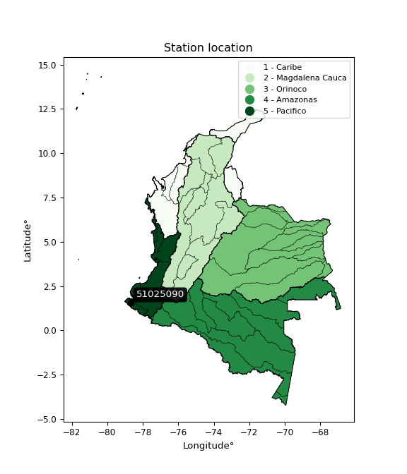

<div align="center">


</div>

# PMax24h Station (Rain): 51025090

Maximum Precipitation in 24 hours (PMax24h) is the greatest amount of rainfall for a specific duration that is meteorologically possible for a given location, acting as a "worst-case" scenario for extreme storms, crucial for designing safety-critical infrastructure like bridges, river deviations, dams, spillways, and nuclear plants to prevent catastrophic failure. The PMax24h is related with the Probable Maximum Precipitation (PMP) and it is calculated by hydrologists using meteorological data to determine the upper limit of extreme rainfall, often leading to the Probable Maximum Flood (PMF) for flood control design, and is increasingly being studied for climate change impacts. Probable Maximum Precipitation (PMP) is the theoretical upper limit of rainfall, a deterministic estimate for extreme events, while probability distributions (like GEV, Gumbel) describe the likelihood and frequency of various precipitation amounts, including rare ones, showing how often events occur, with PMP representing the extreme end of these distributions, used for critical infrastructure design to ensure safety against the worst conceivable weather, unlike standard statistical forecasts which cover typical probabilities.

The most common probability distributions in hydrology, used for analyzing floods, rainfall, and streamflow, include the Normal, Log-Normal, Gumbel, Gamma (including Log-Pearson Type III), and Generalized Extreme Value (GEV) distributions, often chosen based on the data´s skewness and whether modeling extremes or general conditions, with Gumbel and GEV popular for extreme events like floods, while the Normal distribution serves as a baseline, though often requiring transformations for skewed hydrological data. These distributions help in designing water infrastructure, managing water resources, and forecasting hydrologic events.

> Hydrological data often isn´t perfectly normal (it´s skewed), so different distributions are needed for different applications, such as: **Flood Frequency Analysis**: Using Gumbel, GEV, or Log-Pearson Type III for predicting extreme flood magnitudes and their return periods, **Rainfall Analysis**: Normal for annual totals, but Log-Normal, Weibull, or GEV for intensity or extreme daily rainfall, **Streamflow Modeling**: Gamma and Log-Normal for maximum flows, GEV for minimum flows, and Kappa for daily flows.

<div align="center">

</img>

</div>


## A. General information


### 1. General running parameters

• app_version: _v20260225_. • runtime: _2026-02-28 16:54:07.457399_. • Python version: _3.14.0_. • SciPy version: _1.16.3_. • Pandas version: _2.3.3_. • NumPy version: _2.3.5_. • Stations dataset (station_dataset_file): _dataset/pmax24h_in/automatic_colombia_2003_2025.csv_. • Stations catalog (station_catalog_file): _dataset/CNE.xls_. • Minimum year to eval til year_max (date_min): _1900_. • Maximum year to eval since year_min (date_max): _2025_. • Creates, save and include plots into reports (create_plot): _False_. • Plot only fit distributions with Δo > Δ (plot_only_fit): _True_. • Plot only simple graphs avoiding multiple CDFs and multiple Extreme values plots (plot_only_simple): _False_. • Eval low extreme values, if False, evaluates high extreme values (low_extreme): _False_. • Eval every SciPy distribution as logarithmic (pdist_logarithmic_on): _True_. • Standard deviation normalized (ddof): _1.0_. • Return periods to eval in years (Tr): _[2, 2.33, 5, 10, 15, 20, 25, 50, 75, 100, 200, 250, 500, 750, 1000]_. • Minimum data sample per station, 0 means any (minimum_sample): _5_. • Z-Score maximum threshold to adjust a value, 0 means disable (zscore_max): _3.5_. • Z-Score minimum threshold to adjust a value, 0 means disable (zscore_min): _-2.5_. • Avoid zeros, e.g. rain = 0 (avoid_zeros): _True_. • Avoid null values (avoid_nans): _True_. 

:file_folder:Table: [dataset.csv](../../dataset/pmax24h_in/automatic_colombia_2003_2025.csv)

> Delta Degrees of Freedom (DDOF): is a parameter used in the formulas for calculating variance and standard deviation. When ddof=0, the divisor is $N$ (the total number of observations) and this is used when your data set is the entire population. When ddof=1, the divisor is $N-1$ and this is used when your data set is a sample drawn from a larger population. Using $N-1$ provides an unbiased estimate of the population variance (known as Bessel´s correction).


### 2. Station info and location

|   id |   CODIGO | NOMBRE                            | CATEGORIA               | TECNOLOGIA                              | ESTADO           | FECHA_INSTALACION   |   FECHA_SUSPENSION |   ALTITUD |   LATITUD |   LONGITUD | DEPARTAMENTO   | MUNICIPIO   | AREA_OPERATIVA                      | ENTIDAD                                                     | AREA_HIDROGRAFICA   | ZONA_HIDROGRAFICA   | SUBZONA_HIDROGRAFICA   |   CORRIENTE | Catalogo   |   Version |
|-----:|---------:|:----------------------------------|:------------------------|:----------------------------------------|:-----------------|:--------------------|-------------------:|----------:|----------:|-----------:|:---------------|:------------|:------------------------------------|:------------------------------------------------------------|:--------------------|:--------------------|:-----------------------|------------:|:-----------|----------:|
|    0 | 51025090 | GRANJA EL MIRA - - AUT [51025090] | Climatológica Principal | Automática con Telemetría, Convencional | En Mantenimiento | 01/08/2016          |                nan |        16 |   1.55019 |   -78.6956 | Nariño         | Tumaco      | Area Operativa 07 - Nariño-Putumayo | INSTITUTO DE HIDROLOGIA METEOROLOGIA Y ESTUDIOS AMBIENTALES | Pacifico            | Mira                | Río Mira               |         nan | CNE_IDEAM  |  20251226 |

<div align="center">

Dynamic map: [:earth_americas:Google](http://maps.google.com/maps?q=1.550194444,-78.69558333) [:earth_americas:OSM](https://www.openstreetmap.org/#map=18/1.550194444/-78.69558333&layers=P) [:earth_americas:Bing](https://www.bing.com/maps?cp=1.550194444~-78.69558333&lvl=18) [:earth_americas:Apple](https://maps.apple.com/frame?center=1.550194444%2C-78.69558333&span=0.003%2C0.006)

</div>


<div align="center">

```geojson
{
  "type": "Feature",
  "geometry": {
    "type": "Point", 
    "coordinates": [-78.69558333, 1.550194444]
  }, 
  "properties": {
    "Name": "51025090"
  }
}
```

</div>


### 3. Discrete values table and plot

<div align="center">

|               |            0 |           1 |           2 |          3 |          4 |           5 |           6 |
|:--------------|-------------:|------------:|------------:|-----------:|-----------:|------------:|------------:|
| Date          | 2017         | 2018        | 2019        | 2020       | 2021       | 2022        | 2023        |
| Value         |  147         |  123.624    |   70.43     |  324.44    |  278.678   |   36.9      |   29.7      |
| Value_initial |  147         |  123.624    |   70.43     |  324.44    |  278.678   |   36.9      |   29.7      |
| count         |    7         |    7        |    7        |    7       |    7       |    7        |    7        |
| mean          |  144.396     |  144.396    |  144.396    |  144.396   |  144.396   |  144.396    |  144.396    |
| std           |  116.238     |  116.238    |  116.238    |  116.238   |  116.238   |  116.238    |  116.238    |
| zscore        |    0.0224024 |   -0.178703 |   -0.636334 |    1.54893 |    1.15524 |   -0.924794 |   -0.986736 |


</div>


> The initial value (value_initial) correspond to the initial obtained or null completed value, and value (value) is adjusted only when the initial value is outside the valid range (outlier) definite through the Z-Score value. If Z-Score is active, values out of range or outliers are replaced with the station mean value. A Z-Score (or standard score) measures how many standard deviations a data point is from the mean of a dataset, indicating its relative position; positive scores mean above the mean, negative mean below, and a score of zero is exactly at the mean, allowing for comparison of values from different distributions. It´s calculated using the formula $z=(x–μ)/σ$, where $x$ is the data point, $μ$ is the mean, and $σ$ is the standard deviation, helping identify outliers and understand probability.
>
> <sub>**Note**: In this study, "completing" (filling gaps in) and "extending" (forecasting or lengthening the historical record) rainfall data series are avoided for certain critical analyses because they introduce artificial bias and uncertainty, which can distort the statistics of rare events (extremes), alter day-to-day variability, and compromise the integrity and homogeneity of the original data. Some reasons against Completing/Extending rainfall data are: **Distortion of Extremes and Variability**: The primary issue is that most gap-filling or extension methods rely on averaging or regression with nearby stations, which inherently smooths the data. Rainfall is highly variable in space and time, with a large percentage of zero values and occasional large storms. Infilling methods often underestimate the highest values and overestimate the lowest (zero) values, which severely distorts analyses focused on flood frequency, drought severity, and intensity-duration-frequency (IDF) curves, **Loss of Data Homogeneity**: Infilled or extended data are synthetic estimates, not actual measurements. Combining these estimates with observed data can violate the assumption of data homogeneity, which requires that the data properties do not change over time. Inhomogeneity can lead to incorrect conclusions about long-term trends or changes in climate patterns, **Propagation of Errors**: Errors and biases from the original data (e.g., wind-induced undercatch, instrument errors, site changes) or the data used for imputation can propagate through the analysis, leading to unreliable hydrological models and inaccurate predictions, **Compromised Statistical Integrity**: For statistical analyses, especially those involving the frequency of events, using artificial data can introduce time bias or autocorrelation that doesn´t exist in reality, making it difficult to assess the true probability of events, **Difficulty in Validation**: It is difficult to accurately validate the quality of filled or extended data, especially for past periods where ground-truth measurements are unavailable. The reliability of imputation techniques heavily depends on the density of the surrounding station network and the complexity of the local topography.</sub>


### 4. Active continuous probability distributions from SciPy (80 of 104 available)

A Probability Density Function (PDF) describes the relative likelihood of a continuous random variable falling within a specific range, where the total area under its curve equals 1, and the area over any interval gives the actual probability for that range. Unlike discrete probabilities (like rolling a die), a PDF shows density, not direct probability for a single point (which is zero), with higher points indicating higher likelihood, often visualized as a bell curve for normal distributions.

A log of a probability density function (log-PDF) is simply the logarithm of the PDF´s value, denoted as $log(f(x))$, useful for converting multiplication of probabilities into addition, improving numerical stability with tiny numbers, and connecting to information theory concepts like entropy. Instead of dealing with very small probabilities (e.g., 0.000001), log-PDFs use negative numbers (e.g., $log(0.00001) ≈ -11.51$ that are easier for computers to handle, preventing underflow errors and simplifying complex calculations. In this study, each active probability distribution from SciPy is also evaluated in the $log$ form.

[scipy.stats](https://docs.scipy.org/doc/scipy/reference/stats.html) is a Python´s powerful submodule within the SciPy library for comprehensive statistical analysis, offering over 130 probability distributions (like Normal, Poisson, etc.), functions for descriptive stats (mean, variance), hypothesis testing (t-tests, chi-square), random variable generation, and statistical tests, making it essential for data science, modeling, and research. It provides tools to explore, model, and draw conclusions from data efficiently, working seamlessly with [NumPy](https://numpy.org/).

<div align="center">

|   id | p_dist           |   n_parameter | fit_method   | label                                                                       | active   | ref                                                                                                      |
|-----:|:-----------------|--------------:|:-------------|:----------------------------------------------------------------------------|:---------|:---------------------------------------------------------------------------------------------------------|
|    0 | alpha            |             3 | MLE          | Alpha                                                                       | True     | [:mortar_board:](https://docs.scipy.org/doc/scipy/reference/generated/scipy.stats.alpha.html)            |
|    1 | anglit           |             2 | MM           | Anglit                                                                      | True     | [:mortar_board:](https://docs.scipy.org/doc/scipy/reference/generated/scipy.stats.anglit.html)           |
|    2 | arcsine          |             2 | MM           | Arcsine                                                                     | True     | [:mortar_board:](https://docs.scipy.org/doc/scipy/reference/generated/scipy.stats.arcsine.html)          |
|    3 | argus            |             3 | MLE          | Argus                                                                       | True     | [:mortar_board:](https://docs.scipy.org/doc/scipy/reference/generated/scipy.stats.argus.html)            |
|    4 | beta             |             4 | MLE          | Beta                                                                        | True     | [:mortar_board:](https://docs.scipy.org/doc/scipy/reference/generated/scipy.stats.beta.html)             |
|    5 | betaprime        |             4 | MLE          | Beta prime                                                                  | True     | [:mortar_board:](https://docs.scipy.org/doc/scipy/reference/generated/scipy.stats.betaprime.html)        |
|    6 | bradford         |             3 | MLE          | Bradford                                                                    | True     | [:mortar_board:](https://docs.scipy.org/doc/scipy/reference/generated/scipy.stats.bradford.html)         |
|    7 | burr             |             4 | MLE          | Burr (Type III)                                                             | True     | [:mortar_board:](https://docs.scipy.org/doc/scipy/reference/generated/scipy.stats.burr.html)             |
|    8 | burr12           |             4 | MLE          | Burr (Type III) 12                                                          | True     | [:mortar_board:](https://docs.scipy.org/doc/scipy/reference/generated/scipy.stats.burr12.html)           |
|    9 | cosine           |             2 | MLE          | Cosine                                                                      | True     | [:mortar_board:](https://docs.scipy.org/doc/scipy/reference/generated/scipy.stats.cosine.html)           |
|   10 | crystalball      |             4 | MLE          | Crystalball                                                                 | True     | [:mortar_board:](https://docs.scipy.org/doc/scipy/reference/generated/scipy.stats.crystalball.html)      |
|   11 | dgamma           |             3 | MLE          | Double gamma                                                                | True     | [:mortar_board:](https://docs.scipy.org/doc/scipy/reference/generated/scipy.stats.dgamma.html)           |
|   12 | dweibull         |             3 | MLE          | Double Weibull                                                              | True     | [:mortar_board:](https://docs.scipy.org/doc/scipy/reference/generated/scipy.stats.dweibull.html)         |
|   13 | erlang           |             3 | MLE          | Erlang                                                                      | True     | [:mortar_board:](https://docs.scipy.org/doc/scipy/reference/generated/scipy.stats.erlang.html)           |
|   14 | exponnorm        |             3 | MLE          | Exponentially modified Normal                                               | True     | [:mortar_board:](https://docs.scipy.org/doc/scipy/reference/generated/scipy.stats.exponnorm.html)        |
|   15 | exponpow         |             3 | MLE          | Exponential power                                                           | True     | [:mortar_board:](https://docs.scipy.org/doc/scipy/reference/generated/scipy.stats.exponpow.html)         |
|   16 | exponweib        |             4 | MLE          | Exponentiated Weibull                                                       | True     | [:mortar_board:](https://docs.scipy.org/doc/scipy/reference/generated/scipy.stats.exponweib.html)        |
|   17 | f                |             4 | MLE          | F                                                                           | True     | [:mortar_board:](https://docs.scipy.org/doc/scipy/reference/generated/scipy.stats.f.html)                |
|   18 | fatiguelife      |             3 | MLE          | Fatigue-life (Birnbaum-Saunders)                                            | True     | [:mortar_board:](https://docs.scipy.org/doc/scipy/reference/generated/scipy.stats.fatiguelife.html)      |
|   19 | foldnorm         |             3 | MM           | Fold Normal                                                                 | True     | [:mortar_board:](https://docs.scipy.org/doc/scipy/reference/generated/scipy.stats.foldnorm.html)         |
|   20 | gamma            |             3 | MLE          | Gamma                                                                       | True     | [:mortar_board:](https://docs.scipy.org/doc/scipy/reference/generated/scipy.stats.gamma.html)            |
|   21 | gausshyper       |             6 | MLE          | Gauss hypergeometric                                                        | True     | [:mortar_board:](https://docs.scipy.org/doc/scipy/reference/generated/scipy.stats.gausshyper.html)       |
|   22 | genexpon         |             5 | MLE          | Generalized exponential                                                     | True     | [:mortar_board:](https://docs.scipy.org/doc/scipy/reference/generated/scipy.stats.genexpon.html)         |
|   23 | genextreme       |             3 | MLE          | Generalized exponential                                                     | True     | [:mortar_board:](https://docs.scipy.org/doc/scipy/reference/generated/scipy.stats.genextreme.html)       |
|   24 | gengamma         |             4 | MLE          | Generalized gamma                                                           | True     | [:mortar_board:](https://docs.scipy.org/doc/scipy/reference/generated/scipy.stats.gengamma.html)         |
|   25 | genhalflogistic  |             3 | MLE          | Generalized half-logistic                                                   | True     | [:mortar_board:](https://docs.scipy.org/doc/scipy/reference/generated/scipy.stats.genhalflogistic.html)  |
|   26 | genlogistic      |             3 | MLE          | Generalized logistic                                                        | True     | [:mortar_board:](https://docs.scipy.org/doc/scipy/reference/generated/scipy.stats.genlogistic.html)      |
|   27 | gennorm          |             3 | MLE          | Generalized Normal                                                          | True     | [:mortar_board:](https://docs.scipy.org/doc/scipy/reference/generated/scipy.stats.gennorm.html)          |
|   28 | genpareto        |             3 | MLE          | Generalized Pareto                                                          | True     | [:mortar_board:](https://docs.scipy.org/doc/scipy/reference/generated/scipy.stats.genpareto.html)        |
|   29 | gompertz         |             3 | MLE          | Gompertz (or truncated Gumbel)                                              | True     | [:mortar_board:](https://docs.scipy.org/doc/scipy/reference/generated/scipy.stats.gompertz.html)         |
|   30 | gumbel_l         |             2 | MM           | Gumbel Left Skew                                                            | True     | [:mortar_board:](https://docs.scipy.org/doc/scipy/reference/generated/scipy.stats.gumbel_l.html)         |
|   31 | gumbel_r         |             2 | MM           | Gumbel Right Skew                                                           | True     | [:mortar_board:](https://docs.scipy.org/doc/scipy/reference/generated/scipy.stats.gumbel_r.html)         |
|   32 | halfgennorm      |             3 | MLE          | Upper half of a generalized normal                                          | True     | [:mortar_board:](https://docs.scipy.org/doc/scipy/reference/generated/scipy.stats.halfgennorm.html)      |
|   33 | halflogistic     |             2 | MM           | Half-logistic                                                               | True     | [:mortar_board:](https://docs.scipy.org/doc/scipy/reference/generated/scipy.stats.halflogistic.html)     |
|   34 | halfnorm         |             2 | MM           | Half Normal                                                                 | True     | [:mortar_board:](https://docs.scipy.org/doc/scipy/reference/generated/scipy.stats.halfnorm.html)         |
|   35 | hypsecant        |             2 | MM           | hyperbolic secant                                                           | True     | [:mortar_board:](https://docs.scipy.org/doc/scipy/reference/generated/scipy.stats.hypsecant.html)        |
|   36 | invgamma         |             3 | MLE          | Inverted gamma                                                              | True     | [:mortar_board:](https://docs.scipy.org/doc/scipy/reference/generated/scipy.stats.invgamma.html)         |
|   37 | invgauss         |             3 | MLE          | Inverse Gaussian                                                            | True     | [:mortar_board:](https://docs.scipy.org/doc/scipy/reference/generated/scipy.stats.invgauss.html)         |
|   38 | invweibull       |             3 | MLE          | Inverted Weibull                                                            | True     | [:mortar_board:](https://docs.scipy.org/doc/scipy/reference/generated/scipy.stats.invweibull.html)       |
|   39 | johnsonsb        |             4 | MLE          | Johnson SB                                                                  | True     | [:mortar_board:](https://docs.scipy.org/doc/scipy/reference/generated/scipy.stats.johnsonsb.html)        |
|   40 | johnsonsu        |             4 | MLE          | Johnson Su                                                                  | True     | [:mortar_board:](https://docs.scipy.org/doc/scipy/reference/generated/scipy.stats.johnsonsu.html)        |
|   41 | kappa3           |             3 | MLE          | Kappa 3                                                                     | True     | [:mortar_board:](https://docs.scipy.org/doc/scipy/reference/generated/scipy.stats.kappa3.html)           |
|   42 | kappa4           |             4 | MLE          | Kappa 4                                                                     | True     | [:mortar_board:](https://docs.scipy.org/doc/scipy/reference/generated/scipy.stats.kappa4.html)           |
|   43 | ksone            |             3 | MLE          | Kolmogorov-Smirnov one-sided test statistic distribution                    | True     | [:mortar_board:](https://docs.scipy.org/doc/scipy/reference/generated/scipy.stats.ksone.html)            |
|   44 | kstwobign        |             2 | MLE          | Limiting distribution of scaled Kolmogorov-Smirnov two-sided test statistic | True     | [:mortar_board:](https://docs.scipy.org/doc/scipy/reference/generated/scipy.stats.kstwobign.html)        |
|   45 | laplace          |             2 | MM           | Laplace                                                                     | True     | [:mortar_board:](https://docs.scipy.org/doc/scipy/reference/generated/scipy.stats.laplace.html)          |
|   46 | levy_l           |             2 | MLE          | Left-skewed Levy                                                            | True     | [:mortar_board:](https://docs.scipy.org/doc/scipy/reference/generated/scipy.stats.levy_l.html)           |
|   47 | loggamma         |             3 | MLE          | Log gamma                                                                   | True     | [:mortar_board:](https://docs.scipy.org/doc/scipy/reference/generated/scipy.stats.loggamma.html)         |
|   48 | logistic         |             2 | MM           | Logistic (or Sech-squared)                                                  | True     | [:mortar_board:](https://docs.scipy.org/doc/scipy/reference/generated/scipy.stats.logistic.html)         |
|   49 | loglaplace       |             3 | MLE          | Log-Laplace                                                                 | True     | [:mortar_board:](https://docs.scipy.org/doc/scipy/reference/generated/scipy.stats.loglaplace.html)       |
|   50 | lomax            |             3 | MLE          | Lomax (Pareto of the second kind)                                           | True     | [:mortar_board:](https://docs.scipy.org/doc/scipy/reference/generated/scipy.stats.lomax.html)            |
|   51 | maxwell          |             2 | MM           | Maxwell                                                                     | True     | [:mortar_board:](https://docs.scipy.org/doc/scipy/reference/generated/scipy.stats.maxwell.html)          |
|   52 | mielke           |             4 | MLE          | Mielke Beta-Kappa / Dagum                                                   | True     | [:mortar_board:](https://docs.scipy.org/doc/scipy/reference/generated/scipy.stats.mielke.html)           |
|   53 | moyal            |             2 | MM           | Moyal                                                                       | True     | [:mortar_board:](https://docs.scipy.org/doc/scipy/reference/generated/scipy.stats.moyal.html)            |
|   54 | nakagami         |             3 | MLE          | Nakagami                                                                    | True     | [:mortar_board:](https://docs.scipy.org/doc/scipy/reference/generated/scipy.stats.nakagami.html)         |
|   55 | ncf              |             5 | MLE          | Non-central F distribution                                                  | True     | [:mortar_board:](https://docs.scipy.org/doc/scipy/reference/generated/scipy.stats.ncf.html)              |
|   56 | nct              |             4 | MLE          | Non-central Student’s t                                                     | True     | [:mortar_board:](https://docs.scipy.org/doc/scipy/reference/generated/scipy.stats.nct.html)              |
|   57 | norm             |             2 | MM           | Normal                                                                      | True     | [:mortar_board:](https://docs.scipy.org/doc/scipy/reference/generated/scipy.stats.norm.html)             |
|   58 | pearson3         |             3 | MM           | Pearson type III                                                            | True     | [:mortar_board:](https://docs.scipy.org/doc/scipy/reference/generated/scipy.stats.pearson3.html)         |
|   59 | powerlaw         |             3 | MLE          | Power-function                                                              | True     | [:mortar_board:](https://docs.scipy.org/doc/scipy/reference/generated/scipy.stats.powerlaw.html)         |
|   60 | rayleigh         |             2 | MM           | Rayleigh                                                                    | True     | [:mortar_board:](https://docs.scipy.org/doc/scipy/reference/generated/scipy.stats.rayleigh.html)         |
|   61 | rdist            |             3 | MLE          | R-distributed (symmetric beta)                                              | True     | [:mortar_board:](https://docs.scipy.org/doc/scipy/reference/generated/scipy.stats.rdist.html)            |
|   62 | rice             |             3 | MLE          | Rice                                                                        | True     | [:mortar_board:](https://docs.scipy.org/doc/scipy/reference/generated/scipy.stats.rice.html)             |
|   63 | semicircular     |             2 | MM           | Semicircular                                                                | True     | [:mortar_board:](https://docs.scipy.org/doc/scipy/reference/generated/scipy.stats.semicircular.html)     |
|   64 | skewnorm         |             3 | MLE          | Skew normal                                                                 | True     | [:mortar_board:](https://docs.scipy.org/doc/scipy/reference/generated/scipy.stats.skewnorm.html)         |
|   65 | t                |             3 | MLE          | Student’s t                                                                 | True     | [:mortar_board:](https://docs.scipy.org/doc/scipy/reference/generated/scipy.stats.t.html)                |
|   66 | trapezoid        |             4 | MLE          | Trapezoid                                                                   | True     | [:mortar_board:](https://docs.scipy.org/doc/scipy/reference/generated/scipy.stats.trapezoid.html)        |
|   67 | triang           |             3 | MLE          | Triangular                                                                  | True     | [:mortar_board:](https://docs.scipy.org/doc/scipy/reference/generated/scipy.stats.triang.html)           |
|   68 | truncexpon       |             3 | MLE          | Truncated exponential                                                       | True     | [:mortar_board:](https://docs.scipy.org/doc/scipy/reference/generated/scipy.stats.truncexpon.html)       |
|   69 | truncnorm        |             4 | MLE          | Truncated normal                                                            | True     | [:mortar_board:](https://docs.scipy.org/doc/scipy/reference/generated/scipy.stats.truncnorm.html)        |
|   70 | truncpareto      |             4 | MLE          | Upper truncated Pareto                                                      | True     | [:mortar_board:](https://docs.scipy.org/doc/scipy/reference/generated/scipy.stats.truncpareto.html)      |
|   71 | truncweibull_min |             5 | MLE          | Doubly truncated Weibull minimum                                            | True     | [:mortar_board:](https://docs.scipy.org/doc/scipy/reference/generated/scipy.stats.truncweibull_min.html) |
|   72 | tukeylambda      |             3 | MLE          | Tukey-Lamdba                                                                | True     | [:mortar_board:](https://docs.scipy.org/doc/scipy/reference/generated/scipy.stats.tukeylambda.html)      |
|   73 | uniform          |             2 | MLE          | Uniform                                                                     | True     | [:mortar_board:](https://docs.scipy.org/doc/scipy/reference/generated/scipy.stats.uniform.html)          |
|   74 | vonmises         |             3 | MLE          | Von Mises                                                                   | True     | [:mortar_board:](https://docs.scipy.org/doc/scipy/reference/generated/scipy.stats.vonmises.html)         |
|   75 | vonmises_line    |             3 | MLE          | Von Mises line                                                              | True     | [:mortar_board:](https://docs.scipy.org/doc/scipy/reference/generated/scipy.stats.vonmises_line.html)    |
|   76 | wald             |             2 | MM           | Wald                                                                        | True     | [:mortar_board:](https://docs.scipy.org/doc/scipy/reference/generated/scipy.stats.wald.html)             |
|   77 | weibull_max      |             3 | MLE          | Weibull maximum                                                             | True     | [:mortar_board:](https://docs.scipy.org/doc/scipy/reference/generated/scipy.stats.weibull_max.html)      |
|   78 | weibull_min      |             3 | MLE          | Weibull minimum                                                             | True     | [:mortar_board:](https://docs.scipy.org/doc/scipy/reference/generated/scipy.stats.weibull_min.html)      |
|   79 | wrapcauchy       |             3 | MLE          | Wrapped  Cauchy                                                             | True     | [:mortar_board:](https://docs.scipy.org/doc/scipy/reference/generated/scipy.stats.wrapcauchy.html)       |

</div>

> **n_parameter:** # arguments & localization & scale.
>
> **Fit methods:** (MLE) maximum likelihood, (MM) L-moments.
>
>**Inactive** (With the only purpose of prevent loops, zero divisions, infinite values, over high estimated values or horizontal trending for recurrence intervals estimations, the follow distributions were disabled.)**:** lognorm, norminvgauss, powernorm, powerlognorm, cauchy, halfcauchy, foldcauchy, skewcauchy, chi2, expon, fisk, genhyperbolic, geninvgauss, gibrat, kstwo, laplace_asymmetric, levy, levy_stable, ncx2, pareto, rel_breitwigner, recipinvgauss, studentized_range, loguniform, 


## B. Probability (PDF) vs. Empirical (EDF) distributions functions

A continuous probability distribution (CPD) describes probabilities for variables that can take any value within a range (like rain any time), unlike discrete variables with specific outcomes (like temperature). It uses a Probability Density Function (PDF), a curve where the total area under it equals 1, and the probability of the variable falling within an interval (a to b) is found by calculating the area under the curve between those points. A key feature is that the probability of hitting any single exact value is zero, so probabilities are always expressed for ranges, e.g., $P(a ≤ X ≤ b)$.

<div align="center">

Distributions parameters from station values
|     |   station | p_dist              |   n |               loc |            scale | shape                  | shape1               | shape2                | shape3             |
|----:|----------:|:--------------------|----:|------------------:|-----------------:|:-----------------------|:---------------------|:----------------------|:-------------------|
|   0 |  51025090 | alpha               |   7 |      -0.149832    |     56.5988      | 2.510832570050354e-10  |                      |                       |                    |
|   1 |  51025090 | anglit              |   7 |     144.396       |    314.818       |                        |                      |                       |                    |
|   2 |  51025090 | arcsine             |   7 |      -7.79496     |    304.382       |                        |                      |                       |                    |
|   3 |  51025090 | argus               |   7 |     -82.2823      |    425.783       | 9.559397617478015e-07  |                      |                       |                    |
|   4 |  51025090 | beta                |   7 |       0.220249    |    324.22        | 0.3341843590849532     | 0.5765296112259088   |                       |                    |
|   5 |  51025090 | betaprime           |   7 |      -2.96483     |    498.437       | 2.110695937285798      | 8.06778289241149     |                       |                    |
|   6 |  51025090 | bradford            |   7 |      29.7         |    294.749       | 4.018226326442948      |                      |                       |                    |
|   7 |  51025090 | burr                |   7 |      -0.36351     |      1.22363     | 1.2771933744483905     | 168.07500563760618   |                       |                    |
|   8 |  51025090 | burr12              |   7 |      -1.21641     |     30.512       | 299.77436218120147     | 0.002695586889201711 |                       |                    |
|   9 |  51025090 | cosine              |   7 |     153.327       |     87.244       |                        |                      |                       |                    |
|  10 |  51025090 | crystalball         |   7 |       0.694071    |    179.815       | 15.902800053085649     | 1.0000000021489268   |                       |                    |
|  11 |  51025090 | dgamma              |   7 |     103.946       |     52.0583      | 1.7364182100512386     |                      |                       |                    |
|  12 |  51025090 | dweibull            |   7 |     108.526       |     97.9913      | 1.3270852261831274     |                      |                       |                    |
|  13 |  51025090 | erlang              |   7 |      29.7         |     91.2311      | 0.6978449784228453     |                      |                       |                    |
|  14 |  51025090 | exponnorm           |   7 |      29.5682      |      0.0405034   | 2839.929509374826      |                      |                       |                    |
|  15 |  51025090 | exponpow            |   7 |      29.7         |    189.719       | 0.6087959919382226     |                      |                       |                    |
|  16 |  51025090 | exponweib           |   7 |      29.7         |     33.7488      | 0.9910828797819173     | 0.5666935863539606   |                       |                    |
|  17 |  51025090 | f                   |   7 |      29.7         |     84.637       | 0.8215571496310783     | 2798.6266753492782   |                       |                    |
|  18 |  51025090 | fatiguelife         |   7 |      29.7         |      0.0114174   | 94.2382617145143       |                      |                       |                    |
|  19 |  51025090 | foldnorm            |   7 |     -21.6935      |    127.34        | 1.1897107769315998     |                      |                       |                    |
|  20 |  51025090 | gamma               |   7 |      29.7         |    112.969       | 0.558640046794505      |                      |                       |                    |
|  21 |  51025090 | gausshyper          |   7 |     -21.2719      |    345.712       | 1.1370442714652333     | 0.8932607718114662   | 0.9139701508759268    | 0.9637442560575042 |
|  22 |  51025090 | genexpon            |   7 |      29.698       |      2.23973     | 0.018211396221807404   | 3.820630623772396    | 7.082944518360904e-06 |                    |
|  23 |  51025090 | genextreme          |   7 |     -18.8265      |    377.829       | 1.1006860082563952     |                      |                       |                    |
|  24 |  51025090 | gengamma            |   7 |      29.7         |      1.38333     | 2.9042777328486755     | 0.3000813296399759   |                       |                    |
|  25 |  51025090 | genhalflogistic     |   7 |       0.227605    |    339.963       | 1.0485800351958932     |                      |                       |                    |
|  26 |  51025090 | genlogistic         |   7 |    -502.376       |     80.6109      | 1640.5566941751097     |                      |                       |                    |
|  27 |  51025090 | gennorm             |   7 |     177.07        |    147.373       | 648227.3141893251      |                      |                       |                    |
|  28 |  51025090 | genpareto           |   7 |      -1.2962      |    468.021       | -1.4368091893123742    |                      |                       |                    |
|  29 |  51025090 | gompertz            |   7 |      29.7         |    961.222       | 7.464750641359188      |                      |                       |                    |
|  30 |  51025090 | gumbel_l            |   7 |     192.829       |     83.9073      |                        |                      |                       |                    |
|  31 |  51025090 | gumbel_r            |   7 |      95.9634      |     83.9073      |                        |                      |                       |                    |
|  32 |  51025090 | halfgennorm         |   7 |      29.6908      |    361.287       | 15.399899352281416     |                      |                       |                    |
|  33 |  51025090 | halflogistic        |   7 |      16.8469      |     92.0072      |                        |                      |                       |                    |
|  34 |  51025090 | halfnorm            |   7 |       1.95559     |    178.523       |                        |                      |                       |                    |
|  35 |  51025090 | hypsecant           |   7 |     144.396       |     68.51        |                        |                      |                       |                    |
|  36 |  51025090 | invgamma            |   7 |      -6.54415     |    148.73        | 1.7916153206508212     |                      |                       |                    |
|  37 |  51025090 | invgauss            |   7 |      14.5606      |     71.0416      | 1.8275977887802974     |                      |                       |                    |
|  38 |  51025090 | invweibull          |   7 |       1.15751     |     65.4717      | 1.2457733877706445     |                      |                       |                    |
|  39 |  51025090 | johnsonsb           |   7 |      29.7         |    564.201       | 0.01535582871184904    | 0.09205639480056238  |                       |                    |
|  40 |  51025090 | johnsonsu           |   7 |       4.68648e+09 |      3.86369e+09 | 57807202.33181922      | 56439084.995461226   |                       |                    |
|  41 |  51025090 | kappa3              |   7 |      29.6961      |    294.236       | 1145.38805811684       |                      |                       |                    |
|  42 |  51025090 | kappa4              |   7 |     -36.5409      |    366.267       | 1.2204270738533665     | 0.9862583980786532   |                       |                    |
|  43 |  51025090 | ksone               |   7 |     -41.9991      |    372.79        | 1.0                    |                      |                       |                    |
|  44 |  51025090 | kstwobign           |   7 |    -185.567       |    378.265       |                        |                      |                       |                    |
|  45 |  51025090 | laplace             |   7 |     144.396       |     76.0955      |                        |                      |                       |                    |
|  46 |  51025090 | levy_l              |   7 |     341.043       |     72.7561      |                        |                      |                       |                    |
|  47 |  51025090 | loggamma            |   7 |  -29108.8         |   4049.27        | 1372.875950383962      |                      |                       |                    |
|  48 |  51025090 | logistic            |   7 |     144.396       |     59.3314      |                        |                      |                       |                    |
|  49 |  51025090 | loglaplace          |   7 |      -0.31279     |    123.937       | 1.364603344597656      |                      |                       |                    |
|  50 |  51025090 | lomax               |   7 |      29.5331      |   3267.13        | 29.153702447757922     |                      |                       |                    |
|  51 |  51025090 | maxwell             |   7 |    -110.607       |    159.799       |                        |                      |                       |                    |
|  52 |  51025090 | mielke              |   7 |      -0.596571    |      1.17537     | 233.430982784158       | 1.2828598989033355   |                       |                    |
|  53 |  51025090 | moyal               |   7 |      82.8547      |     48.4439      |                        |                      |                       |                    |
|  54 |  51025090 | nakagami            |   7 |      29.7         |    207.155       | 0.24560131713726685    |                      |                       |                    |
|  55 |  51025090 | ncf                 |   7 |      -0.170744    |      0.00424865  | 0.0015955619840746153  | 3.84105613342352     | 31.40990005284511     |                    |
|  56 |  51025090 | nct                 |   7 |      -0.178206    |      1.05144     | 1.0400101912918798     | 53.84359574259602    |                       |                    |
|  57 |  51025090 | norm                |   7 |     144.396       |    107.615       |                        |                      |                       |                    |
|  58 |  51025090 | pearson3            |   7 |     144.396       |    107.615       | 0.5837835420321464     |                      |                       |                    |
|  59 |  51025090 | powerlaw            |   7 |      29.7         |    294.74        | 0.14931105166344746    |                      |                       |                    |
|  60 |  51025090 | rayleigh            |   7 |     -61.4782      |    164.264       |                        |                      |                       |                    |
|  61 |  51025090 | rdist               |   7 |       1.26483     |    145.735       | 1.1602838710302619     |                      |                       |                    |
|  62 |  51025090 | rice                |   7 |     -33.3695      |    146.938       | 0.0006314712231904842  |                      |                       |                    |
|  63 |  51025090 | semicircular        |   7 |     144.396       |    215.23        |                        |                      |                       |                    |
|  64 |  51025090 | skewnorm            |   7 |      29.7         |    157.29        | 23277968.5776989       |                      |                       |                    |
|  65 |  51025090 | t                   |   7 |     144.395       |    107.614       | 41961.24638613677      |                      |                       |                    |
|  66 |  51025090 | trapezoid           |   7 |       0.226       |    353.688       | 1.0                    | 1.0                  |                       |                    |
|  67 |  51025090 | triang              |   7 |       0.233882    |    324.206       | 0.9999999058527815     |                      |                       |                    |
|  68 |  51025090 | truncexpon          |   7 |     -16.1089      |    381.246       | 0.8932528798777453     |                      |                       |                    |
|  69 |  51025090 | truncnorm           |   7 |     144.396       |    107.615       | -2445.08036375725      | 1901.2670620789918   |                       |                    |
|  70 |  51025090 | truncpareto         |   7 |      29.6186      |      0.0813617   | 0.16965491069321328    | 3623.5909471385085   |                       |                    |
|  71 |  51025090 | truncweibull_min    |   7 |      18.395       |    391.937       | 0.3523247109586647     | 0.028843826134533734 | 0.7808525186246729    |                    |
|  72 |  51025090 | tukeylambda         |   7 |     177.07        |    188.46        | 1.2788211605612991     |                      |                       |                    |
|  73 |  51025090 | uniform             |   7 |      29.7         |    294.74        |                        |                      |                       |                    |
|  74 |  51025090 | vonmises            |   7 |      -2.61843     |      1           | 0.5834154594597144     |                      |                       |                    |
|  75 |  51025090 | vonmises_line       |   7 |     178.699       |     47.428       | 9.836084609728283e-08  |                      |                       |                    |
|  76 |  51025090 | wald                |   7 |      36.7807      |    107.615       |                        |                      |                       |                    |
|  77 |  51025090 | weibull_max         |   7 |     324.44        |      1.90067     | 0.21684697324840868    |                      |                       |                    |
|  78 |  51025090 | weibull_min         |   7 |      29.7         |    112.867       | 0.47330755371544186    |                      |                       |                    |
|  79 |  51025090 | wrapcauchy          |   7 |      29.6996      |     46.9094      | 0.5461929072003001     |                      |                       |                    |
|  80 |  51025090 | logalpha            |   7 |     -10.1631      |    249.889       | 16.960070122627315     |                      |                       |                    |
|  81 |  51025090 | loganglit           |   7 |       4.63912     |      2.52418     |                        |                      |                       |                    |
|  82 |  51025090 | logarcsine          |   7 |       3.41888     |      2.44048     |                        |                      |                       |                    |
|  83 |  51025090 | logargus            |   7 |       2.70673     |      3.22796     | 0.9248442392780034     |                      |                       |                    |
|  84 |  51025090 | logbeta             |   7 |       3.24923     |      2.53287     | 0.7185012542741807     | 0.5880747913596025   |                       |                    |
|  85 |  51025090 | logbetaprime        |   7 |      -8.90604     |     42.7487      | 314.1120765715674      | 992.3497741366059    |                       |                    |
|  86 |  51025090 | logbradford         |   7 |       3.37917     |      2.403       | 2.9852871479967263e-05 |                      |                       |                    |
|  87 |  51025090 | logburr             |   7 |     -15.6295      |     21.4579      | 834.1504979512573      | 0.020683561751455165 |                       |                    |
|  88 |  51025090 | logburr12           |   7 |       2.66098     |      8.89578     | 2.583860869108107      | 36.064417955091656   |                       |                    |
|  89 |  51025090 | logcosine           |   7 |       4.62366     |      0.692155    |                        |                      |                       |                    |
|  90 |  51025090 | logcrystalball      |   7 |       4.63912     |      0.86285     | 284.84575641205436     | 88.016880656956      |                       |                    |
|  91 |  51025090 | logdgamma           |   7 |       4.53376     |      0.247613    | 3.133956082559119      |                      |                       |                    |
|  92 |  51025090 | logdweibull         |   7 |       4.53233     |      0.878984    | 2.126859985721123      |                      |                       |                    |
|  93 |  51025090 | logerlang           |   7 |     -15.9533      |      0.0364896   | 564.2811636046347      |                      |                       |                    |
|  94 |  51025090 | logexponnorm        |   7 |       4.63873     |      0.862853    | 0.00044776038877140424 |                      |                       |                    |
|  95 |  51025090 | logexponpow         |   7 |       3.39115     |      1.58165     | 0.5438658450783511     |                      |                       |                    |
|  96 |  51025090 | logexponweib        |   7 |       3.39115     |      1.25284     | 0.2187775502544258     | 1.0744447515318833   |                       |                    |
|  97 |  51025090 | logf                |   7 |     -23.4093      |     28.0443      | 3234.9521554608873     | 6121.959740563016    |                       |                    |
|  98 |  51025090 | logfatiguelife      |   7 |    -109.431       |    114.067       | 0.007552075751614758   |                      |                       |                    |
|  99 |  51025090 | logfoldnorm         |   7 |       1.17691     |      0.857871    | 4.036534681686863      |                      |                       |                    |
| 100 |  51025090 | loggamma            |   7 |     -14.8735      |      0.0382551   | 510.0677414613947      |                      |                       |                    |
| 101 |  51025090 | loggausshyper       |   7 |       3.36935     |      2.41275     | 1.0162315302182336     | 0.9029176079706682   | 0.9887568045697036    | 1.0255411741200793 |
| 102 |  51025090 | loggenexpon         |   7 |       3.38397     |      0.0135486   | 0.006276517495798203   | 2.595399185983233    | 2.545127512274577e-05 |                    |
| 103 |  51025090 | loggenextreme       |   7 |       4.77877     |      1.14764     | 1.1438328540704723     |                      |                       |                    |
| 104 |  51025090 | loggengamma         |   7 |       3.39115     |      1.34889     | 0.4530120729232654     | 0.9942519015741946   |                       |                    |
| 105 |  51025090 | loggenhalflogistic  |   7 |       2.86987     |      3.29653     | 1.1319608803427679     |                      |                       |                    |
| 106 |  51025090 | loggenlogistic      |   7 |      -0.0943083   |      0.786608    | 236.79812660594143     |                      |                       |                    |
| 107 |  51025090 | loggennorm          |   7 |       4.58662     |      1.19549     | 983704.4097047558      |                      |                       |                    |
| 108 |  51025090 | loggenpareto        |   7 |      -0.00727514  |      8.88028     | -1.5338927063704928    |                      |                       |                    |
| 109 |  51025090 | loggompertz         |   7 |       3.39115     |      1.37218     | 0.5005464079018793     |                      |                       |                    |
| 110 |  51025090 | loggumbel_l         |   7 |       5.02744     |      0.672761    |                        |                      |                       |                    |
| 111 |  51025090 | loggumbel_r         |   7 |       4.25079     |      0.672761    |                        |                      |                       |                    |
| 112 |  51025090 | loghalfgennorm      |   7 |       3.39009     |      2.39736     | 1902.0797124396554     |                      |                       |                    |
| 113 |  51025090 | loghalflogistic     |   7 |       3.61641     |      0.737722    |                        |                      |                       |                    |
| 114 |  51025090 | loghalfnorm         |   7 |       3.49701     |      1.43141     |                        |                      |                       |                    |
| 115 |  51025090 | loghypsecant        |   7 |       4.63912     |      0.549307    |                        |                      |                       |                    |
| 116 |  51025090 | loginvgamma         |   7 |      -7.44863     |   2300.04        | 191.4338841090887      |                      |                       |                    |
| 117 |  51025090 | loginvgauss         |   7 |      -0.864048    |    208.764       | 0.02633339557261135    |                      |                       |                    |
| 118 |  51025090 | loginvweibull       |   7 | -361356           | 361360           | 457876.8888789313      |                      |                       |                    |
| 119 |  51025090 | logjohnsonsb        |   7 |       3.39115     |      2.39095     | -0.06095886593909543   | 0.20636015991154105  |                       |                    |
| 120 |  51025090 | logjohnsonsu        |   7 |       7.80553     |      0.275491    | 11.071015678551007     | 3.5733749790368385   |                       |                    |
| 121 |  51025090 | logkappa3           |   7 |       3.39084     |      2.22737     | 38.91590218189043      |                      |                       |                    |
| 122 |  51025090 | logkappa4           |   7 |       3.21166     |      2.74953     | 1.0641204342928032     | 1.0696726681298179   |                       |                    |
| 123 |  51025090 | logksone            |   7 |       3.14462     |      2.989       | 1.0                    |                      |                       |                    |
| 124 |  51025090 | logkstwobign        |   7 |       1.5017      |      3.57517     |                        |                      |                       |                    |
| 125 |  51025090 | loglaplace          |   7 |       4.63912     |      0.610126    |                        |                      |                       |                    |
| 126 |  51025090 | loglevy_l           |   7 |       5.86182     |      0.342582    |                        |                      |                       |                    |
| 127 |  51025090 | logloggamma         |   7 |       1.92686     |      1.83353     | 4.8802347868929745     |                      |                       |                    |
| 128 |  51025090 | loglogistic         |   7 |       4.63912     |      0.475714    |                        |                      |                       |                    |
| 129 |  51025090 | logloglaplace       |   7 |      -0.0074302   |      4.82467     | 6.159604071739109      |                      |                       |                    |
| 130 |  51025090 | loglomax            |   7 |       3.39115     |      8.14812e+10 | 14798869565.680748     |                      |                       |                    |
| 131 |  51025090 | logmaxwell          |   7 |       2.59453     |      1.28126     |                        |                      |                       |                    |
| 132 |  51025090 | logmielke           |   7 |      -5.71696e+07 |      5.71696e+07 | 47925184.774638236     | 671229503.0316622    |                       |                    |
| 133 |  51025090 | logmoyal            |   7 |       4.14568     |      0.388419    |                        |                      |                       |                    |
| 134 |  51025090 | lognakagami         |   7 |       3.39115     |      1.47527     | 0.3010265211246862     |                      |                       |                    |
| 135 |  51025090 | logncf              |   7 |     -25.0111      |     29.4497      | 3065.6949198822076     | 10132.297692245793   | 19.97236122171963     |                    |
| 136 |  51025090 | lognct              |   7 |     -54.8628      |      0.855873    | 141397.30305373803     | 69.52122726799149    |                       |                    |
| 137 |  51025090 | lognorm             |   7 |       4.63912     |      0.862849    |                        |                      |                       |                    |
| 138 |  51025090 | logpearson3         |   7 |       4.63912     |      0.862847    | -0.12910459435129884   |                      |                       |                    |
| 139 |  51025090 | logpowerlaw         |   7 |       3.39115     |      2.39095     | 0.17230970217949976    |                      |                       |                    |
| 140 |  51025090 | lograyleigh         |   7 |       2.98844     |      1.31705     |                        |                      |                       |                    |
| 141 |  51025090 | logrdist            |   7 |       4.59194     |      1.2008      | 1.1520793047862856     |                      |                       |                    |
| 142 |  51025090 | logrice             |   7 |       2.93286     |      1.02807     | 1.207818720382123      |                      |                       |                    |
| 143 |  51025090 | logsemicircular     |   7 |       4.63912     |      1.7257      |                        |                      |                       |                    |
| 144 |  51025090 | logskewnorm         |   7 |       5.7821      |      1.43195     | -2997349.907482217     |                      |                       |                    |
| 145 |  51025090 | logt                |   7 |       4.63913     |      0.862834    | 18666.664599038035     |                      |                       |                    |
| 146 |  51025090 | logtrapezoid        |   7 |       2.19861     |      3.66076     | 1.0                    | 1.0                  |                       |                    |
| 147 |  51025090 | logtriang           |   7 |       2.6335      |      3.1486      | 0.9999995773808354     |                      |                       |                    |
| 148 |  51025090 | logtruncexpon       |   7 |       3.39086     |      2.52191     | 0.9481884015615167     |                      |                       |                    |
| 149 |  51025090 | logtruncnorm        |   7 |      -0.148834    |      1.74247     | 2.527137570917109      | 3.4037578581756147   |                       |                    |
| 150 |  51025090 | logtruncpareto      |   7 |       3.39002     |      0.001127    | 0.16840695769609992    | 2122.5291713098695   |                       |                    |
| 151 |  51025090 | logtruncweibull_min |   7 |       3.37817     |      2.95883     | 0.8225689244083139     | 0.004387024025000226 | 0.8124607682945058    |                    |
| 152 |  51025090 | logtukeylambda      |   7 |       4.58662     |      1.42274     | 1.1901013016780926     |                      |                       |                    |
| 153 |  51025090 | loguniform          |   7 |       3.39115     |      2.39095     |                        |                      |                       |                    |
| 154 |  51025090 | logvonmises         |   7 |      -1.62544     |      1           | 1.8079010165263474     |                      |                       |                    |
| 155 |  51025090 | logvonmises_line    |   7 |       4.58663     |      0.380535    | 0.0047414118618458526  |                      |                       |                    |
| 156 |  51025090 | logwald             |   7 |       3.77625     |      0.862868    |                        |                      |                       |                    |
| 157 |  51025090 | logweibull_max      |   7 |       5.7821      |      1.17977     | 0.33661376048244784    |                      |                       |                    |
| 158 |  51025090 | logweibull_min      |   7 |       3.39115     |      1.20565     | 0.9067381036035896     |                      |                       |                    |
| 159 |  51025090 | logwrapcauchy       |   7 |       3.39115     |      0.380532    | 0.4481474728144357     |                      |                       |                    |

</div>

> **loc** (Location parameter): This shifts the distribution along the x-axis. For many common distributions, like the normal (Gaussian) distribution, loc represents the mean $μ$. For others, like the uniform distribution, it might represent the minimum value, or for the beta distribution, the left end of the support interval.
>
> **scale** (Scale parameter): This determines the width or spread of the distribution. For the normal distribution, scale represents the standard deviation $σ$. For a uniform distribution, it defines the length of the interval (from $loc$ to $loc + scale$).
>
> **shape** (Shape parameters): Refers to parameters that define the specific form of a probability distribution, distinct from its location (loc) and scale (scale). These parameters are required arguments for most distribution functions. For example, a normal (Gaussian) distribution is fully defined by its location (mean) and scale (standard deviation), so it has no specific shape parameters beyond loc and scale. However, other distributions have intrinsic properties that need specification, as Gamma distribution that takes a shape parameter, often named $a$ or $alpha$.


### 0. Cumulative distribution values - CDF (160 evaluated)

Cumulative Distribution Function (CDF), denoted as $F$<sub>$X$</sub>$(x)$, is a function that gives the probability that a random variable $X$ will take a value less than or equal to a specific value, $x$ (i.e., $(P(X≥x)$. It essentially "accumulates" probabilities from a given point up to the far right (positive infinity), providing a complete picture of the distribution´s probabilities for both discrete (like rain) and continuous (like temperature) variables, helping to find probabilities over ranges or above certain values. Each station is evaluated separately ordering the $x$ values ascending, calculating the CDF and PDF values for the activated distributions and their logarithmic forms.

<div align="center">

CDF ordered by x ascending and calculating $log(f(x))$ separately
|   id |   Station |   date |       x |   count |    mean |     std |     zscore |   Value_initial |   station |   m |     alpha |   alpha_pdf |   anglit |   anglit_pdf |   arcsine |   arcsine_pdf |    argus |   argus_pdf |     beta |      beta_pdf |   betaprime |   betaprime_pdf |    bradford |   bradford_pdf |      burr |    burr_pdf |    burr12 |   burr12_pdf |   cosine |   cosine_pdf |   crystalball |   crystalball_pdf |   dgamma |   dgamma_pdf |   dweibull |   dweibull_pdf |      erlang |    erlang_pdf |   exponnorm |   exponnorm_pdf |    exponpow |    exponpow_pdf |   exponweib |   exponweib_pdf |           f |          f_pdf |   fatiguelife |   fatiguelife_pdf |   foldnorm |   foldnorm_pdf |       gamma |        gamma_pdf |   gausshyper |   gausshyper_pdf |    genexpon |   genexpon_pdf |   genextreme |   genextreme_pdf |    gengamma |   gengamma_pdf |   genhalflogistic |   genhalflogistic_pdf |   genlogistic |   genlogistic_pdf |     gennorm |   gennorm_pdf |   genpareto |   genpareto_pdf |   gompertz |   gompertz_pdf |   gumbel_l |   gumbel_l_pdf |   gumbel_r |   gumbel_r_pdf |   halfgennorm |   halfgennorm_pdf |   halflogistic |   halflogistic_pdf |   halfnorm |   halfnorm_pdf |   hypsecant |   hypsecant_pdf |   invgamma |   invgamma_pdf |   invgauss |   invgauss_pdf |   invweibull |   invweibull_pdf |   johnsonsb |   johnsonsb_pdf |   johnsonsu |   johnsonsu_pdf |      kappa3 |   kappa3_pdf |      kappa4 |   kappa4_pdf |    ksone |   ksone_pdf |   kstwobign |   kstwobign_pdf |   laplace |   laplace_pdf |   levy_l |   levy_l_pdf |   loggamma |   loggamma_pdf |   logistic |   logistic_pdf |   loglaplace |   loglaplace_pdf |      lomax |   lomax_pdf |   maxwell |   maxwell_pdf |   mielke |   mielke_pdf |     moyal |   moyal_pdf |    nakagami |     nakagami_pdf |       ncf |     ncf_pdf |       nct |     nct_pdf |     norm |    norm_pdf |   pearson3 |   pearson3_pdf |   powerlaw |   powerlaw_pdf |   rayleigh |   rayleigh_pdf |    rdist |     rdist_pdf |      rice |    rice_pdf |   semicircular |   semicircular_pdf |   skewnorm |   skewnorm_pdf |        t |       t_pdf |   trapezoid |   trapezoid_pdf |     triang |   triang_pdf |   truncexpon |   truncexpon_pdf |   truncnorm |   truncnorm_pdf |   truncpareto |   truncpareto_pdf |   truncweibull_min |   truncweibull_min_pdf |   tukeylambda |   tukeylambda_pdf |   uniform |   uniform_pdf |   vonmises |   vonmises_pdf |   vonmises_line |   vonmises_line_pdf |         wald |     wald_pdf |   weibull_max |   weibull_max_pdf |   weibull_min |   weibull_min_pdf |   wrapcauchy |   wrapcauchy_pdf |   logalpha |   logalpha_pdf |   loganglit |   loganglit_pdf |   logarcsine |   logarcsine_pdf |   logargus |   logargus_pdf |   logbeta |   logbeta_pdf |   logbetaprime |   logbetaprime_pdf |   logbradford |   logbradford_pdf |   logburr |   logburr_pdf |   logburr12 |   logburr12_pdf |   logcosine |   logcosine_pdf |   logcrystalball |   logcrystalball_pdf |   logdgamma |   logdgamma_pdf |   logdweibull |   logdweibull_pdf |   logerlang |   logerlang_pdf |   logexponnorm |   logexponnorm_pdf |   logexponpow |   logexponpow_pdf |   logexponweib |   logexponweib_pdf |      logf |   logf_pdf |   logfatiguelife |   logfatiguelife_pdf |   logfoldnorm |   logfoldnorm_pdf |   loggausshyper |   loggausshyper_pdf |   loggenexpon |   loggenexpon_pdf |   loggenextreme |   loggenextreme_pdf |   loggengamma |   loggengamma_pdf |   loggenhalflogistic |   loggenhalflogistic_pdf |   loggenlogistic |   loggenlogistic_pdf |   loggennorm |   loggennorm_pdf |   loggenpareto |   loggenpareto_pdf |   loggompertz |   loggompertz_pdf |   loggumbel_l |   loggumbel_l_pdf |   loggumbel_r |   loggumbel_r_pdf |   loghalfgennorm |   loghalfgennorm_pdf |   loghalflogistic |   loghalflogistic_pdf |   loghalfnorm |   loghalfnorm_pdf |   loghypsecant |   loghypsecant_pdf |   loginvgamma |   loginvgamma_pdf |   loginvgauss |   loginvgauss_pdf |   loginvweibull |   loginvweibull_pdf |   logjohnsonsb |   logjohnsonsb_pdf |   logjohnsonsu |   logjohnsonsu_pdf |   logkappa3 |   logkappa3_pdf |   logkappa4 |   logkappa4_pdf |   logksone |   logksone_pdf |   logkstwobign |   logkstwobign_pdf |   loglevy_l |   loglevy_l_pdf |   logloggamma |   logloggamma_pdf |   loglogistic |   loglogistic_pdf |   logloglaplace |   logloglaplace_pdf |    loglomax |   loglomax_pdf |   logmaxwell |   logmaxwell_pdf |   logmielke |   logmielke_pdf |   logmoyal |   logmoyal_pdf |   lognakagami |   lognakagami_pdf |    logncf |   logncf_pdf |    lognct |   lognct_pdf |   lognorm |   lognorm_pdf |   logpearson3 |   logpearson3_pdf |   logpowerlaw |   logpowerlaw_pdf |   lograyleigh |   lograyleigh_pdf |    logrdist |   logrdist_pdf |   logrice |   logrice_pdf |   logsemicircular |   logsemicircular_pdf |   logskewnorm |   logskewnorm_pdf |      logt |   logt_pdf |   logtrapezoid |   logtrapezoid_pdf |   logtriang |   logtriang_pdf |   logtruncexpon |   logtruncexpon_pdf |   logtruncnorm |   logtruncnorm_pdf |   logtruncpareto |   logtruncpareto_pdf |   logtruncweibull_min |   logtruncweibull_min_pdf |   logtukeylambda |   logtukeylambda_pdf |   loguniform |   loguniform_pdf |   logvonmises |   logvonmises_pdf |   logvonmises_line |   logvonmises_line_pdf |   logwald |   logwald_pdf |   logweibull_max |   logweibull_max_pdf |   logweibull_min |   logweibull_min_pdf |   logwrapcauchy |   logwrapcauchy_pdf |
|-----:|----------:|-------:|--------:|--------:|--------:|--------:|-----------:|----------------:|----------:|----:|----------:|------------:|---------:|-------------:|----------:|--------------:|---------:|------------:|---------:|--------------:|------------:|----------------:|------------:|---------------:|----------:|------------:|----------:|-------------:|---------:|-------------:|--------------:|------------------:|---------:|-------------:|-----------:|---------------:|------------:|--------------:|------------:|----------------:|------------:|----------------:|------------:|----------------:|------------:|---------------:|--------------:|------------------:|-----------:|---------------:|------------:|-----------------:|-------------:|-----------------:|------------:|---------------:|-------------:|-----------------:|------------:|---------------:|------------------:|----------------------:|--------------:|------------------:|------------:|--------------:|------------:|----------------:|-----------:|---------------:|-----------:|---------------:|-----------:|---------------:|--------------:|------------------:|---------------:|-------------------:|-----------:|---------------:|------------:|----------------:|-----------:|---------------:|-----------:|---------------:|-------------:|-----------------:|------------:|----------------:|------------:|----------------:|------------:|-------------:|------------:|-------------:|---------:|------------:|------------:|----------------:|----------:|--------------:|---------:|-------------:|-----------:|---------------:|-----------:|---------------:|-------------:|-----------------:|-----------:|------------:|----------:|--------------:|---------:|-------------:|----------:|------------:|------------:|-----------------:|----------:|------------:|----------:|------------:|---------:|------------:|-----------:|---------------:|-----------:|---------------:|-----------:|---------------:|---------:|--------------:|----------:|------------:|---------------:|-------------------:|-----------:|---------------:|---------:|------------:|------------:|----------------:|-----------:|-------------:|-------------:|-----------------:|------------:|----------------:|--------------:|------------------:|-------------------:|-----------------------:|--------------:|------------------:|----------:|--------------:|-----------:|---------------:|----------------:|--------------------:|-------------:|-------------:|--------------:|------------------:|--------------:|------------------:|-------------:|-----------------:|-----------:|---------------:|------------:|----------------:|-------------:|-----------------:|-----------:|---------------:|----------:|--------------:|---------------:|-------------------:|--------------:|------------------:|----------:|--------------:|------------:|----------------:|------------:|----------------:|-----------------:|---------------------:|------------:|----------------:|--------------:|------------------:|------------:|----------------:|---------------:|-------------------:|--------------:|------------------:|---------------:|-------------------:|----------:|-----------:|-----------------:|---------------------:|--------------:|------------------:|----------------:|--------------------:|--------------:|------------------:|----------------:|--------------------:|--------------:|------------------:|---------------------:|-------------------------:|-----------------:|---------------------:|-------------:|-----------------:|---------------:|-------------------:|--------------:|------------------:|--------------:|------------------:|--------------:|------------------:|-----------------:|---------------------:|------------------:|----------------------:|--------------:|------------------:|---------------:|-------------------:|--------------:|------------------:|--------------:|------------------:|----------------:|--------------------:|---------------:|-------------------:|---------------:|-------------------:|------------:|----------------:|------------:|----------------:|-----------:|---------------:|---------------:|-------------------:|------------:|----------------:|--------------:|------------------:|--------------:|------------------:|----------------:|--------------------:|------------:|---------------:|-------------:|-----------------:|------------:|----------------:|-----------:|---------------:|--------------:|------------------:|----------:|-------------:|----------:|-------------:|----------:|--------------:|--------------:|------------------:|--------------:|------------------:|--------------:|------------------:|------------:|---------------:|----------:|--------------:|------------------:|----------------------:|--------------:|------------------:|----------:|-----------:|---------------:|-------------------:|------------:|----------------:|----------------:|--------------------:|---------------:|-------------------:|-----------------:|---------------------:|----------------------:|--------------------------:|-----------------:|---------------------:|-------------:|-----------------:|--------------:|------------------:|-------------------:|-----------------------:|----------:|--------------:|-----------------:|---------------------:|-----------------:|---------------------:|----------------:|--------------------:|
|    0 |  51025090 |   2023 |  29.7   |       7 | 144.396 | 116.238 | -0.986736  |          29.7   |  51025090 |   1 | 0.0579443 | 0.00839772  | 0.167068 |   0.00236986 |  0.2283   |    0.003182   | 0.10194  |  0.00178784 | 0.348184 |    0.00406886 |   0.0874291 |     0.00455381  | 1.16648e-07 |     0.00845138 | 0.0612292 | 0.00720549  | 0.0106347 |  0.0253694   | 0.117195 |   0.00210365 |      0.564075 |       0.00218995  | 0.248399 |  0.00327123  |   0.236386 |    0.00298138  | 3.89456e-12 | 764.992       |  0.00114531 |     0.00867874  | 6.55141e-11 | 11226.5         | 1.04852e-07 |  4662.66        | 5.41218e-05 | 3521.43        |     0.0345949 |  178636           |   0.160354 |    0.00318057  | 6.79109e-10 | 106785           |     0.136503 |       0.00290321 | 1.64533e-05 |    0.00813094  |     0.418663 |       0.00112363 | 1.41808e-05 |    0.45915     |         0.0454136 |            0.00161448 |      0.107633 |       0.00297421  | 1.09219e-05 |    0.00339275 |   0.0672282 |      0.00220261 |  8.277e-17 |    0.0077659   |   0.13334  |    0.00147814  |   0.110495 |    0.00290078  |    2.6415e-05 |        0.00286395 |      0.0697348 |        0.00540793  |   0.123503 |    0.00441573  |    0.117976 |      0.00168287 |  0.0643989 |    0.00615254  |  0.0510918 |    0.00914784  |    0.0600213 |      0.00736938  | 0.000141341 |     1.4191e+10  |    0.143261 |     0.00210074  | 1.31703e-05 |   0.00337779 | 8.45364e-14 |   2.07323    | 0.192331 |  0.00268247 |   0.0976209 |     0.00300147  |  0.110758 |   0.00145551  | 0.371195 |  0.000551114 |  0.0719131 |       0.165817 |   0.126403 |    0.00186116  |    0.0646625 |         0.105982 | 0.00148778 | 0.00890961  |  0.14359  |   0.002618    |      nan |          nan | 0.0834758 | 0.00318702  | 4.54052e-09 | 627778           | 0.0666854 | 0.00590886  | 0.0566398 | 0.0083966   | 0.143258 | 0.00210075  |   0.13527  |    0.00259428  | 0.00297731 |    1.25128e+11 |   0.142773 |    0.0028967   | 0.569124 |    0.00245755 | 0.0880015 | 0.00266406  |       0.177568 |         0.00250287 |  0         |    0.00507271  | 0.14326  | 0.00210074  |  0.00694444 |     0.000471225 | 0.00826044 |  0.000560674 |     0.191674 |       0.00393787 |    0.143258 |     0.00210075  |      0        |       2.77651     |        4.96561e-07 |             0.0191205  |   2.70717e-12 |        0.00530301 | 0         |    0.00339282 |    5.71998 |      0.210196  |     1.85052e-07 |          0.00335572 | 0            | 0            |     0.0505167 |       0.000110958 |   1.54695e-08 |       2.06091e+06 |   5.1131e-06 |       0.0115599  |  0.0699663 |       0.182559 |   0.0823131 |        0.217767 |     0        |         0        |  0.0563701 |       0.164399 | 0.0824879 |      0.423476 |      0.0730462 |           0.1713   |    0.00498397 |          0.416153 |  0.124902 |      0.113296 |   0.0548403 |        0.188495 |   0.0609331 |        0.182033 |        0.0740418 |             0.162453 |   0.0900038 |        0.230211 |     0.0875565 |          0.284316 |   0.0730578 |        0.166879 |       0.074043 |           0.162455 |   3.48332e-09 |       4.26594e+06 |    0.000233429 |        1.23558e+11 | 0.0709037 |   0.163799 |        0.0731771 |             0.163045 |     0.0727728 |          0.16125  |       0.0110935 |            0.51508  |    0.00333051 |          0.464292 |        0.118066 |            0.092235 |   1.20033e-07 |       1.21741e+08 |            0.0868971 |                 0.183348 |        0.0606953 |             0.214922 |  6.08146e-06 |         0.418237 |       0.438154 |           0.153197 |   2.61979e-09 |          0.364782 |     0.0840946 |          0.11959  |     0.0276351 |          0.147412 |         0        |             0.417252 |          0        |              0        |     0         |          0        |      0.0654146 |           0.118249 |     0.0704154 |          0.178197 |     0.0658501 |          0.187652 |       0.0606213 |            0.215315 |    6.01649e-07 |        3220.05     |      0.0930651 |           0.134494 | 0.000124362 |        0.408645 |  0.00753315 |        0.499941 |  0.0824789 |        0.33456 |      0.0572473 |           0.23736  |    0.290383 |       0.0560998 |     0.0842357 |          0.145069 |     0.0676499 |          0.132587 |       0.057764  |            0.104692 | 7.23539e-11 |       0.181623 |    0.0569979 |         0.198423 |    0.129923 |        0.108914 | 0.00825744 |      0.0828801 |    3.5107e-10 |     475947        | 0.0729335 |     0.166074 | 0.0741097 |     0.162622 | 0.0740416 |      0.162453 |     0.0770805 |          0.157849 |    0.00194706 |       7.55472e+11 |      0.045671 |          0.221557 | 5.51058e-10 |  793685        | 0.0472513 |      0.203276 |         0.0836985 |              0.254793 |     0.0949744 |          0.138233 | 0.0740448 |   0.162445 |       0.106121 |           0.177975 |   0.0579024 |        0.152848 |     0.000187757 |            0.647253 |    0           |           0        |         0        |          206.183     |            4.4293e-09 |                  1.29025  |      7.10543e-15 |             0.701436 |    0         |         0.418243 |       1.07877 |          0.136762 |        1.45171e-06 |               0.41626  |  0        |     0         |         0.281274 |          0.0502291   |      1.01305e-14 |            20.6843   |     3.58053e-08 |            1.09754  |
|    1 |  51025090 |   2022 |  36.9   |       7 | 144.396 | 116.238 | -0.924794  |          36.9   |  51025090 |   2 | 0.126602  | 0.0102429   | 0.184474 |   0.00246409 |  0.250353 |    0.00295458 | 0.115194 |  0.00189338 | 0.375515 |    0.00355495 |   0.121757  |     0.00495378  | 0.0580458   |     0.00769598 | 0.119139  | 0.00863263  | 0.164576  |  0.017711    | 0.132875 |   0.00225131 |      0.579788 |       0.00217411  | 0.272728 |  0.0034846   |   0.258499 |    0.00315971  | 0.181237    |   0.0167635   |  0.0617511  |     0.00815679  | 0.136033    |     0.0114272   | 0.344048    |     0.0216336   | 0.281466    |    0.0156645   |     0.6049    |       0.00713708  |   0.183338 |    0.00320414  | 0.236088    |      0.0175807   |     0.15746  |       0.00291725 | 0.0570104   |    0.00770415  |     0.426841 |       0.00114818 | 0.246947    |    0.0185497   |         0.0571754 |            0.00165291 |      0.130199 |       0.00329076  | 0.5         |    0.00339275 |   0.0831465 |      0.00221923 |  0.0545785 |    0.00739725  |   0.144381 |    0.00159005  |   0.132437 |    0.00319092  |    0.0206469  |        0.00286395 |      0.108546  |        0.00537033  |   0.155188 |    0.00438457  |    0.130703 |      0.00185463 |  0.113418  |    0.00732367  |  0.124588  |    0.0107077   |    0.119365  |      0.00884314  | 0.350137    |     0.00479768  |    0.158926 |     0.00225096  | 0.0243333   |   0.00337779 | 0.0469462   |   0.00534175 | 0.211645 |  0.00268247 |   0.120395  |     0.00331931  |  0.121749 |   0.00159995  | 0.375227 |  0.000569223 |  0.11504   |       0.233004 |   0.140422 |    0.0020344   |    0.0922914 |         0.151266 | 0.0635536  | 0.00833743  |  0.163023 |   0.00277853  |      nan |          nan | 0.108076  | 0.00363879  | 0.149902    |      0.0102243   | 0.113537  | 0.00698851  | 0.12589   | 0.0103954   | 0.158924 | 0.00225097  |   0.15464  |    0.00278496  | 0.574506   |    0.0119139   |   0.164181 |    0.00304738  | 0.5869   |    0.00248123 | 0.108054  | 0.00290293  |       0.195807 |         0.00256252 |  0.0365109 |    0.0050674   | 0.158926 | 0.00225096  |  0.0107517  |     0.000586337 | 0.0127905  |  0.000697674 |     0.219761 |       0.0038642  |    0.158924 |     0.00225097  |      0.710348 |       0.0144735   |        0.113223    |             0.0131606  |   0.0296387   |        0.00388289 | 0.0244283 |    0.00339282 |    6.87259 |      0.126852  |     0.0241613   |          0.00335572 | 8.16139e-198 | 3.09104e-194 |     0.0513298 |       0.000114949 |   0.238011    |       0.0136159   |   0.0815665  |       0.0108812  |  0.117919  |       0.260343 |   0.135512  |        0.271193 |     0.179697 |         0.487566 |  0.0976445 |       0.215788 | 0.163263  |      0.339156 |      0.117542  |           0.23995  |    0.0953159  |          0.416152 |  0.151913 |      0.136243 |   0.104537  |        0.26929  |   0.108208  |        0.253748 |        0.116089  |             0.226467 |   0.152834  |        0.352845 |     0.164389  |          0.420858 |   0.116378  |        0.233691 |       0.116091 |           0.226468 |   0.332566    |       0.797405    |    0.651496    |        0.653238    | 0.113557  |   0.230703 |        0.115456  |             0.228013 |     0.1146    |          0.225701 |       0.121486  |            0.495679 |    0.106787   |          0.485852 |        0.140025 |            0.110707 |   0.471927    |       0.874561    |            0.128443  |                 0.199837 |        0.118927  |             0.320477 |  0.5         |         0.418238 |       0.471956 |           0.158357 |   0.0822109   |          0.392172 |     0.114224  |          0.159695 |     0.0743465 |          0.287216 |         0        |             0.417252 |          0        |              0        |     0.0619208 |          0.555732 |      0.0967085 |           0.17336  |     0.117079  |          0.25292  |     0.115515  |          0.27066  |       0.118947  |            0.320889 |    0.295831    |           0.36124  |      0.126664  |           0.176497 | 0.0888267   |        0.408645 |  0.104237   |        0.425056 |  0.1551    |        0.33456 |      0.121758  |           0.353004 |    0.303383 |       0.0639686 |     0.12103   |          0.195517 |     0.102747  |          0.193793 |       0.0845821 |            0.144094 | 0.0386569   |       0.174602 |    0.109531  |         0.285047 |    0.155852 |        0.13065  | 0.0457761  |      0.279068  |    0.24455    |          0.674898 | 0.116055  |     0.232695 | 0.116197  |     0.226665 | 0.116089  |      0.226466 |     0.117663  |          0.217598 |    0.661388   |       0.525022    |      0.104812 |          0.319847 | 0.171867    |       0.467961 | 0.100868  |      0.288958 |         0.143712  |              0.295846 |     0.12898   |          0.176013 | 0.11609   |   0.226456 |       0.148269 |           0.21037  |   0.0958331 |        0.196639 |     0.134807    |            0.593873 |    0           |           0        |         0.811358 |            0.438737  |            0.185816   |                  0.693446 |      0.099573    |             0.432472 |    0.0907857 |         0.418243 |       1.11458 |          0.195784 |        0.0903795   |               0.416572 |  0        |     0         |         0.292751 |          0.0556858   |      0.190435    |             0.714426 |     0.208752    |            0.748673 |
|    2 |  51025090 |   2019 |  70.43  |       7 | 144.396 | 116.238 | -0.636334  |          70.43  |  51025090 |   3 | 0.422604  | 0.00657275  | 0.273603 |   0.00283216 |  0.338453 |    0.00239316 | 0.186612 |  0.00235894 | 0.472354 |    0.00243162 |   0.298628  |     0.00527529  | 0.27379     |     0.00543406 | 0.390371  | 0.00660629  | 0.498316  |  0.00565827  | 0.219299 |   0.00288512 |      0.650926 |       0.0020579   | 0.401457 |  0.00398224  |   0.37585  |    0.00373697  | 0.526656    |   0.00687626  |  0.298993   |     0.0060943   | 0.381111    |     0.00536521  | 0.673632    |     0.00506102  | 0.547872    |    0.00479502  |     0.736834  |       0.00254013  |   0.29265  |    0.00331273  | 0.561956    |      0.00608098  |     0.255689 |       0.00293159 | 0.285141    |    0.00596964  |     0.467364 |       0.00127152 | 0.544297    |    0.00484972  |         0.115838  |            0.00185204 |      0.260478 |       0.00434508  | 0.5         |    0.00339275 |   0.158948  |      0.00230448 |  0.2761    |    0.00586506  |   0.207474 |    0.00219631  |   0.257771 |    0.00416479  |    0.116675   |        0.00286395 |      0.283229  |        0.00499842  |   0.298697 |    0.00415241  |    0.208484 |      0.00283016 |  0.362276  |    0.00659028  |  0.419781  |    0.00655076  |    0.39372   |      0.00659987  | 0.413048    |     0.000948655 |    0.245943 |     0.00292718  | 0.137591    |   0.00337779 | 0.194074    |   0.00390029 | 0.301588 |  0.00268247 |   0.250517  |     0.00429328  |  0.18916  |   0.00248582  | 0.3959   |  0.000668251 |  0.332402  |       0.425975 |   0.223279 |    0.002923    |    0.266245  |         0.436376 | 0.304185   | 0.00613223  |  0.266937 |   0.00337325  |      nan |          nan | 0.255612  | 0.00490603  | 0.350503    |      0.00419494  | 0.354892  | 0.00652082  | 0.428494  | 0.0067218   | 0.245941 | 0.00292721  |   0.260976 |    0.00350297  | 0.744155   |    0.00272798  |   0.27561  |    0.00354128  | 0.673084 |    0.00269128 | 0.220819  | 0.00374597  |       0.285606 |         0.0027777  |  0.204326  |    0.00490545  | 0.245943 | 0.00292722  |  0.0393988  |     0.00112241  | 0.0468796  |  0.00133567  |     0.343793 |       0.00353886 |    0.245941 |     0.00292721  |      0.867849 |       0.00192756  |        0.395315    |             0.00579926 |   0.150172    |        0.0034343  | 0.13819   |    0.00339282 |   12.0687  |      0.0971875 |     0.136679    |          0.00335572 | 0.17933      | 0.0099612    |     0.0555368 |       0.000137053 |   0.460596    |       0.0038693   |   0.32036    |       0.00401803 |  0.354979  |       0.447532 |   0.35002   |        0.377926 |     0.397962 |         0.27486  |  0.285039  |       0.361348 | 0.361606  |      0.293513 |      0.33842   |           0.427112 |    0.364319   |          0.416149 |  0.268677 |      0.233128 |   0.344022  |        0.445821 |   0.33425   |        0.427967 |        0.327939  |             0.418655 |   0.455424  |        0.371923 |     0.458685  |          0.30297  |   0.333607  |        0.424872 |       0.32794  |           0.418654 |   0.65126     |       0.324535    |    0.854924    |        0.163378    | 0.329694  |   0.42508  |        0.328894  |             0.42124  |     0.326745  |          0.420462 |       0.416077  |            0.420425 |    0.417051   |          0.45255  |        0.235972 |            0.19503  |   0.769194    |       0.253586    |            0.277559  |                 0.266898 |        0.391218  |             0.465832 |  0.5         |         0.418238 |       0.580479 |           0.179053 |   0.355061    |          0.441408 |     0.271696  |          0.343212 |     0.369974  |          0.546812 |         0        |             0.417252 |          0.407451 |              0.565242 |     0.403383  |          0.484559 |      0.293434  |           0.461681 |     0.348577  |          0.441037 |     0.359123  |          0.451807 |       0.391177  |            0.465222 |    0.429099    |           0.146876 |      0.292461  |           0.344795 | 0.352978    |        0.408645 |  0.368693   |        0.401097 |  0.371363  |        0.33456 |      0.406393  |           0.4667   |    0.355695 |       0.103016  |     0.305981  |          0.379439 |     0.308263  |          0.448246 |       0.232958  |            0.336676 | 0.145148    |       0.155261 |    0.358337  |         0.451601 |    0.267946 |        0.224619 | 0.38476    |      0.611883  |    0.549368   |          0.353712 | 0.332852  |     0.424974 | 0.328149  |     0.418704 | 0.327938  |      0.418655 |     0.321725  |          0.407567 |    0.839042   |       0.167434    |      0.370055 |          0.459826 | 0.400351    |       0.302396 | 0.348706  |      0.448588 |         0.359339  |              0.359632 |     0.2861    |          0.315445 | 0.327934  |   0.418651 |       0.315433 |           0.306841 |   0.26509   |        0.327046 |     0.47344     |            0.459596 |    6.22872e-07 |           1.73441  |         0.929001 |            0.0878059 |            0.530639   |                  0.427981 |      0.36664     |             0.40321  |    0.361141  |         0.418243 |       1.31349 |          0.419769 |        0.360562    |               0.419515 |  0.410843 |     0.936399  |         0.335934 |          0.0807553   |      0.522329    |             0.370603 |     0.444035    |            0.188085 |
|    3 |  51025090 |   2018 | 123.624 |       7 | 144.396 | 116.238 | -0.178703  |         123.624 |  51025090 |   4 | 0.647472  | 0.00265512  | 0.43421  |   0.00314883 |  0.456419 |    0.00211127 | 0.329406 |  0.0029824  | 0.583201 |    0.00184516 |   0.546168  |     0.00390832  | 0.511054    |     0.00370603 | 0.630985  | 0.00298887  | 0.679701  |  0.00207323  | 0.392668 |   0.00354379 |      0.752901 |       0.00175629  | 0.545868 |  0.00350957  |   0.540088 |    0.00337839  | 0.770282    |   0.00298187  |  0.558548   |     0.00383782  | 0.601079    |     0.00323422  | 0.83375     |     0.0017931   | 0.72125     |    0.00226389  |     0.832058  |       0.00128658  |   0.470768 |    0.00333631  | 0.775296    |      0.00262617  |     0.410672 |       0.00289011 | 0.545025    |    0.00392993  |     0.540954 |       0.00150371 | 0.707288    |    0.00198429  |         0.224518  |            0.00225479 |      0.498823 |       0.00430289  | 0.5         |    0.00339275 |   0.28584   |      0.00247513 |  0.535238  |    0.00397977  |   0.35489  |    0.00337007  |   0.487156 |    0.00417542  |    0.26902    |        0.00286395 |      0.522858  |        0.00394871  |   0.504464 |    0.00354312  |    0.404935 |      0.00444051 |  0.618255  |    0.00334882  |  0.65405   |    0.0029277   |    0.632328  |      0.00294821  | 0.447124    |     0.000464976 |    0.423471 |     0.00363864  | 0.317269    |   0.00337779 | 0.384399    |   0.00334435 | 0.44428  |  0.00268247 |   0.483878  |     0.0042145   |  0.380557 |   0.00500104  | 0.437058 |  0.00089791  |  0.587147  |       0.447944 |   0.413358 |    0.0040871   |    0.626598  |         0.612007 | 0.562965   | 0.00379064  |  0.45784  |   0.00366403  |      nan |          nan | 0.511484  | 0.00435841  | 0.524152    |      0.00263208  | 0.612913  | 0.00342883  | 0.657205  | 0.00267926  | 0.423471 | 0.0036387   |   0.46064  |    0.00382588  | 0.84303    |    0.00134016  |   0.470015 |    0.00363573  | 0.840962 |    0.00403627 | 0.434912  | 0.00410893  |       0.438655 |         0.00294404 |  0.449586  |    0.00424434  | 0.423474 | 0.00363872  |  0.121724   |     0.00197287  | 0.14485    |  0.00234784  |     0.519497 |       0.003078   |    0.423471 |     0.0036387   |      0.929053 |       0.00072637  |        0.62058     |             0.00320069 |   0.32726     |        0.00325981 | 0.318667  |    0.00339282 |   20.6471  |      0.238637  |     0.315182    |          0.00335572 | 0.578498     | 0.00499709   |     0.0641135 |       0.000190186 |   0.60017     |       0.00184704  |   0.440852   |       0.00135637 |  0.60989   |       0.427271 |   0.570335  |        0.392229 |     0.546633 |         0.263683 |  0.518648  |       0.462271 | 0.530149  |      0.312952 |      0.590536  |           0.438386 |    0.598454   |          0.416146 |  0.434812 |      0.3669   |   0.599333  |        0.433608 |   0.58845   |        0.450947 |        0.581777  |             0.452606 |   0.546203  |        0.377693 |     0.543526  |          0.310344 |   0.587546  |        0.4465   |       0.581778 |           0.452604 |   0.792672    |       0.192337    |    0.920017    |        0.080838    | 0.584702  |   0.449651 |        0.583449  |             0.452221 |     0.581964  |          0.455188 |       0.639752  |            0.378206 |    0.644158   |          0.348132 |        0.380452 |            0.333142 |   0.871026    |       0.127082    |            0.452593  |                 0.364024 |        0.631631  |             0.368572 |  0.5         |         0.418238 |       0.689055 |           0.2101   |   0.599326    |          0.413222 |     0.518889  |          0.52323  |     0.649954  |          0.416247 |         0        |             0.417252 |          0.671724 |              0.371947 |     0.643643  |          0.364293 |      0.601458  |           0.550288 |     0.60296   |          0.431892 |     0.611813  |          0.41701  |       0.631208  |            0.368003 |    0.507847    |           0.143025 |      0.527111  |           0.473942 | 0.582892    |        0.408645 |  0.59376    |        0.400844 |  0.559595  |        0.33456 |      0.643951  |           0.363035 |    0.43314  |       0.185639  |     0.55262   |          0.47245  |     0.592533  |          0.507527 |       0.5       |            0.638344 | 0.228186    |       0.140179 |    0.60984   |         0.416191 |    0.429419 |        0.359979 | 0.673558   |      0.395944  |    0.714923   |          0.242415 | 0.58737   |     0.448249 | 0.581928  |     0.452363 | 0.581777  |      0.452606 |     0.573708  |          0.458474 |    0.914808   |       0.110533    |      0.618656 |          0.40205  | 0.566129    |       0.29651  | 0.601771  |      0.425604 |         0.565596  |              0.366935 |     0.500433  |          0.444042 | 0.581773  |   0.452609 |       0.511691 |           0.390807 |   0.481025  |        0.440551 |     0.705207    |            0.367695 |    0.657879    |           0.728004 |         0.96549  |            0.0488864 |            0.740302   |                  0.325695 |      0.592545    |             0.402008 |    0.596456  |         0.418243 |       1.5768  |          0.474225 |        0.596883    |               0.419871 |  0.739159 |     0.342797  |         0.392763 |          0.128057    |      0.68791     |             0.231067 |     0.537747    |            0.172513 |
|    4 |  51025090 |   2017 | 147     |       7 | 144.396 | 116.238 |  0.0224024 |         147     |  51025090 |   5 | 0.700509  | 0.00193688  | 0.508271 |   0.00317601 |  0.505447 |    0.00209182 | 0.401714 |  0.00319706 | 0.624909 |    0.00173234 |   0.629682  |     0.00324655  | 0.592143    |     0.00325163 | 0.691137  | 0.0022104   | 0.721182  |  0.0015201   | 0.476925 |   0.00364371 |      0.792077 |       0.00159341  | 0.636691 |  0.00398704  |   0.625565 |    0.00373496  | 0.829764    |   0.00215797  |  0.639733   |     0.00313203  | 0.670126    |     0.00269453  | 0.869212    |     0.00128086  | 0.768086    |    0.00177302  |     0.858917  |       0.0010259   |   0.54775  |    0.00323721  | 0.828111    |      0.00193578  |     0.477968 |       0.00286777 | 0.628758    |    0.00325347  |     0.577481 |       0.00162352 | 0.747729    |    0.00151009  |         0.279759  |            0.00247698 |      0.59425  |       0.0038361   | 0.5         |    0.00339275 |   0.344778  |      0.00257003 |  0.620482  |    0.00332983  |   0.43963  |    0.00386787  |   0.580246 |    0.00376403  |    0.335968   |        0.00286395 |      0.60898   |        0.00341899  |   0.583479 |    0.00321297  |    0.512096 |      0.00464283 |  0.686196  |    0.00251305  |  0.713485  |    0.00220594  |    0.691628  |      0.00217826  | 0.457085    |     0.000392976 |    0.50965  |     0.00370597  | 0.396228    |   0.00337779 | 0.460915    |   0.00320792 | 0.506985 |  0.00268247 |   0.577905  |     0.00380933  |  0.516821 |   0.00634965  | 0.45968  |  0.00104371  |  0.662342  |       0.41795  |   0.510971 |    0.00421159  |    0.718875  |         0.460765 | 0.642919   | 0.00307577  |  0.542292 |   0.00353849  |      nan |          nan | 0.606002  | 0.00371855  | 0.581439    |      0.00228516  | 0.682682  | 0.00258726  | 0.71058   | 0.00194358  | 0.509652 | 0.00370603  |   0.548381 |    0.00365401  | 0.871474   |    0.0011093   |   0.553087 |    0.00345302  | 1        | 6750.07       | 0.529238  | 0.00393274  |       0.507702 |         0.00295763 |  0.544186  |    0.00384125  | 0.509656 | 0.00370605  |  0.17221    |     0.0023466   | 0.204932   |  0.00279263  |     0.589287 |       0.00289494 |    0.509652 |     0.00370603  |      0.943935 |       0.000560207 |        0.689002    |             0.00268414 |   0.40309     |        0.00323112 | 0.397978  |    0.00339282 |   24.2258  |      0.183064  |     0.393626    |          0.00335572 | 0.677583     | 0.0035755    |     0.068951  |       0.000225352 |   0.638828    |       0.00148415  |   0.469085   |       0.00109512 |  0.680707  |       0.388798 |   0.63739   |        0.380919 |     0.592959 |         0.272392 |  0.600533  |       0.482035 | 0.585693  |      0.329657 |      0.663952  |           0.407211 |    0.670525   |          0.416145 |  0.502923 |      0.420809 |   0.671628  |        0.399416 |   0.664782  |        0.428347 |        0.658054  |             0.425576 |   0.62637   |        0.519126 |     0.610628  |          0.452068 |   0.66251   |        0.416742 |       0.658055 |           0.425574 |   0.823559    |       0.165084    |    0.932752    |        0.066771    | 0.660236  |   0.420116 |        0.659573  |             0.424231 |     0.658657  |          0.427758 |       0.704475  |            0.3696   |    0.701232   |          0.310862 |        0.443568 |            0.398193 |   0.891053    |       0.105032    |            0.519272  |                 0.407503 |        0.691615  |             0.323945 |  0.5         |         0.418238 |       0.726681 |           0.225077 |   0.668782    |          0.387543 |     0.611892  |          0.546009 |     0.716723  |          0.35483  |         0        |             0.417252 |          0.73118  |              0.315414 |     0.7032    |          0.32345  |      0.69097   |           0.478278 |     0.674798  |          0.395785 |     0.68073   |          0.377443 |       0.691108  |            0.323534 |    0.53353     |           0.154917 |      0.610413  |           0.484567 | 0.653665    |        0.408645 |  0.663363   |        0.403167 |  0.617537  |        0.33456 |      0.70318   |           0.320843 |    0.469351 |       0.235835  |     0.634007  |          0.463909 |     0.676669  |          0.459916 |       0.597628  |            0.495903 | 0.252086    |       0.135839 |    0.678819  |         0.379015 |    0.496515 |        0.416205 | 0.736053   |      0.327096  |    0.754532   |          0.215415 | 0.66265   |     0.418587 | 0.658159  |     0.42529  | 0.658054  |      0.425576 |     0.651441  |          0.436266 |    0.933054   |       0.100529    |      0.685034 |          0.363514 | 0.618276    |       0.306848 | 0.672658  |      0.391382 |         0.628702  |              0.36118  |     0.580358  |          0.478234 | 0.65805   |   0.425577 |       0.581612 |           0.416654 |   0.560349  |        0.47549  |     0.76675     |            0.343291 |    0.767508    |           0.545715 |         0.973404 |            0.0427634 |            0.794648   |                  0.302367 |      0.662351    |             0.404371 |    0.66889   |         0.418243 |       1.65623 |          0.43944  |        0.669546    |               0.419206 |  0.791061 |     0.26114   |         0.417137 |          0.155077    |      0.725277    |             0.201238 |     0.570015    |            0.204045 |
|    5 |  51025090 |   2021 | 278.678 |       7 | 144.396 | 116.238 |  1.15524   |         278.678 |  51025090 |   6 | 0.839144  | 0.000569021 | 0.876654 |   0.00208904 |  0.844023 |    0.00444399 | 0.850796 |  0.00316808 | 0.850649 |    0.00200773 |   0.882489  |     0.000995753 | 0.917685    |     0.00192328 | 0.849126  | 0.00063532  | 0.833193  |  0.000481581 | 0.886399 |   0.002068   |      0.938941 |       0.000671604 | 0.944013 |  0.000891541 |   0.937527 |    0.00101342  | 0.965921    |   0.000405924 |  0.885327   |     0.000996927 | 0.895049    |     0.000985417 | 0.955494    |     0.000314434 | 0.906813    |    0.000600705 |     0.941435  |       0.000367835 |   0.878627 |    0.00158755  | 0.957542    |      0.000432884 |     0.853401 |       0.00292575 | 0.888266    |    0.00105853  |     0.85189  |       0.00271108 | 0.864754    |    0.000524699 |         0.732276  |            0.00483246 |      0.903364 |       0.00113887  | 0.5         |    0.00339275 |   0.744866  |      0.00388029 |  0.889975  |    0.00110707  |   0.938081 |    0.0020529   |   0.892869 |    0.00120581  |    0.712947   |        0.00285469 |      0.890199  |        0.00112788  |   0.878875 |    0.00134432  |    0.910916 |      0.0012834  |  0.865004  |    0.000697605 |  0.876768  |    0.000678413 |    0.847534  |      0.000629362 | 0.497462    |     0.000264004 |    0.893943 |     0.00170194  | 0.84101     |   0.00337779 | 0.850148    |   0.00275621 | 0.860208 |  0.00268247 |   0.901678  |     0.00127559  |  0.914377 |   0.00112521  | 0.719902 |  0.00385571  |  0.87342   |       0.232555 |   0.905788 |    0.0014383   |    0.901461  |         0.161506 | 0.88264    | 0.000973037 |  0.88516  |   0.00152436  |      nan |          nan | 0.894585  | 0.00108166  | 0.80015     |      0.0011823   | 0.867037  | 0.000715673 | 0.848282  | 0.000557899 | 0.893947 | 0.00170192  |   0.888186 |    0.00143768  | 0.975122   |    0.000584776 |   0.882825 |    0.00147716  | 1        |    0          | 0.895124  | 0.00151575  |       0.869654 |         0.00231158 |  0.886562  |    0.00144925  | 0.893948 | 0.00170187  |  0.619812   |     0.00445184  | 0.737622   |  0.00529817  |     0.911623 |       0.00204946 |    0.893947 |     0.00170192  |      0.990375 |       0.00023239  |        0.940555    |             0.0014054  |   0.832619    |        0.00340637 | 0.844738  |    0.00339282 |   45.1801  |      0.157374  |     0.8355      |          0.00335572 | 0.909285     | 0.000778014  |     0.136231  |       0.00128682  |   0.766414    |       0.000645736 |   0.660846   |       0.00347133 |  0.872343  |       0.209281 |   0.853469  |        0.2802   |     0.801668 |         0.44703  |  0.906447  |       0.424491 | 0.847689  |      0.595646 |      0.869508  |           0.228095 |    0.9367     |          0.416142 |  0.851914 |      0.691074 |   0.872181  |        0.222422 |   0.889484  |        0.256734 |        0.874609  |             0.239095 |   0.898785  |        0.254106 |     0.89948   |          0.312441 |   0.87319   |        0.232469 |       0.874609 |           0.239094 |   0.904338    |       0.0939561   |    0.963889    |        0.0345704   | 0.872722  |   0.234336 |        0.874813  |             0.237148 |     0.875831  |          0.238842 |       0.937658  |            0.376316 |    0.857293   |          0.181212 |        0.825208 |            0.911599 |   0.940075    |       0.0545353   |            0.862789  |                 0.742545 |        0.849093  |             0.17652  |  0.5         |         0.418238 |       0.90678  |           0.39971  |   0.87234     |          0.238069 |     0.913631  |          0.314419 |     0.879225  |          0.168215 |         0.934631 |             0.417252 |          0.877495 |              0.155887 |     0.86382   |          0.183644 |      0.896118  |           0.185776 |     0.871448  |          0.215883 |     0.866893  |          0.205371 |       0.848503  |            0.176623 |    0.689369    |           0.511796 |      0.884097  |           0.318065 | 0.914313    |        0.395817 |  0.92872    |        0.439328 |  0.83153   |        0.33456 |      0.8611    |           0.179271 |    0.775942 |       0.999437  |     0.881105  |          0.276651 |     0.889246  |          0.207031 |       0.808366  |            0.209382 | 0.334115    |       0.12094  |    0.867967  |         0.211178 |    0.843    |        0.642063 | 0.882372   |      0.150318  |    0.864914   |          0.134173 | 0.874159  |     0.232904 | 0.874555  |     0.238947 | 0.874609  |      0.239095 |     0.876256  |          0.249391 |    0.988743   |       0.076095    |      0.866203 |          0.203756 | 0.854978    |       0.523335 | 0.869844  |      0.220676 |         0.84434   |              0.302022 |     0.915439  |          0.55407  | 0.874603  |   0.239091 |       0.878643 |           0.512112 |   0.905752  |        0.604529 |     0.960694    |            0.266388 |    0.977216    |           0.172785 |         0.995776 |            0.0288707 |            0.965223   |                  0.235188 |      0.928828    |             0.441735 |    0.936409  |         0.418243 |       1.86936 |          0.220366 |        0.936697    |               0.416415 |  0.900504 |     0.108014  |         0.605481 |          0.672568    |      0.82672     |             0.123009 |     0.844537    |            0.89099  |
|    6 |  51025090 |   2020 | 324.44  |       7 | 144.396 | 116.238 |  1.54893   |         324.44  |  51025090 |   7 | 0.861574  | 0.000422158 | 0.955107 |   0.00131549 |  1        |    0          | 0.974104 |  0.00199123 | 1        | 3368.49       |   0.919794  |     0.000658838 | 0.999986    |     0.00168418 | 0.873956  | 0.000462807 | 0.852405  |  0.000366236 | 0.959325 |   0.00112982 |      0.964105 |       0.000438715 | 0.973351 |  0.000439309 |   0.971167 |    0.000505617 | 0.980182    |   0.000233593 |  0.922966   |     0.000669706 | 0.932616    |     0.000672914 | 0.967404    |     0.00021404  | 0.93029     |    0.000435601 |     0.955891  |       0.000269779 |   0.936757 |    0.000975682 | 0.973261    |      0.00026798  |     1        |       0.114095   | 0.92798     |    0.000700056 |     1        |       0.0762364  | 0.885755    |    0.000401182 |         1         |            0.0322674  |      0.94402  |       0.000674621 | 0.999991    |    0.00339273 |   1         |    151.406      |  0.931344  |    0.000724503 |   0.991767 |    0.000470937 |   0.936431 |    0.000733005 |    0.841933   |        0.00274199 |      0.931759  |        0.000716385 |   0.929145 |    0.000874324 |    0.954101 |      0.00066764 |  0.891934  |    0.000494898 |  0.903312  |    0.000494479 |    0.872163  |      0.000459701 | 0.509418    |     0.000260821 |    0.952837 |     0.000914635 | 0.995579    |   0.00335667 | 0.973304    |   0.00261307 | 0.982963 |  0.00268247 |   0.947271  |     0.000751747 |  0.953074 |   0.000616678 | 0.963681 |  0.0056235   |  0.905334  |       0.187863 |   0.954111 |    0.000737947 |    0.923196  |         0.125881 | 0.919499   | 0.000658868 |  0.940131 |   0.000909581 |      nan |          nan | 0.934151  | 0.000678102 | 0.848563    |      0.000941024 | 0.894591  | 0.000504749 | 0.870212  | 0.000411502 | 0.95284  | 0.000914601 |   0.939792 |    0.000853149 | 1          |    0.000506586 |   0.936695 |    0.000905416 | 1        |    0          | 0.948433  | 0.000854592 |       0.961313 |         0.00162073 |  0.939051  |    0.000876503 | 0.952838 | 0.000914578 |  0.840278   |     0.00518348  | 1          |  0.00616891  |     1        |       0.00181765 |    0.95284  |     0.000914601 |      1        |       0.00019078  |        1           |             0.00120272 |   1           |        0.00530523 | 1         |    0.00339282 |   52.5864  |      0.254152  |     0.989064    |          0.00335572 | 0.938048     | 0.000502511  |     0.998833  |       4.44916e+09 |   0.793014    |       0.000523546 |   1          |       0.0115599  |  0.901198  |       0.170974 |   0.893407  |        0.244512 |     0.886125 |         0.744958 |  0.964822  |       0.332139 | 1         | 515573        |      0.90093   |           0.185831 |    0.999972   |          0.416141 |  0.960346 |      0.664421 |   0.902851  |        0.181581 |   0.924688  |        0.206326 |        0.907358  |             0.192283 |   0.931684  |        0.18143  |     0.939619  |          0.21722  |   0.905104  |        0.187937 |       0.907358 |           0.192282 |   0.917694    |       0.0819766   |    0.96877     |        0.0297659   | 0.90488   |   0.189282 |        0.907299  |             0.190774 |     0.908509  |          0.191617 |       1         |            9.23042  |    0.882835   |          0.155161 |        1        |           88.3948   |   0.947781    |       0.0470408   |            1         |                43.9456   |        0.873853  |             0.149756 |  0.999995    |         0.418233 |       1        |       40252.3      |   0.905412    |          0.197062 |     0.953586  |          0.21181  |     0.902418  |          0.137728 |         0.998064 |             0.411336 |          0.899161 |              0.129798 |     0.889598  |          0.155878 |      0.920938  |           0.142456 |     0.901203  |          0.176177 |     0.89534   |          0.169471 |       0.873284  |            0.149928 |    0.999999    |        5813.72     |      0.926807  |           0.24313  | 0.968637    |        0.287862 |  1          |        3.98049  |  0.882397  |        0.33456 |      0.886267  |           0.152265 |    0.961834 |       1.20996   |     0.918546  |          0.216129 |     0.917031  |          0.159939 |       0.83734   |            0.173058 | 0.352251    |       0.117646 |    0.897249  |         0.174559 |    0.932359 |        0.488526 | 0.903167   |      0.124036  |    0.884112   |          0.118584 | 0.906104  |     0.187933 | 0.907287  |     0.192199 | 0.907359  |      0.192283 |     0.910324  |          0.199247 |    1          |       0.0720674   |      0.894563 |          0.16981  | 0.970158    |       1.61731  | 0.900366  |      0.181341 |         0.888387  |              0.276388 |     0.999999  |          0.557202 | 0.907352  |   0.192279 |       0.958231 |           0.534803 |   0.999999  |        0.635203 |     1           |            0.250802 |    1           |           0.128876 |         1        |            0.0267383 |            1          |                  0.222446 |      0.999999    |             0.654209 |    1         |         0.418243 |       1.89923 |          0.173696 |        0.999994    |               0.41626  |  0.915462 |     0.0894394 |         0.999992 |          3.07552e+09 |      0.844397    |             0.109786 |     1           |            1.09754  |


</div>

An Empirical Distribution Function (EDF) is a step-function estimate of a true cumulative distribution function (CDF) based on observed sample data, representing the proportion of data points less than or equal to a given value. It is calculated by ordering your data and jumping up by $1/n$ (where $n$ is sample size) at each unique data point, allowing analysis without assuming an underlying population distribution, and it gets closer to the true CDF as the sample size grows. For the empirical probability calculations, the parameter $m$ correspond to the order number which means the position of the $x$ values in an ascending order list.

The Kolmogorov-Smirnov (K-S) test is a non-parametric statistical test used to determine if a sample data set comes from a specific theoretical distribution (one-sample) or if two different samples come from the same underlying distribution (two-sample), by comparing their cumulative distribution functions (CDFs). It calculates the maximum vertical difference (D statistic) between these functions, with a small p-value indicating a significant difference and rejection of the null hypothesis (that the data/samples match).


### 1. EDF California (1923)

California´s estimates the true probability distribution of water-related data (like rainfall, streamflow) using observed samples, crucial for risk assessment.

<div align="center">


$P=m/n$


</div>


**1.1. Empirical values**

<div align="center">

|                | 0                   | 1                  | 2                   | 3                  | 4                  | 5                  | 6              |
|:---------------|:--------------------|:-------------------|:--------------------|:-------------------|:-------------------|:-------------------|:---------------|
| date           | 2023                | 2022               | 2019                | 2018               | 2017               | 2021               | 2020           |
| x              | 29.7                | 36.9               | 70.43               | 123.624            | 147.0              | 278.678            | 324.44         |
| m              | 1                   | 2                  | 3                   | 4                  | 5                  | 6                  | 7              |
| empirical_dist | edf_california      | edf_california     | edf_california      | edf_california     | edf_california     | edf_california     | edf_california |
| empirical      | 0.14285714285714285 | 0.2857142857142857 | 0.42857142857142855 | 0.5714285714285714 | 0.7142857142857143 | 0.8571428571428571 | 1.0            |
| empirical_tr   | 1.1666666666666665  | 1.4                | 1.75                | 2.333333333333333  | 3.5                | 6.999999999999997  | inf            |

</div>


**1.2. Kolmogorov-Smirnov fit test (sorted by Δ)**


<div align="center">

|                | 0                   | 1                   | 2                   | 3                   | 4                   | 5                   | 6                   | 7                   | 8                   | 9                   | 10                  | 11                  | 12                  | 13                  | 14                  | 15                  | 16                  | 17                  | 18                  | 19                  | 20                  | 21                  | 22                  | 23                  | 24                  | 25                  | 26                  | 27                  | 28                  | 29                  | 30                  | 31                  | 32                  | 33                  | 34                  | 35                  | 36                  | 37                  | 38                  | 39                  | 40                  | 41                  | 42                  | 43                  | 44                  | 45                  | 46                  | 47                  | 48                  | 49                  | 50                  | 51                  | 52                  | 53                  | 54                  | 55                  | 56                  | 57                  | 58                  | 59                  | 60                  | 61                  | 62                  | 63                  | 64                  | 65                  | 66                  | 67                  | 68                  | 69                  | 70                  | 71                  | 72                  | 73                  | 74                  | 75                  | 76                  | 77                  | 78                  | 79                  | 80                  | 81                  | 82                  | 83                  | 84                  | 85                  | 86                  | 87                  | 88                  | 89                  | 90                  | 91                  | 92                  | 93                  | 94                  | 95                  | 96                  | 97                  | 98                  | 99                  | 100                 | 101                 | 102                 | 103                 | 104                 | 105                 | 106                 | 107                 | 108                 | 109                 | 110                 | 111                 | 112                 | 113                 | 114                 | 115                 | 116                 | 117                 | 118                 | 119                 | 120                 | 121                 | 122                 | 123                 | 124                 | 125                 | 126                 | 127                 | 128                 | 129                 | 130                 | 131                 | 132                 | 133                 | 134                 | 135                 | 136                 | 137                 | 138                 | 139                 | 140                 | 141                 | 142                 | 143                 | 144                 | 145                 | 146                 | 147                 | 148                 | 149                 | 150                 | 151                 | 152                 | 153                 | 154                 | 155                 | 156                 | 157                 | 158                 | 159                 |
|:---------------|:--------------------|:--------------------|:--------------------|:--------------------|:--------------------|:--------------------|:--------------------|:--------------------|:--------------------|:--------------------|:--------------------|:--------------------|:--------------------|:--------------------|:--------------------|:--------------------|:--------------------|:--------------------|:--------------------|:--------------------|:--------------------|:--------------------|:--------------------|:--------------------|:--------------------|:--------------------|:--------------------|:--------------------|:--------------------|:--------------------|:--------------------|:--------------------|:--------------------|:--------------------|:--------------------|:--------------------|:--------------------|:--------------------|:--------------------|:--------------------|:--------------------|:--------------------|:--------------------|:--------------------|:--------------------|:--------------------|:--------------------|:--------------------|:--------------------|:--------------------|:--------------------|:--------------------|:--------------------|:--------------------|:--------------------|:--------------------|:--------------------|:--------------------|:--------------------|:--------------------|:--------------------|:--------------------|:--------------------|:--------------------|:--------------------|:--------------------|:--------------------|:--------------------|:--------------------|:--------------------|:--------------------|:--------------------|:--------------------|:--------------------|:--------------------|:--------------------|:--------------------|:--------------------|:--------------------|:--------------------|:--------------------|:--------------------|:--------------------|:--------------------|:--------------------|:--------------------|:--------------------|:--------------------|:--------------------|:--------------------|:--------------------|:--------------------|:--------------------|:--------------------|:--------------------|:--------------------|:--------------------|:--------------------|:--------------------|:--------------------|:--------------------|:--------------------|:--------------------|:--------------------|:--------------------|:--------------------|:--------------------|:--------------------|:--------------------|:--------------------|:--------------------|:--------------------|:--------------------|:--------------------|:--------------------|:--------------------|:--------------------|:--------------------|:--------------------|:--------------------|:--------------------|:--------------------|:--------------------|:--------------------|:--------------------|:--------------------|:--------------------|:--------------------|:--------------------|:--------------------|:--------------------|:--------------------|:--------------------|:--------------------|:--------------------|:--------------------|:--------------------|:--------------------|:--------------------|:--------------------|:--------------------|:--------------------|:--------------------|:--------------------|:--------------------|:--------------------|:--------------------|:--------------------|:--------------------|:--------------------|:--------------------|:--------------------|:--------------------|:--------------------|:--------------------|:--------------------|:--------------------|:--------------------|:--------------------|:--------------------|
| station        | 51025090            | 51025090            | 51025090            | 51025090            | 51025090            | 51025090            | 51025090            | 51025090            | 51025090            | 51025090            | 51025090            | 51025090            | 51025090            | 51025090            | 51025090            | 51025090            | 51025090            | 51025090            | 51025090            | 51025090            | 51025090            | 51025090            | 51025090            | 51025090            | 51025090            | 51025090            | 51025090            | 51025090            | 51025090            | 51025090            | 51025090            | 51025090            | 51025090            | 51025090            | 51025090            | 51025090            | 51025090            | 51025090            | 51025090            | 51025090            | 51025090            | 51025090            | 51025090            | 51025090            | 51025090            | 51025090            | 51025090            | 51025090            | 51025090            | 51025090            | 51025090            | 51025090            | 51025090            | 51025090            | 51025090            | 51025090            | 51025090            | 51025090            | 51025090            | 51025090            | 51025090            | 51025090            | 51025090            | 51025090            | 51025090            | 51025090            | 51025090            | 51025090            | 51025090            | 51025090            | 51025090            | 51025090            | 51025090            | 51025090            | 51025090            | 51025090            | 51025090            | 51025090            | 51025090            | 51025090            | 51025090            | 51025090            | 51025090            | 51025090            | 51025090            | 51025090            | 51025090            | 51025090            | 51025090            | 51025090            | 51025090            | 51025090            | 51025090            | 51025090            | 51025090            | 51025090            | 51025090            | 51025090            | 51025090            | 51025090            | 51025090            | 51025090            | 51025090            | 51025090            | 51025090            | 51025090            | 51025090            | 51025090            | 51025090            | 51025090            | 51025090            | 51025090            | 51025090            | 51025090            | 51025090            | 51025090            | 51025090            | 51025090            | 51025090            | 51025090            | 51025090            | 51025090            | 51025090            | 51025090            | 51025090            | 51025090            | 51025090            | 51025090            | 51025090            | 51025090            | 51025090            | 51025090            | 51025090            | 51025090            | 51025090            | 51025090            | 51025090            | 51025090            | 51025090            | 51025090            | 51025090            | 51025090            | 51025090            | 51025090            | 51025090            | 51025090            | 51025090            | 51025090            | 51025090            | 51025090            | 51025090            | 51025090            | 51025090            | 51025090            | 51025090            | 51025090            | 51025090            | 51025090            | 51025090            | 51025090            |
| empirical_dist | edf_california      | edf_california      | edf_california      | edf_california      | edf_california      | edf_california      | edf_california      | edf_california      | edf_california      | edf_california      | edf_california      | edf_california      | edf_california      | edf_california      | edf_california      | edf_california      | edf_california      | edf_california      | edf_california      | edf_california      | edf_california      | edf_california      | edf_california      | edf_california      | edf_california      | edf_california      | edf_california      | edf_california      | edf_california      | edf_california      | edf_california      | edf_california      | edf_california      | edf_california      | edf_california      | edf_california      | edf_california      | edf_california      | edf_california      | edf_california      | edf_california      | edf_california      | edf_california      | edf_california      | edf_california      | edf_california      | edf_california      | edf_california      | edf_california      | edf_california      | edf_california      | edf_california      | edf_california      | edf_california      | edf_california      | edf_california      | edf_california      | edf_california      | edf_california      | edf_california      | edf_california      | edf_california      | edf_california      | edf_california      | edf_california      | edf_california      | edf_california      | edf_california      | edf_california      | edf_california      | edf_california      | edf_california      | edf_california      | edf_california      | edf_california      | edf_california      | edf_california      | edf_california      | edf_california      | edf_california      | edf_california      | edf_california      | edf_california      | edf_california      | edf_california      | edf_california      | edf_california      | edf_california      | edf_california      | edf_california      | edf_california      | edf_california      | edf_california      | edf_california      | edf_california      | edf_california      | edf_california      | edf_california      | edf_california      | edf_california      | edf_california      | edf_california      | edf_california      | edf_california      | edf_california      | edf_california      | edf_california      | edf_california      | edf_california      | edf_california      | edf_california      | edf_california      | edf_california      | edf_california      | edf_california      | edf_california      | edf_california      | edf_california      | edf_california      | edf_california      | edf_california      | edf_california      | edf_california      | edf_california      | edf_california      | edf_california      | edf_california      | edf_california      | edf_california      | edf_california      | edf_california      | edf_california      | edf_california      | edf_california      | edf_california      | edf_california      | edf_california      | edf_california      | edf_california      | edf_california      | edf_california      | edf_california      | edf_california      | edf_california      | edf_california      | edf_california      | edf_california      | edf_california      | edf_california      | edf_california      | edf_california      | edf_california      | edf_california      | edf_california      | edf_california      | edf_california      | edf_california      | edf_california      | edf_california      | edf_california      |
| p_dist         | dweibull            | dgamma              | logdweibull         | truncexpon          | logbeta             | logksone            | halfnorm            | logdgamma           | logtrapezoid        | logsemicircular     | gengamma            | logrdist            | logarcsine          | lognakagami         | logwrapcauchy       | burr12              | exponpow            | f                   | loganglit           | logtruncexpon       | nakagami            | logweibull_min      | logskewnorm         | logjohnsonsu        | alpha               | nct                 | invgauss            | rayleigh            | logkstwobign        | betaprime           | loggausshyper       | logloggamma         | invweibull          | foldnorm            | burr                | loginvweibull       | loggenlogistic      | pearson3            | logalpha            | logpearson3         | genlogistic         | logbetaprime        | loginvgamma         | logtruncweibull_min | logerlang           | lognct              | logexponnorm        | logt                | logcrystalball      | lognorm             | logncf              | loginvgauss         | logfatiguelife      | loggamma            | loggamma            | gumbel_r            | logfoldnorm         | loggumbel_l         | maxwell             | logf                | ncf                 | invgamma            | truncweibull_min    | logmaxwell          | halflogistic        | logcosine           | moyal               | kstwobign           | loggenexpon         | logjohnsonsb        | lograyleigh         | logburr12           | logkappa4           | loglogistic         | logrice             | logtukeylambda      | logargus            | loghypsecant        | logtriang           | logbradford         | loglaplace          | loglaplace          | loguniform          | loggenhalflogistic  | logvonmises_line    | logkappa3           | erlang              | logloglaplace       | loggompertz         | gamma               | t                   | truncnorm           | norm                | johnsonsu           | logistic            | beta                | anglit              | semicircular        | weibull_min         | ksone               | rice                | arcsine             | logburr             | loggumbel_r         | logmielke           | hypsecant           | lomax               | logexponpow         | loghalfnorm         | exponnorm           | bradford            | genexpon            | gompertz            | gausshyper          | cosine              | laplace             | logmoyal            | loglevy_l           | wrapcauchy          | skewnorm            | kappa4              | levy_l              | exponweib           | loggenextreme       | gumbel_l            | genextreme          | loghalflogistic     | wald                | logwald             | loggenpareto        | logweibull_max      | tukeylambda         | argus               | powerlaw            | uniform             | kappa3              | fatiguelife         | vonmises_line       | loggengamma         | loggennorm          | gennorm             | genpareto           | halfgennorm         | logpowerlaw         | crystalball         | rdist               | logexponweib        | logtruncnorm        | genhalflogistic     | truncpareto         | johnsonsb           | triang              | logtruncpareto      | trapezoid           | loglomax            | loghalfgennorm      | weibull_max         | logvonmises         | vonmises            | mielke              |
| delta          | 0.09352914517675545 | 0.10554203715472943 | 0.12132479898985002 | 0.12499891509737882 | 0.12859242965834028 | 0.13061414623247475 | 0.1308071627395213  | 0.13288055577417188 | 0.13744530791359844 | 0.14200188970460365 | 0.1428429620542412  | 0.1428571423060848  | 0.14285714285714285 | 0.1434941035192776  | 0.14427025968463503 | 0.14759533483149223 | 0.14968176305162179 | 0.14982124041111133 | 0.15020200243790663 | 0.15090748480712868 | 0.15143744809568083 | 0.1556029557048385  | 0.1567339874175166  | 0.1590505959551466  | 0.15911261135243607 | 0.15982383118281407 | 0.16112604591170976 | 0.16119840363293025 | 0.16395662053781507 | 0.16395764982796485 | 0.16422780472229961 | 0.16468477608565232 | 0.16634922867381793 | 0.16653542497146478 | 0.16657551771111942 | 0.1667670434326442  | 0.16678705348148642 | 0.16759565368166907 | 0.16779488440245055 | 0.1680516459261358  | 0.16809326138404823 | 0.1681726902494765  | 0.16863485012236004 | 0.16887358949960585 | 0.16933590449399802 | 0.16951701792008572 | 0.1696237429086938  | 0.16962426204648132 | 0.1696252556166732  | 0.1696254746794042  | 0.1696590087749083  | 0.17019959287901235 | 0.17025859790185216 | 0.17067458358345264 | 0.17067458358345264 | 0.1708001783459987  | 0.17111387974709036 | 0.17149073793672082 | 0.17199407255467491 | 0.17215770763628183 | 0.17217701490410486 | 0.1722966934025243  | 0.17249093484783887 | 0.176183008517461   | 0.17716808182687813 | 0.177506503962218   | 0.17763858093644902 | 0.17805434445039953 | 0.17892702761268586 | 0.18075532074275003 | 0.1809019957980504  | 0.1811770445036695  | 0.18147693465615017 | 0.1829674256913496  | 0.1848467825663812  | 0.18614124375311392 | 0.18806975359133626 | 0.18900578655166422 | 0.1898812284671008  | 0.1903983713184102  | 0.19342290468641554 | 0.19342290468641554 | 0.19492853911789854 | 0.1950135104442703  | 0.19533480301142409 | 0.19688753630055833 | 0.19885312920601672 | 0.20113220512492896 | 0.2035033631368135  | 0.2038676329658452  | 0.20462982196715118 | 0.2046333220586456  | 0.2046333240809185  | 0.20463525757158285 | 0.20529236376136403 | 0.2053268931902164  | 0.20601463385605157 | 0.20658365751887187 | 0.20698647445826657 | 0.20730055103666656 | 0.20775236652176368 | 0.2088391213304397  | 0.21136252826417334 | 0.21136780446708742 | 0.21777068138921624 | 0.22008730290211884 | 0.22216069302993674 | 0.22268887748181326 | 0.22379352838622732 | 0.22396314345447743 | 0.22766852512350297 | 0.22870386863485914 | 0.23113581274544875 | 0.23631815927263394 | 0.2373611202511795  | 0.23941160676512474 | 0.2399381779031079  | 0.2449349721944748  | 0.24520061380553204 | 0.2492033601358773  | 0.25337057077113523 | 0.2546052381591143  | 0.2623217395868922  | 0.27071776598490155 | 0.27465618372045686 | 0.27580615972060774 | 0.2857142857142857  | 0.2857142857142857  | 0.2857142857142857  | 0.29529718365659297 | 0.29714862807124204 | 0.311196044229347   | 0.3125715185826681  | 0.31558368038347767 | 0.316307835477273   | 0.31805726773480614 | 0.3191860743729312  | 0.32065999804853756 | 0.3406224102357674  | 0.3571428571428571  | 0.3571428571428571  | 0.3695079588180556  | 0.37831771982226603 | 0.4104701801614303  | 0.4212182793334526  | 0.42626654590947516 | 0.42635273748793784 | 0.42857080569971573 | 0.4345270076711295  | 0.4392771084413984  | 0.49058163216486417 | 0.5093540364928588  | 0.5256441025942352  | 0.5420760144367179  | 0.6477486833137891  | 0.7142857142857143  | 0.720911878778038   | 1.012216627920742   | 51.58640588335735   | nan                 |
| deltao         | 0.48442053926100004 | 0.48442053926100004 | 0.48442053926100004 | 0.48442053926100004 | 0.48442053926100004 | 0.48442053926100004 | 0.48442053926100004 | 0.48442053926100004 | 0.48442053926100004 | 0.48442053926100004 | 0.48442053926100004 | 0.48442053926100004 | 0.48442053926100004 | 0.48442053926100004 | 0.48442053926100004 | 0.48442053926100004 | 0.48442053926100004 | 0.48442053926100004 | 0.48442053926100004 | 0.48442053926100004 | 0.48442053926100004 | 0.48442053926100004 | 0.48442053926100004 | 0.48442053926100004 | 0.48442053926100004 | 0.48442053926100004 | 0.48442053926100004 | 0.48442053926100004 | 0.48442053926100004 | 0.48442053926100004 | 0.48442053926100004 | 0.48442053926100004 | 0.48442053926100004 | 0.48442053926100004 | 0.48442053926100004 | 0.48442053926100004 | 0.48442053926100004 | 0.48442053926100004 | 0.48442053926100004 | 0.48442053926100004 | 0.48442053926100004 | 0.48442053926100004 | 0.48442053926100004 | 0.48442053926100004 | 0.48442053926100004 | 0.48442053926100004 | 0.48442053926100004 | 0.48442053926100004 | 0.48442053926100004 | 0.48442053926100004 | 0.48442053926100004 | 0.48442053926100004 | 0.48442053926100004 | 0.48442053926100004 | 0.48442053926100004 | 0.48442053926100004 | 0.48442053926100004 | 0.48442053926100004 | 0.48442053926100004 | 0.48442053926100004 | 0.48442053926100004 | 0.48442053926100004 | 0.48442053926100004 | 0.48442053926100004 | 0.48442053926100004 | 0.48442053926100004 | 0.48442053926100004 | 0.48442053926100004 | 0.48442053926100004 | 0.48442053926100004 | 0.48442053926100004 | 0.48442053926100004 | 0.48442053926100004 | 0.48442053926100004 | 0.48442053926100004 | 0.48442053926100004 | 0.48442053926100004 | 0.48442053926100004 | 0.48442053926100004 | 0.48442053926100004 | 0.48442053926100004 | 0.48442053926100004 | 0.48442053926100004 | 0.48442053926100004 | 0.48442053926100004 | 0.48442053926100004 | 0.48442053926100004 | 0.48442053926100004 | 0.48442053926100004 | 0.48442053926100004 | 0.48442053926100004 | 0.48442053926100004 | 0.48442053926100004 | 0.48442053926100004 | 0.48442053926100004 | 0.48442053926100004 | 0.48442053926100004 | 0.48442053926100004 | 0.48442053926100004 | 0.48442053926100004 | 0.48442053926100004 | 0.48442053926100004 | 0.48442053926100004 | 0.48442053926100004 | 0.48442053926100004 | 0.48442053926100004 | 0.48442053926100004 | 0.48442053926100004 | 0.48442053926100004 | 0.48442053926100004 | 0.48442053926100004 | 0.48442053926100004 | 0.48442053926100004 | 0.48442053926100004 | 0.48442053926100004 | 0.48442053926100004 | 0.48442053926100004 | 0.48442053926100004 | 0.48442053926100004 | 0.48442053926100004 | 0.48442053926100004 | 0.48442053926100004 | 0.48442053926100004 | 0.48442053926100004 | 0.48442053926100004 | 0.48442053926100004 | 0.48442053926100004 | 0.48442053926100004 | 0.48442053926100004 | 0.48442053926100004 | 0.48442053926100004 | 0.48442053926100004 | 0.48442053926100004 | 0.48442053926100004 | 0.48442053926100004 | 0.48442053926100004 | 0.48442053926100004 | 0.48442053926100004 | 0.48442053926100004 | 0.48442053926100004 | 0.48442053926100004 | 0.48442053926100004 | 0.48442053926100004 | 0.48442053926100004 | 0.48442053926100004 | 0.48442053926100004 | 0.48442053926100004 | 0.48442053926100004 | 0.48442053926100004 | 0.48442053926100004 | 0.48442053926100004 | 0.48442053926100004 | 0.48442053926100004 | 0.48442053926100004 | 0.48442053926100004 | 0.48442053926100004 | 0.48442053926100004 | 0.48442053926100004 | 0.48442053926100004 | 0.48442053926100004 |
| eval           | Δo > Δ              | Δo > Δ              | Δo > Δ              | Δo > Δ              | Δo > Δ              | Δo > Δ              | Δo > Δ              | Δo > Δ              | Δo > Δ              | Δo > Δ              | Δo > Δ              | Δo > Δ              | Δo > Δ              | Δo > Δ              | Δo > Δ              | Δo > Δ              | Δo > Δ              | Δo > Δ              | Δo > Δ              | Δo > Δ              | Δo > Δ              | Δo > Δ              | Δo > Δ              | Δo > Δ              | Δo > Δ              | Δo > Δ              | Δo > Δ              | Δo > Δ              | Δo > Δ              | Δo > Δ              | Δo > Δ              | Δo > Δ              | Δo > Δ              | Δo > Δ              | Δo > Δ              | Δo > Δ              | Δo > Δ              | Δo > Δ              | Δo > Δ              | Δo > Δ              | Δo > Δ              | Δo > Δ              | Δo > Δ              | Δo > Δ              | Δo > Δ              | Δo > Δ              | Δo > Δ              | Δo > Δ              | Δo > Δ              | Δo > Δ              | Δo > Δ              | Δo > Δ              | Δo > Δ              | Δo > Δ              | Δo > Δ              | Δo > Δ              | Δo > Δ              | Δo > Δ              | Δo > Δ              | Δo > Δ              | Δo > Δ              | Δo > Δ              | Δo > Δ              | Δo > Δ              | Δo > Δ              | Δo > Δ              | Δo > Δ              | Δo > Δ              | Δo > Δ              | Δo > Δ              | Δo > Δ              | Δo > Δ              | Δo > Δ              | Δo > Δ              | Δo > Δ              | Δo > Δ              | Δo > Δ              | Δo > Δ              | Δo > Δ              | Δo > Δ              | Δo > Δ              | Δo > Δ              | Δo > Δ              | Δo > Δ              | Δo > Δ              | Δo > Δ              | Δo > Δ              | Δo > Δ              | Δo > Δ              | Δo > Δ              | Δo > Δ              | Δo > Δ              | Δo > Δ              | Δo > Δ              | Δo > Δ              | Δo > Δ              | Δo > Δ              | Δo > Δ              | Δo > Δ              | Δo > Δ              | Δo > Δ              | Δo > Δ              | Δo > Δ              | Δo > Δ              | Δo > Δ              | Δo > Δ              | Δo > Δ              | Δo > Δ              | Δo > Δ              | Δo > Δ              | Δo > Δ              | Δo > Δ              | Δo > Δ              | Δo > Δ              | Δo > Δ              | Δo > Δ              | Δo > Δ              | Δo > Δ              | Δo > Δ              | Δo > Δ              | Δo > Δ              | Δo > Δ              | Δo > Δ              | Δo > Δ              | Δo > Δ              | Δo > Δ              | Δo > Δ              | Δo > Δ              | Δo > Δ              | Δo > Δ              | Δo > Δ              | Δo > Δ              | Δo > Δ              | Δo > Δ              | Δo > Δ              | Δo > Δ              | Δo > Δ              | Δo > Δ              | Δo > Δ              | Δo > Δ              | Δo > Δ              | Δo > Δ              | Δo > Δ              | Δo > Δ              | Δo > Δ              | Δo > Δ              | Δo > Δ              | Δo > Δ              | Δo > Δ              | Δo > Δ              | Δo <= Δ             | Δo <= Δ             | Δo <= Δ             | Δo <= Δ             | Δo <= Δ             | Δo <= Δ             | Δo <= Δ             | Δo <= Δ             | Δo <= Δ             | Δo <= Δ             |
| fit            | 1                   | 1                   | 1                   | 1                   | 1                   | 1                   | 1                   | 1                   | 1                   | 1                   | 1                   | 1                   | 1                   | 1                   | 1                   | 1                   | 1                   | 1                   | 1                   | 1                   | 1                   | 1                   | 1                   | 1                   | 1                   | 1                   | 1                   | 1                   | 1                   | 1                   | 1                   | 1                   | 1                   | 1                   | 1                   | 1                   | 1                   | 1                   | 1                   | 1                   | 1                   | 1                   | 1                   | 1                   | 1                   | 1                   | 1                   | 1                   | 1                   | 1                   | 1                   | 1                   | 1                   | 1                   | 1                   | 1                   | 1                   | 1                   | 1                   | 1                   | 1                   | 1                   | 1                   | 1                   | 1                   | 1                   | 1                   | 1                   | 1                   | 1                   | 1                   | 1                   | 1                   | 1                   | 1                   | 1                   | 1                   | 1                   | 1                   | 1                   | 1                   | 1                   | 1                   | 1                   | 1                   | 1                   | 1                   | 1                   | 1                   | 1                   | 1                   | 1                   | 1                   | 1                   | 1                   | 1                   | 1                   | 1                   | 1                   | 1                   | 1                   | 1                   | 1                   | 1                   | 1                   | 1                   | 1                   | 1                   | 1                   | 1                   | 1                   | 1                   | 1                   | 1                   | 1                   | 1                   | 1                   | 1                   | 1                   | 1                   | 1                   | 1                   | 1                   | 1                   | 1                   | 1                   | 1                   | 1                   | 1                   | 1                   | 1                   | 1                   | 1                   | 1                   | 1                   | 1                   | 1                   | 1                   | 1                   | 1                   | 1                   | 1                   | 1                   | 1                   | 1                   | 1                   | 1                   | 1                   | 1                   | 1                   | 0                   | 0                   | 0                   | 0                   | 0                   | 0                   | 0                   | 0                   | 0                   | 0                   |
| n              | 7                   | 7                   | 7                   | 7                   | 7                   | 7                   | 7                   | 7                   | 7                   | 7                   | 7                   | 7                   | 7                   | 7                   | 7                   | 7                   | 7                   | 7                   | 7                   | 7                   | 7                   | 7                   | 7                   | 7                   | 7                   | 7                   | 7                   | 7                   | 7                   | 7                   | 7                   | 7                   | 7                   | 7                   | 7                   | 7                   | 7                   | 7                   | 7                   | 7                   | 7                   | 7                   | 7                   | 7                   | 7                   | 7                   | 7                   | 7                   | 7                   | 7                   | 7                   | 7                   | 7                   | 7                   | 7                   | 7                   | 7                   | 7                   | 7                   | 7                   | 7                   | 7                   | 7                   | 7                   | 7                   | 7                   | 7                   | 7                   | 7                   | 7                   | 7                   | 7                   | 7                   | 7                   | 7                   | 7                   | 7                   | 7                   | 7                   | 7                   | 7                   | 7                   | 7                   | 7                   | 7                   | 7                   | 7                   | 7                   | 7                   | 7                   | 7                   | 7                   | 7                   | 7                   | 7                   | 7                   | 7                   | 7                   | 7                   | 7                   | 7                   | 7                   | 7                   | 7                   | 7                   | 7                   | 7                   | 7                   | 7                   | 7                   | 7                   | 7                   | 7                   | 7                   | 7                   | 7                   | 7                   | 7                   | 7                   | 7                   | 7                   | 7                   | 7                   | 7                   | 7                   | 7                   | 7                   | 7                   | 7                   | 7                   | 7                   | 7                   | 7                   | 7                   | 7                   | 7                   | 7                   | 7                   | 7                   | 7                   | 7                   | 7                   | 7                   | 7                   | 7                   | 7                   | 7                   | 7                   | 7                   | 7                   | 7                   | 7                   | 7                   | 7                   | 7                   | 7                   | 7                   | 7                   | 7                   | 7                   |
| best_fit       | 1                   | 0                   | 0                   | 0                   | 0                   | 0                   | 0                   | 0                   | 0                   | 0                   | 0                   | 0                   | 0                   | 0                   | 0                   | 0                   | 0                   | 0                   | 0                   | 0                   | 0                   | 0                   | 0                   | 0                   | 0                   | 0                   | 0                   | 0                   | 0                   | 0                   | 0                   | 0                   | 0                   | 0                   | 0                   | 0                   | 0                   | 0                   | 0                   | 0                   | 0                   | 0                   | 0                   | 0                   | 0                   | 0                   | 0                   | 0                   | 0                   | 0                   | 0                   | 0                   | 0                   | 0                   | 0                   | 0                   | 0                   | 0                   | 0                   | 0                   | 0                   | 0                   | 0                   | 0                   | 0                   | 0                   | 0                   | 0                   | 0                   | 0                   | 0                   | 0                   | 0                   | 0                   | 0                   | 0                   | 0                   | 0                   | 0                   | 0                   | 0                   | 0                   | 0                   | 0                   | 0                   | 0                   | 0                   | 0                   | 0                   | 0                   | 0                   | 0                   | 0                   | 0                   | 0                   | 0                   | 0                   | 0                   | 0                   | 0                   | 0                   | 0                   | 0                   | 0                   | 0                   | 0                   | 0                   | 0                   | 0                   | 0                   | 0                   | 0                   | 0                   | 0                   | 0                   | 0                   | 0                   | 0                   | 0                   | 0                   | 0                   | 0                   | 0                   | 0                   | 0                   | 0                   | 0                   | 0                   | 0                   | 0                   | 0                   | 0                   | 0                   | 0                   | 0                   | 0                   | 0                   | 0                   | 0                   | 0                   | 0                   | 0                   | 0                   | 0                   | 0                   | 0                   | 0                   | 0                   | 0                   | 0                   | 0                   | 0                   | 0                   | 0                   | 0                   | 0                   | 0                   | 0                   | 0                   | 0                   |
| best_fit_sort  | 1                   | 2                   | 3                   | 4                   | 5                   | 6                   | 7                   | 8                   | 9                   | 10                  | 11                  | 12                  | 13                  | 14                  | 15                  | 16                  | 17                  | 18                  | 19                  | 20                  | 21                  | 22                  | 23                  | 24                  | 25                  | 26                  | 27                  | 28                  | 29                  | 30                  | 31                  | 32                  | 33                  | 34                  | 35                  | 36                  | 37                  | 38                  | 39                  | 40                  | 41                  | 42                  | 43                  | 44                  | 45                  | 46                  | 47                  | 48                  | 49                  | 50                  | 51                  | 52                  | 53                  | 54                  | 55                  | 56                  | 57                  | 58                  | 59                  | 60                  | 61                  | 62                  | 63                  | 64                  | 65                  | 66                  | 67                  | 68                  | 69                  | 70                  | 71                  | 72                  | 73                  | 74                  | 75                  | 76                  | 77                  | 78                  | 79                  | 80                  | 81                  | 82                  | 83                  | 84                  | 85                  | 86                  | 87                  | 88                  | 89                  | 90                  | 91                  | 92                  | 93                  | 94                  | 95                  | 96                  | 97                  | 98                  | 99                  | 100                 | 101                 | 102                 | 103                 | 104                 | 105                 | 106                 | 107                 | 108                 | 109                 | 110                 | 111                 | 112                 | 113                 | 114                 | 115                 | 116                 | 117                 | 118                 | 119                 | 120                 | 121                 | 122                 | 123                 | 124                 | 125                 | 126                 | 127                 | 128                 | 129                 | 130                 | 131                 | 132                 | 133                 | 134                 | 135                 | 136                 | 137                 | 138                 | 139                 | 140                 | 141                 | 142                 | 143                 | 144                 | 145                 | 146                 | 147                 | 148                 | 149                 | 150                 | 151                 | 152                 | 153                 | 154                 | 155                 | 156                 | 157                 | 158                 | 159                 | 160                 |

</div>


**1.3. Best fit**

<div align="center">

|   id |   station | empirical_dist   | p_dist   |     delta |   deltao | eval   |   fit |   n |   best_fit |   best_fit_sort |
|-----:|----------:|:-----------------|:---------|----------:|---------:|:-------|------:|----:|-----------:|----------------:|
|    0 |  51025090 | edf_california   | dweibull | 0.0935291 | 0.484421 | Δo > Δ |     1 |   7 |          1 |               1 |

</div>


### 2. EDF Hazen (1930)

Hazen method for plotting positions is a formula used to estimate the empirical cumulative probability distribution of flood events or other hydrological data. This formula often results in biased estimations, particularly when extrapolating to extreme events (high return periods).

<div align="center">


$P=(m-0.5)/n$


</div>


**2.1. Empirical values**

<div align="center">

|                | 0                   | 1                   | 2                   | 3         | 4                  | 5                  | 6                  |
|:---------------|:--------------------|:--------------------|:--------------------|:----------|:-------------------|:-------------------|:-------------------|
| date           | 2023                | 2022                | 2019                | 2018      | 2017               | 2021               | 2020               |
| x              | 29.7                | 36.9                | 70.43               | 123.624   | 147.0              | 278.678            | 324.44             |
| m              | 1                   | 2                   | 3                   | 4         | 5                  | 6                  | 7                  |
| empirical_dist | edf_hazen           | edf_hazen           | edf_hazen           | edf_hazen | edf_hazen          | edf_hazen          | edf_hazen          |
| empirical      | 0.07142857142857142 | 0.21428571428571427 | 0.35714285714285715 | 0.5       | 0.6428571428571429 | 0.7857142857142857 | 0.9285714285714286 |
| empirical_tr   | 1.0769230769230769  | 1.2727272727272727  | 1.5555555555555558  | 2.0       | 2.8000000000000003 | 4.666666666666666  | 14.000000000000007 |

</div>


**2.2. Kolmogorov-Smirnov fit test (sorted by Δ)**


<div align="center">

|                | 0                   | 1                   | 2                   | 3                   | 4                   | 5                   | 6                   | 7                   | 8                   | 9                   | 10                  | 11                  | 12                  | 13                  | 14                  | 15                  | 16                  | 17                  | 18                  | 19                  | 20                  | 21                  | 22                  | 23                  | 24                  | 25                  | 26                  | 27                  | 28                  | 29                  | 30                  | 31                  | 32                  | 33                  | 34                  | 35                  | 36                  | 37                  | 38                  | 39                  | 40                  | 41                  | 42                  | 43                  | 44                  | 45                  | 46                  | 47                  | 48                  | 49                  | 50                  | 51                  | 52                  | 53                  | 54                  | 55                  | 56                  | 57                  | 58                  | 59                  | 60                  | 61                  | 62                  | 63                  | 64                  | 65                  | 66                  | 67                  | 68                  | 69                  | 70                  | 71                  | 72                  | 73                  | 74                  | 75                  | 76                  | 77                  | 78                  | 79                  | 80                  | 81                  | 82                  | 83                  | 84                  | 85                  | 86                  | 87                  | 88                  | 89                  | 90                  | 91                  | 92                  | 93                  | 94                  | 95                  | 96                  | 97                  | 98                  | 99                  | 100                 | 101                 | 102                 | 103                 | 104                 | 105                 | 106                 | 107                 | 108                 | 109                 | 110                 | 111                 | 112                 | 113                 | 114                 | 115                 | 116                 | 117                 | 118                 | 119                 | 120                 | 121                 | 122                 | 123                 | 124                 | 125                 | 126                 | 127                 | 128                 | 129                 | 130                 | 131                 | 132                 | 133                 | 134                 | 135                 | 136                 | 137                 | 138                 | 139                 | 140                 | 141                 | 142                 | 143                 | 144                 | 145                 | 146                 | 147                 | 148                 | 149                 | 150                 | 151                 | 152                 | 153                 | 154                 | 155                 | 156                 | 157                 | 158                 | 159                 |
|:---------------|:--------------------|:--------------------|:--------------------|:--------------------|:--------------------|:--------------------|:--------------------|:--------------------|:--------------------|:--------------------|:--------------------|:--------------------|:--------------------|:--------------------|:--------------------|:--------------------|:--------------------|:--------------------|:--------------------|:--------------------|:--------------------|:--------------------|:--------------------|:--------------------|:--------------------|:--------------------|:--------------------|:--------------------|:--------------------|:--------------------|:--------------------|:--------------------|:--------------------|:--------------------|:--------------------|:--------------------|:--------------------|:--------------------|:--------------------|:--------------------|:--------------------|:--------------------|:--------------------|:--------------------|:--------------------|:--------------------|:--------------------|:--------------------|:--------------------|:--------------------|:--------------------|:--------------------|:--------------------|:--------------------|:--------------------|:--------------------|:--------------------|:--------------------|:--------------------|:--------------------|:--------------------|:--------------------|:--------------------|:--------------------|:--------------------|:--------------------|:--------------------|:--------------------|:--------------------|:--------------------|:--------------------|:--------------------|:--------------------|:--------------------|:--------------------|:--------------------|:--------------------|:--------------------|:--------------------|:--------------------|:--------------------|:--------------------|:--------------------|:--------------------|:--------------------|:--------------------|:--------------------|:--------------------|:--------------------|:--------------------|:--------------------|:--------------------|:--------------------|:--------------------|:--------------------|:--------------------|:--------------------|:--------------------|:--------------------|:--------------------|:--------------------|:--------------------|:--------------------|:--------------------|:--------------------|:--------------------|:--------------------|:--------------------|:--------------------|:--------------------|:--------------------|:--------------------|:--------------------|:--------------------|:--------------------|:--------------------|:--------------------|:--------------------|:--------------------|:--------------------|:--------------------|:--------------------|:--------------------|:--------------------|:--------------------|:--------------------|:--------------------|:--------------------|:--------------------|:--------------------|:--------------------|:--------------------|:--------------------|:--------------------|:--------------------|:--------------------|:--------------------|:--------------------|:--------------------|:--------------------|:--------------------|:--------------------|:--------------------|:--------------------|:--------------------|:--------------------|:--------------------|:--------------------|:--------------------|:--------------------|:--------------------|:--------------------|:--------------------|:--------------------|:--------------------|:--------------------|:--------------------|:--------------------|:--------------------|:--------------------|
| station        | 51025090            | 51025090            | 51025090            | 51025090            | 51025090            | 51025090            | 51025090            | 51025090            | 51025090            | 51025090            | 51025090            | 51025090            | 51025090            | 51025090            | 51025090            | 51025090            | 51025090            | 51025090            | 51025090            | 51025090            | 51025090            | 51025090            | 51025090            | 51025090            | 51025090            | 51025090            | 51025090            | 51025090            | 51025090            | 51025090            | 51025090            | 51025090            | 51025090            | 51025090            | 51025090            | 51025090            | 51025090            | 51025090            | 51025090            | 51025090            | 51025090            | 51025090            | 51025090            | 51025090            | 51025090            | 51025090            | 51025090            | 51025090            | 51025090            | 51025090            | 51025090            | 51025090            | 51025090            | 51025090            | 51025090            | 51025090            | 51025090            | 51025090            | 51025090            | 51025090            | 51025090            | 51025090            | 51025090            | 51025090            | 51025090            | 51025090            | 51025090            | 51025090            | 51025090            | 51025090            | 51025090            | 51025090            | 51025090            | 51025090            | 51025090            | 51025090            | 51025090            | 51025090            | 51025090            | 51025090            | 51025090            | 51025090            | 51025090            | 51025090            | 51025090            | 51025090            | 51025090            | 51025090            | 51025090            | 51025090            | 51025090            | 51025090            | 51025090            | 51025090            | 51025090            | 51025090            | 51025090            | 51025090            | 51025090            | 51025090            | 51025090            | 51025090            | 51025090            | 51025090            | 51025090            | 51025090            | 51025090            | 51025090            | 51025090            | 51025090            | 51025090            | 51025090            | 51025090            | 51025090            | 51025090            | 51025090            | 51025090            | 51025090            | 51025090            | 51025090            | 51025090            | 51025090            | 51025090            | 51025090            | 51025090            | 51025090            | 51025090            | 51025090            | 51025090            | 51025090            | 51025090            | 51025090            | 51025090            | 51025090            | 51025090            | 51025090            | 51025090            | 51025090            | 51025090            | 51025090            | 51025090            | 51025090            | 51025090            | 51025090            | 51025090            | 51025090            | 51025090            | 51025090            | 51025090            | 51025090            | 51025090            | 51025090            | 51025090            | 51025090            | 51025090            | 51025090            | 51025090            | 51025090            | 51025090            | 51025090            |
| empirical_dist | edf_hazen           | edf_hazen           | edf_hazen           | edf_hazen           | edf_hazen           | edf_hazen           | edf_hazen           | edf_hazen           | edf_hazen           | edf_hazen           | edf_hazen           | edf_hazen           | edf_hazen           | edf_hazen           | edf_hazen           | edf_hazen           | edf_hazen           | edf_hazen           | edf_hazen           | edf_hazen           | edf_hazen           | edf_hazen           | edf_hazen           | edf_hazen           | edf_hazen           | edf_hazen           | edf_hazen           | edf_hazen           | edf_hazen           | edf_hazen           | edf_hazen           | edf_hazen           | edf_hazen           | edf_hazen           | edf_hazen           | edf_hazen           | edf_hazen           | edf_hazen           | edf_hazen           | edf_hazen           | edf_hazen           | edf_hazen           | edf_hazen           | edf_hazen           | edf_hazen           | edf_hazen           | edf_hazen           | edf_hazen           | edf_hazen           | edf_hazen           | edf_hazen           | edf_hazen           | edf_hazen           | edf_hazen           | edf_hazen           | edf_hazen           | edf_hazen           | edf_hazen           | edf_hazen           | edf_hazen           | edf_hazen           | edf_hazen           | edf_hazen           | edf_hazen           | edf_hazen           | edf_hazen           | edf_hazen           | edf_hazen           | edf_hazen           | edf_hazen           | edf_hazen           | edf_hazen           | edf_hazen           | edf_hazen           | edf_hazen           | edf_hazen           | edf_hazen           | edf_hazen           | edf_hazen           | edf_hazen           | edf_hazen           | edf_hazen           | edf_hazen           | edf_hazen           | edf_hazen           | edf_hazen           | edf_hazen           | edf_hazen           | edf_hazen           | edf_hazen           | edf_hazen           | edf_hazen           | edf_hazen           | edf_hazen           | edf_hazen           | edf_hazen           | edf_hazen           | edf_hazen           | edf_hazen           | edf_hazen           | edf_hazen           | edf_hazen           | edf_hazen           | edf_hazen           | edf_hazen           | edf_hazen           | edf_hazen           | edf_hazen           | edf_hazen           | edf_hazen           | edf_hazen           | edf_hazen           | edf_hazen           | edf_hazen           | edf_hazen           | edf_hazen           | edf_hazen           | edf_hazen           | edf_hazen           | edf_hazen           | edf_hazen           | edf_hazen           | edf_hazen           | edf_hazen           | edf_hazen           | edf_hazen           | edf_hazen           | edf_hazen           | edf_hazen           | edf_hazen           | edf_hazen           | edf_hazen           | edf_hazen           | edf_hazen           | edf_hazen           | edf_hazen           | edf_hazen           | edf_hazen           | edf_hazen           | edf_hazen           | edf_hazen           | edf_hazen           | edf_hazen           | edf_hazen           | edf_hazen           | edf_hazen           | edf_hazen           | edf_hazen           | edf_hazen           | edf_hazen           | edf_hazen           | edf_hazen           | edf_hazen           | edf_hazen           | edf_hazen           | edf_hazen           | edf_hazen           | edf_hazen           | edf_hazen           | edf_hazen           |
| p_dist         | logksone            | logsemicircular     | logrdist            | logbeta             | logarcsine          | loganglit           | nakagami            | logwrapcauchy       | logtrapezoid        | halfnorm            | foldnorm            | logloggamma         | logpearson3         | logbetaprime        | betaprime           | rayleigh            | logerlang           | lognct              | logexponnorm        | logt                | logcrystalball      | lognorm             | logncf              | logjohnsonsu        | logfatiguelife      | loggamma            | loggamma            | logfoldnorm         | maxwell             | logf                | pearson3            | loginvgamma         | halflogistic        | logcosine           | gumbel_r            | moyal               | logjohnsonsb        | exponpow            | logburr12           | logmaxwell          | logalpha            | loglogistic         | loginvgauss         | ncf                 | logdgamma           | logrice             | logdweibull         | kstwobign           | loghypsecant        | genlogistic         | invgamma            | lograyleigh         | logtriang           | logargus            | loggenhalflogistic  | truncexpon          | loglaplace          | loglaplace          | loggumbel_l         | logkappa3           | logloglaplace       | logskewnorm         | burr                | loginvweibull       | loggenlogistic      | loggompertz         | invweibull          | t                   | truncnorm           | norm                | johnsonsu           | logistic            | anglit              | semicircular        | weibull_min         | ksone               | rice                | logburr             | logkappa4           | logtukeylambda      | logkstwobign        | loggenexpon         | logmielke           | alpha               | hypsecant           | loggumbel_r         | loguniform          | lomax               | logvonmises_line    | logbradford         | loggausshyper       | loghalfnorm         | exponnorm           | invgauss            | truncweibull_min    | bradford            | arcsine             | nct                 | genexpon            | gompertz            | gausshyper          | dweibull            | cosine              | laplace             | logmoyal            | wrapcauchy          | dgamma              | skewnorm            | burr12              | kappa4              | logweibull_min      | loggenextreme       | gumbel_l            | logtruncexpon       | gengamma            | wald                | loghalflogistic     | lognakagami         | loglevy_l           | f                   | logweibull_max      | logwald             | tukeylambda         | logtruncweibull_min | argus               | uniform             | kappa3              | vonmises_line       | erlang              | gamma               | beta                | loggennorm          | gennorm             | logexponpow         | genpareto           | levy_l              | halfgennorm         | exponweib           | genextreme          | logtruncnorm        | genhalflogistic     | loggenpareto        | powerlaw            | fatiguelife         | loggengamma         | johnsonsb           | triang              | trapezoid           | logpowerlaw         | crystalball         | rdist               | logexponweib        | truncpareto         | loglomax            | logtruncpareto      | loghalfgennorm      | weibull_max         | logvonmises         | vonmises            | mielke              |
| delta          | 0.05959477388511525 | 0.07057331827603222 | 0.07142857087751338 | 0.07142857093549992 | 0.07142857142857142 | 0.0787734310093352  | 0.08000887666710943 | 0.08689201875403385 | 0.09292844519743626 | 0.09316088588621563 | 0.09510685354289339 | 0.09539087224395137 | 0.09662307449756438 | 0.0967441188209051  | 0.09677462577331752 | 0.09711093953499916 | 0.0979073330654266  | 0.09808844649151428 | 0.09819517148012237 | 0.09819569061790989 | 0.09819668418810176 | 0.09819690325083277 | 0.09823043734633688 | 0.0983828044273366  | 0.09883002647328074 | 0.09924601215488121 | 0.09924601215488121 | 0.09968530831851893 | 0.10056550112610352 | 0.1007291362077104  | 0.10247154921471624 | 0.102960250333893   | 0.1057395103983067  | 0.10607793253364659 | 0.10715447079661988 | 0.10887066028228887 | 0.10932674931417863 | 0.10933432362697804 | 0.10974847307509808 | 0.10983963221538584 | 0.10988966561059932 | 0.11153885426277817 | 0.11181280849062758 | 0.11291331804441884 | 0.11307085133927774 | 0.11341821113780978 | 0.11376570968751021 | 0.11596342541708593 | 0.11757721512309281 | 0.11765012251389328 | 0.11825500753976903 | 0.1186555556125346  | 0.12003818824588863 | 0.1207324064224371  | 0.12358493901569889 | 0.12590859318241954 | 0.12659839713806775 | 0.12659839713806775 | 0.12791673382818358 | 0.12859917724392822 | 0.12970363369635754 | 0.1297243199233783  | 0.1309852769212415  | 0.1312082882730814  | 0.13163083790969587 | 0.13207479170824205 | 0.13232753524384466 | 0.13320125053857979 | 0.1332047506300742  | 0.1332047526523471  | 0.13320668614301145 | 0.13386379233279264 | 0.13458606242748017 | 0.13515508609030047 | 0.13555790302969517 | 0.13587197960809516 | 0.13632379509319228 | 0.13993395683560195 | 0.14300613453420918 | 0.14311341570302616 | 0.143951073428496   | 0.1441581596394964  | 0.14634210996064484 | 0.1474724267298012  | 0.14865873147354744 | 0.14995443435922673 | 0.15069450638940518 | 0.1507321216013653  | 0.15098260920547657 | 0.15098601365140518 | 0.15194371378213167 | 0.1523649569576559  | 0.152534572025906   | 0.15404993632620312 | 0.15484026812006169 | 0.15623995369493154 | 0.15687146254885115 | 0.15720543225621486 | 0.1572752972062877  | 0.15970724131687736 | 0.16488958784406255 | 0.16495771660532688 | 0.1659325488226081  | 0.16798303533655334 | 0.173557904438581   | 0.17377204237696064 | 0.17697060858330085 | 0.17777478870730587 | 0.17970092950229266 | 0.18194199934256383 | 0.18790970519656713 | 0.19928919455633015 | 0.20322761229188546 | 0.20520705596722533 | 0.20728781632170867 | 0.21428571428571427 | 0.21428571428571427 | 0.214922674947849   | 0.21895444981371612 | 0.22124981183968273 | 0.22572005664267064 | 0.2391586994481939  | 0.2397674728007756  | 0.24030216092817724 | 0.24114294715409668 | 0.24487926404870158 | 0.24662869630623474 | 0.24923142661996617 | 0.2702817006345881  | 0.2752962043944166  | 0.27675546461878786 | 0.2857142857142857  | 0.2857142857142857  | 0.29411744891038466 | 0.2980793873894842  | 0.2997662724850316  | 0.30688914839369463 | 0.3337503110154636  | 0.34723473114917913 | 0.35714223427114433 | 0.3630984362425581  | 0.36672575508516436 | 0.38701225181204907 | 0.3906146458015026  | 0.4120509816643388  | 0.41915306073629277 | 0.4379254650642874  | 0.47064744300814654 | 0.4818987515900017  | 0.4926468507620241  | 0.4976951173380466  | 0.49778130891650924 | 0.5107056798699698  | 0.5763201118852177  | 0.5970726740228066  | 0.6428571428571429  | 0.6494833073494666  | 1.0836451993493137  | 51.65783445478592   | nan                 |
| deltao         | 0.48442053926100004 | 0.48442053926100004 | 0.48442053926100004 | 0.48442053926100004 | 0.48442053926100004 | 0.48442053926100004 | 0.48442053926100004 | 0.48442053926100004 | 0.48442053926100004 | 0.48442053926100004 | 0.48442053926100004 | 0.48442053926100004 | 0.48442053926100004 | 0.48442053926100004 | 0.48442053926100004 | 0.48442053926100004 | 0.48442053926100004 | 0.48442053926100004 | 0.48442053926100004 | 0.48442053926100004 | 0.48442053926100004 | 0.48442053926100004 | 0.48442053926100004 | 0.48442053926100004 | 0.48442053926100004 | 0.48442053926100004 | 0.48442053926100004 | 0.48442053926100004 | 0.48442053926100004 | 0.48442053926100004 | 0.48442053926100004 | 0.48442053926100004 | 0.48442053926100004 | 0.48442053926100004 | 0.48442053926100004 | 0.48442053926100004 | 0.48442053926100004 | 0.48442053926100004 | 0.48442053926100004 | 0.48442053926100004 | 0.48442053926100004 | 0.48442053926100004 | 0.48442053926100004 | 0.48442053926100004 | 0.48442053926100004 | 0.48442053926100004 | 0.48442053926100004 | 0.48442053926100004 | 0.48442053926100004 | 0.48442053926100004 | 0.48442053926100004 | 0.48442053926100004 | 0.48442053926100004 | 0.48442053926100004 | 0.48442053926100004 | 0.48442053926100004 | 0.48442053926100004 | 0.48442053926100004 | 0.48442053926100004 | 0.48442053926100004 | 0.48442053926100004 | 0.48442053926100004 | 0.48442053926100004 | 0.48442053926100004 | 0.48442053926100004 | 0.48442053926100004 | 0.48442053926100004 | 0.48442053926100004 | 0.48442053926100004 | 0.48442053926100004 | 0.48442053926100004 | 0.48442053926100004 | 0.48442053926100004 | 0.48442053926100004 | 0.48442053926100004 | 0.48442053926100004 | 0.48442053926100004 | 0.48442053926100004 | 0.48442053926100004 | 0.48442053926100004 | 0.48442053926100004 | 0.48442053926100004 | 0.48442053926100004 | 0.48442053926100004 | 0.48442053926100004 | 0.48442053926100004 | 0.48442053926100004 | 0.48442053926100004 | 0.48442053926100004 | 0.48442053926100004 | 0.48442053926100004 | 0.48442053926100004 | 0.48442053926100004 | 0.48442053926100004 | 0.48442053926100004 | 0.48442053926100004 | 0.48442053926100004 | 0.48442053926100004 | 0.48442053926100004 | 0.48442053926100004 | 0.48442053926100004 | 0.48442053926100004 | 0.48442053926100004 | 0.48442053926100004 | 0.48442053926100004 | 0.48442053926100004 | 0.48442053926100004 | 0.48442053926100004 | 0.48442053926100004 | 0.48442053926100004 | 0.48442053926100004 | 0.48442053926100004 | 0.48442053926100004 | 0.48442053926100004 | 0.48442053926100004 | 0.48442053926100004 | 0.48442053926100004 | 0.48442053926100004 | 0.48442053926100004 | 0.48442053926100004 | 0.48442053926100004 | 0.48442053926100004 | 0.48442053926100004 | 0.48442053926100004 | 0.48442053926100004 | 0.48442053926100004 | 0.48442053926100004 | 0.48442053926100004 | 0.48442053926100004 | 0.48442053926100004 | 0.48442053926100004 | 0.48442053926100004 | 0.48442053926100004 | 0.48442053926100004 | 0.48442053926100004 | 0.48442053926100004 | 0.48442053926100004 | 0.48442053926100004 | 0.48442053926100004 | 0.48442053926100004 | 0.48442053926100004 | 0.48442053926100004 | 0.48442053926100004 | 0.48442053926100004 | 0.48442053926100004 | 0.48442053926100004 | 0.48442053926100004 | 0.48442053926100004 | 0.48442053926100004 | 0.48442053926100004 | 0.48442053926100004 | 0.48442053926100004 | 0.48442053926100004 | 0.48442053926100004 | 0.48442053926100004 | 0.48442053926100004 | 0.48442053926100004 | 0.48442053926100004 | 0.48442053926100004 | 0.48442053926100004 |
| eval           | Δo > Δ              | Δo > Δ              | Δo > Δ              | Δo > Δ              | Δo > Δ              | Δo > Δ              | Δo > Δ              | Δo > Δ              | Δo > Δ              | Δo > Δ              | Δo > Δ              | Δo > Δ              | Δo > Δ              | Δo > Δ              | Δo > Δ              | Δo > Δ              | Δo > Δ              | Δo > Δ              | Δo > Δ              | Δo > Δ              | Δo > Δ              | Δo > Δ              | Δo > Δ              | Δo > Δ              | Δo > Δ              | Δo > Δ              | Δo > Δ              | Δo > Δ              | Δo > Δ              | Δo > Δ              | Δo > Δ              | Δo > Δ              | Δo > Δ              | Δo > Δ              | Δo > Δ              | Δo > Δ              | Δo > Δ              | Δo > Δ              | Δo > Δ              | Δo > Δ              | Δo > Δ              | Δo > Δ              | Δo > Δ              | Δo > Δ              | Δo > Δ              | Δo > Δ              | Δo > Δ              | Δo > Δ              | Δo > Δ              | Δo > Δ              | Δo > Δ              | Δo > Δ              | Δo > Δ              | Δo > Δ              | Δo > Δ              | Δo > Δ              | Δo > Δ              | Δo > Δ              | Δo > Δ              | Δo > Δ              | Δo > Δ              | Δo > Δ              | Δo > Δ              | Δo > Δ              | Δo > Δ              | Δo > Δ              | Δo > Δ              | Δo > Δ              | Δo > Δ              | Δo > Δ              | Δo > Δ              | Δo > Δ              | Δo > Δ              | Δo > Δ              | Δo > Δ              | Δo > Δ              | Δo > Δ              | Δo > Δ              | Δo > Δ              | Δo > Δ              | Δo > Δ              | Δo > Δ              | Δo > Δ              | Δo > Δ              | Δo > Δ              | Δo > Δ              | Δo > Δ              | Δo > Δ              | Δo > Δ              | Δo > Δ              | Δo > Δ              | Δo > Δ              | Δo > Δ              | Δo > Δ              | Δo > Δ              | Δo > Δ              | Δo > Δ              | Δo > Δ              | Δo > Δ              | Δo > Δ              | Δo > Δ              | Δo > Δ              | Δo > Δ              | Δo > Δ              | Δo > Δ              | Δo > Δ              | Δo > Δ              | Δo > Δ              | Δo > Δ              | Δo > Δ              | Δo > Δ              | Δo > Δ              | Δo > Δ              | Δo > Δ              | Δo > Δ              | Δo > Δ              | Δo > Δ              | Δo > Δ              | Δo > Δ              | Δo > Δ              | Δo > Δ              | Δo > Δ              | Δo > Δ              | Δo > Δ              | Δo > Δ              | Δo > Δ              | Δo > Δ              | Δo > Δ              | Δo > Δ              | Δo > Δ              | Δo > Δ              | Δo > Δ              | Δo > Δ              | Δo > Δ              | Δo > Δ              | Δo > Δ              | Δo > Δ              | Δo > Δ              | Δo > Δ              | Δo > Δ              | Δo > Δ              | Δo > Δ              | Δo > Δ              | Δo > Δ              | Δo > Δ              | Δo > Δ              | Δo > Δ              | Δo > Δ              | Δo > Δ              | Δo <= Δ             | Δo <= Δ             | Δo <= Δ             | Δo <= Δ             | Δo <= Δ             | Δo <= Δ             | Δo <= Δ             | Δo <= Δ             | Δo <= Δ             | Δo <= Δ             | Δo <= Δ             |
| fit            | 1                   | 1                   | 1                   | 1                   | 1                   | 1                   | 1                   | 1                   | 1                   | 1                   | 1                   | 1                   | 1                   | 1                   | 1                   | 1                   | 1                   | 1                   | 1                   | 1                   | 1                   | 1                   | 1                   | 1                   | 1                   | 1                   | 1                   | 1                   | 1                   | 1                   | 1                   | 1                   | 1                   | 1                   | 1                   | 1                   | 1                   | 1                   | 1                   | 1                   | 1                   | 1                   | 1                   | 1                   | 1                   | 1                   | 1                   | 1                   | 1                   | 1                   | 1                   | 1                   | 1                   | 1                   | 1                   | 1                   | 1                   | 1                   | 1                   | 1                   | 1                   | 1                   | 1                   | 1                   | 1                   | 1                   | 1                   | 1                   | 1                   | 1                   | 1                   | 1                   | 1                   | 1                   | 1                   | 1                   | 1                   | 1                   | 1                   | 1                   | 1                   | 1                   | 1                   | 1                   | 1                   | 1                   | 1                   | 1                   | 1                   | 1                   | 1                   | 1                   | 1                   | 1                   | 1                   | 1                   | 1                   | 1                   | 1                   | 1                   | 1                   | 1                   | 1                   | 1                   | 1                   | 1                   | 1                   | 1                   | 1                   | 1                   | 1                   | 1                   | 1                   | 1                   | 1                   | 1                   | 1                   | 1                   | 1                   | 1                   | 1                   | 1                   | 1                   | 1                   | 1                   | 1                   | 1                   | 1                   | 1                   | 1                   | 1                   | 1                   | 1                   | 1                   | 1                   | 1                   | 1                   | 1                   | 1                   | 1                   | 1                   | 1                   | 1                   | 1                   | 1                   | 1                   | 1                   | 1                   | 1                   | 0                   | 0                   | 0                   | 0                   | 0                   | 0                   | 0                   | 0                   | 0                   | 0                   | 0                   |
| n              | 7                   | 7                   | 7                   | 7                   | 7                   | 7                   | 7                   | 7                   | 7                   | 7                   | 7                   | 7                   | 7                   | 7                   | 7                   | 7                   | 7                   | 7                   | 7                   | 7                   | 7                   | 7                   | 7                   | 7                   | 7                   | 7                   | 7                   | 7                   | 7                   | 7                   | 7                   | 7                   | 7                   | 7                   | 7                   | 7                   | 7                   | 7                   | 7                   | 7                   | 7                   | 7                   | 7                   | 7                   | 7                   | 7                   | 7                   | 7                   | 7                   | 7                   | 7                   | 7                   | 7                   | 7                   | 7                   | 7                   | 7                   | 7                   | 7                   | 7                   | 7                   | 7                   | 7                   | 7                   | 7                   | 7                   | 7                   | 7                   | 7                   | 7                   | 7                   | 7                   | 7                   | 7                   | 7                   | 7                   | 7                   | 7                   | 7                   | 7                   | 7                   | 7                   | 7                   | 7                   | 7                   | 7                   | 7                   | 7                   | 7                   | 7                   | 7                   | 7                   | 7                   | 7                   | 7                   | 7                   | 7                   | 7                   | 7                   | 7                   | 7                   | 7                   | 7                   | 7                   | 7                   | 7                   | 7                   | 7                   | 7                   | 7                   | 7                   | 7                   | 7                   | 7                   | 7                   | 7                   | 7                   | 7                   | 7                   | 7                   | 7                   | 7                   | 7                   | 7                   | 7                   | 7                   | 7                   | 7                   | 7                   | 7                   | 7                   | 7                   | 7                   | 7                   | 7                   | 7                   | 7                   | 7                   | 7                   | 7                   | 7                   | 7                   | 7                   | 7                   | 7                   | 7                   | 7                   | 7                   | 7                   | 7                   | 7                   | 7                   | 7                   | 7                   | 7                   | 7                   | 7                   | 7                   | 7                   | 7                   |
| best_fit       | 1                   | 0                   | 0                   | 0                   | 0                   | 0                   | 0                   | 0                   | 0                   | 0                   | 0                   | 0                   | 0                   | 0                   | 0                   | 0                   | 0                   | 0                   | 0                   | 0                   | 0                   | 0                   | 0                   | 0                   | 0                   | 0                   | 0                   | 0                   | 0                   | 0                   | 0                   | 0                   | 0                   | 0                   | 0                   | 0                   | 0                   | 0                   | 0                   | 0                   | 0                   | 0                   | 0                   | 0                   | 0                   | 0                   | 0                   | 0                   | 0                   | 0                   | 0                   | 0                   | 0                   | 0                   | 0                   | 0                   | 0                   | 0                   | 0                   | 0                   | 0                   | 0                   | 0                   | 0                   | 0                   | 0                   | 0                   | 0                   | 0                   | 0                   | 0                   | 0                   | 0                   | 0                   | 0                   | 0                   | 0                   | 0                   | 0                   | 0                   | 0                   | 0                   | 0                   | 0                   | 0                   | 0                   | 0                   | 0                   | 0                   | 0                   | 0                   | 0                   | 0                   | 0                   | 0                   | 0                   | 0                   | 0                   | 0                   | 0                   | 0                   | 0                   | 0                   | 0                   | 0                   | 0                   | 0                   | 0                   | 0                   | 0                   | 0                   | 0                   | 0                   | 0                   | 0                   | 0                   | 0                   | 0                   | 0                   | 0                   | 0                   | 0                   | 0                   | 0                   | 0                   | 0                   | 0                   | 0                   | 0                   | 0                   | 0                   | 0                   | 0                   | 0                   | 0                   | 0                   | 0                   | 0                   | 0                   | 0                   | 0                   | 0                   | 0                   | 0                   | 0                   | 0                   | 0                   | 0                   | 0                   | 0                   | 0                   | 0                   | 0                   | 0                   | 0                   | 0                   | 0                   | 0                   | 0                   | 0                   |
| best_fit_sort  | 1                   | 2                   | 3                   | 4                   | 5                   | 6                   | 7                   | 8                   | 9                   | 10                  | 11                  | 12                  | 13                  | 14                  | 15                  | 16                  | 17                  | 18                  | 19                  | 20                  | 21                  | 22                  | 23                  | 24                  | 25                  | 26                  | 27                  | 28                  | 29                  | 30                  | 31                  | 32                  | 33                  | 34                  | 35                  | 36                  | 37                  | 38                  | 39                  | 40                  | 41                  | 42                  | 43                  | 44                  | 45                  | 46                  | 47                  | 48                  | 49                  | 50                  | 51                  | 52                  | 53                  | 54                  | 55                  | 56                  | 57                  | 58                  | 59                  | 60                  | 61                  | 62                  | 63                  | 64                  | 65                  | 66                  | 67                  | 68                  | 69                  | 70                  | 71                  | 72                  | 73                  | 74                  | 75                  | 76                  | 77                  | 78                  | 79                  | 80                  | 81                  | 82                  | 83                  | 84                  | 85                  | 86                  | 87                  | 88                  | 89                  | 90                  | 91                  | 92                  | 93                  | 94                  | 95                  | 96                  | 97                  | 98                  | 99                  | 100                 | 101                 | 102                 | 103                 | 104                 | 105                 | 106                 | 107                 | 108                 | 109                 | 110                 | 111                 | 112                 | 113                 | 114                 | 115                 | 116                 | 117                 | 118                 | 119                 | 120                 | 121                 | 122                 | 123                 | 124                 | 125                 | 126                 | 127                 | 128                 | 129                 | 130                 | 131                 | 132                 | 133                 | 134                 | 135                 | 136                 | 137                 | 138                 | 139                 | 140                 | 141                 | 142                 | 143                 | 144                 | 145                 | 146                 | 147                 | 148                 | 149                 | 150                 | 151                 | 152                 | 153                 | 154                 | 155                 | 156                 | 157                 | 158                 | 159                 | 160                 |

</div>


**2.3. Best fit**

<div align="center">

|   id |   station | empirical_dist   | p_dist   |     delta |   deltao | eval   |   fit |   n |   best_fit |   best_fit_sort |
|-----:|----------:|:-----------------|:---------|----------:|---------:|:-------|------:|----:|-----------:|----------------:|
|    0 |  51025090 | edf_hazen        | logksone | 0.0595948 | 0.484421 | Δo > Δ |     1 |   7 |          1 |               1 |

</div>


### 3. EDF Weibull (1939)

Weibull plotting position formula is an empirical method used to estimate the non-exceedance probability or plotting position for a set of observed data, is often recommended or widely used in practice, particularly in flood frequency analysis.

<div align="center">


$P=m/(n+1)$


</div>


**3.1. Empirical values**

<div align="center">

|                | 0                  | 1                  | 2           | 3           | 4                  | 5           | 6           |
|:---------------|:-------------------|:-------------------|:------------|:------------|:-------------------|:------------|:------------|
| date           | 2023               | 2022               | 2019        | 2018        | 2017               | 2021        | 2020        |
| x              | 29.7               | 36.9               | 70.43       | 123.624     | 147.0              | 278.678     | 324.44      |
| m              | 1                  | 2                  | 3           | 4           | 5                  | 6           | 7           |
| empirical_dist | edf_weibull        | edf_weibull        | edf_weibull | edf_weibull | edf_weibull        | edf_weibull | edf_weibull |
| empirical      | 0.125              | 0.25               | 0.375       | 0.5         | 0.625              | 0.75        | 0.875       |
| empirical_tr   | 1.1428571428571428 | 1.3333333333333333 | 1.6         | 2.0         | 2.6666666666666665 | 4.0         | 8.0         |

</div>


**3.2. Kolmogorov-Smirnov fit test (sorted by Δ)**


<div align="center">

|                | 0                   | 1                   | 2                   | 3                   | 4                   | 5                   | 6                   | 7                   | 8                   | 9                   | 10                  | 11                  | 12                  | 13                  | 14                  | 15                  | 16                  | 17                  | 18                  | 19                  | 20                  | 21                  | 22                  | 23                  | 24                  | 25                  | 26                  | 27                  | 28                  | 29                  | 30                  | 31                  | 32                  | 33                  | 34                  | 35                  | 36                  | 37                  | 38                  | 39                  | 40                  | 41                  | 42                  | 43                  | 44                  | 45                  | 46                  | 47                  | 48                  | 49                  | 50                  | 51                  | 52                  | 53                  | 54                  | 55                  | 56                  | 57                  | 58                  | 59                  | 60                  | 61                  | 62                  | 63                  | 64                  | 65                  | 66                  | 67                  | 68                  | 69                  | 70                  | 71                  | 72                  | 73                  | 74                  | 75                  | 76                  | 77                  | 78                  | 79                  | 80                  | 81                  | 82                  | 83                  | 84                  | 85                  | 86                  | 87                  | 88                  | 89                  | 90                  | 91                  | 92                  | 93                  | 94                  | 95                  | 96                  | 97                  | 98                  | 99                  | 100                 | 101                 | 102                 | 103                 | 104                 | 105                 | 106                 | 107                 | 108                 | 109                 | 110                 | 111                 | 112                 | 113                 | 114                 | 115                 | 116                 | 117                 | 118                 | 119                 | 120                 | 121                 | 122                 | 123                 | 124                 | 125                 | 126                 | 127                 | 128                 | 129                 | 130                 | 131                 | 132                 | 133                 | 134                 | 135                 | 136                 | 137                 | 138                 | 139                 | 140                 | 141                 | 142                 | 143                 | 144                 | 145                 | 146                 | 147                 | 148                 | 149                 | 150                 | 151                 | 152                 | 153                 | 154                 | 155                 | 156                 | 157                 | 158                 | 159                 |
|:---------------|:--------------------|:--------------------|:--------------------|:--------------------|:--------------------|:--------------------|:--------------------|:--------------------|:--------------------|:--------------------|:--------------------|:--------------------|:--------------------|:--------------------|:--------------------|:--------------------|:--------------------|:--------------------|:--------------------|:--------------------|:--------------------|:--------------------|:--------------------|:--------------------|:--------------------|:--------------------|:--------------------|:--------------------|:--------------------|:--------------------|:--------------------|:--------------------|:--------------------|:--------------------|:--------------------|:--------------------|:--------------------|:--------------------|:--------------------|:--------------------|:--------------------|:--------------------|:--------------------|:--------------------|:--------------------|:--------------------|:--------------------|:--------------------|:--------------------|:--------------------|:--------------------|:--------------------|:--------------------|:--------------------|:--------------------|:--------------------|:--------------------|:--------------------|:--------------------|:--------------------|:--------------------|:--------------------|:--------------------|:--------------------|:--------------------|:--------------------|:--------------------|:--------------------|:--------------------|:--------------------|:--------------------|:--------------------|:--------------------|:--------------------|:--------------------|:--------------------|:--------------------|:--------------------|:--------------------|:--------------------|:--------------------|:--------------------|:--------------------|:--------------------|:--------------------|:--------------------|:--------------------|:--------------------|:--------------------|:--------------------|:--------------------|:--------------------|:--------------------|:--------------------|:--------------------|:--------------------|:--------------------|:--------------------|:--------------------|:--------------------|:--------------------|:--------------------|:--------------------|:--------------------|:--------------------|:--------------------|:--------------------|:--------------------|:--------------------|:--------------------|:--------------------|:--------------------|:--------------------|:--------------------|:--------------------|:--------------------|:--------------------|:--------------------|:--------------------|:--------------------|:--------------------|:--------------------|:--------------------|:--------------------|:--------------------|:--------------------|:--------------------|:--------------------|:--------------------|:--------------------|:--------------------|:--------------------|:--------------------|:--------------------|:--------------------|:--------------------|:--------------------|:--------------------|:--------------------|:--------------------|:--------------------|:--------------------|:--------------------|:--------------------|:--------------------|:--------------------|:--------------------|:--------------------|:--------------------|:--------------------|:--------------------|:--------------------|:--------------------|:--------------------|:--------------------|:--------------------|:--------------------|:--------------------|:--------------------|:--------------------|
| station        | 51025090            | 51025090            | 51025090            | 51025090            | 51025090            | 51025090            | 51025090            | 51025090            | 51025090            | 51025090            | 51025090            | 51025090            | 51025090            | 51025090            | 51025090            | 51025090            | 51025090            | 51025090            | 51025090            | 51025090            | 51025090            | 51025090            | 51025090            | 51025090            | 51025090            | 51025090            | 51025090            | 51025090            | 51025090            | 51025090            | 51025090            | 51025090            | 51025090            | 51025090            | 51025090            | 51025090            | 51025090            | 51025090            | 51025090            | 51025090            | 51025090            | 51025090            | 51025090            | 51025090            | 51025090            | 51025090            | 51025090            | 51025090            | 51025090            | 51025090            | 51025090            | 51025090            | 51025090            | 51025090            | 51025090            | 51025090            | 51025090            | 51025090            | 51025090            | 51025090            | 51025090            | 51025090            | 51025090            | 51025090            | 51025090            | 51025090            | 51025090            | 51025090            | 51025090            | 51025090            | 51025090            | 51025090            | 51025090            | 51025090            | 51025090            | 51025090            | 51025090            | 51025090            | 51025090            | 51025090            | 51025090            | 51025090            | 51025090            | 51025090            | 51025090            | 51025090            | 51025090            | 51025090            | 51025090            | 51025090            | 51025090            | 51025090            | 51025090            | 51025090            | 51025090            | 51025090            | 51025090            | 51025090            | 51025090            | 51025090            | 51025090            | 51025090            | 51025090            | 51025090            | 51025090            | 51025090            | 51025090            | 51025090            | 51025090            | 51025090            | 51025090            | 51025090            | 51025090            | 51025090            | 51025090            | 51025090            | 51025090            | 51025090            | 51025090            | 51025090            | 51025090            | 51025090            | 51025090            | 51025090            | 51025090            | 51025090            | 51025090            | 51025090            | 51025090            | 51025090            | 51025090            | 51025090            | 51025090            | 51025090            | 51025090            | 51025090            | 51025090            | 51025090            | 51025090            | 51025090            | 51025090            | 51025090            | 51025090            | 51025090            | 51025090            | 51025090            | 51025090            | 51025090            | 51025090            | 51025090            | 51025090            | 51025090            | 51025090            | 51025090            | 51025090            | 51025090            | 51025090            | 51025090            | 51025090            | 51025090            |
| empirical_dist | edf_weibull         | edf_weibull         | edf_weibull         | edf_weibull         | edf_weibull         | edf_weibull         | edf_weibull         | edf_weibull         | edf_weibull         | edf_weibull         | edf_weibull         | edf_weibull         | edf_weibull         | edf_weibull         | edf_weibull         | edf_weibull         | edf_weibull         | edf_weibull         | edf_weibull         | edf_weibull         | edf_weibull         | edf_weibull         | edf_weibull         | edf_weibull         | edf_weibull         | edf_weibull         | edf_weibull         | edf_weibull         | edf_weibull         | edf_weibull         | edf_weibull         | edf_weibull         | edf_weibull         | edf_weibull         | edf_weibull         | edf_weibull         | edf_weibull         | edf_weibull         | edf_weibull         | edf_weibull         | edf_weibull         | edf_weibull         | edf_weibull         | edf_weibull         | edf_weibull         | edf_weibull         | edf_weibull         | edf_weibull         | edf_weibull         | edf_weibull         | edf_weibull         | edf_weibull         | edf_weibull         | edf_weibull         | edf_weibull         | edf_weibull         | edf_weibull         | edf_weibull         | edf_weibull         | edf_weibull         | edf_weibull         | edf_weibull         | edf_weibull         | edf_weibull         | edf_weibull         | edf_weibull         | edf_weibull         | edf_weibull         | edf_weibull         | edf_weibull         | edf_weibull         | edf_weibull         | edf_weibull         | edf_weibull         | edf_weibull         | edf_weibull         | edf_weibull         | edf_weibull         | edf_weibull         | edf_weibull         | edf_weibull         | edf_weibull         | edf_weibull         | edf_weibull         | edf_weibull         | edf_weibull         | edf_weibull         | edf_weibull         | edf_weibull         | edf_weibull         | edf_weibull         | edf_weibull         | edf_weibull         | edf_weibull         | edf_weibull         | edf_weibull         | edf_weibull         | edf_weibull         | edf_weibull         | edf_weibull         | edf_weibull         | edf_weibull         | edf_weibull         | edf_weibull         | edf_weibull         | edf_weibull         | edf_weibull         | edf_weibull         | edf_weibull         | edf_weibull         | edf_weibull         | edf_weibull         | edf_weibull         | edf_weibull         | edf_weibull         | edf_weibull         | edf_weibull         | edf_weibull         | edf_weibull         | edf_weibull         | edf_weibull         | edf_weibull         | edf_weibull         | edf_weibull         | edf_weibull         | edf_weibull         | edf_weibull         | edf_weibull         | edf_weibull         | edf_weibull         | edf_weibull         | edf_weibull         | edf_weibull         | edf_weibull         | edf_weibull         | edf_weibull         | edf_weibull         | edf_weibull         | edf_weibull         | edf_weibull         | edf_weibull         | edf_weibull         | edf_weibull         | edf_weibull         | edf_weibull         | edf_weibull         | edf_weibull         | edf_weibull         | edf_weibull         | edf_weibull         | edf_weibull         | edf_weibull         | edf_weibull         | edf_weibull         | edf_weibull         | edf_weibull         | edf_weibull         | edf_weibull         | edf_weibull         | edf_weibull         |
| p_dist         | logksone            | logsemicircular     | loganglit           | ksone               | semicircular        | logburr             | logjohnsonsb        | weibull_min         | logwrapcauchy       | nakagami            | logrdist            | logbeta             | loggenhalflogistic  | logarcsine          | arcsine             | anglit              | logmielke           | foldnorm            | logtrapezoid        | halfnorm            | burr                | logloggamma         | loginvweibull       | loggenlogistic      | logalpha            | invweibull          | logpearson3         | logbetaprime        | betaprime           | rayleigh            | loginvgamma         | logerlang           | lognct              | logexponnorm        | logt                | logcrystalball      | lognorm             | logncf              | logjohnsonsu        | loginvgauss         | logfatiguelife      | loggamma            | loggamma            | maxwell             | logfoldnorm         | logf                | ncf                 | invgamma            | pearson3            | logmaxwell          | halflogistic        | logcosine           | gumbel_r            | johnsonsu           | norm                | truncnorm           | t                   | logkstwobign        | loggenexpon         | moyal               | exponpow            | lograyleigh         | logburr12           | gausshyper          | loglogistic         | alpha               | logdgamma           | logrice             | logdweibull         | kstwobign           | loghypsecant        | genlogistic         | invgauss            | rice                | cosine              | logtriang           | logistic            | logargus            | nct                 | loglaplace          | loglaplace          | truncexpon          | loggumbel_l         | logkappa3           | loglevy_l           | logloglaplace       | logskewnorm         | hypsecant           | loggompertz         | wrapcauchy          | loggumbel_r         | logkappa4           | logtukeylambda      | burr12              | loggenextreme       | laplace             | loguniform          | lomax               | logvonmises_line    | logbradford         | dweibull            | loggausshyper       | logweibull_min      | loghalfnorm         | gumbel_l            | exponnorm           | truncweibull_min    | bradford            | genexpon            | dgamma              | gompertz            | kappa4              | logmoyal            | gengamma            | logweibull_max      | logtruncexpon       | skewnorm            | lognakagami         | f                   | beta                | argus               | tukeylambda         | uniform             | kappa3              | vonmises_line       | logtruncweibull_min | levy_l              | loghalflogistic     | loggennorm          | logwald             | wald                | gennorm             | erlang              | gamma               | genpareto           | halfgennorm         | logexponpow         | genextreme          | loggenpareto        | exponweib           | genhalflogistic     | fatiguelife         | johnsonsb           | powerlaw            | logtruncnorm        | loggengamma         | triang              | crystalball         | rdist               | trapezoid           | logpowerlaw         | logexponweib        | truncpareto         | loglomax            | logtruncpareto      | weibull_max         | loghalfgennorm      | logvonmises         | vonmises            | mielke              |
| delta          | 0.09489986051818905 | 0.10628760399031795 | 0.11448771672362093 | 0.11801483675095226 | 0.11965373748890418 | 0.12207681397845904 | 0.12499939835091871 | 0.12499998453052902 | 0.12499998505793142 | 0.12499999545947826 | 0.12499999944894195 | 0.12499999950692853 | 0.12499999999998401 | 0.125               | 0.125               | 0.126654218051526   | 0.12848496710350193 | 0.12862722597670628 | 0.12864273091172196 | 0.12887517160050133 | 0.1309852769212415  | 0.13110515795823707 | 0.1312082882730814  | 0.13163083790969587 | 0.13208059868816485 | 0.13232753524384466 | 0.1323373602118501  | 0.1324584045351908  | 0.13248891148760322 | 0.13282522524928486 | 0.13292056440807434 | 0.13362161877971232 | 0.13380273220580002 | 0.1339094571944081  | 0.13390997633219562 | 0.1339109699023875  | 0.1339111889651185  | 0.1339447230606226  | 0.1340970901416223  | 0.13448530716472665 | 0.13454431218756646 | 0.13496029786916694 | 0.13496029786916694 | 0.13515975625871046 | 0.13539959403280466 | 0.13644342192199613 | 0.13646272918981917 | 0.1365824076882386  | 0.13818583492900194 | 0.1404687228031753  | 0.14145379611259243 | 0.1417922182479323  | 0.14286875651090558 | 0.14394270380227026 | 0.14394733165527995 | 0.14394733478896682 | 0.14394768165117555 | 0.143951073428496   | 0.1441581596394964  | 0.14458494599657457 | 0.14504860934126373 | 0.14518771008376471 | 0.1454627587893838  | 0.14703244498691964 | 0.1472531399770639  | 0.1474724267298012  | 0.14878513705356344 | 0.1491324968520955  | 0.1494799954017959  | 0.15167771113137163 | 0.15329150083737852 | 0.15336440822817898 | 0.15404993632620312 | 0.15418093795033513 | 0.1557013206875697  | 0.15575247396017433 | 0.15578766167619973 | 0.1564466921367228  | 0.15720543225621486 | 0.15770861897212984 | 0.15770861897212984 | 0.16162287889670524 | 0.16363101954246928 | 0.16431346295821392 | 0.16538302124228754 | 0.16541791941064327 | 0.165438605637664   | 0.1665158743306903  | 0.1677890774225278  | 0.16843354547682568 | 0.17565351875280172 | 0.17872042024849488 | 0.17882770141731186 | 0.17970092950229266 | 0.18143205169918725 | 0.1858401781936962  | 0.18640879210369088 | 0.18644640731565104 | 0.18669689491976227 | 0.18670029936569088 | 0.18752702200352622 | 0.18765799949641737 | 0.18790970519656713 | 0.18807924267194162 | 0.18808136682461118 | 0.18824885774019173 | 0.19055455383434738 | 0.19195423940921727 | 0.19298958292057344 | 0.19401348305954924 | 0.19542152703116306 | 0.20305378533616308 | 0.2042238921888222  | 0.20728781632170867 | 0.20786291378552774 | 0.21069421958353685 | 0.2134890744215916  | 0.214922674947849   | 0.22124981183968273 | 0.22318403604735926 | 0.22328580429695377 | 0.2248282722938555  | 0.23681040917418741 | 0.23740926619834224 | 0.23832149533898037 | 0.24030216092817724 | 0.24619484391360302 | 0.25                | 0.25                | 0.25                | 0.25                | 0.25                | 0.2702817006345881  | 0.2752962043944166  | 0.2802222445323413  | 0.28903200553655173 | 0.2926724728804584  | 0.2936633025777506  | 0.3131543265137358  | 0.3337503110154636  | 0.3452412933854152  | 0.36183358582468705 | 0.36558163216486417 | 0.3691551089549062  | 0.3749993771282872  | 0.39419383880719594 | 0.4200683222071445  | 0.4390754221905955  | 0.444123688766618   | 0.45279030015100363 | 0.4640416087328588  | 0.4799241660593664  | 0.49284853701282694 | 0.5227486833137891  | 0.5613583883085209  | 0.6137690216351809  | 0.625               | 1.1193594850635993  | 51.71140588335735   | nan                 |
| deltao         | 0.48442053926100004 | 0.48442053926100004 | 0.48442053926100004 | 0.48442053926100004 | 0.48442053926100004 | 0.48442053926100004 | 0.48442053926100004 | 0.48442053926100004 | 0.48442053926100004 | 0.48442053926100004 | 0.48442053926100004 | 0.48442053926100004 | 0.48442053926100004 | 0.48442053926100004 | 0.48442053926100004 | 0.48442053926100004 | 0.48442053926100004 | 0.48442053926100004 | 0.48442053926100004 | 0.48442053926100004 | 0.48442053926100004 | 0.48442053926100004 | 0.48442053926100004 | 0.48442053926100004 | 0.48442053926100004 | 0.48442053926100004 | 0.48442053926100004 | 0.48442053926100004 | 0.48442053926100004 | 0.48442053926100004 | 0.48442053926100004 | 0.48442053926100004 | 0.48442053926100004 | 0.48442053926100004 | 0.48442053926100004 | 0.48442053926100004 | 0.48442053926100004 | 0.48442053926100004 | 0.48442053926100004 | 0.48442053926100004 | 0.48442053926100004 | 0.48442053926100004 | 0.48442053926100004 | 0.48442053926100004 | 0.48442053926100004 | 0.48442053926100004 | 0.48442053926100004 | 0.48442053926100004 | 0.48442053926100004 | 0.48442053926100004 | 0.48442053926100004 | 0.48442053926100004 | 0.48442053926100004 | 0.48442053926100004 | 0.48442053926100004 | 0.48442053926100004 | 0.48442053926100004 | 0.48442053926100004 | 0.48442053926100004 | 0.48442053926100004 | 0.48442053926100004 | 0.48442053926100004 | 0.48442053926100004 | 0.48442053926100004 | 0.48442053926100004 | 0.48442053926100004 | 0.48442053926100004 | 0.48442053926100004 | 0.48442053926100004 | 0.48442053926100004 | 0.48442053926100004 | 0.48442053926100004 | 0.48442053926100004 | 0.48442053926100004 | 0.48442053926100004 | 0.48442053926100004 | 0.48442053926100004 | 0.48442053926100004 | 0.48442053926100004 | 0.48442053926100004 | 0.48442053926100004 | 0.48442053926100004 | 0.48442053926100004 | 0.48442053926100004 | 0.48442053926100004 | 0.48442053926100004 | 0.48442053926100004 | 0.48442053926100004 | 0.48442053926100004 | 0.48442053926100004 | 0.48442053926100004 | 0.48442053926100004 | 0.48442053926100004 | 0.48442053926100004 | 0.48442053926100004 | 0.48442053926100004 | 0.48442053926100004 | 0.48442053926100004 | 0.48442053926100004 | 0.48442053926100004 | 0.48442053926100004 | 0.48442053926100004 | 0.48442053926100004 | 0.48442053926100004 | 0.48442053926100004 | 0.48442053926100004 | 0.48442053926100004 | 0.48442053926100004 | 0.48442053926100004 | 0.48442053926100004 | 0.48442053926100004 | 0.48442053926100004 | 0.48442053926100004 | 0.48442053926100004 | 0.48442053926100004 | 0.48442053926100004 | 0.48442053926100004 | 0.48442053926100004 | 0.48442053926100004 | 0.48442053926100004 | 0.48442053926100004 | 0.48442053926100004 | 0.48442053926100004 | 0.48442053926100004 | 0.48442053926100004 | 0.48442053926100004 | 0.48442053926100004 | 0.48442053926100004 | 0.48442053926100004 | 0.48442053926100004 | 0.48442053926100004 | 0.48442053926100004 | 0.48442053926100004 | 0.48442053926100004 | 0.48442053926100004 | 0.48442053926100004 | 0.48442053926100004 | 0.48442053926100004 | 0.48442053926100004 | 0.48442053926100004 | 0.48442053926100004 | 0.48442053926100004 | 0.48442053926100004 | 0.48442053926100004 | 0.48442053926100004 | 0.48442053926100004 | 0.48442053926100004 | 0.48442053926100004 | 0.48442053926100004 | 0.48442053926100004 | 0.48442053926100004 | 0.48442053926100004 | 0.48442053926100004 | 0.48442053926100004 | 0.48442053926100004 | 0.48442053926100004 | 0.48442053926100004 | 0.48442053926100004 | 0.48442053926100004 | 0.48442053926100004 |
| eval           | Δo > Δ              | Δo > Δ              | Δo > Δ              | Δo > Δ              | Δo > Δ              | Δo > Δ              | Δo > Δ              | Δo > Δ              | Δo > Δ              | Δo > Δ              | Δo > Δ              | Δo > Δ              | Δo > Δ              | Δo > Δ              | Δo > Δ              | Δo > Δ              | Δo > Δ              | Δo > Δ              | Δo > Δ              | Δo > Δ              | Δo > Δ              | Δo > Δ              | Δo > Δ              | Δo > Δ              | Δo > Δ              | Δo > Δ              | Δo > Δ              | Δo > Δ              | Δo > Δ              | Δo > Δ              | Δo > Δ              | Δo > Δ              | Δo > Δ              | Δo > Δ              | Δo > Δ              | Δo > Δ              | Δo > Δ              | Δo > Δ              | Δo > Δ              | Δo > Δ              | Δo > Δ              | Δo > Δ              | Δo > Δ              | Δo > Δ              | Δo > Δ              | Δo > Δ              | Δo > Δ              | Δo > Δ              | Δo > Δ              | Δo > Δ              | Δo > Δ              | Δo > Δ              | Δo > Δ              | Δo > Δ              | Δo > Δ              | Δo > Δ              | Δo > Δ              | Δo > Δ              | Δo > Δ              | Δo > Δ              | Δo > Δ              | Δo > Δ              | Δo > Δ              | Δo > Δ              | Δo > Δ              | Δo > Δ              | Δo > Δ              | Δo > Δ              | Δo > Δ              | Δo > Δ              | Δo > Δ              | Δo > Δ              | Δo > Δ              | Δo > Δ              | Δo > Δ              | Δo > Δ              | Δo > Δ              | Δo > Δ              | Δo > Δ              | Δo > Δ              | Δo > Δ              | Δo > Δ              | Δo > Δ              | Δo > Δ              | Δo > Δ              | Δo > Δ              | Δo > Δ              | Δo > Δ              | Δo > Δ              | Δo > Δ              | Δo > Δ              | Δo > Δ              | Δo > Δ              | Δo > Δ              | Δo > Δ              | Δo > Δ              | Δo > Δ              | Δo > Δ              | Δo > Δ              | Δo > Δ              | Δo > Δ              | Δo > Δ              | Δo > Δ              | Δo > Δ              | Δo > Δ              | Δo > Δ              | Δo > Δ              | Δo > Δ              | Δo > Δ              | Δo > Δ              | Δo > Δ              | Δo > Δ              | Δo > Δ              | Δo > Δ              | Δo > Δ              | Δo > Δ              | Δo > Δ              | Δo > Δ              | Δo > Δ              | Δo > Δ              | Δo > Δ              | Δo > Δ              | Δo > Δ              | Δo > Δ              | Δo > Δ              | Δo > Δ              | Δo > Δ              | Δo > Δ              | Δo > Δ              | Δo > Δ              | Δo > Δ              | Δo > Δ              | Δo > Δ              | Δo > Δ              | Δo > Δ              | Δo > Δ              | Δo > Δ              | Δo > Δ              | Δo > Δ              | Δo > Δ              | Δo > Δ              | Δo > Δ              | Δo > Δ              | Δo > Δ              | Δo > Δ              | Δo > Δ              | Δo > Δ              | Δo > Δ              | Δo > Δ              | Δo > Δ              | Δo > Δ              | Δo > Δ              | Δo <= Δ             | Δo <= Δ             | Δo <= Δ             | Δo <= Δ             | Δo <= Δ             | Δo <= Δ             | Δo <= Δ             | Δo <= Δ             |
| fit            | 1                   | 1                   | 1                   | 1                   | 1                   | 1                   | 1                   | 1                   | 1                   | 1                   | 1                   | 1                   | 1                   | 1                   | 1                   | 1                   | 1                   | 1                   | 1                   | 1                   | 1                   | 1                   | 1                   | 1                   | 1                   | 1                   | 1                   | 1                   | 1                   | 1                   | 1                   | 1                   | 1                   | 1                   | 1                   | 1                   | 1                   | 1                   | 1                   | 1                   | 1                   | 1                   | 1                   | 1                   | 1                   | 1                   | 1                   | 1                   | 1                   | 1                   | 1                   | 1                   | 1                   | 1                   | 1                   | 1                   | 1                   | 1                   | 1                   | 1                   | 1                   | 1                   | 1                   | 1                   | 1                   | 1                   | 1                   | 1                   | 1                   | 1                   | 1                   | 1                   | 1                   | 1                   | 1                   | 1                   | 1                   | 1                   | 1                   | 1                   | 1                   | 1                   | 1                   | 1                   | 1                   | 1                   | 1                   | 1                   | 1                   | 1                   | 1                   | 1                   | 1                   | 1                   | 1                   | 1                   | 1                   | 1                   | 1                   | 1                   | 1                   | 1                   | 1                   | 1                   | 1                   | 1                   | 1                   | 1                   | 1                   | 1                   | 1                   | 1                   | 1                   | 1                   | 1                   | 1                   | 1                   | 1                   | 1                   | 1                   | 1                   | 1                   | 1                   | 1                   | 1                   | 1                   | 1                   | 1                   | 1                   | 1                   | 1                   | 1                   | 1                   | 1                   | 1                   | 1                   | 1                   | 1                   | 1                   | 1                   | 1                   | 1                   | 1                   | 1                   | 1                   | 1                   | 1                   | 1                   | 1                   | 1                   | 1                   | 1                   | 0                   | 0                   | 0                   | 0                   | 0                   | 0                   | 0                   | 0                   |
| n              | 7                   | 7                   | 7                   | 7                   | 7                   | 7                   | 7                   | 7                   | 7                   | 7                   | 7                   | 7                   | 7                   | 7                   | 7                   | 7                   | 7                   | 7                   | 7                   | 7                   | 7                   | 7                   | 7                   | 7                   | 7                   | 7                   | 7                   | 7                   | 7                   | 7                   | 7                   | 7                   | 7                   | 7                   | 7                   | 7                   | 7                   | 7                   | 7                   | 7                   | 7                   | 7                   | 7                   | 7                   | 7                   | 7                   | 7                   | 7                   | 7                   | 7                   | 7                   | 7                   | 7                   | 7                   | 7                   | 7                   | 7                   | 7                   | 7                   | 7                   | 7                   | 7                   | 7                   | 7                   | 7                   | 7                   | 7                   | 7                   | 7                   | 7                   | 7                   | 7                   | 7                   | 7                   | 7                   | 7                   | 7                   | 7                   | 7                   | 7                   | 7                   | 7                   | 7                   | 7                   | 7                   | 7                   | 7                   | 7                   | 7                   | 7                   | 7                   | 7                   | 7                   | 7                   | 7                   | 7                   | 7                   | 7                   | 7                   | 7                   | 7                   | 7                   | 7                   | 7                   | 7                   | 7                   | 7                   | 7                   | 7                   | 7                   | 7                   | 7                   | 7                   | 7                   | 7                   | 7                   | 7                   | 7                   | 7                   | 7                   | 7                   | 7                   | 7                   | 7                   | 7                   | 7                   | 7                   | 7                   | 7                   | 7                   | 7                   | 7                   | 7                   | 7                   | 7                   | 7                   | 7                   | 7                   | 7                   | 7                   | 7                   | 7                   | 7                   | 7                   | 7                   | 7                   | 7                   | 7                   | 7                   | 7                   | 7                   | 7                   | 7                   | 7                   | 7                   | 7                   | 7                   | 7                   | 7                   | 7                   |
| best_fit       | 1                   | 0                   | 0                   | 0                   | 0                   | 0                   | 0                   | 0                   | 0                   | 0                   | 0                   | 0                   | 0                   | 0                   | 0                   | 0                   | 0                   | 0                   | 0                   | 0                   | 0                   | 0                   | 0                   | 0                   | 0                   | 0                   | 0                   | 0                   | 0                   | 0                   | 0                   | 0                   | 0                   | 0                   | 0                   | 0                   | 0                   | 0                   | 0                   | 0                   | 0                   | 0                   | 0                   | 0                   | 0                   | 0                   | 0                   | 0                   | 0                   | 0                   | 0                   | 0                   | 0                   | 0                   | 0                   | 0                   | 0                   | 0                   | 0                   | 0                   | 0                   | 0                   | 0                   | 0                   | 0                   | 0                   | 0                   | 0                   | 0                   | 0                   | 0                   | 0                   | 0                   | 0                   | 0                   | 0                   | 0                   | 0                   | 0                   | 0                   | 0                   | 0                   | 0                   | 0                   | 0                   | 0                   | 0                   | 0                   | 0                   | 0                   | 0                   | 0                   | 0                   | 0                   | 0                   | 0                   | 0                   | 0                   | 0                   | 0                   | 0                   | 0                   | 0                   | 0                   | 0                   | 0                   | 0                   | 0                   | 0                   | 0                   | 0                   | 0                   | 0                   | 0                   | 0                   | 0                   | 0                   | 0                   | 0                   | 0                   | 0                   | 0                   | 0                   | 0                   | 0                   | 0                   | 0                   | 0                   | 0                   | 0                   | 0                   | 0                   | 0                   | 0                   | 0                   | 0                   | 0                   | 0                   | 0                   | 0                   | 0                   | 0                   | 0                   | 0                   | 0                   | 0                   | 0                   | 0                   | 0                   | 0                   | 0                   | 0                   | 0                   | 0                   | 0                   | 0                   | 0                   | 0                   | 0                   | 0                   |
| best_fit_sort  | 1                   | 2                   | 3                   | 4                   | 5                   | 6                   | 7                   | 8                   | 9                   | 10                  | 11                  | 12                  | 13                  | 14                  | 15                  | 16                  | 17                  | 18                  | 19                  | 20                  | 21                  | 22                  | 23                  | 24                  | 25                  | 26                  | 27                  | 28                  | 29                  | 30                  | 31                  | 32                  | 33                  | 34                  | 35                  | 36                  | 37                  | 38                  | 39                  | 40                  | 41                  | 42                  | 43                  | 44                  | 45                  | 46                  | 47                  | 48                  | 49                  | 50                  | 51                  | 52                  | 53                  | 54                  | 55                  | 56                  | 57                  | 58                  | 59                  | 60                  | 61                  | 62                  | 63                  | 64                  | 65                  | 66                  | 67                  | 68                  | 69                  | 70                  | 71                  | 72                  | 73                  | 74                  | 75                  | 76                  | 77                  | 78                  | 79                  | 80                  | 81                  | 82                  | 83                  | 84                  | 85                  | 86                  | 87                  | 88                  | 89                  | 90                  | 91                  | 92                  | 93                  | 94                  | 95                  | 96                  | 97                  | 98                  | 99                  | 100                 | 101                 | 102                 | 103                 | 104                 | 105                 | 106                 | 107                 | 108                 | 109                 | 110                 | 111                 | 112                 | 113                 | 114                 | 115                 | 116                 | 117                 | 118                 | 119                 | 120                 | 121                 | 122                 | 123                 | 124                 | 125                 | 126                 | 127                 | 128                 | 129                 | 130                 | 131                 | 132                 | 133                 | 134                 | 135                 | 136                 | 137                 | 138                 | 139                 | 140                 | 141                 | 142                 | 143                 | 144                 | 145                 | 146                 | 147                 | 148                 | 149                 | 150                 | 151                 | 152                 | 153                 | 154                 | 155                 | 156                 | 157                 | 158                 | 159                 | 160                 |

</div>


**3.3. Best fit**

<div align="center">

|   id |   station | empirical_dist   | p_dist   |     delta |   deltao | eval   |   fit |   n |   best_fit |   best_fit_sort |
|-----:|----------:|:-----------------|:---------|----------:|---------:|:-------|------:|----:|-----------:|----------------:|
|    0 |  51025090 | edf_weibull      | logksone | 0.0948999 | 0.484421 | Δo > Δ |     1 |   7 |          1 |               1 |

</div>


### 4. EDF Beard (1943)

The Beard formula (or Beard´s plotting position formula) in hydrology is used to estimate the empirical non-exceedance probability _(P)_ of a flood event (or other extreme hydrological data point) within a given dataset.

<div align="center">


$P=(m-0.31)/(n+0.38)$


</div>


**4.1. Empirical values**

<div align="center">

|                | 0                   | 1                   | 2                   | 3         | 4                  | 5                  | 6                  |
|:---------------|:--------------------|:--------------------|:--------------------|:----------|:-------------------|:-------------------|:-------------------|
| date           | 2023                | 2022                | 2019                | 2018      | 2017               | 2021               | 2020               |
| x              | 29.7                | 36.9                | 70.43               | 123.624   | 147.0              | 278.678            | 324.44             |
| m              | 1                   | 2                   | 3                   | 4         | 5                  | 6                  | 7                  |
| empirical_dist | edf_beard           | edf_beard           | edf_beard           | edf_beard | edf_beard          | edf_beard          | edf_beard          |
| empirical      | 0.09349593495934959 | 0.22899728997289973 | 0.36449864498644985 | 0.5       | 0.6355013550135502 | 0.7710027100271003 | 0.9065040650406505 |
| empirical_tr   | 1.1031390134529149  | 1.29701230228471    | 1.5735607675906182  | 2.0       | 2.743494423791822  | 4.366863905325444  | 10.695652173913055 |

</div>


**4.2. Kolmogorov-Smirnov fit test (sorted by Δ)**


<div align="center">

|                | 0                   | 1                   | 2                   | 3                   | 4                   | 5                   | 6                   | 7                   | 8                   | 9                   | 10                  | 11                  | 12                  | 13                  | 14                  | 15                  | 16                  | 17                  | 18                  | 19                  | 20                  | 21                  | 22                  | 23                  | 24                  | 25                  | 26                  | 27                  | 28                  | 29                  | 30                  | 31                  | 32                  | 33                  | 34                  | 35                  | 36                  | 37                  | 38                  | 39                  | 40                  | 41                  | 42                  | 43                  | 44                  | 45                  | 46                  | 47                  | 48                  | 49                  | 50                  | 51                  | 52                  | 53                  | 54                  | 55                  | 56                  | 57                  | 58                  | 59                  | 60                  | 61                  | 62                  | 63                  | 64                  | 65                  | 66                  | 67                  | 68                  | 69                  | 70                  | 71                  | 72                  | 73                  | 74                  | 75                  | 76                  | 77                  | 78                  | 79                  | 80                  | 81                  | 82                  | 83                  | 84                  | 85                  | 86                  | 87                  | 88                  | 89                  | 90                  | 91                  | 92                  | 93                  | 94                  | 95                  | 96                  | 97                  | 98                  | 99                  | 100                 | 101                 | 102                 | 103                 | 104                 | 105                 | 106                 | 107                 | 108                 | 109                 | 110                 | 111                 | 112                 | 113                 | 114                 | 115                 | 116                 | 117                 | 118                 | 119                 | 120                 | 121                 | 122                 | 123                 | 124                 | 125                 | 126                 | 127                 | 128                 | 129                 | 130                 | 131                 | 132                 | 133                 | 134                 | 135                 | 136                 | 137                 | 138                 | 139                 | 140                 | 141                 | 142                 | 143                 | 144                 | 145                 | 146                 | 147                 | 148                 | 149                 | 150                 | 151                 | 152                 | 153                 | 154                 | 155                 | 156                 | 157                 | 158                 | 159                 |
|:---------------|:--------------------|:--------------------|:--------------------|:--------------------|:--------------------|:--------------------|:--------------------|:--------------------|:--------------------|:--------------------|:--------------------|:--------------------|:--------------------|:--------------------|:--------------------|:--------------------|:--------------------|:--------------------|:--------------------|:--------------------|:--------------------|:--------------------|:--------------------|:--------------------|:--------------------|:--------------------|:--------------------|:--------------------|:--------------------|:--------------------|:--------------------|:--------------------|:--------------------|:--------------------|:--------------------|:--------------------|:--------------------|:--------------------|:--------------------|:--------------------|:--------------------|:--------------------|:--------------------|:--------------------|:--------------------|:--------------------|:--------------------|:--------------------|:--------------------|:--------------------|:--------------------|:--------------------|:--------------------|:--------------------|:--------------------|:--------------------|:--------------------|:--------------------|:--------------------|:--------------------|:--------------------|:--------------------|:--------------------|:--------------------|:--------------------|:--------------------|:--------------------|:--------------------|:--------------------|:--------------------|:--------------------|:--------------------|:--------------------|:--------------------|:--------------------|:--------------------|:--------------------|:--------------------|:--------------------|:--------------------|:--------------------|:--------------------|:--------------------|:--------------------|:--------------------|:--------------------|:--------------------|:--------------------|:--------------------|:--------------------|:--------------------|:--------------------|:--------------------|:--------------------|:--------------------|:--------------------|:--------------------|:--------------------|:--------------------|:--------------------|:--------------------|:--------------------|:--------------------|:--------------------|:--------------------|:--------------------|:--------------------|:--------------------|:--------------------|:--------------------|:--------------------|:--------------------|:--------------------|:--------------------|:--------------------|:--------------------|:--------------------|:--------------------|:--------------------|:--------------------|:--------------------|:--------------------|:--------------------|:--------------------|:--------------------|:--------------------|:--------------------|:--------------------|:--------------------|:--------------------|:--------------------|:--------------------|:--------------------|:--------------------|:--------------------|:--------------------|:--------------------|:--------------------|:--------------------|:--------------------|:--------------------|:--------------------|:--------------------|:--------------------|:--------------------|:--------------------|:--------------------|:--------------------|:--------------------|:--------------------|:--------------------|:--------------------|:--------------------|:--------------------|:--------------------|:--------------------|:--------------------|:--------------------|:--------------------|:--------------------|
| station        | 51025090            | 51025090            | 51025090            | 51025090            | 51025090            | 51025090            | 51025090            | 51025090            | 51025090            | 51025090            | 51025090            | 51025090            | 51025090            | 51025090            | 51025090            | 51025090            | 51025090            | 51025090            | 51025090            | 51025090            | 51025090            | 51025090            | 51025090            | 51025090            | 51025090            | 51025090            | 51025090            | 51025090            | 51025090            | 51025090            | 51025090            | 51025090            | 51025090            | 51025090            | 51025090            | 51025090            | 51025090            | 51025090            | 51025090            | 51025090            | 51025090            | 51025090            | 51025090            | 51025090            | 51025090            | 51025090            | 51025090            | 51025090            | 51025090            | 51025090            | 51025090            | 51025090            | 51025090            | 51025090            | 51025090            | 51025090            | 51025090            | 51025090            | 51025090            | 51025090            | 51025090            | 51025090            | 51025090            | 51025090            | 51025090            | 51025090            | 51025090            | 51025090            | 51025090            | 51025090            | 51025090            | 51025090            | 51025090            | 51025090            | 51025090            | 51025090            | 51025090            | 51025090            | 51025090            | 51025090            | 51025090            | 51025090            | 51025090            | 51025090            | 51025090            | 51025090            | 51025090            | 51025090            | 51025090            | 51025090            | 51025090            | 51025090            | 51025090            | 51025090            | 51025090            | 51025090            | 51025090            | 51025090            | 51025090            | 51025090            | 51025090            | 51025090            | 51025090            | 51025090            | 51025090            | 51025090            | 51025090            | 51025090            | 51025090            | 51025090            | 51025090            | 51025090            | 51025090            | 51025090            | 51025090            | 51025090            | 51025090            | 51025090            | 51025090            | 51025090            | 51025090            | 51025090            | 51025090            | 51025090            | 51025090            | 51025090            | 51025090            | 51025090            | 51025090            | 51025090            | 51025090            | 51025090            | 51025090            | 51025090            | 51025090            | 51025090            | 51025090            | 51025090            | 51025090            | 51025090            | 51025090            | 51025090            | 51025090            | 51025090            | 51025090            | 51025090            | 51025090            | 51025090            | 51025090            | 51025090            | 51025090            | 51025090            | 51025090            | 51025090            | 51025090            | 51025090            | 51025090            | 51025090            | 51025090            | 51025090            |
| empirical_dist | edf_beard           | edf_beard           | edf_beard           | edf_beard           | edf_beard           | edf_beard           | edf_beard           | edf_beard           | edf_beard           | edf_beard           | edf_beard           | edf_beard           | edf_beard           | edf_beard           | edf_beard           | edf_beard           | edf_beard           | edf_beard           | edf_beard           | edf_beard           | edf_beard           | edf_beard           | edf_beard           | edf_beard           | edf_beard           | edf_beard           | edf_beard           | edf_beard           | edf_beard           | edf_beard           | edf_beard           | edf_beard           | edf_beard           | edf_beard           | edf_beard           | edf_beard           | edf_beard           | edf_beard           | edf_beard           | edf_beard           | edf_beard           | edf_beard           | edf_beard           | edf_beard           | edf_beard           | edf_beard           | edf_beard           | edf_beard           | edf_beard           | edf_beard           | edf_beard           | edf_beard           | edf_beard           | edf_beard           | edf_beard           | edf_beard           | edf_beard           | edf_beard           | edf_beard           | edf_beard           | edf_beard           | edf_beard           | edf_beard           | edf_beard           | edf_beard           | edf_beard           | edf_beard           | edf_beard           | edf_beard           | edf_beard           | edf_beard           | edf_beard           | edf_beard           | edf_beard           | edf_beard           | edf_beard           | edf_beard           | edf_beard           | edf_beard           | edf_beard           | edf_beard           | edf_beard           | edf_beard           | edf_beard           | edf_beard           | edf_beard           | edf_beard           | edf_beard           | edf_beard           | edf_beard           | edf_beard           | edf_beard           | edf_beard           | edf_beard           | edf_beard           | edf_beard           | edf_beard           | edf_beard           | edf_beard           | edf_beard           | edf_beard           | edf_beard           | edf_beard           | edf_beard           | edf_beard           | edf_beard           | edf_beard           | edf_beard           | edf_beard           | edf_beard           | edf_beard           | edf_beard           | edf_beard           | edf_beard           | edf_beard           | edf_beard           | edf_beard           | edf_beard           | edf_beard           | edf_beard           | edf_beard           | edf_beard           | edf_beard           | edf_beard           | edf_beard           | edf_beard           | edf_beard           | edf_beard           | edf_beard           | edf_beard           | edf_beard           | edf_beard           | edf_beard           | edf_beard           | edf_beard           | edf_beard           | edf_beard           | edf_beard           | edf_beard           | edf_beard           | edf_beard           | edf_beard           | edf_beard           | edf_beard           | edf_beard           | edf_beard           | edf_beard           | edf_beard           | edf_beard           | edf_beard           | edf_beard           | edf_beard           | edf_beard           | edf_beard           | edf_beard           | edf_beard           | edf_beard           | edf_beard           | edf_beard           | edf_beard           |
| p_dist         | logksone            | logsemicircular     | loganglit           | logwrapcauchy       | nakagami            | logrdist            | logbeta             | logarcsine          | logjohnsonsb        | foldnorm            | logtrapezoid        | halfnorm            | logloggamma         | logalpha            | logpearson3         | logbetaprime        | betaprime           | rayleigh            | loginvgamma         | logerlang           | lognct              | logexponnorm        | logt                | logcrystalball      | lognorm             | logncf              | logjohnsonsu        | loginvgauss         | weibull_min         | logfatiguelife      | loggamma            | loggamma            | maxwell             | logfoldnorm         | logf                | ncf                 | loggenhalflogistic  | pearson3            | invgamma            | logmaxwell          | halflogistic        | logcosine           | gumbel_r            | moyal               | exponpow            | lograyleigh         | logburr12           | t                   | truncnorm           | norm                | johnsonsu           | loglogistic         | anglit              | logdgamma           | semicircular        | logrice             | logdweibull         | ksone               | kstwobign           | burr                | loginvweibull       | loggenlogistic      | loghypsecant        | invweibull          | genlogistic         | logburr             | logtriang           | arcsine             | logargus            | loglaplace          | loglaplace          | logmielke           | truncexpon          | logistic            | loggumbel_l         | logkappa3           | rice                | logkstwobign        | loggenexpon         | logloglaplace       | logskewnorm         | loggompertz         | alpha               | invgauss            | loggumbel_r         | hypsecant           | nct                 | gausshyper          | logkappa4           | logtukeylambda      | cosine              | loguniform          | lomax               | logvonmises_line    | logbradford         | wrapcauchy          | dweibull            | loggausshyper       | loghalfnorm         | exponnorm           | truncweibull_min    | bradford            | genexpon            | dgamma              | gompertz            | laplace             | burr12              | kappa4              | logmoyal            | logweibull_min      | loggenextreme       | skewnorm            | gumbel_l            | loglevy_l           | logtruncexpon       | gengamma            | lognakagami         | logweibull_max      | f                   | wald                | loghalflogistic     | tukeylambda         | argus               | uniform             | logwald             | kappa3              | logtruncweibull_min | vonmises_line       | beta                | erlang              | loggennorm          | gennorm             | gamma               | levy_l              | genpareto           | logexponpow         | halfgennorm         | genextreme          | exponweib           | loggenpareto        | genhalflogistic     | logtruncnorm        | fatiguelife         | powerlaw            | johnsonsb           | loggengamma         | triang              | trapezoid           | crystalball         | logpowerlaw         | rdist               | logexponweib        | truncpareto         | loglomax            | logtruncpareto      | weibull_max         | loghalfgennorm      | logvonmises         | vonmises            | mielke              |
| delta          | 0.07389715049108878 | 0.08528489396321767 | 0.09348500669652066 | 0.09349592001728091 | 0.09349593041882785 | 0.09349593440829154 | 0.09349593446627802 | 0.09349593495934959 | 0.10197096147058593 | 0.10762451594960598 | 0.10764002088462166 | 0.10787246157340102 | 0.11010244793113677 | 0.11107788866106458 | 0.11133465018474983 | 0.11145569450809055 | 0.11148620146050292 | 0.11182251522218456 | 0.11191785438097407 | 0.11261890875261205 | 0.11280002217869974 | 0.11290674716730782 | 0.11290726630509534 | 0.11290825987528721 | 0.11290847893801823 | 0.11294201303352233 | 0.113094380114522   | 0.11348259713762637 | 0.11349053949891708 | 0.11354160216046619 | 0.11395758784206667 | 0.11395758784206667 | 0.11415704623161016 | 0.11439688400570439 | 0.11544071189489585 | 0.11546001916271888 | 0.1162291511721062  | 0.11718312490190164 | 0.11825500753976903 | 0.11946601277607503 | 0.12045108608549215 | 0.12078950822083204 | 0.12186604648380528 | 0.12358223596947426 | 0.12404589931416343 | 0.12418500005666444 | 0.12446004876228353 | 0.1258454626949871  | 0.1258489627864815  | 0.1258489648087544  | 0.12585089829941876 | 0.1262504299499636  | 0.12723027458388747 | 0.12778242702646314 | 0.12779929824670777 | 0.12812978682499523 | 0.1284772853746956  | 0.12851619176450246 | 0.13067500110427133 | 0.1309852769212415  | 0.1312082882730814  | 0.13163083790969587 | 0.13228879081027828 | 0.13232753524384466 | 0.13236169820107868 | 0.13257816899200925 | 0.13474976393307403 | 0.134804099018073   | 0.1354439821096225  | 0.13670590894502957 | 0.13670590894502957 | 0.13898632211705214 | 0.14062016886960493 | 0.14121958017638533 | 0.14262830951536898 | 0.14331075293111362 | 0.14367958293678498 | 0.143951073428496   | 0.1441581596394964  | 0.144415209383543   | 0.1444358956105637  | 0.1467863673954275  | 0.1474724267298012  | 0.15404993632620312 | 0.15465080872570142 | 0.15601451931714014 | 0.15720543225621486 | 0.15753380000046985 | 0.15771771022139458 | 0.15782499139021156 | 0.1585767609790154  | 0.16540608207659058 | 0.16544369728855074 | 0.16569418489266197 | 0.16569758933859058 | 0.16641625453336795 | 0.16652431197642592 | 0.16665528946931707 | 0.16707653264484135 | 0.16724614771309146 | 0.16955184380724708 | 0.170951529382117   | 0.17198687289347314 | 0.17301077303244894 | 0.1744188170040628  | 0.17533882318014604 | 0.17970092950229266 | 0.18205107530906278 | 0.18322118216172192 | 0.18790970519656713 | 0.19193340671273745 | 0.19248636439449132 | 0.19587182444829276 | 0.19688708628293794 | 0.20520705596722533 | 0.20728781632170867 | 0.214922674947849   | 0.21836426879907794 | 0.22124981183968273 | 0.22899728997289973 | 0.22899728997289973 | 0.2324116849571829  | 0.23378715931050398 | 0.23752347620510889 | 0.2391586994481939  | 0.23927290846264204 | 0.24030216092817724 | 0.24187563877637347 | 0.25468810108800966 | 0.2702817006345881  | 0.2710027100271003  | 0.2710027100271003  | 0.2752962043944166  | 0.2776989089542534  | 0.2907235995458915  | 0.2926724728804584  | 0.29953336055010193 | 0.325167367618401   | 0.3337503110154636  | 0.3446583915543862  | 0.3557426483989654  | 0.36449802211473703 | 0.37590307011431723 | 0.37965646396845637 | 0.3970856972055147  | 0.4046951938207461  | 0.4305696772206947  | 0.46329165516455384 | 0.4705794872312459  | 0.474542963746409   | 0.4756277538072684  | 0.49042552107291654 | 0.503349892026377   | 0.5542527483544397  | 0.5823610983356212  | 0.6347717316622812  | 0.6355013550135502  | 1.0983567750364989  | 51.6799018183167    | nan                 |
| deltao         | 0.48442053926100004 | 0.48442053926100004 | 0.48442053926100004 | 0.48442053926100004 | 0.48442053926100004 | 0.48442053926100004 | 0.48442053926100004 | 0.48442053926100004 | 0.48442053926100004 | 0.48442053926100004 | 0.48442053926100004 | 0.48442053926100004 | 0.48442053926100004 | 0.48442053926100004 | 0.48442053926100004 | 0.48442053926100004 | 0.48442053926100004 | 0.48442053926100004 | 0.48442053926100004 | 0.48442053926100004 | 0.48442053926100004 | 0.48442053926100004 | 0.48442053926100004 | 0.48442053926100004 | 0.48442053926100004 | 0.48442053926100004 | 0.48442053926100004 | 0.48442053926100004 | 0.48442053926100004 | 0.48442053926100004 | 0.48442053926100004 | 0.48442053926100004 | 0.48442053926100004 | 0.48442053926100004 | 0.48442053926100004 | 0.48442053926100004 | 0.48442053926100004 | 0.48442053926100004 | 0.48442053926100004 | 0.48442053926100004 | 0.48442053926100004 | 0.48442053926100004 | 0.48442053926100004 | 0.48442053926100004 | 0.48442053926100004 | 0.48442053926100004 | 0.48442053926100004 | 0.48442053926100004 | 0.48442053926100004 | 0.48442053926100004 | 0.48442053926100004 | 0.48442053926100004 | 0.48442053926100004 | 0.48442053926100004 | 0.48442053926100004 | 0.48442053926100004 | 0.48442053926100004 | 0.48442053926100004 | 0.48442053926100004 | 0.48442053926100004 | 0.48442053926100004 | 0.48442053926100004 | 0.48442053926100004 | 0.48442053926100004 | 0.48442053926100004 | 0.48442053926100004 | 0.48442053926100004 | 0.48442053926100004 | 0.48442053926100004 | 0.48442053926100004 | 0.48442053926100004 | 0.48442053926100004 | 0.48442053926100004 | 0.48442053926100004 | 0.48442053926100004 | 0.48442053926100004 | 0.48442053926100004 | 0.48442053926100004 | 0.48442053926100004 | 0.48442053926100004 | 0.48442053926100004 | 0.48442053926100004 | 0.48442053926100004 | 0.48442053926100004 | 0.48442053926100004 | 0.48442053926100004 | 0.48442053926100004 | 0.48442053926100004 | 0.48442053926100004 | 0.48442053926100004 | 0.48442053926100004 | 0.48442053926100004 | 0.48442053926100004 | 0.48442053926100004 | 0.48442053926100004 | 0.48442053926100004 | 0.48442053926100004 | 0.48442053926100004 | 0.48442053926100004 | 0.48442053926100004 | 0.48442053926100004 | 0.48442053926100004 | 0.48442053926100004 | 0.48442053926100004 | 0.48442053926100004 | 0.48442053926100004 | 0.48442053926100004 | 0.48442053926100004 | 0.48442053926100004 | 0.48442053926100004 | 0.48442053926100004 | 0.48442053926100004 | 0.48442053926100004 | 0.48442053926100004 | 0.48442053926100004 | 0.48442053926100004 | 0.48442053926100004 | 0.48442053926100004 | 0.48442053926100004 | 0.48442053926100004 | 0.48442053926100004 | 0.48442053926100004 | 0.48442053926100004 | 0.48442053926100004 | 0.48442053926100004 | 0.48442053926100004 | 0.48442053926100004 | 0.48442053926100004 | 0.48442053926100004 | 0.48442053926100004 | 0.48442053926100004 | 0.48442053926100004 | 0.48442053926100004 | 0.48442053926100004 | 0.48442053926100004 | 0.48442053926100004 | 0.48442053926100004 | 0.48442053926100004 | 0.48442053926100004 | 0.48442053926100004 | 0.48442053926100004 | 0.48442053926100004 | 0.48442053926100004 | 0.48442053926100004 | 0.48442053926100004 | 0.48442053926100004 | 0.48442053926100004 | 0.48442053926100004 | 0.48442053926100004 | 0.48442053926100004 | 0.48442053926100004 | 0.48442053926100004 | 0.48442053926100004 | 0.48442053926100004 | 0.48442053926100004 | 0.48442053926100004 | 0.48442053926100004 | 0.48442053926100004 | 0.48442053926100004 | 0.48442053926100004 |
| eval           | Δo > Δ              | Δo > Δ              | Δo > Δ              | Δo > Δ              | Δo > Δ              | Δo > Δ              | Δo > Δ              | Δo > Δ              | Δo > Δ              | Δo > Δ              | Δo > Δ              | Δo > Δ              | Δo > Δ              | Δo > Δ              | Δo > Δ              | Δo > Δ              | Δo > Δ              | Δo > Δ              | Δo > Δ              | Δo > Δ              | Δo > Δ              | Δo > Δ              | Δo > Δ              | Δo > Δ              | Δo > Δ              | Δo > Δ              | Δo > Δ              | Δo > Δ              | Δo > Δ              | Δo > Δ              | Δo > Δ              | Δo > Δ              | Δo > Δ              | Δo > Δ              | Δo > Δ              | Δo > Δ              | Δo > Δ              | Δo > Δ              | Δo > Δ              | Δo > Δ              | Δo > Δ              | Δo > Δ              | Δo > Δ              | Δo > Δ              | Δo > Δ              | Δo > Δ              | Δo > Δ              | Δo > Δ              | Δo > Δ              | Δo > Δ              | Δo > Δ              | Δo > Δ              | Δo > Δ              | Δo > Δ              | Δo > Δ              | Δo > Δ              | Δo > Δ              | Δo > Δ              | Δo > Δ              | Δo > Δ              | Δo > Δ              | Δo > Δ              | Δo > Δ              | Δo > Δ              | Δo > Δ              | Δo > Δ              | Δo > Δ              | Δo > Δ              | Δo > Δ              | Δo > Δ              | Δo > Δ              | Δo > Δ              | Δo > Δ              | Δo > Δ              | Δo > Δ              | Δo > Δ              | Δo > Δ              | Δo > Δ              | Δo > Δ              | Δo > Δ              | Δo > Δ              | Δo > Δ              | Δo > Δ              | Δo > Δ              | Δo > Δ              | Δo > Δ              | Δo > Δ              | Δo > Δ              | Δo > Δ              | Δo > Δ              | Δo > Δ              | Δo > Δ              | Δo > Δ              | Δo > Δ              | Δo > Δ              | Δo > Δ              | Δo > Δ              | Δo > Δ              | Δo > Δ              | Δo > Δ              | Δo > Δ              | Δo > Δ              | Δo > Δ              | Δo > Δ              | Δo > Δ              | Δo > Δ              | Δo > Δ              | Δo > Δ              | Δo > Δ              | Δo > Δ              | Δo > Δ              | Δo > Δ              | Δo > Δ              | Δo > Δ              | Δo > Δ              | Δo > Δ              | Δo > Δ              | Δo > Δ              | Δo > Δ              | Δo > Δ              | Δo > Δ              | Δo > Δ              | Δo > Δ              | Δo > Δ              | Δo > Δ              | Δo > Δ              | Δo > Δ              | Δo > Δ              | Δo > Δ              | Δo > Δ              | Δo > Δ              | Δo > Δ              | Δo > Δ              | Δo > Δ              | Δo > Δ              | Δo > Δ              | Δo > Δ              | Δo > Δ              | Δo > Δ              | Δo > Δ              | Δo > Δ              | Δo > Δ              | Δo > Δ              | Δo > Δ              | Δo > Δ              | Δo > Δ              | Δo > Δ              | Δo > Δ              | Δo > Δ              | Δo > Δ              | Δo > Δ              | Δo <= Δ             | Δo <= Δ             | Δo <= Δ             | Δo <= Δ             | Δo <= Δ             | Δo <= Δ             | Δo <= Δ             | Δo <= Δ             | Δo <= Δ             |
| fit            | 1                   | 1                   | 1                   | 1                   | 1                   | 1                   | 1                   | 1                   | 1                   | 1                   | 1                   | 1                   | 1                   | 1                   | 1                   | 1                   | 1                   | 1                   | 1                   | 1                   | 1                   | 1                   | 1                   | 1                   | 1                   | 1                   | 1                   | 1                   | 1                   | 1                   | 1                   | 1                   | 1                   | 1                   | 1                   | 1                   | 1                   | 1                   | 1                   | 1                   | 1                   | 1                   | 1                   | 1                   | 1                   | 1                   | 1                   | 1                   | 1                   | 1                   | 1                   | 1                   | 1                   | 1                   | 1                   | 1                   | 1                   | 1                   | 1                   | 1                   | 1                   | 1                   | 1                   | 1                   | 1                   | 1                   | 1                   | 1                   | 1                   | 1                   | 1                   | 1                   | 1                   | 1                   | 1                   | 1                   | 1                   | 1                   | 1                   | 1                   | 1                   | 1                   | 1                   | 1                   | 1                   | 1                   | 1                   | 1                   | 1                   | 1                   | 1                   | 1                   | 1                   | 1                   | 1                   | 1                   | 1                   | 1                   | 1                   | 1                   | 1                   | 1                   | 1                   | 1                   | 1                   | 1                   | 1                   | 1                   | 1                   | 1                   | 1                   | 1                   | 1                   | 1                   | 1                   | 1                   | 1                   | 1                   | 1                   | 1                   | 1                   | 1                   | 1                   | 1                   | 1                   | 1                   | 1                   | 1                   | 1                   | 1                   | 1                   | 1                   | 1                   | 1                   | 1                   | 1                   | 1                   | 1                   | 1                   | 1                   | 1                   | 1                   | 1                   | 1                   | 1                   | 1                   | 1                   | 1                   | 1                   | 1                   | 1                   | 0                   | 0                   | 0                   | 0                   | 0                   | 0                   | 0                   | 0                   | 0                   |
| n              | 7                   | 7                   | 7                   | 7                   | 7                   | 7                   | 7                   | 7                   | 7                   | 7                   | 7                   | 7                   | 7                   | 7                   | 7                   | 7                   | 7                   | 7                   | 7                   | 7                   | 7                   | 7                   | 7                   | 7                   | 7                   | 7                   | 7                   | 7                   | 7                   | 7                   | 7                   | 7                   | 7                   | 7                   | 7                   | 7                   | 7                   | 7                   | 7                   | 7                   | 7                   | 7                   | 7                   | 7                   | 7                   | 7                   | 7                   | 7                   | 7                   | 7                   | 7                   | 7                   | 7                   | 7                   | 7                   | 7                   | 7                   | 7                   | 7                   | 7                   | 7                   | 7                   | 7                   | 7                   | 7                   | 7                   | 7                   | 7                   | 7                   | 7                   | 7                   | 7                   | 7                   | 7                   | 7                   | 7                   | 7                   | 7                   | 7                   | 7                   | 7                   | 7                   | 7                   | 7                   | 7                   | 7                   | 7                   | 7                   | 7                   | 7                   | 7                   | 7                   | 7                   | 7                   | 7                   | 7                   | 7                   | 7                   | 7                   | 7                   | 7                   | 7                   | 7                   | 7                   | 7                   | 7                   | 7                   | 7                   | 7                   | 7                   | 7                   | 7                   | 7                   | 7                   | 7                   | 7                   | 7                   | 7                   | 7                   | 7                   | 7                   | 7                   | 7                   | 7                   | 7                   | 7                   | 7                   | 7                   | 7                   | 7                   | 7                   | 7                   | 7                   | 7                   | 7                   | 7                   | 7                   | 7                   | 7                   | 7                   | 7                   | 7                   | 7                   | 7                   | 7                   | 7                   | 7                   | 7                   | 7                   | 7                   | 7                   | 7                   | 7                   | 7                   | 7                   | 7                   | 7                   | 7                   | 7                   | 7                   |
| best_fit       | 1                   | 0                   | 0                   | 0                   | 0                   | 0                   | 0                   | 0                   | 0                   | 0                   | 0                   | 0                   | 0                   | 0                   | 0                   | 0                   | 0                   | 0                   | 0                   | 0                   | 0                   | 0                   | 0                   | 0                   | 0                   | 0                   | 0                   | 0                   | 0                   | 0                   | 0                   | 0                   | 0                   | 0                   | 0                   | 0                   | 0                   | 0                   | 0                   | 0                   | 0                   | 0                   | 0                   | 0                   | 0                   | 0                   | 0                   | 0                   | 0                   | 0                   | 0                   | 0                   | 0                   | 0                   | 0                   | 0                   | 0                   | 0                   | 0                   | 0                   | 0                   | 0                   | 0                   | 0                   | 0                   | 0                   | 0                   | 0                   | 0                   | 0                   | 0                   | 0                   | 0                   | 0                   | 0                   | 0                   | 0                   | 0                   | 0                   | 0                   | 0                   | 0                   | 0                   | 0                   | 0                   | 0                   | 0                   | 0                   | 0                   | 0                   | 0                   | 0                   | 0                   | 0                   | 0                   | 0                   | 0                   | 0                   | 0                   | 0                   | 0                   | 0                   | 0                   | 0                   | 0                   | 0                   | 0                   | 0                   | 0                   | 0                   | 0                   | 0                   | 0                   | 0                   | 0                   | 0                   | 0                   | 0                   | 0                   | 0                   | 0                   | 0                   | 0                   | 0                   | 0                   | 0                   | 0                   | 0                   | 0                   | 0                   | 0                   | 0                   | 0                   | 0                   | 0                   | 0                   | 0                   | 0                   | 0                   | 0                   | 0                   | 0                   | 0                   | 0                   | 0                   | 0                   | 0                   | 0                   | 0                   | 0                   | 0                   | 0                   | 0                   | 0                   | 0                   | 0                   | 0                   | 0                   | 0                   | 0                   |
| best_fit_sort  | 1                   | 2                   | 3                   | 4                   | 5                   | 6                   | 7                   | 8                   | 9                   | 10                  | 11                  | 12                  | 13                  | 14                  | 15                  | 16                  | 17                  | 18                  | 19                  | 20                  | 21                  | 22                  | 23                  | 24                  | 25                  | 26                  | 27                  | 28                  | 29                  | 30                  | 31                  | 32                  | 33                  | 34                  | 35                  | 36                  | 37                  | 38                  | 39                  | 40                  | 41                  | 42                  | 43                  | 44                  | 45                  | 46                  | 47                  | 48                  | 49                  | 50                  | 51                  | 52                  | 53                  | 54                  | 55                  | 56                  | 57                  | 58                  | 59                  | 60                  | 61                  | 62                  | 63                  | 64                  | 65                  | 66                  | 67                  | 68                  | 69                  | 70                  | 71                  | 72                  | 73                  | 74                  | 75                  | 76                  | 77                  | 78                  | 79                  | 80                  | 81                  | 82                  | 83                  | 84                  | 85                  | 86                  | 87                  | 88                  | 89                  | 90                  | 91                  | 92                  | 93                  | 94                  | 95                  | 96                  | 97                  | 98                  | 99                  | 100                 | 101                 | 102                 | 103                 | 104                 | 105                 | 106                 | 107                 | 108                 | 109                 | 110                 | 111                 | 112                 | 113                 | 114                 | 115                 | 116                 | 117                 | 118                 | 119                 | 120                 | 121                 | 122                 | 123                 | 124                 | 125                 | 126                 | 127                 | 128                 | 129                 | 130                 | 131                 | 132                 | 133                 | 134                 | 135                 | 136                 | 137                 | 138                 | 139                 | 140                 | 141                 | 142                 | 143                 | 144                 | 145                 | 146                 | 147                 | 148                 | 149                 | 150                 | 151                 | 152                 | 153                 | 154                 | 155                 | 156                 | 157                 | 158                 | 159                 | 160                 |

</div>


**4.3. Best fit**

<div align="center">

|   id |   station | empirical_dist   | p_dist   |     delta |   deltao | eval   |   fit |   n |   best_fit |   best_fit_sort |
|-----:|----------:|:-----------------|:---------|----------:|---------:|:-------|------:|----:|-----------:|----------------:|
|    0 |  51025090 | edf_beard        | logksone | 0.0738972 | 0.484421 | Δo > Δ |     1 |   7 |          1 |               1 |

</div>


### 5. EDF Chegodayev (1955)

The Chegodayev formula is an empirical plotting position formula used in hydrological frequency analysis to estimate the exceedance probability or return period of a specific event from a set of observed data. It is primarily used for plotting observed data points on probability paper to fit a theoretical distribution, particularly for analyzing extreme events like maximum flood flows or rainfall intensities. The constant _b_ value in the generalized plotting position formula is 0.3.

<div align="center">


$P=(m-b)/(n+1-2b)$


</div>


**5.1. Empirical values**

<div align="center">

|                | 0                   | 1                   | 2                   | 3              | 4                  | 5                  | 6                  |
|:---------------|:--------------------|:--------------------|:--------------------|:---------------|:-------------------|:-------------------|:-------------------|
| date           | 2023                | 2022                | 2019                | 2018           | 2017               | 2021               | 2020               |
| x              | 29.7                | 36.9                | 70.43               | 123.624        | 147.0              | 278.678            | 324.44             |
| m              | 1                   | 2                   | 3                   | 4              | 5                  | 6                  | 7                  |
| empirical_dist | edf_chegodayev      | edf_chegodayev      | edf_chegodayev      | edf_chegodayev | edf_chegodayev     | edf_chegodayev     | edf_chegodayev     |
| empirical      | 0.09459459459459459 | 0.22972972972972971 | 0.36486486486486486 | 0.5            | 0.6351351351351351 | 0.7702702702702703 | 0.9054054054054054 |
| empirical_tr   | 1.1044776119402986  | 1.2982456140350878  | 1.574468085106383   | 2.0            | 2.7407407407407405 | 4.352941176470589  | 10.571428571428568 |

</div>


**5.2. Kolmogorov-Smirnov fit test (sorted by Δ)**


<div align="center">

|                | 0                   | 1                   | 2                   | 3                   | 4                   | 5                   | 6                   | 7                   | 8                   | 9                   | 10                  | 11                  | 12                  | 13                  | 14                  | 15                  | 16                  | 17                  | 18                  | 19                  | 20                  | 21                  | 22                  | 23                  | 24                  | 25                  | 26                  | 27                  | 28                  | 29                  | 30                  | 31                  | 32                  | 33                  | 34                  | 35                  | 36                  | 37                  | 38                  | 39                  | 40                  | 41                  | 42                  | 43                  | 44                  | 45                  | 46                  | 47                  | 48                  | 49                  | 50                  | 51                  | 52                  | 53                  | 54                  | 55                  | 56                  | 57                  | 58                  | 59                  | 60                  | 61                  | 62                  | 63                  | 64                  | 65                  | 66                  | 67                  | 68                  | 69                  | 70                  | 71                  | 72                  | 73                  | 74                  | 75                  | 76                  | 77                  | 78                  | 79                  | 80                  | 81                  | 82                  | 83                  | 84                  | 85                  | 86                  | 87                  | 88                  | 89                  | 90                  | 91                  | 92                  | 93                  | 94                  | 95                  | 96                  | 97                  | 98                  | 99                  | 100                 | 101                 | 102                 | 103                 | 104                 | 105                 | 106                 | 107                 | 108                 | 109                 | 110                 | 111                 | 112                 | 113                 | 114                 | 115                 | 116                 | 117                 | 118                 | 119                 | 120                 | 121                 | 122                 | 123                 | 124                 | 125                 | 126                 | 127                 | 128                 | 129                 | 130                 | 131                 | 132                 | 133                 | 134                 | 135                 | 136                 | 137                 | 138                 | 139                 | 140                 | 141                 | 142                 | 143                 | 144                 | 145                 | 146                 | 147                 | 148                 | 149                 | 150                 | 151                 | 152                 | 153                 | 154                 | 155                 | 156                 | 157                 | 158                 | 159                 |
|:---------------|:--------------------|:--------------------|:--------------------|:--------------------|:--------------------|:--------------------|:--------------------|:--------------------|:--------------------|:--------------------|:--------------------|:--------------------|:--------------------|:--------------------|:--------------------|:--------------------|:--------------------|:--------------------|:--------------------|:--------------------|:--------------------|:--------------------|:--------------------|:--------------------|:--------------------|:--------------------|:--------------------|:--------------------|:--------------------|:--------------------|:--------------------|:--------------------|:--------------------|:--------------------|:--------------------|:--------------------|:--------------------|:--------------------|:--------------------|:--------------------|:--------------------|:--------------------|:--------------------|:--------------------|:--------------------|:--------------------|:--------------------|:--------------------|:--------------------|:--------------------|:--------------------|:--------------------|:--------------------|:--------------------|:--------------------|:--------------------|:--------------------|:--------------------|:--------------------|:--------------------|:--------------------|:--------------------|:--------------------|:--------------------|:--------------------|:--------------------|:--------------------|:--------------------|:--------------------|:--------------------|:--------------------|:--------------------|:--------------------|:--------------------|:--------------------|:--------------------|:--------------------|:--------------------|:--------------------|:--------------------|:--------------------|:--------------------|:--------------------|:--------------------|:--------------------|:--------------------|:--------------------|:--------------------|:--------------------|:--------------------|:--------------------|:--------------------|:--------------------|:--------------------|:--------------------|:--------------------|:--------------------|:--------------------|:--------------------|:--------------------|:--------------------|:--------------------|:--------------------|:--------------------|:--------------------|:--------------------|:--------------------|:--------------------|:--------------------|:--------------------|:--------------------|:--------------------|:--------------------|:--------------------|:--------------------|:--------------------|:--------------------|:--------------------|:--------------------|:--------------------|:--------------------|:--------------------|:--------------------|:--------------------|:--------------------|:--------------------|:--------------------|:--------------------|:--------------------|:--------------------|:--------------------|:--------------------|:--------------------|:--------------------|:--------------------|:--------------------|:--------------------|:--------------------|:--------------------|:--------------------|:--------------------|:--------------------|:--------------------|:--------------------|:--------------------|:--------------------|:--------------------|:--------------------|:--------------------|:--------------------|:--------------------|:--------------------|:--------------------|:--------------------|:--------------------|:--------------------|:--------------------|:--------------------|:--------------------|:--------------------|
| station        | 51025090            | 51025090            | 51025090            | 51025090            | 51025090            | 51025090            | 51025090            | 51025090            | 51025090            | 51025090            | 51025090            | 51025090            | 51025090            | 51025090            | 51025090            | 51025090            | 51025090            | 51025090            | 51025090            | 51025090            | 51025090            | 51025090            | 51025090            | 51025090            | 51025090            | 51025090            | 51025090            | 51025090            | 51025090            | 51025090            | 51025090            | 51025090            | 51025090            | 51025090            | 51025090            | 51025090            | 51025090            | 51025090            | 51025090            | 51025090            | 51025090            | 51025090            | 51025090            | 51025090            | 51025090            | 51025090            | 51025090            | 51025090            | 51025090            | 51025090            | 51025090            | 51025090            | 51025090            | 51025090            | 51025090            | 51025090            | 51025090            | 51025090            | 51025090            | 51025090            | 51025090            | 51025090            | 51025090            | 51025090            | 51025090            | 51025090            | 51025090            | 51025090            | 51025090            | 51025090            | 51025090            | 51025090            | 51025090            | 51025090            | 51025090            | 51025090            | 51025090            | 51025090            | 51025090            | 51025090            | 51025090            | 51025090            | 51025090            | 51025090            | 51025090            | 51025090            | 51025090            | 51025090            | 51025090            | 51025090            | 51025090            | 51025090            | 51025090            | 51025090            | 51025090            | 51025090            | 51025090            | 51025090            | 51025090            | 51025090            | 51025090            | 51025090            | 51025090            | 51025090            | 51025090            | 51025090            | 51025090            | 51025090            | 51025090            | 51025090            | 51025090            | 51025090            | 51025090            | 51025090            | 51025090            | 51025090            | 51025090            | 51025090            | 51025090            | 51025090            | 51025090            | 51025090            | 51025090            | 51025090            | 51025090            | 51025090            | 51025090            | 51025090            | 51025090            | 51025090            | 51025090            | 51025090            | 51025090            | 51025090            | 51025090            | 51025090            | 51025090            | 51025090            | 51025090            | 51025090            | 51025090            | 51025090            | 51025090            | 51025090            | 51025090            | 51025090            | 51025090            | 51025090            | 51025090            | 51025090            | 51025090            | 51025090            | 51025090            | 51025090            | 51025090            | 51025090            | 51025090            | 51025090            | 51025090            | 51025090            |
| empirical_dist | edf_chegodayev      | edf_chegodayev      | edf_chegodayev      | edf_chegodayev      | edf_chegodayev      | edf_chegodayev      | edf_chegodayev      | edf_chegodayev      | edf_chegodayev      | edf_chegodayev      | edf_chegodayev      | edf_chegodayev      | edf_chegodayev      | edf_chegodayev      | edf_chegodayev      | edf_chegodayev      | edf_chegodayev      | edf_chegodayev      | edf_chegodayev      | edf_chegodayev      | edf_chegodayev      | edf_chegodayev      | edf_chegodayev      | edf_chegodayev      | edf_chegodayev      | edf_chegodayev      | edf_chegodayev      | edf_chegodayev      | edf_chegodayev      | edf_chegodayev      | edf_chegodayev      | edf_chegodayev      | edf_chegodayev      | edf_chegodayev      | edf_chegodayev      | edf_chegodayev      | edf_chegodayev      | edf_chegodayev      | edf_chegodayev      | edf_chegodayev      | edf_chegodayev      | edf_chegodayev      | edf_chegodayev      | edf_chegodayev      | edf_chegodayev      | edf_chegodayev      | edf_chegodayev      | edf_chegodayev      | edf_chegodayev      | edf_chegodayev      | edf_chegodayev      | edf_chegodayev      | edf_chegodayev      | edf_chegodayev      | edf_chegodayev      | edf_chegodayev      | edf_chegodayev      | edf_chegodayev      | edf_chegodayev      | edf_chegodayev      | edf_chegodayev      | edf_chegodayev      | edf_chegodayev      | edf_chegodayev      | edf_chegodayev      | edf_chegodayev      | edf_chegodayev      | edf_chegodayev      | edf_chegodayev      | edf_chegodayev      | edf_chegodayev      | edf_chegodayev      | edf_chegodayev      | edf_chegodayev      | edf_chegodayev      | edf_chegodayev      | edf_chegodayev      | edf_chegodayev      | edf_chegodayev      | edf_chegodayev      | edf_chegodayev      | edf_chegodayev      | edf_chegodayev      | edf_chegodayev      | edf_chegodayev      | edf_chegodayev      | edf_chegodayev      | edf_chegodayev      | edf_chegodayev      | edf_chegodayev      | edf_chegodayev      | edf_chegodayev      | edf_chegodayev      | edf_chegodayev      | edf_chegodayev      | edf_chegodayev      | edf_chegodayev      | edf_chegodayev      | edf_chegodayev      | edf_chegodayev      | edf_chegodayev      | edf_chegodayev      | edf_chegodayev      | edf_chegodayev      | edf_chegodayev      | edf_chegodayev      | edf_chegodayev      | edf_chegodayev      | edf_chegodayev      | edf_chegodayev      | edf_chegodayev      | edf_chegodayev      | edf_chegodayev      | edf_chegodayev      | edf_chegodayev      | edf_chegodayev      | edf_chegodayev      | edf_chegodayev      | edf_chegodayev      | edf_chegodayev      | edf_chegodayev      | edf_chegodayev      | edf_chegodayev      | edf_chegodayev      | edf_chegodayev      | edf_chegodayev      | edf_chegodayev      | edf_chegodayev      | edf_chegodayev      | edf_chegodayev      | edf_chegodayev      | edf_chegodayev      | edf_chegodayev      | edf_chegodayev      | edf_chegodayev      | edf_chegodayev      | edf_chegodayev      | edf_chegodayev      | edf_chegodayev      | edf_chegodayev      | edf_chegodayev      | edf_chegodayev      | edf_chegodayev      | edf_chegodayev      | edf_chegodayev      | edf_chegodayev      | edf_chegodayev      | edf_chegodayev      | edf_chegodayev      | edf_chegodayev      | edf_chegodayev      | edf_chegodayev      | edf_chegodayev      | edf_chegodayev      | edf_chegodayev      | edf_chegodayev      | edf_chegodayev      | edf_chegodayev      | edf_chegodayev      | edf_chegodayev      |
| p_dist         | logksone            | logsemicircular     | loganglit           | logwrapcauchy       | nakagami            | logrdist            | logbeta             | logarcsine          | logjohnsonsb        | foldnorm            | logtrapezoid        | halfnorm            | logloggamma         | logalpha            | logpearson3         | logbetaprime        | betaprime           | weibull_min         | rayleigh            | loginvgamma         | logerlang           | lognct              | logexponnorm        | logt                | logcrystalball      | lognorm             | logncf              | logjohnsonsu        | loginvgauss         | logfatiguelife      | loggamma            | loggamma            | maxwell             | logfoldnorm         | loggenhalflogistic  | logf                | ncf                 | pearson3            | invgamma            | logmaxwell          | halflogistic        | logcosine           | gumbel_r            | moyal               | exponpow            | lograyleigh         | logburr12           | t                   | truncnorm           | norm                | johnsonsu           | anglit              | loglogistic         | semicircular        | ksone               | logdgamma           | logrice             | logdweibull         | burr                | loginvweibull       | kstwobign           | loggenlogistic      | logburr             | invweibull          | loghypsecant        | genlogistic         | arcsine             | logtriang           | logargus            | loglaplace          | loglaplace          | logmielke           | truncexpon          | logistic            | loggumbel_l         | logkstwobign        | logkappa3           | rice                | loggenexpon         | logloglaplace       | logskewnorm         | alpha               | loggompertz         | invgauss            | loggumbel_r         | hypsecant           | gausshyper          | nct                 | cosine              | logkappa4           | logtukeylambda      | wrapcauchy          | loguniform          | lomax               | logvonmises_line    | logbradford         | dweibull            | loggausshyper       | loghalfnorm         | exponnorm           | truncweibull_min    | bradford            | genexpon            | dgamma              | gompertz            | laplace             | burr12              | kappa4              | logmoyal            | logweibull_min      | loggenextreme       | skewnorm            | gumbel_l            | loglevy_l           | logtruncexpon       | gengamma            | lognakagami         | logweibull_max      | f                   | wald                | loghalflogistic     | tukeylambda         | argus               | uniform             | kappa3              | logwald             | logtruncweibull_min | vonmises_line       | beta                | loggennorm          | gennorm             | erlang              | gamma               | levy_l              | genpareto           | logexponpow         | halfgennorm         | genextreme          | exponweib           | loggenpareto        | genhalflogistic     | logtruncnorm        | fatiguelife         | powerlaw            | johnsonsb           | loggengamma         | triang              | trapezoid           | crystalball         | logpowerlaw         | rdist               | logexponweib        | truncpareto         | loglomax            | logtruncpareto      | weibull_max         | loghalfgennorm      | logvonmises         | vonmises            | mielke              |
| delta          | 0.07462959024791876 | 0.08601733372004766 | 0.09421744645335065 | 0.09459457965252605 | 0.09459459005407285 | 0.09459459404353654 | 0.09459459410152316 | 0.09459459459459459 | 0.10160474159217081 | 0.108356955706436   | 0.10837246064145167 | 0.10860490133023104 | 0.11083488768796679 | 0.11181032841789457 | 0.11206708994157982 | 0.11218813426492054 | 0.11221864121733294 | 0.11239187986367194 | 0.11255495497901458 | 0.11265029413780406 | 0.11335134850944203 | 0.11353246193552972 | 0.11363918692413781 | 0.11363970606192533 | 0.1136406996321172  | 0.11364091869484821 | 0.11367445279035232 | 0.11382681987135201 | 0.11421503689445636 | 0.11427404191729618 | 0.11469002759889665 | 0.11469002759889665 | 0.11488948598844018 | 0.11512932376253437 | 0.11586293129369107 | 0.11617315165172584 | 0.11619245891954887 | 0.11791556465873165 | 0.11825500753976903 | 0.12019845253290502 | 0.12118352584232214 | 0.12152194797766203 | 0.1225984862406353  | 0.12431467572630428 | 0.12477833907099345 | 0.12491743981349443 | 0.12519248851911352 | 0.12547924281657197 | 0.12548274290806638 | 0.12548274493033929 | 0.12548467842100364 | 0.12686405470547235 | 0.12698286970679362 | 0.12743307836829265 | 0.12814997188608734 | 0.12851486678329316 | 0.12886222658182522 | 0.12920972513152562 | 0.1309852769212415  | 0.1312082882730814  | 0.13140744086110134 | 0.13163083790969587 | 0.13221194911359413 | 0.13232753524384466 | 0.13302123056710824 | 0.1330941379579087  | 0.13370543938282797 | 0.13548220368990405 | 0.1361764218664525  | 0.13743834870185956 | 0.13743834870185956 | 0.13862010223863702 | 0.14135260862643495 | 0.14158580005480034 | 0.143360749272199   | 0.143951073428496   | 0.14404319268794363 | 0.1440458028152     | 0.1441581596394964  | 0.14514764914037298 | 0.1451683353673937  | 0.1474724267298012  | 0.14751880715225751 | 0.15404993632620312 | 0.15538324848253143 | 0.15638073919555515 | 0.15716758012205473 | 0.15720543225621486 | 0.1582105411006003  | 0.1584501499782246  | 0.15855743114704157 | 0.16605003465495283 | 0.1661385218334206  | 0.16617613704538076 | 0.16642662464949198 | 0.1664300290954206  | 0.16725675173325594 | 0.1673877292261471  | 0.16780897240167134 | 0.16797858746992145 | 0.1702842835640771  | 0.17168396913894698 | 0.17271931265030316 | 0.17374321278927896 | 0.17515125676089277 | 0.17570504305856105 | 0.17970092950229266 | 0.1827835150658928  | 0.1839536219185519  | 0.18790970519656713 | 0.19156718683432233 | 0.1932188041513213  | 0.19550560456987764 | 0.19578842664769297 | 0.20520705596722533 | 0.20728781632170867 | 0.214922674947849   | 0.21799804892066282 | 0.22124981183968273 | 0.22972972972972971 | 0.22972972972972971 | 0.23204546507876778 | 0.23342093943208886 | 0.23715725632669377 | 0.23890668858422692 | 0.2391586994481939  | 0.24030216092817724 | 0.24150941889795835 | 0.2535894414527647  | 0.2702702702702703  | 0.2702702702702703  | 0.2702817006345881  | 0.2752962043944166  | 0.27660024931900845 | 0.2903573796674764  | 0.2926724728804584  | 0.2991671406716868  | 0.324068707983156   | 0.3337503110154636  | 0.34355973191914124 | 0.3553764285205503  | 0.36486424199315204 | 0.3751706303574872  | 0.37929024409004136 | 0.39598703757026954 | 0.4043289739423311  | 0.4302034573422796  | 0.4629254352861387  | 0.4694808275960009  | 0.47417674386799397 | 0.47452909417202344 | 0.49005930119450153 | 0.5029836721479621  | 0.5531540887191946  | 0.5816286585787912  | 0.6340392919054512  | 0.6351351351351351  | 1.099089214793329   | 51.68100047795195   | nan                 |
| deltao         | 0.48442053926100004 | 0.48442053926100004 | 0.48442053926100004 | 0.48442053926100004 | 0.48442053926100004 | 0.48442053926100004 | 0.48442053926100004 | 0.48442053926100004 | 0.48442053926100004 | 0.48442053926100004 | 0.48442053926100004 | 0.48442053926100004 | 0.48442053926100004 | 0.48442053926100004 | 0.48442053926100004 | 0.48442053926100004 | 0.48442053926100004 | 0.48442053926100004 | 0.48442053926100004 | 0.48442053926100004 | 0.48442053926100004 | 0.48442053926100004 | 0.48442053926100004 | 0.48442053926100004 | 0.48442053926100004 | 0.48442053926100004 | 0.48442053926100004 | 0.48442053926100004 | 0.48442053926100004 | 0.48442053926100004 | 0.48442053926100004 | 0.48442053926100004 | 0.48442053926100004 | 0.48442053926100004 | 0.48442053926100004 | 0.48442053926100004 | 0.48442053926100004 | 0.48442053926100004 | 0.48442053926100004 | 0.48442053926100004 | 0.48442053926100004 | 0.48442053926100004 | 0.48442053926100004 | 0.48442053926100004 | 0.48442053926100004 | 0.48442053926100004 | 0.48442053926100004 | 0.48442053926100004 | 0.48442053926100004 | 0.48442053926100004 | 0.48442053926100004 | 0.48442053926100004 | 0.48442053926100004 | 0.48442053926100004 | 0.48442053926100004 | 0.48442053926100004 | 0.48442053926100004 | 0.48442053926100004 | 0.48442053926100004 | 0.48442053926100004 | 0.48442053926100004 | 0.48442053926100004 | 0.48442053926100004 | 0.48442053926100004 | 0.48442053926100004 | 0.48442053926100004 | 0.48442053926100004 | 0.48442053926100004 | 0.48442053926100004 | 0.48442053926100004 | 0.48442053926100004 | 0.48442053926100004 | 0.48442053926100004 | 0.48442053926100004 | 0.48442053926100004 | 0.48442053926100004 | 0.48442053926100004 | 0.48442053926100004 | 0.48442053926100004 | 0.48442053926100004 | 0.48442053926100004 | 0.48442053926100004 | 0.48442053926100004 | 0.48442053926100004 | 0.48442053926100004 | 0.48442053926100004 | 0.48442053926100004 | 0.48442053926100004 | 0.48442053926100004 | 0.48442053926100004 | 0.48442053926100004 | 0.48442053926100004 | 0.48442053926100004 | 0.48442053926100004 | 0.48442053926100004 | 0.48442053926100004 | 0.48442053926100004 | 0.48442053926100004 | 0.48442053926100004 | 0.48442053926100004 | 0.48442053926100004 | 0.48442053926100004 | 0.48442053926100004 | 0.48442053926100004 | 0.48442053926100004 | 0.48442053926100004 | 0.48442053926100004 | 0.48442053926100004 | 0.48442053926100004 | 0.48442053926100004 | 0.48442053926100004 | 0.48442053926100004 | 0.48442053926100004 | 0.48442053926100004 | 0.48442053926100004 | 0.48442053926100004 | 0.48442053926100004 | 0.48442053926100004 | 0.48442053926100004 | 0.48442053926100004 | 0.48442053926100004 | 0.48442053926100004 | 0.48442053926100004 | 0.48442053926100004 | 0.48442053926100004 | 0.48442053926100004 | 0.48442053926100004 | 0.48442053926100004 | 0.48442053926100004 | 0.48442053926100004 | 0.48442053926100004 | 0.48442053926100004 | 0.48442053926100004 | 0.48442053926100004 | 0.48442053926100004 | 0.48442053926100004 | 0.48442053926100004 | 0.48442053926100004 | 0.48442053926100004 | 0.48442053926100004 | 0.48442053926100004 | 0.48442053926100004 | 0.48442053926100004 | 0.48442053926100004 | 0.48442053926100004 | 0.48442053926100004 | 0.48442053926100004 | 0.48442053926100004 | 0.48442053926100004 | 0.48442053926100004 | 0.48442053926100004 | 0.48442053926100004 | 0.48442053926100004 | 0.48442053926100004 | 0.48442053926100004 | 0.48442053926100004 | 0.48442053926100004 | 0.48442053926100004 | 0.48442053926100004 | 0.48442053926100004 |
| eval           | Δo > Δ              | Δo > Δ              | Δo > Δ              | Δo > Δ              | Δo > Δ              | Δo > Δ              | Δo > Δ              | Δo > Δ              | Δo > Δ              | Δo > Δ              | Δo > Δ              | Δo > Δ              | Δo > Δ              | Δo > Δ              | Δo > Δ              | Δo > Δ              | Δo > Δ              | Δo > Δ              | Δo > Δ              | Δo > Δ              | Δo > Δ              | Δo > Δ              | Δo > Δ              | Δo > Δ              | Δo > Δ              | Δo > Δ              | Δo > Δ              | Δo > Δ              | Δo > Δ              | Δo > Δ              | Δo > Δ              | Δo > Δ              | Δo > Δ              | Δo > Δ              | Δo > Δ              | Δo > Δ              | Δo > Δ              | Δo > Δ              | Δo > Δ              | Δo > Δ              | Δo > Δ              | Δo > Δ              | Δo > Δ              | Δo > Δ              | Δo > Δ              | Δo > Δ              | Δo > Δ              | Δo > Δ              | Δo > Δ              | Δo > Δ              | Δo > Δ              | Δo > Δ              | Δo > Δ              | Δo > Δ              | Δo > Δ              | Δo > Δ              | Δo > Δ              | Δo > Δ              | Δo > Δ              | Δo > Δ              | Δo > Δ              | Δo > Δ              | Δo > Δ              | Δo > Δ              | Δo > Δ              | Δo > Δ              | Δo > Δ              | Δo > Δ              | Δo > Δ              | Δo > Δ              | Δo > Δ              | Δo > Δ              | Δo > Δ              | Δo > Δ              | Δo > Δ              | Δo > Δ              | Δo > Δ              | Δo > Δ              | Δo > Δ              | Δo > Δ              | Δo > Δ              | Δo > Δ              | Δo > Δ              | Δo > Δ              | Δo > Δ              | Δo > Δ              | Δo > Δ              | Δo > Δ              | Δo > Δ              | Δo > Δ              | Δo > Δ              | Δo > Δ              | Δo > Δ              | Δo > Δ              | Δo > Δ              | Δo > Δ              | Δo > Δ              | Δo > Δ              | Δo > Δ              | Δo > Δ              | Δo > Δ              | Δo > Δ              | Δo > Δ              | Δo > Δ              | Δo > Δ              | Δo > Δ              | Δo > Δ              | Δo > Δ              | Δo > Δ              | Δo > Δ              | Δo > Δ              | Δo > Δ              | Δo > Δ              | Δo > Δ              | Δo > Δ              | Δo > Δ              | Δo > Δ              | Δo > Δ              | Δo > Δ              | Δo > Δ              | Δo > Δ              | Δo > Δ              | Δo > Δ              | Δo > Δ              | Δo > Δ              | Δo > Δ              | Δo > Δ              | Δo > Δ              | Δo > Δ              | Δo > Δ              | Δo > Δ              | Δo > Δ              | Δo > Δ              | Δo > Δ              | Δo > Δ              | Δo > Δ              | Δo > Δ              | Δo > Δ              | Δo > Δ              | Δo > Δ              | Δo > Δ              | Δo > Δ              | Δo > Δ              | Δo > Δ              | Δo > Δ              | Δo > Δ              | Δo > Δ              | Δo > Δ              | Δo > Δ              | Δo > Δ              | Δo > Δ              | Δo <= Δ             | Δo <= Δ             | Δo <= Δ             | Δo <= Δ             | Δo <= Δ             | Δo <= Δ             | Δo <= Δ             | Δo <= Δ             | Δo <= Δ             |
| fit            | 1                   | 1                   | 1                   | 1                   | 1                   | 1                   | 1                   | 1                   | 1                   | 1                   | 1                   | 1                   | 1                   | 1                   | 1                   | 1                   | 1                   | 1                   | 1                   | 1                   | 1                   | 1                   | 1                   | 1                   | 1                   | 1                   | 1                   | 1                   | 1                   | 1                   | 1                   | 1                   | 1                   | 1                   | 1                   | 1                   | 1                   | 1                   | 1                   | 1                   | 1                   | 1                   | 1                   | 1                   | 1                   | 1                   | 1                   | 1                   | 1                   | 1                   | 1                   | 1                   | 1                   | 1                   | 1                   | 1                   | 1                   | 1                   | 1                   | 1                   | 1                   | 1                   | 1                   | 1                   | 1                   | 1                   | 1                   | 1                   | 1                   | 1                   | 1                   | 1                   | 1                   | 1                   | 1                   | 1                   | 1                   | 1                   | 1                   | 1                   | 1                   | 1                   | 1                   | 1                   | 1                   | 1                   | 1                   | 1                   | 1                   | 1                   | 1                   | 1                   | 1                   | 1                   | 1                   | 1                   | 1                   | 1                   | 1                   | 1                   | 1                   | 1                   | 1                   | 1                   | 1                   | 1                   | 1                   | 1                   | 1                   | 1                   | 1                   | 1                   | 1                   | 1                   | 1                   | 1                   | 1                   | 1                   | 1                   | 1                   | 1                   | 1                   | 1                   | 1                   | 1                   | 1                   | 1                   | 1                   | 1                   | 1                   | 1                   | 1                   | 1                   | 1                   | 1                   | 1                   | 1                   | 1                   | 1                   | 1                   | 1                   | 1                   | 1                   | 1                   | 1                   | 1                   | 1                   | 1                   | 1                   | 1                   | 1                   | 0                   | 0                   | 0                   | 0                   | 0                   | 0                   | 0                   | 0                   | 0                   |
| n              | 7                   | 7                   | 7                   | 7                   | 7                   | 7                   | 7                   | 7                   | 7                   | 7                   | 7                   | 7                   | 7                   | 7                   | 7                   | 7                   | 7                   | 7                   | 7                   | 7                   | 7                   | 7                   | 7                   | 7                   | 7                   | 7                   | 7                   | 7                   | 7                   | 7                   | 7                   | 7                   | 7                   | 7                   | 7                   | 7                   | 7                   | 7                   | 7                   | 7                   | 7                   | 7                   | 7                   | 7                   | 7                   | 7                   | 7                   | 7                   | 7                   | 7                   | 7                   | 7                   | 7                   | 7                   | 7                   | 7                   | 7                   | 7                   | 7                   | 7                   | 7                   | 7                   | 7                   | 7                   | 7                   | 7                   | 7                   | 7                   | 7                   | 7                   | 7                   | 7                   | 7                   | 7                   | 7                   | 7                   | 7                   | 7                   | 7                   | 7                   | 7                   | 7                   | 7                   | 7                   | 7                   | 7                   | 7                   | 7                   | 7                   | 7                   | 7                   | 7                   | 7                   | 7                   | 7                   | 7                   | 7                   | 7                   | 7                   | 7                   | 7                   | 7                   | 7                   | 7                   | 7                   | 7                   | 7                   | 7                   | 7                   | 7                   | 7                   | 7                   | 7                   | 7                   | 7                   | 7                   | 7                   | 7                   | 7                   | 7                   | 7                   | 7                   | 7                   | 7                   | 7                   | 7                   | 7                   | 7                   | 7                   | 7                   | 7                   | 7                   | 7                   | 7                   | 7                   | 7                   | 7                   | 7                   | 7                   | 7                   | 7                   | 7                   | 7                   | 7                   | 7                   | 7                   | 7                   | 7                   | 7                   | 7                   | 7                   | 7                   | 7                   | 7                   | 7                   | 7                   | 7                   | 7                   | 7                   | 7                   |
| best_fit       | 1                   | 0                   | 0                   | 0                   | 0                   | 0                   | 0                   | 0                   | 0                   | 0                   | 0                   | 0                   | 0                   | 0                   | 0                   | 0                   | 0                   | 0                   | 0                   | 0                   | 0                   | 0                   | 0                   | 0                   | 0                   | 0                   | 0                   | 0                   | 0                   | 0                   | 0                   | 0                   | 0                   | 0                   | 0                   | 0                   | 0                   | 0                   | 0                   | 0                   | 0                   | 0                   | 0                   | 0                   | 0                   | 0                   | 0                   | 0                   | 0                   | 0                   | 0                   | 0                   | 0                   | 0                   | 0                   | 0                   | 0                   | 0                   | 0                   | 0                   | 0                   | 0                   | 0                   | 0                   | 0                   | 0                   | 0                   | 0                   | 0                   | 0                   | 0                   | 0                   | 0                   | 0                   | 0                   | 0                   | 0                   | 0                   | 0                   | 0                   | 0                   | 0                   | 0                   | 0                   | 0                   | 0                   | 0                   | 0                   | 0                   | 0                   | 0                   | 0                   | 0                   | 0                   | 0                   | 0                   | 0                   | 0                   | 0                   | 0                   | 0                   | 0                   | 0                   | 0                   | 0                   | 0                   | 0                   | 0                   | 0                   | 0                   | 0                   | 0                   | 0                   | 0                   | 0                   | 0                   | 0                   | 0                   | 0                   | 0                   | 0                   | 0                   | 0                   | 0                   | 0                   | 0                   | 0                   | 0                   | 0                   | 0                   | 0                   | 0                   | 0                   | 0                   | 0                   | 0                   | 0                   | 0                   | 0                   | 0                   | 0                   | 0                   | 0                   | 0                   | 0                   | 0                   | 0                   | 0                   | 0                   | 0                   | 0                   | 0                   | 0                   | 0                   | 0                   | 0                   | 0                   | 0                   | 0                   | 0                   |
| best_fit_sort  | 1                   | 2                   | 3                   | 4                   | 5                   | 6                   | 7                   | 8                   | 9                   | 10                  | 11                  | 12                  | 13                  | 14                  | 15                  | 16                  | 17                  | 18                  | 19                  | 20                  | 21                  | 22                  | 23                  | 24                  | 25                  | 26                  | 27                  | 28                  | 29                  | 30                  | 31                  | 32                  | 33                  | 34                  | 35                  | 36                  | 37                  | 38                  | 39                  | 40                  | 41                  | 42                  | 43                  | 44                  | 45                  | 46                  | 47                  | 48                  | 49                  | 50                  | 51                  | 52                  | 53                  | 54                  | 55                  | 56                  | 57                  | 58                  | 59                  | 60                  | 61                  | 62                  | 63                  | 64                  | 65                  | 66                  | 67                  | 68                  | 69                  | 70                  | 71                  | 72                  | 73                  | 74                  | 75                  | 76                  | 77                  | 78                  | 79                  | 80                  | 81                  | 82                  | 83                  | 84                  | 85                  | 86                  | 87                  | 88                  | 89                  | 90                  | 91                  | 92                  | 93                  | 94                  | 95                  | 96                  | 97                  | 98                  | 99                  | 100                 | 101                 | 102                 | 103                 | 104                 | 105                 | 106                 | 107                 | 108                 | 109                 | 110                 | 111                 | 112                 | 113                 | 114                 | 115                 | 116                 | 117                 | 118                 | 119                 | 120                 | 121                 | 122                 | 123                 | 124                 | 125                 | 126                 | 127                 | 128                 | 129                 | 130                 | 131                 | 132                 | 133                 | 134                 | 135                 | 136                 | 137                 | 138                 | 139                 | 140                 | 141                 | 142                 | 143                 | 144                 | 145                 | 146                 | 147                 | 148                 | 149                 | 150                 | 151                 | 152                 | 153                 | 154                 | 155                 | 156                 | 157                 | 158                 | 159                 | 160                 |

</div>


**5.3. Best fit**

<div align="center">

|   id |   station | empirical_dist   | p_dist   |     delta |   deltao | eval   |   fit |   n |   best_fit |   best_fit_sort |
|-----:|----------:|:-----------------|:---------|----------:|---------:|:-------|------:|----:|-----------:|----------------:|
|    0 |  51025090 | edf_chegodayev   | logksone | 0.0746296 | 0.484421 | Δo > Δ |     1 |   7 |          1 |               1 |

</div>


### 6. EDF Blom (1958)

The Blom formula is a specific "plotting position" formula used in hydrology and statistical analysis to estimate the empirical cumulative probability (or non-exceedance probability) of a data series. It is particularly recommended for data that are approximately normally distributed. The constant _a_ is set to 0.375 (or 3/8).

<div align="center">


$P=(m-a)/(n+1-2a)$


</div>


**6.1. Empirical values**

<div align="center">

|                | 0                   | 1                   | 2                  | 3        | 4                  | 5                  | 6                  |
|:---------------|:--------------------|:--------------------|:-------------------|:---------|:-------------------|:-------------------|:-------------------|
| date           | 2023                | 2022                | 2019               | 2018     | 2017               | 2021               | 2020               |
| x              | 29.7                | 36.9                | 70.43              | 123.624  | 147.0              | 278.678            | 324.44             |
| m              | 1                   | 2                   | 3                  | 4        | 5                  | 6                  | 7                  |
| empirical_dist | edf_blom            | edf_blom            | edf_blom           | edf_blom | edf_blom           | edf_blom           | edf_blom           |
| empirical      | 0.08620689655172414 | 0.22413793103448276 | 0.3620689655172414 | 0.5      | 0.6379310344827587 | 0.7758620689655172 | 0.9137931034482759 |
| empirical_tr   | 1.0943396226415094  | 1.288888888888889   | 1.5675675675675675 | 2.0      | 2.7619047619047623 | 4.461538461538462  | 11.600000000000007 |

</div>


**6.2. Kolmogorov-Smirnov fit test (sorted by Δ)**


<div align="center">

|                | 0                   | 1                   | 2                   | 3                   | 4                   | 5                   | 6                   | 7                   | 8                   | 9                   | 10                  | 11                  | 12                  | 13                  | 14                  | 15                  | 16                  | 17                  | 18                  | 19                  | 20                  | 21                  | 22                  | 23                  | 24                  | 25                  | 26                  | 27                  | 28                  | 29                  | 30                  | 31                  | 32                  | 33                  | 34                  | 35                  | 36                  | 37                  | 38                  | 39                  | 40                  | 41                  | 42                  | 43                  | 44                  | 45                  | 46                  | 47                  | 48                  | 49                  | 50                  | 51                  | 52                  | 53                  | 54                  | 55                  | 56                  | 57                  | 58                  | 59                  | 60                  | 61                  | 62                  | 63                  | 64                  | 65                  | 66                  | 67                  | 68                  | 69                  | 70                  | 71                  | 72                  | 73                  | 74                  | 75                  | 76                  | 77                  | 78                  | 79                  | 80                  | 81                  | 82                  | 83                  | 84                  | 85                  | 86                  | 87                  | 88                  | 89                  | 90                  | 91                  | 92                  | 93                  | 94                  | 95                  | 96                  | 97                  | 98                  | 99                  | 100                 | 101                 | 102                 | 103                 | 104                 | 105                 | 106                 | 107                 | 108                 | 109                 | 110                 | 111                 | 112                 | 113                 | 114                 | 115                 | 116                 | 117                 | 118                 | 119                 | 120                 | 121                 | 122                 | 123                 | 124                 | 125                 | 126                 | 127                 | 128                 | 129                 | 130                 | 131                 | 132                 | 133                 | 134                 | 135                 | 136                 | 137                 | 138                 | 139                 | 140                 | 141                 | 142                 | 143                 | 144                 | 145                 | 146                 | 147                 | 148                 | 149                 | 150                 | 151                 | 152                 | 153                 | 154                 | 155                 | 156                 | 157                 | 158                 | 159                 |
|:---------------|:--------------------|:--------------------|:--------------------|:--------------------|:--------------------|:--------------------|:--------------------|:--------------------|:--------------------|:--------------------|:--------------------|:--------------------|:--------------------|:--------------------|:--------------------|:--------------------|:--------------------|:--------------------|:--------------------|:--------------------|:--------------------|:--------------------|:--------------------|:--------------------|:--------------------|:--------------------|:--------------------|:--------------------|:--------------------|:--------------------|:--------------------|:--------------------|:--------------------|:--------------------|:--------------------|:--------------------|:--------------------|:--------------------|:--------------------|:--------------------|:--------------------|:--------------------|:--------------------|:--------------------|:--------------------|:--------------------|:--------------------|:--------------------|:--------------------|:--------------------|:--------------------|:--------------------|:--------------------|:--------------------|:--------------------|:--------------------|:--------------------|:--------------------|:--------------------|:--------------------|:--------------------|:--------------------|:--------------------|:--------------------|:--------------------|:--------------------|:--------------------|:--------------------|:--------------------|:--------------------|:--------------------|:--------------------|:--------------------|:--------------------|:--------------------|:--------------------|:--------------------|:--------------------|:--------------------|:--------------------|:--------------------|:--------------------|:--------------------|:--------------------|:--------------------|:--------------------|:--------------------|:--------------------|:--------------------|:--------------------|:--------------------|:--------------------|:--------------------|:--------------------|:--------------------|:--------------------|:--------------------|:--------------------|:--------------------|:--------------------|:--------------------|:--------------------|:--------------------|:--------------------|:--------------------|:--------------------|:--------------------|:--------------------|:--------------------|:--------------------|:--------------------|:--------------------|:--------------------|:--------------------|:--------------------|:--------------------|:--------------------|:--------------------|:--------------------|:--------------------|:--------------------|:--------------------|:--------------------|:--------------------|:--------------------|:--------------------|:--------------------|:--------------------|:--------------------|:--------------------|:--------------------|:--------------------|:--------------------|:--------------------|:--------------------|:--------------------|:--------------------|:--------------------|:--------------------|:--------------------|:--------------------|:--------------------|:--------------------|:--------------------|:--------------------|:--------------------|:--------------------|:--------------------|:--------------------|:--------------------|:--------------------|:--------------------|:--------------------|:--------------------|:--------------------|:--------------------|:--------------------|:--------------------|:--------------------|:--------------------|
| station        | 51025090            | 51025090            | 51025090            | 51025090            | 51025090            | 51025090            | 51025090            | 51025090            | 51025090            | 51025090            | 51025090            | 51025090            | 51025090            | 51025090            | 51025090            | 51025090            | 51025090            | 51025090            | 51025090            | 51025090            | 51025090            | 51025090            | 51025090            | 51025090            | 51025090            | 51025090            | 51025090            | 51025090            | 51025090            | 51025090            | 51025090            | 51025090            | 51025090            | 51025090            | 51025090            | 51025090            | 51025090            | 51025090            | 51025090            | 51025090            | 51025090            | 51025090            | 51025090            | 51025090            | 51025090            | 51025090            | 51025090            | 51025090            | 51025090            | 51025090            | 51025090            | 51025090            | 51025090            | 51025090            | 51025090            | 51025090            | 51025090            | 51025090            | 51025090            | 51025090            | 51025090            | 51025090            | 51025090            | 51025090            | 51025090            | 51025090            | 51025090            | 51025090            | 51025090            | 51025090            | 51025090            | 51025090            | 51025090            | 51025090            | 51025090            | 51025090            | 51025090            | 51025090            | 51025090            | 51025090            | 51025090            | 51025090            | 51025090            | 51025090            | 51025090            | 51025090            | 51025090            | 51025090            | 51025090            | 51025090            | 51025090            | 51025090            | 51025090            | 51025090            | 51025090            | 51025090            | 51025090            | 51025090            | 51025090            | 51025090            | 51025090            | 51025090            | 51025090            | 51025090            | 51025090            | 51025090            | 51025090            | 51025090            | 51025090            | 51025090            | 51025090            | 51025090            | 51025090            | 51025090            | 51025090            | 51025090            | 51025090            | 51025090            | 51025090            | 51025090            | 51025090            | 51025090            | 51025090            | 51025090            | 51025090            | 51025090            | 51025090            | 51025090            | 51025090            | 51025090            | 51025090            | 51025090            | 51025090            | 51025090            | 51025090            | 51025090            | 51025090            | 51025090            | 51025090            | 51025090            | 51025090            | 51025090            | 51025090            | 51025090            | 51025090            | 51025090            | 51025090            | 51025090            | 51025090            | 51025090            | 51025090            | 51025090            | 51025090            | 51025090            | 51025090            | 51025090            | 51025090            | 51025090            | 51025090            | 51025090            |
| empirical_dist | edf_blom            | edf_blom            | edf_blom            | edf_blom            | edf_blom            | edf_blom            | edf_blom            | edf_blom            | edf_blom            | edf_blom            | edf_blom            | edf_blom            | edf_blom            | edf_blom            | edf_blom            | edf_blom            | edf_blom            | edf_blom            | edf_blom            | edf_blom            | edf_blom            | edf_blom            | edf_blom            | edf_blom            | edf_blom            | edf_blom            | edf_blom            | edf_blom            | edf_blom            | edf_blom            | edf_blom            | edf_blom            | edf_blom            | edf_blom            | edf_blom            | edf_blom            | edf_blom            | edf_blom            | edf_blom            | edf_blom            | edf_blom            | edf_blom            | edf_blom            | edf_blom            | edf_blom            | edf_blom            | edf_blom            | edf_blom            | edf_blom            | edf_blom            | edf_blom            | edf_blom            | edf_blom            | edf_blom            | edf_blom            | edf_blom            | edf_blom            | edf_blom            | edf_blom            | edf_blom            | edf_blom            | edf_blom            | edf_blom            | edf_blom            | edf_blom            | edf_blom            | edf_blom            | edf_blom            | edf_blom            | edf_blom            | edf_blom            | edf_blom            | edf_blom            | edf_blom            | edf_blom            | edf_blom            | edf_blom            | edf_blom            | edf_blom            | edf_blom            | edf_blom            | edf_blom            | edf_blom            | edf_blom            | edf_blom            | edf_blom            | edf_blom            | edf_blom            | edf_blom            | edf_blom            | edf_blom            | edf_blom            | edf_blom            | edf_blom            | edf_blom            | edf_blom            | edf_blom            | edf_blom            | edf_blom            | edf_blom            | edf_blom            | edf_blom            | edf_blom            | edf_blom            | edf_blom            | edf_blom            | edf_blom            | edf_blom            | edf_blom            | edf_blom            | edf_blom            | edf_blom            | edf_blom            | edf_blom            | edf_blom            | edf_blom            | edf_blom            | edf_blom            | edf_blom            | edf_blom            | edf_blom            | edf_blom            | edf_blom            | edf_blom            | edf_blom            | edf_blom            | edf_blom            | edf_blom            | edf_blom            | edf_blom            | edf_blom            | edf_blom            | edf_blom            | edf_blom            | edf_blom            | edf_blom            | edf_blom            | edf_blom            | edf_blom            | edf_blom            | edf_blom            | edf_blom            | edf_blom            | edf_blom            | edf_blom            | edf_blom            | edf_blom            | edf_blom            | edf_blom            | edf_blom            | edf_blom            | edf_blom            | edf_blom            | edf_blom            | edf_blom            | edf_blom            | edf_blom            | edf_blom            | edf_blom            | edf_blom            |
| p_dist         | logksone            | logsemicircular     | logwrapcauchy       | nakagami            | logrdist            | logbeta             | logarcsine          | loganglit           | foldnorm            | logtrapezoid        | halfnorm            | logjohnsonsb        | logloggamma         | logpearson3         | logbetaprime        | betaprime           | rayleigh            | loginvgamma         | logerlang           | lognct              | logexponnorm        | logt                | logcrystalball      | lognorm             | logncf              | logjohnsonsu        | logfatiguelife      | loggamma            | loggamma            | maxwell             | logfoldnorm         | logalpha            | logf                | loginvgauss         | pearson3            | ncf                 | logmaxwell          | halflogistic        | logcosine           | gumbel_r            | invgamma            | loggenhalflogistic  | moyal               | exponpow            | lograyleigh         | logburr12           | weibull_min         | loglogistic         | logdgamma           | logrice             | logdweibull         | kstwobign           | loghypsecant        | genlogistic         | t                   | truncnorm           | norm                | johnsonsu           | anglit              | logtriang           | semicircular        | logargus            | ksone               | burr                | loginvweibull       | loggenlogistic      | loglaplace          | loglaplace          | invweibull          | logburr             | truncexpon          | loggumbel_l         | logkappa3           | logistic            | logloglaplace       | logskewnorm         | rice                | logmielke           | loggompertz         | arcsine             | logkstwobign        | loggenexpon         | alpha               | loggumbel_r         | logkappa4           | logtukeylambda      | hypsecant           | invgauss            | nct                 | gausshyper          | loguniform          | lomax               | logvonmises_line    | logbradford         | cosine              | dweibull            | loggausshyper       | loghalfnorm         | exponnorm           | truncweibull_min    | bradford            | genexpon            | dgamma              | wrapcauchy          | gompertz            | laplace             | kappa4              | logmoyal            | burr12              | skewnorm            | logweibull_min      | loggenextreme       | gumbel_l            | loglevy_l           | logtruncexpon       | gengamma            | lognakagami         | logweibull_max      | f                   | wald                | loghalflogistic     | tukeylambda         | argus               | logwald             | uniform             | logtruncweibull_min | kappa3              | vonmises_line       | beta                | erlang              | gamma               | loggennorm          | gennorm             | levy_l              | logexponpow         | genpareto           | halfgennorm         | genextreme          | exponweib           | loggenpareto        | genhalflogistic     | logtruncnorm        | fatiguelife         | powerlaw            | johnsonsb           | loggengamma         | triang              | trapezoid           | logpowerlaw         | crystalball         | rdist               | logexponweib        | truncpareto         | loglomax            | logtruncpareto      | loghalfgennorm      | weibull_max         | logvonmises         | vonmises            | mielke              |
| delta          | 0.06903779155267181 | 0.08042553502480071 | 0.0862068816096555  | 0.08620689201120241 | 0.0862068960006661  | 0.08620689605865262 | 0.08620689655172414 | 0.08862564775810369 | 0.10276515701118905 | 0.10278066194620472 | 0.10301310263498409 | 0.1044006409397944  | 0.10524308899271984 | 0.10647529124633287 | 0.10659633556967359 | 0.10662684252208599 | 0.10696315628376762 | 0.1070584954425571  | 0.10775954981419508 | 0.10794066324028277 | 0.10804738822889086 | 0.10804790736667838 | 0.10804890093687025 | 0.10804911999960126 | 0.10808265409510537 | 0.10823502117610506 | 0.10868224322204922 | 0.1090982289036497  | 0.1090982289036497  | 0.10929768729319322 | 0.10953752506728742 | 0.10988966561059932 | 0.11058135295647889 | 0.11181280849062758 | 0.1123237659634847  | 0.11291331804441884 | 0.11460665383765807 | 0.11559172714707519 | 0.11593014928241507 | 0.11700668754538834 | 0.11825500753976903 | 0.11865883064131466 | 0.11872287703105733 | 0.1191865403757465  | 0.11932564111824748 | 0.11960068982386657 | 0.12077957790654248 | 0.12139107101154666 | 0.1229230680880462  | 0.12327042788657827 | 0.12361792643627867 | 0.1258156421658544  | 0.1274294318718613  | 0.12750233926266175 | 0.12827514216419555 | 0.12827864225568997 | 0.12827864427796287 | 0.12828057776862722 | 0.12965995405309594 | 0.1298904049946571  | 0.13022897771591624 | 0.13058462317120556 | 0.13094587123371093 | 0.1309852769212415  | 0.1312082882730814  | 0.13163083790969587 | 0.1318465500066126  | 0.1318465500066126  | 0.13232753524384466 | 0.13500784846121772 | 0.135760809931188   | 0.13776895057695204 | 0.13845139399269668 | 0.13878990070717687 | 0.13955585044512603 | 0.13957653667214676 | 0.14124990346757652 | 0.1414160015862606  | 0.14192700845701056 | 0.14209313742569843 | 0.143951073428496   | 0.1441581596394964  | 0.1474724267298012  | 0.14995443435922673 | 0.15285835128297764 | 0.15296563245179462 | 0.15358483984793167 | 0.15404993632620312 | 0.15720543225621486 | 0.15996347946967832 | 0.16054672313817364 | 0.1605843383501338  | 0.16083482595424503 | 0.16083823040017364 | 0.16100644044822388 | 0.16166495303800898 | 0.16179593053090013 | 0.16221717370642438 | 0.1623867887746745  | 0.16469248486883015 | 0.16609217044370003 | 0.1671275139550562  | 0.168151414094032   | 0.16884593400257641 | 0.16955945806564582 | 0.17290914371093757 | 0.17719171637064585 | 0.17836182322330496 | 0.17970092950229266 | 0.18762700545607436 | 0.18790970519656713 | 0.19436308618194592 | 0.19830150391750123 | 0.2041761246905634  | 0.20520705596722533 | 0.20728781632170867 | 0.214922674947849   | 0.2207939482682864  | 0.22124981183968273 | 0.22413793103448276 | 0.22413793103448276 | 0.23484136442639136 | 0.23621683877971245 | 0.2391586994481939  | 0.23995315567431735 | 0.24030216092817724 | 0.2417025879318505  | 0.24430531824558194 | 0.2619771394956351  | 0.2702817006345881  | 0.2752962043944166  | 0.27586206896551724 | 0.27586206896551724 | 0.2849879473618789  | 0.2926724728804584  | 0.29315327901509997 | 0.3019630400193104  | 0.33245640602602644 | 0.3337503110154636  | 0.35194742996201167 | 0.3581723278681739  | 0.36206834264552856 | 0.38076242905273416 | 0.38208614343766484 | 0.4043747356131401  | 0.40712487328995456 | 0.4329993566899032  | 0.4657213346337623  | 0.47697264321561744 | 0.47786852563887133 | 0.48291679221489386 | 0.492855200542125   | 0.5057795714955855  | 0.5615417867620651  | 0.5872204572740382  | 0.6379310344827587  | 0.6396310906006981  | 1.093497416098082   | 51.67261277990907   | nan                 |
| deltao         | 0.48442053926100004 | 0.48442053926100004 | 0.48442053926100004 | 0.48442053926100004 | 0.48442053926100004 | 0.48442053926100004 | 0.48442053926100004 | 0.48442053926100004 | 0.48442053926100004 | 0.48442053926100004 | 0.48442053926100004 | 0.48442053926100004 | 0.48442053926100004 | 0.48442053926100004 | 0.48442053926100004 | 0.48442053926100004 | 0.48442053926100004 | 0.48442053926100004 | 0.48442053926100004 | 0.48442053926100004 | 0.48442053926100004 | 0.48442053926100004 | 0.48442053926100004 | 0.48442053926100004 | 0.48442053926100004 | 0.48442053926100004 | 0.48442053926100004 | 0.48442053926100004 | 0.48442053926100004 | 0.48442053926100004 | 0.48442053926100004 | 0.48442053926100004 | 0.48442053926100004 | 0.48442053926100004 | 0.48442053926100004 | 0.48442053926100004 | 0.48442053926100004 | 0.48442053926100004 | 0.48442053926100004 | 0.48442053926100004 | 0.48442053926100004 | 0.48442053926100004 | 0.48442053926100004 | 0.48442053926100004 | 0.48442053926100004 | 0.48442053926100004 | 0.48442053926100004 | 0.48442053926100004 | 0.48442053926100004 | 0.48442053926100004 | 0.48442053926100004 | 0.48442053926100004 | 0.48442053926100004 | 0.48442053926100004 | 0.48442053926100004 | 0.48442053926100004 | 0.48442053926100004 | 0.48442053926100004 | 0.48442053926100004 | 0.48442053926100004 | 0.48442053926100004 | 0.48442053926100004 | 0.48442053926100004 | 0.48442053926100004 | 0.48442053926100004 | 0.48442053926100004 | 0.48442053926100004 | 0.48442053926100004 | 0.48442053926100004 | 0.48442053926100004 | 0.48442053926100004 | 0.48442053926100004 | 0.48442053926100004 | 0.48442053926100004 | 0.48442053926100004 | 0.48442053926100004 | 0.48442053926100004 | 0.48442053926100004 | 0.48442053926100004 | 0.48442053926100004 | 0.48442053926100004 | 0.48442053926100004 | 0.48442053926100004 | 0.48442053926100004 | 0.48442053926100004 | 0.48442053926100004 | 0.48442053926100004 | 0.48442053926100004 | 0.48442053926100004 | 0.48442053926100004 | 0.48442053926100004 | 0.48442053926100004 | 0.48442053926100004 | 0.48442053926100004 | 0.48442053926100004 | 0.48442053926100004 | 0.48442053926100004 | 0.48442053926100004 | 0.48442053926100004 | 0.48442053926100004 | 0.48442053926100004 | 0.48442053926100004 | 0.48442053926100004 | 0.48442053926100004 | 0.48442053926100004 | 0.48442053926100004 | 0.48442053926100004 | 0.48442053926100004 | 0.48442053926100004 | 0.48442053926100004 | 0.48442053926100004 | 0.48442053926100004 | 0.48442053926100004 | 0.48442053926100004 | 0.48442053926100004 | 0.48442053926100004 | 0.48442053926100004 | 0.48442053926100004 | 0.48442053926100004 | 0.48442053926100004 | 0.48442053926100004 | 0.48442053926100004 | 0.48442053926100004 | 0.48442053926100004 | 0.48442053926100004 | 0.48442053926100004 | 0.48442053926100004 | 0.48442053926100004 | 0.48442053926100004 | 0.48442053926100004 | 0.48442053926100004 | 0.48442053926100004 | 0.48442053926100004 | 0.48442053926100004 | 0.48442053926100004 | 0.48442053926100004 | 0.48442053926100004 | 0.48442053926100004 | 0.48442053926100004 | 0.48442053926100004 | 0.48442053926100004 | 0.48442053926100004 | 0.48442053926100004 | 0.48442053926100004 | 0.48442053926100004 | 0.48442053926100004 | 0.48442053926100004 | 0.48442053926100004 | 0.48442053926100004 | 0.48442053926100004 | 0.48442053926100004 | 0.48442053926100004 | 0.48442053926100004 | 0.48442053926100004 | 0.48442053926100004 | 0.48442053926100004 | 0.48442053926100004 | 0.48442053926100004 | 0.48442053926100004 | 0.48442053926100004 |
| eval           | Δo > Δ              | Δo > Δ              | Δo > Δ              | Δo > Δ              | Δo > Δ              | Δo > Δ              | Δo > Δ              | Δo > Δ              | Δo > Δ              | Δo > Δ              | Δo > Δ              | Δo > Δ              | Δo > Δ              | Δo > Δ              | Δo > Δ              | Δo > Δ              | Δo > Δ              | Δo > Δ              | Δo > Δ              | Δo > Δ              | Δo > Δ              | Δo > Δ              | Δo > Δ              | Δo > Δ              | Δo > Δ              | Δo > Δ              | Δo > Δ              | Δo > Δ              | Δo > Δ              | Δo > Δ              | Δo > Δ              | Δo > Δ              | Δo > Δ              | Δo > Δ              | Δo > Δ              | Δo > Δ              | Δo > Δ              | Δo > Δ              | Δo > Δ              | Δo > Δ              | Δo > Δ              | Δo > Δ              | Δo > Δ              | Δo > Δ              | Δo > Δ              | Δo > Δ              | Δo > Δ              | Δo > Δ              | Δo > Δ              | Δo > Δ              | Δo > Δ              | Δo > Δ              | Δo > Δ              | Δo > Δ              | Δo > Δ              | Δo > Δ              | Δo > Δ              | Δo > Δ              | Δo > Δ              | Δo > Δ              | Δo > Δ              | Δo > Δ              | Δo > Δ              | Δo > Δ              | Δo > Δ              | Δo > Δ              | Δo > Δ              | Δo > Δ              | Δo > Δ              | Δo > Δ              | Δo > Δ              | Δo > Δ              | Δo > Δ              | Δo > Δ              | Δo > Δ              | Δo > Δ              | Δo > Δ              | Δo > Δ              | Δo > Δ              | Δo > Δ              | Δo > Δ              | Δo > Δ              | Δo > Δ              | Δo > Δ              | Δo > Δ              | Δo > Δ              | Δo > Δ              | Δo > Δ              | Δo > Δ              | Δo > Δ              | Δo > Δ              | Δo > Δ              | Δo > Δ              | Δo > Δ              | Δo > Δ              | Δo > Δ              | Δo > Δ              | Δo > Δ              | Δo > Δ              | Δo > Δ              | Δo > Δ              | Δo > Δ              | Δo > Δ              | Δo > Δ              | Δo > Δ              | Δo > Δ              | Δo > Δ              | Δo > Δ              | Δo > Δ              | Δo > Δ              | Δo > Δ              | Δo > Δ              | Δo > Δ              | Δo > Δ              | Δo > Δ              | Δo > Δ              | Δo > Δ              | Δo > Δ              | Δo > Δ              | Δo > Δ              | Δo > Δ              | Δo > Δ              | Δo > Δ              | Δo > Δ              | Δo > Δ              | Δo > Δ              | Δo > Δ              | Δo > Δ              | Δo > Δ              | Δo > Δ              | Δo > Δ              | Δo > Δ              | Δo > Δ              | Δo > Δ              | Δo > Δ              | Δo > Δ              | Δo > Δ              | Δo > Δ              | Δo > Δ              | Δo > Δ              | Δo > Δ              | Δo > Δ              | Δo > Δ              | Δo > Δ              | Δo > Δ              | Δo > Δ              | Δo > Δ              | Δo > Δ              | Δo > Δ              | Δo > Δ              | Δo > Δ              | Δo <= Δ             | Δo <= Δ             | Δo <= Δ             | Δo <= Δ             | Δo <= Δ             | Δo <= Δ             | Δo <= Δ             | Δo <= Δ             | Δo <= Δ             |
| fit            | 1                   | 1                   | 1                   | 1                   | 1                   | 1                   | 1                   | 1                   | 1                   | 1                   | 1                   | 1                   | 1                   | 1                   | 1                   | 1                   | 1                   | 1                   | 1                   | 1                   | 1                   | 1                   | 1                   | 1                   | 1                   | 1                   | 1                   | 1                   | 1                   | 1                   | 1                   | 1                   | 1                   | 1                   | 1                   | 1                   | 1                   | 1                   | 1                   | 1                   | 1                   | 1                   | 1                   | 1                   | 1                   | 1                   | 1                   | 1                   | 1                   | 1                   | 1                   | 1                   | 1                   | 1                   | 1                   | 1                   | 1                   | 1                   | 1                   | 1                   | 1                   | 1                   | 1                   | 1                   | 1                   | 1                   | 1                   | 1                   | 1                   | 1                   | 1                   | 1                   | 1                   | 1                   | 1                   | 1                   | 1                   | 1                   | 1                   | 1                   | 1                   | 1                   | 1                   | 1                   | 1                   | 1                   | 1                   | 1                   | 1                   | 1                   | 1                   | 1                   | 1                   | 1                   | 1                   | 1                   | 1                   | 1                   | 1                   | 1                   | 1                   | 1                   | 1                   | 1                   | 1                   | 1                   | 1                   | 1                   | 1                   | 1                   | 1                   | 1                   | 1                   | 1                   | 1                   | 1                   | 1                   | 1                   | 1                   | 1                   | 1                   | 1                   | 1                   | 1                   | 1                   | 1                   | 1                   | 1                   | 1                   | 1                   | 1                   | 1                   | 1                   | 1                   | 1                   | 1                   | 1                   | 1                   | 1                   | 1                   | 1                   | 1                   | 1                   | 1                   | 1                   | 1                   | 1                   | 1                   | 1                   | 1                   | 1                   | 0                   | 0                   | 0                   | 0                   | 0                   | 0                   | 0                   | 0                   | 0                   |
| n              | 7                   | 7                   | 7                   | 7                   | 7                   | 7                   | 7                   | 7                   | 7                   | 7                   | 7                   | 7                   | 7                   | 7                   | 7                   | 7                   | 7                   | 7                   | 7                   | 7                   | 7                   | 7                   | 7                   | 7                   | 7                   | 7                   | 7                   | 7                   | 7                   | 7                   | 7                   | 7                   | 7                   | 7                   | 7                   | 7                   | 7                   | 7                   | 7                   | 7                   | 7                   | 7                   | 7                   | 7                   | 7                   | 7                   | 7                   | 7                   | 7                   | 7                   | 7                   | 7                   | 7                   | 7                   | 7                   | 7                   | 7                   | 7                   | 7                   | 7                   | 7                   | 7                   | 7                   | 7                   | 7                   | 7                   | 7                   | 7                   | 7                   | 7                   | 7                   | 7                   | 7                   | 7                   | 7                   | 7                   | 7                   | 7                   | 7                   | 7                   | 7                   | 7                   | 7                   | 7                   | 7                   | 7                   | 7                   | 7                   | 7                   | 7                   | 7                   | 7                   | 7                   | 7                   | 7                   | 7                   | 7                   | 7                   | 7                   | 7                   | 7                   | 7                   | 7                   | 7                   | 7                   | 7                   | 7                   | 7                   | 7                   | 7                   | 7                   | 7                   | 7                   | 7                   | 7                   | 7                   | 7                   | 7                   | 7                   | 7                   | 7                   | 7                   | 7                   | 7                   | 7                   | 7                   | 7                   | 7                   | 7                   | 7                   | 7                   | 7                   | 7                   | 7                   | 7                   | 7                   | 7                   | 7                   | 7                   | 7                   | 7                   | 7                   | 7                   | 7                   | 7                   | 7                   | 7                   | 7                   | 7                   | 7                   | 7                   | 7                   | 7                   | 7                   | 7                   | 7                   | 7                   | 7                   | 7                   | 7                   |
| best_fit       | 1                   | 0                   | 0                   | 0                   | 0                   | 0                   | 0                   | 0                   | 0                   | 0                   | 0                   | 0                   | 0                   | 0                   | 0                   | 0                   | 0                   | 0                   | 0                   | 0                   | 0                   | 0                   | 0                   | 0                   | 0                   | 0                   | 0                   | 0                   | 0                   | 0                   | 0                   | 0                   | 0                   | 0                   | 0                   | 0                   | 0                   | 0                   | 0                   | 0                   | 0                   | 0                   | 0                   | 0                   | 0                   | 0                   | 0                   | 0                   | 0                   | 0                   | 0                   | 0                   | 0                   | 0                   | 0                   | 0                   | 0                   | 0                   | 0                   | 0                   | 0                   | 0                   | 0                   | 0                   | 0                   | 0                   | 0                   | 0                   | 0                   | 0                   | 0                   | 0                   | 0                   | 0                   | 0                   | 0                   | 0                   | 0                   | 0                   | 0                   | 0                   | 0                   | 0                   | 0                   | 0                   | 0                   | 0                   | 0                   | 0                   | 0                   | 0                   | 0                   | 0                   | 0                   | 0                   | 0                   | 0                   | 0                   | 0                   | 0                   | 0                   | 0                   | 0                   | 0                   | 0                   | 0                   | 0                   | 0                   | 0                   | 0                   | 0                   | 0                   | 0                   | 0                   | 0                   | 0                   | 0                   | 0                   | 0                   | 0                   | 0                   | 0                   | 0                   | 0                   | 0                   | 0                   | 0                   | 0                   | 0                   | 0                   | 0                   | 0                   | 0                   | 0                   | 0                   | 0                   | 0                   | 0                   | 0                   | 0                   | 0                   | 0                   | 0                   | 0                   | 0                   | 0                   | 0                   | 0                   | 0                   | 0                   | 0                   | 0                   | 0                   | 0                   | 0                   | 0                   | 0                   | 0                   | 0                   | 0                   |
| best_fit_sort  | 1                   | 2                   | 3                   | 4                   | 5                   | 6                   | 7                   | 8                   | 9                   | 10                  | 11                  | 12                  | 13                  | 14                  | 15                  | 16                  | 17                  | 18                  | 19                  | 20                  | 21                  | 22                  | 23                  | 24                  | 25                  | 26                  | 27                  | 28                  | 29                  | 30                  | 31                  | 32                  | 33                  | 34                  | 35                  | 36                  | 37                  | 38                  | 39                  | 40                  | 41                  | 42                  | 43                  | 44                  | 45                  | 46                  | 47                  | 48                  | 49                  | 50                  | 51                  | 52                  | 53                  | 54                  | 55                  | 56                  | 57                  | 58                  | 59                  | 60                  | 61                  | 62                  | 63                  | 64                  | 65                  | 66                  | 67                  | 68                  | 69                  | 70                  | 71                  | 72                  | 73                  | 74                  | 75                  | 76                  | 77                  | 78                  | 79                  | 80                  | 81                  | 82                  | 83                  | 84                  | 85                  | 86                  | 87                  | 88                  | 89                  | 90                  | 91                  | 92                  | 93                  | 94                  | 95                  | 96                  | 97                  | 98                  | 99                  | 100                 | 101                 | 102                 | 103                 | 104                 | 105                 | 106                 | 107                 | 108                 | 109                 | 110                 | 111                 | 112                 | 113                 | 114                 | 115                 | 116                 | 117                 | 118                 | 119                 | 120                 | 121                 | 122                 | 123                 | 124                 | 125                 | 126                 | 127                 | 128                 | 129                 | 130                 | 131                 | 132                 | 133                 | 134                 | 135                 | 136                 | 137                 | 138                 | 139                 | 140                 | 141                 | 142                 | 143                 | 144                 | 145                 | 146                 | 147                 | 148                 | 149                 | 150                 | 151                 | 152                 | 153                 | 154                 | 155                 | 156                 | 157                 | 158                 | 159                 | 160                 |

</div>


**6.3. Best fit**

<div align="center">

|   id |   station | empirical_dist   | p_dist   |     delta |   deltao | eval   |   fit |   n |   best_fit |   best_fit_sort |
|-----:|----------:|:-----------------|:---------|----------:|---------:|:-------|------:|----:|-----------:|----------------:|
|    0 |  51025090 | edf_blom         | logksone | 0.0690378 | 0.484421 | Δo > Δ |     1 |   7 |          1 |               1 |

</div>


### 7. EDF Tukey (1962)

In hydrology, the Tukey formula is used as a plotting position formula to estimate the empirical probability or frequency of a flood event (or other hydrological data). The formula parameter is given as _c=0.333_ (or 1/3).

<div align="center">


$P=(m-c)/(n+1-2c)$


</div>


**7.1. Empirical values**

<div align="center">

|                | 0                   | 1                   | 2                   | 3         | 4                  | 5                  | 6                  |
|:---------------|:--------------------|:--------------------|:--------------------|:----------|:-------------------|:-------------------|:-------------------|
| date           | 2023                | 2022                | 2019                | 2018      | 2017               | 2021               | 2020               |
| x              | 29.7                | 36.9                | 70.43               | 123.624   | 147.0              | 278.678            | 324.44             |
| m              | 1                   | 2                   | 3                   | 4         | 5                  | 6                  | 7                  |
| empirical_dist | edf_tukey           | edf_tukey           | edf_tukey           | edf_tukey | edf_tukey          | edf_tukey          | edf_tukey          |
| empirical      | 0.09090909090909091 | 0.22727272727272727 | 0.36363636363636365 | 0.5       | 0.6363636363636364 | 0.7727272727272727 | 0.9090909090909091 |
| empirical_tr   | 1.1                 | 1.2941176470588236  | 1.5714285714285714  | 2.0       | 2.75               | 4.3999999999999995 | 10.999999999999996 |

</div>


**7.2. Kolmogorov-Smirnov fit test (sorted by Δ)**


<div align="center">

|                | 0                   | 1                   | 2                   | 3                   | 4                   | 5                   | 6                   | 7                   | 8                   | 9                   | 10                  | 11                  | 12                  | 13                  | 14                  | 15                  | 16                  | 17                  | 18                  | 19                  | 20                  | 21                  | 22                  | 23                  | 24                  | 25                  | 26                  | 27                  | 28                  | 29                  | 30                  | 31                  | 32                  | 33                  | 34                  | 35                  | 36                  | 37                  | 38                  | 39                  | 40                  | 41                  | 42                  | 43                  | 44                  | 45                  | 46                  | 47                  | 48                  | 49                  | 50                  | 51                  | 52                  | 53                  | 54                  | 55                  | 56                  | 57                  | 58                  | 59                  | 60                  | 61                  | 62                  | 63                  | 64                  | 65                  | 66                  | 67                  | 68                  | 69                  | 70                  | 71                  | 72                  | 73                  | 74                  | 75                  | 76                  | 77                  | 78                  | 79                  | 80                  | 81                  | 82                  | 83                  | 84                  | 85                  | 86                  | 87                  | 88                  | 89                  | 90                  | 91                  | 92                  | 93                  | 94                  | 95                  | 96                  | 97                  | 98                  | 99                  | 100                 | 101                 | 102                 | 103                 | 104                 | 105                 | 106                 | 107                 | 108                 | 109                 | 110                 | 111                 | 112                 | 113                 | 114                 | 115                 | 116                 | 117                 | 118                 | 119                 | 120                 | 121                 | 122                 | 123                 | 124                 | 125                 | 126                 | 127                 | 128                 | 129                 | 130                 | 131                 | 132                 | 133                 | 134                 | 135                 | 136                 | 137                 | 138                 | 139                 | 140                 | 141                 | 142                 | 143                 | 144                 | 145                 | 146                 | 147                 | 148                 | 149                 | 150                 | 151                 | 152                 | 153                 | 154                 | 155                 | 156                 | 157                 | 158                 | 159                 |
|:---------------|:--------------------|:--------------------|:--------------------|:--------------------|:--------------------|:--------------------|:--------------------|:--------------------|:--------------------|:--------------------|:--------------------|:--------------------|:--------------------|:--------------------|:--------------------|:--------------------|:--------------------|:--------------------|:--------------------|:--------------------|:--------------------|:--------------------|:--------------------|:--------------------|:--------------------|:--------------------|:--------------------|:--------------------|:--------------------|:--------------------|:--------------------|:--------------------|:--------------------|:--------------------|:--------------------|:--------------------|:--------------------|:--------------------|:--------------------|:--------------------|:--------------------|:--------------------|:--------------------|:--------------------|:--------------------|:--------------------|:--------------------|:--------------------|:--------------------|:--------------------|:--------------------|:--------------------|:--------------------|:--------------------|:--------------------|:--------------------|:--------------------|:--------------------|:--------------------|:--------------------|:--------------------|:--------------------|:--------------------|:--------------------|:--------------------|:--------------------|:--------------------|:--------------------|:--------------------|:--------------------|:--------------------|:--------------------|:--------------------|:--------------------|:--------------------|:--------------------|:--------------------|:--------------------|:--------------------|:--------------------|:--------------------|:--------------------|:--------------------|:--------------------|:--------------------|:--------------------|:--------------------|:--------------------|:--------------------|:--------------------|:--------------------|:--------------------|:--------------------|:--------------------|:--------------------|:--------------------|:--------------------|:--------------------|:--------------------|:--------------------|:--------------------|:--------------------|:--------------------|:--------------------|:--------------------|:--------------------|:--------------------|:--------------------|:--------------------|:--------------------|:--------------------|:--------------------|:--------------------|:--------------------|:--------------------|:--------------------|:--------------------|:--------------------|:--------------------|:--------------------|:--------------------|:--------------------|:--------------------|:--------------------|:--------------------|:--------------------|:--------------------|:--------------------|:--------------------|:--------------------|:--------------------|:--------------------|:--------------------|:--------------------|:--------------------|:--------------------|:--------------------|:--------------------|:--------------------|:--------------------|:--------------------|:--------------------|:--------------------|:--------------------|:--------------------|:--------------------|:--------------------|:--------------------|:--------------------|:--------------------|:--------------------|:--------------------|:--------------------|:--------------------|:--------------------|:--------------------|:--------------------|:--------------------|:--------------------|:--------------------|
| station        | 51025090            | 51025090            | 51025090            | 51025090            | 51025090            | 51025090            | 51025090            | 51025090            | 51025090            | 51025090            | 51025090            | 51025090            | 51025090            | 51025090            | 51025090            | 51025090            | 51025090            | 51025090            | 51025090            | 51025090            | 51025090            | 51025090            | 51025090            | 51025090            | 51025090            | 51025090            | 51025090            | 51025090            | 51025090            | 51025090            | 51025090            | 51025090            | 51025090            | 51025090            | 51025090            | 51025090            | 51025090            | 51025090            | 51025090            | 51025090            | 51025090            | 51025090            | 51025090            | 51025090            | 51025090            | 51025090            | 51025090            | 51025090            | 51025090            | 51025090            | 51025090            | 51025090            | 51025090            | 51025090            | 51025090            | 51025090            | 51025090            | 51025090            | 51025090            | 51025090            | 51025090            | 51025090            | 51025090            | 51025090            | 51025090            | 51025090            | 51025090            | 51025090            | 51025090            | 51025090            | 51025090            | 51025090            | 51025090            | 51025090            | 51025090            | 51025090            | 51025090            | 51025090            | 51025090            | 51025090            | 51025090            | 51025090            | 51025090            | 51025090            | 51025090            | 51025090            | 51025090            | 51025090            | 51025090            | 51025090            | 51025090            | 51025090            | 51025090            | 51025090            | 51025090            | 51025090            | 51025090            | 51025090            | 51025090            | 51025090            | 51025090            | 51025090            | 51025090            | 51025090            | 51025090            | 51025090            | 51025090            | 51025090            | 51025090            | 51025090            | 51025090            | 51025090            | 51025090            | 51025090            | 51025090            | 51025090            | 51025090            | 51025090            | 51025090            | 51025090            | 51025090            | 51025090            | 51025090            | 51025090            | 51025090            | 51025090            | 51025090            | 51025090            | 51025090            | 51025090            | 51025090            | 51025090            | 51025090            | 51025090            | 51025090            | 51025090            | 51025090            | 51025090            | 51025090            | 51025090            | 51025090            | 51025090            | 51025090            | 51025090            | 51025090            | 51025090            | 51025090            | 51025090            | 51025090            | 51025090            | 51025090            | 51025090            | 51025090            | 51025090            | 51025090            | 51025090            | 51025090            | 51025090            | 51025090            | 51025090            |
| empirical_dist | edf_tukey           | edf_tukey           | edf_tukey           | edf_tukey           | edf_tukey           | edf_tukey           | edf_tukey           | edf_tukey           | edf_tukey           | edf_tukey           | edf_tukey           | edf_tukey           | edf_tukey           | edf_tukey           | edf_tukey           | edf_tukey           | edf_tukey           | edf_tukey           | edf_tukey           | edf_tukey           | edf_tukey           | edf_tukey           | edf_tukey           | edf_tukey           | edf_tukey           | edf_tukey           | edf_tukey           | edf_tukey           | edf_tukey           | edf_tukey           | edf_tukey           | edf_tukey           | edf_tukey           | edf_tukey           | edf_tukey           | edf_tukey           | edf_tukey           | edf_tukey           | edf_tukey           | edf_tukey           | edf_tukey           | edf_tukey           | edf_tukey           | edf_tukey           | edf_tukey           | edf_tukey           | edf_tukey           | edf_tukey           | edf_tukey           | edf_tukey           | edf_tukey           | edf_tukey           | edf_tukey           | edf_tukey           | edf_tukey           | edf_tukey           | edf_tukey           | edf_tukey           | edf_tukey           | edf_tukey           | edf_tukey           | edf_tukey           | edf_tukey           | edf_tukey           | edf_tukey           | edf_tukey           | edf_tukey           | edf_tukey           | edf_tukey           | edf_tukey           | edf_tukey           | edf_tukey           | edf_tukey           | edf_tukey           | edf_tukey           | edf_tukey           | edf_tukey           | edf_tukey           | edf_tukey           | edf_tukey           | edf_tukey           | edf_tukey           | edf_tukey           | edf_tukey           | edf_tukey           | edf_tukey           | edf_tukey           | edf_tukey           | edf_tukey           | edf_tukey           | edf_tukey           | edf_tukey           | edf_tukey           | edf_tukey           | edf_tukey           | edf_tukey           | edf_tukey           | edf_tukey           | edf_tukey           | edf_tukey           | edf_tukey           | edf_tukey           | edf_tukey           | edf_tukey           | edf_tukey           | edf_tukey           | edf_tukey           | edf_tukey           | edf_tukey           | edf_tukey           | edf_tukey           | edf_tukey           | edf_tukey           | edf_tukey           | edf_tukey           | edf_tukey           | edf_tukey           | edf_tukey           | edf_tukey           | edf_tukey           | edf_tukey           | edf_tukey           | edf_tukey           | edf_tukey           | edf_tukey           | edf_tukey           | edf_tukey           | edf_tukey           | edf_tukey           | edf_tukey           | edf_tukey           | edf_tukey           | edf_tukey           | edf_tukey           | edf_tukey           | edf_tukey           | edf_tukey           | edf_tukey           | edf_tukey           | edf_tukey           | edf_tukey           | edf_tukey           | edf_tukey           | edf_tukey           | edf_tukey           | edf_tukey           | edf_tukey           | edf_tukey           | edf_tukey           | edf_tukey           | edf_tukey           | edf_tukey           | edf_tukey           | edf_tukey           | edf_tukey           | edf_tukey           | edf_tukey           | edf_tukey           | edf_tukey           | edf_tukey           |
| p_dist         | logksone            | logsemicircular     | logwrapcauchy       | nakagami            | logrdist            | logbeta             | logarcsine          | loganglit           | logjohnsonsb        | foldnorm            | logtrapezoid        | halfnorm            | logloggamma         | logpearson3         | logbetaprime        | betaprime           | logalpha            | rayleigh            | loginvgamma         | logerlang           | lognct              | logexponnorm        | logt                | logcrystalball      | lognorm             | logncf              | logjohnsonsu        | loginvgauss         | logfatiguelife      | loggamma            | loggamma            | maxwell             | logfoldnorm         | logf                | ncf                 | pearson3            | weibull_min         | loggenhalflogistic  | logmaxwell          | invgamma            | halflogistic        | logcosine           | gumbel_r            | moyal               | exponpow            | lograyleigh         | logburr12           | loglogistic         | logdgamma           | logrice             | t                   | truncnorm           | norm                | johnsonsu           | logdweibull         | anglit              | semicircular        | kstwobign           | ksone               | loghypsecant        | genlogistic         | burr                | loginvweibull       | loggenlogistic      | invweibull          | logtriang           | logburr             | logargus            | loglaplace          | loglaplace          | arcsine             | truncexpon          | logmielke           | logistic            | loggumbel_l         | logkappa3           | logloglaplace       | logskewnorm         | rice                | logkstwobign        | loggenexpon         | loggompertz         | alpha               | loggumbel_r         | invgauss            | hypsecant           | logkappa4           | logtukeylambda      | nct                 | gausshyper          | cosine              | loguniform          | lomax               | logvonmises_line    | logbradford         | dweibull            | loggausshyper       | loghalfnorm         | exponnorm           | wrapcauchy          | truncweibull_min    | bradford            | genexpon            | dgamma              | gompertz            | laplace             | burr12              | kappa4              | logmoyal            | logweibull_min      | skewnorm            | loggenextreme       | gumbel_l            | loglevy_l           | logtruncexpon       | gengamma            | lognakagami         | logweibull_max      | f                   | wald                | loghalflogistic     | tukeylambda         | argus               | uniform             | logwald             | kappa3              | logtruncweibull_min | vonmises_line       | beta                | erlang              | loggennorm          | gennorm             | gamma               | levy_l              | genpareto           | logexponpow         | halfgennorm         | genextreme          | exponweib           | loggenpareto        | genhalflogistic     | logtruncnorm        | fatiguelife         | powerlaw            | johnsonsb           | loggengamma         | triang              | trapezoid           | crystalball         | logpowerlaw         | rdist               | logexponweib        | truncpareto         | loglomax            | logtruncpareto      | loghalfgennorm      | weibull_max         | logvonmises         | vonmises            | mielke              |
| delta          | 0.07217258779091631 | 0.08356033126304521 | 0.09090907596702236 | 0.09090908636856918 | 0.09090909035803287 | 0.09090909041601947 | 0.09090909090909091 | 0.0917604439963482  | 0.10283324282067208 | 0.10589995324943358 | 0.10591545818444925 | 0.10614789887322862 | 0.10837788523096437 | 0.10961008748457737 | 0.10973113180791809 | 0.10976163876033052 | 0.10988966561059932 | 0.11009795252201215 | 0.11019329168080161 | 0.11089434605243959 | 0.11107545947852727 | 0.11118218446713536 | 0.11118270360492288 | 0.11118369717511475 | 0.11118391623784576 | 0.11121745033334987 | 0.11136981741434959 | 0.11181280849062758 | 0.11181703946029373 | 0.1122330251418942  | 0.1122330251418942  | 0.11243248353143775 | 0.11267232130553193 | 0.11371614919472339 | 0.11373545646254642 | 0.11545856220172923 | 0.11607738354917563 | 0.11709143252219234 | 0.11774145007590257 | 0.11825500753976903 | 0.1187265233853197  | 0.11906494552065958 | 0.12014148378363287 | 0.12185767326930186 | 0.12232133661399103 | 0.12246043735649198 | 0.12273548606211107 | 0.12452586724979116 | 0.12605786432629074 | 0.12640522412482277 | 0.12670774404507323 | 0.12671124413656765 | 0.12671124615884055 | 0.1267131796495049  | 0.1267527226745232  | 0.12809255593397362 | 0.12866157959679392 | 0.12895043840409892 | 0.1293784731145886  | 0.13056422811010582 | 0.13063713550090628 | 0.1309852769212415  | 0.1312082882730814  | 0.13163083790969587 | 0.13232753524384466 | 0.13302520123290162 | 0.1334404503420954  | 0.1337194194094501  | 0.1349813462448571  | 0.1349813462448571  | 0.13739094306833166 | 0.13889560616943253 | 0.1398486034671383  | 0.14035729882629913 | 0.14090374681519657 | 0.1415861902309412  | 0.14269064668337053 | 0.1427113329103913  | 0.14281730158669878 | 0.143951073428496   | 0.1441581596394964  | 0.14506180469525504 | 0.1474724267298012  | 0.15292624602552896 | 0.15404993632620312 | 0.15515223796705394 | 0.15599314752122218 | 0.15610042869003915 | 0.15720543225621486 | 0.158396081350556   | 0.15943904232910155 | 0.16368151937641817 | 0.16371913458837828 | 0.16396962219248956 | 0.16397302663841817 | 0.16479974927625352 | 0.16493072676914466 | 0.1653519699446689  | 0.165521585012919   | 0.1672785358834541  | 0.16782728110707468 | 0.16922696668194454 | 0.17026231019330068 | 0.17128621033227653 | 0.17269425430389035 | 0.17447654183005984 | 0.17970092950229266 | 0.18032651260889032 | 0.18149661946154946 | 0.18790970519656713 | 0.19076180169431886 | 0.1927956880628236  | 0.1967341057983789  | 0.19947393033319663 | 0.20520705596722533 | 0.20728781632170867 | 0.214922674947849   | 0.2192265501491641  | 0.22124981183968273 | 0.22727272727272727 | 0.22727272727272727 | 0.23327396630726904 | 0.23464944066059013 | 0.23838575755519503 | 0.2391586994481939  | 0.2401351898127282  | 0.24030216092817724 | 0.24273792012645962 | 0.2572749451382683  | 0.2702817006345881  | 0.2727272727272727  | 0.2727272727272727  | 0.2752962043944166  | 0.2802857530045121  | 0.29158588089597764 | 0.2926724728804584  | 0.3003956419001881  | 0.3277542116686597  | 0.3337503110154636  | 0.34724523560464493 | 0.35660492974905156 | 0.3636357407646508  | 0.37762763281448963 | 0.3805187453185426  | 0.39967254125577323 | 0.4055574751708323  | 0.43143195857078087 | 0.46415393651464    | 0.47316633128150454 | 0.4754052450964952  | 0.47821459785752707 | 0.49128780242300274 | 0.5042121733764633  | 0.5568395924046983  | 0.5840856610357936  | 0.6363636363636364  | 0.6364962943624536  | 1.0966322123363266  | 51.677314974266444  | nan                 |
| deltao         | 0.48442053926100004 | 0.48442053926100004 | 0.48442053926100004 | 0.48442053926100004 | 0.48442053926100004 | 0.48442053926100004 | 0.48442053926100004 | 0.48442053926100004 | 0.48442053926100004 | 0.48442053926100004 | 0.48442053926100004 | 0.48442053926100004 | 0.48442053926100004 | 0.48442053926100004 | 0.48442053926100004 | 0.48442053926100004 | 0.48442053926100004 | 0.48442053926100004 | 0.48442053926100004 | 0.48442053926100004 | 0.48442053926100004 | 0.48442053926100004 | 0.48442053926100004 | 0.48442053926100004 | 0.48442053926100004 | 0.48442053926100004 | 0.48442053926100004 | 0.48442053926100004 | 0.48442053926100004 | 0.48442053926100004 | 0.48442053926100004 | 0.48442053926100004 | 0.48442053926100004 | 0.48442053926100004 | 0.48442053926100004 | 0.48442053926100004 | 0.48442053926100004 | 0.48442053926100004 | 0.48442053926100004 | 0.48442053926100004 | 0.48442053926100004 | 0.48442053926100004 | 0.48442053926100004 | 0.48442053926100004 | 0.48442053926100004 | 0.48442053926100004 | 0.48442053926100004 | 0.48442053926100004 | 0.48442053926100004 | 0.48442053926100004 | 0.48442053926100004 | 0.48442053926100004 | 0.48442053926100004 | 0.48442053926100004 | 0.48442053926100004 | 0.48442053926100004 | 0.48442053926100004 | 0.48442053926100004 | 0.48442053926100004 | 0.48442053926100004 | 0.48442053926100004 | 0.48442053926100004 | 0.48442053926100004 | 0.48442053926100004 | 0.48442053926100004 | 0.48442053926100004 | 0.48442053926100004 | 0.48442053926100004 | 0.48442053926100004 | 0.48442053926100004 | 0.48442053926100004 | 0.48442053926100004 | 0.48442053926100004 | 0.48442053926100004 | 0.48442053926100004 | 0.48442053926100004 | 0.48442053926100004 | 0.48442053926100004 | 0.48442053926100004 | 0.48442053926100004 | 0.48442053926100004 | 0.48442053926100004 | 0.48442053926100004 | 0.48442053926100004 | 0.48442053926100004 | 0.48442053926100004 | 0.48442053926100004 | 0.48442053926100004 | 0.48442053926100004 | 0.48442053926100004 | 0.48442053926100004 | 0.48442053926100004 | 0.48442053926100004 | 0.48442053926100004 | 0.48442053926100004 | 0.48442053926100004 | 0.48442053926100004 | 0.48442053926100004 | 0.48442053926100004 | 0.48442053926100004 | 0.48442053926100004 | 0.48442053926100004 | 0.48442053926100004 | 0.48442053926100004 | 0.48442053926100004 | 0.48442053926100004 | 0.48442053926100004 | 0.48442053926100004 | 0.48442053926100004 | 0.48442053926100004 | 0.48442053926100004 | 0.48442053926100004 | 0.48442053926100004 | 0.48442053926100004 | 0.48442053926100004 | 0.48442053926100004 | 0.48442053926100004 | 0.48442053926100004 | 0.48442053926100004 | 0.48442053926100004 | 0.48442053926100004 | 0.48442053926100004 | 0.48442053926100004 | 0.48442053926100004 | 0.48442053926100004 | 0.48442053926100004 | 0.48442053926100004 | 0.48442053926100004 | 0.48442053926100004 | 0.48442053926100004 | 0.48442053926100004 | 0.48442053926100004 | 0.48442053926100004 | 0.48442053926100004 | 0.48442053926100004 | 0.48442053926100004 | 0.48442053926100004 | 0.48442053926100004 | 0.48442053926100004 | 0.48442053926100004 | 0.48442053926100004 | 0.48442053926100004 | 0.48442053926100004 | 0.48442053926100004 | 0.48442053926100004 | 0.48442053926100004 | 0.48442053926100004 | 0.48442053926100004 | 0.48442053926100004 | 0.48442053926100004 | 0.48442053926100004 | 0.48442053926100004 | 0.48442053926100004 | 0.48442053926100004 | 0.48442053926100004 | 0.48442053926100004 | 0.48442053926100004 | 0.48442053926100004 | 0.48442053926100004 | 0.48442053926100004 |
| eval           | Δo > Δ              | Δo > Δ              | Δo > Δ              | Δo > Δ              | Δo > Δ              | Δo > Δ              | Δo > Δ              | Δo > Δ              | Δo > Δ              | Δo > Δ              | Δo > Δ              | Δo > Δ              | Δo > Δ              | Δo > Δ              | Δo > Δ              | Δo > Δ              | Δo > Δ              | Δo > Δ              | Δo > Δ              | Δo > Δ              | Δo > Δ              | Δo > Δ              | Δo > Δ              | Δo > Δ              | Δo > Δ              | Δo > Δ              | Δo > Δ              | Δo > Δ              | Δo > Δ              | Δo > Δ              | Δo > Δ              | Δo > Δ              | Δo > Δ              | Δo > Δ              | Δo > Δ              | Δo > Δ              | Δo > Δ              | Δo > Δ              | Δo > Δ              | Δo > Δ              | Δo > Δ              | Δo > Δ              | Δo > Δ              | Δo > Δ              | Δo > Δ              | Δo > Δ              | Δo > Δ              | Δo > Δ              | Δo > Δ              | Δo > Δ              | Δo > Δ              | Δo > Δ              | Δo > Δ              | Δo > Δ              | Δo > Δ              | Δo > Δ              | Δo > Δ              | Δo > Δ              | Δo > Δ              | Δo > Δ              | Δo > Δ              | Δo > Δ              | Δo > Δ              | Δo > Δ              | Δo > Δ              | Δo > Δ              | Δo > Δ              | Δo > Δ              | Δo > Δ              | Δo > Δ              | Δo > Δ              | Δo > Δ              | Δo > Δ              | Δo > Δ              | Δo > Δ              | Δo > Δ              | Δo > Δ              | Δo > Δ              | Δo > Δ              | Δo > Δ              | Δo > Δ              | Δo > Δ              | Δo > Δ              | Δo > Δ              | Δo > Δ              | Δo > Δ              | Δo > Δ              | Δo > Δ              | Δo > Δ              | Δo > Δ              | Δo > Δ              | Δo > Δ              | Δo > Δ              | Δo > Δ              | Δo > Δ              | Δo > Δ              | Δo > Δ              | Δo > Δ              | Δo > Δ              | Δo > Δ              | Δo > Δ              | Δo > Δ              | Δo > Δ              | Δo > Δ              | Δo > Δ              | Δo > Δ              | Δo > Δ              | Δo > Δ              | Δo > Δ              | Δo > Δ              | Δo > Δ              | Δo > Δ              | Δo > Δ              | Δo > Δ              | Δo > Δ              | Δo > Δ              | Δo > Δ              | Δo > Δ              | Δo > Δ              | Δo > Δ              | Δo > Δ              | Δo > Δ              | Δo > Δ              | Δo > Δ              | Δo > Δ              | Δo > Δ              | Δo > Δ              | Δo > Δ              | Δo > Δ              | Δo > Δ              | Δo > Δ              | Δo > Δ              | Δo > Δ              | Δo > Δ              | Δo > Δ              | Δo > Δ              | Δo > Δ              | Δo > Δ              | Δo > Δ              | Δo > Δ              | Δo > Δ              | Δo > Δ              | Δo > Δ              | Δo > Δ              | Δo > Δ              | Δo > Δ              | Δo > Δ              | Δo > Δ              | Δo > Δ              | Δo > Δ              | Δo > Δ              | Δo <= Δ             | Δo <= Δ             | Δo <= Δ             | Δo <= Δ             | Δo <= Δ             | Δo <= Δ             | Δo <= Δ             | Δo <= Δ             | Δo <= Δ             |
| fit            | 1                   | 1                   | 1                   | 1                   | 1                   | 1                   | 1                   | 1                   | 1                   | 1                   | 1                   | 1                   | 1                   | 1                   | 1                   | 1                   | 1                   | 1                   | 1                   | 1                   | 1                   | 1                   | 1                   | 1                   | 1                   | 1                   | 1                   | 1                   | 1                   | 1                   | 1                   | 1                   | 1                   | 1                   | 1                   | 1                   | 1                   | 1                   | 1                   | 1                   | 1                   | 1                   | 1                   | 1                   | 1                   | 1                   | 1                   | 1                   | 1                   | 1                   | 1                   | 1                   | 1                   | 1                   | 1                   | 1                   | 1                   | 1                   | 1                   | 1                   | 1                   | 1                   | 1                   | 1                   | 1                   | 1                   | 1                   | 1                   | 1                   | 1                   | 1                   | 1                   | 1                   | 1                   | 1                   | 1                   | 1                   | 1                   | 1                   | 1                   | 1                   | 1                   | 1                   | 1                   | 1                   | 1                   | 1                   | 1                   | 1                   | 1                   | 1                   | 1                   | 1                   | 1                   | 1                   | 1                   | 1                   | 1                   | 1                   | 1                   | 1                   | 1                   | 1                   | 1                   | 1                   | 1                   | 1                   | 1                   | 1                   | 1                   | 1                   | 1                   | 1                   | 1                   | 1                   | 1                   | 1                   | 1                   | 1                   | 1                   | 1                   | 1                   | 1                   | 1                   | 1                   | 1                   | 1                   | 1                   | 1                   | 1                   | 1                   | 1                   | 1                   | 1                   | 1                   | 1                   | 1                   | 1                   | 1                   | 1                   | 1                   | 1                   | 1                   | 1                   | 1                   | 1                   | 1                   | 1                   | 1                   | 1                   | 1                   | 0                   | 0                   | 0                   | 0                   | 0                   | 0                   | 0                   | 0                   | 0                   |
| n              | 7                   | 7                   | 7                   | 7                   | 7                   | 7                   | 7                   | 7                   | 7                   | 7                   | 7                   | 7                   | 7                   | 7                   | 7                   | 7                   | 7                   | 7                   | 7                   | 7                   | 7                   | 7                   | 7                   | 7                   | 7                   | 7                   | 7                   | 7                   | 7                   | 7                   | 7                   | 7                   | 7                   | 7                   | 7                   | 7                   | 7                   | 7                   | 7                   | 7                   | 7                   | 7                   | 7                   | 7                   | 7                   | 7                   | 7                   | 7                   | 7                   | 7                   | 7                   | 7                   | 7                   | 7                   | 7                   | 7                   | 7                   | 7                   | 7                   | 7                   | 7                   | 7                   | 7                   | 7                   | 7                   | 7                   | 7                   | 7                   | 7                   | 7                   | 7                   | 7                   | 7                   | 7                   | 7                   | 7                   | 7                   | 7                   | 7                   | 7                   | 7                   | 7                   | 7                   | 7                   | 7                   | 7                   | 7                   | 7                   | 7                   | 7                   | 7                   | 7                   | 7                   | 7                   | 7                   | 7                   | 7                   | 7                   | 7                   | 7                   | 7                   | 7                   | 7                   | 7                   | 7                   | 7                   | 7                   | 7                   | 7                   | 7                   | 7                   | 7                   | 7                   | 7                   | 7                   | 7                   | 7                   | 7                   | 7                   | 7                   | 7                   | 7                   | 7                   | 7                   | 7                   | 7                   | 7                   | 7                   | 7                   | 7                   | 7                   | 7                   | 7                   | 7                   | 7                   | 7                   | 7                   | 7                   | 7                   | 7                   | 7                   | 7                   | 7                   | 7                   | 7                   | 7                   | 7                   | 7                   | 7                   | 7                   | 7                   | 7                   | 7                   | 7                   | 7                   | 7                   | 7                   | 7                   | 7                   | 7                   |
| best_fit       | 1                   | 0                   | 0                   | 0                   | 0                   | 0                   | 0                   | 0                   | 0                   | 0                   | 0                   | 0                   | 0                   | 0                   | 0                   | 0                   | 0                   | 0                   | 0                   | 0                   | 0                   | 0                   | 0                   | 0                   | 0                   | 0                   | 0                   | 0                   | 0                   | 0                   | 0                   | 0                   | 0                   | 0                   | 0                   | 0                   | 0                   | 0                   | 0                   | 0                   | 0                   | 0                   | 0                   | 0                   | 0                   | 0                   | 0                   | 0                   | 0                   | 0                   | 0                   | 0                   | 0                   | 0                   | 0                   | 0                   | 0                   | 0                   | 0                   | 0                   | 0                   | 0                   | 0                   | 0                   | 0                   | 0                   | 0                   | 0                   | 0                   | 0                   | 0                   | 0                   | 0                   | 0                   | 0                   | 0                   | 0                   | 0                   | 0                   | 0                   | 0                   | 0                   | 0                   | 0                   | 0                   | 0                   | 0                   | 0                   | 0                   | 0                   | 0                   | 0                   | 0                   | 0                   | 0                   | 0                   | 0                   | 0                   | 0                   | 0                   | 0                   | 0                   | 0                   | 0                   | 0                   | 0                   | 0                   | 0                   | 0                   | 0                   | 0                   | 0                   | 0                   | 0                   | 0                   | 0                   | 0                   | 0                   | 0                   | 0                   | 0                   | 0                   | 0                   | 0                   | 0                   | 0                   | 0                   | 0                   | 0                   | 0                   | 0                   | 0                   | 0                   | 0                   | 0                   | 0                   | 0                   | 0                   | 0                   | 0                   | 0                   | 0                   | 0                   | 0                   | 0                   | 0                   | 0                   | 0                   | 0                   | 0                   | 0                   | 0                   | 0                   | 0                   | 0                   | 0                   | 0                   | 0                   | 0                   | 0                   |
| best_fit_sort  | 1                   | 2                   | 3                   | 4                   | 5                   | 6                   | 7                   | 8                   | 9                   | 10                  | 11                  | 12                  | 13                  | 14                  | 15                  | 16                  | 17                  | 18                  | 19                  | 20                  | 21                  | 22                  | 23                  | 24                  | 25                  | 26                  | 27                  | 28                  | 29                  | 30                  | 31                  | 32                  | 33                  | 34                  | 35                  | 36                  | 37                  | 38                  | 39                  | 40                  | 41                  | 42                  | 43                  | 44                  | 45                  | 46                  | 47                  | 48                  | 49                  | 50                  | 51                  | 52                  | 53                  | 54                  | 55                  | 56                  | 57                  | 58                  | 59                  | 60                  | 61                  | 62                  | 63                  | 64                  | 65                  | 66                  | 67                  | 68                  | 69                  | 70                  | 71                  | 72                  | 73                  | 74                  | 75                  | 76                  | 77                  | 78                  | 79                  | 80                  | 81                  | 82                  | 83                  | 84                  | 85                  | 86                  | 87                  | 88                  | 89                  | 90                  | 91                  | 92                  | 93                  | 94                  | 95                  | 96                  | 97                  | 98                  | 99                  | 100                 | 101                 | 102                 | 103                 | 104                 | 105                 | 106                 | 107                 | 108                 | 109                 | 110                 | 111                 | 112                 | 113                 | 114                 | 115                 | 116                 | 117                 | 118                 | 119                 | 120                 | 121                 | 122                 | 123                 | 124                 | 125                 | 126                 | 127                 | 128                 | 129                 | 130                 | 131                 | 132                 | 133                 | 134                 | 135                 | 136                 | 137                 | 138                 | 139                 | 140                 | 141                 | 142                 | 143                 | 144                 | 145                 | 146                 | 147                 | 148                 | 149                 | 150                 | 151                 | 152                 | 153                 | 154                 | 155                 | 156                 | 157                 | 158                 | 159                 | 160                 |

</div>


**7.3. Best fit**

<div align="center">

|   id |   station | empirical_dist   | p_dist   |     delta |   deltao | eval   |   fit |   n |   best_fit |   best_fit_sort |
|-----:|----------:|:-----------------|:---------|----------:|---------:|:-------|------:|----:|-----------:|----------------:|
|    0 |  51025090 | edf_tukey        | logksone | 0.0721726 | 0.484421 | Δo > Δ |     1 |   7 |          1 |               1 |

</div>


### 8. EDF Gringorten (1963)

Gringorten plotting position formula is essential for estimating the probability and return periods of extreme events like floods and heavy rainfall. The constant _a=0.44_.

<div align="center">


$P=(m-a)/(n+1-2a)$


</div>


**8.1. Empirical values**

<div align="center">

|                | 0                   | 1                   | 2                  | 3              | 4                  | 5                  | 6                  |
|:---------------|:--------------------|:--------------------|:-------------------|:---------------|:-------------------|:-------------------|:-------------------|
| date           | 2023                | 2022                | 2019               | 2018           | 2017               | 2021               | 2020               |
| x              | 29.7                | 36.9                | 70.43              | 123.624        | 147.0              | 278.678            | 324.44             |
| m              | 1                   | 2                   | 3                  | 4              | 5                  | 6                  | 7                  |
| empirical_dist | edf_gringorten      | edf_gringorten      | edf_gringorten     | edf_gringorten | edf_gringorten     | edf_gringorten     | edf_gringorten     |
| empirical      | 0.07865168539325844 | 0.21910112359550563 | 0.3595505617977528 | 0.5            | 0.6404494382022471 | 0.7808988764044943 | 0.9213483146067415 |
| empirical_tr   | 1.0853658536585364  | 1.2805755395683454  | 1.5614035087719298 | 2.0            | 2.781249999999999  | 4.564102564102562  | 12.714285714285701 |

</div>


**8.2. Kolmogorov-Smirnov fit test (sorted by Δ)**


<div align="center">

|                | 0                   | 1                   | 2                   | 3                   | 4                   | 5                   | 6                   | 7                   | 8                   | 9                   | 10                  | 11                  | 12                  | 13                  | 14                  | 15                  | 16                  | 17                  | 18                  | 19                  | 20                  | 21                  | 22                  | 23                  | 24                  | 25                  | 26                  | 27                  | 28                  | 29                  | 30                  | 31                  | 32                  | 33                  | 34                  | 35                  | 36                  | 37                  | 38                  | 39                  | 40                  | 41                  | 42                  | 43                  | 44                  | 45                  | 46                  | 47                  | 48                  | 49                  | 50                  | 51                  | 52                  | 53                  | 54                  | 55                  | 56                  | 57                  | 58                  | 59                  | 60                  | 61                  | 62                  | 63                  | 64                  | 65                  | 66                  | 67                  | 68                  | 69                  | 70                  | 71                  | 72                  | 73                  | 74                  | 75                  | 76                  | 77                  | 78                  | 79                  | 80                  | 81                  | 82                  | 83                  | 84                  | 85                  | 86                  | 87                  | 88                  | 89                  | 90                  | 91                  | 92                  | 93                  | 94                  | 95                  | 96                  | 97                  | 98                  | 99                  | 100                 | 101                 | 102                 | 103                 | 104                 | 105                 | 106                 | 107                 | 108                 | 109                 | 110                 | 111                 | 112                 | 113                 | 114                 | 115                 | 116                 | 117                 | 118                 | 119                 | 120                 | 121                 | 122                 | 123                 | 124                 | 125                 | 126                 | 127                 | 128                 | 129                 | 130                 | 131                 | 132                 | 133                 | 134                 | 135                 | 136                 | 137                 | 138                 | 139                 | 140                 | 141                 | 142                 | 143                 | 144                 | 145                 | 146                 | 147                 | 148                 | 149                 | 150                 | 151                 | 152                 | 153                 | 154                 | 155                 | 156                 | 157                 | 158                 | 159                 |
|:---------------|:--------------------|:--------------------|:--------------------|:--------------------|:--------------------|:--------------------|:--------------------|:--------------------|:--------------------|:--------------------|:--------------------|:--------------------|:--------------------|:--------------------|:--------------------|:--------------------|:--------------------|:--------------------|:--------------------|:--------------------|:--------------------|:--------------------|:--------------------|:--------------------|:--------------------|:--------------------|:--------------------|:--------------------|:--------------------|:--------------------|:--------------------|:--------------------|:--------------------|:--------------------|:--------------------|:--------------------|:--------------------|:--------------------|:--------------------|:--------------------|:--------------------|:--------------------|:--------------------|:--------------------|:--------------------|:--------------------|:--------------------|:--------------------|:--------------------|:--------------------|:--------------------|:--------------------|:--------------------|:--------------------|:--------------------|:--------------------|:--------------------|:--------------------|:--------------------|:--------------------|:--------------------|:--------------------|:--------------------|:--------------------|:--------------------|:--------------------|:--------------------|:--------------------|:--------------------|:--------------------|:--------------------|:--------------------|:--------------------|:--------------------|:--------------------|:--------------------|:--------------------|:--------------------|:--------------------|:--------------------|:--------------------|:--------------------|:--------------------|:--------------------|:--------------------|:--------------------|:--------------------|:--------------------|:--------------------|:--------------------|:--------------------|:--------------------|:--------------------|:--------------------|:--------------------|:--------------------|:--------------------|:--------------------|:--------------------|:--------------------|:--------------------|:--------------------|:--------------------|:--------------------|:--------------------|:--------------------|:--------------------|:--------------------|:--------------------|:--------------------|:--------------------|:--------------------|:--------------------|:--------------------|:--------------------|:--------------------|:--------------------|:--------------------|:--------------------|:--------------------|:--------------------|:--------------------|:--------------------|:--------------------|:--------------------|:--------------------|:--------------------|:--------------------|:--------------------|:--------------------|:--------------------|:--------------------|:--------------------|:--------------------|:--------------------|:--------------------|:--------------------|:--------------------|:--------------------|:--------------------|:--------------------|:--------------------|:--------------------|:--------------------|:--------------------|:--------------------|:--------------------|:--------------------|:--------------------|:--------------------|:--------------------|:--------------------|:--------------------|:--------------------|:--------------------|:--------------------|:--------------------|:--------------------|:--------------------|:--------------------|
| station        | 51025090            | 51025090            | 51025090            | 51025090            | 51025090            | 51025090            | 51025090            | 51025090            | 51025090            | 51025090            | 51025090            | 51025090            | 51025090            | 51025090            | 51025090            | 51025090            | 51025090            | 51025090            | 51025090            | 51025090            | 51025090            | 51025090            | 51025090            | 51025090            | 51025090            | 51025090            | 51025090            | 51025090            | 51025090            | 51025090            | 51025090            | 51025090            | 51025090            | 51025090            | 51025090            | 51025090            | 51025090            | 51025090            | 51025090            | 51025090            | 51025090            | 51025090            | 51025090            | 51025090            | 51025090            | 51025090            | 51025090            | 51025090            | 51025090            | 51025090            | 51025090            | 51025090            | 51025090            | 51025090            | 51025090            | 51025090            | 51025090            | 51025090            | 51025090            | 51025090            | 51025090            | 51025090            | 51025090            | 51025090            | 51025090            | 51025090            | 51025090            | 51025090            | 51025090            | 51025090            | 51025090            | 51025090            | 51025090            | 51025090            | 51025090            | 51025090            | 51025090            | 51025090            | 51025090            | 51025090            | 51025090            | 51025090            | 51025090            | 51025090            | 51025090            | 51025090            | 51025090            | 51025090            | 51025090            | 51025090            | 51025090            | 51025090            | 51025090            | 51025090            | 51025090            | 51025090            | 51025090            | 51025090            | 51025090            | 51025090            | 51025090            | 51025090            | 51025090            | 51025090            | 51025090            | 51025090            | 51025090            | 51025090            | 51025090            | 51025090            | 51025090            | 51025090            | 51025090            | 51025090            | 51025090            | 51025090            | 51025090            | 51025090            | 51025090            | 51025090            | 51025090            | 51025090            | 51025090            | 51025090            | 51025090            | 51025090            | 51025090            | 51025090            | 51025090            | 51025090            | 51025090            | 51025090            | 51025090            | 51025090            | 51025090            | 51025090            | 51025090            | 51025090            | 51025090            | 51025090            | 51025090            | 51025090            | 51025090            | 51025090            | 51025090            | 51025090            | 51025090            | 51025090            | 51025090            | 51025090            | 51025090            | 51025090            | 51025090            | 51025090            | 51025090            | 51025090            | 51025090            | 51025090            | 51025090            | 51025090            |
| empirical_dist | edf_gringorten      | edf_gringorten      | edf_gringorten      | edf_gringorten      | edf_gringorten      | edf_gringorten      | edf_gringorten      | edf_gringorten      | edf_gringorten      | edf_gringorten      | edf_gringorten      | edf_gringorten      | edf_gringorten      | edf_gringorten      | edf_gringorten      | edf_gringorten      | edf_gringorten      | edf_gringorten      | edf_gringorten      | edf_gringorten      | edf_gringorten      | edf_gringorten      | edf_gringorten      | edf_gringorten      | edf_gringorten      | edf_gringorten      | edf_gringorten      | edf_gringorten      | edf_gringorten      | edf_gringorten      | edf_gringorten      | edf_gringorten      | edf_gringorten      | edf_gringorten      | edf_gringorten      | edf_gringorten      | edf_gringorten      | edf_gringorten      | edf_gringorten      | edf_gringorten      | edf_gringorten      | edf_gringorten      | edf_gringorten      | edf_gringorten      | edf_gringorten      | edf_gringorten      | edf_gringorten      | edf_gringorten      | edf_gringorten      | edf_gringorten      | edf_gringorten      | edf_gringorten      | edf_gringorten      | edf_gringorten      | edf_gringorten      | edf_gringorten      | edf_gringorten      | edf_gringorten      | edf_gringorten      | edf_gringorten      | edf_gringorten      | edf_gringorten      | edf_gringorten      | edf_gringorten      | edf_gringorten      | edf_gringorten      | edf_gringorten      | edf_gringorten      | edf_gringorten      | edf_gringorten      | edf_gringorten      | edf_gringorten      | edf_gringorten      | edf_gringorten      | edf_gringorten      | edf_gringorten      | edf_gringorten      | edf_gringorten      | edf_gringorten      | edf_gringorten      | edf_gringorten      | edf_gringorten      | edf_gringorten      | edf_gringorten      | edf_gringorten      | edf_gringorten      | edf_gringorten      | edf_gringorten      | edf_gringorten      | edf_gringorten      | edf_gringorten      | edf_gringorten      | edf_gringorten      | edf_gringorten      | edf_gringorten      | edf_gringorten      | edf_gringorten      | edf_gringorten      | edf_gringorten      | edf_gringorten      | edf_gringorten      | edf_gringorten      | edf_gringorten      | edf_gringorten      | edf_gringorten      | edf_gringorten      | edf_gringorten      | edf_gringorten      | edf_gringorten      | edf_gringorten      | edf_gringorten      | edf_gringorten      | edf_gringorten      | edf_gringorten      | edf_gringorten      | edf_gringorten      | edf_gringorten      | edf_gringorten      | edf_gringorten      | edf_gringorten      | edf_gringorten      | edf_gringorten      | edf_gringorten      | edf_gringorten      | edf_gringorten      | edf_gringorten      | edf_gringorten      | edf_gringorten      | edf_gringorten      | edf_gringorten      | edf_gringorten      | edf_gringorten      | edf_gringorten      | edf_gringorten      | edf_gringorten      | edf_gringorten      | edf_gringorten      | edf_gringorten      | edf_gringorten      | edf_gringorten      | edf_gringorten      | edf_gringorten      | edf_gringorten      | edf_gringorten      | edf_gringorten      | edf_gringorten      | edf_gringorten      | edf_gringorten      | edf_gringorten      | edf_gringorten      | edf_gringorten      | edf_gringorten      | edf_gringorten      | edf_gringorten      | edf_gringorten      | edf_gringorten      | edf_gringorten      | edf_gringorten      | edf_gringorten      | edf_gringorten      |
| p_dist         | logksone            | logsemicircular     | nakagami            | logrdist            | logbeta             | logarcsine          | loganglit           | logwrapcauchy       | foldnorm            | logtrapezoid        | halfnorm            | logloggamma         | logpearson3         | logbetaprime        | betaprime           | rayleigh            | logerlang           | lognct              | loginvgamma         | logexponnorm        | logt                | logcrystalball      | lognorm             | logncf              | logjohnsonsu        | logfatiguelife      | loggamma            | loggamma            | maxwell             | logfoldnorm         | logf                | logjohnsonsb        | pearson3            | logmaxwell          | logalpha            | halflogistic        | logcosine           | loginvgauss         | gumbel_r            | ncf                 | moyal               | exponpow            | logburr12           | loglogistic         | logdgamma           | logrice             | invgamma            | logdweibull         | lograyleigh         | kstwobign           | loggenhalflogistic  | loghypsecant        | genlogistic         | logtriang           | logargus            | loglaplace          | loglaplace          | weibull_min         | truncexpon          | t                   | truncnorm           | norm                | johnsonsu           | burr                | loginvweibull       | loggenlogistic      | anglit              | invweibull          | loggumbel_l         | semicircular        | logkappa3           | ksone               | logloglaplace       | logskewnorm         | logistic            | loggompertz         | logburr             | rice                | logmielke           | logkstwobign        | loggenexpon         | alpha               | logkappa4           | logtukeylambda      | arcsine             | loggumbel_r         | hypsecant           | invgauss            | loguniform          | lomax               | logvonmises_line    | logbradford         | loggausshyper       | loghalfnorm         | nct                 | exponnorm           | dweibull            | truncweibull_min    | bradford            | genexpon            | gausshyper          | cosine              | gompertz            | dgamma              | laplace             | wrapcauchy          | logmoyal            | kappa4              | burr12              | skewnorm            | logweibull_min      | loggenextreme       | gumbel_l            | logtruncexpon       | gengamma            | loglevy_l           | lognakagami         | wald                | loghalflogistic     | f                   | logweibull_max      | tukeylambda         | argus               | logwald             | logtruncweibull_min | uniform             | kappa3              | vonmises_line       | beta                | erlang              | gamma               | loggennorm          | gennorm             | levy_l              | logexponpow         | genpareto           | halfgennorm         | exponweib           | genextreme          | loggenpareto        | logtruncnorm        | genhalflogistic     | powerlaw            | fatiguelife         | loggengamma         | johnsonsb           | triang              | trapezoid           | logpowerlaw         | crystalball         | rdist               | logexponweib        | truncpareto         | loglomax            | logtruncpareto      | loghalfgennorm      | weibull_max         | logvonmises         | vonmises            | mielke              |
| delta          | 0.06400098411369468 | 0.07538872758582357 | 0.0786516808527367  | 0.07865168484220039 | 0.07865168490018704 | 0.07865168539325844 | 0.08358884031912656 | 0.0844843140991382  | 0.09772834957221199 | 0.09774385450722767 | 0.09797629519600703 | 0.10020628155374278 | 0.10143848380735573 | 0.10155952813069645 | 0.10159003508310893 | 0.10192634884479057 | 0.10272274237521795 | 0.10290385580130564 | 0.102960250333893   | 0.10301058078991372 | 0.10301109992770124 | 0.10301209349789311 | 0.10301231256062413 | 0.10304584665612823 | 0.10319821373712801 | 0.10364543578307209 | 0.10406142146467257 | 0.10406142146467257 | 0.10426087985421617 | 0.10450071762831029 | 0.10554454551750175 | 0.10691904465928281 | 0.10728695852450765 | 0.10983963221538584 | 0.10988966561059932 | 0.11055491970809805 | 0.11089334184343794 | 0.11181280849062758 | 0.11196988010641129 | 0.11291331804441884 | 0.11368606959208027 | 0.11414973293676944 | 0.11456388238488943 | 0.11635426357256952 | 0.11788626064906915 | 0.11823362044760113 | 0.11825500753976903 | 0.11858111899730162 | 0.1186555556125346  | 0.12077883472687734 | 0.12117723436080308 | 0.12239262443288416 | 0.12246553182368469 | 0.12485359755568004 | 0.1255478157322285  | 0.12680974256763547 | 0.12680974256763547 | 0.12833478906500806 | 0.13072400249221094 | 0.13079354588368397 | 0.13079704597517838 | 0.1307970479974513  | 0.13079898148811564 | 0.1309852769212415  | 0.1312082882730814  | 0.13163083790969587 | 0.13217835777258435 | 0.13232753524384466 | 0.132732143137975   | 0.13274738143540465 | 0.13341458655371963 | 0.13346427495319935 | 0.1345190430061489  | 0.1345397292331697  | 0.13627149698768828 | 0.1368902010180334  | 0.13752625218070613 | 0.13873149974808793 | 0.14393440530574902 | 0.143951073428496   | 0.1441581596394964  | 0.1474724267298012  | 0.1478215438440006  | 0.14792882501281757 | 0.14964834858416415 | 0.14995443435922673 | 0.1510664361284431  | 0.15404993632620312 | 0.1555099156991966  | 0.15554753091115664 | 0.15579801851526798 | 0.1558014229611966  | 0.15675912309192308 | 0.15718036626744725 | 0.15720543225621486 | 0.15734998133569736 | 0.15773460264063988 | 0.1596556774298531  | 0.1610553630047229  | 0.16209070651607904 | 0.16248188318916673 | 0.1635248441677123  | 0.1645226506266687  | 0.16974749461861383 | 0.170390739991449   | 0.17136433772206483 | 0.173557904438581   | 0.17953429468766802 | 0.17970092950229266 | 0.18259019801709722 | 0.18790970519656713 | 0.19688148990143434 | 0.20081990763698965 | 0.20520705596722533 | 0.20728781632170867 | 0.2117313358490291  | 0.214922674947849   | 0.21910112359550563 | 0.21910112359550563 | 0.22124981183968273 | 0.22331235198777483 | 0.23735976814587978 | 0.23873524249920086 | 0.2391586994481939  | 0.24030216092817724 | 0.24247155939380577 | 0.24422099165133893 | 0.24682372196507035 | 0.2695323506541008  | 0.2702817006345881  | 0.2752962043944166  | 0.2808988764044944  | 0.2808988764044944  | 0.29254315852034457 | 0.2926724728804584  | 0.2956716827345884  | 0.3044814437387988  | 0.3337503110154636  | 0.34001161718449213 | 0.35950264112047736 | 0.35954993892604    | 0.3606907315876623  | 0.3846045471571534  | 0.38579923649171133 | 0.40964327700944314 | 0.41192994677160566 | 0.4355177604093916  | 0.4682397383532507  | 0.479491046935106   | 0.485423736797337   | 0.49047200337335956 | 0.4953736042616136  | 0.5082979752150741  | 0.5690969979205307  | 0.5922572647130153  | 0.6404494382022471  | 0.6446678980396752  | 1.0884606086591049  | 51.66505756875061   | nan                 |
| deltao         | 0.48442053926100004 | 0.48442053926100004 | 0.48442053926100004 | 0.48442053926100004 | 0.48442053926100004 | 0.48442053926100004 | 0.48442053926100004 | 0.48442053926100004 | 0.48442053926100004 | 0.48442053926100004 | 0.48442053926100004 | 0.48442053926100004 | 0.48442053926100004 | 0.48442053926100004 | 0.48442053926100004 | 0.48442053926100004 | 0.48442053926100004 | 0.48442053926100004 | 0.48442053926100004 | 0.48442053926100004 | 0.48442053926100004 | 0.48442053926100004 | 0.48442053926100004 | 0.48442053926100004 | 0.48442053926100004 | 0.48442053926100004 | 0.48442053926100004 | 0.48442053926100004 | 0.48442053926100004 | 0.48442053926100004 | 0.48442053926100004 | 0.48442053926100004 | 0.48442053926100004 | 0.48442053926100004 | 0.48442053926100004 | 0.48442053926100004 | 0.48442053926100004 | 0.48442053926100004 | 0.48442053926100004 | 0.48442053926100004 | 0.48442053926100004 | 0.48442053926100004 | 0.48442053926100004 | 0.48442053926100004 | 0.48442053926100004 | 0.48442053926100004 | 0.48442053926100004 | 0.48442053926100004 | 0.48442053926100004 | 0.48442053926100004 | 0.48442053926100004 | 0.48442053926100004 | 0.48442053926100004 | 0.48442053926100004 | 0.48442053926100004 | 0.48442053926100004 | 0.48442053926100004 | 0.48442053926100004 | 0.48442053926100004 | 0.48442053926100004 | 0.48442053926100004 | 0.48442053926100004 | 0.48442053926100004 | 0.48442053926100004 | 0.48442053926100004 | 0.48442053926100004 | 0.48442053926100004 | 0.48442053926100004 | 0.48442053926100004 | 0.48442053926100004 | 0.48442053926100004 | 0.48442053926100004 | 0.48442053926100004 | 0.48442053926100004 | 0.48442053926100004 | 0.48442053926100004 | 0.48442053926100004 | 0.48442053926100004 | 0.48442053926100004 | 0.48442053926100004 | 0.48442053926100004 | 0.48442053926100004 | 0.48442053926100004 | 0.48442053926100004 | 0.48442053926100004 | 0.48442053926100004 | 0.48442053926100004 | 0.48442053926100004 | 0.48442053926100004 | 0.48442053926100004 | 0.48442053926100004 | 0.48442053926100004 | 0.48442053926100004 | 0.48442053926100004 | 0.48442053926100004 | 0.48442053926100004 | 0.48442053926100004 | 0.48442053926100004 | 0.48442053926100004 | 0.48442053926100004 | 0.48442053926100004 | 0.48442053926100004 | 0.48442053926100004 | 0.48442053926100004 | 0.48442053926100004 | 0.48442053926100004 | 0.48442053926100004 | 0.48442053926100004 | 0.48442053926100004 | 0.48442053926100004 | 0.48442053926100004 | 0.48442053926100004 | 0.48442053926100004 | 0.48442053926100004 | 0.48442053926100004 | 0.48442053926100004 | 0.48442053926100004 | 0.48442053926100004 | 0.48442053926100004 | 0.48442053926100004 | 0.48442053926100004 | 0.48442053926100004 | 0.48442053926100004 | 0.48442053926100004 | 0.48442053926100004 | 0.48442053926100004 | 0.48442053926100004 | 0.48442053926100004 | 0.48442053926100004 | 0.48442053926100004 | 0.48442053926100004 | 0.48442053926100004 | 0.48442053926100004 | 0.48442053926100004 | 0.48442053926100004 | 0.48442053926100004 | 0.48442053926100004 | 0.48442053926100004 | 0.48442053926100004 | 0.48442053926100004 | 0.48442053926100004 | 0.48442053926100004 | 0.48442053926100004 | 0.48442053926100004 | 0.48442053926100004 | 0.48442053926100004 | 0.48442053926100004 | 0.48442053926100004 | 0.48442053926100004 | 0.48442053926100004 | 0.48442053926100004 | 0.48442053926100004 | 0.48442053926100004 | 0.48442053926100004 | 0.48442053926100004 | 0.48442053926100004 | 0.48442053926100004 | 0.48442053926100004 | 0.48442053926100004 | 0.48442053926100004 |
| eval           | Δo > Δ              | Δo > Δ              | Δo > Δ              | Δo > Δ              | Δo > Δ              | Δo > Δ              | Δo > Δ              | Δo > Δ              | Δo > Δ              | Δo > Δ              | Δo > Δ              | Δo > Δ              | Δo > Δ              | Δo > Δ              | Δo > Δ              | Δo > Δ              | Δo > Δ              | Δo > Δ              | Δo > Δ              | Δo > Δ              | Δo > Δ              | Δo > Δ              | Δo > Δ              | Δo > Δ              | Δo > Δ              | Δo > Δ              | Δo > Δ              | Δo > Δ              | Δo > Δ              | Δo > Δ              | Δo > Δ              | Δo > Δ              | Δo > Δ              | Δo > Δ              | Δo > Δ              | Δo > Δ              | Δo > Δ              | Δo > Δ              | Δo > Δ              | Δo > Δ              | Δo > Δ              | Δo > Δ              | Δo > Δ              | Δo > Δ              | Δo > Δ              | Δo > Δ              | Δo > Δ              | Δo > Δ              | Δo > Δ              | Δo > Δ              | Δo > Δ              | Δo > Δ              | Δo > Δ              | Δo > Δ              | Δo > Δ              | Δo > Δ              | Δo > Δ              | Δo > Δ              | Δo > Δ              | Δo > Δ              | Δo > Δ              | Δo > Δ              | Δo > Δ              | Δo > Δ              | Δo > Δ              | Δo > Δ              | Δo > Δ              | Δo > Δ              | Δo > Δ              | Δo > Δ              | Δo > Δ              | Δo > Δ              | Δo > Δ              | Δo > Δ              | Δo > Δ              | Δo > Δ              | Δo > Δ              | Δo > Δ              | Δo > Δ              | Δo > Δ              | Δo > Δ              | Δo > Δ              | Δo > Δ              | Δo > Δ              | Δo > Δ              | Δo > Δ              | Δo > Δ              | Δo > Δ              | Δo > Δ              | Δo > Δ              | Δo > Δ              | Δo > Δ              | Δo > Δ              | Δo > Δ              | Δo > Δ              | Δo > Δ              | Δo > Δ              | Δo > Δ              | Δo > Δ              | Δo > Δ              | Δo > Δ              | Δo > Δ              | Δo > Δ              | Δo > Δ              | Δo > Δ              | Δo > Δ              | Δo > Δ              | Δo > Δ              | Δo > Δ              | Δo > Δ              | Δo > Δ              | Δo > Δ              | Δo > Δ              | Δo > Δ              | Δo > Δ              | Δo > Δ              | Δo > Δ              | Δo > Δ              | Δo > Δ              | Δo > Δ              | Δo > Δ              | Δo > Δ              | Δo > Δ              | Δo > Δ              | Δo > Δ              | Δo > Δ              | Δo > Δ              | Δo > Δ              | Δo > Δ              | Δo > Δ              | Δo > Δ              | Δo > Δ              | Δo > Δ              | Δo > Δ              | Δo > Δ              | Δo > Δ              | Δo > Δ              | Δo > Δ              | Δo > Δ              | Δo > Δ              | Δo > Δ              | Δo > Δ              | Δo > Δ              | Δo > Δ              | Δo > Δ              | Δo > Δ              | Δo > Δ              | Δo > Δ              | Δo > Δ              | Δo <= Δ             | Δo <= Δ             | Δo <= Δ             | Δo <= Δ             | Δo <= Δ             | Δo <= Δ             | Δo <= Δ             | Δo <= Δ             | Δo <= Δ             | Δo <= Δ             | Δo <= Δ             |
| fit            | 1                   | 1                   | 1                   | 1                   | 1                   | 1                   | 1                   | 1                   | 1                   | 1                   | 1                   | 1                   | 1                   | 1                   | 1                   | 1                   | 1                   | 1                   | 1                   | 1                   | 1                   | 1                   | 1                   | 1                   | 1                   | 1                   | 1                   | 1                   | 1                   | 1                   | 1                   | 1                   | 1                   | 1                   | 1                   | 1                   | 1                   | 1                   | 1                   | 1                   | 1                   | 1                   | 1                   | 1                   | 1                   | 1                   | 1                   | 1                   | 1                   | 1                   | 1                   | 1                   | 1                   | 1                   | 1                   | 1                   | 1                   | 1                   | 1                   | 1                   | 1                   | 1                   | 1                   | 1                   | 1                   | 1                   | 1                   | 1                   | 1                   | 1                   | 1                   | 1                   | 1                   | 1                   | 1                   | 1                   | 1                   | 1                   | 1                   | 1                   | 1                   | 1                   | 1                   | 1                   | 1                   | 1                   | 1                   | 1                   | 1                   | 1                   | 1                   | 1                   | 1                   | 1                   | 1                   | 1                   | 1                   | 1                   | 1                   | 1                   | 1                   | 1                   | 1                   | 1                   | 1                   | 1                   | 1                   | 1                   | 1                   | 1                   | 1                   | 1                   | 1                   | 1                   | 1                   | 1                   | 1                   | 1                   | 1                   | 1                   | 1                   | 1                   | 1                   | 1                   | 1                   | 1                   | 1                   | 1                   | 1                   | 1                   | 1                   | 1                   | 1                   | 1                   | 1                   | 1                   | 1                   | 1                   | 1                   | 1                   | 1                   | 1                   | 1                   | 1                   | 1                   | 1                   | 1                   | 1                   | 1                   | 0                   | 0                   | 0                   | 0                   | 0                   | 0                   | 0                   | 0                   | 0                   | 0                   | 0                   |
| n              | 7                   | 7                   | 7                   | 7                   | 7                   | 7                   | 7                   | 7                   | 7                   | 7                   | 7                   | 7                   | 7                   | 7                   | 7                   | 7                   | 7                   | 7                   | 7                   | 7                   | 7                   | 7                   | 7                   | 7                   | 7                   | 7                   | 7                   | 7                   | 7                   | 7                   | 7                   | 7                   | 7                   | 7                   | 7                   | 7                   | 7                   | 7                   | 7                   | 7                   | 7                   | 7                   | 7                   | 7                   | 7                   | 7                   | 7                   | 7                   | 7                   | 7                   | 7                   | 7                   | 7                   | 7                   | 7                   | 7                   | 7                   | 7                   | 7                   | 7                   | 7                   | 7                   | 7                   | 7                   | 7                   | 7                   | 7                   | 7                   | 7                   | 7                   | 7                   | 7                   | 7                   | 7                   | 7                   | 7                   | 7                   | 7                   | 7                   | 7                   | 7                   | 7                   | 7                   | 7                   | 7                   | 7                   | 7                   | 7                   | 7                   | 7                   | 7                   | 7                   | 7                   | 7                   | 7                   | 7                   | 7                   | 7                   | 7                   | 7                   | 7                   | 7                   | 7                   | 7                   | 7                   | 7                   | 7                   | 7                   | 7                   | 7                   | 7                   | 7                   | 7                   | 7                   | 7                   | 7                   | 7                   | 7                   | 7                   | 7                   | 7                   | 7                   | 7                   | 7                   | 7                   | 7                   | 7                   | 7                   | 7                   | 7                   | 7                   | 7                   | 7                   | 7                   | 7                   | 7                   | 7                   | 7                   | 7                   | 7                   | 7                   | 7                   | 7                   | 7                   | 7                   | 7                   | 7                   | 7                   | 7                   | 7                   | 7                   | 7                   | 7                   | 7                   | 7                   | 7                   | 7                   | 7                   | 7                   | 7                   |
| best_fit       | 1                   | 0                   | 0                   | 0                   | 0                   | 0                   | 0                   | 0                   | 0                   | 0                   | 0                   | 0                   | 0                   | 0                   | 0                   | 0                   | 0                   | 0                   | 0                   | 0                   | 0                   | 0                   | 0                   | 0                   | 0                   | 0                   | 0                   | 0                   | 0                   | 0                   | 0                   | 0                   | 0                   | 0                   | 0                   | 0                   | 0                   | 0                   | 0                   | 0                   | 0                   | 0                   | 0                   | 0                   | 0                   | 0                   | 0                   | 0                   | 0                   | 0                   | 0                   | 0                   | 0                   | 0                   | 0                   | 0                   | 0                   | 0                   | 0                   | 0                   | 0                   | 0                   | 0                   | 0                   | 0                   | 0                   | 0                   | 0                   | 0                   | 0                   | 0                   | 0                   | 0                   | 0                   | 0                   | 0                   | 0                   | 0                   | 0                   | 0                   | 0                   | 0                   | 0                   | 0                   | 0                   | 0                   | 0                   | 0                   | 0                   | 0                   | 0                   | 0                   | 0                   | 0                   | 0                   | 0                   | 0                   | 0                   | 0                   | 0                   | 0                   | 0                   | 0                   | 0                   | 0                   | 0                   | 0                   | 0                   | 0                   | 0                   | 0                   | 0                   | 0                   | 0                   | 0                   | 0                   | 0                   | 0                   | 0                   | 0                   | 0                   | 0                   | 0                   | 0                   | 0                   | 0                   | 0                   | 0                   | 0                   | 0                   | 0                   | 0                   | 0                   | 0                   | 0                   | 0                   | 0                   | 0                   | 0                   | 0                   | 0                   | 0                   | 0                   | 0                   | 0                   | 0                   | 0                   | 0                   | 0                   | 0                   | 0                   | 0                   | 0                   | 0                   | 0                   | 0                   | 0                   | 0                   | 0                   | 0                   |
| best_fit_sort  | 1                   | 2                   | 3                   | 4                   | 5                   | 6                   | 7                   | 8                   | 9                   | 10                  | 11                  | 12                  | 13                  | 14                  | 15                  | 16                  | 17                  | 18                  | 19                  | 20                  | 21                  | 22                  | 23                  | 24                  | 25                  | 26                  | 27                  | 28                  | 29                  | 30                  | 31                  | 32                  | 33                  | 34                  | 35                  | 36                  | 37                  | 38                  | 39                  | 40                  | 41                  | 42                  | 43                  | 44                  | 45                  | 46                  | 47                  | 48                  | 49                  | 50                  | 51                  | 52                  | 53                  | 54                  | 55                  | 56                  | 57                  | 58                  | 59                  | 60                  | 61                  | 62                  | 63                  | 64                  | 65                  | 66                  | 67                  | 68                  | 69                  | 70                  | 71                  | 72                  | 73                  | 74                  | 75                  | 76                  | 77                  | 78                  | 79                  | 80                  | 81                  | 82                  | 83                  | 84                  | 85                  | 86                  | 87                  | 88                  | 89                  | 90                  | 91                  | 92                  | 93                  | 94                  | 95                  | 96                  | 97                  | 98                  | 99                  | 100                 | 101                 | 102                 | 103                 | 104                 | 105                 | 106                 | 107                 | 108                 | 109                 | 110                 | 111                 | 112                 | 113                 | 114                 | 115                 | 116                 | 117                 | 118                 | 119                 | 120                 | 121                 | 122                 | 123                 | 124                 | 125                 | 126                 | 127                 | 128                 | 129                 | 130                 | 131                 | 132                 | 133                 | 134                 | 135                 | 136                 | 137                 | 138                 | 139                 | 140                 | 141                 | 142                 | 143                 | 144                 | 145                 | 146                 | 147                 | 148                 | 149                 | 150                 | 151                 | 152                 | 153                 | 154                 | 155                 | 156                 | 157                 | 158                 | 159                 | 160                 |

</div>


**8.3. Best fit**

<div align="center">

|   id |   station | empirical_dist   | p_dist   |    delta |   deltao | eval   |   fit |   n |   best_fit |   best_fit_sort |
|-----:|----------:|:-----------------|:---------|---------:|---------:|:-------|------:|----:|-----------:|----------------:|
|    0 |  51025090 | edf_gringorten   | logksone | 0.064001 | 0.484421 | Δo > Δ |     1 |   7 |          1 |               1 |

</div>


### 9. EDF Filliben (1975)

The specific values of the constants (0.3175) (often denoted as $alpha$) and (0.365) are derived from a method proposed by James J. Filliben in a 1975 paper. This particular formula is the mean value of the $i$-th order statistic of the normal distribution and is considered a robust and effective plotting position formula for the normal probability plot correlation coefficient test for normality.

<div align="center">


$P=(m-0.3175)/(n+0.365)$


</div>


**9.1. Empirical values**

<div align="center">

|                | 0                   | 1                   | 2                   | 3            | 4                  | 5                  | 6                  |
|:---------------|:--------------------|:--------------------|:--------------------|:-------------|:-------------------|:-------------------|:-------------------|
| date           | 2023                | 2022                | 2019                | 2018         | 2017               | 2021               | 2020               |
| x              | 29.7                | 36.9                | 70.43               | 123.624      | 147.0              | 278.678            | 324.44             |
| m              | 1                   | 2                   | 3                   | 4            | 5                  | 6                  | 7                  |
| empirical_dist | edf_filliben        | edf_filliben        | edf_filliben        | edf_filliben | edf_filliben       | edf_filliben       | edf_filliben       |
| empirical      | 0.09266802443991853 | 0.22844534962661237 | 0.36422267481330617 | 0.5          | 0.6357773251866938 | 0.7715546503733877 | 0.9073319755600815 |
| empirical_tr   | 1.1021324354657687  | 1.2960844698636163  | 1.5728777362520021  | 2.0          | 2.7455731593662627 | 4.377414561664191  | 10.791208791208794 |

</div>


**9.2. Kolmogorov-Smirnov fit test (sorted by Δ)**


<div align="center">

|                | 0                   | 1                   | 2                   | 3                   | 4                   | 5                   | 6                   | 7                   | 8                   | 9                   | 10                  | 11                  | 12                  | 13                  | 14                  | 15                  | 16                  | 17                  | 18                  | 19                  | 20                  | 21                  | 22                  | 23                  | 24                  | 25                  | 26                  | 27                  | 28                  | 29                  | 30                  | 31                  | 32                  | 33                  | 34                  | 35                  | 36                  | 37                  | 38                  | 39                  | 40                  | 41                  | 42                  | 43                  | 44                  | 45                  | 46                  | 47                  | 48                  | 49                  | 50                  | 51                  | 52                  | 53                  | 54                  | 55                  | 56                  | 57                  | 58                  | 59                  | 60                  | 61                  | 62                  | 63                  | 64                  | 65                  | 66                  | 67                  | 68                  | 69                  | 70                  | 71                  | 72                  | 73                  | 74                  | 75                  | 76                  | 77                  | 78                  | 79                  | 80                  | 81                  | 82                  | 83                  | 84                  | 85                  | 86                  | 87                  | 88                  | 89                  | 90                  | 91                  | 92                  | 93                  | 94                  | 95                  | 96                  | 97                  | 98                  | 99                  | 100                 | 101                 | 102                 | 103                 | 104                 | 105                 | 106                 | 107                 | 108                 | 109                 | 110                 | 111                 | 112                 | 113                 | 114                 | 115                 | 116                 | 117                 | 118                 | 119                 | 120                 | 121                 | 122                 | 123                 | 124                 | 125                 | 126                 | 127                 | 128                 | 129                 | 130                 | 131                 | 132                 | 133                 | 134                 | 135                 | 136                 | 137                 | 138                 | 139                 | 140                 | 141                 | 142                 | 143                 | 144                 | 145                 | 146                 | 147                 | 148                 | 149                 | 150                 | 151                 | 152                 | 153                 | 154                 | 155                 | 156                 | 157                 | 158                 | 159                 |
|:---------------|:--------------------|:--------------------|:--------------------|:--------------------|:--------------------|:--------------------|:--------------------|:--------------------|:--------------------|:--------------------|:--------------------|:--------------------|:--------------------|:--------------------|:--------------------|:--------------------|:--------------------|:--------------------|:--------------------|:--------------------|:--------------------|:--------------------|:--------------------|:--------------------|:--------------------|:--------------------|:--------------------|:--------------------|:--------------------|:--------------------|:--------------------|:--------------------|:--------------------|:--------------------|:--------------------|:--------------------|:--------------------|:--------------------|:--------------------|:--------------------|:--------------------|:--------------------|:--------------------|:--------------------|:--------------------|:--------------------|:--------------------|:--------------------|:--------------------|:--------------------|:--------------------|:--------------------|:--------------------|:--------------------|:--------------------|:--------------------|:--------------------|:--------------------|:--------------------|:--------------------|:--------------------|:--------------------|:--------------------|:--------------------|:--------------------|:--------------------|:--------------------|:--------------------|:--------------------|:--------------------|:--------------------|:--------------------|:--------------------|:--------------------|:--------------------|:--------------------|:--------------------|:--------------------|:--------------------|:--------------------|:--------------------|:--------------------|:--------------------|:--------------------|:--------------------|:--------------------|:--------------------|:--------------------|:--------------------|:--------------------|:--------------------|:--------------------|:--------------------|:--------------------|:--------------------|:--------------------|:--------------------|:--------------------|:--------------------|:--------------------|:--------------------|:--------------------|:--------------------|:--------------------|:--------------------|:--------------------|:--------------------|:--------------------|:--------------------|:--------------------|:--------------------|:--------------------|:--------------------|:--------------------|:--------------------|:--------------------|:--------------------|:--------------------|:--------------------|:--------------------|:--------------------|:--------------------|:--------------------|:--------------------|:--------------------|:--------------------|:--------------------|:--------------------|:--------------------|:--------------------|:--------------------|:--------------------|:--------------------|:--------------------|:--------------------|:--------------------|:--------------------|:--------------------|:--------------------|:--------------------|:--------------------|:--------------------|:--------------------|:--------------------|:--------------------|:--------------------|:--------------------|:--------------------|:--------------------|:--------------------|:--------------------|:--------------------|:--------------------|:--------------------|:--------------------|:--------------------|:--------------------|:--------------------|:--------------------|:--------------------|
| station        | 51025090            | 51025090            | 51025090            | 51025090            | 51025090            | 51025090            | 51025090            | 51025090            | 51025090            | 51025090            | 51025090            | 51025090            | 51025090            | 51025090            | 51025090            | 51025090            | 51025090            | 51025090            | 51025090            | 51025090            | 51025090            | 51025090            | 51025090            | 51025090            | 51025090            | 51025090            | 51025090            | 51025090            | 51025090            | 51025090            | 51025090            | 51025090            | 51025090            | 51025090            | 51025090            | 51025090            | 51025090            | 51025090            | 51025090            | 51025090            | 51025090            | 51025090            | 51025090            | 51025090            | 51025090            | 51025090            | 51025090            | 51025090            | 51025090            | 51025090            | 51025090            | 51025090            | 51025090            | 51025090            | 51025090            | 51025090            | 51025090            | 51025090            | 51025090            | 51025090            | 51025090            | 51025090            | 51025090            | 51025090            | 51025090            | 51025090            | 51025090            | 51025090            | 51025090            | 51025090            | 51025090            | 51025090            | 51025090            | 51025090            | 51025090            | 51025090            | 51025090            | 51025090            | 51025090            | 51025090            | 51025090            | 51025090            | 51025090            | 51025090            | 51025090            | 51025090            | 51025090            | 51025090            | 51025090            | 51025090            | 51025090            | 51025090            | 51025090            | 51025090            | 51025090            | 51025090            | 51025090            | 51025090            | 51025090            | 51025090            | 51025090            | 51025090            | 51025090            | 51025090            | 51025090            | 51025090            | 51025090            | 51025090            | 51025090            | 51025090            | 51025090            | 51025090            | 51025090            | 51025090            | 51025090            | 51025090            | 51025090            | 51025090            | 51025090            | 51025090            | 51025090            | 51025090            | 51025090            | 51025090            | 51025090            | 51025090            | 51025090            | 51025090            | 51025090            | 51025090            | 51025090            | 51025090            | 51025090            | 51025090            | 51025090            | 51025090            | 51025090            | 51025090            | 51025090            | 51025090            | 51025090            | 51025090            | 51025090            | 51025090            | 51025090            | 51025090            | 51025090            | 51025090            | 51025090            | 51025090            | 51025090            | 51025090            | 51025090            | 51025090            | 51025090            | 51025090            | 51025090            | 51025090            | 51025090            | 51025090            |
| empirical_dist | edf_filliben        | edf_filliben        | edf_filliben        | edf_filliben        | edf_filliben        | edf_filliben        | edf_filliben        | edf_filliben        | edf_filliben        | edf_filliben        | edf_filliben        | edf_filliben        | edf_filliben        | edf_filliben        | edf_filliben        | edf_filliben        | edf_filliben        | edf_filliben        | edf_filliben        | edf_filliben        | edf_filliben        | edf_filliben        | edf_filliben        | edf_filliben        | edf_filliben        | edf_filliben        | edf_filliben        | edf_filliben        | edf_filliben        | edf_filliben        | edf_filliben        | edf_filliben        | edf_filliben        | edf_filliben        | edf_filliben        | edf_filliben        | edf_filliben        | edf_filliben        | edf_filliben        | edf_filliben        | edf_filliben        | edf_filliben        | edf_filliben        | edf_filliben        | edf_filliben        | edf_filliben        | edf_filliben        | edf_filliben        | edf_filliben        | edf_filliben        | edf_filliben        | edf_filliben        | edf_filliben        | edf_filliben        | edf_filliben        | edf_filliben        | edf_filliben        | edf_filliben        | edf_filliben        | edf_filliben        | edf_filliben        | edf_filliben        | edf_filliben        | edf_filliben        | edf_filliben        | edf_filliben        | edf_filliben        | edf_filliben        | edf_filliben        | edf_filliben        | edf_filliben        | edf_filliben        | edf_filliben        | edf_filliben        | edf_filliben        | edf_filliben        | edf_filliben        | edf_filliben        | edf_filliben        | edf_filliben        | edf_filliben        | edf_filliben        | edf_filliben        | edf_filliben        | edf_filliben        | edf_filliben        | edf_filliben        | edf_filliben        | edf_filliben        | edf_filliben        | edf_filliben        | edf_filliben        | edf_filliben        | edf_filliben        | edf_filliben        | edf_filliben        | edf_filliben        | edf_filliben        | edf_filliben        | edf_filliben        | edf_filliben        | edf_filliben        | edf_filliben        | edf_filliben        | edf_filliben        | edf_filliben        | edf_filliben        | edf_filliben        | edf_filliben        | edf_filliben        | edf_filliben        | edf_filliben        | edf_filliben        | edf_filliben        | edf_filliben        | edf_filliben        | edf_filliben        | edf_filliben        | edf_filliben        | edf_filliben        | edf_filliben        | edf_filliben        | edf_filliben        | edf_filliben        | edf_filliben        | edf_filliben        | edf_filliben        | edf_filliben        | edf_filliben        | edf_filliben        | edf_filliben        | edf_filliben        | edf_filliben        | edf_filliben        | edf_filliben        | edf_filliben        | edf_filliben        | edf_filliben        | edf_filliben        | edf_filliben        | edf_filliben        | edf_filliben        | edf_filliben        | edf_filliben        | edf_filliben        | edf_filliben        | edf_filliben        | edf_filliben        | edf_filliben        | edf_filliben        | edf_filliben        | edf_filliben        | edf_filliben        | edf_filliben        | edf_filliben        | edf_filliben        | edf_filliben        | edf_filliben        | edf_filliben        | edf_filliben        |
| p_dist         | logksone            | logsemicircular     | logwrapcauchy       | nakagami            | logrdist            | logbeta             | logarcsine          | loganglit           | logjohnsonsb        | foldnorm            | logtrapezoid        | halfnorm            | logloggamma         | logalpha            | logpearson3         | logbetaprime        | betaprime           | rayleigh            | loginvgamma         | logerlang           | lognct              | logexponnorm        | logt                | logcrystalball      | lognorm             | logncf              | logjohnsonsu        | loginvgauss         | logfatiguelife      | loggamma            | loggamma            | maxwell             | logfoldnorm         | weibull_min         | logf                | ncf                 | loggenhalflogistic  | pearson3            | invgamma            | logmaxwell          | halflogistic        | logcosine           | gumbel_r            | moyal               | exponpow            | lograyleigh         | logburr12           | loglogistic         | t                   | truncnorm           | norm                | johnsonsu           | logdgamma           | anglit              | logrice             | logdweibull         | semicircular        | ksone               | kstwobign           | burr                | loginvweibull       | loggenlogistic      | loghypsecant        | genlogistic         | invweibull          | logburr             | logtriang           | logargus            | arcsine             | loglaplace          | loglaplace          | logmielke           | truncexpon          | logistic            | loggumbel_l         | logkappa3           | rice                | logloglaplace       | logskewnorm         | logkstwobign        | loggenexpon         | loggompertz         | alpha               | invgauss            | loggumbel_r         | hypsecant           | logkappa4           | nct                 | logtukeylambda      | gausshyper          | cosine              | loguniform          | lomax               | logvonmises_line    | logbradford         | dweibull            | loggausshyper       | loghalfnorm         | wrapcauchy          | exponnorm           | truncweibull_min    | bradford            | genexpon            | dgamma              | gompertz            | laplace             | burr12              | kappa4              | logmoyal            | logweibull_min      | skewnorm            | loggenextreme       | gumbel_l            | loglevy_l           | logtruncexpon       | gengamma            | lognakagami         | logweibull_max      | f                   | wald                | loghalflogistic     | tukeylambda         | argus               | uniform             | logwald             | kappa3              | logtruncweibull_min | vonmises_line       | beta                | erlang              | loggennorm          | gennorm             | gamma               | levy_l              | genpareto           | logexponpow         | halfgennorm         | genextreme          | exponweib           | loggenpareto        | genhalflogistic     | logtruncnorm        | fatiguelife         | powerlaw            | johnsonsb           | loggengamma         | triang              | trapezoid           | crystalball         | logpowerlaw         | rdist               | logexponweib        | truncpareto         | loglomax            | logtruncpareto      | weibull_max         | loghalfgennorm      | logvonmises         | vonmises            | mielke              |
| delta          | 0.07334521014480141 | 0.08473295361693031 | 0.09266800949784992 | 0.0926680198993968  | 0.09266802388886049 | 0.09266802394684703 | 0.09266802443991853 | 0.0929330663502333  | 0.10224693164372956 | 0.10707257560331862 | 0.1070880805383343  | 0.10732052122711366 | 0.10955050758484941 | 0.11052594831477722 | 0.11078270983846247 | 0.11090375416180319 | 0.11093426111421556 | 0.1112705748758972  | 0.11136591403468671 | 0.11206696840632469 | 0.11224808183241237 | 0.11235480682102046 | 0.11235532595880798 | 0.11235631952899985 | 0.11235653859173086 | 0.11239007268723497 | 0.11254243976823464 | 0.11293065679133901 | 0.11298966181417883 | 0.1134056474957793  | 0.1134056474957793  | 0.1136051058853228  | 0.11384494365941702 | 0.11431845001834806 | 0.11488877154860849 | 0.11490807881643152 | 0.11650512134524982 | 0.11663118455561428 | 0.11825500753976903 | 0.11891407242978767 | 0.1198991457392048  | 0.12023756787454468 | 0.12131410613751792 | 0.1230302956231869  | 0.12349395896787607 | 0.12363305971037708 | 0.12390810841599617 | 0.12569848960367624 | 0.1261214328681307  | 0.12612493295962512 | 0.12612493498189803 | 0.12612686847256238 | 0.12723048668017578 | 0.1275062447570311  | 0.12757784647870787 | 0.12792534502840824 | 0.1280752684198514  | 0.1287921619376461  | 0.13012306075798397 | 0.1309852769212415  | 0.1312082882730814  | 0.13163083790969587 | 0.13173685046399092 | 0.13180975785479132 | 0.13232753524384466 | 0.13285413916515287 | 0.13419782358678667 | 0.13489204176333514 | 0.13563200953750404 | 0.1361539685987422  | 0.1361539685987422  | 0.13926229229019577 | 0.14006822852331757 | 0.14094361000324165 | 0.14207636916908162 | 0.14275881258482626 | 0.1434036127636413  | 0.14386326903725563 | 0.14388395526427633 | 0.143951073428496   | 0.1441581596394964  | 0.14623442704914014 | 0.1474724267298012  | 0.15404993632620312 | 0.15409886837941406 | 0.15573854914399646 | 0.15716576987510722 | 0.15720543225621486 | 0.1572730510439242  | 0.15780977017361347 | 0.15885273115215903 | 0.16485414173030322 | 0.16489175694226338 | 0.1651422445463746  | 0.16514564899230322 | 0.16597237163013856 | 0.1661033491230297  | 0.166524592298554   | 0.16669222470651157 | 0.1666942073668041  | 0.16899990346095972 | 0.17039958903582964 | 0.17143493254718578 | 0.17245883268616158 | 0.17386687665777545 | 0.17506285300700236 | 0.17970092950229266 | 0.18149913496277542 | 0.18266924181543456 | 0.18790970519656713 | 0.19193442404820396 | 0.19220937688588108 | 0.1961477946214364  | 0.197714996802369   | 0.20520705596722533 | 0.20728781632170867 | 0.214922674947849   | 0.21864023897222157 | 0.22124981183968273 | 0.22844534962661237 | 0.22844534962661237 | 0.23268765513032652 | 0.2340631294836476  | 0.2377994463782525  | 0.2391586994481939  | 0.23954887863578567 | 0.24030216092817724 | 0.2421516089495171  | 0.25551601160744075 | 0.2702817006345881  | 0.27155465037338766 | 0.27155465037338766 | 0.2752962043944166  | 0.2785268194736845  | 0.2909995697190351  | 0.2926724728804584  | 0.29980933072324556 | 0.325995278137832   | 0.3337503110154636  | 0.34548630207381725 | 0.35601861857210904 | 0.36422205194159335 | 0.3764550104606046  | 0.37993243414160005 | 0.39791360772494566 | 0.40497116399388977 | 0.43084564739383835 | 0.46356762533769746 | 0.47140739775067697 | 0.47481893391955265 | 0.4764556643266995  | 0.4907014912460602  | 0.5036258621995208  | 0.5550806588738706  | 0.5829130386819086  | 0.6353236720085685  | 0.6357773251866938  | 1.0978048346902116  | 51.67907390779727   | nan                 |
| deltao         | 0.48442053926100004 | 0.48442053926100004 | 0.48442053926100004 | 0.48442053926100004 | 0.48442053926100004 | 0.48442053926100004 | 0.48442053926100004 | 0.48442053926100004 | 0.48442053926100004 | 0.48442053926100004 | 0.48442053926100004 | 0.48442053926100004 | 0.48442053926100004 | 0.48442053926100004 | 0.48442053926100004 | 0.48442053926100004 | 0.48442053926100004 | 0.48442053926100004 | 0.48442053926100004 | 0.48442053926100004 | 0.48442053926100004 | 0.48442053926100004 | 0.48442053926100004 | 0.48442053926100004 | 0.48442053926100004 | 0.48442053926100004 | 0.48442053926100004 | 0.48442053926100004 | 0.48442053926100004 | 0.48442053926100004 | 0.48442053926100004 | 0.48442053926100004 | 0.48442053926100004 | 0.48442053926100004 | 0.48442053926100004 | 0.48442053926100004 | 0.48442053926100004 | 0.48442053926100004 | 0.48442053926100004 | 0.48442053926100004 | 0.48442053926100004 | 0.48442053926100004 | 0.48442053926100004 | 0.48442053926100004 | 0.48442053926100004 | 0.48442053926100004 | 0.48442053926100004 | 0.48442053926100004 | 0.48442053926100004 | 0.48442053926100004 | 0.48442053926100004 | 0.48442053926100004 | 0.48442053926100004 | 0.48442053926100004 | 0.48442053926100004 | 0.48442053926100004 | 0.48442053926100004 | 0.48442053926100004 | 0.48442053926100004 | 0.48442053926100004 | 0.48442053926100004 | 0.48442053926100004 | 0.48442053926100004 | 0.48442053926100004 | 0.48442053926100004 | 0.48442053926100004 | 0.48442053926100004 | 0.48442053926100004 | 0.48442053926100004 | 0.48442053926100004 | 0.48442053926100004 | 0.48442053926100004 | 0.48442053926100004 | 0.48442053926100004 | 0.48442053926100004 | 0.48442053926100004 | 0.48442053926100004 | 0.48442053926100004 | 0.48442053926100004 | 0.48442053926100004 | 0.48442053926100004 | 0.48442053926100004 | 0.48442053926100004 | 0.48442053926100004 | 0.48442053926100004 | 0.48442053926100004 | 0.48442053926100004 | 0.48442053926100004 | 0.48442053926100004 | 0.48442053926100004 | 0.48442053926100004 | 0.48442053926100004 | 0.48442053926100004 | 0.48442053926100004 | 0.48442053926100004 | 0.48442053926100004 | 0.48442053926100004 | 0.48442053926100004 | 0.48442053926100004 | 0.48442053926100004 | 0.48442053926100004 | 0.48442053926100004 | 0.48442053926100004 | 0.48442053926100004 | 0.48442053926100004 | 0.48442053926100004 | 0.48442053926100004 | 0.48442053926100004 | 0.48442053926100004 | 0.48442053926100004 | 0.48442053926100004 | 0.48442053926100004 | 0.48442053926100004 | 0.48442053926100004 | 0.48442053926100004 | 0.48442053926100004 | 0.48442053926100004 | 0.48442053926100004 | 0.48442053926100004 | 0.48442053926100004 | 0.48442053926100004 | 0.48442053926100004 | 0.48442053926100004 | 0.48442053926100004 | 0.48442053926100004 | 0.48442053926100004 | 0.48442053926100004 | 0.48442053926100004 | 0.48442053926100004 | 0.48442053926100004 | 0.48442053926100004 | 0.48442053926100004 | 0.48442053926100004 | 0.48442053926100004 | 0.48442053926100004 | 0.48442053926100004 | 0.48442053926100004 | 0.48442053926100004 | 0.48442053926100004 | 0.48442053926100004 | 0.48442053926100004 | 0.48442053926100004 | 0.48442053926100004 | 0.48442053926100004 | 0.48442053926100004 | 0.48442053926100004 | 0.48442053926100004 | 0.48442053926100004 | 0.48442053926100004 | 0.48442053926100004 | 0.48442053926100004 | 0.48442053926100004 | 0.48442053926100004 | 0.48442053926100004 | 0.48442053926100004 | 0.48442053926100004 | 0.48442053926100004 | 0.48442053926100004 | 0.48442053926100004 | 0.48442053926100004 |
| eval           | Δo > Δ              | Δo > Δ              | Δo > Δ              | Δo > Δ              | Δo > Δ              | Δo > Δ              | Δo > Δ              | Δo > Δ              | Δo > Δ              | Δo > Δ              | Δo > Δ              | Δo > Δ              | Δo > Δ              | Δo > Δ              | Δo > Δ              | Δo > Δ              | Δo > Δ              | Δo > Δ              | Δo > Δ              | Δo > Δ              | Δo > Δ              | Δo > Δ              | Δo > Δ              | Δo > Δ              | Δo > Δ              | Δo > Δ              | Δo > Δ              | Δo > Δ              | Δo > Δ              | Δo > Δ              | Δo > Δ              | Δo > Δ              | Δo > Δ              | Δo > Δ              | Δo > Δ              | Δo > Δ              | Δo > Δ              | Δo > Δ              | Δo > Δ              | Δo > Δ              | Δo > Δ              | Δo > Δ              | Δo > Δ              | Δo > Δ              | Δo > Δ              | Δo > Δ              | Δo > Δ              | Δo > Δ              | Δo > Δ              | Δo > Δ              | Δo > Δ              | Δo > Δ              | Δo > Δ              | Δo > Δ              | Δo > Δ              | Δo > Δ              | Δo > Δ              | Δo > Δ              | Δo > Δ              | Δo > Δ              | Δo > Δ              | Δo > Δ              | Δo > Δ              | Δo > Δ              | Δo > Δ              | Δo > Δ              | Δo > Δ              | Δo > Δ              | Δo > Δ              | Δo > Δ              | Δo > Δ              | Δo > Δ              | Δo > Δ              | Δo > Δ              | Δo > Δ              | Δo > Δ              | Δo > Δ              | Δo > Δ              | Δo > Δ              | Δo > Δ              | Δo > Δ              | Δo > Δ              | Δo > Δ              | Δo > Δ              | Δo > Δ              | Δo > Δ              | Δo > Δ              | Δo > Δ              | Δo > Δ              | Δo > Δ              | Δo > Δ              | Δo > Δ              | Δo > Δ              | Δo > Δ              | Δo > Δ              | Δo > Δ              | Δo > Δ              | Δo > Δ              | Δo > Δ              | Δo > Δ              | Δo > Δ              | Δo > Δ              | Δo > Δ              | Δo > Δ              | Δo > Δ              | Δo > Δ              | Δo > Δ              | Δo > Δ              | Δo > Δ              | Δo > Δ              | Δo > Δ              | Δo > Δ              | Δo > Δ              | Δo > Δ              | Δo > Δ              | Δo > Δ              | Δo > Δ              | Δo > Δ              | Δo > Δ              | Δo > Δ              | Δo > Δ              | Δo > Δ              | Δo > Δ              | Δo > Δ              | Δo > Δ              | Δo > Δ              | Δo > Δ              | Δo > Δ              | Δo > Δ              | Δo > Δ              | Δo > Δ              | Δo > Δ              | Δo > Δ              | Δo > Δ              | Δo > Δ              | Δo > Δ              | Δo > Δ              | Δo > Δ              | Δo > Δ              | Δo > Δ              | Δo > Δ              | Δo > Δ              | Δo > Δ              | Δo > Δ              | Δo > Δ              | Δo > Δ              | Δo > Δ              | Δo > Δ              | Δo > Δ              | Δo > Δ              | Δo > Δ              | Δo <= Δ             | Δo <= Δ             | Δo <= Δ             | Δo <= Δ             | Δo <= Δ             | Δo <= Δ             | Δo <= Δ             | Δo <= Δ             | Δo <= Δ             |
| fit            | 1                   | 1                   | 1                   | 1                   | 1                   | 1                   | 1                   | 1                   | 1                   | 1                   | 1                   | 1                   | 1                   | 1                   | 1                   | 1                   | 1                   | 1                   | 1                   | 1                   | 1                   | 1                   | 1                   | 1                   | 1                   | 1                   | 1                   | 1                   | 1                   | 1                   | 1                   | 1                   | 1                   | 1                   | 1                   | 1                   | 1                   | 1                   | 1                   | 1                   | 1                   | 1                   | 1                   | 1                   | 1                   | 1                   | 1                   | 1                   | 1                   | 1                   | 1                   | 1                   | 1                   | 1                   | 1                   | 1                   | 1                   | 1                   | 1                   | 1                   | 1                   | 1                   | 1                   | 1                   | 1                   | 1                   | 1                   | 1                   | 1                   | 1                   | 1                   | 1                   | 1                   | 1                   | 1                   | 1                   | 1                   | 1                   | 1                   | 1                   | 1                   | 1                   | 1                   | 1                   | 1                   | 1                   | 1                   | 1                   | 1                   | 1                   | 1                   | 1                   | 1                   | 1                   | 1                   | 1                   | 1                   | 1                   | 1                   | 1                   | 1                   | 1                   | 1                   | 1                   | 1                   | 1                   | 1                   | 1                   | 1                   | 1                   | 1                   | 1                   | 1                   | 1                   | 1                   | 1                   | 1                   | 1                   | 1                   | 1                   | 1                   | 1                   | 1                   | 1                   | 1                   | 1                   | 1                   | 1                   | 1                   | 1                   | 1                   | 1                   | 1                   | 1                   | 1                   | 1                   | 1                   | 1                   | 1                   | 1                   | 1                   | 1                   | 1                   | 1                   | 1                   | 1                   | 1                   | 1                   | 1                   | 1                   | 1                   | 0                   | 0                   | 0                   | 0                   | 0                   | 0                   | 0                   | 0                   | 0                   |
| n              | 7                   | 7                   | 7                   | 7                   | 7                   | 7                   | 7                   | 7                   | 7                   | 7                   | 7                   | 7                   | 7                   | 7                   | 7                   | 7                   | 7                   | 7                   | 7                   | 7                   | 7                   | 7                   | 7                   | 7                   | 7                   | 7                   | 7                   | 7                   | 7                   | 7                   | 7                   | 7                   | 7                   | 7                   | 7                   | 7                   | 7                   | 7                   | 7                   | 7                   | 7                   | 7                   | 7                   | 7                   | 7                   | 7                   | 7                   | 7                   | 7                   | 7                   | 7                   | 7                   | 7                   | 7                   | 7                   | 7                   | 7                   | 7                   | 7                   | 7                   | 7                   | 7                   | 7                   | 7                   | 7                   | 7                   | 7                   | 7                   | 7                   | 7                   | 7                   | 7                   | 7                   | 7                   | 7                   | 7                   | 7                   | 7                   | 7                   | 7                   | 7                   | 7                   | 7                   | 7                   | 7                   | 7                   | 7                   | 7                   | 7                   | 7                   | 7                   | 7                   | 7                   | 7                   | 7                   | 7                   | 7                   | 7                   | 7                   | 7                   | 7                   | 7                   | 7                   | 7                   | 7                   | 7                   | 7                   | 7                   | 7                   | 7                   | 7                   | 7                   | 7                   | 7                   | 7                   | 7                   | 7                   | 7                   | 7                   | 7                   | 7                   | 7                   | 7                   | 7                   | 7                   | 7                   | 7                   | 7                   | 7                   | 7                   | 7                   | 7                   | 7                   | 7                   | 7                   | 7                   | 7                   | 7                   | 7                   | 7                   | 7                   | 7                   | 7                   | 7                   | 7                   | 7                   | 7                   | 7                   | 7                   | 7                   | 7                   | 7                   | 7                   | 7                   | 7                   | 7                   | 7                   | 7                   | 7                   | 7                   |
| best_fit       | 1                   | 0                   | 0                   | 0                   | 0                   | 0                   | 0                   | 0                   | 0                   | 0                   | 0                   | 0                   | 0                   | 0                   | 0                   | 0                   | 0                   | 0                   | 0                   | 0                   | 0                   | 0                   | 0                   | 0                   | 0                   | 0                   | 0                   | 0                   | 0                   | 0                   | 0                   | 0                   | 0                   | 0                   | 0                   | 0                   | 0                   | 0                   | 0                   | 0                   | 0                   | 0                   | 0                   | 0                   | 0                   | 0                   | 0                   | 0                   | 0                   | 0                   | 0                   | 0                   | 0                   | 0                   | 0                   | 0                   | 0                   | 0                   | 0                   | 0                   | 0                   | 0                   | 0                   | 0                   | 0                   | 0                   | 0                   | 0                   | 0                   | 0                   | 0                   | 0                   | 0                   | 0                   | 0                   | 0                   | 0                   | 0                   | 0                   | 0                   | 0                   | 0                   | 0                   | 0                   | 0                   | 0                   | 0                   | 0                   | 0                   | 0                   | 0                   | 0                   | 0                   | 0                   | 0                   | 0                   | 0                   | 0                   | 0                   | 0                   | 0                   | 0                   | 0                   | 0                   | 0                   | 0                   | 0                   | 0                   | 0                   | 0                   | 0                   | 0                   | 0                   | 0                   | 0                   | 0                   | 0                   | 0                   | 0                   | 0                   | 0                   | 0                   | 0                   | 0                   | 0                   | 0                   | 0                   | 0                   | 0                   | 0                   | 0                   | 0                   | 0                   | 0                   | 0                   | 0                   | 0                   | 0                   | 0                   | 0                   | 0                   | 0                   | 0                   | 0                   | 0                   | 0                   | 0                   | 0                   | 0                   | 0                   | 0                   | 0                   | 0                   | 0                   | 0                   | 0                   | 0                   | 0                   | 0                   | 0                   |
| best_fit_sort  | 1                   | 2                   | 3                   | 4                   | 5                   | 6                   | 7                   | 8                   | 9                   | 10                  | 11                  | 12                  | 13                  | 14                  | 15                  | 16                  | 17                  | 18                  | 19                  | 20                  | 21                  | 22                  | 23                  | 24                  | 25                  | 26                  | 27                  | 28                  | 29                  | 30                  | 31                  | 32                  | 33                  | 34                  | 35                  | 36                  | 37                  | 38                  | 39                  | 40                  | 41                  | 42                  | 43                  | 44                  | 45                  | 46                  | 47                  | 48                  | 49                  | 50                  | 51                  | 52                  | 53                  | 54                  | 55                  | 56                  | 57                  | 58                  | 59                  | 60                  | 61                  | 62                  | 63                  | 64                  | 65                  | 66                  | 67                  | 68                  | 69                  | 70                  | 71                  | 72                  | 73                  | 74                  | 75                  | 76                  | 77                  | 78                  | 79                  | 80                  | 81                  | 82                  | 83                  | 84                  | 85                  | 86                  | 87                  | 88                  | 89                  | 90                  | 91                  | 92                  | 93                  | 94                  | 95                  | 96                  | 97                  | 98                  | 99                  | 100                 | 101                 | 102                 | 103                 | 104                 | 105                 | 106                 | 107                 | 108                 | 109                 | 110                 | 111                 | 112                 | 113                 | 114                 | 115                 | 116                 | 117                 | 118                 | 119                 | 120                 | 121                 | 122                 | 123                 | 124                 | 125                 | 126                 | 127                 | 128                 | 129                 | 130                 | 131                 | 132                 | 133                 | 134                 | 135                 | 136                 | 137                 | 138                 | 139                 | 140                 | 141                 | 142                 | 143                 | 144                 | 145                 | 146                 | 147                 | 148                 | 149                 | 150                 | 151                 | 152                 | 153                 | 154                 | 155                 | 156                 | 157                 | 158                 | 159                 | 160                 |

</div>


**9.3. Best fit**

<div align="center">

|   id |   station | empirical_dist   | p_dist   |     delta |   deltao | eval   |   fit |   n |   best_fit |   best_fit_sort |
|-----:|----------:|:-----------------|:---------|----------:|---------:|:-------|------:|----:|-----------:|----------------:|
|    0 |  51025090 | edf_filliben     | logksone | 0.0733452 | 0.484421 | Δo > Δ |     1 |   7 |          1 |               1 |

</div>


### 10. EDF Jenkinson (1977)

The Jenkinson formula in hydrology is an empirical plotting position formula used to estimate the non-exceedance probability _(P)_ or return period _(T)_ of a given ordered observation within a sample. It is a widely used method in the frequency analysis of extreme events such as floods and rainfall, as it provides a distribution-free way to plot data. _a≈0.31_ and _b≈0.38_ are constants derived to approximate the median of the probability distribution for the given rank.

<div align="center">


$P=(m-a)/(n+b)$


</div>


**10.1. Empirical values**

<div align="center">

|                | 0                   | 1                   | 2                   | 3             | 4                  | 5                  | 6                  |
|:---------------|:--------------------|:--------------------|:--------------------|:--------------|:-------------------|:-------------------|:-------------------|
| date           | 2023                | 2022                | 2019                | 2018          | 2017               | 2021               | 2020               |
| x              | 29.7                | 36.9                | 70.43               | 123.624       | 147.0              | 278.678            | 324.44             |
| m              | 1                   | 2                   | 3                   | 4             | 5                  | 6                  | 7                  |
| empirical_dist | edf_jenkinson       | edf_jenkinson       | edf_jenkinson       | edf_jenkinson | edf_jenkinson      | edf_jenkinson      | edf_jenkinson      |
| empirical      | 0.09349593495934959 | 0.22899728997289973 | 0.36449864498644985 | 0.5           | 0.6355013550135502 | 0.7710027100271003 | 0.9065040650406505 |
| empirical_tr   | 1.1031390134529149  | 1.29701230228471    | 1.5735607675906182  | 2.0           | 2.743494423791822  | 4.366863905325444  | 10.695652173913055 |

</div>


**10.2. Kolmogorov-Smirnov fit test (sorted by Δ)**


<div align="center">

|                | 0                   | 1                   | 2                   | 3                   | 4                   | 5                   | 6                   | 7                   | 8                   | 9                   | 10                  | 11                  | 12                  | 13                  | 14                  | 15                  | 16                  | 17                  | 18                  | 19                  | 20                  | 21                  | 22                  | 23                  | 24                  | 25                  | 26                  | 27                  | 28                  | 29                  | 30                  | 31                  | 32                  | 33                  | 34                  | 35                  | 36                  | 37                  | 38                  | 39                  | 40                  | 41                  | 42                  | 43                  | 44                  | 45                  | 46                  | 47                  | 48                  | 49                  | 50                  | 51                  | 52                  | 53                  | 54                  | 55                  | 56                  | 57                  | 58                  | 59                  | 60                  | 61                  | 62                  | 63                  | 64                  | 65                  | 66                  | 67                  | 68                  | 69                  | 70                  | 71                  | 72                  | 73                  | 74                  | 75                  | 76                  | 77                  | 78                  | 79                  | 80                  | 81                  | 82                  | 83                  | 84                  | 85                  | 86                  | 87                  | 88                  | 89                  | 90                  | 91                  | 92                  | 93                  | 94                  | 95                  | 96                  | 97                  | 98                  | 99                  | 100                 | 101                 | 102                 | 103                 | 104                 | 105                 | 106                 | 107                 | 108                 | 109                 | 110                 | 111                 | 112                 | 113                 | 114                 | 115                 | 116                 | 117                 | 118                 | 119                 | 120                 | 121                 | 122                 | 123                 | 124                 | 125                 | 126                 | 127                 | 128                 | 129                 | 130                 | 131                 | 132                 | 133                 | 134                 | 135                 | 136                 | 137                 | 138                 | 139                 | 140                 | 141                 | 142                 | 143                 | 144                 | 145                 | 146                 | 147                 | 148                 | 149                 | 150                 | 151                 | 152                 | 153                 | 154                 | 155                 | 156                 | 157                 | 158                 | 159                 |
|:---------------|:--------------------|:--------------------|:--------------------|:--------------------|:--------------------|:--------------------|:--------------------|:--------------------|:--------------------|:--------------------|:--------------------|:--------------------|:--------------------|:--------------------|:--------------------|:--------------------|:--------------------|:--------------------|:--------------------|:--------------------|:--------------------|:--------------------|:--------------------|:--------------------|:--------------------|:--------------------|:--------------------|:--------------------|:--------------------|:--------------------|:--------------------|:--------------------|:--------------------|:--------------------|:--------------------|:--------------------|:--------------------|:--------------------|:--------------------|:--------------------|:--------------------|:--------------------|:--------------------|:--------------------|:--------------------|:--------------------|:--------------------|:--------------------|:--------------------|:--------------------|:--------------------|:--------------------|:--------------------|:--------------------|:--------------------|:--------------------|:--------------------|:--------------------|:--------------------|:--------------------|:--------------------|:--------------------|:--------------------|:--------------------|:--------------------|:--------------------|:--------------------|:--------------------|:--------------------|:--------------------|:--------------------|:--------------------|:--------------------|:--------------------|:--------------------|:--------------------|:--------------------|:--------------------|:--------------------|:--------------------|:--------------------|:--------------------|:--------------------|:--------------------|:--------------------|:--------------------|:--------------------|:--------------------|:--------------------|:--------------------|:--------------------|:--------------------|:--------------------|:--------------------|:--------------------|:--------------------|:--------------------|:--------------------|:--------------------|:--------------------|:--------------------|:--------------------|:--------------------|:--------------------|:--------------------|:--------------------|:--------------------|:--------------------|:--------------------|:--------------------|:--------------------|:--------------------|:--------------------|:--------------------|:--------------------|:--------------------|:--------------------|:--------------------|:--------------------|:--------------------|:--------------------|:--------------------|:--------------------|:--------------------|:--------------------|:--------------------|:--------------------|:--------------------|:--------------------|:--------------------|:--------------------|:--------------------|:--------------------|:--------------------|:--------------------|:--------------------|:--------------------|:--------------------|:--------------------|:--------------------|:--------------------|:--------------------|:--------------------|:--------------------|:--------------------|:--------------------|:--------------------|:--------------------|:--------------------|:--------------------|:--------------------|:--------------------|:--------------------|:--------------------|:--------------------|:--------------------|:--------------------|:--------------------|:--------------------|:--------------------|
| station        | 51025090            | 51025090            | 51025090            | 51025090            | 51025090            | 51025090            | 51025090            | 51025090            | 51025090            | 51025090            | 51025090            | 51025090            | 51025090            | 51025090            | 51025090            | 51025090            | 51025090            | 51025090            | 51025090            | 51025090            | 51025090            | 51025090            | 51025090            | 51025090            | 51025090            | 51025090            | 51025090            | 51025090            | 51025090            | 51025090            | 51025090            | 51025090            | 51025090            | 51025090            | 51025090            | 51025090            | 51025090            | 51025090            | 51025090            | 51025090            | 51025090            | 51025090            | 51025090            | 51025090            | 51025090            | 51025090            | 51025090            | 51025090            | 51025090            | 51025090            | 51025090            | 51025090            | 51025090            | 51025090            | 51025090            | 51025090            | 51025090            | 51025090            | 51025090            | 51025090            | 51025090            | 51025090            | 51025090            | 51025090            | 51025090            | 51025090            | 51025090            | 51025090            | 51025090            | 51025090            | 51025090            | 51025090            | 51025090            | 51025090            | 51025090            | 51025090            | 51025090            | 51025090            | 51025090            | 51025090            | 51025090            | 51025090            | 51025090            | 51025090            | 51025090            | 51025090            | 51025090            | 51025090            | 51025090            | 51025090            | 51025090            | 51025090            | 51025090            | 51025090            | 51025090            | 51025090            | 51025090            | 51025090            | 51025090            | 51025090            | 51025090            | 51025090            | 51025090            | 51025090            | 51025090            | 51025090            | 51025090            | 51025090            | 51025090            | 51025090            | 51025090            | 51025090            | 51025090            | 51025090            | 51025090            | 51025090            | 51025090            | 51025090            | 51025090            | 51025090            | 51025090            | 51025090            | 51025090            | 51025090            | 51025090            | 51025090            | 51025090            | 51025090            | 51025090            | 51025090            | 51025090            | 51025090            | 51025090            | 51025090            | 51025090            | 51025090            | 51025090            | 51025090            | 51025090            | 51025090            | 51025090            | 51025090            | 51025090            | 51025090            | 51025090            | 51025090            | 51025090            | 51025090            | 51025090            | 51025090            | 51025090            | 51025090            | 51025090            | 51025090            | 51025090            | 51025090            | 51025090            | 51025090            | 51025090            | 51025090            |
| empirical_dist | edf_jenkinson       | edf_jenkinson       | edf_jenkinson       | edf_jenkinson       | edf_jenkinson       | edf_jenkinson       | edf_jenkinson       | edf_jenkinson       | edf_jenkinson       | edf_jenkinson       | edf_jenkinson       | edf_jenkinson       | edf_jenkinson       | edf_jenkinson       | edf_jenkinson       | edf_jenkinson       | edf_jenkinson       | edf_jenkinson       | edf_jenkinson       | edf_jenkinson       | edf_jenkinson       | edf_jenkinson       | edf_jenkinson       | edf_jenkinson       | edf_jenkinson       | edf_jenkinson       | edf_jenkinson       | edf_jenkinson       | edf_jenkinson       | edf_jenkinson       | edf_jenkinson       | edf_jenkinson       | edf_jenkinson       | edf_jenkinson       | edf_jenkinson       | edf_jenkinson       | edf_jenkinson       | edf_jenkinson       | edf_jenkinson       | edf_jenkinson       | edf_jenkinson       | edf_jenkinson       | edf_jenkinson       | edf_jenkinson       | edf_jenkinson       | edf_jenkinson       | edf_jenkinson       | edf_jenkinson       | edf_jenkinson       | edf_jenkinson       | edf_jenkinson       | edf_jenkinson       | edf_jenkinson       | edf_jenkinson       | edf_jenkinson       | edf_jenkinson       | edf_jenkinson       | edf_jenkinson       | edf_jenkinson       | edf_jenkinson       | edf_jenkinson       | edf_jenkinson       | edf_jenkinson       | edf_jenkinson       | edf_jenkinson       | edf_jenkinson       | edf_jenkinson       | edf_jenkinson       | edf_jenkinson       | edf_jenkinson       | edf_jenkinson       | edf_jenkinson       | edf_jenkinson       | edf_jenkinson       | edf_jenkinson       | edf_jenkinson       | edf_jenkinson       | edf_jenkinson       | edf_jenkinson       | edf_jenkinson       | edf_jenkinson       | edf_jenkinson       | edf_jenkinson       | edf_jenkinson       | edf_jenkinson       | edf_jenkinson       | edf_jenkinson       | edf_jenkinson       | edf_jenkinson       | edf_jenkinson       | edf_jenkinson       | edf_jenkinson       | edf_jenkinson       | edf_jenkinson       | edf_jenkinson       | edf_jenkinson       | edf_jenkinson       | edf_jenkinson       | edf_jenkinson       | edf_jenkinson       | edf_jenkinson       | edf_jenkinson       | edf_jenkinson       | edf_jenkinson       | edf_jenkinson       | edf_jenkinson       | edf_jenkinson       | edf_jenkinson       | edf_jenkinson       | edf_jenkinson       | edf_jenkinson       | edf_jenkinson       | edf_jenkinson       | edf_jenkinson       | edf_jenkinson       | edf_jenkinson       | edf_jenkinson       | edf_jenkinson       | edf_jenkinson       | edf_jenkinson       | edf_jenkinson       | edf_jenkinson       | edf_jenkinson       | edf_jenkinson       | edf_jenkinson       | edf_jenkinson       | edf_jenkinson       | edf_jenkinson       | edf_jenkinson       | edf_jenkinson       | edf_jenkinson       | edf_jenkinson       | edf_jenkinson       | edf_jenkinson       | edf_jenkinson       | edf_jenkinson       | edf_jenkinson       | edf_jenkinson       | edf_jenkinson       | edf_jenkinson       | edf_jenkinson       | edf_jenkinson       | edf_jenkinson       | edf_jenkinson       | edf_jenkinson       | edf_jenkinson       | edf_jenkinson       | edf_jenkinson       | edf_jenkinson       | edf_jenkinson       | edf_jenkinson       | edf_jenkinson       | edf_jenkinson       | edf_jenkinson       | edf_jenkinson       | edf_jenkinson       | edf_jenkinson       | edf_jenkinson       | edf_jenkinson       | edf_jenkinson       |
| p_dist         | logksone            | logsemicircular     | loganglit           | logwrapcauchy       | nakagami            | logrdist            | logbeta             | logarcsine          | logjohnsonsb        | foldnorm            | logtrapezoid        | halfnorm            | logloggamma         | logalpha            | logpearson3         | logbetaprime        | betaprime           | rayleigh            | loginvgamma         | logerlang           | lognct              | logexponnorm        | logt                | logcrystalball      | lognorm             | logncf              | logjohnsonsu        | loginvgauss         | weibull_min         | logfatiguelife      | loggamma            | loggamma            | maxwell             | logfoldnorm         | logf                | ncf                 | loggenhalflogistic  | pearson3            | invgamma            | logmaxwell          | halflogistic        | logcosine           | gumbel_r            | moyal               | exponpow            | lograyleigh         | logburr12           | t                   | truncnorm           | norm                | johnsonsu           | loglogistic         | anglit              | logdgamma           | semicircular        | logrice             | logdweibull         | ksone               | kstwobign           | burr                | loginvweibull       | loggenlogistic      | loghypsecant        | invweibull          | genlogistic         | logburr             | logtriang           | arcsine             | logargus            | loglaplace          | loglaplace          | logmielke           | truncexpon          | logistic            | loggumbel_l         | logkappa3           | rice                | logkstwobign        | loggenexpon         | logloglaplace       | logskewnorm         | loggompertz         | alpha               | invgauss            | loggumbel_r         | hypsecant           | nct                 | gausshyper          | logkappa4           | logtukeylambda      | cosine              | loguniform          | lomax               | logvonmises_line    | logbradford         | wrapcauchy          | dweibull            | loggausshyper       | loghalfnorm         | exponnorm           | truncweibull_min    | bradford            | genexpon            | dgamma              | gompertz            | laplace             | burr12              | kappa4              | logmoyal            | logweibull_min      | loggenextreme       | skewnorm            | gumbel_l            | loglevy_l           | logtruncexpon       | gengamma            | lognakagami         | logweibull_max      | f                   | wald                | loghalflogistic     | tukeylambda         | argus               | uniform             | logwald             | kappa3              | logtruncweibull_min | vonmises_line       | beta                | erlang              | loggennorm          | gennorm             | gamma               | levy_l              | genpareto           | logexponpow         | halfgennorm         | genextreme          | exponweib           | loggenpareto        | genhalflogistic     | logtruncnorm        | fatiguelife         | powerlaw            | johnsonsb           | loggengamma         | triang              | trapezoid           | crystalball         | logpowerlaw         | rdist               | logexponweib        | truncpareto         | loglomax            | logtruncpareto      | weibull_max         | loghalfgennorm      | logvonmises         | vonmises            | mielke              |
| delta          | 0.07389715049108878 | 0.08528489396321767 | 0.09348500669652066 | 0.09349592001728091 | 0.09349593041882785 | 0.09349593440829154 | 0.09349593446627802 | 0.09349593495934959 | 0.10197096147058593 | 0.10762451594960598 | 0.10764002088462166 | 0.10787246157340102 | 0.11010244793113677 | 0.11107788866106458 | 0.11133465018474983 | 0.11145569450809055 | 0.11148620146050292 | 0.11182251522218456 | 0.11191785438097407 | 0.11261890875261205 | 0.11280002217869974 | 0.11290674716730782 | 0.11290726630509534 | 0.11290825987528721 | 0.11290847893801823 | 0.11294201303352233 | 0.113094380114522   | 0.11348259713762637 | 0.11349053949891708 | 0.11354160216046619 | 0.11395758784206667 | 0.11395758784206667 | 0.11415704623161016 | 0.11439688400570439 | 0.11544071189489585 | 0.11546001916271888 | 0.1162291511721062  | 0.11718312490190164 | 0.11825500753976903 | 0.11946601277607503 | 0.12045108608549215 | 0.12078950822083204 | 0.12186604648380528 | 0.12358223596947426 | 0.12404589931416343 | 0.12418500005666444 | 0.12446004876228353 | 0.1258454626949871  | 0.1258489627864815  | 0.1258489648087544  | 0.12585089829941876 | 0.1262504299499636  | 0.12723027458388747 | 0.12778242702646314 | 0.12779929824670777 | 0.12812978682499523 | 0.1284772853746956  | 0.12851619176450246 | 0.13067500110427133 | 0.1309852769212415  | 0.1312082882730814  | 0.13163083790969587 | 0.13228879081027828 | 0.13232753524384466 | 0.13236169820107868 | 0.13257816899200925 | 0.13474976393307403 | 0.134804099018073   | 0.1354439821096225  | 0.13670590894502957 | 0.13670590894502957 | 0.13898632211705214 | 0.14062016886960493 | 0.14121958017638533 | 0.14262830951536898 | 0.14331075293111362 | 0.14367958293678498 | 0.143951073428496   | 0.1441581596394964  | 0.144415209383543   | 0.1444358956105637  | 0.1467863673954275  | 0.1474724267298012  | 0.15404993632620312 | 0.15465080872570142 | 0.15601451931714014 | 0.15720543225621486 | 0.15753380000046985 | 0.15771771022139458 | 0.15782499139021156 | 0.1585767609790154  | 0.16540608207659058 | 0.16544369728855074 | 0.16569418489266197 | 0.16569758933859058 | 0.16641625453336795 | 0.16652431197642592 | 0.16665528946931707 | 0.16707653264484135 | 0.16724614771309146 | 0.16955184380724708 | 0.170951529382117   | 0.17198687289347314 | 0.17301077303244894 | 0.1744188170040628  | 0.17533882318014604 | 0.17970092950229266 | 0.18205107530906278 | 0.18322118216172192 | 0.18790970519656713 | 0.19193340671273745 | 0.19248636439449132 | 0.19587182444829276 | 0.19688708628293794 | 0.20520705596722533 | 0.20728781632170867 | 0.214922674947849   | 0.21836426879907794 | 0.22124981183968273 | 0.22899728997289973 | 0.22899728997289973 | 0.2324116849571829  | 0.23378715931050398 | 0.23752347620510889 | 0.2391586994481939  | 0.23927290846264204 | 0.24030216092817724 | 0.24187563877637347 | 0.25468810108800966 | 0.2702817006345881  | 0.2710027100271003  | 0.2710027100271003  | 0.2752962043944166  | 0.2776989089542534  | 0.2907235995458915  | 0.2926724728804584  | 0.29953336055010193 | 0.325167367618401   | 0.3337503110154636  | 0.3446583915543862  | 0.3557426483989654  | 0.36449802211473703 | 0.37590307011431723 | 0.37965646396845637 | 0.3970856972055147  | 0.4046951938207461  | 0.4305696772206947  | 0.46329165516455384 | 0.4705794872312459  | 0.474542963746409   | 0.4756277538072684  | 0.49042552107291654 | 0.503349892026377   | 0.5542527483544397  | 0.5823610983356212  | 0.6347717316622812  | 0.6355013550135502  | 1.0983567750364989  | 51.6799018183167    | nan                 |
| deltao         | 0.48442053926100004 | 0.48442053926100004 | 0.48442053926100004 | 0.48442053926100004 | 0.48442053926100004 | 0.48442053926100004 | 0.48442053926100004 | 0.48442053926100004 | 0.48442053926100004 | 0.48442053926100004 | 0.48442053926100004 | 0.48442053926100004 | 0.48442053926100004 | 0.48442053926100004 | 0.48442053926100004 | 0.48442053926100004 | 0.48442053926100004 | 0.48442053926100004 | 0.48442053926100004 | 0.48442053926100004 | 0.48442053926100004 | 0.48442053926100004 | 0.48442053926100004 | 0.48442053926100004 | 0.48442053926100004 | 0.48442053926100004 | 0.48442053926100004 | 0.48442053926100004 | 0.48442053926100004 | 0.48442053926100004 | 0.48442053926100004 | 0.48442053926100004 | 0.48442053926100004 | 0.48442053926100004 | 0.48442053926100004 | 0.48442053926100004 | 0.48442053926100004 | 0.48442053926100004 | 0.48442053926100004 | 0.48442053926100004 | 0.48442053926100004 | 0.48442053926100004 | 0.48442053926100004 | 0.48442053926100004 | 0.48442053926100004 | 0.48442053926100004 | 0.48442053926100004 | 0.48442053926100004 | 0.48442053926100004 | 0.48442053926100004 | 0.48442053926100004 | 0.48442053926100004 | 0.48442053926100004 | 0.48442053926100004 | 0.48442053926100004 | 0.48442053926100004 | 0.48442053926100004 | 0.48442053926100004 | 0.48442053926100004 | 0.48442053926100004 | 0.48442053926100004 | 0.48442053926100004 | 0.48442053926100004 | 0.48442053926100004 | 0.48442053926100004 | 0.48442053926100004 | 0.48442053926100004 | 0.48442053926100004 | 0.48442053926100004 | 0.48442053926100004 | 0.48442053926100004 | 0.48442053926100004 | 0.48442053926100004 | 0.48442053926100004 | 0.48442053926100004 | 0.48442053926100004 | 0.48442053926100004 | 0.48442053926100004 | 0.48442053926100004 | 0.48442053926100004 | 0.48442053926100004 | 0.48442053926100004 | 0.48442053926100004 | 0.48442053926100004 | 0.48442053926100004 | 0.48442053926100004 | 0.48442053926100004 | 0.48442053926100004 | 0.48442053926100004 | 0.48442053926100004 | 0.48442053926100004 | 0.48442053926100004 | 0.48442053926100004 | 0.48442053926100004 | 0.48442053926100004 | 0.48442053926100004 | 0.48442053926100004 | 0.48442053926100004 | 0.48442053926100004 | 0.48442053926100004 | 0.48442053926100004 | 0.48442053926100004 | 0.48442053926100004 | 0.48442053926100004 | 0.48442053926100004 | 0.48442053926100004 | 0.48442053926100004 | 0.48442053926100004 | 0.48442053926100004 | 0.48442053926100004 | 0.48442053926100004 | 0.48442053926100004 | 0.48442053926100004 | 0.48442053926100004 | 0.48442053926100004 | 0.48442053926100004 | 0.48442053926100004 | 0.48442053926100004 | 0.48442053926100004 | 0.48442053926100004 | 0.48442053926100004 | 0.48442053926100004 | 0.48442053926100004 | 0.48442053926100004 | 0.48442053926100004 | 0.48442053926100004 | 0.48442053926100004 | 0.48442053926100004 | 0.48442053926100004 | 0.48442053926100004 | 0.48442053926100004 | 0.48442053926100004 | 0.48442053926100004 | 0.48442053926100004 | 0.48442053926100004 | 0.48442053926100004 | 0.48442053926100004 | 0.48442053926100004 | 0.48442053926100004 | 0.48442053926100004 | 0.48442053926100004 | 0.48442053926100004 | 0.48442053926100004 | 0.48442053926100004 | 0.48442053926100004 | 0.48442053926100004 | 0.48442053926100004 | 0.48442053926100004 | 0.48442053926100004 | 0.48442053926100004 | 0.48442053926100004 | 0.48442053926100004 | 0.48442053926100004 | 0.48442053926100004 | 0.48442053926100004 | 0.48442053926100004 | 0.48442053926100004 | 0.48442053926100004 | 0.48442053926100004 | 0.48442053926100004 |
| eval           | Δo > Δ              | Δo > Δ              | Δo > Δ              | Δo > Δ              | Δo > Δ              | Δo > Δ              | Δo > Δ              | Δo > Δ              | Δo > Δ              | Δo > Δ              | Δo > Δ              | Δo > Δ              | Δo > Δ              | Δo > Δ              | Δo > Δ              | Δo > Δ              | Δo > Δ              | Δo > Δ              | Δo > Δ              | Δo > Δ              | Δo > Δ              | Δo > Δ              | Δo > Δ              | Δo > Δ              | Δo > Δ              | Δo > Δ              | Δo > Δ              | Δo > Δ              | Δo > Δ              | Δo > Δ              | Δo > Δ              | Δo > Δ              | Δo > Δ              | Δo > Δ              | Δo > Δ              | Δo > Δ              | Δo > Δ              | Δo > Δ              | Δo > Δ              | Δo > Δ              | Δo > Δ              | Δo > Δ              | Δo > Δ              | Δo > Δ              | Δo > Δ              | Δo > Δ              | Δo > Δ              | Δo > Δ              | Δo > Δ              | Δo > Δ              | Δo > Δ              | Δo > Δ              | Δo > Δ              | Δo > Δ              | Δo > Δ              | Δo > Δ              | Δo > Δ              | Δo > Δ              | Δo > Δ              | Δo > Δ              | Δo > Δ              | Δo > Δ              | Δo > Δ              | Δo > Δ              | Δo > Δ              | Δo > Δ              | Δo > Δ              | Δo > Δ              | Δo > Δ              | Δo > Δ              | Δo > Δ              | Δo > Δ              | Δo > Δ              | Δo > Δ              | Δo > Δ              | Δo > Δ              | Δo > Δ              | Δo > Δ              | Δo > Δ              | Δo > Δ              | Δo > Δ              | Δo > Δ              | Δo > Δ              | Δo > Δ              | Δo > Δ              | Δo > Δ              | Δo > Δ              | Δo > Δ              | Δo > Δ              | Δo > Δ              | Δo > Δ              | Δo > Δ              | Δo > Δ              | Δo > Δ              | Δo > Δ              | Δo > Δ              | Δo > Δ              | Δo > Δ              | Δo > Δ              | Δo > Δ              | Δo > Δ              | Δo > Δ              | Δo > Δ              | Δo > Δ              | Δo > Δ              | Δo > Δ              | Δo > Δ              | Δo > Δ              | Δo > Δ              | Δo > Δ              | Δo > Δ              | Δo > Δ              | Δo > Δ              | Δo > Δ              | Δo > Δ              | Δo > Δ              | Δo > Δ              | Δo > Δ              | Δo > Δ              | Δo > Δ              | Δo > Δ              | Δo > Δ              | Δo > Δ              | Δo > Δ              | Δo > Δ              | Δo > Δ              | Δo > Δ              | Δo > Δ              | Δo > Δ              | Δo > Δ              | Δo > Δ              | Δo > Δ              | Δo > Δ              | Δo > Δ              | Δo > Δ              | Δo > Δ              | Δo > Δ              | Δo > Δ              | Δo > Δ              | Δo > Δ              | Δo > Δ              | Δo > Δ              | Δo > Δ              | Δo > Δ              | Δo > Δ              | Δo > Δ              | Δo > Δ              | Δo > Δ              | Δo > Δ              | Δo > Δ              | Δo > Δ              | Δo <= Δ             | Δo <= Δ             | Δo <= Δ             | Δo <= Δ             | Δo <= Δ             | Δo <= Δ             | Δo <= Δ             | Δo <= Δ             | Δo <= Δ             |
| fit            | 1                   | 1                   | 1                   | 1                   | 1                   | 1                   | 1                   | 1                   | 1                   | 1                   | 1                   | 1                   | 1                   | 1                   | 1                   | 1                   | 1                   | 1                   | 1                   | 1                   | 1                   | 1                   | 1                   | 1                   | 1                   | 1                   | 1                   | 1                   | 1                   | 1                   | 1                   | 1                   | 1                   | 1                   | 1                   | 1                   | 1                   | 1                   | 1                   | 1                   | 1                   | 1                   | 1                   | 1                   | 1                   | 1                   | 1                   | 1                   | 1                   | 1                   | 1                   | 1                   | 1                   | 1                   | 1                   | 1                   | 1                   | 1                   | 1                   | 1                   | 1                   | 1                   | 1                   | 1                   | 1                   | 1                   | 1                   | 1                   | 1                   | 1                   | 1                   | 1                   | 1                   | 1                   | 1                   | 1                   | 1                   | 1                   | 1                   | 1                   | 1                   | 1                   | 1                   | 1                   | 1                   | 1                   | 1                   | 1                   | 1                   | 1                   | 1                   | 1                   | 1                   | 1                   | 1                   | 1                   | 1                   | 1                   | 1                   | 1                   | 1                   | 1                   | 1                   | 1                   | 1                   | 1                   | 1                   | 1                   | 1                   | 1                   | 1                   | 1                   | 1                   | 1                   | 1                   | 1                   | 1                   | 1                   | 1                   | 1                   | 1                   | 1                   | 1                   | 1                   | 1                   | 1                   | 1                   | 1                   | 1                   | 1                   | 1                   | 1                   | 1                   | 1                   | 1                   | 1                   | 1                   | 1                   | 1                   | 1                   | 1                   | 1                   | 1                   | 1                   | 1                   | 1                   | 1                   | 1                   | 1                   | 1                   | 1                   | 0                   | 0                   | 0                   | 0                   | 0                   | 0                   | 0                   | 0                   | 0                   |
| n              | 7                   | 7                   | 7                   | 7                   | 7                   | 7                   | 7                   | 7                   | 7                   | 7                   | 7                   | 7                   | 7                   | 7                   | 7                   | 7                   | 7                   | 7                   | 7                   | 7                   | 7                   | 7                   | 7                   | 7                   | 7                   | 7                   | 7                   | 7                   | 7                   | 7                   | 7                   | 7                   | 7                   | 7                   | 7                   | 7                   | 7                   | 7                   | 7                   | 7                   | 7                   | 7                   | 7                   | 7                   | 7                   | 7                   | 7                   | 7                   | 7                   | 7                   | 7                   | 7                   | 7                   | 7                   | 7                   | 7                   | 7                   | 7                   | 7                   | 7                   | 7                   | 7                   | 7                   | 7                   | 7                   | 7                   | 7                   | 7                   | 7                   | 7                   | 7                   | 7                   | 7                   | 7                   | 7                   | 7                   | 7                   | 7                   | 7                   | 7                   | 7                   | 7                   | 7                   | 7                   | 7                   | 7                   | 7                   | 7                   | 7                   | 7                   | 7                   | 7                   | 7                   | 7                   | 7                   | 7                   | 7                   | 7                   | 7                   | 7                   | 7                   | 7                   | 7                   | 7                   | 7                   | 7                   | 7                   | 7                   | 7                   | 7                   | 7                   | 7                   | 7                   | 7                   | 7                   | 7                   | 7                   | 7                   | 7                   | 7                   | 7                   | 7                   | 7                   | 7                   | 7                   | 7                   | 7                   | 7                   | 7                   | 7                   | 7                   | 7                   | 7                   | 7                   | 7                   | 7                   | 7                   | 7                   | 7                   | 7                   | 7                   | 7                   | 7                   | 7                   | 7                   | 7                   | 7                   | 7                   | 7                   | 7                   | 7                   | 7                   | 7                   | 7                   | 7                   | 7                   | 7                   | 7                   | 7                   | 7                   |
| best_fit       | 1                   | 0                   | 0                   | 0                   | 0                   | 0                   | 0                   | 0                   | 0                   | 0                   | 0                   | 0                   | 0                   | 0                   | 0                   | 0                   | 0                   | 0                   | 0                   | 0                   | 0                   | 0                   | 0                   | 0                   | 0                   | 0                   | 0                   | 0                   | 0                   | 0                   | 0                   | 0                   | 0                   | 0                   | 0                   | 0                   | 0                   | 0                   | 0                   | 0                   | 0                   | 0                   | 0                   | 0                   | 0                   | 0                   | 0                   | 0                   | 0                   | 0                   | 0                   | 0                   | 0                   | 0                   | 0                   | 0                   | 0                   | 0                   | 0                   | 0                   | 0                   | 0                   | 0                   | 0                   | 0                   | 0                   | 0                   | 0                   | 0                   | 0                   | 0                   | 0                   | 0                   | 0                   | 0                   | 0                   | 0                   | 0                   | 0                   | 0                   | 0                   | 0                   | 0                   | 0                   | 0                   | 0                   | 0                   | 0                   | 0                   | 0                   | 0                   | 0                   | 0                   | 0                   | 0                   | 0                   | 0                   | 0                   | 0                   | 0                   | 0                   | 0                   | 0                   | 0                   | 0                   | 0                   | 0                   | 0                   | 0                   | 0                   | 0                   | 0                   | 0                   | 0                   | 0                   | 0                   | 0                   | 0                   | 0                   | 0                   | 0                   | 0                   | 0                   | 0                   | 0                   | 0                   | 0                   | 0                   | 0                   | 0                   | 0                   | 0                   | 0                   | 0                   | 0                   | 0                   | 0                   | 0                   | 0                   | 0                   | 0                   | 0                   | 0                   | 0                   | 0                   | 0                   | 0                   | 0                   | 0                   | 0                   | 0                   | 0                   | 0                   | 0                   | 0                   | 0                   | 0                   | 0                   | 0                   | 0                   |
| best_fit_sort  | 1                   | 2                   | 3                   | 4                   | 5                   | 6                   | 7                   | 8                   | 9                   | 10                  | 11                  | 12                  | 13                  | 14                  | 15                  | 16                  | 17                  | 18                  | 19                  | 20                  | 21                  | 22                  | 23                  | 24                  | 25                  | 26                  | 27                  | 28                  | 29                  | 30                  | 31                  | 32                  | 33                  | 34                  | 35                  | 36                  | 37                  | 38                  | 39                  | 40                  | 41                  | 42                  | 43                  | 44                  | 45                  | 46                  | 47                  | 48                  | 49                  | 50                  | 51                  | 52                  | 53                  | 54                  | 55                  | 56                  | 57                  | 58                  | 59                  | 60                  | 61                  | 62                  | 63                  | 64                  | 65                  | 66                  | 67                  | 68                  | 69                  | 70                  | 71                  | 72                  | 73                  | 74                  | 75                  | 76                  | 77                  | 78                  | 79                  | 80                  | 81                  | 82                  | 83                  | 84                  | 85                  | 86                  | 87                  | 88                  | 89                  | 90                  | 91                  | 92                  | 93                  | 94                  | 95                  | 96                  | 97                  | 98                  | 99                  | 100                 | 101                 | 102                 | 103                 | 104                 | 105                 | 106                 | 107                 | 108                 | 109                 | 110                 | 111                 | 112                 | 113                 | 114                 | 115                 | 116                 | 117                 | 118                 | 119                 | 120                 | 121                 | 122                 | 123                 | 124                 | 125                 | 126                 | 127                 | 128                 | 129                 | 130                 | 131                 | 132                 | 133                 | 134                 | 135                 | 136                 | 137                 | 138                 | 139                 | 140                 | 141                 | 142                 | 143                 | 144                 | 145                 | 146                 | 147                 | 148                 | 149                 | 150                 | 151                 | 152                 | 153                 | 154                 | 155                 | 156                 | 157                 | 158                 | 159                 | 160                 |

</div>


**10.3. Best fit**

<div align="center">

|   id |   station | empirical_dist   | p_dist   |     delta |   deltao | eval   |   fit |   n |   best_fit |   best_fit_sort |
|-----:|----------:|:-----------------|:---------|----------:|---------:|:-------|------:|----:|-----------:|----------------:|
|    0 |  51025090 | edf_jenkinson    | logksone | 0.0738972 | 0.484421 | Δo > Δ |     1 |   7 |          1 |               1 |

</div>


### 11. EDF Cunnane (1978)

Cunnane´s work in statistical hydrology has focused on the performance and evaluation of different probability distributions (such as GEV, Gumbel, Lognormal) for flood frequency estimation. _b_ is a constant, typically set to 0.4.

<div align="center">


$P=(m-b)/(n+1-2b)$


</div>


**11.1. Empirical values**

<div align="center">

|                | 0                   | 1                   | 2                  | 3           | 4                  | 5                  | 6                  |
|:---------------|:--------------------|:--------------------|:-------------------|:------------|:-------------------|:-------------------|:-------------------|
| date           | 2023                | 2022                | 2019               | 2018        | 2017               | 2021               | 2020               |
| x              | 29.7                | 36.9                | 70.43              | 123.624     | 147.0              | 278.678            | 324.44             |
| m              | 1                   | 2                   | 3                  | 4           | 5                  | 6                  | 7                  |
| empirical_dist | edf_cunnane         | edf_cunnane         | edf_cunnane        | edf_cunnane | edf_cunnane        | edf_cunnane        | edf_cunnane        |
| empirical      | 0.08333333333333333 | 0.22222222222222224 | 0.3611111111111111 | 0.5         | 0.6388888888888888 | 0.7777777777777777 | 0.9166666666666666 |
| empirical_tr   | 1.090909090909091   | 1.2857142857142856  | 1.565217391304348  | 2.0         | 2.7692307692307687 | 4.499999999999998  | 11.999999999999995 |

</div>


**11.2. Kolmogorov-Smirnov fit test (sorted by Δ)**


<div align="center">

|                | 0                   | 1                   | 2                   | 3                   | 4                   | 5                   | 6                   | 7                   | 8                   | 9                   | 10                  | 11                  | 12                  | 13                  | 14                  | 15                  | 16                  | 17                  | 18                  | 19                  | 20                  | 21                  | 22                  | 23                  | 24                  | 25                  | 26                  | 27                  | 28                  | 29                  | 30                  | 31                  | 32                  | 33                  | 34                  | 35                  | 36                  | 37                  | 38                  | 39                  | 40                  | 41                  | 42                  | 43                  | 44                  | 45                  | 46                  | 47                  | 48                  | 49                  | 50                  | 51                  | 52                  | 53                  | 54                  | 55                  | 56                  | 57                  | 58                  | 59                  | 60                  | 61                  | 62                  | 63                  | 64                  | 65                  | 66                  | 67                  | 68                  | 69                  | 70                  | 71                  | 72                  | 73                  | 74                  | 75                  | 76                  | 77                  | 78                  | 79                  | 80                  | 81                  | 82                  | 83                  | 84                  | 85                  | 86                  | 87                  | 88                  | 89                  | 90                  | 91                  | 92                  | 93                  | 94                  | 95                  | 96                  | 97                  | 98                  | 99                  | 100                 | 101                 | 102                 | 103                 | 104                 | 105                 | 106                 | 107                 | 108                 | 109                 | 110                 | 111                 | 112                 | 113                 | 114                 | 115                 | 116                 | 117                 | 118                 | 119                 | 120                 | 121                 | 122                 | 123                 | 124                 | 125                 | 126                 | 127                 | 128                 | 129                 | 130                 | 131                 | 132                 | 133                 | 134                 | 135                 | 136                 | 137                 | 138                 | 139                 | 140                 | 141                 | 142                 | 143                 | 144                 | 145                 | 146                 | 147                 | 148                 | 149                 | 150                 | 151                 | 152                 | 153                 | 154                 | 155                 | 156                 | 157                 | 158                 | 159                 |
|:---------------|:--------------------|:--------------------|:--------------------|:--------------------|:--------------------|:--------------------|:--------------------|:--------------------|:--------------------|:--------------------|:--------------------|:--------------------|:--------------------|:--------------------|:--------------------|:--------------------|:--------------------|:--------------------|:--------------------|:--------------------|:--------------------|:--------------------|:--------------------|:--------------------|:--------------------|:--------------------|:--------------------|:--------------------|:--------------------|:--------------------|:--------------------|:--------------------|:--------------------|:--------------------|:--------------------|:--------------------|:--------------------|:--------------------|:--------------------|:--------------------|:--------------------|:--------------------|:--------------------|:--------------------|:--------------------|:--------------------|:--------------------|:--------------------|:--------------------|:--------------------|:--------------------|:--------------------|:--------------------|:--------------------|:--------------------|:--------------------|:--------------------|:--------------------|:--------------------|:--------------------|:--------------------|:--------------------|:--------------------|:--------------------|:--------------------|:--------------------|:--------------------|:--------------------|:--------------------|:--------------------|:--------------------|:--------------------|:--------------------|:--------------------|:--------------------|:--------------------|:--------------------|:--------------------|:--------------------|:--------------------|:--------------------|:--------------------|:--------------------|:--------------------|:--------------------|:--------------------|:--------------------|:--------------------|:--------------------|:--------------------|:--------------------|:--------------------|:--------------------|:--------------------|:--------------------|:--------------------|:--------------------|:--------------------|:--------------------|:--------------------|:--------------------|:--------------------|:--------------------|:--------------------|:--------------------|:--------------------|:--------------------|:--------------------|:--------------------|:--------------------|:--------------------|:--------------------|:--------------------|:--------------------|:--------------------|:--------------------|:--------------------|:--------------------|:--------------------|:--------------------|:--------------------|:--------------------|:--------------------|:--------------------|:--------------------|:--------------------|:--------------------|:--------------------|:--------------------|:--------------------|:--------------------|:--------------------|:--------------------|:--------------------|:--------------------|:--------------------|:--------------------|:--------------------|:--------------------|:--------------------|:--------------------|:--------------------|:--------------------|:--------------------|:--------------------|:--------------------|:--------------------|:--------------------|:--------------------|:--------------------|:--------------------|:--------------------|:--------------------|:--------------------|:--------------------|:--------------------|:--------------------|:--------------------|:--------------------|:--------------------|
| station        | 51025090            | 51025090            | 51025090            | 51025090            | 51025090            | 51025090            | 51025090            | 51025090            | 51025090            | 51025090            | 51025090            | 51025090            | 51025090            | 51025090            | 51025090            | 51025090            | 51025090            | 51025090            | 51025090            | 51025090            | 51025090            | 51025090            | 51025090            | 51025090            | 51025090            | 51025090            | 51025090            | 51025090            | 51025090            | 51025090            | 51025090            | 51025090            | 51025090            | 51025090            | 51025090            | 51025090            | 51025090            | 51025090            | 51025090            | 51025090            | 51025090            | 51025090            | 51025090            | 51025090            | 51025090            | 51025090            | 51025090            | 51025090            | 51025090            | 51025090            | 51025090            | 51025090            | 51025090            | 51025090            | 51025090            | 51025090            | 51025090            | 51025090            | 51025090            | 51025090            | 51025090            | 51025090            | 51025090            | 51025090            | 51025090            | 51025090            | 51025090            | 51025090            | 51025090            | 51025090            | 51025090            | 51025090            | 51025090            | 51025090            | 51025090            | 51025090            | 51025090            | 51025090            | 51025090            | 51025090            | 51025090            | 51025090            | 51025090            | 51025090            | 51025090            | 51025090            | 51025090            | 51025090            | 51025090            | 51025090            | 51025090            | 51025090            | 51025090            | 51025090            | 51025090            | 51025090            | 51025090            | 51025090            | 51025090            | 51025090            | 51025090            | 51025090            | 51025090            | 51025090            | 51025090            | 51025090            | 51025090            | 51025090            | 51025090            | 51025090            | 51025090            | 51025090            | 51025090            | 51025090            | 51025090            | 51025090            | 51025090            | 51025090            | 51025090            | 51025090            | 51025090            | 51025090            | 51025090            | 51025090            | 51025090            | 51025090            | 51025090            | 51025090            | 51025090            | 51025090            | 51025090            | 51025090            | 51025090            | 51025090            | 51025090            | 51025090            | 51025090            | 51025090            | 51025090            | 51025090            | 51025090            | 51025090            | 51025090            | 51025090            | 51025090            | 51025090            | 51025090            | 51025090            | 51025090            | 51025090            | 51025090            | 51025090            | 51025090            | 51025090            | 51025090            | 51025090            | 51025090            | 51025090            | 51025090            | 51025090            |
| empirical_dist | edf_cunnane         | edf_cunnane         | edf_cunnane         | edf_cunnane         | edf_cunnane         | edf_cunnane         | edf_cunnane         | edf_cunnane         | edf_cunnane         | edf_cunnane         | edf_cunnane         | edf_cunnane         | edf_cunnane         | edf_cunnane         | edf_cunnane         | edf_cunnane         | edf_cunnane         | edf_cunnane         | edf_cunnane         | edf_cunnane         | edf_cunnane         | edf_cunnane         | edf_cunnane         | edf_cunnane         | edf_cunnane         | edf_cunnane         | edf_cunnane         | edf_cunnane         | edf_cunnane         | edf_cunnane         | edf_cunnane         | edf_cunnane         | edf_cunnane         | edf_cunnane         | edf_cunnane         | edf_cunnane         | edf_cunnane         | edf_cunnane         | edf_cunnane         | edf_cunnane         | edf_cunnane         | edf_cunnane         | edf_cunnane         | edf_cunnane         | edf_cunnane         | edf_cunnane         | edf_cunnane         | edf_cunnane         | edf_cunnane         | edf_cunnane         | edf_cunnane         | edf_cunnane         | edf_cunnane         | edf_cunnane         | edf_cunnane         | edf_cunnane         | edf_cunnane         | edf_cunnane         | edf_cunnane         | edf_cunnane         | edf_cunnane         | edf_cunnane         | edf_cunnane         | edf_cunnane         | edf_cunnane         | edf_cunnane         | edf_cunnane         | edf_cunnane         | edf_cunnane         | edf_cunnane         | edf_cunnane         | edf_cunnane         | edf_cunnane         | edf_cunnane         | edf_cunnane         | edf_cunnane         | edf_cunnane         | edf_cunnane         | edf_cunnane         | edf_cunnane         | edf_cunnane         | edf_cunnane         | edf_cunnane         | edf_cunnane         | edf_cunnane         | edf_cunnane         | edf_cunnane         | edf_cunnane         | edf_cunnane         | edf_cunnane         | edf_cunnane         | edf_cunnane         | edf_cunnane         | edf_cunnane         | edf_cunnane         | edf_cunnane         | edf_cunnane         | edf_cunnane         | edf_cunnane         | edf_cunnane         | edf_cunnane         | edf_cunnane         | edf_cunnane         | edf_cunnane         | edf_cunnane         | edf_cunnane         | edf_cunnane         | edf_cunnane         | edf_cunnane         | edf_cunnane         | edf_cunnane         | edf_cunnane         | edf_cunnane         | edf_cunnane         | edf_cunnane         | edf_cunnane         | edf_cunnane         | edf_cunnane         | edf_cunnane         | edf_cunnane         | edf_cunnane         | edf_cunnane         | edf_cunnane         | edf_cunnane         | edf_cunnane         | edf_cunnane         | edf_cunnane         | edf_cunnane         | edf_cunnane         | edf_cunnane         | edf_cunnane         | edf_cunnane         | edf_cunnane         | edf_cunnane         | edf_cunnane         | edf_cunnane         | edf_cunnane         | edf_cunnane         | edf_cunnane         | edf_cunnane         | edf_cunnane         | edf_cunnane         | edf_cunnane         | edf_cunnane         | edf_cunnane         | edf_cunnane         | edf_cunnane         | edf_cunnane         | edf_cunnane         | edf_cunnane         | edf_cunnane         | edf_cunnane         | edf_cunnane         | edf_cunnane         | edf_cunnane         | edf_cunnane         | edf_cunnane         | edf_cunnane         | edf_cunnane         | edf_cunnane         |
| p_dist         | logksone            | logsemicircular     | logwrapcauchy       | nakagami            | logrdist            | logbeta             | logarcsine          | loganglit           | foldnorm            | logtrapezoid        | halfnorm            | logloggamma         | logpearson3         | logbetaprime        | betaprime           | rayleigh            | loginvgamma         | logjohnsonsb        | logerlang           | lognct              | logexponnorm        | logt                | logcrystalball      | lognorm             | logncf              | logjohnsonsu        | logfatiguelife      | loggamma            | loggamma            | maxwell             | logfoldnorm         | logf                | logalpha            | pearson3            | loginvgauss         | logmaxwell          | ncf                 | halflogistic        | logcosine           | gumbel_r            | moyal               | exponpow            | logburr12           | invgamma            | lograyleigh         | loglogistic         | loggenhalflogistic  | logdgamma           | logrice             | logdweibull         | weibull_min         | kstwobign           | loghypsecant        | genlogistic         | logtriang           | logargus            | t                   | truncnorm           | norm                | johnsonsu           | loglaplace          | loglaplace          | anglit              | burr                | semicircular        | loginvweibull       | loggenlogistic      | ksone               | invweibull          | truncexpon          | loggumbel_l         | logburr             | logkappa3           | logloglaplace       | logskewnorm         | logistic            | loggompertz         | rice                | logmielke           | logkstwobign        | loggenexpon         | arcsine             | alpha               | loggumbel_r         | logkappa4           | logtukeylambda      | hypsecant           | invgauss            | nct                 | loguniform          | lomax               | logvonmises_line    | logbradford         | dweibull            | loggausshyper       | loghalfnorm         | exponnorm           | gausshyper          | cosine              | truncweibull_min    | bradford            | genexpon            | dgamma              | gompertz            | wrapcauchy          | laplace             | logmoyal            | kappa4              | burr12              | skewnorm            | logweibull_min      | loggenextreme       | gumbel_l            | logtruncexpon       | loglevy_l           | gengamma            | lognakagami         | f                   | logweibull_max      | wald                | loghalflogistic     | tukeylambda         | argus               | logwald             | logtruncweibull_min | uniform             | kappa3              | vonmises_line       | beta                | erlang              | gamma               | loggennorm          | gennorm             | levy_l              | logexponpow         | genpareto           | halfgennorm         | exponweib           | genextreme          | loggenpareto        | genhalflogistic     | logtruncnorm        | fatiguelife         | powerlaw            | johnsonsb           | loggengamma         | triang              | trapezoid           | logpowerlaw         | crystalball         | rdist               | logexponweib        | truncpareto         | loglomax            | logtruncpareto      | loghalfgennorm      | weibull_max         | logvonmises         | vonmises            | mielke              |
| delta          | 0.06712208274041129 | 0.07850982621254018 | 0.08333331839126479 | 0.08333332879281159 | 0.08333333278227528 | 0.0833333328402619  | 0.08333333333333333 | 0.08670993894584317 | 0.1008494481989286  | 0.10086495313394428 | 0.10109739382272365 | 0.1033273801804594  | 0.10455958243407235 | 0.10468062675741306 | 0.10471113370982554 | 0.10504744747150718 | 0.10514278663029658 | 0.10535849534592456 | 0.10584384100193456 | 0.10602495442802225 | 0.10613167941663033 | 0.10613219855441786 | 0.10613319212460973 | 0.10613341118734074 | 0.10616694528284484 | 0.10631931236384462 | 0.1067665344097887  | 0.10718252009138918 | 0.10718252009138918 | 0.10738197848093278 | 0.1076218162550269  | 0.10866564414421837 | 0.10988966561059932 | 0.11040805715122426 | 0.11181280849062758 | 0.11269094502539755 | 0.11291331804441884 | 0.11367601833481467 | 0.11401444047015455 | 0.1150909787331279  | 0.11680716821879689 | 0.11727083156348606 | 0.11768498101160604 | 0.11825500753976903 | 0.1186555556125346  | 0.11947536219928613 | 0.11961668504744483 | 0.12100735927578576 | 0.12135471907431775 | 0.12170221762401823 | 0.1236531411249332  | 0.12389993335359395 | 0.1255137230596008  | 0.1255866304504013  | 0.12797469618239665 | 0.12866891435894512 | 0.12923299657032572 | 0.12923649666182013 | 0.12923649868409304 | 0.1292384321747574  | 0.12993084119435208 | 0.12993084119435208 | 0.1306178084592261  | 0.1309852769212415  | 0.1311868321220464  | 0.1312082882730814  | 0.13163083790969587 | 0.1319037256398411  | 0.13232753524384466 | 0.13384510111892756 | 0.1358532417646916  | 0.13596570286734788 | 0.13653568518043624 | 0.1376401416328655  | 0.13766082785988631 | 0.1378320463010466  | 0.14001129964475    | 0.14029204906144624 | 0.14237385599239077 | 0.143951073428496   | 0.1441581596394964  | 0.14496670064408923 | 0.1474724267298012  | 0.14995443435922673 | 0.1509426424707172  | 0.15104992363953418 | 0.1526269854418014  | 0.15404993632620312 | 0.15720543225621486 | 0.1586310143259132  | 0.15866862953787325 | 0.1589191171419846  | 0.1589225215879132  | 0.15974924422574854 | 0.1598802217186397  | 0.16030146489416386 | 0.16047107996241397 | 0.16092133387580848 | 0.16196429485435404 | 0.1627767760565697  | 0.1641764616314395  | 0.16521180514279565 | 0.16623570528177156 | 0.16764374925338532 | 0.16980378840870658 | 0.1719512893048073  | 0.17644611441104444 | 0.17797374537430977 | 0.17970092950229266 | 0.18571129664381383 | 0.18790970519656713 | 0.1953209405880761  | 0.1992593583236314  | 0.20520705596722533 | 0.20704968790895423 | 0.20728781632170867 | 0.214922674947849   | 0.22124981183968273 | 0.22175180267441658 | 0.22222222222222224 | 0.22222222222222224 | 0.23579921883252153 | 0.2371746931858426  | 0.2391586994481939  | 0.24030216092817724 | 0.24091101008044752 | 0.24266044233798068 | 0.2452631726517121  | 0.26485070271402594 | 0.2702817006345881  | 0.2752962043944166  | 0.2777777777777778  | 0.2777777777777778  | 0.2878615105802697  | 0.2926724728804584  | 0.29411113342123013 | 0.30292089442544057 | 0.3337503110154636  | 0.33532996924441727 | 0.3548209931804025  | 0.35913018227430404 | 0.3611104882393983  | 0.3826781378649947  | 0.3830439978437951  | 0.4072482988315308  | 0.40808272769608483 | 0.43395721109603336 | 0.4666791890398925  | 0.4779304976217477  | 0.48074208885726216 | 0.4857903554332847  | 0.4938130549482553  | 0.5067374259017159  | 0.5644153499804558  | 0.5891361660862987  | 0.6388888888888888  | 0.6415467994129586  | 1.0915817072858216  | 51.66973921669069   | nan                 |
| deltao         | 0.48442053926100004 | 0.48442053926100004 | 0.48442053926100004 | 0.48442053926100004 | 0.48442053926100004 | 0.48442053926100004 | 0.48442053926100004 | 0.48442053926100004 | 0.48442053926100004 | 0.48442053926100004 | 0.48442053926100004 | 0.48442053926100004 | 0.48442053926100004 | 0.48442053926100004 | 0.48442053926100004 | 0.48442053926100004 | 0.48442053926100004 | 0.48442053926100004 | 0.48442053926100004 | 0.48442053926100004 | 0.48442053926100004 | 0.48442053926100004 | 0.48442053926100004 | 0.48442053926100004 | 0.48442053926100004 | 0.48442053926100004 | 0.48442053926100004 | 0.48442053926100004 | 0.48442053926100004 | 0.48442053926100004 | 0.48442053926100004 | 0.48442053926100004 | 0.48442053926100004 | 0.48442053926100004 | 0.48442053926100004 | 0.48442053926100004 | 0.48442053926100004 | 0.48442053926100004 | 0.48442053926100004 | 0.48442053926100004 | 0.48442053926100004 | 0.48442053926100004 | 0.48442053926100004 | 0.48442053926100004 | 0.48442053926100004 | 0.48442053926100004 | 0.48442053926100004 | 0.48442053926100004 | 0.48442053926100004 | 0.48442053926100004 | 0.48442053926100004 | 0.48442053926100004 | 0.48442053926100004 | 0.48442053926100004 | 0.48442053926100004 | 0.48442053926100004 | 0.48442053926100004 | 0.48442053926100004 | 0.48442053926100004 | 0.48442053926100004 | 0.48442053926100004 | 0.48442053926100004 | 0.48442053926100004 | 0.48442053926100004 | 0.48442053926100004 | 0.48442053926100004 | 0.48442053926100004 | 0.48442053926100004 | 0.48442053926100004 | 0.48442053926100004 | 0.48442053926100004 | 0.48442053926100004 | 0.48442053926100004 | 0.48442053926100004 | 0.48442053926100004 | 0.48442053926100004 | 0.48442053926100004 | 0.48442053926100004 | 0.48442053926100004 | 0.48442053926100004 | 0.48442053926100004 | 0.48442053926100004 | 0.48442053926100004 | 0.48442053926100004 | 0.48442053926100004 | 0.48442053926100004 | 0.48442053926100004 | 0.48442053926100004 | 0.48442053926100004 | 0.48442053926100004 | 0.48442053926100004 | 0.48442053926100004 | 0.48442053926100004 | 0.48442053926100004 | 0.48442053926100004 | 0.48442053926100004 | 0.48442053926100004 | 0.48442053926100004 | 0.48442053926100004 | 0.48442053926100004 | 0.48442053926100004 | 0.48442053926100004 | 0.48442053926100004 | 0.48442053926100004 | 0.48442053926100004 | 0.48442053926100004 | 0.48442053926100004 | 0.48442053926100004 | 0.48442053926100004 | 0.48442053926100004 | 0.48442053926100004 | 0.48442053926100004 | 0.48442053926100004 | 0.48442053926100004 | 0.48442053926100004 | 0.48442053926100004 | 0.48442053926100004 | 0.48442053926100004 | 0.48442053926100004 | 0.48442053926100004 | 0.48442053926100004 | 0.48442053926100004 | 0.48442053926100004 | 0.48442053926100004 | 0.48442053926100004 | 0.48442053926100004 | 0.48442053926100004 | 0.48442053926100004 | 0.48442053926100004 | 0.48442053926100004 | 0.48442053926100004 | 0.48442053926100004 | 0.48442053926100004 | 0.48442053926100004 | 0.48442053926100004 | 0.48442053926100004 | 0.48442053926100004 | 0.48442053926100004 | 0.48442053926100004 | 0.48442053926100004 | 0.48442053926100004 | 0.48442053926100004 | 0.48442053926100004 | 0.48442053926100004 | 0.48442053926100004 | 0.48442053926100004 | 0.48442053926100004 | 0.48442053926100004 | 0.48442053926100004 | 0.48442053926100004 | 0.48442053926100004 | 0.48442053926100004 | 0.48442053926100004 | 0.48442053926100004 | 0.48442053926100004 | 0.48442053926100004 | 0.48442053926100004 | 0.48442053926100004 | 0.48442053926100004 | 0.48442053926100004 |
| eval           | Δo > Δ              | Δo > Δ              | Δo > Δ              | Δo > Δ              | Δo > Δ              | Δo > Δ              | Δo > Δ              | Δo > Δ              | Δo > Δ              | Δo > Δ              | Δo > Δ              | Δo > Δ              | Δo > Δ              | Δo > Δ              | Δo > Δ              | Δo > Δ              | Δo > Δ              | Δo > Δ              | Δo > Δ              | Δo > Δ              | Δo > Δ              | Δo > Δ              | Δo > Δ              | Δo > Δ              | Δo > Δ              | Δo > Δ              | Δo > Δ              | Δo > Δ              | Δo > Δ              | Δo > Δ              | Δo > Δ              | Δo > Δ              | Δo > Δ              | Δo > Δ              | Δo > Δ              | Δo > Δ              | Δo > Δ              | Δo > Δ              | Δo > Δ              | Δo > Δ              | Δo > Δ              | Δo > Δ              | Δo > Δ              | Δo > Δ              | Δo > Δ              | Δo > Δ              | Δo > Δ              | Δo > Δ              | Δo > Δ              | Δo > Δ              | Δo > Δ              | Δo > Δ              | Δo > Δ              | Δo > Δ              | Δo > Δ              | Δo > Δ              | Δo > Δ              | Δo > Δ              | Δo > Δ              | Δo > Δ              | Δo > Δ              | Δo > Δ              | Δo > Δ              | Δo > Δ              | Δo > Δ              | Δo > Δ              | Δo > Δ              | Δo > Δ              | Δo > Δ              | Δo > Δ              | Δo > Δ              | Δo > Δ              | Δo > Δ              | Δo > Δ              | Δo > Δ              | Δo > Δ              | Δo > Δ              | Δo > Δ              | Δo > Δ              | Δo > Δ              | Δo > Δ              | Δo > Δ              | Δo > Δ              | Δo > Δ              | Δo > Δ              | Δo > Δ              | Δo > Δ              | Δo > Δ              | Δo > Δ              | Δo > Δ              | Δo > Δ              | Δo > Δ              | Δo > Δ              | Δo > Δ              | Δo > Δ              | Δo > Δ              | Δo > Δ              | Δo > Δ              | Δo > Δ              | Δo > Δ              | Δo > Δ              | Δo > Δ              | Δo > Δ              | Δo > Δ              | Δo > Δ              | Δo > Δ              | Δo > Δ              | Δo > Δ              | Δo > Δ              | Δo > Δ              | Δo > Δ              | Δo > Δ              | Δo > Δ              | Δo > Δ              | Δo > Δ              | Δo > Δ              | Δo > Δ              | Δo > Δ              | Δo > Δ              | Δo > Δ              | Δo > Δ              | Δo > Δ              | Δo > Δ              | Δo > Δ              | Δo > Δ              | Δo > Δ              | Δo > Δ              | Δo > Δ              | Δo > Δ              | Δo > Δ              | Δo > Δ              | Δo > Δ              | Δo > Δ              | Δo > Δ              | Δo > Δ              | Δo > Δ              | Δo > Δ              | Δo > Δ              | Δo > Δ              | Δo > Δ              | Δo > Δ              | Δo > Δ              | Δo > Δ              | Δo > Δ              | Δo > Δ              | Δo > Δ              | Δo > Δ              | Δo > Δ              | Δo > Δ              | Δo > Δ              | Δo <= Δ             | Δo <= Δ             | Δo <= Δ             | Δo <= Δ             | Δo <= Δ             | Δo <= Δ             | Δo <= Δ             | Δo <= Δ             | Δo <= Δ             | Δo <= Δ             |
| fit            | 1                   | 1                   | 1                   | 1                   | 1                   | 1                   | 1                   | 1                   | 1                   | 1                   | 1                   | 1                   | 1                   | 1                   | 1                   | 1                   | 1                   | 1                   | 1                   | 1                   | 1                   | 1                   | 1                   | 1                   | 1                   | 1                   | 1                   | 1                   | 1                   | 1                   | 1                   | 1                   | 1                   | 1                   | 1                   | 1                   | 1                   | 1                   | 1                   | 1                   | 1                   | 1                   | 1                   | 1                   | 1                   | 1                   | 1                   | 1                   | 1                   | 1                   | 1                   | 1                   | 1                   | 1                   | 1                   | 1                   | 1                   | 1                   | 1                   | 1                   | 1                   | 1                   | 1                   | 1                   | 1                   | 1                   | 1                   | 1                   | 1                   | 1                   | 1                   | 1                   | 1                   | 1                   | 1                   | 1                   | 1                   | 1                   | 1                   | 1                   | 1                   | 1                   | 1                   | 1                   | 1                   | 1                   | 1                   | 1                   | 1                   | 1                   | 1                   | 1                   | 1                   | 1                   | 1                   | 1                   | 1                   | 1                   | 1                   | 1                   | 1                   | 1                   | 1                   | 1                   | 1                   | 1                   | 1                   | 1                   | 1                   | 1                   | 1                   | 1                   | 1                   | 1                   | 1                   | 1                   | 1                   | 1                   | 1                   | 1                   | 1                   | 1                   | 1                   | 1                   | 1                   | 1                   | 1                   | 1                   | 1                   | 1                   | 1                   | 1                   | 1                   | 1                   | 1                   | 1                   | 1                   | 1                   | 1                   | 1                   | 1                   | 1                   | 1                   | 1                   | 1                   | 1                   | 1                   | 1                   | 1                   | 1                   | 0                   | 0                   | 0                   | 0                   | 0                   | 0                   | 0                   | 0                   | 0                   | 0                   |
| n              | 7                   | 7                   | 7                   | 7                   | 7                   | 7                   | 7                   | 7                   | 7                   | 7                   | 7                   | 7                   | 7                   | 7                   | 7                   | 7                   | 7                   | 7                   | 7                   | 7                   | 7                   | 7                   | 7                   | 7                   | 7                   | 7                   | 7                   | 7                   | 7                   | 7                   | 7                   | 7                   | 7                   | 7                   | 7                   | 7                   | 7                   | 7                   | 7                   | 7                   | 7                   | 7                   | 7                   | 7                   | 7                   | 7                   | 7                   | 7                   | 7                   | 7                   | 7                   | 7                   | 7                   | 7                   | 7                   | 7                   | 7                   | 7                   | 7                   | 7                   | 7                   | 7                   | 7                   | 7                   | 7                   | 7                   | 7                   | 7                   | 7                   | 7                   | 7                   | 7                   | 7                   | 7                   | 7                   | 7                   | 7                   | 7                   | 7                   | 7                   | 7                   | 7                   | 7                   | 7                   | 7                   | 7                   | 7                   | 7                   | 7                   | 7                   | 7                   | 7                   | 7                   | 7                   | 7                   | 7                   | 7                   | 7                   | 7                   | 7                   | 7                   | 7                   | 7                   | 7                   | 7                   | 7                   | 7                   | 7                   | 7                   | 7                   | 7                   | 7                   | 7                   | 7                   | 7                   | 7                   | 7                   | 7                   | 7                   | 7                   | 7                   | 7                   | 7                   | 7                   | 7                   | 7                   | 7                   | 7                   | 7                   | 7                   | 7                   | 7                   | 7                   | 7                   | 7                   | 7                   | 7                   | 7                   | 7                   | 7                   | 7                   | 7                   | 7                   | 7                   | 7                   | 7                   | 7                   | 7                   | 7                   | 7                   | 7                   | 7                   | 7                   | 7                   | 7                   | 7                   | 7                   | 7                   | 7                   | 7                   |
| best_fit       | 1                   | 0                   | 0                   | 0                   | 0                   | 0                   | 0                   | 0                   | 0                   | 0                   | 0                   | 0                   | 0                   | 0                   | 0                   | 0                   | 0                   | 0                   | 0                   | 0                   | 0                   | 0                   | 0                   | 0                   | 0                   | 0                   | 0                   | 0                   | 0                   | 0                   | 0                   | 0                   | 0                   | 0                   | 0                   | 0                   | 0                   | 0                   | 0                   | 0                   | 0                   | 0                   | 0                   | 0                   | 0                   | 0                   | 0                   | 0                   | 0                   | 0                   | 0                   | 0                   | 0                   | 0                   | 0                   | 0                   | 0                   | 0                   | 0                   | 0                   | 0                   | 0                   | 0                   | 0                   | 0                   | 0                   | 0                   | 0                   | 0                   | 0                   | 0                   | 0                   | 0                   | 0                   | 0                   | 0                   | 0                   | 0                   | 0                   | 0                   | 0                   | 0                   | 0                   | 0                   | 0                   | 0                   | 0                   | 0                   | 0                   | 0                   | 0                   | 0                   | 0                   | 0                   | 0                   | 0                   | 0                   | 0                   | 0                   | 0                   | 0                   | 0                   | 0                   | 0                   | 0                   | 0                   | 0                   | 0                   | 0                   | 0                   | 0                   | 0                   | 0                   | 0                   | 0                   | 0                   | 0                   | 0                   | 0                   | 0                   | 0                   | 0                   | 0                   | 0                   | 0                   | 0                   | 0                   | 0                   | 0                   | 0                   | 0                   | 0                   | 0                   | 0                   | 0                   | 0                   | 0                   | 0                   | 0                   | 0                   | 0                   | 0                   | 0                   | 0                   | 0                   | 0                   | 0                   | 0                   | 0                   | 0                   | 0                   | 0                   | 0                   | 0                   | 0                   | 0                   | 0                   | 0                   | 0                   | 0                   |
| best_fit_sort  | 1                   | 2                   | 3                   | 4                   | 5                   | 6                   | 7                   | 8                   | 9                   | 10                  | 11                  | 12                  | 13                  | 14                  | 15                  | 16                  | 17                  | 18                  | 19                  | 20                  | 21                  | 22                  | 23                  | 24                  | 25                  | 26                  | 27                  | 28                  | 29                  | 30                  | 31                  | 32                  | 33                  | 34                  | 35                  | 36                  | 37                  | 38                  | 39                  | 40                  | 41                  | 42                  | 43                  | 44                  | 45                  | 46                  | 47                  | 48                  | 49                  | 50                  | 51                  | 52                  | 53                  | 54                  | 55                  | 56                  | 57                  | 58                  | 59                  | 60                  | 61                  | 62                  | 63                  | 64                  | 65                  | 66                  | 67                  | 68                  | 69                  | 70                  | 71                  | 72                  | 73                  | 74                  | 75                  | 76                  | 77                  | 78                  | 79                  | 80                  | 81                  | 82                  | 83                  | 84                  | 85                  | 86                  | 87                  | 88                  | 89                  | 90                  | 91                  | 92                  | 93                  | 94                  | 95                  | 96                  | 97                  | 98                  | 99                  | 100                 | 101                 | 102                 | 103                 | 104                 | 105                 | 106                 | 107                 | 108                 | 109                 | 110                 | 111                 | 112                 | 113                 | 114                 | 115                 | 116                 | 117                 | 118                 | 119                 | 120                 | 121                 | 122                 | 123                 | 124                 | 125                 | 126                 | 127                 | 128                 | 129                 | 130                 | 131                 | 132                 | 133                 | 134                 | 135                 | 136                 | 137                 | 138                 | 139                 | 140                 | 141                 | 142                 | 143                 | 144                 | 145                 | 146                 | 147                 | 148                 | 149                 | 150                 | 151                 | 152                 | 153                 | 154                 | 155                 | 156                 | 157                 | 158                 | 159                 | 160                 |

</div>


**11.3. Best fit**

<div align="center">

|   id |   station | empirical_dist   | p_dist   |     delta |   deltao | eval   |   fit |   n |   best_fit |   best_fit_sort |
|-----:|----------:|:-----------------|:---------|----------:|---------:|:-------|------:|----:|-----------:|----------------:|
|    0 |  51025090 | edf_cunnane      | logksone | 0.0671221 | 0.484421 | Δo > Δ |     1 |   7 |          1 |               1 |

</div>


### 12. EDF Adamowski (1981)

The Adamowski formula in hydrology refers to a specific plotting position formula used for estimating the non-parametric empirical distribution of hydrological events (like flood peaks) to calculate their return periods. This formula provides an alternative to traditional parametric methods (like the Gumbel or Log Pearson Type III distributions). 

<div align="center">


$P=(m-0.25)/(n+0.5)$


</div>


**12.1. Empirical values**

<div align="center">

|                | 0                  | 1                   | 2                   | 3             | 4                  | 5                  | 6                  |
|:---------------|:-------------------|:--------------------|:--------------------|:--------------|:-------------------|:-------------------|:-------------------|
| date           | 2023               | 2022                | 2019                | 2018          | 2017               | 2021               | 2020               |
| x              | 29.7               | 36.9                | 70.43               | 123.624       | 147.0              | 278.678            | 324.44             |
| m              | 1                  | 2                   | 3                   | 4             | 5                  | 6                  | 7                  |
| empirical_dist | edf_adamowski      | edf_adamowski       | edf_adamowski       | edf_adamowski | edf_adamowski      | edf_adamowski      | edf_adamowski      |
| empirical      | 0.1                | 0.23333333333333334 | 0.36666666666666664 | 0.5           | 0.6333333333333333 | 0.7666666666666667 | 0.9                |
| empirical_tr   | 1.1111111111111112 | 1.3043478260869565  | 1.5789473684210527  | 2.0           | 2.727272727272727  | 4.2857142857142865 | 10.000000000000002 |

</div>


**12.2. Kolmogorov-Smirnov fit test (sorted by Δ)**


<div align="center">

|                | 0                   | 1                   | 2                   | 3                   | 4                   | 5                   | 6                   | 7                   | 8                   | 9                   | 10                  | 11                  | 12                  | 13                  | 14                  | 15                  | 16                  | 17                  | 18                  | 19                  | 20                  | 21                  | 22                  | 23                  | 24                  | 25                  | 26                  | 27                  | 28                  | 29                  | 30                  | 31                  | 32                  | 33                  | 34                  | 35                  | 36                  | 37                  | 38                  | 39                  | 40                  | 41                  | 42                  | 43                  | 44                  | 45                  | 46                  | 47                  | 48                  | 49                  | 50                  | 51                  | 52                  | 53                  | 54                  | 55                  | 56                  | 57                  | 58                  | 59                  | 60                  | 61                  | 62                  | 63                  | 64                  | 65                  | 66                  | 67                  | 68                  | 69                  | 70                  | 71                  | 72                  | 73                  | 74                  | 75                  | 76                  | 77                  | 78                  | 79                  | 80                  | 81                  | 82                  | 83                  | 84                  | 85                  | 86                  | 87                  | 88                  | 89                  | 90                  | 91                  | 92                  | 93                  | 94                  | 95                  | 96                  | 97                  | 98                  | 99                  | 100                 | 101                 | 102                 | 103                 | 104                 | 105                 | 106                 | 107                 | 108                 | 109                 | 110                 | 111                 | 112                 | 113                 | 114                 | 115                 | 116                 | 117                 | 118                 | 119                 | 120                 | 121                 | 122                 | 123                 | 124                 | 125                 | 126                 | 127                 | 128                 | 129                 | 130                 | 131                 | 132                 | 133                 | 134                 | 135                 | 136                 | 137                 | 138                 | 139                 | 140                 | 141                 | 142                 | 143                 | 144                 | 145                 | 146                 | 147                 | 148                 | 149                 | 150                 | 151                 | 152                 | 153                 | 154                 | 155                 | 156                 | 157                 | 158                 | 159                 |
|:---------------|:--------------------|:--------------------|:--------------------|:--------------------|:--------------------|:--------------------|:--------------------|:--------------------|:--------------------|:--------------------|:--------------------|:--------------------|:--------------------|:--------------------|:--------------------|:--------------------|:--------------------|:--------------------|:--------------------|:--------------------|:--------------------|:--------------------|:--------------------|:--------------------|:--------------------|:--------------------|:--------------------|:--------------------|:--------------------|:--------------------|:--------------------|:--------------------|:--------------------|:--------------------|:--------------------|:--------------------|:--------------------|:--------------------|:--------------------|:--------------------|:--------------------|:--------------------|:--------------------|:--------------------|:--------------------|:--------------------|:--------------------|:--------------------|:--------------------|:--------------------|:--------------------|:--------------------|:--------------------|:--------------------|:--------------------|:--------------------|:--------------------|:--------------------|:--------------------|:--------------------|:--------------------|:--------------------|:--------------------|:--------------------|:--------------------|:--------------------|:--------------------|:--------------------|:--------------------|:--------------------|:--------------------|:--------------------|:--------------------|:--------------------|:--------------------|:--------------------|:--------------------|:--------------------|:--------------------|:--------------------|:--------------------|:--------------------|:--------------------|:--------------------|:--------------------|:--------------------|:--------------------|:--------------------|:--------------------|:--------------------|:--------------------|:--------------------|:--------------------|:--------------------|:--------------------|:--------------------|:--------------------|:--------------------|:--------------------|:--------------------|:--------------------|:--------------------|:--------------------|:--------------------|:--------------------|:--------------------|:--------------------|:--------------------|:--------------------|:--------------------|:--------------------|:--------------------|:--------------------|:--------------------|:--------------------|:--------------------|:--------------------|:--------------------|:--------------------|:--------------------|:--------------------|:--------------------|:--------------------|:--------------------|:--------------------|:--------------------|:--------------------|:--------------------|:--------------------|:--------------------|:--------------------|:--------------------|:--------------------|:--------------------|:--------------------|:--------------------|:--------------------|:--------------------|:--------------------|:--------------------|:--------------------|:--------------------|:--------------------|:--------------------|:--------------------|:--------------------|:--------------------|:--------------------|:--------------------|:--------------------|:--------------------|:--------------------|:--------------------|:--------------------|:--------------------|:--------------------|:--------------------|:--------------------|:--------------------|:--------------------|
| station        | 51025090            | 51025090            | 51025090            | 51025090            | 51025090            | 51025090            | 51025090            | 51025090            | 51025090            | 51025090            | 51025090            | 51025090            | 51025090            | 51025090            | 51025090            | 51025090            | 51025090            | 51025090            | 51025090            | 51025090            | 51025090            | 51025090            | 51025090            | 51025090            | 51025090            | 51025090            | 51025090            | 51025090            | 51025090            | 51025090            | 51025090            | 51025090            | 51025090            | 51025090            | 51025090            | 51025090            | 51025090            | 51025090            | 51025090            | 51025090            | 51025090            | 51025090            | 51025090            | 51025090            | 51025090            | 51025090            | 51025090            | 51025090            | 51025090            | 51025090            | 51025090            | 51025090            | 51025090            | 51025090            | 51025090            | 51025090            | 51025090            | 51025090            | 51025090            | 51025090            | 51025090            | 51025090            | 51025090            | 51025090            | 51025090            | 51025090            | 51025090            | 51025090            | 51025090            | 51025090            | 51025090            | 51025090            | 51025090            | 51025090            | 51025090            | 51025090            | 51025090            | 51025090            | 51025090            | 51025090            | 51025090            | 51025090            | 51025090            | 51025090            | 51025090            | 51025090            | 51025090            | 51025090            | 51025090            | 51025090            | 51025090            | 51025090            | 51025090            | 51025090            | 51025090            | 51025090            | 51025090            | 51025090            | 51025090            | 51025090            | 51025090            | 51025090            | 51025090            | 51025090            | 51025090            | 51025090            | 51025090            | 51025090            | 51025090            | 51025090            | 51025090            | 51025090            | 51025090            | 51025090            | 51025090            | 51025090            | 51025090            | 51025090            | 51025090            | 51025090            | 51025090            | 51025090            | 51025090            | 51025090            | 51025090            | 51025090            | 51025090            | 51025090            | 51025090            | 51025090            | 51025090            | 51025090            | 51025090            | 51025090            | 51025090            | 51025090            | 51025090            | 51025090            | 51025090            | 51025090            | 51025090            | 51025090            | 51025090            | 51025090            | 51025090            | 51025090            | 51025090            | 51025090            | 51025090            | 51025090            | 51025090            | 51025090            | 51025090            | 51025090            | 51025090            | 51025090            | 51025090            | 51025090            | 51025090            | 51025090            |
| empirical_dist | edf_adamowski       | edf_adamowski       | edf_adamowski       | edf_adamowski       | edf_adamowski       | edf_adamowski       | edf_adamowski       | edf_adamowski       | edf_adamowski       | edf_adamowski       | edf_adamowski       | edf_adamowski       | edf_adamowski       | edf_adamowski       | edf_adamowski       | edf_adamowski       | edf_adamowski       | edf_adamowski       | edf_adamowski       | edf_adamowski       | edf_adamowski       | edf_adamowski       | edf_adamowski       | edf_adamowski       | edf_adamowski       | edf_adamowski       | edf_adamowski       | edf_adamowski       | edf_adamowski       | edf_adamowski       | edf_adamowski       | edf_adamowski       | edf_adamowski       | edf_adamowski       | edf_adamowski       | edf_adamowski       | edf_adamowski       | edf_adamowski       | edf_adamowski       | edf_adamowski       | edf_adamowski       | edf_adamowski       | edf_adamowski       | edf_adamowski       | edf_adamowski       | edf_adamowski       | edf_adamowski       | edf_adamowski       | edf_adamowski       | edf_adamowski       | edf_adamowski       | edf_adamowski       | edf_adamowski       | edf_adamowski       | edf_adamowski       | edf_adamowski       | edf_adamowski       | edf_adamowski       | edf_adamowski       | edf_adamowski       | edf_adamowski       | edf_adamowski       | edf_adamowski       | edf_adamowski       | edf_adamowski       | edf_adamowski       | edf_adamowski       | edf_adamowski       | edf_adamowski       | edf_adamowski       | edf_adamowski       | edf_adamowski       | edf_adamowski       | edf_adamowski       | edf_adamowski       | edf_adamowski       | edf_adamowski       | edf_adamowski       | edf_adamowski       | edf_adamowski       | edf_adamowski       | edf_adamowski       | edf_adamowski       | edf_adamowski       | edf_adamowski       | edf_adamowski       | edf_adamowski       | edf_adamowski       | edf_adamowski       | edf_adamowski       | edf_adamowski       | edf_adamowski       | edf_adamowski       | edf_adamowski       | edf_adamowski       | edf_adamowski       | edf_adamowski       | edf_adamowski       | edf_adamowski       | edf_adamowski       | edf_adamowski       | edf_adamowski       | edf_adamowski       | edf_adamowski       | edf_adamowski       | edf_adamowski       | edf_adamowski       | edf_adamowski       | edf_adamowski       | edf_adamowski       | edf_adamowski       | edf_adamowski       | edf_adamowski       | edf_adamowski       | edf_adamowski       | edf_adamowski       | edf_adamowski       | edf_adamowski       | edf_adamowski       | edf_adamowski       | edf_adamowski       | edf_adamowski       | edf_adamowski       | edf_adamowski       | edf_adamowski       | edf_adamowski       | edf_adamowski       | edf_adamowski       | edf_adamowski       | edf_adamowski       | edf_adamowski       | edf_adamowski       | edf_adamowski       | edf_adamowski       | edf_adamowski       | edf_adamowski       | edf_adamowski       | edf_adamowski       | edf_adamowski       | edf_adamowski       | edf_adamowski       | edf_adamowski       | edf_adamowski       | edf_adamowski       | edf_adamowski       | edf_adamowski       | edf_adamowski       | edf_adamowski       | edf_adamowski       | edf_adamowski       | edf_adamowski       | edf_adamowski       | edf_adamowski       | edf_adamowski       | edf_adamowski       | edf_adamowski       | edf_adamowski       | edf_adamowski       | edf_adamowski       | edf_adamowski       |
| p_dist         | logksone            | logsemicircular     | loganglit           | logjohnsonsb        | logwrapcauchy       | nakagami            | logrdist            | logbeta             | logarcsine          | weibull_min         | foldnorm            | logtrapezoid        | halfnorm            | loggenhalflogistic  | logloggamma         | logalpha            | logpearson3         | logbetaprime        | betaprime           | rayleigh            | loginvgamma         | logerlang           | lognct              | logexponnorm        | logt                | logcrystalball      | lognorm             | logncf              | logjohnsonsu        | loginvgauss         | logfatiguelife      | loggamma            | loggamma            | maxwell             | logfoldnorm         | logf                | ncf                 | invgamma            | pearson3            | logmaxwell          | halflogistic        | anglit              | logcosine           | semicircular        | gumbel_r            | ksone               | johnsonsu           | norm                | truncnorm           | t                   | moyal               | arcsine             | exponpow            | lograyleigh         | logburr12           | logburr             | loglogistic         | burr                | loginvweibull       | loggenlogistic      | logdgamma           | invweibull          | logrice             | logdweibull         | kstwobign           | loghypsecant        | genlogistic         | logmielke           | logtriang           | logargus            | loglaplace          | loglaplace          | logistic            | logkstwobign        | loggenexpon         | truncexpon          | rice                | loggumbel_l         | alpha               | logkappa3           | logloglaplace       | logskewnorm         | loggompertz         | invgauss            | gausshyper          | cosine              | nct                 | hypsecant           | loggumbel_r         | logkappa4           | logtukeylambda      | wrapcauchy          | loguniform          | lomax               | logvonmises_line    | logbradford         | dweibull            | loggausshyper       | loghalfnorm         | exponnorm           | truncweibull_min    | bradford            | genexpon            | dgamma              | laplace             | gompertz            | burr12              | kappa4              | logmoyal            | logweibull_min      | loggenextreme       | loglevy_l           | gumbel_l            | skewnorm            | logtruncexpon       | gengamma            | lognakagami         | logweibull_max      | f                   | tukeylambda         | argus               | wald                | loghalflogistic     | uniform             | kappa3              | logwald             | vonmises_line       | logtruncweibull_min | beta                | loggennorm          | gennorm             | erlang              | levy_l              | gamma               | genpareto           | logexponpow         | halfgennorm         | genextreme          | exponweib           | loggenpareto        | genhalflogistic     | logtruncnorm        | fatiguelife         | powerlaw            | johnsonsb           | loggengamma         | triang              | trapezoid           | crystalball         | rdist               | logpowerlaw         | logexponweib        | truncpareto         | loglomax            | logtruncpareto      | weibull_max         | loghalfgennorm      | logvonmises         | vonmises            | mielke              |
| delta          | 0.07823319385152239 | 0.08962093732365128 | 0.09782105005695427 | 0.09999939835091871 | 0.0999999850579314  | 0.09999999545947827 | 0.09999999944894196 | 0.0999999995069285  | 0.1                 | 0.10698647445826659 | 0.11196055931003956 | 0.11197606424505524 | 0.11220850493383461 | 0.11406112949188929 | 0.11443849129157035 | 0.11541393202149819 | 0.11567069354518345 | 0.11579173786852416 | 0.1158222448209365  | 0.11615855858261814 | 0.11625389774140768 | 0.11695495211304566 | 0.11713606553913335 | 0.11724279052774143 | 0.11724330966552896 | 0.11724430323572083 | 0.11724452229845184 | 0.11727805639395594 | 0.11743042347495558 | 0.11781864049805998 | 0.1178776455208998  | 0.11829363120250028 | 0.11829363120250028 | 0.11849308959204374 | 0.118732927366138   | 0.11977675525532946 | 0.11979606252315249 | 0.11991574102157194 | 0.12151916826233522 | 0.12380205613650865 | 0.12478712944592577 | 0.12506225290367057 | 0.12512555158126565 | 0.12563127656649087 | 0.12620208984423886 | 0.12634817008428556 | 0.12727603713560354 | 0.12728066498861323 | 0.1272806681223001  | 0.12728101498450883 | 0.12791827932990785 | 0.12830003397742257 | 0.12838194267459702 | 0.12852104341709805 | 0.12879609212271714 | 0.13041014731179235 | 0.13058647331039724 | 0.1309852769212415  | 0.1312082882730814  | 0.13163083790969587 | 0.13211847038689672 | 0.13232753524384466 | 0.13246583018542885 | 0.1328133287351292  | 0.1350110444647049  | 0.13662483417071186 | 0.13669774156151226 | 0.13681830043683524 | 0.1390858072935076  | 0.13978002547005608 | 0.14104195230546318 | 0.14104195230546318 | 0.14338760185660213 | 0.143951073428496   | 0.1441581596394964  | 0.14495621223003852 | 0.14584760461700177 | 0.14696435287580256 | 0.1474724267298012  | 0.1476467962915472  | 0.1487512527439766  | 0.14877193897099728 | 0.15112241075586114 | 0.15404993632620312 | 0.15536577832025295 | 0.1564087392987985  | 0.15720543225621486 | 0.15818254099735693 | 0.15898685208613506 | 0.16205375358182816 | 0.16216103475064514 | 0.16424823285315104 | 0.16974212543702416 | 0.16977974064898438 | 0.17003022825309555 | 0.17003363269902416 | 0.1708603553368595  | 0.17099133282975065 | 0.17141257600527496 | 0.17158219107352507 | 0.17388788716768067 | 0.1752875727425506  | 0.17632291625390678 | 0.17734681639288252 | 0.17750684486036283 | 0.1787548603644964  | 0.17970092950229266 | 0.18638711866949642 | 0.18755722552215554 | 0.18790970519656713 | 0.18976538503252055 | 0.19038302124228754 | 0.19370380276807586 | 0.19682240775492493 | 0.20520705596722533 | 0.20728781632170867 | 0.214922674947849   | 0.21619624711886104 | 0.22124981183968273 | 0.230243663276966   | 0.23161913763028708 | 0.23333333333333334 | 0.23333333333333334 | 0.23535545452489198 | 0.23710488678242514 | 0.2391586994481939  | 0.23970761709615657 | 0.24030216092817724 | 0.24818403604735925 | 0.2666666666666667  | 0.2666666666666667  | 0.2702817006345881  | 0.27119484391360305 | 0.2752962043944166  | 0.2885555778656746  | 0.2926724728804584  | 0.29736533886988503 | 0.31866330257775055 | 0.3337503110154636  | 0.3381543265137358  | 0.3535746267187485  | 0.3666660437949538  | 0.3715670267538836  | 0.3774884422882396  | 0.3905816321648642  | 0.4025271721405293  | 0.4284016555404778  | 0.46112363348433694 | 0.4640754221905955  | 0.46912368876661803 | 0.4723749420661922  | 0.48825749939269975 | 0.5011818703461604  | 0.5477486833137892  | 0.5780250549751875  | 0.6304356883018476  | 0.6333333333333333  | 1.1026928183969327  | 51.68640588335735   | nan                 |
| deltao         | 0.48442053926100004 | 0.48442053926100004 | 0.48442053926100004 | 0.48442053926100004 | 0.48442053926100004 | 0.48442053926100004 | 0.48442053926100004 | 0.48442053926100004 | 0.48442053926100004 | 0.48442053926100004 | 0.48442053926100004 | 0.48442053926100004 | 0.48442053926100004 | 0.48442053926100004 | 0.48442053926100004 | 0.48442053926100004 | 0.48442053926100004 | 0.48442053926100004 | 0.48442053926100004 | 0.48442053926100004 | 0.48442053926100004 | 0.48442053926100004 | 0.48442053926100004 | 0.48442053926100004 | 0.48442053926100004 | 0.48442053926100004 | 0.48442053926100004 | 0.48442053926100004 | 0.48442053926100004 | 0.48442053926100004 | 0.48442053926100004 | 0.48442053926100004 | 0.48442053926100004 | 0.48442053926100004 | 0.48442053926100004 | 0.48442053926100004 | 0.48442053926100004 | 0.48442053926100004 | 0.48442053926100004 | 0.48442053926100004 | 0.48442053926100004 | 0.48442053926100004 | 0.48442053926100004 | 0.48442053926100004 | 0.48442053926100004 | 0.48442053926100004 | 0.48442053926100004 | 0.48442053926100004 | 0.48442053926100004 | 0.48442053926100004 | 0.48442053926100004 | 0.48442053926100004 | 0.48442053926100004 | 0.48442053926100004 | 0.48442053926100004 | 0.48442053926100004 | 0.48442053926100004 | 0.48442053926100004 | 0.48442053926100004 | 0.48442053926100004 | 0.48442053926100004 | 0.48442053926100004 | 0.48442053926100004 | 0.48442053926100004 | 0.48442053926100004 | 0.48442053926100004 | 0.48442053926100004 | 0.48442053926100004 | 0.48442053926100004 | 0.48442053926100004 | 0.48442053926100004 | 0.48442053926100004 | 0.48442053926100004 | 0.48442053926100004 | 0.48442053926100004 | 0.48442053926100004 | 0.48442053926100004 | 0.48442053926100004 | 0.48442053926100004 | 0.48442053926100004 | 0.48442053926100004 | 0.48442053926100004 | 0.48442053926100004 | 0.48442053926100004 | 0.48442053926100004 | 0.48442053926100004 | 0.48442053926100004 | 0.48442053926100004 | 0.48442053926100004 | 0.48442053926100004 | 0.48442053926100004 | 0.48442053926100004 | 0.48442053926100004 | 0.48442053926100004 | 0.48442053926100004 | 0.48442053926100004 | 0.48442053926100004 | 0.48442053926100004 | 0.48442053926100004 | 0.48442053926100004 | 0.48442053926100004 | 0.48442053926100004 | 0.48442053926100004 | 0.48442053926100004 | 0.48442053926100004 | 0.48442053926100004 | 0.48442053926100004 | 0.48442053926100004 | 0.48442053926100004 | 0.48442053926100004 | 0.48442053926100004 | 0.48442053926100004 | 0.48442053926100004 | 0.48442053926100004 | 0.48442053926100004 | 0.48442053926100004 | 0.48442053926100004 | 0.48442053926100004 | 0.48442053926100004 | 0.48442053926100004 | 0.48442053926100004 | 0.48442053926100004 | 0.48442053926100004 | 0.48442053926100004 | 0.48442053926100004 | 0.48442053926100004 | 0.48442053926100004 | 0.48442053926100004 | 0.48442053926100004 | 0.48442053926100004 | 0.48442053926100004 | 0.48442053926100004 | 0.48442053926100004 | 0.48442053926100004 | 0.48442053926100004 | 0.48442053926100004 | 0.48442053926100004 | 0.48442053926100004 | 0.48442053926100004 | 0.48442053926100004 | 0.48442053926100004 | 0.48442053926100004 | 0.48442053926100004 | 0.48442053926100004 | 0.48442053926100004 | 0.48442053926100004 | 0.48442053926100004 | 0.48442053926100004 | 0.48442053926100004 | 0.48442053926100004 | 0.48442053926100004 | 0.48442053926100004 | 0.48442053926100004 | 0.48442053926100004 | 0.48442053926100004 | 0.48442053926100004 | 0.48442053926100004 | 0.48442053926100004 | 0.48442053926100004 | 0.48442053926100004 |
| eval           | Δo > Δ              | Δo > Δ              | Δo > Δ              | Δo > Δ              | Δo > Δ              | Δo > Δ              | Δo > Δ              | Δo > Δ              | Δo > Δ              | Δo > Δ              | Δo > Δ              | Δo > Δ              | Δo > Δ              | Δo > Δ              | Δo > Δ              | Δo > Δ              | Δo > Δ              | Δo > Δ              | Δo > Δ              | Δo > Δ              | Δo > Δ              | Δo > Δ              | Δo > Δ              | Δo > Δ              | Δo > Δ              | Δo > Δ              | Δo > Δ              | Δo > Δ              | Δo > Δ              | Δo > Δ              | Δo > Δ              | Δo > Δ              | Δo > Δ              | Δo > Δ              | Δo > Δ              | Δo > Δ              | Δo > Δ              | Δo > Δ              | Δo > Δ              | Δo > Δ              | Δo > Δ              | Δo > Δ              | Δo > Δ              | Δo > Δ              | Δo > Δ              | Δo > Δ              | Δo > Δ              | Δo > Δ              | Δo > Δ              | Δo > Δ              | Δo > Δ              | Δo > Δ              | Δo > Δ              | Δo > Δ              | Δo > Δ              | Δo > Δ              | Δo > Δ              | Δo > Δ              | Δo > Δ              | Δo > Δ              | Δo > Δ              | Δo > Δ              | Δo > Δ              | Δo > Δ              | Δo > Δ              | Δo > Δ              | Δo > Δ              | Δo > Δ              | Δo > Δ              | Δo > Δ              | Δo > Δ              | Δo > Δ              | Δo > Δ              | Δo > Δ              | Δo > Δ              | Δo > Δ              | Δo > Δ              | Δo > Δ              | Δo > Δ              | Δo > Δ              | Δo > Δ              | Δo > Δ              | Δo > Δ              | Δo > Δ              | Δo > Δ              | Δo > Δ              | Δo > Δ              | Δo > Δ              | Δo > Δ              | Δo > Δ              | Δo > Δ              | Δo > Δ              | Δo > Δ              | Δo > Δ              | Δo > Δ              | Δo > Δ              | Δo > Δ              | Δo > Δ              | Δo > Δ              | Δo > Δ              | Δo > Δ              | Δo > Δ              | Δo > Δ              | Δo > Δ              | Δo > Δ              | Δo > Δ              | Δo > Δ              | Δo > Δ              | Δo > Δ              | Δo > Δ              | Δo > Δ              | Δo > Δ              | Δo > Δ              | Δo > Δ              | Δo > Δ              | Δo > Δ              | Δo > Δ              | Δo > Δ              | Δo > Δ              | Δo > Δ              | Δo > Δ              | Δo > Δ              | Δo > Δ              | Δo > Δ              | Δo > Δ              | Δo > Δ              | Δo > Δ              | Δo > Δ              | Δo > Δ              | Δo > Δ              | Δo > Δ              | Δo > Δ              | Δo > Δ              | Δo > Δ              | Δo > Δ              | Δo > Δ              | Δo > Δ              | Δo > Δ              | Δo > Δ              | Δo > Δ              | Δo > Δ              | Δo > Δ              | Δo > Δ              | Δo > Δ              | Δo > Δ              | Δo > Δ              | Δo > Δ              | Δo > Δ              | Δo > Δ              | Δo > Δ              | Δo > Δ              | Δo <= Δ             | Δo <= Δ             | Δo <= Δ             | Δo <= Δ             | Δo <= Δ             | Δo <= Δ             | Δo <= Δ             | Δo <= Δ             | Δo <= Δ             |
| fit            | 1                   | 1                   | 1                   | 1                   | 1                   | 1                   | 1                   | 1                   | 1                   | 1                   | 1                   | 1                   | 1                   | 1                   | 1                   | 1                   | 1                   | 1                   | 1                   | 1                   | 1                   | 1                   | 1                   | 1                   | 1                   | 1                   | 1                   | 1                   | 1                   | 1                   | 1                   | 1                   | 1                   | 1                   | 1                   | 1                   | 1                   | 1                   | 1                   | 1                   | 1                   | 1                   | 1                   | 1                   | 1                   | 1                   | 1                   | 1                   | 1                   | 1                   | 1                   | 1                   | 1                   | 1                   | 1                   | 1                   | 1                   | 1                   | 1                   | 1                   | 1                   | 1                   | 1                   | 1                   | 1                   | 1                   | 1                   | 1                   | 1                   | 1                   | 1                   | 1                   | 1                   | 1                   | 1                   | 1                   | 1                   | 1                   | 1                   | 1                   | 1                   | 1                   | 1                   | 1                   | 1                   | 1                   | 1                   | 1                   | 1                   | 1                   | 1                   | 1                   | 1                   | 1                   | 1                   | 1                   | 1                   | 1                   | 1                   | 1                   | 1                   | 1                   | 1                   | 1                   | 1                   | 1                   | 1                   | 1                   | 1                   | 1                   | 1                   | 1                   | 1                   | 1                   | 1                   | 1                   | 1                   | 1                   | 1                   | 1                   | 1                   | 1                   | 1                   | 1                   | 1                   | 1                   | 1                   | 1                   | 1                   | 1                   | 1                   | 1                   | 1                   | 1                   | 1                   | 1                   | 1                   | 1                   | 1                   | 1                   | 1                   | 1                   | 1                   | 1                   | 1                   | 1                   | 1                   | 1                   | 1                   | 1                   | 1                   | 0                   | 0                   | 0                   | 0                   | 0                   | 0                   | 0                   | 0                   | 0                   |
| n              | 7                   | 7                   | 7                   | 7                   | 7                   | 7                   | 7                   | 7                   | 7                   | 7                   | 7                   | 7                   | 7                   | 7                   | 7                   | 7                   | 7                   | 7                   | 7                   | 7                   | 7                   | 7                   | 7                   | 7                   | 7                   | 7                   | 7                   | 7                   | 7                   | 7                   | 7                   | 7                   | 7                   | 7                   | 7                   | 7                   | 7                   | 7                   | 7                   | 7                   | 7                   | 7                   | 7                   | 7                   | 7                   | 7                   | 7                   | 7                   | 7                   | 7                   | 7                   | 7                   | 7                   | 7                   | 7                   | 7                   | 7                   | 7                   | 7                   | 7                   | 7                   | 7                   | 7                   | 7                   | 7                   | 7                   | 7                   | 7                   | 7                   | 7                   | 7                   | 7                   | 7                   | 7                   | 7                   | 7                   | 7                   | 7                   | 7                   | 7                   | 7                   | 7                   | 7                   | 7                   | 7                   | 7                   | 7                   | 7                   | 7                   | 7                   | 7                   | 7                   | 7                   | 7                   | 7                   | 7                   | 7                   | 7                   | 7                   | 7                   | 7                   | 7                   | 7                   | 7                   | 7                   | 7                   | 7                   | 7                   | 7                   | 7                   | 7                   | 7                   | 7                   | 7                   | 7                   | 7                   | 7                   | 7                   | 7                   | 7                   | 7                   | 7                   | 7                   | 7                   | 7                   | 7                   | 7                   | 7                   | 7                   | 7                   | 7                   | 7                   | 7                   | 7                   | 7                   | 7                   | 7                   | 7                   | 7                   | 7                   | 7                   | 7                   | 7                   | 7                   | 7                   | 7                   | 7                   | 7                   | 7                   | 7                   | 7                   | 7                   | 7                   | 7                   | 7                   | 7                   | 7                   | 7                   | 7                   | 7                   |
| best_fit       | 1                   | 0                   | 0                   | 0                   | 0                   | 0                   | 0                   | 0                   | 0                   | 0                   | 0                   | 0                   | 0                   | 0                   | 0                   | 0                   | 0                   | 0                   | 0                   | 0                   | 0                   | 0                   | 0                   | 0                   | 0                   | 0                   | 0                   | 0                   | 0                   | 0                   | 0                   | 0                   | 0                   | 0                   | 0                   | 0                   | 0                   | 0                   | 0                   | 0                   | 0                   | 0                   | 0                   | 0                   | 0                   | 0                   | 0                   | 0                   | 0                   | 0                   | 0                   | 0                   | 0                   | 0                   | 0                   | 0                   | 0                   | 0                   | 0                   | 0                   | 0                   | 0                   | 0                   | 0                   | 0                   | 0                   | 0                   | 0                   | 0                   | 0                   | 0                   | 0                   | 0                   | 0                   | 0                   | 0                   | 0                   | 0                   | 0                   | 0                   | 0                   | 0                   | 0                   | 0                   | 0                   | 0                   | 0                   | 0                   | 0                   | 0                   | 0                   | 0                   | 0                   | 0                   | 0                   | 0                   | 0                   | 0                   | 0                   | 0                   | 0                   | 0                   | 0                   | 0                   | 0                   | 0                   | 0                   | 0                   | 0                   | 0                   | 0                   | 0                   | 0                   | 0                   | 0                   | 0                   | 0                   | 0                   | 0                   | 0                   | 0                   | 0                   | 0                   | 0                   | 0                   | 0                   | 0                   | 0                   | 0                   | 0                   | 0                   | 0                   | 0                   | 0                   | 0                   | 0                   | 0                   | 0                   | 0                   | 0                   | 0                   | 0                   | 0                   | 0                   | 0                   | 0                   | 0                   | 0                   | 0                   | 0                   | 0                   | 0                   | 0                   | 0                   | 0                   | 0                   | 0                   | 0                   | 0                   | 0                   |
| best_fit_sort  | 1                   | 2                   | 3                   | 4                   | 5                   | 6                   | 7                   | 8                   | 9                   | 10                  | 11                  | 12                  | 13                  | 14                  | 15                  | 16                  | 17                  | 18                  | 19                  | 20                  | 21                  | 22                  | 23                  | 24                  | 25                  | 26                  | 27                  | 28                  | 29                  | 30                  | 31                  | 32                  | 33                  | 34                  | 35                  | 36                  | 37                  | 38                  | 39                  | 40                  | 41                  | 42                  | 43                  | 44                  | 45                  | 46                  | 47                  | 48                  | 49                  | 50                  | 51                  | 52                  | 53                  | 54                  | 55                  | 56                  | 57                  | 58                  | 59                  | 60                  | 61                  | 62                  | 63                  | 64                  | 65                  | 66                  | 67                  | 68                  | 69                  | 70                  | 71                  | 72                  | 73                  | 74                  | 75                  | 76                  | 77                  | 78                  | 79                  | 80                  | 81                  | 82                  | 83                  | 84                  | 85                  | 86                  | 87                  | 88                  | 89                  | 90                  | 91                  | 92                  | 93                  | 94                  | 95                  | 96                  | 97                  | 98                  | 99                  | 100                 | 101                 | 102                 | 103                 | 104                 | 105                 | 106                 | 107                 | 108                 | 109                 | 110                 | 111                 | 112                 | 113                 | 114                 | 115                 | 116                 | 117                 | 118                 | 119                 | 120                 | 121                 | 122                 | 123                 | 124                 | 125                 | 126                 | 127                 | 128                 | 129                 | 130                 | 131                 | 132                 | 133                 | 134                 | 135                 | 136                 | 137                 | 138                 | 139                 | 140                 | 141                 | 142                 | 143                 | 144                 | 145                 | 146                 | 147                 | 148                 | 149                 | 150                 | 151                 | 152                 | 153                 | 154                 | 155                 | 156                 | 157                 | 158                 | 159                 | 160                 |

</div>


**12.3. Best fit**

<div align="center">

|   id |   station | empirical_dist   | p_dist   |     delta |   deltao | eval   |   fit |   n |   best_fit |   best_fit_sort |
|-----:|----------:|:-----------------|:---------|----------:|---------:|:-------|------:|----:|-----------:|----------------:|
|    0 |  51025090 | edf_adamowski    | logksone | 0.0782332 | 0.484421 | Δo > Δ |     1 |   7 |          1 |               1 |

</div>


## C. Best fit & Estimate extreme values for specific return periods - Tr

Best fit in probability distribution analysis means finding the theoretical distribution (like Normal, Poisson, Exponential, etc.) that most accurately mirrors your real-world data´s patterns (shape, center, spread) for better predictions, using methods like visual checks (Q-Q plots), goodness-of-fit tests (Kolmogorov-Smirnov, Chi-Squared), and information criteria (AIC) to score and select the simplest, most representative model.


### 1. Best fit (ordered by delta Δ)

:file_folder:Table: [bestfit_51025090.csv](table/bestfit_51025090.csv)

<div align="center">

|   id |   station | empirical_dist   | p_dist   |     delta |   deltao | eval   |   fit |   n |   best_fit |   best_fit_sort |
|-----:|----------:|:-----------------|:---------|----------:|---------:|:-------|------:|----:|-----------:|----------------:|
|    0 |  51025090 | edf_hazen        | logksone | 0.0595948 | 0.484421 | Δo > Δ |     1 |   7 |          1 |               1 |
|    1 |  51025090 | edf_gringorten   | logksone | 0.064001  | 0.484421 | Δo > Δ |     1 |   7 |          1 |               2 |
|    2 |  51025090 | edf_cunnane      | logksone | 0.0671221 | 0.484421 | Δo > Δ |     1 |   7 |          1 |               3 |
|    3 |  51025090 | edf_blom         | logksone | 0.0690378 | 0.484421 | Δo > Δ |     1 |   7 |          1 |               4 |
|    4 |  51025090 | edf_tukey        | logksone | 0.0721726 | 0.484421 | Δo > Δ |     1 |   7 |          1 |               5 |
|    5 |  51025090 | edf_filliben     | logksone | 0.0733452 | 0.484421 | Δo > Δ |     1 |   7 |          1 |               6 |
|    6 |  51025090 | edf_beard        | logksone | 0.0738972 | 0.484421 | Δo > Δ |     1 |   7 |          1 |               7 |
|    7 |  51025090 | edf_jenkinson    | logksone | 0.0738972 | 0.484421 | Δo > Δ |     1 |   7 |          1 |               8 |
|    8 |  51025090 | edf_chegodayev   | logksone | 0.0746296 | 0.484421 | Δo > Δ |     1 |   7 |          1 |               9 |
|    9 |  51025090 | edf_adamowski    | logksone | 0.0782332 | 0.484421 | Δo > Δ |     1 |   7 |          1 |              10 |
|   10 |  51025090 | edf_california   | dweibull | 0.0935291 | 0.484421 | Δo > Δ |     1 |   7 |          1 |              11 |
|   11 |  51025090 | edf_weibull      | logksone | 0.0948999 | 0.484421 | Δo > Δ |     1 |   7 |          1 |              12 |

</div>


### 2. Extreme values and % difference analysis

In hydrology, a return period (or recurrence interval $Tr$) is the statistical average time between extreme events like floods or droughts of a specific magnitude, indicating how rare an event is, with a 100-year flood, for example, having a 1% chance of occurring in any given year, not that it happens exactly every century. It is a key tool for infrastructure design (like bridges or dams) and risk assessment, calculated from historical data to determine the probability of future events, although it is important to remember it is statistical average, and events can cluster or be missed.

The extreme value porcentage difference is evaluated as $pdiff = 1 - (ETrBf / ETr) * 100$, where _ETrBf_ correspond to the bestfit extreme value for a specific recurrence interval and _ETr_ correspond to the extreme value for one of the most used PDFsused in hydrology.

> risk_rate: assuming the return period as the project useful life.

:file_folder:Table: [extreme_51025090.csv](table/extreme_51025090.csv), all PDFs.  
:file_folder:Table: [extremepdiff_51025090.csv](table/extremepdiff_51025090.csv), % difference between bestfit and most used PDFs in Hydrology.

<div align="center">

Extreme values table for only best fit PDFs
|   id |      tr |   prob_l |     prob_g |      alpha |   anglit |   arcsine |   argus |     beta |   betaprime |   bradford |       burr |   burr12 |   cosine |   crystalball |   dgamma |   dweibull |   erlang |   exponnorm |   exponpow |   exponweib |         f |   fatiguelife |   foldnorm |    gamma |   gausshyper |   genexpon |   genextreme |   gengamma |   genhalflogistic |   genlogistic |   gennorm |   genpareto |   gompertz |   gumbel_l |   gumbel_r |   halfgennorm |   halflogistic |   halfnorm |   hypsecant |   invgamma |   invgauss |   invweibull |   johnsonsb |   johnsonsu |   kappa3 |   kappa4 |   ksone |   kstwobign |   laplace |   levy_l |   loggamma |   logistic |   loglaplace |   lomax |   maxwell |     mielke |   moyal |   nakagami |      ncf |        nct |    norm |   pearson3 |   powerlaw |   rayleigh |     rdist |    rice |   semicircular |   skewnorm |       t |   trapezoid |   triang |   truncexpon |   truncnorm |   truncpareto |   truncweibull_min |   tukeylambda |   uniform |   vonmises |   vonmises_line |    wald |   weibull_max |   weibull_min |   wrapcauchy |   logalpha |   loganglit |   logarcsine |   logargus |   logbeta |   logbetaprime |   logbradford |   logburr |   logburr12 |   logcosine |   logcrystalball |   logdgamma |   logdweibull |   logerlang |   logexponnorm |   logexponpow |   logexponweib |     logf |   logfatiguelife |   logfoldnorm |   loggausshyper |   loggenexpon |   loggenextreme |   loggengamma |   loggenhalflogistic |   loggenlogistic |   loggennorm |   loggenpareto |   loggompertz |   loggumbel_l |   loggumbel_r |   loghalfgennorm |   loghalflogistic |   loghalfnorm |   loghypsecant |   loginvgamma |   loginvgauss |   loginvweibull |   logjohnsonsb |   logjohnsonsu |   logkappa3 |   logkappa4 |   logksone |   logkstwobign |   loglevy_l |   logloggamma |   loglogistic |   logloglaplace |         loglomax |   logmaxwell |   logmielke |   logmoyal |   lognakagami |   logncf |   lognct |   lognorm |   logpearson3 |   logpowerlaw |   lograyleigh |   logrdist |   logrice |   logsemicircular |   logskewnorm |     logt |   logtrapezoid |   logtriang |   logtruncexpon |   logtruncnorm |   logtruncpareto |   logtruncweibull_min |   logtukeylambda |   loguniform |   logvonmises |   logvonmises_line |    logwald |   logweibull_max |   logweibull_min |   logwrapcauchy |   station |   n |   risk_rate |
|-----:|--------:|---------:|-----------:|-----------:|---------:|----------:|--------:|---------:|------------:|-----------:|-----------:|---------:|---------:|--------------:|---------:|-----------:|---------:|------------:|-----------:|------------:|----------:|--------------:|-----------:|---------:|-------------:|-----------:|-------------:|-----------:|------------------:|--------------:|----------:|------------:|-----------:|-----------:|-----------:|--------------:|---------------:|-----------:|------------:|-----------:|-----------:|-------------:|------------:|------------:|---------:|---------:|--------:|------------:|----------:|---------:|-----------:|-----------:|-------------:|--------:|----------:|-----------:|--------:|-----------:|---------:|-----------:|--------:|-----------:|-----------:|-----------:|----------:|--------:|---------------:|-----------:|--------:|------------:|---------:|-------------:|------------:|--------------:|-------------------:|--------------:|----------:|-----------:|----------------:|--------:|--------------:|--------------:|-------------:|-----------:|------------:|-------------:|-----------:|----------:|---------------:|--------------:|----------:|------------:|------------:|-----------------:|------------:|--------------:|------------:|---------------:|--------------:|---------------:|---------:|-----------------:|--------------:|----------------:|--------------:|----------------:|--------------:|---------------------:|-----------------:|-------------:|---------------:|--------------:|--------------:|--------------:|-----------------:|------------------:|--------------:|---------------:|--------------:|--------------:|----------------:|---------------:|---------------:|------------:|------------:|-----------:|---------------:|------------:|--------------:|--------------:|----------------:|-----------------:|-------------:|------------:|-----------:|--------------:|---------:|---------:|----------:|--------------:|--------------:|--------------:|-----------:|----------:|------------------:|--------------:|---------:|---------------:|------------:|----------------:|---------------:|-----------------:|----------------------:|-----------------:|-------------:|--------------:|-------------------:|-----------:|-----------------:|-----------------:|----------------:|----------:|----:|------------:|
|    0 |    2    | 0.5      | 0.5        |    83.7637 |  144.396 |   144.396 | 176.725 |  82.2991 |     112.295 |    120.668 |    89.6009 |  70.7287 |  153.327 |      0.694071 |  103.946 |    108.526 |  66.6869 |     109.299 |    95.8612 |     47.0977 |   61.3492 |       29.7114 |    132.421 |  61.1825 |      154.692 |    112.662 |      95.1262 |    62.1967 |           221.986 |       123.898 |    177.07 |     204.118 |    115.051 |    162.075 |    126.717 |       204.275 |        117.927 |    122.367 |     144.396 |    94.5267 |    84.1806 |      89.0244 |     288.326 |     144.396 |  29.6961 |  159.301 | 144.396 |     127.475 |   144.396 |  181.117 |    102.15  |    144.396 |      103.453 | 108.142 |   135.192 |    89.6191 | 121.009 |    114.717 |   96.038 |    82.336  | 144.396 |    133.98  |    32.54   |    131.928 |   1.26483 | 139.637 |        144.396 |    135.79  | 144.395 |     250.321 |  229.482 |      117.342 |     144.396 |       30.9237 |             91.278 |       177.07  |   177.07  | -2.61843   |         178.699 | 109.512 |       324.089 |       81.7313 |      177.07  |    96.6198 |     103.453 |      103.453 |    118.707 |   112.149 |        101.043 |       97.5788 |   145.98  |     99.0406 |     101.866 |          103.453 |     93.1082 |       92.9747 |     101.997 |        103.453 |       48.3051 |        31.7573 |  102.748 |          103.087 |       103.517 |         86.3712 |        85.118 |         167.731 |       38.1702 |              140.101 |          89.4244 |      98.1624 |        43.9377 |       97.8778 |       119.208 |       89.7801 |          29.6685 |           83.6703 |       86.7027 |        103.453 |       98.2126 |       95.7877 |         89.4662 |        116.971 |        116.697 |     100.927 |     97.7952 |    103.453 |        86.5229 |     165.469 |       110.542 |       103.453 |         123.624 |   1349.58        |      96.0933 |     148.232 |    85.7642 |       61.6557 |  102.103 |  103.411 |   103.453 |       105.391 |       30.9991 |       93.6109 |    98.6862 |   98.1671 |           103.453 |       123.503 |  103.454 |        119.96  |     129.011 |         74.6702 |        102.648 |          30.1543 |               65.6551 |          98.1625 |      98.1625 |      0.196826 |            98.1629 |    78.2109 |          218.105 |          66.4151 |         98.1625 |  51025090 |   7 |    0.75     |
|    1 |    2.33 | 0.570815 | 0.429185   |    99.698  |  166.765 |   177.976 | 197.254 | 116.987  |     130.086 |    140.552 |   105.884  |  85.6958 |  172.818 |     32.7821   |  130.389 |    132.307 |  77.2545 |     126.866 |   114.606  |     54.4689 |   75.4435 |       32.9517 |    154.175 |  71.908  |      179.53  |    130.366 |     142.866  |    76.2685 |           241.268 |       140.997 |    177.07 |     227.825 |    132.88  |    178.783 |    144.511 |       229.002 |        136.223 |    143.093 |     159.765 |   110.605  |    99.5632 |     105.331  |     511.904 |     163.601 | 198.687  |  182.158 | 170.795 |     145.148 |   156.017 |  224.639 |    119.219 |    161.316 |      113.556 | 125.714 |   155.144 |   105.867  | 137.854 |    142.412 |  112.197 |    97.4977 | 163.6   |    153.198 |    36.5958 |    152.174 |  30.3881  | 157.748 |        168.387 |    154.051 | 163.599 |     267.446 |  245.179 |      140.672 |     163.6   |       31.8241 |            109.035 |       199.056 |   197.942 | -2.34664   |         199.802 | 122.104 |       324.308 |      108.945  |      238.676 |   113.008  |     123.776 |      135.416 |    138.158 |   140.463 |        118.222 |      115.68   |   171.114 |    115.842  |     118.9   |          120.674 |    131.204  |      133.704  |     119.1   |        120.674 |       56.4982 |        33.4766 |  119.88  |          120.229 |       120.641 |        103.29   |       101.336 |         193.343 |       42.3089 |              165.939 |         105.682  |      98.1624 |        66.7075 |      115.46   |       136.296 |      103.548  |          29.6685 |           96.8905 |      102.378  |        117.02  |      114.873  |      112.285  |        105.766  |        183.373 |        135.447 |     120.024 |    116.742  |    127.84  |       102.252  |     203.102 |       128.478 |       118.484 |         139.542 |   3128.84        |     112.763  |     173.61  |    98.1662 |       74.931  |  119.163 |  120.632 |   120.674 |       122.847 |       32.5731 |      110.11   |   125.591  |  115.062  |           125.396 |       144.085 |  120.675 |        143.222 |     150.256 |         87.8757 |        110.825 |          30.4736 |               77.5521 |         117.115  |     116.273  |      0.227969 |           116.184  |    86.52   |          262.592 |          80.9282 |        147.576  |  51025090 |   7 |    0.729209 |
|    2 |    5    | 0.8      | 0.2        |   223.255  |  245.689 |   267.521 | 263.103 | 251.57   |     217.002 |    222.945 |   218.39   | 222.377  |  243.054 |    152.03     |  194.194 |    200.27  | 134.362  |     214.697 |   206.852  |    107.172  |  166.765  |      101.544  |    237.264 | 133.678  |      260.234 |    216.11  |     258.579  |   189.48   |           292.063 |       215.276 |    177.07 |     292.186 |    217.371 |    232.759 |    221.819 |       309.354 |        219.007 |    230.741 |     221.413 |   210.092  |   197.736  |     219.408  |     593.83  |     234.969 | 266.537  |  260.64  | 256.233 |     220.217 |   214.122 |  296.744 |    213.229 |    226.647 |      180.941 | 214.967 |   233.672 |   217.89   | 215.881 |    278.551 |  210.016 |   212.547  | 234.967 |    230.593 |    95.8289 |    233.231 | 112.671   | 230.255 |        250.26  |    231.275 | 234.966 |     316.574 |  290.213 |      227.769 |     234.967 |       47.8661 |            194.834 |       269.037 |   265.492 | -1.29354   |         268.099 | 192.596 |       324.438 |      338.18   |      304.729 |   208.536  |     233.054 |      277.636 |    220.992 |   255.2   |        214.731 |      200.65   |   257.937 |    211.554  |     207.577 |          213.857 |    208.166  |      216.137  |     213.332 |        213.857 |      128.509  |        53.7098 |  214.066 |          213.34  |       213.095 |        190.971  |       211.337 |         270.876 |       80.4201 |              254.669 |         218.271  |      98.1624 |       198.695  |      213.867  |       210.104 |      192.46   |         201.824  |          188.172  |      206.735  |        191.835 |      210.718  |      211.244  |        218.847  |        314.927 |        221.786 |     210.301 |    205.596  |    253.614 |       207.878  |     285.21  |       217.169 |       200.056 |         268.026 | 209517           |     211.647  |     260.672 |   183.511  |      184.723  |  212.833 |  213.858 |   213.857 |       214.904 |       57.1692 |      210.901  |   247.766  |  212.571  |           241.754 |       225.726 |  213.86  |        238.148 |     232.687 |        162.26   |        156.523 |          36.0183 |              149.635  |         205.863  |     201.122  |      0.400881 |           200.778  |   152.259  |          320.027 |         227.901  |        264.155  |  51025090 |   7 |    0.67232  |
|    3 |   10    | 0.9      | 0.1        |   450.258  |  290.36  |   289.138 | 294.856 | 300.886  |     297.839 |    269.613 |   393.411  | inf      |  285.488 |    231.136    |  241.527 |    248.782 | 189.627  |     294.427 |   283.808  |    175.783  |  267.779  |      196.253  |    293.087 | 196.456  |      294.389 |    290.35  |     295.606  |   363.825  |           309.65  |       275.771 |    177.07 |     312.526 |    288.126 |    262.81  |    284.786 |       346.399 |        287.757 |    295.599 |     270.641 |   341.742  |   317.885  |     399.782  |     593.9   |     282.313 | 296.142  |  296.927 | 293.512 |     277.372 |   266.867 |  314.152 |    315.542 |    274.76  |      276.187 | 298.038 |   288.936 |   391.67   | 283.816 |    388.814 |  335.59  |   417.794  | 282.31  |    287.276 |   175.24   |    291.026 | 136.366   | 281.955 |        292.27  |    288.418 | 282.31  |     335.764 |  307.803 |      273.049 |     282.31  |       91.954  |            251.29  |       298.108 |   294.966 | -0.569023  |         297.899 | 267.404 |       324.44  |      687.136  |      315.52  |   322.185  |     333.434 |      330.179 |    274.508 |   301.07  |        322.826 |      255.153  |   298.261 |    319.44   |     290.661 |          312.593 |    280.02   |      279.143  |     315.915 |        312.593 |      266.35   |        99.4248 |  316.335 |          312.595 |       310.797 |        251.725  |       364.982 |         300.552 |      160.737  |              292.415 |         393.951  |      98.1624 |       273.902  |      315.806  |       267.347 |      318.858  |         256.482  |          326.553  |      347.746  |        284.673 |      322.243  |      333.656  |        395.685  |        323.284 |        293.567 |     268.859 |    260.846  |    341.967 |       356.793  |     309.573 |       299.502 |       294.231 |         522.125 |      9.52057e+06 |     329.647  |     305.53  |   316.389  |      373.985  |  314.31  |  312.698 |   312.593 |       308.675 |      108.677  |      335.22   |   300.861  |  323.786  |           338.578 |       271.012 |  312.602 |        290.473 |     276.035 |        224.063  |        201.353 |          53.8982 |              214.061  |         260.877  |     255.445  |      0.608582 |           255.176  |   277.384  |          323.962 |         611.506  |        295.404  |  51025090 |   7 |    0.651322 |
|    4 |   15    | 0.933333 | 0.0666667  |   676.451  |  309.436 |   293.261 | 306.928 | 312.595  |     347.135 |    286.918 |   548.231  | inf      |  304.817 |    270.611    |  267.655 |    274.657 | 222.816  |     341.066 |   325.511  |    224.362  |  331.6    |      258.195  |    321.003 | 234.883  |      305.253 |    332.368 |     306.347  |   502.466  |           314.947 |       309.902 |    177.07 |     317.787 |    327.223 |    276.419 |    320.311 |       360.431 |        326.662 |    329.351 |     298.735 |   445.187  |   400.907  |     561.124  |     593.901 |     305.939 | 306.011  |  309.323 | 305.938 |     307.715 |   297.721 |  319.411 |    384.422 |    300.975 |      353.704 | 347.554 |   317.291 |   545.094  | 323.242 |    447.393 |  432.19  |   618.128  | 305.936 |    317.198 |   215.379  |    320.805 | 141.687   | 308.592 |        308.652 |    318.156 | 305.936 |     341.921 |  313.447 |      289.421 |     305.936 |      129.739  |            273.588 |       307.377 |   304.791 | -0.247363  |         307.832 | 315.442 |       324.44  |      955.848  |      318.595 |   404.021  |     388.539 |      341.276 |    297.595 |   312.463 |        397.096 |      276.432  |   312.231 |    393.488  |     338.833 |          377.786 |    327.434  |      315.52   |     384.977 |        377.786 |      400.046  |       148.292  |  385.083 |          378.426 |       375.205 |        275.486  |       485.827 |         309.506 |      247.993  |              304.206 |         549.673  |      98.1624 |       296.245  |      380.127  |       298.171 |      423.936  |         277.813  |          446.1    |      455.82   |        356.593 |      401.134  |      424.138  |        552.669  |        324.04  |        333.529 |     292.646 |    281.613  |    377.794 |       475.296  |     317.334 |       349.076 |       363.054 |         799.679 |      8.87575e+07 |     413.796  |     325.09  |   434.019  |      542.4    |  382.402 |  377.988 |   377.786 |       368.835 |      147.409  |      425.621  |   314.173  |  400.508  |           386.105 |       287.815 |  377.802 |        309.587 |     291.587 |        251.988  |        226.429 |          74.1175 |              244.151  |         281.529  |     276.636  |      0.768957 |           276.436  |   407.72   |          324.304 |        1105.89   |        305.084  |  51025090 |   7 |    0.644736 |
|    5 |   20    | 0.95     | 0.05       |   902.446  |  320.658 |   294.713 | 313.554 | 317.204  |     383.23  |    295.925 |   691.581  | inf      |  316.704 |    296.463    |  285.757 |    292.234 | 246.641  |     374.157 |   353.719  |    262.439  |  378.418  |      304.055  |    339.294 | 262.698  |      310.501 |    361.599 |     311.384  |   618.954  |           317.482 |       333.799 |    177.07 |     320.039 |    354.028 |    284.891 |    345.184 |       368.36  |        353.921 |    351.853 |     318.555 |   533.939  |   465.011  |     711.563  |     593.901 |     321.411 | 310.945  |  315.587 | 312.152 |     328.154 |   319.612 |  322.104 |    437.783 |    319.094 |      421.569 | 383.107 |   336.11  |   686.978  | 351.165 |    486.665 |  513.973 |   815.654  | 321.407 |    337.393 |   238.747  |    340.598 | 143.758   | 326.298 |        317.739 |    337.982 | 321.409 |     344.958 |  316.231 |      297.879 |     321.407 |      158.436  |            285.482 |       311.887 |   309.703 | -0.0684114 |         312.799 | 351.241 |       324.44  |     1176.05   |      320.082 |   470.223  |     425.117 |      345.272 |    310.96  |   317.035 |        455.363 |      287.728  |   319.576 |    451.466  |     372.343 |          427.681 |    364.143  |      341.502  |     438.476 |        427.682 |      528.846  |       198.823  |  438.295 |          428.952 |       424.455 |        287.895  |       588.303 |         313.729 |      340.484  |              309.839 |         694.046  |      98.1624 |       306.012  |      427.66   |       319.127 |      517.505  |         289.134  |          555.076  |      545.949  |        418.009 |      464.203  |      498.494  |        698.347  |        324.241 |        361.114 |     306.23  |    292.356  |    397.091 |       576.586  |     321.383 |       384.959 |       419.82  |        1101.2   |      4.32619e+08 |     481.188  |     337.435 |   542.923  |      695.574  |  435.043 |  427.97  |   427.681 |       414.059 |      175.304  |      498.821  |   319.488  |  460.703  |           415.285 |       296.578 |  427.704 |        319.474 |     299.579 |        267.797  |        242.781 |          93.4787 |              261.412  |         292.214  |     287.883  |      0.908422 |           287.725  |   543.274  |          324.384 |        1693.32   |        309.891  |  51025090 |   7 |    0.641514 |
|    6 |   25    | 0.96     | 0.04       |  1128.36   |  328.262 |   295.387 | 317.827 | 319.511  |     411.932 |    301.447 |   827.057  | inf      |  325.04  |    315.493    |  299.601 |    305.495 | 265.253  |     399.825 |   374.86   |    293.985  |  415.463  |      340.492  |    352.762 | 284.535  |      313.566 |    383.956 |     314.285  |   720.318  |           318.963 |       352.206 |    177.07 |     321.246 |    374.318 |    290.919 |    364.344 |       373.659 |        374.922 |    368.596 |     333.893 |   613.201  |   517.499  |     854.471  |     593.901 |     332.8   | 313.905  |  319.371 | 315.879 |     343.465 |   336.593 |  323.794 |    481.906 |    332.954 |      483.055 | 410.926 |   350.08  |   820.947  | 372.807 |    515.95  |  586.302 |  1011.19   | 332.797 |    352.564 |   253.934  |    355.304 | 144.791   | 339.452 |        323.634 |    352.733 | 332.798 |     346.768 |  317.89  |      303.045 |     332.797 |      180.267  |            292.871 |       314.541 |   312.65  |  0.044357  |         315.779 | 379.914 |       324.44  |     1363.96   |      320.963 |   526.759  |     451.844 |      347.142 |    319.847 |   319.353 |        503.989 |      294.726  |   324.271 |    499.76   |     397.8   |          468.574 |    394.59   |      361.834  |     482.711 |        468.575 |      653.153  |       250.489  |  482.268 |          470.449 |       464.795 |        295.451  |       678.589 |         316.159 |      437.315  |              313.105 |         830.617  |      98.1624 |       311.243  |      465.553  |       334.93  |      603.434  |         296.148  |          656.877  |      624.387  |        472.712 |      517.58   |      562.706  |        836.247  |        324.321 |        382.107 |     315.418 |    298.883  |    409.139 |       666.359  |     323.952 |       413.213 |       469.167 |        1426.27  |      1.47803e+09 |     538.224  |     346.448 |   645.805  |      837.206  |  478.506 |  468.942 |   468.574 |       450.643 |      195.93   |      561.245  |   322.164  |  510.895  |           435.385 |       301.957 |  468.605 |        325.514 |     304.444 |        277.953  |        254.368 |         111.044  |              272.583  |         298.712  |     294.849  |      1.03551  |           294.72   |   683.701  |          324.411 |        2363.36   |        312.777  |  51025090 |   7 |    0.639603 |
|    7 |   50    | 0.98     | 0.02       |  2257.58   |  346.981 |   296.287 | 327.515 | 322.952  |     505.424 |    312.763 |  1434.9    | inf      |  346.869 |    369.988    |  341.762 |    344.986 | 323.664  |     479.555 |   436.779  |    402.85   |  533.827  |      457.4    |    391.339 | 353.545  |      319.421 |    451.754 |     319.758  |  1101.31   |           321.82  |       408.908 |    177.07 |     323.26  |    434.742 |    307.283 |    423.364 |       386.777 |        439.631 |    417.261 |     381.448 |   932.504  |   694.474  |    1501.97   |     593.901 |     365.415 | 319.826  |  327.009 | 323.335 |     388.423 |   389.338 |  327.599 |    635.457 |    375.303 |      737.331 | 498.711 |   390.598 |  1421      | 439.995 |    601.216 |  872.417 |  1970.1    | 365.411 |    397.456 |   287.14   |    397.992 | 146.33    | 377.638 |        337.101 |    395.61  | 365.414 |     350.359 |  321.182 |      313.593 |     365.411 |      238.361  |            308.241 |       319.691 |   318.545 |  0.279782  |         321.739 | 473.534 |       324.44  |     2044.29   |      322.708 |   735.67   |     525.015 |      349.656 |    340.801 |   322.865 |        676.054 |      309.237  |   335.453 |    669.95   |     473.015 |          608.619 |    501.792  |      426.366  |     636.627 |        608.621 |     1222.63   |       518.929  |  635.135 |          613.101 |       602.8   |        310.577  |      1029.49  |         320.71  |      970.814  |              319.277 |        1444.48   |      98.1624 |       319.82   |      588.582  |       381.888 |      968.607  |         310.688  |         1103.6    |      922.393  |        692.133 |      711.451  |      804.74   |       1456.89   |        324.413 |        445.258 |     339.262 |    311.994  |    434.343 |      1019.18   |     329.809 |       503.383 |       658.858 |        3390.58  |      6.71624e+10 |     744.82   |     372.715 |  1106.77   |     1435.6    |  629.351 |  609.304 |   608.618 |       573.004 |      249.032  |      790.313  |   326.173  |  687.92   |           485.027 |       313.001 |  608.681 |        337.841 |     314.334 |        299.943  |        283.277 |         173.077  |              296.97   |         311.792  |     309.291  |      1.57061  |           309.225  |  1448.33   |          324.436 |        6755.31   |        318.575  |  51025090 |   7 |    0.63583  |
|    8 |   75    | 0.986667 | 0.0133333  |  3386.64   |  355.22  |   296.453 | 331.357 | 323.703  |     563.447 |    316.616 |  1976.43   | inf      |  357.293 |    399.229    |  365.965 |    367.099 | 358.169  |     526.195 |   470.629  |    473.942  |  604.93   |      527.808  |    412.042 | 394.58   |      321.25  |    490.332 |     321.455  |  1374.27   |           322.734 |       441.866 |    177.07 |     323.781 |    468.403 |    315.558 |    457.67  |       392.798 |        477.246 |    443.752 |     409.239 |  1185.04   |   806.696  |    2084.95   |     593.901 |     382.915 | 321.8    |  329.583 | 325.821 |     413.158 |   420.192 |  329.163 |    737.851 |    399.762 |      944.28  | 551.038 |   412.627 |  1954.61   | 479.286 |    647.641 | 1094.16  |  2909.73   | 382.91  |    422.435 |   299.099  |    421.217 | 146.667   | 398.413 |        342.48  |    418.951 | 382.916 |     351.548 |  322.271 |      317.174 |     382.91  |      263.3    |            313.546 |       321.342 |   320.51  |  0.360391  |         323.726 | 531.143 |       324.44  |     2510.99   |      323.286 |   885.079  |     560.866 |      350.124 |    349.428 |   323.648 |        793.005 |      314.231  |   340.623 |    785.02   |     513.797 |          700.296 |    574.678  |      465.293  |     739.243 |        700.299 |     1731.05   |       797.123  |  736.956 |          706.897 |       693.04  |        315.508  |      1293.15  |         322.098 |     1565.57   |              321.18  |        1992.45   |      98.1624 |       321.951  |      664.04   |       408.084 |     1275.27   |         315.692  |         1492.1    |     1140.68   |        864.891 |      847.301  |      981.611  |       2011.69   |        324.427 |        480.869 |     351.344 |    316.316  |    443.085 |      1287.6    |     332.247 |       557.845 |       801.607 |        5897.92  |      6.26135e+11 |     888.707  |     387.548 |  1516.6    |     1925.48   |  729.629 |  701.224 |   700.296 |       650.946 |      271.216  |      952.069  |   327.05   |  807.578  |           506.406 |       316.769 |  700.385 |        342.024 |     317.679 |        307.812  |        295.252 |         208.292  |              305.761  |         316.126  |     314.26   |      1.9962   |           314.217  |  2298.67   |          324.439 |       12602.2    |        320.52   |  51025090 |   7 |    0.634587 |
|    9 |  100    | 0.99     | 0.01       |  4515.67   |  360.119 |   296.512 | 333.502 | 323.992  |     606.235 |    318.558 |  2479.11   | inf      |  363.827 |    419.006    |  382.975 |    382.418 | 382.774  |     559.286 |   493.696  |    527.611  |  656.055  |      578.468  |    426.046 | 423.938  |      322.127 |    517.252 |     322.269  |  1592.1    |           323.18  |       465.192 |    177.07 |     324.004 |    491.591 |    320.97  |    481.949 |       396.546 |        503.869 |    461.799 |     428.953 |  1402.16   |   889.752  |    2629.8    |     593.901 |     394.751 | 322.787  |  330.878 | 327.063 |     430.106 |   442.083 |  330.078 |    816.625 |    417.031 |     1125.46  | 588.609 |   427.632 |  2449.35   | 507.16  |    679.25  | 1282.36  |  3837.1    | 394.746 |    439.687 |   305.254  |    437.039 | 146.797   | 412.566 |        345.493 |    434.851 | 394.753 |     352.141 |  322.815 |      318.978 |     394.746 |      277.069  |            316.234 |       322.15  |   321.493 |  0.400946  |         324.719 | 573.145 |       324.44  |     2873.29   |      323.575 |  1005.32   |     583.334 |      350.288 |    354.324 |   323.954 |        884.065 |      316.758  |   343.958 |    874.296  |     541.132 |          770.011 |    631.619  |      493.514  |     818.176 |        770.014 |     2197.96   |      1081.07   |  815.234 |          778.42  |       761.615 |        317.915  |      1511.12  |         322.756 |     2206.58   |              322.087 |        2501.74   |      98.1624 |       322.837  |      719.043  |       426.184 |     1549.34   |         318.224  |         1847.16   |     1318.28   |       1012.99  |      955.167  |     1125.83   |       2527.79   |        324.433 |        505.581 |     359.505 |    318.448  |    447.521 |      1511.29   |     333.68  |       597.261 |       920.647 |        8935.93  |      3.05189e+12 |    1002.32   |     398.04  |  1896.43   |     2351.63   |  806.626 |  771.14  |   770.01  |       709.208 |      283.336  |     1080.84   |   327.388  |  900.327  |           518.787 |       318.67  |  770.123 |        344.13  |     319.36  |        311.856  |        301.821 |         230.446  |              310.29   |         318.272  |     316.775  |      2.33679  |           316.743  |  3219.12   |          324.44  |       19687.5    |        321.497  |  51025090 |   7 |    0.633968 |
|   10 |  200    | 0.995    | 0.005      |  9031.66   |  369.374 |   296.568 | 337.23  | 324.305  |     715.291 |    321.492 |  4274.45   | inf      |  377.112 |    463.866    |  423.51  |    418.242 | 442.409  |     639.016 |   546.361  |    667.661  |  781.16   |      702.476  |    457.812 | 495.361  |      323.375 |    580.669 |     323.43   |  2205.38   |           323.833 |       521.27  |    177.07 |     324.279 |    545.265 |    332.735 |    540.321 |       404.235 |        567.875 |    503.074 |     476.444 |  2093.38   |  1100.2    |    4595.78   |     593.901 |     421.6   | 324.268  |  332.834 | 328.927 |     469.141 |   494.829 |  331.81  |   1029.11  |    458.455 |     1717.89  | 680.669 |   461.96  |  4213.15   | 574.32  |    751.453 | 1870.12  |  7472.63   | 421.595 |    479.893 |   314.709  |    473.241 | 146.939   | 444.95  |        350.745 |    471.217 | 421.603 |     353.029 |  323.629 |      321.699 |     421.594 |      299.542  |            320.31  |       323.33  |   322.966 |  0.461987  |         326.209 | 677.769 |       324.44  |     3853.71   |      324.007 |  1351.85   |     628.267 |      350.446 |    362.972 |   324.291 |       1133.95  |      320.587  |   351.341 |   1117.99   |     601.278 |          954.96  |    789.208  |      563.752  |    1031.03  |        954.964 |     3811.31   |      2248.64   | 1026.18  |          968.923 |       943.375 |        321.392  |      2160.68  |         323.679 |     5104.57   |              323.367 |        4324.12   |      98.1624 |       323.886  |      856.284  |       468.342 |     2474.03   |         322.061  |         3085.92   |     1835.42   |       1482.45  |     1259.8    |     1549.11   |       4377.04   |        324.438 |        563.355 |     378.579 |    321.571  |    454.26  |      2185.63   |     336.412 |       694.873 |      1283.33  |       26432.2   |      1.38679e+14 |    1319.91   |     423.63  |  3249.33   |     3713.64   | 1013.74  |  956.686 |   954.959 |       860.056 |      302.944  |     1444.86   |   327.754  | 1152.91   |           541.1   |       321.542 |  955.148 |        347.306 |     321.893 |        318.061  |        312.53  |         271.335  |              317.258  |         321.439  |     320.584  |      3.15334  |           320.571  |  7448.34   |          324.44  |       58346      |        322.965  |  51025090 |   7 |    0.633042 |
|   11 |  250    | 0.996    | 0.004      | 11289.6    |  371.729 |   296.575 | 338.102 | 324.349  |     752.304 |    322.081 |  5092.54   | inf      |  380.753 |    477.575    |  436.444 |    429.484 | 461.698  |     664.684 |   562.514  |    715.916  |  821.934  |      742.89   |    467.52  | 518.532  |      323.61  |    600.673 |     323.651  |  2430.98   |           323.96  |       539.298 |    177.07 |     324.323 |    561.925 |    336.196 |    559.086 |       406.39  |        588.451 |    515.772 |     491.732 |  2379.1    |  1170.74   |    5499.3    |     593.901 |     429.804 | 324.566  |  333.228 | 329.3   |     481.222 |   511.809 |  332.26  |   1104.83  |    471.754 |     1968.44  | 710.775 |   472.528 |  5015.68   | 595.94  |    773.634 | 2109.11  |  9261.02   | 429.799 |    492.48  |   316.633  |    484.385 | 146.958   | 454.919 |        351.977 |    482.405 | 429.809 |     353.206 |  323.791 |      322.246 |     429.799 |      304.319  |            321.132 |       323.56  |   323.261 |  0.474215  |         326.507 | 712.382 |       324.44  |     4201.97   |      324.094 |  1482.97   |     640.245 |      350.465 |    365.021 |   324.338 |       1224.38  |      321.358  |   353.601 |   1205.77   |     618.904 |         1019.89  |    846.817  |      587.079  |    1106.87  |       1019.9   |     4518.51   |      2844.02   | 1101.29  |         1036.05  |      1007.14  |        322.056  |      2412.78  |         323.851 |     6707.29   |              323.607 |        5155.85   |      98.1624 |       324.046  |      901.819  |       481.522 |     2875.73   |         322.834  |         3639.47   |     2032.14   |       1675.77  |     1372.95   |     1711.76   |       5221.99   |        324.438 |        581.448 |     384.683 |    322.178  |    455.62  |      2449.98   |     337.127 |       727.09  |      1427.73  |       38493.7   |      4.73794e+14 |    1436.61   |     432.038 |  3864.37   |     4273.54   | 1087.37  | 1021.85  |  1019.89  |       911.863 |      307.086  |     1579.9    |   327.804  | 1243.63   |           546.471 |       322.12  | 1020.11  |        347.943 |     322.402 |        319.323  |        314.809 |         280.85   |              318.677  |         322.061  |     321.352  |      3.37979  |           321.342  |  9830.76   |          324.44  |       83042.9    |        323.26   |  51025090 |   7 |    0.632858 |
|   12 |  500    | 0.998    | 0.002      | 22579.5    |  377.569 |   296.584 | 340.108 | 324.413  |     873.672 |    323.263 |  8769.75   | inf      |  390.445 |    518.23     |  476.325 |    463.624 | 521.85   |     744.414 |   610.471  |    875.425  |  949.878  |      869.67   |    496.309 | 590.97   |      324.058 |    661.622 |     324.072  |  3225.88   |           324.208 |       595.254 |    177.07 |     324.397 |    611.908 |    346.119 |    617.33  |       412.333 |        652.318 |    553.632 |     539.221 |  3531.57   |  1397.4    |    9599.73   |     593.901 |     454.136 | 325.183  |  334.021 | 330.045 |     517.424 |   564.554 |  333.424 |   1364.98  |    512.999 |     3004.62  | 805.775 |   504.061 |  8616.84   | 663.098 |    839.67  | 3055.93  | 18034.9    | 454.13  |    530.635 |   320.514  |    517.636 | 146.987   | 484.662 |        354.814 |    515.762 | 454.143 |     353.56  |  324.116 |      323.341 |     454.13  |      314.171  |            322.782 |       324.011 |   323.851 |  0.498684  |         327.103 | 822.438 |       324.44  |     5386.24   |      324.267 |  1962.96   |     670.939 |      350.49  |    369.77  |   324.409 |       1540.04  |      322.906  |   360.448 |   1510.63   |     668.367 |         1239.59  |   1050.61   |      661.913  |    1367.34  |       1239.6   |     7516.41   |      5879.25   | 1359.13  |         1263.99  |      1222.71  |        323.331  |      3356.02  |         324.173 |    15789.3    |              324.06  |        8900.97   |      98.1624 |       324.304  |     1047.23   |       521.397 |     4587.35   |         324.39   |         6073.44   |     2752.88   |       2452.3   |     1778.89   |     2316.46   |       9031.46   |        324.439 |        636.168 |     403.909 |    323.36   |    458.352 |      3449.56   |     338.98  |       829.622 |      1987.31  |      135496     |      2.15294e+16 |    1849.87   |     458.903 |  6621.11   |     6493.04   | 1339.67  | 1242.39  |  1239.59  |      1083.27  |      315.602  |     2062.59   |   327.879  | 1557.47   |           559.044 |       323.278 | 1239.93  |        349.221 |     323.42  |        321.867  |        319.518 |         301.464  |              321.541  |         323.282  |     322.892  |      3.9117   |           322.889  | 23758.9    |          324.44  |      250868      |        323.849  |  51025090 |   7 |    0.632489 |
|   13 |  750    | 0.998667 | 0.00133333 | 33869.3    |  380.155 |   296.586 | 340.914 | 324.426  |     949.438 |    323.658 | 12049.8    | inf      |  395.141 |    540.814    |  499.476 |    483.1   | 557.181  |     791.054 |   637.1    |    975.357  | 1025.51   |      944.576  |    512.302 | 633.625  |      324.197 |    696.485 |     324.205  |  3760.69   |           324.288 |       627.966 |    177.07 |     324.416 |    639.986 |    351.422 |    651.38  |       415.38  |        689.655 |    574.782 |     566.999 |  4443.8    |  1534.71   |   13295.7    |     593.901 |     467.652 | 325.416  |  334.287 | 330.294 |     537.762 |   595.408 |  333.977 |   1536     |    537.095 |     3847.93  | 862.402 |   521.697 | 11823.2    | 702.382 |    876.492 | 3790.49  | 26633.8    | 467.646 |    552.371 |   321.818  |    536.229 | 146.994   | 501.294 |        355.956 |    534.396 | 467.661 |     353.678 |  324.224 |      323.707 |     467.646 |      317.547  |            323.333 |       324.158 |   324.047 |  0.506842  |         327.302 | 888.425 |       324.44  |     6151.49   |      324.325 |  2302.86   |     684.994 |      350.495 |    371.693 |   324.424 |       1751.41  |      323.424  |   364.396 |   1713.63   |     693.74  |         1381.48  |   1189.53   |      707.426  |    1538.52  |       1381.48  |     9992.97   |      8968.16   | 1528.48  |         1411.84  |      1361.81  |        323.732  |      4037.79  |         324.272 |    26180.1    |              324.2   |       12248      |      98.1624 |       324.367  |     1134.96   |       544.046 |     6027.36   |         324.922  |         8193.1    |     3261.65   |       3064.1   |     2059.57   |     2751.95   |      12440.8    |        324.44  |        667.186 |     415.483 |    323.74   |    459.266 |      4180.65   |     339.863 |       891.312 |      2410.86  |      302921     |      2.00713e+17 |    2130.86   |     475.232 |  9072.46   |     8199.9    | 1505.06  | 1384.87  |  1381.47  |      1191.11  |      318.511  |     2394.18   |   327.895  | 1765.3    |           564.186 |       323.665 | 1381.91  |        349.648 |     323.76  |        322.722  |        321.134 |         308.844  |              322.503  |         323.679  |     323.407  |      4.11364  |           323.407  | 40328.1    |          324.44  |      481856      |        324.046  |  51025090 |   7 |    0.632366 |
|   14 | 1000    | 0.999    | 0.001      | 45159.2    |  381.696 |   296.586 | 341.367 | 324.432  |    1005.47  |    323.855 | 15096      | inf      |  398.104 |    556.363    |  515.832 |    496.72  | 582.305  |     824.145 |   655.413  |   1049.17   | 1079.48   |      998.009  |    523.313 | 663.999  |      324.264 |    720.885 |     324.269  |  4173.23   |           324.328 |       651.17  |    177.07 |     324.424 |    659.421 |    354.992 |    675.532 |       417.384 |        716.139 |    589.389 |     586.708 |  5228.32   |  1634.01   |   16751.4    |     593.901 |     476.958 | 325.55   |  334.421 | 330.418 |     551.851 |   617.3   |  334.324 |   1666.44  |    554.183 |     4586.23  | 903.06  |   533.887 | 14797.4    | 730.255 |    901.893 | 4414.14  | 35120.9    | 476.952 |    567.561 |   322.472  |    549.078 | 146.996   | 512.788 |        356.597 |    547.266 | 476.969 |     353.737 |  324.278 |      323.89  |     476.952 |      319.252  |            323.61  |       324.23  |   324.145 |  0.510921  |         327.401 | 935.892 |       324.44  |     6727.17   |      324.354 |  2574.83   |     693.51  |      350.496 |    372.777 |   324.43  |       1914.52  |      323.683  |   367.19  |   1869.74   |     710.239 |         1488.5   |   1298.11   |      740.528  |    1669.06  |       1488.51  |    12165.4    |     12086.8    | 1657.58  |         1523.66  |      1466.68  |        323.925  |      4588.98  |         324.319 |    37550.1    |              324.267 |       15360.4    |      98.1624 |       324.393  |     1198.35   |       559.84  |     7315.26   |         325.2    |        10131.5    |     3666.92   |       3588.66  |     2280.68   |     3103.98   |      15613.8    |        324.44  |        688.77  |     423.891 |    323.925  |    459.724 |      4776.15   |     340.418 |       935.843 |      2764.88  |      554063     |      9.78308e+17 |    2349.64   |     487.124 | 11344.4    |     9632.85   | 1630.97  | 1492.36  |  1488.49  |      1271.13  |      319.98   |     2653.98   |   327.901  | 1924.48   |           567.095 |       323.859 | 1489     |        349.862 |     323.93  |        323.15   |        321.951 |         312.636  |              322.986  |         323.875  |     323.665  |      4.21928  |           323.666  | 59006      |          324.44  |      767605      |        324.145  |  51025090 |   7 |    0.632305 |


</div>


<sub>**APP DISCLAIMER**: NO WARRANTY - This software is provided by [github.com/rcfdtools](https://github.com/rcfdtools) "as is", without any express or implied warranty, including warranties of merchantability, fitness for a particular purpose, or non-infringement. There is no guarantee that the software will be error-free or operate without interruption. LIMITATION OF LIABILITY - Neither the authors nor copyright holders will be liable for claims or damages arising from the software or its use. You are responsible for determining if the software is appropriate for your use and assume all associated risks, including errors, legal compliance, and data loss. NO PROFESSIONAL ADVICE - The software provides general information and does not offer professional advice. It should not replace consultation with professional advisors.</sub>