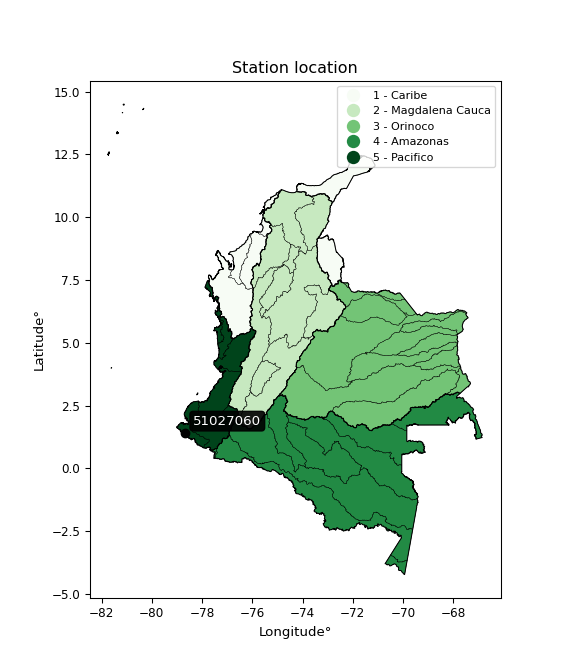

<div align="center">


</div>

# PMP Station (Rain, Pmax24h): 51027060

Probable Maximum Precipitation (PMP) is the greatest amount of rainfall for a specific duration that is meteorologically possible for a given location, acting as a "worst-case" scenario for extreme storms, crucial for designing safety-critical infrastructure like bridges, river deviations, dams, spillways, and nuclear plants to prevent catastrophic failure. PMP is calculated by hydrologists using meteorological data to determine the upper limit of extreme rainfall, often leading to the Probable Maximum Flood (PMF) for flood control design, and is increasingly being studied for climate change impacts. Probable Maximum Precipitation (PMP) is the theoretical upper limit of rainfall, a deterministic estimate for extreme events, while probability distributions (like GEV, Gumbel) describe the likelihood and frequency of various precipitation amounts, including rare ones, showing how often events occur, with PMP representing the extreme end of these distributions, used for critical infrastructure design to ensure safety against the worst conceivable weather, unlike standard statistical forecasts which cover typical probabilities.

The most common probability distributions in hydrology, used for analyzing floods, rainfall, and streamflow, include the Normal, Log-Normal, Gumbel, Gamma (including Log-Pearson Type III), and Generalized Extreme Value (GEV) distributions, often chosen based on the data´s skewness and whether modeling extremes or general conditions, with Gumbel and GEV popular for extreme events like floods, while the Normal distribution serves as a baseline, though often requiring transformations for skewed hydrological data. These distributions help in designing water infrastructure, managing water resources, and forecasting hydrologic events.

> Hydrological data often isn´t perfectly normal (it´s skewed), so different distributions are needed for different applications, such as: **Flood Frequency Analysis**: Using Gumbel, GEV, or Log-Pearson Type III for predicting extreme flood magnitudes and their return periods, **Rainfall Analysis**: Normal for annual totals, but Log-Normal, Weibull, or GEV for intensity or extreme daily rainfall, **Streamflow Modeling**: Gamma and Log-Normal for maximum flows, GEV for minimum flows, and Kappa for daily flows.

<div align="center">

</img>

</div>


## A. General information


### 1. General running parameters

• app_version: _v20260113_. • runtime: _2026-01-13 16:28:34.738620_. • Python version: _3.14.0_. • SciPy version: _1.16.3_. • Pandas version: _2.3.3_. • NumPy version: _2.3.5_. • Stations dataset (station_dataset_file): _dataset/pmax24h_in/automatic_colombia_2003_2025.csv_. • Stations catalog (station_catalog_file): _dataset/CNE.xls_. • Minimum year to eval til year_max (date_min): _1900_. • Maximum year to eval since year_min (date_max): _2025_. • Creates, save and include plots into reports (create_plot): _False_. • Plot only fit distributions with Δo > Δ (plot_only_fit): _True_. • Plot only simple graphs avoiding multiple CDFs and multiple Extreme values plots (plot_only_simple): _True_. • Eval low extreme values, if False, evaluates high extreme values (low_extreme): _False_. • Eval every SciPy distribution as logarithmic (pdist_logarithmic_on): _True_. • Standard deviation normalized (ddof): _1.0_. • Return periods to eval in years (Tr): _[2, 2.33, 5, 10, 15, 20, 25, 50, 75, 100, 200, 250, 500, 750, 1000]_. • Minimum data sample per station, 0 means any (minimum_sample): _5_. • Z-Score maximum threshold to adjust a value, 0 means disable (zscore_max): _3.5_. • Z-Score minimum threshold to adjust a value, 0 means disable (zscore_min): _-2.5_. • Avoid zeros, e.g. rain = 0 (avoid_zeros): _True_. • Avoid null values (avoid_nans): _True_. 

:file_folder:Table: [dataset.csv](../../dataset/pmax24h_in/automatic_colombia_2003_2025.csv)

> Delta Degrees of Freedom (DDOF): is a parameter used in the formulas for calculating variance and standard deviation. When ddof=0, the divisor is $N$ (the total number of observations) and this is used when your data set is the entire population. When ddof=1, the divisor is $N-1$ and this is used when your data set is a sample drawn from a larger population. Using $N-1$ provides an unbiased estimate of the population variance (known as Bessel´s correction).


### 2. Station info and location

|   id |   CODIGO | NOMBRE                         | CATEGORIA    | TECNOLOGIA                              | ESTADO   | FECHA_INSTALACION   |   FECHA_SUSPENSION |   ALTITUD |   LATITUD |   LONGITUD | DEPARTAMENTO   | MUNICIPIO   | AREA_OPERATIVA                      | ENTIDAD                                                     | AREA_HIDROGRAFICA   | ZONA_HIDROGRAFICA   | SUBZONA_HIDROGRAFICA   | CORRIENTE   | Catalogo   |   Version |
|-----:|---------:|:-------------------------------|:-------------|:----------------------------------------|:---------|:--------------------|-------------------:|----------:|----------:|-----------:|:---------------|:------------|:------------------------------------|:------------------------------------------------------------|:--------------------|:--------------------|:-----------------------|:------------|:-----------|----------:|
|    0 | 51027060 | SAN JUAN MIRA - AUT [51027060] | Limnigráfica | Automática con Telemetría, Convencional | Activa   | 15/12/1980          |                nan |         2 |   1.42389 |   -78.6703 | Nariño         | Tumaco      | Area Operativa 07 - Nariño-Putumayo | INSTITUTO DE HIDROLOGIA METEOROLOGIA Y ESTUDIOS AMBIENTALES | Pacifico            | Mira                | Río Mira               | Mira        | CNE_IDEAM  |  20251226 |

<div align="center">

Dynamic map: [:earth_americas:Google](http://maps.google.com/maps?q=1.423888889,-78.67027778) [:earth_americas:OSM](https://www.openstreetmap.org/#map=18/1.423888889/-78.67027778&layers=P) [:earth_americas:Bing](https://www.bing.com/maps?cp=1.423888889~-78.67027778&lvl=18) [:earth_americas:Apple](https://maps.apple.com/frame?center=1.423888889%2C-78.67027778&span=0.003%2C0.006)

</div>


<div align="center">

```geojson
{
  "type": "Feature",
  "geometry": {
    "type": "Point", 
    "coordinates": [-78.67027778, 1.423888889]
  }, 
  "properties": {
    "Name": "51027060"
  }
}
```

</div>


### 3. Discrete values table and plot

<div align="center">

|               |          0 |           1 |           2 |           3 |          4 |
|:--------------|-----------:|------------:|------------:|------------:|-----------:|
| Date          | 2017       | 2018        | 2019        | 2020        | 2025       |
| Value         |  123.7     |  114.9      |   69        |   68.4      |   26.6     |
| Value_initial |  123.7     |  114.9      |   69        |   68.4      |   26.6     |
| count         |    5       |    5        |    5        |    5        |    5       |
| mean          |   80.52    |   80.52     |   80.52     |   80.52     |   80.52    |
| std           |   39.4762  |   39.4762   |   39.4762   |   39.4762   |   39.4762  |
| zscore        |    1.09382 |    0.870905 |   -0.291822 |   -0.307021 |   -1.36589 |


</div>


> The initial value (value_initial) correspond to the initial obtained or null completed value, and value (value) is adjusted only when the initial value is outside the valid range (outlier) definite through the Z-Score value. If Z-Score is active, values out of range or outliers are replaced with the station mean value. A Z-Score (or standard score) measures how many standard deviations a data point is from the mean of a dataset, indicating its relative position; positive scores mean above the mean, negative mean below, and a score of zero is exactly at the mean, allowing for comparison of values from different distributions. It´s calculated using the formula $z=(x–μ)/σ$, where $x$ is the data point, $μ$ is the mean, and $σ$ is the standard deviation, helping identify outliers and understand probability.
>
> <sub>**Note**: In this study, "completing" (filling gaps in) and "extending" (forecasting or lengthening the historical record) rainfall data series are avoided for certain critical analyses because they introduce artificial bias and uncertainty, which can distort the statistics of rare events (extremes), alter day-to-day variability, and compromise the integrity and homogeneity of the original data. Some reasons against Completing/Extending rainfall data are: **Distortion of Extremes and Variability**: The primary issue is that most gap-filling or extension methods rely on averaging or regression with nearby stations, which inherently smooths the data. Rainfall is highly variable in space and time, with a large percentage of zero values and occasional large storms. Infilling methods often underestimate the highest values and overestimate the lowest (zero) values, which severely distorts analyses focused on flood frequency, drought severity, and intensity-duration-frequency (IDF) curves, **Loss of Data Homogeneity**: Infilled or extended data are synthetic estimates, not actual measurements. Combining these estimates with observed data can violate the assumption of data homogeneity, which requires that the data properties do not change over time. Inhomogeneity can lead to incorrect conclusions about long-term trends or changes in climate patterns, **Propagation of Errors**: Errors and biases from the original data (e.g., wind-induced undercatch, instrument errors, site changes) or the data used for imputation can propagate through the analysis, leading to unreliable hydrological models and inaccurate predictions, **Compromised Statistical Integrity**: For statistical analyses, especially those involving the frequency of events, using artificial data can introduce time bias or autocorrelation that doesn´t exist in reality, making it difficult to assess the true probability of events, **Difficulty in Validation**: It is difficult to accurately validate the quality of filled or extended data, especially for past periods where ground-truth measurements are unavailable. The reliability of imputation techniques heavily depends on the density of the surrounding station network and the complexity of the local topography.</sub>


### 4. Active continuous probability distributions from SciPy (45 of 104 available)

A Probability Density Function (PDF) describes the relative likelihood of a continuous random variable falling within a specific range, where the total area under its curve equals 1, and the area over any interval gives the actual probability for that range. Unlike discrete probabilities (like rolling a die), a PDF shows density, not direct probability for a single point (which is zero), with higher points indicating higher likelihood, often visualized as a bell curve for normal distributions.

A log of a probability density function (log-PDF) is simply the logarithm of the PDF´s value, denoted as $log(f(x))$, useful for converting multiplication of probabilities into addition, improving numerical stability with tiny numbers, and connecting to information theory concepts like entropy. Instead of dealing with very small probabilities (e.g., 0.000001), log-PDFs use negative numbers (e.g., $log(0.00001) ≈ -11.51$ that are easier for computers to handle, preventing underflow errors and simplifying complex calculations. In this study, each active probability distribution from SciPy is also evaluated in the $log$ form.

[scipy.stats](https://docs.scipy.org/doc/scipy/reference/stats.html) is a Python´s powerful submodule within the SciPy library for comprehensive statistical analysis, offering over 130 probability distributions (like Normal, Poisson), functions for descriptive stats (mean, variance), hypothesis testing (t-tests, chi-square), random variable generation, and statistical tests, making it essential for data science, modeling, and research. It provides tools to explore, model, and draw conclusions from data efficiently, working seamlessly with NumPy.

<div align="center">

|   id | p_dist             |   n_parameter | fit_method   | label                                                                       | active   | ref                                                                                                        |
|-----:|:-------------------|--------------:|:-------------|:----------------------------------------------------------------------------|:---------|:-----------------------------------------------------------------------------------------------------------|
|    0 | alpha              |             3 | MLE          | Alpha                                                                       | True     | [:mortar_board:](https://docs.scipy.org/doc/scipy/reference/generated/scipy.stats.alpha.html)              |
|    1 | betaprime          |             4 | MLE          | Beta prime                                                                  | True     | [:mortar_board:](https://docs.scipy.org/doc/scipy/reference/generated/scipy.stats.betaprime.html)          |
|    2 | chi2               |             3 | MLE          | Chi²                                                                        | True     | [:mortar_board:](https://docs.scipy.org/doc/scipy/reference/generated/scipy.stats.chi2.html)               |
|    3 | crystalball        |             4 | MLE          | Crystalball                                                                 | True     | [:mortar_board:](https://docs.scipy.org/doc/scipy/reference/generated/scipy.stats.crystalball.html)        |
|    4 | dweibull           |             3 | MLE          | Double Weibull                                                              | True     | [:mortar_board:](https://docs.scipy.org/doc/scipy/reference/generated/scipy.stats.dweibull.html)           |
|    5 | erlang             |             3 | MLE          | Erlang                                                                      | True     | [:mortar_board:](https://docs.scipy.org/doc/scipy/reference/generated/scipy.stats.erlang.html)             |
|    6 | expon              |             2 | MLE          | Exponential                                                                 | True     | [:mortar_board:](https://docs.scipy.org/doc/scipy/reference/generated/scipy.stats.expon.html)              |
|    7 | exponnorm          |             3 | MLE          | Exponentially modified Normal                                               | True     | [:mortar_board:](https://docs.scipy.org/doc/scipy/reference/generated/scipy.stats.exponnorm.html)          |
|    8 | f                  |             4 | MLE          | F                                                                           | True     | [:mortar_board:](https://docs.scipy.org/doc/scipy/reference/generated/scipy.stats.f.html)                  |
|    9 | fatiguelife        |             3 | MLE          | Fatigue-life (Birnbaum-Saunders)                                            | True     | [:mortar_board:](https://docs.scipy.org/doc/scipy/reference/generated/scipy.stats.fatiguelife.html)        |
|   10 | fisk               |             3 | MLE          | Fisk                                                                        | True     | [:mortar_board:](https://docs.scipy.org/doc/scipy/reference/generated/scipy.stats.fisk.html)               |
|   11 | gamma              |             3 | MLE          | Gamma                                                                       | True     | [:mortar_board:](https://docs.scipy.org/doc/scipy/reference/generated/scipy.stats.gamma.html)              |
|   12 | genexpon           |             5 | MLE          | Generalized exponential                                                     | True     | [:mortar_board:](https://docs.scipy.org/doc/scipy/reference/generated/scipy.stats.genexpon.html)           |
|   13 | genlogistic        |             3 | MLE          | Generalized logistic                                                        | True     | [:mortar_board:](https://docs.scipy.org/doc/scipy/reference/generated/scipy.stats.genlogistic.html)        |
|   14 | gibrat             |             2 | MM           | Gibrat                                                                      | True     | [:mortar_board:](https://docs.scipy.org/doc/scipy/reference/generated/scipy.stats.gibrat.html)             |
|   15 | gompertz           |             3 | MLE          | Gompertz (or truncated Gumbel)                                              | True     | [:mortar_board:](https://docs.scipy.org/doc/scipy/reference/generated/scipy.stats.gompertz.html)           |
|   16 | gumbel_l           |             2 | MM           | Gumbel Left Skew                                                            | True     | [:mortar_board:](https://docs.scipy.org/doc/scipy/reference/generated/scipy.stats.gumbel_l.html)           |
|   17 | gumbel_r           |             2 | MM           | Gumbel Right Skew                                                           | True     | [:mortar_board:](https://docs.scipy.org/doc/scipy/reference/generated/scipy.stats.gumbel_r.html)           |
|   18 | halflogistic       |             2 | MM           | Half-logistic                                                               | True     | [:mortar_board:](https://docs.scipy.org/doc/scipy/reference/generated/scipy.stats.halflogistic.html)       |
|   19 | halfnorm           |             2 | MM           | Half Normal                                                                 | True     | [:mortar_board:](https://docs.scipy.org/doc/scipy/reference/generated/scipy.stats.halfnorm.html)           |
|   20 | hypsecant          |             2 | MM           | hyperbolic secant                                                           | True     | [:mortar_board:](https://docs.scipy.org/doc/scipy/reference/generated/scipy.stats.hypsecant.html)          |
|   21 | invgamma           |             3 | MLE          | Inverted gamma                                                              | True     | [:mortar_board:](https://docs.scipy.org/doc/scipy/reference/generated/scipy.stats.invgamma.html)           |
|   22 | invgauss           |             3 | MLE          | Inverse Gaussian                                                            | True     | [:mortar_board:](https://docs.scipy.org/doc/scipy/reference/generated/scipy.stats.invgauss.html)           |
|   23 | invweibull         |             3 | MLE          | Inverted Weibull                                                            | True     | [:mortar_board:](https://docs.scipy.org/doc/scipy/reference/generated/scipy.stats.invweibull.html)         |
|   24 | kappa4             |             4 | MLE          | Kappa 4                                                                     | True     | [:mortar_board:](https://docs.scipy.org/doc/scipy/reference/generated/scipy.stats.kappa4.html)             |
|   25 | kstwobign          |             2 | MLE          | Limiting distribution of scaled Kolmogorov-Smirnov two-sided test statistic | True     | [:mortar_board:](https://docs.scipy.org/doc/scipy/reference/generated/scipy.stats.kstwobign.html)          |
|   26 | laplace            |             2 | MM           | Laplace                                                                     | True     | [:mortar_board:](https://docs.scipy.org/doc/scipy/reference/generated/scipy.stats.laplace.html)            |
|   27 | laplace_asymmetric |             3 | MLE          | Asymmetric Laplace                                                          | True     | [:mortar_board:](https://docs.scipy.org/doc/scipy/reference/generated/scipy.stats.laplace_asymmetric.html) |
|   28 | loggamma           |             3 | MLE          | Log gamma                                                                   | True     | [:mortar_board:](https://docs.scipy.org/doc/scipy/reference/generated/scipy.stats.loggamma.html)           |
|   29 | logistic           |             2 | MM           | Logistic (or Sech-squared)                                                  | True     | [:mortar_board:](https://docs.scipy.org/doc/scipy/reference/generated/scipy.stats.logistic.html)           |
|   30 | lognorm            |             3 | MLE          | Log Normal                                                                  | True     | [:mortar_board:](https://docs.scipy.org/doc/scipy/reference/generated/scipy.stats.lognorm.html)            |
|   31 | maxwell            |             2 | MM           | Maxwell                                                                     | True     | [:mortar_board:](https://docs.scipy.org/doc/scipy/reference/generated/scipy.stats.maxwell.html)            |
|   32 | mielke             |             4 | MLE          | Mielke Beta-Kappa / Dagum                                                   | True     | [:mortar_board:](https://docs.scipy.org/doc/scipy/reference/generated/scipy.stats.mielke.html)             |
|   33 | moyal              |             2 | MM           | Moyal                                                                       | True     | [:mortar_board:](https://docs.scipy.org/doc/scipy/reference/generated/scipy.stats.moyal.html)              |
|   34 | nakagami           |             3 | MLE          | Nakagami                                                                    | True     | [:mortar_board:](https://docs.scipy.org/doc/scipy/reference/generated/scipy.stats.nakagami.html)           |
|   35 | ncf                |             5 | MLE          | Non-central F distribution                                                  | True     | [:mortar_board:](https://docs.scipy.org/doc/scipy/reference/generated/scipy.stats.ncf.html)                |
|   36 | nct                |             4 | MLE          | Non-central Student’s t                                                     | True     | [:mortar_board:](https://docs.scipy.org/doc/scipy/reference/generated/scipy.stats.nct.html)                |
|   37 | norm               |             2 | MM           | Normal                                                                      | True     | [:mortar_board:](https://docs.scipy.org/doc/scipy/reference/generated/scipy.stats.norm.html)               |
|   38 | pearson3           |             3 | MM           | Pearson type III                                                            | True     | [:mortar_board:](https://docs.scipy.org/doc/scipy/reference/generated/scipy.stats.pearson3.html)           |
|   39 | rayleigh           |             2 | MM           | Rayleigh                                                                    | True     | [:mortar_board:](https://docs.scipy.org/doc/scipy/reference/generated/scipy.stats.rayleigh.html)           |
|   40 | rice               |             3 | MLE          | Rice                                                                        | True     | [:mortar_board:](https://docs.scipy.org/doc/scipy/reference/generated/scipy.stats.rice.html)               |
|   41 | t                  |             3 | MLE          | Student’s t                                                                 | True     | [:mortar_board:](https://docs.scipy.org/doc/scipy/reference/generated/scipy.stats.t.html)                  |
|   42 | truncnorm          |             4 | MLE          | Truncated normal                                                            | True     | [:mortar_board:](https://docs.scipy.org/doc/scipy/reference/generated/scipy.stats.truncnorm.html)          |
|   43 | wald               |             2 | MM           | Wald                                                                        | True     | [:mortar_board:](https://docs.scipy.org/doc/scipy/reference/generated/scipy.stats.wald.html)               |
|   44 | weibull_min        |             3 | MLE          | Weibull minimum                                                             | True     | [:mortar_board:](https://docs.scipy.org/doc/scipy/reference/generated/scipy.stats.weibull_min.html)        |

</div>

> **n_parameter:** # arguments & localization & scale.
>
> **Fit methods:** (MLE) maximum likelihood, (MM) L-moments.
>
>**Inactive** (With the only purpose of prevent loops, zero divisions, infinite values, over high estimated values or horizontal trending for recurrence intervals estimations, the follow distributions were disabled.)**:** foldnorm, gennorm, norminvgauss, powernorm, powerlognorm, skewnorm, genextreme, anglit, arcsine, argus, beta, bradford, burr, burr12, cauchy, cosine, halfcauchy, foldcauchy, skewcauchy, wrapcauchy, dgamma, gengamma, exponweib, exponpow, truncexpon, gausshyper, genhalflogistic, genhyperbolic, geninvgauss, halfgennorm, johnsonsb, johnsonsu, kappa3, ksone, kstwo, loglaplace, levy, levy_l, levy_stable, ncx2, pareto, genpareto, truncpareto, lomax, powerlaw, rdist, rel_breitwigner, recipinvgauss, semicircular, studentized_range, trapezoid, triang, truncweibull_min, tukeylambda, uniform, loguniform, vonmises, vonmises_line, weibull_max, 


## B. Probability (PDF) vs. Empirical (EDF) distributions functions

A continuous probability distribution (CPD) describes probabilities for variables that can take any value within a range (like rain any time), unlike discrete variables with specific outcomes (like temperature). It uses a Probability Density Function (PDF), a curve where the total area under it equals 1, and the probability of the variable falling within an interval (a to b) is found by calculating the area under the curve between those points. A key feature is that the probability of hitting any single exact value is zero, so probabilities are always expressed for ranges, e.g., $P(a ≤ X ≤ b)$.

<div align="center">

Distributions parameters from station values
|    |   station | p_dist                |   n |             loc |           scale | shape                  | shape1                | shape2                 | shape3   |
|---:|----------:|:----------------------|----:|----------------:|----------------:|:-----------------------|:----------------------|:-----------------------|:---------|
|  0 |  51027060 | alpha                 |   5 |  -510.815       |  9707.39        | 16.487385361909073     |                       |                        |          |
|  1 |  51027060 | betaprime             |   5 |  -227.931       | 28082.8         | 77.19480560638371      | 7041.016585601024     |                        |          |
|  2 |  51027060 | chi2                  |   5 |  -276.485       |     1.78442     | 199.89603939677784     |                       |                        |          |
|  3 |  51027060 | crystalball           |   5 |    80.5199      |    35.3086      | 7250.331097762066      | 328.20991469715375    |                        |          |
|  4 |  51027060 | dweibull              |   5 |    69           |    29.6921      | 0.8852472111434968     |                       |                        |          |
|  5 |  51027060 | erlang                |   5 |  -643.859       |     1.74259     | 415.71262677683774     |                       |                        |          |
|  6 |  51027060 | expon                 |   5 |    26.6         |    53.92        |                        |                       |                        |          |
|  7 |  51027060 | exponnorm             |   5 |    80.4825      |    35.3085      | 0.0010626309618519238  |                       |                        |          |
|  8 |  51027060 | f                     |   5 | -3331.46        |  3412.03        | 18828.23954886809      | 1037027.1040024378    |                        |          |
|  9 |  51027060 | fatiguelife           |   5 |    26.6         |     0.00016251  | 611.1948549407548      |                       |                        |          |
| 10 |  51027060 | fisk                  |   5 |    -7.80321e+08 |     7.80321e+08 | 36202480.31622438      |                       |                        |          |
| 11 |  51027060 | gamma                 |   5 |  -605.746       |     1.83187     | 374.6579554109647      |                       |                        |          |
| 12 |  51027060 | genexpon              |   5 |    26.5999      |     1.78697     | 0.033139931616020225   | 1.333138521401791e-07 | 0.9006778307648444     |          |
| 13 |  51027060 | genlogistic           |   5 |    69.1994      |    23.832       | 1.39528089650632       |                       |                        |          |
| 14 |  51027060 | gibrat                |   5 |    53.584       |    16.3375      |                        |                       |                        |          |
| 15 |  51027060 | gompertz              |   5 |    18.7809      |     4.08634     | 3.180067480547544e-11  |                       |                        |          |
| 16 |  51027060 | gumbel_l              |   5 |    96.4107      |    27.53        |                        |                       |                        |          |
| 17 |  51027060 | gumbel_r              |   5 |    64.6293      |    27.53        |                        |                       |                        |          |
| 18 |  51027060 | halflogistic          |   5 |    38.6712      |    30.1875      |                        |                       |                        |          |
| 19 |  51027060 | halfnorm              |   5 |    33.7853      |    58.5732      |                        |                       |                        |          |
| 20 |  51027060 | hypsecant             |   5 |    80.52        |    22.4781      |                        |                       |                        |          |
| 21 |  51027060 | invgamma              |   5 |  -315.01        | 48594           | 123.96830909201526     |                       |                        |          |
| 22 |  51027060 | invgauss              |   5 |  -105.763       |  4705.29        | 0.03951204551075585    |                       |                        |          |
| 23 |  51027060 | invweibull            |   5 |    26.6         |     1.81949     | 0.04904761854085054    |                       |                        |          |
| 24 |  51027060 | kappa4                |   5 |    20.1545      |   110.759       | 1.061922962521089      | 1.0683862537298259    |                        |          |
| 25 |  51027060 | kstwobign             |   5 |   -52.4603      |   151.763       |                        |                       |                        |          |
| 26 |  51027060 | laplace               |   5 |    80.52        |    24.9669      |                        |                       |                        |          |
| 27 |  51027060 | laplace_asymmetric    |   5 |    68.4         |    26.829       | 0.7993176667225028     |                       |                        |          |
| 28 |  51027060 | loggamma              |   5 |    46.7495      |    50.8857      | 2.420981886849874      |                       |                        |          |
| 29 |  51027060 | logistic              |   5 |    80.52        |    19.4666      |                        |                       |                        |          |
| 30 |  51027060 | lognorm               |   5 |    26.6         |     0.035193    | 14.966261159026555     |                       |                        |          |
| 31 |  51027060 | maxwell               |   5 |    -3.14643     |    52.4302      |                        |                       |                        |          |
| 32 |  51027060 | mielke                |   5 |    26.6         |    97.4323      | 0.878089177440891      | 1726.4283981502795    |                        |          |
| 33 |  51027060 | moyal                 |   5 |    60.3283      |    15.8944      |                        |                       |                        |          |
| 34 |  51027060 | nakagami              |   5 |    68.4         |    25.8891      | 0.19467369315570582    |                       |                        |          |
| 35 |  51027060 | ncf                   |   5 |  -229.491       |   307.461       | 144.883282262276       | 46700.000409918706    | 1.17032929400645       |          |
| 36 |  51027060 | nct                   |   5 | -1793.61        |    35.2473      | 353201.29954440193     | 53.17033455737041     |                        |          |
| 37 |  51027060 | norm                  |   5 |    80.52        |    35.3085      |                        |                       |                        |          |
| 38 |  51027060 | pearson3              |   5 |    80.52        |    35.3085      | -0.17686296691840703   |                       |                        |          |
| 39 |  51027060 | rayleigh              |   5 |    12.9727      |    53.895       |                        |                       |                        |          |
| 40 |  51027060 | rice                  |   5 |     6.62538     |    40.9764      | 1.412282059798406      |                       |                        |          |
| 41 |  51027060 | t                     |   5 |    80.5237      |    35.3072      | 14650323.814737117     |                       |                        |          |
| 42 |  51027060 | truncnorm             |   5 |    38.0304      |     4.20004     | -14.303323650741376    | 20.397349138726362    |                        |          |
| 43 |  51027060 | wald                  |   5 |    45.2114      |    35.3086      |                        |                       |                        |          |
| 44 |  51027060 | weibull_min           |   5 |   -30.7581      |   123.89        | 3.6512175104935745     |                       |                        |          |
| 45 |  51027060 | logalpha              |   5 |    -8.44617     |   281.294       | 22.184877049669012     |                       |                        |          |
| 46 |  51027060 | logbetaprime          |   5 |   -10.464       |    10.4833      | 1573.651403464657      | 1121.4419268235065    |                        |          |
| 47 |  51027060 | logchi2               |   5 |     3.28091     |     0.955914    | 1.1085175621837373     |                       |                        |          |
| 48 |  51027060 | logcrystalball        |   5 |     4.26046     |     0.548818    | 1631.3226362214214     | 196.7582235276309     |                        |          |
| 49 |  51027060 | logdweibull           |   5 |     4.23411     |     0.535748    | 0.6828372101888266     |                       |                        |          |
| 50 |  51027060 | logerlang             |   5 |    -5.14783     |     0.0333225   | 282.22443605247724     |                       |                        |          |
| 51 |  51027060 | logexpon              |   5 |     3.28091     |     0.979551    |                        |                       |                        |          |
| 52 |  51027060 | logexponnorm          |   5 |     4.26006     |     0.548821    | 0.0007446131745030984  |                       |                        |          |
| 53 |  51027060 | logf                  |   5 |  -569.624       |   573.883       | 4854036.171842486      | 3933725.229488898     |                        |          |
| 54 |  51027060 | logfatiguelife        |   5 |  -181.343       |   185.599       | 0.0029542319270060343  |                       |                        |          |
| 55 |  51027060 | logfisk               |   5 |    -5.03021e+07 |     5.03021e+07 | 160918612.84234306     |                       |                        |          |
| 56 |  51027060 | loggamma              |   5 |    -5.118       |     0.0340522   | 275.0928579210036      |                       |                        |          |
| 57 |  51027060 | loggenexpon           |   5 |     3.28064     |     0.0103939   | 0.0046768329263032135  | 5.035230102228281     | 1.8965727251079398e-05 |          |
| 58 |  51027060 | loggenlogistic        |   5 |     4.81787     |     5.86922e-07 | 1.0523761400084895e-06 |                       |                        |          |
| 59 |  51027060 | loggibrat             |   5 |     3.84183     |     0.25392     |                        |                       |                        |          |
| 60 |  51027060 | loggompertz           |   5 |     3.28091     |     0.492529    | 0.09600217063879429    |                       |                        |          |
| 61 |  51027060 | loggumbel_l           |   5 |     4.50746     |     0.427912    |                        |                       |                        |          |
| 62 |  51027060 | loggumbel_r           |   5 |     4.01347     |     0.427912    |                        |                       |                        |          |
| 63 |  51027060 | loghalflogistic       |   5 |     3.60996     |     0.469238    |                        |                       |                        |          |
| 64 |  51027060 | loghalfnorm           |   5 |     3.53404     |     0.910432    |                        |                       |                        |          |
| 65 |  51027060 | loghypsecant          |   5 |     4.26046     |     0.349388    |                        |                       |                        |          |
| 66 |  51027060 | loginvgamma           |   5 |    -8.63665     |  6789.41        | 527.8651965049035      |                       |                        |          |
| 67 |  51027060 | loginvgauss           |   5 |    -1.4832      |   552.528       | 0.01039573497806083    |                       |                        |          |
| 68 |  51027060 | loginvweibull         |   5 |    -4.67173e+07 |     4.67173e+07 | 79798321.96516046      |                       |                        |          |
| 69 |  51027060 | logkappa4             |   5 |     3.09171     |     1.83263     | 1.1155452477128467     | 1.0611509445577303    |                        |          |
| 70 |  51027060 | logkstwobign          |   5 |     1.91621     |     2.6731      |                        |                       |                        |          |
| 71 |  51027060 | loglaplace            |   5 |     4.26046     |     0.388073    |                        |                       |                        |          |
| 72 |  51027060 | loglaplace_asymmetric |   5 |     4.23411     |     0.410699    | 0.9681084317867592     |                       |                        |          |
| 73 |  51027060 | logloggamma           |   5 |     4.81787     |     2.65405e-07 | 4.755126446003893e-07  |                       |                        |          |
| 74 |  51027060 | loglogistic           |   5 |     4.26046     |     0.302579    |                        |                       |                        |          |
| 75 |  51027060 | loglognorm            |   5 |     3.28091     |     0.000978942 | 14.212217126978798     |                       |                        |          |
| 76 |  51027060 | logmaxwell            |   5 |     2.95999     |     0.814948    |                        |                       |                        |          |
| 77 |  51027060 | logmielke             |   5 |    -1.52339e+07 |     1.52339e+07 | 26806028.85050205      | 5227558358.616983     |                        |          |
| 78 |  51027060 | logmoyal              |   5 |     3.94661     |     0.247055    |                        |                       |                        |          |
| 79 |  51027060 | lognakagami           |   5 |     4.22537     |     0.478881    | 0.047761320253112104   |                       |                        |          |
| 80 |  51027060 | logncf                |   5 |    -2.95682     |     5.72214e-07 | 5.1171678851120094e-05 | 1331.1488928373537    | 644.5264333333064      |          |
| 81 |  51027060 | lognct                |   5 |   -14.4078      |     0.517824    | 4431.887869409632      | 36.03949171350671     |                        |          |
| 82 |  51027060 | lognorm               |   5 |     4.26046     |     0.548818    |                        |                       |                        |          |
| 83 |  51027060 | logpearson3           |   5 |     4.26046     |     0.548818    | -0.7908837597924379    |                       |                        |          |
| 84 |  51027060 | lograyleigh           |   5 |     3.21054     |     0.837716    |                        |                       |                        |          |
| 85 |  51027060 | logrice               |   5 |     2.90062     |     0.599559    | 1.9955056178045898     |                       |                        |          |
| 86 |  51027060 | logt                  |   5 |     4.26046     |     0.548818    | 4886113992.665012      |                       |                        |          |
| 87 |  51027060 | logtruncnorm          |   5 |    -0.166933    |     1.25813     | 3.491141928696499      | 3.9620688596731304    |                        |          |
| 88 |  51027060 | logwald               |   5 |     3.71167     |     0.548793    |                        |                       |                        |          |
| 89 |  51027060 | logweibull_min        |   5 |    -1.60117e+07 |     1.60117e+07 | 39754923.96499622      |                       |                        |          |

</div>

> **loc** (Location parameter): This shifts the distribution along the x-axis. For many common distributions, like the normal (Gaussian) distribution, loc represents the mean $μ$. For others, like the uniform distribution, it might represent the minimum value, or for the beta distribution, the left end of the support interval.
>
> **scale** (Scale parameter): This determines the width or spread of the distribution. For the normal distribution, scale represents the standard deviation $σ$. For a uniform distribution, it defines the length of the interval (from $loc$ to $loc + scale$).
>
> **shape** (Shape parameters): Refers to parameters that define the specific form of a probability distribution, distinct from its location (loc) and scale (scale). These parameters are required arguments for most distribution functions. For example, a normal (Gaussian) distribution is fully defined by its location (mean) and scale (standard deviation), so it has no specific shape parameters beyond loc and scale. However, other distributions have intrinsic properties that need specification, as Gamma distribution that takes a shape parameter, often named $a$ or $alpha$.


### 0. Cumulative distribution values - CDF (90 evaluated)

Cumulative Distribution Function (CDF), denoted as $F$<sub>$X$</sub>$(x)$, is a function that gives the probability that a random variable $X$ will take a value less than or equal to a specific value, $x$ (i.e., $(P(X≥x)$. It essentially "accumulates" probabilities from a given point up to the far right (positive infinity), providing a complete picture of the distribution´s probabilities for both discrete (like rain) and continuous (like temperature) variables, helping to find probabilities over ranges or above certain values. Each station is evaluated separately ordering the $x$ values ascending, calculating the CDF and PDF values for the activated distributions and their logarithmic forms.

<div align="center">

CDF ordered by x ascending and calculating $log(f(x))$ separately
|   id |   Station |   date |     x |   count |   mean |     std |    zscore |   Value_initial |   station |   m |     alpha |   alpha_pdf |   betaprime |   betaprime_pdf |      chi2 |   chi2_pdf |   crystalball |   crystalball_pdf |   dweibull |   dweibull_pdf |   erlang |   erlang_pdf |    expon |   expon_pdf |   exponnorm |   exponnorm_pdf |         f |      f_pdf |   fatiguelife |   fatiguelife_pdf |      fisk |   fisk_pdf |     gamma |   gamma_pdf |    genexpon |   genexpon_pdf |   genlogistic |   genlogistic_pdf |   gibrat |   gibrat_pdf |    gompertz |   gompertz_pdf |   gumbel_l |   gumbel_l_pdf |   gumbel_r |   gumbel_r_pdf |   halflogistic |   halflogistic_pdf |   halfnorm |   halfnorm_pdf |   hypsecant |   hypsecant_pdf |   invgamma |   invgamma_pdf |   invgauss |   invgauss_pdf |   invweibull |   invweibull_pdf |      kappa4 |   kappa4_pdf |   kstwobign |   kstwobign_pdf |   laplace |   laplace_pdf |   laplace_asymmetric |   laplace_asymmetric_pdf |   loggamma |   loggamma_pdf |   logistic |   logistic_pdf |   lognorm |   lognorm_pdf |   maxwell |   maxwell_pdf |      mielke |   mielke_pdf |      moyal |   moyal_pdf |   nakagami |   nakagami_pdf |       ncf |    ncf_pdf |      nct |    nct_pdf |     norm |   norm_pdf |   pearson3 |   pearson3_pdf |   rayleigh |   rayleigh_pdf |      rice |   rice_pdf |         t |      t_pdf |   truncnorm |   truncnorm_pdf |     wald |   wald_pdf |   weibull_min |   weibull_min_pdf |   logalpha |   logalpha_pdf |   logbetaprime |   logbetaprime_pdf |     logchi2 |   logchi2_pdf |   logcrystalball |   logcrystalball_pdf |   logdweibull |   logdweibull_pdf |   logerlang |   logerlang_pdf |   logexpon |   logexpon_pdf |   logexponnorm |   logexponnorm_pdf |      logf |   logf_pdf |   logfatiguelife |   logfatiguelife_pdf |   logfisk |   logfisk_pdf |   loggenexpon |   loggenexpon_pdf |   loggenlogistic |   loggenlogistic_pdf |   loggibrat |   loggibrat_pdf |   loggompertz |   loggompertz_pdf |   loggumbel_l |   loggumbel_l_pdf |   loggumbel_r |   loggumbel_r_pdf |   loghalflogistic |   loghalflogistic_pdf |   loghalfnorm |   loghalfnorm_pdf |   loghypsecant |   loghypsecant_pdf |   loginvgamma |   loginvgamma_pdf |   loginvgauss |   loginvgauss_pdf |   loginvweibull |   loginvweibull_pdf |   logkappa4 |   logkappa4_pdf |   logkstwobign |   logkstwobign_pdf |   loglaplace |   loglaplace_pdf |   loglaplace_asymmetric |   loglaplace_asymmetric_pdf |   logloggamma |   logloggamma_pdf |   loglogistic |   loglogistic_pdf |   loglognorm |   loglognorm_pdf |   logmaxwell |   logmaxwell_pdf |   logmielke |   logmielke_pdf |    logmoyal |   logmoyal_pdf |   lognakagami |   lognakagami_pdf |   logncf |   logncf_pdf |    lognct |   lognct_pdf |   logpearson3 |   logpearson3_pdf |   lograyleigh |   lograyleigh_pdf |   logrice |   logrice_pdf |      logt |   logt_pdf |   logtruncnorm |   logtruncnorm_pdf |   logwald |   logwald_pdf |   logweibull_min |   logweibull_min_pdf |
|-----:|----------:|-------:|------:|--------:|-------:|--------:|----------:|----------------:|----------:|----:|----------:|------------:|------------:|----------------:|----------:|-----------:|--------------:|------------------:|-----------:|---------------:|---------:|-------------:|---------:|------------:|------------:|----------------:|----------:|-----------:|--------------:|------------------:|----------:|-----------:|----------:|------------:|------------:|---------------:|--------------:|------------------:|---------:|-------------:|------------:|---------------:|-----------:|---------------:|-----------:|---------------:|---------------:|-------------------:|-----------:|---------------:|------------:|----------------:|-----------:|---------------:|-----------:|---------------:|-------------:|-----------------:|------------:|-------------:|------------:|----------------:|----------:|--------------:|---------------------:|-------------------------:|-----------:|---------------:|-----------:|---------------:|----------:|--------------:|----------:|--------------:|------------:|-------------:|-----------:|------------:|-----------:|---------------:|----------:|-----------:|---------:|-----------:|---------:|-----------:|-----------:|---------------:|-----------:|---------------:|----------:|-----------:|----------:|-----------:|------------:|----------------:|---------:|-----------:|--------------:|------------------:|-----------:|---------------:|---------------:|-------------------:|------------:|--------------:|-----------------:|---------------------:|--------------:|------------------:|------------:|----------------:|-----------:|---------------:|---------------:|-------------------:|----------:|-----------:|-----------------:|---------------------:|----------:|--------------:|--------------:|------------------:|-----------------:|---------------------:|------------:|----------------:|--------------:|------------------:|--------------:|------------------:|--------------:|------------------:|------------------:|----------------------:|--------------:|------------------:|---------------:|-------------------:|--------------:|------------------:|--------------:|------------------:|----------------:|--------------------:|------------:|----------------:|---------------:|-------------------:|-------------:|-----------------:|------------------------:|----------------------------:|--------------:|------------------:|--------------:|------------------:|-------------:|-----------------:|-------------:|-----------------:|------------:|----------------:|------------:|---------------:|--------------:|------------------:|---------:|-------------:|----------:|-------------:|--------------:|------------------:|--------------:|------------------:|----------:|--------------:|----------:|-----------:|---------------:|-------------------:|----------:|--------------:|-----------------:|---------------------:|
|    0 |  51027060 |   2025 |  26.6 |       5 |  80.52 | 39.4762 | -1.36589  |            26.6 |  51027060 |   1 | 0.0575447 |  0.00387468 |   0.0576323 |      0.00372583 | 0.0603853 | 0.00374212 |     0.0633674 |        0.00352072 |   0.126954 |     0.0036334  | 0.061581 |   0.00360323 | 0        |  0.018546   |   0.0633669 |      0.0035207  | 0.0635296 | 0.0035485  |     0.0378446 |       5.30591e+08 | 0.0739094 | 0.00317554 | 0.0609556 |  0.00359268 | 1.23728e-06 |     0.0185453  |     0.0665378 |        0.00333701 | 0        |   0          | 1.83698e-10 |    5.27364e-11 |  0.0761427 |     0.00265773 |  0.0186785 |     0.00270061 |       0        |         0          |   0        |     0          |   0.0576653 |      0.00255139 |  0.0551193 |     0.00380346 |  0.0518126 |     0.00411223 |    0.0051655 |      3.75518e+11 | 9.45706e-16 |   0.077224   |   0.0510533 |      0.00522533 | 0.0576823 |    0.00231035 |            0.0555091 |               0.00258846 |  0.0394012 |       0.162131 |  0.0589743 |     0.00285084 | 0.0371438 |      0.147818 | 0.0441397 |    0.00417031 | 2.09168e-11 |   0.273868   | 0.00386115 |  0.00111613 | 0          |    0           | 0.0626798 | 0.00384199 | 0.063446 | 0.00352399 | 0.063367 | 0.0035207  |  0.0677858 |     0.00341    |  0.0314609 |     0.00454392 | 0.0437715 | 0.00437232 | 0.0633465 | 0.00351996 |  0.00324945 |     0.00234076  | 0        | 0          |     0.0583312 |        0.00360269 |  0.0357877 |       0.16096  |      0.0407005 |           0.163268 | 2.43073e-09 |   3.03375e+06 |        0.0371439 |             0.147818 |      0.113587 |          0.120593 |   0.0369594 |        0.155299 |   0        |       1.02088  |      0.0371441 |           0.147818 | 0.0377016 |   0.149412 |        0.0373495 |             0.149412 | 0.0340476 |      0.105211 |   0.000120613 |          0.450141 |         0        |             0.113958 |    0        |        0        |   1.01303e-08 |          0.194917 |     0.0553169 |          0.125628 |    0.00392798 |         0.0508506 |          0        |              0        |      0        |          0        |       0.038526 |           0.109998 |     0.0367919 |          0.159198 |     0.0368378 |          0.166838 |        0.03973  |            0.218903 | 4.98821e-15 |       24.681    |      0.0431928 |           0.26797  |    0.0400635 |         0.103237 |               0.0440051 |                    0.110677 |     0.0636927 |          0.114115 |     0.0377846 |          0.120157 |    0.0227614 |      8.55796e+12 |    0.0155058 |         0.140496 |   0.0656681 |        0.115552 | 0.000119608 |     0.00379928 |     0         |       0           | 0.055476 |     0.195041 | 0.0384665 |     0.152464 |     0.0539074 |          0.140236 |    0.00352196 |          0.099922 | 0.0300259 |      0.170413 | 0.0371439 |   0.147818 |    0           |           0        |  0        |       0       |        0.0463566 |             0.112387 |
|    1 |  51027060 |   2020 |  68.4 |       5 |  80.52 | 39.4762 | -0.307021 |            68.4 |  51027060 |   2 | 0.392745  |  0.0111236  |   0.384083  |      0.0111204  | 0.381555  | 0.0109248  |     0.365702  |        0.0106523  |   0.484437 |     0.0226     | 0.371556 |   0.0107614  | 0.539399 |  0.00854231 |   0.365701  |      0.0106523  | 0.366935  | 0.0106373  |     0.796671  |       0.00280645  | 0.356899  | 0.0106485  | 0.371369  |  0.0107885  | 0.539389    |     0.00854224 |     0.371305  |        0.0110516  | 0.461062 |   0.0267982  | 5.96939e-06 |    1.46082e-06 |  0.303377  |     0.00914773 |  0.418115  |     0.0132436  |       0.456121 |         0.0131172  |   0.445455 |     0.0114394  |   0.336129  |      0.0123254  |  0.390841  |     0.0112289  |  0.408426  |     0.0112804  |    0.424221  |      0.000426843 | 0.430944    |   0.00990074 |   0.449952  |      0.010761   | 0.307712  |    0.0123248  |            0.389838  |               0.0181786  |  0.490948  |       0.707321 |  0.349189  |     0.0116741  | 0.47451   |      0.725427 | 0.398494  |    0.011169   | 0.47564     |   0.00999174 | 0.437892   |  0.0144116  | 9.0451e-07 |    2.47817e+07 | 0.383712  | 0.0107482  | 0.365885 | 0.0106519  | 0.365702 | 0.0106523  |  0.355968  |     0.0103438  |  0.41071   |     0.0112449  | 0.387559  | 0.0108809  | 0.365657  | 0.0106523  |  1          |     4.2094e-13  | 0.487112 | 0.0194079  |     0.35822   |        0.0104809  |  0.494422  |       0.698826 |      0.48441   |           0.694426 | 0.644725    |   0.27242     |        0.47451   |             0.725427 |      0.470811 |          2.21419  |   0.485638  |        0.713697 |   0.618703 |       0.389256 |      0.474508  |           0.725423 | 0.475648  |   0.723274 |        0.478028  |             0.726611 | 0.419706  |      0.779136 |   0.559274    |          0.56604  |         0        |             0.619733 |    0.659992 |        0.955329 |   0.427212    |          0.75969  |     0.403846  |          0.720626 |    0.543655   |         0.774284  |          0.575534 |              0.712603 |      0.552352 |          0.656879 |       0.468085 |           0.906473 |     0.494218  |          0.712515 |     0.496105  |          0.686276 |        0.525882 |            0.577295 | 0.625401    |        0.612654 |      0.555476  |           0.554835 |    0.456774  |         1.17703  |               0.473289  |                    1.19036  |     0.345922  |          0.619771 |     0.47104   |          0.823458 |    0.685637  |      0.0264421   |    0.508394  |         0.70708  |   0.346027  |        0.60888  | 0.569468    |     0.781339   |     0.0347435 |       3.73663e+12 | 0.489432 |     0.631354 | 0.478385  |     0.718691 |     0.422537  |          0.698409 |    0.519908   |          0.694265 | 0.486309  |      0.707201 | 0.474511  |   0.725428 |    4.74984e-07 |           3.51868  |  0.641319 |       0.80094 |        0.390556  |             0.749335 |
|    2 |  51027060 |   2019 |  69   |       5 |  80.52 | 39.4762 | -0.291822 |            69   |  51027060 |   3 | 0.399428  |  0.0111515  |   0.390768  |      0.0111608  | 0.388122  | 0.0109672  |     0.372112  |        0.0107131  |   0.5      |     0.788614   | 0.378028 |   0.0108141  | 0.544496 |  0.00844778 |   0.372111  |      0.0107131  | 0.373335  | 0.010696   |     0.798344  |       0.00277279  | 0.363313  | 0.0107318  | 0.377858  |  0.0108412  | 0.544485    |     0.00844772 |     0.377954  |        0.0111102  | 0.476851 |   0.025835   | 6.9135e-06  |    1.69186e-06 |  0.308904  |     0.00927512 |  0.42605   |     0.013204   |       0.463955 |         0.0129978  |   0.452298 |     0.0113698  |   0.343572  |      0.012485   |  0.397587  |     0.0112583  |  0.415196  |     0.0112847  |    0.424475  |      0.000420761 | 0.436884    |   0.00989925 |   0.456395  |      0.0107171  | 0.315197  |    0.0126246  |            0.400648  |               0.0178565  |  0.497124  |       0.707045 |  0.356226  |     0.0117806  | 0.480849  |      0.726074 | 0.405199  |    0.0111804  | 0.48163     |   0.00997439 | 0.446506   |  0.0143007  | 0.182587   |    0.118473    | 0.390172  | 0.0107859  | 0.372295 | 0.0107125  | 0.372111 | 0.0107131  |  0.362196  |     0.0104163  |  0.417454  |     0.0112366  | 0.394096  | 0.0109066  | 0.372067  | 0.0107131  |  1          |     1.48313e-13 | 0.498598 | 0.0188794  |     0.364527  |        0.0105452  |  0.500521  |       0.697931 |      0.490475  |           0.694323 | 0.647094    |   0.270068    |        0.480849  |             0.726074 |      0.5      |      31055.5      |   0.491871  |        0.713568 |   0.622088 |       0.385801 |      0.480847  |           0.72607  | 0.481962  |   0.723872 |        0.484376  |             0.727122 | 0.426525  |      0.782491 |   0.564205    |          0.563066 |         0        |             0.629515 |    0.668203 |        0.925192 |   0.433867    |          0.764296 |     0.41017   |          0.727682 |    0.55039    |         0.76804   |          0.581725 |              0.704969 |      0.558068 |          0.652081 |       0.476011 |           0.908463 |     0.500439  |          0.711944 |     0.502095  |          0.685249 |        0.53091  |            0.574185 | 0.630751    |        0.612574 |      0.560308  |           0.551542 |    0.46717   |         1.20382  |               0.483801  |                    1.2168   |     0.351378  |          0.629546 |     0.478238  |          0.824665 |    0.685867  |      0.0261917   |    0.51456   |         0.705004 |   0.351386  |        0.618309 | 0.576252    |     0.771976   |     0.605299  |       6.62023     | 0.494945 |     0.630997 | 0.484664  |     0.719131 |     0.428658  |          0.703335 |    0.525959   |          0.691413 | 0.492485  |      0.707061 | 0.48085   |   0.726074 |    0.0303619   |           3.43435  |  0.64823  |       0.7817  |        0.397136  |             0.757493 |
|    3 |  51027060 |   2018 | 114.9 |       5 |  80.52 | 39.4762 |  0.870905 |           114.9 |  51027060 |   4 | 0.834801  |  0.00615952 |   0.83967   |      0.00643088 | 0.835323  | 0.00653142 |     0.834898  |        0.0070332  |   0.885094 |     0.0032588  | 0.83348  |   0.00681442 | 0.805556 |  0.00360616 |   0.834897  |      0.00703322 | 0.833378  | 0.00699236 |     0.886098  |       0.00131654  | 0.827568  | 0.00662044 | 0.833843  |  0.00680736 | 0.805547    |     0.00360622 |     0.825877  |        0.00619525 | 0.907012 |   0.00271331 | 0.406857    |    0.0758161   |  0.858772  |     0.0100413  |  0.851249  |     0.00497982 |       0.851776 |         0.00454621 |   0.833899 |     0.00522154 |   0.864177  |      0.00586074 |  0.83706   |     0.0061835  |  0.832907  |     0.00575262 |    0.437526  |      0.000200894 | 0.898964    |   0.0106332  |   0.824438  |      0.00509247 | 0.873836  |    0.00505326 |            0.84732   |               0.00454882 |  0.810755  |       0.463125 |  0.853972  |     0.00640603 | 0.810886  |      0.493034 | 0.833204  |    0.00611687 | 0.917209    |   0.00912108 | 0.85742    |  0.00443717 | 0.90678    |    0.00443821  | 0.828985  | 0.00649042 | 0.834917 | 0.00702978 | 0.834898 | 0.00703322 |  0.834834  |     0.00747029 |  0.832766  |     0.0058684  | 0.83221   | 0.00650728 | 0.834881  | 0.00703394 |  1          |     1.73895e-74 | 0.882543 | 0.00320478 |     0.835664  |        0.00743903 |  0.804818  |       0.446018 |      0.801782  |           0.467588 | 0.756851    |   0.170874    |        0.810886  |             0.493034 |      0.809864 |          0.246159 |   0.809462  |        0.469494 |   0.775459 |       0.229229 |      0.810883  |           0.493036 | 0.81074   |   0.491255 |        0.813193  |             0.488488 | 0.791721  |      0.527519 |   0.798943    |          0.350205 |         0        |             1.57077  |    0.897575 |        0.19794  |   0.83078     |          0.643361 |     0.824186  |          0.714219 |    0.834148   |         0.353504  |          0.836215 |              0.320461 |      0.816172 |          0.362346 |       0.843718 |           0.429547 |     0.812689  |          0.45582  |     0.800807  |          0.440776 |        0.767219 |            0.347259 | 0.948023    |        0.657981 |      0.786973  |           0.335997 |    0.856196  |         0.370559 |               0.844847  |                    0.365731 |     0.876138  |          1.56973  |     0.831775  |          0.462442 |    0.696486  |      0.0168081   |    0.812364  |         0.42726  |   0.861968  |        1.51675  | 0.842179    |     0.315207   |     0.891877  |       0.155691    | 0.780814 |     0.445668 | 0.810112  |     0.485969 |     0.809136  |          0.660439 |    0.812794   |          0.409088 | 0.808728  |      0.471853 | 0.810887  |   0.493033 |    0.949484    |           0.766292 |  0.871505 |       0.2292  |        0.833889  |             0.740356 |
|    4 |  51027060 |   2017 | 123.7 |       5 |  80.52 | 39.4762 |  1.09382  |           123.7 |  51027060 |   5 | 0.882677  |  0.00474693 |   0.889414  |      0.0048985  | 0.886005  | 0.00500766 |     0.889323  |        0.00534899 |   0.910243 |     0.00249484 | 0.88633  |   0.00521321 | 0.834836 |  0.00306313 |   0.889322  |      0.005349   | 0.887571  | 0.00533703 |     0.897012  |       0.00116769  | 0.878335  | 0.00495782 | 0.886617  |  0.00520365 | 0.834827    |     0.0030632  |     0.873723  |        0.00471718 | 0.927399 |   0.00196934 | 0.988889    |    0.0122351   |  0.932432  |     0.00661353 |  0.889596  |     0.0037803  |       0.887142 |         0.00352761 |   0.875236 |     0.00419314 |   0.907417  |      0.00406099 |  0.885026  |     0.00474453 |  0.877836  |     0.00448574 |    0.439211  |      0.000182538 | 0.998165    |   0.0138932  |   0.864921  |      0.0041288  | 0.911312  |    0.0035522  |            0.882532  |               0.00349974 |  0.842942  |       0.4092   |  0.901868  |     0.00454635 | 0.845098  |      0.434003 | 0.881026  |    0.00477248 | 0.997003    |   0.00899137 | 0.891651   |  0.00338736 | 0.939559   |    0.0030778   | 0.879628  | 0.00503744 | 0.889317 | 0.00534677 | 0.889323 | 0.005349   |  0.892562  |     0.00565199 |  0.878821  |     0.00461939 | 0.883035  | 0.00505817 | 0.889312  | 0.00534957 |  1          |     4.2968e-92  | 0.907175 | 0.00243526 |     0.893239  |        0.00564595 |  0.835866  |       0.395537 |      0.834377  |           0.415715 | 0.769086    |   0.160837    |        0.845097  |             0.434003 |      0.826832 |          0.214785 |   0.842083  |        0.414584 |   0.791754 |       0.212594 |      0.845095  |           0.434005 | 0.844836  |   0.432656 |        0.847067  |             0.429448 | 0.827984  |      0.455628 |   0.823619    |          0.318699 |         0.999973 |             1.79299  |    0.910926 |        0.165104 |   0.874975    |          0.552171 |     0.873248  |          0.611831 |    0.858457   |         0.306176  |          0.858362 |              0.280471 |      0.841495 |          0.324273 |       0.872598 |           0.354985 |     0.844337  |          0.401976 |     0.831549  |          0.392488 |        0.791678 |            0.315892 | 0.999213    |        0.844846 |      0.810681  |           0.306732 |    0.881099  |         0.306387 |               0.869619  |                    0.307336 |     0.999987  |          1.79163  |     0.863203  |          0.390257 |    0.697695  |      0.0159725   |    0.842086  |         0.378463 |   0.981362  |        1.68279  | 0.863843    |     0.272869   |     0.9026    |       0.135705    | 0.81216  |     0.403737 | 0.84386   |     0.42852  |     0.855231  |          0.586197 |    0.841292   |          0.363503 | 0.841556  |      0.417768 | 0.845098  |   0.434002 |    1           |           0.608431 |  0.887182 |       0.19667 |        0.884222  |             0.619792 |


</div>

An Empirical Distribution Function (EDF) is a step-function estimate of a true cumulative distribution function (CDF) based on observed sample data, representing the proportion of data points less than or equal to a given value. It is calculated by ordering your data and jumping up by $1/n$ (where $n$ is sample size) at each unique data point, allowing analysis without assuming an underlying population distribution, and it gets closer to the true CDF as the sample size grows. For the empirical probability calculations, the parameter $m$ correspond to the order number which means the position of the $x$ values in an ascending order list.

The Kolmogorov-Smirnov (K-S) test is a non-parametric statistical test used to determine if a sample data set comes from a specific theoretical distribution (one-sample) or if two different samples come from the same underlying distribution (two-sample), by comparing their cumulative distribution functions (CDFs). It calculates the maximum vertical difference (D statistic) between these functions, with a small p-value indicating a significant difference and rejection of the null hypothesis (that the data/samples match).


### 1. EDF California (1923)

California´s estimates the true probability distribution of water-related data (like rainfall, streamflow) using observed samples, crucial for risk assessment.

<div align="center">


$P=m/n$


</div>


**1.1. Empirical values**

<div align="center">

|                | 0              | 1                  | 2              | 3                 | 4              |
|:---------------|:---------------|:-------------------|:---------------|:------------------|:---------------|
| date           | 2025           | 2020               | 2019           | 2018              | 2017           |
| x              | 26.6           | 68.4               | 69.0           | 114.9             | 123.7          |
| m              | 1              | 2                  | 3              | 4                 | 5              |
| empirical_dist | edf_california | edf_california     | edf_california | edf_california    | edf_california |
| empirical      | 0.2            | 0.4                | 0.6            | 0.8               | 1.0            |
| empirical_tr   | 1.25           | 1.6666666666666667 | 2.5            | 5.000000000000001 | inf            |

</div>


**1.2. Kolmogorov-Smirnov fit test (sorted by Δ)**


<div align="center">

|                | 0                   | 1                   | 2                     | 3                   | 4                   | 5                   | 6                   | 7                   | 8                   | 9                   | 10                  | 11                 | 12                  | 13                  | 14                  | 15                  | 16                  | 17                 | 18                  | 19                 | 20                  | 21                 | 22                  | 23                  | 24                 | 25                  | 26                  | 27                  | 28                 | 29                  | 30                  | 31                  | 32                  | 33                  | 34                 | 35                 | 36                  | 37                  | 38                 | 39                  | 40                 | 41                  | 42                  | 43                 | 44                 | 45                 | 46                 | 47                 | 48                 | 49                 | 50                  | 51                  | 52                  | 53                 | 54                  | 55                 | 56                  | 57                 | 58                  | 59                  | 60                 | 61                  | 62                 | 63                 | 64                 | 65                  | 66                 | 67                  | 68                  | 69                 | 70                  | 71                  | 72                  | 73                 | 74                  | 75                  | 76                 | 77                 | 78                 | 79                  | 80                  | 81                 | 82                 | 83                 | 84                  | 85                 | 86                 | 87                 | 88                 | 89                 |
|:---------------|:--------------------|:--------------------|:----------------------|:--------------------|:--------------------|:--------------------|:--------------------|:--------------------|:--------------------|:--------------------|:--------------------|:-------------------|:--------------------|:--------------------|:--------------------|:--------------------|:--------------------|:-------------------|:--------------------|:-------------------|:--------------------|:-------------------|:--------------------|:--------------------|:-------------------|:--------------------|:--------------------|:--------------------|:-------------------|:--------------------|:--------------------|:--------------------|:--------------------|:--------------------|:-------------------|:-------------------|:--------------------|:--------------------|:-------------------|:--------------------|:-------------------|:--------------------|:--------------------|:-------------------|:-------------------|:-------------------|:-------------------|:-------------------|:-------------------|:-------------------|:--------------------|:--------------------|:--------------------|:-------------------|:--------------------|:-------------------|:--------------------|:-------------------|:--------------------|:--------------------|:-------------------|:--------------------|:-------------------|:-------------------|:-------------------|:--------------------|:-------------------|:--------------------|:--------------------|:-------------------|:--------------------|:--------------------|:--------------------|:-------------------|:--------------------|:--------------------|:-------------------|:-------------------|:-------------------|:--------------------|:--------------------|:-------------------|:-------------------|:-------------------|:--------------------|:-------------------|:-------------------|:-------------------|:-------------------|:-------------------|
| station        | 51027060            | 51027060            | 51027060              | 51027060            | 51027060            | 51027060            | 51027060            | 51027060            | 51027060            | 51027060            | 51027060            | 51027060           | 51027060            | 51027060            | 51027060            | 51027060            | 51027060            | 51027060           | 51027060            | 51027060           | 51027060            | 51027060           | 51027060            | 51027060            | 51027060           | 51027060            | 51027060            | 51027060            | 51027060           | 51027060            | 51027060            | 51027060            | 51027060            | 51027060            | 51027060           | 51027060           | 51027060            | 51027060            | 51027060           | 51027060            | 51027060           | 51027060            | 51027060            | 51027060           | 51027060           | 51027060           | 51027060           | 51027060           | 51027060           | 51027060           | 51027060            | 51027060            | 51027060            | 51027060           | 51027060            | 51027060           | 51027060            | 51027060           | 51027060            | 51027060            | 51027060           | 51027060            | 51027060           | 51027060           | 51027060           | 51027060            | 51027060           | 51027060            | 51027060            | 51027060           | 51027060            | 51027060            | 51027060            | 51027060           | 51027060            | 51027060            | 51027060           | 51027060           | 51027060           | 51027060            | 51027060            | 51027060           | 51027060           | 51027060           | 51027060            | 51027060           | 51027060           | 51027060           | 51027060           | 51027060           |
| empirical_dist | edf_california      | edf_california      | edf_california        | edf_california      | edf_california      | edf_california      | edf_california      | edf_california      | edf_california      | edf_california      | edf_california      | edf_california     | edf_california      | edf_california      | edf_california      | edf_california      | edf_california      | edf_california     | edf_california      | edf_california     | edf_california      | edf_california     | edf_california      | edf_california      | edf_california     | edf_california      | edf_california      | edf_california      | edf_california     | edf_california      | edf_california      | edf_california      | edf_california      | edf_california      | edf_california     | edf_california     | edf_california      | edf_california      | edf_california     | edf_california      | edf_california     | edf_california      | edf_california      | edf_california     | edf_california     | edf_california     | edf_california     | edf_california     | edf_california     | edf_california     | edf_california      | edf_california      | edf_california      | edf_california     | edf_california      | edf_california     | edf_california      | edf_california     | edf_california      | edf_california      | edf_california     | edf_california      | edf_california     | edf_california     | edf_california     | edf_california      | edf_california     | edf_california      | edf_california      | edf_california     | edf_california      | edf_california      | edf_california      | edf_california     | edf_california      | edf_california      | edf_california     | edf_california     | edf_california     | edf_california      | edf_california      | edf_california     | edf_california     | edf_california     | edf_california      | edf_california     | edf_california     | edf_california     | edf_california     | edf_california     |
| p_dist         | dweibull            | kstwobign           | loglaplace_asymmetric | loglaplace          | loggamma            | loggamma            | loghypsecant        | lognct              | loglogistic         | logf                | logfatiguelife      | logexponnorm       | logt                | logcrystalball      | lognorm             | lognorm             | logerlang           | loginvgamma        | logalpha            | logbetaprime       | loginvgauss         | logrice            | logpearson3         | logdweibull         | logfisk            | gumbel_r            | rayleigh            | logmaxwell          | invgauss           | logncf              | logkstwobign        | loggumbel_l         | maxwell             | loggumbel_r         | moyal              | lograyleigh        | laplace_asymmetric  | loggenexpon         | logmoyal           | genexpon            | loggompertz        | mielke              | kappa4              | gibrat             | halfnorm           | halflogistic       | loghalflogistic    | loghalfnorm        | wald               | expon              | alpha               | invgamma            | logweibull_min      | rice               | loginvweibull       | betaprime          | ncf                 | chi2               | logexpon            | erlang              | genlogistic        | gamma               | logkappa4          | f                  | nct                | crystalball         | norm               | exponnorm           | t                   | weibull_min        | fisk                | pearson3            | logwald             | logistic           | logchi2             | logmielke           | logloggamma        | hypsecant          | loggibrat          | laplace             | gumbel_l            | loglognorm         | lognakagami        | fatiguelife        | nakagami            | invweibull         | logtruncnorm       | gompertz           | truncnorm          | loggenlogistic     |
| delta          | 0.09999999999997466 | 0.14894672999233982 | 0.15599492404027443   | 0.15993646828710123 | 0.16059880532072746 | 0.16059880532072746 | 0.16147396088666155 | 0.16153354395460132 | 0.16221542447543183 | 0.16229844314553107 | 0.16265047889088768 | 0.1628558591887413 | 0.16285606137714548 | 0.16285614496735334 | 0.16285617279901715 | 0.16285617279901715 | 0.16304056361148062 | 0.1632081288759397 | 0.16421228671696364 | 0.1656234612969466 | 0.16845075984856572 | 0.1699741464630103 | 0.17134176833634407 | 0.17316764808410157 | 0.1734745532080032 | 0.18132148585918528 | 0.18254565680453538 | 0.18449418238338905 | 0.1848040878721054 | 0.18783976747838926 | 0.18931944453662364 | 0.18982962297867878 | 0.19480071574821062 | 0.19607201678467287 | 0.1961388484906949 | 0.1964780432574773 | 0.19935184679049356 | 0.19987938685034978 | 0.1998803916287745 | 0.19999876271674596 | 0.199999989869658  | 0.19999999997908322 | 0.19999999999999907 | 0.2                | 0.2                | 0.2                | 0.2                | 0.2                | 0.2                | 0.2                | 0.20057219519557568 | 0.20241311748094182 | 0.20286383642310446 | 0.2059044351403851 | 0.20832232215413127 | 0.2092320717659586 | 0.20982789943244495 | 0.211877681062905  | 0.21870346648480365 | 0.22197151270090593 | 0.2220460796170612 | 0.22214234309034847 | 0.2254008459050162 | 0.2266648340443495 | 0.2277053229313621 | 0.22788783902033805 | 0.2278886710557792 | 0.22788907091529897 | 0.22793300784526593 | 0.2354725352765526 | 0.23668691176941098 | 0.23780359153945474 | 0.24131911618085766 | 0.243773948501736  | 0.24472541877758225 | 0.24861413230009977 | 0.2486222700102257 | 0.2564278868938949 | 0.2599922390810231 | 0.28480312264052776 | 0.29109620199091396 | 0.3023050258908079 | 0.3652564733624294 | 0.3966706364088085 | 0.41741251983523703 | 0.5607892016121174 | 0.5696381321470332 | 0.5999930865036314 | 0.59999999999976   | 0.8                |
| deltao         | 0.5865427407550001  | 0.5865427407550001  | 0.5865427407550001    | 0.5865427407550001  | 0.5865427407550001  | 0.5865427407550001  | 0.5865427407550001  | 0.5865427407550001  | 0.5865427407550001  | 0.5865427407550001  | 0.5865427407550001  | 0.5865427407550001 | 0.5865427407550001  | 0.5865427407550001  | 0.5865427407550001  | 0.5865427407550001  | 0.5865427407550001  | 0.5865427407550001 | 0.5865427407550001  | 0.5865427407550001 | 0.5865427407550001  | 0.5865427407550001 | 0.5865427407550001  | 0.5865427407550001  | 0.5865427407550001 | 0.5865427407550001  | 0.5865427407550001  | 0.5865427407550001  | 0.5865427407550001 | 0.5865427407550001  | 0.5865427407550001  | 0.5865427407550001  | 0.5865427407550001  | 0.5865427407550001  | 0.5865427407550001 | 0.5865427407550001 | 0.5865427407550001  | 0.5865427407550001  | 0.5865427407550001 | 0.5865427407550001  | 0.5865427407550001 | 0.5865427407550001  | 0.5865427407550001  | 0.5865427407550001 | 0.5865427407550001 | 0.5865427407550001 | 0.5865427407550001 | 0.5865427407550001 | 0.5865427407550001 | 0.5865427407550001 | 0.5865427407550001  | 0.5865427407550001  | 0.5865427407550001  | 0.5865427407550001 | 0.5865427407550001  | 0.5865427407550001 | 0.5865427407550001  | 0.5865427407550001 | 0.5865427407550001  | 0.5865427407550001  | 0.5865427407550001 | 0.5865427407550001  | 0.5865427407550001 | 0.5865427407550001 | 0.5865427407550001 | 0.5865427407550001  | 0.5865427407550001 | 0.5865427407550001  | 0.5865427407550001  | 0.5865427407550001 | 0.5865427407550001  | 0.5865427407550001  | 0.5865427407550001  | 0.5865427407550001 | 0.5865427407550001  | 0.5865427407550001  | 0.5865427407550001 | 0.5865427407550001 | 0.5865427407550001 | 0.5865427407550001  | 0.5865427407550001  | 0.5865427407550001 | 0.5865427407550001 | 0.5865427407550001 | 0.5865427407550001  | 0.5865427407550001 | 0.5865427407550001 | 0.5865427407550001 | 0.5865427407550001 | 0.5865427407550001 |
| eval           | Δo > Δ              | Δo > Δ              | Δo > Δ                | Δo > Δ              | Δo > Δ              | Δo > Δ              | Δo > Δ              | Δo > Δ              | Δo > Δ              | Δo > Δ              | Δo > Δ              | Δo > Δ             | Δo > Δ              | Δo > Δ              | Δo > Δ              | Δo > Δ              | Δo > Δ              | Δo > Δ             | Δo > Δ              | Δo > Δ             | Δo > Δ              | Δo > Δ             | Δo > Δ              | Δo > Δ              | Δo > Δ             | Δo > Δ              | Δo > Δ              | Δo > Δ              | Δo > Δ             | Δo > Δ              | Δo > Δ              | Δo > Δ              | Δo > Δ              | Δo > Δ              | Δo > Δ             | Δo > Δ             | Δo > Δ              | Δo > Δ              | Δo > Δ             | Δo > Δ              | Δo > Δ             | Δo > Δ              | Δo > Δ              | Δo > Δ             | Δo > Δ             | Δo > Δ             | Δo > Δ             | Δo > Δ             | Δo > Δ             | Δo > Δ             | Δo > Δ              | Δo > Δ              | Δo > Δ              | Δo > Δ             | Δo > Δ              | Δo > Δ             | Δo > Δ              | Δo > Δ             | Δo > Δ              | Δo > Δ              | Δo > Δ             | Δo > Δ              | Δo > Δ             | Δo > Δ             | Δo > Δ             | Δo > Δ              | Δo > Δ             | Δo > Δ              | Δo > Δ              | Δo > Δ             | Δo > Δ              | Δo > Δ              | Δo > Δ              | Δo > Δ             | Δo > Δ              | Δo > Δ              | Δo > Δ             | Δo > Δ             | Δo > Δ             | Δo > Δ              | Δo > Δ              | Δo > Δ             | Δo > Δ             | Δo > Δ             | Δo > Δ              | Δo > Δ             | Δo > Δ             | Δo <= Δ            | Δo <= Δ            | Δo <= Δ            |
| fit            | 1                   | 1                   | 1                     | 1                   | 1                   | 1                   | 1                   | 1                   | 1                   | 1                   | 1                   | 1                  | 1                   | 1                   | 1                   | 1                   | 1                   | 1                  | 1                   | 1                  | 1                   | 1                  | 1                   | 1                   | 1                  | 1                   | 1                   | 1                   | 1                  | 1                   | 1                   | 1                   | 1                   | 1                   | 1                  | 1                  | 1                   | 1                   | 1                  | 1                   | 1                  | 1                   | 1                   | 1                  | 1                  | 1                  | 1                  | 1                  | 1                  | 1                  | 1                   | 1                   | 1                   | 1                  | 1                   | 1                  | 1                   | 1                  | 1                   | 1                   | 1                  | 1                   | 1                  | 1                  | 1                  | 1                   | 1                  | 1                   | 1                   | 1                  | 1                   | 1                   | 1                   | 1                  | 1                   | 1                   | 1                  | 1                  | 1                  | 1                   | 1                   | 1                  | 1                  | 1                  | 1                   | 1                  | 1                  | 0                  | 0                  | 0                  |
| n              | 5                   | 5                   | 5                     | 5                   | 5                   | 5                   | 5                   | 5                   | 5                   | 5                   | 5                   | 5                  | 5                   | 5                   | 5                   | 5                   | 5                   | 5                  | 5                   | 5                  | 5                   | 5                  | 5                   | 5                   | 5                  | 5                   | 5                   | 5                   | 5                  | 5                   | 5                   | 5                   | 5                   | 5                   | 5                  | 5                  | 5                   | 5                   | 5                  | 5                   | 5                  | 5                   | 5                   | 5                  | 5                  | 5                  | 5                  | 5                  | 5                  | 5                  | 5                   | 5                   | 5                   | 5                  | 5                   | 5                  | 5                   | 5                  | 5                   | 5                   | 5                  | 5                   | 5                  | 5                  | 5                  | 5                   | 5                  | 5                   | 5                   | 5                  | 5                   | 5                   | 5                   | 5                  | 5                   | 5                   | 5                  | 5                  | 5                  | 5                   | 5                   | 5                  | 5                  | 5                  | 5                   | 5                  | 5                  | 5                  | 5                  | 5                  |
| best_fit       | 1                   | 0                   | 0                     | 0                   | 0                   | 0                   | 0                   | 0                   | 0                   | 0                   | 0                   | 0                  | 0                   | 0                   | 0                   | 0                   | 0                   | 0                  | 0                   | 0                  | 0                   | 0                  | 0                   | 0                   | 0                  | 0                   | 0                   | 0                   | 0                  | 0                   | 0                   | 0                   | 0                   | 0                   | 0                  | 0                  | 0                   | 0                   | 0                  | 0                   | 0                  | 0                   | 0                   | 0                  | 0                  | 0                  | 0                  | 0                  | 0                  | 0                  | 0                   | 0                   | 0                   | 0                  | 0                   | 0                  | 0                   | 0                  | 0                   | 0                   | 0                  | 0                   | 0                  | 0                  | 0                  | 0                   | 0                  | 0                   | 0                   | 0                  | 0                   | 0                   | 0                   | 0                  | 0                   | 0                   | 0                  | 0                  | 0                  | 0                   | 0                   | 0                  | 0                  | 0                  | 0                   | 0                  | 0                  | 0                  | 0                  | 0                  |
| best_fit_sort  | 1                   | 2                   | 3                     | 4                   | 5                   | 6                   | 7                   | 8                   | 9                   | 10                  | 11                  | 12                 | 13                  | 14                  | 15                  | 16                  | 17                  | 18                 | 19                  | 20                 | 21                  | 22                 | 23                  | 24                  | 25                 | 26                  | 27                  | 28                  | 29                 | 30                  | 31                  | 32                  | 33                  | 34                  | 35                 | 36                 | 37                  | 38                  | 39                 | 40                  | 41                 | 42                  | 43                  | 44                 | 45                 | 46                 | 47                 | 48                 | 49                 | 50                 | 51                  | 52                  | 53                  | 54                 | 55                  | 56                 | 57                  | 58                 | 59                  | 60                  | 61                 | 62                  | 63                 | 64                 | 65                 | 66                  | 67                 | 68                  | 69                  | 70                 | 71                  | 72                  | 73                  | 74                 | 75                  | 76                  | 77                 | 78                 | 79                 | 80                  | 81                  | 82                 | 83                 | 84                 | 85                  | 86                 | 87                 | 88                 | 89                 | 90                 |

</div>


**1.3. Best fit**

<div align="center">

|   id |   station | empirical_dist   | p_dist   |   delta |   deltao | eval   |   fit |   n |   best_fit |   best_fit_sort |
|-----:|----------:|:-----------------|:---------|--------:|---------:|:-------|------:|----:|-----------:|----------------:|
|    0 |  51027060 | edf_california   | dweibull |     0.1 | 0.586543 | Δo > Δ |     1 |   5 |          1 |               1 |

</div>


### 2. EDF Hazen (1930)

Hazen method for plotting positions is a formula used to estimate the empirical cumulative probability distribution of flood events or other hydrological data. This formula often results in biased estimations, particularly when extrapolating to extreme events (high return periods).

<div align="center">


$P=(m-0.5)/n$


</div>


**2.1. Empirical values**

<div align="center">

|                | 0                  | 1                  | 2         | 3                 | 4                  |
|:---------------|:-------------------|:-------------------|:----------|:------------------|:-------------------|
| date           | 2025               | 2020               | 2019      | 2018              | 2017               |
| x              | 26.6               | 68.4               | 69.0      | 114.9             | 123.7              |
| m              | 1                  | 2                  | 3         | 4                 | 5                  |
| empirical_dist | edf_hazen          | edf_hazen          | edf_hazen | edf_hazen         | edf_hazen          |
| empirical      | 0.1                | 0.3                | 0.5       | 0.7               | 0.9                |
| empirical_tr   | 1.1111111111111112 | 1.4285714285714286 | 2.0       | 3.333333333333333 | 10.000000000000002 |

</div>


**2.2. Kolmogorov-Smirnov fit test (sorted by Δ)**


<div align="center">

|                | 0                   | 1                   | 2                   | 3                  | 4                   | 5                  | 6                   | 7                   | 8                  | 9                  | 10                  | 11                  | 12                  | 13                  | 14                  | 15                  | 16                 | 17                  | 18                 | 19                  | 20                 | 21                  | 22                 | 23                 | 24                  | 25                  | 26                  | 27                  | 28                  | 29                 | 30                  | 31                 | 32                  | 33                  | 34                  | 35                  | 36                  | 37                  | 38                 | 39                    | 40                  | 41                  | 42                  | 43                  | 44                  | 45                  | 46                 | 47                  | 48                  | 49                  | 50                  | 51                  | 52                  | 53                 | 54                  | 55                  | 56                  | 57                  | 58                  | 59                  | 60                  | 61                 | 62                  | 63                  | 64                 | 65                 | 66                  | 67                  | 68                  | 69                  | 70                  | 71                 | 72                 | 73                 | 74                  | 75                 | 76                  | 77                  | 78                 | 79                 | 80                 | 81                 | 82                 | 83                 | 84                  | 85                 | 86                  | 87                 | 88                 | 89                 |
|:---------------|:--------------------|:--------------------|:--------------------|:-------------------|:--------------------|:-------------------|:--------------------|:--------------------|:-------------------|:-------------------|:--------------------|:--------------------|:--------------------|:--------------------|:--------------------|:--------------------|:-------------------|:--------------------|:-------------------|:--------------------|:-------------------|:--------------------|:-------------------|:-------------------|:--------------------|:--------------------|:--------------------|:--------------------|:--------------------|:-------------------|:--------------------|:-------------------|:--------------------|:--------------------|:--------------------|:--------------------|:--------------------|:--------------------|:-------------------|:----------------------|:--------------------|:--------------------|:--------------------|:--------------------|:--------------------|:--------------------|:-------------------|:--------------------|:--------------------|:--------------------|:--------------------|:--------------------|:--------------------|:-------------------|:--------------------|:--------------------|:--------------------|:--------------------|:--------------------|:--------------------|:--------------------|:-------------------|:--------------------|:--------------------|:-------------------|:-------------------|:--------------------|:--------------------|:--------------------|:--------------------|:--------------------|:-------------------|:-------------------|:-------------------|:--------------------|:-------------------|:--------------------|:--------------------|:-------------------|:-------------------|:-------------------|:-------------------|:-------------------|:-------------------|:--------------------|:-------------------|:--------------------|:-------------------|:-------------------|:-------------------|
| station        | 51027060            | 51027060            | 51027060            | 51027060           | 51027060            | 51027060           | 51027060            | 51027060            | 51027060           | 51027060           | 51027060            | 51027060            | 51027060            | 51027060            | 51027060            | 51027060            | 51027060           | 51027060            | 51027060           | 51027060            | 51027060           | 51027060            | 51027060           | 51027060           | 51027060            | 51027060            | 51027060            | 51027060            | 51027060            | 51027060           | 51027060            | 51027060           | 51027060            | 51027060            | 51027060            | 51027060            | 51027060            | 51027060            | 51027060           | 51027060              | 51027060            | 51027060            | 51027060            | 51027060            | 51027060            | 51027060            | 51027060           | 51027060            | 51027060            | 51027060            | 51027060            | 51027060            | 51027060            | 51027060           | 51027060            | 51027060            | 51027060            | 51027060            | 51027060            | 51027060            | 51027060            | 51027060           | 51027060            | 51027060            | 51027060           | 51027060           | 51027060            | 51027060            | 51027060            | 51027060            | 51027060            | 51027060           | 51027060           | 51027060           | 51027060            | 51027060           | 51027060            | 51027060            | 51027060           | 51027060           | 51027060           | 51027060           | 51027060           | 51027060           | 51027060            | 51027060           | 51027060            | 51027060           | 51027060           | 51027060           |
| empirical_dist | edf_hazen           | edf_hazen           | edf_hazen           | edf_hazen          | edf_hazen           | edf_hazen          | edf_hazen           | edf_hazen           | edf_hazen          | edf_hazen          | edf_hazen           | edf_hazen           | edf_hazen           | edf_hazen           | edf_hazen           | edf_hazen           | edf_hazen          | edf_hazen           | edf_hazen          | edf_hazen           | edf_hazen          | edf_hazen           | edf_hazen          | edf_hazen          | edf_hazen           | edf_hazen           | edf_hazen           | edf_hazen           | edf_hazen           | edf_hazen          | edf_hazen           | edf_hazen          | edf_hazen           | edf_hazen           | edf_hazen           | edf_hazen           | edf_hazen           | edf_hazen           | edf_hazen          | edf_hazen             | edf_hazen           | edf_hazen           | edf_hazen           | edf_hazen           | edf_hazen           | edf_hazen           | edf_hazen          | edf_hazen           | edf_hazen           | edf_hazen           | edf_hazen           | edf_hazen           | edf_hazen           | edf_hazen          | edf_hazen           | edf_hazen           | edf_hazen           | edf_hazen           | edf_hazen           | edf_hazen           | edf_hazen           | edf_hazen          | edf_hazen           | edf_hazen           | edf_hazen          | edf_hazen          | edf_hazen           | edf_hazen           | edf_hazen           | edf_hazen           | edf_hazen           | edf_hazen          | edf_hazen          | edf_hazen          | edf_hazen           | edf_hazen          | edf_hazen           | edf_hazen           | edf_hazen          | edf_hazen          | edf_hazen          | edf_hazen          | edf_hazen          | edf_hazen          | edf_hazen           | edf_hazen          | edf_hazen           | edf_hazen          | edf_hazen          | edf_hazen          |
| p_dist         | logfisk             | logpearson3         | loggumbel_l         | genlogistic        | ncf                 | loggompertz        | rice                | rayleigh            | invgauss           | maxwell            | f                   | erlang              | gamma               | logweibull_min      | alpha               | t                   | exponnorm          | norm                | crystalball        | nct                 | chi2               | weibull_min         | fisk               | invgamma           | pearson3            | betaprime           | halfnorm            | laplace_asymmetric  | kstwobign           | gumbel_r           | logistic            | halflogistic       | loglaplace          | moyal               | logmielke           | hypsecant           | loghypsecant        | logdweibull         | loglogistic        | loglaplace_asymmetric | logexponnorm        | logcrystalball      | lognorm             | lognorm             | logt                | logf                | logloggamma        | logfatiguelife      | lognct              | logbetaprime        | laplace             | dweibull            | logerlang           | logrice            | wald                | logncf              | loggamma            | loggamma            | gumbel_l            | loginvgamma         | logalpha            | loginvgauss        | kappa4              | gibrat              | logmaxwell         | mielke             | lograyleigh         | loginvweibull       | genexpon            | expon               | loggumbel_r         | loghalfnorm        | logkstwobign       | loggenexpon        | lognakagami         | logmoyal           | loghalflogistic     | nakagami            | logexpon           | logkappa4          | logwald            | logchi2            | loggibrat          | loglognorm         | invweibull          | logtruncnorm       | fatiguelife         | gompertz           | truncnorm          | loggenlogistic     |
| delta          | 0.11970586968155639 | 0.12253695887988447 | 0.12418581532302131 | 0.1258771039842802 | 0.12898487200648368 | 0.1307804120268964 | 0.13220979120267085 | 0.13276573748504206 | 0.1329070487519587 | 0.133203705787716  | 0.13337844940174204 | 0.13348024419625593 | 0.13384297951139035 | 0.13388948117342458 | 0.13480134361478102 | 0.13488134778621497 | 0.134897256167968  | 0.13489770755433073 | 0.1348978321520964 | 0.13491735557143048 | 0.1353234159538208 | 0.13566352569593176 | 0.136686911769411  | 0.1370603901648777 | 0.13780359153945476 | 0.13967048737158194 | 0.14545541353389152 | 0.14731968410592378 | 0.14995162135934004 | 0.1512490193932453 | 0.15397197803642293 | 0.1561208077834812 | 0.15677368698037758 | 0.15741994687976857 | 0.16196849554989468 | 0.16417744084567365 | 0.16808529274745793 | 0.17081077840947123 | 0.1710403950688934 | 0.17328928907017205   | 0.17450830965181657 | 0.17451032024540364 | 0.17451034400245968 | 0.17451034400245968 | 0.17451103792870126 | 0.17564824844713078 | 0.1761379307577864 | 0.17802762344416628 | 0.17838526965198287 | 0.18441035939184564 | 0.18480312264052778 | 0.18509411225154992 | 0.18563785589882364 | 0.1863089233535582 | 0.18711238820854864 | 0.18943243718376457 | 0.19094805179399116 | 0.19094805179399116 | 0.19109620199091398 | 0.19421809029121934 | 0.19442152622982478 | 0.196105239375163  | 0.19896426517799026 | 0.20701209045553526 | 0.2083936909617216 | 0.2172092856375556 | 0.21990803518471452 | 0.22588155447678276 | 0.23938851824987523 | 0.23939873810775786 | 0.24365489245144506 | 0.2523518092735972 | 0.2554762114103048 | 0.259274059159665  | 0.26525647336242936 | 0.2694684351509495 | 0.27553426145076515 | 0.31741251983523705 | 0.3187034664848037 | 0.3254008459050162 | 0.3413191161808577 | 0.3447254187775823 | 0.3599922390810231 | 0.3856368866625354 | 0.46078920161211745 | 0.4696381321470332 | 0.49667063640880854 | 0.4999930865036314 | 0.6999999999997599 | 0.7                |
| deltao         | 0.5865427407550001  | 0.5865427407550001  | 0.5865427407550001  | 0.5865427407550001 | 0.5865427407550001  | 0.5865427407550001 | 0.5865427407550001  | 0.5865427407550001  | 0.5865427407550001 | 0.5865427407550001 | 0.5865427407550001  | 0.5865427407550001  | 0.5865427407550001  | 0.5865427407550001  | 0.5865427407550001  | 0.5865427407550001  | 0.5865427407550001 | 0.5865427407550001  | 0.5865427407550001 | 0.5865427407550001  | 0.5865427407550001 | 0.5865427407550001  | 0.5865427407550001 | 0.5865427407550001 | 0.5865427407550001  | 0.5865427407550001  | 0.5865427407550001  | 0.5865427407550001  | 0.5865427407550001  | 0.5865427407550001 | 0.5865427407550001  | 0.5865427407550001 | 0.5865427407550001  | 0.5865427407550001  | 0.5865427407550001  | 0.5865427407550001  | 0.5865427407550001  | 0.5865427407550001  | 0.5865427407550001 | 0.5865427407550001    | 0.5865427407550001  | 0.5865427407550001  | 0.5865427407550001  | 0.5865427407550001  | 0.5865427407550001  | 0.5865427407550001  | 0.5865427407550001 | 0.5865427407550001  | 0.5865427407550001  | 0.5865427407550001  | 0.5865427407550001  | 0.5865427407550001  | 0.5865427407550001  | 0.5865427407550001 | 0.5865427407550001  | 0.5865427407550001  | 0.5865427407550001  | 0.5865427407550001  | 0.5865427407550001  | 0.5865427407550001  | 0.5865427407550001  | 0.5865427407550001 | 0.5865427407550001  | 0.5865427407550001  | 0.5865427407550001 | 0.5865427407550001 | 0.5865427407550001  | 0.5865427407550001  | 0.5865427407550001  | 0.5865427407550001  | 0.5865427407550001  | 0.5865427407550001 | 0.5865427407550001 | 0.5865427407550001 | 0.5865427407550001  | 0.5865427407550001 | 0.5865427407550001  | 0.5865427407550001  | 0.5865427407550001 | 0.5865427407550001 | 0.5865427407550001 | 0.5865427407550001 | 0.5865427407550001 | 0.5865427407550001 | 0.5865427407550001  | 0.5865427407550001 | 0.5865427407550001  | 0.5865427407550001 | 0.5865427407550001 | 0.5865427407550001 |
| eval           | Δo > Δ              | Δo > Δ              | Δo > Δ              | Δo > Δ             | Δo > Δ              | Δo > Δ             | Δo > Δ              | Δo > Δ              | Δo > Δ             | Δo > Δ             | Δo > Δ              | Δo > Δ              | Δo > Δ              | Δo > Δ              | Δo > Δ              | Δo > Δ              | Δo > Δ             | Δo > Δ              | Δo > Δ             | Δo > Δ              | Δo > Δ             | Δo > Δ              | Δo > Δ             | Δo > Δ             | Δo > Δ              | Δo > Δ              | Δo > Δ              | Δo > Δ              | Δo > Δ              | Δo > Δ             | Δo > Δ              | Δo > Δ             | Δo > Δ              | Δo > Δ              | Δo > Δ              | Δo > Δ              | Δo > Δ              | Δo > Δ              | Δo > Δ             | Δo > Δ                | Δo > Δ              | Δo > Δ              | Δo > Δ              | Δo > Δ              | Δo > Δ              | Δo > Δ              | Δo > Δ             | Δo > Δ              | Δo > Δ              | Δo > Δ              | Δo > Δ              | Δo > Δ              | Δo > Δ              | Δo > Δ             | Δo > Δ              | Δo > Δ              | Δo > Δ              | Δo > Δ              | Δo > Δ              | Δo > Δ              | Δo > Δ              | Δo > Δ             | Δo > Δ              | Δo > Δ              | Δo > Δ             | Δo > Δ             | Δo > Δ              | Δo > Δ              | Δo > Δ              | Δo > Δ              | Δo > Δ              | Δo > Δ             | Δo > Δ             | Δo > Δ             | Δo > Δ              | Δo > Δ             | Δo > Δ              | Δo > Δ              | Δo > Δ             | Δo > Δ             | Δo > Δ             | Δo > Δ             | Δo > Δ             | Δo > Δ             | Δo > Δ              | Δo > Δ             | Δo > Δ              | Δo > Δ             | Δo <= Δ            | Δo <= Δ            |
| fit            | 1                   | 1                   | 1                   | 1                  | 1                   | 1                  | 1                   | 1                   | 1                  | 1                  | 1                   | 1                   | 1                   | 1                   | 1                   | 1                   | 1                  | 1                   | 1                  | 1                   | 1                  | 1                   | 1                  | 1                  | 1                   | 1                   | 1                   | 1                   | 1                   | 1                  | 1                   | 1                  | 1                   | 1                   | 1                   | 1                   | 1                   | 1                   | 1                  | 1                     | 1                   | 1                   | 1                   | 1                   | 1                   | 1                   | 1                  | 1                   | 1                   | 1                   | 1                   | 1                   | 1                   | 1                  | 1                   | 1                   | 1                   | 1                   | 1                   | 1                   | 1                   | 1                  | 1                   | 1                   | 1                  | 1                  | 1                   | 1                   | 1                   | 1                   | 1                   | 1                  | 1                  | 1                  | 1                   | 1                  | 1                   | 1                   | 1                  | 1                  | 1                  | 1                  | 1                  | 1                  | 1                   | 1                  | 1                   | 1                  | 0                  | 0                  |
| n              | 5                   | 5                   | 5                   | 5                  | 5                   | 5                  | 5                   | 5                   | 5                  | 5                  | 5                   | 5                   | 5                   | 5                   | 5                   | 5                   | 5                  | 5                   | 5                  | 5                   | 5                  | 5                   | 5                  | 5                  | 5                   | 5                   | 5                   | 5                   | 5                   | 5                  | 5                   | 5                  | 5                   | 5                   | 5                   | 5                   | 5                   | 5                   | 5                  | 5                     | 5                   | 5                   | 5                   | 5                   | 5                   | 5                   | 5                  | 5                   | 5                   | 5                   | 5                   | 5                   | 5                   | 5                  | 5                   | 5                   | 5                   | 5                   | 5                   | 5                   | 5                   | 5                  | 5                   | 5                   | 5                  | 5                  | 5                   | 5                   | 5                   | 5                   | 5                   | 5                  | 5                  | 5                  | 5                   | 5                  | 5                   | 5                   | 5                  | 5                  | 5                  | 5                  | 5                  | 5                  | 5                   | 5                  | 5                   | 5                  | 5                  | 5                  |
| best_fit       | 1                   | 0                   | 0                   | 0                  | 0                   | 0                  | 0                   | 0                   | 0                  | 0                  | 0                   | 0                   | 0                   | 0                   | 0                   | 0                   | 0                  | 0                   | 0                  | 0                   | 0                  | 0                   | 0                  | 0                  | 0                   | 0                   | 0                   | 0                   | 0                   | 0                  | 0                   | 0                  | 0                   | 0                   | 0                   | 0                   | 0                   | 0                   | 0                  | 0                     | 0                   | 0                   | 0                   | 0                   | 0                   | 0                   | 0                  | 0                   | 0                   | 0                   | 0                   | 0                   | 0                   | 0                  | 0                   | 0                   | 0                   | 0                   | 0                   | 0                   | 0                   | 0                  | 0                   | 0                   | 0                  | 0                  | 0                   | 0                   | 0                   | 0                   | 0                   | 0                  | 0                  | 0                  | 0                   | 0                  | 0                   | 0                   | 0                  | 0                  | 0                  | 0                  | 0                  | 0                  | 0                   | 0                  | 0                   | 0                  | 0                  | 0                  |
| best_fit_sort  | 1                   | 2                   | 3                   | 4                  | 5                   | 6                  | 7                   | 8                   | 9                  | 10                 | 11                  | 12                  | 13                  | 14                  | 15                  | 16                  | 17                 | 18                  | 19                 | 20                  | 21                 | 22                  | 23                 | 24                 | 25                  | 26                  | 27                  | 28                  | 29                  | 30                 | 31                  | 32                 | 33                  | 34                  | 35                  | 36                  | 37                  | 38                  | 39                 | 40                    | 41                  | 42                  | 43                  | 44                  | 45                  | 46                  | 47                 | 48                  | 49                  | 50                  | 51                  | 52                  | 53                  | 54                 | 55                  | 56                  | 57                  | 58                  | 59                  | 60                  | 61                  | 62                 | 63                  | 64                  | 65                 | 66                 | 67                  | 68                  | 69                  | 70                  | 71                  | 72                 | 73                 | 74                 | 75                  | 76                 | 77                  | 78                  | 79                 | 80                 | 81                 | 82                 | 83                 | 84                 | 85                  | 86                 | 87                  | 88                 | 89                 | 90                 |

</div>


**2.3. Best fit**

<div align="center">

|   id |   station | empirical_dist   | p_dist   |    delta |   deltao | eval   |   fit |   n |   best_fit |   best_fit_sort |
|-----:|----------:|:-----------------|:---------|---------:|---------:|:-------|------:|----:|-----------:|----------------:|
|    0 |  51027060 | edf_hazen        | logfisk  | 0.119706 | 0.586543 | Δo > Δ |     1 |   5 |          1 |               1 |

</div>


### 3. EDF Weibull (1939)

Weibull plotting position formula is an empirical method used to estimate the non-exceedance probability or plotting position for a set of observed data, is often recommended or widely used in practice, particularly in flood frequency analysis.

<div align="center">


$P=m/(n+1)$


</div>


**3.1. Empirical values**

<div align="center">

|                | 0                   | 1                  | 2           | 3                  | 4                  |
|:---------------|:--------------------|:-------------------|:------------|:-------------------|:-------------------|
| date           | 2025                | 2020               | 2019        | 2018               | 2017               |
| x              | 26.6                | 68.4               | 69.0        | 114.9              | 123.7              |
| m              | 1                   | 2                  | 3           | 4                  | 5                  |
| empirical_dist | edf_weibull         | edf_weibull        | edf_weibull | edf_weibull        | edf_weibull        |
| empirical      | 0.16666666666666666 | 0.3333333333333333 | 0.5         | 0.6666666666666666 | 0.8333333333333334 |
| empirical_tr   | 1.2                 | 1.4999999999999998 | 2.0         | 2.9999999999999996 | 6.000000000000002  |

</div>


**3.2. Kolmogorov-Smirnov fit test (sorted by Δ)**


<div align="center">

|                | 0                  | 1                   | 2                  | 3                   | 4                   | 5                   | 6                   | 7                   | 8                   | 9                   | 10                 | 11                 | 12                  | 13                  | 14                  | 15                  | 16                  | 17                  | 18                  | 19                  | 20                 | 21                  | 22                  | 23                 | 24                  | 25                  | 26                  | 27                  | 28                  | 29                  | 30                  | 31                  | 32                  | 33                  | 34                 | 35                  | 36                  | 37                  | 38                 | 39                  | 40                  | 41                 | 42                 | 43                  | 44                 | 45                  | 46                  | 47                  | 48                 | 49                    | 50                 | 51                  | 52                  | 53                 | 54                  | 55                  | 56                 | 57                  | 58                  | 59                 | 60                  | 61                 | 62                  | 63                  | 64                 | 65                  | 66                  | 67                  | 68                  | 69                  | 70                  | 71                 | 72                  | 73                  | 74                  | 75                 | 76                  | 77                 | 78                 | 79                  | 80                  | 81                 | 82                 | 83                 | 84                 | 85                 | 86                 | 87                 | 88                 | 89                 |
|:---------------|:-------------------|:--------------------|:-------------------|:--------------------|:--------------------|:--------------------|:--------------------|:--------------------|:--------------------|:--------------------|:-------------------|:-------------------|:--------------------|:--------------------|:--------------------|:--------------------|:--------------------|:--------------------|:--------------------|:--------------------|:-------------------|:--------------------|:--------------------|:-------------------|:--------------------|:--------------------|:--------------------|:--------------------|:--------------------|:--------------------|:--------------------|:--------------------|:--------------------|:--------------------|:-------------------|:--------------------|:--------------------|:--------------------|:-------------------|:--------------------|:--------------------|:-------------------|:-------------------|:--------------------|:-------------------|:--------------------|:--------------------|:--------------------|:-------------------|:----------------------|:-------------------|:--------------------|:--------------------|:-------------------|:--------------------|:--------------------|:-------------------|:--------------------|:--------------------|:-------------------|:--------------------|:-------------------|:--------------------|:--------------------|:-------------------|:--------------------|:--------------------|:--------------------|:--------------------|:--------------------|:--------------------|:-------------------|:--------------------|:--------------------|:--------------------|:-------------------|:--------------------|:-------------------|:-------------------|:--------------------|:--------------------|:-------------------|:-------------------|:-------------------|:-------------------|:-------------------|:-------------------|:-------------------|:-------------------|:-------------------|
| station        | 51027060           | 51027060            | 51027060           | 51027060            | 51027060            | 51027060            | 51027060            | 51027060            | 51027060            | 51027060            | 51027060           | 51027060           | 51027060            | 51027060            | 51027060            | 51027060            | 51027060            | 51027060            | 51027060            | 51027060            | 51027060           | 51027060            | 51027060            | 51027060           | 51027060            | 51027060            | 51027060            | 51027060            | 51027060            | 51027060            | 51027060            | 51027060            | 51027060            | 51027060            | 51027060           | 51027060            | 51027060            | 51027060            | 51027060           | 51027060            | 51027060            | 51027060           | 51027060           | 51027060            | 51027060           | 51027060            | 51027060            | 51027060            | 51027060           | 51027060              | 51027060           | 51027060            | 51027060            | 51027060           | 51027060            | 51027060            | 51027060           | 51027060            | 51027060            | 51027060           | 51027060            | 51027060           | 51027060            | 51027060            | 51027060           | 51027060            | 51027060            | 51027060            | 51027060            | 51027060            | 51027060            | 51027060           | 51027060            | 51027060            | 51027060            | 51027060           | 51027060            | 51027060           | 51027060           | 51027060            | 51027060            | 51027060           | 51027060           | 51027060           | 51027060           | 51027060           | 51027060           | 51027060           | 51027060           | 51027060           |
| empirical_dist | edf_weibull        | edf_weibull         | edf_weibull        | edf_weibull         | edf_weibull         | edf_weibull         | edf_weibull         | edf_weibull         | edf_weibull         | edf_weibull         | edf_weibull        | edf_weibull        | edf_weibull         | edf_weibull         | edf_weibull         | edf_weibull         | edf_weibull         | edf_weibull         | edf_weibull         | edf_weibull         | edf_weibull        | edf_weibull         | edf_weibull         | edf_weibull        | edf_weibull         | edf_weibull         | edf_weibull         | edf_weibull         | edf_weibull         | edf_weibull         | edf_weibull         | edf_weibull         | edf_weibull         | edf_weibull         | edf_weibull        | edf_weibull         | edf_weibull         | edf_weibull         | edf_weibull        | edf_weibull         | edf_weibull         | edf_weibull        | edf_weibull        | edf_weibull         | edf_weibull        | edf_weibull         | edf_weibull         | edf_weibull         | edf_weibull        | edf_weibull           | edf_weibull        | edf_weibull         | edf_weibull         | edf_weibull        | edf_weibull         | edf_weibull         | edf_weibull        | edf_weibull         | edf_weibull         | edf_weibull        | edf_weibull         | edf_weibull        | edf_weibull         | edf_weibull         | edf_weibull        | edf_weibull         | edf_weibull         | edf_weibull         | edf_weibull         | edf_weibull         | edf_weibull         | edf_weibull        | edf_weibull         | edf_weibull         | edf_weibull         | edf_weibull        | edf_weibull         | edf_weibull        | edf_weibull        | edf_weibull         | edf_weibull         | edf_weibull        | edf_weibull        | edf_weibull        | edf_weibull        | edf_weibull        | edf_weibull        | edf_weibull        | edf_weibull        | edf_weibull        |
| p_dist         | logfisk            | logpearson3         | logdweibull        | logf                | logexponnorm        | logcrystalball      | lognorm             | lognorm             | logt                | lognct              | logfatiguelife     | logbetaprime       | logerlang           | logrice             | logncf              | loggumbel_l         | loggamma            | loggamma            | kstwobign           | genlogistic         | loginvgamma        | fisk                | logalpha            | ncf                | loginvgauss         | loglogistic         | rice                | rayleigh            | invgauss            | maxwell             | loggompertz         | f                   | erlang              | gamma               | logweibull_min     | halfnorm            | alpha               | pearson3            | t                  | exponnorm           | norm                | crystalball        | nct                | chi2                | weibull_min        | invgamma            | betaprime           | logmaxwell          | loghypsecant       | loglaplace_asymmetric | laplace_asymmetric | gumbel_r            | halflogistic        | lograyleigh        | logistic            | loglaplace          | moyal              | gumbel_l            | loginvweibull       | logmielke          | hypsecant           | genexpon           | expon               | laplace             | logloggamma        | loggumbel_r         | wald                | dweibull            | loghalfnorm         | logkstwobign        | loggenexpon         | kappa4             | logmoyal            | gibrat              | loghalflogistic     | mielke             | logexpon            | logkappa4          | lognakagami        | logwald             | logchi2             | loggibrat          | nakagami           | loglognorm         | invweibull         | fatiguelife        | logtruncnorm       | gompertz           | truncnorm          | loggenlogistic     |
| delta          | 0.132619019548732  | 0.14246975748941926 | 0.1431976741859845 | 0.14407354855796495 | 0.14421659970618594 | 0.14421924025015065 | 0.14421931624537143 | 0.14421931624537143 | 0.14421984281501465 | 0.14505193631864954 | 0.1465259110275513 | 0.1510770260585123 | 0.15230452256549032 | 0.15297559002022487 | 0.15609910385043124 | 0.15751914865635464 | 0.15761471846065783 | 0.15761471846065783 | 0.15777118893627418 | 0.15921043731761353 | 0.160884756957886  | 0.16090105744176386 | 0.16108819289649146 | 0.162318205339817  | 0.16277190604182967 | 0.16510812942444242 | 0.16554312453600417 | 0.16609907081837538 | 0.16624038208529202 | 0.16653703912104934 | 0.16666665653632465 | 0.16671178273507536 | 0.16681357752958925 | 0.16717631284472367 | 0.1672228145067579 | 0.16723256367521944 | 0.16813467694811435 | 0.16816687950213705 | 0.1682146811195483 | 0.16823058950130132 | 0.16823104088766405 | 0.1682311654854297 | 0.1682506889047638 | 0.16865674928715413 | 0.1689968590292651 | 0.17039372349821102 | 0.17300382070491527 | 0.17506035762838829 | 0.1770508804669204 | 0.17818003730002963   | 0.1806530174392571 | 0.18458235272657864 | 0.18510912174541838 | 0.1865747018513812 | 0.18730531136975626 | 0.18952932272886525 | 0.1907532802131019 | 0.19210501131525282 | 0.19254822114344944 | 0.195301828883228  | 0.19751077417900698 | 0.2060551849165419 | 0.20606540477442453 | 0.20716894855295087 | 0.2094712640911197 | 0.21032155911811173 | 0.21587665482850626 | 0.21842744558488325 | 0.21901847594026386 | 0.22214287807697147 | 0.22594072582633168 | 0.2322975985113236 | 0.23613510181761616 | 0.24034542378886858 | 0.24220092811743182 | 0.2505426189708889 | 0.28537013315147036 | 0.2920675125716829 | 0.2985898066957627 | 0.30798578284752437 | 0.31139208544424896 | 0.3266589057476898 | 0.3333324288230828 | 0.3523035533292021 | 0.3941225349454508 | 0.4633373030754752 | 0.4696381321470332 | 0.4999930865036314 | 0.6666666666664267 | 0.6666666666666666 |
| deltao         | 0.5865427407550001 | 0.5865427407550001  | 0.5865427407550001 | 0.5865427407550001  | 0.5865427407550001  | 0.5865427407550001  | 0.5865427407550001  | 0.5865427407550001  | 0.5865427407550001  | 0.5865427407550001  | 0.5865427407550001 | 0.5865427407550001 | 0.5865427407550001  | 0.5865427407550001  | 0.5865427407550001  | 0.5865427407550001  | 0.5865427407550001  | 0.5865427407550001  | 0.5865427407550001  | 0.5865427407550001  | 0.5865427407550001 | 0.5865427407550001  | 0.5865427407550001  | 0.5865427407550001 | 0.5865427407550001  | 0.5865427407550001  | 0.5865427407550001  | 0.5865427407550001  | 0.5865427407550001  | 0.5865427407550001  | 0.5865427407550001  | 0.5865427407550001  | 0.5865427407550001  | 0.5865427407550001  | 0.5865427407550001 | 0.5865427407550001  | 0.5865427407550001  | 0.5865427407550001  | 0.5865427407550001 | 0.5865427407550001  | 0.5865427407550001  | 0.5865427407550001 | 0.5865427407550001 | 0.5865427407550001  | 0.5865427407550001 | 0.5865427407550001  | 0.5865427407550001  | 0.5865427407550001  | 0.5865427407550001 | 0.5865427407550001    | 0.5865427407550001 | 0.5865427407550001  | 0.5865427407550001  | 0.5865427407550001 | 0.5865427407550001  | 0.5865427407550001  | 0.5865427407550001 | 0.5865427407550001  | 0.5865427407550001  | 0.5865427407550001 | 0.5865427407550001  | 0.5865427407550001 | 0.5865427407550001  | 0.5865427407550001  | 0.5865427407550001 | 0.5865427407550001  | 0.5865427407550001  | 0.5865427407550001  | 0.5865427407550001  | 0.5865427407550001  | 0.5865427407550001  | 0.5865427407550001 | 0.5865427407550001  | 0.5865427407550001  | 0.5865427407550001  | 0.5865427407550001 | 0.5865427407550001  | 0.5865427407550001 | 0.5865427407550001 | 0.5865427407550001  | 0.5865427407550001  | 0.5865427407550001 | 0.5865427407550001 | 0.5865427407550001 | 0.5865427407550001 | 0.5865427407550001 | 0.5865427407550001 | 0.5865427407550001 | 0.5865427407550001 | 0.5865427407550001 |
| eval           | Δo > Δ             | Δo > Δ              | Δo > Δ             | Δo > Δ              | Δo > Δ              | Δo > Δ              | Δo > Δ              | Δo > Δ              | Δo > Δ              | Δo > Δ              | Δo > Δ             | Δo > Δ             | Δo > Δ              | Δo > Δ              | Δo > Δ              | Δo > Δ              | Δo > Δ              | Δo > Δ              | Δo > Δ              | Δo > Δ              | Δo > Δ             | Δo > Δ              | Δo > Δ              | Δo > Δ             | Δo > Δ              | Δo > Δ              | Δo > Δ              | Δo > Δ              | Δo > Δ              | Δo > Δ              | Δo > Δ              | Δo > Δ              | Δo > Δ              | Δo > Δ              | Δo > Δ             | Δo > Δ              | Δo > Δ              | Δo > Δ              | Δo > Δ             | Δo > Δ              | Δo > Δ              | Δo > Δ             | Δo > Δ             | Δo > Δ              | Δo > Δ             | Δo > Δ              | Δo > Δ              | Δo > Δ              | Δo > Δ             | Δo > Δ                | Δo > Δ             | Δo > Δ              | Δo > Δ              | Δo > Δ             | Δo > Δ              | Δo > Δ              | Δo > Δ             | Δo > Δ              | Δo > Δ              | Δo > Δ             | Δo > Δ              | Δo > Δ             | Δo > Δ              | Δo > Δ              | Δo > Δ             | Δo > Δ              | Δo > Δ              | Δo > Δ              | Δo > Δ              | Δo > Δ              | Δo > Δ              | Δo > Δ             | Δo > Δ              | Δo > Δ              | Δo > Δ              | Δo > Δ             | Δo > Δ              | Δo > Δ             | Δo > Δ             | Δo > Δ              | Δo > Δ              | Δo > Δ             | Δo > Δ             | Δo > Δ             | Δo > Δ             | Δo > Δ             | Δo > Δ             | Δo > Δ             | Δo <= Δ            | Δo <= Δ            |
| fit            | 1                  | 1                   | 1                  | 1                   | 1                   | 1                   | 1                   | 1                   | 1                   | 1                   | 1                  | 1                  | 1                   | 1                   | 1                   | 1                   | 1                   | 1                   | 1                   | 1                   | 1                  | 1                   | 1                   | 1                  | 1                   | 1                   | 1                   | 1                   | 1                   | 1                   | 1                   | 1                   | 1                   | 1                   | 1                  | 1                   | 1                   | 1                   | 1                  | 1                   | 1                   | 1                  | 1                  | 1                   | 1                  | 1                   | 1                   | 1                   | 1                  | 1                     | 1                  | 1                   | 1                   | 1                  | 1                   | 1                   | 1                  | 1                   | 1                   | 1                  | 1                   | 1                  | 1                   | 1                   | 1                  | 1                   | 1                   | 1                   | 1                   | 1                   | 1                   | 1                  | 1                   | 1                   | 1                   | 1                  | 1                   | 1                  | 1                  | 1                   | 1                   | 1                  | 1                  | 1                  | 1                  | 1                  | 1                  | 1                  | 0                  | 0                  |
| n              | 5                  | 5                   | 5                  | 5                   | 5                   | 5                   | 5                   | 5                   | 5                   | 5                   | 5                  | 5                  | 5                   | 5                   | 5                   | 5                   | 5                   | 5                   | 5                   | 5                   | 5                  | 5                   | 5                   | 5                  | 5                   | 5                   | 5                   | 5                   | 5                   | 5                   | 5                   | 5                   | 5                   | 5                   | 5                  | 5                   | 5                   | 5                   | 5                  | 5                   | 5                   | 5                  | 5                  | 5                   | 5                  | 5                   | 5                   | 5                   | 5                  | 5                     | 5                  | 5                   | 5                   | 5                  | 5                   | 5                   | 5                  | 5                   | 5                   | 5                  | 5                   | 5                  | 5                   | 5                   | 5                  | 5                   | 5                   | 5                   | 5                   | 5                   | 5                   | 5                  | 5                   | 5                   | 5                   | 5                  | 5                   | 5                  | 5                  | 5                   | 5                   | 5                  | 5                  | 5                  | 5                  | 5                  | 5                  | 5                  | 5                  | 5                  |
| best_fit       | 1                  | 0                   | 0                  | 0                   | 0                   | 0                   | 0                   | 0                   | 0                   | 0                   | 0                  | 0                  | 0                   | 0                   | 0                   | 0                   | 0                   | 0                   | 0                   | 0                   | 0                  | 0                   | 0                   | 0                  | 0                   | 0                   | 0                   | 0                   | 0                   | 0                   | 0                   | 0                   | 0                   | 0                   | 0                  | 0                   | 0                   | 0                   | 0                  | 0                   | 0                   | 0                  | 0                  | 0                   | 0                  | 0                   | 0                   | 0                   | 0                  | 0                     | 0                  | 0                   | 0                   | 0                  | 0                   | 0                   | 0                  | 0                   | 0                   | 0                  | 0                   | 0                  | 0                   | 0                   | 0                  | 0                   | 0                   | 0                   | 0                   | 0                   | 0                   | 0                  | 0                   | 0                   | 0                   | 0                  | 0                   | 0                  | 0                  | 0                   | 0                   | 0                  | 0                  | 0                  | 0                  | 0                  | 0                  | 0                  | 0                  | 0                  |
| best_fit_sort  | 1                  | 2                   | 3                  | 4                   | 5                   | 6                   | 7                   | 8                   | 9                   | 10                  | 11                 | 12                 | 13                  | 14                  | 15                  | 16                  | 17                  | 18                  | 19                  | 20                  | 21                 | 22                  | 23                  | 24                 | 25                  | 26                  | 27                  | 28                  | 29                  | 30                  | 31                  | 32                  | 33                  | 34                  | 35                 | 36                  | 37                  | 38                  | 39                 | 40                  | 41                  | 42                 | 43                 | 44                  | 45                 | 46                  | 47                  | 48                  | 49                 | 50                    | 51                 | 52                  | 53                  | 54                 | 55                  | 56                  | 57                 | 58                  | 59                  | 60                 | 61                  | 62                 | 63                  | 64                  | 65                 | 66                  | 67                  | 68                  | 69                  | 70                  | 71                  | 72                 | 73                  | 74                  | 75                  | 76                 | 77                  | 78                 | 79                 | 80                  | 81                  | 82                 | 83                 | 84                 | 85                 | 86                 | 87                 | 88                 | 89                 | 90                 |

</div>


**3.3. Best fit**

<div align="center">

|   id |   station | empirical_dist   | p_dist   |    delta |   deltao | eval   |   fit |   n |   best_fit |   best_fit_sort |
|-----:|----------:|:-----------------|:---------|---------:|---------:|:-------|------:|----:|-----------:|----------------:|
|    0 |  51027060 | edf_weibull      | logfisk  | 0.132619 | 0.586543 | Δo > Δ |     1 |   5 |          1 |               1 |

</div>


### 4. EDF Beard (1943)

The Beard formula (or Beard´s plotting position formula) in hydrology is used to estimate the empirical non-exceedance probability _(P)_ of a flood event (or other extreme hydrological data point) within a given dataset.

<div align="center">


$P=(m-0.31)/(n+0.38)$


</div>


**4.1. Empirical values**

<div align="center">

|                | 0                   | 1                  | 2         | 3                  | 4                  |
|:---------------|:--------------------|:-------------------|:----------|:-------------------|:-------------------|
| date           | 2025                | 2020               | 2019      | 2018               | 2017               |
| x              | 26.6                | 68.4               | 69.0      | 114.9              | 123.7              |
| m              | 1                   | 2                  | 3         | 4                  | 5                  |
| empirical_dist | edf_beard           | edf_beard          | edf_beard | edf_beard          | edf_beard          |
| empirical      | 0.12825278810408922 | 0.3141263940520446 | 0.5       | 0.6858736059479554 | 0.8717472118959109 |
| empirical_tr   | 1.1471215351812367  | 1.4579945799457996 | 2.0       | 3.183431952662722  | 7.797101449275368  |

</div>


**4.2. Kolmogorov-Smirnov fit test (sorted by Δ)**


<div align="center">

|                | 0                   | 1                   | 2                   | 3                   | 4                   | 5                   | 6                  | 7                  | 8                   | 9                   | 10                 | 11                  | 12                  | 13                  | 14                  | 15                 | 16                  | 17                  | 18                  | 19                 | 20                  | 21                  | 22                 | 23                 | 24                  | 25                  | 26                  | 27                  | 28                 | 29                  | 30                 | 31                    | 32                  | 33                 | 34                  | 35                  | 36                  | 37                 | 38                  | 39                  | 40                  | 41                  | 42                  | 43                  | 44                 | 45                  | 46                 | 47                 | 48                  | 49                  | 50                 | 51                  | 52                  | 53                  | 54                 | 55                  | 56                  | 57                  | 58                 | 59                  | 60                  | 61                  | 62                  | 63                 | 64                  | 65                  | 66                  | 67                 | 68                  | 69                  | 70                  | 71                  | 72                  | 73                  | 74                  | 75                 | 76                 | 77                  | 78                 | 79                  | 80                  | 81                  | 82                 | 83                 | 84                 | 85                 | 86                 | 87                 | 88                 | 89                 |
|:---------------|:--------------------|:--------------------|:--------------------|:--------------------|:--------------------|:--------------------|:-------------------|:-------------------|:--------------------|:--------------------|:-------------------|:--------------------|:--------------------|:--------------------|:--------------------|:-------------------|:--------------------|:--------------------|:--------------------|:-------------------|:--------------------|:--------------------|:-------------------|:-------------------|:--------------------|:--------------------|:--------------------|:--------------------|:-------------------|:--------------------|:-------------------|:----------------------|:--------------------|:-------------------|:--------------------|:--------------------|:--------------------|:-------------------|:--------------------|:--------------------|:--------------------|:--------------------|:--------------------|:--------------------|:-------------------|:--------------------|:-------------------|:-------------------|:--------------------|:--------------------|:-------------------|:--------------------|:--------------------|:--------------------|:-------------------|:--------------------|:--------------------|:--------------------|:-------------------|:--------------------|:--------------------|:--------------------|:--------------------|:-------------------|:--------------------|:--------------------|:--------------------|:-------------------|:--------------------|:--------------------|:--------------------|:--------------------|:--------------------|:--------------------|:--------------------|:-------------------|:-------------------|:--------------------|:-------------------|:--------------------|:--------------------|:--------------------|:-------------------|:-------------------|:-------------------|:-------------------|:-------------------|:-------------------|:-------------------|:-------------------|
| station        | 51027060            | 51027060            | 51027060            | 51027060            | 51027060            | 51027060            | 51027060           | 51027060           | 51027060            | 51027060            | 51027060           | 51027060            | 51027060            | 51027060            | 51027060            | 51027060           | 51027060            | 51027060            | 51027060            | 51027060           | 51027060            | 51027060            | 51027060           | 51027060           | 51027060            | 51027060            | 51027060            | 51027060            | 51027060           | 51027060            | 51027060           | 51027060              | 51027060            | 51027060           | 51027060            | 51027060            | 51027060            | 51027060           | 51027060            | 51027060            | 51027060            | 51027060            | 51027060            | 51027060            | 51027060           | 51027060            | 51027060           | 51027060           | 51027060            | 51027060            | 51027060           | 51027060            | 51027060            | 51027060            | 51027060           | 51027060            | 51027060            | 51027060            | 51027060           | 51027060            | 51027060            | 51027060            | 51027060            | 51027060           | 51027060            | 51027060            | 51027060            | 51027060           | 51027060            | 51027060            | 51027060            | 51027060            | 51027060            | 51027060            | 51027060            | 51027060           | 51027060           | 51027060            | 51027060           | 51027060            | 51027060            | 51027060            | 51027060           | 51027060           | 51027060           | 51027060           | 51027060           | 51027060           | 51027060           | 51027060           |
| empirical_dist | edf_beard           | edf_beard           | edf_beard           | edf_beard           | edf_beard           | edf_beard           | edf_beard          | edf_beard          | edf_beard           | edf_beard           | edf_beard          | edf_beard           | edf_beard           | edf_beard           | edf_beard           | edf_beard          | edf_beard           | edf_beard           | edf_beard           | edf_beard          | edf_beard           | edf_beard           | edf_beard          | edf_beard          | edf_beard           | edf_beard           | edf_beard           | edf_beard           | edf_beard          | edf_beard           | edf_beard          | edf_beard             | edf_beard           | edf_beard          | edf_beard           | edf_beard           | edf_beard           | edf_beard          | edf_beard           | edf_beard           | edf_beard           | edf_beard           | edf_beard           | edf_beard           | edf_beard          | edf_beard           | edf_beard          | edf_beard          | edf_beard           | edf_beard           | edf_beard          | edf_beard           | edf_beard           | edf_beard           | edf_beard          | edf_beard           | edf_beard           | edf_beard           | edf_beard          | edf_beard           | edf_beard           | edf_beard           | edf_beard           | edf_beard          | edf_beard           | edf_beard           | edf_beard           | edf_beard          | edf_beard           | edf_beard           | edf_beard           | edf_beard           | edf_beard           | edf_beard           | edf_beard           | edf_beard          | edf_beard          | edf_beard           | edf_beard          | edf_beard           | edf_beard           | edf_beard           | edf_beard          | edf_beard          | edf_beard          | edf_beard          | edf_beard          | edf_beard          | edf_beard          | edf_beard          |
| p_dist         | logfisk             | logpearson3         | loggumbel_l         | kstwobign           | genlogistic         | fisk                | ncf                | loggompertz        | rice                | rayleigh            | invgauss           | maxwell             | f                   | erlang              | gamma               | logweibull_min     | halfnorm            | alpha               | pearson3            | t                  | exponnorm           | norm                | crystalball        | nct                | chi2                | weibull_min         | invgamma            | betaprime           | logdweibull        | loglogistic         | loghypsecant       | loglaplace_asymmetric | logexponnorm        | logcrystalball     | lognorm             | lognorm             | logt                | laplace_asymmetric | logf                | logfatiguelife      | lognct              | gumbel_r            | halflogistic        | logistic            | logbetaprime       | loglaplace          | logerlang          | moyal              | logrice             | logncf              | logmielke          | loggamma            | loggamma            | hypsecant           | loginvgamma        | logalpha            | loginvgauss         | laplace             | logloggamma        | gumbel_l            | logmaxwell          | wald                | dweibull            | lograyleigh        | loginvweibull       | kappa4              | gibrat              | genexpon           | expon               | loggumbel_r         | mielke              | loghalfnorm         | logkstwobign        | loggenexpon         | logmoyal            | loghalflogistic    | lognakagami        | logexpon            | logkappa4          | nakagami            | logwald             | logchi2             | loggibrat          | loglognorm         | invweibull         | logtruncnorm       | fatiguelife        | gompertz           | truncnorm          | loggenlogistic     |
| delta          | 0.10584701606499836 | 0.12326281820813045 | 0.13831220937506583 | 0.13856424965498537 | 0.14000349803632473 | 0.14169411816047506 | 0.1431112660585282 | 0.1449068060789409 | 0.14633618525471537 | 0.14689213153708658 | 0.1470334428040032 | 0.14733009983976053 | 0.14750484345378656 | 0.14760663824830045 | 0.14796937356343487 | 0.1480158752254691 | 0.14802562439393063 | 0.14892773766682554 | 0.14895994022084824 | 0.1490077418382595 | 0.14902365022001252 | 0.14902410160637525 | 0.1490242262041409 | 0.149043749623475  | 0.14944981000586532 | 0.14978991974797629 | 0.15118678421692222 | 0.15379688142362646 | 0.1566843843574266 | 0.15691400101684877 | 0.1578439411856316 | 0.15916289501812741   | 0.16038191559977194 | 0.160383926193359  | 0.16038394995041505 | 0.16038394995041505 | 0.16038464387665663 | 0.1614460781579683 | 0.16152185439508615 | 0.16390122939212165 | 0.16425887559993824 | 0.16537541344528983 | 0.16590218246412958 | 0.16809837208846745 | 0.170283965339801  | 0.17032238344757644 | 0.171511461846779  | 0.1715463409318131 | 0.17218252930151356 | 0.17530604313171994 | 0.1760948896019392 | 0.17682165774194653 | 0.17682165774194653 | 0.17830383489771817 | 0.1800916962391747 | 0.18029513217778015 | 0.18197884532311837 | 0.18796200927166207 | 0.1902643248098309 | 0.19109620199091398 | 0.19426729690967698 | 0.19666971554721746 | 0.19922050630359445 | 0.2057816411326699 | 0.21175516042473813 | 0.21309065923003478 | 0.22113848450757978 | 0.2252621241978306 | 0.22527234405571323 | 0.22952849839940043 | 0.23133567968960012 | 0.23822541522155255 | 0.24134981735826017 | 0.24514766510762037 | 0.25534204109890485 | 0.2614078673987205 | 0.279382867414474  | 0.30457707243275906 | 0.3112744518529716 | 0.31741251983523705 | 0.32719272212881306 | 0.33059902472553765 | 0.3458658450289785 | 0.3715104926104908 | 0.4325364135080283 | 0.4696381321470332 | 0.4825442423567639 | 0.4999930865036314 | 0.6858736059477153 | 0.6858736059479554 |
| deltao         | 0.5865427407550001  | 0.5865427407550001  | 0.5865427407550001  | 0.5865427407550001  | 0.5865427407550001  | 0.5865427407550001  | 0.5865427407550001 | 0.5865427407550001 | 0.5865427407550001  | 0.5865427407550001  | 0.5865427407550001 | 0.5865427407550001  | 0.5865427407550001  | 0.5865427407550001  | 0.5865427407550001  | 0.5865427407550001 | 0.5865427407550001  | 0.5865427407550001  | 0.5865427407550001  | 0.5865427407550001 | 0.5865427407550001  | 0.5865427407550001  | 0.5865427407550001 | 0.5865427407550001 | 0.5865427407550001  | 0.5865427407550001  | 0.5865427407550001  | 0.5865427407550001  | 0.5865427407550001 | 0.5865427407550001  | 0.5865427407550001 | 0.5865427407550001    | 0.5865427407550001  | 0.5865427407550001 | 0.5865427407550001  | 0.5865427407550001  | 0.5865427407550001  | 0.5865427407550001 | 0.5865427407550001  | 0.5865427407550001  | 0.5865427407550001  | 0.5865427407550001  | 0.5865427407550001  | 0.5865427407550001  | 0.5865427407550001 | 0.5865427407550001  | 0.5865427407550001 | 0.5865427407550001 | 0.5865427407550001  | 0.5865427407550001  | 0.5865427407550001 | 0.5865427407550001  | 0.5865427407550001  | 0.5865427407550001  | 0.5865427407550001 | 0.5865427407550001  | 0.5865427407550001  | 0.5865427407550001  | 0.5865427407550001 | 0.5865427407550001  | 0.5865427407550001  | 0.5865427407550001  | 0.5865427407550001  | 0.5865427407550001 | 0.5865427407550001  | 0.5865427407550001  | 0.5865427407550001  | 0.5865427407550001 | 0.5865427407550001  | 0.5865427407550001  | 0.5865427407550001  | 0.5865427407550001  | 0.5865427407550001  | 0.5865427407550001  | 0.5865427407550001  | 0.5865427407550001 | 0.5865427407550001 | 0.5865427407550001  | 0.5865427407550001 | 0.5865427407550001  | 0.5865427407550001  | 0.5865427407550001  | 0.5865427407550001 | 0.5865427407550001 | 0.5865427407550001 | 0.5865427407550001 | 0.5865427407550001 | 0.5865427407550001 | 0.5865427407550001 | 0.5865427407550001 |
| eval           | Δo > Δ              | Δo > Δ              | Δo > Δ              | Δo > Δ              | Δo > Δ              | Δo > Δ              | Δo > Δ             | Δo > Δ             | Δo > Δ              | Δo > Δ              | Δo > Δ             | Δo > Δ              | Δo > Δ              | Δo > Δ              | Δo > Δ              | Δo > Δ             | Δo > Δ              | Δo > Δ              | Δo > Δ              | Δo > Δ             | Δo > Δ              | Δo > Δ              | Δo > Δ             | Δo > Δ             | Δo > Δ              | Δo > Δ              | Δo > Δ              | Δo > Δ              | Δo > Δ             | Δo > Δ              | Δo > Δ             | Δo > Δ                | Δo > Δ              | Δo > Δ             | Δo > Δ              | Δo > Δ              | Δo > Δ              | Δo > Δ             | Δo > Δ              | Δo > Δ              | Δo > Δ              | Δo > Δ              | Δo > Δ              | Δo > Δ              | Δo > Δ             | Δo > Δ              | Δo > Δ             | Δo > Δ             | Δo > Δ              | Δo > Δ              | Δo > Δ             | Δo > Δ              | Δo > Δ              | Δo > Δ              | Δo > Δ             | Δo > Δ              | Δo > Δ              | Δo > Δ              | Δo > Δ             | Δo > Δ              | Δo > Δ              | Δo > Δ              | Δo > Δ              | Δo > Δ             | Δo > Δ              | Δo > Δ              | Δo > Δ              | Δo > Δ             | Δo > Δ              | Δo > Δ              | Δo > Δ              | Δo > Δ              | Δo > Δ              | Δo > Δ              | Δo > Δ              | Δo > Δ             | Δo > Δ             | Δo > Δ              | Δo > Δ             | Δo > Δ              | Δo > Δ              | Δo > Δ              | Δo > Δ             | Δo > Δ             | Δo > Δ             | Δo > Δ             | Δo > Δ             | Δo > Δ             | Δo <= Δ            | Δo <= Δ            |
| fit            | 1                   | 1                   | 1                   | 1                   | 1                   | 1                   | 1                  | 1                  | 1                   | 1                   | 1                  | 1                   | 1                   | 1                   | 1                   | 1                  | 1                   | 1                   | 1                   | 1                  | 1                   | 1                   | 1                  | 1                  | 1                   | 1                   | 1                   | 1                   | 1                  | 1                   | 1                  | 1                     | 1                   | 1                  | 1                   | 1                   | 1                   | 1                  | 1                   | 1                   | 1                   | 1                   | 1                   | 1                   | 1                  | 1                   | 1                  | 1                  | 1                   | 1                   | 1                  | 1                   | 1                   | 1                   | 1                  | 1                   | 1                   | 1                   | 1                  | 1                   | 1                   | 1                   | 1                   | 1                  | 1                   | 1                   | 1                   | 1                  | 1                   | 1                   | 1                   | 1                   | 1                   | 1                   | 1                   | 1                  | 1                  | 1                   | 1                  | 1                   | 1                   | 1                   | 1                  | 1                  | 1                  | 1                  | 1                  | 1                  | 0                  | 0                  |
| n              | 5                   | 5                   | 5                   | 5                   | 5                   | 5                   | 5                  | 5                  | 5                   | 5                   | 5                  | 5                   | 5                   | 5                   | 5                   | 5                  | 5                   | 5                   | 5                   | 5                  | 5                   | 5                   | 5                  | 5                  | 5                   | 5                   | 5                   | 5                   | 5                  | 5                   | 5                  | 5                     | 5                   | 5                  | 5                   | 5                   | 5                   | 5                  | 5                   | 5                   | 5                   | 5                   | 5                   | 5                   | 5                  | 5                   | 5                  | 5                  | 5                   | 5                   | 5                  | 5                   | 5                   | 5                   | 5                  | 5                   | 5                   | 5                   | 5                  | 5                   | 5                   | 5                   | 5                   | 5                  | 5                   | 5                   | 5                   | 5                  | 5                   | 5                   | 5                   | 5                   | 5                   | 5                   | 5                   | 5                  | 5                  | 5                   | 5                  | 5                   | 5                   | 5                   | 5                  | 5                  | 5                  | 5                  | 5                  | 5                  | 5                  | 5                  |
| best_fit       | 1                   | 0                   | 0                   | 0                   | 0                   | 0                   | 0                  | 0                  | 0                   | 0                   | 0                  | 0                   | 0                   | 0                   | 0                   | 0                  | 0                   | 0                   | 0                   | 0                  | 0                   | 0                   | 0                  | 0                  | 0                   | 0                   | 0                   | 0                   | 0                  | 0                   | 0                  | 0                     | 0                   | 0                  | 0                   | 0                   | 0                   | 0                  | 0                   | 0                   | 0                   | 0                   | 0                   | 0                   | 0                  | 0                   | 0                  | 0                  | 0                   | 0                   | 0                  | 0                   | 0                   | 0                   | 0                  | 0                   | 0                   | 0                   | 0                  | 0                   | 0                   | 0                   | 0                   | 0                  | 0                   | 0                   | 0                   | 0                  | 0                   | 0                   | 0                   | 0                   | 0                   | 0                   | 0                   | 0                  | 0                  | 0                   | 0                  | 0                   | 0                   | 0                   | 0                  | 0                  | 0                  | 0                  | 0                  | 0                  | 0                  | 0                  |
| best_fit_sort  | 1                   | 2                   | 3                   | 4                   | 5                   | 6                   | 7                  | 8                  | 9                   | 10                  | 11                 | 12                  | 13                  | 14                  | 15                  | 16                 | 17                  | 18                  | 19                  | 20                 | 21                  | 22                  | 23                 | 24                 | 25                  | 26                  | 27                  | 28                  | 29                 | 30                  | 31                 | 32                    | 33                  | 34                 | 35                  | 36                  | 37                  | 38                 | 39                  | 40                  | 41                  | 42                  | 43                  | 44                  | 45                 | 46                  | 47                 | 48                 | 49                  | 50                  | 51                 | 52                  | 53                  | 54                  | 55                 | 56                  | 57                  | 58                  | 59                 | 60                  | 61                  | 62                  | 63                  | 64                 | 65                  | 66                  | 67                  | 68                 | 69                  | 70                  | 71                  | 72                  | 73                  | 74                  | 75                  | 76                 | 77                 | 78                  | 79                 | 80                  | 81                  | 82                  | 83                 | 84                 | 85                 | 86                 | 87                 | 88                 | 89                 | 90                 |

</div>


**4.3. Best fit**

<div align="center">

|   id |   station | empirical_dist   | p_dist   |    delta |   deltao | eval   |   fit |   n |   best_fit |   best_fit_sort |
|-----:|----------:|:-----------------|:---------|---------:|---------:|:-------|------:|----:|-----------:|----------------:|
|    0 |  51027060 | edf_beard        | logfisk  | 0.105847 | 0.586543 | Δo > Δ |     1 |   5 |          1 |               1 |

</div>


### 5. EDF Chegodayev (1955)

The Chegodayev formula is an empirical plotting position formula used in hydrological frequency analysis to estimate the exceedance probability or return period of a specific event from a set of observed data. It is primarily used for plotting observed data points on probability paper to fit a theoretical distribution, particularly for analyzing extreme events like maximum flood flows or rainfall intensities. The constant _b_ value in the generalized plotting position formula is 0.3.

<div align="center">


$P=(m-b)/(n+1-2b)$


</div>


**5.1. Empirical values**

<div align="center">

|                | 0                   | 1                   | 2              | 3                  | 4                  |
|:---------------|:--------------------|:--------------------|:---------------|:-------------------|:-------------------|
| date           | 2025                | 2020                | 2019           | 2018               | 2017               |
| x              | 26.6                | 68.4                | 69.0           | 114.9              | 123.7              |
| m              | 1                   | 2                   | 3              | 4                  | 5                  |
| empirical_dist | edf_chegodayev      | edf_chegodayev      | edf_chegodayev | edf_chegodayev     | edf_chegodayev     |
| empirical      | 0.12962962962962962 | 0.31481481481481477 | 0.5            | 0.6851851851851851 | 0.8703703703703703 |
| empirical_tr   | 1.148936170212766   | 1.4594594594594594  | 2.0            | 3.1764705882352935 | 7.714285714285713  |

</div>


**5.2. Kolmogorov-Smirnov fit test (sorted by Δ)**


<div align="center">

|                | 0                   | 1                   | 2                   | 3                  | 4                   | 5                   | 6                  | 7                   | 8                   | 9                  | 10                  | 11                  | 12                  | 13                  | 14                  | 15                  | 16                  | 17                  | 18                  | 19                 | 20                  | 21                  | 22                  | 23                 | 24                  | 25                 | 26                  | 27                  | 28                  | 29                  | 30                  | 31                    | 32                 | 33                  | 34                 | 35                 | 36                  | 37                 | 38                 | 39                 | 40                 | 41                  | 42                 | 43                  | 44                  | 45                  | 46                  | 47                  | 48                 | 49                 | 50                  | 51                  | 52                 | 53                 | 54                  | 55                 | 56                  | 57                  | 58                  | 59                  | 60                  | 61                  | 62                  | 63                  | 64                  | 65                 | 66                 | 67                  | 68                  | 69                  | 70                  | 71                 | 72                  | 73                  | 74                 | 75                  | 76                  | 77                 | 78                  | 79                  | 80                 | 81                 | 82                  | 83                  | 84                 | 85                 | 86                  | 87                 | 88                 | 89                 |
|:---------------|:--------------------|:--------------------|:--------------------|:-------------------|:--------------------|:--------------------|:-------------------|:--------------------|:--------------------|:-------------------|:--------------------|:--------------------|:--------------------|:--------------------|:--------------------|:--------------------|:--------------------|:--------------------|:--------------------|:-------------------|:--------------------|:--------------------|:--------------------|:-------------------|:--------------------|:-------------------|:--------------------|:--------------------|:--------------------|:--------------------|:--------------------|:----------------------|:-------------------|:--------------------|:-------------------|:-------------------|:--------------------|:-------------------|:-------------------|:-------------------|:-------------------|:--------------------|:-------------------|:--------------------|:--------------------|:--------------------|:--------------------|:--------------------|:-------------------|:-------------------|:--------------------|:--------------------|:-------------------|:-------------------|:--------------------|:-------------------|:--------------------|:--------------------|:--------------------|:--------------------|:--------------------|:--------------------|:--------------------|:--------------------|:--------------------|:-------------------|:-------------------|:--------------------|:--------------------|:--------------------|:--------------------|:-------------------|:--------------------|:--------------------|:-------------------|:--------------------|:--------------------|:-------------------|:--------------------|:--------------------|:-------------------|:-------------------|:--------------------|:--------------------|:-------------------|:-------------------|:--------------------|:-------------------|:-------------------|:-------------------|
| station        | 51027060            | 51027060            | 51027060            | 51027060           | 51027060            | 51027060            | 51027060           | 51027060            | 51027060            | 51027060           | 51027060            | 51027060            | 51027060            | 51027060            | 51027060            | 51027060            | 51027060            | 51027060            | 51027060            | 51027060           | 51027060            | 51027060            | 51027060            | 51027060           | 51027060            | 51027060           | 51027060            | 51027060            | 51027060            | 51027060            | 51027060            | 51027060              | 51027060           | 51027060            | 51027060           | 51027060           | 51027060            | 51027060           | 51027060           | 51027060           | 51027060           | 51027060            | 51027060           | 51027060            | 51027060            | 51027060            | 51027060            | 51027060            | 51027060           | 51027060           | 51027060            | 51027060            | 51027060           | 51027060           | 51027060            | 51027060           | 51027060            | 51027060            | 51027060            | 51027060            | 51027060            | 51027060            | 51027060            | 51027060            | 51027060            | 51027060           | 51027060           | 51027060            | 51027060            | 51027060            | 51027060            | 51027060           | 51027060            | 51027060            | 51027060           | 51027060            | 51027060            | 51027060           | 51027060            | 51027060            | 51027060           | 51027060           | 51027060            | 51027060            | 51027060           | 51027060           | 51027060            | 51027060           | 51027060           | 51027060           |
| empirical_dist | edf_chegodayev      | edf_chegodayev      | edf_chegodayev      | edf_chegodayev     | edf_chegodayev      | edf_chegodayev      | edf_chegodayev     | edf_chegodayev      | edf_chegodayev      | edf_chegodayev     | edf_chegodayev      | edf_chegodayev      | edf_chegodayev      | edf_chegodayev      | edf_chegodayev      | edf_chegodayev      | edf_chegodayev      | edf_chegodayev      | edf_chegodayev      | edf_chegodayev     | edf_chegodayev      | edf_chegodayev      | edf_chegodayev      | edf_chegodayev     | edf_chegodayev      | edf_chegodayev     | edf_chegodayev      | edf_chegodayev      | edf_chegodayev      | edf_chegodayev      | edf_chegodayev      | edf_chegodayev        | edf_chegodayev     | edf_chegodayev      | edf_chegodayev     | edf_chegodayev     | edf_chegodayev      | edf_chegodayev     | edf_chegodayev     | edf_chegodayev     | edf_chegodayev     | edf_chegodayev      | edf_chegodayev     | edf_chegodayev      | edf_chegodayev      | edf_chegodayev      | edf_chegodayev      | edf_chegodayev      | edf_chegodayev     | edf_chegodayev     | edf_chegodayev      | edf_chegodayev      | edf_chegodayev     | edf_chegodayev     | edf_chegodayev      | edf_chegodayev     | edf_chegodayev      | edf_chegodayev      | edf_chegodayev      | edf_chegodayev      | edf_chegodayev      | edf_chegodayev      | edf_chegodayev      | edf_chegodayev      | edf_chegodayev      | edf_chegodayev     | edf_chegodayev     | edf_chegodayev      | edf_chegodayev      | edf_chegodayev      | edf_chegodayev      | edf_chegodayev     | edf_chegodayev      | edf_chegodayev      | edf_chegodayev     | edf_chegodayev      | edf_chegodayev      | edf_chegodayev     | edf_chegodayev      | edf_chegodayev      | edf_chegodayev     | edf_chegodayev     | edf_chegodayev      | edf_chegodayev      | edf_chegodayev     | edf_chegodayev     | edf_chegodayev      | edf_chegodayev     | edf_chegodayev     | edf_chegodayev     |
| p_dist         | logfisk             | logpearson3         | loggumbel_l         | kstwobign          | genlogistic         | fisk                | ncf                | loggompertz         | rice                | rayleigh           | invgauss            | maxwell             | f                   | erlang              | gamma               | logweibull_min      | halfnorm            | alpha               | pearson3            | t                  | exponnorm           | norm                | crystalball         | nct                | chi2                | weibull_min        | invgamma            | betaprime           | logdweibull         | loglogistic         | loghypsecant        | loglaplace_asymmetric | logexponnorm       | logcrystalball      | lognorm            | lognorm            | logt                | logf               | laplace_asymmetric | logfatiguelife     | lognct             | gumbel_r            | halflogistic       | logistic            | logbetaprime        | logerlang           | loglaplace          | logrice             | moyal              | logncf             | loggamma            | loggamma            | logmielke          | hypsecant          | loginvgamma         | logalpha           | loginvgauss         | laplace             | logloggamma         | gumbel_l            | logmaxwell          | wald                | dweibull            | lograyleigh         | loginvweibull       | kappa4             | gibrat             | genexpon            | expon               | loggumbel_r         | mielke              | loghalfnorm        | logkstwobign        | loggenexpon         | logmoyal           | loghalflogistic     | lognakagami         | logexpon           | logkappa4           | nakagami            | logwald            | logchi2            | loggibrat           | loglognorm          | invweibull         | logtruncnorm       | fatiguelife         | gompertz           | truncnorm          | loggenlogistic     |
| delta          | 0.10653543682776867 | 0.12395123897090077 | 0.13900063013783615 | 0.1392526704177557 | 0.14069191879909504 | 0.14238253892324537 | 0.1437996868212985 | 0.14559522684171122 | 0.14702460601748568 | 0.1475805522998569 | 0.14772186356677353 | 0.14801852060253085 | 0.14819326421655687 | 0.14829505901107076 | 0.14865779432620518 | 0.14870429598823942 | 0.14871404515670095 | 0.14961615842959586 | 0.14964836098361856 | 0.1496961626010298 | 0.14971207098278283 | 0.14971252236914556 | 0.14971264696691122 | 0.1497321703862453 | 0.15013823076863564 | 0.1504783405107466 | 0.15187520497969254 | 0.15448530218639678 | 0.15599596359465645 | 0.15622558025407862 | 0.15853236194840192 | 0.15966151878151114   | 0.1596934948370018 | 0.15969550543058886 | 0.1596955291876449 | 0.1596955291876449 | 0.15969622311388648 | 0.160833433632316  | 0.1621344989207386 | 0.1632128086293515 | 0.1635704548371681 | 0.16606383420806015 | 0.1665906032268999 | 0.16878679285123777 | 0.16959554457703085 | 0.17082304108400886 | 0.17101080421034676 | 0.17149410853874342 | 0.1722347616945834 | 0.1746176223689498 | 0.17613323697917638 | 0.17613323697917638 | 0.1767833103647095 | 0.1789922556604885 | 0.17940327547640456 | 0.17960671141501   | 0.18129042456034822 | 0.18865043003443238 | 0.19095274557260122 | 0.19109620199091398 | 0.19357887614690683 | 0.19735813630998778 | 0.19990892706636476 | 0.20509322036989974 | 0.21106673966196798 | 0.2137790799928051 | 0.2218269052703501 | 0.22457370343506045 | 0.22458392329294308 | 0.22884007763663028 | 0.23202410045237043 | 0.2375369944587824 | 0.24066139659549002 | 0.24445924434485022 | 0.2546536203361347 | 0.26071944663595037 | 0.28007128817724414 | 0.3038886516699889 | 0.31058603109020144 | 0.31741251983523705 | 0.3265043013660429 | 0.3299106039627675 | 0.34517742426620834 | 0.37082207184772065 | 0.4311595719824878 | 0.4696381321470332 | 0.48185582159399376 | 0.4999930865036314 | 0.6851851851849452 | 0.6851851851851851 |
| deltao         | 0.5865427407550001  | 0.5865427407550001  | 0.5865427407550001  | 0.5865427407550001 | 0.5865427407550001  | 0.5865427407550001  | 0.5865427407550001 | 0.5865427407550001  | 0.5865427407550001  | 0.5865427407550001 | 0.5865427407550001  | 0.5865427407550001  | 0.5865427407550001  | 0.5865427407550001  | 0.5865427407550001  | 0.5865427407550001  | 0.5865427407550001  | 0.5865427407550001  | 0.5865427407550001  | 0.5865427407550001 | 0.5865427407550001  | 0.5865427407550001  | 0.5865427407550001  | 0.5865427407550001 | 0.5865427407550001  | 0.5865427407550001 | 0.5865427407550001  | 0.5865427407550001  | 0.5865427407550001  | 0.5865427407550001  | 0.5865427407550001  | 0.5865427407550001    | 0.5865427407550001 | 0.5865427407550001  | 0.5865427407550001 | 0.5865427407550001 | 0.5865427407550001  | 0.5865427407550001 | 0.5865427407550001 | 0.5865427407550001 | 0.5865427407550001 | 0.5865427407550001  | 0.5865427407550001 | 0.5865427407550001  | 0.5865427407550001  | 0.5865427407550001  | 0.5865427407550001  | 0.5865427407550001  | 0.5865427407550001 | 0.5865427407550001 | 0.5865427407550001  | 0.5865427407550001  | 0.5865427407550001 | 0.5865427407550001 | 0.5865427407550001  | 0.5865427407550001 | 0.5865427407550001  | 0.5865427407550001  | 0.5865427407550001  | 0.5865427407550001  | 0.5865427407550001  | 0.5865427407550001  | 0.5865427407550001  | 0.5865427407550001  | 0.5865427407550001  | 0.5865427407550001 | 0.5865427407550001 | 0.5865427407550001  | 0.5865427407550001  | 0.5865427407550001  | 0.5865427407550001  | 0.5865427407550001 | 0.5865427407550001  | 0.5865427407550001  | 0.5865427407550001 | 0.5865427407550001  | 0.5865427407550001  | 0.5865427407550001 | 0.5865427407550001  | 0.5865427407550001  | 0.5865427407550001 | 0.5865427407550001 | 0.5865427407550001  | 0.5865427407550001  | 0.5865427407550001 | 0.5865427407550001 | 0.5865427407550001  | 0.5865427407550001 | 0.5865427407550001 | 0.5865427407550001 |
| eval           | Δo > Δ              | Δo > Δ              | Δo > Δ              | Δo > Δ             | Δo > Δ              | Δo > Δ              | Δo > Δ             | Δo > Δ              | Δo > Δ              | Δo > Δ             | Δo > Δ              | Δo > Δ              | Δo > Δ              | Δo > Δ              | Δo > Δ              | Δo > Δ              | Δo > Δ              | Δo > Δ              | Δo > Δ              | Δo > Δ             | Δo > Δ              | Δo > Δ              | Δo > Δ              | Δo > Δ             | Δo > Δ              | Δo > Δ             | Δo > Δ              | Δo > Δ              | Δo > Δ              | Δo > Δ              | Δo > Δ              | Δo > Δ                | Δo > Δ             | Δo > Δ              | Δo > Δ             | Δo > Δ             | Δo > Δ              | Δo > Δ             | Δo > Δ             | Δo > Δ             | Δo > Δ             | Δo > Δ              | Δo > Δ             | Δo > Δ              | Δo > Δ              | Δo > Δ              | Δo > Δ              | Δo > Δ              | Δo > Δ             | Δo > Δ             | Δo > Δ              | Δo > Δ              | Δo > Δ             | Δo > Δ             | Δo > Δ              | Δo > Δ             | Δo > Δ              | Δo > Δ              | Δo > Δ              | Δo > Δ              | Δo > Δ              | Δo > Δ              | Δo > Δ              | Δo > Δ              | Δo > Δ              | Δo > Δ             | Δo > Δ             | Δo > Δ              | Δo > Δ              | Δo > Δ              | Δo > Δ              | Δo > Δ             | Δo > Δ              | Δo > Δ              | Δo > Δ             | Δo > Δ              | Δo > Δ              | Δo > Δ             | Δo > Δ              | Δo > Δ              | Δo > Δ             | Δo > Δ             | Δo > Δ              | Δo > Δ              | Δo > Δ             | Δo > Δ             | Δo > Δ              | Δo > Δ             | Δo <= Δ            | Δo <= Δ            |
| fit            | 1                   | 1                   | 1                   | 1                  | 1                   | 1                   | 1                  | 1                   | 1                   | 1                  | 1                   | 1                   | 1                   | 1                   | 1                   | 1                   | 1                   | 1                   | 1                   | 1                  | 1                   | 1                   | 1                   | 1                  | 1                   | 1                  | 1                   | 1                   | 1                   | 1                   | 1                   | 1                     | 1                  | 1                   | 1                  | 1                  | 1                   | 1                  | 1                  | 1                  | 1                  | 1                   | 1                  | 1                   | 1                   | 1                   | 1                   | 1                   | 1                  | 1                  | 1                   | 1                   | 1                  | 1                  | 1                   | 1                  | 1                   | 1                   | 1                   | 1                   | 1                   | 1                   | 1                   | 1                   | 1                   | 1                  | 1                  | 1                   | 1                   | 1                   | 1                   | 1                  | 1                   | 1                   | 1                  | 1                   | 1                   | 1                  | 1                   | 1                   | 1                  | 1                  | 1                   | 1                   | 1                  | 1                  | 1                   | 1                  | 0                  | 0                  |
| n              | 5                   | 5                   | 5                   | 5                  | 5                   | 5                   | 5                  | 5                   | 5                   | 5                  | 5                   | 5                   | 5                   | 5                   | 5                   | 5                   | 5                   | 5                   | 5                   | 5                  | 5                   | 5                   | 5                   | 5                  | 5                   | 5                  | 5                   | 5                   | 5                   | 5                   | 5                   | 5                     | 5                  | 5                   | 5                  | 5                  | 5                   | 5                  | 5                  | 5                  | 5                  | 5                   | 5                  | 5                   | 5                   | 5                   | 5                   | 5                   | 5                  | 5                  | 5                   | 5                   | 5                  | 5                  | 5                   | 5                  | 5                   | 5                   | 5                   | 5                   | 5                   | 5                   | 5                   | 5                   | 5                   | 5                  | 5                  | 5                   | 5                   | 5                   | 5                   | 5                  | 5                   | 5                   | 5                  | 5                   | 5                   | 5                  | 5                   | 5                   | 5                  | 5                  | 5                   | 5                   | 5                  | 5                  | 5                   | 5                  | 5                  | 5                  |
| best_fit       | 1                   | 0                   | 0                   | 0                  | 0                   | 0                   | 0                  | 0                   | 0                   | 0                  | 0                   | 0                   | 0                   | 0                   | 0                   | 0                   | 0                   | 0                   | 0                   | 0                  | 0                   | 0                   | 0                   | 0                  | 0                   | 0                  | 0                   | 0                   | 0                   | 0                   | 0                   | 0                     | 0                  | 0                   | 0                  | 0                  | 0                   | 0                  | 0                  | 0                  | 0                  | 0                   | 0                  | 0                   | 0                   | 0                   | 0                   | 0                   | 0                  | 0                  | 0                   | 0                   | 0                  | 0                  | 0                   | 0                  | 0                   | 0                   | 0                   | 0                   | 0                   | 0                   | 0                   | 0                   | 0                   | 0                  | 0                  | 0                   | 0                   | 0                   | 0                   | 0                  | 0                   | 0                   | 0                  | 0                   | 0                   | 0                  | 0                   | 0                   | 0                  | 0                  | 0                   | 0                   | 0                  | 0                  | 0                   | 0                  | 0                  | 0                  |
| best_fit_sort  | 1                   | 2                   | 3                   | 4                  | 5                   | 6                   | 7                  | 8                   | 9                   | 10                 | 11                  | 12                  | 13                  | 14                  | 15                  | 16                  | 17                  | 18                  | 19                  | 20                 | 21                  | 22                  | 23                  | 24                 | 25                  | 26                 | 27                  | 28                  | 29                  | 30                  | 31                  | 32                    | 33                 | 34                  | 35                 | 36                 | 37                  | 38                 | 39                 | 40                 | 41                 | 42                  | 43                 | 44                  | 45                  | 46                  | 47                  | 48                  | 49                 | 50                 | 51                  | 52                  | 53                 | 54                 | 55                  | 56                 | 57                  | 58                  | 59                  | 60                  | 61                  | 62                  | 63                  | 64                  | 65                  | 66                 | 67                 | 68                  | 69                  | 70                  | 71                  | 72                 | 73                  | 74                  | 75                 | 76                  | 77                  | 78                 | 79                  | 80                  | 81                 | 82                 | 83                  | 84                  | 85                 | 86                 | 87                  | 88                 | 89                 | 90                 |

</div>


**5.3. Best fit**

<div align="center">

|   id |   station | empirical_dist   | p_dist   |    delta |   deltao | eval   |   fit |   n |   best_fit |   best_fit_sort |
|-----:|----------:|:-----------------|:---------|---------:|---------:|:-------|------:|----:|-----------:|----------------:|
|    0 |  51027060 | edf_chegodayev   | logfisk  | 0.106535 | 0.586543 | Δo > Δ |     1 |   5 |          1 |               1 |

</div>


### 6. EDF Blom (1958)

The Blom formula is a specific "plotting position" formula used in hydrology and statistical analysis to estimate the empirical cumulative probability (or non-exceedance probability) of a data series. It is particularly recommended for data that are approximately normally distributed. The constant _a_ is set to 0.375 (or 3/8).

<div align="center">


$P=(m-a)/(n+1-2a)$


</div>


**6.1. Empirical values**

<div align="center">

|                | 0                   | 1                   | 2        | 3                  | 4                  |
|:---------------|:--------------------|:--------------------|:---------|:-------------------|:-------------------|
| date           | 2025                | 2020                | 2019     | 2018               | 2017               |
| x              | 26.6                | 68.4                | 69.0     | 114.9              | 123.7              |
| m              | 1                   | 2                   | 3        | 4                  | 5                  |
| empirical_dist | edf_blom            | edf_blom            | edf_blom | edf_blom           | edf_blom           |
| empirical      | 0.11904761904761904 | 0.30952380952380953 | 0.5      | 0.6904761904761905 | 0.8809523809523809 |
| empirical_tr   | 1.135135135135135   | 1.4482758620689655  | 2.0      | 3.230769230769231  | 8.399999999999999  |

</div>


**6.2. Kolmogorov-Smirnov fit test (sorted by Δ)**


<div align="center">

|                | 0                   | 1                   | 2                  | 3                  | 4                   | 5                   | 6                   | 7                  | 8                   | 9                   | 10                  | 11                 | 12                  | 13                  | 14                  | 15                  | 16                 | 17                 | 18                 | 19                  | 20                  | 21                  | 22                  | 23                  | 24                 | 25                  | 26                 | 27                  | 28                  | 29                  | 30                 | 31                  | 32                  | 33                  | 34                  | 35                    | 36                  | 37                 | 38                  | 39                  | 40                  | 41                 | 42                  | 43                  | 44                  | 45                  | 46                  | 47                  | 48                 | 49                 | 50                  | 51                  | 52                 | 53                 | 54                 | 55                  | 56                  | 57                  | 58                  | 59                  | 60                  | 61                  | 62                  | 63                  | 64                  | 65                  | 66                  | 67                  | 68                  | 69                 | 70                  | 71                  | 72                  | 73                  | 74                  | 75                 | 76                 | 77                  | 78                 | 79                  | 80                  | 81                  | 82                 | 83                 | 84                  | 85                 | 86                 | 87                 | 88                 | 89                 |
|:---------------|:--------------------|:--------------------|:-------------------|:-------------------|:--------------------|:--------------------|:--------------------|:-------------------|:--------------------|:--------------------|:--------------------|:-------------------|:--------------------|:--------------------|:--------------------|:--------------------|:-------------------|:-------------------|:-------------------|:--------------------|:--------------------|:--------------------|:--------------------|:--------------------|:-------------------|:--------------------|:-------------------|:--------------------|:--------------------|:--------------------|:-------------------|:--------------------|:--------------------|:--------------------|:--------------------|:----------------------|:--------------------|:-------------------|:--------------------|:--------------------|:--------------------|:-------------------|:--------------------|:--------------------|:--------------------|:--------------------|:--------------------|:--------------------|:-------------------|:-------------------|:--------------------|:--------------------|:-------------------|:-------------------|:-------------------|:--------------------|:--------------------|:--------------------|:--------------------|:--------------------|:--------------------|:--------------------|:--------------------|:--------------------|:--------------------|:--------------------|:--------------------|:--------------------|:--------------------|:-------------------|:--------------------|:--------------------|:--------------------|:--------------------|:--------------------|:-------------------|:-------------------|:--------------------|:-------------------|:--------------------|:--------------------|:--------------------|:-------------------|:-------------------|:--------------------|:-------------------|:-------------------|:-------------------|:-------------------|:-------------------|
| station        | 51027060            | 51027060            | 51027060           | 51027060           | 51027060            | 51027060            | 51027060            | 51027060           | 51027060            | 51027060            | 51027060            | 51027060           | 51027060            | 51027060            | 51027060            | 51027060            | 51027060           | 51027060           | 51027060           | 51027060            | 51027060            | 51027060            | 51027060            | 51027060            | 51027060           | 51027060            | 51027060           | 51027060            | 51027060            | 51027060            | 51027060           | 51027060            | 51027060            | 51027060            | 51027060            | 51027060              | 51027060            | 51027060           | 51027060            | 51027060            | 51027060            | 51027060           | 51027060            | 51027060            | 51027060            | 51027060            | 51027060            | 51027060            | 51027060           | 51027060           | 51027060            | 51027060            | 51027060           | 51027060           | 51027060           | 51027060            | 51027060            | 51027060            | 51027060            | 51027060            | 51027060            | 51027060            | 51027060            | 51027060            | 51027060            | 51027060            | 51027060            | 51027060            | 51027060            | 51027060           | 51027060            | 51027060            | 51027060            | 51027060            | 51027060            | 51027060           | 51027060           | 51027060            | 51027060           | 51027060            | 51027060            | 51027060            | 51027060           | 51027060           | 51027060            | 51027060           | 51027060           | 51027060           | 51027060           | 51027060           |
| empirical_dist | edf_blom            | edf_blom            | edf_blom           | edf_blom           | edf_blom            | edf_blom            | edf_blom            | edf_blom           | edf_blom            | edf_blom            | edf_blom            | edf_blom           | edf_blom            | edf_blom            | edf_blom            | edf_blom            | edf_blom           | edf_blom           | edf_blom           | edf_blom            | edf_blom            | edf_blom            | edf_blom            | edf_blom            | edf_blom           | edf_blom            | edf_blom           | edf_blom            | edf_blom            | edf_blom            | edf_blom           | edf_blom            | edf_blom            | edf_blom            | edf_blom            | edf_blom              | edf_blom            | edf_blom           | edf_blom            | edf_blom            | edf_blom            | edf_blom           | edf_blom            | edf_blom            | edf_blom            | edf_blom            | edf_blom            | edf_blom            | edf_blom           | edf_blom           | edf_blom            | edf_blom            | edf_blom           | edf_blom           | edf_blom           | edf_blom            | edf_blom            | edf_blom            | edf_blom            | edf_blom            | edf_blom            | edf_blom            | edf_blom            | edf_blom            | edf_blom            | edf_blom            | edf_blom            | edf_blom            | edf_blom            | edf_blom           | edf_blom            | edf_blom            | edf_blom            | edf_blom            | edf_blom            | edf_blom           | edf_blom           | edf_blom            | edf_blom           | edf_blom            | edf_blom            | edf_blom            | edf_blom           | edf_blom           | edf_blom            | edf_blom           | edf_blom           | edf_blom           | edf_blom           | edf_blom           |
| p_dist         | logfisk             | logpearson3         | loggumbel_l        | genlogistic        | fisk                | ncf                 | loggompertz         | kstwobign          | rice                | rayleigh            | invgauss            | maxwell            | f                   | erlang              | gamma               | logweibull_min      | halfnorm           | alpha              | pearson3           | t                   | exponnorm           | norm                | crystalball         | nct                 | chi2               | weibull_min         | invgamma           | betaprime           | laplace_asymmetric  | loghypsecant        | gumbel_r           | logdweibull         | halflogistic        | loglogistic         | logistic            | loglaplace_asymmetric | logexponnorm        | logcrystalball     | lognorm             | lognorm             | logt                | loglaplace         | logf                | moyal               | logfatiguelife      | lognct              | logmielke           | hypsecant           | logbetaprime       | logerlang          | logrice             | logncf              | loggamma           | loggamma           | loginvgamma        | laplace             | logalpha            | logloggamma         | loginvgauss         | gumbel_l            | wald                | dweibull            | logmaxwell          | kappa4              | lograyleigh         | loginvweibull       | gibrat              | mielke              | genexpon            | expon              | loggumbel_r         | loghalfnorm         | logkstwobign        | loggenexpon         | logmoyal            | loghalflogistic    | lognakagami        | logexpon            | logkappa4          | nakagami            | logwald             | logchi2             | loggibrat          | loglognorm         | invweibull          | logtruncnorm       | fatiguelife        | gompertz           | truncnorm          | loggenlogistic     |
| delta          | 0.11018206015774684 | 0.11866023367989542 | 0.1337096248468308 | 0.1354009135080897 | 0.13709153363224003 | 0.13850868153029317 | 0.14030422155070588 | 0.1404278118355305 | 0.14173360072648034 | 0.14228954700885155 | 0.14243085827576818 | 0.1427275153115255 | 0.14290225892555153 | 0.14300405372006542 | 0.14336678903519984 | 0.14341329069723407 | 0.1434230398656956 | 0.1443251531385905 | 0.1443573556926132 | 0.14440515731002446 | 0.14442106569177748 | 0.14442151707814022 | 0.14442164167590588 | 0.14444116509523997 | 0.1448472254776303 | 0.14518733521974125 | 0.1465841996886872 | 0.14919429689539143 | 0.15684349362973327 | 0.15856148322364838 | 0.1607728289170548 | 0.16128696888566169 | 0.16129959793589455 | 0.16151658554508386 | 0.16349578756023242 | 0.1637654795463625    | 0.16498450012800703 | 0.1649865107215941 | 0.16498653447865014 | 0.16498653447865014 | 0.16498722840489172 | 0.1657197989193414 | 0.16612443892332124 | 0.16694375640357806 | 0.16850381392035674 | 0.16886146012817332 | 0.17149230507370417 | 0.17370125036948314 | 0.1748865498680361 | 0.1761140463750141 | 0.17678511382974865 | 0.17990862765995502 | 0.1814242422701816 | 0.1814242422701816 | 0.1846942807674098 | 0.18480312264052778 | 0.18489771670601524 | 0.18566174028159588 | 0.18658142985135345 | 0.19109620199091398 | 0.19206713101898243 | 0.19461792177535941 | 0.19886988143791207 | 0.20848807470179975 | 0.21038422566090498 | 0.21635774495297322 | 0.21653589997934475 | 0.22673309516136508 | 0.22986470872606568 | 0.2298749285839483 | 0.23413108292763551 | 0.24282799974978764 | 0.24595240188649525 | 0.24975024963585546 | 0.25994462562713994 | 0.2660104519269556 | 0.2747802828862389 | 0.30917965696099414 | 0.3158770363812067 | 0.31741251983523705 | 0.33179530665704815 | 0.33520160925377274 | 0.3504684295572136 | 0.3761130771387259 | 0.44174158256449836 | 0.4696381321470332 | 0.487146826884999  | 0.4999930865036314 | 0.6904761904759504 | 0.6904761904761905 |
| deltao         | 0.5865427407550001  | 0.5865427407550001  | 0.5865427407550001 | 0.5865427407550001 | 0.5865427407550001  | 0.5865427407550001  | 0.5865427407550001  | 0.5865427407550001 | 0.5865427407550001  | 0.5865427407550001  | 0.5865427407550001  | 0.5865427407550001 | 0.5865427407550001  | 0.5865427407550001  | 0.5865427407550001  | 0.5865427407550001  | 0.5865427407550001 | 0.5865427407550001 | 0.5865427407550001 | 0.5865427407550001  | 0.5865427407550001  | 0.5865427407550001  | 0.5865427407550001  | 0.5865427407550001  | 0.5865427407550001 | 0.5865427407550001  | 0.5865427407550001 | 0.5865427407550001  | 0.5865427407550001  | 0.5865427407550001  | 0.5865427407550001 | 0.5865427407550001  | 0.5865427407550001  | 0.5865427407550001  | 0.5865427407550001  | 0.5865427407550001    | 0.5865427407550001  | 0.5865427407550001 | 0.5865427407550001  | 0.5865427407550001  | 0.5865427407550001  | 0.5865427407550001 | 0.5865427407550001  | 0.5865427407550001  | 0.5865427407550001  | 0.5865427407550001  | 0.5865427407550001  | 0.5865427407550001  | 0.5865427407550001 | 0.5865427407550001 | 0.5865427407550001  | 0.5865427407550001  | 0.5865427407550001 | 0.5865427407550001 | 0.5865427407550001 | 0.5865427407550001  | 0.5865427407550001  | 0.5865427407550001  | 0.5865427407550001  | 0.5865427407550001  | 0.5865427407550001  | 0.5865427407550001  | 0.5865427407550001  | 0.5865427407550001  | 0.5865427407550001  | 0.5865427407550001  | 0.5865427407550001  | 0.5865427407550001  | 0.5865427407550001  | 0.5865427407550001 | 0.5865427407550001  | 0.5865427407550001  | 0.5865427407550001  | 0.5865427407550001  | 0.5865427407550001  | 0.5865427407550001 | 0.5865427407550001 | 0.5865427407550001  | 0.5865427407550001 | 0.5865427407550001  | 0.5865427407550001  | 0.5865427407550001  | 0.5865427407550001 | 0.5865427407550001 | 0.5865427407550001  | 0.5865427407550001 | 0.5865427407550001 | 0.5865427407550001 | 0.5865427407550001 | 0.5865427407550001 |
| eval           | Δo > Δ              | Δo > Δ              | Δo > Δ             | Δo > Δ             | Δo > Δ              | Δo > Δ              | Δo > Δ              | Δo > Δ             | Δo > Δ              | Δo > Δ              | Δo > Δ              | Δo > Δ             | Δo > Δ              | Δo > Δ              | Δo > Δ              | Δo > Δ              | Δo > Δ             | Δo > Δ             | Δo > Δ             | Δo > Δ              | Δo > Δ              | Δo > Δ              | Δo > Δ              | Δo > Δ              | Δo > Δ             | Δo > Δ              | Δo > Δ             | Δo > Δ              | Δo > Δ              | Δo > Δ              | Δo > Δ             | Δo > Δ              | Δo > Δ              | Δo > Δ              | Δo > Δ              | Δo > Δ                | Δo > Δ              | Δo > Δ             | Δo > Δ              | Δo > Δ              | Δo > Δ              | Δo > Δ             | Δo > Δ              | Δo > Δ              | Δo > Δ              | Δo > Δ              | Δo > Δ              | Δo > Δ              | Δo > Δ             | Δo > Δ             | Δo > Δ              | Δo > Δ              | Δo > Δ             | Δo > Δ             | Δo > Δ             | Δo > Δ              | Δo > Δ              | Δo > Δ              | Δo > Δ              | Δo > Δ              | Δo > Δ              | Δo > Δ              | Δo > Δ              | Δo > Δ              | Δo > Δ              | Δo > Δ              | Δo > Δ              | Δo > Δ              | Δo > Δ              | Δo > Δ             | Δo > Δ              | Δo > Δ              | Δo > Δ              | Δo > Δ              | Δo > Δ              | Δo > Δ             | Δo > Δ             | Δo > Δ              | Δo > Δ             | Δo > Δ              | Δo > Δ              | Δo > Δ              | Δo > Δ             | Δo > Δ             | Δo > Δ              | Δo > Δ             | Δo > Δ             | Δo > Δ             | Δo <= Δ            | Δo <= Δ            |
| fit            | 1                   | 1                   | 1                  | 1                  | 1                   | 1                   | 1                   | 1                  | 1                   | 1                   | 1                   | 1                  | 1                   | 1                   | 1                   | 1                   | 1                  | 1                  | 1                  | 1                   | 1                   | 1                   | 1                   | 1                   | 1                  | 1                   | 1                  | 1                   | 1                   | 1                   | 1                  | 1                   | 1                   | 1                   | 1                   | 1                     | 1                   | 1                  | 1                   | 1                   | 1                   | 1                  | 1                   | 1                   | 1                   | 1                   | 1                   | 1                   | 1                  | 1                  | 1                   | 1                   | 1                  | 1                  | 1                  | 1                   | 1                   | 1                   | 1                   | 1                   | 1                   | 1                   | 1                   | 1                   | 1                   | 1                   | 1                   | 1                   | 1                   | 1                  | 1                   | 1                   | 1                   | 1                   | 1                   | 1                  | 1                  | 1                   | 1                  | 1                   | 1                   | 1                   | 1                  | 1                  | 1                   | 1                  | 1                  | 1                  | 0                  | 0                  |
| n              | 5                   | 5                   | 5                  | 5                  | 5                   | 5                   | 5                   | 5                  | 5                   | 5                   | 5                   | 5                  | 5                   | 5                   | 5                   | 5                   | 5                  | 5                  | 5                  | 5                   | 5                   | 5                   | 5                   | 5                   | 5                  | 5                   | 5                  | 5                   | 5                   | 5                   | 5                  | 5                   | 5                   | 5                   | 5                   | 5                     | 5                   | 5                  | 5                   | 5                   | 5                   | 5                  | 5                   | 5                   | 5                   | 5                   | 5                   | 5                   | 5                  | 5                  | 5                   | 5                   | 5                  | 5                  | 5                  | 5                   | 5                   | 5                   | 5                   | 5                   | 5                   | 5                   | 5                   | 5                   | 5                   | 5                   | 5                   | 5                   | 5                   | 5                  | 5                   | 5                   | 5                   | 5                   | 5                   | 5                  | 5                  | 5                   | 5                  | 5                   | 5                   | 5                   | 5                  | 5                  | 5                   | 5                  | 5                  | 5                  | 5                  | 5                  |
| best_fit       | 1                   | 0                   | 0                  | 0                  | 0                   | 0                   | 0                   | 0                  | 0                   | 0                   | 0                   | 0                  | 0                   | 0                   | 0                   | 0                   | 0                  | 0                  | 0                  | 0                   | 0                   | 0                   | 0                   | 0                   | 0                  | 0                   | 0                  | 0                   | 0                   | 0                   | 0                  | 0                   | 0                   | 0                   | 0                   | 0                     | 0                   | 0                  | 0                   | 0                   | 0                   | 0                  | 0                   | 0                   | 0                   | 0                   | 0                   | 0                   | 0                  | 0                  | 0                   | 0                   | 0                  | 0                  | 0                  | 0                   | 0                   | 0                   | 0                   | 0                   | 0                   | 0                   | 0                   | 0                   | 0                   | 0                   | 0                   | 0                   | 0                   | 0                  | 0                   | 0                   | 0                   | 0                   | 0                   | 0                  | 0                  | 0                   | 0                  | 0                   | 0                   | 0                   | 0                  | 0                  | 0                   | 0                  | 0                  | 0                  | 0                  | 0                  |
| best_fit_sort  | 1                   | 2                   | 3                  | 4                  | 5                   | 6                   | 7                   | 8                  | 9                   | 10                  | 11                  | 12                 | 13                  | 14                  | 15                  | 16                  | 17                 | 18                 | 19                 | 20                  | 21                  | 22                  | 23                  | 24                  | 25                 | 26                  | 27                 | 28                  | 29                  | 30                  | 31                 | 32                  | 33                  | 34                  | 35                  | 36                    | 37                  | 38                 | 39                  | 40                  | 41                  | 42                 | 43                  | 44                  | 45                  | 46                  | 47                  | 48                  | 49                 | 50                 | 51                  | 52                  | 53                 | 54                 | 55                 | 56                  | 57                  | 58                  | 59                  | 60                  | 61                  | 62                  | 63                  | 64                  | 65                  | 66                  | 67                  | 68                  | 69                  | 70                 | 71                  | 72                  | 73                  | 74                  | 75                  | 76                 | 77                 | 78                  | 79                 | 80                  | 81                  | 82                  | 83                 | 84                 | 85                  | 86                 | 87                 | 88                 | 89                 | 90                 |

</div>


**6.3. Best fit**

<div align="center">

|   id |   station | empirical_dist   | p_dist   |    delta |   deltao | eval   |   fit |   n |   best_fit |   best_fit_sort |
|-----:|----------:|:-----------------|:---------|---------:|---------:|:-------|------:|----:|-----------:|----------------:|
|    0 |  51027060 | edf_blom         | logfisk  | 0.110182 | 0.586543 | Δo > Δ |     1 |   5 |          1 |               1 |

</div>


### 7. EDF Tukey (1962)

In hydrology, the Tukey formula is used as a plotting position formula to estimate the empirical probability or frequency of a flood event (or other hydrological data). The formula parameter is given as _c=0.333_ (or 1/3).

<div align="center">


$P=(m-c)/(n+1-2c)$


</div>


**7.1. Empirical values**

<div align="center">

|                | 0                  | 1                  | 2         | 3         | 4         |
|:---------------|:-------------------|:-------------------|:----------|:----------|:----------|
| date           | 2025               | 2020               | 2019      | 2018      | 2017      |
| x              | 26.6               | 68.4               | 69.0      | 114.9     | 123.7     |
| m              | 1                  | 2                  | 3         | 4         | 5         |
| empirical_dist | edf_tukey          | edf_tukey          | edf_tukey | edf_tukey | edf_tukey |
| empirical      | 0.125              | 0.3125             | 0.5       | 0.6875    | 0.875     |
| empirical_tr   | 1.1428571428571428 | 1.4545454545454546 | 2.0       | 3.2       | 8.0       |

</div>


**7.2. Kolmogorov-Smirnov fit test (sorted by Δ)**


<div align="center">

|                | 0                   | 1                   | 2                   | 3                   | 4                   | 5                  | 6                   | 7                   | 8                  | 9                  | 10                  | 11                  | 12                 | 13                  | 14                 | 15                  | 16                  | 17                  | 18                  | 19                  | 20                  | 21                  | 22                  | 23                  | 24                  | 25                  | 26                  | 27                 | 28                  | 29                  | 30                 | 31                  | 32                    | 33                  | 34                  | 35                  | 36                  | 37                  | 38                  | 39                  | 40                 | 41                  | 42                  | 43                  | 44                  | 45                  | 46                  | 47                  | 48                 | 49                  | 50                 | 51                  | 52                  | 53                  | 54                  | 55                  | 56                 | 57                 | 58                  | 59                  | 60                 | 61                 | 62                  | 63                 | 64                  | 65                  | 66                 | 67                  | 68                  | 69                  | 70                  | 71                  | 72                 | 73                 | 74                  | 75                  | 76                  | 77                 | 78                 | 79                  | 80                 | 81                  | 82                 | 83                 | 84                 | 85                 | 86                  | 87                 | 88                 | 89                 |
|:---------------|:--------------------|:--------------------|:--------------------|:--------------------|:--------------------|:-------------------|:--------------------|:--------------------|:-------------------|:-------------------|:--------------------|:--------------------|:-------------------|:--------------------|:-------------------|:--------------------|:--------------------|:--------------------|:--------------------|:--------------------|:--------------------|:--------------------|:--------------------|:--------------------|:--------------------|:--------------------|:--------------------|:-------------------|:--------------------|:--------------------|:-------------------|:--------------------|:----------------------|:--------------------|:--------------------|:--------------------|:--------------------|:--------------------|:--------------------|:--------------------|:-------------------|:--------------------|:--------------------|:--------------------|:--------------------|:--------------------|:--------------------|:--------------------|:-------------------|:--------------------|:-------------------|:--------------------|:--------------------|:--------------------|:--------------------|:--------------------|:-------------------|:-------------------|:--------------------|:--------------------|:-------------------|:-------------------|:--------------------|:-------------------|:--------------------|:--------------------|:-------------------|:--------------------|:--------------------|:--------------------|:--------------------|:--------------------|:-------------------|:-------------------|:--------------------|:--------------------|:--------------------|:-------------------|:-------------------|:--------------------|:-------------------|:--------------------|:-------------------|:-------------------|:-------------------|:-------------------|:--------------------|:-------------------|:-------------------|:-------------------|
| station        | 51027060            | 51027060            | 51027060            | 51027060            | 51027060            | 51027060           | 51027060            | 51027060            | 51027060           | 51027060           | 51027060            | 51027060            | 51027060           | 51027060            | 51027060           | 51027060            | 51027060            | 51027060            | 51027060            | 51027060            | 51027060            | 51027060            | 51027060            | 51027060            | 51027060            | 51027060            | 51027060            | 51027060           | 51027060            | 51027060            | 51027060           | 51027060            | 51027060              | 51027060            | 51027060            | 51027060            | 51027060            | 51027060            | 51027060            | 51027060            | 51027060           | 51027060            | 51027060            | 51027060            | 51027060            | 51027060            | 51027060            | 51027060            | 51027060           | 51027060            | 51027060           | 51027060            | 51027060            | 51027060            | 51027060            | 51027060            | 51027060           | 51027060           | 51027060            | 51027060            | 51027060           | 51027060           | 51027060            | 51027060           | 51027060            | 51027060            | 51027060           | 51027060            | 51027060            | 51027060            | 51027060            | 51027060            | 51027060           | 51027060           | 51027060            | 51027060            | 51027060            | 51027060           | 51027060           | 51027060            | 51027060           | 51027060            | 51027060           | 51027060           | 51027060           | 51027060           | 51027060            | 51027060           | 51027060           | 51027060           |
| empirical_dist | edf_tukey           | edf_tukey           | edf_tukey           | edf_tukey           | edf_tukey           | edf_tukey          | edf_tukey           | edf_tukey           | edf_tukey          | edf_tukey          | edf_tukey           | edf_tukey           | edf_tukey          | edf_tukey           | edf_tukey          | edf_tukey           | edf_tukey           | edf_tukey           | edf_tukey           | edf_tukey           | edf_tukey           | edf_tukey           | edf_tukey           | edf_tukey           | edf_tukey           | edf_tukey           | edf_tukey           | edf_tukey          | edf_tukey           | edf_tukey           | edf_tukey          | edf_tukey           | edf_tukey             | edf_tukey           | edf_tukey           | edf_tukey           | edf_tukey           | edf_tukey           | edf_tukey           | edf_tukey           | edf_tukey          | edf_tukey           | edf_tukey           | edf_tukey           | edf_tukey           | edf_tukey           | edf_tukey           | edf_tukey           | edf_tukey          | edf_tukey           | edf_tukey          | edf_tukey           | edf_tukey           | edf_tukey           | edf_tukey           | edf_tukey           | edf_tukey          | edf_tukey          | edf_tukey           | edf_tukey           | edf_tukey          | edf_tukey          | edf_tukey           | edf_tukey          | edf_tukey           | edf_tukey           | edf_tukey          | edf_tukey           | edf_tukey           | edf_tukey           | edf_tukey           | edf_tukey           | edf_tukey          | edf_tukey          | edf_tukey           | edf_tukey           | edf_tukey           | edf_tukey          | edf_tukey          | edf_tukey           | edf_tukey          | edf_tukey           | edf_tukey          | edf_tukey          | edf_tukey          | edf_tukey          | edf_tukey           | edf_tukey          | edf_tukey          | edf_tukey          |
| p_dist         | logfisk             | logpearson3         | loggumbel_l         | kstwobign           | genlogistic         | fisk               | ncf                 | loggompertz         | rice               | rayleigh           | invgauss            | maxwell             | f                  | erlang              | gamma              | logweibull_min      | halfnorm            | alpha               | pearson3            | t                   | exponnorm           | norm                | crystalball         | nct                 | chi2                | weibull_min         | invgamma            | betaprime          | loghypsecant        | logdweibull         | loglogistic        | laplace_asymmetric  | loglaplace_asymmetric | logexponnorm        | logcrystalball      | lognorm             | lognorm             | logt                | logf                | gumbel_r            | halflogistic       | logfatiguelife      | lognct              | logistic            | loglaplace          | moyal               | logbetaprime        | logerlang           | logrice            | logmielke           | hypsecant          | logncf              | loggamma            | loggamma            | loginvgamma         | logalpha            | loginvgauss        | laplace            | logloggamma         | gumbel_l            | wald               | logmaxwell         | dweibull            | lograyleigh        | kappa4              | loginvweibull       | gibrat             | genexpon            | expon               | mielke              | loggumbel_r         | loghalfnorm         | logkstwobign       | loggenexpon        | logmoyal            | loghalflogistic     | lognakagami         | logexpon           | logkappa4          | nakagami            | logwald            | logchi2             | loggibrat          | loglognorm         | invweibull         | logtruncnorm       | fatiguelife         | gompertz           | truncnorm          | loggenlogistic     |
| delta          | 0.10720586968155638 | 0.12163642415608589 | 0.13668581532302126 | 0.13745162135934003 | 0.13837710398428016 | 0.1400677241084305 | 0.14148487200648363 | 0.14328041202689634 | 0.1447097912026708 | 0.145265737485042  | 0.14540704875195865 | 0.14570370578771596 | 0.145878449401742  | 0.14598024419625588 | 0.1463429795113903 | 0.14638948117342454 | 0.14639923034188607 | 0.14730134361478098 | 0.14733354616880368 | 0.14738134778621492 | 0.14739725616796795 | 0.14739770755433068 | 0.14739783215209634 | 0.14741735557143043 | 0.14782341595382076 | 0.14816352569593172 | 0.14956039016487765 | 0.1521704873715819 | 0.15621754713358704 | 0.15831077840947122 | 0.1585403950688934 | 0.15981968410592373 | 0.16078928907017204   | 0.16200830965181656 | 0.16201032024540363 | 0.16201034400245967 | 0.16201034400245967 | 0.16201103792870125 | 0.16314824844713077 | 0.16374901939324527 | 0.164275788412085  | 0.16552762344416627 | 0.16588526965198286 | 0.16647197803642289 | 0.16869598939553188 | 0.16991994687976852 | 0.17191035939184562 | 0.17313785589882363 | 0.1738089233535582 | 0.17446849554989463 | 0.1766774408456736 | 0.17693243718376456 | 0.17844805179399115 | 0.17844805179399115 | 0.18171809029121933 | 0.18192152622982477 | 0.183605239375163  | 0.1863356152196175 | 0.18863793075778634 | 0.19109620199091398 | 0.1950433214951729 | 0.1958936909617216 | 0.19759411225154988 | 0.2074080351847145 | 0.21146426517799022 | 0.21338155447678275 | 0.2195120904555352 | 0.22688851824987522 | 0.22689873810775785 | 0.22970928563755555 | 0.23115489245144505 | 0.23985180927359717 | 0.2429762114103048 | 0.246774059159665  | 0.25696843515094947 | 0.26303426145076514 | 0.27775647336242937 | 0.3062034664848037 | 0.3129008459050162 | 0.31741251983523705 | 0.3288191161808577 | 0.33222541877758227 | 0.3474922390810231 | 0.3731368866625354 | 0.4357892016121174 | 0.4696381321470332 | 0.48417063640880853 | 0.4999930865036314 | 0.68749999999976   | 0.6875             |
| deltao         | 0.5865427407550001  | 0.5865427407550001  | 0.5865427407550001  | 0.5865427407550001  | 0.5865427407550001  | 0.5865427407550001 | 0.5865427407550001  | 0.5865427407550001  | 0.5865427407550001 | 0.5865427407550001 | 0.5865427407550001  | 0.5865427407550001  | 0.5865427407550001 | 0.5865427407550001  | 0.5865427407550001 | 0.5865427407550001  | 0.5865427407550001  | 0.5865427407550001  | 0.5865427407550001  | 0.5865427407550001  | 0.5865427407550001  | 0.5865427407550001  | 0.5865427407550001  | 0.5865427407550001  | 0.5865427407550001  | 0.5865427407550001  | 0.5865427407550001  | 0.5865427407550001 | 0.5865427407550001  | 0.5865427407550001  | 0.5865427407550001 | 0.5865427407550001  | 0.5865427407550001    | 0.5865427407550001  | 0.5865427407550001  | 0.5865427407550001  | 0.5865427407550001  | 0.5865427407550001  | 0.5865427407550001  | 0.5865427407550001  | 0.5865427407550001 | 0.5865427407550001  | 0.5865427407550001  | 0.5865427407550001  | 0.5865427407550001  | 0.5865427407550001  | 0.5865427407550001  | 0.5865427407550001  | 0.5865427407550001 | 0.5865427407550001  | 0.5865427407550001 | 0.5865427407550001  | 0.5865427407550001  | 0.5865427407550001  | 0.5865427407550001  | 0.5865427407550001  | 0.5865427407550001 | 0.5865427407550001 | 0.5865427407550001  | 0.5865427407550001  | 0.5865427407550001 | 0.5865427407550001 | 0.5865427407550001  | 0.5865427407550001 | 0.5865427407550001  | 0.5865427407550001  | 0.5865427407550001 | 0.5865427407550001  | 0.5865427407550001  | 0.5865427407550001  | 0.5865427407550001  | 0.5865427407550001  | 0.5865427407550001 | 0.5865427407550001 | 0.5865427407550001  | 0.5865427407550001  | 0.5865427407550001  | 0.5865427407550001 | 0.5865427407550001 | 0.5865427407550001  | 0.5865427407550001 | 0.5865427407550001  | 0.5865427407550001 | 0.5865427407550001 | 0.5865427407550001 | 0.5865427407550001 | 0.5865427407550001  | 0.5865427407550001 | 0.5865427407550001 | 0.5865427407550001 |
| eval           | Δo > Δ              | Δo > Δ              | Δo > Δ              | Δo > Δ              | Δo > Δ              | Δo > Δ             | Δo > Δ              | Δo > Δ              | Δo > Δ             | Δo > Δ             | Δo > Δ              | Δo > Δ              | Δo > Δ             | Δo > Δ              | Δo > Δ             | Δo > Δ              | Δo > Δ              | Δo > Δ              | Δo > Δ              | Δo > Δ              | Δo > Δ              | Δo > Δ              | Δo > Δ              | Δo > Δ              | Δo > Δ              | Δo > Δ              | Δo > Δ              | Δo > Δ             | Δo > Δ              | Δo > Δ              | Δo > Δ             | Δo > Δ              | Δo > Δ                | Δo > Δ              | Δo > Δ              | Δo > Δ              | Δo > Δ              | Δo > Δ              | Δo > Δ              | Δo > Δ              | Δo > Δ             | Δo > Δ              | Δo > Δ              | Δo > Δ              | Δo > Δ              | Δo > Δ              | Δo > Δ              | Δo > Δ              | Δo > Δ             | Δo > Δ              | Δo > Δ             | Δo > Δ              | Δo > Δ              | Δo > Δ              | Δo > Δ              | Δo > Δ              | Δo > Δ             | Δo > Δ             | Δo > Δ              | Δo > Δ              | Δo > Δ             | Δo > Δ             | Δo > Δ              | Δo > Δ             | Δo > Δ              | Δo > Δ              | Δo > Δ             | Δo > Δ              | Δo > Δ              | Δo > Δ              | Δo > Δ              | Δo > Δ              | Δo > Δ             | Δo > Δ             | Δo > Δ              | Δo > Δ              | Δo > Δ              | Δo > Δ             | Δo > Δ             | Δo > Δ              | Δo > Δ             | Δo > Δ              | Δo > Δ             | Δo > Δ             | Δo > Δ             | Δo > Δ             | Δo > Δ              | Δo > Δ             | Δo <= Δ            | Δo <= Δ            |
| fit            | 1                   | 1                   | 1                   | 1                   | 1                   | 1                  | 1                   | 1                   | 1                  | 1                  | 1                   | 1                   | 1                  | 1                   | 1                  | 1                   | 1                   | 1                   | 1                   | 1                   | 1                   | 1                   | 1                   | 1                   | 1                   | 1                   | 1                   | 1                  | 1                   | 1                   | 1                  | 1                   | 1                     | 1                   | 1                   | 1                   | 1                   | 1                   | 1                   | 1                   | 1                  | 1                   | 1                   | 1                   | 1                   | 1                   | 1                   | 1                   | 1                  | 1                   | 1                  | 1                   | 1                   | 1                   | 1                   | 1                   | 1                  | 1                  | 1                   | 1                   | 1                  | 1                  | 1                   | 1                  | 1                   | 1                   | 1                  | 1                   | 1                   | 1                   | 1                   | 1                   | 1                  | 1                  | 1                   | 1                   | 1                   | 1                  | 1                  | 1                   | 1                  | 1                   | 1                  | 1                  | 1                  | 1                  | 1                   | 1                  | 0                  | 0                  |
| n              | 5                   | 5                   | 5                   | 5                   | 5                   | 5                  | 5                   | 5                   | 5                  | 5                  | 5                   | 5                   | 5                  | 5                   | 5                  | 5                   | 5                   | 5                   | 5                   | 5                   | 5                   | 5                   | 5                   | 5                   | 5                   | 5                   | 5                   | 5                  | 5                   | 5                   | 5                  | 5                   | 5                     | 5                   | 5                   | 5                   | 5                   | 5                   | 5                   | 5                   | 5                  | 5                   | 5                   | 5                   | 5                   | 5                   | 5                   | 5                   | 5                  | 5                   | 5                  | 5                   | 5                   | 5                   | 5                   | 5                   | 5                  | 5                  | 5                   | 5                   | 5                  | 5                  | 5                   | 5                  | 5                   | 5                   | 5                  | 5                   | 5                   | 5                   | 5                   | 5                   | 5                  | 5                  | 5                   | 5                   | 5                   | 5                  | 5                  | 5                   | 5                  | 5                   | 5                  | 5                  | 5                  | 5                  | 5                   | 5                  | 5                  | 5                  |
| best_fit       | 1                   | 0                   | 0                   | 0                   | 0                   | 0                  | 0                   | 0                   | 0                  | 0                  | 0                   | 0                   | 0                  | 0                   | 0                  | 0                   | 0                   | 0                   | 0                   | 0                   | 0                   | 0                   | 0                   | 0                   | 0                   | 0                   | 0                   | 0                  | 0                   | 0                   | 0                  | 0                   | 0                     | 0                   | 0                   | 0                   | 0                   | 0                   | 0                   | 0                   | 0                  | 0                   | 0                   | 0                   | 0                   | 0                   | 0                   | 0                   | 0                  | 0                   | 0                  | 0                   | 0                   | 0                   | 0                   | 0                   | 0                  | 0                  | 0                   | 0                   | 0                  | 0                  | 0                   | 0                  | 0                   | 0                   | 0                  | 0                   | 0                   | 0                   | 0                   | 0                   | 0                  | 0                  | 0                   | 0                   | 0                   | 0                  | 0                  | 0                   | 0                  | 0                   | 0                  | 0                  | 0                  | 0                  | 0                   | 0                  | 0                  | 0                  |
| best_fit_sort  | 1                   | 2                   | 3                   | 4                   | 5                   | 6                  | 7                   | 8                   | 9                  | 10                 | 11                  | 12                  | 13                 | 14                  | 15                 | 16                  | 17                  | 18                  | 19                  | 20                  | 21                  | 22                  | 23                  | 24                  | 25                  | 26                  | 27                  | 28                 | 29                  | 30                  | 31                 | 32                  | 33                    | 34                  | 35                  | 36                  | 37                  | 38                  | 39                  | 40                  | 41                 | 42                  | 43                  | 44                  | 45                  | 46                  | 47                  | 48                  | 49                 | 50                  | 51                 | 52                  | 53                  | 54                  | 55                  | 56                  | 57                 | 58                 | 59                  | 60                  | 61                 | 62                 | 63                  | 64                 | 65                  | 66                  | 67                 | 68                  | 69                  | 70                  | 71                  | 72                  | 73                 | 74                 | 75                  | 76                  | 77                  | 78                 | 79                 | 80                  | 81                 | 82                  | 83                 | 84                 | 85                 | 86                 | 87                  | 88                 | 89                 | 90                 |

</div>


**7.3. Best fit**

<div align="center">

|   id |   station | empirical_dist   | p_dist   |    delta |   deltao | eval   |   fit |   n |   best_fit |   best_fit_sort |
|-----:|----------:|:-----------------|:---------|---------:|---------:|:-------|------:|----:|-----------:|----------------:|
|    0 |  51027060 | edf_tukey        | logfisk  | 0.107206 | 0.586543 | Δo > Δ |     1 |   5 |          1 |               1 |

</div>


### 8. EDF Gringorten (1963)

Gringorten plotting position formula is essential for estimating the probability and return periods of extreme events like floods and heavy rainfall. The constant _a=0.44_.

<div align="center">


$P=(m-a)/(n+1-2a)$


</div>


**8.1. Empirical values**

<div align="center">

|                | 0                   | 1                  | 2              | 3                 | 4                  |
|:---------------|:--------------------|:-------------------|:---------------|:------------------|:-------------------|
| date           | 2025                | 2020               | 2019           | 2018              | 2017               |
| x              | 26.6                | 68.4               | 69.0           | 114.9             | 123.7              |
| m              | 1                   | 2                  | 3              | 4                 | 5                  |
| empirical_dist | edf_gringorten      | edf_gringorten     | edf_gringorten | edf_gringorten    | edf_gringorten     |
| empirical      | 0.10937500000000001 | 0.3046875          | 0.5            | 0.6953125         | 0.8906249999999999 |
| empirical_tr   | 1.1228070175438596  | 1.4382022471910112 | 2.0            | 3.282051282051282 | 9.142857142857133  |

</div>


**8.2. Kolmogorov-Smirnov fit test (sorted by Δ)**


<div align="center">

|                | 0                   | 1                   | 2                   | 3                   | 4                   | 5                   | 6                  | 7                  | 8                  | 9                   | 10                  | 11                 | 12                  | 13                 | 14                  | 15                  | 16                  | 17                  | 18                  | 19                  | 20                  | 21                  | 22                  | 23                  | 24                 | 25                  | 26                 | 27                  | 28                  | 29                  | 30                 | 31                  | 32                  | 33                  | 34                  | 35                  | 36                 | 37                  | 38                    | 39                 | 40                  | 41                  | 42                  | 43                  | 44                  | 45                  | 46                  | 47                  | 48                  | 49                  | 50                  | 51                 | 52                  | 53                  | 54                  | 55                  | 56                 | 57                  | 58                  | 59                  | 60                  | 61                 | 62                  | 63                 | 64                 | 65                 | 66                  | 67                  | 68                  | 69                  | 70                  | 71                  | 72                 | 73                 | 74                  | 75                  | 76                  | 77                 | 78                  | 79                 | 80                 | 81                  | 82                 | 83                 | 84                 | 85                 | 86                  | 87                 | 88                 | 89                 |
|:---------------|:--------------------|:--------------------|:--------------------|:--------------------|:--------------------|:--------------------|:-------------------|:-------------------|:-------------------|:--------------------|:--------------------|:-------------------|:--------------------|:-------------------|:--------------------|:--------------------|:--------------------|:--------------------|:--------------------|:--------------------|:--------------------|:--------------------|:--------------------|:--------------------|:-------------------|:--------------------|:-------------------|:--------------------|:--------------------|:--------------------|:-------------------|:--------------------|:--------------------|:--------------------|:--------------------|:--------------------|:-------------------|:--------------------|:----------------------|:-------------------|:--------------------|:--------------------|:--------------------|:--------------------|:--------------------|:--------------------|:--------------------|:--------------------|:--------------------|:--------------------|:--------------------|:-------------------|:--------------------|:--------------------|:--------------------|:--------------------|:-------------------|:--------------------|:--------------------|:--------------------|:--------------------|:-------------------|:--------------------|:-------------------|:-------------------|:-------------------|:--------------------|:--------------------|:--------------------|:--------------------|:--------------------|:--------------------|:-------------------|:-------------------|:--------------------|:--------------------|:--------------------|:-------------------|:--------------------|:-------------------|:-------------------|:--------------------|:-------------------|:-------------------|:-------------------|:-------------------|:--------------------|:-------------------|:-------------------|:-------------------|
| station        | 51027060            | 51027060            | 51027060            | 51027060            | 51027060            | 51027060            | 51027060           | 51027060           | 51027060           | 51027060            | 51027060            | 51027060           | 51027060            | 51027060           | 51027060            | 51027060            | 51027060            | 51027060            | 51027060            | 51027060            | 51027060            | 51027060            | 51027060            | 51027060            | 51027060           | 51027060            | 51027060           | 51027060            | 51027060            | 51027060            | 51027060           | 51027060            | 51027060            | 51027060            | 51027060            | 51027060            | 51027060           | 51027060            | 51027060              | 51027060           | 51027060            | 51027060            | 51027060            | 51027060            | 51027060            | 51027060            | 51027060            | 51027060            | 51027060            | 51027060            | 51027060            | 51027060           | 51027060            | 51027060            | 51027060            | 51027060            | 51027060           | 51027060            | 51027060            | 51027060            | 51027060            | 51027060           | 51027060            | 51027060           | 51027060           | 51027060           | 51027060            | 51027060            | 51027060            | 51027060            | 51027060            | 51027060            | 51027060           | 51027060           | 51027060            | 51027060            | 51027060            | 51027060           | 51027060            | 51027060           | 51027060           | 51027060            | 51027060           | 51027060           | 51027060           | 51027060           | 51027060            | 51027060           | 51027060           | 51027060           |
| empirical_dist | edf_gringorten      | edf_gringorten      | edf_gringorten      | edf_gringorten      | edf_gringorten      | edf_gringorten      | edf_gringorten     | edf_gringorten     | edf_gringorten     | edf_gringorten      | edf_gringorten      | edf_gringorten     | edf_gringorten      | edf_gringorten     | edf_gringorten      | edf_gringorten      | edf_gringorten      | edf_gringorten      | edf_gringorten      | edf_gringorten      | edf_gringorten      | edf_gringorten      | edf_gringorten      | edf_gringorten      | edf_gringorten     | edf_gringorten      | edf_gringorten     | edf_gringorten      | edf_gringorten      | edf_gringorten      | edf_gringorten     | edf_gringorten      | edf_gringorten      | edf_gringorten      | edf_gringorten      | edf_gringorten      | edf_gringorten     | edf_gringorten      | edf_gringorten        | edf_gringorten     | edf_gringorten      | edf_gringorten      | edf_gringorten      | edf_gringorten      | edf_gringorten      | edf_gringorten      | edf_gringorten      | edf_gringorten      | edf_gringorten      | edf_gringorten      | edf_gringorten      | edf_gringorten     | edf_gringorten      | edf_gringorten      | edf_gringorten      | edf_gringorten      | edf_gringorten     | edf_gringorten      | edf_gringorten      | edf_gringorten      | edf_gringorten      | edf_gringorten     | edf_gringorten      | edf_gringorten     | edf_gringorten     | edf_gringorten     | edf_gringorten      | edf_gringorten      | edf_gringorten      | edf_gringorten      | edf_gringorten      | edf_gringorten      | edf_gringorten     | edf_gringorten     | edf_gringorten      | edf_gringorten      | edf_gringorten      | edf_gringorten     | edf_gringorten      | edf_gringorten     | edf_gringorten     | edf_gringorten      | edf_gringorten     | edf_gringorten     | edf_gringorten     | edf_gringorten     | edf_gringorten      | edf_gringorten     | edf_gringorten     | edf_gringorten     |
| p_dist         | logfisk             | logpearson3         | loggumbel_l         | genlogistic         | ncf                 | loggompertz         | fisk               | rice               | rayleigh           | invgauss            | maxwell             | f                  | erlang              | gamma              | logweibull_min      | alpha               | pearson3            | t                   | exponnorm           | norm                | crystalball         | nct                 | chi2                | weibull_min         | halfnorm           | invgamma            | betaprime          | kstwobign           | laplace_asymmetric  | gumbel_r            | halflogistic       | logistic            | loglaplace          | moyal               | loghypsecant        | logdweibull         | loglogistic        | logmielke           | loglaplace_asymmetric | hypsecant          | logexponnorm        | logcrystalball      | lognorm             | lognorm             | logt                | logf                | logfatiguelife      | lognct              | logbetaprime        | logloggamma         | logerlang           | logrice            | logncf              | laplace             | loggamma            | loggamma            | wald               | loginvgamma         | logalpha            | dweibull            | gumbel_l            | loginvgauss        | kappa4              | logmaxwell         | gibrat             | lograyleigh        | loginvweibull       | mielke              | genexpon            | expon               | loggumbel_r         | loghalfnorm         | logkstwobign       | loggenexpon        | logmoyal            | lognakagami         | loghalflogistic     | logexpon           | nakagami            | logkappa4          | logwald            | logchi2             | loggibrat          | loglognorm         | invweibull         | logtruncnorm       | fatiguelife         | gompertz           | truncnorm          | loggenlogistic     |
| delta          | 0.11501836968155638 | 0.11784945887988446 | 0.12887331532302126 | 0.13056460398428016 | 0.13367237200648363 | 0.13546791202689634 | 0.136686911769411  | 0.1368972912026708 | 0.137453237485042  | 0.13759454875195865 | 0.13789120578771596 | 0.138065949401742  | 0.13816774419625588 | 0.1385304795113903 | 0.13857698117342454 | 0.13948884361478098 | 0.13952104616880368 | 0.13956884778621492 | 0.13958475616796795 | 0.13958520755433068 | 0.13958533215209634 | 0.13960485557143043 | 0.14001091595382076 | 0.14035102569593172 | 0.1407679135338915 | 0.14174789016487765 | 0.1443579873715819 | 0.14526412135934003 | 0.15200718410592373 | 0.15593651939324527 | 0.156463288412085  | 0.15865947803642289 | 0.16088348939553188 | 0.16210744687976852 | 0.16339779274745792 | 0.16612327840947122 | 0.1663528950688934 | 0.16665599554989463 | 0.16860178907017204   | 0.1688649408456736 | 0.16982080965181656 | 0.16982282024540363 | 0.16982284400245967 | 0.16982284400245967 | 0.16982353792870125 | 0.17096074844713077 | 0.17334012344416627 | 0.17369776965198286 | 0.17972285939184562 | 0.18082543075778634 | 0.18095035589882363 | 0.1816214233535582 | 0.18474493718376456 | 0.18480312264052778 | 0.18626055179399115 | 0.18626055179399115 | 0.1872308214951729 | 0.18953059029121933 | 0.18973402622982477 | 0.18978161225154988 | 0.19109620199091398 | 0.191417739375163  | 0.20365176517799022 | 0.2037061909617216 | 0.2116995904555352 | 0.2152205351847145 | 0.22119405447678275 | 0.22189678563755555 | 0.23470101824987522 | 0.23471123810775785 | 0.23896739245144505 | 0.24766430927359717 | 0.2507887114103048 | 0.254586559159665  | 0.26478093515094947 | 0.26994397336242937 | 0.27084676145076514 | 0.3140159664848037 | 0.31741251983523705 | 0.3207133459050162 | 0.3366316161808577 | 0.34003791877758227 | 0.3553047390810231 | 0.3809493866625354 | 0.4514142016121173 | 0.4696381321470332 | 0.49198313640880853 | 0.4999930865036314 | 0.69531249999976   | 0.6953125          |
| deltao         | 0.5865427407550001  | 0.5865427407550001  | 0.5865427407550001  | 0.5865427407550001  | 0.5865427407550001  | 0.5865427407550001  | 0.5865427407550001 | 0.5865427407550001 | 0.5865427407550001 | 0.5865427407550001  | 0.5865427407550001  | 0.5865427407550001 | 0.5865427407550001  | 0.5865427407550001 | 0.5865427407550001  | 0.5865427407550001  | 0.5865427407550001  | 0.5865427407550001  | 0.5865427407550001  | 0.5865427407550001  | 0.5865427407550001  | 0.5865427407550001  | 0.5865427407550001  | 0.5865427407550001  | 0.5865427407550001 | 0.5865427407550001  | 0.5865427407550001 | 0.5865427407550001  | 0.5865427407550001  | 0.5865427407550001  | 0.5865427407550001 | 0.5865427407550001  | 0.5865427407550001  | 0.5865427407550001  | 0.5865427407550001  | 0.5865427407550001  | 0.5865427407550001 | 0.5865427407550001  | 0.5865427407550001    | 0.5865427407550001 | 0.5865427407550001  | 0.5865427407550001  | 0.5865427407550001  | 0.5865427407550001  | 0.5865427407550001  | 0.5865427407550001  | 0.5865427407550001  | 0.5865427407550001  | 0.5865427407550001  | 0.5865427407550001  | 0.5865427407550001  | 0.5865427407550001 | 0.5865427407550001  | 0.5865427407550001  | 0.5865427407550001  | 0.5865427407550001  | 0.5865427407550001 | 0.5865427407550001  | 0.5865427407550001  | 0.5865427407550001  | 0.5865427407550001  | 0.5865427407550001 | 0.5865427407550001  | 0.5865427407550001 | 0.5865427407550001 | 0.5865427407550001 | 0.5865427407550001  | 0.5865427407550001  | 0.5865427407550001  | 0.5865427407550001  | 0.5865427407550001  | 0.5865427407550001  | 0.5865427407550001 | 0.5865427407550001 | 0.5865427407550001  | 0.5865427407550001  | 0.5865427407550001  | 0.5865427407550001 | 0.5865427407550001  | 0.5865427407550001 | 0.5865427407550001 | 0.5865427407550001  | 0.5865427407550001 | 0.5865427407550001 | 0.5865427407550001 | 0.5865427407550001 | 0.5865427407550001  | 0.5865427407550001 | 0.5865427407550001 | 0.5865427407550001 |
| eval           | Δo > Δ              | Δo > Δ              | Δo > Δ              | Δo > Δ              | Δo > Δ              | Δo > Δ              | Δo > Δ             | Δo > Δ             | Δo > Δ             | Δo > Δ              | Δo > Δ              | Δo > Δ             | Δo > Δ              | Δo > Δ             | Δo > Δ              | Δo > Δ              | Δo > Δ              | Δo > Δ              | Δo > Δ              | Δo > Δ              | Δo > Δ              | Δo > Δ              | Δo > Δ              | Δo > Δ              | Δo > Δ             | Δo > Δ              | Δo > Δ             | Δo > Δ              | Δo > Δ              | Δo > Δ              | Δo > Δ             | Δo > Δ              | Δo > Δ              | Δo > Δ              | Δo > Δ              | Δo > Δ              | Δo > Δ             | Δo > Δ              | Δo > Δ                | Δo > Δ             | Δo > Δ              | Δo > Δ              | Δo > Δ              | Δo > Δ              | Δo > Δ              | Δo > Δ              | Δo > Δ              | Δo > Δ              | Δo > Δ              | Δo > Δ              | Δo > Δ              | Δo > Δ             | Δo > Δ              | Δo > Δ              | Δo > Δ              | Δo > Δ              | Δo > Δ             | Δo > Δ              | Δo > Δ              | Δo > Δ              | Δo > Δ              | Δo > Δ             | Δo > Δ              | Δo > Δ             | Δo > Δ             | Δo > Δ             | Δo > Δ              | Δo > Δ              | Δo > Δ              | Δo > Δ              | Δo > Δ              | Δo > Δ              | Δo > Δ             | Δo > Δ             | Δo > Δ              | Δo > Δ              | Δo > Δ              | Δo > Δ             | Δo > Δ              | Δo > Δ             | Δo > Δ             | Δo > Δ              | Δo > Δ             | Δo > Δ             | Δo > Δ             | Δo > Δ             | Δo > Δ              | Δo > Δ             | Δo <= Δ            | Δo <= Δ            |
| fit            | 1                   | 1                   | 1                   | 1                   | 1                   | 1                   | 1                  | 1                  | 1                  | 1                   | 1                   | 1                  | 1                   | 1                  | 1                   | 1                   | 1                   | 1                   | 1                   | 1                   | 1                   | 1                   | 1                   | 1                   | 1                  | 1                   | 1                  | 1                   | 1                   | 1                   | 1                  | 1                   | 1                   | 1                   | 1                   | 1                   | 1                  | 1                   | 1                     | 1                  | 1                   | 1                   | 1                   | 1                   | 1                   | 1                   | 1                   | 1                   | 1                   | 1                   | 1                   | 1                  | 1                   | 1                   | 1                   | 1                   | 1                  | 1                   | 1                   | 1                   | 1                   | 1                  | 1                   | 1                  | 1                  | 1                  | 1                   | 1                   | 1                   | 1                   | 1                   | 1                   | 1                  | 1                  | 1                   | 1                   | 1                   | 1                  | 1                   | 1                  | 1                  | 1                   | 1                  | 1                  | 1                  | 1                  | 1                   | 1                  | 0                  | 0                  |
| n              | 5                   | 5                   | 5                   | 5                   | 5                   | 5                   | 5                  | 5                  | 5                  | 5                   | 5                   | 5                  | 5                   | 5                  | 5                   | 5                   | 5                   | 5                   | 5                   | 5                   | 5                   | 5                   | 5                   | 5                   | 5                  | 5                   | 5                  | 5                   | 5                   | 5                   | 5                  | 5                   | 5                   | 5                   | 5                   | 5                   | 5                  | 5                   | 5                     | 5                  | 5                   | 5                   | 5                   | 5                   | 5                   | 5                   | 5                   | 5                   | 5                   | 5                   | 5                   | 5                  | 5                   | 5                   | 5                   | 5                   | 5                  | 5                   | 5                   | 5                   | 5                   | 5                  | 5                   | 5                  | 5                  | 5                  | 5                   | 5                   | 5                   | 5                   | 5                   | 5                   | 5                  | 5                  | 5                   | 5                   | 5                   | 5                  | 5                   | 5                  | 5                  | 5                   | 5                  | 5                  | 5                  | 5                  | 5                   | 5                  | 5                  | 5                  |
| best_fit       | 1                   | 0                   | 0                   | 0                   | 0                   | 0                   | 0                  | 0                  | 0                  | 0                   | 0                   | 0                  | 0                   | 0                  | 0                   | 0                   | 0                   | 0                   | 0                   | 0                   | 0                   | 0                   | 0                   | 0                   | 0                  | 0                   | 0                  | 0                   | 0                   | 0                   | 0                  | 0                   | 0                   | 0                   | 0                   | 0                   | 0                  | 0                   | 0                     | 0                  | 0                   | 0                   | 0                   | 0                   | 0                   | 0                   | 0                   | 0                   | 0                   | 0                   | 0                   | 0                  | 0                   | 0                   | 0                   | 0                   | 0                  | 0                   | 0                   | 0                   | 0                   | 0                  | 0                   | 0                  | 0                  | 0                  | 0                   | 0                   | 0                   | 0                   | 0                   | 0                   | 0                  | 0                  | 0                   | 0                   | 0                   | 0                  | 0                   | 0                  | 0                  | 0                   | 0                  | 0                  | 0                  | 0                  | 0                   | 0                  | 0                  | 0                  |
| best_fit_sort  | 1                   | 2                   | 3                   | 4                   | 5                   | 6                   | 7                  | 8                  | 9                  | 10                  | 11                  | 12                 | 13                  | 14                 | 15                  | 16                  | 17                  | 18                  | 19                  | 20                  | 21                  | 22                  | 23                  | 24                  | 25                 | 26                  | 27                 | 28                  | 29                  | 30                  | 31                 | 32                  | 33                  | 34                  | 35                  | 36                  | 37                 | 38                  | 39                    | 40                 | 41                  | 42                  | 43                  | 44                  | 45                  | 46                  | 47                  | 48                  | 49                  | 50                  | 51                  | 52                 | 53                  | 54                  | 55                  | 56                  | 57                 | 58                  | 59                  | 60                  | 61                  | 62                 | 63                  | 64                 | 65                 | 66                 | 67                  | 68                  | 69                  | 70                  | 71                  | 72                  | 73                 | 74                 | 75                  | 76                  | 77                  | 78                 | 79                  | 80                 | 81                 | 82                  | 83                 | 84                 | 85                 | 86                 | 87                  | 88                 | 89                 | 90                 |

</div>


**8.3. Best fit**

<div align="center">

|   id |   station | empirical_dist   | p_dist   |    delta |   deltao | eval   |   fit |   n |   best_fit |   best_fit_sort |
|-----:|----------:|:-----------------|:---------|---------:|---------:|:-------|------:|----:|-----------:|----------------:|
|    0 |  51027060 | edf_gringorten   | logfisk  | 0.115018 | 0.586543 | Δo > Δ |     1 |   5 |          1 |               1 |

</div>


### 9. EDF Filliben (1975)

The specific values of the constants (0.3175) (often denoted as $alpha$) and (0.365) are derived from a method proposed by James J. Filliben in a 1975 paper. This particular formula is the mean value of the $i$-th order statistic of the normal distribution and is considered a robust and effective plotting position formula for the normal probability plot correlation coefficient test for normality.

<div align="center">


$P=(m-0.3175)/(n+0.365)$


</div>


**9.1. Empirical values**

<div align="center">

|                | 0                   | 1                  | 2            | 3                  | 4                  |
|:---------------|:--------------------|:-------------------|:-------------|:-------------------|:-------------------|
| date           | 2025                | 2020               | 2019         | 2018               | 2017               |
| x              | 26.6                | 68.4               | 69.0         | 114.9              | 123.7              |
| m              | 1                   | 2                  | 3            | 4                  | 5                  |
| empirical_dist | edf_filliben        | edf_filliben       | edf_filliben | edf_filliben       | edf_filliben       |
| empirical      | 0.12721342031686858 | 0.3136067101584343 | 0.5          | 0.6863932898415657 | 0.8727865796831314 |
| empirical_tr   | 1.1457554725040042  | 1.456890699253225  | 2.0          | 3.188707280832095  | 7.860805860805863  |

</div>


**9.2. Kolmogorov-Smirnov fit test (sorted by Δ)**


<div align="center">

|                | 0                  | 1                   | 2                  | 3                   | 4                  | 5                   | 6                   | 7                   | 8                   | 9                   | 10                  | 11                 | 12                  | 13                 | 14                  | 15                  | 16                 | 17                 | 18                 | 19                  | 20                  | 21                 | 22                  | 23                  | 24                 | 25                  | 26                 | 27                  | 28                  | 29                  | 30                  | 31                    | 32                  | 33                  | 34                 | 35                 | 36                  | 37                  | 38                 | 39                 | 40                  | 41                 | 42                  | 43                  | 44                 | 45                  | 46                  | 47                  | 48                 | 49                  | 50                  | 51                  | 52                  | 53                  | 54                  | 55                 | 56                 | 57                  | 58                  | 59                  | 60                  | 61                  | 62                 | 63                  | 64                  | 65                  | 66                  | 67                  | 68                  | 69                  | 70                  | 71                 | 72                 | 73                  | 74                 | 75                  | 76                  | 77                 | 78                  | 79                  | 80                 | 81                 | 82                  | 83                  | 84                 | 85                 | 86                  | 87                 | 88                 | 89                 |
|:---------------|:-------------------|:--------------------|:-------------------|:--------------------|:-------------------|:--------------------|:--------------------|:--------------------|:--------------------|:--------------------|:--------------------|:-------------------|:--------------------|:-------------------|:--------------------|:--------------------|:-------------------|:-------------------|:-------------------|:--------------------|:--------------------|:-------------------|:--------------------|:--------------------|:-------------------|:--------------------|:-------------------|:--------------------|:--------------------|:--------------------|:--------------------|:----------------------|:--------------------|:--------------------|:-------------------|:-------------------|:--------------------|:--------------------|:-------------------|:-------------------|:--------------------|:-------------------|:--------------------|:--------------------|:-------------------|:--------------------|:--------------------|:--------------------|:-------------------|:--------------------|:--------------------|:--------------------|:--------------------|:--------------------|:--------------------|:-------------------|:-------------------|:--------------------|:--------------------|:--------------------|:--------------------|:--------------------|:-------------------|:--------------------|:--------------------|:--------------------|:--------------------|:--------------------|:--------------------|:--------------------|:--------------------|:-------------------|:-------------------|:--------------------|:-------------------|:--------------------|:--------------------|:-------------------|:--------------------|:--------------------|:-------------------|:-------------------|:--------------------|:--------------------|:-------------------|:-------------------|:--------------------|:-------------------|:-------------------|:-------------------|
| station        | 51027060           | 51027060            | 51027060           | 51027060            | 51027060           | 51027060            | 51027060            | 51027060            | 51027060            | 51027060            | 51027060            | 51027060           | 51027060            | 51027060           | 51027060            | 51027060            | 51027060           | 51027060           | 51027060           | 51027060            | 51027060            | 51027060           | 51027060            | 51027060            | 51027060           | 51027060            | 51027060           | 51027060            | 51027060            | 51027060            | 51027060            | 51027060              | 51027060            | 51027060            | 51027060           | 51027060           | 51027060            | 51027060            | 51027060           | 51027060           | 51027060            | 51027060           | 51027060            | 51027060            | 51027060           | 51027060            | 51027060            | 51027060            | 51027060           | 51027060            | 51027060            | 51027060            | 51027060            | 51027060            | 51027060            | 51027060           | 51027060           | 51027060            | 51027060            | 51027060            | 51027060            | 51027060            | 51027060           | 51027060            | 51027060            | 51027060            | 51027060            | 51027060            | 51027060            | 51027060            | 51027060            | 51027060           | 51027060           | 51027060            | 51027060           | 51027060            | 51027060            | 51027060           | 51027060            | 51027060            | 51027060           | 51027060           | 51027060            | 51027060            | 51027060           | 51027060           | 51027060            | 51027060           | 51027060           | 51027060           |
| empirical_dist | edf_filliben       | edf_filliben        | edf_filliben       | edf_filliben        | edf_filliben       | edf_filliben        | edf_filliben        | edf_filliben        | edf_filliben        | edf_filliben        | edf_filliben        | edf_filliben       | edf_filliben        | edf_filliben       | edf_filliben        | edf_filliben        | edf_filliben       | edf_filliben       | edf_filliben       | edf_filliben        | edf_filliben        | edf_filliben       | edf_filliben        | edf_filliben        | edf_filliben       | edf_filliben        | edf_filliben       | edf_filliben        | edf_filliben        | edf_filliben        | edf_filliben        | edf_filliben          | edf_filliben        | edf_filliben        | edf_filliben       | edf_filliben       | edf_filliben        | edf_filliben        | edf_filliben       | edf_filliben       | edf_filliben        | edf_filliben       | edf_filliben        | edf_filliben        | edf_filliben       | edf_filliben        | edf_filliben        | edf_filliben        | edf_filliben       | edf_filliben        | edf_filliben        | edf_filliben        | edf_filliben        | edf_filliben        | edf_filliben        | edf_filliben       | edf_filliben       | edf_filliben        | edf_filliben        | edf_filliben        | edf_filliben        | edf_filliben        | edf_filliben       | edf_filliben        | edf_filliben        | edf_filliben        | edf_filliben        | edf_filliben        | edf_filliben        | edf_filliben        | edf_filliben        | edf_filliben       | edf_filliben       | edf_filliben        | edf_filliben       | edf_filliben        | edf_filliben        | edf_filliben       | edf_filliben        | edf_filliben        | edf_filliben       | edf_filliben       | edf_filliben        | edf_filliben        | edf_filliben       | edf_filliben       | edf_filliben        | edf_filliben       | edf_filliben       | edf_filliben       |
| p_dist         | logfisk            | logpearson3         | loggumbel_l        | kstwobign           | genlogistic        | fisk                | ncf                 | loggompertz         | rice                | rayleigh            | invgauss            | maxwell            | f                   | erlang             | gamma               | logweibull_min      | halfnorm           | alpha              | pearson3           | t                   | exponnorm           | norm               | crystalball         | nct                 | chi2               | weibull_min         | invgamma           | betaprime           | logdweibull         | loghypsecant        | loglogistic         | loglaplace_asymmetric | logexponnorm        | logcrystalball      | lognorm            | lognorm            | logt                | laplace_asymmetric  | logf               | logfatiguelife     | lognct              | gumbel_r           | halflogistic        | logistic            | loglaplace         | logbetaprime        | moyal               | logerlang           | logrice            | logmielke           | logncf              | loggamma            | loggamma            | hypsecant           | loginvgamma         | logalpha           | loginvgauss        | laplace             | logloggamma         | gumbel_l            | logmaxwell          | wald                | dweibull           | lograyleigh         | loginvweibull       | kappa4              | gibrat              | genexpon            | expon               | loggumbel_r         | mielke              | loghalfnorm        | logkstwobign       | loggenexpon         | logmoyal           | loghalflogistic     | lognakagami         | logexpon           | logkappa4           | nakagami            | logwald            | logchi2            | loggibrat           | loglognorm          | invweibull         | logtruncnorm       | fatiguelife         | gompertz           | truncnorm          | loggenlogistic     |
| delta          | 0.1060991595231221 | 0.12274313431452022 | 0.1377925254814556 | 0.13804456576137514 | 0.1394838141427145 | 0.14117443426686482 | 0.14259158216491796 | 0.14438712218533067 | 0.14581650136110513 | 0.14637244764347634 | 0.14651375891039298 | 0.1468104159461503 | 0.14698515956017633 | 0.1470869543546902 | 0.14744968966982464 | 0.14749619133185887 | 0.1475059405003204 | 0.1484080537732153 | 0.148440256327238  | 0.14848805794464925 | 0.14850396632640228 | 0.148504417712765  | 0.14850454231053067 | 0.14852406572986476 | 0.1489301261122551 | 0.14927023585436605 | 0.150667100323312  | 0.15327719753001623 | 0.15720406825103694 | 0.15732425729202137 | 0.15743368491045912 | 0.15968257891173776   | 0.16090159949338229 | 0.16090361008696935 | 0.1609036338440254 | 0.1609036338440254 | 0.16090432777026697 | 0.16092639426435806 | 0.1620415382886965 | 0.164420913285732  | 0.16477855949354858 | 0.1648557295516796 | 0.16538249857051934 | 0.16757868819485722 | 0.1698026995539662 | 0.17080364923341135 | 0.17102665703820286 | 0.17203114574038936 | 0.1727022131951239 | 0.17557520570832896 | 0.17582572702533028 | 0.17734134163555687 | 0.17734134163555687 | 0.17778415100410794 | 0.18061138013278505 | 0.1808148160713905 | 0.1824985292167287 | 0.18744232537805183 | 0.18974464091622067 | 0.19109620199091398 | 0.19478698080328732 | 0.19615003165360723 | 0.1987008224099842 | 0.20630132502628024 | 0.21227484431834848 | 0.21257097533642455 | 0.22061880061396955 | 0.22578180809144094 | 0.22579202794932357 | 0.23004818229301077 | 0.23081599579598988 | 0.2387450991151629 | 0.2418695012518705 | 0.24566734900123072 | 0.2558617249925152 | 0.26192755129233086 | 0.27886318352086364 | 0.3050967563263694 | 0.31179413574658194 | 0.31741251983523705 | 0.3277124060224234 | 0.331118708619148  | 0.34638552892258884 | 0.37203017650410114 | 0.4335757812952489 | 0.4696381321470332 | 0.48306392625037425 | 0.4999930865036314 | 0.6863932898413256 | 0.6863932898415657 |
| deltao         | 0.5865427407550001 | 0.5865427407550001  | 0.5865427407550001 | 0.5865427407550001  | 0.5865427407550001 | 0.5865427407550001  | 0.5865427407550001  | 0.5865427407550001  | 0.5865427407550001  | 0.5865427407550001  | 0.5865427407550001  | 0.5865427407550001 | 0.5865427407550001  | 0.5865427407550001 | 0.5865427407550001  | 0.5865427407550001  | 0.5865427407550001 | 0.5865427407550001 | 0.5865427407550001 | 0.5865427407550001  | 0.5865427407550001  | 0.5865427407550001 | 0.5865427407550001  | 0.5865427407550001  | 0.5865427407550001 | 0.5865427407550001  | 0.5865427407550001 | 0.5865427407550001  | 0.5865427407550001  | 0.5865427407550001  | 0.5865427407550001  | 0.5865427407550001    | 0.5865427407550001  | 0.5865427407550001  | 0.5865427407550001 | 0.5865427407550001 | 0.5865427407550001  | 0.5865427407550001  | 0.5865427407550001 | 0.5865427407550001 | 0.5865427407550001  | 0.5865427407550001 | 0.5865427407550001  | 0.5865427407550001  | 0.5865427407550001 | 0.5865427407550001  | 0.5865427407550001  | 0.5865427407550001  | 0.5865427407550001 | 0.5865427407550001  | 0.5865427407550001  | 0.5865427407550001  | 0.5865427407550001  | 0.5865427407550001  | 0.5865427407550001  | 0.5865427407550001 | 0.5865427407550001 | 0.5865427407550001  | 0.5865427407550001  | 0.5865427407550001  | 0.5865427407550001  | 0.5865427407550001  | 0.5865427407550001 | 0.5865427407550001  | 0.5865427407550001  | 0.5865427407550001  | 0.5865427407550001  | 0.5865427407550001  | 0.5865427407550001  | 0.5865427407550001  | 0.5865427407550001  | 0.5865427407550001 | 0.5865427407550001 | 0.5865427407550001  | 0.5865427407550001 | 0.5865427407550001  | 0.5865427407550001  | 0.5865427407550001 | 0.5865427407550001  | 0.5865427407550001  | 0.5865427407550001 | 0.5865427407550001 | 0.5865427407550001  | 0.5865427407550001  | 0.5865427407550001 | 0.5865427407550001 | 0.5865427407550001  | 0.5865427407550001 | 0.5865427407550001 | 0.5865427407550001 |
| eval           | Δo > Δ             | Δo > Δ              | Δo > Δ             | Δo > Δ              | Δo > Δ             | Δo > Δ              | Δo > Δ              | Δo > Δ              | Δo > Δ              | Δo > Δ              | Δo > Δ              | Δo > Δ             | Δo > Δ              | Δo > Δ             | Δo > Δ              | Δo > Δ              | Δo > Δ             | Δo > Δ             | Δo > Δ             | Δo > Δ              | Δo > Δ              | Δo > Δ             | Δo > Δ              | Δo > Δ              | Δo > Δ             | Δo > Δ              | Δo > Δ             | Δo > Δ              | Δo > Δ              | Δo > Δ              | Δo > Δ              | Δo > Δ                | Δo > Δ              | Δo > Δ              | Δo > Δ             | Δo > Δ             | Δo > Δ              | Δo > Δ              | Δo > Δ             | Δo > Δ             | Δo > Δ              | Δo > Δ             | Δo > Δ              | Δo > Δ              | Δo > Δ             | Δo > Δ              | Δo > Δ              | Δo > Δ              | Δo > Δ             | Δo > Δ              | Δo > Δ              | Δo > Δ              | Δo > Δ              | Δo > Δ              | Δo > Δ              | Δo > Δ             | Δo > Δ             | Δo > Δ              | Δo > Δ              | Δo > Δ              | Δo > Δ              | Δo > Δ              | Δo > Δ             | Δo > Δ              | Δo > Δ              | Δo > Δ              | Δo > Δ              | Δo > Δ              | Δo > Δ              | Δo > Δ              | Δo > Δ              | Δo > Δ             | Δo > Δ             | Δo > Δ              | Δo > Δ             | Δo > Δ              | Δo > Δ              | Δo > Δ             | Δo > Δ              | Δo > Δ              | Δo > Δ             | Δo > Δ             | Δo > Δ              | Δo > Δ              | Δo > Δ             | Δo > Δ             | Δo > Δ              | Δo > Δ             | Δo <= Δ            | Δo <= Δ            |
| fit            | 1                  | 1                   | 1                  | 1                   | 1                  | 1                   | 1                   | 1                   | 1                   | 1                   | 1                   | 1                  | 1                   | 1                  | 1                   | 1                   | 1                  | 1                  | 1                  | 1                   | 1                   | 1                  | 1                   | 1                   | 1                  | 1                   | 1                  | 1                   | 1                   | 1                   | 1                   | 1                     | 1                   | 1                   | 1                  | 1                  | 1                   | 1                   | 1                  | 1                  | 1                   | 1                  | 1                   | 1                   | 1                  | 1                   | 1                   | 1                   | 1                  | 1                   | 1                   | 1                   | 1                   | 1                   | 1                   | 1                  | 1                  | 1                   | 1                   | 1                   | 1                   | 1                   | 1                  | 1                   | 1                   | 1                   | 1                   | 1                   | 1                   | 1                   | 1                   | 1                  | 1                  | 1                   | 1                  | 1                   | 1                   | 1                  | 1                   | 1                   | 1                  | 1                  | 1                   | 1                   | 1                  | 1                  | 1                   | 1                  | 0                  | 0                  |
| n              | 5                  | 5                   | 5                  | 5                   | 5                  | 5                   | 5                   | 5                   | 5                   | 5                   | 5                   | 5                  | 5                   | 5                  | 5                   | 5                   | 5                  | 5                  | 5                  | 5                   | 5                   | 5                  | 5                   | 5                   | 5                  | 5                   | 5                  | 5                   | 5                   | 5                   | 5                   | 5                     | 5                   | 5                   | 5                  | 5                  | 5                   | 5                   | 5                  | 5                  | 5                   | 5                  | 5                   | 5                   | 5                  | 5                   | 5                   | 5                   | 5                  | 5                   | 5                   | 5                   | 5                   | 5                   | 5                   | 5                  | 5                  | 5                   | 5                   | 5                   | 5                   | 5                   | 5                  | 5                   | 5                   | 5                   | 5                   | 5                   | 5                   | 5                   | 5                   | 5                  | 5                  | 5                   | 5                  | 5                   | 5                   | 5                  | 5                   | 5                   | 5                  | 5                  | 5                   | 5                   | 5                  | 5                  | 5                   | 5                  | 5                  | 5                  |
| best_fit       | 1                  | 0                   | 0                  | 0                   | 0                  | 0                   | 0                   | 0                   | 0                   | 0                   | 0                   | 0                  | 0                   | 0                  | 0                   | 0                   | 0                  | 0                  | 0                  | 0                   | 0                   | 0                  | 0                   | 0                   | 0                  | 0                   | 0                  | 0                   | 0                   | 0                   | 0                   | 0                     | 0                   | 0                   | 0                  | 0                  | 0                   | 0                   | 0                  | 0                  | 0                   | 0                  | 0                   | 0                   | 0                  | 0                   | 0                   | 0                   | 0                  | 0                   | 0                   | 0                   | 0                   | 0                   | 0                   | 0                  | 0                  | 0                   | 0                   | 0                   | 0                   | 0                   | 0                  | 0                   | 0                   | 0                   | 0                   | 0                   | 0                   | 0                   | 0                   | 0                  | 0                  | 0                   | 0                  | 0                   | 0                   | 0                  | 0                   | 0                   | 0                  | 0                  | 0                   | 0                   | 0                  | 0                  | 0                   | 0                  | 0                  | 0                  |
| best_fit_sort  | 1                  | 2                   | 3                  | 4                   | 5                  | 6                   | 7                   | 8                   | 9                   | 10                  | 11                  | 12                 | 13                  | 14                 | 15                  | 16                  | 17                 | 18                 | 19                 | 20                  | 21                  | 22                 | 23                  | 24                  | 25                 | 26                  | 27                 | 28                  | 29                  | 30                  | 31                  | 32                    | 33                  | 34                  | 35                 | 36                 | 37                  | 38                  | 39                 | 40                 | 41                  | 42                 | 43                  | 44                  | 45                 | 46                  | 47                  | 48                  | 49                 | 50                  | 51                  | 52                  | 53                  | 54                  | 55                  | 56                 | 57                 | 58                  | 59                  | 60                  | 61                  | 62                  | 63                 | 64                  | 65                  | 66                  | 67                  | 68                  | 69                  | 70                  | 71                  | 72                 | 73                 | 74                  | 75                 | 76                  | 77                  | 78                 | 79                  | 80                  | 81                 | 82                 | 83                  | 84                  | 85                 | 86                 | 87                  | 88                 | 89                 | 90                 |

</div>


**9.3. Best fit**

<div align="center">

|   id |   station | empirical_dist   | p_dist   |    delta |   deltao | eval   |   fit |   n |   best_fit |   best_fit_sort |
|-----:|----------:|:-----------------|:---------|---------:|---------:|:-------|------:|----:|-----------:|----------------:|
|    0 |  51027060 | edf_filliben     | logfisk  | 0.106099 | 0.586543 | Δo > Δ |     1 |   5 |          1 |               1 |

</div>


### 10. EDF Jenkinson (1977)

The Jenkinson formula in hydrology is an empirical plotting position formula used to estimate the non-exceedance probability _(P)_ or return period _(T)_ of a given ordered observation within a sample. It is a widely used method in the frequency analysis of extreme events such as floods and rainfall, as it provides a distribution-free way to plot data. _a≈0.31_ and _b≈0.38_ are constants derived to approximate the median of the probability distribution for the given rank.

<div align="center">


$P=(m-a)/(n+b)$


</div>


**10.1. Empirical values**

<div align="center">

|                | 0                   | 1                  | 2             | 3                  | 4                  |
|:---------------|:--------------------|:-------------------|:--------------|:-------------------|:-------------------|
| date           | 2025                | 2020               | 2019          | 2018               | 2017               |
| x              | 26.6                | 68.4               | 69.0          | 114.9              | 123.7              |
| m              | 1                   | 2                  | 3             | 4                  | 5                  |
| empirical_dist | edf_jenkinson       | edf_jenkinson      | edf_jenkinson | edf_jenkinson      | edf_jenkinson      |
| empirical      | 0.12825278810408922 | 0.3141263940520446 | 0.5           | 0.6858736059479554 | 0.8717472118959109 |
| empirical_tr   | 1.1471215351812367  | 1.4579945799457996 | 2.0           | 3.183431952662722  | 7.797101449275368  |

</div>


**10.2. Kolmogorov-Smirnov fit test (sorted by Δ)**


<div align="center">

|                | 0                   | 1                   | 2                   | 3                   | 4                   | 5                   | 6                  | 7                  | 8                   | 9                   | 10                 | 11                  | 12                  | 13                  | 14                  | 15                 | 16                  | 17                  | 18                  | 19                 | 20                  | 21                  | 22                 | 23                 | 24                  | 25                  | 26                  | 27                  | 28                 | 29                  | 30                 | 31                    | 32                  | 33                 | 34                  | 35                  | 36                  | 37                 | 38                  | 39                  | 40                  | 41                  | 42                  | 43                  | 44                 | 45                  | 46                 | 47                 | 48                  | 49                  | 50                 | 51                  | 52                  | 53                  | 54                 | 55                  | 56                  | 57                  | 58                 | 59                  | 60                  | 61                  | 62                  | 63                 | 64                  | 65                  | 66                  | 67                 | 68                  | 69                  | 70                  | 71                  | 72                  | 73                  | 74                  | 75                 | 76                 | 77                  | 78                 | 79                  | 80                  | 81                  | 82                 | 83                 | 84                 | 85                 | 86                 | 87                 | 88                 | 89                 |
|:---------------|:--------------------|:--------------------|:--------------------|:--------------------|:--------------------|:--------------------|:-------------------|:-------------------|:--------------------|:--------------------|:-------------------|:--------------------|:--------------------|:--------------------|:--------------------|:-------------------|:--------------------|:--------------------|:--------------------|:-------------------|:--------------------|:--------------------|:-------------------|:-------------------|:--------------------|:--------------------|:--------------------|:--------------------|:-------------------|:--------------------|:-------------------|:----------------------|:--------------------|:-------------------|:--------------------|:--------------------|:--------------------|:-------------------|:--------------------|:--------------------|:--------------------|:--------------------|:--------------------|:--------------------|:-------------------|:--------------------|:-------------------|:-------------------|:--------------------|:--------------------|:-------------------|:--------------------|:--------------------|:--------------------|:-------------------|:--------------------|:--------------------|:--------------------|:-------------------|:--------------------|:--------------------|:--------------------|:--------------------|:-------------------|:--------------------|:--------------------|:--------------------|:-------------------|:--------------------|:--------------------|:--------------------|:--------------------|:--------------------|:--------------------|:--------------------|:-------------------|:-------------------|:--------------------|:-------------------|:--------------------|:--------------------|:--------------------|:-------------------|:-------------------|:-------------------|:-------------------|:-------------------|:-------------------|:-------------------|:-------------------|
| station        | 51027060            | 51027060            | 51027060            | 51027060            | 51027060            | 51027060            | 51027060           | 51027060           | 51027060            | 51027060            | 51027060           | 51027060            | 51027060            | 51027060            | 51027060            | 51027060           | 51027060            | 51027060            | 51027060            | 51027060           | 51027060            | 51027060            | 51027060           | 51027060           | 51027060            | 51027060            | 51027060            | 51027060            | 51027060           | 51027060            | 51027060           | 51027060              | 51027060            | 51027060           | 51027060            | 51027060            | 51027060            | 51027060           | 51027060            | 51027060            | 51027060            | 51027060            | 51027060            | 51027060            | 51027060           | 51027060            | 51027060           | 51027060           | 51027060            | 51027060            | 51027060           | 51027060            | 51027060            | 51027060            | 51027060           | 51027060            | 51027060            | 51027060            | 51027060           | 51027060            | 51027060            | 51027060            | 51027060            | 51027060           | 51027060            | 51027060            | 51027060            | 51027060           | 51027060            | 51027060            | 51027060            | 51027060            | 51027060            | 51027060            | 51027060            | 51027060           | 51027060           | 51027060            | 51027060           | 51027060            | 51027060            | 51027060            | 51027060           | 51027060           | 51027060           | 51027060           | 51027060           | 51027060           | 51027060           | 51027060           |
| empirical_dist | edf_jenkinson       | edf_jenkinson       | edf_jenkinson       | edf_jenkinson       | edf_jenkinson       | edf_jenkinson       | edf_jenkinson      | edf_jenkinson      | edf_jenkinson       | edf_jenkinson       | edf_jenkinson      | edf_jenkinson       | edf_jenkinson       | edf_jenkinson       | edf_jenkinson       | edf_jenkinson      | edf_jenkinson       | edf_jenkinson       | edf_jenkinson       | edf_jenkinson      | edf_jenkinson       | edf_jenkinson       | edf_jenkinson      | edf_jenkinson      | edf_jenkinson       | edf_jenkinson       | edf_jenkinson       | edf_jenkinson       | edf_jenkinson      | edf_jenkinson       | edf_jenkinson      | edf_jenkinson         | edf_jenkinson       | edf_jenkinson      | edf_jenkinson       | edf_jenkinson       | edf_jenkinson       | edf_jenkinson      | edf_jenkinson       | edf_jenkinson       | edf_jenkinson       | edf_jenkinson       | edf_jenkinson       | edf_jenkinson       | edf_jenkinson      | edf_jenkinson       | edf_jenkinson      | edf_jenkinson      | edf_jenkinson       | edf_jenkinson       | edf_jenkinson      | edf_jenkinson       | edf_jenkinson       | edf_jenkinson       | edf_jenkinson      | edf_jenkinson       | edf_jenkinson       | edf_jenkinson       | edf_jenkinson      | edf_jenkinson       | edf_jenkinson       | edf_jenkinson       | edf_jenkinson       | edf_jenkinson      | edf_jenkinson       | edf_jenkinson       | edf_jenkinson       | edf_jenkinson      | edf_jenkinson       | edf_jenkinson       | edf_jenkinson       | edf_jenkinson       | edf_jenkinson       | edf_jenkinson       | edf_jenkinson       | edf_jenkinson      | edf_jenkinson      | edf_jenkinson       | edf_jenkinson      | edf_jenkinson       | edf_jenkinson       | edf_jenkinson       | edf_jenkinson      | edf_jenkinson      | edf_jenkinson      | edf_jenkinson      | edf_jenkinson      | edf_jenkinson      | edf_jenkinson      | edf_jenkinson      |
| p_dist         | logfisk             | logpearson3         | loggumbel_l         | kstwobign           | genlogistic         | fisk                | ncf                | loggompertz        | rice                | rayleigh            | invgauss           | maxwell             | f                   | erlang              | gamma               | logweibull_min     | halfnorm            | alpha               | pearson3            | t                  | exponnorm           | norm                | crystalball        | nct                | chi2                | weibull_min         | invgamma            | betaprime           | logdweibull        | loglogistic         | loghypsecant       | loglaplace_asymmetric | logexponnorm        | logcrystalball     | lognorm             | lognorm             | logt                | laplace_asymmetric | logf                | logfatiguelife      | lognct              | gumbel_r            | halflogistic        | logistic            | logbetaprime       | loglaplace          | logerlang          | moyal              | logrice             | logncf              | logmielke          | loggamma            | loggamma            | hypsecant           | loginvgamma        | logalpha            | loginvgauss         | laplace             | logloggamma        | gumbel_l            | logmaxwell          | wald                | dweibull            | lograyleigh        | loginvweibull       | kappa4              | gibrat              | genexpon           | expon               | loggumbel_r         | mielke              | loghalfnorm         | logkstwobign        | loggenexpon         | logmoyal            | loghalflogistic    | lognakagami        | logexpon            | logkappa4          | nakagami            | logwald             | logchi2             | loggibrat          | loglognorm         | invweibull         | logtruncnorm       | fatiguelife        | gompertz           | truncnorm          | loggenlogistic     |
| delta          | 0.10584701606499836 | 0.12326281820813045 | 0.13831220937506583 | 0.13856424965498537 | 0.14000349803632473 | 0.14169411816047506 | 0.1431112660585282 | 0.1449068060789409 | 0.14633618525471537 | 0.14689213153708658 | 0.1470334428040032 | 0.14733009983976053 | 0.14750484345378656 | 0.14760663824830045 | 0.14796937356343487 | 0.1480158752254691 | 0.14802562439393063 | 0.14892773766682554 | 0.14895994022084824 | 0.1490077418382595 | 0.14902365022001252 | 0.14902410160637525 | 0.1490242262041409 | 0.149043749623475  | 0.14944981000586532 | 0.14978991974797629 | 0.15118678421692222 | 0.15379688142362646 | 0.1566843843574266 | 0.15691400101684877 | 0.1578439411856316 | 0.15916289501812741   | 0.16038191559977194 | 0.160383926193359  | 0.16038394995041505 | 0.16038394995041505 | 0.16038464387665663 | 0.1614460781579683 | 0.16152185439508615 | 0.16390122939212165 | 0.16425887559993824 | 0.16537541344528983 | 0.16590218246412958 | 0.16809837208846745 | 0.170283965339801  | 0.17032238344757644 | 0.171511461846779  | 0.1715463409318131 | 0.17218252930151356 | 0.17530604313171994 | 0.1760948896019392 | 0.17682165774194653 | 0.17682165774194653 | 0.17830383489771817 | 0.1800916962391747 | 0.18029513217778015 | 0.18197884532311837 | 0.18796200927166207 | 0.1902643248098309 | 0.19109620199091398 | 0.19426729690967698 | 0.19666971554721746 | 0.19922050630359445 | 0.2057816411326699 | 0.21175516042473813 | 0.21309065923003478 | 0.22113848450757978 | 0.2252621241978306 | 0.22527234405571323 | 0.22952849839940043 | 0.23133567968960012 | 0.23822541522155255 | 0.24134981735826017 | 0.24514766510762037 | 0.25534204109890485 | 0.2614078673987205 | 0.279382867414474  | 0.30457707243275906 | 0.3112744518529716 | 0.31741251983523705 | 0.32719272212881306 | 0.33059902472553765 | 0.3458658450289785 | 0.3715104926104908 | 0.4325364135080283 | 0.4696381321470332 | 0.4825442423567639 | 0.4999930865036314 | 0.6858736059477153 | 0.6858736059479554 |
| deltao         | 0.5865427407550001  | 0.5865427407550001  | 0.5865427407550001  | 0.5865427407550001  | 0.5865427407550001  | 0.5865427407550001  | 0.5865427407550001 | 0.5865427407550001 | 0.5865427407550001  | 0.5865427407550001  | 0.5865427407550001 | 0.5865427407550001  | 0.5865427407550001  | 0.5865427407550001  | 0.5865427407550001  | 0.5865427407550001 | 0.5865427407550001  | 0.5865427407550001  | 0.5865427407550001  | 0.5865427407550001 | 0.5865427407550001  | 0.5865427407550001  | 0.5865427407550001 | 0.5865427407550001 | 0.5865427407550001  | 0.5865427407550001  | 0.5865427407550001  | 0.5865427407550001  | 0.5865427407550001 | 0.5865427407550001  | 0.5865427407550001 | 0.5865427407550001    | 0.5865427407550001  | 0.5865427407550001 | 0.5865427407550001  | 0.5865427407550001  | 0.5865427407550001  | 0.5865427407550001 | 0.5865427407550001  | 0.5865427407550001  | 0.5865427407550001  | 0.5865427407550001  | 0.5865427407550001  | 0.5865427407550001  | 0.5865427407550001 | 0.5865427407550001  | 0.5865427407550001 | 0.5865427407550001 | 0.5865427407550001  | 0.5865427407550001  | 0.5865427407550001 | 0.5865427407550001  | 0.5865427407550001  | 0.5865427407550001  | 0.5865427407550001 | 0.5865427407550001  | 0.5865427407550001  | 0.5865427407550001  | 0.5865427407550001 | 0.5865427407550001  | 0.5865427407550001  | 0.5865427407550001  | 0.5865427407550001  | 0.5865427407550001 | 0.5865427407550001  | 0.5865427407550001  | 0.5865427407550001  | 0.5865427407550001 | 0.5865427407550001  | 0.5865427407550001  | 0.5865427407550001  | 0.5865427407550001  | 0.5865427407550001  | 0.5865427407550001  | 0.5865427407550001  | 0.5865427407550001 | 0.5865427407550001 | 0.5865427407550001  | 0.5865427407550001 | 0.5865427407550001  | 0.5865427407550001  | 0.5865427407550001  | 0.5865427407550001 | 0.5865427407550001 | 0.5865427407550001 | 0.5865427407550001 | 0.5865427407550001 | 0.5865427407550001 | 0.5865427407550001 | 0.5865427407550001 |
| eval           | Δo > Δ              | Δo > Δ              | Δo > Δ              | Δo > Δ              | Δo > Δ              | Δo > Δ              | Δo > Δ             | Δo > Δ             | Δo > Δ              | Δo > Δ              | Δo > Δ             | Δo > Δ              | Δo > Δ              | Δo > Δ              | Δo > Δ              | Δo > Δ             | Δo > Δ              | Δo > Δ              | Δo > Δ              | Δo > Δ             | Δo > Δ              | Δo > Δ              | Δo > Δ             | Δo > Δ             | Δo > Δ              | Δo > Δ              | Δo > Δ              | Δo > Δ              | Δo > Δ             | Δo > Δ              | Δo > Δ             | Δo > Δ                | Δo > Δ              | Δo > Δ             | Δo > Δ              | Δo > Δ              | Δo > Δ              | Δo > Δ             | Δo > Δ              | Δo > Δ              | Δo > Δ              | Δo > Δ              | Δo > Δ              | Δo > Δ              | Δo > Δ             | Δo > Δ              | Δo > Δ             | Δo > Δ             | Δo > Δ              | Δo > Δ              | Δo > Δ             | Δo > Δ              | Δo > Δ              | Δo > Δ              | Δo > Δ             | Δo > Δ              | Δo > Δ              | Δo > Δ              | Δo > Δ             | Δo > Δ              | Δo > Δ              | Δo > Δ              | Δo > Δ              | Δo > Δ             | Δo > Δ              | Δo > Δ              | Δo > Δ              | Δo > Δ             | Δo > Δ              | Δo > Δ              | Δo > Δ              | Δo > Δ              | Δo > Δ              | Δo > Δ              | Δo > Δ              | Δo > Δ             | Δo > Δ             | Δo > Δ              | Δo > Δ             | Δo > Δ              | Δo > Δ              | Δo > Δ              | Δo > Δ             | Δo > Δ             | Δo > Δ             | Δo > Δ             | Δo > Δ             | Δo > Δ             | Δo <= Δ            | Δo <= Δ            |
| fit            | 1                   | 1                   | 1                   | 1                   | 1                   | 1                   | 1                  | 1                  | 1                   | 1                   | 1                  | 1                   | 1                   | 1                   | 1                   | 1                  | 1                   | 1                   | 1                   | 1                  | 1                   | 1                   | 1                  | 1                  | 1                   | 1                   | 1                   | 1                   | 1                  | 1                   | 1                  | 1                     | 1                   | 1                  | 1                   | 1                   | 1                   | 1                  | 1                   | 1                   | 1                   | 1                   | 1                   | 1                   | 1                  | 1                   | 1                  | 1                  | 1                   | 1                   | 1                  | 1                   | 1                   | 1                   | 1                  | 1                   | 1                   | 1                   | 1                  | 1                   | 1                   | 1                   | 1                   | 1                  | 1                   | 1                   | 1                   | 1                  | 1                   | 1                   | 1                   | 1                   | 1                   | 1                   | 1                   | 1                  | 1                  | 1                   | 1                  | 1                   | 1                   | 1                   | 1                  | 1                  | 1                  | 1                  | 1                  | 1                  | 0                  | 0                  |
| n              | 5                   | 5                   | 5                   | 5                   | 5                   | 5                   | 5                  | 5                  | 5                   | 5                   | 5                  | 5                   | 5                   | 5                   | 5                   | 5                  | 5                   | 5                   | 5                   | 5                  | 5                   | 5                   | 5                  | 5                  | 5                   | 5                   | 5                   | 5                   | 5                  | 5                   | 5                  | 5                     | 5                   | 5                  | 5                   | 5                   | 5                   | 5                  | 5                   | 5                   | 5                   | 5                   | 5                   | 5                   | 5                  | 5                   | 5                  | 5                  | 5                   | 5                   | 5                  | 5                   | 5                   | 5                   | 5                  | 5                   | 5                   | 5                   | 5                  | 5                   | 5                   | 5                   | 5                   | 5                  | 5                   | 5                   | 5                   | 5                  | 5                   | 5                   | 5                   | 5                   | 5                   | 5                   | 5                   | 5                  | 5                  | 5                   | 5                  | 5                   | 5                   | 5                   | 5                  | 5                  | 5                  | 5                  | 5                  | 5                  | 5                  | 5                  |
| best_fit       | 1                   | 0                   | 0                   | 0                   | 0                   | 0                   | 0                  | 0                  | 0                   | 0                   | 0                  | 0                   | 0                   | 0                   | 0                   | 0                  | 0                   | 0                   | 0                   | 0                  | 0                   | 0                   | 0                  | 0                  | 0                   | 0                   | 0                   | 0                   | 0                  | 0                   | 0                  | 0                     | 0                   | 0                  | 0                   | 0                   | 0                   | 0                  | 0                   | 0                   | 0                   | 0                   | 0                   | 0                   | 0                  | 0                   | 0                  | 0                  | 0                   | 0                   | 0                  | 0                   | 0                   | 0                   | 0                  | 0                   | 0                   | 0                   | 0                  | 0                   | 0                   | 0                   | 0                   | 0                  | 0                   | 0                   | 0                   | 0                  | 0                   | 0                   | 0                   | 0                   | 0                   | 0                   | 0                   | 0                  | 0                  | 0                   | 0                  | 0                   | 0                   | 0                   | 0                  | 0                  | 0                  | 0                  | 0                  | 0                  | 0                  | 0                  |
| best_fit_sort  | 1                   | 2                   | 3                   | 4                   | 5                   | 6                   | 7                  | 8                  | 9                   | 10                  | 11                 | 12                  | 13                  | 14                  | 15                  | 16                 | 17                  | 18                  | 19                  | 20                 | 21                  | 22                  | 23                 | 24                 | 25                  | 26                  | 27                  | 28                  | 29                 | 30                  | 31                 | 32                    | 33                  | 34                 | 35                  | 36                  | 37                  | 38                 | 39                  | 40                  | 41                  | 42                  | 43                  | 44                  | 45                 | 46                  | 47                 | 48                 | 49                  | 50                  | 51                 | 52                  | 53                  | 54                  | 55                 | 56                  | 57                  | 58                  | 59                 | 60                  | 61                  | 62                  | 63                  | 64                 | 65                  | 66                  | 67                  | 68                 | 69                  | 70                  | 71                  | 72                  | 73                  | 74                  | 75                  | 76                 | 77                 | 78                  | 79                 | 80                  | 81                  | 82                  | 83                 | 84                 | 85                 | 86                 | 87                 | 88                 | 89                 | 90                 |

</div>


**10.3. Best fit**

<div align="center">

|   id |   station | empirical_dist   | p_dist   |    delta |   deltao | eval   |   fit |   n |   best_fit |   best_fit_sort |
|-----:|----------:|:-----------------|:---------|---------:|---------:|:-------|------:|----:|-----------:|----------------:|
|    0 |  51027060 | edf_jenkinson    | logfisk  | 0.105847 | 0.586543 | Δo > Δ |     1 |   5 |          1 |               1 |

</div>


### 11. EDF Cunnane (1978)

Cunnane´s work in statistical hydrology has focused on the performance and evaluation of different probability distributions (such as GEV, Gumbel, Lognormal) for flood frequency estimation. _b_ is a constant, typically set to 0.4.

<div align="center">


$P=(m-b)/(n+1-2b)$


</div>


**11.1. Empirical values**

<div align="center">

|                | 0                   | 1                  | 2           | 3                  | 4                  |
|:---------------|:--------------------|:-------------------|:------------|:-------------------|:-------------------|
| date           | 2025                | 2020               | 2019        | 2018               | 2017               |
| x              | 26.6                | 68.4               | 69.0        | 114.9              | 123.7              |
| m              | 1                   | 2                  | 3           | 4                  | 5                  |
| empirical_dist | edf_cunnane         | edf_cunnane        | edf_cunnane | edf_cunnane        | edf_cunnane        |
| empirical      | 0.11538461538461538 | 0.3076923076923077 | 0.5         | 0.6923076923076923 | 0.8846153846153845 |
| empirical_tr   | 1.1304347826086958  | 1.4444444444444444 | 2.0         | 3.25               | 8.666666666666655  |

</div>


**11.2. Kolmogorov-Smirnov fit test (sorted by Δ)**


<div align="center">

|                | 0                   | 1                  | 2                   | 3                   | 4                   | 5                  | 6                   | 7                  | 8                   | 9                   | 10                  | 11                 | 12                 | 13                 | 14                  | 15                  | 16                  | 17                 | 18                  | 19                  | 20                  | 21                 | 22                  | 23                  | 24                  | 25                  | 26                  | 27                 | 28                  | 29                  | 30                  | 31                 | 32                 | 33                 | 34                  | 35                  | 36                  | 37                    | 38                  | 39                  | 40                  | 41                  | 42                  | 43                  | 44                  | 45                  | 46                  | 47                  | 48                  | 49                  | 50                  | 51                  | 52                  | 53                  | 54                  | 55                  | 56                  | 57                  | 58                  | 59                 | 60                  | 61                 | 62                 | 63                  | 64                 | 65                  | 66                  | 67                  | 68                 | 69                  | 70                  | 71                  | 72                  | 73                 | 74                  | 75                  | 76                 | 77                  | 78                  | 79                 | 80                 | 81                  | 82                 | 83                 | 84                 | 85                 | 86                 | 87                 | 88                 | 89                 |
|:---------------|:--------------------|:-------------------|:--------------------|:--------------------|:--------------------|:-------------------|:--------------------|:-------------------|:--------------------|:--------------------|:--------------------|:-------------------|:-------------------|:-------------------|:--------------------|:--------------------|:--------------------|:-------------------|:--------------------|:--------------------|:--------------------|:-------------------|:--------------------|:--------------------|:--------------------|:--------------------|:--------------------|:-------------------|:--------------------|:--------------------|:--------------------|:-------------------|:-------------------|:-------------------|:--------------------|:--------------------|:--------------------|:----------------------|:--------------------|:--------------------|:--------------------|:--------------------|:--------------------|:--------------------|:--------------------|:--------------------|:--------------------|:--------------------|:--------------------|:--------------------|:--------------------|:--------------------|:--------------------|:--------------------|:--------------------|:--------------------|:--------------------|:--------------------|:--------------------|:-------------------|:--------------------|:-------------------|:-------------------|:--------------------|:-------------------|:--------------------|:--------------------|:--------------------|:-------------------|:--------------------|:--------------------|:--------------------|:--------------------|:-------------------|:--------------------|:--------------------|:-------------------|:--------------------|:--------------------|:-------------------|:-------------------|:--------------------|:-------------------|:-------------------|:-------------------|:-------------------|:-------------------|:-------------------|:-------------------|:-------------------|
| station        | 51027060            | 51027060           | 51027060            | 51027060            | 51027060            | 51027060           | 51027060            | 51027060           | 51027060            | 51027060            | 51027060            | 51027060           | 51027060           | 51027060           | 51027060            | 51027060            | 51027060            | 51027060           | 51027060            | 51027060            | 51027060            | 51027060           | 51027060            | 51027060            | 51027060            | 51027060            | 51027060            | 51027060           | 51027060            | 51027060            | 51027060            | 51027060           | 51027060           | 51027060           | 51027060            | 51027060            | 51027060            | 51027060              | 51027060            | 51027060            | 51027060            | 51027060            | 51027060            | 51027060            | 51027060            | 51027060            | 51027060            | 51027060            | 51027060            | 51027060            | 51027060            | 51027060            | 51027060            | 51027060            | 51027060            | 51027060            | 51027060            | 51027060            | 51027060            | 51027060           | 51027060            | 51027060           | 51027060           | 51027060            | 51027060           | 51027060            | 51027060            | 51027060            | 51027060           | 51027060            | 51027060            | 51027060            | 51027060            | 51027060           | 51027060            | 51027060            | 51027060           | 51027060            | 51027060            | 51027060           | 51027060           | 51027060            | 51027060           | 51027060           | 51027060           | 51027060           | 51027060           | 51027060           | 51027060           | 51027060           |
| empirical_dist | edf_cunnane         | edf_cunnane        | edf_cunnane         | edf_cunnane         | edf_cunnane         | edf_cunnane        | edf_cunnane         | edf_cunnane        | edf_cunnane         | edf_cunnane         | edf_cunnane         | edf_cunnane        | edf_cunnane        | edf_cunnane        | edf_cunnane         | edf_cunnane         | edf_cunnane         | edf_cunnane        | edf_cunnane         | edf_cunnane         | edf_cunnane         | edf_cunnane        | edf_cunnane         | edf_cunnane         | edf_cunnane         | edf_cunnane         | edf_cunnane         | edf_cunnane        | edf_cunnane         | edf_cunnane         | edf_cunnane         | edf_cunnane        | edf_cunnane        | edf_cunnane        | edf_cunnane         | edf_cunnane         | edf_cunnane         | edf_cunnane           | edf_cunnane         | edf_cunnane         | edf_cunnane         | edf_cunnane         | edf_cunnane         | edf_cunnane         | edf_cunnane         | edf_cunnane         | edf_cunnane         | edf_cunnane         | edf_cunnane         | edf_cunnane         | edf_cunnane         | edf_cunnane         | edf_cunnane         | edf_cunnane         | edf_cunnane         | edf_cunnane         | edf_cunnane         | edf_cunnane         | edf_cunnane         | edf_cunnane        | edf_cunnane         | edf_cunnane        | edf_cunnane        | edf_cunnane         | edf_cunnane        | edf_cunnane         | edf_cunnane         | edf_cunnane         | edf_cunnane        | edf_cunnane         | edf_cunnane         | edf_cunnane         | edf_cunnane         | edf_cunnane        | edf_cunnane         | edf_cunnane         | edf_cunnane        | edf_cunnane         | edf_cunnane         | edf_cunnane        | edf_cunnane        | edf_cunnane         | edf_cunnane        | edf_cunnane        | edf_cunnane        | edf_cunnane        | edf_cunnane        | edf_cunnane        | edf_cunnane        | edf_cunnane        |
| p_dist         | logfisk             | logpearson3        | loggumbel_l         | genlogistic         | ncf                 | fisk               | loggompertz         | rice               | rayleigh            | invgauss            | maxwell             | f                  | erlang             | gamma              | logweibull_min      | halfnorm            | kstwobign           | alpha              | pearson3            | t                   | exponnorm           | norm               | crystalball         | nct                 | chi2                | weibull_min         | invgamma            | betaprime          | laplace_asymmetric  | gumbel_r            | halflogistic        | loghypsecant       | logistic           | logdweibull        | loglogistic         | loglaplace          | moyal               | loglaplace_asymmetric | logexponnorm        | logcrystalball      | lognorm             | lognorm             | logt                | logf                | logmielke           | logfatiguelife      | lognct              | hypsecant           | logbetaprime        | logerlang           | logrice             | logncf              | loggamma            | loggamma            | logloggamma         | laplace             | loginvgamma         | logalpha            | loginvgauss         | wald               | gumbel_l            | dweibull           | logmaxwell         | kappa4              | lograyleigh        | gibrat              | loginvweibull       | mielke              | genexpon           | expon               | loggumbel_r         | loghalfnorm         | logkstwobign        | loggenexpon        | logmoyal            | loghalflogistic     | lognakagami        | logexpon            | nakagami            | logkappa4          | logwald            | logchi2             | loggibrat          | loglognorm         | invweibull         | logtruncnorm       | fatiguelife        | gompertz           | truncnorm          | loggenlogistic     |
| delta          | 0.11201356198924867 | 0.1168287318483936 | 0.13187812301532897 | 0.13356941167658787 | 0.13667717969879134 | 0.136686911769411  | 0.13847271971920405 | 0.1399020988949785 | 0.14045804517734972 | 0.14059935644426635 | 0.14089601348002367 | 0.1410707570940497 | 0.1411725518885636 | 0.141535287203698  | 0.14158178886573225 | 0.14159153803419378 | 0.14225931366703232 | 0.1424936513070887 | 0.14252585386111138 | 0.14257365547852263 | 0.14258956386027566 | 0.1425900152466384 | 0.14259013984440405 | 0.14260966326373814 | 0.14301572364612847 | 0.14335583338823943 | 0.14475269785718536 | 0.1473627950638896 | 0.15501199179823144 | 0.15894132708555297 | 0.15946809610439272 | 0.1603929850551502 | 0.1616642857287306 | 0.1631184707171635 | 0.16334808737658568 | 0.16388829708783959 | 0.16511225457207623 | 0.16559698137786433   | 0.16681600195950885 | 0.16681801255309592 | 0.16681803631015196 | 0.16681803631015196 | 0.16681873023639354 | 0.16795594075482306 | 0.16966080324220234 | 0.17033531575185856 | 0.17069296195967515 | 0.17186974853798132 | 0.17671805169953791 | 0.17794554820651592 | 0.17861661566125048 | 0.18174012949145685 | 0.18325574410168344 | 0.18325574410168344 | 0.18383023845009405 | 0.18480312264052778 | 0.18652578259891162 | 0.18672921853751706 | 0.18841293168285528 | 0.1902356291874806 | 0.19109620199091398 | 0.1927864199438576 | 0.2007013832694139 | 0.20665657287029793 | 0.2122157274924068 | 0.21470439814784292 | 0.21818924678447504 | 0.22490159332986326 | 0.2316962105575675 | 0.23170643041545014 | 0.23596258475913734 | 0.24465950158128946 | 0.24778390371799708 | 0.2515817514673573 | 0.26177612745864176 | 0.26784195375845743 | 0.2729487810547371 | 0.31101115879249597 | 0.31741251983523705 | 0.3177085382127085 | 0.33362680848855   | 0.33703311108527456 | 0.3522999313887154 | 0.3779445789702277 | 0.4454045862275019 | 0.4696381321470332 | 0.4889783287165008 | 0.4999930865036314 | 0.6923076923074523 | 0.6923076923076923 |
| deltao         | 0.5865427407550001  | 0.5865427407550001 | 0.5865427407550001  | 0.5865427407550001  | 0.5865427407550001  | 0.5865427407550001 | 0.5865427407550001  | 0.5865427407550001 | 0.5865427407550001  | 0.5865427407550001  | 0.5865427407550001  | 0.5865427407550001 | 0.5865427407550001 | 0.5865427407550001 | 0.5865427407550001  | 0.5865427407550001  | 0.5865427407550001  | 0.5865427407550001 | 0.5865427407550001  | 0.5865427407550001  | 0.5865427407550001  | 0.5865427407550001 | 0.5865427407550001  | 0.5865427407550001  | 0.5865427407550001  | 0.5865427407550001  | 0.5865427407550001  | 0.5865427407550001 | 0.5865427407550001  | 0.5865427407550001  | 0.5865427407550001  | 0.5865427407550001 | 0.5865427407550001 | 0.5865427407550001 | 0.5865427407550001  | 0.5865427407550001  | 0.5865427407550001  | 0.5865427407550001    | 0.5865427407550001  | 0.5865427407550001  | 0.5865427407550001  | 0.5865427407550001  | 0.5865427407550001  | 0.5865427407550001  | 0.5865427407550001  | 0.5865427407550001  | 0.5865427407550001  | 0.5865427407550001  | 0.5865427407550001  | 0.5865427407550001  | 0.5865427407550001  | 0.5865427407550001  | 0.5865427407550001  | 0.5865427407550001  | 0.5865427407550001  | 0.5865427407550001  | 0.5865427407550001  | 0.5865427407550001  | 0.5865427407550001  | 0.5865427407550001 | 0.5865427407550001  | 0.5865427407550001 | 0.5865427407550001 | 0.5865427407550001  | 0.5865427407550001 | 0.5865427407550001  | 0.5865427407550001  | 0.5865427407550001  | 0.5865427407550001 | 0.5865427407550001  | 0.5865427407550001  | 0.5865427407550001  | 0.5865427407550001  | 0.5865427407550001 | 0.5865427407550001  | 0.5865427407550001  | 0.5865427407550001 | 0.5865427407550001  | 0.5865427407550001  | 0.5865427407550001 | 0.5865427407550001 | 0.5865427407550001  | 0.5865427407550001 | 0.5865427407550001 | 0.5865427407550001 | 0.5865427407550001 | 0.5865427407550001 | 0.5865427407550001 | 0.5865427407550001 | 0.5865427407550001 |
| eval           | Δo > Δ              | Δo > Δ             | Δo > Δ              | Δo > Δ              | Δo > Δ              | Δo > Δ             | Δo > Δ              | Δo > Δ             | Δo > Δ              | Δo > Δ              | Δo > Δ              | Δo > Δ             | Δo > Δ             | Δo > Δ             | Δo > Δ              | Δo > Δ              | Δo > Δ              | Δo > Δ             | Δo > Δ              | Δo > Δ              | Δo > Δ              | Δo > Δ             | Δo > Δ              | Δo > Δ              | Δo > Δ              | Δo > Δ              | Δo > Δ              | Δo > Δ             | Δo > Δ              | Δo > Δ              | Δo > Δ              | Δo > Δ             | Δo > Δ             | Δo > Δ             | Δo > Δ              | Δo > Δ              | Δo > Δ              | Δo > Δ                | Δo > Δ              | Δo > Δ              | Δo > Δ              | Δo > Δ              | Δo > Δ              | Δo > Δ              | Δo > Δ              | Δo > Δ              | Δo > Δ              | Δo > Δ              | Δo > Δ              | Δo > Δ              | Δo > Δ              | Δo > Δ              | Δo > Δ              | Δo > Δ              | Δo > Δ              | Δo > Δ              | Δo > Δ              | Δo > Δ              | Δo > Δ              | Δo > Δ             | Δo > Δ              | Δo > Δ             | Δo > Δ             | Δo > Δ              | Δo > Δ             | Δo > Δ              | Δo > Δ              | Δo > Δ              | Δo > Δ             | Δo > Δ              | Δo > Δ              | Δo > Δ              | Δo > Δ              | Δo > Δ             | Δo > Δ              | Δo > Δ              | Δo > Δ             | Δo > Δ              | Δo > Δ              | Δo > Δ             | Δo > Δ             | Δo > Δ              | Δo > Δ             | Δo > Δ             | Δo > Δ             | Δo > Δ             | Δo > Δ             | Δo > Δ             | Δo <= Δ            | Δo <= Δ            |
| fit            | 1                   | 1                  | 1                   | 1                   | 1                   | 1                  | 1                   | 1                  | 1                   | 1                   | 1                   | 1                  | 1                  | 1                  | 1                   | 1                   | 1                   | 1                  | 1                   | 1                   | 1                   | 1                  | 1                   | 1                   | 1                   | 1                   | 1                   | 1                  | 1                   | 1                   | 1                   | 1                  | 1                  | 1                  | 1                   | 1                   | 1                   | 1                     | 1                   | 1                   | 1                   | 1                   | 1                   | 1                   | 1                   | 1                   | 1                   | 1                   | 1                   | 1                   | 1                   | 1                   | 1                   | 1                   | 1                   | 1                   | 1                   | 1                   | 1                   | 1                  | 1                   | 1                  | 1                  | 1                   | 1                  | 1                   | 1                   | 1                   | 1                  | 1                   | 1                   | 1                   | 1                   | 1                  | 1                   | 1                   | 1                  | 1                   | 1                   | 1                  | 1                  | 1                   | 1                  | 1                  | 1                  | 1                  | 1                  | 1                  | 0                  | 0                  |
| n              | 5                   | 5                  | 5                   | 5                   | 5                   | 5                  | 5                   | 5                  | 5                   | 5                   | 5                   | 5                  | 5                  | 5                  | 5                   | 5                   | 5                   | 5                  | 5                   | 5                   | 5                   | 5                  | 5                   | 5                   | 5                   | 5                   | 5                   | 5                  | 5                   | 5                   | 5                   | 5                  | 5                  | 5                  | 5                   | 5                   | 5                   | 5                     | 5                   | 5                   | 5                   | 5                   | 5                   | 5                   | 5                   | 5                   | 5                   | 5                   | 5                   | 5                   | 5                   | 5                   | 5                   | 5                   | 5                   | 5                   | 5                   | 5                   | 5                   | 5                  | 5                   | 5                  | 5                  | 5                   | 5                  | 5                   | 5                   | 5                   | 5                  | 5                   | 5                   | 5                   | 5                   | 5                  | 5                   | 5                   | 5                  | 5                   | 5                   | 5                  | 5                  | 5                   | 5                  | 5                  | 5                  | 5                  | 5                  | 5                  | 5                  | 5                  |
| best_fit       | 1                   | 0                  | 0                   | 0                   | 0                   | 0                  | 0                   | 0                  | 0                   | 0                   | 0                   | 0                  | 0                  | 0                  | 0                   | 0                   | 0                   | 0                  | 0                   | 0                   | 0                   | 0                  | 0                   | 0                   | 0                   | 0                   | 0                   | 0                  | 0                   | 0                   | 0                   | 0                  | 0                  | 0                  | 0                   | 0                   | 0                   | 0                     | 0                   | 0                   | 0                   | 0                   | 0                   | 0                   | 0                   | 0                   | 0                   | 0                   | 0                   | 0                   | 0                   | 0                   | 0                   | 0                   | 0                   | 0                   | 0                   | 0                   | 0                   | 0                  | 0                   | 0                  | 0                  | 0                   | 0                  | 0                   | 0                   | 0                   | 0                  | 0                   | 0                   | 0                   | 0                   | 0                  | 0                   | 0                   | 0                  | 0                   | 0                   | 0                  | 0                  | 0                   | 0                  | 0                  | 0                  | 0                  | 0                  | 0                  | 0                  | 0                  |
| best_fit_sort  | 1                   | 2                  | 3                   | 4                   | 5                   | 6                  | 7                   | 8                  | 9                   | 10                  | 11                  | 12                 | 13                 | 14                 | 15                  | 16                  | 17                  | 18                 | 19                  | 20                  | 21                  | 22                 | 23                  | 24                  | 25                  | 26                  | 27                  | 28                 | 29                  | 30                  | 31                  | 32                 | 33                 | 34                 | 35                  | 36                  | 37                  | 38                    | 39                  | 40                  | 41                  | 42                  | 43                  | 44                  | 45                  | 46                  | 47                  | 48                  | 49                  | 50                  | 51                  | 52                  | 53                  | 54                  | 55                  | 56                  | 57                  | 58                  | 59                  | 60                 | 61                  | 62                 | 63                 | 64                  | 65                 | 66                  | 67                  | 68                  | 69                 | 70                  | 71                  | 72                  | 73                  | 74                 | 75                  | 76                  | 77                 | 78                  | 79                  | 80                 | 81                 | 82                  | 83                 | 84                 | 85                 | 86                 | 87                 | 88                 | 89                 | 90                 |

</div>


**11.3. Best fit**

<div align="center">

|   id |   station | empirical_dist   | p_dist   |    delta |   deltao | eval   |   fit |   n |   best_fit |   best_fit_sort |
|-----:|----------:|:-----------------|:---------|---------:|---------:|:-------|------:|----:|-----------:|----------------:|
|    0 |  51027060 | edf_cunnane      | logfisk  | 0.112014 | 0.586543 | Δo > Δ |     1 |   5 |          1 |               1 |

</div>


### 12. EDF Adamowski (1981)

The Adamowski formula in hydrology refers to a specific plotting position formula used for estimating the non-parametric empirical distribution of hydrological events (like flood peaks) to calculate their return periods. This formula provides an alternative to traditional parametric methods (like the Gumbel or Log Pearson Type III distributions). 

<div align="center">


$P=(m-0.25)/(n+0.5)$


</div>


**12.1. Empirical values**

<div align="center">

|                | 0                   | 1                  | 2             | 3                  | 4                  |
|:---------------|:--------------------|:-------------------|:--------------|:-------------------|:-------------------|
| date           | 2025                | 2020               | 2019          | 2018               | 2017               |
| x              | 26.6                | 68.4               | 69.0          | 114.9              | 123.7              |
| m              | 1                   | 2                  | 3             | 4                  | 5                  |
| empirical_dist | edf_adamowski       | edf_adamowski      | edf_adamowski | edf_adamowski      | edf_adamowski      |
| empirical      | 0.13636363636363635 | 0.3181818181818182 | 0.5           | 0.6818181818181818 | 0.8636363636363636 |
| empirical_tr   | 1.1578947368421053  | 1.4666666666666666 | 2.0           | 3.1428571428571423 | 7.333333333333334  |

</div>


**12.2. Kolmogorov-Smirnov fit test (sorted by Δ)**


<div align="center">

|                | 0                   | 1                   | 2                  | 3                   | 4                  | 5                   | 6                   | 7                   | 8                   | 9                   | 10                  | 11                 | 12                  | 13                  | 14                  | 15                  | 16                 | 17                  | 18                  | 19                 | 20                 | 21                  | 22                  | 23                 | 24                  | 25                  | 26                 | 27                  | 28                 | 29                  | 30                  | 31                 | 32                 | 33                  | 34                 | 35                  | 36                 | 37                  | 38                  | 39                    | 40                  | 41                  | 42                  | 43                 | 44                 | 45                  | 46                  | 47                  | 48                  | 49                  | 50                 | 51                  | 52                  | 53                 | 54                 | 55                  | 56                  | 57                  | 58                  | 59                  | 60                  | 61                  | 62                  | 63                 | 64                  | 65                  | 66                  | 67                  | 68                  | 69                  | 70                 | 71                  | 72                 | 73                  | 74                 | 75                  | 76                  | 77                 | 78                  | 79                  | 80                 | 81                 | 82                  | 83                  | 84                 | 85                 | 86                  | 87                 | 88                 | 89                 |
|:---------------|:--------------------|:--------------------|:-------------------|:--------------------|:-------------------|:--------------------|:--------------------|:--------------------|:--------------------|:--------------------|:--------------------|:-------------------|:--------------------|:--------------------|:--------------------|:--------------------|:-------------------|:--------------------|:--------------------|:-------------------|:-------------------|:--------------------|:--------------------|:-------------------|:--------------------|:--------------------|:-------------------|:--------------------|:-------------------|:--------------------|:--------------------|:-------------------|:-------------------|:--------------------|:-------------------|:--------------------|:-------------------|:--------------------|:--------------------|:----------------------|:--------------------|:--------------------|:--------------------|:-------------------|:-------------------|:--------------------|:--------------------|:--------------------|:--------------------|:--------------------|:-------------------|:--------------------|:--------------------|:-------------------|:-------------------|:--------------------|:--------------------|:--------------------|:--------------------|:--------------------|:--------------------|:--------------------|:--------------------|:-------------------|:--------------------|:--------------------|:--------------------|:--------------------|:--------------------|:--------------------|:-------------------|:--------------------|:-------------------|:--------------------|:-------------------|:--------------------|:--------------------|:-------------------|:--------------------|:--------------------|:-------------------|:-------------------|:--------------------|:--------------------|:-------------------|:-------------------|:--------------------|:-------------------|:-------------------|:-------------------|
| station        | 51027060            | 51027060            | 51027060           | 51027060            | 51027060           | 51027060            | 51027060            | 51027060            | 51027060            | 51027060            | 51027060            | 51027060           | 51027060            | 51027060            | 51027060            | 51027060            | 51027060           | 51027060            | 51027060            | 51027060           | 51027060           | 51027060            | 51027060            | 51027060           | 51027060            | 51027060            | 51027060           | 51027060            | 51027060           | 51027060            | 51027060            | 51027060           | 51027060           | 51027060            | 51027060           | 51027060            | 51027060           | 51027060            | 51027060            | 51027060              | 51027060            | 51027060            | 51027060            | 51027060           | 51027060           | 51027060            | 51027060            | 51027060            | 51027060            | 51027060            | 51027060           | 51027060            | 51027060            | 51027060           | 51027060           | 51027060            | 51027060            | 51027060            | 51027060            | 51027060            | 51027060            | 51027060            | 51027060            | 51027060           | 51027060            | 51027060            | 51027060            | 51027060            | 51027060            | 51027060            | 51027060           | 51027060            | 51027060           | 51027060            | 51027060           | 51027060            | 51027060            | 51027060           | 51027060            | 51027060            | 51027060           | 51027060           | 51027060            | 51027060            | 51027060           | 51027060           | 51027060            | 51027060           | 51027060           | 51027060           |
| empirical_dist | edf_adamowski       | edf_adamowski       | edf_adamowski      | edf_adamowski       | edf_adamowski      | edf_adamowski       | edf_adamowski       | edf_adamowski       | edf_adamowski       | edf_adamowski       | edf_adamowski       | edf_adamowski      | edf_adamowski       | edf_adamowski       | edf_adamowski       | edf_adamowski       | edf_adamowski      | edf_adamowski       | edf_adamowski       | edf_adamowski      | edf_adamowski      | edf_adamowski       | edf_adamowski       | edf_adamowski      | edf_adamowski       | edf_adamowski       | edf_adamowski      | edf_adamowski       | edf_adamowski      | edf_adamowski       | edf_adamowski       | edf_adamowski      | edf_adamowski      | edf_adamowski       | edf_adamowski      | edf_adamowski       | edf_adamowski      | edf_adamowski       | edf_adamowski       | edf_adamowski         | edf_adamowski       | edf_adamowski       | edf_adamowski       | edf_adamowski      | edf_adamowski      | edf_adamowski       | edf_adamowski       | edf_adamowski       | edf_adamowski       | edf_adamowski       | edf_adamowski      | edf_adamowski       | edf_adamowski       | edf_adamowski      | edf_adamowski      | edf_adamowski       | edf_adamowski       | edf_adamowski       | edf_adamowski       | edf_adamowski       | edf_adamowski       | edf_adamowski       | edf_adamowski       | edf_adamowski      | edf_adamowski       | edf_adamowski       | edf_adamowski       | edf_adamowski       | edf_adamowski       | edf_adamowski       | edf_adamowski      | edf_adamowski       | edf_adamowski      | edf_adamowski       | edf_adamowski      | edf_adamowski       | edf_adamowski       | edf_adamowski      | edf_adamowski       | edf_adamowski       | edf_adamowski      | edf_adamowski      | edf_adamowski       | edf_adamowski       | edf_adamowski      | edf_adamowski      | edf_adamowski       | edf_adamowski      | edf_adamowski      | edf_adamowski      |
| p_dist         | logfisk             | logpearson3         | loggumbel_l        | kstwobign           | genlogistic        | fisk                | ncf                 | loggompertz         | rice                | rayleigh            | invgauss            | maxwell            | f                   | erlang              | gamma               | logweibull_min      | halfnorm           | logdweibull         | loglogistic         | alpha              | pearson3           | t                   | exponnorm           | norm               | crystalball         | nct                 | chi2               | weibull_min         | invgamma           | logexponnorm        | logcrystalball      | lognorm            | lognorm            | logt                | logf               | betaprime           | logfatiguelife     | lognct              | loghypsecant        | loglaplace_asymmetric | laplace_asymmetric  | logbetaprime        | logerlang           | logrice            | gumbel_r           | halflogistic        | logncf              | logistic            | loggamma            | loggamma            | loglaplace         | moyal               | loginvgamma         | logalpha           | loginvgauss        | logmielke           | hypsecant           | logmaxwell          | gumbel_l            | laplace             | logloggamma         | wald                | lograyleigh         | dweibull           | loginvweibull       | kappa4              | genexpon            | expon               | gibrat              | loggumbel_r         | loghalfnorm        | mielke              | logkstwobign       | loggenexpon         | logmoyal           | loghalflogistic     | lognakagami         | logexpon           | logkappa4           | nakagami            | logwald            | logchi2            | loggibrat           | loglognorm          | invweibull         | logtruncnorm       | fatiguelife         | gompertz           | truncnorm          | loggenlogistic     |
| delta          | 0.10990244019477202 | 0.12731824233790412 | 0.1423676335048395 | 0.14261967378475904 | 0.1440589221660984 | 0.14574954229024872 | 0.14716669018830186 | 0.14896223020871457 | 0.15039160938448903 | 0.15094755566686024 | 0.15108886693377688 | 0.1513855239695342 | 0.15156026758356023 | 0.15166206237807411 | 0.15202479769320854 | 0.15207129935524277 | 0.1520810485237043 | 0.15262896022765304 | 0.15285857688707521 | 0.1529831617965992 | 0.1530153643506219 | 0.15306316596803315 | 0.15307907434978618 | 0.1530795257361489 | 0.15307965033391457 | 0.15309917375324866 | 0.153505234135639  | 0.15384534387774995 | 0.1552422083466959 | 0.15632649146999839 | 0.15632850206358545 | 0.1563285258206415 | 0.1563285258206415 | 0.15632921974688307 | 0.1574664302653126 | 0.15785230555340013 | 0.1598458052623481 | 0.16020345147016468 | 0.16189936531540527 | 0.1630285221485145    | 0.16550150228774196 | 0.16622854121002745 | 0.16745603771700546 | 0.16812710517174   | 0.1694308375750635 | 0.16995760659390324 | 0.17125061900194638 | 0.17215379621824112 | 0.17276623361217297 | 0.17276623361217297 | 0.1743778075773501 | 0.17560176506158676 | 0.17603627210940115 | 0.1762397080480066 | 0.1779234211933448 | 0.18015031373171286 | 0.18235925902749184 | 0.19021187277990342 | 0.19109620199091398 | 0.19201743340143573 | 0.19431974893960458 | 0.20072513967699113 | 0.20172621700289634 | 0.2032759304333681 | 0.20769973629496458 | 0.21714608335980845 | 0.22120670006805704 | 0.22121691992593967 | 0.22519390863735345 | 0.22547307426962687 | 0.234169991091779  | 0.23539110381937378 | 0.2372943932284866 | 0.24109224097784682 | 0.2512866169691313 | 0.25735244326894696 | 0.28343829154424754 | 0.3005216483029855 | 0.30721902772319803 | 0.31818091367156764 | 0.3231372979990395 | 0.3265436005957641 | 0.34181042089920494 | 0.36745506848071724 | 0.4244255652484811 | 0.4696381321470332 | 0.47848881822699035 | 0.4999930865036314 | 0.6818181818179418 | 0.6818181818181818 |
| deltao         | 0.5865427407550001  | 0.5865427407550001  | 0.5865427407550001 | 0.5865427407550001  | 0.5865427407550001 | 0.5865427407550001  | 0.5865427407550001  | 0.5865427407550001  | 0.5865427407550001  | 0.5865427407550001  | 0.5865427407550001  | 0.5865427407550001 | 0.5865427407550001  | 0.5865427407550001  | 0.5865427407550001  | 0.5865427407550001  | 0.5865427407550001 | 0.5865427407550001  | 0.5865427407550001  | 0.5865427407550001 | 0.5865427407550001 | 0.5865427407550001  | 0.5865427407550001  | 0.5865427407550001 | 0.5865427407550001  | 0.5865427407550001  | 0.5865427407550001 | 0.5865427407550001  | 0.5865427407550001 | 0.5865427407550001  | 0.5865427407550001  | 0.5865427407550001 | 0.5865427407550001 | 0.5865427407550001  | 0.5865427407550001 | 0.5865427407550001  | 0.5865427407550001 | 0.5865427407550001  | 0.5865427407550001  | 0.5865427407550001    | 0.5865427407550001  | 0.5865427407550001  | 0.5865427407550001  | 0.5865427407550001 | 0.5865427407550001 | 0.5865427407550001  | 0.5865427407550001  | 0.5865427407550001  | 0.5865427407550001  | 0.5865427407550001  | 0.5865427407550001 | 0.5865427407550001  | 0.5865427407550001  | 0.5865427407550001 | 0.5865427407550001 | 0.5865427407550001  | 0.5865427407550001  | 0.5865427407550001  | 0.5865427407550001  | 0.5865427407550001  | 0.5865427407550001  | 0.5865427407550001  | 0.5865427407550001  | 0.5865427407550001 | 0.5865427407550001  | 0.5865427407550001  | 0.5865427407550001  | 0.5865427407550001  | 0.5865427407550001  | 0.5865427407550001  | 0.5865427407550001 | 0.5865427407550001  | 0.5865427407550001 | 0.5865427407550001  | 0.5865427407550001 | 0.5865427407550001  | 0.5865427407550001  | 0.5865427407550001 | 0.5865427407550001  | 0.5865427407550001  | 0.5865427407550001 | 0.5865427407550001 | 0.5865427407550001  | 0.5865427407550001  | 0.5865427407550001 | 0.5865427407550001 | 0.5865427407550001  | 0.5865427407550001 | 0.5865427407550001 | 0.5865427407550001 |
| eval           | Δo > Δ              | Δo > Δ              | Δo > Δ             | Δo > Δ              | Δo > Δ             | Δo > Δ              | Δo > Δ              | Δo > Δ              | Δo > Δ              | Δo > Δ              | Δo > Δ              | Δo > Δ             | Δo > Δ              | Δo > Δ              | Δo > Δ              | Δo > Δ              | Δo > Δ             | Δo > Δ              | Δo > Δ              | Δo > Δ             | Δo > Δ             | Δo > Δ              | Δo > Δ              | Δo > Δ             | Δo > Δ              | Δo > Δ              | Δo > Δ             | Δo > Δ              | Δo > Δ             | Δo > Δ              | Δo > Δ              | Δo > Δ             | Δo > Δ             | Δo > Δ              | Δo > Δ             | Δo > Δ              | Δo > Δ             | Δo > Δ              | Δo > Δ              | Δo > Δ                | Δo > Δ              | Δo > Δ              | Δo > Δ              | Δo > Δ             | Δo > Δ             | Δo > Δ              | Δo > Δ              | Δo > Δ              | Δo > Δ              | Δo > Δ              | Δo > Δ             | Δo > Δ              | Δo > Δ              | Δo > Δ             | Δo > Δ             | Δo > Δ              | Δo > Δ              | Δo > Δ              | Δo > Δ              | Δo > Δ              | Δo > Δ              | Δo > Δ              | Δo > Δ              | Δo > Δ             | Δo > Δ              | Δo > Δ              | Δo > Δ              | Δo > Δ              | Δo > Δ              | Δo > Δ              | Δo > Δ             | Δo > Δ              | Δo > Δ             | Δo > Δ              | Δo > Δ             | Δo > Δ              | Δo > Δ              | Δo > Δ             | Δo > Δ              | Δo > Δ              | Δo > Δ             | Δo > Δ             | Δo > Δ              | Δo > Δ              | Δo > Δ             | Δo > Δ             | Δo > Δ              | Δo > Δ             | Δo <= Δ            | Δo <= Δ            |
| fit            | 1                   | 1                   | 1                  | 1                   | 1                  | 1                   | 1                   | 1                   | 1                   | 1                   | 1                   | 1                  | 1                   | 1                   | 1                   | 1                   | 1                  | 1                   | 1                   | 1                  | 1                  | 1                   | 1                   | 1                  | 1                   | 1                   | 1                  | 1                   | 1                  | 1                   | 1                   | 1                  | 1                  | 1                   | 1                  | 1                   | 1                  | 1                   | 1                   | 1                     | 1                   | 1                   | 1                   | 1                  | 1                  | 1                   | 1                   | 1                   | 1                   | 1                   | 1                  | 1                   | 1                   | 1                  | 1                  | 1                   | 1                   | 1                   | 1                   | 1                   | 1                   | 1                   | 1                   | 1                  | 1                   | 1                   | 1                   | 1                   | 1                   | 1                   | 1                  | 1                   | 1                  | 1                   | 1                  | 1                   | 1                   | 1                  | 1                   | 1                   | 1                  | 1                  | 1                   | 1                   | 1                  | 1                  | 1                   | 1                  | 0                  | 0                  |
| n              | 5                   | 5                   | 5                  | 5                   | 5                  | 5                   | 5                   | 5                   | 5                   | 5                   | 5                   | 5                  | 5                   | 5                   | 5                   | 5                   | 5                  | 5                   | 5                   | 5                  | 5                  | 5                   | 5                   | 5                  | 5                   | 5                   | 5                  | 5                   | 5                  | 5                   | 5                   | 5                  | 5                  | 5                   | 5                  | 5                   | 5                  | 5                   | 5                   | 5                     | 5                   | 5                   | 5                   | 5                  | 5                  | 5                   | 5                   | 5                   | 5                   | 5                   | 5                  | 5                   | 5                   | 5                  | 5                  | 5                   | 5                   | 5                   | 5                   | 5                   | 5                   | 5                   | 5                   | 5                  | 5                   | 5                   | 5                   | 5                   | 5                   | 5                   | 5                  | 5                   | 5                  | 5                   | 5                  | 5                   | 5                   | 5                  | 5                   | 5                   | 5                  | 5                  | 5                   | 5                   | 5                  | 5                  | 5                   | 5                  | 5                  | 5                  |
| best_fit       | 1                   | 0                   | 0                  | 0                   | 0                  | 0                   | 0                   | 0                   | 0                   | 0                   | 0                   | 0                  | 0                   | 0                   | 0                   | 0                   | 0                  | 0                   | 0                   | 0                  | 0                  | 0                   | 0                   | 0                  | 0                   | 0                   | 0                  | 0                   | 0                  | 0                   | 0                   | 0                  | 0                  | 0                   | 0                  | 0                   | 0                  | 0                   | 0                   | 0                     | 0                   | 0                   | 0                   | 0                  | 0                  | 0                   | 0                   | 0                   | 0                   | 0                   | 0                  | 0                   | 0                   | 0                  | 0                  | 0                   | 0                   | 0                   | 0                   | 0                   | 0                   | 0                   | 0                   | 0                  | 0                   | 0                   | 0                   | 0                   | 0                   | 0                   | 0                  | 0                   | 0                  | 0                   | 0                  | 0                   | 0                   | 0                  | 0                   | 0                   | 0                  | 0                  | 0                   | 0                   | 0                  | 0                  | 0                   | 0                  | 0                  | 0                  |
| best_fit_sort  | 1                   | 2                   | 3                  | 4                   | 5                  | 6                   | 7                   | 8                   | 9                   | 10                  | 11                  | 12                 | 13                  | 14                  | 15                  | 16                  | 17                 | 18                  | 19                  | 20                 | 21                 | 22                  | 23                  | 24                 | 25                  | 26                  | 27                 | 28                  | 29                 | 30                  | 31                  | 32                 | 33                 | 34                  | 35                 | 36                  | 37                 | 38                  | 39                  | 40                    | 41                  | 42                  | 43                  | 44                 | 45                 | 46                  | 47                  | 48                  | 49                  | 50                  | 51                 | 52                  | 53                  | 54                 | 55                 | 56                  | 57                  | 58                  | 59                  | 60                  | 61                  | 62                  | 63                  | 64                 | 65                  | 66                  | 67                  | 68                  | 69                  | 70                  | 71                 | 72                  | 73                 | 74                  | 75                 | 76                  | 77                  | 78                 | 79                  | 80                  | 81                 | 82                 | 83                  | 84                  | 85                 | 86                 | 87                  | 88                 | 89                 | 90                 |

</div>


**12.3. Best fit**

<div align="center">

|   id |   station | empirical_dist   | p_dist   |    delta |   deltao | eval   |   fit |   n |   best_fit |   best_fit_sort |
|-----:|----------:|:-----------------|:---------|---------:|---------:|:-------|------:|----:|-----------:|----------------:|
|    0 |  51027060 | edf_adamowski    | logfisk  | 0.109902 | 0.586543 | Δo > Δ |     1 |   5 |          1 |               1 |

</div>


## C. Best fit & Estimate extreme values for specific return periods - Tr

Best fit in probability distribution analysis means finding the theoretical distribution (like Normal, Poisson, Exponential) that most accurately mirrors your real-world data´s patterns (shape, center, spread) for better predictions, using methods like visual checks (Q-Q plots), goodness-of-fit tests (Kolmogorov-Smirnov, Chi-Squared), and information criteria (AIC) to score and select the simplest, most representative model.


### 1. Best fit (ordered by delta Δ)

:file_folder:Table: [bestfit_51027060.csv](table/bestfit_51027060.csv)

<div align="center">

|   id |   station | empirical_dist   | p_dist   |    delta |   deltao | eval   |   fit |   n |   best_fit |   best_fit_sort |
|-----:|----------:|:-----------------|:---------|---------:|---------:|:-------|------:|----:|-----------:|----------------:|
|    0 |  51027060 | edf_california   | dweibull | 0.1      | 0.586543 | Δo > Δ |     1 |   5 |          1 |               1 |
|    1 |  51027060 | edf_jenkinson    | logfisk  | 0.105847 | 0.586543 | Δo > Δ |     1 |   5 |          1 |               2 |
|    2 |  51027060 | edf_beard        | logfisk  | 0.105847 | 0.586543 | Δo > Δ |     1 |   5 |          1 |               3 |
|    3 |  51027060 | edf_filliben     | logfisk  | 0.106099 | 0.586543 | Δo > Δ |     1 |   5 |          1 |               4 |
|    4 |  51027060 | edf_chegodayev   | logfisk  | 0.106535 | 0.586543 | Δo > Δ |     1 |   5 |          1 |               5 |
|    5 |  51027060 | edf_tukey        | logfisk  | 0.107206 | 0.586543 | Δo > Δ |     1 |   5 |          1 |               6 |
|    6 |  51027060 | edf_adamowski    | logfisk  | 0.109902 | 0.586543 | Δo > Δ |     1 |   5 |          1 |               7 |
|    7 |  51027060 | edf_blom         | logfisk  | 0.110182 | 0.586543 | Δo > Δ |     1 |   5 |          1 |               8 |
|    8 |  51027060 | edf_cunnane      | logfisk  | 0.112014 | 0.586543 | Δo > Δ |     1 |   5 |          1 |               9 |
|    9 |  51027060 | edf_gringorten   | logfisk  | 0.115018 | 0.586543 | Δo > Δ |     1 |   5 |          1 |              10 |
|   10 |  51027060 | edf_hazen        | logfisk  | 0.119706 | 0.586543 | Δo > Δ |     1 |   5 |          1 |              11 |
|   11 |  51027060 | edf_weibull      | logfisk  | 0.132619 | 0.586543 | Δo > Δ |     1 |   5 |          1 |              12 |

</div>


### 2. Extreme values and % difference analysis

In hydrology, a return period (or recurrence interval $Tr$) is the statistical average time between extreme events like floods or droughts of a specific magnitude, indicating how rare an event is, with a 100-year flood, for example, having a 1% chance of occurring in any given year, not that it happens exactly every century. It is a key tool for infrastructure design (like bridges or dams) and risk assessment, calculated from historical data to determine the probability of future events, although it is important to remember it is statistical average, and events can cluster or be missed.

The extreme value porcentage difference is evaluated as $pdiff = 1 - (ETrBf / ETr) * 100$, where _ETrBf_ correspond to the bestfit extreme value for a specific recurrence interval and _ETr_ correspond to the extreme value for one of the most used PDFsused in hydrology.

> risk_rate: assuming the return period as the project useful life.

:file_folder:Table: [extreme_51027060.csv](table/extreme_51027060.csv), all PDFs.  
:file_folder:Table: [extremepdiff_51027060.csv](table/extremepdiff_51027060.csv), % difference between bestfit and most used PDFs in Hydrology.

<div align="center">

Extreme values table for only best fit PDFs
|   id |      tr |   prob_l |     prob_g |    alpha |   betaprime |     chi2 |   crystalball |   dweibull |   erlang |    expon |   exponnorm |        f |   fatiguelife |     fisk |    gamma |   genexpon |   genlogistic |   gibrat |   gompertz |   gumbel_l |   gumbel_r |   halflogistic |   halfnorm |   hypsecant |   invgamma |   invgauss |       invweibull |   kappa4 |   kstwobign |   laplace |   laplace_asymmetric |   loggamma |   logistic |   lognorm |   maxwell |   mielke |    moyal |   nakagami |      ncf |      nct |     norm |   pearson3 |   rayleigh |     rice |        t |   truncnorm |     wald |   weibull_min |   logalpha |   logbetaprime |          logchi2 |   logcrystalball |   logdweibull |   logerlang |   logexpon |   logexponnorm |     logf |   logfatiguelife |   logfisk |   loggenexpon |   loggenlogistic |   loggibrat |   loggompertz |   loggumbel_l |   loggumbel_r |   loghalflogistic |   loghalfnorm |   loghypsecant |   loginvgamma |   loginvgauss |   loginvweibull |   logkappa4 |   logkstwobign |   loglaplace |   loglaplace_asymmetric |   logloggamma |   loglogistic |    loglognorm |   logmaxwell |   logmielke |   logmoyal |   lognakagami |   logncf |   lognct |   logpearson3 |   lograyleigh |   logrice |     logt |   logtruncnorm |   logwald |   logweibull_min |   station |   n |   risk_rate |
|-----:|--------:|---------:|-----------:|---------:|------------:|---------:|--------------:|-----------:|---------:|---------:|------------:|---------:|--------------:|---------:|---------:|-----------:|--------------:|---------:|-----------:|-----------:|-----------:|---------------:|-----------:|------------:|-----------:|-----------:|-----------------:|---------:|------------:|----------:|---------------------:|-----------:|-----------:|----------:|----------:|---------:|---------:|-----------:|---------:|---------:|---------:|-----------:|-----------:|---------:|---------:|------------:|---------:|--------------:|-----------:|---------------:|-----------------:|-----------------:|--------------:|------------:|-----------:|---------------:|---------:|-----------------:|----------:|--------------:|-----------------:|------------:|--------------:|--------------:|--------------:|------------------:|--------------:|---------------:|--------------:|--------------:|----------------:|------------:|---------------:|-------------:|------------------------:|--------------:|--------------:|--------------:|-------------:|------------:|-----------:|--------------:|---------:|---------:|--------------:|--------------:|----------:|---------:|---------------:|----------:|-----------------:|----------:|----:|------------:|
|    0 |    2    | 0.5      | 0.5        |  77.9616 |     78.6426 |  79.025  |       80.5199 |    69      |  79.9766 |  63.9745 |     80.52   |  80.4491 |       26.6002 |  81.0923 |  79.9666 |    63.9756 |       79.7082 |  69.9215 |    116.056 |    86.3206 |    74.7194 |        71.8356 |    73.2924 |     80.52   |    78.0334 |    76.5618 |   3227.38        |  75.3784 |     73.1345 |    80.52  |              75.0833 |    69.2812 |    80.52   |   70.8427 |   77.5002 |   26.6   |  72.8467 |    76.439  |  79.0322 |  80.5056 |  80.52   |    81.5603 |    76.4292 |  78.637  |  80.5237 |     38.0304 |  69.0744 |       81.2992 |    68.9485 |        69.9534 |     44.983       |          70.8427 |       69      |     69.7908 |    52.4513 |        70.8429 |  70.7372 |          70.498  |   75.6901 |       61.7789 |              inf |     60.0842 |       75.0733 |       77.5269 |       64.7349 |           61.8968 |       63.3149 |        70.8427 |       68.9575 |       68.7895 |         65.4388 |     55.7793 |        62.0785 |      70.8427 |                 69.9397 |       84.0146 |       70.8427 |  26.6261      |      67.5943 |     84.315  |    62.8778 |       68.4808 |  69.5552 |  70.4867 |       76.1036 |       66.4783 |   69.7375 |  70.8427 |        82.0043 |   59.2976 |          78.3203 |  51027060 |   5 |    0.75     |
|    1 |    2.33 | 0.570815 | 0.429185   |  84.4039 |     84.9578 |  85.4175 |       86.8208 |    72.5543 |  86.3324 |  72.2092 |     86.8209 |  86.7851 |       28.5335 |  87.2391 |  86.3102 |    72.2105 |       85.978  |  73.1133 |    116.87  |    91.8024 |    80.5578 |        77.8384 |    80.0926 |     85.5626 |    84.4079 |    83.1127 | 241621           |  82.5295 |     80.2248 |    84.333 |              80.2094 |    76.6501 |    86.0715 |   78.132  |   84.0463 |   26.6   |  78.3735 |    79.7854 |  85.5688 |  86.8082 |  86.8208 |    87.8185 |    83.0721 |  85.1868 |  86.8243 |     38.7798 |  73.2059 |       87.58   |    76.415  |        77.5415 |     53.8624      |          78.132  |       71.3993 |     77.1448 |    60.9152 |        78.1322 |  78.0423 |          77.7466 |   82.7474 |       69.8178 |              inf |     63.1399 |       81.9082 |       84.4222 |       70.8844 |           67.9504 |       70.3738 |        76.6187 |       76.2487 |       76.3887 |         74.0895 |     62.5754 |        70.3361 |      75.1683 |                 74.621  |       90.4612 |       77.2272 |  26.931       |      74.8341 |     90.9068 |    68.5182 |       68.724  |  77.9161 |  77.8234 |       83.4919 |       73.7095 |   77.154  |  78.1319 |        84.9588 |   63.2303 |          84.8601 |  51027060 |   5 |    0.729209 |
|    2 |    5    | 0.8      | 0.2        | 109.633  |    109.193  | 109.843  |      110.236  |    95.9    | 110.278  | 113.381  |    110.236  | 110.401  |       69.6007 | 110.973  | 110.227  |   113.383  |      110.953  |  91.4891 |    119.499 |   109.512  |   105.923  |       105      |   108.85   |    105.789  |   109.341  |   109.564  |      3.47728e+13 | 105.382  |    110.343  |   103.397 |             105.838  |   112.308  |   107.506  |  112.433  |  109.811  |  102.168 | 103.974  |    97.9043 | 110.669  | 110.232  | 110.236  |   110.499  |   109.667  | 110.232  | 110.239  |     41.5652 |  96.3343 |      110.378  |   113.675  |       114.464  |    152.411       |         112.433  |      110.551  |    112.643  |   128.694  |       112.434  | 112.457  |         111.902  |  116.745  |      115.248  |              inf |     84.0114 |      109.73   |      111.174  |      105.141  |          103.646  |      110.036  |       104.924  |      111.812  |      114.69   |        127.062  |     90.9031 |       119.555  |     101.094  |                103.167  |      109.215  |      107.762  |   9.85115e+67 |     111.693  |    110.13   |   102.005  |       80.4523 | 120.104  | 112.571  |      113.336  |      111.442  |  112.823  | 112.433  |        98.6113 |   90.5827 |         109.957  |  51027060 |   5 |    0.67232  |
|    3 |   10    | 0.9      | 0.1        | 127.584  |    125.945  | 126.635  |      125.77   |   119.828  | 126.447  | 150.755  |    125.77   | 126.128  |      126.304  | 128.452  | 126.392  |   150.759  |      129.863  | 112.435  |    120.962 |   119.372  |   126.582  |       127.557  |   130.13   |    121.941  |   127.032  |   129.056  |      1.53438e+20 | 114.997  |    133.274  |   120.703 |             129.104  |   145.507  |   123.293  |  143.137  |  127.944  |  113.016 | 126.264  |   113.417  | 128.032  | 125.772  | 125.77   |   125.049  |   128.629  | 127.249  | 125.772  |     43.4129 | 120.879  |      124.924  |   150.013  |       149.096  |    439.521       |         143.137  |      202.281  |    145.588  |   253.766  |       143.138  | 143.315  |         142.536  |  150.428  |      165.831  |              inf |    116.338  |      129.801  |      129.587  |      144.955  |          147.172  |      153.174  |       134.867  |      145.345  |      152.487  |        197.158  |    106.662  |       179.053  |     132.296  |                138.435  |      116.636  |      137.73   | inf           |     148.056  |    117.754  |   144.24   |      121.391  | 161.597  | 143.955  |      134.444  |      149.643  |  145.565  | 143.137  |       108.33   |  132.655  |         127.019  |  51027060 |   5 |    0.651322 |
|    4 |   15    | 0.933333 | 0.0666667  | 136.936  |    134.508  | 135.191  |      133.521  |   134.514  | 134.601  | 172.618  |    133.521  | 133.995  |      163.389  | 137.975  | 134.549  |   172.622  |      140.267  | 126.883  |    121.625 |   123.837  |   138.238  |       140.322  |   141.204  |    131.159  |   136.228  |   139.397  |      8.60626e+23 | 118.094  |    145.448  |   130.826 |             142.713  |   165.858  |   131.894  |  161.465  |  137.247  |  116.67  | 139.199  |   121.76   | 136.912  | 133.527  | 133.521  |   132.163  |   138.4    | 135.819  | 133.523  |     44.335  | 136.64   |      131.996  |   173.045  |       170.428  |    840.887       |         161.465  |      307.581  |    165.744  |   377.505  |       161.466  | 161.755  |         160.848  |  172.708  |      200.278  |              inf |    145.628  |      140.18   |      138.9    |      173.746  |          179.472  |      181.944  |       155.643  |      166.095  |      176.605  |        252.616  |    112.346  |       221.872  |     154.84   |                164.418  |      119.028  |      157.431  | inf           |     171.091  |    120.213  |   176.363  |      164.029  | 187.945  | 162.802  |      145.101  |      174.185  |  165.397  | 161.464  |       112.578  |  169.479  |         135.594  |  51027060 |   5 |    0.644736 |
|    5 |   20    | 0.95     | 0.05       | 143.21   |    140.191  | 140.859  |      138.597  |   145.175  | 139.972  | 188.13   |    138.597  | 139.153  |      190.846  | 144.558  | 139.923  |   188.135  |      147.484  | 138.216  |    122.037 |   126.616  |   146.399  |       149.265  |   148.587  |    137.661  |   142.387  |   146.399  |      3.62815e+26 | 119.607  |    153.648  |   138.008 |             152.369  |   180.814  |   137.838  |  174.721  |  143.421  |  118.504 | 148.361  |   127.371  | 142.805  | 138.606  | 138.597  |   136.769  |   144.894  | 141.455  | 138.599  |     44.9388 | 148.386  |      136.559  |   190.327  |       186.149  |   1345.09        |         174.721  |      424.693  |    180.54   |   500.388  |       174.722  | 175.101  |         174.104  |  190.007  |      227.126  |              inf |    173.677  |      147.088  |      145.033  |      197.245  |          206.24   |      204.069  |       172.197  |      181.435  |      194.767  |        300.492  |    115.245  |       256.35   |     173.128  |                185.76   |      120.21   |      172.671  | inf           |     188.325  |    121.429  |   203.353  |      204.429  | 207.711  | 176.482  |      152.062  |      192.685  |  179.858  | 174.72   |       114.977  |  203.423  |         141.221  |  51027060 |   5 |    0.641514 |
|    6 |   25    | 0.96     | 0.04       | 147.907  |    144.411  | 145.064  |      142.334  |   153.565  | 143.942  | 200.162  |    142.334  | 142.953  |      212.661  | 149.593  | 143.895  |   200.167  |      153.016  | 147.664  |    122.331 |   128.594  |   152.685  |       156.156  |   154.08   |    142.694  |   146.993  |   151.671  |      3.81525e+28 | 120.501  |    159.791  |   143.58  |             159.859  |   192.737  |   142.386  |  185.169  |  148.005  |  119.606 | 155.462  |   131.561  | 147.183  | 142.344  | 142.334  |   140.133  |   149.719  | 145.614  | 142.335  |     45.3833 | 157.794  |      139.884  |   204.317  |       198.71   |   1945.1         |         185.169  |      552.794  |    192.327  |   622.638  |       185.171  | 185.625  |         184.56   |  204.402  |      249.418  |              inf |    201.147  |      152.224  |      149.561  |      217.491  |          229.556  |      222.259  |       186.208  |      193.72   |      209.504  |        343.471  |    116.996  |       285.642  |     188.789  |                204.204  |      120.914  |      185.318  | inf           |     202.232  |    122.153  |   227.084  |      242.389  | 223.703  | 187.293  |      157.159  |      207.692  |  191.321  | 185.169  |       116.523  |  235.453  |         145.367  |  51027060 |   5 |    0.639603 |
|    7 |   50    | 0.98     | 0.02       | 161.738  |    156.675  | 157.259  |      153.035  |   180.214  | 155.382  | 237.536  |    153.035  | 153.852  |      282.655  | 164.978  | 155.348  |   237.543  |      169.956  | 180.969  |    123.128 |   133.963  |   172.049  |       177.387  |   170.047  |    158.297  |   160.526  |   167.333  |      6.45433e+34 | 122.238  |    177.828  |   160.885 |             183.124  |   231.746  |   156.281  |  218.677  |  161.299  |  121.816 | 177.506  |   143.771  | 159.906  | 153.051  | 153.035  |   149.644  |   163.725  | 157.566  | 153.036  |     46.6562 | 188.51   |      149.246  |   251.365  |       239.949  |   6241.91        |         218.677  |     1342.42   |    230.839  |  1227.75   |       218.679  | 219.402  |         218.127  |  255.496  |      327.516  |              inf |    337.532  |      167.147  |      162.577  |      293.874  |          319.31   |      284.868  |       237.314  |      234.231  |      259.252  |        518.482  |    120.491  |       392.464  |     247.058  |                274.011  |      122.314  |      229.992  | inf           |     248.651  |    123.6    |   319.886  |      404.474  | 277.365  | 222.117  |      171.528  |      258.206  |  228.425  | 218.677  |       119.89   |  379.529  |         157.246  |  51027060 |   5 |    0.63583  |
|    8 |   75    | 0.986667 | 0.0133333  | 169.402  |    163.364  | 163.896  |      158.777  |   196.163  | 161.565  | 259.399  |    158.777  | 159.709  |      324.809  | 173.864  | 161.541  |   259.406  |      179.757  | 203.463  |    123.531 |   136.678  |   183.305  |       189.728  |   178.739  |    167.415  |   168.004  |   176.09   |      2.69149e+38 | 122.795  |    187.753  |   171.009 |             196.734  |   256.064  |   164.306  |  239.091  |  168.527  |  122.554 | 190.397  |   150.421  | 166.848  | 158.796  | 158.777  |   154.672  |   171.345  | 164.001  | 158.777  |     47.3392 | 207.412  |      154.174  |   281.659  |       265.763  |  12488.2         |         239.091  |     2357.7    |    254.811  |  1826.42   |       239.093  | 239.998  |         238.604  |  290.636  |      379.963  |              inf |    478.791  |      175.272  |      169.585  |      350.058  |          386.836  |      326.075  |       273.449  |      259.724  |      291.404  |        658.695  |    121.64   |       467.429  |     289.157  |                325.44   |      122.778  |      260.547  | inf           |     278.214  |    124.098  |   390.855  |      536.886  | 311.789  | 243.441  |      179.042  |      290.672  |  251.263  | 239.09   |       121.106  |  509.136  |         163.617  |  51027060 |   5 |    0.634587 |
|    9 |  100    | 0.99     | 0.01       | 174.685  |    167.932  | 168.423  |      162.66   |   207.623  | 165.765  | 274.911  |    162.66   | 163.674  |      355.14   | 180.137  | 165.748  |   274.918  |      186.682  | 220.888  |    123.795 |   138.454  |   191.271  |       198.463  |   184.66   |    173.883  |   173.15   |   182.155  |      9.82178e+40 | 123.067  |    194.552  |   178.191 |             206.39   |   274.038  |   169.971  |  253.967  |  173.45   |  122.923 | 199.543  |   154.947  | 171.589  | 162.682  | 162.66   |   158.043  |   176.536  | 168.362  | 162.66   |     47.8011 | 221.193  |      157.471  |   304.514  |       284.891  |  20511.3         |         253.967  |     3581      |    272.514  |  2420.94   |       253.969  | 255.015  |         253.538  |  318.318  |      420.474  |              inf |    627.716  |      180.808  |      174.331  |      396.201  |          443.092  |      357.51   |       302.369  |      278.681  |      315.709  |        780.291  |    122.207  |       526.901  |     323.31   |                367.683  |      123.009  |      284.533  | inf           |     300.339  |    124.363  |   450.561  |      651.28   | 337.682  | 259.031  |      184.023  |      315.099  |  268.008  | 253.967  |       121.734  |  630.75   |         167.924  |  51027060 |   5 |    0.633968 |
|   10 |  200    | 0.995    | 0.005      | 186.978  |    178.424  | 178.805  |      171.469  |   235.672  | 175.346  | 312.285  |    171.469  | 172.68   |      429.385  | 195.186  | 175.348  |   312.294  |      203.304  | 268.295  |    124.367 |   142.314  |   210.423  |       219.463  |   198.202  |    189.465  |   185.094  |   196.347  |      1.41896e+47 | 123.463  |    210.213  |   195.497 |             229.655  |   319.962  |   183.563  |  291.233  |  184.713  |  123.478 | 221.578  |   165.281  | 182.48   | 171.496  | 171.469  |   165.602  |   188.414  | 178.275  | 171.469  |     48.8489 | 255.52   |      164.839  |   364.648  |       333.939  |  68602.2         |         291.233  |    10395      |    317.691  |  4773.73   |       291.236  | 292.662  |         290.993  |  395.955  |      530.328  |              inf |   1311.46   |      193.481  |      185.111  |      533.578  |          614.13   |      441.271  |       385.233  |      327.535  |      379.815  |       1172.55   |    123.038  |       694.271  |     423.098  |                493.378  |      123.355  |      351.464  | inf           |     357.803  |    124.836  |   634.6    |     1011.37   | 405.463  | 298.255  |      194.97   |      378.991  |  310.3    | 291.233  |       122.7    | 1075.4    |         177.679  |  51027060 |   5 |    0.633042 |
|   11 |  250    | 0.996    | 0.004      | 190.823  |    181.667  | 182.008  |      174.161  |   244.823  | 178.289  | 324.317  |    174.161  | 175.436  |      453.581  | 200.017  | 178.297  |   324.326  |      208.643  | 285.305  |    124.536 |   143.45   |   216.58   |       226.215  |   202.369  |    194.481  |   188.821  |   200.806  |      1.35597e+49 | 123.539  |    215.06   |   201.068 |             237.145  |   335.573  |   187.926  |  303.677  |  188.18   |  123.589 | 228.671  |   168.454  | 185.846  | 174.19   | 174.161  |   167.887  |   192.07   | 181.309  | 174.161  |     49.1691 | 266.876  |      167.062  |   385.648  |       350.666  | 101500           |         303.678  |    14897.1    |    333.033  |  5940      |       303.681  | 305.242  |         303.514  |  424.693  |      569.65   |              inf |   1708.32   |      197.382  |      188.408  |      587.165  |          682.081  |      470.792  |       416.47   |      344.275  |      402.242  |       1336.58   |    123.2    |       756.144  |     461.37   |                542.365  |      123.424  |      376.128  | inf           |     377.614  |    124.958  |   708.573  |     1157.1    | 429.009  | 311.406  |      198.206  |      401.154  |  324.525  | 303.677  |       122.898  | 1283      |         180.656  |  51027060 |   5 |    0.632858 |
|   12 |  500    | 0.998    | 0.002      | 202.48   |    191.383  | 191.596  |      182.144  |   273.591  | 187.056  | 361.692  |    182.144  | 183.615  |      529.486  | 215.001  | 187.086  |   361.702  |      225.203  | 344.09   |    125.019 |   146.705  |   235.69   |       247.169  |   214.79   |    210.062  |   200.091  |   214.371  |      1.89947e+55 | 123.688  |    229.585  |   218.374 |             260.41   |   386.806  |   201.458  |  343.796  |  198.526  |  123.812 | 250.706  |   177.893  | 195.935  | 182.179  | 182.144  |   174.599  |   202.98   | 190.322  | 182.143  |     50.1187 | 302.986  |      173.574  |   456.491  |       405.736  | 345434           |         343.797  |    47842.9    |    383.326  | 11712.8    |       343.8    | 345.824  |         343.92   |  527.774  |      705.301  |              inf |   4259.56   |      209.024  |      198.187  |      790.243  |          944.702  |      571.058  |       530.593  |      399.659  |      478.01   |       2006.71   |    123.517  |       976.587  |     603.769  |                727.774  |      123.563  |      464.178  | inf           |     443.495  |    125.29   |   997.993  |     1723.64   | 507.961  | 353.968  |      207.467  |      475.286  |  370.703  | 343.796  |       123.296  | 2248.91   |         189.469  |  51027060 |   5 |    0.632489 |
|   13 |  750    | 0.998667 | 0.00133333 | 209.124  |    196.846  | 196.977  |      186.578  |   290.642  | 191.953  | 383.554  |    186.578  | 188.165  |      574.333  | 223.755  | 191.997  |   383.565  |      234.88   | 382.967  |    125.278 |   148.445  |   246.861  |       259.419  |   221.73   |    219.176  |   206.496  |   222.13   |      7.44384e+58 | 123.736  |    237.744  |   228.497 |             274.02   |   418.791  |   209.364  |  368.33   |  204.312  |  123.889 | 263.595  |   183.152  | 201.608  | 186.616  | 186.578  |   178.284  |   209.08   | 195.337  | 186.578  |     50.6463 | 324.636  |      177.142  |   502.186  |       440.248  | 710562           |         368.33   |    97833.5    |    414.688  | 17424.1    |       368.334  | 370.659  |         368.66   |  599.216  |      794.872  |              inf |   7794.34   |      215.534  |      203.621  |      940.1    |         1142.86   |      636.099  |       611.345  |      434.57   |      526.944  |       2544.85   |    123.619  |      1127.53   |     706.655  |                864.37   |      123.609  |      524.873  | inf           |     485.233  |    125.463  |  1219.37   |     2149.19   | 558.491  | 380.117  |      212.38   |      522.559  |  399.165  | 368.33   |       123.43   | 3148.58   |         194.354  |  51027060 |   5 |    0.632366 |
|   14 | 1000    | 0.999    | 0.001      | 213.771  |    200.634  | 200.706  |      189.632  |   302.832  | 195.336  | 399.066  |    189.632  | 191.3    |      606.324  | 229.963  | 195.389  |   399.077  |      241.743  | 412.718  |    125.451 |   149.616  |   254.786  |       268.109  |   226.522  |    225.643  |   210.966  |   227.567  |      2.63372e+61 | 123.759  |    243.397  |   235.68  |             283.676  |   442.434  |   214.971  |  386.232  |  208.312  |  123.93  | 272.74   |   186.778  | 205.542  | 189.672  | 189.632  |   180.804  |   213.296  | 198.793  | 189.631  |     51.0094 | 340.21   |      179.578  |   536.671  |       465.818  |      1.18758e+06 |         386.232  |   164824      |    437.852  | 23095.9    |       386.236  | 388.79   |         386.726  |  655.668  |      863.37   |              inf |  12376.4    |      220.033  |      207.361  |     1063.33   |         1308.13   |      685.293  |       675.987  |      460.534  |      563.893  |       3011.96   |    123.669  |      1245.57   |     790.119  |                976.567  |      123.632  |      572.666  | inf           |     516.355  |    125.581  |  1405.62   |     2500.85   | 596.422  | 399.251  |      215.66   |      557.948  |  420.033  | 386.231  |       123.497  | 4010.88   |         197.713  |  51027060 |   5 |    0.632305 |


</div>


<sub>**APP DISCLAIMER**: NO WARRANTY - This software is provided by [github.com/rcfdtools](https://github.com/rcfdtools) "as is", without any express or implied warranty, including warranties of merchantability, fitness for a particular purpose, or non-infringement. There is no guarantee that the software will be error-free or operate without interruption. LIMITATION OF LIABILITY - Neither the authors nor copyright holders will be liable for claims or damages arising from the software or its use. You are responsible for determining if the software is appropriate for your use and assume all associated risks, including errors, legal compliance, and data loss. NO PROFESSIONAL ADVICE - The software provides general information and does not offer professional advice. It should not replace consultation with professional advisors.</sub>