<div align="center">


</div>

# PMax24h Station (Rain): 51035020

Maximum Precipitation in 24 hours (PMax24h) is the greatest amount of rainfall for a specific duration that is meteorologically possible for a given location, acting as a "worst-case" scenario for extreme storms, crucial for designing safety-critical infrastructure like bridges, river deviations, dams, spillways, and nuclear plants to prevent catastrophic failure. The PMax24h is related with the Probable Maximum Precipitation (PMP) and it is calculated by hydrologists using meteorological data to determine the upper limit of extreme rainfall, often leading to the Probable Maximum Flood (PMF) for flood control design, and is increasingly being studied for climate change impacts. Probable Maximum Precipitation (PMP) is the theoretical upper limit of rainfall, a deterministic estimate for extreme events, while probability distributions (like GEV, Gumbel) describe the likelihood and frequency of various precipitation amounts, including rare ones, showing how often events occur, with PMP representing the extreme end of these distributions, used for critical infrastructure design to ensure safety against the worst conceivable weather, unlike standard statistical forecasts which cover typical probabilities.

The most common probability distributions in hydrology, used for analyzing floods, rainfall, and streamflow, include the Normal, Log-Normal, Gumbel, Gamma (including Log-Pearson Type III), and Generalized Extreme Value (GEV) distributions, often chosen based on the data´s skewness and whether modeling extremes or general conditions, with Gumbel and GEV popular for extreme events like floods, while the Normal distribution serves as a baseline, though often requiring transformations for skewed hydrological data. These distributions help in designing water infrastructure, managing water resources, and forecasting hydrologic events.

> Hydrological data often isn´t perfectly normal (it´s skewed), so different distributions are needed for different applications, such as: **Flood Frequency Analysis**: Using Gumbel, GEV, or Log-Pearson Type III for predicting extreme flood magnitudes and their return periods, **Rainfall Analysis**: Normal for annual totals, but Log-Normal, Weibull, or GEV for intensity or extreme daily rainfall, **Streamflow Modeling**: Gamma and Log-Normal for maximum flows, GEV for minimum flows, and Kappa for daily flows.

<div align="center">

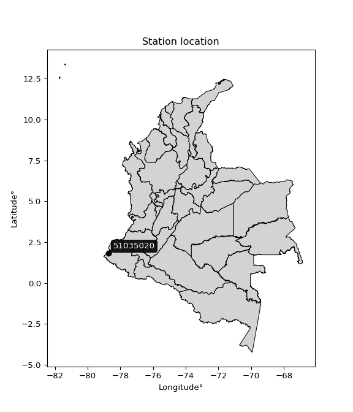</img>

</div>


## A. General information


### 1. General running parameters

• app_version: _v20260312_. • runtime: _2026-03-12 07:15:23.203550_. • Python version: _3.14.0_. • SciPy version: _1.16.3_. • Pandas version: _2.3.3_. • NumPy version: _2.3.5_. • Stations dataset (station_dataset_file): _dataset/pmax24h_in/automatic_colombia_2003_2025.csv_. • Stations catalog (station_catalog_file): _dataset/CNE.xls_. • Minimum year to eval til year_max (date_min): _1900_. • Maximum year to eval since year_min (date_max): _2025_. • Creates, save and include plots into reports (create_plot): _True_. • Plot only fit distributions with Δo > Δ (plot_only_fit): _True_. • Plot only simple graphs avoiding multiple CDFs and multiple Extreme values plots (plot_only_simple): _True_. • Eval low extreme values, if False, evaluates high extreme values (low_extreme): _False_. • Eval every SciPy distribution as logarithmic (pdist_logarithmic_on): _True_. • Standard deviation normalized (ddof): _1.0_. • Return periods to eval in years (Tr): _[2, 2.33, 5, 10, 15, 20, 25, 50, 75, 100, 200, 250, 500, 750, 1000]_. • Minimum data sample per station, 0 means any (minimum_sample): _5_. • Z-Score maximum threshold to adjust a value, 0 means disable (zscore_max): _3.5_. • Z-Score minimum threshold to adjust a value, 0 means disable (zscore_min): _-2.5_. • Avoid zeros, e.g. rain = 0 (avoid_zeros): _True_. • Avoid null values (avoid_nans): _True_. 

:file_folder:Table: [dataset.csv](../../dataset/pmax24h_in/automatic_colombia_2003_2025.csv)

> Delta Degrees of Freedom (DDOF): is a parameter used in the formulas for calculating variance and standard deviation. When ddof=0, the divisor is $N$ (the total number of observations) and this is used when your data set is the entire population. When ddof=1, the divisor is $N-1$ and this is used when your data set is a sample drawn from a larger population. Using $N-1$ provides an unbiased estimate of the population variance (known as Bessel´s correction).


### 2. Station info and location

|   id |   CODIGO | NOMBRE                      | CATEGORIA               | TECNOLOGIA                | ESTADO   | FECHA_INSTALACION   |   FECHA_SUSPENSION |   ALTITUD |   LATITUD |   LONGITUD | DEPARTAMENTO   | MUNICIPIO   | AREA_OPERATIVA                      | ENTIDAD                                                     | AREA_HIDROGRAFICA   | ZONA_HIDROGRAFICA   | SUBZONA_HIDROGRAFICA   |   CORRIENTE | Catalogo   |   Version |
|-----:|---------:|:----------------------------|:------------------------|:--------------------------|:---------|:--------------------|-------------------:|----------:|----------:|-----------:|:---------------|:------------|:------------------------------------|:------------------------------------------------------------|:--------------------|:--------------------|:-----------------------|------------:|:-----------|----------:|
|    0 | 51035020 | CCCP DL PACIFICO [51035020] | Climatológica Principal | Automática con Telemetría | Activa   | 15/09/1991          |                nan |         1 |   1.81917 |     -78.73 | Nariño         | Tumaco      | Area Operativa 07 - Nariño-Putumayo | INSTITUTO DE HIDROLOGIA METEOROLOGIA Y ESTUDIOS AMBIENTALES | Pacifico            | Mira                | Río Rosario            |         nan | CNE_IDEAM  |  20251226 |

<div align="center">

Dynamic map: [:earth_americas:Google](http://maps.google.com/maps?q=1.819166667,-78.73) [:earth_americas:OSM](https://www.openstreetmap.org/#map=18/1.819166667/-78.73&layers=P) [:earth_americas:Bing](https://www.bing.com/maps?cp=1.819166667~-78.73&lvl=18) [:earth_americas:Apple](https://maps.apple.com/frame?center=1.819166667%2C-78.73&span=0.003%2C0.006)

</div>


<div align="center">

```geojson
{
  "type": "Feature",
  "geometry": {
    "type": "Point", 
    "coordinates": [-78.73, 1.819166667]
  }, 
  "properties": {
    "Name": "51035020"
  }
}
```

</div>


### 3. Discrete values table and plot

<div align="center">

|               |            0 |           1 |           2 |          3 |           4 |            5 |
|:--------------|-------------:|------------:|------------:|-----------:|------------:|-------------:|
| Date          | 2019         | 2020        | 2022        | 2023       | 2024        | 2025         |
| Value         |  123.8       |  152.6      |  142        |   55.2     |  157.6      |  128.8       |
| Value_initial |  123.8       |  152.6      |  142        |   55.2     |  157.6      |  128.8       |
| count         |    6         |    6        |    6        |    6       |    6        |    6         |
| mean          |  126.667     |  126.667    |  126.667    |  126.667   |  126.667    |  126.667     |
| std           |   37.3759    |   37.3759   |   37.3759   |   37.3759  |   37.3759   |   37.3759    |
| zscore        |   -0.0766984 |    0.693853 |    0.410247 |   -1.91211 |    0.827629 |    0.0570778 |


</div>


<div align="center">

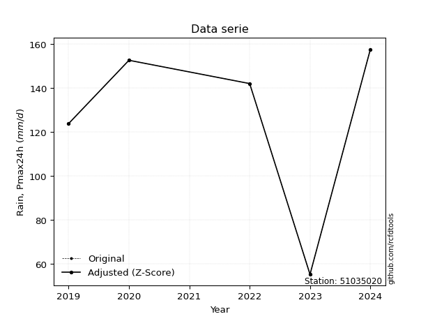</img>

</div>


> The initial value (value_initial) correspond to the initial obtained or null completed value, and value (value) is adjusted only when the initial value is outside the valid range (outlier) definite through the Z-Score value. If Z-Score is active, values out of range or outliers are replaced with the station mean value. A Z-Score (or standard score) measures how many standard deviations a data point is from the mean of a dataset, indicating its relative position; positive scores mean above the mean, negative mean below, and a score of zero is exactly at the mean, allowing for comparison of values from different distributions. It´s calculated using the formula $z=(x–μ)/σ$, where $x$ is the data point, $μ$ is the mean, and $σ$ is the standard deviation, helping identify outliers and understand probability.
>
> <sub>**Note**: In this study, "completing" (filling gaps in) and "extending" (forecasting or lengthening the historical record) rainfall data series are avoided for certain critical analyses because they introduce artificial bias and uncertainty, which can distort the statistics of rare events (extremes), alter day-to-day variability, and compromise the integrity and homogeneity of the original data. Some reasons against Completing/Extending rainfall data are: **Distortion of Extremes and Variability**: The primary issue is that most gap-filling or extension methods rely on averaging or regression with nearby stations, which inherently smooths the data. Rainfall is highly variable in space and time, with a large percentage of zero values and occasional large storms. Infilling methods often underestimate the highest values and overestimate the lowest (zero) values, which severely distorts analyses focused on flood frequency, drought severity, and intensity-duration-frequency (IDF) curves, **Loss of Data Homogeneity**: Infilled or extended data are synthetic estimates, not actual measurements. Combining these estimates with observed data can violate the assumption of data homogeneity, which requires that the data properties do not change over time. Inhomogeneity can lead to incorrect conclusions about long-term trends or changes in climate patterns, **Propagation of Errors**: Errors and biases from the original data (e.g., wind-induced undercatch, instrument errors, site changes) or the data used for imputation can propagate through the analysis, leading to unreliable hydrological models and inaccurate predictions, **Compromised Statistical Integrity**: For statistical analyses, especially those involving the frequency of events, using artificial data can introduce time bias or autocorrelation that doesn´t exist in reality, making it difficult to assess the true probability of events, **Difficulty in Validation**: It is difficult to accurately validate the quality of filled or extended data, especially for past periods where ground-truth measurements are unavailable. The reliability of imputation techniques heavily depends on the density of the surrounding station network and the complexity of the local topography.</sub>


### 4. Active continuous probability distributions from SciPy (80 of 104 available)

A Probability Density Function (PDF) describes the relative likelihood of a continuous random variable falling within a specific range, where the total area under its curve equals 1, and the area over any interval gives the actual probability for that range. Unlike discrete probabilities (like rolling a die), a PDF shows density, not direct probability for a single point (which is zero), with higher points indicating higher likelihood, often visualized as a bell curve for normal distributions.

A log of a probability density function (log-PDF) is simply the logarithm of the PDF´s value, denoted as $log(f(x))$, useful for converting multiplication of probabilities into addition, improving numerical stability with tiny numbers, and connecting to information theory concepts like entropy. Instead of dealing with very small probabilities (e.g., 0.000001), log-PDFs use negative numbers (e.g., $log(0.00001) ≈ -11.51$ that are easier for computers to handle, preventing underflow errors and simplifying complex calculations. In this study, each active probability distribution from SciPy is also evaluated in the $log$ form.

[scipy.stats](https://docs.scipy.org/doc/scipy/reference/stats.html) is a Python´s powerful submodule within the SciPy library for comprehensive statistical analysis, offering over 130 probability distributions (like Normal, Poisson, etc.), functions for descriptive stats (mean, variance), hypothesis testing (t-tests, chi-square), random variable generation, and statistical tests, making it essential for data science, modeling, and research. It provides tools to explore, model, and draw conclusions from data efficiently, working seamlessly with [NumPy](https://numpy.org/).

<div align="center">

|   id | p_dist           |   n_parameter | fit_method   | label                                                                       | active   | ref                                                                                                      |
|-----:|:-----------------|--------------:|:-------------|:----------------------------------------------------------------------------|:---------|:---------------------------------------------------------------------------------------------------------|
|    0 | alpha            |             3 | MLE          | Alpha                                                                       | True     | [:mortar_board:](https://docs.scipy.org/doc/scipy/reference/generated/scipy.stats.alpha.html)            |
|    1 | anglit           |             2 | MM           | Anglit                                                                      | True     | [:mortar_board:](https://docs.scipy.org/doc/scipy/reference/generated/scipy.stats.anglit.html)           |
|    2 | arcsine          |             2 | MM           | Arcsine                                                                     | True     | [:mortar_board:](https://docs.scipy.org/doc/scipy/reference/generated/scipy.stats.arcsine.html)          |
|    3 | argus            |             3 | MLE          | Argus                                                                       | True     | [:mortar_board:](https://docs.scipy.org/doc/scipy/reference/generated/scipy.stats.argus.html)            |
|    4 | beta             |             4 | MLE          | Beta                                                                        | True     | [:mortar_board:](https://docs.scipy.org/doc/scipy/reference/generated/scipy.stats.beta.html)             |
|    5 | betaprime        |             4 | MLE          | Beta prime                                                                  | True     | [:mortar_board:](https://docs.scipy.org/doc/scipy/reference/generated/scipy.stats.betaprime.html)        |
|    6 | bradford         |             3 | MLE          | Bradford                                                                    | True     | [:mortar_board:](https://docs.scipy.org/doc/scipy/reference/generated/scipy.stats.bradford.html)         |
|    7 | burr             |             4 | MLE          | Burr (Type III)                                                             | True     | [:mortar_board:](https://docs.scipy.org/doc/scipy/reference/generated/scipy.stats.burr.html)             |
|    8 | burr12           |             4 | MLE          | Burr (Type III) 12                                                          | True     | [:mortar_board:](https://docs.scipy.org/doc/scipy/reference/generated/scipy.stats.burr12.html)           |
|    9 | cosine           |             2 | MLE          | Cosine                                                                      | True     | [:mortar_board:](https://docs.scipy.org/doc/scipy/reference/generated/scipy.stats.cosine.html)           |
|   10 | crystalball      |             4 | MLE          | Crystalball                                                                 | True     | [:mortar_board:](https://docs.scipy.org/doc/scipy/reference/generated/scipy.stats.crystalball.html)      |
|   11 | dgamma           |             3 | MLE          | Double gamma                                                                | True     | [:mortar_board:](https://docs.scipy.org/doc/scipy/reference/generated/scipy.stats.dgamma.html)           |
|   12 | dweibull         |             3 | MLE          | Double Weibull                                                              | True     | [:mortar_board:](https://docs.scipy.org/doc/scipy/reference/generated/scipy.stats.dweibull.html)         |
|   13 | erlang           |             3 | MLE          | Erlang                                                                      | True     | [:mortar_board:](https://docs.scipy.org/doc/scipy/reference/generated/scipy.stats.erlang.html)           |
|   14 | exponnorm        |             3 | MLE          | Exponentially modified Normal                                               | True     | [:mortar_board:](https://docs.scipy.org/doc/scipy/reference/generated/scipy.stats.exponnorm.html)        |
|   15 | exponpow         |             3 | MLE          | Exponential power                                                           | True     | [:mortar_board:](https://docs.scipy.org/doc/scipy/reference/generated/scipy.stats.exponpow.html)         |
|   16 | exponweib        |             4 | MLE          | Exponentiated Weibull                                                       | True     | [:mortar_board:](https://docs.scipy.org/doc/scipy/reference/generated/scipy.stats.exponweib.html)        |
|   17 | f                |             4 | MLE          | F                                                                           | True     | [:mortar_board:](https://docs.scipy.org/doc/scipy/reference/generated/scipy.stats.f.html)                |
|   18 | fatiguelife      |             3 | MLE          | Fatigue-life (Birnbaum-Saunders)                                            | True     | [:mortar_board:](https://docs.scipy.org/doc/scipy/reference/generated/scipy.stats.fatiguelife.html)      |
|   19 | foldnorm         |             3 | MM           | Fold Normal                                                                 | True     | [:mortar_board:](https://docs.scipy.org/doc/scipy/reference/generated/scipy.stats.foldnorm.html)         |
|   20 | gamma            |             3 | MLE          | Gamma                                                                       | True     | [:mortar_board:](https://docs.scipy.org/doc/scipy/reference/generated/scipy.stats.gamma.html)            |
|   21 | gausshyper       |             6 | MLE          | Gauss hypergeometric                                                        | True     | [:mortar_board:](https://docs.scipy.org/doc/scipy/reference/generated/scipy.stats.gausshyper.html)       |
|   22 | genexpon         |             5 | MLE          | Generalized exponential                                                     | True     | [:mortar_board:](https://docs.scipy.org/doc/scipy/reference/generated/scipy.stats.genexpon.html)         |
|   23 | genextreme       |             3 | MLE          | Generalized exponential                                                     | True     | [:mortar_board:](https://docs.scipy.org/doc/scipy/reference/generated/scipy.stats.genextreme.html)       |
|   24 | gengamma         |             4 | MLE          | Generalized gamma                                                           | True     | [:mortar_board:](https://docs.scipy.org/doc/scipy/reference/generated/scipy.stats.gengamma.html)         |
|   25 | genhalflogistic  |             3 | MLE          | Generalized half-logistic                                                   | True     | [:mortar_board:](https://docs.scipy.org/doc/scipy/reference/generated/scipy.stats.genhalflogistic.html)  |
|   26 | genlogistic      |             3 | MLE          | Generalized logistic                                                        | True     | [:mortar_board:](https://docs.scipy.org/doc/scipy/reference/generated/scipy.stats.genlogistic.html)      |
|   27 | gennorm          |             3 | MLE          | Generalized Normal                                                          | True     | [:mortar_board:](https://docs.scipy.org/doc/scipy/reference/generated/scipy.stats.gennorm.html)          |
|   28 | genpareto        |             3 | MLE          | Generalized Pareto                                                          | True     | [:mortar_board:](https://docs.scipy.org/doc/scipy/reference/generated/scipy.stats.genpareto.html)        |
|   29 | gompertz         |             3 | MLE          | Gompertz (or truncated Gumbel)                                              | True     | [:mortar_board:](https://docs.scipy.org/doc/scipy/reference/generated/scipy.stats.gompertz.html)         |
|   30 | gumbel_l         |             2 | MM           | Gumbel Left Skew                                                            | True     | [:mortar_board:](https://docs.scipy.org/doc/scipy/reference/generated/scipy.stats.gumbel_l.html)         |
|   31 | gumbel_r         |             2 | MM           | Gumbel Right Skew                                                           | True     | [:mortar_board:](https://docs.scipy.org/doc/scipy/reference/generated/scipy.stats.gumbel_r.html)         |
|   32 | halfgennorm      |             3 | MLE          | Upper half of a generalized normal                                          | True     | [:mortar_board:](https://docs.scipy.org/doc/scipy/reference/generated/scipy.stats.halfgennorm.html)      |
|   33 | halflogistic     |             2 | MM           | Half-logistic                                                               | True     | [:mortar_board:](https://docs.scipy.org/doc/scipy/reference/generated/scipy.stats.halflogistic.html)     |
|   34 | halfnorm         |             2 | MM           | Half Normal                                                                 | True     | [:mortar_board:](https://docs.scipy.org/doc/scipy/reference/generated/scipy.stats.halfnorm.html)         |
|   35 | hypsecant        |             2 | MM           | hyperbolic secant                                                           | True     | [:mortar_board:](https://docs.scipy.org/doc/scipy/reference/generated/scipy.stats.hypsecant.html)        |
|   36 | invgamma         |             3 | MLE          | Inverted gamma                                                              | True     | [:mortar_board:](https://docs.scipy.org/doc/scipy/reference/generated/scipy.stats.invgamma.html)         |
|   37 | invgauss         |             3 | MLE          | Inverse Gaussian                                                            | True     | [:mortar_board:](https://docs.scipy.org/doc/scipy/reference/generated/scipy.stats.invgauss.html)         |
|   38 | invweibull       |             3 | MLE          | Inverted Weibull                                                            | True     | [:mortar_board:](https://docs.scipy.org/doc/scipy/reference/generated/scipy.stats.invweibull.html)       |
|   39 | johnsonsb        |             4 | MLE          | Johnson SB                                                                  | True     | [:mortar_board:](https://docs.scipy.org/doc/scipy/reference/generated/scipy.stats.johnsonsb.html)        |
|   40 | johnsonsu        |             4 | MLE          | Johnson Su                                                                  | True     | [:mortar_board:](https://docs.scipy.org/doc/scipy/reference/generated/scipy.stats.johnsonsu.html)        |
|   41 | kappa3           |             3 | MLE          | Kappa 3                                                                     | True     | [:mortar_board:](https://docs.scipy.org/doc/scipy/reference/generated/scipy.stats.kappa3.html)           |
|   42 | kappa4           |             4 | MLE          | Kappa 4                                                                     | True     | [:mortar_board:](https://docs.scipy.org/doc/scipy/reference/generated/scipy.stats.kappa4.html)           |
|   43 | ksone            |             3 | MLE          | Kolmogorov-Smirnov one-sided test statistic distribution                    | True     | [:mortar_board:](https://docs.scipy.org/doc/scipy/reference/generated/scipy.stats.ksone.html)            |
|   44 | kstwobign        |             2 | MLE          | Limiting distribution of scaled Kolmogorov-Smirnov two-sided test statistic | True     | [:mortar_board:](https://docs.scipy.org/doc/scipy/reference/generated/scipy.stats.kstwobign.html)        |
|   45 | laplace          |             2 | MM           | Laplace                                                                     | True     | [:mortar_board:](https://docs.scipy.org/doc/scipy/reference/generated/scipy.stats.laplace.html)          |
|   46 | levy_l           |             2 | MLE          | Left-skewed Levy                                                            | True     | [:mortar_board:](https://docs.scipy.org/doc/scipy/reference/generated/scipy.stats.levy_l.html)           |
|   47 | loggamma         |             3 | MLE          | Log gamma                                                                   | True     | [:mortar_board:](https://docs.scipy.org/doc/scipy/reference/generated/scipy.stats.loggamma.html)         |
|   48 | logistic         |             2 | MM           | Logistic (or Sech-squared)                                                  | True     | [:mortar_board:](https://docs.scipy.org/doc/scipy/reference/generated/scipy.stats.logistic.html)         |
|   49 | loglaplace       |             3 | MLE          | Log-Laplace                                                                 | True     | [:mortar_board:](https://docs.scipy.org/doc/scipy/reference/generated/scipy.stats.loglaplace.html)       |
|   50 | lomax            |             3 | MLE          | Lomax (Pareto of the second kind)                                           | True     | [:mortar_board:](https://docs.scipy.org/doc/scipy/reference/generated/scipy.stats.lomax.html)            |
|   51 | maxwell          |             2 | MM           | Maxwell                                                                     | True     | [:mortar_board:](https://docs.scipy.org/doc/scipy/reference/generated/scipy.stats.maxwell.html)          |
|   52 | mielke           |             4 | MLE          | Mielke Beta-Kappa / Dagum                                                   | True     | [:mortar_board:](https://docs.scipy.org/doc/scipy/reference/generated/scipy.stats.mielke.html)           |
|   53 | moyal            |             2 | MM           | Moyal                                                                       | True     | [:mortar_board:](https://docs.scipy.org/doc/scipy/reference/generated/scipy.stats.moyal.html)            |
|   54 | nakagami         |             3 | MLE          | Nakagami                                                                    | True     | [:mortar_board:](https://docs.scipy.org/doc/scipy/reference/generated/scipy.stats.nakagami.html)         |
|   55 | ncf              |             5 | MLE          | Non-central F distribution                                                  | True     | [:mortar_board:](https://docs.scipy.org/doc/scipy/reference/generated/scipy.stats.ncf.html)              |
|   56 | nct              |             4 | MLE          | Non-central Student’s t                                                     | True     | [:mortar_board:](https://docs.scipy.org/doc/scipy/reference/generated/scipy.stats.nct.html)              |
|   57 | norm             |             2 | MM           | Normal                                                                      | True     | [:mortar_board:](https://docs.scipy.org/doc/scipy/reference/generated/scipy.stats.norm.html)             |
|   58 | pearson3         |             3 | MM           | Pearson type III                                                            | True     | [:mortar_board:](https://docs.scipy.org/doc/scipy/reference/generated/scipy.stats.pearson3.html)         |
|   59 | powerlaw         |             3 | MLE          | Power-function                                                              | True     | [:mortar_board:](https://docs.scipy.org/doc/scipy/reference/generated/scipy.stats.powerlaw.html)         |
|   60 | rayleigh         |             2 | MM           | Rayleigh                                                                    | True     | [:mortar_board:](https://docs.scipy.org/doc/scipy/reference/generated/scipy.stats.rayleigh.html)         |
|   61 | rdist            |             3 | MLE          | R-distributed (symmetric beta)                                              | True     | [:mortar_board:](https://docs.scipy.org/doc/scipy/reference/generated/scipy.stats.rdist.html)            |
|   62 | rice             |             3 | MLE          | Rice                                                                        | True     | [:mortar_board:](https://docs.scipy.org/doc/scipy/reference/generated/scipy.stats.rice.html)             |
|   63 | semicircular     |             2 | MM           | Semicircular                                                                | True     | [:mortar_board:](https://docs.scipy.org/doc/scipy/reference/generated/scipy.stats.semicircular.html)     |
|   64 | skewnorm         |             3 | MLE          | Skew normal                                                                 | True     | [:mortar_board:](https://docs.scipy.org/doc/scipy/reference/generated/scipy.stats.skewnorm.html)         |
|   65 | t                |             3 | MLE          | Student’s t                                                                 | True     | [:mortar_board:](https://docs.scipy.org/doc/scipy/reference/generated/scipy.stats.t.html)                |
|   66 | trapezoid        |             4 | MLE          | Trapezoid                                                                   | True     | [:mortar_board:](https://docs.scipy.org/doc/scipy/reference/generated/scipy.stats.trapezoid.html)        |
|   67 | triang           |             3 | MLE          | Triangular                                                                  | True     | [:mortar_board:](https://docs.scipy.org/doc/scipy/reference/generated/scipy.stats.triang.html)           |
|   68 | truncexpon       |             3 | MLE          | Truncated exponential                                                       | True     | [:mortar_board:](https://docs.scipy.org/doc/scipy/reference/generated/scipy.stats.truncexpon.html)       |
|   69 | truncnorm        |             4 | MLE          | Truncated normal                                                            | True     | [:mortar_board:](https://docs.scipy.org/doc/scipy/reference/generated/scipy.stats.truncnorm.html)        |
|   70 | truncpareto      |             4 | MLE          | Upper truncated Pareto                                                      | True     | [:mortar_board:](https://docs.scipy.org/doc/scipy/reference/generated/scipy.stats.truncpareto.html)      |
|   71 | truncweibull_min |             5 | MLE          | Doubly truncated Weibull minimum                                            | True     | [:mortar_board:](https://docs.scipy.org/doc/scipy/reference/generated/scipy.stats.truncweibull_min.html) |
|   72 | tukeylambda      |             3 | MLE          | Tukey-Lamdba                                                                | True     | [:mortar_board:](https://docs.scipy.org/doc/scipy/reference/generated/scipy.stats.tukeylambda.html)      |
|   73 | uniform          |             2 | MLE          | Uniform                                                                     | True     | [:mortar_board:](https://docs.scipy.org/doc/scipy/reference/generated/scipy.stats.uniform.html)          |
|   74 | vonmises         |             3 | MLE          | Von Mises                                                                   | True     | [:mortar_board:](https://docs.scipy.org/doc/scipy/reference/generated/scipy.stats.vonmises.html)         |
|   75 | vonmises_line    |             3 | MLE          | Von Mises line                                                              | True     | [:mortar_board:](https://docs.scipy.org/doc/scipy/reference/generated/scipy.stats.vonmises_line.html)    |
|   76 | wald             |             2 | MM           | Wald                                                                        | True     | [:mortar_board:](https://docs.scipy.org/doc/scipy/reference/generated/scipy.stats.wald.html)             |
|   77 | weibull_max      |             3 | MLE          | Weibull maximum                                                             | True     | [:mortar_board:](https://docs.scipy.org/doc/scipy/reference/generated/scipy.stats.weibull_max.html)      |
|   78 | weibull_min      |             3 | MLE          | Weibull minimum                                                             | True     | [:mortar_board:](https://docs.scipy.org/doc/scipy/reference/generated/scipy.stats.weibull_min.html)      |
|   79 | wrapcauchy       |             3 | MLE          | Wrapped  Cauchy                                                             | True     | [:mortar_board:](https://docs.scipy.org/doc/scipy/reference/generated/scipy.stats.wrapcauchy.html)       |

</div>

> **n_parameter:** # arguments & localization & scale.
>
> **Fit methods:** (MLE) maximum likelihood, (MM) L-moments.
>
>**Inactive** (With the only purpose of prevent loops, zero divisions, infinite values, over high estimated values or horizontal trending for recurrence intervals estimations, the follow distributions were disabled.)**:** lognorm, norminvgauss, powernorm, powerlognorm, cauchy, halfcauchy, foldcauchy, skewcauchy, chi2, expon, fisk, genhyperbolic, geninvgauss, gibrat, kstwo, laplace_asymmetric, levy, levy_stable, ncx2, pareto, rel_breitwigner, recipinvgauss, studentized_range, loguniform, 


## B. Probability (PDF) vs. Empirical (EDF) distributions functions

A continuous probability distribution (CPD) describes probabilities for variables that can take any value within a range (like rain any time), unlike discrete variables with specific outcomes (like temperature). It uses a Probability Density Function (PDF), a curve where the total area under it equals 1, and the probability of the variable falling within an interval (a to b) is found by calculating the area under the curve between those points. A key feature is that the probability of hitting any single exact value is zero, so probabilities are always expressed for ranges, e.g., $P(a ≤ X ≤ b)$.

<div align="center">

Distributions parameters from station values
|     |   station | p_dist              |   n |               loc |            scale | shape                  | shape1                | shape2                | shape3             |
|----:|----------:|:--------------------|----:|------------------:|-----------------:|:-----------------------|:----------------------|:----------------------|:-------------------|
|   0 |  51035020 | alpha               |   6 |    -766.38        |  22156.3         | 24.884547177386047     |                       |                       |                    |
|   1 |  51035020 | anglit              |   6 |     126.667       |     99.8127      |                        |                       |                       |                    |
|   2 |  51035020 | arcsine             |   6 |      78.4147      |     96.504       |                        |                       |                       |                    |
|   3 |  51035020 | argus               |   6 |       7.74194     |    152.686       | 2.7520186463591036     |                       |                       |                    |
|   4 |  51035020 | beta                |   6 |      45.0751      |    112.525       | 0.6779683937255154     | 0.20476839174008568   |                       |                    |
|   5 |  51035020 | betaprime           |   6 |     -63.1184      |  65607.9         | 22.274637070657676     | 7616.165653128077     |                       |                    |
|   6 |  51035020 | bradford            |   6 |      55.1999      |    102.4         | 1.0026625711398844     |                       |                       |                    |
|   7 |  51035020 | burr                |   6 |      -1.93338     |    160.436       | 516.2871967747675      | 0.007008224101748891  |                       |                    |
|   8 |  51035020 | burr12              |   6 |       0.047745    |     54.7874      | 671.9534457051964      | 0.00189646232064431   |                       |                    |
|   9 |  51035020 | cosine              |   6 |     120.263       |     29.9391      |                        |                       |                       |                    |
|  10 |  51035020 | crystalball         |   6 |     126.667       |     34.1193      | 10167.223651080296     | 5365.883935709402     |                       |                    |
|  11 |  51035020 | dgamma              |   6 |     128.8         |     24.6627      | 0.9855650584422482     |                       |                       |                    |
|  12 |  51035020 | dweibull            |   6 |     134.819       |     24.9383      | 1.0820942988501234     |                       |                       |                    |
|  13 |  51035020 | erlang              |   6 |    -364.591       |      2.622       | 187.2924808181782      |                       |                       |                    |
|  14 |  51035020 | exponnorm           |   6 |     126.643       |     34.1192      | 0.0006780542769284673  |                       |                       |                    |
|  15 |  51035020 | exponpow            |   6 |      55.2         |      1.47434     | 0.08212052206904402    |                       |                       |                    |
|  16 |  51035020 | exponweib           |   6 |      55.2         |      1.35977     | 1.2318114814835415     | 0.18189479965629868   |                       |                    |
|  17 |  51035020 | f                   |   6 |  -26951.8         |  27078.3         | 1694293.2835684097     | 4759979.234439883     |                       |                    |
|  18 |  51035020 | fatiguelife         |   6 |      55.2         |      0.00102082  | 234.9912964049015      |                       |                       |                    |
|  19 |  51035020 | foldnorm            |   6 |     131.014       |      2.15853     | 2.6545881946251816e-08 |                       |                       |                    |
|  20 |  51035020 | gamma               |   6 |    -478.158       |      2.14018     | 282.7557225576538      |                       |                       |                    |
|  21 |  51035020 | gausshyper          |   6 |      54.0396      |    103.56        | 1.2249034210960963     | 0.6316395607595303    | 1.1595658535935827    | 1.0189993633825838 |
|  22 |  51035020 | genexpon            |   6 |      55.2         |      7.29705     | 0.3922686050510938     | 0.3521652648989194    | 9.940008212534064e-09 |                    |
|  23 |  51035020 | genextreme          |   6 |     129.795       |     33.7762      | 1.2147634108443275     |                       |                       |                    |
|  24 |  51035020 | gengamma            |   6 |      55.2         |      1.4625      | 1.3132277640145145     | -0.060803185434034616 |                       |                    |
|  25 |  51035020 | genhalflogistic     |   6 |      51.9184      |    112.37        | 1.0632846486062824     |                       |                       |                    |
|  26 |  51035020 | genlogistic         |   6 |     157.601       |      1.24851e-05 | 4.037001158735211e-07  |                       |                       |                    |
|  27 |  51035020 | gennorm             |   6 |     142           |      1.83271e-06 | 0.1338376084165432     |                       |                       |                    |
|  28 |  51035020 | genpareto           |   6 |      -1.33273     |    323.921       | -2.0381041850443165    |                       |                       |                    |
|  29 |  51035020 | gompertz            |   6 |      58.9775      |      4.16735     | 1.9952063602120346e-10 |                       |                       |                    |
|  30 |  51035020 | gumbel_l            |   6 |     142.022       |     26.6027      |                        |                       |                       |                    |
|  31 |  51035020 | gumbel_r            |   6 |     111.311       |     26.6027      |                        |                       |                       |                    |
|  32 |  51035020 | halfgennorm         |   6 |      55.2         |      1.33372     | 0.31711315781268695    |                       |                       |                    |
|  33 |  51035020 | halflogistic        |   6 |      86.2273      |     29.1708      |                        |                       |                       |                    |
|  34 |  51035020 | halfnorm            |   6 |      81.506       |     56.6005      |                        |                       |                       |                    |
|  35 |  51035020 | hypsecant           |   6 |     126.667       |     21.721       |                        |                       |                       |                    |
|  36 |  51035020 | invgamma            |   6 |    -452.323       | 139409           | 242.17294848395466     |                       |                       |                    |
|  37 |  51035020 | invgauss            |   6 |    -135.472       |  12163.2         | 0.021499901036851822   |                       |                       |                    |
|  38 |  51035020 | invweibull          |   6 |      55.2         |      1.48749     | 0.05659708649155139    |                       |                       |                    |
|  39 |  51035020 | johnsonsb           |   6 |      46.308       |    111.292       | -0.06223479515502371   | 0.09059475459169303   |                       |                    |
|  40 |  51035020 | johnsonsu           |   6 |     157.6         |      6.05877e-09 | 4.660469667410733      | 0.23363850089800486   |                       |                    |
|  41 |  51035020 | kappa3              |   6 |      55.2         |    119.802       | 956.2402692011724      |                       |                       |                    |
|  42 |  51035020 | kappa4              |   6 |      48.2441      |    114.197       | 1.0333230820515666     | 1.0442696889115695    |                       |                    |
|  43 |  51035020 | ksone               |   6 |      44.96        |    122.88        | 1.0                    |                       |                       |                    |
|  44 |  51035020 | kstwobign           |   6 |     -35.064       |    184.71        |                        |                       |                       |                    |
|  45 |  51035020 | laplace             |   6 |     126.667       |     24.126       |                        |                       |                       |                    |
|  46 |  51035020 | levy_l              |   6 |     159.286       |      6.88896     |                        |                       |                       |                    |
|  47 |  51035020 | loggamma            |   6 |     157.6         |      1.15132e-05 | 3.7252688974595063e-07 |                       |                       |                    |
|  48 |  51035020 | logistic            |   6 |     126.667       |     18.811       |                        |                       |                       |                    |
|  49 |  51035020 | loglaplace          |   6 |      -0.39443     |    142.394       | 4.443507124704535      |                       |                       |                    |
|  50 |  51035020 | lomax               |   6 |      55.1594      |  38706.3         | 539.6638931089822      |                       |                       |                    |
|  51 |  51035020 | maxwell             |   6 |      45.8182      |     50.6643      |                        |                       |                       |                    |
|  52 |  51035020 | mielke              |   6 |      -1.89345e+06 |      1.89361e+06 | 61016.36218572319      | 358917121.84193593    |                       |                    |
|  53 |  51035020 | moyal               |   6 |     107.155       |     15.3591      |                        |                       |                       |                    |
|  54 |  51035020 | nakagami            |   6 |     123.8         |     16.9422      | 0.3295128234751524     |                       |                       |                    |
|  55 |  51035020 | ncf                 |   6 |      -1.07624     |    122.069       | 30.851720807268975     | 37.261773835703195    | 0.25322644730441723   |                    |
|  56 |  51035020 | nct                 |   6 |   -2860.73        |     34.0897      | 2046949.6556021972     | 87.63338069645783     |                       |                    |
|  57 |  51035020 | norm                |   6 |     126.667       |     34.1193      |                        |                       |                       |                    |
|  58 |  51035020 | pearson3            |   6 |     126.667       |     34.1193      | -1.3191900247686885    |                       |                       |                    |
|  59 |  51035020 | powerlaw            |   6 |      55.2         |    102.4         | 0.15726163190261497    |                       |                       |                    |
|  60 |  51035020 | rayleigh            |   6 |      61.3944      |     52.0797      |                        |                       |                       |                    |
|  61 |  51035020 | rdist               |   6 |      55.2         |      1.79199e-11 | 1.6193584729706219     |                       |                       |                    |
|  62 |  51035020 | rice                |   6 |      55.2         |      8.69436e-15 | 1.6345545308456653     |                       |                       |                    |
|  63 |  51035020 | semicircular        |   6 |     126.667       |     68.2387      |                        |                       |                       |                    |
|  64 |  51035020 | skewnorm            |   6 |     157.6         |     46.0605      | -6887336.177193489     |                       |                       |                    |
|  65 |  51035020 | t                   |   6 |     127.441       |     34.31        | 23.00990615622723      |                       |                       |                    |
|  66 |  51035020 | trapezoid           |   6 |      30.1626      |    144.756       | 1.0                    | 1.0                   |                       |                    |
|  67 |  51035020 | triang              |   6 |      28.6825      |    128.918       | 0.9999998236023513     |                       |                       |                    |
|  68 |  51035020 | truncexpon          |   6 |      55.2         |    138.966       | 0.7368733472567193     |                       |                       |                    |
|  69 |  51035020 | truncnorm           |   6 |     -14.1083      |      5.82858     | 23.66070565091261      | 29.45973327332498     |                       |                    |
|  70 |  51035020 | truncpareto         |   6 |      54.9676      |      0.2324      | 0.20333057664055387    | 441.6200410275526     |                       |                    |
|  71 |  51035020 | truncweibull_min    |   6 |      46.7541      |    152.558       | 1.7974741417768971     | 0.004161111044590035  | 0.7265807029401634    |                    |
|  72 |  51035020 | tukeylambda         |   6 |      55.2         |      1.35549e-12 | 1.6063275857420307     |                       |                       |                    |
|  73 |  51035020 | uniform             |   6 |      55.2         |    102.4         |                        |                       |                       |                    |
|  74 |  51035020 | vonmises            |   6 |      -2.44146     |      1           | 0.561724687164757      |                       |                       |                    |
|  75 |  51035020 | vonmises_line       |   6 |     135.003       |     25.4021      | 1.288606311851485      |                       |                       |                    |
|  76 |  51035020 | wald                |   6 |      92.5474      |     34.1193      |                        |                       |                       |                    |
|  77 |  51035020 | weibull_max         |   6 |     157.6         |     33.4893      | 0.1690538740587684     |                       |                       |                    |
|  78 |  51035020 | weibull_min         |   6 |      55.2         |      1.43659     | 0.2263105576540813     |                       |                       |                    |
|  79 |  51035020 | wrapcauchy          |   6 |      55.2         |     16.2975      | 0.5895790059253914     |                       |                       |                    |
|  80 |  51035020 | logalpha            |   6 |     -10.1499      |    594.382       | 39.81849923069973      |                       |                       |                    |
|  81 |  51035020 | loganglit           |   6 |       4.7886      |      1.04755     |                        |                       |                       |                    |
|  82 |  51035020 | logarcsine          |   6 |       4.28218     |      1.01284     |                        |                       |                       |                    |
|  83 |  51035020 | logargus            |   6 |       3.54179     |      1.54379     | 3.0826672846466265     |                       |                       |                    |
|  84 |  51035020 | logbeta             |   6 |       3.31165     |      1.74841     | 4.581516693514684      | 0.8580041104355229    |                       |                    |
|  85 |  51035020 | logbetaprime        |   6 |      -5.64138     |     15.6261      | 779.5396616210191      | 1168.5307316931285    |                       |                    |
|  86 |  51035020 | logbradford         |   6 |       4.01096     |      1.04913     | 1.0906271509497287     |                       |                       |                    |
|  87 |  51035020 | logburr             |   6 |      -3.04134e+07 |      3.04134e+07 | 16795449414.802433     | 0.006530977670248699  |                       |                    |
|  88 |  51035020 | logburr12           |   6 |    -199.378       |    206.364       | 1050.2416233647537     | 36413.943594570694    |                       |                    |
|  89 |  51035020 | logcosine           |   6 |       4.71123     |      0.318422    |                        |                       |                       |                    |
|  90 |  51035020 | logcrystalball      |   6 |       4.7886      |      0.358087    | 7.376126587091461      | 3464.2556891541008    |                       |                    |
|  91 |  51035020 | logdgamma           |   6 |       4.95583     |      0.252678    | 0.4916876226519341     |                       |                       |                    |
|  92 |  51035020 | logdweibull         |   6 |       4.95583     |      0.259907    | 0.7977574324064194     |                       |                       |                    |
|  93 |  51035020 | logerlang           |   6 |       4.01096     |      1.10011     | 0.92651645809175       |                       |                       |                    |
|  94 |  51035020 | logexponnorm        |   6 |       4.78837     |      0.358085    | 0.0006500748595858937  |                       |                       |                    |
|  95 |  51035020 | logexponpow         |   6 |      -6.14444e+07 |      6.14444e+07 | 189292813.4259985      |                       |                       |                    |
|  96 |  51035020 | logexponweib        |   6 |   -6629.02        |   6634.09        | 0.07537694854953755    | 311248.9995031714     |                       |                    |
|  97 |  51035020 | logf                |   6 |    -559.083       |    563.872       | 5774628.677863944      | 34744112.0940008      |                       |                    |
|  98 |  51035020 | logfatiguelife      |   6 |    -244.534       |    249.323       | 0.0014293636325706286  |                       |                       |                    |
|  99 |  51035020 | logfoldnorm         |   6 |       4.30492     |      0.450188    | 0.8599720475337247     |                       |                       |                    |
| 100 |  51035020 | loggamma            |   6 |       4.01096     |      0.980711    | 0.6081548972128317     |                       |                       |                    |
| 101 |  51035020 | loggausshyper       |   6 |       3.95432     |      1.10574     | 1.100902112033167      | 0.9284578746346994    | 1.0232173794407626    | 1.011321412726943  |
| 102 |  51035020 | loggenexpon         |   6 |       4.01096     |      1.83334e+09 | 834716734.7624952      | 8256271219.349576     | 781795816.4948809     |                    |
| 103 |  51035020 | loggenextreme       |   6 |       4.86743     |      0.244285    | 1.2681468883709504     |                       |                       |                    |
| 104 |  51035020 | loggengamma         |   6 |       4.01096     |      0.982795    | 0.9679036729007255     | 1.0111385924965566    |                       |                    |
| 105 |  51035020 | loggenhalflogistic  |   6 |       3.81194     |      1.36511     | 1.093727033088466      |                       |                       |                    |
| 106 |  51035020 | loggenlogistic      |   6 |       5.06006     |      1.93784e-07 | 7.137342982875297e-07  |                       |                       |                    |
| 107 |  51035020 | loggennorm          |   6 |       4.95583     |      0.00722389  | 0.3720745371087758     |                       |                       |                    |
| 108 |  51035020 | loggenpareto        |   6 |      -0.0517084   |     21.4221      | -4.190734323851867     |                       |                       |                    |
| 109 |  51035020 | loggompertz         |   6 |       4.01096     |      1.07674     | 0.935993374524682      |                       |                       |                    |
| 110 |  51035020 | loggumbel_l         |   6 |       4.94976     |      0.279199    |                        |                       |                       |                    |
| 111 |  51035020 | loggumbel_r         |   6 |       4.62744     |      0.279199    |                        |                       |                       |                    |
| 112 |  51035020 | loghalfgennorm      |   6 |       4.01096     |      0.839612    | 1.1672048507840165     |                       |                       |                    |
| 113 |  51035020 | loghalflogistic     |   6 |       4.36422     |      0.306125    |                        |                       |                       |                    |
| 114 |  51035020 | loghalfnorm         |   6 |       4.31462     |      0.594038    |                        |                       |                       |                    |
| 115 |  51035020 | loghypsecant        |   6 |       4.7886      |      0.227965    |                        |                       |                       |                    |
| 116 |  51035020 | loginvgamma         |   6 |      -1.11148     |   1332.03        | 227.05344684371738     |                       |                       |                    |
| 117 |  51035020 | loginvgauss         |   6 |       0.573752    |    481.442       | 0.00873174569431593    |                       |                       |                    |
| 118 |  51035020 | loginvweibull       |   6 |      -6.18597e+07 |      6.18597e+07 | 118036085.32507607     |                       |                       |                    |
| 119 |  51035020 | logjohnsonsb        |   6 |       0.737097    |      4.32296     | -0.8874934681223727    | 0.08393991821339761   |                       |                    |
| 120 |  51035020 | logjohnsonsu        |   6 |       5.06006     |      2.23468e-14 | 3.1350867384554917     | 0.10796707374505475   |                       |                    |
| 121 |  51035020 | logkappa3           |   6 |       4.01096     |      1.04631     | 670.8376259359312      |                       |                       |                    |
| 122 |  51035020 | logkappa4           |   6 |       3.89978     |      1.23563     | 1.0119701355661632     | 1.0649495788951724    |                       |                    |
| 123 |  51035020 | logksone            |   6 |       3.90605     |      1.25892     | 1.0                    |                       |                       |                    |
| 124 |  51035020 | logkstwobign        |   6 |       3.03586     |      2.00178     |                        |                       |                       |                    |
| 125 |  51035020 | loglaplace          |   6 |       4.7886      |      0.253206    |                        |                       |                       |                    |
| 126 |  51035020 | loglevy_l           |   6 |       5.07155     |      0.0468207   |                        |                       |                       |                    |
| 127 |  51035020 | logloggamma         |   6 |       5.06009     |      2.93456e-06 | 1.0830223278890995e-05 |                       |                       |                    |
| 128 |  51035020 | loglogistic         |   6 |       4.7886      |      0.197424    |                        |                       |                       |                    |
| 129 |  51035020 | logloglaplace       |   6 |      -3.15687e+07 |      3.15687e+07 | 139894103.54195592     |                       |                       |                    |
| 130 |  51035020 | loglomax            |   6 |       4.01096     |      2.15162e+13 | 3854889489093.543      |                       |                       |                    |
| 131 |  51035020 | logmaxwell          |   6 |       3.94008     |      0.531728    |                        |                       |                       |                    |
| 132 |  51035020 | logmielke           |   6 |      -3.19229e+07 |      3.19229e+07 | 118396817.83039114     | 5904526079.104111     |                       |                    |
| 133 |  51035020 | logmoyal            |   6 |       4.58382     |      0.161196    |                        |                       |                       |                    |
| 134 |  51035020 | lognakagami         |   6 |       4.81867     |      0.116072    | 0.2768375790476322     |                       |                       |                    |
| 135 |  51035020 | logncf              |   6 |     -23.262       |     28.0491      | 16875.008902890208     | 39181.82841644646     | 0.0012201069097937211 |                    |
| 136 |  51035020 | lognct              |   6 |     -16.3235      |      0.318175    | 6631.924470497375      | 66.33961549232627     |                       |                    |
| 137 |  51035020 | lognorm             |   6 |       4.7886      |      0.358087    |                        |                       |                       |                    |
| 138 |  51035020 | logpearson3         |   6 |       4.7886      |      0.358087    | -1.5663612877844244    |                       |                       |                    |
| 139 |  51035020 | logpowerlaw         |   6 |       4.01096     |      1.0491      | 0.1698933728035775     |                       |                       |                    |
| 140 |  51035020 | lograyleigh         |   6 |       4.10358     |      0.54657     |                        |                       |                       |                    |
| 141 |  51035020 | logrdist            |   6 |       5.23572     |      0.417048    | 1.2426860749174358     |                       |                       |                    |
| 142 |  51035020 | logrice             |   6 |    -253.691       |      0.357872    | 722.269538111258       |                       |                       |                    |
| 143 |  51035020 | logsemicircular     |   6 |       4.7886      |      0.716154    |                        |                       |                       |                    |
| 144 |  51035020 | logskewnorm         |   6 |       5.06006     |      0.44932     | -34564789.929594755    |                       |                       |                    |
| 145 |  51035020 | logt                |   6 |       4.9409      |      0.108026    | 1.2722547589367494     |                       |                       |                    |
| 146 |  51035020 | logtrapezoid        |   6 |       3.77578     |      1.51923     | 1.0                    | 1.0                   |                       |                    |
| 147 |  51035020 | logtriang           |   6 |       3.8156      |      1.24447     | 0.9999995513885132     |                       |                       |                    |
| 148 |  51035020 | logtruncexpon       |   6 |       4.01096     |      1.24548     | 0.8423394297800947     |                       |                       |                    |
| 149 |  51035020 | logtruncnorm        |   6 |      -0.133521    |      1.17977     | 4.197570471490936      | 4.402181017702436     |                       |                    |
| 150 |  51035020 | logtruncpareto      |   6 |       4.00842     |      0.00254412  | 0.20330518671557488    | 413.3620601352296     |                       |                    |
| 151 |  51035020 | logtruncweibull_min |   6 |       3.92858     |      1.77561     | 1.6690279708446285     | 0.002668588103999979  | 0.6372379270218393    |                    |
| 152 |  51035020 | logtukeylambda      |   6 |       4.93936     |      0.184193    | 1.5260716552206373     |                       |                       |                    |
| 153 |  51035020 | loguniform          |   6 |       4.01096     |      1.0491      |                        |                       |                       |                    |
| 154 |  51035020 | logvonmises         |   6 |      -1.48222     |      1           | 8.40968074280557       |                       |                       |                    |
| 155 |  51035020 | logvonmises_line    |   6 |       4.88425     |      0.277976    | 1.5233200777144438     |                       |                       |                    |
| 156 |  51035020 | logwald             |   6 |       4.43054     |      0.358063    |                        |                       |                       |                    |
| 157 |  51035020 | logweibull_max      |   6 |       5.06006     |      0.482374    | 0.4988945068868479     |                       |                       |                    |
| 158 |  51035020 | logweibull_min      |   6 | -198527           | 198531           | 1016914.8852772029     |                       |                       |                    |
| 159 |  51035020 | logwrapcauchy       |   6 |       4.01096     |      0.166969    | 0.525                  |                       |                       |                    |

</div>

> **loc** (Location parameter): This shifts the distribution along the x-axis. For many common distributions, like the normal (Gaussian) distribution, loc represents the mean $μ$. For others, like the uniform distribution, it might represent the minimum value, or for the beta distribution, the left end of the support interval.
>
> **scale** (Scale parameter): This determines the width or spread of the distribution. For the normal distribution, scale represents the standard deviation $σ$. For a uniform distribution, it defines the length of the interval (from $loc$ to $loc + scale$).
>
> **shape** (Shape parameters): Refers to parameters that define the specific form of a probability distribution, distinct from its location (loc) and scale (scale). These parameters are required arguments for most distribution functions. For example, a normal (Gaussian) distribution is fully defined by its location (mean) and scale (standard deviation), so it has no specific shape parameters beyond loc and scale. However, other distributions have intrinsic properties that need specification, as Gamma distribution that takes a shape parameter, often named $a$ or $alpha$.


### 0. Cumulative distribution values - CDF (160 evaluated)

Cumulative Distribution Function (CDF), denoted as $F$<sub>$X$</sub>$(x)$, is a function that gives the probability that a random variable $X$ will take a value less than or equal to a specific value, $x$ (i.e., $(P(X≥x)$. It essentially "accumulates" probabilities from a given point up to the far right (positive infinity), providing a complete picture of the distribution´s probabilities for both discrete (like rain) and continuous (like temperature) variables, helping to find probabilities over ranges or above certain values. Each station is evaluated separately ordering the $x$ values ascending, calculating the CDF and PDF values for the activated distributions and their logarithmic forms.

<div align="center">

CDF ordered by x ascending and calculating $log(f(x))$ separately
|   id |   Station |   date |     x |   count |    mean |     std |     zscore |   Value_initial |   station |   m |     alpha |   alpha_pdf |     anglit |   anglit_pdf |   arcsine |   arcsine_pdf |     argus |   argus_pdf |      beta |    beta_pdf |   betaprime |   betaprime_pdf |    bradford |   bradford_pdf |      burr |   burr_pdf |     burr12 |   burr12_pdf |    cosine |   cosine_pdf |   crystalball |   crystalball_pdf |   dgamma |   dgamma_pdf |   dweibull |   dweibull_pdf |    erlang |   erlang_pdf |   exponnorm |   exponnorm_pdf |   exponpow |   exponpow_pdf |   exponweib |   exponweib_pdf |         f |      f_pdf |   fatiguelife |   fatiguelife_pdf |   foldnorm |   foldnorm_pdf |     gamma |   gamma_pdf |   gausshyper |   gausshyper_pdf |    genexpon |   genexpon_pdf |   genextreme |   genextreme_pdf |   gengamma |   gengamma_pdf |   genhalflogistic |   genhalflogistic_pdf |   genlogistic |   genlogistic_pdf |   gennorm |   gennorm_pdf |   genpareto |   genpareto_pdf |   gompertz |   gompertz_pdf |   gumbel_l |   gumbel_l_pdf |    gumbel_r |   gumbel_r_pdf |   halfgennorm |   halfgennorm_pdf |   halflogistic |   halflogistic_pdf |   halfnorm |   halfnorm_pdf |   hypsecant |   hypsecant_pdf |   invgamma |   invgamma_pdf |   invgauss |   invgauss_pdf |   invweibull |   invweibull_pdf |   johnsonsb |   johnsonsb_pdf |   johnsonsu |   johnsonsu_pdf |      kappa3 |   kappa3_pdf |    kappa4 |   kappa4_pdf |     ksone |   ksone_pdf |   kstwobign |   kstwobign_pdf |   laplace |   laplace_pdf |   levy_l |   levy_l_pdf |    loggamma |   loggamma_pdf |   logistic |   logistic_pdf |   loglaplace |   loglaplace_pdf |       lomax |   lomax_pdf |    maxwell |   maxwell_pdf |    mielke |   mielke_pdf |       moyal |   moyal_pdf |    nakagami |   nakagami_pdf |       ncf |    ncf_pdf |       nct |    nct_pdf |      norm |   norm_pdf |   pearson3 |   pearson3_pdf |   powerlaw |   powerlaw_pdf |   rayleigh |   rayleigh_pdf |      rdist |   rdist_pdf |    rice |    rice_pdf |   semicircular |   semicircular_pdf |   skewnorm |   skewnorm_pdf |         t |      t_pdf |   trapezoid |   trapezoid_pdf |    triang |   triang_pdf |   truncexpon |   truncexpon_pdf |   truncnorm |   truncnorm_pdf |   truncpareto |   truncpareto_pdf |   truncweibull_min |   truncweibull_min_pdf |   tukeylambda |   tukeylambda_pdf |   uniform |   uniform_pdf |   vonmises |   vonmises_pdf |   vonmises_line |   vonmises_line_pdf |     wald |   wald_pdf |   weibull_max |   weibull_max_pdf |   weibull_min |   weibull_min_pdf |   wrapcauchy |   wrapcauchy_pdf |   logalpha |   logalpha_pdf |   loganglit |   loganglit_pdf |   logarcsine |   logarcsine_pdf |   logargus |   logargus_pdf |   logbeta |   logbeta_pdf |   logbetaprime |   logbetaprime_pdf |   logbradford |   logbradford_pdf |   logburr |   logburr_pdf |   logburr12 |   logburr12_pdf |   logcosine |   logcosine_pdf |   logcrystalball |   logcrystalball_pdf |   logdgamma |   logdgamma_pdf |   logdweibull |   logdweibull_pdf |   logerlang |   logerlang_pdf |   logexponnorm |   logexponnorm_pdf |   logexponpow |   logexponpow_pdf |   logexponweib |   logexponweib_pdf |     logf |   logf_pdf |   logfatiguelife |   logfatiguelife_pdf |   logfoldnorm |   logfoldnorm_pdf |   loggausshyper |   loggausshyper_pdf |   loggenexpon |   loggenexpon_pdf |   loggenextreme |   loggenextreme_pdf |   loggengamma |   loggengamma_pdf |   loggenhalflogistic |   loggenhalflogistic_pdf |   loggenlogistic |   loggenlogistic_pdf |   loggennorm |   loggennorm_pdf |   loggenpareto |   loggenpareto_pdf |   loggompertz |   loggompertz_pdf |   loggumbel_l |   loggumbel_l_pdf |   loggumbel_r |   loggumbel_r_pdf |   loghalfgennorm |   loghalfgennorm_pdf |   loghalflogistic |   loghalflogistic_pdf |   loghalfnorm |   loghalfnorm_pdf |   loghypsecant |   loghypsecant_pdf |   loginvgamma |   loginvgamma_pdf |   loginvgauss |   loginvgauss_pdf |   loginvweibull |   loginvweibull_pdf |   logjohnsonsb |   logjohnsonsb_pdf |   logjohnsonsu |   logjohnsonsu_pdf |   logkappa3 |   logkappa3_pdf |   logkappa4 |   logkappa4_pdf |   logksone |   logksone_pdf |   logkstwobign |   logkstwobign_pdf |   loglevy_l |   loglevy_l_pdf |   logloggamma |   logloggamma_pdf |   loglogistic |   loglogistic_pdf |   logloglaplace |   logloglaplace_pdf |    loglomax |   loglomax_pdf |   logmaxwell |   logmaxwell_pdf |   logmielke |   logmielke_pdf |    logmoyal |   logmoyal_pdf |   lognakagami |   lognakagami_pdf |   logncf |   logncf_pdf |    lognct |   lognct_pdf |   lognorm |   lognorm_pdf |   logpearson3 |   logpearson3_pdf |   logpowerlaw |   logpowerlaw_pdf |   lograyleigh |   lograyleigh_pdf |   logrdist |   logrdist_pdf |   logrice |   logrice_pdf |   logsemicircular |   logsemicircular_pdf |   logskewnorm |   logskewnorm_pdf |     logt |   logt_pdf |   logtrapezoid |   logtrapezoid_pdf |   logtriang |   logtriang_pdf |   logtruncexpon |   logtruncexpon_pdf |   logtruncnorm |   logtruncnorm_pdf |   logtruncpareto |   logtruncpareto_pdf |   logtruncweibull_min |   logtruncweibull_min_pdf |   logtukeylambda |   logtukeylambda_pdf |   loguniform |   loguniform_pdf |   logvonmises |   logvonmises_pdf |   logvonmises_line |   logvonmises_line_pdf |   logwald |   logwald_pdf |   logweibull_max |   logweibull_max_pdf |   logweibull_min |   logweibull_min_pdf |   logwrapcauchy |   logwrapcauchy_pdf |
|-----:|----------:|-------:|------:|--------:|--------:|--------:|-----------:|----------------:|----------:|----:|----------:|------------:|-----------:|-------------:|----------:|--------------:|----------:|------------:|----------:|------------:|------------:|----------------:|------------:|---------------:|----------:|-----------:|-----------:|-------------:|----------:|-------------:|--------------:|------------------:|---------:|-------------:|-----------:|---------------:|----------:|-------------:|------------:|----------------:|-----------:|---------------:|------------:|----------------:|----------:|-----------:|--------------:|------------------:|-----------:|---------------:|----------:|------------:|-------------:|-----------------:|------------:|---------------:|-------------:|-----------------:|-----------:|---------------:|------------------:|----------------------:|--------------:|------------------:|----------:|--------------:|------------:|----------------:|-----------:|---------------:|-----------:|---------------:|------------:|---------------:|--------------:|------------------:|---------------:|-------------------:|-----------:|---------------:|------------:|----------------:|-----------:|---------------:|-----------:|---------------:|-------------:|-----------------:|------------:|----------------:|------------:|----------------:|------------:|-------------:|----------:|-------------:|----------:|------------:|------------:|----------------:|----------:|--------------:|---------:|-------------:|------------:|---------------:|-----------:|---------------:|-------------:|-----------------:|------------:|------------:|-----------:|--------------:|----------:|-------------:|------------:|------------:|------------:|---------------:|----------:|-----------:|----------:|-----------:|----------:|-----------:|-----------:|---------------:|-----------:|---------------:|-----------:|---------------:|-----------:|------------:|--------:|------------:|---------------:|-------------------:|-----------:|---------------:|----------:|-----------:|------------:|----------------:|----------:|-------------:|-------------:|-----------------:|------------:|----------------:|--------------:|------------------:|-------------------:|-----------------------:|--------------:|------------------:|----------:|--------------:|-----------:|---------------:|----------------:|--------------------:|---------:|-----------:|--------------:|------------------:|--------------:|------------------:|-------------:|-----------------:|-----------:|---------------:|------------:|----------------:|-------------:|-----------------:|-----------:|---------------:|----------:|--------------:|---------------:|-------------------:|--------------:|------------------:|----------:|--------------:|------------:|----------------:|------------:|----------------:|-----------------:|---------------------:|------------:|----------------:|--------------:|------------------:|------------:|----------------:|---------------:|-------------------:|--------------:|------------------:|---------------:|-------------------:|---------:|-----------:|-----------------:|---------------------:|--------------:|------------------:|----------------:|--------------------:|--------------:|------------------:|----------------:|--------------------:|--------------:|------------------:|---------------------:|-------------------------:|-----------------:|---------------------:|-------------:|-----------------:|---------------:|-------------------:|--------------:|------------------:|--------------:|------------------:|--------------:|------------------:|-----------------:|---------------------:|------------------:|----------------------:|--------------:|------------------:|---------------:|-------------------:|--------------:|------------------:|--------------:|------------------:|----------------:|--------------------:|---------------:|-------------------:|---------------:|-------------------:|------------:|----------------:|------------:|----------------:|-----------:|---------------:|---------------:|-------------------:|------------:|----------------:|--------------:|------------------:|--------------:|------------------:|----------------:|--------------------:|------------:|---------------:|-------------:|-----------------:|------------:|----------------:|------------:|---------------:|--------------:|------------------:|---------:|-------------:|----------:|-------------:|----------:|--------------:|--------------:|------------------:|--------------:|------------------:|--------------:|------------------:|-----------:|---------------:|----------:|--------------:|------------------:|----------------------:|--------------:|------------------:|---------:|-----------:|---------------:|-------------------:|------------:|----------------:|----------------:|--------------------:|---------------:|-------------------:|-----------------:|---------------------:|----------------------:|--------------------------:|-----------------:|---------------------:|-------------:|-----------------:|--------------:|------------------:|-------------------:|-----------------------:|----------:|--------------:|-----------------:|---------------------:|-----------------:|---------------------:|----------------:|--------------------:|
|    0 |  51035020 |   2023 |  55.2 |       6 | 126.667 | 37.3759 | -1.91211   |            55.2 |  51035020 |   1 | 0.0186085 |  0.00149482 | 0.00480727 |   0.00138595 |  0        |    0          | 0.0226767 |   0.0011136 | 0.0538322 | 0.00377041  |   0.0208422 |      0.00171023 | 1.35756e-06 |     0.0140992  | 0.0238521 | 0.00151055 | 0.00844484 |   0.0226488  | 0.0229853 |   0.00230385 |     0.0181029 |        0.00130377 | 0.024588 |   0.00100076 |  0.0149209 |    0.000712165 | 0.0193552 |   0.00145774 |   0.0181026 |      0.00130376 |  0.0666733 |    7.69401e+11 | 0.000629979 |     1.98405e+10 | 0.0185119 | 0.00132638 |     0.0413491 |       1.25107e+07 |          0 |    0           | 0.0197146 |  0.00144633 |   0.00421561 |       0.00443199 | 5.80358e-07 |    0.0537571   |    0.0536803 |       0.00126213 |  0.0013043 |    7.96914e+10 |         0.0148323 |            0.00459119 |       0       |        0.00117945 | 0.0627946 |   0.000489665 |    0.194013 |      0.00386191 | 0          |    0           |  0.0375261 |      0.0013838 | 0.000263396 |    8.16034e-05 |   3.72193e-14 |        0.102706   |       0        |         0          |   0        |     0          |   0.0237007 |      0.00109013 |  0.0215051 |     0.00164693 |  0.0180199 |     0.00160925 |   0.00155814 |      8.02284e+10 |    0.388349 |     0.00424336  |    0.157734 |     0.000549981 | 1.79263e-07 |   0.00828739 | 0.0332715 |   0.00983568 | 0.0833333 |  0.00813802 |   0.0292732 |      0.00302648 | 0.0258519 |    0.00107154 | 0.203025 |  0.000953946 | 7.94219e-10 |  543819        |  0.0218984 |     0.00113864 |    0.0231835 |        0.0915601 | 0.000565767 |  0.0139346  | 0.00167152 |    0.00053084 | 0.0368524 |   0.00118753 | 5.73825e-08 | 5.67718e-08 | 0           |     0          | 0.0141838 | 0.00174287 | 0.0181056 | 0.00130396 | 0.0181029 | 0.00130377 |  0.0408567 |     0.00145371 | 0.00287644 |    6.36631e+10 |   0        |     0          | 2.7594e-07 | 6.26259e+11 | 0.71142 | 4.17598e+13 |       0        |         0          |  0.0262046 |     0.00146342 | 0.0231808 | 0.00138722 |    0.029916 |      0.00238971 | 0.0423099 |   0.00319109 |  2.33286e-08 |       0.0138016  | 0           |     0           |      0        |       1.23203     |          0.0126343 |             0.00270734 |      0.611949 |       5.64989e+11 |  0        |    0.00976562 |    9.75513 |      0.190737  |     4.59123e-12 |          0.00118274 | 0        | 0          |      0.298802 |       0.00059589  |   0.000578541 |       1.84214e+10 |   1.9801e-07 |       0.0378227  |  0.0155789 |       0.115961 |  0.00185282 |       0.0821052 |     0        |         0        |   0.011684 |      0.0601369 | 0.0114462 |     0.0761538 |      0.0488521 |           0.225543 |   3.79685e-06 |          1.40963  | 0.0222666 |     0.0803079 |  0.00865042 |       0.0444744 |   0.0212365 |        0.206008 |        0.0149413 |             0.105402 |  0.00303187 |     0.0133507   |     0.0303998 |         0.0718715 | 1.06873e-14 |       11.1486   |      0.0149407 |           0.105399 |     0.0442475 |          0.136223 |      0.0236593 |          0.0836829 | 0.014911 |   0.105248 |        0.0143478 |             0.102599 |      0        |          0        |       0.0514595 |            0.977671 |   2.27993e-12 |          0.455298 |       0.0222418 |            0.063625 |   1.91624e-15 |          2.11151  |            0.0792461 |                 0.433021 |         0        |            0.0772871 |    0.0197853 |         0.036609 |       0.314691 |        0.155877    |   1.98928e-08 |          0.869286 |     0.0340567 |          0.119879 |   0.000111921 |        0.00364695 |      9.33894e-09 |             1.25678  |          0        |              0        |      0        |          0        |      0.0210017 |          0.0920598 |     0.0173004 |          0.131762 |     0.0172561 |          0.133777 |        0.039467 |            0.243417 |       0.21419  |        0.0308025   |       0.367472 |        0.03877     | 2.94236e-13 |        0.946516 |   0.0817734 |        0.839062 |  0.0833333 |       0.794334 |      0.0284078 |           0.27381  |    0.166418 |       0.0773078 |     0.0208195 |         0.0768359 |     0.0190974 |         0.0948855 |      0.00777275 |           0.0344443 | 1.56964e-12 |       0.179162 |  0.000626598 |         0.026427 |   0.0196175 |       0.0727581 | 3.38924e-09 |    3.77366e-07 |    0          |       0           | 0.015808 |     0.111129 | 0.0167345 |     0.115254 | 0.0149413 |      0.105402 |      0.039361 |          0.123802 |    0.00274988 |       5.26005e+11 |      0        |          0        | 0          |       0        | 0.0148918 |      0.105164 |          0        |              0        |      0.019551 |          0.116304 | 0.022027 |  0.0297814 |      0.0239648 |           0.203794 |   0.0246455 |        0.252299 |     6.65633e-06 |            1.41034  |    0           |            0       |         0        |          113.161     |             0.0156456 |                  0.318732 |      0           |              0       |     0        |         0.953201 |       1.01414 |         0.0943557 |        1.28299e-10 |              0.0747406 |  0        |      0        |         0.229128 |           0.160551   |        0.0089779 |            0.0457796 |        0        |            3.06028  |
|    1 |  51035020 |   2019 | 123.8 |       6 | 126.667 | 37.3759 | -0.0766984 |           123.8 |  51035020 |   2 | 0.497947  |  0.0111544  | 0.471295   |   0.0100022  |  0.481078 |    0.0066085  | 0.324496  |   0.0115143 | 0.295227  | 0.00470284  |   0.479108  |      0.0099454  | 0.739901    |     0.00843405 | 0.413999  | 0.0119137  | 0.645964   |   0.00364568 | 0.537558  |   0.0105949  |     0.466521  |        0.0116514  | 0.40547  |   0.0167955  |  0.330772  |    0.0134216   | 0.479768  |   0.0111425  |   0.466522  |      0.0116514  |  0.947042  |    0.00034223  | 0.842409    |     0.000838646 | 0.467821  | 0.0116083  |     0.865016  |       0.00174562  |          0 |    0           | 0.472497  |  0.0110971  |   0.539426   |       0.00925892 | 0.974972    |    0.00134546  |    0.309013  |       0.00883841 |  0.591487  |    0.000329894 |         0.49      |            0.0105721  |       0       |        0.0108394  | 0.149477  |   0.00365056  |    0.532118 |      0.00679193 | 0.00113535 |    0.000272284 |  0.395953  |      0.0114463 | 0.535079    |    0.0125779   |   0.644252    |        0.00313706 |       0.567625 |         0.0116178  |   0.54508  |     0.0106628  |   0.458112  |      0.0145277  |  0.496457  |     0.0107715  |  0.505689  |     0.010521   |   0.44706    |      0.000296938 |    0.505159 |     0.00153556  |    0.228183 |     0.00208962  | 0.568515    |   0.00828739 | 0.673138  |   0.0093259  | 0.641602  |  0.00813802 |   0.549855  |      0.0080839  | 0.443984  |    0.0184027  | 0.340498 |  0.00449509  | 0.749272    |       0.328291 |  0.461975  |     0.0132133  |    0.555984  |        1.75358   | 0.61564     |  0.00534946 | 0.500587   |    0.0114124  | 0.336114  |   0.0108306  | 0.560792    | 0.012757    | 9.00259e-11 |  4174.93       | 0.521071  | 0.00920372 | 0.466527  | 0.0116506  | 0.466521  | 0.0116514  |  0.380853  |     0.0106501  | 0.938945   |    0.00215248  |   0.512237 |     0.0112226  | 1          | 0           | 1       | 0           |       0.473264 |         0.00932107 |  0.463059  |     0.0132337  | 0.458198  | 0.0114346  |    0.418432 |      0.00893729 | 0.544374  |   0.0114463  |  0.747238    |       0.00842442 | 1.25833e-06 |     4.06665     |      0.965463 |       0.00130773  |          0.589573  |             0.011841   |      1        |       0           |  0.669922 |    0.00976562 |   20.6448  |      0.235816  |     0.332575    |          0.0137597  | 0.632358 | 0.0132864  |      0.367305 |       0.00183998  |   0.909163    |       0.000718816 |   0.548205   |       0.00332489 |  0.543733  |       1.05195  |  0.528687   |       0.953038  |     0.51891  |         0.62966  |   0.376807 |      1.60637   | 0.440017  |     1.46738   |      0.530691  |           0.82237  |   0.826589    |          0.76625  | 0.410017  |     1.47879   |  0.427668   |       1.64266   |   0.606385  |        0.971466 |        0.533459  |             1.11017  |  0.146136   |     0.870553    |     0.274255  |         0.957962  | 0.555831    |        0.425737 |      0.533458  |           1.11018  |     0.505378  |          1.38381  |      0.411755  |          1.45619   | 0.533277 |   1.10941  |        0.532767  |             1.11554  |      0.588039 |          0.971465 |       0.794645  |            0.829565 |   0.60467     |          0.698738 |       0.302781  |            1.18171  |   0.574629    |          0.446273 |            0.635798  |                 1.12826  |         0        |            1.51386   |    0.175795  |         0.846611 |       0.517359 |        0.4771      |   0.648583    |          0.646795 |     0.464899  |          1.19842  |   0.604027    |        1.09066    |      0.679022    |             0.483246 |          0.630506 |              0.984012 |      0.603842 |          0.937107 |      0.541862  |          1.38425   |     0.555656  |          1.0001   |     0.559946  |          0.995465 |        0.500519 |            0.661001 |       0.257805 |        0.11894     |       0.428606 |        0.175569    | 0.764505    |        0.946516 |   0.770705  |        0.893404 |  0.72492   |       0.794334 |      0.594175  |           0.703504 |    0.333014 |       0.618794  |     0.410259  |         1.5141    |     0.538002  |         1.259     |      0.278634   |           1.23474   | 0.134727    |       0.155032 |  0.564872    |         1.04615  |   0.392314  |       1.45503   | 0.629338    |    1.06319     |    1.1883e-08 |       7.40766e+06 | 0.535074 |     1.08696  | 0.536481  |     1.08106  | 0.533459  |      1.11017  |      0.428894 |          1.12958  |    0.956547   |       0.201201    |      0.57508  |          1.01713  | 8.5784e-11 |  575588        | 0.533476  |      1.11084  |          0.52672  |              0.888159 |      0.591102 |          1.53713  | 0.213709 |  1.39427   |      0.471225  |           0.903689 |   0.649678  |        1.29538  |     0.838186    |            0.737358 |    2.49184e-06 |            6.20732 |         0.977346 |            0.110085  |             0.720463  |                  1.14905  |      1.01152e-05 |              5.41636 |     0.769904 |         0.953201 |       1.52015 |         1.13718   |        0.398283    |              1.50789   |  0.699595 |      0.984038 |         0.492653 |           0.720822   |        0.431533  |            1.64462   |        0.608041 |            0.603218 |
|    2 |  51035020 |   2025 | 128.8 |       6 | 126.667 | 37.3759 |  0.0570778 |           128.8 |  51035020 |   3 | 0.55325   |  0.0109319  | 0.521367   |   0.0100096  |  0.514078 |    0.00660328 | 0.387294  |   0.013656  | 0.320006  | 0.00523643  |   0.52843   |      0.00975977 | 0.781465    |     0.00819408 | 0.476736  | 0.0131944  | 0.66339    |   0.00333162 | 0.590148  |   0.0104173  |     0.524928  |        0.0116697  | 0.5      |   0.0326984  |  0.403369  |    0.0155746   | 0.535309  |   0.011038   |   0.52493   |      0.0116698  |  0.948679  |    0.000313389 | 0.846431    |     0.000771896 | 0.525996  | 0.0116196  |     0.873404  |       0.00161217  |          0 |    0           | 0.527917  |  0.0110352  |   0.58665    |       0.00964829 | 0.980871    |    0.00102834  |    0.357231  |       0.0105108  |  0.593077  |    0.000306795 |         0.545069  |            0.0114768  |       0       |        0.0127415  | 0.171304  |   0.00525086  |    0.567462 |      0.00736894 | 0.00376378 |    0.000901458 |  0.455746  |      0.0124457 | 0.595596    |    0.0116016   |   0.659331    |        0.00289962 |       0.62289  |         0.0104901  |   0.596606 |     0.00994285 |   0.531213  |      0.0145841  |  0.549877  |     0.0105652  |  0.557596  |     0.0102151  |   0.448492   |      0.000276549 |    0.513203 |     0.00169213  |    0.239646 |     0.00251991  | 0.609952    |   0.00828739 | 0.719869  |   0.00936843 | 0.682292  |  0.00813802 |   0.589275  |      0.00767843 | 0.542314  |    0.0189706  | 0.36547  |  0.00555595  | 0.761892    |       0.309444 |  0.528322  |     0.0132475  |    0.620258  |        1.49974   | 0.641476    |  0.00498923 | 0.556814   |    0.0110477  | 0.394873  |   0.0127239  | 0.6211      | 0.0113625   | 0.344913    |     0.0444891  | 0.565986  | 0.00874955 | 0.52493   | 0.0116689  | 0.524928  | 0.0116697  |  0.436841  |     0.0117402  | 0.949391   |    0.00202857  |   0.567242 |     0.0107548  | 1          | 0           | 1       | 0           |       0.519899 |         0.00932475 |  0.531797  |     0.0142468  | 0.515622  | 0.0114926  |    0.464312 |      0.00941452 | 0.60311   |   0.012048   |  0.788612    |       0.0081267  | 1           |     4.31021e-09 |      0.97173  |       0.00120191  |          0.649252  |             0.0120211  |      1        |       0           |  0.71875  |    0.00976562 |   21.3257  |      0.225914  |     0.404666    |          0.0149815  | 0.69192  | 0.0106562  |      0.37726  |       0.00215873  |   0.912593    |       0.000655028 |   0.566465   |       0.00403833 |  0.58496   |       1.02877  |  0.566303   |       0.94618   |     0.543925 |         0.634582 |   0.445892 |      1.88873   | 0.501682  |     1.65169   |      0.563056  |           0.811618 |   0.856593    |          0.749481 | 0.472954  |     1.70578   |  0.495434   |       1.77485   |   0.644394  |        0.947304 |        0.577122  |             1.09321  |  0.186768   |     1.21071     |     0.316382  |         1.18392   | 0.572359    |        0.409245 |      0.577121  |           1.09322  |     0.562176  |          1.48287  |      0.473642  |          1.67501   | 0.57655  |   1.09258  |        0.57664   |             1.09843  |      0.625647 |          0.927751 |       0.827432  |            0.826955 |   0.63178     |          0.670494 |       0.354395  |            1.43655  |   0.591935    |          0.428056 |            0.682077  |                 1.21146  |         0        |            1.75154   |    0.215802  |         1.20852  |       0.537557 |        0.546825    |   0.673724    |          0.623016 |     0.513525  |          1.25552  |   0.64566     |        1.0117     |      0.697641    |             0.457427 |          0.66789  |              0.904732 |      0.639889 |          0.883616 |      0.595789  |          1.33356   |     0.59474   |          0.972666 |     0.598821  |          0.966815 |        0.526371 |            0.644561 |       0.262949 |        0.142351    |       0.436211 |        0.210709    | 0.801981    |        0.946516 |   0.806256  |        0.902732 |  0.756371  |       0.794334 |      0.621454  |           0.674244 |    0.360592 |       0.78525   |     0.474809  |         1.75232   |     0.587309  |         1.2277    |      0.332072   |           1.47155   | 0.140843    |       0.153974 |  0.605554    |         1.00749  |   0.454369  |       1.68518   | 0.669468    |    0.964474    |    0.425687   |       5.80429     | 0.577797 |     1.06906  | 0.578973  |     1.06331  | 0.577122  |      1.09321  |      0.475475 |          1.2235   |    0.964356   |       0.193365    |      0.614515 |          0.973824 | 0.106492   |       1.69036  | 0.577165  |      1.09385  |          0.561826 |              0.884727 |      0.653344 |          1.6054   | 0.280341 |  2.00077   |      0.507684  |           0.937998 |   0.701979  |        1.34651  |     0.866922    |            0.714286 |    0.229204    |            5.38865 |         0.981581 |            0.103943  |             0.766087  |                  1.15518  |      0.176856    |              4.16134 |     0.807645 |         0.953201 |       1.56495 |         1.12307   |        0.459214    |              1.56245   |  0.735612 |      0.839973 |         0.523394 |           0.83773    |        0.499327  |            1.77415   |        0.634891 |            0.764152 |
|    3 |  51035020 |   2022 | 142   |       6 | 126.667 | 37.3759 |  0.410247  |           142   |  51035020 |   4 | 0.689183  |  0.00948375 | 0.651216   |   0.0095496  |  0.602936 |    0.00695746 | 0.611335  |   0.0204619 | 0.404674  | 0.00813402  |   0.65096   |      0.00868168 | 0.885758    |     0.00762158 | 0.675197  | 0.0169734  | 0.702757   |   0.00266841 | 0.721215  |   0.00929132 |     0.67343   |        0.0105695  | 0.710795 |   0.0118771  |  0.61447   |    0.0151033   | 0.674386  |   0.00983073 |   0.673432  |      0.0105695  |  0.952404  |    0.000254547 | 0.855661    |     0.00063459  | 0.673792  | 0.0105169  |     0.892674  |       0.00132051  |          1 |    8.76169e-07 | 0.667652  |  0.00992726 |   0.724505   |       0.0115364  | 0.990591    |    0.000505784 |    0.537185  |       0.0176152  |  0.596792  |    0.000258763 |         0.716126  |            0.0146849  |       0       |        0.0195246  | 0.500036  |   6.625       |    0.679831 |      0.01007    | 0.0856569  |    0.0196477   |  0.631814  |      0.0138286 | 0.729424    |    0.00865073  |   0.694101    |        0.00239408 |       0.742472 |         0.00769149 |   0.714835 |     0.00796289 |   0.708073  |      0.0116334  |  0.681695  |     0.00924328 |  0.683755  |     0.00877272 |   0.451847   |      0.000234051 |    0.540658 |     0.00268049  |    0.28631  |     0.00509575  | 0.719345    |   0.00828739 | 0.844646  |   0.00956403 | 0.789714  |  0.00813802 |   0.682966  |      0.00650147 | 0.735178  |    0.0109766  | 0.472145 |  0.0119369   | 0.790024    |       0.268429 |  0.693201  |     0.0113058  |    0.741688  |        1.02017   | 0.70163     |  0.00415072 | 0.692475   |    0.00936324 | 0.604199  |   0.0194689  | 0.74773     | 0.00793309  | 0.744821    |     0.020149   | 0.672198  | 0.00730359 | 0.67342   | 0.0105687  | 0.67343   | 0.0105695  |  0.608821  |     0.0141218  | 0.974343   |    0.00176528  |   0.698125 |     0.0089713  | 1          | 0           | 1       | 0           |       0.641836 |         0.00909073 |  0.734846  |     0.016357   | 0.662364  | 0.0104745  |    0.596898 |      0.0106744  | 0.772627  |   0.0136365  |  0.890947    |       0.00739029 | 1           |     2.54449e-34 |      0.986085 |       0.000986085 |          0.809773  |             0.0122408  |      1        |       0           |  0.847656 |    0.00976562 |   23.4815  |      0.257952  |     0.607167    |          0.0148273  | 0.800323 | 0.00624983 |      0.415263 |       0.0039549   |   0.920332    |       0.000525496 |   0.646983   |       0.00952846 |  0.680964  |       0.930344 |  0.656939   |       0.906368  |     0.607121 |         0.665903 |   0.667553 |      2.65098   | 0.69013   |     2.25851   |      0.640151  |           0.764016 |   0.927813    |          0.711133 | 0.672421  |     2.42519   |  0.676841   |       1.87623   |   0.732837  |        0.859296 |        0.679751  |             0.998996 |  0.5        |     2.44256e+07 |     0.5       |      1293.39      | 0.610415    |        0.371526 |      0.67975   |           0.999002 |     0.714962  |          1.61038  |      0.668688  |          2.35912   | 0.67913  |   0.998813 |        0.679733  |             1.00315  |      0.710464 |          0.808494 |       0.908254  |            0.834269 |   0.693647    |          0.597015 |       0.540027  |            2.51719  |   0.631627    |          0.386316 |            0.812725  |                 1.48891  |         0        |            2.5089    |    0.5       |        16.8305   |       0.605002 |        0.904271    |   0.731529    |          0.561259 |     0.640117  |          1.31731  |   0.734579    |        0.811559   |      0.739354    |             0.39882  |          0.747066 |              0.721752 |      0.719589 |          0.750116 |      0.715     |          1.08972   |     0.685075  |          0.872234 |     0.68848   |          0.864514 |        0.586996 |            0.596698 |       0.282017 |        0.278749    |       0.46444  |        0.411591    | 0.894329    |        0.946516 |   0.895875  |        0.938662 |  0.833871  |       0.794334 |      0.683593  |           0.599093 |    0.475273 |       1.7912    |     0.680609  |         2.51185   |     0.699947  |         1.06381   |      0.511418   |           2.16511   | 0.155731    |       0.151231 |  0.698069    |         0.883165 |   0.65247   |       2.4199    | 0.752452    |    0.742722    |    0.788471   |       2.33893     | 0.678101 |     0.976413 | 0.678759  |     0.971676 | 0.679751  |      0.998996 |      0.605841 |          1.44312  |    0.982379   |       0.176639    |      0.703486 |          0.845903 | 0.234736   |       1.10969  | 0.679848  |      0.99947  |          0.647292 |              0.864368 |      0.816554 |          1.72862  | 0.545645 |  3.02397   |      0.603325  |           1.02254  |   0.839499  |        1.47251  |     0.933952    |            0.660467 |    0.672363    |            3.78469 |         0.991076 |            0.0912012 |             0.879189  |                  1.16122  |      0.564402    |              3.9171  |     0.900645 |         0.953201 |       1.6706  |         1.02965   |        0.610722    |              1.49584   |  0.80404  |      0.582112 |         0.627736 |           1.39903    |        0.680279  |            1.86745   |        0.744376 |            1.62977  |
|    4 |  51035020 |   2020 | 152.6 |       6 | 126.667 | 37.3759 |  0.693853  |           152.6 |  51035020 |   5 | 0.780793  |  0.00775199 | 0.748284   |   0.00869627 |  0.680615 |    0.00782271 | 0.851538  |   0.023693  | 0.530992  | 0.0194427   |   0.736458  |      0.00741128 | 0.964361    |     0.00721668 | 0.873158  | 0.0204442  | 0.728822   |   0.00226527 | 0.812274  |   0.00782114 |     0.776396  |        0.00875911 | 0.812684 |   0.00766225 |  0.750085  |    0.010547    | 0.77016   |   0.00817103 |   0.776398  |      0.0087591  |  0.954911  |    0.000219843 | 0.861937    |     0.000552795 | 0.77626   | 0.00871956 |     0.905655  |       0.00113472  |          1 |    7.09739e-23 | 0.764717  |  0.00831141 |   0.867668   |       0.0168972  | 0.994678    |    0.000286083 |    0.78384   |       0.0314307  |  0.599375  |    0.000229738 |         0.892626  |            0.0191123  |       0       |        0.0275065  | 0.813329  |   0.00667131  |    0.816802 |      0.0179773  | 0.680031   |    0.0874932   |  0.774239  |      0.0126301 | 0.809116    |    0.00644224  |   0.717761    |        0.00208155 |       0.813623 |         0.00579376 |   0.790908 |     0.0064051  |   0.812685  |      0.00813448 |  0.771508  |     0.0076548  |  0.76876   |     0.00723735 |   0.454186   |      0.000208297 |    0.584996 |     0.00739601  |    0.382716 |     0.0178301   | 0.807192    |   0.00828739 | 0.947843  |   0.0099982  | 0.875977  |  0.00813802 |   0.746752  |      0.00553774 | 0.829336  |    0.00707386 | 0.689909 |  0.0361802   | 0.808392    |       0.242355 |  0.798771  |     0.00854481 |    0.805615  |        0.767696  | 0.742532    |  0.00358074 | 0.782489   |    0.00758986 | 0.850193  |   0.0273953  | 0.819824    | 0.0057647   | 0.898854    |     0.00972542 | 0.743072  | 0.00607289 | 0.776379  | 0.00875859 | 0.776396  | 0.00875911 |  0.762276  |     0.0144646  | 0.992158   |    0.00160193  |   0.784215 |     0.00725615 | 1          | 0           | 1       | 0           |       0.735983 |         0.00862933 |  0.913556  |     0.0172208  | 0.764601  | 0.0087165  |    0.715409 |      0.0116861  | 0.923935  |   0.0149121  |  0.966371    |       0.00684754 | 1           |     3.41574e-56 |      0.995834 |       0.000858722 |          0.939353  |             0.0121748  |      1        |       0           |  0.951172 |    0.00976562 |   25.1036  |      0.114367  |     0.748649    |          0.0115655  | 0.85514  | 0.00424949 |      0.484297 |       0.0118724   |   0.925483    |       0.000449602 |   0.828255   |       0.0285052  |  0.744421  |       0.829507 |  0.720505   |       0.856765  |     0.656604 |         0.713129 |   0.870709 |      2.85249   | 0.878813  |     3.11059   |      0.693376  |           0.712592 |   0.978067    |          0.68526  | 0.871782  |     3.14422   |  0.805108   |       1.63749   |   0.791666  |        0.772297 |        0.747949  |             0.891272 |  0.778089   |     1.56349     |     0.650852  |         1.38937   | 0.636236    |        0.346118 |      0.74795   |           0.891277 |     0.82791   |          1.48525  |      0.858209  |          2.82605   | 0.747329 |   0.891457 |        0.74819   |             0.894252 |      0.76527  |          0.71341  |       0.969543  |            0.882656 |   0.734624    |          0.541309 |       0.783297  |            4.67933  |   0.658413    |          0.358175 |            0.931741  |                 1.86971  |         0        |            3.2707    |    0.74866   |         1.60173  |       0.701468 |        2.20955     |   0.770228    |          0.513573 |     0.733556  |          1.26217  |   0.787929    |        0.672642   |      0.766644    |             0.359888 |          0.794629 |              0.601982 |      0.770089 |          0.653322 |      0.785577  |          0.871056  |     0.744519  |          0.777    |     0.747351  |          0.768916 |        0.628539 |            0.556918 |       0.316701 |        0.933982    |       0.514932 |        1.33506     | 0.962471    |        0.946516 |   0.965419  |        1.0074   |  0.891057  |       0.794334 |      0.724704  |           0.543076 |    0.699208 |       5.5267    |     0.887745  |         3.2763    |     0.770601  |         0.895408  |      0.644873   |           1.57372   | 0.166551    |       0.149302 |  0.757805    |         0.774845 |   0.852155  |       3.15942   | 0.800821    |    0.604819    |    0.910876   |       1.16077     | 0.744816 |     0.87299  | 0.745171  |     0.869357 | 0.747949  |      0.891272 |      0.714294 |          1.55837  |    0.994711   |       0.166193    |      0.760624 |          0.740586 | 0.309625   |       0.985708 | 0.748075  |      0.891574 |          0.708629 |              0.837883 |      0.942798 |          1.77119  | 0.728059 |  1.92735   |      0.679187  |           1.08493  |   0.948856  |        1.56548  |     0.980153    |            0.623372 |    0.911783    |            2.90334 |         0.997358 |            0.0835075 |             0.962713  |                  1.15809  |      0.853991    |              4.22913 |     0.969269 |         0.953201 |       1.74088 |         0.917954  |        0.71159     |              1.28944   |  0.841039 |      0.452393 |         0.77159  |           3.09603    |        0.807723  |            1.62389   |        0.904045 |            2.81667  |
|    5 |  51035020 |   2024 | 157.6 |       6 | 126.667 | 37.3759 |  0.827629  |           157.6 |  51035020 |   6 | 0.817358  |  0.00687225 | 0.790448   |   0.00815506 |  0.721513 |    0.00859549 | 0.962009  |   0.0188724 | 0.999521  | 7.84549e+09 |   0.771881  |      0.00675504 | 1           |     0.00704026 | 0.979422  | 0.0210704  | 0.739741   |   0.00210506 | 0.849369  |   0.00700689 |     0.817697  |        0.00775216 | 0.847314 |   0.00623898 |  0.798083  |    0.00869653  | 0.808817  |   0.00728639 |   0.817699  |      0.00775214 |  0.955975  |    0.000206208 | 0.864618    |     0.000520465 | 0.817385  | 0.00772153 |     0.911135  |       0.00105866  |          1 |    4.22206e-34 | 0.804097  |  0.00743385 |   1          |    4096.57       | 0.995933    |    0.000218655 |    1         |      19.5917     |  0.600494  |    0.000218161 |         1         |            0.158477   |       0.99996 |        0.0323331  | 0.840163  |   0.00435482  |    1        | 413045          | 0.977237   |    0.0206613   |  0.834042  |      0.0112043 | 0.839021    |    0.0055357   |   0.727849    |        0.00195565 |       0.840642 |         0.00502765 |   0.821183 |     0.00571008 |   0.849614  |      0.00666882 |  0.807752  |     0.00684062 |  0.803057  |     0.00648161 |   0.455201   |      0.000198007 |    0.999454 |     1.41249e+10 |    0.998824 |   295.129       | 0.848629    |   0.00828739 | 1         |   0.0415631  | 0.916667  |  0.00813802 |   0.773335  |      0.00509747 | 0.861281  |    0.00574977 | 0.956733 |  0.0620157   | 0.816031    |       0.231666 |  0.838137  |     0.00721193 |    0.828855  |        0.675915  | 0.759826    |  0.00333979 | 0.818268   |    0.00672253 | 0.99882   |   0.0321533  | 0.846523    | 0.00493421  | 0.938835    |     0.00642915 | 0.772027  | 0.00551275 | 0.817678  | 0.00775182 | 0.817697  | 0.00775216 |  0.832909  |     0.0136547  | 1          |    0.00153576  |   0.818448 |     0.00643968 | 1          | 0           | 1       | 0           |       0.778373 |         0.0083157  |  0.999999  |     0.0173225  | 0.805756  | 0.0077371  |    0.775033 |      0.0121634  | 1         |   0.0155138  |  1           |       0.00660554 | 1           |     5.22254e-67 |      1        |       0.000808634 |          1         |             0.0120774  |      1        |       0           |  1        |    0.00976562 |   25.9849  |      0.0847601 |     0.801724    |          0.00965944 | 0.874656 | 0.00358013 |      0.997172 |       1.67993e+10 |   0.927655    |       0.000419912 |   1          |       0.0378227  |  0.770364  |       0.779461 |  0.747693   |       0.829245  |     0.68008  |         0.744556 |   0.956828 |      2.36232   | 1         |   314.976     |      0.715927  |           0.686031 |   0.999982    |          0.674274 | 0.979026  |     3.39349   |  0.854836   |       1.43915   |   0.815866  |        0.728547 |        0.7758    |             0.83585  |  0.821064   |     1.14022     |     0.691361  |         1.13961   | 0.64722     |        0.335352 |      0.7758    |           0.835855 |     0.873606  |          1.3395   |      0.945087  |          2.38604   | 0.775188 |   0.836197 |        0.776127  |             0.838263 |      0.787571 |          0.669928 |       1         |            8.92439  |   0.751674    |          0.516427 |       1         |         9675.34     |   0.669768    |          0.346253 |            1         |                34.1266   |         0.999983 |            3.68308   |    0.791995  |         1.1318   |       0.999844 |        6.55568e+10 |   0.786436    |          0.491855 |     0.77338   |          1.20492  |   0.808678    |        0.615068   |      0.777982    |             0.343571 |          0.813241 |              0.553104 |      0.790471 |          0.611208 |      0.812132  |          0.777091  |     0.768832  |          0.730992 |     0.771404  |          0.722988 |        0.646196 |            0.538402 |       0.983742 |        3.54862e+12 |       0.998867 |        1.39987e+10 | 0.992974    |        0.93815  |   1         |        7.60598  |  0.916667  |       0.794334 |      0.741813  |           0.518298 |    0.956476 |       9.13675   |     0.999914  |         3.68953   |     0.798189  |         0.815927  |      0.692152   |           1.3642    | 0.171351    |       0.14841  |  0.781973    |         0.724303 |   0.957992  |       3.1351    | 0.819432    |    0.550427    |    0.942355   |       0.807853    | 0.772117 |     0.820123 | 0.772364  |     0.817015 | 0.7758    |      0.83585  |      0.76496  |          1.58047  |    1          |       0.161942    |      0.783725 |          0.692456 | 0.340844   |       0.95254  | 0.775934  |      0.836069 |          0.735402 |              0.822606 |      1        |          1.77576  | 0.781939 |  1.43484   |      0.714615  |           1.11286  |   0.999998  |        1.60711  |     0.999993    |            0.607443 |    0.999997    |            2.57522 |         1        |            0.0804366 |             1         |                  1.15478  |      1           |              5.42895 |     1        |         0.953201 |       1.76955 |         0.859987  |        0.751286    |              1.17146   |  0.854857 |      0.405867 |         1        |           2.5024e+07 |        0.856995  |            1.42462   |        1        |            3.06028  |


</div>

An Empirical Distribution Function (EDF) is a step-function estimate of a true cumulative distribution function (CDF) based on observed sample data, representing the proportion of data points less than or equal to a given value. It is calculated by ordering your data and jumping up by $1/n$ (where $n$ is sample size) at each unique data point, allowing analysis without assuming an underlying population distribution, and it gets closer to the true CDF as the sample size grows. For the empirical probability calculations, the parameter $m$ correspond to the order number which means the position of the $x$ values in an ascending order list.

The Kolmogorov-Smirnov (K-S) test is a non-parametric statistical test used to determine if a sample data set comes from a specific theoretical distribution (one-sample) or if two different samples come from the same underlying distribution (two-sample), by comparing their cumulative distribution functions (CDFs). It calculates the maximum vertical difference (D statistic) between these functions, with a small p-value indicating a significant difference and rejection of the null hypothesis (that the data/samples match).


### 1. EDF California (1923)

California´s estimates the true probability distribution of water-related data (like rainfall, streamflow) using observed samples, crucial for risk assessment.

<div align="center">


$P=m/n$


</div>


**1.1. Empirical values**

<div align="center">

|                | 0                   | 1                  | 2              | 3                  | 4                  | 5              |
|:---------------|:--------------------|:-------------------|:---------------|:-------------------|:-------------------|:---------------|
| date           | 2023                | 2019               | 2025           | 2022               | 2020               | 2024           |
| x              | 55.2                | 123.8              | 128.8          | 142.0              | 152.6              | 157.6          |
| m              | 1                   | 2                  | 3              | 4                  | 5                  | 6              |
| empirical_dist | edf_california      | edf_california     | edf_california | edf_california     | edf_california     | edf_california |
| empirical      | 0.16666666666666666 | 0.3333333333333333 | 0.5            | 0.6666666666666666 | 0.8333333333333334 | 1.0            |
| empirical_tr   | 1.2                 | 1.4999999999999998 | 2.0            | 2.9999999999999996 | 6.000000000000002  | inf            |

</div>


**1.2. Kolmogorov-Smirnov fit test (sorted by Δ)**


<div align="center">

|                | 0                   | 1                   | 2                   | 3                   | 4                  | 5                   | 6                   | 7                   | 8                   | 9                  | 10                  | 11                 | 12                 | 13                  | 14                  | 15                | 16                  | 17                  | 18                 | 19                  | 20                 | 21                 | 22                  | 23                  | 24                  | 25                  | 26                  | 27                 | 28                  | 29                  | 30                 | 31                  | 32                 | 33                  | 34                  | 35                 | 36                 | 37                  | 38                 | 39                  | 40                  | 41                 | 42                  | 43                 | 44                  | 45                  | 46                  | 47                 | 48                  | 49                  | 50                  | 51                 | 52                  | 53                  | 54                  | 55                  | 56                  | 57                  | 58                  | 59                  | 60                  | 61                  | 62                 | 63                  | 64                 | 65                  | 66                  | 67                  | 68                  | 69                  | 70                  | 71                  | 72                  | 73                  | 74                 | 75                  | 76                  | 77                  | 78                  | 79                | 80                  | 81                 | 82                  | 83                 | 84                 | 85                 | 86                  | 87                 | 88                | 89                  | 90                 | 91                  | 92                  | 93                 | 94                  | 95                  | 96                | 97                  | 98                | 99                 | 100                | 101                | 102                | 103                | 104                 | 105                | 106                | 107                 | 108                 | 109                 | 110                 | 111                 | 112                | 113                | 114                 | 115                 | 116                | 117                | 118                 | 119              | 120                | 121                | 122                 | 123                 | 124                 | 125                 | 126                | 127                 | 128                | 129                | 130               | 131                | 132                | 133                 | 134                | 135                 | 136                | 137            | 138                | 139                | 140                | 141                | 142                | 143                | 144                | 145                | 146                | 147                | 148                | 149                | 150                | 151                | 152                | 153                | 154                | 155                | 156                | 157                | 158                | 159               |
|:---------------|:--------------------|:--------------------|:--------------------|:--------------------|:-------------------|:--------------------|:--------------------|:--------------------|:--------------------|:-------------------|:--------------------|:-------------------|:-------------------|:--------------------|:--------------------|:------------------|:--------------------|:--------------------|:-------------------|:--------------------|:-------------------|:-------------------|:--------------------|:--------------------|:--------------------|:--------------------|:--------------------|:-------------------|:--------------------|:--------------------|:-------------------|:--------------------|:-------------------|:--------------------|:--------------------|:-------------------|:-------------------|:--------------------|:-------------------|:--------------------|:--------------------|:-------------------|:--------------------|:-------------------|:--------------------|:--------------------|:--------------------|:-------------------|:--------------------|:--------------------|:--------------------|:-------------------|:--------------------|:--------------------|:--------------------|:--------------------|:--------------------|:--------------------|:--------------------|:--------------------|:--------------------|:--------------------|:-------------------|:--------------------|:-------------------|:--------------------|:--------------------|:--------------------|:--------------------|:--------------------|:--------------------|:--------------------|:--------------------|:--------------------|:-------------------|:--------------------|:--------------------|:--------------------|:--------------------|:------------------|:--------------------|:-------------------|:--------------------|:-------------------|:-------------------|:-------------------|:--------------------|:-------------------|:------------------|:--------------------|:-------------------|:--------------------|:--------------------|:-------------------|:--------------------|:--------------------|:------------------|:--------------------|:------------------|:-------------------|:-------------------|:-------------------|:-------------------|:-------------------|:--------------------|:-------------------|:-------------------|:--------------------|:--------------------|:--------------------|:--------------------|:--------------------|:-------------------|:-------------------|:--------------------|:--------------------|:-------------------|:-------------------|:--------------------|:-----------------|:-------------------|:-------------------|:--------------------|:--------------------|:--------------------|:--------------------|:-------------------|:--------------------|:-------------------|:-------------------|:------------------|:-------------------|:-------------------|:--------------------|:-------------------|:--------------------|:-------------------|:---------------|:-------------------|:-------------------|:-------------------|:-------------------|:-------------------|:-------------------|:-------------------|:-------------------|:-------------------|:-------------------|:-------------------|:-------------------|:-------------------|:-------------------|:-------------------|:-------------------|:-------------------|:-------------------|:-------------------|:-------------------|:-------------------|:------------------|
| station        | 51035020            | 51035020            | 51035020            | 51035020            | 51035020           | 51035020            | 51035020            | 51035020            | 51035020            | 51035020           | 51035020            | 51035020           | 51035020           | 51035020            | 51035020            | 51035020          | 51035020            | 51035020            | 51035020           | 51035020            | 51035020           | 51035020           | 51035020            | 51035020            | 51035020            | 51035020            | 51035020            | 51035020           | 51035020            | 51035020            | 51035020           | 51035020            | 51035020           | 51035020            | 51035020            | 51035020           | 51035020           | 51035020            | 51035020           | 51035020            | 51035020            | 51035020           | 51035020            | 51035020           | 51035020            | 51035020            | 51035020            | 51035020           | 51035020            | 51035020            | 51035020            | 51035020           | 51035020            | 51035020            | 51035020            | 51035020            | 51035020            | 51035020            | 51035020            | 51035020            | 51035020            | 51035020            | 51035020           | 51035020            | 51035020           | 51035020            | 51035020            | 51035020            | 51035020            | 51035020            | 51035020            | 51035020            | 51035020            | 51035020            | 51035020           | 51035020            | 51035020            | 51035020            | 51035020            | 51035020          | 51035020            | 51035020           | 51035020            | 51035020           | 51035020           | 51035020           | 51035020            | 51035020           | 51035020          | 51035020            | 51035020           | 51035020            | 51035020            | 51035020           | 51035020            | 51035020            | 51035020          | 51035020            | 51035020          | 51035020           | 51035020           | 51035020           | 51035020           | 51035020           | 51035020            | 51035020           | 51035020           | 51035020            | 51035020            | 51035020            | 51035020            | 51035020            | 51035020           | 51035020           | 51035020            | 51035020            | 51035020           | 51035020           | 51035020            | 51035020         | 51035020           | 51035020           | 51035020            | 51035020            | 51035020            | 51035020            | 51035020           | 51035020            | 51035020           | 51035020           | 51035020          | 51035020           | 51035020           | 51035020            | 51035020           | 51035020            | 51035020           | 51035020       | 51035020           | 51035020           | 51035020           | 51035020           | 51035020           | 51035020           | 51035020           | 51035020           | 51035020           | 51035020           | 51035020           | 51035020           | 51035020           | 51035020           | 51035020           | 51035020           | 51035020           | 51035020           | 51035020           | 51035020           | 51035020           | 51035020          |
| empirical_dist | edf_california      | edf_california      | edf_california      | edf_california      | edf_california     | edf_california      | edf_california      | edf_california      | edf_california      | edf_california     | edf_california      | edf_california     | edf_california     | edf_california      | edf_california      | edf_california    | edf_california      | edf_california      | edf_california     | edf_california      | edf_california     | edf_california     | edf_california      | edf_california      | edf_california      | edf_california      | edf_california      | edf_california     | edf_california      | edf_california      | edf_california     | edf_california      | edf_california     | edf_california      | edf_california      | edf_california     | edf_california     | edf_california      | edf_california     | edf_california      | edf_california      | edf_california     | edf_california      | edf_california     | edf_california      | edf_california      | edf_california      | edf_california     | edf_california      | edf_california      | edf_california      | edf_california     | edf_california      | edf_california      | edf_california      | edf_california      | edf_california      | edf_california      | edf_california      | edf_california      | edf_california      | edf_california      | edf_california     | edf_california      | edf_california     | edf_california      | edf_california      | edf_california      | edf_california      | edf_california      | edf_california      | edf_california      | edf_california      | edf_california      | edf_california     | edf_california      | edf_california      | edf_california      | edf_california      | edf_california    | edf_california      | edf_california     | edf_california      | edf_california     | edf_california     | edf_california     | edf_california      | edf_california     | edf_california    | edf_california      | edf_california     | edf_california      | edf_california      | edf_california     | edf_california      | edf_california      | edf_california    | edf_california      | edf_california    | edf_california     | edf_california     | edf_california     | edf_california     | edf_california     | edf_california      | edf_california     | edf_california     | edf_california      | edf_california      | edf_california      | edf_california      | edf_california      | edf_california     | edf_california     | edf_california      | edf_california      | edf_california     | edf_california     | edf_california      | edf_california   | edf_california     | edf_california     | edf_california      | edf_california      | edf_california      | edf_california      | edf_california     | edf_california      | edf_california     | edf_california     | edf_california    | edf_california     | edf_california     | edf_california      | edf_california     | edf_california      | edf_california     | edf_california | edf_california     | edf_california     | edf_california     | edf_california     | edf_california     | edf_california     | edf_california     | edf_california     | edf_california     | edf_california     | edf_california     | edf_california     | edf_california     | edf_california     | edf_california     | edf_california     | edf_california     | edf_california     | edf_california     | edf_california     | edf_california     | edf_california    |
| p_dist         | mielke              | skewnorm            | laplace             | genextreme          | burr               | logexponweib        | argus               | logburr             | loggenextreme       | logloggamma        | logmielke           | hypsecant          | dgamma             | logargus            | logbeta             | genhalflogistic   | logweibull_min      | logburr12           | logweibull_max     | logistic            | gumbel_l           | pearson3           | logexponpow         | rayleigh            | maxwell             | exponnorm           | norm                | crystalball        | nct                 | f                   | alpha              | loggenpareto        | erlang             | loglevy_l           | invgamma            | t                  | levy_l             | gamma               | invgauss           | vonmises_line       | genpareto           | gumbel_r           | dweibull            | cosine             | loglogistic         | gausshyper          | loghypsecant        | anglit             | triang              | halfnorm            | wrapcauchy          | logt               | semicircular        | loglaplace          | loglaplace          | logfatiguelife      | logrice             | logexponnorm        | logcrystalball      | lognorm             | logf                | trapezoid           | loggumbel_l        | kstwobign           | moyal              | lognct              | logncf              | ncf                 | betaprime           | loginvgauss         | logalpha            | loginvgamma         | logmaxwell          | halflogistic        | logpearson3        | kappa3              | lograyleigh         | johnsonsb           | logvonmises_line    | loganglit         | logfoldnorm         | truncweibull_min   | logskewnorm         | logkstwobign       | logsemicircular    | loghalfnorm        | loggumbel_r         | loggenexpon        | logcosine         | logwrapcauchy       | arcsine            | lomax               | logbetaprime        | loggennorm         | logtrapezoid        | logmoyal            | loghalflogistic   | wald                | beta              | loggenhalflogistic | logloglaplace      | ksone              | logdweibull        | halfgennorm        | burr12              | logdgamma          | loggompertz        | logtriang           | logjohnsonsu        | logarcsine          | gennorm             | loggengamma         | logtukeylambda     | logtruncnorm       | lognakagami         | nakagami            | uniform            | kappa4             | loghalfgennorm      | weibull_max      | logerlang          | loginvweibull      | logwald             | logtruncweibull_min | logksone            | gengamma            | bradford           | truncexpon          | loggamma           | loggamma           | logkappa3         | loguniform         | logkappa4          | johnsonsu           | loggausshyper      | logbradford         | truncnorm          | foldnorm       | logtruncexpon      | exponweib          | logjohnsonsb       | fatiguelife        | invweibull         | weibull_min        | gompertz           | powerlaw           | exponpow           | logpowerlaw        | truncpareto        | genexpon           | logtruncpareto     | logrdist           | rice               | rdist              | tukeylambda        | loglomax           | genlogistic        | loggenlogistic     | logvonmises        | vonmises          |
| delta          | 0.12981431072971383 | 0.14046204871962842 | 0.14081478334483968 | 0.14276908894487794 | 0.1428145410379743 | 0.14300733195707388 | 0.14398996869693817 | 0.14440007488691542 | 0.14560528395565625 | 0.1458472125469447 | 0.14704915879589603 | 0.1503862932668052 | 0.1526862382004639 | 0.15498264471202763 | 0.15522051385460475 | 0.156666882302204 | 0.15768876466152693 | 0.15801624554165122 | 0.1593197342850992 | 0.16186315101577164 | 0.1659584026705333 | 0.1670908665661256 | 0.17204426139009837 | 0.18155198483553314 | 0.18173227278879667 | 0.18230115318329754 | 0.18230339790647998 | 0.1823034021388198 | 0.18232218370225373 | 0.18261478366190742 | 0.1826421878465314 | 0.18402565705649393 | 0.1911826884672615 | 0.19139354568490885 | 0.19224782516545358 | 0.1942441053568582 | 0.1945220491035099 | 0.19590348821797976 | 0.1969430415458051 | 0.19827637541742882 | 0.19878474285506637 | 0.2017453151885697 | 0.20191689021592485 | 0.2042243240928548 | 0.20466821713762656 | 0.20609242370536912 | 0.20852913538634038 | 0.2095524976037042 | 0.21104029071520952 | 0.21174624027830763 | 0.21487214656177062 | 0.2196585577540014 | 0.22162660847652327 | 0.22265077754162493 | 0.22265077754162493 | 0.22387255571059916 | 0.22406579769122514 | 0.22419971185669219 | 0.22420001040973803 | 0.22420001532634293 | 0.22481173934658605 | 0.22496716965461638 | 0.2266195716412267 | 0.22666544089601004 | 0.2274587671728469 | 0.22763612422656487 | 0.22788285142138953 | 0.22797296362451247 | 0.22811864722047892 | 0.22859627813274763 | 0.22963604181557806 | 0.23116843224386163 | 0.23153847804094335 | 0.23429137925301408 | 0.2350404828036201 | 0.23518166444763816 | 0.24174665080771945 | 0.24833748833418423 | 0.24871362516917028 | 0.252307460386723 | 0.25470547637264723 | 0.2562401381962502 | 0.25776821682350975 | 0.2608419536148107 | 0.2645981455072879 | 0.2705082127716733 | 0.27069351738073516 | 0.2713367138909612 | 0.273051890255602 | 0.27470765995702723 | 0.2784871537179352 | 0.28230642076031803 | 0.28407349523475645 | 0.2841980868580598 | 0.28538499786260074 | 0.29600482327788197 | 0.297172789159247 | 0.29902437452349667 | 0.302341190794818 | 0.3024644443216398 | 0.3078482831165228 | 0.3082682291666667 | 0.3086385769027056 | 0.3109189636077802 | 0.31263026993338233 | 0.3132315774258731 | 0.3152499030716606 | 0.31634472463002766 | 0.31840180122095685 | 0.31992005696359427 | 0.32869551785057183 | 0.33023220028612754 | 0.3333232181258244 | 0.3333308414955736 | 0.33333332145033046 | 0.33333333324330744 | 0.3365885416666667 | 0.3398047268330246 | 0.34568891396412565 | 0.34903651315882 | 0.3527800039183292 | 0.3538040074301433 | 0.36626196430713015 | 0.3871298054188808  | 0.39158687137648435 | 0.39950561966348463 | 0.4065675570814746 | 0.41390509659274294 | 0.4159383882594318 | 0.4159383882594318 | 0.431171498014615 | 0.4365709123184482 | 0.4373715102430928 | 0.45061703569083056 | 0.4613120764120536 | 0.49325524371134427 | 0.4999999989770689 | 0.5            | 0.5048528901402196 | 0.5090758447517023 | 0.5166320713534753 | 0.5316826336116649 | 0.5447986807910642 | 0.5758295341591109 | 0.5810098088551553 | 0.6056119298494185 | 0.6137086877551656 | 0.6232137469146923 | 0.6321294085334481 | 0.6416382347856233 | 0.6440131241106488 | 0.6591561367312675 | 0.6666666666666623 | 0.6666666666666667 | 0.6666666666666667 | 0.8286491150272157 | 0.8333333333333334 | 0.8333333333333334 | 1.1868200858969498 | 24.98485458257133 |
| deltao         | 0.530385761606      | 0.530385761606      | 0.530385761606      | 0.530385761606      | 0.530385761606     | 0.530385761606      | 0.530385761606      | 0.530385761606      | 0.530385761606      | 0.530385761606     | 0.530385761606      | 0.530385761606     | 0.530385761606     | 0.530385761606      | 0.530385761606      | 0.530385761606    | 0.530385761606      | 0.530385761606      | 0.530385761606     | 0.530385761606      | 0.530385761606     | 0.530385761606     | 0.530385761606      | 0.530385761606      | 0.530385761606      | 0.530385761606      | 0.530385761606      | 0.530385761606     | 0.530385761606      | 0.530385761606      | 0.530385761606     | 0.530385761606      | 0.530385761606     | 0.530385761606      | 0.530385761606      | 0.530385761606     | 0.530385761606     | 0.530385761606      | 0.530385761606     | 0.530385761606      | 0.530385761606      | 0.530385761606     | 0.530385761606      | 0.530385761606     | 0.530385761606      | 0.530385761606      | 0.530385761606      | 0.530385761606     | 0.530385761606      | 0.530385761606      | 0.530385761606      | 0.530385761606     | 0.530385761606      | 0.530385761606      | 0.530385761606      | 0.530385761606      | 0.530385761606      | 0.530385761606      | 0.530385761606      | 0.530385761606      | 0.530385761606      | 0.530385761606      | 0.530385761606     | 0.530385761606      | 0.530385761606     | 0.530385761606      | 0.530385761606      | 0.530385761606      | 0.530385761606      | 0.530385761606      | 0.530385761606      | 0.530385761606      | 0.530385761606      | 0.530385761606      | 0.530385761606     | 0.530385761606      | 0.530385761606      | 0.530385761606      | 0.530385761606      | 0.530385761606    | 0.530385761606      | 0.530385761606     | 0.530385761606      | 0.530385761606     | 0.530385761606     | 0.530385761606     | 0.530385761606      | 0.530385761606     | 0.530385761606    | 0.530385761606      | 0.530385761606     | 0.530385761606      | 0.530385761606      | 0.530385761606     | 0.530385761606      | 0.530385761606      | 0.530385761606    | 0.530385761606      | 0.530385761606    | 0.530385761606     | 0.530385761606     | 0.530385761606     | 0.530385761606     | 0.530385761606     | 0.530385761606      | 0.530385761606     | 0.530385761606     | 0.530385761606      | 0.530385761606      | 0.530385761606      | 0.530385761606      | 0.530385761606      | 0.530385761606     | 0.530385761606     | 0.530385761606      | 0.530385761606      | 0.530385761606     | 0.530385761606     | 0.530385761606      | 0.530385761606   | 0.530385761606     | 0.530385761606     | 0.530385761606      | 0.530385761606      | 0.530385761606      | 0.530385761606      | 0.530385761606     | 0.530385761606      | 0.530385761606     | 0.530385761606     | 0.530385761606    | 0.530385761606     | 0.530385761606     | 0.530385761606      | 0.530385761606     | 0.530385761606      | 0.530385761606     | 0.530385761606 | 0.530385761606     | 0.530385761606     | 0.530385761606     | 0.530385761606     | 0.530385761606     | 0.530385761606     | 0.530385761606     | 0.530385761606     | 0.530385761606     | 0.530385761606     | 0.530385761606     | 0.530385761606     | 0.530385761606     | 0.530385761606     | 0.530385761606     | 0.530385761606     | 0.530385761606     | 0.530385761606     | 0.530385761606     | 0.530385761606     | 0.530385761606     | 0.530385761606    |
| eval           | Δo > Δ              | Δo > Δ              | Δo > Δ              | Δo > Δ              | Δo > Δ             | Δo > Δ              | Δo > Δ              | Δo > Δ              | Δo > Δ              | Δo > Δ             | Δo > Δ              | Δo > Δ             | Δo > Δ             | Δo > Δ              | Δo > Δ              | Δo > Δ            | Δo > Δ              | Δo > Δ              | Δo > Δ             | Δo > Δ              | Δo > Δ             | Δo > Δ             | Δo > Δ              | Δo > Δ              | Δo > Δ              | Δo > Δ              | Δo > Δ              | Δo > Δ             | Δo > Δ              | Δo > Δ              | Δo > Δ             | Δo > Δ              | Δo > Δ             | Δo > Δ              | Δo > Δ              | Δo > Δ             | Δo > Δ             | Δo > Δ              | Δo > Δ             | Δo > Δ              | Δo > Δ              | Δo > Δ             | Δo > Δ              | Δo > Δ             | Δo > Δ              | Δo > Δ              | Δo > Δ              | Δo > Δ             | Δo > Δ              | Δo > Δ              | Δo > Δ              | Δo > Δ             | Δo > Δ              | Δo > Δ              | Δo > Δ              | Δo > Δ              | Δo > Δ              | Δo > Δ              | Δo > Δ              | Δo > Δ              | Δo > Δ              | Δo > Δ              | Δo > Δ             | Δo > Δ              | Δo > Δ             | Δo > Δ              | Δo > Δ              | Δo > Δ              | Δo > Δ              | Δo > Δ              | Δo > Δ              | Δo > Δ              | Δo > Δ              | Δo > Δ              | Δo > Δ             | Δo > Δ              | Δo > Δ              | Δo > Δ              | Δo > Δ              | Δo > Δ            | Δo > Δ              | Δo > Δ             | Δo > Δ              | Δo > Δ             | Δo > Δ             | Δo > Δ             | Δo > Δ              | Δo > Δ             | Δo > Δ            | Δo > Δ              | Δo > Δ             | Δo > Δ              | Δo > Δ              | Δo > Δ             | Δo > Δ              | Δo > Δ              | Δo > Δ            | Δo > Δ              | Δo > Δ            | Δo > Δ             | Δo > Δ             | Δo > Δ             | Δo > Δ             | Δo > Δ             | Δo > Δ              | Δo > Δ             | Δo > Δ             | Δo > Δ              | Δo > Δ              | Δo > Δ              | Δo > Δ              | Δo > Δ              | Δo > Δ             | Δo > Δ             | Δo > Δ              | Δo > Δ              | Δo > Δ             | Δo > Δ             | Δo > Δ              | Δo > Δ           | Δo > Δ             | Δo > Δ             | Δo > Δ              | Δo > Δ              | Δo > Δ              | Δo > Δ              | Δo > Δ             | Δo > Δ              | Δo > Δ             | Δo > Δ             | Δo > Δ            | Δo > Δ             | Δo > Δ             | Δo > Δ              | Δo > Δ             | Δo > Δ              | Δo > Δ             | Δo > Δ         | Δo > Δ             | Δo > Δ             | Δo > Δ             | Δo <= Δ            | Δo <= Δ            | Δo <= Δ            | Δo <= Δ            | Δo <= Δ            | Δo <= Δ            | Δo <= Δ            | Δo <= Δ            | Δo <= Δ            | Δo <= Δ            | Δo <= Δ            | Δo <= Δ            | Δo <= Δ            | Δo <= Δ            | Δo <= Δ            | Δo <= Δ            | Δo <= Δ            | Δo <= Δ            | Δo <= Δ           |
| fit            | 1                   | 1                   | 1                   | 1                   | 1                  | 1                   | 1                   | 1                   | 1                   | 1                  | 1                   | 1                  | 1                  | 1                   | 1                   | 1                 | 1                   | 1                   | 1                  | 1                   | 1                  | 1                  | 1                   | 1                   | 1                   | 1                   | 1                   | 1                  | 1                   | 1                   | 1                  | 1                   | 1                  | 1                   | 1                   | 1                  | 1                  | 1                   | 1                  | 1                   | 1                   | 1                  | 1                   | 1                  | 1                   | 1                   | 1                   | 1                  | 1                   | 1                   | 1                   | 1                  | 1                   | 1                   | 1                   | 1                   | 1                   | 1                   | 1                   | 1                   | 1                   | 1                   | 1                  | 1                   | 1                  | 1                   | 1                   | 1                   | 1                   | 1                   | 1                   | 1                   | 1                   | 1                   | 1                  | 1                   | 1                   | 1                   | 1                   | 1                 | 1                   | 1                  | 1                   | 1                  | 1                  | 1                  | 1                   | 1                  | 1                 | 1                   | 1                  | 1                   | 1                   | 1                  | 1                   | 1                   | 1                 | 1                   | 1                 | 1                  | 1                  | 1                  | 1                  | 1                  | 1                   | 1                  | 1                  | 1                   | 1                   | 1                   | 1                   | 1                   | 1                  | 1                  | 1                   | 1                   | 1                  | 1                  | 1                   | 1                | 1                  | 1                  | 1                   | 1                   | 1                   | 1                   | 1                  | 1                   | 1                  | 1                  | 1                 | 1                  | 1                  | 1                   | 1                  | 1                   | 1                  | 1              | 1                  | 1                  | 1                  | 0                  | 0                  | 0                  | 0                  | 0                  | 0                  | 0                  | 0                  | 0                  | 0                  | 0                  | 0                  | 0                  | 0                  | 0                  | 0                  | 0                  | 0                  | 0                 |
| n              | 6                   | 6                   | 6                   | 6                   | 6                  | 6                   | 6                   | 6                   | 6                   | 6                  | 6                   | 6                  | 6                  | 6                   | 6                   | 6                 | 6                   | 6                   | 6                  | 6                   | 6                  | 6                  | 6                   | 6                   | 6                   | 6                   | 6                   | 6                  | 6                   | 6                   | 6                  | 6                   | 6                  | 6                   | 6                   | 6                  | 6                  | 6                   | 6                  | 6                   | 6                   | 6                  | 6                   | 6                  | 6                   | 6                   | 6                   | 6                  | 6                   | 6                   | 6                   | 6                  | 6                   | 6                   | 6                   | 6                   | 6                   | 6                   | 6                   | 6                   | 6                   | 6                   | 6                  | 6                   | 6                  | 6                   | 6                   | 6                   | 6                   | 6                   | 6                   | 6                   | 6                   | 6                   | 6                  | 6                   | 6                   | 6                   | 6                   | 6                 | 6                   | 6                  | 6                   | 6                  | 6                  | 6                  | 6                   | 6                  | 6                 | 6                   | 6                  | 6                   | 6                   | 6                  | 6                   | 6                   | 6                 | 6                   | 6                 | 6                  | 6                  | 6                  | 6                  | 6                  | 6                   | 6                  | 6                  | 6                   | 6                   | 6                   | 6                   | 6                   | 6                  | 6                  | 6                   | 6                   | 6                  | 6                  | 6                   | 6                | 6                  | 6                  | 6                   | 6                   | 6                   | 6                   | 6                  | 6                   | 6                  | 6                  | 6                 | 6                  | 6                  | 6                   | 6                  | 6                   | 6                  | 6              | 6                  | 6                  | 6                  | 6                  | 6                  | 6                  | 6                  | 6                  | 6                  | 6                  | 6                  | 6                  | 6                  | 6                  | 6                  | 6                  | 6                  | 6                  | 6                  | 6                  | 6                  | 6                 |
| best_fit       | 1                   | 0                   | 0                   | 0                   | 0                  | 0                   | 0                   | 0                   | 0                   | 0                  | 0                   | 0                  | 0                  | 0                   | 0                   | 0                 | 0                   | 0                   | 0                  | 0                   | 0                  | 0                  | 0                   | 0                   | 0                   | 0                   | 0                   | 0                  | 0                   | 0                   | 0                  | 0                   | 0                  | 0                   | 0                   | 0                  | 0                  | 0                   | 0                  | 0                   | 0                   | 0                  | 0                   | 0                  | 0                   | 0                   | 0                   | 0                  | 0                   | 0                   | 0                   | 0                  | 0                   | 0                   | 0                   | 0                   | 0                   | 0                   | 0                   | 0                   | 0                   | 0                   | 0                  | 0                   | 0                  | 0                   | 0                   | 0                   | 0                   | 0                   | 0                   | 0                   | 0                   | 0                   | 0                  | 0                   | 0                   | 0                   | 0                   | 0                 | 0                   | 0                  | 0                   | 0                  | 0                  | 0                  | 0                   | 0                  | 0                 | 0                   | 0                  | 0                   | 0                   | 0                  | 0                   | 0                   | 0                 | 0                   | 0                 | 0                  | 0                  | 0                  | 0                  | 0                  | 0                   | 0                  | 0                  | 0                   | 0                   | 0                   | 0                   | 0                   | 0                  | 0                  | 0                   | 0                   | 0                  | 0                  | 0                   | 0                | 0                  | 0                  | 0                   | 0                   | 0                   | 0                   | 0                  | 0                   | 0                  | 0                  | 0                 | 0                  | 0                  | 0                   | 0                  | 0                   | 0                  | 0              | 0                  | 0                  | 0                  | 0                  | 0                  | 0                  | 0                  | 0                  | 0                  | 0                  | 0                  | 0                  | 0                  | 0                  | 0                  | 0                  | 0                  | 0                  | 0                  | 0                  | 0                  | 0                 |
| best_fit_sort  | 1                   | 2                   | 3                   | 4                   | 5                  | 6                   | 7                   | 8                   | 9                   | 10                 | 11                  | 12                 | 13                 | 14                  | 15                  | 16                | 17                  | 18                  | 19                 | 20                  | 21                 | 22                 | 23                  | 24                  | 25                  | 26                  | 27                  | 28                 | 29                  | 30                  | 31                 | 32                  | 33                 | 34                  | 35                  | 36                 | 37                 | 38                  | 39                 | 40                  | 41                  | 42                 | 43                  | 44                 | 45                  | 46                  | 47                  | 48                 | 49                  | 50                  | 51                  | 52                 | 53                  | 54                  | 55                  | 56                  | 57                  | 58                  | 59                  | 60                  | 61                  | 62                  | 63                 | 64                  | 65                 | 66                  | 67                  | 68                  | 69                  | 70                  | 71                  | 72                  | 73                  | 74                  | 75                 | 76                  | 77                  | 78                  | 79                  | 80                | 81                  | 82                 | 83                  | 84                 | 85                 | 86                 | 87                  | 88                 | 89                | 90                  | 91                 | 92                  | 93                  | 94                 | 95                  | 96                  | 97                | 98                  | 99                | 100                | 101                | 102                | 103                | 104                | 105                 | 106                | 107                | 108                 | 109                 | 110                 | 111                 | 112                 | 113                | 114                | 115                 | 116                 | 117                | 118                | 119                 | 120              | 121                | 122                | 123                 | 124                 | 125                 | 126                 | 127                | 128                 | 129                | 130                | 131               | 132                | 133                | 134                 | 135                | 136                 | 137                | 138            | 139                | 140                | 141                | 142                | 143                | 144                | 145                | 146                | 147                | 148                | 149                | 150                | 151                | 152                | 153                | 154                | 155                | 156                | 157                | 158                | 159                | 160               |

</div>


**1.3. Best fit**

<div align="center">

|   id |   station | empirical_dist   | p_dist   |    delta |   deltao | eval   |   fit |   n |   best_fit |   best_fit_sort |
|-----:|----------:|:-----------------|:---------|---------:|---------:|:-------|------:|----:|-----------:|----------------:|
|    0 |  51035020 | edf_california   | mielke   | 0.129814 | 0.530386 | Δo > Δ |     1 |   6 |          1 |               1 |

</div>


<div align="center">

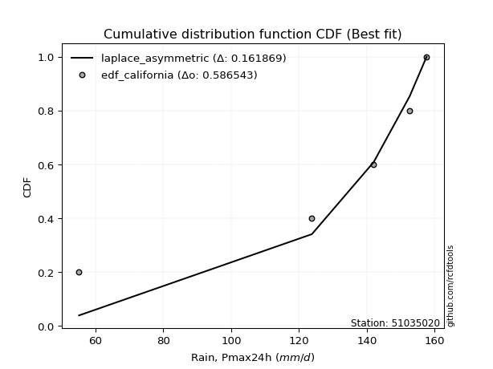</img>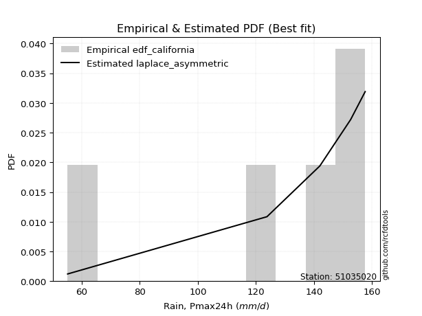</img>

</div>


### 2. EDF Hazen (1930)

Hazen method for plotting positions is a formula used to estimate the empirical cumulative probability distribution of flood events or other hydrological data. This formula often results in biased estimations, particularly when extrapolating to extreme events (high return periods).

<div align="center">


$P=(m-0.5)/n$


</div>


**2.1. Empirical values**

<div align="center">

|                | 0                   | 1                  | 2                  | 3                  | 4         | 5                  |
|:---------------|:--------------------|:-------------------|:-------------------|:-------------------|:----------|:-------------------|
| date           | 2023                | 2019               | 2025               | 2022               | 2020      | 2024               |
| x              | 55.2                | 123.8              | 128.8              | 142.0              | 152.6     | 157.6              |
| m              | 1                   | 2                  | 3                  | 4                  | 5         | 6                  |
| empirical_dist | edf_hazen           | edf_hazen          | edf_hazen          | edf_hazen          | edf_hazen | edf_hazen          |
| empirical      | 0.08333333333333333 | 0.25               | 0.4166666666666667 | 0.5833333333333334 | 0.75      | 0.9166666666666666 |
| empirical_tr   | 1.090909090909091   | 1.3333333333333333 | 1.7142857142857144 | 2.4000000000000004 | 4.0       | 11.999999999999995 |

</div>


**2.2. Kolmogorov-Smirnov fit test (sorted by Δ)**


<div align="center">

|                | 0                   | 1                   | 2                 | 3                   | 4                   | 5                   | 6                   | 7                   | 8                  | 9                  | 10                  | 11                  | 12                | 13                  | 14                  | 15                | 16                  | 17                 | 18                 | 19                  | 20                  | 21                  | 22                  | 23                  | 24                  | 25                 | 26                 | 27                  | 28                 | 29                  | 30                  | 31                 | 32                  | 33                  | 34                  | 35                 | 36                  | 37                 | 38                  | 39                  | 40                  | 41                  | 42                 | 43                  | 44                  | 45                  | 46                  | 47                 | 48                  | 49                  | 50                  | 51                 | 52                  | 53                  | 54                 | 55                  | 56                  | 57                 | 58                  | 59                 | 60                  | 61                  | 62                 | 63                 | 64                | 65                 | 66                 | 67                 | 68                 | 69                 | 70                 | 71                 | 72                 | 73                  | 74                 | 75                  | 76                 | 77                | 78                  | 79                 | 80                 | 81                  | 82                 | 83                  | 84                  | 85                  | 86                  | 87                  | 88                  | 89                 | 90                  | 91                  | 92                  | 93                  | 94                 | 95                  | 96                 | 97                 | 98                  | 99                  | 100                 | 101                | 102                 | 103                 | 104                 | 105                | 106                | 107                | 108                | 109                 | 110                 | 111                | 112                | 113                | 114              | 115                 | 116            | 117                | 118                 | 119                 | 120               | 121                | 122            | 123                | 124                 | 125                 | 126                 | 127                | 128                 | 129                 | 130                | 131                 | 132                | 133                | 134                | 135                | 136                | 137                | 138                | 139                | 140                | 141                | 142                | 143                | 144                | 145                | 146                | 147                | 148                | 149                | 150                | 151                | 152                | 153                | 154            | 155            | 156            | 157            | 158               | 159                |
|:---------------|:--------------------|:--------------------|:------------------|:--------------------|:--------------------|:--------------------|:--------------------|:--------------------|:-------------------|:-------------------|:--------------------|:--------------------|:------------------|:--------------------|:--------------------|:------------------|:--------------------|:-------------------|:-------------------|:--------------------|:--------------------|:--------------------|:--------------------|:--------------------|:--------------------|:-------------------|:-------------------|:--------------------|:-------------------|:--------------------|:--------------------|:-------------------|:--------------------|:--------------------|:--------------------|:-------------------|:--------------------|:-------------------|:--------------------|:--------------------|:--------------------|:--------------------|:-------------------|:--------------------|:--------------------|:--------------------|:--------------------|:-------------------|:--------------------|:--------------------|:--------------------|:-------------------|:--------------------|:--------------------|:-------------------|:--------------------|:--------------------|:-------------------|:--------------------|:-------------------|:--------------------|:--------------------|:-------------------|:-------------------|:------------------|:-------------------|:-------------------|:-------------------|:-------------------|:-------------------|:-------------------|:-------------------|:-------------------|:--------------------|:-------------------|:--------------------|:-------------------|:------------------|:--------------------|:-------------------|:-------------------|:--------------------|:-------------------|:--------------------|:--------------------|:--------------------|:--------------------|:--------------------|:--------------------|:-------------------|:--------------------|:--------------------|:--------------------|:--------------------|:-------------------|:--------------------|:-------------------|:-------------------|:--------------------|:--------------------|:--------------------|:-------------------|:--------------------|:--------------------|:--------------------|:-------------------|:-------------------|:-------------------|:-------------------|:--------------------|:--------------------|:-------------------|:-------------------|:-------------------|:-----------------|:--------------------|:---------------|:-------------------|:--------------------|:--------------------|:------------------|:-------------------|:---------------|:-------------------|:--------------------|:--------------------|:--------------------|:-------------------|:--------------------|:--------------------|:-------------------|:--------------------|:-------------------|:-------------------|:-------------------|:-------------------|:-------------------|:-------------------|:-------------------|:-------------------|:-------------------|:-------------------|:-------------------|:-------------------|:-------------------|:-------------------|:-------------------|:-------------------|:-------------------|:-------------------|:-------------------|:-------------------|:-------------------|:-------------------|:---------------|:---------------|:---------------|:---------------|:------------------|:-------------------|
| station        | 51035020            | 51035020            | 51035020          | 51035020            | 51035020            | 51035020            | 51035020            | 51035020            | 51035020           | 51035020           | 51035020            | 51035020            | 51035020          | 51035020            | 51035020            | 51035020          | 51035020            | 51035020           | 51035020           | 51035020            | 51035020            | 51035020            | 51035020            | 51035020            | 51035020            | 51035020           | 51035020           | 51035020            | 51035020           | 51035020            | 51035020            | 51035020           | 51035020            | 51035020            | 51035020            | 51035020           | 51035020            | 51035020           | 51035020            | 51035020            | 51035020            | 51035020            | 51035020           | 51035020            | 51035020            | 51035020            | 51035020            | 51035020           | 51035020            | 51035020            | 51035020            | 51035020           | 51035020            | 51035020            | 51035020           | 51035020            | 51035020            | 51035020           | 51035020            | 51035020           | 51035020            | 51035020            | 51035020           | 51035020           | 51035020          | 51035020           | 51035020           | 51035020           | 51035020           | 51035020           | 51035020           | 51035020           | 51035020           | 51035020            | 51035020           | 51035020            | 51035020           | 51035020          | 51035020            | 51035020           | 51035020           | 51035020            | 51035020           | 51035020            | 51035020            | 51035020            | 51035020            | 51035020            | 51035020            | 51035020           | 51035020            | 51035020            | 51035020            | 51035020            | 51035020           | 51035020            | 51035020           | 51035020           | 51035020            | 51035020            | 51035020            | 51035020           | 51035020            | 51035020            | 51035020            | 51035020           | 51035020           | 51035020           | 51035020           | 51035020            | 51035020            | 51035020           | 51035020           | 51035020           | 51035020         | 51035020            | 51035020       | 51035020           | 51035020            | 51035020            | 51035020          | 51035020           | 51035020       | 51035020           | 51035020            | 51035020            | 51035020            | 51035020           | 51035020            | 51035020            | 51035020           | 51035020            | 51035020           | 51035020           | 51035020           | 51035020           | 51035020           | 51035020           | 51035020           | 51035020           | 51035020           | 51035020           | 51035020           | 51035020           | 51035020           | 51035020           | 51035020           | 51035020           | 51035020           | 51035020           | 51035020           | 51035020           | 51035020           | 51035020           | 51035020       | 51035020       | 51035020       | 51035020       | 51035020          | 51035020           |
| empirical_dist | edf_hazen           | edf_hazen           | edf_hazen         | edf_hazen           | edf_hazen           | edf_hazen           | edf_hazen           | edf_hazen           | edf_hazen          | edf_hazen          | edf_hazen           | edf_hazen           | edf_hazen         | edf_hazen           | edf_hazen           | edf_hazen         | edf_hazen           | edf_hazen          | edf_hazen          | edf_hazen           | edf_hazen           | edf_hazen           | edf_hazen           | edf_hazen           | edf_hazen           | edf_hazen          | edf_hazen          | edf_hazen           | edf_hazen          | edf_hazen           | edf_hazen           | edf_hazen          | edf_hazen           | edf_hazen           | edf_hazen           | edf_hazen          | edf_hazen           | edf_hazen          | edf_hazen           | edf_hazen           | edf_hazen           | edf_hazen           | edf_hazen          | edf_hazen           | edf_hazen           | edf_hazen           | edf_hazen           | edf_hazen          | edf_hazen           | edf_hazen           | edf_hazen           | edf_hazen          | edf_hazen           | edf_hazen           | edf_hazen          | edf_hazen           | edf_hazen           | edf_hazen          | edf_hazen           | edf_hazen          | edf_hazen           | edf_hazen           | edf_hazen          | edf_hazen          | edf_hazen         | edf_hazen          | edf_hazen          | edf_hazen          | edf_hazen          | edf_hazen          | edf_hazen          | edf_hazen          | edf_hazen          | edf_hazen           | edf_hazen          | edf_hazen           | edf_hazen          | edf_hazen         | edf_hazen           | edf_hazen          | edf_hazen          | edf_hazen           | edf_hazen          | edf_hazen           | edf_hazen           | edf_hazen           | edf_hazen           | edf_hazen           | edf_hazen           | edf_hazen          | edf_hazen           | edf_hazen           | edf_hazen           | edf_hazen           | edf_hazen          | edf_hazen           | edf_hazen          | edf_hazen          | edf_hazen           | edf_hazen           | edf_hazen           | edf_hazen          | edf_hazen           | edf_hazen           | edf_hazen           | edf_hazen          | edf_hazen          | edf_hazen          | edf_hazen          | edf_hazen           | edf_hazen           | edf_hazen          | edf_hazen          | edf_hazen          | edf_hazen        | edf_hazen           | edf_hazen      | edf_hazen          | edf_hazen           | edf_hazen           | edf_hazen         | edf_hazen          | edf_hazen      | edf_hazen          | edf_hazen           | edf_hazen           | edf_hazen           | edf_hazen          | edf_hazen           | edf_hazen           | edf_hazen          | edf_hazen           | edf_hazen          | edf_hazen          | edf_hazen          | edf_hazen          | edf_hazen          | edf_hazen          | edf_hazen          | edf_hazen          | edf_hazen          | edf_hazen          | edf_hazen          | edf_hazen          | edf_hazen          | edf_hazen          | edf_hazen          | edf_hazen          | edf_hazen          | edf_hazen          | edf_hazen          | edf_hazen          | edf_hazen          | edf_hazen          | edf_hazen      | edf_hazen      | edf_hazen      | edf_hazen      | edf_hazen         | edf_hazen          |
| p_dist         | loggenextreme       | genextreme          | mielke            | argus               | loglevy_l           | vonmises_line       | dweibull            | levy_l              | logargus           | pearson3           | logt                | logmielke           | gumbel_l          | dgamma              | logburr             | logloggamma       | logexponweib        | burr               | logvonmises_line   | trapezoid           | logburr12           | logpearson3         | logweibull_min      | logbeta             | laplace             | loggennorm         | hypsecant          | t                   | logistic           | skewnorm            | loggumbel_l         | crystalball        | norm                | exponnorm           | nct                 | f                  | beta                | logtrapezoid       | anglit              | gamma               | semicircular        | logloglaplace       | logdweibull        | betaprime           | erlang              | logdgamma           | arcsine             | genhalflogistic    | logweibull_max      | gennorm             | invgamma            | alpha              | logtukeylambda      | logtruncnorm        | lognakagami        | nakagami            | maxwell             | logexponpow        | invgauss            | rayleigh           | weibull_max         | loggenpareto        | logarcsine         | loginvweibull      | ncf               | logsemicircular    | loganglit          | logbetaprime       | genpareto          | logfatiguelife     | logf               | logexponnorm       | lognorm            | logcrystalball      | logrice            | logjohnsonsu        | logncf             | gumbel_r          | lognct              | cosine             | loglogistic        | gausshyper          | loghypsecant       | logalpha            | triang              | halfnorm            | wrapcauchy          | kstwobign           | johnsonsb           | loginvgamma        | logerlang           | loglaplace          | loglaplace          | loginvgauss         | moyal              | logmaxwell          | halflogistic       | kappa3             | loggengamma         | lograyleigh         | logfoldnorm         | truncweibull_min   | logskewnorm         | gengamma            | logkstwobign        | loghalfnorm        | loggumbel_r        | loggenexpon        | logcosine          | logwrapcauchy       | lomax               | johnsonsu          | logmoyal           | loghalflogistic    | wald             | loggenhalflogistic  | ksone          | halfgennorm        | burr12              | loggompertz         | logtriang         | foldnorm           | uniform        | kappa4             | loghalfgennorm      | logjohnsonsb        | logwald             | invweibull         | logtruncweibull_min | logksone            | bradford           | truncexpon          | gompertz           | loggamma           | loggamma           | logkappa3          | loguniform         | logkappa4          | loggausshyper      | logrdist           | logbradford        | truncnorm          | logtruncexpon      | exponweib          | fatiguelife        | weibull_min        | powerlaw           | exponpow           | logpowerlaw        | truncpareto        | genexpon           | logtruncpareto     | loglomax           | rice               | genlogistic    | rdist          | tukeylambda    | loggenlogistic | logvonmises       | vonmises           |
| delta          | 0.08333333333307091 | 0.08333333333325987 | 0.100192557638354 | 0.10153784717122816 | 0.10806021235157559 | 0.11494304208409545 | 0.11858355688259148 | 0.11969206539781345 | 0.1268066726568674 | 0.1308532590343674 | 0.13632522442066808 | 0.14231425232959483 | 0.145953037360106 | 0.15547010213217755 | 0.16001658976305894 | 0.160259062814387 | 0.16175534180009593 | 0.1639990666717186 | 0.1653802918358369 | 0.16843204736384815 | 0.17766792181452118 | 0.17889356576961735 | 0.18153333018390794 | 0.19001725289713556 | 0.19398355361453057 | 0.2008647535247265 | 0.2081120052642108 | 0.20819794616357357 | 0.2119752331879594 | 0.21305910789758864 | 0.21489925180760205 | 0.2165207185179262 | 0.21652072767637148 | 0.21652210867529137 | 0.21652655082506372 | 0.2178210883587215 | 0.21900785746148466 | 0.2212245286307019 | 0.22129532173785593 | 0.22249736904844375 | 0.22326388630602823 | 0.22451494978318942 | 0.2253052435693722 | 0.22910814921376754 | 0.22976840854562747 | 0.22989824409253978 | 0.23107794751041477 | 0.2400002156355373 | 0.24265306761843253 | 0.24536218451723849 | 0.24645747195867623 | 0.2479474613085333 | 0.24998988479249107 | 0.24999750816224034 | 0.2499999881169971 | 0.24999999990997412 | 0.25058709400991763 | 0.2553775947234317 | 0.25568912608449024 | 0.2622370830620959 | 0.26570317982548664 | 0.26735899038982724 | 0.2689102285321586 | 0.2704706740968099 | 0.271070815368024 | 0.2767196693795624 | 0.2786871038635347 | 0.2806913603625083 | 0.2821180761883997 | 0.2827669344190691 | 0.2832766094579968 | 0.2834575736349155 | 0.2834588003292453 | 0.28345880700804016 | 0.2834757266610952 | 0.28413872651711475 | 0.2850737856199119 | 0.285078648521903 | 0.28648104020754306 | 0.2875576574261881 | 0.2880015504709599 | 0.28942575703870244 | 0.2918624687196737 | 0.29373265503000945 | 0.29437362404854284 | 0.29507957361164094 | 0.29820547989510393 | 0.29985501039501505 | 0.30501579737396145 | 0.3056564519122691 | 0.30583110605031827 | 0.30598411087495825 | 0.30598411087495825 | 0.30994582359569856 | 0.3107921005061802 | 0.31487181137427667 | 0.3176247125863474 | 0.3185149977809715 | 0.32462862354298005 | 0.32507998414105277 | 0.33803880970598055 | 0.3395734715295835 | 0.34110155015684307 | 0.34148670283232263 | 0.34417528694814403 | 0.3538415461050066 | 0.3540268507140685 | 0.3546700472242945 | 0.3563852235889353 | 0.35804099329036054 | 0.36563975409365135 | 0.3672837023574972 | 0.3793381566112153 | 0.3805061224925803 | 0.38235770785683 | 0.38579777765497314 | 0.3916015625   | 0.3942522969411135 | 0.39596360326671565 | 0.39858323640499393 | 0.399678057963361 | 0.4166666666666667 | 0.419921875    | 0.4231380601663579 | 0.42902224729745897 | 0.43329873802014196 | 0.44959529764046346 | 0.4614653474577308 | 0.4704631387522141  | 0.47492020470981766 | 0.4899008904148079 | 0.49723842992607625 | 0.4976764755218221 | 0.4992717215927651 | 0.4992717215927651 | 0.5145048313479483 | 0.5199042456517815 | 0.5207048435764261 | 0.5446454097453869 | 0.5758228033979341 | 0.5765885770446776 | 0.5833333323104022 | 0.5881862234735529 | 0.5924091780850357 | 0.6150159669449983 | 0.6591628674924441 | 0.6889452631827518 | 0.6970420210884989 | 0.7065470802480256 | 0.7154627418667815 | 0.7249715681189566 | 0.7273464574439821 | 0.7453157816938822 | 0.7499999999999957 | 0.75           | 0.75           | 0.75           | 0.75           | 1.270153419230283 | 25.068187915904662 |
| deltao         | 0.530385761606      | 0.530385761606      | 0.530385761606    | 0.530385761606      | 0.530385761606      | 0.530385761606      | 0.530385761606      | 0.530385761606      | 0.530385761606     | 0.530385761606     | 0.530385761606      | 0.530385761606      | 0.530385761606    | 0.530385761606      | 0.530385761606      | 0.530385761606    | 0.530385761606      | 0.530385761606     | 0.530385761606     | 0.530385761606      | 0.530385761606      | 0.530385761606      | 0.530385761606      | 0.530385761606      | 0.530385761606      | 0.530385761606     | 0.530385761606     | 0.530385761606      | 0.530385761606     | 0.530385761606      | 0.530385761606      | 0.530385761606     | 0.530385761606      | 0.530385761606      | 0.530385761606      | 0.530385761606     | 0.530385761606      | 0.530385761606     | 0.530385761606      | 0.530385761606      | 0.530385761606      | 0.530385761606      | 0.530385761606     | 0.530385761606      | 0.530385761606      | 0.530385761606      | 0.530385761606      | 0.530385761606     | 0.530385761606      | 0.530385761606      | 0.530385761606      | 0.530385761606     | 0.530385761606      | 0.530385761606      | 0.530385761606     | 0.530385761606      | 0.530385761606      | 0.530385761606     | 0.530385761606      | 0.530385761606     | 0.530385761606      | 0.530385761606      | 0.530385761606     | 0.530385761606     | 0.530385761606    | 0.530385761606     | 0.530385761606     | 0.530385761606     | 0.530385761606     | 0.530385761606     | 0.530385761606     | 0.530385761606     | 0.530385761606     | 0.530385761606      | 0.530385761606     | 0.530385761606      | 0.530385761606     | 0.530385761606    | 0.530385761606      | 0.530385761606     | 0.530385761606     | 0.530385761606      | 0.530385761606     | 0.530385761606      | 0.530385761606      | 0.530385761606      | 0.530385761606      | 0.530385761606      | 0.530385761606      | 0.530385761606     | 0.530385761606      | 0.530385761606      | 0.530385761606      | 0.530385761606      | 0.530385761606     | 0.530385761606      | 0.530385761606     | 0.530385761606     | 0.530385761606      | 0.530385761606      | 0.530385761606      | 0.530385761606     | 0.530385761606      | 0.530385761606      | 0.530385761606      | 0.530385761606     | 0.530385761606     | 0.530385761606     | 0.530385761606     | 0.530385761606      | 0.530385761606      | 0.530385761606     | 0.530385761606     | 0.530385761606     | 0.530385761606   | 0.530385761606      | 0.530385761606 | 0.530385761606     | 0.530385761606      | 0.530385761606      | 0.530385761606    | 0.530385761606     | 0.530385761606 | 0.530385761606     | 0.530385761606      | 0.530385761606      | 0.530385761606      | 0.530385761606     | 0.530385761606      | 0.530385761606      | 0.530385761606     | 0.530385761606      | 0.530385761606     | 0.530385761606     | 0.530385761606     | 0.530385761606     | 0.530385761606     | 0.530385761606     | 0.530385761606     | 0.530385761606     | 0.530385761606     | 0.530385761606     | 0.530385761606     | 0.530385761606     | 0.530385761606     | 0.530385761606     | 0.530385761606     | 0.530385761606     | 0.530385761606     | 0.530385761606     | 0.530385761606     | 0.530385761606     | 0.530385761606     | 0.530385761606     | 0.530385761606 | 0.530385761606 | 0.530385761606 | 0.530385761606 | 0.530385761606    | 0.530385761606     |
| eval           | Δo > Δ              | Δo > Δ              | Δo > Δ            | Δo > Δ              | Δo > Δ              | Δo > Δ              | Δo > Δ              | Δo > Δ              | Δo > Δ             | Δo > Δ             | Δo > Δ              | Δo > Δ              | Δo > Δ            | Δo > Δ              | Δo > Δ              | Δo > Δ            | Δo > Δ              | Δo > Δ             | Δo > Δ             | Δo > Δ              | Δo > Δ              | Δo > Δ              | Δo > Δ              | Δo > Δ              | Δo > Δ              | Δo > Δ             | Δo > Δ             | Δo > Δ              | Δo > Δ             | Δo > Δ              | Δo > Δ              | Δo > Δ             | Δo > Δ              | Δo > Δ              | Δo > Δ              | Δo > Δ             | Δo > Δ              | Δo > Δ             | Δo > Δ              | Δo > Δ              | Δo > Δ              | Δo > Δ              | Δo > Δ             | Δo > Δ              | Δo > Δ              | Δo > Δ              | Δo > Δ              | Δo > Δ             | Δo > Δ              | Δo > Δ              | Δo > Δ              | Δo > Δ             | Δo > Δ              | Δo > Δ              | Δo > Δ             | Δo > Δ              | Δo > Δ              | Δo > Δ             | Δo > Δ              | Δo > Δ             | Δo > Δ              | Δo > Δ              | Δo > Δ             | Δo > Δ             | Δo > Δ            | Δo > Δ             | Δo > Δ             | Δo > Δ             | Δo > Δ             | Δo > Δ             | Δo > Δ             | Δo > Δ             | Δo > Δ             | Δo > Δ              | Δo > Δ             | Δo > Δ              | Δo > Δ             | Δo > Δ            | Δo > Δ              | Δo > Δ             | Δo > Δ             | Δo > Δ              | Δo > Δ             | Δo > Δ              | Δo > Δ              | Δo > Δ              | Δo > Δ              | Δo > Δ              | Δo > Δ              | Δo > Δ             | Δo > Δ              | Δo > Δ              | Δo > Δ              | Δo > Δ              | Δo > Δ             | Δo > Δ              | Δo > Δ             | Δo > Δ             | Δo > Δ              | Δo > Δ              | Δo > Δ              | Δo > Δ             | Δo > Δ              | Δo > Δ              | Δo > Δ              | Δo > Δ             | Δo > Δ             | Δo > Δ             | Δo > Δ             | Δo > Δ              | Δo > Δ              | Δo > Δ             | Δo > Δ             | Δo > Δ             | Δo > Δ           | Δo > Δ              | Δo > Δ         | Δo > Δ             | Δo > Δ              | Δo > Δ              | Δo > Δ            | Δo > Δ             | Δo > Δ         | Δo > Δ             | Δo > Δ              | Δo > Δ              | Δo > Δ              | Δo > Δ             | Δo > Δ              | Δo > Δ              | Δo > Δ             | Δo > Δ              | Δo > Δ             | Δo > Δ             | Δo > Δ             | Δo > Δ             | Δo > Δ             | Δo > Δ             | Δo <= Δ            | Δo <= Δ            | Δo <= Δ            | Δo <= Δ            | Δo <= Δ            | Δo <= Δ            | Δo <= Δ            | Δo <= Δ            | Δo <= Δ            | Δo <= Δ            | Δo <= Δ            | Δo <= Δ            | Δo <= Δ            | Δo <= Δ            | Δo <= Δ            | Δo <= Δ            | Δo <= Δ        | Δo <= Δ        | Δo <= Δ        | Δo <= Δ        | Δo <= Δ           | Δo <= Δ            |
| fit            | 1                   | 1                   | 1                 | 1                   | 1                   | 1                   | 1                   | 1                   | 1                  | 1                  | 1                   | 1                   | 1                 | 1                   | 1                   | 1                 | 1                   | 1                  | 1                  | 1                   | 1                   | 1                   | 1                   | 1                   | 1                   | 1                  | 1                  | 1                   | 1                  | 1                   | 1                   | 1                  | 1                   | 1                   | 1                   | 1                  | 1                   | 1                  | 1                   | 1                   | 1                   | 1                   | 1                  | 1                   | 1                   | 1                   | 1                   | 1                  | 1                   | 1                   | 1                   | 1                  | 1                   | 1                   | 1                  | 1                   | 1                   | 1                  | 1                   | 1                  | 1                   | 1                   | 1                  | 1                  | 1                 | 1                  | 1                  | 1                  | 1                  | 1                  | 1                  | 1                  | 1                  | 1                   | 1                  | 1                   | 1                  | 1                 | 1                   | 1                  | 1                  | 1                   | 1                  | 1                   | 1                   | 1                   | 1                   | 1                   | 1                   | 1                  | 1                   | 1                   | 1                   | 1                   | 1                  | 1                   | 1                  | 1                  | 1                   | 1                   | 1                   | 1                  | 1                   | 1                   | 1                   | 1                  | 1                  | 1                  | 1                  | 1                   | 1                   | 1                  | 1                  | 1                  | 1                | 1                   | 1              | 1                  | 1                   | 1                   | 1                 | 1                  | 1              | 1                  | 1                   | 1                   | 1                   | 1                  | 1                   | 1                   | 1                  | 1                   | 1                  | 1                  | 1                  | 1                  | 1                  | 1                  | 0                  | 0                  | 0                  | 0                  | 0                  | 0                  | 0                  | 0                  | 0                  | 0                  | 0                  | 0                  | 0                  | 0                  | 0                  | 0                  | 0              | 0              | 0              | 0              | 0                 | 0                  |
| n              | 6                   | 6                   | 6                 | 6                   | 6                   | 6                   | 6                   | 6                   | 6                  | 6                  | 6                   | 6                   | 6                 | 6                   | 6                   | 6                 | 6                   | 6                  | 6                  | 6                   | 6                   | 6                   | 6                   | 6                   | 6                   | 6                  | 6                  | 6                   | 6                  | 6                   | 6                   | 6                  | 6                   | 6                   | 6                   | 6                  | 6                   | 6                  | 6                   | 6                   | 6                   | 6                   | 6                  | 6                   | 6                   | 6                   | 6                   | 6                  | 6                   | 6                   | 6                   | 6                  | 6                   | 6                   | 6                  | 6                   | 6                   | 6                  | 6                   | 6                  | 6                   | 6                   | 6                  | 6                  | 6                 | 6                  | 6                  | 6                  | 6                  | 6                  | 6                  | 6                  | 6                  | 6                   | 6                  | 6                   | 6                  | 6                 | 6                   | 6                  | 6                  | 6                   | 6                  | 6                   | 6                   | 6                   | 6                   | 6                   | 6                   | 6                  | 6                   | 6                   | 6                   | 6                   | 6                  | 6                   | 6                  | 6                  | 6                   | 6                   | 6                   | 6                  | 6                   | 6                   | 6                   | 6                  | 6                  | 6                  | 6                  | 6                   | 6                   | 6                  | 6                  | 6                  | 6                | 6                   | 6              | 6                  | 6                   | 6                   | 6                 | 6                  | 6              | 6                  | 6                   | 6                   | 6                   | 6                  | 6                   | 6                   | 6                  | 6                   | 6                  | 6                  | 6                  | 6                  | 6                  | 6                  | 6                  | 6                  | 6                  | 6                  | 6                  | 6                  | 6                  | 6                  | 6                  | 6                  | 6                  | 6                  | 6                  | 6                  | 6                  | 6                  | 6              | 6              | 6              | 6              | 6                 | 6                  |
| best_fit       | 1                   | 0                   | 0                 | 0                   | 0                   | 0                   | 0                   | 0                   | 0                  | 0                  | 0                   | 0                   | 0                 | 0                   | 0                   | 0                 | 0                   | 0                  | 0                  | 0                   | 0                   | 0                   | 0                   | 0                   | 0                   | 0                  | 0                  | 0                   | 0                  | 0                   | 0                   | 0                  | 0                   | 0                   | 0                   | 0                  | 0                   | 0                  | 0                   | 0                   | 0                   | 0                   | 0                  | 0                   | 0                   | 0                   | 0                   | 0                  | 0                   | 0                   | 0                   | 0                  | 0                   | 0                   | 0                  | 0                   | 0                   | 0                  | 0                   | 0                  | 0                   | 0                   | 0                  | 0                  | 0                 | 0                  | 0                  | 0                  | 0                  | 0                  | 0                  | 0                  | 0                  | 0                   | 0                  | 0                   | 0                  | 0                 | 0                   | 0                  | 0                  | 0                   | 0                  | 0                   | 0                   | 0                   | 0                   | 0                   | 0                   | 0                  | 0                   | 0                   | 0                   | 0                   | 0                  | 0                   | 0                  | 0                  | 0                   | 0                   | 0                   | 0                  | 0                   | 0                   | 0                   | 0                  | 0                  | 0                  | 0                  | 0                   | 0                   | 0                  | 0                  | 0                  | 0                | 0                   | 0              | 0                  | 0                   | 0                   | 0                 | 0                  | 0              | 0                  | 0                   | 0                   | 0                   | 0                  | 0                   | 0                   | 0                  | 0                   | 0                  | 0                  | 0                  | 0                  | 0                  | 0                  | 0                  | 0                  | 0                  | 0                  | 0                  | 0                  | 0                  | 0                  | 0                  | 0                  | 0                  | 0                  | 0                  | 0                  | 0                  | 0                  | 0              | 0              | 0              | 0              | 0                 | 0                  |
| best_fit_sort  | 1                   | 2                   | 3                 | 4                   | 5                   | 6                   | 7                   | 8                   | 9                  | 10                 | 11                  | 12                  | 13                | 14                  | 15                  | 16                | 17                  | 18                 | 19                 | 20                  | 21                  | 22                  | 23                  | 24                  | 25                  | 26                 | 27                 | 28                  | 29                 | 30                  | 31                  | 32                 | 33                  | 34                  | 35                  | 36                 | 37                  | 38                 | 39                  | 40                  | 41                  | 42                  | 43                 | 44                  | 45                  | 46                  | 47                  | 48                 | 49                  | 50                  | 51                  | 52                 | 53                  | 54                  | 55                 | 56                  | 57                  | 58                 | 59                  | 60                 | 61                  | 62                  | 63                 | 64                 | 65                | 66                 | 67                 | 68                 | 69                 | 70                 | 71                 | 72                 | 73                 | 74                  | 75                 | 76                  | 77                 | 78                | 79                  | 80                 | 81                 | 82                  | 83                 | 84                  | 85                  | 86                  | 87                  | 88                  | 89                  | 90                 | 91                  | 92                  | 93                  | 94                  | 95                 | 96                  | 97                 | 98                 | 99                  | 100                 | 101                 | 102                | 103                 | 104                 | 105                 | 106                | 107                | 108                | 109                | 110                 | 111                 | 112                | 113                | 114                | 115              | 116                 | 117            | 118                | 119                 | 120                 | 121               | 122                | 123            | 124                | 125                 | 126                 | 127                 | 128                | 129                 | 130                 | 131                | 132                 | 133                | 134                | 135                | 136                | 137                | 138                | 139                | 140                | 141                | 142                | 143                | 144                | 145                | 146                | 147                | 148                | 149                | 150                | 151                | 152                | 153                | 154                | 155            | 156            | 157            | 158            | 159               | 160                |

</div>


**2.3. Best fit**

<div align="center">

|   id |   station | empirical_dist   | p_dist        |     delta |   deltao | eval   |   fit |   n |   best_fit |   best_fit_sort |
|-----:|----------:|:-----------------|:--------------|----------:|---------:|:-------|------:|----:|-----------:|----------------:|
|    0 |  51035020 | edf_hazen        | loggenextreme | 0.0833333 | 0.530386 | Δo > Δ |     1 |   6 |          1 |               1 |

</div>


<div align="center">

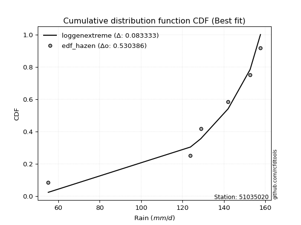</img>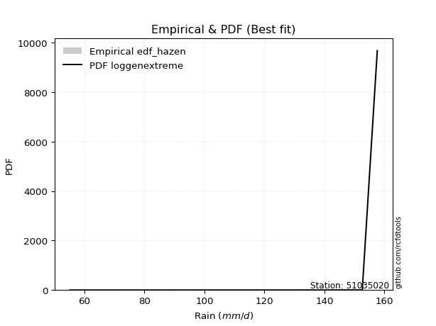</img>

</div>


### 3. EDF Weibull (1939)

Weibull plotting position formula is an empirical method used to estimate the non-exceedance probability or plotting position for a set of observed data, is often recommended or widely used in practice, particularly in flood frequency analysis.

<div align="center">


$P=m/(n+1)$


</div>


**3.1. Empirical values**

<div align="center">

|                | 0                   | 1                  | 2                   | 3                  | 4                  | 5                  |
|:---------------|:--------------------|:-------------------|:--------------------|:-------------------|:-------------------|:-------------------|
| date           | 2023                | 2019               | 2025                | 2022               | 2020               | 2024               |
| x              | 55.2                | 123.8              | 128.8               | 142.0              | 152.6              | 157.6              |
| m              | 1                   | 2                  | 3                   | 4                  | 5                  | 6                  |
| empirical_dist | edf_weibull         | edf_weibull        | edf_weibull         | edf_weibull        | edf_weibull        | edf_weibull        |
| empirical      | 0.14285714285714285 | 0.2857142857142857 | 0.42857142857142855 | 0.5714285714285714 | 0.7142857142857143 | 0.8571428571428571 |
| empirical_tr   | 1.1666666666666665  | 1.4                | 1.75                | 2.333333333333333  | 3.5                | 6.999999999999997  |

</div>


**3.2. Kolmogorov-Smirnov fit test (sorted by Δ)**


<div align="center">

|                | 0                 | 1                   | 2                   | 3                   | 4                   | 5                   | 6                   | 7                   | 8                   | 9                   | 10                  | 11                  | 12                 | 13                  | 14                 | 15                  | 16                  | 17                  | 18                  | 19                 | 20                  | 21                  | 22                 | 23                  | 24                 | 25                  | 26                 | 27                  | 28                  | 29                 | 30                  | 31                 | 32                  | 33                  | 34                  | 35                 | 36                  | 37                 | 38                  | 39                  | 40                  | 41                  | 42                  | 43                  | 44                  | 45                 | 46                  | 47                  | 48                 | 49                  | 50                  | 51                  | 52                | 53                  | 54                 | 55                  | 56                  | 57                  | 58                  | 59                  | 60                  | 61                  | 62                  | 63                 | 64                  | 65                  | 66                  | 67                  | 68                  | 69                 | 70                  | 71                  | 72                  | 73                 | 74                  | 75                 | 76                 | 77                  | 78                | 79                 | 80                  | 81                  | 82                  | 83                  | 84                  | 85                 | 86                  | 87                  | 88                  | 89                  | 90                 | 91                  | 92                 | 93                 | 94                  | 95                | 96                  | 97                 | 98                  | 99                  | 100                 | 101                | 102                 | 103                 | 104                 | 105                | 106                | 107                | 108                | 109                 | 110                 | 111                | 112                | 113                | 114                | 115                 | 116                | 117                | 118                 | 119                 | 120                | 121                | 122                | 123                 | 124                 | 125                | 126                 | 127                 | 128                 | 129                 | 130                | 131                 | 132                | 133                | 134                 | 135                | 136                | 137                | 138                | 139                | 140                | 141                | 142              | 143                | 144                | 145                | 146                | 147                | 148                | 149                | 150                | 151                | 152                | 153              | 154                | 155                | 156                | 157                | 158                | 159                |
|:---------------|:------------------|:--------------------|:--------------------|:--------------------|:--------------------|:--------------------|:--------------------|:--------------------|:--------------------|:--------------------|:--------------------|:--------------------|:-------------------|:--------------------|:-------------------|:--------------------|:--------------------|:--------------------|:--------------------|:-------------------|:--------------------|:--------------------|:-------------------|:--------------------|:-------------------|:--------------------|:-------------------|:--------------------|:--------------------|:-------------------|:--------------------|:-------------------|:--------------------|:--------------------|:--------------------|:-------------------|:--------------------|:-------------------|:--------------------|:--------------------|:--------------------|:--------------------|:--------------------|:--------------------|:--------------------|:-------------------|:--------------------|:--------------------|:-------------------|:--------------------|:--------------------|:--------------------|:------------------|:--------------------|:-------------------|:--------------------|:--------------------|:--------------------|:--------------------|:--------------------|:--------------------|:--------------------|:--------------------|:-------------------|:--------------------|:--------------------|:--------------------|:--------------------|:--------------------|:-------------------|:--------------------|:--------------------|:--------------------|:-------------------|:--------------------|:-------------------|:-------------------|:--------------------|:------------------|:-------------------|:--------------------|:--------------------|:--------------------|:--------------------|:--------------------|:-------------------|:--------------------|:--------------------|:--------------------|:--------------------|:-------------------|:--------------------|:-------------------|:-------------------|:--------------------|:------------------|:--------------------|:-------------------|:--------------------|:--------------------|:--------------------|:-------------------|:--------------------|:--------------------|:--------------------|:-------------------|:-------------------|:-------------------|:-------------------|:--------------------|:--------------------|:-------------------|:-------------------|:-------------------|:-------------------|:--------------------|:-------------------|:-------------------|:--------------------|:--------------------|:-------------------|:-------------------|:-------------------|:--------------------|:--------------------|:-------------------|:--------------------|:--------------------|:--------------------|:--------------------|:-------------------|:--------------------|:-------------------|:-------------------|:--------------------|:-------------------|:-------------------|:-------------------|:-------------------|:-------------------|:-------------------|:-------------------|:-----------------|:-------------------|:-------------------|:-------------------|:-------------------|:-------------------|:-------------------|:-------------------|:-------------------|:-------------------|:-------------------|:-----------------|:-------------------|:-------------------|:-------------------|:-------------------|:-------------------|:-------------------|
| station        | 51035020          | 51035020            | 51035020            | 51035020            | 51035020            | 51035020            | 51035020            | 51035020            | 51035020            | 51035020            | 51035020            | 51035020            | 51035020           | 51035020            | 51035020           | 51035020            | 51035020            | 51035020            | 51035020            | 51035020           | 51035020            | 51035020            | 51035020           | 51035020            | 51035020           | 51035020            | 51035020           | 51035020            | 51035020            | 51035020           | 51035020            | 51035020           | 51035020            | 51035020            | 51035020            | 51035020           | 51035020            | 51035020           | 51035020            | 51035020            | 51035020            | 51035020            | 51035020            | 51035020            | 51035020            | 51035020           | 51035020            | 51035020            | 51035020           | 51035020            | 51035020            | 51035020            | 51035020          | 51035020            | 51035020           | 51035020            | 51035020            | 51035020            | 51035020            | 51035020            | 51035020            | 51035020            | 51035020            | 51035020           | 51035020            | 51035020            | 51035020            | 51035020            | 51035020            | 51035020           | 51035020            | 51035020            | 51035020            | 51035020           | 51035020            | 51035020           | 51035020           | 51035020            | 51035020          | 51035020           | 51035020            | 51035020            | 51035020            | 51035020            | 51035020            | 51035020           | 51035020            | 51035020            | 51035020            | 51035020            | 51035020           | 51035020            | 51035020           | 51035020           | 51035020            | 51035020          | 51035020            | 51035020           | 51035020            | 51035020            | 51035020            | 51035020           | 51035020            | 51035020            | 51035020            | 51035020           | 51035020           | 51035020           | 51035020           | 51035020            | 51035020            | 51035020           | 51035020           | 51035020           | 51035020           | 51035020            | 51035020           | 51035020           | 51035020            | 51035020            | 51035020           | 51035020           | 51035020           | 51035020            | 51035020            | 51035020           | 51035020            | 51035020            | 51035020            | 51035020            | 51035020           | 51035020            | 51035020           | 51035020           | 51035020            | 51035020           | 51035020           | 51035020           | 51035020           | 51035020           | 51035020           | 51035020           | 51035020         | 51035020           | 51035020           | 51035020           | 51035020           | 51035020           | 51035020           | 51035020           | 51035020           | 51035020           | 51035020           | 51035020         | 51035020           | 51035020           | 51035020           | 51035020           | 51035020           | 51035020           |
| empirical_dist | edf_weibull       | edf_weibull         | edf_weibull         | edf_weibull         | edf_weibull         | edf_weibull         | edf_weibull         | edf_weibull         | edf_weibull         | edf_weibull         | edf_weibull         | edf_weibull         | edf_weibull        | edf_weibull         | edf_weibull        | edf_weibull         | edf_weibull         | edf_weibull         | edf_weibull         | edf_weibull        | edf_weibull         | edf_weibull         | edf_weibull        | edf_weibull         | edf_weibull        | edf_weibull         | edf_weibull        | edf_weibull         | edf_weibull         | edf_weibull        | edf_weibull         | edf_weibull        | edf_weibull         | edf_weibull         | edf_weibull         | edf_weibull        | edf_weibull         | edf_weibull        | edf_weibull         | edf_weibull         | edf_weibull         | edf_weibull         | edf_weibull         | edf_weibull         | edf_weibull         | edf_weibull        | edf_weibull         | edf_weibull         | edf_weibull        | edf_weibull         | edf_weibull         | edf_weibull         | edf_weibull       | edf_weibull         | edf_weibull        | edf_weibull         | edf_weibull         | edf_weibull         | edf_weibull         | edf_weibull         | edf_weibull         | edf_weibull         | edf_weibull         | edf_weibull        | edf_weibull         | edf_weibull         | edf_weibull         | edf_weibull         | edf_weibull         | edf_weibull        | edf_weibull         | edf_weibull         | edf_weibull         | edf_weibull        | edf_weibull         | edf_weibull        | edf_weibull        | edf_weibull         | edf_weibull       | edf_weibull        | edf_weibull         | edf_weibull         | edf_weibull         | edf_weibull         | edf_weibull         | edf_weibull        | edf_weibull         | edf_weibull         | edf_weibull         | edf_weibull         | edf_weibull        | edf_weibull         | edf_weibull        | edf_weibull        | edf_weibull         | edf_weibull       | edf_weibull         | edf_weibull        | edf_weibull         | edf_weibull         | edf_weibull         | edf_weibull        | edf_weibull         | edf_weibull         | edf_weibull         | edf_weibull        | edf_weibull        | edf_weibull        | edf_weibull        | edf_weibull         | edf_weibull         | edf_weibull        | edf_weibull        | edf_weibull        | edf_weibull        | edf_weibull         | edf_weibull        | edf_weibull        | edf_weibull         | edf_weibull         | edf_weibull        | edf_weibull        | edf_weibull        | edf_weibull         | edf_weibull         | edf_weibull        | edf_weibull         | edf_weibull         | edf_weibull         | edf_weibull         | edf_weibull        | edf_weibull         | edf_weibull        | edf_weibull        | edf_weibull         | edf_weibull        | edf_weibull        | edf_weibull        | edf_weibull        | edf_weibull        | edf_weibull        | edf_weibull        | edf_weibull      | edf_weibull        | edf_weibull        | edf_weibull        | edf_weibull        | edf_weibull        | edf_weibull        | edf_weibull        | edf_weibull        | edf_weibull        | edf_weibull        | edf_weibull      | edf_weibull        | edf_weibull        | edf_weibull        | edf_weibull        | edf_weibull        | edf_weibull        |
| p_dist         | loglevy_l         | levy_l              | pearson3            | gumbel_l            | dweibull            | trapezoid           | argus               | logmielke           | dgamma              | mielke              | logburr12           | logvonmises_line    | vonmises_line      | loggenextreme       | genextreme         | logpearson3         | logexponweib        | logweibull_min      | logt                | logargus           | logburr             | burr                | laplace            | logbeta             | logloglaplace      | logdweibull         | hypsecant          | t                   | logloggamma         | logistic           | loggumbel_l         | crystalball        | norm                | exponnorm           | nct                 | f                  | beta                | logtrapezoid       | anglit              | gamma               | semicircular        | betaprime           | erlang              | arcsine             | skewnorm            | genhalflogistic    | logweibull_max      | invgamma            | alpha              | loggennorm          | loginvweibull       | maxwell             | logexponpow       | invgauss            | logjohnsonsu       | rayleigh            | weibull_max         | loggenpareto        | logarcsine          | ncf                 | logsemicircular     | logdgamma           | loganglit           | logbetaprime       | johnsonsb           | genpareto           | logfatiguelife      | logf                | logexponnorm        | lognorm            | logcrystalball      | logrice             | logncf              | gumbel_r           | lognct              | cosine             | loglogistic        | gausshyper          | loghypsecant      | gennorm            | logalpha            | triang              | halfnorm            | wrapcauchy          | kstwobign           | loginvgamma        | logerlang           | loglaplace          | loglaplace          | loginvgauss         | moyal              | logmaxwell          | halflogistic       | kappa3             | logtukeylambda      | logtruncnorm      | lognakagami         | nakagami           | loggengamma         | lograyleigh         | logfoldnorm         | truncweibull_min   | logskewnorm         | gengamma            | logkstwobign        | loghalfnorm        | loggumbel_r        | loggenexpon        | logcosine          | logwrapcauchy       | lomax               | johnsonsu          | logmoyal           | loghalflogistic    | wald               | loggenhalflogistic  | ksone              | halfgennorm        | burr12              | loggompertz         | logtriang          | uniform            | kappa4             | loghalfgennorm      | logjohnsonsb        | invweibull         | logwald             | foldnorm            | logtruncweibull_min | logksone            | bradford           | truncexpon          | loggamma           | loggamma           | logkappa3           | loguniform         | logkappa4          | gompertz           | loggausshyper      | logrdist           | logbradford        | logtruncexpon      | exponweib        | truncnorm          | fatiguelife        | weibull_min        | powerlaw           | exponpow           | logpowerlaw        | truncpareto        | loglomax           | genexpon           | logtruncpareto     | rice             | genlogistic        | rdist              | tukeylambda        | loggenlogistic     | logvonmises        | vonmises           |
| delta          | 0.099333538247394 | 0.09958992905929087 | 0.10200046905951538 | 0.11023875164582031 | 0.12793627020888276 | 0.13271776164956245 | 0.13725213288551386 | 0.13786971429116957 | 0.13936600521046905 | 0.14167708925214983 | 0.14195363610023548 | 0.14285714272884373 | 0.1428571428525516 | 0.14285714285688045 | 0.1428571428570694 | 0.14317928005533165 | 0.14392342113652823 | 0.14581904446962224 | 0.14822998632542994 | 0.1564236084509013 | 0.15749612865927098 | 0.15887215872164173 | 0.1637498875210629 | 0.16452684130903694 | 0.1649911402593799 | 0.16578143404556267 | 0.1723977195499251 | 0.17248366044928787 | 0.17345938303176434 | 0.1762609474736737 | 0.17918496609331636 | 0.1808064328036405 | 0.18080644196208578 | 0.18080782296100567 | 0.18081226511077803 | 0.1821068026444358 | 0.18329357174719896 | 0.1855102429164162 | 0.18558103602357023 | 0.18678308333415805 | 0.18754960059174253 | 0.19339386349948184 | 0.19405412283134177 | 0.19536366179612907 | 0.19927074608500794 | 0.2042859299212516 | 0.20693878190414683 | 0.21074318624439053 | 0.2122331755942476 | 0.21276951542948835 | 0.21480447013276516 | 0.21487280829563193 | 0.219663309009146 | 0.21997484037020454 | 0.2246149169933052 | 0.22652279734781022 | 0.22998889411120094 | 0.23164470467554155 | 0.23319594281787293 | 0.23535652965373832 | 0.24100538366527668 | 0.24180300599730165 | 0.24297281814924898 | 0.2449770746482226 | 0.24549198785015192 | 0.24640379047411398 | 0.24705264870478338 | 0.24756232374371112 | 0.24774328792062983 | 0.2477445146149596 | 0.24774452129375446 | 0.24776144094680952 | 0.24935949990562623 | 0.2493643628076173 | 0.25076675449325736 | 0.2518433717119024 | 0.2522872647566742 | 0.25371147132441674 | 0.256148183005388 | 0.2572669464220003 | 0.25801836931572375 | 0.25865933833425714 | 0.25936528789735525 | 0.26249119418081823 | 0.26414072468072936 | 0.2699421661979834 | 0.27011682033603257 | 0.27026982516067255 | 0.27026982516067255 | 0.27423153788141286 | 0.2750778147918945 | 0.27915752565999097 | 0.2819104268720617 | 0.2828007120666858 | 0.28570417050677677 | 0.285711793876526 | 0.28571427383128284 | 0.2857142856242598 | 0.28891433782869436 | 0.28936569842676707 | 0.30232452399169485 | 0.3038591858152978 | 0.30538726444255737 | 0.30577241711803693 | 0.30846100123385833 | 0.3181272603907209 | 0.3183125649997828 | 0.3189557615100088 | 0.3206709378746496 | 0.32232670757607484 | 0.32992546837936565 | 0.3315694166432115 | 0.3436238708969296 | 0.3447918367782946 | 0.3466434221425443 | 0.35008349194068744 | 0.3558872767857143 | 0.3585380112268278 | 0.36024931755242995 | 0.36286895069070824 | 0.3639637722490753 | 0.3842075892857143 | 0.3874237744520722 | 0.39330796158317327 | 0.39758445230585626 | 0.4019415379339213 | 0.41388101192617777 | 0.42857142857142855 | 0.43474885303792843 | 0.43920591899553196 | 0.4541866047005222 | 0.46152414421179055 | 0.4635574358784794 | 0.4635574358784794 | 0.47879054563366263 | 0.4841899599374958 | 0.4849905578621404 | 0.4857717136170601 | 0.5089311240311012 | 0.5162989938741246 | 0.5408742913303919 | 0.5524719377592672 | 0.55669489237075 | 0.5714285704056403 | 0.5793016812307126 | 0.6234485817781584 | 0.6532309774684661 | 0.6613277353742132 | 0.6708327945337399 | 0.6797484561524958 | 0.6857919721700727 | 0.6892572824046709 | 0.6916321717296964 | 0.71428571428571 | 0.7142857142857143 | 0.7142857142857143 | 0.7142857142857143 | 0.7142857142857143 | 1.2344391335159974 | 25.127711725428473 |
| deltao         | 0.530385761606    | 0.530385761606      | 0.530385761606      | 0.530385761606      | 0.530385761606      | 0.530385761606      | 0.530385761606      | 0.530385761606      | 0.530385761606      | 0.530385761606      | 0.530385761606      | 0.530385761606      | 0.530385761606     | 0.530385761606      | 0.530385761606     | 0.530385761606      | 0.530385761606      | 0.530385761606      | 0.530385761606      | 0.530385761606     | 0.530385761606      | 0.530385761606      | 0.530385761606     | 0.530385761606      | 0.530385761606     | 0.530385761606      | 0.530385761606     | 0.530385761606      | 0.530385761606      | 0.530385761606     | 0.530385761606      | 0.530385761606     | 0.530385761606      | 0.530385761606      | 0.530385761606      | 0.530385761606     | 0.530385761606      | 0.530385761606     | 0.530385761606      | 0.530385761606      | 0.530385761606      | 0.530385761606      | 0.530385761606      | 0.530385761606      | 0.530385761606      | 0.530385761606     | 0.530385761606      | 0.530385761606      | 0.530385761606     | 0.530385761606      | 0.530385761606      | 0.530385761606      | 0.530385761606    | 0.530385761606      | 0.530385761606     | 0.530385761606      | 0.530385761606      | 0.530385761606      | 0.530385761606      | 0.530385761606      | 0.530385761606      | 0.530385761606      | 0.530385761606      | 0.530385761606     | 0.530385761606      | 0.530385761606      | 0.530385761606      | 0.530385761606      | 0.530385761606      | 0.530385761606     | 0.530385761606      | 0.530385761606      | 0.530385761606      | 0.530385761606     | 0.530385761606      | 0.530385761606     | 0.530385761606     | 0.530385761606      | 0.530385761606    | 0.530385761606     | 0.530385761606      | 0.530385761606      | 0.530385761606      | 0.530385761606      | 0.530385761606      | 0.530385761606     | 0.530385761606      | 0.530385761606      | 0.530385761606      | 0.530385761606      | 0.530385761606     | 0.530385761606      | 0.530385761606     | 0.530385761606     | 0.530385761606      | 0.530385761606    | 0.530385761606      | 0.530385761606     | 0.530385761606      | 0.530385761606      | 0.530385761606      | 0.530385761606     | 0.530385761606      | 0.530385761606      | 0.530385761606      | 0.530385761606     | 0.530385761606     | 0.530385761606     | 0.530385761606     | 0.530385761606      | 0.530385761606      | 0.530385761606     | 0.530385761606     | 0.530385761606     | 0.530385761606     | 0.530385761606      | 0.530385761606     | 0.530385761606     | 0.530385761606      | 0.530385761606      | 0.530385761606     | 0.530385761606     | 0.530385761606     | 0.530385761606      | 0.530385761606      | 0.530385761606     | 0.530385761606      | 0.530385761606      | 0.530385761606      | 0.530385761606      | 0.530385761606     | 0.530385761606      | 0.530385761606     | 0.530385761606     | 0.530385761606      | 0.530385761606     | 0.530385761606     | 0.530385761606     | 0.530385761606     | 0.530385761606     | 0.530385761606     | 0.530385761606     | 0.530385761606   | 0.530385761606     | 0.530385761606     | 0.530385761606     | 0.530385761606     | 0.530385761606     | 0.530385761606     | 0.530385761606     | 0.530385761606     | 0.530385761606     | 0.530385761606     | 0.530385761606   | 0.530385761606     | 0.530385761606     | 0.530385761606     | 0.530385761606     | 0.530385761606     | 0.530385761606     |
| eval           | Δo > Δ            | Δo > Δ              | Δo > Δ              | Δo > Δ              | Δo > Δ              | Δo > Δ              | Δo > Δ              | Δo > Δ              | Δo > Δ              | Δo > Δ              | Δo > Δ              | Δo > Δ              | Δo > Δ             | Δo > Δ              | Δo > Δ             | Δo > Δ              | Δo > Δ              | Δo > Δ              | Δo > Δ              | Δo > Δ             | Δo > Δ              | Δo > Δ              | Δo > Δ             | Δo > Δ              | Δo > Δ             | Δo > Δ              | Δo > Δ             | Δo > Δ              | Δo > Δ              | Δo > Δ             | Δo > Δ              | Δo > Δ             | Δo > Δ              | Δo > Δ              | Δo > Δ              | Δo > Δ             | Δo > Δ              | Δo > Δ             | Δo > Δ              | Δo > Δ              | Δo > Δ              | Δo > Δ              | Δo > Δ              | Δo > Δ              | Δo > Δ              | Δo > Δ             | Δo > Δ              | Δo > Δ              | Δo > Δ             | Δo > Δ              | Δo > Δ              | Δo > Δ              | Δo > Δ            | Δo > Δ              | Δo > Δ             | Δo > Δ              | Δo > Δ              | Δo > Δ              | Δo > Δ              | Δo > Δ              | Δo > Δ              | Δo > Δ              | Δo > Δ              | Δo > Δ             | Δo > Δ              | Δo > Δ              | Δo > Δ              | Δo > Δ              | Δo > Δ              | Δo > Δ             | Δo > Δ              | Δo > Δ              | Δo > Δ              | Δo > Δ             | Δo > Δ              | Δo > Δ             | Δo > Δ             | Δo > Δ              | Δo > Δ            | Δo > Δ             | Δo > Δ              | Δo > Δ              | Δo > Δ              | Δo > Δ              | Δo > Δ              | Δo > Δ             | Δo > Δ              | Δo > Δ              | Δo > Δ              | Δo > Δ              | Δo > Δ             | Δo > Δ              | Δo > Δ             | Δo > Δ             | Δo > Δ              | Δo > Δ            | Δo > Δ              | Δo > Δ             | Δo > Δ              | Δo > Δ              | Δo > Δ              | Δo > Δ             | Δo > Δ              | Δo > Δ              | Δo > Δ              | Δo > Δ             | Δo > Δ             | Δo > Δ             | Δo > Δ             | Δo > Δ              | Δo > Δ              | Δo > Δ             | Δo > Δ             | Δo > Δ             | Δo > Δ             | Δo > Δ              | Δo > Δ             | Δo > Δ             | Δo > Δ              | Δo > Δ              | Δo > Δ             | Δo > Δ             | Δo > Δ             | Δo > Δ              | Δo > Δ              | Δo > Δ             | Δo > Δ              | Δo > Δ              | Δo > Δ              | Δo > Δ              | Δo > Δ             | Δo > Δ              | Δo > Δ             | Δo > Δ             | Δo > Δ              | Δo > Δ             | Δo > Δ             | Δo > Δ             | Δo > Δ             | Δo > Δ             | Δo <= Δ            | Δo <= Δ            | Δo <= Δ          | Δo <= Δ            | Δo <= Δ            | Δo <= Δ            | Δo <= Δ            | Δo <= Δ            | Δo <= Δ            | Δo <= Δ            | Δo <= Δ            | Δo <= Δ            | Δo <= Δ            | Δo <= Δ          | Δo <= Δ            | Δo <= Δ            | Δo <= Δ            | Δo <= Δ            | Δo <= Δ            | Δo <= Δ            |
| fit            | 1                 | 1                   | 1                   | 1                   | 1                   | 1                   | 1                   | 1                   | 1                   | 1                   | 1                   | 1                   | 1                  | 1                   | 1                  | 1                   | 1                   | 1                   | 1                   | 1                  | 1                   | 1                   | 1                  | 1                   | 1                  | 1                   | 1                  | 1                   | 1                   | 1                  | 1                   | 1                  | 1                   | 1                   | 1                   | 1                  | 1                   | 1                  | 1                   | 1                   | 1                   | 1                   | 1                   | 1                   | 1                   | 1                  | 1                   | 1                   | 1                  | 1                   | 1                   | 1                   | 1                 | 1                   | 1                  | 1                   | 1                   | 1                   | 1                   | 1                   | 1                   | 1                   | 1                   | 1                  | 1                   | 1                   | 1                   | 1                   | 1                   | 1                  | 1                   | 1                   | 1                   | 1                  | 1                   | 1                  | 1                  | 1                   | 1                 | 1                  | 1                   | 1                   | 1                   | 1                   | 1                   | 1                  | 1                   | 1                   | 1                   | 1                   | 1                  | 1                   | 1                  | 1                  | 1                   | 1                 | 1                   | 1                  | 1                   | 1                   | 1                   | 1                  | 1                   | 1                   | 1                   | 1                  | 1                  | 1                  | 1                  | 1                   | 1                   | 1                  | 1                  | 1                  | 1                  | 1                   | 1                  | 1                  | 1                   | 1                   | 1                  | 1                  | 1                  | 1                   | 1                   | 1                  | 1                   | 1                   | 1                   | 1                   | 1                  | 1                   | 1                  | 1                  | 1                   | 1                  | 1                  | 1                  | 1                  | 1                  | 0                  | 0                  | 0                | 0                  | 0                  | 0                  | 0                  | 0                  | 0                  | 0                  | 0                  | 0                  | 0                  | 0                | 0                  | 0                  | 0                  | 0                  | 0                  | 0                  |
| n              | 6                 | 6                   | 6                   | 6                   | 6                   | 6                   | 6                   | 6                   | 6                   | 6                   | 6                   | 6                   | 6                  | 6                   | 6                  | 6                   | 6                   | 6                   | 6                   | 6                  | 6                   | 6                   | 6                  | 6                   | 6                  | 6                   | 6                  | 6                   | 6                   | 6                  | 6                   | 6                  | 6                   | 6                   | 6                   | 6                  | 6                   | 6                  | 6                   | 6                   | 6                   | 6                   | 6                   | 6                   | 6                   | 6                  | 6                   | 6                   | 6                  | 6                   | 6                   | 6                   | 6                 | 6                   | 6                  | 6                   | 6                   | 6                   | 6                   | 6                   | 6                   | 6                   | 6                   | 6                  | 6                   | 6                   | 6                   | 6                   | 6                   | 6                  | 6                   | 6                   | 6                   | 6                  | 6                   | 6                  | 6                  | 6                   | 6                 | 6                  | 6                   | 6                   | 6                   | 6                   | 6                   | 6                  | 6                   | 6                   | 6                   | 6                   | 6                  | 6                   | 6                  | 6                  | 6                   | 6                 | 6                   | 6                  | 6                   | 6                   | 6                   | 6                  | 6                   | 6                   | 6                   | 6                  | 6                  | 6                  | 6                  | 6                   | 6                   | 6                  | 6                  | 6                  | 6                  | 6                   | 6                  | 6                  | 6                   | 6                   | 6                  | 6                  | 6                  | 6                   | 6                   | 6                  | 6                   | 6                   | 6                   | 6                   | 6                  | 6                   | 6                  | 6                  | 6                   | 6                  | 6                  | 6                  | 6                  | 6                  | 6                  | 6                  | 6                | 6                  | 6                  | 6                  | 6                  | 6                  | 6                  | 6                  | 6                  | 6                  | 6                  | 6                | 6                  | 6                  | 6                  | 6                  | 6                  | 6                  |
| best_fit       | 1                 | 0                   | 0                   | 0                   | 0                   | 0                   | 0                   | 0                   | 0                   | 0                   | 0                   | 0                   | 0                  | 0                   | 0                  | 0                   | 0                   | 0                   | 0                   | 0                  | 0                   | 0                   | 0                  | 0                   | 0                  | 0                   | 0                  | 0                   | 0                   | 0                  | 0                   | 0                  | 0                   | 0                   | 0                   | 0                  | 0                   | 0                  | 0                   | 0                   | 0                   | 0                   | 0                   | 0                   | 0                   | 0                  | 0                   | 0                   | 0                  | 0                   | 0                   | 0                   | 0                 | 0                   | 0                  | 0                   | 0                   | 0                   | 0                   | 0                   | 0                   | 0                   | 0                   | 0                  | 0                   | 0                   | 0                   | 0                   | 0                   | 0                  | 0                   | 0                   | 0                   | 0                  | 0                   | 0                  | 0                  | 0                   | 0                 | 0                  | 0                   | 0                   | 0                   | 0                   | 0                   | 0                  | 0                   | 0                   | 0                   | 0                   | 0                  | 0                   | 0                  | 0                  | 0                   | 0                 | 0                   | 0                  | 0                   | 0                   | 0                   | 0                  | 0                   | 0                   | 0                   | 0                  | 0                  | 0                  | 0                  | 0                   | 0                   | 0                  | 0                  | 0                  | 0                  | 0                   | 0                  | 0                  | 0                   | 0                   | 0                  | 0                  | 0                  | 0                   | 0                   | 0                  | 0                   | 0                   | 0                   | 0                   | 0                  | 0                   | 0                  | 0                  | 0                   | 0                  | 0                  | 0                  | 0                  | 0                  | 0                  | 0                  | 0                | 0                  | 0                  | 0                  | 0                  | 0                  | 0                  | 0                  | 0                  | 0                  | 0                  | 0                | 0                  | 0                  | 0                  | 0                  | 0                  | 0                  |
| best_fit_sort  | 1                 | 2                   | 3                   | 4                   | 5                   | 6                   | 7                   | 8                   | 9                   | 10                  | 11                  | 12                  | 13                 | 14                  | 15                 | 16                  | 17                  | 18                  | 19                  | 20                 | 21                  | 22                  | 23                 | 24                  | 25                 | 26                  | 27                 | 28                  | 29                  | 30                 | 31                  | 32                 | 33                  | 34                  | 35                  | 36                 | 37                  | 38                 | 39                  | 40                  | 41                  | 42                  | 43                  | 44                  | 45                  | 46                 | 47                  | 48                  | 49                 | 50                  | 51                  | 52                  | 53                | 54                  | 55                 | 56                  | 57                  | 58                  | 59                  | 60                  | 61                  | 62                  | 63                  | 64                 | 65                  | 66                  | 67                  | 68                  | 69                  | 70                 | 71                  | 72                  | 73                  | 74                 | 75                  | 76                 | 77                 | 78                  | 79                | 80                 | 81                  | 82                  | 83                  | 84                  | 85                  | 86                 | 87                  | 88                  | 89                  | 90                  | 91                 | 92                  | 93                 | 94                 | 95                  | 96                | 97                  | 98                 | 99                  | 100                 | 101                 | 102                | 103                 | 104                 | 105                 | 106                | 107                | 108                | 109                | 110                 | 111                 | 112                | 113                | 114                | 115                | 116                 | 117                | 118                | 119                 | 120                 | 121                | 122                | 123                | 124                 | 125                 | 126                | 127                 | 128                 | 129                 | 130                 | 131                | 132                 | 133                | 134                | 135                 | 136                | 137                | 138                | 139                | 140                | 141                | 142                | 143              | 144                | 145                | 146                | 147                | 148                | 149                | 150                | 151                | 152                | 153                | 154              | 155                | 156                | 157                | 158                | 159                | 160                |

</div>


**3.3. Best fit**

<div align="center">

|   id |   station | empirical_dist   | p_dist    |     delta |   deltao | eval   |   fit |   n |   best_fit |   best_fit_sort |
|-----:|----------:|:-----------------|:----------|----------:|---------:|:-------|------:|----:|-----------:|----------------:|
|    0 |  51035020 | edf_weibull      | loglevy_l | 0.0993335 | 0.530386 | Δo > Δ |     1 |   6 |          1 |               1 |

</div>


<div align="center">

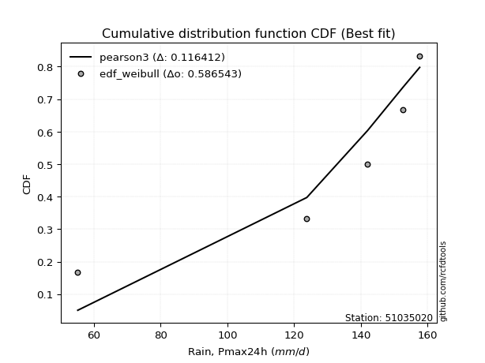</img></img>

</div>


### 4. EDF Beard (1943)

The Beard formula (or Beard´s plotting position formula) in hydrology is used to estimate the empirical non-exceedance probability _(P)_ of a flood event (or other extreme hydrological data point) within a given dataset.

<div align="center">


$P=(m-0.31)/(n+0.38)$


</div>


**4.1. Empirical values**

<div align="center">

|                | 0                   | 1                   | 2                  | 3                  | 4                  | 5                  |
|:---------------|:--------------------|:--------------------|:-------------------|:-------------------|:-------------------|:-------------------|
| date           | 2023                | 2019                | 2025               | 2022               | 2020               | 2024               |
| x              | 55.2                | 123.8               | 128.8              | 142.0              | 152.6              | 157.6              |
| m              | 1                   | 2                   | 3                  | 4                  | 5                  | 6                  |
| empirical_dist | edf_beard           | edf_beard           | edf_beard          | edf_beard          | edf_beard          | edf_beard          |
| empirical      | 0.10815047021943573 | 0.26489028213166144 | 0.4216300940438871 | 0.5783699059561128 | 0.7351097178683387 | 0.8918495297805643 |
| empirical_tr   | 1.1212653778558874  | 1.3603411513859276  | 1.7289972899728996 | 2.3717472118959106 | 3.7751479289940844 | 9.246376811594207  |

</div>


**4.2. Kolmogorov-Smirnov fit test (sorted by Δ)**


<div align="center">

|                | 0                   | 1                   | 2                   | 3                  | 4                   | 5                  | 6                   | 7                   | 8                   | 9                  | 10                  | 11                  | 12                 | 13                 | 14                  | 15                 | 16                 | 17                  | 18                  | 19                 | 20                  | 21                 | 22                 | 23                  | 24                  | 25                  | 26                  | 27                  | 28                 | 29                 | 30                  | 31                  | 32                  | 33                  | 34                  | 35                 | 36                  | 37                  | 38                  | 39                  | 40                 | 41                 | 42                 | 43                 | 44                  | 45                  | 46                  | 47                 | 48                 | 49                  | 50                  | 51                 | 52                  | 53                 | 54                 | 55                  | 56                 | 57                 | 58                 | 59                 | 60                 | 61                 | 62                  | 63                  | 64                 | 65                  | 66                 | 67                  | 68                  | 69                  | 70                  | 71                 | 72                 | 73                  | 74                 | 75                 | 76                 | 77                 | 78                 | 79                  | 80                  | 81                | 82                  | 83                | 84                 | 85                 | 86                | 87                 | 88                 | 89                  | 90                  | 91                 | 92                 | 93                 | 94                 | 95                  | 96                  | 97                  | 98                 | 99                  | 100                | 101                 | 102                 | 103                | 104                | 105                | 106                 | 107                | 108                | 109                | 110                | 111                 | 112                 | 113                | 114                 | 115                | 116                 | 117                | 118                | 119                | 120                 | 121                 | 122                | 123                 | 124                 | 125                | 126                 | 127                | 128                 | 129                | 130                 | 131                | 132                | 133                | 134                 | 135                | 136                | 137                | 138                | 139                | 140                | 141                | 142                | 143                | 144                | 145                | 146                | 147                | 148                | 149                | 150                | 151                | 152                | 153                | 154                | 155                | 156                | 157                | 158                | 159                |
|:---------------|:--------------------|:--------------------|:--------------------|:-------------------|:--------------------|:-------------------|:--------------------|:--------------------|:--------------------|:-------------------|:--------------------|:--------------------|:-------------------|:-------------------|:--------------------|:-------------------|:-------------------|:--------------------|:--------------------|:-------------------|:--------------------|:-------------------|:-------------------|:--------------------|:--------------------|:--------------------|:--------------------|:--------------------|:-------------------|:-------------------|:--------------------|:--------------------|:--------------------|:--------------------|:--------------------|:-------------------|:--------------------|:--------------------|:--------------------|:--------------------|:-------------------|:-------------------|:-------------------|:-------------------|:--------------------|:--------------------|:--------------------|:-------------------|:-------------------|:--------------------|:--------------------|:-------------------|:--------------------|:-------------------|:-------------------|:--------------------|:-------------------|:-------------------|:-------------------|:-------------------|:-------------------|:-------------------|:--------------------|:--------------------|:-------------------|:--------------------|:-------------------|:--------------------|:--------------------|:--------------------|:--------------------|:-------------------|:-------------------|:--------------------|:-------------------|:-------------------|:-------------------|:-------------------|:-------------------|:--------------------|:--------------------|:------------------|:--------------------|:------------------|:-------------------|:-------------------|:------------------|:-------------------|:-------------------|:--------------------|:--------------------|:-------------------|:-------------------|:-------------------|:-------------------|:--------------------|:--------------------|:--------------------|:-------------------|:--------------------|:-------------------|:--------------------|:--------------------|:-------------------|:-------------------|:-------------------|:--------------------|:-------------------|:-------------------|:-------------------|:-------------------|:--------------------|:--------------------|:-------------------|:--------------------|:-------------------|:--------------------|:-------------------|:-------------------|:-------------------|:--------------------|:--------------------|:-------------------|:--------------------|:--------------------|:-------------------|:--------------------|:-------------------|:--------------------|:-------------------|:--------------------|:-------------------|:-------------------|:-------------------|:--------------------|:-------------------|:-------------------|:-------------------|:-------------------|:-------------------|:-------------------|:-------------------|:-------------------|:-------------------|:-------------------|:-------------------|:-------------------|:-------------------|:-------------------|:-------------------|:-------------------|:-------------------|:-------------------|:-------------------|:-------------------|:-------------------|:-------------------|:-------------------|:-------------------|:-------------------|
| station        | 51035020            | 51035020            | 51035020            | 51035020           | 51035020            | 51035020           | 51035020            | 51035020            | 51035020            | 51035020           | 51035020            | 51035020            | 51035020           | 51035020           | 51035020            | 51035020           | 51035020           | 51035020            | 51035020            | 51035020           | 51035020            | 51035020           | 51035020           | 51035020            | 51035020            | 51035020            | 51035020            | 51035020            | 51035020           | 51035020           | 51035020            | 51035020            | 51035020            | 51035020            | 51035020            | 51035020           | 51035020            | 51035020            | 51035020            | 51035020            | 51035020           | 51035020           | 51035020           | 51035020           | 51035020            | 51035020            | 51035020            | 51035020           | 51035020           | 51035020            | 51035020            | 51035020           | 51035020            | 51035020           | 51035020           | 51035020            | 51035020           | 51035020           | 51035020           | 51035020           | 51035020           | 51035020           | 51035020            | 51035020            | 51035020           | 51035020            | 51035020           | 51035020            | 51035020            | 51035020            | 51035020            | 51035020           | 51035020           | 51035020            | 51035020           | 51035020           | 51035020           | 51035020           | 51035020           | 51035020            | 51035020            | 51035020          | 51035020            | 51035020          | 51035020           | 51035020           | 51035020          | 51035020           | 51035020           | 51035020            | 51035020            | 51035020           | 51035020           | 51035020           | 51035020           | 51035020            | 51035020            | 51035020            | 51035020           | 51035020            | 51035020           | 51035020            | 51035020            | 51035020           | 51035020           | 51035020           | 51035020            | 51035020           | 51035020           | 51035020           | 51035020           | 51035020            | 51035020            | 51035020           | 51035020            | 51035020           | 51035020            | 51035020           | 51035020           | 51035020           | 51035020            | 51035020            | 51035020           | 51035020            | 51035020            | 51035020           | 51035020            | 51035020           | 51035020            | 51035020           | 51035020            | 51035020           | 51035020           | 51035020           | 51035020            | 51035020           | 51035020           | 51035020           | 51035020           | 51035020           | 51035020           | 51035020           | 51035020           | 51035020           | 51035020           | 51035020           | 51035020           | 51035020           | 51035020           | 51035020           | 51035020           | 51035020           | 51035020           | 51035020           | 51035020           | 51035020           | 51035020           | 51035020           | 51035020           | 51035020           |
| empirical_dist | edf_beard           | edf_beard           | edf_beard           | edf_beard          | edf_beard           | edf_beard          | edf_beard           | edf_beard           | edf_beard           | edf_beard          | edf_beard           | edf_beard           | edf_beard          | edf_beard          | edf_beard           | edf_beard          | edf_beard          | edf_beard           | edf_beard           | edf_beard          | edf_beard           | edf_beard          | edf_beard          | edf_beard           | edf_beard           | edf_beard           | edf_beard           | edf_beard           | edf_beard          | edf_beard          | edf_beard           | edf_beard           | edf_beard           | edf_beard           | edf_beard           | edf_beard          | edf_beard           | edf_beard           | edf_beard           | edf_beard           | edf_beard          | edf_beard          | edf_beard          | edf_beard          | edf_beard           | edf_beard           | edf_beard           | edf_beard          | edf_beard          | edf_beard           | edf_beard           | edf_beard          | edf_beard           | edf_beard          | edf_beard          | edf_beard           | edf_beard          | edf_beard          | edf_beard          | edf_beard          | edf_beard          | edf_beard          | edf_beard           | edf_beard           | edf_beard          | edf_beard           | edf_beard          | edf_beard           | edf_beard           | edf_beard           | edf_beard           | edf_beard          | edf_beard          | edf_beard           | edf_beard          | edf_beard          | edf_beard          | edf_beard          | edf_beard          | edf_beard           | edf_beard           | edf_beard         | edf_beard           | edf_beard         | edf_beard          | edf_beard          | edf_beard         | edf_beard          | edf_beard          | edf_beard           | edf_beard           | edf_beard          | edf_beard          | edf_beard          | edf_beard          | edf_beard           | edf_beard           | edf_beard           | edf_beard          | edf_beard           | edf_beard          | edf_beard           | edf_beard           | edf_beard          | edf_beard          | edf_beard          | edf_beard           | edf_beard          | edf_beard          | edf_beard          | edf_beard          | edf_beard           | edf_beard           | edf_beard          | edf_beard           | edf_beard          | edf_beard           | edf_beard          | edf_beard          | edf_beard          | edf_beard           | edf_beard           | edf_beard          | edf_beard           | edf_beard           | edf_beard          | edf_beard           | edf_beard          | edf_beard           | edf_beard          | edf_beard           | edf_beard          | edf_beard          | edf_beard          | edf_beard           | edf_beard          | edf_beard          | edf_beard          | edf_beard          | edf_beard          | edf_beard          | edf_beard          | edf_beard          | edf_beard          | edf_beard          | edf_beard          | edf_beard          | edf_beard          | edf_beard          | edf_beard          | edf_beard          | edf_beard          | edf_beard          | edf_beard          | edf_beard          | edf_beard          | edf_beard          | edf_beard          | edf_beard          | edf_beard          |
| p_dist         | dweibull            | loglevy_l           | levy_l              | vonmises_line      | loggenextreme       | genextreme         | mielke              | pearson3            | argus               | logmielke          | gumbel_l            | logargus            | logvonmises_line   | dgamma             | logt                | logburr            | logexponweib       | burr                | logloggamma         | trapezoid          | logburr12           | logpearson3        | logweibull_min     | logbeta             | laplace             | hypsecant           | t                   | logistic            | skewnorm           | logloglaplace      | loggumbel_l         | logdweibull         | crystalball         | norm                | exponnorm           | nct                | f                   | beta                | loggennorm          | logtrapezoid        | anglit             | gamma              | semicircular       | betaprime          | erlang              | arcsine             | genhalflogistic     | logweibull_max     | invgamma           | alpha               | logdgamma           | maxwell            | logexponpow         | invgauss           | loginvweibull      | rayleigh            | gennorm            | weibull_max        | loggenpareto       | logarcsine         | ncf                | logjohnsonsu       | logsemicircular     | loganglit           | logtukeylambda     | logtruncnorm        | lognakagami        | nakagami            | logbetaprime        | genpareto           | logfatiguelife      | logf               | logexponnorm       | lognorm             | logcrystalball     | logrice            | logncf             | gumbel_r           | lognct             | cosine              | loglogistic         | gausshyper        | loghypsecant        | logalpha          | triang             | halfnorm           | johnsonsb         | wrapcauchy         | kstwobign          | loginvgamma         | logerlang           | loglaplace         | loglaplace         | loginvgauss        | moyal              | logmaxwell          | halflogistic        | kappa3              | loggengamma        | lograyleigh         | logfoldnorm        | truncweibull_min    | logskewnorm         | gengamma           | logkstwobign       | loghalfnorm        | loggumbel_r         | loggenexpon        | logcosine          | logwrapcauchy      | lomax              | johnsonsu           | logmoyal            | loghalflogistic    | wald                | loggenhalflogistic | ksone               | halfgennorm        | burr12             | loggompertz        | logtriang           | uniform             | kappa4             | loghalfgennorm      | logjohnsonsb        | foldnorm           | logwald             | invweibull         | logtruncweibull_min | logksone           | bradford            | truncexpon         | loggamma           | loggamma           | gompertz            | logkappa3          | loguniform         | logkappa4          | loggausshyper      | logrdist           | logbradford        | logtruncexpon      | exponweib          | truncnorm          | fatiguelife        | weibull_min        | powerlaw           | exponpow           | logpowerlaw        | truncpareto        | genexpon           | logtruncpareto     | loglomax           | rice               | rdist              | tukeylambda        | genlogistic        | loggenlogistic     | logvonmises        | vonmises           |
| delta          | 0.09376641999648916 | 0.10309678497435504 | 0.10622528839295609 | 0.1081504702148445 | 0.10815047021917323 | 0.1081504702193622 | 0.11508283977001532 | 0.11596297690270596 | 0.11642812930288948 | 0.1274239701979334 | 0.13106275522844457 | 0.13559960486827694 | 0.1405631549497346 | 0.1405798200005161 | 0.14128865179788852 | 0.1451263076313975 | 0.1468650596684345 | 0.14910878454005716 | 0.15263537944913996 | 0.1535417652321867 | 0.16277763968285974 | 0.1640032836379559 | 0.1666430480522465 | 0.17512697076547412 | 0.17909327148286913 | 0.19322172313254937 | 0.19330766403191213 | 0.19708495105629797 | 0.1981688257659272 | 0.1996978128970871 | 0.20000896967594062 | 0.20048810668326988 | 0.20163043638626477 | 0.20163044554471005 | 0.20163182654362993 | 0.2016362686934023 | 0.20293080622706006 | 0.20411757532982333 | 0.20582818090194693 | 0.20633424649904047 | 0.2064050396061945 | 0.2076070869167823 | 0.2083736041743668 | 0.2142178670821061 | 0.21487812641396603 | 0.21618766537875334 | 0.22510993350387587 | 0.2277627854867711 | 0.2315671898270148 | 0.23305717917687185 | 0.23486167146976022 | 0.2356968118782562 | 0.24048731259177025 | 0.2407988439528288 | 0.2456535372107076 | 0.24734680093043449 | 0.2503256118944589 | 0.2508128976938253 | 0.2524687082581658 | 0.2540199464004972 | 0.2561805332363626 | 0.2593215896310123 | 0.26182938724790095 | 0.26379682173187324 | 0.2648801669241525 | 0.26488779029390175 | 0.2648902702486586 | 0.26489028204163556 | 0.26580107823084687 | 0.26722779405673824 | 0.26787665228740765 | 0.2683863273263354 | 0.2685672915032541 | 0.26856851819758387 | 0.2685685248763787 | 0.2685854445294338 | 0.2701835034882505 | 0.2701883663902416 | 0.2715907580758816 | 0.27266737529452667 | 0.27311126833929844 | 0.274535474907041 | 0.27697218658801226 | 0.278842372898348 | 0.2794833419168814 | 0.2801892914799795 | 0.280198660487859 | 0.2833151977634425 | 0.2849647282633536 | 0.29076616978060765 | 0.29094082391865683 | 0.2910938287432968 | 0.2910938287432968 | 0.2950555414640371 | 0.2959018183745188 | 0.29998152924261523 | 0.30273443045468595 | 0.30362471564931004 | 0.3097383414113186 | 0.31018970200939133 | 0.3231485275743191 | 0.32468318939792207 | 0.32621126802518163 | 0.3265964207006612 | 0.3292850048164826 | 0.3389512639733452 | 0.33913656858240704 | 0.3397797650926331 | 0.3414949414572739 | 0.3431507111586991 | 0.3507494719619899 | 0.35239342022583586 | 0.36444787447955385 | 0.3656158403609189 | 0.36746742572516855 | 0.3709074955233117 | 0.37671128036833856 | 0.3793620148094521 | 0.3810733211350542 | 0.3836929542733325 | 0.38478777583169954 | 0.40503159286833856 | 0.4082477780346965 | 0.41413196516579753 | 0.41840845588848063 | 0.4216300940438871 | 0.43470501550880203 | 0.4366482105716285 | 0.4555728566205527  | 0.4600299225781562 | 0.47501060828314645 | 0.4823481477944148 | 0.4843814394611037 | 0.4843814394611037 | 0.49271304814460154 | 0.4996145492162869 | 0.5050139635201201 | 0.5058145614447647 | 0.5297551276137255 | 0.5510056665118318 | 0.5616982949130161 | 0.5732959413418914 | 0.5775188959533742 | 0.5783699049331819 | 0.6001256848133368 | 0.6442725853607827 | 0.6740549810510904 | 0.6821517389568375 | 0.6916567981163642 | 0.7005724597351201 | 0.7100812859872951 | 0.7124561753123206 | 0.7204986448077799 | 0.7351097178683342 | 0.7351097178683386 | 0.7351097178683386 | 0.7351097178683387 | 0.7351097178683387 | 1.2552631370986216 | 25.093005052790765 |
| deltao         | 0.530385761606      | 0.530385761606      | 0.530385761606      | 0.530385761606     | 0.530385761606      | 0.530385761606     | 0.530385761606      | 0.530385761606      | 0.530385761606      | 0.530385761606     | 0.530385761606      | 0.530385761606      | 0.530385761606     | 0.530385761606     | 0.530385761606      | 0.530385761606     | 0.530385761606     | 0.530385761606      | 0.530385761606      | 0.530385761606     | 0.530385761606      | 0.530385761606     | 0.530385761606     | 0.530385761606      | 0.530385761606      | 0.530385761606      | 0.530385761606      | 0.530385761606      | 0.530385761606     | 0.530385761606     | 0.530385761606      | 0.530385761606      | 0.530385761606      | 0.530385761606      | 0.530385761606      | 0.530385761606     | 0.530385761606      | 0.530385761606      | 0.530385761606      | 0.530385761606      | 0.530385761606     | 0.530385761606     | 0.530385761606     | 0.530385761606     | 0.530385761606      | 0.530385761606      | 0.530385761606      | 0.530385761606     | 0.530385761606     | 0.530385761606      | 0.530385761606      | 0.530385761606     | 0.530385761606      | 0.530385761606     | 0.530385761606     | 0.530385761606      | 0.530385761606     | 0.530385761606     | 0.530385761606     | 0.530385761606     | 0.530385761606     | 0.530385761606     | 0.530385761606      | 0.530385761606      | 0.530385761606     | 0.530385761606      | 0.530385761606     | 0.530385761606      | 0.530385761606      | 0.530385761606      | 0.530385761606      | 0.530385761606     | 0.530385761606     | 0.530385761606      | 0.530385761606     | 0.530385761606     | 0.530385761606     | 0.530385761606     | 0.530385761606     | 0.530385761606      | 0.530385761606      | 0.530385761606    | 0.530385761606      | 0.530385761606    | 0.530385761606     | 0.530385761606     | 0.530385761606    | 0.530385761606     | 0.530385761606     | 0.530385761606      | 0.530385761606      | 0.530385761606     | 0.530385761606     | 0.530385761606     | 0.530385761606     | 0.530385761606      | 0.530385761606      | 0.530385761606      | 0.530385761606     | 0.530385761606      | 0.530385761606     | 0.530385761606      | 0.530385761606      | 0.530385761606     | 0.530385761606     | 0.530385761606     | 0.530385761606      | 0.530385761606     | 0.530385761606     | 0.530385761606     | 0.530385761606     | 0.530385761606      | 0.530385761606      | 0.530385761606     | 0.530385761606      | 0.530385761606     | 0.530385761606      | 0.530385761606     | 0.530385761606     | 0.530385761606     | 0.530385761606      | 0.530385761606      | 0.530385761606     | 0.530385761606      | 0.530385761606      | 0.530385761606     | 0.530385761606      | 0.530385761606     | 0.530385761606      | 0.530385761606     | 0.530385761606      | 0.530385761606     | 0.530385761606     | 0.530385761606     | 0.530385761606      | 0.530385761606     | 0.530385761606     | 0.530385761606     | 0.530385761606     | 0.530385761606     | 0.530385761606     | 0.530385761606     | 0.530385761606     | 0.530385761606     | 0.530385761606     | 0.530385761606     | 0.530385761606     | 0.530385761606     | 0.530385761606     | 0.530385761606     | 0.530385761606     | 0.530385761606     | 0.530385761606     | 0.530385761606     | 0.530385761606     | 0.530385761606     | 0.530385761606     | 0.530385761606     | 0.530385761606     | 0.530385761606     |
| eval           | Δo > Δ              | Δo > Δ              | Δo > Δ              | Δo > Δ             | Δo > Δ              | Δo > Δ             | Δo > Δ              | Δo > Δ              | Δo > Δ              | Δo > Δ             | Δo > Δ              | Δo > Δ              | Δo > Δ             | Δo > Δ             | Δo > Δ              | Δo > Δ             | Δo > Δ             | Δo > Δ              | Δo > Δ              | Δo > Δ             | Δo > Δ              | Δo > Δ             | Δo > Δ             | Δo > Δ              | Δo > Δ              | Δo > Δ              | Δo > Δ              | Δo > Δ              | Δo > Δ             | Δo > Δ             | Δo > Δ              | Δo > Δ              | Δo > Δ              | Δo > Δ              | Δo > Δ              | Δo > Δ             | Δo > Δ              | Δo > Δ              | Δo > Δ              | Δo > Δ              | Δo > Δ             | Δo > Δ             | Δo > Δ             | Δo > Δ             | Δo > Δ              | Δo > Δ              | Δo > Δ              | Δo > Δ             | Δo > Δ             | Δo > Δ              | Δo > Δ              | Δo > Δ             | Δo > Δ              | Δo > Δ             | Δo > Δ             | Δo > Δ              | Δo > Δ             | Δo > Δ             | Δo > Δ             | Δo > Δ             | Δo > Δ             | Δo > Δ             | Δo > Δ              | Δo > Δ              | Δo > Δ             | Δo > Δ              | Δo > Δ             | Δo > Δ              | Δo > Δ              | Δo > Δ              | Δo > Δ              | Δo > Δ             | Δo > Δ             | Δo > Δ              | Δo > Δ             | Δo > Δ             | Δo > Δ             | Δo > Δ             | Δo > Δ             | Δo > Δ              | Δo > Δ              | Δo > Δ            | Δo > Δ              | Δo > Δ            | Δo > Δ             | Δo > Δ             | Δo > Δ            | Δo > Δ             | Δo > Δ             | Δo > Δ              | Δo > Δ              | Δo > Δ             | Δo > Δ             | Δo > Δ             | Δo > Δ             | Δo > Δ              | Δo > Δ              | Δo > Δ              | Δo > Δ             | Δo > Δ              | Δo > Δ             | Δo > Δ              | Δo > Δ              | Δo > Δ             | Δo > Δ             | Δo > Δ             | Δo > Δ              | Δo > Δ             | Δo > Δ             | Δo > Δ             | Δo > Δ             | Δo > Δ              | Δo > Δ              | Δo > Δ             | Δo > Δ              | Δo > Δ             | Δo > Δ              | Δo > Δ             | Δo > Δ             | Δo > Δ             | Δo > Δ              | Δo > Δ              | Δo > Δ             | Δo > Δ              | Δo > Δ              | Δo > Δ             | Δo > Δ              | Δo > Δ             | Δo > Δ              | Δo > Δ             | Δo > Δ              | Δo > Δ             | Δo > Δ             | Δo > Δ             | Δo > Δ              | Δo > Δ             | Δo > Δ             | Δo > Δ             | Δo > Δ             | Δo <= Δ            | Δo <= Δ            | Δo <= Δ            | Δo <= Δ            | Δo <= Δ            | Δo <= Δ            | Δo <= Δ            | Δo <= Δ            | Δo <= Δ            | Δo <= Δ            | Δo <= Δ            | Δo <= Δ            | Δo <= Δ            | Δo <= Δ            | Δo <= Δ            | Δo <= Δ            | Δo <= Δ            | Δo <= Δ            | Δo <= Δ            | Δo <= Δ            | Δo <= Δ            |
| fit            | 1                   | 1                   | 1                   | 1                  | 1                   | 1                  | 1                   | 1                   | 1                   | 1                  | 1                   | 1                   | 1                  | 1                  | 1                   | 1                  | 1                  | 1                   | 1                   | 1                  | 1                   | 1                  | 1                  | 1                   | 1                   | 1                   | 1                   | 1                   | 1                  | 1                  | 1                   | 1                   | 1                   | 1                   | 1                   | 1                  | 1                   | 1                   | 1                   | 1                   | 1                  | 1                  | 1                  | 1                  | 1                   | 1                   | 1                   | 1                  | 1                  | 1                   | 1                   | 1                  | 1                   | 1                  | 1                  | 1                   | 1                  | 1                  | 1                  | 1                  | 1                  | 1                  | 1                   | 1                   | 1                  | 1                   | 1                  | 1                   | 1                   | 1                   | 1                   | 1                  | 1                  | 1                   | 1                  | 1                  | 1                  | 1                  | 1                  | 1                   | 1                   | 1                 | 1                   | 1                 | 1                  | 1                  | 1                 | 1                  | 1                  | 1                   | 1                   | 1                  | 1                  | 1                  | 1                  | 1                   | 1                   | 1                   | 1                  | 1                   | 1                  | 1                   | 1                   | 1                  | 1                  | 1                  | 1                   | 1                  | 1                  | 1                  | 1                  | 1                   | 1                   | 1                  | 1                   | 1                  | 1                   | 1                  | 1                  | 1                  | 1                   | 1                   | 1                  | 1                   | 1                   | 1                  | 1                   | 1                  | 1                   | 1                  | 1                   | 1                  | 1                  | 1                  | 1                   | 1                  | 1                  | 1                  | 1                  | 0                  | 0                  | 0                  | 0                  | 0                  | 0                  | 0                  | 0                  | 0                  | 0                  | 0                  | 0                  | 0                  | 0                  | 0                  | 0                  | 0                  | 0                  | 0                  | 0                  | 0                  |
| n              | 6                   | 6                   | 6                   | 6                  | 6                   | 6                  | 6                   | 6                   | 6                   | 6                  | 6                   | 6                   | 6                  | 6                  | 6                   | 6                  | 6                  | 6                   | 6                   | 6                  | 6                   | 6                  | 6                  | 6                   | 6                   | 6                   | 6                   | 6                   | 6                  | 6                  | 6                   | 6                   | 6                   | 6                   | 6                   | 6                  | 6                   | 6                   | 6                   | 6                   | 6                  | 6                  | 6                  | 6                  | 6                   | 6                   | 6                   | 6                  | 6                  | 6                   | 6                   | 6                  | 6                   | 6                  | 6                  | 6                   | 6                  | 6                  | 6                  | 6                  | 6                  | 6                  | 6                   | 6                   | 6                  | 6                   | 6                  | 6                   | 6                   | 6                   | 6                   | 6                  | 6                  | 6                   | 6                  | 6                  | 6                  | 6                  | 6                  | 6                   | 6                   | 6                 | 6                   | 6                 | 6                  | 6                  | 6                 | 6                  | 6                  | 6                   | 6                   | 6                  | 6                  | 6                  | 6                  | 6                   | 6                   | 6                   | 6                  | 6                   | 6                  | 6                   | 6                   | 6                  | 6                  | 6                  | 6                   | 6                  | 6                  | 6                  | 6                  | 6                   | 6                   | 6                  | 6                   | 6                  | 6                   | 6                  | 6                  | 6                  | 6                   | 6                   | 6                  | 6                   | 6                   | 6                  | 6                   | 6                  | 6                   | 6                  | 6                   | 6                  | 6                  | 6                  | 6                   | 6                  | 6                  | 6                  | 6                  | 6                  | 6                  | 6                  | 6                  | 6                  | 6                  | 6                  | 6                  | 6                  | 6                  | 6                  | 6                  | 6                  | 6                  | 6                  | 6                  | 6                  | 6                  | 6                  | 6                  | 6                  |
| best_fit       | 1                   | 0                   | 0                   | 0                  | 0                   | 0                  | 0                   | 0                   | 0                   | 0                  | 0                   | 0                   | 0                  | 0                  | 0                   | 0                  | 0                  | 0                   | 0                   | 0                  | 0                   | 0                  | 0                  | 0                   | 0                   | 0                   | 0                   | 0                   | 0                  | 0                  | 0                   | 0                   | 0                   | 0                   | 0                   | 0                  | 0                   | 0                   | 0                   | 0                   | 0                  | 0                  | 0                  | 0                  | 0                   | 0                   | 0                   | 0                  | 0                  | 0                   | 0                   | 0                  | 0                   | 0                  | 0                  | 0                   | 0                  | 0                  | 0                  | 0                  | 0                  | 0                  | 0                   | 0                   | 0                  | 0                   | 0                  | 0                   | 0                   | 0                   | 0                   | 0                  | 0                  | 0                   | 0                  | 0                  | 0                  | 0                  | 0                  | 0                   | 0                   | 0                 | 0                   | 0                 | 0                  | 0                  | 0                 | 0                  | 0                  | 0                   | 0                   | 0                  | 0                  | 0                  | 0                  | 0                   | 0                   | 0                   | 0                  | 0                   | 0                  | 0                   | 0                   | 0                  | 0                  | 0                  | 0                   | 0                  | 0                  | 0                  | 0                  | 0                   | 0                   | 0                  | 0                   | 0                  | 0                   | 0                  | 0                  | 0                  | 0                   | 0                   | 0                  | 0                   | 0                   | 0                  | 0                   | 0                  | 0                   | 0                  | 0                   | 0                  | 0                  | 0                  | 0                   | 0                  | 0                  | 0                  | 0                  | 0                  | 0                  | 0                  | 0                  | 0                  | 0                  | 0                  | 0                  | 0                  | 0                  | 0                  | 0                  | 0                  | 0                  | 0                  | 0                  | 0                  | 0                  | 0                  | 0                  | 0                  |
| best_fit_sort  | 1                   | 2                   | 3                   | 4                  | 5                   | 6                  | 7                   | 8                   | 9                   | 10                 | 11                  | 12                  | 13                 | 14                 | 15                  | 16                 | 17                 | 18                  | 19                  | 20                 | 21                  | 22                 | 23                 | 24                  | 25                  | 26                  | 27                  | 28                  | 29                 | 30                 | 31                  | 32                  | 33                  | 34                  | 35                  | 36                 | 37                  | 38                  | 39                  | 40                  | 41                 | 42                 | 43                 | 44                 | 45                  | 46                  | 47                  | 48                 | 49                 | 50                  | 51                  | 52                 | 53                  | 54                 | 55                 | 56                  | 57                 | 58                 | 59                 | 60                 | 61                 | 62                 | 63                  | 64                  | 65                 | 66                  | 67                 | 68                  | 69                  | 70                  | 71                  | 72                 | 73                 | 74                  | 75                 | 76                 | 77                 | 78                 | 79                 | 80                  | 81                  | 82                | 83                  | 84                | 85                 | 86                 | 87                | 88                 | 89                 | 90                  | 91                  | 92                 | 93                 | 94                 | 95                 | 96                  | 97                  | 98                  | 99                 | 100                 | 101                | 102                 | 103                 | 104                | 105                | 106                | 107                 | 108                | 109                | 110                | 111                | 112                 | 113                 | 114                | 115                 | 116                | 117                 | 118                | 119                | 120                | 121                 | 122                 | 123                | 124                 | 125                 | 126                | 127                 | 128                | 129                 | 130                | 131                 | 132                | 133                | 134                | 135                 | 136                | 137                | 138                | 139                | 140                | 141                | 142                | 143                | 144                | 145                | 146                | 147                | 148                | 149                | 150                | 151                | 152                | 153                | 154                | 155                | 156                | 157                | 158                | 159                | 160                |

</div>


**4.3. Best fit**

<div align="center">

|   id |   station | empirical_dist   | p_dist   |     delta |   deltao | eval   |   fit |   n |   best_fit |   best_fit_sort |
|-----:|----------:|:-----------------|:---------|----------:|---------:|:-------|------:|----:|-----------:|----------------:|
|    0 |  51035020 | edf_beard        | dweibull | 0.0937664 | 0.530386 | Δo > Δ |     1 |   6 |          1 |               1 |

</div>


<div align="center">

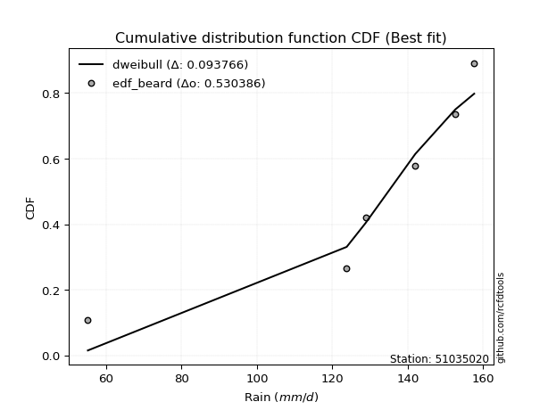</img></img>

</div>


### 5. EDF Chegodayev (1955)

The Chegodayev formula is an empirical plotting position formula used in hydrological frequency analysis to estimate the exceedance probability or return period of a specific event from a set of observed data. It is primarily used for plotting observed data points on probability paper to fit a theoretical distribution, particularly for analyzing extreme events like maximum flood flows or rainfall intensities. The constant _b_ value in the generalized plotting position formula is 0.3.

<div align="center">


$P=(m-b)/(n+1-2b)$


</div>


**5.1. Empirical values**

<div align="center">

|                | 0                   | 1                  | 2                  | 3                  | 4                 | 5                 |
|:---------------|:--------------------|:-------------------|:-------------------|:-------------------|:------------------|:------------------|
| date           | 2023                | 2019               | 2025               | 2022               | 2020              | 2024              |
| x              | 55.2                | 123.8              | 128.8              | 142.0              | 152.6             | 157.6             |
| m              | 1                   | 2                  | 3                  | 4                  | 5                 | 6                 |
| empirical_dist | edf_chegodayev      | edf_chegodayev     | edf_chegodayev     | edf_chegodayev     | edf_chegodayev    | edf_chegodayev    |
| empirical      | 0.10937499999999999 | 0.265625           | 0.421875           | 0.578125           | 0.734375          | 0.890625          |
| empirical_tr   | 1.1228070175438596  | 1.3617021276595744 | 1.7297297297297298 | 2.3703703703703702 | 3.764705882352941 | 9.142857142857142 |

</div>


**5.2. Kolmogorov-Smirnov fit test (sorted by Δ)**


<div align="center">

|                | 0                   | 1                   | 2                   | 3                   | 4                   | 5                  | 6                  | 7                 | 8                   | 9                   | 10                | 11                 | 12                  | 13                  | 14                 | 15                  | 16                  | 17                 | 18                  | 19                  | 20                  | 21                  | 22                  | 23                  | 24                  | 25                 | 26                  | 27                 | 28                  | 29                 | 30                  | 31                  | 32                 | 33                  | 34                  | 35                  | 36                 | 37                  | 38                 | 39                  | 40                 | 41                  | 42                  | 43                  | 44                  | 45                  | 46                 | 47                  | 48                  | 49                 | 50                  | 51                 | 52                 | 53                  | 54                  | 55                  | 56                  | 57                  | 58                  | 59                 | 60                | 61                  | 62                 | 63                 | 64                 | 65                  | 66                 | 67                  | 68                 | 69                 | 70                 | 71                 | 72                 | 73                 | 74                  | 75                 | 76                 | 77                | 78                  | 79                 | 80                 | 81                  | 82                 | 83                  | 84                  | 85                  | 86                  | 87                  | 88                  | 89                 | 90                  | 91                  | 92                  | 93                  | 94                 | 95                  | 96                 | 97                 | 98                  | 99                  | 100                 | 101                | 102                 | 103                 | 104                 | 105                | 106                | 107                | 108                | 109                 | 110                 | 111                | 112                | 113                | 114              | 115                 | 116            | 117                | 118                 | 119                 | 120               | 121            | 122                | 123                 | 124                 | 125            | 126                 | 127                | 128                 | 129                 | 130                | 131                 | 132                | 133                | 134                | 135                 | 136                | 137                | 138                | 139                | 140                | 141                | 142                | 143                | 144                | 145                | 146                | 147                | 148                | 149                | 150                | 151                | 152                | 153                | 154            | 155            | 156            | 157            | 158               | 159               |
|:---------------|:--------------------|:--------------------|:--------------------|:--------------------|:--------------------|:-------------------|:-------------------|:------------------|:--------------------|:--------------------|:------------------|:-------------------|:--------------------|:--------------------|:-------------------|:--------------------|:--------------------|:-------------------|:--------------------|:--------------------|:--------------------|:--------------------|:--------------------|:--------------------|:--------------------|:-------------------|:--------------------|:-------------------|:--------------------|:-------------------|:--------------------|:--------------------|:-------------------|:--------------------|:--------------------|:--------------------|:-------------------|:--------------------|:-------------------|:--------------------|:-------------------|:--------------------|:--------------------|:--------------------|:--------------------|:--------------------|:-------------------|:--------------------|:--------------------|:-------------------|:--------------------|:-------------------|:-------------------|:--------------------|:--------------------|:--------------------|:--------------------|:--------------------|:--------------------|:-------------------|:------------------|:--------------------|:-------------------|:-------------------|:-------------------|:--------------------|:-------------------|:--------------------|:-------------------|:-------------------|:-------------------|:-------------------|:-------------------|:-------------------|:--------------------|:-------------------|:-------------------|:------------------|:--------------------|:-------------------|:-------------------|:--------------------|:-------------------|:--------------------|:--------------------|:--------------------|:--------------------|:--------------------|:--------------------|:-------------------|:--------------------|:--------------------|:--------------------|:--------------------|:-------------------|:--------------------|:-------------------|:-------------------|:--------------------|:--------------------|:--------------------|:-------------------|:--------------------|:--------------------|:--------------------|:-------------------|:-------------------|:-------------------|:-------------------|:--------------------|:--------------------|:-------------------|:-------------------|:-------------------|:-----------------|:--------------------|:---------------|:-------------------|:--------------------|:--------------------|:------------------|:---------------|:-------------------|:--------------------|:--------------------|:---------------|:--------------------|:-------------------|:--------------------|:--------------------|:-------------------|:--------------------|:-------------------|:-------------------|:-------------------|:--------------------|:-------------------|:-------------------|:-------------------|:-------------------|:-------------------|:-------------------|:-------------------|:-------------------|:-------------------|:-------------------|:-------------------|:-------------------|:-------------------|:-------------------|:-------------------|:-------------------|:-------------------|:-------------------|:---------------|:---------------|:---------------|:---------------|:------------------|:------------------|
| station        | 51035020            | 51035020            | 51035020            | 51035020            | 51035020            | 51035020           | 51035020           | 51035020          | 51035020            | 51035020            | 51035020          | 51035020           | 51035020            | 51035020            | 51035020           | 51035020            | 51035020            | 51035020           | 51035020            | 51035020            | 51035020            | 51035020            | 51035020            | 51035020            | 51035020            | 51035020           | 51035020            | 51035020           | 51035020            | 51035020           | 51035020            | 51035020            | 51035020           | 51035020            | 51035020            | 51035020            | 51035020           | 51035020            | 51035020           | 51035020            | 51035020           | 51035020            | 51035020            | 51035020            | 51035020            | 51035020            | 51035020           | 51035020            | 51035020            | 51035020           | 51035020            | 51035020           | 51035020           | 51035020            | 51035020            | 51035020            | 51035020            | 51035020            | 51035020            | 51035020           | 51035020          | 51035020            | 51035020           | 51035020           | 51035020           | 51035020            | 51035020           | 51035020            | 51035020           | 51035020           | 51035020           | 51035020           | 51035020           | 51035020           | 51035020            | 51035020           | 51035020           | 51035020          | 51035020            | 51035020           | 51035020           | 51035020            | 51035020           | 51035020            | 51035020            | 51035020            | 51035020            | 51035020            | 51035020            | 51035020           | 51035020            | 51035020            | 51035020            | 51035020            | 51035020           | 51035020            | 51035020           | 51035020           | 51035020            | 51035020            | 51035020            | 51035020           | 51035020            | 51035020            | 51035020            | 51035020           | 51035020           | 51035020           | 51035020           | 51035020            | 51035020            | 51035020           | 51035020           | 51035020           | 51035020         | 51035020            | 51035020       | 51035020           | 51035020            | 51035020            | 51035020          | 51035020       | 51035020           | 51035020            | 51035020            | 51035020       | 51035020            | 51035020           | 51035020            | 51035020            | 51035020           | 51035020            | 51035020           | 51035020           | 51035020           | 51035020            | 51035020           | 51035020           | 51035020           | 51035020           | 51035020           | 51035020           | 51035020           | 51035020           | 51035020           | 51035020           | 51035020           | 51035020           | 51035020           | 51035020           | 51035020           | 51035020           | 51035020           | 51035020           | 51035020       | 51035020       | 51035020       | 51035020       | 51035020          | 51035020          |
| empirical_dist | edf_chegodayev      | edf_chegodayev      | edf_chegodayev      | edf_chegodayev      | edf_chegodayev      | edf_chegodayev     | edf_chegodayev     | edf_chegodayev    | edf_chegodayev      | edf_chegodayev      | edf_chegodayev    | edf_chegodayev     | edf_chegodayev      | edf_chegodayev      | edf_chegodayev     | edf_chegodayev      | edf_chegodayev      | edf_chegodayev     | edf_chegodayev      | edf_chegodayev      | edf_chegodayev      | edf_chegodayev      | edf_chegodayev      | edf_chegodayev      | edf_chegodayev      | edf_chegodayev     | edf_chegodayev      | edf_chegodayev     | edf_chegodayev      | edf_chegodayev     | edf_chegodayev      | edf_chegodayev      | edf_chegodayev     | edf_chegodayev      | edf_chegodayev      | edf_chegodayev      | edf_chegodayev     | edf_chegodayev      | edf_chegodayev     | edf_chegodayev      | edf_chegodayev     | edf_chegodayev      | edf_chegodayev      | edf_chegodayev      | edf_chegodayev      | edf_chegodayev      | edf_chegodayev     | edf_chegodayev      | edf_chegodayev      | edf_chegodayev     | edf_chegodayev      | edf_chegodayev     | edf_chegodayev     | edf_chegodayev      | edf_chegodayev      | edf_chegodayev      | edf_chegodayev      | edf_chegodayev      | edf_chegodayev      | edf_chegodayev     | edf_chegodayev    | edf_chegodayev      | edf_chegodayev     | edf_chegodayev     | edf_chegodayev     | edf_chegodayev      | edf_chegodayev     | edf_chegodayev      | edf_chegodayev     | edf_chegodayev     | edf_chegodayev     | edf_chegodayev     | edf_chegodayev     | edf_chegodayev     | edf_chegodayev      | edf_chegodayev     | edf_chegodayev     | edf_chegodayev    | edf_chegodayev      | edf_chegodayev     | edf_chegodayev     | edf_chegodayev      | edf_chegodayev     | edf_chegodayev      | edf_chegodayev      | edf_chegodayev      | edf_chegodayev      | edf_chegodayev      | edf_chegodayev      | edf_chegodayev     | edf_chegodayev      | edf_chegodayev      | edf_chegodayev      | edf_chegodayev      | edf_chegodayev     | edf_chegodayev      | edf_chegodayev     | edf_chegodayev     | edf_chegodayev      | edf_chegodayev      | edf_chegodayev      | edf_chegodayev     | edf_chegodayev      | edf_chegodayev      | edf_chegodayev      | edf_chegodayev     | edf_chegodayev     | edf_chegodayev     | edf_chegodayev     | edf_chegodayev      | edf_chegodayev      | edf_chegodayev     | edf_chegodayev     | edf_chegodayev     | edf_chegodayev   | edf_chegodayev      | edf_chegodayev | edf_chegodayev     | edf_chegodayev      | edf_chegodayev      | edf_chegodayev    | edf_chegodayev | edf_chegodayev     | edf_chegodayev      | edf_chegodayev      | edf_chegodayev | edf_chegodayev      | edf_chegodayev     | edf_chegodayev      | edf_chegodayev      | edf_chegodayev     | edf_chegodayev      | edf_chegodayev     | edf_chegodayev     | edf_chegodayev     | edf_chegodayev      | edf_chegodayev     | edf_chegodayev     | edf_chegodayev     | edf_chegodayev     | edf_chegodayev     | edf_chegodayev     | edf_chegodayev     | edf_chegodayev     | edf_chegodayev     | edf_chegodayev     | edf_chegodayev     | edf_chegodayev     | edf_chegodayev     | edf_chegodayev     | edf_chegodayev     | edf_chegodayev     | edf_chegodayev     | edf_chegodayev     | edf_chegodayev | edf_chegodayev | edf_chegodayev | edf_chegodayev | edf_chegodayev    | edf_chegodayev    |
| p_dist         | dweibull            | loglevy_l           | levy_l              | vonmises_line       | loggenextreme       | genextreme         | pearson3           | mielke            | argus               | logmielke           | gumbel_l          | logargus           | logvonmises_line    | dgamma              | logt               | logburr             | logexponweib        | burr               | trapezoid           | logloggamma         | logburr12           | logpearson3         | logweibull_min      | logbeta             | laplace             | hypsecant          | t                   | logistic           | skewnorm            | logloglaplace      | logdweibull         | loggumbel_l         | crystalball        | norm                | exponnorm           | nct                 | f                  | beta                | logtrapezoid       | anglit              | loggennorm         | gamma               | semicircular        | betaprime           | erlang              | arcsine             | genhalflogistic    | logweibull_max      | invgamma            | alpha              | maxwell             | logdgamma          | logexponpow        | invgauss            | loginvweibull       | rayleigh            | weibull_max         | gennorm             | loggenpareto        | logarcsine         | ncf               | logjohnsonsu        | logsemicircular    | loganglit          | logbetaprime       | logtukeylambda      | logtruncnorm       | lognakagami         | nakagami           | genpareto          | logfatiguelife     | logf               | logexponnorm       | lognorm            | logcrystalball      | logrice            | logncf             | gumbel_r          | lognct              | cosine             | loglogistic        | gausshyper          | loghypsecant       | logalpha            | triang              | johnsonsb           | halfnorm            | wrapcauchy          | kstwobign           | loginvgamma        | logerlang           | loglaplace          | loglaplace          | loginvgauss         | moyal              | logmaxwell          | halflogistic       | kappa3             | loggengamma         | lograyleigh         | logfoldnorm         | truncweibull_min   | logskewnorm         | gengamma            | logkstwobign        | loghalfnorm        | loggumbel_r        | loggenexpon        | logcosine          | logwrapcauchy       | lomax               | johnsonsu          | logmoyal           | loghalflogistic    | wald             | loggenhalflogistic  | ksone          | halfgennorm        | burr12              | loggompertz         | logtriang         | uniform        | kappa4             | loghalfgennorm      | logjohnsonsb        | foldnorm       | logwald             | invweibull         | logtruncweibull_min | logksone            | bradford           | truncexpon          | loggamma           | loggamma           | gompertz           | logkappa3           | loguniform         | logkappa4          | loggausshyper      | logrdist           | logbradford        | logtruncexpon      | exponweib          | truncnorm          | fatiguelife        | weibull_min        | powerlaw           | exponpow           | logpowerlaw        | truncpareto        | genexpon           | logtruncpareto     | loglomax           | rice               | genlogistic    | rdist          | tukeylambda    | loggenlogistic | logvonmises       | vonmises          |
| delta          | 0.09445412735173991 | 0.10285187901824222 | 0.10598038243684327 | 0.10937499999540876 | 0.10937499999973754 | 0.1093749999999265 | 0.1152282590343674 | 0.115817557638354 | 0.11716284717122816 | 0.12668925232959483 | 0.130328037360106 | 0.1363343227366156 | 0.13933862516917028 | 0.13984510213217755 | 0.1415335577540014 | 0.14439158976305894 | 0.14613034180009593 | 0.1483740666717186 | 0.15280704736384815 | 0.15337009731747864 | 0.16204292181452118 | 0.16326856576961735 | 0.16590833018390794 | 0.17439225289713556 | 0.17835855361453057 | 0.1924870052642108 | 0.19257294616357357 | 0.1963502331879594 | 0.19743410789758864 | 0.1984732831165228 | 0.19926357690270557 | 0.19927425180760205 | 0.2008957185179262 | 0.20089572767637148 | 0.20089710867529137 | 0.20090155082506372 | 0.2021960883587215 | 0.20338285746148466 | 0.2055995286307019 | 0.20567032173785593 | 0.2060730868580598 | 0.20687236904844375 | 0.20763888630602823 | 0.21348314921376754 | 0.21414340854562747 | 0.21545294751041477 | 0.2243752156355373 | 0.22702806761843253 | 0.23083247195867623 | 0.2323224613085333 | 0.23496209400991763 | 0.2351065774258731 | 0.2397525947234317 | 0.24006412608449024 | 0.24442900743014329 | 0.24661208306209592 | 0.25007817982548664 | 0.25057051785057183 | 0.25173399038982724 | 0.2532852285321586 | 0.255445815368024 | 0.25809705985044806 | 0.2610946693795624 | 0.2630621038635347 | 0.2650663603625083 | 0.26561488479249107 | 0.2656225081622403 | 0.26562498811699714 | 0.2656249999099741 | 0.2664930761883997 | 0.2671419344190691 | 0.2676516094579968 | 0.2678325736349155 | 0.2678338003292453 | 0.26783380700804016 | 0.2678507266610952 | 0.2694487856199119 | 0.269453648521903 | 0.27085604020754306 | 0.2719326574261881 | 0.2723765504709599 | 0.27380075703870244 | 0.2762374687196737 | 0.27810765503000945 | 0.27874862404854284 | 0.27897413070729477 | 0.27945457361164094 | 0.28258047989510393 | 0.28423001039501505 | 0.2900314519122691 | 0.29020610605031827 | 0.29035911087495825 | 0.29035911087495825 | 0.29432082359569856 | 0.2951671005061802 | 0.29924681137427667 | 0.3019997125863474 | 0.3028899977809715 | 0.30900362354298005 | 0.30945498414105277 | 0.32241380970598055 | 0.3239484715295835 | 0.32547655015684307 | 0.32586170283232263 | 0.32855028694814403 | 0.3382165461050066 | 0.3384018507140685 | 0.3390450472242945 | 0.3407602235889353 | 0.34241599329036054 | 0.35001475409365135 | 0.3516587023574972 | 0.3637131566112153 | 0.3648811224925803 | 0.36673270785683 | 0.37017277765497314 | 0.3759765625   | 0.3786272969411135 | 0.38033860326671565 | 0.38295823640499393 | 0.384053057963361 | 0.404296875    | 0.4075130601663579 | 0.41339724729745897 | 0.41767373802014196 | 0.421875       | 0.43397029764046346 | 0.4354236807910642 | 0.4548381387522141  | 0.45929520470981766 | 0.4742758904148079 | 0.48161342992607625 | 0.4836467215927651 | 0.4836467215927651 | 0.4924681421884887 | 0.49887983134794833 | 0.5042792456517815 | 0.5050798435764261 | 0.5290204097453869 | 0.5497811367312675 | 0.5609635770446776 | 0.5725612234735529 | 0.5767841780850357 | 0.5781249989770689 | 0.5993909669449983 | 0.6435378674924441 | 0.6733202631827518 | 0.6814170210884989 | 0.6909220802480256 | 0.6998377418667815 | 0.7093465681189566 | 0.7117214574439821 | 0.7192741150272157 | 0.7343749999999957 | 0.734375       | 0.734375       | 0.734375       | 0.734375       | 1.254528419230283 | 25.09422958257133 |
| deltao         | 0.530385761606      | 0.530385761606      | 0.530385761606      | 0.530385761606      | 0.530385761606      | 0.530385761606     | 0.530385761606     | 0.530385761606    | 0.530385761606      | 0.530385761606      | 0.530385761606    | 0.530385761606     | 0.530385761606      | 0.530385761606      | 0.530385761606     | 0.530385761606      | 0.530385761606      | 0.530385761606     | 0.530385761606      | 0.530385761606      | 0.530385761606      | 0.530385761606      | 0.530385761606      | 0.530385761606      | 0.530385761606      | 0.530385761606     | 0.530385761606      | 0.530385761606     | 0.530385761606      | 0.530385761606     | 0.530385761606      | 0.530385761606      | 0.530385761606     | 0.530385761606      | 0.530385761606      | 0.530385761606      | 0.530385761606     | 0.530385761606      | 0.530385761606     | 0.530385761606      | 0.530385761606     | 0.530385761606      | 0.530385761606      | 0.530385761606      | 0.530385761606      | 0.530385761606      | 0.530385761606     | 0.530385761606      | 0.530385761606      | 0.530385761606     | 0.530385761606      | 0.530385761606     | 0.530385761606     | 0.530385761606      | 0.530385761606      | 0.530385761606      | 0.530385761606      | 0.530385761606      | 0.530385761606      | 0.530385761606     | 0.530385761606    | 0.530385761606      | 0.530385761606     | 0.530385761606     | 0.530385761606     | 0.530385761606      | 0.530385761606     | 0.530385761606      | 0.530385761606     | 0.530385761606     | 0.530385761606     | 0.530385761606     | 0.530385761606     | 0.530385761606     | 0.530385761606      | 0.530385761606     | 0.530385761606     | 0.530385761606    | 0.530385761606      | 0.530385761606     | 0.530385761606     | 0.530385761606      | 0.530385761606     | 0.530385761606      | 0.530385761606      | 0.530385761606      | 0.530385761606      | 0.530385761606      | 0.530385761606      | 0.530385761606     | 0.530385761606      | 0.530385761606      | 0.530385761606      | 0.530385761606      | 0.530385761606     | 0.530385761606      | 0.530385761606     | 0.530385761606     | 0.530385761606      | 0.530385761606      | 0.530385761606      | 0.530385761606     | 0.530385761606      | 0.530385761606      | 0.530385761606      | 0.530385761606     | 0.530385761606     | 0.530385761606     | 0.530385761606     | 0.530385761606      | 0.530385761606      | 0.530385761606     | 0.530385761606     | 0.530385761606     | 0.530385761606   | 0.530385761606      | 0.530385761606 | 0.530385761606     | 0.530385761606      | 0.530385761606      | 0.530385761606    | 0.530385761606 | 0.530385761606     | 0.530385761606      | 0.530385761606      | 0.530385761606 | 0.530385761606      | 0.530385761606     | 0.530385761606      | 0.530385761606      | 0.530385761606     | 0.530385761606      | 0.530385761606     | 0.530385761606     | 0.530385761606     | 0.530385761606      | 0.530385761606     | 0.530385761606     | 0.530385761606     | 0.530385761606     | 0.530385761606     | 0.530385761606     | 0.530385761606     | 0.530385761606     | 0.530385761606     | 0.530385761606     | 0.530385761606     | 0.530385761606     | 0.530385761606     | 0.530385761606     | 0.530385761606     | 0.530385761606     | 0.530385761606     | 0.530385761606     | 0.530385761606 | 0.530385761606 | 0.530385761606 | 0.530385761606 | 0.530385761606    | 0.530385761606    |
| eval           | Δo > Δ              | Δo > Δ              | Δo > Δ              | Δo > Δ              | Δo > Δ              | Δo > Δ             | Δo > Δ             | Δo > Δ            | Δo > Δ              | Δo > Δ              | Δo > Δ            | Δo > Δ             | Δo > Δ              | Δo > Δ              | Δo > Δ             | Δo > Δ              | Δo > Δ              | Δo > Δ             | Δo > Δ              | Δo > Δ              | Δo > Δ              | Δo > Δ              | Δo > Δ              | Δo > Δ              | Δo > Δ              | Δo > Δ             | Δo > Δ              | Δo > Δ             | Δo > Δ              | Δo > Δ             | Δo > Δ              | Δo > Δ              | Δo > Δ             | Δo > Δ              | Δo > Δ              | Δo > Δ              | Δo > Δ             | Δo > Δ              | Δo > Δ             | Δo > Δ              | Δo > Δ             | Δo > Δ              | Δo > Δ              | Δo > Δ              | Δo > Δ              | Δo > Δ              | Δo > Δ             | Δo > Δ              | Δo > Δ              | Δo > Δ             | Δo > Δ              | Δo > Δ             | Δo > Δ             | Δo > Δ              | Δo > Δ              | Δo > Δ              | Δo > Δ              | Δo > Δ              | Δo > Δ              | Δo > Δ             | Δo > Δ            | Δo > Δ              | Δo > Δ             | Δo > Δ             | Δo > Δ             | Δo > Δ              | Δo > Δ             | Δo > Δ              | Δo > Δ             | Δo > Δ             | Δo > Δ             | Δo > Δ             | Δo > Δ             | Δo > Δ             | Δo > Δ              | Δo > Δ             | Δo > Δ             | Δo > Δ            | Δo > Δ              | Δo > Δ             | Δo > Δ             | Δo > Δ              | Δo > Δ             | Δo > Δ              | Δo > Δ              | Δo > Δ              | Δo > Δ              | Δo > Δ              | Δo > Δ              | Δo > Δ             | Δo > Δ              | Δo > Δ              | Δo > Δ              | Δo > Δ              | Δo > Δ             | Δo > Δ              | Δo > Δ             | Δo > Δ             | Δo > Δ              | Δo > Δ              | Δo > Δ              | Δo > Δ             | Δo > Δ              | Δo > Δ              | Δo > Δ              | Δo > Δ             | Δo > Δ             | Δo > Δ             | Δo > Δ             | Δo > Δ              | Δo > Δ              | Δo > Δ             | Δo > Δ             | Δo > Δ             | Δo > Δ           | Δo > Δ              | Δo > Δ         | Δo > Δ             | Δo > Δ              | Δo > Δ              | Δo > Δ            | Δo > Δ         | Δo > Δ             | Δo > Δ              | Δo > Δ              | Δo > Δ         | Δo > Δ              | Δo > Δ             | Δo > Δ              | Δo > Δ              | Δo > Δ             | Δo > Δ              | Δo > Δ             | Δo > Δ             | Δo > Δ             | Δo > Δ              | Δo > Δ             | Δo > Δ             | Δo > Δ             | Δo <= Δ            | Δo <= Δ            | Δo <= Δ            | Δo <= Δ            | Δo <= Δ            | Δo <= Δ            | Δo <= Δ            | Δo <= Δ            | Δo <= Δ            | Δo <= Δ            | Δo <= Δ            | Δo <= Δ            | Δo <= Δ            | Δo <= Δ            | Δo <= Δ            | Δo <= Δ        | Δo <= Δ        | Δo <= Δ        | Δo <= Δ        | Δo <= Δ           | Δo <= Δ           |
| fit            | 1                   | 1                   | 1                   | 1                   | 1                   | 1                  | 1                  | 1                 | 1                   | 1                   | 1                 | 1                  | 1                   | 1                   | 1                  | 1                   | 1                   | 1                  | 1                   | 1                   | 1                   | 1                   | 1                   | 1                   | 1                   | 1                  | 1                   | 1                  | 1                   | 1                  | 1                   | 1                   | 1                  | 1                   | 1                   | 1                   | 1                  | 1                   | 1                  | 1                   | 1                  | 1                   | 1                   | 1                   | 1                   | 1                   | 1                  | 1                   | 1                   | 1                  | 1                   | 1                  | 1                  | 1                   | 1                   | 1                   | 1                   | 1                   | 1                   | 1                  | 1                 | 1                   | 1                  | 1                  | 1                  | 1                   | 1                  | 1                   | 1                  | 1                  | 1                  | 1                  | 1                  | 1                  | 1                   | 1                  | 1                  | 1                 | 1                   | 1                  | 1                  | 1                   | 1                  | 1                   | 1                   | 1                   | 1                   | 1                   | 1                   | 1                  | 1                   | 1                   | 1                   | 1                   | 1                  | 1                   | 1                  | 1                  | 1                   | 1                   | 1                   | 1                  | 1                   | 1                   | 1                   | 1                  | 1                  | 1                  | 1                  | 1                   | 1                   | 1                  | 1                  | 1                  | 1                | 1                   | 1              | 1                  | 1                   | 1                   | 1                 | 1              | 1                  | 1                   | 1                   | 1              | 1                   | 1                  | 1                   | 1                   | 1                  | 1                   | 1                  | 1                  | 1                  | 1                   | 1                  | 1                  | 1                  | 0                  | 0                  | 0                  | 0                  | 0                  | 0                  | 0                  | 0                  | 0                  | 0                  | 0                  | 0                  | 0                  | 0                  | 0                  | 0              | 0              | 0              | 0              | 0                 | 0                 |
| n              | 6                   | 6                   | 6                   | 6                   | 6                   | 6                  | 6                  | 6                 | 6                   | 6                   | 6                 | 6                  | 6                   | 6                   | 6                  | 6                   | 6                   | 6                  | 6                   | 6                   | 6                   | 6                   | 6                   | 6                   | 6                   | 6                  | 6                   | 6                  | 6                   | 6                  | 6                   | 6                   | 6                  | 6                   | 6                   | 6                   | 6                  | 6                   | 6                  | 6                   | 6                  | 6                   | 6                   | 6                   | 6                   | 6                   | 6                  | 6                   | 6                   | 6                  | 6                   | 6                  | 6                  | 6                   | 6                   | 6                   | 6                   | 6                   | 6                   | 6                  | 6                 | 6                   | 6                  | 6                  | 6                  | 6                   | 6                  | 6                   | 6                  | 6                  | 6                  | 6                  | 6                  | 6                  | 6                   | 6                  | 6                  | 6                 | 6                   | 6                  | 6                  | 6                   | 6                  | 6                   | 6                   | 6                   | 6                   | 6                   | 6                   | 6                  | 6                   | 6                   | 6                   | 6                   | 6                  | 6                   | 6                  | 6                  | 6                   | 6                   | 6                   | 6                  | 6                   | 6                   | 6                   | 6                  | 6                  | 6                  | 6                  | 6                   | 6                   | 6                  | 6                  | 6                  | 6                | 6                   | 6              | 6                  | 6                   | 6                   | 6                 | 6              | 6                  | 6                   | 6                   | 6              | 6                   | 6                  | 6                   | 6                   | 6                  | 6                   | 6                  | 6                  | 6                  | 6                   | 6                  | 6                  | 6                  | 6                  | 6                  | 6                  | 6                  | 6                  | 6                  | 6                  | 6                  | 6                  | 6                  | 6                  | 6                  | 6                  | 6                  | 6                  | 6              | 6              | 6              | 6              | 6                 | 6                 |
| best_fit       | 1                   | 0                   | 0                   | 0                   | 0                   | 0                  | 0                  | 0                 | 0                   | 0                   | 0                 | 0                  | 0                   | 0                   | 0                  | 0                   | 0                   | 0                  | 0                   | 0                   | 0                   | 0                   | 0                   | 0                   | 0                   | 0                  | 0                   | 0                  | 0                   | 0                  | 0                   | 0                   | 0                  | 0                   | 0                   | 0                   | 0                  | 0                   | 0                  | 0                   | 0                  | 0                   | 0                   | 0                   | 0                   | 0                   | 0                  | 0                   | 0                   | 0                  | 0                   | 0                  | 0                  | 0                   | 0                   | 0                   | 0                   | 0                   | 0                   | 0                  | 0                 | 0                   | 0                  | 0                  | 0                  | 0                   | 0                  | 0                   | 0                  | 0                  | 0                  | 0                  | 0                  | 0                  | 0                   | 0                  | 0                  | 0                 | 0                   | 0                  | 0                  | 0                   | 0                  | 0                   | 0                   | 0                   | 0                   | 0                   | 0                   | 0                  | 0                   | 0                   | 0                   | 0                   | 0                  | 0                   | 0                  | 0                  | 0                   | 0                   | 0                   | 0                  | 0                   | 0                   | 0                   | 0                  | 0                  | 0                  | 0                  | 0                   | 0                   | 0                  | 0                  | 0                  | 0                | 0                   | 0              | 0                  | 0                   | 0                   | 0                 | 0              | 0                  | 0                   | 0                   | 0              | 0                   | 0                  | 0                   | 0                   | 0                  | 0                   | 0                  | 0                  | 0                  | 0                   | 0                  | 0                  | 0                  | 0                  | 0                  | 0                  | 0                  | 0                  | 0                  | 0                  | 0                  | 0                  | 0                  | 0                  | 0                  | 0                  | 0                  | 0                  | 0              | 0              | 0              | 0              | 0                 | 0                 |
| best_fit_sort  | 1                   | 2                   | 3                   | 4                   | 5                   | 6                  | 7                  | 8                 | 9                   | 10                  | 11                | 12                 | 13                  | 14                  | 15                 | 16                  | 17                  | 18                 | 19                  | 20                  | 21                  | 22                  | 23                  | 24                  | 25                  | 26                 | 27                  | 28                 | 29                  | 30                 | 31                  | 32                  | 33                 | 34                  | 35                  | 36                  | 37                 | 38                  | 39                 | 40                  | 41                 | 42                  | 43                  | 44                  | 45                  | 46                  | 47                 | 48                  | 49                  | 50                 | 51                  | 52                 | 53                 | 54                  | 55                  | 56                  | 57                  | 58                  | 59                  | 60                 | 61                | 62                  | 63                 | 64                 | 65                 | 66                  | 67                 | 68                  | 69                 | 70                 | 71                 | 72                 | 73                 | 74                 | 75                  | 76                 | 77                 | 78                | 79                  | 80                 | 81                 | 82                  | 83                 | 84                  | 85                  | 86                  | 87                  | 88                  | 89                  | 90                 | 91                  | 92                  | 93                  | 94                  | 95                 | 96                  | 97                 | 98                 | 99                  | 100                 | 101                 | 102                | 103                 | 104                 | 105                 | 106                | 107                | 108                | 109                | 110                 | 111                 | 112                | 113                | 114                | 115              | 116                 | 117            | 118                | 119                 | 120                 | 121               | 122            | 123                | 124                 | 125                 | 126            | 127                 | 128                | 129                 | 130                 | 131                | 132                 | 133                | 134                | 135                | 136                 | 137                | 138                | 139                | 140                | 141                | 142                | 143                | 144                | 145                | 146                | 147                | 148                | 149                | 150                | 151                | 152                | 153                | 154                | 155            | 156            | 157            | 158            | 159               | 160               |

</div>


**5.3. Best fit**

<div align="center">

|   id |   station | empirical_dist   | p_dist   |     delta |   deltao | eval   |   fit |   n |   best_fit |   best_fit_sort |
|-----:|----------:|:-----------------|:---------|----------:|---------:|:-------|------:|----:|-----------:|----------------:|
|    0 |  51035020 | edf_chegodayev   | dweibull | 0.0944541 | 0.530386 | Δo > Δ |     1 |   6 |          1 |               1 |

</div>


<div align="center">

</img>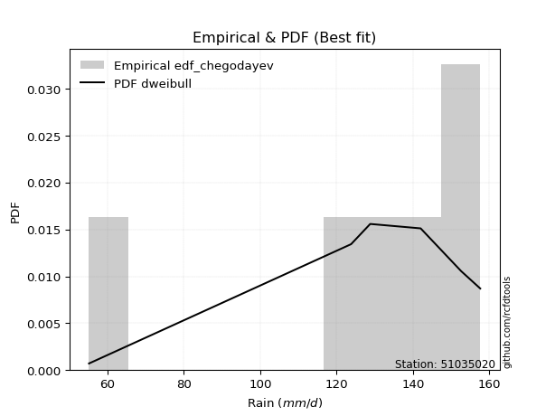</img>

</div>


### 6. EDF Blom (1958)

The Blom formula is a specific "plotting position" formula used in hydrology and statistical analysis to estimate the empirical cumulative probability (or non-exceedance probability) of a data series. It is particularly recommended for data that are approximately normally distributed. The constant _a_ is set to 0.375 (or 3/8).

<div align="center">


$P=(m-a)/(n+1-2a)$


</div>


**6.1. Empirical values**

<div align="center">

|                | 0                  | 1                  | 2                  | 3                 | 4                 | 5                  |
|:---------------|:-------------------|:-------------------|:-------------------|:------------------|:------------------|:-------------------|
| date           | 2023               | 2019               | 2025               | 2022              | 2020              | 2024               |
| x              | 55.2               | 123.8              | 128.8              | 142.0             | 152.6             | 157.6              |
| m              | 1                  | 2                  | 3                  | 4                 | 5                 | 6                  |
| empirical_dist | edf_blom           | edf_blom           | edf_blom           | edf_blom          | edf_blom          | edf_blom           |
| empirical      | 0.1                | 0.26               | 0.42               | 0.58              | 0.74              | 0.9                |
| empirical_tr   | 1.1111111111111112 | 1.3513513513513513 | 1.7241379310344827 | 2.380952380952381 | 3.846153846153846 | 10.000000000000002 |

</div>


**6.2. Kolmogorov-Smirnov fit test (sorted by Δ)**


<div align="center">

|                | 0                   | 1                   | 2                   | 3                   | 4                   | 5                   | 6                 | 7                   | 8                   | 9                   | 10                  | 11                | 12                  | 13                  | 14                 | 15                  | 16                | 17                  | 18                 | 19                  | 20                  | 21                  | 22                  | 23                  | 24                  | 25                 | 26                  | 27                 | 28                  | 29                 | 30                  | 31                 | 32                  | 33                  | 34                  | 35                  | 36                  | 37                 | 38                  | 39                 | 40                  | 41                  | 42                  | 43                  | 44                  | 45                  | 46                 | 47                  | 48                  | 49                  | 50                  | 51                  | 52                  | 53                  | 54                  | 55                 | 56                 | 57                 | 58                  | 59                 | 60                 | 61                 | 62                  | 63                  | 64                | 65                 | 66                 | 67                  | 68                 | 69                  | 70                 | 71                 | 72                 | 73                 | 74                  | 75                 | 76                 | 77                | 78                  | 79                 | 80                  | 81                 | 82                 | 83                  | 84                  | 85                  | 86                 | 87                  | 88                  | 89                 | 90                  | 91                  | 92                  | 93                  | 94                 | 95                  | 96                 | 97                  | 98                  | 99                  | 100                 | 101                | 102                 | 103                | 104               | 105                | 106                 | 107                | 108                | 109                 | 110                 | 111                | 112                | 113                | 114              | 115                 | 116            | 117                | 118                 | 119                | 120                 | 121            | 122                | 123                 | 124            | 125                 | 126                 | 127                | 128                 | 129                 | 130                | 131                 | 132                | 133                | 134                | 135                | 136                | 137                | 138                | 139                | 140                | 141                | 142               | 143                | 144                | 145                | 146                | 147                | 148                | 149                | 150                | 151                | 152                | 153                | 154            | 155            | 156            | 157            | 158               | 159               |
|:---------------|:--------------------|:--------------------|:--------------------|:--------------------|:--------------------|:--------------------|:------------------|:--------------------|:--------------------|:--------------------|:--------------------|:------------------|:--------------------|:--------------------|:-------------------|:--------------------|:------------------|:--------------------|:-------------------|:--------------------|:--------------------|:--------------------|:--------------------|:--------------------|:--------------------|:-------------------|:--------------------|:-------------------|:--------------------|:-------------------|:--------------------|:-------------------|:--------------------|:--------------------|:--------------------|:--------------------|:--------------------|:-------------------|:--------------------|:-------------------|:--------------------|:--------------------|:--------------------|:--------------------|:--------------------|:--------------------|:-------------------|:--------------------|:--------------------|:--------------------|:--------------------|:--------------------|:--------------------|:--------------------|:--------------------|:-------------------|:-------------------|:-------------------|:--------------------|:-------------------|:-------------------|:-------------------|:--------------------|:--------------------|:------------------|:-------------------|:-------------------|:--------------------|:-------------------|:--------------------|:-------------------|:-------------------|:-------------------|:-------------------|:--------------------|:-------------------|:-------------------|:------------------|:--------------------|:-------------------|:--------------------|:-------------------|:-------------------|:--------------------|:--------------------|:--------------------|:-------------------|:--------------------|:--------------------|:-------------------|:--------------------|:--------------------|:--------------------|:--------------------|:-------------------|:--------------------|:-------------------|:--------------------|:--------------------|:--------------------|:--------------------|:-------------------|:--------------------|:-------------------|:------------------|:-------------------|:--------------------|:-------------------|:-------------------|:--------------------|:--------------------|:-------------------|:-------------------|:-------------------|:-----------------|:--------------------|:---------------|:-------------------|:--------------------|:-------------------|:--------------------|:---------------|:-------------------|:--------------------|:---------------|:--------------------|:--------------------|:-------------------|:--------------------|:--------------------|:-------------------|:--------------------|:-------------------|:-------------------|:-------------------|:-------------------|:-------------------|:-------------------|:-------------------|:-------------------|:-------------------|:-------------------|:------------------|:-------------------|:-------------------|:-------------------|:-------------------|:-------------------|:-------------------|:-------------------|:-------------------|:-------------------|:-------------------|:-------------------|:---------------|:---------------|:---------------|:---------------|:------------------|:------------------|
| station        | 51035020            | 51035020            | 51035020            | 51035020            | 51035020            | 51035020            | 51035020          | 51035020            | 51035020            | 51035020            | 51035020            | 51035020          | 51035020            | 51035020            | 51035020           | 51035020            | 51035020          | 51035020            | 51035020           | 51035020            | 51035020            | 51035020            | 51035020            | 51035020            | 51035020            | 51035020           | 51035020            | 51035020           | 51035020            | 51035020           | 51035020            | 51035020           | 51035020            | 51035020            | 51035020            | 51035020            | 51035020            | 51035020           | 51035020            | 51035020           | 51035020            | 51035020            | 51035020            | 51035020            | 51035020            | 51035020            | 51035020           | 51035020            | 51035020            | 51035020            | 51035020            | 51035020            | 51035020            | 51035020            | 51035020            | 51035020           | 51035020           | 51035020           | 51035020            | 51035020           | 51035020           | 51035020           | 51035020            | 51035020            | 51035020          | 51035020           | 51035020           | 51035020            | 51035020           | 51035020            | 51035020           | 51035020           | 51035020           | 51035020           | 51035020            | 51035020           | 51035020           | 51035020          | 51035020            | 51035020           | 51035020            | 51035020           | 51035020           | 51035020            | 51035020            | 51035020            | 51035020           | 51035020            | 51035020            | 51035020           | 51035020            | 51035020            | 51035020            | 51035020            | 51035020           | 51035020            | 51035020           | 51035020            | 51035020            | 51035020            | 51035020            | 51035020           | 51035020            | 51035020           | 51035020          | 51035020           | 51035020            | 51035020           | 51035020           | 51035020            | 51035020            | 51035020           | 51035020           | 51035020           | 51035020         | 51035020            | 51035020       | 51035020           | 51035020            | 51035020           | 51035020            | 51035020       | 51035020           | 51035020            | 51035020       | 51035020            | 51035020            | 51035020           | 51035020            | 51035020            | 51035020           | 51035020            | 51035020           | 51035020           | 51035020           | 51035020           | 51035020           | 51035020           | 51035020           | 51035020           | 51035020           | 51035020           | 51035020          | 51035020           | 51035020           | 51035020           | 51035020           | 51035020           | 51035020           | 51035020           | 51035020           | 51035020           | 51035020           | 51035020           | 51035020       | 51035020       | 51035020       | 51035020       | 51035020          | 51035020          |
| empirical_dist | edf_blom            | edf_blom            | edf_blom            | edf_blom            | edf_blom            | edf_blom            | edf_blom          | edf_blom            | edf_blom            | edf_blom            | edf_blom            | edf_blom          | edf_blom            | edf_blom            | edf_blom           | edf_blom            | edf_blom          | edf_blom            | edf_blom           | edf_blom            | edf_blom            | edf_blom            | edf_blom            | edf_blom            | edf_blom            | edf_blom           | edf_blom            | edf_blom           | edf_blom            | edf_blom           | edf_blom            | edf_blom           | edf_blom            | edf_blom            | edf_blom            | edf_blom            | edf_blom            | edf_blom           | edf_blom            | edf_blom           | edf_blom            | edf_blom            | edf_blom            | edf_blom            | edf_blom            | edf_blom            | edf_blom           | edf_blom            | edf_blom            | edf_blom            | edf_blom            | edf_blom            | edf_blom            | edf_blom            | edf_blom            | edf_blom           | edf_blom           | edf_blom           | edf_blom            | edf_blom           | edf_blom           | edf_blom           | edf_blom            | edf_blom            | edf_blom          | edf_blom           | edf_blom           | edf_blom            | edf_blom           | edf_blom            | edf_blom           | edf_blom           | edf_blom           | edf_blom           | edf_blom            | edf_blom           | edf_blom           | edf_blom          | edf_blom            | edf_blom           | edf_blom            | edf_blom           | edf_blom           | edf_blom            | edf_blom            | edf_blom            | edf_blom           | edf_blom            | edf_blom            | edf_blom           | edf_blom            | edf_blom            | edf_blom            | edf_blom            | edf_blom           | edf_blom            | edf_blom           | edf_blom            | edf_blom            | edf_blom            | edf_blom            | edf_blom           | edf_blom            | edf_blom           | edf_blom          | edf_blom           | edf_blom            | edf_blom           | edf_blom           | edf_blom            | edf_blom            | edf_blom           | edf_blom           | edf_blom           | edf_blom         | edf_blom            | edf_blom       | edf_blom           | edf_blom            | edf_blom           | edf_blom            | edf_blom       | edf_blom           | edf_blom            | edf_blom       | edf_blom            | edf_blom            | edf_blom           | edf_blom            | edf_blom            | edf_blom           | edf_blom            | edf_blom           | edf_blom           | edf_blom           | edf_blom           | edf_blom           | edf_blom           | edf_blom           | edf_blom           | edf_blom           | edf_blom           | edf_blom          | edf_blom           | edf_blom           | edf_blom           | edf_blom           | edf_blom           | edf_blom           | edf_blom           | edf_blom           | edf_blom           | edf_blom           | edf_blom           | edf_blom       | edf_blom       | edf_blom       | edf_blom       | edf_blom          | edf_blom          |
| p_dist         | vonmises_line       | loggenextreme       | genextreme          | dweibull            | loglevy_l           | levy_l              | mielke            | argus               | pearson3            | logargus            | logmielke           | gumbel_l          | logt                | dgamma              | logvonmises_line   | logburr             | logloggamma       | logexponweib        | burr               | trapezoid           | logburr12           | logpearson3         | logweibull_min      | logbeta             | laplace             | hypsecant          | t                   | logistic           | skewnorm            | loggennorm         | loggumbel_l         | crystalball        | norm                | exponnorm           | nct                 | f                   | logloglaplace       | logdweibull        | beta                | logtrapezoid       | anglit              | gamma               | semicircular        | betaprime           | erlang              | arcsine             | genhalflogistic    | logweibull_max      | logdgamma           | invgamma            | alpha               | maxwell             | logexponpow         | invgauss            | gennorm             | rayleigh           | loginvweibull      | weibull_max        | loggenpareto        | logarcsine         | logtukeylambda     | logtruncnorm       | lognakagami         | nakagami            | ncf               | logsemicircular    | logjohnsonsu       | loganglit           | logbetaprime       | genpareto           | logfatiguelife     | logf               | logexponnorm       | lognorm            | logcrystalball      | logrice            | logncf             | gumbel_r          | lognct              | cosine             | loglogistic         | gausshyper         | loghypsecant       | logalpha            | triang              | halfnorm            | wrapcauchy         | johnsonsb           | kstwobign           | loginvgamma        | logerlang           | loglaplace          | loglaplace          | loginvgauss         | moyal              | logmaxwell          | halflogistic       | kappa3              | loggengamma         | lograyleigh         | logfoldnorm         | truncweibull_min   | logskewnorm         | gengamma           | logkstwobign      | loghalfnorm        | loggumbel_r         | loggenexpon        | logcosine          | logwrapcauchy       | lomax               | johnsonsu          | logmoyal           | loghalflogistic    | wald             | loggenhalflogistic  | ksone          | halfgennorm        | burr12              | loggompertz        | logtriang           | uniform        | kappa4             | loghalfgennorm      | foldnorm       | logjohnsonsb        | logwald             | invweibull         | logtruncweibull_min | logksone            | bradford           | truncexpon          | loggamma           | loggamma           | gompertz           | logkappa3          | loguniform         | logkappa4          | loggausshyper      | logrdist           | logbradford        | logtruncexpon      | truncnorm         | exponweib          | fatiguelife        | weibull_min        | powerlaw           | exponpow           | logpowerlaw        | truncpareto        | genexpon           | logtruncpareto     | loglomax           | rice               | genlogistic    | rdist          | tukeylambda    | loggenlogistic | logvonmises       | vonmises          |
| delta          | 0.09999999999540878 | 0.09999999999973752 | 0.09999999999992648 | 0.10191689021592487 | 0.10472687901824218 | 0.10785538243684323 | 0.110192557638354 | 0.11153784717122817 | 0.12085325903436739 | 0.13070932273661562 | 0.13231425232959482 | 0.135953037360106 | 0.13965855775400138 | 0.14547010213217754 | 0.1487136251691703 | 0.15001658976305893 | 0.150259062814387 | 0.15175534180009592 | 0.1539990666717186 | 0.15843204736384814 | 0.16766792181452117 | 0.16889356576961734 | 0.17153333018390793 | 0.18001725289713555 | 0.18398355361453056 | 0.1981120052642108 | 0.19819794616357356 | 0.2019752331879594 | 0.20305910789758863 | 0.2041980868580598 | 0.20489925180760205 | 0.2065207185179262 | 0.20652072767637147 | 0.20652210867529136 | 0.20652655082506371 | 0.20782108835872148 | 0.20784828311652281 | 0.2086385769027056 | 0.20900785746148465 | 0.2112245286307019 | 0.21129532173785592 | 0.21249736904844374 | 0.21326388630602822 | 0.21910814921376753 | 0.21976840854562746 | 0.22107794751041476 | 0.2300002156355373 | 0.23265306761843252 | 0.23323157742587308 | 0.23645747195867622 | 0.23794746130853328 | 0.24058709400991762 | 0.24537759472343168 | 0.24568912608449023 | 0.24869551785057178 | 0.2522370830620959 | 0.2538040074301433 | 0.2557031798254866 | 0.25735899038982724 | 0.2589102285321586 | 0.2599898847924911 | 0.2599975081622403 | 0.25999998811699715 | 0.25999999990997413 | 0.261070815368024 | 0.2667196693795624 | 0.2674720598504481 | 0.26868710386353467 | 0.2706913603625083 | 0.27211807618839967 | 0.2727669344190691 | 0.2732766094579968 | 0.2734575736349155 | 0.2734588003292453 | 0.27345880700804015 | 0.2734757266610952 | 0.2750737856199119 | 0.275078648521903 | 0.27648104020754305 | 0.2775576574261881 | 0.27800155047095987 | 0.2794257570387024 | 0.2818624687196737 | 0.28373265503000944 | 0.28437362404854283 | 0.28507957361164094 | 0.2882054798951039 | 0.28834913070729473 | 0.28985501039501504 | 0.2956564519122691 | 0.29583110605031826 | 0.29598411087495824 | 0.29598411087495824 | 0.29994582359569855 | 0.3007921005061802 | 0.30487181137427666 | 0.3076247125863474 | 0.30851499778097147 | 0.31462862354298005 | 0.31507998414105276 | 0.32803880970598054 | 0.3295734715295835 | 0.33110155015684306 | 0.3314867028323226 | 0.334175286948144 | 0.3438415461050066 | 0.34402685071406847 | 0.3446700472242945 | 0.3463852235889353 | 0.34804099329036053 | 0.35563975409365134 | 0.3572837023574972 | 0.3693381566112153 | 0.3705061224925803 | 0.37235770785683 | 0.37579777765497313 | 0.3816015625   | 0.3842522969411135 | 0.38596360326671564 | 0.3885832364049939 | 0.38967805796336097 | 0.409921875    | 0.4131380601663579 | 0.41902224729745896 | 0.42           | 0.42329873802014195 | 0.43959529764046346 | 0.4447986807910642 | 0.4604631387522141  | 0.46492020470981765 | 0.4799008904148079 | 0.48723842992607624 | 0.4892717215927651 | 0.4892717215927651 | 0.4943431421884887 | 0.5045048313479483 | 0.5099042456517815 | 0.5107048435764261 | 0.5346454097453869 | 0.5591561367312675 | 0.5665885770446776 | 0.5781862234735529 | 0.579999998977069 | 0.5824091780850357 | 0.6050159669449983 | 0.6491628674924441 | 0.6789452631827518 | 0.6870420210884989 | 0.6965470802480256 | 0.7054627418667815 | 0.7149715681189566 | 0.7173464574439821 | 0.7286491150272156 | 0.7399999999999957 | 0.74           | 0.74           | 0.74           | 0.74           | 1.260153419230283 | 25.08485458257133 |
| deltao         | 0.530385761606      | 0.530385761606      | 0.530385761606      | 0.530385761606      | 0.530385761606      | 0.530385761606      | 0.530385761606    | 0.530385761606      | 0.530385761606      | 0.530385761606      | 0.530385761606      | 0.530385761606    | 0.530385761606      | 0.530385761606      | 0.530385761606     | 0.530385761606      | 0.530385761606    | 0.530385761606      | 0.530385761606     | 0.530385761606      | 0.530385761606      | 0.530385761606      | 0.530385761606      | 0.530385761606      | 0.530385761606      | 0.530385761606     | 0.530385761606      | 0.530385761606     | 0.530385761606      | 0.530385761606     | 0.530385761606      | 0.530385761606     | 0.530385761606      | 0.530385761606      | 0.530385761606      | 0.530385761606      | 0.530385761606      | 0.530385761606     | 0.530385761606      | 0.530385761606     | 0.530385761606      | 0.530385761606      | 0.530385761606      | 0.530385761606      | 0.530385761606      | 0.530385761606      | 0.530385761606     | 0.530385761606      | 0.530385761606      | 0.530385761606      | 0.530385761606      | 0.530385761606      | 0.530385761606      | 0.530385761606      | 0.530385761606      | 0.530385761606     | 0.530385761606     | 0.530385761606     | 0.530385761606      | 0.530385761606     | 0.530385761606     | 0.530385761606     | 0.530385761606      | 0.530385761606      | 0.530385761606    | 0.530385761606     | 0.530385761606     | 0.530385761606      | 0.530385761606     | 0.530385761606      | 0.530385761606     | 0.530385761606     | 0.530385761606     | 0.530385761606     | 0.530385761606      | 0.530385761606     | 0.530385761606     | 0.530385761606    | 0.530385761606      | 0.530385761606     | 0.530385761606      | 0.530385761606     | 0.530385761606     | 0.530385761606      | 0.530385761606      | 0.530385761606      | 0.530385761606     | 0.530385761606      | 0.530385761606      | 0.530385761606     | 0.530385761606      | 0.530385761606      | 0.530385761606      | 0.530385761606      | 0.530385761606     | 0.530385761606      | 0.530385761606     | 0.530385761606      | 0.530385761606      | 0.530385761606      | 0.530385761606      | 0.530385761606     | 0.530385761606      | 0.530385761606     | 0.530385761606    | 0.530385761606     | 0.530385761606      | 0.530385761606     | 0.530385761606     | 0.530385761606      | 0.530385761606      | 0.530385761606     | 0.530385761606     | 0.530385761606     | 0.530385761606   | 0.530385761606      | 0.530385761606 | 0.530385761606     | 0.530385761606      | 0.530385761606     | 0.530385761606      | 0.530385761606 | 0.530385761606     | 0.530385761606      | 0.530385761606 | 0.530385761606      | 0.530385761606      | 0.530385761606     | 0.530385761606      | 0.530385761606      | 0.530385761606     | 0.530385761606      | 0.530385761606     | 0.530385761606     | 0.530385761606     | 0.530385761606     | 0.530385761606     | 0.530385761606     | 0.530385761606     | 0.530385761606     | 0.530385761606     | 0.530385761606     | 0.530385761606    | 0.530385761606     | 0.530385761606     | 0.530385761606     | 0.530385761606     | 0.530385761606     | 0.530385761606     | 0.530385761606     | 0.530385761606     | 0.530385761606     | 0.530385761606     | 0.530385761606     | 0.530385761606 | 0.530385761606 | 0.530385761606 | 0.530385761606 | 0.530385761606    | 0.530385761606    |
| eval           | Δo > Δ              | Δo > Δ              | Δo > Δ              | Δo > Δ              | Δo > Δ              | Δo > Δ              | Δo > Δ            | Δo > Δ              | Δo > Δ              | Δo > Δ              | Δo > Δ              | Δo > Δ            | Δo > Δ              | Δo > Δ              | Δo > Δ             | Δo > Δ              | Δo > Δ            | Δo > Δ              | Δo > Δ             | Δo > Δ              | Δo > Δ              | Δo > Δ              | Δo > Δ              | Δo > Δ              | Δo > Δ              | Δo > Δ             | Δo > Δ              | Δo > Δ             | Δo > Δ              | Δo > Δ             | Δo > Δ              | Δo > Δ             | Δo > Δ              | Δo > Δ              | Δo > Δ              | Δo > Δ              | Δo > Δ              | Δo > Δ             | Δo > Δ              | Δo > Δ             | Δo > Δ              | Δo > Δ              | Δo > Δ              | Δo > Δ              | Δo > Δ              | Δo > Δ              | Δo > Δ             | Δo > Δ              | Δo > Δ              | Δo > Δ              | Δo > Δ              | Δo > Δ              | Δo > Δ              | Δo > Δ              | Δo > Δ              | Δo > Δ             | Δo > Δ             | Δo > Δ             | Δo > Δ              | Δo > Δ             | Δo > Δ             | Δo > Δ             | Δo > Δ              | Δo > Δ              | Δo > Δ            | Δo > Δ             | Δo > Δ             | Δo > Δ              | Δo > Δ             | Δo > Δ              | Δo > Δ             | Δo > Δ             | Δo > Δ             | Δo > Δ             | Δo > Δ              | Δo > Δ             | Δo > Δ             | Δo > Δ            | Δo > Δ              | Δo > Δ             | Δo > Δ              | Δo > Δ             | Δo > Δ             | Δo > Δ              | Δo > Δ              | Δo > Δ              | Δo > Δ             | Δo > Δ              | Δo > Δ              | Δo > Δ             | Δo > Δ              | Δo > Δ              | Δo > Δ              | Δo > Δ              | Δo > Δ             | Δo > Δ              | Δo > Δ             | Δo > Δ              | Δo > Δ              | Δo > Δ              | Δo > Δ              | Δo > Δ             | Δo > Δ              | Δo > Δ             | Δo > Δ            | Δo > Δ             | Δo > Δ              | Δo > Δ             | Δo > Δ             | Δo > Δ              | Δo > Δ              | Δo > Δ             | Δo > Δ             | Δo > Δ             | Δo > Δ           | Δo > Δ              | Δo > Δ         | Δo > Δ             | Δo > Δ              | Δo > Δ             | Δo > Δ              | Δo > Δ         | Δo > Δ             | Δo > Δ              | Δo > Δ         | Δo > Δ              | Δo > Δ              | Δo > Δ             | Δo > Δ              | Δo > Δ              | Δo > Δ             | Δo > Δ              | Δo > Δ             | Δo > Δ             | Δo > Δ             | Δo > Δ             | Δo > Δ             | Δo > Δ             | Δo <= Δ            | Δo <= Δ            | Δo <= Δ            | Δo <= Δ            | Δo <= Δ           | Δo <= Δ            | Δo <= Δ            | Δo <= Δ            | Δo <= Δ            | Δo <= Δ            | Δo <= Δ            | Δo <= Δ            | Δo <= Δ            | Δo <= Δ            | Δo <= Δ            | Δo <= Δ            | Δo <= Δ        | Δo <= Δ        | Δo <= Δ        | Δo <= Δ        | Δo <= Δ           | Δo <= Δ           |
| fit            | 1                   | 1                   | 1                   | 1                   | 1                   | 1                   | 1                 | 1                   | 1                   | 1                   | 1                   | 1                 | 1                   | 1                   | 1                  | 1                   | 1                 | 1                   | 1                  | 1                   | 1                   | 1                   | 1                   | 1                   | 1                   | 1                  | 1                   | 1                  | 1                   | 1                  | 1                   | 1                  | 1                   | 1                   | 1                   | 1                   | 1                   | 1                  | 1                   | 1                  | 1                   | 1                   | 1                   | 1                   | 1                   | 1                   | 1                  | 1                   | 1                   | 1                   | 1                   | 1                   | 1                   | 1                   | 1                   | 1                  | 1                  | 1                  | 1                   | 1                  | 1                  | 1                  | 1                   | 1                   | 1                 | 1                  | 1                  | 1                   | 1                  | 1                   | 1                  | 1                  | 1                  | 1                  | 1                   | 1                  | 1                  | 1                 | 1                   | 1                  | 1                   | 1                  | 1                  | 1                   | 1                   | 1                   | 1                  | 1                   | 1                   | 1                  | 1                   | 1                   | 1                   | 1                   | 1                  | 1                   | 1                  | 1                   | 1                   | 1                   | 1                   | 1                  | 1                   | 1                  | 1                 | 1                  | 1                   | 1                  | 1                  | 1                   | 1                   | 1                  | 1                  | 1                  | 1                | 1                   | 1              | 1                  | 1                   | 1                  | 1                   | 1              | 1                  | 1                   | 1              | 1                   | 1                   | 1                  | 1                   | 1                   | 1                  | 1                   | 1                  | 1                  | 1                  | 1                  | 1                  | 1                  | 0                  | 0                  | 0                  | 0                  | 0                 | 0                  | 0                  | 0                  | 0                  | 0                  | 0                  | 0                  | 0                  | 0                  | 0                  | 0                  | 0              | 0              | 0              | 0              | 0                 | 0                 |
| n              | 6                   | 6                   | 6                   | 6                   | 6                   | 6                   | 6                 | 6                   | 6                   | 6                   | 6                   | 6                 | 6                   | 6                   | 6                  | 6                   | 6                 | 6                   | 6                  | 6                   | 6                   | 6                   | 6                   | 6                   | 6                   | 6                  | 6                   | 6                  | 6                   | 6                  | 6                   | 6                  | 6                   | 6                   | 6                   | 6                   | 6                   | 6                  | 6                   | 6                  | 6                   | 6                   | 6                   | 6                   | 6                   | 6                   | 6                  | 6                   | 6                   | 6                   | 6                   | 6                   | 6                   | 6                   | 6                   | 6                  | 6                  | 6                  | 6                   | 6                  | 6                  | 6                  | 6                   | 6                   | 6                 | 6                  | 6                  | 6                   | 6                  | 6                   | 6                  | 6                  | 6                  | 6                  | 6                   | 6                  | 6                  | 6                 | 6                   | 6                  | 6                   | 6                  | 6                  | 6                   | 6                   | 6                   | 6                  | 6                   | 6                   | 6                  | 6                   | 6                   | 6                   | 6                   | 6                  | 6                   | 6                  | 6                   | 6                   | 6                   | 6                   | 6                  | 6                   | 6                  | 6                 | 6                  | 6                   | 6                  | 6                  | 6                   | 6                   | 6                  | 6                  | 6                  | 6                | 6                   | 6              | 6                  | 6                   | 6                  | 6                   | 6              | 6                  | 6                   | 6              | 6                   | 6                   | 6                  | 6                   | 6                   | 6                  | 6                   | 6                  | 6                  | 6                  | 6                  | 6                  | 6                  | 6                  | 6                  | 6                  | 6                  | 6                 | 6                  | 6                  | 6                  | 6                  | 6                  | 6                  | 6                  | 6                  | 6                  | 6                  | 6                  | 6              | 6              | 6              | 6              | 6                 | 6                 |
| best_fit       | 1                   | 0                   | 0                   | 0                   | 0                   | 0                   | 0                 | 0                   | 0                   | 0                   | 0                   | 0                 | 0                   | 0                   | 0                  | 0                   | 0                 | 0                   | 0                  | 0                   | 0                   | 0                   | 0                   | 0                   | 0                   | 0                  | 0                   | 0                  | 0                   | 0                  | 0                   | 0                  | 0                   | 0                   | 0                   | 0                   | 0                   | 0                  | 0                   | 0                  | 0                   | 0                   | 0                   | 0                   | 0                   | 0                   | 0                  | 0                   | 0                   | 0                   | 0                   | 0                   | 0                   | 0                   | 0                   | 0                  | 0                  | 0                  | 0                   | 0                  | 0                  | 0                  | 0                   | 0                   | 0                 | 0                  | 0                  | 0                   | 0                  | 0                   | 0                  | 0                  | 0                  | 0                  | 0                   | 0                  | 0                  | 0                 | 0                   | 0                  | 0                   | 0                  | 0                  | 0                   | 0                   | 0                   | 0                  | 0                   | 0                   | 0                  | 0                   | 0                   | 0                   | 0                   | 0                  | 0                   | 0                  | 0                   | 0                   | 0                   | 0                   | 0                  | 0                   | 0                  | 0                 | 0                  | 0                   | 0                  | 0                  | 0                   | 0                   | 0                  | 0                  | 0                  | 0                | 0                   | 0              | 0                  | 0                   | 0                  | 0                   | 0              | 0                  | 0                   | 0              | 0                   | 0                   | 0                  | 0                   | 0                   | 0                  | 0                   | 0                  | 0                  | 0                  | 0                  | 0                  | 0                  | 0                  | 0                  | 0                  | 0                  | 0                 | 0                  | 0                  | 0                  | 0                  | 0                  | 0                  | 0                  | 0                  | 0                  | 0                  | 0                  | 0              | 0              | 0              | 0              | 0                 | 0                 |
| best_fit_sort  | 1                   | 2                   | 3                   | 4                   | 5                   | 6                   | 7                 | 8                   | 9                   | 10                  | 11                  | 12                | 13                  | 14                  | 15                 | 16                  | 17                | 18                  | 19                 | 20                  | 21                  | 22                  | 23                  | 24                  | 25                  | 26                 | 27                  | 28                 | 29                  | 30                 | 31                  | 32                 | 33                  | 34                  | 35                  | 36                  | 37                  | 38                 | 39                  | 40                 | 41                  | 42                  | 43                  | 44                  | 45                  | 46                  | 47                 | 48                  | 49                  | 50                  | 51                  | 52                  | 53                  | 54                  | 55                  | 56                 | 57                 | 58                 | 59                  | 60                 | 61                 | 62                 | 63                  | 64                  | 65                | 66                 | 67                 | 68                  | 69                 | 70                  | 71                 | 72                 | 73                 | 74                 | 75                  | 76                 | 77                 | 78                | 79                  | 80                 | 81                  | 82                 | 83                 | 84                  | 85                  | 86                  | 87                 | 88                  | 89                  | 90                 | 91                  | 92                  | 93                  | 94                  | 95                 | 96                  | 97                 | 98                  | 99                  | 100                 | 101                 | 102                | 103                 | 104                | 105               | 106                | 107                 | 108                | 109                | 110                 | 111                 | 112                | 113                | 114                | 115              | 116                 | 117            | 118                | 119                 | 120                | 121                 | 122            | 123                | 124                 | 125            | 126                 | 127                 | 128                | 129                 | 130                 | 131                | 132                 | 133                | 134                | 135                | 136                | 137                | 138                | 139                | 140                | 141                | 142                | 143               | 144                | 145                | 146                | 147                | 148                | 149                | 150                | 151                | 152                | 153                | 154                | 155            | 156            | 157            | 158            | 159               | 160               |

</div>


**6.3. Best fit**

<div align="center">

|   id |   station | empirical_dist   | p_dist        |   delta |   deltao | eval   |   fit |   n |   best_fit |   best_fit_sort |
|-----:|----------:|:-----------------|:--------------|--------:|---------:|:-------|------:|----:|-----------:|----------------:|
|    0 |  51035020 | edf_blom         | vonmises_line |     0.1 | 0.530386 | Δo > Δ |     1 |   6 |          1 |               1 |

</div>


<div align="center">

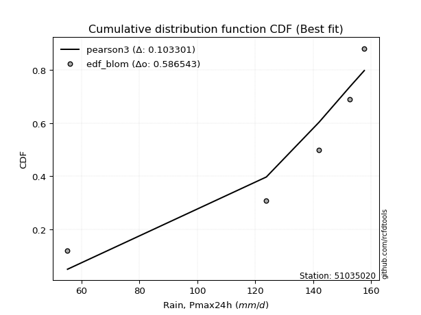</img></img>

</div>


### 7. EDF Tukey (1962)

In hydrology, the Tukey formula is used as a plotting position formula to estimate the empirical probability or frequency of a flood event (or other hydrological data). The formula parameter is given as _c=0.333_ (or 1/3).

<div align="center">


$P=(m-c)/(n+1-2c)$


</div>


**7.1. Empirical values**

<div align="center">

|                | 0                   | 1                  | 2                   | 3                  | 4                  | 5                  |
|:---------------|:--------------------|:-------------------|:--------------------|:-------------------|:-------------------|:-------------------|
| date           | 2023                | 2019               | 2025                | 2022               | 2020               | 2024               |
| x              | 55.2                | 123.8              | 128.8               | 142.0              | 152.6              | 157.6              |
| m              | 1                   | 2                  | 3                   | 4                  | 5                  | 6                  |
| empirical_dist | edf_tukey           | edf_tukey          | edf_tukey           | edf_tukey          | edf_tukey          | edf_tukey          |
| empirical      | 0.10526315789473684 | 0.2631578947368421 | 0.42105263157894735 | 0.5789473684210527 | 0.7368421052631579 | 0.8947368421052632 |
| empirical_tr   | 1.1176470588235294  | 1.357142857142857  | 1.7272727272727273  | 2.375              | 3.7999999999999994 | 9.5                |

</div>


**7.2. Kolmogorov-Smirnov fit test (sorted by Δ)**


<div align="center">

|                | 0                   | 1                   | 2                  | 3                   | 4                   | 5                   | 6                   | 7                  | 8                  | 9                   | 10                  | 11                  | 12                  | 13                  | 14                  | 15                  | 16                  | 17                 | 18                  | 19                  | 20                 | 21                  | 22                  | 23                  | 24                  | 25                  | 26                  | 27                  | 28                  | 29                  | 30                  | 31                 | 32                 | 33                  | 34                  | 35                  | 36                 | 37                  | 38                 | 39                  | 40                  | 41                  | 42                  | 43                  | 44                  | 45                  | 46                  | 47                  | 48                  | 49                  | 50                 | 51                  | 52                 | 53                  | 54                  | 55                  | 56                  | 57                 | 58                  | 59                  | 60                  | 61                 | 62                  | 63                 | 64                  | 65                 | 66                 | 67                 | 68                 | 69                 | 70                | 71                  | 72                  | 73                 | 74                  | 75                 | 76                  | 77                 | 78                  | 79                | 80                 | 81                  | 82                 | 83                  | 84                  | 85                  | 86                  | 87                  | 88                  | 89                | 90                 | 91                  | 92                  | 93                  | 94                  | 95                 | 96                 | 97                 | 98                  | 99                 | 100                 | 101                | 102               | 103                 | 104                 | 105                 | 106                | 107                | 108                | 109                 | 110                 | 111                 | 112                | 113                | 114                | 115                 | 116                | 117                 | 118                 | 119                 | 120                | 121                | 122                | 123                | 124                | 125                 | 126                | 127                 | 128                 | 129                 | 130                | 131                 | 132               | 133               | 134                | 135                | 136                | 137                | 138                | 139                | 140                | 141                | 142                | 143                | 144                | 145                | 146                | 147                | 148                | 149                | 150                | 151              | 152                | 153                | 154                | 155                | 156               | 157               | 158               | 159                |
|:---------------|:--------------------|:--------------------|:-------------------|:--------------------|:--------------------|:--------------------|:--------------------|:-------------------|:-------------------|:--------------------|:--------------------|:--------------------|:--------------------|:--------------------|:--------------------|:--------------------|:--------------------|:-------------------|:--------------------|:--------------------|:-------------------|:--------------------|:--------------------|:--------------------|:--------------------|:--------------------|:--------------------|:--------------------|:--------------------|:--------------------|:--------------------|:-------------------|:-------------------|:--------------------|:--------------------|:--------------------|:-------------------|:--------------------|:-------------------|:--------------------|:--------------------|:--------------------|:--------------------|:--------------------|:--------------------|:--------------------|:--------------------|:--------------------|:--------------------|:--------------------|:-------------------|:--------------------|:-------------------|:--------------------|:--------------------|:--------------------|:--------------------|:-------------------|:--------------------|:--------------------|:--------------------|:-------------------|:--------------------|:-------------------|:--------------------|:-------------------|:-------------------|:-------------------|:-------------------|:-------------------|:------------------|:--------------------|:--------------------|:-------------------|:--------------------|:-------------------|:--------------------|:-------------------|:--------------------|:------------------|:-------------------|:--------------------|:-------------------|:--------------------|:--------------------|:--------------------|:--------------------|:--------------------|:--------------------|:------------------|:-------------------|:--------------------|:--------------------|:--------------------|:--------------------|:-------------------|:-------------------|:-------------------|:--------------------|:-------------------|:--------------------|:-------------------|:------------------|:--------------------|:--------------------|:--------------------|:-------------------|:-------------------|:-------------------|:--------------------|:--------------------|:--------------------|:-------------------|:-------------------|:-------------------|:--------------------|:-------------------|:--------------------|:--------------------|:--------------------|:-------------------|:-------------------|:-------------------|:-------------------|:-------------------|:--------------------|:-------------------|:--------------------|:--------------------|:--------------------|:-------------------|:--------------------|:------------------|:------------------|:-------------------|:-------------------|:-------------------|:-------------------|:-------------------|:-------------------|:-------------------|:-------------------|:-------------------|:-------------------|:-------------------|:-------------------|:-------------------|:-------------------|:-------------------|:-------------------|:-------------------|:-----------------|:-------------------|:-------------------|:-------------------|:-------------------|:------------------|:------------------|:------------------|:-------------------|
| station        | 51035020            | 51035020            | 51035020           | 51035020            | 51035020            | 51035020            | 51035020            | 51035020           | 51035020           | 51035020            | 51035020            | 51035020            | 51035020            | 51035020            | 51035020            | 51035020            | 51035020            | 51035020           | 51035020            | 51035020            | 51035020           | 51035020            | 51035020            | 51035020            | 51035020            | 51035020            | 51035020            | 51035020            | 51035020            | 51035020            | 51035020            | 51035020           | 51035020           | 51035020            | 51035020            | 51035020            | 51035020           | 51035020            | 51035020           | 51035020            | 51035020            | 51035020            | 51035020            | 51035020            | 51035020            | 51035020            | 51035020            | 51035020            | 51035020            | 51035020            | 51035020           | 51035020            | 51035020           | 51035020            | 51035020            | 51035020            | 51035020            | 51035020           | 51035020            | 51035020            | 51035020            | 51035020           | 51035020            | 51035020           | 51035020            | 51035020           | 51035020           | 51035020           | 51035020           | 51035020           | 51035020          | 51035020            | 51035020            | 51035020           | 51035020            | 51035020           | 51035020            | 51035020           | 51035020            | 51035020          | 51035020           | 51035020            | 51035020           | 51035020            | 51035020            | 51035020            | 51035020            | 51035020            | 51035020            | 51035020          | 51035020           | 51035020            | 51035020            | 51035020            | 51035020            | 51035020           | 51035020           | 51035020           | 51035020            | 51035020           | 51035020            | 51035020           | 51035020          | 51035020            | 51035020            | 51035020            | 51035020           | 51035020           | 51035020           | 51035020            | 51035020            | 51035020            | 51035020           | 51035020           | 51035020           | 51035020            | 51035020           | 51035020            | 51035020            | 51035020            | 51035020           | 51035020           | 51035020           | 51035020           | 51035020           | 51035020            | 51035020           | 51035020            | 51035020            | 51035020            | 51035020           | 51035020            | 51035020          | 51035020          | 51035020           | 51035020           | 51035020           | 51035020           | 51035020           | 51035020           | 51035020           | 51035020           | 51035020           | 51035020           | 51035020           | 51035020           | 51035020           | 51035020           | 51035020           | 51035020           | 51035020           | 51035020         | 51035020           | 51035020           | 51035020           | 51035020           | 51035020          | 51035020          | 51035020          | 51035020           |
| empirical_dist | edf_tukey           | edf_tukey           | edf_tukey          | edf_tukey           | edf_tukey           | edf_tukey           | edf_tukey           | edf_tukey          | edf_tukey          | edf_tukey           | edf_tukey           | edf_tukey           | edf_tukey           | edf_tukey           | edf_tukey           | edf_tukey           | edf_tukey           | edf_tukey          | edf_tukey           | edf_tukey           | edf_tukey          | edf_tukey           | edf_tukey           | edf_tukey           | edf_tukey           | edf_tukey           | edf_tukey           | edf_tukey           | edf_tukey           | edf_tukey           | edf_tukey           | edf_tukey          | edf_tukey          | edf_tukey           | edf_tukey           | edf_tukey           | edf_tukey          | edf_tukey           | edf_tukey          | edf_tukey           | edf_tukey           | edf_tukey           | edf_tukey           | edf_tukey           | edf_tukey           | edf_tukey           | edf_tukey           | edf_tukey           | edf_tukey           | edf_tukey           | edf_tukey          | edf_tukey           | edf_tukey          | edf_tukey           | edf_tukey           | edf_tukey           | edf_tukey           | edf_tukey          | edf_tukey           | edf_tukey           | edf_tukey           | edf_tukey          | edf_tukey           | edf_tukey          | edf_tukey           | edf_tukey          | edf_tukey          | edf_tukey          | edf_tukey          | edf_tukey          | edf_tukey         | edf_tukey           | edf_tukey           | edf_tukey          | edf_tukey           | edf_tukey          | edf_tukey           | edf_tukey          | edf_tukey           | edf_tukey         | edf_tukey          | edf_tukey           | edf_tukey          | edf_tukey           | edf_tukey           | edf_tukey           | edf_tukey           | edf_tukey           | edf_tukey           | edf_tukey         | edf_tukey          | edf_tukey           | edf_tukey           | edf_tukey           | edf_tukey           | edf_tukey          | edf_tukey          | edf_tukey          | edf_tukey           | edf_tukey          | edf_tukey           | edf_tukey          | edf_tukey         | edf_tukey           | edf_tukey           | edf_tukey           | edf_tukey          | edf_tukey          | edf_tukey          | edf_tukey           | edf_tukey           | edf_tukey           | edf_tukey          | edf_tukey          | edf_tukey          | edf_tukey           | edf_tukey          | edf_tukey           | edf_tukey           | edf_tukey           | edf_tukey          | edf_tukey          | edf_tukey          | edf_tukey          | edf_tukey          | edf_tukey           | edf_tukey          | edf_tukey           | edf_tukey           | edf_tukey           | edf_tukey          | edf_tukey           | edf_tukey         | edf_tukey         | edf_tukey          | edf_tukey          | edf_tukey          | edf_tukey          | edf_tukey          | edf_tukey          | edf_tukey          | edf_tukey          | edf_tukey          | edf_tukey          | edf_tukey          | edf_tukey          | edf_tukey          | edf_tukey          | edf_tukey          | edf_tukey          | edf_tukey          | edf_tukey        | edf_tukey          | edf_tukey          | edf_tukey          | edf_tukey          | edf_tukey         | edf_tukey         | edf_tukey         | edf_tukey          |
| p_dist         | dweibull            | loglevy_l           | vonmises_line      | loggenextreme       | genextreme          | levy_l              | mielke              | argus              | pearson3           | logmielke           | gumbel_l            | logargus            | logt                | dgamma              | logvonmises_line    | logburr             | logexponweib        | burr               | logloggamma         | trapezoid           | logburr12          | logpearson3         | logweibull_min      | logbeta             | laplace             | hypsecant           | t                   | logistic            | skewnorm            | loggumbel_l         | logloglaplace       | crystalball        | norm               | exponnorm           | nct                 | logdweibull         | f                  | loggennorm          | beta               | logtrapezoid        | anglit              | gamma               | semicircular        | betaprime           | erlang              | arcsine             | genhalflogistic     | logweibull_max      | invgamma            | logdgamma           | alpha              | maxwell             | logexponpow        | invgauss            | loginvweibull       | rayleigh            | gennorm             | weibull_max        | loggenpareto        | logarcsine          | ncf                 | logjohnsonsu       | logtukeylambda      | logtruncnorm       | lognakagami         | nakagami           | logsemicircular    | loganglit          | logbetaprime       | genpareto          | logfatiguelife    | logf                | logexponnorm        | lognorm            | logcrystalball      | logrice            | logncf              | gumbel_r           | lognct              | cosine            | loglogistic        | gausshyper          | loghypsecant       | logalpha            | triang              | halfnorm            | johnsonsb           | wrapcauchy          | kstwobign           | loginvgamma       | logerlang          | loglaplace          | loglaplace          | loginvgauss         | moyal               | logmaxwell         | halflogistic       | kappa3             | loggengamma         | lograyleigh        | logfoldnorm         | truncweibull_min   | logskewnorm       | gengamma            | logkstwobign        | loghalfnorm         | loggumbel_r        | loggenexpon        | logcosine          | logwrapcauchy       | lomax               | johnsonsu           | logmoyal           | loghalflogistic    | wald               | loggenhalflogistic  | ksone              | halfgennorm         | burr12              | loggompertz         | logtriang          | uniform            | kappa4             | loghalfgennorm     | logjohnsonsb       | foldnorm            | logwald            | invweibull          | logtruncweibull_min | logksone            | bradford           | truncexpon          | loggamma          | loggamma          | gompertz           | logkappa3          | loguniform         | logkappa4          | loggausshyper      | logrdist           | logbradford        | logtruncexpon      | truncnorm          | exponweib          | fatiguelife        | weibull_min        | powerlaw           | exponpow           | logpowerlaw        | truncpareto        | genexpon           | logtruncpareto   | loglomax           | rice               | genlogistic        | loggenlogistic     | rdist             | tukeylambda       | logvonmises       | vonmises           |
| delta          | 0.09665373232118801 | 0.10367424743929488 | 0.1052631578901456 | 0.10526315789447438 | 0.10526315789466334 | 0.10680275085789592 | 0.11335045237519614 | 0.1146957419080703 | 0.1176953642975253 | 0.12915635759275274 | 0.13279514262326392 | 0.13386721747345776 | 0.14071118933294874 | 0.14231220739533545 | 0.14345046727443345 | 0.14685869502621685 | 0.14859744706325384 | 0.1508411719348765 | 0.15090299205432078 | 0.15527415262700606 | 0.1645100270776791 | 0.16573567103277526 | 0.16837543544706585 | 0.17685935816029347 | 0.18082565887768848 | 0.19495411052736872 | 0.19504005142673148 | 0.19881733845111732 | 0.19990121316074655 | 0.20174135707075996 | 0.20258512522178596 | 0.2033628237810841 | 0.2033628329395294 | 0.20336421393844928 | 0.20336865608822163 | 0.20337541900796874 | 0.2046631936218794 | 0.20525071843700715 | 0.2058499627246425 | 0.20806663389385982 | 0.20813742700101384 | 0.20933947431160166 | 0.21010599156918613 | 0.21595025447692545 | 0.21661051380878538 | 0.21792005277357268 | 0.22684232089869522 | 0.22949517288159044 | 0.23329957722183414 | 0.23428420900482044 | 0.2347895665716912 | 0.23742919927307554 | 0.2422196999865896 | 0.24253123134764815 | 0.24854084953540645 | 0.24907918832525383 | 0.24974814942951915 | 0.2525452850886445 | 0.25420109565298515 | 0.25575233379531653 | 0.25791292063118193 | 0.2622089019557112 | 0.26314777952933316 | 0.2631554028990824 | 0.26315788285383923 | 0.2631578946468162 | 0.2635617746427203 | 0.2655292091266926 | 0.2675334656256662 | 0.2689601814515576 | 0.269609039682227 | 0.27011871472115473 | 0.27029967889807344 | 0.2703009055924032 | 0.27030091227119807 | 0.2703178319242531 | 0.27191589088306983 | 0.2719207537850609 | 0.27332314547070097 | 0.274399762689346 | 0.2748436557341178 | 0.27626786230186035 | 0.2787045739828316 | 0.28057476029316736 | 0.28121572931170075 | 0.28192167887479885 | 0.28308597281255793 | 0.28504758515826184 | 0.28669711565817296 | 0.292498557175427 | 0.2926732113134762 | 0.29282621613811616 | 0.29282621613811616 | 0.29678792885885646 | 0.29763420576933813 | 0.3017139166374346 | 0.3044668178495053 | 0.3053571030441294 | 0.31147072880613796 | 0.3119220894042107 | 0.32488091496913846 | 0.3264155767927414 | 0.327943655420001 | 0.32832880809548054 | 0.33101739221130194 | 0.34068365136816453 | 0.3408689559772264 | 0.3415121524874524 | 0.3432273288520932 | 0.34488309855351845 | 0.35248185935680926 | 0.35412580762065504 | 0.3661802618743732 | 0.3673482277557382 | 0.3691998131199879 | 0.37263988291813105 | 0.3784436677631579 | 0.38109440220427143 | 0.38280570852987356 | 0.38542534166815184 | 0.3865201632265189 | 0.4067639802631579 | 0.4099801654295158 | 0.4158643525606169 | 0.4201408432832998 | 0.42105263157894735 | 0.4364374029036214 | 0.43953552289632736 | 0.45730524401537204 | 0.46176230997297557 | 0.4767429956779658 | 0.48408053518923416 | 0.486113826855923 | 0.486113826855923 | 0.4932905106095414 | 0.5013469366111063 | 0.5067463509149395 | 0.5075469488395841 | 0.5314875150085447 | 0.5538929788365307 | 0.5634306823078354 | 0.5750283287367108 | 0.5789473673981216 | 0.5792512833481935 | 0.6018580722081561 | 0.6460049727556021 | 0.6757873684459097 | 0.6838841263516569 | 0.6933891855111836 | 0.7023048471299393 | 0.7118136733821145 | 0.71418856270714 | 0.7233859571324788 | 0.7368421052631535 | 0.7368421052631579 | 0.7368421052631579 | 0.736842105263158 | 0.736842105263158 | 1.256995524493441 | 25.090117740466066 |
| deltao         | 0.530385761606      | 0.530385761606      | 0.530385761606     | 0.530385761606      | 0.530385761606      | 0.530385761606      | 0.530385761606      | 0.530385761606     | 0.530385761606     | 0.530385761606      | 0.530385761606      | 0.530385761606      | 0.530385761606      | 0.530385761606      | 0.530385761606      | 0.530385761606      | 0.530385761606      | 0.530385761606     | 0.530385761606      | 0.530385761606      | 0.530385761606     | 0.530385761606      | 0.530385761606      | 0.530385761606      | 0.530385761606      | 0.530385761606      | 0.530385761606      | 0.530385761606      | 0.530385761606      | 0.530385761606      | 0.530385761606      | 0.530385761606     | 0.530385761606     | 0.530385761606      | 0.530385761606      | 0.530385761606      | 0.530385761606     | 0.530385761606      | 0.530385761606     | 0.530385761606      | 0.530385761606      | 0.530385761606      | 0.530385761606      | 0.530385761606      | 0.530385761606      | 0.530385761606      | 0.530385761606      | 0.530385761606      | 0.530385761606      | 0.530385761606      | 0.530385761606     | 0.530385761606      | 0.530385761606     | 0.530385761606      | 0.530385761606      | 0.530385761606      | 0.530385761606      | 0.530385761606     | 0.530385761606      | 0.530385761606      | 0.530385761606      | 0.530385761606     | 0.530385761606      | 0.530385761606     | 0.530385761606      | 0.530385761606     | 0.530385761606     | 0.530385761606     | 0.530385761606     | 0.530385761606     | 0.530385761606    | 0.530385761606      | 0.530385761606      | 0.530385761606     | 0.530385761606      | 0.530385761606     | 0.530385761606      | 0.530385761606     | 0.530385761606      | 0.530385761606    | 0.530385761606     | 0.530385761606      | 0.530385761606     | 0.530385761606      | 0.530385761606      | 0.530385761606      | 0.530385761606      | 0.530385761606      | 0.530385761606      | 0.530385761606    | 0.530385761606     | 0.530385761606      | 0.530385761606      | 0.530385761606      | 0.530385761606      | 0.530385761606     | 0.530385761606     | 0.530385761606     | 0.530385761606      | 0.530385761606     | 0.530385761606      | 0.530385761606     | 0.530385761606    | 0.530385761606      | 0.530385761606      | 0.530385761606      | 0.530385761606     | 0.530385761606     | 0.530385761606     | 0.530385761606      | 0.530385761606      | 0.530385761606      | 0.530385761606     | 0.530385761606     | 0.530385761606     | 0.530385761606      | 0.530385761606     | 0.530385761606      | 0.530385761606      | 0.530385761606      | 0.530385761606     | 0.530385761606     | 0.530385761606     | 0.530385761606     | 0.530385761606     | 0.530385761606      | 0.530385761606     | 0.530385761606      | 0.530385761606      | 0.530385761606      | 0.530385761606     | 0.530385761606      | 0.530385761606    | 0.530385761606    | 0.530385761606     | 0.530385761606     | 0.530385761606     | 0.530385761606     | 0.530385761606     | 0.530385761606     | 0.530385761606     | 0.530385761606     | 0.530385761606     | 0.530385761606     | 0.530385761606     | 0.530385761606     | 0.530385761606     | 0.530385761606     | 0.530385761606     | 0.530385761606     | 0.530385761606     | 0.530385761606   | 0.530385761606     | 0.530385761606     | 0.530385761606     | 0.530385761606     | 0.530385761606    | 0.530385761606    | 0.530385761606    | 0.530385761606     |
| eval           | Δo > Δ              | Δo > Δ              | Δo > Δ             | Δo > Δ              | Δo > Δ              | Δo > Δ              | Δo > Δ              | Δo > Δ             | Δo > Δ             | Δo > Δ              | Δo > Δ              | Δo > Δ              | Δo > Δ              | Δo > Δ              | Δo > Δ              | Δo > Δ              | Δo > Δ              | Δo > Δ             | Δo > Δ              | Δo > Δ              | Δo > Δ             | Δo > Δ              | Δo > Δ              | Δo > Δ              | Δo > Δ              | Δo > Δ              | Δo > Δ              | Δo > Δ              | Δo > Δ              | Δo > Δ              | Δo > Δ              | Δo > Δ             | Δo > Δ             | Δo > Δ              | Δo > Δ              | Δo > Δ              | Δo > Δ             | Δo > Δ              | Δo > Δ             | Δo > Δ              | Δo > Δ              | Δo > Δ              | Δo > Δ              | Δo > Δ              | Δo > Δ              | Δo > Δ              | Δo > Δ              | Δo > Δ              | Δo > Δ              | Δo > Δ              | Δo > Δ             | Δo > Δ              | Δo > Δ             | Δo > Δ              | Δo > Δ              | Δo > Δ              | Δo > Δ              | Δo > Δ             | Δo > Δ              | Δo > Δ              | Δo > Δ              | Δo > Δ             | Δo > Δ              | Δo > Δ             | Δo > Δ              | Δo > Δ             | Δo > Δ             | Δo > Δ             | Δo > Δ             | Δo > Δ             | Δo > Δ            | Δo > Δ              | Δo > Δ              | Δo > Δ             | Δo > Δ              | Δo > Δ             | Δo > Δ              | Δo > Δ             | Δo > Δ              | Δo > Δ            | Δo > Δ             | Δo > Δ              | Δo > Δ             | Δo > Δ              | Δo > Δ              | Δo > Δ              | Δo > Δ              | Δo > Δ              | Δo > Δ              | Δo > Δ            | Δo > Δ             | Δo > Δ              | Δo > Δ              | Δo > Δ              | Δo > Δ              | Δo > Δ             | Δo > Δ             | Δo > Δ             | Δo > Δ              | Δo > Δ             | Δo > Δ              | Δo > Δ             | Δo > Δ            | Δo > Δ              | Δo > Δ              | Δo > Δ              | Δo > Δ             | Δo > Δ             | Δo > Δ             | Δo > Δ              | Δo > Δ              | Δo > Δ              | Δo > Δ             | Δo > Δ             | Δo > Δ             | Δo > Δ              | Δo > Δ             | Δo > Δ              | Δo > Δ              | Δo > Δ              | Δo > Δ             | Δo > Δ             | Δo > Δ             | Δo > Δ             | Δo > Δ             | Δo > Δ              | Δo > Δ             | Δo > Δ              | Δo > Δ              | Δo > Δ              | Δo > Δ             | Δo > Δ              | Δo > Δ            | Δo > Δ            | Δo > Δ             | Δo > Δ             | Δo > Δ             | Δo > Δ             | Δo <= Δ            | Δo <= Δ            | Δo <= Δ            | Δo <= Δ            | Δo <= Δ            | Δo <= Δ            | Δo <= Δ            | Δo <= Δ            | Δo <= Δ            | Δo <= Δ            | Δo <= Δ            | Δo <= Δ            | Δo <= Δ            | Δo <= Δ          | Δo <= Δ            | Δo <= Δ            | Δo <= Δ            | Δo <= Δ            | Δo <= Δ           | Δo <= Δ           | Δo <= Δ           | Δo <= Δ            |
| fit            | 1                   | 1                   | 1                  | 1                   | 1                   | 1                   | 1                   | 1                  | 1                  | 1                   | 1                   | 1                   | 1                   | 1                   | 1                   | 1                   | 1                   | 1                  | 1                   | 1                   | 1                  | 1                   | 1                   | 1                   | 1                   | 1                   | 1                   | 1                   | 1                   | 1                   | 1                   | 1                  | 1                  | 1                   | 1                   | 1                   | 1                  | 1                   | 1                  | 1                   | 1                   | 1                   | 1                   | 1                   | 1                   | 1                   | 1                   | 1                   | 1                   | 1                   | 1                  | 1                   | 1                  | 1                   | 1                   | 1                   | 1                   | 1                  | 1                   | 1                   | 1                   | 1                  | 1                   | 1                  | 1                   | 1                  | 1                  | 1                  | 1                  | 1                  | 1                 | 1                   | 1                   | 1                  | 1                   | 1                  | 1                   | 1                  | 1                   | 1                 | 1                  | 1                   | 1                  | 1                   | 1                   | 1                   | 1                   | 1                   | 1                   | 1                 | 1                  | 1                   | 1                   | 1                   | 1                   | 1                  | 1                  | 1                  | 1                   | 1                  | 1                   | 1                  | 1                 | 1                   | 1                   | 1                   | 1                  | 1                  | 1                  | 1                   | 1                   | 1                   | 1                  | 1                  | 1                  | 1                   | 1                  | 1                   | 1                   | 1                   | 1                  | 1                  | 1                  | 1                  | 1                  | 1                   | 1                  | 1                   | 1                   | 1                   | 1                  | 1                   | 1                 | 1                 | 1                  | 1                  | 1                  | 1                  | 0                  | 0                  | 0                  | 0                  | 0                  | 0                  | 0                  | 0                  | 0                  | 0                  | 0                  | 0                  | 0                  | 0                | 0                  | 0                  | 0                  | 0                  | 0                 | 0                 | 0                 | 0                  |
| n              | 6                   | 6                   | 6                  | 6                   | 6                   | 6                   | 6                   | 6                  | 6                  | 6                   | 6                   | 6                   | 6                   | 6                   | 6                   | 6                   | 6                   | 6                  | 6                   | 6                   | 6                  | 6                   | 6                   | 6                   | 6                   | 6                   | 6                   | 6                   | 6                   | 6                   | 6                   | 6                  | 6                  | 6                   | 6                   | 6                   | 6                  | 6                   | 6                  | 6                   | 6                   | 6                   | 6                   | 6                   | 6                   | 6                   | 6                   | 6                   | 6                   | 6                   | 6                  | 6                   | 6                  | 6                   | 6                   | 6                   | 6                   | 6                  | 6                   | 6                   | 6                   | 6                  | 6                   | 6                  | 6                   | 6                  | 6                  | 6                  | 6                  | 6                  | 6                 | 6                   | 6                   | 6                  | 6                   | 6                  | 6                   | 6                  | 6                   | 6                 | 6                  | 6                   | 6                  | 6                   | 6                   | 6                   | 6                   | 6                   | 6                   | 6                 | 6                  | 6                   | 6                   | 6                   | 6                   | 6                  | 6                  | 6                  | 6                   | 6                  | 6                   | 6                  | 6                 | 6                   | 6                   | 6                   | 6                  | 6                  | 6                  | 6                   | 6                   | 6                   | 6                  | 6                  | 6                  | 6                   | 6                  | 6                   | 6                   | 6                   | 6                  | 6                  | 6                  | 6                  | 6                  | 6                   | 6                  | 6                   | 6                   | 6                   | 6                  | 6                   | 6                 | 6                 | 6                  | 6                  | 6                  | 6                  | 6                  | 6                  | 6                  | 6                  | 6                  | 6                  | 6                  | 6                  | 6                  | 6                  | 6                  | 6                  | 6                  | 6                | 6                  | 6                  | 6                  | 6                  | 6                 | 6                 | 6                 | 6                  |
| best_fit       | 1                   | 0                   | 0                  | 0                   | 0                   | 0                   | 0                   | 0                  | 0                  | 0                   | 0                   | 0                   | 0                   | 0                   | 0                   | 0                   | 0                   | 0                  | 0                   | 0                   | 0                  | 0                   | 0                   | 0                   | 0                   | 0                   | 0                   | 0                   | 0                   | 0                   | 0                   | 0                  | 0                  | 0                   | 0                   | 0                   | 0                  | 0                   | 0                  | 0                   | 0                   | 0                   | 0                   | 0                   | 0                   | 0                   | 0                   | 0                   | 0                   | 0                   | 0                  | 0                   | 0                  | 0                   | 0                   | 0                   | 0                   | 0                  | 0                   | 0                   | 0                   | 0                  | 0                   | 0                  | 0                   | 0                  | 0                  | 0                  | 0                  | 0                  | 0                 | 0                   | 0                   | 0                  | 0                   | 0                  | 0                   | 0                  | 0                   | 0                 | 0                  | 0                   | 0                  | 0                   | 0                   | 0                   | 0                   | 0                   | 0                   | 0                 | 0                  | 0                   | 0                   | 0                   | 0                   | 0                  | 0                  | 0                  | 0                   | 0                  | 0                   | 0                  | 0                 | 0                   | 0                   | 0                   | 0                  | 0                  | 0                  | 0                   | 0                   | 0                   | 0                  | 0                  | 0                  | 0                   | 0                  | 0                   | 0                   | 0                   | 0                  | 0                  | 0                  | 0                  | 0                  | 0                   | 0                  | 0                   | 0                   | 0                   | 0                  | 0                   | 0                 | 0                 | 0                  | 0                  | 0                  | 0                  | 0                  | 0                  | 0                  | 0                  | 0                  | 0                  | 0                  | 0                  | 0                  | 0                  | 0                  | 0                  | 0                  | 0                | 0                  | 0                  | 0                  | 0                  | 0                 | 0                 | 0                 | 0                  |
| best_fit_sort  | 1                   | 2                   | 3                  | 4                   | 5                   | 6                   | 7                   | 8                  | 9                  | 10                  | 11                  | 12                  | 13                  | 14                  | 15                  | 16                  | 17                  | 18                 | 19                  | 20                  | 21                 | 22                  | 23                  | 24                  | 25                  | 26                  | 27                  | 28                  | 29                  | 30                  | 31                  | 32                 | 33                 | 34                  | 35                  | 36                  | 37                 | 38                  | 39                 | 40                  | 41                  | 42                  | 43                  | 44                  | 45                  | 46                  | 47                  | 48                  | 49                  | 50                  | 51                 | 52                  | 53                 | 54                  | 55                  | 56                  | 57                  | 58                 | 59                  | 60                  | 61                  | 62                 | 63                  | 64                 | 65                  | 66                 | 67                 | 68                 | 69                 | 70                 | 71                | 72                  | 73                  | 74                 | 75                  | 76                 | 77                  | 78                 | 79                  | 80                | 81                 | 82                  | 83                 | 84                  | 85                  | 86                  | 87                  | 88                  | 89                  | 90                | 91                 | 92                  | 93                  | 94                  | 95                  | 96                 | 97                 | 98                 | 99                  | 100                | 101                 | 102                | 103               | 104                 | 105                 | 106                 | 107                | 108                | 109                | 110                 | 111                 | 112                 | 113                | 114                | 115                | 116                 | 117                | 118                 | 119                 | 120                 | 121                | 122                | 123                | 124                | 125                | 126                 | 127                | 128                 | 129                 | 130                 | 131                | 132                 | 133               | 134               | 135                | 136                | 137                | 138                | 139                | 140                | 141                | 142                | 143                | 144                | 145                | 146                | 147                | 148                | 149                | 150                | 151                | 152              | 153                | 154                | 155                | 156                | 157               | 158               | 159               | 160                |

</div>


**7.3. Best fit**

<div align="center">

|   id |   station | empirical_dist   | p_dist   |     delta |   deltao | eval   |   fit |   n |   best_fit |   best_fit_sort |
|-----:|----------:|:-----------------|:---------|----------:|---------:|:-------|------:|----:|-----------:|----------------:|
|    0 |  51035020 | edf_tukey        | dweibull | 0.0966537 | 0.530386 | Δo > Δ |     1 |   6 |          1 |               1 |

</div>


<div align="center">

</img>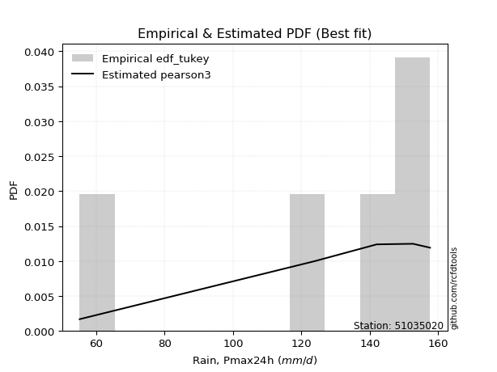</img>

</div>


### 8. EDF Gringorten (1963)

Gringorten plotting position formula is essential for estimating the probability and return periods of extreme events like floods and heavy rainfall. The constant _a=0.44_.

<div align="center">


$P=(m-a)/(n+1-2a)$


</div>


**8.1. Empirical values**

<div align="center">

|                | 0                   | 1                  | 2                   | 3                  | 4                  | 5                  |
|:---------------|:--------------------|:-------------------|:--------------------|:-------------------|:-------------------|:-------------------|
| date           | 2023                | 2019               | 2025                | 2022               | 2020               | 2024               |
| x              | 55.2                | 123.8              | 128.8               | 142.0              | 152.6              | 157.6              |
| m              | 1                   | 2                  | 3                   | 4                  | 5                  | 6                  |
| empirical_dist | edf_gringorten      | edf_gringorten     | edf_gringorten      | edf_gringorten     | edf_gringorten     | edf_gringorten     |
| empirical      | 0.09150326797385622 | 0.2549019607843137 | 0.41830065359477125 | 0.5816993464052288 | 0.7450980392156862 | 0.9084967320261437 |
| empirical_tr   | 1.1007194244604317  | 1.3421052631578947 | 1.7191011235955058  | 2.3906250000000004 | 3.9230769230769216 | 10.928571428571415 |

</div>


**8.2. Kolmogorov-Smirnov fit test (sorted by Δ)**


<div align="center">

|                | 0                   | 1                   | 2                   | 3                   | 4                   | 5                   | 6                   | 7                   | 8                   | 9                  | 10                  | 11                  | 12                 | 13                  | 14                  | 15                 | 16                  | 17                  | 18                 | 19                  | 20                  | 21                  | 22                  | 23                  | 24                  | 25                  | 26                 | 27                  | 28                 | 29                  | 30                  | 31                 | 32                  | 33                  | 34                  | 35                  | 36                  | 37                 | 38                  | 39                  | 40                  | 41                  | 42                  | 43                  | 44                  | 45                  | 46                  | 47                 | 48                  | 49                  | 50                  | 51                  | 52                  | 53                | 54                  | 55                 | 56                | 57                  | 58                  | 59                 | 60                 | 61                  | 62                  | 63                 | 64                 | 65                 | 66                  | 67                 | 68                  | 69                  | 70                 | 71                 | 72                 | 73                 | 74                  | 75                 | 76                 | 77                 | 78                  | 79                 | 80                  | 81                  | 82               | 83                  | 84                  | 85                  | 86                 | 87                  | 88                  | 89                 | 90                  | 91                  | 92                  | 93                  | 94                 | 95                  | 96                 | 97                  | 98                  | 99                  | 100                 | 101                | 102                 | 103                | 104                | 105                | 106                 | 107                | 108                | 109                 | 110                 | 111                 | 112                | 113                | 114                | 115                 | 116                | 117                | 118                 | 119                | 120                 | 121                | 122                | 123                 | 124                 | 125                 | 126                 | 127                 | 128                 | 129                 | 130                | 131                 | 132                | 133                | 134                | 135                | 136                | 137                | 138                | 139                | 140                | 141                | 142                | 143               | 144                | 145                | 146                | 147                | 148                | 149                | 150                | 151                | 152                | 153               | 154                | 155                | 156                | 157                | 158                | 159                |
|:---------------|:--------------------|:--------------------|:--------------------|:--------------------|:--------------------|:--------------------|:--------------------|:--------------------|:--------------------|:-------------------|:--------------------|:--------------------|:-------------------|:--------------------|:--------------------|:-------------------|:--------------------|:--------------------|:-------------------|:--------------------|:--------------------|:--------------------|:--------------------|:--------------------|:--------------------|:--------------------|:-------------------|:--------------------|:-------------------|:--------------------|:--------------------|:-------------------|:--------------------|:--------------------|:--------------------|:--------------------|:--------------------|:-------------------|:--------------------|:--------------------|:--------------------|:--------------------|:--------------------|:--------------------|:--------------------|:--------------------|:--------------------|:-------------------|:--------------------|:--------------------|:--------------------|:--------------------|:--------------------|:------------------|:--------------------|:-------------------|:------------------|:--------------------|:--------------------|:-------------------|:-------------------|:--------------------|:--------------------|:-------------------|:-------------------|:-------------------|:--------------------|:-------------------|:--------------------|:--------------------|:-------------------|:-------------------|:-------------------|:-------------------|:--------------------|:-------------------|:-------------------|:-------------------|:--------------------|:-------------------|:--------------------|:--------------------|:-----------------|:--------------------|:--------------------|:--------------------|:-------------------|:--------------------|:--------------------|:-------------------|:--------------------|:--------------------|:--------------------|:--------------------|:-------------------|:--------------------|:-------------------|:--------------------|:--------------------|:--------------------|:--------------------|:-------------------|:--------------------|:-------------------|:-------------------|:-------------------|:--------------------|:-------------------|:-------------------|:--------------------|:--------------------|:--------------------|:-------------------|:-------------------|:-------------------|:--------------------|:-------------------|:-------------------|:--------------------|:-------------------|:--------------------|:-------------------|:-------------------|:--------------------|:--------------------|:--------------------|:--------------------|:--------------------|:--------------------|:--------------------|:-------------------|:--------------------|:-------------------|:-------------------|:-------------------|:-------------------|:-------------------|:-------------------|:-------------------|:-------------------|:-------------------|:-------------------|:-------------------|:------------------|:-------------------|:-------------------|:-------------------|:-------------------|:-------------------|:-------------------|:-------------------|:-------------------|:-------------------|:------------------|:-------------------|:-------------------|:-------------------|:-------------------|:-------------------|:-------------------|
| station        | 51035020            | 51035020            | 51035020            | 51035020            | 51035020            | 51035020            | 51035020            | 51035020            | 51035020            | 51035020           | 51035020            | 51035020            | 51035020           | 51035020            | 51035020            | 51035020           | 51035020            | 51035020            | 51035020           | 51035020            | 51035020            | 51035020            | 51035020            | 51035020            | 51035020            | 51035020            | 51035020           | 51035020            | 51035020           | 51035020            | 51035020            | 51035020           | 51035020            | 51035020            | 51035020            | 51035020            | 51035020            | 51035020           | 51035020            | 51035020            | 51035020            | 51035020            | 51035020            | 51035020            | 51035020            | 51035020            | 51035020            | 51035020           | 51035020            | 51035020            | 51035020            | 51035020            | 51035020            | 51035020          | 51035020            | 51035020           | 51035020          | 51035020            | 51035020            | 51035020           | 51035020           | 51035020            | 51035020            | 51035020           | 51035020           | 51035020           | 51035020            | 51035020           | 51035020            | 51035020            | 51035020           | 51035020           | 51035020           | 51035020           | 51035020            | 51035020           | 51035020           | 51035020           | 51035020            | 51035020           | 51035020            | 51035020            | 51035020         | 51035020            | 51035020            | 51035020            | 51035020           | 51035020            | 51035020            | 51035020           | 51035020            | 51035020            | 51035020            | 51035020            | 51035020           | 51035020            | 51035020           | 51035020            | 51035020            | 51035020            | 51035020            | 51035020           | 51035020            | 51035020           | 51035020           | 51035020           | 51035020            | 51035020           | 51035020           | 51035020            | 51035020            | 51035020            | 51035020           | 51035020           | 51035020           | 51035020            | 51035020           | 51035020           | 51035020            | 51035020           | 51035020            | 51035020           | 51035020           | 51035020            | 51035020            | 51035020            | 51035020            | 51035020            | 51035020            | 51035020            | 51035020           | 51035020            | 51035020           | 51035020           | 51035020           | 51035020           | 51035020           | 51035020           | 51035020           | 51035020           | 51035020           | 51035020           | 51035020           | 51035020          | 51035020           | 51035020           | 51035020           | 51035020           | 51035020           | 51035020           | 51035020           | 51035020           | 51035020           | 51035020          | 51035020           | 51035020           | 51035020           | 51035020           | 51035020           | 51035020           |
| empirical_dist | edf_gringorten      | edf_gringorten      | edf_gringorten      | edf_gringorten      | edf_gringorten      | edf_gringorten      | edf_gringorten      | edf_gringorten      | edf_gringorten      | edf_gringorten     | edf_gringorten      | edf_gringorten      | edf_gringorten     | edf_gringorten      | edf_gringorten      | edf_gringorten     | edf_gringorten      | edf_gringorten      | edf_gringorten     | edf_gringorten      | edf_gringorten      | edf_gringorten      | edf_gringorten      | edf_gringorten      | edf_gringorten      | edf_gringorten      | edf_gringorten     | edf_gringorten      | edf_gringorten     | edf_gringorten      | edf_gringorten      | edf_gringorten     | edf_gringorten      | edf_gringorten      | edf_gringorten      | edf_gringorten      | edf_gringorten      | edf_gringorten     | edf_gringorten      | edf_gringorten      | edf_gringorten      | edf_gringorten      | edf_gringorten      | edf_gringorten      | edf_gringorten      | edf_gringorten      | edf_gringorten      | edf_gringorten     | edf_gringorten      | edf_gringorten      | edf_gringorten      | edf_gringorten      | edf_gringorten      | edf_gringorten    | edf_gringorten      | edf_gringorten     | edf_gringorten    | edf_gringorten      | edf_gringorten      | edf_gringorten     | edf_gringorten     | edf_gringorten      | edf_gringorten      | edf_gringorten     | edf_gringorten     | edf_gringorten     | edf_gringorten      | edf_gringorten     | edf_gringorten      | edf_gringorten      | edf_gringorten     | edf_gringorten     | edf_gringorten     | edf_gringorten     | edf_gringorten      | edf_gringorten     | edf_gringorten     | edf_gringorten     | edf_gringorten      | edf_gringorten     | edf_gringorten      | edf_gringorten      | edf_gringorten   | edf_gringorten      | edf_gringorten      | edf_gringorten      | edf_gringorten     | edf_gringorten      | edf_gringorten      | edf_gringorten     | edf_gringorten      | edf_gringorten      | edf_gringorten      | edf_gringorten      | edf_gringorten     | edf_gringorten      | edf_gringorten     | edf_gringorten      | edf_gringorten      | edf_gringorten      | edf_gringorten      | edf_gringorten     | edf_gringorten      | edf_gringorten     | edf_gringorten     | edf_gringorten     | edf_gringorten      | edf_gringorten     | edf_gringorten     | edf_gringorten      | edf_gringorten      | edf_gringorten      | edf_gringorten     | edf_gringorten     | edf_gringorten     | edf_gringorten      | edf_gringorten     | edf_gringorten     | edf_gringorten      | edf_gringorten     | edf_gringorten      | edf_gringorten     | edf_gringorten     | edf_gringorten      | edf_gringorten      | edf_gringorten      | edf_gringorten      | edf_gringorten      | edf_gringorten      | edf_gringorten      | edf_gringorten     | edf_gringorten      | edf_gringorten     | edf_gringorten     | edf_gringorten     | edf_gringorten     | edf_gringorten     | edf_gringorten     | edf_gringorten     | edf_gringorten     | edf_gringorten     | edf_gringorten     | edf_gringorten     | edf_gringorten    | edf_gringorten     | edf_gringorten     | edf_gringorten     | edf_gringorten     | edf_gringorten     | edf_gringorten     | edf_gringorten     | edf_gringorten     | edf_gringorten     | edf_gringorten    | edf_gringorten     | edf_gringorten     | edf_gringorten     | edf_gringorten     | edf_gringorten     | edf_gringorten     |
| p_dist         | loggenextreme       | genextreme          | mielke              | loglevy_l           | argus               | vonmises_line       | dweibull            | levy_l              | logargus            | pearson3           | logmielke           | logt                | gumbel_l           | dgamma              | logburr             | logloggamma        | logexponweib        | logvonmises_line    | burr               | trapezoid           | logburr12           | logpearson3         | logweibull_min      | logbeta             | laplace             | loggennorm          | hypsecant          | t                   | logistic           | skewnorm            | loggumbel_l         | crystalball        | norm                | exponnorm           | nct                 | f                   | beta                | logtrapezoid       | logloglaplace       | anglit              | logdweibull         | gamma               | semicircular        | betaprime           | erlang              | arcsine             | logdgamma           | genhalflogistic    | logweibull_max      | invgamma            | alpha               | maxwell             | gennorm             | logexponpow       | invgauss            | logtukeylambda     | logtruncnorm      | lognakagami         | nakagami            | rayleigh           | weibull_max        | loginvweibull       | loggenpareto        | logarcsine         | ncf                | logsemicircular    | loganglit           | logbetaprime       | logjohnsonsu        | genpareto           | logfatiguelife     | logf               | logexponnorm       | lognorm            | logcrystalball      | logrice            | logncf             | gumbel_r           | lognct              | cosine             | loglogistic         | gausshyper          | loghypsecant     | logalpha            | triang              | halfnorm            | wrapcauchy         | kstwobign           | johnsonsb           | loginvgamma        | logerlang           | loglaplace          | loglaplace          | loginvgauss         | moyal              | logmaxwell          | halflogistic       | kappa3              | loggengamma         | lograyleigh         | logfoldnorm         | truncweibull_min   | logskewnorm         | gengamma           | logkstwobign       | loghalfnorm        | loggumbel_r         | loggenexpon        | logcosine          | logwrapcauchy       | lomax               | johnsonsu           | logmoyal           | loghalflogistic    | wald               | loggenhalflogistic  | ksone              | halfgennorm        | burr12              | loggompertz        | logtriang           | uniform            | kappa4             | foldnorm            | loghalfgennorm      | logjohnsonsb        | logwald             | invweibull          | logtruncweibull_min | logksone            | bradford           | truncexpon          | loggamma           | loggamma           | gompertz           | logkappa3          | loguniform         | logkappa4          | loggausshyper      | logrdist           | logbradford        | truncnorm          | logtruncexpon      | exponweib         | fatiguelife        | weibull_min        | powerlaw           | exponpow           | logpowerlaw        | truncpareto        | genexpon           | logtruncpareto     | loglomax           | rice              | genlogistic        | loggenlogistic     | rdist              | tukeylambda        | logvonmises        | vonmises           |
| delta          | 0.09150326797359387 | 0.09150326797378283 | 0.10509451842266782 | 0.10642622542347102 | 0.10643980795554198 | 0.10677310744357249 | 0.11041362224206852 | 0.11152213075729056 | 0.12561128352092943 | 0.1259512982500537 | 0.13741229154528112 | 0.13795921134877265 | 0.1410510765757923 | 0.15056814134786384 | 0.15511462897874523 | 0.1553571020300733 | 0.15685338101578222 | 0.15721035719531395 | 0.1590971058874049 | 0.16353008657953444 | 0.17276596103020747 | 0.17399160498530364 | 0.17663136939959423 | 0.18511529211282185 | 0.18908159283021686 | 0.20249874045283106 | 0.2032100444798971 | 0.20329598537925986 | 0.2070732724036457 | 0.20815714711327493 | 0.20999729102328835 | 0.2116187577336125 | 0.21161876689205777 | 0.21162014789097766 | 0.21162459004075002 | 0.21291912757440778 | 0.21410589667717084 | 0.2163225678463882 | 0.21634501514266646 | 0.21639336095354222 | 0.21713530892884925 | 0.21759540826413004 | 0.21836192552171452 | 0.22420618842945383 | 0.22486644776131376 | 0.22617598672610106 | 0.23153223102064435 | 0.2350982548512236 | 0.23775110683411882 | 0.24155551117436252 | 0.24304550052421958 | 0.24568513322560392 | 0.24699617144534305 | 0.250475633939118 | 0.25078716530017653 | 0.2548918455768048 | 0.254899468946554 | 0.25490194890131085 | 0.25490196069428783 | 0.2573351222777822 | 0.2608012190411728 | 0.26230073945628696 | 0.26245702960551354 | 0.2640082677478449 | 0.2661688545837103 | 0.2718177085952487 | 0.27378514307922097 | 0.2757893995781946 | 0.27596879187659185 | 0.27721611540408597 | 0.2778649736347554 | 0.2783746486736831 | 0.2785556128506018 | 0.2785568395449316 | 0.27855684622372645 | 0.2785737658767815 | 0.2801718248355982 | 0.2801766877375893 | 0.28157907942322935 | 0.2826556966418744 | 0.28309958968664617 | 0.28452379625438873 | 0.28696050793536 | 0.28883069424569574 | 0.28947166326422913 | 0.29017761282732724 | 0.2933035191107902 | 0.29495304961070135 | 0.29684586273343855 | 0.3007544911279554 | 0.30092914526600456 | 0.30108215009064454 | 0.30108215009064454 | 0.30504386281138485 | 0.3058901397218665 | 0.30996985058996296 | 0.3127227518020337 | 0.31361303699665777 | 0.31972666275866635 | 0.32017802335673906 | 0.33313684892166684 | 0.3346715107452698 | 0.33619958937252936 | 0.3365847420480089 | 0.3392733261638303 | 0.3489395853206929 | 0.34912488992975477 | 0.3497680864399808 | 0.3514832628046216 | 0.35313903250604683 | 0.36073779330933764 | 0.36238174157318337 | 0.3744361958269016 | 0.3756041617082666 | 0.3774557470725163 | 0.38089581687065943 | 0.3866996017156863 | 0.3893503361567998 | 0.39106164248240194 | 0.3936812756206802 | 0.39477609717904727 | 0.4150199142156863 | 0.4182360993820442 | 0.41830065359477125 | 0.42412028651314526 | 0.42839677723582814 | 0.44469333685614976 | 0.45329541281720787 | 0.4655611779679004  | 0.47001824392550395 | 0.4849989296304942 | 0.49233646914176254 | 0.4943697608084514 | 0.4943697608084514 | 0.4960424885937175 | 0.5096028705636346 | 0.5150022848674678 | 0.5158028827921124 | 0.5397434489610732 | 0.5676528687574112 | 0.5716866162603639 | 0.5816993453822976 | 0.5832842626892392 | 0.587507217300722 | 0.6101140061606846 | 0.6542609067081304 | 0.6840433023984381 | 0.6921400603041852 | 0.7016451194637119 | 0.7105607810824678 | 0.7200696073346429 | 0.7224444966596684 | 0.7371458470533594 | 0.745098039215682 | 0.7450980392156862 | 0.7450980392156862 | 0.7450980392156863 | 0.7450980392156863 | 1.2652514584459693 | 25.076357850545186 |
| deltao         | 0.530385761606      | 0.530385761606      | 0.530385761606      | 0.530385761606      | 0.530385761606      | 0.530385761606      | 0.530385761606      | 0.530385761606      | 0.530385761606      | 0.530385761606     | 0.530385761606      | 0.530385761606      | 0.530385761606     | 0.530385761606      | 0.530385761606      | 0.530385761606     | 0.530385761606      | 0.530385761606      | 0.530385761606     | 0.530385761606      | 0.530385761606      | 0.530385761606      | 0.530385761606      | 0.530385761606      | 0.530385761606      | 0.530385761606      | 0.530385761606     | 0.530385761606      | 0.530385761606     | 0.530385761606      | 0.530385761606      | 0.530385761606     | 0.530385761606      | 0.530385761606      | 0.530385761606      | 0.530385761606      | 0.530385761606      | 0.530385761606     | 0.530385761606      | 0.530385761606      | 0.530385761606      | 0.530385761606      | 0.530385761606      | 0.530385761606      | 0.530385761606      | 0.530385761606      | 0.530385761606      | 0.530385761606     | 0.530385761606      | 0.530385761606      | 0.530385761606      | 0.530385761606      | 0.530385761606      | 0.530385761606    | 0.530385761606      | 0.530385761606     | 0.530385761606    | 0.530385761606      | 0.530385761606      | 0.530385761606     | 0.530385761606     | 0.530385761606      | 0.530385761606      | 0.530385761606     | 0.530385761606     | 0.530385761606     | 0.530385761606      | 0.530385761606     | 0.530385761606      | 0.530385761606      | 0.530385761606     | 0.530385761606     | 0.530385761606     | 0.530385761606     | 0.530385761606      | 0.530385761606     | 0.530385761606     | 0.530385761606     | 0.530385761606      | 0.530385761606     | 0.530385761606      | 0.530385761606      | 0.530385761606   | 0.530385761606      | 0.530385761606      | 0.530385761606      | 0.530385761606     | 0.530385761606      | 0.530385761606      | 0.530385761606     | 0.530385761606      | 0.530385761606      | 0.530385761606      | 0.530385761606      | 0.530385761606     | 0.530385761606      | 0.530385761606     | 0.530385761606      | 0.530385761606      | 0.530385761606      | 0.530385761606      | 0.530385761606     | 0.530385761606      | 0.530385761606     | 0.530385761606     | 0.530385761606     | 0.530385761606      | 0.530385761606     | 0.530385761606     | 0.530385761606      | 0.530385761606      | 0.530385761606      | 0.530385761606     | 0.530385761606     | 0.530385761606     | 0.530385761606      | 0.530385761606     | 0.530385761606     | 0.530385761606      | 0.530385761606     | 0.530385761606      | 0.530385761606     | 0.530385761606     | 0.530385761606      | 0.530385761606      | 0.530385761606      | 0.530385761606      | 0.530385761606      | 0.530385761606      | 0.530385761606      | 0.530385761606     | 0.530385761606      | 0.530385761606     | 0.530385761606     | 0.530385761606     | 0.530385761606     | 0.530385761606     | 0.530385761606     | 0.530385761606     | 0.530385761606     | 0.530385761606     | 0.530385761606     | 0.530385761606     | 0.530385761606    | 0.530385761606     | 0.530385761606     | 0.530385761606     | 0.530385761606     | 0.530385761606     | 0.530385761606     | 0.530385761606     | 0.530385761606     | 0.530385761606     | 0.530385761606    | 0.530385761606     | 0.530385761606     | 0.530385761606     | 0.530385761606     | 0.530385761606     | 0.530385761606     |
| eval           | Δo > Δ              | Δo > Δ              | Δo > Δ              | Δo > Δ              | Δo > Δ              | Δo > Δ              | Δo > Δ              | Δo > Δ              | Δo > Δ              | Δo > Δ             | Δo > Δ              | Δo > Δ              | Δo > Δ             | Δo > Δ              | Δo > Δ              | Δo > Δ             | Δo > Δ              | Δo > Δ              | Δo > Δ             | Δo > Δ              | Δo > Δ              | Δo > Δ              | Δo > Δ              | Δo > Δ              | Δo > Δ              | Δo > Δ              | Δo > Δ             | Δo > Δ              | Δo > Δ             | Δo > Δ              | Δo > Δ              | Δo > Δ             | Δo > Δ              | Δo > Δ              | Δo > Δ              | Δo > Δ              | Δo > Δ              | Δo > Δ             | Δo > Δ              | Δo > Δ              | Δo > Δ              | Δo > Δ              | Δo > Δ              | Δo > Δ              | Δo > Δ              | Δo > Δ              | Δo > Δ              | Δo > Δ             | Δo > Δ              | Δo > Δ              | Δo > Δ              | Δo > Δ              | Δo > Δ              | Δo > Δ            | Δo > Δ              | Δo > Δ             | Δo > Δ            | Δo > Δ              | Δo > Δ              | Δo > Δ             | Δo > Δ             | Δo > Δ              | Δo > Δ              | Δo > Δ             | Δo > Δ             | Δo > Δ             | Δo > Δ              | Δo > Δ             | Δo > Δ              | Δo > Δ              | Δo > Δ             | Δo > Δ             | Δo > Δ             | Δo > Δ             | Δo > Δ              | Δo > Δ             | Δo > Δ             | Δo > Δ             | Δo > Δ              | Δo > Δ             | Δo > Δ              | Δo > Δ              | Δo > Δ           | Δo > Δ              | Δo > Δ              | Δo > Δ              | Δo > Δ             | Δo > Δ              | Δo > Δ              | Δo > Δ             | Δo > Δ              | Δo > Δ              | Δo > Δ              | Δo > Δ              | Δo > Δ             | Δo > Δ              | Δo > Δ             | Δo > Δ              | Δo > Δ              | Δo > Δ              | Δo > Δ              | Δo > Δ             | Δo > Δ              | Δo > Δ             | Δo > Δ             | Δo > Δ             | Δo > Δ              | Δo > Δ             | Δo > Δ             | Δo > Δ              | Δo > Δ              | Δo > Δ              | Δo > Δ             | Δo > Δ             | Δo > Δ             | Δo > Δ              | Δo > Δ             | Δo > Δ             | Δo > Δ              | Δo > Δ             | Δo > Δ              | Δo > Δ             | Δo > Δ             | Δo > Δ              | Δo > Δ              | Δo > Δ              | Δo > Δ              | Δo > Δ              | Δo > Δ              | Δo > Δ              | Δo > Δ             | Δo > Δ              | Δo > Δ             | Δo > Δ             | Δo > Δ             | Δo > Δ             | Δo > Δ             | Δo > Δ             | Δo <= Δ            | Δo <= Δ            | Δo <= Δ            | Δo <= Δ            | Δo <= Δ            | Δo <= Δ           | Δo <= Δ            | Δo <= Δ            | Δo <= Δ            | Δo <= Δ            | Δo <= Δ            | Δo <= Δ            | Δo <= Δ            | Δo <= Δ            | Δo <= Δ            | Δo <= Δ           | Δo <= Δ            | Δo <= Δ            | Δo <= Δ            | Δo <= Δ            | Δo <= Δ            | Δo <= Δ            |
| fit            | 1                   | 1                   | 1                   | 1                   | 1                   | 1                   | 1                   | 1                   | 1                   | 1                  | 1                   | 1                   | 1                  | 1                   | 1                   | 1                  | 1                   | 1                   | 1                  | 1                   | 1                   | 1                   | 1                   | 1                   | 1                   | 1                   | 1                  | 1                   | 1                  | 1                   | 1                   | 1                  | 1                   | 1                   | 1                   | 1                   | 1                   | 1                  | 1                   | 1                   | 1                   | 1                   | 1                   | 1                   | 1                   | 1                   | 1                   | 1                  | 1                   | 1                   | 1                   | 1                   | 1                   | 1                 | 1                   | 1                  | 1                 | 1                   | 1                   | 1                  | 1                  | 1                   | 1                   | 1                  | 1                  | 1                  | 1                   | 1                  | 1                   | 1                   | 1                  | 1                  | 1                  | 1                  | 1                   | 1                  | 1                  | 1                  | 1                   | 1                  | 1                   | 1                   | 1                | 1                   | 1                   | 1                   | 1                  | 1                   | 1                   | 1                  | 1                   | 1                   | 1                   | 1                   | 1                  | 1                   | 1                  | 1                   | 1                   | 1                   | 1                   | 1                  | 1                   | 1                  | 1                  | 1                  | 1                   | 1                  | 1                  | 1                   | 1                   | 1                   | 1                  | 1                  | 1                  | 1                   | 1                  | 1                  | 1                   | 1                  | 1                   | 1                  | 1                  | 1                   | 1                   | 1                   | 1                   | 1                   | 1                   | 1                   | 1                  | 1                   | 1                  | 1                  | 1                  | 1                  | 1                  | 1                  | 0                  | 0                  | 0                  | 0                  | 0                  | 0                 | 0                  | 0                  | 0                  | 0                  | 0                  | 0                  | 0                  | 0                  | 0                  | 0                 | 0                  | 0                  | 0                  | 0                  | 0                  | 0                  |
| n              | 6                   | 6                   | 6                   | 6                   | 6                   | 6                   | 6                   | 6                   | 6                   | 6                  | 6                   | 6                   | 6                  | 6                   | 6                   | 6                  | 6                   | 6                   | 6                  | 6                   | 6                   | 6                   | 6                   | 6                   | 6                   | 6                   | 6                  | 6                   | 6                  | 6                   | 6                   | 6                  | 6                   | 6                   | 6                   | 6                   | 6                   | 6                  | 6                   | 6                   | 6                   | 6                   | 6                   | 6                   | 6                   | 6                   | 6                   | 6                  | 6                   | 6                   | 6                   | 6                   | 6                   | 6                 | 6                   | 6                  | 6                 | 6                   | 6                   | 6                  | 6                  | 6                   | 6                   | 6                  | 6                  | 6                  | 6                   | 6                  | 6                   | 6                   | 6                  | 6                  | 6                  | 6                  | 6                   | 6                  | 6                  | 6                  | 6                   | 6                  | 6                   | 6                   | 6                | 6                   | 6                   | 6                   | 6                  | 6                   | 6                   | 6                  | 6                   | 6                   | 6                   | 6                   | 6                  | 6                   | 6                  | 6                   | 6                   | 6                   | 6                   | 6                  | 6                   | 6                  | 6                  | 6                  | 6                   | 6                  | 6                  | 6                   | 6                   | 6                   | 6                  | 6                  | 6                  | 6                   | 6                  | 6                  | 6                   | 6                  | 6                   | 6                  | 6                  | 6                   | 6                   | 6                   | 6                   | 6                   | 6                   | 6                   | 6                  | 6                   | 6                  | 6                  | 6                  | 6                  | 6                  | 6                  | 6                  | 6                  | 6                  | 6                  | 6                  | 6                 | 6                  | 6                  | 6                  | 6                  | 6                  | 6                  | 6                  | 6                  | 6                  | 6                 | 6                  | 6                  | 6                  | 6                  | 6                  | 6                  |
| best_fit       | 1                   | 0                   | 0                   | 0                   | 0                   | 0                   | 0                   | 0                   | 0                   | 0                  | 0                   | 0                   | 0                  | 0                   | 0                   | 0                  | 0                   | 0                   | 0                  | 0                   | 0                   | 0                   | 0                   | 0                   | 0                   | 0                   | 0                  | 0                   | 0                  | 0                   | 0                   | 0                  | 0                   | 0                   | 0                   | 0                   | 0                   | 0                  | 0                   | 0                   | 0                   | 0                   | 0                   | 0                   | 0                   | 0                   | 0                   | 0                  | 0                   | 0                   | 0                   | 0                   | 0                   | 0                 | 0                   | 0                  | 0                 | 0                   | 0                   | 0                  | 0                  | 0                   | 0                   | 0                  | 0                  | 0                  | 0                   | 0                  | 0                   | 0                   | 0                  | 0                  | 0                  | 0                  | 0                   | 0                  | 0                  | 0                  | 0                   | 0                  | 0                   | 0                   | 0                | 0                   | 0                   | 0                   | 0                  | 0                   | 0                   | 0                  | 0                   | 0                   | 0                   | 0                   | 0                  | 0                   | 0                  | 0                   | 0                   | 0                   | 0                   | 0                  | 0                   | 0                  | 0                  | 0                  | 0                   | 0                  | 0                  | 0                   | 0                   | 0                   | 0                  | 0                  | 0                  | 0                   | 0                  | 0                  | 0                   | 0                  | 0                   | 0                  | 0                  | 0                   | 0                   | 0                   | 0                   | 0                   | 0                   | 0                   | 0                  | 0                   | 0                  | 0                  | 0                  | 0                  | 0                  | 0                  | 0                  | 0                  | 0                  | 0                  | 0                  | 0                 | 0                  | 0                  | 0                  | 0                  | 0                  | 0                  | 0                  | 0                  | 0                  | 0                 | 0                  | 0                  | 0                  | 0                  | 0                  | 0                  |
| best_fit_sort  | 1                   | 2                   | 3                   | 4                   | 5                   | 6                   | 7                   | 8                   | 9                   | 10                 | 11                  | 12                  | 13                 | 14                  | 15                  | 16                 | 17                  | 18                  | 19                 | 20                  | 21                  | 22                  | 23                  | 24                  | 25                  | 26                  | 27                 | 28                  | 29                 | 30                  | 31                  | 32                 | 33                  | 34                  | 35                  | 36                  | 37                  | 38                 | 39                  | 40                  | 41                  | 42                  | 43                  | 44                  | 45                  | 46                  | 47                  | 48                 | 49                  | 50                  | 51                  | 52                  | 53                  | 54                | 55                  | 56                 | 57                | 58                  | 59                  | 60                 | 61                 | 62                  | 63                  | 64                 | 65                 | 66                 | 67                  | 68                 | 69                  | 70                  | 71                 | 72                 | 73                 | 74                 | 75                  | 76                 | 77                 | 78                 | 79                  | 80                 | 81                  | 82                  | 83               | 84                  | 85                  | 86                  | 87                 | 88                  | 89                  | 90                 | 91                  | 92                  | 93                  | 94                  | 95                 | 96                  | 97                 | 98                  | 99                  | 100                 | 101                 | 102                | 103                 | 104                | 105                | 106                | 107                 | 108                | 109                | 110                 | 111                 | 112                 | 113                | 114                | 115                | 116                 | 117                | 118                | 119                 | 120                | 121                 | 122                | 123                | 124                 | 125                 | 126                 | 127                 | 128                 | 129                 | 130                 | 131                | 132                 | 133                | 134                | 135                | 136                | 137                | 138                | 139                | 140                | 141                | 142                | 143                | 144               | 145                | 146                | 147                | 148                | 149                | 150                | 151                | 152                | 153                | 154               | 155                | 156                | 157                | 158                | 159                | 160                |

</div>


**8.3. Best fit**

<div align="center">

|   id |   station | empirical_dist   | p_dist        |     delta |   deltao | eval   |   fit |   n |   best_fit |   best_fit_sort |
|-----:|----------:|:-----------------|:--------------|----------:|---------:|:-------|------:|----:|-----------:|----------------:|
|    0 |  51035020 | edf_gringorten   | loggenextreme | 0.0915033 | 0.530386 | Δo > Δ |     1 |   6 |          1 |               1 |

</div>


<div align="center">

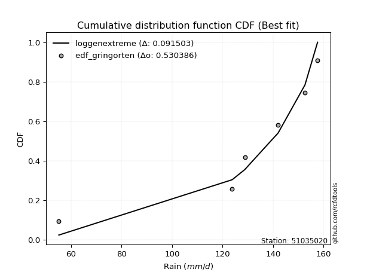</img></img>

</div>


### 9. EDF Filliben (1975)

The specific values of the constants (0.3175) (often denoted as $alpha$) and (0.365) are derived from a method proposed by James J. Filliben in a 1975 paper. This particular formula is the mean value of the $i$-th order statistic of the normal distribution and is considered a robust and effective plotting position formula for the normal probability plot correlation coefficient test for normality.

<div align="center">


$P=(m-0.3175)/(n+0.365)$


</div>


**9.1. Empirical values**

<div align="center">

|                | 0                   | 1                   | 2                  | 3                  | 4                  | 5                  |
|:---------------|:--------------------|:--------------------|:-------------------|:-------------------|:-------------------|:-------------------|
| date           | 2023                | 2019                | 2025               | 2022               | 2020               | 2024               |
| x              | 55.2                | 123.8               | 128.8              | 142.0              | 152.6              | 157.6              |
| m              | 1                   | 2                   | 3                  | 4                  | 5                  | 6                  |
| empirical_dist | edf_filliben        | edf_filliben        | edf_filliben       | edf_filliben       | edf_filliben       | edf_filliben       |
| empirical      | 0.10722702278083267 | 0.26433621366849963 | 0.4214454045561665 | 0.5785545954438335 | 0.7356637863315004 | 0.8927729772191673 |
| empirical_tr   | 1.1201055873295205  | 1.3593166043780034  | 1.7284453496266123 | 2.3727865796831313 | 3.783060921248143  | 9.326007326007321  |

</div>


**9.2. Kolmogorov-Smirnov fit test (sorted by Δ)**


<div align="center">

|                | 0                   | 1                  | 2                   | 3                   | 4                   | 5                   | 6                   | 7                   | 8                   | 9                  | 10                  | 11                  | 12                  | 13                  | 14                  | 15                 | 16                 | 17                  | 18                 | 19                  | 20                  | 21                  | 22                 | 23                  | 24                  | 25                  | 26                  | 27                  | 28                | 29                  | 30                  | 31                  | 32                  | 33                  | 34                  | 35                 | 36                  | 37                  | 38                  | 39                  | 40                 | 41                  | 42                 | 43                 | 44                  | 45                  | 46                  | 47                 | 48                 | 49                  | 50                  | 51                | 52                  | 53                 | 54                  | 55                 | 56                  | 57                  | 58                 | 59                | 60                 | 61                 | 62                  | 63                 | 64                  | 65                  | 66                  | 67                  | 68                  | 69                  | 70                  | 71                 | 72                 | 73                 | 74                  | 75                 | 76                 | 77                 | 78                 | 79                 | 80                  | 81                 | 82                  | 83                 | 84                 | 85                 | 86                 | 87                 | 88                 | 89                  | 90                  | 91                 | 92                 | 93                 | 94                 | 95                  | 96                  | 97                  | 98                 | 99                  | 100                | 101                | 102                 | 103               | 104                | 105               | 106                 | 107                | 108                | 109                | 110                | 111                | 112                 | 113                | 114                 | 115                | 116                 | 117                | 118               | 119                | 120                 | 121                 | 122                | 123                 | 124                | 125                | 126                 | 127                 | 128                 | 129                 | 130                 | 131                | 132                | 133                | 134                | 135                | 136                | 137                | 138                | 139                | 140               | 141                | 142                | 143                | 144                | 145                | 146                | 147                | 148                | 149                | 150                | 151                | 152               | 153                | 154                | 155                | 156                | 157                | 158                | 159                |
|:---------------|:--------------------|:-------------------|:--------------------|:--------------------|:--------------------|:--------------------|:--------------------|:--------------------|:--------------------|:-------------------|:--------------------|:--------------------|:--------------------|:--------------------|:--------------------|:-------------------|:-------------------|:--------------------|:-------------------|:--------------------|:--------------------|:--------------------|:-------------------|:--------------------|:--------------------|:--------------------|:--------------------|:--------------------|:------------------|:--------------------|:--------------------|:--------------------|:--------------------|:--------------------|:--------------------|:-------------------|:--------------------|:--------------------|:--------------------|:--------------------|:-------------------|:--------------------|:-------------------|:-------------------|:--------------------|:--------------------|:--------------------|:-------------------|:-------------------|:--------------------|:--------------------|:------------------|:--------------------|:-------------------|:--------------------|:-------------------|:--------------------|:--------------------|:-------------------|:------------------|:-------------------|:-------------------|:--------------------|:-------------------|:--------------------|:--------------------|:--------------------|:--------------------|:--------------------|:--------------------|:--------------------|:-------------------|:-------------------|:-------------------|:--------------------|:-------------------|:-------------------|:-------------------|:-------------------|:-------------------|:--------------------|:-------------------|:--------------------|:-------------------|:-------------------|:-------------------|:-------------------|:-------------------|:-------------------|:--------------------|:--------------------|:-------------------|:-------------------|:-------------------|:-------------------|:--------------------|:--------------------|:--------------------|:-------------------|:--------------------|:-------------------|:-------------------|:--------------------|:------------------|:-------------------|:------------------|:--------------------|:-------------------|:-------------------|:-------------------|:-------------------|:-------------------|:--------------------|:-------------------|:--------------------|:-------------------|:--------------------|:-------------------|:------------------|:-------------------|:--------------------|:--------------------|:-------------------|:--------------------|:-------------------|:-------------------|:--------------------|:--------------------|:--------------------|:--------------------|:--------------------|:-------------------|:-------------------|:-------------------|:-------------------|:-------------------|:-------------------|:-------------------|:-------------------|:-------------------|:------------------|:-------------------|:-------------------|:-------------------|:-------------------|:-------------------|:-------------------|:-------------------|:-------------------|:-------------------|:-------------------|:-------------------|:------------------|:-------------------|:-------------------|:-------------------|:-------------------|:-------------------|:-------------------|:-------------------|
| station        | 51035020            | 51035020           | 51035020            | 51035020            | 51035020            | 51035020            | 51035020            | 51035020            | 51035020            | 51035020           | 51035020            | 51035020            | 51035020            | 51035020            | 51035020            | 51035020           | 51035020           | 51035020            | 51035020           | 51035020            | 51035020            | 51035020            | 51035020           | 51035020            | 51035020            | 51035020            | 51035020            | 51035020            | 51035020          | 51035020            | 51035020            | 51035020            | 51035020            | 51035020            | 51035020            | 51035020           | 51035020            | 51035020            | 51035020            | 51035020            | 51035020           | 51035020            | 51035020           | 51035020           | 51035020            | 51035020            | 51035020            | 51035020           | 51035020           | 51035020            | 51035020            | 51035020          | 51035020            | 51035020           | 51035020            | 51035020           | 51035020            | 51035020            | 51035020           | 51035020          | 51035020           | 51035020           | 51035020            | 51035020           | 51035020            | 51035020            | 51035020            | 51035020            | 51035020            | 51035020            | 51035020            | 51035020           | 51035020           | 51035020           | 51035020            | 51035020           | 51035020           | 51035020           | 51035020           | 51035020           | 51035020            | 51035020           | 51035020            | 51035020           | 51035020           | 51035020           | 51035020           | 51035020           | 51035020           | 51035020            | 51035020            | 51035020           | 51035020           | 51035020           | 51035020           | 51035020            | 51035020            | 51035020            | 51035020           | 51035020            | 51035020           | 51035020           | 51035020            | 51035020          | 51035020           | 51035020          | 51035020            | 51035020           | 51035020           | 51035020           | 51035020           | 51035020           | 51035020            | 51035020           | 51035020            | 51035020           | 51035020            | 51035020           | 51035020          | 51035020           | 51035020            | 51035020            | 51035020           | 51035020            | 51035020           | 51035020           | 51035020            | 51035020            | 51035020            | 51035020            | 51035020            | 51035020           | 51035020           | 51035020           | 51035020           | 51035020           | 51035020           | 51035020           | 51035020           | 51035020           | 51035020          | 51035020           | 51035020           | 51035020           | 51035020           | 51035020           | 51035020           | 51035020           | 51035020           | 51035020           | 51035020           | 51035020           | 51035020          | 51035020           | 51035020           | 51035020           | 51035020           | 51035020           | 51035020           | 51035020           |
| empirical_dist | edf_filliben        | edf_filliben       | edf_filliben        | edf_filliben        | edf_filliben        | edf_filliben        | edf_filliben        | edf_filliben        | edf_filliben        | edf_filliben       | edf_filliben        | edf_filliben        | edf_filliben        | edf_filliben        | edf_filliben        | edf_filliben       | edf_filliben       | edf_filliben        | edf_filliben       | edf_filliben        | edf_filliben        | edf_filliben        | edf_filliben       | edf_filliben        | edf_filliben        | edf_filliben        | edf_filliben        | edf_filliben        | edf_filliben      | edf_filliben        | edf_filliben        | edf_filliben        | edf_filliben        | edf_filliben        | edf_filliben        | edf_filliben       | edf_filliben        | edf_filliben        | edf_filliben        | edf_filliben        | edf_filliben       | edf_filliben        | edf_filliben       | edf_filliben       | edf_filliben        | edf_filliben        | edf_filliben        | edf_filliben       | edf_filliben       | edf_filliben        | edf_filliben        | edf_filliben      | edf_filliben        | edf_filliben       | edf_filliben        | edf_filliben       | edf_filliben        | edf_filliben        | edf_filliben       | edf_filliben      | edf_filliben       | edf_filliben       | edf_filliben        | edf_filliben       | edf_filliben        | edf_filliben        | edf_filliben        | edf_filliben        | edf_filliben        | edf_filliben        | edf_filliben        | edf_filliben       | edf_filliben       | edf_filliben       | edf_filliben        | edf_filliben       | edf_filliben       | edf_filliben       | edf_filliben       | edf_filliben       | edf_filliben        | edf_filliben       | edf_filliben        | edf_filliben       | edf_filliben       | edf_filliben       | edf_filliben       | edf_filliben       | edf_filliben       | edf_filliben        | edf_filliben        | edf_filliben       | edf_filliben       | edf_filliben       | edf_filliben       | edf_filliben        | edf_filliben        | edf_filliben        | edf_filliben       | edf_filliben        | edf_filliben       | edf_filliben       | edf_filliben        | edf_filliben      | edf_filliben       | edf_filliben      | edf_filliben        | edf_filliben       | edf_filliben       | edf_filliben       | edf_filliben       | edf_filliben       | edf_filliben        | edf_filliben       | edf_filliben        | edf_filliben       | edf_filliben        | edf_filliben       | edf_filliben      | edf_filliben       | edf_filliben        | edf_filliben        | edf_filliben       | edf_filliben        | edf_filliben       | edf_filliben       | edf_filliben        | edf_filliben        | edf_filliben        | edf_filliben        | edf_filliben        | edf_filliben       | edf_filliben       | edf_filliben       | edf_filliben       | edf_filliben       | edf_filliben       | edf_filliben       | edf_filliben       | edf_filliben       | edf_filliben      | edf_filliben       | edf_filliben       | edf_filliben       | edf_filliben       | edf_filliben       | edf_filliben       | edf_filliben       | edf_filliben       | edf_filliben       | edf_filliben       | edf_filliben       | edf_filliben      | edf_filliben       | edf_filliben       | edf_filliben       | edf_filliben       | edf_filliben       | edf_filliben       | edf_filliben       |
| p_dist         | dweibull            | loglevy_l          | levy_l              | vonmises_line       | loggenextreme       | genextreme          | mielke              | argus               | pearson3            | logmielke          | gumbel_l            | logargus            | logt                | dgamma              | logvonmises_line    | logburr            | logexponweib       | burr                | logloggamma        | trapezoid           | logburr12           | logpearson3         | logweibull_min     | logbeta             | laplace             | hypsecant           | t                   | logistic            | skewnorm          | loggumbel_l         | logloglaplace       | logdweibull         | crystalball         | norm                | exponnorm           | nct                | f                   | beta                | loggennorm          | logtrapezoid        | anglit             | gamma               | semicircular       | betaprime          | erlang              | arcsine             | genhalflogistic     | logweibull_max     | invgamma           | alpha               | logdgamma           | maxwell           | logexponpow         | invgauss           | loginvweibull       | rayleigh           | gennorm             | weibull_max         | loggenpareto       | logarcsine        | ncf                | logjohnsonsu       | logsemicircular     | logtukeylambda     | logtruncnorm        | lognakagami         | nakagami            | loganglit           | logbetaprime        | genpareto           | logfatiguelife      | logf               | logexponnorm       | lognorm            | logcrystalball      | logrice            | logncf             | gumbel_r           | lognct             | cosine             | loglogistic         | gausshyper         | loghypsecant        | logalpha           | triang             | halfnorm           | johnsonsb          | wrapcauchy         | kstwobign          | loginvgamma         | logerlang           | loglaplace         | loglaplace         | loginvgauss        | moyal              | logmaxwell          | halflogistic        | kappa3              | loggengamma        | lograyleigh         | logfoldnorm        | truncweibull_min   | logskewnorm         | gengamma          | logkstwobign       | loghalfnorm       | loggumbel_r         | loggenexpon        | logcosine          | logwrapcauchy      | lomax              | johnsonsu          | logmoyal            | loghalflogistic    | wald                | loggenhalflogistic | ksone               | halfgennorm        | burr12            | loggompertz        | logtriang           | uniform             | kappa4             | loghalfgennorm      | logjohnsonsb       | foldnorm           | logwald             | invweibull          | logtruncweibull_min | logksone            | bradford            | truncexpon         | loggamma           | loggamma           | gompertz           | logkappa3          | loguniform         | logkappa4          | loggausshyper      | logrdist           | logbradford       | logtruncexpon      | exponweib          | truncnorm          | fatiguelife        | weibull_min        | powerlaw           | exponpow           | logpowerlaw        | truncpareto        | genexpon           | logtruncpareto     | loglomax          | rice               | rdist              | tukeylambda        | genlogistic        | loggenlogistic     | logvonmises        | vonmises           |
| delta          | 0.09468986743509211 | 0.1032814744620757 | 0.10640997788067674 | 0.10722702277624144 | 0.10722702278057028 | 0.10722702278075924 | 0.11452877130685357 | 0.11587406083972773 | 0.11651704536586777 | 0.1279780386610952 | 0.13161682369160638 | 0.13504553640511519 | 0.14110396231016792 | 0.14113388846367791 | 0.14148660238833755 | 0.1456803760945593 | 0.1474191281315963 | 0.14966285300321897 | 0.1520813109859782 | 0.15409583369534852 | 0.16333170814602155 | 0.16455735210111772 | 0.1671971165154083 | 0.17568103922863593 | 0.17964733994603094 | 0.19377579159571118 | 0.19386173249507394 | 0.19763901951945978 | 0.198722894229089 | 0.20056303813910242 | 0.20062126033569005 | 0.20141155412187284 | 0.20218450484942657 | 0.20218451400787185 | 0.20218589500679174 | 0.2021903371565641 | 0.20348487469022186 | 0.20467164379298508 | 0.20564349141422633 | 0.20688831496220228 | 0.2069591080693563 | 0.20816115537994412 | 0.2089276726375286 | 0.2147719355452679 | 0.21543219487712784 | 0.21674173384191514 | 0.22566400196703768 | 0.2283168539499329 | 0.2321212582901766 | 0.23361124764003366 | 0.23467698198203962 | 0.236250880341418 | 0.24104138105493206 | 0.2413529124159906 | 0.24657698464931055 | 0.2479008693935963 | 0.25014092240673835 | 0.25136696615698706 | 0.2530227767213276 | 0.254574014863659 | 0.2567346016995244 | 0.2602450370696154 | 0.26238345571106275 | 0.2643260984609907 | 0.26433372183073994 | 0.26433620178549677 | 0.26433621357847376 | 0.26435089019503505 | 0.26635514669400867 | 0.26778186251990005 | 0.26843072075056945 | 0.2689403957894972 | 0.2691213599664159 | 0.2691225866607457 | 0.26912259333954053 | 0.2691395129925956 | 0.2707375719514123 | 0.2707424348534034 | 0.2721448265390434 | 0.2732214437576885 | 0.27366533680246025 | 0.2750895433702028 | 0.27752625505117406 | 0.2793964413615098 | 0.2800374103800432 | 0.2807433599431413 | 0.2811221079264621 | 0.2838692662266043 | 0.2855187967265154 | 0.29132023824376946 | 0.29149489238181864 | 0.2916478972064586 | 0.2916478972064586 | 0.2956096099271989 | 0.2964558868376806 | 0.30053559770577704 | 0.30328849891784776 | 0.30417878411247185 | 0.3102924098744804 | 0.31074377047255314 | 0.3237025960374809 | 0.3252372578610839 | 0.32676533648834344 | 0.327150489163823 | 0.3298390732796444 | 0.339505332436507 | 0.33969063704556884 | 0.3403338335557949 | 0.3420490099204357 | 0.3437047796218609 | 0.3513035404251517 | 0.3529474886889976 | 0.36500194294271565 | 0.3661699088240807 | 0.36802149418833036 | 0.3714615639864735 | 0.37726534883150037 | 0.3799160832726139 | 0.381627389598216 | 0.3842470227364943 | 0.38534184429486135 | 0.40558566133150037 | 0.4088018464978583 | 0.41468603362895934 | 0.4189625243516424 | 0.4214454045561665 | 0.43525908397196383 | 0.43757165801023146 | 0.4561269250837145  | 0.46058399104131803 | 0.47556467674630826 | 0.4829022162575766 | 0.4849355079242655 | 0.4849355079242655 | 0.4928977376323222 | 0.5001686176794486 | 0.5055680319832818 | 0.5063686299079264 | 0.5303091960768873 | 0.5519291139504348 | 0.562252363376178 | 0.5738500098050532 | 0.5780729644165361 | 0.5785545944209024 | 0.6006797532764987 | 0.6448266538239444 | 0.6746090495142523 | 0.6827058074199992 | 0.6922108665795259 | 0.7011265281982819 | 0.7106353544504569 | 0.7130102437754824 | 0.721422092246383 | 0.7356637863314961 | 0.7356637863315003 | 0.7356637863315003 | 0.7356637863315004 | 0.7356637863315004 | 1.2558172055617833 | 25.092081605352163 |
| deltao         | 0.530385761606      | 0.530385761606     | 0.530385761606      | 0.530385761606      | 0.530385761606      | 0.530385761606      | 0.530385761606      | 0.530385761606      | 0.530385761606      | 0.530385761606     | 0.530385761606      | 0.530385761606      | 0.530385761606      | 0.530385761606      | 0.530385761606      | 0.530385761606     | 0.530385761606     | 0.530385761606      | 0.530385761606     | 0.530385761606      | 0.530385761606      | 0.530385761606      | 0.530385761606     | 0.530385761606      | 0.530385761606      | 0.530385761606      | 0.530385761606      | 0.530385761606      | 0.530385761606    | 0.530385761606      | 0.530385761606      | 0.530385761606      | 0.530385761606      | 0.530385761606      | 0.530385761606      | 0.530385761606     | 0.530385761606      | 0.530385761606      | 0.530385761606      | 0.530385761606      | 0.530385761606     | 0.530385761606      | 0.530385761606     | 0.530385761606     | 0.530385761606      | 0.530385761606      | 0.530385761606      | 0.530385761606     | 0.530385761606     | 0.530385761606      | 0.530385761606      | 0.530385761606    | 0.530385761606      | 0.530385761606     | 0.530385761606      | 0.530385761606     | 0.530385761606      | 0.530385761606      | 0.530385761606     | 0.530385761606    | 0.530385761606     | 0.530385761606     | 0.530385761606      | 0.530385761606     | 0.530385761606      | 0.530385761606      | 0.530385761606      | 0.530385761606      | 0.530385761606      | 0.530385761606      | 0.530385761606      | 0.530385761606     | 0.530385761606     | 0.530385761606     | 0.530385761606      | 0.530385761606     | 0.530385761606     | 0.530385761606     | 0.530385761606     | 0.530385761606     | 0.530385761606      | 0.530385761606     | 0.530385761606      | 0.530385761606     | 0.530385761606     | 0.530385761606     | 0.530385761606     | 0.530385761606     | 0.530385761606     | 0.530385761606      | 0.530385761606      | 0.530385761606     | 0.530385761606     | 0.530385761606     | 0.530385761606     | 0.530385761606      | 0.530385761606      | 0.530385761606      | 0.530385761606     | 0.530385761606      | 0.530385761606     | 0.530385761606     | 0.530385761606      | 0.530385761606    | 0.530385761606     | 0.530385761606    | 0.530385761606      | 0.530385761606     | 0.530385761606     | 0.530385761606     | 0.530385761606     | 0.530385761606     | 0.530385761606      | 0.530385761606     | 0.530385761606      | 0.530385761606     | 0.530385761606      | 0.530385761606     | 0.530385761606    | 0.530385761606     | 0.530385761606      | 0.530385761606      | 0.530385761606     | 0.530385761606      | 0.530385761606     | 0.530385761606     | 0.530385761606      | 0.530385761606      | 0.530385761606      | 0.530385761606      | 0.530385761606      | 0.530385761606     | 0.530385761606     | 0.530385761606     | 0.530385761606     | 0.530385761606     | 0.530385761606     | 0.530385761606     | 0.530385761606     | 0.530385761606     | 0.530385761606    | 0.530385761606     | 0.530385761606     | 0.530385761606     | 0.530385761606     | 0.530385761606     | 0.530385761606     | 0.530385761606     | 0.530385761606     | 0.530385761606     | 0.530385761606     | 0.530385761606     | 0.530385761606    | 0.530385761606     | 0.530385761606     | 0.530385761606     | 0.530385761606     | 0.530385761606     | 0.530385761606     | 0.530385761606     |
| eval           | Δo > Δ              | Δo > Δ             | Δo > Δ              | Δo > Δ              | Δo > Δ              | Δo > Δ              | Δo > Δ              | Δo > Δ              | Δo > Δ              | Δo > Δ             | Δo > Δ              | Δo > Δ              | Δo > Δ              | Δo > Δ              | Δo > Δ              | Δo > Δ             | Δo > Δ             | Δo > Δ              | Δo > Δ             | Δo > Δ              | Δo > Δ              | Δo > Δ              | Δo > Δ             | Δo > Δ              | Δo > Δ              | Δo > Δ              | Δo > Δ              | Δo > Δ              | Δo > Δ            | Δo > Δ              | Δo > Δ              | Δo > Δ              | Δo > Δ              | Δo > Δ              | Δo > Δ              | Δo > Δ             | Δo > Δ              | Δo > Δ              | Δo > Δ              | Δo > Δ              | Δo > Δ             | Δo > Δ              | Δo > Δ             | Δo > Δ             | Δo > Δ              | Δo > Δ              | Δo > Δ              | Δo > Δ             | Δo > Δ             | Δo > Δ              | Δo > Δ              | Δo > Δ            | Δo > Δ              | Δo > Δ             | Δo > Δ              | Δo > Δ             | Δo > Δ              | Δo > Δ              | Δo > Δ             | Δo > Δ            | Δo > Δ             | Δo > Δ             | Δo > Δ              | Δo > Δ             | Δo > Δ              | Δo > Δ              | Δo > Δ              | Δo > Δ              | Δo > Δ              | Δo > Δ              | Δo > Δ              | Δo > Δ             | Δo > Δ             | Δo > Δ             | Δo > Δ              | Δo > Δ             | Δo > Δ             | Δo > Δ             | Δo > Δ             | Δo > Δ             | Δo > Δ              | Δo > Δ             | Δo > Δ              | Δo > Δ             | Δo > Δ             | Δo > Δ             | Δo > Δ             | Δo > Δ             | Δo > Δ             | Δo > Δ              | Δo > Δ              | Δo > Δ             | Δo > Δ             | Δo > Δ             | Δo > Δ             | Δo > Δ              | Δo > Δ              | Δo > Δ              | Δo > Δ             | Δo > Δ              | Δo > Δ             | Δo > Δ             | Δo > Δ              | Δo > Δ            | Δo > Δ             | Δo > Δ            | Δo > Δ              | Δo > Δ             | Δo > Δ             | Δo > Δ             | Δo > Δ             | Δo > Δ             | Δo > Δ              | Δo > Δ             | Δo > Δ              | Δo > Δ             | Δo > Δ              | Δo > Δ             | Δo > Δ            | Δo > Δ             | Δo > Δ              | Δo > Δ              | Δo > Δ             | Δo > Δ              | Δo > Δ             | Δo > Δ             | Δo > Δ              | Δo > Δ              | Δo > Δ              | Δo > Δ              | Δo > Δ              | Δo > Δ             | Δo > Δ             | Δo > Δ             | Δo > Δ             | Δo > Δ             | Δo > Δ             | Δo > Δ             | Δo > Δ             | Δo <= Δ            | Δo <= Δ           | Δo <= Δ            | Δo <= Δ            | Δo <= Δ            | Δo <= Δ            | Δo <= Δ            | Δo <= Δ            | Δo <= Δ            | Δo <= Δ            | Δo <= Δ            | Δo <= Δ            | Δo <= Δ            | Δo <= Δ           | Δo <= Δ            | Δo <= Δ            | Δo <= Δ            | Δo <= Δ            | Δo <= Δ            | Δo <= Δ            | Δo <= Δ            |
| fit            | 1                   | 1                  | 1                   | 1                   | 1                   | 1                   | 1                   | 1                   | 1                   | 1                  | 1                   | 1                   | 1                   | 1                   | 1                   | 1                  | 1                  | 1                   | 1                  | 1                   | 1                   | 1                   | 1                  | 1                   | 1                   | 1                   | 1                   | 1                   | 1                 | 1                   | 1                   | 1                   | 1                   | 1                   | 1                   | 1                  | 1                   | 1                   | 1                   | 1                   | 1                  | 1                   | 1                  | 1                  | 1                   | 1                   | 1                   | 1                  | 1                  | 1                   | 1                   | 1                 | 1                   | 1                  | 1                   | 1                  | 1                   | 1                   | 1                  | 1                 | 1                  | 1                  | 1                   | 1                  | 1                   | 1                   | 1                   | 1                   | 1                   | 1                   | 1                   | 1                  | 1                  | 1                  | 1                   | 1                  | 1                  | 1                  | 1                  | 1                  | 1                   | 1                  | 1                   | 1                  | 1                  | 1                  | 1                  | 1                  | 1                  | 1                   | 1                   | 1                  | 1                  | 1                  | 1                  | 1                   | 1                   | 1                   | 1                  | 1                   | 1                  | 1                  | 1                   | 1                 | 1                  | 1                 | 1                   | 1                  | 1                  | 1                  | 1                  | 1                  | 1                   | 1                  | 1                   | 1                  | 1                   | 1                  | 1                 | 1                  | 1                   | 1                   | 1                  | 1                   | 1                  | 1                  | 1                   | 1                   | 1                   | 1                   | 1                   | 1                  | 1                  | 1                  | 1                  | 1                  | 1                  | 1                  | 1                  | 0                  | 0                 | 0                  | 0                  | 0                  | 0                  | 0                  | 0                  | 0                  | 0                  | 0                  | 0                  | 0                  | 0                 | 0                  | 0                  | 0                  | 0                  | 0                  | 0                  | 0                  |
| n              | 6                   | 6                  | 6                   | 6                   | 6                   | 6                   | 6                   | 6                   | 6                   | 6                  | 6                   | 6                   | 6                   | 6                   | 6                   | 6                  | 6                  | 6                   | 6                  | 6                   | 6                   | 6                   | 6                  | 6                   | 6                   | 6                   | 6                   | 6                   | 6                 | 6                   | 6                   | 6                   | 6                   | 6                   | 6                   | 6                  | 6                   | 6                   | 6                   | 6                   | 6                  | 6                   | 6                  | 6                  | 6                   | 6                   | 6                   | 6                  | 6                  | 6                   | 6                   | 6                 | 6                   | 6                  | 6                   | 6                  | 6                   | 6                   | 6                  | 6                 | 6                  | 6                  | 6                   | 6                  | 6                   | 6                   | 6                   | 6                   | 6                   | 6                   | 6                   | 6                  | 6                  | 6                  | 6                   | 6                  | 6                  | 6                  | 6                  | 6                  | 6                   | 6                  | 6                   | 6                  | 6                  | 6                  | 6                  | 6                  | 6                  | 6                   | 6                   | 6                  | 6                  | 6                  | 6                  | 6                   | 6                   | 6                   | 6                  | 6                   | 6                  | 6                  | 6                   | 6                 | 6                  | 6                 | 6                   | 6                  | 6                  | 6                  | 6                  | 6                  | 6                   | 6                  | 6                   | 6                  | 6                   | 6                  | 6                 | 6                  | 6                   | 6                   | 6                  | 6                   | 6                  | 6                  | 6                   | 6                   | 6                   | 6                   | 6                   | 6                  | 6                  | 6                  | 6                  | 6                  | 6                  | 6                  | 6                  | 6                  | 6                 | 6                  | 6                  | 6                  | 6                  | 6                  | 6                  | 6                  | 6                  | 6                  | 6                  | 6                  | 6                 | 6                  | 6                  | 6                  | 6                  | 6                  | 6                  | 6                  |
| best_fit       | 1                   | 0                  | 0                   | 0                   | 0                   | 0                   | 0                   | 0                   | 0                   | 0                  | 0                   | 0                   | 0                   | 0                   | 0                   | 0                  | 0                  | 0                   | 0                  | 0                   | 0                   | 0                   | 0                  | 0                   | 0                   | 0                   | 0                   | 0                   | 0                 | 0                   | 0                   | 0                   | 0                   | 0                   | 0                   | 0                  | 0                   | 0                   | 0                   | 0                   | 0                  | 0                   | 0                  | 0                  | 0                   | 0                   | 0                   | 0                  | 0                  | 0                   | 0                   | 0                 | 0                   | 0                  | 0                   | 0                  | 0                   | 0                   | 0                  | 0                 | 0                  | 0                  | 0                   | 0                  | 0                   | 0                   | 0                   | 0                   | 0                   | 0                   | 0                   | 0                  | 0                  | 0                  | 0                   | 0                  | 0                  | 0                  | 0                  | 0                  | 0                   | 0                  | 0                   | 0                  | 0                  | 0                  | 0                  | 0                  | 0                  | 0                   | 0                   | 0                  | 0                  | 0                  | 0                  | 0                   | 0                   | 0                   | 0                  | 0                   | 0                  | 0                  | 0                   | 0                 | 0                  | 0                 | 0                   | 0                  | 0                  | 0                  | 0                  | 0                  | 0                   | 0                  | 0                   | 0                  | 0                   | 0                  | 0                 | 0                  | 0                   | 0                   | 0                  | 0                   | 0                  | 0                  | 0                   | 0                   | 0                   | 0                   | 0                   | 0                  | 0                  | 0                  | 0                  | 0                  | 0                  | 0                  | 0                  | 0                  | 0                 | 0                  | 0                  | 0                  | 0                  | 0                  | 0                  | 0                  | 0                  | 0                  | 0                  | 0                  | 0                 | 0                  | 0                  | 0                  | 0                  | 0                  | 0                  | 0                  |
| best_fit_sort  | 1                   | 2                  | 3                   | 4                   | 5                   | 6                   | 7                   | 8                   | 9                   | 10                 | 11                  | 12                  | 13                  | 14                  | 15                  | 16                 | 17                 | 18                  | 19                 | 20                  | 21                  | 22                  | 23                 | 24                  | 25                  | 26                  | 27                  | 28                  | 29                | 30                  | 31                  | 32                  | 33                  | 34                  | 35                  | 36                 | 37                  | 38                  | 39                  | 40                  | 41                 | 42                  | 43                 | 44                 | 45                  | 46                  | 47                  | 48                 | 49                 | 50                  | 51                  | 52                | 53                  | 54                 | 55                  | 56                 | 57                  | 58                  | 59                 | 60                | 61                 | 62                 | 63                  | 64                 | 65                  | 66                  | 67                  | 68                  | 69                  | 70                  | 71                  | 72                 | 73                 | 74                 | 75                  | 76                 | 77                 | 78                 | 79                 | 80                 | 81                  | 82                 | 83                  | 84                 | 85                 | 86                 | 87                 | 88                 | 89                 | 90                  | 91                  | 92                 | 93                 | 94                 | 95                 | 96                  | 97                  | 98                  | 99                 | 100                 | 101                | 102                | 103                 | 104               | 105                | 106               | 107                 | 108                | 109                | 110                | 111                | 112                | 113                 | 114                | 115                 | 116                | 117                 | 118                | 119               | 120                | 121                 | 122                 | 123                | 124                 | 125                | 126                | 127                 | 128                 | 129                 | 130                 | 131                 | 132                | 133                | 134                | 135                | 136                | 137                | 138                | 139                | 140                | 141               | 142                | 143                | 144                | 145                | 146                | 147                | 148                | 149                | 150                | 151                | 152                | 153               | 154                | 155                | 156                | 157                | 158                | 159                | 160                |

</div>


**9.3. Best fit**

<div align="center">

|   id |   station | empirical_dist   | p_dist   |     delta |   deltao | eval   |   fit |   n |   best_fit |   best_fit_sort |
|-----:|----------:|:-----------------|:---------|----------:|---------:|:-------|------:|----:|-----------:|----------------:|
|    0 |  51035020 | edf_filliben     | dweibull | 0.0946899 | 0.530386 | Δo > Δ |     1 |   6 |          1 |               1 |

</div>


<div align="center">

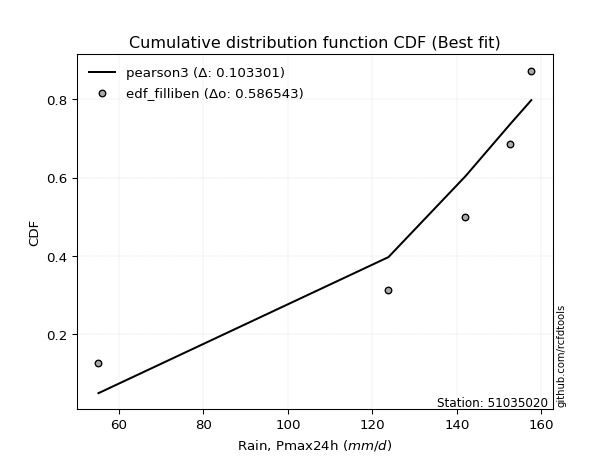</img></img>

</div>


### 10. EDF Jenkinson (1977)

The Jenkinson formula in hydrology is an empirical plotting position formula used to estimate the non-exceedance probability _(P)_ or return period _(T)_ of a given ordered observation within a sample. It is a widely used method in the frequency analysis of extreme events such as floods and rainfall, as it provides a distribution-free way to plot data. _a≈0.31_ and _b≈0.38_ are constants derived to approximate the median of the probability distribution for the given rank.

<div align="center">


$P=(m-a)/(n+b)$


</div>


**10.1. Empirical values**

<div align="center">

|                | 0                   | 1                   | 2                  | 3                  | 4                  | 5                  |
|:---------------|:--------------------|:--------------------|:-------------------|:-------------------|:-------------------|:-------------------|
| date           | 2023                | 2019                | 2025               | 2022               | 2020               | 2024               |
| x              | 55.2                | 123.8               | 128.8              | 142.0              | 152.6              | 157.6              |
| m              | 1                   | 2                   | 3                  | 4                  | 5                  | 6                  |
| empirical_dist | edf_jenkinson       | edf_jenkinson       | edf_jenkinson      | edf_jenkinson      | edf_jenkinson      | edf_jenkinson      |
| empirical      | 0.10815047021943573 | 0.26489028213166144 | 0.4216300940438871 | 0.5783699059561128 | 0.7351097178683387 | 0.8918495297805643 |
| empirical_tr   | 1.1212653778558874  | 1.3603411513859276  | 1.7289972899728996 | 2.3717472118959106 | 3.7751479289940844 | 9.246376811594207  |

</div>


**10.2. Kolmogorov-Smirnov fit test (sorted by Δ)**


<div align="center">

|                | 0                   | 1                   | 2                   | 3                  | 4                   | 5                  | 6                   | 7                   | 8                   | 9                  | 10                  | 11                  | 12                 | 13                 | 14                  | 15                 | 16                 | 17                  | 18                  | 19                 | 20                  | 21                 | 22                 | 23                  | 24                  | 25                  | 26                  | 27                  | 28                 | 29                 | 30                  | 31                  | 32                  | 33                  | 34                  | 35                 | 36                  | 37                  | 38                  | 39                  | 40                 | 41                 | 42                 | 43                 | 44                  | 45                  | 46                  | 47                 | 48                 | 49                  | 50                  | 51                 | 52                  | 53                 | 54                 | 55                  | 56                 | 57                 | 58                 | 59                 | 60                 | 61                 | 62                  | 63                  | 64                 | 65                  | 66                 | 67                  | 68                  | 69                  | 70                  | 71                 | 72                 | 73                  | 74                 | 75                 | 76                 | 77                 | 78                 | 79                  | 80                  | 81                | 82                  | 83                | 84                 | 85                 | 86                | 87                 | 88                 | 89                  | 90                  | 91                 | 92                 | 93                 | 94                 | 95                  | 96                  | 97                  | 98                 | 99                  | 100                | 101                 | 102                 | 103                | 104                | 105                | 106                 | 107                | 108                | 109                | 110                | 111                 | 112                 | 113                | 114                 | 115                | 116                 | 117                | 118                | 119                | 120                 | 121                 | 122                | 123                 | 124                 | 125                | 126                 | 127                | 128                 | 129                | 130                 | 131                | 132                | 133                | 134                 | 135                | 136                | 137                | 138                | 139                | 140                | 141                | 142                | 143                | 144                | 145                | 146                | 147                | 148                | 149                | 150                | 151                | 152                | 153                | 154                | 155                | 156                | 157                | 158                | 159                |
|:---------------|:--------------------|:--------------------|:--------------------|:-------------------|:--------------------|:-------------------|:--------------------|:--------------------|:--------------------|:-------------------|:--------------------|:--------------------|:-------------------|:-------------------|:--------------------|:-------------------|:-------------------|:--------------------|:--------------------|:-------------------|:--------------------|:-------------------|:-------------------|:--------------------|:--------------------|:--------------------|:--------------------|:--------------------|:-------------------|:-------------------|:--------------------|:--------------------|:--------------------|:--------------------|:--------------------|:-------------------|:--------------------|:--------------------|:--------------------|:--------------------|:-------------------|:-------------------|:-------------------|:-------------------|:--------------------|:--------------------|:--------------------|:-------------------|:-------------------|:--------------------|:--------------------|:-------------------|:--------------------|:-------------------|:-------------------|:--------------------|:-------------------|:-------------------|:-------------------|:-------------------|:-------------------|:-------------------|:--------------------|:--------------------|:-------------------|:--------------------|:-------------------|:--------------------|:--------------------|:--------------------|:--------------------|:-------------------|:-------------------|:--------------------|:-------------------|:-------------------|:-------------------|:-------------------|:-------------------|:--------------------|:--------------------|:------------------|:--------------------|:------------------|:-------------------|:-------------------|:------------------|:-------------------|:-------------------|:--------------------|:--------------------|:-------------------|:-------------------|:-------------------|:-------------------|:--------------------|:--------------------|:--------------------|:-------------------|:--------------------|:-------------------|:--------------------|:--------------------|:-------------------|:-------------------|:-------------------|:--------------------|:-------------------|:-------------------|:-------------------|:-------------------|:--------------------|:--------------------|:-------------------|:--------------------|:-------------------|:--------------------|:-------------------|:-------------------|:-------------------|:--------------------|:--------------------|:-------------------|:--------------------|:--------------------|:-------------------|:--------------------|:-------------------|:--------------------|:-------------------|:--------------------|:-------------------|:-------------------|:-------------------|:--------------------|:-------------------|:-------------------|:-------------------|:-------------------|:-------------------|:-------------------|:-------------------|:-------------------|:-------------------|:-------------------|:-------------------|:-------------------|:-------------------|:-------------------|:-------------------|:-------------------|:-------------------|:-------------------|:-------------------|:-------------------|:-------------------|:-------------------|:-------------------|:-------------------|:-------------------|
| station        | 51035020            | 51035020            | 51035020            | 51035020           | 51035020            | 51035020           | 51035020            | 51035020            | 51035020            | 51035020           | 51035020            | 51035020            | 51035020           | 51035020           | 51035020            | 51035020           | 51035020           | 51035020            | 51035020            | 51035020           | 51035020            | 51035020           | 51035020           | 51035020            | 51035020            | 51035020            | 51035020            | 51035020            | 51035020           | 51035020           | 51035020            | 51035020            | 51035020            | 51035020            | 51035020            | 51035020           | 51035020            | 51035020            | 51035020            | 51035020            | 51035020           | 51035020           | 51035020           | 51035020           | 51035020            | 51035020            | 51035020            | 51035020           | 51035020           | 51035020            | 51035020            | 51035020           | 51035020            | 51035020           | 51035020           | 51035020            | 51035020           | 51035020           | 51035020           | 51035020           | 51035020           | 51035020           | 51035020            | 51035020            | 51035020           | 51035020            | 51035020           | 51035020            | 51035020            | 51035020            | 51035020            | 51035020           | 51035020           | 51035020            | 51035020           | 51035020           | 51035020           | 51035020           | 51035020           | 51035020            | 51035020            | 51035020          | 51035020            | 51035020          | 51035020           | 51035020           | 51035020          | 51035020           | 51035020           | 51035020            | 51035020            | 51035020           | 51035020           | 51035020           | 51035020           | 51035020            | 51035020            | 51035020            | 51035020           | 51035020            | 51035020           | 51035020            | 51035020            | 51035020           | 51035020           | 51035020           | 51035020            | 51035020           | 51035020           | 51035020           | 51035020           | 51035020            | 51035020            | 51035020           | 51035020            | 51035020           | 51035020            | 51035020           | 51035020           | 51035020           | 51035020            | 51035020            | 51035020           | 51035020            | 51035020            | 51035020           | 51035020            | 51035020           | 51035020            | 51035020           | 51035020            | 51035020           | 51035020           | 51035020           | 51035020            | 51035020           | 51035020           | 51035020           | 51035020           | 51035020           | 51035020           | 51035020           | 51035020           | 51035020           | 51035020           | 51035020           | 51035020           | 51035020           | 51035020           | 51035020           | 51035020           | 51035020           | 51035020           | 51035020           | 51035020           | 51035020           | 51035020           | 51035020           | 51035020           | 51035020           |
| empirical_dist | edf_jenkinson       | edf_jenkinson       | edf_jenkinson       | edf_jenkinson      | edf_jenkinson       | edf_jenkinson      | edf_jenkinson       | edf_jenkinson       | edf_jenkinson       | edf_jenkinson      | edf_jenkinson       | edf_jenkinson       | edf_jenkinson      | edf_jenkinson      | edf_jenkinson       | edf_jenkinson      | edf_jenkinson      | edf_jenkinson       | edf_jenkinson       | edf_jenkinson      | edf_jenkinson       | edf_jenkinson      | edf_jenkinson      | edf_jenkinson       | edf_jenkinson       | edf_jenkinson       | edf_jenkinson       | edf_jenkinson       | edf_jenkinson      | edf_jenkinson      | edf_jenkinson       | edf_jenkinson       | edf_jenkinson       | edf_jenkinson       | edf_jenkinson       | edf_jenkinson      | edf_jenkinson       | edf_jenkinson       | edf_jenkinson       | edf_jenkinson       | edf_jenkinson      | edf_jenkinson      | edf_jenkinson      | edf_jenkinson      | edf_jenkinson       | edf_jenkinson       | edf_jenkinson       | edf_jenkinson      | edf_jenkinson      | edf_jenkinson       | edf_jenkinson       | edf_jenkinson      | edf_jenkinson       | edf_jenkinson      | edf_jenkinson      | edf_jenkinson       | edf_jenkinson      | edf_jenkinson      | edf_jenkinson      | edf_jenkinson      | edf_jenkinson      | edf_jenkinson      | edf_jenkinson       | edf_jenkinson       | edf_jenkinson      | edf_jenkinson       | edf_jenkinson      | edf_jenkinson       | edf_jenkinson       | edf_jenkinson       | edf_jenkinson       | edf_jenkinson      | edf_jenkinson      | edf_jenkinson       | edf_jenkinson      | edf_jenkinson      | edf_jenkinson      | edf_jenkinson      | edf_jenkinson      | edf_jenkinson       | edf_jenkinson       | edf_jenkinson     | edf_jenkinson       | edf_jenkinson     | edf_jenkinson      | edf_jenkinson      | edf_jenkinson     | edf_jenkinson      | edf_jenkinson      | edf_jenkinson       | edf_jenkinson       | edf_jenkinson      | edf_jenkinson      | edf_jenkinson      | edf_jenkinson      | edf_jenkinson       | edf_jenkinson       | edf_jenkinson       | edf_jenkinson      | edf_jenkinson       | edf_jenkinson      | edf_jenkinson       | edf_jenkinson       | edf_jenkinson      | edf_jenkinson      | edf_jenkinson      | edf_jenkinson       | edf_jenkinson      | edf_jenkinson      | edf_jenkinson      | edf_jenkinson      | edf_jenkinson       | edf_jenkinson       | edf_jenkinson      | edf_jenkinson       | edf_jenkinson      | edf_jenkinson       | edf_jenkinson      | edf_jenkinson      | edf_jenkinson      | edf_jenkinson       | edf_jenkinson       | edf_jenkinson      | edf_jenkinson       | edf_jenkinson       | edf_jenkinson      | edf_jenkinson       | edf_jenkinson      | edf_jenkinson       | edf_jenkinson      | edf_jenkinson       | edf_jenkinson      | edf_jenkinson      | edf_jenkinson      | edf_jenkinson       | edf_jenkinson      | edf_jenkinson      | edf_jenkinson      | edf_jenkinson      | edf_jenkinson      | edf_jenkinson      | edf_jenkinson      | edf_jenkinson      | edf_jenkinson      | edf_jenkinson      | edf_jenkinson      | edf_jenkinson      | edf_jenkinson      | edf_jenkinson      | edf_jenkinson      | edf_jenkinson      | edf_jenkinson      | edf_jenkinson      | edf_jenkinson      | edf_jenkinson      | edf_jenkinson      | edf_jenkinson      | edf_jenkinson      | edf_jenkinson      | edf_jenkinson      |
| p_dist         | dweibull            | loglevy_l           | levy_l              | vonmises_line      | loggenextreme       | genextreme         | mielke              | pearson3            | argus               | logmielke          | gumbel_l            | logargus            | logvonmises_line   | dgamma             | logt                | logburr            | logexponweib       | burr                | logloggamma         | trapezoid          | logburr12           | logpearson3        | logweibull_min     | logbeta             | laplace             | hypsecant           | t                   | logistic            | skewnorm           | logloglaplace      | loggumbel_l         | logdweibull         | crystalball         | norm                | exponnorm           | nct                | f                   | beta                | loggennorm          | logtrapezoid        | anglit             | gamma              | semicircular       | betaprime          | erlang              | arcsine             | genhalflogistic     | logweibull_max     | invgamma           | alpha               | logdgamma           | maxwell            | logexponpow         | invgauss           | loginvweibull      | rayleigh            | gennorm            | weibull_max        | loggenpareto       | logarcsine         | ncf                | logjohnsonsu       | logsemicircular     | loganglit           | logtukeylambda     | logtruncnorm        | lognakagami        | nakagami            | logbetaprime        | genpareto           | logfatiguelife      | logf               | logexponnorm       | lognorm             | logcrystalball     | logrice            | logncf             | gumbel_r           | lognct             | cosine              | loglogistic         | gausshyper        | loghypsecant        | logalpha          | triang             | halfnorm           | johnsonsb         | wrapcauchy         | kstwobign          | loginvgamma         | logerlang           | loglaplace         | loglaplace         | loginvgauss        | moyal              | logmaxwell          | halflogistic        | kappa3              | loggengamma        | lograyleigh         | logfoldnorm        | truncweibull_min    | logskewnorm         | gengamma           | logkstwobign       | loghalfnorm        | loggumbel_r         | loggenexpon        | logcosine          | logwrapcauchy      | lomax              | johnsonsu           | logmoyal            | loghalflogistic    | wald                | loggenhalflogistic | ksone               | halfgennorm        | burr12             | loggompertz        | logtriang           | uniform             | kappa4             | loghalfgennorm      | logjohnsonsb        | foldnorm           | logwald             | invweibull         | logtruncweibull_min | logksone           | bradford            | truncexpon         | loggamma           | loggamma           | gompertz            | logkappa3          | loguniform         | logkappa4          | loggausshyper      | logrdist           | logbradford        | logtruncexpon      | exponweib          | truncnorm          | fatiguelife        | weibull_min        | powerlaw           | exponpow           | logpowerlaw        | truncpareto        | genexpon           | logtruncpareto     | loglomax           | rice               | rdist              | tukeylambda        | genlogistic        | loggenlogistic     | logvonmises        | vonmises           |
| delta          | 0.09376641999648916 | 0.10309678497435504 | 0.10622528839295609 | 0.1081504702148445 | 0.10815047021917323 | 0.1081504702193622 | 0.11508283977001532 | 0.11596297690270596 | 0.11642812930288948 | 0.1274239701979334 | 0.13106275522844457 | 0.13559960486827694 | 0.1405631549497346 | 0.1405798200005161 | 0.14128865179788852 | 0.1451263076313975 | 0.1468650596684345 | 0.14910878454005716 | 0.15263537944913996 | 0.1535417652321867 | 0.16277763968285974 | 0.1640032836379559 | 0.1666430480522465 | 0.17512697076547412 | 0.17909327148286913 | 0.19322172313254937 | 0.19330766403191213 | 0.19708495105629797 | 0.1981688257659272 | 0.1996978128970871 | 0.20000896967594062 | 0.20048810668326988 | 0.20163043638626477 | 0.20163044554471005 | 0.20163182654362993 | 0.2016362686934023 | 0.20293080622706006 | 0.20411757532982333 | 0.20582818090194693 | 0.20633424649904047 | 0.2064050396061945 | 0.2076070869167823 | 0.2083736041743668 | 0.2142178670821061 | 0.21487812641396603 | 0.21618766537875334 | 0.22510993350387587 | 0.2277627854867711 | 0.2315671898270148 | 0.23305717917687185 | 0.23486167146976022 | 0.2356968118782562 | 0.24048731259177025 | 0.2407988439528288 | 0.2456535372107076 | 0.24734680093043449 | 0.2503256118944589 | 0.2508128976938253 | 0.2524687082581658 | 0.2540199464004972 | 0.2561805332363626 | 0.2593215896310123 | 0.26182938724790095 | 0.26379682173187324 | 0.2648801669241525 | 0.26488779029390175 | 0.2648902702486586 | 0.26489028204163556 | 0.26580107823084687 | 0.26722779405673824 | 0.26787665228740765 | 0.2683863273263354 | 0.2685672915032541 | 0.26856851819758387 | 0.2685685248763787 | 0.2685854445294338 | 0.2701835034882505 | 0.2701883663902416 | 0.2715907580758816 | 0.27266737529452667 | 0.27311126833929844 | 0.274535474907041 | 0.27697218658801226 | 0.278842372898348 | 0.2794833419168814 | 0.2801892914799795 | 0.280198660487859 | 0.2833151977634425 | 0.2849647282633536 | 0.29076616978060765 | 0.29094082391865683 | 0.2910938287432968 | 0.2910938287432968 | 0.2950555414640371 | 0.2959018183745188 | 0.29998152924261523 | 0.30273443045468595 | 0.30362471564931004 | 0.3097383414113186 | 0.31018970200939133 | 0.3231485275743191 | 0.32468318939792207 | 0.32621126802518163 | 0.3265964207006612 | 0.3292850048164826 | 0.3389512639733452 | 0.33913656858240704 | 0.3397797650926331 | 0.3414949414572739 | 0.3431507111586991 | 0.3507494719619899 | 0.35239342022583586 | 0.36444787447955385 | 0.3656158403609189 | 0.36746742572516855 | 0.3709074955233117 | 0.37671128036833856 | 0.3793620148094521 | 0.3810733211350542 | 0.3836929542733325 | 0.38478777583169954 | 0.40503159286833856 | 0.4082477780346965 | 0.41413196516579753 | 0.41840845588848063 | 0.4216300940438871 | 0.43470501550880203 | 0.4366482105716285 | 0.4555728566205527  | 0.4600299225781562 | 0.47501060828314645 | 0.4823481477944148 | 0.4843814394611037 | 0.4843814394611037 | 0.49271304814460154 | 0.4996145492162869 | 0.5050139635201201 | 0.5058145614447647 | 0.5297551276137255 | 0.5510056665118318 | 0.5616982949130161 | 0.5732959413418914 | 0.5775188959533742 | 0.5783699049331819 | 0.6001256848133368 | 0.6442725853607827 | 0.6740549810510904 | 0.6821517389568375 | 0.6916567981163642 | 0.7005724597351201 | 0.7100812859872951 | 0.7124561753123206 | 0.7204986448077799 | 0.7351097178683342 | 0.7351097178683386 | 0.7351097178683386 | 0.7351097178683387 | 0.7351097178683387 | 1.2552631370986216 | 25.093005052790765 |
| deltao         | 0.530385761606      | 0.530385761606      | 0.530385761606      | 0.530385761606     | 0.530385761606      | 0.530385761606     | 0.530385761606      | 0.530385761606      | 0.530385761606      | 0.530385761606     | 0.530385761606      | 0.530385761606      | 0.530385761606     | 0.530385761606     | 0.530385761606      | 0.530385761606     | 0.530385761606     | 0.530385761606      | 0.530385761606      | 0.530385761606     | 0.530385761606      | 0.530385761606     | 0.530385761606     | 0.530385761606      | 0.530385761606      | 0.530385761606      | 0.530385761606      | 0.530385761606      | 0.530385761606     | 0.530385761606     | 0.530385761606      | 0.530385761606      | 0.530385761606      | 0.530385761606      | 0.530385761606      | 0.530385761606     | 0.530385761606      | 0.530385761606      | 0.530385761606      | 0.530385761606      | 0.530385761606     | 0.530385761606     | 0.530385761606     | 0.530385761606     | 0.530385761606      | 0.530385761606      | 0.530385761606      | 0.530385761606     | 0.530385761606     | 0.530385761606      | 0.530385761606      | 0.530385761606     | 0.530385761606      | 0.530385761606     | 0.530385761606     | 0.530385761606      | 0.530385761606     | 0.530385761606     | 0.530385761606     | 0.530385761606     | 0.530385761606     | 0.530385761606     | 0.530385761606      | 0.530385761606      | 0.530385761606     | 0.530385761606      | 0.530385761606     | 0.530385761606      | 0.530385761606      | 0.530385761606      | 0.530385761606      | 0.530385761606     | 0.530385761606     | 0.530385761606      | 0.530385761606     | 0.530385761606     | 0.530385761606     | 0.530385761606     | 0.530385761606     | 0.530385761606      | 0.530385761606      | 0.530385761606    | 0.530385761606      | 0.530385761606    | 0.530385761606     | 0.530385761606     | 0.530385761606    | 0.530385761606     | 0.530385761606     | 0.530385761606      | 0.530385761606      | 0.530385761606     | 0.530385761606     | 0.530385761606     | 0.530385761606     | 0.530385761606      | 0.530385761606      | 0.530385761606      | 0.530385761606     | 0.530385761606      | 0.530385761606     | 0.530385761606      | 0.530385761606      | 0.530385761606     | 0.530385761606     | 0.530385761606     | 0.530385761606      | 0.530385761606     | 0.530385761606     | 0.530385761606     | 0.530385761606     | 0.530385761606      | 0.530385761606      | 0.530385761606     | 0.530385761606      | 0.530385761606     | 0.530385761606      | 0.530385761606     | 0.530385761606     | 0.530385761606     | 0.530385761606      | 0.530385761606      | 0.530385761606     | 0.530385761606      | 0.530385761606      | 0.530385761606     | 0.530385761606      | 0.530385761606     | 0.530385761606      | 0.530385761606     | 0.530385761606      | 0.530385761606     | 0.530385761606     | 0.530385761606     | 0.530385761606      | 0.530385761606     | 0.530385761606     | 0.530385761606     | 0.530385761606     | 0.530385761606     | 0.530385761606     | 0.530385761606     | 0.530385761606     | 0.530385761606     | 0.530385761606     | 0.530385761606     | 0.530385761606     | 0.530385761606     | 0.530385761606     | 0.530385761606     | 0.530385761606     | 0.530385761606     | 0.530385761606     | 0.530385761606     | 0.530385761606     | 0.530385761606     | 0.530385761606     | 0.530385761606     | 0.530385761606     | 0.530385761606     |
| eval           | Δo > Δ              | Δo > Δ              | Δo > Δ              | Δo > Δ             | Δo > Δ              | Δo > Δ             | Δo > Δ              | Δo > Δ              | Δo > Δ              | Δo > Δ             | Δo > Δ              | Δo > Δ              | Δo > Δ             | Δo > Δ             | Δo > Δ              | Δo > Δ             | Δo > Δ             | Δo > Δ              | Δo > Δ              | Δo > Δ             | Δo > Δ              | Δo > Δ             | Δo > Δ             | Δo > Δ              | Δo > Δ              | Δo > Δ              | Δo > Δ              | Δo > Δ              | Δo > Δ             | Δo > Δ             | Δo > Δ              | Δo > Δ              | Δo > Δ              | Δo > Δ              | Δo > Δ              | Δo > Δ             | Δo > Δ              | Δo > Δ              | Δo > Δ              | Δo > Δ              | Δo > Δ             | Δo > Δ             | Δo > Δ             | Δo > Δ             | Δo > Δ              | Δo > Δ              | Δo > Δ              | Δo > Δ             | Δo > Δ             | Δo > Δ              | Δo > Δ              | Δo > Δ             | Δo > Δ              | Δo > Δ             | Δo > Δ             | Δo > Δ              | Δo > Δ             | Δo > Δ             | Δo > Δ             | Δo > Δ             | Δo > Δ             | Δo > Δ             | Δo > Δ              | Δo > Δ              | Δo > Δ             | Δo > Δ              | Δo > Δ             | Δo > Δ              | Δo > Δ              | Δo > Δ              | Δo > Δ              | Δo > Δ             | Δo > Δ             | Δo > Δ              | Δo > Δ             | Δo > Δ             | Δo > Δ             | Δo > Δ             | Δo > Δ             | Δo > Δ              | Δo > Δ              | Δo > Δ            | Δo > Δ              | Δo > Δ            | Δo > Δ             | Δo > Δ             | Δo > Δ            | Δo > Δ             | Δo > Δ             | Δo > Δ              | Δo > Δ              | Δo > Δ             | Δo > Δ             | Δo > Δ             | Δo > Δ             | Δo > Δ              | Δo > Δ              | Δo > Δ              | Δo > Δ             | Δo > Δ              | Δo > Δ             | Δo > Δ              | Δo > Δ              | Δo > Δ             | Δo > Δ             | Δo > Δ             | Δo > Δ              | Δo > Δ             | Δo > Δ             | Δo > Δ             | Δo > Δ             | Δo > Δ              | Δo > Δ              | Δo > Δ             | Δo > Δ              | Δo > Δ             | Δo > Δ              | Δo > Δ             | Δo > Δ             | Δo > Δ             | Δo > Δ              | Δo > Δ              | Δo > Δ             | Δo > Δ              | Δo > Δ              | Δo > Δ             | Δo > Δ              | Δo > Δ             | Δo > Δ              | Δo > Δ             | Δo > Δ              | Δo > Δ             | Δo > Δ             | Δo > Δ             | Δo > Δ              | Δo > Δ             | Δo > Δ             | Δo > Δ             | Δo > Δ             | Δo <= Δ            | Δo <= Δ            | Δo <= Δ            | Δo <= Δ            | Δo <= Δ            | Δo <= Δ            | Δo <= Δ            | Δo <= Δ            | Δo <= Δ            | Δo <= Δ            | Δo <= Δ            | Δo <= Δ            | Δo <= Δ            | Δo <= Δ            | Δo <= Δ            | Δo <= Δ            | Δo <= Δ            | Δo <= Δ            | Δo <= Δ            | Δo <= Δ            | Δo <= Δ            |
| fit            | 1                   | 1                   | 1                   | 1                  | 1                   | 1                  | 1                   | 1                   | 1                   | 1                  | 1                   | 1                   | 1                  | 1                  | 1                   | 1                  | 1                  | 1                   | 1                   | 1                  | 1                   | 1                  | 1                  | 1                   | 1                   | 1                   | 1                   | 1                   | 1                  | 1                  | 1                   | 1                   | 1                   | 1                   | 1                   | 1                  | 1                   | 1                   | 1                   | 1                   | 1                  | 1                  | 1                  | 1                  | 1                   | 1                   | 1                   | 1                  | 1                  | 1                   | 1                   | 1                  | 1                   | 1                  | 1                  | 1                   | 1                  | 1                  | 1                  | 1                  | 1                  | 1                  | 1                   | 1                   | 1                  | 1                   | 1                  | 1                   | 1                   | 1                   | 1                   | 1                  | 1                  | 1                   | 1                  | 1                  | 1                  | 1                  | 1                  | 1                   | 1                   | 1                 | 1                   | 1                 | 1                  | 1                  | 1                 | 1                  | 1                  | 1                   | 1                   | 1                  | 1                  | 1                  | 1                  | 1                   | 1                   | 1                   | 1                  | 1                   | 1                  | 1                   | 1                   | 1                  | 1                  | 1                  | 1                   | 1                  | 1                  | 1                  | 1                  | 1                   | 1                   | 1                  | 1                   | 1                  | 1                   | 1                  | 1                  | 1                  | 1                   | 1                   | 1                  | 1                   | 1                   | 1                  | 1                   | 1                  | 1                   | 1                  | 1                   | 1                  | 1                  | 1                  | 1                   | 1                  | 1                  | 1                  | 1                  | 0                  | 0                  | 0                  | 0                  | 0                  | 0                  | 0                  | 0                  | 0                  | 0                  | 0                  | 0                  | 0                  | 0                  | 0                  | 0                  | 0                  | 0                  | 0                  | 0                  | 0                  |
| n              | 6                   | 6                   | 6                   | 6                  | 6                   | 6                  | 6                   | 6                   | 6                   | 6                  | 6                   | 6                   | 6                  | 6                  | 6                   | 6                  | 6                  | 6                   | 6                   | 6                  | 6                   | 6                  | 6                  | 6                   | 6                   | 6                   | 6                   | 6                   | 6                  | 6                  | 6                   | 6                   | 6                   | 6                   | 6                   | 6                  | 6                   | 6                   | 6                   | 6                   | 6                  | 6                  | 6                  | 6                  | 6                   | 6                   | 6                   | 6                  | 6                  | 6                   | 6                   | 6                  | 6                   | 6                  | 6                  | 6                   | 6                  | 6                  | 6                  | 6                  | 6                  | 6                  | 6                   | 6                   | 6                  | 6                   | 6                  | 6                   | 6                   | 6                   | 6                   | 6                  | 6                  | 6                   | 6                  | 6                  | 6                  | 6                  | 6                  | 6                   | 6                   | 6                 | 6                   | 6                 | 6                  | 6                  | 6                 | 6                  | 6                  | 6                   | 6                   | 6                  | 6                  | 6                  | 6                  | 6                   | 6                   | 6                   | 6                  | 6                   | 6                  | 6                   | 6                   | 6                  | 6                  | 6                  | 6                   | 6                  | 6                  | 6                  | 6                  | 6                   | 6                   | 6                  | 6                   | 6                  | 6                   | 6                  | 6                  | 6                  | 6                   | 6                   | 6                  | 6                   | 6                   | 6                  | 6                   | 6                  | 6                   | 6                  | 6                   | 6                  | 6                  | 6                  | 6                   | 6                  | 6                  | 6                  | 6                  | 6                  | 6                  | 6                  | 6                  | 6                  | 6                  | 6                  | 6                  | 6                  | 6                  | 6                  | 6                  | 6                  | 6                  | 6                  | 6                  | 6                  | 6                  | 6                  | 6                  | 6                  |
| best_fit       | 1                   | 0                   | 0                   | 0                  | 0                   | 0                  | 0                   | 0                   | 0                   | 0                  | 0                   | 0                   | 0                  | 0                  | 0                   | 0                  | 0                  | 0                   | 0                   | 0                  | 0                   | 0                  | 0                  | 0                   | 0                   | 0                   | 0                   | 0                   | 0                  | 0                  | 0                   | 0                   | 0                   | 0                   | 0                   | 0                  | 0                   | 0                   | 0                   | 0                   | 0                  | 0                  | 0                  | 0                  | 0                   | 0                   | 0                   | 0                  | 0                  | 0                   | 0                   | 0                  | 0                   | 0                  | 0                  | 0                   | 0                  | 0                  | 0                  | 0                  | 0                  | 0                  | 0                   | 0                   | 0                  | 0                   | 0                  | 0                   | 0                   | 0                   | 0                   | 0                  | 0                  | 0                   | 0                  | 0                  | 0                  | 0                  | 0                  | 0                   | 0                   | 0                 | 0                   | 0                 | 0                  | 0                  | 0                 | 0                  | 0                  | 0                   | 0                   | 0                  | 0                  | 0                  | 0                  | 0                   | 0                   | 0                   | 0                  | 0                   | 0                  | 0                   | 0                   | 0                  | 0                  | 0                  | 0                   | 0                  | 0                  | 0                  | 0                  | 0                   | 0                   | 0                  | 0                   | 0                  | 0                   | 0                  | 0                  | 0                  | 0                   | 0                   | 0                  | 0                   | 0                   | 0                  | 0                   | 0                  | 0                   | 0                  | 0                   | 0                  | 0                  | 0                  | 0                   | 0                  | 0                  | 0                  | 0                  | 0                  | 0                  | 0                  | 0                  | 0                  | 0                  | 0                  | 0                  | 0                  | 0                  | 0                  | 0                  | 0                  | 0                  | 0                  | 0                  | 0                  | 0                  | 0                  | 0                  | 0                  |
| best_fit_sort  | 1                   | 2                   | 3                   | 4                  | 5                   | 6                  | 7                   | 8                   | 9                   | 10                 | 11                  | 12                  | 13                 | 14                 | 15                  | 16                 | 17                 | 18                  | 19                  | 20                 | 21                  | 22                 | 23                 | 24                  | 25                  | 26                  | 27                  | 28                  | 29                 | 30                 | 31                  | 32                  | 33                  | 34                  | 35                  | 36                 | 37                  | 38                  | 39                  | 40                  | 41                 | 42                 | 43                 | 44                 | 45                  | 46                  | 47                  | 48                 | 49                 | 50                  | 51                  | 52                 | 53                  | 54                 | 55                 | 56                  | 57                 | 58                 | 59                 | 60                 | 61                 | 62                 | 63                  | 64                  | 65                 | 66                  | 67                 | 68                  | 69                  | 70                  | 71                  | 72                 | 73                 | 74                  | 75                 | 76                 | 77                 | 78                 | 79                 | 80                  | 81                  | 82                | 83                  | 84                | 85                 | 86                 | 87                | 88                 | 89                 | 90                  | 91                  | 92                 | 93                 | 94                 | 95                 | 96                  | 97                  | 98                  | 99                 | 100                 | 101                | 102                 | 103                 | 104                | 105                | 106                | 107                 | 108                | 109                | 110                | 111                | 112                 | 113                 | 114                | 115                 | 116                | 117                 | 118                | 119                | 120                | 121                 | 122                 | 123                | 124                 | 125                 | 126                | 127                 | 128                | 129                 | 130                | 131                 | 132                | 133                | 134                | 135                 | 136                | 137                | 138                | 139                | 140                | 141                | 142                | 143                | 144                | 145                | 146                | 147                | 148                | 149                | 150                | 151                | 152                | 153                | 154                | 155                | 156                | 157                | 158                | 159                | 160                |

</div>


**10.3. Best fit**

<div align="center">

|   id |   station | empirical_dist   | p_dist   |     delta |   deltao | eval   |   fit |   n |   best_fit |   best_fit_sort |
|-----:|----------:|:-----------------|:---------|----------:|---------:|:-------|------:|----:|-----------:|----------------:|
|    0 |  51035020 | edf_jenkinson    | dweibull | 0.0937664 | 0.530386 | Δo > Δ |     1 |   6 |          1 |               1 |

</div>


<div align="center">

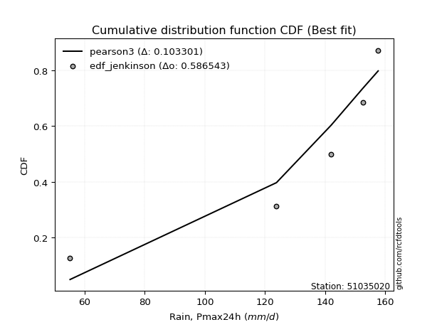</img>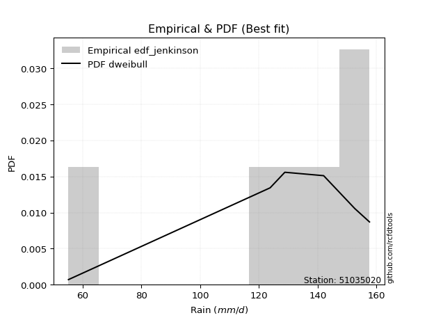</img>

</div>


### 11. EDF Cunnane (1978)

Cunnane´s work in statistical hydrology has focused on the performance and evaluation of different probability distributions (such as GEV, Gumbel, Lognormal) for flood frequency estimation. _b_ is a constant, typically set to 0.4.

<div align="center">


$P=(m-b)/(n+1-2b)$


</div>


**11.1. Empirical values**

<div align="center">

|                | 0                  | 1                   | 2                   | 3                  | 4                  | 5                  |
|:---------------|:-------------------|:--------------------|:--------------------|:-------------------|:-------------------|:-------------------|
| date           | 2023               | 2019                | 2025                | 2022               | 2020               | 2024               |
| x              | 55.2               | 123.8               | 128.8               | 142.0              | 152.6              | 157.6              |
| m              | 1                  | 2                   | 3                   | 4                  | 5                  | 6                  |
| empirical_dist | edf_cunnane        | edf_cunnane         | edf_cunnane         | edf_cunnane        | edf_cunnane        | edf_cunnane        |
| empirical      | 0.0967741935483871 | 0.25806451612903225 | 0.41935483870967744 | 0.5806451612903226 | 0.7419354838709676 | 0.9032258064516128 |
| empirical_tr   | 1.1071428571428572 | 1.3478260869565217  | 1.7222222222222225  | 2.384615384615385  | 3.8749999999999982 | 10.333333333333318 |

</div>


**11.2. Kolmogorov-Smirnov fit test (sorted by Δ)**


<div align="center">

|                | 0                   | 1                   | 2                   | 3                   | 4                   | 5                   | 6                   | 7                   | 8                   | 9                   | 10                  | 11                  | 12                  | 13                 | 14                  | 15                  | 16                  | 17                  | 18                  | 19                 | 20                  | 21                 | 22                 | 23                 | 24                  | 25                  | 26                  | 27                  | 28                  | 29                 | 30                 | 31                  | 32                  | 33                  | 34                  | 35                  | 36                 | 37                  | 38                  | 39                  | 40                  | 41                 | 42                  | 43                 | 44                  | 45                  | 46                  | 47                  | 48                  | 49                  | 50                  | 51                  | 52                  | 53                  | 54                  | 55                  | 56                  | 57                 | 58                 | 59                  | 60                 | 61                 | 62                | 63                 | 64                  | 65                  | 66                  | 67                  | 68                  | 69                  | 70                  | 71                  | 72                 | 73                  | 74                 | 75                  | 76                 | 77                  | 78                 | 79                  | 80                 | 81                 | 82                  | 83                 | 84                 | 85                 | 86                 | 87                 | 88                 | 89                  | 90                | 91                | 92                | 93                 | 94                | 95                 | 96                  | 97                 | 98                 | 99                 | 100                | 101                 | 102                | 103                | 104                | 105                 | 106                | 107                 | 108                 | 109                | 110                | 111                | 112                 | 113                 | 114                 | 115                | 116                 | 117                 | 118                | 119                | 120                | 121                 | 122                 | 123                 | 124                | 125                | 126                | 127                 | 128                 | 129                | 130                 | 131               | 132                 | 133                 | 134                 | 135                | 136                | 137                | 138                | 139                | 140                | 141                | 142                | 143                | 144               | 145                | 146                | 147                | 148                | 149                | 150                | 151                | 152                | 153                | 154                | 155                | 156                | 157                | 158                | 159                |
|:---------------|:--------------------|:--------------------|:--------------------|:--------------------|:--------------------|:--------------------|:--------------------|:--------------------|:--------------------|:--------------------|:--------------------|:--------------------|:--------------------|:-------------------|:--------------------|:--------------------|:--------------------|:--------------------|:--------------------|:-------------------|:--------------------|:-------------------|:-------------------|:-------------------|:--------------------|:--------------------|:--------------------|:--------------------|:--------------------|:-------------------|:-------------------|:--------------------|:--------------------|:--------------------|:--------------------|:--------------------|:-------------------|:--------------------|:--------------------|:--------------------|:--------------------|:-------------------|:--------------------|:-------------------|:--------------------|:--------------------|:--------------------|:--------------------|:--------------------|:--------------------|:--------------------|:--------------------|:--------------------|:--------------------|:--------------------|:--------------------|:--------------------|:-------------------|:-------------------|:--------------------|:-------------------|:-------------------|:------------------|:-------------------|:--------------------|:--------------------|:--------------------|:--------------------|:--------------------|:--------------------|:--------------------|:--------------------|:-------------------|:--------------------|:-------------------|:--------------------|:-------------------|:--------------------|:-------------------|:--------------------|:-------------------|:-------------------|:--------------------|:-------------------|:-------------------|:-------------------|:-------------------|:-------------------|:-------------------|:--------------------|:------------------|:------------------|:------------------|:-------------------|:------------------|:-------------------|:--------------------|:-------------------|:-------------------|:-------------------|:-------------------|:--------------------|:-------------------|:-------------------|:-------------------|:--------------------|:-------------------|:--------------------|:--------------------|:-------------------|:-------------------|:-------------------|:--------------------|:--------------------|:--------------------|:-------------------|:--------------------|:--------------------|:-------------------|:-------------------|:-------------------|:--------------------|:--------------------|:--------------------|:-------------------|:-------------------|:-------------------|:--------------------|:--------------------|:-------------------|:--------------------|:------------------|:--------------------|:--------------------|:--------------------|:-------------------|:-------------------|:-------------------|:-------------------|:-------------------|:-------------------|:-------------------|:-------------------|:-------------------|:------------------|:-------------------|:-------------------|:-------------------|:-------------------|:-------------------|:-------------------|:-------------------|:-------------------|:-------------------|:-------------------|:-------------------|:-------------------|:-------------------|:-------------------|:-------------------|
| station        | 51035020            | 51035020            | 51035020            | 51035020            | 51035020            | 51035020            | 51035020            | 51035020            | 51035020            | 51035020            | 51035020            | 51035020            | 51035020            | 51035020           | 51035020            | 51035020            | 51035020            | 51035020            | 51035020            | 51035020           | 51035020            | 51035020           | 51035020           | 51035020           | 51035020            | 51035020            | 51035020            | 51035020            | 51035020            | 51035020           | 51035020           | 51035020            | 51035020            | 51035020            | 51035020            | 51035020            | 51035020           | 51035020            | 51035020            | 51035020            | 51035020            | 51035020           | 51035020            | 51035020           | 51035020            | 51035020            | 51035020            | 51035020            | 51035020            | 51035020            | 51035020            | 51035020            | 51035020            | 51035020            | 51035020            | 51035020            | 51035020            | 51035020           | 51035020           | 51035020            | 51035020           | 51035020           | 51035020          | 51035020           | 51035020            | 51035020            | 51035020            | 51035020            | 51035020            | 51035020            | 51035020            | 51035020            | 51035020           | 51035020            | 51035020           | 51035020            | 51035020           | 51035020            | 51035020           | 51035020            | 51035020           | 51035020           | 51035020            | 51035020           | 51035020           | 51035020           | 51035020           | 51035020           | 51035020           | 51035020            | 51035020          | 51035020          | 51035020          | 51035020           | 51035020          | 51035020           | 51035020            | 51035020           | 51035020           | 51035020           | 51035020           | 51035020            | 51035020           | 51035020           | 51035020           | 51035020            | 51035020           | 51035020            | 51035020            | 51035020           | 51035020           | 51035020           | 51035020            | 51035020            | 51035020            | 51035020           | 51035020            | 51035020            | 51035020           | 51035020           | 51035020           | 51035020            | 51035020            | 51035020            | 51035020           | 51035020           | 51035020           | 51035020            | 51035020            | 51035020           | 51035020            | 51035020          | 51035020            | 51035020            | 51035020            | 51035020           | 51035020           | 51035020           | 51035020           | 51035020           | 51035020           | 51035020           | 51035020           | 51035020           | 51035020          | 51035020           | 51035020           | 51035020           | 51035020           | 51035020           | 51035020           | 51035020           | 51035020           | 51035020           | 51035020           | 51035020           | 51035020           | 51035020           | 51035020           | 51035020           |
| empirical_dist | edf_cunnane         | edf_cunnane         | edf_cunnane         | edf_cunnane         | edf_cunnane         | edf_cunnane         | edf_cunnane         | edf_cunnane         | edf_cunnane         | edf_cunnane         | edf_cunnane         | edf_cunnane         | edf_cunnane         | edf_cunnane        | edf_cunnane         | edf_cunnane         | edf_cunnane         | edf_cunnane         | edf_cunnane         | edf_cunnane        | edf_cunnane         | edf_cunnane        | edf_cunnane        | edf_cunnane        | edf_cunnane         | edf_cunnane         | edf_cunnane         | edf_cunnane         | edf_cunnane         | edf_cunnane        | edf_cunnane        | edf_cunnane         | edf_cunnane         | edf_cunnane         | edf_cunnane         | edf_cunnane         | edf_cunnane        | edf_cunnane         | edf_cunnane         | edf_cunnane         | edf_cunnane         | edf_cunnane        | edf_cunnane         | edf_cunnane        | edf_cunnane         | edf_cunnane         | edf_cunnane         | edf_cunnane         | edf_cunnane         | edf_cunnane         | edf_cunnane         | edf_cunnane         | edf_cunnane         | edf_cunnane         | edf_cunnane         | edf_cunnane         | edf_cunnane         | edf_cunnane        | edf_cunnane        | edf_cunnane         | edf_cunnane        | edf_cunnane        | edf_cunnane       | edf_cunnane        | edf_cunnane         | edf_cunnane         | edf_cunnane         | edf_cunnane         | edf_cunnane         | edf_cunnane         | edf_cunnane         | edf_cunnane         | edf_cunnane        | edf_cunnane         | edf_cunnane        | edf_cunnane         | edf_cunnane        | edf_cunnane         | edf_cunnane        | edf_cunnane         | edf_cunnane        | edf_cunnane        | edf_cunnane         | edf_cunnane        | edf_cunnane        | edf_cunnane        | edf_cunnane        | edf_cunnane        | edf_cunnane        | edf_cunnane         | edf_cunnane       | edf_cunnane       | edf_cunnane       | edf_cunnane        | edf_cunnane       | edf_cunnane        | edf_cunnane         | edf_cunnane        | edf_cunnane        | edf_cunnane        | edf_cunnane        | edf_cunnane         | edf_cunnane        | edf_cunnane        | edf_cunnane        | edf_cunnane         | edf_cunnane        | edf_cunnane         | edf_cunnane         | edf_cunnane        | edf_cunnane        | edf_cunnane        | edf_cunnane         | edf_cunnane         | edf_cunnane         | edf_cunnane        | edf_cunnane         | edf_cunnane         | edf_cunnane        | edf_cunnane        | edf_cunnane        | edf_cunnane         | edf_cunnane         | edf_cunnane         | edf_cunnane        | edf_cunnane        | edf_cunnane        | edf_cunnane         | edf_cunnane         | edf_cunnane        | edf_cunnane         | edf_cunnane       | edf_cunnane         | edf_cunnane         | edf_cunnane         | edf_cunnane        | edf_cunnane        | edf_cunnane        | edf_cunnane        | edf_cunnane        | edf_cunnane        | edf_cunnane        | edf_cunnane        | edf_cunnane        | edf_cunnane       | edf_cunnane        | edf_cunnane        | edf_cunnane        | edf_cunnane        | edf_cunnane        | edf_cunnane        | edf_cunnane        | edf_cunnane        | edf_cunnane        | edf_cunnane        | edf_cunnane        | edf_cunnane        | edf_cunnane        | edf_cunnane        | edf_cunnane        |
| p_dist         | loggenextreme       | genextreme          | vonmises_line       | dweibull            | loglevy_l           | mielke              | levy_l              | argus               | pearson3            | logargus            | logmielke           | gumbel_l            | logt                | dgamma             | logvonmises_line    | logburr             | logloggamma         | logexponweib        | burr                | trapezoid          | logburr12           | logpearson3        | logweibull_min     | logbeta            | laplace             | hypsecant           | t                   | loggennorm          | logistic            | skewnorm           | loggumbel_l        | crystalball         | norm                | exponnorm           | nct                 | f                   | beta               | logloglaplace       | logdweibull         | logtrapezoid        | anglit              | gamma              | semicircular        | betaprime          | erlang              | arcsine             | genhalflogistic     | logdgamma           | logweibull_max      | invgamma            | alpha               | maxwell             | logexponpow         | invgauss            | gennorm             | rayleigh            | loginvweibull       | weibull_max        | logtukeylambda     | logtruncnorm        | lognakagami        | nakagami           | loggenpareto      | logarcsine         | ncf                 | logsemicircular     | loganglit           | logjohnsonsu        | logbetaprime        | genpareto           | logfatiguelife      | logf                | logexponnorm       | lognorm             | logcrystalball     | logrice             | logncf             | gumbel_r            | lognct             | cosine              | loglogistic        | gausshyper         | loghypsecant        | logalpha           | triang             | halfnorm           | wrapcauchy         | johnsonsb          | kstwobign          | loginvgamma         | logerlang         | loglaplace        | loglaplace        | loginvgauss        | moyal             | logmaxwell         | halflogistic        | kappa3             | loggengamma        | lograyleigh        | logfoldnorm        | truncweibull_min    | logskewnorm        | gengamma           | logkstwobign       | loghalfnorm         | loggumbel_r        | loggenexpon         | logcosine           | logwrapcauchy      | lomax              | johnsonsu          | logmoyal            | loghalflogistic     | wald                | loggenhalflogistic | ksone               | halfgennorm         | burr12             | loggompertz        | logtriang          | uniform             | kappa4              | foldnorm            | loghalfgennorm     | logjohnsonsb       | logwald            | invweibull          | logtruncweibull_min | logksone           | bradford            | truncexpon        | loggamma            | loggamma            | gompertz            | logkappa3          | loguniform         | logkappa4          | loggausshyper      | logrdist           | logbradford        | logtruncexpon      | truncnorm          | exponweib          | fatiguelife       | weibull_min        | powerlaw           | exponpow           | logpowerlaw        | truncpareto        | genexpon           | logtruncpareto     | loglomax           | rice               | genlogistic        | loggenlogistic     | rdist              | tukeylambda        | logvonmises        | vonmises           |
| delta          | 0.09677419354812478 | 0.09677419354831374 | 0.10150218186904159 | 0.10514269666753762 | 0.10537204030856484 | 0.10825707376738636 | 0.10850054372716589 | 0.10960236330026052 | 0.12278874290533515 | 0.12877383886564797 | 0.13424973620056257 | 0.13788852123107376 | 0.13901339646367883 | 0.1474055860031453 | 0.15193943162078305 | 0.15195207363402669 | 0.15219454668535476 | 0.15369082567106368 | 0.15593455054268635 | 0.1603675312348159 | 0.16960340568548893 | 0.1708290496405851 | 0.1734688140548757 | 0.1819527367681033 | 0.18591903748549832 | 0.20004748913517856 | 0.20013343003454132 | 0.20355292556773724 | 0.20391071705892716 | 0.2049945917685564 | 0.2068347356785698 | 0.20845620238889395 | 0.20845621154733923 | 0.20845759254625912 | 0.20846203469603147 | 0.20975657222968924 | 0.2109433413324523 | 0.21107408956813556 | 0.21186438335431834 | 0.21316001250166966 | 0.21323080560882368 | 0.2144328529194115 | 0.21519937017699597 | 0.2210436330847353 | 0.22170389241659522 | 0.22301343138138252 | 0.23193569950650506 | 0.23258641613555053 | 0.23458855148940028 | 0.23839295582964398 | 0.23988294517950104 | 0.24252257788088538 | 0.24731307859439944 | 0.24762460995545799 | 0.24805035656024924 | 0.25417256693306367 | 0.25702981388175605 | 0.2576386636964543 | 0.2580544009215233 | 0.25806202429127256 | 0.2580645042460294 | 0.2580645160390064 | 0.259294474260795 | 0.2608457124031264 | 0.26300629923899177 | 0.26865515325053013 | 0.27062258773450243 | 0.27069786630206094 | 0.27262684423347605 | 0.27405356005936743 | 0.27470241829003683 | 0.27521209332896457 | 0.2753930575058833 | 0.27539428420021306 | 0.2753942908790079 | 0.27541121053206297 | 0.2770092694908797 | 0.27701413239287076 | 0.2784165240785108 | 0.27949314129715586 | 0.2799370343419276 | 0.2813612409096702 | 0.28379795259064144 | 0.2856681389009772 | 0.2863091079195106 | 0.2870150574826087 | 0.2901409637660717 | 0.2915749371589077 | 0.2917904942659828 | 0.29759193578323684 | 0.297766589921286 | 0.297919594745926 | 0.297919594745926 | 0.3018813074666663 | 0.302727584377148 | 0.3068072952452444 | 0.30956019645731514 | 0.3104504816519392 | 0.3165641074139478 | 0.3170154680120205 | 0.3299742935769483 | 0.33150895540055125 | 0.3330370340278108 | 0.3334221867032904 | 0.3361107708191118 | 0.34577702997597437 | 0.3459623345850362 | 0.34660553109526226 | 0.34832070745990307 | 0.3499764771613283 | 0.3575752379646191 | 0.3592191862284648 | 0.37127364048218303 | 0.37244160636354806 | 0.37429319172779774 | 0.3777332615259409 | 0.38353704637096775 | 0.38618778081208127 | 0.3878990871376834 | 0.3905187202759617 | 0.3916135418343287 | 0.41185735887096775 | 0.41507354403732566 | 0.41935483870967744 | 0.4209577311684267 | 0.4252342218911096 | 0.4415307815114312 | 0.44802448724267696 | 0.4623986226231819  | 0.4668556885807854 | 0.48183637428577564 | 0.489173913797044 | 0.49120720546373287 | 0.49120720546373287 | 0.49498830347881134 | 0.5064403152189161 | 0.5118397295227493 | 0.5126403274473939 | 0.5365808936163546 | 0.5623819431828803 | 0.5685240609156453 | 0.5801217073445206 | 0.5806451602673914 | 0.5843446619560034 | 0.606951450815966 | 0.6510983513634119 | 0.6808807470537196 | 0.6889775049594666 | 0.6984825641189933 | 0.7073982257377492 | 0.7169070519899243 | 0.7192819413149498 | 0.7318749214788285 | 0.7419354838709634 | 0.7419354838709676 | 0.7419354838709676 | 0.7419354838709677 | 0.7419354838709677 | 1.2620889031012508 | 25.081628776119718 |
| deltao         | 0.530385761606      | 0.530385761606      | 0.530385761606      | 0.530385761606      | 0.530385761606      | 0.530385761606      | 0.530385761606      | 0.530385761606      | 0.530385761606      | 0.530385761606      | 0.530385761606      | 0.530385761606      | 0.530385761606      | 0.530385761606     | 0.530385761606      | 0.530385761606      | 0.530385761606      | 0.530385761606      | 0.530385761606      | 0.530385761606     | 0.530385761606      | 0.530385761606     | 0.530385761606     | 0.530385761606     | 0.530385761606      | 0.530385761606      | 0.530385761606      | 0.530385761606      | 0.530385761606      | 0.530385761606     | 0.530385761606     | 0.530385761606      | 0.530385761606      | 0.530385761606      | 0.530385761606      | 0.530385761606      | 0.530385761606     | 0.530385761606      | 0.530385761606      | 0.530385761606      | 0.530385761606      | 0.530385761606     | 0.530385761606      | 0.530385761606     | 0.530385761606      | 0.530385761606      | 0.530385761606      | 0.530385761606      | 0.530385761606      | 0.530385761606      | 0.530385761606      | 0.530385761606      | 0.530385761606      | 0.530385761606      | 0.530385761606      | 0.530385761606      | 0.530385761606      | 0.530385761606     | 0.530385761606     | 0.530385761606      | 0.530385761606     | 0.530385761606     | 0.530385761606    | 0.530385761606     | 0.530385761606      | 0.530385761606      | 0.530385761606      | 0.530385761606      | 0.530385761606      | 0.530385761606      | 0.530385761606      | 0.530385761606      | 0.530385761606     | 0.530385761606      | 0.530385761606     | 0.530385761606      | 0.530385761606     | 0.530385761606      | 0.530385761606     | 0.530385761606      | 0.530385761606     | 0.530385761606     | 0.530385761606      | 0.530385761606     | 0.530385761606     | 0.530385761606     | 0.530385761606     | 0.530385761606     | 0.530385761606     | 0.530385761606      | 0.530385761606    | 0.530385761606    | 0.530385761606    | 0.530385761606     | 0.530385761606    | 0.530385761606     | 0.530385761606      | 0.530385761606     | 0.530385761606     | 0.530385761606     | 0.530385761606     | 0.530385761606      | 0.530385761606     | 0.530385761606     | 0.530385761606     | 0.530385761606      | 0.530385761606     | 0.530385761606      | 0.530385761606      | 0.530385761606     | 0.530385761606     | 0.530385761606     | 0.530385761606      | 0.530385761606      | 0.530385761606      | 0.530385761606     | 0.530385761606      | 0.530385761606      | 0.530385761606     | 0.530385761606     | 0.530385761606     | 0.530385761606      | 0.530385761606      | 0.530385761606      | 0.530385761606     | 0.530385761606     | 0.530385761606     | 0.530385761606      | 0.530385761606      | 0.530385761606     | 0.530385761606      | 0.530385761606    | 0.530385761606      | 0.530385761606      | 0.530385761606      | 0.530385761606     | 0.530385761606     | 0.530385761606     | 0.530385761606     | 0.530385761606     | 0.530385761606     | 0.530385761606     | 0.530385761606     | 0.530385761606     | 0.530385761606    | 0.530385761606     | 0.530385761606     | 0.530385761606     | 0.530385761606     | 0.530385761606     | 0.530385761606     | 0.530385761606     | 0.530385761606     | 0.530385761606     | 0.530385761606     | 0.530385761606     | 0.530385761606     | 0.530385761606     | 0.530385761606     | 0.530385761606     |
| eval           | Δo > Δ              | Δo > Δ              | Δo > Δ              | Δo > Δ              | Δo > Δ              | Δo > Δ              | Δo > Δ              | Δo > Δ              | Δo > Δ              | Δo > Δ              | Δo > Δ              | Δo > Δ              | Δo > Δ              | Δo > Δ             | Δo > Δ              | Δo > Δ              | Δo > Δ              | Δo > Δ              | Δo > Δ              | Δo > Δ             | Δo > Δ              | Δo > Δ             | Δo > Δ             | Δo > Δ             | Δo > Δ              | Δo > Δ              | Δo > Δ              | Δo > Δ              | Δo > Δ              | Δo > Δ             | Δo > Δ             | Δo > Δ              | Δo > Δ              | Δo > Δ              | Δo > Δ              | Δo > Δ              | Δo > Δ             | Δo > Δ              | Δo > Δ              | Δo > Δ              | Δo > Δ              | Δo > Δ             | Δo > Δ              | Δo > Δ             | Δo > Δ              | Δo > Δ              | Δo > Δ              | Δo > Δ              | Δo > Δ              | Δo > Δ              | Δo > Δ              | Δo > Δ              | Δo > Δ              | Δo > Δ              | Δo > Δ              | Δo > Δ              | Δo > Δ              | Δo > Δ             | Δo > Δ             | Δo > Δ              | Δo > Δ             | Δo > Δ             | Δo > Δ            | Δo > Δ             | Δo > Δ              | Δo > Δ              | Δo > Δ              | Δo > Δ              | Δo > Δ              | Δo > Δ              | Δo > Δ              | Δo > Δ              | Δo > Δ             | Δo > Δ              | Δo > Δ             | Δo > Δ              | Δo > Δ             | Δo > Δ              | Δo > Δ             | Δo > Δ              | Δo > Δ             | Δo > Δ             | Δo > Δ              | Δo > Δ             | Δo > Δ             | Δo > Δ             | Δo > Δ             | Δo > Δ             | Δo > Δ             | Δo > Δ              | Δo > Δ            | Δo > Δ            | Δo > Δ            | Δo > Δ             | Δo > Δ            | Δo > Δ             | Δo > Δ              | Δo > Δ             | Δo > Δ             | Δo > Δ             | Δo > Δ             | Δo > Δ              | Δo > Δ             | Δo > Δ             | Δo > Δ             | Δo > Δ              | Δo > Δ             | Δo > Δ              | Δo > Δ              | Δo > Δ             | Δo > Δ             | Δo > Δ             | Δo > Δ              | Δo > Δ              | Δo > Δ              | Δo > Δ             | Δo > Δ              | Δo > Δ              | Δo > Δ             | Δo > Δ             | Δo > Δ             | Δo > Δ              | Δo > Δ              | Δo > Δ              | Δo > Δ             | Δo > Δ             | Δo > Δ             | Δo > Δ              | Δo > Δ              | Δo > Δ             | Δo > Δ              | Δo > Δ            | Δo > Δ              | Δo > Δ              | Δo > Δ              | Δo > Δ             | Δo > Δ             | Δo > Δ             | Δo <= Δ            | Δo <= Δ            | Δo <= Δ            | Δo <= Δ            | Δo <= Δ            | Δo <= Δ            | Δo <= Δ           | Δo <= Δ            | Δo <= Δ            | Δo <= Δ            | Δo <= Δ            | Δo <= Δ            | Δo <= Δ            | Δo <= Δ            | Δo <= Δ            | Δo <= Δ            | Δo <= Δ            | Δo <= Δ            | Δo <= Δ            | Δo <= Δ            | Δo <= Δ            | Δo <= Δ            |
| fit            | 1                   | 1                   | 1                   | 1                   | 1                   | 1                   | 1                   | 1                   | 1                   | 1                   | 1                   | 1                   | 1                   | 1                  | 1                   | 1                   | 1                   | 1                   | 1                   | 1                  | 1                   | 1                  | 1                  | 1                  | 1                   | 1                   | 1                   | 1                   | 1                   | 1                  | 1                  | 1                   | 1                   | 1                   | 1                   | 1                   | 1                  | 1                   | 1                   | 1                   | 1                   | 1                  | 1                   | 1                  | 1                   | 1                   | 1                   | 1                   | 1                   | 1                   | 1                   | 1                   | 1                   | 1                   | 1                   | 1                   | 1                   | 1                  | 1                  | 1                   | 1                  | 1                  | 1                 | 1                  | 1                   | 1                   | 1                   | 1                   | 1                   | 1                   | 1                   | 1                   | 1                  | 1                   | 1                  | 1                   | 1                  | 1                   | 1                  | 1                   | 1                  | 1                  | 1                   | 1                  | 1                  | 1                  | 1                  | 1                  | 1                  | 1                   | 1                 | 1                 | 1                 | 1                  | 1                 | 1                  | 1                   | 1                  | 1                  | 1                  | 1                  | 1                   | 1                  | 1                  | 1                  | 1                   | 1                  | 1                   | 1                   | 1                  | 1                  | 1                  | 1                   | 1                   | 1                   | 1                  | 1                   | 1                   | 1                  | 1                  | 1                  | 1                   | 1                   | 1                   | 1                  | 1                  | 1                  | 1                   | 1                   | 1                  | 1                   | 1                 | 1                   | 1                   | 1                   | 1                  | 1                  | 1                  | 0                  | 0                  | 0                  | 0                  | 0                  | 0                  | 0                 | 0                  | 0                  | 0                  | 0                  | 0                  | 0                  | 0                  | 0                  | 0                  | 0                  | 0                  | 0                  | 0                  | 0                  | 0                  |
| n              | 6                   | 6                   | 6                   | 6                   | 6                   | 6                   | 6                   | 6                   | 6                   | 6                   | 6                   | 6                   | 6                   | 6                  | 6                   | 6                   | 6                   | 6                   | 6                   | 6                  | 6                   | 6                  | 6                  | 6                  | 6                   | 6                   | 6                   | 6                   | 6                   | 6                  | 6                  | 6                   | 6                   | 6                   | 6                   | 6                   | 6                  | 6                   | 6                   | 6                   | 6                   | 6                  | 6                   | 6                  | 6                   | 6                   | 6                   | 6                   | 6                   | 6                   | 6                   | 6                   | 6                   | 6                   | 6                   | 6                   | 6                   | 6                  | 6                  | 6                   | 6                  | 6                  | 6                 | 6                  | 6                   | 6                   | 6                   | 6                   | 6                   | 6                   | 6                   | 6                   | 6                  | 6                   | 6                  | 6                   | 6                  | 6                   | 6                  | 6                   | 6                  | 6                  | 6                   | 6                  | 6                  | 6                  | 6                  | 6                  | 6                  | 6                   | 6                 | 6                 | 6                 | 6                  | 6                 | 6                  | 6                   | 6                  | 6                  | 6                  | 6                  | 6                   | 6                  | 6                  | 6                  | 6                   | 6                  | 6                   | 6                   | 6                  | 6                  | 6                  | 6                   | 6                   | 6                   | 6                  | 6                   | 6                   | 6                  | 6                  | 6                  | 6                   | 6                   | 6                   | 6                  | 6                  | 6                  | 6                   | 6                   | 6                  | 6                   | 6                 | 6                   | 6                   | 6                   | 6                  | 6                  | 6                  | 6                  | 6                  | 6                  | 6                  | 6                  | 6                  | 6                 | 6                  | 6                  | 6                  | 6                  | 6                  | 6                  | 6                  | 6                  | 6                  | 6                  | 6                  | 6                  | 6                  | 6                  | 6                  |
| best_fit       | 1                   | 0                   | 0                   | 0                   | 0                   | 0                   | 0                   | 0                   | 0                   | 0                   | 0                   | 0                   | 0                   | 0                  | 0                   | 0                   | 0                   | 0                   | 0                   | 0                  | 0                   | 0                  | 0                  | 0                  | 0                   | 0                   | 0                   | 0                   | 0                   | 0                  | 0                  | 0                   | 0                   | 0                   | 0                   | 0                   | 0                  | 0                   | 0                   | 0                   | 0                   | 0                  | 0                   | 0                  | 0                   | 0                   | 0                   | 0                   | 0                   | 0                   | 0                   | 0                   | 0                   | 0                   | 0                   | 0                   | 0                   | 0                  | 0                  | 0                   | 0                  | 0                  | 0                 | 0                  | 0                   | 0                   | 0                   | 0                   | 0                   | 0                   | 0                   | 0                   | 0                  | 0                   | 0                  | 0                   | 0                  | 0                   | 0                  | 0                   | 0                  | 0                  | 0                   | 0                  | 0                  | 0                  | 0                  | 0                  | 0                  | 0                   | 0                 | 0                 | 0                 | 0                  | 0                 | 0                  | 0                   | 0                  | 0                  | 0                  | 0                  | 0                   | 0                  | 0                  | 0                  | 0                   | 0                  | 0                   | 0                   | 0                  | 0                  | 0                  | 0                   | 0                   | 0                   | 0                  | 0                   | 0                   | 0                  | 0                  | 0                  | 0                   | 0                   | 0                   | 0                  | 0                  | 0                  | 0                   | 0                   | 0                  | 0                   | 0                 | 0                   | 0                   | 0                   | 0                  | 0                  | 0                  | 0                  | 0                  | 0                  | 0                  | 0                  | 0                  | 0                 | 0                  | 0                  | 0                  | 0                  | 0                  | 0                  | 0                  | 0                  | 0                  | 0                  | 0                  | 0                  | 0                  | 0                  | 0                  |
| best_fit_sort  | 1                   | 2                   | 3                   | 4                   | 5                   | 6                   | 7                   | 8                   | 9                   | 10                  | 11                  | 12                  | 13                  | 14                 | 15                  | 16                  | 17                  | 18                  | 19                  | 20                 | 21                  | 22                 | 23                 | 24                 | 25                  | 26                  | 27                  | 28                  | 29                  | 30                 | 31                 | 32                  | 33                  | 34                  | 35                  | 36                  | 37                 | 38                  | 39                  | 40                  | 41                  | 42                 | 43                  | 44                 | 45                  | 46                  | 47                  | 48                  | 49                  | 50                  | 51                  | 52                  | 53                  | 54                  | 55                  | 56                  | 57                  | 58                 | 59                 | 60                  | 61                 | 62                 | 63                | 64                 | 65                  | 66                  | 67                  | 68                  | 69                  | 70                  | 71                  | 72                  | 73                 | 74                  | 75                 | 76                  | 77                 | 78                  | 79                 | 80                  | 81                 | 82                 | 83                  | 84                 | 85                 | 86                 | 87                 | 88                 | 89                 | 90                  | 91                | 92                | 93                | 94                 | 95                | 96                 | 97                  | 98                 | 99                 | 100                | 101                | 102                 | 103                | 104                | 105                | 106                 | 107                | 108                 | 109                 | 110                | 111                | 112                | 113                 | 114                 | 115                 | 116                | 117                 | 118                 | 119                | 120                | 121                | 122                 | 123                 | 124                 | 125                | 126                | 127                | 128                 | 129                 | 130                | 131                 | 132               | 133                 | 134                 | 135                 | 136                | 137                | 138                | 139                | 140                | 141                | 142                | 143                | 144                | 145               | 146                | 147                | 148                | 149                | 150                | 151                | 152                | 153                | 154                | 155                | 156                | 157                | 158                | 159                | 160                |

</div>


**11.3. Best fit**

<div align="center">

|   id |   station | empirical_dist   | p_dist        |     delta |   deltao | eval   |   fit |   n |   best_fit |   best_fit_sort |
|-----:|----------:|:-----------------|:--------------|----------:|---------:|:-------|------:|----:|-----------:|----------------:|
|    0 |  51035020 | edf_cunnane      | loggenextreme | 0.0967742 | 0.530386 | Δo > Δ |     1 |   6 |          1 |               1 |

</div>


<div align="center">

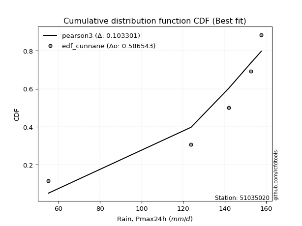</img></img>

</div>


### 12. EDF Adamowski (1981)

The Adamowski formula in hydrology refers to a specific plotting position formula used for estimating the non-parametric empirical distribution of hydrological events (like flood peaks) to calculate their return periods. This formula provides an alternative to traditional parametric methods (like the Gumbel or Log Pearson Type III distributions). 

<div align="center">


$P=(m-0.25)/(n+0.5)$


</div>


**12.1. Empirical values**

<div align="center">

|                | 0                   | 1                  | 2                  | 3                  | 4                  | 5                  |
|:---------------|:--------------------|:-------------------|:-------------------|:-------------------|:-------------------|:-------------------|
| date           | 2023                | 2019               | 2025               | 2022               | 2020               | 2024               |
| x              | 55.2                | 123.8              | 128.8              | 142.0              | 152.6              | 157.6              |
| m              | 1                   | 2                  | 3                  | 4                  | 5                  | 6                  |
| empirical_dist | edf_adamowski       | edf_adamowski      | edf_adamowski      | edf_adamowski      | edf_adamowski      | edf_adamowski      |
| empirical      | 0.11538461538461539 | 0.2692307692307692 | 0.4230769230769231 | 0.5769230769230769 | 0.7307692307692307 | 0.8846153846153846 |
| empirical_tr   | 1.1304347826086958  | 1.3684210526315788 | 1.7333333333333334 | 2.3636363636363633 | 3.7142857142857135 | 8.666666666666664  |

</div>


**12.2. Kolmogorov-Smirnov fit test (sorted by Δ)**


<div align="center">

|                | 0                  | 1                   | 2                   | 3                   | 4                   | 5                   | 6                   | 7                   | 8                   | 9                   | 10                 | 11                  | 12                  | 13                  | 14                  | 15                 | 16                  | 17                  | 18                  | 19                 | 20                  | 21                  | 22                  | 23                  | 24                  | 25                 | 26                  | 27                  | 28                 | 29                  | 30                  | 31                  | 32                  | 33                  | 34                  | 35                 | 36                  | 37                  | 38                 | 39                  | 40                  | 41                | 42                  | 43                  | 44                  | 45                  | 46                 | 47                 | 48                  | 49                  | 50                  | 51                  | 52                  | 53                  | 54                  | 55                 | 56                  | 57                  | 58                 | 59                  | 60                 | 61                  | 62                  | 63                  | 64                 | 65                  | 66                  | 67                 | 68                 | 69                 | 70                  | 71                | 72                 | 73                 | 74                  | 75                 | 76                  | 77                 | 78                  | 79                  | 80                  | 81                 | 82                 | 83                 | 84                  | 85                 | 86                 | 87                 | 88                  | 89                  | 90                  | 91                  | 92                  | 93                  | 94                | 95                  | 96                 | 97                  | 98                  | 99                  | 100                 | 101                | 102                 | 103                | 104                | 105                | 106                 | 107                | 108                | 109                | 110                 | 111                | 112                 | 113                | 114                 | 115                | 116                | 117                | 118                 | 119                | 120                 | 121                | 122                | 123                 | 124                | 125                | 126                | 127                 | 128                 | 129                 | 130                 | 131                 | 132                | 133                | 134                | 135                | 136                | 137                | 138                | 139                | 140                | 141                | 142                | 143                | 144               | 145               | 146                | 147                | 148                | 149                | 150                | 151                | 152                | 153                | 154                | 155                | 156                | 157                | 158                | 159                |
|:---------------|:-------------------|:--------------------|:--------------------|:--------------------|:--------------------|:--------------------|:--------------------|:--------------------|:--------------------|:--------------------|:-------------------|:--------------------|:--------------------|:--------------------|:--------------------|:-------------------|:--------------------|:--------------------|:--------------------|:-------------------|:--------------------|:--------------------|:--------------------|:--------------------|:--------------------|:-------------------|:--------------------|:--------------------|:-------------------|:--------------------|:--------------------|:--------------------|:--------------------|:--------------------|:--------------------|:-------------------|:--------------------|:--------------------|:-------------------|:--------------------|:--------------------|:------------------|:--------------------|:--------------------|:--------------------|:--------------------|:-------------------|:-------------------|:--------------------|:--------------------|:--------------------|:--------------------|:--------------------|:--------------------|:--------------------|:-------------------|:--------------------|:--------------------|:-------------------|:--------------------|:-------------------|:--------------------|:--------------------|:--------------------|:-------------------|:--------------------|:--------------------|:-------------------|:-------------------|:-------------------|:--------------------|:------------------|:-------------------|:-------------------|:--------------------|:-------------------|:--------------------|:-------------------|:--------------------|:--------------------|:--------------------|:-------------------|:-------------------|:-------------------|:--------------------|:-------------------|:-------------------|:-------------------|:--------------------|:--------------------|:--------------------|:--------------------|:--------------------|:--------------------|:------------------|:--------------------|:-------------------|:--------------------|:--------------------|:--------------------|:--------------------|:-------------------|:--------------------|:-------------------|:-------------------|:-------------------|:--------------------|:-------------------|:-------------------|:-------------------|:--------------------|:-------------------|:--------------------|:-------------------|:--------------------|:-------------------|:-------------------|:-------------------|:--------------------|:-------------------|:--------------------|:-------------------|:-------------------|:--------------------|:-------------------|:-------------------|:-------------------|:--------------------|:--------------------|:--------------------|:--------------------|:--------------------|:-------------------|:-------------------|:-------------------|:-------------------|:-------------------|:-------------------|:-------------------|:-------------------|:-------------------|:-------------------|:-------------------|:-------------------|:------------------|:------------------|:-------------------|:-------------------|:-------------------|:-------------------|:-------------------|:-------------------|:-------------------|:-------------------|:-------------------|:-------------------|:-------------------|:-------------------|:-------------------|:-------------------|
| station        | 51035020           | 51035020            | 51035020            | 51035020            | 51035020            | 51035020            | 51035020            | 51035020            | 51035020            | 51035020            | 51035020           | 51035020            | 51035020            | 51035020            | 51035020            | 51035020           | 51035020            | 51035020            | 51035020            | 51035020           | 51035020            | 51035020            | 51035020            | 51035020            | 51035020            | 51035020           | 51035020            | 51035020            | 51035020           | 51035020            | 51035020            | 51035020            | 51035020            | 51035020            | 51035020            | 51035020           | 51035020            | 51035020            | 51035020           | 51035020            | 51035020            | 51035020          | 51035020            | 51035020            | 51035020            | 51035020            | 51035020           | 51035020           | 51035020            | 51035020            | 51035020            | 51035020            | 51035020            | 51035020            | 51035020            | 51035020           | 51035020            | 51035020            | 51035020           | 51035020            | 51035020           | 51035020            | 51035020            | 51035020            | 51035020           | 51035020            | 51035020            | 51035020           | 51035020           | 51035020           | 51035020            | 51035020          | 51035020           | 51035020           | 51035020            | 51035020           | 51035020            | 51035020           | 51035020            | 51035020            | 51035020            | 51035020           | 51035020           | 51035020           | 51035020            | 51035020           | 51035020           | 51035020           | 51035020            | 51035020            | 51035020            | 51035020            | 51035020            | 51035020            | 51035020          | 51035020            | 51035020           | 51035020            | 51035020            | 51035020            | 51035020            | 51035020           | 51035020            | 51035020           | 51035020           | 51035020           | 51035020            | 51035020           | 51035020           | 51035020           | 51035020            | 51035020           | 51035020            | 51035020           | 51035020            | 51035020           | 51035020           | 51035020           | 51035020            | 51035020           | 51035020            | 51035020           | 51035020           | 51035020            | 51035020           | 51035020           | 51035020           | 51035020            | 51035020            | 51035020            | 51035020            | 51035020            | 51035020           | 51035020           | 51035020           | 51035020           | 51035020           | 51035020           | 51035020           | 51035020           | 51035020           | 51035020           | 51035020           | 51035020           | 51035020          | 51035020          | 51035020           | 51035020           | 51035020           | 51035020           | 51035020           | 51035020           | 51035020           | 51035020           | 51035020           | 51035020           | 51035020           | 51035020           | 51035020           | 51035020           |
| empirical_dist | edf_adamowski      | edf_adamowski       | edf_adamowski       | edf_adamowski       | edf_adamowski       | edf_adamowski       | edf_adamowski       | edf_adamowski       | edf_adamowski       | edf_adamowski       | edf_adamowski      | edf_adamowski       | edf_adamowski       | edf_adamowski       | edf_adamowski       | edf_adamowski      | edf_adamowski       | edf_adamowski       | edf_adamowski       | edf_adamowski      | edf_adamowski       | edf_adamowski       | edf_adamowski       | edf_adamowski       | edf_adamowski       | edf_adamowski      | edf_adamowski       | edf_adamowski       | edf_adamowski      | edf_adamowski       | edf_adamowski       | edf_adamowski       | edf_adamowski       | edf_adamowski       | edf_adamowski       | edf_adamowski      | edf_adamowski       | edf_adamowski       | edf_adamowski      | edf_adamowski       | edf_adamowski       | edf_adamowski     | edf_adamowski       | edf_adamowski       | edf_adamowski       | edf_adamowski       | edf_adamowski      | edf_adamowski      | edf_adamowski       | edf_adamowski       | edf_adamowski       | edf_adamowski       | edf_adamowski       | edf_adamowski       | edf_adamowski       | edf_adamowski      | edf_adamowski       | edf_adamowski       | edf_adamowski      | edf_adamowski       | edf_adamowski      | edf_adamowski       | edf_adamowski       | edf_adamowski       | edf_adamowski      | edf_adamowski       | edf_adamowski       | edf_adamowski      | edf_adamowski      | edf_adamowski      | edf_adamowski       | edf_adamowski     | edf_adamowski      | edf_adamowski      | edf_adamowski       | edf_adamowski      | edf_adamowski       | edf_adamowski      | edf_adamowski       | edf_adamowski       | edf_adamowski       | edf_adamowski      | edf_adamowski      | edf_adamowski      | edf_adamowski       | edf_adamowski      | edf_adamowski      | edf_adamowski      | edf_adamowski       | edf_adamowski       | edf_adamowski       | edf_adamowski       | edf_adamowski       | edf_adamowski       | edf_adamowski     | edf_adamowski       | edf_adamowski      | edf_adamowski       | edf_adamowski       | edf_adamowski       | edf_adamowski       | edf_adamowski      | edf_adamowski       | edf_adamowski      | edf_adamowski      | edf_adamowski      | edf_adamowski       | edf_adamowski      | edf_adamowski      | edf_adamowski      | edf_adamowski       | edf_adamowski      | edf_adamowski       | edf_adamowski      | edf_adamowski       | edf_adamowski      | edf_adamowski      | edf_adamowski      | edf_adamowski       | edf_adamowski      | edf_adamowski       | edf_adamowski      | edf_adamowski      | edf_adamowski       | edf_adamowski      | edf_adamowski      | edf_adamowski      | edf_adamowski       | edf_adamowski       | edf_adamowski       | edf_adamowski       | edf_adamowski       | edf_adamowski      | edf_adamowski      | edf_adamowski      | edf_adamowski      | edf_adamowski      | edf_adamowski      | edf_adamowski      | edf_adamowski      | edf_adamowski      | edf_adamowski      | edf_adamowski      | edf_adamowski      | edf_adamowski     | edf_adamowski     | edf_adamowski      | edf_adamowski      | edf_adamowski      | edf_adamowski      | edf_adamowski      | edf_adamowski      | edf_adamowski      | edf_adamowski      | edf_adamowski      | edf_adamowski      | edf_adamowski      | edf_adamowski      | edf_adamowski      | edf_adamowski      |
| p_dist         | dweibull           | loglevy_l           | levy_l              | pearson3            | vonmises_line       | loggenextreme       | genextreme          | mielke              | argus               | logmielke           | gumbel_l           | logvonmises_line    | dgamma              | logargus            | logburr             | logexponweib       | logt                | burr                | trapezoid           | logloggamma        | logburr12           | logpearson3         | logweibull_min      | logbeta             | laplace             | hypsecant          | t                   | logloglaplace       | logistic           | logdweibull         | skewnorm            | loggumbel_l         | crystalball         | norm                | exponnorm           | nct                | f                   | beta                | logtrapezoid       | anglit              | gamma               | semicircular      | loggennorm          | betaprime           | erlang              | arcsine             | genhalflogistic    | logweibull_max     | invgamma            | alpha               | maxwell             | logexponpow         | logdgamma           | invgauss            | loginvweibull       | rayleigh           | weibull_max         | loggenpareto        | logarcsine         | gennorm             | ncf                | logjohnsonsu        | logsemicircular     | loganglit           | logbetaprime       | genpareto           | logfatiguelife      | logf               | logexponnorm       | lognorm            | logcrystalball      | logrice           | logncf             | gumbel_r           | lognct              | cosine             | loglogistic         | logtukeylambda     | logtruncnorm        | lognakagami         | nakagami            | gausshyper         | loghypsecant       | johnsonsb          | logalpha            | triang             | halfnorm           | wrapcauchy         | kstwobign           | loginvgamma         | logerlang           | loglaplace          | loglaplace          | loginvgauss         | moyal             | logmaxwell          | halflogistic       | kappa3              | loggengamma         | lograyleigh         | logfoldnorm         | truncweibull_min   | logskewnorm         | gengamma           | logkstwobign       | loghalfnorm        | loggumbel_r         | loggenexpon        | logcosine          | logwrapcauchy      | lomax               | johnsonsu          | logmoyal            | loghalflogistic    | wald                | loggenhalflogistic | ksone              | halfgennorm        | burr12              | loggompertz        | logtriang           | uniform            | kappa4             | loghalfgennorm      | logjohnsonsb       | foldnorm           | invweibull         | logwald             | logtruncweibull_min | logksone            | bradford            | truncexpon          | loggamma           | loggamma           | gompertz           | logkappa3          | loguniform         | logkappa4          | loggausshyper      | logrdist           | logbradford        | logtruncexpon      | exponweib          | truncnorm          | fatiguelife       | weibull_min       | powerlaw           | exponpow           | logpowerlaw        | truncpareto        | genexpon           | logtruncpareto     | loglomax           | rice               | genlogistic        | loggenlogistic     | rdist              | tukeylambda        | logvonmises        | vonmises           |
| delta          | 0.1004637427363553 | 0.10164995594131909 | 0.10477845935992014 | 0.11162248980359818 | 0.11538461538002416 | 0.11538461538435296 | 0.11538461538454192 | 0.11942332686912327 | 0.12076861640199743 | 0.12308348309882561 | 0.1267222681293368 | 0.13332900978455486 | 0.13623933290140833 | 0.13994009196738488 | 0.14101261217575456 | 0.1425245725693267 | 0.14273548083092447 | 0.14476829744094938 | 0.14920127813307893 | 0.1569758665482479 | 0.15843715258375196 | 0.15966279653884813 | 0.16230256095313872 | 0.17078648366636634 | 0.17475278438376135 | 0.1888812360334416 | 0.18896717693280435 | 0.19246366773190737 | 0.1927444639571902 | 0.19325396151809016 | 0.19382833866681942 | 0.19566848257683284 | 0.19728994928715698 | 0.19728995844560226 | 0.19729133944452215 | 0.1972957815942945 | 0.19859031912795228 | 0.19977708823071538 | 0.2019937593999327 | 0.20206455250708671 | 0.20326659981767453 | 0.204033117075259 | 0.20727500993498288 | 0.20987737998299832 | 0.21053763931485825 | 0.21184717827964555 | 0.2207694464047681 | 0.2234222983876633 | 0.22722670272790702 | 0.22871669207776407 | 0.23135632477914841 | 0.23614682549266247 | 0.23630850050279617 | 0.23645835685372102 | 0.23841939204552787 | 0.2430063138313267 | 0.24647241059471736 | 0.24812822115905803 | 0.2496794593013894 | 0.25177244092749484 | 0.2518400461372548 | 0.25208744446583264 | 0.25748890014879317 | 0.25945633463276546 | 0.2614605911317391 | 0.26288730695763046 | 0.26353616518829986 | 0.2640458402272276 | 0.2642268044041463 | 0.2642280310984761 | 0.26422803777727094 | 0.264244957430326 | 0.2658430163891427 | 0.2658478792911338 | 0.26725027097677384 | 0.2683268881954189 | 0.26877078124019066 | 0.2692206540232603 | 0.26922827739300953 | 0.26923075734776636 | 0.26923076914074334 | 0.2701949878079332 | 0.2726316994889045 | 0.2729645153226794 | 0.27450188579924023 | 0.2751428548177736 | 0.2758488043808717 | 0.2789747106643347 | 0.28062424116424584 | 0.28642568268149987 | 0.28660033681954905 | 0.28675334164418903 | 0.28675334164418903 | 0.29071505436492934 | 0.291561331275411 | 0.29564104214350745 | 0.2983939433555782 | 0.29928422855020226 | 0.30539785431221084 | 0.30584921491028355 | 0.31880804047521133 | 0.3203427022988143 | 0.32187078092607385 | 0.3222559336015534 | 0.3249445177173748 | 0.3346107768742374 | 0.33479608148329926 | 0.3354392779935253 | 0.3371544543581661 | 0.3388102240595913 | 0.34640898486288213 | 0.3480529331267279 | 0.36010738738044606 | 0.3612753532618111 | 0.36312693862606077 | 0.3665670084242039 | 0.3723707932692308 | 0.3750215277103443 | 0.37673283403594643 | 0.3793524671742247 | 0.38044728873259176 | 0.4006911057692308 | 0.4039072909355887 | 0.40979147806668975 | 0.4140679687893727 | 0.4230769230769231 | 0.4294140654064488 | 0.43036452840969425 | 0.4512323695214449  | 0.45568943547904844 | 0.47067012118403867 | 0.47800766069530704 | 0.4800409523619959 | 0.4800409523619959 | 0.4912662191115656 | 0.4952740621171791 | 0.5006734764210123 | 0.5014740743456569 | 0.5254146405146176 | 0.5437715213466521 | 0.5573578078139083 | 0.5689554542427837 | 0.5731784088542664 | 0.5769230759001458 | 0.595785197714229 | 0.639932098261675 | 0.6697144939519826 | 0.6778112518577297 | 0.6873163110172564 | 0.6962319726360122 | 0.7057407988881874 | 0.7081156882132129 | 0.7132644996426003 | 0.7307692307692264 | 0.7307692307692307 | 0.7307692307692307 | 0.7307692307692308 | 0.7307692307692308 | 1.2509226499995139 | 25.100239197955947 |
| deltao         | 0.530385761606     | 0.530385761606      | 0.530385761606      | 0.530385761606      | 0.530385761606      | 0.530385761606      | 0.530385761606      | 0.530385761606      | 0.530385761606      | 0.530385761606      | 0.530385761606     | 0.530385761606      | 0.530385761606      | 0.530385761606      | 0.530385761606      | 0.530385761606     | 0.530385761606      | 0.530385761606      | 0.530385761606      | 0.530385761606     | 0.530385761606      | 0.530385761606      | 0.530385761606      | 0.530385761606      | 0.530385761606      | 0.530385761606     | 0.530385761606      | 0.530385761606      | 0.530385761606     | 0.530385761606      | 0.530385761606      | 0.530385761606      | 0.530385761606      | 0.530385761606      | 0.530385761606      | 0.530385761606     | 0.530385761606      | 0.530385761606      | 0.530385761606     | 0.530385761606      | 0.530385761606      | 0.530385761606    | 0.530385761606      | 0.530385761606      | 0.530385761606      | 0.530385761606      | 0.530385761606     | 0.530385761606     | 0.530385761606      | 0.530385761606      | 0.530385761606      | 0.530385761606      | 0.530385761606      | 0.530385761606      | 0.530385761606      | 0.530385761606     | 0.530385761606      | 0.530385761606      | 0.530385761606     | 0.530385761606      | 0.530385761606     | 0.530385761606      | 0.530385761606      | 0.530385761606      | 0.530385761606     | 0.530385761606      | 0.530385761606      | 0.530385761606     | 0.530385761606     | 0.530385761606     | 0.530385761606      | 0.530385761606    | 0.530385761606     | 0.530385761606     | 0.530385761606      | 0.530385761606     | 0.530385761606      | 0.530385761606     | 0.530385761606      | 0.530385761606      | 0.530385761606      | 0.530385761606     | 0.530385761606     | 0.530385761606     | 0.530385761606      | 0.530385761606     | 0.530385761606     | 0.530385761606     | 0.530385761606      | 0.530385761606      | 0.530385761606      | 0.530385761606      | 0.530385761606      | 0.530385761606      | 0.530385761606    | 0.530385761606      | 0.530385761606     | 0.530385761606      | 0.530385761606      | 0.530385761606      | 0.530385761606      | 0.530385761606     | 0.530385761606      | 0.530385761606     | 0.530385761606     | 0.530385761606     | 0.530385761606      | 0.530385761606     | 0.530385761606     | 0.530385761606     | 0.530385761606      | 0.530385761606     | 0.530385761606      | 0.530385761606     | 0.530385761606      | 0.530385761606     | 0.530385761606     | 0.530385761606     | 0.530385761606      | 0.530385761606     | 0.530385761606      | 0.530385761606     | 0.530385761606     | 0.530385761606      | 0.530385761606     | 0.530385761606     | 0.530385761606     | 0.530385761606      | 0.530385761606      | 0.530385761606      | 0.530385761606      | 0.530385761606      | 0.530385761606     | 0.530385761606     | 0.530385761606     | 0.530385761606     | 0.530385761606     | 0.530385761606     | 0.530385761606     | 0.530385761606     | 0.530385761606     | 0.530385761606     | 0.530385761606     | 0.530385761606     | 0.530385761606    | 0.530385761606    | 0.530385761606     | 0.530385761606     | 0.530385761606     | 0.530385761606     | 0.530385761606     | 0.530385761606     | 0.530385761606     | 0.530385761606     | 0.530385761606     | 0.530385761606     | 0.530385761606     | 0.530385761606     | 0.530385761606     | 0.530385761606     |
| eval           | Δo > Δ             | Δo > Δ              | Δo > Δ              | Δo > Δ              | Δo > Δ              | Δo > Δ              | Δo > Δ              | Δo > Δ              | Δo > Δ              | Δo > Δ              | Δo > Δ             | Δo > Δ              | Δo > Δ              | Δo > Δ              | Δo > Δ              | Δo > Δ             | Δo > Δ              | Δo > Δ              | Δo > Δ              | Δo > Δ             | Δo > Δ              | Δo > Δ              | Δo > Δ              | Δo > Δ              | Δo > Δ              | Δo > Δ             | Δo > Δ              | Δo > Δ              | Δo > Δ             | Δo > Δ              | Δo > Δ              | Δo > Δ              | Δo > Δ              | Δo > Δ              | Δo > Δ              | Δo > Δ             | Δo > Δ              | Δo > Δ              | Δo > Δ             | Δo > Δ              | Δo > Δ              | Δo > Δ            | Δo > Δ              | Δo > Δ              | Δo > Δ              | Δo > Δ              | Δo > Δ             | Δo > Δ             | Δo > Δ              | Δo > Δ              | Δo > Δ              | Δo > Δ              | Δo > Δ              | Δo > Δ              | Δo > Δ              | Δo > Δ             | Δo > Δ              | Δo > Δ              | Δo > Δ             | Δo > Δ              | Δo > Δ             | Δo > Δ              | Δo > Δ              | Δo > Δ              | Δo > Δ             | Δo > Δ              | Δo > Δ              | Δo > Δ             | Δo > Δ             | Δo > Δ             | Δo > Δ              | Δo > Δ            | Δo > Δ             | Δo > Δ             | Δo > Δ              | Δo > Δ             | Δo > Δ              | Δo > Δ             | Δo > Δ              | Δo > Δ              | Δo > Δ              | Δo > Δ             | Δo > Δ             | Δo > Δ             | Δo > Δ              | Δo > Δ             | Δo > Δ             | Δo > Δ             | Δo > Δ              | Δo > Δ              | Δo > Δ              | Δo > Δ              | Δo > Δ              | Δo > Δ              | Δo > Δ            | Δo > Δ              | Δo > Δ             | Δo > Δ              | Δo > Δ              | Δo > Δ              | Δo > Δ              | Δo > Δ             | Δo > Δ              | Δo > Δ             | Δo > Δ             | Δo > Δ             | Δo > Δ              | Δo > Δ             | Δo > Δ             | Δo > Δ             | Δo > Δ              | Δo > Δ             | Δo > Δ              | Δo > Δ             | Δo > Δ              | Δo > Δ             | Δo > Δ             | Δo > Δ             | Δo > Δ              | Δo > Δ             | Δo > Δ              | Δo > Δ             | Δo > Δ             | Δo > Δ              | Δo > Δ             | Δo > Δ             | Δo > Δ             | Δo > Δ              | Δo > Δ              | Δo > Δ              | Δo > Δ              | Δo > Δ              | Δo > Δ             | Δo > Δ             | Δo > Δ             | Δo > Δ             | Δo > Δ             | Δo > Δ             | Δo > Δ             | Δo <= Δ            | Δo <= Δ            | Δo <= Δ            | Δo <= Δ            | Δo <= Δ            | Δo <= Δ           | Δo <= Δ           | Δo <= Δ            | Δo <= Δ            | Δo <= Δ            | Δo <= Δ            | Δo <= Δ            | Δo <= Δ            | Δo <= Δ            | Δo <= Δ            | Δo <= Δ            | Δo <= Δ            | Δo <= Δ            | Δo <= Δ            | Δo <= Δ            | Δo <= Δ            |
| fit            | 1                  | 1                   | 1                   | 1                   | 1                   | 1                   | 1                   | 1                   | 1                   | 1                   | 1                  | 1                   | 1                   | 1                   | 1                   | 1                  | 1                   | 1                   | 1                   | 1                  | 1                   | 1                   | 1                   | 1                   | 1                   | 1                  | 1                   | 1                   | 1                  | 1                   | 1                   | 1                   | 1                   | 1                   | 1                   | 1                  | 1                   | 1                   | 1                  | 1                   | 1                   | 1                 | 1                   | 1                   | 1                   | 1                   | 1                  | 1                  | 1                   | 1                   | 1                   | 1                   | 1                   | 1                   | 1                   | 1                  | 1                   | 1                   | 1                  | 1                   | 1                  | 1                   | 1                   | 1                   | 1                  | 1                   | 1                   | 1                  | 1                  | 1                  | 1                   | 1                 | 1                  | 1                  | 1                   | 1                  | 1                   | 1                  | 1                   | 1                   | 1                   | 1                  | 1                  | 1                  | 1                   | 1                  | 1                  | 1                  | 1                   | 1                   | 1                   | 1                   | 1                   | 1                   | 1                 | 1                   | 1                  | 1                   | 1                   | 1                   | 1                   | 1                  | 1                   | 1                  | 1                  | 1                  | 1                   | 1                  | 1                  | 1                  | 1                   | 1                  | 1                   | 1                  | 1                   | 1                  | 1                  | 1                  | 1                   | 1                  | 1                   | 1                  | 1                  | 1                   | 1                  | 1                  | 1                  | 1                   | 1                   | 1                   | 1                   | 1                   | 1                  | 1                  | 1                  | 1                  | 1                  | 1                  | 1                  | 0                  | 0                  | 0                  | 0                  | 0                  | 0                 | 0                 | 0                  | 0                  | 0                  | 0                  | 0                  | 0                  | 0                  | 0                  | 0                  | 0                  | 0                  | 0                  | 0                  | 0                  |
| n              | 6                  | 6                   | 6                   | 6                   | 6                   | 6                   | 6                   | 6                   | 6                   | 6                   | 6                  | 6                   | 6                   | 6                   | 6                   | 6                  | 6                   | 6                   | 6                   | 6                  | 6                   | 6                   | 6                   | 6                   | 6                   | 6                  | 6                   | 6                   | 6                  | 6                   | 6                   | 6                   | 6                   | 6                   | 6                   | 6                  | 6                   | 6                   | 6                  | 6                   | 6                   | 6                 | 6                   | 6                   | 6                   | 6                   | 6                  | 6                  | 6                   | 6                   | 6                   | 6                   | 6                   | 6                   | 6                   | 6                  | 6                   | 6                   | 6                  | 6                   | 6                  | 6                   | 6                   | 6                   | 6                  | 6                   | 6                   | 6                  | 6                  | 6                  | 6                   | 6                 | 6                  | 6                  | 6                   | 6                  | 6                   | 6                  | 6                   | 6                   | 6                   | 6                  | 6                  | 6                  | 6                   | 6                  | 6                  | 6                  | 6                   | 6                   | 6                   | 6                   | 6                   | 6                   | 6                 | 6                   | 6                  | 6                   | 6                   | 6                   | 6                   | 6                  | 6                   | 6                  | 6                  | 6                  | 6                   | 6                  | 6                  | 6                  | 6                   | 6                  | 6                   | 6                  | 6                   | 6                  | 6                  | 6                  | 6                   | 6                  | 6                   | 6                  | 6                  | 6                   | 6                  | 6                  | 6                  | 6                   | 6                   | 6                   | 6                   | 6                   | 6                  | 6                  | 6                  | 6                  | 6                  | 6                  | 6                  | 6                  | 6                  | 6                  | 6                  | 6                  | 6                 | 6                 | 6                  | 6                  | 6                  | 6                  | 6                  | 6                  | 6                  | 6                  | 6                  | 6                  | 6                  | 6                  | 6                  | 6                  |
| best_fit       | 1                  | 0                   | 0                   | 0                   | 0                   | 0                   | 0                   | 0                   | 0                   | 0                   | 0                  | 0                   | 0                   | 0                   | 0                   | 0                  | 0                   | 0                   | 0                   | 0                  | 0                   | 0                   | 0                   | 0                   | 0                   | 0                  | 0                   | 0                   | 0                  | 0                   | 0                   | 0                   | 0                   | 0                   | 0                   | 0                  | 0                   | 0                   | 0                  | 0                   | 0                   | 0                 | 0                   | 0                   | 0                   | 0                   | 0                  | 0                  | 0                   | 0                   | 0                   | 0                   | 0                   | 0                   | 0                   | 0                  | 0                   | 0                   | 0                  | 0                   | 0                  | 0                   | 0                   | 0                   | 0                  | 0                   | 0                   | 0                  | 0                  | 0                  | 0                   | 0                 | 0                  | 0                  | 0                   | 0                  | 0                   | 0                  | 0                   | 0                   | 0                   | 0                  | 0                  | 0                  | 0                   | 0                  | 0                  | 0                  | 0                   | 0                   | 0                   | 0                   | 0                   | 0                   | 0                 | 0                   | 0                  | 0                   | 0                   | 0                   | 0                   | 0                  | 0                   | 0                  | 0                  | 0                  | 0                   | 0                  | 0                  | 0                  | 0                   | 0                  | 0                   | 0                  | 0                   | 0                  | 0                  | 0                  | 0                   | 0                  | 0                   | 0                  | 0                  | 0                   | 0                  | 0                  | 0                  | 0                   | 0                   | 0                   | 0                   | 0                   | 0                  | 0                  | 0                  | 0                  | 0                  | 0                  | 0                  | 0                  | 0                  | 0                  | 0                  | 0                  | 0                 | 0                 | 0                  | 0                  | 0                  | 0                  | 0                  | 0                  | 0                  | 0                  | 0                  | 0                  | 0                  | 0                  | 0                  | 0                  |
| best_fit_sort  | 1                  | 2                   | 3                   | 4                   | 5                   | 6                   | 7                   | 8                   | 9                   | 10                  | 11                 | 12                  | 13                  | 14                  | 15                  | 16                 | 17                  | 18                  | 19                  | 20                 | 21                  | 22                  | 23                  | 24                  | 25                  | 26                 | 27                  | 28                  | 29                 | 30                  | 31                  | 32                  | 33                  | 34                  | 35                  | 36                 | 37                  | 38                  | 39                 | 40                  | 41                  | 42                | 43                  | 44                  | 45                  | 46                  | 47                 | 48                 | 49                  | 50                  | 51                  | 52                  | 53                  | 54                  | 55                  | 56                 | 57                  | 58                  | 59                 | 60                  | 61                 | 62                  | 63                  | 64                  | 65                 | 66                  | 67                  | 68                 | 69                 | 70                 | 71                  | 72                | 73                 | 74                 | 75                  | 76                 | 77                  | 78                 | 79                  | 80                  | 81                  | 82                 | 83                 | 84                 | 85                  | 86                 | 87                 | 88                 | 89                  | 90                  | 91                  | 92                  | 93                  | 94                  | 95                | 96                  | 97                 | 98                  | 99                  | 100                 | 101                 | 102                | 103                 | 104                | 105                | 106                | 107                 | 108                | 109                | 110                | 111                 | 112                | 113                 | 114                | 115                 | 116                | 117                | 118                | 119                 | 120                | 121                 | 122                | 123                | 124                 | 125                | 126                | 127                | 128                 | 129                 | 130                 | 131                 | 132                 | 133                | 134                | 135                | 136                | 137                | 138                | 139                | 140                | 141                | 142                | 143                | 144                | 145               | 146               | 147                | 148                | 149                | 150                | 151                | 152                | 153                | 154                | 155                | 156                | 157                | 158                | 159                | 160                |

</div>


**12.3. Best fit**

<div align="center">

|   id |   station | empirical_dist   | p_dist   |    delta |   deltao | eval   |   fit |   n |   best_fit |   best_fit_sort |
|-----:|----------:|:-----------------|:---------|---------:|---------:|:-------|------:|----:|-----------:|----------------:|
|    0 |  51035020 | edf_adamowski    | dweibull | 0.100464 | 0.530386 | Δo > Δ |     1 |   6 |          1 |               1 |

</div>


<div align="center">

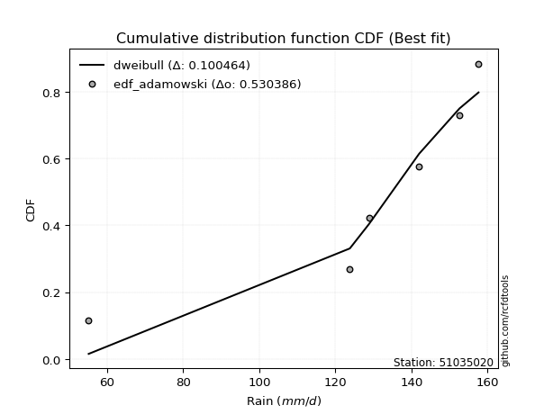</img>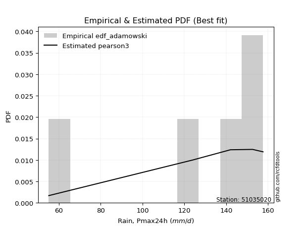</img>

</div>


## C. Best fit & Estimate extreme values for specific return periods - Tr

Best fit in probability distribution analysis means finding the theoretical distribution (like Normal, Poisson, Exponential, etc.) that most accurately mirrors your real-world data´s patterns (shape, center, spread) for better predictions, using methods like visual checks (Q-Q plots), goodness-of-fit tests (Kolmogorov-Smirnov, Chi-Squared), and information criteria (AIC) to score and select the simplest, most representative model.


### 1. Best fit (ordered by delta Δ)

:file_folder:Table: [bestfit_51035020.csv](table/bestfit_51035020.csv)

<div align="center">

|   id |   station | empirical_dist   | p_dist        |     delta |   deltao | eval   |   fit |   n |   best_fit |   best_fit_sort |
|-----:|----------:|:-----------------|:--------------|----------:|---------:|:-------|------:|----:|-----------:|----------------:|
|    0 |  51035020 | edf_hazen        | loggenextreme | 0.0833333 | 0.530386 | Δo > Δ |     1 |   6 |          1 |               1 |
|    1 |  51035020 | edf_gringorten   | loggenextreme | 0.0915033 | 0.530386 | Δo > Δ |     1 |   6 |          1 |               2 |
|    2 |  51035020 | edf_beard        | dweibull      | 0.0937664 | 0.530386 | Δo > Δ |     1 |   6 |          1 |               3 |
|    3 |  51035020 | edf_jenkinson    | dweibull      | 0.0937664 | 0.530386 | Δo > Δ |     1 |   6 |          1 |               4 |
|    4 |  51035020 | edf_chegodayev   | dweibull      | 0.0944541 | 0.530386 | Δo > Δ |     1 |   6 |          1 |               5 |
|    5 |  51035020 | edf_filliben     | dweibull      | 0.0946899 | 0.530386 | Δo > Δ |     1 |   6 |          1 |               6 |
|    6 |  51035020 | edf_tukey        | dweibull      | 0.0966537 | 0.530386 | Δo > Δ |     1 |   6 |          1 |               7 |
|    7 |  51035020 | edf_cunnane      | loggenextreme | 0.0967742 | 0.530386 | Δo > Δ |     1 |   6 |          1 |               8 |
|    8 |  51035020 | edf_weibull      | loglevy_l     | 0.0993335 | 0.530386 | Δo > Δ |     1 |   6 |          1 |               9 |
|    9 |  51035020 | edf_blom         | vonmises_line | 0.1       | 0.530386 | Δo > Δ |     1 |   6 |          1 |              10 |
|   10 |  51035020 | edf_adamowski    | dweibull      | 0.100464  | 0.530386 | Δo > Δ |     1 |   6 |          1 |              11 |
|   11 |  51035020 | edf_california   | mielke        | 0.129814  | 0.530386 | Δo > Δ |     1 |   6 |          1 |              12 |

</div>


### 2. Extreme values and % difference analysis

In hydrology, a return period (or recurrence interval $Tr$) is the statistical average time between extreme events like floods or droughts of a specific magnitude, indicating how rare an event is, with a 100-year flood, for example, having a 1% chance of occurring in any given year, not that it happens exactly every century. It is a key tool for infrastructure design (like bridges or dams) and risk assessment, calculated from historical data to determine the probability of future events, although it is important to remember it is statistical average, and events can cluster or be missed.

The extreme value porcentage difference is evaluated as $pdiff = 1 - (ETrBf / ETr) * 100$, where _ETrBf_ correspond to the bestfit extreme value for a specific recurrence interval and _ETr_ correspond to the extreme value for one of the most used PDFsused in hydrology.

> risk_rate: assuming the return period as the project useful life.

:file_folder:Table: [extreme_51035020.csv](table/extreme_51035020.csv), all PDFs.  
:file_folder:Table: [extremepdiff_51035020.csv](table/extremepdiff_51035020.csv), % difference between bestfit and most used PDFs in Hydrology.

<div align="center">

Extreme values table for only best fit PDFs
|   id |      tr |   prob_l |     prob_g |   alpha |   anglit |   arcsine |   argus |    beta |   betaprime |   bradford |    burr |   burr12 |   cosine |   crystalball |   dgamma |   dweibull |   erlang |   exponnorm |   exponpow |   exponweib |       f |   fatiguelife |   foldnorm |   gamma |   gausshyper |   genexpon |   genextreme |     gengamma |   genhalflogistic |   genlogistic |   gennorm |   genpareto |   gompertz |   gumbel_l |   gumbel_r |   halfgennorm |   halflogistic |   halfnorm |   hypsecant |   invgamma |   invgauss |      invweibull |   johnsonsb |   johnsonsu |   kappa3 |   kappa4 |   ksone |   kstwobign |   laplace |   levy_l |   loggamma |   logistic |   loglaplace |   lomax |   maxwell |        mielke |   moyal |   nakagami |     ncf |     nct |    norm |   pearson3 |   powerlaw |   rayleigh |   rdist |   rice |   semicircular |   skewnorm |       t |   trapezoid |   triang |   truncexpon |   truncnorm |   truncpareto |   truncweibull_min |   tukeylambda |   uniform |   vonmises |   vonmises_line |    wald |   weibull_max |   weibull_min |   wrapcauchy |   logalpha |   loganglit |   logarcsine |   logargus |   logbeta |   logbetaprime |   logbradford |   logburr |   logburr12 |   logcosine |   logcrystalball |   logdgamma |   logdweibull |   logerlang |   logexponnorm |   logexponpow |   logexponweib |    logf |   logfatiguelife |   logfoldnorm |   loggausshyper |   loggenexpon |   loggenextreme |   loggengamma |   loggenhalflogistic |   loggenlogistic |   loggennorm |   loggenpareto |   loggompertz |   loggumbel_l |   loggumbel_r |   loghalfgennorm |   loghalflogistic |   loghalfnorm |   loghypsecant |   loginvgamma |   loginvgauss |   loginvweibull |   logjohnsonsb |   logjohnsonsu |   logkappa3 |   logkappa4 |   logksone |   logkstwobign |   loglevy_l |   logloggamma |   loglogistic |   logloglaplace |         loglomax |   logmaxwell |   logmielke |   logmoyal |   lognakagami |   logncf |   lognct |   lognorm |   logpearson3 |   logpowerlaw |   lograyleigh |   logrdist |   logrice |   logsemicircular |   logskewnorm |             logt |   logtrapezoid |   logtriang |   logtruncexpon |   logtruncnorm |   logtruncpareto |   logtruncweibull_min |   logtukeylambda |   loguniform |   logvonmises |   logvonmises_line |   logwald |   logweibull_max |   logweibull_min |   logwrapcauchy |   station |   n |   risk_rate |
|-----:|--------:|---------:|-----------:|--------:|---------:|----------:|--------:|--------:|------------:|-----------:|--------:|---------:|---------:|--------------:|---------:|-----------:|---------:|------------:|-----------:|------------:|--------:|--------------:|-----------:|--------:|-------------:|-----------:|-------------:|-------------:|------------------:|--------------:|----------:|------------:|-----------:|-----------:|-----------:|--------------:|---------------:|-----------:|------------:|-----------:|-----------:|----------------:|------------:|------------:|---------:|---------:|--------:|------------:|----------:|---------:|-----------:|-----------:|-------------:|--------:|----------:|--------------:|--------:|-----------:|--------:|--------:|--------:|-----------:|-----------:|-----------:|--------:|-------:|---------------:|-----------:|--------:|------------:|---------:|-------------:|------------:|--------------:|-------------------:|--------------:|----------:|-----------:|----------------:|--------:|--------------:|--------------:|-------------:|-----------:|------------:|-------------:|-----------:|----------:|---------------:|--------------:|----------:|------------:|------------:|-----------------:|------------:|--------------:|------------:|---------------:|--------------:|---------------:|--------:|-----------------:|--------------:|----------------:|--------------:|----------------:|--------------:|---------------------:|-----------------:|-------------:|---------------:|--------------:|--------------:|--------------:|-----------------:|------------------:|--------------:|---------------:|--------------:|--------------:|----------------:|---------------:|---------------:|------------:|------------:|-----------:|---------------:|------------:|--------------:|--------------:|----------------:|-----------------:|-------------:|------------:|-----------:|--------------:|---------:|---------:|----------:|--------------:|--------------:|--------------:|-----------:|----------:|------------------:|--------------:|-----------------:|---------------:|------------:|----------------:|---------------:|-----------------:|----------------------:|-----------------:|-------------:|--------------:|-------------------:|----------:|-----------------:|-----------------:|----------------:|----------:|----:|------------:|
|    0 |    2    | 0.5      | 0.5        | 123.984 |  126.667 |   126.667 | 136.103 | 150.796 |     125.907 |    97.5989 | 130.533 |  94.4333 |  120.263 |       126.667 |  128.8   |    134.819 |  125.616 |     126.667 |    55.2006 |     55.7324 | 126.566 |       55.201  |    132.47  | 126.278 |      119.478 |    68.094  |      139.786 | 56.6869      |           124.739 |           inf |   142     |     118.903 |    150.528 |    132.272 |    121.061 |        90.547 |        118.275 |    119.682 |     126.667 |    124.129 |    123.26  |  1020.96        |     120.349 |     156.206 |  115.533 |  105.136 | 106.4   |     117.797 |   126.667 |  144.144 |    75.7777 |    126.667 |      120.133 | 104.906 |   123.749 |  -1.89345e+06 | 119.252 |    132.794 | 121.533 | 126.666 | 126.667 |    133.944 |    56.4477 |    122.714 |    55.2 |   55.2 |        126.667 |    126.533 | 127.441 |     132.521 |  119.841 |       97.174 |     123.97  |       56.9771 |            116.117 |          55.2 |   106.4   | -2.44146   |         135.003 | 115.607 |       153.769 |       55.4844 |      106.4   |    118.792 |     120.133 |      120.133 |    132.345 |   128.669 |        119.281 |       84.7659 |   130.801 |     129.131 |     111.189 |          120.133 |     142     |       142     |     109.451 |        120.133 |       123.318 |        130.788 | 120.197 |          120.225 |       113.513 |         87.8876 |       107.555 |         139.636 |       106.128 |              108.281 |              inf |      142     |        119.121 |       100.252 |       127.412 |       113.27  |          91.6724 |           110.006 |       111.642 |        120.133 |       117.181 |       116.667 |         123.703 |        157.583 |        150.575 |     93.6174 |     90.7061 |    93.2712 |        109.124 |     143.83  |       130.617 |       120.133 |         141.262 |   2643.32        |      116.51  |     132.167 |    111.139 |       130.603 |  119.881 |  119.705 |   120.133 |       131.359 |       56.188  |       115.251 |    187.863 |   120.133 |           120.133 |       116.396 |    139.896       |        127.745 |     109.461 |         83.778  |        136.141 |          56.2661 |               101.7   |          139.681 |      93.2712 |      0.227132 |            132.191 |   106.968 |          125.046 |          128.849 |         93.2712 |  51035020 |   6 |    0.75     |
|    1 |    2.33 | 0.570815 | 0.429185   | 130.415 |  133.759 |   137.313 | 139.966 | 154.344 |     133.201 |   104.884  | 135.472 | 106.451  |  126.952 |       132.755 |  132.43  |    139.211 |  132.041 |     132.755 |    55.2038 |     56.6056 | 132.68  |       56.9971 |    132.72  | 132.718 |      127.147 |    70.935  |      143.832 | 83.0688      |           131.001 |           inf |   142.179 |     129.253 |    151.358 |    137.569 |    126.703 |       104.157 |        124.075 |    126.254 |     131.539 |    130.794 |    130.101 | 41001.8         |     150.302 |     156.95  |  124.078 |  112.789 | 115.102 |     126.426 |   130.351 |  148.265 |    83.8119 |    132.031 |      124.87  | 115.875 |   130.074 |  -1.89345e+06 | 124.592 |    135.001 | 129.354 | 132.755 | 132.755 |    139.273 |    58.0967 |    129.133 |    55.2 |   55.2 |        134.273 |    131.491 | 133.633 |     139.529 |  126.083 |      104.294 |     124.008 |       57.9632 |            122.211 |          55.2 |   113.652 | -2.16538   |         139.584 | 119.599 |       156.507 |       55.8857 |      129.851 |    127.049 |     129.416 |      134.335 |    136.622 |   133.975 |        130.04  |       91.3283 |   135.694 |     134.23  |     119.387 |          128.06  |     142.533 |       145.544 |     128.316 |        128.06  |       129.549 |        135.78  | 128.126 |          128.12  |       121.645 |         95.166  |       118.074 |         143.678 |       122.751 |              116.523 |              inf |      143.291 |        135.974 |       110.407 |       134.696 |       120.179 |         101.821  |           116.91  |       119.613 |        126.436 |       125.7   |       125.164 |         138.245 |        157.598 |        156.23  |    100.89   |     98.5173 |   101.968  |        119.822 |     147.915 |       135.39  |       127.091 |         146.215 |   6199.4         |      124.507 |     136.972 |    117.546 |       132.639 |  127.963 |  127.818 |   128.06  |       138.534 |       57.3772 |       123.283 |    203.444 |   128.056 |           130.116 |       122.164 |    143.2         |        137.496 |     116.259 |         90.0547 |        138.411 |          56.8613 |               108.477 |          142.233 |     100.464  |      0.241788 |            138.321 |   111.545 |          135.477 |          133.956 |        115.039  |  51035020 |   6 |    0.729209 |
|    2 |    5    | 0.8      | 0.2        | 155.151 |  158.781 |   165.703 | 150.432 | 157.521 |     161.949 |   131.077  | 148.908 | inf      |  151.054 |       155.382 |  150.999 |    157.821 |  156.407 |     155.382 |    56.087  |     89.377  | 155.411 |       95.1309 |    133.78  | 157.053 |      148.079 |    85.139  |      153.104 |  7.21416e+06 |           147.382 |           inf |   150.789 |     151.621 |    154.039 |    154.682 |    151.214 |       205.22  |        150.322 |    154.042 |     151.085 |    156.482 |    157.131 |     4.81013e+11 |     157.595 |     157.562 |  151.732 |  137.309 | 143.264 |     163.083 |   148.773 |  155.092 |   147.527  |    152.744 |      151.504 | 170.766 |   154.972 |  -1.89345e+06 | 149.331 |    145.001 | 162.955 | 155.384 | 155.382 |    155.235 |    79.978  |    154.832 |    55.2 |   55.2 |        160.231 |    145.931 | 156.863 |     159.636 |  143.99  |      130.208 |     124.195 |       69.4066 |            141.201 |          55.2 |   137.12  | -1.09783   |         157.422 | 141.948 |       157.595 |       66.9643 |      151.556 |    163.972 |     168.283 |      180.965 |    148.905 |   148.485 |        180.309 |      119.618  |   149.007 |     152.127 |     154.271 |          162.386 |     154.932 |       179.246 |     287.47  |        162.385 |       149.815 |        149.461 | 162.51  |          162.304 |       160.609 |        124.602  |       174.366 |         153.134 |       254.271 |              140.779 |              inf |      158.758 |        156.655 |       162.095 |       161.197 |       155.434 |         168.564  |           153.984 |       160.119 |        155.225 |       164.792 |       164.239 |         224.053 |        157.6   |        157.597 |    128.531  |    127.91   |   136.072  |        178.265 |     154.941 |       148.357 |       157.951 |         173.71  | 439811           |      161.687 |     150.023 |    152.393 |       142.718 |  163.263 |  163.231 |   162.386 |       161.132 |       73.1901 |       161.449 |    256.149 |   162.357 |           170.861 |       140.643 |    159.724       |        169.8   |     138.197 |        117.675  |        147.205 |          64.1337 |               132.632 |          150.637 |     127.771  |      0.305373 |            164.838 |   141.03  |          153.884 |          151.882 |        146.312  |  51035020 |   6 |    0.67232  |
|    3 |   10    | 0.9      | 0.1        | 172.327 |  172.945 |   172.557 | 154.677 | 157.597 |     182.476 |   143.878  | 153.899 | inf      |  165.616 |       170.392 |  167.966 |    173.532 |  173.001 |     170.392 |    68.0653 |    265.321  | 170.5   |      147.784  |    134.564 | 173.545 |      154.379 |    98.0331 |      155.793 |  1.42251e+11 |           152.983 |           inf |   182.739 |     156.144 |    155.531 |    164.21  |    171.177 |       349.202 |        172.119 |    174.606 |     166.693 |    174.358 |    176.524 |     2.75752e+17 |     157.6   |     157.594 |  163.799 |  147.742 | 155.552 |     190.993 |   165.496 |  156.74  |   259.163  |    167.999 |      180.57  | 220.661 |   172.493 | 154.367       | 170.87  |    152.718 | 189.899 | 170.396 | 170.392 |    162.827 |   107.601  |    173.156 |    55.2 |   55.2 |        173.55  |    151.812 | 172.712 |     167.49  |  150.984 |      143.23  |     124.365 |       89.9003 |            149.374 |          55.2 |   147.36  | -0.371253  |         171.073 | 165.666 |       157.6   |      112.461  |      154.872 |    195.153 |     195.252 |      194.461 |    154.195 |   153.619 |        225.138 |      136.608  |   153.954 |     163.112 |     180.114 |          190.092 |     174.115 |       227.64  |     603.287 |        190.091 |       160.885 |        154.893 | 190.276 |          189.899 |       194.88  |        140.6    |       233.707 |         155.86  |       492.436 |              149.937 |              inf |      187.34  |        157.548 |       210.082 |       178.149 |       191.664 |         260.676  |           193.56  |       198.687 |        182.852 |       199.026 |       198.522 |         332.009 |        157.6   |        157.6   |    142.853  |    142.625  |   154.328  |        241.226 |     156.686 |       153.168 |       185.376 |         203.121 |      2.10609e+07 |      194.329 |     154.868 |    191.046 |       151.243 |  192.093 |  192.127 |   190.092 |       172.002 |       97.0504 |       195.683 |    275.047 |   190.04  |           196.494 |       148.948 |    182.612       |        184.389 |     147.85  |        135.024  |        151.987 |          79.2793 |               144.568 |          154.244 |     141.904  |      0.357308 |            188.168 |   180.888 |          156.767 |          162.881 |        152.38   |  51035020 |   6 |    0.651322 |
|    4 |   15    | 0.933333 | 0.0666667  | 181.14  |  178.993 |   173.864 | 156.182 | 157.6   |     193.163 |   148.347  | 155.473 | inf      |  172.249 |       177.883 |  177.909 |    182.466 |  181.411 |     177.882 |    94.8899 |    538.142  | 178.032 |      182.22   |    134.972 | 181.881 |      155.899 |   105.576  |      156.52  |  3.48599e+13 |           154.655 |           inf |   221.377 |     156.963 |    156.207 |    168.525 |    182.44  |       458.969 |        184.454 |    185.306 |     175.6   |    183.54  |    186.657 |     4.89031e+20 |     157.6   |     157.598 |  167.821 |  151.141 | 159.648 |     205.809 |   175.278 |  157.238 |   364.943  |    176.31  |      200.094 | 249.877 |   181.483 | 155.495       | 183.37  |    156.775 | 204.993 | 177.888 | 177.883 |    165.84  |   121.234  |    182.597 |    55.2 |   55.2 |        178.744 |    153.747 | 180.831 |     170.01  |  153.229 |      147.857 |     124.464 |      103.737  |            152.106 |          55.2 |   150.773 | -0.0528492 |         178.807 | 180.897 |       157.6   |      172.451  |      155.813 |    213.183 |     208.048 |      197.148 |    156.117 |   155.133 |        251.92  |      143.109  |   155.514 |     168.345 |     193.28  |          205.638 |     187.979 |       265.415 |     932.864 |        205.638 |       165.79  |        156.849 | 205.861 |          205.384 |       214.87  |        146.309  |       273.084 |         156.581 |       724.703 |              152.73  |              inf |      213.19  |        157.591 |       238.533 |       186.402 |       215.714 |         334.042  |           220.31  |       222.303 |        200.77  |       219.308 |       218.847 |         414.49  |        157.6   |        157.6   |    147.974  |    147.704  |   160.942  |        283.244 |     157.217 |       154.685 |       202.272 |         222.583 |      2.02459e+08 |      213.557 |     156.417 |    217.828 |       155.954 |  208.394 |  208.454 |   205.638 |       176.184 |      111.043  |       216.066 |    279.784 |   205.572 |           207.503 |       151.786 |    204.256       |        189.331 |     151.088 |        141.867  |        153.753 |          91.351  |               148.78  |          155.409 |     146.954  |      0.386853 |            202.865 |   212.24  |          157.243 |          168.122 |        154.159  |  51035020 |   6 |    0.644736 |
|    5 |   20    | 0.95     | 0.05       | 187.002 |  182.55  |   174.325 | 156.985 | 157.6   |     200.324 |   150.62   | 156.245 | inf      |  176.329 |       182.788 |  184.969 |    188.72  |  186.966 |     182.788 |   133.171  |    868.395  | 182.965 |      207.715  |    135.244 | 187.377 |      156.52  |   110.927  |      156.846 |  1.59855e+15 |           155.451 |           inf |   261.921 |     157.246 |    156.628 |    171.21  |    190.326 |       549.134 |        193.096 |    192.441 |     181.884 |    189.651 |    193.462 |     9.20611e+22 |     157.6   |     157.599 |  169.832 |  152.816 | 161.696 |     215.79  |   182.219 |  157.493 |   467.17   |    182.054 |      215.213 | 270.62  |   187.449 | 156.045       | 192.222 |    159.486 | 215.539 | 182.794 | 182.788 |    167.562 |   129.101  |    188.872 |    55.2 |   55.2 |        181.625 |    154.712 | 186.243 |     171.253 |  154.336 |      150.23  |     124.535 |      113.106  |            153.475 |          55.2 |   152.48  |  0.123059  |         184.196 | 192.247 |       157.6   |      238.372  |      156.268 |    226.009 |     215.963 |      198.102 |    157.153 |   155.841 |        271.32  |      146.538  |   156.279 |     171.688 |     201.85  |          216.502 |     198.964 |       297.434 |    1271.86  |        216.502 |       168.801 |        157.93  | 216.753 |          216.206 |       229.113 |        149.204  |       303.413 |         156.899 |       953.165 |              154.062 |              inf |      237.192 |        157.597 |       258.87  |       191.731 |       234.327 |         397.26   |           241.225 |       239.587 |        214.457 |       233.946 |       233.517 |         484.156 |        157.6   |        157.6   |    150.603  |    150.253  |   164.354  |        315.6   |     157.49  |       155.428 |       214.842 |         237.512 |      1.00852e+09 |      227.357 |     157.207 |    239.037 |       159.19  |  219.836 |  219.91  |   216.502 |       178.505 |      119.901  |       230.775 |    281.728 |   216.426 |           213.872 |       153.222 |    226.214       |        191.817 |     152.712 |        145.527  |        154.673 |         100.506  |               150.935 |          155.979 |     149.546  |      0.407713 |            214.029 |   239.086 |          157.403 |          171.468 |        155.027  |  51035020 |   6 |    0.641514 |
|    6 |   25    | 0.96     | 0.04       | 191.364 |  184.961 |   174.538 | 157.494 | 157.6   |     205.678 |   151.997  | 156.704 | inf      |  179.189 |       186.399 |  190.447 |    193.53  |  191.078 |     186.398 |   179.775  |   1235.1    | 186.597 |      227.973  |    135.447 | 191.443 |      156.841 |   115.078  |      157.029 |  3.00569e+16 |           155.914 |           inf |   302.825 |     157.375 |    156.927 |    173.122 |    196.401 |       626.417 |        199.755 |    197.749 |     186.747 |    194.198 |    198.558 |     5.20263e+24 |     157.6   |     157.599 |  171.039 |  153.809 | 162.925 |     223.266 |   187.602 |  157.653 |   566.905  |    186.449 |      227.723 | 286.717 |   191.879 | 156.37        | 199.084 |    161.506 | 223.66  | 186.405 | 186.399 |    168.71  |   134.189  |    193.535 |    55.2 |   55.2 |        183.494 |    155.29  | 190.281 |     171.994 |  154.995 |      151.673 |     124.589 |      119.771  |            154.298 |          55.2 |   153.504 |  0.233504  |         188.249 | 201.337 |       157.6   |      306.81   |      156.537 |    236.007 |     221.497 |      198.547 |    157.814 |   156.246 |        286.634 |      148.655  |   156.734 |     174.107 |     208.085 |          224.864 |     208.155 |       325.736 |    1618.11  |        224.864 |       170.922 |        158.642 | 225.139 |          224.537 |       240.219 |        150.945  |       328.419 |         157.075 |      1178.82  |              154.837 |              inf |      259.92  |        157.599 |       274.723 |       195.615 |       249.752 |         453.808  |           258.684 |       253.314 |        225.686 |       245.475 |       245.073 |         545.702 |        157.6   |        157.6   |    152.202  |    151.777  |   166.436  |        342.234 |     157.661 |       155.87  |       224.983 |         249.778 |      3.50423e+09 |      238.176 |     157.702 |    256.886 |       161.646 |  228.671 |  228.753 |   224.864 |       180.015 |      125.962  |       242.348 |    282.732 |   224.78  |           218.109 |       154.088 |    248.974       |        193.314 |     153.687 |        147.806  |        155.238 |         107.552  |               152.243 |          156.316 |     151.123  |      0.423903 |            223.13  |   263.02  |          157.475 |          173.89  |        155.544  |  51035020 |   6 |    0.639603 |
|    7 |   50    | 0.98     | 0.02       | 204.077 |  190.896 |   174.823 | 158.626 | 157.6   |     221.4   |   154.779  | 157.627 | inf      |  186.68  |       196.739 |  207.475 |    208.279 |  202.966 |     196.739 |   478.512  |   3314.86   | 197.001 |      292.967  |    136.035 | 203.176 |      157.346 |   127.972  |      157.357 |  2.39312e+20 |           156.802 |           inf |   499.879 |     157.545 |    157.74  |    178.31  |    215.113 |       909.765 |        220.271 |    213.178 |     201.824 |    207.46  |    213.562 |     1.29944e+30 |     157.6   |     157.6   |  173.452 |  155.761 | 165.382 |     245.219 |   204.325 |  158.014 |  1043.17   |    199.876 |      271.412 | 336.761 |   204.725 | 157.01        | 220.386 |    167.382 | 248.721 | 196.747 | 196.739 |    171.487 |   145.255  |    207.069 |    55.2 |   55.2 |        187.764 |    156.445 | 202.131 |     173.464 |  156.304 |      154.605 |     124.759 |      136.084  |            155.947 |          55.2 |   155.552 |  0.463274  |         199.225 | 231.019 |       157.6   |      650.835  |      157.071 |    267.511 |     235.732 |      199.142 |    159.292 |   156.998 |        335.911 |      153.031  |   157.645 |     180.848 |     225.341 |          250.641 |     240.642 |       437.48  |    3423.81  |        250.64  |       176.587 |        160.366 | 250.993 |          250.219 |       275.169 |        154.396  |       415.226 |         157.385 |      2279.84  |              156.314 |              inf |      363.169 |        157.6   |       324.372 |       206.562 |       303.949 |         681.545  |           320.827 |       297.842 |        264.379 |       282.469 |       282.146 |         788.955 |        157.6   |        157.6   |    155.452  |    154.789  |   170.68   |        434.161 |     158.048 |       156.743 |       259.028 |         292.069 |      1.67804e+11 |      272.553 |     158.851 |    321.243 |       169.01  |  256.052 |  256.142 |   250.641 |       183.495 |      140.112  |       279.336 |    284.306 |   250.531 |           228.104 |       155.835 |    381.835       |        196.319 |     155.641 |        152.563  |        156.398 |         126.876  |               154.896 |          156.975 |     154.328  |      0.474629 |            252.698 |   359.145 |          157.57  |          180.638 |        156.572  |  51035020 |   6 |    0.63583  |
|    8 |   75    | 0.986667 | 0.0133333  | 211.039 |  193.508 |   174.876 | 159.067 | 157.6   |     230.076 |   155.715  | 157.958 | inf      |  190.257 |       202.287 |  217.44  |    216.791 |  209.414 |     202.287 |   820.508  |   5521.56   | 202.584 |      332.11   |    136.356 | 209.527 |      157.466 |   135.515  |      157.452 |  4.29805e+22 |           157.083 |           inf |   680.191 |     157.576 |    158.151 |    180.933 |    225.99  |      1107.69  |        232.197 |    221.577 |     210.635 |    214.725 |    221.87  |     1.78241e+33 |     157.6   |     157.6   |  174.256 |  156.396 | 166.202 |     257.298 |   214.108 |  158.162 |  1497.76   |    207.63  |      300.757 | 366.065 |   211.709 | 157.22        | 232.843 |    170.581 | 263.366 | 202.296 | 202.287 |    172.696 |   149.222  |    214.432 |    55.2 |   55.2 |        189.469 |    156.83  | 208.687 |     173.95  |  156.738 |      155.596 |     124.858 |      142.592  |            156.497 |          55.2 |   156.235 |  0.541768  |         203.968 | 249.284 |       157.6   |      976.142  |      157.247 |    286.353 |     242.284 |      199.253 |    159.871 |   157.225 |        366.073 |      154.533  |   157.968 |     184.356 |     234.08  |          265.669 |     262.623 |       523.979 |    5312.5   |        265.668 |       179.397 |        161.137 | 266.07  |          265.195 |       296.009 |        155.519  |       473.128 |         157.472 |      3352.32  |              156.776 |              inf |      458.034 |        157.6   |       353.674 |       212.329 |       340.702 |         860.99   |           363.601 |       325.289 |        289.994 |       305.064 |       304.778 |         977.478 |        157.6   |        157.6   |    156.551  |    155.769  |   172.119  |        494.88  |     158.207 |       157.031 |       280.991 |         320.054 |      1.61311e+12 |      293.281 |     159.368 |    366.111 |       173.159 |  272.114 |  272.2   |   265.669 |       184.909 |      145.527  |       301.778 |    284.676 |   265.543 |           232.224 |       156.421 |    558.456       |        197.324 |     156.294 |        154.21   |        156.794 |         135.494  |               155.792 |          157.189 |     155.411  |      0.504846 |            268.897 |   435.026 |          157.587 |          184.15  |        156.914  |  51035020 |   6 |    0.634587 |
|    9 |  100    | 0.99     | 0.01       | 215.804 |  195.061 |   174.895 | 159.31  | 157.6   |     236.04  |   156.185  | 158.142 | inf      |  192.499 |       206.04  |  224.513 |    222.787 |  213.802 |     206.04  |  1172.1    |   7729.34   | 206.361 |      360.274  |    136.574 | 213.845 |      157.515 |   140.866  |      157.496 |  1.67639e+24 |           157.22  |           inf |   846.093 |     157.587 |    158.42  |    182.649 |    233.688 |      1263.38  |        240.637 |    227.299 |     216.885 |    219.698 |    227.592 |     2.96097e+35 |     157.6   |     157.6   |  174.659 |  156.708 | 166.611 |     265.574 |   221.048 |  158.248 |  1939.46   |    213.105 |      323.483 | 386.87  |   216.466 | 157.325       | 241.681 |    172.76  | 273.785 | 206.049 | 206.04  |    173.414 |   151.261  |    219.449 |    55.2 |   55.2 |        190.424 |    157.023 | 213.209 |     174.193 |  156.954 |      156.094 |     124.928 |      146.082  |            156.773 |          55.2 |   156.576 |  0.581238  |         206.542 | 262.601 |       157.6   |     1279.87   |      157.336 |    299.945 |     246.266 |      199.292 |    160.192 |   157.332 |        388.128 |      155.293  |   158.146 |     186.687 |     239.729 |          276.341 |     279.678 |       597.432 |    7257.83  |        276.34  |       181.214 |        161.611 | 276.778 |          275.831 |       311.002 |        156.07   |       517.76  |         157.511 |      4406.48  |              156.999 |              inf |      549.193 |        157.6   |       374.571 |       216.187 |       369.37  |        1014.59   |           397.278 |       345.422 |        309.654 |       321.573 |       321.309 |        1137.54  |        157.6   |        157.6   |    157.104  |    156.25   |   172.842  |        541.316 |     158.3   |       157.175 |       297.61  |         341.52  |      8.03551e+12 |      308.296 |     159.697 |    401.693 |       176.043 |  283.564 |  283.641 |   276.341 |       185.71  |      148.383  |       318.091 |    284.825 |   276.203 |           234.564 |       156.715 |    794.806       |        197.828 |     156.62  |        155.045  |        156.994 |         140.346  |               156.242 |          157.294 |     155.955  |      0.526623 |            278.857 |   500.275 |          157.592 |          186.484 |        157.086  |  51035020 |   6 |    0.633968 |
|   10 |  200    | 0.995    | 0.005      | 226.788 |  197.996 |   174.913 | 159.731 | 157.6   |     249.856 |   156.891  | 158.489 | inf      |  197.058 |       214.552 |  241.559 |    237.099 |  223.837 |     214.552 |  2533.51   |  16142.9    | 214.93  |      429.215  |    137.073 | 223.705 |      157.572 |   153.76   |      157.555 |  1.09203e+28 |           157.419 |           inf |  1412.2   |     157.597 |    159.004 |    186.379 |    252.194 |      1693.44  |        260.93  |    240.385 |     231.942 |    231.164 |    240.885 |     6.45006e+40 |     157.6   |     157.6   |  175.263 |  157.168 | 167.226 |     284.635 |   237.771 |  158.412 |  3633.64   |    226.239 |      385.544 | 437.043 |   227.35  | 157.481       | 262.974 |    177.739 | 299.078 | 214.563 | 214.552 |    174.777 |   154.388  |    230.927 |    55.2 |   55.2 |        192.089 |    157.311 | 223.758 |     174.556 |  157.277 |      156.845 |     125.097 |      151.635  |            157.186 |          55.2 |   157.088 |  0.640627  |         210.603 | 295.772 |       157.6   |     2330.75   |      157.468 |    333.551 |     253.968 |      199.329 |    160.748 |   157.481 |        443.67  |      156.442  |   158.476 |     191.858 |     251.639 |          302.164 |     326.268 |       827.686 |   15406.5   |        302.163 |       185.105 |        162.566 | 302.695 |          301.572 |       347.911 |        156.872  |       638.762 |         157.563 |      8511.83  |              157.319 |              inf |      902.402 |        157.6   |       425.255 |       224.818 |       448.554 |        1499.13   |           491.565 |       396.276 |        362.666 |       363.141 |       362.899 |        1637.95  |        157.6   |        157.6   |    157.944  |    156.953  |   173.934  |        665.525 |     158.477 |       157.39  |       341.594 |         399.344 |      3.8479e+14  |      345.602 |     160.414 |    502.281 |       182.813 |  311.411 |  311.454 |   302.164 |       187.134 |      152.866  |       358.812 |    284.995 |   301.997 |           238.699 |       157.157 |   2806.61        |        198.583 |     157.11  |        156.314  |        157.296 |         148.421  |               156.919 |          157.449 |     156.775  |      0.580522 |            296.364 |   708.583 |          157.598 |          191.659 |        157.343  |  51035020 |   6 |    0.633042 |
|   11 |  250    | 0.996    | 0.004      | 230.194 |  198.742 |   174.915 | 159.828 | 157.6   |     254.159 |   157.033  | 158.584 | inf      |  198.308 |       217.154 |  247.048 |    241.671 |  226.926 |     217.153 |  3168.88   |  20071.4    | 217.55  |      451.684  |    137.226 | 226.736 |      157.58  |   157.911  |      157.566 |  1.82685e+29 |           157.457 |           inf |  1655.66  |     157.598 |    159.176 |    187.477 |    258.144 |      1849.17  |        267.454 |    244.411 |     236.789 |    234.719 |    245.035 |     3.35501e+42 |     157.6   |     157.6   |  175.385 |  157.257 | 167.348 |     290.534 |   243.155 |  158.455 |  4453.47   |    230.455 |      407.955 | 453.208 |   230.701 | 157.512       | 269.828 |    179.27  | 307.297 | 217.165 | 217.154 |    175.127 |   155.023  |    234.46  |    55.2 |   55.2 |        192.48  |    157.369 | 227.068 |     174.629 |  157.342 |      156.996 |     125.151 |      152.794  |            157.269 |          55.2 |   157.19  |  0.652522  |         211.437 | 306.746 |       157.6   |     2785.76   |      157.494 |    344.652 |     255.966 |      199.333 |    160.877 |   157.508 |        462.313 |      156.673  |   158.565 |     193.406 |     255.006 |          310.527 |     343.075 |       921.825 |   19635.6   |        310.526 |       186.235 |        162.83  | 311.09  |          309.91  |       360.046 |        157.027  |       682.15  |         157.572 |     10520.1   |              157.38  |              inf |     1078.41  |        157.6   |       441.667 |       227.423 |       477.455 |        1697.48   |           526.398 |       413.378 |        381.592 |       377.098 |       376.853 |        1841.64  |        157.6   |        157.6   |    158.12   |    157.09   |   174.153  |        709.461 |     158.523 |       157.433 |       357.05  |         419.968 |      1.337e+15   |      357.97  |     160.631 |    539.747 |       184.946 |  320.472 |  320.498 |   310.527 |       187.475 |      153.792  |       372.367 |    285.02  |   310.351 |           239.679 |       157.245 |   4990.31        |        198.734 |     157.208 |        156.57   |        157.356 |         150.162  |               157.055 |          157.48  |     156.94   |      0.598373 |            300.218 |   795.071 |          157.599 |          193.209 |        157.394  |  51035020 |   6 |    0.632858 |
|   12 |  500    | 0.998    | 0.002      | 240.433 |  200.594 |   174.918 | 160.052 | 157.6   |     267.142 |   157.316  | 158.847 | inf      |  201.634 |       224.868 |  264.102 |    255.774 |  236.15  |     224.867 |  5953.83   |  37562.7    | 225.318 |      522.166  |    137.684 | 235.777 |      157.593 |   170.805  |      157.585 |  1.13063e+33 |           157.532 |           inf |  2656.75  |     157.599 |    159.669 |    190.623 |    276.61  |      2389.72  |        287.703 |    256.415 |     251.846 |    245.408 |    257.587 |     7.1156e+47  |     157.6   |     157.6   |  175.644 |  157.434 | 167.594 |     308.212 |   259.877 |  158.565 |  8407.3    |    243.532 |      486.222 | 503.466 |   240.698 | 157.575       | 291.121 |    183.831 | 333.131 | 224.88  | 224.868 |    176.006 |   156.305  |    245.002 |    55.2 |   55.2 |        193.38  |    157.485 | 237.152 |     174.774 |  157.471 |      157.298 |     125.32  |      155.162  |            157.434 |          55.2 |   157.395 |  0.676324  |         213.117 | 341.639 |       157.6   |     4659.83   |      157.547 |    380.093 |     260.989 |      199.339 |    161.174 |   157.559 |        522.757 |      157.138  |   158.812 |     197.915 |     264.188 |          336.713 |     401.642 |      1298.39  |   41738.5   |        336.712 |       189.433 |        163.55  | 337.382 |          336.021 |       398.59  |        157.328  |       832.451 |         157.589 |     20306.4   |              157.497 |              inf |     1989.38  |        157.6   |       492.917 |       235.057 |       579.564 |        2487.14   |           651.029 |       468.877 |        446.915 |       422.396 |       422.094 |        2649.69  |        157.6   |        157.6   |    158.512  |    157.356  |   174.592  |        859.275 |     158.642 |       157.518 |       409.573 |         491.074 |      6.40237e+16 |      397.571 |     161.28  |    674.901 |       191.444 |  348.972 |  348.933 |   336.713 |       188.276 |      155.675  |       415.93  |    285.059 |   336.506 |           241.953 |       157.423 |  66555.2         |        199.037 |     157.404 |        157.085  |        157.478 |         153.783  |               157.327 |          157.541 |     157.27   |      0.655648 |            308.228 |  1146.67  |          157.6   |          197.721 |        157.497  |  51035020 |   6 |    0.632489 |
|   13 |  750    | 0.998667 | 0.00133333 | 246.212 |  201.414 |   174.918 | 160.142 | 157.6   |     274.499 |   157.411  | 158.989 | inf      |  203.245 |       229.153 |  274.08  |    263.96  |  241.314 |     229.152 |  8279.41   |  52572.1    | 229.634 |      563.81   |    137.94  | 240.832 |      157.597 |   178.348  |      157.591 |  1.8487e+35  |           157.556 |           inf |  3451.2   |     157.6   |    159.932 |    192.304 |    287.405 |      2747.58  |        299.541 |    263.12  |     260.653 |    251.441 |    264.72  |     9.24881e+50 |     157.6   |     157.6   |  175.746 |  157.491 | 167.676 |     318.143 |   269.66  |  158.617 | 12217.9    |    251.172 |      538.793 | 532.896 |   246.29  | 157.595       | 303.576 |    186.376 | 348.488 | 229.166 | 229.153 |    176.402 |   156.735  |    250.897 |    55.2 |   55.2 |        193.742 |    157.523 | 242.938 |     174.822 |  157.514 |      157.398 |     125.418 |      155.967  |            157.49  |          55.2 |   157.463 |  0.68426   |         213.679 | 362.56  |       157.6   |     6143.33   |      157.565 |    401.541 |     263.244 |      199.341 |    161.293 |   157.574 |        559.979 |      157.293  |   158.944 |     200.368 |     268.755 |          352.203 |     440.852 |      1594.73  |   64904.4   |        352.201 |       191.119 |        163.915 | 352.936 |          351.469 |       421.763 |        157.424  |       932.383 |         157.593 |     29826.3   |              157.534 |              inf |     2969.54  |        157.6   |       523.076 |       239.242 |       649.092 |        3101.83   |           737.141 |       503.065 |        490.194 |       450.341 |       449.967 |        3277.6   |        157.6   |        157.6   |    158.68   |    157.441  |   174.739  |        956.915 |     158.698 |       157.547 |       443.765 |         538.126 |      6.15461e+17 |      421.601 |     161.649 |    769.149 |       195.168 |  365.92  |  365.832 |   352.203 |       188.607 |      156.312  |       442.475 |    285.068 |   351.976 |           242.874 |       157.482 | 673492           |        199.138 |     157.469 |        157.257  |        157.519 |         155.033  |               157.418 |          157.561 |     157.38   |      0.690595 |            310.976 |  1428.21  |          157.6   |          200.176 |        157.531  |  51035020 |   6 |    0.632366 |
|   14 | 1000    | 0.999    | 0.001      | 250.229 |  201.902 |   174.918 | 160.192 | 157.6   |     279.625 |   157.458  | 159.087 | inf      |  204.262 |       232.103 |  281.16  |    269.742 |  244.887 |     232.103 | 10305.3    |  65948.1    | 232.606 |      593.516  |    138.116 | 244.326 |      157.598 |   183.699  |      157.594 |  6.85536e+36 |           157.567 |           inf |  4128.12  |     157.6   |    160.11  |    193.436 |    295.063 |      3020.99  |        307.937 |    267.751 |     266.901 |    255.635 |    269.699 |     1.49582e+53 |     157.6   |     157.6   |  175.806 |  157.519 | 167.717 |     325.023 |   276.6   |  158.65  | 15941.8    |    256.589 |      579.505 | 553.789 |   250.154 | 157.606       | 312.413 |    188.133 | 359.508 | 232.117 | 232.103 |    176.642 |   156.951  |    254.971 |    55.2 |   55.2 |        193.945 |    157.542 | 247.004 |     174.846 |  157.536 |      157.449 |     125.488 |      156.372  |            157.517 |          55.2 |   157.498 |  0.688228  |         213.961 | 377.609 |       157.6   |     7402.3    |      157.574 |    417.099 |     264.597 |      199.341 |    161.36  |   157.582 |        587.265 |      157.371  |   159.035 |     202.037 |     271.677 |          363.279 |     471.143 |      1849.2   |   88793.1   |        363.277 |       192.244 |        164.154 | 364.061 |          362.518 |       438.498 |        157.471  |      1009.23  |         157.595 |     39176     |              157.552 |              inf |     4023.38  |        157.6   |       544.551 |       242.1   |       703.412 |        3624.15   |           805.044 |       528.12  |        523.419 |       470.856 |       470.411 |        3811.28  |        157.6   |        157.6   |    158.783  |    157.483  |   174.812  |       1030.99  |     158.733 |       157.561 |       469.729 |         574.22  |      3.06585e+18 |      439.053 |     161.908 |    843.898 |       197.78  |  378.079 |  377.952 |   363.279 |       188.796 |      156.632  |       461.802 |    285.072 |   363.038 |           243.393 |       157.511 |      5.79169e+06 |        199.188 |     157.502 |        157.343  |        157.539 |         155.667  |               157.464 |          157.57  |     157.435  |      0.716113 |            312.362 |  1672.55  |          157.6   |          201.846 |        157.549  |  51035020 |   6 |    0.632305 |


</div>


<div align="center">

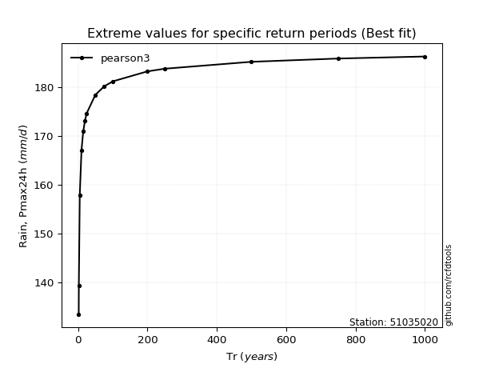</img>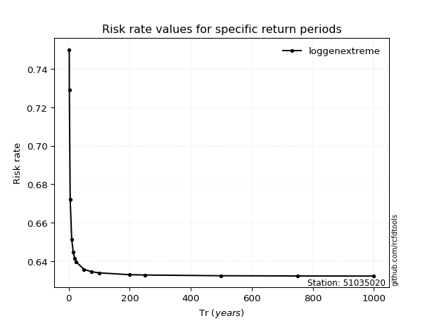</img>

</div>


<sub>**APP DISCLAIMER**: NO WARRANTY - This software is provided by [github.com/rcfdtools](https://github.com/rcfdtools) "as is", without any express or implied warranty, including warranties of merchantability, fitness for a particular purpose, or non-infringement. There is no guarantee that the software will be error-free or operate without interruption. LIMITATION OF LIABILITY - Neither the authors nor copyright holders will be liable for claims or damages arising from the software or its use. You are responsible for determining if the software is appropriate for your use and assume all associated risks, including errors, legal compliance, and data loss. NO PROFESSIONAL ADVICE - The software provides general information and does not offer professional advice. It should not replace consultation with professional advisors.</sub>