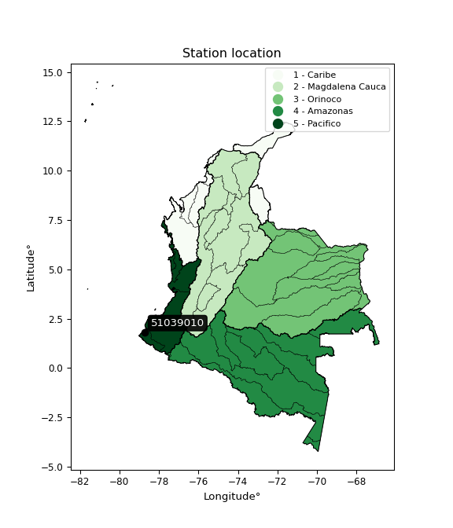

<div align="center">


</div>

# PMax24h Station (Rain, Pmax24h): 51039010

Maximum Precipitation in 24 hours (PMax24h) is the greatest amount of rainfall for a specific duration that is meteorologically possible for a given location, acting as a "worst-case" scenario for extreme storms, crucial for designing safety-critical infrastructure like bridges, river deviations, dams, spillways, and nuclear plants to prevent catastrophic failure. The PMax24h is related with the Probable Maximum Precipitation (PMP) and it is calculated by hydrologists using meteorological data to determine the upper limit of extreme rainfall, often leading to the Probable Maximum Flood (PMF) for flood control design, and is increasingly being studied for climate change impacts. Probable Maximum Precipitation (PMP) is the theoretical upper limit of rainfall, a deterministic estimate for extreme events, while probability distributions (like GEV, Gumbel) describe the likelihood and frequency of various precipitation amounts, including rare ones, showing how often events occur, with PMP representing the extreme end of these distributions, used for critical infrastructure design to ensure safety against the worst conceivable weather, unlike standard statistical forecasts which cover typical probabilities.

The most common probability distributions in hydrology, used for analyzing floods, rainfall, and streamflow, include the Normal, Log-Normal, Gumbel, Gamma (including Log-Pearson Type III), and Generalized Extreme Value (GEV) distributions, often chosen based on the data´s skewness and whether modeling extremes or general conditions, with Gumbel and GEV popular for extreme events like floods, while the Normal distribution serves as a baseline, though often requiring transformations for skewed hydrological data. These distributions help in designing water infrastructure, managing water resources, and forecasting hydrologic events.

> Hydrological data often isn´t perfectly normal (it´s skewed), so different distributions are needed for different applications, such as: **Flood Frequency Analysis**: Using Gumbel, GEV, or Log-Pearson Type III for predicting extreme flood magnitudes and their return periods, **Rainfall Analysis**: Normal for annual totals, but Log-Normal, Weibull, or GEV for intensity or extreme daily rainfall, **Streamflow Modeling**: Gamma and Log-Normal for maximum flows, GEV for minimum flows, and Kappa for daily flows.

<div align="center">

</img>

</div>


## A. General information


### 1. General running parameters

• app_version: _v20260225_. • runtime: _2026-02-27 14:50:08.749431_. • Python version: _3.14.0_. • SciPy version: _1.16.3_. • Pandas version: _2.3.3_. • NumPy version: _2.3.5_. • Stations dataset (station_dataset_file): _dataset/pmax24h_in/automatic_colombia_2003_2025.csv_. • Stations catalog (station_catalog_file): _dataset/CNE.xls_. • Minimum year to eval til year_max (date_min): _1900_. • Maximum year to eval since year_min (date_max): _2025_. • Creates, save and include plots into reports (create_plot): _False_. • Plot only fit distributions with Δo > Δ (plot_only_fit): _True_. • Plot only simple graphs avoiding multiple CDFs and multiple Extreme values plots (plot_only_simple): _False_. • Eval low extreme values, if False, evaluates high extreme values (low_extreme): _False_. • Eval every SciPy distribution as logarithmic (pdist_logarithmic_on): _True_. • Standard deviation normalized (ddof): _1.0_. • Return periods to eval in years (Tr): _[2, 2.33, 5, 10, 15, 20, 25, 50, 75, 100, 200, 250, 500, 750, 1000]_. • Minimum data sample per station, 0 means any (minimum_sample): _5_. • Z-Score maximum threshold to adjust a value, 0 means disable (zscore_max): _3.5_. • Z-Score minimum threshold to adjust a value, 0 means disable (zscore_min): _-2.5_. • Avoid zeros, e.g. rain = 0 (avoid_zeros): _True_. • Avoid null values (avoid_nans): _True_. 

:file_folder:Table: [dataset.csv](../../dataset/pmax24h_in/automatic_colombia_2003_2025.csv)

> Delta Degrees of Freedom (DDOF): is a parameter used in the formulas for calculating variance and standard deviation. When ddof=0, the divisor is $N$ (the total number of observations) and this is used when your data set is the entire population. When ddof=1, the divisor is $N-1$ and this is used when your data set is a sample drawn from a larger population. Using $N-1$ provides an unbiased estimate of the population variance (known as Bessel´s correction).


### 2. Station info and location

|   id |   CODIGO | NOMBRE                  | CATEGORIA            | TECNOLOGIA                | ESTADO   | FECHA_INSTALACION   |   FECHA_SUSPENSION |   ALTITUD |   LATITUD |   LONGITUD | DEPARTAMENTO   | MUNICIPIO   | AREA_OPERATIVA                      | ENTIDAD                                                     | AREA_HIDROGRAFICA   | ZONA_HIDROGRAFICA   | SUBZONA_HIDROGRAFICA   | CORRIENTE   | Catalogo   |   Version |
|-----:|---------:|:------------------------|:---------------------|:--------------------------|:---------|:--------------------|-------------------:|----------:|----------:|-----------:|:---------------|:------------|:------------------------------------|:------------------------------------------------------------|:--------------------|:--------------------|:-----------------------|:------------|:-----------|----------:|
|    0 | 51039010 | TUMACO - AUT [51039010] | Meteorologica Marina | Automática con Telemetría | Activa   | 15/09/1951          |                nan |         0 |   1.81931 |   -78.7303 | Nariño         | Tumaco      | Area Operativa 07 - Nariño-Putumayo | INSTITUTO DE HIDROLOGIA METEOROLOGIA Y ESTUDIOS AMBIENTALES | Pacifico            | Mira                | Río Rosario            | Pacifico    | CNE_IDEAM  |  20251226 |

<div align="center">

Dynamic map: [:earth_americas:Google](http://maps.google.com/maps?q=1.819305556,-78.73027778) [:earth_americas:OSM](https://www.openstreetmap.org/#map=18/1.819305556/-78.73027778&layers=P) [:earth_americas:Bing](https://www.bing.com/maps?cp=1.819305556~-78.73027778&lvl=18) [:earth_americas:Apple](https://maps.apple.com/frame?center=1.819305556%2C-78.73027778&span=0.003%2C0.006)

</div>


<div align="center">

```geojson
{
  "type": "Feature",
  "geometry": {
    "type": "Point", 
    "coordinates": [-78.73027778, 1.819305556]
  }, 
  "properties": {
    "Name": "51039010"
  }
}
```

</div>


### 3. Discrete values table and plot

<div align="center">

|               |          0 |           1 |           2 |           3 |          4 |           5 |           6 |          7 |           8 |
|:--------------|-----------:|------------:|------------:|------------:|-----------:|------------:|------------:|-----------:|------------:|
| Date          | 2017       | 2018        | 2019        | 2020        | 2021       | 2022        | 2023        | 2024       | 2025        |
| Value         |  182.2     |   95.4      |  131.6      |   86.2      |   37.4     |  106.8      |   83.8      |  159.6     |  124.4      |
| Value_initial |  182.2     |   95.4      |  131.6      |   86.2      |   37.4     |  106.8      |   83.8      |  159.6     |  124.4      |
| count         |    9       |    9        |    9        |    9        |    9       |    9        |    9        |    9       |    9        |
| mean          |  111.933   |  111.933    |  111.933    |  111.933    |  111.933   |  111.933    |  111.933    |  111.933   |  111.933    |
| std           |   43.3882  |   43.3882   |   43.3882   |   43.3882   |   43.3882  |   43.3882   |   43.3882   |   43.3882  |   43.3882   |
| zscore        |    1.61949 |   -0.381056 |    0.453272 |   -0.593095 |   -1.71782 |   -0.118312 |   -0.648409 |    1.09861 |    0.287328 |


</div>


> The initial value (value_initial) correspond to the initial obtained or null completed value, and value (value) is adjusted only when the initial value is outside the valid range (outlier) definite through the Z-Score value. If Z-Score is active, values out of range or outliers are replaced with the station mean value. A Z-Score (or standard score) measures how many standard deviations a data point is from the mean of a dataset, indicating its relative position; positive scores mean above the mean, negative mean below, and a score of zero is exactly at the mean, allowing for comparison of values from different distributions. It´s calculated using the formula $z=(x–μ)/σ$, where $x$ is the data point, $μ$ is the mean, and $σ$ is the standard deviation, helping identify outliers and understand probability.
>
> <sub>**Note**: In this study, "completing" (filling gaps in) and "extending" (forecasting or lengthening the historical record) rainfall data series are avoided for certain critical analyses because they introduce artificial bias and uncertainty, which can distort the statistics of rare events (extremes), alter day-to-day variability, and compromise the integrity and homogeneity of the original data. Some reasons against Completing/Extending rainfall data are: **Distortion of Extremes and Variability**: The primary issue is that most gap-filling or extension methods rely on averaging or regression with nearby stations, which inherently smooths the data. Rainfall is highly variable in space and time, with a large percentage of zero values and occasional large storms. Infilling methods often underestimate the highest values and overestimate the lowest (zero) values, which severely distorts analyses focused on flood frequency, drought severity, and intensity-duration-frequency (IDF) curves, **Loss of Data Homogeneity**: Infilled or extended data are synthetic estimates, not actual measurements. Combining these estimates with observed data can violate the assumption of data homogeneity, which requires that the data properties do not change over time. Inhomogeneity can lead to incorrect conclusions about long-term trends or changes in climate patterns, **Propagation of Errors**: Errors and biases from the original data (e.g., wind-induced undercatch, instrument errors, site changes) or the data used for imputation can propagate through the analysis, leading to unreliable hydrological models and inaccurate predictions, **Compromised Statistical Integrity**: For statistical analyses, especially those involving the frequency of events, using artificial data can introduce time bias or autocorrelation that doesn´t exist in reality, making it difficult to assess the true probability of events, **Difficulty in Validation**: It is difficult to accurately validate the quality of filled or extended data, especially for past periods where ground-truth measurements are unavailable. The reliability of imputation techniques heavily depends on the density of the surrounding station network and the complexity of the local topography.</sub>


### 4. Active continuous probability distributions from SciPy (80 of 104 available)

A Probability Density Function (PDF) describes the relative likelihood of a continuous random variable falling within a specific range, where the total area under its curve equals 1, and the area over any interval gives the actual probability for that range. Unlike discrete probabilities (like rolling a die), a PDF shows density, not direct probability for a single point (which is zero), with higher points indicating higher likelihood, often visualized as a bell curve for normal distributions.

A log of a probability density function (log-PDF) is simply the logarithm of the PDF´s value, denoted as $log(f(x))$, useful for converting multiplication of probabilities into addition, improving numerical stability with tiny numbers, and connecting to information theory concepts like entropy. Instead of dealing with very small probabilities (e.g., 0.000001), log-PDFs use negative numbers (e.g., $log(0.00001) ≈ -11.51$ that are easier for computers to handle, preventing underflow errors and simplifying complex calculations. In this study, each active probability distribution from SciPy is also evaluated in the $log$ form.

[scipy.stats](https://docs.scipy.org/doc/scipy/reference/stats.html) is a Python´s powerful submodule within the SciPy library for comprehensive statistical analysis, offering over 130 probability distributions (like Normal, Poisson, etc.), functions for descriptive stats (mean, variance), hypothesis testing (t-tests, chi-square), random variable generation, and statistical tests, making it essential for data science, modeling, and research. It provides tools to explore, model, and draw conclusions from data efficiently, working seamlessly with [NumPy](https://numpy.org/).

<div align="center">

|   id | p_dist           |   n_parameter | fit_method   | label                                                                       | active   | ref                                                                                                      |
|-----:|:-----------------|--------------:|:-------------|:----------------------------------------------------------------------------|:---------|:---------------------------------------------------------------------------------------------------------|
|    0 | alpha            |             3 | MLE          | Alpha                                                                       | True     | [:mortar_board:](https://docs.scipy.org/doc/scipy/reference/generated/scipy.stats.alpha.html)            |
|    1 | anglit           |             2 | MM           | Anglit                                                                      | True     | [:mortar_board:](https://docs.scipy.org/doc/scipy/reference/generated/scipy.stats.anglit.html)           |
|    2 | arcsine          |             2 | MM           | Arcsine                                                                     | True     | [:mortar_board:](https://docs.scipy.org/doc/scipy/reference/generated/scipy.stats.arcsine.html)          |
|    3 | argus            |             3 | MLE          | Argus                                                                       | True     | [:mortar_board:](https://docs.scipy.org/doc/scipy/reference/generated/scipy.stats.argus.html)            |
|    4 | beta             |             4 | MLE          | Beta                                                                        | True     | [:mortar_board:](https://docs.scipy.org/doc/scipy/reference/generated/scipy.stats.beta.html)             |
|    5 | betaprime        |             4 | MLE          | Beta prime                                                                  | True     | [:mortar_board:](https://docs.scipy.org/doc/scipy/reference/generated/scipy.stats.betaprime.html)        |
|    6 | bradford         |             3 | MLE          | Bradford                                                                    | True     | [:mortar_board:](https://docs.scipy.org/doc/scipy/reference/generated/scipy.stats.bradford.html)         |
|    7 | burr             |             4 | MLE          | Burr (Type III)                                                             | True     | [:mortar_board:](https://docs.scipy.org/doc/scipy/reference/generated/scipy.stats.burr.html)             |
|    8 | burr12           |             4 | MLE          | Burr (Type III) 12                                                          | True     | [:mortar_board:](https://docs.scipy.org/doc/scipy/reference/generated/scipy.stats.burr12.html)           |
|    9 | cosine           |             2 | MLE          | Cosine                                                                      | True     | [:mortar_board:](https://docs.scipy.org/doc/scipy/reference/generated/scipy.stats.cosine.html)           |
|   10 | crystalball      |             4 | MLE          | Crystalball                                                                 | True     | [:mortar_board:](https://docs.scipy.org/doc/scipy/reference/generated/scipy.stats.crystalball.html)      |
|   11 | dgamma           |             3 | MLE          | Double gamma                                                                | True     | [:mortar_board:](https://docs.scipy.org/doc/scipy/reference/generated/scipy.stats.dgamma.html)           |
|   12 | dweibull         |             3 | MLE          | Double Weibull                                                              | True     | [:mortar_board:](https://docs.scipy.org/doc/scipy/reference/generated/scipy.stats.dweibull.html)         |
|   13 | erlang           |             3 | MLE          | Erlang                                                                      | True     | [:mortar_board:](https://docs.scipy.org/doc/scipy/reference/generated/scipy.stats.erlang.html)           |
|   14 | exponnorm        |             3 | MLE          | Exponentially modified Normal                                               | True     | [:mortar_board:](https://docs.scipy.org/doc/scipy/reference/generated/scipy.stats.exponnorm.html)        |
|   15 | exponpow         |             3 | MLE          | Exponential power                                                           | True     | [:mortar_board:](https://docs.scipy.org/doc/scipy/reference/generated/scipy.stats.exponpow.html)         |
|   16 | exponweib        |             4 | MLE          | Exponentiated Weibull                                                       | True     | [:mortar_board:](https://docs.scipy.org/doc/scipy/reference/generated/scipy.stats.exponweib.html)        |
|   17 | f                |             4 | MLE          | F                                                                           | True     | [:mortar_board:](https://docs.scipy.org/doc/scipy/reference/generated/scipy.stats.f.html)                |
|   18 | fatiguelife      |             3 | MLE          | Fatigue-life (Birnbaum-Saunders)                                            | True     | [:mortar_board:](https://docs.scipy.org/doc/scipy/reference/generated/scipy.stats.fatiguelife.html)      |
|   19 | foldnorm         |             3 | MM           | Fold Normal                                                                 | True     | [:mortar_board:](https://docs.scipy.org/doc/scipy/reference/generated/scipy.stats.foldnorm.html)         |
|   20 | gamma            |             3 | MLE          | Gamma                                                                       | True     | [:mortar_board:](https://docs.scipy.org/doc/scipy/reference/generated/scipy.stats.gamma.html)            |
|   21 | gausshyper       |             6 | MLE          | Gauss hypergeometric                                                        | True     | [:mortar_board:](https://docs.scipy.org/doc/scipy/reference/generated/scipy.stats.gausshyper.html)       |
|   22 | genexpon         |             5 | MLE          | Generalized exponential                                                     | True     | [:mortar_board:](https://docs.scipy.org/doc/scipy/reference/generated/scipy.stats.genexpon.html)         |
|   23 | genextreme       |             3 | MLE          | Generalized exponential                                                     | True     | [:mortar_board:](https://docs.scipy.org/doc/scipy/reference/generated/scipy.stats.genextreme.html)       |
|   24 | gengamma         |             4 | MLE          | Generalized gamma                                                           | True     | [:mortar_board:](https://docs.scipy.org/doc/scipy/reference/generated/scipy.stats.gengamma.html)         |
|   25 | genhalflogistic  |             3 | MLE          | Generalized half-logistic                                                   | True     | [:mortar_board:](https://docs.scipy.org/doc/scipy/reference/generated/scipy.stats.genhalflogistic.html)  |
|   26 | genlogistic      |             3 | MLE          | Generalized logistic                                                        | True     | [:mortar_board:](https://docs.scipy.org/doc/scipy/reference/generated/scipy.stats.genlogistic.html)      |
|   27 | gennorm          |             3 | MLE          | Generalized Normal                                                          | True     | [:mortar_board:](https://docs.scipy.org/doc/scipy/reference/generated/scipy.stats.gennorm.html)          |
|   28 | genpareto        |             3 | MLE          | Generalized Pareto                                                          | True     | [:mortar_board:](https://docs.scipy.org/doc/scipy/reference/generated/scipy.stats.genpareto.html)        |
|   29 | gompertz         |             3 | MLE          | Gompertz (or truncated Gumbel)                                              | True     | [:mortar_board:](https://docs.scipy.org/doc/scipy/reference/generated/scipy.stats.gompertz.html)         |
|   30 | gumbel_l         |             2 | MM           | Gumbel Left Skew                                                            | True     | [:mortar_board:](https://docs.scipy.org/doc/scipy/reference/generated/scipy.stats.gumbel_l.html)         |
|   31 | gumbel_r         |             2 | MM           | Gumbel Right Skew                                                           | True     | [:mortar_board:](https://docs.scipy.org/doc/scipy/reference/generated/scipy.stats.gumbel_r.html)         |
|   32 | halfgennorm      |             3 | MLE          | Upper half of a generalized normal                                          | True     | [:mortar_board:](https://docs.scipy.org/doc/scipy/reference/generated/scipy.stats.halfgennorm.html)      |
|   33 | halflogistic     |             2 | MM           | Half-logistic                                                               | True     | [:mortar_board:](https://docs.scipy.org/doc/scipy/reference/generated/scipy.stats.halflogistic.html)     |
|   34 | halfnorm         |             2 | MM           | Half Normal                                                                 | True     | [:mortar_board:](https://docs.scipy.org/doc/scipy/reference/generated/scipy.stats.halfnorm.html)         |
|   35 | hypsecant        |             2 | MM           | hyperbolic secant                                                           | True     | [:mortar_board:](https://docs.scipy.org/doc/scipy/reference/generated/scipy.stats.hypsecant.html)        |
|   36 | invgamma         |             3 | MLE          | Inverted gamma                                                              | True     | [:mortar_board:](https://docs.scipy.org/doc/scipy/reference/generated/scipy.stats.invgamma.html)         |
|   37 | invgauss         |             3 | MLE          | Inverse Gaussian                                                            | True     | [:mortar_board:](https://docs.scipy.org/doc/scipy/reference/generated/scipy.stats.invgauss.html)         |
|   38 | invweibull       |             3 | MLE          | Inverted Weibull                                                            | True     | [:mortar_board:](https://docs.scipy.org/doc/scipy/reference/generated/scipy.stats.invweibull.html)       |
|   39 | johnsonsb        |             4 | MLE          | Johnson SB                                                                  | True     | [:mortar_board:](https://docs.scipy.org/doc/scipy/reference/generated/scipy.stats.johnsonsb.html)        |
|   40 | johnsonsu        |             4 | MLE          | Johnson Su                                                                  | True     | [:mortar_board:](https://docs.scipy.org/doc/scipy/reference/generated/scipy.stats.johnsonsu.html)        |
|   41 | kappa3           |             3 | MLE          | Kappa 3                                                                     | True     | [:mortar_board:](https://docs.scipy.org/doc/scipy/reference/generated/scipy.stats.kappa3.html)           |
|   42 | kappa4           |             4 | MLE          | Kappa 4                                                                     | True     | [:mortar_board:](https://docs.scipy.org/doc/scipy/reference/generated/scipy.stats.kappa4.html)           |
|   43 | ksone            |             3 | MLE          | Kolmogorov-Smirnov one-sided test statistic distribution                    | True     | [:mortar_board:](https://docs.scipy.org/doc/scipy/reference/generated/scipy.stats.ksone.html)            |
|   44 | kstwobign        |             2 | MLE          | Limiting distribution of scaled Kolmogorov-Smirnov two-sided test statistic | True     | [:mortar_board:](https://docs.scipy.org/doc/scipy/reference/generated/scipy.stats.kstwobign.html)        |
|   45 | laplace          |             2 | MM           | Laplace                                                                     | True     | [:mortar_board:](https://docs.scipy.org/doc/scipy/reference/generated/scipy.stats.laplace.html)          |
|   46 | levy_l           |             2 | MLE          | Left-skewed Levy                                                            | True     | [:mortar_board:](https://docs.scipy.org/doc/scipy/reference/generated/scipy.stats.levy_l.html)           |
|   47 | loggamma         |             3 | MLE          | Log gamma                                                                   | True     | [:mortar_board:](https://docs.scipy.org/doc/scipy/reference/generated/scipy.stats.loggamma.html)         |
|   48 | logistic         |             2 | MM           | Logistic (or Sech-squared)                                                  | True     | [:mortar_board:](https://docs.scipy.org/doc/scipy/reference/generated/scipy.stats.logistic.html)         |
|   49 | loglaplace       |             3 | MLE          | Log-Laplace                                                                 | True     | [:mortar_board:](https://docs.scipy.org/doc/scipy/reference/generated/scipy.stats.loglaplace.html)       |
|   50 | lomax            |             3 | MLE          | Lomax (Pareto of the second kind)                                           | True     | [:mortar_board:](https://docs.scipy.org/doc/scipy/reference/generated/scipy.stats.lomax.html)            |
|   51 | maxwell          |             2 | MM           | Maxwell                                                                     | True     | [:mortar_board:](https://docs.scipy.org/doc/scipy/reference/generated/scipy.stats.maxwell.html)          |
|   52 | mielke           |             4 | MLE          | Mielke Beta-Kappa / Dagum                                                   | True     | [:mortar_board:](https://docs.scipy.org/doc/scipy/reference/generated/scipy.stats.mielke.html)           |
|   53 | moyal            |             2 | MM           | Moyal                                                                       | True     | [:mortar_board:](https://docs.scipy.org/doc/scipy/reference/generated/scipy.stats.moyal.html)            |
|   54 | nakagami         |             3 | MLE          | Nakagami                                                                    | True     | [:mortar_board:](https://docs.scipy.org/doc/scipy/reference/generated/scipy.stats.nakagami.html)         |
|   55 | ncf              |             5 | MLE          | Non-central F distribution                                                  | True     | [:mortar_board:](https://docs.scipy.org/doc/scipy/reference/generated/scipy.stats.ncf.html)              |
|   56 | nct              |             4 | MLE          | Non-central Student’s t                                                     | True     | [:mortar_board:](https://docs.scipy.org/doc/scipy/reference/generated/scipy.stats.nct.html)              |
|   57 | norm             |             2 | MM           | Normal                                                                      | True     | [:mortar_board:](https://docs.scipy.org/doc/scipy/reference/generated/scipy.stats.norm.html)             |
|   58 | pearson3         |             3 | MM           | Pearson type III                                                            | True     | [:mortar_board:](https://docs.scipy.org/doc/scipy/reference/generated/scipy.stats.pearson3.html)         |
|   59 | powerlaw         |             3 | MLE          | Power-function                                                              | True     | [:mortar_board:](https://docs.scipy.org/doc/scipy/reference/generated/scipy.stats.powerlaw.html)         |
|   60 | rayleigh         |             2 | MM           | Rayleigh                                                                    | True     | [:mortar_board:](https://docs.scipy.org/doc/scipy/reference/generated/scipy.stats.rayleigh.html)         |
|   61 | rdist            |             3 | MLE          | R-distributed (symmetric beta)                                              | True     | [:mortar_board:](https://docs.scipy.org/doc/scipy/reference/generated/scipy.stats.rdist.html)            |
|   62 | rice             |             3 | MLE          | Rice                                                                        | True     | [:mortar_board:](https://docs.scipy.org/doc/scipy/reference/generated/scipy.stats.rice.html)             |
|   63 | semicircular     |             2 | MM           | Semicircular                                                                | True     | [:mortar_board:](https://docs.scipy.org/doc/scipy/reference/generated/scipy.stats.semicircular.html)     |
|   64 | skewnorm         |             3 | MLE          | Skew normal                                                                 | True     | [:mortar_board:](https://docs.scipy.org/doc/scipy/reference/generated/scipy.stats.skewnorm.html)         |
|   65 | t                |             3 | MLE          | Student’s t                                                                 | True     | [:mortar_board:](https://docs.scipy.org/doc/scipy/reference/generated/scipy.stats.t.html)                |
|   66 | trapezoid        |             4 | MLE          | Trapezoid                                                                   | True     | [:mortar_board:](https://docs.scipy.org/doc/scipy/reference/generated/scipy.stats.trapezoid.html)        |
|   67 | triang           |             3 | MLE          | Triangular                                                                  | True     | [:mortar_board:](https://docs.scipy.org/doc/scipy/reference/generated/scipy.stats.triang.html)           |
|   68 | truncexpon       |             3 | MLE          | Truncated exponential                                                       | True     | [:mortar_board:](https://docs.scipy.org/doc/scipy/reference/generated/scipy.stats.truncexpon.html)       |
|   69 | truncnorm        |             4 | MLE          | Truncated normal                                                            | True     | [:mortar_board:](https://docs.scipy.org/doc/scipy/reference/generated/scipy.stats.truncnorm.html)        |
|   70 | truncpareto      |             4 | MLE          | Upper truncated Pareto                                                      | True     | [:mortar_board:](https://docs.scipy.org/doc/scipy/reference/generated/scipy.stats.truncpareto.html)      |
|   71 | truncweibull_min |             5 | MLE          | Doubly truncated Weibull minimum                                            | True     | [:mortar_board:](https://docs.scipy.org/doc/scipy/reference/generated/scipy.stats.truncweibull_min.html) |
|   72 | tukeylambda      |             3 | MLE          | Tukey-Lamdba                                                                | True     | [:mortar_board:](https://docs.scipy.org/doc/scipy/reference/generated/scipy.stats.tukeylambda.html)      |
|   73 | uniform          |             2 | MLE          | Uniform                                                                     | True     | [:mortar_board:](https://docs.scipy.org/doc/scipy/reference/generated/scipy.stats.uniform.html)          |
|   74 | vonmises         |             3 | MLE          | Von Mises                                                                   | True     | [:mortar_board:](https://docs.scipy.org/doc/scipy/reference/generated/scipy.stats.vonmises.html)         |
|   75 | vonmises_line    |             3 | MLE          | Von Mises line                                                              | True     | [:mortar_board:](https://docs.scipy.org/doc/scipy/reference/generated/scipy.stats.vonmises_line.html)    |
|   76 | wald             |             2 | MM           | Wald                                                                        | True     | [:mortar_board:](https://docs.scipy.org/doc/scipy/reference/generated/scipy.stats.wald.html)             |
|   77 | weibull_max      |             3 | MLE          | Weibull maximum                                                             | True     | [:mortar_board:](https://docs.scipy.org/doc/scipy/reference/generated/scipy.stats.weibull_max.html)      |
|   78 | weibull_min      |             3 | MLE          | Weibull minimum                                                             | True     | [:mortar_board:](https://docs.scipy.org/doc/scipy/reference/generated/scipy.stats.weibull_min.html)      |
|   79 | wrapcauchy       |             3 | MLE          | Wrapped  Cauchy                                                             | True     | [:mortar_board:](https://docs.scipy.org/doc/scipy/reference/generated/scipy.stats.wrapcauchy.html)       |

</div>

> **n_parameter:** # arguments & localization & scale.
>
> **Fit methods:** (MLE) maximum likelihood, (MM) L-moments.
>
>**Inactive** (With the only purpose of prevent loops, zero divisions, infinite values, over high estimated values or horizontal trending for recurrence intervals estimations, the follow distributions were disabled.)**:** lognorm, norminvgauss, powernorm, powerlognorm, cauchy, halfcauchy, foldcauchy, skewcauchy, chi2, expon, fisk, genhyperbolic, geninvgauss, gibrat, kstwo, laplace_asymmetric, levy, levy_stable, ncx2, pareto, rel_breitwigner, recipinvgauss, studentized_range, loguniform, 


## B. Probability (PDF) vs. Empirical (EDF) distributions functions

A continuous probability distribution (CPD) describes probabilities for variables that can take any value within a range (like rain any time), unlike discrete variables with specific outcomes (like temperature). It uses a Probability Density Function (PDF), a curve where the total area under it equals 1, and the probability of the variable falling within an interval (a to b) is found by calculating the area under the curve between those points. A key feature is that the probability of hitting any single exact value is zero, so probabilities are always expressed for ranges, e.g., $P(a ≤ X ≤ b)$.

<div align="center">

Distributions parameters from station values
|     |   station | p_dist              |   n |              loc |           scale | shape                  | shape1                 | shape2                | shape3             |
|----:|----------:|:--------------------|----:|-----------------:|----------------:|:-----------------------|:-----------------------|:----------------------|:-------------------|
|   0 |  51039010 | alpha               |   9 |   -567.634       | 11173.7         | 16.513258312385922     |                        |                       |                    |
|   1 |  51039010 | anglit              |   9 |    111.933       |   119.669       |                        |                        |                       |                    |
|   2 |  51039010 | arcsine             |   9 |     54.0823      |   115.702       |                        |                        |                       |                    |
|   3 |  51039010 | argus               |   9 |     12.2035      |   176.395       | 3.862702260323901e-06  |                        |                       |                    |
|   4 |  51039010 | beta                |   9 |     -8.87385     |   191.074       | 1.828766839398972      | 0.6483827349589859     |                       |                    |
|   5 |  51039010 | betaprime           |   9 |   -576.466       | 64459.9         | 283.3325305039839      | 26538.34743448966      |                       |                    |
|   6 |  51039010 | bradford            |   9 |     37.3999      |   144.8         | 0.8394325615586833     |                        |                       |                    |
|   7 |  51039010 | burr                |   9 |     -0.735467    |   146.04        | 7.632868810796301      | 0.3305801524557823     |                       |                    |
|   8 |  51039010 | burr12              |   9 |     -0.815579    |    37.8866      | 450.66308150457405     | 0.0021983005749056117  |                       |                    |
|   9 |  51039010 | cosine              |   9 |    111.588       |    35.0862      |                        |                        |                       |                    |
|  10 |  51039010 | crystalball         |   9 |    111.933       |    40.9068      | 9530.85809524218       | 227.69124271039146     |                       |                    |
|  11 |  51039010 | dgamma              |   9 |    102.735       |    22.3654      | 1.485751298345225      |                        |                       |                    |
|  12 |  51039010 | dweibull            |   9 |    114.642       |    37.4731      | 1.4988506513354092     |                        |                       |                    |
|  13 |  51039010 | erlang              |   9 |  -7229.46        |     0.22793     | 32208.930128681284     |                        |                       |                    |
|  14 |  51039010 | exponnorm           |   9 |    111.13        |    40.899       | 0.01963773528770034    |                        |                       |                    |
|  15 |  51039010 | exponpow            |   9 |     37.4         |     1.01963     | 0.07193391603971905    |                        |                       |                    |
|  16 |  51039010 | exponweib           |   9 |     37.4         |     0.292467    | 5.439908277800151      | 0.08763719422325206    |                       |                    |
|  17 |  51039010 | f                   |   9 |  -2478.01        |  2589.95        | 8069.152033865086      | 999941.886144436       |                       |                    |
|  18 |  51039010 | fatiguelife         |   9 |     37.4         |     0.000110362 | 805.9084368005754      |                        |                       |                    |
|  19 |  51039010 | foldnorm            |   9 |    122.097       |     0.0192095   | 0.005491437565845498   |                        |                       |                    |
|  20 |  51039010 | gamma               |   9 |  -7307.51        |     0.225525    | 32898.525285027135     |                        |                       |                    |
|  21 |  51039010 | gausshyper          |   9 |     28.4559      |   153.744       | 1.2728912167210074     | 0.8775043274792886     | 0.8954536937185754    | 0.7408643757954945 |
|  22 |  51039010 | genexpon            |   9 |     37.3998      |     1.91539     | 0.02547909308490867    | 0.0002750053814310024  | 1.0955869139274697    |                    |
|  23 |  51039010 | genextreme          |   9 |     38.2678      |     5.12227     | -5.902223541417307     |                        |                       |                    |
|  24 |  51039010 | gengamma            |   9 |     37.4         |     0.760508    | 1.347041406040489      | 0.1889097761846582     |                       |                    |
|  25 |  51039010 | genhalflogistic     |   9 |     22.7776      |   168.243       | 1.0553263233408954     |                        |                       |                    |
|  26 |  51039010 | genlogistic         |   9 |     99.5945      |    26.0058      | 1.3711294548706219     |                        |                       |                    |
|  27 |  51039010 | gennorm             |   9 |    112.684       |    66.1839      | 2.81330681565949       |                        |                       |                    |
|  28 |  51039010 | genpareto           |   9 |     -0.602292    |   256.188       | -1.401446607586503     |                        |                       |                    |
|  29 |  51039010 | gompertz            |   9 |     26.3256      |     4.00768     | 1.1488251457390693e-16 |                        |                       |                    |
|  30 |  51039010 | gumbel_l            |   9 |    130.344       |    31.8949      |                        |                        |                       |                    |
|  31 |  51039010 | gumbel_r            |   9 |     93.5231      |    31.8949      |                        |                        |                       |                    |
|  32 |  51039010 | halfgennorm         |   9 |     37.4         |     1.27527     | 0.31107943085532286    |                        |                       |                    |
|  33 |  51039010 | halflogistic        |   9 |     63.4492      |    34.9739      |                        |                        |                       |                    |
|  34 |  51039010 | halfnorm            |   9 |     57.7887      |    67.8602      |                        |                        |                       |                    |
|  35 |  51039010 | hypsecant           |   9 |    111.933       |    26.0421      |                        |                        |                       |                    |
|  36 |  51039010 | invgamma            |   9 |   -323.546       | 47767.7         | 110.65966952691872     |                        |                       |                    |
|  37 |  51039010 | invgauss            |   9 |   -106.599       |  5262.14        | 0.041661226819630734   |                        |                       |                    |
|  38 |  51039010 | invweibull          |   9 |     37.4         |     1.26605     | 0.053945788386257965   |                        |                       |                    |
|  39 |  51039010 | johnsonsb           |   9 |     37.3956      |   144.804       | -0.8679969871609909    | 0.1506755798093577     |                       |                    |
|  40 |  51039010 | johnsonsu           |   9 |      2.7222e+07  |     8.03163e+08 | 665391.4037597484      | 19635660.997476626     |                       |                    |
|  41 |  51039010 | kappa3              |   9 |     37.4         |   144.788       | 27937.12853171146      |                        |                       |                    |
|  42 |  51039010 | kappa4              |   9 |     22.5462      |   161.498       | 1.1013499659310093     | 1.0111186231596854     |                       |                    |
|  43 |  51039010 | ksone               |   9 |     22.92        |   173.76        | 1.0                    |                        |                       |                    |
|  44 |  51039010 | kstwobign           |   9 |    -49.1339      |   184.715       |                        |                        |                       |                    |
|  45 |  51039010 | laplace             |   9 |    111.933       |    28.9255      |                        |                        |                       |                    |
|  46 |  51039010 | levy_l              |   9 |    189.399       |    35.4846      |                        |                        |                       |                    |
|  47 |  51039010 | loggamma            |   9 |  -8260.08        |  1230.45        | 901.8987105818546      |                        |                       |                    |
|  48 |  51039010 | logistic            |   9 |    111.933       |    22.5531      |                        |                        |                       |                    |
|  49 |  51039010 | loglaplace          |   9 |     -0.275212    |   107.075       | 3.0959536141026267     |                        |                       |                    |
|  50 |  51039010 | lomax               |   9 |     37.4         |  3091.91        | 41.271255954186906     |                        |                       |                    |
|  51 |  51039010 | maxwell             |   9 |     15.0013      |    60.7431      |                        |                        |                       |                    |
|  52 |  51039010 | mielke              |   9 |   -812.771       |   602.584       | 315846.1207502553      | 23.58656589349723      |                       |                    |
|  53 |  51039010 | moyal               |   9 |     88.5402      |    18.4145      |                        |                        |                       |                    |
|  54 |  51039010 | nakagami            |   9 |     83.8         |    43.6585      | 0.3168589083506065     |                        |                       |                    |
|  55 |  51039010 | ncf                 |   9 |   -102.06        |     2.61209     | 1.2499027267354244     | 14677.705890239638     | 101.0914605378257     |                    |
|  56 |  51039010 | nct                 |   9 |  -2120.81        |    40.83        | 389582.3531312619      | 54.683770677071635     |                       |                    |
|  57 |  51039010 | norm                |   9 |    111.933       |    40.9068      |                        |                        |                       |                    |
|  58 |  51039010 | pearson3            |   9 |    111.933       |    40.9069      | 0.01098181262921333    |                        |                       |                    |
|  59 |  51039010 | powerlaw            |   9 |     37.4         |   144.8         | 0.21157355127556654    |                        |                       |                    |
|  60 |  51039010 | rayleigh            |   9 |     33.6762      |    62.4402      |                        |                        |                       |                    |
|  61 |  51039010 | rdist               |   9 |     23.9773      |    82.8227      | 1.0488188522254491     |                        |                       |                    |
|  62 |  51039010 | rice                |   9 |     16.2726      |    45.3051      | 1.8093115046716046     |                        |                       |                    |
|  63 |  51039010 | semicircular        |   9 |    111.933       |    81.8137      |                        |                        |                       |                    |
|  64 |  51039010 | skewnorm            |   9 |    108.24        |    41.0733      | 0.11343345566002097    |                        |                       |                    |
|  65 |  51039010 | t                   |   9 |    111.941       |    40.9039      | 940168.8408779046      |                        |                       |                    |
|  66 |  51039010 | trapezoid           |   9 |     22.92        |   173.76        | 1.0                    | 1.0                    |                       |                    |
|  67 |  51039010 | triang              |   9 |      1.47273     |   180.728       | 0.9999933966688852     |                        |                       |                    |
|  68 |  51039010 | truncexpon          |   9 |     31.7878      |   225.107       | 0.6681818089161757     |                        |                       |                    |
|  69 |  51039010 | truncnorm           |   9 |    111.933       |    40.9068      | -1155.9325313392367    | 2446.603657719343      |                       |                    |
|  70 |  51039010 | truncpareto         |   9 |     37.3903      |     0.00968877  | 0.1251510876888212     | 14946.14007077327      |                       |                    |
|  71 |  51039010 | truncweibull_min    |   9 |     31.117       |   157.708       | 1.4163466763161303     | 1.4276800688882802e-12 | 0.9579910950279827    |                    |
|  72 |  51039010 | tukeylambda         |   9 |    109.8         |    84.914       | 1.1728450500567607     |                        |                       |                    |
|  73 |  51039010 | uniform             |   9 |     37.4         |   144.8         |                        |                        |                       |                    |
|  74 |  51039010 | vonmises            |   9 |     -0.0798457   |     1           | 0.7310485403996455     |                        |                       |                    |
|  75 |  51039010 | vonmises_line       |   9 |    109.8         |    23.0456      | 0.7301133982186396     |                        |                       |                    |
|  76 |  51039010 | wald                |   9 |     71.0266      |    40.9068      |                        |                        |                       |                    |
|  77 |  51039010 | weibull_max         |   9 |    182.2         |     1.62519     | 0.17380098868500193    |                        |                       |                    |
|  78 |  51039010 | weibull_min         |   9 |     -4.57911     |   130.266       | 3.156938795478407      |                        |                       |                    |
|  79 |  51039010 | wrapcauchy          |   9 |     35.6233      |    23.3284      | 3.4661456930161667e-06 |                        |                       |                    |
|  80 |  51039010 | logalpha            |   9 |     -9.84522     |   453.317       | 31.3489094922177       |                        |                       |                    |
|  81 |  51039010 | loganglit           |   9 |      4.63521     |     1.27904     |                        |                        |                       |                    |
|  82 |  51039010 | logarcsine          |   9 |      4.01689     |     1.23663     |                        |                        |                       |                    |
|  83 |  51039010 | logargus            |   9 |      3.24215     |     2.00358     | 1.9175783514276827     |                        |                       |                    |
|  84 |  51039010 | logbeta             |   9 |      1.76034     |     3.44476     | 5.052587912117789      | 0.8479444293687061     |                       |                    |
|  85 |  51039010 | logbetaprime        |   9 |     -7.33815     |    30.1316      | 936.5776610894403      | 2357.834006331538      |                       |                    |
|  86 |  51039010 | logbradford         |   9 |      3.62167     |     1.58346     | 1.0604061353259011     |                        |                       |                    |
|  87 |  51039010 | logburr             |   9 |      3.26807     |     1.94757     | 41.62437930485554      | 0.05144577589319456    |                       |                    |
|  88 |  51039010 | logburr12           |   9 |    -40.0512      |    48.141       | 135.5622275338771      | 13450.81721083706      |                       |                    |
|  89 |  51039010 | logcosine           |   9 |      4.56012     |     0.398913    |                        |                        |                       |                    |
|  90 |  51039010 | logcrystalball      |   9 |      4.63521     |     0.437231    | 121.36132683156418     | 21.141094953182183     |                       |                    |
|  91 |  51039010 | logdgamma           |   9 |      4.62819     |     0.23237     | 1.414865927784423      |                        |                       |                    |
|  92 |  51039010 | logdweibull         |   9 |      4.71769     |     0.353675    | 1.2172409400218585     |                        |                       |                    |
|  93 |  51039010 | logerlang           |   9 |     -2.21935     |     0.0297801   | 229.8883775677018      |                        |                       |                    |
|  94 |  51039010 | logexponnorm        |   9 |      4.63494     |     0.437232    | 0.0005984941716979302  |                        |                       |                    |
|  95 |  51039010 | logexponpow         |   9 |      1.07717     |     3.94443     | 8.106675547487423      |                        |                       |                    |
|  96 |  51039010 | logexponweib        |   9 |      3.14174     |     2.0736      | 0.004952957535229007   | 507.5435939295496      |                       |                    |
|  97 |  51039010 | logf                |   9 |   -156.037       |   160.677       | 275416.63553852815     | 10038484.562216695     |                       |                    |
|  98 |  51039010 | logfatiguelife      |   9 |   -264.057       |   268.696       | 0.0016251072638144048  |                        |                       |                    |
|  99 |  51039010 | logfoldnorm         |   9 |      4.00903     |     0.515338    | 1.0719819596605449     |                        |                       |                    |
| 100 |  51039010 | loggamma            |   9 |     -2.66231     |     0.0289456   | 251.85538192248436     |                        |                       |                    |
| 101 |  51039010 | loggausshyper       |   9 |      3.6001      |     1.60501     | 0.9584717155459392     | 0.6938492770090561     | 1.1883924910254322    | 1.2167029685096327 |
| 102 |  51039010 | loggenexpon         |   9 |      3.62127     |     0.0118306   | 0.002856440497907466   | 2.7694332823835337     | 6.251336526018832e-05 |                    |
| 103 |  51039010 | loggenextreme       |   9 |      4.59922     |     0.509187    | 0.8151378612171405     |                        |                       |                    |
| 104 |  51039010 | loggengamma         |   9 |     -5.56216e+07 |     5.56216e+07 | 7.947787418974953      | 48588868.415923744     |                       |                    |
| 105 |  51039010 | loggenhalflogistic  |   9 |      3.41895     |     1.88042     | 1.0527753379306073     |                        |                       |                    |
| 106 |  51039010 | loggenlogistic      |   9 |      4.98152     |     0.130976    | 0.32643000806810296    |                        |                       |                    |
| 107 |  51039010 | loggennorm          |   9 |      4.67096     |     0.410846    | 1.2157792694602465     |                        |                       |                    |
| 108 |  51039010 | loggenpareto        |   9 |     -0.0137617   |    13.4313      | -2.5735989792927265    |                        |                       |                    |
| 109 |  51039010 | loggompertz         |   9 |      3.62167     |     1.23709     | 0.7792024046523753     |                        |                       |                    |
| 110 |  51039010 | loggumbel_l         |   9 |      4.83198     |     0.340907    |                        |                        |                       |                    |
| 111 |  51039010 | loggumbel_r         |   9 |      4.43843     |     0.340907    |                        |                        |                       |                    |
| 112 |  51039010 | loghalfgennorm      |   9 |      3.62152     |     1.58606     | 3452.6384620652243     |                        |                       |                    |
| 113 |  51039010 | loghalflogistic     |   9 |      4.11697     |     0.373826    |                        |                        |                       |                    |
| 114 |  51039010 | loghalfnorm         |   9 |      4.0565      |     0.725301    |                        |                        |                       |                    |
| 115 |  51039010 | loghypsecant        |   9 |      4.63521     |     0.27835     |                        |                        |                       |                    |
| 116 |  51039010 | loginvgamma         |   9 |     -4.47493     |  3709.84        | 408.74843948410853     |                        |                       |                    |
| 117 |  51039010 | loginvgauss         |   9 |     -0.330184    |   531.591       | 0.009316566395591162   |                        |                       |                    |
| 118 |  51039010 | loginvweibull       |   9 | -43041           | 43045.4         | 84228.32039199513      |                        |                       |                    |
| 119 |  51039010 | logjohnsonsb        |   9 |      3.62167     |     1.58343     | 0.3433206699579201     | 0.15845573452666997    |                       |                    |
| 120 |  51039010 | logjohnsonsu        |   9 |      5.58342     |     0.0404579   | 8.216617634698904      | 2.193987778438654      |                       |                    |
| 121 |  51039010 | logkappa3           |   9 |      3.62167     |     1.58233     | 3162.1300094951166     |                        |                       |                    |
| 122 |  51039010 | logkappa4           |   9 |      3.45716     |     1.89927     | 1.0864886247117842     | 1.0865748431576614     |                       |                    |
| 123 |  51039010 | logksone            |   9 |      3.46333     |     1.90012     | 1.0                    |                        |                       |                    |
| 124 |  51039010 | logkstwobign        |   9 |      2.52815     |     2.41683     |                        |                        |                       |                    |
| 125 |  51039010 | loglaplace          |   9 |      4.63521     |     0.309169    |                        |                        |                       |                    |
| 126 |  51039010 | loglevy_l           |   9 |      5.25556     |     0.246732    |                        |                        |                       |                    |
| 127 |  51039010 | logloggamma         |   9 |      4.98904     |     0.244369    | 0.6263910862635249     |                        |                       |                    |
| 128 |  51039010 | loglogistic         |   9 |      4.63521     |     0.241058    |                        |                        |                       |                    |
| 129 |  51039010 | logloglaplace       |   9 |     -0.01801     |     4.68897     | 13.993371268588053     |                        |                       |                    |
| 130 |  51039010 | loglomax            |   9 |      3.62167     |    11.7754      | 11.713577681683116     |                        |                       |                    |
| 131 |  51039010 | logmaxwell          |   9 |      3.59915     |     0.64925     |                        |                        |                       |                    |
| 132 |  51039010 | logmielke           |   9 |      3.23025     |     1.98258     | 2.390821076649094      | 33.51095262109996      |                       |                    |
| 133 |  51039010 | logmoyal            |   9 |      4.38517     |     0.196823    |                        |                        |                       |                    |
| 134 |  51039010 | lognakagami         |   9 |      4.42843     |     0.325458    | 0.24072351020368138    |                        |                       |                    |
| 135 |  51039010 | logncf              |   9 |    -79.5062      |    82.9556      | 102449.99359466525     | 254922.4765923294      | 1466.7306356136878    |                    |
| 136 |  51039010 | lognct              |   9 |     14.6094      |     0.434737    | 15842.304559963377     | -22.9378650866646      |                       |                    |
| 137 |  51039010 | lognorm             |   9 |      4.63521     |     0.437231    |                        |                        |                       |                    |
| 138 |  51039010 | logpearson3         |   9 |      4.63521     |     0.437231    | -1.0182187573552652    |                        |                       |                    |
| 139 |  51039010 | logpowerlaw         |   9 |      3.62167     |     1.58343     | 0.2328335750661775     |                        |                       |                    |
| 140 |  51039010 | lograyleigh         |   9 |      3.79871     |     0.667425    |                        |                        |                       |                    |
| 141 |  51039010 | logrdist            |   9 |      4.31453     |     0.890573    | 1.0666393799476643     |                        |                       |                    |
| 142 |  51039010 | logrice             |   9 |   -267.592       |     0.437141    | 622.7445391161318      |                        |                       |                    |
| 143 |  51039010 | logsemicircular     |   9 |      4.63521     |     0.87443     |                        |                        |                       |                    |
| 144 |  51039010 | logskewnorm         |   9 |      5.20511     |     0.718291    | -29906851.818861794    |                        |                       |                    |
| 145 |  51039010 | logt                |   9 |      4.66618     |     0.435011    | 13.072351334589161     |                        |                       |                    |
| 146 |  51039010 | logtrapezoid        |   9 |      3.39853     |     1.85501     | 1.0                    | 1.0                    |                       |                    |
| 147 |  51039010 | logtriang           |   9 |      3.36156     |     1.84355     | 0.9999999923495128     |                        |                       |                    |
| 148 |  51039010 | logtruncexpon       |   9 |      3.62167     |     2.21593     | 0.7145693041092117     |                        |                       |                    |
| 149 |  51039010 | logtruncnorm        |   9 |     -0.15269     |     1.26344     | 3.625924057316615      | 5.292144032566915      |                       |                    |
| 150 |  51039010 | logtruncpareto      |   9 |      3.62153     |     0.000138391 | 0.12514412339496878    | 11442.719415153962     |                       |                    |
| 151 |  51039010 | logtruncweibull_min |   9 |      3.61122     |     2.01738     | 1.1075450804108562     | 1.1109177383802687e-07 | 0.7900760821831185    |                    |
| 152 |  51039010 | logtukeylambda      |   9 |      4.41097     |     0.871213    | 1.097056509710662      |                        |                       |                    |
| 153 |  51039010 | loguniform          |   9 |      3.62167     |     1.58343     |                        |                        |                       |                    |
| 154 |  51039010 | logvonmises         |   9 |     -1.63337     |     1           | 5.847365026609717      |                        |                       |                    |
| 155 |  51039010 | logvonmises_line    |   9 |      4.69053     |     0.340228    | 1.2231689086523827     |                        |                       |                    |
| 156 |  51039010 | logwald             |   9 |      4.19796     |     0.437243    |                        |                        |                       |                    |
| 157 |  51039010 | logweibull_max      |   9 |      5.22389     |     0.624643    | 1.2267602745335218     |                        |                       |                    |
| 158 |  51039010 | logweibull_min      |   9 |     -1.03584e+07 |     1.03584e+07 | 31283303.607394725     |                        |                       |                    |
| 159 |  51039010 | logwrapcauchy       |   9 |      3.62167     |     0.252011    | 0.5                    |                        |                       |                    |

</div>

> **loc** (Location parameter): This shifts the distribution along the x-axis. For many common distributions, like the normal (Gaussian) distribution, loc represents the mean $μ$. For others, like the uniform distribution, it might represent the minimum value, or for the beta distribution, the left end of the support interval.
>
> **scale** (Scale parameter): This determines the width or spread of the distribution. For the normal distribution, scale represents the standard deviation $σ$. For a uniform distribution, it defines the length of the interval (from $loc$ to $loc + scale$).
>
> **shape** (Shape parameters): Refers to parameters that define the specific form of a probability distribution, distinct from its location (loc) and scale (scale). These parameters are required arguments for most distribution functions. For example, a normal (Gaussian) distribution is fully defined by its location (mean) and scale (standard deviation), so it has no specific shape parameters beyond loc and scale. However, other distributions have intrinsic properties that need specification, as Gamma distribution that takes a shape parameter, often named $a$ or $alpha$.


### 0. Cumulative distribution values - CDF (160 evaluated)

Cumulative Distribution Function (CDF), denoted as $F$<sub>$X$</sub>$(x)$, is a function that gives the probability that a random variable $X$ will take a value less than or equal to a specific value, $x$ (i.e., $(P(X≥x)$. It essentially "accumulates" probabilities from a given point up to the far right (positive infinity), providing a complete picture of the distribution´s probabilities for both discrete (like rain) and continuous (like temperature) variables, helping to find probabilities over ranges or above certain values. Each station is evaluated separately ordering the $x$ values ascending, calculating the CDF and PDF values for the activated distributions and their logarithmic forms.

<div align="center">

CDF ordered by x ascending and calculating $log(f(x))$ separately
|   id |   Station |   date |     x |   count |    mean |     std |    zscore |   Value_initial |   station |   m |     alpha |   alpha_pdf |    anglit |   anglit_pdf |   arcsine |   arcsine_pdf |    argus |   argus_pdf |      beta |      beta_pdf |   betaprime |   betaprime_pdf |    bradford |   bradford_pdf |      burr |   burr_pdf |     burr12 |   burr12_pdf |    cosine |   cosine_pdf |   crystalball |   crystalball_pdf |    dgamma |   dgamma_pdf |   dweibull |   dweibull_pdf |    erlang |   erlang_pdf |   exponnorm |   exponnorm_pdf |   exponpow |   exponpow_pdf |   exponweib |   exponweib_pdf |         f |      f_pdf |   fatiguelife |   fatiguelife_pdf |   foldnorm |   foldnorm_pdf |    gamma |   gamma_pdf |   gausshyper |   gausshyper_pdf |    genexpon |   genexpon_pdf |   genextreme |   genextreme_pdf |    gengamma |   gengamma_pdf |   genhalflogistic |   genhalflogistic_pdf |   genlogistic |   genlogistic_pdf |   gennorm |   gennorm_pdf |   genpareto |   genpareto_pdf |    gompertz |   gompertz_pdf |   gumbel_l |   gumbel_l_pdf |   gumbel_r |   gumbel_r_pdf |   halfgennorm |   halfgennorm_pdf |   halflogistic |   halflogistic_pdf |   halfnorm |   halfnorm_pdf |   hypsecant |   hypsecant_pdf |   invgamma |   invgamma_pdf |   invgauss |   invgauss_pdf |   invweibull |   invweibull_pdf |   johnsonsb |   johnsonsb_pdf |   johnsonsu |   johnsonsu_pdf |      kappa3 |   kappa3_pdf |      kappa4 |   kappa4_pdf |     ksone |   ksone_pdf |   kstwobign |   kstwobign_pdf |   laplace |   laplace_pdf |   levy_l |   levy_l_pdf |   loggamma |   loggamma_pdf |   logistic |   logistic_pdf |   loglaplace |   loglaplace_pdf |       lomax |   lomax_pdf |   maxwell |   maxwell_pdf |   mielke |   mielke_pdf |       moyal |   moyal_pdf |    nakagami |   nakagami_pdf |       ncf |    ncf_pdf |       nct |    nct_pdf |      norm |   norm_pdf |   pearson3 |   pearson3_pdf |    powerlaw |   powerlaw_pdf |   rayleigh |   rayleigh_pdf |    rdist |      rdist_pdf |      rice |   rice_pdf |   semicircular |   semicircular_pdf |   skewnorm |   skewnorm_pdf |         t |      t_pdf |   trapezoid |   trapezoid_pdf |    triang |   triang_pdf |   truncexpon |   truncexpon_pdf |   truncnorm |   truncnorm_pdf |   truncpareto |   truncpareto_pdf |   truncweibull_min |   truncweibull_min_pdf |   tukeylambda |   tukeylambda_pdf |   uniform |   uniform_pdf |   vonmises |   vonmises_pdf |   vonmises_line |   vonmises_line_pdf |     wald |   wald_pdf |   weibull_max |   weibull_max_pdf |   weibull_min |   weibull_min_pdf |   wrapcauchy |   wrapcauchy_pdf |   logalpha |   logalpha_pdf |   loganglit |   loganglit_pdf |   logarcsine |   logarcsine_pdf |   logargus |   logargus_pdf |   logbeta |   logbeta_pdf |   logbetaprime |   logbetaprime_pdf |   logbradford |   logbradford_pdf |   logburr |   logburr_pdf |   logburr12 |   logburr12_pdf |   logcosine |   logcosine_pdf |   logcrystalball |   logcrystalball_pdf |   logdgamma |   logdgamma_pdf |   logdweibull |   logdweibull_pdf |   logerlang |   logerlang_pdf |   logexponnorm |   logexponnorm_pdf |   logexponpow |   logexponpow_pdf |   logexponweib |   logexponweib_pdf |     logf |   logf_pdf |   logfatiguelife |   logfatiguelife_pdf |   logfoldnorm |   logfoldnorm_pdf |   loggausshyper |   loggausshyper_pdf |   loggenexpon |   loggenexpon_pdf |   loggenextreme |   loggenextreme_pdf |   loggengamma |   loggengamma_pdf |   loggenhalflogistic |   loggenhalflogistic_pdf |   loggenlogistic |   loggenlogistic_pdf |   loggennorm |   loggennorm_pdf |   loggenpareto |   loggenpareto_pdf |   loggompertz |   loggompertz_pdf |   loggumbel_l |   loggumbel_l_pdf |   loggumbel_r |   loggumbel_r_pdf |   loghalfgennorm |   loghalfgennorm_pdf |   loghalflogistic |   loghalflogistic_pdf |   loghalfnorm |   loghalfnorm_pdf |   loghypsecant |   loghypsecant_pdf |   loginvgamma |   loginvgamma_pdf |   loginvgauss |   loginvgauss_pdf |   loginvweibull |   loginvweibull_pdf |   logjohnsonsb |   logjohnsonsb_pdf |   logjohnsonsu |   logjohnsonsu_pdf |   logkappa3 |   logkappa3_pdf |   logkappa4 |   logkappa4_pdf |   logksone |   logksone_pdf |   logkstwobign |   logkstwobign_pdf |   loglevy_l |   loglevy_l_pdf |   logloggamma |   logloggamma_pdf |   loglogistic |   loglogistic_pdf |   logloglaplace |   logloglaplace_pdf |    loglomax |   loglomax_pdf |   logmaxwell |   logmaxwell_pdf |   logmielke |   logmielke_pdf |    logmoyal |   logmoyal_pdf |   lognakagami |   lognakagami_pdf |    logncf |   logncf_pdf |    lognct |   lognct_pdf |   lognorm |   lognorm_pdf |   logpearson3 |   logpearson3_pdf |   logpowerlaw |   logpowerlaw_pdf |   lograyleigh |   lograyleigh_pdf |   logrdist |   logrdist_pdf |   logrice |   logrice_pdf |   logsemicircular |   logsemicircular_pdf |   logskewnorm |   logskewnorm_pdf |      logt |   logt_pdf |   logtrapezoid |   logtrapezoid_pdf |   logtriang |   logtriang_pdf |   logtruncexpon |   logtruncexpon_pdf |   logtruncnorm |   logtruncnorm_pdf |   logtruncpareto |   logtruncpareto_pdf |   logtruncweibull_min |   logtruncweibull_min_pdf |   logtukeylambda |   logtukeylambda_pdf |   loguniform |   loguniform_pdf |   logvonmises |   logvonmises_pdf |   logvonmises_line |   logvonmises_line_pdf |   logwald |   logwald_pdf |   logweibull_max |   logweibull_max_pdf |   logweibull_min |   logweibull_min_pdf |   logwrapcauchy |   logwrapcauchy_pdf |
|-----:|----------:|-------:|------:|--------:|--------:|--------:|----------:|----------------:|----------:|----:|----------:|------------:|----------:|-------------:|----------:|--------------:|---------:|------------:|----------:|--------------:|------------:|----------------:|------------:|---------------:|----------:|-----------:|-----------:|-------------:|----------:|-------------:|--------------:|------------------:|----------:|-------------:|-----------:|---------------:|----------:|-------------:|------------:|----------------:|-----------:|---------------:|------------:|----------------:|----------:|-----------:|--------------:|------------------:|-----------:|---------------:|---------:|------------:|-------------:|-----------------:|------------:|---------------:|-------------:|-----------------:|------------:|---------------:|------------------:|----------------------:|--------------:|------------------:|----------:|--------------:|------------:|----------------:|------------:|---------------:|-----------:|---------------:|-----------:|---------------:|--------------:|------------------:|---------------:|-------------------:|-----------:|---------------:|------------:|----------------:|-----------:|---------------:|-----------:|---------------:|-------------:|-----------------:|------------:|----------------:|------------:|----------------:|------------:|-------------:|------------:|-------------:|----------:|------------:|------------:|----------------:|----------:|--------------:|---------:|-------------:|-----------:|---------------:|-----------:|---------------:|-------------:|-----------------:|------------:|------------:|----------:|--------------:|---------:|-------------:|------------:|------------:|------------:|---------------:|----------:|-----------:|----------:|-----------:|----------:|-----------:|-----------:|---------------:|------------:|---------------:|-----------:|---------------:|---------:|---------------:|----------:|-----------:|---------------:|-------------------:|-----------:|---------------:|----------:|-----------:|------------:|----------------:|----------:|-------------:|-------------:|-----------------:|------------:|----------------:|--------------:|------------------:|-------------------:|-----------------------:|--------------:|------------------:|----------:|--------------:|-----------:|---------------:|----------------:|--------------------:|---------:|-----------:|--------------:|------------------:|--------------:|------------------:|-------------:|-----------------:|-----------:|---------------:|------------:|----------------:|-------------:|-----------------:|-----------:|---------------:|----------:|--------------:|---------------:|-------------------:|--------------:|------------------:|----------:|--------------:|------------:|----------------:|------------:|----------------:|-----------------:|---------------------:|------------:|----------------:|--------------:|------------------:|------------:|----------------:|---------------:|-------------------:|--------------:|------------------:|---------------:|-------------------:|---------:|-----------:|-----------------:|---------------------:|--------------:|------------------:|----------------:|--------------------:|--------------:|------------------:|----------------:|--------------------:|--------------:|------------------:|---------------------:|-------------------------:|-----------------:|---------------------:|-------------:|-----------------:|---------------:|-------------------:|--------------:|------------------:|--------------:|------------------:|--------------:|------------------:|-----------------:|---------------------:|------------------:|----------------------:|--------------:|------------------:|---------------:|-------------------:|--------------:|------------------:|--------------:|------------------:|----------------:|--------------------:|---------------:|-------------------:|---------------:|-------------------:|------------:|----------------:|------------:|----------------:|-----------:|---------------:|---------------:|-------------------:|------------:|----------------:|--------------:|------------------:|--------------:|------------------:|----------------:|--------------------:|------------:|---------------:|-------------:|-----------------:|------------:|----------------:|------------:|---------------:|--------------:|------------------:|----------:|-------------:|----------:|-------------:|----------:|--------------:|--------------:|------------------:|--------------:|------------------:|--------------:|------------------:|-----------:|---------------:|----------:|--------------:|------------------:|----------------------:|--------------:|------------------:|----------:|-----------:|---------------:|-------------------:|------------:|----------------:|----------------:|--------------------:|---------------:|-------------------:|-----------------:|---------------------:|----------------------:|--------------------------:|-----------------:|---------------------:|-------------:|-----------------:|--------------:|------------------:|-------------------:|-----------------------:|----------:|--------------:|-----------------:|---------------------:|-----------------:|---------------------:|----------------:|--------------------:|
|    0 |  51039010 |   2021 |  37.4 |       9 | 111.933 | 43.3882 | -1.71782  |            37.4 |  51039010 |   1 | 0.0253121 |  0.00180261 | 0.0261964 |   0.00266935 |  0        |    0          | 0.030449 |  0.00240444 | 0.0436123 |    0.00178764 |   0.0315145 |      0.00186273 | 5.67376e-07 |     0.00951204 | 0.0337729 | 0.00223454 | 0.00857293 |   0.0251899  | 0.0272671 |   0.00218978 |     0.0342255 |        0.00185453 | 0.0586377 |   0.00228822 |  0.0259899 |     0.00149124 | 0.0338984 |   0.00185253 |   0.0342251 |      0.00185452 |  0.0957108 |    9.65884e+11 |  2.7173e-07 |     1.76536e+07 | 0.0333759 | 0.00185114 |     0.0820913 |       1.20091e+09 |          0 |              0 | 0.033898 |  0.00185241 |     0.030747 |       0.00431816 | 2.07097e-06 |     0.0133023  |   0.00101448 |    121.291       | 0.000223811 |    8.00778e+09 |         0.0455487 |            0.00326522 |     0.0334011 |        0.00161343 | 0.0285246 |    0.00201617 |    0.153202 |      0.00417287 | 1.70623e-15 |    4.54405e-16 |  0.0528097 |    0.00161123  | 0.00299667 |    0.000545899 |   4.22773e-15 |        0.0991652  |       0        |         0          |   0        |     0          |   0.0363449 |      0.00139259 |   0.024352 |     0.00176973 |  0.0236095 |     0.00194783 |    0.0028177 |      1.25613e+11 |  0.00746346 |     0.701007    |   0.0342926 |      0.00185661 | 2.41444e-09 |   0.0069041  | 3.26292e-15 |   0.182177   | 0.0833333 |  0.00575506 |   0.0193675 |      0.00229248 | 0.0380109 |    0.0013141  | 0.371024 |   0.00112843 |  0.0113415 |      0.0715165 |  0.0354072 |     0.00151436 |    0.0188469 |        0.0609599 | 3.56996e-10 |  0.0133482  | 0.0128041 |    0.00166866 |      nan |          nan | 6.09356e-05 | 2.80879e-05 | 0           |     0          | 0.0289004 | 0.00193234 | 0.0342157 | 0.00185448 | 0.0342255 | 0.00185453 |  0.0339021 |     0.00185249 | 0.000354331 |    1.05507e+10 | 0.00177678 |    0.000953429 | 0.553537 |     0.00402238 | 0.0218543 | 0.00213098 |      0.0157184 |         0.00320885 |  0.0342162 |     0.00185446 | 0.0342019 | 0.0018536  |  0.00694444 |     0.000959177 | 0.0395183 |   0.00219991 |    0.0505231 |       0.00889066 |   0.0342255 |      0.00185453 |      0        |      18.4609      |          0.0169877 |             0.00380953 |   2.19464e-07 |        0.0109995  |  0        |    0.00690608 |    6.43668 |      0.28544   |     2.30711e-07 |          0.00292477 | 0        | 0          |      0.112797 |       0.000295439 |     0.0276281 |        0.00204873 |    0.0121214 |       0.00682241 |   0.010369 |      0.0687589 |    0        |        0        |     0        |         0        |  0.0234394 |       0.126484 |  0.033891 |     0.0943703 |      0.0119143 |          0.0723725 |   3.38775e-06 |          0.926369 | 0.0258974 |      0.156836 |   0.0244738 |       0.0750303 |   0.0126327 |        0.117896 |        0.0102225 |            0.0621382 |   0.0147919 |       0.0586186 |    0.00951155 |         0.0418538 |   0.0100888 |       0.0661638 |      0.0102227 |          0.0621393 |     0.0286136 |         0.0911366 |      0.0252151 |           0.180668 | 0.010085 |  0.0614438 |       0.00979375 |            0.0601635 |      0        |          0        |       0.0196551 |            0.866624 |   9.78831e-05 |          0.241921 |       0.0417626 |            0.101551 |     0.0143824 |         0.0670298 |            0.0571538 |                 0.29896  |        0.0337378 |            0.0840814 |    0.0150356 |        0.0569369 |       0.370878 |        0.154381    |   3.68842e-08 |          0.629868 |     0.0283085 |         0.0818522 |   1.70839e-05 |       0.000550109 |         0        |             0.6306   |          0        |              0        |      0        |          0        |      0.0166884 |          0.0599273 |    0.00889542 |          0.062425 |     0.0107748 |         0.0751359 |       0.0105019 |           0.0936289 |    2.97843e-05 |        1.11053e+07 |      0.0343821 |          0.0851445 | 7.63728e-11 |        0.63037  |   0.0117282 |        0.779512 |  0.0833333 |       0.526282 |      0.0133766 |           0.1352   |    0.302427 |       0.0879831 |     0.0334586 |         0.0855686 |     0.0147082 |         0.0601179 |       0.0144379 |           0.0555089 | 1.77437e-11 |       0.994751 |  1.10919e-05 |       0.00147739 |   0.0206749 |        0.126285 | 3.50892e-12 |    4.39845e-10 |    0          |       0           | 0.0102196 |    0.0623562 | 0.0103617 |    0.0624937 | 0.0102225 |     0.0621385 |      0.027631 |         0.0872675 |     0.0002393 |       1.25464e+11 |      0        |          0        |   0.206179 |    0.576616    | 0.0102097 |     0.0620831 |          0        |              0        |      0.027493 |         0.0978126 | 0.0159618 |  0.0688104 |      0.0144697 |           0.129692 |   0.0199074 |        0.153068 |     2.50365e-06 |            0.883821 |     0          |           0        |         0        |         1311.55      |            0.00546614 |                  0.57862  |        0.0036343 |             0.72676  |     0        |         0.631539 |       1.01036 |         0.0557243 |         3.5234e-11 |              0.0976026 |  0        |      0        |        0.0417598 |             0.101543 |         0.02558  |            0.0762572 |        0        |            1.89462  |
|    1 |  51039010 |   2023 |  83.8 |       9 | 111.933 | 43.3882 | -0.648409 |            83.8 |  51039010 |   2 | 0.261336  |  0.00856321 | 0.273474  |   0.00744959 |  0.338344 |    0.00629699 | 0.236642 |  0.00630888 | 0.167934  |    0.00364121 |   0.251595  |      0.00797644 | 0.390874    |     0.00749576 | 0.250437  | 0.00736181 | 0.548889   |   0.00528168 | 0.260675  |   0.00772245 |     0.245808  |        0.0076985  | 0.316593  |   0.00998217 |  0.236932  |     0.00859942 | 0.246125  |   0.00772367 |   0.245808  |      0.00769853 |  0.934693  |    0.00049682  |  0.276727   |     0.00118077  | 0.246806  | 0.00776595 |     0.789466  |       0.00250243  |          0 |              0 | 0.246112 |  0.00772336 |     0.289898 |       0.00625641 | 0.46401     |     0.00720686 |   0.600745   |      0.00111782  | 0.811308    |    0.00147831  |         0.224709  |            0.00457178 |     0.239539  |        0.00817546 | 0.261055  |    0.00769816 |    0.357216 |      0.00466115 | 1.9431e-10  |    4.84845e-11 |  0.207374  |    0.00577551  | 0.257582   |    0.0109544   |   0.539648    |        0.00465492 |       0.283002 |         0.0131514  |   0.298508 |     0.010925   |   0.208355  |      0.0074415  |   0.258671 |     0.0085161  |  0.276343  |     0.00867394 |    0.438925  |      0.000420199 |  0.163234   |     0.00117787  |   0.245912  |      0.00769651 | 0.32035     |   0.0069041  | 0.352751    |   0.0069184  | 0.350368  |  0.00575506 |   0.321709  |      0.00910918 | 0.189047  |    0.00653564 | 0.43787  |   0.00185127 |  0.338354  |      0.810941  |  0.223146  |     0.00768638 |    0.256161  |        0.828546  | 0.459226    |  0.00711162 | 0.266783  |    0.00887254 |      nan |          nan | 0.255389    | 0.0129047   | 1.18938e-10 |  5303.93       | 0.26241   | 0.00826287 | 0.245816  | 0.00769908 | 0.245808  | 0.0076985  |  0.246111  |     0.00772305 | 0.786013    |    0.00358404  | 0.275449   |    0.00931504  | 0.764001 |     0.00564058 | 0.2583    | 0.00807866 |      0.285479  |         0.00730681 |  0.245816  |     0.00769921 | 0.245735  | 0.00769781 |  0.122758   |     0.00403278  | 0.207509  |   0.00504108 |    0.423311  |       0.00723461 |   0.245808  |      0.0076985  |      0.934314 |       0.00133449  |          0.312787  |             0.00755065 |   0.326908    |        0.00669836 |  0.320442 |    0.00690608 |   13.9293  |      0.0910298 |     0.214567    |          0.00829813 | 0.178875 | 0.0262074  |      0.129968 |       0.000468407 |     0.254604  |        0.00782373 |    0.32868   |       0.00682234 |   0.340856 |      0.816051  |    0.341139 |        0.741323 |     0.391461 |         0.546251 |  0.281331  |       0.578705 |  0.224775 |     0.452491  |      0.33171   |          0.796464  |   0.597534    |          0.601433 | 0.329911  |      0.608839 |   0.256426  |       0.671443  |   0.395871  |        0.776402 |        0.318136  |            0.815893  |   0.300246  |       0.964919  |    0.228538   |         0.75294   |   0.336695  |       0.824357  |      0.318137  |          0.815894  |     0.263482  |         0.620784  |      0.301305  |           0.588667 | 0.315567 |  0.810761  |       0.314779   |            0.813926  |      0.36849  |          0.879557 |       0.532082  |            0.529191 |   0.449681    |          0.681147 |       0.260499  |            0.540422 |     0.293769  |         0.780287  |            0.376116  |                 0.524995 |        0.250775  |            0.615973  |    0.248802  |        0.766461  |       0.522989 |        0.238644    |   0.511589    |          0.590552 |     0.263707  |         0.661175  |   0.357094    |       1.07865     |         0        |             0.6306   |          0.39405  |              1.12984  |      0.391906 |          0.964542 |      0.2827    |          0.887279  |    0.342307   |          0.839491 |     0.357071  |         0.813322  |       0.390726  |           0.718481  |    0.636584    |        0.150291    |      0.255222  |          0.609876  | 0.508558    |        0.63037  |   0.51376   |        0.594975 |  0.507918  |       0.526282 |      0.433367  |           0.682138 |    0.415051 |       0.22693   |     0.255016  |         0.614098  |     0.297805  |         0.867497  |       0.237804  |           0.748392  | 0.539863    |       0.428373 |  0.347724    |       0.886825   |   0.299988  |        0.59859  | 0.370296    |    1.21564     |    7.6044e-08 |       4.12205e+07 | 0.317837  |    0.811881  | 0.316912  |    0.811944  | 0.318137  |     0.815896  |      0.271899 |         0.653429  |     0.8547    |       0.246668    |      0.359243 |          0.90581  |   0.54267  |    0.376554    | 0.318104  |     0.816028  |          0.350875 |              0.707392 |      0.279574 |         0.619098  | 0.296953  |  0.767494  |      0.308246  |           0.598594 |   0.334903  |        0.62782  |     0.597655    |            0.614115 |     1.5007e-09 |           3.06462  |         0.960349 |            0.0760005 |            0.572645   |                  0.642177 |        0.510721  |             0.613863 |     0.509502 |         0.631539 |       1.30096 |         0.81683   |         0.235982   |              0.797832  |  0.388306 |      1.9285   |        0.260483  |             0.540399 |         0.256404 |            0.665312  |        0.503168 |            0.21068  |
|    2 |  51039010 |   2020 |  86.2 |       9 | 111.933 | 43.3882 | -0.593095 |            86.2 |  51039010 |   3 | 0.282216  |  0.00883203 | 0.29153   |   0.00759541 |  0.353267 |    0.0061435  | 0.251985 |  0.00647638 | 0.176805  |    0.00375162 |   0.271092  |      0.00826797 | 0.408766    |     0.00741447 | 0.268447  | 0.00764574 | 0.561217   |   0.00499564 | 0.279468  |   0.00793567 |     0.264651  |        0.0080017  | 0.341072  |   0.0104049  |  0.258054  |     0.00899507 | 0.265028  |   0.00802637 |   0.264652  |      0.00800173 |  0.93585   |    0.000467936 |  0.279498   |     0.00112905  | 0.265809  | 0.00806708 |     0.795347  |       0.0023996   |          0 |              0 | 0.265014 |  0.00802608 |     0.304962 |       0.00629703 | 0.481031    |     0.006978   |   0.603355   |      0.00105838  | 0.814754    |    0.00139443  |         0.235788  |            0.0046609  |     0.259637  |        0.00856923 | 0.279732  |    0.00786164 |    0.368442 |      0.00469424 | 3.5365e-10  |    8.82431e-11 |  0.22164   |    0.00611479  | 0.284194   |    0.0112101   |   0.550553    |        0.00443514 |       0.31425  |         0.0128846  |   0.324546 |     0.0107711  |   0.226874  |      0.00799271 |   0.279436 |     0.00878347 |  0.297396  |     0.00886548 |    0.439908  |      0.00039934  |  0.16604    |     0.0011607   |   0.26475   |      0.00799933 | 0.33692     |   0.0069041  | 0.369319    |   0.00688817 | 0.36418   |  0.00575506 |   0.343604  |      0.00913141 | 0.205401  |    0.00710105 | 0.442382 |   0.00190875 |  0.361507  |      0.828533  |  0.242135  |     0.0081366  |    0.280658  |        0.907783  | 0.476021    |  0.00688548 | 0.288332  |    0.00907941 |      nan |          nan | 0.286603    | 0.0130849   | 0.123452    |     0.0325738  | 0.28255   | 0.00851684 | 0.26466   | 0.00800225 | 0.264651  | 0.0080017  |  0.265013  |     0.00802575 | 0.794444    |    0.00344433  | 0.297983   |    0.00945749  | 0.777837 |     0.00589711 | 0.27799   | 0.00832636 |      0.303113  |         0.0073864  |  0.264661  |     0.0080024  | 0.264577  | 0.00800112 |  0.132627   |     0.00419176  | 0.219784  |   0.00518804 |    0.440581  |       0.00715789 |   0.264651  |      0.0080017  |      0.937427 |       0.00126089  |          0.330953  |             0.00758671 |   0.34297     |        0.00668705 |  0.337017 |    0.00690608 |   14.1263  |      0.128684  |     0.23517     |          0.00887218 | 0.240926 | 0.0253229  |      0.131109 |       0.000482257 |     0.273688  |        0.00807697 |    0.345054  |       0.00682234 |   0.364137 |      0.832368  |    0.36222  |        0.751565 |     0.406761 |         0.537704 |  0.298016  |       0.603165 |  0.237866 |     0.474881  |      0.354468  |          0.814976  |   0.614413    |          0.594139 | 0.347342  |      0.625778 |   0.275958  |       0.712091  |   0.417915  |        0.784604 |        0.341513  |            0.839444  |   0.328325  |       1.02284   |    0.250565   |         0.807294  |   0.360238  |       0.842678  |      0.341515  |          0.839445  |     0.281492  |         0.655001  |      0.318204  |           0.608333 | 0.338801 |  0.834386  |       0.338106   |            0.837888  |      0.39328  |          0.876068 |       0.546982  |            0.526247 |   0.468843    |          0.675901 |       0.276149  |            0.568212 |     0.316264  |         0.812675  |            0.391116  |                 0.5375   |        0.268754  |            0.657849  |    0.271264  |        0.825008  |       0.529804 |        0.244109    |   0.528168    |          0.583677 |     0.282917  |         0.699532  |   0.387555    |       1.0776      |         0        |             0.6306   |          0.425471 |              1.0954   |      0.418865 |          0.94476  |      0.308545  |          0.942869  |    0.366257   |          0.856326 |     0.380213  |         0.825305  |       0.410971  |           0.715085  |    0.640824    |        0.150083    |      0.272963  |          0.646919  | 0.526358    |        0.63037  |   0.530561  |        0.595075 |  0.522779  |       0.526282 |      0.452526  |           0.674642 |    0.42161  |       0.23781   |     0.272889  |         0.652089  |     0.322865  |         0.906933  |       0.259831  |           0.812552  | 0.551788    |       0.416337 |  0.372906    |       0.896158   |   0.317168  |        0.6183   | 0.404335    |    1.19384     |    0.240749   |       4.09881     | 0.341095  |    0.835017  | 0.340179  |    0.835575  | 0.341514  |     0.839447  |      0.290823 |         0.686995  |     0.861573  |       0.240244    |      0.384867 |          0.908578 |   0.553325 |    0.378194    | 0.341485  |     0.839593  |          0.370927 |              0.712703 |      0.297428 |         0.645482  | 0.319019  |  0.794997  |      0.325381  |           0.615005 |   0.352865  |        0.644437 |     0.614886    |            0.606339 |     0.083116   |           2.82536  |         0.962454 |            0.0731154 |            0.590684   |                  0.635508 |        0.528055  |             0.613935 |     0.527334 |         0.631539 |       1.32443 |         0.845059  |         0.259301   |              0.853624  |  0.44009  |      1.74128  |        0.276133  |             0.568189 |         0.275759 |            0.70568   |        0.509131 |            0.211898 |
|    3 |  51039010 |   2018 |  95.4 |       9 | 111.933 | 43.3882 | -0.381056 |            95.4 |  51039010 |   4 | 0.367251  |  0.00957326 | 0.363592  |   0.00803941 |  0.407743 |    0.00574171 | 0.314371 |  0.00707325 | 0.213337  |    0.00419612 |   0.351604  |      0.00917291 | 0.475599    |     0.00711853 | 0.343575  | 0.00866173 | 0.602802   |   0.00408979 | 0.35572   |   0.00859796 |     0.343044  |        0.00898757 | 0.440187  |   0.0105782  |  0.34598   |     0.00992393 | 0.343628  |   0.00900697 |   0.343044  |      0.0089876  |  0.939729  |    0.000380763 |  0.289105   |     0.000968025 | 0.344735  | 0.00903587 |     0.815816  |       0.00206426  |          0 |              0 | 0.343611 |  0.00900681 |     0.363559 |       0.00643809 | 0.541416    |     0.00616606 |   0.61221    |      0.000877515 | 0.826341    |    0.00113989  |         0.280329  |            0.00502943 |     0.344582  |        0.00981484 | 0.354263  |    0.0082907  |    0.412248 |      0.00483168 | 3.51185e-09 |    8.76281e-10 |  0.284193  |    0.00750358  | 0.389516   |    0.0115145   |   0.587985    |        0.00373611 |       0.427457 |         0.0116842  |   0.42059  |     0.0100837  |   0.310264  |      0.010115   |   0.364006 |     0.00952171 |  0.381328  |     0.00930105 |    0.443271  |      0.000335425 |  0.176514   |     0.00112319  |   0.343115  |      0.0089839  | 0.400438    |   0.0069041  | 0.432207    |   0.00678677 | 0.417127  |  0.00575506 |   0.427089  |      0.0089535  | 0.282315  |    0.00976009 | 0.461055 |   0.00215909 |  0.447796  |      0.866459  |  0.324518  |     0.00971955 |    0.389608  |        1.26018   | 0.535606    |  0.00608467 | 0.374537  |    0.00958366 |      nan |          nan | 0.406507    | 0.0127422   | 0.333342    |     0.0179037  | 0.364553  | 0.00923989 | 0.343057  | 0.00898788 | 0.343044  | 0.00898757 |  0.343607  |     0.00900645 | 0.824011    |    0.00300585  | 0.386511   |    0.0097125   | 0.838687 |     0.00758833 | 0.358308  | 0.00907765 |      0.37223   |         0.00762079 |  0.34306   |     0.00898813 | 0.342966  | 0.00898744 |  0.173995   |     0.00480119  | 0.270105  |   0.00575137 |    0.505107  |       0.00687125 |   0.343044  |      0.00898757 |      0.94794  |       0.00103824  |          0.401151  |             0.00765674 |   0.404332    |        0.00665547 |  0.400552 |    0.00690608 |   15.8048  |      0.178289  |     0.326718    |          0.0109736  | 0.44324  | 0.0184884  |      0.135815 |       0.000542926 |     0.351897  |        0.00887556 |    0.407819  |       0.00682232 |   0.450554 |      0.865039  |    0.439845 |        0.776155 |     0.46019  |         0.518853 |  0.363859  |       0.696901 |  0.290416 |     0.56387   |      0.439598  |          0.857446  |   0.673389    |          0.569341 | 0.413904  |      0.687077 |   0.355708  |       0.860696  |   0.498372  |        0.797939 |        0.429988  |            0.898342  |   0.438491  |       1.09184   |    0.342047   |         0.990359  |   0.448043  |       0.881838  |      0.42999   |          0.898341  |     0.354411  |         0.784535  |      0.383542  |           0.680745 | 0.426792 |  0.893954  |       0.426502   |            0.898343  |      0.481098 |          0.852967 |       0.599929  |            0.518822 |   0.536093    |          0.648243 |       0.339122  |            0.675711 |     0.403911  |         0.910234  |            0.448057  |                 0.586668 |        0.343708  |            0.824112  |    0.366347  |        1.05439   |       0.555666 |        0.266837    |   0.58599     |          0.555901 |     0.360953  |         0.83938   |   0.494602    |       1.02139     |         0        |             0.6306   |          0.529888 |              0.96197  |      0.510776 |          0.866114 |      0.412907  |          1.10102   |    0.455114   |          0.888596 |     0.465152  |         0.843299  |       0.4823    |           0.688156  |    0.65612     |        0.15239     |      0.345645  |          0.788306  | 0.590283    |        0.63037  |   0.590962  |        0.59643  |  0.576148  |       0.526282 |      0.519231  |           0.638862 |    0.448001 |       0.285044  |     0.346305  |         0.79783   |     0.420687  |         1.011     |       0.355533  |           1.0872    | 0.591927    |       0.376028 |  0.464389    |       0.900694   |   0.383513  |        0.690535 | 0.519239    |    1.06137     |    0.497976   |       1.79311     | 0.429056  |    0.892719  | 0.428291  |    0.895147  | 0.42999   |     0.898343  |      0.366624 |         0.807443  |     0.884876  |       0.22002     |      0.476514 |          0.892384 |   0.592101 |    0.387471    | 0.429977  |     0.898524  |          0.44392  |              0.725202 |      0.367702 |         0.74036   | 0.403803  |  0.870384  |      0.390736  |           0.673945 |   0.421242  |        0.704112 |     0.674988    |            0.579216 |     0.331247   |           2.10137  |         0.969401 |            0.0642701 |            0.653905   |                  0.611301 |        0.590347  |             0.614744 |     0.591378 |         0.631539 |       1.41428 |         0.919239  |         0.355193   |              1.02836   |  0.587322 |      1.19786  |        0.339104  |             0.675688 |         0.35483  |            0.853899  |        0.531224 |            0.226666 |
|    4 |  51039010 |   2022 | 106.8 |       9 | 111.933 | 43.3882 | -0.118312 |           106.8 |  51039010 |   5 | 0.478354  |  0.00978562 | 0.457156  |   0.00832566 |  0.471718 |    0.00552403 | 0.3987   |  0.00769821 | 0.264573  |    0.00480499 |   0.459878  |      0.00970276 | 0.554807    |     0.00678305 | 0.44808   | 0.00958692 | 0.644508   |   0.00327261 | 0.456634  |   0.00903006 |     0.450068  |        0.00967597 | 0.527087  |   0.00919159 |  0.454278  |     0.00832693 | 0.450807  |   0.00968286 |   0.450069  |      0.00967598 |  0.943621  |    0.00030682  |  0.299276   |     0.000824322 | 0.452112  | 0.00968736 |     0.837436  |       0.00174286  |          0 |              0 | 0.45079  |  0.00968291 |     0.437848 |       0.00659261 | 0.606587    |     0.00528979 |   0.621272   |      0.000721939 | 0.838016    |    0.000922155 |         0.34058   |            0.00555478 |     0.461368  |        0.0104883  | 0.450105  |    0.00847324 |    0.468428 |      0.00503053 | 6.03814e-08 |    1.50664e-08 |  0.379973  |    0.00929201  | 0.517109   |    0.0106924   |   0.626733    |        0.00309508 |       0.55096  |         0.00995661 |   0.529852 |     0.00905846 |   0.437658  |      0.0119892  |   0.474541 |     0.00973947 |  0.487433  |     0.00920277 |    0.446759  |      0.000279811 |  0.189299   |     0.00112884  |   0.450091  |      0.00967133 | 0.479145    |   0.0069041  | 0.508978    |   0.00668557 | 0.482735  |  0.00575506 |   0.525805  |      0.00830288 | 0.418694  |    0.0144749  | 0.487814 |   0.00255376 |  0.545687  |      0.85928   |  0.443342  |     0.0109426  |    0.554601  |        1.44063   | 0.599931    |  0.00522295 | 0.484389  |    0.00957585 |      nan |          nan | 0.542469    | 0.0109615   | 0.506461    |     0.0130491  | 0.472127  | 0.00951416 | 0.450083  | 0.00967583 | 0.450068  | 0.00967597 |  0.450782  |     0.00968258 | 0.855897    |    0.0026093   | 0.496283   |    0.00944751  | 1        | 79525          | 0.464692  | 0.00948092 |      0.460082  |         0.00776601 |  0.450089  |     0.00967619 | 0.449992  | 0.00967643 |  0.233033   |     0.00555634  | 0.33965   |   0.00644942 |    0.581488  |       0.00653194 |   0.450068  |      0.00967597 |      0.958625 |       0.000848448 |          0.488337  |             0.00761851 |   0.480086    |        0.00663852 |  0.479282 |    0.00690608 |   17.5191  |      0.290022  |     0.462288    |          0.0125192  | 0.612942 | 0.0118183  |      0.14253  |       0.000640062 |     0.456579  |        0.0093937  |    0.485594  |       0.00682232 |   0.547948 |      0.852033  |    0.527937 |        0.780613 |     0.518415 |         0.515663 |  0.448869  |       0.810706 |  0.360498 |     0.681483  |      0.53683   |          0.856754  |   0.736207    |          0.544065 | 0.495349  |      0.756112 |   0.461636  |       1.01048   |   0.587877  |        0.782642 |        0.532583  |            0.909384  |   0.532671  |       1.00044   |    0.459199   |         1.01817   |   0.547623  |       0.873375  |      0.532585  |          0.909382  |     0.451308  |         0.931163  |      0.465083  |           0.764538 | 0.528968 |  0.906473  |       0.529194   |            0.911065  |      0.574905 |          0.805058 |       0.658322  |            0.517046 |   0.606882    |          0.603928 |       0.422736  |            0.807563 |     0.51052   |         0.968092  |            0.517792  |                 0.650759 |        0.447916  |            1.021     |    0.5       |        1.29806   |       0.587563 |        0.300024    |   0.646743    |          0.519642 |     0.463956  |         0.980455  |   0.603168    |       0.894488    |         0        |             0.6306   |          0.62973  |              0.807114 |      0.603102 |          0.768377 |      0.540772  |          1.13419   |    0.554955   |          0.871219 |     0.559354  |         0.818235  |       0.557286  |           0.637562  |    0.673756    |        0.161373    |      0.443763  |          0.948765  | 0.661439    |        0.63037  |   0.658465  |        0.599972 |  0.635555  |       0.526282 |      0.588531  |           0.587458 |    0.484086 |       0.358995  |     0.445805  |         0.963516  |     0.53701   |         1.03141   |       0.5       |           1.49216   | 0.632071    |       0.336053 |  0.564048    |       0.857341   |   0.466117  |        0.773496 | 0.6285      |    0.87237     |    0.661242   |       1.17787     | 0.53098   |    0.903323  | 0.530597  |    0.907544  | 0.532585  |     0.909384  |      0.46483  |         0.928565  |     0.908639  |       0.201624    |      0.574279 |          0.833602 |   0.636762 |    0.405382    | 0.532593  |     0.90957   |          0.526021 |              0.727431 |      0.457097 |         0.842477  | 0.504298  |  0.899672  |      0.470513  |           0.739553 |   0.504471  |        0.770538 |     0.738732    |            0.55045  |     0.532739   |           1.50002  |         0.976203 |            0.056546  |            0.721378   |                  0.584186 |        0.65984   |             0.616752 |     0.662665 |         0.631539 |       1.51991 |         0.940888  |         0.47796    |              1.12464   |  0.698817 |      0.808435 |        0.422715  |             0.807544 |         0.460042 |            1.00495   |        0.558815 |            0.267358 |
|    5 |  51039010 |   2025 | 124.4 |       9 | 111.933 | 43.3882 |  0.287328 |           124.4 |  51039010 |   6 | 0.643215  |  0.00870151 | 0.603424  |   0.00817567 |  0.569137 |    0.00563462 | 0.540536 |  0.00834733 | 0.358653  |    0.00593283 |   0.627716  |      0.00909096 | 0.670046    |     0.006323   | 0.619747  | 0.00955745 | 0.694044   |   0.00242069 | 0.614954  |   0.00877313 |     0.619725  |        0.00930993 | 0.70992   |   0.00943251 |  0.562309  |     0.00894762 | 0.620383  |   0.00929461 |   0.619725  |      0.0093099  |  0.94832   |    0.000233149 |  0.312354   |     0.000672463 | 0.621405  | 0.00926003 |     0.864705  |       0.00137678  |          1 |              0 | 0.62037  |  0.00929496 |     0.555889 |       0.0068231  | 0.689491    |     0.00417507 |   0.632482   |      0.000564256 | 0.852167    |    0.000703363 |         0.446796  |            0.00656067 |     0.639652  |        0.00937932 | 0.599185  |    0.00841783 |    0.560269 |      0.00542854 | 4.87681e-06 |    1.21686e-06 |  0.563944  |    0.0113473   | 0.683991   |    0.00814509  |   0.674715    |        0.00240433 |       0.702072 |         0.00724962 |   0.673701 |     0.00726268 |   0.646872  |      0.0109447  |   0.638824 |     0.00868585 |  0.64012   |     0.00797654 |    0.451142  |      0.000222664 |  0.210013   |     0.00125045  |   0.619667  |      0.00930582 | 0.600657    |   0.0069041  | 0.625539    |   0.00656644 | 0.584024  |  0.00575506 |   0.65941   |      0.0068243  | 0.675068  |    0.0112334  | 0.540012 |   0.00345161 |  0.671205  |      0.773358  |  0.634778  |     0.0102795  |    0.728064  |        0.879573  | 0.681856    |  0.00413041 | 0.644433  |    0.00841647 |      nan |          nan | 0.705661    | 0.00761918  | 0.696016    |     0.00879771 | 0.633923  | 0.0086355  | 0.61973   | 0.00930914 | 0.619725  | 0.00930993 |  0.620357  |     0.00929482 | 0.89782     |    0.00218339  | 0.652004   |    0.00809781  | 1        |     0          | 0.628191  | 0.0088547  |      0.596631  |         0.00769047 |  0.619743  |     0.00930951 | 0.619663  | 0.00931104 |  0.341084   |     0.00672219  | 0.462643  |   0.00752711 |    0.692071  |       0.00604069 |   0.619725  |      0.00930993 |      0.971748 |       0.000657952 |          0.620434  |             0.00735806 |   0.596999    |        0.00665598 |  0.600829 |    0.00690608 |   20.204   |      0.18426   |     0.675474    |          0.0109327  | 0.766347 | 0.00631485 |      0.155635 |       0.000870565 |     0.620589  |        0.00899997 |    0.605666  |       0.00682233 |   0.671924 |      0.761172  |    0.645098 |        0.74819  |     0.598499 |         0.540471 |  0.584739  |       0.969886 |  0.47904  |     0.882203  |      0.662639  |          0.779414  |   0.816807    |          0.51327  | 0.61788   |      0.850578 |   0.625609  |       1.11111   |   0.702695  |        0.714095 |        0.666639  |            0.831623  |   0.695435  |       0.974435  |    0.602808   |         1.05178   |   0.674928  |       0.782182  |      0.666641  |          0.831621  |     0.606225  |         1.0841    |      0.590663  |           0.882904 | 0.66279  |  0.83157   |       0.66365    |            0.835057  |      0.690446 |          0.703224 |       0.73788   |            0.529551 |   0.693427    |          0.528477 |       0.560202  |            0.994624 |     0.657273  |         0.932896  |            0.624919  |                 0.758542 |        0.619227  |            1.18783   |    0.673631  |        0.961792  |       0.638083 |        0.368516    |   0.721789    |          0.462957 |     0.622969  |         1.07879   |   0.723845    |       0.6862      |         0        |             0.6306   |          0.737511 |              0.610014 |      0.709713 |          0.628909 |      0.700565  |          0.923965  |    0.681118   |          0.770133 |     0.677601  |         0.722102  |       0.648045  |           0.550069  |    0.700245    |        0.190146    |      0.602356  |          1.1121    | 0.757598    |        0.63037  |   0.750619  |        0.609323 |  0.715836  |       0.526282 |      0.672191  |           0.508346 |    0.550165 |       0.524457  |     0.606756  |         1.12525   |     0.685922  |         0.893698  |       0.680545  |           0.923317  | 0.679659    |       0.289148 |  0.686454    |       0.738405   |   0.592892  |        0.889106 | 0.742609    |    0.630696    |    0.804116   |       0.73318     | 0.664187  |    0.82691   | 0.664545  |    0.832064  | 0.666641  |     0.831623  |      0.615257 |         1.02563   |     0.937814  |       0.181685    |      0.692348 |          0.707766 |   0.701581 |    0.4494      | 0.666675  |     0.831761  |          0.636019 |              0.71096  |      0.595235 |         0.964609  | 0.638304  |  0.838863  |      0.59009   |           0.828213 |   0.628859  |        0.860305 |     0.819875    |            0.513832 |     0.715675   |           0.939159 |         0.984188 |            0.0485382 |            0.807712   |                  0.547825 |        0.754273  |             0.621908 |     0.759003 |         0.631539 |       1.65896 |         0.862772  |         0.645345   |              1.02762   |  0.796274 |      0.499737 |        0.560179  |             0.994618 |         0.623519 |            1.11073   |        0.607944 |            0.396874 |
|    6 |  51039010 |   2019 | 131.6 |       9 | 111.933 | 43.3882 |  0.453272 |           131.6 |  51039010 |   7 | 0.703095  |  0.00790858 | 0.661399  |   0.00790906 |  0.610411 |    0.00585069 | 0.601148 |  0.00847383 | 0.403345  |    0.00649404 |   0.690839  |      0.00840953 | 0.714951    |     0.0061523  | 0.686393  | 0.00889491 | 0.710529   |   0.00216573 | 0.676715  |   0.00835414 |     0.684659  |        0.00868807 | 0.772203  |   0.00785864 |  0.631333  |     0.0099289  | 0.685183  |   0.00866655 |   0.68466   |      0.00868804 |  0.949919  |    0.000211529 |  0.317023   |     0.000625778 | 0.685918  | 0.00862242 |     0.874182  |       0.00125831  |          1 |              0 | 0.685173 |  0.00866697 |     0.605381 |       0.00692654 | 0.718143    |     0.00378982 |   0.636371   |      0.000517317 | 0.856992    |    0.000638769 |         0.495799  |            0.0070617  |     0.703728  |        0.00838749 | 0.659229  |    0.00823603 |    0.600092 |      0.00563941 | 2.9401e-05  |    7.33605e-06 |  0.646608  |    0.011525    | 0.738555   |    0.00701762  |   0.691237    |        0.00219048 |       0.750592 |         0.00624197 |   0.723271 |     0.00650761 |   0.720335  |      0.00940971 |   0.698652 |     0.00790998 |  0.694973  |     0.00724698 |    0.452682  |      0.000205464 |  0.219362   |     0.00135303  |   0.684575  |      0.00868483 | 0.650367    |   0.0069041  | 0.672675    |   0.0065278  | 0.62546   |  0.00575506 |   0.706176  |      0.00616564 | 0.746668  |    0.00875808 | 0.566687 |   0.00397863 |  0.713376  |      0.724409  |  0.705165  |     0.00921856 |    0.773311  |        0.733222  | 0.710217    |  0.00375371 | 0.702405  |    0.00766885 |      nan |          nan | 0.756088    | 0.00641253  | 0.754429    |     0.00745501 | 0.693645  | 0.00792917 | 0.684659  | 0.00868717 | 0.684659  | 0.00868807 |  0.685159  |     0.00866693 | 0.913052    |    0.00205072  | 0.707636   |    0.00734318  | 1        |     0          | 0.689761  | 0.00821764 |      0.651546  |         0.00755317 |  0.684674  |     0.00868747 | 0.684606  | 0.00868931 |  0.391201   |     0.00719913  | 0.518426  |   0.00796798 |    0.734876  |       0.00585054 |   0.684659  |      0.00868807 |      0.976277 |       0.000601652 |          0.672855  |             0.00719917 |   0.645001    |        0.00667946 |  0.650552 |    0.00690608 |   21.4231  |      0.283049  |     0.748472    |          0.00930382 | 0.806878 | 0.00500598 |      0.162395 |       0.00101392  |     0.683499  |        0.00844094 |    0.654787  |       0.00682234 |   0.71339  |      0.711699  |    0.686579 |        0.72536  |     0.629437 |         0.560507 |  0.640856  |       1.0239   |  0.53118  |     0.973055  |      0.705223  |          0.732985  |   0.845389    |          0.502774 | 0.666722  |      0.885514 |   0.687872  |       1.09645   |   0.741845  |        0.676567 |        0.712034  |            0.780302  |   0.746783  |       0.849585  |    0.66039    |         0.986583  |   0.717525  |       0.730737  |      0.712035  |          0.7803    |     0.667964  |         1.10599   |      0.641605  |           0.928003 | 0.708213 |  0.781384  |       0.70925    |            0.784159  |      0.728725 |          0.656787 |       0.767968  |            0.540766 |   0.722306    |          0.497896 |       0.618032  |            1.06025  |     0.708514  |         0.885639  |            0.668925  |                 0.806609 |        0.685851  |            1.17091   |    0.724184  |        0.836679  |       0.659834 |        0.40627     |   0.747202    |          0.440243 |     0.683511  |         1.06806   |   0.760326    |       0.61112     |         0        |             0.6306   |          0.76997  |              0.544566 |      0.743653 |          0.577636 |      0.749377  |          0.8102    |    0.72297    |          0.716459 |     0.716899  |         0.673945  |       0.678024  |           0.515517  |    0.711452    |        0.209338    |      0.665661  |          1.13318   | 0.793066    |        0.63037  |   0.785048  |        0.614728 |  0.745447  |       0.526282 |      0.699946  |           0.478245 |    0.582226 |       0.619489  |     0.670633  |         1.13965   |     0.733906  |         0.810129  |       0.728237  |           0.776451  | 0.695489    |       0.273673 |  0.726474    |       0.683464   |   0.644119  |        0.931632 | 0.775903    |    0.554074    |    0.841935   |       0.614076    | 0.709343  |    0.776595  | 0.709987  |    0.781536  | 0.712035  |     0.780301  |      0.673136 |         1.02796   |     0.947858  |       0.175418    |      0.73066  |          0.653648 |   0.727561 |    0.475307    | 0.712076  |     0.78041   |          0.6757   |              0.698986 |      0.650597 |         1.00252   | 0.684214  |  0.791176  |      0.637609  |           0.860915 |   0.678195  |        0.893415 |     0.848422    |            0.500949 |     0.764127   |           0.787288 |         0.98685  |            0.046103  |            0.838162   |                  0.534601 |        0.789343  |             0.624835 |     0.794536 |         0.631539 |       1.70601 |         0.807714  |         0.700717   |              0.93717   |  0.822185 |      0.423854 |        0.61801   |             1.06026  |         0.68583  |            1.09856   |        0.632638 |            0.486394 |
|    7 |  51039010 |   2024 | 159.6 |       9 | 111.933 | 43.3882 |  1.09861  |           159.6 |  51039010 |   8 | 0.874636  |  0.00435803 | 0.857507  |   0.00584205 |  0.808238 |    0.00971005 | 0.834234 |  0.00780674 | 0.627256  |    0.0100234  |   0.876521  |      0.00474563 | 0.87876     |     0.00556775 | 0.876443  | 0.00453752 | 0.760629   |   0.00147831 | 0.873697  |   0.00544789 |     0.878041  |        0.00494618 | 0.918608  |   0.00312378 |  0.865608  |     0.00588662 | 0.877919  |   0.00492841 |   0.878041  |      0.00494616 |  0.954951  |    0.00015341  |  0.332548   |     0.000493893 | 0.877453  | 0.00489861 |     0.904171  |       0.000908764 |          1 |              0 | 0.87792  |  0.00492869 |     0.806835 |       0.00755611 | 0.80657     |     0.00260084 |   0.648899   |      0.000389094 | 0.872206    |    0.000464189 |         0.728533  |            0.00983715 |     0.87802   |        0.00419009 | 0.862304  |    0.0058018  |    0.774997 |      0.00710401 | 0.0313122   |    0.00768942  |  0.918117  |    0.00642452  | 0.881641   |    0.00348209  |   0.743437    |        0.00158824 |       0.879738 |         0.00323185 |   0.866466 |     0.00381542 |   0.898777  |      0.00382172 |   0.871062 |     0.00441149 |  0.855092  |     0.00423278 |    0.457711  |      0.000157912 |  0.269708   |     0.0026107   |   0.877926  |      0.00494706 | 0.843681    |   0.0069041  | 0.853861    |   0.00642851 | 0.786602  |  0.00575506 |   0.844524  |      0.00379925 | 0.903774  |    0.00332667 | 0.724829 |   0.00805463 |  0.834059  |      0.521366  |  0.892211  |     0.00426417 |    0.878534  |        0.392881  | 0.79805     |  0.00259317 | 0.871002  |    0.00437781 |      nan |          nan | 0.884531    | 0.0031133   | 0.903889    |     0.00354199 | 0.868802  | 0.00454276 | 0.87802   | 0.00494579 | 0.878041  | 0.00494618 |  0.87791   |     0.00492891 | 0.964734    |    0.00167031  | 0.869132   |    0.00422683  | 1        |     0          | 0.87324   | 0.00476826 |      0.848701  |         0.00632421 |  0.878037  |     0.00494567 | 0.878021  | 0.00494711 |  0.618743   |     0.00905389  | 0.765532  |   0.00968248 |    0.888912  |       0.00516625 |   0.878041  |      0.00494618 |      0.990788 |       0.000448944 |          0.863787  |             0.00640049 |   0.834657    |        0.00691968 |  0.843923 |    0.00690608 |   25.9622  |      0.0747372 |     0.925742    |          0.00404322 | 0.902058 | 0.00223708 |      0.20595  |       0.00250263  |     0.874569  |        0.00500704 |    0.845813  |       0.00682239 |   0.831826 |      0.511904  |    0.815968 |        0.605938 |     0.75018  |         0.72845  |  0.84981   |       1.09719  |  0.757472 |     1.42264   |      0.828097  |          0.534374  |   0.939127    |          0.469833 | 0.847569  |      0.965357 |   0.875205  |       0.780162  |   0.857187  |        0.5115   |        0.841473  |            0.553123  |   0.871748  |       0.469054  |    0.816885   |         0.630729  |   0.838613  |       0.519579  |      0.841474  |          0.55312   |     0.869199  |         0.89371   |      0.835941  |           1.0883   | 0.838197 |  0.557429  |       0.839502   |            0.557444  |      0.838541 |          0.478968 |       0.880135  |            0.650165 |   0.807942    |          0.389853 |       0.839051  |            1.19453  |     0.855813  |         0.621273  |            0.844212  |                 1.03034  |        0.876294  |            0.726642  |    0.850019  |        0.490579  |       0.760105 |        0.70385     |   0.824253    |          0.357707 |     0.868126  |         0.783685  |   0.855899    |       0.390663    |         0.915098 |             0.6306   |          0.856023 |              0.357419 |      0.838795 |          0.412274 |      0.869625  |          0.4554    |    0.841059   |          0.504404 |     0.829192  |         0.487729  |       0.766128  |           0.399365  |    0.765053    |        0.40119     |      0.870616  |          0.902904  | 0.914666    |        0.63037  |   0.906553  |        0.652196 |  0.846969  |       0.526282 |      0.782393  |           0.377708 |    0.754565 |       1.29062   |     0.872785  |         0.866374  |     0.859937  |         0.499652  |       0.84172   |           0.435084  | 0.743633    |       0.227044 |  0.838928    |       0.481839   |   0.834296  |        0.997188 | 0.861564    |    0.348127    |    0.929207   |       0.315857    | 0.838478  |    0.553757  | 0.839865  |    0.556149  | 0.841474  |     0.553121  |      0.858071 |         0.832619  |     0.979869  |       0.157234    |      0.838249 |          0.462592 |   0.834553 |    0.682207    | 0.841525  |     0.553118  |          0.804655 |              0.630381 |      0.85372  |         1.09209   | 0.81649   |  0.570859  |      0.814497  |           0.973034 |   0.861487  |        1.00693  |     0.94097     |            0.459184 |     0.877537   |           0.423597 |         0.995051 |            0.0392672 |            0.936994   |                  0.490392 |        0.911417  |             0.644334 |     0.916363 |         0.631539 |       1.83905 |         0.562894  |         0.84549    |              0.563107  |  0.885531 |      0.251085 |        0.839033  |             1.19459  |         0.874226 |            0.787527  |        0.783885 |            1.23049  |
|    8 |  51039010 |   2017 | 182.2 |       9 | 111.933 | 43.3882 |  1.61949  |           182.2 |  51039010 |   9 | 0.946483  |  0.00216341 | 0.96122   |   0.00322674 |  1        |    0          | 0.980991 |  0.00437433 | 1         | 2139.2        |   0.953321  |      0.00222428 | 1           |     0.00517118 | 0.946971  | 0.00198482 | 0.78993    |   0.00113714 | 0.964183  |   0.00259684 |     0.957077  |        0.00223051 | 0.966422  |   0.0013379  |  0.955497  |     0.00238843 | 0.956753  |   0.0022299  |   0.957076  |      0.00223051 |  0.958067  |    0.000124125 |  0.342865   |     0.000422845 | 0.956006  | 0.00223302 |     0.922387  |       0.000713077 |          1 |              0 | 0.956757 |  0.00222992 |     1        |       0.48698    | 0.857258    |     0.00191929 |   0.656902   |      0.000322993 | 0.881635    |    0.00037568  |         1         |            0.0815691  |     0.945481  |        0.0019971  | 0.957949  |    0.00269073 |    1        |    145.097      | 0.99987     |    0.000290576 |  0.993797  |    0.000988481 | 0.939863   |    0.0018276   |   0.775524    |        0.00126937 |       0.935122 |         0.00179487 |   0.933249 |     0.00219007 |   0.957203  |      0.00163843 |   0.94422  |     0.00222039 |  0.928185  |     0.00235575 |    0.460983  |      0.000132995 |  0.999997   |     5.63262e+07 |   0.957     |      0.00223264 | 0.999714    |   0.00690176 | 0.999532    |   0.00674329 | 0.916667  |  0.00575506 |   0.913174  |      0.00235415 | 0.955948  |    0.00152296 | 0.973589 |   0.010464   |  0.8936    |      0.37987   |  0.957532  |     0.00180305 |    0.920855  |        0.255993  | 0.848765    |  0.0019284  | 0.944376  |    0.00225262 |      nan |          nan | 0.937333    | 0.00169807  | 0.960881    |     0.00167305 | 0.94441   | 0.00229573 | 0.957055  | 0.0022308  | 0.957077  | 0.00223051 |  0.956752  |     0.00223011 | 1           |    0.00146114  | 0.940929   |    0.00225033  | 1        |     0          | 0.951358  | 0.00229682 |      0.968857  |         0.00398565 |  0.957067  |     0.00223049 | 0.957071  | 0.0022309  |  0.840278   |     0.010551    | 0.999993  |   0.0110663  |    1         |       0.00467276 |   0.957077  |      0.00223051 |      1        |       0.000370918 |          1         |             0.00564554 |   1           |        0.0117258  |  1        |    0.00690608 |   29.5196  |      0.289997  |     1           |          0.00292477 | 0.940412 | 0.00126489 |      0.995944 |       2.47521e+10 |     0.955809  |        0.00232981 |    1         |       0.00682241 |   0.890426 |      0.375267  |    0.888892 |        0.491408 |     0.873192 |         1.32707  |  0.979423  |       0.729866 |  1        |   270.955     |      0.889351  |          0.392326  |   0.99999     |          0.449609 | 0.959064  |      0.589748 |   0.954773  |       0.419389  |   0.916318  |        0.3806   |        0.903785  |            0.390198  |   0.921617  |       0.295593  |    0.885907   |         0.42101   |   0.897657  |       0.374509  |      0.903785  |          0.390196  |     0.961031  |         0.469671  |      0.987441  |           1.15486  | 0.90116  |  0.395526  |       0.902364   |            0.394106  |      0.893816 |          0.357331 |       1         |        21895.4      |   0.854786    |          0.318364 |       0.986511  |            0.875129 |     0.923865  |         0.408154  |            1         |                 6.7077   |        0.947038  |            0.362412  |    0.903606  |        0.327916  |       0.999999 |        4.23782e+08 |   0.867771    |          0.299543 |     0.949596  |         0.441739  |   0.899863    |       0.278512    |         0.99861  |             0.627686 |          0.896756 |              0.261926 |      0.886721 |          0.31394  |      0.918285  |          0.290356  |    0.898321   |          0.363153 |     0.885407  |         0.363348  |       0.814166  |           0.327522  |    1           |        2.01392e+06 |      0.962871  |          0.467652  | 0.998148    |        0.628575 |   1         |        9.83161  |  0.916667  |       0.526282 |      0.828158  |           0.314419 |    0.972995 |       1.51621   |     0.960132  |         0.441821  |     0.914053  |         0.325897  |       0.889504  |           0.296033  | 0.771872    |       0.200032 |  0.894012    |       0.35283    |   0.94717   |        0.610828 | 0.900868    |    0.250531    |    0.961923   |       0.186922    | 0.901052  |    0.393371  | 0.902599  |    0.393426  | 0.903786  |     0.390196  |      0.948492 |         0.513406  |     1         |       0.147043    |      0.891405 |          0.342855 |   1        |    5.46019e+06 | 0.903832  |     0.390137  |          0.883302 |              0.552179 |      1        |         1.11081   | 0.881412  |  0.411986  |      0.948457  |           1.05001  |   1         |        1.08487  |     1           |            0.432545 |     0.922984   |           0.273081 |         1        |            0.0355921 |            0.999998   |                  0.461265 |        1         |             1.10119  |     1        |         0.631539 |       1.90202 |         0.391325  |         0.905552   |              0.35617   |  0.913804 |      0.180502 |        0.986505  |             0.875279 |         0.954627 |            0.423813  |        1        |            1.89462  |


</div>

An Empirical Distribution Function (EDF) is a step-function estimate of a true cumulative distribution function (CDF) based on observed sample data, representing the proportion of data points less than or equal to a given value. It is calculated by ordering your data and jumping up by $1/n$ (where $n$ is sample size) at each unique data point, allowing analysis without assuming an underlying population distribution, and it gets closer to the true CDF as the sample size grows. For the empirical probability calculations, the parameter $m$ correspond to the order number which means the position of the $x$ values in an ascending order list.

The Kolmogorov-Smirnov (K-S) test is a non-parametric statistical test used to determine if a sample data set comes from a specific theoretical distribution (one-sample) or if two different samples come from the same underlying distribution (two-sample), by comparing their cumulative distribution functions (CDFs). It calculates the maximum vertical difference (D statistic) between these functions, with a small p-value indicating a significant difference and rejection of the null hypothesis (that the data/samples match).


### 1. EDF California (1923)

California´s estimates the true probability distribution of water-related data (like rainfall, streamflow) using observed samples, crucial for risk assessment.

<div align="center">


$P=m/n$


</div>


**1.1. Empirical values**

<div align="center">

|                | 0                  | 1                  | 2                  | 3                  | 4                  | 5                  | 6                  | 7                  | 8              |
|:---------------|:-------------------|:-------------------|:-------------------|:-------------------|:-------------------|:-------------------|:-------------------|:-------------------|:---------------|
| date           | 2021               | 2023               | 2020               | 2018               | 2022               | 2025               | 2019               | 2024               | 2017           |
| x              | 37.4               | 83.8               | 86.2               | 95.4               | 106.8              | 124.4              | 131.6              | 159.6              | 182.2          |
| m              | 1                  | 2                  | 3                  | 4                  | 5                  | 6                  | 7                  | 8                  | 9              |
| empirical_dist | edf_california     | edf_california     | edf_california     | edf_california     | edf_california     | edf_california     | edf_california     | edf_california     | edf_california |
| empirical      | 0.1111111111111111 | 0.2222222222222222 | 0.3333333333333333 | 0.4444444444444444 | 0.5555555555555556 | 0.6666666666666666 | 0.7777777777777778 | 0.8888888888888888 | 1.0            |
| empirical_tr   | 1.125              | 1.2857142857142856 | 1.4999999999999998 | 1.7999999999999998 | 2.25               | 2.9999999999999996 | 4.5                | 8.999999999999996  | inf            |

</div>


**1.2. Kolmogorov-Smirnov fit test (sorted by Δ)**


<div align="center">

|                | 0                   | 1                   | 2                   | 3                   | 4                   | 5                   | 6                   | 7                   | 8                   | 9                   | 10                  | 11                  | 12                  | 13                  | 14                  | 15                  | 16                  | 17                  | 18                  | 19                  | 20                  | 21                  | 22                  | 23                  | 24                  | 25                  | 26                  | 27                  | 28                  | 29                  | 30                  | 31                  | 32                  | 33                  | 34                  | 35                  | 36                  | 37                  | 38                  | 39                  | 40                  | 41                  | 42                  | 43                  | 44                  | 45                  | 46                  | 47                  | 48                  | 49                  | 50                  | 51                  | 52                  | 53                  | 54                  | 55                  | 56                  | 57                  | 58                  | 59                  | 60                  | 61                  | 62                  | 63                  | 64                  | 65                  | 66                  | 67                  | 68                  | 69                  | 70                  | 71                  | 72                  | 73                  | 74                  | 75                  | 76                  | 77                  | 78                  | 79                  | 80                  | 81                  | 82                  | 83                  | 84                  | 85                  | 86                  | 87                  | 88                  | 89                  | 90                  | 91                  | 92                  | 93                  | 94                  | 95                  | 96                  | 97                  | 98                  | 99                  | 100                 | 101                 | 102                 | 103                 | 104                 | 105                 | 106                 | 107                 | 108                 | 109                 | 110                 | 111                 | 112                 | 113                 | 114                 | 115                 | 116                 | 117                 | 118                 | 119                 | 120                 | 121                 | 122                 | 123                 | 124                 | 125                 | 126                 | 127                 | 128                 | 129                 | 130                 | 131                 | 132                 | 133                 | 134                 | 135                 | 136                 | 137                 | 138                 | 139                 | 140                 | 141                 | 142                 | 143                 | 144                 | 145                 | 146                 | 147                 | 148                 | 149                 | 150                 | 151                 | 152                 | 153                 | 154                 | 155                 | 156                 | 157                 | 158                 | 159                 |
|:---------------|:--------------------|:--------------------|:--------------------|:--------------------|:--------------------|:--------------------|:--------------------|:--------------------|:--------------------|:--------------------|:--------------------|:--------------------|:--------------------|:--------------------|:--------------------|:--------------------|:--------------------|:--------------------|:--------------------|:--------------------|:--------------------|:--------------------|:--------------------|:--------------------|:--------------------|:--------------------|:--------------------|:--------------------|:--------------------|:--------------------|:--------------------|:--------------------|:--------------------|:--------------------|:--------------------|:--------------------|:--------------------|:--------------------|:--------------------|:--------------------|:--------------------|:--------------------|:--------------------|:--------------------|:--------------------|:--------------------|:--------------------|:--------------------|:--------------------|:--------------------|:--------------------|:--------------------|:--------------------|:--------------------|:--------------------|:--------------------|:--------------------|:--------------------|:--------------------|:--------------------|:--------------------|:--------------------|:--------------------|:--------------------|:--------------------|:--------------------|:--------------------|:--------------------|:--------------------|:--------------------|:--------------------|:--------------------|:--------------------|:--------------------|:--------------------|:--------------------|:--------------------|:--------------------|:--------------------|:--------------------|:--------------------|:--------------------|:--------------------|:--------------------|:--------------------|:--------------------|:--------------------|:--------------------|:--------------------|:--------------------|:--------------------|:--------------------|:--------------------|:--------------------|:--------------------|:--------------------|:--------------------|:--------------------|:--------------------|:--------------------|:--------------------|:--------------------|:--------------------|:--------------------|:--------------------|:--------------------|:--------------------|:--------------------|:--------------------|:--------------------|:--------------------|:--------------------|:--------------------|:--------------------|:--------------------|:--------------------|:--------------------|:--------------------|:--------------------|:--------------------|:--------------------|:--------------------|:--------------------|:--------------------|:--------------------|:--------------------|:--------------------|:--------------------|:--------------------|:--------------------|:--------------------|:--------------------|:--------------------|:--------------------|:--------------------|:--------------------|:--------------------|:--------------------|:--------------------|:--------------------|:--------------------|:--------------------|:--------------------|:--------------------|:--------------------|:--------------------|:--------------------|:--------------------|:--------------------|:--------------------|:--------------------|:--------------------|:--------------------|:--------------------|:--------------------|:--------------------|:--------------------|:--------------------|:--------------------|:--------------------|
| station        | 51039010            | 51039010            | 51039010            | 51039010            | 51039010            | 51039010            | 51039010            | 51039010            | 51039010            | 51039010            | 51039010            | 51039010            | 51039010            | 51039010            | 51039010            | 51039010            | 51039010            | 51039010            | 51039010            | 51039010            | 51039010            | 51039010            | 51039010            | 51039010            | 51039010            | 51039010            | 51039010            | 51039010            | 51039010            | 51039010            | 51039010            | 51039010            | 51039010            | 51039010            | 51039010            | 51039010            | 51039010            | 51039010            | 51039010            | 51039010            | 51039010            | 51039010            | 51039010            | 51039010            | 51039010            | 51039010            | 51039010            | 51039010            | 51039010            | 51039010            | 51039010            | 51039010            | 51039010            | 51039010            | 51039010            | 51039010            | 51039010            | 51039010            | 51039010            | 51039010            | 51039010            | 51039010            | 51039010            | 51039010            | 51039010            | 51039010            | 51039010            | 51039010            | 51039010            | 51039010            | 51039010            | 51039010            | 51039010            | 51039010            | 51039010            | 51039010            | 51039010            | 51039010            | 51039010            | 51039010            | 51039010            | 51039010            | 51039010            | 51039010            | 51039010            | 51039010            | 51039010            | 51039010            | 51039010            | 51039010            | 51039010            | 51039010            | 51039010            | 51039010            | 51039010            | 51039010            | 51039010            | 51039010            | 51039010            | 51039010            | 51039010            | 51039010            | 51039010            | 51039010            | 51039010            | 51039010            | 51039010            | 51039010            | 51039010            | 51039010            | 51039010            | 51039010            | 51039010            | 51039010            | 51039010            | 51039010            | 51039010            | 51039010            | 51039010            | 51039010            | 51039010            | 51039010            | 51039010            | 51039010            | 51039010            | 51039010            | 51039010            | 51039010            | 51039010            | 51039010            | 51039010            | 51039010            | 51039010            | 51039010            | 51039010            | 51039010            | 51039010            | 51039010            | 51039010            | 51039010            | 51039010            | 51039010            | 51039010            | 51039010            | 51039010            | 51039010            | 51039010            | 51039010            | 51039010            | 51039010            | 51039010            | 51039010            | 51039010            | 51039010            | 51039010            | 51039010            | 51039010            | 51039010            | 51039010            | 51039010            |
| empirical_dist | edf_california      | edf_california      | edf_california      | edf_california      | edf_california      | edf_california      | edf_california      | edf_california      | edf_california      | edf_california      | edf_california      | edf_california      | edf_california      | edf_california      | edf_california      | edf_california      | edf_california      | edf_california      | edf_california      | edf_california      | edf_california      | edf_california      | edf_california      | edf_california      | edf_california      | edf_california      | edf_california      | edf_california      | edf_california      | edf_california      | edf_california      | edf_california      | edf_california      | edf_california      | edf_california      | edf_california      | edf_california      | edf_california      | edf_california      | edf_california      | edf_california      | edf_california      | edf_california      | edf_california      | edf_california      | edf_california      | edf_california      | edf_california      | edf_california      | edf_california      | edf_california      | edf_california      | edf_california      | edf_california      | edf_california      | edf_california      | edf_california      | edf_california      | edf_california      | edf_california      | edf_california      | edf_california      | edf_california      | edf_california      | edf_california      | edf_california      | edf_california      | edf_california      | edf_california      | edf_california      | edf_california      | edf_california      | edf_california      | edf_california      | edf_california      | edf_california      | edf_california      | edf_california      | edf_california      | edf_california      | edf_california      | edf_california      | edf_california      | edf_california      | edf_california      | edf_california      | edf_california      | edf_california      | edf_california      | edf_california      | edf_california      | edf_california      | edf_california      | edf_california      | edf_california      | edf_california      | edf_california      | edf_california      | edf_california      | edf_california      | edf_california      | edf_california      | edf_california      | edf_california      | edf_california      | edf_california      | edf_california      | edf_california      | edf_california      | edf_california      | edf_california      | edf_california      | edf_california      | edf_california      | edf_california      | edf_california      | edf_california      | edf_california      | edf_california      | edf_california      | edf_california      | edf_california      | edf_california      | edf_california      | edf_california      | edf_california      | edf_california      | edf_california      | edf_california      | edf_california      | edf_california      | edf_california      | edf_california      | edf_california      | edf_california      | edf_california      | edf_california      | edf_california      | edf_california      | edf_california      | edf_california      | edf_california      | edf_california      | edf_california      | edf_california      | edf_california      | edf_california      | edf_california      | edf_california      | edf_california      | edf_california      | edf_california      | edf_california      | edf_california      | edf_california      | edf_california      | edf_california      | edf_california      | edf_california      | edf_california      |
| p_dist         | ncf                 | alpha               | invgamma            | invgauss            | rice                | loglaplace          | loglaplace          | logburr12           | loggumbel_l         | dgamma              | loghypsecant        | logweibull_min      | betaprime           | logdgamma           | loggennorm          | loglogistic         | loggengamma         | maxwell             | weibull_min         | kstwobign           | genlogistic         | lognct              | logexponnorm        | lognorm             | logcrystalball      | logncf              | logrice             | logf                | cosine              | logfatiguelife      | f                   | logpearson3         | erlang              | gamma               | pearson3            | truncweibull_min    | johnsonsu           | skewnorm            | nct                 | exponnorm           | norm                | crystalball         | truncnorm           | t                   | burr                | loggenlogistic      | gumbel_r            | rayleigh            | logloggamma         | logexponpow         | logloglaplace       | logbetaprime        | moyal               | logburr             | logvonmises_line    | wald                | halfnorm            | halflogistic        | logjohnsonsu        | logtriang           | logerlang           | loggamma            | loggamma            | anglit              | logdweibull         | vonmises_line       | gennorm             | logt                | logalpha            | loganglit           | logistic            | loginvgamma         | wrapcauchy          | logmaxwell          | semicircular        | logskewnorm         | uniform             | kappa3              | logsemicircular     | kappa4              | tukeylambda         | logmielke           | hypsecant           | loginvgauss         | loggumbel_r         | logexponweib        | logargus            | lograyleigh         | logtrapezoid        | logfoldnorm         | dweibull            | logmoyal            | ksone               | loggenhalflogistic  | loggenextreme       | logweibull_max      | laplace             | logwald             | arcsine             | bradford            | logarcsine          | loghalfnorm         | loghalflogistic     | gausshyper          | logcosine           | gumbel_l            | argus               | genpareto           | loginvweibull       | loglevy_l           | truncexpon          | logkstwobign        | lognakagami         | nakagami            | loggenexpon         | lomax               | genexpon            | logbeta             | logtruncnorm        | triang              | levy_l              | logwrapcauchy       | genhalflogistic     | logksone            | logkappa3           | loguniform          | logtukeylambda      | loggompertz         | logkappa4           | loggenpareto        | loggausshyper       | halfgennorm         | loglomax            | logrdist            | burr12              | logtruncweibull_min | beta                | logbradford         | logtruncexpon       | genextreme          | trapezoid           | logjohnsonsb        | invweibull          | rdist               | foldnorm            | powerlaw            | fatiguelife         | gengamma            | johnsonsb           | logpowerlaw         | exponweib           | weibull_max         | truncpareto         | exponpow            | logtruncpareto      | loghalfgennorm      | gompertz            | logvonmises         | vonmises            | mielke              |
| delta          | 0.08413250008639994 | 0.08579904638437334 | 0.08675909838643014 | 0.08750161585297109 | 0.09086378541344409 | 0.09226419645174011 | 0.09226419645174011 | 0.09391998105988386 | 0.09426725808502534 | 0.09437042476060076 | 0.09442271939985153 | 0.09551361553592619 | 0.0956770758480342  | 0.09631921851106268 | 0.09639377760801993 | 0.09640287757225158 | 0.09672868317278349 | 0.09830704189458332 | 0.09897684906796356 | 0.09948682483645155 | 0.09986227028169481 | 0.10074942724875016 | 0.10088841941814337 | 0.10088859934768749 | 0.1008886447854731  | 0.100891471616441   | 0.100901457668978   | 0.10102615537547663 | 0.10106309215590459 | 0.10131736296578309 | 0.10344310080551661 | 0.10464193030714886 | 0.10474852170823157 | 0.1047653532509436  | 0.10477385491556884 | 0.10492310567090302 | 0.10546407034200722 | 0.10546668891355654 | 0.10547276602343947 | 0.10548614841853954 | 0.10548710605584566 | 0.10548710612304868 | 0.10548710778305082 | 0.1055630977101657  | 0.10747531978906977 | 0.10763961469105149 | 0.10811444020296754 | 0.10933432993007385 | 0.10975057515328918 | 0.10981341254409027 | 0.11049637618162556 | 0.1106486390990139  | 0.11105017546746455 | 0.11105586023408553 | 0.11111111107587711 | 0.1111111111111111  | 0.1111111111111111  | 0.1111111111111111  | 0.11211661301457732 | 0.11268053668721878 | 0.11447230624783428 | 0.11613130292269369 | 0.11613130292269369 | 0.11637846499379279 | 0.11738789279209694 | 0.11772692736281015 | 0.11854920170902628 | 0.11858785588892484 | 0.11863400845091143 | 0.11891690589163295 | 0.11992614440767446 | 0.12008482556063449 | 0.12299064587988728 | 0.1255018058821274  | 0.12623165947902104 | 0.12718097580335985 | 0.12722529158993245 | 0.12741125210787674 | 0.1286528958139127  | 0.1305289626341712  | 0.1327771637325973  | 0.13365911493908644 | 0.13418002190510836 | 0.13484877098565945 | 0.13487187083038588 | 0.13617301189547448 | 0.1369216928862741  | 0.13702053111339407 | 0.14016834770812592 | 0.14626784048908187 | 0.14644474813526576 | 0.14807344766903185 | 0.15231737262124    | 0.1538940208982914  | 0.1597452861401365  | 0.15976815037622638 | 0.16212908502845802 | 0.16608376382385226 | 0.16736630896928995 | 0.1686518025322289  | 0.16923896528339966 | 0.1696837992027037  | 0.17182826226910197 | 0.17239656137019344 | 0.17364887496113185 | 0.17558257119094473 | 0.1766298624794561  | 0.17768614499731838 | 0.18583397827519899 | 0.19555132328353608 | 0.20108837494531978 | 0.2111450794288619  | 0.22222214617819042 | 0.22222222210328385 | 0.22745852801124533 | 0.23700337954884354 | 0.24178814874413357 | 0.2465973204569143  | 0.25021737054264714 | 0.25935224367544596 | 0.25991309782320876 | 0.280945814977709   | 0.2819784067732324  | 0.28569577972826676 | 0.28633624162563287 | 0.2872793801183645  | 0.28849849934036265 | 0.2893668178076694  | 0.29153740258683647 | 0.30076659354474977 | 0.3098593518475119  | 0.3174260846989685  | 0.31764043934214203 | 0.3204479411863951  | 0.32666722600861686 | 0.35042291554364813 | 0.3744332549089759  | 0.3753117212999989  | 0.3754324654956388  | 0.37852237946047296 | 0.3865770593591974  | 0.4143621411636411  | 0.5390172760499037  | 0.5417785667263623  | 0.5555555555555556  | 0.5637906335777796  | 0.5672435750475516  | 0.5890860709722165  | 0.6191804320647731  | 0.6324776763127381  | 0.6571354720425497  | 0.6829384396850948  | 0.7120914816262197  | 0.7124708610826971  | 0.7381265832386287  | 0.7777777777777778  | 0.8575767114775815  | 1.078738509691346   | 28.519588331985954  | nan                 |
| deltao         | 0.41761268023100007 | 0.41761268023100007 | 0.41761268023100007 | 0.41761268023100007 | 0.41761268023100007 | 0.41761268023100007 | 0.41761268023100007 | 0.41761268023100007 | 0.41761268023100007 | 0.41761268023100007 | 0.41761268023100007 | 0.41761268023100007 | 0.41761268023100007 | 0.41761268023100007 | 0.41761268023100007 | 0.41761268023100007 | 0.41761268023100007 | 0.41761268023100007 | 0.41761268023100007 | 0.41761268023100007 | 0.41761268023100007 | 0.41761268023100007 | 0.41761268023100007 | 0.41761268023100007 | 0.41761268023100007 | 0.41761268023100007 | 0.41761268023100007 | 0.41761268023100007 | 0.41761268023100007 | 0.41761268023100007 | 0.41761268023100007 | 0.41761268023100007 | 0.41761268023100007 | 0.41761268023100007 | 0.41761268023100007 | 0.41761268023100007 | 0.41761268023100007 | 0.41761268023100007 | 0.41761268023100007 | 0.41761268023100007 | 0.41761268023100007 | 0.41761268023100007 | 0.41761268023100007 | 0.41761268023100007 | 0.41761268023100007 | 0.41761268023100007 | 0.41761268023100007 | 0.41761268023100007 | 0.41761268023100007 | 0.41761268023100007 | 0.41761268023100007 | 0.41761268023100007 | 0.41761268023100007 | 0.41761268023100007 | 0.41761268023100007 | 0.41761268023100007 | 0.41761268023100007 | 0.41761268023100007 | 0.41761268023100007 | 0.41761268023100007 | 0.41761268023100007 | 0.41761268023100007 | 0.41761268023100007 | 0.41761268023100007 | 0.41761268023100007 | 0.41761268023100007 | 0.41761268023100007 | 0.41761268023100007 | 0.41761268023100007 | 0.41761268023100007 | 0.41761268023100007 | 0.41761268023100007 | 0.41761268023100007 | 0.41761268023100007 | 0.41761268023100007 | 0.41761268023100007 | 0.41761268023100007 | 0.41761268023100007 | 0.41761268023100007 | 0.41761268023100007 | 0.41761268023100007 | 0.41761268023100007 | 0.41761268023100007 | 0.41761268023100007 | 0.41761268023100007 | 0.41761268023100007 | 0.41761268023100007 | 0.41761268023100007 | 0.41761268023100007 | 0.41761268023100007 | 0.41761268023100007 | 0.41761268023100007 | 0.41761268023100007 | 0.41761268023100007 | 0.41761268023100007 | 0.41761268023100007 | 0.41761268023100007 | 0.41761268023100007 | 0.41761268023100007 | 0.41761268023100007 | 0.41761268023100007 | 0.41761268023100007 | 0.41761268023100007 | 0.41761268023100007 | 0.41761268023100007 | 0.41761268023100007 | 0.41761268023100007 | 0.41761268023100007 | 0.41761268023100007 | 0.41761268023100007 | 0.41761268023100007 | 0.41761268023100007 | 0.41761268023100007 | 0.41761268023100007 | 0.41761268023100007 | 0.41761268023100007 | 0.41761268023100007 | 0.41761268023100007 | 0.41761268023100007 | 0.41761268023100007 | 0.41761268023100007 | 0.41761268023100007 | 0.41761268023100007 | 0.41761268023100007 | 0.41761268023100007 | 0.41761268023100007 | 0.41761268023100007 | 0.41761268023100007 | 0.41761268023100007 | 0.41761268023100007 | 0.41761268023100007 | 0.41761268023100007 | 0.41761268023100007 | 0.41761268023100007 | 0.41761268023100007 | 0.41761268023100007 | 0.41761268023100007 | 0.41761268023100007 | 0.41761268023100007 | 0.41761268023100007 | 0.41761268023100007 | 0.41761268023100007 | 0.41761268023100007 | 0.41761268023100007 | 0.41761268023100007 | 0.41761268023100007 | 0.41761268023100007 | 0.41761268023100007 | 0.41761268023100007 | 0.41761268023100007 | 0.41761268023100007 | 0.41761268023100007 | 0.41761268023100007 | 0.41761268023100007 | 0.41761268023100007 | 0.41761268023100007 | 0.41761268023100007 | 0.41761268023100007 | 0.41761268023100007 | 0.41761268023100007 |
| eval           | Δo > Δ              | Δo > Δ              | Δo > Δ              | Δo > Δ              | Δo > Δ              | Δo > Δ              | Δo > Δ              | Δo > Δ              | Δo > Δ              | Δo > Δ              | Δo > Δ              | Δo > Δ              | Δo > Δ              | Δo > Δ              | Δo > Δ              | Δo > Δ              | Δo > Δ              | Δo > Δ              | Δo > Δ              | Δo > Δ              | Δo > Δ              | Δo > Δ              | Δo > Δ              | Δo > Δ              | Δo > Δ              | Δo > Δ              | Δo > Δ              | Δo > Δ              | Δo > Δ              | Δo > Δ              | Δo > Δ              | Δo > Δ              | Δo > Δ              | Δo > Δ              | Δo > Δ              | Δo > Δ              | Δo > Δ              | Δo > Δ              | Δo > Δ              | Δo > Δ              | Δo > Δ              | Δo > Δ              | Δo > Δ              | Δo > Δ              | Δo > Δ              | Δo > Δ              | Δo > Δ              | Δo > Δ              | Δo > Δ              | Δo > Δ              | Δo > Δ              | Δo > Δ              | Δo > Δ              | Δo > Δ              | Δo > Δ              | Δo > Δ              | Δo > Δ              | Δo > Δ              | Δo > Δ              | Δo > Δ              | Δo > Δ              | Δo > Δ              | Δo > Δ              | Δo > Δ              | Δo > Δ              | Δo > Δ              | Δo > Δ              | Δo > Δ              | Δo > Δ              | Δo > Δ              | Δo > Δ              | Δo > Δ              | Δo > Δ              | Δo > Δ              | Δo > Δ              | Δo > Δ              | Δo > Δ              | Δo > Δ              | Δo > Δ              | Δo > Δ              | Δo > Δ              | Δo > Δ              | Δo > Δ              | Δo > Δ              | Δo > Δ              | Δo > Δ              | Δo > Δ              | Δo > Δ              | Δo > Δ              | Δo > Δ              | Δo > Δ              | Δo > Δ              | Δo > Δ              | Δo > Δ              | Δo > Δ              | Δo > Δ              | Δo > Δ              | Δo > Δ              | Δo > Δ              | Δo > Δ              | Δo > Δ              | Δo > Δ              | Δo > Δ              | Δo > Δ              | Δo > Δ              | Δo > Δ              | Δo > Δ              | Δo > Δ              | Δo > Δ              | Δo > Δ              | Δo > Δ              | Δo > Δ              | Δo > Δ              | Δo > Δ              | Δo > Δ              | Δo > Δ              | Δo > Δ              | Δo > Δ              | Δo > Δ              | Δo > Δ              | Δo > Δ              | Δo > Δ              | Δo > Δ              | Δo > Δ              | Δo > Δ              | Δo > Δ              | Δo > Δ              | Δo > Δ              | Δo > Δ              | Δo > Δ              | Δo > Δ              | Δo > Δ              | Δo > Δ              | Δo > Δ              | Δo > Δ              | Δo > Δ              | Δo > Δ              | Δo > Δ              | Δo > Δ              | Δo > Δ              | Δo > Δ              | Δo > Δ              | Δo <= Δ             | Δo <= Δ             | Δo <= Δ             | Δo <= Δ             | Δo <= Δ             | Δo <= Δ             | Δo <= Δ             | Δo <= Δ             | Δo <= Δ             | Δo <= Δ             | Δo <= Δ             | Δo <= Δ             | Δo <= Δ             | Δo <= Δ             | Δo <= Δ             | Δo <= Δ             | Δo <= Δ             | Δo <= Δ             |
| fit            | 1                   | 1                   | 1                   | 1                   | 1                   | 1                   | 1                   | 1                   | 1                   | 1                   | 1                   | 1                   | 1                   | 1                   | 1                   | 1                   | 1                   | 1                   | 1                   | 1                   | 1                   | 1                   | 1                   | 1                   | 1                   | 1                   | 1                   | 1                   | 1                   | 1                   | 1                   | 1                   | 1                   | 1                   | 1                   | 1                   | 1                   | 1                   | 1                   | 1                   | 1                   | 1                   | 1                   | 1                   | 1                   | 1                   | 1                   | 1                   | 1                   | 1                   | 1                   | 1                   | 1                   | 1                   | 1                   | 1                   | 1                   | 1                   | 1                   | 1                   | 1                   | 1                   | 1                   | 1                   | 1                   | 1                   | 1                   | 1                   | 1                   | 1                   | 1                   | 1                   | 1                   | 1                   | 1                   | 1                   | 1                   | 1                   | 1                   | 1                   | 1                   | 1                   | 1                   | 1                   | 1                   | 1                   | 1                   | 1                   | 1                   | 1                   | 1                   | 1                   | 1                   | 1                   | 1                   | 1                   | 1                   | 1                   | 1                   | 1                   | 1                   | 1                   | 1                   | 1                   | 1                   | 1                   | 1                   | 1                   | 1                   | 1                   | 1                   | 1                   | 1                   | 1                   | 1                   | 1                   | 1                   | 1                   | 1                   | 1                   | 1                   | 1                   | 1                   | 1                   | 1                   | 1                   | 1                   | 1                   | 1                   | 1                   | 1                   | 1                   | 1                   | 1                   | 1                   | 1                   | 1                   | 1                   | 1                   | 1                   | 1                   | 1                   | 0                   | 0                   | 0                   | 0                   | 0                   | 0                   | 0                   | 0                   | 0                   | 0                   | 0                   | 0                   | 0                   | 0                   | 0                   | 0                   | 0                   | 0                   |
| n              | 9                   | 9                   | 9                   | 9                   | 9                   | 9                   | 9                   | 9                   | 9                   | 9                   | 9                   | 9                   | 9                   | 9                   | 9                   | 9                   | 9                   | 9                   | 9                   | 9                   | 9                   | 9                   | 9                   | 9                   | 9                   | 9                   | 9                   | 9                   | 9                   | 9                   | 9                   | 9                   | 9                   | 9                   | 9                   | 9                   | 9                   | 9                   | 9                   | 9                   | 9                   | 9                   | 9                   | 9                   | 9                   | 9                   | 9                   | 9                   | 9                   | 9                   | 9                   | 9                   | 9                   | 9                   | 9                   | 9                   | 9                   | 9                   | 9                   | 9                   | 9                   | 9                   | 9                   | 9                   | 9                   | 9                   | 9                   | 9                   | 9                   | 9                   | 9                   | 9                   | 9                   | 9                   | 9                   | 9                   | 9                   | 9                   | 9                   | 9                   | 9                   | 9                   | 9                   | 9                   | 9                   | 9                   | 9                   | 9                   | 9                   | 9                   | 9                   | 9                   | 9                   | 9                   | 9                   | 9                   | 9                   | 9                   | 9                   | 9                   | 9                   | 9                   | 9                   | 9                   | 9                   | 9                   | 9                   | 9                   | 9                   | 9                   | 9                   | 9                   | 9                   | 9                   | 9                   | 9                   | 9                   | 9                   | 9                   | 9                   | 9                   | 9                   | 9                   | 9                   | 9                   | 9                   | 9                   | 9                   | 9                   | 9                   | 9                   | 9                   | 9                   | 9                   | 9                   | 9                   | 9                   | 9                   | 9                   | 9                   | 9                   | 9                   | 9                   | 9                   | 9                   | 9                   | 9                   | 9                   | 9                   | 9                   | 9                   | 9                   | 9                   | 9                   | 9                   | 9                   | 9                   | 9                   | 9                   | 9                   |
| best_fit       | 1                   | 0                   | 0                   | 0                   | 0                   | 0                   | 0                   | 0                   | 0                   | 0                   | 0                   | 0                   | 0                   | 0                   | 0                   | 0                   | 0                   | 0                   | 0                   | 0                   | 0                   | 0                   | 0                   | 0                   | 0                   | 0                   | 0                   | 0                   | 0                   | 0                   | 0                   | 0                   | 0                   | 0                   | 0                   | 0                   | 0                   | 0                   | 0                   | 0                   | 0                   | 0                   | 0                   | 0                   | 0                   | 0                   | 0                   | 0                   | 0                   | 0                   | 0                   | 0                   | 0                   | 0                   | 0                   | 0                   | 0                   | 0                   | 0                   | 0                   | 0                   | 0                   | 0                   | 0                   | 0                   | 0                   | 0                   | 0                   | 0                   | 0                   | 0                   | 0                   | 0                   | 0                   | 0                   | 0                   | 0                   | 0                   | 0                   | 0                   | 0                   | 0                   | 0                   | 0                   | 0                   | 0                   | 0                   | 0                   | 0                   | 0                   | 0                   | 0                   | 0                   | 0                   | 0                   | 0                   | 0                   | 0                   | 0                   | 0                   | 0                   | 0                   | 0                   | 0                   | 0                   | 0                   | 0                   | 0                   | 0                   | 0                   | 0                   | 0                   | 0                   | 0                   | 0                   | 0                   | 0                   | 0                   | 0                   | 0                   | 0                   | 0                   | 0                   | 0                   | 0                   | 0                   | 0                   | 0                   | 0                   | 0                   | 0                   | 0                   | 0                   | 0                   | 0                   | 0                   | 0                   | 0                   | 0                   | 0                   | 0                   | 0                   | 0                   | 0                   | 0                   | 0                   | 0                   | 0                   | 0                   | 0                   | 0                   | 0                   | 0                   | 0                   | 0                   | 0                   | 0                   | 0                   | 0                   | 0                   |
| best_fit_sort  | 1                   | 2                   | 3                   | 4                   | 5                   | 6                   | 7                   | 8                   | 9                   | 10                  | 11                  | 12                  | 13                  | 14                  | 15                  | 16                  | 17                  | 18                  | 19                  | 20                  | 21                  | 22                  | 23                  | 24                  | 25                  | 26                  | 27                  | 28                  | 29                  | 30                  | 31                  | 32                  | 33                  | 34                  | 35                  | 36                  | 37                  | 38                  | 39                  | 40                  | 41                  | 42                  | 43                  | 44                  | 45                  | 46                  | 47                  | 48                  | 49                  | 50                  | 51                  | 52                  | 53                  | 54                  | 55                  | 56                  | 57                  | 58                  | 59                  | 60                  | 61                  | 62                  | 63                  | 64                  | 65                  | 66                  | 67                  | 68                  | 69                  | 70                  | 71                  | 72                  | 73                  | 74                  | 75                  | 76                  | 77                  | 78                  | 79                  | 80                  | 81                  | 82                  | 83                  | 84                  | 85                  | 86                  | 87                  | 88                  | 89                  | 90                  | 91                  | 92                  | 93                  | 94                  | 95                  | 96                  | 97                  | 98                  | 99                  | 100                 | 101                 | 102                 | 103                 | 104                 | 105                 | 106                 | 107                 | 108                 | 109                 | 110                 | 111                 | 112                 | 113                 | 114                 | 115                 | 116                 | 117                 | 118                 | 119                 | 120                 | 121                 | 122                 | 123                 | 124                 | 125                 | 126                 | 127                 | 128                 | 129                 | 130                 | 131                 | 132                 | 133                 | 134                 | 135                 | 136                 | 137                 | 138                 | 139                 | 140                 | 141                 | 142                 | 143                 | 144                 | 145                 | 146                 | 147                 | 148                 | 149                 | 150                 | 151                 | 152                 | 153                 | 154                 | 155                 | 156                 | 157                 | 158                 | 159                 | 160                 |

</div>


**1.3. Best fit**

<div align="center">

|   id |   station | empirical_dist   | p_dist   |     delta |   deltao | eval   |   fit |   n |   best_fit |   best_fit_sort |
|-----:|----------:|:-----------------|:---------|----------:|---------:|:-------|------:|----:|-----------:|----------------:|
|    0 |  51039010 | edf_california   | ncf      | 0.0841325 | 0.417613 | Δo > Δ |     1 |   9 |          1 |               1 |

</div>


### 2. EDF Hazen (1930)

Hazen method for plotting positions is a formula used to estimate the empirical cumulative probability distribution of flood events or other hydrological data. This formula often results in biased estimations, particularly when extrapolating to extreme events (high return periods).

<div align="center">


$P=(m-0.5)/n$


</div>


**2.1. Empirical values**

<div align="center">

|                | 0                   | 1                   | 2                  | 3                  | 4         | 5                  | 6                  | 7                  | 8                  |
|:---------------|:--------------------|:--------------------|:-------------------|:-------------------|:----------|:-------------------|:-------------------|:-------------------|:-------------------|
| date           | 2021                | 2023                | 2020               | 2018               | 2022      | 2025               | 2019               | 2024               | 2017               |
| x              | 37.4                | 83.8                | 86.2               | 95.4               | 106.8     | 124.4              | 131.6              | 159.6              | 182.2              |
| m              | 1                   | 2                   | 3                  | 4                  | 5         | 6                  | 7                  | 8                  | 9                  |
| empirical_dist | edf_hazen           | edf_hazen           | edf_hazen          | edf_hazen          | edf_hazen | edf_hazen          | edf_hazen          | edf_hazen          | edf_hazen          |
| empirical      | 0.05555555555555555 | 0.16666666666666666 | 0.2777777777777778 | 0.3888888888888889 | 0.5       | 0.6111111111111112 | 0.7222222222222222 | 0.8333333333333334 | 0.9444444444444444 |
| empirical_tr   | 1.0588235294117647  | 1.2                 | 1.3846153846153846 | 1.6363636363636362 | 2.0       | 2.5714285714285716 | 3.5999999999999996 | 6.000000000000002  | 17.999999999999993 |

</div>


**2.2. Kolmogorov-Smirnov fit test (sorted by Δ)**


<div align="center">

|                | 0                   | 1                   | 2                   | 3                   | 4                   | 5                   | 6                   | 7                   | 8                   | 9                   | 10                  | 11                  | 12                  | 13                  | 14                  | 15                  | 16                  | 17                  | 18                  | 19                  | 20                  | 21                  | 22                  | 23                  | 24                  | 25                  | 26                  | 27                  | 28                  | 29                  | 30                  | 31                  | 32                  | 33                  | 34                  | 35                  | 36                  | 37                  | 38                  | 39                  | 40                  | 41                  | 42                  | 43                  | 44                  | 45                  | 46                  | 47                  | 48                  | 49                  | 50                  | 51                  | 52                  | 53                  | 54                  | 55                  | 56                  | 57                  | 58                  | 59                  | 60                  | 61                  | 62                  | 63                  | 64                  | 65                  | 66                  | 67                  | 68                  | 69                  | 70                  | 71                  | 72                  | 73                  | 74                  | 75                  | 76                  | 77                  | 78                  | 79                  | 80                  | 81                  | 82                  | 83                  | 84                  | 85                  | 86                  | 87                  | 88                  | 89                  | 90                  | 91                  | 92                  | 93                  | 94                  | 95                  | 96                  | 97                  | 98                  | 99                  | 100                 | 101                 | 102                 | 103                 | 104                 | 105                 | 106                 | 107                 | 108                 | 109                 | 110                 | 111                 | 112                 | 113                 | 114                 | 115                 | 116                 | 117                 | 118                 | 119                 | 120                 | 121                 | 122                 | 123                 | 124                 | 125                 | 126                 | 127                 | 128                 | 129                 | 130                 | 131                 | 132                 | 133                 | 134                 | 135                 | 136                 | 137                 | 138                 | 139                 | 140                 | 141                 | 142                 | 143                 | 144                 | 145                 | 146                 | 147                 | 148                 | 149                 | 150                 | 151                 | 152                 | 153                 | 154                 | 155                 | 156                 | 157                 | 158                 | 159                 |
|:---------------|:--------------------|:--------------------|:--------------------|:--------------------|:--------------------|:--------------------|:--------------------|:--------------------|:--------------------|:--------------------|:--------------------|:--------------------|:--------------------|:--------------------|:--------------------|:--------------------|:--------------------|:--------------------|:--------------------|:--------------------|:--------------------|:--------------------|:--------------------|:--------------------|:--------------------|:--------------------|:--------------------|:--------------------|:--------------------|:--------------------|:--------------------|:--------------------|:--------------------|:--------------------|:--------------------|:--------------------|:--------------------|:--------------------|:--------------------|:--------------------|:--------------------|:--------------------|:--------------------|:--------------------|:--------------------|:--------------------|:--------------------|:--------------------|:--------------------|:--------------------|:--------------------|:--------------------|:--------------------|:--------------------|:--------------------|:--------------------|:--------------------|:--------------------|:--------------------|:--------------------|:--------------------|:--------------------|:--------------------|:--------------------|:--------------------|:--------------------|:--------------------|:--------------------|:--------------------|:--------------------|:--------------------|:--------------------|:--------------------|:--------------------|:--------------------|:--------------------|:--------------------|:--------------------|:--------------------|:--------------------|:--------------------|:--------------------|:--------------------|:--------------------|:--------------------|:--------------------|:--------------------|:--------------------|:--------------------|:--------------------|:--------------------|:--------------------|:--------------------|:--------------------|:--------------------|:--------------------|:--------------------|:--------------------|:--------------------|:--------------------|:--------------------|:--------------------|:--------------------|:--------------------|:--------------------|:--------------------|:--------------------|:--------------------|:--------------------|:--------------------|:--------------------|:--------------------|:--------------------|:--------------------|:--------------------|:--------------------|:--------------------|:--------------------|:--------------------|:--------------------|:--------------------|:--------------------|:--------------------|:--------------------|:--------------------|:--------------------|:--------------------|:--------------------|:--------------------|:--------------------|:--------------------|:--------------------|:--------------------|:--------------------|:--------------------|:--------------------|:--------------------|:--------------------|:--------------------|:--------------------|:--------------------|:--------------------|:--------------------|:--------------------|:--------------------|:--------------------|:--------------------|:--------------------|:--------------------|:--------------------|:--------------------|:--------------------|:--------------------|:--------------------|:--------------------|:--------------------|:--------------------|:--------------------|:--------------------|:--------------------|
| station        | 51039010            | 51039010            | 51039010            | 51039010            | 51039010            | 51039010            | 51039010            | 51039010            | 51039010            | 51039010            | 51039010            | 51039010            | 51039010            | 51039010            | 51039010            | 51039010            | 51039010            | 51039010            | 51039010            | 51039010            | 51039010            | 51039010            | 51039010            | 51039010            | 51039010            | 51039010            | 51039010            | 51039010            | 51039010            | 51039010            | 51039010            | 51039010            | 51039010            | 51039010            | 51039010            | 51039010            | 51039010            | 51039010            | 51039010            | 51039010            | 51039010            | 51039010            | 51039010            | 51039010            | 51039010            | 51039010            | 51039010            | 51039010            | 51039010            | 51039010            | 51039010            | 51039010            | 51039010            | 51039010            | 51039010            | 51039010            | 51039010            | 51039010            | 51039010            | 51039010            | 51039010            | 51039010            | 51039010            | 51039010            | 51039010            | 51039010            | 51039010            | 51039010            | 51039010            | 51039010            | 51039010            | 51039010            | 51039010            | 51039010            | 51039010            | 51039010            | 51039010            | 51039010            | 51039010            | 51039010            | 51039010            | 51039010            | 51039010            | 51039010            | 51039010            | 51039010            | 51039010            | 51039010            | 51039010            | 51039010            | 51039010            | 51039010            | 51039010            | 51039010            | 51039010            | 51039010            | 51039010            | 51039010            | 51039010            | 51039010            | 51039010            | 51039010            | 51039010            | 51039010            | 51039010            | 51039010            | 51039010            | 51039010            | 51039010            | 51039010            | 51039010            | 51039010            | 51039010            | 51039010            | 51039010            | 51039010            | 51039010            | 51039010            | 51039010            | 51039010            | 51039010            | 51039010            | 51039010            | 51039010            | 51039010            | 51039010            | 51039010            | 51039010            | 51039010            | 51039010            | 51039010            | 51039010            | 51039010            | 51039010            | 51039010            | 51039010            | 51039010            | 51039010            | 51039010            | 51039010            | 51039010            | 51039010            | 51039010            | 51039010            | 51039010            | 51039010            | 51039010            | 51039010            | 51039010            | 51039010            | 51039010            | 51039010            | 51039010            | 51039010            | 51039010            | 51039010            | 51039010            | 51039010            | 51039010            | 51039010            |
| empirical_dist | edf_hazen           | edf_hazen           | edf_hazen           | edf_hazen           | edf_hazen           | edf_hazen           | edf_hazen           | edf_hazen           | edf_hazen           | edf_hazen           | edf_hazen           | edf_hazen           | edf_hazen           | edf_hazen           | edf_hazen           | edf_hazen           | edf_hazen           | edf_hazen           | edf_hazen           | edf_hazen           | edf_hazen           | edf_hazen           | edf_hazen           | edf_hazen           | edf_hazen           | edf_hazen           | edf_hazen           | edf_hazen           | edf_hazen           | edf_hazen           | edf_hazen           | edf_hazen           | edf_hazen           | edf_hazen           | edf_hazen           | edf_hazen           | edf_hazen           | edf_hazen           | edf_hazen           | edf_hazen           | edf_hazen           | edf_hazen           | edf_hazen           | edf_hazen           | edf_hazen           | edf_hazen           | edf_hazen           | edf_hazen           | edf_hazen           | edf_hazen           | edf_hazen           | edf_hazen           | edf_hazen           | edf_hazen           | edf_hazen           | edf_hazen           | edf_hazen           | edf_hazen           | edf_hazen           | edf_hazen           | edf_hazen           | edf_hazen           | edf_hazen           | edf_hazen           | edf_hazen           | edf_hazen           | edf_hazen           | edf_hazen           | edf_hazen           | edf_hazen           | edf_hazen           | edf_hazen           | edf_hazen           | edf_hazen           | edf_hazen           | edf_hazen           | edf_hazen           | edf_hazen           | edf_hazen           | edf_hazen           | edf_hazen           | edf_hazen           | edf_hazen           | edf_hazen           | edf_hazen           | edf_hazen           | edf_hazen           | edf_hazen           | edf_hazen           | edf_hazen           | edf_hazen           | edf_hazen           | edf_hazen           | edf_hazen           | edf_hazen           | edf_hazen           | edf_hazen           | edf_hazen           | edf_hazen           | edf_hazen           | edf_hazen           | edf_hazen           | edf_hazen           | edf_hazen           | edf_hazen           | edf_hazen           | edf_hazen           | edf_hazen           | edf_hazen           | edf_hazen           | edf_hazen           | edf_hazen           | edf_hazen           | edf_hazen           | edf_hazen           | edf_hazen           | edf_hazen           | edf_hazen           | edf_hazen           | edf_hazen           | edf_hazen           | edf_hazen           | edf_hazen           | edf_hazen           | edf_hazen           | edf_hazen           | edf_hazen           | edf_hazen           | edf_hazen           | edf_hazen           | edf_hazen           | edf_hazen           | edf_hazen           | edf_hazen           | edf_hazen           | edf_hazen           | edf_hazen           | edf_hazen           | edf_hazen           | edf_hazen           | edf_hazen           | edf_hazen           | edf_hazen           | edf_hazen           | edf_hazen           | edf_hazen           | edf_hazen           | edf_hazen           | edf_hazen           | edf_hazen           | edf_hazen           | edf_hazen           | edf_hazen           | edf_hazen           | edf_hazen           | edf_hazen           | edf_hazen           | edf_hazen           | edf_hazen           | edf_hazen           |
| p_dist         | logdweibull         | logistic            | logvonmises_line    | logloglaplace       | genlogistic         | hypsecant           | t                   | truncnorm           | norm                | crystalball         | exponnorm           | nct                 | skewnorm            | johnsonsu           | pearson3            | gamma               | erlang              | f                   | loggennorm          | burr                | loggenlogistic      | betaprime           | weibull_min         | logloggamma         | logjohnsonsu        | logweibull_min      | logburr12           | dweibull            | gumbel_r            | rice                | invgamma            | vonmises_line       | cosine              | gennorm             | moyal               | alpha               | ncf                 | logexponpow         | loggumbel_l         | maxwell             | loggenextreme       | logweibull_max      | logpearson3         | laplace             | anglit              | rayleigh            | invgauss            | logskewnorm         | logargus            | loghypsecant        | halflogistic        | loglaplace          | loglaplace          | semicircular        | gumbel_l            | argus               | gausshyper          | loggengamma         | logt                | loglogistic         | halfnorm            | logmielke           | logdgamma           | logexponweib        | logtrapezoid        | truncweibull_min    | logfatiguelife      | logf                | dgamma              | lognct              | logncf              | logrice             | logcrystalball      | lognorm             | logexponnorm        | kappa3              | uniform             | kstwobign           | wald                | tukeylambda         | wrapcauchy          | logburr             | logbetaprime        | nakagami            | logtriang           | logerlang           | arcsine             | loggamma            | loggamma            | logalpha            | loganglit           | loginvgamma         | logmaxwell          | ksone               | logsemicircular     | kappa4              | loginvgauss         | loggumbel_r         | genpareto           | logbeta             | lograyleigh         | lognakagami         | logtruncnorm        | logfoldnorm         | logmoyal            | triang              | loggenhalflogistic  | logwald             | loginvweibull       | bradford            | logarcsine          | loghalfnorm         | genhalflogistic     | loghalflogistic     | logcosine           | loglevy_l           | truncexpon          | logkstwobign        | loggenexpon         | lomax               | genexpon            | levy_l              | beta                | trapezoid           | logwrapcauchy       | logksone            | logkappa3           | loguniform          | logtukeylambda      | loggompertz         | logkappa4           | loggenpareto        | loggausshyper       | halfgennorm         | loglomax            | logrdist            | burr12              | logtruncweibull_min | logbradford         | logtruncexpon       | genextreme          | logjohnsonsb        | invweibull          | foldnorm            | johnsonsb           | rdist               | exponweib           | powerlaw            | fatiguelife         | weibull_max         | gengamma            | logpowerlaw         | loghalfgennorm      | truncpareto         | exponpow            | logtruncpareto      | gompertz            | logvonmises         | vonmises            | mielke              |
| delta          | 0.06187109179927211 | 0.06437058885211894 | 0.06931526890248788 | 0.07113749325909005 | 0.07287224186214356 | 0.07862446634955284 | 0.0790680729201326  | 0.07914106634744242 | 0.07914106646784633 | 0.07914106710877705 | 0.07914147798473076 | 0.07914893222067071 | 0.07914939106759603 | 0.07924563392724424 | 0.07944469388768755 | 0.07944509022508783 | 0.07945849942130725 | 0.08013954675313703 | 0.08213487450908738 | 0.08377066746861658 | 0.08410825713448652 | 0.08492804292633158 | 0.08793714976737496 | 0.08834893793879237 | 0.08855518320575836 | 0.08973755454050716 | 0.08975918153115994 | 0.09088919257971018 | 0.09091514865210495 | 0.09163322767644796 | 0.09200387974603216 | 0.09240840089090419 | 0.09400805170416734 | 0.09438873917942273 | 0.0945499123246899  | 0.09466982820290423 | 0.09574295375758038 | 0.09681541665456586 | 0.09704069172476718 | 0.10011681171756207 | 0.10418973058458092 | 0.1042125948206708  | 0.10523228775284374 | 0.1065735294729025  | 0.1068070286113739  | 0.10878254193079653 | 0.10967609379937357 | 0.112907208627361   | 0.11466471271109721 | 0.11603300625232929 | 0.11633531420351365 | 0.11695239790222423 | 0.11695239790222423 | 0.11881265714104575 | 0.12002701563538914 | 0.12107430692390053 | 0.12323091907779662 | 0.12710272379504414 | 0.13028639872195244 | 0.13113805240914497 | 0.13184124538126737 | 0.13332104160807065 | 0.13357928303889474 | 0.13463793246604325 | 0.1415797600328985  | 0.14612010121189858 | 0.14811192573338347 | 0.1489007481491045  | 0.1499259803161563  | 0.1502455249896439  | 0.15116999275167162 | 0.151437034380389   | 0.15146883951459125 | 0.1514701168504947  | 0.15147076020082936 | 0.1536837251220123  | 0.1537753222836096  | 0.1550423803920071  | 0.15523610387182785 | 0.16024088501380382 | 0.1620133255479532  | 0.163244693274843   | 0.16504347739887318 | 0.1666666665477283  | 0.16823609224277433 | 0.17002786180338983 | 0.17167709133521955 | 0.17168685847824924 | 0.17168685847824924 | 0.17418956400646698 | 0.1744724614471885  | 0.17564038111619004 | 0.18105736143768295 | 0.1837016574585635  | 0.18420845136946826 | 0.18608451818972674 | 0.190404326541215   | 0.19042742638594143 | 0.19054929596672496 | 0.1910417649013587  | 0.19257608666894963 | 0.19300532592116837 | 0.19466181498709162 | 0.20182339604463742 | 0.2036290032245874  | 0.20379668811989038 | 0.20944957645384696 | 0.2216393193794078  | 0.22405925921444833 | 0.22420735808778444 | 0.2247945208389552  | 0.22523935475825926 | 0.2264228512176768  | 0.22738381782465752 | 0.2292044305166874  | 0.24838406898682605 | 0.2566439305008753  | 0.26670063498441743 | 0.2830140835668009  | 0.2925589351043991  | 0.29734370429968915 | 0.3154686533787643  | 0.3188776993534203  | 0.3310215038036418  | 0.33650137053326457 | 0.34125133528382234 | 0.34189179718118845 | 0.3428349356739201  | 0.3440540548959182  | 0.34492237336322495 | 0.34709295814239205 | 0.35632214910030535 | 0.3654149074030675  | 0.37298164025452407 | 0.3731959948976976  | 0.37600349674195066 | 0.38222278156417244 | 0.4059784710992037  | 0.4308672768555545  | 0.4309880210511944  | 0.43407793501602854 | 0.4699176967191967  | 0.48346172049434816 | 0.5                 | 0.5636248765092176  | 0.5973341222819178  | 0.6015799164869942  | 0.6193461891333352  | 0.6227991306031072  | 0.6273828841295394  | 0.6446416265277721  | 0.6880332318682937  | 0.7222222222222222  | 0.7676470371817753  | 0.7680264166382527  | 0.7936821387941843  | 0.802021155922026   | 1.1342940652469016  | 28.57514388754151   | nan                 |
| deltao         | 0.41761268023100007 | 0.41761268023100007 | 0.41761268023100007 | 0.41761268023100007 | 0.41761268023100007 | 0.41761268023100007 | 0.41761268023100007 | 0.41761268023100007 | 0.41761268023100007 | 0.41761268023100007 | 0.41761268023100007 | 0.41761268023100007 | 0.41761268023100007 | 0.41761268023100007 | 0.41761268023100007 | 0.41761268023100007 | 0.41761268023100007 | 0.41761268023100007 | 0.41761268023100007 | 0.41761268023100007 | 0.41761268023100007 | 0.41761268023100007 | 0.41761268023100007 | 0.41761268023100007 | 0.41761268023100007 | 0.41761268023100007 | 0.41761268023100007 | 0.41761268023100007 | 0.41761268023100007 | 0.41761268023100007 | 0.41761268023100007 | 0.41761268023100007 | 0.41761268023100007 | 0.41761268023100007 | 0.41761268023100007 | 0.41761268023100007 | 0.41761268023100007 | 0.41761268023100007 | 0.41761268023100007 | 0.41761268023100007 | 0.41761268023100007 | 0.41761268023100007 | 0.41761268023100007 | 0.41761268023100007 | 0.41761268023100007 | 0.41761268023100007 | 0.41761268023100007 | 0.41761268023100007 | 0.41761268023100007 | 0.41761268023100007 | 0.41761268023100007 | 0.41761268023100007 | 0.41761268023100007 | 0.41761268023100007 | 0.41761268023100007 | 0.41761268023100007 | 0.41761268023100007 | 0.41761268023100007 | 0.41761268023100007 | 0.41761268023100007 | 0.41761268023100007 | 0.41761268023100007 | 0.41761268023100007 | 0.41761268023100007 | 0.41761268023100007 | 0.41761268023100007 | 0.41761268023100007 | 0.41761268023100007 | 0.41761268023100007 | 0.41761268023100007 | 0.41761268023100007 | 0.41761268023100007 | 0.41761268023100007 | 0.41761268023100007 | 0.41761268023100007 | 0.41761268023100007 | 0.41761268023100007 | 0.41761268023100007 | 0.41761268023100007 | 0.41761268023100007 | 0.41761268023100007 | 0.41761268023100007 | 0.41761268023100007 | 0.41761268023100007 | 0.41761268023100007 | 0.41761268023100007 | 0.41761268023100007 | 0.41761268023100007 | 0.41761268023100007 | 0.41761268023100007 | 0.41761268023100007 | 0.41761268023100007 | 0.41761268023100007 | 0.41761268023100007 | 0.41761268023100007 | 0.41761268023100007 | 0.41761268023100007 | 0.41761268023100007 | 0.41761268023100007 | 0.41761268023100007 | 0.41761268023100007 | 0.41761268023100007 | 0.41761268023100007 | 0.41761268023100007 | 0.41761268023100007 | 0.41761268023100007 | 0.41761268023100007 | 0.41761268023100007 | 0.41761268023100007 | 0.41761268023100007 | 0.41761268023100007 | 0.41761268023100007 | 0.41761268023100007 | 0.41761268023100007 | 0.41761268023100007 | 0.41761268023100007 | 0.41761268023100007 | 0.41761268023100007 | 0.41761268023100007 | 0.41761268023100007 | 0.41761268023100007 | 0.41761268023100007 | 0.41761268023100007 | 0.41761268023100007 | 0.41761268023100007 | 0.41761268023100007 | 0.41761268023100007 | 0.41761268023100007 | 0.41761268023100007 | 0.41761268023100007 | 0.41761268023100007 | 0.41761268023100007 | 0.41761268023100007 | 0.41761268023100007 | 0.41761268023100007 | 0.41761268023100007 | 0.41761268023100007 | 0.41761268023100007 | 0.41761268023100007 | 0.41761268023100007 | 0.41761268023100007 | 0.41761268023100007 | 0.41761268023100007 | 0.41761268023100007 | 0.41761268023100007 | 0.41761268023100007 | 0.41761268023100007 | 0.41761268023100007 | 0.41761268023100007 | 0.41761268023100007 | 0.41761268023100007 | 0.41761268023100007 | 0.41761268023100007 | 0.41761268023100007 | 0.41761268023100007 | 0.41761268023100007 | 0.41761268023100007 | 0.41761268023100007 | 0.41761268023100007 | 0.41761268023100007 |
| eval           | Δo > Δ              | Δo > Δ              | Δo > Δ              | Δo > Δ              | Δo > Δ              | Δo > Δ              | Δo > Δ              | Δo > Δ              | Δo > Δ              | Δo > Δ              | Δo > Δ              | Δo > Δ              | Δo > Δ              | Δo > Δ              | Δo > Δ              | Δo > Δ              | Δo > Δ              | Δo > Δ              | Δo > Δ              | Δo > Δ              | Δo > Δ              | Δo > Δ              | Δo > Δ              | Δo > Δ              | Δo > Δ              | Δo > Δ              | Δo > Δ              | Δo > Δ              | Δo > Δ              | Δo > Δ              | Δo > Δ              | Δo > Δ              | Δo > Δ              | Δo > Δ              | Δo > Δ              | Δo > Δ              | Δo > Δ              | Δo > Δ              | Δo > Δ              | Δo > Δ              | Δo > Δ              | Δo > Δ              | Δo > Δ              | Δo > Δ              | Δo > Δ              | Δo > Δ              | Δo > Δ              | Δo > Δ              | Δo > Δ              | Δo > Δ              | Δo > Δ              | Δo > Δ              | Δo > Δ              | Δo > Δ              | Δo > Δ              | Δo > Δ              | Δo > Δ              | Δo > Δ              | Δo > Δ              | Δo > Δ              | Δo > Δ              | Δo > Δ              | Δo > Δ              | Δo > Δ              | Δo > Δ              | Δo > Δ              | Δo > Δ              | Δo > Δ              | Δo > Δ              | Δo > Δ              | Δo > Δ              | Δo > Δ              | Δo > Δ              | Δo > Δ              | Δo > Δ              | Δo > Δ              | Δo > Δ              | Δo > Δ              | Δo > Δ              | Δo > Δ              | Δo > Δ              | Δo > Δ              | Δo > Δ              | Δo > Δ              | Δo > Δ              | Δo > Δ              | Δo > Δ              | Δo > Δ              | Δo > Δ              | Δo > Δ              | Δo > Δ              | Δo > Δ              | Δo > Δ              | Δo > Δ              | Δo > Δ              | Δo > Δ              | Δo > Δ              | Δo > Δ              | Δo > Δ              | Δo > Δ              | Δo > Δ              | Δo > Δ              | Δo > Δ              | Δo > Δ              | Δo > Δ              | Δo > Δ              | Δo > Δ              | Δo > Δ              | Δo > Δ              | Δo > Δ              | Δo > Δ              | Δo > Δ              | Δo > Δ              | Δo > Δ              | Δo > Δ              | Δo > Δ              | Δo > Δ              | Δo > Δ              | Δo > Δ              | Δo > Δ              | Δo > Δ              | Δo > Δ              | Δo > Δ              | Δo > Δ              | Δo > Δ              | Δo > Δ              | Δo > Δ              | Δo > Δ              | Δo > Δ              | Δo > Δ              | Δo > Δ              | Δo > Δ              | Δo > Δ              | Δo > Δ              | Δo > Δ              | Δo > Δ              | Δo > Δ              | Δo > Δ              | Δo <= Δ             | Δo <= Δ             | Δo <= Δ             | Δo <= Δ             | Δo <= Δ             | Δo <= Δ             | Δo <= Δ             | Δo <= Δ             | Δo <= Δ             | Δo <= Δ             | Δo <= Δ             | Δo <= Δ             | Δo <= Δ             | Δo <= Δ             | Δo <= Δ             | Δo <= Δ             | Δo <= Δ             | Δo <= Δ             | Δo <= Δ             | Δo <= Δ             | Δo <= Δ             | Δo <= Δ             |
| fit            | 1                   | 1                   | 1                   | 1                   | 1                   | 1                   | 1                   | 1                   | 1                   | 1                   | 1                   | 1                   | 1                   | 1                   | 1                   | 1                   | 1                   | 1                   | 1                   | 1                   | 1                   | 1                   | 1                   | 1                   | 1                   | 1                   | 1                   | 1                   | 1                   | 1                   | 1                   | 1                   | 1                   | 1                   | 1                   | 1                   | 1                   | 1                   | 1                   | 1                   | 1                   | 1                   | 1                   | 1                   | 1                   | 1                   | 1                   | 1                   | 1                   | 1                   | 1                   | 1                   | 1                   | 1                   | 1                   | 1                   | 1                   | 1                   | 1                   | 1                   | 1                   | 1                   | 1                   | 1                   | 1                   | 1                   | 1                   | 1                   | 1                   | 1                   | 1                   | 1                   | 1                   | 1                   | 1                   | 1                   | 1                   | 1                   | 1                   | 1                   | 1                   | 1                   | 1                   | 1                   | 1                   | 1                   | 1                   | 1                   | 1                   | 1                   | 1                   | 1                   | 1                   | 1                   | 1                   | 1                   | 1                   | 1                   | 1                   | 1                   | 1                   | 1                   | 1                   | 1                   | 1                   | 1                   | 1                   | 1                   | 1                   | 1                   | 1                   | 1                   | 1                   | 1                   | 1                   | 1                   | 1                   | 1                   | 1                   | 1                   | 1                   | 1                   | 1                   | 1                   | 1                   | 1                   | 1                   | 1                   | 1                   | 1                   | 1                   | 1                   | 1                   | 1                   | 1                   | 1                   | 1                   | 1                   | 0                   | 0                   | 0                   | 0                   | 0                   | 0                   | 0                   | 0                   | 0                   | 0                   | 0                   | 0                   | 0                   | 0                   | 0                   | 0                   | 0                   | 0                   | 0                   | 0                   | 0                   | 0                   |
| n              | 9                   | 9                   | 9                   | 9                   | 9                   | 9                   | 9                   | 9                   | 9                   | 9                   | 9                   | 9                   | 9                   | 9                   | 9                   | 9                   | 9                   | 9                   | 9                   | 9                   | 9                   | 9                   | 9                   | 9                   | 9                   | 9                   | 9                   | 9                   | 9                   | 9                   | 9                   | 9                   | 9                   | 9                   | 9                   | 9                   | 9                   | 9                   | 9                   | 9                   | 9                   | 9                   | 9                   | 9                   | 9                   | 9                   | 9                   | 9                   | 9                   | 9                   | 9                   | 9                   | 9                   | 9                   | 9                   | 9                   | 9                   | 9                   | 9                   | 9                   | 9                   | 9                   | 9                   | 9                   | 9                   | 9                   | 9                   | 9                   | 9                   | 9                   | 9                   | 9                   | 9                   | 9                   | 9                   | 9                   | 9                   | 9                   | 9                   | 9                   | 9                   | 9                   | 9                   | 9                   | 9                   | 9                   | 9                   | 9                   | 9                   | 9                   | 9                   | 9                   | 9                   | 9                   | 9                   | 9                   | 9                   | 9                   | 9                   | 9                   | 9                   | 9                   | 9                   | 9                   | 9                   | 9                   | 9                   | 9                   | 9                   | 9                   | 9                   | 9                   | 9                   | 9                   | 9                   | 9                   | 9                   | 9                   | 9                   | 9                   | 9                   | 9                   | 9                   | 9                   | 9                   | 9                   | 9                   | 9                   | 9                   | 9                   | 9                   | 9                   | 9                   | 9                   | 9                   | 9                   | 9                   | 9                   | 9                   | 9                   | 9                   | 9                   | 9                   | 9                   | 9                   | 9                   | 9                   | 9                   | 9                   | 9                   | 9                   | 9                   | 9                   | 9                   | 9                   | 9                   | 9                   | 9                   | 9                   | 9                   |
| best_fit       | 1                   | 0                   | 0                   | 0                   | 0                   | 0                   | 0                   | 0                   | 0                   | 0                   | 0                   | 0                   | 0                   | 0                   | 0                   | 0                   | 0                   | 0                   | 0                   | 0                   | 0                   | 0                   | 0                   | 0                   | 0                   | 0                   | 0                   | 0                   | 0                   | 0                   | 0                   | 0                   | 0                   | 0                   | 0                   | 0                   | 0                   | 0                   | 0                   | 0                   | 0                   | 0                   | 0                   | 0                   | 0                   | 0                   | 0                   | 0                   | 0                   | 0                   | 0                   | 0                   | 0                   | 0                   | 0                   | 0                   | 0                   | 0                   | 0                   | 0                   | 0                   | 0                   | 0                   | 0                   | 0                   | 0                   | 0                   | 0                   | 0                   | 0                   | 0                   | 0                   | 0                   | 0                   | 0                   | 0                   | 0                   | 0                   | 0                   | 0                   | 0                   | 0                   | 0                   | 0                   | 0                   | 0                   | 0                   | 0                   | 0                   | 0                   | 0                   | 0                   | 0                   | 0                   | 0                   | 0                   | 0                   | 0                   | 0                   | 0                   | 0                   | 0                   | 0                   | 0                   | 0                   | 0                   | 0                   | 0                   | 0                   | 0                   | 0                   | 0                   | 0                   | 0                   | 0                   | 0                   | 0                   | 0                   | 0                   | 0                   | 0                   | 0                   | 0                   | 0                   | 0                   | 0                   | 0                   | 0                   | 0                   | 0                   | 0                   | 0                   | 0                   | 0                   | 0                   | 0                   | 0                   | 0                   | 0                   | 0                   | 0                   | 0                   | 0                   | 0                   | 0                   | 0                   | 0                   | 0                   | 0                   | 0                   | 0                   | 0                   | 0                   | 0                   | 0                   | 0                   | 0                   | 0                   | 0                   | 0                   |
| best_fit_sort  | 1                   | 2                   | 3                   | 4                   | 5                   | 6                   | 7                   | 8                   | 9                   | 10                  | 11                  | 12                  | 13                  | 14                  | 15                  | 16                  | 17                  | 18                  | 19                  | 20                  | 21                  | 22                  | 23                  | 24                  | 25                  | 26                  | 27                  | 28                  | 29                  | 30                  | 31                  | 32                  | 33                  | 34                  | 35                  | 36                  | 37                  | 38                  | 39                  | 40                  | 41                  | 42                  | 43                  | 44                  | 45                  | 46                  | 47                  | 48                  | 49                  | 50                  | 51                  | 52                  | 53                  | 54                  | 55                  | 56                  | 57                  | 58                  | 59                  | 60                  | 61                  | 62                  | 63                  | 64                  | 65                  | 66                  | 67                  | 68                  | 69                  | 70                  | 71                  | 72                  | 73                  | 74                  | 75                  | 76                  | 77                  | 78                  | 79                  | 80                  | 81                  | 82                  | 83                  | 84                  | 85                  | 86                  | 87                  | 88                  | 89                  | 90                  | 91                  | 92                  | 93                  | 94                  | 95                  | 96                  | 97                  | 98                  | 99                  | 100                 | 101                 | 102                 | 103                 | 104                 | 105                 | 106                 | 107                 | 108                 | 109                 | 110                 | 111                 | 112                 | 113                 | 114                 | 115                 | 116                 | 117                 | 118                 | 119                 | 120                 | 121                 | 122                 | 123                 | 124                 | 125                 | 126                 | 127                 | 128                 | 129                 | 130                 | 131                 | 132                 | 133                 | 134                 | 135                 | 136                 | 137                 | 138                 | 139                 | 140                 | 141                 | 142                 | 143                 | 144                 | 145                 | 146                 | 147                 | 148                 | 149                 | 150                 | 151                 | 152                 | 153                 | 154                 | 155                 | 156                 | 157                 | 158                 | 159                 | 160                 |

</div>


**2.3. Best fit**

<div align="center">

|   id |   station | empirical_dist   | p_dist      |     delta |   deltao | eval   |   fit |   n |   best_fit |   best_fit_sort |
|-----:|----------:|:-----------------|:------------|----------:|---------:|:-------|------:|----:|-----------:|----------------:|
|    0 |  51039010 | edf_hazen        | logdweibull | 0.0618711 | 0.417613 | Δo > Δ |     1 |   9 |          1 |               1 |

</div>


### 3. EDF Weibull (1939)

Weibull plotting position formula is an empirical method used to estimate the non-exceedance probability or plotting position for a set of observed data, is often recommended or widely used in practice, particularly in flood frequency analysis.

<div align="center">


$P=m/(n+1)$


</div>


**3.1. Empirical values**

<div align="center">

|                | 0                  | 1           | 2                  | 3                  | 4           | 5           | 6                 | 7                 | 8                  |
|:---------------|:-------------------|:------------|:-------------------|:-------------------|:------------|:------------|:------------------|:------------------|:-------------------|
| date           | 2021               | 2023        | 2020               | 2018               | 2022        | 2025        | 2019              | 2024              | 2017               |
| x              | 37.4               | 83.8        | 86.2               | 95.4               | 106.8       | 124.4       | 131.6             | 159.6             | 182.2              |
| m              | 1                  | 2           | 3                  | 4                  | 5           | 6           | 7                 | 8                 | 9                  |
| empirical_dist | edf_weibull        | edf_weibull | edf_weibull        | edf_weibull        | edf_weibull | edf_weibull | edf_weibull       | edf_weibull       | edf_weibull        |
| empirical      | 0.1                | 0.2         | 0.3                | 0.4                | 0.5         | 0.6         | 0.7               | 0.8               | 0.9                |
| empirical_tr   | 1.1111111111111112 | 1.25        | 1.4285714285714286 | 1.6666666666666667 | 2.0         | 2.5         | 3.333333333333333 | 5.000000000000001 | 10.000000000000002 |

</div>


**3.2. Kolmogorov-Smirnov fit test (sorted by Δ)**


<div align="center">

|                | 0                   | 1                   | 2                   | 3                   | 4                   | 5                   | 6                   | 7                   | 8                   | 9                   | 10                  | 11                  | 12                  | 13                  | 14                  | 15                  | 16                  | 17                  | 18                  | 19                  | 20                  | 21                  | 22                  | 23                  | 24                  | 25                  | 26                  | 27                  | 28                  | 29                  | 30                  | 31                  | 32                  | 33                  | 34                  | 35                  | 36                  | 37                  | 38                  | 39                  | 40                  | 41                  | 42                  | 43                  | 44                  | 45                  | 46                  | 47                  | 48                  | 49                  | 50                  | 51                  | 52                  | 53                  | 54                  | 55                  | 56                  | 57                  | 58                  | 59                  | 60                  | 61                  | 62                  | 63                  | 64                  | 65                  | 66                  | 67                  | 68                  | 69                  | 70                  | 71                  | 72                  | 73                  | 74                  | 75                  | 76                  | 77                  | 78                  | 79                  | 80                  | 81                  | 82                  | 83                  | 84                  | 85                  | 86                  | 87                  | 88                  | 89                  | 90                  | 91                  | 92                  | 93                  | 94                  | 95                  | 96                  | 97                  | 98                  | 99                  | 100                 | 101                 | 102                 | 103                 | 104                 | 105                 | 106                 | 107                 | 108                 | 109                 | 110                 | 111                 | 112                 | 113                 | 114                 | 115                 | 116                 | 117                 | 118                 | 119                 | 120                 | 121                 | 122                 | 123                 | 124                 | 125                 | 126                 | 127                 | 128                 | 129                 | 130                 | 131                 | 132                 | 133                 | 134                 | 135                 | 136                 | 137                 | 138                 | 139                 | 140                 | 141                 | 142                 | 143                 | 144                 | 145                 | 146                 | 147                 | 148                 | 149                 | 150                 | 151                 | 152                 | 153                 | 154                 | 155                 | 156                 | 157                 | 158                 | 159                 |
|:---------------|:--------------------|:--------------------|:--------------------|:--------------------|:--------------------|:--------------------|:--------------------|:--------------------|:--------------------|:--------------------|:--------------------|:--------------------|:--------------------|:--------------------|:--------------------|:--------------------|:--------------------|:--------------------|:--------------------|:--------------------|:--------------------|:--------------------|:--------------------|:--------------------|:--------------------|:--------------------|:--------------------|:--------------------|:--------------------|:--------------------|:--------------------|:--------------------|:--------------------|:--------------------|:--------------------|:--------------------|:--------------------|:--------------------|:--------------------|:--------------------|:--------------------|:--------------------|:--------------------|:--------------------|:--------------------|:--------------------|:--------------------|:--------------------|:--------------------|:--------------------|:--------------------|:--------------------|:--------------------|:--------------------|:--------------------|:--------------------|:--------------------|:--------------------|:--------------------|:--------------------|:--------------------|:--------------------|:--------------------|:--------------------|:--------------------|:--------------------|:--------------------|:--------------------|:--------------------|:--------------------|:--------------------|:--------------------|:--------------------|:--------------------|:--------------------|:--------------------|:--------------------|:--------------------|:--------------------|:--------------------|:--------------------|:--------------------|:--------------------|:--------------------|:--------------------|:--------------------|:--------------------|:--------------------|:--------------------|:--------------------|:--------------------|:--------------------|:--------------------|:--------------------|:--------------------|:--------------------|:--------------------|:--------------------|:--------------------|:--------------------|:--------------------|:--------------------|:--------------------|:--------------------|:--------------------|:--------------------|:--------------------|:--------------------|:--------------------|:--------------------|:--------------------|:--------------------|:--------------------|:--------------------|:--------------------|:--------------------|:--------------------|:--------------------|:--------------------|:--------------------|:--------------------|:--------------------|:--------------------|:--------------------|:--------------------|:--------------------|:--------------------|:--------------------|:--------------------|:--------------------|:--------------------|:--------------------|:--------------------|:--------------------|:--------------------|:--------------------|:--------------------|:--------------------|:--------------------|:--------------------|:--------------------|:--------------------|:--------------------|:--------------------|:--------------------|:--------------------|:--------------------|:--------------------|:--------------------|:--------------------|:--------------------|:--------------------|:--------------------|:--------------------|:--------------------|:--------------------|:--------------------|:--------------------|:--------------------|:--------------------|
| station        | 51039010            | 51039010            | 51039010            | 51039010            | 51039010            | 51039010            | 51039010            | 51039010            | 51039010            | 51039010            | 51039010            | 51039010            | 51039010            | 51039010            | 51039010            | 51039010            | 51039010            | 51039010            | 51039010            | 51039010            | 51039010            | 51039010            | 51039010            | 51039010            | 51039010            | 51039010            | 51039010            | 51039010            | 51039010            | 51039010            | 51039010            | 51039010            | 51039010            | 51039010            | 51039010            | 51039010            | 51039010            | 51039010            | 51039010            | 51039010            | 51039010            | 51039010            | 51039010            | 51039010            | 51039010            | 51039010            | 51039010            | 51039010            | 51039010            | 51039010            | 51039010            | 51039010            | 51039010            | 51039010            | 51039010            | 51039010            | 51039010            | 51039010            | 51039010            | 51039010            | 51039010            | 51039010            | 51039010            | 51039010            | 51039010            | 51039010            | 51039010            | 51039010            | 51039010            | 51039010            | 51039010            | 51039010            | 51039010            | 51039010            | 51039010            | 51039010            | 51039010            | 51039010            | 51039010            | 51039010            | 51039010            | 51039010            | 51039010            | 51039010            | 51039010            | 51039010            | 51039010            | 51039010            | 51039010            | 51039010            | 51039010            | 51039010            | 51039010            | 51039010            | 51039010            | 51039010            | 51039010            | 51039010            | 51039010            | 51039010            | 51039010            | 51039010            | 51039010            | 51039010            | 51039010            | 51039010            | 51039010            | 51039010            | 51039010            | 51039010            | 51039010            | 51039010            | 51039010            | 51039010            | 51039010            | 51039010            | 51039010            | 51039010            | 51039010            | 51039010            | 51039010            | 51039010            | 51039010            | 51039010            | 51039010            | 51039010            | 51039010            | 51039010            | 51039010            | 51039010            | 51039010            | 51039010            | 51039010            | 51039010            | 51039010            | 51039010            | 51039010            | 51039010            | 51039010            | 51039010            | 51039010            | 51039010            | 51039010            | 51039010            | 51039010            | 51039010            | 51039010            | 51039010            | 51039010            | 51039010            | 51039010            | 51039010            | 51039010            | 51039010            | 51039010            | 51039010            | 51039010            | 51039010            | 51039010            | 51039010            |
| empirical_dist | edf_weibull         | edf_weibull         | edf_weibull         | edf_weibull         | edf_weibull         | edf_weibull         | edf_weibull         | edf_weibull         | edf_weibull         | edf_weibull         | edf_weibull         | edf_weibull         | edf_weibull         | edf_weibull         | edf_weibull         | edf_weibull         | edf_weibull         | edf_weibull         | edf_weibull         | edf_weibull         | edf_weibull         | edf_weibull         | edf_weibull         | edf_weibull         | edf_weibull         | edf_weibull         | edf_weibull         | edf_weibull         | edf_weibull         | edf_weibull         | edf_weibull         | edf_weibull         | edf_weibull         | edf_weibull         | edf_weibull         | edf_weibull         | edf_weibull         | edf_weibull         | edf_weibull         | edf_weibull         | edf_weibull         | edf_weibull         | edf_weibull         | edf_weibull         | edf_weibull         | edf_weibull         | edf_weibull         | edf_weibull         | edf_weibull         | edf_weibull         | edf_weibull         | edf_weibull         | edf_weibull         | edf_weibull         | edf_weibull         | edf_weibull         | edf_weibull         | edf_weibull         | edf_weibull         | edf_weibull         | edf_weibull         | edf_weibull         | edf_weibull         | edf_weibull         | edf_weibull         | edf_weibull         | edf_weibull         | edf_weibull         | edf_weibull         | edf_weibull         | edf_weibull         | edf_weibull         | edf_weibull         | edf_weibull         | edf_weibull         | edf_weibull         | edf_weibull         | edf_weibull         | edf_weibull         | edf_weibull         | edf_weibull         | edf_weibull         | edf_weibull         | edf_weibull         | edf_weibull         | edf_weibull         | edf_weibull         | edf_weibull         | edf_weibull         | edf_weibull         | edf_weibull         | edf_weibull         | edf_weibull         | edf_weibull         | edf_weibull         | edf_weibull         | edf_weibull         | edf_weibull         | edf_weibull         | edf_weibull         | edf_weibull         | edf_weibull         | edf_weibull         | edf_weibull         | edf_weibull         | edf_weibull         | edf_weibull         | edf_weibull         | edf_weibull         | edf_weibull         | edf_weibull         | edf_weibull         | edf_weibull         | edf_weibull         | edf_weibull         | edf_weibull         | edf_weibull         | edf_weibull         | edf_weibull         | edf_weibull         | edf_weibull         | edf_weibull         | edf_weibull         | edf_weibull         | edf_weibull         | edf_weibull         | edf_weibull         | edf_weibull         | edf_weibull         | edf_weibull         | edf_weibull         | edf_weibull         | edf_weibull         | edf_weibull         | edf_weibull         | edf_weibull         | edf_weibull         | edf_weibull         | edf_weibull         | edf_weibull         | edf_weibull         | edf_weibull         | edf_weibull         | edf_weibull         | edf_weibull         | edf_weibull         | edf_weibull         | edf_weibull         | edf_weibull         | edf_weibull         | edf_weibull         | edf_weibull         | edf_weibull         | edf_weibull         | edf_weibull         | edf_weibull         | edf_weibull         | edf_weibull         | edf_weibull         | edf_weibull         |
| p_dist         | logjohnsonsu        | ncf                 | logexponpow         | gennorm             | loggumbel_l         | logpearson3         | logloggamma         | cosine              | anglit              | dweibull            | logweibull_min      | weibull_min         | alpha               | logburr12           | invgamma            | loggenlogistic      | invgauss            | burr                | betaprime           | f                   | pearson3            | erlang              | gamma               | johnsonsu           | nct                 | genlogistic         | t                   | skewnorm            | exponnorm           | truncnorm           | crystalball         | norm                | rice                | logargus            | loggennorm          | semicircular        | logloglaplace       | logweibull_max      | loggenextreme       | maxwell             | logdweibull         | logistic            | loggengamma         | logt                | gumbel_r            | loglogistic         | rayleigh            | hypsecant           | logmielke           | logskewnorm         | logvonmises_line    | halfnorm            | gausshyper          | logdgamma           | loghypsecant        | argus               | logexponweib        | halflogistic        | moyal               | logtrapezoid        | truncweibull_min    | logfatiguelife      | logf                | lognct              | laplace             | logncf              | logrice             | logcrystalball      | lognorm             | logexponnorm        | dgamma              | gumbel_l            | kappa3              | uniform             | kstwobign           | vonmises_line       | tukeylambda         | loglaplace          | loglaplace          | wrapcauchy          | logburr             | logbetaprime        | logtriang           | logerlang           | arcsine             | loggamma            | loggamma            | logalpha            | loganglit           | loginvgamma         | logmaxwell          | ksone               | logsemicircular     | kappa4              | loginvgauss         | loggumbel_r         | genpareto           | lograyleigh         | wald                | logfoldnorm         | logbeta             | logmoyal            | loggenhalflogistic  | triang              | loginvweibull       | bradford            | logarcsine          | loghalfnorm         | loghalflogistic     | logcosine           | logwald             | nakagami            | lognakagami         | genhalflogistic     | loglevy_l           | logtruncnorm        | truncexpon          | logkstwobign        | loggenexpon         | lomax               | genexpon            | levy_l              | beta                | logwrapcauchy       | logksone            | logkappa3           | trapezoid           | loguniform          | logtukeylambda      | loggompertz         | logkappa4           | loggenpareto        | loggausshyper       | halfgennorm         | loglomax            | logrdist            | burr12              | logtruncweibull_min | logbradford         | logtruncexpon       | genextreme          | logjohnsonsb        | invweibull          | foldnorm            | johnsonsb           | exponweib           | rdist               | powerlaw            | fatiguelife         | weibull_max         | gengamma            | logpowerlaw         | loghalfgennorm      | truncpareto         | exponpow            | logtruncpareto      | gompertz            | logvonmises         | vonmises            | mielke              |
| delta          | 0.07061585578725671 | 0.07109962881466436 | 0.07138642888133154 | 0.0714753905077335  | 0.07169145889810893 | 0.07236895475662529 | 0.07278492183895302 | 0.0736965814453785  | 0.07380361456012369 | 0.07401012591775222 | 0.07441997512525811 | 0.07456851116831631 | 0.07468793527326224 | 0.0755261791420004  | 0.07564798727531905 | 0.07629369210204417 | 0.07639050474185999 | 0.07644305018911424 | 0.07652148725035446 | 0.07745322369002894 | 0.07790999577125501 | 0.07791924470855838 | 0.07792008083137969 | 0.07792555745444618 | 0.07801957365784362 | 0.07802044233196204 | 0.07802059885477186 | 0.0780374977109003  | 0.07804078017684668 | 0.07804099688811572 | 0.07804099856177238 | 0.07804099962031352 | 0.07814569687916884 | 0.08133137937776386 | 0.08496443745906197 | 0.08547932380771239 | 0.08556211395643296 | 0.08650457441379156 | 0.08651116727069119 | 0.08719593078347222 | 0.09048844961917665 | 0.09221117531371492 | 0.09376939046171079 | 0.09695306538861909 | 0.09700332909185644 | 0.09780471907581162 | 0.09822321881896275 | 0.09877702581465664 | 0.0999877082747373  | 0.09999985899978181 | 0.09999999996476601 | 0.1                 | 0.1000000000002822  | 0.10024594970556139 | 0.10056549878072962 | 0.10130011000479222 | 0.1013045991327099  | 0.10207220285293073 | 0.10566102343580108 | 0.10824642669956513 | 0.11278676787856523 | 0.11477859240005012 | 0.11556741481577115 | 0.11691219165631056 | 0.11768464058401362 | 0.11783665941833826 | 0.11810370104705564 | 0.1181355061812579  | 0.11813678351716134 | 0.11813742686749601 | 0.11860779079890915 | 0.12002701563538914 | 0.12035039178867896 | 0.12044198895027625 | 0.12170904705867375 | 0.1257417342242375  | 0.12690755168047047 | 0.1280635090133354  | 0.1280635090133354  | 0.12867999221461984 | 0.12991135994150965 | 0.13171014406553982 | 0.13490275890944098 | 0.13669452847005648 | 0.1383437580018862  | 0.1383535251449159  | 0.1383535251449159  | 0.14085623067313363 | 0.14113912811385515 | 0.1423070477828567  | 0.1477240281043496  | 0.15036832412523016 | 0.1508751180361349  | 0.15275118485639338 | 0.15707099320788165 | 0.15709409305260807 | 0.1572159626333916  | 0.15924275333561627 | 0.16634721498293903 | 0.16849006271130407 | 0.16881954267913646 | 0.17029566989125405 | 0.1761162431205136  | 0.18157446589766812 | 0.19072592588111498 | 0.1908740247544511  | 0.19146118750562185 | 0.1919060214249259  | 0.19405048449132417 | 0.19587109718335405 | 0.19881747517086645 | 0.19999999988106165 | 0.20411643703227955 | 0.20420062899545455 | 0.2150507356534927  | 0.21688403720931382 | 0.22331059716754198 | 0.2333673016510841  | 0.24968075023346753 | 0.25922560177106574 | 0.26401037096635577 | 0.2710242089343199  | 0.29665547713119805 | 0.3031680371999312  | 0.30791800195048896 | 0.30855846384785507 | 0.30879928158141956 | 0.3095016023405867  | 0.31072072156258485 | 0.3115890400298916  | 0.31375962480905867 | 0.32298881576697197 | 0.3320815740697341  | 0.3396483069211907  | 0.33986266156436423 | 0.3426701634086173  | 0.34888944823083906 | 0.3726451377658703  | 0.3975339435222211  | 0.397654687717861   | 0.40074460168269516 | 0.4365843633858633  | 0.43901727604990376 | 0.5                 | 0.5302915431758843  | 0.5571354720425499  | 0.5640007889485845  | 0.5860128558000017  | 0.5894657972697739  | 0.594049550796206   | 0.6113082931944387  | 0.6546998985349604  | 0.7                 | 0.734313703848442   | 0.7346930833049192  | 0.7603488054608509  | 0.7686878225886927  | 1.1009607319135684  | 28.619588331985955  | nan                 |
| deltao         | 0.41761268023100007 | 0.41761268023100007 | 0.41761268023100007 | 0.41761268023100007 | 0.41761268023100007 | 0.41761268023100007 | 0.41761268023100007 | 0.41761268023100007 | 0.41761268023100007 | 0.41761268023100007 | 0.41761268023100007 | 0.41761268023100007 | 0.41761268023100007 | 0.41761268023100007 | 0.41761268023100007 | 0.41761268023100007 | 0.41761268023100007 | 0.41761268023100007 | 0.41761268023100007 | 0.41761268023100007 | 0.41761268023100007 | 0.41761268023100007 | 0.41761268023100007 | 0.41761268023100007 | 0.41761268023100007 | 0.41761268023100007 | 0.41761268023100007 | 0.41761268023100007 | 0.41761268023100007 | 0.41761268023100007 | 0.41761268023100007 | 0.41761268023100007 | 0.41761268023100007 | 0.41761268023100007 | 0.41761268023100007 | 0.41761268023100007 | 0.41761268023100007 | 0.41761268023100007 | 0.41761268023100007 | 0.41761268023100007 | 0.41761268023100007 | 0.41761268023100007 | 0.41761268023100007 | 0.41761268023100007 | 0.41761268023100007 | 0.41761268023100007 | 0.41761268023100007 | 0.41761268023100007 | 0.41761268023100007 | 0.41761268023100007 | 0.41761268023100007 | 0.41761268023100007 | 0.41761268023100007 | 0.41761268023100007 | 0.41761268023100007 | 0.41761268023100007 | 0.41761268023100007 | 0.41761268023100007 | 0.41761268023100007 | 0.41761268023100007 | 0.41761268023100007 | 0.41761268023100007 | 0.41761268023100007 | 0.41761268023100007 | 0.41761268023100007 | 0.41761268023100007 | 0.41761268023100007 | 0.41761268023100007 | 0.41761268023100007 | 0.41761268023100007 | 0.41761268023100007 | 0.41761268023100007 | 0.41761268023100007 | 0.41761268023100007 | 0.41761268023100007 | 0.41761268023100007 | 0.41761268023100007 | 0.41761268023100007 | 0.41761268023100007 | 0.41761268023100007 | 0.41761268023100007 | 0.41761268023100007 | 0.41761268023100007 | 0.41761268023100007 | 0.41761268023100007 | 0.41761268023100007 | 0.41761268023100007 | 0.41761268023100007 | 0.41761268023100007 | 0.41761268023100007 | 0.41761268023100007 | 0.41761268023100007 | 0.41761268023100007 | 0.41761268023100007 | 0.41761268023100007 | 0.41761268023100007 | 0.41761268023100007 | 0.41761268023100007 | 0.41761268023100007 | 0.41761268023100007 | 0.41761268023100007 | 0.41761268023100007 | 0.41761268023100007 | 0.41761268023100007 | 0.41761268023100007 | 0.41761268023100007 | 0.41761268023100007 | 0.41761268023100007 | 0.41761268023100007 | 0.41761268023100007 | 0.41761268023100007 | 0.41761268023100007 | 0.41761268023100007 | 0.41761268023100007 | 0.41761268023100007 | 0.41761268023100007 | 0.41761268023100007 | 0.41761268023100007 | 0.41761268023100007 | 0.41761268023100007 | 0.41761268023100007 | 0.41761268023100007 | 0.41761268023100007 | 0.41761268023100007 | 0.41761268023100007 | 0.41761268023100007 | 0.41761268023100007 | 0.41761268023100007 | 0.41761268023100007 | 0.41761268023100007 | 0.41761268023100007 | 0.41761268023100007 | 0.41761268023100007 | 0.41761268023100007 | 0.41761268023100007 | 0.41761268023100007 | 0.41761268023100007 | 0.41761268023100007 | 0.41761268023100007 | 0.41761268023100007 | 0.41761268023100007 | 0.41761268023100007 | 0.41761268023100007 | 0.41761268023100007 | 0.41761268023100007 | 0.41761268023100007 | 0.41761268023100007 | 0.41761268023100007 | 0.41761268023100007 | 0.41761268023100007 | 0.41761268023100007 | 0.41761268023100007 | 0.41761268023100007 | 0.41761268023100007 | 0.41761268023100007 | 0.41761268023100007 | 0.41761268023100007 | 0.41761268023100007 | 0.41761268023100007 | 0.41761268023100007 |
| eval           | Δo > Δ              | Δo > Δ              | Δo > Δ              | Δo > Δ              | Δo > Δ              | Δo > Δ              | Δo > Δ              | Δo > Δ              | Δo > Δ              | Δo > Δ              | Δo > Δ              | Δo > Δ              | Δo > Δ              | Δo > Δ              | Δo > Δ              | Δo > Δ              | Δo > Δ              | Δo > Δ              | Δo > Δ              | Δo > Δ              | Δo > Δ              | Δo > Δ              | Δo > Δ              | Δo > Δ              | Δo > Δ              | Δo > Δ              | Δo > Δ              | Δo > Δ              | Δo > Δ              | Δo > Δ              | Δo > Δ              | Δo > Δ              | Δo > Δ              | Δo > Δ              | Δo > Δ              | Δo > Δ              | Δo > Δ              | Δo > Δ              | Δo > Δ              | Δo > Δ              | Δo > Δ              | Δo > Δ              | Δo > Δ              | Δo > Δ              | Δo > Δ              | Δo > Δ              | Δo > Δ              | Δo > Δ              | Δo > Δ              | Δo > Δ              | Δo > Δ              | Δo > Δ              | Δo > Δ              | Δo > Δ              | Δo > Δ              | Δo > Δ              | Δo > Δ              | Δo > Δ              | Δo > Δ              | Δo > Δ              | Δo > Δ              | Δo > Δ              | Δo > Δ              | Δo > Δ              | Δo > Δ              | Δo > Δ              | Δo > Δ              | Δo > Δ              | Δo > Δ              | Δo > Δ              | Δo > Δ              | Δo > Δ              | Δo > Δ              | Δo > Δ              | Δo > Δ              | Δo > Δ              | Δo > Δ              | Δo > Δ              | Δo > Δ              | Δo > Δ              | Δo > Δ              | Δo > Δ              | Δo > Δ              | Δo > Δ              | Δo > Δ              | Δo > Δ              | Δo > Δ              | Δo > Δ              | Δo > Δ              | Δo > Δ              | Δo > Δ              | Δo > Δ              | Δo > Δ              | Δo > Δ              | Δo > Δ              | Δo > Δ              | Δo > Δ              | Δo > Δ              | Δo > Δ              | Δo > Δ              | Δo > Δ              | Δo > Δ              | Δo > Δ              | Δo > Δ              | Δo > Δ              | Δo > Δ              | Δo > Δ              | Δo > Δ              | Δo > Δ              | Δo > Δ              | Δo > Δ              | Δo > Δ              | Δo > Δ              | Δo > Δ              | Δo > Δ              | Δo > Δ              | Δo > Δ              | Δo > Δ              | Δo > Δ              | Δo > Δ              | Δo > Δ              | Δo > Δ              | Δo > Δ              | Δo > Δ              | Δo > Δ              | Δo > Δ              | Δo > Δ              | Δo > Δ              | Δo > Δ              | Δo > Δ              | Δo > Δ              | Δo > Δ              | Δo > Δ              | Δo > Δ              | Δo > Δ              | Δo > Δ              | Δo > Δ              | Δo > Δ              | Δo > Δ              | Δo > Δ              | Δo > Δ              | Δo <= Δ             | Δo <= Δ             | Δo <= Δ             | Δo <= Δ             | Δo <= Δ             | Δo <= Δ             | Δo <= Δ             | Δo <= Δ             | Δo <= Δ             | Δo <= Δ             | Δo <= Δ             | Δo <= Δ             | Δo <= Δ             | Δo <= Δ             | Δo <= Δ             | Δo <= Δ             | Δo <= Δ             | Δo <= Δ             | Δo <= Δ             |
| fit            | 1                   | 1                   | 1                   | 1                   | 1                   | 1                   | 1                   | 1                   | 1                   | 1                   | 1                   | 1                   | 1                   | 1                   | 1                   | 1                   | 1                   | 1                   | 1                   | 1                   | 1                   | 1                   | 1                   | 1                   | 1                   | 1                   | 1                   | 1                   | 1                   | 1                   | 1                   | 1                   | 1                   | 1                   | 1                   | 1                   | 1                   | 1                   | 1                   | 1                   | 1                   | 1                   | 1                   | 1                   | 1                   | 1                   | 1                   | 1                   | 1                   | 1                   | 1                   | 1                   | 1                   | 1                   | 1                   | 1                   | 1                   | 1                   | 1                   | 1                   | 1                   | 1                   | 1                   | 1                   | 1                   | 1                   | 1                   | 1                   | 1                   | 1                   | 1                   | 1                   | 1                   | 1                   | 1                   | 1                   | 1                   | 1                   | 1                   | 1                   | 1                   | 1                   | 1                   | 1                   | 1                   | 1                   | 1                   | 1                   | 1                   | 1                   | 1                   | 1                   | 1                   | 1                   | 1                   | 1                   | 1                   | 1                   | 1                   | 1                   | 1                   | 1                   | 1                   | 1                   | 1                   | 1                   | 1                   | 1                   | 1                   | 1                   | 1                   | 1                   | 1                   | 1                   | 1                   | 1                   | 1                   | 1                   | 1                   | 1                   | 1                   | 1                   | 1                   | 1                   | 1                   | 1                   | 1                   | 1                   | 1                   | 1                   | 1                   | 1                   | 1                   | 1                   | 1                   | 1                   | 1                   | 1                   | 1                   | 1                   | 1                   | 0                   | 0                   | 0                   | 0                   | 0                   | 0                   | 0                   | 0                   | 0                   | 0                   | 0                   | 0                   | 0                   | 0                   | 0                   | 0                   | 0                   | 0                   | 0                   |
| n              | 9                   | 9                   | 9                   | 9                   | 9                   | 9                   | 9                   | 9                   | 9                   | 9                   | 9                   | 9                   | 9                   | 9                   | 9                   | 9                   | 9                   | 9                   | 9                   | 9                   | 9                   | 9                   | 9                   | 9                   | 9                   | 9                   | 9                   | 9                   | 9                   | 9                   | 9                   | 9                   | 9                   | 9                   | 9                   | 9                   | 9                   | 9                   | 9                   | 9                   | 9                   | 9                   | 9                   | 9                   | 9                   | 9                   | 9                   | 9                   | 9                   | 9                   | 9                   | 9                   | 9                   | 9                   | 9                   | 9                   | 9                   | 9                   | 9                   | 9                   | 9                   | 9                   | 9                   | 9                   | 9                   | 9                   | 9                   | 9                   | 9                   | 9                   | 9                   | 9                   | 9                   | 9                   | 9                   | 9                   | 9                   | 9                   | 9                   | 9                   | 9                   | 9                   | 9                   | 9                   | 9                   | 9                   | 9                   | 9                   | 9                   | 9                   | 9                   | 9                   | 9                   | 9                   | 9                   | 9                   | 9                   | 9                   | 9                   | 9                   | 9                   | 9                   | 9                   | 9                   | 9                   | 9                   | 9                   | 9                   | 9                   | 9                   | 9                   | 9                   | 9                   | 9                   | 9                   | 9                   | 9                   | 9                   | 9                   | 9                   | 9                   | 9                   | 9                   | 9                   | 9                   | 9                   | 9                   | 9                   | 9                   | 9                   | 9                   | 9                   | 9                   | 9                   | 9                   | 9                   | 9                   | 9                   | 9                   | 9                   | 9                   | 9                   | 9                   | 9                   | 9                   | 9                   | 9                   | 9                   | 9                   | 9                   | 9                   | 9                   | 9                   | 9                   | 9                   | 9                   | 9                   | 9                   | 9                   | 9                   |
| best_fit       | 1                   | 0                   | 0                   | 0                   | 0                   | 0                   | 0                   | 0                   | 0                   | 0                   | 0                   | 0                   | 0                   | 0                   | 0                   | 0                   | 0                   | 0                   | 0                   | 0                   | 0                   | 0                   | 0                   | 0                   | 0                   | 0                   | 0                   | 0                   | 0                   | 0                   | 0                   | 0                   | 0                   | 0                   | 0                   | 0                   | 0                   | 0                   | 0                   | 0                   | 0                   | 0                   | 0                   | 0                   | 0                   | 0                   | 0                   | 0                   | 0                   | 0                   | 0                   | 0                   | 0                   | 0                   | 0                   | 0                   | 0                   | 0                   | 0                   | 0                   | 0                   | 0                   | 0                   | 0                   | 0                   | 0                   | 0                   | 0                   | 0                   | 0                   | 0                   | 0                   | 0                   | 0                   | 0                   | 0                   | 0                   | 0                   | 0                   | 0                   | 0                   | 0                   | 0                   | 0                   | 0                   | 0                   | 0                   | 0                   | 0                   | 0                   | 0                   | 0                   | 0                   | 0                   | 0                   | 0                   | 0                   | 0                   | 0                   | 0                   | 0                   | 0                   | 0                   | 0                   | 0                   | 0                   | 0                   | 0                   | 0                   | 0                   | 0                   | 0                   | 0                   | 0                   | 0                   | 0                   | 0                   | 0                   | 0                   | 0                   | 0                   | 0                   | 0                   | 0                   | 0                   | 0                   | 0                   | 0                   | 0                   | 0                   | 0                   | 0                   | 0                   | 0                   | 0                   | 0                   | 0                   | 0                   | 0                   | 0                   | 0                   | 0                   | 0                   | 0                   | 0                   | 0                   | 0                   | 0                   | 0                   | 0                   | 0                   | 0                   | 0                   | 0                   | 0                   | 0                   | 0                   | 0                   | 0                   | 0                   |
| best_fit_sort  | 1                   | 2                   | 3                   | 4                   | 5                   | 6                   | 7                   | 8                   | 9                   | 10                  | 11                  | 12                  | 13                  | 14                  | 15                  | 16                  | 17                  | 18                  | 19                  | 20                  | 21                  | 22                  | 23                  | 24                  | 25                  | 26                  | 27                  | 28                  | 29                  | 30                  | 31                  | 32                  | 33                  | 34                  | 35                  | 36                  | 37                  | 38                  | 39                  | 40                  | 41                  | 42                  | 43                  | 44                  | 45                  | 46                  | 47                  | 48                  | 49                  | 50                  | 51                  | 52                  | 53                  | 54                  | 55                  | 56                  | 57                  | 58                  | 59                  | 60                  | 61                  | 62                  | 63                  | 64                  | 65                  | 66                  | 67                  | 68                  | 69                  | 70                  | 71                  | 72                  | 73                  | 74                  | 75                  | 76                  | 77                  | 78                  | 79                  | 80                  | 81                  | 82                  | 83                  | 84                  | 85                  | 86                  | 87                  | 88                  | 89                  | 90                  | 91                  | 92                  | 93                  | 94                  | 95                  | 96                  | 97                  | 98                  | 99                  | 100                 | 101                 | 102                 | 103                 | 104                 | 105                 | 106                 | 107                 | 108                 | 109                 | 110                 | 111                 | 112                 | 113                 | 114                 | 115                 | 116                 | 117                 | 118                 | 119                 | 120                 | 121                 | 122                 | 123                 | 124                 | 125                 | 126                 | 127                 | 128                 | 129                 | 130                 | 131                 | 132                 | 133                 | 134                 | 135                 | 136                 | 137                 | 138                 | 139                 | 140                 | 141                 | 142                 | 143                 | 144                 | 145                 | 146                 | 147                 | 148                 | 149                 | 150                 | 151                 | 152                 | 153                 | 154                 | 155                 | 156                 | 157                 | 158                 | 159                 | 160                 |

</div>


**3.3. Best fit**

<div align="center">

|   id |   station | empirical_dist   | p_dist       |     delta |   deltao | eval   |   fit |   n |   best_fit |   best_fit_sort |
|-----:|----------:|:-----------------|:-------------|----------:|---------:|:-------|------:|----:|-----------:|----------------:|
|    0 |  51039010 | edf_weibull      | logjohnsonsu | 0.0706159 | 0.417613 | Δo > Δ |     1 |   9 |          1 |               1 |

</div>


### 4. EDF Beard (1943)

The Beard formula (or Beard´s plotting position formula) in hydrology is used to estimate the empirical non-exceedance probability _(P)_ of a flood event (or other extreme hydrological data point) within a given dataset.

<div align="center">


$P=(m-0.31)/(n+0.38)$


</div>


**4.1. Empirical values**

<div align="center">

|                | 0                   | 1                   | 2                  | 3                   | 4         | 5                  | 6                  | 7                  | 8                  |
|:---------------|:--------------------|:--------------------|:-------------------|:--------------------|:----------|:-------------------|:-------------------|:-------------------|:-------------------|
| date           | 2021                | 2023                | 2020               | 2018                | 2022      | 2025               | 2019               | 2024               | 2017               |
| x              | 37.4                | 83.8                | 86.2               | 95.4                | 106.8     | 124.4              | 131.6              | 159.6              | 182.2              |
| m              | 1                   | 2                   | 3                  | 4                   | 5         | 6                  | 7                  | 8                  | 9                  |
| empirical_dist | edf_beard           | edf_beard           | edf_beard          | edf_beard           | edf_beard | edf_beard          | edf_beard          | edf_beard          | edf_beard          |
| empirical      | 0.07356076759061833 | 0.18017057569296374 | 0.2867803837953091 | 0.39339019189765456 | 0.5       | 0.6066098081023454 | 0.7132196162046908 | 0.8198294243070362 | 0.9264392324093815 |
| empirical_tr   | 1.0794016110471807  | 1.2197659297789336  | 1.4020926756352765 | 1.6485061511423549  | 2.0       | 2.542005420054201  | 3.486988847583642  | 5.550295857988164  | 13.5942028985507   |

</div>


**4.2. Kolmogorov-Smirnov fit test (sorted by Δ)**


<div align="center">

|                | 0                   | 1                   | 2                   | 3                   | 4                   | 5                   | 6                   | 7                   | 8                   | 9                   | 10                  | 11                  | 12                  | 13                  | 14                  | 15                  | 16                  | 17                  | 18                  | 19                  | 20                  | 21                  | 22                  | 23                  | 24                  | 25                  | 26                  | 27                  | 28                  | 29                  | 30                  | 31                  | 32                  | 33                  | 34                  | 35                  | 36                  | 37                  | 38                  | 39                  | 40                  | 41                  | 42                  | 43                  | 44                  | 45                  | 46                  | 47                  | 48                  | 49                  | 50                  | 51                  | 52                  | 53                  | 54                  | 55                  | 56                  | 57                  | 58                  | 59                  | 60                  | 61                  | 62                  | 63                  | 64                  | 65                  | 66                  | 67                  | 68                  | 69                  | 70                  | 71                  | 72                  | 73                  | 74                  | 75                  | 76                  | 77                  | 78                  | 79                  | 80                  | 81                  | 82                  | 83                  | 84                  | 85                  | 86                  | 87                  | 88                  | 89                  | 90                  | 91                  | 92                  | 93                  | 94                  | 95                  | 96                  | 97                  | 98                  | 99                  | 100                 | 101                 | 102                 | 103                 | 104                 | 105                 | 106                 | 107                 | 108                 | 109                 | 110                 | 111                 | 112                 | 113                 | 114                 | 115                 | 116                 | 117                 | 118                 | 119                 | 120                 | 121                 | 122                 | 123                 | 124                 | 125                 | 126                 | 127                 | 128                 | 129                 | 130                 | 131                 | 132                 | 133                 | 134                 | 135                 | 136                 | 137                 | 138                 | 139                 | 140                 | 141                 | 142                 | 143                 | 144                 | 145                 | 146                 | 147                 | 148                 | 149                 | 150                 | 151                 | 152                 | 153                 | 154                 | 155                 | 156                 | 157                 | 158                 | 159                 |
|:---------------|:--------------------|:--------------------|:--------------------|:--------------------|:--------------------|:--------------------|:--------------------|:--------------------|:--------------------|:--------------------|:--------------------|:--------------------|:--------------------|:--------------------|:--------------------|:--------------------|:--------------------|:--------------------|:--------------------|:--------------------|:--------------------|:--------------------|:--------------------|:--------------------|:--------------------|:--------------------|:--------------------|:--------------------|:--------------------|:--------------------|:--------------------|:--------------------|:--------------------|:--------------------|:--------------------|:--------------------|:--------------------|:--------------------|:--------------------|:--------------------|:--------------------|:--------------------|:--------------------|:--------------------|:--------------------|:--------------------|:--------------------|:--------------------|:--------------------|:--------------------|:--------------------|:--------------------|:--------------------|:--------------------|:--------------------|:--------------------|:--------------------|:--------------------|:--------------------|:--------------------|:--------------------|:--------------------|:--------------------|:--------------------|:--------------------|:--------------------|:--------------------|:--------------------|:--------------------|:--------------------|:--------------------|:--------------------|:--------------------|:--------------------|:--------------------|:--------------------|:--------------------|:--------------------|:--------------------|:--------------------|:--------------------|:--------------------|:--------------------|:--------------------|:--------------------|:--------------------|:--------------------|:--------------------|:--------------------|:--------------------|:--------------------|:--------------------|:--------------------|:--------------------|:--------------------|:--------------------|:--------------------|:--------------------|:--------------------|:--------------------|:--------------------|:--------------------|:--------------------|:--------------------|:--------------------|:--------------------|:--------------------|:--------------------|:--------------------|:--------------------|:--------------------|:--------------------|:--------------------|:--------------------|:--------------------|:--------------------|:--------------------|:--------------------|:--------------------|:--------------------|:--------------------|:--------------------|:--------------------|:--------------------|:--------------------|:--------------------|:--------------------|:--------------------|:--------------------|:--------------------|:--------------------|:--------------------|:--------------------|:--------------------|:--------------------|:--------------------|:--------------------|:--------------------|:--------------------|:--------------------|:--------------------|:--------------------|:--------------------|:--------------------|:--------------------|:--------------------|:--------------------|:--------------------|:--------------------|:--------------------|:--------------------|:--------------------|:--------------------|:--------------------|:--------------------|:--------------------|:--------------------|:--------------------|:--------------------|:--------------------|
| station        | 51039010            | 51039010            | 51039010            | 51039010            | 51039010            | 51039010            | 51039010            | 51039010            | 51039010            | 51039010            | 51039010            | 51039010            | 51039010            | 51039010            | 51039010            | 51039010            | 51039010            | 51039010            | 51039010            | 51039010            | 51039010            | 51039010            | 51039010            | 51039010            | 51039010            | 51039010            | 51039010            | 51039010            | 51039010            | 51039010            | 51039010            | 51039010            | 51039010            | 51039010            | 51039010            | 51039010            | 51039010            | 51039010            | 51039010            | 51039010            | 51039010            | 51039010            | 51039010            | 51039010            | 51039010            | 51039010            | 51039010            | 51039010            | 51039010            | 51039010            | 51039010            | 51039010            | 51039010            | 51039010            | 51039010            | 51039010            | 51039010            | 51039010            | 51039010            | 51039010            | 51039010            | 51039010            | 51039010            | 51039010            | 51039010            | 51039010            | 51039010            | 51039010            | 51039010            | 51039010            | 51039010            | 51039010            | 51039010            | 51039010            | 51039010            | 51039010            | 51039010            | 51039010            | 51039010            | 51039010            | 51039010            | 51039010            | 51039010            | 51039010            | 51039010            | 51039010            | 51039010            | 51039010            | 51039010            | 51039010            | 51039010            | 51039010            | 51039010            | 51039010            | 51039010            | 51039010            | 51039010            | 51039010            | 51039010            | 51039010            | 51039010            | 51039010            | 51039010            | 51039010            | 51039010            | 51039010            | 51039010            | 51039010            | 51039010            | 51039010            | 51039010            | 51039010            | 51039010            | 51039010            | 51039010            | 51039010            | 51039010            | 51039010            | 51039010            | 51039010            | 51039010            | 51039010            | 51039010            | 51039010            | 51039010            | 51039010            | 51039010            | 51039010            | 51039010            | 51039010            | 51039010            | 51039010            | 51039010            | 51039010            | 51039010            | 51039010            | 51039010            | 51039010            | 51039010            | 51039010            | 51039010            | 51039010            | 51039010            | 51039010            | 51039010            | 51039010            | 51039010            | 51039010            | 51039010            | 51039010            | 51039010            | 51039010            | 51039010            | 51039010            | 51039010            | 51039010            | 51039010            | 51039010            | 51039010            | 51039010            |
| empirical_dist | edf_beard           | edf_beard           | edf_beard           | edf_beard           | edf_beard           | edf_beard           | edf_beard           | edf_beard           | edf_beard           | edf_beard           | edf_beard           | edf_beard           | edf_beard           | edf_beard           | edf_beard           | edf_beard           | edf_beard           | edf_beard           | edf_beard           | edf_beard           | edf_beard           | edf_beard           | edf_beard           | edf_beard           | edf_beard           | edf_beard           | edf_beard           | edf_beard           | edf_beard           | edf_beard           | edf_beard           | edf_beard           | edf_beard           | edf_beard           | edf_beard           | edf_beard           | edf_beard           | edf_beard           | edf_beard           | edf_beard           | edf_beard           | edf_beard           | edf_beard           | edf_beard           | edf_beard           | edf_beard           | edf_beard           | edf_beard           | edf_beard           | edf_beard           | edf_beard           | edf_beard           | edf_beard           | edf_beard           | edf_beard           | edf_beard           | edf_beard           | edf_beard           | edf_beard           | edf_beard           | edf_beard           | edf_beard           | edf_beard           | edf_beard           | edf_beard           | edf_beard           | edf_beard           | edf_beard           | edf_beard           | edf_beard           | edf_beard           | edf_beard           | edf_beard           | edf_beard           | edf_beard           | edf_beard           | edf_beard           | edf_beard           | edf_beard           | edf_beard           | edf_beard           | edf_beard           | edf_beard           | edf_beard           | edf_beard           | edf_beard           | edf_beard           | edf_beard           | edf_beard           | edf_beard           | edf_beard           | edf_beard           | edf_beard           | edf_beard           | edf_beard           | edf_beard           | edf_beard           | edf_beard           | edf_beard           | edf_beard           | edf_beard           | edf_beard           | edf_beard           | edf_beard           | edf_beard           | edf_beard           | edf_beard           | edf_beard           | edf_beard           | edf_beard           | edf_beard           | edf_beard           | edf_beard           | edf_beard           | edf_beard           | edf_beard           | edf_beard           | edf_beard           | edf_beard           | edf_beard           | edf_beard           | edf_beard           | edf_beard           | edf_beard           | edf_beard           | edf_beard           | edf_beard           | edf_beard           | edf_beard           | edf_beard           | edf_beard           | edf_beard           | edf_beard           | edf_beard           | edf_beard           | edf_beard           | edf_beard           | edf_beard           | edf_beard           | edf_beard           | edf_beard           | edf_beard           | edf_beard           | edf_beard           | edf_beard           | edf_beard           | edf_beard           | edf_beard           | edf_beard           | edf_beard           | edf_beard           | edf_beard           | edf_beard           | edf_beard           | edf_beard           | edf_beard           | edf_beard           | edf_beard           | edf_beard           | edf_beard           |
| p_dist         | genlogistic         | logdweibull         | t                   | truncnorm           | norm                | crystalball         | exponnorm           | nct                 | skewnorm            | johnsonsu           | pearson3            | gamma               | erlang              | f                   | loggennorm          | burr                | loggenlogistic      | betaprime           | logistic            | logvonmises_line    | logloglaplace       | weibull_min         | logloggamma         | logjohnsonsu        | logweibull_min      | logburr12           | gumbel_r            | rice                | invgamma            | cosine              | gennorm             | alpha               | dweibull            | ncf                 | hypsecant           | logexponpow         | loggumbel_l         | maxwell             | logpearson3         | anglit              | loggenextreme       | logweibull_max      | rayleigh            | invgauss            | moyal               | logskewnorm         | logargus            | loghypsecant        | halflogistic        | semicircular        | vonmises_line       | gausshyper          | laplace             | argus               | loggengamma         | logt                | loglogistic         | halfnorm            | logmielke           | gumbel_l            | logdgamma           | logexponweib        | loglaplace          | loglaplace          | logtrapezoid        | truncweibull_min    | logfatiguelife      | logf                | dgamma              | lognct              | logncf              | logrice             | logcrystalball      | lognorm             | logexponnorm        | kappa3              | uniform             | kstwobign           | tukeylambda         | wrapcauchy          | logburr             | logbetaprime        | logtriang           | logerlang           | arcsine             | loggamma            | loggamma            | wald                | logalpha            | loganglit           | loginvgamma         | logmaxwell          | ksone               | logsemicircular     | kappa4              | loginvgauss         | loggumbel_r         | genpareto           | lograyleigh         | nakagami            | logbeta             | logfoldnorm         | logmoyal            | triang              | loggenhalflogistic  | lognakagami         | logtruncnorm        | logwald             | loginvweibull       | bradford            | logarcsine          | loghalfnorm         | loghalflogistic     | logcosine           | genhalflogistic     | loglevy_l           | truncexpon          | logkstwobign        | loggenexpon         | lomax               | genexpon            | levy_l              | beta                | trapezoid           | logwrapcauchy       | logksone            | logkappa3           | loguniform          | logtukeylambda      | loggompertz         | logkappa4           | loggenpareto        | loggausshyper       | halfgennorm         | loglomax            | logrdist            | burr12              | logtruncweibull_min | logbradford         | logtruncexpon       | genextreme          | logjohnsonsb        | invweibull          | foldnorm            | johnsonsb           | exponweib           | rdist               | powerlaw            | fatiguelife         | weibull_max         | gengamma            | logpowerlaw         | loghalfgennorm      | truncpareto         | exponpow            | logtruncpareto      | gompertz            | logvonmises         | vonmises            | mielke              |
| delta          | 0.05936833283584647 | 0.06404921720979498 | 0.06556416389383551 | 0.06563715732114533 | 0.06563715744154924 | 0.06563715808247997 | 0.06563756895843367 | 0.06564502319437363 | 0.06564548204129894 | 0.06574172490094715 | 0.06594078486139046 | 0.06594118119879075 | 0.06595459039501017 | 0.06663563772683995 | 0.0686309654827903  | 0.0702667584423195  | 0.07060434810818944 | 0.07142413390003449 | 0.07238175100667876 | 0.07356076755538433 | 0.07393537841004572 | 0.07443324074107788 | 0.07484502891249528 | 0.07505127417946128 | 0.07623364551421008 | 0.07625527250486286 | 0.07741123962580787 | 0.07812931865015088 | 0.07849997071973508 | 0.08050414267787026 | 0.08088483015312564 | 0.08116591917660715 | 0.08188658656217873 | 0.0822390447312833  | 0.0831257693583185  | 0.08331150762826878 | 0.08353678269847009 | 0.08661290269126498 | 0.09172837872654666 | 0.09330311958507681 | 0.09518712456704947 | 0.09520998880313936 | 0.09527863290449945 | 0.09617218477307649 | 0.09905121533345562 | 0.09940329960106392 | 0.10116080368480013 | 0.1025290972260322  | 0.10283140517721656 | 0.10530874811474866 | 0.10591230991720135 | 0.10972701005149954 | 0.11107483248166816 | 0.11207170090636909 | 0.11359881476874706 | 0.11678248969565536 | 0.11763414338284789 | 0.11833733635497029 | 0.11981713258177357 | 0.12002701563538914 | 0.12007537401259766 | 0.12113402343974616 | 0.12145370091098995 | 0.12145370091098995 | 0.1280758510066014  | 0.1326161921856015  | 0.1346080167070864  | 0.13539683912280742 | 0.13642207128985923 | 0.13674161596334683 | 0.13766608372537453 | 0.1379331253540919  | 0.13796493048829417 | 0.1379662078241976  | 0.13796685117453228 | 0.14017981609571523 | 0.14027141325731252 | 0.14153847136571002 | 0.14673697598750673 | 0.1485094165216561  | 0.14974078424854592 | 0.1515395683725761  | 0.15473218321647725 | 0.15652395277709275 | 0.15817318230892247 | 0.15818294945195216 | 0.15818294945195216 | 0.15973740688059357 | 0.1606856549801699  | 0.16096855242089142 | 0.16213647208989296 | 0.16755345241138586 | 0.17019774843226643 | 0.17070454234317117 | 0.17258060916342965 | 0.17690041751491792 | 0.17692351735964434 | 0.17704538694042787 | 0.17907217764265254 | 0.18017057557402538 | 0.18203915888382727 | 0.18831948701834034 | 0.19012509419829032 | 0.19479408210235893 | 0.19594566742754987 | 0.1975066289299341  | 0.20366442100462295 | 0.20813541035311073 | 0.21055535018815125 | 0.21070344906148736 | 0.21129061181265812 | 0.21173544573196218 | 0.21387990879836044 | 0.21570052149039032 | 0.21742024520014536 | 0.23488015996052897 | 0.24314002147457825 | 0.25319672595812037 | 0.2695101745405038  | 0.279055026078102   | 0.28383979527339204 | 0.2974634413437015  | 0.30987509333588886 | 0.32201889778611037 | 0.32299746150696745 | 0.32774742625752523 | 0.32838788815489134 | 0.329331026647623   | 0.3305501458696211  | 0.33141846433692784 | 0.33358904911609494 | 0.34281824007400824 | 0.35191099837677037 | 0.35947773122822696 | 0.3596920858714005  | 0.36249958771565355 | 0.36871887253787533 | 0.3924745620729066  | 0.41736336782925737 | 0.41748411202489727 | 0.4205740259897314  | 0.4564137876928996  | 0.46545650845928527 | 0.5                 | 0.5501209674829204  | 0.5835747044519313  | 0.5838302132556208  | 0.605842280107038   | 0.6092952215768102  | 0.6138789751032422  | 0.631137717501475   | 0.6745293228419966  | 0.7132196162046908  | 0.7541431281554782  | 0.7545225076119555  | 0.7801782297678872  | 0.7885172468957289  | 1.1207901562206046  | 28.59314909957657   | nan                 |
| deltao         | 0.41761268023100007 | 0.41761268023100007 | 0.41761268023100007 | 0.41761268023100007 | 0.41761268023100007 | 0.41761268023100007 | 0.41761268023100007 | 0.41761268023100007 | 0.41761268023100007 | 0.41761268023100007 | 0.41761268023100007 | 0.41761268023100007 | 0.41761268023100007 | 0.41761268023100007 | 0.41761268023100007 | 0.41761268023100007 | 0.41761268023100007 | 0.41761268023100007 | 0.41761268023100007 | 0.41761268023100007 | 0.41761268023100007 | 0.41761268023100007 | 0.41761268023100007 | 0.41761268023100007 | 0.41761268023100007 | 0.41761268023100007 | 0.41761268023100007 | 0.41761268023100007 | 0.41761268023100007 | 0.41761268023100007 | 0.41761268023100007 | 0.41761268023100007 | 0.41761268023100007 | 0.41761268023100007 | 0.41761268023100007 | 0.41761268023100007 | 0.41761268023100007 | 0.41761268023100007 | 0.41761268023100007 | 0.41761268023100007 | 0.41761268023100007 | 0.41761268023100007 | 0.41761268023100007 | 0.41761268023100007 | 0.41761268023100007 | 0.41761268023100007 | 0.41761268023100007 | 0.41761268023100007 | 0.41761268023100007 | 0.41761268023100007 | 0.41761268023100007 | 0.41761268023100007 | 0.41761268023100007 | 0.41761268023100007 | 0.41761268023100007 | 0.41761268023100007 | 0.41761268023100007 | 0.41761268023100007 | 0.41761268023100007 | 0.41761268023100007 | 0.41761268023100007 | 0.41761268023100007 | 0.41761268023100007 | 0.41761268023100007 | 0.41761268023100007 | 0.41761268023100007 | 0.41761268023100007 | 0.41761268023100007 | 0.41761268023100007 | 0.41761268023100007 | 0.41761268023100007 | 0.41761268023100007 | 0.41761268023100007 | 0.41761268023100007 | 0.41761268023100007 | 0.41761268023100007 | 0.41761268023100007 | 0.41761268023100007 | 0.41761268023100007 | 0.41761268023100007 | 0.41761268023100007 | 0.41761268023100007 | 0.41761268023100007 | 0.41761268023100007 | 0.41761268023100007 | 0.41761268023100007 | 0.41761268023100007 | 0.41761268023100007 | 0.41761268023100007 | 0.41761268023100007 | 0.41761268023100007 | 0.41761268023100007 | 0.41761268023100007 | 0.41761268023100007 | 0.41761268023100007 | 0.41761268023100007 | 0.41761268023100007 | 0.41761268023100007 | 0.41761268023100007 | 0.41761268023100007 | 0.41761268023100007 | 0.41761268023100007 | 0.41761268023100007 | 0.41761268023100007 | 0.41761268023100007 | 0.41761268023100007 | 0.41761268023100007 | 0.41761268023100007 | 0.41761268023100007 | 0.41761268023100007 | 0.41761268023100007 | 0.41761268023100007 | 0.41761268023100007 | 0.41761268023100007 | 0.41761268023100007 | 0.41761268023100007 | 0.41761268023100007 | 0.41761268023100007 | 0.41761268023100007 | 0.41761268023100007 | 0.41761268023100007 | 0.41761268023100007 | 0.41761268023100007 | 0.41761268023100007 | 0.41761268023100007 | 0.41761268023100007 | 0.41761268023100007 | 0.41761268023100007 | 0.41761268023100007 | 0.41761268023100007 | 0.41761268023100007 | 0.41761268023100007 | 0.41761268023100007 | 0.41761268023100007 | 0.41761268023100007 | 0.41761268023100007 | 0.41761268023100007 | 0.41761268023100007 | 0.41761268023100007 | 0.41761268023100007 | 0.41761268023100007 | 0.41761268023100007 | 0.41761268023100007 | 0.41761268023100007 | 0.41761268023100007 | 0.41761268023100007 | 0.41761268023100007 | 0.41761268023100007 | 0.41761268023100007 | 0.41761268023100007 | 0.41761268023100007 | 0.41761268023100007 | 0.41761268023100007 | 0.41761268023100007 | 0.41761268023100007 | 0.41761268023100007 | 0.41761268023100007 | 0.41761268023100007 | 0.41761268023100007 | 0.41761268023100007 |
| eval           | Δo > Δ              | Δo > Δ              | Δo > Δ              | Δo > Δ              | Δo > Δ              | Δo > Δ              | Δo > Δ              | Δo > Δ              | Δo > Δ              | Δo > Δ              | Δo > Δ              | Δo > Δ              | Δo > Δ              | Δo > Δ              | Δo > Δ              | Δo > Δ              | Δo > Δ              | Δo > Δ              | Δo > Δ              | Δo > Δ              | Δo > Δ              | Δo > Δ              | Δo > Δ              | Δo > Δ              | Δo > Δ              | Δo > Δ              | Δo > Δ              | Δo > Δ              | Δo > Δ              | Δo > Δ              | Δo > Δ              | Δo > Δ              | Δo > Δ              | Δo > Δ              | Δo > Δ              | Δo > Δ              | Δo > Δ              | Δo > Δ              | Δo > Δ              | Δo > Δ              | Δo > Δ              | Δo > Δ              | Δo > Δ              | Δo > Δ              | Δo > Δ              | Δo > Δ              | Δo > Δ              | Δo > Δ              | Δo > Δ              | Δo > Δ              | Δo > Δ              | Δo > Δ              | Δo > Δ              | Δo > Δ              | Δo > Δ              | Δo > Δ              | Δo > Δ              | Δo > Δ              | Δo > Δ              | Δo > Δ              | Δo > Δ              | Δo > Δ              | Δo > Δ              | Δo > Δ              | Δo > Δ              | Δo > Δ              | Δo > Δ              | Δo > Δ              | Δo > Δ              | Δo > Δ              | Δo > Δ              | Δo > Δ              | Δo > Δ              | Δo > Δ              | Δo > Δ              | Δo > Δ              | Δo > Δ              | Δo > Δ              | Δo > Δ              | Δo > Δ              | Δo > Δ              | Δo > Δ              | Δo > Δ              | Δo > Δ              | Δo > Δ              | Δo > Δ              | Δo > Δ              | Δo > Δ              | Δo > Δ              | Δo > Δ              | Δo > Δ              | Δo > Δ              | Δo > Δ              | Δo > Δ              | Δo > Δ              | Δo > Δ              | Δo > Δ              | Δo > Δ              | Δo > Δ              | Δo > Δ              | Δo > Δ              | Δo > Δ              | Δo > Δ              | Δo > Δ              | Δo > Δ              | Δo > Δ              | Δo > Δ              | Δo > Δ              | Δo > Δ              | Δo > Δ              | Δo > Δ              | Δo > Δ              | Δo > Δ              | Δo > Δ              | Δo > Δ              | Δo > Δ              | Δo > Δ              | Δo > Δ              | Δo > Δ              | Δo > Δ              | Δo > Δ              | Δo > Δ              | Δo > Δ              | Δo > Δ              | Δo > Δ              | Δo > Δ              | Δo > Δ              | Δo > Δ              | Δo > Δ              | Δo > Δ              | Δo > Δ              | Δo > Δ              | Δo > Δ              | Δo > Δ              | Δo > Δ              | Δo > Δ              | Δo > Δ              | Δo > Δ              | Δo > Δ              | Δo > Δ              | Δo <= Δ             | Δo <= Δ             | Δo <= Δ             | Δo <= Δ             | Δo <= Δ             | Δo <= Δ             | Δo <= Δ             | Δo <= Δ             | Δo <= Δ             | Δo <= Δ             | Δo <= Δ             | Δo <= Δ             | Δo <= Δ             | Δo <= Δ             | Δo <= Δ             | Δo <= Δ             | Δo <= Δ             | Δo <= Δ             | Δo <= Δ             | Δo <= Δ             |
| fit            | 1                   | 1                   | 1                   | 1                   | 1                   | 1                   | 1                   | 1                   | 1                   | 1                   | 1                   | 1                   | 1                   | 1                   | 1                   | 1                   | 1                   | 1                   | 1                   | 1                   | 1                   | 1                   | 1                   | 1                   | 1                   | 1                   | 1                   | 1                   | 1                   | 1                   | 1                   | 1                   | 1                   | 1                   | 1                   | 1                   | 1                   | 1                   | 1                   | 1                   | 1                   | 1                   | 1                   | 1                   | 1                   | 1                   | 1                   | 1                   | 1                   | 1                   | 1                   | 1                   | 1                   | 1                   | 1                   | 1                   | 1                   | 1                   | 1                   | 1                   | 1                   | 1                   | 1                   | 1                   | 1                   | 1                   | 1                   | 1                   | 1                   | 1                   | 1                   | 1                   | 1                   | 1                   | 1                   | 1                   | 1                   | 1                   | 1                   | 1                   | 1                   | 1                   | 1                   | 1                   | 1                   | 1                   | 1                   | 1                   | 1                   | 1                   | 1                   | 1                   | 1                   | 1                   | 1                   | 1                   | 1                   | 1                   | 1                   | 1                   | 1                   | 1                   | 1                   | 1                   | 1                   | 1                   | 1                   | 1                   | 1                   | 1                   | 1                   | 1                   | 1                   | 1                   | 1                   | 1                   | 1                   | 1                   | 1                   | 1                   | 1                   | 1                   | 1                   | 1                   | 1                   | 1                   | 1                   | 1                   | 1                   | 1                   | 1                   | 1                   | 1                   | 1                   | 1                   | 1                   | 1                   | 1                   | 1                   | 1                   | 0                   | 0                   | 0                   | 0                   | 0                   | 0                   | 0                   | 0                   | 0                   | 0                   | 0                   | 0                   | 0                   | 0                   | 0                   | 0                   | 0                   | 0                   | 0                   | 0                   |
| n              | 9                   | 9                   | 9                   | 9                   | 9                   | 9                   | 9                   | 9                   | 9                   | 9                   | 9                   | 9                   | 9                   | 9                   | 9                   | 9                   | 9                   | 9                   | 9                   | 9                   | 9                   | 9                   | 9                   | 9                   | 9                   | 9                   | 9                   | 9                   | 9                   | 9                   | 9                   | 9                   | 9                   | 9                   | 9                   | 9                   | 9                   | 9                   | 9                   | 9                   | 9                   | 9                   | 9                   | 9                   | 9                   | 9                   | 9                   | 9                   | 9                   | 9                   | 9                   | 9                   | 9                   | 9                   | 9                   | 9                   | 9                   | 9                   | 9                   | 9                   | 9                   | 9                   | 9                   | 9                   | 9                   | 9                   | 9                   | 9                   | 9                   | 9                   | 9                   | 9                   | 9                   | 9                   | 9                   | 9                   | 9                   | 9                   | 9                   | 9                   | 9                   | 9                   | 9                   | 9                   | 9                   | 9                   | 9                   | 9                   | 9                   | 9                   | 9                   | 9                   | 9                   | 9                   | 9                   | 9                   | 9                   | 9                   | 9                   | 9                   | 9                   | 9                   | 9                   | 9                   | 9                   | 9                   | 9                   | 9                   | 9                   | 9                   | 9                   | 9                   | 9                   | 9                   | 9                   | 9                   | 9                   | 9                   | 9                   | 9                   | 9                   | 9                   | 9                   | 9                   | 9                   | 9                   | 9                   | 9                   | 9                   | 9                   | 9                   | 9                   | 9                   | 9                   | 9                   | 9                   | 9                   | 9                   | 9                   | 9                   | 9                   | 9                   | 9                   | 9                   | 9                   | 9                   | 9                   | 9                   | 9                   | 9                   | 9                   | 9                   | 9                   | 9                   | 9                   | 9                   | 9                   | 9                   | 9                   | 9                   |
| best_fit       | 1                   | 0                   | 0                   | 0                   | 0                   | 0                   | 0                   | 0                   | 0                   | 0                   | 0                   | 0                   | 0                   | 0                   | 0                   | 0                   | 0                   | 0                   | 0                   | 0                   | 0                   | 0                   | 0                   | 0                   | 0                   | 0                   | 0                   | 0                   | 0                   | 0                   | 0                   | 0                   | 0                   | 0                   | 0                   | 0                   | 0                   | 0                   | 0                   | 0                   | 0                   | 0                   | 0                   | 0                   | 0                   | 0                   | 0                   | 0                   | 0                   | 0                   | 0                   | 0                   | 0                   | 0                   | 0                   | 0                   | 0                   | 0                   | 0                   | 0                   | 0                   | 0                   | 0                   | 0                   | 0                   | 0                   | 0                   | 0                   | 0                   | 0                   | 0                   | 0                   | 0                   | 0                   | 0                   | 0                   | 0                   | 0                   | 0                   | 0                   | 0                   | 0                   | 0                   | 0                   | 0                   | 0                   | 0                   | 0                   | 0                   | 0                   | 0                   | 0                   | 0                   | 0                   | 0                   | 0                   | 0                   | 0                   | 0                   | 0                   | 0                   | 0                   | 0                   | 0                   | 0                   | 0                   | 0                   | 0                   | 0                   | 0                   | 0                   | 0                   | 0                   | 0                   | 0                   | 0                   | 0                   | 0                   | 0                   | 0                   | 0                   | 0                   | 0                   | 0                   | 0                   | 0                   | 0                   | 0                   | 0                   | 0                   | 0                   | 0                   | 0                   | 0                   | 0                   | 0                   | 0                   | 0                   | 0                   | 0                   | 0                   | 0                   | 0                   | 0                   | 0                   | 0                   | 0                   | 0                   | 0                   | 0                   | 0                   | 0                   | 0                   | 0                   | 0                   | 0                   | 0                   | 0                   | 0                   | 0                   |
| best_fit_sort  | 1                   | 2                   | 3                   | 4                   | 5                   | 6                   | 7                   | 8                   | 9                   | 10                  | 11                  | 12                  | 13                  | 14                  | 15                  | 16                  | 17                  | 18                  | 19                  | 20                  | 21                  | 22                  | 23                  | 24                  | 25                  | 26                  | 27                  | 28                  | 29                  | 30                  | 31                  | 32                  | 33                  | 34                  | 35                  | 36                  | 37                  | 38                  | 39                  | 40                  | 41                  | 42                  | 43                  | 44                  | 45                  | 46                  | 47                  | 48                  | 49                  | 50                  | 51                  | 52                  | 53                  | 54                  | 55                  | 56                  | 57                  | 58                  | 59                  | 60                  | 61                  | 62                  | 63                  | 64                  | 65                  | 66                  | 67                  | 68                  | 69                  | 70                  | 71                  | 72                  | 73                  | 74                  | 75                  | 76                  | 77                  | 78                  | 79                  | 80                  | 81                  | 82                  | 83                  | 84                  | 85                  | 86                  | 87                  | 88                  | 89                  | 90                  | 91                  | 92                  | 93                  | 94                  | 95                  | 96                  | 97                  | 98                  | 99                  | 100                 | 101                 | 102                 | 103                 | 104                 | 105                 | 106                 | 107                 | 108                 | 109                 | 110                 | 111                 | 112                 | 113                 | 114                 | 115                 | 116                 | 117                 | 118                 | 119                 | 120                 | 121                 | 122                 | 123                 | 124                 | 125                 | 126                 | 127                 | 128                 | 129                 | 130                 | 131                 | 132                 | 133                 | 134                 | 135                 | 136                 | 137                 | 138                 | 139                 | 140                 | 141                 | 142                 | 143                 | 144                 | 145                 | 146                 | 147                 | 148                 | 149                 | 150                 | 151                 | 152                 | 153                 | 154                 | 155                 | 156                 | 157                 | 158                 | 159                 | 160                 |

</div>


**4.3. Best fit**

<div align="center">

|   id |   station | empirical_dist   | p_dist      |     delta |   deltao | eval   |   fit |   n |   best_fit |   best_fit_sort |
|-----:|----------:|:-----------------|:------------|----------:|---------:|:-------|------:|----:|-----------:|----------------:|
|    0 |  51039010 | edf_beard        | genlogistic | 0.0593683 | 0.417613 | Δo > Δ |     1 |   9 |          1 |               1 |

</div>


### 5. EDF Chegodayev (1955)

The Chegodayev formula is an empirical plotting position formula used in hydrological frequency analysis to estimate the exceedance probability or return period of a specific event from a set of observed data. It is primarily used for plotting observed data points on probability paper to fit a theoretical distribution, particularly for analyzing extreme events like maximum flood flows or rainfall intensities. The constant _b_ value in the generalized plotting position formula is 0.3.

<div align="center">


$P=(m-b)/(n+1-2b)$


</div>


**5.1. Empirical values**

<div align="center">

|                | 0                   | 1                   | 2                  | 3                   | 4              | 5                  | 6                  | 7                  | 8                  |
|:---------------|:--------------------|:--------------------|:-------------------|:--------------------|:---------------|:-------------------|:-------------------|:-------------------|:-------------------|
| date           | 2021                | 2023                | 2020               | 2018                | 2022           | 2025               | 2019               | 2024               | 2017               |
| x              | 37.4                | 83.8                | 86.2               | 95.4                | 106.8          | 124.4              | 131.6              | 159.6              | 182.2              |
| m              | 1                   | 2                   | 3                  | 4                   | 5              | 6                  | 7                  | 8                  | 9                  |
| empirical_dist | edf_chegodayev      | edf_chegodayev      | edf_chegodayev     | edf_chegodayev      | edf_chegodayev | edf_chegodayev     | edf_chegodayev     | edf_chegodayev     | edf_chegodayev     |
| empirical      | 0.07446808510638298 | 0.18085106382978722 | 0.2872340425531915 | 0.39361702127659576 | 0.5            | 0.6063829787234043 | 0.7127659574468085 | 0.8191489361702128 | 0.9255319148936169 |
| empirical_tr   | 1.0804597701149425  | 1.2207792207792207  | 1.4029850746268657 | 1.6491228070175437  | 2.0            | 2.540540540540541  | 3.481481481481481  | 5.529411764705883  | 13.428571428571399 |

</div>


**5.2. Kolmogorov-Smirnov fit test (sorted by Δ)**


<div align="center">

|                | 0                   | 1                   | 2                   | 3                   | 4                   | 5                   | 6                   | 7                   | 8                   | 9                   | 10                  | 11                  | 12                  | 13                  | 14                  | 15                  | 16                  | 17                  | 18                  | 19                  | 20                  | 21                  | 22                  | 23                  | 24                  | 25                  | 26                  | 27                  | 28                  | 29                  | 30                  | 31                  | 32                  | 33                  | 34                  | 35                  | 36                  | 37                  | 38                  | 39                  | 40                  | 41                  | 42                  | 43                  | 44                  | 45                  | 46                  | 47                  | 48                  | 49                  | 50                  | 51                  | 52                  | 53                  | 54                  | 55                  | 56                  | 57                  | 58                  | 59                  | 60                  | 61                  | 62                  | 63                  | 64                  | 65                  | 66                  | 67                  | 68                  | 69                  | 70                  | 71                  | 72                  | 73                  | 74                  | 75                  | 76                  | 77                  | 78                  | 79                  | 80                  | 81                  | 82                  | 83                  | 84                  | 85                  | 86                  | 87                  | 88                  | 89                  | 90                  | 91                  | 92                  | 93                  | 94                  | 95                  | 96                  | 97                  | 98                  | 99                  | 100                 | 101                 | 102                 | 103                 | 104                 | 105                 | 106                 | 107                 | 108                 | 109                 | 110                 | 111                 | 112                 | 113                 | 114                 | 115                 | 116                 | 117                 | 118                 | 119                 | 120                 | 121                 | 122                 | 123                 | 124                 | 125                 | 126                 | 127                 | 128                 | 129                 | 130                 | 131                 | 132                 | 133                 | 134                 | 135                 | 136                 | 137                 | 138                 | 139                 | 140                 | 141                 | 142                 | 143                 | 144                 | 145                 | 146                 | 147                 | 148                 | 149                 | 150                 | 151                 | 152                 | 153                 | 154                 | 155                 | 156                 | 157                 | 158                 | 159                 |
|:---------------|:--------------------|:--------------------|:--------------------|:--------------------|:--------------------|:--------------------|:--------------------|:--------------------|:--------------------|:--------------------|:--------------------|:--------------------|:--------------------|:--------------------|:--------------------|:--------------------|:--------------------|:--------------------|:--------------------|:--------------------|:--------------------|:--------------------|:--------------------|:--------------------|:--------------------|:--------------------|:--------------------|:--------------------|:--------------------|:--------------------|:--------------------|:--------------------|:--------------------|:--------------------|:--------------------|:--------------------|:--------------------|:--------------------|:--------------------|:--------------------|:--------------------|:--------------------|:--------------------|:--------------------|:--------------------|:--------------------|:--------------------|:--------------------|:--------------------|:--------------------|:--------------------|:--------------------|:--------------------|:--------------------|:--------------------|:--------------------|:--------------------|:--------------------|:--------------------|:--------------------|:--------------------|:--------------------|:--------------------|:--------------------|:--------------------|:--------------------|:--------------------|:--------------------|:--------------------|:--------------------|:--------------------|:--------------------|:--------------------|:--------------------|:--------------------|:--------------------|:--------------------|:--------------------|:--------------------|:--------------------|:--------------------|:--------------------|:--------------------|:--------------------|:--------------------|:--------------------|:--------------------|:--------------------|:--------------------|:--------------------|:--------------------|:--------------------|:--------------------|:--------------------|:--------------------|:--------------------|:--------------------|:--------------------|:--------------------|:--------------------|:--------------------|:--------------------|:--------------------|:--------------------|:--------------------|:--------------------|:--------------------|:--------------------|:--------------------|:--------------------|:--------------------|:--------------------|:--------------------|:--------------------|:--------------------|:--------------------|:--------------------|:--------------------|:--------------------|:--------------------|:--------------------|:--------------------|:--------------------|:--------------------|:--------------------|:--------------------|:--------------------|:--------------------|:--------------------|:--------------------|:--------------------|:--------------------|:--------------------|:--------------------|:--------------------|:--------------------|:--------------------|:--------------------|:--------------------|:--------------------|:--------------------|:--------------------|:--------------------|:--------------------|:--------------------|:--------------------|:--------------------|:--------------------|:--------------------|:--------------------|:--------------------|:--------------------|:--------------------|:--------------------|:--------------------|:--------------------|:--------------------|:--------------------|:--------------------|:--------------------|
| station        | 51039010            | 51039010            | 51039010            | 51039010            | 51039010            | 51039010            | 51039010            | 51039010            | 51039010            | 51039010            | 51039010            | 51039010            | 51039010            | 51039010            | 51039010            | 51039010            | 51039010            | 51039010            | 51039010            | 51039010            | 51039010            | 51039010            | 51039010            | 51039010            | 51039010            | 51039010            | 51039010            | 51039010            | 51039010            | 51039010            | 51039010            | 51039010            | 51039010            | 51039010            | 51039010            | 51039010            | 51039010            | 51039010            | 51039010            | 51039010            | 51039010            | 51039010            | 51039010            | 51039010            | 51039010            | 51039010            | 51039010            | 51039010            | 51039010            | 51039010            | 51039010            | 51039010            | 51039010            | 51039010            | 51039010            | 51039010            | 51039010            | 51039010            | 51039010            | 51039010            | 51039010            | 51039010            | 51039010            | 51039010            | 51039010            | 51039010            | 51039010            | 51039010            | 51039010            | 51039010            | 51039010            | 51039010            | 51039010            | 51039010            | 51039010            | 51039010            | 51039010            | 51039010            | 51039010            | 51039010            | 51039010            | 51039010            | 51039010            | 51039010            | 51039010            | 51039010            | 51039010            | 51039010            | 51039010            | 51039010            | 51039010            | 51039010            | 51039010            | 51039010            | 51039010            | 51039010            | 51039010            | 51039010            | 51039010            | 51039010            | 51039010            | 51039010            | 51039010            | 51039010            | 51039010            | 51039010            | 51039010            | 51039010            | 51039010            | 51039010            | 51039010            | 51039010            | 51039010            | 51039010            | 51039010            | 51039010            | 51039010            | 51039010            | 51039010            | 51039010            | 51039010            | 51039010            | 51039010            | 51039010            | 51039010            | 51039010            | 51039010            | 51039010            | 51039010            | 51039010            | 51039010            | 51039010            | 51039010            | 51039010            | 51039010            | 51039010            | 51039010            | 51039010            | 51039010            | 51039010            | 51039010            | 51039010            | 51039010            | 51039010            | 51039010            | 51039010            | 51039010            | 51039010            | 51039010            | 51039010            | 51039010            | 51039010            | 51039010            | 51039010            | 51039010            | 51039010            | 51039010            | 51039010            | 51039010            | 51039010            |
| empirical_dist | edf_chegodayev      | edf_chegodayev      | edf_chegodayev      | edf_chegodayev      | edf_chegodayev      | edf_chegodayev      | edf_chegodayev      | edf_chegodayev      | edf_chegodayev      | edf_chegodayev      | edf_chegodayev      | edf_chegodayev      | edf_chegodayev      | edf_chegodayev      | edf_chegodayev      | edf_chegodayev      | edf_chegodayev      | edf_chegodayev      | edf_chegodayev      | edf_chegodayev      | edf_chegodayev      | edf_chegodayev      | edf_chegodayev      | edf_chegodayev      | edf_chegodayev      | edf_chegodayev      | edf_chegodayev      | edf_chegodayev      | edf_chegodayev      | edf_chegodayev      | edf_chegodayev      | edf_chegodayev      | edf_chegodayev      | edf_chegodayev      | edf_chegodayev      | edf_chegodayev      | edf_chegodayev      | edf_chegodayev      | edf_chegodayev      | edf_chegodayev      | edf_chegodayev      | edf_chegodayev      | edf_chegodayev      | edf_chegodayev      | edf_chegodayev      | edf_chegodayev      | edf_chegodayev      | edf_chegodayev      | edf_chegodayev      | edf_chegodayev      | edf_chegodayev      | edf_chegodayev      | edf_chegodayev      | edf_chegodayev      | edf_chegodayev      | edf_chegodayev      | edf_chegodayev      | edf_chegodayev      | edf_chegodayev      | edf_chegodayev      | edf_chegodayev      | edf_chegodayev      | edf_chegodayev      | edf_chegodayev      | edf_chegodayev      | edf_chegodayev      | edf_chegodayev      | edf_chegodayev      | edf_chegodayev      | edf_chegodayev      | edf_chegodayev      | edf_chegodayev      | edf_chegodayev      | edf_chegodayev      | edf_chegodayev      | edf_chegodayev      | edf_chegodayev      | edf_chegodayev      | edf_chegodayev      | edf_chegodayev      | edf_chegodayev      | edf_chegodayev      | edf_chegodayev      | edf_chegodayev      | edf_chegodayev      | edf_chegodayev      | edf_chegodayev      | edf_chegodayev      | edf_chegodayev      | edf_chegodayev      | edf_chegodayev      | edf_chegodayev      | edf_chegodayev      | edf_chegodayev      | edf_chegodayev      | edf_chegodayev      | edf_chegodayev      | edf_chegodayev      | edf_chegodayev      | edf_chegodayev      | edf_chegodayev      | edf_chegodayev      | edf_chegodayev      | edf_chegodayev      | edf_chegodayev      | edf_chegodayev      | edf_chegodayev      | edf_chegodayev      | edf_chegodayev      | edf_chegodayev      | edf_chegodayev      | edf_chegodayev      | edf_chegodayev      | edf_chegodayev      | edf_chegodayev      | edf_chegodayev      | edf_chegodayev      | edf_chegodayev      | edf_chegodayev      | edf_chegodayev      | edf_chegodayev      | edf_chegodayev      | edf_chegodayev      | edf_chegodayev      | edf_chegodayev      | edf_chegodayev      | edf_chegodayev      | edf_chegodayev      | edf_chegodayev      | edf_chegodayev      | edf_chegodayev      | edf_chegodayev      | edf_chegodayev      | edf_chegodayev      | edf_chegodayev      | edf_chegodayev      | edf_chegodayev      | edf_chegodayev      | edf_chegodayev      | edf_chegodayev      | edf_chegodayev      | edf_chegodayev      | edf_chegodayev      | edf_chegodayev      | edf_chegodayev      | edf_chegodayev      | edf_chegodayev      | edf_chegodayev      | edf_chegodayev      | edf_chegodayev      | edf_chegodayev      | edf_chegodayev      | edf_chegodayev      | edf_chegodayev      | edf_chegodayev      | edf_chegodayev      | edf_chegodayev      | edf_chegodayev      | edf_chegodayev      | edf_chegodayev      |
| p_dist         | genlogistic         | t                   | logdweibull         | truncnorm           | norm                | crystalball         | exponnorm           | nct                 | skewnorm            | johnsonsu           | pearson3            | gamma               | erlang              | f                   | loggennorm          | burr                | loggenlogistic      | betaprime           | logistic            | weibull_min         | logloglaplace       | logloggamma         | logjohnsonsu        | logvonmises_line    | logweibull_min      | logburr12           | rice                | gumbel_r            | invgamma            | cosine              | gennorm             | alpha               | dweibull            | ncf                 | logexponpow         | loggumbel_l         | hypsecant           | maxwell             | logpearson3         | anglit              | rayleigh            | loggenextreme       | logweibull_max      | invgauss            | logskewnorm         | moyal               | logargus            | loghypsecant        | halflogistic        | semicircular        | vonmises_line       | gausshyper          | laplace             | argus               | loggengamma         | logt                | loglogistic         | halfnorm            | logmielke           | logdgamma           | gumbel_l            | logexponweib        | loglaplace          | loglaplace          | logtrapezoid        | truncweibull_min    | logfatiguelife      | logf                | dgamma              | lognct              | logncf              | logrice             | logcrystalball      | lognorm             | logexponnorm        | kappa3              | uniform             | kstwobign           | tukeylambda         | wrapcauchy          | logburr             | logbetaprime        | logtriang           | logerlang           | arcsine             | loggamma            | loggamma            | wald                | logalpha            | loganglit           | loginvgamma         | logmaxwell          | ksone               | logsemicircular     | kappa4              | loginvgauss         | loggumbel_r         | genpareto           | lograyleigh         | nakagami            | logbeta             | logfoldnorm         | logmoyal            | triang              | loggenhalflogistic  | lognakagami         | logtruncnorm        | logwald             | loginvweibull       | bradford            | logarcsine          | loghalfnorm         | loghalflogistic     | logcosine           | genhalflogistic     | loglevy_l           | truncexpon          | logkstwobign        | loggenexpon         | lomax               | genexpon            | levy_l              | beta                | trapezoid           | logwrapcauchy       | logksone            | logkappa3           | loguniform          | logtukeylambda      | loggompertz         | logkappa4           | loggenpareto        | loggausshyper       | halfgennorm         | loglomax            | logrdist            | burr12              | logtruncweibull_min | logbradford         | logtruncexpon       | genextreme          | logjohnsonsb        | invweibull          | foldnorm            | johnsonsb           | exponweib           | rdist               | powerlaw            | fatiguelife         | weibull_max         | gengamma            | logpowerlaw         | loghalfgennorm      | truncpareto         | exponpow            | logtruncpareto      | gompertz            | logvonmises         | vonmises            | mielke              |
| delta          | 0.0588715061617493  | 0.06488367575701204 | 0.06495653472555962 | 0.06495666918432186 | 0.06495666930472577 | 0.06495666994565649 | 0.0649570808216102  | 0.06496453505755015 | 0.06496499390447547 | 0.06506123676412368 | 0.06526029672456699 | 0.06526069306196727 | 0.0652741022581867  | 0.06595514959001647 | 0.06795047734596682 | 0.06958627030549602 | 0.06992385997136596 | 0.07074364576321102 | 0.07306223914350218 | 0.0737527526042544  | 0.07416220778898686 | 0.0741645407756718  | 0.0743707860426378  | 0.07446808507114898 | 0.0755531573773866  | 0.07557478436803938 | 0.0774488305133274  | 0.07760793056918747 | 0.0778194825829116  | 0.07982365454104678 | 0.08020434201630217 | 0.08048543103978367 | 0.08143292780429645 | 0.08155855659445982 | 0.0826310194914453  | 0.08285629456164662 | 0.0833525987372597  | 0.0859324145544415  | 0.09104789058972318 | 0.09262263144825333 | 0.09459814476767597 | 0.0947334658091672  | 0.09475633004525708 | 0.09549169663625301 | 0.09872281146424045 | 0.09927804471239676 | 0.10048031554797665 | 0.10184860908920873 | 0.10215091704039309 | 0.10462825997792519 | 0.10659279805402477 | 0.10904652191467606 | 0.11130166186060936 | 0.1116180421484868  | 0.11291832663192358 | 0.11610200155883188 | 0.11695365524602441 | 0.11765684821814681 | 0.11913664444495009 | 0.11939488587577418 | 0.12002701563538914 | 0.12045353530292269 | 0.12168053028993109 | 0.12168053028993109 | 0.12739536286977793 | 0.13193570404877802 | 0.1339275285702629  | 0.13471635098598395 | 0.13574158315303575 | 0.13606112782652335 | 0.13698559558855106 | 0.13725263721726844 | 0.1372844423514707  | 0.13728571968737413 | 0.1372863630377088  | 0.13949932795889175 | 0.13959092512048904 | 0.14085798322888654 | 0.14605648785068326 | 0.14782892838483264 | 0.14906029611172245 | 0.15085908023575262 | 0.15405169507965377 | 0.15584346464026927 | 0.157492694172099   | 0.15750246131512868 | 0.15750246131512868 | 0.1599642362595347  | 0.16000516684334642 | 0.16028806428406794 | 0.16145598395306948 | 0.16687296427456239 | 0.16951726029544295 | 0.1700240542063477  | 0.17190012102660618 | 0.17621992937809444 | 0.17624302922282087 | 0.1763648988036044  | 0.17839168950582907 | 0.18085106371084886 | 0.181585500125945   | 0.18763899888151686 | 0.18944460606146685 | 0.19434042334447665 | 0.1952651792907264  | 0.19773345830887523 | 0.20411807976250534 | 0.20745492221628725 | 0.20987486205132777 | 0.21002296092466388 | 0.21061012367583465 | 0.2110549575951387  | 0.21319942066153696 | 0.21502003335356684 | 0.21696658644226308 | 0.2341996718237055  | 0.24245953333775477 | 0.2525162378212969  | 0.2688296864036803  | 0.27837453794127853 | 0.28315930713656856 | 0.2965561238279369  | 0.3094214345780066  | 0.3215652390282281  | 0.322316973370144   | 0.32706693812070176 | 0.32770740001806786 | 0.3286505385107995  | 0.32986965773279764 | 0.33073797620010437 | 0.33290856097927146 | 0.34213775193718476 | 0.3512305102399469  | 0.3587972430914035  | 0.359011597734577   | 0.3618190995788301  | 0.36803838440105185 | 0.3917940739360831  | 0.4166828796924339  | 0.4168036238880738  | 0.41989353785290795 | 0.4557332995560761  | 0.4645491909435206  | 0.5                 | 0.549440479346097   | 0.5826673869361667  | 0.5831497251187973  | 0.6051617919702146  | 0.6086147334399866  | 0.6131984869664188  | 0.6304572293646515  | 0.6738488347051731  | 0.7127659574468085  | 0.7534626400186547  | 0.7538420194751321  | 0.7794977416310637  | 0.7878367587589055  | 1.120109668083781   | 28.594056417092336  | nan                 |
| deltao         | 0.41761268023100007 | 0.41761268023100007 | 0.41761268023100007 | 0.41761268023100007 | 0.41761268023100007 | 0.41761268023100007 | 0.41761268023100007 | 0.41761268023100007 | 0.41761268023100007 | 0.41761268023100007 | 0.41761268023100007 | 0.41761268023100007 | 0.41761268023100007 | 0.41761268023100007 | 0.41761268023100007 | 0.41761268023100007 | 0.41761268023100007 | 0.41761268023100007 | 0.41761268023100007 | 0.41761268023100007 | 0.41761268023100007 | 0.41761268023100007 | 0.41761268023100007 | 0.41761268023100007 | 0.41761268023100007 | 0.41761268023100007 | 0.41761268023100007 | 0.41761268023100007 | 0.41761268023100007 | 0.41761268023100007 | 0.41761268023100007 | 0.41761268023100007 | 0.41761268023100007 | 0.41761268023100007 | 0.41761268023100007 | 0.41761268023100007 | 0.41761268023100007 | 0.41761268023100007 | 0.41761268023100007 | 0.41761268023100007 | 0.41761268023100007 | 0.41761268023100007 | 0.41761268023100007 | 0.41761268023100007 | 0.41761268023100007 | 0.41761268023100007 | 0.41761268023100007 | 0.41761268023100007 | 0.41761268023100007 | 0.41761268023100007 | 0.41761268023100007 | 0.41761268023100007 | 0.41761268023100007 | 0.41761268023100007 | 0.41761268023100007 | 0.41761268023100007 | 0.41761268023100007 | 0.41761268023100007 | 0.41761268023100007 | 0.41761268023100007 | 0.41761268023100007 | 0.41761268023100007 | 0.41761268023100007 | 0.41761268023100007 | 0.41761268023100007 | 0.41761268023100007 | 0.41761268023100007 | 0.41761268023100007 | 0.41761268023100007 | 0.41761268023100007 | 0.41761268023100007 | 0.41761268023100007 | 0.41761268023100007 | 0.41761268023100007 | 0.41761268023100007 | 0.41761268023100007 | 0.41761268023100007 | 0.41761268023100007 | 0.41761268023100007 | 0.41761268023100007 | 0.41761268023100007 | 0.41761268023100007 | 0.41761268023100007 | 0.41761268023100007 | 0.41761268023100007 | 0.41761268023100007 | 0.41761268023100007 | 0.41761268023100007 | 0.41761268023100007 | 0.41761268023100007 | 0.41761268023100007 | 0.41761268023100007 | 0.41761268023100007 | 0.41761268023100007 | 0.41761268023100007 | 0.41761268023100007 | 0.41761268023100007 | 0.41761268023100007 | 0.41761268023100007 | 0.41761268023100007 | 0.41761268023100007 | 0.41761268023100007 | 0.41761268023100007 | 0.41761268023100007 | 0.41761268023100007 | 0.41761268023100007 | 0.41761268023100007 | 0.41761268023100007 | 0.41761268023100007 | 0.41761268023100007 | 0.41761268023100007 | 0.41761268023100007 | 0.41761268023100007 | 0.41761268023100007 | 0.41761268023100007 | 0.41761268023100007 | 0.41761268023100007 | 0.41761268023100007 | 0.41761268023100007 | 0.41761268023100007 | 0.41761268023100007 | 0.41761268023100007 | 0.41761268023100007 | 0.41761268023100007 | 0.41761268023100007 | 0.41761268023100007 | 0.41761268023100007 | 0.41761268023100007 | 0.41761268023100007 | 0.41761268023100007 | 0.41761268023100007 | 0.41761268023100007 | 0.41761268023100007 | 0.41761268023100007 | 0.41761268023100007 | 0.41761268023100007 | 0.41761268023100007 | 0.41761268023100007 | 0.41761268023100007 | 0.41761268023100007 | 0.41761268023100007 | 0.41761268023100007 | 0.41761268023100007 | 0.41761268023100007 | 0.41761268023100007 | 0.41761268023100007 | 0.41761268023100007 | 0.41761268023100007 | 0.41761268023100007 | 0.41761268023100007 | 0.41761268023100007 | 0.41761268023100007 | 0.41761268023100007 | 0.41761268023100007 | 0.41761268023100007 | 0.41761268023100007 | 0.41761268023100007 | 0.41761268023100007 | 0.41761268023100007 | 0.41761268023100007 |
| eval           | Δo > Δ              | Δo > Δ              | Δo > Δ              | Δo > Δ              | Δo > Δ              | Δo > Δ              | Δo > Δ              | Δo > Δ              | Δo > Δ              | Δo > Δ              | Δo > Δ              | Δo > Δ              | Δo > Δ              | Δo > Δ              | Δo > Δ              | Δo > Δ              | Δo > Δ              | Δo > Δ              | Δo > Δ              | Δo > Δ              | Δo > Δ              | Δo > Δ              | Δo > Δ              | Δo > Δ              | Δo > Δ              | Δo > Δ              | Δo > Δ              | Δo > Δ              | Δo > Δ              | Δo > Δ              | Δo > Δ              | Δo > Δ              | Δo > Δ              | Δo > Δ              | Δo > Δ              | Δo > Δ              | Δo > Δ              | Δo > Δ              | Δo > Δ              | Δo > Δ              | Δo > Δ              | Δo > Δ              | Δo > Δ              | Δo > Δ              | Δo > Δ              | Δo > Δ              | Δo > Δ              | Δo > Δ              | Δo > Δ              | Δo > Δ              | Δo > Δ              | Δo > Δ              | Δo > Δ              | Δo > Δ              | Δo > Δ              | Δo > Δ              | Δo > Δ              | Δo > Δ              | Δo > Δ              | Δo > Δ              | Δo > Δ              | Δo > Δ              | Δo > Δ              | Δo > Δ              | Δo > Δ              | Δo > Δ              | Δo > Δ              | Δo > Δ              | Δo > Δ              | Δo > Δ              | Δo > Δ              | Δo > Δ              | Δo > Δ              | Δo > Δ              | Δo > Δ              | Δo > Δ              | Δo > Δ              | Δo > Δ              | Δo > Δ              | Δo > Δ              | Δo > Δ              | Δo > Δ              | Δo > Δ              | Δo > Δ              | Δo > Δ              | Δo > Δ              | Δo > Δ              | Δo > Δ              | Δo > Δ              | Δo > Δ              | Δo > Δ              | Δo > Δ              | Δo > Δ              | Δo > Δ              | Δo > Δ              | Δo > Δ              | Δo > Δ              | Δo > Δ              | Δo > Δ              | Δo > Δ              | Δo > Δ              | Δo > Δ              | Δo > Δ              | Δo > Δ              | Δo > Δ              | Δo > Δ              | Δo > Δ              | Δo > Δ              | Δo > Δ              | Δo > Δ              | Δo > Δ              | Δo > Δ              | Δo > Δ              | Δo > Δ              | Δo > Δ              | Δo > Δ              | Δo > Δ              | Δo > Δ              | Δo > Δ              | Δo > Δ              | Δo > Δ              | Δo > Δ              | Δo > Δ              | Δo > Δ              | Δo > Δ              | Δo > Δ              | Δo > Δ              | Δo > Δ              | Δo > Δ              | Δo > Δ              | Δo > Δ              | Δo > Δ              | Δo > Δ              | Δo > Δ              | Δo > Δ              | Δo > Δ              | Δo > Δ              | Δo > Δ              | Δo > Δ              | Δo > Δ              | Δo <= Δ             | Δo <= Δ             | Δo <= Δ             | Δo <= Δ             | Δo <= Δ             | Δo <= Δ             | Δo <= Δ             | Δo <= Δ             | Δo <= Δ             | Δo <= Δ             | Δo <= Δ             | Δo <= Δ             | Δo <= Δ             | Δo <= Δ             | Δo <= Δ             | Δo <= Δ             | Δo <= Δ             | Δo <= Δ             | Δo <= Δ             | Δo <= Δ             |
| fit            | 1                   | 1                   | 1                   | 1                   | 1                   | 1                   | 1                   | 1                   | 1                   | 1                   | 1                   | 1                   | 1                   | 1                   | 1                   | 1                   | 1                   | 1                   | 1                   | 1                   | 1                   | 1                   | 1                   | 1                   | 1                   | 1                   | 1                   | 1                   | 1                   | 1                   | 1                   | 1                   | 1                   | 1                   | 1                   | 1                   | 1                   | 1                   | 1                   | 1                   | 1                   | 1                   | 1                   | 1                   | 1                   | 1                   | 1                   | 1                   | 1                   | 1                   | 1                   | 1                   | 1                   | 1                   | 1                   | 1                   | 1                   | 1                   | 1                   | 1                   | 1                   | 1                   | 1                   | 1                   | 1                   | 1                   | 1                   | 1                   | 1                   | 1                   | 1                   | 1                   | 1                   | 1                   | 1                   | 1                   | 1                   | 1                   | 1                   | 1                   | 1                   | 1                   | 1                   | 1                   | 1                   | 1                   | 1                   | 1                   | 1                   | 1                   | 1                   | 1                   | 1                   | 1                   | 1                   | 1                   | 1                   | 1                   | 1                   | 1                   | 1                   | 1                   | 1                   | 1                   | 1                   | 1                   | 1                   | 1                   | 1                   | 1                   | 1                   | 1                   | 1                   | 1                   | 1                   | 1                   | 1                   | 1                   | 1                   | 1                   | 1                   | 1                   | 1                   | 1                   | 1                   | 1                   | 1                   | 1                   | 1                   | 1                   | 1                   | 1                   | 1                   | 1                   | 1                   | 1                   | 1                   | 1                   | 1                   | 1                   | 0                   | 0                   | 0                   | 0                   | 0                   | 0                   | 0                   | 0                   | 0                   | 0                   | 0                   | 0                   | 0                   | 0                   | 0                   | 0                   | 0                   | 0                   | 0                   | 0                   |
| n              | 9                   | 9                   | 9                   | 9                   | 9                   | 9                   | 9                   | 9                   | 9                   | 9                   | 9                   | 9                   | 9                   | 9                   | 9                   | 9                   | 9                   | 9                   | 9                   | 9                   | 9                   | 9                   | 9                   | 9                   | 9                   | 9                   | 9                   | 9                   | 9                   | 9                   | 9                   | 9                   | 9                   | 9                   | 9                   | 9                   | 9                   | 9                   | 9                   | 9                   | 9                   | 9                   | 9                   | 9                   | 9                   | 9                   | 9                   | 9                   | 9                   | 9                   | 9                   | 9                   | 9                   | 9                   | 9                   | 9                   | 9                   | 9                   | 9                   | 9                   | 9                   | 9                   | 9                   | 9                   | 9                   | 9                   | 9                   | 9                   | 9                   | 9                   | 9                   | 9                   | 9                   | 9                   | 9                   | 9                   | 9                   | 9                   | 9                   | 9                   | 9                   | 9                   | 9                   | 9                   | 9                   | 9                   | 9                   | 9                   | 9                   | 9                   | 9                   | 9                   | 9                   | 9                   | 9                   | 9                   | 9                   | 9                   | 9                   | 9                   | 9                   | 9                   | 9                   | 9                   | 9                   | 9                   | 9                   | 9                   | 9                   | 9                   | 9                   | 9                   | 9                   | 9                   | 9                   | 9                   | 9                   | 9                   | 9                   | 9                   | 9                   | 9                   | 9                   | 9                   | 9                   | 9                   | 9                   | 9                   | 9                   | 9                   | 9                   | 9                   | 9                   | 9                   | 9                   | 9                   | 9                   | 9                   | 9                   | 9                   | 9                   | 9                   | 9                   | 9                   | 9                   | 9                   | 9                   | 9                   | 9                   | 9                   | 9                   | 9                   | 9                   | 9                   | 9                   | 9                   | 9                   | 9                   | 9                   | 9                   |
| best_fit       | 1                   | 0                   | 0                   | 0                   | 0                   | 0                   | 0                   | 0                   | 0                   | 0                   | 0                   | 0                   | 0                   | 0                   | 0                   | 0                   | 0                   | 0                   | 0                   | 0                   | 0                   | 0                   | 0                   | 0                   | 0                   | 0                   | 0                   | 0                   | 0                   | 0                   | 0                   | 0                   | 0                   | 0                   | 0                   | 0                   | 0                   | 0                   | 0                   | 0                   | 0                   | 0                   | 0                   | 0                   | 0                   | 0                   | 0                   | 0                   | 0                   | 0                   | 0                   | 0                   | 0                   | 0                   | 0                   | 0                   | 0                   | 0                   | 0                   | 0                   | 0                   | 0                   | 0                   | 0                   | 0                   | 0                   | 0                   | 0                   | 0                   | 0                   | 0                   | 0                   | 0                   | 0                   | 0                   | 0                   | 0                   | 0                   | 0                   | 0                   | 0                   | 0                   | 0                   | 0                   | 0                   | 0                   | 0                   | 0                   | 0                   | 0                   | 0                   | 0                   | 0                   | 0                   | 0                   | 0                   | 0                   | 0                   | 0                   | 0                   | 0                   | 0                   | 0                   | 0                   | 0                   | 0                   | 0                   | 0                   | 0                   | 0                   | 0                   | 0                   | 0                   | 0                   | 0                   | 0                   | 0                   | 0                   | 0                   | 0                   | 0                   | 0                   | 0                   | 0                   | 0                   | 0                   | 0                   | 0                   | 0                   | 0                   | 0                   | 0                   | 0                   | 0                   | 0                   | 0                   | 0                   | 0                   | 0                   | 0                   | 0                   | 0                   | 0                   | 0                   | 0                   | 0                   | 0                   | 0                   | 0                   | 0                   | 0                   | 0                   | 0                   | 0                   | 0                   | 0                   | 0                   | 0                   | 0                   | 0                   |
| best_fit_sort  | 1                   | 2                   | 3                   | 4                   | 5                   | 6                   | 7                   | 8                   | 9                   | 10                  | 11                  | 12                  | 13                  | 14                  | 15                  | 16                  | 17                  | 18                  | 19                  | 20                  | 21                  | 22                  | 23                  | 24                  | 25                  | 26                  | 27                  | 28                  | 29                  | 30                  | 31                  | 32                  | 33                  | 34                  | 35                  | 36                  | 37                  | 38                  | 39                  | 40                  | 41                  | 42                  | 43                  | 44                  | 45                  | 46                  | 47                  | 48                  | 49                  | 50                  | 51                  | 52                  | 53                  | 54                  | 55                  | 56                  | 57                  | 58                  | 59                  | 60                  | 61                  | 62                  | 63                  | 64                  | 65                  | 66                  | 67                  | 68                  | 69                  | 70                  | 71                  | 72                  | 73                  | 74                  | 75                  | 76                  | 77                  | 78                  | 79                  | 80                  | 81                  | 82                  | 83                  | 84                  | 85                  | 86                  | 87                  | 88                  | 89                  | 90                  | 91                  | 92                  | 93                  | 94                  | 95                  | 96                  | 97                  | 98                  | 99                  | 100                 | 101                 | 102                 | 103                 | 104                 | 105                 | 106                 | 107                 | 108                 | 109                 | 110                 | 111                 | 112                 | 113                 | 114                 | 115                 | 116                 | 117                 | 118                 | 119                 | 120                 | 121                 | 122                 | 123                 | 124                 | 125                 | 126                 | 127                 | 128                 | 129                 | 130                 | 131                 | 132                 | 133                 | 134                 | 135                 | 136                 | 137                 | 138                 | 139                 | 140                 | 141                 | 142                 | 143                 | 144                 | 145                 | 146                 | 147                 | 148                 | 149                 | 150                 | 151                 | 152                 | 153                 | 154                 | 155                 | 156                 | 157                 | 158                 | 159                 | 160                 |

</div>


**5.3. Best fit**

<div align="center">

|   id |   station | empirical_dist   | p_dist      |     delta |   deltao | eval   |   fit |   n |   best_fit |   best_fit_sort |
|-----:|----------:|:-----------------|:------------|----------:|---------:|:-------|------:|----:|-----------:|----------------:|
|    0 |  51039010 | edf_chegodayev   | genlogistic | 0.0588715 | 0.417613 | Δo > Δ |     1 |   9 |          1 |               1 |

</div>


### 6. EDF Blom (1958)

The Blom formula is a specific "plotting position" formula used in hydrology and statistical analysis to estimate the empirical cumulative probability (or non-exceedance probability) of a data series. It is particularly recommended for data that are approximately normally distributed. The constant _a_ is set to 0.375 (or 3/8).

<div align="center">


$P=(m-a)/(n+1-2a)$


</div>


**6.1. Empirical values**

<div align="center">

|                | 0                   | 1                   | 2                   | 3                  | 4        | 5                  | 6                  | 7                  | 8                  |
|:---------------|:--------------------|:--------------------|:--------------------|:-------------------|:---------|:-------------------|:-------------------|:-------------------|:-------------------|
| date           | 2021                | 2023                | 2020                | 2018               | 2022     | 2025               | 2019               | 2024               | 2017               |
| x              | 37.4                | 83.8                | 86.2                | 95.4               | 106.8    | 124.4              | 131.6              | 159.6              | 182.2              |
| m              | 1                   | 2                   | 3                   | 4                  | 5        | 6                  | 7                  | 8                  | 9                  |
| empirical_dist | edf_blom            | edf_blom            | edf_blom            | edf_blom           | edf_blom | edf_blom           | edf_blom           | edf_blom           | edf_blom           |
| empirical      | 0.06756756756756757 | 0.17567567567567569 | 0.28378378378378377 | 0.3918918918918919 | 0.5      | 0.6081081081081081 | 0.7162162162162162 | 0.8243243243243243 | 0.9324324324324325 |
| empirical_tr   | 1.072463768115942   | 1.2131147540983607  | 1.3962264150943395  | 1.6444444444444444 | 2.0      | 2.5517241379310347 | 3.523809523809524  | 5.6923076923076925 | 14.800000000000006 |

</div>


**6.2. Kolmogorov-Smirnov fit test (sorted by Δ)**


<div align="center">

|                | 0                    | 1                   | 2                   | 3                   | 4                   | 5                   | 6                   | 7                   | 8                   | 9                   | 10                  | 11                  | 12                  | 13                  | 14                  | 15                  | 16                  | 17                  | 18                  | 19                  | 20                  | 21                  | 22                  | 23                  | 24                  | 25                  | 26                  | 27                  | 28                  | 29                  | 30                  | 31                  | 32                  | 33                  | 34                  | 35                  | 36                  | 37                  | 38                  | 39                  | 40                  | 41                  | 42                  | 43                  | 44                  | 45                  | 46                  | 47                  | 48                  | 49                  | 50                  | 51                  | 52                  | 53                  | 54                  | 55                  | 56                  | 57                  | 58                  | 59                  | 60                  | 61                  | 62                  | 63                  | 64                  | 65                  | 66                  | 67                  | 68                  | 69                  | 70                  | 71                  | 72                  | 73                  | 74                  | 75                  | 76                  | 77                  | 78                  | 79                  | 80                  | 81                  | 82                  | 83                  | 84                  | 85                  | 86                  | 87                  | 88                  | 89                  | 90                  | 91                  | 92                  | 93                  | 94                  | 95                  | 96                  | 97                  | 98                  | 99                  | 100                 | 101                 | 102                 | 103                 | 104                 | 105                 | 106                 | 107                 | 108                 | 109                 | 110                 | 111                 | 112                 | 113                 | 114                 | 115                 | 116                 | 117                 | 118                 | 119                 | 120                 | 121                 | 122                 | 123                 | 124                 | 125                 | 126                 | 127                 | 128                 | 129                 | 130                 | 131                 | 132                 | 133                 | 134                 | 135                 | 136                 | 137                 | 138                 | 139                 | 140                 | 141                 | 142                 | 143                 | 144                 | 145                 | 146                 | 147                 | 148                 | 149                 | 150                 | 151                 | 152                 | 153                 | 154                 | 155                 | 156                 | 157                 | 158                 | 159                 |
|:---------------|:---------------------|:--------------------|:--------------------|:--------------------|:--------------------|:--------------------|:--------------------|:--------------------|:--------------------|:--------------------|:--------------------|:--------------------|:--------------------|:--------------------|:--------------------|:--------------------|:--------------------|:--------------------|:--------------------|:--------------------|:--------------------|:--------------------|:--------------------|:--------------------|:--------------------|:--------------------|:--------------------|:--------------------|:--------------------|:--------------------|:--------------------|:--------------------|:--------------------|:--------------------|:--------------------|:--------------------|:--------------------|:--------------------|:--------------------|:--------------------|:--------------------|:--------------------|:--------------------|:--------------------|:--------------------|:--------------------|:--------------------|:--------------------|:--------------------|:--------------------|:--------------------|:--------------------|:--------------------|:--------------------|:--------------------|:--------------------|:--------------------|:--------------------|:--------------------|:--------------------|:--------------------|:--------------------|:--------------------|:--------------------|:--------------------|:--------------------|:--------------------|:--------------------|:--------------------|:--------------------|:--------------------|:--------------------|:--------------------|:--------------------|:--------------------|:--------------------|:--------------------|:--------------------|:--------------------|:--------------------|:--------------------|:--------------------|:--------------------|:--------------------|:--------------------|:--------------------|:--------------------|:--------------------|:--------------------|:--------------------|:--------------------|:--------------------|:--------------------|:--------------------|:--------------------|:--------------------|:--------------------|:--------------------|:--------------------|:--------------------|:--------------------|:--------------------|:--------------------|:--------------------|:--------------------|:--------------------|:--------------------|:--------------------|:--------------------|:--------------------|:--------------------|:--------------------|:--------------------|:--------------------|:--------------------|:--------------------|:--------------------|:--------------------|:--------------------|:--------------------|:--------------------|:--------------------|:--------------------|:--------------------|:--------------------|:--------------------|:--------------------|:--------------------|:--------------------|:--------------------|:--------------------|:--------------------|:--------------------|:--------------------|:--------------------|:--------------------|:--------------------|:--------------------|:--------------------|:--------------------|:--------------------|:--------------------|:--------------------|:--------------------|:--------------------|:--------------------|:--------------------|:--------------------|:--------------------|:--------------------|:--------------------|:--------------------|:--------------------|:--------------------|:--------------------|:--------------------|:--------------------|:--------------------|:--------------------|:--------------------|
| station        | 51039010             | 51039010            | 51039010            | 51039010            | 51039010            | 51039010            | 51039010            | 51039010            | 51039010            | 51039010            | 51039010            | 51039010            | 51039010            | 51039010            | 51039010            | 51039010            | 51039010            | 51039010            | 51039010            | 51039010            | 51039010            | 51039010            | 51039010            | 51039010            | 51039010            | 51039010            | 51039010            | 51039010            | 51039010            | 51039010            | 51039010            | 51039010            | 51039010            | 51039010            | 51039010            | 51039010            | 51039010            | 51039010            | 51039010            | 51039010            | 51039010            | 51039010            | 51039010            | 51039010            | 51039010            | 51039010            | 51039010            | 51039010            | 51039010            | 51039010            | 51039010            | 51039010            | 51039010            | 51039010            | 51039010            | 51039010            | 51039010            | 51039010            | 51039010            | 51039010            | 51039010            | 51039010            | 51039010            | 51039010            | 51039010            | 51039010            | 51039010            | 51039010            | 51039010            | 51039010            | 51039010            | 51039010            | 51039010            | 51039010            | 51039010            | 51039010            | 51039010            | 51039010            | 51039010            | 51039010            | 51039010            | 51039010            | 51039010            | 51039010            | 51039010            | 51039010            | 51039010            | 51039010            | 51039010            | 51039010            | 51039010            | 51039010            | 51039010            | 51039010            | 51039010            | 51039010            | 51039010            | 51039010            | 51039010            | 51039010            | 51039010            | 51039010            | 51039010            | 51039010            | 51039010            | 51039010            | 51039010            | 51039010            | 51039010            | 51039010            | 51039010            | 51039010            | 51039010            | 51039010            | 51039010            | 51039010            | 51039010            | 51039010            | 51039010            | 51039010            | 51039010            | 51039010            | 51039010            | 51039010            | 51039010            | 51039010            | 51039010            | 51039010            | 51039010            | 51039010            | 51039010            | 51039010            | 51039010            | 51039010            | 51039010            | 51039010            | 51039010            | 51039010            | 51039010            | 51039010            | 51039010            | 51039010            | 51039010            | 51039010            | 51039010            | 51039010            | 51039010            | 51039010            | 51039010            | 51039010            | 51039010            | 51039010            | 51039010            | 51039010            | 51039010            | 51039010            | 51039010            | 51039010            | 51039010            | 51039010            |
| empirical_dist | edf_blom             | edf_blom            | edf_blom            | edf_blom            | edf_blom            | edf_blom            | edf_blom            | edf_blom            | edf_blom            | edf_blom            | edf_blom            | edf_blom            | edf_blom            | edf_blom            | edf_blom            | edf_blom            | edf_blom            | edf_blom            | edf_blom            | edf_blom            | edf_blom            | edf_blom            | edf_blom            | edf_blom            | edf_blom            | edf_blom            | edf_blom            | edf_blom            | edf_blom            | edf_blom            | edf_blom            | edf_blom            | edf_blom            | edf_blom            | edf_blom            | edf_blom            | edf_blom            | edf_blom            | edf_blom            | edf_blom            | edf_blom            | edf_blom            | edf_blom            | edf_blom            | edf_blom            | edf_blom            | edf_blom            | edf_blom            | edf_blom            | edf_blom            | edf_blom            | edf_blom            | edf_blom            | edf_blom            | edf_blom            | edf_blom            | edf_blom            | edf_blom            | edf_blom            | edf_blom            | edf_blom            | edf_blom            | edf_blom            | edf_blom            | edf_blom            | edf_blom            | edf_blom            | edf_blom            | edf_blom            | edf_blom            | edf_blom            | edf_blom            | edf_blom            | edf_blom            | edf_blom            | edf_blom            | edf_blom            | edf_blom            | edf_blom            | edf_blom            | edf_blom            | edf_blom            | edf_blom            | edf_blom            | edf_blom            | edf_blom            | edf_blom            | edf_blom            | edf_blom            | edf_blom            | edf_blom            | edf_blom            | edf_blom            | edf_blom            | edf_blom            | edf_blom            | edf_blom            | edf_blom            | edf_blom            | edf_blom            | edf_blom            | edf_blom            | edf_blom            | edf_blom            | edf_blom            | edf_blom            | edf_blom            | edf_blom            | edf_blom            | edf_blom            | edf_blom            | edf_blom            | edf_blom            | edf_blom            | edf_blom            | edf_blom            | edf_blom            | edf_blom            | edf_blom            | edf_blom            | edf_blom            | edf_blom            | edf_blom            | edf_blom            | edf_blom            | edf_blom            | edf_blom            | edf_blom            | edf_blom            | edf_blom            | edf_blom            | edf_blom            | edf_blom            | edf_blom            | edf_blom            | edf_blom            | edf_blom            | edf_blom            | edf_blom            | edf_blom            | edf_blom            | edf_blom            | edf_blom            | edf_blom            | edf_blom            | edf_blom            | edf_blom            | edf_blom            | edf_blom            | edf_blom            | edf_blom            | edf_blom            | edf_blom            | edf_blom            | edf_blom            | edf_blom            | edf_blom            | edf_blom            | edf_blom            | edf_blom            |
| p_dist         | logdweibull          | genlogistic         | logvonmises_line    | logistic            | t                   | truncnorm           | norm                | crystalball         | exponnorm           | nct                 | skewnorm            | johnsonsu           | pearson3            | gamma               | erlang              | f                   | logloglaplace       | loggennorm          | burr                | loggenlogistic      | betaprime           | weibull_min         | logloggamma         | logjohnsonsu        | logweibull_min      | logburr12           | hypsecant           | gumbel_r            | rice                | invgamma            | dweibull            | cosine              | gennorm             | alpha               | ncf                 | logexponpow         | loggumbel_l         | maxwell             | logpearson3         | moyal               | anglit              | loggenextreme       | logweibull_max      | rayleigh            | invgauss            | vonmises_line       | logskewnorm         | logargus            | loghypsecant        | halflogistic        | laplace             | semicircular        | gausshyper          | argus               | loggengamma         | loglaplace          | loglaplace          | gumbel_l            | logt                | loglogistic         | halfnorm            | logmielke           | logdgamma           | logexponweib        | logtrapezoid        | truncweibull_min    | logfatiguelife      | logf                | dgamma              | lognct              | logncf              | logrice             | logcrystalball      | lognorm             | logexponnorm        | kappa3              | uniform             | kstwobign           | tukeylambda         | wrapcauchy          | logburr             | logbetaprime        | wald                | logtriang           | logerlang           | arcsine             | loggamma            | loggamma            | logalpha            | loganglit           | loginvgamma         | logmaxwell          | ksone               | logsemicircular     | nakagami            | kappa4              | loginvgauss         | loggumbel_r         | genpareto           | lograyleigh         | logbeta             | logfoldnorm         | logmoyal            | lognakagami         | triang              | loggenhalflogistic  | logtruncnorm        | logwald             | loginvweibull       | bradford            | logarcsine          | loghalfnorm         | loghalflogistic     | logcosine           | genhalflogistic     | loglevy_l           | truncexpon          | logkstwobign        | loggenexpon         | lomax               | genexpon            | levy_l              | beta                | trapezoid           | logwrapcauchy       | logksone            | logkappa3           | loguniform          | logtukeylambda      | loggompertz         | logkappa4           | loggenpareto        | loggausshyper       | halfgennorm         | loglomax            | logrdist            | burr12              | logtruncweibull_min | logbradford         | logtruncexpon       | genextreme          | logjohnsonsb        | invweibull          | foldnorm            | johnsonsb           | rdist               | exponweib           | powerlaw            | fatiguelife         | weibull_max         | gengamma            | logpowerlaw         | loghalfgennorm      | truncpareto         | exponpow            | logtruncpareto      | gompertz            | logvonmises         | vonmises            | mielke              |
| delta          | 0.058056017186744226 | 0.06386323285313453 | 0.06756756753233358 | 0.06788685098939062 | 0.07005906391112357 | 0.07013205733843339 | 0.0701320574588373  | 0.07013205809976802 | 0.07013246897572173 | 0.07013992321166168 | 0.070140382058587   | 0.07023662491823521 | 0.07043568487867852 | 0.0704360812160788  | 0.07044949041229823 | 0.071130537744128   | 0.07243707840428304 | 0.07312586550007835 | 0.07476165845960756 | 0.0750992481254775  | 0.07591903391732255 | 0.07892814075836593 | 0.07933992892978334 | 0.07954617419674934 | 0.08072854553149814 | 0.08075017252215091 | 0.08162746935255583 | 0.08190613964309593 | 0.08262421866743894 | 0.08299487073702314 | 0.0848831865737042  | 0.08499904269515832 | 0.0853797301704137  | 0.0856608191938952  | 0.08673394474857135 | 0.08780640764555683 | 0.08803168271575815 | 0.09110780270855304 | 0.09622327874383471 | 0.09755291532769295 | 0.09779801960236487 | 0.09818372457857494 | 0.09820658881466482 | 0.0997735329217875  | 0.10066708479036454 | 0.10141740989991321 | 0.10389819961835198 | 0.10565570370208818 | 0.10702399724332026 | 0.10732630519450462 | 0.10957653247590549 | 0.10980364813203672 | 0.1142219100687876  | 0.11506830091789455 | 0.11809371478603511 | 0.11995540090522727 | 0.11995540090522727 | 0.12002701563538914 | 0.12127738971294341 | 0.12212904340013594 | 0.12283223637225835 | 0.12431203259906162 | 0.12457027402988571 | 0.12562892345703422 | 0.13257075102388946 | 0.13711109220288956 | 0.13910291672437444 | 0.13989173914009548 | 0.14091697130714728 | 0.14123651598063489 | 0.1421609837426626  | 0.14242802537137997 | 0.14245983050558222 | 0.14246110784148566 | 0.14246175119182033 | 0.14467471611300328 | 0.14476631327460057 | 0.14603337138299807 | 0.1512318760047948  | 0.15300431653894417 | 0.15423568426583398 | 0.15603446838986415 | 0.1582391068748309  | 0.1592270832337653  | 0.1610188527943808  | 0.16266808232621052 | 0.16267784946924022 | 0.16267784946924022 | 0.16518055499745796 | 0.16546345243817948 | 0.16663137210718101 | 0.17204835242867392 | 0.17469264844955448 | 0.17519944236045923 | 0.17567567555673733 | 0.1770755091807177  | 0.18139531753220597 | 0.1814184173769324  | 0.18154028695771593 | 0.1835670776599406  | 0.18503575889535273 | 0.1928143870356284  | 0.19461999421557838 | 0.19600832892417142 | 0.1977906821138844  | 0.20044056744483793 | 0.2006678209930976  | 0.21263031037039878 | 0.2150502502054393  | 0.2151983490787754  | 0.21578551182994618 | 0.21623034574925024 | 0.2183748088156485  | 0.22019542150767837 | 0.22041684521167082 | 0.23937505997781702 | 0.2476349214918663  | 0.2576916259754084  | 0.2740050745577919  | 0.2835499260953901  | 0.2883346952906801  | 0.3034566413667523  | 0.3128716933474143  | 0.32501549779763583 | 0.32749236152425554 | 0.3322423262748133  | 0.3328827881721794  | 0.33382592666491107 | 0.3350450458869092  | 0.3359133643542159  | 0.338083949133383   | 0.3473131400912963  | 0.35640589839405845 | 0.36397263124551504 | 0.3641869858886886  | 0.36699448773294163 | 0.3732137725551634  | 0.3969694620901947  | 0.42185826784654545 | 0.42197901204218535 | 0.4250689260070195  | 0.46090868771018767 | 0.4714497084823362  | 0.5                 | 0.5546158675002086  | 0.5883251132729088  | 0.5895679044749822  | 0.6103371801243261  | 0.6137901215940982  | 0.6183738751205303  | 0.6356326175187631  | 0.6790242228592847  | 0.7162162162162162  | 0.7586380281727663  | 0.7590174076292436  | 0.7846731297851752  | 0.793012146913017   | 1.1252850562378927  | 28.587155899553522  | nan                 |
| deltao         | 0.41761268023100007  | 0.41761268023100007 | 0.41761268023100007 | 0.41761268023100007 | 0.41761268023100007 | 0.41761268023100007 | 0.41761268023100007 | 0.41761268023100007 | 0.41761268023100007 | 0.41761268023100007 | 0.41761268023100007 | 0.41761268023100007 | 0.41761268023100007 | 0.41761268023100007 | 0.41761268023100007 | 0.41761268023100007 | 0.41761268023100007 | 0.41761268023100007 | 0.41761268023100007 | 0.41761268023100007 | 0.41761268023100007 | 0.41761268023100007 | 0.41761268023100007 | 0.41761268023100007 | 0.41761268023100007 | 0.41761268023100007 | 0.41761268023100007 | 0.41761268023100007 | 0.41761268023100007 | 0.41761268023100007 | 0.41761268023100007 | 0.41761268023100007 | 0.41761268023100007 | 0.41761268023100007 | 0.41761268023100007 | 0.41761268023100007 | 0.41761268023100007 | 0.41761268023100007 | 0.41761268023100007 | 0.41761268023100007 | 0.41761268023100007 | 0.41761268023100007 | 0.41761268023100007 | 0.41761268023100007 | 0.41761268023100007 | 0.41761268023100007 | 0.41761268023100007 | 0.41761268023100007 | 0.41761268023100007 | 0.41761268023100007 | 0.41761268023100007 | 0.41761268023100007 | 0.41761268023100007 | 0.41761268023100007 | 0.41761268023100007 | 0.41761268023100007 | 0.41761268023100007 | 0.41761268023100007 | 0.41761268023100007 | 0.41761268023100007 | 0.41761268023100007 | 0.41761268023100007 | 0.41761268023100007 | 0.41761268023100007 | 0.41761268023100007 | 0.41761268023100007 | 0.41761268023100007 | 0.41761268023100007 | 0.41761268023100007 | 0.41761268023100007 | 0.41761268023100007 | 0.41761268023100007 | 0.41761268023100007 | 0.41761268023100007 | 0.41761268023100007 | 0.41761268023100007 | 0.41761268023100007 | 0.41761268023100007 | 0.41761268023100007 | 0.41761268023100007 | 0.41761268023100007 | 0.41761268023100007 | 0.41761268023100007 | 0.41761268023100007 | 0.41761268023100007 | 0.41761268023100007 | 0.41761268023100007 | 0.41761268023100007 | 0.41761268023100007 | 0.41761268023100007 | 0.41761268023100007 | 0.41761268023100007 | 0.41761268023100007 | 0.41761268023100007 | 0.41761268023100007 | 0.41761268023100007 | 0.41761268023100007 | 0.41761268023100007 | 0.41761268023100007 | 0.41761268023100007 | 0.41761268023100007 | 0.41761268023100007 | 0.41761268023100007 | 0.41761268023100007 | 0.41761268023100007 | 0.41761268023100007 | 0.41761268023100007 | 0.41761268023100007 | 0.41761268023100007 | 0.41761268023100007 | 0.41761268023100007 | 0.41761268023100007 | 0.41761268023100007 | 0.41761268023100007 | 0.41761268023100007 | 0.41761268023100007 | 0.41761268023100007 | 0.41761268023100007 | 0.41761268023100007 | 0.41761268023100007 | 0.41761268023100007 | 0.41761268023100007 | 0.41761268023100007 | 0.41761268023100007 | 0.41761268023100007 | 0.41761268023100007 | 0.41761268023100007 | 0.41761268023100007 | 0.41761268023100007 | 0.41761268023100007 | 0.41761268023100007 | 0.41761268023100007 | 0.41761268023100007 | 0.41761268023100007 | 0.41761268023100007 | 0.41761268023100007 | 0.41761268023100007 | 0.41761268023100007 | 0.41761268023100007 | 0.41761268023100007 | 0.41761268023100007 | 0.41761268023100007 | 0.41761268023100007 | 0.41761268023100007 | 0.41761268023100007 | 0.41761268023100007 | 0.41761268023100007 | 0.41761268023100007 | 0.41761268023100007 | 0.41761268023100007 | 0.41761268023100007 | 0.41761268023100007 | 0.41761268023100007 | 0.41761268023100007 | 0.41761268023100007 | 0.41761268023100007 | 0.41761268023100007 | 0.41761268023100007 | 0.41761268023100007 | 0.41761268023100007 |
| eval           | Δo > Δ               | Δo > Δ              | Δo > Δ              | Δo > Δ              | Δo > Δ              | Δo > Δ              | Δo > Δ              | Δo > Δ              | Δo > Δ              | Δo > Δ              | Δo > Δ              | Δo > Δ              | Δo > Δ              | Δo > Δ              | Δo > Δ              | Δo > Δ              | Δo > Δ              | Δo > Δ              | Δo > Δ              | Δo > Δ              | Δo > Δ              | Δo > Δ              | Δo > Δ              | Δo > Δ              | Δo > Δ              | Δo > Δ              | Δo > Δ              | Δo > Δ              | Δo > Δ              | Δo > Δ              | Δo > Δ              | Δo > Δ              | Δo > Δ              | Δo > Δ              | Δo > Δ              | Δo > Δ              | Δo > Δ              | Δo > Δ              | Δo > Δ              | Δo > Δ              | Δo > Δ              | Δo > Δ              | Δo > Δ              | Δo > Δ              | Δo > Δ              | Δo > Δ              | Δo > Δ              | Δo > Δ              | Δo > Δ              | Δo > Δ              | Δo > Δ              | Δo > Δ              | Δo > Δ              | Δo > Δ              | Δo > Δ              | Δo > Δ              | Δo > Δ              | Δo > Δ              | Δo > Δ              | Δo > Δ              | Δo > Δ              | Δo > Δ              | Δo > Δ              | Δo > Δ              | Δo > Δ              | Δo > Δ              | Δo > Δ              | Δo > Δ              | Δo > Δ              | Δo > Δ              | Δo > Δ              | Δo > Δ              | Δo > Δ              | Δo > Δ              | Δo > Δ              | Δo > Δ              | Δo > Δ              | Δo > Δ              | Δo > Δ              | Δo > Δ              | Δo > Δ              | Δo > Δ              | Δo > Δ              | Δo > Δ              | Δo > Δ              | Δo > Δ              | Δo > Δ              | Δo > Δ              | Δo > Δ              | Δo > Δ              | Δo > Δ              | Δo > Δ              | Δo > Δ              | Δo > Δ              | Δo > Δ              | Δo > Δ              | Δo > Δ              | Δo > Δ              | Δo > Δ              | Δo > Δ              | Δo > Δ              | Δo > Δ              | Δo > Δ              | Δo > Δ              | Δo > Δ              | Δo > Δ              | Δo > Δ              | Δo > Δ              | Δo > Δ              | Δo > Δ              | Δo > Δ              | Δo > Δ              | Δo > Δ              | Δo > Δ              | Δo > Δ              | Δo > Δ              | Δo > Δ              | Δo > Δ              | Δo > Δ              | Δo > Δ              | Δo > Δ              | Δo > Δ              | Δo > Δ              | Δo > Δ              | Δo > Δ              | Δo > Δ              | Δo > Δ              | Δo > Δ              | Δo > Δ              | Δo > Δ              | Δo > Δ              | Δo > Δ              | Δo > Δ              | Δo > Δ              | Δo > Δ              | Δo > Δ              | Δo > Δ              | Δo > Δ              | Δo <= Δ             | Δo <= Δ             | Δo <= Δ             | Δo <= Δ             | Δo <= Δ             | Δo <= Δ             | Δo <= Δ             | Δo <= Δ             | Δo <= Δ             | Δo <= Δ             | Δo <= Δ             | Δo <= Δ             | Δo <= Δ             | Δo <= Δ             | Δo <= Δ             | Δo <= Δ             | Δo <= Δ             | Δo <= Δ             | Δo <= Δ             | Δo <= Δ             | Δo <= Δ             | Δo <= Δ             |
| fit            | 1                    | 1                   | 1                   | 1                   | 1                   | 1                   | 1                   | 1                   | 1                   | 1                   | 1                   | 1                   | 1                   | 1                   | 1                   | 1                   | 1                   | 1                   | 1                   | 1                   | 1                   | 1                   | 1                   | 1                   | 1                   | 1                   | 1                   | 1                   | 1                   | 1                   | 1                   | 1                   | 1                   | 1                   | 1                   | 1                   | 1                   | 1                   | 1                   | 1                   | 1                   | 1                   | 1                   | 1                   | 1                   | 1                   | 1                   | 1                   | 1                   | 1                   | 1                   | 1                   | 1                   | 1                   | 1                   | 1                   | 1                   | 1                   | 1                   | 1                   | 1                   | 1                   | 1                   | 1                   | 1                   | 1                   | 1                   | 1                   | 1                   | 1                   | 1                   | 1                   | 1                   | 1                   | 1                   | 1                   | 1                   | 1                   | 1                   | 1                   | 1                   | 1                   | 1                   | 1                   | 1                   | 1                   | 1                   | 1                   | 1                   | 1                   | 1                   | 1                   | 1                   | 1                   | 1                   | 1                   | 1                   | 1                   | 1                   | 1                   | 1                   | 1                   | 1                   | 1                   | 1                   | 1                   | 1                   | 1                   | 1                   | 1                   | 1                   | 1                   | 1                   | 1                   | 1                   | 1                   | 1                   | 1                   | 1                   | 1                   | 1                   | 1                   | 1                   | 1                   | 1                   | 1                   | 1                   | 1                   | 1                   | 1                   | 1                   | 1                   | 1                   | 1                   | 1                   | 1                   | 1                   | 1                   | 0                   | 0                   | 0                   | 0                   | 0                   | 0                   | 0                   | 0                   | 0                   | 0                   | 0                   | 0                   | 0                   | 0                   | 0                   | 0                   | 0                   | 0                   | 0                   | 0                   | 0                   | 0                   |
| n              | 9                    | 9                   | 9                   | 9                   | 9                   | 9                   | 9                   | 9                   | 9                   | 9                   | 9                   | 9                   | 9                   | 9                   | 9                   | 9                   | 9                   | 9                   | 9                   | 9                   | 9                   | 9                   | 9                   | 9                   | 9                   | 9                   | 9                   | 9                   | 9                   | 9                   | 9                   | 9                   | 9                   | 9                   | 9                   | 9                   | 9                   | 9                   | 9                   | 9                   | 9                   | 9                   | 9                   | 9                   | 9                   | 9                   | 9                   | 9                   | 9                   | 9                   | 9                   | 9                   | 9                   | 9                   | 9                   | 9                   | 9                   | 9                   | 9                   | 9                   | 9                   | 9                   | 9                   | 9                   | 9                   | 9                   | 9                   | 9                   | 9                   | 9                   | 9                   | 9                   | 9                   | 9                   | 9                   | 9                   | 9                   | 9                   | 9                   | 9                   | 9                   | 9                   | 9                   | 9                   | 9                   | 9                   | 9                   | 9                   | 9                   | 9                   | 9                   | 9                   | 9                   | 9                   | 9                   | 9                   | 9                   | 9                   | 9                   | 9                   | 9                   | 9                   | 9                   | 9                   | 9                   | 9                   | 9                   | 9                   | 9                   | 9                   | 9                   | 9                   | 9                   | 9                   | 9                   | 9                   | 9                   | 9                   | 9                   | 9                   | 9                   | 9                   | 9                   | 9                   | 9                   | 9                   | 9                   | 9                   | 9                   | 9                   | 9                   | 9                   | 9                   | 9                   | 9                   | 9                   | 9                   | 9                   | 9                   | 9                   | 9                   | 9                   | 9                   | 9                   | 9                   | 9                   | 9                   | 9                   | 9                   | 9                   | 9                   | 9                   | 9                   | 9                   | 9                   | 9                   | 9                   | 9                   | 9                   | 9                   |
| best_fit       | 1                    | 0                   | 0                   | 0                   | 0                   | 0                   | 0                   | 0                   | 0                   | 0                   | 0                   | 0                   | 0                   | 0                   | 0                   | 0                   | 0                   | 0                   | 0                   | 0                   | 0                   | 0                   | 0                   | 0                   | 0                   | 0                   | 0                   | 0                   | 0                   | 0                   | 0                   | 0                   | 0                   | 0                   | 0                   | 0                   | 0                   | 0                   | 0                   | 0                   | 0                   | 0                   | 0                   | 0                   | 0                   | 0                   | 0                   | 0                   | 0                   | 0                   | 0                   | 0                   | 0                   | 0                   | 0                   | 0                   | 0                   | 0                   | 0                   | 0                   | 0                   | 0                   | 0                   | 0                   | 0                   | 0                   | 0                   | 0                   | 0                   | 0                   | 0                   | 0                   | 0                   | 0                   | 0                   | 0                   | 0                   | 0                   | 0                   | 0                   | 0                   | 0                   | 0                   | 0                   | 0                   | 0                   | 0                   | 0                   | 0                   | 0                   | 0                   | 0                   | 0                   | 0                   | 0                   | 0                   | 0                   | 0                   | 0                   | 0                   | 0                   | 0                   | 0                   | 0                   | 0                   | 0                   | 0                   | 0                   | 0                   | 0                   | 0                   | 0                   | 0                   | 0                   | 0                   | 0                   | 0                   | 0                   | 0                   | 0                   | 0                   | 0                   | 0                   | 0                   | 0                   | 0                   | 0                   | 0                   | 0                   | 0                   | 0                   | 0                   | 0                   | 0                   | 0                   | 0                   | 0                   | 0                   | 0                   | 0                   | 0                   | 0                   | 0                   | 0                   | 0                   | 0                   | 0                   | 0                   | 0                   | 0                   | 0                   | 0                   | 0                   | 0                   | 0                   | 0                   | 0                   | 0                   | 0                   | 0                   |
| best_fit_sort  | 1                    | 2                   | 3                   | 4                   | 5                   | 6                   | 7                   | 8                   | 9                   | 10                  | 11                  | 12                  | 13                  | 14                  | 15                  | 16                  | 17                  | 18                  | 19                  | 20                  | 21                  | 22                  | 23                  | 24                  | 25                  | 26                  | 27                  | 28                  | 29                  | 30                  | 31                  | 32                  | 33                  | 34                  | 35                  | 36                  | 37                  | 38                  | 39                  | 40                  | 41                  | 42                  | 43                  | 44                  | 45                  | 46                  | 47                  | 48                  | 49                  | 50                  | 51                  | 52                  | 53                  | 54                  | 55                  | 56                  | 57                  | 58                  | 59                  | 60                  | 61                  | 62                  | 63                  | 64                  | 65                  | 66                  | 67                  | 68                  | 69                  | 70                  | 71                  | 72                  | 73                  | 74                  | 75                  | 76                  | 77                  | 78                  | 79                  | 80                  | 81                  | 82                  | 83                  | 84                  | 85                  | 86                  | 87                  | 88                  | 89                  | 90                  | 91                  | 92                  | 93                  | 94                  | 95                  | 96                  | 97                  | 98                  | 99                  | 100                 | 101                 | 102                 | 103                 | 104                 | 105                 | 106                 | 107                 | 108                 | 109                 | 110                 | 111                 | 112                 | 113                 | 114                 | 115                 | 116                 | 117                 | 118                 | 119                 | 120                 | 121                 | 122                 | 123                 | 124                 | 125                 | 126                 | 127                 | 128                 | 129                 | 130                 | 131                 | 132                 | 133                 | 134                 | 135                 | 136                 | 137                 | 138                 | 139                 | 140                 | 141                 | 142                 | 143                 | 144                 | 145                 | 146                 | 147                 | 148                 | 149                 | 150                 | 151                 | 152                 | 153                 | 154                 | 155                 | 156                 | 157                 | 158                 | 159                 | 160                 |

</div>


**6.3. Best fit**

<div align="center">

|   id |   station | empirical_dist   | p_dist      |    delta |   deltao | eval   |   fit |   n |   best_fit |   best_fit_sort |
|-----:|----------:|:-----------------|:------------|---------:|---------:|:-------|------:|----:|-----------:|----------------:|
|    0 |  51039010 | edf_blom         | logdweibull | 0.058056 | 0.417613 | Δo > Δ |     1 |   9 |          1 |               1 |

</div>


### 7. EDF Tukey (1962)

In hydrology, the Tukey formula is used as a plotting position formula to estimate the empirical probability or frequency of a flood event (or other hydrological data). The formula parameter is given as _c=0.333_ (or 1/3).

<div align="center">


$P=(m-c)/(n+1-2c)$


</div>


**7.1. Empirical values**

<div align="center">

|                | 0                   | 1                   | 2                  | 3                   | 4         | 5                  | 6                  | 7                  | 8                  |
|:---------------|:--------------------|:--------------------|:-------------------|:--------------------|:----------|:-------------------|:-------------------|:-------------------|:-------------------|
| date           | 2021                | 2023                | 2020               | 2018                | 2022      | 2025               | 2019               | 2024               | 2017               |
| x              | 37.4                | 83.8                | 86.2               | 95.4                | 106.8     | 124.4              | 131.6              | 159.6              | 182.2              |
| m              | 1                   | 2                   | 3                  | 4                   | 5         | 6                  | 7                  | 8                  | 9                  |
| empirical_dist | edf_tukey           | edf_tukey           | edf_tukey          | edf_tukey           | edf_tukey | edf_tukey          | edf_tukey          | edf_tukey          | edf_tukey          |
| empirical      | 0.07142857142857142 | 0.17857142857142858 | 0.2857142857142857 | 0.39285714285714285 | 0.5       | 0.6071428571428571 | 0.7142857142857143 | 0.8214285714285714 | 0.9285714285714286 |
| empirical_tr   | 1.0769230769230769  | 1.2173913043478262  | 1.4                | 1.6470588235294117  | 2.0       | 2.545454545454545  | 3.5                | 5.599999999999999  | 14.000000000000007 |

</div>


**7.2. Kolmogorov-Smirnov fit test (sorted by Δ)**


<div align="center">

|                | 0                   | 1                   | 2                   | 3                   | 4                   | 5                   | 6                   | 7                   | 8                   | 9                   | 10                  | 11                  | 12                  | 13                  | 14                  | 15                  | 16                  | 17                  | 18                  | 19                  | 20                  | 21                  | 22                  | 23                  | 24                  | 25                  | 26                  | 27                  | 28                  | 29                  | 30                  | 31                  | 32                  | 33                  | 34                  | 35                  | 36                  | 37                  | 38                  | 39                  | 40                  | 41                  | 42                  | 43                  | 44                  | 45                  | 46                  | 47                  | 48                  | 49                  | 50                  | 51                  | 52                  | 53                  | 54                  | 55                  | 56                  | 57                  | 58                  | 59                  | 60                  | 61                  | 62                  | 63                  | 64                  | 65                  | 66                  | 67                  | 68                  | 69                  | 70                  | 71                  | 72                  | 73                  | 74                  | 75                  | 76                  | 77                  | 78                  | 79                  | 80                  | 81                  | 82                  | 83                  | 84                  | 85                  | 86                  | 87                  | 88                  | 89                  | 90                  | 91                  | 92                  | 93                  | 94                  | 95                  | 96                  | 97                  | 98                  | 99                  | 100                 | 101                 | 102                 | 103                 | 104                 | 105                 | 106                 | 107                 | 108                 | 109                 | 110                 | 111                 | 112                 | 113                 | 114                 | 115                 | 116                 | 117                 | 118                 | 119                 | 120                 | 121                 | 122                 | 123                 | 124                 | 125                 | 126                 | 127                 | 128                 | 129                 | 130                 | 131                 | 132                 | 133                 | 134                 | 135                 | 136                 | 137                 | 138                 | 139                 | 140                 | 141                 | 142                 | 143                 | 144                 | 145                 | 146                 | 147                 | 148                 | 149                 | 150                 | 151                 | 152                 | 153                 | 154                 | 155                 | 156                 | 157                 | 158                 | 159                 |
|:---------------|:--------------------|:--------------------|:--------------------|:--------------------|:--------------------|:--------------------|:--------------------|:--------------------|:--------------------|:--------------------|:--------------------|:--------------------|:--------------------|:--------------------|:--------------------|:--------------------|:--------------------|:--------------------|:--------------------|:--------------------|:--------------------|:--------------------|:--------------------|:--------------------|:--------------------|:--------------------|:--------------------|:--------------------|:--------------------|:--------------------|:--------------------|:--------------------|:--------------------|:--------------------|:--------------------|:--------------------|:--------------------|:--------------------|:--------------------|:--------------------|:--------------------|:--------------------|:--------------------|:--------------------|:--------------------|:--------------------|:--------------------|:--------------------|:--------------------|:--------------------|:--------------------|:--------------------|:--------------------|:--------------------|:--------------------|:--------------------|:--------------------|:--------------------|:--------------------|:--------------------|:--------------------|:--------------------|:--------------------|:--------------------|:--------------------|:--------------------|:--------------------|:--------------------|:--------------------|:--------------------|:--------------------|:--------------------|:--------------------|:--------------------|:--------------------|:--------------------|:--------------------|:--------------------|:--------------------|:--------------------|:--------------------|:--------------------|:--------------------|:--------------------|:--------------------|:--------------------|:--------------------|:--------------------|:--------------------|:--------------------|:--------------------|:--------------------|:--------------------|:--------------------|:--------------------|:--------------------|:--------------------|:--------------------|:--------------------|:--------------------|:--------------------|:--------------------|:--------------------|:--------------------|:--------------------|:--------------------|:--------------------|:--------------------|:--------------------|:--------------------|:--------------------|:--------------------|:--------------------|:--------------------|:--------------------|:--------------------|:--------------------|:--------------------|:--------------------|:--------------------|:--------------------|:--------------------|:--------------------|:--------------------|:--------------------|:--------------------|:--------------------|:--------------------|:--------------------|:--------------------|:--------------------|:--------------------|:--------------------|:--------------------|:--------------------|:--------------------|:--------------------|:--------------------|:--------------------|:--------------------|:--------------------|:--------------------|:--------------------|:--------------------|:--------------------|:--------------------|:--------------------|:--------------------|:--------------------|:--------------------|:--------------------|:--------------------|:--------------------|:--------------------|:--------------------|:--------------------|:--------------------|:--------------------|:--------------------|:--------------------|
| station        | 51039010            | 51039010            | 51039010            | 51039010            | 51039010            | 51039010            | 51039010            | 51039010            | 51039010            | 51039010            | 51039010            | 51039010            | 51039010            | 51039010            | 51039010            | 51039010            | 51039010            | 51039010            | 51039010            | 51039010            | 51039010            | 51039010            | 51039010            | 51039010            | 51039010            | 51039010            | 51039010            | 51039010            | 51039010            | 51039010            | 51039010            | 51039010            | 51039010            | 51039010            | 51039010            | 51039010            | 51039010            | 51039010            | 51039010            | 51039010            | 51039010            | 51039010            | 51039010            | 51039010            | 51039010            | 51039010            | 51039010            | 51039010            | 51039010            | 51039010            | 51039010            | 51039010            | 51039010            | 51039010            | 51039010            | 51039010            | 51039010            | 51039010            | 51039010            | 51039010            | 51039010            | 51039010            | 51039010            | 51039010            | 51039010            | 51039010            | 51039010            | 51039010            | 51039010            | 51039010            | 51039010            | 51039010            | 51039010            | 51039010            | 51039010            | 51039010            | 51039010            | 51039010            | 51039010            | 51039010            | 51039010            | 51039010            | 51039010            | 51039010            | 51039010            | 51039010            | 51039010            | 51039010            | 51039010            | 51039010            | 51039010            | 51039010            | 51039010            | 51039010            | 51039010            | 51039010            | 51039010            | 51039010            | 51039010            | 51039010            | 51039010            | 51039010            | 51039010            | 51039010            | 51039010            | 51039010            | 51039010            | 51039010            | 51039010            | 51039010            | 51039010            | 51039010            | 51039010            | 51039010            | 51039010            | 51039010            | 51039010            | 51039010            | 51039010            | 51039010            | 51039010            | 51039010            | 51039010            | 51039010            | 51039010            | 51039010            | 51039010            | 51039010            | 51039010            | 51039010            | 51039010            | 51039010            | 51039010            | 51039010            | 51039010            | 51039010            | 51039010            | 51039010            | 51039010            | 51039010            | 51039010            | 51039010            | 51039010            | 51039010            | 51039010            | 51039010            | 51039010            | 51039010            | 51039010            | 51039010            | 51039010            | 51039010            | 51039010            | 51039010            | 51039010            | 51039010            | 51039010            | 51039010            | 51039010            | 51039010            |
| empirical_dist | edf_tukey           | edf_tukey           | edf_tukey           | edf_tukey           | edf_tukey           | edf_tukey           | edf_tukey           | edf_tukey           | edf_tukey           | edf_tukey           | edf_tukey           | edf_tukey           | edf_tukey           | edf_tukey           | edf_tukey           | edf_tukey           | edf_tukey           | edf_tukey           | edf_tukey           | edf_tukey           | edf_tukey           | edf_tukey           | edf_tukey           | edf_tukey           | edf_tukey           | edf_tukey           | edf_tukey           | edf_tukey           | edf_tukey           | edf_tukey           | edf_tukey           | edf_tukey           | edf_tukey           | edf_tukey           | edf_tukey           | edf_tukey           | edf_tukey           | edf_tukey           | edf_tukey           | edf_tukey           | edf_tukey           | edf_tukey           | edf_tukey           | edf_tukey           | edf_tukey           | edf_tukey           | edf_tukey           | edf_tukey           | edf_tukey           | edf_tukey           | edf_tukey           | edf_tukey           | edf_tukey           | edf_tukey           | edf_tukey           | edf_tukey           | edf_tukey           | edf_tukey           | edf_tukey           | edf_tukey           | edf_tukey           | edf_tukey           | edf_tukey           | edf_tukey           | edf_tukey           | edf_tukey           | edf_tukey           | edf_tukey           | edf_tukey           | edf_tukey           | edf_tukey           | edf_tukey           | edf_tukey           | edf_tukey           | edf_tukey           | edf_tukey           | edf_tukey           | edf_tukey           | edf_tukey           | edf_tukey           | edf_tukey           | edf_tukey           | edf_tukey           | edf_tukey           | edf_tukey           | edf_tukey           | edf_tukey           | edf_tukey           | edf_tukey           | edf_tukey           | edf_tukey           | edf_tukey           | edf_tukey           | edf_tukey           | edf_tukey           | edf_tukey           | edf_tukey           | edf_tukey           | edf_tukey           | edf_tukey           | edf_tukey           | edf_tukey           | edf_tukey           | edf_tukey           | edf_tukey           | edf_tukey           | edf_tukey           | edf_tukey           | edf_tukey           | edf_tukey           | edf_tukey           | edf_tukey           | edf_tukey           | edf_tukey           | edf_tukey           | edf_tukey           | edf_tukey           | edf_tukey           | edf_tukey           | edf_tukey           | edf_tukey           | edf_tukey           | edf_tukey           | edf_tukey           | edf_tukey           | edf_tukey           | edf_tukey           | edf_tukey           | edf_tukey           | edf_tukey           | edf_tukey           | edf_tukey           | edf_tukey           | edf_tukey           | edf_tukey           | edf_tukey           | edf_tukey           | edf_tukey           | edf_tukey           | edf_tukey           | edf_tukey           | edf_tukey           | edf_tukey           | edf_tukey           | edf_tukey           | edf_tukey           | edf_tukey           | edf_tukey           | edf_tukey           | edf_tukey           | edf_tukey           | edf_tukey           | edf_tukey           | edf_tukey           | edf_tukey           | edf_tukey           | edf_tukey           | edf_tukey           | edf_tukey           | edf_tukey           |
| p_dist         | genlogistic         | logdweibull         | t                   | truncnorm           | norm                | crystalball         | exponnorm           | nct                 | skewnorm            | johnsonsu           | pearson3            | gamma               | erlang              | f                   | loggennorm          | logistic            | logvonmises_line    | burr                | loggenlogistic      | betaprime           | logloglaplace       | weibull_min         | logloggamma         | logjohnsonsu        | logweibull_min      | logburr12           | gumbel_r            | rice                | invgamma            | cosine              | gennorm             | hypsecant           | alpha               | dweibull            | ncf                 | logexponpow         | loggumbel_l         | maxwell             | logpearson3         | anglit              | loggenextreme       | logweibull_max      | rayleigh            | invgauss            | moyal               | logskewnorm         | logargus            | loghypsecant        | vonmises_line       | halflogistic        | semicircular        | laplace             | gausshyper          | argus               | loggengamma         | logt                | loglogistic         | halfnorm            | gumbel_l            | loglaplace          | loglaplace          | logmielke           | logdgamma           | logexponweib        | logtrapezoid        | truncweibull_min    | logfatiguelife      | logf                | dgamma              | lognct              | logncf              | logrice             | logcrystalball      | lognorm             | logexponnorm        | kappa3              | uniform             | kstwobign           | tukeylambda         | wrapcauchy          | logburr             | logbetaprime        | logtriang           | logerlang           | wald                | arcsine             | loggamma            | loggamma            | logalpha            | loganglit           | loginvgamma         | logmaxwell          | ksone               | logsemicircular     | kappa4              | loginvgauss         | loggumbel_r         | nakagami            | genpareto           | lograyleigh         | logbeta             | logfoldnorm         | logmoyal            | triang              | lognakagami         | loggenhalflogistic  | logtruncnorm        | logwald             | loginvweibull       | bradford            | logarcsine          | loghalfnorm         | loghalflogistic     | logcosine           | genhalflogistic     | loglevy_l           | truncexpon          | logkstwobign        | loggenexpon         | lomax               | genexpon            | levy_l              | beta                | trapezoid           | logwrapcauchy       | logksone            | logkappa3           | loguniform          | logtukeylambda      | loggompertz         | logkappa4           | loggenpareto        | loggausshyper       | halfgennorm         | loglomax            | logrdist            | burr12              | logtruncweibull_min | logbradford         | logtruncexpon       | genextreme          | logjohnsonsb        | invweibull          | foldnorm            | johnsonsb           | rdist               | exponweib           | powerlaw            | fatiguelife         | weibull_max         | gengamma            | logpowerlaw         | loghalfgennorm      | truncpareto         | exponpow            | logtruncpareto      | gompertz            | logvonmises         | vonmises            | mielke              |
| delta          | 0.06096747995738164 | 0.06191702104774808 | 0.06716331101537068 | 0.0672363044426805  | 0.06723630456308441 | 0.06723630520401513 | 0.06723671607996884 | 0.06724417031590879 | 0.06724462916283411 | 0.06734087202248232 | 0.06753993198292563 | 0.06754032832032592 | 0.06755373751654534 | 0.06823478484837511 | 0.07023011260432546 | 0.07078260388514357 | 0.07142857139333743 | 0.07186590556385467 | 0.0722034952297246  | 0.07302328102156966 | 0.07340232936953406 | 0.07603238786261304 | 0.07644417603403045 | 0.07665042130099645 | 0.07783279263574525 | 0.07785441962639802 | 0.07901038674734304 | 0.07972846577168605 | 0.08009911784127025 | 0.08210328979940543 | 0.08248397727466081 | 0.08259272031780679 | 0.08276506629814231 | 0.08295268464320227 | 0.08383819185281846 | 0.08491065474980394 | 0.08513592982000526 | 0.08821204981280015 | 0.09332752584808182 | 0.09490226670661198 | 0.09625322264807301 | 0.09627608688416289 | 0.09687778002603462 | 0.09777133189461165 | 0.09851816629294396 | 0.10100244672259909 | 0.10275995080633529 | 0.10412824434756737 | 0.10431316279566616 | 0.10443055229875173 | 0.10690789523628383 | 0.11054178344115645 | 0.1113261571730347  | 0.11313779898739262 | 0.11519796189028222 | 0.11838163681719052 | 0.11923329050438305 | 0.11993648347650546 | 0.12002701563538914 | 0.12092065187047829 | 0.12092065187047829 | 0.12141627970330873 | 0.12167452113413282 | 0.12273317056128133 | 0.12967499812813657 | 0.13421533930713667 | 0.13620716382862155 | 0.1369959862443426  | 0.1380212184113944  | 0.138340763084882   | 0.1392652308469097  | 0.13953227247562708 | 0.13956407760982933 | 0.13956535494573277 | 0.13956599829606745 | 0.1417789632172504  | 0.14187056037884768 | 0.14313761848724518 | 0.1483361231090419  | 0.15010856364319128 | 0.1513399313700811  | 0.15313871549411126 | 0.15633133033801241 | 0.1581230998986279  | 0.1592043578400819  | 0.15977232943045763 | 0.15978209657348733 | 0.15978209657348733 | 0.16228480210170507 | 0.16256769954242659 | 0.16373561921142812 | 0.16915259953292103 | 0.1717968955538016  | 0.17230368946470634 | 0.17417975628496482 | 0.17849956463645308 | 0.1785226644811795  | 0.17857142845249022 | 0.17864453406196304 | 0.1806713247641877  | 0.1831052569648508  | 0.1899186341398755  | 0.1917242413198255  | 0.19586018018338247 | 0.19697357988942243 | 0.19754481454908504 | 0.20259832292359953 | 0.2097345574746459  | 0.2121544973096864  | 0.21230259618302252 | 0.2128897589341933  | 0.21333459285349735 | 0.2154790559198956  | 0.21729966861192548 | 0.2184863432811689  | 0.23647930708206413 | 0.24473916859611342 | 0.25479587307965557 | 0.27110932166203894 | 0.28065417319963715 | 0.2854389423949272  | 0.29959563750574847 | 0.3109411914169124  | 0.3230849958671339  | 0.3245966086285026  | 0.32934657337906037 | 0.3299870352764265  | 0.3309301737691581  | 0.33214929299115625 | 0.333017611458463   | 0.3351881962376301  | 0.3444173871955434  | 0.3535101454983055  | 0.3610768783497621  | 0.36129123299293564 | 0.3640987348371887  | 0.37031801965941047 | 0.39407370919444173 | 0.4189625149507925  | 0.4190832591464324  | 0.42217317311126656 | 0.4580129348144347  | 0.46758870462133234 | 0.5                 | 0.5517201146044557  | 0.5854293603771559  | 0.5857069006139783  | 0.6074414272285732  | 0.6108943686983452  | 0.6154781222247774  | 0.6327368646230102  | 0.6761284699635317  | 0.7142857142857143  | 0.7557422752770133  | 0.7561216547334907  | 0.7817773768894223  | 0.7901163940172641  | 1.1223893033421397  | 28.591016903414527  | nan                 |
| deltao         | 0.41761268023100007 | 0.41761268023100007 | 0.41761268023100007 | 0.41761268023100007 | 0.41761268023100007 | 0.41761268023100007 | 0.41761268023100007 | 0.41761268023100007 | 0.41761268023100007 | 0.41761268023100007 | 0.41761268023100007 | 0.41761268023100007 | 0.41761268023100007 | 0.41761268023100007 | 0.41761268023100007 | 0.41761268023100007 | 0.41761268023100007 | 0.41761268023100007 | 0.41761268023100007 | 0.41761268023100007 | 0.41761268023100007 | 0.41761268023100007 | 0.41761268023100007 | 0.41761268023100007 | 0.41761268023100007 | 0.41761268023100007 | 0.41761268023100007 | 0.41761268023100007 | 0.41761268023100007 | 0.41761268023100007 | 0.41761268023100007 | 0.41761268023100007 | 0.41761268023100007 | 0.41761268023100007 | 0.41761268023100007 | 0.41761268023100007 | 0.41761268023100007 | 0.41761268023100007 | 0.41761268023100007 | 0.41761268023100007 | 0.41761268023100007 | 0.41761268023100007 | 0.41761268023100007 | 0.41761268023100007 | 0.41761268023100007 | 0.41761268023100007 | 0.41761268023100007 | 0.41761268023100007 | 0.41761268023100007 | 0.41761268023100007 | 0.41761268023100007 | 0.41761268023100007 | 0.41761268023100007 | 0.41761268023100007 | 0.41761268023100007 | 0.41761268023100007 | 0.41761268023100007 | 0.41761268023100007 | 0.41761268023100007 | 0.41761268023100007 | 0.41761268023100007 | 0.41761268023100007 | 0.41761268023100007 | 0.41761268023100007 | 0.41761268023100007 | 0.41761268023100007 | 0.41761268023100007 | 0.41761268023100007 | 0.41761268023100007 | 0.41761268023100007 | 0.41761268023100007 | 0.41761268023100007 | 0.41761268023100007 | 0.41761268023100007 | 0.41761268023100007 | 0.41761268023100007 | 0.41761268023100007 | 0.41761268023100007 | 0.41761268023100007 | 0.41761268023100007 | 0.41761268023100007 | 0.41761268023100007 | 0.41761268023100007 | 0.41761268023100007 | 0.41761268023100007 | 0.41761268023100007 | 0.41761268023100007 | 0.41761268023100007 | 0.41761268023100007 | 0.41761268023100007 | 0.41761268023100007 | 0.41761268023100007 | 0.41761268023100007 | 0.41761268023100007 | 0.41761268023100007 | 0.41761268023100007 | 0.41761268023100007 | 0.41761268023100007 | 0.41761268023100007 | 0.41761268023100007 | 0.41761268023100007 | 0.41761268023100007 | 0.41761268023100007 | 0.41761268023100007 | 0.41761268023100007 | 0.41761268023100007 | 0.41761268023100007 | 0.41761268023100007 | 0.41761268023100007 | 0.41761268023100007 | 0.41761268023100007 | 0.41761268023100007 | 0.41761268023100007 | 0.41761268023100007 | 0.41761268023100007 | 0.41761268023100007 | 0.41761268023100007 | 0.41761268023100007 | 0.41761268023100007 | 0.41761268023100007 | 0.41761268023100007 | 0.41761268023100007 | 0.41761268023100007 | 0.41761268023100007 | 0.41761268023100007 | 0.41761268023100007 | 0.41761268023100007 | 0.41761268023100007 | 0.41761268023100007 | 0.41761268023100007 | 0.41761268023100007 | 0.41761268023100007 | 0.41761268023100007 | 0.41761268023100007 | 0.41761268023100007 | 0.41761268023100007 | 0.41761268023100007 | 0.41761268023100007 | 0.41761268023100007 | 0.41761268023100007 | 0.41761268023100007 | 0.41761268023100007 | 0.41761268023100007 | 0.41761268023100007 | 0.41761268023100007 | 0.41761268023100007 | 0.41761268023100007 | 0.41761268023100007 | 0.41761268023100007 | 0.41761268023100007 | 0.41761268023100007 | 0.41761268023100007 | 0.41761268023100007 | 0.41761268023100007 | 0.41761268023100007 | 0.41761268023100007 | 0.41761268023100007 | 0.41761268023100007 | 0.41761268023100007 | 0.41761268023100007 |
| eval           | Δo > Δ              | Δo > Δ              | Δo > Δ              | Δo > Δ              | Δo > Δ              | Δo > Δ              | Δo > Δ              | Δo > Δ              | Δo > Δ              | Δo > Δ              | Δo > Δ              | Δo > Δ              | Δo > Δ              | Δo > Δ              | Δo > Δ              | Δo > Δ              | Δo > Δ              | Δo > Δ              | Δo > Δ              | Δo > Δ              | Δo > Δ              | Δo > Δ              | Δo > Δ              | Δo > Δ              | Δo > Δ              | Δo > Δ              | Δo > Δ              | Δo > Δ              | Δo > Δ              | Δo > Δ              | Δo > Δ              | Δo > Δ              | Δo > Δ              | Δo > Δ              | Δo > Δ              | Δo > Δ              | Δo > Δ              | Δo > Δ              | Δo > Δ              | Δo > Δ              | Δo > Δ              | Δo > Δ              | Δo > Δ              | Δo > Δ              | Δo > Δ              | Δo > Δ              | Δo > Δ              | Δo > Δ              | Δo > Δ              | Δo > Δ              | Δo > Δ              | Δo > Δ              | Δo > Δ              | Δo > Δ              | Δo > Δ              | Δo > Δ              | Δo > Δ              | Δo > Δ              | Δo > Δ              | Δo > Δ              | Δo > Δ              | Δo > Δ              | Δo > Δ              | Δo > Δ              | Δo > Δ              | Δo > Δ              | Δo > Δ              | Δo > Δ              | Δo > Δ              | Δo > Δ              | Δo > Δ              | Δo > Δ              | Δo > Δ              | Δo > Δ              | Δo > Δ              | Δo > Δ              | Δo > Δ              | Δo > Δ              | Δo > Δ              | Δo > Δ              | Δo > Δ              | Δo > Δ              | Δo > Δ              | Δo > Δ              | Δo > Δ              | Δo > Δ              | Δo > Δ              | Δo > Δ              | Δo > Δ              | Δo > Δ              | Δo > Δ              | Δo > Δ              | Δo > Δ              | Δo > Δ              | Δo > Δ              | Δo > Δ              | Δo > Δ              | Δo > Δ              | Δo > Δ              | Δo > Δ              | Δo > Δ              | Δo > Δ              | Δo > Δ              | Δo > Δ              | Δo > Δ              | Δo > Δ              | Δo > Δ              | Δo > Δ              | Δo > Δ              | Δo > Δ              | Δo > Δ              | Δo > Δ              | Δo > Δ              | Δo > Δ              | Δo > Δ              | Δo > Δ              | Δo > Δ              | Δo > Δ              | Δo > Δ              | Δo > Δ              | Δo > Δ              | Δo > Δ              | Δo > Δ              | Δo > Δ              | Δo > Δ              | Δo > Δ              | Δo > Δ              | Δo > Δ              | Δo > Δ              | Δo > Δ              | Δo > Δ              | Δo > Δ              | Δo > Δ              | Δo > Δ              | Δo > Δ              | Δo > Δ              | Δo > Δ              | Δo > Δ              | Δo <= Δ             | Δo <= Δ             | Δo <= Δ             | Δo <= Δ             | Δo <= Δ             | Δo <= Δ             | Δo <= Δ             | Δo <= Δ             | Δo <= Δ             | Δo <= Δ             | Δo <= Δ             | Δo <= Δ             | Δo <= Δ             | Δo <= Δ             | Δo <= Δ             | Δo <= Δ             | Δo <= Δ             | Δo <= Δ             | Δo <= Δ             | Δo <= Δ             | Δo <= Δ             | Δo <= Δ             |
| fit            | 1                   | 1                   | 1                   | 1                   | 1                   | 1                   | 1                   | 1                   | 1                   | 1                   | 1                   | 1                   | 1                   | 1                   | 1                   | 1                   | 1                   | 1                   | 1                   | 1                   | 1                   | 1                   | 1                   | 1                   | 1                   | 1                   | 1                   | 1                   | 1                   | 1                   | 1                   | 1                   | 1                   | 1                   | 1                   | 1                   | 1                   | 1                   | 1                   | 1                   | 1                   | 1                   | 1                   | 1                   | 1                   | 1                   | 1                   | 1                   | 1                   | 1                   | 1                   | 1                   | 1                   | 1                   | 1                   | 1                   | 1                   | 1                   | 1                   | 1                   | 1                   | 1                   | 1                   | 1                   | 1                   | 1                   | 1                   | 1                   | 1                   | 1                   | 1                   | 1                   | 1                   | 1                   | 1                   | 1                   | 1                   | 1                   | 1                   | 1                   | 1                   | 1                   | 1                   | 1                   | 1                   | 1                   | 1                   | 1                   | 1                   | 1                   | 1                   | 1                   | 1                   | 1                   | 1                   | 1                   | 1                   | 1                   | 1                   | 1                   | 1                   | 1                   | 1                   | 1                   | 1                   | 1                   | 1                   | 1                   | 1                   | 1                   | 1                   | 1                   | 1                   | 1                   | 1                   | 1                   | 1                   | 1                   | 1                   | 1                   | 1                   | 1                   | 1                   | 1                   | 1                   | 1                   | 1                   | 1                   | 1                   | 1                   | 1                   | 1                   | 1                   | 1                   | 1                   | 1                   | 1                   | 1                   | 0                   | 0                   | 0                   | 0                   | 0                   | 0                   | 0                   | 0                   | 0                   | 0                   | 0                   | 0                   | 0                   | 0                   | 0                   | 0                   | 0                   | 0                   | 0                   | 0                   | 0                   | 0                   |
| n              | 9                   | 9                   | 9                   | 9                   | 9                   | 9                   | 9                   | 9                   | 9                   | 9                   | 9                   | 9                   | 9                   | 9                   | 9                   | 9                   | 9                   | 9                   | 9                   | 9                   | 9                   | 9                   | 9                   | 9                   | 9                   | 9                   | 9                   | 9                   | 9                   | 9                   | 9                   | 9                   | 9                   | 9                   | 9                   | 9                   | 9                   | 9                   | 9                   | 9                   | 9                   | 9                   | 9                   | 9                   | 9                   | 9                   | 9                   | 9                   | 9                   | 9                   | 9                   | 9                   | 9                   | 9                   | 9                   | 9                   | 9                   | 9                   | 9                   | 9                   | 9                   | 9                   | 9                   | 9                   | 9                   | 9                   | 9                   | 9                   | 9                   | 9                   | 9                   | 9                   | 9                   | 9                   | 9                   | 9                   | 9                   | 9                   | 9                   | 9                   | 9                   | 9                   | 9                   | 9                   | 9                   | 9                   | 9                   | 9                   | 9                   | 9                   | 9                   | 9                   | 9                   | 9                   | 9                   | 9                   | 9                   | 9                   | 9                   | 9                   | 9                   | 9                   | 9                   | 9                   | 9                   | 9                   | 9                   | 9                   | 9                   | 9                   | 9                   | 9                   | 9                   | 9                   | 9                   | 9                   | 9                   | 9                   | 9                   | 9                   | 9                   | 9                   | 9                   | 9                   | 9                   | 9                   | 9                   | 9                   | 9                   | 9                   | 9                   | 9                   | 9                   | 9                   | 9                   | 9                   | 9                   | 9                   | 9                   | 9                   | 9                   | 9                   | 9                   | 9                   | 9                   | 9                   | 9                   | 9                   | 9                   | 9                   | 9                   | 9                   | 9                   | 9                   | 9                   | 9                   | 9                   | 9                   | 9                   | 9                   |
| best_fit       | 1                   | 0                   | 0                   | 0                   | 0                   | 0                   | 0                   | 0                   | 0                   | 0                   | 0                   | 0                   | 0                   | 0                   | 0                   | 0                   | 0                   | 0                   | 0                   | 0                   | 0                   | 0                   | 0                   | 0                   | 0                   | 0                   | 0                   | 0                   | 0                   | 0                   | 0                   | 0                   | 0                   | 0                   | 0                   | 0                   | 0                   | 0                   | 0                   | 0                   | 0                   | 0                   | 0                   | 0                   | 0                   | 0                   | 0                   | 0                   | 0                   | 0                   | 0                   | 0                   | 0                   | 0                   | 0                   | 0                   | 0                   | 0                   | 0                   | 0                   | 0                   | 0                   | 0                   | 0                   | 0                   | 0                   | 0                   | 0                   | 0                   | 0                   | 0                   | 0                   | 0                   | 0                   | 0                   | 0                   | 0                   | 0                   | 0                   | 0                   | 0                   | 0                   | 0                   | 0                   | 0                   | 0                   | 0                   | 0                   | 0                   | 0                   | 0                   | 0                   | 0                   | 0                   | 0                   | 0                   | 0                   | 0                   | 0                   | 0                   | 0                   | 0                   | 0                   | 0                   | 0                   | 0                   | 0                   | 0                   | 0                   | 0                   | 0                   | 0                   | 0                   | 0                   | 0                   | 0                   | 0                   | 0                   | 0                   | 0                   | 0                   | 0                   | 0                   | 0                   | 0                   | 0                   | 0                   | 0                   | 0                   | 0                   | 0                   | 0                   | 0                   | 0                   | 0                   | 0                   | 0                   | 0                   | 0                   | 0                   | 0                   | 0                   | 0                   | 0                   | 0                   | 0                   | 0                   | 0                   | 0                   | 0                   | 0                   | 0                   | 0                   | 0                   | 0                   | 0                   | 0                   | 0                   | 0                   | 0                   |
| best_fit_sort  | 1                   | 2                   | 3                   | 4                   | 5                   | 6                   | 7                   | 8                   | 9                   | 10                  | 11                  | 12                  | 13                  | 14                  | 15                  | 16                  | 17                  | 18                  | 19                  | 20                  | 21                  | 22                  | 23                  | 24                  | 25                  | 26                  | 27                  | 28                  | 29                  | 30                  | 31                  | 32                  | 33                  | 34                  | 35                  | 36                  | 37                  | 38                  | 39                  | 40                  | 41                  | 42                  | 43                  | 44                  | 45                  | 46                  | 47                  | 48                  | 49                  | 50                  | 51                  | 52                  | 53                  | 54                  | 55                  | 56                  | 57                  | 58                  | 59                  | 60                  | 61                  | 62                  | 63                  | 64                  | 65                  | 66                  | 67                  | 68                  | 69                  | 70                  | 71                  | 72                  | 73                  | 74                  | 75                  | 76                  | 77                  | 78                  | 79                  | 80                  | 81                  | 82                  | 83                  | 84                  | 85                  | 86                  | 87                  | 88                  | 89                  | 90                  | 91                  | 92                  | 93                  | 94                  | 95                  | 96                  | 97                  | 98                  | 99                  | 100                 | 101                 | 102                 | 103                 | 104                 | 105                 | 106                 | 107                 | 108                 | 109                 | 110                 | 111                 | 112                 | 113                 | 114                 | 115                 | 116                 | 117                 | 118                 | 119                 | 120                 | 121                 | 122                 | 123                 | 124                 | 125                 | 126                 | 127                 | 128                 | 129                 | 130                 | 131                 | 132                 | 133                 | 134                 | 135                 | 136                 | 137                 | 138                 | 139                 | 140                 | 141                 | 142                 | 143                 | 144                 | 145                 | 146                 | 147                 | 148                 | 149                 | 150                 | 151                 | 152                 | 153                 | 154                 | 155                 | 156                 | 157                 | 158                 | 159                 | 160                 |

</div>


**7.3. Best fit**

<div align="center">

|   id |   station | empirical_dist   | p_dist      |     delta |   deltao | eval   |   fit |   n |   best_fit |   best_fit_sort |
|-----:|----------:|:-----------------|:------------|----------:|---------:|:-------|------:|----:|-----------:|----------------:|
|    0 |  51039010 | edf_tukey        | genlogistic | 0.0609675 | 0.417613 | Δo > Δ |     1 |   9 |          1 |               1 |

</div>


### 8. EDF Gringorten (1963)

Gringorten plotting position formula is essential for estimating the probability and return periods of extreme events like floods and heavy rainfall. The constant _a=0.44_.

<div align="center">


$P=(m-a)/(n+1-2a)$


</div>


**8.1. Empirical values**

<div align="center">

|                | 0                    | 1                  | 2                   | 3                  | 4              | 5                  | 6                  | 7                  | 8                  |
|:---------------|:---------------------|:-------------------|:--------------------|:-------------------|:---------------|:-------------------|:-------------------|:-------------------|:-------------------|
| date           | 2021                 | 2023               | 2020                | 2018               | 2022           | 2025               | 2019               | 2024               | 2017               |
| x              | 37.4                 | 83.8               | 86.2                | 95.4               | 106.8          | 124.4              | 131.6              | 159.6              | 182.2              |
| m              | 1                    | 2                  | 3                   | 4                  | 5              | 6                  | 7                  | 8                  | 9                  |
| empirical_dist | edf_gringorten       | edf_gringorten     | edf_gringorten      | edf_gringorten     | edf_gringorten | edf_gringorten     | edf_gringorten     | edf_gringorten     | edf_gringorten     |
| empirical      | 0.061403508771929835 | 0.1710526315789474 | 0.28070175438596495 | 0.3903508771929825 | 0.5            | 0.6096491228070176 | 0.7192982456140351 | 0.8289473684210527 | 0.9385964912280703 |
| empirical_tr   | 1.0654205607476634   | 1.2063492063492063 | 1.3902439024390243  | 1.6402877697841727 | 2.0            | 2.561797752808989  | 3.5625             | 5.846153846153847  | 16.285714285714324 |

</div>


**8.2. Kolmogorov-Smirnov fit test (sorted by Δ)**


<div align="center">

|                | 0                   | 1                   | 2                   | 3                   | 4                   | 5                   | 6                   | 7                   | 8                   | 9                   | 10                  | 11                  | 12                  | 13                  | 14                  | 15                  | 16                  | 17                  | 18                  | 19                  | 20                  | 21                  | 22                  | 23                  | 24                  | 25                  | 26                  | 27                  | 28                  | 29                  | 30                  | 31                  | 32                  | 33                  | 34                  | 35                  | 36                  | 37                  | 38                  | 39                  | 40                  | 41                  | 42                  | 43                  | 44                  | 45                  | 46                  | 47                  | 48                  | 49                  | 50                  | 51                  | 52                  | 53                  | 54                  | 55                  | 56                  | 57                  | 58                  | 59                  | 60                  | 61                  | 62                  | 63                  | 64                  | 65                  | 66                  | 67                  | 68                  | 69                  | 70                  | 71                  | 72                  | 73                  | 74                  | 75                  | 76                  | 77                  | 78                  | 79                  | 80                  | 81                  | 82                  | 83                  | 84                  | 85                  | 86                  | 87                  | 88                  | 89                  | 90                  | 91                  | 92                  | 93                  | 94                  | 95                  | 96                  | 97                  | 98                  | 99                  | 100                 | 101                 | 102                 | 103                 | 104                 | 105                 | 106                 | 107                 | 108                 | 109                 | 110                 | 111                 | 112                 | 113                 | 114                 | 115                 | 116                 | 117                 | 118                 | 119                 | 120                 | 121                 | 122                 | 123                 | 124                 | 125                 | 126                 | 127                 | 128                 | 129                 | 130                 | 131                 | 132                 | 133                 | 134                 | 135                 | 136                 | 137                 | 138                 | 139                 | 140                 | 141                 | 142                 | 143                 | 144                 | 145                 | 146                 | 147                 | 148                 | 149                 | 150                 | 151                 | 152                 | 153                 | 154                 | 155                 | 156                 | 157                 | 158                 | 159                 |
|:---------------|:--------------------|:--------------------|:--------------------|:--------------------|:--------------------|:--------------------|:--------------------|:--------------------|:--------------------|:--------------------|:--------------------|:--------------------|:--------------------|:--------------------|:--------------------|:--------------------|:--------------------|:--------------------|:--------------------|:--------------------|:--------------------|:--------------------|:--------------------|:--------------------|:--------------------|:--------------------|:--------------------|:--------------------|:--------------------|:--------------------|:--------------------|:--------------------|:--------------------|:--------------------|:--------------------|:--------------------|:--------------------|:--------------------|:--------------------|:--------------------|:--------------------|:--------------------|:--------------------|:--------------------|:--------------------|:--------------------|:--------------------|:--------------------|:--------------------|:--------------------|:--------------------|:--------------------|:--------------------|:--------------------|:--------------------|:--------------------|:--------------------|:--------------------|:--------------------|:--------------------|:--------------------|:--------------------|:--------------------|:--------------------|:--------------------|:--------------------|:--------------------|:--------------------|:--------------------|:--------------------|:--------------------|:--------------------|:--------------------|:--------------------|:--------------------|:--------------------|:--------------------|:--------------------|:--------------------|:--------------------|:--------------------|:--------------------|:--------------------|:--------------------|:--------------------|:--------------------|:--------------------|:--------------------|:--------------------|:--------------------|:--------------------|:--------------------|:--------------------|:--------------------|:--------------------|:--------------------|:--------------------|:--------------------|:--------------------|:--------------------|:--------------------|:--------------------|:--------------------|:--------------------|:--------------------|:--------------------|:--------------------|:--------------------|:--------------------|:--------------------|:--------------------|:--------------------|:--------------------|:--------------------|:--------------------|:--------------------|:--------------------|:--------------------|:--------------------|:--------------------|:--------------------|:--------------------|:--------------------|:--------------------|:--------------------|:--------------------|:--------------------|:--------------------|:--------------------|:--------------------|:--------------------|:--------------------|:--------------------|:--------------------|:--------------------|:--------------------|:--------------------|:--------------------|:--------------------|:--------------------|:--------------------|:--------------------|:--------------------|:--------------------|:--------------------|:--------------------|:--------------------|:--------------------|:--------------------|:--------------------|:--------------------|:--------------------|:--------------------|:--------------------|:--------------------|:--------------------|:--------------------|:--------------------|:--------------------|:--------------------|
| station        | 51039010            | 51039010            | 51039010            | 51039010            | 51039010            | 51039010            | 51039010            | 51039010            | 51039010            | 51039010            | 51039010            | 51039010            | 51039010            | 51039010            | 51039010            | 51039010            | 51039010            | 51039010            | 51039010            | 51039010            | 51039010            | 51039010            | 51039010            | 51039010            | 51039010            | 51039010            | 51039010            | 51039010            | 51039010            | 51039010            | 51039010            | 51039010            | 51039010            | 51039010            | 51039010            | 51039010            | 51039010            | 51039010            | 51039010            | 51039010            | 51039010            | 51039010            | 51039010            | 51039010            | 51039010            | 51039010            | 51039010            | 51039010            | 51039010            | 51039010            | 51039010            | 51039010            | 51039010            | 51039010            | 51039010            | 51039010            | 51039010            | 51039010            | 51039010            | 51039010            | 51039010            | 51039010            | 51039010            | 51039010            | 51039010            | 51039010            | 51039010            | 51039010            | 51039010            | 51039010            | 51039010            | 51039010            | 51039010            | 51039010            | 51039010            | 51039010            | 51039010            | 51039010            | 51039010            | 51039010            | 51039010            | 51039010            | 51039010            | 51039010            | 51039010            | 51039010            | 51039010            | 51039010            | 51039010            | 51039010            | 51039010            | 51039010            | 51039010            | 51039010            | 51039010            | 51039010            | 51039010            | 51039010            | 51039010            | 51039010            | 51039010            | 51039010            | 51039010            | 51039010            | 51039010            | 51039010            | 51039010            | 51039010            | 51039010            | 51039010            | 51039010            | 51039010            | 51039010            | 51039010            | 51039010            | 51039010            | 51039010            | 51039010            | 51039010            | 51039010            | 51039010            | 51039010            | 51039010            | 51039010            | 51039010            | 51039010            | 51039010            | 51039010            | 51039010            | 51039010            | 51039010            | 51039010            | 51039010            | 51039010            | 51039010            | 51039010            | 51039010            | 51039010            | 51039010            | 51039010            | 51039010            | 51039010            | 51039010            | 51039010            | 51039010            | 51039010            | 51039010            | 51039010            | 51039010            | 51039010            | 51039010            | 51039010            | 51039010            | 51039010            | 51039010            | 51039010            | 51039010            | 51039010            | 51039010            | 51039010            |
| empirical_dist | edf_gringorten      | edf_gringorten      | edf_gringorten      | edf_gringorten      | edf_gringorten      | edf_gringorten      | edf_gringorten      | edf_gringorten      | edf_gringorten      | edf_gringorten      | edf_gringorten      | edf_gringorten      | edf_gringorten      | edf_gringorten      | edf_gringorten      | edf_gringorten      | edf_gringorten      | edf_gringorten      | edf_gringorten      | edf_gringorten      | edf_gringorten      | edf_gringorten      | edf_gringorten      | edf_gringorten      | edf_gringorten      | edf_gringorten      | edf_gringorten      | edf_gringorten      | edf_gringorten      | edf_gringorten      | edf_gringorten      | edf_gringorten      | edf_gringorten      | edf_gringorten      | edf_gringorten      | edf_gringorten      | edf_gringorten      | edf_gringorten      | edf_gringorten      | edf_gringorten      | edf_gringorten      | edf_gringorten      | edf_gringorten      | edf_gringorten      | edf_gringorten      | edf_gringorten      | edf_gringorten      | edf_gringorten      | edf_gringorten      | edf_gringorten      | edf_gringorten      | edf_gringorten      | edf_gringorten      | edf_gringorten      | edf_gringorten      | edf_gringorten      | edf_gringorten      | edf_gringorten      | edf_gringorten      | edf_gringorten      | edf_gringorten      | edf_gringorten      | edf_gringorten      | edf_gringorten      | edf_gringorten      | edf_gringorten      | edf_gringorten      | edf_gringorten      | edf_gringorten      | edf_gringorten      | edf_gringorten      | edf_gringorten      | edf_gringorten      | edf_gringorten      | edf_gringorten      | edf_gringorten      | edf_gringorten      | edf_gringorten      | edf_gringorten      | edf_gringorten      | edf_gringorten      | edf_gringorten      | edf_gringorten      | edf_gringorten      | edf_gringorten      | edf_gringorten      | edf_gringorten      | edf_gringorten      | edf_gringorten      | edf_gringorten      | edf_gringorten      | edf_gringorten      | edf_gringorten      | edf_gringorten      | edf_gringorten      | edf_gringorten      | edf_gringorten      | edf_gringorten      | edf_gringorten      | edf_gringorten      | edf_gringorten      | edf_gringorten      | edf_gringorten      | edf_gringorten      | edf_gringorten      | edf_gringorten      | edf_gringorten      | edf_gringorten      | edf_gringorten      | edf_gringorten      | edf_gringorten      | edf_gringorten      | edf_gringorten      | edf_gringorten      | edf_gringorten      | edf_gringorten      | edf_gringorten      | edf_gringorten      | edf_gringorten      | edf_gringorten      | edf_gringorten      | edf_gringorten      | edf_gringorten      | edf_gringorten      | edf_gringorten      | edf_gringorten      | edf_gringorten      | edf_gringorten      | edf_gringorten      | edf_gringorten      | edf_gringorten      | edf_gringorten      | edf_gringorten      | edf_gringorten      | edf_gringorten      | edf_gringorten      | edf_gringorten      | edf_gringorten      | edf_gringorten      | edf_gringorten      | edf_gringorten      | edf_gringorten      | edf_gringorten      | edf_gringorten      | edf_gringorten      | edf_gringorten      | edf_gringorten      | edf_gringorten      | edf_gringorten      | edf_gringorten      | edf_gringorten      | edf_gringorten      | edf_gringorten      | edf_gringorten      | edf_gringorten      | edf_gringorten      | edf_gringorten      | edf_gringorten      | edf_gringorten      | edf_gringorten      |
| p_dist         | logdweibull         | logvonmises_line    | logistic            | genlogistic         | logloglaplace       | t                   | truncnorm           | norm                | crystalball         | exponnorm           | nct                 | skewnorm            | johnsonsu           | pearson3            | gamma               | erlang              | f                   | loggennorm          | burr                | loggenlogistic      | hypsecant           | betaprime           | weibull_min         | logloggamma         | logjohnsonsu        | logweibull_min      | logburr12           | gumbel_r            | rice                | invgamma            | dweibull            | cosine              | gennorm             | alpha               | ncf                 | logexponpow         | loggumbel_l         | maxwell             | moyal               | vonmises_line       | logpearson3         | loggenextreme       | logweibull_max      | anglit              | rayleigh            | invgauss            | laplace             | logskewnorm         | logargus            | loghypsecant        | halflogistic        | semicircular        | argus               | loglaplace          | loglaplace          | gausshyper          | gumbel_l            | loggengamma         | logt                | loglogistic         | halfnorm            | logmielke           | logdgamma           | logexponweib        | logtrapezoid        | truncweibull_min    | logfatiguelife      | logf                | dgamma              | lognct              | logncf              | logrice             | logcrystalball      | lognorm             | logexponnorm        | kappa3              | uniform             | kstwobign           | tukeylambda         | wald                | wrapcauchy          | logburr             | logbetaprime        | logtriang           | logerlang           | arcsine             | loggamma            | loggamma            | logalpha            | loganglit           | nakagami            | loginvgamma         | logmaxwell          | ksone               | logsemicircular     | kappa4              | loginvgauss         | loggumbel_r         | genpareto           | logbeta             | lograyleigh         | lognakagami         | logfoldnorm         | logtruncnorm        | logmoyal            | triang              | loggenhalflogistic  | logwald             | loginvweibull       | bradford            | logarcsine          | loghalfnorm         | loghalflogistic     | genhalflogistic     | logcosine           | loglevy_l           | truncexpon          | logkstwobign        | loggenexpon         | lomax               | genexpon            | levy_l              | beta                | trapezoid           | logwrapcauchy       | logksone            | logkappa3           | loguniform          | logtukeylambda      | loggompertz         | logkappa4           | loggenpareto        | loggausshyper       | halfgennorm         | loglomax            | logrdist            | burr12              | logtruncweibull_min | logbradford         | logtruncexpon       | genextreme          | logjohnsonsb        | invweibull          | foldnorm            | johnsonsb           | rdist               | exponweib           | powerlaw            | fatiguelife         | weibull_max         | gengamma            | logpowerlaw         | loghalfgennorm      | truncpareto         | exponpow            | logtruncpareto      | gompertz            | logvonmises         | vonmises            | mielke              |
| delta          | 0.05890836062835425 | 0.06492930399020713 | 0.06583257715621255 | 0.06848627694986281 | 0.0708960637053736  | 0.07468210800785186 | 0.07475510143516167 | 0.07475510155556558 | 0.07475510219649631 | 0.07475551307245001 | 0.07476296730838997 | 0.07476342615531528 | 0.07485966901496349 | 0.0750587289754068  | 0.07505912531280709 | 0.07507253450902651 | 0.07575358184085629 | 0.07774890959680664 | 0.07938470255633584 | 0.07972229222220578 | 0.08008645465364644 | 0.08054207801405083 | 0.08355118485509422 | 0.08396297302651162 | 0.08416921829347762 | 0.08535158962822642 | 0.0853732166188792  | 0.08652918373982421 | 0.08724726276416722 | 0.08761791483375142 | 0.08796521597152307 | 0.0896220867918866  | 0.09000277426714198 | 0.09028386329062349 | 0.09135698884529964 | 0.09242945174228512 | 0.09265472681248643 | 0.09573084680528132 | 0.09601190062878351 | 0.0967943658031849  | 0.100846322840563   | 0.10126575397639381 | 0.1012886182124837  | 0.10242106369909315 | 0.10439657701851579 | 0.10529012888709283 | 0.1080355177769961  | 0.10852124371508026 | 0.11027874779881647 | 0.11164704134004855 | 0.1119493492912329  | 0.114426692228765   | 0.11815033031571343 | 0.11841438620631783 | 0.11841438620631783 | 0.11884495416551588 | 0.12002701563538914 | 0.1227167588827634  | 0.1259004338096717  | 0.12675208749686423 | 0.12745528046898663 | 0.1289350766957899  | 0.129193318126614   | 0.1302519675537625  | 0.13719379512061775 | 0.14173413629961784 | 0.14372596082110273 | 0.14451478323682376 | 0.14554001540387557 | 0.14585956007736317 | 0.14678402783939087 | 0.14705106946810825 | 0.1470828746023105  | 0.14708415193821395 | 0.14708479528854862 | 0.14929776020973157 | 0.14938935737132886 | 0.15065641547972636 | 0.15585492010152308 | 0.15669809217592146 | 0.15762736063567245 | 0.15885872836256226 | 0.16065751248659244 | 0.1638501273304936  | 0.16564189689110909 | 0.1672911264229388  | 0.1673008935659685  | 0.1673008935659685  | 0.16980359909418624 | 0.17008649653490776 | 0.17105263146000904 | 0.1712544162039093  | 0.1766713965254022  | 0.17931569254628277 | 0.1798224864571875  | 0.181698553277446   | 0.18601836162893426 | 0.18604146147366069 | 0.18616333105444421 | 0.1881177882931716  | 0.18819012175666888 | 0.19446731422526198 | 0.19743743113235668 | 0.19758579159527878 | 0.19924303831230666 | 0.20087271151170327 | 0.20506361154156622 | 0.21725335446712707 | 0.2196732943021676  | 0.2198213931755037  | 0.22040855592667447 | 0.22085338984597852 | 0.22299785291237678 | 0.2234988746094897  | 0.22481846560440666 | 0.2439981040745453  | 0.2522579655885946  | 0.2623146700721367  | 0.27862811865452014 | 0.28817297019211835 | 0.2929577393874084  | 0.30962070016239    | 0.3159537227452332  | 0.3280975271954547  | 0.3321154056209838  | 0.3368653703715416  | 0.3375058322689077  | 0.3384489707616393  | 0.33966808998363746 | 0.3405364084509442  | 0.3427069932301113  | 0.3519361841880246  | 0.3610289424907867  | 0.3685956753422433  | 0.36881002998541684 | 0.3716175318296699  | 0.37783681665189167 | 0.40159250618692294 | 0.4264813119432737  | 0.4266020561389136  | 0.42969197010374777 | 0.4655317318069159  | 0.47761376727797406 | 0.5                 | 0.559238911596937   | 0.5929481573696371  | 0.5957319632706202  | 0.6149602242210543  | 0.6184131656908265  | 0.6229969192172586  | 0.6402556616154913  | 0.683647266956013   | 0.7192982456140351  | 0.7632610722694946  | 0.7636404517259718  | 0.7892961738819035  | 0.7976351910097453  | 1.129908100334621   | 28.580991840757882  | nan                 |
| deltao         | 0.41761268023100007 | 0.41761268023100007 | 0.41761268023100007 | 0.41761268023100007 | 0.41761268023100007 | 0.41761268023100007 | 0.41761268023100007 | 0.41761268023100007 | 0.41761268023100007 | 0.41761268023100007 | 0.41761268023100007 | 0.41761268023100007 | 0.41761268023100007 | 0.41761268023100007 | 0.41761268023100007 | 0.41761268023100007 | 0.41761268023100007 | 0.41761268023100007 | 0.41761268023100007 | 0.41761268023100007 | 0.41761268023100007 | 0.41761268023100007 | 0.41761268023100007 | 0.41761268023100007 | 0.41761268023100007 | 0.41761268023100007 | 0.41761268023100007 | 0.41761268023100007 | 0.41761268023100007 | 0.41761268023100007 | 0.41761268023100007 | 0.41761268023100007 | 0.41761268023100007 | 0.41761268023100007 | 0.41761268023100007 | 0.41761268023100007 | 0.41761268023100007 | 0.41761268023100007 | 0.41761268023100007 | 0.41761268023100007 | 0.41761268023100007 | 0.41761268023100007 | 0.41761268023100007 | 0.41761268023100007 | 0.41761268023100007 | 0.41761268023100007 | 0.41761268023100007 | 0.41761268023100007 | 0.41761268023100007 | 0.41761268023100007 | 0.41761268023100007 | 0.41761268023100007 | 0.41761268023100007 | 0.41761268023100007 | 0.41761268023100007 | 0.41761268023100007 | 0.41761268023100007 | 0.41761268023100007 | 0.41761268023100007 | 0.41761268023100007 | 0.41761268023100007 | 0.41761268023100007 | 0.41761268023100007 | 0.41761268023100007 | 0.41761268023100007 | 0.41761268023100007 | 0.41761268023100007 | 0.41761268023100007 | 0.41761268023100007 | 0.41761268023100007 | 0.41761268023100007 | 0.41761268023100007 | 0.41761268023100007 | 0.41761268023100007 | 0.41761268023100007 | 0.41761268023100007 | 0.41761268023100007 | 0.41761268023100007 | 0.41761268023100007 | 0.41761268023100007 | 0.41761268023100007 | 0.41761268023100007 | 0.41761268023100007 | 0.41761268023100007 | 0.41761268023100007 | 0.41761268023100007 | 0.41761268023100007 | 0.41761268023100007 | 0.41761268023100007 | 0.41761268023100007 | 0.41761268023100007 | 0.41761268023100007 | 0.41761268023100007 | 0.41761268023100007 | 0.41761268023100007 | 0.41761268023100007 | 0.41761268023100007 | 0.41761268023100007 | 0.41761268023100007 | 0.41761268023100007 | 0.41761268023100007 | 0.41761268023100007 | 0.41761268023100007 | 0.41761268023100007 | 0.41761268023100007 | 0.41761268023100007 | 0.41761268023100007 | 0.41761268023100007 | 0.41761268023100007 | 0.41761268023100007 | 0.41761268023100007 | 0.41761268023100007 | 0.41761268023100007 | 0.41761268023100007 | 0.41761268023100007 | 0.41761268023100007 | 0.41761268023100007 | 0.41761268023100007 | 0.41761268023100007 | 0.41761268023100007 | 0.41761268023100007 | 0.41761268023100007 | 0.41761268023100007 | 0.41761268023100007 | 0.41761268023100007 | 0.41761268023100007 | 0.41761268023100007 | 0.41761268023100007 | 0.41761268023100007 | 0.41761268023100007 | 0.41761268023100007 | 0.41761268023100007 | 0.41761268023100007 | 0.41761268023100007 | 0.41761268023100007 | 0.41761268023100007 | 0.41761268023100007 | 0.41761268023100007 | 0.41761268023100007 | 0.41761268023100007 | 0.41761268023100007 | 0.41761268023100007 | 0.41761268023100007 | 0.41761268023100007 | 0.41761268023100007 | 0.41761268023100007 | 0.41761268023100007 | 0.41761268023100007 | 0.41761268023100007 | 0.41761268023100007 | 0.41761268023100007 | 0.41761268023100007 | 0.41761268023100007 | 0.41761268023100007 | 0.41761268023100007 | 0.41761268023100007 | 0.41761268023100007 | 0.41761268023100007 | 0.41761268023100007 | 0.41761268023100007 |
| eval           | Δo > Δ              | Δo > Δ              | Δo > Δ              | Δo > Δ              | Δo > Δ              | Δo > Δ              | Δo > Δ              | Δo > Δ              | Δo > Δ              | Δo > Δ              | Δo > Δ              | Δo > Δ              | Δo > Δ              | Δo > Δ              | Δo > Δ              | Δo > Δ              | Δo > Δ              | Δo > Δ              | Δo > Δ              | Δo > Δ              | Δo > Δ              | Δo > Δ              | Δo > Δ              | Δo > Δ              | Δo > Δ              | Δo > Δ              | Δo > Δ              | Δo > Δ              | Δo > Δ              | Δo > Δ              | Δo > Δ              | Δo > Δ              | Δo > Δ              | Δo > Δ              | Δo > Δ              | Δo > Δ              | Δo > Δ              | Δo > Δ              | Δo > Δ              | Δo > Δ              | Δo > Δ              | Δo > Δ              | Δo > Δ              | Δo > Δ              | Δo > Δ              | Δo > Δ              | Δo > Δ              | Δo > Δ              | Δo > Δ              | Δo > Δ              | Δo > Δ              | Δo > Δ              | Δo > Δ              | Δo > Δ              | Δo > Δ              | Δo > Δ              | Δo > Δ              | Δo > Δ              | Δo > Δ              | Δo > Δ              | Δo > Δ              | Δo > Δ              | Δo > Δ              | Δo > Δ              | Δo > Δ              | Δo > Δ              | Δo > Δ              | Δo > Δ              | Δo > Δ              | Δo > Δ              | Δo > Δ              | Δo > Δ              | Δo > Δ              | Δo > Δ              | Δo > Δ              | Δo > Δ              | Δo > Δ              | Δo > Δ              | Δo > Δ              | Δo > Δ              | Δo > Δ              | Δo > Δ              | Δo > Δ              | Δo > Δ              | Δo > Δ              | Δo > Δ              | Δo > Δ              | Δo > Δ              | Δo > Δ              | Δo > Δ              | Δo > Δ              | Δo > Δ              | Δo > Δ              | Δo > Δ              | Δo > Δ              | Δo > Δ              | Δo > Δ              | Δo > Δ              | Δo > Δ              | Δo > Δ              | Δo > Δ              | Δo > Δ              | Δo > Δ              | Δo > Δ              | Δo > Δ              | Δo > Δ              | Δo > Δ              | Δo > Δ              | Δo > Δ              | Δo > Δ              | Δo > Δ              | Δo > Δ              | Δo > Δ              | Δo > Δ              | Δo > Δ              | Δo > Δ              | Δo > Δ              | Δo > Δ              | Δo > Δ              | Δo > Δ              | Δo > Δ              | Δo > Δ              | Δo > Δ              | Δo > Δ              | Δo > Δ              | Δo > Δ              | Δo > Δ              | Δo > Δ              | Δo > Δ              | Δo > Δ              | Δo > Δ              | Δo > Δ              | Δo > Δ              | Δo > Δ              | Δo > Δ              | Δo > Δ              | Δo > Δ              | Δo > Δ              | Δo <= Δ             | Δo <= Δ             | Δo <= Δ             | Δo <= Δ             | Δo <= Δ             | Δo <= Δ             | Δo <= Δ             | Δo <= Δ             | Δo <= Δ             | Δo <= Δ             | Δo <= Δ             | Δo <= Δ             | Δo <= Δ             | Δo <= Δ             | Δo <= Δ             | Δo <= Δ             | Δo <= Δ             | Δo <= Δ             | Δo <= Δ             | Δo <= Δ             | Δo <= Δ             | Δo <= Δ             |
| fit            | 1                   | 1                   | 1                   | 1                   | 1                   | 1                   | 1                   | 1                   | 1                   | 1                   | 1                   | 1                   | 1                   | 1                   | 1                   | 1                   | 1                   | 1                   | 1                   | 1                   | 1                   | 1                   | 1                   | 1                   | 1                   | 1                   | 1                   | 1                   | 1                   | 1                   | 1                   | 1                   | 1                   | 1                   | 1                   | 1                   | 1                   | 1                   | 1                   | 1                   | 1                   | 1                   | 1                   | 1                   | 1                   | 1                   | 1                   | 1                   | 1                   | 1                   | 1                   | 1                   | 1                   | 1                   | 1                   | 1                   | 1                   | 1                   | 1                   | 1                   | 1                   | 1                   | 1                   | 1                   | 1                   | 1                   | 1                   | 1                   | 1                   | 1                   | 1                   | 1                   | 1                   | 1                   | 1                   | 1                   | 1                   | 1                   | 1                   | 1                   | 1                   | 1                   | 1                   | 1                   | 1                   | 1                   | 1                   | 1                   | 1                   | 1                   | 1                   | 1                   | 1                   | 1                   | 1                   | 1                   | 1                   | 1                   | 1                   | 1                   | 1                   | 1                   | 1                   | 1                   | 1                   | 1                   | 1                   | 1                   | 1                   | 1                   | 1                   | 1                   | 1                   | 1                   | 1                   | 1                   | 1                   | 1                   | 1                   | 1                   | 1                   | 1                   | 1                   | 1                   | 1                   | 1                   | 1                   | 1                   | 1                   | 1                   | 1                   | 1                   | 1                   | 1                   | 1                   | 1                   | 1                   | 1                   | 0                   | 0                   | 0                   | 0                   | 0                   | 0                   | 0                   | 0                   | 0                   | 0                   | 0                   | 0                   | 0                   | 0                   | 0                   | 0                   | 0                   | 0                   | 0                   | 0                   | 0                   | 0                   |
| n              | 9                   | 9                   | 9                   | 9                   | 9                   | 9                   | 9                   | 9                   | 9                   | 9                   | 9                   | 9                   | 9                   | 9                   | 9                   | 9                   | 9                   | 9                   | 9                   | 9                   | 9                   | 9                   | 9                   | 9                   | 9                   | 9                   | 9                   | 9                   | 9                   | 9                   | 9                   | 9                   | 9                   | 9                   | 9                   | 9                   | 9                   | 9                   | 9                   | 9                   | 9                   | 9                   | 9                   | 9                   | 9                   | 9                   | 9                   | 9                   | 9                   | 9                   | 9                   | 9                   | 9                   | 9                   | 9                   | 9                   | 9                   | 9                   | 9                   | 9                   | 9                   | 9                   | 9                   | 9                   | 9                   | 9                   | 9                   | 9                   | 9                   | 9                   | 9                   | 9                   | 9                   | 9                   | 9                   | 9                   | 9                   | 9                   | 9                   | 9                   | 9                   | 9                   | 9                   | 9                   | 9                   | 9                   | 9                   | 9                   | 9                   | 9                   | 9                   | 9                   | 9                   | 9                   | 9                   | 9                   | 9                   | 9                   | 9                   | 9                   | 9                   | 9                   | 9                   | 9                   | 9                   | 9                   | 9                   | 9                   | 9                   | 9                   | 9                   | 9                   | 9                   | 9                   | 9                   | 9                   | 9                   | 9                   | 9                   | 9                   | 9                   | 9                   | 9                   | 9                   | 9                   | 9                   | 9                   | 9                   | 9                   | 9                   | 9                   | 9                   | 9                   | 9                   | 9                   | 9                   | 9                   | 9                   | 9                   | 9                   | 9                   | 9                   | 9                   | 9                   | 9                   | 9                   | 9                   | 9                   | 9                   | 9                   | 9                   | 9                   | 9                   | 9                   | 9                   | 9                   | 9                   | 9                   | 9                   | 9                   |
| best_fit       | 1                   | 0                   | 0                   | 0                   | 0                   | 0                   | 0                   | 0                   | 0                   | 0                   | 0                   | 0                   | 0                   | 0                   | 0                   | 0                   | 0                   | 0                   | 0                   | 0                   | 0                   | 0                   | 0                   | 0                   | 0                   | 0                   | 0                   | 0                   | 0                   | 0                   | 0                   | 0                   | 0                   | 0                   | 0                   | 0                   | 0                   | 0                   | 0                   | 0                   | 0                   | 0                   | 0                   | 0                   | 0                   | 0                   | 0                   | 0                   | 0                   | 0                   | 0                   | 0                   | 0                   | 0                   | 0                   | 0                   | 0                   | 0                   | 0                   | 0                   | 0                   | 0                   | 0                   | 0                   | 0                   | 0                   | 0                   | 0                   | 0                   | 0                   | 0                   | 0                   | 0                   | 0                   | 0                   | 0                   | 0                   | 0                   | 0                   | 0                   | 0                   | 0                   | 0                   | 0                   | 0                   | 0                   | 0                   | 0                   | 0                   | 0                   | 0                   | 0                   | 0                   | 0                   | 0                   | 0                   | 0                   | 0                   | 0                   | 0                   | 0                   | 0                   | 0                   | 0                   | 0                   | 0                   | 0                   | 0                   | 0                   | 0                   | 0                   | 0                   | 0                   | 0                   | 0                   | 0                   | 0                   | 0                   | 0                   | 0                   | 0                   | 0                   | 0                   | 0                   | 0                   | 0                   | 0                   | 0                   | 0                   | 0                   | 0                   | 0                   | 0                   | 0                   | 0                   | 0                   | 0                   | 0                   | 0                   | 0                   | 0                   | 0                   | 0                   | 0                   | 0                   | 0                   | 0                   | 0                   | 0                   | 0                   | 0                   | 0                   | 0                   | 0                   | 0                   | 0                   | 0                   | 0                   | 0                   | 0                   |
| best_fit_sort  | 1                   | 2                   | 3                   | 4                   | 5                   | 6                   | 7                   | 8                   | 9                   | 10                  | 11                  | 12                  | 13                  | 14                  | 15                  | 16                  | 17                  | 18                  | 19                  | 20                  | 21                  | 22                  | 23                  | 24                  | 25                  | 26                  | 27                  | 28                  | 29                  | 30                  | 31                  | 32                  | 33                  | 34                  | 35                  | 36                  | 37                  | 38                  | 39                  | 40                  | 41                  | 42                  | 43                  | 44                  | 45                  | 46                  | 47                  | 48                  | 49                  | 50                  | 51                  | 52                  | 53                  | 54                  | 55                  | 56                  | 57                  | 58                  | 59                  | 60                  | 61                  | 62                  | 63                  | 64                  | 65                  | 66                  | 67                  | 68                  | 69                  | 70                  | 71                  | 72                  | 73                  | 74                  | 75                  | 76                  | 77                  | 78                  | 79                  | 80                  | 81                  | 82                  | 83                  | 84                  | 85                  | 86                  | 87                  | 88                  | 89                  | 90                  | 91                  | 92                  | 93                  | 94                  | 95                  | 96                  | 97                  | 98                  | 99                  | 100                 | 101                 | 102                 | 103                 | 104                 | 105                 | 106                 | 107                 | 108                 | 109                 | 110                 | 111                 | 112                 | 113                 | 114                 | 115                 | 116                 | 117                 | 118                 | 119                 | 120                 | 121                 | 122                 | 123                 | 124                 | 125                 | 126                 | 127                 | 128                 | 129                 | 130                 | 131                 | 132                 | 133                 | 134                 | 135                 | 136                 | 137                 | 138                 | 139                 | 140                 | 141                 | 142                 | 143                 | 144                 | 145                 | 146                 | 147                 | 148                 | 149                 | 150                 | 151                 | 152                 | 153                 | 154                 | 155                 | 156                 | 157                 | 158                 | 159                 | 160                 |

</div>


**8.3. Best fit**

<div align="center">

|   id |   station | empirical_dist   | p_dist      |     delta |   deltao | eval   |   fit |   n |   best_fit |   best_fit_sort |
|-----:|----------:|:-----------------|:------------|----------:|---------:|:-------|------:|----:|-----------:|----------------:|
|    0 |  51039010 | edf_gringorten   | logdweibull | 0.0589084 | 0.417613 | Δo > Δ |     1 |   9 |          1 |               1 |

</div>


### 9. EDF Filliben (1975)

The specific values of the constants (0.3175) (often denoted as $alpha$) and (0.365) are derived from a method proposed by James J. Filliben in a 1975 paper. This particular formula is the mean value of the $i$-th order statistic of the normal distribution and is considered a robust and effective plotting position formula for the normal probability plot correlation coefficient test for normality.

<div align="center">


$P=(m-0.3175)/(n+0.365)$


</div>


**9.1. Empirical values**

<div align="center">

|                | 0                   | 1                  | 2                   | 3                   | 4            | 5                  | 6                  | 7                  | 8                  |
|:---------------|:--------------------|:-------------------|:--------------------|:--------------------|:-------------|:-------------------|:-------------------|:-------------------|:-------------------|
| date           | 2021                | 2023               | 2020                | 2018                | 2022         | 2025               | 2019               | 2024               | 2017               |
| x              | 37.4                | 83.8               | 86.2                | 95.4                | 106.8        | 124.4              | 131.6              | 159.6              | 182.2              |
| m              | 1                   | 2                  | 3                   | 4                   | 5            | 6                  | 7                  | 8                  | 9                  |
| empirical_dist | edf_filliben        | edf_filliben       | edf_filliben        | edf_filliben        | edf_filliben | edf_filliben       | edf_filliben       | edf_filliben       | edf_filliben       |
| empirical      | 0.07287773625200214 | 0.1796583021890016 | 0.28643886812600106 | 0.39321943406300053 | 0.5          | 0.6067805659369995 | 0.7135611318739989 | 0.8203416978109984 | 0.9271222637479978 |
| empirical_tr   | 1.0786063921681543  | 1.219004230393752  | 1.401421623643846   | 1.6480422349318082  | 2.0          | 2.5431093007467753 | 3.491146318732526  | 5.566121842496286  | 13.721611721611705 |

</div>


**9.2. Kolmogorov-Smirnov fit test (sorted by Δ)**


<div align="center">

|                | 0                   | 1                   | 2                   | 3                   | 4                   | 5                   | 6                   | 7                   | 8                   | 9                   | 10                  | 11                  | 12                  | 13                  | 14                  | 15                  | 16                  | 17                  | 18                  | 19                  | 20                  | 21                  | 22                  | 23                  | 24                  | 25                  | 26                  | 27                  | 28                  | 29                  | 30                  | 31                  | 32                  | 33                  | 34                  | 35                  | 36                  | 37                  | 38                  | 39                  | 40                  | 41                  | 42                  | 43                  | 44                  | 45                  | 46                  | 47                  | 48                  | 49                  | 50                  | 51                  | 52                  | 53                  | 54                  | 55                  | 56                  | 57                  | 58                  | 59                  | 60                  | 61                  | 62                  | 63                  | 64                  | 65                  | 66                  | 67                  | 68                  | 69                  | 70                  | 71                  | 72                  | 73                  | 74                  | 75                  | 76                  | 77                  | 78                  | 79                  | 80                  | 81                  | 82                  | 83                  | 84                  | 85                  | 86                  | 87                  | 88                  | 89                  | 90                  | 91                  | 92                  | 93                  | 94                  | 95                  | 96                  | 97                  | 98                  | 99                  | 100                 | 101                 | 102                 | 103                 | 104                 | 105                 | 106                 | 107                 | 108                 | 109                 | 110                 | 111                 | 112                 | 113                 | 114                 | 115                 | 116                 | 117                 | 118                 | 119                 | 120                 | 121                 | 122                 | 123                 | 124                 | 125                 | 126                 | 127                 | 128                 | 129                 | 130                 | 131                 | 132                 | 133                 | 134                 | 135                 | 136                 | 137                 | 138                 | 139                 | 140                 | 141                 | 142                 | 143                 | 144                 | 145                 | 146                 | 147                 | 148                 | 149                 | 150                 | 151                 | 152                 | 153                 | 154                 | 155                 | 156                 | 157                 | 158                 | 159                 |
|:---------------|:--------------------|:--------------------|:--------------------|:--------------------|:--------------------|:--------------------|:--------------------|:--------------------|:--------------------|:--------------------|:--------------------|:--------------------|:--------------------|:--------------------|:--------------------|:--------------------|:--------------------|:--------------------|:--------------------|:--------------------|:--------------------|:--------------------|:--------------------|:--------------------|:--------------------|:--------------------|:--------------------|:--------------------|:--------------------|:--------------------|:--------------------|:--------------------|:--------------------|:--------------------|:--------------------|:--------------------|:--------------------|:--------------------|:--------------------|:--------------------|:--------------------|:--------------------|:--------------------|:--------------------|:--------------------|:--------------------|:--------------------|:--------------------|:--------------------|:--------------------|:--------------------|:--------------------|:--------------------|:--------------------|:--------------------|:--------------------|:--------------------|:--------------------|:--------------------|:--------------------|:--------------------|:--------------------|:--------------------|:--------------------|:--------------------|:--------------------|:--------------------|:--------------------|:--------------------|:--------------------|:--------------------|:--------------------|:--------------------|:--------------------|:--------------------|:--------------------|:--------------------|:--------------------|:--------------------|:--------------------|:--------------------|:--------------------|:--------------------|:--------------------|:--------------------|:--------------------|:--------------------|:--------------------|:--------------------|:--------------------|:--------------------|:--------------------|:--------------------|:--------------------|:--------------------|:--------------------|:--------------------|:--------------------|:--------------------|:--------------------|:--------------------|:--------------------|:--------------------|:--------------------|:--------------------|:--------------------|:--------------------|:--------------------|:--------------------|:--------------------|:--------------------|:--------------------|:--------------------|:--------------------|:--------------------|:--------------------|:--------------------|:--------------------|:--------------------|:--------------------|:--------------------|:--------------------|:--------------------|:--------------------|:--------------------|:--------------------|:--------------------|:--------------------|:--------------------|:--------------------|:--------------------|:--------------------|:--------------------|:--------------------|:--------------------|:--------------------|:--------------------|:--------------------|:--------------------|:--------------------|:--------------------|:--------------------|:--------------------|:--------------------|:--------------------|:--------------------|:--------------------|:--------------------|:--------------------|:--------------------|:--------------------|:--------------------|:--------------------|:--------------------|:--------------------|:--------------------|:--------------------|:--------------------|:--------------------|:--------------------|
| station        | 51039010            | 51039010            | 51039010            | 51039010            | 51039010            | 51039010            | 51039010            | 51039010            | 51039010            | 51039010            | 51039010            | 51039010            | 51039010            | 51039010            | 51039010            | 51039010            | 51039010            | 51039010            | 51039010            | 51039010            | 51039010            | 51039010            | 51039010            | 51039010            | 51039010            | 51039010            | 51039010            | 51039010            | 51039010            | 51039010            | 51039010            | 51039010            | 51039010            | 51039010            | 51039010            | 51039010            | 51039010            | 51039010            | 51039010            | 51039010            | 51039010            | 51039010            | 51039010            | 51039010            | 51039010            | 51039010            | 51039010            | 51039010            | 51039010            | 51039010            | 51039010            | 51039010            | 51039010            | 51039010            | 51039010            | 51039010            | 51039010            | 51039010            | 51039010            | 51039010            | 51039010            | 51039010            | 51039010            | 51039010            | 51039010            | 51039010            | 51039010            | 51039010            | 51039010            | 51039010            | 51039010            | 51039010            | 51039010            | 51039010            | 51039010            | 51039010            | 51039010            | 51039010            | 51039010            | 51039010            | 51039010            | 51039010            | 51039010            | 51039010            | 51039010            | 51039010            | 51039010            | 51039010            | 51039010            | 51039010            | 51039010            | 51039010            | 51039010            | 51039010            | 51039010            | 51039010            | 51039010            | 51039010            | 51039010            | 51039010            | 51039010            | 51039010            | 51039010            | 51039010            | 51039010            | 51039010            | 51039010            | 51039010            | 51039010            | 51039010            | 51039010            | 51039010            | 51039010            | 51039010            | 51039010            | 51039010            | 51039010            | 51039010            | 51039010            | 51039010            | 51039010            | 51039010            | 51039010            | 51039010            | 51039010            | 51039010            | 51039010            | 51039010            | 51039010            | 51039010            | 51039010            | 51039010            | 51039010            | 51039010            | 51039010            | 51039010            | 51039010            | 51039010            | 51039010            | 51039010            | 51039010            | 51039010            | 51039010            | 51039010            | 51039010            | 51039010            | 51039010            | 51039010            | 51039010            | 51039010            | 51039010            | 51039010            | 51039010            | 51039010            | 51039010            | 51039010            | 51039010            | 51039010            | 51039010            | 51039010            |
| empirical_dist | edf_filliben        | edf_filliben        | edf_filliben        | edf_filliben        | edf_filliben        | edf_filliben        | edf_filliben        | edf_filliben        | edf_filliben        | edf_filliben        | edf_filliben        | edf_filliben        | edf_filliben        | edf_filliben        | edf_filliben        | edf_filliben        | edf_filliben        | edf_filliben        | edf_filliben        | edf_filliben        | edf_filliben        | edf_filliben        | edf_filliben        | edf_filliben        | edf_filliben        | edf_filliben        | edf_filliben        | edf_filliben        | edf_filliben        | edf_filliben        | edf_filliben        | edf_filliben        | edf_filliben        | edf_filliben        | edf_filliben        | edf_filliben        | edf_filliben        | edf_filliben        | edf_filliben        | edf_filliben        | edf_filliben        | edf_filliben        | edf_filliben        | edf_filliben        | edf_filliben        | edf_filliben        | edf_filliben        | edf_filliben        | edf_filliben        | edf_filliben        | edf_filliben        | edf_filliben        | edf_filliben        | edf_filliben        | edf_filliben        | edf_filliben        | edf_filliben        | edf_filliben        | edf_filliben        | edf_filliben        | edf_filliben        | edf_filliben        | edf_filliben        | edf_filliben        | edf_filliben        | edf_filliben        | edf_filliben        | edf_filliben        | edf_filliben        | edf_filliben        | edf_filliben        | edf_filliben        | edf_filliben        | edf_filliben        | edf_filliben        | edf_filliben        | edf_filliben        | edf_filliben        | edf_filliben        | edf_filliben        | edf_filliben        | edf_filliben        | edf_filliben        | edf_filliben        | edf_filliben        | edf_filliben        | edf_filliben        | edf_filliben        | edf_filliben        | edf_filliben        | edf_filliben        | edf_filliben        | edf_filliben        | edf_filliben        | edf_filliben        | edf_filliben        | edf_filliben        | edf_filliben        | edf_filliben        | edf_filliben        | edf_filliben        | edf_filliben        | edf_filliben        | edf_filliben        | edf_filliben        | edf_filliben        | edf_filliben        | edf_filliben        | edf_filliben        | edf_filliben        | edf_filliben        | edf_filliben        | edf_filliben        | edf_filliben        | edf_filliben        | edf_filliben        | edf_filliben        | edf_filliben        | edf_filliben        | edf_filliben        | edf_filliben        | edf_filliben        | edf_filliben        | edf_filliben        | edf_filliben        | edf_filliben        | edf_filliben        | edf_filliben        | edf_filliben        | edf_filliben        | edf_filliben        | edf_filliben        | edf_filliben        | edf_filliben        | edf_filliben        | edf_filliben        | edf_filliben        | edf_filliben        | edf_filliben        | edf_filliben        | edf_filliben        | edf_filliben        | edf_filliben        | edf_filliben        | edf_filliben        | edf_filliben        | edf_filliben        | edf_filliben        | edf_filliben        | edf_filliben        | edf_filliben        | edf_filliben        | edf_filliben        | edf_filliben        | edf_filliben        | edf_filliben        | edf_filliben        | edf_filliben        | edf_filliben        | edf_filliben        |
| p_dist         | genlogistic         | logdweibull         | t                   | truncnorm           | norm                | crystalball         | exponnorm           | nct                 | skewnorm            | johnsonsu           | pearson3            | gamma               | erlang              | f                   | loggennorm          | burr                | loggenlogistic      | logistic            | betaprime           | logvonmises_line    | logloglaplace       | weibull_min         | logloggamma         | logjohnsonsu        | logweibull_min      | logburr12           | gumbel_r            | rice                | invgamma            | cosine              | gennorm             | alpha               | dweibull            | ncf                 | hypsecant           | logexponpow         | loggumbel_l         | maxwell             | logpearson3         | anglit              | loggenextreme       | logweibull_max      | rayleigh            | invgauss            | moyal               | logskewnorm         | logargus            | loghypsecant        | halflogistic        | vonmises_line       | semicircular        | gausshyper          | laplace             | argus               | loggengamma         | logt                | loglogistic         | halfnorm            | gumbel_l            | logmielke           | logdgamma           | loglaplace          | loglaplace          | logexponweib        | logtrapezoid        | truncweibull_min    | logfatiguelife      | logf                | dgamma              | lognct              | logncf              | logrice             | logcrystalball      | lognorm             | logexponnorm        | kappa3              | uniform             | kstwobign           | tukeylambda         | wrapcauchy          | logburr             | logbetaprime        | logtriang           | logerlang           | arcsine             | loggamma            | loggamma            | wald                | logalpha            | loganglit           | loginvgamma         | logmaxwell          | ksone               | logsemicircular     | kappa4              | loginvgauss         | loggumbel_r         | genpareto           | lograyleigh         | nakagami            | logbeta             | logfoldnorm         | logmoyal            | triang              | loggenhalflogistic  | lognakagami         | logtruncnorm        | logwald             | loginvweibull       | bradford            | logarcsine          | loghalfnorm         | loghalflogistic     | logcosine           | genhalflogistic     | loglevy_l           | truncexpon          | logkstwobign        | loggenexpon         | lomax               | genexpon            | levy_l              | beta                | trapezoid           | logwrapcauchy       | logksone            | logkappa3           | loguniform          | logtukeylambda      | loggompertz         | logkappa4           | loggenpareto        | loggausshyper       | halfgennorm         | loglomax            | logrdist            | burr12              | logtruncweibull_min | logbradford         | logtruncexpon       | genextreme          | logjohnsonsb        | invweibull          | foldnorm            | johnsonsb           | exponweib           | rdist               | powerlaw            | fatiguelife         | weibull_max         | gengamma            | logpowerlaw         | loghalfgennorm      | truncpareto         | exponpow            | logtruncpareto      | gompertz            | logvonmises         | vonmises            | mielke              |
| delta          | 0.0598806063398086  | 0.06336618587117879 | 0.06607643739779764 | 0.06614943082510746 | 0.06614943094551137 | 0.0661494315864421  | 0.0661498424623958  | 0.06615729669833575 | 0.06615775554526107 | 0.06625399840490928 | 0.06645305836535259 | 0.06645345470275288 | 0.0664668638989723  | 0.06714791123080208 | 0.06914323898675243 | 0.07077903194628163 | 0.07111662161215157 | 0.07186947750271655 | 0.07193640740399662 | 0.07287773621676814 | 0.07376462057539168 | 0.07494551424504    | 0.07535730241645741 | 0.07556354768342341 | 0.07674591901817221 | 0.07676754600882499 | 0.07792351312977    | 0.07864159215411301 | 0.07901224422369721 | 0.08101641618183239 | 0.08139710365708777 | 0.08167819268056928 | 0.08222810223148691 | 0.08275131823524542 | 0.08295501152366447 | 0.0838237811322309  | 0.08404905620243222 | 0.08712517619522711 | 0.09224065223050879 | 0.09381539308903894 | 0.09552864023635765 | 0.09555150447244753 | 0.09579090640846158 | 0.09668445827703862 | 0.09888045749880159 | 0.09991557310502605 | 0.10167307718876226 | 0.10304137072999434 | 0.10334367868117869 | 0.10540003641323914 | 0.10582102161871079 | 0.11023928355546167 | 0.11090407464701413 | 0.11241321657567727 | 0.11411108827270919 | 0.11729476319961749 | 0.11814641688681002 | 0.11884960985893242 | 0.12002701563538914 | 0.1203294060857357  | 0.12058764751655979 | 0.12128294307633591 | 0.12128294307633591 | 0.12164629694370829 | 0.12858812451056353 | 0.13312846568956363 | 0.13512029021104852 | 0.13590911262676955 | 0.13693434479382136 | 0.13725388946730896 | 0.13817835722933666 | 0.13844539885805404 | 0.1384772039922563  | 0.13847848132815974 | 0.1384791246784944  | 0.14069208959967736 | 0.14078368676127465 | 0.14205074486967215 | 0.14724924949146886 | 0.14902169002561824 | 0.15025305775250805 | 0.15205184187653822 | 0.15524445672043938 | 0.15703622628105487 | 0.1586854558128846  | 0.1586952229559143  | 0.1586952229559143  | 0.15956664904593953 | 0.16119792848413203 | 0.16148082592485355 | 0.1626487455938551  | 0.168065725915348   | 0.17071002193622856 | 0.1712168158471333  | 0.17309288266739178 | 0.17741269101888005 | 0.17743579086360647 | 0.17755766044439    | 0.17958445114661467 | 0.17965830207006325 | 0.18238067455313545 | 0.18883176052230247 | 0.19063736770225245 | 0.1951355977716671  | 0.196457940931512   | 0.19733587109528006 | 0.20332290533531489 | 0.20864768385707286 | 0.21106762369211338 | 0.2112157225654495  | 0.21180288531662025 | 0.2122477192359243  | 0.21439218230232257 | 0.21621279499435245 | 0.21776176086945354 | 0.2353924334644911  | 0.24365229497854038 | 0.2537089994620825  | 0.27002244804446596 | 0.27956729958206417 | 0.2843520687773542  | 0.29814647268231775 | 0.31021660900519704 | 0.32236041345541855 | 0.3235097350109296  | 0.3282596997614874  | 0.3289001616588535  | 0.32984330015158514 | 0.33106241937358327 | 0.33193073784089    | 0.3341013226200571  | 0.3433305135779704  | 0.3524232718807325  | 0.3599900047321891  | 0.36020435937536266 | 0.3630118612196157  | 0.3692311460418375  | 0.39298683557686875 | 0.4178756413332195  | 0.4179963855288594  | 0.4210862994936936  | 0.45692606119686174 | 0.4661395397979015  | 0.5                 | 0.5506332409868826  | 0.5842577357905476  | 0.5843424867595829  | 0.6063545536110002  | 0.6098074950807723  | 0.6143912486072044  | 0.6316499910054372  | 0.6750415963459587  | 0.7135611318739989  | 0.7546554016594403  | 0.7550347811159177  | 0.7806905032718493  | 0.7890295203996911  | 1.1213024297245666  | 28.592466068237957  | nan                 |
| deltao         | 0.41761268023100007 | 0.41761268023100007 | 0.41761268023100007 | 0.41761268023100007 | 0.41761268023100007 | 0.41761268023100007 | 0.41761268023100007 | 0.41761268023100007 | 0.41761268023100007 | 0.41761268023100007 | 0.41761268023100007 | 0.41761268023100007 | 0.41761268023100007 | 0.41761268023100007 | 0.41761268023100007 | 0.41761268023100007 | 0.41761268023100007 | 0.41761268023100007 | 0.41761268023100007 | 0.41761268023100007 | 0.41761268023100007 | 0.41761268023100007 | 0.41761268023100007 | 0.41761268023100007 | 0.41761268023100007 | 0.41761268023100007 | 0.41761268023100007 | 0.41761268023100007 | 0.41761268023100007 | 0.41761268023100007 | 0.41761268023100007 | 0.41761268023100007 | 0.41761268023100007 | 0.41761268023100007 | 0.41761268023100007 | 0.41761268023100007 | 0.41761268023100007 | 0.41761268023100007 | 0.41761268023100007 | 0.41761268023100007 | 0.41761268023100007 | 0.41761268023100007 | 0.41761268023100007 | 0.41761268023100007 | 0.41761268023100007 | 0.41761268023100007 | 0.41761268023100007 | 0.41761268023100007 | 0.41761268023100007 | 0.41761268023100007 | 0.41761268023100007 | 0.41761268023100007 | 0.41761268023100007 | 0.41761268023100007 | 0.41761268023100007 | 0.41761268023100007 | 0.41761268023100007 | 0.41761268023100007 | 0.41761268023100007 | 0.41761268023100007 | 0.41761268023100007 | 0.41761268023100007 | 0.41761268023100007 | 0.41761268023100007 | 0.41761268023100007 | 0.41761268023100007 | 0.41761268023100007 | 0.41761268023100007 | 0.41761268023100007 | 0.41761268023100007 | 0.41761268023100007 | 0.41761268023100007 | 0.41761268023100007 | 0.41761268023100007 | 0.41761268023100007 | 0.41761268023100007 | 0.41761268023100007 | 0.41761268023100007 | 0.41761268023100007 | 0.41761268023100007 | 0.41761268023100007 | 0.41761268023100007 | 0.41761268023100007 | 0.41761268023100007 | 0.41761268023100007 | 0.41761268023100007 | 0.41761268023100007 | 0.41761268023100007 | 0.41761268023100007 | 0.41761268023100007 | 0.41761268023100007 | 0.41761268023100007 | 0.41761268023100007 | 0.41761268023100007 | 0.41761268023100007 | 0.41761268023100007 | 0.41761268023100007 | 0.41761268023100007 | 0.41761268023100007 | 0.41761268023100007 | 0.41761268023100007 | 0.41761268023100007 | 0.41761268023100007 | 0.41761268023100007 | 0.41761268023100007 | 0.41761268023100007 | 0.41761268023100007 | 0.41761268023100007 | 0.41761268023100007 | 0.41761268023100007 | 0.41761268023100007 | 0.41761268023100007 | 0.41761268023100007 | 0.41761268023100007 | 0.41761268023100007 | 0.41761268023100007 | 0.41761268023100007 | 0.41761268023100007 | 0.41761268023100007 | 0.41761268023100007 | 0.41761268023100007 | 0.41761268023100007 | 0.41761268023100007 | 0.41761268023100007 | 0.41761268023100007 | 0.41761268023100007 | 0.41761268023100007 | 0.41761268023100007 | 0.41761268023100007 | 0.41761268023100007 | 0.41761268023100007 | 0.41761268023100007 | 0.41761268023100007 | 0.41761268023100007 | 0.41761268023100007 | 0.41761268023100007 | 0.41761268023100007 | 0.41761268023100007 | 0.41761268023100007 | 0.41761268023100007 | 0.41761268023100007 | 0.41761268023100007 | 0.41761268023100007 | 0.41761268023100007 | 0.41761268023100007 | 0.41761268023100007 | 0.41761268023100007 | 0.41761268023100007 | 0.41761268023100007 | 0.41761268023100007 | 0.41761268023100007 | 0.41761268023100007 | 0.41761268023100007 | 0.41761268023100007 | 0.41761268023100007 | 0.41761268023100007 | 0.41761268023100007 | 0.41761268023100007 | 0.41761268023100007 | 0.41761268023100007 |
| eval           | Δo > Δ              | Δo > Δ              | Δo > Δ              | Δo > Δ              | Δo > Δ              | Δo > Δ              | Δo > Δ              | Δo > Δ              | Δo > Δ              | Δo > Δ              | Δo > Δ              | Δo > Δ              | Δo > Δ              | Δo > Δ              | Δo > Δ              | Δo > Δ              | Δo > Δ              | Δo > Δ              | Δo > Δ              | Δo > Δ              | Δo > Δ              | Δo > Δ              | Δo > Δ              | Δo > Δ              | Δo > Δ              | Δo > Δ              | Δo > Δ              | Δo > Δ              | Δo > Δ              | Δo > Δ              | Δo > Δ              | Δo > Δ              | Δo > Δ              | Δo > Δ              | Δo > Δ              | Δo > Δ              | Δo > Δ              | Δo > Δ              | Δo > Δ              | Δo > Δ              | Δo > Δ              | Δo > Δ              | Δo > Δ              | Δo > Δ              | Δo > Δ              | Δo > Δ              | Δo > Δ              | Δo > Δ              | Δo > Δ              | Δo > Δ              | Δo > Δ              | Δo > Δ              | Δo > Δ              | Δo > Δ              | Δo > Δ              | Δo > Δ              | Δo > Δ              | Δo > Δ              | Δo > Δ              | Δo > Δ              | Δo > Δ              | Δo > Δ              | Δo > Δ              | Δo > Δ              | Δo > Δ              | Δo > Δ              | Δo > Δ              | Δo > Δ              | Δo > Δ              | Δo > Δ              | Δo > Δ              | Δo > Δ              | Δo > Δ              | Δo > Δ              | Δo > Δ              | Δo > Δ              | Δo > Δ              | Δo > Δ              | Δo > Δ              | Δo > Δ              | Δo > Δ              | Δo > Δ              | Δo > Δ              | Δo > Δ              | Δo > Δ              | Δo > Δ              | Δo > Δ              | Δo > Δ              | Δo > Δ              | Δo > Δ              | Δo > Δ              | Δo > Δ              | Δo > Δ              | Δo > Δ              | Δo > Δ              | Δo > Δ              | Δo > Δ              | Δo > Δ              | Δo > Δ              | Δo > Δ              | Δo > Δ              | Δo > Δ              | Δo > Δ              | Δo > Δ              | Δo > Δ              | Δo > Δ              | Δo > Δ              | Δo > Δ              | Δo > Δ              | Δo > Δ              | Δo > Δ              | Δo > Δ              | Δo > Δ              | Δo > Δ              | Δo > Δ              | Δo > Δ              | Δo > Δ              | Δo > Δ              | Δo > Δ              | Δo > Δ              | Δo > Δ              | Δo > Δ              | Δo > Δ              | Δo > Δ              | Δo > Δ              | Δo > Δ              | Δo > Δ              | Δo > Δ              | Δo > Δ              | Δo > Δ              | Δo > Δ              | Δo > Δ              | Δo > Δ              | Δo > Δ              | Δo > Δ              | Δo > Δ              | Δo > Δ              | Δo > Δ              | Δo <= Δ             | Δo <= Δ             | Δo <= Δ             | Δo <= Δ             | Δo <= Δ             | Δo <= Δ             | Δo <= Δ             | Δo <= Δ             | Δo <= Δ             | Δo <= Δ             | Δo <= Δ             | Δo <= Δ             | Δo <= Δ             | Δo <= Δ             | Δo <= Δ             | Δo <= Δ             | Δo <= Δ             | Δo <= Δ             | Δo <= Δ             | Δo <= Δ             | Δo <= Δ             | Δo <= Δ             |
| fit            | 1                   | 1                   | 1                   | 1                   | 1                   | 1                   | 1                   | 1                   | 1                   | 1                   | 1                   | 1                   | 1                   | 1                   | 1                   | 1                   | 1                   | 1                   | 1                   | 1                   | 1                   | 1                   | 1                   | 1                   | 1                   | 1                   | 1                   | 1                   | 1                   | 1                   | 1                   | 1                   | 1                   | 1                   | 1                   | 1                   | 1                   | 1                   | 1                   | 1                   | 1                   | 1                   | 1                   | 1                   | 1                   | 1                   | 1                   | 1                   | 1                   | 1                   | 1                   | 1                   | 1                   | 1                   | 1                   | 1                   | 1                   | 1                   | 1                   | 1                   | 1                   | 1                   | 1                   | 1                   | 1                   | 1                   | 1                   | 1                   | 1                   | 1                   | 1                   | 1                   | 1                   | 1                   | 1                   | 1                   | 1                   | 1                   | 1                   | 1                   | 1                   | 1                   | 1                   | 1                   | 1                   | 1                   | 1                   | 1                   | 1                   | 1                   | 1                   | 1                   | 1                   | 1                   | 1                   | 1                   | 1                   | 1                   | 1                   | 1                   | 1                   | 1                   | 1                   | 1                   | 1                   | 1                   | 1                   | 1                   | 1                   | 1                   | 1                   | 1                   | 1                   | 1                   | 1                   | 1                   | 1                   | 1                   | 1                   | 1                   | 1                   | 1                   | 1                   | 1                   | 1                   | 1                   | 1                   | 1                   | 1                   | 1                   | 1                   | 1                   | 1                   | 1                   | 1                   | 1                   | 1                   | 1                   | 0                   | 0                   | 0                   | 0                   | 0                   | 0                   | 0                   | 0                   | 0                   | 0                   | 0                   | 0                   | 0                   | 0                   | 0                   | 0                   | 0                   | 0                   | 0                   | 0                   | 0                   | 0                   |
| n              | 9                   | 9                   | 9                   | 9                   | 9                   | 9                   | 9                   | 9                   | 9                   | 9                   | 9                   | 9                   | 9                   | 9                   | 9                   | 9                   | 9                   | 9                   | 9                   | 9                   | 9                   | 9                   | 9                   | 9                   | 9                   | 9                   | 9                   | 9                   | 9                   | 9                   | 9                   | 9                   | 9                   | 9                   | 9                   | 9                   | 9                   | 9                   | 9                   | 9                   | 9                   | 9                   | 9                   | 9                   | 9                   | 9                   | 9                   | 9                   | 9                   | 9                   | 9                   | 9                   | 9                   | 9                   | 9                   | 9                   | 9                   | 9                   | 9                   | 9                   | 9                   | 9                   | 9                   | 9                   | 9                   | 9                   | 9                   | 9                   | 9                   | 9                   | 9                   | 9                   | 9                   | 9                   | 9                   | 9                   | 9                   | 9                   | 9                   | 9                   | 9                   | 9                   | 9                   | 9                   | 9                   | 9                   | 9                   | 9                   | 9                   | 9                   | 9                   | 9                   | 9                   | 9                   | 9                   | 9                   | 9                   | 9                   | 9                   | 9                   | 9                   | 9                   | 9                   | 9                   | 9                   | 9                   | 9                   | 9                   | 9                   | 9                   | 9                   | 9                   | 9                   | 9                   | 9                   | 9                   | 9                   | 9                   | 9                   | 9                   | 9                   | 9                   | 9                   | 9                   | 9                   | 9                   | 9                   | 9                   | 9                   | 9                   | 9                   | 9                   | 9                   | 9                   | 9                   | 9                   | 9                   | 9                   | 9                   | 9                   | 9                   | 9                   | 9                   | 9                   | 9                   | 9                   | 9                   | 9                   | 9                   | 9                   | 9                   | 9                   | 9                   | 9                   | 9                   | 9                   | 9                   | 9                   | 9                   | 9                   |
| best_fit       | 1                   | 0                   | 0                   | 0                   | 0                   | 0                   | 0                   | 0                   | 0                   | 0                   | 0                   | 0                   | 0                   | 0                   | 0                   | 0                   | 0                   | 0                   | 0                   | 0                   | 0                   | 0                   | 0                   | 0                   | 0                   | 0                   | 0                   | 0                   | 0                   | 0                   | 0                   | 0                   | 0                   | 0                   | 0                   | 0                   | 0                   | 0                   | 0                   | 0                   | 0                   | 0                   | 0                   | 0                   | 0                   | 0                   | 0                   | 0                   | 0                   | 0                   | 0                   | 0                   | 0                   | 0                   | 0                   | 0                   | 0                   | 0                   | 0                   | 0                   | 0                   | 0                   | 0                   | 0                   | 0                   | 0                   | 0                   | 0                   | 0                   | 0                   | 0                   | 0                   | 0                   | 0                   | 0                   | 0                   | 0                   | 0                   | 0                   | 0                   | 0                   | 0                   | 0                   | 0                   | 0                   | 0                   | 0                   | 0                   | 0                   | 0                   | 0                   | 0                   | 0                   | 0                   | 0                   | 0                   | 0                   | 0                   | 0                   | 0                   | 0                   | 0                   | 0                   | 0                   | 0                   | 0                   | 0                   | 0                   | 0                   | 0                   | 0                   | 0                   | 0                   | 0                   | 0                   | 0                   | 0                   | 0                   | 0                   | 0                   | 0                   | 0                   | 0                   | 0                   | 0                   | 0                   | 0                   | 0                   | 0                   | 0                   | 0                   | 0                   | 0                   | 0                   | 0                   | 0                   | 0                   | 0                   | 0                   | 0                   | 0                   | 0                   | 0                   | 0                   | 0                   | 0                   | 0                   | 0                   | 0                   | 0                   | 0                   | 0                   | 0                   | 0                   | 0                   | 0                   | 0                   | 0                   | 0                   | 0                   |
| best_fit_sort  | 1                   | 2                   | 3                   | 4                   | 5                   | 6                   | 7                   | 8                   | 9                   | 10                  | 11                  | 12                  | 13                  | 14                  | 15                  | 16                  | 17                  | 18                  | 19                  | 20                  | 21                  | 22                  | 23                  | 24                  | 25                  | 26                  | 27                  | 28                  | 29                  | 30                  | 31                  | 32                  | 33                  | 34                  | 35                  | 36                  | 37                  | 38                  | 39                  | 40                  | 41                  | 42                  | 43                  | 44                  | 45                  | 46                  | 47                  | 48                  | 49                  | 50                  | 51                  | 52                  | 53                  | 54                  | 55                  | 56                  | 57                  | 58                  | 59                  | 60                  | 61                  | 62                  | 63                  | 64                  | 65                  | 66                  | 67                  | 68                  | 69                  | 70                  | 71                  | 72                  | 73                  | 74                  | 75                  | 76                  | 77                  | 78                  | 79                  | 80                  | 81                  | 82                  | 83                  | 84                  | 85                  | 86                  | 87                  | 88                  | 89                  | 90                  | 91                  | 92                  | 93                  | 94                  | 95                  | 96                  | 97                  | 98                  | 99                  | 100                 | 101                 | 102                 | 103                 | 104                 | 105                 | 106                 | 107                 | 108                 | 109                 | 110                 | 111                 | 112                 | 113                 | 114                 | 115                 | 116                 | 117                 | 118                 | 119                 | 120                 | 121                 | 122                 | 123                 | 124                 | 125                 | 126                 | 127                 | 128                 | 129                 | 130                 | 131                 | 132                 | 133                 | 134                 | 135                 | 136                 | 137                 | 138                 | 139                 | 140                 | 141                 | 142                 | 143                 | 144                 | 145                 | 146                 | 147                 | 148                 | 149                 | 150                 | 151                 | 152                 | 153                 | 154                 | 155                 | 156                 | 157                 | 158                 | 159                 | 160                 |

</div>


**9.3. Best fit**

<div align="center">

|   id |   station | empirical_dist   | p_dist      |     delta |   deltao | eval   |   fit |   n |   best_fit |   best_fit_sort |
|-----:|----------:|:-----------------|:------------|----------:|---------:|:-------|------:|----:|-----------:|----------------:|
|    0 |  51039010 | edf_filliben     | genlogistic | 0.0598806 | 0.417613 | Δo > Δ |     1 |   9 |          1 |               1 |

</div>


### 10. EDF Jenkinson (1977)

The Jenkinson formula in hydrology is an empirical plotting position formula used to estimate the non-exceedance probability _(P)_ or return period _(T)_ of a given ordered observation within a sample. It is a widely used method in the frequency analysis of extreme events such as floods and rainfall, as it provides a distribution-free way to plot data. _a≈0.31_ and _b≈0.38_ are constants derived to approximate the median of the probability distribution for the given rank.

<div align="center">


$P=(m-a)/(n+b)$


</div>


**10.1. Empirical values**

<div align="center">

|                | 0                   | 1                   | 2                  | 3                   | 4             | 5                  | 6                  | 7                  | 8                  |
|:---------------|:--------------------|:--------------------|:-------------------|:--------------------|:--------------|:-------------------|:-------------------|:-------------------|:-------------------|
| date           | 2021                | 2023                | 2020               | 2018                | 2022          | 2025               | 2019               | 2024               | 2017               |
| x              | 37.4                | 83.8                | 86.2               | 95.4                | 106.8         | 124.4              | 131.6              | 159.6              | 182.2              |
| m              | 1                   | 2                   | 3                  | 4                   | 5             | 6                  | 7                  | 8                  | 9                  |
| empirical_dist | edf_jenkinson       | edf_jenkinson       | edf_jenkinson      | edf_jenkinson       | edf_jenkinson | edf_jenkinson      | edf_jenkinson      | edf_jenkinson      | edf_jenkinson      |
| empirical      | 0.07356076759061833 | 0.18017057569296374 | 0.2867803837953091 | 0.39339019189765456 | 0.5           | 0.6066098081023454 | 0.7132196162046908 | 0.8198294243070362 | 0.9264392324093815 |
| empirical_tr   | 1.0794016110471807  | 1.2197659297789336  | 1.4020926756352765 | 1.6485061511423549  | 2.0           | 2.542005420054201  | 3.486988847583642  | 5.550295857988164  | 13.5942028985507   |

</div>


**10.2. Kolmogorov-Smirnov fit test (sorted by Δ)**


<div align="center">

|                | 0                   | 1                   | 2                   | 3                   | 4                   | 5                   | 6                   | 7                   | 8                   | 9                   | 10                  | 11                  | 12                  | 13                  | 14                  | 15                  | 16                  | 17                  | 18                  | 19                  | 20                  | 21                  | 22                  | 23                  | 24                  | 25                  | 26                  | 27                  | 28                  | 29                  | 30                  | 31                  | 32                  | 33                  | 34                  | 35                  | 36                  | 37                  | 38                  | 39                  | 40                  | 41                  | 42                  | 43                  | 44                  | 45                  | 46                  | 47                  | 48                  | 49                  | 50                  | 51                  | 52                  | 53                  | 54                  | 55                  | 56                  | 57                  | 58                  | 59                  | 60                  | 61                  | 62                  | 63                  | 64                  | 65                  | 66                  | 67                  | 68                  | 69                  | 70                  | 71                  | 72                  | 73                  | 74                  | 75                  | 76                  | 77                  | 78                  | 79                  | 80                  | 81                  | 82                  | 83                  | 84                  | 85                  | 86                  | 87                  | 88                  | 89                  | 90                  | 91                  | 92                  | 93                  | 94                  | 95                  | 96                  | 97                  | 98                  | 99                  | 100                 | 101                 | 102                 | 103                 | 104                 | 105                 | 106                 | 107                 | 108                 | 109                 | 110                 | 111                 | 112                 | 113                 | 114                 | 115                 | 116                 | 117                 | 118                 | 119                 | 120                 | 121                 | 122                 | 123                 | 124                 | 125                 | 126                 | 127                 | 128                 | 129                 | 130                 | 131                 | 132                 | 133                 | 134                 | 135                 | 136                 | 137                 | 138                 | 139                 | 140                 | 141                 | 142                 | 143                 | 144                 | 145                 | 146                 | 147                 | 148                 | 149                 | 150                 | 151                 | 152                 | 153                 | 154                 | 155                 | 156                 | 157                 | 158                 | 159                 |
|:---------------|:--------------------|:--------------------|:--------------------|:--------------------|:--------------------|:--------------------|:--------------------|:--------------------|:--------------------|:--------------------|:--------------------|:--------------------|:--------------------|:--------------------|:--------------------|:--------------------|:--------------------|:--------------------|:--------------------|:--------------------|:--------------------|:--------------------|:--------------------|:--------------------|:--------------------|:--------------------|:--------------------|:--------------------|:--------------------|:--------------------|:--------------------|:--------------------|:--------------------|:--------------------|:--------------------|:--------------------|:--------------------|:--------------------|:--------------------|:--------------------|:--------------------|:--------------------|:--------------------|:--------------------|:--------------------|:--------------------|:--------------------|:--------------------|:--------------------|:--------------------|:--------------------|:--------------------|:--------------------|:--------------------|:--------------------|:--------------------|:--------------------|:--------------------|:--------------------|:--------------------|:--------------------|:--------------------|:--------------------|:--------------------|:--------------------|:--------------------|:--------------------|:--------------------|:--------------------|:--------------------|:--------------------|:--------------------|:--------------------|:--------------------|:--------------------|:--------------------|:--------------------|:--------------------|:--------------------|:--------------------|:--------------------|:--------------------|:--------------------|:--------------------|:--------------------|:--------------------|:--------------------|:--------------------|:--------------------|:--------------------|:--------------------|:--------------------|:--------------------|:--------------------|:--------------------|:--------------------|:--------------------|:--------------------|:--------------------|:--------------------|:--------------------|:--------------------|:--------------------|:--------------------|:--------------------|:--------------------|:--------------------|:--------------------|:--------------------|:--------------------|:--------------------|:--------------------|:--------------------|:--------------------|:--------------------|:--------------------|:--------------------|:--------------------|:--------------------|:--------------------|:--------------------|:--------------------|:--------------------|:--------------------|:--------------------|:--------------------|:--------------------|:--------------------|:--------------------|:--------------------|:--------------------|:--------------------|:--------------------|:--------------------|:--------------------|:--------------------|:--------------------|:--------------------|:--------------------|:--------------------|:--------------------|:--------------------|:--------------------|:--------------------|:--------------------|:--------------------|:--------------------|:--------------------|:--------------------|:--------------------|:--------------------|:--------------------|:--------------------|:--------------------|:--------------------|:--------------------|:--------------------|:--------------------|:--------------------|:--------------------|
| station        | 51039010            | 51039010            | 51039010            | 51039010            | 51039010            | 51039010            | 51039010            | 51039010            | 51039010            | 51039010            | 51039010            | 51039010            | 51039010            | 51039010            | 51039010            | 51039010            | 51039010            | 51039010            | 51039010            | 51039010            | 51039010            | 51039010            | 51039010            | 51039010            | 51039010            | 51039010            | 51039010            | 51039010            | 51039010            | 51039010            | 51039010            | 51039010            | 51039010            | 51039010            | 51039010            | 51039010            | 51039010            | 51039010            | 51039010            | 51039010            | 51039010            | 51039010            | 51039010            | 51039010            | 51039010            | 51039010            | 51039010            | 51039010            | 51039010            | 51039010            | 51039010            | 51039010            | 51039010            | 51039010            | 51039010            | 51039010            | 51039010            | 51039010            | 51039010            | 51039010            | 51039010            | 51039010            | 51039010            | 51039010            | 51039010            | 51039010            | 51039010            | 51039010            | 51039010            | 51039010            | 51039010            | 51039010            | 51039010            | 51039010            | 51039010            | 51039010            | 51039010            | 51039010            | 51039010            | 51039010            | 51039010            | 51039010            | 51039010            | 51039010            | 51039010            | 51039010            | 51039010            | 51039010            | 51039010            | 51039010            | 51039010            | 51039010            | 51039010            | 51039010            | 51039010            | 51039010            | 51039010            | 51039010            | 51039010            | 51039010            | 51039010            | 51039010            | 51039010            | 51039010            | 51039010            | 51039010            | 51039010            | 51039010            | 51039010            | 51039010            | 51039010            | 51039010            | 51039010            | 51039010            | 51039010            | 51039010            | 51039010            | 51039010            | 51039010            | 51039010            | 51039010            | 51039010            | 51039010            | 51039010            | 51039010            | 51039010            | 51039010            | 51039010            | 51039010            | 51039010            | 51039010            | 51039010            | 51039010            | 51039010            | 51039010            | 51039010            | 51039010            | 51039010            | 51039010            | 51039010            | 51039010            | 51039010            | 51039010            | 51039010            | 51039010            | 51039010            | 51039010            | 51039010            | 51039010            | 51039010            | 51039010            | 51039010            | 51039010            | 51039010            | 51039010            | 51039010            | 51039010            | 51039010            | 51039010            | 51039010            |
| empirical_dist | edf_jenkinson       | edf_jenkinson       | edf_jenkinson       | edf_jenkinson       | edf_jenkinson       | edf_jenkinson       | edf_jenkinson       | edf_jenkinson       | edf_jenkinson       | edf_jenkinson       | edf_jenkinson       | edf_jenkinson       | edf_jenkinson       | edf_jenkinson       | edf_jenkinson       | edf_jenkinson       | edf_jenkinson       | edf_jenkinson       | edf_jenkinson       | edf_jenkinson       | edf_jenkinson       | edf_jenkinson       | edf_jenkinson       | edf_jenkinson       | edf_jenkinson       | edf_jenkinson       | edf_jenkinson       | edf_jenkinson       | edf_jenkinson       | edf_jenkinson       | edf_jenkinson       | edf_jenkinson       | edf_jenkinson       | edf_jenkinson       | edf_jenkinson       | edf_jenkinson       | edf_jenkinson       | edf_jenkinson       | edf_jenkinson       | edf_jenkinson       | edf_jenkinson       | edf_jenkinson       | edf_jenkinson       | edf_jenkinson       | edf_jenkinson       | edf_jenkinson       | edf_jenkinson       | edf_jenkinson       | edf_jenkinson       | edf_jenkinson       | edf_jenkinson       | edf_jenkinson       | edf_jenkinson       | edf_jenkinson       | edf_jenkinson       | edf_jenkinson       | edf_jenkinson       | edf_jenkinson       | edf_jenkinson       | edf_jenkinson       | edf_jenkinson       | edf_jenkinson       | edf_jenkinson       | edf_jenkinson       | edf_jenkinson       | edf_jenkinson       | edf_jenkinson       | edf_jenkinson       | edf_jenkinson       | edf_jenkinson       | edf_jenkinson       | edf_jenkinson       | edf_jenkinson       | edf_jenkinson       | edf_jenkinson       | edf_jenkinson       | edf_jenkinson       | edf_jenkinson       | edf_jenkinson       | edf_jenkinson       | edf_jenkinson       | edf_jenkinson       | edf_jenkinson       | edf_jenkinson       | edf_jenkinson       | edf_jenkinson       | edf_jenkinson       | edf_jenkinson       | edf_jenkinson       | edf_jenkinson       | edf_jenkinson       | edf_jenkinson       | edf_jenkinson       | edf_jenkinson       | edf_jenkinson       | edf_jenkinson       | edf_jenkinson       | edf_jenkinson       | edf_jenkinson       | edf_jenkinson       | edf_jenkinson       | edf_jenkinson       | edf_jenkinson       | edf_jenkinson       | edf_jenkinson       | edf_jenkinson       | edf_jenkinson       | edf_jenkinson       | edf_jenkinson       | edf_jenkinson       | edf_jenkinson       | edf_jenkinson       | edf_jenkinson       | edf_jenkinson       | edf_jenkinson       | edf_jenkinson       | edf_jenkinson       | edf_jenkinson       | edf_jenkinson       | edf_jenkinson       | edf_jenkinson       | edf_jenkinson       | edf_jenkinson       | edf_jenkinson       | edf_jenkinson       | edf_jenkinson       | edf_jenkinson       | edf_jenkinson       | edf_jenkinson       | edf_jenkinson       | edf_jenkinson       | edf_jenkinson       | edf_jenkinson       | edf_jenkinson       | edf_jenkinson       | edf_jenkinson       | edf_jenkinson       | edf_jenkinson       | edf_jenkinson       | edf_jenkinson       | edf_jenkinson       | edf_jenkinson       | edf_jenkinson       | edf_jenkinson       | edf_jenkinson       | edf_jenkinson       | edf_jenkinson       | edf_jenkinson       | edf_jenkinson       | edf_jenkinson       | edf_jenkinson       | edf_jenkinson       | edf_jenkinson       | edf_jenkinson       | edf_jenkinson       | edf_jenkinson       | edf_jenkinson       | edf_jenkinson       | edf_jenkinson       | edf_jenkinson       |
| p_dist         | genlogistic         | logdweibull         | t                   | truncnorm           | norm                | crystalball         | exponnorm           | nct                 | skewnorm            | johnsonsu           | pearson3            | gamma               | erlang              | f                   | loggennorm          | burr                | loggenlogistic      | betaprime           | logistic            | logvonmises_line    | logloglaplace       | weibull_min         | logloggamma         | logjohnsonsu        | logweibull_min      | logburr12           | gumbel_r            | rice                | invgamma            | cosine              | gennorm             | alpha               | dweibull            | ncf                 | hypsecant           | logexponpow         | loggumbel_l         | maxwell             | logpearson3         | anglit              | loggenextreme       | logweibull_max      | rayleigh            | invgauss            | moyal               | logskewnorm         | logargus            | loghypsecant        | halflogistic        | semicircular        | vonmises_line       | gausshyper          | laplace             | argus               | loggengamma         | logt                | loglogistic         | halfnorm            | logmielke           | gumbel_l            | logdgamma           | logexponweib        | loglaplace          | loglaplace          | logtrapezoid        | truncweibull_min    | logfatiguelife      | logf                | dgamma              | lognct              | logncf              | logrice             | logcrystalball      | lognorm             | logexponnorm        | kappa3              | uniform             | kstwobign           | tukeylambda         | wrapcauchy          | logburr             | logbetaprime        | logtriang           | logerlang           | arcsine             | loggamma            | loggamma            | wald                | logalpha            | loganglit           | loginvgamma         | logmaxwell          | ksone               | logsemicircular     | kappa4              | loginvgauss         | loggumbel_r         | genpareto           | lograyleigh         | nakagami            | logbeta             | logfoldnorm         | logmoyal            | triang              | loggenhalflogistic  | lognakagami         | logtruncnorm        | logwald             | loginvweibull       | bradford            | logarcsine          | loghalfnorm         | loghalflogistic     | logcosine           | genhalflogistic     | loglevy_l           | truncexpon          | logkstwobign        | loggenexpon         | lomax               | genexpon            | levy_l              | beta                | trapezoid           | logwrapcauchy       | logksone            | logkappa3           | loguniform          | logtukeylambda      | loggompertz         | logkappa4           | loggenpareto        | loggausshyper       | halfgennorm         | loglomax            | logrdist            | burr12              | logtruncweibull_min | logbradford         | logtruncexpon       | genextreme          | logjohnsonsb        | invweibull          | foldnorm            | johnsonsb           | exponweib           | rdist               | powerlaw            | fatiguelife         | weibull_max         | gengamma            | logpowerlaw         | loghalfgennorm      | truncpareto         | exponpow            | logtruncpareto      | gompertz            | logvonmises         | vonmises            | mielke              |
| delta          | 0.05936833283584647 | 0.06404921720979498 | 0.06556416389383551 | 0.06563715732114533 | 0.06563715744154924 | 0.06563715808247997 | 0.06563756895843367 | 0.06564502319437363 | 0.06564548204129894 | 0.06574172490094715 | 0.06594078486139046 | 0.06594118119879075 | 0.06595459039501017 | 0.06663563772683995 | 0.0686309654827903  | 0.0702667584423195  | 0.07060434810818944 | 0.07142413390003449 | 0.07238175100667876 | 0.07356076755538433 | 0.07393537841004572 | 0.07443324074107788 | 0.07484502891249528 | 0.07505127417946128 | 0.07623364551421008 | 0.07625527250486286 | 0.07741123962580787 | 0.07812931865015088 | 0.07849997071973508 | 0.08050414267787026 | 0.08088483015312564 | 0.08116591917660715 | 0.08188658656217873 | 0.0822390447312833  | 0.0831257693583185  | 0.08331150762826878 | 0.08353678269847009 | 0.08661290269126498 | 0.09172837872654666 | 0.09330311958507681 | 0.09518712456704947 | 0.09520998880313936 | 0.09527863290449945 | 0.09617218477307649 | 0.09905121533345562 | 0.09940329960106392 | 0.10116080368480013 | 0.1025290972260322  | 0.10283140517721656 | 0.10530874811474866 | 0.10591230991720135 | 0.10972701005149954 | 0.11107483248166816 | 0.11207170090636909 | 0.11359881476874706 | 0.11678248969565536 | 0.11763414338284789 | 0.11833733635497029 | 0.11981713258177357 | 0.12002701563538914 | 0.12007537401259766 | 0.12113402343974616 | 0.12145370091098995 | 0.12145370091098995 | 0.1280758510066014  | 0.1326161921856015  | 0.1346080167070864  | 0.13539683912280742 | 0.13642207128985923 | 0.13674161596334683 | 0.13766608372537453 | 0.1379331253540919  | 0.13796493048829417 | 0.1379662078241976  | 0.13796685117453228 | 0.14017981609571523 | 0.14027141325731252 | 0.14153847136571002 | 0.14673697598750673 | 0.1485094165216561  | 0.14974078424854592 | 0.1515395683725761  | 0.15473218321647725 | 0.15652395277709275 | 0.15817318230892247 | 0.15818294945195216 | 0.15818294945195216 | 0.15973740688059357 | 0.1606856549801699  | 0.16096855242089142 | 0.16213647208989296 | 0.16755345241138586 | 0.17019774843226643 | 0.17070454234317117 | 0.17258060916342965 | 0.17690041751491792 | 0.17692351735964434 | 0.17704538694042787 | 0.17907217764265254 | 0.18017057557402538 | 0.18203915888382727 | 0.18831948701834034 | 0.19012509419829032 | 0.19479408210235893 | 0.19594566742754987 | 0.1975066289299341  | 0.20366442100462295 | 0.20813541035311073 | 0.21055535018815125 | 0.21070344906148736 | 0.21129061181265812 | 0.21173544573196218 | 0.21387990879836044 | 0.21570052149039032 | 0.21742024520014536 | 0.23488015996052897 | 0.24314002147457825 | 0.25319672595812037 | 0.2695101745405038  | 0.279055026078102   | 0.28383979527339204 | 0.2974634413437015  | 0.30987509333588886 | 0.32201889778611037 | 0.32299746150696745 | 0.32774742625752523 | 0.32838788815489134 | 0.329331026647623   | 0.3305501458696211  | 0.33141846433692784 | 0.33358904911609494 | 0.34281824007400824 | 0.35191099837677037 | 0.35947773122822696 | 0.3596920858714005  | 0.36249958771565355 | 0.36871887253787533 | 0.3924745620729066  | 0.41736336782925737 | 0.41748411202489727 | 0.4205740259897314  | 0.4564137876928996  | 0.46545650845928527 | 0.5                 | 0.5501209674829204  | 0.5835747044519313  | 0.5838302132556208  | 0.605842280107038   | 0.6092952215768102  | 0.6138789751032422  | 0.631137717501475   | 0.6745293228419966  | 0.7132196162046908  | 0.7541431281554782  | 0.7545225076119555  | 0.7801782297678872  | 0.7885172468957289  | 1.1207901562206046  | 28.59314909957657   | nan                 |
| deltao         | 0.41761268023100007 | 0.41761268023100007 | 0.41761268023100007 | 0.41761268023100007 | 0.41761268023100007 | 0.41761268023100007 | 0.41761268023100007 | 0.41761268023100007 | 0.41761268023100007 | 0.41761268023100007 | 0.41761268023100007 | 0.41761268023100007 | 0.41761268023100007 | 0.41761268023100007 | 0.41761268023100007 | 0.41761268023100007 | 0.41761268023100007 | 0.41761268023100007 | 0.41761268023100007 | 0.41761268023100007 | 0.41761268023100007 | 0.41761268023100007 | 0.41761268023100007 | 0.41761268023100007 | 0.41761268023100007 | 0.41761268023100007 | 0.41761268023100007 | 0.41761268023100007 | 0.41761268023100007 | 0.41761268023100007 | 0.41761268023100007 | 0.41761268023100007 | 0.41761268023100007 | 0.41761268023100007 | 0.41761268023100007 | 0.41761268023100007 | 0.41761268023100007 | 0.41761268023100007 | 0.41761268023100007 | 0.41761268023100007 | 0.41761268023100007 | 0.41761268023100007 | 0.41761268023100007 | 0.41761268023100007 | 0.41761268023100007 | 0.41761268023100007 | 0.41761268023100007 | 0.41761268023100007 | 0.41761268023100007 | 0.41761268023100007 | 0.41761268023100007 | 0.41761268023100007 | 0.41761268023100007 | 0.41761268023100007 | 0.41761268023100007 | 0.41761268023100007 | 0.41761268023100007 | 0.41761268023100007 | 0.41761268023100007 | 0.41761268023100007 | 0.41761268023100007 | 0.41761268023100007 | 0.41761268023100007 | 0.41761268023100007 | 0.41761268023100007 | 0.41761268023100007 | 0.41761268023100007 | 0.41761268023100007 | 0.41761268023100007 | 0.41761268023100007 | 0.41761268023100007 | 0.41761268023100007 | 0.41761268023100007 | 0.41761268023100007 | 0.41761268023100007 | 0.41761268023100007 | 0.41761268023100007 | 0.41761268023100007 | 0.41761268023100007 | 0.41761268023100007 | 0.41761268023100007 | 0.41761268023100007 | 0.41761268023100007 | 0.41761268023100007 | 0.41761268023100007 | 0.41761268023100007 | 0.41761268023100007 | 0.41761268023100007 | 0.41761268023100007 | 0.41761268023100007 | 0.41761268023100007 | 0.41761268023100007 | 0.41761268023100007 | 0.41761268023100007 | 0.41761268023100007 | 0.41761268023100007 | 0.41761268023100007 | 0.41761268023100007 | 0.41761268023100007 | 0.41761268023100007 | 0.41761268023100007 | 0.41761268023100007 | 0.41761268023100007 | 0.41761268023100007 | 0.41761268023100007 | 0.41761268023100007 | 0.41761268023100007 | 0.41761268023100007 | 0.41761268023100007 | 0.41761268023100007 | 0.41761268023100007 | 0.41761268023100007 | 0.41761268023100007 | 0.41761268023100007 | 0.41761268023100007 | 0.41761268023100007 | 0.41761268023100007 | 0.41761268023100007 | 0.41761268023100007 | 0.41761268023100007 | 0.41761268023100007 | 0.41761268023100007 | 0.41761268023100007 | 0.41761268023100007 | 0.41761268023100007 | 0.41761268023100007 | 0.41761268023100007 | 0.41761268023100007 | 0.41761268023100007 | 0.41761268023100007 | 0.41761268023100007 | 0.41761268023100007 | 0.41761268023100007 | 0.41761268023100007 | 0.41761268023100007 | 0.41761268023100007 | 0.41761268023100007 | 0.41761268023100007 | 0.41761268023100007 | 0.41761268023100007 | 0.41761268023100007 | 0.41761268023100007 | 0.41761268023100007 | 0.41761268023100007 | 0.41761268023100007 | 0.41761268023100007 | 0.41761268023100007 | 0.41761268023100007 | 0.41761268023100007 | 0.41761268023100007 | 0.41761268023100007 | 0.41761268023100007 | 0.41761268023100007 | 0.41761268023100007 | 0.41761268023100007 | 0.41761268023100007 | 0.41761268023100007 | 0.41761268023100007 | 0.41761268023100007 | 0.41761268023100007 |
| eval           | Δo > Δ              | Δo > Δ              | Δo > Δ              | Δo > Δ              | Δo > Δ              | Δo > Δ              | Δo > Δ              | Δo > Δ              | Δo > Δ              | Δo > Δ              | Δo > Δ              | Δo > Δ              | Δo > Δ              | Δo > Δ              | Δo > Δ              | Δo > Δ              | Δo > Δ              | Δo > Δ              | Δo > Δ              | Δo > Δ              | Δo > Δ              | Δo > Δ              | Δo > Δ              | Δo > Δ              | Δo > Δ              | Δo > Δ              | Δo > Δ              | Δo > Δ              | Δo > Δ              | Δo > Δ              | Δo > Δ              | Δo > Δ              | Δo > Δ              | Δo > Δ              | Δo > Δ              | Δo > Δ              | Δo > Δ              | Δo > Δ              | Δo > Δ              | Δo > Δ              | Δo > Δ              | Δo > Δ              | Δo > Δ              | Δo > Δ              | Δo > Δ              | Δo > Δ              | Δo > Δ              | Δo > Δ              | Δo > Δ              | Δo > Δ              | Δo > Δ              | Δo > Δ              | Δo > Δ              | Δo > Δ              | Δo > Δ              | Δo > Δ              | Δo > Δ              | Δo > Δ              | Δo > Δ              | Δo > Δ              | Δo > Δ              | Δo > Δ              | Δo > Δ              | Δo > Δ              | Δo > Δ              | Δo > Δ              | Δo > Δ              | Δo > Δ              | Δo > Δ              | Δo > Δ              | Δo > Δ              | Δo > Δ              | Δo > Δ              | Δo > Δ              | Δo > Δ              | Δo > Δ              | Δo > Δ              | Δo > Δ              | Δo > Δ              | Δo > Δ              | Δo > Δ              | Δo > Δ              | Δo > Δ              | Δo > Δ              | Δo > Δ              | Δo > Δ              | Δo > Δ              | Δo > Δ              | Δo > Δ              | Δo > Δ              | Δo > Δ              | Δo > Δ              | Δo > Δ              | Δo > Δ              | Δo > Δ              | Δo > Δ              | Δo > Δ              | Δo > Δ              | Δo > Δ              | Δo > Δ              | Δo > Δ              | Δo > Δ              | Δo > Δ              | Δo > Δ              | Δo > Δ              | Δo > Δ              | Δo > Δ              | Δo > Δ              | Δo > Δ              | Δo > Δ              | Δo > Δ              | Δo > Δ              | Δo > Δ              | Δo > Δ              | Δo > Δ              | Δo > Δ              | Δo > Δ              | Δo > Δ              | Δo > Δ              | Δo > Δ              | Δo > Δ              | Δo > Δ              | Δo > Δ              | Δo > Δ              | Δo > Δ              | Δo > Δ              | Δo > Δ              | Δo > Δ              | Δo > Δ              | Δo > Δ              | Δo > Δ              | Δo > Δ              | Δo > Δ              | Δo > Δ              | Δo > Δ              | Δo > Δ              | Δo > Δ              | Δo > Δ              | Δo > Δ              | Δo > Δ              | Δo <= Δ             | Δo <= Δ             | Δo <= Δ             | Δo <= Δ             | Δo <= Δ             | Δo <= Δ             | Δo <= Δ             | Δo <= Δ             | Δo <= Δ             | Δo <= Δ             | Δo <= Δ             | Δo <= Δ             | Δo <= Δ             | Δo <= Δ             | Δo <= Δ             | Δo <= Δ             | Δo <= Δ             | Δo <= Δ             | Δo <= Δ             | Δo <= Δ             |
| fit            | 1                   | 1                   | 1                   | 1                   | 1                   | 1                   | 1                   | 1                   | 1                   | 1                   | 1                   | 1                   | 1                   | 1                   | 1                   | 1                   | 1                   | 1                   | 1                   | 1                   | 1                   | 1                   | 1                   | 1                   | 1                   | 1                   | 1                   | 1                   | 1                   | 1                   | 1                   | 1                   | 1                   | 1                   | 1                   | 1                   | 1                   | 1                   | 1                   | 1                   | 1                   | 1                   | 1                   | 1                   | 1                   | 1                   | 1                   | 1                   | 1                   | 1                   | 1                   | 1                   | 1                   | 1                   | 1                   | 1                   | 1                   | 1                   | 1                   | 1                   | 1                   | 1                   | 1                   | 1                   | 1                   | 1                   | 1                   | 1                   | 1                   | 1                   | 1                   | 1                   | 1                   | 1                   | 1                   | 1                   | 1                   | 1                   | 1                   | 1                   | 1                   | 1                   | 1                   | 1                   | 1                   | 1                   | 1                   | 1                   | 1                   | 1                   | 1                   | 1                   | 1                   | 1                   | 1                   | 1                   | 1                   | 1                   | 1                   | 1                   | 1                   | 1                   | 1                   | 1                   | 1                   | 1                   | 1                   | 1                   | 1                   | 1                   | 1                   | 1                   | 1                   | 1                   | 1                   | 1                   | 1                   | 1                   | 1                   | 1                   | 1                   | 1                   | 1                   | 1                   | 1                   | 1                   | 1                   | 1                   | 1                   | 1                   | 1                   | 1                   | 1                   | 1                   | 1                   | 1                   | 1                   | 1                   | 1                   | 1                   | 0                   | 0                   | 0                   | 0                   | 0                   | 0                   | 0                   | 0                   | 0                   | 0                   | 0                   | 0                   | 0                   | 0                   | 0                   | 0                   | 0                   | 0                   | 0                   | 0                   |
| n              | 9                   | 9                   | 9                   | 9                   | 9                   | 9                   | 9                   | 9                   | 9                   | 9                   | 9                   | 9                   | 9                   | 9                   | 9                   | 9                   | 9                   | 9                   | 9                   | 9                   | 9                   | 9                   | 9                   | 9                   | 9                   | 9                   | 9                   | 9                   | 9                   | 9                   | 9                   | 9                   | 9                   | 9                   | 9                   | 9                   | 9                   | 9                   | 9                   | 9                   | 9                   | 9                   | 9                   | 9                   | 9                   | 9                   | 9                   | 9                   | 9                   | 9                   | 9                   | 9                   | 9                   | 9                   | 9                   | 9                   | 9                   | 9                   | 9                   | 9                   | 9                   | 9                   | 9                   | 9                   | 9                   | 9                   | 9                   | 9                   | 9                   | 9                   | 9                   | 9                   | 9                   | 9                   | 9                   | 9                   | 9                   | 9                   | 9                   | 9                   | 9                   | 9                   | 9                   | 9                   | 9                   | 9                   | 9                   | 9                   | 9                   | 9                   | 9                   | 9                   | 9                   | 9                   | 9                   | 9                   | 9                   | 9                   | 9                   | 9                   | 9                   | 9                   | 9                   | 9                   | 9                   | 9                   | 9                   | 9                   | 9                   | 9                   | 9                   | 9                   | 9                   | 9                   | 9                   | 9                   | 9                   | 9                   | 9                   | 9                   | 9                   | 9                   | 9                   | 9                   | 9                   | 9                   | 9                   | 9                   | 9                   | 9                   | 9                   | 9                   | 9                   | 9                   | 9                   | 9                   | 9                   | 9                   | 9                   | 9                   | 9                   | 9                   | 9                   | 9                   | 9                   | 9                   | 9                   | 9                   | 9                   | 9                   | 9                   | 9                   | 9                   | 9                   | 9                   | 9                   | 9                   | 9                   | 9                   | 9                   |
| best_fit       | 1                   | 0                   | 0                   | 0                   | 0                   | 0                   | 0                   | 0                   | 0                   | 0                   | 0                   | 0                   | 0                   | 0                   | 0                   | 0                   | 0                   | 0                   | 0                   | 0                   | 0                   | 0                   | 0                   | 0                   | 0                   | 0                   | 0                   | 0                   | 0                   | 0                   | 0                   | 0                   | 0                   | 0                   | 0                   | 0                   | 0                   | 0                   | 0                   | 0                   | 0                   | 0                   | 0                   | 0                   | 0                   | 0                   | 0                   | 0                   | 0                   | 0                   | 0                   | 0                   | 0                   | 0                   | 0                   | 0                   | 0                   | 0                   | 0                   | 0                   | 0                   | 0                   | 0                   | 0                   | 0                   | 0                   | 0                   | 0                   | 0                   | 0                   | 0                   | 0                   | 0                   | 0                   | 0                   | 0                   | 0                   | 0                   | 0                   | 0                   | 0                   | 0                   | 0                   | 0                   | 0                   | 0                   | 0                   | 0                   | 0                   | 0                   | 0                   | 0                   | 0                   | 0                   | 0                   | 0                   | 0                   | 0                   | 0                   | 0                   | 0                   | 0                   | 0                   | 0                   | 0                   | 0                   | 0                   | 0                   | 0                   | 0                   | 0                   | 0                   | 0                   | 0                   | 0                   | 0                   | 0                   | 0                   | 0                   | 0                   | 0                   | 0                   | 0                   | 0                   | 0                   | 0                   | 0                   | 0                   | 0                   | 0                   | 0                   | 0                   | 0                   | 0                   | 0                   | 0                   | 0                   | 0                   | 0                   | 0                   | 0                   | 0                   | 0                   | 0                   | 0                   | 0                   | 0                   | 0                   | 0                   | 0                   | 0                   | 0                   | 0                   | 0                   | 0                   | 0                   | 0                   | 0                   | 0                   | 0                   |
| best_fit_sort  | 1                   | 2                   | 3                   | 4                   | 5                   | 6                   | 7                   | 8                   | 9                   | 10                  | 11                  | 12                  | 13                  | 14                  | 15                  | 16                  | 17                  | 18                  | 19                  | 20                  | 21                  | 22                  | 23                  | 24                  | 25                  | 26                  | 27                  | 28                  | 29                  | 30                  | 31                  | 32                  | 33                  | 34                  | 35                  | 36                  | 37                  | 38                  | 39                  | 40                  | 41                  | 42                  | 43                  | 44                  | 45                  | 46                  | 47                  | 48                  | 49                  | 50                  | 51                  | 52                  | 53                  | 54                  | 55                  | 56                  | 57                  | 58                  | 59                  | 60                  | 61                  | 62                  | 63                  | 64                  | 65                  | 66                  | 67                  | 68                  | 69                  | 70                  | 71                  | 72                  | 73                  | 74                  | 75                  | 76                  | 77                  | 78                  | 79                  | 80                  | 81                  | 82                  | 83                  | 84                  | 85                  | 86                  | 87                  | 88                  | 89                  | 90                  | 91                  | 92                  | 93                  | 94                  | 95                  | 96                  | 97                  | 98                  | 99                  | 100                 | 101                 | 102                 | 103                 | 104                 | 105                 | 106                 | 107                 | 108                 | 109                 | 110                 | 111                 | 112                 | 113                 | 114                 | 115                 | 116                 | 117                 | 118                 | 119                 | 120                 | 121                 | 122                 | 123                 | 124                 | 125                 | 126                 | 127                 | 128                 | 129                 | 130                 | 131                 | 132                 | 133                 | 134                 | 135                 | 136                 | 137                 | 138                 | 139                 | 140                 | 141                 | 142                 | 143                 | 144                 | 145                 | 146                 | 147                 | 148                 | 149                 | 150                 | 151                 | 152                 | 153                 | 154                 | 155                 | 156                 | 157                 | 158                 | 159                 | 160                 |

</div>


**10.3. Best fit**

<div align="center">

|   id |   station | empirical_dist   | p_dist      |     delta |   deltao | eval   |   fit |   n |   best_fit |   best_fit_sort |
|-----:|----------:|:-----------------|:------------|----------:|---------:|:-------|------:|----:|-----------:|----------------:|
|    0 |  51039010 | edf_jenkinson    | genlogistic | 0.0593683 | 0.417613 | Δo > Δ |     1 |   9 |          1 |               1 |

</div>


### 11. EDF Cunnane (1978)

Cunnane´s work in statistical hydrology has focused on the performance and evaluation of different probability distributions (such as GEV, Gumbel, Lognormal) for flood frequency estimation. _b_ is a constant, typically set to 0.4.

<div align="center">


$P=(m-b)/(n+1-2b)$


</div>


**11.1. Empirical values**

<div align="center">

|                | 0                   | 1                  | 2                   | 3                  | 4           | 5                  | 6                 | 7                  | 8                  |
|:---------------|:--------------------|:-------------------|:--------------------|:-------------------|:------------|:-------------------|:------------------|:-------------------|:-------------------|
| date           | 2021                | 2023               | 2020                | 2018               | 2022        | 2025               | 2019              | 2024               | 2017               |
| x              | 37.4                | 83.8               | 86.2                | 95.4               | 106.8       | 124.4              | 131.6             | 159.6              | 182.2              |
| m              | 1                   | 2                  | 3                   | 4                  | 5           | 6                  | 7                 | 8                  | 9                  |
| empirical_dist | edf_cunnane         | edf_cunnane        | edf_cunnane         | edf_cunnane        | edf_cunnane | edf_cunnane        | edf_cunnane       | edf_cunnane        | edf_cunnane        |
| empirical      | 0.06521739130434782 | 0.1739130434782609 | 0.28260869565217395 | 0.391304347826087  | 0.5         | 0.6086956521739131 | 0.717391304347826 | 0.8260869565217391 | 0.9347826086956522 |
| empirical_tr   | 1.069767441860465   | 1.2105263157894737 | 1.393939393939394   | 1.6428571428571428 | 2.0         | 2.555555555555556  | 3.538461538461538 | 5.75               | 15.333333333333343 |

</div>


**11.2. Kolmogorov-Smirnov fit test (sorted by Δ)**


<div align="center">

|                | 0                   | 1                   | 2                   | 3                   | 4                   | 5                   | 6                   | 7                   | 8                   | 9                   | 10                  | 11                  | 12                  | 13                  | 14                  | 15                  | 16                  | 17                  | 18                  | 19                  | 20                  | 21                  | 22                  | 23                  | 24                  | 25                  | 26                  | 27                  | 28                  | 29                  | 30                  | 31                  | 32                  | 33                  | 34                  | 35                  | 36                  | 37                  | 38                  | 39                  | 40                  | 41                  | 42                  | 43                  | 44                  | 45                  | 46                  | 47                  | 48                  | 49                  | 50                  | 51                  | 52                  | 53                  | 54                  | 55                  | 56                  | 57                  | 58                  | 59                  | 60                  | 61                  | 62                  | 63                  | 64                  | 65                  | 66                  | 67                  | 68                  | 69                  | 70                  | 71                  | 72                  | 73                  | 74                  | 75                  | 76                  | 77                  | 78                  | 79                  | 80                  | 81                  | 82                  | 83                  | 84                  | 85                  | 86                  | 87                  | 88                  | 89                  | 90                  | 91                  | 92                  | 93                  | 94                  | 95                  | 96                  | 97                  | 98                  | 99                  | 100                 | 101                 | 102                 | 103                 | 104                 | 105                 | 106                 | 107                 | 108                 | 109                 | 110                 | 111                 | 112                 | 113                 | 114                 | 115                 | 116                 | 117                 | 118                 | 119                 | 120                 | 121                 | 122                 | 123                 | 124                 | 125                 | 126                 | 127                 | 128                 | 129                 | 130                 | 131                 | 132                 | 133                 | 134                 | 135                 | 136                 | 137                 | 138                 | 139                 | 140                 | 141                 | 142                 | 143                 | 144                 | 145                 | 146                 | 147                 | 148                 | 149                 | 150                 | 151                 | 152                 | 153                 | 154                 | 155                 | 156                 | 157                 | 158                 | 159                 |
|:---------------|:--------------------|:--------------------|:--------------------|:--------------------|:--------------------|:--------------------|:--------------------|:--------------------|:--------------------|:--------------------|:--------------------|:--------------------|:--------------------|:--------------------|:--------------------|:--------------------|:--------------------|:--------------------|:--------------------|:--------------------|:--------------------|:--------------------|:--------------------|:--------------------|:--------------------|:--------------------|:--------------------|:--------------------|:--------------------|:--------------------|:--------------------|:--------------------|:--------------------|:--------------------|:--------------------|:--------------------|:--------------------|:--------------------|:--------------------|:--------------------|:--------------------|:--------------------|:--------------------|:--------------------|:--------------------|:--------------------|:--------------------|:--------------------|:--------------------|:--------------------|:--------------------|:--------------------|:--------------------|:--------------------|:--------------------|:--------------------|:--------------------|:--------------------|:--------------------|:--------------------|:--------------------|:--------------------|:--------------------|:--------------------|:--------------------|:--------------------|:--------------------|:--------------------|:--------------------|:--------------------|:--------------------|:--------------------|:--------------------|:--------------------|:--------------------|:--------------------|:--------------------|:--------------------|:--------------------|:--------------------|:--------------------|:--------------------|:--------------------|:--------------------|:--------------------|:--------------------|:--------------------|:--------------------|:--------------------|:--------------------|:--------------------|:--------------------|:--------------------|:--------------------|:--------------------|:--------------------|:--------------------|:--------------------|:--------------------|:--------------------|:--------------------|:--------------------|:--------------------|:--------------------|:--------------------|:--------------------|:--------------------|:--------------------|:--------------------|:--------------------|:--------------------|:--------------------|:--------------------|:--------------------|:--------------------|:--------------------|:--------------------|:--------------------|:--------------------|:--------------------|:--------------------|:--------------------|:--------------------|:--------------------|:--------------------|:--------------------|:--------------------|:--------------------|:--------------------|:--------------------|:--------------------|:--------------------|:--------------------|:--------------------|:--------------------|:--------------------|:--------------------|:--------------------|:--------------------|:--------------------|:--------------------|:--------------------|:--------------------|:--------------------|:--------------------|:--------------------|:--------------------|:--------------------|:--------------------|:--------------------|:--------------------|:--------------------|:--------------------|:--------------------|:--------------------|:--------------------|:--------------------|:--------------------|:--------------------|:--------------------|
| station        | 51039010            | 51039010            | 51039010            | 51039010            | 51039010            | 51039010            | 51039010            | 51039010            | 51039010            | 51039010            | 51039010            | 51039010            | 51039010            | 51039010            | 51039010            | 51039010            | 51039010            | 51039010            | 51039010            | 51039010            | 51039010            | 51039010            | 51039010            | 51039010            | 51039010            | 51039010            | 51039010            | 51039010            | 51039010            | 51039010            | 51039010            | 51039010            | 51039010            | 51039010            | 51039010            | 51039010            | 51039010            | 51039010            | 51039010            | 51039010            | 51039010            | 51039010            | 51039010            | 51039010            | 51039010            | 51039010            | 51039010            | 51039010            | 51039010            | 51039010            | 51039010            | 51039010            | 51039010            | 51039010            | 51039010            | 51039010            | 51039010            | 51039010            | 51039010            | 51039010            | 51039010            | 51039010            | 51039010            | 51039010            | 51039010            | 51039010            | 51039010            | 51039010            | 51039010            | 51039010            | 51039010            | 51039010            | 51039010            | 51039010            | 51039010            | 51039010            | 51039010            | 51039010            | 51039010            | 51039010            | 51039010            | 51039010            | 51039010            | 51039010            | 51039010            | 51039010            | 51039010            | 51039010            | 51039010            | 51039010            | 51039010            | 51039010            | 51039010            | 51039010            | 51039010            | 51039010            | 51039010            | 51039010            | 51039010            | 51039010            | 51039010            | 51039010            | 51039010            | 51039010            | 51039010            | 51039010            | 51039010            | 51039010            | 51039010            | 51039010            | 51039010            | 51039010            | 51039010            | 51039010            | 51039010            | 51039010            | 51039010            | 51039010            | 51039010            | 51039010            | 51039010            | 51039010            | 51039010            | 51039010            | 51039010            | 51039010            | 51039010            | 51039010            | 51039010            | 51039010            | 51039010            | 51039010            | 51039010            | 51039010            | 51039010            | 51039010            | 51039010            | 51039010            | 51039010            | 51039010            | 51039010            | 51039010            | 51039010            | 51039010            | 51039010            | 51039010            | 51039010            | 51039010            | 51039010            | 51039010            | 51039010            | 51039010            | 51039010            | 51039010            | 51039010            | 51039010            | 51039010            | 51039010            | 51039010            | 51039010            |
| empirical_dist | edf_cunnane         | edf_cunnane         | edf_cunnane         | edf_cunnane         | edf_cunnane         | edf_cunnane         | edf_cunnane         | edf_cunnane         | edf_cunnane         | edf_cunnane         | edf_cunnane         | edf_cunnane         | edf_cunnane         | edf_cunnane         | edf_cunnane         | edf_cunnane         | edf_cunnane         | edf_cunnane         | edf_cunnane         | edf_cunnane         | edf_cunnane         | edf_cunnane         | edf_cunnane         | edf_cunnane         | edf_cunnane         | edf_cunnane         | edf_cunnane         | edf_cunnane         | edf_cunnane         | edf_cunnane         | edf_cunnane         | edf_cunnane         | edf_cunnane         | edf_cunnane         | edf_cunnane         | edf_cunnane         | edf_cunnane         | edf_cunnane         | edf_cunnane         | edf_cunnane         | edf_cunnane         | edf_cunnane         | edf_cunnane         | edf_cunnane         | edf_cunnane         | edf_cunnane         | edf_cunnane         | edf_cunnane         | edf_cunnane         | edf_cunnane         | edf_cunnane         | edf_cunnane         | edf_cunnane         | edf_cunnane         | edf_cunnane         | edf_cunnane         | edf_cunnane         | edf_cunnane         | edf_cunnane         | edf_cunnane         | edf_cunnane         | edf_cunnane         | edf_cunnane         | edf_cunnane         | edf_cunnane         | edf_cunnane         | edf_cunnane         | edf_cunnane         | edf_cunnane         | edf_cunnane         | edf_cunnane         | edf_cunnane         | edf_cunnane         | edf_cunnane         | edf_cunnane         | edf_cunnane         | edf_cunnane         | edf_cunnane         | edf_cunnane         | edf_cunnane         | edf_cunnane         | edf_cunnane         | edf_cunnane         | edf_cunnane         | edf_cunnane         | edf_cunnane         | edf_cunnane         | edf_cunnane         | edf_cunnane         | edf_cunnane         | edf_cunnane         | edf_cunnane         | edf_cunnane         | edf_cunnane         | edf_cunnane         | edf_cunnane         | edf_cunnane         | edf_cunnane         | edf_cunnane         | edf_cunnane         | edf_cunnane         | edf_cunnane         | edf_cunnane         | edf_cunnane         | edf_cunnane         | edf_cunnane         | edf_cunnane         | edf_cunnane         | edf_cunnane         | edf_cunnane         | edf_cunnane         | edf_cunnane         | edf_cunnane         | edf_cunnane         | edf_cunnane         | edf_cunnane         | edf_cunnane         | edf_cunnane         | edf_cunnane         | edf_cunnane         | edf_cunnane         | edf_cunnane         | edf_cunnane         | edf_cunnane         | edf_cunnane         | edf_cunnane         | edf_cunnane         | edf_cunnane         | edf_cunnane         | edf_cunnane         | edf_cunnane         | edf_cunnane         | edf_cunnane         | edf_cunnane         | edf_cunnane         | edf_cunnane         | edf_cunnane         | edf_cunnane         | edf_cunnane         | edf_cunnane         | edf_cunnane         | edf_cunnane         | edf_cunnane         | edf_cunnane         | edf_cunnane         | edf_cunnane         | edf_cunnane         | edf_cunnane         | edf_cunnane         | edf_cunnane         | edf_cunnane         | edf_cunnane         | edf_cunnane         | edf_cunnane         | edf_cunnane         | edf_cunnane         | edf_cunnane         | edf_cunnane         | edf_cunnane         | edf_cunnane         |
| p_dist         | logdweibull         | logvonmises_line    | genlogistic         | logistic            | t                   | logloglaplace       | truncnorm           | norm                | crystalball         | exponnorm           | nct                 | skewnorm            | johnsonsu           | pearson3            | gamma               | erlang              | f                   | loggennorm          | burr                | loggenlogistic      | betaprime           | weibull_min         | hypsecant           | logloggamma         | logjohnsonsu        | logweibull_min      | logburr12           | gumbel_r            | rice                | invgamma            | dweibull            | cosine              | gennorm             | alpha               | ncf                 | logexponpow         | loggumbel_l         | maxwell             | moyal               | logpearson3         | loggenextreme       | logweibull_max      | anglit              | vonmises_line       | rayleigh            | invgauss            | logskewnorm         | logargus            | loghypsecant        | laplace             | halflogistic        | semicircular        | gausshyper          | argus               | loglaplace          | loglaplace          | loggengamma         | gumbel_l            | logt                | loglogistic         | halfnorm            | logmielke           | logdgamma           | logexponweib        | logtrapezoid        | truncweibull_min    | logfatiguelife      | logf                | dgamma              | lognct              | logncf              | logrice             | logcrystalball      | lognorm             | logexponnorm        | kappa3              | uniform             | kstwobign           | tukeylambda         | wrapcauchy          | logburr             | wald                | logbetaprime        | logtriang           | logerlang           | arcsine             | loggamma            | loggamma            | logalpha            | loganglit           | loginvgamma         | logmaxwell          | nakagami            | ksone               | logsemicircular     | kappa4              | loginvgauss         | loggumbel_r         | genpareto           | lograyleigh         | logbeta             | logfoldnorm         | lognakagami         | logmoyal            | triang              | logtruncnorm        | loggenhalflogistic  | logwald             | loginvweibull       | bradford            | logarcsine          | loghalfnorm         | loghalflogistic     | genhalflogistic     | logcosine           | loglevy_l           | truncexpon          | logkstwobign        | loggenexpon         | lomax               | genexpon            | levy_l              | beta                | trapezoid           | logwrapcauchy       | logksone            | logkappa3           | loguniform          | logtukeylambda      | loggompertz         | logkappa4           | loggenpareto        | loggausshyper       | halfgennorm         | loglomax            | logrdist            | burr12              | logtruncweibull_min | logbradford         | logtruncexpon       | genextreme          | logjohnsonsb        | invweibull          | foldnorm            | johnsonsb           | rdist               | exponweib           | powerlaw            | fatiguelife         | weibull_max         | gengamma            | logpowerlaw         | loghalfgennorm      | truncpareto         | exponpow            | logtruncpareto      | gompertz            | logvonmises         | vonmises            | mielke              |
| delta          | 0.0570014193621452  | 0.06521739126911383 | 0.06562586505054932 | 0.06678604778931702 | 0.07182169610853836 | 0.07184953433847807 | 0.07189468953584818 | 0.07189468965625209 | 0.07189469029718282 | 0.07189510117313652 | 0.07190255540907647 | 0.07190301425600179 | 0.07199925711565    | 0.07219831707609331 | 0.0721987134134936  | 0.07221212260971302 | 0.0728931699415428  | 0.07488849769749314 | 0.07652429065702235 | 0.07686188032289229 | 0.07768166611473734 | 0.08069077295578073 | 0.08103992528675091 | 0.08110256112719813 | 0.08130880639416413 | 0.08249117772891293 | 0.08251280471956571 | 0.08366877184051072 | 0.08438685086485373 | 0.08475750293443793 | 0.08605827470531402 | 0.08676167489257311 | 0.08714236236782849 | 0.08742345139131    | 0.08849657694598614 | 0.08956903984297163 | 0.08979431491317294 | 0.09287043490596783 | 0.09696537126188798 | 0.0979859109412495  | 0.09935881271018476 | 0.09938167694627464 | 0.09956065179977966 | 0.09965477770249842 | 0.1015361651192023  | 0.10242971698777933 | 0.10566083181576677 | 0.10741833589950298 | 0.10878662944073506 | 0.10898898841010057 | 0.10908893739191941 | 0.11156628032945151 | 0.11598454226620239 | 0.11624338904950438 | 0.1193678568394223  | 0.1193678568394223  | 0.11985634698344991 | 0.12002701563538914 | 0.1230400219103582  | 0.12389167559755074 | 0.12459486856967314 | 0.12607466479647642 | 0.1263329062273005  | 0.127391555654449   | 0.13433338322130425 | 0.13887372440030435 | 0.14086554892178924 | 0.14165437133751027 | 0.14267960350456207 | 0.14299914817804968 | 0.14392361594007738 | 0.14419065756879476 | 0.14422246270299702 | 0.14422374003890046 | 0.14422438338923513 | 0.14643734831041808 | 0.14652894547201537 | 0.14779600358041287 | 0.15299450820220958 | 0.15476694873635896 | 0.15599831646324877 | 0.15765156280902592 | 0.15779710058727894 | 0.1609897154311801  | 0.1627814849917956  | 0.16443071452362532 | 0.164440481666655   | 0.164440481666655   | 0.16694318719487275 | 0.16722608463559427 | 0.1683940043045958  | 0.1738109846260887  | 0.17391304335932253 | 0.17645528064696928 | 0.17696207455787402 | 0.1788381413781325  | 0.18315794972962077 | 0.1831810495743472  | 0.18330291915513072 | 0.1853297098573554  | 0.18621084702696256 | 0.19457701923304319 | 0.19542078485836645 | 0.19638262641299317 | 0.19896577024549422 | 0.19949273286148778 | 0.20220319964225272 | 0.21439294256781358 | 0.2168128824028541  | 0.2169609812761902  | 0.21754814402736097 | 0.21799297794666503 | 0.2201374410130633  | 0.22159193334328064 | 0.22195805370509317 | 0.24113769217523182 | 0.2493975536892811  | 0.2594542581728232  | 0.2757677067552067  | 0.2853125582928049  | 0.2900973274880949  | 0.305806817629972   | 0.31404678147902415 | 0.32619058592924566 | 0.32925499372167033 | 0.3340049584722281  | 0.3346454203695942  | 0.33558855886232586 | 0.336807678084324   | 0.3376759965516307  | 0.3398465813307978  | 0.3490757722887111  | 0.35816853059147324 | 0.36573526344292984 | 0.3659496180861034  | 0.3687571199303564  | 0.3749764047525782  | 0.3987320942876095  | 0.42362090004396025 | 0.42374164423960015 | 0.4268315582044343  | 0.46267131990760246 | 0.47379988474555595 | 0.5                 | 0.5563784996976233  | 0.5900877454703236  | 0.5919180807382021  | 0.6120998123217409  | 0.615552753791513   | 0.6201365073179451  | 0.6373952497161779  | 0.6807868550566994  | 0.717391304347826   | 0.7604006603701811  | 0.7607800398266584  | 0.78643576198259    | 0.7947747791104318  | 1.1270476884353073  | 28.5848057232903    | nan                 |
| deltao         | 0.41761268023100007 | 0.41761268023100007 | 0.41761268023100007 | 0.41761268023100007 | 0.41761268023100007 | 0.41761268023100007 | 0.41761268023100007 | 0.41761268023100007 | 0.41761268023100007 | 0.41761268023100007 | 0.41761268023100007 | 0.41761268023100007 | 0.41761268023100007 | 0.41761268023100007 | 0.41761268023100007 | 0.41761268023100007 | 0.41761268023100007 | 0.41761268023100007 | 0.41761268023100007 | 0.41761268023100007 | 0.41761268023100007 | 0.41761268023100007 | 0.41761268023100007 | 0.41761268023100007 | 0.41761268023100007 | 0.41761268023100007 | 0.41761268023100007 | 0.41761268023100007 | 0.41761268023100007 | 0.41761268023100007 | 0.41761268023100007 | 0.41761268023100007 | 0.41761268023100007 | 0.41761268023100007 | 0.41761268023100007 | 0.41761268023100007 | 0.41761268023100007 | 0.41761268023100007 | 0.41761268023100007 | 0.41761268023100007 | 0.41761268023100007 | 0.41761268023100007 | 0.41761268023100007 | 0.41761268023100007 | 0.41761268023100007 | 0.41761268023100007 | 0.41761268023100007 | 0.41761268023100007 | 0.41761268023100007 | 0.41761268023100007 | 0.41761268023100007 | 0.41761268023100007 | 0.41761268023100007 | 0.41761268023100007 | 0.41761268023100007 | 0.41761268023100007 | 0.41761268023100007 | 0.41761268023100007 | 0.41761268023100007 | 0.41761268023100007 | 0.41761268023100007 | 0.41761268023100007 | 0.41761268023100007 | 0.41761268023100007 | 0.41761268023100007 | 0.41761268023100007 | 0.41761268023100007 | 0.41761268023100007 | 0.41761268023100007 | 0.41761268023100007 | 0.41761268023100007 | 0.41761268023100007 | 0.41761268023100007 | 0.41761268023100007 | 0.41761268023100007 | 0.41761268023100007 | 0.41761268023100007 | 0.41761268023100007 | 0.41761268023100007 | 0.41761268023100007 | 0.41761268023100007 | 0.41761268023100007 | 0.41761268023100007 | 0.41761268023100007 | 0.41761268023100007 | 0.41761268023100007 | 0.41761268023100007 | 0.41761268023100007 | 0.41761268023100007 | 0.41761268023100007 | 0.41761268023100007 | 0.41761268023100007 | 0.41761268023100007 | 0.41761268023100007 | 0.41761268023100007 | 0.41761268023100007 | 0.41761268023100007 | 0.41761268023100007 | 0.41761268023100007 | 0.41761268023100007 | 0.41761268023100007 | 0.41761268023100007 | 0.41761268023100007 | 0.41761268023100007 | 0.41761268023100007 | 0.41761268023100007 | 0.41761268023100007 | 0.41761268023100007 | 0.41761268023100007 | 0.41761268023100007 | 0.41761268023100007 | 0.41761268023100007 | 0.41761268023100007 | 0.41761268023100007 | 0.41761268023100007 | 0.41761268023100007 | 0.41761268023100007 | 0.41761268023100007 | 0.41761268023100007 | 0.41761268023100007 | 0.41761268023100007 | 0.41761268023100007 | 0.41761268023100007 | 0.41761268023100007 | 0.41761268023100007 | 0.41761268023100007 | 0.41761268023100007 | 0.41761268023100007 | 0.41761268023100007 | 0.41761268023100007 | 0.41761268023100007 | 0.41761268023100007 | 0.41761268023100007 | 0.41761268023100007 | 0.41761268023100007 | 0.41761268023100007 | 0.41761268023100007 | 0.41761268023100007 | 0.41761268023100007 | 0.41761268023100007 | 0.41761268023100007 | 0.41761268023100007 | 0.41761268023100007 | 0.41761268023100007 | 0.41761268023100007 | 0.41761268023100007 | 0.41761268023100007 | 0.41761268023100007 | 0.41761268023100007 | 0.41761268023100007 | 0.41761268023100007 | 0.41761268023100007 | 0.41761268023100007 | 0.41761268023100007 | 0.41761268023100007 | 0.41761268023100007 | 0.41761268023100007 | 0.41761268023100007 | 0.41761268023100007 | 0.41761268023100007 |
| eval           | Δo > Δ              | Δo > Δ              | Δo > Δ              | Δo > Δ              | Δo > Δ              | Δo > Δ              | Δo > Δ              | Δo > Δ              | Δo > Δ              | Δo > Δ              | Δo > Δ              | Δo > Δ              | Δo > Δ              | Δo > Δ              | Δo > Δ              | Δo > Δ              | Δo > Δ              | Δo > Δ              | Δo > Δ              | Δo > Δ              | Δo > Δ              | Δo > Δ              | Δo > Δ              | Δo > Δ              | Δo > Δ              | Δo > Δ              | Δo > Δ              | Δo > Δ              | Δo > Δ              | Δo > Δ              | Δo > Δ              | Δo > Δ              | Δo > Δ              | Δo > Δ              | Δo > Δ              | Δo > Δ              | Δo > Δ              | Δo > Δ              | Δo > Δ              | Δo > Δ              | Δo > Δ              | Δo > Δ              | Δo > Δ              | Δo > Δ              | Δo > Δ              | Δo > Δ              | Δo > Δ              | Δo > Δ              | Δo > Δ              | Δo > Δ              | Δo > Δ              | Δo > Δ              | Δo > Δ              | Δo > Δ              | Δo > Δ              | Δo > Δ              | Δo > Δ              | Δo > Δ              | Δo > Δ              | Δo > Δ              | Δo > Δ              | Δo > Δ              | Δo > Δ              | Δo > Δ              | Δo > Δ              | Δo > Δ              | Δo > Δ              | Δo > Δ              | Δo > Δ              | Δo > Δ              | Δo > Δ              | Δo > Δ              | Δo > Δ              | Δo > Δ              | Δo > Δ              | Δo > Δ              | Δo > Δ              | Δo > Δ              | Δo > Δ              | Δo > Δ              | Δo > Δ              | Δo > Δ              | Δo > Δ              | Δo > Δ              | Δo > Δ              | Δo > Δ              | Δo > Δ              | Δo > Δ              | Δo > Δ              | Δo > Δ              | Δo > Δ              | Δo > Δ              | Δo > Δ              | Δo > Δ              | Δo > Δ              | Δo > Δ              | Δo > Δ              | Δo > Δ              | Δo > Δ              | Δo > Δ              | Δo > Δ              | Δo > Δ              | Δo > Δ              | Δo > Δ              | Δo > Δ              | Δo > Δ              | Δo > Δ              | Δo > Δ              | Δo > Δ              | Δo > Δ              | Δo > Δ              | Δo > Δ              | Δo > Δ              | Δo > Δ              | Δo > Δ              | Δo > Δ              | Δo > Δ              | Δo > Δ              | Δo > Δ              | Δo > Δ              | Δo > Δ              | Δo > Δ              | Δo > Δ              | Δo > Δ              | Δo > Δ              | Δo > Δ              | Δo > Δ              | Δo > Δ              | Δo > Δ              | Δo > Δ              | Δo > Δ              | Δo > Δ              | Δo > Δ              | Δo > Δ              | Δo > Δ              | Δo > Δ              | Δo > Δ              | Δo > Δ              | Δo <= Δ             | Δo <= Δ             | Δo <= Δ             | Δo <= Δ             | Δo <= Δ             | Δo <= Δ             | Δo <= Δ             | Δo <= Δ             | Δo <= Δ             | Δo <= Δ             | Δo <= Δ             | Δo <= Δ             | Δo <= Δ             | Δo <= Δ             | Δo <= Δ             | Δo <= Δ             | Δo <= Δ             | Δo <= Δ             | Δo <= Δ             | Δo <= Δ             | Δo <= Δ             | Δo <= Δ             |
| fit            | 1                   | 1                   | 1                   | 1                   | 1                   | 1                   | 1                   | 1                   | 1                   | 1                   | 1                   | 1                   | 1                   | 1                   | 1                   | 1                   | 1                   | 1                   | 1                   | 1                   | 1                   | 1                   | 1                   | 1                   | 1                   | 1                   | 1                   | 1                   | 1                   | 1                   | 1                   | 1                   | 1                   | 1                   | 1                   | 1                   | 1                   | 1                   | 1                   | 1                   | 1                   | 1                   | 1                   | 1                   | 1                   | 1                   | 1                   | 1                   | 1                   | 1                   | 1                   | 1                   | 1                   | 1                   | 1                   | 1                   | 1                   | 1                   | 1                   | 1                   | 1                   | 1                   | 1                   | 1                   | 1                   | 1                   | 1                   | 1                   | 1                   | 1                   | 1                   | 1                   | 1                   | 1                   | 1                   | 1                   | 1                   | 1                   | 1                   | 1                   | 1                   | 1                   | 1                   | 1                   | 1                   | 1                   | 1                   | 1                   | 1                   | 1                   | 1                   | 1                   | 1                   | 1                   | 1                   | 1                   | 1                   | 1                   | 1                   | 1                   | 1                   | 1                   | 1                   | 1                   | 1                   | 1                   | 1                   | 1                   | 1                   | 1                   | 1                   | 1                   | 1                   | 1                   | 1                   | 1                   | 1                   | 1                   | 1                   | 1                   | 1                   | 1                   | 1                   | 1                   | 1                   | 1                   | 1                   | 1                   | 1                   | 1                   | 1                   | 1                   | 1                   | 1                   | 1                   | 1                   | 1                   | 1                   | 0                   | 0                   | 0                   | 0                   | 0                   | 0                   | 0                   | 0                   | 0                   | 0                   | 0                   | 0                   | 0                   | 0                   | 0                   | 0                   | 0                   | 0                   | 0                   | 0                   | 0                   | 0                   |
| n              | 9                   | 9                   | 9                   | 9                   | 9                   | 9                   | 9                   | 9                   | 9                   | 9                   | 9                   | 9                   | 9                   | 9                   | 9                   | 9                   | 9                   | 9                   | 9                   | 9                   | 9                   | 9                   | 9                   | 9                   | 9                   | 9                   | 9                   | 9                   | 9                   | 9                   | 9                   | 9                   | 9                   | 9                   | 9                   | 9                   | 9                   | 9                   | 9                   | 9                   | 9                   | 9                   | 9                   | 9                   | 9                   | 9                   | 9                   | 9                   | 9                   | 9                   | 9                   | 9                   | 9                   | 9                   | 9                   | 9                   | 9                   | 9                   | 9                   | 9                   | 9                   | 9                   | 9                   | 9                   | 9                   | 9                   | 9                   | 9                   | 9                   | 9                   | 9                   | 9                   | 9                   | 9                   | 9                   | 9                   | 9                   | 9                   | 9                   | 9                   | 9                   | 9                   | 9                   | 9                   | 9                   | 9                   | 9                   | 9                   | 9                   | 9                   | 9                   | 9                   | 9                   | 9                   | 9                   | 9                   | 9                   | 9                   | 9                   | 9                   | 9                   | 9                   | 9                   | 9                   | 9                   | 9                   | 9                   | 9                   | 9                   | 9                   | 9                   | 9                   | 9                   | 9                   | 9                   | 9                   | 9                   | 9                   | 9                   | 9                   | 9                   | 9                   | 9                   | 9                   | 9                   | 9                   | 9                   | 9                   | 9                   | 9                   | 9                   | 9                   | 9                   | 9                   | 9                   | 9                   | 9                   | 9                   | 9                   | 9                   | 9                   | 9                   | 9                   | 9                   | 9                   | 9                   | 9                   | 9                   | 9                   | 9                   | 9                   | 9                   | 9                   | 9                   | 9                   | 9                   | 9                   | 9                   | 9                   | 9                   |
| best_fit       | 1                   | 0                   | 0                   | 0                   | 0                   | 0                   | 0                   | 0                   | 0                   | 0                   | 0                   | 0                   | 0                   | 0                   | 0                   | 0                   | 0                   | 0                   | 0                   | 0                   | 0                   | 0                   | 0                   | 0                   | 0                   | 0                   | 0                   | 0                   | 0                   | 0                   | 0                   | 0                   | 0                   | 0                   | 0                   | 0                   | 0                   | 0                   | 0                   | 0                   | 0                   | 0                   | 0                   | 0                   | 0                   | 0                   | 0                   | 0                   | 0                   | 0                   | 0                   | 0                   | 0                   | 0                   | 0                   | 0                   | 0                   | 0                   | 0                   | 0                   | 0                   | 0                   | 0                   | 0                   | 0                   | 0                   | 0                   | 0                   | 0                   | 0                   | 0                   | 0                   | 0                   | 0                   | 0                   | 0                   | 0                   | 0                   | 0                   | 0                   | 0                   | 0                   | 0                   | 0                   | 0                   | 0                   | 0                   | 0                   | 0                   | 0                   | 0                   | 0                   | 0                   | 0                   | 0                   | 0                   | 0                   | 0                   | 0                   | 0                   | 0                   | 0                   | 0                   | 0                   | 0                   | 0                   | 0                   | 0                   | 0                   | 0                   | 0                   | 0                   | 0                   | 0                   | 0                   | 0                   | 0                   | 0                   | 0                   | 0                   | 0                   | 0                   | 0                   | 0                   | 0                   | 0                   | 0                   | 0                   | 0                   | 0                   | 0                   | 0                   | 0                   | 0                   | 0                   | 0                   | 0                   | 0                   | 0                   | 0                   | 0                   | 0                   | 0                   | 0                   | 0                   | 0                   | 0                   | 0                   | 0                   | 0                   | 0                   | 0                   | 0                   | 0                   | 0                   | 0                   | 0                   | 0                   | 0                   | 0                   |
| best_fit_sort  | 1                   | 2                   | 3                   | 4                   | 5                   | 6                   | 7                   | 8                   | 9                   | 10                  | 11                  | 12                  | 13                  | 14                  | 15                  | 16                  | 17                  | 18                  | 19                  | 20                  | 21                  | 22                  | 23                  | 24                  | 25                  | 26                  | 27                  | 28                  | 29                  | 30                  | 31                  | 32                  | 33                  | 34                  | 35                  | 36                  | 37                  | 38                  | 39                  | 40                  | 41                  | 42                  | 43                  | 44                  | 45                  | 46                  | 47                  | 48                  | 49                  | 50                  | 51                  | 52                  | 53                  | 54                  | 55                  | 56                  | 57                  | 58                  | 59                  | 60                  | 61                  | 62                  | 63                  | 64                  | 65                  | 66                  | 67                  | 68                  | 69                  | 70                  | 71                  | 72                  | 73                  | 74                  | 75                  | 76                  | 77                  | 78                  | 79                  | 80                  | 81                  | 82                  | 83                  | 84                  | 85                  | 86                  | 87                  | 88                  | 89                  | 90                  | 91                  | 92                  | 93                  | 94                  | 95                  | 96                  | 97                  | 98                  | 99                  | 100                 | 101                 | 102                 | 103                 | 104                 | 105                 | 106                 | 107                 | 108                 | 109                 | 110                 | 111                 | 112                 | 113                 | 114                 | 115                 | 116                 | 117                 | 118                 | 119                 | 120                 | 121                 | 122                 | 123                 | 124                 | 125                 | 126                 | 127                 | 128                 | 129                 | 130                 | 131                 | 132                 | 133                 | 134                 | 135                 | 136                 | 137                 | 138                 | 139                 | 140                 | 141                 | 142                 | 143                 | 144                 | 145                 | 146                 | 147                 | 148                 | 149                 | 150                 | 151                 | 152                 | 153                 | 154                 | 155                 | 156                 | 157                 | 158                 | 159                 | 160                 |

</div>


**11.3. Best fit**

<div align="center">

|   id |   station | empirical_dist   | p_dist      |     delta |   deltao | eval   |   fit |   n |   best_fit |   best_fit_sort |
|-----:|----------:|:-----------------|:------------|----------:|---------:|:-------|------:|----:|-----------:|----------------:|
|    0 |  51039010 | edf_cunnane      | logdweibull | 0.0570014 | 0.417613 | Δo > Δ |     1 |   9 |          1 |               1 |

</div>


### 12. EDF Adamowski (1981)

The Adamowski formula in hydrology refers to a specific plotting position formula used for estimating the non-parametric empirical distribution of hydrological events (like flood peaks) to calculate their return periods. This formula provides an alternative to traditional parametric methods (like the Gumbel or Log Pearson Type III distributions). 

<div align="center">


$P=(m-0.25)/(n+0.5)$


</div>


**12.1. Empirical values**

<div align="center">

|                | 0                   | 1                   | 2                  | 3                   | 4             | 5                  | 6                  | 7                  | 8                  |
|:---------------|:--------------------|:--------------------|:-------------------|:--------------------|:--------------|:-------------------|:-------------------|:-------------------|:-------------------|
| date           | 2021                | 2023                | 2020               | 2018                | 2022          | 2025               | 2019               | 2024               | 2017               |
| x              | 37.4                | 83.8                | 86.2               | 95.4                | 106.8         | 124.4              | 131.6              | 159.6              | 182.2              |
| m              | 1                   | 2                   | 3                  | 4                   | 5             | 6                  | 7                  | 8                  | 9                  |
| empirical_dist | edf_adamowski       | edf_adamowski       | edf_adamowski      | edf_adamowski       | edf_adamowski | edf_adamowski      | edf_adamowski      | edf_adamowski      | edf_adamowski      |
| empirical      | 0.07894736842105263 | 0.18421052631578946 | 0.2894736842105263 | 0.39473684210526316 | 0.5           | 0.6052631578947368 | 0.7105263157894737 | 0.8157894736842105 | 0.9210526315789473 |
| empirical_tr   | 1.0857142857142856  | 1.2258064516129032  | 1.4074074074074074 | 1.6521739130434783  | 2.0           | 2.533333333333333  | 3.4545454545454546 | 5.428571428571428  | 12.666666666666663 |

</div>


**12.2. Kolmogorov-Smirnov fit test (sorted by Δ)**


<div align="center">

|                | 0                   | 1                   | 2                    | 3                   | 4                   | 5                   | 6                   | 7                   | 8                    | 9                   | 10                   | 11                  | 12                  | 13                  | 14                  | 15                  | 16                  | 17                  | 18                  | 19                  | 20                  | 21                  | 22                  | 23                  | 24                  | 25                  | 26                  | 27                  | 28                  | 29                  | 30                  | 31                  | 32                  | 33                  | 34                  | 35                  | 36                  | 37                  | 38                  | 39                  | 40                  | 41                  | 42                  | 43                  | 44                  | 45                  | 46                  | 47                  | 48                  | 49                  | 50                  | 51                  | 52                  | 53                  | 54                  | 55                  | 56                  | 57                  | 58                  | 59                  | 60                  | 61                  | 62                  | 63                  | 64                  | 65                  | 66                  | 67                  | 68                  | 69                  | 70                  | 71                  | 72                  | 73                  | 74                  | 75                  | 76                  | 77                  | 78                  | 79                  | 80                  | 81                  | 82                  | 83                  | 84                  | 85                  | 86                  | 87                  | 88                  | 89                  | 90                  | 91                  | 92                  | 93                  | 94                  | 95                  | 96                  | 97                  | 98                  | 99                  | 100                 | 101                 | 102                 | 103                 | 104                 | 105                 | 106                 | 107                 | 108                 | 109                 | 110                 | 111                 | 112                 | 113                 | 114                 | 115                 | 116                 | 117                 | 118                 | 119                 | 120                 | 121                 | 122                 | 123                 | 124                 | 125                 | 126                 | 127                 | 128                 | 129                 | 130                 | 131                 | 132                 | 133                 | 134                 | 135                 | 136                 | 137                 | 138                 | 139                 | 140                 | 141                 | 142                 | 143                 | 144                 | 145                 | 146                 | 147                 | 148                 | 149                 | 150                 | 151                 | 152                 | 153                 | 154                 | 155                 | 156                 | 157                 | 158                 | 159                 |
|:---------------|:--------------------|:--------------------|:---------------------|:--------------------|:--------------------|:--------------------|:--------------------|:--------------------|:---------------------|:--------------------|:---------------------|:--------------------|:--------------------|:--------------------|:--------------------|:--------------------|:--------------------|:--------------------|:--------------------|:--------------------|:--------------------|:--------------------|:--------------------|:--------------------|:--------------------|:--------------------|:--------------------|:--------------------|:--------------------|:--------------------|:--------------------|:--------------------|:--------------------|:--------------------|:--------------------|:--------------------|:--------------------|:--------------------|:--------------------|:--------------------|:--------------------|:--------------------|:--------------------|:--------------------|:--------------------|:--------------------|:--------------------|:--------------------|:--------------------|:--------------------|:--------------------|:--------------------|:--------------------|:--------------------|:--------------------|:--------------------|:--------------------|:--------------------|:--------------------|:--------------------|:--------------------|:--------------------|:--------------------|:--------------------|:--------------------|:--------------------|:--------------------|:--------------------|:--------------------|:--------------------|:--------------------|:--------------------|:--------------------|:--------------------|:--------------------|:--------------------|:--------------------|:--------------------|:--------------------|:--------------------|:--------------------|:--------------------|:--------------------|:--------------------|:--------------------|:--------------------|:--------------------|:--------------------|:--------------------|:--------------------|:--------------------|:--------------------|:--------------------|:--------------------|:--------------------|:--------------------|:--------------------|:--------------------|:--------------------|:--------------------|:--------------------|:--------------------|:--------------------|:--------------------|:--------------------|:--------------------|:--------------------|:--------------------|:--------------------|:--------------------|:--------------------|:--------------------|:--------------------|:--------------------|:--------------------|:--------------------|:--------------------|:--------------------|:--------------------|:--------------------|:--------------------|:--------------------|:--------------------|:--------------------|:--------------------|:--------------------|:--------------------|:--------------------|:--------------------|:--------------------|:--------------------|:--------------------|:--------------------|:--------------------|:--------------------|:--------------------|:--------------------|:--------------------|:--------------------|:--------------------|:--------------------|:--------------------|:--------------------|:--------------------|:--------------------|:--------------------|:--------------------|:--------------------|:--------------------|:--------------------|:--------------------|:--------------------|:--------------------|:--------------------|:--------------------|:--------------------|:--------------------|:--------------------|:--------------------|:--------------------|
| station        | 51039010            | 51039010            | 51039010             | 51039010            | 51039010            | 51039010            | 51039010            | 51039010            | 51039010             | 51039010            | 51039010             | 51039010            | 51039010            | 51039010            | 51039010            | 51039010            | 51039010            | 51039010            | 51039010            | 51039010            | 51039010            | 51039010            | 51039010            | 51039010            | 51039010            | 51039010            | 51039010            | 51039010            | 51039010            | 51039010            | 51039010            | 51039010            | 51039010            | 51039010            | 51039010            | 51039010            | 51039010            | 51039010            | 51039010            | 51039010            | 51039010            | 51039010            | 51039010            | 51039010            | 51039010            | 51039010            | 51039010            | 51039010            | 51039010            | 51039010            | 51039010            | 51039010            | 51039010            | 51039010            | 51039010            | 51039010            | 51039010            | 51039010            | 51039010            | 51039010            | 51039010            | 51039010            | 51039010            | 51039010            | 51039010            | 51039010            | 51039010            | 51039010            | 51039010            | 51039010            | 51039010            | 51039010            | 51039010            | 51039010            | 51039010            | 51039010            | 51039010            | 51039010            | 51039010            | 51039010            | 51039010            | 51039010            | 51039010            | 51039010            | 51039010            | 51039010            | 51039010            | 51039010            | 51039010            | 51039010            | 51039010            | 51039010            | 51039010            | 51039010            | 51039010            | 51039010            | 51039010            | 51039010            | 51039010            | 51039010            | 51039010            | 51039010            | 51039010            | 51039010            | 51039010            | 51039010            | 51039010            | 51039010            | 51039010            | 51039010            | 51039010            | 51039010            | 51039010            | 51039010            | 51039010            | 51039010            | 51039010            | 51039010            | 51039010            | 51039010            | 51039010            | 51039010            | 51039010            | 51039010            | 51039010            | 51039010            | 51039010            | 51039010            | 51039010            | 51039010            | 51039010            | 51039010            | 51039010            | 51039010            | 51039010            | 51039010            | 51039010            | 51039010            | 51039010            | 51039010            | 51039010            | 51039010            | 51039010            | 51039010            | 51039010            | 51039010            | 51039010            | 51039010            | 51039010            | 51039010            | 51039010            | 51039010            | 51039010            | 51039010            | 51039010            | 51039010            | 51039010            | 51039010            | 51039010            | 51039010            |
| empirical_dist | edf_adamowski       | edf_adamowski       | edf_adamowski        | edf_adamowski       | edf_adamowski       | edf_adamowski       | edf_adamowski       | edf_adamowski       | edf_adamowski        | edf_adamowski       | edf_adamowski        | edf_adamowski       | edf_adamowski       | edf_adamowski       | edf_adamowski       | edf_adamowski       | edf_adamowski       | edf_adamowski       | edf_adamowski       | edf_adamowski       | edf_adamowski       | edf_adamowski       | edf_adamowski       | edf_adamowski       | edf_adamowski       | edf_adamowski       | edf_adamowski       | edf_adamowski       | edf_adamowski       | edf_adamowski       | edf_adamowski       | edf_adamowski       | edf_adamowski       | edf_adamowski       | edf_adamowski       | edf_adamowski       | edf_adamowski       | edf_adamowski       | edf_adamowski       | edf_adamowski       | edf_adamowski       | edf_adamowski       | edf_adamowski       | edf_adamowski       | edf_adamowski       | edf_adamowski       | edf_adamowski       | edf_adamowski       | edf_adamowski       | edf_adamowski       | edf_adamowski       | edf_adamowski       | edf_adamowski       | edf_adamowski       | edf_adamowski       | edf_adamowski       | edf_adamowski       | edf_adamowski       | edf_adamowski       | edf_adamowski       | edf_adamowski       | edf_adamowski       | edf_adamowski       | edf_adamowski       | edf_adamowski       | edf_adamowski       | edf_adamowski       | edf_adamowski       | edf_adamowski       | edf_adamowski       | edf_adamowski       | edf_adamowski       | edf_adamowski       | edf_adamowski       | edf_adamowski       | edf_adamowski       | edf_adamowski       | edf_adamowski       | edf_adamowski       | edf_adamowski       | edf_adamowski       | edf_adamowski       | edf_adamowski       | edf_adamowski       | edf_adamowski       | edf_adamowski       | edf_adamowski       | edf_adamowski       | edf_adamowski       | edf_adamowski       | edf_adamowski       | edf_adamowski       | edf_adamowski       | edf_adamowski       | edf_adamowski       | edf_adamowski       | edf_adamowski       | edf_adamowski       | edf_adamowski       | edf_adamowski       | edf_adamowski       | edf_adamowski       | edf_adamowski       | edf_adamowski       | edf_adamowski       | edf_adamowski       | edf_adamowski       | edf_adamowski       | edf_adamowski       | edf_adamowski       | edf_adamowski       | edf_adamowski       | edf_adamowski       | edf_adamowski       | edf_adamowski       | edf_adamowski       | edf_adamowski       | edf_adamowski       | edf_adamowski       | edf_adamowski       | edf_adamowski       | edf_adamowski       | edf_adamowski       | edf_adamowski       | edf_adamowski       | edf_adamowski       | edf_adamowski       | edf_adamowski       | edf_adamowski       | edf_adamowski       | edf_adamowski       | edf_adamowski       | edf_adamowski       | edf_adamowski       | edf_adamowski       | edf_adamowski       | edf_adamowski       | edf_adamowski       | edf_adamowski       | edf_adamowski       | edf_adamowski       | edf_adamowski       | edf_adamowski       | edf_adamowski       | edf_adamowski       | edf_adamowski       | edf_adamowski       | edf_adamowski       | edf_adamowski       | edf_adamowski       | edf_adamowski       | edf_adamowski       | edf_adamowski       | edf_adamowski       | edf_adamowski       | edf_adamowski       | edf_adamowski       | edf_adamowski       | edf_adamowski       | edf_adamowski       |
| p_dist         | pearson3            | erlang              | gamma                | johnsonsu           | nct                 | genlogistic         | t                   | skewnorm            | exponnorm            | truncnorm           | crystalball          | norm                | f                   | burr                | loggenlogistic      | betaprime           | loggennorm          | logdweibull         | weibull_min         | logloggamma         | logjohnsonsu        | logweibull_min      | logburr12           | rice                | invgamma            | logloglaplace       | logistic            | cosine              | gennorm             | alpha               | ncf                 | gumbel_r            | logvonmises_line    | dweibull            | logexponpow         | loggumbel_l         | maxwell             | hypsecant           | logpearson3         | anglit              | rayleigh            | invgauss            | loggenextreme       | logweibull_max      | logskewnorm         | logargus            | loghypsecant        | halflogistic        | moyal               | semicircular        | gausshyper          | argus               | loggengamma         | vonmises_line       | laplace             | logt                | loglogistic         | halfnorm            | logmielke           | logdgamma           | logexponweib        | gumbel_l            | loglaplace          | loglaplace          | logtrapezoid        | truncweibull_min    | logfatiguelife      | logf                | dgamma              | lognct              | logncf              | logrice             | logcrystalball      | lognorm             | logexponnorm        | kappa3              | uniform             | kstwobign           | tukeylambda         | wrapcauchy          | logburr             | logbetaprime        | logtriang           | logerlang           | arcsine             | loggamma            | loggamma            | logalpha            | loganglit           | loginvgamma         | wald                | logmaxwell          | ksone               | logsemicircular     | kappa4              | loginvgauss         | loggumbel_r         | genpareto           | lograyleigh         | logbeta             | nakagami            | logfoldnorm         | logmoyal            | loggenhalflogistic  | triang              | lognakagami         | logwald             | logtruncnorm        | loginvweibull       | bradford            | logarcsine          | loghalfnorm         | loghalflogistic     | logcosine           | genhalflogistic     | loglevy_l           | truncexpon          | logkstwobign        | loggenexpon         | lomax               | genexpon            | levy_l              | beta                | logwrapcauchy       | trapezoid           | logksone            | logkappa3           | loguniform          | logtukeylambda      | loggompertz         | logkappa4           | loggenpareto        | loggausshyper       | halfgennorm         | loglomax            | logrdist            | burr12              | logtruncweibull_min | logbradford         | logtruncexpon       | genextreme          | logjohnsonsb        | invweibull          | foldnorm            | johnsonsb           | exponweib           | rdist               | powerlaw            | fatiguelife         | weibull_max         | gengamma            | logpowerlaw         | loghalfgennorm      | truncpareto         | exponpow            | logtruncpareto      | gompertz            | logvonmises         | vonmises            | mielke              |
| delta          | 0.06212052208704455 | 0.06212977102434791 | 0.062130607147169226 | 0.06213608377023572 | 0.06223009997363316 | 0.06223096864775157 | 0.0622311251705614  | 0.06224802402668983 | 0.062251306492636216 | 0.06225152320390526 | 0.062251524877561915 | 0.06225152593610306 | 0.06259568710401422 | 0.06622680781949378 | 0.06656439748536372 | 0.06738418327720877 | 0.0683676077118428  | 0.06943581804022927 | 0.07039329011825216 | 0.07080507828966956 | 0.07101132355663556 | 0.07219369489138436 | 0.07221532188203714 | 0.07408936802732516 | 0.07446002009690936 | 0.07528202861765432 | 0.07642170162950446 | 0.07646419205504454 | 0.07684487953029992 | 0.07712596855378143 | 0.07819909410845757 | 0.07872775139785493 | 0.07894736838581863 | 0.07919328614696164 | 0.07927155700544306 | 0.07949683207564437 | 0.08257295206843926 | 0.0844724195659271  | 0.08768842810372093 | 0.08926316896225109 | 0.09123868228167373 | 0.09213223415025076 | 0.09249382415183238 | 0.09251668838792226 | 0.0953633489782382  | 0.0971208530619744  | 0.09848914660320648 | 0.09879145455439084 | 0.10039786554106422 | 0.10126879749192294 | 0.10568705942867382 | 0.109378400491152   | 0.10955886414592134 | 0.10995226054002705 | 0.11242148268927676 | 0.11274253907282963 | 0.11359419276002217 | 0.11429738573214457 | 0.11577718195894784 | 0.11603542338977194 | 0.11709407281692044 | 0.12002701563538914 | 0.12280035111859855 | 0.12280035111859855 | 0.12403590038377568 | 0.12857624156277578 | 0.13056806608426066 | 0.1313568884999817  | 0.1323821206670335  | 0.1327016653405211  | 0.1336261331025488  | 0.1338931747312662  | 0.13392497986546845 | 0.13392625720137188 | 0.13392690055170656 | 0.1361398654728895  | 0.1362314626344868  | 0.1374985207428843  | 0.142697025364681   | 0.1444694658988304  | 0.1457008336257202  | 0.14749961774975037 | 0.15069223259365153 | 0.15248400215426702 | 0.15413323168609674 | 0.15414299882912644 | 0.15414299882912644 | 0.15664570435734418 | 0.1569286017980657  | 0.15809652146706724 | 0.16108405708820217 | 0.16351350178856014 | 0.1661577978094407  | 0.16666459172034545 | 0.16854065854060393 | 0.1728604668920922  | 0.17288356673681862 | 0.17300543631760215 | 0.17503222701982682 | 0.17934585846861018 | 0.1842105261968511  | 0.18427953639551461 | 0.1860851435754646  | 0.19190571680472415 | 0.19210078168714184 | 0.1988532791375427  | 0.204095459730285   | 0.20635772141984016 | 0.20651539956532552 | 0.20666349843866164 | 0.2072506611898324  | 0.20769549510913646 | 0.20983995817553472 | 0.2116605708675646  | 0.21472694478492826 | 0.23084020933770324 | 0.23910007085175253 | 0.24915677533529465 | 0.26547022391767805 | 0.27501507545527626 | 0.2797998446505663  | 0.2920768405132672  | 0.30718179292067177 | 0.3189575108841417  | 0.3193255973708933  | 0.3237074756346995  | 0.3243479375320656  | 0.32529107602479723 | 0.32651019524679536 | 0.3273785137141021  | 0.3295490984932692  | 0.3387782894511825  | 0.3478710477539446  | 0.3554377806054012  | 0.35565213524857475 | 0.3584596370928278  | 0.3646789219150496  | 0.38843461145008085 | 0.4133234172064316  | 0.4134441614020715  | 0.4165340753669057  | 0.45237383707007384 | 0.4600699076288511  | 0.5                 | 0.5460810168600947  | 0.5781881036214971  | 0.579790262632795   | 0.6018023294842123  | 0.6052552709539843  | 0.6098390244804165  | 0.6270977668786493  | 0.6704893722191708  | 0.7105263157894737  | 0.7501031775326524  | 0.7504825569891298  | 0.7761382791450614  | 0.7844772962729032  | 1.116750205597779   | 28.598535700407005  | nan                 |
| deltao         | 0.41761268023100007 | 0.41761268023100007 | 0.41761268023100007  | 0.41761268023100007 | 0.41761268023100007 | 0.41761268023100007 | 0.41761268023100007 | 0.41761268023100007 | 0.41761268023100007  | 0.41761268023100007 | 0.41761268023100007  | 0.41761268023100007 | 0.41761268023100007 | 0.41761268023100007 | 0.41761268023100007 | 0.41761268023100007 | 0.41761268023100007 | 0.41761268023100007 | 0.41761268023100007 | 0.41761268023100007 | 0.41761268023100007 | 0.41761268023100007 | 0.41761268023100007 | 0.41761268023100007 | 0.41761268023100007 | 0.41761268023100007 | 0.41761268023100007 | 0.41761268023100007 | 0.41761268023100007 | 0.41761268023100007 | 0.41761268023100007 | 0.41761268023100007 | 0.41761268023100007 | 0.41761268023100007 | 0.41761268023100007 | 0.41761268023100007 | 0.41761268023100007 | 0.41761268023100007 | 0.41761268023100007 | 0.41761268023100007 | 0.41761268023100007 | 0.41761268023100007 | 0.41761268023100007 | 0.41761268023100007 | 0.41761268023100007 | 0.41761268023100007 | 0.41761268023100007 | 0.41761268023100007 | 0.41761268023100007 | 0.41761268023100007 | 0.41761268023100007 | 0.41761268023100007 | 0.41761268023100007 | 0.41761268023100007 | 0.41761268023100007 | 0.41761268023100007 | 0.41761268023100007 | 0.41761268023100007 | 0.41761268023100007 | 0.41761268023100007 | 0.41761268023100007 | 0.41761268023100007 | 0.41761268023100007 | 0.41761268023100007 | 0.41761268023100007 | 0.41761268023100007 | 0.41761268023100007 | 0.41761268023100007 | 0.41761268023100007 | 0.41761268023100007 | 0.41761268023100007 | 0.41761268023100007 | 0.41761268023100007 | 0.41761268023100007 | 0.41761268023100007 | 0.41761268023100007 | 0.41761268023100007 | 0.41761268023100007 | 0.41761268023100007 | 0.41761268023100007 | 0.41761268023100007 | 0.41761268023100007 | 0.41761268023100007 | 0.41761268023100007 | 0.41761268023100007 | 0.41761268023100007 | 0.41761268023100007 | 0.41761268023100007 | 0.41761268023100007 | 0.41761268023100007 | 0.41761268023100007 | 0.41761268023100007 | 0.41761268023100007 | 0.41761268023100007 | 0.41761268023100007 | 0.41761268023100007 | 0.41761268023100007 | 0.41761268023100007 | 0.41761268023100007 | 0.41761268023100007 | 0.41761268023100007 | 0.41761268023100007 | 0.41761268023100007 | 0.41761268023100007 | 0.41761268023100007 | 0.41761268023100007 | 0.41761268023100007 | 0.41761268023100007 | 0.41761268023100007 | 0.41761268023100007 | 0.41761268023100007 | 0.41761268023100007 | 0.41761268023100007 | 0.41761268023100007 | 0.41761268023100007 | 0.41761268023100007 | 0.41761268023100007 | 0.41761268023100007 | 0.41761268023100007 | 0.41761268023100007 | 0.41761268023100007 | 0.41761268023100007 | 0.41761268023100007 | 0.41761268023100007 | 0.41761268023100007 | 0.41761268023100007 | 0.41761268023100007 | 0.41761268023100007 | 0.41761268023100007 | 0.41761268023100007 | 0.41761268023100007 | 0.41761268023100007 | 0.41761268023100007 | 0.41761268023100007 | 0.41761268023100007 | 0.41761268023100007 | 0.41761268023100007 | 0.41761268023100007 | 0.41761268023100007 | 0.41761268023100007 | 0.41761268023100007 | 0.41761268023100007 | 0.41761268023100007 | 0.41761268023100007 | 0.41761268023100007 | 0.41761268023100007 | 0.41761268023100007 | 0.41761268023100007 | 0.41761268023100007 | 0.41761268023100007 | 0.41761268023100007 | 0.41761268023100007 | 0.41761268023100007 | 0.41761268023100007 | 0.41761268023100007 | 0.41761268023100007 | 0.41761268023100007 | 0.41761268023100007 | 0.41761268023100007 | 0.41761268023100007 |
| eval           | Δo > Δ              | Δo > Δ              | Δo > Δ               | Δo > Δ              | Δo > Δ              | Δo > Δ              | Δo > Δ              | Δo > Δ              | Δo > Δ               | Δo > Δ              | Δo > Δ               | Δo > Δ              | Δo > Δ              | Δo > Δ              | Δo > Δ              | Δo > Δ              | Δo > Δ              | Δo > Δ              | Δo > Δ              | Δo > Δ              | Δo > Δ              | Δo > Δ              | Δo > Δ              | Δo > Δ              | Δo > Δ              | Δo > Δ              | Δo > Δ              | Δo > Δ              | Δo > Δ              | Δo > Δ              | Δo > Δ              | Δo > Δ              | Δo > Δ              | Δo > Δ              | Δo > Δ              | Δo > Δ              | Δo > Δ              | Δo > Δ              | Δo > Δ              | Δo > Δ              | Δo > Δ              | Δo > Δ              | Δo > Δ              | Δo > Δ              | Δo > Δ              | Δo > Δ              | Δo > Δ              | Δo > Δ              | Δo > Δ              | Δo > Δ              | Δo > Δ              | Δo > Δ              | Δo > Δ              | Δo > Δ              | Δo > Δ              | Δo > Δ              | Δo > Δ              | Δo > Δ              | Δo > Δ              | Δo > Δ              | Δo > Δ              | Δo > Δ              | Δo > Δ              | Δo > Δ              | Δo > Δ              | Δo > Δ              | Δo > Δ              | Δo > Δ              | Δo > Δ              | Δo > Δ              | Δo > Δ              | Δo > Δ              | Δo > Δ              | Δo > Δ              | Δo > Δ              | Δo > Δ              | Δo > Δ              | Δo > Δ              | Δo > Δ              | Δo > Δ              | Δo > Δ              | Δo > Δ              | Δo > Δ              | Δo > Δ              | Δo > Δ              | Δo > Δ              | Δo > Δ              | Δo > Δ              | Δo > Δ              | Δo > Δ              | Δo > Δ              | Δo > Δ              | Δo > Δ              | Δo > Δ              | Δo > Δ              | Δo > Δ              | Δo > Δ              | Δo > Δ              | Δo > Δ              | Δo > Δ              | Δo > Δ              | Δo > Δ              | Δo > Δ              | Δo > Δ              | Δo > Δ              | Δo > Δ              | Δo > Δ              | Δo > Δ              | Δo > Δ              | Δo > Δ              | Δo > Δ              | Δo > Δ              | Δo > Δ              | Δo > Δ              | Δo > Δ              | Δo > Δ              | Δo > Δ              | Δo > Δ              | Δo > Δ              | Δo > Δ              | Δo > Δ              | Δo > Δ              | Δo > Δ              | Δo > Δ              | Δo > Δ              | Δo > Δ              | Δo > Δ              | Δo > Δ              | Δo > Δ              | Δo > Δ              | Δo > Δ              | Δo > Δ              | Δo > Δ              | Δo > Δ              | Δo > Δ              | Δo > Δ              | Δo > Δ              | Δo > Δ              | Δo > Δ              | Δo > Δ              | Δo > Δ              | Δo <= Δ             | Δo <= Δ             | Δo <= Δ             | Δo <= Δ             | Δo <= Δ             | Δo <= Δ             | Δo <= Δ             | Δo <= Δ             | Δo <= Δ             | Δo <= Δ             | Δo <= Δ             | Δo <= Δ             | Δo <= Δ             | Δo <= Δ             | Δo <= Δ             | Δo <= Δ             | Δo <= Δ             | Δo <= Δ             | Δo <= Δ             |
| fit            | 1                   | 1                   | 1                    | 1                   | 1                   | 1                   | 1                   | 1                   | 1                    | 1                   | 1                    | 1                   | 1                   | 1                   | 1                   | 1                   | 1                   | 1                   | 1                   | 1                   | 1                   | 1                   | 1                   | 1                   | 1                   | 1                   | 1                   | 1                   | 1                   | 1                   | 1                   | 1                   | 1                   | 1                   | 1                   | 1                   | 1                   | 1                   | 1                   | 1                   | 1                   | 1                   | 1                   | 1                   | 1                   | 1                   | 1                   | 1                   | 1                   | 1                   | 1                   | 1                   | 1                   | 1                   | 1                   | 1                   | 1                   | 1                   | 1                   | 1                   | 1                   | 1                   | 1                   | 1                   | 1                   | 1                   | 1                   | 1                   | 1                   | 1                   | 1                   | 1                   | 1                   | 1                   | 1                   | 1                   | 1                   | 1                   | 1                   | 1                   | 1                   | 1                   | 1                   | 1                   | 1                   | 1                   | 1                   | 1                   | 1                   | 1                   | 1                   | 1                   | 1                   | 1                   | 1                   | 1                   | 1                   | 1                   | 1                   | 1                   | 1                   | 1                   | 1                   | 1                   | 1                   | 1                   | 1                   | 1                   | 1                   | 1                   | 1                   | 1                   | 1                   | 1                   | 1                   | 1                   | 1                   | 1                   | 1                   | 1                   | 1                   | 1                   | 1                   | 1                   | 1                   | 1                   | 1                   | 1                   | 1                   | 1                   | 1                   | 1                   | 1                   | 1                   | 1                   | 1                   | 1                   | 1                   | 1                   | 1                   | 1                   | 0                   | 0                   | 0                   | 0                   | 0                   | 0                   | 0                   | 0                   | 0                   | 0                   | 0                   | 0                   | 0                   | 0                   | 0                   | 0                   | 0                   | 0                   | 0                   |
| n              | 9                   | 9                   | 9                    | 9                   | 9                   | 9                   | 9                   | 9                   | 9                    | 9                   | 9                    | 9                   | 9                   | 9                   | 9                   | 9                   | 9                   | 9                   | 9                   | 9                   | 9                   | 9                   | 9                   | 9                   | 9                   | 9                   | 9                   | 9                   | 9                   | 9                   | 9                   | 9                   | 9                   | 9                   | 9                   | 9                   | 9                   | 9                   | 9                   | 9                   | 9                   | 9                   | 9                   | 9                   | 9                   | 9                   | 9                   | 9                   | 9                   | 9                   | 9                   | 9                   | 9                   | 9                   | 9                   | 9                   | 9                   | 9                   | 9                   | 9                   | 9                   | 9                   | 9                   | 9                   | 9                   | 9                   | 9                   | 9                   | 9                   | 9                   | 9                   | 9                   | 9                   | 9                   | 9                   | 9                   | 9                   | 9                   | 9                   | 9                   | 9                   | 9                   | 9                   | 9                   | 9                   | 9                   | 9                   | 9                   | 9                   | 9                   | 9                   | 9                   | 9                   | 9                   | 9                   | 9                   | 9                   | 9                   | 9                   | 9                   | 9                   | 9                   | 9                   | 9                   | 9                   | 9                   | 9                   | 9                   | 9                   | 9                   | 9                   | 9                   | 9                   | 9                   | 9                   | 9                   | 9                   | 9                   | 9                   | 9                   | 9                   | 9                   | 9                   | 9                   | 9                   | 9                   | 9                   | 9                   | 9                   | 9                   | 9                   | 9                   | 9                   | 9                   | 9                   | 9                   | 9                   | 9                   | 9                   | 9                   | 9                   | 9                   | 9                   | 9                   | 9                   | 9                   | 9                   | 9                   | 9                   | 9                   | 9                   | 9                   | 9                   | 9                   | 9                   | 9                   | 9                   | 9                   | 9                   | 9                   |
| best_fit       | 1                   | 0                   | 0                    | 0                   | 0                   | 0                   | 0                   | 0                   | 0                    | 0                   | 0                    | 0                   | 0                   | 0                   | 0                   | 0                   | 0                   | 0                   | 0                   | 0                   | 0                   | 0                   | 0                   | 0                   | 0                   | 0                   | 0                   | 0                   | 0                   | 0                   | 0                   | 0                   | 0                   | 0                   | 0                   | 0                   | 0                   | 0                   | 0                   | 0                   | 0                   | 0                   | 0                   | 0                   | 0                   | 0                   | 0                   | 0                   | 0                   | 0                   | 0                   | 0                   | 0                   | 0                   | 0                   | 0                   | 0                   | 0                   | 0                   | 0                   | 0                   | 0                   | 0                   | 0                   | 0                   | 0                   | 0                   | 0                   | 0                   | 0                   | 0                   | 0                   | 0                   | 0                   | 0                   | 0                   | 0                   | 0                   | 0                   | 0                   | 0                   | 0                   | 0                   | 0                   | 0                   | 0                   | 0                   | 0                   | 0                   | 0                   | 0                   | 0                   | 0                   | 0                   | 0                   | 0                   | 0                   | 0                   | 0                   | 0                   | 0                   | 0                   | 0                   | 0                   | 0                   | 0                   | 0                   | 0                   | 0                   | 0                   | 0                   | 0                   | 0                   | 0                   | 0                   | 0                   | 0                   | 0                   | 0                   | 0                   | 0                   | 0                   | 0                   | 0                   | 0                   | 0                   | 0                   | 0                   | 0                   | 0                   | 0                   | 0                   | 0                   | 0                   | 0                   | 0                   | 0                   | 0                   | 0                   | 0                   | 0                   | 0                   | 0                   | 0                   | 0                   | 0                   | 0                   | 0                   | 0                   | 0                   | 0                   | 0                   | 0                   | 0                   | 0                   | 0                   | 0                   | 0                   | 0                   | 0                   |
| best_fit_sort  | 1                   | 2                   | 3                    | 4                   | 5                   | 6                   | 7                   | 8                   | 9                    | 10                  | 11                   | 12                  | 13                  | 14                  | 15                  | 16                  | 17                  | 18                  | 19                  | 20                  | 21                  | 22                  | 23                  | 24                  | 25                  | 26                  | 27                  | 28                  | 29                  | 30                  | 31                  | 32                  | 33                  | 34                  | 35                  | 36                  | 37                  | 38                  | 39                  | 40                  | 41                  | 42                  | 43                  | 44                  | 45                  | 46                  | 47                  | 48                  | 49                  | 50                  | 51                  | 52                  | 53                  | 54                  | 55                  | 56                  | 57                  | 58                  | 59                  | 60                  | 61                  | 62                  | 63                  | 64                  | 65                  | 66                  | 67                  | 68                  | 69                  | 70                  | 71                  | 72                  | 73                  | 74                  | 75                  | 76                  | 77                  | 78                  | 79                  | 80                  | 81                  | 82                  | 83                  | 84                  | 85                  | 86                  | 87                  | 88                  | 89                  | 90                  | 91                  | 92                  | 93                  | 94                  | 95                  | 96                  | 97                  | 98                  | 99                  | 100                 | 101                 | 102                 | 103                 | 104                 | 105                 | 106                 | 107                 | 108                 | 109                 | 110                 | 111                 | 112                 | 113                 | 114                 | 115                 | 116                 | 117                 | 118                 | 119                 | 120                 | 121                 | 122                 | 123                 | 124                 | 125                 | 126                 | 127                 | 128                 | 129                 | 130                 | 131                 | 132                 | 133                 | 134                 | 135                 | 136                 | 137                 | 138                 | 139                 | 140                 | 141                 | 142                 | 143                 | 144                 | 145                 | 146                 | 147                 | 148                 | 149                 | 150                 | 151                 | 152                 | 153                 | 154                 | 155                 | 156                 | 157                 | 158                 | 159                 | 160                 |

</div>


**12.3. Best fit**

<div align="center">

|   id |   station | empirical_dist   | p_dist   |     delta |   deltao | eval   |   fit |   n |   best_fit |   best_fit_sort |
|-----:|----------:|:-----------------|:---------|----------:|---------:|:-------|------:|----:|-----------:|----------------:|
|    0 |  51039010 | edf_adamowski    | pearson3 | 0.0621205 | 0.417613 | Δo > Δ |     1 |   9 |          1 |               1 |

</div>


## C. Best fit & Estimate extreme values for specific return periods - Tr

Best fit in probability distribution analysis means finding the theoretical distribution (like Normal, Poisson, Exponential, etc.) that most accurately mirrors your real-world data´s patterns (shape, center, spread) for better predictions, using methods like visual checks (Q-Q plots), goodness-of-fit tests (Kolmogorov-Smirnov, Chi-Squared), and information criteria (AIC) to score and select the simplest, most representative model.


### 1. Best fit (ordered by delta Δ)

:file_folder:Table: [bestfit_51039010.csv](table/bestfit_51039010.csv)

<div align="center">

|   id |   station | empirical_dist   | p_dist       |     delta |   deltao | eval   |   fit |   n |   best_fit |   best_fit_sort |
|-----:|----------:|:-----------------|:-------------|----------:|---------:|:-------|------:|----:|-----------:|----------------:|
|    0 |  51039010 | edf_cunnane      | logdweibull  | 0.0570014 | 0.417613 | Δo > Δ |     1 |   9 |          1 |               1 |
|    1 |  51039010 | edf_blom         | logdweibull  | 0.058056  | 0.417613 | Δo > Δ |     1 |   9 |          1 |               2 |
|    2 |  51039010 | edf_chegodayev   | genlogistic  | 0.0588715 | 0.417613 | Δo > Δ |     1 |   9 |          1 |               3 |
|    3 |  51039010 | edf_gringorten   | logdweibull  | 0.0589084 | 0.417613 | Δo > Δ |     1 |   9 |          1 |               4 |
|    4 |  51039010 | edf_jenkinson    | genlogistic  | 0.0593683 | 0.417613 | Δo > Δ |     1 |   9 |          1 |               5 |
|    5 |  51039010 | edf_beard        | genlogistic  | 0.0593683 | 0.417613 | Δo > Δ |     1 |   9 |          1 |               6 |
|    6 |  51039010 | edf_filliben     | genlogistic  | 0.0598806 | 0.417613 | Δo > Δ |     1 |   9 |          1 |               7 |
|    7 |  51039010 | edf_tukey        | genlogistic  | 0.0609675 | 0.417613 | Δo > Δ |     1 |   9 |          1 |               8 |
|    8 |  51039010 | edf_hazen        | logdweibull  | 0.0618711 | 0.417613 | Δo > Δ |     1 |   9 |          1 |               9 |
|    9 |  51039010 | edf_adamowski    | pearson3     | 0.0621205 | 0.417613 | Δo > Δ |     1 |   9 |          1 |              10 |
|   10 |  51039010 | edf_weibull      | logjohnsonsu | 0.0706159 | 0.417613 | Δo > Δ |     1 |   9 |          1 |              11 |
|   11 |  51039010 | edf_california   | ncf          | 0.0841325 | 0.417613 | Δo > Δ |     1 |   9 |          1 |              12 |

</div>


### 2. Extreme values and % difference analysis

In hydrology, a return period (or recurrence interval $Tr$) is the statistical average time between extreme events like floods or droughts of a specific magnitude, indicating how rare an event is, with a 100-year flood, for example, having a 1% chance of occurring in any given year, not that it happens exactly every century. It is a key tool for infrastructure design (like bridges or dams) and risk assessment, calculated from historical data to determine the probability of future events, although it is important to remember it is statistical average, and events can cluster or be missed.

The extreme value porcentage difference is evaluated as $pdiff = 1 - (ETrBf / ETr) * 100$, where _ETrBf_ correspond to the bestfit extreme value for a specific recurrence interval and _ETr_ correspond to the extreme value for one of the most used PDFsused in hydrology.

> risk_rate: assuming the return period as the project useful life.

:file_folder:Table: [extreme_51039010.csv](table/extreme_51039010.csv), all PDFs.  
:file_folder:Table: [extremepdiff_51039010.csv](table/extremepdiff_51039010.csv), % difference between bestfit and most used PDFs in Hydrology.

<div align="center">

Extreme values table for only best fit PDFs
|   id |      tr |   prob_l |     prob_g |   alpha |   anglit |   arcsine |   argus |    beta |   betaprime |   bradford |    burr |   burr12 |   cosine |   crystalball |   dgamma |   dweibull |   erlang |   exponnorm |   exponpow |        exponweib |       f |   fatiguelife |   foldnorm |   gamma |   gausshyper |   genexpon |       genextreme |   gengamma |   genhalflogistic |   genlogistic |   gennorm |   genpareto |   gompertz |   gumbel_l |   gumbel_r |   halfgennorm |   halflogistic |   halfnorm |   hypsecant |   invgamma |   invgauss |      invweibull |   johnsonsb |   johnsonsu |   kappa3 |   kappa4 |   ksone |   kstwobign |   laplace |   levy_l |   loggamma |   logistic |   loglaplace |    lomax |   maxwell |   mielke |   moyal |   nakagami |     ncf |     nct |    norm |   pearson3 |   powerlaw |   rayleigh |    rdist |    rice |   semicircular |   skewnorm |       t |   trapezoid |   triang |   truncexpon |   truncnorm |   truncpareto |   truncweibull_min |   tukeylambda |   uniform |   vonmises |   vonmises_line |     wald |   weibull_max |   weibull_min |   wrapcauchy |   logalpha |   loganglit |   logarcsine |   logargus |   logbeta |   logbetaprime |   logbradford |   logburr |   logburr12 |   logcosine |   logcrystalball |   logdgamma |   logdweibull |   logerlang |   logexponnorm |   logexponpow |   logexponweib |    logf |   logfatiguelife |   logfoldnorm |   loggausshyper |   loggenexpon |   loggenextreme |   loggengamma |   loggenhalflogistic |   loggenlogistic |   loggennorm |   loggenpareto |   loggompertz |   loggumbel_l |   loggumbel_r |   loghalfgennorm |   loghalflogistic |   loghalfnorm |   loghypsecant |   loginvgamma |   loginvgauss |   loginvweibull |   logjohnsonsb |   logjohnsonsu |   logkappa3 |   logkappa4 |   logksone |   logkstwobign |   loglevy_l |   logloggamma |   loglogistic |   logloglaplace |    loglomax |   logmaxwell |   logmielke |   logmoyal |   lognakagami |   logncf |   lognct |   lognorm |   logpearson3 |   logpowerlaw |   lograyleigh |   logrdist |   logrice |   logsemicircular |   logskewnorm |    logt |   logtrapezoid |   logtriang |   logtruncexpon |   logtruncnorm |   logtruncpareto |   logtruncweibull_min |   logtukeylambda |   loguniform |   logvonmises |   logvonmises_line |   logwald |   logweibull_max |   logweibull_min |   logwrapcauchy |   station |   n |   risk_rate |
|-----:|--------:|---------:|-----------:|--------:|---------:|----------:|--------:|--------:|------------:|-----------:|--------:|---------:|---------:|--------------:|---------:|-----------:|---------:|------------:|-----------:|-----------------:|--------:|--------------:|-----------:|--------:|-------------:|-----------:|-----------------:|-----------:|------------------:|--------------:|----------:|------------:|-----------:|-----------:|-----------:|--------------:|---------------:|-----------:|------------:|-----------:|-----------:|----------------:|------------:|------------:|---------:|---------:|--------:|------------:|----------:|---------:|-----------:|-----------:|-------------:|---------:|----------:|---------:|--------:|-----------:|--------:|--------:|--------:|-----------:|-----------:|-----------:|---------:|--------:|---------------:|-----------:|--------:|------------:|---------:|-------------:|------------:|--------------:|-------------------:|--------------:|----------:|-----------:|----------------:|---------:|--------------:|--------------:|-------------:|-----------:|------------:|-------------:|-----------:|----------:|---------------:|--------------:|----------:|------------:|------------:|-----------------:|------------:|--------------:|------------:|---------------:|--------------:|---------------:|--------:|-----------------:|--------------:|----------------:|--------------:|----------------:|--------------:|---------------------:|-----------------:|-------------:|---------------:|--------------:|--------------:|--------------:|-----------------:|------------------:|--------------:|---------------:|--------------:|--------------:|----------------:|---------------:|---------------:|------------:|------------:|-----------:|---------------:|------------:|--------------:|--------------:|----------------:|------------:|-------------:|------------:|-----------:|--------------:|---------:|---------:|----------:|--------------:|--------------:|--------------:|-----------:|----------:|------------------:|--------------:|--------:|---------------:|------------:|----------------:|---------------:|-----------------:|----------------------:|-----------------:|-------------:|--------------:|-------------------:|----------:|-----------------:|-----------------:|----------------:|----------:|----:|------------:|
|    0 |    2    | 0.5      | 0.5        | 109.017 |  111.933 |   111.933 | 119.506 | 145.172 |     110.929 |    98.8534 | 112.147 |  75.4526 |  111.588 |       111.933 |  102.735 |    114.642 |  111.856 |     111.933 |    37.4001 |   1613.26        | 111.723 |       37.4001 |    122.11  | 111.857 |      116.142 |    88.9694 |     44.9497      |    38.2996 |           132.193 |       110.485 |   112.684 |     113     |    171.949 |    118.654 |    105.213 |       75.975  |        101.872 |    103.56  |     111.933 |    109.421 |    108.17  |  1167.43        |     181.745 |     111.933 |   37.4   |  105.458 | 109.8   |     103.731 |   111.933 |  111.4   |    101.306 |    111.933 |      103.049 |  89.7668 |   108.435 |  102.881 | 103.043 |    106.308 | 109.735 | 111.932 | 111.933 |    111.858 |    42.8696 |    107.194 |  23.9773 | 110.523 |        111.933 |    111.931 | 111.941 |     145.787 |  129.267 |      94.6581 |     111.933 |       37.6926 |            108.332 |       109.8   |   109.8   | -0.0798457 |         109.8   |  98.6731 |       182.003 |       111.409 |      108.912 |    101.005 |     103.049 |      103.049 |    113.482 |   127.331 |        102.325 |       71.654  |   107.457 |     110.85  |     95.5948 |          103.049 |     102.329 |       111.909 |     101.173 |        103.049 |       112.345 |        111.68  | 103.447 |          103.438 |       97.5471 |         78.9031 |       90.2993 |         116.81  |       105.644 |              103.882 |          112.178 |      106.8   |        75.8241 |       82.1777 |       110.724 |       95.9067 |          37.3942 |           92.5419 |       94.2273 |        103.049 |       100.34  |       99.4318 |         97.9036 |        44.0102 |        113.067 |      37.4   |     81.8842 |    82.5487 |        92.5968 |     111.409 |       112.748 |       103.049 |         106.8   |     76.6696 |      99.2668 |     111.483 |    93.7083 |       95.508  |  103.207 |  103.266 |   103.049 |       110.848 |       40.542  |       97.9586 |    74.7786 |   103.049 |           103.049 |       112.238 | 106.291 |        111.077 |     106.181 |         71.8703 |        104.566 |          37.5468 |               75.0038 |          82.3492 |      82.5487 |      0.19527  |            108.911 |   89.4312 |          116.813 |          111.04  |         82.5487 |  51039010 |   9 |    0.75     |
|    1 |    2.33 | 0.570815 | 0.429185   | 116.409 |  120.436 |   124.698 | 128.01  | 153.638 |     118.286 |   109.172  | 119.351 |  88.1644 |  119.426 |       119.233 |  111.1   |    125.338 |  119.158 |     119.233 |    37.4011 |   4441.84        | 119.035 |       39.6828 |    122.112 | 119.159 |      126.583 |   100.328  |     63.7964      |    39.5688 |           141.659 |       117.351 |   121.039 |     126.333 |    172.747 |    125.005 |    111.977 |       90.9838 |        108.827 |    111.438 |     117.775 |    116.859 |    116.095 | 57636.7         |     182.061 |     119.237 |   37.4   |  116.098 | 122.105 |     112.361 |   116.351 |  132.627 |    109.988 |    118.365 |      108.031 | 101.424  |   116.019 |  111.151 | 109.447 |    112.036 | 117.319 | 119.232 | 119.233 |    119.161 |    47.6294 |    114.89  |  41.6761 | 118.071 |        121.053 |    119.231 | 119.24  |     154.2   |  138.017 |     105.172  |     119.233 |       37.9598 |            117.714 |       120.463 |   120.054 |  0.165729  |         115.463 | 103.46   |       182.142 |       118.96  |      119.292 |    109.723 |     112.853 |      118.112 |    122.613 |   136.878 |        111.151 |       80.1929 |   117.566 |     118.389 |    104.505  |          111.412 |     110.696 |       120.69  |     109.69  |        111.411 |       120.361 |        121.607 | 111.876 |          111.822 |      106.26   |         90.2097 |      100.731  |         125.726 |       113.641 |              115.513 |          119.398 |      113.042 |       100.82   |       92.849  |       118.501 |      103.097  |          37.3942 |           99.6832 |      102.505  |        109.689 |       108.771 |      108.312  |        109.111  |        56.5451 |        120.89  |      37.4   |     92.2296 |    94.4382 |       103.665  |     129.128 |       120.454 |       110.382 |         112.439 |     90.3289 |     107.649  |     121.316 |   100.346  |       99.7524 |  111.644 |  111.667 |   111.411 |       119.089 |       43.1273 |      106.358  |    90.2617 |   111.409 |           113.599 |       121.26  | 115.049 |        121.515 |     116.094 |         80.2506 |        109.658 |          37.6775 |               83.5617 |          92.4157 |      92.3439 |      0.210601 |            116.026 |   94.1258 |          125.729 |          118.607 |        111.488  |  51039010 |   9 |    0.729209 |
|    2 |    5    | 0.8      | 0.2        | 145.356 |  150.437 |   158.736 | 155.29  | 173.879 |     146.087 |   145.788  | 146.006 | inf      |  147.672 |       146.361 |  135.329 |    149.992 |  146.337 |     146.361 |    37.9709 | 178700           | 146.33  |       88.172  |    122.122 | 146.338 |      158.693 |   157.116  |   6108.23        |    76.8278 |           166.514 |       144.665 |   149.872 |     163.039 |    175.325 |    145.522 |    141.364 |      203.395  |        140.295 |    144.755 |     141.209 |    146.04  |    148.167 |     1.506e+12   |     182.198 |     146.378 |   37.4   |  151.234 | 161.928 |     149.019 |   138.437 |  167.794 |    150.104 |    143.199 |      136.797 | 160.356  |   145.869 |  147.956 | 139.106 |    138.209 | 146.684 | 146.363 | 146.361 |    146.339 |    87.8341 |    145.702 |  89.8153 | 146.549 |        152.174 |    146.361 | 146.366 |     178.336 |  163.121 |     143.016  |     146.361 |       44.203  |            149.867 |       154.565 |   153.24  |  1.12582   |         137.602 | 130.255  |       182.2   |       146.881 |      152.885 |    150.52  |     155.515 |      169.938 |    152.567 |   164.271 |        151.814 |      120.416  |   151.938 |     146.525 |    144.082  |          148.887 |     140.978 |       155.533 |     148.947 |        148.887 |       148.615 |        154.348 | 149.714 |          149.415 |      148.08   |        139.507  |      156.427  |         154.463 |       147.118 |              152.684 |          146.063 |      145.959 |       167.7    |      149.526  |       147.557 |      141.142  |          37.3942 |          139.54   |      146.352  |        140.91  |       148.052 |      150.815  |        174.729  |       170.666  |        148.547 |     133.056 |    134.833  |   145.973  |       167.47   |     164.898 |       147.937 |       143.938 |         146.682 |    211.881  |     148.106  |     154.252 |   137.778  |      123.71   |  149.587 |  149.307 |   148.887 |       149.501 |       68.6443 |      147.843  |   151.107  |   148.876 |           158.429 |       151.886 | 155.188 |        157.229 |     149.976 |        119.72   |        138.237 |          40.6727 |              122.666  |         133.862  |     132.743  |      0.279455 |            148.505 |  125.342  |          154.466 |          146.763 |        161.636  |  51039010 |   9 |    0.67232  |
|    3 |   10    | 0.9      | 0.1        | 165.949 |  167.417 |   166.953 | 168.445 | 179.385 |     164.936 |   163.44   | 165.309 | inf      |  164.737 |       164.358 |  154.201 |    166.118 |  164.404 |     164.358 |    49.492  |      1.89857e+06 | 164.543 |      155.123  |    122.128 | 164.403 |      171.484 |   208.667  | 509158           |   243.652  |           175.071 |       165.32  |   166.687 |     174.947 |    176.761 |    156.945 |    165.298 |      365.051  |        166.428 |    169.409 |     159.922 |    166.829 |    171.865 |     1.65651e+18 |     182.2   |     164.383 |   37.4   |  166.782 | 179.304 |     176.929 |   158.487 |  176.284 |    185.368 |    161.488 |      169.49  | 214.805  |   166.876 |  179.014 | 164.93  |    158.52  | 167.191 | 164.363 | 164.358 |    164.405 |   125.403  |    167.671 | 102.159  | 165.698 |        168.143 |    164.359 | 164.361 |     187.763 |  172.926 |     161.756  |     164.358 |       64.5526 |            165.341 |       168.921 |   167.72  |  1.82573   |         153.736 | 158.691  |       182.2   |       165.077 |      167.542 |    187.075 |     186.463 |      185.538 |    167.219 |   174.349 |        187.405 |      147.019  |   168.731 |     165.067 |    174.934  |          180.466 |     170.733 |       188.776 |     183.353 |        180.466 |       165.525 |        169.055 | 181.669 |          181.12  |      185.451  |        164.4    |      214.402  |         168.026 |       172.785 |              168.111 |          165.327 |      180.241 |       179.679  |      204.928  |       166.719 |      182.289  |         155.824  |          184.506  |      190.474  |        172.109 |       183.05  |      190.073  |        256.404  |       181.43   |        165.178 |     155.93  |    158      |   176.52   |       241.286  |     174.926 |       164.997 |       175.014 |         189.141 |    482.791  |     185.389  |     171.074 |   181.573  |      147.376  |  181.715 |  181.012 |   180.466 |       168.45  |      102.389  |      186.977  |   172.922  |   180.444 |           187.914 |       166.475 | 191.205 |        173.877 |     165.753 |        146.232  |        169.176 |          51.4454 |              148.19   |         156.79   |     155.518  |      0.338509 |            179.457 |  169.863  |          168.028 |          165.241 |        172.557  |  51039010 |   9 |    0.651322 |
|    4 |   15    | 0.933333 | 0.0666667  | 176.676 |  174.669 |   168.52  | 173.446 | 180.699 |     174.465 |   169.566  | 176.105 | inf      |  172.511 |       173.338 |  164.772 |    174.443 |  173.431 |     173.338 |    81.1563 |      6.00856e+06 | 173.664 |      198.911  |    122.132 | 173.429 |      175.439 |   238.822  |      6.19565e+06 |   477.943  |           177.637 |       176.679 |   174.495 |     178.091 |    177.411 |    162.118 |    178.802 |      488.977  |        181.217 |    182.239 |     170.601 |    177.661 |    184.457 |     4.24312e+21 |     182.2   |     173.368 |   37.4   |  171.972 | 185.096 |     191.746 |   170.215 |  178.849 |    206.246 |    171.452 |      192.126 | 247.082  |   177.654 |  196.978 | 179.917 |    169.207 | 177.731 | 173.345 | 173.338 |    173.432 |   141.908  |    178.99  | 104.648  | 175.307 |        174.371 |    173.341 | 173.341 |     190.788 |  176.072 |     168.367  |     173.338 |       83.0719 |            170.784 |       173.55  |   172.547 |  2.16375   |         161.525 | 176.952  |       182.2   |       174.021 |      172.428 |    209.014 |     201.489 |      188.673 |    172.806 |   177.345 |        208.414 |      157.648  |   175.508 |     174.238 |    191.098  |          198.647 |     190.161 |       209.884 |     203.688 |        198.647 |       173.365 |        174.026 | 200.094 |          199.385 |      207.589  |        171.936  |      252.291  |         172.99  |       186.682 |              173.043 |          176.091 |      202.757 |       181.308  |      238.787  |       176.197 |      210.594  |         164.283  |          216.103  |      218.468  |        192.92  |       203.978 |      214.106  |        318.344  |       182.007  |        172.873 |     164.397 |    166.205  |   188.062  |       292.906  |     178.073 |       173.153 |       194.683 |         220.776 |    799.846  |     208.026  |     178.419 |   213.117  |      161.752  |  200.271 |  199.26  |   198.647 |       177.257 |      121.393  |      211.025  |   177.781  |   198.619 |           200.847 |       171.575 | 213.253 |        179.584 |     171.159 |        156.977  |        189.739 |          63.2472 |              158.415  |         165.093  |     163.947  |      0.37325  |            199.657 |  206.473  |          172.992 |          174.358 |        175.819  |  51039010 |   9 |    0.644736 |
|    5 |   20    | 0.95     | 0.05       | 183.873 |  178.934 |   169.072 | 176.192 | 181.238 |     180.749 |   172.677  | 183.773 | inf      |  177.292 |       179.219 |  172.14  |    180.012 |  179.346 |     179.219 |   131.984  |      1.26481e+07 | 179.648 |      231.33   |    122.135 | 179.344 |      177.326 |   260.218  |      3.56417e+07 |   746.077  |           178.862 |       184.557 |   179.428 |     179.454 |    177.815 |    165.338 |    188.257 |      591.093  |        191.578 |    190.792 |     178.135 |    184.927 |    192.989 |     1.03329e+24 |     182.2   |     179.252 |   37.4   |  174.564 | 187.992 |     201.728 |   178.537 |  180.162 |    221.291 |    178.34  |      209.997 | 270.176  |   184.808 |  209.749 | 190.53  |    176.354 | 184.744 | 179.228 | 179.219 |    179.347 |   151.026  |    186.514 | 105.554  | 181.615 |        177.825 |    179.223 | 179.222 |     192.28  |  177.624 |     171.746  |     179.219 |       97.4229 |            173.569 |       175.816 |   174.96  |  2.36196   |         166.09  | 190.559  |       182.2   |       179.825 |      174.871 |    224.957 |     210.887 |      189.789 |    175.875 |   178.745 |        223.525 |      163.352  |   179.594 |     180.207 |    201.772  |          211.535 |     205.027 |       225.75  |     218.327 |        211.535 |       178.286 |        176.524 | 213.166 |          212.338 |      223.519  |        175.319  |      281.135  |         175.634 |       196.187 |              175.451 |          183.734 |      219.981 |       181.774  |      263.389  |       182.367 |      232.989  |         168.682  |          241.412  |      239.383  |        209.097 |       219.155 |      231.776  |        370.42   |       182.122  |        177.684 |     168.801 |    170.347  |   194.113  |       333.768  |     179.707 |       178.368 |       209.555 |         247.059 |   1156.73   |     224.555  |     183.062 |   238.719  |      172.17   |  213.45  |  212.192 |   211.534 |       182.74  |      133.223  |      228.697  |   179.606  |   211.502 |           208.4   |       174.175 | 229.575 |        182.468 |     173.89  |        162.784  |        205.519 |          74.0199 |              163.916  |         169.349  |     168.331  |      0.398289 |            214.877 |  238.799  |          175.636 |          180.286 |        177.42   |  51039010 |   9 |    0.641514 |
|    6 |   25    | 0.96     | 0.04       | 189.261 |  181.825 |   169.328 | 177.962 | 181.519 |     185.397 |   174.558  | 189.78  | inf      |  180.644 |       183.548 |  177.795 |    184.173 |  183.702 |     183.549 |   198.886  |      2.17612e+07 | 184.059 |      257.088  |    122.136 | 183.701 |      178.419 |   276.813  |      1.3717e+08  |  1032.74   |           179.577 |       190.595 |   182.976 |     180.192 |    178.103 |    167.63  |    195.54  |      678.807  |        199.561 |    197.157 |     183.965 |    190.365 |    199.417 |     7.12003e+25 |     182.2   |     183.583 |   37.4   |  176.117 | 189.73  |     209.204 |   184.991 |  180.986 |    233.124 |    183.608 |      224.996 | 288.201  |   190.118 |  219.696 | 198.757 |    181.678 | 189.963 | 183.559 | 183.548 |    183.703 |   156.792  |    192.104 | 105.985  | 186.266 |        180.066 |    183.553 | 183.551 |     193.169 |  178.549 |     173.799  |     183.548 |      108.442  |            175.26  |       177.155 |   176.408 |  2.49068   |         169.054 | 201.459  |       182.2   |       184.07  |      176.337 |    237.574 |     217.505 |      190.309 |    177.855 |   179.546 |        235.396 |      166.907  |   182.492 |     184.582 |    209.612  |          221.553 |     217.238 |       238.61  |     229.834 |        221.553 |       181.804 |        178.028 | 223.333 |          222.409 |      236.028  |        177.172  |      304.693  |         177.297 |       203.393 |              176.871 |          189.719 |      234.111 |       181.96   |      282.783  |       186.889 |      251.85   |         171.379  |          262.916  |      256.233  |        222.542 |       231.147 |      245.875  |        416.271  |       182.16   |        181.11  |     171.501 |    172.827  |   197.837  |       368.067  |     180.74  |       182.146 |       221.695 |         270.016 |   1549.71   |     237.67   |     186.456 |   260.661  |      180.374  |  223.708 |  222.244 |   221.553 |       186.621 |      141.24   |      242.779  |   180.487  |   221.517 |           213.451 |       175.753 | 242.7   |        184.208 |     175.538 |        166.419  |        218.472 |          83.4175 |              167.351  |         171.929  |     171.018  |      0.418019 |            226.909 |  268.304  |          177.298 |          184.626 |        178.376  |  51039010 |   9 |    0.639603 |
|    7 |   50    | 0.98     | 0.02       | 205.125 |  188.94  |   169.67  | 181.975 | 181.966 |     198.813 |   178.356  | 209.04  | inf      |  189.423 |       195.946 |  195.109 |    196.384 |  196.187 |     195.946 |   689.919  |      1.00288e+08 | 196.717 |      339.732  |    122.142 | 196.184 |      180.482 |   328.364  |      8.71563e+09 |  2554.78   |           180.951 |       209.084 |   192.789 |     181.44  |    178.885 |    173.85  |    217.975 |     1001.58   |        224.158 |    215.655 |     202.042 |    206.369 |    218.53  |     3.27559e+31 |     182.2   |     195.987 |  179.345 |  179.213 | 193.205 |     231.158 |   205.041 |  182.842 |    270.958 |    199.706 |      278.769 | 344.815  |   205.52  |  250.95  | 224.297 |    197.168 | 205.171 | 195.96  | 195.946 |    196.186 |   169.013  |    208.331 | 106.583  | 199.615 |        185.184 |    195.953 | 195.947 |     194.934 |  180.384 |     177.96   |     195.946 |      138.024  |            178.695 |       179.768 |   179.304 |  2.76776   |         175.433 | 237.045  |       182.2   |       196.091 |      179.269 |    278.362 |     234.692 |      191.006 |    182.345 |   181.03  |        273.265 |      174.332  |   190.604 |     197.014 |    231.612  |          252.945 |     259.403 |       281.955 |     266.588 |        252.945 |       191.4   |        181.051 | 255.226 |          253.982 |      275.884  |        180.323  |      384.932  |         180.896 |       225.023 |              179.639 |          208.904 |      282.71  |       182.16   |      344.628  |       199.737 |      320.099  |         176.901  |          341.978  |      312.25   |        269.974 |       269.818 |      292.114  |        596.352  |       182.194  |        190.372 |     177.029 |    177.721  |   205.5    |       490.544  |     183.088 |       192.683 |       263.317 |         359.133 |   3986.56   |     280.2    |     196.374 |   342.475  |      206.556  |  255.923 |  253.733 |   252.944 |       196.956 |      159.733  |      288.761  |   181.731  |   252.897 |           225.455 |       178.949 | 286.603 |        187.71  |     178.855 |        174.05   |        262.865 |         114.502  |              174.545  |         177.121  |     176.52   |      0.481574 |            261.769 |  392.486  |          180.898 |          196.941 |        180.285  |  51039010 |   9 |    0.63583  |
|    8 |   75    | 0.986667 | 0.0133333  | 213.914 |  192.072 |   169.734 | 183.567 | 182.075 |     206.077 |   179.632  | 220.883 | inf      |  193.615 |       202.598 |  205.098 |    203.117 |  202.892 |     202.598 |  1320.28   |      2.23915e+08 | 203.525 |      389.504  |    122.144 | 202.888 |      181.118 |   358.519  |      9.73405e+10 |  4074.86   |           181.389 |       219.781 |   197.863 |     181.769 |    179.28  |    176.995 |    231.015 |     1227.91   |        238.457 |    225.725 |     212.606 |    215.229 |    229.227 |     6.40811e+34 |     182.2   |     202.642 |  180.31  |  180.24  | 194.363 |     243.237 |   216.769 |  183.605 |    293.952 |    209.003 |      315.999 | 378.376  |   213.894 |  269.549 | 239.232 |    205.601 | 213.491 | 202.614 | 202.598 |    202.891 |   173.299  |    217.159 | 106.7    | 206.795 |        187.229 |    202.606 | 202.599 |     195.518 |  180.992 |     179.365  |     202.598 |      150.795  |            179.855 |       180.611 |   180.269 |  2.86462   |         177.663 | 258.944  |       182.2   |       202.459 |      180.246 |    303.474 |     242.68  |      191.135 |    184.126 |   181.475 |        296.22  |      176.905  |   195.02  |     203.624 |    242.919  |          271.584 |     287.404 |       309.93  |     288.899 |        271.584 |       196.272 |        182.078 | 274.184 |          272.739 |      299.986  |        181.15   |      437.179  |         182.232 |       237.25  |              180.53  |          220.698 |      314.786 |       182.186  |      381.846  |       206.566 |      367.972  |         178.781  |          398.448  |      347.732  |        302.245 |       293.557 |      321.05   |        734.936  |       182.198  |        195.011 |     178.911 |    179.303  |   208.12   |       574.533  |     184.061 |       198.172 |       290.829 |         427.178 |   7114.37   |     306.434  |     201.995 |   401.75   |      222.376  |  275.102 |  272.424 |   271.583 |       202.002 |      166.734  |      317.336  |   181.98   |   271.528 |           230.437 |       180.026 | 314.906 |        188.884 |     179.967 |        176.707  |        291.851 |         131.079  |              177.044  |         178.847  |     178.394  |      0.520732 |            277.814 |  495.996  |          182.234 |          203.479 |        180.922  |  51039010 |   9 |    0.634587 |
|    9 |  100    | 0.99     | 0.01       | 219.973 |  193.934 |   169.756 | 184.456 | 182.12  |     211.015 |   180.272  | 229.601 | inf      |  196.242 |       207.097 |  212.136 |    207.743 |  207.429 |     207.097 |  2012.61   |      3.82852e+08 | 208.137 |      425.317  |    122.146 | 207.425 |      181.42  |   379.915  |      5.37061e+11 |  5542.88   |           181.602 |       227.338 |   201.227 |     181.912 |    179.538 |    179.053 |    240.245 |     1406.35   |        248.577 |    232.585 |     220.099 |    221.333 |    236.64  |     1.36863e+37 |     182.2   |     207.143 |  180.793 |  180.752 | 194.942 |     251.513 |   225.091 |  184.051 |    310.693 |    215.568 |      345.393 | 402.389  |   219.597 |  282.909 | 249.828 |    211.345 | 219.183 | 207.115 | 207.097 |    207.427 |   175.482  |    223.173 | 106.742  | 211.656 |        188.375 |    207.107 | 207.098 |     195.809 |  181.295 |     180.07   |     207.097 |      157.858  |            180.438 |       181.025 |   180.752 |  2.9136    |         178.79  | 274.91   |       182.2   |       206.733 |      180.734 |    321.908 |     247.559 |      191.181 |    185.12  |   181.683 |        312.906 |      178.211  |   198.094 |     208.069 |    250.285  |          284.963 |     308.95  |       331.065 |     305.132 |        284.963 |       199.462 |        182.609 | 287.803 |          286.208 |      317.473  |        181.506  |      476.795  |         182.946 |       245.77  |              180.967 |          229.379 |      339.348 |       182.193  |      408.685  |       211.159 |      406.122  |         179.729  |          443.965  |      374.186  |        327.449 |       310.952 |      342.502  |        852.074  |       182.199  |        198.019 |     179.86  |    180.076  |   209.442  |       640.24   |     184.633 |       201.823 |       311.967 |         484.632 |  10863.3    |     325.697  |     205.981 |   449.926  |      233.835  |  288.89  |  285.838 |   284.962 |       205.213 |      170.41   |      338.407  |   182.072  |   284.902 |           233.275 |       180.567 | 336.372 |        189.473 |     180.524 |        178.057  |        313.776 |         141.208  |              178.313  |         179.705  |     179.338  |      0.549583 |            286.789 |  588.293  |          182.947 |          207.871 |        181.241  |  51039010 |   9 |    0.633968 |
|   10 |  200    | 0.995    | 0.005      | 234.072 |  197.452 |   169.777 | 186     | 182.172 |     222.294 |   181.235  | 251.833 | inf      |  201.585 |       217.302 |  228.959 |    218.448 |  217.727 |     217.303 |  4943.93   |      1.2652e+09  | 218.617 |      512.98   |    122.151 | 217.722 |      181.846 |   431.466  |      3.26001e+13 | 10873.7    |           181.913 |       245.477 |   208.672 |     182.091 |    180.1   |    183.525 |    262.433 |     1900.76   |        272.907 |    248.275 |     238.152 |    235.519 |    253.997 |     5.45468e+42 |     182.2   |     217.354 |  181.517 |  181.516 | 195.811 |     270.574 |   245.14  |  184.896 |    352.602 |    231.314 |      427.939 | 460.937  |   232.646 |  315.706 | 275.356 |    224.471 | 232.285 | 217.324 | 217.302 |    217.724 |   178.81   |    236.934 | 106.785  | 222.7   |        190.371 |    217.315 | 217.303 |     196.245 |  181.748 |     181.133  |     217.302 |      169.399  |            181.317 |       181.631 |   181.476 |  2.98752   |         180.492 | 314.679  |       182.2   |       216.329 |      181.467 |    368.594 |     257.044 |      191.225 |    186.848 |   181.972 |        354.584 |      180.193  |   205.465 |     218.077 |    265.96   |          317.806 |     367.28  |       386.781 |     345.736 |        317.806 |       206.401 |        183.478 | 321.267 |          319.288 |      361.018  |        181.944  |      581.533  |         184.113 |       265.857 |              181.606 |          251.516 |      405.325 |       182.199  |      474.732  |       221.497 |      514.817  |         181.16   |          575.823  |      442.502  |        397.14  |       354.898 |      397.582  |       1215.87   |       182.2    |        204.464 |     181.292 |    181.196  |   211.441  |       821.595  |     185.721 |       209.925 |       369.149 |         664.015 |  31467.6    |     374.443  |     215.741 |   591.077  |      262.273  |  322.812 |  318.757 |   317.805 |       211.882 |      176.158  |      392.033  |   182.165  |   317.73  |           238.306 |       181.382 | 393.605 |        190.357 |     181.361 |        180.111  |        370.962 |         159.395  |              180.241  |         180.978  |     180.763  |      0.623402 |            301.387 |  899.926  |          184.115 |          217.75  |        181.72   |  51039010 |   9 |    0.633042 |
|   11 |  250    | 0.996    | 0.004      | 238.481 |  198.347 |   169.78  | 186.361 | 182.18  |     225.762 |   181.427  | 259.395 | inf      |  203.05  |       220.421 |  234.339 |    221.777 |  220.876 |     220.422 |  6404.3    |      1.81204e+09 | 221.825 |      541.55   |    122.152 | 220.871 |      181.925 |   448.061  |      1.22037e+14 | 13273.1    |           181.973 |       251.303 |   210.899 |     182.12  |    180.266 |    184.841 |    269.566 |     2080.25   |        280.728 |    253.101 |     243.963 |    239.952 |    259.454 |     3.44543e+44 |     182.2   |     220.474 |  181.662 |  181.668 | 195.985 |     276.474 |   251.595 |  185.116 |    366.595 |    236.369 |      458.505 | 479.996  |   236.663 |  326.457 | 283.575 |    228.505 | 236.341 | 220.444 | 220.421 |    220.873 |   179.483  |    241.17  | 106.79   | 226.079 |        190.839 |    220.434 | 220.421 |     196.332 |  181.839 |     181.346  |     220.421 |      171.854  |            181.493 |       181.749 |   181.621 |  3.00235   |         180.833 | 327.836  |       182.2   |       219.235 |      181.614 |    384.35  |     259.516 |      191.23  |    187.253 |   182.025 |        368.472 |      180.593  |   207.857 |     221.114 |    270.425  |          328.578 |     388.187 |       406.269 |     359.283 |        328.578 |       208.443 |        183.677 | 332.253 |          330.143 |      375.482  |        182.014  |      618.206  |         184.369 |       272.209 |              181.731 |          259.045 |      428.789 |       182.199  |      496.388  |       224.634 |      555.602  |         181.447  |          626.034  |      465.93   |        422.59  |       369.695 |      416.4    |       1363.1    |       182.2    |        206.331 |     181.58  |    181.412  |   211.844  |       887.521  |     186.005 |       212.353 |       389.643 |         737.34  |  44923.5    |     390.87   |     218.961 |   645.346  |      271.684  |  333.961 |  329.552 |   328.577 |       213.752 |      177.342  |      410.192  |   182.177  |   328.498 |           239.502 |       181.545 | 413.919 |        190.534 |     181.529 |        180.526  |        390.516 |         163.543  |              180.631  |         181.229  |     181.05   |      0.648649 |            304.456 | 1035.81   |          184.37  |          220.744 |        181.816  |  51039010 |   9 |    0.632858 |
|   12 |  500    | 0.998    | 0.002      | 251.848 |  200.567 |   169.783 | 187.192 | 182.193 |     236.105 |   181.814  | 284.274 | inf      |  206.947 |       229.67  |  250.965 |    231.808 |  230.22  |     229.671 | 13241.2    |      5.1683e+09  | 231.354 |      631.172  |    122.156 | 230.213 |      182.075 |   499.612  |      7.34186e+15 | 23567.1    |           182.091 |       269.374 |   217.384 |     182.17  |    180.74  |    188.613 |    291.706 |     2704.86   |        305.005 |    267.493 |     262.015 |    253.372 |    276.065 |     1.3352e+50  |     182.2   |     229.727 |  181.952 |  181.971 | 196.332 |     294.152 |   271.644 |  185.683 |    411.724 |    252.047 |      568.084 | 539.859  |   248.649 |  360.483 | 309.103 |    240.525 | 248.517 | 229.697 | 229.67  |    230.215 |   180.836  |    253.81  | 106.797  | 236.109 |        191.918 |    229.686 | 229.669 |     196.506 |  182.02  |     181.772  |     229.67  |      176.919  |            181.846 |       181.981 |   181.91  |  3.03204   |         181.516 | 369.671  |       182.2   |       227.778 |      181.907 |    435.719 |     265.747 |      191.237 |    188.183 |   182.123 |        413.172 |      181.396  |   215.43  |     230.063 |    282.678  |          362.72  |     460.658 |       472.119 |     402.943 |        362.72  |       214.292 |        184.147 | 367.102 |          364.562 |      421.876  |        182.132  |      742.005  |         184.923 |       291.644 |              181.974 |          283.815 |      509.402 |       182.2    |      564.801  |       233.875 |      703.94   |         182.023  |          811.509  |      543.402  |        512.521 |       417.834 |      478.501  |       1943.59   |       182.2    |        211.596 |     182.157 |    181.829  |   212.65   |      1118.49   |     186.74  |       219.429 |       460.726 |        1032.02  | 141893      |     444.295  |     229.294 |   847.798  |      301.749  |  369.363 |  363.756 |   362.718 |       218.84  |      179.747  |      469.527  |   182.194  |   362.624 |           242.278 |       181.872 | 483.987 |        190.888 |     181.864 |        181.36   |        453.458 |         172.435  |              181.413  |         181.725  |     181.624  |      0.732594 |            310.726 | 1619.88   |          184.925 |          229.56  |        182.008  |  51039010 |   9 |    0.632489 |
|   13 |  750    | 0.998667 | 0.00133333 | 259.467 |  201.55  |   169.784 | 187.526 | 182.196 |     241.89  |   181.942  | 299.876 | inf      |  208.836 |       234.808 |  260.637 |    237.48  |  235.414 |     234.808 | 19334.1    |      9.1477e+09  | 236.658 |      684.125  |    122.159 | 235.407 |      182.121 |   529.768  |      8.05363e+16 | 32075.1    |           182.129 |       279.933 |   220.914 |     182.183 |    180.993 |    190.628 |    304.649 |     3119.52   |        319.198 |    275.532 |     272.574 |    261.009 |    285.572 |     2.46865e+53 |     182.2   |     234.868 |  182.048 |  182.071 | 196.448 |     304.083 |   283.373 |  185.953 |    439.348 |    261.207 |      643.954 | 575.346  |   255.353 |  380.843 | 324.036 |    247.232 | 255.375 | 234.837 | 234.808 |    235.409 |   181.29   |    260.877 | 106.799  | 241.687 |        192.352 |    234.825 | 234.807 |     196.564 |  182.08  |     181.915  |     234.808 |      178.655  |            181.964 |       182.056 |   182.007 |  3.04194   |         181.744 | 394.754  |       182.2   |       232.477 |      182.005 |    467.57  |     268.554 |      191.238 |    188.556 |   182.152 |        440.469 |      181.665  |   219.991 |     234.997 |    288.814  |          383.195 |     508.923 |       514.669 |     429.646 |        383.195 |       217.415 |        184.351 | 388.023 |          385.215 |      450.082  |        182.162  |      821.78   |         185.129 |       302.831 |              182.052 |          299.348 |      562.497 |       182.2    |      605.583  |       238.969 |      808.381  |         182.216  |          944.442  |      592.161  |        573.756 |       447.603 |      517.548  |       2391.55   |       182.2    |        214.349 |     182.351 |    181.961  |   212.92   |      1273.7    |     187.09  |       223.281 |       508.114 |        1266.25  | 287170      |     477.3    |     235.61  |   994.512  |      319.935  |  390.644 |  384.263 |   383.194 |       221.379 |      180.559  |      506.372  |   182.197  |   383.09  |           243.405 |       181.981 | 530.6   |        191.006 |     181.976 |        181.64   |        490.535 |         175.587  |              181.675  |         181.887  |     181.816  |      0.786201 |            312.852 | 2117.97   |          185.13  |          234.414 |        182.072  |  51039010 |   9 |    0.632366 |
|   14 | 1000    | 0.999    | 0.001      | 264.795 |  202.136 |   169.784 | 187.714 | 182.198 |     245.888 |   182.007  | 311.45  | inf      |  210.027 |       238.345 |  267.479 |    241.427 |  238.991 |     238.346 | 24849.3    |      1.3489e+10  | 240.313 |      721.897  |    122.16  | 238.983 |      182.143 |   551.163  |      4.40388e+17 | 39489.9    |           182.148 |       287.422 |   223.316 |     182.189 |    181.163 |    191.985 |    313.829 |     3436.86   |        329.265 |    281.085 |     280.066 |    266.345 |    292.235 |     5.12635e+55 |     182.2   |     238.407 |  182.097 |  182.121 | 196.506 |     310.964 |   291.694 |  186.122 |    459.521 |    267.702 |      703.853 | 600.736  |   259.987 |  395.499 | 334.631 |    251.861 | 260.136 | 238.376 | 238.345 |    238.985 |   181.517  |    265.761 | 106.799  | 245.53  |        192.596 |    238.364 | 238.344 |     196.593 |  182.11  |     181.986  |     238.345 |      179.532  |            182.023 |       182.093 |   182.055 |  3.04689   |         181.858 | 412.797  |       182.2   |       235.693 |      182.053 |    491.022 |     270.24  |      191.239 |    188.766 |   182.166 |        460.376 |      181.799  |   223.297 |     238.378 |    292.753  |          397.961 |     546.102 |       546.814 |     449.139 |        397.961 |       219.516 |        184.474 | 403.119 |          400.114 |      470.592  |        182.175  |      881.88   |         185.239 |       310.698 |              182.091 |          310.87  |      603.088 |       182.2    |      634.843  |       242.46  |      891.73   |         182.314  |         1051.74   |      628.366  |        621.589 |       469.486 |      546.547  |       2770.59   |       182.2    |        216.177 |     182.45  |    182.025  |   213.055  |      1393.68   |     187.311 |       225.902 |       544.645 |        1469.35  | 480722      |     501.534  |     240.228 |  1113.76   |      333.114  |  406.012 |  399.049 |   397.96  |       223.012 |      180.967  |      533.511  |   182.198  |   397.848 |           244.04  |       182.036 | 566.586 |        191.065 |     182.032 |        181.78   |        516.17  |         177.201  |              181.806  |         181.967  |     181.912  |      0.826607 |            313.922 | 2568.48   |          185.24  |          237.74  |        182.104  |  51039010 |   9 |    0.632305 |


</div>


<sub>**APP DISCLAIMER**: NO WARRANTY - This software is provided by [github.com/rcfdtools](https://github.com/rcfdtools) "as is", without any express or implied warranty, including warranties of merchantability, fitness for a particular purpose, or non-infringement. There is no guarantee that the software will be error-free or operate without interruption. LIMITATION OF LIABILITY - Neither the authors nor copyright holders will be liable for claims or damages arising from the software or its use. You are responsible for determining if the software is appropriate for your use and assume all associated risks, including errors, legal compliance, and data loss. NO PROFESSIONAL ADVICE - The software provides general information and does not offer professional advice. It should not replace consultation with professional advisors.</sub>