<div align="center">


</div>

# PMP Station (Rain, Pmax24h): 51039010

Probable Maximum Precipitation (PMP) is the greatest amount of rainfall for a specific duration that is meteorologically possible for a given location, acting as a "worst-case" scenario for extreme storms, crucial for designing safety-critical infrastructure like bridges, river deviations, dams, spillways, and nuclear plants to prevent catastrophic failure. PMP is calculated by hydrologists using meteorological data to determine the upper limit of extreme rainfall, often leading to the Probable Maximum Flood (PMF) for flood control design, and is increasingly being studied for climate change impacts. Probable Maximum Precipitation (PMP) is the theoretical upper limit of rainfall, a deterministic estimate for extreme events, while probability distributions (like GEV, Gumbel) describe the likelihood and frequency of various precipitation amounts, including rare ones, showing how often events occur, with PMP representing the extreme end of these distributions, used for critical infrastructure design to ensure safety against the worst conceivable weather, unlike standard statistical forecasts which cover typical probabilities.

The most common probability distributions in hydrology, used for analyzing floods, rainfall, and streamflow, include the Normal, Log-Normal, Gumbel, Gamma (including Log-Pearson Type III), and Generalized Extreme Value (GEV) distributions, often chosen based on the data´s skewness and whether modeling extremes or general conditions, with Gumbel and GEV popular for extreme events like floods, while the Normal distribution serves as a baseline, though often requiring transformations for skewed hydrological data. These distributions help in designing water infrastructure, managing water resources, and forecasting hydrologic events.

> Hydrological data often isn´t perfectly normal (it´s skewed), so different distributions are needed for different applications, such as: **Flood Frequency Analysis**: Using Gumbel, GEV, or Log-Pearson Type III for predicting extreme flood magnitudes and their return periods, **Rainfall Analysis**: Normal for annual totals, but Log-Normal, Weibull, or GEV for intensity or extreme daily rainfall, **Streamflow Modeling**: Gamma and Log-Normal for maximum flows, GEV for minimum flows, and Kappa for daily flows.

<div align="center">

</img>

</div>


## A. General information


### 1. General running parameters

• app_version: _v20260103_. • runtime: _2026-01-05 16:20:51.132608_. • Python version: _3.14.0_. • SciPy version: _1.16.3_. • Pandas version: _2.3.3_. • NumPy version: _2.3.5_. • Stations dataset (station_dataset_file): _dataset/pmax24h_in/automatic_colombia_2003_2024.csv_. • Stations catalog (station_catalog_file): _dataset/CNE.xls_. • Minimum year to eval til year_max (date_min): _1900_. • Maximum year to eval since year_min (date_max): _2024_. • Creates, save and include plots into reports (create_plot): _True_. • Plot only fit distributions with Δo > Δ (plot_only_fit): _True_. • Plot only simple graphs avoiding multiple CDFs and multiple Extreme values plots (plot_only_simple): _True_. • Eval low extreme values, if False, evaluates high extreme values (low_extreme): _False_. • Eval every SciPy distribution as logarithmic (pdist_logarithmic_on): _True_. • Standard deviation normalized (ddof): _1.0_. • Return periods to eval in years (Tr): _[2, 2.33, 5, 10, 15, 20, 25, 50, 75, 100, 200, 250, 500, 750, 1000]_. • Minimum data sample per station, 0 means any (minimum_sample): _5_. • Z-Score maximum threshold to adjust a value, 0 means disable (zscore_max): _3.5_. • Z-Score minimum threshold to adjust a value, 0 means disable (zscore_min): _-2.5_. • Avoid zeros, e.g. rain = 0 (avoid_zeros): _True_. • Avoid null values (avoid_nans): _True_. 

[:file_folder:Dataset file](../../dataset/pmax24h_in/automatic_colombia_2003_2024.csv)

> Delta Degrees of Freedom (DDOF): is a parameter used in the formulas for calculating variance and standard deviation. When ddof=0, the divisor is $N$ (the total number of observations) and this is used when your data set is the entire population. When ddof=1, the divisor is $N-1$ and this is used when your data set is a sample drawn from a larger population. Using $N-1$ provides an unbiased estimate of the population variance (known as Bessel´s correction).


### 2. Station info and location

|   id |   CODIGO | NOMBRE                  | CATEGORIA            | TECNOLOGIA                | ESTADO   | FECHA_INSTALACION   |   FECHA_SUSPENSION |   ALTITUD |   LATITUD |   LONGITUD | DEPARTAMENTO   | MUNICIPIO   | AREA_OPERATIVA                      | ENTIDAD                                                     | AREA_HIDROGRAFICA   | ZONA_HIDROGRAFICA   | SUBZONA_HIDROGRAFICA   | CORRIENTE   | Catalogo   |   Version |
|-----:|---------:|:------------------------|:---------------------|:--------------------------|:---------|:--------------------|-------------------:|----------:|----------:|-----------:|:---------------|:------------|:------------------------------------|:------------------------------------------------------------|:--------------------|:--------------------|:-----------------------|:------------|:-----------|----------:|
|    0 | 51039010 | TUMACO - AUT [51039010] | Meteorologica Marina | Automática con Telemetría | Activa   | 15/09/1951          |                nan |         0 |   1.81931 |   -78.7303 | Nariño         | Tumaco      | Area Operativa 07 - Nariño-Putumayo | INSTITUTO DE HIDROLOGIA METEOROLOGIA Y ESTUDIOS AMBIENTALES | Pacifico            | Mira                | Río Rosario            | Pacifico    | CNE_IDEAM  |  20251226 |

<div align="center">

Dynamic map: [:earth_americas:Google](http://maps.google.com/maps?q=1.819305556,-78.73027778) [:earth_americas:OSM](https://www.openstreetmap.org/#map=18/1.819305556/-78.73027778&layers=P) [:earth_americas:Bing](https://www.bing.com/maps?cp=1.819305556~-78.73027778&lvl=18) [:earth_americas:Apple](https://maps.apple.com/frame?center=1.819305556%2C-78.73027778&span=0.003%2C0.006)

</div>


<div align="center">

```geojson
{
  "type": "Feature",
  "geometry": {
    "type": "Point", 
    "coordinates": [-78.73027778, 1.819305556]
  }, 
  "properties": {
    "Name": "51039010"
  }
}
```

</div>


### 3. Discrete values table and plot

<div align="center">

|               |          0 |           1 |           2 |           3 |          4 |            5 |          6 |          7 |
|:--------------|-----------:|------------:|------------:|------------:|-----------:|-------------:|-----------:|-----------:|
| Date          | 2017       | 2018        | 2019        | 2020        | 2021       | 2022         | 2023       | 2024       |
| Value         |  182.2     |   95.4      |  131.6      |   86.2      |   37.4     |  106.8       |   83.8     |  159.6     |
| Value_initial |  182.2     |   95.4      |  131.6      |   86.2      |   37.4     |  106.8       |   83.8     |  159.6     |
| count         |    8       |    8        |    8        |    8        |    8       |    8         |    8       |    8       |
| mean          |  110.375   |  110.375    |  110.375    |  110.375    |  110.375   |  110.375     |  110.375   |  110.375   |
| std           |   46.114   |   46.114    |   46.114    |   46.114    |   46.114   |   46.114     |   46.114   |   46.114   |
| zscore        |    1.55755 |   -0.324739 |    0.460273 |   -0.524245 |   -1.58249 |   -0.0775253 |   -0.57629 |    1.06746 |


</div>


<div align="center">

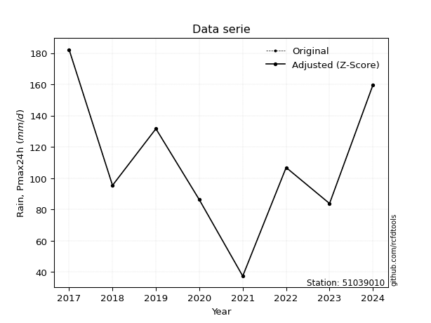</img>

</div>


> The initial value (value_initial) correspond to the initial obtained or null completed value, and value (value) is adjusted only when the initial value is outside the valid range (outlier) definite through the Z-Score value. If Z-Score is active, values out of range or outliers are replaced with the station mean value. A Z-Score (or standard score) measures how many standard deviations a data point is from the mean of a dataset, indicating its relative position; positive scores mean above the mean, negative mean below, and a score of zero is exactly at the mean, allowing for comparison of values from different distributions. It´s calculated using the formula $z=(x–μ)/σ$, where $x$ is the data point, $μ$ is the mean, and $σ$ is the standard deviation, helping identify outliers and understand probability.
>
> <sub>**Note**: In this study, "completing" (filling gaps in) and "extending" (forecasting or lengthening the historical record) rainfall data series are avoided for certain critical analyses because they introduce artificial bias and uncertainty, which can distort the statistics of rare events (extremes), alter day-to-day variability, and compromise the integrity and homogeneity of the original data. Some reasons against Completing/Extending rainfall data are: **Distortion of Extremes and Variability**: The primary issue is that most gap-filling or extension methods rely on averaging or regression with nearby stations, which inherently smooths the data. Rainfall is highly variable in space and time, with a large percentage of zero values and occasional large storms. Infilling methods often underestimate the highest values and overestimate the lowest (zero) values, which severely distorts analyses focused on flood frequency, drought severity, and intensity-duration-frequency (IDF) curves, **Loss of Data Homogeneity**: Infilled or extended data are synthetic estimates, not actual measurements. Combining these estimates with observed data can violate the assumption of data homogeneity, which requires that the data properties do not change over time. Inhomogeneity can lead to incorrect conclusions about long-term trends or changes in climate patterns, **Propagation of Errors**: Errors and biases from the original data (e.g., wind-induced undercatch, instrument errors, site changes) or the data used for imputation can propagate through the analysis, leading to unreliable hydrological models and inaccurate predictions, **Compromised Statistical Integrity**: For statistical analyses, especially those involving the frequency of events, using artificial data can introduce time bias or autocorrelation that doesn´t exist in reality, making it difficult to assess the true probability of events, **Difficulty in Validation**: It is difficult to accurately validate the quality of filled or extended data, especially for past periods where ground-truth measurements are unavailable. The reliability of imputation techniques heavily depends on the density of the surrounding station network and the complexity of the local topography.</sub>


### 4. Active continuous probability distributions from SciPy (44 of 104 available)

A Probability Density Function (PDF) describes the relative likelihood of a continuous random variable falling within a specific range, where the total area under its curve equals 1, and the area over any interval gives the actual probability for that range. Unlike discrete probabilities (like rolling a die), a PDF shows density, not direct probability for a single point (which is zero), with higher points indicating higher likelihood, often visualized as a bell curve for normal distributions.

A log of a probability density function (log-PDF) is simply the logarithm of the PDF´s value, denoted as $log(f(x))$, useful for converting multiplication of probabilities into addition, improving numerical stability with tiny numbers, and connecting to information theory concepts like entropy. Instead of dealing with very small probabilities (e.g., 0.000001), log-PDFs use negative numbers (e.g., $log(0.00001) ≈ -11.51$ that are easier for computers to handle, preventing underflow errors and simplifying complex calculations. In this study, each active probability distribution from SciPy is also evaluated in the $log$ form.

[scipy.stats](https://docs.scipy.org/doc/scipy/reference/stats.html) is a Python´s powerful submodule within the SciPy library for comprehensive statistical analysis, offering over 130 probability distributions (like Normal, Poisson), functions for descriptive stats (mean, variance), hypothesis testing (t-tests, chi-square), random variable generation, and statistical tests, making it essential for data science, modeling, and research. It provides tools to explore, model, and draw conclusions from data efficiently, working seamlessly with NumPy.

<div align="center">

|   id | p_dist             |   n_parameter | fit_method   | label                                                                       | active   | ref                                                                                                        |
|-----:|:-------------------|--------------:|:-------------|:----------------------------------------------------------------------------|:---------|:-----------------------------------------------------------------------------------------------------------|
|    0 | alpha              |             3 | MLE          | Alpha                                                                       | True     | [:mortar_board:](https://docs.scipy.org/doc/scipy/reference/generated/scipy.stats.alpha.html)              |
|    1 | betaprime          |             4 | MLE          | Beta prime                                                                  | True     | [:mortar_board:](https://docs.scipy.org/doc/scipy/reference/generated/scipy.stats.betaprime.html)          |
|    2 | chi2               |             3 | MLE          | Chi²                                                                        | True     | [:mortar_board:](https://docs.scipy.org/doc/scipy/reference/generated/scipy.stats.chi2.html)               |
|    3 | crystalball        |             4 | MLE          | Crystalball                                                                 | True     | [:mortar_board:](https://docs.scipy.org/doc/scipy/reference/generated/scipy.stats.crystalball.html)        |
|    4 | erlang             |             3 | MLE          | Erlang                                                                      | True     | [:mortar_board:](https://docs.scipy.org/doc/scipy/reference/generated/scipy.stats.erlang.html)             |
|    5 | expon              |             2 | MLE          | Exponential                                                                 | True     | [:mortar_board:](https://docs.scipy.org/doc/scipy/reference/generated/scipy.stats.expon.html)              |
|    6 | exponnorm          |             3 | MLE          | Exponentially modified Normal                                               | True     | [:mortar_board:](https://docs.scipy.org/doc/scipy/reference/generated/scipy.stats.exponnorm.html)          |
|    7 | f                  |             4 | MLE          | F                                                                           | True     | [:mortar_board:](https://docs.scipy.org/doc/scipy/reference/generated/scipy.stats.f.html)                  |
|    8 | fatiguelife        |             3 | MLE          | Fatigue-life (Birnbaum-Saunders)                                            | True     | [:mortar_board:](https://docs.scipy.org/doc/scipy/reference/generated/scipy.stats.fatiguelife.html)        |
|    9 | fisk               |             3 | MLE          | Fisk                                                                        | True     | [:mortar_board:](https://docs.scipy.org/doc/scipy/reference/generated/scipy.stats.fisk.html)               |
|   10 | gamma              |             3 | MLE          | Gamma                                                                       | True     | [:mortar_board:](https://docs.scipy.org/doc/scipy/reference/generated/scipy.stats.gamma.html)              |
|   11 | genexpon           |             5 | MLE          | Generalized exponential                                                     | True     | [:mortar_board:](https://docs.scipy.org/doc/scipy/reference/generated/scipy.stats.genexpon.html)           |
|   12 | genlogistic        |             3 | MLE          | Generalized logistic                                                        | True     | [:mortar_board:](https://docs.scipy.org/doc/scipy/reference/generated/scipy.stats.genlogistic.html)        |
|   13 | gibrat             |             2 | MM           | Gibrat                                                                      | True     | [:mortar_board:](https://docs.scipy.org/doc/scipy/reference/generated/scipy.stats.gibrat.html)             |
|   14 | gompertz           |             3 | MLE          | Gompertz (or truncated Gumbel)                                              | True     | [:mortar_board:](https://docs.scipy.org/doc/scipy/reference/generated/scipy.stats.gompertz.html)           |
|   15 | gumbel_l           |             2 | MM           | Gumbel Left Skew                                                            | True     | [:mortar_board:](https://docs.scipy.org/doc/scipy/reference/generated/scipy.stats.gumbel_l.html)           |
|   16 | gumbel_r           |             2 | MM           | Gumbel Right Skew                                                           | True     | [:mortar_board:](https://docs.scipy.org/doc/scipy/reference/generated/scipy.stats.gumbel_r.html)           |
|   17 | halflogistic       |             2 | MM           | Half-logistic                                                               | True     | [:mortar_board:](https://docs.scipy.org/doc/scipy/reference/generated/scipy.stats.halflogistic.html)       |
|   18 | halfnorm           |             2 | MM           | Half Normal                                                                 | True     | [:mortar_board:](https://docs.scipy.org/doc/scipy/reference/generated/scipy.stats.halfnorm.html)           |
|   19 | hypsecant          |             2 | MM           | hyperbolic secant                                                           | True     | [:mortar_board:](https://docs.scipy.org/doc/scipy/reference/generated/scipy.stats.hypsecant.html)          |
|   20 | invgamma           |             3 | MLE          | Inverted gamma                                                              | True     | [:mortar_board:](https://docs.scipy.org/doc/scipy/reference/generated/scipy.stats.invgamma.html)           |
|   21 | invgauss           |             3 | MLE          | Inverse Gaussian                                                            | True     | [:mortar_board:](https://docs.scipy.org/doc/scipy/reference/generated/scipy.stats.invgauss.html)           |
|   22 | invweibull         |             3 | MLE          | Inverted Weibull                                                            | True     | [:mortar_board:](https://docs.scipy.org/doc/scipy/reference/generated/scipy.stats.invweibull.html)         |
|   23 | johnsonsu          |             4 | MLE          | Johnson Su                                                                  | True     | [:mortar_board:](https://docs.scipy.org/doc/scipy/reference/generated/scipy.stats.johnsonsu.html)          |
|   24 | kstwobign          |             2 | MLE          | Limiting distribution of scaled Kolmogorov-Smirnov two-sided test statistic | True     | [:mortar_board:](https://docs.scipy.org/doc/scipy/reference/generated/scipy.stats.kstwobign.html)          |
|   25 | laplace            |             2 | MM           | Laplace                                                                     | True     | [:mortar_board:](https://docs.scipy.org/doc/scipy/reference/generated/scipy.stats.laplace.html)            |
|   26 | laplace_asymmetric |             3 | MLE          | Asymmetric Laplace                                                          | True     | [:mortar_board:](https://docs.scipy.org/doc/scipy/reference/generated/scipy.stats.laplace_asymmetric.html) |
|   27 | loggamma           |             3 | MLE          | Log gamma                                                                   | True     | [:mortar_board:](https://docs.scipy.org/doc/scipy/reference/generated/scipy.stats.loggamma.html)           |
|   28 | logistic           |             2 | MM           | Logistic (or Sech-squared)                                                  | True     | [:mortar_board:](https://docs.scipy.org/doc/scipy/reference/generated/scipy.stats.logistic.html)           |
|   29 | lognorm            |             3 | MLE          | Log Normal                                                                  | True     | [:mortar_board:](https://docs.scipy.org/doc/scipy/reference/generated/scipy.stats.lognorm.html)            |
|   30 | maxwell            |             2 | MM           | Maxwell                                                                     | True     | [:mortar_board:](https://docs.scipy.org/doc/scipy/reference/generated/scipy.stats.maxwell.html)            |
|   31 | mielke             |             4 | MLE          | Mielke Beta-Kappa / Dagum                                                   | True     | [:mortar_board:](https://docs.scipy.org/doc/scipy/reference/generated/scipy.stats.mielke.html)             |
|   32 | moyal              |             2 | MM           | Moyal                                                                       | True     | [:mortar_board:](https://docs.scipy.org/doc/scipy/reference/generated/scipy.stats.moyal.html)              |
|   33 | nakagami           |             3 | MLE          | Nakagami                                                                    | True     | [:mortar_board:](https://docs.scipy.org/doc/scipy/reference/generated/scipy.stats.nakagami.html)           |
|   34 | ncf                |             5 | MLE          | Non-central F distribution                                                  | True     | [:mortar_board:](https://docs.scipy.org/doc/scipy/reference/generated/scipy.stats.ncf.html)                |
|   35 | nct                |             4 | MLE          | Non-central Student’s t                                                     | True     | [:mortar_board:](https://docs.scipy.org/doc/scipy/reference/generated/scipy.stats.nct.html)                |
|   36 | norm               |             2 | MM           | Normal                                                                      | True     | [:mortar_board:](https://docs.scipy.org/doc/scipy/reference/generated/scipy.stats.norm.html)               |
|   37 | pearson3           |             3 | MM           | Pearson type III                                                            | True     | [:mortar_board:](https://docs.scipy.org/doc/scipy/reference/generated/scipy.stats.pearson3.html)           |
|   38 | rayleigh           |             2 | MM           | Rayleigh                                                                    | True     | [:mortar_board:](https://docs.scipy.org/doc/scipy/reference/generated/scipy.stats.rayleigh.html)           |
|   39 | rice               |             3 | MLE          | Rice                                                                        | True     | [:mortar_board:](https://docs.scipy.org/doc/scipy/reference/generated/scipy.stats.rice.html)               |
|   40 | t                  |             3 | MLE          | Student’s t                                                                 | True     | [:mortar_board:](https://docs.scipy.org/doc/scipy/reference/generated/scipy.stats.t.html)                  |
|   41 | truncnorm          |             4 | MLE          | Truncated normal                                                            | True     | [:mortar_board:](https://docs.scipy.org/doc/scipy/reference/generated/scipy.stats.truncnorm.html)          |
|   42 | wald               |             2 | MM           | Wald                                                                        | True     | [:mortar_board:](https://docs.scipy.org/doc/scipy/reference/generated/scipy.stats.wald.html)               |
|   43 | weibull_min        |             3 | MLE          | Weibull minimum                                                             | True     | [:mortar_board:](https://docs.scipy.org/doc/scipy/reference/generated/scipy.stats.weibull_min.html)        |

</div>

> **n_parameter:** # arguments & localization & scale.
>
> **Fit methods:** (MLE) maximum likelihood, (MM) L-moments.
>
>**Inactive** (With the only purpose of prevent loops, zero divisions, infinite values, over high estimated values or horizontal trending for recurrence intervals estimations, the follow distributions were disabled.)**:** foldnorm, gennorm, norminvgauss, powernorm, powerlognorm, skewnorm, genextreme, anglit, arcsine, argus, beta, bradford, burr, burr12, cauchy, cosine, halfcauchy, foldcauchy, skewcauchy, wrapcauchy, dgamma, gengamma, exponweib, exponpow, truncexpon, gausshyper, genhalflogistic, genhyperbolic, geninvgauss, halfgennorm, johnsonsb, kappa4, kappa3, ksone, kstwo, loglaplace, levy, levy_l, levy_stable, ncx2, pareto, genpareto, truncpareto, lomax, powerlaw, rdist, rel_breitwigner, recipinvgauss, semicircular, studentized_range, trapezoid, triang, truncweibull_min, tukeylambda, uniform, loguniform, vonmises, vonmises_line, weibull_max, dweibull, 


## B. Probability (PDF) vs. Empirical (EDF) distributions functions

A continuous probability distribution (CPD) describes probabilities for variables that can take any value within a range (like rain any time), unlike discrete variables with specific outcomes (like temperature). It uses a Probability Density Function (PDF), a curve where the total area under it equals 1, and the probability of the variable falling within an interval (a to b) is found by calculating the area under the curve between those points. A key feature is that the probability of hitting any single exact value is zero, so probabilities are always expressed for ranges, e.g., $P(a ≤ X ≤ b)$.

<div align="center">

Distributions parameters from station values
|    |   station | p_dist                |   n |              loc |           scale | shape                  | shape1                | shape2                 | shape3   |
|---:|----------:|:----------------------|----:|-----------------:|----------------:|:-----------------------|:----------------------|:-----------------------|:---------|
|  0 |  51039010 | alpha                 |   8 |   -447.847       |  7062.82        | 12.726854329956954     |                       |                        |          |
|  1 |  51039010 | betaprime             |   8 |    -63.0028      | 11052.3         | 15.838790220394827     | 1005.7409705076927    |                        |          |
|  2 |  51039010 | chi2                  |   8 |   -188.889       |     3.16324     | 94.58537975857723      |                       |                        |          |
|  3 |  51039010 | crystalball           |   8 |    110.375       |    43.1357      | 9188.932186276383      | 3749.7361449842697    |                        |          |
|  4 |  51039010 | erlang                |   8 |   -376.329       |     3.80843     | 127.762127702145       |                       |                        |          |
|  5 |  51039010 | expon                 |   8 |     37.4         |    72.975       |                        |                       |                        |          |
|  6 |  51039010 | exponnorm             |   8 |    104.331       |    42.7104      | 0.14151178535173362    |                       |                        |          |
|  7 |  51039010 | f                     |   8 |   -242.953       |   353.319       | 133.73564492547763     | 77201.08895873785     |                        |          |
|  8 |  51039010 | fatiguelife           |   8 |     37.4         |     5.30276e-05 | 1015.2983475478495     |                       |                        |          |
|  9 |  51039010 | fisk                  |   8 |   -223.89        |   331.513       | 13.222274851227457     |                       |                        |          |
| 10 |  51039010 | gamma                 |   8 |   -387.837       |     3.72221     | 133.8284745981589      |                       |                        |          |
| 11 |  51039010 | genexpon              |   8 |     37.4         |     1.92466     | 0.026377309509975223   | 5.166580720698906e-07 | 1.0973547794990148     |          |
| 12 |  51039010 | genlogistic           |   8 |     79.4761      |    30.2688      | 2.053619706327784      |                       |                        |          |
| 13 |  51039010 | gibrat                |   8 |     77.4679      |    19.9591      |                        |                       |                        |          |
| 14 |  51039010 | gompertz              |   8 |     26.3256      |     4.00768     | 1.0206982500199741e-16 |                       |                        |          |
| 15 |  51039010 | gumbel_l              |   8 |    129.788       |    33.6327      |                        |                       |                        |          |
| 16 |  51039010 | gumbel_r              |   8 |     90.9617      |    33.6327      |                        |                       |                        |          |
| 17 |  51039010 | halflogistic          |   8 |     59.2492      |    36.8794      |                        |                       |                        |          |
| 18 |  51039010 | halfnorm              |   8 |     53.2803      |    71.5576      |                        |                       |                        |          |
| 19 |  51039010 | hypsecant             |   8 |    110.375       |    27.461       |                        |                       |                        |          |
| 20 |  51039010 | invgamma              |   8 |   -311.288       | 39818.8         | 95.51373161501922      |                       |                        |          |
| 21 |  51039010 | invgauss              |   8 |    -95.0451      |  4129.38        | 0.049709980056689335   |                       |                        |          |
| 22 |  51039010 | invweibull            |   8 |     37.4         |     1.25538     | 0.05201470434356431    |                       |                        |          |
| 23 |  51039010 | johnsonsu             |   8 |   -415.822       |   297.078       | -18.730325518653487    | 14.038539008095931    |                        |          |
| 24 |  51039010 | kstwobign             |   8 |    -52.5863      |   186.801       |                        |                       |                        |          |
| 25 |  51039010 | laplace               |   8 |    110.375       |    30.5015      |                        |                       |                        |          |
| 26 |  51039010 | laplace_asymmetric    |   8 |     86.2         |    30.1519      | 0.6763766919696492     |                       |                        |          |
| 27 |  51039010 | loggamma              |   8 | -10760.6         |  1527.16        | 1234.936624959455      |                       |                        |          |
| 28 |  51039010 | logistic              |   8 |    110.375       |    23.7819      |                        |                       |                        |          |
| 29 |  51039010 | lognorm               |   8 |     37.4         |     0.757096    | 12.21430386666243      |                       |                        |          |
| 30 |  51039010 | maxwell               |   8 |      8.16162     |    64.0527      |                        |                       |                        |          |
| 31 |  51039010 | mielke                |   8 |     -0.563667    |   142.679       | 2.4175254386303644     | 6.507968238165803     |                        |          |
| 32 |  51039010 | moyal                 |   8 |     85.7073      |    19.4179      |                        |                       |                        |          |
| 33 |  51039010 | nakagami              |   8 |     83.8         |    55.662       | 0.07374530092135731    |                       |                        |          |
| 34 |  51039010 | ncf                   |   8 |     -0.299081    |     5.62961e-07 | 2.370477386098044e-07  | 19.772927091548393    | 42.83434488426116      |          |
| 35 |  51039010 | nct                   |   8 |  -1382.91        |    43.1127      | 557336.2393695982      | 34.63662001135193     |                        |          |
| 36 |  51039010 | norm                  |   8 |    110.375       |    43.1357      |                        |                       |                        |          |
| 37 |  51039010 | pearson3              |   8 |    110.375       |    43.1357      | 0.11595449692308399    |                       |                        |          |
| 38 |  51039010 | rayleigh              |   8 |     27.854       |    65.8422      |                        |                       |                        |          |
| 39 |  51039010 | rice                  |   8 |     16.9929      |    49.6387      | 1.5146611647424466     |                       |                        |          |
| 40 |  51039010 | t                     |   8 |    110.373       |    43.1364      | 6007662.078290075      |                       |                        |          |
| 41 |  51039010 | truncnorm             |   8 |    110.375       |    43.1357      | -1216.42313066938      | 2587.5196749304914    |                        |          |
| 42 |  51039010 | wald                  |   8 |     67.2394      |    43.1356      |                        |                       |                        |          |
| 43 |  51039010 | weibull_min           |   8 |      6.46493     |   117.038       | 2.616770643056019      |                       |                        |          |
| 44 |  51039010 | logalpha              |   8 |    -10.459       |   473.192       | 31.45721841599456      |                       |                        |          |
| 45 |  51039010 | logbetaprime          |   8 |    -15.2943      |    48.624       | 2539.4419404626897     | 6204.550354454645     |                        |          |
| 46 |  51039010 | logchi2               |   8 |      3.62167     |     0.91898     | 1.1316404990769606     |                       |                        |          |
| 47 |  51039010 | logcrystalball        |   8 |      4.61167     |     0.458346    | 3393.0412863854044     | 50.70361754669937     |                        |          |
| 48 |  51039010 | logerlang             |   8 |     -3.31056     |     0.028197    | 281.1488075540726      |                       |                        |          |
| 49 |  51039010 | logexpon              |   8 |      3.62167     |     0.989998    |                        |                       |                        |          |
| 50 |  51039010 | logexponnorm          |   8 |      4.61135     |     0.458342    | 0.0006956847403346494  |                       |                        |          |
| 51 |  51039010 | logf                  |   8 |   -258.538       |   263.148       | 1346360.1495799394     | 1275439.2120800759    |                        |          |
| 52 |  51039010 | logfatiguelife        |   8 |   -206.18        |   210.792       | 0.002169961302009275   |                       |                        |          |
| 53 |  51039010 | logfisk               |   8 |     -4.58126e+07 |     4.58126e+07 | 182468181.2773011      |                       |                        |          |
| 54 |  51039010 | loggamma              |   8 |     -3.2248      |     0.0287192   | 272.9706871720396      |                       |                        |          |
| 55 |  51039010 | loggenexpon           |   8 |      3.62038     |     0.0149772   | 0.004253964811507957   | 2.6422184368616985    | 0.00010228649861727989 |          |
| 56 |  51039010 | loggenlogistic        |   8 |      4.96033     |     0.153247    | 0.36613076144922607    |                       |                        |          |
| 57 |  51039010 | loggibrat             |   8 |      4.26199     |     0.212088    |                        |                       |                        |          |
| 58 |  51039010 | loggompertz           |   8 |      3.62167     |     0.40641     | 0.05791514342631375    |                       |                        |          |
| 59 |  51039010 | loggumbel_l           |   8 |      4.81795     |     0.357371    |                        |                       |                        |          |
| 60 |  51039010 | loggumbel_r           |   8 |      4.40539     |     0.357371    |                        |                       |                        |          |
| 61 |  51039010 | loghalflogistic       |   8 |      4.06838     |     0.391895    |                        |                       |                        |          |
| 62 |  51039010 | loghalfnorm           |   8 |      4.00499     |     0.760359    |                        |                       |                        |          |
| 63 |  51039010 | loghypsecant          |   8 |      4.61167     |     0.291792    |                        |                       |                        |          |
| 64 |  51039010 | loginvgamma           |   8 |     -9.14484     | 11689.5         | 850.9173184034616      |                       |                        |          |
| 65 |  51039010 | loginvgauss           |   8 |     -0.863449    |   674.633       | 0.008115263813376832   |                       |                        |          |
| 66 |  51039010 | loginvweibull         |   8 |     -5.16371e+07 |     5.16371e+07 | 98654492.38056722      |                       |                        |          |
| 67 |  51039010 | logjohnsonsu          |   8 |      5.63648     |     0.0316957   | 9.037830664409661      | 2.2201597104901403    |                        |          |
| 68 |  51039010 | logkstwobign          |   8 |      2.49393     |     2.42631     |                        |                       |                        |          |
| 69 |  51039010 | loglaplace            |   8 |      4.61167     |     0.3241      |                        |                       |                        |          |
| 70 |  51039010 | loglaplace_asymmetric |   8 |      4.67096     |     0.341507    | 1.089522557162762      |                       |                        |          |
| 71 |  51039010 | logloggamma           |   8 |      4.97642     |     0.271845    | 0.659054367272408      |                       |                        |          |
| 72 |  51039010 | loglogistic           |   8 |      4.61167     |     0.252699    |                        |                       |                        |          |
| 73 |  51039010 | loglognorm            |   8 |      3.62167     |     0.0130664   | 11.724014119168993     |                       |                        |          |
| 74 |  51039010 | logmaxwell            |   8 |      3.52558     |     0.680605    |                        |                       |                        |          |
| 75 |  51039010 | logmielke             |   8 |     -9.06457     |    14.2795      | 22.8467181494873       | 4655.23774556145      |                        |          |
| 76 |  51039010 | logmoyal              |   8 |      4.34956     |     0.206328    |                        |                       |                        |          |
| 77 |  51039010 | lognakagami           |   8 |      4.42843     |     0.396191    | 0.23937086192203139    |                       |                        |          |
| 78 |  51039010 | logncf                |   8 |    -10.2553      |     4.88695     | 1502.3699439912675     | 7010.792516967862     | 3066.383805041608      |          |
| 79 |  51039010 | lognct                |   8 |    -31.35        |     0.418421    | 17556.02398603136      | 85.94153970673733     |                        |          |
| 80 |  51039010 | lognorm               |   8 |      4.61167     |     0.458346    |                        |                       |                        |          |
| 81 |  51039010 | logpearson3           |   8 |      4.61167     |     0.458345    | -0.8487410023209642    |                       |                        |          |
| 82 |  51039010 | lograyleigh           |   8 |      3.73478     |     0.699655    |                        |                       |                        |          |
| 83 |  51039010 | logrice               |   8 |   -133.684       |     0.458347    | 301.72435694130075     |                       |                        |          |
| 84 |  51039010 | logt                  |   8 |      4.61169     |     0.45832     | 19458.273491333137     |                       |                        |          |
| 85 |  51039010 | logtruncnorm          |   8 |     -0.154234    |     1.2435      | 3.685284186523292      | 5.268259605825985     |                        |          |
| 86 |  51039010 | logwald               |   8 |      4.1533      |     0.458372    |                        |                       |                        |          |
| 87 |  51039010 | logweibull_min        |   8 |     -6.50226e+06 |     6.50226e+06 | 18249414.76087266      |                       |                        |          |

</div>

> **loc** (Location parameter): This shifts the distribution along the x-axis. For many common distributions, like the normal (Gaussian) distribution, loc represents the mean $μ$. For others, like the uniform distribution, it might represent the minimum value, or for the beta distribution, the left end of the support interval.
>
> **scale** (Scale parameter): This determines the width or spread of the distribution. For the normal distribution, scale represents the standard deviation $σ$. For a uniform distribution, it defines the length of the interval (from $loc$ to $loc + scale$).
>
> **shape** (Shape parameters): Refers to parameters that define the specific form of a probability distribution, distinct from its location (loc) and scale (scale). These parameters are required arguments for most distribution functions. For example, a normal (Gaussian) distribution is fully defined by its location (mean) and scale (standard deviation), so it has no specific shape parameters beyond loc and scale. However, other distributions have intrinsic properties that need specification, as Gamma distribution that takes a shape parameter, often named $a$ or $alpha$.


### 0. Cumulative distribution values - CDF (88 evaluated)

Cumulative Distribution Function (CDF), denoted as $F$<sub>$X$</sub>$(x)$, is a function that gives the probability that a random variable $X$ will take a value less than or equal to a specific value, $x$ (i.e., $(P(X≥x)$. It essentially "accumulates" probabilities from a given point up to the far right (positive infinity), providing a complete picture of the distribution´s probabilities for both discrete (like rain) and continuous (like temperature) variables, helping to find probabilities over ranges or above certain values. Each station is evaluated separately ordering the $x$ values ascending, calculating the CDF and PDF values for the activated distributions and their logarithmic forms.

<div align="center">

CDF ordered by x ascending and calculating $log(f(x))$ separately
|   id |   Station |   date |     x |   count |    mean |    std |     zscore |   Value_initial |   station |   m |     alpha |   alpha_pdf |   betaprime |   betaprime_pdf |      chi2 |   chi2_pdf |   crystalball |   crystalball_pdf |    erlang |   erlang_pdf |    expon |   expon_pdf |   exponnorm |   exponnorm_pdf |        f |      f_pdf |   fatiguelife |   fatiguelife_pdf |      fisk |   fisk_pdf |     gamma |   gamma_pdf |    genexpon |   genexpon_pdf |   genlogistic |   genlogistic_pdf |   gibrat |   gibrat_pdf |    gompertz |   gompertz_pdf |   gumbel_l |   gumbel_l_pdf |   gumbel_r |   gumbel_r_pdf |   halflogistic |   halflogistic_pdf |   halfnorm |   halfnorm_pdf |   hypsecant |   hypsecant_pdf |   invgamma |   invgamma_pdf |   invgauss |   invgauss_pdf |   invweibull |   invweibull_pdf |   johnsonsu |   johnsonsu_pdf |   kstwobign |   kstwobign_pdf |   laplace |   laplace_pdf |   laplace_asymmetric |   laplace_asymmetric_pdf |   loggamma |   loggamma_pdf |   logistic |   logistic_pdf |   lognorm |   lognorm_pdf |   maxwell |   maxwell_pdf |    mielke |   mielke_pdf |       moyal |   moyal_pdf |   nakagami |   nakagami_pdf |       ncf |    ncf_pdf |       nct |    nct_pdf |      norm |   norm_pdf |   pearson3 |   pearson3_pdf |   rayleigh |   rayleigh_pdf |      rice |   rice_pdf |         t |      t_pdf |   truncnorm |   truncnorm_pdf |     wald |   wald_pdf |   weibull_min |   weibull_min_pdf |   logalpha |   logalpha_pdf |   logbetaprime |   logbetaprime_pdf |     logchi2 |   logchi2_pdf |   logcrystalball |   logcrystalball_pdf |   logerlang |   logerlang_pdf |   logexpon |   logexpon_pdf |   logexponnorm |   logexponnorm_pdf |      logf |   logf_pdf |   logfatiguelife |   logfatiguelife_pdf |   logfisk |   logfisk_pdf |   loggenexpon |   loggenexpon_pdf |   loggenlogistic |   loggenlogistic_pdf |   loggibrat |   loggibrat_pdf |   loggompertz |   loggompertz_pdf |   loggumbel_l |   loggumbel_l_pdf |   loggumbel_r |   loggumbel_r_pdf |   loghalflogistic |   loghalflogistic_pdf |   loghalfnorm |   loghalfnorm_pdf |   loghypsecant |   loghypsecant_pdf |   loginvgamma |   loginvgamma_pdf |   loginvgauss |   loginvgauss_pdf |   loginvweibull |   loginvweibull_pdf |   logjohnsonsu |   logjohnsonsu_pdf |   logkstwobign |   logkstwobign_pdf |   loglaplace |   loglaplace_pdf |   loglaplace_asymmetric |   loglaplace_asymmetric_pdf |   logloggamma |   logloggamma_pdf |   loglogistic |   loglogistic_pdf |   loglognorm |   loglognorm_pdf |   logmaxwell |   logmaxwell_pdf |   logmielke |   logmielke_pdf |    logmoyal |   logmoyal_pdf |   lognakagami |   lognakagami_pdf |   logncf |   logncf_pdf |    lognct |   lognct_pdf |   logpearson3 |   logpearson3_pdf |   lograyleigh |   lograyleigh_pdf |   logrice |   logrice_pdf |      logt |   logt_pdf |   logtruncnorm |   logtruncnorm_pdf |   logwald |   logwald_pdf |   logweibull_min |   logweibull_min_pdf |
|-----:|----------:|-------:|------:|--------:|--------:|-------:|-----------:|----------------:|----------:|----:|----------:|------------:|------------:|----------------:|----------:|-----------:|--------------:|------------------:|----------:|-------------:|---------:|------------:|------------:|----------------:|---------:|-----------:|--------------:|------------------:|----------:|-----------:|----------:|------------:|------------:|---------------:|--------------:|------------------:|---------:|-------------:|------------:|---------------:|-----------:|---------------:|-----------:|---------------:|---------------:|-------------------:|-----------:|---------------:|------------:|----------------:|-----------:|---------------:|-----------:|---------------:|-------------:|-----------------:|------------:|----------------:|------------:|----------------:|----------:|--------------:|---------------------:|-------------------------:|-----------:|---------------:|-----------:|---------------:|----------:|--------------:|----------:|--------------:|----------:|-------------:|------------:|------------:|-----------:|---------------:|----------:|-----------:|----------:|-----------:|----------:|-----------:|-----------:|---------------:|-----------:|---------------:|----------:|-----------:|----------:|-----------:|------------:|----------------:|---------:|-----------:|--------------:|------------------:|-----------:|---------------:|---------------:|-------------------:|------------:|--------------:|-----------------:|---------------------:|------------:|----------------:|-----------:|---------------:|---------------:|-------------------:|----------:|-----------:|-----------------:|---------------------:|----------:|--------------:|--------------:|------------------:|-----------------:|---------------------:|------------:|----------------:|--------------:|------------------:|--------------:|------------------:|--------------:|------------------:|------------------:|----------------------:|--------------:|------------------:|---------------:|-------------------:|--------------:|------------------:|--------------:|------------------:|----------------:|--------------------:|---------------:|-------------------:|---------------:|-------------------:|-------------:|-----------------:|------------------------:|----------------------------:|--------------:|------------------:|--------------:|------------------:|-------------:|-----------------:|-------------:|-----------------:|------------:|----------------:|------------:|---------------:|--------------:|------------------:|---------:|-------------:|----------:|-------------:|--------------:|------------------:|--------------:|------------------:|----------:|--------------:|----------:|-----------:|---------------:|-------------------:|----------:|--------------:|-----------------:|---------------------:|
|    0 |  51039010 |   2021 |  37.4 |       8 | 110.375 | 46.114 | -1.58249   |            37.4 |  51039010 |   1 | 0.0337569 |  0.00224987 |   0.0281097 |      0.00213371 | 0.0370737 | 0.00224639 |     0.0453462 |        0.00221101 | 0.0396319 |   0.00221485 | 0        |  0.0137033  |   0.0451869 |      0.00221047 | 0.037653 | 0.00221614 |     0.0633839 |       4.30278e+09 | 0.0411951 | 0.00199875 | 0.0396924 |  0.00221106 | 1.01618e-07 |     0.0137049  |     0.0364651 |        0.00198071 | 0        |  0           | 1.51593e-15 |    4.03726e-16 |  0.0621089 |     0.00178811 | 0.00732656 |     0.00107096 |       0        |         0          |   0        |     0          |   0.0445732 |      0.00161785 |  0.0333955 |     0.00221295 |  0.0298296 |     0.00236393 |   0.00405065 |      1.63352e+11 |    0.039251 |      0.00219834 |   0.0255524 |      0.00273529 | 0.0457002 |    0.00149829 |            0.0286794 |               0.00140626 |  0.0150811 |      0.0877961 |  0.0444252 |     0.00178504 | 0.0153888 |     0.0844606 | 0.0237728 |    0.00233877 | 0.0407301 |   0.00259322 | 0.000522259 | 0.000173649 | 0          |    0           | 0.0170785 | 0.0021721  | 0.0453454 | 0.00221118 | 0.0453462 | 0.00221101 |  0.0417282 |     0.00221523 |   0.010455 |     0.00217896 | 0.0269827 | 0.00265694 | 0.0453537 | 0.00221126 |   0.0453462 |      0.00221101 | 0        | 0          |     0.0302812 |        0.00252228 |  0.0158323 |      0.0946732 |      0.0160045 |          0.0891988 | 1.63761e-09 |    2.0865e+06 |        0.0153888 |            0.0844606 |   0.0146181 |       0.0857067 |   0        |       1.0101   |      0.0153877 |          0.0844563 | 0.0156715 |  0.0858375 |        0.0150138 |            0.0832499 | 0.0161996 |     0.0634767 |   0.000368578 |          0.285484 |        0.0408309 |            0.0975355 |    0        |        0        |    2.9105e-08 |          0.142504 |     0.0345628 |         0.0950231 |    0.00012817 |        0.00321425 |          0        |              0        |      0        |          0        |      0.0213911 |          0.0732543 |     0.0147686 |         0.0875042 |     0.0148365 |         0.0934112 |        0.01551  |            0.123457 |      0.0427592 |           0.100219 |      0.0178535 |           0.164982 |    0.0235705 |        0.0727261 |                0.03235  |                   0.0869439 |     0.0414419 |          0.100057 |     0.0194992 |         0.0756589 |   0.00408169 |      2.31699e+12 |  0.000743986 |        0.0231354 |   0.0670097 |        0.120678 | 5.37332e-09 |    4.55716e-07 |    0          |        0          | 0.01658  |    0.0919347 | 0.0154772 |    0.0852875 |     0.0319787 |          0.10211  |      0        |          0        | 0.0153888 |     0.0844606 | 0.0153882 |  0.0844464 |    0           |           0        |  0        |      0        |         0.033912 |             0.093546 |
|    1 |  51039010 |   2023 |  83.8 |       8 | 110.375 | 46.114 | -0.57629   |            83.8 |  51039010 |   2 | 0.288446  |  0.00853191 |   0.28391   |      0.00861708 | 0.281162  | 0.00824453 |     0.268921  |        0.00764988 | 0.275537  |   0.00805215 | 0.470506 |  0.00725582 |   0.269059  |      0.0076613  | 0.277758 | 0.0081672  |     0.82156   |       0.00259091  | 0.271697  | 0.00850334 | 0.275     |  0.00803561 | 0.470552    |     0.00725618 |     0.277478  |        0.00874172 | 0.125471 |  0.0325953   | 1.72639e-10 |    4.30771e-11 |  0.22491   |     0.0058715  | 0.290165   |     0.0106748  |       0.321081 |         0.01216    |   0.33026  |     0.0101808  |   0.231154  |      0.00769698 |  0.286494  |     0.00856926 |  0.304294  |     0.008852   |   0.436569   |      0.000405616 |    0.274625 |      0.00805322 |   0.339311  |      0.00902761 | 0.20921   |    0.00685901 |            0.279039  |               0.0136824  |  0.353645  |      0.796136  |  0.246486  |     0.00780973 | 0.34466   |     0.803548  | 0.293168  |    0.0086498  | 0.277407  |   0.00769749 | 0.293563    | 0.0124302   | 0.00429833 |    4.46112e+10 | 0.331318  | 0.00953318 | 0.268941  | 0.0076504  | 0.268921  | 0.00764988 |  0.27286   |     0.00789428 |   0.303016 |     0.00899461 | 0.287297  | 0.00815186 | 0.268941  | 0.00765004 |   0.268921  |      0.00764988 | 0.254302 | 0.0237156  |     0.286913  |        0.00815912 |  0.371649  |      0.807272  |      0.352375  |          0.798131  | 0.606742    |    0.318801   |        0.344661  |            0.803548  |   0.351187  |       0.797014  |   0.557322 |       0.44715  |      0.344656  |          0.803551  | 0.346682  |  0.803246  |        0.344196  |            0.805485  | 0.290458  |     0.82085   |   0.463205    |          0.673634 |        0.277485  |            0.642963  |    0.404245 |        2.32756  |    0.304895   |          0.721099 |     0.285544  |         0.672198  |    0.391585   |        1.02731    |          0.429569 |              1.04042  |      0.422402 |          0.898622 |      0.312086  |          0.906243  |     0.358277  |         0.805887  |     0.369677  |         0.792716  |        0.409849 |            0.698437 |      0.27957   |           0.617974 |      0.451461  |           0.672457 |    0.284075  |        0.876505  |                0.282836 |                   0.760149  |     0.278881  |          0.62345  |     0.326268  |         0.869876  |   0.637457   |      0.0396491   |  0.37626     |        0.855796  |   0.274078  |        0.464076 | 0.408795    |    1.13548     |    7.5803e-08 |        4.0859e+07 | 0.354664 |    0.792829  | 0.346221  |    0.802784  |     0.301767  |          0.682229 |      0.388266 |          0.866836 | 0.344661  |     0.803548  | 0.344636  |  0.803558  |    4.72319e-08 |           3.15953  |  0.44657  |      1.63827  |         0.28254  |             0.668606 |
|    2 |  51039010 |   2020 |  86.2 |       8 | 110.375 | 46.114 | -0.524245  |            86.2 |  51039010 |   3 | 0.309162  |  0.00872622 |   0.304824  |      0.00880634 | 0.301218  | 0.00846418 |     0.287589  |        0.0079044  | 0.295153  |   0.00829142 | 0.487637 |  0.00702107 |   0.287755  |      0.00791566 | 0.29764  | 0.00839709 |     0.827633  |       0.00247154  | 0.292495  | 0.00882402 | 0.294578  |  0.00827559 | 0.487684    |     0.00702139 |     0.298792  |        0.00901476 | 0.204207 |  0.0324633   | 3.14208e-10 |    7.84014e-11 |  0.23938   |     0.00618808 | 0.315975   |     0.0108238  |       0.349953 |         0.0118973  |   0.354516 |     0.0100306  |   0.250233  |      0.00820231 |  0.307316  |     0.00877758 |  0.325708  |     0.00898825 |   0.437518   |      0.000385494 |    0.294245 |      0.00829377 |   0.36098   |      0.00902528 | 0.226337  |    0.00742051 |            0.313887  |               0.0153911  |  0.376341  |      0.810916  |  0.265704  |     0.00820394 | 0.367617  |     0.822023  | 0.314117  |    0.00880273 | 0.296175  |   0.00794054 | 0.32345     | 0.0124593   | 0.539177   |    0.0331306   | 0.354194  | 0.00952365 | 0.28761   | 0.00790489 | 0.287589  | 0.0079044  |  0.292104  |     0.00813914 |   0.324721 |     0.00908835 | 0.307073  | 0.00832509 | 0.287609  | 0.00790453 |   0.287589  |      0.0079044  | 0.309462 | 0.0222015  |     0.306709  |        0.00833442 |  0.394612  |      0.818739  |      0.375145  |          0.814185  | 0.615608    |    0.309286   |        0.367618  |            0.822023  |   0.373913  |       0.812214  |   0.56977  |       0.434577 |      0.367613  |          0.822027  | 0.369624  |  0.821304  |        0.367208  |            0.824007  | 0.31417   |     0.85819   |   0.482141    |          0.66739  |        0.29619   |            0.682144  |    0.465866 |        2.04176  |    0.325664   |          0.749886 |     0.305024  |         0.707631  |    0.420494   |        1.01935    |          0.458488 |              1.00765  |      0.44751  |          0.879621 |      0.338348  |          0.953204  |     0.38124   |         0.820087  |     0.392209  |         0.802738  |        0.429505 |            0.693494 |      0.297492  |           0.651557 |      0.470332  |           0.663916 |    0.309935  |        0.956296  |                0.305136 |                   0.820082  |     0.29697   |          0.65796  |     0.35129   |         0.901804  |   0.638557   |      0.0382686   |  0.400502    |        0.860685  |   0.287486  |        0.485763 | 0.440479    |    1.10767     |    0.220652   |        3.73734    | 0.377273 |    0.808093  | 0.36915   |    0.820764  |     0.321447  |          0.711673 |      0.412739 |          0.866034 | 0.367618  |     0.822023  | 0.367594  |  0.822038  |    0.0855779   |           2.90513  |  0.4906   |      1.48264  |         0.301922 |             0.704199 |
|    3 |  51039010 |   2018 |  95.4 |       8 | 110.375 | 46.114 | -0.324739  |            95.4 |  51039010 |   4 | 0.391943  |  0.00919517 |   0.388231  |      0.00925027 | 0.382161  | 0.00906584 |     0.364235  |        0.00870769 | 0.374933  |   0.00899039 | 0.548325 |  0.00618945 |   0.364497  |      0.00871702 | 0.378176 | 0.00904617 |     0.848513  |       0.00208409  | 0.378313  | 0.00973966 | 0.374229  |  0.00897883 | 0.548374    |     0.00618962 |     0.385384  |        0.00971174 | 0.457356 |  0.0221202   | 3.12018e-09 |    7.78551e-10 |  0.302119  |     0.00746393 | 0.416291   |     0.0108473  |       0.454312 |         0.0107594  |   0.443879 |     0.00937671 |   0.334434  |      0.0100584  |  0.390817  |     0.00929961 |  0.409808  |     0.00921796 |   0.440765   |      0.000323831 |    0.374064 |      0.00899609 |   0.443142  |      0.00877818 | 0.306019  |    0.0100329  |            0.441829  |               0.012521   |  0.460398  |      0.840597  |  0.347583  |     0.00953535 | 0.453461  |     0.864466  | 0.396956  |    0.00913982 | 0.373084  |   0.0087375  | 0.435906    | 0.0118168   | 0.68008    |    0.00862126  | 0.440566  | 0.009179   | 0.36426   | 0.00870802 | 0.364235  | 0.00870769 |  0.370641  |     0.00887677 |   0.409161 |     0.00920576 | 0.386089  | 0.00880019 | 0.364256  | 0.00870772 |   0.364235  |      0.00870769 | 0.48443  | 0.0159874  |     0.385817  |        0.0088091  |  0.478832  |      0.835922  |      0.459766  |          0.848377  | 0.645369    |    0.278474   |        0.453461  |            0.864466  |   0.458174  |       0.843258  |   0.611658 |       0.392266 |      0.453457  |          0.864473  | 0.45532   |  0.862297  |        0.453253  |            0.866401  | 0.406901  |     0.96121   |   0.548374    |          0.636879 |        0.372825  |            0.83056   |    0.630676 |        1.27445  |    0.406735   |          0.84671  |     0.383239  |         0.834047  |    0.520849   |        0.950685   |          0.554445 |              0.883642 |      0.533021 |          0.805426 |      0.441865  |          1.07274   |     0.466089  |         0.846875  |     0.474588  |         0.816019  |        0.498441 |            0.66305  |      0.369879  |           0.7769   |      0.535797  |           0.625369 |    0.423798  |        1.30762   |                0.400736 |                   1.07702   |     0.37019   |          0.786956 |     0.44718   |         0.978277  |   0.642213   |      0.0340046   |  0.487743    |        0.85368   |   0.341001  |        0.571896 | 0.546298    |    0.972426    |    0.455583   |        1.64786    | 0.461149 |    0.839932  | 0.454776  |    0.861475  |     0.398784  |          0.811525 |      0.499594 |          0.841612 | 0.453461  |     0.864466  | 0.45344   |  0.864499  |    0.33955     |           2.13991  |  0.617061 |      1.0407   |         0.379832 |             0.831587 |
|    4 |  51039010 |   2022 | 106.8 |       8 | 110.375 | 46.114 | -0.0775253 |           106.8 |  51039010 |   5 | 0.497192  |  0.00915891 |   0.493934  |      0.00918526 | 0.487079  | 0.00923176 |     0.466974  |        0.00921684 | 0.479794  |   0.00929754 | 0.61365  |  0.00529428 |   0.467316  |      0.0092212  | 0.483237 | 0.00927586 |     0.87008   |       0.00171658  | 0.491787  | 0.00999327 | 0.479001  |  0.00929363 | 0.6137      |     0.00529432 |     0.497085  |        0.00972956 | 0.649879 |  0.0126294   | 5.36472e-08 |    1.33861e-08 |  0.396399  |     0.00906031 | 0.535568   |     0.00994339 |       0.568077 |         0.00918247 |   0.545494 |     0.00842974 |   0.458678  |      0.0114938  |  0.497568  |     0.00931377 |  0.513723  |     0.0089143  |   0.444132   |      0.000270171 |    0.478995 |      0.00930341 |   0.539594  |      0.00808855 | 0.4447    |    0.0145796  |            0.567779  |               0.00969571 |  0.555055  |      0.828712  |  0.46249   |     0.010453   | 0.551461  |     0.863144  | 0.501031  |    0.00902531 | 0.476307  |   0.00926871 | 0.561288    | 0.0100821   | 0.75184    |    0.00476506  | 0.540446  | 0.00828049 | 0.467001  | 0.00921688 | 0.466974  | 0.00921684 |  0.474614  |     0.00925864 |   0.512674 |     0.00887443 | 0.487664  | 0.00893345 | 0.466995  | 0.00921673 |   0.466974  |      0.00921684 | 0.632875 | 0.0104908  |     0.487448  |        0.00893423 |  0.572209  |      0.81111   |      0.555536  |          0.840332  | 0.675109    |    0.249259   |        0.551461  |            0.863144  |   0.553197  |       0.832431  |   0.653505 |       0.349995 |      0.551458  |          0.863152  | 0.552999  |  0.859704  |        0.551452  |            0.864669  | 0.518192  |     0.994413  |   0.61776     |          0.590664 |        0.47571   |            0.987153  |    0.744289 |        0.786323 |    0.507279   |          0.928349 |     0.484583  |         0.955891  |    0.621494   |        0.827153   |          0.646228 |              0.743043 |      0.618893 |          0.715059 |      0.564236  |          1.06874   |     0.561224  |         0.830782  |     0.565622  |         0.790137  |        0.570524 |            0.611711 |      0.465408  |           0.913398 |      0.603472  |           0.572401 |    0.583588  |        1.28483   |                0.542765 |                   1.45873   |     0.467049  |          0.926454 |     0.558388  |         0.975827  |   0.645831   |      0.0302379   |  0.581755    |        0.805697  |   0.41175   |        0.684876 | 0.646284    |    0.798662    |    0.607465   |        1.1151     | 0.555878 |    0.830598  | 0.552349  |    0.858667  |     0.495667  |          0.899404 |      0.591473 |          0.781288 | 0.551461  |     0.863144  | 0.551444  |  0.863186  |    0.54368     |           1.51082  |  0.715069 |      0.719835 |         0.480998 |             0.955337 |
|    5 |  51039010 |   2019 | 131.6 |       8 | 110.375 | 46.114 |  0.460273  |           131.6 |  51039010 |   6 | 0.704699  |  0.00726134 |   0.701859  |      0.0072816  | 0.700718  | 0.00762188 |     0.688659  |        0.00819406 | 0.69792   |   0.00787213 | 0.724964 |  0.00376891 |   0.68894   |      0.00818551 | 0.699154 | 0.00774007 |     0.905366  |       0.00117436  | 0.715719  | 0.00756779 | 0.697237  |  0.00788354 | 0.725012    |     0.00376876 |     0.713449  |        0.00733861 | 0.840797 |  0.00448011  | 2.6122e-05  |    6.51789e-06 |  0.651927  |     0.010922   | 0.741778   |     0.00658802 |       0.753459 |         0.00586098 |   0.726264 |     0.00612573 |   0.724654  |      0.00882231 |  0.709193  |     0.00741099 |  0.711401  |     0.00680674 |   0.449852   |      0.000198428 |    0.697173 |      0.00787003 |   0.714695  |      0.00597072 | 0.750679  |    0.00817405 |            0.752201  |               0.00555869 |  0.716534  |      0.697961  |  0.709403  |     0.00866837 | 0.720701  |     0.733538  | 0.705934  |    0.00722394 | 0.696681  |   0.00792702 | 0.759032    | 0.00601262  | 0.835132   |    0.00244949  | 0.714724  | 0.005753   | 0.688679  | 0.00819352 | 0.688659  | 0.00819406 |  0.693828  |     0.00798252 |   0.711014 |     0.00691575 | 0.696408  | 0.00756375 | 0.688674  | 0.00819375 |   0.688659  |      0.00819406 | 0.809172 | 0.00467909 |     0.696176  |        0.00756889 |  0.728325  |      0.667053  |      0.719656  |          0.710049  | 0.7224      |    0.205632   |        0.720701  |            0.733538  |   0.715519  |       0.701972  |   0.719395 |       0.28344  |      0.7207    |          0.733546  | 0.721414  |  0.729495  |        0.720887  |            0.733867  | 0.711867  |     0.816947  |   0.730299    |          0.48408  |        0.695917  |            1.04494   |    0.857492 |        0.364652 |    0.705385   |          0.9279   |     0.695426  |         1.01321   |    0.767081   |        0.569161   |          0.775987 |              0.50759  |      0.750053 |          0.541385 |      0.758312  |          0.750965  |     0.722312  |         0.692536  |     0.717967  |         0.65375   |        0.686202 |            0.493706 |      0.675022  |           1.05501  |      0.711688  |           0.463131 |    0.781366  |        0.674589  |                0.765131 |                   0.74931   |     0.678694  |          1.05563  |     0.742869  |         0.755896  |   0.651572   |      0.0250706   |  0.734056    |        0.641155  |   0.581215  |        0.952276 | 0.782021    |    0.514892    |    0.785971   |        0.646777   | 0.71808  |    0.702299  | 0.720555  |    0.728696  |     0.690302  |          0.928256 |      0.737911 |          0.61303  | 0.720701  |     0.733538  | 0.720692  |  0.733571  |    0.774574    |           0.776443 |  0.826848 |      0.39158  |         0.692252 |             1.01789  |
|    6 |  51039010 |   2024 | 159.6 |       8 | 110.375 | 46.114 |  1.06746   |           159.6 |  51039010 |   7 | 0.864292  |  0.00417077 |   0.862479  |      0.00422061 | 0.869492  | 0.00440438 |     0.8731    |        0.00482271 | 0.872688  |   0.00454155 | 0.812607 |  0.00256791 |   0.873084  |      0.00481306 | 0.870691 | 0.00446731 |     0.932565  |       0.000798105 | 0.872783  | 0.00382829 | 0.872387  |  0.00455448 | 0.812649    |     0.00256767 |     0.868845  |        0.00390053 | 0.921413 |  0.00178583  | 0.0278691   |    0.00685611  |  0.911641  |     0.00637442 | 0.878164   |     0.00339232 |       0.876515 |         0.00314162 |   0.862666 |     0.00369756 |   0.894944  |      0.00375657 |  0.871226  |     0.00418878 |  0.860959  |     0.00394664 |   0.45471    |      0.000152535 |    0.871855 |      0.00454047 |   0.848597  |      0.00367779 | 0.900441  |    0.00326408 |            0.867774  |               0.00296613 |  0.833247  |      0.507168  |  0.887938  |     0.00418402 | 0.842743  |     0.524863  | 0.866635  |    0.00425587 | 0.866378  |   0.0041888  | 0.881423    | 0.00303071  | 0.889066   |    0.00152262  | 0.840375  | 0.00337009 | 0.873104  | 0.00482222 | 0.8731    | 0.00482271 |  0.872053  |     0.00464763 |   0.864917 |     0.00410513 | 0.867155  | 0.00455001 | 0.873106  | 0.00482245 |   0.8731    |      0.00482271 | 0.899825 | 0.00217785 |     0.867438  |        0.00457734 |  0.839135  |      0.478956  |      0.838132  |          0.512598  | 0.758907    |    0.174024   |        0.842743  |            0.524863  |   0.832904  |       0.509968  |   0.769074 |       0.233259 |      0.842743  |          0.524867  | 0.842783  |  0.522145  |        0.842908  |            0.524427  | 0.841947  |     0.530015  |   0.81342     |          0.377853 |        0.866195  |            0.671585  |    0.910019 |        0.200284 |    0.864615   |          0.685421 |     0.869922  |         0.742393  |    0.856795   |        0.370548   |          0.856836 |              0.339162 |      0.839734 |          0.391533 |      0.870668  |          0.431139  |     0.837584  |         0.498377  |     0.82744   |         0.47862   |        0.770669 |            0.383553 |      0.865715  |           0.850506 |      0.791367  |           0.364308 |    0.879434  |        0.372004  |                0.873075 |                   0.404934  |     0.866111  |          0.816887 |     0.861082  |         0.473367  |   0.656061   |      0.0216332   |  0.840033    |        0.457383  |   0.795533  |        1.28563  | 0.862362    |    0.330213    |    0.884189   |        0.389249   | 0.835528 |    0.509907  | 0.841851  |    0.52225   |     0.853747  |          0.727853 |      0.839311 |          0.439177 | 0.842743  |     0.524863  | 0.842739  |  0.524875  |    0.88542     |           0.4094   |  0.886104 |      0.238107 |         0.868022 |             0.75013  |
|    7 |  51039010 |   2017 | 182.2 |       8 | 110.375 | 46.114 |  1.55755   |           182.2 |  51039010 |   8 | 0.93535   |  0.00224651 |   0.934663  |      0.00229146 | 0.943358  | 0.00226852 |     0.952053  |        0.00231219 | 0.947894  |   0.00225906 | 0.862515 |  0.001884   |   0.951901  |      0.00230998 | 0.94521  | 0.00226758 |     0.948192  |       0.000596256 | 0.936011  | 0.00195016 | 0.947816  |  0.00226569 | 0.862552    |     0.00188375 |     0.934415  |        0.00205989 | 0.951313 |  0.000964059 | 0.999647    |    0.000700244 |  0.991357  |     0.00122094 | 0.935802   |     0.00184618 |       0.931144 |         0.00180277 |   0.928395 |     0.00220018 |   0.953527  |      0.00168631 |  0.941657  |     0.00218279 |  0.929398  |     0.002223   |   0.45787    |      0.000128483 |    0.947133 |      0.00226661 |   0.915113  |      0.00228411 | 0.952544  |    0.00155586 |            0.920358  |               0.00178656 |  0.891474  |      0.373936  |  0.953476  |     0.00186525 | 0.902294  |     0.376448  | 0.93935   |    0.00229343 | 0.934627  |   0.00205717 | 0.933569    | 0.00170661  | 0.918486   |    0.0011099   | 0.901142  | 0.00209762 | 0.95205   | 0.00231205 | 0.952053  | 0.00231219 |  0.94882   |     0.00229098 |   0.935918 |     0.00228152 | 0.944003  | 0.00236621 | 0.952055  | 0.00231206 |   0.952053  |      0.00231219 | 0.937617 | 0.00126358 |     0.94481   |        0.00238075 |  0.894074  |      0.35291   |      0.896694  |          0.373639  | 0.780725    |    0.1559     |        0.902294  |            0.376448  |   0.891429  |       0.375653  |   0.797989 |       0.204052 |      0.902294  |          0.37645   | 0.902061  |  0.375028  |        0.90239   |            0.375889  | 0.900273  |     0.357592  |   0.858796    |          0.308257 |        0.934728  |            0.375992  |    0.932175 |        0.138946 |    0.938717   |          0.429781 |     0.947898  |         0.430754  |    0.898799   |        0.268343   |          0.895749 |              0.25215  |      0.885515 |          0.301971 |      0.917174  |          0.280661  |     0.894633  |         0.365228  |     0.882884  |         0.360506  |        0.81688  |            0.315668 |      0.955391  |           0.483114 |      0.83546   |           0.302599 |    0.919876  |        0.247221  |                0.916813 |                   0.265394  |     0.951461  |          0.460442 |     0.912806  |         0.314964  |   0.658799   |      0.019764    |  0.892664    |        0.339865  |   0.984213  |        1.51422  | 0.899911    |    0.241272    |    0.927112   |        0.26502    | 0.893967 |    0.374356  | 0.901188  |    0.375801  |     0.934384  |          0.48062  |      0.890096 |          0.330109 | 0.902294  |     0.376448  | 0.902291  |  0.37645   |    0.929055    |           0.260176 |  0.913112 |      0.173779 |         0.946965 |             0.43714  |


</div>

An Empirical Distribution Function (EDF) is a step-function estimate of a true cumulative distribution function (CDF) based on observed sample data, representing the proportion of data points less than or equal to a given value. It is calculated by ordering your data and jumping up by $1/n$ (where $n$ is sample size) at each unique data point, allowing analysis without assuming an underlying population distribution, and it gets closer to the true CDF as the sample size grows. For the empirical probability calculations, the parameter $m$ correspond to the order number which means the position of the $x$ values in an ascending order list.

The Kolmogorov-Smirnov (K-S) test is a non-parametric statistical test used to determine if a sample data set comes from a specific theoretical distribution (one-sample) or if two different samples come from the same underlying distribution (two-sample), by comparing their cumulative distribution functions (CDFs). It calculates the maximum vertical difference (D statistic) between these functions, with a small p-value indicating a significant difference and rejection of the null hypothesis (that the data/samples match).


### 1. EDF California (1923)

California´s estimates the true probability distribution of water-related data (like rainfall, streamflow) using observed samples, crucial for risk assessment.

<div align="center">


$P=m/n$


</div>


**1.1. Empirical values**

<div align="center">

|                | 0                  | 1                  | 2              | 3              | 4                  | 5              | 6              | 7              |
|:---------------|:-------------------|:-------------------|:---------------|:---------------|:-------------------|:---------------|:---------------|:---------------|
| date           | 2021               | 2023               | 2020           | 2018           | 2022               | 2019           | 2024           | 2017           |
| x              | 37.4               | 83.8               | 86.2           | 95.4           | 106.8              | 131.6          | 159.6          | 182.2          |
| m              | 1                  | 2                  | 3              | 4              | 5                  | 6              | 7              | 8              |
| empirical_dist | edf_california     | edf_california     | edf_california | edf_california | edf_california     | edf_california | edf_california | edf_california |
| empirical      | 0.125              | 0.25               | 0.375          | 0.5            | 0.625              | 0.75           | 0.875          | 1.0            |
| empirical_tr   | 1.1428571428571428 | 1.3333333333333333 | 1.6            | 2.0            | 2.6666666666666665 | 4.0            | 8.0            | inf            |

</div>


**1.2. Kolmogorov-Smirnov fit test (sorted by Δ)**


<div align="center">

|                | 0                   | 1                     | 2                   | 3                   | 4                   | 5                   | 6                   | 7                   | 8                   | 9                   | 10                 | 11                  | 12                  | 13                  | 14                  | 15                  | 16                  | 17                 | 18                  | 19                  | 20                  | 21                  | 22                  | 23                  | 24                  | 25                 | 26                  | 27                  | 28                 | 29                 | 30                  | 31                 | 32                 | 33                 | 34                  | 35                 | 36                 | 37                  | 38                 | 39                  | 40                 | 41                  | 42                  | 43                 | 44                 | 45                  | 46                 | 47                 | 48                 | 49                  | 50                  | 51                 | 52                 | 53                  | 54                  | 55                  | 56                  | 57                  | 58                 | 59                 | 60                  | 61                 | 62                  | 63                  | 64                 | 65                  | 66                 | 67                  | 68                 | 69                  | 70                 | 71                  | 72                  | 73                 | 74                 | 75                  | 76                  | 77                 | 78                  | 79                  | 80                 | 81                 | 82                 | 83                 | 84                  | 85                 | 86                 | 87                 |
|:---------------|:--------------------|:----------------------|:--------------------|:--------------------|:--------------------|:--------------------|:--------------------|:--------------------|:--------------------|:--------------------|:-------------------|:--------------------|:--------------------|:--------------------|:--------------------|:--------------------|:--------------------|:-------------------|:--------------------|:--------------------|:--------------------|:--------------------|:--------------------|:--------------------|:--------------------|:-------------------|:--------------------|:--------------------|:-------------------|:-------------------|:--------------------|:-------------------|:-------------------|:-------------------|:--------------------|:-------------------|:-------------------|:--------------------|:-------------------|:--------------------|:-------------------|:--------------------|:--------------------|:-------------------|:-------------------|:--------------------|:-------------------|:-------------------|:-------------------|:--------------------|:--------------------|:-------------------|:-------------------|:--------------------|:--------------------|:--------------------|:--------------------|:--------------------|:-------------------|:-------------------|:--------------------|:-------------------|:--------------------|:--------------------|:-------------------|:--------------------|:-------------------|:--------------------|:-------------------|:--------------------|:-------------------|:--------------------|:--------------------|:-------------------|:-------------------|:--------------------|:--------------------|:-------------------|:--------------------|:--------------------|:-------------------|:-------------------|:-------------------|:-------------------|:--------------------|:-------------------|:-------------------|:-------------------|
| station        | 51039010            | 51039010              | 51039010            | 51039010            | 51039010            | 51039010            | 51039010            | 51039010            | 51039010            | 51039010            | 51039010           | 51039010            | 51039010            | 51039010            | 51039010            | 51039010            | 51039010            | 51039010           | 51039010            | 51039010            | 51039010            | 51039010            | 51039010            | 51039010            | 51039010            | 51039010           | 51039010            | 51039010            | 51039010           | 51039010           | 51039010            | 51039010           | 51039010           | 51039010           | 51039010            | 51039010           | 51039010           | 51039010            | 51039010           | 51039010            | 51039010           | 51039010            | 51039010            | 51039010           | 51039010           | 51039010            | 51039010           | 51039010           | 51039010           | 51039010            | 51039010            | 51039010           | 51039010           | 51039010            | 51039010            | 51039010            | 51039010            | 51039010            | 51039010           | 51039010           | 51039010            | 51039010           | 51039010            | 51039010            | 51039010           | 51039010            | 51039010           | 51039010            | 51039010           | 51039010            | 51039010           | 51039010            | 51039010            | 51039010           | 51039010           | 51039010            | 51039010            | 51039010           | 51039010            | 51039010            | 51039010           | 51039010           | 51039010           | 51039010           | 51039010            | 51039010           | 51039010           | 51039010           |
| empirical_dist | edf_california      | edf_california        | edf_california      | edf_california      | edf_california      | edf_california      | edf_california      | edf_california      | edf_california      | edf_california      | edf_california     | edf_california      | edf_california      | edf_california      | edf_california      | edf_california      | edf_california      | edf_california     | edf_california      | edf_california      | edf_california      | edf_california      | edf_california      | edf_california      | edf_california      | edf_california     | edf_california      | edf_california      | edf_california     | edf_california     | edf_california      | edf_california     | edf_california     | edf_california     | edf_california      | edf_california     | edf_california     | edf_california      | edf_california     | edf_california      | edf_california     | edf_california      | edf_california      | edf_california     | edf_california     | edf_california      | edf_california     | edf_california     | edf_california     | edf_california      | edf_california      | edf_california     | edf_california     | edf_california      | edf_california      | edf_california      | edf_california      | edf_california      | edf_california     | edf_california     | edf_california      | edf_california     | edf_california      | edf_california      | edf_california     | edf_california      | edf_california     | edf_california      | edf_california     | edf_california      | edf_california     | edf_california      | edf_california      | edf_california     | edf_california     | edf_california      | edf_california      | edf_california     | edf_california      | edf_california      | edf_california     | edf_california     | edf_california     | edf_california     | edf_california      | edf_california     | edf_california     | edf_california     |
| p_dist         | laplace_asymmetric  | loglaplace_asymmetric | kstwobign           | loglaplace          | loghypsecant        | loglogistic         | ncf                 | logncf              | logfisk             | logbetaprime        | logf               | lognct              | logrice             | logcrystalball      | lognorm             | lognorm             | logt                | logexponnorm       | loggamma            | loggamma            | logfatiguelife      | loginvgamma         | logerlang           | invgauss            | rayleigh            | gumbel_r           | loginvgauss         | logalpha            | maxwell            | moyal              | loggompertz         | wald               | halflogistic       | halfnorm           | logmaxwell          | invgamma           | alpha              | genlogistic         | logpearson3        | betaprime           | fisk               | rice                | weibull_min         | chi2               | lograyleigh        | loggumbel_l         | loggumbel_r        | f                  | logweibull_min     | erlang              | gamma               | johnsonsu          | mielke             | loggenlogistic      | pearson3            | loggibrat           | exponnorm           | logloggamma         | nct                | t                  | norm                | crystalball        | truncnorm           | logmoyal            | logjohnsonsu       | logistic            | hypsecant          | gibrat              | loghalfnorm        | loghalflogistic     | loginvweibull      | laplace             | logwald             | logkstwobign       | loggenexpon        | logmielke           | expon               | genexpon           | gumbel_l            | nakagami            | lognakagami        | logtruncnorm       | logexpon           | logchi2            | loglognorm          | invweibull         | fatiguelife        | gompertz           |
| delta          | 0.09632056435437794 | 0.0992642272743749    | 0.09944758670119133 | 0.10142948137600302 | 0.10360887885163067 | 0.10550082450670978 | 0.10792148097824503 | 0.10841999269992826 | 0.10880035599035259 | 0.10899552321344388 | 0.1093285136373317 | 0.10952281237957935 | 0.10961119767369139 | 0.10961119982806292 | 0.10961120404121355 | 0.10961120404121355 | 0.10961178778321917 | 0.1096122699615352 | 0.10991889245489278 | 0.10991889245489278 | 0.10998617462711445 | 0.11023140083501541 | 0.11038193841309604 | 0.11127661335844752 | 0.11454497627392296 | 0.1176734379278145 | 0.11967673968272685 | 0.12164855253376583 | 0.1239687547933811 | 0.1244777406660127 | 0.12499997089498043 | 0.125              | 0.125              | 0.125              | 0.12626025417034353 | 0.1274316978628609 | 0.1278080756477532 | 0.12791489941375678 | 0.12933259053572   | 0.13106613115423105 | 0.1332129629027251 | 0.13733602462919703 | 0.13755154931307767 | 0.137921190928196  | 0.1382663376953655 | 0.14041677468086344 | 0.1415848841634169 | 0.1417629664894665 | 0.1440021829078606 | 0.14520592005607846 | 0.14599924988536844 | 0.1460048105662573 | 0.1486927232917406 | 0.14928997376518965 | 0.15038584630359447 | 0.15424526353848772 | 0.15768380517185482 | 0.15795069510824122 | 0.1579989453223517 | 0.1580053186592738 | 0.15802575886574982 | 0.1580257671852574 | 0.15802576888759945 | 0.15879498169655815 | 0.1595921481879084 | 0.16251044316170038 | 0.1663224827550328 | 0.17079266402504045 | 0.1724019772273297 | 0.17956924865364754 | 0.183120146657214  | 0.19398050220036672 | 0.19657038538800048 | 0.2014613569895231 | 0.2132052672427771 | 0.21325035384085977 | 0.22050639412415218 | 0.2205520589255342 | 0.22860129174587618 | 0.24570167431778442 | 0.2499999241970265 | 0.2894220822864539 | 0.307322032416701  | 0.3567416805399912 | 0.38745719481613483 | 0.5421303490337832 | 0.5715600958028555 | 0.8471308800497149 |
| deltao         | 0.4472608134160001  | 0.4472608134160001    | 0.4472608134160001  | 0.4472608134160001  | 0.4472608134160001  | 0.4472608134160001  | 0.4472608134160001  | 0.4472608134160001  | 0.4472608134160001  | 0.4472608134160001  | 0.4472608134160001 | 0.4472608134160001  | 0.4472608134160001  | 0.4472608134160001  | 0.4472608134160001  | 0.4472608134160001  | 0.4472608134160001  | 0.4472608134160001 | 0.4472608134160001  | 0.4472608134160001  | 0.4472608134160001  | 0.4472608134160001  | 0.4472608134160001  | 0.4472608134160001  | 0.4472608134160001  | 0.4472608134160001 | 0.4472608134160001  | 0.4472608134160001  | 0.4472608134160001 | 0.4472608134160001 | 0.4472608134160001  | 0.4472608134160001 | 0.4472608134160001 | 0.4472608134160001 | 0.4472608134160001  | 0.4472608134160001 | 0.4472608134160001 | 0.4472608134160001  | 0.4472608134160001 | 0.4472608134160001  | 0.4472608134160001 | 0.4472608134160001  | 0.4472608134160001  | 0.4472608134160001 | 0.4472608134160001 | 0.4472608134160001  | 0.4472608134160001 | 0.4472608134160001 | 0.4472608134160001 | 0.4472608134160001  | 0.4472608134160001  | 0.4472608134160001 | 0.4472608134160001 | 0.4472608134160001  | 0.4472608134160001  | 0.4472608134160001  | 0.4472608134160001  | 0.4472608134160001  | 0.4472608134160001 | 0.4472608134160001 | 0.4472608134160001  | 0.4472608134160001 | 0.4472608134160001  | 0.4472608134160001  | 0.4472608134160001 | 0.4472608134160001  | 0.4472608134160001 | 0.4472608134160001  | 0.4472608134160001 | 0.4472608134160001  | 0.4472608134160001 | 0.4472608134160001  | 0.4472608134160001  | 0.4472608134160001 | 0.4472608134160001 | 0.4472608134160001  | 0.4472608134160001  | 0.4472608134160001 | 0.4472608134160001  | 0.4472608134160001  | 0.4472608134160001 | 0.4472608134160001 | 0.4472608134160001 | 0.4472608134160001 | 0.4472608134160001  | 0.4472608134160001 | 0.4472608134160001 | 0.4472608134160001 |
| eval           | Δo > Δ              | Δo > Δ                | Δo > Δ              | Δo > Δ              | Δo > Δ              | Δo > Δ              | Δo > Δ              | Δo > Δ              | Δo > Δ              | Δo > Δ              | Δo > Δ             | Δo > Δ              | Δo > Δ              | Δo > Δ              | Δo > Δ              | Δo > Δ              | Δo > Δ              | Δo > Δ             | Δo > Δ              | Δo > Δ              | Δo > Δ              | Δo > Δ              | Δo > Δ              | Δo > Δ              | Δo > Δ              | Δo > Δ             | Δo > Δ              | Δo > Δ              | Δo > Δ             | Δo > Δ             | Δo > Δ              | Δo > Δ             | Δo > Δ             | Δo > Δ             | Δo > Δ              | Δo > Δ             | Δo > Δ             | Δo > Δ              | Δo > Δ             | Δo > Δ              | Δo > Δ             | Δo > Δ              | Δo > Δ              | Δo > Δ             | Δo > Δ             | Δo > Δ              | Δo > Δ             | Δo > Δ             | Δo > Δ             | Δo > Δ              | Δo > Δ              | Δo > Δ             | Δo > Δ             | Δo > Δ              | Δo > Δ              | Δo > Δ              | Δo > Δ              | Δo > Δ              | Δo > Δ             | Δo > Δ             | Δo > Δ              | Δo > Δ             | Δo > Δ              | Δo > Δ              | Δo > Δ             | Δo > Δ              | Δo > Δ             | Δo > Δ              | Δo > Δ             | Δo > Δ              | Δo > Δ             | Δo > Δ              | Δo > Δ              | Δo > Δ             | Δo > Δ             | Δo > Δ              | Δo > Δ              | Δo > Δ             | Δo > Δ              | Δo > Δ              | Δo > Δ             | Δo > Δ             | Δo > Δ             | Δo > Δ             | Δo > Δ              | Δo <= Δ            | Δo <= Δ            | Δo <= Δ            |
| fit            | 1                   | 1                     | 1                   | 1                   | 1                   | 1                   | 1                   | 1                   | 1                   | 1                   | 1                  | 1                   | 1                   | 1                   | 1                   | 1                   | 1                   | 1                  | 1                   | 1                   | 1                   | 1                   | 1                   | 1                   | 1                   | 1                  | 1                   | 1                   | 1                  | 1                  | 1                   | 1                  | 1                  | 1                  | 1                   | 1                  | 1                  | 1                   | 1                  | 1                   | 1                  | 1                   | 1                   | 1                  | 1                  | 1                   | 1                  | 1                  | 1                  | 1                   | 1                   | 1                  | 1                  | 1                   | 1                   | 1                   | 1                   | 1                   | 1                  | 1                  | 1                   | 1                  | 1                   | 1                   | 1                  | 1                   | 1                  | 1                   | 1                  | 1                   | 1                  | 1                   | 1                   | 1                  | 1                  | 1                   | 1                   | 1                  | 1                   | 1                   | 1                  | 1                  | 1                  | 1                  | 1                   | 0                  | 0                  | 0                  |
| n              | 8                   | 8                     | 8                   | 8                   | 8                   | 8                   | 8                   | 8                   | 8                   | 8                   | 8                  | 8                   | 8                   | 8                   | 8                   | 8                   | 8                   | 8                  | 8                   | 8                   | 8                   | 8                   | 8                   | 8                   | 8                   | 8                  | 8                   | 8                   | 8                  | 8                  | 8                   | 8                  | 8                  | 8                  | 8                   | 8                  | 8                  | 8                   | 8                  | 8                   | 8                  | 8                   | 8                   | 8                  | 8                  | 8                   | 8                  | 8                  | 8                  | 8                   | 8                   | 8                  | 8                  | 8                   | 8                   | 8                   | 8                   | 8                   | 8                  | 8                  | 8                   | 8                  | 8                   | 8                   | 8                  | 8                   | 8                  | 8                   | 8                  | 8                   | 8                  | 8                   | 8                   | 8                  | 8                  | 8                   | 8                   | 8                  | 8                   | 8                   | 8                  | 8                  | 8                  | 8                  | 8                   | 8                  | 8                  | 8                  |
| best_fit       | 1                   | 0                     | 0                   | 0                   | 0                   | 0                   | 0                   | 0                   | 0                   | 0                   | 0                  | 0                   | 0                   | 0                   | 0                   | 0                   | 0                   | 0                  | 0                   | 0                   | 0                   | 0                   | 0                   | 0                   | 0                   | 0                  | 0                   | 0                   | 0                  | 0                  | 0                   | 0                  | 0                  | 0                  | 0                   | 0                  | 0                  | 0                   | 0                  | 0                   | 0                  | 0                   | 0                   | 0                  | 0                  | 0                   | 0                  | 0                  | 0                  | 0                   | 0                   | 0                  | 0                  | 0                   | 0                   | 0                   | 0                   | 0                   | 0                  | 0                  | 0                   | 0                  | 0                   | 0                   | 0                  | 0                   | 0                  | 0                   | 0                  | 0                   | 0                  | 0                   | 0                   | 0                  | 0                  | 0                   | 0                   | 0                  | 0                   | 0                   | 0                  | 0                  | 0                  | 0                  | 0                   | 0                  | 0                  | 0                  |
| best_fit_sort  | 1                   | 2                     | 3                   | 4                   | 5                   | 6                   | 7                   | 8                   | 9                   | 10                  | 11                 | 12                  | 13                  | 14                  | 15                  | 16                  | 17                  | 18                 | 19                  | 20                  | 21                  | 22                  | 23                  | 24                  | 25                  | 26                 | 27                  | 28                  | 29                 | 30                 | 31                  | 32                 | 33                 | 34                 | 35                  | 36                 | 37                 | 38                  | 39                 | 40                  | 41                 | 42                  | 43                  | 44                 | 45                 | 46                  | 47                 | 48                 | 49                 | 50                  | 51                  | 52                 | 53                 | 54                  | 55                  | 56                  | 57                  | 58                  | 59                 | 60                 | 61                  | 62                 | 63                  | 64                  | 65                 | 66                  | 67                 | 68                  | 69                 | 70                  | 71                 | 72                  | 73                  | 74                 | 75                 | 76                  | 77                  | 78                 | 79                  | 80                  | 81                 | 82                 | 83                 | 84                 | 85                  | 86                 | 87                 | 88                 |

</div>


**1.3. Best fit**

<div align="center">

|   id |   station | empirical_dist   | p_dist             |     delta |   deltao | eval   |   fit |   n |   best_fit |   best_fit_sort |
|-----:|----------:|:-----------------|:-------------------|----------:|---------:|:-------|------:|----:|-----------:|----------------:|
|    0 |  51039010 | edf_california   | laplace_asymmetric | 0.0963206 | 0.447261 | Δo > Δ |     1 |   8 |          1 |               1 |

</div>


<div align="center">

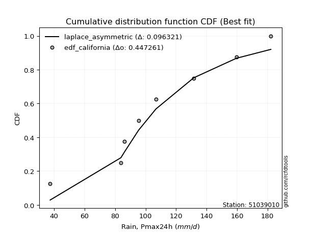</img>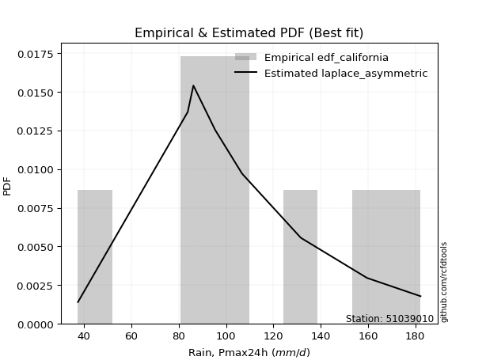</img>

</div>


### 2. EDF Hazen (1930)

Hazen method for plotting positions is a formula used to estimate the empirical cumulative probability distribution of flood events or other hydrological data. This formula often results in biased estimations, particularly when extrapolating to extreme events (high return periods).

<div align="center">


$P=(m-0.5)/n$


</div>


**2.1. Empirical values**

<div align="center">

|                | 0                  | 1                  | 2                  | 3                  | 4                  | 5         | 6                 | 7         |
|:---------------|:-------------------|:-------------------|:-------------------|:-------------------|:-------------------|:----------|:------------------|:----------|
| date           | 2021               | 2023               | 2020               | 2018               | 2022               | 2019      | 2024              | 2017      |
| x              | 37.4               | 83.8               | 86.2               | 95.4               | 106.8              | 131.6     | 159.6             | 182.2     |
| m              | 1                  | 2                  | 3                  | 4                  | 5                  | 6         | 7                 | 8         |
| empirical_dist | edf_hazen          | edf_hazen          | edf_hazen          | edf_hazen          | edf_hazen          | edf_hazen | edf_hazen         | edf_hazen |
| empirical      | 0.0625             | 0.1875             | 0.3125             | 0.4375             | 0.5625             | 0.6875    | 0.8125            | 0.9375    |
| empirical_tr   | 1.0666666666666667 | 1.2307692307692308 | 1.4545454545454546 | 1.7777777777777777 | 2.2857142857142856 | 3.2       | 5.333333333333333 | 16.0      |

</div>


**2.2. Kolmogorov-Smirnov fit test (sorted by Δ)**


<div align="center">

|                | 0                   | 1                   | 2                   | 3                   | 4                   | 5                   | 6                   | 7                  | 8                   | 9                  | 10                 | 11                  | 12                  | 13                    | 14                  | 15                 | 16                  | 17                  | 18                 | 19                  | 20                 | 21                  | 22                 | 23                  | 24                  | 25                  | 26                  | 27                  | 28                 | 29                  | 30                  | 31                  | 32                 | 33                  | 34                 | 35                 | 36                  | 37                  | 38                  | 39                  | 40                  | 41                  | 42                 | 43                 | 44                  | 45                  | 46                  | 47                 | 48                 | 49                 | 50                  | 51                  | 52                  | 53                  | 54                  | 55                  | 56                  | 57                  | 58                  | 59                  | 60                 | 61                 | 62                 | 63                  | 64                  | 65                  | 66                 | 67                  | 68                 | 69                 | 70                  | 71                  | 72                 | 73                  | 74                 | 75                  | 76                  | 77                 | 78                 | 79                 | 80                 | 81                 | 82                 | 83                 | 84                  | 85                 | 86                 | 87                 |
|:---------------|:--------------------|:--------------------|:--------------------|:--------------------|:--------------------|:--------------------|:--------------------|:-------------------|:--------------------|:-------------------|:-------------------|:--------------------|:--------------------|:----------------------|:--------------------|:-------------------|:--------------------|:--------------------|:-------------------|:--------------------|:-------------------|:--------------------|:-------------------|:--------------------|:--------------------|:--------------------|:--------------------|:--------------------|:-------------------|:--------------------|:--------------------|:--------------------|:-------------------|:--------------------|:-------------------|:-------------------|:--------------------|:--------------------|:--------------------|:--------------------|:--------------------|:--------------------|:-------------------|:-------------------|:--------------------|:--------------------|:--------------------|:-------------------|:-------------------|:-------------------|:--------------------|:--------------------|:--------------------|:--------------------|:--------------------|:--------------------|:--------------------|:--------------------|:--------------------|:--------------------|:-------------------|:-------------------|:-------------------|:--------------------|:--------------------|:--------------------|:-------------------|:--------------------|:-------------------|:-------------------|:--------------------|:--------------------|:-------------------|:--------------------|:-------------------|:--------------------|:--------------------|:-------------------|:-------------------|:-------------------|:-------------------|:-------------------|:-------------------|:-------------------|:--------------------|:-------------------|:-------------------|:-------------------|
| station        | 51039010            | 51039010            | 51039010            | 51039010            | 51039010            | 51039010            | 51039010            | 51039010           | 51039010            | 51039010           | 51039010           | 51039010            | 51039010            | 51039010              | 51039010            | 51039010           | 51039010            | 51039010            | 51039010           | 51039010            | 51039010           | 51039010            | 51039010           | 51039010            | 51039010            | 51039010            | 51039010            | 51039010            | 51039010           | 51039010            | 51039010            | 51039010            | 51039010           | 51039010            | 51039010           | 51039010           | 51039010            | 51039010            | 51039010            | 51039010            | 51039010            | 51039010            | 51039010           | 51039010           | 51039010            | 51039010            | 51039010            | 51039010           | 51039010           | 51039010           | 51039010            | 51039010            | 51039010            | 51039010            | 51039010            | 51039010            | 51039010            | 51039010            | 51039010            | 51039010            | 51039010           | 51039010           | 51039010           | 51039010            | 51039010            | 51039010            | 51039010           | 51039010            | 51039010           | 51039010           | 51039010            | 51039010            | 51039010           | 51039010            | 51039010           | 51039010            | 51039010            | 51039010           | 51039010           | 51039010           | 51039010           | 51039010           | 51039010           | 51039010           | 51039010            | 51039010           | 51039010           | 51039010           |
| empirical_dist | edf_hazen           | edf_hazen           | edf_hazen           | edf_hazen           | edf_hazen           | edf_hazen           | edf_hazen           | edf_hazen          | edf_hazen           | edf_hazen          | edf_hazen          | edf_hazen           | edf_hazen           | edf_hazen             | edf_hazen           | edf_hazen          | edf_hazen           | edf_hazen           | edf_hazen          | edf_hazen           | edf_hazen          | edf_hazen           | edf_hazen          | edf_hazen           | edf_hazen           | edf_hazen           | edf_hazen           | edf_hazen           | edf_hazen          | edf_hazen           | edf_hazen           | edf_hazen           | edf_hazen          | edf_hazen           | edf_hazen          | edf_hazen          | edf_hazen           | edf_hazen           | edf_hazen           | edf_hazen           | edf_hazen           | edf_hazen           | edf_hazen          | edf_hazen          | edf_hazen           | edf_hazen           | edf_hazen           | edf_hazen          | edf_hazen          | edf_hazen          | edf_hazen           | edf_hazen           | edf_hazen           | edf_hazen           | edf_hazen           | edf_hazen           | edf_hazen           | edf_hazen           | edf_hazen           | edf_hazen           | edf_hazen          | edf_hazen          | edf_hazen          | edf_hazen           | edf_hazen           | edf_hazen           | edf_hazen          | edf_hazen           | edf_hazen          | edf_hazen          | edf_hazen           | edf_hazen           | edf_hazen          | edf_hazen           | edf_hazen          | edf_hazen           | edf_hazen           | edf_hazen          | edf_hazen          | edf_hazen          | edf_hazen          | edf_hazen          | edf_hazen          | edf_hazen          | edf_hazen           | edf_hazen          | edf_hazen          | edf_hazen          |
| p_dist         | fisk                | johnsonsu           | gamma               | pearson3            | erlang              | mielke              | genlogistic         | loggenlogistic     | f                   | laplace_asymmetric | chi2               | logweibull_min      | exponnorm           | loglaplace_asymmetric | logloggamma         | nct                | t                   | norm                | crystalball        | truncnorm           | betaprime          | loglaplace          | logjohnsonsu       | loggumbel_l         | invgamma            | weibull_min         | rice                | logistic            | alpha              | gumbel_r            | logfisk             | hypsecant           | maxwell            | moyal               | logpearson3        | rayleigh           | invgauss            | loggompertz         | wald                | loghypsecant        | laplace             | halflogistic        | loglogistic        | halfnorm           | ncf                 | logmielke           | kstwobign           | gibrat             | logfatiguelife     | logt               | logexponnorm        | lognorm             | lognorm             | logcrystalball      | logrice             | lognct              | logf                | logerlang           | logbetaprime        | gumbel_l            | loggamma           | loggamma           | logncf             | loginvgamma         | loginvgauss         | logalpha            | lognakagami        | logmaxwell          | lograyleigh        | loggumbel_r        | loggibrat           | logmoyal            | loginvweibull      | logtruncnorm        | loghalfnorm        | loghalflogistic     | nakagami            | logwald            | logkstwobign       | loggenexpon        | expon              | genexpon           | logexpon           | logchi2            | loglognorm          | invweibull         | fatiguelife        | gompertz           |
| delta          | 0.08419697440058604 | 0.08712462669328691 | 0.08749997688612754 | 0.08788584630359447 | 0.08803677966131013 | 0.08990708729306568 | 0.08997758762190838 | 0.0899845516754238 | 0.09025781747675976 | 0.0915388863085303 | 0.093662299655419  | 0.09504033887439522 | 0.09518380517185482 | 0.09533601112597234   | 0.09545069510824122 | 0.0954989453223517 | 0.09550531865927381 | 0.09552575886574982 | 0.0955257671852574 | 0.09552576888759945 | 0.0964098454081041 | 0.09657501842135463 | 0.0970921481879084 | 0.09804376617205668 | 0.09899367261544262 | 0.09941306502419273 | 0.09979725226192365 | 0.10001044316170038 | 0.1009462466485529 | 0.10266456539089591 | 0.10295814811085274 | 0.10382248275503281 | 0.1056684049902179 | 0.10606318077793331 | 0.1142666856613454 | 0.1155163023975822 | 0.11679351302253133 | 0.11739525501544917 | 0.12167205022387584 | 0.12458593051413114 | 0.13148050220036672 | 0.13358068074797802 | 0.1387676493430749 | 0.1427603717902728 | 0.14381840140512026 | 0.15075035384085977 | 0.15181113119059375 | 0.1532970774678124 | 0.1566956273761554 | 0.1571364129574544 | 0.15715600625114823 | 0.15716046691001284 | 0.15716046691001284 | 0.15716051134604403 | 0.15716054334920343 | 0.15872135991763792 | 0.15918155640076576 | 0.16368709731688963 | 0.16487517816847203 | 0.16610129174587618 | 0.1661453091441657 | 0.1661453091441657 | 0.167164159353203  | 0.17077655534721908 | 0.18217673968272685 | 0.18414855253376583 | 0.1874999241970265 | 0.18876025417034353 | 0.2007663376953655 | 0.2040848841634169 | 0.21674526353848772 | 0.22129498169655815 | 0.2223488751611034 | 0.22692208228645389 | 0.2349019772273297 | 0.24206924865364754 | 0.24257965905219459 | 0.2590703853880005 | 0.2639613569895231 | 0.2757052672427771 | 0.2830063941241522 | 0.2830520589255342 | 0.369822032416701  | 0.4192416805399912 | 0.44995719481613483 | 0.4796303490337832 | 0.6340600958028555 | 0.7846308800497149 |
| deltao         | 0.4472608134160001  | 0.4472608134160001  | 0.4472608134160001  | 0.4472608134160001  | 0.4472608134160001  | 0.4472608134160001  | 0.4472608134160001  | 0.4472608134160001 | 0.4472608134160001  | 0.4472608134160001 | 0.4472608134160001 | 0.4472608134160001  | 0.4472608134160001  | 0.4472608134160001    | 0.4472608134160001  | 0.4472608134160001 | 0.4472608134160001  | 0.4472608134160001  | 0.4472608134160001 | 0.4472608134160001  | 0.4472608134160001 | 0.4472608134160001  | 0.4472608134160001 | 0.4472608134160001  | 0.4472608134160001  | 0.4472608134160001  | 0.4472608134160001  | 0.4472608134160001  | 0.4472608134160001 | 0.4472608134160001  | 0.4472608134160001  | 0.4472608134160001  | 0.4472608134160001 | 0.4472608134160001  | 0.4472608134160001 | 0.4472608134160001 | 0.4472608134160001  | 0.4472608134160001  | 0.4472608134160001  | 0.4472608134160001  | 0.4472608134160001  | 0.4472608134160001  | 0.4472608134160001 | 0.4472608134160001 | 0.4472608134160001  | 0.4472608134160001  | 0.4472608134160001  | 0.4472608134160001 | 0.4472608134160001 | 0.4472608134160001 | 0.4472608134160001  | 0.4472608134160001  | 0.4472608134160001  | 0.4472608134160001  | 0.4472608134160001  | 0.4472608134160001  | 0.4472608134160001  | 0.4472608134160001  | 0.4472608134160001  | 0.4472608134160001  | 0.4472608134160001 | 0.4472608134160001 | 0.4472608134160001 | 0.4472608134160001  | 0.4472608134160001  | 0.4472608134160001  | 0.4472608134160001 | 0.4472608134160001  | 0.4472608134160001 | 0.4472608134160001 | 0.4472608134160001  | 0.4472608134160001  | 0.4472608134160001 | 0.4472608134160001  | 0.4472608134160001 | 0.4472608134160001  | 0.4472608134160001  | 0.4472608134160001 | 0.4472608134160001 | 0.4472608134160001 | 0.4472608134160001 | 0.4472608134160001 | 0.4472608134160001 | 0.4472608134160001 | 0.4472608134160001  | 0.4472608134160001 | 0.4472608134160001 | 0.4472608134160001 |
| eval           | Δo > Δ              | Δo > Δ              | Δo > Δ              | Δo > Δ              | Δo > Δ              | Δo > Δ              | Δo > Δ              | Δo > Δ             | Δo > Δ              | Δo > Δ             | Δo > Δ             | Δo > Δ              | Δo > Δ              | Δo > Δ                | Δo > Δ              | Δo > Δ             | Δo > Δ              | Δo > Δ              | Δo > Δ             | Δo > Δ              | Δo > Δ             | Δo > Δ              | Δo > Δ             | Δo > Δ              | Δo > Δ              | Δo > Δ              | Δo > Δ              | Δo > Δ              | Δo > Δ             | Δo > Δ              | Δo > Δ              | Δo > Δ              | Δo > Δ             | Δo > Δ              | Δo > Δ             | Δo > Δ             | Δo > Δ              | Δo > Δ              | Δo > Δ              | Δo > Δ              | Δo > Δ              | Δo > Δ              | Δo > Δ             | Δo > Δ             | Δo > Δ              | Δo > Δ              | Δo > Δ              | Δo > Δ             | Δo > Δ             | Δo > Δ             | Δo > Δ              | Δo > Δ              | Δo > Δ              | Δo > Δ              | Δo > Δ              | Δo > Δ              | Δo > Δ              | Δo > Δ              | Δo > Δ              | Δo > Δ              | Δo > Δ             | Δo > Δ             | Δo > Δ             | Δo > Δ              | Δo > Δ              | Δo > Δ              | Δo > Δ             | Δo > Δ              | Δo > Δ             | Δo > Δ             | Δo > Δ              | Δo > Δ              | Δo > Δ             | Δo > Δ              | Δo > Δ             | Δo > Δ              | Δo > Δ              | Δo > Δ             | Δo > Δ             | Δo > Δ             | Δo > Δ             | Δo > Δ             | Δo > Δ             | Δo > Δ             | Δo <= Δ             | Δo <= Δ            | Δo <= Δ            | Δo <= Δ            |
| fit            | 1                   | 1                   | 1                   | 1                   | 1                   | 1                   | 1                   | 1                  | 1                   | 1                  | 1                  | 1                   | 1                   | 1                     | 1                   | 1                  | 1                   | 1                   | 1                  | 1                   | 1                  | 1                   | 1                  | 1                   | 1                   | 1                   | 1                   | 1                   | 1                  | 1                   | 1                   | 1                   | 1                  | 1                   | 1                  | 1                  | 1                   | 1                   | 1                   | 1                   | 1                   | 1                   | 1                  | 1                  | 1                   | 1                   | 1                   | 1                  | 1                  | 1                  | 1                   | 1                   | 1                   | 1                   | 1                   | 1                   | 1                   | 1                   | 1                   | 1                   | 1                  | 1                  | 1                  | 1                   | 1                   | 1                   | 1                  | 1                   | 1                  | 1                  | 1                   | 1                   | 1                  | 1                   | 1                  | 1                   | 1                   | 1                  | 1                  | 1                  | 1                  | 1                  | 1                  | 1                  | 0                   | 0                  | 0                  | 0                  |
| n              | 8                   | 8                   | 8                   | 8                   | 8                   | 8                   | 8                   | 8                  | 8                   | 8                  | 8                  | 8                   | 8                   | 8                     | 8                   | 8                  | 8                   | 8                   | 8                  | 8                   | 8                  | 8                   | 8                  | 8                   | 8                   | 8                   | 8                   | 8                   | 8                  | 8                   | 8                   | 8                   | 8                  | 8                   | 8                  | 8                  | 8                   | 8                   | 8                   | 8                   | 8                   | 8                   | 8                  | 8                  | 8                   | 8                   | 8                   | 8                  | 8                  | 8                  | 8                   | 8                   | 8                   | 8                   | 8                   | 8                   | 8                   | 8                   | 8                   | 8                   | 8                  | 8                  | 8                  | 8                   | 8                   | 8                   | 8                  | 8                   | 8                  | 8                  | 8                   | 8                   | 8                  | 8                   | 8                  | 8                   | 8                   | 8                  | 8                  | 8                  | 8                  | 8                  | 8                  | 8                  | 8                   | 8                  | 8                  | 8                  |
| best_fit       | 1                   | 0                   | 0                   | 0                   | 0                   | 0                   | 0                   | 0                  | 0                   | 0                  | 0                  | 0                   | 0                   | 0                     | 0                   | 0                  | 0                   | 0                   | 0                  | 0                   | 0                  | 0                   | 0                  | 0                   | 0                   | 0                   | 0                   | 0                   | 0                  | 0                   | 0                   | 0                   | 0                  | 0                   | 0                  | 0                  | 0                   | 0                   | 0                   | 0                   | 0                   | 0                   | 0                  | 0                  | 0                   | 0                   | 0                   | 0                  | 0                  | 0                  | 0                   | 0                   | 0                   | 0                   | 0                   | 0                   | 0                   | 0                   | 0                   | 0                   | 0                  | 0                  | 0                  | 0                   | 0                   | 0                   | 0                  | 0                   | 0                  | 0                  | 0                   | 0                   | 0                  | 0                   | 0                  | 0                   | 0                   | 0                  | 0                  | 0                  | 0                  | 0                  | 0                  | 0                  | 0                   | 0                  | 0                  | 0                  |
| best_fit_sort  | 1                   | 2                   | 3                   | 4                   | 5                   | 6                   | 7                   | 8                  | 9                   | 10                 | 11                 | 12                  | 13                  | 14                    | 15                  | 16                 | 17                  | 18                  | 19                 | 20                  | 21                 | 22                  | 23                 | 24                  | 25                  | 26                  | 27                  | 28                  | 29                 | 30                  | 31                  | 32                  | 33                 | 34                  | 35                 | 36                 | 37                  | 38                  | 39                  | 40                  | 41                  | 42                  | 43                 | 44                 | 45                  | 46                  | 47                  | 48                 | 49                 | 50                 | 51                  | 52                  | 53                  | 54                  | 55                  | 56                  | 57                  | 58                  | 59                  | 60                  | 61                 | 62                 | 63                 | 64                  | 65                  | 66                  | 67                 | 68                  | 69                 | 70                 | 71                  | 72                  | 73                 | 74                  | 75                 | 76                  | 77                  | 78                 | 79                 | 80                 | 81                 | 82                 | 83                 | 84                 | 85                  | 86                 | 87                 | 88                 |

</div>


**2.3. Best fit**

<div align="center">

|   id |   station | empirical_dist   | p_dist   |    delta |   deltao | eval   |   fit |   n |   best_fit |   best_fit_sort |
|-----:|----------:|:-----------------|:---------|---------:|---------:|:-------|------:|----:|-----------:|----------------:|
|    0 |  51039010 | edf_hazen        | fisk     | 0.084197 | 0.447261 | Δo > Δ |     1 |   8 |          1 |               1 |

</div>


<div align="center">

</img>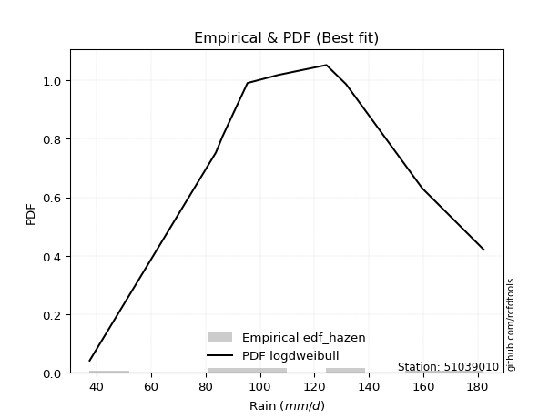</img>

</div>


### 3. EDF Weibull (1939)

Weibull plotting position formula is an empirical method used to estimate the non-exceedance probability or plotting position for a set of observed data, is often recommended or widely used in practice, particularly in flood frequency analysis.

<div align="center">


$P=m/(n+1)$


</div>


**3.1. Empirical values**

<div align="center">

|                | 0                  | 1                  | 2                  | 3                  | 4                  | 5                  | 6                  | 7                  |
|:---------------|:-------------------|:-------------------|:-------------------|:-------------------|:-------------------|:-------------------|:-------------------|:-------------------|
| date           | 2021               | 2023               | 2020               | 2018               | 2022               | 2019               | 2024               | 2017               |
| x              | 37.4               | 83.8               | 86.2               | 95.4               | 106.8              | 131.6              | 159.6              | 182.2              |
| m              | 1                  | 2                  | 3                  | 4                  | 5                  | 6                  | 7                  | 8                  |
| empirical_dist | edf_weibull        | edf_weibull        | edf_weibull        | edf_weibull        | edf_weibull        | edf_weibull        | edf_weibull        | edf_weibull        |
| empirical      | 0.1111111111111111 | 0.2222222222222222 | 0.3333333333333333 | 0.4444444444444444 | 0.5555555555555556 | 0.6666666666666666 | 0.7777777777777778 | 0.8888888888888888 |
| empirical_tr   | 1.125              | 1.2857142857142856 | 1.4999999999999998 | 1.7999999999999998 | 2.25               | 2.9999999999999996 | 4.5                | 8.999999999999996  |

</div>


**3.2. Kolmogorov-Smirnov fit test (sorted by Δ)**


<div align="center">

|                | 0                   | 1                  | 2                   | 3                   | 4                   | 5                  | 6                   | 7                   | 8                   | 9                   | 10                  | 11                  | 12                  | 13                  | 14                  | 15                  | 16                  | 17                  | 18                  | 19                  | 20                  | 21                  | 22                  | 23                 | 24                 | 25                  | 26                  | 27                  | 28                  | 29                  | 30                  | 31                    | 32                  | 33                 | 34                  | 35                  | 36                 | 37                  | 38                  | 39                 | 40                 | 41                 | 42                  | 43                 | 44                  | 45                  | 46                  | 47                  | 48                  | 49                  | 50                  | 51                 | 52                  | 53                  | 54                  | 55                 | 56                 | 57                 | 58                  | 59                  | 60                 | 61                  | 62                  | 63                  | 64                  | 65                  | 66                 | 67                 | 68                  | 69                  | 70                 | 71                  | 72                  | 73                  | 74                 | 75                  | 76                 | 77                  | 78                 | 79                 | 80                  | 81                 | 82                  | 83                 | 84                 | 85                  | 86                 | 87                 |
|:---------------|:--------------------|:-------------------|:--------------------|:--------------------|:--------------------|:-------------------|:--------------------|:--------------------|:--------------------|:--------------------|:--------------------|:--------------------|:--------------------|:--------------------|:--------------------|:--------------------|:--------------------|:--------------------|:--------------------|:--------------------|:--------------------|:--------------------|:--------------------|:-------------------|:-------------------|:--------------------|:--------------------|:--------------------|:--------------------|:--------------------|:--------------------|:----------------------|:--------------------|:-------------------|:--------------------|:--------------------|:-------------------|:--------------------|:--------------------|:-------------------|:-------------------|:-------------------|:--------------------|:-------------------|:--------------------|:--------------------|:--------------------|:--------------------|:--------------------|:--------------------|:--------------------|:-------------------|:--------------------|:--------------------|:--------------------|:-------------------|:-------------------|:-------------------|:--------------------|:--------------------|:-------------------|:--------------------|:--------------------|:--------------------|:--------------------|:--------------------|:-------------------|:-------------------|:--------------------|:--------------------|:-------------------|:--------------------|:--------------------|:--------------------|:-------------------|:--------------------|:-------------------|:--------------------|:-------------------|:-------------------|:--------------------|:-------------------|:--------------------|:-------------------|:-------------------|:--------------------|:-------------------|:-------------------|
| station        | 51039010            | 51039010           | 51039010            | 51039010            | 51039010            | 51039010           | 51039010            | 51039010            | 51039010            | 51039010            | 51039010            | 51039010            | 51039010            | 51039010            | 51039010            | 51039010            | 51039010            | 51039010            | 51039010            | 51039010            | 51039010            | 51039010            | 51039010            | 51039010           | 51039010           | 51039010            | 51039010            | 51039010            | 51039010            | 51039010            | 51039010            | 51039010              | 51039010            | 51039010           | 51039010            | 51039010            | 51039010           | 51039010            | 51039010            | 51039010           | 51039010           | 51039010           | 51039010            | 51039010           | 51039010            | 51039010            | 51039010            | 51039010            | 51039010            | 51039010            | 51039010            | 51039010           | 51039010            | 51039010            | 51039010            | 51039010           | 51039010           | 51039010           | 51039010            | 51039010            | 51039010           | 51039010            | 51039010            | 51039010            | 51039010            | 51039010            | 51039010           | 51039010           | 51039010            | 51039010            | 51039010           | 51039010            | 51039010            | 51039010            | 51039010           | 51039010            | 51039010           | 51039010            | 51039010           | 51039010           | 51039010            | 51039010           | 51039010            | 51039010           | 51039010           | 51039010            | 51039010           | 51039010           |
| empirical_dist | edf_weibull         | edf_weibull        | edf_weibull         | edf_weibull         | edf_weibull         | edf_weibull        | edf_weibull         | edf_weibull         | edf_weibull         | edf_weibull         | edf_weibull         | edf_weibull         | edf_weibull         | edf_weibull         | edf_weibull         | edf_weibull         | edf_weibull         | edf_weibull         | edf_weibull         | edf_weibull         | edf_weibull         | edf_weibull         | edf_weibull         | edf_weibull        | edf_weibull        | edf_weibull         | edf_weibull         | edf_weibull         | edf_weibull         | edf_weibull         | edf_weibull         | edf_weibull           | edf_weibull         | edf_weibull        | edf_weibull         | edf_weibull         | edf_weibull        | edf_weibull         | edf_weibull         | edf_weibull        | edf_weibull        | edf_weibull        | edf_weibull         | edf_weibull        | edf_weibull         | edf_weibull         | edf_weibull         | edf_weibull         | edf_weibull         | edf_weibull         | edf_weibull         | edf_weibull        | edf_weibull         | edf_weibull         | edf_weibull         | edf_weibull        | edf_weibull        | edf_weibull        | edf_weibull         | edf_weibull         | edf_weibull        | edf_weibull         | edf_weibull         | edf_weibull         | edf_weibull         | edf_weibull         | edf_weibull        | edf_weibull        | edf_weibull         | edf_weibull         | edf_weibull        | edf_weibull         | edf_weibull         | edf_weibull         | edf_weibull        | edf_weibull         | edf_weibull        | edf_weibull         | edf_weibull        | edf_weibull        | edf_weibull         | edf_weibull        | edf_weibull         | edf_weibull        | edf_weibull        | edf_weibull         | edf_weibull        | edf_weibull        |
| p_dist         | logpearson3         | invgauss           | betaprime           | alpha               | loggenlogistic      | logloggamma        | mielke              | maxwell             | rice                | weibull_min         | laplace_asymmetric  | logjohnsonsu        | logweibull_min      | genlogistic         | chi2                | loggumbel_l         | loghypsecant        | f                   | invgamma            | johnsonsu           | pearson3            | gamma               | erlang              | logfisk            | fisk               | exponnorm           | truncnorm           | crystalball         | norm                | nct                 | t                   | loglaplace_asymmetric | rayleigh            | gumbel_r           | loglogistic         | ncf                 | logistic           | moyal               | loggompertz         | halfnorm           | halflogistic       | loglaplace         | kstwobign           | hypsecant          | logfatiguelife      | logt                | logexponnorm        | lognorm             | lognorm             | logcrystalball      | logrice             | lognct             | logf                | logerlang           | logbetaprime        | loggamma           | loggamma           | logncf             | loginvgamma         | laplace             | wald               | logmielke           | loginvgauss         | logalpha            | logmaxwell          | gumbel_l            | lograyleigh        | loggumbel_r        | gibrat              | logmoyal            | loginvweibull      | loggibrat           | loghalfnorm         | loghalflogistic     | lognakagami        | logwald             | logkstwobign       | nakagami            | loggenexpon        | logtruncnorm       | expon               | genexpon           | logexpon            | logchi2            | loglognorm         | invweibull          | fatiguelife        | gompertz           |
| delta          | 0.07954446343912319 | 0.0831811435637948 | 0.08470109777450063 | 0.08651376656484888 | 0.08841770710937313 | 0.0885062506637968 | 0.08860010985651012 | 0.08885725230097952 | 0.08937704352438003 | 0.08966025853144399 | 0.08999606734036525 | 0.09014770374346398 | 0.09024447763393673 | 0.09106700141500967 | 0.09171407894654227 | 0.09214440034489746 | 0.09289000022892302 | 0.09291364563040294 | 0.09344845534747259 | 0.09407732135149904 | 0.09427564536891198 | 0.09460925554855781 | 0.09491045620431504 | 0.0949114671014637 | 0.0950048087820109 | 0.09530638971449301 | 0.09532209007579473 | 0.09532209307857287 | 0.09532209542707559 | 0.09532601404699148 | 0.09532863227116017 | 0.09846476724411146   | 0.10065608738503407 | 0.1037845490389256 | 0.10404542712085268 | 0.10909617918289805 | 0.1101601361429928 | 0.11058885177712381 | 0.11111108200609153 | 0.1111111111111111 | 0.1111111111111111 | 0.1146991640970324 | 0.11708890896837154 | 0.1171660240920791 | 0.12197340515393318 | 0.12241419073523219 | 0.12243378402892602 | 0.12243824468779063 | 0.12243824468779063 | 0.12243828912382182 | 0.12243832112698122 | 0.1239991376954157 | 0.12445933417854355 | 0.12896487509466742 | 0.13015295594624982 | 0.1314230869219435 | 0.1314230869219435 | 0.1324419371309808 | 0.13605433312499687 | 0.13842494664481114 | 0.1425053835572092 | 0.14380590939641535 | 0.14745451746050464 | 0.14942633031154362 | 0.15403803194812132 | 0.15915684730143176 | 0.1660441154731433 | 0.1693626619411947 | 0.17413041080114577 | 0.18657275947433594 | 0.1876266529388812 | 0.19082570556882428 | 0.20017975500510748 | 0.20734702643142533 | 0.2222221464192487 | 0.22434816316577827 | 0.2292391347673009 | 0.23563521460775017 | 0.2409830450205549 | 0.2477554156197872 | 0.24828417190192997 | 0.248329836703312  | 0.33509981019447876 | 0.384519458317769  | 0.4152349725939126 | 0.43101923792267205 | 0.5993378735806333 | 0.7499086578274927 |
| deltao         | 0.4472608134160001  | 0.4472608134160001 | 0.4472608134160001  | 0.4472608134160001  | 0.4472608134160001  | 0.4472608134160001 | 0.4472608134160001  | 0.4472608134160001  | 0.4472608134160001  | 0.4472608134160001  | 0.4472608134160001  | 0.4472608134160001  | 0.4472608134160001  | 0.4472608134160001  | 0.4472608134160001  | 0.4472608134160001  | 0.4472608134160001  | 0.4472608134160001  | 0.4472608134160001  | 0.4472608134160001  | 0.4472608134160001  | 0.4472608134160001  | 0.4472608134160001  | 0.4472608134160001 | 0.4472608134160001 | 0.4472608134160001  | 0.4472608134160001  | 0.4472608134160001  | 0.4472608134160001  | 0.4472608134160001  | 0.4472608134160001  | 0.4472608134160001    | 0.4472608134160001  | 0.4472608134160001 | 0.4472608134160001  | 0.4472608134160001  | 0.4472608134160001 | 0.4472608134160001  | 0.4472608134160001  | 0.4472608134160001 | 0.4472608134160001 | 0.4472608134160001 | 0.4472608134160001  | 0.4472608134160001 | 0.4472608134160001  | 0.4472608134160001  | 0.4472608134160001  | 0.4472608134160001  | 0.4472608134160001  | 0.4472608134160001  | 0.4472608134160001  | 0.4472608134160001 | 0.4472608134160001  | 0.4472608134160001  | 0.4472608134160001  | 0.4472608134160001 | 0.4472608134160001 | 0.4472608134160001 | 0.4472608134160001  | 0.4472608134160001  | 0.4472608134160001 | 0.4472608134160001  | 0.4472608134160001  | 0.4472608134160001  | 0.4472608134160001  | 0.4472608134160001  | 0.4472608134160001 | 0.4472608134160001 | 0.4472608134160001  | 0.4472608134160001  | 0.4472608134160001 | 0.4472608134160001  | 0.4472608134160001  | 0.4472608134160001  | 0.4472608134160001 | 0.4472608134160001  | 0.4472608134160001 | 0.4472608134160001  | 0.4472608134160001 | 0.4472608134160001 | 0.4472608134160001  | 0.4472608134160001 | 0.4472608134160001  | 0.4472608134160001 | 0.4472608134160001 | 0.4472608134160001  | 0.4472608134160001 | 0.4472608134160001 |
| eval           | Δo > Δ              | Δo > Δ             | Δo > Δ              | Δo > Δ              | Δo > Δ              | Δo > Δ             | Δo > Δ              | Δo > Δ              | Δo > Δ              | Δo > Δ              | Δo > Δ              | Δo > Δ              | Δo > Δ              | Δo > Δ              | Δo > Δ              | Δo > Δ              | Δo > Δ              | Δo > Δ              | Δo > Δ              | Δo > Δ              | Δo > Δ              | Δo > Δ              | Δo > Δ              | Δo > Δ             | Δo > Δ             | Δo > Δ              | Δo > Δ              | Δo > Δ              | Δo > Δ              | Δo > Δ              | Δo > Δ              | Δo > Δ                | Δo > Δ              | Δo > Δ             | Δo > Δ              | Δo > Δ              | Δo > Δ             | Δo > Δ              | Δo > Δ              | Δo > Δ             | Δo > Δ             | Δo > Δ             | Δo > Δ              | Δo > Δ             | Δo > Δ              | Δo > Δ              | Δo > Δ              | Δo > Δ              | Δo > Δ              | Δo > Δ              | Δo > Δ              | Δo > Δ             | Δo > Δ              | Δo > Δ              | Δo > Δ              | Δo > Δ             | Δo > Δ             | Δo > Δ             | Δo > Δ              | Δo > Δ              | Δo > Δ             | Δo > Δ              | Δo > Δ              | Δo > Δ              | Δo > Δ              | Δo > Δ              | Δo > Δ             | Δo > Δ             | Δo > Δ              | Δo > Δ              | Δo > Δ             | Δo > Δ              | Δo > Δ              | Δo > Δ              | Δo > Δ             | Δo > Δ              | Δo > Δ             | Δo > Δ              | Δo > Δ             | Δo > Δ             | Δo > Δ              | Δo > Δ             | Δo > Δ              | Δo > Δ             | Δo > Δ             | Δo > Δ              | Δo <= Δ            | Δo <= Δ            |
| fit            | 1                   | 1                  | 1                   | 1                   | 1                   | 1                  | 1                   | 1                   | 1                   | 1                   | 1                   | 1                   | 1                   | 1                   | 1                   | 1                   | 1                   | 1                   | 1                   | 1                   | 1                   | 1                   | 1                   | 1                  | 1                  | 1                   | 1                   | 1                   | 1                   | 1                   | 1                   | 1                     | 1                   | 1                  | 1                   | 1                   | 1                  | 1                   | 1                   | 1                  | 1                  | 1                  | 1                   | 1                  | 1                   | 1                   | 1                   | 1                   | 1                   | 1                   | 1                   | 1                  | 1                   | 1                   | 1                   | 1                  | 1                  | 1                  | 1                   | 1                   | 1                  | 1                   | 1                   | 1                   | 1                   | 1                   | 1                  | 1                  | 1                   | 1                   | 1                  | 1                   | 1                   | 1                   | 1                  | 1                   | 1                  | 1                   | 1                  | 1                  | 1                   | 1                  | 1                   | 1                  | 1                  | 1                   | 0                  | 0                  |
| n              | 8                   | 8                  | 8                   | 8                   | 8                   | 8                  | 8                   | 8                   | 8                   | 8                   | 8                   | 8                   | 8                   | 8                   | 8                   | 8                   | 8                   | 8                   | 8                   | 8                   | 8                   | 8                   | 8                   | 8                  | 8                  | 8                   | 8                   | 8                   | 8                   | 8                   | 8                   | 8                     | 8                   | 8                  | 8                   | 8                   | 8                  | 8                   | 8                   | 8                  | 8                  | 8                  | 8                   | 8                  | 8                   | 8                   | 8                   | 8                   | 8                   | 8                   | 8                   | 8                  | 8                   | 8                   | 8                   | 8                  | 8                  | 8                  | 8                   | 8                   | 8                  | 8                   | 8                   | 8                   | 8                   | 8                   | 8                  | 8                  | 8                   | 8                   | 8                  | 8                   | 8                   | 8                   | 8                  | 8                   | 8                  | 8                   | 8                  | 8                  | 8                   | 8                  | 8                   | 8                  | 8                  | 8                   | 8                  | 8                  |
| best_fit       | 1                   | 0                  | 0                   | 0                   | 0                   | 0                  | 0                   | 0                   | 0                   | 0                   | 0                   | 0                   | 0                   | 0                   | 0                   | 0                   | 0                   | 0                   | 0                   | 0                   | 0                   | 0                   | 0                   | 0                  | 0                  | 0                   | 0                   | 0                   | 0                   | 0                   | 0                   | 0                     | 0                   | 0                  | 0                   | 0                   | 0                  | 0                   | 0                   | 0                  | 0                  | 0                  | 0                   | 0                  | 0                   | 0                   | 0                   | 0                   | 0                   | 0                   | 0                   | 0                  | 0                   | 0                   | 0                   | 0                  | 0                  | 0                  | 0                   | 0                   | 0                  | 0                   | 0                   | 0                   | 0                   | 0                   | 0                  | 0                  | 0                   | 0                   | 0                  | 0                   | 0                   | 0                   | 0                  | 0                   | 0                  | 0                   | 0                  | 0                  | 0                   | 0                  | 0                   | 0                  | 0                  | 0                   | 0                  | 0                  |
| best_fit_sort  | 1                   | 2                  | 3                   | 4                   | 5                   | 6                  | 7                   | 8                   | 9                   | 10                  | 11                  | 12                  | 13                  | 14                  | 15                  | 16                  | 17                  | 18                  | 19                  | 20                  | 21                  | 22                  | 23                  | 24                 | 25                 | 26                  | 27                  | 28                  | 29                  | 30                  | 31                  | 32                    | 33                  | 34                 | 35                  | 36                  | 37                 | 38                  | 39                  | 40                 | 41                 | 42                 | 43                  | 44                 | 45                  | 46                  | 47                  | 48                  | 49                  | 50                  | 51                  | 52                 | 53                  | 54                  | 55                  | 56                 | 57                 | 58                 | 59                  | 60                  | 61                 | 62                  | 63                  | 64                  | 65                  | 66                  | 67                 | 68                 | 69                  | 70                  | 71                 | 72                  | 73                  | 74                  | 75                 | 76                  | 77                 | 78                  | 79                 | 80                 | 81                  | 82                 | 83                  | 84                 | 85                 | 86                  | 87                 | 88                 |

</div>


**3.3. Best fit**

<div align="center">

|   id |   station | empirical_dist   | p_dist      |     delta |   deltao | eval   |   fit |   n |   best_fit |   best_fit_sort |
|-----:|----------:|:-----------------|:------------|----------:|---------:|:-------|------:|----:|-----------:|----------------:|
|    0 |  51039010 | edf_weibull      | logpearson3 | 0.0795445 | 0.447261 | Δo > Δ |     1 |   8 |          1 |               1 |

</div>


<div align="center">

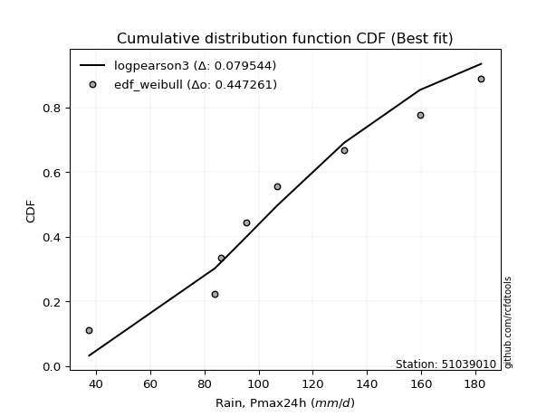</img>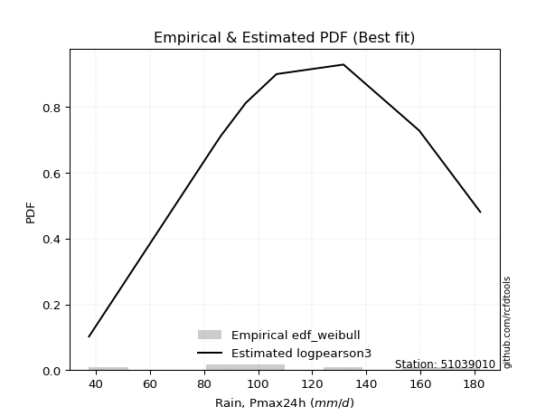</img>

</div>


### 4. EDF Beard (1943)

The Beard formula (or Beard´s plotting position formula) in hydrology is used to estimate the empirical non-exceedance probability _(P)_ of a flood event (or other extreme hydrological data point) within a given dataset.

<div align="center">


$P=(m-0.31)/(n+0.38)$


</div>


**4.1. Empirical values**

<div align="center">

|                | 0                   | 1                   | 2                  | 3                   | 4                  | 5                  | 6                  | 7                  |
|:---------------|:--------------------|:--------------------|:-------------------|:--------------------|:-------------------|:-------------------|:-------------------|:-------------------|
| date           | 2021                | 2023                | 2020               | 2018                | 2022               | 2019               | 2024               | 2017               |
| x              | 37.4                | 83.8                | 86.2               | 95.4                | 106.8              | 131.6              | 159.6              | 182.2              |
| m              | 1                   | 2                   | 3                  | 4                   | 5                  | 6                  | 7                  | 8                  |
| empirical_dist | edf_beard           | edf_beard           | edf_beard          | edf_beard           | edf_beard          | edf_beard          | edf_beard          | edf_beard          |
| empirical      | 0.08233890214797135 | 0.20167064439140808 | 0.3210023866348448 | 0.44033412887828155 | 0.5596658711217184 | 0.6789976133651551 | 0.7983293556085919 | 0.9176610978520287 |
| empirical_tr   | 1.0897269180754225  | 1.2526158445440956  | 1.4727592267135323 | 1.7867803837953091  | 2.2710027100271004 | 3.115241635687732  | 4.958579881656804  | 12.144927536231886 |

</div>


**4.2. Kolmogorov-Smirnov fit test (sorted by Δ)**


<div align="center">

|                | 0                   | 1                  | 2                   | 3                   | 4                   | 5                   | 6                   | 7                  | 8                   | 9                   | 10                 | 11                 | 12                  | 13                  | 14                  | 15                  | 16                  | 17                    | 18                  | 19                  | 20                  | 21                  | 22                  | 23                  | 24                  | 25                 | 26                 | 27                  | 28                 | 29                  | 30                 | 31                  | 32                  | 33                  | 34                  | 35                  | 36                  | 37                  | 38                  | 39                  | 40                  | 41                 | 42                  | 43                  | 44                  | 45                  | 46                 | 47                  | 48                  | 49                  | 50                  | 51                  | 52                  | 53                  | 54                  | 55                  | 56                  | 57                  | 58                  | 59                  | 60                  | 61                 | 62                  | 63                  | 64                  | 65                  | 66                  | 67                  | 68                  | 69                  | 70                  | 71                  | 72                  | 73                 | 74                  | 75                 | 76                  | 77                 | 78                  | 79                 | 80                 | 81                 | 82                 | 83                  | 84                  | 85                  | 86                 | 87                 |
|:---------------|:--------------------|:-------------------|:--------------------|:--------------------|:--------------------|:--------------------|:--------------------|:-------------------|:--------------------|:--------------------|:-------------------|:-------------------|:--------------------|:--------------------|:--------------------|:--------------------|:--------------------|:----------------------|:--------------------|:--------------------|:--------------------|:--------------------|:--------------------|:--------------------|:--------------------|:-------------------|:-------------------|:--------------------|:-------------------|:--------------------|:-------------------|:--------------------|:--------------------|:--------------------|:--------------------|:--------------------|:--------------------|:--------------------|:--------------------|:--------------------|:--------------------|:-------------------|:--------------------|:--------------------|:--------------------|:--------------------|:-------------------|:--------------------|:--------------------|:--------------------|:--------------------|:--------------------|:--------------------|:--------------------|:--------------------|:--------------------|:--------------------|:--------------------|:--------------------|:--------------------|:--------------------|:-------------------|:--------------------|:--------------------|:--------------------|:--------------------|:--------------------|:--------------------|:--------------------|:--------------------|:--------------------|:--------------------|:--------------------|:-------------------|:--------------------|:-------------------|:--------------------|:-------------------|:--------------------|:-------------------|:-------------------|:-------------------|:-------------------|:--------------------|:--------------------|:--------------------|:-------------------|:-------------------|
| station        | 51039010            | 51039010           | 51039010            | 51039010            | 51039010            | 51039010            | 51039010            | 51039010           | 51039010            | 51039010            | 51039010           | 51039010           | 51039010            | 51039010            | 51039010            | 51039010            | 51039010            | 51039010              | 51039010            | 51039010            | 51039010            | 51039010            | 51039010            | 51039010            | 51039010            | 51039010           | 51039010           | 51039010            | 51039010           | 51039010            | 51039010           | 51039010            | 51039010            | 51039010            | 51039010            | 51039010            | 51039010            | 51039010            | 51039010            | 51039010            | 51039010            | 51039010           | 51039010            | 51039010            | 51039010            | 51039010            | 51039010           | 51039010            | 51039010            | 51039010            | 51039010            | 51039010            | 51039010            | 51039010            | 51039010            | 51039010            | 51039010            | 51039010            | 51039010            | 51039010            | 51039010            | 51039010           | 51039010            | 51039010            | 51039010            | 51039010            | 51039010            | 51039010            | 51039010            | 51039010            | 51039010            | 51039010            | 51039010            | 51039010           | 51039010            | 51039010           | 51039010            | 51039010           | 51039010            | 51039010           | 51039010           | 51039010           | 51039010           | 51039010            | 51039010            | 51039010            | 51039010           | 51039010           |
| empirical_dist | edf_beard           | edf_beard          | edf_beard           | edf_beard           | edf_beard           | edf_beard           | edf_beard           | edf_beard          | edf_beard           | edf_beard           | edf_beard          | edf_beard          | edf_beard           | edf_beard           | edf_beard           | edf_beard           | edf_beard           | edf_beard             | edf_beard           | edf_beard           | edf_beard           | edf_beard           | edf_beard           | edf_beard           | edf_beard           | edf_beard          | edf_beard          | edf_beard           | edf_beard          | edf_beard           | edf_beard          | edf_beard           | edf_beard           | edf_beard           | edf_beard           | edf_beard           | edf_beard           | edf_beard           | edf_beard           | edf_beard           | edf_beard           | edf_beard          | edf_beard           | edf_beard           | edf_beard           | edf_beard           | edf_beard          | edf_beard           | edf_beard           | edf_beard           | edf_beard           | edf_beard           | edf_beard           | edf_beard           | edf_beard           | edf_beard           | edf_beard           | edf_beard           | edf_beard           | edf_beard           | edf_beard           | edf_beard          | edf_beard           | edf_beard           | edf_beard           | edf_beard           | edf_beard           | edf_beard           | edf_beard           | edf_beard           | edf_beard           | edf_beard           | edf_beard           | edf_beard          | edf_beard           | edf_beard          | edf_beard           | edf_beard          | edf_beard           | edf_beard          | edf_beard          | edf_beard          | edf_beard          | edf_beard           | edf_beard           | edf_beard           | edf_beard          | edf_beard          |
| p_dist         | fisk                | genlogistic        | f                   | laplace_asymmetric  | chi2                | erlang              | gamma               | johnsonsu          | logweibull_min      | betaprime           | mielke             | loggumbel_l        | loggenlogistic      | invgamma            | pearson3            | weibull_min         | rice                | loglaplace_asymmetric | alpha               | gumbel_r            | logfisk             | maxwell             | moyal               | exponnorm           | logloggamma         | nct                | t                  | norm                | crystalball        | truncnorm           | logjohnsonsu       | logistic            | logpearson3         | rayleigh            | loglaplace          | invgauss            | loggompertz         | hypsecant           | loghypsecant        | halflogistic        | loglogistic         | halfnorm           | ncf                 | wald                | laplace             | kstwobign           | logfatiguelife     | logt                | logexponnorm        | lognorm             | lognorm             | logcrystalball      | logrice             | lognct              | logf                | logmielke           | logerlang           | logbetaprime        | loggamma            | loggamma            | logncf              | loginvgamma        | gibrat              | gumbel_l            | loginvgauss         | logalpha            | logmaxwell          | lograyleigh         | loggumbel_r         | lognakagami         | loggibrat           | logmoyal            | loginvweibull       | loghalfnorm        | loghalflogistic     | logtruncnorm       | nakagami            | logwald            | logkstwobign        | loggenexpon        | expon              | genexpon           | logexpon           | logchi2             | loglognorm          | invweibull          | fatiguelife        | gompertz           |
| delta          | 0.07445323095119682 | 0.0758069432305003 | 0.07642883761118491 | 0.07736824191712222 | 0.07949165526401092 | 0.07987179117779686 | 0.08066512100708684 | 0.0806706816879757 | 0.08086969448298714 | 0.08223920101669602 | 0.083358594413459  | 0.0838731217806486 | 0.08395584488690805 | 0.08482302822403454 | 0.08505171742531287 | 0.08524242063278464 | 0.08562660787051557 | 0.08613382054562302   | 0.08677560225714481 | 0.08849392099948783 | 0.08878750371944466 | 0.09149776059880982 | 0.09189253638652523 | 0.09234967629357321 | 0.09261656622995962 | 0.0926648164440701 | 0.0926711897809922 | 0.09269162998746822 | 0.0926916383069758 | 0.09269164000931784 | 0.0942580193096268 | 0.09717631428341877 | 0.10009604126993732 | 0.10134565800617412 | 0.10236821739854396 | 0.10262286863112324 | 0.10322461062404109 | 0.10590049145374186 | 0.11041528612272306 | 0.11941003635656994 | 0.12459700495166681 | 0.1285897273988647 | 0.12964775701371217 | 0.13017443685872077 | 0.13431463107864827 | 0.13764048679918567 | 0.1425249829847473 | 0.14296576856604631 | 0.14298536185974015 | 0.14298982251860476 | 0.14298982251860476 | 0.14298986695463595 | 0.14298989895779535 | 0.14455071552622983 | 0.14501091200935767 | 0.14791622496257817 | 0.14951645292548155 | 0.15070453377706394 | 0.15197466475275762 | 0.15197466475275762 | 0.15299351496179492 | 0.156605910955811  | 0.16179946410265733 | 0.16326716286759457 | 0.16800609529131877 | 0.16997790814235775 | 0.17458960977893545 | 0.18659569330395742 | 0.18991423977200883 | 0.20167056858843457 | 0.20257461914707964 | 0.20712433730515006 | 0.20817823076969533 | 0.2207313328359216 | 0.22789860426223946 | 0.2354244689212987 | 0.23974553017391304 | 0.2448997409965924 | 0.24979071259811503 | 0.261534622851369  | 0.2688357497327441 | 0.2688814145341261 | 0.3556513880252929 | 0.40507103614858314 | 0.43578655042472675 | 0.45979144688581186 | 0.6198894514114475 | 0.7704602356583068 |
| deltao         | 0.4472608134160001  | 0.4472608134160001 | 0.4472608134160001  | 0.4472608134160001  | 0.4472608134160001  | 0.4472608134160001  | 0.4472608134160001  | 0.4472608134160001 | 0.4472608134160001  | 0.4472608134160001  | 0.4472608134160001 | 0.4472608134160001 | 0.4472608134160001  | 0.4472608134160001  | 0.4472608134160001  | 0.4472608134160001  | 0.4472608134160001  | 0.4472608134160001    | 0.4472608134160001  | 0.4472608134160001  | 0.4472608134160001  | 0.4472608134160001  | 0.4472608134160001  | 0.4472608134160001  | 0.4472608134160001  | 0.4472608134160001 | 0.4472608134160001 | 0.4472608134160001  | 0.4472608134160001 | 0.4472608134160001  | 0.4472608134160001 | 0.4472608134160001  | 0.4472608134160001  | 0.4472608134160001  | 0.4472608134160001  | 0.4472608134160001  | 0.4472608134160001  | 0.4472608134160001  | 0.4472608134160001  | 0.4472608134160001  | 0.4472608134160001  | 0.4472608134160001 | 0.4472608134160001  | 0.4472608134160001  | 0.4472608134160001  | 0.4472608134160001  | 0.4472608134160001 | 0.4472608134160001  | 0.4472608134160001  | 0.4472608134160001  | 0.4472608134160001  | 0.4472608134160001  | 0.4472608134160001  | 0.4472608134160001  | 0.4472608134160001  | 0.4472608134160001  | 0.4472608134160001  | 0.4472608134160001  | 0.4472608134160001  | 0.4472608134160001  | 0.4472608134160001  | 0.4472608134160001 | 0.4472608134160001  | 0.4472608134160001  | 0.4472608134160001  | 0.4472608134160001  | 0.4472608134160001  | 0.4472608134160001  | 0.4472608134160001  | 0.4472608134160001  | 0.4472608134160001  | 0.4472608134160001  | 0.4472608134160001  | 0.4472608134160001 | 0.4472608134160001  | 0.4472608134160001 | 0.4472608134160001  | 0.4472608134160001 | 0.4472608134160001  | 0.4472608134160001 | 0.4472608134160001 | 0.4472608134160001 | 0.4472608134160001 | 0.4472608134160001  | 0.4472608134160001  | 0.4472608134160001  | 0.4472608134160001 | 0.4472608134160001 |
| eval           | Δo > Δ              | Δo > Δ             | Δo > Δ              | Δo > Δ              | Δo > Δ              | Δo > Δ              | Δo > Δ              | Δo > Δ             | Δo > Δ              | Δo > Δ              | Δo > Δ             | Δo > Δ             | Δo > Δ              | Δo > Δ              | Δo > Δ              | Δo > Δ              | Δo > Δ              | Δo > Δ                | Δo > Δ              | Δo > Δ              | Δo > Δ              | Δo > Δ              | Δo > Δ              | Δo > Δ              | Δo > Δ              | Δo > Δ             | Δo > Δ             | Δo > Δ              | Δo > Δ             | Δo > Δ              | Δo > Δ             | Δo > Δ              | Δo > Δ              | Δo > Δ              | Δo > Δ              | Δo > Δ              | Δo > Δ              | Δo > Δ              | Δo > Δ              | Δo > Δ              | Δo > Δ              | Δo > Δ             | Δo > Δ              | Δo > Δ              | Δo > Δ              | Δo > Δ              | Δo > Δ             | Δo > Δ              | Δo > Δ              | Δo > Δ              | Δo > Δ              | Δo > Δ              | Δo > Δ              | Δo > Δ              | Δo > Δ              | Δo > Δ              | Δo > Δ              | Δo > Δ              | Δo > Δ              | Δo > Δ              | Δo > Δ              | Δo > Δ             | Δo > Δ              | Δo > Δ              | Δo > Δ              | Δo > Δ              | Δo > Δ              | Δo > Δ              | Δo > Δ              | Δo > Δ              | Δo > Δ              | Δo > Δ              | Δo > Δ              | Δo > Δ             | Δo > Δ              | Δo > Δ             | Δo > Δ              | Δo > Δ             | Δo > Δ              | Δo > Δ             | Δo > Δ             | Δo > Δ             | Δo > Δ             | Δo > Δ              | Δo > Δ              | Δo <= Δ             | Δo <= Δ            | Δo <= Δ            |
| fit            | 1                   | 1                  | 1                   | 1                   | 1                   | 1                   | 1                   | 1                  | 1                   | 1                   | 1                  | 1                  | 1                   | 1                   | 1                   | 1                   | 1                   | 1                     | 1                   | 1                   | 1                   | 1                   | 1                   | 1                   | 1                   | 1                  | 1                  | 1                   | 1                  | 1                   | 1                  | 1                   | 1                   | 1                   | 1                   | 1                   | 1                   | 1                   | 1                   | 1                   | 1                   | 1                  | 1                   | 1                   | 1                   | 1                   | 1                  | 1                   | 1                   | 1                   | 1                   | 1                   | 1                   | 1                   | 1                   | 1                   | 1                   | 1                   | 1                   | 1                   | 1                   | 1                  | 1                   | 1                   | 1                   | 1                   | 1                   | 1                   | 1                   | 1                   | 1                   | 1                   | 1                   | 1                  | 1                   | 1                  | 1                   | 1                  | 1                   | 1                  | 1                  | 1                  | 1                  | 1                   | 1                   | 0                   | 0                  | 0                  |
| n              | 8                   | 8                  | 8                   | 8                   | 8                   | 8                   | 8                   | 8                  | 8                   | 8                   | 8                  | 8                  | 8                   | 8                   | 8                   | 8                   | 8                   | 8                     | 8                   | 8                   | 8                   | 8                   | 8                   | 8                   | 8                   | 8                  | 8                  | 8                   | 8                  | 8                   | 8                  | 8                   | 8                   | 8                   | 8                   | 8                   | 8                   | 8                   | 8                   | 8                   | 8                   | 8                  | 8                   | 8                   | 8                   | 8                   | 8                  | 8                   | 8                   | 8                   | 8                   | 8                   | 8                   | 8                   | 8                   | 8                   | 8                   | 8                   | 8                   | 8                   | 8                   | 8                  | 8                   | 8                   | 8                   | 8                   | 8                   | 8                   | 8                   | 8                   | 8                   | 8                   | 8                   | 8                  | 8                   | 8                  | 8                   | 8                  | 8                   | 8                  | 8                  | 8                  | 8                  | 8                   | 8                   | 8                   | 8                  | 8                  |
| best_fit       | 1                   | 0                  | 0                   | 0                   | 0                   | 0                   | 0                   | 0                  | 0                   | 0                   | 0                  | 0                  | 0                   | 0                   | 0                   | 0                   | 0                   | 0                     | 0                   | 0                   | 0                   | 0                   | 0                   | 0                   | 0                   | 0                  | 0                  | 0                   | 0                  | 0                   | 0                  | 0                   | 0                   | 0                   | 0                   | 0                   | 0                   | 0                   | 0                   | 0                   | 0                   | 0                  | 0                   | 0                   | 0                   | 0                   | 0                  | 0                   | 0                   | 0                   | 0                   | 0                   | 0                   | 0                   | 0                   | 0                   | 0                   | 0                   | 0                   | 0                   | 0                   | 0                  | 0                   | 0                   | 0                   | 0                   | 0                   | 0                   | 0                   | 0                   | 0                   | 0                   | 0                   | 0                  | 0                   | 0                  | 0                   | 0                  | 0                   | 0                  | 0                  | 0                  | 0                  | 0                   | 0                   | 0                   | 0                  | 0                  |
| best_fit_sort  | 1                   | 2                  | 3                   | 4                   | 5                   | 6                   | 7                   | 8                  | 9                   | 10                  | 11                 | 12                 | 13                  | 14                  | 15                  | 16                  | 17                  | 18                    | 19                  | 20                  | 21                  | 22                  | 23                  | 24                  | 25                  | 26                 | 27                 | 28                  | 29                 | 30                  | 31                 | 32                  | 33                  | 34                  | 35                  | 36                  | 37                  | 38                  | 39                  | 40                  | 41                  | 42                 | 43                  | 44                  | 45                  | 46                  | 47                 | 48                  | 49                  | 50                  | 51                  | 52                  | 53                  | 54                  | 55                  | 56                  | 57                  | 58                  | 59                  | 60                  | 61                  | 62                 | 63                  | 64                  | 65                  | 66                  | 67                  | 68                  | 69                  | 70                  | 71                  | 72                  | 73                  | 74                 | 75                  | 76                 | 77                  | 78                 | 79                  | 80                 | 81                 | 82                 | 83                 | 84                  | 85                  | 86                  | 87                 | 88                 |

</div>


**4.3. Best fit**

<div align="center">

|   id |   station | empirical_dist   | p_dist   |     delta |   deltao | eval   |   fit |   n |   best_fit |   best_fit_sort |
|-----:|----------:|:-----------------|:---------|----------:|---------:|:-------|------:|----:|-----------:|----------------:|
|    0 |  51039010 | edf_beard        | fisk     | 0.0744532 | 0.447261 | Δo > Δ |     1 |   8 |          1 |               1 |

</div>


<div align="center">

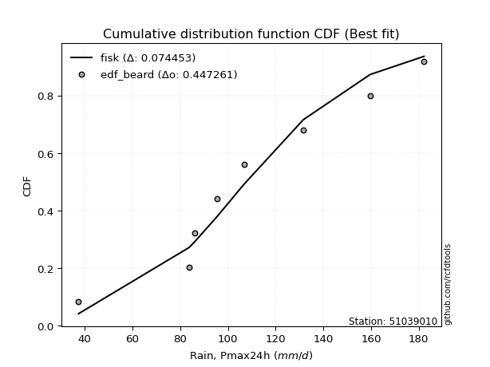</img>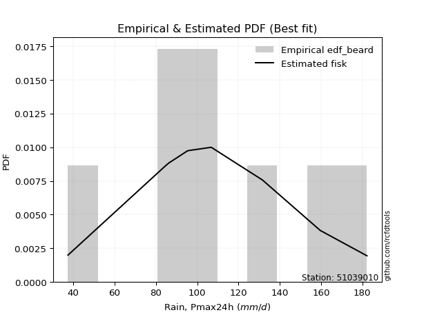</img>

</div>


### 5. EDF Chegodayev (1955)

The Chegodayev formula is an empirical plotting position formula used in hydrological frequency analysis to estimate the exceedance probability or return period of a specific event from a set of observed data. It is primarily used for plotting observed data points on probability paper to fit a theoretical distribution, particularly for analyzing extreme events like maximum flood flows or rainfall intensities. The constant _b_ value in the generalized plotting position formula is 0.3.

<div align="center">


$P=(m-b)/(n+1-2b)$


</div>


**5.1. Empirical values**

<div align="center">

|                | 0                   | 1                   | 2                   | 3                   | 4                  | 5                  | 6                  | 7                  |
|:---------------|:--------------------|:--------------------|:--------------------|:--------------------|:-------------------|:-------------------|:-------------------|:-------------------|
| date           | 2021                | 2023                | 2020                | 2018                | 2022               | 2019               | 2024               | 2017               |
| x              | 37.4                | 83.8                | 86.2                | 95.4                | 106.8              | 131.6              | 159.6              | 182.2              |
| m              | 1                   | 2                   | 3                   | 4                   | 5                  | 6                  | 7                  | 8                  |
| empirical_dist | edf_chegodayev      | edf_chegodayev      | edf_chegodayev      | edf_chegodayev      | edf_chegodayev     | edf_chegodayev     | edf_chegodayev     | edf_chegodayev     |
| empirical      | 0.08333333333333333 | 0.20238095238095236 | 0.32142857142857145 | 0.44047619047619047 | 0.5595238095238095 | 0.6785714285714286 | 0.7976190476190476 | 0.9166666666666666 |
| empirical_tr   | 1.090909090909091   | 1.253731343283582   | 1.4736842105263157  | 1.7872340425531914  | 2.27027027027027   | 3.1111111111111116 | 4.941176470588234  | 11.999999999999995 |

</div>


**5.2. Kolmogorov-Smirnov fit test (sorted by Δ)**


<div align="center">

|                | 0                   | 1                   | 2                   | 3                   | 4                   | 5                  | 6                   | 7                   | 8                   | 9                   | 10                  | 11                  | 12                  | 13                  | 14                  | 15                  | 16                 | 17                  | 18                    | 19                  | 20                  | 21                  | 22                  | 23                  | 24                  | 25                  | 26                  | 27                  | 28                  | 29                  | 30                  | 31                  | 32                  | 33                  | 34                  | 35                  | 36                  | 37                  | 38                  | 39                  | 40                  | 41                  | 42                 | 43                  | 44                 | 45                 | 46                  | 47                  | 48                  | 49                  | 50                  | 51                  | 52                  | 53                  | 54                 | 55                 | 56                  | 57                  | 58                  | 59                  | 60                  | 61                  | 62                 | 63                 | 64                 | 65                  | 66                  | 67                  | 68                  | 69                  | 70                  | 71                 | 72                  | 73                  | 74                  | 75                  | 76                  | 77                  | 78                  | 79                 | 80                  | 81                  | 82                  | 83                 | 84                 | 85                  | 86                 | 87                 |
|:---------------|:--------------------|:--------------------|:--------------------|:--------------------|:--------------------|:-------------------|:--------------------|:--------------------|:--------------------|:--------------------|:--------------------|:--------------------|:--------------------|:--------------------|:--------------------|:--------------------|:-------------------|:--------------------|:----------------------|:--------------------|:--------------------|:--------------------|:--------------------|:--------------------|:--------------------|:--------------------|:--------------------|:--------------------|:--------------------|:--------------------|:--------------------|:--------------------|:--------------------|:--------------------|:--------------------|:--------------------|:--------------------|:--------------------|:--------------------|:--------------------|:--------------------|:--------------------|:-------------------|:--------------------|:-------------------|:-------------------|:--------------------|:--------------------|:--------------------|:--------------------|:--------------------|:--------------------|:--------------------|:--------------------|:-------------------|:-------------------|:--------------------|:--------------------|:--------------------|:--------------------|:--------------------|:--------------------|:-------------------|:-------------------|:-------------------|:--------------------|:--------------------|:--------------------|:--------------------|:--------------------|:--------------------|:-------------------|:--------------------|:--------------------|:--------------------|:--------------------|:--------------------|:--------------------|:--------------------|:-------------------|:--------------------|:--------------------|:--------------------|:-------------------|:-------------------|:--------------------|:-------------------|:-------------------|
| station        | 51039010            | 51039010            | 51039010            | 51039010            | 51039010            | 51039010           | 51039010            | 51039010            | 51039010            | 51039010            | 51039010            | 51039010            | 51039010            | 51039010            | 51039010            | 51039010            | 51039010           | 51039010            | 51039010              | 51039010            | 51039010            | 51039010            | 51039010            | 51039010            | 51039010            | 51039010            | 51039010            | 51039010            | 51039010            | 51039010            | 51039010            | 51039010            | 51039010            | 51039010            | 51039010            | 51039010            | 51039010            | 51039010            | 51039010            | 51039010            | 51039010            | 51039010            | 51039010           | 51039010            | 51039010           | 51039010           | 51039010            | 51039010            | 51039010            | 51039010            | 51039010            | 51039010            | 51039010            | 51039010            | 51039010           | 51039010           | 51039010            | 51039010            | 51039010            | 51039010            | 51039010            | 51039010            | 51039010           | 51039010           | 51039010           | 51039010            | 51039010            | 51039010            | 51039010            | 51039010            | 51039010            | 51039010           | 51039010            | 51039010            | 51039010            | 51039010            | 51039010            | 51039010            | 51039010            | 51039010           | 51039010            | 51039010            | 51039010            | 51039010           | 51039010           | 51039010            | 51039010           | 51039010           |
| empirical_dist | edf_chegodayev      | edf_chegodayev      | edf_chegodayev      | edf_chegodayev      | edf_chegodayev      | edf_chegodayev     | edf_chegodayev      | edf_chegodayev      | edf_chegodayev      | edf_chegodayev      | edf_chegodayev      | edf_chegodayev      | edf_chegodayev      | edf_chegodayev      | edf_chegodayev      | edf_chegodayev      | edf_chegodayev     | edf_chegodayev      | edf_chegodayev        | edf_chegodayev      | edf_chegodayev      | edf_chegodayev      | edf_chegodayev      | edf_chegodayev      | edf_chegodayev      | edf_chegodayev      | edf_chegodayev      | edf_chegodayev      | edf_chegodayev      | edf_chegodayev      | edf_chegodayev      | edf_chegodayev      | edf_chegodayev      | edf_chegodayev      | edf_chegodayev      | edf_chegodayev      | edf_chegodayev      | edf_chegodayev      | edf_chegodayev      | edf_chegodayev      | edf_chegodayev      | edf_chegodayev      | edf_chegodayev     | edf_chegodayev      | edf_chegodayev     | edf_chegodayev     | edf_chegodayev      | edf_chegodayev      | edf_chegodayev      | edf_chegodayev      | edf_chegodayev      | edf_chegodayev      | edf_chegodayev      | edf_chegodayev      | edf_chegodayev     | edf_chegodayev     | edf_chegodayev      | edf_chegodayev      | edf_chegodayev      | edf_chegodayev      | edf_chegodayev      | edf_chegodayev      | edf_chegodayev     | edf_chegodayev     | edf_chegodayev     | edf_chegodayev      | edf_chegodayev      | edf_chegodayev      | edf_chegodayev      | edf_chegodayev      | edf_chegodayev      | edf_chegodayev     | edf_chegodayev      | edf_chegodayev      | edf_chegodayev      | edf_chegodayev      | edf_chegodayev      | edf_chegodayev      | edf_chegodayev      | edf_chegodayev     | edf_chegodayev      | edf_chegodayev      | edf_chegodayev      | edf_chegodayev     | edf_chegodayev     | edf_chegodayev      | edf_chegodayev     | edf_chegodayev     |
| p_dist         | genlogistic         | fisk                | f                   | laplace_asymmetric  | chi2                | erlang             | logweibull_min      | gamma               | johnsonsu           | betaprime           | loggumbel_l         | mielke              | loggenlogistic      | invgamma            | weibull_min         | pearson3            | rice               | alpha               | loglaplace_asymmetric | gumbel_r            | logfisk             | maxwell             | moyal               | exponnorm           | logloggamma         | nct                 | t                   | norm                | crystalball         | truncnorm           | logjohnsonsu        | logistic            | logpearson3         | rayleigh            | invgauss            | loggompertz         | loglaplace          | hypsecant           | loghypsecant        | halflogistic        | loglogistic         | halfnorm            | ncf                | wald                | laplace            | kstwobign          | logfatiguelife      | logt                | logexponnorm        | lognorm             | lognorm             | logcrystalball      | logrice             | lognct              | logf               | logmielke          | logerlang           | logbetaprime        | loggamma            | loggamma            | logncf              | loginvgamma         | gibrat             | gumbel_l           | loginvgauss        | logalpha            | logmaxwell          | lograyleigh         | loggumbel_r         | loggibrat           | lognakagami         | logmoyal           | loginvweibull       | loghalfnorm         | loghalflogistic     | logtruncnorm        | nakagami            | logwald             | logkstwobign        | loggenexpon        | expon               | genexpon            | logexpon            | logchi2            | loglognorm         | invweibull          | fatiguelife        | gompertz           |
| delta          | 0.07509663524095603 | 0.07516353894074113 | 0.07628677601327605 | 0.07665793392757794 | 0.07878134727446665 | 0.079729729579888  | 0.08015938649344287 | 0.08052305940917798 | 0.08052862009006684 | 0.08152889302715174 | 0.08316281379110432 | 0.08321653281555014 | 0.08381378328899919 | 0.08411272023449026 | 0.08453211264324037 | 0.08490965582740401 | 0.0849162998809713 | 0.08606529426760054 | 0.08656000533934949   | 0.08778361300994356 | 0.08807719572990039 | 0.09078745260926555 | 0.09118222839698095 | 0.09220761469566435 | 0.09247450463205076 | 0.09252275484616124 | 0.09252912818308334 | 0.09254956838955936 | 0.09254957670906694 | 0.09254957841140898 | 0.09411595771171793 | 0.09703425268550991 | 0.09938573328039305 | 0.10063535001662985 | 0.10191256064157897 | 0.10251430263449682 | 0.10279440219227043 | 0.10604255305165078 | 0.10970497813317878 | 0.11869972836702566 | 0.12388669696212254 | 0.12787941940932043 | 0.1289374490241679 | 0.13060062165244724 | 0.1344566926765572 | 0.1369301788096414 | 0.14181467499520303 | 0.14225546057650204 | 0.14227505387019587 | 0.14227951452906049 | 0.14227951452906049 | 0.14227955896509167 | 0.14227959096825107 | 0.14384040753668556 | 0.1443006040198134 | 0.1477741633646693 | 0.14880614493593727 | 0.14999422578751967 | 0.15126435676321334 | 0.15126435676321334 | 0.15228320697225065 | 0.15589560296626673 | 0.1622256488963838 | 0.1631251012696857 | 0.1672957873017745 | 0.16926760015281347 | 0.17387930178939118 | 0.18588538531441315 | 0.18920393178246456 | 0.20186431115753536 | 0.20238087657797885 | 0.2064140293156058 | 0.20746792278015105 | 0.22002102484637734 | 0.22718829627269518 | 0.23585065371502534 | 0.23960346857600412 | 0.24418943300704812 | 0.24908040460857075 | 0.2608243148618248 | 0.26812544174319985 | 0.26817110654458187 | 0.35494108003574865 | 0.4043607281590389 | 0.4350762424351825 | 0.45879701570044984 | 0.6191791434219032 | 0.7697499276687625 |
| deltao         | 0.4472608134160001  | 0.4472608134160001  | 0.4472608134160001  | 0.4472608134160001  | 0.4472608134160001  | 0.4472608134160001 | 0.4472608134160001  | 0.4472608134160001  | 0.4472608134160001  | 0.4472608134160001  | 0.4472608134160001  | 0.4472608134160001  | 0.4472608134160001  | 0.4472608134160001  | 0.4472608134160001  | 0.4472608134160001  | 0.4472608134160001 | 0.4472608134160001  | 0.4472608134160001    | 0.4472608134160001  | 0.4472608134160001  | 0.4472608134160001  | 0.4472608134160001  | 0.4472608134160001  | 0.4472608134160001  | 0.4472608134160001  | 0.4472608134160001  | 0.4472608134160001  | 0.4472608134160001  | 0.4472608134160001  | 0.4472608134160001  | 0.4472608134160001  | 0.4472608134160001  | 0.4472608134160001  | 0.4472608134160001  | 0.4472608134160001  | 0.4472608134160001  | 0.4472608134160001  | 0.4472608134160001  | 0.4472608134160001  | 0.4472608134160001  | 0.4472608134160001  | 0.4472608134160001 | 0.4472608134160001  | 0.4472608134160001 | 0.4472608134160001 | 0.4472608134160001  | 0.4472608134160001  | 0.4472608134160001  | 0.4472608134160001  | 0.4472608134160001  | 0.4472608134160001  | 0.4472608134160001  | 0.4472608134160001  | 0.4472608134160001 | 0.4472608134160001 | 0.4472608134160001  | 0.4472608134160001  | 0.4472608134160001  | 0.4472608134160001  | 0.4472608134160001  | 0.4472608134160001  | 0.4472608134160001 | 0.4472608134160001 | 0.4472608134160001 | 0.4472608134160001  | 0.4472608134160001  | 0.4472608134160001  | 0.4472608134160001  | 0.4472608134160001  | 0.4472608134160001  | 0.4472608134160001 | 0.4472608134160001  | 0.4472608134160001  | 0.4472608134160001  | 0.4472608134160001  | 0.4472608134160001  | 0.4472608134160001  | 0.4472608134160001  | 0.4472608134160001 | 0.4472608134160001  | 0.4472608134160001  | 0.4472608134160001  | 0.4472608134160001 | 0.4472608134160001 | 0.4472608134160001  | 0.4472608134160001 | 0.4472608134160001 |
| eval           | Δo > Δ              | Δo > Δ              | Δo > Δ              | Δo > Δ              | Δo > Δ              | Δo > Δ             | Δo > Δ              | Δo > Δ              | Δo > Δ              | Δo > Δ              | Δo > Δ              | Δo > Δ              | Δo > Δ              | Δo > Δ              | Δo > Δ              | Δo > Δ              | Δo > Δ             | Δo > Δ              | Δo > Δ                | Δo > Δ              | Δo > Δ              | Δo > Δ              | Δo > Δ              | Δo > Δ              | Δo > Δ              | Δo > Δ              | Δo > Δ              | Δo > Δ              | Δo > Δ              | Δo > Δ              | Δo > Δ              | Δo > Δ              | Δo > Δ              | Δo > Δ              | Δo > Δ              | Δo > Δ              | Δo > Δ              | Δo > Δ              | Δo > Δ              | Δo > Δ              | Δo > Δ              | Δo > Δ              | Δo > Δ             | Δo > Δ              | Δo > Δ             | Δo > Δ             | Δo > Δ              | Δo > Δ              | Δo > Δ              | Δo > Δ              | Δo > Δ              | Δo > Δ              | Δo > Δ              | Δo > Δ              | Δo > Δ             | Δo > Δ             | Δo > Δ              | Δo > Δ              | Δo > Δ              | Δo > Δ              | Δo > Δ              | Δo > Δ              | Δo > Δ             | Δo > Δ             | Δo > Δ             | Δo > Δ              | Δo > Δ              | Δo > Δ              | Δo > Δ              | Δo > Δ              | Δo > Δ              | Δo > Δ             | Δo > Δ              | Δo > Δ              | Δo > Δ              | Δo > Δ              | Δo > Δ              | Δo > Δ              | Δo > Δ              | Δo > Δ             | Δo > Δ              | Δo > Δ              | Δo > Δ              | Δo > Δ             | Δo > Δ             | Δo <= Δ             | Δo <= Δ            | Δo <= Δ            |
| fit            | 1                   | 1                   | 1                   | 1                   | 1                   | 1                  | 1                   | 1                   | 1                   | 1                   | 1                   | 1                   | 1                   | 1                   | 1                   | 1                   | 1                  | 1                   | 1                     | 1                   | 1                   | 1                   | 1                   | 1                   | 1                   | 1                   | 1                   | 1                   | 1                   | 1                   | 1                   | 1                   | 1                   | 1                   | 1                   | 1                   | 1                   | 1                   | 1                   | 1                   | 1                   | 1                   | 1                  | 1                   | 1                  | 1                  | 1                   | 1                   | 1                   | 1                   | 1                   | 1                   | 1                   | 1                   | 1                  | 1                  | 1                   | 1                   | 1                   | 1                   | 1                   | 1                   | 1                  | 1                  | 1                  | 1                   | 1                   | 1                   | 1                   | 1                   | 1                   | 1                  | 1                   | 1                   | 1                   | 1                   | 1                   | 1                   | 1                   | 1                  | 1                   | 1                   | 1                   | 1                  | 1                  | 0                   | 0                  | 0                  |
| n              | 8                   | 8                   | 8                   | 8                   | 8                   | 8                  | 8                   | 8                   | 8                   | 8                   | 8                   | 8                   | 8                   | 8                   | 8                   | 8                   | 8                  | 8                   | 8                     | 8                   | 8                   | 8                   | 8                   | 8                   | 8                   | 8                   | 8                   | 8                   | 8                   | 8                   | 8                   | 8                   | 8                   | 8                   | 8                   | 8                   | 8                   | 8                   | 8                   | 8                   | 8                   | 8                   | 8                  | 8                   | 8                  | 8                  | 8                   | 8                   | 8                   | 8                   | 8                   | 8                   | 8                   | 8                   | 8                  | 8                  | 8                   | 8                   | 8                   | 8                   | 8                   | 8                   | 8                  | 8                  | 8                  | 8                   | 8                   | 8                   | 8                   | 8                   | 8                   | 8                  | 8                   | 8                   | 8                   | 8                   | 8                   | 8                   | 8                   | 8                  | 8                   | 8                   | 8                   | 8                  | 8                  | 8                   | 8                  | 8                  |
| best_fit       | 1                   | 0                   | 0                   | 0                   | 0                   | 0                  | 0                   | 0                   | 0                   | 0                   | 0                   | 0                   | 0                   | 0                   | 0                   | 0                   | 0                  | 0                   | 0                     | 0                   | 0                   | 0                   | 0                   | 0                   | 0                   | 0                   | 0                   | 0                   | 0                   | 0                   | 0                   | 0                   | 0                   | 0                   | 0                   | 0                   | 0                   | 0                   | 0                   | 0                   | 0                   | 0                   | 0                  | 0                   | 0                  | 0                  | 0                   | 0                   | 0                   | 0                   | 0                   | 0                   | 0                   | 0                   | 0                  | 0                  | 0                   | 0                   | 0                   | 0                   | 0                   | 0                   | 0                  | 0                  | 0                  | 0                   | 0                   | 0                   | 0                   | 0                   | 0                   | 0                  | 0                   | 0                   | 0                   | 0                   | 0                   | 0                   | 0                   | 0                  | 0                   | 0                   | 0                   | 0                  | 0                  | 0                   | 0                  | 0                  |
| best_fit_sort  | 1                   | 2                   | 3                   | 4                   | 5                   | 6                  | 7                   | 8                   | 9                   | 10                  | 11                  | 12                  | 13                  | 14                  | 15                  | 16                  | 17                 | 18                  | 19                    | 20                  | 21                  | 22                  | 23                  | 24                  | 25                  | 26                  | 27                  | 28                  | 29                  | 30                  | 31                  | 32                  | 33                  | 34                  | 35                  | 36                  | 37                  | 38                  | 39                  | 40                  | 41                  | 42                  | 43                 | 44                  | 45                 | 46                 | 47                  | 48                  | 49                  | 50                  | 51                  | 52                  | 53                  | 54                  | 55                 | 56                 | 57                  | 58                  | 59                  | 60                  | 61                  | 62                  | 63                 | 64                 | 65                 | 66                  | 67                  | 68                  | 69                  | 70                  | 71                  | 72                 | 73                  | 74                  | 75                  | 76                  | 77                  | 78                  | 79                  | 80                 | 81                  | 82                  | 83                  | 84                 | 85                 | 86                  | 87                 | 88                 |

</div>


**5.3. Best fit**

<div align="center">

|   id |   station | empirical_dist   | p_dist      |     delta |   deltao | eval   |   fit |   n |   best_fit |   best_fit_sort |
|-----:|----------:|:-----------------|:------------|----------:|---------:|:-------|------:|----:|-----------:|----------------:|
|    0 |  51039010 | edf_chegodayev   | genlogistic | 0.0750966 | 0.447261 | Δo > Δ |     1 |   8 |          1 |               1 |

</div>


<div align="center">

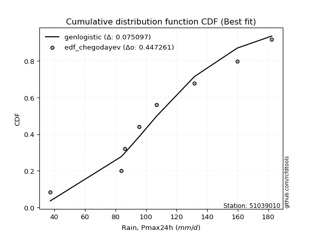</img></img>

</div>


### 6. EDF Blom (1958)

The Blom formula is a specific "plotting position" formula used in hydrology and statistical analysis to estimate the empirical cumulative probability (or non-exceedance probability) of a data series. It is particularly recommended for data that are approximately normally distributed. The constant _a_ is set to 0.375 (or 3/8).

<div align="center">


$P=(m-a)/(n+1-2a)$


</div>


**6.1. Empirical values**

<div align="center">

|                | 0                   | 1                   | 2                  | 3                  | 4                  | 5                  | 6                 | 7                  |
|:---------------|:--------------------|:--------------------|:-------------------|:-------------------|:-------------------|:-------------------|:------------------|:-------------------|
| date           | 2021                | 2023                | 2020               | 2018               | 2022               | 2019               | 2024              | 2017               |
| x              | 37.4                | 83.8                | 86.2               | 95.4               | 106.8              | 131.6              | 159.6             | 182.2              |
| m              | 1                   | 2                   | 3                  | 4                  | 5                  | 6                  | 7                 | 8                  |
| empirical_dist | edf_blom            | edf_blom            | edf_blom           | edf_blom           | edf_blom           | edf_blom           | edf_blom          | edf_blom           |
| empirical      | 0.07575757575757576 | 0.19696969696969696 | 0.3181818181818182 | 0.4393939393939394 | 0.5606060606060606 | 0.6818181818181818 | 0.803030303030303 | 0.9242424242424242 |
| empirical_tr   | 1.0819672131147542  | 1.2452830188679247  | 1.4666666666666666 | 1.783783783783784  | 2.275862068965517  | 3.1428571428571423 | 5.076923076923076 | 13.199999999999992 |

</div>


**6.2. Kolmogorov-Smirnov fit test (sorted by Δ)**


<div align="center">

|                | 0                   | 1                   | 2                  | 3                   | 4                  | 5                   | 6                   | 7                   | 8                   | 9                  | 10                  | 11                    | 12                  | 13                  | 14                  | 15                  | 16                  | 17                  | 18                  | 19                  | 20                  | 21                  | 22                  | 23                  | 24                  | 25                  | 26                  | 27                 | 28                  | 29                  | 30                  | 31                  | 32                  | 33                  | 34                 | 35                  | 36                  | 37                  | 38                  | 39                  | 40                  | 41                  | 42                  | 43                  | 44                 | 45                 | 46                  | 47                  | 48                  | 49                  | 50                  | 51                  | 52                  | 53                  | 54                  | 55                 | 56                  | 57                  | 58                  | 59                  | 60                  | 61                  | 62                  | 63                  | 64                 | 65                  | 66                  | 67                  | 68                  | 69                  | 70                  | 71                  | 72                  | 73                  | 74                  | 75                  | 76                 | 77                  | 78                  | 79                  | 80                 | 81                  | 82                 | 83                  | 84                  | 85                 | 86                 | 87                 |
|:---------------|:--------------------|:--------------------|:-------------------|:--------------------|:-------------------|:--------------------|:--------------------|:--------------------|:--------------------|:-------------------|:--------------------|:----------------------|:--------------------|:--------------------|:--------------------|:--------------------|:--------------------|:--------------------|:--------------------|:--------------------|:--------------------|:--------------------|:--------------------|:--------------------|:--------------------|:--------------------|:--------------------|:-------------------|:--------------------|:--------------------|:--------------------|:--------------------|:--------------------|:--------------------|:-------------------|:--------------------|:--------------------|:--------------------|:--------------------|:--------------------|:--------------------|:--------------------|:--------------------|:--------------------|:-------------------|:-------------------|:--------------------|:--------------------|:--------------------|:--------------------|:--------------------|:--------------------|:--------------------|:--------------------|:--------------------|:-------------------|:--------------------|:--------------------|:--------------------|:--------------------|:--------------------|:--------------------|:--------------------|:--------------------|:-------------------|:--------------------|:--------------------|:--------------------|:--------------------|:--------------------|:--------------------|:--------------------|:--------------------|:--------------------|:--------------------|:--------------------|:-------------------|:--------------------|:--------------------|:--------------------|:-------------------|:--------------------|:-------------------|:--------------------|:--------------------|:-------------------|:-------------------|:-------------------|
| station        | 51039010            | 51039010            | 51039010           | 51039010            | 51039010           | 51039010            | 51039010            | 51039010            | 51039010            | 51039010           | 51039010            | 51039010              | 51039010            | 51039010            | 51039010            | 51039010            | 51039010            | 51039010            | 51039010            | 51039010            | 51039010            | 51039010            | 51039010            | 51039010            | 51039010            | 51039010            | 51039010            | 51039010           | 51039010            | 51039010            | 51039010            | 51039010            | 51039010            | 51039010            | 51039010           | 51039010            | 51039010            | 51039010            | 51039010            | 51039010            | 51039010            | 51039010            | 51039010            | 51039010            | 51039010           | 51039010           | 51039010            | 51039010            | 51039010            | 51039010            | 51039010            | 51039010            | 51039010            | 51039010            | 51039010            | 51039010           | 51039010            | 51039010            | 51039010            | 51039010            | 51039010            | 51039010            | 51039010            | 51039010            | 51039010           | 51039010            | 51039010            | 51039010            | 51039010            | 51039010            | 51039010            | 51039010            | 51039010            | 51039010            | 51039010            | 51039010            | 51039010           | 51039010            | 51039010            | 51039010            | 51039010           | 51039010            | 51039010           | 51039010            | 51039010            | 51039010           | 51039010           | 51039010           |
| empirical_dist | edf_blom            | edf_blom            | edf_blom           | edf_blom            | edf_blom           | edf_blom            | edf_blom            | edf_blom            | edf_blom            | edf_blom           | edf_blom            | edf_blom              | edf_blom            | edf_blom            | edf_blom            | edf_blom            | edf_blom            | edf_blom            | edf_blom            | edf_blom            | edf_blom            | edf_blom            | edf_blom            | edf_blom            | edf_blom            | edf_blom            | edf_blom            | edf_blom           | edf_blom            | edf_blom            | edf_blom            | edf_blom            | edf_blom            | edf_blom            | edf_blom           | edf_blom            | edf_blom            | edf_blom            | edf_blom            | edf_blom            | edf_blom            | edf_blom            | edf_blom            | edf_blom            | edf_blom           | edf_blom           | edf_blom            | edf_blom            | edf_blom            | edf_blom            | edf_blom            | edf_blom            | edf_blom            | edf_blom            | edf_blom            | edf_blom           | edf_blom            | edf_blom            | edf_blom            | edf_blom            | edf_blom            | edf_blom            | edf_blom            | edf_blom            | edf_blom           | edf_blom            | edf_blom            | edf_blom            | edf_blom            | edf_blom            | edf_blom            | edf_blom            | edf_blom            | edf_blom            | edf_blom            | edf_blom            | edf_blom           | edf_blom            | edf_blom            | edf_blom            | edf_blom           | edf_blom            | edf_blom           | edf_blom            | edf_blom            | edf_blom           | edf_blom           | edf_blom           |
| p_dist         | fisk                | genlogistic         | f                  | erlang              | gamma              | johnsonsu           | laplace_asymmetric  | chi2                | mielke              | loggenlogistic     | logweibull_min      | loglaplace_asymmetric | pearson3            | betaprime           | loggumbel_l         | invgamma            | weibull_min         | rice                | alpha               | gumbel_r            | exponnorm           | logfisk             | logloggamma         | nct                 | t                   | norm                | crystalball         | truncnorm          | logjohnsonsu        | maxwell             | moyal               | logistic            | loglaplace          | logpearson3         | hypsecant          | rayleigh            | invgauss            | loggompertz         | loghypsecant        | halflogistic        | wald                | loglogistic         | halfnorm            | laplace             | ncf                | kstwobign          | logfatiguelife      | logt                | logexponnorm        | lognorm             | lognorm             | logcrystalball      | logrice             | logmielke           | lognct              | logf               | logerlang           | logbetaprime        | loggamma            | loggamma            | logncf              | gibrat              | loginvgamma         | gumbel_l            | loginvgauss        | logalpha            | logmaxwell          | lograyleigh         | loggumbel_r         | lognakagami         | loggibrat           | logmoyal            | loginvweibull       | loghalfnorm         | loghalflogistic     | logtruncnorm        | nakagami           | logwald             | logkstwobign        | loggenexpon         | expon              | genexpon            | logexpon           | logchi2             | loglognorm          | invweibull         | fatiguelife        | gompertz           |
| delta          | 0.07472727743088908 | 0.08050789065221142 | 0.0807881205070628 | 0.08081198066213902 | 0.081605310491429  | 0.08161087117231786 | 0.08206918933883334 | 0.08419260268572204 | 0.08429878389780115 | 0.0848960343712502 | 0.08557064190469826 | 0.08586631415627538   | 0.08599190690965502 | 0.08694014843840714 | 0.08857406920235972 | 0.08952397564574566 | 0.08994336805449576 | 0.09032755529222669 | 0.09147654967885593 | 0.09319486842119895 | 0.09328986577791537 | 0.09348845114115578 | 0.09355675571430178 | 0.09360500592841225 | 0.09361137926533436 | 0.09363181947181037 | 0.09363182779131796 | 0.09363182949366   | 0.09519820879396895 | 0.09619870802052094 | 0.09659348380823635 | 0.09811650376776093 | 0.09954764894551726 | 0.10479698869164844 | 0.1049603019693997 | 0.10604660542788524 | 0.10732381605283436 | 0.10792555804575221 | 0.11511623354443418 | 0.12411098377828106 | 0.12735386840569407 | 0.12929795237337793 | 0.13329067482057583 | 0.13337444159430611 | 0.1343487044354233 | 0.1423414342208968 | 0.14722593040645843 | 0.14766671598775744 | 0.14768630928145127 | 0.14769076994031588 | 0.14769076994031588 | 0.14769081437634707 | 0.14769084637950647 | 0.14885641444692033 | 0.14925166294794096 | 0.1497118594310688 | 0.15421740034719267 | 0.15540548119877506 | 0.15667561217446874 | 0.15667561217446874 | 0.15769446238350604 | 0.15897889564963064 | 0.16130685837752212 | 0.16420735235193673 | 0.1727070427130299 | 0.17467885556406887 | 0.17929055720064657 | 0.19129664072566854 | 0.19461518719371995 | 0.19696962116672345 | 0.20727556656879076 | 0.21182528472686118 | 0.21287917819140645 | 0.22543228025763273 | 0.23259955168395058 | 0.23260390046827206 | 0.2406857196582552 | 0.24960068841830352 | 0.25449166001982615 | 0.26623557027308015 | 0.2735366971544552 | 0.27358236195583724 | 0.360352335447004  | 0.40977198357029426 | 0.44048749784643787 | 0.4663727732762074 | 0.6245903988331585 | 0.7751611830800179 |
| deltao         | 0.4472608134160001  | 0.4472608134160001  | 0.4472608134160001 | 0.4472608134160001  | 0.4472608134160001 | 0.4472608134160001  | 0.4472608134160001  | 0.4472608134160001  | 0.4472608134160001  | 0.4472608134160001 | 0.4472608134160001  | 0.4472608134160001    | 0.4472608134160001  | 0.4472608134160001  | 0.4472608134160001  | 0.4472608134160001  | 0.4472608134160001  | 0.4472608134160001  | 0.4472608134160001  | 0.4472608134160001  | 0.4472608134160001  | 0.4472608134160001  | 0.4472608134160001  | 0.4472608134160001  | 0.4472608134160001  | 0.4472608134160001  | 0.4472608134160001  | 0.4472608134160001 | 0.4472608134160001  | 0.4472608134160001  | 0.4472608134160001  | 0.4472608134160001  | 0.4472608134160001  | 0.4472608134160001  | 0.4472608134160001 | 0.4472608134160001  | 0.4472608134160001  | 0.4472608134160001  | 0.4472608134160001  | 0.4472608134160001  | 0.4472608134160001  | 0.4472608134160001  | 0.4472608134160001  | 0.4472608134160001  | 0.4472608134160001 | 0.4472608134160001 | 0.4472608134160001  | 0.4472608134160001  | 0.4472608134160001  | 0.4472608134160001  | 0.4472608134160001  | 0.4472608134160001  | 0.4472608134160001  | 0.4472608134160001  | 0.4472608134160001  | 0.4472608134160001 | 0.4472608134160001  | 0.4472608134160001  | 0.4472608134160001  | 0.4472608134160001  | 0.4472608134160001  | 0.4472608134160001  | 0.4472608134160001  | 0.4472608134160001  | 0.4472608134160001 | 0.4472608134160001  | 0.4472608134160001  | 0.4472608134160001  | 0.4472608134160001  | 0.4472608134160001  | 0.4472608134160001  | 0.4472608134160001  | 0.4472608134160001  | 0.4472608134160001  | 0.4472608134160001  | 0.4472608134160001  | 0.4472608134160001 | 0.4472608134160001  | 0.4472608134160001  | 0.4472608134160001  | 0.4472608134160001 | 0.4472608134160001  | 0.4472608134160001 | 0.4472608134160001  | 0.4472608134160001  | 0.4472608134160001 | 0.4472608134160001 | 0.4472608134160001 |
| eval           | Δo > Δ              | Δo > Δ              | Δo > Δ             | Δo > Δ              | Δo > Δ             | Δo > Δ              | Δo > Δ              | Δo > Δ              | Δo > Δ              | Δo > Δ             | Δo > Δ              | Δo > Δ                | Δo > Δ              | Δo > Δ              | Δo > Δ              | Δo > Δ              | Δo > Δ              | Δo > Δ              | Δo > Δ              | Δo > Δ              | Δo > Δ              | Δo > Δ              | Δo > Δ              | Δo > Δ              | Δo > Δ              | Δo > Δ              | Δo > Δ              | Δo > Δ             | Δo > Δ              | Δo > Δ              | Δo > Δ              | Δo > Δ              | Δo > Δ              | Δo > Δ              | Δo > Δ             | Δo > Δ              | Δo > Δ              | Δo > Δ              | Δo > Δ              | Δo > Δ              | Δo > Δ              | Δo > Δ              | Δo > Δ              | Δo > Δ              | Δo > Δ             | Δo > Δ             | Δo > Δ              | Δo > Δ              | Δo > Δ              | Δo > Δ              | Δo > Δ              | Δo > Δ              | Δo > Δ              | Δo > Δ              | Δo > Δ              | Δo > Δ             | Δo > Δ              | Δo > Δ              | Δo > Δ              | Δo > Δ              | Δo > Δ              | Δo > Δ              | Δo > Δ              | Δo > Δ              | Δo > Δ             | Δo > Δ              | Δo > Δ              | Δo > Δ              | Δo > Δ              | Δo > Δ              | Δo > Δ              | Δo > Δ              | Δo > Δ              | Δo > Δ              | Δo > Δ              | Δo > Δ              | Δo > Δ             | Δo > Δ              | Δo > Δ              | Δo > Δ              | Δo > Δ             | Δo > Δ              | Δo > Δ             | Δo > Δ              | Δo > Δ              | Δo <= Δ            | Δo <= Δ            | Δo <= Δ            |
| fit            | 1                   | 1                   | 1                  | 1                   | 1                  | 1                   | 1                   | 1                   | 1                   | 1                  | 1                   | 1                     | 1                   | 1                   | 1                   | 1                   | 1                   | 1                   | 1                   | 1                   | 1                   | 1                   | 1                   | 1                   | 1                   | 1                   | 1                   | 1                  | 1                   | 1                   | 1                   | 1                   | 1                   | 1                   | 1                  | 1                   | 1                   | 1                   | 1                   | 1                   | 1                   | 1                   | 1                   | 1                   | 1                  | 1                  | 1                   | 1                   | 1                   | 1                   | 1                   | 1                   | 1                   | 1                   | 1                   | 1                  | 1                   | 1                   | 1                   | 1                   | 1                   | 1                   | 1                   | 1                   | 1                  | 1                   | 1                   | 1                   | 1                   | 1                   | 1                   | 1                   | 1                   | 1                   | 1                   | 1                   | 1                  | 1                   | 1                   | 1                   | 1                  | 1                   | 1                  | 1                   | 1                   | 0                  | 0                  | 0                  |
| n              | 8                   | 8                   | 8                  | 8                   | 8                  | 8                   | 8                   | 8                   | 8                   | 8                  | 8                   | 8                     | 8                   | 8                   | 8                   | 8                   | 8                   | 8                   | 8                   | 8                   | 8                   | 8                   | 8                   | 8                   | 8                   | 8                   | 8                   | 8                  | 8                   | 8                   | 8                   | 8                   | 8                   | 8                   | 8                  | 8                   | 8                   | 8                   | 8                   | 8                   | 8                   | 8                   | 8                   | 8                   | 8                  | 8                  | 8                   | 8                   | 8                   | 8                   | 8                   | 8                   | 8                   | 8                   | 8                   | 8                  | 8                   | 8                   | 8                   | 8                   | 8                   | 8                   | 8                   | 8                   | 8                  | 8                   | 8                   | 8                   | 8                   | 8                   | 8                   | 8                   | 8                   | 8                   | 8                   | 8                   | 8                  | 8                   | 8                   | 8                   | 8                  | 8                   | 8                  | 8                   | 8                   | 8                  | 8                  | 8                  |
| best_fit       | 1                   | 0                   | 0                  | 0                   | 0                  | 0                   | 0                   | 0                   | 0                   | 0                  | 0                   | 0                     | 0                   | 0                   | 0                   | 0                   | 0                   | 0                   | 0                   | 0                   | 0                   | 0                   | 0                   | 0                   | 0                   | 0                   | 0                   | 0                  | 0                   | 0                   | 0                   | 0                   | 0                   | 0                   | 0                  | 0                   | 0                   | 0                   | 0                   | 0                   | 0                   | 0                   | 0                   | 0                   | 0                  | 0                  | 0                   | 0                   | 0                   | 0                   | 0                   | 0                   | 0                   | 0                   | 0                   | 0                  | 0                   | 0                   | 0                   | 0                   | 0                   | 0                   | 0                   | 0                   | 0                  | 0                   | 0                   | 0                   | 0                   | 0                   | 0                   | 0                   | 0                   | 0                   | 0                   | 0                   | 0                  | 0                   | 0                   | 0                   | 0                  | 0                   | 0                  | 0                   | 0                   | 0                  | 0                  | 0                  |
| best_fit_sort  | 1                   | 2                   | 3                  | 4                   | 5                  | 6                   | 7                   | 8                   | 9                   | 10                 | 11                  | 12                    | 13                  | 14                  | 15                  | 16                  | 17                  | 18                  | 19                  | 20                  | 21                  | 22                  | 23                  | 24                  | 25                  | 26                  | 27                  | 28                 | 29                  | 30                  | 31                  | 32                  | 33                  | 34                  | 35                 | 36                  | 37                  | 38                  | 39                  | 40                  | 41                  | 42                  | 43                  | 44                  | 45                 | 46                 | 47                  | 48                  | 49                  | 50                  | 51                  | 52                  | 53                  | 54                  | 55                  | 56                 | 57                  | 58                  | 59                  | 60                  | 61                  | 62                  | 63                  | 64                  | 65                 | 66                  | 67                  | 68                  | 69                  | 70                  | 71                  | 72                  | 73                  | 74                  | 75                  | 76                  | 77                 | 78                  | 79                  | 80                  | 81                 | 82                  | 83                 | 84                  | 85                  | 86                 | 87                 | 88                 |

</div>


**6.3. Best fit**

<div align="center">

|   id |   station | empirical_dist   | p_dist   |     delta |   deltao | eval   |   fit |   n |   best_fit |   best_fit_sort |
|-----:|----------:|:-----------------|:---------|----------:|---------:|:-------|------:|----:|-----------:|----------------:|
|    0 |  51039010 | edf_blom         | fisk     | 0.0747273 | 0.447261 | Δo > Δ |     1 |   8 |          1 |               1 |

</div>


<div align="center">

</img></img>

</div>


### 7. EDF Tukey (1962)

In hydrology, the Tukey formula is used as a plotting position formula to estimate the empirical probability or frequency of a flood event (or other hydrological data). The formula parameter is given as _c=0.333_ (or 1/3).

<div align="center">


$P=(m-c)/(n+1-2c)$


</div>


**7.1. Empirical values**

<div align="center">

|                | 0                  | 1         | 2                  | 3                  | 4                 | 5                  | 6                 | 7                  |
|:---------------|:-------------------|:----------|:-------------------|:-------------------|:------------------|:-------------------|:------------------|:-------------------|
| date           | 2021               | 2023      | 2020               | 2018               | 2022              | 2019               | 2024              | 2017               |
| x              | 37.4               | 83.8      | 86.2               | 95.4               | 106.8             | 131.6              | 159.6             | 182.2              |
| m              | 1                  | 2         | 3                  | 4                  | 5                 | 6                  | 7                 | 8                  |
| empirical_dist | edf_tukey          | edf_tukey | edf_tukey          | edf_tukey          | edf_tukey         | edf_tukey          | edf_tukey         | edf_tukey          |
| empirical      | 0.08               | 0.2       | 0.32               | 0.44               | 0.56              | 0.68               | 0.8               | 0.92               |
| empirical_tr   | 1.0869565217391304 | 1.25      | 1.4705882352941178 | 1.7857142857142856 | 2.272727272727273 | 3.1250000000000004 | 5.000000000000001 | 12.500000000000007 |

</div>


**7.2. Kolmogorov-Smirnov fit test (sorted by Δ)**


<div align="center">

|                | 0                   | 1                   | 2                   | 3                   | 4                   | 5                  | 6                   | 7                   | 8                   | 9                   | 10                  | 11                  | 12                    | 13                  | 14                  | 15                  | 16                  | 17                  | 18                  | 19                 | 20                  | 21                  | 22                  | 23                  | 24                  | 25                  | 26                  | 27                 | 28                  | 29                 | 30                  | 31                  | 32                  | 33                  | 34                 | 35                  | 36                  | 37                  | 38                  | 39                  | 40                  | 41                 | 42                  | 43                  | 44                  | 45                  | 46                  | 47                  | 48                  | 49                  | 50                  | 51                  | 52                  | 53                 | 54                  | 55                  | 56                  | 57                  | 58                 | 59                 | 60                 | 61                  | 62                  | 63                  | 64                  | 65                  | 66                  | 67                 | 68                 | 69                 | 70                 | 71                  | 72                 | 73                  | 74                  | 75                 | 76                  | 77                  | 78                 | 79                 | 80                  | 81                 | 82                  | 83                 | 84                 | 85                  | 86                 | 87                 |
|:---------------|:--------------------|:--------------------|:--------------------|:--------------------|:--------------------|:-------------------|:--------------------|:--------------------|:--------------------|:--------------------|:--------------------|:--------------------|:----------------------|:--------------------|:--------------------|:--------------------|:--------------------|:--------------------|:--------------------|:-------------------|:--------------------|:--------------------|:--------------------|:--------------------|:--------------------|:--------------------|:--------------------|:-------------------|:--------------------|:-------------------|:--------------------|:--------------------|:--------------------|:--------------------|:-------------------|:--------------------|:--------------------|:--------------------|:--------------------|:--------------------|:--------------------|:-------------------|:--------------------|:--------------------|:--------------------|:--------------------|:--------------------|:--------------------|:--------------------|:--------------------|:--------------------|:--------------------|:--------------------|:-------------------|:--------------------|:--------------------|:--------------------|:--------------------|:-------------------|:-------------------|:-------------------|:--------------------|:--------------------|:--------------------|:--------------------|:--------------------|:--------------------|:-------------------|:-------------------|:-------------------|:-------------------|:--------------------|:-------------------|:--------------------|:--------------------|:-------------------|:--------------------|:--------------------|:-------------------|:-------------------|:--------------------|:-------------------|:--------------------|:-------------------|:-------------------|:--------------------|:-------------------|:-------------------|
| station        | 51039010            | 51039010            | 51039010            | 51039010            | 51039010            | 51039010           | 51039010            | 51039010            | 51039010            | 51039010            | 51039010            | 51039010            | 51039010              | 51039010            | 51039010            | 51039010            | 51039010            | 51039010            | 51039010            | 51039010           | 51039010            | 51039010            | 51039010            | 51039010            | 51039010            | 51039010            | 51039010            | 51039010           | 51039010            | 51039010           | 51039010            | 51039010            | 51039010            | 51039010            | 51039010           | 51039010            | 51039010            | 51039010            | 51039010            | 51039010            | 51039010            | 51039010           | 51039010            | 51039010            | 51039010            | 51039010            | 51039010            | 51039010            | 51039010            | 51039010            | 51039010            | 51039010            | 51039010            | 51039010           | 51039010            | 51039010            | 51039010            | 51039010            | 51039010           | 51039010           | 51039010           | 51039010            | 51039010            | 51039010            | 51039010            | 51039010            | 51039010            | 51039010           | 51039010           | 51039010           | 51039010           | 51039010            | 51039010           | 51039010            | 51039010            | 51039010           | 51039010            | 51039010            | 51039010           | 51039010           | 51039010            | 51039010           | 51039010            | 51039010           | 51039010           | 51039010            | 51039010           | 51039010           |
| empirical_dist | edf_tukey           | edf_tukey           | edf_tukey           | edf_tukey           | edf_tukey           | edf_tukey          | edf_tukey           | edf_tukey           | edf_tukey           | edf_tukey           | edf_tukey           | edf_tukey           | edf_tukey             | edf_tukey           | edf_tukey           | edf_tukey           | edf_tukey           | edf_tukey           | edf_tukey           | edf_tukey          | edf_tukey           | edf_tukey           | edf_tukey           | edf_tukey           | edf_tukey           | edf_tukey           | edf_tukey           | edf_tukey          | edf_tukey           | edf_tukey          | edf_tukey           | edf_tukey           | edf_tukey           | edf_tukey           | edf_tukey          | edf_tukey           | edf_tukey           | edf_tukey           | edf_tukey           | edf_tukey           | edf_tukey           | edf_tukey          | edf_tukey           | edf_tukey           | edf_tukey           | edf_tukey           | edf_tukey           | edf_tukey           | edf_tukey           | edf_tukey           | edf_tukey           | edf_tukey           | edf_tukey           | edf_tukey          | edf_tukey           | edf_tukey           | edf_tukey           | edf_tukey           | edf_tukey          | edf_tukey          | edf_tukey          | edf_tukey           | edf_tukey           | edf_tukey           | edf_tukey           | edf_tukey           | edf_tukey           | edf_tukey          | edf_tukey          | edf_tukey          | edf_tukey          | edf_tukey           | edf_tukey          | edf_tukey           | edf_tukey           | edf_tukey          | edf_tukey           | edf_tukey           | edf_tukey          | edf_tukey          | edf_tukey           | edf_tukey          | edf_tukey           | edf_tukey          | edf_tukey          | edf_tukey           | edf_tukey          | edf_tukey          |
| p_dist         | fisk                | genlogistic         | f                   | laplace_asymmetric  | erlang              | gamma              | johnsonsu           | chi2                | logweibull_min      | mielke              | betaprime           | loggenlogistic      | loglaplace_asymmetric | pearson3            | loggumbel_l         | invgamma            | weibull_min         | rice                | alpha               | gumbel_r           | logfisk             | exponnorm           | logloggamma         | nct                 | t                   | norm                | crystalball         | truncnorm          | maxwell             | moyal              | logjohnsonsu        | logistic            | loglaplace          | logpearson3         | rayleigh           | invgauss            | loggompertz         | hypsecant           | loghypsecant        | halflogistic        | loglogistic         | wald               | halfnorm            | ncf                 | laplace             | kstwobign           | logfatiguelife      | logt                | logexponnorm        | lognorm             | lognorm             | logcrystalball      | logrice             | lognct             | logf                | logmielke           | logerlang           | logbetaprime        | loggamma           | loggamma           | logncf             | loginvgamma         | gibrat              | gumbel_l            | loginvgauss         | logalpha            | logmaxwell          | lograyleigh        | loggumbel_r        | lognakagami        | loggibrat          | logmoyal            | loginvweibull      | loghalfnorm         | loghalflogistic     | logtruncnorm       | nakagami            | logwald             | logkstwobign       | loggenexpon        | expon               | genexpon           | logexpon            | logchi2            | loglognorm         | invweibull          | fatiguelife        | gompertz           |
| delta          | 0.07278258655978864 | 0.07747758762190837 | 0.07775781747675975 | 0.07903888630853029 | 0.08020592005607852 | 0.0809992498853685 | 0.08100481056625736 | 0.08116229965541899 | 0.08254033887439521 | 0.08369272329174066 | 0.08390984540810409 | 0.08428997376518971 | 0.08513143391077804   | 0.08538584630359453 | 0.08554376617205667 | 0.08649367261544261 | 0.08691306502419271 | 0.08729725226192364 | 0.08844624664855288 | 0.0901645653908959 | 0.09045814811085273 | 0.09268380517185487 | 0.09295069510824128 | 0.09299894532235176 | 0.09300531865927386 | 0.09302575886574987 | 0.09302576718525746 | 0.0930257688875995 | 0.09316840499021789 | 0.0935631807779333 | 0.09459214818790845 | 0.09751044316170043 | 0.10136583076369898 | 0.10176668566134539 | 0.1030163023975822 | 0.10429351302253131 | 0.10489525501544916 | 0.10556636257546032 | 0.11208593051413113 | 0.12108068074797801 | 0.12626764934307488 | 0.1291720502238758 | 0.13026037179027278 | 0.13131840140512024 | 0.13398050220036672 | 0.13931113119059374 | 0.14419562737615538 | 0.14463641295745439 | 0.14465600625114822 | 0.14466046691001283 | 0.14466046691001283 | 0.14466051134604402 | 0.14466054334920342 | 0.1462213599176379 | 0.14668155640076574 | 0.14825035384085983 | 0.15118709731688962 | 0.15237517816847201 | 0.1536453091441657 | 0.1536453091441657 | 0.154664159353203  | 0.15827655534721907 | 0.16079707746781235 | 0.16360129174587623 | 0.16967673968272684 | 0.17164855253376582 | 0.17626025417034352 | 0.1882663376953655 | 0.1915848841634169 | 0.1999999241970265 | 0.2042452635384877 | 0.20879498169655814 | 0.2098488751611034 | 0.22240197722732968 | 0.22956924865364753 | 0.2344220822864539 | 0.24007965905219458 | 0.24657038538800047 | 0.2514613569895231 | 0.2632052672427771 | 0.27050639412415217 | 0.2705520589255342 | 0.35732203241670096 | 0.4067416805399912 | 0.4374571948161348 | 0.46213034903378325 | 0.6215600958028555 | 0.772130880049715  |
| deltao         | 0.4472608134160001  | 0.4472608134160001  | 0.4472608134160001  | 0.4472608134160001  | 0.4472608134160001  | 0.4472608134160001 | 0.4472608134160001  | 0.4472608134160001  | 0.4472608134160001  | 0.4472608134160001  | 0.4472608134160001  | 0.4472608134160001  | 0.4472608134160001    | 0.4472608134160001  | 0.4472608134160001  | 0.4472608134160001  | 0.4472608134160001  | 0.4472608134160001  | 0.4472608134160001  | 0.4472608134160001 | 0.4472608134160001  | 0.4472608134160001  | 0.4472608134160001  | 0.4472608134160001  | 0.4472608134160001  | 0.4472608134160001  | 0.4472608134160001  | 0.4472608134160001 | 0.4472608134160001  | 0.4472608134160001 | 0.4472608134160001  | 0.4472608134160001  | 0.4472608134160001  | 0.4472608134160001  | 0.4472608134160001 | 0.4472608134160001  | 0.4472608134160001  | 0.4472608134160001  | 0.4472608134160001  | 0.4472608134160001  | 0.4472608134160001  | 0.4472608134160001 | 0.4472608134160001  | 0.4472608134160001  | 0.4472608134160001  | 0.4472608134160001  | 0.4472608134160001  | 0.4472608134160001  | 0.4472608134160001  | 0.4472608134160001  | 0.4472608134160001  | 0.4472608134160001  | 0.4472608134160001  | 0.4472608134160001 | 0.4472608134160001  | 0.4472608134160001  | 0.4472608134160001  | 0.4472608134160001  | 0.4472608134160001 | 0.4472608134160001 | 0.4472608134160001 | 0.4472608134160001  | 0.4472608134160001  | 0.4472608134160001  | 0.4472608134160001  | 0.4472608134160001  | 0.4472608134160001  | 0.4472608134160001 | 0.4472608134160001 | 0.4472608134160001 | 0.4472608134160001 | 0.4472608134160001  | 0.4472608134160001 | 0.4472608134160001  | 0.4472608134160001  | 0.4472608134160001 | 0.4472608134160001  | 0.4472608134160001  | 0.4472608134160001 | 0.4472608134160001 | 0.4472608134160001  | 0.4472608134160001 | 0.4472608134160001  | 0.4472608134160001 | 0.4472608134160001 | 0.4472608134160001  | 0.4472608134160001 | 0.4472608134160001 |
| eval           | Δo > Δ              | Δo > Δ              | Δo > Δ              | Δo > Δ              | Δo > Δ              | Δo > Δ             | Δo > Δ              | Δo > Δ              | Δo > Δ              | Δo > Δ              | Δo > Δ              | Δo > Δ              | Δo > Δ                | Δo > Δ              | Δo > Δ              | Δo > Δ              | Δo > Δ              | Δo > Δ              | Δo > Δ              | Δo > Δ             | Δo > Δ              | Δo > Δ              | Δo > Δ              | Δo > Δ              | Δo > Δ              | Δo > Δ              | Δo > Δ              | Δo > Δ             | Δo > Δ              | Δo > Δ             | Δo > Δ              | Δo > Δ              | Δo > Δ              | Δo > Δ              | Δo > Δ             | Δo > Δ              | Δo > Δ              | Δo > Δ              | Δo > Δ              | Δo > Δ              | Δo > Δ              | Δo > Δ             | Δo > Δ              | Δo > Δ              | Δo > Δ              | Δo > Δ              | Δo > Δ              | Δo > Δ              | Δo > Δ              | Δo > Δ              | Δo > Δ              | Δo > Δ              | Δo > Δ              | Δo > Δ             | Δo > Δ              | Δo > Δ              | Δo > Δ              | Δo > Δ              | Δo > Δ             | Δo > Δ             | Δo > Δ             | Δo > Δ              | Δo > Δ              | Δo > Δ              | Δo > Δ              | Δo > Δ              | Δo > Δ              | Δo > Δ             | Δo > Δ             | Δo > Δ             | Δo > Δ             | Δo > Δ              | Δo > Δ             | Δo > Δ              | Δo > Δ              | Δo > Δ             | Δo > Δ              | Δo > Δ              | Δo > Δ             | Δo > Δ             | Δo > Δ              | Δo > Δ             | Δo > Δ              | Δo > Δ             | Δo > Δ             | Δo <= Δ             | Δo <= Δ            | Δo <= Δ            |
| fit            | 1                   | 1                   | 1                   | 1                   | 1                   | 1                  | 1                   | 1                   | 1                   | 1                   | 1                   | 1                   | 1                     | 1                   | 1                   | 1                   | 1                   | 1                   | 1                   | 1                  | 1                   | 1                   | 1                   | 1                   | 1                   | 1                   | 1                   | 1                  | 1                   | 1                  | 1                   | 1                   | 1                   | 1                   | 1                  | 1                   | 1                   | 1                   | 1                   | 1                   | 1                   | 1                  | 1                   | 1                   | 1                   | 1                   | 1                   | 1                   | 1                   | 1                   | 1                   | 1                   | 1                   | 1                  | 1                   | 1                   | 1                   | 1                   | 1                  | 1                  | 1                  | 1                   | 1                   | 1                   | 1                   | 1                   | 1                   | 1                  | 1                  | 1                  | 1                  | 1                   | 1                  | 1                   | 1                   | 1                  | 1                   | 1                   | 1                  | 1                  | 1                   | 1                  | 1                   | 1                  | 1                  | 0                   | 0                  | 0                  |
| n              | 8                   | 8                   | 8                   | 8                   | 8                   | 8                  | 8                   | 8                   | 8                   | 8                   | 8                   | 8                   | 8                     | 8                   | 8                   | 8                   | 8                   | 8                   | 8                   | 8                  | 8                   | 8                   | 8                   | 8                   | 8                   | 8                   | 8                   | 8                  | 8                   | 8                  | 8                   | 8                   | 8                   | 8                   | 8                  | 8                   | 8                   | 8                   | 8                   | 8                   | 8                   | 8                  | 8                   | 8                   | 8                   | 8                   | 8                   | 8                   | 8                   | 8                   | 8                   | 8                   | 8                   | 8                  | 8                   | 8                   | 8                   | 8                   | 8                  | 8                  | 8                  | 8                   | 8                   | 8                   | 8                   | 8                   | 8                   | 8                  | 8                  | 8                  | 8                  | 8                   | 8                  | 8                   | 8                   | 8                  | 8                   | 8                   | 8                  | 8                  | 8                   | 8                  | 8                   | 8                  | 8                  | 8                   | 8                  | 8                  |
| best_fit       | 1                   | 0                   | 0                   | 0                   | 0                   | 0                  | 0                   | 0                   | 0                   | 0                   | 0                   | 0                   | 0                     | 0                   | 0                   | 0                   | 0                   | 0                   | 0                   | 0                  | 0                   | 0                   | 0                   | 0                   | 0                   | 0                   | 0                   | 0                  | 0                   | 0                  | 0                   | 0                   | 0                   | 0                   | 0                  | 0                   | 0                   | 0                   | 0                   | 0                   | 0                   | 0                  | 0                   | 0                   | 0                   | 0                   | 0                   | 0                   | 0                   | 0                   | 0                   | 0                   | 0                   | 0                  | 0                   | 0                   | 0                   | 0                   | 0                  | 0                  | 0                  | 0                   | 0                   | 0                   | 0                   | 0                   | 0                   | 0                  | 0                  | 0                  | 0                  | 0                   | 0                  | 0                   | 0                   | 0                  | 0                   | 0                   | 0                  | 0                  | 0                   | 0                  | 0                   | 0                  | 0                  | 0                   | 0                  | 0                  |
| best_fit_sort  | 1                   | 2                   | 3                   | 4                   | 5                   | 6                  | 7                   | 8                   | 9                   | 10                  | 11                  | 12                  | 13                    | 14                  | 15                  | 16                  | 17                  | 18                  | 19                  | 20                 | 21                  | 22                  | 23                  | 24                  | 25                  | 26                  | 27                  | 28                 | 29                  | 30                 | 31                  | 32                  | 33                  | 34                  | 35                 | 36                  | 37                  | 38                  | 39                  | 40                  | 41                  | 42                 | 43                  | 44                  | 45                  | 46                  | 47                  | 48                  | 49                  | 50                  | 51                  | 52                  | 53                  | 54                 | 55                  | 56                  | 57                  | 58                  | 59                 | 60                 | 61                 | 62                  | 63                  | 64                  | 65                  | 66                  | 67                  | 68                 | 69                 | 70                 | 71                 | 72                  | 73                 | 74                  | 75                  | 76                 | 77                  | 78                  | 79                 | 80                 | 81                  | 82                 | 83                  | 84                 | 85                 | 86                  | 87                 | 88                 |

</div>


**7.3. Best fit**

<div align="center">

|   id |   station | empirical_dist   | p_dist   |     delta |   deltao | eval   |   fit |   n |   best_fit |   best_fit_sort |
|-----:|----------:|:-----------------|:---------|----------:|---------:|:-------|------:|----:|-----------:|----------------:|
|    0 |  51039010 | edf_tukey        | fisk     | 0.0727826 | 0.447261 | Δo > Δ |     1 |   8 |          1 |               1 |

</div>


<div align="center">

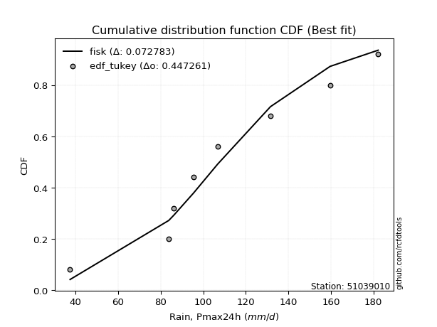</img></img>

</div>


### 8. EDF Gringorten (1963)

Gringorten plotting position formula is essential for estimating the probability and return periods of extreme events like floods and heavy rainfall. The constant _a=0.44_.

<div align="center">


$P=(m-a)/(n+1-2a)$


</div>


**8.1. Empirical values**

<div align="center">

|                | 0                   | 1                   | 2                  | 3                  | 4                  | 5                  | 6                  | 7                  |
|:---------------|:--------------------|:--------------------|:-------------------|:-------------------|:-------------------|:-------------------|:-------------------|:-------------------|
| date           | 2021                | 2023                | 2020               | 2018               | 2022               | 2019               | 2024               | 2017               |
| x              | 37.4                | 83.8                | 86.2               | 95.4               | 106.8              | 131.6              | 159.6              | 182.2              |
| m              | 1                   | 2                   | 3                  | 4                  | 5                  | 6                  | 7                  | 8                  |
| empirical_dist | edf_gringorten      | edf_gringorten      | edf_gringorten     | edf_gringorten     | edf_gringorten     | edf_gringorten     | edf_gringorten     | edf_gringorten     |
| empirical      | 0.06896551724137932 | 0.19211822660098524 | 0.3152709359605912 | 0.4384236453201971 | 0.5615763546798029 | 0.6847290640394089 | 0.8078817733990148 | 0.9310344827586208 |
| empirical_tr   | 1.0740740740740742  | 1.2378048780487805  | 1.460431654676259  | 1.780701754385965  | 2.2808988764044944 | 3.1718750000000004 | 5.205128205128205  | 14.500000000000018 |

</div>


**8.2. Kolmogorov-Smirnov fit test (sorted by Δ)**


<div align="center">

|                | 0                   | 1                   | 2                  | 3                   | 4                   | 5                   | 6                   | 7                   | 8                   | 9                   | 10                  | 11                  | 12                    | 13                  | 14                  | 15                  | 16                  | 17                  | 18                  | 19                  | 20                  | 21                  | 22                  | 23                  | 24                  | 25                  | 26                  | 27                  | 28                  | 29                 | 30                  | 31                  | 32                  | 33                  | 34                  | 35                  | 36                  | 37                  | 38                 | 39                  | 40                  | 41                  | 42                  | 43                  | 44                  | 45                  | 46                 | 47                  | 48                  | 49                 | 50                 | 51                 | 52                 | 53                 | 54                  | 55                  | 56                  | 57                 | 58                 | 59                  | 60                  | 61                  | 62                  | 63                  | 64                  | 65                 | 66                 | 67                  | 68                  | 69                  | 70                  | 71                 | 72                  | 73                  | 74                  | 75                 | 76                  | 77                 | 78                  | 79                 | 80                 | 81                 | 82                  | 83                 | 84                 | 85                 | 86                 | 87                 |
|:---------------|:--------------------|:--------------------|:-------------------|:--------------------|:--------------------|:--------------------|:--------------------|:--------------------|:--------------------|:--------------------|:--------------------|:--------------------|:----------------------|:--------------------|:--------------------|:--------------------|:--------------------|:--------------------|:--------------------|:--------------------|:--------------------|:--------------------|:--------------------|:--------------------|:--------------------|:--------------------|:--------------------|:--------------------|:--------------------|:-------------------|:--------------------|:--------------------|:--------------------|:--------------------|:--------------------|:--------------------|:--------------------|:--------------------|:-------------------|:--------------------|:--------------------|:--------------------|:--------------------|:--------------------|:--------------------|:--------------------|:-------------------|:--------------------|:--------------------|:-------------------|:-------------------|:-------------------|:-------------------|:-------------------|:--------------------|:--------------------|:--------------------|:-------------------|:-------------------|:--------------------|:--------------------|:--------------------|:--------------------|:--------------------|:--------------------|:-------------------|:-------------------|:--------------------|:--------------------|:--------------------|:--------------------|:-------------------|:--------------------|:--------------------|:--------------------|:-------------------|:--------------------|:-------------------|:--------------------|:-------------------|:-------------------|:-------------------|:--------------------|:-------------------|:-------------------|:-------------------|:-------------------|:-------------------|
| station        | 51039010            | 51039010            | 51039010           | 51039010            | 51039010            | 51039010            | 51039010            | 51039010            | 51039010            | 51039010            | 51039010            | 51039010            | 51039010              | 51039010            | 51039010            | 51039010            | 51039010            | 51039010            | 51039010            | 51039010            | 51039010            | 51039010            | 51039010            | 51039010            | 51039010            | 51039010            | 51039010            | 51039010            | 51039010            | 51039010           | 51039010            | 51039010            | 51039010            | 51039010            | 51039010            | 51039010            | 51039010            | 51039010            | 51039010           | 51039010            | 51039010            | 51039010            | 51039010            | 51039010            | 51039010            | 51039010            | 51039010           | 51039010            | 51039010            | 51039010           | 51039010           | 51039010           | 51039010           | 51039010           | 51039010            | 51039010            | 51039010            | 51039010           | 51039010           | 51039010            | 51039010            | 51039010            | 51039010            | 51039010            | 51039010            | 51039010           | 51039010           | 51039010            | 51039010            | 51039010            | 51039010            | 51039010           | 51039010            | 51039010            | 51039010            | 51039010           | 51039010            | 51039010           | 51039010            | 51039010           | 51039010           | 51039010           | 51039010            | 51039010           | 51039010           | 51039010           | 51039010           | 51039010           |
| empirical_dist | edf_gringorten      | edf_gringorten      | edf_gringorten     | edf_gringorten      | edf_gringorten      | edf_gringorten      | edf_gringorten      | edf_gringorten      | edf_gringorten      | edf_gringorten      | edf_gringorten      | edf_gringorten      | edf_gringorten        | edf_gringorten      | edf_gringorten      | edf_gringorten      | edf_gringorten      | edf_gringorten      | edf_gringorten      | edf_gringorten      | edf_gringorten      | edf_gringorten      | edf_gringorten      | edf_gringorten      | edf_gringorten      | edf_gringorten      | edf_gringorten      | edf_gringorten      | edf_gringorten      | edf_gringorten     | edf_gringorten      | edf_gringorten      | edf_gringorten      | edf_gringorten      | edf_gringorten      | edf_gringorten      | edf_gringorten      | edf_gringorten      | edf_gringorten     | edf_gringorten      | edf_gringorten      | edf_gringorten      | edf_gringorten      | edf_gringorten      | edf_gringorten      | edf_gringorten      | edf_gringorten     | edf_gringorten      | edf_gringorten      | edf_gringorten     | edf_gringorten     | edf_gringorten     | edf_gringorten     | edf_gringorten     | edf_gringorten      | edf_gringorten      | edf_gringorten      | edf_gringorten     | edf_gringorten     | edf_gringorten      | edf_gringorten      | edf_gringorten      | edf_gringorten      | edf_gringorten      | edf_gringorten      | edf_gringorten     | edf_gringorten     | edf_gringorten      | edf_gringorten      | edf_gringorten      | edf_gringorten      | edf_gringorten     | edf_gringorten      | edf_gringorten      | edf_gringorten      | edf_gringorten     | edf_gringorten      | edf_gringorten     | edf_gringorten      | edf_gringorten     | edf_gringorten     | edf_gringorten     | edf_gringorten      | edf_gringorten     | edf_gringorten     | edf_gringorten     | edf_gringorten     | edf_gringorten     |
| p_dist         | fisk                | johnsonsu           | gamma              | erlang              | mielke              | genlogistic         | f                   | loggenlogistic      | laplace_asymmetric  | pearson3            | chi2                | logweibull_min      | loglaplace_asymmetric | betaprime           | loggumbel_l         | exponnorm           | invgamma            | logloggamma         | nct                 | t                   | norm                | crystalball         | truncnorm           | weibull_min         | rice                | logjohnsonsu        | alpha               | loglaplace          | gumbel_r            | logfisk            | logistic            | maxwell             | moyal               | hypsecant           | logpearson3         | rayleigh            | invgauss            | loggompertz         | loghypsecant       | wald                | halflogistic        | laplace             | loglogistic         | halfnorm            | ncf                 | kstwobign           | logmielke          | logfatiguelife      | logt                | logexponnorm       | lognorm            | lognorm            | logcrystalball     | logrice            | lognct              | logf                | gibrat              | logerlang          | logbetaprime       | loggamma            | loggamma            | logncf              | gumbel_l            | loginvgamma         | loginvgauss         | logalpha           | logmaxwell         | lognakagami         | lograyleigh         | loggumbel_r         | loggibrat           | logmoyal           | loginvweibull       | logtruncnorm        | loghalfnorm         | loghalflogistic    | nakagami            | logwald            | logkstwobign        | loggenexpon        | expon              | genexpon           | logexpon            | logchi2            | loglognorm         | invweibull         | fatiguelife        | gompertz           |
| delta          | 0.07957874779960081 | 0.08258116524606024 | 0.0828817502851423 | 0.08341855306032489 | 0.08528886069208044 | 0.08535936102092315 | 0.08563959087577452 | 0.08586632844499259 | 0.08692065970754506 | 0.08696220098339741 | 0.08904407305443376 | 0.09042211227340999 | 0.0907177845249871    | 0.09179161880711886 | 0.09342553957107144 | 0.09426015985165775 | 0.09437544601445738 | 0.09452704978804416 | 0.09457530000215464 | 0.09458167333907674 | 0.09460211354555276 | 0.09460212186506034 | 0.09460212356740239 | 0.09479483842320749 | 0.09517902566093842 | 0.09616850286771134 | 0.09632802004756766 | 0.09663676672429011 | 0.09804633878991068 | 0.0983399215098675 | 0.09908679784150332 | 0.10105017838923266 | 0.10144495417694807 | 0.10399000789565743 | 0.10964845906036016 | 0.11089807579659697 | 0.11217528642154609 | 0.11277702841446394 | 0.1199677039131459 | 0.12444298618446692 | 0.12896245414699278 | 0.13240414752056384 | 0.13414942274208966 | 0.13814214518928755 | 0.13920017480413502 | 0.14719290458960851 | 0.1498267085206627 | 0.15207740077517015 | 0.15251818635646916 | 0.152537779650163  | 0.1525422403090276 | 0.1525422403090276 | 0.1525422847450588 | 0.1525423167482182 | 0.15410313331665268 | 0.15456332979978052 | 0.15606801342840348 | 0.1590688707159044 | 0.1602569515674868 | 0.16152708254318046 | 0.16152708254318046 | 0.16254593275221776 | 0.16517764642567911 | 0.16615832874623385 | 0.17755851308174161 | 0.1795303259327806 | 0.1841420275693583 | 0.19211815079801173 | 0.19614811109438027 | 0.19946665756243168 | 0.21212703693750248 | 0.2166767550955729 | 0.21773064856011817 | 0.22969301824704508 | 0.23028375062634446 | 0.2374510220526623 | 0.24165601373199747 | 0.2544521587870152 | 0.25934313038853785 | 0.2710870406417919 | 0.278388167523167  | 0.278433832324549  | 0.36520380581571577 | 0.414623453939006  | 0.4453389682151496 | 0.473164831792404  | 0.6294418692018703 | 0.7800126534487297 |
| deltao         | 0.4472608134160001  | 0.4472608134160001  | 0.4472608134160001 | 0.4472608134160001  | 0.4472608134160001  | 0.4472608134160001  | 0.4472608134160001  | 0.4472608134160001  | 0.4472608134160001  | 0.4472608134160001  | 0.4472608134160001  | 0.4472608134160001  | 0.4472608134160001    | 0.4472608134160001  | 0.4472608134160001  | 0.4472608134160001  | 0.4472608134160001  | 0.4472608134160001  | 0.4472608134160001  | 0.4472608134160001  | 0.4472608134160001  | 0.4472608134160001  | 0.4472608134160001  | 0.4472608134160001  | 0.4472608134160001  | 0.4472608134160001  | 0.4472608134160001  | 0.4472608134160001  | 0.4472608134160001  | 0.4472608134160001 | 0.4472608134160001  | 0.4472608134160001  | 0.4472608134160001  | 0.4472608134160001  | 0.4472608134160001  | 0.4472608134160001  | 0.4472608134160001  | 0.4472608134160001  | 0.4472608134160001 | 0.4472608134160001  | 0.4472608134160001  | 0.4472608134160001  | 0.4472608134160001  | 0.4472608134160001  | 0.4472608134160001  | 0.4472608134160001  | 0.4472608134160001 | 0.4472608134160001  | 0.4472608134160001  | 0.4472608134160001 | 0.4472608134160001 | 0.4472608134160001 | 0.4472608134160001 | 0.4472608134160001 | 0.4472608134160001  | 0.4472608134160001  | 0.4472608134160001  | 0.4472608134160001 | 0.4472608134160001 | 0.4472608134160001  | 0.4472608134160001  | 0.4472608134160001  | 0.4472608134160001  | 0.4472608134160001  | 0.4472608134160001  | 0.4472608134160001 | 0.4472608134160001 | 0.4472608134160001  | 0.4472608134160001  | 0.4472608134160001  | 0.4472608134160001  | 0.4472608134160001 | 0.4472608134160001  | 0.4472608134160001  | 0.4472608134160001  | 0.4472608134160001 | 0.4472608134160001  | 0.4472608134160001 | 0.4472608134160001  | 0.4472608134160001 | 0.4472608134160001 | 0.4472608134160001 | 0.4472608134160001  | 0.4472608134160001 | 0.4472608134160001 | 0.4472608134160001 | 0.4472608134160001 | 0.4472608134160001 |
| eval           | Δo > Δ              | Δo > Δ              | Δo > Δ             | Δo > Δ              | Δo > Δ              | Δo > Δ              | Δo > Δ              | Δo > Δ              | Δo > Δ              | Δo > Δ              | Δo > Δ              | Δo > Δ              | Δo > Δ                | Δo > Δ              | Δo > Δ              | Δo > Δ              | Δo > Δ              | Δo > Δ              | Δo > Δ              | Δo > Δ              | Δo > Δ              | Δo > Δ              | Δo > Δ              | Δo > Δ              | Δo > Δ              | Δo > Δ              | Δo > Δ              | Δo > Δ              | Δo > Δ              | Δo > Δ             | Δo > Δ              | Δo > Δ              | Δo > Δ              | Δo > Δ              | Δo > Δ              | Δo > Δ              | Δo > Δ              | Δo > Δ              | Δo > Δ             | Δo > Δ              | Δo > Δ              | Δo > Δ              | Δo > Δ              | Δo > Δ              | Δo > Δ              | Δo > Δ              | Δo > Δ             | Δo > Δ              | Δo > Δ              | Δo > Δ             | Δo > Δ             | Δo > Δ             | Δo > Δ             | Δo > Δ             | Δo > Δ              | Δo > Δ              | Δo > Δ              | Δo > Δ             | Δo > Δ             | Δo > Δ              | Δo > Δ              | Δo > Δ              | Δo > Δ              | Δo > Δ              | Δo > Δ              | Δo > Δ             | Δo > Δ             | Δo > Δ              | Δo > Δ              | Δo > Δ              | Δo > Δ              | Δo > Δ             | Δo > Δ              | Δo > Δ              | Δo > Δ              | Δo > Δ             | Δo > Δ              | Δo > Δ             | Δo > Δ              | Δo > Δ             | Δo > Δ             | Δo > Δ             | Δo > Δ              | Δo > Δ             | Δo > Δ             | Δo <= Δ            | Δo <= Δ            | Δo <= Δ            |
| fit            | 1                   | 1                   | 1                  | 1                   | 1                   | 1                   | 1                   | 1                   | 1                   | 1                   | 1                   | 1                   | 1                     | 1                   | 1                   | 1                   | 1                   | 1                   | 1                   | 1                   | 1                   | 1                   | 1                   | 1                   | 1                   | 1                   | 1                   | 1                   | 1                   | 1                  | 1                   | 1                   | 1                   | 1                   | 1                   | 1                   | 1                   | 1                   | 1                  | 1                   | 1                   | 1                   | 1                   | 1                   | 1                   | 1                   | 1                  | 1                   | 1                   | 1                  | 1                  | 1                  | 1                  | 1                  | 1                   | 1                   | 1                   | 1                  | 1                  | 1                   | 1                   | 1                   | 1                   | 1                   | 1                   | 1                  | 1                  | 1                   | 1                   | 1                   | 1                   | 1                  | 1                   | 1                   | 1                   | 1                  | 1                   | 1                  | 1                   | 1                  | 1                  | 1                  | 1                   | 1                  | 1                  | 0                  | 0                  | 0                  |
| n              | 8                   | 8                   | 8                  | 8                   | 8                   | 8                   | 8                   | 8                   | 8                   | 8                   | 8                   | 8                   | 8                     | 8                   | 8                   | 8                   | 8                   | 8                   | 8                   | 8                   | 8                   | 8                   | 8                   | 8                   | 8                   | 8                   | 8                   | 8                   | 8                   | 8                  | 8                   | 8                   | 8                   | 8                   | 8                   | 8                   | 8                   | 8                   | 8                  | 8                   | 8                   | 8                   | 8                   | 8                   | 8                   | 8                   | 8                  | 8                   | 8                   | 8                  | 8                  | 8                  | 8                  | 8                  | 8                   | 8                   | 8                   | 8                  | 8                  | 8                   | 8                   | 8                   | 8                   | 8                   | 8                   | 8                  | 8                  | 8                   | 8                   | 8                   | 8                   | 8                  | 8                   | 8                   | 8                   | 8                  | 8                   | 8                  | 8                   | 8                  | 8                  | 8                  | 8                   | 8                  | 8                  | 8                  | 8                  | 8                  |
| best_fit       | 1                   | 0                   | 0                  | 0                   | 0                   | 0                   | 0                   | 0                   | 0                   | 0                   | 0                   | 0                   | 0                     | 0                   | 0                   | 0                   | 0                   | 0                   | 0                   | 0                   | 0                   | 0                   | 0                   | 0                   | 0                   | 0                   | 0                   | 0                   | 0                   | 0                  | 0                   | 0                   | 0                   | 0                   | 0                   | 0                   | 0                   | 0                   | 0                  | 0                   | 0                   | 0                   | 0                   | 0                   | 0                   | 0                   | 0                  | 0                   | 0                   | 0                  | 0                  | 0                  | 0                  | 0                  | 0                   | 0                   | 0                   | 0                  | 0                  | 0                   | 0                   | 0                   | 0                   | 0                   | 0                   | 0                  | 0                  | 0                   | 0                   | 0                   | 0                   | 0                  | 0                   | 0                   | 0                   | 0                  | 0                   | 0                  | 0                   | 0                  | 0                  | 0                  | 0                   | 0                  | 0                  | 0                  | 0                  | 0                  |
| best_fit_sort  | 1                   | 2                   | 3                  | 4                   | 5                   | 6                   | 7                   | 8                   | 9                   | 10                  | 11                  | 12                  | 13                    | 14                  | 15                  | 16                  | 17                  | 18                  | 19                  | 20                  | 21                  | 22                  | 23                  | 24                  | 25                  | 26                  | 27                  | 28                  | 29                  | 30                 | 31                  | 32                  | 33                  | 34                  | 35                  | 36                  | 37                  | 38                  | 39                 | 40                  | 41                  | 42                  | 43                  | 44                  | 45                  | 46                  | 47                 | 48                  | 49                  | 50                 | 51                 | 52                 | 53                 | 54                 | 55                  | 56                  | 57                  | 58                 | 59                 | 60                  | 61                  | 62                  | 63                  | 64                  | 65                  | 66                 | 67                 | 68                  | 69                  | 70                  | 71                  | 72                 | 73                  | 74                  | 75                  | 76                 | 77                  | 78                 | 79                  | 80                 | 81                 | 82                 | 83                  | 84                 | 85                 | 86                 | 87                 | 88                 |

</div>


**8.3. Best fit**

<div align="center">

|   id |   station | empirical_dist   | p_dist   |     delta |   deltao | eval   |   fit |   n |   best_fit |   best_fit_sort |
|-----:|----------:|:-----------------|:---------|----------:|---------:|:-------|------:|----:|-----------:|----------------:|
|    0 |  51039010 | edf_gringorten   | fisk     | 0.0795787 | 0.447261 | Δo > Δ |     1 |   8 |          1 |               1 |

</div>


<div align="center">

</img></img>

</div>


### 9. EDF Filliben (1975)

The specific values of the constants (0.3175) (often denoted as $alpha$) and (0.365) are derived from a method proposed by James J. Filliben in a 1975 paper. This particular formula is the mean value of the $i$-th order statistic of the normal distribution and is considered a robust and effective plotting position formula for the normal probability plot correlation coefficient test for normality.

<div align="center">


$P=(m-0.3175)/(n+0.365)$


</div>


**9.1. Empirical values**

<div align="center">

|                | 0                  | 1                   | 2                  | 3                   | 4                  | 5                  | 6                  | 7                  |
|:---------------|:-------------------|:--------------------|:-------------------|:--------------------|:-------------------|:-------------------|:-------------------|:-------------------|
| date           | 2021               | 2023                | 2020               | 2018                | 2022               | 2019               | 2024               | 2017               |
| x              | 37.4               | 83.8                | 86.2               | 95.4                | 106.8              | 131.6              | 159.6              | 182.2              |
| m              | 1                  | 2                   | 3                  | 4                   | 5                  | 6                  | 7                  | 8                  |
| empirical_dist | edf_filliben       | edf_filliben        | edf_filliben       | edf_filliben        | edf_filliben       | edf_filliben       | edf_filliben       | edf_filliben       |
| empirical      | 0.0815899581589958 | 0.20113568439928273 | 0.3206814106395696 | 0.44022713687985654 | 0.5597728631201434 | 0.6793185893604303 | 0.7988643156007172 | 0.9184100418410042 |
| empirical_tr   | 1.0888382687927107 | 1.2517770295548074  | 1.4720633523977125 | 1.7864388681260008  | 2.271554650373387  | 3.118359739049394  | 4.971768202080237  | 12.256410256410254 |

</div>


**9.2. Kolmogorov-Smirnov fit test (sorted by Δ)**


<div align="center">

|                | 0                   | 1                   | 2                   | 3                   | 4                   | 5                   | 6                   | 7                   | 8                  | 9                   | 10                  | 11                  | 12                  | 13                  | 14                  | 15                 | 16                    | 17                  | 18                  | 19                  | 20                  | 21                  | 22                  | 23                  | 24                  | 25                  | 26                  | 27                  | 28                  | 29                  | 30                 | 31                  | 32                  | 33                  | 34                  | 35                 | 36                  | 37                  | 38                  | 39                  | 40                  | 41                  | 42                 | 43                  | 44                  | 45                  | 46                  | 47                  | 48                 | 49                  | 50                  | 51                 | 52                 | 53                 | 54                  | 55                  | 56                 | 57                 | 58                  | 59                  | 60                  | 61                  | 62                  | 63                  | 64                  | 65                 | 66                 | 67                  | 68                  | 69                  | 70                 | 71                  | 72                  | 73                  | 74                 | 75                 | 76                  | 77                  | 78                 | 79                  | 80                  | 81                  | 82                 | 83                  | 84                 | 85                 | 86                 | 87                 |
|:---------------|:--------------------|:--------------------|:--------------------|:--------------------|:--------------------|:--------------------|:--------------------|:--------------------|:-------------------|:--------------------|:--------------------|:--------------------|:--------------------|:--------------------|:--------------------|:-------------------|:----------------------|:--------------------|:--------------------|:--------------------|:--------------------|:--------------------|:--------------------|:--------------------|:--------------------|:--------------------|:--------------------|:--------------------|:--------------------|:--------------------|:-------------------|:--------------------|:--------------------|:--------------------|:--------------------|:-------------------|:--------------------|:--------------------|:--------------------|:--------------------|:--------------------|:--------------------|:-------------------|:--------------------|:--------------------|:--------------------|:--------------------|:--------------------|:-------------------|:--------------------|:--------------------|:-------------------|:-------------------|:-------------------|:--------------------|:--------------------|:-------------------|:-------------------|:--------------------|:--------------------|:--------------------|:--------------------|:--------------------|:--------------------|:--------------------|:-------------------|:-------------------|:--------------------|:--------------------|:--------------------|:-------------------|:--------------------|:--------------------|:--------------------|:-------------------|:-------------------|:--------------------|:--------------------|:-------------------|:--------------------|:--------------------|:--------------------|:-------------------|:--------------------|:-------------------|:-------------------|:-------------------|:-------------------|
| station        | 51039010            | 51039010            | 51039010            | 51039010            | 51039010            | 51039010            | 51039010            | 51039010            | 51039010           | 51039010            | 51039010            | 51039010            | 51039010            | 51039010            | 51039010            | 51039010           | 51039010              | 51039010            | 51039010            | 51039010            | 51039010            | 51039010            | 51039010            | 51039010            | 51039010            | 51039010            | 51039010            | 51039010            | 51039010            | 51039010            | 51039010           | 51039010            | 51039010            | 51039010            | 51039010            | 51039010           | 51039010            | 51039010            | 51039010            | 51039010            | 51039010            | 51039010            | 51039010           | 51039010            | 51039010            | 51039010            | 51039010            | 51039010            | 51039010           | 51039010            | 51039010            | 51039010           | 51039010           | 51039010           | 51039010            | 51039010            | 51039010           | 51039010           | 51039010            | 51039010            | 51039010            | 51039010            | 51039010            | 51039010            | 51039010            | 51039010           | 51039010           | 51039010            | 51039010            | 51039010            | 51039010           | 51039010            | 51039010            | 51039010            | 51039010           | 51039010           | 51039010            | 51039010            | 51039010           | 51039010            | 51039010            | 51039010            | 51039010           | 51039010            | 51039010           | 51039010           | 51039010           | 51039010           |
| empirical_dist | edf_filliben        | edf_filliben        | edf_filliben        | edf_filliben        | edf_filliben        | edf_filliben        | edf_filliben        | edf_filliben        | edf_filliben       | edf_filliben        | edf_filliben        | edf_filliben        | edf_filliben        | edf_filliben        | edf_filliben        | edf_filliben       | edf_filliben          | edf_filliben        | edf_filliben        | edf_filliben        | edf_filliben        | edf_filliben        | edf_filliben        | edf_filliben        | edf_filliben        | edf_filliben        | edf_filliben        | edf_filliben        | edf_filliben        | edf_filliben        | edf_filliben       | edf_filliben        | edf_filliben        | edf_filliben        | edf_filliben        | edf_filliben       | edf_filliben        | edf_filliben        | edf_filliben        | edf_filliben        | edf_filliben        | edf_filliben        | edf_filliben       | edf_filliben        | edf_filliben        | edf_filliben        | edf_filliben        | edf_filliben        | edf_filliben       | edf_filliben        | edf_filliben        | edf_filliben       | edf_filliben       | edf_filliben       | edf_filliben        | edf_filliben        | edf_filliben       | edf_filliben       | edf_filliben        | edf_filliben        | edf_filliben        | edf_filliben        | edf_filliben        | edf_filliben        | edf_filliben        | edf_filliben       | edf_filliben       | edf_filliben        | edf_filliben        | edf_filliben        | edf_filliben       | edf_filliben        | edf_filliben        | edf_filliben        | edf_filliben       | edf_filliben       | edf_filliben        | edf_filliben        | edf_filliben       | edf_filliben        | edf_filliben        | edf_filliben        | edf_filliben       | edf_filliben        | edf_filliben       | edf_filliben       | edf_filliben       | edf_filliben       |
| p_dist         | fisk                | genlogistic         | f                   | laplace_asymmetric  | erlang              | chi2                | gamma               | johnsonsu           | logweibull_min     | betaprime           | mielke              | loggenlogistic      | loggumbel_l         | pearson3            | invgamma            | weibull_min        | loglaplace_asymmetric | rice                | alpha               | gumbel_r            | logfisk             | maxwell             | moyal               | exponnorm           | logloggamma         | nct                 | t                   | norm                | crystalball         | truncnorm           | logjohnsonsu       | logistic            | logpearson3         | rayleigh            | loglaplace          | invgauss           | loggompertz         | hypsecant           | loghypsecant        | halflogistic        | loglogistic         | halfnorm            | wald               | ncf                 | laplace             | kstwobign           | logfatiguelife      | logt                | logexponnorm       | lognorm             | lognorm             | logcrystalball     | logrice            | lognct             | logf                | logmielke           | logerlang          | logbetaprime       | loggamma            | loggamma            | logncf              | loginvgamma         | gibrat              | gumbel_l            | loginvgauss         | logalpha           | logmaxwell         | lograyleigh         | loggumbel_r         | lognakagami         | loggibrat          | logmoyal            | loginvweibull       | loghalfnorm         | loghalflogistic    | logtruncnorm       | nakagami            | logwald             | logkstwobign       | loggenexpon         | expon               | genexpon            | logexpon           | logchi2             | loglognorm         | invweibull         | fatiguelife        | gompertz           |
| delta          | 0.07391827095907144 | 0.07634190322262566 | 0.07662213307747703 | 0.07790320190924757 | 0.07997878317622187 | 0.08002661525613627 | 0.08077211300551185 | 0.08077767368640071 | 0.0814046544751125 | 0.08277416100882137 | 0.08346558641188401 | 0.08406283688533306 | 0.08440808177277395 | 0.08515870942373788 | 0.08535798821615989 | 0.08577738062491   | 0.08581284455034777   | 0.08616156786264093 | 0.08731056224927017 | 0.08902888099161319 | 0.08932246371157002 | 0.09203272059093517 | 0.09242749637865058 | 0.09245666829199822 | 0.09272355822838463 | 0.09277180844249511 | 0.09277818177941721 | 0.09279862198589323 | 0.09279863030540081 | 0.09279863200774285 | 0.0943650113080518 | 0.09728330628184378 | 0.10063100126206267 | 0.10188061799829948 | 0.10204724140326871 | 0.1031578286232486 | 0.10375957061616645 | 0.10579349945531685 | 0.11095024611484841 | 0.11994499634869529 | 0.12513196494379217 | 0.12912468739099006 | 0.1298534608634455 | 0.13018271700583753 | 0.13420763908022326 | 0.13817544679131102 | 0.14305994297687266 | 0.14350072855817167 | 0.1435203218518655 | 0.14352478251073011 | 0.14352478251073011 | 0.1435248269467613 | 0.1435248589499207 | 0.1450856755183552 | 0.14554587200148303 | 0.14802321696100318 | 0.1500514129176069 | 0.1512394937691893 | 0.15250962474488297 | 0.15250962474488297 | 0.15352847495392027 | 0.15714087094793636 | 0.16147848810738208 | 0.16337415486601958 | 0.16854105528344412 | 0.1705128681344831 | 0.1751245697710608 | 0.18713065329608278 | 0.19044919976413419 | 0.20113560859630922 | 0.203109579139205  | 0.20765929729727542 | 0.20871319076182068 | 0.22126629282804697 | 0.2284335642543648 | 0.2351034929260235 | 0.23985252217233805 | 0.24543470098871775 | 0.2503256725902404 | 0.26206958284349435 | 0.26937070972486943 | 0.26941637452625145 | 0.3561863480174182 | 0.40560599614070847 | 0.4363215104168521 | 0.4605403908747874 | 0.6204244114035727 | 0.7709951956504322 |
| deltao         | 0.4472608134160001  | 0.4472608134160001  | 0.4472608134160001  | 0.4472608134160001  | 0.4472608134160001  | 0.4472608134160001  | 0.4472608134160001  | 0.4472608134160001  | 0.4472608134160001 | 0.4472608134160001  | 0.4472608134160001  | 0.4472608134160001  | 0.4472608134160001  | 0.4472608134160001  | 0.4472608134160001  | 0.4472608134160001 | 0.4472608134160001    | 0.4472608134160001  | 0.4472608134160001  | 0.4472608134160001  | 0.4472608134160001  | 0.4472608134160001  | 0.4472608134160001  | 0.4472608134160001  | 0.4472608134160001  | 0.4472608134160001  | 0.4472608134160001  | 0.4472608134160001  | 0.4472608134160001  | 0.4472608134160001  | 0.4472608134160001 | 0.4472608134160001  | 0.4472608134160001  | 0.4472608134160001  | 0.4472608134160001  | 0.4472608134160001 | 0.4472608134160001  | 0.4472608134160001  | 0.4472608134160001  | 0.4472608134160001  | 0.4472608134160001  | 0.4472608134160001  | 0.4472608134160001 | 0.4472608134160001  | 0.4472608134160001  | 0.4472608134160001  | 0.4472608134160001  | 0.4472608134160001  | 0.4472608134160001 | 0.4472608134160001  | 0.4472608134160001  | 0.4472608134160001 | 0.4472608134160001 | 0.4472608134160001 | 0.4472608134160001  | 0.4472608134160001  | 0.4472608134160001 | 0.4472608134160001 | 0.4472608134160001  | 0.4472608134160001  | 0.4472608134160001  | 0.4472608134160001  | 0.4472608134160001  | 0.4472608134160001  | 0.4472608134160001  | 0.4472608134160001 | 0.4472608134160001 | 0.4472608134160001  | 0.4472608134160001  | 0.4472608134160001  | 0.4472608134160001 | 0.4472608134160001  | 0.4472608134160001  | 0.4472608134160001  | 0.4472608134160001 | 0.4472608134160001 | 0.4472608134160001  | 0.4472608134160001  | 0.4472608134160001 | 0.4472608134160001  | 0.4472608134160001  | 0.4472608134160001  | 0.4472608134160001 | 0.4472608134160001  | 0.4472608134160001 | 0.4472608134160001 | 0.4472608134160001 | 0.4472608134160001 |
| eval           | Δo > Δ              | Δo > Δ              | Δo > Δ              | Δo > Δ              | Δo > Δ              | Δo > Δ              | Δo > Δ              | Δo > Δ              | Δo > Δ             | Δo > Δ              | Δo > Δ              | Δo > Δ              | Δo > Δ              | Δo > Δ              | Δo > Δ              | Δo > Δ             | Δo > Δ                | Δo > Δ              | Δo > Δ              | Δo > Δ              | Δo > Δ              | Δo > Δ              | Δo > Δ              | Δo > Δ              | Δo > Δ              | Δo > Δ              | Δo > Δ              | Δo > Δ              | Δo > Δ              | Δo > Δ              | Δo > Δ             | Δo > Δ              | Δo > Δ              | Δo > Δ              | Δo > Δ              | Δo > Δ             | Δo > Δ              | Δo > Δ              | Δo > Δ              | Δo > Δ              | Δo > Δ              | Δo > Δ              | Δo > Δ             | Δo > Δ              | Δo > Δ              | Δo > Δ              | Δo > Δ              | Δo > Δ              | Δo > Δ             | Δo > Δ              | Δo > Δ              | Δo > Δ             | Δo > Δ             | Δo > Δ             | Δo > Δ              | Δo > Δ              | Δo > Δ             | Δo > Δ             | Δo > Δ              | Δo > Δ              | Δo > Δ              | Δo > Δ              | Δo > Δ              | Δo > Δ              | Δo > Δ              | Δo > Δ             | Δo > Δ             | Δo > Δ              | Δo > Δ              | Δo > Δ              | Δo > Δ             | Δo > Δ              | Δo > Δ              | Δo > Δ              | Δo > Δ             | Δo > Δ             | Δo > Δ              | Δo > Δ              | Δo > Δ             | Δo > Δ              | Δo > Δ              | Δo > Δ              | Δo > Δ             | Δo > Δ              | Δo > Δ             | Δo <= Δ            | Δo <= Δ            | Δo <= Δ            |
| fit            | 1                   | 1                   | 1                   | 1                   | 1                   | 1                   | 1                   | 1                   | 1                  | 1                   | 1                   | 1                   | 1                   | 1                   | 1                   | 1                  | 1                     | 1                   | 1                   | 1                   | 1                   | 1                   | 1                   | 1                   | 1                   | 1                   | 1                   | 1                   | 1                   | 1                   | 1                  | 1                   | 1                   | 1                   | 1                   | 1                  | 1                   | 1                   | 1                   | 1                   | 1                   | 1                   | 1                  | 1                   | 1                   | 1                   | 1                   | 1                   | 1                  | 1                   | 1                   | 1                  | 1                  | 1                  | 1                   | 1                   | 1                  | 1                  | 1                   | 1                   | 1                   | 1                   | 1                   | 1                   | 1                   | 1                  | 1                  | 1                   | 1                   | 1                   | 1                  | 1                   | 1                   | 1                   | 1                  | 1                  | 1                   | 1                   | 1                  | 1                   | 1                   | 1                   | 1                  | 1                   | 1                  | 0                  | 0                  | 0                  |
| n              | 8                   | 8                   | 8                   | 8                   | 8                   | 8                   | 8                   | 8                   | 8                  | 8                   | 8                   | 8                   | 8                   | 8                   | 8                   | 8                  | 8                     | 8                   | 8                   | 8                   | 8                   | 8                   | 8                   | 8                   | 8                   | 8                   | 8                   | 8                   | 8                   | 8                   | 8                  | 8                   | 8                   | 8                   | 8                   | 8                  | 8                   | 8                   | 8                   | 8                   | 8                   | 8                   | 8                  | 8                   | 8                   | 8                   | 8                   | 8                   | 8                  | 8                   | 8                   | 8                  | 8                  | 8                  | 8                   | 8                   | 8                  | 8                  | 8                   | 8                   | 8                   | 8                   | 8                   | 8                   | 8                   | 8                  | 8                  | 8                   | 8                   | 8                   | 8                  | 8                   | 8                   | 8                   | 8                  | 8                  | 8                   | 8                   | 8                  | 8                   | 8                   | 8                   | 8                  | 8                   | 8                  | 8                  | 8                  | 8                  |
| best_fit       | 1                   | 0                   | 0                   | 0                   | 0                   | 0                   | 0                   | 0                   | 0                  | 0                   | 0                   | 0                   | 0                   | 0                   | 0                   | 0                  | 0                     | 0                   | 0                   | 0                   | 0                   | 0                   | 0                   | 0                   | 0                   | 0                   | 0                   | 0                   | 0                   | 0                   | 0                  | 0                   | 0                   | 0                   | 0                   | 0                  | 0                   | 0                   | 0                   | 0                   | 0                   | 0                   | 0                  | 0                   | 0                   | 0                   | 0                   | 0                   | 0                  | 0                   | 0                   | 0                  | 0                  | 0                  | 0                   | 0                   | 0                  | 0                  | 0                   | 0                   | 0                   | 0                   | 0                   | 0                   | 0                   | 0                  | 0                  | 0                   | 0                   | 0                   | 0                  | 0                   | 0                   | 0                   | 0                  | 0                  | 0                   | 0                   | 0                  | 0                   | 0                   | 0                   | 0                  | 0                   | 0                  | 0                  | 0                  | 0                  |
| best_fit_sort  | 1                   | 2                   | 3                   | 4                   | 5                   | 6                   | 7                   | 8                   | 9                  | 10                  | 11                  | 12                  | 13                  | 14                  | 15                  | 16                 | 17                    | 18                  | 19                  | 20                  | 21                  | 22                  | 23                  | 24                  | 25                  | 26                  | 27                  | 28                  | 29                  | 30                  | 31                 | 32                  | 33                  | 34                  | 35                  | 36                 | 37                  | 38                  | 39                  | 40                  | 41                  | 42                  | 43                 | 44                  | 45                  | 46                  | 47                  | 48                  | 49                 | 50                  | 51                  | 52                 | 53                 | 54                 | 55                  | 56                  | 57                 | 58                 | 59                  | 60                  | 61                  | 62                  | 63                  | 64                  | 65                  | 66                 | 67                 | 68                  | 69                  | 70                  | 71                 | 72                  | 73                  | 74                  | 75                 | 76                 | 77                  | 78                  | 79                 | 80                  | 81                  | 82                  | 83                 | 84                  | 85                 | 86                 | 87                 | 88                 |

</div>


**9.3. Best fit**

<div align="center">

|   id |   station | empirical_dist   | p_dist   |     delta |   deltao | eval   |   fit |   n |   best_fit |   best_fit_sort |
|-----:|----------:|:-----------------|:---------|----------:|---------:|:-------|------:|----:|-----------:|----------------:|
|    0 |  51039010 | edf_filliben     | fisk     | 0.0739183 | 0.447261 | Δo > Δ |     1 |   8 |          1 |               1 |

</div>


<div align="center">

</img></img>

</div>


### 10. EDF Jenkinson (1977)

The Jenkinson formula in hydrology is an empirical plotting position formula used to estimate the non-exceedance probability _(P)_ or return period _(T)_ of a given ordered observation within a sample. It is a widely used method in the frequency analysis of extreme events such as floods and rainfall, as it provides a distribution-free way to plot data. _a≈0.31_ and _b≈0.38_ are constants derived to approximate the median of the probability distribution for the given rank.

<div align="center">


$P=(m-a)/(n+b)$


</div>


**10.1. Empirical values**

<div align="center">

|                | 0                   | 1                   | 2                  | 3                   | 4                  | 5                  | 6                  | 7                  |
|:---------------|:--------------------|:--------------------|:-------------------|:--------------------|:-------------------|:-------------------|:-------------------|:-------------------|
| date           | 2021                | 2023                | 2020               | 2018                | 2022               | 2019               | 2024               | 2017               |
| x              | 37.4                | 83.8                | 86.2               | 95.4                | 106.8              | 131.6              | 159.6              | 182.2              |
| m              | 1                   | 2                   | 3                  | 4                   | 5                  | 6                  | 7                  | 8                  |
| empirical_dist | edf_jenkinson       | edf_jenkinson       | edf_jenkinson      | edf_jenkinson       | edf_jenkinson      | edf_jenkinson      | edf_jenkinson      | edf_jenkinson      |
| empirical      | 0.08233890214797135 | 0.20167064439140808 | 0.3210023866348448 | 0.44033412887828155 | 0.5596658711217184 | 0.6789976133651551 | 0.7983293556085919 | 0.9176610978520287 |
| empirical_tr   | 1.0897269180754225  | 1.2526158445440956  | 1.4727592267135323 | 1.7867803837953091  | 2.2710027100271004 | 3.115241635687732  | 4.958579881656804  | 12.144927536231886 |

</div>


**10.2. Kolmogorov-Smirnov fit test (sorted by Δ)**


<div align="center">

|                | 0                   | 1                  | 2                   | 3                   | 4                   | 5                   | 6                   | 7                  | 8                   | 9                   | 10                 | 11                 | 12                  | 13                  | 14                  | 15                  | 16                  | 17                    | 18                  | 19                  | 20                  | 21                  | 22                  | 23                  | 24                  | 25                 | 26                 | 27                  | 28                 | 29                  | 30                 | 31                  | 32                  | 33                  | 34                  | 35                  | 36                  | 37                  | 38                  | 39                  | 40                  | 41                 | 42                  | 43                  | 44                  | 45                  | 46                 | 47                  | 48                  | 49                  | 50                  | 51                  | 52                  | 53                  | 54                  | 55                  | 56                  | 57                  | 58                  | 59                  | 60                  | 61                 | 62                  | 63                  | 64                  | 65                  | 66                  | 67                  | 68                  | 69                  | 70                  | 71                  | 72                  | 73                 | 74                  | 75                 | 76                  | 77                 | 78                  | 79                 | 80                 | 81                 | 82                 | 83                  | 84                  | 85                  | 86                 | 87                 |
|:---------------|:--------------------|:-------------------|:--------------------|:--------------------|:--------------------|:--------------------|:--------------------|:-------------------|:--------------------|:--------------------|:-------------------|:-------------------|:--------------------|:--------------------|:--------------------|:--------------------|:--------------------|:----------------------|:--------------------|:--------------------|:--------------------|:--------------------|:--------------------|:--------------------|:--------------------|:-------------------|:-------------------|:--------------------|:-------------------|:--------------------|:-------------------|:--------------------|:--------------------|:--------------------|:--------------------|:--------------------|:--------------------|:--------------------|:--------------------|:--------------------|:--------------------|:-------------------|:--------------------|:--------------------|:--------------------|:--------------------|:-------------------|:--------------------|:--------------------|:--------------------|:--------------------|:--------------------|:--------------------|:--------------------|:--------------------|:--------------------|:--------------------|:--------------------|:--------------------|:--------------------|:--------------------|:-------------------|:--------------------|:--------------------|:--------------------|:--------------------|:--------------------|:--------------------|:--------------------|:--------------------|:--------------------|:--------------------|:--------------------|:-------------------|:--------------------|:-------------------|:--------------------|:-------------------|:--------------------|:-------------------|:-------------------|:-------------------|:-------------------|:--------------------|:--------------------|:--------------------|:-------------------|:-------------------|
| station        | 51039010            | 51039010           | 51039010            | 51039010            | 51039010            | 51039010            | 51039010            | 51039010           | 51039010            | 51039010            | 51039010           | 51039010           | 51039010            | 51039010            | 51039010            | 51039010            | 51039010            | 51039010              | 51039010            | 51039010            | 51039010            | 51039010            | 51039010            | 51039010            | 51039010            | 51039010           | 51039010           | 51039010            | 51039010           | 51039010            | 51039010           | 51039010            | 51039010            | 51039010            | 51039010            | 51039010            | 51039010            | 51039010            | 51039010            | 51039010            | 51039010            | 51039010           | 51039010            | 51039010            | 51039010            | 51039010            | 51039010           | 51039010            | 51039010            | 51039010            | 51039010            | 51039010            | 51039010            | 51039010            | 51039010            | 51039010            | 51039010            | 51039010            | 51039010            | 51039010            | 51039010            | 51039010           | 51039010            | 51039010            | 51039010            | 51039010            | 51039010            | 51039010            | 51039010            | 51039010            | 51039010            | 51039010            | 51039010            | 51039010           | 51039010            | 51039010           | 51039010            | 51039010           | 51039010            | 51039010           | 51039010           | 51039010           | 51039010           | 51039010            | 51039010            | 51039010            | 51039010           | 51039010           |
| empirical_dist | edf_jenkinson       | edf_jenkinson      | edf_jenkinson       | edf_jenkinson       | edf_jenkinson       | edf_jenkinson       | edf_jenkinson       | edf_jenkinson      | edf_jenkinson       | edf_jenkinson       | edf_jenkinson      | edf_jenkinson      | edf_jenkinson       | edf_jenkinson       | edf_jenkinson       | edf_jenkinson       | edf_jenkinson       | edf_jenkinson         | edf_jenkinson       | edf_jenkinson       | edf_jenkinson       | edf_jenkinson       | edf_jenkinson       | edf_jenkinson       | edf_jenkinson       | edf_jenkinson      | edf_jenkinson      | edf_jenkinson       | edf_jenkinson      | edf_jenkinson       | edf_jenkinson      | edf_jenkinson       | edf_jenkinson       | edf_jenkinson       | edf_jenkinson       | edf_jenkinson       | edf_jenkinson       | edf_jenkinson       | edf_jenkinson       | edf_jenkinson       | edf_jenkinson       | edf_jenkinson      | edf_jenkinson       | edf_jenkinson       | edf_jenkinson       | edf_jenkinson       | edf_jenkinson      | edf_jenkinson       | edf_jenkinson       | edf_jenkinson       | edf_jenkinson       | edf_jenkinson       | edf_jenkinson       | edf_jenkinson       | edf_jenkinson       | edf_jenkinson       | edf_jenkinson       | edf_jenkinson       | edf_jenkinson       | edf_jenkinson       | edf_jenkinson       | edf_jenkinson      | edf_jenkinson       | edf_jenkinson       | edf_jenkinson       | edf_jenkinson       | edf_jenkinson       | edf_jenkinson       | edf_jenkinson       | edf_jenkinson       | edf_jenkinson       | edf_jenkinson       | edf_jenkinson       | edf_jenkinson      | edf_jenkinson       | edf_jenkinson      | edf_jenkinson       | edf_jenkinson      | edf_jenkinson       | edf_jenkinson      | edf_jenkinson      | edf_jenkinson      | edf_jenkinson      | edf_jenkinson       | edf_jenkinson       | edf_jenkinson       | edf_jenkinson      | edf_jenkinson      |
| p_dist         | fisk                | genlogistic        | f                   | laplace_asymmetric  | chi2                | erlang              | gamma               | johnsonsu          | logweibull_min      | betaprime           | mielke             | loggumbel_l        | loggenlogistic      | invgamma            | pearson3            | weibull_min         | rice                | loglaplace_asymmetric | alpha               | gumbel_r            | logfisk             | maxwell             | moyal               | exponnorm           | logloggamma         | nct                | t                  | norm                | crystalball        | truncnorm           | logjohnsonsu       | logistic            | logpearson3         | rayleigh            | loglaplace          | invgauss            | loggompertz         | hypsecant           | loghypsecant        | halflogistic        | loglogistic         | halfnorm           | ncf                 | wald                | laplace             | kstwobign           | logfatiguelife     | logt                | logexponnorm        | lognorm             | lognorm             | logcrystalball      | logrice             | lognct              | logf                | logmielke           | logerlang           | logbetaprime        | loggamma            | loggamma            | logncf              | loginvgamma        | gibrat              | gumbel_l            | loginvgauss         | logalpha            | logmaxwell          | lograyleigh         | loggumbel_r         | lognakagami         | loggibrat           | logmoyal            | loginvweibull       | loghalfnorm        | loghalflogistic     | logtruncnorm       | nakagami            | logwald            | logkstwobign        | loggenexpon        | expon              | genexpon           | logexpon           | logchi2             | loglognorm          | invweibull          | fatiguelife        | gompertz           |
| delta          | 0.07445323095119682 | 0.0758069432305003 | 0.07642883761118491 | 0.07736824191712222 | 0.07949165526401092 | 0.07987179117779686 | 0.08066512100708684 | 0.0806706816879757 | 0.08086969448298714 | 0.08223920101669602 | 0.083358594413459  | 0.0838731217806486 | 0.08395584488690805 | 0.08482302822403454 | 0.08505171742531287 | 0.08524242063278464 | 0.08562660787051557 | 0.08613382054562302   | 0.08677560225714481 | 0.08849392099948783 | 0.08878750371944466 | 0.09149776059880982 | 0.09189253638652523 | 0.09234967629357321 | 0.09261656622995962 | 0.0926648164440701 | 0.0926711897809922 | 0.09269162998746822 | 0.0926916383069758 | 0.09269164000931784 | 0.0942580193096268 | 0.09717631428341877 | 0.10009604126993732 | 0.10134565800617412 | 0.10236821739854396 | 0.10262286863112324 | 0.10322461062404109 | 0.10590049145374186 | 0.11041528612272306 | 0.11941003635656994 | 0.12459700495166681 | 0.1285897273988647 | 0.12964775701371217 | 0.13017443685872077 | 0.13431463107864827 | 0.13764048679918567 | 0.1425249829847473 | 0.14296576856604631 | 0.14298536185974015 | 0.14298982251860476 | 0.14298982251860476 | 0.14298986695463595 | 0.14298989895779535 | 0.14455071552622983 | 0.14501091200935767 | 0.14791622496257817 | 0.14951645292548155 | 0.15070453377706394 | 0.15197466475275762 | 0.15197466475275762 | 0.15299351496179492 | 0.156605910955811  | 0.16179946410265733 | 0.16326716286759457 | 0.16800609529131877 | 0.16997790814235775 | 0.17458960977893545 | 0.18659569330395742 | 0.18991423977200883 | 0.20167056858843457 | 0.20257461914707964 | 0.20712433730515006 | 0.20817823076969533 | 0.2207313328359216 | 0.22789860426223946 | 0.2354244689212987 | 0.23974553017391304 | 0.2448997409965924 | 0.24979071259811503 | 0.261534622851369  | 0.2688357497327441 | 0.2688814145341261 | 0.3556513880252929 | 0.40507103614858314 | 0.43578655042472675 | 0.45979144688581186 | 0.6198894514114475 | 0.7704602356583068 |
| deltao         | 0.4472608134160001  | 0.4472608134160001 | 0.4472608134160001  | 0.4472608134160001  | 0.4472608134160001  | 0.4472608134160001  | 0.4472608134160001  | 0.4472608134160001 | 0.4472608134160001  | 0.4472608134160001  | 0.4472608134160001 | 0.4472608134160001 | 0.4472608134160001  | 0.4472608134160001  | 0.4472608134160001  | 0.4472608134160001  | 0.4472608134160001  | 0.4472608134160001    | 0.4472608134160001  | 0.4472608134160001  | 0.4472608134160001  | 0.4472608134160001  | 0.4472608134160001  | 0.4472608134160001  | 0.4472608134160001  | 0.4472608134160001 | 0.4472608134160001 | 0.4472608134160001  | 0.4472608134160001 | 0.4472608134160001  | 0.4472608134160001 | 0.4472608134160001  | 0.4472608134160001  | 0.4472608134160001  | 0.4472608134160001  | 0.4472608134160001  | 0.4472608134160001  | 0.4472608134160001  | 0.4472608134160001  | 0.4472608134160001  | 0.4472608134160001  | 0.4472608134160001 | 0.4472608134160001  | 0.4472608134160001  | 0.4472608134160001  | 0.4472608134160001  | 0.4472608134160001 | 0.4472608134160001  | 0.4472608134160001  | 0.4472608134160001  | 0.4472608134160001  | 0.4472608134160001  | 0.4472608134160001  | 0.4472608134160001  | 0.4472608134160001  | 0.4472608134160001  | 0.4472608134160001  | 0.4472608134160001  | 0.4472608134160001  | 0.4472608134160001  | 0.4472608134160001  | 0.4472608134160001 | 0.4472608134160001  | 0.4472608134160001  | 0.4472608134160001  | 0.4472608134160001  | 0.4472608134160001  | 0.4472608134160001  | 0.4472608134160001  | 0.4472608134160001  | 0.4472608134160001  | 0.4472608134160001  | 0.4472608134160001  | 0.4472608134160001 | 0.4472608134160001  | 0.4472608134160001 | 0.4472608134160001  | 0.4472608134160001 | 0.4472608134160001  | 0.4472608134160001 | 0.4472608134160001 | 0.4472608134160001 | 0.4472608134160001 | 0.4472608134160001  | 0.4472608134160001  | 0.4472608134160001  | 0.4472608134160001 | 0.4472608134160001 |
| eval           | Δo > Δ              | Δo > Δ             | Δo > Δ              | Δo > Δ              | Δo > Δ              | Δo > Δ              | Δo > Δ              | Δo > Δ             | Δo > Δ              | Δo > Δ              | Δo > Δ             | Δo > Δ             | Δo > Δ              | Δo > Δ              | Δo > Δ              | Δo > Δ              | Δo > Δ              | Δo > Δ                | Δo > Δ              | Δo > Δ              | Δo > Δ              | Δo > Δ              | Δo > Δ              | Δo > Δ              | Δo > Δ              | Δo > Δ             | Δo > Δ             | Δo > Δ              | Δo > Δ             | Δo > Δ              | Δo > Δ             | Δo > Δ              | Δo > Δ              | Δo > Δ              | Δo > Δ              | Δo > Δ              | Δo > Δ              | Δo > Δ              | Δo > Δ              | Δo > Δ              | Δo > Δ              | Δo > Δ             | Δo > Δ              | Δo > Δ              | Δo > Δ              | Δo > Δ              | Δo > Δ             | Δo > Δ              | Δo > Δ              | Δo > Δ              | Δo > Δ              | Δo > Δ              | Δo > Δ              | Δo > Δ              | Δo > Δ              | Δo > Δ              | Δo > Δ              | Δo > Δ              | Δo > Δ              | Δo > Δ              | Δo > Δ              | Δo > Δ             | Δo > Δ              | Δo > Δ              | Δo > Δ              | Δo > Δ              | Δo > Δ              | Δo > Δ              | Δo > Δ              | Δo > Δ              | Δo > Δ              | Δo > Δ              | Δo > Δ              | Δo > Δ             | Δo > Δ              | Δo > Δ             | Δo > Δ              | Δo > Δ             | Δo > Δ              | Δo > Δ             | Δo > Δ             | Δo > Δ             | Δo > Δ             | Δo > Δ              | Δo > Δ              | Δo <= Δ             | Δo <= Δ            | Δo <= Δ            |
| fit            | 1                   | 1                  | 1                   | 1                   | 1                   | 1                   | 1                   | 1                  | 1                   | 1                   | 1                  | 1                  | 1                   | 1                   | 1                   | 1                   | 1                   | 1                     | 1                   | 1                   | 1                   | 1                   | 1                   | 1                   | 1                   | 1                  | 1                  | 1                   | 1                  | 1                   | 1                  | 1                   | 1                   | 1                   | 1                   | 1                   | 1                   | 1                   | 1                   | 1                   | 1                   | 1                  | 1                   | 1                   | 1                   | 1                   | 1                  | 1                   | 1                   | 1                   | 1                   | 1                   | 1                   | 1                   | 1                   | 1                   | 1                   | 1                   | 1                   | 1                   | 1                   | 1                  | 1                   | 1                   | 1                   | 1                   | 1                   | 1                   | 1                   | 1                   | 1                   | 1                   | 1                   | 1                  | 1                   | 1                  | 1                   | 1                  | 1                   | 1                  | 1                  | 1                  | 1                  | 1                   | 1                   | 0                   | 0                  | 0                  |
| n              | 8                   | 8                  | 8                   | 8                   | 8                   | 8                   | 8                   | 8                  | 8                   | 8                   | 8                  | 8                  | 8                   | 8                   | 8                   | 8                   | 8                   | 8                     | 8                   | 8                   | 8                   | 8                   | 8                   | 8                   | 8                   | 8                  | 8                  | 8                   | 8                  | 8                   | 8                  | 8                   | 8                   | 8                   | 8                   | 8                   | 8                   | 8                   | 8                   | 8                   | 8                   | 8                  | 8                   | 8                   | 8                   | 8                   | 8                  | 8                   | 8                   | 8                   | 8                   | 8                   | 8                   | 8                   | 8                   | 8                   | 8                   | 8                   | 8                   | 8                   | 8                   | 8                  | 8                   | 8                   | 8                   | 8                   | 8                   | 8                   | 8                   | 8                   | 8                   | 8                   | 8                   | 8                  | 8                   | 8                  | 8                   | 8                  | 8                   | 8                  | 8                  | 8                  | 8                  | 8                   | 8                   | 8                   | 8                  | 8                  |
| best_fit       | 1                   | 0                  | 0                   | 0                   | 0                   | 0                   | 0                   | 0                  | 0                   | 0                   | 0                  | 0                  | 0                   | 0                   | 0                   | 0                   | 0                   | 0                     | 0                   | 0                   | 0                   | 0                   | 0                   | 0                   | 0                   | 0                  | 0                  | 0                   | 0                  | 0                   | 0                  | 0                   | 0                   | 0                   | 0                   | 0                   | 0                   | 0                   | 0                   | 0                   | 0                   | 0                  | 0                   | 0                   | 0                   | 0                   | 0                  | 0                   | 0                   | 0                   | 0                   | 0                   | 0                   | 0                   | 0                   | 0                   | 0                   | 0                   | 0                   | 0                   | 0                   | 0                  | 0                   | 0                   | 0                   | 0                   | 0                   | 0                   | 0                   | 0                   | 0                   | 0                   | 0                   | 0                  | 0                   | 0                  | 0                   | 0                  | 0                   | 0                  | 0                  | 0                  | 0                  | 0                   | 0                   | 0                   | 0                  | 0                  |
| best_fit_sort  | 1                   | 2                  | 3                   | 4                   | 5                   | 6                   | 7                   | 8                  | 9                   | 10                  | 11                 | 12                 | 13                  | 14                  | 15                  | 16                  | 17                  | 18                    | 19                  | 20                  | 21                  | 22                  | 23                  | 24                  | 25                  | 26                 | 27                 | 28                  | 29                 | 30                  | 31                 | 32                  | 33                  | 34                  | 35                  | 36                  | 37                  | 38                  | 39                  | 40                  | 41                  | 42                 | 43                  | 44                  | 45                  | 46                  | 47                 | 48                  | 49                  | 50                  | 51                  | 52                  | 53                  | 54                  | 55                  | 56                  | 57                  | 58                  | 59                  | 60                  | 61                  | 62                 | 63                  | 64                  | 65                  | 66                  | 67                  | 68                  | 69                  | 70                  | 71                  | 72                  | 73                  | 74                 | 75                  | 76                 | 77                  | 78                 | 79                  | 80                 | 81                 | 82                 | 83                 | 84                  | 85                  | 86                  | 87                 | 88                 |

</div>


**10.3. Best fit**

<div align="center">

|   id |   station | empirical_dist   | p_dist   |     delta |   deltao | eval   |   fit |   n |   best_fit |   best_fit_sort |
|-----:|----------:|:-----------------|:---------|----------:|---------:|:-------|------:|----:|-----------:|----------------:|
|    0 |  51039010 | edf_jenkinson    | fisk     | 0.0744532 | 0.447261 | Δo > Δ |     1 |   8 |          1 |               1 |

</div>


<div align="center">

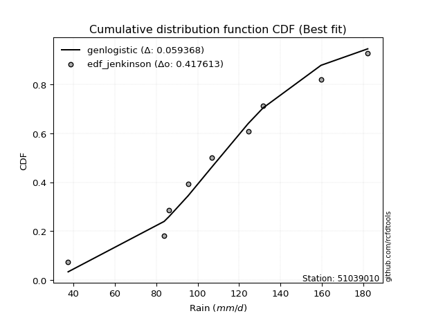</img></img>

</div>


### 11. EDF Cunnane (1978)

Cunnane´s work in statistical hydrology has focused on the performance and evaluation of different probability distributions (such as GEV, Gumbel, Lognormal) for flood frequency estimation. _b_ is a constant, typically set to 0.4.

<div align="center">


$P=(m-b)/(n+1-2b)$


</div>


**11.1. Empirical values**

<div align="center">

|                | 0                   | 1                   | 2                  | 3                  | 4                  | 5                  | 6                  | 7                  |
|:---------------|:--------------------|:--------------------|:-------------------|:-------------------|:-------------------|:-------------------|:-------------------|:-------------------|
| date           | 2021                | 2023                | 2020               | 2018               | 2022               | 2019               | 2024               | 2017               |
| x              | 37.4                | 83.8                | 86.2               | 95.4               | 106.8              | 131.6              | 159.6              | 182.2              |
| m              | 1                   | 2                   | 3                  | 4                  | 5                  | 6                  | 7                  | 8                  |
| empirical_dist | edf_cunnane         | edf_cunnane         | edf_cunnane        | edf_cunnane        | edf_cunnane        | edf_cunnane        | edf_cunnane        | edf_cunnane        |
| empirical      | 0.07317073170731708 | 0.19512195121951223 | 0.3170731707317074 | 0.4390243902439025 | 0.5609756097560976 | 0.6829268292682927 | 0.8048780487804879 | 0.926829268292683  |
| empirical_tr   | 1.0789473684210527  | 1.2424242424242424  | 1.4642857142857144 | 1.782608695652174  | 2.277777777777778  | 3.153846153846154  | 5.125000000000001  | 13.666666666666675 |

</div>


**11.2. Kolmogorov-Smirnov fit test (sorted by Δ)**


<div align="center">

|                | 0                   | 1                   | 2                   | 3                   | 4                   | 5                   | 6                   | 7                   | 8                   | 9                   | 10                  | 11                 | 12                    | 13                  | 14                  | 15                  | 16                 | 17                  | 18                  | 19                  | 20                  | 21                  | 22                  | 23                  | 24                  | 25                  | 26                  | 27                  | 28                  | 29                  | 30                 | 31                  | 32                 | 33                  | 34                  | 35                  | 36                 | 37                  | 38                  | 39                 | 40                 | 41                  | 42                  | 43                  | 44                  | 45                  | 46                  | 47                 | 48                  | 49                 | 50                 | 51                 | 52                 | 53                 | 54                 | 55                  | 56                 | 57                 | 58                  | 59                  | 60                  | 61                  | 62                  | 63                 | 64                  | 65                 | 66                 | 67                  | 68                  | 69                  | 70                 | 71                  | 72                  | 73                  | 74                  | 75                 | 76                 | 77                 | 78                 | 79                  | 80                 | 81                  | 82                 | 83                  | 84                 | 85                 | 86                 | 87                 |
|:---------------|:--------------------|:--------------------|:--------------------|:--------------------|:--------------------|:--------------------|:--------------------|:--------------------|:--------------------|:--------------------|:--------------------|:-------------------|:----------------------|:--------------------|:--------------------|:--------------------|:-------------------|:--------------------|:--------------------|:--------------------|:--------------------|:--------------------|:--------------------|:--------------------|:--------------------|:--------------------|:--------------------|:--------------------|:--------------------|:--------------------|:-------------------|:--------------------|:-------------------|:--------------------|:--------------------|:--------------------|:-------------------|:--------------------|:--------------------|:-------------------|:-------------------|:--------------------|:--------------------|:--------------------|:--------------------|:--------------------|:--------------------|:-------------------|:--------------------|:-------------------|:-------------------|:-------------------|:-------------------|:-------------------|:-------------------|:--------------------|:-------------------|:-------------------|:--------------------|:--------------------|:--------------------|:--------------------|:--------------------|:-------------------|:--------------------|:-------------------|:-------------------|:--------------------|:--------------------|:--------------------|:-------------------|:--------------------|:--------------------|:--------------------|:--------------------|:-------------------|:-------------------|:-------------------|:-------------------|:--------------------|:-------------------|:--------------------|:-------------------|:--------------------|:-------------------|:-------------------|:-------------------|:-------------------|
| station        | 51039010            | 51039010            | 51039010            | 51039010            | 51039010            | 51039010            | 51039010            | 51039010            | 51039010            | 51039010            | 51039010            | 51039010           | 51039010              | 51039010            | 51039010            | 51039010            | 51039010           | 51039010            | 51039010            | 51039010            | 51039010            | 51039010            | 51039010            | 51039010            | 51039010            | 51039010            | 51039010            | 51039010            | 51039010            | 51039010            | 51039010           | 51039010            | 51039010           | 51039010            | 51039010            | 51039010            | 51039010           | 51039010            | 51039010            | 51039010           | 51039010           | 51039010            | 51039010            | 51039010            | 51039010            | 51039010            | 51039010            | 51039010           | 51039010            | 51039010           | 51039010           | 51039010           | 51039010           | 51039010           | 51039010           | 51039010            | 51039010           | 51039010           | 51039010            | 51039010            | 51039010            | 51039010            | 51039010            | 51039010           | 51039010            | 51039010           | 51039010           | 51039010            | 51039010            | 51039010            | 51039010           | 51039010            | 51039010            | 51039010            | 51039010            | 51039010           | 51039010           | 51039010           | 51039010           | 51039010            | 51039010           | 51039010            | 51039010           | 51039010            | 51039010           | 51039010           | 51039010           | 51039010           |
| empirical_dist | edf_cunnane         | edf_cunnane         | edf_cunnane         | edf_cunnane         | edf_cunnane         | edf_cunnane         | edf_cunnane         | edf_cunnane         | edf_cunnane         | edf_cunnane         | edf_cunnane         | edf_cunnane        | edf_cunnane           | edf_cunnane         | edf_cunnane         | edf_cunnane         | edf_cunnane        | edf_cunnane         | edf_cunnane         | edf_cunnane         | edf_cunnane         | edf_cunnane         | edf_cunnane         | edf_cunnane         | edf_cunnane         | edf_cunnane         | edf_cunnane         | edf_cunnane         | edf_cunnane         | edf_cunnane         | edf_cunnane        | edf_cunnane         | edf_cunnane        | edf_cunnane         | edf_cunnane         | edf_cunnane         | edf_cunnane        | edf_cunnane         | edf_cunnane         | edf_cunnane        | edf_cunnane        | edf_cunnane         | edf_cunnane         | edf_cunnane         | edf_cunnane         | edf_cunnane         | edf_cunnane         | edf_cunnane        | edf_cunnane         | edf_cunnane        | edf_cunnane        | edf_cunnane        | edf_cunnane        | edf_cunnane        | edf_cunnane        | edf_cunnane         | edf_cunnane        | edf_cunnane        | edf_cunnane         | edf_cunnane         | edf_cunnane         | edf_cunnane         | edf_cunnane         | edf_cunnane        | edf_cunnane         | edf_cunnane        | edf_cunnane        | edf_cunnane         | edf_cunnane         | edf_cunnane         | edf_cunnane        | edf_cunnane         | edf_cunnane         | edf_cunnane         | edf_cunnane         | edf_cunnane        | edf_cunnane        | edf_cunnane        | edf_cunnane        | edf_cunnane         | edf_cunnane        | edf_cunnane         | edf_cunnane        | edf_cunnane         | edf_cunnane        | edf_cunnane        | edf_cunnane        | edf_cunnane        |
| p_dist         | fisk                | erlang              | gamma               | johnsonsu           | genlogistic         | f                   | laplace_asymmetric  | mielke              | loggenlogistic      | chi2                | pearson3            | logweibull_min     | loglaplace_asymmetric | betaprime           | loggumbel_l         | invgamma            | weibull_min        | rice                | alpha               | exponnorm           | logloggamma         | nct                 | t                   | norm                | crystalball         | truncnorm           | gumbel_r            | logfisk             | logjohnsonsu        | maxwell             | loglaplace         | moyal               | logistic           | hypsecant           | logpearson3         | rayleigh            | invgauss           | loggompertz         | loghypsecant        | halflogistic       | wald               | loglogistic         | laplace             | halfnorm            | ncf                 | kstwobign           | logfatiguelife      | logmielke          | logt                | logexponnorm       | lognorm            | lognorm            | logcrystalball     | logrice            | lognct             | logf                | logerlang          | logbetaprime       | gibrat              | loggamma            | loggamma            | logncf              | loginvgamma         | gumbel_l           | loginvgauss         | logalpha           | logmaxwell         | lograyleigh         | lognakagami         | loggumbel_r         | loggibrat          | logmoyal            | loginvweibull       | loghalfnorm         | logtruncnorm        | loghalflogistic    | nakagami           | logwald            | logkstwobign       | loggenexpon         | expon              | genexpon            | logexpon           | logchi2             | loglognorm         | invweibull         | fatiguelife        | gompertz           |
| delta          | 0.07657502318107381 | 0.08118152981217608 | 0.08197485964146606 | 0.08198042032235492 | 0.08235563640239615 | 0.08263586625724753 | 0.08391693508901807 | 0.08466833304783822 | 0.08526558352128727 | 0.08604034843590677 | 0.08636145605969209 | 0.087418387654883  | 0.08771405990646011   | 0.08878789418859187 | 0.09042181495254445 | 0.09137172139593039 | 0.0917911138046805 | 0.09217530104241142 | 0.09332429542904067 | 0.09365941492795243 | 0.09392630486433884 | 0.09397455507844932 | 0.09398092841537142 | 0.09400136862184744 | 0.09400137694135502 | 0.09400137864369706 | 0.09504261417138368 | 0.09533619689134051 | 0.09556775794400602 | 0.09804645377070567 | 0.0984390014954063 | 0.09844122955842108 | 0.098486052917798  | 0.10459075281936281 | 0.10664473444183317 | 0.10789435117806997 | 0.1091715618030191 | 0.10977330379593694 | 0.11696397929461891 | 0.1259587295284658 | 0.1262452209555831 | 0.13114569812356267 | 0.13300489244426922 | 0.13513842057076056 | 0.13619645018560803 | 0.14418917997108152 | 0.14907367615664316 | 0.1492259635969574 | 0.14951446173794217 | 0.149534055031636  | 0.1495385156905006 | 0.1495385156905006 | 0.1495385601265318 | 0.1495385921296912 | 0.1510994086981257 | 0.15155960518125353 | 0.1560651460973774 | 0.1572532269489598 | 0.15787024819951967 | 0.15852335792465347 | 0.15852335792465347 | 0.15954220813369077 | 0.16315460412770685 | 0.1645769015019738 | 0.17455478846321462 | 0.1765266013142536 | 0.1811383029508313 | 0.19314438647585327 | 0.19512187541653872 | 0.19646293294390468 | 0.2091233123189755 | 0.21367303047704592 | 0.21472692394159118 | 0.22728002600781747 | 0.23149525301816126 | 0.2344472974341353 | 0.2410552688082921 | 0.2514484341684883 | 0.2563394057700109 | 0.26808331602326485 | 0.2753844429046399 | 0.27543010770602194 | 0.3622000811971887 | 0.41161972932047897 | 0.4423352435966226 | 0.4689596173264662 | 0.6264381445833432 | 0.7770089288302028 |
| deltao         | 0.4472608134160001  | 0.4472608134160001  | 0.4472608134160001  | 0.4472608134160001  | 0.4472608134160001  | 0.4472608134160001  | 0.4472608134160001  | 0.4472608134160001  | 0.4472608134160001  | 0.4472608134160001  | 0.4472608134160001  | 0.4472608134160001 | 0.4472608134160001    | 0.4472608134160001  | 0.4472608134160001  | 0.4472608134160001  | 0.4472608134160001 | 0.4472608134160001  | 0.4472608134160001  | 0.4472608134160001  | 0.4472608134160001  | 0.4472608134160001  | 0.4472608134160001  | 0.4472608134160001  | 0.4472608134160001  | 0.4472608134160001  | 0.4472608134160001  | 0.4472608134160001  | 0.4472608134160001  | 0.4472608134160001  | 0.4472608134160001 | 0.4472608134160001  | 0.4472608134160001 | 0.4472608134160001  | 0.4472608134160001  | 0.4472608134160001  | 0.4472608134160001 | 0.4472608134160001  | 0.4472608134160001  | 0.4472608134160001 | 0.4472608134160001 | 0.4472608134160001  | 0.4472608134160001  | 0.4472608134160001  | 0.4472608134160001  | 0.4472608134160001  | 0.4472608134160001  | 0.4472608134160001 | 0.4472608134160001  | 0.4472608134160001 | 0.4472608134160001 | 0.4472608134160001 | 0.4472608134160001 | 0.4472608134160001 | 0.4472608134160001 | 0.4472608134160001  | 0.4472608134160001 | 0.4472608134160001 | 0.4472608134160001  | 0.4472608134160001  | 0.4472608134160001  | 0.4472608134160001  | 0.4472608134160001  | 0.4472608134160001 | 0.4472608134160001  | 0.4472608134160001 | 0.4472608134160001 | 0.4472608134160001  | 0.4472608134160001  | 0.4472608134160001  | 0.4472608134160001 | 0.4472608134160001  | 0.4472608134160001  | 0.4472608134160001  | 0.4472608134160001  | 0.4472608134160001 | 0.4472608134160001 | 0.4472608134160001 | 0.4472608134160001 | 0.4472608134160001  | 0.4472608134160001 | 0.4472608134160001  | 0.4472608134160001 | 0.4472608134160001  | 0.4472608134160001 | 0.4472608134160001 | 0.4472608134160001 | 0.4472608134160001 |
| eval           | Δo > Δ              | Δo > Δ              | Δo > Δ              | Δo > Δ              | Δo > Δ              | Δo > Δ              | Δo > Δ              | Δo > Δ              | Δo > Δ              | Δo > Δ              | Δo > Δ              | Δo > Δ             | Δo > Δ                | Δo > Δ              | Δo > Δ              | Δo > Δ              | Δo > Δ             | Δo > Δ              | Δo > Δ              | Δo > Δ              | Δo > Δ              | Δo > Δ              | Δo > Δ              | Δo > Δ              | Δo > Δ              | Δo > Δ              | Δo > Δ              | Δo > Δ              | Δo > Δ              | Δo > Δ              | Δo > Δ             | Δo > Δ              | Δo > Δ             | Δo > Δ              | Δo > Δ              | Δo > Δ              | Δo > Δ             | Δo > Δ              | Δo > Δ              | Δo > Δ             | Δo > Δ             | Δo > Δ              | Δo > Δ              | Δo > Δ              | Δo > Δ              | Δo > Δ              | Δo > Δ              | Δo > Δ             | Δo > Δ              | Δo > Δ             | Δo > Δ             | Δo > Δ             | Δo > Δ             | Δo > Δ             | Δo > Δ             | Δo > Δ              | Δo > Δ             | Δo > Δ             | Δo > Δ              | Δo > Δ              | Δo > Δ              | Δo > Δ              | Δo > Δ              | Δo > Δ             | Δo > Δ              | Δo > Δ             | Δo > Δ             | Δo > Δ              | Δo > Δ              | Δo > Δ              | Δo > Δ             | Δo > Δ              | Δo > Δ              | Δo > Δ              | Δo > Δ              | Δo > Δ             | Δo > Δ             | Δo > Δ             | Δo > Δ             | Δo > Δ              | Δo > Δ             | Δo > Δ              | Δo > Δ             | Δo > Δ              | Δo > Δ             | Δo <= Δ            | Δo <= Δ            | Δo <= Δ            |
| fit            | 1                   | 1                   | 1                   | 1                   | 1                   | 1                   | 1                   | 1                   | 1                   | 1                   | 1                   | 1                  | 1                     | 1                   | 1                   | 1                   | 1                  | 1                   | 1                   | 1                   | 1                   | 1                   | 1                   | 1                   | 1                   | 1                   | 1                   | 1                   | 1                   | 1                   | 1                  | 1                   | 1                  | 1                   | 1                   | 1                   | 1                  | 1                   | 1                   | 1                  | 1                  | 1                   | 1                   | 1                   | 1                   | 1                   | 1                   | 1                  | 1                   | 1                  | 1                  | 1                  | 1                  | 1                  | 1                  | 1                   | 1                  | 1                  | 1                   | 1                   | 1                   | 1                   | 1                   | 1                  | 1                   | 1                  | 1                  | 1                   | 1                   | 1                   | 1                  | 1                   | 1                   | 1                   | 1                   | 1                  | 1                  | 1                  | 1                  | 1                   | 1                  | 1                   | 1                  | 1                   | 1                  | 0                  | 0                  | 0                  |
| n              | 8                   | 8                   | 8                   | 8                   | 8                   | 8                   | 8                   | 8                   | 8                   | 8                   | 8                   | 8                  | 8                     | 8                   | 8                   | 8                   | 8                  | 8                   | 8                   | 8                   | 8                   | 8                   | 8                   | 8                   | 8                   | 8                   | 8                   | 8                   | 8                   | 8                   | 8                  | 8                   | 8                  | 8                   | 8                   | 8                   | 8                  | 8                   | 8                   | 8                  | 8                  | 8                   | 8                   | 8                   | 8                   | 8                   | 8                   | 8                  | 8                   | 8                  | 8                  | 8                  | 8                  | 8                  | 8                  | 8                   | 8                  | 8                  | 8                   | 8                   | 8                   | 8                   | 8                   | 8                  | 8                   | 8                  | 8                  | 8                   | 8                   | 8                   | 8                  | 8                   | 8                   | 8                   | 8                   | 8                  | 8                  | 8                  | 8                  | 8                   | 8                  | 8                   | 8                  | 8                   | 8                  | 8                  | 8                  | 8                  |
| best_fit       | 1                   | 0                   | 0                   | 0                   | 0                   | 0                   | 0                   | 0                   | 0                   | 0                   | 0                   | 0                  | 0                     | 0                   | 0                   | 0                   | 0                  | 0                   | 0                   | 0                   | 0                   | 0                   | 0                   | 0                   | 0                   | 0                   | 0                   | 0                   | 0                   | 0                   | 0                  | 0                   | 0                  | 0                   | 0                   | 0                   | 0                  | 0                   | 0                   | 0                  | 0                  | 0                   | 0                   | 0                   | 0                   | 0                   | 0                   | 0                  | 0                   | 0                  | 0                  | 0                  | 0                  | 0                  | 0                  | 0                   | 0                  | 0                  | 0                   | 0                   | 0                   | 0                   | 0                   | 0                  | 0                   | 0                  | 0                  | 0                   | 0                   | 0                   | 0                  | 0                   | 0                   | 0                   | 0                   | 0                  | 0                  | 0                  | 0                  | 0                   | 0                  | 0                   | 0                  | 0                   | 0                  | 0                  | 0                  | 0                  |
| best_fit_sort  | 1                   | 2                   | 3                   | 4                   | 5                   | 6                   | 7                   | 8                   | 9                   | 10                  | 11                  | 12                 | 13                    | 14                  | 15                  | 16                  | 17                 | 18                  | 19                  | 20                  | 21                  | 22                  | 23                  | 24                  | 25                  | 26                  | 27                  | 28                  | 29                  | 30                  | 31                 | 32                  | 33                 | 34                  | 35                  | 36                  | 37                 | 38                  | 39                  | 40                 | 41                 | 42                  | 43                  | 44                  | 45                  | 46                  | 47                  | 48                 | 49                  | 50                 | 51                 | 52                 | 53                 | 54                 | 55                 | 56                  | 57                 | 58                 | 59                  | 60                  | 61                  | 62                  | 63                  | 64                 | 65                  | 66                 | 67                 | 68                  | 69                  | 70                  | 71                 | 72                  | 73                  | 74                  | 75                  | 76                 | 77                 | 78                 | 79                 | 80                  | 81                 | 82                  | 83                 | 84                  | 85                 | 86                 | 87                 | 88                 |

</div>


**11.3. Best fit**

<div align="center">

|   id |   station | empirical_dist   | p_dist   |    delta |   deltao | eval   |   fit |   n |   best_fit |   best_fit_sort |
|-----:|----------:|:-----------------|:---------|---------:|---------:|:-------|------:|----:|-----------:|----------------:|
|    0 |  51039010 | edf_cunnane      | fisk     | 0.076575 | 0.447261 | Δo > Δ |     1 |   8 |          1 |               1 |

</div>


<div align="center">

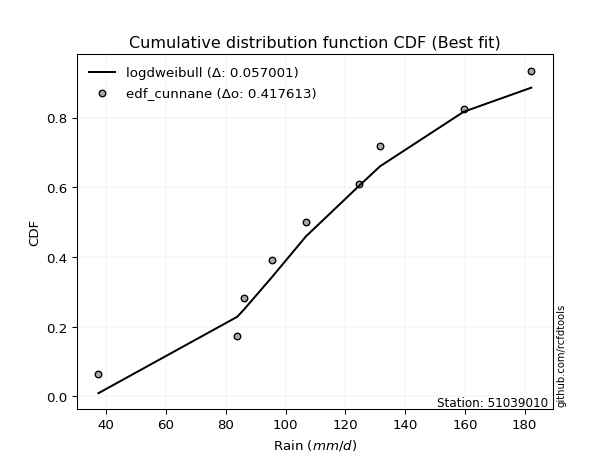</img></img>

</div>


### 12. EDF Adamowski (1981)

The Adamowski formula in hydrology refers to a specific plotting position formula used for estimating the non-parametric empirical distribution of hydrological events (like flood peaks) to calculate their return periods. This formula provides an alternative to traditional parametric methods (like the Gumbel or Log Pearson Type III distributions). 

<div align="center">


$P=(m-0.25)/(n+0.5)$


</div>


**12.1. Empirical values**

<div align="center">

|                | 0                   | 1                   | 2                  | 3                  | 4                  | 5                  | 6                  | 7                  |
|:---------------|:--------------------|:--------------------|:-------------------|:-------------------|:-------------------|:-------------------|:-------------------|:-------------------|
| date           | 2021                | 2023                | 2020               | 2018               | 2022               | 2019               | 2024               | 2017               |
| x              | 37.4                | 83.8                | 86.2               | 95.4               | 106.8              | 131.6              | 159.6              | 182.2              |
| m              | 1                   | 2                   | 3                  | 4                  | 5                  | 6                  | 7                  | 8                  |
| empirical_dist | edf_adamowski       | edf_adamowski       | edf_adamowski      | edf_adamowski      | edf_adamowski      | edf_adamowski      | edf_adamowski      | edf_adamowski      |
| empirical      | 0.08823529411764706 | 0.20588235294117646 | 0.3235294117647059 | 0.4411764705882353 | 0.5588235294117647 | 0.6764705882352942 | 0.7941176470588235 | 0.9117647058823529 |
| empirical_tr   | 1.096774193548387   | 1.259259259259259   | 1.4782608695652173 | 1.7894736842105263 | 2.2666666666666666 | 3.0909090909090913 | 4.857142857142856  | 11.33333333333333  |

</div>


**12.2. Kolmogorov-Smirnov fit test (sorted by Δ)**


<div align="center">

|                | 0                   | 1                   | 2                  | 3                   | 4                   | 5                   | 6                  | 7                   | 8                   | 9                   | 10                  | 11                  | 12                  | 13                  | 14                  | 15                  | 16                  | 17                  | 18                  | 19                  | 20                  | 21                  | 22                    | 23                  | 24                  | 25                  | 26                  | 27                  | 28                  | 29                  | 30                  | 31                  | 32                 | 33                  | 34                  | 35                  | 36                  | 37                  | 38                 | 39                  | 40                  | 41                  | 42                 | 43                  | 44                 | 45                 | 46                  | 47                  | 48                  | 49                  | 50                  | 51                  | 52                  | 53                  | 54                 | 55                  | 56                  | 57                 | 58                  | 59                  | 60                  | 61                  | 62                 | 63                 | 64                  | 65                  | 66                  | 67                  | 68                  | 69                  | 70                  | 71                  | 72                  | 73                  | 74                  | 75                  | 76                 | 77                  | 78                  | 79                  | 80                 | 81                  | 82                 | 83                  | 84                  | 85                  | 86                 | 87                 |
|:---------------|:--------------------|:--------------------|:-------------------|:--------------------|:--------------------|:--------------------|:-------------------|:--------------------|:--------------------|:--------------------|:--------------------|:--------------------|:--------------------|:--------------------|:--------------------|:--------------------|:--------------------|:--------------------|:--------------------|:--------------------|:--------------------|:--------------------|:----------------------|:--------------------|:--------------------|:--------------------|:--------------------|:--------------------|:--------------------|:--------------------|:--------------------|:--------------------|:-------------------|:--------------------|:--------------------|:--------------------|:--------------------|:--------------------|:-------------------|:--------------------|:--------------------|:--------------------|:-------------------|:--------------------|:-------------------|:-------------------|:--------------------|:--------------------|:--------------------|:--------------------|:--------------------|:--------------------|:--------------------|:--------------------|:-------------------|:--------------------|:--------------------|:-------------------|:--------------------|:--------------------|:--------------------|:--------------------|:-------------------|:-------------------|:--------------------|:--------------------|:--------------------|:--------------------|:--------------------|:--------------------|:--------------------|:--------------------|:--------------------|:--------------------|:--------------------|:--------------------|:-------------------|:--------------------|:--------------------|:--------------------|:-------------------|:--------------------|:-------------------|:--------------------|:--------------------|:--------------------|:-------------------|:-------------------|
| station        | 51039010            | 51039010            | 51039010           | 51039010            | 51039010            | 51039010            | 51039010           | 51039010            | 51039010            | 51039010            | 51039010            | 51039010            | 51039010            | 51039010            | 51039010            | 51039010            | 51039010            | 51039010            | 51039010            | 51039010            | 51039010            | 51039010            | 51039010              | 51039010            | 51039010            | 51039010            | 51039010            | 51039010            | 51039010            | 51039010            | 51039010            | 51039010            | 51039010           | 51039010            | 51039010            | 51039010            | 51039010            | 51039010            | 51039010           | 51039010            | 51039010            | 51039010            | 51039010           | 51039010            | 51039010           | 51039010           | 51039010            | 51039010            | 51039010            | 51039010            | 51039010            | 51039010            | 51039010            | 51039010            | 51039010           | 51039010            | 51039010            | 51039010           | 51039010            | 51039010            | 51039010            | 51039010            | 51039010           | 51039010           | 51039010            | 51039010            | 51039010            | 51039010            | 51039010            | 51039010            | 51039010            | 51039010            | 51039010            | 51039010            | 51039010            | 51039010            | 51039010           | 51039010            | 51039010            | 51039010            | 51039010           | 51039010            | 51039010           | 51039010            | 51039010            | 51039010            | 51039010           | 51039010           |
| empirical_dist | edf_adamowski       | edf_adamowski       | edf_adamowski      | edf_adamowski       | edf_adamowski       | edf_adamowski       | edf_adamowski      | edf_adamowski       | edf_adamowski       | edf_adamowski       | edf_adamowski       | edf_adamowski       | edf_adamowski       | edf_adamowski       | edf_adamowski       | edf_adamowski       | edf_adamowski       | edf_adamowski       | edf_adamowski       | edf_adamowski       | edf_adamowski       | edf_adamowski       | edf_adamowski         | edf_adamowski       | edf_adamowski       | edf_adamowski       | edf_adamowski       | edf_adamowski       | edf_adamowski       | edf_adamowski       | edf_adamowski       | edf_adamowski       | edf_adamowski      | edf_adamowski       | edf_adamowski       | edf_adamowski       | edf_adamowski       | edf_adamowski       | edf_adamowski      | edf_adamowski       | edf_adamowski       | edf_adamowski       | edf_adamowski      | edf_adamowski       | edf_adamowski      | edf_adamowski      | edf_adamowski       | edf_adamowski       | edf_adamowski       | edf_adamowski       | edf_adamowski       | edf_adamowski       | edf_adamowski       | edf_adamowski       | edf_adamowski      | edf_adamowski       | edf_adamowski       | edf_adamowski      | edf_adamowski       | edf_adamowski       | edf_adamowski       | edf_adamowski       | edf_adamowski      | edf_adamowski      | edf_adamowski       | edf_adamowski       | edf_adamowski       | edf_adamowski       | edf_adamowski       | edf_adamowski       | edf_adamowski       | edf_adamowski       | edf_adamowski       | edf_adamowski       | edf_adamowski       | edf_adamowski       | edf_adamowski      | edf_adamowski       | edf_adamowski       | edf_adamowski       | edf_adamowski      | edf_adamowski       | edf_adamowski      | edf_adamowski       | edf_adamowski       | edf_adamowski       | edf_adamowski      | edf_adamowski      |
| p_dist         | genlogistic         | chi2                | laplace_asymmetric | f                   | logweibull_min      | betaprime           | fisk               | erlang              | loggumbel_l         | gamma               | johnsonsu           | invgamma            | weibull_min         | rice                | mielke              | alpha               | loggenlogistic      | pearson3            | gumbel_r            | logfisk             | maxwell             | moyal               | loglaplace_asymmetric | exponnorm           | logloggamma         | nct                 | t                   | norm                | crystalball         | truncnorm           | logjohnsonsu        | logpearson3         | logistic           | rayleigh            | invgauss            | loggompertz         | loglaplace          | loghypsecant        | hypsecant          | halflogistic        | loglogistic         | halfnorm            | ncf                | wald                | kstwobign          | laplace            | logfatiguelife      | logt                | logexponnorm        | lognorm             | lognorm             | logcrystalball      | logrice             | lognct              | logf               | logerlang           | logbetaprime        | logmielke          | loggamma            | loggamma            | logncf              | loginvgamma         | gumbel_l           | loginvgauss        | gibrat              | logalpha            | logmaxwell          | lograyleigh         | loggumbel_r         | loggibrat           | logmoyal            | loginvweibull       | lognakagami         | loghalfnorm         | loghalflogistic     | logtruncnorm        | nakagami           | logwald             | logkstwobign        | loggenexpon         | expon              | genexpon            | logexpon           | logchi2             | loglognorm          | invweibull          | fatiguelife        | gompertz           |
| delta          | 0.07472713213396398 | 0.07537420966549657 | 0.0757305409360588 | 0.07657377634935725 | 0.07782571231962532 | 0.07802749246692764 | 0.0786649395009652 | 0.07902944946784318 | 0.07966141323088022 | 0.07982277929713316 | 0.07982833997802202 | 0.08061131967426616 | 0.08103071208301627 | 0.08141489932074719 | 0.08251625270350532 | 0.08256389370737643 | 0.08311350317695437 | 0.08420937571535919 | 0.08428221244971945 | 0.08457579516967628 | 0.08728605204904144 | 0.08771303478365977 | 0.08866084567548393   | 0.09150733458361954 | 0.09177422452000594 | 0.09182247473411642 | 0.09182884807103853 | 0.09184928827751454 | 0.09184929659702212 | 0.09184929829936417 | 0.09341567759967312 | 0.09588433272016894 | 0.0963339725734651 | 0.09713394945640574 | 0.09841116008135486 | 0.09901290207427271 | 0.10489524252840488 | 0.10620357757295468 | 0.1067428331636956 | 0.11519832780680156 | 0.12038529640189843 | 0.12437801884909633 | 0.1254360484639438 | 0.13270146198858168 | 0.1334287782494173 | 0.135156972788602  | 0.13831327443497893 | 0.13875406001627794 | 0.13877365330997177 | 0.13877811396883638 | 0.13877811396883638 | 0.13877815840486757 | 0.13877819040802697 | 0.14033900697646146 | 0.1407992034595893 | 0.14530474437571317 | 0.14649282522729556 | 0.1470738832526245 | 0.14776295620298924 | 0.14776295620298924 | 0.14878180641202654 | 0.15239420240604262 | 0.1624248211576409 | 0.1637943867415504 | 0.16432648923251825 | 0.16576619959258937 | 0.17037790122916707 | 0.18238398475418904 | 0.18570253122224045 | 0.19836291059731126 | 0.20291262875538169 | 0.20396652221992695 | 0.20588227713820295 | 0.21651962428615323 | 0.22368689571247108 | 0.23795149405115978 | 0.2389031884639593 | 0.24068803244682402 | 0.24557900404834665 | 0.25732291430160065 | 0.2646240411829757 | 0.26466970598435774 | 0.3514396794755245 | 0.40085932759881476 | 0.43157484187495837 | 0.45389505491613613 | 0.6156777428616791 | 0.7662485271085384 |
| deltao         | 0.4472608134160001  | 0.4472608134160001  | 0.4472608134160001 | 0.4472608134160001  | 0.4472608134160001  | 0.4472608134160001  | 0.4472608134160001 | 0.4472608134160001  | 0.4472608134160001  | 0.4472608134160001  | 0.4472608134160001  | 0.4472608134160001  | 0.4472608134160001  | 0.4472608134160001  | 0.4472608134160001  | 0.4472608134160001  | 0.4472608134160001  | 0.4472608134160001  | 0.4472608134160001  | 0.4472608134160001  | 0.4472608134160001  | 0.4472608134160001  | 0.4472608134160001    | 0.4472608134160001  | 0.4472608134160001  | 0.4472608134160001  | 0.4472608134160001  | 0.4472608134160001  | 0.4472608134160001  | 0.4472608134160001  | 0.4472608134160001  | 0.4472608134160001  | 0.4472608134160001 | 0.4472608134160001  | 0.4472608134160001  | 0.4472608134160001  | 0.4472608134160001  | 0.4472608134160001  | 0.4472608134160001 | 0.4472608134160001  | 0.4472608134160001  | 0.4472608134160001  | 0.4472608134160001 | 0.4472608134160001  | 0.4472608134160001 | 0.4472608134160001 | 0.4472608134160001  | 0.4472608134160001  | 0.4472608134160001  | 0.4472608134160001  | 0.4472608134160001  | 0.4472608134160001  | 0.4472608134160001  | 0.4472608134160001  | 0.4472608134160001 | 0.4472608134160001  | 0.4472608134160001  | 0.4472608134160001 | 0.4472608134160001  | 0.4472608134160001  | 0.4472608134160001  | 0.4472608134160001  | 0.4472608134160001 | 0.4472608134160001 | 0.4472608134160001  | 0.4472608134160001  | 0.4472608134160001  | 0.4472608134160001  | 0.4472608134160001  | 0.4472608134160001  | 0.4472608134160001  | 0.4472608134160001  | 0.4472608134160001  | 0.4472608134160001  | 0.4472608134160001  | 0.4472608134160001  | 0.4472608134160001 | 0.4472608134160001  | 0.4472608134160001  | 0.4472608134160001  | 0.4472608134160001 | 0.4472608134160001  | 0.4472608134160001 | 0.4472608134160001  | 0.4472608134160001  | 0.4472608134160001  | 0.4472608134160001 | 0.4472608134160001 |
| eval           | Δo > Δ              | Δo > Δ              | Δo > Δ             | Δo > Δ              | Δo > Δ              | Δo > Δ              | Δo > Δ             | Δo > Δ              | Δo > Δ              | Δo > Δ              | Δo > Δ              | Δo > Δ              | Δo > Δ              | Δo > Δ              | Δo > Δ              | Δo > Δ              | Δo > Δ              | Δo > Δ              | Δo > Δ              | Δo > Δ              | Δo > Δ              | Δo > Δ              | Δo > Δ                | Δo > Δ              | Δo > Δ              | Δo > Δ              | Δo > Δ              | Δo > Δ              | Δo > Δ              | Δo > Δ              | Δo > Δ              | Δo > Δ              | Δo > Δ             | Δo > Δ              | Δo > Δ              | Δo > Δ              | Δo > Δ              | Δo > Δ              | Δo > Δ             | Δo > Δ              | Δo > Δ              | Δo > Δ              | Δo > Δ             | Δo > Δ              | Δo > Δ             | Δo > Δ             | Δo > Δ              | Δo > Δ              | Δo > Δ              | Δo > Δ              | Δo > Δ              | Δo > Δ              | Δo > Δ              | Δo > Δ              | Δo > Δ             | Δo > Δ              | Δo > Δ              | Δo > Δ             | Δo > Δ              | Δo > Δ              | Δo > Δ              | Δo > Δ              | Δo > Δ             | Δo > Δ             | Δo > Δ              | Δo > Δ              | Δo > Δ              | Δo > Δ              | Δo > Δ              | Δo > Δ              | Δo > Δ              | Δo > Δ              | Δo > Δ              | Δo > Δ              | Δo > Δ              | Δo > Δ              | Δo > Δ             | Δo > Δ              | Δo > Δ              | Δo > Δ              | Δo > Δ             | Δo > Δ              | Δo > Δ             | Δo > Δ              | Δo > Δ              | Δo <= Δ             | Δo <= Δ            | Δo <= Δ            |
| fit            | 1                   | 1                   | 1                  | 1                   | 1                   | 1                   | 1                  | 1                   | 1                   | 1                   | 1                   | 1                   | 1                   | 1                   | 1                   | 1                   | 1                   | 1                   | 1                   | 1                   | 1                   | 1                   | 1                     | 1                   | 1                   | 1                   | 1                   | 1                   | 1                   | 1                   | 1                   | 1                   | 1                  | 1                   | 1                   | 1                   | 1                   | 1                   | 1                  | 1                   | 1                   | 1                   | 1                  | 1                   | 1                  | 1                  | 1                   | 1                   | 1                   | 1                   | 1                   | 1                   | 1                   | 1                   | 1                  | 1                   | 1                   | 1                  | 1                   | 1                   | 1                   | 1                   | 1                  | 1                  | 1                   | 1                   | 1                   | 1                   | 1                   | 1                   | 1                   | 1                   | 1                   | 1                   | 1                   | 1                   | 1                  | 1                   | 1                   | 1                   | 1                  | 1                   | 1                  | 1                   | 1                   | 0                   | 0                  | 0                  |
| n              | 8                   | 8                   | 8                  | 8                   | 8                   | 8                   | 8                  | 8                   | 8                   | 8                   | 8                   | 8                   | 8                   | 8                   | 8                   | 8                   | 8                   | 8                   | 8                   | 8                   | 8                   | 8                   | 8                     | 8                   | 8                   | 8                   | 8                   | 8                   | 8                   | 8                   | 8                   | 8                   | 8                  | 8                   | 8                   | 8                   | 8                   | 8                   | 8                  | 8                   | 8                   | 8                   | 8                  | 8                   | 8                  | 8                  | 8                   | 8                   | 8                   | 8                   | 8                   | 8                   | 8                   | 8                   | 8                  | 8                   | 8                   | 8                  | 8                   | 8                   | 8                   | 8                   | 8                  | 8                  | 8                   | 8                   | 8                   | 8                   | 8                   | 8                   | 8                   | 8                   | 8                   | 8                   | 8                   | 8                   | 8                  | 8                   | 8                   | 8                   | 8                  | 8                   | 8                  | 8                   | 8                   | 8                   | 8                  | 8                  |
| best_fit       | 1                   | 0                   | 0                  | 0                   | 0                   | 0                   | 0                  | 0                   | 0                   | 0                   | 0                   | 0                   | 0                   | 0                   | 0                   | 0                   | 0                   | 0                   | 0                   | 0                   | 0                   | 0                   | 0                     | 0                   | 0                   | 0                   | 0                   | 0                   | 0                   | 0                   | 0                   | 0                   | 0                  | 0                   | 0                   | 0                   | 0                   | 0                   | 0                  | 0                   | 0                   | 0                   | 0                  | 0                   | 0                  | 0                  | 0                   | 0                   | 0                   | 0                   | 0                   | 0                   | 0                   | 0                   | 0                  | 0                   | 0                   | 0                  | 0                   | 0                   | 0                   | 0                   | 0                  | 0                  | 0                   | 0                   | 0                   | 0                   | 0                   | 0                   | 0                   | 0                   | 0                   | 0                   | 0                   | 0                   | 0                  | 0                   | 0                   | 0                   | 0                  | 0                   | 0                  | 0                   | 0                   | 0                   | 0                  | 0                  |
| best_fit_sort  | 1                   | 2                   | 3                  | 4                   | 5                   | 6                   | 7                  | 8                   | 9                   | 10                  | 11                  | 12                  | 13                  | 14                  | 15                  | 16                  | 17                  | 18                  | 19                  | 20                  | 21                  | 22                  | 23                    | 24                  | 25                  | 26                  | 27                  | 28                  | 29                  | 30                  | 31                  | 32                  | 33                 | 34                  | 35                  | 36                  | 37                  | 38                  | 39                 | 40                  | 41                  | 42                  | 43                 | 44                  | 45                 | 46                 | 47                  | 48                  | 49                  | 50                  | 51                  | 52                  | 53                  | 54                  | 55                 | 56                  | 57                  | 58                 | 59                  | 60                  | 61                  | 62                  | 63                 | 64                 | 65                  | 66                  | 67                  | 68                  | 69                  | 70                  | 71                  | 72                  | 73                  | 74                  | 75                  | 76                  | 77                 | 78                  | 79                  | 80                  | 81                 | 82                  | 83                 | 84                  | 85                  | 86                  | 87                 | 88                 |

</div>


**12.3. Best fit**

<div align="center">

|   id |   station | empirical_dist   | p_dist      |     delta |   deltao | eval   |   fit |   n |   best_fit |   best_fit_sort |
|-----:|----------:|:-----------------|:------------|----------:|---------:|:-------|------:|----:|-----------:|----------------:|
|    0 |  51039010 | edf_adamowski    | genlogistic | 0.0747271 | 0.447261 | Δo > Δ |     1 |   8 |          1 |               1 |

</div>


<div align="center">

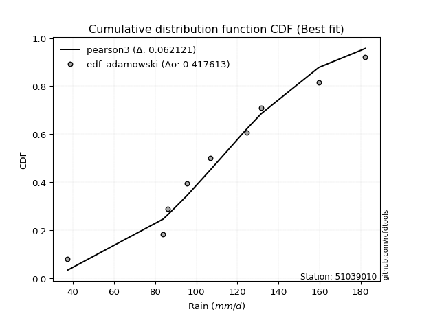</img></img>

</div>


## C. Best fit & Estimate extreme values for specific return periods - Tr

Best fit in probability distribution analysis means finding the theoretical distribution (like Normal, Poisson, Exponential) that most accurately mirrors your real-world data´s patterns (shape, center, spread) for better predictions, using methods like visual checks (Q-Q plots), goodness-of-fit tests (Kolmogorov-Smirnov, Chi-Squared), and information criteria (AIC) to score and select the simplest, most representative model.


### 1. Best fit (ordered by delta Δ)

<div align="center">

|   id |   station | empirical_dist   | p_dist             |     delta |   deltao | eval   |   fit |   n |   best_fit |   best_fit_sort |
|-----:|----------:|:-----------------|:-------------------|----------:|---------:|:-------|------:|----:|-----------:|----------------:|
|    0 |  51039010 | edf_tukey        | fisk               | 0.0727826 | 0.447261 | Δo > Δ |     1 |   8 |          1 |               1 |
|    1 |  51039010 | edf_filliben     | fisk               | 0.0739183 | 0.447261 | Δo > Δ |     1 |   8 |          1 |               2 |
|    2 |  51039010 | edf_jenkinson    | fisk               | 0.0744532 | 0.447261 | Δo > Δ |     1 |   8 |          1 |               3 |
|    3 |  51039010 | edf_beard        | fisk               | 0.0744532 | 0.447261 | Δo > Δ |     1 |   8 |          1 |               4 |
|    4 |  51039010 | edf_adamowski    | genlogistic        | 0.0747271 | 0.447261 | Δo > Δ |     1 |   8 |          1 |               5 |
|    5 |  51039010 | edf_blom         | fisk               | 0.0747273 | 0.447261 | Δo > Δ |     1 |   8 |          1 |               6 |
|    6 |  51039010 | edf_chegodayev   | genlogistic        | 0.0750966 | 0.447261 | Δo > Δ |     1 |   8 |          1 |               7 |
|    7 |  51039010 | edf_cunnane      | fisk               | 0.076575  | 0.447261 | Δo > Δ |     1 |   8 |          1 |               8 |
|    8 |  51039010 | edf_weibull      | logpearson3        | 0.0795445 | 0.447261 | Δo > Δ |     1 |   8 |          1 |               9 |
|    9 |  51039010 | edf_gringorten   | fisk               | 0.0795787 | 0.447261 | Δo > Δ |     1 |   8 |          1 |              10 |
|   10 |  51039010 | edf_hazen        | fisk               | 0.084197  | 0.447261 | Δo > Δ |     1 |   8 |          1 |              11 |
|   11 |  51039010 | edf_california   | laplace_asymmetric | 0.0963206 | 0.447261 | Δo > Δ |     1 |   8 |          1 |              12 |

</div>

:file_folder:Tables: [bestfit_51039010.csv](table/bestfit_51039010.csv) | [extreme_51039010.csv](table/extreme_51039010.csv)


### 2. Extreme values

In hydrology, a return period (or recurrence interval $Tr$) is the statistical average time between extreme events like floods or droughts of a specific magnitude, indicating how rare an event is, with a 100-year flood, for example, having a 1% chance of occurring in any given year, not that it happens exactly every century. It is a key tool for infrastructure design (like bridges or dams) and risk assessment, calculated from historical data to determine the probability of future events, although it is important to remember it is statistical average, and events can cluster or be missed.

> risk_rate: assuming the return period as the project useful life.

|   id |      tr |   prob_l |     prob_g |   alpha |   betaprime |    chi2 |   crystalball |   erlang |    expon |   exponnorm |       f |   fatiguelife |    fisk |   gamma |   genexpon |   genlogistic |   gibrat |   gompertz |   gumbel_l |   gumbel_r |   halflogistic |   halfnorm |   hypsecant |   invgamma |   invgauss |      invweibull |   johnsonsu |   kstwobign |   laplace |   laplace_asymmetric |   loggamma |   logistic |   lognorm |   maxwell |   mielke |   moyal |   nakagami |     ncf |     nct |    norm |   pearson3 |   rayleigh |    rice |       t |   truncnorm |     wald |   weibull_min |   logalpha |   logbetaprime |          logchi2 |   logcrystalball |   logerlang |   logexpon |   logexponnorm |    logf |   logfatiguelife |   logfisk |   loggenexpon |   loggenlogistic |   loggibrat |   loggompertz |   loggumbel_l |   loggumbel_r |   loghalflogistic |   loghalfnorm |   loghypsecant |   loginvgamma |   loginvgauss |   loginvweibull |   logjohnsonsu |   logkstwobign |   loglaplace |   loglaplace_asymmetric |   logloggamma |   loglogistic |     loglognorm |   logmaxwell |   logmielke |   logmoyal |   lognakagami |   logncf |   lognct |   logpearson3 |   lograyleigh |   logrice |    logt |   logtruncnorm |   logwald |   logweibull_min |   station |   n |   risk_rate |
|-----:|--------:|---------:|-----------:|--------:|------------:|--------:|--------------:|---------:|---------:|------------:|--------:|--------------:|--------:|--------:|-----------:|--------------:|---------:|-----------:|-----------:|-----------:|---------------:|-----------:|------------:|-----------:|-----------:|----------------:|------------:|------------:|----------:|---------------------:|-----------:|-----------:|----------:|----------:|---------:|--------:|-----------:|--------:|--------:|--------:|-----------:|-----------:|--------:|--------:|------------:|---------:|--------------:|-----------:|---------------:|-----------------:|-----------------:|------------:|-----------:|---------------:|--------:|-----------------:|----------:|--------------:|-----------------:|------------:|--------------:|--------------:|--------------:|------------------:|--------------:|---------------:|--------------:|--------------:|----------------:|---------------:|---------------:|-------------:|------------------------:|--------------:|--------------:|---------------:|-------------:|------------:|-----------:|--------------:|---------:|---------:|--------------:|--------------:|----------:|--------:|---------------:|----------:|-----------------:|----------:|----:|------------:|
|    0 |    2    | 0.5      | 0.5        | 107.107 |     107.461 | 108.201 |       110.375 |  108.975 |  87.9824 |     110.337 | 108.609 |       37.4001 | 107.623 | 109.061 |    87.9756 |       107.1   |  97.4271 |    172.423 |    117.462 |    103.288 |        99.7654 |    101.545 |     110.375 |    107.061 |    105.267 |  1479.37        |     109.059 |     102.005 |   110.375 |              100.306 |     99.996 |    110.375 |   100.652 |   106.686 |  109.352 | 101.001 |     85.239 | 102.039 | 110.372 | 110.375 |    109.542 |    105.377 | 108.182 | 110.373 |     110.375 |  96.3922 |       108.206 |    97.8485 |        100.022 |     63.1558      |          100.652 |     100.243 |    74.2832 |        100.652 | 100.452 |          100.664 |   104.866 |       88.5498 |          109.423 |     87.7141 |       105.964 |       108.524 |       93.3513 |           89.9205 |        91.638 |        100.652 |       99.2956 |       98.4223 |         95.6247 |        110.831 |        90.1867 |      100.652 |                 103.588 |       110.587 |       100.652 |  37.8919       |      96.7827 |     120.086 |    91.1094 |       98.1676 |  99.9075 |  100.52  |       107.315 |        95.446 |   100.652 | 100.654 |        103.884 |   86.7545 |          108.926 |  51039010 |   8 |    0.75     |
|    1 |    2.33 | 0.570815 | 0.429185   | 114.999 |     115.352 | 116.001 |       118.073 |  116.685 |  99.1272 |     118.033 | 116.36  |       39.1408 | 114.85  | 116.773 |    99.1189 |       114.545 | 101.326  |    173.221 |    124.159 |    110.421 |       107.099  |    109.853 |     116.535 |    114.805 |    113.347 | 85086.9         |     116.769 |     110.732 |   115.033 |              107.114 |    108.858 |    117.157 |   109.231 |   114.683 |  117.009 | 107.753 |     87.333 | 110.549 | 118.07  | 118.073 |    117.261 |    113.493 | 116.224 | 118.071 |     118.073 | 101.44   |       116.251 |   106.617  |        108.766 |     75.3572      |          109.231 |     109.094 |    86.4079 |        109.231 | 109.044 |          109.228 |   112.649 |       98.8578 |          117.095 |     91.4248 |       114.243 |       116.528 |      100.701  |           97.2081 |       100.095 |        107.461 |      108.043  |      107.505  |        106.851  |        119.076 |       101.012  |      105.759 |                 108.941 |       118.726 |       108.173 |  41.5767       |     105.367  |     130.158 |    97.8862 |      103.502  | 108.745  |  109.13  |       115.888 |       104.042 |   109.231 | 109.233 |        108.793 |   91.5347 |          116.934 |  51039010 |   8 |    0.729209 |
|    2 |    5    | 0.8      | 0.2        | 146.404 |     146.833 | 146.175 |       146.679 |  146.054 | 154.849  |     146.66  | 146.161 |       76.119  | 144.268 | 146.132 |   154.833  |       145     | 123.776  |    175.799 |    145.794 |    141.409 |       140.282  |    144.985 |     141.246 |    145.315 |    146.301 |     4.19234e+12 |     146.182 |     147.804 |   138.323 |              141.153 |    150.054 |    143.344 |   148.031 |   146.16  |  146.439 | 139.029 |    119.116 | 148.868 | 146.677 | 146.679 |    146.415 |    145.983 | 146.84  | 146.677 |     146.679 | 129.695  |       146.846 |   147.959  |        148.909 |    207.553       |          148.031 |     150.193 |   184.014  |        148.031 | 147.965 |          147.985 |   148.523 |      154.165  |          146.518 |    116.055  |       146.527 |       146.645 |      139.969  |          138.306  |       145.392 |        139.728 |      148.774  |      151.142  |        173.068  |        148.585 |       163.49   |      135.455 |                 138.399 |       148.209 |       142.877 |   1.04517e+111 |     147.217  |     160.154 |   136.474  |      134.569  | 149.513  |  148.191 |       148.961 |       146.943 |   148.031 | 148.032 |        136.237 |  123.59   |          147.056 |  51039010 |   8 |    0.67232  |
|    3 |   10    | 0.9      | 0.1        | 169.246 |     169.647 | 167.243 |       165.656 |  166.162 | 205.431  |     165.673 | 166.808 |      127.176  | 167.554 | 166.22  |   205.408  |       168.594 | 149.365  |    177.234 |    157.839 |    166.648 |       167.838  |    170.982 |     160.978 |    167.173 |    170.883 |     7.72889e+18 |     166.382 |     176.029 |   159.465 |              172.053 |    186.533 |    162.629 |   181.103 |   168.311 |  168.777 | 166.259 |    167.186 | 181.659 | 165.655 | 165.656 |    166.163 |    169.149 | 167.569 | 165.654 |     165.656 | 159.68   |       167.436 |   185.354  |        183.839 |    579.355       |          181.103 |     186.536 |   365.485  |        181.102 | 181.209 |          181.056 |   182.061 |      212.06   |          168.787 |    152.32   |       168.763 |       166.669 |      183.022  |          185.359  |       191.65  |        172.322 |      184.951  |      191.617  |        256.33   |        166.587 |       235.89   |      169.574 |                 171.985 |       166.849 |       175.371 | inf            |     186.286  |     172.298 |   182.267  |      166.633  | 185.225  |  181.627 |       171.036 |       187.958 |   181.103 | 181.104 |        165.773 |  169.967  |          167.071 |  51039010 |   8 |    0.651322 |
|    4 |   15    | 0.933333 | 0.0666667  | 181.314 |     181.625 | 178.074 |       175.125 |  176.385 | 235.02   |     175.168 | 177.376 |      160.569  | 180.855 | 176.429 |   234.993  |       181.679 | 167.016  |    177.885 |    163.294 |    180.887 |       183.433  |    184.511 |     172.239 |    178.6   |    184.015 |     2.64941e+22 |     176.675 |     191.013 |   171.833 |              190.128 |    208.223 |    173.137 |   200.274 |   179.677 |  181.578 | 182.062 |    196.917 | 200.829 | 175.126 | 175.125 |    176.141 |    181.085 | 177.997 | 175.124 |     175.125 | 178.936  |       177.729 |   207.927  |        204.368 |   1085.22        |          200.274 |     208.127 |   546.009  |        200.274 | 200.507 |          200.242 |   203.42  |      250.027  |          181.532 |    183.743  |       179.993 |       176.615 |      212.919  |          218.768  |       221.279 |        194.225 |      206.516  |      216.453  |        319.92   |        174.979 |       286.573  |      193.388 |                 195.292 |       175.846 |       196.087 | inf            |     210.198  |     176.244 |   215.594  |      186.693  | 206.305  |  201.066 |       181.804 |       213.375 |   200.274 | 200.276 |        185.311 |  208.558  |          177.011 |  51039010 |   8 |    0.644736 |
|    5 |   20    | 0.95     | 0.05       | 189.476 |     189.686 | 185.282 |       181.327 |  183.148 | 256.014  |     181.39  | 184.394 |      185.292  | 190.312 | 183.181 |   255.984  |       190.783 | 180.861  |    178.289 |    166.69  |    190.857 |       194.359  |    193.531 |     180.183 |    186.28  |    192.938 |     7.91204e+24 |     183.494 |     201.107 |   180.607 |              202.952 |    223.891 |    180.399 |   213.916 |   187.22  |  190.784 | 193.254 |    217.659 | 214.565 | 181.328 | 181.327 |    182.72  |    189.019 | 184.851 | 181.326 |     181.327 | 193.285  |       184.466 |   224.385  |        219.094 |   1708.92        |          213.916 |     223.715 |   725.921  |        213.915 | 214.25  |          213.9   |   219.63  |      278.986  |          190.693 |    212.866  |       187.379 |       183.104 |      236.714  |          245.701  |       243.537 |        211.332 |      222.119  |      234.734  |        373.618  |        180.245 |       326.718  |      212.286 |                 213.721 |       181.628 |       211.818 | inf            |     227.739  |     178.199 |   242.82   |      201.481  | 221.466  |  214.921 |       188.707 |       232.144 |   213.916 | 213.919 |        200.255 |  242.911  |          183.494 |  51039010 |   8 |    0.641514 |
|    6 |   25    | 0.96     | 0.04       | 195.621 |     195.731 | 190.648 |       185.892 |  188.162 | 272.297  |     185.971 | 189.608 |      204.935  | 197.695 | 188.185 |   272.265  |       197.772 | 192.404  |    178.577 |    169.106 |    198.537 |       202.777  |    200.242 |     186.331 |    192.036 |    199.674 |     6.37962e+26 |     188.554 |     208.668 |   187.414 |              212.9   |    236.234 |    185.955 |   224.548 |   192.82  |  198.056 | 201.93  |    233.385 | 225.331 | 185.894 | 185.892 |    187.585 |    194.914 | 189.907 | 185.891 |     185.892 | 204.778  |       189.421 |   237.439  |        230.639 |   2440.57        |          224.548 |     235.991 |   905.378  |        224.547 | 224.967 |          224.55  |   232.898 |      302.671  |          197.926 |    240.642  |       192.827 |       187.866 |      256.84   |          268.693  |       261.537 |        225.599 |      234.427  |      249.333  |        421.049  |        184.004 |       360.432  |      228.208 |                 229.204 |       185.829 |       224.699 | inf            |     241.701  |     179.367 |   266.267  |      213.267  | 233.373  |  225.733 |       193.697 |       247.15  |   224.548 | 224.552 |        212.488 |  274.466  |          188.252 |  51039010 |   8 |    0.639603 |
|    7 |   50    | 0.98     | 0.02       | 213.893 |     213.568 | 206.29  |       198.965 |  202.681 | 322.88   |     199.1   | 204.771 |      267.96   | 221.079 | 202.675 |   322.841  |       219.216 | 233.091  |    179.359 |    175.665 |    222.195 |       228.715  |    219.748 |     205.393 |    209.013 |    219.763 |     4.76254e+32 |     203.234 |     230.87  |   208.556 |              243.799 |    275.81  |    202.93  |   258.01  |   209.061 |  221.685 | 228.861 |    279.814 | 259.602 | 198.968 | 198.965 |    201.624 |    212.025 | 204.43  | 198.964 |     198.965 | 242.304  |       203.577 |   279.804  |        267.338 |   7523.16        |          258.01  |     275.329 |  1798.25   |        258.009 | 258.73  |          258.087 |   278.608 |      383.53   |          221.421 |    370.798  |       208.466 |       201.426 |      330.243  |          353.962  |       321.774 |        276.249 |      273.979  |      297.27   |        608.454  |        194.203 |       480.909  |      285.69  |                 284.826 |       197.606 |       269.113 | inf            |     287.227  |     181.699 |   354.483  |      251.662  | 271.341  |  259.832 |       207.475 |       296.433 |   258.01  | 258.018 |        254.17  |  408.947  |          201.798 |  51039010 |   8 |    0.63583  |
|    8 |   75    | 0.986667 | 0.0133333  | 224.131 |     223.464 | 214.853 |       205.979 |  210.572 | 352.469  |     206.149 | 213.049 |      305.917  | 235.171 | 210.548 |   352.426  |       231.641 | 260.571  |    179.754 |    178.982 |    235.945 |       243.792  |    230.367 |     216.533 |    218.435 |    231.044 |     1.23446e+36 |     211.229 |     243.085 |   220.923 |              261.874 |    299.936 |    212.734 |   277.975 |   217.891 |  236.429 | 244.609 |    305.244 | 280.355 | 205.984 | 205.979 |    209.221 |    221.334 | 212.248 | 205.979 |     205.979 | 265.395  |       211.147 |   306.001  |        289.488 |  14689.6         |          277.975 |     299.293 |  2686.45   |        277.973 | 278.897 |          278.111 |   308.99  |      436.317  |          236.075 |    496.541  |       216.871 |       208.652 |      382.198  |          415.469  |       360.208 |        310.961 |      298.157  |      327.307  |        753.641  |        199.331 |       563.598  |      325.811 |                 323.426 |       203.774 |       298.659 | inf            |     315.48   |     182.499 |   419.055  |      275.399  | 294.342  |  280.226 |       214.507 |       327.255 |   277.975 | 277.986 |        281.154 |  522.677  |          209.015 |  51039010 |   8 |    0.634587 |
|    9 |  100    | 0.99     | 0.01       | 231.237 |     230.287 | 220.713 |       210.724 |  215.949 | 373.462  |     210.92  | 218.704 |      333.228  | 245.388 | 215.911 |   373.417  |       240.424 | 281.859  |    180.012 |    181.152 |    245.677 |       254.463  |    237.6   |     224.434 |    224.936 |    238.876 |     3.21749e+38 |     216.685 |     251.455 |   229.698 |              274.699 |    317.533 |    219.656 |   292.347 |   223.905 |  247.379 | 255.783 |    322.555 | 295.445 | 210.729 | 210.724 |    214.385 |    227.676 | 217.544 | 210.723 |     210.724 | 282.231  |       216.256 |   325.28   |        305.547 |  23707           |          292.347 |     316.766 |  3571.65   |        292.345 | 293.424 |          292.533 |   332.415 |      476.405  |          246.954 |    622.58   |       222.556 |       213.518 |      423.837  |          465.358  |       388.987 |        338.197 |      315.824  |      349.591  |        876.883  |        202.663 |       628.32   |      357.65  |                 353.945 |       207.889 |       321.454 | inf            |     336.3    |     182.924 |   471.88   |      292.829  | 311.053  |  294.929 |       219.105 |       350.069 |   292.347 | 292.361 |        301.419 |  625.072  |          213.874 |  51039010 |   8 |    0.633968 |
|   10 |  200    | 0.995    | 0.005      | 247.927 |     246.158 | 234.208 |       221.485 |  228.265 | 424.045  |     221.748 | 231.701 |      400.08   | 270.833 | 228.194 |   423.992  |       261.518 | 339.775  |    180.574 |    185.867 |    269.074 |       280.119  |    254.145 |     243.471 |    240.076 |    257.26  |     2.06978e+44 |     229.204 |     270.732 |   250.84  |              305.598 |    361.692 |    236.26  |   327.763 |   237.665 |  275.639 | 282.702 |    361.994 | 333.197 | 221.492 | 221.485 |    226.177 |    242.187 | 229.58  | 221.485 |     221.485 | 324.168  |       227.803 |   374.279  |        345.508 |  75940.9         |          327.763 |     360.587 |  7093.94   |        327.761 | 329.257 |          328.095 |   396.105 |      582.618  |          275.027 |   1152.05   |       235.451 |       224.489 |      543.461  |          611.204  |       463.749 |        414.015 |      360.274  |      406.859  |       1262.05   |        209.821 |       807.087  |      447.736 |                 439.838 |       217.053 |       383.479 | inf            |     389.247  |     183.674 |   628.141  |      336.891  | 352.764  |  331.235 |       229.024 |       408.434 |   327.763 | 327.786 |        353.538 |  976.034  |          224.83  |  51039010 |   8 |    0.633042 |
|   11 |  250    | 0.996    | 0.004      | 253.192 |     251.118 | 238.389 |       224.774 |  232.062 | 440.329  |     225.06  | 235.72  |      421.867  | 279.292 | 231.98  |   440.274  |       268.295 | 360.556  |    180.74  |    187.255 |    276.596 |       288.367  |    259.235 |     249.599 |    244.815 |    263.052 |     1.5249e+46  |     233.07  |     276.697 |   257.646 |              315.546 |    376.468 |    241.591 |   339.419 |   241.901 |  285.355 | 291.368 |    374.068 | 345.805 | 224.781 | 224.774 |    229.802 |    246.654 | 233.264 | 224.773 |     224.774 | 338.042  |       231.32  |   390.866  |        358.777 | 110784           |          339.419 |     375.242 |  8847.66   |        339.417 | 341.06  |          339.806 |   419.036 |      619.877  |          284.676 |   1436.71   |       239.389 |       227.823 |      588.68   |          667.191  |       489.521 |        441.87  |      375.183  |      426.439  |       1418.78   |        211.899 |       872.113  |      481.316 |                 471.703 |       219.809 |       405.827 | inf            |     407.166  |     183.866 |   688.729  |      351.714  | 366.653  |  343.206 |       231.906 |       428.288 |   339.419 | 339.445 |        371.061 | 1131.08   |          228.159 |  51039010 |   8 |    0.632858 |
|   12 |  500    | 0.998    | 0.002      | 269.285 |     266.131 | 250.945 |       234.526 |  243.413 | 490.911  |     234.886 | 247.768 |      490.214  | 306.454 | 243.297 |   490.849  |       289.321 | 432.373  |    181.214 |    191.232 |    299.942 |       313.966  |    274.41  |     268.633 |    259.188 |    280.716 |     9.52827e+51 |     244.648 |     294.575 |   278.788 |              346.445 |    424.218 |    258.123 |   376.479 |   254.54  |  317.67  | 318.287 |    409.869 | 386.519 | 234.536 | 234.526 |    240.611 |    259.981 | 244.204 | 234.526 |     234.526 | 382.156  |       241.715 |   445.111  |        401.335 | 360661           |          376.479 |     422.58  | 17573.1    |        376.477 | 378.619 |          377.063 |   498.942 |      745.889  |          316.762 |   3081.72   |       251.057 |       237.658 |      754.422  |          875.775  |       575.176 |        540.921 |      423.485  |      491.096  |       2040.36   |        217.77  |      1100.07   |      602.551 |                 586.173 |       227.861 |       483.761 | inf            |     465.691  |     184.385 |   916.792  |      399.814  | 411.319  |  381.339 |       240.027 |       493.449 |   376.479 | 376.518 |        426.086 | 1807.49   |          237.978 |  51039010 |   8 |    0.632489 |
|   13 |  750    | 0.998667 | 0.00133333 | 278.549 |     274.67  | 258.021 |       239.944 |  249.779 | 520.5    |     240.349 | 254.545 |      530.596  | 322.996 | 249.642 |   520.434  |       301.609 | 479.868  |    181.467 |    193.358 |    313.59  |       328.932  |    282.888 |     279.768 |    267.384 |    290.848 |     2.32924e+55 |     251.154 |     304.619 |   291.155 |              364.52  |    453.513 |    267.781 |   398.788 |   261.609 |  338.191 | 334.034 |    429.734 | 411.498 | 239.955 | 239.944 |    246.654 |    267.434 | 250.29  | 239.944 |     239.944 | 408.606  |       247.466 |   478.861  |        427.216 | 722625           |          398.788 |     451.605 | 26252.9    |        398.785 | 401.25  |          399.506 |   552.503 |      827.259  |          337.133 |   5104.77   |       257.531 |       243.087 |      872.16   |         1026.74   |       629.395 |        608.859 |      453.208  |      531.777  |       2523.19   |        220.847 |      1253.36   |      687.171 |                 665.612 |       232.259 |       536.046 | inf            |     502.02   |     184.656 |  1083.77   |      429.435  | 438.568  |  404.343 |       244.256 |       534.117 |   398.788 | 398.836 |        457.276 | 2394.09   |          243.398 |  51039010 |   8 |    0.632366 |
|   14 | 1000    | 0.999    | 0.001      | 285.067 |     280.632 | 262.936 |       243.674 |  254.186 | 541.493  |     244.112 | 259.246 |      559.402  | 335.04  | 254.034 |   541.425  |       310.324 | 516.213  |    181.637 |    194.788 |    323.271 |       339.548  |    288.742 |     287.668 |    273.117 |    297.958 |     5.89652e+57 |     255.664 |     311.577 |   299.93  |              377.345 |    474.937 |    274.631 |   414.911 |   266.495 |  353.535 | 345.206 |    443.395 | 429.777 | 243.685 | 243.674 |    250.83  |    272.584 | 254.483 | 243.674 |     243.674 | 427.632  |       251.416 |   503.763  |        446.041 |      1.18526e+06 |          414.911 |     472.825 | 34903.3    |        414.908 | 417.616 |          415.734 |   593.936 |      888.641  |          352.362 |   7511.15   |       261.983 |       246.81  |      966.655  |         1149.34   |       669.795 |        662.175 |      474.988  |      562.001  |       2933.48   |        222.891 |      1371.91   |      754.324 |                 728.421 |       235.257 |       576.516 | inf            |     528.772  |     184.839 |  1220.37   |      451.137  | 458.425  |  420.99  |       247.048 |       564.163 |   414.911 | 414.967 |        478.191 | 2930.52   |          247.115 |  51039010 |   8 |    0.632305 |

<div align="center">

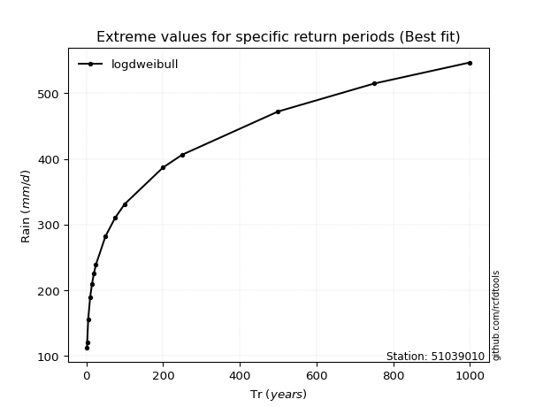</img>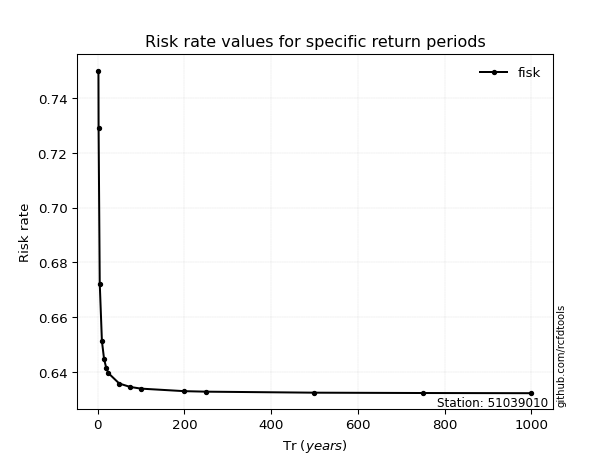</img>

</div>


<sub>**APP DISCLAIMER**: NO WARRANTY - This software is provided by [github.com/rcfdtools](https://github.com/rcfdtools) "as is", without any express or implied warranty, including warranties of merchantability, fitness for a particular purpose, or non-infringement. There is no guarantee that the software will be error-free or operate without interruption. LIMITATION OF LIABILITY - Neither the authors nor copyright holders will be liable for claims or damages arising from the software or its use. You are responsible for determining if the software is appropriate for your use and assume all associated risks, including errors, legal compliance, and data loss. NO PROFESSIONAL ADVICE - The software provides general information and does not offer professional advice. It should not replace consultation with professional advisors.</sub>