<div align="center">


</div>

# PMax24h Station (Rain): 52015050

Maximum Precipitation in 24 hours (PMax24h) is the greatest amount of rainfall for a specific duration that is meteorologically possible for a given location, acting as a "worst-case" scenario for extreme storms, crucial for designing safety-critical infrastructure like bridges, river deviations, dams, spillways, and nuclear plants to prevent catastrophic failure. The PMax24h is related with the Probable Maximum Precipitation (PMP) and it is calculated by hydrologists using meteorological data to determine the upper limit of extreme rainfall, often leading to the Probable Maximum Flood (PMF) for flood control design, and is increasingly being studied for climate change impacts. Probable Maximum Precipitation (PMP) is the theoretical upper limit of rainfall, a deterministic estimate for extreme events, while probability distributions (like GEV, Gumbel) describe the likelihood and frequency of various precipitation amounts, including rare ones, showing how often events occur, with PMP representing the extreme end of these distributions, used for critical infrastructure design to ensure safety against the worst conceivable weather, unlike standard statistical forecasts which cover typical probabilities.

The most common probability distributions in hydrology, used for analyzing floods, rainfall, and streamflow, include the Normal, Log-Normal, Gumbel, Gamma (including Log-Pearson Type III), and Generalized Extreme Value (GEV) distributions, often chosen based on the data´s skewness and whether modeling extremes or general conditions, with Gumbel and GEV popular for extreme events like floods, while the Normal distribution serves as a baseline, though often requiring transformations for skewed hydrological data. These distributions help in designing water infrastructure, managing water resources, and forecasting hydrologic events.

> Hydrological data often isn´t perfectly normal (it´s skewed), so different distributions are needed for different applications, such as: **Flood Frequency Analysis**: Using Gumbel, GEV, or Log-Pearson Type III for predicting extreme flood magnitudes and their return periods, **Rainfall Analysis**: Normal for annual totals, but Log-Normal, Weibull, or GEV for intensity or extreme daily rainfall, **Streamflow Modeling**: Gamma and Log-Normal for maximum flows, GEV for minimum flows, and Kappa for daily flows.

<div align="center">

</img>

</div>


## A. General information


### 1. General running parameters

• app_version: _v20260312_. • runtime: _2026-03-12 07:15:23.203550_. • Python version: _3.14.0_. • SciPy version: _1.16.3_. • Pandas version: _2.3.3_. • NumPy version: _2.3.5_. • Stations dataset (station_dataset_file): _dataset/pmax24h_in/automatic_colombia_2003_2025.csv_. • Stations catalog (station_catalog_file): _dataset/CNE.xls_. • Minimum year to eval til year_max (date_min): _1900_. • Maximum year to eval since year_min (date_max): _2025_. • Creates, save and include plots into reports (create_plot): _True_. • Plot only fit distributions with Δo > Δ (plot_only_fit): _True_. • Plot only simple graphs avoiding multiple CDFs and multiple Extreme values plots (plot_only_simple): _True_. • Eval low extreme values, if False, evaluates high extreme values (low_extreme): _False_. • Eval every SciPy distribution as logarithmic (pdist_logarithmic_on): _True_. • Standard deviation normalized (ddof): _1.0_. • Return periods to eval in years (Tr): _[2, 2.33, 5, 10, 15, 20, 25, 50, 75, 100, 200, 250, 500, 750, 1000]_. • Minimum data sample per station, 0 means any (minimum_sample): _5_. • Z-Score maximum threshold to adjust a value, 0 means disable (zscore_max): _3.5_. • Z-Score minimum threshold to adjust a value, 0 means disable (zscore_min): _-2.5_. • Avoid zeros, e.g. rain = 0 (avoid_zeros): _True_. • Avoid null values (avoid_nans): _True_. 

:file_folder:Table: [dataset.csv](../../dataset/pmax24h_in/automatic_colombia_2003_2025.csv)

> Delta Degrees of Freedom (DDOF): is a parameter used in the formulas for calculating variance and standard deviation. When ddof=0, the divisor is $N$ (the total number of observations) and this is used when your data set is the entire population. When ddof=1, the divisor is $N-1$ and this is used when your data set is a sample drawn from a larger population. Using $N-1$ provides an unbiased estimate of the population variance (known as Bessel´s correction).


### 2. Station info and location

|   id |   CODIGO | NOMBRE                  | CATEGORIA               | TECNOLOGIA                              | ESTADO     | FECHA_INSTALACION   | FECHA_SUSPENSION   |   ALTITUD |   LATITUD |   LONGITUD | DEPARTAMENTO   | MUNICIPIO   | AREA_OPERATIVA                      | ENTIDAD                                                     | AREA_HIDROGRAFICA   | ZONA_HIDROGRAFICA   | SUBZONA_HIDROGRAFICA   |   CORRIENTE | Catalogo   |   Version |
|-----:|---------:|:------------------------|:------------------------|:----------------------------------------|:-----------|:--------------------|:-------------------|----------:|----------:|-----------:|:---------------|:------------|:------------------------------------|:------------------------------------------------------------|:--------------------|:--------------------|:-----------------------|------------:|:-----------|----------:|
|    0 | 52015050 | BALBOA - AUT [52015050] | Climatológica Principal | Automática con Telemetría, Convencional | Suspendida | 27/09/2005          | 29/07/2025         |      1700 |   2.03278 |   -77.2217 | Cauca          | Balboa      | Area Operativa 07 - Nariño-Putumayo | INSTITUTO DE HIDROLOGIA METEOROLOGIA Y ESTUDIOS AMBIENTALES | Pacifico            | Patía               | Río Patia Alto         |         nan | CNE_IDEAM  |  20251226 |

<div align="center">

Dynamic map: [:earth_americas:Google](http://maps.google.com/maps?q=2.032777778,-77.22166667) [:earth_americas:OSM](https://www.openstreetmap.org/#map=18/2.032777778/-77.22166667&layers=P) [:earth_americas:Bing](https://www.bing.com/maps?cp=2.032777778~-77.22166667&lvl=18) [:earth_americas:Apple](https://maps.apple.com/frame?center=2.032777778%2C-77.22166667&span=0.003%2C0.006)

</div>


<div align="center">

```geojson
{
  "type": "Feature",
  "geometry": {
    "type": "Point", 
    "coordinates": [-77.22166667, 2.032777778]
  }, 
  "properties": {
    "Name": "52015050"
  }
}
```

</div>


### 3. Discrete values table and plot

<div align="center">

|               |           0 |          1 |           2 |          3 |           4 |          5 |         6 |
|:--------------|------------:|-----------:|------------:|-----------:|------------:|-----------:|----------:|
| Date          | 2017        | 2018       | 2019        | 2020       | 2021        | 2022       | 2025      |
| Value         |   78        |   47.3     |   60.7      |   81.1     |   61.6      |   45.5     |   11.1    |
| Value_initial |   78        |   47.3     |   60.7      |   81.1     |   61.6      |   45.5     |   11.1    |
| count         |    7        |    7       |    7        |    7       |    7        |    7       |    7      |
| mean          |   55.0429   |   55.0429  |   55.0429   |   55.0429  |   55.0429   |   55.0429  |   55.0429 |
| std           |   23.6749   |   23.6749  |   23.6749   |   23.6749  |   23.6749   |   23.6749  |   23.6749 |
| zscore        |    0.969684 |   -0.32705 |    0.238951 |    1.10062 |    0.276966 |   -0.40308 |   -1.8561 |


</div>


<div align="center">

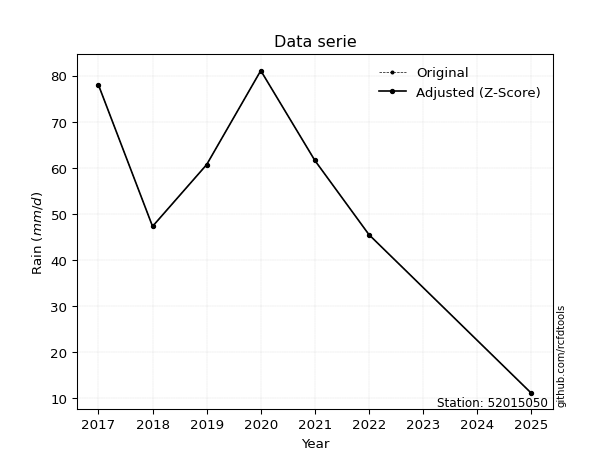</img>

</div>


> The initial value (value_initial) correspond to the initial obtained or null completed value, and value (value) is adjusted only when the initial value is outside the valid range (outlier) definite through the Z-Score value. If Z-Score is active, values out of range or outliers are replaced with the station mean value. A Z-Score (or standard score) measures how many standard deviations a data point is from the mean of a dataset, indicating its relative position; positive scores mean above the mean, negative mean below, and a score of zero is exactly at the mean, allowing for comparison of values from different distributions. It´s calculated using the formula $z=(x–μ)/σ$, where $x$ is the data point, $μ$ is the mean, and $σ$ is the standard deviation, helping identify outliers and understand probability.
>
> <sub>**Note**: In this study, "completing" (filling gaps in) and "extending" (forecasting or lengthening the historical record) rainfall data series are avoided for certain critical analyses because they introduce artificial bias and uncertainty, which can distort the statistics of rare events (extremes), alter day-to-day variability, and compromise the integrity and homogeneity of the original data. Some reasons against Completing/Extending rainfall data are: **Distortion of Extremes and Variability**: The primary issue is that most gap-filling or extension methods rely on averaging or regression with nearby stations, which inherently smooths the data. Rainfall is highly variable in space and time, with a large percentage of zero values and occasional large storms. Infilling methods often underestimate the highest values and overestimate the lowest (zero) values, which severely distorts analyses focused on flood frequency, drought severity, and intensity-duration-frequency (IDF) curves, **Loss of Data Homogeneity**: Infilled or extended data are synthetic estimates, not actual measurements. Combining these estimates with observed data can violate the assumption of data homogeneity, which requires that the data properties do not change over time. Inhomogeneity can lead to incorrect conclusions about long-term trends or changes in climate patterns, **Propagation of Errors**: Errors and biases from the original data (e.g., wind-induced undercatch, instrument errors, site changes) or the data used for imputation can propagate through the analysis, leading to unreliable hydrological models and inaccurate predictions, **Compromised Statistical Integrity**: For statistical analyses, especially those involving the frequency of events, using artificial data can introduce time bias or autocorrelation that doesn´t exist in reality, making it difficult to assess the true probability of events, **Difficulty in Validation**: It is difficult to accurately validate the quality of filled or extended data, especially for past periods where ground-truth measurements are unavailable. The reliability of imputation techniques heavily depends on the density of the surrounding station network and the complexity of the local topography.</sub>


### 4. Active continuous probability distributions from SciPy (80 of 104 available)

A Probability Density Function (PDF) describes the relative likelihood of a continuous random variable falling within a specific range, where the total area under its curve equals 1, and the area over any interval gives the actual probability for that range. Unlike discrete probabilities (like rolling a die), a PDF shows density, not direct probability for a single point (which is zero), with higher points indicating higher likelihood, often visualized as a bell curve for normal distributions.

A log of a probability density function (log-PDF) is simply the logarithm of the PDF´s value, denoted as $log(f(x))$, useful for converting multiplication of probabilities into addition, improving numerical stability with tiny numbers, and connecting to information theory concepts like entropy. Instead of dealing with very small probabilities (e.g., 0.000001), log-PDFs use negative numbers (e.g., $log(0.00001) ≈ -11.51$ that are easier for computers to handle, preventing underflow errors and simplifying complex calculations. In this study, each active probability distribution from SciPy is also evaluated in the $log$ form.

[scipy.stats](https://docs.scipy.org/doc/scipy/reference/stats.html) is a Python´s powerful submodule within the SciPy library for comprehensive statistical analysis, offering over 130 probability distributions (like Normal, Poisson, etc.), functions for descriptive stats (mean, variance), hypothesis testing (t-tests, chi-square), random variable generation, and statistical tests, making it essential for data science, modeling, and research. It provides tools to explore, model, and draw conclusions from data efficiently, working seamlessly with [NumPy](https://numpy.org/).

<div align="center">

|   id | p_dist           |   n_parameter | fit_method   | label                                                                       | active   | ref                                                                                                      |
|-----:|:-----------------|--------------:|:-------------|:----------------------------------------------------------------------------|:---------|:---------------------------------------------------------------------------------------------------------|
|    0 | alpha            |             3 | MLE          | Alpha                                                                       | True     | [:mortar_board:](https://docs.scipy.org/doc/scipy/reference/generated/scipy.stats.alpha.html)            |
|    1 | anglit           |             2 | MM           | Anglit                                                                      | True     | [:mortar_board:](https://docs.scipy.org/doc/scipy/reference/generated/scipy.stats.anglit.html)           |
|    2 | arcsine          |             2 | MM           | Arcsine                                                                     | True     | [:mortar_board:](https://docs.scipy.org/doc/scipy/reference/generated/scipy.stats.arcsine.html)          |
|    3 | argus            |             3 | MLE          | Argus                                                                       | True     | [:mortar_board:](https://docs.scipy.org/doc/scipy/reference/generated/scipy.stats.argus.html)            |
|    4 | beta             |             4 | MLE          | Beta                                                                        | True     | [:mortar_board:](https://docs.scipy.org/doc/scipy/reference/generated/scipy.stats.beta.html)             |
|    5 | betaprime        |             4 | MLE          | Beta prime                                                                  | True     | [:mortar_board:](https://docs.scipy.org/doc/scipy/reference/generated/scipy.stats.betaprime.html)        |
|    6 | bradford         |             3 | MLE          | Bradford                                                                    | True     | [:mortar_board:](https://docs.scipy.org/doc/scipy/reference/generated/scipy.stats.bradford.html)         |
|    7 | burr             |             4 | MLE          | Burr (Type III)                                                             | True     | [:mortar_board:](https://docs.scipy.org/doc/scipy/reference/generated/scipy.stats.burr.html)             |
|    8 | burr12           |             4 | MLE          | Burr (Type III) 12                                                          | True     | [:mortar_board:](https://docs.scipy.org/doc/scipy/reference/generated/scipy.stats.burr12.html)           |
|    9 | cosine           |             2 | MLE          | Cosine                                                                      | True     | [:mortar_board:](https://docs.scipy.org/doc/scipy/reference/generated/scipy.stats.cosine.html)           |
|   10 | crystalball      |             4 | MLE          | Crystalball                                                                 | True     | [:mortar_board:](https://docs.scipy.org/doc/scipy/reference/generated/scipy.stats.crystalball.html)      |
|   11 | dgamma           |             3 | MLE          | Double gamma                                                                | True     | [:mortar_board:](https://docs.scipy.org/doc/scipy/reference/generated/scipy.stats.dgamma.html)           |
|   12 | dweibull         |             3 | MLE          | Double Weibull                                                              | True     | [:mortar_board:](https://docs.scipy.org/doc/scipy/reference/generated/scipy.stats.dweibull.html)         |
|   13 | erlang           |             3 | MLE          | Erlang                                                                      | True     | [:mortar_board:](https://docs.scipy.org/doc/scipy/reference/generated/scipy.stats.erlang.html)           |
|   14 | exponnorm        |             3 | MLE          | Exponentially modified Normal                                               | True     | [:mortar_board:](https://docs.scipy.org/doc/scipy/reference/generated/scipy.stats.exponnorm.html)        |
|   15 | exponpow         |             3 | MLE          | Exponential power                                                           | True     | [:mortar_board:](https://docs.scipy.org/doc/scipy/reference/generated/scipy.stats.exponpow.html)         |
|   16 | exponweib        |             4 | MLE          | Exponentiated Weibull                                                       | True     | [:mortar_board:](https://docs.scipy.org/doc/scipy/reference/generated/scipy.stats.exponweib.html)        |
|   17 | f                |             4 | MLE          | F                                                                           | True     | [:mortar_board:](https://docs.scipy.org/doc/scipy/reference/generated/scipy.stats.f.html)                |
|   18 | fatiguelife      |             3 | MLE          | Fatigue-life (Birnbaum-Saunders)                                            | True     | [:mortar_board:](https://docs.scipy.org/doc/scipy/reference/generated/scipy.stats.fatiguelife.html)      |
|   19 | foldnorm         |             3 | MM           | Fold Normal                                                                 | True     | [:mortar_board:](https://docs.scipy.org/doc/scipy/reference/generated/scipy.stats.foldnorm.html)         |
|   20 | gamma            |             3 | MLE          | Gamma                                                                       | True     | [:mortar_board:](https://docs.scipy.org/doc/scipy/reference/generated/scipy.stats.gamma.html)            |
|   21 | gausshyper       |             6 | MLE          | Gauss hypergeometric                                                        | True     | [:mortar_board:](https://docs.scipy.org/doc/scipy/reference/generated/scipy.stats.gausshyper.html)       |
|   22 | genexpon         |             5 | MLE          | Generalized exponential                                                     | True     | [:mortar_board:](https://docs.scipy.org/doc/scipy/reference/generated/scipy.stats.genexpon.html)         |
|   23 | genextreme       |             3 | MLE          | Generalized exponential                                                     | True     | [:mortar_board:](https://docs.scipy.org/doc/scipy/reference/generated/scipy.stats.genextreme.html)       |
|   24 | gengamma         |             4 | MLE          | Generalized gamma                                                           | True     | [:mortar_board:](https://docs.scipy.org/doc/scipy/reference/generated/scipy.stats.gengamma.html)         |
|   25 | genhalflogistic  |             3 | MLE          | Generalized half-logistic                                                   | True     | [:mortar_board:](https://docs.scipy.org/doc/scipy/reference/generated/scipy.stats.genhalflogistic.html)  |
|   26 | genlogistic      |             3 | MLE          | Generalized logistic                                                        | True     | [:mortar_board:](https://docs.scipy.org/doc/scipy/reference/generated/scipy.stats.genlogistic.html)      |
|   27 | gennorm          |             3 | MLE          | Generalized Normal                                                          | True     | [:mortar_board:](https://docs.scipy.org/doc/scipy/reference/generated/scipy.stats.gennorm.html)          |
|   28 | genpareto        |             3 | MLE          | Generalized Pareto                                                          | True     | [:mortar_board:](https://docs.scipy.org/doc/scipy/reference/generated/scipy.stats.genpareto.html)        |
|   29 | gompertz         |             3 | MLE          | Gompertz (or truncated Gumbel)                                              | True     | [:mortar_board:](https://docs.scipy.org/doc/scipy/reference/generated/scipy.stats.gompertz.html)         |
|   30 | gumbel_l         |             2 | MM           | Gumbel Left Skew                                                            | True     | [:mortar_board:](https://docs.scipy.org/doc/scipy/reference/generated/scipy.stats.gumbel_l.html)         |
|   31 | gumbel_r         |             2 | MM           | Gumbel Right Skew                                                           | True     | [:mortar_board:](https://docs.scipy.org/doc/scipy/reference/generated/scipy.stats.gumbel_r.html)         |
|   32 | halfgennorm      |             3 | MLE          | Upper half of a generalized normal                                          | True     | [:mortar_board:](https://docs.scipy.org/doc/scipy/reference/generated/scipy.stats.halfgennorm.html)      |
|   33 | halflogistic     |             2 | MM           | Half-logistic                                                               | True     | [:mortar_board:](https://docs.scipy.org/doc/scipy/reference/generated/scipy.stats.halflogistic.html)     |
|   34 | halfnorm         |             2 | MM           | Half Normal                                                                 | True     | [:mortar_board:](https://docs.scipy.org/doc/scipy/reference/generated/scipy.stats.halfnorm.html)         |
|   35 | hypsecant        |             2 | MM           | hyperbolic secant                                                           | True     | [:mortar_board:](https://docs.scipy.org/doc/scipy/reference/generated/scipy.stats.hypsecant.html)        |
|   36 | invgamma         |             3 | MLE          | Inverted gamma                                                              | True     | [:mortar_board:](https://docs.scipy.org/doc/scipy/reference/generated/scipy.stats.invgamma.html)         |
|   37 | invgauss         |             3 | MLE          | Inverse Gaussian                                                            | True     | [:mortar_board:](https://docs.scipy.org/doc/scipy/reference/generated/scipy.stats.invgauss.html)         |
|   38 | invweibull       |             3 | MLE          | Inverted Weibull                                                            | True     | [:mortar_board:](https://docs.scipy.org/doc/scipy/reference/generated/scipy.stats.invweibull.html)       |
|   39 | johnsonsb        |             4 | MLE          | Johnson SB                                                                  | True     | [:mortar_board:](https://docs.scipy.org/doc/scipy/reference/generated/scipy.stats.johnsonsb.html)        |
|   40 | johnsonsu        |             4 | MLE          | Johnson Su                                                                  | True     | [:mortar_board:](https://docs.scipy.org/doc/scipy/reference/generated/scipy.stats.johnsonsu.html)        |
|   41 | kappa3           |             3 | MLE          | Kappa 3                                                                     | True     | [:mortar_board:](https://docs.scipy.org/doc/scipy/reference/generated/scipy.stats.kappa3.html)           |
|   42 | kappa4           |             4 | MLE          | Kappa 4                                                                     | True     | [:mortar_board:](https://docs.scipy.org/doc/scipy/reference/generated/scipy.stats.kappa4.html)           |
|   43 | ksone            |             3 | MLE          | Kolmogorov-Smirnov one-sided test statistic distribution                    | True     | [:mortar_board:](https://docs.scipy.org/doc/scipy/reference/generated/scipy.stats.ksone.html)            |
|   44 | kstwobign        |             2 | MLE          | Limiting distribution of scaled Kolmogorov-Smirnov two-sided test statistic | True     | [:mortar_board:](https://docs.scipy.org/doc/scipy/reference/generated/scipy.stats.kstwobign.html)        |
|   45 | laplace          |             2 | MM           | Laplace                                                                     | True     | [:mortar_board:](https://docs.scipy.org/doc/scipy/reference/generated/scipy.stats.laplace.html)          |
|   46 | levy_l           |             2 | MLE          | Left-skewed Levy                                                            | True     | [:mortar_board:](https://docs.scipy.org/doc/scipy/reference/generated/scipy.stats.levy_l.html)           |
|   47 | loggamma         |             3 | MLE          | Log gamma                                                                   | True     | [:mortar_board:](https://docs.scipy.org/doc/scipy/reference/generated/scipy.stats.loggamma.html)         |
|   48 | logistic         |             2 | MM           | Logistic (or Sech-squared)                                                  | True     | [:mortar_board:](https://docs.scipy.org/doc/scipy/reference/generated/scipy.stats.logistic.html)         |
|   49 | loglaplace       |             3 | MLE          | Log-Laplace                                                                 | True     | [:mortar_board:](https://docs.scipy.org/doc/scipy/reference/generated/scipy.stats.loglaplace.html)       |
|   50 | lomax            |             3 | MLE          | Lomax (Pareto of the second kind)                                           | True     | [:mortar_board:](https://docs.scipy.org/doc/scipy/reference/generated/scipy.stats.lomax.html)            |
|   51 | maxwell          |             2 | MM           | Maxwell                                                                     | True     | [:mortar_board:](https://docs.scipy.org/doc/scipy/reference/generated/scipy.stats.maxwell.html)          |
|   52 | mielke           |             4 | MLE          | Mielke Beta-Kappa / Dagum                                                   | True     | [:mortar_board:](https://docs.scipy.org/doc/scipy/reference/generated/scipy.stats.mielke.html)           |
|   53 | moyal            |             2 | MM           | Moyal                                                                       | True     | [:mortar_board:](https://docs.scipy.org/doc/scipy/reference/generated/scipy.stats.moyal.html)            |
|   54 | nakagami         |             3 | MLE          | Nakagami                                                                    | True     | [:mortar_board:](https://docs.scipy.org/doc/scipy/reference/generated/scipy.stats.nakagami.html)         |
|   55 | ncf              |             5 | MLE          | Non-central F distribution                                                  | True     | [:mortar_board:](https://docs.scipy.org/doc/scipy/reference/generated/scipy.stats.ncf.html)              |
|   56 | nct              |             4 | MLE          | Non-central Student’s t                                                     | True     | [:mortar_board:](https://docs.scipy.org/doc/scipy/reference/generated/scipy.stats.nct.html)              |
|   57 | norm             |             2 | MM           | Normal                                                                      | True     | [:mortar_board:](https://docs.scipy.org/doc/scipy/reference/generated/scipy.stats.norm.html)             |
|   58 | pearson3         |             3 | MM           | Pearson type III                                                            | True     | [:mortar_board:](https://docs.scipy.org/doc/scipy/reference/generated/scipy.stats.pearson3.html)         |
|   59 | powerlaw         |             3 | MLE          | Power-function                                                              | True     | [:mortar_board:](https://docs.scipy.org/doc/scipy/reference/generated/scipy.stats.powerlaw.html)         |
|   60 | rayleigh         |             2 | MM           | Rayleigh                                                                    | True     | [:mortar_board:](https://docs.scipy.org/doc/scipy/reference/generated/scipy.stats.rayleigh.html)         |
|   61 | rdist            |             3 | MLE          | R-distributed (symmetric beta)                                              | True     | [:mortar_board:](https://docs.scipy.org/doc/scipy/reference/generated/scipy.stats.rdist.html)            |
|   62 | rice             |             3 | MLE          | Rice                                                                        | True     | [:mortar_board:](https://docs.scipy.org/doc/scipy/reference/generated/scipy.stats.rice.html)             |
|   63 | semicircular     |             2 | MM           | Semicircular                                                                | True     | [:mortar_board:](https://docs.scipy.org/doc/scipy/reference/generated/scipy.stats.semicircular.html)     |
|   64 | skewnorm         |             3 | MLE          | Skew normal                                                                 | True     | [:mortar_board:](https://docs.scipy.org/doc/scipy/reference/generated/scipy.stats.skewnorm.html)         |
|   65 | t                |             3 | MLE          | Student’s t                                                                 | True     | [:mortar_board:](https://docs.scipy.org/doc/scipy/reference/generated/scipy.stats.t.html)                |
|   66 | trapezoid        |             4 | MLE          | Trapezoid                                                                   | True     | [:mortar_board:](https://docs.scipy.org/doc/scipy/reference/generated/scipy.stats.trapezoid.html)        |
|   67 | triang           |             3 | MLE          | Triangular                                                                  | True     | [:mortar_board:](https://docs.scipy.org/doc/scipy/reference/generated/scipy.stats.triang.html)           |
|   68 | truncexpon       |             3 | MLE          | Truncated exponential                                                       | True     | [:mortar_board:](https://docs.scipy.org/doc/scipy/reference/generated/scipy.stats.truncexpon.html)       |
|   69 | truncnorm        |             4 | MLE          | Truncated normal                                                            | True     | [:mortar_board:](https://docs.scipy.org/doc/scipy/reference/generated/scipy.stats.truncnorm.html)        |
|   70 | truncpareto      |             4 | MLE          | Upper truncated Pareto                                                      | True     | [:mortar_board:](https://docs.scipy.org/doc/scipy/reference/generated/scipy.stats.truncpareto.html)      |
|   71 | truncweibull_min |             5 | MLE          | Doubly truncated Weibull minimum                                            | True     | [:mortar_board:](https://docs.scipy.org/doc/scipy/reference/generated/scipy.stats.truncweibull_min.html) |
|   72 | tukeylambda      |             3 | MLE          | Tukey-Lamdba                                                                | True     | [:mortar_board:](https://docs.scipy.org/doc/scipy/reference/generated/scipy.stats.tukeylambda.html)      |
|   73 | uniform          |             2 | MLE          | Uniform                                                                     | True     | [:mortar_board:](https://docs.scipy.org/doc/scipy/reference/generated/scipy.stats.uniform.html)          |
|   74 | vonmises         |             3 | MLE          | Von Mises                                                                   | True     | [:mortar_board:](https://docs.scipy.org/doc/scipy/reference/generated/scipy.stats.vonmises.html)         |
|   75 | vonmises_line    |             3 | MLE          | Von Mises line                                                              | True     | [:mortar_board:](https://docs.scipy.org/doc/scipy/reference/generated/scipy.stats.vonmises_line.html)    |
|   76 | wald             |             2 | MM           | Wald                                                                        | True     | [:mortar_board:](https://docs.scipy.org/doc/scipy/reference/generated/scipy.stats.wald.html)             |
|   77 | weibull_max      |             3 | MLE          | Weibull maximum                                                             | True     | [:mortar_board:](https://docs.scipy.org/doc/scipy/reference/generated/scipy.stats.weibull_max.html)      |
|   78 | weibull_min      |             3 | MLE          | Weibull minimum                                                             | True     | [:mortar_board:](https://docs.scipy.org/doc/scipy/reference/generated/scipy.stats.weibull_min.html)      |
|   79 | wrapcauchy       |             3 | MLE          | Wrapped  Cauchy                                                             | True     | [:mortar_board:](https://docs.scipy.org/doc/scipy/reference/generated/scipy.stats.wrapcauchy.html)       |

</div>

> **n_parameter:** # arguments & localization & scale.
>
> **Fit methods:** (MLE) maximum likelihood, (MM) L-moments.
>
>**Inactive** (With the only purpose of prevent loops, zero divisions, infinite values, over high estimated values or horizontal trending for recurrence intervals estimations, the follow distributions were disabled.)**:** lognorm, norminvgauss, powernorm, powerlognorm, cauchy, halfcauchy, foldcauchy, skewcauchy, chi2, expon, fisk, genhyperbolic, geninvgauss, gibrat, kstwo, laplace_asymmetric, levy, levy_stable, ncx2, pareto, rel_breitwigner, recipinvgauss, studentized_range, loguniform, 


## B. Probability (PDF) vs. Empirical (EDF) distributions functions

A continuous probability distribution (CPD) describes probabilities for variables that can take any value within a range (like rain any time), unlike discrete variables with specific outcomes (like temperature). It uses a Probability Density Function (PDF), a curve where the total area under it equals 1, and the probability of the variable falling within an interval (a to b) is found by calculating the area under the curve between those points. A key feature is that the probability of hitting any single exact value is zero, so probabilities are always expressed for ranges, e.g., $P(a ≤ X ≤ b)$.

<div align="center">

Distributions parameters from station values
|     |   station | p_dist              |   n |             loc |           scale | shape                  | shape1                 | shape2                 | shape3             |
|----:|----------:|:--------------------|----:|----------------:|----------------:|:-----------------------|:-----------------------|:-----------------------|:-------------------|
|   0 |  52015050 | alpha               |   7 |  -139.495       |  1372.25        | 7.196174430667394      |                        |                        |                    |
|   1 |  52015050 | anglit              |   7 |    55.0429      |    64.1209      |                        |                        |                        |                    |
|   2 |  52015050 | arcsine             |   7 |    24.0452      |    61.9954      |                        |                        |                        |                    |
|   3 |  52015050 | argus               |   7 |    -9.45077     |    93.1993      | 1.9405391922619386     |                        |                        |                    |
|   4 |  52015050 | beta                |   7 |   -17.9629      |    99.0629      | 2.342991917046924      | 0.9308081782296405     |                        |                    |
|   5 |  52015050 | betaprime           |   7 |  -602.913       | 73262.1         | 894.890977211016       | 99655.70185439149      |                        |                    |
|   6 |  52015050 | bradford            |   7 |    11.1         |    70.0001      | 1.0020795955986301     |                        |                        |                    |
|   7 |  52015050 | burr                |   7 |    -2.97241     |    84.7776      | 395.24275146873117     | 0.0050742206234771475  |                        |                    |
|   8 |  52015050 | burr12              |   7 |    -1.57117     |    12.5281      | 376.1647404793023      | 0.0019277122676127903  |                        |                    |
|   9 |  52015050 | cosine              |   7 |    52.3441      |    18.9529      |                        |                        |                        |                    |
|  10 |  52015050 | crystalball         |   7 |    55.0429      |    21.9187      | 9016.825711898677      | 20915.3252060175       |                        |                    |
|  11 |  52015050 | dgamma              |   7 |    54.5643      |     8.82698     | 1.9896099323804992     |                        |                        |                    |
|  12 |  52015050 | dweibull            |   7 |    60.7         |    21.5252      | 0.861259439873636      |                        |                        |                    |
|  13 |  52015050 | erlang              |   7 |  -291.132       |     1.47615     | 234.25917572508462     |                        |                        |                    |
|  14 |  52015050 | exponnorm           |   7 |    55.0267      |    21.9186      | 0.0007350120035541524  |                        |                        |                    |
|  15 |  52015050 | exponpow            |   7 |  -115.557       |   190.159       | 7.85470715823968       |                        |                        |                    |
|  16 |  52015050 | exponweib           |   7 |    -2.06989e+07 |     2.06988e+07 | 72.11161569250044      | 210010.2365459604      |                        |                    |
|  17 |  52015050 | f                   |   7 | -7387.49        |  7442.54        | 277434.82904869545     | 1274499.3554687267     |                        |                    |
|  18 |  52015050 | fatiguelife         |   7 |    11.1         |     3.23898e-05 | 1162.0644719347092     |                        |                        |                    |
|  19 |  52015050 | foldnorm            |   7 |    60.3194      |     0.204246    | 0.2198550662236518     |                        |                        |                    |
|  20 |  52015050 | gamma               |   7 |  -296.941       |     1.45329     | 242.03213870890164     |                        |                        |                    |
|  21 |  52015050 | gausshyper          |   7 |     4.86823     |    76.2318      | 1.3982568800265147     | 0.20551680573465392    | 1.3726341598012604     | 1.1280042369282905 |
|  22 |  52015050 | genexpon            |   7 |    11.1         |     2.02937     | 0.046183112244694235   | 9.576097698880651e-09  | 1.0914637050275053     |                    |
|  23 |  52015050 | genextreme          |   7 |    55.1058      |    29.5145      | 1.1354264486845467     |                        |                        |                    |
|  24 |  52015050 | gengamma            |   7 |    -7.09709e+08 |     7.0971e+08  | 0.6362538043857546     | 56226824.95357295      |                        |                    |
|  25 |  52015050 | genhalflogistic     |   7 |     6.49625     |    82.7197      | 1.1087876472724387     |                        |                        |                    |
|  26 |  52015050 | genlogistic         |   7 |    81.1002      |     9.65925e-06 | 3.707288703395912e-07  |                        |                        |                    |
|  27 |  52015050 | gennorm             |   7 |    60.7         |     1.31333     | 0.42232294834977946    |                        |                        |                    |
|  28 |  52015050 | genpareto           |   7 |    -0.540702    |   171.117       | -2.095972179655936     |                        |                        |                    |
|  29 |  52015050 | gompertz            |   7 |   -14.146       |    17.3349      | 0.010541317632209592   |                        |                        |                    |
|  30 |  52015050 | gumbel_l            |   7 |    64.9074      |    17.0899      |                        |                        |                        |                    |
|  31 |  52015050 | gumbel_r            |   7 |    45.1783      |    17.0899      |                        |                        |                        |                    |
|  32 |  52015050 | halfgennorm         |   7 |    11.1         |     0.452294    | 0.29232907808381514    |                        |                        |                    |
|  33 |  52015050 | halflogistic        |   7 |    29.0642      |    18.7397      |                        |                        |                        |                    |
|  34 |  52015050 | halfnorm            |   7 |    26.0311      |    36.3608      |                        |                        |                        |                    |
|  35 |  52015050 | hypsecant           |   7 |    55.0429      |    13.9539      |                        |                        |                        |                    |
|  36 |  52015050 | invgamma            |   7 |  -279.709       | 71885.1         | 215.917658674631       |                        |                        |                    |
|  37 |  52015050 | invgauss            |   7 |   -87.2521      |  4759.71        | 0.029934354842042155   |                        |                        |                    |
|  38 |  52015050 | invweibull          |   7 |    -1.68313e+09 |     1.68313e+09 | 69051644.079158        |                        |                        |                    |
|  39 |  52015050 | johnsonsb           |   7 |     9.3228      |    71.7772      | -0.9272784004837964    | 0.13169419194608867    |                        |                    |
|  40 |  52015050 | johnsonsu           |   7 |    91.884       |     0.422675    | 7.628985036850779      | 1.536045830806981      |                        |                    |
|  41 |  52015050 | kappa3              |   7 |    11.1         |    69.8459      | 783.6817792258742      |                        |                        |                    |
|  42 |  52015050 | kappa4              |   7 |     3.85026     |    81.5107      | 1.097871547905425      | 1.0499765345932301     |                        |                    |
|  43 |  52015050 | ksone               |   7 |     4.1         |    84           | 1.0                    |                        |                        |                    |
|  44 |  52015050 | kstwobign           |   7 |   -42.2368      |   111.27        |                        |                        |                        |                    |
|  45 |  52015050 | laplace             |   7 |    55.0429      |    15.4988      |                        |                        |                        |                    |
|  46 |  52015050 | levy_l              |   7 |    82.8218      |     7.37323     |                        |                        |                        |                    |
|  47 |  52015050 | loggamma            |   7 |    81.1002      |     3.86798e-06 | 1.4821226145850224e-07 |                        |                        |                    |
|  48 |  52015050 | logistic            |   7 |    55.0429      |    12.0844      |                        |                        |                        |                    |
|  49 |  52015050 | loglaplace          |   7 |    -0.167572    |    60.8676      | 2.5212385366889416     |                        |                        |                    |
|  50 |  52015050 | lomax               |   7 |    11.1         |     2.04623e+12 | 39875995179.42462      |                        |                        |                    |
|  51 |  52015050 | maxwell             |   7 |     3.10481     |    32.5473      |                        |                        |                        |                    |
|  52 |  52015050 | mielke              |   7 |     3.99352     |    77.4915      | 1.6442036977955474     | 863.7283657671321      |                        |                    |
|  53 |  52015050 | moyal               |   7 |    42.5084      |     9.86687     |                        |                        |                        |                    |
|  54 |  52015050 | nakagami            |   7 |    45.5         |    22.6762      | 0.22474257333498443    |                        |                        |                    |
|  55 |  52015050 | ncf                 |   7 |     0.0576133   |     1.99814e-05 | 6.989685128636255e-06  | 80.4809335787798       | 19.007447979092866     |                    |
|  56 |  52015050 | nct                 |   7 | -1463.09        |    21.8493      | 319447.8303929828      | 69.48186217324064      |                        |                    |
|  57 |  52015050 | norm                |   7 |    55.0429      |    21.9187      |                        |                        |                        |                    |
|  58 |  52015050 | pearson3            |   7 |    55.0429      |    21.9186      | -0.7587821975409645    |                        |                        |                    |
|  59 |  52015050 | powerlaw            |   7 |    11.1         |    70           | 0.17370199240980425    |                        |                        |                    |
|  60 |  52015050 | rayleigh            |   7 |    13.1112      |    33.4566      |                        |                        |                        |                    |
|  61 |  52015050 | rdist               |   7 |     5.38547     |    41.9145      | 1.0023723309677453     |                        |                        |                    |
|  62 |  52015050 | rice                |   7 |    -4.6577      |    23.45        | 2.3141058224935493     |                        |                        |                    |
|  63 |  52015050 | semicircular        |   7 |    55.0429      |    43.8374      |                        |                        |                        |                    |
|  64 |  52015050 | skewnorm            |   7 |    81.1         |    34.0485      | -15442423.208567359    |                        |                        |                    |
|  65 |  52015050 | t                   |   7 |    55.0414      |    21.9169      | 791663.1390791798      |                        |                        |                    |
|  66 |  52015050 | trapezoid           |   7 |    -7.30013     |    92.993       | 1.0                    | 1.0                    |                        |                    |
|  67 |  52015050 | triang              |   7 |    -6.6609      |    87.7609      | 0.9999998201673181     |                        |                        |                    |
|  68 |  52015050 | truncexpon          |   7 |     4.29489     |   107.395       | 0.7151648305001344     |                        |                        |                    |
|  69 |  52015050 | truncnorm           |   7 |    55.0429      |    21.9187      | -182.55628513797996    | 1009.705655064746      |                        |                    |
|  70 |  52015050 | truncpareto         |   7 |    11.0526      |     0.0473659   | 0.1678260397381868     | 1478.8579538542574     |                        |                    |
|  71 |  52015050 | truncweibull_min    |   7 |     5.73596     |    98.7723      | 1.7581475016747405     | 0.0005335931501540261  | 0.7630074765663744     |                    |
|  72 |  52015050 | tukeylambda         |   7 |    42.9238      |    47.0551      | 1.2325752878394813     |                        |                        |                    |
|  73 |  52015050 | uniform             |   7 |    11.1         |    70           |                        |                        |                        |                    |
|  74 |  52015050 | vonmises            |   7 |    -2.05461     |     1           | 0.6809252865662426     |                        |                        |                    |
|  75 |  52015050 | vonmises_line       |   7 |    46.0834      |    11.1461      | 1.2488318063210352e-05 |                        |                        |                    |
|  76 |  52015050 | wald                |   7 |    33.1242      |    21.9187      |                        |                        |                        |                    |
|  77 |  52015050 | weibull_max         |   7 |    81.1         |     1.35942     | 0.24170303413725797    |                        |                        |                    |
|  78 |  52015050 | weibull_min         |   7 |    -6.4944e+08  |     6.4944e+08  | 38365469.02586167      |                        |                        |                    |
|  79 |  52015050 | wrapcauchy          |   7 |    11.0999      |    11.1409      | 0.14255634506676343    |                        |                        |                    |
|  80 |  52015050 | logalpha            |   7 |   -12.1269      |   365.185       | 22.894944486841887     |                        |                        |                    |
|  81 |  52015050 | loganglit           |   7 |     3.86574     |     1.84193     |                        |                        |                        |                    |
|  82 |  52015050 | logarcsine          |   7 |     2.97527     |     1.78093     |                        |                        |                        |                    |
|  83 |  52015050 | logargus            |   7 |     1.50332     |     2.9403      | 2.981964390257753      |                        |                        |                    |
|  84 |  52015050 | logbeta             |   7 |   -17.7573      |    22.1529      | 32.09169828468811      | 0.5763218725459365     |                        |                    |
|  85 |  52015050 | logbetaprime        |   7 |   -16.4934      |   388.026       | 1015.7298755088327     | 19364.460644814128     |                        |                    |
|  86 |  52015050 | logbradford         |   7 |     2.4049      |     1.99078     | 0.00021578514573811507 |                        |                        |                    |
|  87 |  52015050 | logburr             |   7 |    -1.7447      |     6.15128     | 1805.352180579837      | 0.0055781336867665125  |                        |                    |
|  88 |  52015050 | logburr12           |   7 | -5467.84        |  5476.73        | 16373.446369626763     | 1529186.6392337363     |                        |                    |
|  89 |  52015050 | logcosine           |   7 |     3.72126     |     0.574947    |                        |                        |                        |                    |
|  90 |  52015050 | logcrystalball      |   7 |     3.86574     |     0.629631    | 6.831949156276197      | 29.26259918632791      |                        |                    |
|  91 |  52015050 | logdgamma           |   7 |     4.10594     |     0.436649    | 0.9160489451579867     |                        |                        |                    |
|  92 |  52015050 | logdweibull         |   7 |     4.12066     |     0.425324    | 0.8892698378308146     |                        |                        |                    |
|  93 |  52015050 | logerlang           |   7 |    -7.74238     |     0.0373965   | 310.0458814649378      |                        |                        |                    |
|  94 |  52015050 | logexponnorm        |   7 |     3.86532     |     0.629631    | 0.0006602422038391987  |                        |                        |                    |
|  95 |  52015050 | logexponpow         |   7 |     2.40695     |     1.37025     | 0.553717675149247      |                        |                        |                    |
|  96 |  52015050 | logexponweib        |   7 |     2.40695     |     2.13123     | 0.952698560253499      | 0.20451477367463042    |                        |                    |
|  97 |  52015050 | logf                |   7 | -1259.16        |  1263.02        | 30848262.01667124      | 10815246.26065636      |                        |                    |
|  98 |  52015050 | logfatiguelife      |   7 |  -521.306       |   525.168       | 0.0011994334854250233  |                        |                        |                    |
|  99 |  52015050 | logfoldnorm         |   7 |     1.78166     |     0.592841    | 3.5209746333425924     |                        |                        |                    |
| 100 |  52015050 | loggamma            |   7 |    -7.7883      |     0.0373979   | 311.6676556039547      |                        |                        |                    |
| 101 |  52015050 | loggausshyper       |   7 |     2.3992      |     1.99648     | 1.144257619084161      | 0.5523280862925789     | 1.1737154865383834     | 1.0884741001543703 |
| 102 |  52015050 | loggenexpon         |   7 |     2.26613     |     0.00953789  | 0.0008183965806216826  | 4.667777895297377      | 1.1405285520951883e-05 |                    |
| 103 |  52015050 | loggenextreme       |   7 |     3.704       |     0.789701    | 1.141706991724143      |                        |                        |                    |
| 104 |  52015050 | loggengamma         |   7 |   -40.9829      |    32.2256      | 42.26262146971554      | 11.294840356980632     |                        |                    |
| 105 |  52015050 | loggenhalflogistic  |   7 |     2.37378     |     2.21266     | 1.0943442194430206     |                        |                        |                    |
| 106 |  52015050 | loggenlogistic      |   7 |     4.3957      |     1.3532e-06  | 2.536759882378911e-06  |                        |                        |                    |
| 107 |  52015050 | loggennorm          |   7 |     4.12066     |     0.0341002   | 0.45437458928175245    |                        |                        |                    |
| 108 |  52015050 | loggenpareto        |   7 |    -0.00243054  |     8.32134     | -1.8920237080206816    |                        |                        |                    |
| 109 |  52015050 | loggompertz         |   7 |     2.40694     |     0.378823    | 0.011197713669621964   |                        |                        |                    |
| 110 |  52015050 | loggumbel_l         |   7 |     4.14911     |     0.490921    |                        |                        |                        |                    |
| 111 |  52015050 | loggumbel_r         |   7 |     3.58237     |     0.490921    |                        |                        |                        |                    |
| 112 |  52015050 | loghalfgennorm      |   7 |     2.40695     |     1.32199     | 0.9295204671049324     |                        |                        |                    |
| 113 |  52015050 | loghalflogistic     |   7 |     3.11951     |     0.538289    |                        |                        |                        |                    |
| 114 |  52015050 | loghalfnorm         |   7 |     3.0324      |     1.04444     |                        |                        |                        |                    |
| 115 |  52015050 | loghypsecant        |   7 |     3.86574     |     0.400836    |                        |                        |                        |                    |
| 116 |  52015050 | loginvgamma         |   7 |   -13.5184      | 11826.1         | 682.0561342197454      |                        |                        |                    |
| 117 |  52015050 | loginvgauss         |   7 |    -3.38251     |   773.966       | 0.009346337818432401   |                        |                        |                    |
| 118 |  52015050 | loginvweibull       |   7 |    -9.42985e+07 |     9.42985e+07 | 121926687.82596591     |                        |                        |                    |
| 119 |  52015050 | logjohnsonsb        |   7 |     0.0662843   |     4.3294      | -0.19357533542649016   | 0.14666385015764138    |                        |                    |
| 120 |  52015050 | logjohnsonsu        |   7 |     4.39568     |     2.79993e-13 | 2.938902800111894      | 0.13680602130399955    |                        |                    |
| 121 |  52015050 | logkappa3           |   7 |     2.40693     |     1.98873     | 271940.85908343195     |                        |                        |                    |
| 122 |  52015050 | logkappa4           |   7 |     2.27168     |     2.32665     | 0.9982738245437054     | 1.0954062057544531     |                        |                    |
| 123 |  52015050 | logksone            |   7 |     2.20807     |     2.38649     | 1.0                    |                        |                        |                    |
| 124 |  52015050 | logkstwobign        |   7 |     0.693647    |     3.62952     |                        |                        |                        |                    |
| 125 |  52015050 | loglaplace          |   7 |     3.86574     |     0.445216    |                        |                        |                        |                    |
| 126 |  52015050 | loglevy_l           |   7 |     4.42072     |     0.106055    |                        |                        |                        |                    |
| 127 |  52015050 | logloggamma         |   7 |     4.39572     |     2.5247e-06  | 4.7767207860457476e-06 |                        |                        |                    |
| 128 |  52015050 | loglogistic         |   7 |     3.86574     |     0.347134    |                        |                        |                        |                    |
| 129 |  52015050 | logloglaplace       |   7 |    -0.0930318   |     4.19898     | 9.004557994276894      |                        |                        |                    |
| 130 |  52015050 | loglomax            |   7 |     2.40695     |     1.40425e+08 | 95132795.33239166      |                        |                        |                    |
| 131 |  52015050 | logmaxwell          |   7 |     2.37378     |     0.934948    |                        |                        |                        |                    |
| 132 |  52015050 | logmielke           |   7 |    -3.43253e+07 |     3.43253e+07 | 62616617.21376506      | 115624814495.66425     |                        |                    |
| 133 |  52015050 | logmoyal            |   7 |     3.50567     |     0.283434    |                        |                        |                        |                    |
| 134 |  52015050 | lognakagami         |   7 |     3.81771     |     0.322155    | 0.2380235389278813     |                        |                        |                    |
| 135 |  52015050 | logncf              |   7 |   -14.057       |     6.59374     | 951.151172028445       | 13243.487058762403     | 1634.5134687343088     |                    |
| 136 |  52015050 | lognct              |   7 |   -45.7648      |     0.623512    | 126987.53959797224     | 79.59752150420866      |                        |                    |
| 137 |  52015050 | lognorm             |   7 |     3.86574     |     0.629631    |                        |                        |                        |                    |
| 138 |  52015050 | logpearson3         |   7 |     3.86574     |     0.629633    | -1.606525235956643     |                        |                        |                    |
| 139 |  52015050 | logpowerlaw         |   7 |     2.40695     |     1.98874     | 0.18906809221545592    |                        |                        |                    |
| 140 |  52015050 | lograyleigh         |   7 |     2.66123     |     0.96106     |                        |                        |                        |                    |
| 141 |  52015050 | logrdist            |   7 |     3.20638     |     1.1893      | 1.014855462547224      |                        |                        |                    |
| 142 |  52015050 | logrice             |   7 |  -876.637       |     0.629428    | 1398.893416931784      |                        |                        |                    |
| 143 |  52015050 | logsemicircular     |   7 |     3.86574     |     1.25924     |                        |                        |                        |                    |
| 144 |  52015050 | logskewnorm         |   7 |     4.39568     |     0.822896    | -26593812.981682807    |                        |                        |                    |
| 145 |  52015050 | logt                |   7 |     4.08948     |     0.24191     | 1.5276656970641267     |                        |                        |                    |
| 146 |  52015050 | logtrapezoid        |   7 |     2.08487     |     2.6713      | 1.0                    | 1.0                    |                        |                    |
| 147 |  52015050 | logtriang           |   7 |     2.03151     |     2.36418     | 0.9999987477614478     |                        |                        |                    |
| 148 |  52015050 | logtruncexpon       |   7 |     2.40659     |     2.78334     | 0.714643757825496      |                        |                        |                    |
| 149 |  52015050 | logtruncnorm        |   7 |    -0.217863    |     1.41861     | 2.8447418049347455     | 3.2521654980636976     |                        |                    |
| 150 |  52015050 | logtruncpareto      |   7 |     2.40533     |     0.0016143   | 0.1677924277585633     | 1232.9490145966895     |                        |                    |
| 151 |  52015050 | logtruncweibull_min |   7 |     2.37552     |     2.26417     | 1.2576788015344316     | 2.1402070251642167e-09 | 0.8922309243000912     |                    |
| 152 |  52015050 | logtukeylambda      |   7 |     3.40234     |     1.09657     | 1.1016370798112698     |                        |                        |                    |
| 153 |  52015050 | loguniform          |   7 |     2.40695     |     1.98874     |                        |                        |                        |                    |
| 154 |  52015050 | logvonmises         |   7 |    -2.34576     |     1           | 3.2991658588094768     |                        |                        |                    |
| 155 |  52015050 | logvonmises_line    |   7 |     4.01583     |     0.512123    | 1.6165691721361253     |                        |                        |                    |
| 156 |  52015050 | logwald             |   7 |     3.23613     |     0.629615    |                        |                        |                        |                    |
| 157 |  52015050 | logweibull_max      |   7 |     4.39568     |     0.739949    | 0.1937943596158604     |                        |                        |                    |
| 158 |  52015050 | logweibull_min      |   7 |     2.40695     |     1.82683     | 0.19538793148557726    |                        |                        |                    |
| 159 |  52015050 | logwrapcauchy       |   7 |     2.40694     |     0.316518    | 0.5845042296882759     |                        |                        |                    |

</div>

> **loc** (Location parameter): This shifts the distribution along the x-axis. For many common distributions, like the normal (Gaussian) distribution, loc represents the mean $μ$. For others, like the uniform distribution, it might represent the minimum value, or for the beta distribution, the left end of the support interval.
>
> **scale** (Scale parameter): This determines the width or spread of the distribution. For the normal distribution, scale represents the standard deviation $σ$. For a uniform distribution, it defines the length of the interval (from $loc$ to $loc + scale$).
>
> **shape** (Shape parameters): Refers to parameters that define the specific form of a probability distribution, distinct from its location (loc) and scale (scale). These parameters are required arguments for most distribution functions. For example, a normal (Gaussian) distribution is fully defined by its location (mean) and scale (standard deviation), so it has no specific shape parameters beyond loc and scale. However, other distributions have intrinsic properties that need specification, as Gamma distribution that takes a shape parameter, often named $a$ or $alpha$.


### 0. Cumulative distribution values - CDF (160 evaluated)

Cumulative Distribution Function (CDF), denoted as $F$<sub>$X$</sub>$(x)$, is a function that gives the probability that a random variable $X$ will take a value less than or equal to a specific value, $x$ (i.e., $(P(X≥x)$. It essentially "accumulates" probabilities from a given point up to the far right (positive infinity), providing a complete picture of the distribution´s probabilities for both discrete (like rain) and continuous (like temperature) variables, helping to find probabilities over ranges or above certain values. Each station is evaluated separately ordering the $x$ values ascending, calculating the CDF and PDF values for the activated distributions and their logarithmic forms.

<div align="center">

CDF ordered by x ascending and calculating $log(f(x))$ separately
|   id |   Station |   date |    x |   count |    mean |     std |    zscore |   Value_initial |   station |   m |     alpha |   alpha_pdf |     anglit |   anglit_pdf |   arcsine |   arcsine_pdf |     argus |   argus_pdf |      beta |   beta_pdf |   betaprime |   betaprime_pdf |    bradford |   bradford_pdf |      burr |    burr_pdf |     burr12 |   burr12_pdf |    cosine |   cosine_pdf |   crystalball |   crystalball_pdf |    dgamma |   dgamma_pdf |   dweibull |   dweibull_pdf |    erlang |   erlang_pdf |   exponnorm |   exponnorm_pdf |   exponpow |   exponpow_pdf |   exponweib |   exponweib_pdf |         f |      f_pdf |   fatiguelife |   fatiguelife_pdf |   foldnorm |   foldnorm_pdf |     gamma |   gamma_pdf |   gausshyper |   gausshyper_pdf |    genexpon |   genexpon_pdf |   genextreme |   genextreme_pdf |   gengamma |   gengamma_pdf |   genhalflogistic |   genhalflogistic_pdf |   genlogistic |   genlogistic_pdf |   gennorm |   gennorm_pdf |   genpareto |   genpareto_pdf |   gompertz |   gompertz_pdf |   gumbel_l |   gumbel_l_pdf |    gumbel_r |   gumbel_r_pdf |   halfgennorm |   halfgennorm_pdf |   halflogistic |   halflogistic_pdf |   halfnorm |   halfnorm_pdf |   hypsecant |   hypsecant_pdf |   invgamma |   invgamma_pdf |   invgauss |   invgauss_pdf |   invweibull |   invweibull_pdf |   johnsonsb |   johnsonsb_pdf |   johnsonsu |   johnsonsu_pdf |      kappa3 |   kappa3_pdf |      kappa4 |   kappa4_pdf |     ksone |   ksone_pdf |   kstwobign |   kstwobign_pdf |   laplace |   laplace_pdf |   levy_l |   levy_l_pdf |   loggamma |   loggamma_pdf |   logistic |   logistic_pdf |   loglaplace |   loglaplace_pdf |       lomax |   lomax_pdf |    maxwell |   maxwell_pdf |    mielke |   mielke_pdf |     moyal |   moyal_pdf |    nakagami |   nakagami_pdf |       ncf |    ncf_pdf |       nct |    nct_pdf |      norm |   norm_pdf |   pearson3 |   pearson3_pdf |   powerlaw |   powerlaw_pdf |   rayleigh |   rayleigh_pdf |    rdist |       rdist_pdf |      rice |   rice_pdf |   semicircular |   semicircular_pdf |   skewnorm |   skewnorm_pdf |         t |      t_pdf |   trapezoid |   trapezoid_pdf |   triang |   triang_pdf |   truncexpon |   truncexpon_pdf |   truncnorm |   truncnorm_pdf |   truncpareto |   truncpareto_pdf |   truncweibull_min |   truncweibull_min_pdf |   tukeylambda |   tukeylambda_pdf |   uniform |   uniform_pdf |   vonmises |   vonmises_pdf |   vonmises_line |   vonmises_line_pdf |     wald |   wald_pdf |   weibull_max |   weibull_max_pdf |   weibull_min |   weibull_min_pdf |   wrapcauchy |   wrapcauchy_pdf |   logalpha |   logalpha_pdf |   loganglit |   loganglit_pdf |   logarcsine |   logarcsine_pdf |   logargus |   logargus_pdf |   logbeta |   logbeta_pdf |   logbetaprime |   logbetaprime_pdf |   logbradford |   logbradford_pdf |   logburr |   logburr_pdf |   logburr12 |   logburr12_pdf |   logcosine |   logcosine_pdf |   logcrystalball |   logcrystalball_pdf |   logdgamma |   logdgamma_pdf |   logdweibull |   logdweibull_pdf |   logerlang |   logerlang_pdf |   logexponnorm |   logexponnorm_pdf |   logexponpow |   logexponpow_pdf |   logexponweib |   logexponweib_pdf |      logf |   logf_pdf |   logfatiguelife |   logfatiguelife_pdf |   logfoldnorm |   logfoldnorm_pdf |   loggausshyper |   loggausshyper_pdf |   loggenexpon |   loggenexpon_pdf |   loggenextreme |   loggenextreme_pdf |   loggengamma |   loggengamma_pdf |   loggenhalflogistic |   loggenhalflogistic_pdf |   loggenlogistic |   loggenlogistic_pdf |   loggennorm |   loggennorm_pdf |   loggenpareto |   loggenpareto_pdf |   loggompertz |   loggompertz_pdf |   loggumbel_l |   loggumbel_l_pdf |   loggumbel_r |   loggumbel_r_pdf |   loghalfgennorm |   loghalfgennorm_pdf |   loghalflogistic |   loghalflogistic_pdf |   loghalfnorm |   loghalfnorm_pdf |   loghypsecant |   loghypsecant_pdf |   loginvgamma |   loginvgamma_pdf |   loginvgauss |   loginvgauss_pdf |   loginvweibull |   loginvweibull_pdf |   logjohnsonsb |   logjohnsonsb_pdf |   logjohnsonsu |   logjohnsonsu_pdf |   logkappa3 |   logkappa3_pdf |   logkappa4 |   logkappa4_pdf |   logksone |   logksone_pdf |   logkstwobign |   logkstwobign_pdf |   loglevy_l |   loglevy_l_pdf |   logloggamma |   logloggamma_pdf |   loglogistic |   loglogistic_pdf |   logloglaplace |   logloglaplace_pdf |    loglomax |   loglomax_pdf |   logmaxwell |   logmaxwell_pdf |   logmielke |   logmielke_pdf |   logmoyal |   logmoyal_pdf |   lognakagami |   lognakagami_pdf |   logncf |   logncf_pdf |    lognct |   lognct_pdf |   lognorm |   lognorm_pdf |   logpearson3 |   logpearson3_pdf |   logpowerlaw |   logpowerlaw_pdf |   lograyleigh |   lograyleigh_pdf |   logrdist |   logrdist_pdf |   logrice |   logrice_pdf |   logsemicircular |   logsemicircular_pdf |   logskewnorm |   logskewnorm_pdf |      logt |   logt_pdf |   logtrapezoid |   logtrapezoid_pdf |   logtriang |   logtriang_pdf |   logtruncexpon |   logtruncexpon_pdf |   logtruncnorm |   logtruncnorm_pdf |   logtruncpareto |   logtruncpareto_pdf |   logtruncweibull_min |   logtruncweibull_min_pdf |   logtukeylambda |   logtukeylambda_pdf |   loguniform |   loguniform_pdf |   logvonmises |   logvonmises_pdf |   logvonmises_line |   logvonmises_line_pdf |   logwald |   logwald_pdf |   logweibull_max |   logweibull_max_pdf |   logweibull_min |   logweibull_min_pdf |   logwrapcauchy |   logwrapcauchy_pdf |
|-----:|----------:|-------:|-----:|--------:|--------:|--------:|----------:|----------------:|----------:|----:|----------:|------------:|-----------:|-------------:|----------:|--------------:|----------:|------------:|----------:|-----------:|------------:|----------------:|------------:|---------------:|----------:|------------:|-----------:|-------------:|----------:|-------------:|--------------:|------------------:|----------:|-------------:|-----------:|---------------:|----------:|-------------:|------------:|----------------:|-----------:|---------------:|------------:|----------------:|----------:|-----------:|--------------:|------------------:|-----------:|---------------:|----------:|------------:|-------------:|-----------------:|------------:|---------------:|-------------:|-----------------:|-----------:|---------------:|------------------:|----------------------:|--------------:|------------------:|----------:|--------------:|------------:|----------------:|-----------:|---------------:|-----------:|---------------:|------------:|---------------:|--------------:|------------------:|---------------:|-------------------:|-----------:|---------------:|------------:|----------------:|-----------:|---------------:|-----------:|---------------:|-------------:|-----------------:|------------:|----------------:|------------:|----------------:|------------:|-------------:|------------:|-------------:|----------:|------------:|------------:|----------------:|----------:|--------------:|---------:|-------------:|-----------:|---------------:|-----------:|---------------:|-------------:|-----------------:|------------:|------------:|-----------:|--------------:|----------:|-------------:|----------:|------------:|------------:|---------------:|----------:|-----------:|----------:|-----------:|----------:|-----------:|-----------:|---------------:|-----------:|---------------:|-----------:|---------------:|---------:|----------------:|----------:|-----------:|---------------:|-------------------:|-----------:|---------------:|----------:|-----------:|------------:|----------------:|---------:|-------------:|-------------:|-----------------:|------------:|----------------:|--------------:|------------------:|-------------------:|-----------------------:|--------------:|------------------:|----------:|--------------:|-----------:|---------------:|----------------:|--------------------:|---------:|-----------:|--------------:|------------------:|--------------:|------------------:|-------------:|-----------------:|-----------:|---------------:|------------:|----------------:|-------------:|-----------------:|-----------:|---------------:|----------:|--------------:|---------------:|-------------------:|--------------:|------------------:|----------:|--------------:|------------:|----------------:|------------:|----------------:|-----------------:|---------------------:|------------:|----------------:|--------------:|------------------:|------------:|----------------:|---------------:|-------------------:|--------------:|------------------:|---------------:|-------------------:|----------:|-----------:|-----------------:|---------------------:|--------------:|------------------:|----------------:|--------------------:|--------------:|------------------:|----------------:|--------------------:|--------------:|------------------:|---------------------:|-------------------------:|-----------------:|---------------------:|-------------:|-----------------:|---------------:|-------------------:|--------------:|------------------:|--------------:|------------------:|--------------:|------------------:|-----------------:|---------------------:|------------------:|----------------------:|--------------:|------------------:|---------------:|-------------------:|--------------:|------------------:|--------------:|------------------:|----------------:|--------------------:|---------------:|-------------------:|---------------:|-------------------:|------------:|----------------:|------------:|----------------:|-----------:|---------------:|---------------:|-------------------:|------------:|----------------:|--------------:|------------------:|--------------:|------------------:|----------------:|--------------------:|------------:|---------------:|-------------:|-----------------:|------------:|----------------:|-----------:|---------------:|--------------:|------------------:|---------:|-------------:|----------:|-------------:|----------:|--------------:|--------------:|------------------:|--------------:|------------------:|--------------:|------------------:|-----------:|---------------:|----------:|--------------:|------------------:|----------------------:|--------------:|------------------:|----------:|-----------:|---------------:|-------------------:|------------:|----------------:|----------------:|--------------------:|---------------:|-------------------:|-----------------:|---------------------:|----------------------:|--------------------------:|-----------------:|---------------------:|-------------:|-----------------:|--------------:|------------------:|-------------------:|-----------------------:|----------:|--------------:|-----------------:|---------------------:|-----------------:|---------------------:|----------------:|--------------------:|
|    0 |  52015050 |   2025 | 11.1 |       7 | 55.0429 | 23.6749 | -1.8561   |            11.1 |  52015050 |   1 | 0.0276801 |  0.00385063 | 0.00998365 |   0.00310096 |  0        |     0         | 0.0313222 |  0.00315062 | 0.0511573 | 0.00415676 |   0.0216336 |      0.00245397 | 5.04488e-07 |      0.0206218 | 0.0272802 | nan         | 0.00822403 |   0.0559741  | 0.0227826 |   0.00361892 |     0.0224915 |        0.00243961 | 0.0212283 |   0.00200309 |   0.064221 |     0.00228858 | 0.0230813 |   0.00264721 |   0.0224914 |      0.00243961 |  0.0410798 |     0.00254613 |   0.0252884 |      0.00290536 | 0.0228963 | 0.00247322 |     0.0352747 |       9.58691e+09 |   0        |    0           | 0.0228772 |  0.00262208 |    0.0116896 |      0.00256856  | 1.13969e-07 |     0.0227574  |    0.0913731 |       0.00275086 |  0.0492557 |     0.00247152 |         0.0287152 |            0.00643673 |      0        |        0.00261404 |  0.042774 |    0.00128265 |   0.0707658 |      0.00633347 |  0.0340898 |      0.00252   |   0.042009 |     0.00240575 | 0.000645632 |    0.000277494 |   4.14234e-15 |        0.211988   |       0        |         0          |   0        |     0          |   0.0272869 |      0.00195311 |  0.0198998 |     0.00254941 |  0.0189071 |     0.00277037 |    0.0226369 |       0.00351806 |   0.0791148 |     0.0112014   |   0.0662297 |      0.00244615 | 1.27692e-08 |    0.014196  | 2.93568e-15 |    0.325919  | 0.0833333 |   0.0119048 |   0.0243571 |      0.00444719 | 0.0293524 |    0.00189384 | 0.251509 |   0.0016941  |  0.0109299 |      0.0477125 |  0.0256724 |     0.00206989 |    0.0188783 |        0.0424026 | 1.04775e-12 |  0.0194875  | 0.00387178 |    0.00143532 | 0.0196778 |   0.00455278 | 9.032e-07 | 1.14673e-06 | 0           |     0          | 0.0136895 | 0.00303159 | 0.0225441 | 0.00244401 | 0.0224915 | 0.00243961 |   0.03868  |     0.00263643 | 0.00131014 |    1.28112e+11 |   0        |     0          | 0.543604 |      0.00767827 | 0.0183512 | 0.00267507 |       0        |          0         |  0.0397929 |     0.00283157 | 0.0224868 | 0.00243936 |   0.0391508 |      0.00425549 | 0.040957 |   0.00461204 |     0.120182 |       0.0171069  |   0.0224915 |      0.00243961 |      0        |       5.01703     |          0.0128469 |             0.00419947 |     0.0927445 |         0.0136859 |  0        |     0.0142857 |    2.65909 |      0.250544  |     0.000474239 |           0.0142787 | 0        | 0          |     0.0748259 |       0.000669838 |     0.0403051 |        0.00233237 |  1.14417e-06 |        0.0190359 |   0.012824 |      0.0571944 |    0        |        0        |     0        |         0        |  0.0146336 |      0.0387391 | 0.0181885 |   0.0320082   |      0.0117372 |          0.0492556 |    0.00102623 |          0.502369 | 0.0190772 |    nan        |  0.00577204 |       0.0172268 |   0.0160173 |       0.0952924 |        0.0102546 |            0.0432685 |  0.00847758 |       0.0197602 |     0.0158245 |         0.0283548 |   0.0114764 |       0.0498868 |      0.0102546 |          0.0432685 |   2.65024e-09 |       3.30448e+06 |    0.000880116 |        3.86025e+11 | 0.0103578 |  0.0435978 |        0.0103402 |            0.0436855 |    0.00682445 |         0.0321705 |      0.00166369 |         0.245561    |     0.0177261 |          0.165225 |       0.0803012 |           0.0891928 |     0.0108903 |         0.0428939 |           0.00755642 |                 0.229728 |         0        |            0.0450587 |     0.012368 |        0.0160857 |       0.342615 |        0.174709    |   8.53183e-08 |         0.0295594 |     0.0283507 |         0.0569236 |   1.73695e-05 |       0.000387808 |      3.25446e-10 |             0.731233 |          0        |              0        |      0        |          0        |      0.0167193 |          0.0416919 |     0.0117356 |         0.0516933 |     0.0118165 |          0.055473 |       0.0159644 |           0.0854029 |       0.432631 |        0.0536405   |       0.114252 |        0.0132905   | 6.16219e-06 |        0.50281  |   0.0596375 |        0.430175 |  0.0833333 |       0.419026 |      0.0209214 |           0.123006 |    0.18151  |       0.0442815 |     0.0232197 |         0.0439316 |     0.0147392 |          0.041834 |      0.00468897 |            0.016889 | 1.08678e-09 |       0.677464 |  1.18706e-05 |       0.00107339 |   0.0264924 |       0.0483278 | 3.7427e-12 |    3.24953e-10 |   0           |       0           | 0.013214 |    0.0532625 | 0.0103915 |    0.0437209 | 0.0102546 |     0.0432684 |     0.0337304 |         0.0598578 |    0.00109869 |        4.6776e+11 |      0        |          0        |   0.263284 |    0.363579    | 0.0102341 |     0.0432072 |          0        |              0        |     0.0156595 |          0.052276 | 0.0194059 |   0.017232 |      0.0145366 |          0.0902692 |   0.0252183 |        0.134341 |     0.000252634 |            0.703507 |    0           |           0        |         0        |          149.115     |            0.00793494 |                  0.316878 |      7.10543e-15 |             0.879845 |     0        |         0.502831 |       1.00952 |         0.0291411 |        1.44471e-10 |              0.0349037 |  0        |      0        |         0.297844 |          0.0351531   |       0.00088915 |          3.91029e+11 |     1.18272e-06 |            1.91756  |
|    1 |  52015050 |   2022 | 45.5 |       7 | 55.0429 | 23.6749 | -0.40308  |            45.5 |  52015050 |   2 | 0.412307  |  0.0156084  | 0.353362   |   0.0149098  |  0.400388 |     0.010793  | 0.274235  |  0.0122494  | 0.327713  | 0.0124334  |   0.337358  |      0.0166987  | 0.576818    |      0.0138174 | 0.325897  |   0.013484  | 0.61705    |   0.00589939 | 0.386296  |   0.0162532  |     0.331645  |        0.0165552  | 0.361473  |   0.0209162  |   0.238301 |     0.0100064  | 0.349142  |   0.016674   |   0.331645  |      0.0165552  |  0.267742  |     0.0127062  |   0.35672   |      0.0159884  | 0.332567  | 0.0164909  |     0.812417  |       0.00347044  |   0        |    0           | 0.346931  |  0.0166225  |    0.151917  |      0.00548544  | 0.542901    |     0.0104024  |    0.267371  |       0.00872547 |  0.267781  |     0.0125818  |         0.321777  |            0.0113554  |      0        |        0.00978836 |  0.156375 |    0.00793425 |   0.326986  |      0.00901963 |  0.27274   |      0.0138032 |   0.274742 |     0.0136322  | 0.374804    |    0.0215223   |   0.59809     |        0.00610582 |       0.412426 |         0.022143   |   0.407651 |     0.0190131  |   0.297532  |      0.0183505  |  0.356164  |     0.0169713  |  0.372844  |     0.0165521  |    0.397059  |       0.0150462  |   0.177441  |     0.00190861  |   0.257117  |      0.0106793  | 0.488342    |    0.014196  | 0.504844    |    0.0136061 | 0.492857  |   0.0119048 |   0.437047  |      0.0147873  | 0.270127  |    0.0174289  | 0.343301 |   0.00430423 |  0.477466  |      0.604954  |  0.312236  |     0.0177704  |    0.448872  |        1.00821   | 0.488481    |  0.00996821 | 0.36233    |    0.0178072  | 0.358256  |   0.0141917  | 0.390158  | 0.0240181   | 8.42373e-08 |     5.3288e+06 | 0.400441  | 0.0159889  | 0.331812  | 0.0165503  | 0.331645  | 0.0165552  |   0.29504  |     0.0141701  | 0.883906   |    0.00446326  |   0.374118 |     0.0181102  | 0.906717 |      0.0261618  | 0.34142   | 0.0165753  |       0.362518 |          0.014174  |  0.29576   |     0.0135661  | 0.331657  | 0.0165568  |   0.322381  |      0.0122114  | 0.353255 |   0.0135448  |     0.623716 |       0.0124183  |   0.331645  |      0.0165552  |      0.947382 |       0.00228291  |          0.39508   |             0.0157638  |     0.532167  |         0.0124893 |  0.491429 |     0.0142857 |    8.03166 |      0.0765869 |     0.491669    |           0.0142791 | 0.41904  | 0.0362708  |     0.110615  |       0.0016535   |     0.269424  |        0.0135484  |  0.493567    |        0.0107243 |   0.496674 |      0.573031  |    0.473938 |        0.54217  |     0.482825 |         0.357986 |  0.315215  |      0.664101  | 0.22963   |   0.442359    |      0.478216  |          0.608877  |    0.709698   |          0.502293 | 0.362993  |      0.657182 |  0.3261     |       0.795892  |   0.553272  |       0.549747  |        0.4696    |            0.631772  |  0.237517   |       0.580274  |     0.238665  |         0.518105  |   0.486617  |       0.606662  |      0.4696    |          0.631772  |   0.828447    |       0.18906     |    0.615764    |        0.051866    | 0.468605  |  0.630213  |        0.471734  |            0.631801  |    0.465504   |         0.670416  |      0.556646   |         0.464516    |     0.567045  |          0.42991  |       0.425523  |           0.550988  |     0.461857  |         0.645545  |           0.516941   |                 0.579268 |         0        |            0.63438   |     0.148065 |        0.407047  |       0.657886 |        0.312851    |   0.36413     |         0.778774  |     0.398984  |         0.623313  |   0.538395    |       0.679037    |      0.622662    |             0.252764 |          0.570684 |              0.626355 |      0.547886 |          0.575829 |      0.461953  |          0.78845   |     0.493183  |         0.600914  |     0.500057  |          0.573787 |       0.512928  |           0.442771  |       0.532176 |        0.116451    |       0.150296 |        0.0552614   | 0.709354    |        0.50281  |   0.695313  |        0.481092 |  0.674482  |       0.419026 |      0.550844  |           0.410914 |    0.325058 |       0.254097  |     0.335013  |         0.633844  |     0.465468  |          0.716748 |      0.263557   |            0.606844 | 0.615474    |       0.260502 |  0.5036      |       0.617644   |   0.347372  |       0.63368   | 0.564153   |    0.687355    |   6.58775e-08 |       7.06182e+07 | 0.473699 |    0.591728  | 0.469957  |    0.630231  | 0.4696    |     0.631772  |     0.365377  |         0.564579  |    0.937143   |        0.125594   |      0.5152   |          0.607019 |   0.67348  |    0.314505    | 0.469589  |     0.631975  |          0.475725 |              0.505191 |     0.482453  |          0.757659 | 0.203605  |   0.659724 |      0.420797  |          0.485673  |   0.570823  |        0.639146 |     0.778825    |            0.423781 |    4.87728e-06 |           2.98098  |         0.974251 |            0.0546906 |            0.746832   |                  0.483982 |      0.70376     |             0.493309 |     0.709378 |         0.502831 |       1.41791 |         0.675007  |        0.331417    |              0.785462  |  0.635844 |      0.711473 |         0.385486 |          0.123211    |       0.613551   |          0.0508866   |     0.563623    |            0.202251 |
|    2 |  52015050 |   2018 | 47.3 |       7 | 55.0429 | 23.6749 | -0.32705  |            47.3 |  52015050 |   3 | 0.440329  |  0.0155138  | 0.380416   |   0.0151429  |  0.419639 |     0.010605  | 0.296934  |  0.0129777  | 0.350562  | 0.0129557  |   0.367877  |      0.0171944  | 0.601477    |      0.0135829 | 0.350621  |   0.0139876 | 0.627331   |   0.00552957 | 0.415784  |   0.0164992  |     0.361949  |        0.0171001  | 0.39899   |   0.0206016  |   0.257178 |     0.0109895  | 0.379543  |   0.0170883  |   0.361949  |      0.0171001  |  0.291414  |     0.0136012  |   0.38576   |      0.0162628  | 0.362745  | 0.0170243  |     0.818521  |       0.00331416  |   0        |    0           | 0.377246  |  0.0170445  |    0.161968  |      0.00568561  | 0.561247    |     0.00998488 |    0.283599  |       0.0093125  |  0.291283  |     0.013538   |         0.342591  |            0.0117756  |      0        |        0.0104885  |  0.171736 |    0.00917971 |   0.343442  |      0.00926768 |  0.298456  |      0.0147721 |   0.300162 |     0.0146154  | 0.413438    |    0.0213675   |   0.608791    |        0.00578898 |       0.45148  |         0.0212428  |   0.441412 |     0.0184931  |   0.331796  |      0.0197001  |  0.387028  |     0.0173039  |  0.402782  |     0.0166951  |    0.424044  |       0.0149249  |   0.180902  |     0.00193838  |   0.277104  |      0.0115385  | 0.513895    |    0.014196  | 0.529307    |    0.0135763 | 0.514286  |   0.0119048 |   0.463457  |      0.014548   | 0.303394  |    0.0195753  | 0.35132  |   0.00461236 |  0.500936  |      0.604572  |  0.345081  |     0.0187018  |    0.489744  |        1.10001   | 0.506113    |  0.00962466 | 0.394554   |    0.0179789  | 0.384156  |   0.0145851  | 0.432796  | 0.0233166   | 0.250976    |     0.0625999  | 0.429139  | 0.0158844  | 0.362106  | 0.0170938  | 0.361949  | 0.0171001  |   0.321274 |     0.0149752  | 0.891771   |    0.00427907  |   0.406741 |     0.0181202  | 1        | 346141          | 0.371678  | 0.0170286  |       0.388143 |          0.014294  |  0.320855  |     0.014317   | 0.361964  | 0.0171017  |   0.344736  |      0.0126277  | 0.378056 |   0.0140122  |     0.645883 |       0.0122119  |   0.361949  |      0.0171001  |      0.95137  |       0.00215108  |          0.423705  |             0.0160375  |     0.554655  |         0.012498  |  0.517143 |     0.0142857 |    8.26549 |      0.215855  |     0.517372    |           0.0142791 | 0.480207 | 0.0317759  |     0.113692  |       0.00176769  |     0.294707  |        0.014547   |  0.512871    |        0.0107344 |   0.518846 |      0.569635  |    0.49499  |        0.542881 |     0.496702 |         0.357484 |  0.342061  |      0.720447  | 0.247543  |   0.481749    |      0.501847  |          0.608966  |    0.729186   |          0.50229  | 0.389312  |      0.69995  |  0.35806    |       0.851474  |   0.574533  |       0.54601   |        0.494153  |            0.633544  |  0.261203   |       0.641937  |     0.2598    |         0.57261   |   0.510138  |       0.605453  |      0.494154  |          0.633545  |   0.835639    |       0.181728    |    0.617749    |        0.0504917   | 0.486537  |  0.631967  |        0.496284  |            0.633317  |    0.49157    |         0.672783  |      0.574856   |         0.474414    |     0.583591  |          0.422918 |       0.447543  |           0.584519  |     0.486992  |         0.649713  |           0.539822   |                 0.600461 |         0        |            0.682239  |     0.165199 |        0.479048  |       0.670223 |        0.32327     |   0.395164    |         0.820655  |     0.42363   |         0.646912  |   0.564332    |       0.657664    |      0.632337    |             0.245999 |          0.594485 |              0.600595 |      0.569913 |          0.559582 |      0.492673  |          0.793905  |     0.516461  |         0.598703  |     0.522247  |          0.569822 |       0.529959  |           0.43509   |       0.536826 |        0.123428    |       0.152526 |        0.059821    | 0.728862    |        0.50281  |   0.714035  |        0.484035 |  0.690739  |       0.419026 |      0.566634  |           0.402962 |    0.335389 |       0.27906   |     0.36053   |         0.682122  |     0.493355  |          0.720056 |      0.288058   |            0.656742 | 0.62545     |       0.253745 |  0.527428    |       0.610326   |   0.372848  |       0.680154  | 0.590208   |    0.655685    |   0.285222    |       3.48989     | 0.496671 |    0.592151  | 0.49445   |    0.631939  | 0.494154  |     0.633545  |     0.387846  |         0.593794  |    0.941962   |        0.122861   |      0.538564 |          0.597147 |   0.685825 |    0.322057    | 0.494151  |     0.633749  |          0.495334 |              0.505545 |     0.51233   |          0.782299 | 0.231393  |   0.775346 |      0.439851  |          0.496547  |   0.59589   |        0.653029 |     0.795153    |            0.417915 |    0.111262    |           2.75681  |         0.976339 |            0.052987  |            0.765494   |                  0.478012 |      0.722916    |             0.494204 |     0.728887 |         0.502831 |       1.44428 |         0.683715  |        0.362561    |              0.819044  |  0.662188 |      0.647753 |         0.390433 |          0.131983    |       0.615499   |          0.0495369   |     0.571826    |            0.221245 |
|    3 |  52015050 |   2019 | 60.7 |       7 | 55.0429 | 23.6749 |  0.238951 |            60.7 |  52015050 |   4 | 0.63367   |  0.0128855  | 0.587769   |   0.0153534  |  0.55842  |     0.0104442 | 0.511449  |  0.019249   | 0.552     | 0.0172407  |   0.606309  |      0.0173126  | 0.772875    |      0.0120592 | 0.563185  |   0.0177392 | 0.687382   |   0.00364039 | 0.638085  |   0.0159918  |     0.601834  |        0.0176048  | 0.578155  |   0.019809   |   0.5      |     2.81222    | 0.613004  |   0.0167484  |   0.601834  |      0.0176048  |  0.520366  |     0.020425   |   0.603386  |      0.0154081  | 0.601266  | 0.0174956  |     0.856538  |       0.00242919  |   0.931256 |    0.729019    | 0.61058   |  0.0167739  |    0.251881  |      0.00808997  | 0.676568    |     0.00736047 |    0.445836  |       0.0155486  |  0.522515  |     0.0207426  |         0.526086  |            0.0159871  |      0        |        0.0175417  |  0.5      |    0.132108   |   0.483999  |      0.012068   |  0.541674  |      0.0209061 |   0.542405 |     0.0209325  | 0.668156    |    0.015765    |   0.673907    |        0.00409073 |       0.687968 |         0.0140531  |   0.659647 |     0.0139283  |   0.625652  |      0.0210572  |  0.618886  |     0.0163271  |  0.619689  |     0.0149352  |    0.609509  |       0.0123803  |   0.210226  |     0.00260089  |   0.483085  |      0.0196314  | 0.704121    |    0.014196  | 0.710458    |    0.013507  | 0.67381   |   0.0119048 |   0.640993  |      0.0117273  | 0.652903  |    0.022395   | 0.436278 |   0.00881316 |  0.647166  |      0.555064  |  0.614943  |     0.0195945  |    0.708488  |        0.654765  | 0.619618    |  0.00741267 | 0.628197   |    0.0160393  | 0.598427  |   0.0173514  | 0.690792  | 0.0148599   | 0.643169    |     0.0175082  | 0.627055  | 0.0132061  | 0.601858  | 0.0175931  | 0.601834  | 0.0176048  |   0.555322 |     0.0192381  | 0.941914   |    0.00329864  |   0.636369 |     0.0154597  | 1        |      0          | 0.606788  | 0.0170524  |       0.581926 |          0.0144009 |  0.549076  |     0.0195836  | 0.601867  | 0.0176058  |   0.53471   |      0.0157267  | 0.589133 |   0.0174918  |     0.799724 |       0.0107794  |   0.601834  |      0.0176048  |      0.975262 |       0.00148973  |          0.648333  |             0.0172581  |     0.723326  |         0.0127323 |  0.708571 |     0.0142857 |   10.4783  |      0.280354  |     0.708711    |           0.014279  | 0.753902 | 0.0125611  |     0.145954  |       0.00332796  |     0.537233  |        0.0210646  |  0.666521    |        0.0127963 |   0.654808 |      0.510713  |    0.628936 |        0.524546 |     0.586943 |         0.371226 |  0.575014  |      1.1677    | 0.411811  |   0.895434    |      0.649422  |          0.560939  |    0.854472   |          0.502277 | 0.60374   |      1.03919  |  0.607412   |       1.09836   |   0.705203  |       0.493951  |        0.648585  |            0.589141  |  0.5        |      17.5095    |     0.475509  |         1.44289   |   0.65594   |       0.550906  |      0.648585  |          0.589141  |   0.875656    |       0.140815    |    0.629377    |        0.0431238   | 0.648049  |  0.587866  |        0.650467  |            0.587465  |    0.655278   |         0.621292  |      0.704973   |         0.588257    |     0.682599  |          0.368599 |       0.627091  |           0.884652  |     0.646902  |         0.614869  |           0.710236   |                 0.781463 |         0        |            1.08896   |     0.443679 |        3.05392   |       0.7625   |        0.433241    |   0.625337    |         0.982022  |     0.599817  |         0.746557  |   0.708782    |       0.496959    |      0.688667    |             0.206868 |          0.724126 |              0.441809 |      0.695986 |          0.450444 |      0.680263  |          0.670142  |     0.659969  |         0.540012  |     0.65786   |          0.507992 |       0.631338  |           0.375433  |       0.576471 |        0.212437    |       0.173431 |        0.121019    | 0.854279    |        0.50281  |   0.837767  |        0.511079 |  0.795258  |       0.419026 |      0.66027   |           0.346721 |    0.438388 |       0.621599  |     0.577959  |         1.0935    |     0.666405  |          0.640414 |      0.5        |            1.07223  | 0.683683    |       0.214293 |  0.670371    |       0.526513   |   0.587685  |       1.07206   | 0.72872    |    0.459677    |   0.715649    |       1.01213     | 0.640658 |    0.549942  | 0.648468  |    0.587569  | 0.648585  |     0.589141  |     0.560394  |         0.79004   |    0.970668   |        0.108018   |      0.67693  |          0.505334 |   0.77529  |    0.410758    | 0.64863   |     0.589304  |          0.620697 |              0.496276 |     0.724765  |          0.911328 | 0.523224  |   1.40681  |      0.572425  |          0.566457  |   0.769908  |        0.742282 |     0.89486     |            0.382092 |    0.648728    |           1.63823  |         0.988375 |            0.0440278 |            0.879813   |                  0.438324 |      0.847227    |             0.503983 |     0.85431  |         0.502831 |       1.61468 |         0.659577  |        0.579106    |              0.863304  |  0.785184 |      0.370193 |         0.434374 |          0.242262    |       0.626906   |          0.0423026   |     0.655713    |            0.526162 |
|    4 |  52015050 |   2021 | 61.6 |       7 | 55.0429 | 23.6749 |  0.276966 |            61.6 |  52015050 |   5 | 0.645153  |  0.0126313  | 0.601551   |   0.0152705  |  0.567847 |     0.0105066 | 0.528976  |  0.0196994  | 0.56766   | 0.0175609  |   0.621794  |      0.017095   | 0.783688    |      0.0119691 | 0.579263  |   0.0179913 | 0.690618   |   0.00355138 | 0.652399  |   0.0158132  |     0.61759   |        0.0174045  | 0.596313  |   0.0204836  |   0.531443 |     0.0291227  | 0.627976  |   0.0165193  |   0.61759   |      0.0174045  |  0.538917  |     0.0207949  |   0.617157  |      0.0151915  | 0.616925  | 0.0172973  |     0.858703  |       0.0023828   |   1        |    2.34042e-08 | 0.625577  |  0.0165491  |    0.25928   |      0.00835506  | 0.683125    |     0.00721125 |    0.46009   |       0.0161323  |  0.541348  |     0.0211037  |         0.540644  |            0.0163659  |      0        |        0.0181582  |  0.566506 |    0.056342   |   0.494988  |      0.0123561  |  0.560585  |      0.0211116 |   0.561346 |     0.0211511  | 0.682121    |    0.0152689   |   0.677551    |        0.00400649 |       0.700408 |         0.0135923  |   0.672035 |     0.0135993  |   0.64436   |      0.0205056  |  0.633466  |     0.0160695  |  0.633016  |     0.0146783  |    0.620546  |       0.0121476  |   0.212607  |     0.00269179  |   0.501024  |      0.0202328  | 0.716898    |    0.014196  | 0.722617    |    0.013513  | 0.684524  |   0.0119048 |   0.651447  |      0.0115033  | 0.672485  |    0.0211316  | 0.444432 |   0.00931365 |  0.655298  |      0.549889  |  0.63242   |     0.0192368  |    0.717967  |        0.633474  | 0.626232    |  0.00728378 | 0.642502   |    0.0157484  | 0.614123  |   0.0175283  | 0.703911  | 0.0142956   | 0.658584    |     0.0167549  | 0.638826  | 0.0129499  | 0.617604  | 0.0173929  | 0.61759   | 0.0174045  |   0.572679 |     0.0193272  | 0.944861   |    0.00324998  |   0.650146 |     0.0151553  | 1        |      0          | 0.622042  | 0.0168427  |       0.594869 |          0.0143589 |  0.566839  |     0.0198892  | 0.617625  | 0.0174054  |   0.548958  |      0.0159349  | 0.604981 |   0.0177256  |     0.809385 |       0.0106894  |   0.61759   |      0.0174045  |      0.976589 |       0.0014588   |          0.663882  |             0.0172923  |     0.734798  |         0.0127619 |  0.721429 |     0.0142857 |   10.715   |      0.225953  |     0.721562    |           0.014279  | 0.764895 | 0.0118753  |     0.149033  |       0.00351643  |     0.5563    |        0.0212996  |  0.678158    |        0.0130648 |   0.662287 |      0.505562  |    0.636639 |        0.522242 |     0.59242  |         0.37308  |  0.592411  |      1.1963    | 0.425277  |   0.934789    |      0.65764   |          0.555749  |    0.861865   |          0.502276 | 0.61921   |      1.06315  |  0.623596   |       1.10049   |   0.71244   |       0.489485  |        0.657216  |            0.583751  |  0.522789   |       1.39356   |     0.5       |        44.1394    |   0.664008  |       0.545475  |      0.657217  |          0.583751  |   0.877712    |       0.138699    |    0.630009    |        0.0427547   | 0.656663  |  0.582514  |        0.659073  |            0.58201   |    0.664376   |         0.614969  |      0.713716   |         0.599966    |     0.687997  |          0.365011 |       0.640291  |           0.909136  |     0.655914  |         0.609623  |           0.721842   |                 0.795673 |         0        |            1.11942   |     0.5      |        6.04404   |       0.768955 |        0.444022    |   0.639789    |         0.981547  |     0.610818  |         0.748132  |   0.716025    |       0.487209    |      0.691696    |             0.204776 |          0.730565 |              0.433109 |      0.702567 |          0.443922 |      0.690028  |          0.656758  |     0.667876  |         0.534485  |     0.665298  |          0.502725 |       0.636835  |           0.371563  |       0.579672 |        0.222635    |       0.175265 |        0.12835     | 0.86168     |        0.50281  |   0.845306  |        0.513413 |  0.801426  |       0.419026 |      0.665347  |           0.343247 |    0.447832 |       0.662395  |     0.59428   |         1.12438   |     0.675763  |          0.63119  |      0.515508   |            1.03535  | 0.686822    |       0.212167 |  0.678073    |       0.520042   |   0.603678  |       1.10124   | 0.735409   |    0.449261    |   0.730207    |       0.966577    | 0.648718 |    0.545252  | 0.657077  |    0.582204  | 0.657217  |     0.583751  |     0.572105  |         0.801186  |    0.972252   |        0.107265   |      0.68432  |          0.498806 |   0.781402 |    0.419988    | 0.657264  |     0.583909  |          0.627992 |              0.495091 |     0.73822   |          0.916939 | 0.543838  |   1.39302  |      0.580792  |          0.570582  |   0.780872  |        0.747548 |     0.900469    |            0.380076 |    0.672462    |           1.58715  |         0.989019 |            0.0435869 |            0.886247   |                  0.43594  |      0.854651    |             0.504904 |     0.861711 |         0.502831 |       1.62435 |         0.653997  |        0.591758    |              0.85575   |  0.790549 |      0.358952 |         0.43803  |          0.254788    |       0.627526   |          0.0419402   |     0.663731    |            0.564097 |
|    5 |  52015050 |   2017 | 78   |       7 | 55.0429 | 23.6749 |  0.969684 |            78   |  52015050 |   6 | 0.812411  |  0.00781037 | 0.828208   |   0.0117653  |  0.765462 |     0.0152824 | 0.901258  |  0.0227577  | 0.912641  | 0.0256518  |   0.851192  |      0.0102585  | 0.967709    |      0.0105337 | 0.912014  |   0.022589  | 0.738296   |   0.00238492 | 0.870862  |   0.0102064  |     0.852537  |        0.0105168  | 0.872738  |   0.0105113  |   0.781637 |     0.00900602 | 0.848957  |   0.009926   |   0.852538  |      0.0105168  |  0.884205  |     0.0170438  |   0.823275  |      0.00962431 | 0.85083   | 0.0105092  |     0.891908  |       0.00171633  |   1        |    0           | 0.847467  |  0.00999326 |    0.49855   |      0.0336147   | 0.781828    |     0.00496504 |    0.857541  |       0.0374429  |  0.882953  |     0.0162316  |         0.892555  |            0.0295796  |      0        |        0.0340751  |  0.859023 |    0.00677464 |   0.789985  |      0.0323223  |  0.881699  |      0.0146389 |   0.883674 |     0.0146437  | 0.863701    |    0.00740538  |   0.732938    |        0.00285154 |       0.863177 |         0.00680176 |   0.847069 |     0.00790177 |   0.878643  |      0.00848786 |  0.846044  |     0.00951457 |  0.82815   |     0.00896799 |    0.783898  |       0.00783019 |   0.30178   |     0.0154786   |   0.884973  |      0.021468   | 0.949712    |    0.014196  | 0.94788     |    0.0142967 | 0.879762  |   0.0119048 |   0.806621  |      0.00749151 | 0.88632   |    0.00733477 | 0.783757 |   0.0476292  |  0.773305  |      0.443833  |  0.869861  |     0.00936766 |    0.834025  |        0.372797  | 0.728479    |  0.00529126 | 0.848581   |    0.00919344 | 0.927133  |   0.0205981  | 0.868517  | 0.00660222  | 0.852542    |     0.00803365 | 0.810916  | 0.0080703  | 0.852418  | 0.0105139  | 0.852537  | 0.0105168  |   0.86423  |     0.0139868  | 0.992163   |    0.00257609  |   0.847534 |     0.00883852 | 1        |      0          | 0.849283  | 0.0102556  |       0.817454 |          0.0123717 |  0.927455  |     0.0233368  | 0.852572  | 0.010516   |   0.841392  |      0.0197278  | 0.930601 |   0.0219842  |     0.971962 |       0.00917559 |   0.852537  |      0.0105168  |      0.996828 |       0.00105071  |          0.947505  |             0.0170351  |     0.95272   |         0.0143537 |  0.955714 |     0.0142857 |   13.1403  |      0.136872  |     0.955735    |           0.0142788 | 0.890544 | 0.0047528  |     0.295088  |       0.0280804   |     0.882474  |        0.0148652  |  0.94128     |        0.0187561 |   0.770524 |      0.407588  |    0.754104 |        0.467571 |     0.685893 |         0.42848  |  0.912236  |      1.34202   | 0.790875  |   2.98641     |      0.776878  |          0.447957  |    0.980424   |          0.502263 | 0.921296  |      1.52062  |  0.861937   |       0.817956  |   0.818117  |       0.401089  |        0.782238  |            0.467506  |  0.73965    |       0.639697  |     0.723493  |         0.617072  |   0.780574  |       0.436401  |      0.782239  |          0.467506  |   0.906761    |       0.108564    |    0.639465    |        0.0375814   | 0.781481  |  0.467064  |        0.783598  |            0.465178  |    0.794632   |         0.479772  |      0.90465    |         1.35926     |     0.767103  |          0.304561 |       0.922636  |           1.66958   |     0.786744  |         0.488787  |           0.947242   |                 1.20433  |         0        |            1.74249   |     0.820459 |        0.543549  |       0.91774  |        1.11554     |   0.852463    |         0.749664  |     0.782675  |         0.675702  |   0.813403    |       0.342195    |      0.736311    |             0.174114 |          0.817487 |              0.30812  |      0.795187 |          0.341936 |      0.818082  |          0.42954   |     0.781856  |         0.426148  |     0.772722  |          0.403822 |       0.71709   |           0.30834   |       0.690027 |        1.33961     |       0.252625 |        1.12163     | 0.980366    |        0.50281  |   0.974008  |        0.608811 |  0.900335  |       0.419026 |      0.739774  |           0.287509 |    0.801966 |       3.50364   |     0.928853  |         1.75739   |     0.804452  |          0.453165 |      0.703426   |            0.600151 | 0.733104    |       0.180813 |  0.787551    |       0.404965   |   0.928565  |       1.6939    | 0.823659   |    0.305965    |   0.891243    |       0.45309     | 0.766511 |    0.446345  | 0.781805  |    0.466623  | 0.782239  |     0.467506  |     0.778551  |         0.923162  |    0.996265   |        0.0966076  |      0.789057 |          0.387221 |   0.920286 |    1.04346     | 0.782312  |     0.467566  |          0.741773 |              0.465549 |     0.962224  |          0.968519 | 0.793375  |   0.672419 |      0.723285  |          0.63674   |   0.967297  |        0.832011 |     0.986486    |            0.349172 |    0.964904    |           0.941028 |         0.998555 |            0.0374945 |            0.984625   |                  0.397627 |      0.976872    |             0.542965 |     0.980403 |         0.502831 |       1.76425 |         0.519341  |        0.769884    |              0.626809  |  0.857964 |      0.224953 |         0.568212 |          1.59707     |       0.636802   |          0.0368626   |     0.926505    |            1.82404  |
|    6 |  52015050 |   2020 | 81.1 |       7 | 55.0429 | 23.6749 |  1.10062  |            81.1 |  52015050 |   7 | 0.835339  |  0.00699075 | 0.863091   |   0.010722   |  0.817807 |     0.018959  | 0.966012  |  0.0181812  | 1         | 0.2676     |   0.880695  |      0.00878533 | 0.999999    |      0.0103002 | 0.983208  |   0.0226211 | 0.74545    |   0.00223275 | 0.900402  |   0.00884697 |     0.882743  |        0.00897859 | 0.901908  |   0.00836614 |   0.807558 |     0.00775751 | 0.87758   |   0.00854925 |   0.882743  |      0.00897858 |  0.93122   |     0.0131518  |   0.851354  |      0.00849734 | 0.881044  | 0.00899137 |     0.897077  |       0.00161948  |   1        |    0           | 0.876296  |  0.00861471 |    1         |      7.11644e+09 | 0.796689    |     0.00462683 |    1         |       2.70973    |  0.927627  |     0.0125073  |         1         |            0.888772   |      0.999992 |        0.0383804  |  0.877895 |    0.0054686  |   1         |      1.2861e+06 |  0.922273  |      0.0115014 |   0.924168 |     0.0114447  | 0.884953    |    0.00632887  |   0.741528    |        0.00269238 |       0.882816 |         0.00588689 |   0.870104 |     0.00696989 |   0.902396  |      0.00688565 |  0.87353   |     0.00822902 |  0.85429   |     0.00790539 |    0.807026  |       0.0070985  |   0.999933  |     2.23998e+09 |   0.943868  |      0.0160894  | 0.993711    |    0.0140947 | 0.993673    |    0.0158106 | 0.916667  |   0.0119048 |   0.828779  |      0.00680983 | 0.906928  |    0.00600511 | 0.961486 |   0.0563489  |  0.79021   |      0.423545  |  0.896253  |     0.00769454 |    0.847936  |        0.34155   | 0.744396    |  0.00498111 | 0.87517    |    0.0079717  | 0.991819  |   0.0208668  | 0.887493  | 0.00566331  | 0.875762    |     0.00696722 | 0.834621  | 0.00723132 | 0.882618  | 0.00897771 | 0.882743  | 0.00897859 |   0.904046 |     0.0116612  | 1          |    0.00248146  |   0.873158 |     0.00770436 | 1        |      0          | 0.878836  | 0.00881804 |       0.854765 |          0.0116783 |  1         |     0.0234338  | 0.882774  | 0.00897758 |   0.90366   |      0.0204448  | 1        |   0.0227892  |     1        |       0.00891452 |   0.882743  |      0.00897859 |      1        |       0.000996606 |          1         |             0.0168252  |     1         |         0.0212105 |  1        |     0.0142857 |   13.8376  |      0.151943  |     0.999999    |           0.0142787 | 0.904187 | 0.00406983 |     0.999582  |       7.1006e+09  |     0.923571  |        0.0116099  |  1           |        0.0190359 |   0.786062 |      0.389735  |    0.772094 |        0.45548  |     0.702901 |         0.444815 |  0.961149  |      1.13743   | 1         |   1.23438e+06 |      0.793933  |          0.427161  |    1          |          0.502261 | 0.982089  |      1.54759  |  0.891927   |       0.719467  |   0.833419  |       0.384049  |        0.800015  |            0.444624  |  0.763356   |       0.57802   |     0.746336  |         0.556595  |   0.797183  |       0.415834  |      0.800015  |          0.444624  |   0.910907    |       0.104211    |    0.640915    |        0.0368432   | 0.799244  |  0.444327  |        0.801283  |            0.442283  |    0.812821   |         0.453535  |      1          |         3.20965e+06 |     0.778774  |          0.294332 |       1         |         121.003     |     0.805315  |         0.464082  |           1          |                21.4572   |         0.999963 |            1.87457   |     0.839887 |        0.45711   |       1        |        3.99801e+06 |   0.880239    |         0.67447   |     0.808425  |         0.644855  |   0.826326    |       0.3211      |      0.743007    |             0.169536 |          0.829145 |              0.290288 |      0.808201 |          0.325907 |      0.83415   |          0.395292  |     0.798074  |         0.406054  |     0.788113  |          0.385969 |       0.728905  |           0.298018  |       1        |        1.42058e+08 |       0.998059 |        2.81447e+09 | 0.999963    |        0.502789 |   1         |       10.5405   |  0.916667  |       0.419026 |      0.750803  |           0.278482 |    0.960423 |       3.94442   |     0.999934  |         1.89187   |     0.821513  |          0.422401 |      0.725824   |            0.55001  | 0.740059    |       0.176101 |  0.802947    |       0.385079   |   0.996984  |       1.81183   | 0.835201   |    0.286548    |   0.907756    |       0.39531     | 0.783531 |    0.427003  | 0.799549  |    0.443878  | 0.800015  |     0.444624  |     0.814538  |         0.921818  |    1          |        0.0950694  |      0.803782 |          0.368469 |   1        |    7.01363e+06 | 0.800091  |     0.444666  |          0.759785 |              0.458609 |     1         |          0.969606 | 0.817543  |   0.570446 |      0.748314  |          0.647664  |   0.999996  |        0.845957 |     1           |            0.344317 |    0.999998    |           0.86092  |         1        |            0.0366385 |            1          |                  0.391336 |      0.998716    |             0.60467  |     1        |         0.502831 |       1.78395 |         0.491734  |        0.79338     |              0.578859  |  0.86642  |      0.20916  |         0.998717 |          2.79728e+11 |       0.638224   |          0.0361381   |     1           |            1.91756  |


</div>

An Empirical Distribution Function (EDF) is a step-function estimate of a true cumulative distribution function (CDF) based on observed sample data, representing the proportion of data points less than or equal to a given value. It is calculated by ordering your data and jumping up by $1/n$ (where $n$ is sample size) at each unique data point, allowing analysis without assuming an underlying population distribution, and it gets closer to the true CDF as the sample size grows. For the empirical probability calculations, the parameter $m$ correspond to the order number which means the position of the $x$ values in an ascending order list.

The Kolmogorov-Smirnov (K-S) test is a non-parametric statistical test used to determine if a sample data set comes from a specific theoretical distribution (one-sample) or if two different samples come from the same underlying distribution (two-sample), by comparing their cumulative distribution functions (CDFs). It calculates the maximum vertical difference (D statistic) between these functions, with a small p-value indicating a significant difference and rejection of the null hypothesis (that the data/samples match).


### 1. EDF California (1923)

California´s estimates the true probability distribution of water-related data (like rainfall, streamflow) using observed samples, crucial for risk assessment.

<div align="center">


$P=m/n$


</div>


**1.1. Empirical values**

<div align="center">

|                | 0                   | 1                  | 2                   | 3                  | 4                  | 5                  | 6              |
|:---------------|:--------------------|:-------------------|:--------------------|:-------------------|:-------------------|:-------------------|:---------------|
| date           | 2025                | 2022               | 2018                | 2019               | 2021               | 2017               | 2020           |
| x              | 11.1                | 45.5               | 47.3                | 60.7               | 61.6               | 78.0               | 81.1           |
| m              | 1                   | 2                  | 3                   | 4                  | 5                  | 6                  | 7              |
| empirical_dist | edf_california      | edf_california     | edf_california      | edf_california     | edf_california     | edf_california     | edf_california |
| empirical      | 0.14285714285714285 | 0.2857142857142857 | 0.42857142857142855 | 0.5714285714285714 | 0.7142857142857143 | 0.8571428571428571 | 1.0            |
| empirical_tr   | 1.1666666666666665  | 1.4                | 1.75                | 2.333333333333333  | 3.5                | 6.999999999999997  | inf            |

</div>


**1.2. Kolmogorov-Smirnov fit test (sorted by Δ)**


<div align="center">

|                | 0                   | 1                   | 2                   | 3                   | 4                   | 5                   | 6                   | 7                   | 8                   | 9                   | 10                  | 11                  | 12                  | 13                  | 14                  | 15                  | 16                  | 17                  | 18                  | 19                  | 20                  | 21                  | 22                  | 23                  | 24                  | 25                  | 26                  | 27                  | 28                  | 29                  | 30                  | 31                  | 32                  | 33                  | 34                  | 35                  | 36                  | 37                  | 38                  | 39                  | 40                  | 41                  | 42                  | 43                  | 44                  | 45                  | 46                  | 47                  | 48                  | 49                  | 50                  | 51                  | 52                  | 53                  | 54                  | 55                  | 56                  | 57                  | 58                  | 59                  | 60                  | 61                  | 62                  | 63                  | 64                  | 65                  | 66                  | 67                  | 68                  | 69                  | 70                  | 71                  | 72                  | 73                  | 74                  | 75                  | 76                  | 77                  | 78                  | 79                  | 80                  | 81                  | 82                  | 83                  | 84                  | 85                  | 86                  | 87                  | 88                  | 89                  | 90                  | 91                  | 92                  | 93                  | 94                  | 95                  | 96                  | 97                  | 98                  | 99                  | 100                 | 101                 | 102                 | 103                 | 104                 | 105                 | 106                 | 107                 | 108                 | 109                 | 110                 | 111                 | 112                 | 113                 | 114                 | 115                 | 116                 | 117                 | 118                 | 119                 | 120                 | 121                 | 122                 | 123                 | 124                 | 125                 | 126                 | 127                 | 128                 | 129                 | 130                 | 131                 | 132                 | 133                 | 134                 | 135                 | 136                 | 137                 | 138                 | 139                 | 140                 | 141                 | 142                 | 143                 | 144                 | 145                 | 146                 | 147                 | 148                 | 149                 | 150                 | 151                 | 152                 | 153                 | 154                 | 155                 | 156                 | 157                 | 158                 | 159                 |
|:---------------|:--------------------|:--------------------|:--------------------|:--------------------|:--------------------|:--------------------|:--------------------|:--------------------|:--------------------|:--------------------|:--------------------|:--------------------|:--------------------|:--------------------|:--------------------|:--------------------|:--------------------|:--------------------|:--------------------|:--------------------|:--------------------|:--------------------|:--------------------|:--------------------|:--------------------|:--------------------|:--------------------|:--------------------|:--------------------|:--------------------|:--------------------|:--------------------|:--------------------|:--------------------|:--------------------|:--------------------|:--------------------|:--------------------|:--------------------|:--------------------|:--------------------|:--------------------|:--------------------|:--------------------|:--------------------|:--------------------|:--------------------|:--------------------|:--------------------|:--------------------|:--------------------|:--------------------|:--------------------|:--------------------|:--------------------|:--------------------|:--------------------|:--------------------|:--------------------|:--------------------|:--------------------|:--------------------|:--------------------|:--------------------|:--------------------|:--------------------|:--------------------|:--------------------|:--------------------|:--------------------|:--------------------|:--------------------|:--------------------|:--------------------|:--------------------|:--------------------|:--------------------|:--------------------|:--------------------|:--------------------|:--------------------|:--------------------|:--------------------|:--------------------|:--------------------|:--------------------|:--------------------|:--------------------|:--------------------|:--------------------|:--------------------|:--------------------|:--------------------|:--------------------|:--------------------|:--------------------|:--------------------|:--------------------|:--------------------|:--------------------|:--------------------|:--------------------|:--------------------|:--------------------|:--------------------|:--------------------|:--------------------|:--------------------|:--------------------|:--------------------|:--------------------|:--------------------|:--------------------|:--------------------|:--------------------|:--------------------|:--------------------|:--------------------|:--------------------|:--------------------|:--------------------|:--------------------|:--------------------|:--------------------|:--------------------|:--------------------|:--------------------|:--------------------|:--------------------|:--------------------|:--------------------|:--------------------|:--------------------|:--------------------|:--------------------|:--------------------|:--------------------|:--------------------|:--------------------|:--------------------|:--------------------|:--------------------|:--------------------|:--------------------|:--------------------|:--------------------|:--------------------|:--------------------|:--------------------|:--------------------|:--------------------|:--------------------|:--------------------|:--------------------|:--------------------|:--------------------|:--------------------|:--------------------|:--------------------|:--------------------|
| station        | 52015050            | 52015050            | 52015050            | 52015050            | 52015050            | 52015050            | 52015050            | 52015050            | 52015050            | 52015050            | 52015050            | 52015050            | 52015050            | 52015050            | 52015050            | 52015050            | 52015050            | 52015050            | 52015050            | 52015050            | 52015050            | 52015050            | 52015050            | 52015050            | 52015050            | 52015050            | 52015050            | 52015050            | 52015050            | 52015050            | 52015050            | 52015050            | 52015050            | 52015050            | 52015050            | 52015050            | 52015050            | 52015050            | 52015050            | 52015050            | 52015050            | 52015050            | 52015050            | 52015050            | 52015050            | 52015050            | 52015050            | 52015050            | 52015050            | 52015050            | 52015050            | 52015050            | 52015050            | 52015050            | 52015050            | 52015050            | 52015050            | 52015050            | 52015050            | 52015050            | 52015050            | 52015050            | 52015050            | 52015050            | 52015050            | 52015050            | 52015050            | 52015050            | 52015050            | 52015050            | 52015050            | 52015050            | 52015050            | 52015050            | 52015050            | 52015050            | 52015050            | 52015050            | 52015050            | 52015050            | 52015050            | 52015050            | 52015050            | 52015050            | 52015050            | 52015050            | 52015050            | 52015050            | 52015050            | 52015050            | 52015050            | 52015050            | 52015050            | 52015050            | 52015050            | 52015050            | 52015050            | 52015050            | 52015050            | 52015050            | 52015050            | 52015050            | 52015050            | 52015050            | 52015050            | 52015050            | 52015050            | 52015050            | 52015050            | 52015050            | 52015050            | 52015050            | 52015050            | 52015050            | 52015050            | 52015050            | 52015050            | 52015050            | 52015050            | 52015050            | 52015050            | 52015050            | 52015050            | 52015050            | 52015050            | 52015050            | 52015050            | 52015050            | 52015050            | 52015050            | 52015050            | 52015050            | 52015050            | 52015050            | 52015050            | 52015050            | 52015050            | 52015050            | 52015050            | 52015050            | 52015050            | 52015050            | 52015050            | 52015050            | 52015050            | 52015050            | 52015050            | 52015050            | 52015050            | 52015050            | 52015050            | 52015050            | 52015050            | 52015050            | 52015050            | 52015050            | 52015050            | 52015050            | 52015050            | 52015050            |
| empirical_dist | edf_california      | edf_california      | edf_california      | edf_california      | edf_california      | edf_california      | edf_california      | edf_california      | edf_california      | edf_california      | edf_california      | edf_california      | edf_california      | edf_california      | edf_california      | edf_california      | edf_california      | edf_california      | edf_california      | edf_california      | edf_california      | edf_california      | edf_california      | edf_california      | edf_california      | edf_california      | edf_california      | edf_california      | edf_california      | edf_california      | edf_california      | edf_california      | edf_california      | edf_california      | edf_california      | edf_california      | edf_california      | edf_california      | edf_california      | edf_california      | edf_california      | edf_california      | edf_california      | edf_california      | edf_california      | edf_california      | edf_california      | edf_california      | edf_california      | edf_california      | edf_california      | edf_california      | edf_california      | edf_california      | edf_california      | edf_california      | edf_california      | edf_california      | edf_california      | edf_california      | edf_california      | edf_california      | edf_california      | edf_california      | edf_california      | edf_california      | edf_california      | edf_california      | edf_california      | edf_california      | edf_california      | edf_california      | edf_california      | edf_california      | edf_california      | edf_california      | edf_california      | edf_california      | edf_california      | edf_california      | edf_california      | edf_california      | edf_california      | edf_california      | edf_california      | edf_california      | edf_california      | edf_california      | edf_california      | edf_california      | edf_california      | edf_california      | edf_california      | edf_california      | edf_california      | edf_california      | edf_california      | edf_california      | edf_california      | edf_california      | edf_california      | edf_california      | edf_california      | edf_california      | edf_california      | edf_california      | edf_california      | edf_california      | edf_california      | edf_california      | edf_california      | edf_california      | edf_california      | edf_california      | edf_california      | edf_california      | edf_california      | edf_california      | edf_california      | edf_california      | edf_california      | edf_california      | edf_california      | edf_california      | edf_california      | edf_california      | edf_california      | edf_california      | edf_california      | edf_california      | edf_california      | edf_california      | edf_california      | edf_california      | edf_california      | edf_california      | edf_california      | edf_california      | edf_california      | edf_california      | edf_california      | edf_california      | edf_california      | edf_california      | edf_california      | edf_california      | edf_california      | edf_california      | edf_california      | edf_california      | edf_california      | edf_california      | edf_california      | edf_california      | edf_california      | edf_california      | edf_california      | edf_california      | edf_california      | edf_california      |
| p_dist         | triang              | hypsecant           | logmielke           | logistic            | f                   | logloggamma         | cosine              | nct                 | truncnorm           | norm                | crystalball         | exponnorm           | t                   | betaprime           | dgamma              | erlang              | mielke              | gamma               | logburr             | rice                | laplace             | invgamma            | logargus            | truncweibull_min    | burr                | anglit              | logburr12           | maxwell             | loggenextreme       | pearson3            | gumbel_r            | moyal               | loggompertz         | rayleigh            | halfnorm            | halflogistic        | semicircular        | invgauss            | beta                | skewnorm            | exponweib           | gumbel_l            | gompertz            | weibull_min         | loglaplace          | loglaplace          | alpha               | trapezoid           | ncf                 | kstwobign           | gengamma            | genhalflogistic     | exponpow            | loghypsecant        | loglogistic         | arcsine             | wald                | argus               | logpearson3         | logfoldnorm         | loggumbel_l         | dweibull            | invweibull          | loggengamma         | logskewnorm         | logt                | logfatiguelife      | logrice             | logexponnorm        | lognorm             | logcrystalball      | lognct              | logf                | kappa3              | logerlang           | uniform             | vonmises_line       | logbetaprime        | logvonmises_line    | ksone               | loginvgamma         | wrapcauchy          | loggamma            | loggamma            | johnsonsu           | logalpha            | loginvgauss         | logncf              | logmaxwell          | kappa4              | genpareto           | loganglit           | lograyleigh         | loggenhalflogistic  | logdgamma           | logsemicircular     | tukeylambda         | logtrapezoid        | loggumbel_r         | logdweibull         | genextreme          | lomax               | gennorm             | genexpon            | loghalfnorm         | loggennorm          | logkstwobign        | loglevy_l           | logcosine           | levy_l              | loggausshyper       | loginvweibull       | logloglaplace       | logwrapcauchy       | logmoyal            | loggenexpon         | loghalflogistic     | logtriang           | nakagami            | lognakagami         | logweibull_max      | logbeta             | logjohnsonsb        | bradford            | logarcsine          | halfgennorm         | logtruncnorm        | loglomax            | burr12              | loghalfgennorm      | truncexpon          | logwald             | logexponweib        | logweibull_min      | loggenpareto        | logrdist            | logksone            | logkappa4           | logtukeylambda      | logkappa3           | loguniform          | logbradford         | foldnorm            | gausshyper          | logtruncweibull_min | logtruncexpon       | fatiguelife         | logexponpow         | johnsonsb           | weibull_max         | powerlaw            | logjohnsonsu        | rdist               | logpowerlaw         | truncpareto         | logtruncpareto      | genlogistic         | loggenlogistic      | logvonmises         | vonmises            |
| delta          | 0.10930462959076936 | 0.11557027284875926 | 0.11636473068942961 | 0.11718471900695547 | 0.11996082060207136 | 0.12000605127307595 | 0.12007456592866265 | 0.12031308952582087 | 0.12036566449631189 | 0.12036566917117816 | 0.12036566922240262 | 0.12036575626396892 | 0.12037038562902957 | 0.12122356847971205 | 0.12162881513472705 | 0.1224204794378766  | 0.12317939094769334 | 0.12370377613849026 | 0.12377997121577013 | 0.12450591138575154 | 0.12517764358740802 | 0.12646993277599394 | 0.1282235187891017  | 0.1300102500152842  | 0.13502225282937075 | 0.13690943234611896 | 0.1370850979711711  | 0.13898536636415088 | 0.1398092047697332  | 0.14160648113031338 | 0.14221151083859407 | 0.1428562396575945  | 0.14285705753881048 | 0.14285714285714285 | 0.14285714285714285 | 0.14285714285714285 | 0.14523545913974    | 0.14571036606578547 | 0.1466256726980535  | 0.1474466975386849  | 0.14864636616838323 | 0.15293966137604542 | 0.1537003811889074  | 0.15798535540912007 | 0.16315781376164662 | 0.16315781376164662 | 0.1646607877244025  | 0.16532765821026763 | 0.16537945114645414 | 0.17122142470787516 | 0.1729372937909066  | 0.1736420894208055  | 0.17536850008793248 | 0.17623879250378183 | 0.17975357952729226 | 0.18219345049950708 | 0.1824738766412355  | 0.18530997700444407 | 0.18546180670310575 | 0.18717877518095194 | 0.19157486373569033 | 0.19244225943098647 | 0.19297386164312957 | 0.19468486053064926 | 0.19673916110704182 | 0.19717821253745754 | 0.19871658019853244 | 0.19990904664191722 | 0.1999845671216154  | 0.1999848000168276  | 0.19998502541429897 | 0.2004505700418202  | 0.20075627379909022 | 0.20262804246691374 | 0.20281679142018072 | 0.20571428571428568 | 0.2059548439813325  | 0.2060670498902094  | 0.206619681622784   | 0.20714285714285713 | 0.20746875417837246 | 0.20785284142228821 | 0.20979044481453002 | 0.20979044481453002 | 0.21326188072135221 | 0.21393766626599942 | 0.21434257052927808 | 0.21646852712212894 | 0.21788596205568989 | 0.21912962538117586 | 0.21929730933550495 | 0.22790555762737352 | 0.22948566161062078 | 0.23122666266187109 | 0.23664381669637913 | 0.24021548516946956 | 0.24645275092276975 | 0.25168591774423865 | 0.25268112840726464 | 0.2536637053831745  | 0.2541957072344989  | 0.2556041173582285  | 0.2568351609185884  | 0.25718628962184054 | 0.2621717286779961  | 0.2633722465402188  | 0.265129906469899   | 0.2664541613863144  | 0.2675580723720159  | 0.26985386868109995 | 0.27093169166185327 | 0.2710945871534325  | 0.2741762948715536  | 0.27790885436694357 | 0.27843850731995756 | 0.28133108477055824 | 0.2849695330076707  | 0.28510868706163495 | 0.285714201477022   | 0.2857142198368238  | 0.28893060415815053 | 0.289008933081859   | 0.2897741751104827  | 0.291103724558762   | 0.2970986531210964  | 0.3123758176893907  | 0.317309031251335   | 0.32975994320343205 | 0.33133616471531824 | 0.3369478132726106  | 0.33800172057496725 | 0.3501298751145804  | 0.35908469497054274 | 0.3617759136432719  | 0.3721720712676405  | 0.3877657248892259  | 0.38876752220313837 | 0.40959882426781735 | 0.4180458345433341  | 0.4236393108041212  | 0.42366388378662334 | 0.4239839974814785  | 0.42857142857142855 | 0.45500588979302453 | 0.4611181366076411  | 0.49311092429650716 | 0.5267025881246942  | 0.5427323383329711  | 0.5553628246151632  | 0.5652531392203778  | 0.598191663941794   | 0.604517461802503   | 0.6210023946625157  | 0.6514284730900194  | 0.6616675224572428  | 0.6885365071757701  | 0.8571428571428571  | 0.8571428571428571  | 1.13219650975208    | 12.837553538342252  |
| deltao         | 0.48442053926100004 | 0.48442053926100004 | 0.48442053926100004 | 0.48442053926100004 | 0.48442053926100004 | 0.48442053926100004 | 0.48442053926100004 | 0.48442053926100004 | 0.48442053926100004 | 0.48442053926100004 | 0.48442053926100004 | 0.48442053926100004 | 0.48442053926100004 | 0.48442053926100004 | 0.48442053926100004 | 0.48442053926100004 | 0.48442053926100004 | 0.48442053926100004 | 0.48442053926100004 | 0.48442053926100004 | 0.48442053926100004 | 0.48442053926100004 | 0.48442053926100004 | 0.48442053926100004 | 0.48442053926100004 | 0.48442053926100004 | 0.48442053926100004 | 0.48442053926100004 | 0.48442053926100004 | 0.48442053926100004 | 0.48442053926100004 | 0.48442053926100004 | 0.48442053926100004 | 0.48442053926100004 | 0.48442053926100004 | 0.48442053926100004 | 0.48442053926100004 | 0.48442053926100004 | 0.48442053926100004 | 0.48442053926100004 | 0.48442053926100004 | 0.48442053926100004 | 0.48442053926100004 | 0.48442053926100004 | 0.48442053926100004 | 0.48442053926100004 | 0.48442053926100004 | 0.48442053926100004 | 0.48442053926100004 | 0.48442053926100004 | 0.48442053926100004 | 0.48442053926100004 | 0.48442053926100004 | 0.48442053926100004 | 0.48442053926100004 | 0.48442053926100004 | 0.48442053926100004 | 0.48442053926100004 | 0.48442053926100004 | 0.48442053926100004 | 0.48442053926100004 | 0.48442053926100004 | 0.48442053926100004 | 0.48442053926100004 | 0.48442053926100004 | 0.48442053926100004 | 0.48442053926100004 | 0.48442053926100004 | 0.48442053926100004 | 0.48442053926100004 | 0.48442053926100004 | 0.48442053926100004 | 0.48442053926100004 | 0.48442053926100004 | 0.48442053926100004 | 0.48442053926100004 | 0.48442053926100004 | 0.48442053926100004 | 0.48442053926100004 | 0.48442053926100004 | 0.48442053926100004 | 0.48442053926100004 | 0.48442053926100004 | 0.48442053926100004 | 0.48442053926100004 | 0.48442053926100004 | 0.48442053926100004 | 0.48442053926100004 | 0.48442053926100004 | 0.48442053926100004 | 0.48442053926100004 | 0.48442053926100004 | 0.48442053926100004 | 0.48442053926100004 | 0.48442053926100004 | 0.48442053926100004 | 0.48442053926100004 | 0.48442053926100004 | 0.48442053926100004 | 0.48442053926100004 | 0.48442053926100004 | 0.48442053926100004 | 0.48442053926100004 | 0.48442053926100004 | 0.48442053926100004 | 0.48442053926100004 | 0.48442053926100004 | 0.48442053926100004 | 0.48442053926100004 | 0.48442053926100004 | 0.48442053926100004 | 0.48442053926100004 | 0.48442053926100004 | 0.48442053926100004 | 0.48442053926100004 | 0.48442053926100004 | 0.48442053926100004 | 0.48442053926100004 | 0.48442053926100004 | 0.48442053926100004 | 0.48442053926100004 | 0.48442053926100004 | 0.48442053926100004 | 0.48442053926100004 | 0.48442053926100004 | 0.48442053926100004 | 0.48442053926100004 | 0.48442053926100004 | 0.48442053926100004 | 0.48442053926100004 | 0.48442053926100004 | 0.48442053926100004 | 0.48442053926100004 | 0.48442053926100004 | 0.48442053926100004 | 0.48442053926100004 | 0.48442053926100004 | 0.48442053926100004 | 0.48442053926100004 | 0.48442053926100004 | 0.48442053926100004 | 0.48442053926100004 | 0.48442053926100004 | 0.48442053926100004 | 0.48442053926100004 | 0.48442053926100004 | 0.48442053926100004 | 0.48442053926100004 | 0.48442053926100004 | 0.48442053926100004 | 0.48442053926100004 | 0.48442053926100004 | 0.48442053926100004 | 0.48442053926100004 | 0.48442053926100004 | 0.48442053926100004 | 0.48442053926100004 | 0.48442053926100004 | 0.48442053926100004 | 0.48442053926100004 |
| eval           | Δo > Δ              | Δo > Δ              | Δo > Δ              | Δo > Δ              | Δo > Δ              | Δo > Δ              | Δo > Δ              | Δo > Δ              | Δo > Δ              | Δo > Δ              | Δo > Δ              | Δo > Δ              | Δo > Δ              | Δo > Δ              | Δo > Δ              | Δo > Δ              | Δo > Δ              | Δo > Δ              | Δo > Δ              | Δo > Δ              | Δo > Δ              | Δo > Δ              | Δo > Δ              | Δo > Δ              | Δo > Δ              | Δo > Δ              | Δo > Δ              | Δo > Δ              | Δo > Δ              | Δo > Δ              | Δo > Δ              | Δo > Δ              | Δo > Δ              | Δo > Δ              | Δo > Δ              | Δo > Δ              | Δo > Δ              | Δo > Δ              | Δo > Δ              | Δo > Δ              | Δo > Δ              | Δo > Δ              | Δo > Δ              | Δo > Δ              | Δo > Δ              | Δo > Δ              | Δo > Δ              | Δo > Δ              | Δo > Δ              | Δo > Δ              | Δo > Δ              | Δo > Δ              | Δo > Δ              | Δo > Δ              | Δo > Δ              | Δo > Δ              | Δo > Δ              | Δo > Δ              | Δo > Δ              | Δo > Δ              | Δo > Δ              | Δo > Δ              | Δo > Δ              | Δo > Δ              | Δo > Δ              | Δo > Δ              | Δo > Δ              | Δo > Δ              | Δo > Δ              | Δo > Δ              | Δo > Δ              | Δo > Δ              | Δo > Δ              | Δo > Δ              | Δo > Δ              | Δo > Δ              | Δo > Δ              | Δo > Δ              | Δo > Δ              | Δo > Δ              | Δo > Δ              | Δo > Δ              | Δo > Δ              | Δo > Δ              | Δo > Δ              | Δo > Δ              | Δo > Δ              | Δo > Δ              | Δo > Δ              | Δo > Δ              | Δo > Δ              | Δo > Δ              | Δo > Δ              | Δo > Δ              | Δo > Δ              | Δo > Δ              | Δo > Δ              | Δo > Δ              | Δo > Δ              | Δo > Δ              | Δo > Δ              | Δo > Δ              | Δo > Δ              | Δo > Δ              | Δo > Δ              | Δo > Δ              | Δo > Δ              | Δo > Δ              | Δo > Δ              | Δo > Δ              | Δo > Δ              | Δo > Δ              | Δo > Δ              | Δo > Δ              | Δo > Δ              | Δo > Δ              | Δo > Δ              | Δo > Δ              | Δo > Δ              | Δo > Δ              | Δo > Δ              | Δo > Δ              | Δo > Δ              | Δo > Δ              | Δo > Δ              | Δo > Δ              | Δo > Δ              | Δo > Δ              | Δo > Δ              | Δo > Δ              | Δo > Δ              | Δo > Δ              | Δo > Δ              | Δo > Δ              | Δo > Δ              | Δo > Δ              | Δo > Δ              | Δo > Δ              | Δo > Δ              | Δo > Δ              | Δo > Δ              | Δo > Δ              | Δo > Δ              | Δo > Δ              | Δo > Δ              | Δo <= Δ             | Δo <= Δ             | Δo <= Δ             | Δo <= Δ             | Δo <= Δ             | Δo <= Δ             | Δo <= Δ             | Δo <= Δ             | Δo <= Δ             | Δo <= Δ             | Δo <= Δ             | Δo <= Δ             | Δo <= Δ             | Δo <= Δ             | Δo <= Δ             |
| fit            | 1                   | 1                   | 1                   | 1                   | 1                   | 1                   | 1                   | 1                   | 1                   | 1                   | 1                   | 1                   | 1                   | 1                   | 1                   | 1                   | 1                   | 1                   | 1                   | 1                   | 1                   | 1                   | 1                   | 1                   | 1                   | 1                   | 1                   | 1                   | 1                   | 1                   | 1                   | 1                   | 1                   | 1                   | 1                   | 1                   | 1                   | 1                   | 1                   | 1                   | 1                   | 1                   | 1                   | 1                   | 1                   | 1                   | 1                   | 1                   | 1                   | 1                   | 1                   | 1                   | 1                   | 1                   | 1                   | 1                   | 1                   | 1                   | 1                   | 1                   | 1                   | 1                   | 1                   | 1                   | 1                   | 1                   | 1                   | 1                   | 1                   | 1                   | 1                   | 1                   | 1                   | 1                   | 1                   | 1                   | 1                   | 1                   | 1                   | 1                   | 1                   | 1                   | 1                   | 1                   | 1                   | 1                   | 1                   | 1                   | 1                   | 1                   | 1                   | 1                   | 1                   | 1                   | 1                   | 1                   | 1                   | 1                   | 1                   | 1                   | 1                   | 1                   | 1                   | 1                   | 1                   | 1                   | 1                   | 1                   | 1                   | 1                   | 1                   | 1                   | 1                   | 1                   | 1                   | 1                   | 1                   | 1                   | 1                   | 1                   | 1                   | 1                   | 1                   | 1                   | 1                   | 1                   | 1                   | 1                   | 1                   | 1                   | 1                   | 1                   | 1                   | 1                   | 1                   | 1                   | 1                   | 1                   | 1                   | 1                   | 1                   | 1                   | 1                   | 1                   | 1                   | 0                   | 0                   | 0                   | 0                   | 0                   | 0                   | 0                   | 0                   | 0                   | 0                   | 0                   | 0                   | 0                   | 0                   | 0                   |
| n              | 7                   | 7                   | 7                   | 7                   | 7                   | 7                   | 7                   | 7                   | 7                   | 7                   | 7                   | 7                   | 7                   | 7                   | 7                   | 7                   | 7                   | 7                   | 7                   | 7                   | 7                   | 7                   | 7                   | 7                   | 7                   | 7                   | 7                   | 7                   | 7                   | 7                   | 7                   | 7                   | 7                   | 7                   | 7                   | 7                   | 7                   | 7                   | 7                   | 7                   | 7                   | 7                   | 7                   | 7                   | 7                   | 7                   | 7                   | 7                   | 7                   | 7                   | 7                   | 7                   | 7                   | 7                   | 7                   | 7                   | 7                   | 7                   | 7                   | 7                   | 7                   | 7                   | 7                   | 7                   | 7                   | 7                   | 7                   | 7                   | 7                   | 7                   | 7                   | 7                   | 7                   | 7                   | 7                   | 7                   | 7                   | 7                   | 7                   | 7                   | 7                   | 7                   | 7                   | 7                   | 7                   | 7                   | 7                   | 7                   | 7                   | 7                   | 7                   | 7                   | 7                   | 7                   | 7                   | 7                   | 7                   | 7                   | 7                   | 7                   | 7                   | 7                   | 7                   | 7                   | 7                   | 7                   | 7                   | 7                   | 7                   | 7                   | 7                   | 7                   | 7                   | 7                   | 7                   | 7                   | 7                   | 7                   | 7                   | 7                   | 7                   | 7                   | 7                   | 7                   | 7                   | 7                   | 7                   | 7                   | 7                   | 7                   | 7                   | 7                   | 7                   | 7                   | 7                   | 7                   | 7                   | 7                   | 7                   | 7                   | 7                   | 7                   | 7                   | 7                   | 7                   | 7                   | 7                   | 7                   | 7                   | 7                   | 7                   | 7                   | 7                   | 7                   | 7                   | 7                   | 7                   | 7                   | 7                   | 7                   |
| best_fit       | 1                   | 0                   | 0                   | 0                   | 0                   | 0                   | 0                   | 0                   | 0                   | 0                   | 0                   | 0                   | 0                   | 0                   | 0                   | 0                   | 0                   | 0                   | 0                   | 0                   | 0                   | 0                   | 0                   | 0                   | 0                   | 0                   | 0                   | 0                   | 0                   | 0                   | 0                   | 0                   | 0                   | 0                   | 0                   | 0                   | 0                   | 0                   | 0                   | 0                   | 0                   | 0                   | 0                   | 0                   | 0                   | 0                   | 0                   | 0                   | 0                   | 0                   | 0                   | 0                   | 0                   | 0                   | 0                   | 0                   | 0                   | 0                   | 0                   | 0                   | 0                   | 0                   | 0                   | 0                   | 0                   | 0                   | 0                   | 0                   | 0                   | 0                   | 0                   | 0                   | 0                   | 0                   | 0                   | 0                   | 0                   | 0                   | 0                   | 0                   | 0                   | 0                   | 0                   | 0                   | 0                   | 0                   | 0                   | 0                   | 0                   | 0                   | 0                   | 0                   | 0                   | 0                   | 0                   | 0                   | 0                   | 0                   | 0                   | 0                   | 0                   | 0                   | 0                   | 0                   | 0                   | 0                   | 0                   | 0                   | 0                   | 0                   | 0                   | 0                   | 0                   | 0                   | 0                   | 0                   | 0                   | 0                   | 0                   | 0                   | 0                   | 0                   | 0                   | 0                   | 0                   | 0                   | 0                   | 0                   | 0                   | 0                   | 0                   | 0                   | 0                   | 0                   | 0                   | 0                   | 0                   | 0                   | 0                   | 0                   | 0                   | 0                   | 0                   | 0                   | 0                   | 0                   | 0                   | 0                   | 0                   | 0                   | 0                   | 0                   | 0                   | 0                   | 0                   | 0                   | 0                   | 0                   | 0                   | 0                   |
| best_fit_sort  | 1                   | 2                   | 3                   | 4                   | 5                   | 6                   | 7                   | 8                   | 9                   | 10                  | 11                  | 12                  | 13                  | 14                  | 15                  | 16                  | 17                  | 18                  | 19                  | 20                  | 21                  | 22                  | 23                  | 24                  | 25                  | 26                  | 27                  | 28                  | 29                  | 30                  | 31                  | 32                  | 33                  | 34                  | 35                  | 36                  | 37                  | 38                  | 39                  | 40                  | 41                  | 42                  | 43                  | 44                  | 45                  | 46                  | 47                  | 48                  | 49                  | 50                  | 51                  | 52                  | 53                  | 54                  | 55                  | 56                  | 57                  | 58                  | 59                  | 60                  | 61                  | 62                  | 63                  | 64                  | 65                  | 66                  | 67                  | 68                  | 69                  | 70                  | 71                  | 72                  | 73                  | 74                  | 75                  | 76                  | 77                  | 78                  | 79                  | 80                  | 81                  | 82                  | 83                  | 84                  | 85                  | 86                  | 87                  | 88                  | 89                  | 90                  | 91                  | 92                  | 93                  | 94                  | 95                  | 96                  | 97                  | 98                  | 99                  | 100                 | 101                 | 102                 | 103                 | 104                 | 105                 | 106                 | 107                 | 108                 | 109                 | 110                 | 111                 | 112                 | 113                 | 114                 | 115                 | 116                 | 117                 | 118                 | 119                 | 120                 | 121                 | 122                 | 123                 | 124                 | 125                 | 126                 | 127                 | 128                 | 129                 | 130                 | 131                 | 132                 | 133                 | 134                 | 135                 | 136                 | 137                 | 138                 | 139                 | 140                 | 141                 | 142                 | 143                 | 144                 | 145                 | 146                 | 147                 | 148                 | 149                 | 150                 | 151                 | 152                 | 153                 | 154                 | 155                 | 156                 | 157                 | 158                 | 159                 | 160                 |

</div>


**1.3. Best fit**

<div align="center">

|   id |   station | empirical_dist   | p_dist   |    delta |   deltao | eval   |   fit |   n |   best_fit |   best_fit_sort |
|-----:|----------:|:-----------------|:---------|---------:|---------:|:-------|------:|----:|-----------:|----------------:|
|    0 |  52015050 | edf_california   | triang   | 0.109305 | 0.484421 | Δo > Δ |     1 |   7 |          1 |               1 |

</div>


<div align="center">

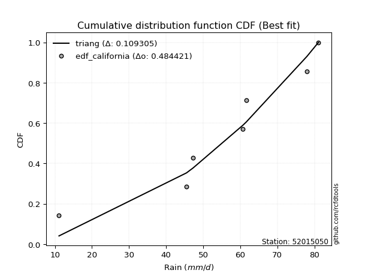</img>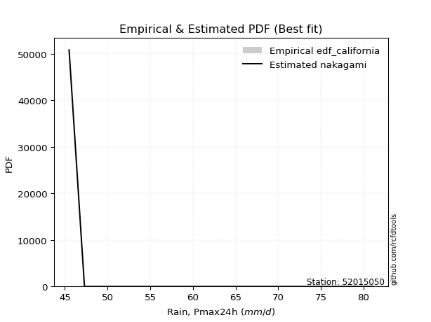</img>

</div>


### 2. EDF Hazen (1930)

Hazen method for plotting positions is a formula used to estimate the empirical cumulative probability distribution of flood events or other hydrological data. This formula often results in biased estimations, particularly when extrapolating to extreme events (high return periods).

<div align="center">


$P=(m-0.5)/n$


</div>


**2.1. Empirical values**

<div align="center">

|                | 0                   | 1                   | 2                   | 3         | 4                  | 5                  | 6                  |
|:---------------|:--------------------|:--------------------|:--------------------|:----------|:-------------------|:-------------------|:-------------------|
| date           | 2025                | 2022                | 2018                | 2019      | 2021               | 2017               | 2020               |
| x              | 11.1                | 45.5                | 47.3                | 60.7      | 61.6               | 78.0               | 81.1               |
| m              | 1                   | 2                   | 3                   | 4         | 5                  | 6                  | 7                  |
| empirical_dist | edf_hazen           | edf_hazen           | edf_hazen           | edf_hazen | edf_hazen          | edf_hazen          | edf_hazen          |
| empirical      | 0.07142857142857142 | 0.21428571428571427 | 0.35714285714285715 | 0.5       | 0.6428571428571429 | 0.7857142857142857 | 0.9285714285714286 |
| empirical_tr   | 1.0769230769230769  | 1.2727272727272727  | 1.5555555555555558  | 2.0       | 2.8000000000000003 | 4.666666666666666  | 14.000000000000007 |

</div>


**2.2. Kolmogorov-Smirnov fit test (sorted by Δ)**


<div align="center">

|                | 0                   | 1                   | 2                   | 3                   | 4                   | 5                   | 6                   | 7                   | 8                   | 9                   | 10                  | 11                  | 12                  | 13                  | 14                  | 15                  | 16                  | 17                  | 18                  | 19                  | 20                  | 21                  | 22                  | 23                  | 24                  | 25                  | 26                  | 27                  | 28                  | 29                  | 30                  | 31                  | 32                  | 33                  | 34                  | 35                  | 36                  | 37                  | 38                  | 39                  | 40                  | 41                  | 42                  | 43                  | 44                  | 45                  | 46                  | 47                  | 48                  | 49                  | 50                  | 51                  | 52                  | 53                  | 54                  | 55                  | 56                  | 57                  | 58                  | 59                  | 60                  | 61                  | 62                  | 63                  | 64                  | 65                  | 66                  | 67                  | 68                  | 69                  | 70                  | 71                  | 72                  | 73                  | 74                  | 75                  | 76                  | 77                  | 78                  | 79                  | 80                  | 81                  | 82                  | 83                  | 84                  | 85                  | 86                  | 87                  | 88                  | 89                  | 90                  | 91                  | 92                  | 93                  | 94                  | 95                  | 96                  | 97                  | 98                  | 99                  | 100                 | 101                 | 102                 | 103                 | 104                 | 105                 | 106                 | 107                 | 108                 | 109                 | 110                 | 111                 | 112                 | 113                 | 114                 | 115                 | 116                 | 117                 | 118                 | 119                 | 120                 | 121                 | 122                 | 123                 | 124                 | 125                 | 126                 | 127                 | 128                 | 129                 | 130                 | 131                 | 132                 | 133                 | 134                 | 135                 | 136                 | 137                 | 138                 | 139                 | 140                 | 141                 | 142                 | 143                 | 144                 | 145                 | 146                 | 147                 | 148                 | 149                 | 150                 | 151                 | 152                 | 153                 | 154                 | 155                 | 156                 | 157                 | 158                 | 159                 |
|:---------------|:--------------------|:--------------------|:--------------------|:--------------------|:--------------------|:--------------------|:--------------------|:--------------------|:--------------------|:--------------------|:--------------------|:--------------------|:--------------------|:--------------------|:--------------------|:--------------------|:--------------------|:--------------------|:--------------------|:--------------------|:--------------------|:--------------------|:--------------------|:--------------------|:--------------------|:--------------------|:--------------------|:--------------------|:--------------------|:--------------------|:--------------------|:--------------------|:--------------------|:--------------------|:--------------------|:--------------------|:--------------------|:--------------------|:--------------------|:--------------------|:--------------------|:--------------------|:--------------------|:--------------------|:--------------------|:--------------------|:--------------------|:--------------------|:--------------------|:--------------------|:--------------------|:--------------------|:--------------------|:--------------------|:--------------------|:--------------------|:--------------------|:--------------------|:--------------------|:--------------------|:--------------------|:--------------------|:--------------------|:--------------------|:--------------------|:--------------------|:--------------------|:--------------------|:--------------------|:--------------------|:--------------------|:--------------------|:--------------------|:--------------------|:--------------------|:--------------------|:--------------------|:--------------------|:--------------------|:--------------------|:--------------------|:--------------------|:--------------------|:--------------------|:--------------------|:--------------------|:--------------------|:--------------------|:--------------------|:--------------------|:--------------------|:--------------------|:--------------------|:--------------------|:--------------------|:--------------------|:--------------------|:--------------------|:--------------------|:--------------------|:--------------------|:--------------------|:--------------------|:--------------------|:--------------------|:--------------------|:--------------------|:--------------------|:--------------------|:--------------------|:--------------------|:--------------------|:--------------------|:--------------------|:--------------------|:--------------------|:--------------------|:--------------------|:--------------------|:--------------------|:--------------------|:--------------------|:--------------------|:--------------------|:--------------------|:--------------------|:--------------------|:--------------------|:--------------------|:--------------------|:--------------------|:--------------------|:--------------------|:--------------------|:--------------------|:--------------------|:--------------------|:--------------------|:--------------------|:--------------------|:--------------------|:--------------------|:--------------------|:--------------------|:--------------------|:--------------------|:--------------------|:--------------------|:--------------------|:--------------------|:--------------------|:--------------------|:--------------------|:--------------------|:--------------------|:--------------------|:--------------------|:--------------------|:--------------------|:--------------------|
| station        | 52015050            | 52015050            | 52015050            | 52015050            | 52015050            | 52015050            | 52015050            | 52015050            | 52015050            | 52015050            | 52015050            | 52015050            | 52015050            | 52015050            | 52015050            | 52015050            | 52015050            | 52015050            | 52015050            | 52015050            | 52015050            | 52015050            | 52015050            | 52015050            | 52015050            | 52015050            | 52015050            | 52015050            | 52015050            | 52015050            | 52015050            | 52015050            | 52015050            | 52015050            | 52015050            | 52015050            | 52015050            | 52015050            | 52015050            | 52015050            | 52015050            | 52015050            | 52015050            | 52015050            | 52015050            | 52015050            | 52015050            | 52015050            | 52015050            | 52015050            | 52015050            | 52015050            | 52015050            | 52015050            | 52015050            | 52015050            | 52015050            | 52015050            | 52015050            | 52015050            | 52015050            | 52015050            | 52015050            | 52015050            | 52015050            | 52015050            | 52015050            | 52015050            | 52015050            | 52015050            | 52015050            | 52015050            | 52015050            | 52015050            | 52015050            | 52015050            | 52015050            | 52015050            | 52015050            | 52015050            | 52015050            | 52015050            | 52015050            | 52015050            | 52015050            | 52015050            | 52015050            | 52015050            | 52015050            | 52015050            | 52015050            | 52015050            | 52015050            | 52015050            | 52015050            | 52015050            | 52015050            | 52015050            | 52015050            | 52015050            | 52015050            | 52015050            | 52015050            | 52015050            | 52015050            | 52015050            | 52015050            | 52015050            | 52015050            | 52015050            | 52015050            | 52015050            | 52015050            | 52015050            | 52015050            | 52015050            | 52015050            | 52015050            | 52015050            | 52015050            | 52015050            | 52015050            | 52015050            | 52015050            | 52015050            | 52015050            | 52015050            | 52015050            | 52015050            | 52015050            | 52015050            | 52015050            | 52015050            | 52015050            | 52015050            | 52015050            | 52015050            | 52015050            | 52015050            | 52015050            | 52015050            | 52015050            | 52015050            | 52015050            | 52015050            | 52015050            | 52015050            | 52015050            | 52015050            | 52015050            | 52015050            | 52015050            | 52015050            | 52015050            | 52015050            | 52015050            | 52015050            | 52015050            | 52015050            | 52015050            |
| empirical_dist | edf_hazen           | edf_hazen           | edf_hazen           | edf_hazen           | edf_hazen           | edf_hazen           | edf_hazen           | edf_hazen           | edf_hazen           | edf_hazen           | edf_hazen           | edf_hazen           | edf_hazen           | edf_hazen           | edf_hazen           | edf_hazen           | edf_hazen           | edf_hazen           | edf_hazen           | edf_hazen           | edf_hazen           | edf_hazen           | edf_hazen           | edf_hazen           | edf_hazen           | edf_hazen           | edf_hazen           | edf_hazen           | edf_hazen           | edf_hazen           | edf_hazen           | edf_hazen           | edf_hazen           | edf_hazen           | edf_hazen           | edf_hazen           | edf_hazen           | edf_hazen           | edf_hazen           | edf_hazen           | edf_hazen           | edf_hazen           | edf_hazen           | edf_hazen           | edf_hazen           | edf_hazen           | edf_hazen           | edf_hazen           | edf_hazen           | edf_hazen           | edf_hazen           | edf_hazen           | edf_hazen           | edf_hazen           | edf_hazen           | edf_hazen           | edf_hazen           | edf_hazen           | edf_hazen           | edf_hazen           | edf_hazen           | edf_hazen           | edf_hazen           | edf_hazen           | edf_hazen           | edf_hazen           | edf_hazen           | edf_hazen           | edf_hazen           | edf_hazen           | edf_hazen           | edf_hazen           | edf_hazen           | edf_hazen           | edf_hazen           | edf_hazen           | edf_hazen           | edf_hazen           | edf_hazen           | edf_hazen           | edf_hazen           | edf_hazen           | edf_hazen           | edf_hazen           | edf_hazen           | edf_hazen           | edf_hazen           | edf_hazen           | edf_hazen           | edf_hazen           | edf_hazen           | edf_hazen           | edf_hazen           | edf_hazen           | edf_hazen           | edf_hazen           | edf_hazen           | edf_hazen           | edf_hazen           | edf_hazen           | edf_hazen           | edf_hazen           | edf_hazen           | edf_hazen           | edf_hazen           | edf_hazen           | edf_hazen           | edf_hazen           | edf_hazen           | edf_hazen           | edf_hazen           | edf_hazen           | edf_hazen           | edf_hazen           | edf_hazen           | edf_hazen           | edf_hazen           | edf_hazen           | edf_hazen           | edf_hazen           | edf_hazen           | edf_hazen           | edf_hazen           | edf_hazen           | edf_hazen           | edf_hazen           | edf_hazen           | edf_hazen           | edf_hazen           | edf_hazen           | edf_hazen           | edf_hazen           | edf_hazen           | edf_hazen           | edf_hazen           | edf_hazen           | edf_hazen           | edf_hazen           | edf_hazen           | edf_hazen           | edf_hazen           | edf_hazen           | edf_hazen           | edf_hazen           | edf_hazen           | edf_hazen           | edf_hazen           | edf_hazen           | edf_hazen           | edf_hazen           | edf_hazen           | edf_hazen           | edf_hazen           | edf_hazen           | edf_hazen           | edf_hazen           | edf_hazen           | edf_hazen           | edf_hazen           | edf_hazen           |
| p_dist         | pearson3            | gompertz            | weibull_min         | gumbel_l            | gengamma            | exponpow            | genhalflogistic     | trapezoid           | logburr12           | logistic            | argus               | exponnorm           | norm                | truncnorm           | crystalball         | t                   | nct                 | f                   | dweibull            | betaprime           | hypsecant           | logt                | burr                | logargus            | beta                | rice                | gamma               | erlang              | logvonmises_line    | anglit              | skewnorm            | johnsonsu           | invgamma            | exponweib           | logmielke           | logloggamma         | mielke              | triang              | dgamma              | genpareto           | maxwell             | semicircular        | logburr             | loggompertz         | logpearson3         | laplace             | invgauss            | rayleigh            | logdgamma           | gumbel_r            | cosine              | truncweibull_min    | logdweibull         | genextreme          | invweibull          | loggumbel_l         | gennorm             | arcsine             | ncf                 | moyal               | loggennorm          | halfnorm            | loglevy_l           | alpha               | halflogistic        | levy_l              | logloglaplace       | logtrapezoid        | loggenextreme       | nakagami            | lognakagami         | logbeta             | kstwobign           | logweibull_max      | loglaplace          | loglaplace          | logtruncnorm        | loggengamma         | loghypsecant        | loglogistic         | logfoldnorm         | wald                | logf                | logrice             | logcrystalball      | lognorm             | logexponnorm        | lognct              | logfatiguelife      | logncf              | loganglit           | logsemicircular     | loggamma            | loggamma            | logbetaprime        | logskewnorm         | logarcsine          | logerlang           | kappa3              | lomax               | uniform             | vonmises_line       | ksone               | loginvgamma         | wrapcauchy          | logalpha            | loginvgauss         | logmaxwell          | kappa4              | loginvweibull       | lograyleigh         | loggenhalflogistic  | tukeylambda         | loggumbel_r         | genexpon            | loghalfnorm         | logkstwobign        | logcosine           | loggausshyper       | logwrapcauchy       | logmoyal            | loggenexpon         | loghalflogistic     | logtriang           | logjohnsonsb        | bradford            | gausshyper          | halfgennorm         | logweibull_min      | loglomax            | logexponweib        | burr12              | loghalfgennorm      | truncexpon          | logwald             | foldnorm            | loggenpareto        | logrdist            | logksone            | logkappa4           | johnsonsb           | logtukeylambda      | weibull_max         | logkappa3           | loguniform          | logbradford         | logtruncweibull_min | logjohnsonsu        | logtruncexpon       | fatiguelife         | logexponpow         | powerlaw            | rdist               | logpowerlaw         | truncpareto         | logtruncpareto      | genlogistic         | loggenlogistic      | logvonmises         | vonmises            |
| delta          | 0.08075437296969254 | 0.09598432510094923 | 0.09675966556615234 | 0.09795964364592802 | 0.10150872236233521 | 0.10393992865936108 | 0.10749118455808268 | 0.10809501773831101 | 0.11181392855482145 | 0.11494250897551961 | 0.11554376152650292 | 0.11735910080665687 | 0.11735915580584008 | 0.1173591577222294  | 0.117359158626379   | 0.11737093646880373 | 0.11752621975329078 | 0.11828093336047427 | 0.12101368800241508 | 0.12307269652610855 | 0.12565201080213018 | 0.12574964110888615 | 0.12630006965121    | 0.12652209661965486 | 0.12692697074220682 | 0.12713399736675216 | 0.13264526881985436 | 0.13485638015420673 | 0.1351911101942126  | 0.1390760706619348  | 0.14174098415882264 | 0.14183330929278082 | 0.14187843638572548 | 0.14243426275464607 | 0.142850318004485   | 0.14313867462403285 | 0.14397061854909574 | 0.14488676676213375 | 0.14718747093963522 | 0.14786873790693356 | 0.14804396736262568 | 0.14823242056717698 | 0.1487074728189449  | 0.149844626065792   | 0.15109167978826646 | 0.15290314777032188 | 0.15855878124395503 | 0.1598318412217132  | 0.16521524526780773 | 0.16815564036585362 | 0.1720106771649569  | 0.18079434263029479 | 0.1822351339546031  | 0.18276713580592752 | 0.18277344184147928 | 0.18469875987805232 | 0.185406589490017   | 0.1861024361286591  | 0.18615519602544287 | 0.1907920371940448  | 0.1919436751116474  | 0.19336571083060913 | 0.195025589957743   | 0.19802148441349934 | 0.19813998670244545 | 0.19842529725252855 | 0.2027477234429822  | 0.2065108162377434  | 0.2112377761983046  | 0.21428563004845055 | 0.21564871640168393 | 0.2175803616532876  | 0.22276168989115977 | 0.22641541067847978 | 0.23458638519021804 | 0.23458638519021804 | 0.24588045982276363 | 0.24757140236701922 | 0.24766736393235325 | 0.2511821509558637  | 0.2512184548679517  | 0.2539024480698069  | 0.254319461312007   | 0.2553037629816667  | 0.25531407424547836 | 0.25531417088624153 | 0.2553144114731779  | 0.2556714027404514  | 0.2574483180677505  | 0.2594130795780125  | 0.25965224356109884 | 0.26143952929200476 | 0.2631798649557986  | 0.2631798649557986  | 0.26392986699593546 | 0.2681677325356132  | 0.26853915110429727 | 0.27233136088864096 | 0.2740566138954852  | 0.27419511770078875 | 0.27714285714285714 | 0.27738341540990397 | 0.2785714285714286  | 0.2788973256069439  | 0.2792814128508596  | 0.28238823685130265 | 0.2857711419578495  | 0.2893145334842613  | 0.29055819680974726 | 0.2986422526435416  | 0.3009142330391922  | 0.3026552340904425  | 0.31788132235134114 | 0.32410969983583604 | 0.32861486105041193 | 0.3336003001065675  | 0.3365584778984704  | 0.3389866438005873  | 0.34236026309042467 | 0.34933742579551497 | 0.34986707874852896 | 0.35275965619912963 | 0.3563981044362421  | 0.35653725849020634 | 0.36120274653905415 | 0.3625322959873334  | 0.38357731836445313 | 0.3838043891179621  | 0.39926553590690117 | 0.40118851463200345 | 0.4014782314401506  | 0.40276473614388963 | 0.408376384701182   | 0.40943029200353864 | 0.4215584465431518  | 0.4312563113952532  | 0.4436006426962119  | 0.4591942963177973  | 0.46019609363170977 | 0.48102739569638875 | 0.4839342531865918  | 0.4894744059719055  | 0.4938245677918064  | 0.4950678822326926  | 0.49509245521519474 | 0.4954125689100499  | 0.5325467080362125  | 0.5330888903739316  | 0.5645394957250786  | 0.5981311595532656  | 0.6141609097615425  | 0.6696202353703654  | 0.6924309660910871  | 0.7228570445185908  | 0.7330960938858142  | 0.7599650786043415  | 0.7857142857142857  | 0.7857142857142857  | 1.2036250811806517  | 12.908982109770823  |
| deltao         | 0.48442053926100004 | 0.48442053926100004 | 0.48442053926100004 | 0.48442053926100004 | 0.48442053926100004 | 0.48442053926100004 | 0.48442053926100004 | 0.48442053926100004 | 0.48442053926100004 | 0.48442053926100004 | 0.48442053926100004 | 0.48442053926100004 | 0.48442053926100004 | 0.48442053926100004 | 0.48442053926100004 | 0.48442053926100004 | 0.48442053926100004 | 0.48442053926100004 | 0.48442053926100004 | 0.48442053926100004 | 0.48442053926100004 | 0.48442053926100004 | 0.48442053926100004 | 0.48442053926100004 | 0.48442053926100004 | 0.48442053926100004 | 0.48442053926100004 | 0.48442053926100004 | 0.48442053926100004 | 0.48442053926100004 | 0.48442053926100004 | 0.48442053926100004 | 0.48442053926100004 | 0.48442053926100004 | 0.48442053926100004 | 0.48442053926100004 | 0.48442053926100004 | 0.48442053926100004 | 0.48442053926100004 | 0.48442053926100004 | 0.48442053926100004 | 0.48442053926100004 | 0.48442053926100004 | 0.48442053926100004 | 0.48442053926100004 | 0.48442053926100004 | 0.48442053926100004 | 0.48442053926100004 | 0.48442053926100004 | 0.48442053926100004 | 0.48442053926100004 | 0.48442053926100004 | 0.48442053926100004 | 0.48442053926100004 | 0.48442053926100004 | 0.48442053926100004 | 0.48442053926100004 | 0.48442053926100004 | 0.48442053926100004 | 0.48442053926100004 | 0.48442053926100004 | 0.48442053926100004 | 0.48442053926100004 | 0.48442053926100004 | 0.48442053926100004 | 0.48442053926100004 | 0.48442053926100004 | 0.48442053926100004 | 0.48442053926100004 | 0.48442053926100004 | 0.48442053926100004 | 0.48442053926100004 | 0.48442053926100004 | 0.48442053926100004 | 0.48442053926100004 | 0.48442053926100004 | 0.48442053926100004 | 0.48442053926100004 | 0.48442053926100004 | 0.48442053926100004 | 0.48442053926100004 | 0.48442053926100004 | 0.48442053926100004 | 0.48442053926100004 | 0.48442053926100004 | 0.48442053926100004 | 0.48442053926100004 | 0.48442053926100004 | 0.48442053926100004 | 0.48442053926100004 | 0.48442053926100004 | 0.48442053926100004 | 0.48442053926100004 | 0.48442053926100004 | 0.48442053926100004 | 0.48442053926100004 | 0.48442053926100004 | 0.48442053926100004 | 0.48442053926100004 | 0.48442053926100004 | 0.48442053926100004 | 0.48442053926100004 | 0.48442053926100004 | 0.48442053926100004 | 0.48442053926100004 | 0.48442053926100004 | 0.48442053926100004 | 0.48442053926100004 | 0.48442053926100004 | 0.48442053926100004 | 0.48442053926100004 | 0.48442053926100004 | 0.48442053926100004 | 0.48442053926100004 | 0.48442053926100004 | 0.48442053926100004 | 0.48442053926100004 | 0.48442053926100004 | 0.48442053926100004 | 0.48442053926100004 | 0.48442053926100004 | 0.48442053926100004 | 0.48442053926100004 | 0.48442053926100004 | 0.48442053926100004 | 0.48442053926100004 | 0.48442053926100004 | 0.48442053926100004 | 0.48442053926100004 | 0.48442053926100004 | 0.48442053926100004 | 0.48442053926100004 | 0.48442053926100004 | 0.48442053926100004 | 0.48442053926100004 | 0.48442053926100004 | 0.48442053926100004 | 0.48442053926100004 | 0.48442053926100004 | 0.48442053926100004 | 0.48442053926100004 | 0.48442053926100004 | 0.48442053926100004 | 0.48442053926100004 | 0.48442053926100004 | 0.48442053926100004 | 0.48442053926100004 | 0.48442053926100004 | 0.48442053926100004 | 0.48442053926100004 | 0.48442053926100004 | 0.48442053926100004 | 0.48442053926100004 | 0.48442053926100004 | 0.48442053926100004 | 0.48442053926100004 | 0.48442053926100004 | 0.48442053926100004 | 0.48442053926100004 | 0.48442053926100004 |
| eval           | Δo > Δ              | Δo > Δ              | Δo > Δ              | Δo > Δ              | Δo > Δ              | Δo > Δ              | Δo > Δ              | Δo > Δ              | Δo > Δ              | Δo > Δ              | Δo > Δ              | Δo > Δ              | Δo > Δ              | Δo > Δ              | Δo > Δ              | Δo > Δ              | Δo > Δ              | Δo > Δ              | Δo > Δ              | Δo > Δ              | Δo > Δ              | Δo > Δ              | Δo > Δ              | Δo > Δ              | Δo > Δ              | Δo > Δ              | Δo > Δ              | Δo > Δ              | Δo > Δ              | Δo > Δ              | Δo > Δ              | Δo > Δ              | Δo > Δ              | Δo > Δ              | Δo > Δ              | Δo > Δ              | Δo > Δ              | Δo > Δ              | Δo > Δ              | Δo > Δ              | Δo > Δ              | Δo > Δ              | Δo > Δ              | Δo > Δ              | Δo > Δ              | Δo > Δ              | Δo > Δ              | Δo > Δ              | Δo > Δ              | Δo > Δ              | Δo > Δ              | Δo > Δ              | Δo > Δ              | Δo > Δ              | Δo > Δ              | Δo > Δ              | Δo > Δ              | Δo > Δ              | Δo > Δ              | Δo > Δ              | Δo > Δ              | Δo > Δ              | Δo > Δ              | Δo > Δ              | Δo > Δ              | Δo > Δ              | Δo > Δ              | Δo > Δ              | Δo > Δ              | Δo > Δ              | Δo > Δ              | Δo > Δ              | Δo > Δ              | Δo > Δ              | Δo > Δ              | Δo > Δ              | Δo > Δ              | Δo > Δ              | Δo > Δ              | Δo > Δ              | Δo > Δ              | Δo > Δ              | Δo > Δ              | Δo > Δ              | Δo > Δ              | Δo > Δ              | Δo > Δ              | Δo > Δ              | Δo > Δ              | Δo > Δ              | Δo > Δ              | Δo > Δ              | Δo > Δ              | Δo > Δ              | Δo > Δ              | Δo > Δ              | Δo > Δ              | Δo > Δ              | Δo > Δ              | Δo > Δ              | Δo > Δ              | Δo > Δ              | Δo > Δ              | Δo > Δ              | Δo > Δ              | Δo > Δ              | Δo > Δ              | Δo > Δ              | Δo > Δ              | Δo > Δ              | Δo > Δ              | Δo > Δ              | Δo > Δ              | Δo > Δ              | Δo > Δ              | Δo > Δ              | Δo > Δ              | Δo > Δ              | Δo > Δ              | Δo > Δ              | Δo > Δ              | Δo > Δ              | Δo > Δ              | Δo > Δ              | Δo > Δ              | Δo > Δ              | Δo > Δ              | Δo > Δ              | Δo > Δ              | Δo > Δ              | Δo > Δ              | Δo > Δ              | Δo > Δ              | Δo > Δ              | Δo > Δ              | Δo > Δ              | Δo > Δ              | Δo > Δ              | Δo > Δ              | Δo > Δ              | Δo > Δ              | Δo <= Δ             | Δo <= Δ             | Δo <= Δ             | Δo <= Δ             | Δo <= Δ             | Δo <= Δ             | Δo <= Δ             | Δo <= Δ             | Δo <= Δ             | Δo <= Δ             | Δo <= Δ             | Δo <= Δ             | Δo <= Δ             | Δo <= Δ             | Δo <= Δ             | Δo <= Δ             | Δo <= Δ             | Δo <= Δ             | Δo <= Δ             |
| fit            | 1                   | 1                   | 1                   | 1                   | 1                   | 1                   | 1                   | 1                   | 1                   | 1                   | 1                   | 1                   | 1                   | 1                   | 1                   | 1                   | 1                   | 1                   | 1                   | 1                   | 1                   | 1                   | 1                   | 1                   | 1                   | 1                   | 1                   | 1                   | 1                   | 1                   | 1                   | 1                   | 1                   | 1                   | 1                   | 1                   | 1                   | 1                   | 1                   | 1                   | 1                   | 1                   | 1                   | 1                   | 1                   | 1                   | 1                   | 1                   | 1                   | 1                   | 1                   | 1                   | 1                   | 1                   | 1                   | 1                   | 1                   | 1                   | 1                   | 1                   | 1                   | 1                   | 1                   | 1                   | 1                   | 1                   | 1                   | 1                   | 1                   | 1                   | 1                   | 1                   | 1                   | 1                   | 1                   | 1                   | 1                   | 1                   | 1                   | 1                   | 1                   | 1                   | 1                   | 1                   | 1                   | 1                   | 1                   | 1                   | 1                   | 1                   | 1                   | 1                   | 1                   | 1                   | 1                   | 1                   | 1                   | 1                   | 1                   | 1                   | 1                   | 1                   | 1                   | 1                   | 1                   | 1                   | 1                   | 1                   | 1                   | 1                   | 1                   | 1                   | 1                   | 1                   | 1                   | 1                   | 1                   | 1                   | 1                   | 1                   | 1                   | 1                   | 1                   | 1                   | 1                   | 1                   | 1                   | 1                   | 1                   | 1                   | 1                   | 1                   | 1                   | 1                   | 1                   | 1                   | 1                   | 1                   | 1                   | 1                   | 1                   | 0                   | 0                   | 0                   | 0                   | 0                   | 0                   | 0                   | 0                   | 0                   | 0                   | 0                   | 0                   | 0                   | 0                   | 0                   | 0                   | 0                   | 0                   | 0                   |
| n              | 7                   | 7                   | 7                   | 7                   | 7                   | 7                   | 7                   | 7                   | 7                   | 7                   | 7                   | 7                   | 7                   | 7                   | 7                   | 7                   | 7                   | 7                   | 7                   | 7                   | 7                   | 7                   | 7                   | 7                   | 7                   | 7                   | 7                   | 7                   | 7                   | 7                   | 7                   | 7                   | 7                   | 7                   | 7                   | 7                   | 7                   | 7                   | 7                   | 7                   | 7                   | 7                   | 7                   | 7                   | 7                   | 7                   | 7                   | 7                   | 7                   | 7                   | 7                   | 7                   | 7                   | 7                   | 7                   | 7                   | 7                   | 7                   | 7                   | 7                   | 7                   | 7                   | 7                   | 7                   | 7                   | 7                   | 7                   | 7                   | 7                   | 7                   | 7                   | 7                   | 7                   | 7                   | 7                   | 7                   | 7                   | 7                   | 7                   | 7                   | 7                   | 7                   | 7                   | 7                   | 7                   | 7                   | 7                   | 7                   | 7                   | 7                   | 7                   | 7                   | 7                   | 7                   | 7                   | 7                   | 7                   | 7                   | 7                   | 7                   | 7                   | 7                   | 7                   | 7                   | 7                   | 7                   | 7                   | 7                   | 7                   | 7                   | 7                   | 7                   | 7                   | 7                   | 7                   | 7                   | 7                   | 7                   | 7                   | 7                   | 7                   | 7                   | 7                   | 7                   | 7                   | 7                   | 7                   | 7                   | 7                   | 7                   | 7                   | 7                   | 7                   | 7                   | 7                   | 7                   | 7                   | 7                   | 7                   | 7                   | 7                   | 7                   | 7                   | 7                   | 7                   | 7                   | 7                   | 7                   | 7                   | 7                   | 7                   | 7                   | 7                   | 7                   | 7                   | 7                   | 7                   | 7                   | 7                   | 7                   |
| best_fit       | 1                   | 0                   | 0                   | 0                   | 0                   | 0                   | 0                   | 0                   | 0                   | 0                   | 0                   | 0                   | 0                   | 0                   | 0                   | 0                   | 0                   | 0                   | 0                   | 0                   | 0                   | 0                   | 0                   | 0                   | 0                   | 0                   | 0                   | 0                   | 0                   | 0                   | 0                   | 0                   | 0                   | 0                   | 0                   | 0                   | 0                   | 0                   | 0                   | 0                   | 0                   | 0                   | 0                   | 0                   | 0                   | 0                   | 0                   | 0                   | 0                   | 0                   | 0                   | 0                   | 0                   | 0                   | 0                   | 0                   | 0                   | 0                   | 0                   | 0                   | 0                   | 0                   | 0                   | 0                   | 0                   | 0                   | 0                   | 0                   | 0                   | 0                   | 0                   | 0                   | 0                   | 0                   | 0                   | 0                   | 0                   | 0                   | 0                   | 0                   | 0                   | 0                   | 0                   | 0                   | 0                   | 0                   | 0                   | 0                   | 0                   | 0                   | 0                   | 0                   | 0                   | 0                   | 0                   | 0                   | 0                   | 0                   | 0                   | 0                   | 0                   | 0                   | 0                   | 0                   | 0                   | 0                   | 0                   | 0                   | 0                   | 0                   | 0                   | 0                   | 0                   | 0                   | 0                   | 0                   | 0                   | 0                   | 0                   | 0                   | 0                   | 0                   | 0                   | 0                   | 0                   | 0                   | 0                   | 0                   | 0                   | 0                   | 0                   | 0                   | 0                   | 0                   | 0                   | 0                   | 0                   | 0                   | 0                   | 0                   | 0                   | 0                   | 0                   | 0                   | 0                   | 0                   | 0                   | 0                   | 0                   | 0                   | 0                   | 0                   | 0                   | 0                   | 0                   | 0                   | 0                   | 0                   | 0                   | 0                   |
| best_fit_sort  | 1                   | 2                   | 3                   | 4                   | 5                   | 6                   | 7                   | 8                   | 9                   | 10                  | 11                  | 12                  | 13                  | 14                  | 15                  | 16                  | 17                  | 18                  | 19                  | 20                  | 21                  | 22                  | 23                  | 24                  | 25                  | 26                  | 27                  | 28                  | 29                  | 30                  | 31                  | 32                  | 33                  | 34                  | 35                  | 36                  | 37                  | 38                  | 39                  | 40                  | 41                  | 42                  | 43                  | 44                  | 45                  | 46                  | 47                  | 48                  | 49                  | 50                  | 51                  | 52                  | 53                  | 54                  | 55                  | 56                  | 57                  | 58                  | 59                  | 60                  | 61                  | 62                  | 63                  | 64                  | 65                  | 66                  | 67                  | 68                  | 69                  | 70                  | 71                  | 72                  | 73                  | 74                  | 75                  | 76                  | 77                  | 78                  | 79                  | 80                  | 81                  | 82                  | 83                  | 84                  | 85                  | 86                  | 87                  | 88                  | 89                  | 90                  | 91                  | 92                  | 93                  | 94                  | 95                  | 96                  | 97                  | 98                  | 99                  | 100                 | 101                 | 102                 | 103                 | 104                 | 105                 | 106                 | 107                 | 108                 | 109                 | 110                 | 111                 | 112                 | 113                 | 114                 | 115                 | 116                 | 117                 | 118                 | 119                 | 120                 | 121                 | 122                 | 123                 | 124                 | 125                 | 126                 | 127                 | 128                 | 129                 | 130                 | 131                 | 132                 | 133                 | 134                 | 135                 | 136                 | 137                 | 138                 | 139                 | 140                 | 141                 | 142                 | 143                 | 144                 | 145                 | 146                 | 147                 | 148                 | 149                 | 150                 | 151                 | 152                 | 153                 | 154                 | 155                 | 156                 | 157                 | 158                 | 159                 | 160                 |

</div>


**2.3. Best fit**

<div align="center">

|   id |   station | empirical_dist   | p_dist   |     delta |   deltao | eval   |   fit |   n |   best_fit |   best_fit_sort |
|-----:|----------:|:-----------------|:---------|----------:|---------:|:-------|------:|----:|-----------:|----------------:|
|    0 |  52015050 | edf_hazen        | pearson3 | 0.0807544 | 0.484421 | Δo > Δ |     1 |   7 |          1 |               1 |

</div>


<div align="center">

</img>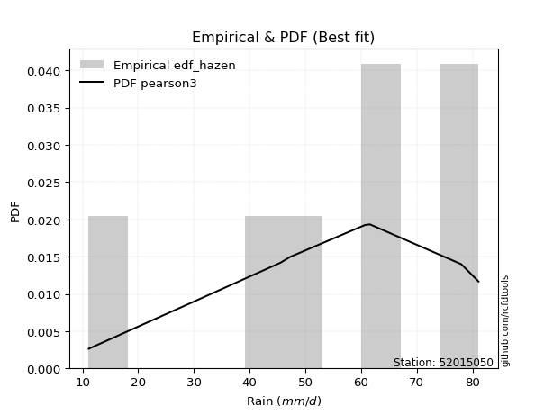</img>

</div>


### 3. EDF Weibull (1939)

Weibull plotting position formula is an empirical method used to estimate the non-exceedance probability or plotting position for a set of observed data, is often recommended or widely used in practice, particularly in flood frequency analysis.

<div align="center">


$P=m/(n+1)$


</div>


**3.1. Empirical values**

<div align="center">

|                | 0                  | 1                  | 2           | 3           | 4                  | 5           | 6           |
|:---------------|:-------------------|:-------------------|:------------|:------------|:-------------------|:------------|:------------|
| date           | 2025               | 2022               | 2018        | 2019        | 2021               | 2017        | 2020        |
| x              | 11.1               | 45.5               | 47.3        | 60.7        | 61.6               | 78.0        | 81.1        |
| m              | 1                  | 2                  | 3           | 4           | 5                  | 6           | 7           |
| empirical_dist | edf_weibull        | edf_weibull        | edf_weibull | edf_weibull | edf_weibull        | edf_weibull | edf_weibull |
| empirical      | 0.125              | 0.25               | 0.375       | 0.5         | 0.625              | 0.75        | 0.875       |
| empirical_tr   | 1.1428571428571428 | 1.3333333333333333 | 1.6         | 2.0         | 2.6666666666666665 | 4.0         | 8.0         |

</div>


**3.2. Kolmogorov-Smirnov fit test (sorted by Δ)**


<div align="center">

|                | 0                   | 1                   | 2                   | 3                   | 4                   | 5                   | 6                   | 7                   | 8                   | 9                   | 10                  | 11                  | 12                  | 13                  | 14                  | 15                  | 16                  | 17                  | 18                  | 19                  | 20                  | 21                  | 22                  | 23                  | 24                  | 25                  | 26                  | 27                  | 28                  | 29                  | 30                  | 31                  | 32                  | 33                  | 34                  | 35                  | 36                  | 37                  | 38                  | 39                  | 40                  | 41                  | 42                  | 43                  | 44                  | 45                  | 46                  | 47                  | 48                  | 49                  | 50                  | 51                  | 52                  | 53                  | 54                  | 55                  | 56                  | 57                  | 58                  | 59                  | 60                  | 61                  | 62                  | 63                  | 64                  | 65                  | 66                  | 67                  | 68                  | 69                  | 70                  | 71                  | 72                  | 73                  | 74                  | 75                  | 76                  | 77                  | 78                  | 79                  | 80                  | 81                  | 82                  | 83                  | 84                  | 85                  | 86                  | 87                  | 88                  | 89                  | 90                  | 91                  | 92                  | 93                  | 94                  | 95                  | 96                  | 97                  | 98                  | 99                  | 100                 | 101                 | 102                 | 103                 | 104                 | 105                 | 106                 | 107                 | 108                 | 109                 | 110                 | 111                 | 112                 | 113                 | 114                 | 115                 | 116                 | 117                 | 118                 | 119                 | 120                 | 121                 | 122                 | 123                 | 124                 | 125                 | 126                 | 127                 | 128                 | 129                 | 130                 | 131                 | 132                 | 133                 | 134                 | 135                 | 136                 | 137                 | 138                 | 139                 | 140                 | 141                 | 142                 | 143                 | 144                 | 145                 | 146                 | 147                 | 148                 | 149                 | 150                 | 151                 | 152                 | 153                 | 154                 | 155                 | 156                 | 157                 | 158                 | 159                 |
|:---------------|:--------------------|:--------------------|:--------------------|:--------------------|:--------------------|:--------------------|:--------------------|:--------------------|:--------------------|:--------------------|:--------------------|:--------------------|:--------------------|:--------------------|:--------------------|:--------------------|:--------------------|:--------------------|:--------------------|:--------------------|:--------------------|:--------------------|:--------------------|:--------------------|:--------------------|:--------------------|:--------------------|:--------------------|:--------------------|:--------------------|:--------------------|:--------------------|:--------------------|:--------------------|:--------------------|:--------------------|:--------------------|:--------------------|:--------------------|:--------------------|:--------------------|:--------------------|:--------------------|:--------------------|:--------------------|:--------------------|:--------------------|:--------------------|:--------------------|:--------------------|:--------------------|:--------------------|:--------------------|:--------------------|:--------------------|:--------------------|:--------------------|:--------------------|:--------------------|:--------------------|:--------------------|:--------------------|:--------------------|:--------------------|:--------------------|:--------------------|:--------------------|:--------------------|:--------------------|:--------------------|:--------------------|:--------------------|:--------------------|:--------------------|:--------------------|:--------------------|:--------------------|:--------------------|:--------------------|:--------------------|:--------------------|:--------------------|:--------------------|:--------------------|:--------------------|:--------------------|:--------------------|:--------------------|:--------------------|:--------------------|:--------------------|:--------------------|:--------------------|:--------------------|:--------------------|:--------------------|:--------------------|:--------------------|:--------------------|:--------------------|:--------------------|:--------------------|:--------------------|:--------------------|:--------------------|:--------------------|:--------------------|:--------------------|:--------------------|:--------------------|:--------------------|:--------------------|:--------------------|:--------------------|:--------------------|:--------------------|:--------------------|:--------------------|:--------------------|:--------------------|:--------------------|:--------------------|:--------------------|:--------------------|:--------------------|:--------------------|:--------------------|:--------------------|:--------------------|:--------------------|:--------------------|:--------------------|:--------------------|:--------------------|:--------------------|:--------------------|:--------------------|:--------------------|:--------------------|:--------------------|:--------------------|:--------------------|:--------------------|:--------------------|:--------------------|:--------------------|:--------------------|:--------------------|:--------------------|:--------------------|:--------------------|:--------------------|:--------------------|:--------------------|:--------------------|:--------------------|:--------------------|:--------------------|:--------------------|:--------------------|
| station        | 52015050            | 52015050            | 52015050            | 52015050            | 52015050            | 52015050            | 52015050            | 52015050            | 52015050            | 52015050            | 52015050            | 52015050            | 52015050            | 52015050            | 52015050            | 52015050            | 52015050            | 52015050            | 52015050            | 52015050            | 52015050            | 52015050            | 52015050            | 52015050            | 52015050            | 52015050            | 52015050            | 52015050            | 52015050            | 52015050            | 52015050            | 52015050            | 52015050            | 52015050            | 52015050            | 52015050            | 52015050            | 52015050            | 52015050            | 52015050            | 52015050            | 52015050            | 52015050            | 52015050            | 52015050            | 52015050            | 52015050            | 52015050            | 52015050            | 52015050            | 52015050            | 52015050            | 52015050            | 52015050            | 52015050            | 52015050            | 52015050            | 52015050            | 52015050            | 52015050            | 52015050            | 52015050            | 52015050            | 52015050            | 52015050            | 52015050            | 52015050            | 52015050            | 52015050            | 52015050            | 52015050            | 52015050            | 52015050            | 52015050            | 52015050            | 52015050            | 52015050            | 52015050            | 52015050            | 52015050            | 52015050            | 52015050            | 52015050            | 52015050            | 52015050            | 52015050            | 52015050            | 52015050            | 52015050            | 52015050            | 52015050            | 52015050            | 52015050            | 52015050            | 52015050            | 52015050            | 52015050            | 52015050            | 52015050            | 52015050            | 52015050            | 52015050            | 52015050            | 52015050            | 52015050            | 52015050            | 52015050            | 52015050            | 52015050            | 52015050            | 52015050            | 52015050            | 52015050            | 52015050            | 52015050            | 52015050            | 52015050            | 52015050            | 52015050            | 52015050            | 52015050            | 52015050            | 52015050            | 52015050            | 52015050            | 52015050            | 52015050            | 52015050            | 52015050            | 52015050            | 52015050            | 52015050            | 52015050            | 52015050            | 52015050            | 52015050            | 52015050            | 52015050            | 52015050            | 52015050            | 52015050            | 52015050            | 52015050            | 52015050            | 52015050            | 52015050            | 52015050            | 52015050            | 52015050            | 52015050            | 52015050            | 52015050            | 52015050            | 52015050            | 52015050            | 52015050            | 52015050            | 52015050            | 52015050            | 52015050            |
| empirical_dist | edf_weibull         | edf_weibull         | edf_weibull         | edf_weibull         | edf_weibull         | edf_weibull         | edf_weibull         | edf_weibull         | edf_weibull         | edf_weibull         | edf_weibull         | edf_weibull         | edf_weibull         | edf_weibull         | edf_weibull         | edf_weibull         | edf_weibull         | edf_weibull         | edf_weibull         | edf_weibull         | edf_weibull         | edf_weibull         | edf_weibull         | edf_weibull         | edf_weibull         | edf_weibull         | edf_weibull         | edf_weibull         | edf_weibull         | edf_weibull         | edf_weibull         | edf_weibull         | edf_weibull         | edf_weibull         | edf_weibull         | edf_weibull         | edf_weibull         | edf_weibull         | edf_weibull         | edf_weibull         | edf_weibull         | edf_weibull         | edf_weibull         | edf_weibull         | edf_weibull         | edf_weibull         | edf_weibull         | edf_weibull         | edf_weibull         | edf_weibull         | edf_weibull         | edf_weibull         | edf_weibull         | edf_weibull         | edf_weibull         | edf_weibull         | edf_weibull         | edf_weibull         | edf_weibull         | edf_weibull         | edf_weibull         | edf_weibull         | edf_weibull         | edf_weibull         | edf_weibull         | edf_weibull         | edf_weibull         | edf_weibull         | edf_weibull         | edf_weibull         | edf_weibull         | edf_weibull         | edf_weibull         | edf_weibull         | edf_weibull         | edf_weibull         | edf_weibull         | edf_weibull         | edf_weibull         | edf_weibull         | edf_weibull         | edf_weibull         | edf_weibull         | edf_weibull         | edf_weibull         | edf_weibull         | edf_weibull         | edf_weibull         | edf_weibull         | edf_weibull         | edf_weibull         | edf_weibull         | edf_weibull         | edf_weibull         | edf_weibull         | edf_weibull         | edf_weibull         | edf_weibull         | edf_weibull         | edf_weibull         | edf_weibull         | edf_weibull         | edf_weibull         | edf_weibull         | edf_weibull         | edf_weibull         | edf_weibull         | edf_weibull         | edf_weibull         | edf_weibull         | edf_weibull         | edf_weibull         | edf_weibull         | edf_weibull         | edf_weibull         | edf_weibull         | edf_weibull         | edf_weibull         | edf_weibull         | edf_weibull         | edf_weibull         | edf_weibull         | edf_weibull         | edf_weibull         | edf_weibull         | edf_weibull         | edf_weibull         | edf_weibull         | edf_weibull         | edf_weibull         | edf_weibull         | edf_weibull         | edf_weibull         | edf_weibull         | edf_weibull         | edf_weibull         | edf_weibull         | edf_weibull         | edf_weibull         | edf_weibull         | edf_weibull         | edf_weibull         | edf_weibull         | edf_weibull         | edf_weibull         | edf_weibull         | edf_weibull         | edf_weibull         | edf_weibull         | edf_weibull         | edf_weibull         | edf_weibull         | edf_weibull         | edf_weibull         | edf_weibull         | edf_weibull         | edf_weibull         | edf_weibull         | edf_weibull         | edf_weibull         |
| p_dist         | trapezoid           | f                   | nct                 | truncnorm           | norm                | crystalball         | exponnorm           | t                   | betaprime           | exponweib           | rice                | gamma               | erlang              | pearson3            | anglit              | logpearson3         | logdgamma           | dweibull            | invgamma            | logburr12           | logistic            | dgamma              | invgauss            | logvonmises_line    | semicircular        | loggompertz         | maxwell             | hypsecant           | logdweibull         | genpareto           | gompertz            | weibull_min         | gengamma            | gumbel_l            | exponpow            | johnsonsu           | rayleigh            | cosine              | genhalflogistic     | logt                | invweibull          | loggumbel_l         | logloglaplace       | arcsine             | ncf                 | argus               | laplace             | halfnorm            | burr                | logargus            | alpha               | beta                | genextreme          | gumbel_r            | logtrapezoid        | logburr             | loggenextreme       | mielke              | loglevy_l           | skewnorm            | logmielke           | logloggamma         | levy_l              | triang              | logweibull_max      | kstwobign           | halflogistic        | moyal               | truncweibull_min    | logbeta             | gennorm             | loglaplace          | loglaplace          | loggennorm          | loggengamma         | loghypsecant        | loglogistic         | logfoldnorm         | logf                | logrice             | logcrystalball      | lognorm             | logexponnorm        | lognct              | logfatiguelife      | logncf              | loganglit           | logsemicircular     | loggamma            | loggamma            | logbetaprime        | logskewnorm         | logarcsine          | logerlang           | kappa3              | lomax               | uniform             | vonmises_line       | ksone               | loginvgamma         | wrapcauchy          | logalpha            | nakagami            | lognakagami         | loginvgauss         | logmaxwell          | wald                | kappa4              | loginvweibull       | logtruncnorm        | lograyleigh         | loggenhalflogistic  | tukeylambda         | loggumbel_r         | genexpon            | loghalfnorm         | logkstwobign        | logcosine           | loggausshyper       | logjohnsonsb        | logwrapcauchy       | logmoyal            | loggenexpon         | loghalflogistic     | logtriang           | bradford            | halfgennorm         | logweibull_min      | loglomax            | gausshyper          | logexponweib        | burr12              | loghalfgennorm      | truncexpon          | logwald             | loggenpareto        | logrdist            | logksone            | foldnorm            | logkappa4           | johnsonsb           | logtukeylambda      | logkappa3           | loguniform          | logbradford         | weibull_max         | logtruncweibull_min | logjohnsonsu        | logtruncexpon       | fatiguelife         | logexponpow         | powerlaw            | rdist               | logpowerlaw         | truncpareto         | logtruncpareto      | genlogistic         | loggenlogistic      | logvonmises         | vonmises            |
| delta          | 0.09139215396382183 | 0.10210367774492851 | 0.10245594666867802 | 0.10253743525490311 | 0.10253745192697239 | 0.10253745562017103 | 0.10253773855042903 | 0.1025716729426871  | 0.1063089945510467  | 0.10671997704036035 | 0.10678751768541384 | 0.11057981264776973 | 0.1130041674215555  | 0.11423013794672121 | 0.11501635030439443 | 0.11537739407398073 | 0.11652242187733826 | 0.11782169870021414 | 0.11888627622841019 | 0.11922795511402827 | 0.11986144517331054 | 0.12273750206321743 | 0.1228444955296693  | 0.12499999985552938 | 0.125               | 0.12533738834432173 | 0.12819671915008946 | 0.12864286155358773 | 0.1286637053831745  | 0.13001159504979065 | 0.13169861081523493 | 0.13247395128043804 | 0.13295321318886266 | 0.13367392936021372 | 0.13420511410232405 | 0.1349728044441172  | 0.13636865697086642 | 0.13808541287053844 | 0.1425554743906895  | 0.143606783966029   | 0.14705915612719356 | 0.1489844741637666  | 0.1491762948715536  | 0.15038815041437337 | 0.15044091031115714 | 0.15125804724078862 | 0.15290314777032188 | 0.15964712335262332 | 0.1620143553654957  | 0.16223638233394055 | 0.16230719869921362 | 0.16264125645649252 | 0.1649099929487846  | 0.16815564036585362 | 0.17079653052345767 | 0.1712961727515383  | 0.17552349048401888 | 0.17713277801486071 | 0.1771684471006001  | 0.17745526987310833 | 0.1785646037187707  | 0.17885296033831855 | 0.18056815439538565 | 0.18060105247641944 | 0.18697010622443944 | 0.18704740417687404 | 0.1879679333726354  | 0.1907920371940448  | 0.19750524546834314 | 0.19972321879614469 | 0.20326373234715986 | 0.2084877249511422  | 0.2084877249511422  | 0.20980081796879024 | 0.2118571166527335  | 0.21195307821806753 | 0.21546786524157796 | 0.215504169153666   | 0.2186051755977213  | 0.21958947726738093 | 0.2195997885311926  | 0.21959988517195578 | 0.2196001257588922  | 0.21995711702616572 | 0.22173403235346473 | 0.22369879386372676 | 0.22393795784681308 | 0.225725243577719   | 0.2274655792415129  | 0.2274655792415129  | 0.2282155812816497  | 0.23245344682132751 | 0.23282486539001152 | 0.23661707517435526 | 0.23834232818119944 | 0.23848083198650305 | 0.24142857142857138 | 0.2416691296956182  | 0.24285714285714283 | 0.24318303989265816 | 0.2435671271365739  | 0.24667395113701696 | 0.24999991576273628 | 0.24999993412253813 | 0.2500568562435638  | 0.2536002477699756  | 0.2539024480698069  | 0.25484391109546156 | 0.2629279669292559  | 0.2637376026799065  | 0.2651999473249065  | 0.2669409483761568  | 0.28216703663705545 | 0.28839541412155034 | 0.29290057533612623 | 0.2978860143922818  | 0.3008441921841847  | 0.3032723580863016  | 0.30664597737613897 | 0.30763131796762555 | 0.31362314008122927 | 0.31415279303424326 | 0.31704537048484394 | 0.3206838187219564  | 0.32082297277592065 | 0.3268180102730477  | 0.3480901034036764  | 0.36355125019261547 | 0.36547422891771775 | 0.36572017550731023 | 0.3657639457258649  | 0.36705045042960394 | 0.3726620989868963  | 0.37371600628925294 | 0.3858441608288661  | 0.4078863569819262  | 0.4234800106035116  | 0.42448180791742407 | 0.4312563113952532  | 0.44531310998210305 | 0.4482199674723061  | 0.4537601202576198  | 0.4593535965184069  | 0.45937816950090904 | 0.4596982831957642  | 0.4759674249346635  | 0.4968324223219268  | 0.4973746046596459  | 0.5288252100107929  | 0.5624168738389799  | 0.5784466240472568  | 0.6339059496560797  | 0.6567166803768014  | 0.6871427588043051  | 0.6973818081715285  | 0.7242507928900558  | 0.75                | 0.75                | 1.167910795466366   | 12.962553538342252  |
| deltao         | 0.48442053926100004 | 0.48442053926100004 | 0.48442053926100004 | 0.48442053926100004 | 0.48442053926100004 | 0.48442053926100004 | 0.48442053926100004 | 0.48442053926100004 | 0.48442053926100004 | 0.48442053926100004 | 0.48442053926100004 | 0.48442053926100004 | 0.48442053926100004 | 0.48442053926100004 | 0.48442053926100004 | 0.48442053926100004 | 0.48442053926100004 | 0.48442053926100004 | 0.48442053926100004 | 0.48442053926100004 | 0.48442053926100004 | 0.48442053926100004 | 0.48442053926100004 | 0.48442053926100004 | 0.48442053926100004 | 0.48442053926100004 | 0.48442053926100004 | 0.48442053926100004 | 0.48442053926100004 | 0.48442053926100004 | 0.48442053926100004 | 0.48442053926100004 | 0.48442053926100004 | 0.48442053926100004 | 0.48442053926100004 | 0.48442053926100004 | 0.48442053926100004 | 0.48442053926100004 | 0.48442053926100004 | 0.48442053926100004 | 0.48442053926100004 | 0.48442053926100004 | 0.48442053926100004 | 0.48442053926100004 | 0.48442053926100004 | 0.48442053926100004 | 0.48442053926100004 | 0.48442053926100004 | 0.48442053926100004 | 0.48442053926100004 | 0.48442053926100004 | 0.48442053926100004 | 0.48442053926100004 | 0.48442053926100004 | 0.48442053926100004 | 0.48442053926100004 | 0.48442053926100004 | 0.48442053926100004 | 0.48442053926100004 | 0.48442053926100004 | 0.48442053926100004 | 0.48442053926100004 | 0.48442053926100004 | 0.48442053926100004 | 0.48442053926100004 | 0.48442053926100004 | 0.48442053926100004 | 0.48442053926100004 | 0.48442053926100004 | 0.48442053926100004 | 0.48442053926100004 | 0.48442053926100004 | 0.48442053926100004 | 0.48442053926100004 | 0.48442053926100004 | 0.48442053926100004 | 0.48442053926100004 | 0.48442053926100004 | 0.48442053926100004 | 0.48442053926100004 | 0.48442053926100004 | 0.48442053926100004 | 0.48442053926100004 | 0.48442053926100004 | 0.48442053926100004 | 0.48442053926100004 | 0.48442053926100004 | 0.48442053926100004 | 0.48442053926100004 | 0.48442053926100004 | 0.48442053926100004 | 0.48442053926100004 | 0.48442053926100004 | 0.48442053926100004 | 0.48442053926100004 | 0.48442053926100004 | 0.48442053926100004 | 0.48442053926100004 | 0.48442053926100004 | 0.48442053926100004 | 0.48442053926100004 | 0.48442053926100004 | 0.48442053926100004 | 0.48442053926100004 | 0.48442053926100004 | 0.48442053926100004 | 0.48442053926100004 | 0.48442053926100004 | 0.48442053926100004 | 0.48442053926100004 | 0.48442053926100004 | 0.48442053926100004 | 0.48442053926100004 | 0.48442053926100004 | 0.48442053926100004 | 0.48442053926100004 | 0.48442053926100004 | 0.48442053926100004 | 0.48442053926100004 | 0.48442053926100004 | 0.48442053926100004 | 0.48442053926100004 | 0.48442053926100004 | 0.48442053926100004 | 0.48442053926100004 | 0.48442053926100004 | 0.48442053926100004 | 0.48442053926100004 | 0.48442053926100004 | 0.48442053926100004 | 0.48442053926100004 | 0.48442053926100004 | 0.48442053926100004 | 0.48442053926100004 | 0.48442053926100004 | 0.48442053926100004 | 0.48442053926100004 | 0.48442053926100004 | 0.48442053926100004 | 0.48442053926100004 | 0.48442053926100004 | 0.48442053926100004 | 0.48442053926100004 | 0.48442053926100004 | 0.48442053926100004 | 0.48442053926100004 | 0.48442053926100004 | 0.48442053926100004 | 0.48442053926100004 | 0.48442053926100004 | 0.48442053926100004 | 0.48442053926100004 | 0.48442053926100004 | 0.48442053926100004 | 0.48442053926100004 | 0.48442053926100004 | 0.48442053926100004 | 0.48442053926100004 | 0.48442053926100004 | 0.48442053926100004 |
| eval           | Δo > Δ              | Δo > Δ              | Δo > Δ              | Δo > Δ              | Δo > Δ              | Δo > Δ              | Δo > Δ              | Δo > Δ              | Δo > Δ              | Δo > Δ              | Δo > Δ              | Δo > Δ              | Δo > Δ              | Δo > Δ              | Δo > Δ              | Δo > Δ              | Δo > Δ              | Δo > Δ              | Δo > Δ              | Δo > Δ              | Δo > Δ              | Δo > Δ              | Δo > Δ              | Δo > Δ              | Δo > Δ              | Δo > Δ              | Δo > Δ              | Δo > Δ              | Δo > Δ              | Δo > Δ              | Δo > Δ              | Δo > Δ              | Δo > Δ              | Δo > Δ              | Δo > Δ              | Δo > Δ              | Δo > Δ              | Δo > Δ              | Δo > Δ              | Δo > Δ              | Δo > Δ              | Δo > Δ              | Δo > Δ              | Δo > Δ              | Δo > Δ              | Δo > Δ              | Δo > Δ              | Δo > Δ              | Δo > Δ              | Δo > Δ              | Δo > Δ              | Δo > Δ              | Δo > Δ              | Δo > Δ              | Δo > Δ              | Δo > Δ              | Δo > Δ              | Δo > Δ              | Δo > Δ              | Δo > Δ              | Δo > Δ              | Δo > Δ              | Δo > Δ              | Δo > Δ              | Δo > Δ              | Δo > Δ              | Δo > Δ              | Δo > Δ              | Δo > Δ              | Δo > Δ              | Δo > Δ              | Δo > Δ              | Δo > Δ              | Δo > Δ              | Δo > Δ              | Δo > Δ              | Δo > Δ              | Δo > Δ              | Δo > Δ              | Δo > Δ              | Δo > Δ              | Δo > Δ              | Δo > Δ              | Δo > Δ              | Δo > Δ              | Δo > Δ              | Δo > Δ              | Δo > Δ              | Δo > Δ              | Δo > Δ              | Δo > Δ              | Δo > Δ              | Δo > Δ              | Δo > Δ              | Δo > Δ              | Δo > Δ              | Δo > Δ              | Δo > Δ              | Δo > Δ              | Δo > Δ              | Δo > Δ              | Δo > Δ              | Δo > Δ              | Δo > Δ              | Δo > Δ              | Δo > Δ              | Δo > Δ              | Δo > Δ              | Δo > Δ              | Δo > Δ              | Δo > Δ              | Δo > Δ              | Δo > Δ              | Δo > Δ              | Δo > Δ              | Δo > Δ              | Δo > Δ              | Δo > Δ              | Δo > Δ              | Δo > Δ              | Δo > Δ              | Δo > Δ              | Δo > Δ              | Δo > Δ              | Δo > Δ              | Δo > Δ              | Δo > Δ              | Δo > Δ              | Δo > Δ              | Δo > Δ              | Δo > Δ              | Δo > Δ              | Δo > Δ              | Δo > Δ              | Δo > Δ              | Δo > Δ              | Δo > Δ              | Δo > Δ              | Δo > Δ              | Δo > Δ              | Δo > Δ              | Δo > Δ              | Δo > Δ              | Δo > Δ              | Δo > Δ              | Δo > Δ              | Δo <= Δ             | Δo <= Δ             | Δo <= Δ             | Δo <= Δ             | Δo <= Δ             | Δo <= Δ             | Δo <= Δ             | Δo <= Δ             | Δo <= Δ             | Δo <= Δ             | Δo <= Δ             | Δo <= Δ             | Δo <= Δ             | Δo <= Δ             |
| fit            | 1                   | 1                   | 1                   | 1                   | 1                   | 1                   | 1                   | 1                   | 1                   | 1                   | 1                   | 1                   | 1                   | 1                   | 1                   | 1                   | 1                   | 1                   | 1                   | 1                   | 1                   | 1                   | 1                   | 1                   | 1                   | 1                   | 1                   | 1                   | 1                   | 1                   | 1                   | 1                   | 1                   | 1                   | 1                   | 1                   | 1                   | 1                   | 1                   | 1                   | 1                   | 1                   | 1                   | 1                   | 1                   | 1                   | 1                   | 1                   | 1                   | 1                   | 1                   | 1                   | 1                   | 1                   | 1                   | 1                   | 1                   | 1                   | 1                   | 1                   | 1                   | 1                   | 1                   | 1                   | 1                   | 1                   | 1                   | 1                   | 1                   | 1                   | 1                   | 1                   | 1                   | 1                   | 1                   | 1                   | 1                   | 1                   | 1                   | 1                   | 1                   | 1                   | 1                   | 1                   | 1                   | 1                   | 1                   | 1                   | 1                   | 1                   | 1                   | 1                   | 1                   | 1                   | 1                   | 1                   | 1                   | 1                   | 1                   | 1                   | 1                   | 1                   | 1                   | 1                   | 1                   | 1                   | 1                   | 1                   | 1                   | 1                   | 1                   | 1                   | 1                   | 1                   | 1                   | 1                   | 1                   | 1                   | 1                   | 1                   | 1                   | 1                   | 1                   | 1                   | 1                   | 1                   | 1                   | 1                   | 1                   | 1                   | 1                   | 1                   | 1                   | 1                   | 1                   | 1                   | 1                   | 1                   | 1                   | 1                   | 1                   | 1                   | 1                   | 1                   | 1                   | 1                   | 0                   | 0                   | 0                   | 0                   | 0                   | 0                   | 0                   | 0                   | 0                   | 0                   | 0                   | 0                   | 0                   | 0                   |
| n              | 7                   | 7                   | 7                   | 7                   | 7                   | 7                   | 7                   | 7                   | 7                   | 7                   | 7                   | 7                   | 7                   | 7                   | 7                   | 7                   | 7                   | 7                   | 7                   | 7                   | 7                   | 7                   | 7                   | 7                   | 7                   | 7                   | 7                   | 7                   | 7                   | 7                   | 7                   | 7                   | 7                   | 7                   | 7                   | 7                   | 7                   | 7                   | 7                   | 7                   | 7                   | 7                   | 7                   | 7                   | 7                   | 7                   | 7                   | 7                   | 7                   | 7                   | 7                   | 7                   | 7                   | 7                   | 7                   | 7                   | 7                   | 7                   | 7                   | 7                   | 7                   | 7                   | 7                   | 7                   | 7                   | 7                   | 7                   | 7                   | 7                   | 7                   | 7                   | 7                   | 7                   | 7                   | 7                   | 7                   | 7                   | 7                   | 7                   | 7                   | 7                   | 7                   | 7                   | 7                   | 7                   | 7                   | 7                   | 7                   | 7                   | 7                   | 7                   | 7                   | 7                   | 7                   | 7                   | 7                   | 7                   | 7                   | 7                   | 7                   | 7                   | 7                   | 7                   | 7                   | 7                   | 7                   | 7                   | 7                   | 7                   | 7                   | 7                   | 7                   | 7                   | 7                   | 7                   | 7                   | 7                   | 7                   | 7                   | 7                   | 7                   | 7                   | 7                   | 7                   | 7                   | 7                   | 7                   | 7                   | 7                   | 7                   | 7                   | 7                   | 7                   | 7                   | 7                   | 7                   | 7                   | 7                   | 7                   | 7                   | 7                   | 7                   | 7                   | 7                   | 7                   | 7                   | 7                   | 7                   | 7                   | 7                   | 7                   | 7                   | 7                   | 7                   | 7                   | 7                   | 7                   | 7                   | 7                   | 7                   |
| best_fit       | 1                   | 0                   | 0                   | 0                   | 0                   | 0                   | 0                   | 0                   | 0                   | 0                   | 0                   | 0                   | 0                   | 0                   | 0                   | 0                   | 0                   | 0                   | 0                   | 0                   | 0                   | 0                   | 0                   | 0                   | 0                   | 0                   | 0                   | 0                   | 0                   | 0                   | 0                   | 0                   | 0                   | 0                   | 0                   | 0                   | 0                   | 0                   | 0                   | 0                   | 0                   | 0                   | 0                   | 0                   | 0                   | 0                   | 0                   | 0                   | 0                   | 0                   | 0                   | 0                   | 0                   | 0                   | 0                   | 0                   | 0                   | 0                   | 0                   | 0                   | 0                   | 0                   | 0                   | 0                   | 0                   | 0                   | 0                   | 0                   | 0                   | 0                   | 0                   | 0                   | 0                   | 0                   | 0                   | 0                   | 0                   | 0                   | 0                   | 0                   | 0                   | 0                   | 0                   | 0                   | 0                   | 0                   | 0                   | 0                   | 0                   | 0                   | 0                   | 0                   | 0                   | 0                   | 0                   | 0                   | 0                   | 0                   | 0                   | 0                   | 0                   | 0                   | 0                   | 0                   | 0                   | 0                   | 0                   | 0                   | 0                   | 0                   | 0                   | 0                   | 0                   | 0                   | 0                   | 0                   | 0                   | 0                   | 0                   | 0                   | 0                   | 0                   | 0                   | 0                   | 0                   | 0                   | 0                   | 0                   | 0                   | 0                   | 0                   | 0                   | 0                   | 0                   | 0                   | 0                   | 0                   | 0                   | 0                   | 0                   | 0                   | 0                   | 0                   | 0                   | 0                   | 0                   | 0                   | 0                   | 0                   | 0                   | 0                   | 0                   | 0                   | 0                   | 0                   | 0                   | 0                   | 0                   | 0                   | 0                   |
| best_fit_sort  | 1                   | 2                   | 3                   | 4                   | 5                   | 6                   | 7                   | 8                   | 9                   | 10                  | 11                  | 12                  | 13                  | 14                  | 15                  | 16                  | 17                  | 18                  | 19                  | 20                  | 21                  | 22                  | 23                  | 24                  | 25                  | 26                  | 27                  | 28                  | 29                  | 30                  | 31                  | 32                  | 33                  | 34                  | 35                  | 36                  | 37                  | 38                  | 39                  | 40                  | 41                  | 42                  | 43                  | 44                  | 45                  | 46                  | 47                  | 48                  | 49                  | 50                  | 51                  | 52                  | 53                  | 54                  | 55                  | 56                  | 57                  | 58                  | 59                  | 60                  | 61                  | 62                  | 63                  | 64                  | 65                  | 66                  | 67                  | 68                  | 69                  | 70                  | 71                  | 72                  | 73                  | 74                  | 75                  | 76                  | 77                  | 78                  | 79                  | 80                  | 81                  | 82                  | 83                  | 84                  | 85                  | 86                  | 87                  | 88                  | 89                  | 90                  | 91                  | 92                  | 93                  | 94                  | 95                  | 96                  | 97                  | 98                  | 99                  | 100                 | 101                 | 102                 | 103                 | 104                 | 105                 | 106                 | 107                 | 108                 | 109                 | 110                 | 111                 | 112                 | 113                 | 114                 | 115                 | 116                 | 117                 | 118                 | 119                 | 120                 | 121                 | 122                 | 123                 | 124                 | 125                 | 126                 | 127                 | 128                 | 129                 | 130                 | 131                 | 132                 | 133                 | 134                 | 135                 | 136                 | 137                 | 138                 | 139                 | 140                 | 141                 | 142                 | 143                 | 144                 | 145                 | 146                 | 147                 | 148                 | 149                 | 150                 | 151                 | 152                 | 153                 | 154                 | 155                 | 156                 | 157                 | 158                 | 159                 | 160                 |

</div>


**3.3. Best fit**

<div align="center">

|   id |   station | empirical_dist   | p_dist    |     delta |   deltao | eval   |   fit |   n |   best_fit |   best_fit_sort |
|-----:|----------:|:-----------------|:----------|----------:|---------:|:-------|------:|----:|-----------:|----------------:|
|    0 |  52015050 | edf_weibull      | trapezoid | 0.0913922 | 0.484421 | Δo > Δ |     1 |   7 |          1 |               1 |

</div>


<div align="center">

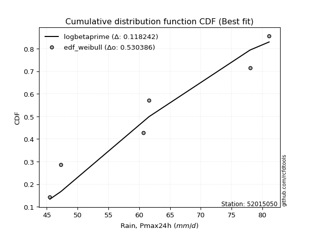</img>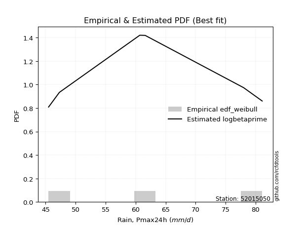</img>

</div>


### 4. EDF Beard (1943)

The Beard formula (or Beard´s plotting position formula) in hydrology is used to estimate the empirical non-exceedance probability _(P)_ of a flood event (or other extreme hydrological data point) within a given dataset.

<div align="center">


$P=(m-0.31)/(n+0.38)$


</div>


**4.1. Empirical values**

<div align="center">

|                | 0                   | 1                   | 2                   | 3         | 4                  | 5                  | 6                  |
|:---------------|:--------------------|:--------------------|:--------------------|:----------|:-------------------|:-------------------|:-------------------|
| date           | 2025                | 2022                | 2018                | 2019      | 2021               | 2017               | 2020               |
| x              | 11.1                | 45.5                | 47.3                | 60.7      | 61.6               | 78.0               | 81.1               |
| m              | 1                   | 2                   | 3                   | 4         | 5                  | 6                  | 7                  |
| empirical_dist | edf_beard           | edf_beard           | edf_beard           | edf_beard | edf_beard          | edf_beard          | edf_beard          |
| empirical      | 0.09349593495934959 | 0.22899728997289973 | 0.36449864498644985 | 0.5       | 0.6355013550135502 | 0.7710027100271003 | 0.9065040650406505 |
| empirical_tr   | 1.1031390134529149  | 1.29701230228471    | 1.5735607675906182  | 2.0       | 2.743494423791822  | 4.366863905325444  | 10.695652173913055 |

</div>


**4.2. Kolmogorov-Smirnov fit test (sorted by Δ)**


<div align="center">

|                | 0                   | 1                   | 2                   | 3                   | 4                   | 5                   | 6                   | 7                   | 8                   | 9                   | 10                  | 11                  | 12                  | 13                  | 14                  | 15                  | 16                  | 17                  | 18                  | 19                  | 20                  | 21                  | 22                  | 23                  | 24                  | 25                  | 26                  | 27                  | 28                  | 29                  | 30                  | 31                  | 32                  | 33                  | 34                  | 35                  | 36                  | 37                  | 38                  | 39                  | 40                  | 41                  | 42                  | 43                  | 44                  | 45                  | 46                  | 47                  | 48                  | 49                  | 50                  | 51                  | 52                  | 53                  | 54                  | 55                  | 56                  | 57                  | 58                  | 59                  | 60                  | 61                  | 62                  | 63                  | 64                  | 65                  | 66                  | 67                  | 68                  | 69                  | 70                  | 71                  | 72                  | 73                  | 74                  | 75                  | 76                  | 77                  | 78                  | 79                  | 80                  | 81                  | 82                  | 83                  | 84                  | 85                  | 86                  | 87                  | 88                  | 89                  | 90                  | 91                  | 92                  | 93                  | 94                  | 95                  | 96                  | 97                  | 98                  | 99                  | 100                 | 101                 | 102                 | 103                 | 104                 | 105                 | 106                 | 107                 | 108                 | 109                 | 110                 | 111                 | 112                 | 113                 | 114                 | 115                 | 116                 | 117                 | 118                 | 119                 | 120                 | 121                 | 122                 | 123                 | 124                 | 125                 | 126                 | 127                 | 128                 | 129                 | 130                 | 131                 | 132                 | 133                 | 134                 | 135                 | 136                 | 137                 | 138                 | 139                 | 140                 | 141                 | 142                 | 143                 | 144                 | 145                 | 146                 | 147                 | 148                 | 149                 | 150                 | 151                 | 152                 | 153                 | 154                 | 155                 | 156                 | 157                 | 158                 | 159                 |
|:---------------|:--------------------|:--------------------|:--------------------|:--------------------|:--------------------|:--------------------|:--------------------|:--------------------|:--------------------|:--------------------|:--------------------|:--------------------|:--------------------|:--------------------|:--------------------|:--------------------|:--------------------|:--------------------|:--------------------|:--------------------|:--------------------|:--------------------|:--------------------|:--------------------|:--------------------|:--------------------|:--------------------|:--------------------|:--------------------|:--------------------|:--------------------|:--------------------|:--------------------|:--------------------|:--------------------|:--------------------|:--------------------|:--------------------|:--------------------|:--------------------|:--------------------|:--------------------|:--------------------|:--------------------|:--------------------|:--------------------|:--------------------|:--------------------|:--------------------|:--------------------|:--------------------|:--------------------|:--------------------|:--------------------|:--------------------|:--------------------|:--------------------|:--------------------|:--------------------|:--------------------|:--------------------|:--------------------|:--------------------|:--------------------|:--------------------|:--------------------|:--------------------|:--------------------|:--------------------|:--------------------|:--------------------|:--------------------|:--------------------|:--------------------|:--------------------|:--------------------|:--------------------|:--------------------|:--------------------|:--------------------|:--------------------|:--------------------|:--------------------|:--------------------|:--------------------|:--------------------|:--------------------|:--------------------|:--------------------|:--------------------|:--------------------|:--------------------|:--------------------|:--------------------|:--------------------|:--------------------|:--------------------|:--------------------|:--------------------|:--------------------|:--------------------|:--------------------|:--------------------|:--------------------|:--------------------|:--------------------|:--------------------|:--------------------|:--------------------|:--------------------|:--------------------|:--------------------|:--------------------|:--------------------|:--------------------|:--------------------|:--------------------|:--------------------|:--------------------|:--------------------|:--------------------|:--------------------|:--------------------|:--------------------|:--------------------|:--------------------|:--------------------|:--------------------|:--------------------|:--------------------|:--------------------|:--------------------|:--------------------|:--------------------|:--------------------|:--------------------|:--------------------|:--------------------|:--------------------|:--------------------|:--------------------|:--------------------|:--------------------|:--------------------|:--------------------|:--------------------|:--------------------|:--------------------|:--------------------|:--------------------|:--------------------|:--------------------|:--------------------|:--------------------|:--------------------|:--------------------|:--------------------|:--------------------|:--------------------|:--------------------|
| station        | 52015050            | 52015050            | 52015050            | 52015050            | 52015050            | 52015050            | 52015050            | 52015050            | 52015050            | 52015050            | 52015050            | 52015050            | 52015050            | 52015050            | 52015050            | 52015050            | 52015050            | 52015050            | 52015050            | 52015050            | 52015050            | 52015050            | 52015050            | 52015050            | 52015050            | 52015050            | 52015050            | 52015050            | 52015050            | 52015050            | 52015050            | 52015050            | 52015050            | 52015050            | 52015050            | 52015050            | 52015050            | 52015050            | 52015050            | 52015050            | 52015050            | 52015050            | 52015050            | 52015050            | 52015050            | 52015050            | 52015050            | 52015050            | 52015050            | 52015050            | 52015050            | 52015050            | 52015050            | 52015050            | 52015050            | 52015050            | 52015050            | 52015050            | 52015050            | 52015050            | 52015050            | 52015050            | 52015050            | 52015050            | 52015050            | 52015050            | 52015050            | 52015050            | 52015050            | 52015050            | 52015050            | 52015050            | 52015050            | 52015050            | 52015050            | 52015050            | 52015050            | 52015050            | 52015050            | 52015050            | 52015050            | 52015050            | 52015050            | 52015050            | 52015050            | 52015050            | 52015050            | 52015050            | 52015050            | 52015050            | 52015050            | 52015050            | 52015050            | 52015050            | 52015050            | 52015050            | 52015050            | 52015050            | 52015050            | 52015050            | 52015050            | 52015050            | 52015050            | 52015050            | 52015050            | 52015050            | 52015050            | 52015050            | 52015050            | 52015050            | 52015050            | 52015050            | 52015050            | 52015050            | 52015050            | 52015050            | 52015050            | 52015050            | 52015050            | 52015050            | 52015050            | 52015050            | 52015050            | 52015050            | 52015050            | 52015050            | 52015050            | 52015050            | 52015050            | 52015050            | 52015050            | 52015050            | 52015050            | 52015050            | 52015050            | 52015050            | 52015050            | 52015050            | 52015050            | 52015050            | 52015050            | 52015050            | 52015050            | 52015050            | 52015050            | 52015050            | 52015050            | 52015050            | 52015050            | 52015050            | 52015050            | 52015050            | 52015050            | 52015050            | 52015050            | 52015050            | 52015050            | 52015050            | 52015050            | 52015050            |
| empirical_dist | edf_beard           | edf_beard           | edf_beard           | edf_beard           | edf_beard           | edf_beard           | edf_beard           | edf_beard           | edf_beard           | edf_beard           | edf_beard           | edf_beard           | edf_beard           | edf_beard           | edf_beard           | edf_beard           | edf_beard           | edf_beard           | edf_beard           | edf_beard           | edf_beard           | edf_beard           | edf_beard           | edf_beard           | edf_beard           | edf_beard           | edf_beard           | edf_beard           | edf_beard           | edf_beard           | edf_beard           | edf_beard           | edf_beard           | edf_beard           | edf_beard           | edf_beard           | edf_beard           | edf_beard           | edf_beard           | edf_beard           | edf_beard           | edf_beard           | edf_beard           | edf_beard           | edf_beard           | edf_beard           | edf_beard           | edf_beard           | edf_beard           | edf_beard           | edf_beard           | edf_beard           | edf_beard           | edf_beard           | edf_beard           | edf_beard           | edf_beard           | edf_beard           | edf_beard           | edf_beard           | edf_beard           | edf_beard           | edf_beard           | edf_beard           | edf_beard           | edf_beard           | edf_beard           | edf_beard           | edf_beard           | edf_beard           | edf_beard           | edf_beard           | edf_beard           | edf_beard           | edf_beard           | edf_beard           | edf_beard           | edf_beard           | edf_beard           | edf_beard           | edf_beard           | edf_beard           | edf_beard           | edf_beard           | edf_beard           | edf_beard           | edf_beard           | edf_beard           | edf_beard           | edf_beard           | edf_beard           | edf_beard           | edf_beard           | edf_beard           | edf_beard           | edf_beard           | edf_beard           | edf_beard           | edf_beard           | edf_beard           | edf_beard           | edf_beard           | edf_beard           | edf_beard           | edf_beard           | edf_beard           | edf_beard           | edf_beard           | edf_beard           | edf_beard           | edf_beard           | edf_beard           | edf_beard           | edf_beard           | edf_beard           | edf_beard           | edf_beard           | edf_beard           | edf_beard           | edf_beard           | edf_beard           | edf_beard           | edf_beard           | edf_beard           | edf_beard           | edf_beard           | edf_beard           | edf_beard           | edf_beard           | edf_beard           | edf_beard           | edf_beard           | edf_beard           | edf_beard           | edf_beard           | edf_beard           | edf_beard           | edf_beard           | edf_beard           | edf_beard           | edf_beard           | edf_beard           | edf_beard           | edf_beard           | edf_beard           | edf_beard           | edf_beard           | edf_beard           | edf_beard           | edf_beard           | edf_beard           | edf_beard           | edf_beard           | edf_beard           | edf_beard           | edf_beard           | edf_beard           | edf_beard           | edf_beard           | edf_beard           |
| p_dist         | pearson3            | trapezoid           | exponnorm           | norm                | truncnorm           | crystalball         | t                   | nct                 | f                   | dweibull            | logburr12           | betaprime           | gompertz            | weibull_min         | gengamma            | rice                | gumbel_l            | logvonmises_line    | exponpow            | logistic            | gamma               | erlang              | genhalflogistic     | anglit              | hypsecant           | invgamma            | exponweib           | argus               | dgamma              | logt                | maxwell             | semicircular        | johnsonsu           | loggompertz         | logpearson3         | genpareto           | burr                | logargus            | beta                | logdgamma           | invgauss            | rayleigh            | logburr             | laplace             | mielke              | skewnorm            | cosine              | logmielke           | logloggamma         | triang              | logdweibull         | invweibull          | gumbel_r            | loggumbel_l         | arcsine             | ncf                 | genextreme          | truncweibull_min    | halfnorm            | logloglaplace       | alpha               | loglevy_l           | halflogistic        | moyal               | levy_l              | logtrapezoid        | gennorm             | loggenextreme       | loggennorm          | logweibull_max      | kstwobign           | logbeta             | loglaplace          | loglaplace          | nakagami            | lognakagami         | loggengamma         | loghypsecant        | loglogistic         | logfoldnorm         | logf                | logrice             | logcrystalball      | lognorm             | logexponnorm        | lognct              | logfatiguelife      | logncf              | loganglit           | logsemicircular     | loggamma            | loggamma            | logbetaprime        | logtruncnorm        | logskewnorm         | logarcsine          | wald                | logerlang           | kappa3              | lomax               | uniform             | vonmises_line       | ksone               | loginvgamma         | wrapcauchy          | logalpha            | loginvgauss         | logmaxwell          | kappa4              | loginvweibull       | lograyleigh         | loggenhalflogistic  | tukeylambda         | loggumbel_r         | genexpon            | loghalfnorm         | logkstwobign        | logcosine           | loggausshyper       | logwrapcauchy       | logmoyal            | loggenexpon         | logjohnsonsb        | loghalflogistic     | logtriang           | bradford            | halfgennorm         | gausshyper          | logweibull_min      | loglomax            | logexponweib        | burr12              | loghalfgennorm      | truncexpon          | logwald             | loggenpareto        | foldnorm            | logrdist            | logksone            | logkappa4           | johnsonsb           | logtukeylambda      | logkappa3           | loguniform          | logbradford         | weibull_max         | logtruncweibull_min | logjohnsonsu        | logtruncexpon       | fatiguelife         | logexponpow         | powerlaw            | rdist               | logpowerlaw         | truncpareto         | logtruncpareto      | genlogistic         | loggenlogistic      | logvonmises         | vonmises            |
| delta          | 0.09322742791962091 | 0.09338344205112556 | 0.10264752511947142 | 0.10264758011865463 | 0.10264758203504395 | 0.10264758293919354 | 0.10265936078161828 | 0.10281464406610533 | 0.10356935767328881 | 0.10732034368666399 | 0.10741217156710292 | 0.1083611208389231  | 0.11069590078813463 | 0.11147124125333774 | 0.11195050316176236 | 0.1124224216795667  | 0.11267121933311341 | 0.1131237466634345  | 0.11320240407522375 | 0.11494250897551961 | 0.11793369313266891 | 0.12014480446702128 | 0.1215527643635892  | 0.12436449497474936 | 0.12565201080213018 | 0.12716686069854002 | 0.12772268706746062 | 0.13025533721368832 | 0.13247589525244977 | 0.13310542895247884 | 0.13333239167544023 | 0.13352084487999152 | 0.13447752144918812 | 0.13513305037860654 | 0.136380104101081   | 0.14051295006334086 | 0.14101164533839539 | 0.14123367230684025 | 0.14163854642939222 | 0.14314788173702964 | 0.14384720555676958 | 0.14512026553452775 | 0.150293462724438   | 0.15290314777032188 | 0.1561300679877604  | 0.15645255984600803 | 0.15729910147777146 | 0.1575618936916704  | 0.15785025031121824 | 0.15959834244931914 | 0.16016777042382502 | 0.16806186615429383 | 0.16815564036585362 | 0.16998718419086686 | 0.17139086044147364 | 0.1714436203382574  | 0.17541134796233482 | 0.17650253544124284 | 0.17865413514342368 | 0.1806803599122041  | 0.1833099087263139  | 0.1876698021141503  | 0.1879679333726354  | 0.1907920371940448  | 0.19106950940893586 | 0.19179924055055794 | 0.1927623773336097  | 0.19652620051111916 | 0.1992994629552401  | 0.2043480471477016  | 0.20805011420397432 | 0.2102245738096949  | 0.2198748095030326  | 0.2198748095030326  | 0.228997205735636   | 0.22899722409543785 | 0.23285982667983376 | 0.2329557882451678  | 0.23647057526867823 | 0.23650687918076627 | 0.23960788562482158 | 0.2405921872944812  | 0.24060249855829288 | 0.24060259519905605 | 0.24060283578599248 | 0.240959827053266   | 0.242736742380565   | 0.24470150389082704 | 0.24494066787391336 | 0.24672795360481928 | 0.24846828926861317 | 0.24846828926861317 | 0.24921829130874998 | 0.25323624766635633 | 0.2534561568484278  | 0.25382757541711176 | 0.2539024480698069  | 0.25761978520145556 | 0.2593450382082997  | 0.25948354201360335 | 0.26243128145567163 | 0.26267183972271846 | 0.2638598528842431  | 0.2641857499197584  | 0.2645698371636742  | 0.26767666116411726 | 0.2710595662706641  | 0.2746029577970759  | 0.27584662112256186 | 0.2839306769563562  | 0.2862026573520068  | 0.2879436584032571  | 0.30316974666415575 | 0.30939812414865064 | 0.31390328536322654 | 0.3188887244193821  | 0.321846902211285   | 0.3242750681134019  | 0.32764868740323927 | 0.33462585010832957 | 0.33515550306134356 | 0.33804808051194424 | 0.33913538300827595 | 0.3416865287490567  | 0.34182568280302095 | 0.347820720300148   | 0.3690928134307767  | 0.37622153052086044 | 0.3845539602197158  | 0.38647693894481805 | 0.3867666557529652  | 0.38805316045670424 | 0.3936648090139966  | 0.39471871631635325 | 0.4068468708559664  | 0.4288890670090265  | 0.4312563113952532  | 0.4444827206306119  | 0.44548451794452437 | 0.46631582000920335 | 0.4692226774994064  | 0.4747628302847201  | 0.4803563065455072  | 0.48038087952800934 | 0.4807009932228645  | 0.4864687799482137  | 0.5178351323490271  | 0.5183773146867462  | 0.5498279200378932  | 0.5834195838660802  | 0.5994493340743571  | 0.65490865968318    | 0.6777193904039017  | 0.7081454688314054  | 0.7183845181986288  | 0.7452535029171561  | 0.7710027100271003  | 0.7710027100271003  | 1.188913505493466   | 12.931049473301602  |
| deltao         | 0.48442053926100004 | 0.48442053926100004 | 0.48442053926100004 | 0.48442053926100004 | 0.48442053926100004 | 0.48442053926100004 | 0.48442053926100004 | 0.48442053926100004 | 0.48442053926100004 | 0.48442053926100004 | 0.48442053926100004 | 0.48442053926100004 | 0.48442053926100004 | 0.48442053926100004 | 0.48442053926100004 | 0.48442053926100004 | 0.48442053926100004 | 0.48442053926100004 | 0.48442053926100004 | 0.48442053926100004 | 0.48442053926100004 | 0.48442053926100004 | 0.48442053926100004 | 0.48442053926100004 | 0.48442053926100004 | 0.48442053926100004 | 0.48442053926100004 | 0.48442053926100004 | 0.48442053926100004 | 0.48442053926100004 | 0.48442053926100004 | 0.48442053926100004 | 0.48442053926100004 | 0.48442053926100004 | 0.48442053926100004 | 0.48442053926100004 | 0.48442053926100004 | 0.48442053926100004 | 0.48442053926100004 | 0.48442053926100004 | 0.48442053926100004 | 0.48442053926100004 | 0.48442053926100004 | 0.48442053926100004 | 0.48442053926100004 | 0.48442053926100004 | 0.48442053926100004 | 0.48442053926100004 | 0.48442053926100004 | 0.48442053926100004 | 0.48442053926100004 | 0.48442053926100004 | 0.48442053926100004 | 0.48442053926100004 | 0.48442053926100004 | 0.48442053926100004 | 0.48442053926100004 | 0.48442053926100004 | 0.48442053926100004 | 0.48442053926100004 | 0.48442053926100004 | 0.48442053926100004 | 0.48442053926100004 | 0.48442053926100004 | 0.48442053926100004 | 0.48442053926100004 | 0.48442053926100004 | 0.48442053926100004 | 0.48442053926100004 | 0.48442053926100004 | 0.48442053926100004 | 0.48442053926100004 | 0.48442053926100004 | 0.48442053926100004 | 0.48442053926100004 | 0.48442053926100004 | 0.48442053926100004 | 0.48442053926100004 | 0.48442053926100004 | 0.48442053926100004 | 0.48442053926100004 | 0.48442053926100004 | 0.48442053926100004 | 0.48442053926100004 | 0.48442053926100004 | 0.48442053926100004 | 0.48442053926100004 | 0.48442053926100004 | 0.48442053926100004 | 0.48442053926100004 | 0.48442053926100004 | 0.48442053926100004 | 0.48442053926100004 | 0.48442053926100004 | 0.48442053926100004 | 0.48442053926100004 | 0.48442053926100004 | 0.48442053926100004 | 0.48442053926100004 | 0.48442053926100004 | 0.48442053926100004 | 0.48442053926100004 | 0.48442053926100004 | 0.48442053926100004 | 0.48442053926100004 | 0.48442053926100004 | 0.48442053926100004 | 0.48442053926100004 | 0.48442053926100004 | 0.48442053926100004 | 0.48442053926100004 | 0.48442053926100004 | 0.48442053926100004 | 0.48442053926100004 | 0.48442053926100004 | 0.48442053926100004 | 0.48442053926100004 | 0.48442053926100004 | 0.48442053926100004 | 0.48442053926100004 | 0.48442053926100004 | 0.48442053926100004 | 0.48442053926100004 | 0.48442053926100004 | 0.48442053926100004 | 0.48442053926100004 | 0.48442053926100004 | 0.48442053926100004 | 0.48442053926100004 | 0.48442053926100004 | 0.48442053926100004 | 0.48442053926100004 | 0.48442053926100004 | 0.48442053926100004 | 0.48442053926100004 | 0.48442053926100004 | 0.48442053926100004 | 0.48442053926100004 | 0.48442053926100004 | 0.48442053926100004 | 0.48442053926100004 | 0.48442053926100004 | 0.48442053926100004 | 0.48442053926100004 | 0.48442053926100004 | 0.48442053926100004 | 0.48442053926100004 | 0.48442053926100004 | 0.48442053926100004 | 0.48442053926100004 | 0.48442053926100004 | 0.48442053926100004 | 0.48442053926100004 | 0.48442053926100004 | 0.48442053926100004 | 0.48442053926100004 | 0.48442053926100004 | 0.48442053926100004 | 0.48442053926100004 | 0.48442053926100004 |
| eval           | Δo > Δ              | Δo > Δ              | Δo > Δ              | Δo > Δ              | Δo > Δ              | Δo > Δ              | Δo > Δ              | Δo > Δ              | Δo > Δ              | Δo > Δ              | Δo > Δ              | Δo > Δ              | Δo > Δ              | Δo > Δ              | Δo > Δ              | Δo > Δ              | Δo > Δ              | Δo > Δ              | Δo > Δ              | Δo > Δ              | Δo > Δ              | Δo > Δ              | Δo > Δ              | Δo > Δ              | Δo > Δ              | Δo > Δ              | Δo > Δ              | Δo > Δ              | Δo > Δ              | Δo > Δ              | Δo > Δ              | Δo > Δ              | Δo > Δ              | Δo > Δ              | Δo > Δ              | Δo > Δ              | Δo > Δ              | Δo > Δ              | Δo > Δ              | Δo > Δ              | Δo > Δ              | Δo > Δ              | Δo > Δ              | Δo > Δ              | Δo > Δ              | Δo > Δ              | Δo > Δ              | Δo > Δ              | Δo > Δ              | Δo > Δ              | Δo > Δ              | Δo > Δ              | Δo > Δ              | Δo > Δ              | Δo > Δ              | Δo > Δ              | Δo > Δ              | Δo > Δ              | Δo > Δ              | Δo > Δ              | Δo > Δ              | Δo > Δ              | Δo > Δ              | Δo > Δ              | Δo > Δ              | Δo > Δ              | Δo > Δ              | Δo > Δ              | Δo > Δ              | Δo > Δ              | Δo > Δ              | Δo > Δ              | Δo > Δ              | Δo > Δ              | Δo > Δ              | Δo > Δ              | Δo > Δ              | Δo > Δ              | Δo > Δ              | Δo > Δ              | Δo > Δ              | Δo > Δ              | Δo > Δ              | Δo > Δ              | Δo > Δ              | Δo > Δ              | Δo > Δ              | Δo > Δ              | Δo > Δ              | Δo > Δ              | Δo > Δ              | Δo > Δ              | Δo > Δ              | Δo > Δ              | Δo > Δ              | Δo > Δ              | Δo > Δ              | Δo > Δ              | Δo > Δ              | Δo > Δ              | Δo > Δ              | Δo > Δ              | Δo > Δ              | Δo > Δ              | Δo > Δ              | Δo > Δ              | Δo > Δ              | Δo > Δ              | Δo > Δ              | Δo > Δ              | Δo > Δ              | Δo > Δ              | Δo > Δ              | Δo > Δ              | Δo > Δ              | Δo > Δ              | Δo > Δ              | Δo > Δ              | Δo > Δ              | Δo > Δ              | Δo > Δ              | Δo > Δ              | Δo > Δ              | Δo > Δ              | Δo > Δ              | Δo > Δ              | Δo > Δ              | Δo > Δ              | Δo > Δ              | Δo > Δ              | Δo > Δ              | Δo > Δ              | Δo > Δ              | Δo > Δ              | Δo > Δ              | Δo > Δ              | Δo > Δ              | Δo > Δ              | Δo > Δ              | Δo > Δ              | Δo > Δ              | Δo > Δ              | Δo > Δ              | Δo > Δ              | Δo > Δ              | Δo <= Δ             | Δo <= Δ             | Δo <= Δ             | Δo <= Δ             | Δo <= Δ             | Δo <= Δ             | Δo <= Δ             | Δo <= Δ             | Δo <= Δ             | Δo <= Δ             | Δo <= Δ             | Δo <= Δ             | Δo <= Δ             | Δo <= Δ             | Δo <= Δ             |
| fit            | 1                   | 1                   | 1                   | 1                   | 1                   | 1                   | 1                   | 1                   | 1                   | 1                   | 1                   | 1                   | 1                   | 1                   | 1                   | 1                   | 1                   | 1                   | 1                   | 1                   | 1                   | 1                   | 1                   | 1                   | 1                   | 1                   | 1                   | 1                   | 1                   | 1                   | 1                   | 1                   | 1                   | 1                   | 1                   | 1                   | 1                   | 1                   | 1                   | 1                   | 1                   | 1                   | 1                   | 1                   | 1                   | 1                   | 1                   | 1                   | 1                   | 1                   | 1                   | 1                   | 1                   | 1                   | 1                   | 1                   | 1                   | 1                   | 1                   | 1                   | 1                   | 1                   | 1                   | 1                   | 1                   | 1                   | 1                   | 1                   | 1                   | 1                   | 1                   | 1                   | 1                   | 1                   | 1                   | 1                   | 1                   | 1                   | 1                   | 1                   | 1                   | 1                   | 1                   | 1                   | 1                   | 1                   | 1                   | 1                   | 1                   | 1                   | 1                   | 1                   | 1                   | 1                   | 1                   | 1                   | 1                   | 1                   | 1                   | 1                   | 1                   | 1                   | 1                   | 1                   | 1                   | 1                   | 1                   | 1                   | 1                   | 1                   | 1                   | 1                   | 1                   | 1                   | 1                   | 1                   | 1                   | 1                   | 1                   | 1                   | 1                   | 1                   | 1                   | 1                   | 1                   | 1                   | 1                   | 1                   | 1                   | 1                   | 1                   | 1                   | 1                   | 1                   | 1                   | 1                   | 1                   | 1                   | 1                   | 1                   | 1                   | 1                   | 1                   | 1                   | 1                   | 0                   | 0                   | 0                   | 0                   | 0                   | 0                   | 0                   | 0                   | 0                   | 0                   | 0                   | 0                   | 0                   | 0                   | 0                   |
| n              | 7                   | 7                   | 7                   | 7                   | 7                   | 7                   | 7                   | 7                   | 7                   | 7                   | 7                   | 7                   | 7                   | 7                   | 7                   | 7                   | 7                   | 7                   | 7                   | 7                   | 7                   | 7                   | 7                   | 7                   | 7                   | 7                   | 7                   | 7                   | 7                   | 7                   | 7                   | 7                   | 7                   | 7                   | 7                   | 7                   | 7                   | 7                   | 7                   | 7                   | 7                   | 7                   | 7                   | 7                   | 7                   | 7                   | 7                   | 7                   | 7                   | 7                   | 7                   | 7                   | 7                   | 7                   | 7                   | 7                   | 7                   | 7                   | 7                   | 7                   | 7                   | 7                   | 7                   | 7                   | 7                   | 7                   | 7                   | 7                   | 7                   | 7                   | 7                   | 7                   | 7                   | 7                   | 7                   | 7                   | 7                   | 7                   | 7                   | 7                   | 7                   | 7                   | 7                   | 7                   | 7                   | 7                   | 7                   | 7                   | 7                   | 7                   | 7                   | 7                   | 7                   | 7                   | 7                   | 7                   | 7                   | 7                   | 7                   | 7                   | 7                   | 7                   | 7                   | 7                   | 7                   | 7                   | 7                   | 7                   | 7                   | 7                   | 7                   | 7                   | 7                   | 7                   | 7                   | 7                   | 7                   | 7                   | 7                   | 7                   | 7                   | 7                   | 7                   | 7                   | 7                   | 7                   | 7                   | 7                   | 7                   | 7                   | 7                   | 7                   | 7                   | 7                   | 7                   | 7                   | 7                   | 7                   | 7                   | 7                   | 7                   | 7                   | 7                   | 7                   | 7                   | 7                   | 7                   | 7                   | 7                   | 7                   | 7                   | 7                   | 7                   | 7                   | 7                   | 7                   | 7                   | 7                   | 7                   | 7                   |
| best_fit       | 1                   | 0                   | 0                   | 0                   | 0                   | 0                   | 0                   | 0                   | 0                   | 0                   | 0                   | 0                   | 0                   | 0                   | 0                   | 0                   | 0                   | 0                   | 0                   | 0                   | 0                   | 0                   | 0                   | 0                   | 0                   | 0                   | 0                   | 0                   | 0                   | 0                   | 0                   | 0                   | 0                   | 0                   | 0                   | 0                   | 0                   | 0                   | 0                   | 0                   | 0                   | 0                   | 0                   | 0                   | 0                   | 0                   | 0                   | 0                   | 0                   | 0                   | 0                   | 0                   | 0                   | 0                   | 0                   | 0                   | 0                   | 0                   | 0                   | 0                   | 0                   | 0                   | 0                   | 0                   | 0                   | 0                   | 0                   | 0                   | 0                   | 0                   | 0                   | 0                   | 0                   | 0                   | 0                   | 0                   | 0                   | 0                   | 0                   | 0                   | 0                   | 0                   | 0                   | 0                   | 0                   | 0                   | 0                   | 0                   | 0                   | 0                   | 0                   | 0                   | 0                   | 0                   | 0                   | 0                   | 0                   | 0                   | 0                   | 0                   | 0                   | 0                   | 0                   | 0                   | 0                   | 0                   | 0                   | 0                   | 0                   | 0                   | 0                   | 0                   | 0                   | 0                   | 0                   | 0                   | 0                   | 0                   | 0                   | 0                   | 0                   | 0                   | 0                   | 0                   | 0                   | 0                   | 0                   | 0                   | 0                   | 0                   | 0                   | 0                   | 0                   | 0                   | 0                   | 0                   | 0                   | 0                   | 0                   | 0                   | 0                   | 0                   | 0                   | 0                   | 0                   | 0                   | 0                   | 0                   | 0                   | 0                   | 0                   | 0                   | 0                   | 0                   | 0                   | 0                   | 0                   | 0                   | 0                   | 0                   |
| best_fit_sort  | 1                   | 2                   | 3                   | 4                   | 5                   | 6                   | 7                   | 8                   | 9                   | 10                  | 11                  | 12                  | 13                  | 14                  | 15                  | 16                  | 17                  | 18                  | 19                  | 20                  | 21                  | 22                  | 23                  | 24                  | 25                  | 26                  | 27                  | 28                  | 29                  | 30                  | 31                  | 32                  | 33                  | 34                  | 35                  | 36                  | 37                  | 38                  | 39                  | 40                  | 41                  | 42                  | 43                  | 44                  | 45                  | 46                  | 47                  | 48                  | 49                  | 50                  | 51                  | 52                  | 53                  | 54                  | 55                  | 56                  | 57                  | 58                  | 59                  | 60                  | 61                  | 62                  | 63                  | 64                  | 65                  | 66                  | 67                  | 68                  | 69                  | 70                  | 71                  | 72                  | 73                  | 74                  | 75                  | 76                  | 77                  | 78                  | 79                  | 80                  | 81                  | 82                  | 83                  | 84                  | 85                  | 86                  | 87                  | 88                  | 89                  | 90                  | 91                  | 92                  | 93                  | 94                  | 95                  | 96                  | 97                  | 98                  | 99                  | 100                 | 101                 | 102                 | 103                 | 104                 | 105                 | 106                 | 107                 | 108                 | 109                 | 110                 | 111                 | 112                 | 113                 | 114                 | 115                 | 116                 | 117                 | 118                 | 119                 | 120                 | 121                 | 122                 | 123                 | 124                 | 125                 | 126                 | 127                 | 128                 | 129                 | 130                 | 131                 | 132                 | 133                 | 134                 | 135                 | 136                 | 137                 | 138                 | 139                 | 140                 | 141                 | 142                 | 143                 | 144                 | 145                 | 146                 | 147                 | 148                 | 149                 | 150                 | 151                 | 152                 | 153                 | 154                 | 155                 | 156                 | 157                 | 158                 | 159                 | 160                 |

</div>


**4.3. Best fit**

<div align="center">

|   id |   station | empirical_dist   | p_dist   |     delta |   deltao | eval   |   fit |   n |   best_fit |   best_fit_sort |
|-----:|----------:|:-----------------|:---------|----------:|---------:|:-------|------:|----:|-----------:|----------------:|
|    0 |  52015050 | edf_beard        | pearson3 | 0.0932274 | 0.484421 | Δo > Δ |     1 |   7 |          1 |               1 |

</div>


<div align="center">

</img></img>

</div>


### 5. EDF Chegodayev (1955)

The Chegodayev formula is an empirical plotting position formula used in hydrological frequency analysis to estimate the exceedance probability or return period of a specific event from a set of observed data. It is primarily used for plotting observed data points on probability paper to fit a theoretical distribution, particularly for analyzing extreme events like maximum flood flows or rainfall intensities. The constant _b_ value in the generalized plotting position formula is 0.3.

<div align="center">


$P=(m-b)/(n+1-2b)$


</div>


**5.1. Empirical values**

<div align="center">

|                | 0                   | 1                   | 2                   | 3              | 4                  | 5                  | 6                  |
|:---------------|:--------------------|:--------------------|:--------------------|:---------------|:-------------------|:-------------------|:-------------------|
| date           | 2025                | 2022                | 2018                | 2019           | 2021               | 2017               | 2020               |
| x              | 11.1                | 45.5                | 47.3                | 60.7           | 61.6               | 78.0               | 81.1               |
| m              | 1                   | 2                   | 3                   | 4              | 5                  | 6                  | 7                  |
| empirical_dist | edf_chegodayev      | edf_chegodayev      | edf_chegodayev      | edf_chegodayev | edf_chegodayev     | edf_chegodayev     | edf_chegodayev     |
| empirical      | 0.09459459459459459 | 0.22972972972972971 | 0.36486486486486486 | 0.5            | 0.6351351351351351 | 0.7702702702702703 | 0.9054054054054054 |
| empirical_tr   | 1.1044776119402986  | 1.2982456140350878  | 1.574468085106383   | 2.0            | 2.7407407407407405 | 4.352941176470589  | 10.571428571428568 |

</div>


**5.2. Kolmogorov-Smirnov fit test (sorted by Δ)**


<div align="center">

|                | 0                   | 1                   | 2                   | 3                   | 4                   | 5                   | 6                   | 7                   | 8                   | 9                   | 10                  | 11                  | 12                  | 13                  | 14                  | 15                  | 16                  | 17                  | 18                  | 19                  | 20                  | 21                  | 22                  | 23                  | 24                  | 25                  | 26                  | 27                  | 28                  | 29                  | 30                  | 31                  | 32                  | 33                  | 34                  | 35                  | 36                  | 37                  | 38                  | 39                  | 40                  | 41                  | 42                  | 43                  | 44                  | 45                  | 46                  | 47                  | 48                  | 49                  | 50                  | 51                  | 52                  | 53                  | 54                  | 55                  | 56                  | 57                  | 58                  | 59                  | 60                  | 61                  | 62                  | 63                  | 64                  | 65                  | 66                  | 67                  | 68                  | 69                  | 70                  | 71                  | 72                  | 73                  | 74                  | 75                  | 76                  | 77                  | 78                  | 79                  | 80                  | 81                  | 82                  | 83                  | 84                  | 85                  | 86                  | 87                  | 88                  | 89                  | 90                  | 91                  | 92                  | 93                  | 94                  | 95                  | 96                  | 97                  | 98                  | 99                  | 100                 | 101                 | 102                 | 103                 | 104                 | 105                 | 106                 | 107                 | 108                 | 109                 | 110                 | 111                 | 112                 | 113                 | 114                 | 115                 | 116                 | 117                 | 118                 | 119                 | 120                 | 121                 | 122                 | 123                 | 124                 | 125                 | 126                 | 127                 | 128                 | 129                 | 130                 | 131                 | 132                 | 133                 | 134                 | 135                 | 136                 | 137                 | 138                 | 139                 | 140                 | 141                 | 142                 | 143                 | 144                 | 145                 | 146                 | 147                 | 148                 | 149                 | 150                 | 151                 | 152                 | 153                 | 154                 | 155                 | 156                 | 157                 | 158                 | 159                 |
|:---------------|:--------------------|:--------------------|:--------------------|:--------------------|:--------------------|:--------------------|:--------------------|:--------------------|:--------------------|:--------------------|:--------------------|:--------------------|:--------------------|:--------------------|:--------------------|:--------------------|:--------------------|:--------------------|:--------------------|:--------------------|:--------------------|:--------------------|:--------------------|:--------------------|:--------------------|:--------------------|:--------------------|:--------------------|:--------------------|:--------------------|:--------------------|:--------------------|:--------------------|:--------------------|:--------------------|:--------------------|:--------------------|:--------------------|:--------------------|:--------------------|:--------------------|:--------------------|:--------------------|:--------------------|:--------------------|:--------------------|:--------------------|:--------------------|:--------------------|:--------------------|:--------------------|:--------------------|:--------------------|:--------------------|:--------------------|:--------------------|:--------------------|:--------------------|:--------------------|:--------------------|:--------------------|:--------------------|:--------------------|:--------------------|:--------------------|:--------------------|:--------------------|:--------------------|:--------------------|:--------------------|:--------------------|:--------------------|:--------------------|:--------------------|:--------------------|:--------------------|:--------------------|:--------------------|:--------------------|:--------------------|:--------------------|:--------------------|:--------------------|:--------------------|:--------------------|:--------------------|:--------------------|:--------------------|:--------------------|:--------------------|:--------------------|:--------------------|:--------------------|:--------------------|:--------------------|:--------------------|:--------------------|:--------------------|:--------------------|:--------------------|:--------------------|:--------------------|:--------------------|:--------------------|:--------------------|:--------------------|:--------------------|:--------------------|:--------------------|:--------------------|:--------------------|:--------------------|:--------------------|:--------------------|:--------------------|:--------------------|:--------------------|:--------------------|:--------------------|:--------------------|:--------------------|:--------------------|:--------------------|:--------------------|:--------------------|:--------------------|:--------------------|:--------------------|:--------------------|:--------------------|:--------------------|:--------------------|:--------------------|:--------------------|:--------------------|:--------------------|:--------------------|:--------------------|:--------------------|:--------------------|:--------------------|:--------------------|:--------------------|:--------------------|:--------------------|:--------------------|:--------------------|:--------------------|:--------------------|:--------------------|:--------------------|:--------------------|:--------------------|:--------------------|:--------------------|:--------------------|:--------------------|:--------------------|:--------------------|:--------------------|
| station        | 52015050            | 52015050            | 52015050            | 52015050            | 52015050            | 52015050            | 52015050            | 52015050            | 52015050            | 52015050            | 52015050            | 52015050            | 52015050            | 52015050            | 52015050            | 52015050            | 52015050            | 52015050            | 52015050            | 52015050            | 52015050            | 52015050            | 52015050            | 52015050            | 52015050            | 52015050            | 52015050            | 52015050            | 52015050            | 52015050            | 52015050            | 52015050            | 52015050            | 52015050            | 52015050            | 52015050            | 52015050            | 52015050            | 52015050            | 52015050            | 52015050            | 52015050            | 52015050            | 52015050            | 52015050            | 52015050            | 52015050            | 52015050            | 52015050            | 52015050            | 52015050            | 52015050            | 52015050            | 52015050            | 52015050            | 52015050            | 52015050            | 52015050            | 52015050            | 52015050            | 52015050            | 52015050            | 52015050            | 52015050            | 52015050            | 52015050            | 52015050            | 52015050            | 52015050            | 52015050            | 52015050            | 52015050            | 52015050            | 52015050            | 52015050            | 52015050            | 52015050            | 52015050            | 52015050            | 52015050            | 52015050            | 52015050            | 52015050            | 52015050            | 52015050            | 52015050            | 52015050            | 52015050            | 52015050            | 52015050            | 52015050            | 52015050            | 52015050            | 52015050            | 52015050            | 52015050            | 52015050            | 52015050            | 52015050            | 52015050            | 52015050            | 52015050            | 52015050            | 52015050            | 52015050            | 52015050            | 52015050            | 52015050            | 52015050            | 52015050            | 52015050            | 52015050            | 52015050            | 52015050            | 52015050            | 52015050            | 52015050            | 52015050            | 52015050            | 52015050            | 52015050            | 52015050            | 52015050            | 52015050            | 52015050            | 52015050            | 52015050            | 52015050            | 52015050            | 52015050            | 52015050            | 52015050            | 52015050            | 52015050            | 52015050            | 52015050            | 52015050            | 52015050            | 52015050            | 52015050            | 52015050            | 52015050            | 52015050            | 52015050            | 52015050            | 52015050            | 52015050            | 52015050            | 52015050            | 52015050            | 52015050            | 52015050            | 52015050            | 52015050            | 52015050            | 52015050            | 52015050            | 52015050            | 52015050            | 52015050            |
| empirical_dist | edf_chegodayev      | edf_chegodayev      | edf_chegodayev      | edf_chegodayev      | edf_chegodayev      | edf_chegodayev      | edf_chegodayev      | edf_chegodayev      | edf_chegodayev      | edf_chegodayev      | edf_chegodayev      | edf_chegodayev      | edf_chegodayev      | edf_chegodayev      | edf_chegodayev      | edf_chegodayev      | edf_chegodayev      | edf_chegodayev      | edf_chegodayev      | edf_chegodayev      | edf_chegodayev      | edf_chegodayev      | edf_chegodayev      | edf_chegodayev      | edf_chegodayev      | edf_chegodayev      | edf_chegodayev      | edf_chegodayev      | edf_chegodayev      | edf_chegodayev      | edf_chegodayev      | edf_chegodayev      | edf_chegodayev      | edf_chegodayev      | edf_chegodayev      | edf_chegodayev      | edf_chegodayev      | edf_chegodayev      | edf_chegodayev      | edf_chegodayev      | edf_chegodayev      | edf_chegodayev      | edf_chegodayev      | edf_chegodayev      | edf_chegodayev      | edf_chegodayev      | edf_chegodayev      | edf_chegodayev      | edf_chegodayev      | edf_chegodayev      | edf_chegodayev      | edf_chegodayev      | edf_chegodayev      | edf_chegodayev      | edf_chegodayev      | edf_chegodayev      | edf_chegodayev      | edf_chegodayev      | edf_chegodayev      | edf_chegodayev      | edf_chegodayev      | edf_chegodayev      | edf_chegodayev      | edf_chegodayev      | edf_chegodayev      | edf_chegodayev      | edf_chegodayev      | edf_chegodayev      | edf_chegodayev      | edf_chegodayev      | edf_chegodayev      | edf_chegodayev      | edf_chegodayev      | edf_chegodayev      | edf_chegodayev      | edf_chegodayev      | edf_chegodayev      | edf_chegodayev      | edf_chegodayev      | edf_chegodayev      | edf_chegodayev      | edf_chegodayev      | edf_chegodayev      | edf_chegodayev      | edf_chegodayev      | edf_chegodayev      | edf_chegodayev      | edf_chegodayev      | edf_chegodayev      | edf_chegodayev      | edf_chegodayev      | edf_chegodayev      | edf_chegodayev      | edf_chegodayev      | edf_chegodayev      | edf_chegodayev      | edf_chegodayev      | edf_chegodayev      | edf_chegodayev      | edf_chegodayev      | edf_chegodayev      | edf_chegodayev      | edf_chegodayev      | edf_chegodayev      | edf_chegodayev      | edf_chegodayev      | edf_chegodayev      | edf_chegodayev      | edf_chegodayev      | edf_chegodayev      | edf_chegodayev      | edf_chegodayev      | edf_chegodayev      | edf_chegodayev      | edf_chegodayev      | edf_chegodayev      | edf_chegodayev      | edf_chegodayev      | edf_chegodayev      | edf_chegodayev      | edf_chegodayev      | edf_chegodayev      | edf_chegodayev      | edf_chegodayev      | edf_chegodayev      | edf_chegodayev      | edf_chegodayev      | edf_chegodayev      | edf_chegodayev      | edf_chegodayev      | edf_chegodayev      | edf_chegodayev      | edf_chegodayev      | edf_chegodayev      | edf_chegodayev      | edf_chegodayev      | edf_chegodayev      | edf_chegodayev      | edf_chegodayev      | edf_chegodayev      | edf_chegodayev      | edf_chegodayev      | edf_chegodayev      | edf_chegodayev      | edf_chegodayev      | edf_chegodayev      | edf_chegodayev      | edf_chegodayev      | edf_chegodayev      | edf_chegodayev      | edf_chegodayev      | edf_chegodayev      | edf_chegodayev      | edf_chegodayev      | edf_chegodayev      | edf_chegodayev      | edf_chegodayev      | edf_chegodayev      | edf_chegodayev      | edf_chegodayev      |
| p_dist         | trapezoid           | pearson3            | exponnorm           | norm                | truncnorm           | crystalball         | t                   | nct                 | f                   | logburr12           | betaprime           | dweibull            | gompertz            | rice                | logvonmises_line    | weibull_min         | gengamma            | gumbel_l            | exponpow            | logistic            | gamma               | erlang              | genhalflogistic     | anglit              | hypsecant           | invgamma            | exponweib           | argus               | dgamma              | maxwell             | semicircular        | logt                | johnsonsu           | loggompertz         | logpearson3         | genpareto           | burr                | logargus            | logdgamma           | beta                | invgauss            | rayleigh            | logburr             | laplace             | cosine              | mielke              | skewnorm            | logmielke           | logloggamma         | logdweibull         | triang              | invweibull          | gumbel_r            | loggumbel_l         | arcsine             | ncf                 | genextreme          | truncweibull_min    | halfnorm            | logloglaplace       | alpha               | loglevy_l           | halflogistic        | levy_l              | moyal               | logtrapezoid        | gennorm             | loggenextreme       | loggennorm          | logweibull_max      | kstwobign           | logbeta             | loglaplace          | loglaplace          | nakagami            | lognakagami         | loggengamma         | loghypsecant        | loglogistic         | logfoldnorm         | logf                | logrice             | logcrystalball      | lognorm             | logexponnorm        | lognct              | logfatiguelife      | logncf              | loganglit           | logsemicircular     | loggamma            | loggamma            | logbetaprime        | logskewnorm         | logarcsine          | logtruncnorm        | wald                | logerlang           | kappa3              | lomax               | uniform             | vonmises_line       | ksone               | loginvgamma         | wrapcauchy          | logalpha            | loginvgauss         | logmaxwell          | kappa4              | loginvweibull       | lograyleigh         | loggenhalflogistic  | tukeylambda         | loggumbel_r         | genexpon            | loghalfnorm         | logkstwobign        | logcosine           | loggausshyper       | logwrapcauchy       | logmoyal            | loggenexpon         | logjohnsonsb        | loghalflogistic     | logtriang           | bradford            | halfgennorm         | gausshyper          | logweibull_min      | loglomax            | logexponweib        | burr12              | loghalfgennorm      | truncexpon          | logwald             | loggenpareto        | foldnorm            | logrdist            | logksone            | logkappa4           | johnsonsb           | logtukeylambda      | logkappa3           | loguniform          | logbradford         | weibull_max         | logtruncweibull_min | logjohnsonsu        | logtruncexpon       | fatiguelife         | logexponpow         | powerlaw            | rdist               | logpowerlaw         | truncpareto         | logtruncpareto      | genlogistic         | loggenlogistic      | logvonmises         | vonmises            |
| delta          | 0.09265100229429557 | 0.09395986767645093 | 0.10191508536264143 | 0.10191514036182464 | 0.10191514227821397 | 0.10191514318236355 | 0.10192692102478829 | 0.10208220430927534 | 0.10283691791645883 | 0.10741217156710292 | 0.10762868108209311 | 0.107686563565079   | 0.11142834054496464 | 0.11168998192273671 | 0.11202508702818936 | 0.11220368101016776 | 0.11268294291859238 | 0.11340365908994343 | 0.11393484383205377 | 0.11494250897551961 | 0.11720125337583892 | 0.11941236471019129 | 0.12228520412041921 | 0.12363205521791937 | 0.12565201080213018 | 0.12643442094171004 | 0.12699024731063063 | 0.13098777697051833 | 0.13174345549561978 | 0.13259995191861024 | 0.13278840512316153 | 0.13347164883089385 | 0.134111301570773   | 0.13440061062177655 | 0.13564766434425102 | 0.14014673018492574 | 0.1417440850952254  | 0.14196611206367027 | 0.1420492221017845  | 0.14237098618622224 | 0.1431147657999396  | 0.14438782577769776 | 0.15102590248126802 | 0.15290314777032188 | 0.15656666172094147 | 0.15686250774459043 | 0.15718499960283805 | 0.1582943334485004  | 0.15858269006804826 | 0.15906911078857988 | 0.16033078220614916 | 0.16732942639746384 | 0.16815564036585362 | 0.16925474443403687 | 0.17065842068464365 | 0.17071118058142742 | 0.1750451280839197  | 0.17723497519807285 | 0.1779216953865937  | 0.17958170027695897 | 0.1825774689694839  | 0.18730358223573518 | 0.1879679333726354  | 0.19070328953052074 | 0.1907920371940448  | 0.19106680079372795 | 0.19312859721202472 | 0.19579376075428917 | 0.1996656828336551  | 0.20324938751245664 | 0.20731767444714433 | 0.20985835393127977 | 0.2191423697462026  | 0.2191423697462026  | 0.229729645492466   | 0.22972966385226784 | 0.23212738692300378 | 0.2322233484883378  | 0.23573813551184825 | 0.23577443942393628 | 0.2388754458679916  | 0.2398597475376512  | 0.2398700588014629  | 0.23987015544222606 | 0.2398703960291625  | 0.240227387296436   | 0.242004302623735   | 0.24396906413399705 | 0.24420822811708337 | 0.2459955138479893  | 0.24773584951178318 | 0.24773584951178318 | 0.24848585155192    | 0.2527237170915978  | 0.2530951356602818  | 0.25360246754477134 | 0.2539024480698069  | 0.25688734544462555 | 0.2586125984514697  | 0.25875110225677334 | 0.26169884169884167 | 0.2619393999658885  | 0.2631274131274131  | 0.26345331016292844 | 0.2638373974068442  | 0.26694422140728724 | 0.27032712651383406 | 0.27387051804024587 | 0.27511418136573185 | 0.2831982371995262  | 0.28547021759517677 | 0.28721121864642707 | 0.30243730690732573 | 0.3086656843918206  | 0.3131708456063965  | 0.3181562846625521  | 0.32111446245445496 | 0.3235426283565719  | 0.32691624764640925 | 0.33389341035149955 | 0.33442306330451355 | 0.3373156407551142  | 0.338036723373031   | 0.3409540889922267  | 0.34109324304619093 | 0.347088280543318   | 0.3683603736739467  | 0.3758553106424453  | 0.38382152046288576 | 0.38574449918798803 | 0.3860342159961352  | 0.3873207206998742  | 0.39293236925716657 | 0.39398627655952323 | 0.40611443109913636 | 0.4281566272521965  | 0.4312563113952532  | 0.4437502808737819  | 0.44475207818769436 | 0.46558338025237334 | 0.46849023774257637 | 0.4740303905278901  | 0.4796238667886772  | 0.4796484397711793  | 0.4799685534660345  | 0.4861025600697986  | 0.5171026925921971  | 0.5176448749299162  | 0.5490954802810631  | 0.5826871441092502  | 0.5987168943175271  | 0.65417621992635    | 0.6769869506470717  | 0.7074130290745754  | 0.7176520784417988  | 0.7445210631603261  | 0.7702702702702703  | 0.7702702702702703  | 1.1881810657366363  | 12.932148132936847  |
| deltao         | 0.48442053926100004 | 0.48442053926100004 | 0.48442053926100004 | 0.48442053926100004 | 0.48442053926100004 | 0.48442053926100004 | 0.48442053926100004 | 0.48442053926100004 | 0.48442053926100004 | 0.48442053926100004 | 0.48442053926100004 | 0.48442053926100004 | 0.48442053926100004 | 0.48442053926100004 | 0.48442053926100004 | 0.48442053926100004 | 0.48442053926100004 | 0.48442053926100004 | 0.48442053926100004 | 0.48442053926100004 | 0.48442053926100004 | 0.48442053926100004 | 0.48442053926100004 | 0.48442053926100004 | 0.48442053926100004 | 0.48442053926100004 | 0.48442053926100004 | 0.48442053926100004 | 0.48442053926100004 | 0.48442053926100004 | 0.48442053926100004 | 0.48442053926100004 | 0.48442053926100004 | 0.48442053926100004 | 0.48442053926100004 | 0.48442053926100004 | 0.48442053926100004 | 0.48442053926100004 | 0.48442053926100004 | 0.48442053926100004 | 0.48442053926100004 | 0.48442053926100004 | 0.48442053926100004 | 0.48442053926100004 | 0.48442053926100004 | 0.48442053926100004 | 0.48442053926100004 | 0.48442053926100004 | 0.48442053926100004 | 0.48442053926100004 | 0.48442053926100004 | 0.48442053926100004 | 0.48442053926100004 | 0.48442053926100004 | 0.48442053926100004 | 0.48442053926100004 | 0.48442053926100004 | 0.48442053926100004 | 0.48442053926100004 | 0.48442053926100004 | 0.48442053926100004 | 0.48442053926100004 | 0.48442053926100004 | 0.48442053926100004 | 0.48442053926100004 | 0.48442053926100004 | 0.48442053926100004 | 0.48442053926100004 | 0.48442053926100004 | 0.48442053926100004 | 0.48442053926100004 | 0.48442053926100004 | 0.48442053926100004 | 0.48442053926100004 | 0.48442053926100004 | 0.48442053926100004 | 0.48442053926100004 | 0.48442053926100004 | 0.48442053926100004 | 0.48442053926100004 | 0.48442053926100004 | 0.48442053926100004 | 0.48442053926100004 | 0.48442053926100004 | 0.48442053926100004 | 0.48442053926100004 | 0.48442053926100004 | 0.48442053926100004 | 0.48442053926100004 | 0.48442053926100004 | 0.48442053926100004 | 0.48442053926100004 | 0.48442053926100004 | 0.48442053926100004 | 0.48442053926100004 | 0.48442053926100004 | 0.48442053926100004 | 0.48442053926100004 | 0.48442053926100004 | 0.48442053926100004 | 0.48442053926100004 | 0.48442053926100004 | 0.48442053926100004 | 0.48442053926100004 | 0.48442053926100004 | 0.48442053926100004 | 0.48442053926100004 | 0.48442053926100004 | 0.48442053926100004 | 0.48442053926100004 | 0.48442053926100004 | 0.48442053926100004 | 0.48442053926100004 | 0.48442053926100004 | 0.48442053926100004 | 0.48442053926100004 | 0.48442053926100004 | 0.48442053926100004 | 0.48442053926100004 | 0.48442053926100004 | 0.48442053926100004 | 0.48442053926100004 | 0.48442053926100004 | 0.48442053926100004 | 0.48442053926100004 | 0.48442053926100004 | 0.48442053926100004 | 0.48442053926100004 | 0.48442053926100004 | 0.48442053926100004 | 0.48442053926100004 | 0.48442053926100004 | 0.48442053926100004 | 0.48442053926100004 | 0.48442053926100004 | 0.48442053926100004 | 0.48442053926100004 | 0.48442053926100004 | 0.48442053926100004 | 0.48442053926100004 | 0.48442053926100004 | 0.48442053926100004 | 0.48442053926100004 | 0.48442053926100004 | 0.48442053926100004 | 0.48442053926100004 | 0.48442053926100004 | 0.48442053926100004 | 0.48442053926100004 | 0.48442053926100004 | 0.48442053926100004 | 0.48442053926100004 | 0.48442053926100004 | 0.48442053926100004 | 0.48442053926100004 | 0.48442053926100004 | 0.48442053926100004 | 0.48442053926100004 | 0.48442053926100004 | 0.48442053926100004 |
| eval           | Δo > Δ              | Δo > Δ              | Δo > Δ              | Δo > Δ              | Δo > Δ              | Δo > Δ              | Δo > Δ              | Δo > Δ              | Δo > Δ              | Δo > Δ              | Δo > Δ              | Δo > Δ              | Δo > Δ              | Δo > Δ              | Δo > Δ              | Δo > Δ              | Δo > Δ              | Δo > Δ              | Δo > Δ              | Δo > Δ              | Δo > Δ              | Δo > Δ              | Δo > Δ              | Δo > Δ              | Δo > Δ              | Δo > Δ              | Δo > Δ              | Δo > Δ              | Δo > Δ              | Δo > Δ              | Δo > Δ              | Δo > Δ              | Δo > Δ              | Δo > Δ              | Δo > Δ              | Δo > Δ              | Δo > Δ              | Δo > Δ              | Δo > Δ              | Δo > Δ              | Δo > Δ              | Δo > Δ              | Δo > Δ              | Δo > Δ              | Δo > Δ              | Δo > Δ              | Δo > Δ              | Δo > Δ              | Δo > Δ              | Δo > Δ              | Δo > Δ              | Δo > Δ              | Δo > Δ              | Δo > Δ              | Δo > Δ              | Δo > Δ              | Δo > Δ              | Δo > Δ              | Δo > Δ              | Δo > Δ              | Δo > Δ              | Δo > Δ              | Δo > Δ              | Δo > Δ              | Δo > Δ              | Δo > Δ              | Δo > Δ              | Δo > Δ              | Δo > Δ              | Δo > Δ              | Δo > Δ              | Δo > Δ              | Δo > Δ              | Δo > Δ              | Δo > Δ              | Δo > Δ              | Δo > Δ              | Δo > Δ              | Δo > Δ              | Δo > Δ              | Δo > Δ              | Δo > Δ              | Δo > Δ              | Δo > Δ              | Δo > Δ              | Δo > Δ              | Δo > Δ              | Δo > Δ              | Δo > Δ              | Δo > Δ              | Δo > Δ              | Δo > Δ              | Δo > Δ              | Δo > Δ              | Δo > Δ              | Δo > Δ              | Δo > Δ              | Δo > Δ              | Δo > Δ              | Δo > Δ              | Δo > Δ              | Δo > Δ              | Δo > Δ              | Δo > Δ              | Δo > Δ              | Δo > Δ              | Δo > Δ              | Δo > Δ              | Δo > Δ              | Δo > Δ              | Δo > Δ              | Δo > Δ              | Δo > Δ              | Δo > Δ              | Δo > Δ              | Δo > Δ              | Δo > Δ              | Δo > Δ              | Δo > Δ              | Δo > Δ              | Δo > Δ              | Δo > Δ              | Δo > Δ              | Δo > Δ              | Δo > Δ              | Δo > Δ              | Δo > Δ              | Δo > Δ              | Δo > Δ              | Δo > Δ              | Δo > Δ              | Δo > Δ              | Δo > Δ              | Δo > Δ              | Δo > Δ              | Δo > Δ              | Δo > Δ              | Δo > Δ              | Δo > Δ              | Δo > Δ              | Δo > Δ              | Δo > Δ              | Δo > Δ              | Δo > Δ              | Δo > Δ              | Δo <= Δ             | Δo <= Δ             | Δo <= Δ             | Δo <= Δ             | Δo <= Δ             | Δo <= Δ             | Δo <= Δ             | Δo <= Δ             | Δo <= Δ             | Δo <= Δ             | Δo <= Δ             | Δo <= Δ             | Δo <= Δ             | Δo <= Δ             | Δo <= Δ             |
| fit            | 1                   | 1                   | 1                   | 1                   | 1                   | 1                   | 1                   | 1                   | 1                   | 1                   | 1                   | 1                   | 1                   | 1                   | 1                   | 1                   | 1                   | 1                   | 1                   | 1                   | 1                   | 1                   | 1                   | 1                   | 1                   | 1                   | 1                   | 1                   | 1                   | 1                   | 1                   | 1                   | 1                   | 1                   | 1                   | 1                   | 1                   | 1                   | 1                   | 1                   | 1                   | 1                   | 1                   | 1                   | 1                   | 1                   | 1                   | 1                   | 1                   | 1                   | 1                   | 1                   | 1                   | 1                   | 1                   | 1                   | 1                   | 1                   | 1                   | 1                   | 1                   | 1                   | 1                   | 1                   | 1                   | 1                   | 1                   | 1                   | 1                   | 1                   | 1                   | 1                   | 1                   | 1                   | 1                   | 1                   | 1                   | 1                   | 1                   | 1                   | 1                   | 1                   | 1                   | 1                   | 1                   | 1                   | 1                   | 1                   | 1                   | 1                   | 1                   | 1                   | 1                   | 1                   | 1                   | 1                   | 1                   | 1                   | 1                   | 1                   | 1                   | 1                   | 1                   | 1                   | 1                   | 1                   | 1                   | 1                   | 1                   | 1                   | 1                   | 1                   | 1                   | 1                   | 1                   | 1                   | 1                   | 1                   | 1                   | 1                   | 1                   | 1                   | 1                   | 1                   | 1                   | 1                   | 1                   | 1                   | 1                   | 1                   | 1                   | 1                   | 1                   | 1                   | 1                   | 1                   | 1                   | 1                   | 1                   | 1                   | 1                   | 1                   | 1                   | 1                   | 1                   | 0                   | 0                   | 0                   | 0                   | 0                   | 0                   | 0                   | 0                   | 0                   | 0                   | 0                   | 0                   | 0                   | 0                   | 0                   |
| n              | 7                   | 7                   | 7                   | 7                   | 7                   | 7                   | 7                   | 7                   | 7                   | 7                   | 7                   | 7                   | 7                   | 7                   | 7                   | 7                   | 7                   | 7                   | 7                   | 7                   | 7                   | 7                   | 7                   | 7                   | 7                   | 7                   | 7                   | 7                   | 7                   | 7                   | 7                   | 7                   | 7                   | 7                   | 7                   | 7                   | 7                   | 7                   | 7                   | 7                   | 7                   | 7                   | 7                   | 7                   | 7                   | 7                   | 7                   | 7                   | 7                   | 7                   | 7                   | 7                   | 7                   | 7                   | 7                   | 7                   | 7                   | 7                   | 7                   | 7                   | 7                   | 7                   | 7                   | 7                   | 7                   | 7                   | 7                   | 7                   | 7                   | 7                   | 7                   | 7                   | 7                   | 7                   | 7                   | 7                   | 7                   | 7                   | 7                   | 7                   | 7                   | 7                   | 7                   | 7                   | 7                   | 7                   | 7                   | 7                   | 7                   | 7                   | 7                   | 7                   | 7                   | 7                   | 7                   | 7                   | 7                   | 7                   | 7                   | 7                   | 7                   | 7                   | 7                   | 7                   | 7                   | 7                   | 7                   | 7                   | 7                   | 7                   | 7                   | 7                   | 7                   | 7                   | 7                   | 7                   | 7                   | 7                   | 7                   | 7                   | 7                   | 7                   | 7                   | 7                   | 7                   | 7                   | 7                   | 7                   | 7                   | 7                   | 7                   | 7                   | 7                   | 7                   | 7                   | 7                   | 7                   | 7                   | 7                   | 7                   | 7                   | 7                   | 7                   | 7                   | 7                   | 7                   | 7                   | 7                   | 7                   | 7                   | 7                   | 7                   | 7                   | 7                   | 7                   | 7                   | 7                   | 7                   | 7                   | 7                   |
| best_fit       | 1                   | 0                   | 0                   | 0                   | 0                   | 0                   | 0                   | 0                   | 0                   | 0                   | 0                   | 0                   | 0                   | 0                   | 0                   | 0                   | 0                   | 0                   | 0                   | 0                   | 0                   | 0                   | 0                   | 0                   | 0                   | 0                   | 0                   | 0                   | 0                   | 0                   | 0                   | 0                   | 0                   | 0                   | 0                   | 0                   | 0                   | 0                   | 0                   | 0                   | 0                   | 0                   | 0                   | 0                   | 0                   | 0                   | 0                   | 0                   | 0                   | 0                   | 0                   | 0                   | 0                   | 0                   | 0                   | 0                   | 0                   | 0                   | 0                   | 0                   | 0                   | 0                   | 0                   | 0                   | 0                   | 0                   | 0                   | 0                   | 0                   | 0                   | 0                   | 0                   | 0                   | 0                   | 0                   | 0                   | 0                   | 0                   | 0                   | 0                   | 0                   | 0                   | 0                   | 0                   | 0                   | 0                   | 0                   | 0                   | 0                   | 0                   | 0                   | 0                   | 0                   | 0                   | 0                   | 0                   | 0                   | 0                   | 0                   | 0                   | 0                   | 0                   | 0                   | 0                   | 0                   | 0                   | 0                   | 0                   | 0                   | 0                   | 0                   | 0                   | 0                   | 0                   | 0                   | 0                   | 0                   | 0                   | 0                   | 0                   | 0                   | 0                   | 0                   | 0                   | 0                   | 0                   | 0                   | 0                   | 0                   | 0                   | 0                   | 0                   | 0                   | 0                   | 0                   | 0                   | 0                   | 0                   | 0                   | 0                   | 0                   | 0                   | 0                   | 0                   | 0                   | 0                   | 0                   | 0                   | 0                   | 0                   | 0                   | 0                   | 0                   | 0                   | 0                   | 0                   | 0                   | 0                   | 0                   | 0                   |
| best_fit_sort  | 1                   | 2                   | 3                   | 4                   | 5                   | 6                   | 7                   | 8                   | 9                   | 10                  | 11                  | 12                  | 13                  | 14                  | 15                  | 16                  | 17                  | 18                  | 19                  | 20                  | 21                  | 22                  | 23                  | 24                  | 25                  | 26                  | 27                  | 28                  | 29                  | 30                  | 31                  | 32                  | 33                  | 34                  | 35                  | 36                  | 37                  | 38                  | 39                  | 40                  | 41                  | 42                  | 43                  | 44                  | 45                  | 46                  | 47                  | 48                  | 49                  | 50                  | 51                  | 52                  | 53                  | 54                  | 55                  | 56                  | 57                  | 58                  | 59                  | 60                  | 61                  | 62                  | 63                  | 64                  | 65                  | 66                  | 67                  | 68                  | 69                  | 70                  | 71                  | 72                  | 73                  | 74                  | 75                  | 76                  | 77                  | 78                  | 79                  | 80                  | 81                  | 82                  | 83                  | 84                  | 85                  | 86                  | 87                  | 88                  | 89                  | 90                  | 91                  | 92                  | 93                  | 94                  | 95                  | 96                  | 97                  | 98                  | 99                  | 100                 | 101                 | 102                 | 103                 | 104                 | 105                 | 106                 | 107                 | 108                 | 109                 | 110                 | 111                 | 112                 | 113                 | 114                 | 115                 | 116                 | 117                 | 118                 | 119                 | 120                 | 121                 | 122                 | 123                 | 124                 | 125                 | 126                 | 127                 | 128                 | 129                 | 130                 | 131                 | 132                 | 133                 | 134                 | 135                 | 136                 | 137                 | 138                 | 139                 | 140                 | 141                 | 142                 | 143                 | 144                 | 145                 | 146                 | 147                 | 148                 | 149                 | 150                 | 151                 | 152                 | 153                 | 154                 | 155                 | 156                 | 157                 | 158                 | 159                 | 160                 |

</div>


**5.3. Best fit**

<div align="center">

|   id |   station | empirical_dist   | p_dist    |    delta |   deltao | eval   |   fit |   n |   best_fit |   best_fit_sort |
|-----:|----------:|:-----------------|:----------|---------:|---------:|:-------|------:|----:|-----------:|----------------:|
|    0 |  52015050 | edf_chegodayev   | trapezoid | 0.092651 | 0.484421 | Δo > Δ |     1 |   7 |          1 |               1 |

</div>


<div align="center">

</img>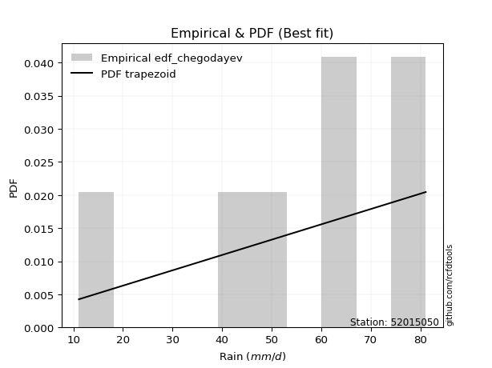</img>

</div>


### 6. EDF Blom (1958)

The Blom formula is a specific "plotting position" formula used in hydrology and statistical analysis to estimate the empirical cumulative probability (or non-exceedance probability) of a data series. It is particularly recommended for data that are approximately normally distributed. The constant _a_ is set to 0.375 (or 3/8).

<div align="center">


$P=(m-a)/(n+1-2a)$


</div>


**6.1. Empirical values**

<div align="center">

|                | 0                   | 1                   | 2                  | 3        | 4                  | 5                  | 6                  |
|:---------------|:--------------------|:--------------------|:-------------------|:---------|:-------------------|:-------------------|:-------------------|
| date           | 2025                | 2022                | 2018               | 2019     | 2021               | 2017               | 2020               |
| x              | 11.1                | 45.5                | 47.3               | 60.7     | 61.6               | 78.0               | 81.1               |
| m              | 1                   | 2                   | 3                  | 4        | 5                  | 6                  | 7                  |
| empirical_dist | edf_blom            | edf_blom            | edf_blom           | edf_blom | edf_blom           | edf_blom           | edf_blom           |
| empirical      | 0.08620689655172414 | 0.22413793103448276 | 0.3620689655172414 | 0.5      | 0.6379310344827587 | 0.7758620689655172 | 0.9137931034482759 |
| empirical_tr   | 1.0943396226415094  | 1.288888888888889   | 1.5675675675675675 | 2.0      | 2.7619047619047623 | 4.461538461538462  | 11.600000000000007 |

</div>


**6.2. Kolmogorov-Smirnov fit test (sorted by Δ)**


<div align="center">

|                | 0                   | 1                   | 2                   | 3                   | 4                   | 5                   | 6                   | 7                   | 8                   | 9                   | 10                  | 11                  | 12                  | 13                  | 14                  | 15                  | 16                  | 17                  | 18                  | 19                  | 20                  | 21                  | 22                  | 23                  | 24                  | 25                  | 26                  | 27                  | 28                  | 29                  | 30                  | 31                  | 32                  | 33                  | 34                  | 35                  | 36                  | 37                  | 38                  | 39                  | 40                  | 41                  | 42                  | 43                  | 44                  | 45                  | 46                  | 47                  | 48                  | 49                  | 50                  | 51                  | 52                  | 53                  | 54                  | 55                  | 56                  | 57                  | 58                  | 59                  | 60                  | 61                  | 62                  | 63                  | 64                  | 65                  | 66                  | 67                  | 68                  | 69                  | 70                  | 71                  | 72                  | 73                  | 74                  | 75                  | 76                  | 77                  | 78                  | 79                  | 80                  | 81                  | 82                  | 83                  | 84                  | 85                  | 86                  | 87                  | 88                  | 89                  | 90                  | 91                  | 92                  | 93                  | 94                  | 95                  | 96                  | 97                  | 98                  | 99                  | 100                 | 101                 | 102                 | 103                 | 104                 | 105                 | 106                 | 107                 | 108                 | 109                 | 110                 | 111                 | 112                 | 113                 | 114                 | 115                 | 116                 | 117                 | 118                 | 119                 | 120                 | 121                 | 122                 | 123                 | 124                 | 125                 | 126                 | 127                 | 128                 | 129                 | 130                 | 131                 | 132                 | 133                 | 134                 | 135                 | 136                 | 137                 | 138                 | 139                 | 140                 | 141                 | 142                 | 143                 | 144                 | 145                 | 146                 | 147                 | 148                 | 149                 | 150                 | 151                 | 152                 | 153                 | 154                 | 155                 | 156                 | 157                 | 158                 | 159                 |
|:---------------|:--------------------|:--------------------|:--------------------|:--------------------|:--------------------|:--------------------|:--------------------|:--------------------|:--------------------|:--------------------|:--------------------|:--------------------|:--------------------|:--------------------|:--------------------|:--------------------|:--------------------|:--------------------|:--------------------|:--------------------|:--------------------|:--------------------|:--------------------|:--------------------|:--------------------|:--------------------|:--------------------|:--------------------|:--------------------|:--------------------|:--------------------|:--------------------|:--------------------|:--------------------|:--------------------|:--------------------|:--------------------|:--------------------|:--------------------|:--------------------|:--------------------|:--------------------|:--------------------|:--------------------|:--------------------|:--------------------|:--------------------|:--------------------|:--------------------|:--------------------|:--------------------|:--------------------|:--------------------|:--------------------|:--------------------|:--------------------|:--------------------|:--------------------|:--------------------|:--------------------|:--------------------|:--------------------|:--------------------|:--------------------|:--------------------|:--------------------|:--------------------|:--------------------|:--------------------|:--------------------|:--------------------|:--------------------|:--------------------|:--------------------|:--------------------|:--------------------|:--------------------|:--------------------|:--------------------|:--------------------|:--------------------|:--------------------|:--------------------|:--------------------|:--------------------|:--------------------|:--------------------|:--------------------|:--------------------|:--------------------|:--------------------|:--------------------|:--------------------|:--------------------|:--------------------|:--------------------|:--------------------|:--------------------|:--------------------|:--------------------|:--------------------|:--------------------|:--------------------|:--------------------|:--------------------|:--------------------|:--------------------|:--------------------|:--------------------|:--------------------|:--------------------|:--------------------|:--------------------|:--------------------|:--------------------|:--------------------|:--------------------|:--------------------|:--------------------|:--------------------|:--------------------|:--------------------|:--------------------|:--------------------|:--------------------|:--------------------|:--------------------|:--------------------|:--------------------|:--------------------|:--------------------|:--------------------|:--------------------|:--------------------|:--------------------|:--------------------|:--------------------|:--------------------|:--------------------|:--------------------|:--------------------|:--------------------|:--------------------|:--------------------|:--------------------|:--------------------|:--------------------|:--------------------|:--------------------|:--------------------|:--------------------|:--------------------|:--------------------|:--------------------|:--------------------|:--------------------|:--------------------|:--------------------|:--------------------|:--------------------|
| station        | 52015050            | 52015050            | 52015050            | 52015050            | 52015050            | 52015050            | 52015050            | 52015050            | 52015050            | 52015050            | 52015050            | 52015050            | 52015050            | 52015050            | 52015050            | 52015050            | 52015050            | 52015050            | 52015050            | 52015050            | 52015050            | 52015050            | 52015050            | 52015050            | 52015050            | 52015050            | 52015050            | 52015050            | 52015050            | 52015050            | 52015050            | 52015050            | 52015050            | 52015050            | 52015050            | 52015050            | 52015050            | 52015050            | 52015050            | 52015050            | 52015050            | 52015050            | 52015050            | 52015050            | 52015050            | 52015050            | 52015050            | 52015050            | 52015050            | 52015050            | 52015050            | 52015050            | 52015050            | 52015050            | 52015050            | 52015050            | 52015050            | 52015050            | 52015050            | 52015050            | 52015050            | 52015050            | 52015050            | 52015050            | 52015050            | 52015050            | 52015050            | 52015050            | 52015050            | 52015050            | 52015050            | 52015050            | 52015050            | 52015050            | 52015050            | 52015050            | 52015050            | 52015050            | 52015050            | 52015050            | 52015050            | 52015050            | 52015050            | 52015050            | 52015050            | 52015050            | 52015050            | 52015050            | 52015050            | 52015050            | 52015050            | 52015050            | 52015050            | 52015050            | 52015050            | 52015050            | 52015050            | 52015050            | 52015050            | 52015050            | 52015050            | 52015050            | 52015050            | 52015050            | 52015050            | 52015050            | 52015050            | 52015050            | 52015050            | 52015050            | 52015050            | 52015050            | 52015050            | 52015050            | 52015050            | 52015050            | 52015050            | 52015050            | 52015050            | 52015050            | 52015050            | 52015050            | 52015050            | 52015050            | 52015050            | 52015050            | 52015050            | 52015050            | 52015050            | 52015050            | 52015050            | 52015050            | 52015050            | 52015050            | 52015050            | 52015050            | 52015050            | 52015050            | 52015050            | 52015050            | 52015050            | 52015050            | 52015050            | 52015050            | 52015050            | 52015050            | 52015050            | 52015050            | 52015050            | 52015050            | 52015050            | 52015050            | 52015050            | 52015050            | 52015050            | 52015050            | 52015050            | 52015050            | 52015050            | 52015050            |
| empirical_dist | edf_blom            | edf_blom            | edf_blom            | edf_blom            | edf_blom            | edf_blom            | edf_blom            | edf_blom            | edf_blom            | edf_blom            | edf_blom            | edf_blom            | edf_blom            | edf_blom            | edf_blom            | edf_blom            | edf_blom            | edf_blom            | edf_blom            | edf_blom            | edf_blom            | edf_blom            | edf_blom            | edf_blom            | edf_blom            | edf_blom            | edf_blom            | edf_blom            | edf_blom            | edf_blom            | edf_blom            | edf_blom            | edf_blom            | edf_blom            | edf_blom            | edf_blom            | edf_blom            | edf_blom            | edf_blom            | edf_blom            | edf_blom            | edf_blom            | edf_blom            | edf_blom            | edf_blom            | edf_blom            | edf_blom            | edf_blom            | edf_blom            | edf_blom            | edf_blom            | edf_blom            | edf_blom            | edf_blom            | edf_blom            | edf_blom            | edf_blom            | edf_blom            | edf_blom            | edf_blom            | edf_blom            | edf_blom            | edf_blom            | edf_blom            | edf_blom            | edf_blom            | edf_blom            | edf_blom            | edf_blom            | edf_blom            | edf_blom            | edf_blom            | edf_blom            | edf_blom            | edf_blom            | edf_blom            | edf_blom            | edf_blom            | edf_blom            | edf_blom            | edf_blom            | edf_blom            | edf_blom            | edf_blom            | edf_blom            | edf_blom            | edf_blom            | edf_blom            | edf_blom            | edf_blom            | edf_blom            | edf_blom            | edf_blom            | edf_blom            | edf_blom            | edf_blom            | edf_blom            | edf_blom            | edf_blom            | edf_blom            | edf_blom            | edf_blom            | edf_blom            | edf_blom            | edf_blom            | edf_blom            | edf_blom            | edf_blom            | edf_blom            | edf_blom            | edf_blom            | edf_blom            | edf_blom            | edf_blom            | edf_blom            | edf_blom            | edf_blom            | edf_blom            | edf_blom            | edf_blom            | edf_blom            | edf_blom            | edf_blom            | edf_blom            | edf_blom            | edf_blom            | edf_blom            | edf_blom            | edf_blom            | edf_blom            | edf_blom            | edf_blom            | edf_blom            | edf_blom            | edf_blom            | edf_blom            | edf_blom            | edf_blom            | edf_blom            | edf_blom            | edf_blom            | edf_blom            | edf_blom            | edf_blom            | edf_blom            | edf_blom            | edf_blom            | edf_blom            | edf_blom            | edf_blom            | edf_blom            | edf_blom            | edf_blom            | edf_blom            | edf_blom            | edf_blom            | edf_blom            | edf_blom            | edf_blom            | edf_blom            |
| p_dist         | pearson3            | trapezoid           | gompertz            | dweibull            | weibull_min         | gengamma            | logburr12           | exponnorm           | norm                | truncnorm           | crystalball         | t                   | nct                 | gumbel_l            | exponpow            | f                   | betaprime           | logistic            | genhalflogistic     | rice                | logvonmises_line    | gamma               | erlang              | argus               | hypsecant           | anglit              | logt                | invgamma            | exponweib           | burr                | logargus            | beta                | johnsonsu           | dgamma              | maxwell             | semicircular        | loggompertz         | logpearson3         | genpareto           | logburr             | invgauss            | rayleigh            | logdgamma           | mielke              | skewnorm            | logmielke           | laplace             | logloggamma         | triang              | cosine              | logdweibull         | gumbel_r            | truncweibull_min    | invweibull          | loggumbel_l         | arcsine             | ncf                 | genextreme          | halfnorm            | logloglaplace       | alpha               | halflogistic        | loglevy_l           | gennorm             | moyal               | levy_l              | logtrapezoid        | loggennorm          | loggenextreme       | logweibull_max      | logbeta             | kstwobign           | nakagami            | lognakagami         | loglaplace          | loglaplace          | loggengamma         | loghypsecant        | loglogistic         | logfoldnorm         | logf                | logrice             | logcrystalball      | lognorm             | logexponnorm        | lognct              | logfatiguelife      | logncf              | loganglit           | logtruncnorm        | logsemicircular     | loggamma            | loggamma            | wald                | logbetaprime        | logskewnorm         | logarcsine          | logerlang           | kappa3              | lomax               | uniform             | vonmises_line       | ksone               | loginvgamma         | wrapcauchy          | logalpha            | loginvgauss         | logmaxwell          | kappa4              | loginvweibull       | lograyleigh         | loggenhalflogistic  | tukeylambda         | loggumbel_r         | genexpon            | loghalfnorm         | logkstwobign        | logcosine           | loggausshyper       | logwrapcauchy       | logmoyal            | loggenexpon         | logjohnsonsb        | loghalflogistic     | logtriang           | bradford            | halfgennorm         | gausshyper          | logweibull_min      | loglomax            | logexponweib        | burr12              | loghalfgennorm      | truncexpon          | logwald             | foldnorm            | loggenpareto        | logrdist            | logksone            | logkappa4           | johnsonsb           | logtukeylambda      | logkappa3           | loguniform          | logbradford         | weibull_max         | logtruncweibull_min | logjohnsonsu        | logtruncexpon       | fatiguelife         | logexponpow         | powerlaw            | rdist               | logpowerlaw         | truncpareto         | logtruncpareto      | genlogistic         | loggenlogistic      | logvonmises         | vonmises            |
| delta          | 0.08836806898120397 | 0.09824280098954252 | 0.10583654184971769 | 0.10648831459915642 | 0.1066118823149208  | 0.10709114422334542 | 0.10741217156710292 | 0.10750688405788839 | 0.1075069390570716  | 0.10750694097346092 | 0.1075069418776105  | 0.10751871972003524 | 0.10767400300452229 | 0.10781186039469648 | 0.10834304513680681 | 0.10842871661170578 | 0.11322047977734007 | 0.11494250897551961 | 0.11669340542517226 | 0.11728178061798367 | 0.1204127850710599  | 0.12279305207108587 | 0.12500416340543824 | 0.12539597827527138 | 0.12565201080213018 | 0.12922385391316632 | 0.13067574948327038 | 0.132026219636957   | 0.13258204600587759 | 0.13615228639997845 | 0.13637431336842332 | 0.13677918749097528 | 0.1369072009183966  | 0.13733525419086673 | 0.1381917506138572  | 0.1383802038184085  | 0.1399924093170235  | 0.14123946303949797 | 0.14294262953254933 | 0.14543410378602106 | 0.14870656449518654 | 0.14997962447294472 | 0.15043692014465504 | 0.15127070904934348 | 0.1515932009075911  | 0.15270253475325346 | 0.15290314777032188 | 0.1529908913728013  | 0.1547389835109022  | 0.16215846041618842 | 0.16745680883145042 | 0.16815564036585362 | 0.1716431765028259  | 0.1729212250927108  | 0.17484654312928383 | 0.1762502193798906  | 0.17630297927667438 | 0.17784102743154329 | 0.18351349408184064 | 0.1879693983198295  | 0.18816926766473085 | 0.18828776995367696 | 0.19009948158335876 | 0.19033269786440124 | 0.1907920371940448  | 0.19349918887814432 | 0.1966585994889749  | 0.19686978348603162 | 0.20138555944953612 | 0.21163708555532706 | 0.21265425327890336 | 0.21290947314239128 | 0.22413784679721904 | 0.2241378651570209  | 0.22473416844144956 | 0.22473416844144956 | 0.23771918561825073 | 0.23781514718358476 | 0.2413299342070952  | 0.24136623811918323 | 0.24446724456323854 | 0.24545154623289817 | 0.24546185749670985 | 0.24546195413747302 | 0.24546219472440944 | 0.24581918599168295 | 0.24759610131898196 | 0.249560862829244   | 0.24980002681233032 | 0.25080656819714786 | 0.25158731254323624 | 0.25332764820703013 | 0.25332764820703013 | 0.2539024480698069  | 0.25407765024716694 | 0.25831551578684475 | 0.25868693435552875 | 0.2624791441398725  | 0.2642043971467167  | 0.2643429009520203  | 0.2672906403940886  | 0.26753119866113545 | 0.26871921182266006 | 0.2690451088581754  | 0.26942919610209115 | 0.2725360201025342  | 0.275918925209081   | 0.2794623167354928  | 0.2807059800609788  | 0.28879003589477314 | 0.2910620162904237  | 0.292803017341674   | 0.3080291056025727  | 0.3142574830870676  | 0.31876264430164347 | 0.32374808335779903 | 0.3267062611497019  | 0.32913442705181883 | 0.3325080463416562  | 0.3394852090467465  | 0.3400148619997605  | 0.3429074394503612  | 0.3464244214159014  | 0.34654588768747363 | 0.3466850417414379  | 0.3526800792385649  | 0.37395217236919365 | 0.3786512099900689  | 0.3894133191581327  | 0.391336297883235   | 0.39162601469138214 | 0.3929125193951212  | 0.3985241679524135  | 0.3995780752547702  | 0.4117062297943833  | 0.4312563113952532  | 0.43374842594744345 | 0.44934207956902883 | 0.4503438768829413  | 0.4711751789476203  | 0.4740820364378233  | 0.47962218922313704 | 0.48521566548392414 | 0.4852402384664263  | 0.48556035216128146 | 0.48889845941742216 | 0.522694491287444   | 0.5232366736251631  | 0.5546872789763101  | 0.5882789428044971  | 0.604308693012774   | 0.659768018621597   | 0.6825787493423187  | 0.7130048277698223  | 0.7232438771370457  | 0.750112861855573   | 0.7758620689655172  | 0.7758620689655172  | 1.193772864431883   | 12.923760434893977  |
| deltao         | 0.48442053926100004 | 0.48442053926100004 | 0.48442053926100004 | 0.48442053926100004 | 0.48442053926100004 | 0.48442053926100004 | 0.48442053926100004 | 0.48442053926100004 | 0.48442053926100004 | 0.48442053926100004 | 0.48442053926100004 | 0.48442053926100004 | 0.48442053926100004 | 0.48442053926100004 | 0.48442053926100004 | 0.48442053926100004 | 0.48442053926100004 | 0.48442053926100004 | 0.48442053926100004 | 0.48442053926100004 | 0.48442053926100004 | 0.48442053926100004 | 0.48442053926100004 | 0.48442053926100004 | 0.48442053926100004 | 0.48442053926100004 | 0.48442053926100004 | 0.48442053926100004 | 0.48442053926100004 | 0.48442053926100004 | 0.48442053926100004 | 0.48442053926100004 | 0.48442053926100004 | 0.48442053926100004 | 0.48442053926100004 | 0.48442053926100004 | 0.48442053926100004 | 0.48442053926100004 | 0.48442053926100004 | 0.48442053926100004 | 0.48442053926100004 | 0.48442053926100004 | 0.48442053926100004 | 0.48442053926100004 | 0.48442053926100004 | 0.48442053926100004 | 0.48442053926100004 | 0.48442053926100004 | 0.48442053926100004 | 0.48442053926100004 | 0.48442053926100004 | 0.48442053926100004 | 0.48442053926100004 | 0.48442053926100004 | 0.48442053926100004 | 0.48442053926100004 | 0.48442053926100004 | 0.48442053926100004 | 0.48442053926100004 | 0.48442053926100004 | 0.48442053926100004 | 0.48442053926100004 | 0.48442053926100004 | 0.48442053926100004 | 0.48442053926100004 | 0.48442053926100004 | 0.48442053926100004 | 0.48442053926100004 | 0.48442053926100004 | 0.48442053926100004 | 0.48442053926100004 | 0.48442053926100004 | 0.48442053926100004 | 0.48442053926100004 | 0.48442053926100004 | 0.48442053926100004 | 0.48442053926100004 | 0.48442053926100004 | 0.48442053926100004 | 0.48442053926100004 | 0.48442053926100004 | 0.48442053926100004 | 0.48442053926100004 | 0.48442053926100004 | 0.48442053926100004 | 0.48442053926100004 | 0.48442053926100004 | 0.48442053926100004 | 0.48442053926100004 | 0.48442053926100004 | 0.48442053926100004 | 0.48442053926100004 | 0.48442053926100004 | 0.48442053926100004 | 0.48442053926100004 | 0.48442053926100004 | 0.48442053926100004 | 0.48442053926100004 | 0.48442053926100004 | 0.48442053926100004 | 0.48442053926100004 | 0.48442053926100004 | 0.48442053926100004 | 0.48442053926100004 | 0.48442053926100004 | 0.48442053926100004 | 0.48442053926100004 | 0.48442053926100004 | 0.48442053926100004 | 0.48442053926100004 | 0.48442053926100004 | 0.48442053926100004 | 0.48442053926100004 | 0.48442053926100004 | 0.48442053926100004 | 0.48442053926100004 | 0.48442053926100004 | 0.48442053926100004 | 0.48442053926100004 | 0.48442053926100004 | 0.48442053926100004 | 0.48442053926100004 | 0.48442053926100004 | 0.48442053926100004 | 0.48442053926100004 | 0.48442053926100004 | 0.48442053926100004 | 0.48442053926100004 | 0.48442053926100004 | 0.48442053926100004 | 0.48442053926100004 | 0.48442053926100004 | 0.48442053926100004 | 0.48442053926100004 | 0.48442053926100004 | 0.48442053926100004 | 0.48442053926100004 | 0.48442053926100004 | 0.48442053926100004 | 0.48442053926100004 | 0.48442053926100004 | 0.48442053926100004 | 0.48442053926100004 | 0.48442053926100004 | 0.48442053926100004 | 0.48442053926100004 | 0.48442053926100004 | 0.48442053926100004 | 0.48442053926100004 | 0.48442053926100004 | 0.48442053926100004 | 0.48442053926100004 | 0.48442053926100004 | 0.48442053926100004 | 0.48442053926100004 | 0.48442053926100004 | 0.48442053926100004 | 0.48442053926100004 | 0.48442053926100004 | 0.48442053926100004 |
| eval           | Δo > Δ              | Δo > Δ              | Δo > Δ              | Δo > Δ              | Δo > Δ              | Δo > Δ              | Δo > Δ              | Δo > Δ              | Δo > Δ              | Δo > Δ              | Δo > Δ              | Δo > Δ              | Δo > Δ              | Δo > Δ              | Δo > Δ              | Δo > Δ              | Δo > Δ              | Δo > Δ              | Δo > Δ              | Δo > Δ              | Δo > Δ              | Δo > Δ              | Δo > Δ              | Δo > Δ              | Δo > Δ              | Δo > Δ              | Δo > Δ              | Δo > Δ              | Δo > Δ              | Δo > Δ              | Δo > Δ              | Δo > Δ              | Δo > Δ              | Δo > Δ              | Δo > Δ              | Δo > Δ              | Δo > Δ              | Δo > Δ              | Δo > Δ              | Δo > Δ              | Δo > Δ              | Δo > Δ              | Δo > Δ              | Δo > Δ              | Δo > Δ              | Δo > Δ              | Δo > Δ              | Δo > Δ              | Δo > Δ              | Δo > Δ              | Δo > Δ              | Δo > Δ              | Δo > Δ              | Δo > Δ              | Δo > Δ              | Δo > Δ              | Δo > Δ              | Δo > Δ              | Δo > Δ              | Δo > Δ              | Δo > Δ              | Δo > Δ              | Δo > Δ              | Δo > Δ              | Δo > Δ              | Δo > Δ              | Δo > Δ              | Δo > Δ              | Δo > Δ              | Δo > Δ              | Δo > Δ              | Δo > Δ              | Δo > Δ              | Δo > Δ              | Δo > Δ              | Δo > Δ              | Δo > Δ              | Δo > Δ              | Δo > Δ              | Δo > Δ              | Δo > Δ              | Δo > Δ              | Δo > Δ              | Δo > Δ              | Δo > Δ              | Δo > Δ              | Δo > Δ              | Δo > Δ              | Δo > Δ              | Δo > Δ              | Δo > Δ              | Δo > Δ              | Δo > Δ              | Δo > Δ              | Δo > Δ              | Δo > Δ              | Δo > Δ              | Δo > Δ              | Δo > Δ              | Δo > Δ              | Δo > Δ              | Δo > Δ              | Δo > Δ              | Δo > Δ              | Δo > Δ              | Δo > Δ              | Δo > Δ              | Δo > Δ              | Δo > Δ              | Δo > Δ              | Δo > Δ              | Δo > Δ              | Δo > Δ              | Δo > Δ              | Δo > Δ              | Δo > Δ              | Δo > Δ              | Δo > Δ              | Δo > Δ              | Δo > Δ              | Δo > Δ              | Δo > Δ              | Δo > Δ              | Δo > Δ              | Δo > Δ              | Δo > Δ              | Δo > Δ              | Δo > Δ              | Δo > Δ              | Δo > Δ              | Δo > Δ              | Δo > Δ              | Δo > Δ              | Δo > Δ              | Δo > Δ              | Δo > Δ              | Δo > Δ              | Δo > Δ              | Δo > Δ              | Δo > Δ              | Δo > Δ              | Δo > Δ              | Δo <= Δ             | Δo <= Δ             | Δo <= Δ             | Δo <= Δ             | Δo <= Δ             | Δo <= Δ             | Δo <= Δ             | Δo <= Δ             | Δo <= Δ             | Δo <= Δ             | Δo <= Δ             | Δo <= Δ             | Δo <= Δ             | Δo <= Δ             | Δo <= Δ             | Δo <= Δ             | Δo <= Δ             | Δo <= Δ             |
| fit            | 1                   | 1                   | 1                   | 1                   | 1                   | 1                   | 1                   | 1                   | 1                   | 1                   | 1                   | 1                   | 1                   | 1                   | 1                   | 1                   | 1                   | 1                   | 1                   | 1                   | 1                   | 1                   | 1                   | 1                   | 1                   | 1                   | 1                   | 1                   | 1                   | 1                   | 1                   | 1                   | 1                   | 1                   | 1                   | 1                   | 1                   | 1                   | 1                   | 1                   | 1                   | 1                   | 1                   | 1                   | 1                   | 1                   | 1                   | 1                   | 1                   | 1                   | 1                   | 1                   | 1                   | 1                   | 1                   | 1                   | 1                   | 1                   | 1                   | 1                   | 1                   | 1                   | 1                   | 1                   | 1                   | 1                   | 1                   | 1                   | 1                   | 1                   | 1                   | 1                   | 1                   | 1                   | 1                   | 1                   | 1                   | 1                   | 1                   | 1                   | 1                   | 1                   | 1                   | 1                   | 1                   | 1                   | 1                   | 1                   | 1                   | 1                   | 1                   | 1                   | 1                   | 1                   | 1                   | 1                   | 1                   | 1                   | 1                   | 1                   | 1                   | 1                   | 1                   | 1                   | 1                   | 1                   | 1                   | 1                   | 1                   | 1                   | 1                   | 1                   | 1                   | 1                   | 1                   | 1                   | 1                   | 1                   | 1                   | 1                   | 1                   | 1                   | 1                   | 1                   | 1                   | 1                   | 1                   | 1                   | 1                   | 1                   | 1                   | 1                   | 1                   | 1                   | 1                   | 1                   | 1                   | 1                   | 1                   | 1                   | 1                   | 1                   | 0                   | 0                   | 0                   | 0                   | 0                   | 0                   | 0                   | 0                   | 0                   | 0                   | 0                   | 0                   | 0                   | 0                   | 0                   | 0                   | 0                   | 0                   |
| n              | 7                   | 7                   | 7                   | 7                   | 7                   | 7                   | 7                   | 7                   | 7                   | 7                   | 7                   | 7                   | 7                   | 7                   | 7                   | 7                   | 7                   | 7                   | 7                   | 7                   | 7                   | 7                   | 7                   | 7                   | 7                   | 7                   | 7                   | 7                   | 7                   | 7                   | 7                   | 7                   | 7                   | 7                   | 7                   | 7                   | 7                   | 7                   | 7                   | 7                   | 7                   | 7                   | 7                   | 7                   | 7                   | 7                   | 7                   | 7                   | 7                   | 7                   | 7                   | 7                   | 7                   | 7                   | 7                   | 7                   | 7                   | 7                   | 7                   | 7                   | 7                   | 7                   | 7                   | 7                   | 7                   | 7                   | 7                   | 7                   | 7                   | 7                   | 7                   | 7                   | 7                   | 7                   | 7                   | 7                   | 7                   | 7                   | 7                   | 7                   | 7                   | 7                   | 7                   | 7                   | 7                   | 7                   | 7                   | 7                   | 7                   | 7                   | 7                   | 7                   | 7                   | 7                   | 7                   | 7                   | 7                   | 7                   | 7                   | 7                   | 7                   | 7                   | 7                   | 7                   | 7                   | 7                   | 7                   | 7                   | 7                   | 7                   | 7                   | 7                   | 7                   | 7                   | 7                   | 7                   | 7                   | 7                   | 7                   | 7                   | 7                   | 7                   | 7                   | 7                   | 7                   | 7                   | 7                   | 7                   | 7                   | 7                   | 7                   | 7                   | 7                   | 7                   | 7                   | 7                   | 7                   | 7                   | 7                   | 7                   | 7                   | 7                   | 7                   | 7                   | 7                   | 7                   | 7                   | 7                   | 7                   | 7                   | 7                   | 7                   | 7                   | 7                   | 7                   | 7                   | 7                   | 7                   | 7                   | 7                   |
| best_fit       | 1                   | 0                   | 0                   | 0                   | 0                   | 0                   | 0                   | 0                   | 0                   | 0                   | 0                   | 0                   | 0                   | 0                   | 0                   | 0                   | 0                   | 0                   | 0                   | 0                   | 0                   | 0                   | 0                   | 0                   | 0                   | 0                   | 0                   | 0                   | 0                   | 0                   | 0                   | 0                   | 0                   | 0                   | 0                   | 0                   | 0                   | 0                   | 0                   | 0                   | 0                   | 0                   | 0                   | 0                   | 0                   | 0                   | 0                   | 0                   | 0                   | 0                   | 0                   | 0                   | 0                   | 0                   | 0                   | 0                   | 0                   | 0                   | 0                   | 0                   | 0                   | 0                   | 0                   | 0                   | 0                   | 0                   | 0                   | 0                   | 0                   | 0                   | 0                   | 0                   | 0                   | 0                   | 0                   | 0                   | 0                   | 0                   | 0                   | 0                   | 0                   | 0                   | 0                   | 0                   | 0                   | 0                   | 0                   | 0                   | 0                   | 0                   | 0                   | 0                   | 0                   | 0                   | 0                   | 0                   | 0                   | 0                   | 0                   | 0                   | 0                   | 0                   | 0                   | 0                   | 0                   | 0                   | 0                   | 0                   | 0                   | 0                   | 0                   | 0                   | 0                   | 0                   | 0                   | 0                   | 0                   | 0                   | 0                   | 0                   | 0                   | 0                   | 0                   | 0                   | 0                   | 0                   | 0                   | 0                   | 0                   | 0                   | 0                   | 0                   | 0                   | 0                   | 0                   | 0                   | 0                   | 0                   | 0                   | 0                   | 0                   | 0                   | 0                   | 0                   | 0                   | 0                   | 0                   | 0                   | 0                   | 0                   | 0                   | 0                   | 0                   | 0                   | 0                   | 0                   | 0                   | 0                   | 0                   | 0                   |
| best_fit_sort  | 1                   | 2                   | 3                   | 4                   | 5                   | 6                   | 7                   | 8                   | 9                   | 10                  | 11                  | 12                  | 13                  | 14                  | 15                  | 16                  | 17                  | 18                  | 19                  | 20                  | 21                  | 22                  | 23                  | 24                  | 25                  | 26                  | 27                  | 28                  | 29                  | 30                  | 31                  | 32                  | 33                  | 34                  | 35                  | 36                  | 37                  | 38                  | 39                  | 40                  | 41                  | 42                  | 43                  | 44                  | 45                  | 46                  | 47                  | 48                  | 49                  | 50                  | 51                  | 52                  | 53                  | 54                  | 55                  | 56                  | 57                  | 58                  | 59                  | 60                  | 61                  | 62                  | 63                  | 64                  | 65                  | 66                  | 67                  | 68                  | 69                  | 70                  | 71                  | 72                  | 73                  | 74                  | 75                  | 76                  | 77                  | 78                  | 79                  | 80                  | 81                  | 82                  | 83                  | 84                  | 85                  | 86                  | 87                  | 88                  | 89                  | 90                  | 91                  | 92                  | 93                  | 94                  | 95                  | 96                  | 97                  | 98                  | 99                  | 100                 | 101                 | 102                 | 103                 | 104                 | 105                 | 106                 | 107                 | 108                 | 109                 | 110                 | 111                 | 112                 | 113                 | 114                 | 115                 | 116                 | 117                 | 118                 | 119                 | 120                 | 121                 | 122                 | 123                 | 124                 | 125                 | 126                 | 127                 | 128                 | 129                 | 130                 | 131                 | 132                 | 133                 | 134                 | 135                 | 136                 | 137                 | 138                 | 139                 | 140                 | 141                 | 142                 | 143                 | 144                 | 145                 | 146                 | 147                 | 148                 | 149                 | 150                 | 151                 | 152                 | 153                 | 154                 | 155                 | 156                 | 157                 | 158                 | 159                 | 160                 |

</div>


**6.3. Best fit**

<div align="center">

|   id |   station | empirical_dist   | p_dist   |     delta |   deltao | eval   |   fit |   n |   best_fit |   best_fit_sort |
|-----:|----------:|:-----------------|:---------|----------:|---------:|:-------|------:|----:|-----------:|----------------:|
|    0 |  52015050 | edf_blom         | pearson3 | 0.0883681 | 0.484421 | Δo > Δ |     1 |   7 |          1 |               1 |

</div>


<div align="center">

</img></img>

</div>


### 7. EDF Tukey (1962)

In hydrology, the Tukey formula is used as a plotting position formula to estimate the empirical probability or frequency of a flood event (or other hydrological data). The formula parameter is given as _c=0.333_ (or 1/3).

<div align="center">


$P=(m-c)/(n+1-2c)$


</div>


**7.1. Empirical values**

<div align="center">

|                | 0                   | 1                   | 2                   | 3         | 4                  | 5                  | 6                  |
|:---------------|:--------------------|:--------------------|:--------------------|:----------|:-------------------|:-------------------|:-------------------|
| date           | 2025                | 2022                | 2018                | 2019      | 2021               | 2017               | 2020               |
| x              | 11.1                | 45.5                | 47.3                | 60.7      | 61.6               | 78.0               | 81.1               |
| m              | 1                   | 2                   | 3                   | 4         | 5                  | 6                  | 7                  |
| empirical_dist | edf_tukey           | edf_tukey           | edf_tukey           | edf_tukey | edf_tukey          | edf_tukey          | edf_tukey          |
| empirical      | 0.09090909090909091 | 0.22727272727272727 | 0.36363636363636365 | 0.5       | 0.6363636363636364 | 0.7727272727272727 | 0.9090909090909091 |
| empirical_tr   | 1.1                 | 1.2941176470588236  | 1.5714285714285714  | 2.0       | 2.75               | 4.3999999999999995 | 10.999999999999996 |

</div>


**7.2. Kolmogorov-Smirnov fit test (sorted by Δ)**


<div align="center">

|                | 0                   | 1                   | 2                   | 3                   | 4                   | 5                   | 6                   | 7                   | 8                   | 9                   | 10                  | 11                  | 12                  | 13                  | 14                  | 15                  | 16                  | 17                  | 18                  | 19                  | 20                  | 21                  | 22                  | 23                  | 24                  | 25                  | 26                  | 27                  | 28                  | 29                  | 30                  | 31                  | 32                  | 33                  | 34                  | 35                  | 36                  | 37                  | 38                  | 39                  | 40                  | 41                  | 42                  | 43                  | 44                  | 45                  | 46                  | 47                  | 48                  | 49                  | 50                  | 51                  | 52                  | 53                  | 54                  | 55                  | 56                  | 57                  | 58                  | 59                  | 60                  | 61                  | 62                  | 63                  | 64                  | 65                  | 66                  | 67                  | 68                  | 69                  | 70                  | 71                  | 72                  | 73                  | 74                  | 75                  | 76                  | 77                  | 78                  | 79                  | 80                  | 81                  | 82                  | 83                  | 84                  | 85                  | 86                  | 87                  | 88                  | 89                  | 90                  | 91                  | 92                  | 93                  | 94                  | 95                  | 96                  | 97                  | 98                  | 99                  | 100                 | 101                 | 102                 | 103                 | 104                 | 105                 | 106                 | 107                 | 108                 | 109                 | 110                 | 111                 | 112                 | 113                 | 114                 | 115                 | 116                 | 117                 | 118                 | 119                 | 120                 | 121                 | 122                 | 123                 | 124                 | 125                 | 126                 | 127                 | 128                 | 129                 | 130                 | 131                 | 132                 | 133                 | 134                 | 135                 | 136                 | 137                 | 138                 | 139                 | 140                 | 141                 | 142                 | 143                 | 144                 | 145                 | 146                 | 147                 | 148                 | 149                 | 150                 | 151                 | 152                 | 153                 | 154                 | 155                 | 156                 | 157                 | 158                 | 159                 |
|:---------------|:--------------------|:--------------------|:--------------------|:--------------------|:--------------------|:--------------------|:--------------------|:--------------------|:--------------------|:--------------------|:--------------------|:--------------------|:--------------------|:--------------------|:--------------------|:--------------------|:--------------------|:--------------------|:--------------------|:--------------------|:--------------------|:--------------------|:--------------------|:--------------------|:--------------------|:--------------------|:--------------------|:--------------------|:--------------------|:--------------------|:--------------------|:--------------------|:--------------------|:--------------------|:--------------------|:--------------------|:--------------------|:--------------------|:--------------------|:--------------------|:--------------------|:--------------------|:--------------------|:--------------------|:--------------------|:--------------------|:--------------------|:--------------------|:--------------------|:--------------------|:--------------------|:--------------------|:--------------------|:--------------------|:--------------------|:--------------------|:--------------------|:--------------------|:--------------------|:--------------------|:--------------------|:--------------------|:--------------------|:--------------------|:--------------------|:--------------------|:--------------------|:--------------------|:--------------------|:--------------------|:--------------------|:--------------------|:--------------------|:--------------------|:--------------------|:--------------------|:--------------------|:--------------------|:--------------------|:--------------------|:--------------------|:--------------------|:--------------------|:--------------------|:--------------------|:--------------------|:--------------------|:--------------------|:--------------------|:--------------------|:--------------------|:--------------------|:--------------------|:--------------------|:--------------------|:--------------------|:--------------------|:--------------------|:--------------------|:--------------------|:--------------------|:--------------------|:--------------------|:--------------------|:--------------------|:--------------------|:--------------------|:--------------------|:--------------------|:--------------------|:--------------------|:--------------------|:--------------------|:--------------------|:--------------------|:--------------------|:--------------------|:--------------------|:--------------------|:--------------------|:--------------------|:--------------------|:--------------------|:--------------------|:--------------------|:--------------------|:--------------------|:--------------------|:--------------------|:--------------------|:--------------------|:--------------------|:--------------------|:--------------------|:--------------------|:--------------------|:--------------------|:--------------------|:--------------------|:--------------------|:--------------------|:--------------------|:--------------------|:--------------------|:--------------------|:--------------------|:--------------------|:--------------------|:--------------------|:--------------------|:--------------------|:--------------------|:--------------------|:--------------------|:--------------------|:--------------------|:--------------------|:--------------------|:--------------------|:--------------------|
| station        | 52015050            | 52015050            | 52015050            | 52015050            | 52015050            | 52015050            | 52015050            | 52015050            | 52015050            | 52015050            | 52015050            | 52015050            | 52015050            | 52015050            | 52015050            | 52015050            | 52015050            | 52015050            | 52015050            | 52015050            | 52015050            | 52015050            | 52015050            | 52015050            | 52015050            | 52015050            | 52015050            | 52015050            | 52015050            | 52015050            | 52015050            | 52015050            | 52015050            | 52015050            | 52015050            | 52015050            | 52015050            | 52015050            | 52015050            | 52015050            | 52015050            | 52015050            | 52015050            | 52015050            | 52015050            | 52015050            | 52015050            | 52015050            | 52015050            | 52015050            | 52015050            | 52015050            | 52015050            | 52015050            | 52015050            | 52015050            | 52015050            | 52015050            | 52015050            | 52015050            | 52015050            | 52015050            | 52015050            | 52015050            | 52015050            | 52015050            | 52015050            | 52015050            | 52015050            | 52015050            | 52015050            | 52015050            | 52015050            | 52015050            | 52015050            | 52015050            | 52015050            | 52015050            | 52015050            | 52015050            | 52015050            | 52015050            | 52015050            | 52015050            | 52015050            | 52015050            | 52015050            | 52015050            | 52015050            | 52015050            | 52015050            | 52015050            | 52015050            | 52015050            | 52015050            | 52015050            | 52015050            | 52015050            | 52015050            | 52015050            | 52015050            | 52015050            | 52015050            | 52015050            | 52015050            | 52015050            | 52015050            | 52015050            | 52015050            | 52015050            | 52015050            | 52015050            | 52015050            | 52015050            | 52015050            | 52015050            | 52015050            | 52015050            | 52015050            | 52015050            | 52015050            | 52015050            | 52015050            | 52015050            | 52015050            | 52015050            | 52015050            | 52015050            | 52015050            | 52015050            | 52015050            | 52015050            | 52015050            | 52015050            | 52015050            | 52015050            | 52015050            | 52015050            | 52015050            | 52015050            | 52015050            | 52015050            | 52015050            | 52015050            | 52015050            | 52015050            | 52015050            | 52015050            | 52015050            | 52015050            | 52015050            | 52015050            | 52015050            | 52015050            | 52015050            | 52015050            | 52015050            | 52015050            | 52015050            | 52015050            |
| empirical_dist | edf_tukey           | edf_tukey           | edf_tukey           | edf_tukey           | edf_tukey           | edf_tukey           | edf_tukey           | edf_tukey           | edf_tukey           | edf_tukey           | edf_tukey           | edf_tukey           | edf_tukey           | edf_tukey           | edf_tukey           | edf_tukey           | edf_tukey           | edf_tukey           | edf_tukey           | edf_tukey           | edf_tukey           | edf_tukey           | edf_tukey           | edf_tukey           | edf_tukey           | edf_tukey           | edf_tukey           | edf_tukey           | edf_tukey           | edf_tukey           | edf_tukey           | edf_tukey           | edf_tukey           | edf_tukey           | edf_tukey           | edf_tukey           | edf_tukey           | edf_tukey           | edf_tukey           | edf_tukey           | edf_tukey           | edf_tukey           | edf_tukey           | edf_tukey           | edf_tukey           | edf_tukey           | edf_tukey           | edf_tukey           | edf_tukey           | edf_tukey           | edf_tukey           | edf_tukey           | edf_tukey           | edf_tukey           | edf_tukey           | edf_tukey           | edf_tukey           | edf_tukey           | edf_tukey           | edf_tukey           | edf_tukey           | edf_tukey           | edf_tukey           | edf_tukey           | edf_tukey           | edf_tukey           | edf_tukey           | edf_tukey           | edf_tukey           | edf_tukey           | edf_tukey           | edf_tukey           | edf_tukey           | edf_tukey           | edf_tukey           | edf_tukey           | edf_tukey           | edf_tukey           | edf_tukey           | edf_tukey           | edf_tukey           | edf_tukey           | edf_tukey           | edf_tukey           | edf_tukey           | edf_tukey           | edf_tukey           | edf_tukey           | edf_tukey           | edf_tukey           | edf_tukey           | edf_tukey           | edf_tukey           | edf_tukey           | edf_tukey           | edf_tukey           | edf_tukey           | edf_tukey           | edf_tukey           | edf_tukey           | edf_tukey           | edf_tukey           | edf_tukey           | edf_tukey           | edf_tukey           | edf_tukey           | edf_tukey           | edf_tukey           | edf_tukey           | edf_tukey           | edf_tukey           | edf_tukey           | edf_tukey           | edf_tukey           | edf_tukey           | edf_tukey           | edf_tukey           | edf_tukey           | edf_tukey           | edf_tukey           | edf_tukey           | edf_tukey           | edf_tukey           | edf_tukey           | edf_tukey           | edf_tukey           | edf_tukey           | edf_tukey           | edf_tukey           | edf_tukey           | edf_tukey           | edf_tukey           | edf_tukey           | edf_tukey           | edf_tukey           | edf_tukey           | edf_tukey           | edf_tukey           | edf_tukey           | edf_tukey           | edf_tukey           | edf_tukey           | edf_tukey           | edf_tukey           | edf_tukey           | edf_tukey           | edf_tukey           | edf_tukey           | edf_tukey           | edf_tukey           | edf_tukey           | edf_tukey           | edf_tukey           | edf_tukey           | edf_tukey           | edf_tukey           | edf_tukey           | edf_tukey           | edf_tukey           | edf_tukey           |
| p_dist         | pearson3            | trapezoid           | exponnorm           | norm                | truncnorm           | crystalball         | t                   | nct                 | f                   | dweibull            | logburr12           | gompertz            | weibull_min         | betaprime           | gengamma            | gumbel_l            | exponpow            | rice                | logistic            | logvonmises_line    | gamma               | genhalflogistic     | erlang              | hypsecant           | anglit              | argus               | invgamma            | exponweib           | logt                | dgamma              | maxwell             | semicircular        | johnsonsu           | loggompertz         | logpearson3         | burr                | logargus            | beta                | genpareto           | invgauss            | logdgamma           | rayleigh            | logburr             | laplace             | mielke              | skewnorm            | logmielke           | logloggamma         | triang              | cosine              | logdweibull         | gumbel_r            | invweibull          | loggumbel_l         | arcsine             | ncf                 | truncweibull_min    | genextreme          | halfnorm            | logloglaplace       | alpha               | halflogistic        | loglevy_l           | moyal               | gennorm             | levy_l              | logtrapezoid        | loggenextreme       | loggennorm          | logweibull_max      | kstwobign           | logbeta             | loglaplace          | loglaplace          | nakagami            | lognakagami         | loggengamma         | loghypsecant        | loglogistic         | logfoldnorm         | logf                | logrice             | logcrystalball      | lognorm             | logexponnorm        | lognct              | logfatiguelife      | logncf              | loganglit           | logsemicircular     | loggamma            | loggamma            | logbetaprime        | logtruncnorm        | wald                | logskewnorm         | logarcsine          | logerlang           | kappa3              | lomax               | uniform             | vonmises_line       | ksone               | loginvgamma         | wrapcauchy          | logalpha            | loginvgauss         | logmaxwell          | kappa4              | loginvweibull       | lograyleigh         | loggenhalflogistic  | tukeylambda         | loggumbel_r         | genexpon            | loghalfnorm         | logkstwobign        | logcosine           | loggausshyper       | logwrapcauchy       | logmoyal            | loggenexpon         | logjohnsonsb        | loghalflogistic     | logtriang           | bradford            | halfgennorm         | gausshyper          | logweibull_min      | loglomax            | logexponweib        | burr12              | loghalfgennorm      | truncexpon          | logwald             | loggenpareto        | foldnorm            | logrdist            | logksone            | logkappa4           | johnsonsb           | logtukeylambda      | logkappa3           | loguniform          | logbradford         | weibull_max         | logtruncweibull_min | logjohnsonsu        | logtruncexpon       | fatiguelife         | logexponpow         | powerlaw            | rdist               | logpowerlaw         | truncpareto         | logtruncpareto      | genlogistic         | loggenlogistic      | logvonmises         | vonmises            |
| delta          | 0.0915028652194485  | 0.09510800475129802 | 0.10437208781964388 | 0.10437214281882709 | 0.10437214473521642 | 0.104372145639366   | 0.10438392348179074 | 0.10453920676627779 | 0.10529392037346127 | 0.10645806233657779 | 0.10741217156710292 | 0.10897133808796222 | 0.10974667855316533 | 0.11008568353909556 | 0.11022594046158996 | 0.11094665663294101 | 0.11147784137505135 | 0.11414698437973916 | 0.11494250897551961 | 0.11571059071369305 | 0.11965825583284137 | 0.11982820166341679 | 0.12186936716719374 | 0.12565201080213018 | 0.12608905767492182 | 0.1285307745135159  | 0.12889142339871248 | 0.12944724976763308 | 0.13224314760239264 | 0.13420045795262223 | 0.1350569543756127  | 0.13524540758016398 | 0.13533980279927427 | 0.136857613078779   | 0.13810466680125347 | 0.13928708263822298 | 0.13950910960666785 | 0.13991398372921982 | 0.141375231413427   | 0.14557176825694204 | 0.1457347257872882  | 0.14684482823470021 | 0.1485689000242656  | 0.15290314777032188 | 0.154405505287588   | 0.15472799714583563 | 0.155837330991498   | 0.15612568761104584 | 0.15787377974914674 | 0.15902366417794392 | 0.16275461447408357 | 0.16815564036585362 | 0.1697864288544663  | 0.17171174689103932 | 0.1731154231416461  | 0.17316818303842987 | 0.17477797274107043 | 0.17627362931242097 | 0.18037869784359614 | 0.18326720396246265 | 0.18503447142648635 | 0.1879679333726354  | 0.18853208346423644 | 0.1907920371940448  | 0.1919000959835235  | 0.191931790759022   | 0.1935238032507304  | 0.19825076321129162 | 0.1984371816051539  | 0.2069348911979603  | 0.20977467690414678 | 0.21108685515978104 | 0.22159937220320505 | 0.22159937220320505 | 0.22727264303546355 | 0.2272726613952654  | 0.23458438938000623 | 0.23468035094534026 | 0.2381951379688507  | 0.23823144188093873 | 0.24133244832499404 | 0.24231674999465366 | 0.24232706125846534 | 0.2423271578992285  | 0.24232739848616494 | 0.24268438975343845 | 0.24446130508073746 | 0.2464260665909995  | 0.24666523057408582 | 0.24845251630499174 | 0.2501928519687856  | 0.2501928519687856  | 0.25094285400892247 | 0.2523739663162701  | 0.2539024480698069  | 0.2551807195486002  | 0.2555521381172843  | 0.25934434790162797 | 0.2610696009084722  | 0.26120810471377576 | 0.26415584415584414 | 0.264396402422891   | 0.2655844155844156  | 0.2659103126199309  | 0.2662943998638466  | 0.26940122386428966 | 0.2727841289708365  | 0.2763275204972483  | 0.27757118382273427 | 0.2856552396565286  | 0.2879272200521792  | 0.2896682211034295  | 0.30489430936432815 | 0.31112268684882305 | 0.31562784806339894 | 0.3206132871195545  | 0.3235714649114574  | 0.3259996308135743  | 0.3293732501034117  | 0.336350412808502   | 0.33688006576151597 | 0.33977264321211664 | 0.3417222270585346  | 0.3434110914492291  | 0.34355024550319335 | 0.3495452830003204  | 0.3708173761309491  | 0.3770838118709466  | 0.3862785229198882  | 0.38820150164499045 | 0.3884912184531376  | 0.38977772315687664 | 0.395389371714169   | 0.39644327901652565 | 0.4085714335561388  | 0.4306136297091989  | 0.4312563113952532  | 0.4462072833307843  | 0.4472090806446968  | 0.46804038270937576 | 0.4709472401995788  | 0.4764873929848925  | 0.4820808692456796  | 0.48210544222818175 | 0.48242555592303693 | 0.48733106129829984 | 0.5195596950491995  | 0.5201018773869186  | 0.5515524827380656  | 0.5851441465662526  | 0.6011738967745295  | 0.6566332223833524  | 0.6794439531040741  | 0.7098700315315778  | 0.7201090808988012  | 0.7469780656173285  | 0.7727272727272727  | 0.7727272727272727  | 1.1906380681936386  | 12.928462629251344  |
| deltao         | 0.48442053926100004 | 0.48442053926100004 | 0.48442053926100004 | 0.48442053926100004 | 0.48442053926100004 | 0.48442053926100004 | 0.48442053926100004 | 0.48442053926100004 | 0.48442053926100004 | 0.48442053926100004 | 0.48442053926100004 | 0.48442053926100004 | 0.48442053926100004 | 0.48442053926100004 | 0.48442053926100004 | 0.48442053926100004 | 0.48442053926100004 | 0.48442053926100004 | 0.48442053926100004 | 0.48442053926100004 | 0.48442053926100004 | 0.48442053926100004 | 0.48442053926100004 | 0.48442053926100004 | 0.48442053926100004 | 0.48442053926100004 | 0.48442053926100004 | 0.48442053926100004 | 0.48442053926100004 | 0.48442053926100004 | 0.48442053926100004 | 0.48442053926100004 | 0.48442053926100004 | 0.48442053926100004 | 0.48442053926100004 | 0.48442053926100004 | 0.48442053926100004 | 0.48442053926100004 | 0.48442053926100004 | 0.48442053926100004 | 0.48442053926100004 | 0.48442053926100004 | 0.48442053926100004 | 0.48442053926100004 | 0.48442053926100004 | 0.48442053926100004 | 0.48442053926100004 | 0.48442053926100004 | 0.48442053926100004 | 0.48442053926100004 | 0.48442053926100004 | 0.48442053926100004 | 0.48442053926100004 | 0.48442053926100004 | 0.48442053926100004 | 0.48442053926100004 | 0.48442053926100004 | 0.48442053926100004 | 0.48442053926100004 | 0.48442053926100004 | 0.48442053926100004 | 0.48442053926100004 | 0.48442053926100004 | 0.48442053926100004 | 0.48442053926100004 | 0.48442053926100004 | 0.48442053926100004 | 0.48442053926100004 | 0.48442053926100004 | 0.48442053926100004 | 0.48442053926100004 | 0.48442053926100004 | 0.48442053926100004 | 0.48442053926100004 | 0.48442053926100004 | 0.48442053926100004 | 0.48442053926100004 | 0.48442053926100004 | 0.48442053926100004 | 0.48442053926100004 | 0.48442053926100004 | 0.48442053926100004 | 0.48442053926100004 | 0.48442053926100004 | 0.48442053926100004 | 0.48442053926100004 | 0.48442053926100004 | 0.48442053926100004 | 0.48442053926100004 | 0.48442053926100004 | 0.48442053926100004 | 0.48442053926100004 | 0.48442053926100004 | 0.48442053926100004 | 0.48442053926100004 | 0.48442053926100004 | 0.48442053926100004 | 0.48442053926100004 | 0.48442053926100004 | 0.48442053926100004 | 0.48442053926100004 | 0.48442053926100004 | 0.48442053926100004 | 0.48442053926100004 | 0.48442053926100004 | 0.48442053926100004 | 0.48442053926100004 | 0.48442053926100004 | 0.48442053926100004 | 0.48442053926100004 | 0.48442053926100004 | 0.48442053926100004 | 0.48442053926100004 | 0.48442053926100004 | 0.48442053926100004 | 0.48442053926100004 | 0.48442053926100004 | 0.48442053926100004 | 0.48442053926100004 | 0.48442053926100004 | 0.48442053926100004 | 0.48442053926100004 | 0.48442053926100004 | 0.48442053926100004 | 0.48442053926100004 | 0.48442053926100004 | 0.48442053926100004 | 0.48442053926100004 | 0.48442053926100004 | 0.48442053926100004 | 0.48442053926100004 | 0.48442053926100004 | 0.48442053926100004 | 0.48442053926100004 | 0.48442053926100004 | 0.48442053926100004 | 0.48442053926100004 | 0.48442053926100004 | 0.48442053926100004 | 0.48442053926100004 | 0.48442053926100004 | 0.48442053926100004 | 0.48442053926100004 | 0.48442053926100004 | 0.48442053926100004 | 0.48442053926100004 | 0.48442053926100004 | 0.48442053926100004 | 0.48442053926100004 | 0.48442053926100004 | 0.48442053926100004 | 0.48442053926100004 | 0.48442053926100004 | 0.48442053926100004 | 0.48442053926100004 | 0.48442053926100004 | 0.48442053926100004 | 0.48442053926100004 | 0.48442053926100004 | 0.48442053926100004 |
| eval           | Δo > Δ              | Δo > Δ              | Δo > Δ              | Δo > Δ              | Δo > Δ              | Δo > Δ              | Δo > Δ              | Δo > Δ              | Δo > Δ              | Δo > Δ              | Δo > Δ              | Δo > Δ              | Δo > Δ              | Δo > Δ              | Δo > Δ              | Δo > Δ              | Δo > Δ              | Δo > Δ              | Δo > Δ              | Δo > Δ              | Δo > Δ              | Δo > Δ              | Δo > Δ              | Δo > Δ              | Δo > Δ              | Δo > Δ              | Δo > Δ              | Δo > Δ              | Δo > Δ              | Δo > Δ              | Δo > Δ              | Δo > Δ              | Δo > Δ              | Δo > Δ              | Δo > Δ              | Δo > Δ              | Δo > Δ              | Δo > Δ              | Δo > Δ              | Δo > Δ              | Δo > Δ              | Δo > Δ              | Δo > Δ              | Δo > Δ              | Δo > Δ              | Δo > Δ              | Δo > Δ              | Δo > Δ              | Δo > Δ              | Δo > Δ              | Δo > Δ              | Δo > Δ              | Δo > Δ              | Δo > Δ              | Δo > Δ              | Δo > Δ              | Δo > Δ              | Δo > Δ              | Δo > Δ              | Δo > Δ              | Δo > Δ              | Δo > Δ              | Δo > Δ              | Δo > Δ              | Δo > Δ              | Δo > Δ              | Δo > Δ              | Δo > Δ              | Δo > Δ              | Δo > Δ              | Δo > Δ              | Δo > Δ              | Δo > Δ              | Δo > Δ              | Δo > Δ              | Δo > Δ              | Δo > Δ              | Δo > Δ              | Δo > Δ              | Δo > Δ              | Δo > Δ              | Δo > Δ              | Δo > Δ              | Δo > Δ              | Δo > Δ              | Δo > Δ              | Δo > Δ              | Δo > Δ              | Δo > Δ              | Δo > Δ              | Δo > Δ              | Δo > Δ              | Δo > Δ              | Δo > Δ              | Δo > Δ              | Δo > Δ              | Δo > Δ              | Δo > Δ              | Δo > Δ              | Δo > Δ              | Δo > Δ              | Δo > Δ              | Δo > Δ              | Δo > Δ              | Δo > Δ              | Δo > Δ              | Δo > Δ              | Δo > Δ              | Δo > Δ              | Δo > Δ              | Δo > Δ              | Δo > Δ              | Δo > Δ              | Δo > Δ              | Δo > Δ              | Δo > Δ              | Δo > Δ              | Δo > Δ              | Δo > Δ              | Δo > Δ              | Δo > Δ              | Δo > Δ              | Δo > Δ              | Δo > Δ              | Δo > Δ              | Δo > Δ              | Δo > Δ              | Δo > Δ              | Δo > Δ              | Δo > Δ              | Δo > Δ              | Δo > Δ              | Δo > Δ              | Δo > Δ              | Δo > Δ              | Δo > Δ              | Δo > Δ              | Δo > Δ              | Δo > Δ              | Δo > Δ              | Δo > Δ              | Δo > Δ              | Δo > Δ              | Δo > Δ              | Δo > Δ              | Δo <= Δ             | Δo <= Δ             | Δo <= Δ             | Δo <= Δ             | Δo <= Δ             | Δo <= Δ             | Δo <= Δ             | Δo <= Δ             | Δo <= Δ             | Δo <= Δ             | Δo <= Δ             | Δo <= Δ             | Δo <= Δ             | Δo <= Δ             | Δo <= Δ             |
| fit            | 1                   | 1                   | 1                   | 1                   | 1                   | 1                   | 1                   | 1                   | 1                   | 1                   | 1                   | 1                   | 1                   | 1                   | 1                   | 1                   | 1                   | 1                   | 1                   | 1                   | 1                   | 1                   | 1                   | 1                   | 1                   | 1                   | 1                   | 1                   | 1                   | 1                   | 1                   | 1                   | 1                   | 1                   | 1                   | 1                   | 1                   | 1                   | 1                   | 1                   | 1                   | 1                   | 1                   | 1                   | 1                   | 1                   | 1                   | 1                   | 1                   | 1                   | 1                   | 1                   | 1                   | 1                   | 1                   | 1                   | 1                   | 1                   | 1                   | 1                   | 1                   | 1                   | 1                   | 1                   | 1                   | 1                   | 1                   | 1                   | 1                   | 1                   | 1                   | 1                   | 1                   | 1                   | 1                   | 1                   | 1                   | 1                   | 1                   | 1                   | 1                   | 1                   | 1                   | 1                   | 1                   | 1                   | 1                   | 1                   | 1                   | 1                   | 1                   | 1                   | 1                   | 1                   | 1                   | 1                   | 1                   | 1                   | 1                   | 1                   | 1                   | 1                   | 1                   | 1                   | 1                   | 1                   | 1                   | 1                   | 1                   | 1                   | 1                   | 1                   | 1                   | 1                   | 1                   | 1                   | 1                   | 1                   | 1                   | 1                   | 1                   | 1                   | 1                   | 1                   | 1                   | 1                   | 1                   | 1                   | 1                   | 1                   | 1                   | 1                   | 1                   | 1                   | 1                   | 1                   | 1                   | 1                   | 1                   | 1                   | 1                   | 1                   | 1                   | 1                   | 1                   | 0                   | 0                   | 0                   | 0                   | 0                   | 0                   | 0                   | 0                   | 0                   | 0                   | 0                   | 0                   | 0                   | 0                   | 0                   |
| n              | 7                   | 7                   | 7                   | 7                   | 7                   | 7                   | 7                   | 7                   | 7                   | 7                   | 7                   | 7                   | 7                   | 7                   | 7                   | 7                   | 7                   | 7                   | 7                   | 7                   | 7                   | 7                   | 7                   | 7                   | 7                   | 7                   | 7                   | 7                   | 7                   | 7                   | 7                   | 7                   | 7                   | 7                   | 7                   | 7                   | 7                   | 7                   | 7                   | 7                   | 7                   | 7                   | 7                   | 7                   | 7                   | 7                   | 7                   | 7                   | 7                   | 7                   | 7                   | 7                   | 7                   | 7                   | 7                   | 7                   | 7                   | 7                   | 7                   | 7                   | 7                   | 7                   | 7                   | 7                   | 7                   | 7                   | 7                   | 7                   | 7                   | 7                   | 7                   | 7                   | 7                   | 7                   | 7                   | 7                   | 7                   | 7                   | 7                   | 7                   | 7                   | 7                   | 7                   | 7                   | 7                   | 7                   | 7                   | 7                   | 7                   | 7                   | 7                   | 7                   | 7                   | 7                   | 7                   | 7                   | 7                   | 7                   | 7                   | 7                   | 7                   | 7                   | 7                   | 7                   | 7                   | 7                   | 7                   | 7                   | 7                   | 7                   | 7                   | 7                   | 7                   | 7                   | 7                   | 7                   | 7                   | 7                   | 7                   | 7                   | 7                   | 7                   | 7                   | 7                   | 7                   | 7                   | 7                   | 7                   | 7                   | 7                   | 7                   | 7                   | 7                   | 7                   | 7                   | 7                   | 7                   | 7                   | 7                   | 7                   | 7                   | 7                   | 7                   | 7                   | 7                   | 7                   | 7                   | 7                   | 7                   | 7                   | 7                   | 7                   | 7                   | 7                   | 7                   | 7                   | 7                   | 7                   | 7                   | 7                   |
| best_fit       | 1                   | 0                   | 0                   | 0                   | 0                   | 0                   | 0                   | 0                   | 0                   | 0                   | 0                   | 0                   | 0                   | 0                   | 0                   | 0                   | 0                   | 0                   | 0                   | 0                   | 0                   | 0                   | 0                   | 0                   | 0                   | 0                   | 0                   | 0                   | 0                   | 0                   | 0                   | 0                   | 0                   | 0                   | 0                   | 0                   | 0                   | 0                   | 0                   | 0                   | 0                   | 0                   | 0                   | 0                   | 0                   | 0                   | 0                   | 0                   | 0                   | 0                   | 0                   | 0                   | 0                   | 0                   | 0                   | 0                   | 0                   | 0                   | 0                   | 0                   | 0                   | 0                   | 0                   | 0                   | 0                   | 0                   | 0                   | 0                   | 0                   | 0                   | 0                   | 0                   | 0                   | 0                   | 0                   | 0                   | 0                   | 0                   | 0                   | 0                   | 0                   | 0                   | 0                   | 0                   | 0                   | 0                   | 0                   | 0                   | 0                   | 0                   | 0                   | 0                   | 0                   | 0                   | 0                   | 0                   | 0                   | 0                   | 0                   | 0                   | 0                   | 0                   | 0                   | 0                   | 0                   | 0                   | 0                   | 0                   | 0                   | 0                   | 0                   | 0                   | 0                   | 0                   | 0                   | 0                   | 0                   | 0                   | 0                   | 0                   | 0                   | 0                   | 0                   | 0                   | 0                   | 0                   | 0                   | 0                   | 0                   | 0                   | 0                   | 0                   | 0                   | 0                   | 0                   | 0                   | 0                   | 0                   | 0                   | 0                   | 0                   | 0                   | 0                   | 0                   | 0                   | 0                   | 0                   | 0                   | 0                   | 0                   | 0                   | 0                   | 0                   | 0                   | 0                   | 0                   | 0                   | 0                   | 0                   | 0                   |
| best_fit_sort  | 1                   | 2                   | 3                   | 4                   | 5                   | 6                   | 7                   | 8                   | 9                   | 10                  | 11                  | 12                  | 13                  | 14                  | 15                  | 16                  | 17                  | 18                  | 19                  | 20                  | 21                  | 22                  | 23                  | 24                  | 25                  | 26                  | 27                  | 28                  | 29                  | 30                  | 31                  | 32                  | 33                  | 34                  | 35                  | 36                  | 37                  | 38                  | 39                  | 40                  | 41                  | 42                  | 43                  | 44                  | 45                  | 46                  | 47                  | 48                  | 49                  | 50                  | 51                  | 52                  | 53                  | 54                  | 55                  | 56                  | 57                  | 58                  | 59                  | 60                  | 61                  | 62                  | 63                  | 64                  | 65                  | 66                  | 67                  | 68                  | 69                  | 70                  | 71                  | 72                  | 73                  | 74                  | 75                  | 76                  | 77                  | 78                  | 79                  | 80                  | 81                  | 82                  | 83                  | 84                  | 85                  | 86                  | 87                  | 88                  | 89                  | 90                  | 91                  | 92                  | 93                  | 94                  | 95                  | 96                  | 97                  | 98                  | 99                  | 100                 | 101                 | 102                 | 103                 | 104                 | 105                 | 106                 | 107                 | 108                 | 109                 | 110                 | 111                 | 112                 | 113                 | 114                 | 115                 | 116                 | 117                 | 118                 | 119                 | 120                 | 121                 | 122                 | 123                 | 124                 | 125                 | 126                 | 127                 | 128                 | 129                 | 130                 | 131                 | 132                 | 133                 | 134                 | 135                 | 136                 | 137                 | 138                 | 139                 | 140                 | 141                 | 142                 | 143                 | 144                 | 145                 | 146                 | 147                 | 148                 | 149                 | 150                 | 151                 | 152                 | 153                 | 154                 | 155                 | 156                 | 157                 | 158                 | 159                 | 160                 |

</div>


**7.3. Best fit**

<div align="center">

|   id |   station | empirical_dist   | p_dist   |     delta |   deltao | eval   |   fit |   n |   best_fit |   best_fit_sort |
|-----:|----------:|:-----------------|:---------|----------:|---------:|:-------|------:|----:|-----------:|----------------:|
|    0 |  52015050 | edf_tukey        | pearson3 | 0.0915029 | 0.484421 | Δo > Δ |     1 |   7 |          1 |               1 |

</div>


<div align="center">

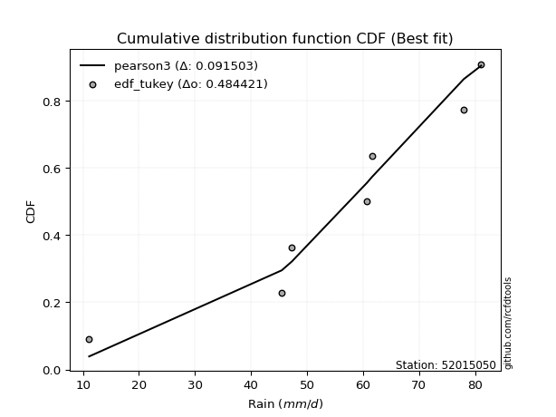</img>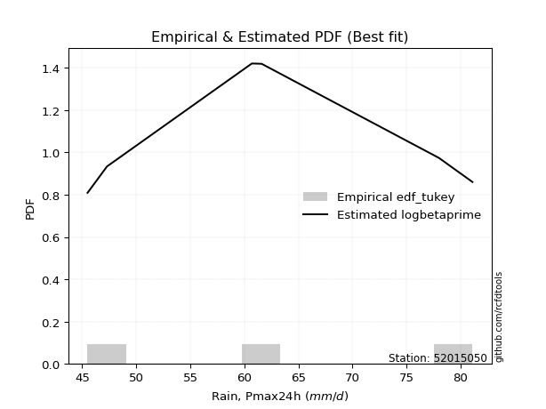</img>

</div>


### 8. EDF Gringorten (1963)

Gringorten plotting position formula is essential for estimating the probability and return periods of extreme events like floods and heavy rainfall. The constant _a=0.44_.

<div align="center">


$P=(m-a)/(n+1-2a)$


</div>


**8.1. Empirical values**

<div align="center">

|                | 0                   | 1                   | 2                  | 3              | 4                  | 5                  | 6                  |
|:---------------|:--------------------|:--------------------|:-------------------|:---------------|:-------------------|:-------------------|:-------------------|
| date           | 2025                | 2022                | 2018               | 2019           | 2021               | 2017               | 2020               |
| x              | 11.1                | 45.5                | 47.3               | 60.7           | 61.6               | 78.0               | 81.1               |
| m              | 1                   | 2                   | 3                  | 4              | 5                  | 6                  | 7                  |
| empirical_dist | edf_gringorten      | edf_gringorten      | edf_gringorten     | edf_gringorten | edf_gringorten     | edf_gringorten     | edf_gringorten     |
| empirical      | 0.07865168539325844 | 0.21910112359550563 | 0.3595505617977528 | 0.5            | 0.6404494382022471 | 0.7808988764044943 | 0.9213483146067415 |
| empirical_tr   | 1.0853658536585364  | 1.2805755395683454  | 1.5614035087719298 | 2.0            | 2.781249999999999  | 4.564102564102562  | 12.714285714285701 |

</div>


**8.2. Kolmogorov-Smirnov fit test (sorted by Δ)**


<div align="center">

|                | 0                   | 1                   | 2                   | 3                   | 4                   | 5                   | 6                   | 7                   | 8                   | 9                   | 10                  | 11                  | 12                  | 13                  | 14                  | 15                  | 16                  | 17                  | 18                  | 19                  | 20                  | 21                  | 22                  | 23                  | 24                  | 25                  | 26                  | 27                  | 28                  | 29                  | 30                  | 31                  | 32                  | 33                  | 34                  | 35                  | 36                  | 37                  | 38                  | 39                  | 40                  | 41                  | 42                  | 43                  | 44                  | 45                  | 46                  | 47                  | 48                  | 49                  | 50                  | 51                  | 52                  | 53                  | 54                  | 55                  | 56                  | 57                  | 58                  | 59                  | 60                  | 61                  | 62                  | 63                  | 64                  | 65                  | 66                  | 67                  | 68                  | 69                  | 70                  | 71                  | 72                  | 73                  | 74                  | 75                  | 76                  | 77                  | 78                  | 79                  | 80                  | 81                  | 82                  | 83                  | 84                  | 85                  | 86                  | 87                  | 88                  | 89                  | 90                  | 91                  | 92                  | 93                  | 94                  | 95                  | 96                  | 97                  | 98                  | 99                  | 100                 | 101                 | 102                 | 103                 | 104                 | 105                 | 106                 | 107                 | 108                 | 109                 | 110                 | 111                 | 112                 | 113                 | 114                 | 115                 | 116                 | 117                 | 118                 | 119                 | 120                 | 121                 | 122                 | 123                 | 124                 | 125                 | 126                 | 127                 | 128                 | 129                 | 130                 | 131                 | 132                 | 133                 | 134                 | 135                 | 136                 | 137                 | 138                 | 139                 | 140                 | 141                 | 142                 | 143                 | 144                 | 145                 | 146                 | 147                 | 148                 | 149                 | 150                 | 151                 | 152                 | 153                 | 154                 | 155                 | 156                 | 157                 | 158                 | 159                 |
|:---------------|:--------------------|:--------------------|:--------------------|:--------------------|:--------------------|:--------------------|:--------------------|:--------------------|:--------------------|:--------------------|:--------------------|:--------------------|:--------------------|:--------------------|:--------------------|:--------------------|:--------------------|:--------------------|:--------------------|:--------------------|:--------------------|:--------------------|:--------------------|:--------------------|:--------------------|:--------------------|:--------------------|:--------------------|:--------------------|:--------------------|:--------------------|:--------------------|:--------------------|:--------------------|:--------------------|:--------------------|:--------------------|:--------------------|:--------------------|:--------------------|:--------------------|:--------------------|:--------------------|:--------------------|:--------------------|:--------------------|:--------------------|:--------------------|:--------------------|:--------------------|:--------------------|:--------------------|:--------------------|:--------------------|:--------------------|:--------------------|:--------------------|:--------------------|:--------------------|:--------------------|:--------------------|:--------------------|:--------------------|:--------------------|:--------------------|:--------------------|:--------------------|:--------------------|:--------------------|:--------------------|:--------------------|:--------------------|:--------------------|:--------------------|:--------------------|:--------------------|:--------------------|:--------------------|:--------------------|:--------------------|:--------------------|:--------------------|:--------------------|:--------------------|:--------------------|:--------------------|:--------------------|:--------------------|:--------------------|:--------------------|:--------------------|:--------------------|:--------------------|:--------------------|:--------------------|:--------------------|:--------------------|:--------------------|:--------------------|:--------------------|:--------------------|:--------------------|:--------------------|:--------------------|:--------------------|:--------------------|:--------------------|:--------------------|:--------------------|:--------------------|:--------------------|:--------------------|:--------------------|:--------------------|:--------------------|:--------------------|:--------------------|:--------------------|:--------------------|:--------------------|:--------------------|:--------------------|:--------------------|:--------------------|:--------------------|:--------------------|:--------------------|:--------------------|:--------------------|:--------------------|:--------------------|:--------------------|:--------------------|:--------------------|:--------------------|:--------------------|:--------------------|:--------------------|:--------------------|:--------------------|:--------------------|:--------------------|:--------------------|:--------------------|:--------------------|:--------------------|:--------------------|:--------------------|:--------------------|:--------------------|:--------------------|:--------------------|:--------------------|:--------------------|:--------------------|:--------------------|:--------------------|:--------------------|:--------------------|:--------------------|
| station        | 52015050            | 52015050            | 52015050            | 52015050            | 52015050            | 52015050            | 52015050            | 52015050            | 52015050            | 52015050            | 52015050            | 52015050            | 52015050            | 52015050            | 52015050            | 52015050            | 52015050            | 52015050            | 52015050            | 52015050            | 52015050            | 52015050            | 52015050            | 52015050            | 52015050            | 52015050            | 52015050            | 52015050            | 52015050            | 52015050            | 52015050            | 52015050            | 52015050            | 52015050            | 52015050            | 52015050            | 52015050            | 52015050            | 52015050            | 52015050            | 52015050            | 52015050            | 52015050            | 52015050            | 52015050            | 52015050            | 52015050            | 52015050            | 52015050            | 52015050            | 52015050            | 52015050            | 52015050            | 52015050            | 52015050            | 52015050            | 52015050            | 52015050            | 52015050            | 52015050            | 52015050            | 52015050            | 52015050            | 52015050            | 52015050            | 52015050            | 52015050            | 52015050            | 52015050            | 52015050            | 52015050            | 52015050            | 52015050            | 52015050            | 52015050            | 52015050            | 52015050            | 52015050            | 52015050            | 52015050            | 52015050            | 52015050            | 52015050            | 52015050            | 52015050            | 52015050            | 52015050            | 52015050            | 52015050            | 52015050            | 52015050            | 52015050            | 52015050            | 52015050            | 52015050            | 52015050            | 52015050            | 52015050            | 52015050            | 52015050            | 52015050            | 52015050            | 52015050            | 52015050            | 52015050            | 52015050            | 52015050            | 52015050            | 52015050            | 52015050            | 52015050            | 52015050            | 52015050            | 52015050            | 52015050            | 52015050            | 52015050            | 52015050            | 52015050            | 52015050            | 52015050            | 52015050            | 52015050            | 52015050            | 52015050            | 52015050            | 52015050            | 52015050            | 52015050            | 52015050            | 52015050            | 52015050            | 52015050            | 52015050            | 52015050            | 52015050            | 52015050            | 52015050            | 52015050            | 52015050            | 52015050            | 52015050            | 52015050            | 52015050            | 52015050            | 52015050            | 52015050            | 52015050            | 52015050            | 52015050            | 52015050            | 52015050            | 52015050            | 52015050            | 52015050            | 52015050            | 52015050            | 52015050            | 52015050            | 52015050            |
| empirical_dist | edf_gringorten      | edf_gringorten      | edf_gringorten      | edf_gringorten      | edf_gringorten      | edf_gringorten      | edf_gringorten      | edf_gringorten      | edf_gringorten      | edf_gringorten      | edf_gringorten      | edf_gringorten      | edf_gringorten      | edf_gringorten      | edf_gringorten      | edf_gringorten      | edf_gringorten      | edf_gringorten      | edf_gringorten      | edf_gringorten      | edf_gringorten      | edf_gringorten      | edf_gringorten      | edf_gringorten      | edf_gringorten      | edf_gringorten      | edf_gringorten      | edf_gringorten      | edf_gringorten      | edf_gringorten      | edf_gringorten      | edf_gringorten      | edf_gringorten      | edf_gringorten      | edf_gringorten      | edf_gringorten      | edf_gringorten      | edf_gringorten      | edf_gringorten      | edf_gringorten      | edf_gringorten      | edf_gringorten      | edf_gringorten      | edf_gringorten      | edf_gringorten      | edf_gringorten      | edf_gringorten      | edf_gringorten      | edf_gringorten      | edf_gringorten      | edf_gringorten      | edf_gringorten      | edf_gringorten      | edf_gringorten      | edf_gringorten      | edf_gringorten      | edf_gringorten      | edf_gringorten      | edf_gringorten      | edf_gringorten      | edf_gringorten      | edf_gringorten      | edf_gringorten      | edf_gringorten      | edf_gringorten      | edf_gringorten      | edf_gringorten      | edf_gringorten      | edf_gringorten      | edf_gringorten      | edf_gringorten      | edf_gringorten      | edf_gringorten      | edf_gringorten      | edf_gringorten      | edf_gringorten      | edf_gringorten      | edf_gringorten      | edf_gringorten      | edf_gringorten      | edf_gringorten      | edf_gringorten      | edf_gringorten      | edf_gringorten      | edf_gringorten      | edf_gringorten      | edf_gringorten      | edf_gringorten      | edf_gringorten      | edf_gringorten      | edf_gringorten      | edf_gringorten      | edf_gringorten      | edf_gringorten      | edf_gringorten      | edf_gringorten      | edf_gringorten      | edf_gringorten      | edf_gringorten      | edf_gringorten      | edf_gringorten      | edf_gringorten      | edf_gringorten      | edf_gringorten      | edf_gringorten      | edf_gringorten      | edf_gringorten      | edf_gringorten      | edf_gringorten      | edf_gringorten      | edf_gringorten      | edf_gringorten      | edf_gringorten      | edf_gringorten      | edf_gringorten      | edf_gringorten      | edf_gringorten      | edf_gringorten      | edf_gringorten      | edf_gringorten      | edf_gringorten      | edf_gringorten      | edf_gringorten      | edf_gringorten      | edf_gringorten      | edf_gringorten      | edf_gringorten      | edf_gringorten      | edf_gringorten      | edf_gringorten      | edf_gringorten      | edf_gringorten      | edf_gringorten      | edf_gringorten      | edf_gringorten      | edf_gringorten      | edf_gringorten      | edf_gringorten      | edf_gringorten      | edf_gringorten      | edf_gringorten      | edf_gringorten      | edf_gringorten      | edf_gringorten      | edf_gringorten      | edf_gringorten      | edf_gringorten      | edf_gringorten      | edf_gringorten      | edf_gringorten      | edf_gringorten      | edf_gringorten      | edf_gringorten      | edf_gringorten      | edf_gringorten      | edf_gringorten      | edf_gringorten      | edf_gringorten      | edf_gringorten      | edf_gringorten      |
| p_dist         | pearson3            | gompertz            | weibull_min         | gengamma            | gumbel_l            | trapezoid           | exponpow            | logburr12           | genhalflogistic     | exponnorm           | norm                | truncnorm           | crystalball         | t                   | nct                 | f                   | dweibull            | logistic            | betaprime           | argus               | rice                | hypsecant           | gamma               | logvonmises_line    | logt                | erlang              | burr                | logargus            | beta                | anglit              | invgamma            | exponweib           | johnsonsu           | dgamma              | maxwell             | semicircular        | logburr             | loggompertz         | genpareto           | mielke              | logpearson3         | skewnorm            | logmielke           | logloggamma         | triang              | laplace             | invgauss            | rayleigh            | logdgamma           | cosine              | gumbel_r            | logdweibull         | truncweibull_min    | invweibull          | loggumbel_l         | genextreme          | arcsine             | ncf                 | gennorm             | halfnorm            | moyal               | loglevy_l           | alpha               | halflogistic        | loggennorm          | logloglaplace       | levy_l              | logtrapezoid        | loggenextreme       | logbeta             | kstwobign           | nakagami            | lognakagami         | logweibull_max      | loglaplace          | loglaplace          | loggengamma         | loghypsecant        | loglogistic         | logfoldnorm         | logtruncnorm        | logf                | logrice             | logcrystalball      | lognorm             | logexponnorm        | lognct              | logfatiguelife      | wald                | logncf              | loganglit           | logsemicircular     | loggamma            | loggamma            | logbetaprime        | logskewnorm         | logarcsine          | logerlang           | kappa3              | lomax               | uniform             | vonmises_line       | ksone               | loginvgamma         | wrapcauchy          | logalpha            | loginvgauss         | logmaxwell          | kappa4              | loginvweibull       | lograyleigh         | loggenhalflogistic  | tukeylambda         | loggumbel_r         | genexpon            | loghalfnorm         | logkstwobign        | logcosine           | loggausshyper       | logwrapcauchy       | logmoyal            | loggenexpon         | loghalflogistic     | logtriang           | logjohnsonsb        | bradford            | halfgennorm         | gausshyper          | logweibull_min      | loglomax            | logexponweib        | burr12              | loghalfgennorm      | truncexpon          | logwald             | foldnorm            | loggenpareto        | logrdist            | logksone            | logkappa4           | johnsonsb           | logtukeylambda      | logkappa3           | loguniform          | logbradford         | weibull_max         | logtruncweibull_min | logjohnsonsu        | logtruncexpon       | fatiguelife         | logexponpow         | powerlaw            | rdist               | logpowerlaw         | truncpareto         | logtruncpareto      | genlogistic         | loggenlogistic      | logvonmises         | vonmises            |
| delta          | 0.08333126154222692 | 0.10079973441074064 | 0.10157507487594375 | 0.10205433678436837 | 0.10277505295571943 | 0.10327960842851966 | 0.10330623769782976 | 0.10741217156710292 | 0.1116565979861952  | 0.11254369149686552 | 0.11254374649604873 | 0.11254374841243805 | 0.11254374931658764 | 0.11255552715901238 | 0.11271081044349943 | 0.11346552405068291 | 0.11379057403772797 | 0.11494250897551961 | 0.1182572872163172  | 0.12035917083629433 | 0.1223185880569608  | 0.12565201080213018 | 0.127829859510063   | 0.12796799622952548 | 0.1281573457637818  | 0.13004097084441538 | 0.1311154789610014  | 0.13133750592944626 | 0.13174238005199823 | 0.13426066135214346 | 0.13706302707593412 | 0.13761885344485472 | 0.139425604637885   | 0.14237206162984387 | 0.14322855805283433 | 0.14341701125738562 | 0.14389206350915354 | 0.14502921675600064 | 0.14546103325203774 | 0.14623390161036642 | 0.1462762704784751  | 0.14655639346861404 | 0.1476657273142764  | 0.14795408393382425 | 0.14970217607192515 | 0.15290314777032188 | 0.15374337193416368 | 0.15501643191192185 | 0.15799213130312062 | 0.16719526785516556 | 0.16815564036585362 | 0.175012019989916   | 0.17597893332050343 | 0.17795803253168793 | 0.17988335056826096 | 0.1803594311510317  | 0.18128702681886774 | 0.1813397867156515  | 0.18781429414491266 | 0.18855030152081778 | 0.1907920371940448  | 0.19261788530284718 | 0.193206075103708   | 0.1933245773926541  | 0.19435137976654304 | 0.19552460947829509 | 0.19601759259763274 | 0.20169540692795204 | 0.20642236688851326 | 0.21517265699839178 | 0.21794628058136842 | 0.2191010393582419  | 0.21910105771804375 | 0.21919229671379276 | 0.2297709758804267  | 0.2297709758804267  | 0.24275599305722786 | 0.2428519546225619  | 0.24636674164607233 | 0.24640304555816037 | 0.24828816447765928 | 0.24950405200221568 | 0.2504883536718753  | 0.25049866493568695 | 0.2504987615764501  | 0.2504990021633866  | 0.2508559934306601  | 0.2526329087579591  | 0.2539024480698069  | 0.2545976702682211  | 0.25483683425130743 | 0.25662411998221335 | 0.2583644556460073  | 0.2583644556460073  | 0.25911445768614405 | 0.2633523232258219  | 0.26372374179450586 | 0.26751595157884966 | 0.2692412045856938  | 0.26937970839099745 | 0.27232744783306573 | 0.27256800610011256 | 0.2737560192616372  | 0.2740819162971525  | 0.2744660035410683  | 0.27757282754151136 | 0.2809557326480582  | 0.28449912417447    | 0.28574278749995596 | 0.2938268433337503  | 0.2960988237294009  | 0.2978398247806512  | 0.31306591304154985 | 0.31929429052604474 | 0.32379945174062064 | 0.3287848907967762  | 0.3317430685886791  | 0.334171234490796   | 0.33754485378063337 | 0.34452201648572367 | 0.34505166943873766 | 0.34794424688933834 | 0.3515826951264508  | 0.35172184918041505 | 0.3539796325743671  | 0.3577168866775421  | 0.3789889798081708  | 0.3811696137095573  | 0.3944501265971099  | 0.39637310532221215 | 0.3966628221303593  | 0.39794932683409834 | 0.4035609753913907  | 0.40461488269374735 | 0.4167430372333605  | 0.4312563113952532  | 0.4387852333864206  | 0.454378887008006   | 0.45538068432191847 | 0.47621198638659745 | 0.47911884387680037 | 0.4846589966621142  | 0.4902524729229013  | 0.49027704590540344 | 0.4905971596002586  | 0.4914168631369106  | 0.5277312987264212  | 0.5282734810641402  | 0.5597240864152873  | 0.5933157502434743  | 0.6093455004517512  | 0.6648048260605741  | 0.6876155567812958  | 0.7180416352087995  | 0.7282806845760229  | 0.7551496692945502  | 0.7808988764044943  | 0.7808988764044943  | 1.1988096718708603  | 12.916205223735512  |
| deltao         | 0.48442053926100004 | 0.48442053926100004 | 0.48442053926100004 | 0.48442053926100004 | 0.48442053926100004 | 0.48442053926100004 | 0.48442053926100004 | 0.48442053926100004 | 0.48442053926100004 | 0.48442053926100004 | 0.48442053926100004 | 0.48442053926100004 | 0.48442053926100004 | 0.48442053926100004 | 0.48442053926100004 | 0.48442053926100004 | 0.48442053926100004 | 0.48442053926100004 | 0.48442053926100004 | 0.48442053926100004 | 0.48442053926100004 | 0.48442053926100004 | 0.48442053926100004 | 0.48442053926100004 | 0.48442053926100004 | 0.48442053926100004 | 0.48442053926100004 | 0.48442053926100004 | 0.48442053926100004 | 0.48442053926100004 | 0.48442053926100004 | 0.48442053926100004 | 0.48442053926100004 | 0.48442053926100004 | 0.48442053926100004 | 0.48442053926100004 | 0.48442053926100004 | 0.48442053926100004 | 0.48442053926100004 | 0.48442053926100004 | 0.48442053926100004 | 0.48442053926100004 | 0.48442053926100004 | 0.48442053926100004 | 0.48442053926100004 | 0.48442053926100004 | 0.48442053926100004 | 0.48442053926100004 | 0.48442053926100004 | 0.48442053926100004 | 0.48442053926100004 | 0.48442053926100004 | 0.48442053926100004 | 0.48442053926100004 | 0.48442053926100004 | 0.48442053926100004 | 0.48442053926100004 | 0.48442053926100004 | 0.48442053926100004 | 0.48442053926100004 | 0.48442053926100004 | 0.48442053926100004 | 0.48442053926100004 | 0.48442053926100004 | 0.48442053926100004 | 0.48442053926100004 | 0.48442053926100004 | 0.48442053926100004 | 0.48442053926100004 | 0.48442053926100004 | 0.48442053926100004 | 0.48442053926100004 | 0.48442053926100004 | 0.48442053926100004 | 0.48442053926100004 | 0.48442053926100004 | 0.48442053926100004 | 0.48442053926100004 | 0.48442053926100004 | 0.48442053926100004 | 0.48442053926100004 | 0.48442053926100004 | 0.48442053926100004 | 0.48442053926100004 | 0.48442053926100004 | 0.48442053926100004 | 0.48442053926100004 | 0.48442053926100004 | 0.48442053926100004 | 0.48442053926100004 | 0.48442053926100004 | 0.48442053926100004 | 0.48442053926100004 | 0.48442053926100004 | 0.48442053926100004 | 0.48442053926100004 | 0.48442053926100004 | 0.48442053926100004 | 0.48442053926100004 | 0.48442053926100004 | 0.48442053926100004 | 0.48442053926100004 | 0.48442053926100004 | 0.48442053926100004 | 0.48442053926100004 | 0.48442053926100004 | 0.48442053926100004 | 0.48442053926100004 | 0.48442053926100004 | 0.48442053926100004 | 0.48442053926100004 | 0.48442053926100004 | 0.48442053926100004 | 0.48442053926100004 | 0.48442053926100004 | 0.48442053926100004 | 0.48442053926100004 | 0.48442053926100004 | 0.48442053926100004 | 0.48442053926100004 | 0.48442053926100004 | 0.48442053926100004 | 0.48442053926100004 | 0.48442053926100004 | 0.48442053926100004 | 0.48442053926100004 | 0.48442053926100004 | 0.48442053926100004 | 0.48442053926100004 | 0.48442053926100004 | 0.48442053926100004 | 0.48442053926100004 | 0.48442053926100004 | 0.48442053926100004 | 0.48442053926100004 | 0.48442053926100004 | 0.48442053926100004 | 0.48442053926100004 | 0.48442053926100004 | 0.48442053926100004 | 0.48442053926100004 | 0.48442053926100004 | 0.48442053926100004 | 0.48442053926100004 | 0.48442053926100004 | 0.48442053926100004 | 0.48442053926100004 | 0.48442053926100004 | 0.48442053926100004 | 0.48442053926100004 | 0.48442053926100004 | 0.48442053926100004 | 0.48442053926100004 | 0.48442053926100004 | 0.48442053926100004 | 0.48442053926100004 | 0.48442053926100004 | 0.48442053926100004 | 0.48442053926100004 | 0.48442053926100004 |
| eval           | Δo > Δ              | Δo > Δ              | Δo > Δ              | Δo > Δ              | Δo > Δ              | Δo > Δ              | Δo > Δ              | Δo > Δ              | Δo > Δ              | Δo > Δ              | Δo > Δ              | Δo > Δ              | Δo > Δ              | Δo > Δ              | Δo > Δ              | Δo > Δ              | Δo > Δ              | Δo > Δ              | Δo > Δ              | Δo > Δ              | Δo > Δ              | Δo > Δ              | Δo > Δ              | Δo > Δ              | Δo > Δ              | Δo > Δ              | Δo > Δ              | Δo > Δ              | Δo > Δ              | Δo > Δ              | Δo > Δ              | Δo > Δ              | Δo > Δ              | Δo > Δ              | Δo > Δ              | Δo > Δ              | Δo > Δ              | Δo > Δ              | Δo > Δ              | Δo > Δ              | Δo > Δ              | Δo > Δ              | Δo > Δ              | Δo > Δ              | Δo > Δ              | Δo > Δ              | Δo > Δ              | Δo > Δ              | Δo > Δ              | Δo > Δ              | Δo > Δ              | Δo > Δ              | Δo > Δ              | Δo > Δ              | Δo > Δ              | Δo > Δ              | Δo > Δ              | Δo > Δ              | Δo > Δ              | Δo > Δ              | Δo > Δ              | Δo > Δ              | Δo > Δ              | Δo > Δ              | Δo > Δ              | Δo > Δ              | Δo > Δ              | Δo > Δ              | Δo > Δ              | Δo > Δ              | Δo > Δ              | Δo > Δ              | Δo > Δ              | Δo > Δ              | Δo > Δ              | Δo > Δ              | Δo > Δ              | Δo > Δ              | Δo > Δ              | Δo > Δ              | Δo > Δ              | Δo > Δ              | Δo > Δ              | Δo > Δ              | Δo > Δ              | Δo > Δ              | Δo > Δ              | Δo > Δ              | Δo > Δ              | Δo > Δ              | Δo > Δ              | Δo > Δ              | Δo > Δ              | Δo > Δ              | Δo > Δ              | Δo > Δ              | Δo > Δ              | Δo > Δ              | Δo > Δ              | Δo > Δ              | Δo > Δ              | Δo > Δ              | Δo > Δ              | Δo > Δ              | Δo > Δ              | Δo > Δ              | Δo > Δ              | Δo > Δ              | Δo > Δ              | Δo > Δ              | Δo > Δ              | Δo > Δ              | Δo > Δ              | Δo > Δ              | Δo > Δ              | Δo > Δ              | Δo > Δ              | Δo > Δ              | Δo > Δ              | Δo > Δ              | Δo > Δ              | Δo > Δ              | Δo > Δ              | Δo > Δ              | Δo > Δ              | Δo > Δ              | Δo > Δ              | Δo > Δ              | Δo > Δ              | Δo > Δ              | Δo > Δ              | Δo > Δ              | Δo > Δ              | Δo > Δ              | Δo > Δ              | Δo > Δ              | Δo > Δ              | Δo > Δ              | Δo > Δ              | Δo > Δ              | Δo > Δ              | Δo <= Δ             | Δo <= Δ             | Δo <= Δ             | Δo <= Δ             | Δo <= Δ             | Δo <= Δ             | Δo <= Δ             | Δo <= Δ             | Δo <= Δ             | Δo <= Δ             | Δo <= Δ             | Δo <= Δ             | Δo <= Δ             | Δo <= Δ             | Δo <= Δ             | Δo <= Δ             | Δo <= Δ             | Δo <= Δ             | Δo <= Δ             |
| fit            | 1                   | 1                   | 1                   | 1                   | 1                   | 1                   | 1                   | 1                   | 1                   | 1                   | 1                   | 1                   | 1                   | 1                   | 1                   | 1                   | 1                   | 1                   | 1                   | 1                   | 1                   | 1                   | 1                   | 1                   | 1                   | 1                   | 1                   | 1                   | 1                   | 1                   | 1                   | 1                   | 1                   | 1                   | 1                   | 1                   | 1                   | 1                   | 1                   | 1                   | 1                   | 1                   | 1                   | 1                   | 1                   | 1                   | 1                   | 1                   | 1                   | 1                   | 1                   | 1                   | 1                   | 1                   | 1                   | 1                   | 1                   | 1                   | 1                   | 1                   | 1                   | 1                   | 1                   | 1                   | 1                   | 1                   | 1                   | 1                   | 1                   | 1                   | 1                   | 1                   | 1                   | 1                   | 1                   | 1                   | 1                   | 1                   | 1                   | 1                   | 1                   | 1                   | 1                   | 1                   | 1                   | 1                   | 1                   | 1                   | 1                   | 1                   | 1                   | 1                   | 1                   | 1                   | 1                   | 1                   | 1                   | 1                   | 1                   | 1                   | 1                   | 1                   | 1                   | 1                   | 1                   | 1                   | 1                   | 1                   | 1                   | 1                   | 1                   | 1                   | 1                   | 1                   | 1                   | 1                   | 1                   | 1                   | 1                   | 1                   | 1                   | 1                   | 1                   | 1                   | 1                   | 1                   | 1                   | 1                   | 1                   | 1                   | 1                   | 1                   | 1                   | 1                   | 1                   | 1                   | 1                   | 1                   | 1                   | 1                   | 1                   | 0                   | 0                   | 0                   | 0                   | 0                   | 0                   | 0                   | 0                   | 0                   | 0                   | 0                   | 0                   | 0                   | 0                   | 0                   | 0                   | 0                   | 0                   | 0                   |
| n              | 7                   | 7                   | 7                   | 7                   | 7                   | 7                   | 7                   | 7                   | 7                   | 7                   | 7                   | 7                   | 7                   | 7                   | 7                   | 7                   | 7                   | 7                   | 7                   | 7                   | 7                   | 7                   | 7                   | 7                   | 7                   | 7                   | 7                   | 7                   | 7                   | 7                   | 7                   | 7                   | 7                   | 7                   | 7                   | 7                   | 7                   | 7                   | 7                   | 7                   | 7                   | 7                   | 7                   | 7                   | 7                   | 7                   | 7                   | 7                   | 7                   | 7                   | 7                   | 7                   | 7                   | 7                   | 7                   | 7                   | 7                   | 7                   | 7                   | 7                   | 7                   | 7                   | 7                   | 7                   | 7                   | 7                   | 7                   | 7                   | 7                   | 7                   | 7                   | 7                   | 7                   | 7                   | 7                   | 7                   | 7                   | 7                   | 7                   | 7                   | 7                   | 7                   | 7                   | 7                   | 7                   | 7                   | 7                   | 7                   | 7                   | 7                   | 7                   | 7                   | 7                   | 7                   | 7                   | 7                   | 7                   | 7                   | 7                   | 7                   | 7                   | 7                   | 7                   | 7                   | 7                   | 7                   | 7                   | 7                   | 7                   | 7                   | 7                   | 7                   | 7                   | 7                   | 7                   | 7                   | 7                   | 7                   | 7                   | 7                   | 7                   | 7                   | 7                   | 7                   | 7                   | 7                   | 7                   | 7                   | 7                   | 7                   | 7                   | 7                   | 7                   | 7                   | 7                   | 7                   | 7                   | 7                   | 7                   | 7                   | 7                   | 7                   | 7                   | 7                   | 7                   | 7                   | 7                   | 7                   | 7                   | 7                   | 7                   | 7                   | 7                   | 7                   | 7                   | 7                   | 7                   | 7                   | 7                   | 7                   |
| best_fit       | 1                   | 0                   | 0                   | 0                   | 0                   | 0                   | 0                   | 0                   | 0                   | 0                   | 0                   | 0                   | 0                   | 0                   | 0                   | 0                   | 0                   | 0                   | 0                   | 0                   | 0                   | 0                   | 0                   | 0                   | 0                   | 0                   | 0                   | 0                   | 0                   | 0                   | 0                   | 0                   | 0                   | 0                   | 0                   | 0                   | 0                   | 0                   | 0                   | 0                   | 0                   | 0                   | 0                   | 0                   | 0                   | 0                   | 0                   | 0                   | 0                   | 0                   | 0                   | 0                   | 0                   | 0                   | 0                   | 0                   | 0                   | 0                   | 0                   | 0                   | 0                   | 0                   | 0                   | 0                   | 0                   | 0                   | 0                   | 0                   | 0                   | 0                   | 0                   | 0                   | 0                   | 0                   | 0                   | 0                   | 0                   | 0                   | 0                   | 0                   | 0                   | 0                   | 0                   | 0                   | 0                   | 0                   | 0                   | 0                   | 0                   | 0                   | 0                   | 0                   | 0                   | 0                   | 0                   | 0                   | 0                   | 0                   | 0                   | 0                   | 0                   | 0                   | 0                   | 0                   | 0                   | 0                   | 0                   | 0                   | 0                   | 0                   | 0                   | 0                   | 0                   | 0                   | 0                   | 0                   | 0                   | 0                   | 0                   | 0                   | 0                   | 0                   | 0                   | 0                   | 0                   | 0                   | 0                   | 0                   | 0                   | 0                   | 0                   | 0                   | 0                   | 0                   | 0                   | 0                   | 0                   | 0                   | 0                   | 0                   | 0                   | 0                   | 0                   | 0                   | 0                   | 0                   | 0                   | 0                   | 0                   | 0                   | 0                   | 0                   | 0                   | 0                   | 0                   | 0                   | 0                   | 0                   | 0                   | 0                   |
| best_fit_sort  | 1                   | 2                   | 3                   | 4                   | 5                   | 6                   | 7                   | 8                   | 9                   | 10                  | 11                  | 12                  | 13                  | 14                  | 15                  | 16                  | 17                  | 18                  | 19                  | 20                  | 21                  | 22                  | 23                  | 24                  | 25                  | 26                  | 27                  | 28                  | 29                  | 30                  | 31                  | 32                  | 33                  | 34                  | 35                  | 36                  | 37                  | 38                  | 39                  | 40                  | 41                  | 42                  | 43                  | 44                  | 45                  | 46                  | 47                  | 48                  | 49                  | 50                  | 51                  | 52                  | 53                  | 54                  | 55                  | 56                  | 57                  | 58                  | 59                  | 60                  | 61                  | 62                  | 63                  | 64                  | 65                  | 66                  | 67                  | 68                  | 69                  | 70                  | 71                  | 72                  | 73                  | 74                  | 75                  | 76                  | 77                  | 78                  | 79                  | 80                  | 81                  | 82                  | 83                  | 84                  | 85                  | 86                  | 87                  | 88                  | 89                  | 90                  | 91                  | 92                  | 93                  | 94                  | 95                  | 96                  | 97                  | 98                  | 99                  | 100                 | 101                 | 102                 | 103                 | 104                 | 105                 | 106                 | 107                 | 108                 | 109                 | 110                 | 111                 | 112                 | 113                 | 114                 | 115                 | 116                 | 117                 | 118                 | 119                 | 120                 | 121                 | 122                 | 123                 | 124                 | 125                 | 126                 | 127                 | 128                 | 129                 | 130                 | 131                 | 132                 | 133                 | 134                 | 135                 | 136                 | 137                 | 138                 | 139                 | 140                 | 141                 | 142                 | 143                 | 144                 | 145                 | 146                 | 147                 | 148                 | 149                 | 150                 | 151                 | 152                 | 153                 | 154                 | 155                 | 156                 | 157                 | 158                 | 159                 | 160                 |

</div>


**8.3. Best fit**

<div align="center">

|   id |   station | empirical_dist   | p_dist   |     delta |   deltao | eval   |   fit |   n |   best_fit |   best_fit_sort |
|-----:|----------:|:-----------------|:---------|----------:|---------:|:-------|------:|----:|-----------:|----------------:|
|    0 |  52015050 | edf_gringorten   | pearson3 | 0.0833313 | 0.484421 | Δo > Δ |     1 |   7 |          1 |               1 |

</div>


<div align="center">

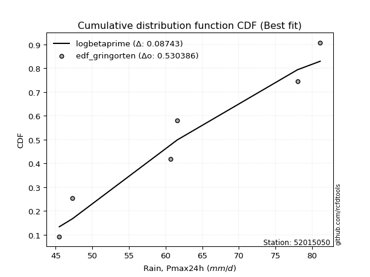</img></img>

</div>


### 9. EDF Filliben (1975)

The specific values of the constants (0.3175) (often denoted as $alpha$) and (0.365) are derived from a method proposed by James J. Filliben in a 1975 paper. This particular formula is the mean value of the $i$-th order statistic of the normal distribution and is considered a robust and effective plotting position formula for the normal probability plot correlation coefficient test for normality.

<div align="center">


$P=(m-0.3175)/(n+0.365)$


</div>


**9.1. Empirical values**

<div align="center">

|                | 0                   | 1                   | 2                   | 3            | 4                  | 5                  | 6                  |
|:---------------|:--------------------|:--------------------|:--------------------|:-------------|:-------------------|:-------------------|:-------------------|
| date           | 2025                | 2022                | 2018                | 2019         | 2021               | 2017               | 2020               |
| x              | 11.1                | 45.5                | 47.3                | 60.7         | 61.6               | 78.0               | 81.1               |
| m              | 1                   | 2                   | 3                   | 4            | 5                  | 6                  | 7                  |
| empirical_dist | edf_filliben        | edf_filliben        | edf_filliben        | edf_filliben | edf_filliben       | edf_filliben       | edf_filliben       |
| empirical      | 0.09266802443991853 | 0.22844534962661237 | 0.36422267481330617 | 0.5          | 0.6357773251866938 | 0.7715546503733877 | 0.9073319755600815 |
| empirical_tr   | 1.1021324354657687  | 1.2960844698636163  | 1.5728777362520021  | 2.0          | 2.7455731593662627 | 4.377414561664191  | 10.791208791208794 |

</div>


**9.2. Kolmogorov-Smirnov fit test (sorted by Δ)**


<div align="center">

|                | 0                   | 1                   | 2                   | 3                   | 4                   | 5                   | 6                   | 7                   | 8                   | 9                   | 10                  | 11                  | 12                  | 13                  | 14                  | 15                  | 16                  | 17                  | 18                  | 19                  | 20                  | 21                  | 22                  | 23                  | 24                  | 25                  | 26                  | 27                  | 28                  | 29                  | 30                  | 31                  | 32                  | 33                  | 34                  | 35                  | 36                  | 37                  | 38                  | 39                  | 40                  | 41                  | 42                  | 43                  | 44                  | 45                  | 46                  | 47                  | 48                  | 49                  | 50                  | 51                  | 52                  | 53                  | 54                  | 55                  | 56                  | 57                  | 58                  | 59                  | 60                  | 61                  | 62                  | 63                  | 64                  | 65                  | 66                  | 67                  | 68                  | 69                  | 70                  | 71                  | 72                  | 73                  | 74                  | 75                  | 76                  | 77                  | 78                  | 79                  | 80                  | 81                  | 82                  | 83                  | 84                  | 85                  | 86                  | 87                  | 88                  | 89                  | 90                  | 91                  | 92                  | 93                  | 94                  | 95                  | 96                  | 97                  | 98                  | 99                  | 100                 | 101                 | 102                 | 103                 | 104                 | 105                 | 106                 | 107                 | 108                 | 109                 | 110                 | 111                 | 112                 | 113                 | 114                 | 115                 | 116                 | 117                 | 118                 | 119                 | 120                 | 121                 | 122                 | 123                 | 124                 | 125                 | 126                 | 127                 | 128                 | 129                 | 130                 | 131                 | 132                 | 133                 | 134                 | 135                 | 136                 | 137                 | 138                 | 139                 | 140                 | 141                 | 142                 | 143                 | 144                 | 145                 | 146                 | 147                 | 148                 | 149                 | 150                 | 151                 | 152                 | 153                 | 154                 | 155                 | 156                 | 157                 | 158                 | 159                 |
|:---------------|:--------------------|:--------------------|:--------------------|:--------------------|:--------------------|:--------------------|:--------------------|:--------------------|:--------------------|:--------------------|:--------------------|:--------------------|:--------------------|:--------------------|:--------------------|:--------------------|:--------------------|:--------------------|:--------------------|:--------------------|:--------------------|:--------------------|:--------------------|:--------------------|:--------------------|:--------------------|:--------------------|:--------------------|:--------------------|:--------------------|:--------------------|:--------------------|:--------------------|:--------------------|:--------------------|:--------------------|:--------------------|:--------------------|:--------------------|:--------------------|:--------------------|:--------------------|:--------------------|:--------------------|:--------------------|:--------------------|:--------------------|:--------------------|:--------------------|:--------------------|:--------------------|:--------------------|:--------------------|:--------------------|:--------------------|:--------------------|:--------------------|:--------------------|:--------------------|:--------------------|:--------------------|:--------------------|:--------------------|:--------------------|:--------------------|:--------------------|:--------------------|:--------------------|:--------------------|:--------------------|:--------------------|:--------------------|:--------------------|:--------------------|:--------------------|:--------------------|:--------------------|:--------------------|:--------------------|:--------------------|:--------------------|:--------------------|:--------------------|:--------------------|:--------------------|:--------------------|:--------------------|:--------------------|:--------------------|:--------------------|:--------------------|:--------------------|:--------------------|:--------------------|:--------------------|:--------------------|:--------------------|:--------------------|:--------------------|:--------------------|:--------------------|:--------------------|:--------------------|:--------------------|:--------------------|:--------------------|:--------------------|:--------------------|:--------------------|:--------------------|:--------------------|:--------------------|:--------------------|:--------------------|:--------------------|:--------------------|:--------------------|:--------------------|:--------------------|:--------------------|:--------------------|:--------------------|:--------------------|:--------------------|:--------------------|:--------------------|:--------------------|:--------------------|:--------------------|:--------------------|:--------------------|:--------------------|:--------------------|:--------------------|:--------------------|:--------------------|:--------------------|:--------------------|:--------------------|:--------------------|:--------------------|:--------------------|:--------------------|:--------------------|:--------------------|:--------------------|:--------------------|:--------------------|:--------------------|:--------------------|:--------------------|:--------------------|:--------------------|:--------------------|:--------------------|:--------------------|:--------------------|:--------------------|:--------------------|:--------------------|
| station        | 52015050            | 52015050            | 52015050            | 52015050            | 52015050            | 52015050            | 52015050            | 52015050            | 52015050            | 52015050            | 52015050            | 52015050            | 52015050            | 52015050            | 52015050            | 52015050            | 52015050            | 52015050            | 52015050            | 52015050            | 52015050            | 52015050            | 52015050            | 52015050            | 52015050            | 52015050            | 52015050            | 52015050            | 52015050            | 52015050            | 52015050            | 52015050            | 52015050            | 52015050            | 52015050            | 52015050            | 52015050            | 52015050            | 52015050            | 52015050            | 52015050            | 52015050            | 52015050            | 52015050            | 52015050            | 52015050            | 52015050            | 52015050            | 52015050            | 52015050            | 52015050            | 52015050            | 52015050            | 52015050            | 52015050            | 52015050            | 52015050            | 52015050            | 52015050            | 52015050            | 52015050            | 52015050            | 52015050            | 52015050            | 52015050            | 52015050            | 52015050            | 52015050            | 52015050            | 52015050            | 52015050            | 52015050            | 52015050            | 52015050            | 52015050            | 52015050            | 52015050            | 52015050            | 52015050            | 52015050            | 52015050            | 52015050            | 52015050            | 52015050            | 52015050            | 52015050            | 52015050            | 52015050            | 52015050            | 52015050            | 52015050            | 52015050            | 52015050            | 52015050            | 52015050            | 52015050            | 52015050            | 52015050            | 52015050            | 52015050            | 52015050            | 52015050            | 52015050            | 52015050            | 52015050            | 52015050            | 52015050            | 52015050            | 52015050            | 52015050            | 52015050            | 52015050            | 52015050            | 52015050            | 52015050            | 52015050            | 52015050            | 52015050            | 52015050            | 52015050            | 52015050            | 52015050            | 52015050            | 52015050            | 52015050            | 52015050            | 52015050            | 52015050            | 52015050            | 52015050            | 52015050            | 52015050            | 52015050            | 52015050            | 52015050            | 52015050            | 52015050            | 52015050            | 52015050            | 52015050            | 52015050            | 52015050            | 52015050            | 52015050            | 52015050            | 52015050            | 52015050            | 52015050            | 52015050            | 52015050            | 52015050            | 52015050            | 52015050            | 52015050            | 52015050            | 52015050            | 52015050            | 52015050            | 52015050            | 52015050            |
| empirical_dist | edf_filliben        | edf_filliben        | edf_filliben        | edf_filliben        | edf_filliben        | edf_filliben        | edf_filliben        | edf_filliben        | edf_filliben        | edf_filliben        | edf_filliben        | edf_filliben        | edf_filliben        | edf_filliben        | edf_filliben        | edf_filliben        | edf_filliben        | edf_filliben        | edf_filliben        | edf_filliben        | edf_filliben        | edf_filliben        | edf_filliben        | edf_filliben        | edf_filliben        | edf_filliben        | edf_filliben        | edf_filliben        | edf_filliben        | edf_filliben        | edf_filliben        | edf_filliben        | edf_filliben        | edf_filliben        | edf_filliben        | edf_filliben        | edf_filliben        | edf_filliben        | edf_filliben        | edf_filliben        | edf_filliben        | edf_filliben        | edf_filliben        | edf_filliben        | edf_filliben        | edf_filliben        | edf_filliben        | edf_filliben        | edf_filliben        | edf_filliben        | edf_filliben        | edf_filliben        | edf_filliben        | edf_filliben        | edf_filliben        | edf_filliben        | edf_filliben        | edf_filliben        | edf_filliben        | edf_filliben        | edf_filliben        | edf_filliben        | edf_filliben        | edf_filliben        | edf_filliben        | edf_filliben        | edf_filliben        | edf_filliben        | edf_filliben        | edf_filliben        | edf_filliben        | edf_filliben        | edf_filliben        | edf_filliben        | edf_filliben        | edf_filliben        | edf_filliben        | edf_filliben        | edf_filliben        | edf_filliben        | edf_filliben        | edf_filliben        | edf_filliben        | edf_filliben        | edf_filliben        | edf_filliben        | edf_filliben        | edf_filliben        | edf_filliben        | edf_filliben        | edf_filliben        | edf_filliben        | edf_filliben        | edf_filliben        | edf_filliben        | edf_filliben        | edf_filliben        | edf_filliben        | edf_filliben        | edf_filliben        | edf_filliben        | edf_filliben        | edf_filliben        | edf_filliben        | edf_filliben        | edf_filliben        | edf_filliben        | edf_filliben        | edf_filliben        | edf_filliben        | edf_filliben        | edf_filliben        | edf_filliben        | edf_filliben        | edf_filliben        | edf_filliben        | edf_filliben        | edf_filliben        | edf_filliben        | edf_filliben        | edf_filliben        | edf_filliben        | edf_filliben        | edf_filliben        | edf_filliben        | edf_filliben        | edf_filliben        | edf_filliben        | edf_filliben        | edf_filliben        | edf_filliben        | edf_filliben        | edf_filliben        | edf_filliben        | edf_filliben        | edf_filliben        | edf_filliben        | edf_filliben        | edf_filliben        | edf_filliben        | edf_filliben        | edf_filliben        | edf_filliben        | edf_filliben        | edf_filliben        | edf_filliben        | edf_filliben        | edf_filliben        | edf_filliben        | edf_filliben        | edf_filliben        | edf_filliben        | edf_filliben        | edf_filliben        | edf_filliben        | edf_filliben        | edf_filliben        | edf_filliben        | edf_filliben        | edf_filliben        |
| p_dist         | pearson3            | trapezoid           | exponnorm           | norm                | truncnorm           | crystalball         | t                   | nct                 | f                   | dweibull            | logburr12           | betaprime           | gompertz            | weibull_min         | gengamma            | gumbel_l            | exponpow            | rice                | logvonmises_line    | logistic            | gamma               | erlang              | genhalflogistic     | anglit              | hypsecant           | invgamma            | exponweib           | argus               | logt                | dgamma              | maxwell             | semicircular        | johnsonsu           | loggompertz         | logpearson3         | burr                | logargus            | genpareto           | beta                | logdgamma           | invgauss            | rayleigh            | logburr             | laplace             | mielke              | skewnorm            | logmielke           | logloggamma         | cosine              | triang              | logdweibull         | gumbel_r            | invweibull          | loggumbel_l         | arcsine             | ncf                 | genextreme          | truncweibull_min    | halfnorm            | logloglaplace       | alpha               | loglevy_l           | halflogistic        | moyal               | levy_l              | logtrapezoid        | gennorm             | loggenextreme       | loggennorm          | logweibull_max      | kstwobign           | logbeta             | loglaplace          | loglaplace          | nakagami            | lognakagami         | loggengamma         | loghypsecant        | loglogistic         | logfoldnorm         | logf                | logrice             | logcrystalball      | lognorm             | logexponnorm        | lognct              | logfatiguelife      | logncf              | loganglit           | logsemicircular     | loggamma            | loggamma            | logbetaprime        | logtruncnorm        | wald                | logskewnorm         | logarcsine          | logerlang           | kappa3              | lomax               | uniform             | vonmises_line       | ksone               | loginvgamma         | wrapcauchy          | logalpha            | loginvgauss         | logmaxwell          | kappa4              | loginvweibull       | lograyleigh         | loggenhalflogistic  | tukeylambda         | loggumbel_r         | genexpon            | loghalfnorm         | logkstwobign        | logcosine           | loggausshyper       | logwrapcauchy       | logmoyal            | loggenexpon         | logjohnsonsb        | loghalflogistic     | logtriang           | bradford            | halfgennorm         | gausshyper          | logweibull_min      | loglomax            | logexponweib        | burr12              | loghalfgennorm      | truncexpon          | logwald             | loggenpareto        | foldnorm            | logrdist            | logksone            | logkappa4           | johnsonsb           | logtukeylambda      | logkappa3           | loguniform          | logbradford         | weibull_max         | logtruncweibull_min | logjohnsonsu        | logtruncexpon       | fatiguelife         | logexponpow         | powerlaw            | rdist               | logpowerlaw         | truncpareto         | logtruncpareto      | genlogistic         | loggenlogistic      | logvonmises         | vonmises            |
| delta          | 0.09267548757333355 | 0.09393538239741292 | 0.10319946546575878 | 0.10319952046494199 | 0.10319952238133132 | 0.1031995232854809  | 0.10321130112790564 | 0.10336658441239269 | 0.10412129801957618 | 0.10704437351352031 | 0.10741217156710292 | 0.10891306118521046 | 0.11014396044184727 | 0.11091930090705038 | 0.111398562815475   | 0.11211927898682605 | 0.11265046372893639 | 0.11297436202585406 | 0.11395165718286548 | 0.11494250897551961 | 0.11848563347895627 | 0.12069674481330864 | 0.12100082401730183 | 0.12491643532103672 | 0.12565201080213018 | 0.12771880104482738 | 0.12827462741374798 | 0.12970339686740096 | 0.13282945877933516 | 0.13302783559873713 | 0.1338843320217276  | 0.13407278522627888 | 0.13475349162233174 | 0.1356849907248939  | 0.13693204444736837 | 0.14045970499210803 | 0.1406817319605529  | 0.14078892023648448 | 0.14108660608310486 | 0.14397579225646062 | 0.14439914590305694 | 0.14567220588081511 | 0.14974152237815064 | 0.15290314777032188 | 0.15557812764147305 | 0.15590061949972067 | 0.15700995334538304 | 0.15729830996493088 | 0.15785104182405882 | 0.15904640210303178 | 0.160995680943256   | 0.16815564036585362 | 0.1686138065005812  | 0.17053912453715422 | 0.171942800787761   | 0.17199556068454477 | 0.17568731813547844 | 0.17595059509495548 | 0.17920607548971104 | 0.1815082704316351  | 0.18386184907260125 | 0.18794577228729392 | 0.1879679333726354  | 0.1907920371940448  | 0.19134547958207948 | 0.1923511808968453  | 0.19248640716046603 | 0.19707814085740652 | 0.1990234927820964  | 0.20517595766713267 | 0.20860205455026168 | 0.21050054398283852 | 0.22042674984931995 | 0.22042674984931995 | 0.22844526538934865 | 0.2284452837491505  | 0.23341176702612113 | 0.23350772859145516 | 0.2370225156149656  | 0.23705881952705363 | 0.24015982597110894 | 0.24114412764076856 | 0.24115443890458024 | 0.2411545355453434  | 0.24115477613227984 | 0.24151176739955335 | 0.24328868272685236 | 0.2452534442371144  | 0.24549260822020072 | 0.24727989395110664 | 0.24902022961490053 | 0.24902022961490053 | 0.24977023165503734 | 0.25296027749321265 | 0.2539024480698069  | 0.2540080971947152  | 0.2543795157633991  | 0.2581717255477429  | 0.25989697855458704 | 0.2600354823598907  | 0.262983221801959   | 0.2632237800690058  | 0.26441179323053043 | 0.26473769026604577 | 0.2651217775099616  | 0.2682286015104046  | 0.27161150661695144 | 0.27515489814336325 | 0.2763985614688492  | 0.28448261730264357 | 0.28675459769829414 | 0.28849559874954445 | 0.3037216870104431  | 0.309950064494938   | 0.3144552257095139  | 0.31944066476566946 | 0.32239884255757234 | 0.32482700845968926 | 0.32820062774952663 | 0.33517779045461693 | 0.3357074434076309  | 0.3386000208582316  | 0.33996329352770704 | 0.34223846909534406 | 0.3423776231493083  | 0.34837266064643535 | 0.3696447537770641  | 0.37649750069400406 | 0.38510590056600313 | 0.3870288792911054  | 0.38731859609925257 | 0.3886051008029916  | 0.39421674936028395 | 0.3952706566626406  | 0.40739881120225374 | 0.4294410073553139  | 0.4312563113952532  | 0.44503466097689925 | 0.44603645829081173 | 0.4668677603554907  | 0.46977461784569374 | 0.47531477063100747 | 0.48090824689179457 | 0.4809328198742967  | 0.4812529335691519  | 0.4867447501213573  | 0.5183870726953145  | 0.5189292550330336  | 0.5503798603841805  | 0.5839715242123675  | 0.6000012744206444  | 0.6554606000294674  | 0.6782713307501891  | 0.7086974091776927  | 0.7189364585449162  | 0.7458054432634434  | 0.7715546503733877  | 0.7715546503733877  | 1.1894654458397536  | 12.93022156278217   |
| deltao         | 0.48442053926100004 | 0.48442053926100004 | 0.48442053926100004 | 0.48442053926100004 | 0.48442053926100004 | 0.48442053926100004 | 0.48442053926100004 | 0.48442053926100004 | 0.48442053926100004 | 0.48442053926100004 | 0.48442053926100004 | 0.48442053926100004 | 0.48442053926100004 | 0.48442053926100004 | 0.48442053926100004 | 0.48442053926100004 | 0.48442053926100004 | 0.48442053926100004 | 0.48442053926100004 | 0.48442053926100004 | 0.48442053926100004 | 0.48442053926100004 | 0.48442053926100004 | 0.48442053926100004 | 0.48442053926100004 | 0.48442053926100004 | 0.48442053926100004 | 0.48442053926100004 | 0.48442053926100004 | 0.48442053926100004 | 0.48442053926100004 | 0.48442053926100004 | 0.48442053926100004 | 0.48442053926100004 | 0.48442053926100004 | 0.48442053926100004 | 0.48442053926100004 | 0.48442053926100004 | 0.48442053926100004 | 0.48442053926100004 | 0.48442053926100004 | 0.48442053926100004 | 0.48442053926100004 | 0.48442053926100004 | 0.48442053926100004 | 0.48442053926100004 | 0.48442053926100004 | 0.48442053926100004 | 0.48442053926100004 | 0.48442053926100004 | 0.48442053926100004 | 0.48442053926100004 | 0.48442053926100004 | 0.48442053926100004 | 0.48442053926100004 | 0.48442053926100004 | 0.48442053926100004 | 0.48442053926100004 | 0.48442053926100004 | 0.48442053926100004 | 0.48442053926100004 | 0.48442053926100004 | 0.48442053926100004 | 0.48442053926100004 | 0.48442053926100004 | 0.48442053926100004 | 0.48442053926100004 | 0.48442053926100004 | 0.48442053926100004 | 0.48442053926100004 | 0.48442053926100004 | 0.48442053926100004 | 0.48442053926100004 | 0.48442053926100004 | 0.48442053926100004 | 0.48442053926100004 | 0.48442053926100004 | 0.48442053926100004 | 0.48442053926100004 | 0.48442053926100004 | 0.48442053926100004 | 0.48442053926100004 | 0.48442053926100004 | 0.48442053926100004 | 0.48442053926100004 | 0.48442053926100004 | 0.48442053926100004 | 0.48442053926100004 | 0.48442053926100004 | 0.48442053926100004 | 0.48442053926100004 | 0.48442053926100004 | 0.48442053926100004 | 0.48442053926100004 | 0.48442053926100004 | 0.48442053926100004 | 0.48442053926100004 | 0.48442053926100004 | 0.48442053926100004 | 0.48442053926100004 | 0.48442053926100004 | 0.48442053926100004 | 0.48442053926100004 | 0.48442053926100004 | 0.48442053926100004 | 0.48442053926100004 | 0.48442053926100004 | 0.48442053926100004 | 0.48442053926100004 | 0.48442053926100004 | 0.48442053926100004 | 0.48442053926100004 | 0.48442053926100004 | 0.48442053926100004 | 0.48442053926100004 | 0.48442053926100004 | 0.48442053926100004 | 0.48442053926100004 | 0.48442053926100004 | 0.48442053926100004 | 0.48442053926100004 | 0.48442053926100004 | 0.48442053926100004 | 0.48442053926100004 | 0.48442053926100004 | 0.48442053926100004 | 0.48442053926100004 | 0.48442053926100004 | 0.48442053926100004 | 0.48442053926100004 | 0.48442053926100004 | 0.48442053926100004 | 0.48442053926100004 | 0.48442053926100004 | 0.48442053926100004 | 0.48442053926100004 | 0.48442053926100004 | 0.48442053926100004 | 0.48442053926100004 | 0.48442053926100004 | 0.48442053926100004 | 0.48442053926100004 | 0.48442053926100004 | 0.48442053926100004 | 0.48442053926100004 | 0.48442053926100004 | 0.48442053926100004 | 0.48442053926100004 | 0.48442053926100004 | 0.48442053926100004 | 0.48442053926100004 | 0.48442053926100004 | 0.48442053926100004 | 0.48442053926100004 | 0.48442053926100004 | 0.48442053926100004 | 0.48442053926100004 | 0.48442053926100004 | 0.48442053926100004 | 0.48442053926100004 |
| eval           | Δo > Δ              | Δo > Δ              | Δo > Δ              | Δo > Δ              | Δo > Δ              | Δo > Δ              | Δo > Δ              | Δo > Δ              | Δo > Δ              | Δo > Δ              | Δo > Δ              | Δo > Δ              | Δo > Δ              | Δo > Δ              | Δo > Δ              | Δo > Δ              | Δo > Δ              | Δo > Δ              | Δo > Δ              | Δo > Δ              | Δo > Δ              | Δo > Δ              | Δo > Δ              | Δo > Δ              | Δo > Δ              | Δo > Δ              | Δo > Δ              | Δo > Δ              | Δo > Δ              | Δo > Δ              | Δo > Δ              | Δo > Δ              | Δo > Δ              | Δo > Δ              | Δo > Δ              | Δo > Δ              | Δo > Δ              | Δo > Δ              | Δo > Δ              | Δo > Δ              | Δo > Δ              | Δo > Δ              | Δo > Δ              | Δo > Δ              | Δo > Δ              | Δo > Δ              | Δo > Δ              | Δo > Δ              | Δo > Δ              | Δo > Δ              | Δo > Δ              | Δo > Δ              | Δo > Δ              | Δo > Δ              | Δo > Δ              | Δo > Δ              | Δo > Δ              | Δo > Δ              | Δo > Δ              | Δo > Δ              | Δo > Δ              | Δo > Δ              | Δo > Δ              | Δo > Δ              | Δo > Δ              | Δo > Δ              | Δo > Δ              | Δo > Δ              | Δo > Δ              | Δo > Δ              | Δo > Δ              | Δo > Δ              | Δo > Δ              | Δo > Δ              | Δo > Δ              | Δo > Δ              | Δo > Δ              | Δo > Δ              | Δo > Δ              | Δo > Δ              | Δo > Δ              | Δo > Δ              | Δo > Δ              | Δo > Δ              | Δo > Δ              | Δo > Δ              | Δo > Δ              | Δo > Δ              | Δo > Δ              | Δo > Δ              | Δo > Δ              | Δo > Δ              | Δo > Δ              | Δo > Δ              | Δo > Δ              | Δo > Δ              | Δo > Δ              | Δo > Δ              | Δo > Δ              | Δo > Δ              | Δo > Δ              | Δo > Δ              | Δo > Δ              | Δo > Δ              | Δo > Δ              | Δo > Δ              | Δo > Δ              | Δo > Δ              | Δo > Δ              | Δo > Δ              | Δo > Δ              | Δo > Δ              | Δo > Δ              | Δo > Δ              | Δo > Δ              | Δo > Δ              | Δo > Δ              | Δo > Δ              | Δo > Δ              | Δo > Δ              | Δo > Δ              | Δo > Δ              | Δo > Δ              | Δo > Δ              | Δo > Δ              | Δo > Δ              | Δo > Δ              | Δo > Δ              | Δo > Δ              | Δo > Δ              | Δo > Δ              | Δo > Δ              | Δo > Δ              | Δo > Δ              | Δo > Δ              | Δo > Δ              | Δo > Δ              | Δo > Δ              | Δo > Δ              | Δo > Δ              | Δo > Δ              | Δo > Δ              | Δo > Δ              | Δo > Δ              | Δo > Δ              | Δo <= Δ             | Δo <= Δ             | Δo <= Δ             | Δo <= Δ             | Δo <= Δ             | Δo <= Δ             | Δo <= Δ             | Δo <= Δ             | Δo <= Δ             | Δo <= Δ             | Δo <= Δ             | Δo <= Δ             | Δo <= Δ             | Δo <= Δ             | Δo <= Δ             |
| fit            | 1                   | 1                   | 1                   | 1                   | 1                   | 1                   | 1                   | 1                   | 1                   | 1                   | 1                   | 1                   | 1                   | 1                   | 1                   | 1                   | 1                   | 1                   | 1                   | 1                   | 1                   | 1                   | 1                   | 1                   | 1                   | 1                   | 1                   | 1                   | 1                   | 1                   | 1                   | 1                   | 1                   | 1                   | 1                   | 1                   | 1                   | 1                   | 1                   | 1                   | 1                   | 1                   | 1                   | 1                   | 1                   | 1                   | 1                   | 1                   | 1                   | 1                   | 1                   | 1                   | 1                   | 1                   | 1                   | 1                   | 1                   | 1                   | 1                   | 1                   | 1                   | 1                   | 1                   | 1                   | 1                   | 1                   | 1                   | 1                   | 1                   | 1                   | 1                   | 1                   | 1                   | 1                   | 1                   | 1                   | 1                   | 1                   | 1                   | 1                   | 1                   | 1                   | 1                   | 1                   | 1                   | 1                   | 1                   | 1                   | 1                   | 1                   | 1                   | 1                   | 1                   | 1                   | 1                   | 1                   | 1                   | 1                   | 1                   | 1                   | 1                   | 1                   | 1                   | 1                   | 1                   | 1                   | 1                   | 1                   | 1                   | 1                   | 1                   | 1                   | 1                   | 1                   | 1                   | 1                   | 1                   | 1                   | 1                   | 1                   | 1                   | 1                   | 1                   | 1                   | 1                   | 1                   | 1                   | 1                   | 1                   | 1                   | 1                   | 1                   | 1                   | 1                   | 1                   | 1                   | 1                   | 1                   | 1                   | 1                   | 1                   | 1                   | 1                   | 1                   | 1                   | 0                   | 0                   | 0                   | 0                   | 0                   | 0                   | 0                   | 0                   | 0                   | 0                   | 0                   | 0                   | 0                   | 0                   | 0                   |
| n              | 7                   | 7                   | 7                   | 7                   | 7                   | 7                   | 7                   | 7                   | 7                   | 7                   | 7                   | 7                   | 7                   | 7                   | 7                   | 7                   | 7                   | 7                   | 7                   | 7                   | 7                   | 7                   | 7                   | 7                   | 7                   | 7                   | 7                   | 7                   | 7                   | 7                   | 7                   | 7                   | 7                   | 7                   | 7                   | 7                   | 7                   | 7                   | 7                   | 7                   | 7                   | 7                   | 7                   | 7                   | 7                   | 7                   | 7                   | 7                   | 7                   | 7                   | 7                   | 7                   | 7                   | 7                   | 7                   | 7                   | 7                   | 7                   | 7                   | 7                   | 7                   | 7                   | 7                   | 7                   | 7                   | 7                   | 7                   | 7                   | 7                   | 7                   | 7                   | 7                   | 7                   | 7                   | 7                   | 7                   | 7                   | 7                   | 7                   | 7                   | 7                   | 7                   | 7                   | 7                   | 7                   | 7                   | 7                   | 7                   | 7                   | 7                   | 7                   | 7                   | 7                   | 7                   | 7                   | 7                   | 7                   | 7                   | 7                   | 7                   | 7                   | 7                   | 7                   | 7                   | 7                   | 7                   | 7                   | 7                   | 7                   | 7                   | 7                   | 7                   | 7                   | 7                   | 7                   | 7                   | 7                   | 7                   | 7                   | 7                   | 7                   | 7                   | 7                   | 7                   | 7                   | 7                   | 7                   | 7                   | 7                   | 7                   | 7                   | 7                   | 7                   | 7                   | 7                   | 7                   | 7                   | 7                   | 7                   | 7                   | 7                   | 7                   | 7                   | 7                   | 7                   | 7                   | 7                   | 7                   | 7                   | 7                   | 7                   | 7                   | 7                   | 7                   | 7                   | 7                   | 7                   | 7                   | 7                   | 7                   |
| best_fit       | 1                   | 0                   | 0                   | 0                   | 0                   | 0                   | 0                   | 0                   | 0                   | 0                   | 0                   | 0                   | 0                   | 0                   | 0                   | 0                   | 0                   | 0                   | 0                   | 0                   | 0                   | 0                   | 0                   | 0                   | 0                   | 0                   | 0                   | 0                   | 0                   | 0                   | 0                   | 0                   | 0                   | 0                   | 0                   | 0                   | 0                   | 0                   | 0                   | 0                   | 0                   | 0                   | 0                   | 0                   | 0                   | 0                   | 0                   | 0                   | 0                   | 0                   | 0                   | 0                   | 0                   | 0                   | 0                   | 0                   | 0                   | 0                   | 0                   | 0                   | 0                   | 0                   | 0                   | 0                   | 0                   | 0                   | 0                   | 0                   | 0                   | 0                   | 0                   | 0                   | 0                   | 0                   | 0                   | 0                   | 0                   | 0                   | 0                   | 0                   | 0                   | 0                   | 0                   | 0                   | 0                   | 0                   | 0                   | 0                   | 0                   | 0                   | 0                   | 0                   | 0                   | 0                   | 0                   | 0                   | 0                   | 0                   | 0                   | 0                   | 0                   | 0                   | 0                   | 0                   | 0                   | 0                   | 0                   | 0                   | 0                   | 0                   | 0                   | 0                   | 0                   | 0                   | 0                   | 0                   | 0                   | 0                   | 0                   | 0                   | 0                   | 0                   | 0                   | 0                   | 0                   | 0                   | 0                   | 0                   | 0                   | 0                   | 0                   | 0                   | 0                   | 0                   | 0                   | 0                   | 0                   | 0                   | 0                   | 0                   | 0                   | 0                   | 0                   | 0                   | 0                   | 0                   | 0                   | 0                   | 0                   | 0                   | 0                   | 0                   | 0                   | 0                   | 0                   | 0                   | 0                   | 0                   | 0                   | 0                   |
| best_fit_sort  | 1                   | 2                   | 3                   | 4                   | 5                   | 6                   | 7                   | 8                   | 9                   | 10                  | 11                  | 12                  | 13                  | 14                  | 15                  | 16                  | 17                  | 18                  | 19                  | 20                  | 21                  | 22                  | 23                  | 24                  | 25                  | 26                  | 27                  | 28                  | 29                  | 30                  | 31                  | 32                  | 33                  | 34                  | 35                  | 36                  | 37                  | 38                  | 39                  | 40                  | 41                  | 42                  | 43                  | 44                  | 45                  | 46                  | 47                  | 48                  | 49                  | 50                  | 51                  | 52                  | 53                  | 54                  | 55                  | 56                  | 57                  | 58                  | 59                  | 60                  | 61                  | 62                  | 63                  | 64                  | 65                  | 66                  | 67                  | 68                  | 69                  | 70                  | 71                  | 72                  | 73                  | 74                  | 75                  | 76                  | 77                  | 78                  | 79                  | 80                  | 81                  | 82                  | 83                  | 84                  | 85                  | 86                  | 87                  | 88                  | 89                  | 90                  | 91                  | 92                  | 93                  | 94                  | 95                  | 96                  | 97                  | 98                  | 99                  | 100                 | 101                 | 102                 | 103                 | 104                 | 105                 | 106                 | 107                 | 108                 | 109                 | 110                 | 111                 | 112                 | 113                 | 114                 | 115                 | 116                 | 117                 | 118                 | 119                 | 120                 | 121                 | 122                 | 123                 | 124                 | 125                 | 126                 | 127                 | 128                 | 129                 | 130                 | 131                 | 132                 | 133                 | 134                 | 135                 | 136                 | 137                 | 138                 | 139                 | 140                 | 141                 | 142                 | 143                 | 144                 | 145                 | 146                 | 147                 | 148                 | 149                 | 150                 | 151                 | 152                 | 153                 | 154                 | 155                 | 156                 | 157                 | 158                 | 159                 | 160                 |

</div>


**9.3. Best fit**

<div align="center">

|   id |   station | empirical_dist   | p_dist   |     delta |   deltao | eval   |   fit |   n |   best_fit |   best_fit_sort |
|-----:|----------:|:-----------------|:---------|----------:|---------:|:-------|------:|----:|-----------:|----------------:|
|    0 |  52015050 | edf_filliben     | pearson3 | 0.0926755 | 0.484421 | Δo > Δ |     1 |   7 |          1 |               1 |

</div>


<div align="center">

</img>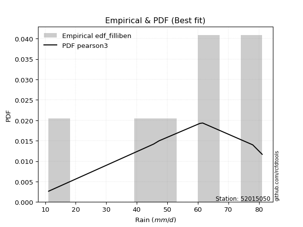</img>

</div>


### 10. EDF Jenkinson (1977)

The Jenkinson formula in hydrology is an empirical plotting position formula used to estimate the non-exceedance probability _(P)_ or return period _(T)_ of a given ordered observation within a sample. It is a widely used method in the frequency analysis of extreme events such as floods and rainfall, as it provides a distribution-free way to plot data. _a≈0.31_ and _b≈0.38_ are constants derived to approximate the median of the probability distribution for the given rank.

<div align="center">


$P=(m-a)/(n+b)$


</div>


**10.1. Empirical values**

<div align="center">

|                | 0                   | 1                   | 2                   | 3             | 4                  | 5                  | 6                  |
|:---------------|:--------------------|:--------------------|:--------------------|:--------------|:-------------------|:-------------------|:-------------------|
| date           | 2025                | 2022                | 2018                | 2019          | 2021               | 2017               | 2020               |
| x              | 11.1                | 45.5                | 47.3                | 60.7          | 61.6               | 78.0               | 81.1               |
| m              | 1                   | 2                   | 3                   | 4             | 5                  | 6                  | 7                  |
| empirical_dist | edf_jenkinson       | edf_jenkinson       | edf_jenkinson       | edf_jenkinson | edf_jenkinson      | edf_jenkinson      | edf_jenkinson      |
| empirical      | 0.09349593495934959 | 0.22899728997289973 | 0.36449864498644985 | 0.5           | 0.6355013550135502 | 0.7710027100271003 | 0.9065040650406505 |
| empirical_tr   | 1.1031390134529149  | 1.29701230228471    | 1.5735607675906182  | 2.0           | 2.743494423791822  | 4.366863905325444  | 10.695652173913055 |

</div>


**10.2. Kolmogorov-Smirnov fit test (sorted by Δ)**


<div align="center">

|                | 0                   | 1                   | 2                   | 3                   | 4                   | 5                   | 6                   | 7                   | 8                   | 9                   | 10                  | 11                  | 12                  | 13                  | 14                  | 15                  | 16                  | 17                  | 18                  | 19                  | 20                  | 21                  | 22                  | 23                  | 24                  | 25                  | 26                  | 27                  | 28                  | 29                  | 30                  | 31                  | 32                  | 33                  | 34                  | 35                  | 36                  | 37                  | 38                  | 39                  | 40                  | 41                  | 42                  | 43                  | 44                  | 45                  | 46                  | 47                  | 48                  | 49                  | 50                  | 51                  | 52                  | 53                  | 54                  | 55                  | 56                  | 57                  | 58                  | 59                  | 60                  | 61                  | 62                  | 63                  | 64                  | 65                  | 66                  | 67                  | 68                  | 69                  | 70                  | 71                  | 72                  | 73                  | 74                  | 75                  | 76                  | 77                  | 78                  | 79                  | 80                  | 81                  | 82                  | 83                  | 84                  | 85                  | 86                  | 87                  | 88                  | 89                  | 90                  | 91                  | 92                  | 93                  | 94                  | 95                  | 96                  | 97                  | 98                  | 99                  | 100                 | 101                 | 102                 | 103                 | 104                 | 105                 | 106                 | 107                 | 108                 | 109                 | 110                 | 111                 | 112                 | 113                 | 114                 | 115                 | 116                 | 117                 | 118                 | 119                 | 120                 | 121                 | 122                 | 123                 | 124                 | 125                 | 126                 | 127                 | 128                 | 129                 | 130                 | 131                 | 132                 | 133                 | 134                 | 135                 | 136                 | 137                 | 138                 | 139                 | 140                 | 141                 | 142                 | 143                 | 144                 | 145                 | 146                 | 147                 | 148                 | 149                 | 150                 | 151                 | 152                 | 153                 | 154                 | 155                 | 156                 | 157                 | 158                 | 159                 |
|:---------------|:--------------------|:--------------------|:--------------------|:--------------------|:--------------------|:--------------------|:--------------------|:--------------------|:--------------------|:--------------------|:--------------------|:--------------------|:--------------------|:--------------------|:--------------------|:--------------------|:--------------------|:--------------------|:--------------------|:--------------------|:--------------------|:--------------------|:--------------------|:--------------------|:--------------------|:--------------------|:--------------------|:--------------------|:--------------------|:--------------------|:--------------------|:--------------------|:--------------------|:--------------------|:--------------------|:--------------------|:--------------------|:--------------------|:--------------------|:--------------------|:--------------------|:--------------------|:--------------------|:--------------------|:--------------------|:--------------------|:--------------------|:--------------------|:--------------------|:--------------------|:--------------------|:--------------------|:--------------------|:--------------------|:--------------------|:--------------------|:--------------------|:--------------------|:--------------------|:--------------------|:--------------------|:--------------------|:--------------------|:--------------------|:--------------------|:--------------------|:--------------------|:--------------------|:--------------------|:--------------------|:--------------------|:--------------------|:--------------------|:--------------------|:--------------------|:--------------------|:--------------------|:--------------------|:--------------------|:--------------------|:--------------------|:--------------------|:--------------------|:--------------------|:--------------------|:--------------------|:--------------------|:--------------------|:--------------------|:--------------------|:--------------------|:--------------------|:--------------------|:--------------------|:--------------------|:--------------------|:--------------------|:--------------------|:--------------------|:--------------------|:--------------------|:--------------------|:--------------------|:--------------------|:--------------------|:--------------------|:--------------------|:--------------------|:--------------------|:--------------------|:--------------------|:--------------------|:--------------------|:--------------------|:--------------------|:--------------------|:--------------------|:--------------------|:--------------------|:--------------------|:--------------------|:--------------------|:--------------------|:--------------------|:--------------------|:--------------------|:--------------------|:--------------------|:--------------------|:--------------------|:--------------------|:--------------------|:--------------------|:--------------------|:--------------------|:--------------------|:--------------------|:--------------------|:--------------------|:--------------------|:--------------------|:--------------------|:--------------------|:--------------------|:--------------------|:--------------------|:--------------------|:--------------------|:--------------------|:--------------------|:--------------------|:--------------------|:--------------------|:--------------------|:--------------------|:--------------------|:--------------------|:--------------------|:--------------------|:--------------------|
| station        | 52015050            | 52015050            | 52015050            | 52015050            | 52015050            | 52015050            | 52015050            | 52015050            | 52015050            | 52015050            | 52015050            | 52015050            | 52015050            | 52015050            | 52015050            | 52015050            | 52015050            | 52015050            | 52015050            | 52015050            | 52015050            | 52015050            | 52015050            | 52015050            | 52015050            | 52015050            | 52015050            | 52015050            | 52015050            | 52015050            | 52015050            | 52015050            | 52015050            | 52015050            | 52015050            | 52015050            | 52015050            | 52015050            | 52015050            | 52015050            | 52015050            | 52015050            | 52015050            | 52015050            | 52015050            | 52015050            | 52015050            | 52015050            | 52015050            | 52015050            | 52015050            | 52015050            | 52015050            | 52015050            | 52015050            | 52015050            | 52015050            | 52015050            | 52015050            | 52015050            | 52015050            | 52015050            | 52015050            | 52015050            | 52015050            | 52015050            | 52015050            | 52015050            | 52015050            | 52015050            | 52015050            | 52015050            | 52015050            | 52015050            | 52015050            | 52015050            | 52015050            | 52015050            | 52015050            | 52015050            | 52015050            | 52015050            | 52015050            | 52015050            | 52015050            | 52015050            | 52015050            | 52015050            | 52015050            | 52015050            | 52015050            | 52015050            | 52015050            | 52015050            | 52015050            | 52015050            | 52015050            | 52015050            | 52015050            | 52015050            | 52015050            | 52015050            | 52015050            | 52015050            | 52015050            | 52015050            | 52015050            | 52015050            | 52015050            | 52015050            | 52015050            | 52015050            | 52015050            | 52015050            | 52015050            | 52015050            | 52015050            | 52015050            | 52015050            | 52015050            | 52015050            | 52015050            | 52015050            | 52015050            | 52015050            | 52015050            | 52015050            | 52015050            | 52015050            | 52015050            | 52015050            | 52015050            | 52015050            | 52015050            | 52015050            | 52015050            | 52015050            | 52015050            | 52015050            | 52015050            | 52015050            | 52015050            | 52015050            | 52015050            | 52015050            | 52015050            | 52015050            | 52015050            | 52015050            | 52015050            | 52015050            | 52015050            | 52015050            | 52015050            | 52015050            | 52015050            | 52015050            | 52015050            | 52015050            | 52015050            |
| empirical_dist | edf_jenkinson       | edf_jenkinson       | edf_jenkinson       | edf_jenkinson       | edf_jenkinson       | edf_jenkinson       | edf_jenkinson       | edf_jenkinson       | edf_jenkinson       | edf_jenkinson       | edf_jenkinson       | edf_jenkinson       | edf_jenkinson       | edf_jenkinson       | edf_jenkinson       | edf_jenkinson       | edf_jenkinson       | edf_jenkinson       | edf_jenkinson       | edf_jenkinson       | edf_jenkinson       | edf_jenkinson       | edf_jenkinson       | edf_jenkinson       | edf_jenkinson       | edf_jenkinson       | edf_jenkinson       | edf_jenkinson       | edf_jenkinson       | edf_jenkinson       | edf_jenkinson       | edf_jenkinson       | edf_jenkinson       | edf_jenkinson       | edf_jenkinson       | edf_jenkinson       | edf_jenkinson       | edf_jenkinson       | edf_jenkinson       | edf_jenkinson       | edf_jenkinson       | edf_jenkinson       | edf_jenkinson       | edf_jenkinson       | edf_jenkinson       | edf_jenkinson       | edf_jenkinson       | edf_jenkinson       | edf_jenkinson       | edf_jenkinson       | edf_jenkinson       | edf_jenkinson       | edf_jenkinson       | edf_jenkinson       | edf_jenkinson       | edf_jenkinson       | edf_jenkinson       | edf_jenkinson       | edf_jenkinson       | edf_jenkinson       | edf_jenkinson       | edf_jenkinson       | edf_jenkinson       | edf_jenkinson       | edf_jenkinson       | edf_jenkinson       | edf_jenkinson       | edf_jenkinson       | edf_jenkinson       | edf_jenkinson       | edf_jenkinson       | edf_jenkinson       | edf_jenkinson       | edf_jenkinson       | edf_jenkinson       | edf_jenkinson       | edf_jenkinson       | edf_jenkinson       | edf_jenkinson       | edf_jenkinson       | edf_jenkinson       | edf_jenkinson       | edf_jenkinson       | edf_jenkinson       | edf_jenkinson       | edf_jenkinson       | edf_jenkinson       | edf_jenkinson       | edf_jenkinson       | edf_jenkinson       | edf_jenkinson       | edf_jenkinson       | edf_jenkinson       | edf_jenkinson       | edf_jenkinson       | edf_jenkinson       | edf_jenkinson       | edf_jenkinson       | edf_jenkinson       | edf_jenkinson       | edf_jenkinson       | edf_jenkinson       | edf_jenkinson       | edf_jenkinson       | edf_jenkinson       | edf_jenkinson       | edf_jenkinson       | edf_jenkinson       | edf_jenkinson       | edf_jenkinson       | edf_jenkinson       | edf_jenkinson       | edf_jenkinson       | edf_jenkinson       | edf_jenkinson       | edf_jenkinson       | edf_jenkinson       | edf_jenkinson       | edf_jenkinson       | edf_jenkinson       | edf_jenkinson       | edf_jenkinson       | edf_jenkinson       | edf_jenkinson       | edf_jenkinson       | edf_jenkinson       | edf_jenkinson       | edf_jenkinson       | edf_jenkinson       | edf_jenkinson       | edf_jenkinson       | edf_jenkinson       | edf_jenkinson       | edf_jenkinson       | edf_jenkinson       | edf_jenkinson       | edf_jenkinson       | edf_jenkinson       | edf_jenkinson       | edf_jenkinson       | edf_jenkinson       | edf_jenkinson       | edf_jenkinson       | edf_jenkinson       | edf_jenkinson       | edf_jenkinson       | edf_jenkinson       | edf_jenkinson       | edf_jenkinson       | edf_jenkinson       | edf_jenkinson       | edf_jenkinson       | edf_jenkinson       | edf_jenkinson       | edf_jenkinson       | edf_jenkinson       | edf_jenkinson       | edf_jenkinson       | edf_jenkinson       | edf_jenkinson       |
| p_dist         | pearson3            | trapezoid           | exponnorm           | norm                | truncnorm           | crystalball         | t                   | nct                 | f                   | dweibull            | logburr12           | betaprime           | gompertz            | weibull_min         | gengamma            | rice                | gumbel_l            | logvonmises_line    | exponpow            | logistic            | gamma               | erlang              | genhalflogistic     | anglit              | hypsecant           | invgamma            | exponweib           | argus               | dgamma              | logt                | maxwell             | semicircular        | johnsonsu           | loggompertz         | logpearson3         | genpareto           | burr                | logargus            | beta                | logdgamma           | invgauss            | rayleigh            | logburr             | laplace             | mielke              | skewnorm            | cosine              | logmielke           | logloggamma         | triang              | logdweibull         | invweibull          | gumbel_r            | loggumbel_l         | arcsine             | ncf                 | genextreme          | truncweibull_min    | halfnorm            | logloglaplace       | alpha               | loglevy_l           | halflogistic        | moyal               | levy_l              | logtrapezoid        | gennorm             | loggenextreme       | loggennorm          | logweibull_max      | kstwobign           | logbeta             | loglaplace          | loglaplace          | nakagami            | lognakagami         | loggengamma         | loghypsecant        | loglogistic         | logfoldnorm         | logf                | logrice             | logcrystalball      | lognorm             | logexponnorm        | lognct              | logfatiguelife      | logncf              | loganglit           | logsemicircular     | loggamma            | loggamma            | logbetaprime        | logtruncnorm        | logskewnorm         | logarcsine          | wald                | logerlang           | kappa3              | lomax               | uniform             | vonmises_line       | ksone               | loginvgamma         | wrapcauchy          | logalpha            | loginvgauss         | logmaxwell          | kappa4              | loginvweibull       | lograyleigh         | loggenhalflogistic  | tukeylambda         | loggumbel_r         | genexpon            | loghalfnorm         | logkstwobign        | logcosine           | loggausshyper       | logwrapcauchy       | logmoyal            | loggenexpon         | logjohnsonsb        | loghalflogistic     | logtriang           | bradford            | halfgennorm         | gausshyper          | logweibull_min      | loglomax            | logexponweib        | burr12              | loghalfgennorm      | truncexpon          | logwald             | loggenpareto        | foldnorm            | logrdist            | logksone            | logkappa4           | johnsonsb           | logtukeylambda      | logkappa3           | loguniform          | logbradford         | weibull_max         | logtruncweibull_min | logjohnsonsu        | logtruncexpon       | fatiguelife         | logexponpow         | powerlaw            | rdist               | logpowerlaw         | truncpareto         | logtruncpareto      | genlogistic         | loggenlogistic      | logvonmises         | vonmises            |
| delta          | 0.09322742791962091 | 0.09338344205112556 | 0.10264752511947142 | 0.10264758011865463 | 0.10264758203504395 | 0.10264758293919354 | 0.10265936078161828 | 0.10281464406610533 | 0.10356935767328881 | 0.10732034368666399 | 0.10741217156710292 | 0.1083611208389231  | 0.11069590078813463 | 0.11147124125333774 | 0.11195050316176236 | 0.1124224216795667  | 0.11267121933311341 | 0.1131237466634345  | 0.11320240407522375 | 0.11494250897551961 | 0.11793369313266891 | 0.12014480446702128 | 0.1215527643635892  | 0.12436449497474936 | 0.12565201080213018 | 0.12716686069854002 | 0.12772268706746062 | 0.13025533721368832 | 0.13247589525244977 | 0.13310542895247884 | 0.13333239167544023 | 0.13352084487999152 | 0.13447752144918812 | 0.13513305037860654 | 0.136380104101081   | 0.14051295006334086 | 0.14101164533839539 | 0.14123367230684025 | 0.14163854642939222 | 0.14314788173702964 | 0.14384720555676958 | 0.14512026553452775 | 0.150293462724438   | 0.15290314777032188 | 0.1561300679877604  | 0.15645255984600803 | 0.15729910147777146 | 0.1575618936916704  | 0.15785025031121824 | 0.15959834244931914 | 0.16016777042382502 | 0.16806186615429383 | 0.16815564036585362 | 0.16998718419086686 | 0.17139086044147364 | 0.1714436203382574  | 0.17541134796233482 | 0.17650253544124284 | 0.17865413514342368 | 0.1806803599122041  | 0.1833099087263139  | 0.1876698021141503  | 0.1879679333726354  | 0.1907920371940448  | 0.19106950940893586 | 0.19179924055055794 | 0.1927623773336097  | 0.19652620051111916 | 0.1992994629552401  | 0.2043480471477016  | 0.20805011420397432 | 0.2102245738096949  | 0.2198748095030326  | 0.2198748095030326  | 0.228997205735636   | 0.22899722409543785 | 0.23285982667983376 | 0.2329557882451678  | 0.23647057526867823 | 0.23650687918076627 | 0.23960788562482158 | 0.2405921872944812  | 0.24060249855829288 | 0.24060259519905605 | 0.24060283578599248 | 0.240959827053266   | 0.242736742380565   | 0.24470150389082704 | 0.24494066787391336 | 0.24672795360481928 | 0.24846828926861317 | 0.24846828926861317 | 0.24921829130874998 | 0.25323624766635633 | 0.2534561568484278  | 0.25382757541711176 | 0.2539024480698069  | 0.25761978520145556 | 0.2593450382082997  | 0.25948354201360335 | 0.26243128145567163 | 0.26267183972271846 | 0.2638598528842431  | 0.2641857499197584  | 0.2645698371636742  | 0.26767666116411726 | 0.2710595662706641  | 0.2746029577970759  | 0.27584662112256186 | 0.2839306769563562  | 0.2862026573520068  | 0.2879436584032571  | 0.30316974666415575 | 0.30939812414865064 | 0.31390328536322654 | 0.3188887244193821  | 0.321846902211285   | 0.3242750681134019  | 0.32764868740323927 | 0.33462585010832957 | 0.33515550306134356 | 0.33804808051194424 | 0.33913538300827595 | 0.3416865287490567  | 0.34182568280302095 | 0.347820720300148   | 0.3690928134307767  | 0.37622153052086044 | 0.3845539602197158  | 0.38647693894481805 | 0.3867666557529652  | 0.38805316045670424 | 0.3936648090139966  | 0.39471871631635325 | 0.4068468708559664  | 0.4288890670090265  | 0.4312563113952532  | 0.4444827206306119  | 0.44548451794452437 | 0.46631582000920335 | 0.4692226774994064  | 0.4747628302847201  | 0.4803563065455072  | 0.48038087952800934 | 0.4807009932228645  | 0.4864687799482137  | 0.5178351323490271  | 0.5183773146867462  | 0.5498279200378932  | 0.5834195838660802  | 0.5994493340743571  | 0.65490865968318    | 0.6777193904039017  | 0.7081454688314054  | 0.7183845181986288  | 0.7452535029171561  | 0.7710027100271003  | 0.7710027100271003  | 1.188913505493466   | 12.931049473301602  |
| deltao         | 0.48442053926100004 | 0.48442053926100004 | 0.48442053926100004 | 0.48442053926100004 | 0.48442053926100004 | 0.48442053926100004 | 0.48442053926100004 | 0.48442053926100004 | 0.48442053926100004 | 0.48442053926100004 | 0.48442053926100004 | 0.48442053926100004 | 0.48442053926100004 | 0.48442053926100004 | 0.48442053926100004 | 0.48442053926100004 | 0.48442053926100004 | 0.48442053926100004 | 0.48442053926100004 | 0.48442053926100004 | 0.48442053926100004 | 0.48442053926100004 | 0.48442053926100004 | 0.48442053926100004 | 0.48442053926100004 | 0.48442053926100004 | 0.48442053926100004 | 0.48442053926100004 | 0.48442053926100004 | 0.48442053926100004 | 0.48442053926100004 | 0.48442053926100004 | 0.48442053926100004 | 0.48442053926100004 | 0.48442053926100004 | 0.48442053926100004 | 0.48442053926100004 | 0.48442053926100004 | 0.48442053926100004 | 0.48442053926100004 | 0.48442053926100004 | 0.48442053926100004 | 0.48442053926100004 | 0.48442053926100004 | 0.48442053926100004 | 0.48442053926100004 | 0.48442053926100004 | 0.48442053926100004 | 0.48442053926100004 | 0.48442053926100004 | 0.48442053926100004 | 0.48442053926100004 | 0.48442053926100004 | 0.48442053926100004 | 0.48442053926100004 | 0.48442053926100004 | 0.48442053926100004 | 0.48442053926100004 | 0.48442053926100004 | 0.48442053926100004 | 0.48442053926100004 | 0.48442053926100004 | 0.48442053926100004 | 0.48442053926100004 | 0.48442053926100004 | 0.48442053926100004 | 0.48442053926100004 | 0.48442053926100004 | 0.48442053926100004 | 0.48442053926100004 | 0.48442053926100004 | 0.48442053926100004 | 0.48442053926100004 | 0.48442053926100004 | 0.48442053926100004 | 0.48442053926100004 | 0.48442053926100004 | 0.48442053926100004 | 0.48442053926100004 | 0.48442053926100004 | 0.48442053926100004 | 0.48442053926100004 | 0.48442053926100004 | 0.48442053926100004 | 0.48442053926100004 | 0.48442053926100004 | 0.48442053926100004 | 0.48442053926100004 | 0.48442053926100004 | 0.48442053926100004 | 0.48442053926100004 | 0.48442053926100004 | 0.48442053926100004 | 0.48442053926100004 | 0.48442053926100004 | 0.48442053926100004 | 0.48442053926100004 | 0.48442053926100004 | 0.48442053926100004 | 0.48442053926100004 | 0.48442053926100004 | 0.48442053926100004 | 0.48442053926100004 | 0.48442053926100004 | 0.48442053926100004 | 0.48442053926100004 | 0.48442053926100004 | 0.48442053926100004 | 0.48442053926100004 | 0.48442053926100004 | 0.48442053926100004 | 0.48442053926100004 | 0.48442053926100004 | 0.48442053926100004 | 0.48442053926100004 | 0.48442053926100004 | 0.48442053926100004 | 0.48442053926100004 | 0.48442053926100004 | 0.48442053926100004 | 0.48442053926100004 | 0.48442053926100004 | 0.48442053926100004 | 0.48442053926100004 | 0.48442053926100004 | 0.48442053926100004 | 0.48442053926100004 | 0.48442053926100004 | 0.48442053926100004 | 0.48442053926100004 | 0.48442053926100004 | 0.48442053926100004 | 0.48442053926100004 | 0.48442053926100004 | 0.48442053926100004 | 0.48442053926100004 | 0.48442053926100004 | 0.48442053926100004 | 0.48442053926100004 | 0.48442053926100004 | 0.48442053926100004 | 0.48442053926100004 | 0.48442053926100004 | 0.48442053926100004 | 0.48442053926100004 | 0.48442053926100004 | 0.48442053926100004 | 0.48442053926100004 | 0.48442053926100004 | 0.48442053926100004 | 0.48442053926100004 | 0.48442053926100004 | 0.48442053926100004 | 0.48442053926100004 | 0.48442053926100004 | 0.48442053926100004 | 0.48442053926100004 | 0.48442053926100004 | 0.48442053926100004 | 0.48442053926100004 |
| eval           | Δo > Δ              | Δo > Δ              | Δo > Δ              | Δo > Δ              | Δo > Δ              | Δo > Δ              | Δo > Δ              | Δo > Δ              | Δo > Δ              | Δo > Δ              | Δo > Δ              | Δo > Δ              | Δo > Δ              | Δo > Δ              | Δo > Δ              | Δo > Δ              | Δo > Δ              | Δo > Δ              | Δo > Δ              | Δo > Δ              | Δo > Δ              | Δo > Δ              | Δo > Δ              | Δo > Δ              | Δo > Δ              | Δo > Δ              | Δo > Δ              | Δo > Δ              | Δo > Δ              | Δo > Δ              | Δo > Δ              | Δo > Δ              | Δo > Δ              | Δo > Δ              | Δo > Δ              | Δo > Δ              | Δo > Δ              | Δo > Δ              | Δo > Δ              | Δo > Δ              | Δo > Δ              | Δo > Δ              | Δo > Δ              | Δo > Δ              | Δo > Δ              | Δo > Δ              | Δo > Δ              | Δo > Δ              | Δo > Δ              | Δo > Δ              | Δo > Δ              | Δo > Δ              | Δo > Δ              | Δo > Δ              | Δo > Δ              | Δo > Δ              | Δo > Δ              | Δo > Δ              | Δo > Δ              | Δo > Δ              | Δo > Δ              | Δo > Δ              | Δo > Δ              | Δo > Δ              | Δo > Δ              | Δo > Δ              | Δo > Δ              | Δo > Δ              | Δo > Δ              | Δo > Δ              | Δo > Δ              | Δo > Δ              | Δo > Δ              | Δo > Δ              | Δo > Δ              | Δo > Δ              | Δo > Δ              | Δo > Δ              | Δo > Δ              | Δo > Δ              | Δo > Δ              | Δo > Δ              | Δo > Δ              | Δo > Δ              | Δo > Δ              | Δo > Δ              | Δo > Δ              | Δo > Δ              | Δo > Δ              | Δo > Δ              | Δo > Δ              | Δo > Δ              | Δo > Δ              | Δo > Δ              | Δo > Δ              | Δo > Δ              | Δo > Δ              | Δo > Δ              | Δo > Δ              | Δo > Δ              | Δo > Δ              | Δo > Δ              | Δo > Δ              | Δo > Δ              | Δo > Δ              | Δo > Δ              | Δo > Δ              | Δo > Δ              | Δo > Δ              | Δo > Δ              | Δo > Δ              | Δo > Δ              | Δo > Δ              | Δo > Δ              | Δo > Δ              | Δo > Δ              | Δo > Δ              | Δo > Δ              | Δo > Δ              | Δo > Δ              | Δo > Δ              | Δo > Δ              | Δo > Δ              | Δo > Δ              | Δo > Δ              | Δo > Δ              | Δo > Δ              | Δo > Δ              | Δo > Δ              | Δo > Δ              | Δo > Δ              | Δo > Δ              | Δo > Δ              | Δo > Δ              | Δo > Δ              | Δo > Δ              | Δo > Δ              | Δo > Δ              | Δo > Δ              | Δo > Δ              | Δo > Δ              | Δo > Δ              | Δo > Δ              | Δo > Δ              | Δo > Δ              | Δo <= Δ             | Δo <= Δ             | Δo <= Δ             | Δo <= Δ             | Δo <= Δ             | Δo <= Δ             | Δo <= Δ             | Δo <= Δ             | Δo <= Δ             | Δo <= Δ             | Δo <= Δ             | Δo <= Δ             | Δo <= Δ             | Δo <= Δ             | Δo <= Δ             |
| fit            | 1                   | 1                   | 1                   | 1                   | 1                   | 1                   | 1                   | 1                   | 1                   | 1                   | 1                   | 1                   | 1                   | 1                   | 1                   | 1                   | 1                   | 1                   | 1                   | 1                   | 1                   | 1                   | 1                   | 1                   | 1                   | 1                   | 1                   | 1                   | 1                   | 1                   | 1                   | 1                   | 1                   | 1                   | 1                   | 1                   | 1                   | 1                   | 1                   | 1                   | 1                   | 1                   | 1                   | 1                   | 1                   | 1                   | 1                   | 1                   | 1                   | 1                   | 1                   | 1                   | 1                   | 1                   | 1                   | 1                   | 1                   | 1                   | 1                   | 1                   | 1                   | 1                   | 1                   | 1                   | 1                   | 1                   | 1                   | 1                   | 1                   | 1                   | 1                   | 1                   | 1                   | 1                   | 1                   | 1                   | 1                   | 1                   | 1                   | 1                   | 1                   | 1                   | 1                   | 1                   | 1                   | 1                   | 1                   | 1                   | 1                   | 1                   | 1                   | 1                   | 1                   | 1                   | 1                   | 1                   | 1                   | 1                   | 1                   | 1                   | 1                   | 1                   | 1                   | 1                   | 1                   | 1                   | 1                   | 1                   | 1                   | 1                   | 1                   | 1                   | 1                   | 1                   | 1                   | 1                   | 1                   | 1                   | 1                   | 1                   | 1                   | 1                   | 1                   | 1                   | 1                   | 1                   | 1                   | 1                   | 1                   | 1                   | 1                   | 1                   | 1                   | 1                   | 1                   | 1                   | 1                   | 1                   | 1                   | 1                   | 1                   | 1                   | 1                   | 1                   | 1                   | 0                   | 0                   | 0                   | 0                   | 0                   | 0                   | 0                   | 0                   | 0                   | 0                   | 0                   | 0                   | 0                   | 0                   | 0                   |
| n              | 7                   | 7                   | 7                   | 7                   | 7                   | 7                   | 7                   | 7                   | 7                   | 7                   | 7                   | 7                   | 7                   | 7                   | 7                   | 7                   | 7                   | 7                   | 7                   | 7                   | 7                   | 7                   | 7                   | 7                   | 7                   | 7                   | 7                   | 7                   | 7                   | 7                   | 7                   | 7                   | 7                   | 7                   | 7                   | 7                   | 7                   | 7                   | 7                   | 7                   | 7                   | 7                   | 7                   | 7                   | 7                   | 7                   | 7                   | 7                   | 7                   | 7                   | 7                   | 7                   | 7                   | 7                   | 7                   | 7                   | 7                   | 7                   | 7                   | 7                   | 7                   | 7                   | 7                   | 7                   | 7                   | 7                   | 7                   | 7                   | 7                   | 7                   | 7                   | 7                   | 7                   | 7                   | 7                   | 7                   | 7                   | 7                   | 7                   | 7                   | 7                   | 7                   | 7                   | 7                   | 7                   | 7                   | 7                   | 7                   | 7                   | 7                   | 7                   | 7                   | 7                   | 7                   | 7                   | 7                   | 7                   | 7                   | 7                   | 7                   | 7                   | 7                   | 7                   | 7                   | 7                   | 7                   | 7                   | 7                   | 7                   | 7                   | 7                   | 7                   | 7                   | 7                   | 7                   | 7                   | 7                   | 7                   | 7                   | 7                   | 7                   | 7                   | 7                   | 7                   | 7                   | 7                   | 7                   | 7                   | 7                   | 7                   | 7                   | 7                   | 7                   | 7                   | 7                   | 7                   | 7                   | 7                   | 7                   | 7                   | 7                   | 7                   | 7                   | 7                   | 7                   | 7                   | 7                   | 7                   | 7                   | 7                   | 7                   | 7                   | 7                   | 7                   | 7                   | 7                   | 7                   | 7                   | 7                   | 7                   |
| best_fit       | 1                   | 0                   | 0                   | 0                   | 0                   | 0                   | 0                   | 0                   | 0                   | 0                   | 0                   | 0                   | 0                   | 0                   | 0                   | 0                   | 0                   | 0                   | 0                   | 0                   | 0                   | 0                   | 0                   | 0                   | 0                   | 0                   | 0                   | 0                   | 0                   | 0                   | 0                   | 0                   | 0                   | 0                   | 0                   | 0                   | 0                   | 0                   | 0                   | 0                   | 0                   | 0                   | 0                   | 0                   | 0                   | 0                   | 0                   | 0                   | 0                   | 0                   | 0                   | 0                   | 0                   | 0                   | 0                   | 0                   | 0                   | 0                   | 0                   | 0                   | 0                   | 0                   | 0                   | 0                   | 0                   | 0                   | 0                   | 0                   | 0                   | 0                   | 0                   | 0                   | 0                   | 0                   | 0                   | 0                   | 0                   | 0                   | 0                   | 0                   | 0                   | 0                   | 0                   | 0                   | 0                   | 0                   | 0                   | 0                   | 0                   | 0                   | 0                   | 0                   | 0                   | 0                   | 0                   | 0                   | 0                   | 0                   | 0                   | 0                   | 0                   | 0                   | 0                   | 0                   | 0                   | 0                   | 0                   | 0                   | 0                   | 0                   | 0                   | 0                   | 0                   | 0                   | 0                   | 0                   | 0                   | 0                   | 0                   | 0                   | 0                   | 0                   | 0                   | 0                   | 0                   | 0                   | 0                   | 0                   | 0                   | 0                   | 0                   | 0                   | 0                   | 0                   | 0                   | 0                   | 0                   | 0                   | 0                   | 0                   | 0                   | 0                   | 0                   | 0                   | 0                   | 0                   | 0                   | 0                   | 0                   | 0                   | 0                   | 0                   | 0                   | 0                   | 0                   | 0                   | 0                   | 0                   | 0                   | 0                   |
| best_fit_sort  | 1                   | 2                   | 3                   | 4                   | 5                   | 6                   | 7                   | 8                   | 9                   | 10                  | 11                  | 12                  | 13                  | 14                  | 15                  | 16                  | 17                  | 18                  | 19                  | 20                  | 21                  | 22                  | 23                  | 24                  | 25                  | 26                  | 27                  | 28                  | 29                  | 30                  | 31                  | 32                  | 33                  | 34                  | 35                  | 36                  | 37                  | 38                  | 39                  | 40                  | 41                  | 42                  | 43                  | 44                  | 45                  | 46                  | 47                  | 48                  | 49                  | 50                  | 51                  | 52                  | 53                  | 54                  | 55                  | 56                  | 57                  | 58                  | 59                  | 60                  | 61                  | 62                  | 63                  | 64                  | 65                  | 66                  | 67                  | 68                  | 69                  | 70                  | 71                  | 72                  | 73                  | 74                  | 75                  | 76                  | 77                  | 78                  | 79                  | 80                  | 81                  | 82                  | 83                  | 84                  | 85                  | 86                  | 87                  | 88                  | 89                  | 90                  | 91                  | 92                  | 93                  | 94                  | 95                  | 96                  | 97                  | 98                  | 99                  | 100                 | 101                 | 102                 | 103                 | 104                 | 105                 | 106                 | 107                 | 108                 | 109                 | 110                 | 111                 | 112                 | 113                 | 114                 | 115                 | 116                 | 117                 | 118                 | 119                 | 120                 | 121                 | 122                 | 123                 | 124                 | 125                 | 126                 | 127                 | 128                 | 129                 | 130                 | 131                 | 132                 | 133                 | 134                 | 135                 | 136                 | 137                 | 138                 | 139                 | 140                 | 141                 | 142                 | 143                 | 144                 | 145                 | 146                 | 147                 | 148                 | 149                 | 150                 | 151                 | 152                 | 153                 | 154                 | 155                 | 156                 | 157                 | 158                 | 159                 | 160                 |

</div>


**10.3. Best fit**

<div align="center">

|   id |   station | empirical_dist   | p_dist   |     delta |   deltao | eval   |   fit |   n |   best_fit |   best_fit_sort |
|-----:|----------:|:-----------------|:---------|----------:|---------:|:-------|------:|----:|-----------:|----------------:|
|    0 |  52015050 | edf_jenkinson    | pearson3 | 0.0932274 | 0.484421 | Δo > Δ |     1 |   7 |          1 |               1 |

</div>


<div align="center">

</img>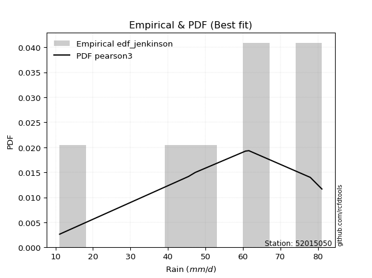</img>

</div>


### 11. EDF Cunnane (1978)

Cunnane´s work in statistical hydrology has focused on the performance and evaluation of different probability distributions (such as GEV, Gumbel, Lognormal) for flood frequency estimation. _b_ is a constant, typically set to 0.4.

<div align="center">


$P=(m-b)/(n+1-2b)$


</div>


**11.1. Empirical values**

<div align="center">

|                | 0                   | 1                   | 2                  | 3           | 4                  | 5                  | 6                  |
|:---------------|:--------------------|:--------------------|:-------------------|:------------|:-------------------|:-------------------|:-------------------|
| date           | 2025                | 2022                | 2018               | 2019        | 2021               | 2017               | 2020               |
| x              | 11.1                | 45.5                | 47.3               | 60.7        | 61.6               | 78.0               | 81.1               |
| m              | 1                   | 2                   | 3                  | 4           | 5                  | 6                  | 7                  |
| empirical_dist | edf_cunnane         | edf_cunnane         | edf_cunnane        | edf_cunnane | edf_cunnane        | edf_cunnane        | edf_cunnane        |
| empirical      | 0.08333333333333333 | 0.22222222222222224 | 0.3611111111111111 | 0.5         | 0.6388888888888888 | 0.7777777777777777 | 0.9166666666666666 |
| empirical_tr   | 1.090909090909091   | 1.2857142857142856  | 1.565217391304348  | 2.0         | 2.7692307692307687 | 4.499999999999998  | 11.999999999999995 |

</div>


**11.2. Kolmogorov-Smirnov fit test (sorted by Δ)**


<div align="center">

|                | 0                   | 1                   | 2                   | 3                   | 4                   | 5                   | 6                   | 7                   | 8                   | 9                   | 10                  | 11                  | 12                  | 13                  | 14                  | 15                  | 16                  | 17                  | 18                  | 19                  | 20                  | 21                  | 22                  | 23                  | 24                  | 25                  | 26                  | 27                  | 28                  | 29                  | 30                  | 31                  | 32                  | 33                  | 34                  | 35                  | 36                  | 37                  | 38                  | 39                  | 40                  | 41                  | 42                  | 43                  | 44                  | 45                  | 46                  | 47                  | 48                  | 49                  | 50                  | 51                  | 52                  | 53                  | 54                  | 55                  | 56                  | 57                  | 58                  | 59                  | 60                  | 61                  | 62                  | 63                  | 64                  | 65                  | 66                  | 67                  | 68                  | 69                  | 70                  | 71                  | 72                  | 73                  | 74                  | 75                  | 76                  | 77                  | 78                  | 79                  | 80                  | 81                  | 82                  | 83                  | 84                  | 85                  | 86                  | 87                  | 88                  | 89                  | 90                  | 91                  | 92                  | 93                  | 94                  | 95                  | 96                  | 97                  | 98                  | 99                  | 100                 | 101                 | 102                 | 103                 | 104                 | 105                 | 106                 | 107                 | 108                 | 109                 | 110                 | 111                 | 112                 | 113                 | 114                 | 115                 | 116                 | 117                 | 118                 | 119                 | 120                 | 121                 | 122                 | 123                 | 124                 | 125                 | 126                 | 127                 | 128                 | 129                 | 130                 | 131                 | 132                 | 133                 | 134                 | 135                 | 136                 | 137                 | 138                 | 139                 | 140                 | 141                 | 142                 | 143                 | 144                 | 145                 | 146                 | 147                 | 148                 | 149                 | 150                 | 151                 | 152                 | 153                 | 154                 | 155                 | 156                 | 157                 | 158                 | 159                 |
|:---------------|:--------------------|:--------------------|:--------------------|:--------------------|:--------------------|:--------------------|:--------------------|:--------------------|:--------------------|:--------------------|:--------------------|:--------------------|:--------------------|:--------------------|:--------------------|:--------------------|:--------------------|:--------------------|:--------------------|:--------------------|:--------------------|:--------------------|:--------------------|:--------------------|:--------------------|:--------------------|:--------------------|:--------------------|:--------------------|:--------------------|:--------------------|:--------------------|:--------------------|:--------------------|:--------------------|:--------------------|:--------------------|:--------------------|:--------------------|:--------------------|:--------------------|:--------------------|:--------------------|:--------------------|:--------------------|:--------------------|:--------------------|:--------------------|:--------------------|:--------------------|:--------------------|:--------------------|:--------------------|:--------------------|:--------------------|:--------------------|:--------------------|:--------------------|:--------------------|:--------------------|:--------------------|:--------------------|:--------------------|:--------------------|:--------------------|:--------------------|:--------------------|:--------------------|:--------------------|:--------------------|:--------------------|:--------------------|:--------------------|:--------------------|:--------------------|:--------------------|:--------------------|:--------------------|:--------------------|:--------------------|:--------------------|:--------------------|:--------------------|:--------------------|:--------------------|:--------------------|:--------------------|:--------------------|:--------------------|:--------------------|:--------------------|:--------------------|:--------------------|:--------------------|:--------------------|:--------------------|:--------------------|:--------------------|:--------------------|:--------------------|:--------------------|:--------------------|:--------------------|:--------------------|:--------------------|:--------------------|:--------------------|:--------------------|:--------------------|:--------------------|:--------------------|:--------------------|:--------------------|:--------------------|:--------------------|:--------------------|:--------------------|:--------------------|:--------------------|:--------------------|:--------------------|:--------------------|:--------------------|:--------------------|:--------------------|:--------------------|:--------------------|:--------------------|:--------------------|:--------------------|:--------------------|:--------------------|:--------------------|:--------------------|:--------------------|:--------------------|:--------------------|:--------------------|:--------------------|:--------------------|:--------------------|:--------------------|:--------------------|:--------------------|:--------------------|:--------------------|:--------------------|:--------------------|:--------------------|:--------------------|:--------------------|:--------------------|:--------------------|:--------------------|:--------------------|:--------------------|:--------------------|:--------------------|:--------------------|:--------------------|
| station        | 52015050            | 52015050            | 52015050            | 52015050            | 52015050            | 52015050            | 52015050            | 52015050            | 52015050            | 52015050            | 52015050            | 52015050            | 52015050            | 52015050            | 52015050            | 52015050            | 52015050            | 52015050            | 52015050            | 52015050            | 52015050            | 52015050            | 52015050            | 52015050            | 52015050            | 52015050            | 52015050            | 52015050            | 52015050            | 52015050            | 52015050            | 52015050            | 52015050            | 52015050            | 52015050            | 52015050            | 52015050            | 52015050            | 52015050            | 52015050            | 52015050            | 52015050            | 52015050            | 52015050            | 52015050            | 52015050            | 52015050            | 52015050            | 52015050            | 52015050            | 52015050            | 52015050            | 52015050            | 52015050            | 52015050            | 52015050            | 52015050            | 52015050            | 52015050            | 52015050            | 52015050            | 52015050            | 52015050            | 52015050            | 52015050            | 52015050            | 52015050            | 52015050            | 52015050            | 52015050            | 52015050            | 52015050            | 52015050            | 52015050            | 52015050            | 52015050            | 52015050            | 52015050            | 52015050            | 52015050            | 52015050            | 52015050            | 52015050            | 52015050            | 52015050            | 52015050            | 52015050            | 52015050            | 52015050            | 52015050            | 52015050            | 52015050            | 52015050            | 52015050            | 52015050            | 52015050            | 52015050            | 52015050            | 52015050            | 52015050            | 52015050            | 52015050            | 52015050            | 52015050            | 52015050            | 52015050            | 52015050            | 52015050            | 52015050            | 52015050            | 52015050            | 52015050            | 52015050            | 52015050            | 52015050            | 52015050            | 52015050            | 52015050            | 52015050            | 52015050            | 52015050            | 52015050            | 52015050            | 52015050            | 52015050            | 52015050            | 52015050            | 52015050            | 52015050            | 52015050            | 52015050            | 52015050            | 52015050            | 52015050            | 52015050            | 52015050            | 52015050            | 52015050            | 52015050            | 52015050            | 52015050            | 52015050            | 52015050            | 52015050            | 52015050            | 52015050            | 52015050            | 52015050            | 52015050            | 52015050            | 52015050            | 52015050            | 52015050            | 52015050            | 52015050            | 52015050            | 52015050            | 52015050            | 52015050            | 52015050            |
| empirical_dist | edf_cunnane         | edf_cunnane         | edf_cunnane         | edf_cunnane         | edf_cunnane         | edf_cunnane         | edf_cunnane         | edf_cunnane         | edf_cunnane         | edf_cunnane         | edf_cunnane         | edf_cunnane         | edf_cunnane         | edf_cunnane         | edf_cunnane         | edf_cunnane         | edf_cunnane         | edf_cunnane         | edf_cunnane         | edf_cunnane         | edf_cunnane         | edf_cunnane         | edf_cunnane         | edf_cunnane         | edf_cunnane         | edf_cunnane         | edf_cunnane         | edf_cunnane         | edf_cunnane         | edf_cunnane         | edf_cunnane         | edf_cunnane         | edf_cunnane         | edf_cunnane         | edf_cunnane         | edf_cunnane         | edf_cunnane         | edf_cunnane         | edf_cunnane         | edf_cunnane         | edf_cunnane         | edf_cunnane         | edf_cunnane         | edf_cunnane         | edf_cunnane         | edf_cunnane         | edf_cunnane         | edf_cunnane         | edf_cunnane         | edf_cunnane         | edf_cunnane         | edf_cunnane         | edf_cunnane         | edf_cunnane         | edf_cunnane         | edf_cunnane         | edf_cunnane         | edf_cunnane         | edf_cunnane         | edf_cunnane         | edf_cunnane         | edf_cunnane         | edf_cunnane         | edf_cunnane         | edf_cunnane         | edf_cunnane         | edf_cunnane         | edf_cunnane         | edf_cunnane         | edf_cunnane         | edf_cunnane         | edf_cunnane         | edf_cunnane         | edf_cunnane         | edf_cunnane         | edf_cunnane         | edf_cunnane         | edf_cunnane         | edf_cunnane         | edf_cunnane         | edf_cunnane         | edf_cunnane         | edf_cunnane         | edf_cunnane         | edf_cunnane         | edf_cunnane         | edf_cunnane         | edf_cunnane         | edf_cunnane         | edf_cunnane         | edf_cunnane         | edf_cunnane         | edf_cunnane         | edf_cunnane         | edf_cunnane         | edf_cunnane         | edf_cunnane         | edf_cunnane         | edf_cunnane         | edf_cunnane         | edf_cunnane         | edf_cunnane         | edf_cunnane         | edf_cunnane         | edf_cunnane         | edf_cunnane         | edf_cunnane         | edf_cunnane         | edf_cunnane         | edf_cunnane         | edf_cunnane         | edf_cunnane         | edf_cunnane         | edf_cunnane         | edf_cunnane         | edf_cunnane         | edf_cunnane         | edf_cunnane         | edf_cunnane         | edf_cunnane         | edf_cunnane         | edf_cunnane         | edf_cunnane         | edf_cunnane         | edf_cunnane         | edf_cunnane         | edf_cunnane         | edf_cunnane         | edf_cunnane         | edf_cunnane         | edf_cunnane         | edf_cunnane         | edf_cunnane         | edf_cunnane         | edf_cunnane         | edf_cunnane         | edf_cunnane         | edf_cunnane         | edf_cunnane         | edf_cunnane         | edf_cunnane         | edf_cunnane         | edf_cunnane         | edf_cunnane         | edf_cunnane         | edf_cunnane         | edf_cunnane         | edf_cunnane         | edf_cunnane         | edf_cunnane         | edf_cunnane         | edf_cunnane         | edf_cunnane         | edf_cunnane         | edf_cunnane         | edf_cunnane         | edf_cunnane         | edf_cunnane         | edf_cunnane         | edf_cunnane         |
| p_dist         | pearson3            | trapezoid           | gompertz            | weibull_min         | gengamma            | gumbel_l            | exponpow            | logburr12           | dweibull            | exponnorm           | norm                | truncnorm           | crystalball         | t                   | nct                 | f                   | genhalflogistic     | logistic            | betaprime           | rice                | logvonmises_line    | argus               | gamma               | hypsecant           | erlang              | logt                | anglit              | invgamma            | burr                | logargus            | exponweib           | beta                | johnsonsu           | dgamma              | maxwell             | semicircular        | loggompertz         | logpearson3         | logburr             | genpareto           | mielke              | skewnorm            | invgauss            | logmielke           | logloggamma         | rayleigh            | triang              | laplace             | logdgamma           | cosine              | gumbel_r            | logdweibull         | truncweibull_min    | invweibull          | loggumbel_l         | arcsine             | ncf                 | genextreme          | halfnorm            | gennorm             | alpha               | halflogistic        | moyal               | logloglaplace       | loglevy_l           | levy_l              | loggennorm          | logtrapezoid        | loggenextreme       | logbeta             | logweibull_max      | kstwobign           | nakagami            | lognakagami         | loglaplace          | loglaplace          | loggengamma         | loghypsecant        | loglogistic         | logfoldnorm         | logf                | logrice             | logcrystalball      | lognorm             | logexponnorm        | lognct              | logfatiguelife      | logtruncnorm        | logncf              | loganglit           | logsemicircular     | wald                | loggamma            | loggamma            | logbetaprime        | logskewnorm         | logarcsine          | logerlang           | kappa3              | lomax               | uniform             | vonmises_line       | ksone               | loginvgamma         | wrapcauchy          | logalpha            | loginvgauss         | logmaxwell          | kappa4              | loginvweibull       | lograyleigh         | loggenhalflogistic  | tukeylambda         | loggumbel_r         | genexpon            | loghalfnorm         | logkstwobign        | logcosine           | loggausshyper       | logwrapcauchy       | logmoyal            | loggenexpon         | loghalflogistic     | logtriang           | logjohnsonsb        | bradford            | halfgennorm         | gausshyper          | logweibull_min      | loglomax            | logexponweib        | burr12              | loghalfgennorm      | truncexpon          | logwald             | foldnorm            | loggenpareto        | logrdist            | logksone            | logkappa4           | johnsonsb           | logtukeylambda      | logkappa3           | loguniform          | logbradford         | weibull_max         | logtruncweibull_min | logjohnsonsu        | logtruncexpon       | fatiguelife         | logexponpow         | powerlaw            | rdist               | logpowerlaw         | truncpareto         | logtruncpareto      | genlogistic         | loggenlogistic      | logvonmises         | vonmises            |
| delta          | 0.08645236016894353 | 0.10015850980180305 | 0.10392083303745725 | 0.10469617350266036 | 0.10517543541108498 | 0.10589615158243604 | 0.10642733632454637 | 0.10741217156710292 | 0.1091089260976531  | 0.10942259287014891 | 0.10942264786933212 | 0.10942264978572144 | 0.10942265068987103 | 0.10943442853229576 | 0.10958971181678281 | 0.1103444254239663  | 0.11477769661291182 | 0.11494250897551961 | 0.11513618858960059 | 0.11919748943024419 | 0.12328634828945062 | 0.12348026946301094 | 0.1247087608833464  | 0.12565201080213018 | 0.12691987221769876 | 0.1297178950771401  | 0.13113956272542684 | 0.1339419284492175  | 0.134236577587718   | 0.13445860455616288 | 0.1344977548181381  | 0.13486347867871484 | 0.13786505532452675 | 0.13925096300312725 | 0.14010745942611771 | 0.140295912630669   | 0.14190811812928403 | 0.1431551718517585  | 0.14351839497376062 | 0.1439004839386795  | 0.14935500023708304 | 0.14967749209533066 | 0.15062227330744707 | 0.15078682594099302 | 0.15107518256054087 | 0.15189533328520524 | 0.15282327469864176 | 0.15290314777032188 | 0.15331048336304576 | 0.16407416922844895 | 0.16815564036585362 | 0.17033037204984114 | 0.17285783469378682 | 0.17483693390497132 | 0.17676225194154435 | 0.17816592819215113 | 0.1782186880889349  | 0.17879888183767345 | 0.18542920289410117 | 0.18937484345827096 | 0.19008497647699138 | 0.1902034787659375  | 0.1907920371940448  | 0.19084296153822022 | 0.19105733598948893 | 0.1944570432842745  | 0.19591192907990135 | 0.19857430830123543 | 0.20330126826179665 | 0.21361210768503353 | 0.2145106487737179  | 0.2148251819546518  | 0.22222213798495852 | 0.22222215634476036 | 0.22664987725371008 | 0.22664987725371008 | 0.23963489443051125 | 0.2397308559958453  | 0.24324564301935572 | 0.24328194693144375 | 0.24638295337549906 | 0.2473672550451587  | 0.24737756630897037 | 0.24737766294973354 | 0.24737790353666997 | 0.24773489480394348 | 0.2495118101312425  | 0.24984871379101758 | 0.2514765716415045  | 0.2517157356245908  | 0.25350302135549674 | 0.2539024480698069  | 0.2552433570192907  | 0.2552433570192907  | 0.25599335905942744 | 0.2602312245991053  | 0.26060264316778925 | 0.26439485295213305 | 0.26612010595897717 | 0.26625860976428084 | 0.2692063492063491  | 0.26944690747339595 | 0.27063492063492056 | 0.2709608176704359  | 0.2713449049143517  | 0.27445172891479475 | 0.27783463402134156 | 0.2813780255477534  | 0.28262168887323935 | 0.2907057447070337  | 0.29297772510268427 | 0.2947187261539346  | 0.30994481441483324 | 0.31617319189932813 | 0.320678353113904   | 0.3256637921700596  | 0.32862196996196247 | 0.3310501358640794  | 0.33442375515391676 | 0.34140091785900706 | 0.34193057081202105 | 0.3448231482626217  | 0.3484615964997342  | 0.34860075055369844 | 0.34929798463429224 | 0.3545957880508255  | 0.3758678811814542  | 0.37960906439619907 | 0.39132902797039326 | 0.39325200669549554 | 0.3935417235036427  | 0.3948282282073817  | 0.4004398767646741  | 0.40149378406703073 | 0.41362193860664387 | 0.4312563113952532  | 0.435664134759704   | 0.4512577883812894  | 0.45225958569520186 | 0.47309088775988084 | 0.47599774525008376 | 0.4815378980353976  | 0.4871313742961847  | 0.48715594727868683 | 0.487476060973542   | 0.4898563138235523  | 0.5246102000997046  | 0.5251523824374236  | 0.5566029877885706  | 0.5901946516167577  | 0.6062244018250346  | 0.6616837274338575  | 0.6844944581545792  | 0.7149205365820829  | 0.7251595859493063  | 0.7520285706678336  | 0.7777777777777777  | 0.7777777777777777  | 1.1956885732441436  | 12.920886871675586  |
| deltao         | 0.48442053926100004 | 0.48442053926100004 | 0.48442053926100004 | 0.48442053926100004 | 0.48442053926100004 | 0.48442053926100004 | 0.48442053926100004 | 0.48442053926100004 | 0.48442053926100004 | 0.48442053926100004 | 0.48442053926100004 | 0.48442053926100004 | 0.48442053926100004 | 0.48442053926100004 | 0.48442053926100004 | 0.48442053926100004 | 0.48442053926100004 | 0.48442053926100004 | 0.48442053926100004 | 0.48442053926100004 | 0.48442053926100004 | 0.48442053926100004 | 0.48442053926100004 | 0.48442053926100004 | 0.48442053926100004 | 0.48442053926100004 | 0.48442053926100004 | 0.48442053926100004 | 0.48442053926100004 | 0.48442053926100004 | 0.48442053926100004 | 0.48442053926100004 | 0.48442053926100004 | 0.48442053926100004 | 0.48442053926100004 | 0.48442053926100004 | 0.48442053926100004 | 0.48442053926100004 | 0.48442053926100004 | 0.48442053926100004 | 0.48442053926100004 | 0.48442053926100004 | 0.48442053926100004 | 0.48442053926100004 | 0.48442053926100004 | 0.48442053926100004 | 0.48442053926100004 | 0.48442053926100004 | 0.48442053926100004 | 0.48442053926100004 | 0.48442053926100004 | 0.48442053926100004 | 0.48442053926100004 | 0.48442053926100004 | 0.48442053926100004 | 0.48442053926100004 | 0.48442053926100004 | 0.48442053926100004 | 0.48442053926100004 | 0.48442053926100004 | 0.48442053926100004 | 0.48442053926100004 | 0.48442053926100004 | 0.48442053926100004 | 0.48442053926100004 | 0.48442053926100004 | 0.48442053926100004 | 0.48442053926100004 | 0.48442053926100004 | 0.48442053926100004 | 0.48442053926100004 | 0.48442053926100004 | 0.48442053926100004 | 0.48442053926100004 | 0.48442053926100004 | 0.48442053926100004 | 0.48442053926100004 | 0.48442053926100004 | 0.48442053926100004 | 0.48442053926100004 | 0.48442053926100004 | 0.48442053926100004 | 0.48442053926100004 | 0.48442053926100004 | 0.48442053926100004 | 0.48442053926100004 | 0.48442053926100004 | 0.48442053926100004 | 0.48442053926100004 | 0.48442053926100004 | 0.48442053926100004 | 0.48442053926100004 | 0.48442053926100004 | 0.48442053926100004 | 0.48442053926100004 | 0.48442053926100004 | 0.48442053926100004 | 0.48442053926100004 | 0.48442053926100004 | 0.48442053926100004 | 0.48442053926100004 | 0.48442053926100004 | 0.48442053926100004 | 0.48442053926100004 | 0.48442053926100004 | 0.48442053926100004 | 0.48442053926100004 | 0.48442053926100004 | 0.48442053926100004 | 0.48442053926100004 | 0.48442053926100004 | 0.48442053926100004 | 0.48442053926100004 | 0.48442053926100004 | 0.48442053926100004 | 0.48442053926100004 | 0.48442053926100004 | 0.48442053926100004 | 0.48442053926100004 | 0.48442053926100004 | 0.48442053926100004 | 0.48442053926100004 | 0.48442053926100004 | 0.48442053926100004 | 0.48442053926100004 | 0.48442053926100004 | 0.48442053926100004 | 0.48442053926100004 | 0.48442053926100004 | 0.48442053926100004 | 0.48442053926100004 | 0.48442053926100004 | 0.48442053926100004 | 0.48442053926100004 | 0.48442053926100004 | 0.48442053926100004 | 0.48442053926100004 | 0.48442053926100004 | 0.48442053926100004 | 0.48442053926100004 | 0.48442053926100004 | 0.48442053926100004 | 0.48442053926100004 | 0.48442053926100004 | 0.48442053926100004 | 0.48442053926100004 | 0.48442053926100004 | 0.48442053926100004 | 0.48442053926100004 | 0.48442053926100004 | 0.48442053926100004 | 0.48442053926100004 | 0.48442053926100004 | 0.48442053926100004 | 0.48442053926100004 | 0.48442053926100004 | 0.48442053926100004 | 0.48442053926100004 | 0.48442053926100004 | 0.48442053926100004 |
| eval           | Δo > Δ              | Δo > Δ              | Δo > Δ              | Δo > Δ              | Δo > Δ              | Δo > Δ              | Δo > Δ              | Δo > Δ              | Δo > Δ              | Δo > Δ              | Δo > Δ              | Δo > Δ              | Δo > Δ              | Δo > Δ              | Δo > Δ              | Δo > Δ              | Δo > Δ              | Δo > Δ              | Δo > Δ              | Δo > Δ              | Δo > Δ              | Δo > Δ              | Δo > Δ              | Δo > Δ              | Δo > Δ              | Δo > Δ              | Δo > Δ              | Δo > Δ              | Δo > Δ              | Δo > Δ              | Δo > Δ              | Δo > Δ              | Δo > Δ              | Δo > Δ              | Δo > Δ              | Δo > Δ              | Δo > Δ              | Δo > Δ              | Δo > Δ              | Δo > Δ              | Δo > Δ              | Δo > Δ              | Δo > Δ              | Δo > Δ              | Δo > Δ              | Δo > Δ              | Δo > Δ              | Δo > Δ              | Δo > Δ              | Δo > Δ              | Δo > Δ              | Δo > Δ              | Δo > Δ              | Δo > Δ              | Δo > Δ              | Δo > Δ              | Δo > Δ              | Δo > Δ              | Δo > Δ              | Δo > Δ              | Δo > Δ              | Δo > Δ              | Δo > Δ              | Δo > Δ              | Δo > Δ              | Δo > Δ              | Δo > Δ              | Δo > Δ              | Δo > Δ              | Δo > Δ              | Δo > Δ              | Δo > Δ              | Δo > Δ              | Δo > Δ              | Δo > Δ              | Δo > Δ              | Δo > Δ              | Δo > Δ              | Δo > Δ              | Δo > Δ              | Δo > Δ              | Δo > Δ              | Δo > Δ              | Δo > Δ              | Δo > Δ              | Δo > Δ              | Δo > Δ              | Δo > Δ              | Δo > Δ              | Δo > Δ              | Δo > Δ              | Δo > Δ              | Δo > Δ              | Δo > Δ              | Δo > Δ              | Δo > Δ              | Δo > Δ              | Δo > Δ              | Δo > Δ              | Δo > Δ              | Δo > Δ              | Δo > Δ              | Δo > Δ              | Δo > Δ              | Δo > Δ              | Δo > Δ              | Δo > Δ              | Δo > Δ              | Δo > Δ              | Δo > Δ              | Δo > Δ              | Δo > Δ              | Δo > Δ              | Δo > Δ              | Δo > Δ              | Δo > Δ              | Δo > Δ              | Δo > Δ              | Δo > Δ              | Δo > Δ              | Δo > Δ              | Δo > Δ              | Δo > Δ              | Δo > Δ              | Δo > Δ              | Δo > Δ              | Δo > Δ              | Δo > Δ              | Δo > Δ              | Δo > Δ              | Δo > Δ              | Δo > Δ              | Δo > Δ              | Δo > Δ              | Δo > Δ              | Δo > Δ              | Δo > Δ              | Δo > Δ              | Δo > Δ              | Δo > Δ              | Δo > Δ              | Δo > Δ              | Δo <= Δ             | Δo <= Δ             | Δo <= Δ             | Δo <= Δ             | Δo <= Δ             | Δo <= Δ             | Δo <= Δ             | Δo <= Δ             | Δo <= Δ             | Δo <= Δ             | Δo <= Δ             | Δo <= Δ             | Δo <= Δ             | Δo <= Δ             | Δo <= Δ             | Δo <= Δ             | Δo <= Δ             | Δo <= Δ             |
| fit            | 1                   | 1                   | 1                   | 1                   | 1                   | 1                   | 1                   | 1                   | 1                   | 1                   | 1                   | 1                   | 1                   | 1                   | 1                   | 1                   | 1                   | 1                   | 1                   | 1                   | 1                   | 1                   | 1                   | 1                   | 1                   | 1                   | 1                   | 1                   | 1                   | 1                   | 1                   | 1                   | 1                   | 1                   | 1                   | 1                   | 1                   | 1                   | 1                   | 1                   | 1                   | 1                   | 1                   | 1                   | 1                   | 1                   | 1                   | 1                   | 1                   | 1                   | 1                   | 1                   | 1                   | 1                   | 1                   | 1                   | 1                   | 1                   | 1                   | 1                   | 1                   | 1                   | 1                   | 1                   | 1                   | 1                   | 1                   | 1                   | 1                   | 1                   | 1                   | 1                   | 1                   | 1                   | 1                   | 1                   | 1                   | 1                   | 1                   | 1                   | 1                   | 1                   | 1                   | 1                   | 1                   | 1                   | 1                   | 1                   | 1                   | 1                   | 1                   | 1                   | 1                   | 1                   | 1                   | 1                   | 1                   | 1                   | 1                   | 1                   | 1                   | 1                   | 1                   | 1                   | 1                   | 1                   | 1                   | 1                   | 1                   | 1                   | 1                   | 1                   | 1                   | 1                   | 1                   | 1                   | 1                   | 1                   | 1                   | 1                   | 1                   | 1                   | 1                   | 1                   | 1                   | 1                   | 1                   | 1                   | 1                   | 1                   | 1                   | 1                   | 1                   | 1                   | 1                   | 1                   | 1                   | 1                   | 1                   | 1                   | 1                   | 1                   | 0                   | 0                   | 0                   | 0                   | 0                   | 0                   | 0                   | 0                   | 0                   | 0                   | 0                   | 0                   | 0                   | 0                   | 0                   | 0                   | 0                   | 0                   |
| n              | 7                   | 7                   | 7                   | 7                   | 7                   | 7                   | 7                   | 7                   | 7                   | 7                   | 7                   | 7                   | 7                   | 7                   | 7                   | 7                   | 7                   | 7                   | 7                   | 7                   | 7                   | 7                   | 7                   | 7                   | 7                   | 7                   | 7                   | 7                   | 7                   | 7                   | 7                   | 7                   | 7                   | 7                   | 7                   | 7                   | 7                   | 7                   | 7                   | 7                   | 7                   | 7                   | 7                   | 7                   | 7                   | 7                   | 7                   | 7                   | 7                   | 7                   | 7                   | 7                   | 7                   | 7                   | 7                   | 7                   | 7                   | 7                   | 7                   | 7                   | 7                   | 7                   | 7                   | 7                   | 7                   | 7                   | 7                   | 7                   | 7                   | 7                   | 7                   | 7                   | 7                   | 7                   | 7                   | 7                   | 7                   | 7                   | 7                   | 7                   | 7                   | 7                   | 7                   | 7                   | 7                   | 7                   | 7                   | 7                   | 7                   | 7                   | 7                   | 7                   | 7                   | 7                   | 7                   | 7                   | 7                   | 7                   | 7                   | 7                   | 7                   | 7                   | 7                   | 7                   | 7                   | 7                   | 7                   | 7                   | 7                   | 7                   | 7                   | 7                   | 7                   | 7                   | 7                   | 7                   | 7                   | 7                   | 7                   | 7                   | 7                   | 7                   | 7                   | 7                   | 7                   | 7                   | 7                   | 7                   | 7                   | 7                   | 7                   | 7                   | 7                   | 7                   | 7                   | 7                   | 7                   | 7                   | 7                   | 7                   | 7                   | 7                   | 7                   | 7                   | 7                   | 7                   | 7                   | 7                   | 7                   | 7                   | 7                   | 7                   | 7                   | 7                   | 7                   | 7                   | 7                   | 7                   | 7                   | 7                   |
| best_fit       | 1                   | 0                   | 0                   | 0                   | 0                   | 0                   | 0                   | 0                   | 0                   | 0                   | 0                   | 0                   | 0                   | 0                   | 0                   | 0                   | 0                   | 0                   | 0                   | 0                   | 0                   | 0                   | 0                   | 0                   | 0                   | 0                   | 0                   | 0                   | 0                   | 0                   | 0                   | 0                   | 0                   | 0                   | 0                   | 0                   | 0                   | 0                   | 0                   | 0                   | 0                   | 0                   | 0                   | 0                   | 0                   | 0                   | 0                   | 0                   | 0                   | 0                   | 0                   | 0                   | 0                   | 0                   | 0                   | 0                   | 0                   | 0                   | 0                   | 0                   | 0                   | 0                   | 0                   | 0                   | 0                   | 0                   | 0                   | 0                   | 0                   | 0                   | 0                   | 0                   | 0                   | 0                   | 0                   | 0                   | 0                   | 0                   | 0                   | 0                   | 0                   | 0                   | 0                   | 0                   | 0                   | 0                   | 0                   | 0                   | 0                   | 0                   | 0                   | 0                   | 0                   | 0                   | 0                   | 0                   | 0                   | 0                   | 0                   | 0                   | 0                   | 0                   | 0                   | 0                   | 0                   | 0                   | 0                   | 0                   | 0                   | 0                   | 0                   | 0                   | 0                   | 0                   | 0                   | 0                   | 0                   | 0                   | 0                   | 0                   | 0                   | 0                   | 0                   | 0                   | 0                   | 0                   | 0                   | 0                   | 0                   | 0                   | 0                   | 0                   | 0                   | 0                   | 0                   | 0                   | 0                   | 0                   | 0                   | 0                   | 0                   | 0                   | 0                   | 0                   | 0                   | 0                   | 0                   | 0                   | 0                   | 0                   | 0                   | 0                   | 0                   | 0                   | 0                   | 0                   | 0                   | 0                   | 0                   | 0                   |
| best_fit_sort  | 1                   | 2                   | 3                   | 4                   | 5                   | 6                   | 7                   | 8                   | 9                   | 10                  | 11                  | 12                  | 13                  | 14                  | 15                  | 16                  | 17                  | 18                  | 19                  | 20                  | 21                  | 22                  | 23                  | 24                  | 25                  | 26                  | 27                  | 28                  | 29                  | 30                  | 31                  | 32                  | 33                  | 34                  | 35                  | 36                  | 37                  | 38                  | 39                  | 40                  | 41                  | 42                  | 43                  | 44                  | 45                  | 46                  | 47                  | 48                  | 49                  | 50                  | 51                  | 52                  | 53                  | 54                  | 55                  | 56                  | 57                  | 58                  | 59                  | 60                  | 61                  | 62                  | 63                  | 64                  | 65                  | 66                  | 67                  | 68                  | 69                  | 70                  | 71                  | 72                  | 73                  | 74                  | 75                  | 76                  | 77                  | 78                  | 79                  | 80                  | 81                  | 82                  | 83                  | 84                  | 85                  | 86                  | 87                  | 88                  | 89                  | 90                  | 91                  | 92                  | 93                  | 94                  | 95                  | 96                  | 97                  | 98                  | 99                  | 100                 | 101                 | 102                 | 103                 | 104                 | 105                 | 106                 | 107                 | 108                 | 109                 | 110                 | 111                 | 112                 | 113                 | 114                 | 115                 | 116                 | 117                 | 118                 | 119                 | 120                 | 121                 | 122                 | 123                 | 124                 | 125                 | 126                 | 127                 | 128                 | 129                 | 130                 | 131                 | 132                 | 133                 | 134                 | 135                 | 136                 | 137                 | 138                 | 139                 | 140                 | 141                 | 142                 | 143                 | 144                 | 145                 | 146                 | 147                 | 148                 | 149                 | 150                 | 151                 | 152                 | 153                 | 154                 | 155                 | 156                 | 157                 | 158                 | 159                 | 160                 |

</div>


**11.3. Best fit**

<div align="center">

|   id |   station | empirical_dist   | p_dist   |     delta |   deltao | eval   |   fit |   n |   best_fit |   best_fit_sort |
|-----:|----------:|:-----------------|:---------|----------:|---------:|:-------|------:|----:|-----------:|----------------:|
|    0 |  52015050 | edf_cunnane      | pearson3 | 0.0864524 | 0.484421 | Δo > Δ |     1 |   7 |          1 |               1 |

</div>


<div align="center">

</img></img>

</div>


### 12. EDF Adamowski (1981)

The Adamowski formula in hydrology refers to a specific plotting position formula used for estimating the non-parametric empirical distribution of hydrological events (like flood peaks) to calculate their return periods. This formula provides an alternative to traditional parametric methods (like the Gumbel or Log Pearson Type III distributions). 

<div align="center">


$P=(m-0.25)/(n+0.5)$


</div>


**12.1. Empirical values**

<div align="center">

|                | 0                  | 1                   | 2                   | 3             | 4                  | 5                  | 6                  |
|:---------------|:-------------------|:--------------------|:--------------------|:--------------|:-------------------|:-------------------|:-------------------|
| date           | 2025               | 2022                | 2018                | 2019          | 2021               | 2017               | 2020               |
| x              | 11.1               | 45.5                | 47.3                | 60.7          | 61.6               | 78.0               | 81.1               |
| m              | 1                  | 2                   | 3                   | 4             | 5                  | 6                  | 7                  |
| empirical_dist | edf_adamowski      | edf_adamowski       | edf_adamowski       | edf_adamowski | edf_adamowski      | edf_adamowski      | edf_adamowski      |
| empirical      | 0.1                | 0.23333333333333334 | 0.36666666666666664 | 0.5           | 0.6333333333333333 | 0.7666666666666667 | 0.9                |
| empirical_tr   | 1.1111111111111112 | 1.3043478260869565  | 1.5789473684210527  | 2.0           | 2.727272727272727  | 4.2857142857142865 | 10.000000000000002 |

</div>


**12.2. Kolmogorov-Smirnov fit test (sorted by Δ)**


<div align="center">

|                | 0                   | 1                   | 2                   | 3                   | 4                   | 5                   | 6                   | 7                   | 8                   | 9                   | 10                  | 11                  | 12                  | 13                  | 14                  | 15                  | 16                  | 17                  | 18                  | 19                  | 20                  | 21                  | 22                  | 23                  | 24                  | 25                  | 26                  | 27                  | 28                  | 29                  | 30                  | 31                  | 32                  | 33                  | 34                  | 35                  | 36                  | 37                  | 38                  | 39                  | 40                  | 41                  | 42                  | 43                  | 44                  | 45                  | 46                  | 47                  | 48                  | 49                  | 50                  | 51                  | 52                  | 53                  | 54                  | 55                  | 56                  | 57                  | 58                  | 59                  | 60                  | 61                  | 62                  | 63                  | 64                  | 65                  | 66                  | 67                  | 68                  | 69                  | 70                  | 71                  | 72                  | 73                  | 74                  | 75                  | 76                  | 77                  | 78                  | 79                  | 80                  | 81                  | 82                  | 83                  | 84                  | 85                  | 86                  | 87                  | 88                  | 89                  | 90                  | 91                  | 92                  | 93                  | 94                  | 95                  | 96                  | 97                  | 98                  | 99                  | 100                 | 101                 | 102                 | 103                 | 104                 | 105                 | 106                 | 107                 | 108                 | 109                 | 110                 | 111                 | 112                 | 113                 | 114                 | 115                 | 116                 | 117                 | 118                 | 119                 | 120                 | 121                 | 122                 | 123                 | 124                 | 125                 | 126                 | 127                 | 128                 | 129                 | 130                 | 131                 | 132                 | 133                 | 134                 | 135                 | 136                 | 137                 | 138                 | 139                 | 140                 | 141                 | 142                 | 143                 | 144                 | 145                 | 146                 | 147                 | 148                 | 149                 | 150                 | 151                 | 152                 | 153                 | 154                 | 155                 | 156                 | 157                 | 158                 | 159                 |
|:---------------|:--------------------|:--------------------|:--------------------|:--------------------|:--------------------|:--------------------|:--------------------|:--------------------|:--------------------|:--------------------|:--------------------|:--------------------|:--------------------|:--------------------|:--------------------|:--------------------|:--------------------|:--------------------|:--------------------|:--------------------|:--------------------|:--------------------|:--------------------|:--------------------|:--------------------|:--------------------|:--------------------|:--------------------|:--------------------|:--------------------|:--------------------|:--------------------|:--------------------|:--------------------|:--------------------|:--------------------|:--------------------|:--------------------|:--------------------|:--------------------|:--------------------|:--------------------|:--------------------|:--------------------|:--------------------|:--------------------|:--------------------|:--------------------|:--------------------|:--------------------|:--------------------|:--------------------|:--------------------|:--------------------|:--------------------|:--------------------|:--------------------|:--------------------|:--------------------|:--------------------|:--------------------|:--------------------|:--------------------|:--------------------|:--------------------|:--------------------|:--------------------|:--------------------|:--------------------|:--------------------|:--------------------|:--------------------|:--------------------|:--------------------|:--------------------|:--------------------|:--------------------|:--------------------|:--------------------|:--------------------|:--------------------|:--------------------|:--------------------|:--------------------|:--------------------|:--------------------|:--------------------|:--------------------|:--------------------|:--------------------|:--------------------|:--------------------|:--------------------|:--------------------|:--------------------|:--------------------|:--------------------|:--------------------|:--------------------|:--------------------|:--------------------|:--------------------|:--------------------|:--------------------|:--------------------|:--------------------|:--------------------|:--------------------|:--------------------|:--------------------|:--------------------|:--------------------|:--------------------|:--------------------|:--------------------|:--------------------|:--------------------|:--------------------|:--------------------|:--------------------|:--------------------|:--------------------|:--------------------|:--------------------|:--------------------|:--------------------|:--------------------|:--------------------|:--------------------|:--------------------|:--------------------|:--------------------|:--------------------|:--------------------|:--------------------|:--------------------|:--------------------|:--------------------|:--------------------|:--------------------|:--------------------|:--------------------|:--------------------|:--------------------|:--------------------|:--------------------|:--------------------|:--------------------|:--------------------|:--------------------|:--------------------|:--------------------|:--------------------|:--------------------|:--------------------|:--------------------|:--------------------|:--------------------|:--------------------|:--------------------|
| station        | 52015050            | 52015050            | 52015050            | 52015050            | 52015050            | 52015050            | 52015050            | 52015050            | 52015050            | 52015050            | 52015050            | 52015050            | 52015050            | 52015050            | 52015050            | 52015050            | 52015050            | 52015050            | 52015050            | 52015050            | 52015050            | 52015050            | 52015050            | 52015050            | 52015050            | 52015050            | 52015050            | 52015050            | 52015050            | 52015050            | 52015050            | 52015050            | 52015050            | 52015050            | 52015050            | 52015050            | 52015050            | 52015050            | 52015050            | 52015050            | 52015050            | 52015050            | 52015050            | 52015050            | 52015050            | 52015050            | 52015050            | 52015050            | 52015050            | 52015050            | 52015050            | 52015050            | 52015050            | 52015050            | 52015050            | 52015050            | 52015050            | 52015050            | 52015050            | 52015050            | 52015050            | 52015050            | 52015050            | 52015050            | 52015050            | 52015050            | 52015050            | 52015050            | 52015050            | 52015050            | 52015050            | 52015050            | 52015050            | 52015050            | 52015050            | 52015050            | 52015050            | 52015050            | 52015050            | 52015050            | 52015050            | 52015050            | 52015050            | 52015050            | 52015050            | 52015050            | 52015050            | 52015050            | 52015050            | 52015050            | 52015050            | 52015050            | 52015050            | 52015050            | 52015050            | 52015050            | 52015050            | 52015050            | 52015050            | 52015050            | 52015050            | 52015050            | 52015050            | 52015050            | 52015050            | 52015050            | 52015050            | 52015050            | 52015050            | 52015050            | 52015050            | 52015050            | 52015050            | 52015050            | 52015050            | 52015050            | 52015050            | 52015050            | 52015050            | 52015050            | 52015050            | 52015050            | 52015050            | 52015050            | 52015050            | 52015050            | 52015050            | 52015050            | 52015050            | 52015050            | 52015050            | 52015050            | 52015050            | 52015050            | 52015050            | 52015050            | 52015050            | 52015050            | 52015050            | 52015050            | 52015050            | 52015050            | 52015050            | 52015050            | 52015050            | 52015050            | 52015050            | 52015050            | 52015050            | 52015050            | 52015050            | 52015050            | 52015050            | 52015050            | 52015050            | 52015050            | 52015050            | 52015050            | 52015050            | 52015050            |
| empirical_dist | edf_adamowski       | edf_adamowski       | edf_adamowski       | edf_adamowski       | edf_adamowski       | edf_adamowski       | edf_adamowski       | edf_adamowski       | edf_adamowski       | edf_adamowski       | edf_adamowski       | edf_adamowski       | edf_adamowski       | edf_adamowski       | edf_adamowski       | edf_adamowski       | edf_adamowski       | edf_adamowski       | edf_adamowski       | edf_adamowski       | edf_adamowski       | edf_adamowski       | edf_adamowski       | edf_adamowski       | edf_adamowski       | edf_adamowski       | edf_adamowski       | edf_adamowski       | edf_adamowski       | edf_adamowski       | edf_adamowski       | edf_adamowski       | edf_adamowski       | edf_adamowski       | edf_adamowski       | edf_adamowski       | edf_adamowski       | edf_adamowski       | edf_adamowski       | edf_adamowski       | edf_adamowski       | edf_adamowski       | edf_adamowski       | edf_adamowski       | edf_adamowski       | edf_adamowski       | edf_adamowski       | edf_adamowski       | edf_adamowski       | edf_adamowski       | edf_adamowski       | edf_adamowski       | edf_adamowski       | edf_adamowski       | edf_adamowski       | edf_adamowski       | edf_adamowski       | edf_adamowski       | edf_adamowski       | edf_adamowski       | edf_adamowski       | edf_adamowski       | edf_adamowski       | edf_adamowski       | edf_adamowski       | edf_adamowski       | edf_adamowski       | edf_adamowski       | edf_adamowski       | edf_adamowski       | edf_adamowski       | edf_adamowski       | edf_adamowski       | edf_adamowski       | edf_adamowski       | edf_adamowski       | edf_adamowski       | edf_adamowski       | edf_adamowski       | edf_adamowski       | edf_adamowski       | edf_adamowski       | edf_adamowski       | edf_adamowski       | edf_adamowski       | edf_adamowski       | edf_adamowski       | edf_adamowski       | edf_adamowski       | edf_adamowski       | edf_adamowski       | edf_adamowski       | edf_adamowski       | edf_adamowski       | edf_adamowski       | edf_adamowski       | edf_adamowski       | edf_adamowski       | edf_adamowski       | edf_adamowski       | edf_adamowski       | edf_adamowski       | edf_adamowski       | edf_adamowski       | edf_adamowski       | edf_adamowski       | edf_adamowski       | edf_adamowski       | edf_adamowski       | edf_adamowski       | edf_adamowski       | edf_adamowski       | edf_adamowski       | edf_adamowski       | edf_adamowski       | edf_adamowski       | edf_adamowski       | edf_adamowski       | edf_adamowski       | edf_adamowski       | edf_adamowski       | edf_adamowski       | edf_adamowski       | edf_adamowski       | edf_adamowski       | edf_adamowski       | edf_adamowski       | edf_adamowski       | edf_adamowski       | edf_adamowski       | edf_adamowski       | edf_adamowski       | edf_adamowski       | edf_adamowski       | edf_adamowski       | edf_adamowski       | edf_adamowski       | edf_adamowski       | edf_adamowski       | edf_adamowski       | edf_adamowski       | edf_adamowski       | edf_adamowski       | edf_adamowski       | edf_adamowski       | edf_adamowski       | edf_adamowski       | edf_adamowski       | edf_adamowski       | edf_adamowski       | edf_adamowski       | edf_adamowski       | edf_adamowski       | edf_adamowski       | edf_adamowski       | edf_adamowski       | edf_adamowski       | edf_adamowski       | edf_adamowski       | edf_adamowski       |
| p_dist         | trapezoid           | pearson3            | f                   | truncnorm           | norm                | crystalball         | exponnorm           | nct                 | t                   | betaprime           | logvonmises_line    | logburr12           | rice                | dweibull            | gamma               | logistic            | gompertz            | weibull_min         | erlang              | gengamma            | gumbel_l            | exponpow            | anglit              | invgamma            | exponweib           | hypsecant           | genhalflogistic     | dgamma              | maxwell             | semicircular        | loggompertz         | logpearson3         | johnsonsu           | argus               | logt                | logdgamma           | genpareto           | invgauss            | rayleigh            | burr                | logargus            | beta                | laplace             | cosine              | logdweibull         | logburr             | mielke              | skewnorm            | logmielke           | logloggamma         | invweibull          | triang              | loggumbel_l         | arcsine             | ncf                 | gumbel_r            | genextreme          | logloglaplace       | halfnorm            | alpha               | truncweibull_min    | loglevy_l           | logtrapezoid        | halflogistic        | levy_l              | moyal               | loggenextreme       | gennorm             | logweibull_max      | loggennorm          | kstwobign           | logbeta             | loglaplace          | loglaplace          | loggengamma         | loghypsecant        | loglogistic         | logfoldnorm         | nakagami            | lognakagami         | logf                | logrice             | logcrystalball      | lognorm             | logexponnorm        | lognct              | logfatiguelife      | logncf              | loganglit           | logsemicircular     | loggamma            | loggamma            | logbetaprime        | logskewnorm         | logarcsine          | logerlang           | wald                | kappa3              | lomax               | logtruncnorm        | uniform             | vonmises_line       | ksone               | loginvgamma         | wrapcauchy          | logalpha            | loginvgauss         | logmaxwell          | kappa4              | loginvweibull       | lograyleigh         | loggenhalflogistic  | tukeylambda         | loggumbel_r         | genexpon            | loghalfnorm         | logkstwobign        | logcosine           | loggausshyper       | logwrapcauchy       | logmoyal            | logjohnsonsb        | loggenexpon         | loghalflogistic     | logtriang           | bradford            | halfgennorm         | gausshyper          | logweibull_min      | loglomax            | logexponweib        | burr12              | loghalfgennorm      | truncexpon          | logwald             | loggenpareto        | foldnorm            | logrdist            | logksone            | logkappa4           | johnsonsb           | logtukeylambda      | logkappa3           | loguniform          | logbradford         | weibull_max         | logtruncweibull_min | logjohnsonsu        | logtruncexpon       | fatiguelife         | logexponpow         | powerlaw            | rdist               | logpowerlaw         | truncpareto         | logtruncpareto      | genlogistic         | loggenlogistic      | logvonmises         | vonmises            |
| delta          | 0.08904739869069195 | 0.09756347128005449 | 0.10126611302064081 | 0.10183395549774166 | 0.10183396746551476 | 0.1018339719534973  | 0.1018341607584593  | 0.10185816195543518 | 0.10186748730115047 | 0.1063089945510467  | 0.10661968162278401 | 0.10741217156710292 | 0.10808637831913309 | 0.10948836536688078 | 0.1135976497722353  | 0.11494250897551961 | 0.11503194414856821 | 0.11580728461377132 | 0.11580876110658767 | 0.11628654652219594 | 0.117007262693547   | 0.11753844743565733 | 0.12002845161431575 | 0.12283081733810641 | 0.12338664370702701 | 0.12565201080213018 | 0.12588880772402278 | 0.12813985189201615 | 0.12899634831500661 | 0.1291848015195579  | 0.13079700701817293 | 0.1320440607406474  | 0.13230949976897122 | 0.1345913805741219  | 0.13527345063269564 | 0.13664381669637915 | 0.13834492838312396 | 0.13951116219633597 | 0.14078422217409414 | 0.14534768869882897 | 0.14556971566727384 | 0.1459745897898258  | 0.15290314777032188 | 0.15296305811733785 | 0.15366370538317453 | 0.15462950608487158 | 0.160466111348194   | 0.16078860320644162 | 0.16189793705210398 | 0.16218629367165183 | 0.16372582279386022 | 0.16393438580975273 | 0.16565114083043325 | 0.16705481708104003 | 0.1671075769778238  | 0.16815564036585362 | 0.17324332628211792 | 0.17417629487155362 | 0.17431809178299007 | 0.17897386536588028 | 0.18083857880167642 | 0.1855017804339334  | 0.18746319719012433 | 0.1879679333726354  | 0.18890148772871895 | 0.1907920371940448  | 0.19219015715068555 | 0.1949303990138265  | 0.19845441368196015 | 0.20146748463545688 | 0.2037140708435407  | 0.208056552129478   | 0.21553876614259898 | 0.21553876614259898 | 0.22852378331940015 | 0.2286197448847342  | 0.23213453190824462 | 0.23217083582033265 | 0.23333324909606962 | 0.23333326745587146 | 0.23527184226438796 | 0.2362561439340476  | 0.23626645519785927 | 0.23626655183862244 | 0.23626679242555887 | 0.23662378369283238 | 0.2384006990201314  | 0.24036546053039343 | 0.24060462451347975 | 0.24239191024438567 | 0.24413224590817956 | 0.24413224590817956 | 0.24488224794831637 | 0.24912011348799418 | 0.24949153205667818 | 0.2532837418410219  | 0.2539024480698069  | 0.2550089948478661  | 0.2551474986531697  | 0.2554042693465731  | 0.25809523809523804 | 0.2583357963622849  | 0.2595238095238095  | 0.2598497065593248  | 0.2602337938032406  | 0.2633406178036836  | 0.26672352291023044 | 0.27026691443664225 | 0.2715105777621282  | 0.27959463359592257 | 0.28186661399157315 | 0.28360761504282345 | 0.2988337033037221  | 0.305062080788217   | 0.3095672420027929  | 0.31455268105894846 | 0.31751085885085134 | 0.31993902475296826 | 0.32331264404280563 | 0.33028980674789593 | 0.3308194597009099  | 0.3326313179676256  | 0.3337120371515106  | 0.33735048538862306 | 0.3374896394425873  | 0.34348467693971435 | 0.3647567700703431  | 0.37405350884064353 | 0.38021791685928213 | 0.3821408955843844  | 0.38243061239253157 | 0.3837171170962706  | 0.38932876565356295 | 0.3903826729559196  | 0.40251082749553274 | 0.4245530236485929  | 0.4312563113952532  | 0.44014667727017825 | 0.44114847458409073 | 0.4619797766487697  | 0.4648866341389728  | 0.47042678692428647 | 0.47602026318507357 | 0.4760448361675757  | 0.4763649498624309  | 0.4843007582679968  | 0.5134990889885935  | 0.5140412713263126  | 0.5454918766774595  | 0.5790835405056465  | 0.5951132907139234  | 0.6505726163227463  | 0.673383347043468   | 0.7038094254709717  | 0.7140484748381952  | 0.7409174595567225  | 0.7666666666666667  | 0.7666666666666667  | 1.1845774621330325  | 12.937553538342252  |
| deltao         | 0.48442053926100004 | 0.48442053926100004 | 0.48442053926100004 | 0.48442053926100004 | 0.48442053926100004 | 0.48442053926100004 | 0.48442053926100004 | 0.48442053926100004 | 0.48442053926100004 | 0.48442053926100004 | 0.48442053926100004 | 0.48442053926100004 | 0.48442053926100004 | 0.48442053926100004 | 0.48442053926100004 | 0.48442053926100004 | 0.48442053926100004 | 0.48442053926100004 | 0.48442053926100004 | 0.48442053926100004 | 0.48442053926100004 | 0.48442053926100004 | 0.48442053926100004 | 0.48442053926100004 | 0.48442053926100004 | 0.48442053926100004 | 0.48442053926100004 | 0.48442053926100004 | 0.48442053926100004 | 0.48442053926100004 | 0.48442053926100004 | 0.48442053926100004 | 0.48442053926100004 | 0.48442053926100004 | 0.48442053926100004 | 0.48442053926100004 | 0.48442053926100004 | 0.48442053926100004 | 0.48442053926100004 | 0.48442053926100004 | 0.48442053926100004 | 0.48442053926100004 | 0.48442053926100004 | 0.48442053926100004 | 0.48442053926100004 | 0.48442053926100004 | 0.48442053926100004 | 0.48442053926100004 | 0.48442053926100004 | 0.48442053926100004 | 0.48442053926100004 | 0.48442053926100004 | 0.48442053926100004 | 0.48442053926100004 | 0.48442053926100004 | 0.48442053926100004 | 0.48442053926100004 | 0.48442053926100004 | 0.48442053926100004 | 0.48442053926100004 | 0.48442053926100004 | 0.48442053926100004 | 0.48442053926100004 | 0.48442053926100004 | 0.48442053926100004 | 0.48442053926100004 | 0.48442053926100004 | 0.48442053926100004 | 0.48442053926100004 | 0.48442053926100004 | 0.48442053926100004 | 0.48442053926100004 | 0.48442053926100004 | 0.48442053926100004 | 0.48442053926100004 | 0.48442053926100004 | 0.48442053926100004 | 0.48442053926100004 | 0.48442053926100004 | 0.48442053926100004 | 0.48442053926100004 | 0.48442053926100004 | 0.48442053926100004 | 0.48442053926100004 | 0.48442053926100004 | 0.48442053926100004 | 0.48442053926100004 | 0.48442053926100004 | 0.48442053926100004 | 0.48442053926100004 | 0.48442053926100004 | 0.48442053926100004 | 0.48442053926100004 | 0.48442053926100004 | 0.48442053926100004 | 0.48442053926100004 | 0.48442053926100004 | 0.48442053926100004 | 0.48442053926100004 | 0.48442053926100004 | 0.48442053926100004 | 0.48442053926100004 | 0.48442053926100004 | 0.48442053926100004 | 0.48442053926100004 | 0.48442053926100004 | 0.48442053926100004 | 0.48442053926100004 | 0.48442053926100004 | 0.48442053926100004 | 0.48442053926100004 | 0.48442053926100004 | 0.48442053926100004 | 0.48442053926100004 | 0.48442053926100004 | 0.48442053926100004 | 0.48442053926100004 | 0.48442053926100004 | 0.48442053926100004 | 0.48442053926100004 | 0.48442053926100004 | 0.48442053926100004 | 0.48442053926100004 | 0.48442053926100004 | 0.48442053926100004 | 0.48442053926100004 | 0.48442053926100004 | 0.48442053926100004 | 0.48442053926100004 | 0.48442053926100004 | 0.48442053926100004 | 0.48442053926100004 | 0.48442053926100004 | 0.48442053926100004 | 0.48442053926100004 | 0.48442053926100004 | 0.48442053926100004 | 0.48442053926100004 | 0.48442053926100004 | 0.48442053926100004 | 0.48442053926100004 | 0.48442053926100004 | 0.48442053926100004 | 0.48442053926100004 | 0.48442053926100004 | 0.48442053926100004 | 0.48442053926100004 | 0.48442053926100004 | 0.48442053926100004 | 0.48442053926100004 | 0.48442053926100004 | 0.48442053926100004 | 0.48442053926100004 | 0.48442053926100004 | 0.48442053926100004 | 0.48442053926100004 | 0.48442053926100004 | 0.48442053926100004 | 0.48442053926100004 | 0.48442053926100004 |
| eval           | Δo > Δ              | Δo > Δ              | Δo > Δ              | Δo > Δ              | Δo > Δ              | Δo > Δ              | Δo > Δ              | Δo > Δ              | Δo > Δ              | Δo > Δ              | Δo > Δ              | Δo > Δ              | Δo > Δ              | Δo > Δ              | Δo > Δ              | Δo > Δ              | Δo > Δ              | Δo > Δ              | Δo > Δ              | Δo > Δ              | Δo > Δ              | Δo > Δ              | Δo > Δ              | Δo > Δ              | Δo > Δ              | Δo > Δ              | Δo > Δ              | Δo > Δ              | Δo > Δ              | Δo > Δ              | Δo > Δ              | Δo > Δ              | Δo > Δ              | Δo > Δ              | Δo > Δ              | Δo > Δ              | Δo > Δ              | Δo > Δ              | Δo > Δ              | Δo > Δ              | Δo > Δ              | Δo > Δ              | Δo > Δ              | Δo > Δ              | Δo > Δ              | Δo > Δ              | Δo > Δ              | Δo > Δ              | Δo > Δ              | Δo > Δ              | Δo > Δ              | Δo > Δ              | Δo > Δ              | Δo > Δ              | Δo > Δ              | Δo > Δ              | Δo > Δ              | Δo > Δ              | Δo > Δ              | Δo > Δ              | Δo > Δ              | Δo > Δ              | Δo > Δ              | Δo > Δ              | Δo > Δ              | Δo > Δ              | Δo > Δ              | Δo > Δ              | Δo > Δ              | Δo > Δ              | Δo > Δ              | Δo > Δ              | Δo > Δ              | Δo > Δ              | Δo > Δ              | Δo > Δ              | Δo > Δ              | Δo > Δ              | Δo > Δ              | Δo > Δ              | Δo > Δ              | Δo > Δ              | Δo > Δ              | Δo > Δ              | Δo > Δ              | Δo > Δ              | Δo > Δ              | Δo > Δ              | Δo > Δ              | Δo > Δ              | Δo > Δ              | Δo > Δ              | Δo > Δ              | Δo > Δ              | Δo > Δ              | Δo > Δ              | Δo > Δ              | Δo > Δ              | Δo > Δ              | Δo > Δ              | Δo > Δ              | Δo > Δ              | Δo > Δ              | Δo > Δ              | Δo > Δ              | Δo > Δ              | Δo > Δ              | Δo > Δ              | Δo > Δ              | Δo > Δ              | Δo > Δ              | Δo > Δ              | Δo > Δ              | Δo > Δ              | Δo > Δ              | Δo > Δ              | Δo > Δ              | Δo > Δ              | Δo > Δ              | Δo > Δ              | Δo > Δ              | Δo > Δ              | Δo > Δ              | Δo > Δ              | Δo > Δ              | Δo > Δ              | Δo > Δ              | Δo > Δ              | Δo > Δ              | Δo > Δ              | Δo > Δ              | Δo > Δ              | Δo > Δ              | Δo > Δ              | Δo > Δ              | Δo > Δ              | Δo > Δ              | Δo > Δ              | Δo > Δ              | Δo > Δ              | Δo > Δ              | Δo > Δ              | Δo > Δ              | Δo > Δ              | Δo > Δ              | Δo > Δ              | Δo <= Δ             | Δo <= Δ             | Δo <= Δ             | Δo <= Δ             | Δo <= Δ             | Δo <= Δ             | Δo <= Δ             | Δo <= Δ             | Δo <= Δ             | Δo <= Δ             | Δo <= Δ             | Δo <= Δ             | Δo <= Δ             | Δo <= Δ             |
| fit            | 1                   | 1                   | 1                   | 1                   | 1                   | 1                   | 1                   | 1                   | 1                   | 1                   | 1                   | 1                   | 1                   | 1                   | 1                   | 1                   | 1                   | 1                   | 1                   | 1                   | 1                   | 1                   | 1                   | 1                   | 1                   | 1                   | 1                   | 1                   | 1                   | 1                   | 1                   | 1                   | 1                   | 1                   | 1                   | 1                   | 1                   | 1                   | 1                   | 1                   | 1                   | 1                   | 1                   | 1                   | 1                   | 1                   | 1                   | 1                   | 1                   | 1                   | 1                   | 1                   | 1                   | 1                   | 1                   | 1                   | 1                   | 1                   | 1                   | 1                   | 1                   | 1                   | 1                   | 1                   | 1                   | 1                   | 1                   | 1                   | 1                   | 1                   | 1                   | 1                   | 1                   | 1                   | 1                   | 1                   | 1                   | 1                   | 1                   | 1                   | 1                   | 1                   | 1                   | 1                   | 1                   | 1                   | 1                   | 1                   | 1                   | 1                   | 1                   | 1                   | 1                   | 1                   | 1                   | 1                   | 1                   | 1                   | 1                   | 1                   | 1                   | 1                   | 1                   | 1                   | 1                   | 1                   | 1                   | 1                   | 1                   | 1                   | 1                   | 1                   | 1                   | 1                   | 1                   | 1                   | 1                   | 1                   | 1                   | 1                   | 1                   | 1                   | 1                   | 1                   | 1                   | 1                   | 1                   | 1                   | 1                   | 1                   | 1                   | 1                   | 1                   | 1                   | 1                   | 1                   | 1                   | 1                   | 1                   | 1                   | 1                   | 1                   | 1                   | 1                   | 1                   | 1                   | 0                   | 0                   | 0                   | 0                   | 0                   | 0                   | 0                   | 0                   | 0                   | 0                   | 0                   | 0                   | 0                   | 0                   |
| n              | 7                   | 7                   | 7                   | 7                   | 7                   | 7                   | 7                   | 7                   | 7                   | 7                   | 7                   | 7                   | 7                   | 7                   | 7                   | 7                   | 7                   | 7                   | 7                   | 7                   | 7                   | 7                   | 7                   | 7                   | 7                   | 7                   | 7                   | 7                   | 7                   | 7                   | 7                   | 7                   | 7                   | 7                   | 7                   | 7                   | 7                   | 7                   | 7                   | 7                   | 7                   | 7                   | 7                   | 7                   | 7                   | 7                   | 7                   | 7                   | 7                   | 7                   | 7                   | 7                   | 7                   | 7                   | 7                   | 7                   | 7                   | 7                   | 7                   | 7                   | 7                   | 7                   | 7                   | 7                   | 7                   | 7                   | 7                   | 7                   | 7                   | 7                   | 7                   | 7                   | 7                   | 7                   | 7                   | 7                   | 7                   | 7                   | 7                   | 7                   | 7                   | 7                   | 7                   | 7                   | 7                   | 7                   | 7                   | 7                   | 7                   | 7                   | 7                   | 7                   | 7                   | 7                   | 7                   | 7                   | 7                   | 7                   | 7                   | 7                   | 7                   | 7                   | 7                   | 7                   | 7                   | 7                   | 7                   | 7                   | 7                   | 7                   | 7                   | 7                   | 7                   | 7                   | 7                   | 7                   | 7                   | 7                   | 7                   | 7                   | 7                   | 7                   | 7                   | 7                   | 7                   | 7                   | 7                   | 7                   | 7                   | 7                   | 7                   | 7                   | 7                   | 7                   | 7                   | 7                   | 7                   | 7                   | 7                   | 7                   | 7                   | 7                   | 7                   | 7                   | 7                   | 7                   | 7                   | 7                   | 7                   | 7                   | 7                   | 7                   | 7                   | 7                   | 7                   | 7                   | 7                   | 7                   | 7                   | 7                   |
| best_fit       | 1                   | 0                   | 0                   | 0                   | 0                   | 0                   | 0                   | 0                   | 0                   | 0                   | 0                   | 0                   | 0                   | 0                   | 0                   | 0                   | 0                   | 0                   | 0                   | 0                   | 0                   | 0                   | 0                   | 0                   | 0                   | 0                   | 0                   | 0                   | 0                   | 0                   | 0                   | 0                   | 0                   | 0                   | 0                   | 0                   | 0                   | 0                   | 0                   | 0                   | 0                   | 0                   | 0                   | 0                   | 0                   | 0                   | 0                   | 0                   | 0                   | 0                   | 0                   | 0                   | 0                   | 0                   | 0                   | 0                   | 0                   | 0                   | 0                   | 0                   | 0                   | 0                   | 0                   | 0                   | 0                   | 0                   | 0                   | 0                   | 0                   | 0                   | 0                   | 0                   | 0                   | 0                   | 0                   | 0                   | 0                   | 0                   | 0                   | 0                   | 0                   | 0                   | 0                   | 0                   | 0                   | 0                   | 0                   | 0                   | 0                   | 0                   | 0                   | 0                   | 0                   | 0                   | 0                   | 0                   | 0                   | 0                   | 0                   | 0                   | 0                   | 0                   | 0                   | 0                   | 0                   | 0                   | 0                   | 0                   | 0                   | 0                   | 0                   | 0                   | 0                   | 0                   | 0                   | 0                   | 0                   | 0                   | 0                   | 0                   | 0                   | 0                   | 0                   | 0                   | 0                   | 0                   | 0                   | 0                   | 0                   | 0                   | 0                   | 0                   | 0                   | 0                   | 0                   | 0                   | 0                   | 0                   | 0                   | 0                   | 0                   | 0                   | 0                   | 0                   | 0                   | 0                   | 0                   | 0                   | 0                   | 0                   | 0                   | 0                   | 0                   | 0                   | 0                   | 0                   | 0                   | 0                   | 0                   | 0                   |
| best_fit_sort  | 1                   | 2                   | 3                   | 4                   | 5                   | 6                   | 7                   | 8                   | 9                   | 10                  | 11                  | 12                  | 13                  | 14                  | 15                  | 16                  | 17                  | 18                  | 19                  | 20                  | 21                  | 22                  | 23                  | 24                  | 25                  | 26                  | 27                  | 28                  | 29                  | 30                  | 31                  | 32                  | 33                  | 34                  | 35                  | 36                  | 37                  | 38                  | 39                  | 40                  | 41                  | 42                  | 43                  | 44                  | 45                  | 46                  | 47                  | 48                  | 49                  | 50                  | 51                  | 52                  | 53                  | 54                  | 55                  | 56                  | 57                  | 58                  | 59                  | 60                  | 61                  | 62                  | 63                  | 64                  | 65                  | 66                  | 67                  | 68                  | 69                  | 70                  | 71                  | 72                  | 73                  | 74                  | 75                  | 76                  | 77                  | 78                  | 79                  | 80                  | 81                  | 82                  | 83                  | 84                  | 85                  | 86                  | 87                  | 88                  | 89                  | 90                  | 91                  | 92                  | 93                  | 94                  | 95                  | 96                  | 97                  | 98                  | 99                  | 100                 | 101                 | 102                 | 103                 | 104                 | 105                 | 106                 | 107                 | 108                 | 109                 | 110                 | 111                 | 112                 | 113                 | 114                 | 115                 | 116                 | 117                 | 118                 | 119                 | 120                 | 121                 | 122                 | 123                 | 124                 | 125                 | 126                 | 127                 | 128                 | 129                 | 130                 | 131                 | 132                 | 133                 | 134                 | 135                 | 136                 | 137                 | 138                 | 139                 | 140                 | 141                 | 142                 | 143                 | 144                 | 145                 | 146                 | 147                 | 148                 | 149                 | 150                 | 151                 | 152                 | 153                 | 154                 | 155                 | 156                 | 157                 | 158                 | 159                 | 160                 |

</div>


**12.3. Best fit**

<div align="center">

|   id |   station | empirical_dist   | p_dist    |     delta |   deltao | eval   |   fit |   n |   best_fit |   best_fit_sort |
|-----:|----------:|:-----------------|:----------|----------:|---------:|:-------|------:|----:|-----------:|----------------:|
|    0 |  52015050 | edf_adamowski    | trapezoid | 0.0890474 | 0.484421 | Δo > Δ |     1 |   7 |          1 |               1 |

</div>


<div align="center">

</img>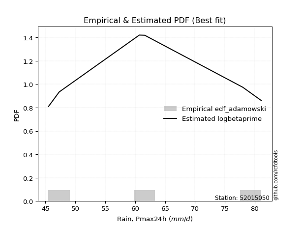</img>

</div>


## C. Best fit & Estimate extreme values for specific return periods - Tr

Best fit in probability distribution analysis means finding the theoretical distribution (like Normal, Poisson, Exponential, etc.) that most accurately mirrors your real-world data´s patterns (shape, center, spread) for better predictions, using methods like visual checks (Q-Q plots), goodness-of-fit tests (Kolmogorov-Smirnov, Chi-Squared), and information criteria (AIC) to score and select the simplest, most representative model.


### 1. Best fit (ordered by delta Δ)

:file_folder:Table: [bestfit_52015050.csv](table/bestfit_52015050.csv)

<div align="center">

|   id |   station | empirical_dist   | p_dist    |     delta |   deltao | eval   |   fit |   n |   best_fit |   best_fit_sort |
|-----:|----------:|:-----------------|:----------|----------:|---------:|:-------|------:|----:|-----------:|----------------:|
|    0 |  52015050 | edf_hazen        | pearson3  | 0.0807544 | 0.484421 | Δo > Δ |     1 |   7 |          1 |               1 |
|    1 |  52015050 | edf_gringorten   | pearson3  | 0.0833313 | 0.484421 | Δo > Δ |     1 |   7 |          1 |               2 |
|    2 |  52015050 | edf_cunnane      | pearson3  | 0.0864524 | 0.484421 | Δo > Δ |     1 |   7 |          1 |               3 |
|    3 |  52015050 | edf_blom         | pearson3  | 0.0883681 | 0.484421 | Δo > Δ |     1 |   7 |          1 |               4 |
|    4 |  52015050 | edf_adamowski    | trapezoid | 0.0890474 | 0.484421 | Δo > Δ |     1 |   7 |          1 |               5 |
|    5 |  52015050 | edf_weibull      | trapezoid | 0.0913922 | 0.484421 | Δo > Δ |     1 |   7 |          1 |               6 |
|    6 |  52015050 | edf_tukey        | pearson3  | 0.0915029 | 0.484421 | Δo > Δ |     1 |   7 |          1 |               7 |
|    7 |  52015050 | edf_chegodayev   | trapezoid | 0.092651  | 0.484421 | Δo > Δ |     1 |   7 |          1 |               8 |
|    8 |  52015050 | edf_filliben     | pearson3  | 0.0926755 | 0.484421 | Δo > Δ |     1 |   7 |          1 |               9 |
|    9 |  52015050 | edf_jenkinson    | pearson3  | 0.0932274 | 0.484421 | Δo > Δ |     1 |   7 |          1 |              10 |
|   10 |  52015050 | edf_beard        | pearson3  | 0.0932274 | 0.484421 | Δo > Δ |     1 |   7 |          1 |              11 |
|   11 |  52015050 | edf_california   | triang    | 0.109305  | 0.484421 | Δo > Δ |     1 |   7 |          1 |              12 |

</div>


### 2. Extreme values and % difference analysis

In hydrology, a return period (or recurrence interval $Tr$) is the statistical average time between extreme events like floods or droughts of a specific magnitude, indicating how rare an event is, with a 100-year flood, for example, having a 1% chance of occurring in any given year, not that it happens exactly every century. It is a key tool for infrastructure design (like bridges or dams) and risk assessment, calculated from historical data to determine the probability of future events, although it is important to remember it is statistical average, and events can cluster or be missed.

The extreme value porcentage difference is evaluated as $pdiff = 1 - (ETrBf / ETr) * 100$, where _ETrBf_ correspond to the bestfit extreme value for a specific recurrence interval and _ETr_ correspond to the extreme value for one of the most used PDFsused in hydrology.

> risk_rate: assuming the return period as the project useful life.

:file_folder:Table: [extreme_52015050.csv](table/extreme_52015050.csv), all PDFs.  
:file_folder:Table: [extremepdiff_52015050.csv](table/extremepdiff_52015050.csv), % difference between bestfit and most used PDFs in Hydrology.

<div align="center">

Extreme values table for only best fit PDFs
|   id |      tr |   prob_l |     prob_g |    alpha |   anglit |   arcsine |   argus |    beta |   betaprime |   bradford |    burr |   burr12 |   cosine |   crystalball |   dgamma |   dweibull |   erlang |   exponnorm |   exponpow |   exponweib |        f |   fatiguelife |   foldnorm |    gamma |   gausshyper |   genexpon |   genextreme |   gengamma |   genhalflogistic |   genlogistic |   gennorm |   genpareto |   gompertz |   gumbel_l |   gumbel_r |   halfgennorm |   halflogistic |   halfnorm |   hypsecant |   invgamma |   invgauss |   invweibull |   johnsonsb |   johnsonsu |   kappa3 |   kappa4 |   ksone |   kstwobign |   laplace |   levy_l |   loggamma |   logistic |   loglaplace |    lomax |   maxwell |   mielke |    moyal |   nakagami |      ncf |      nct |     norm |   pearson3 |   powerlaw |   rayleigh |    rdist |     rice |   semicircular |   skewnorm |        t |   trapezoid |   triang |   truncexpon |   truncnorm |   truncpareto |   truncweibull_min |   tukeylambda |   uniform |   vonmises |   vonmises_line |     wald |   weibull_max |   weibull_min |   wrapcauchy |   logalpha |   loganglit |   logarcsine |   logargus |   logbeta |   logbetaprime |   logbradford |   logburr |   logburr12 |   logcosine |   logcrystalball |   logdgamma |   logdweibull |   logerlang |   logexponnorm |   logexponpow |   logexponweib |     logf |   logfatiguelife |   logfoldnorm |   loggausshyper |   loggenexpon |   loggenextreme |   loggengamma |   loggenhalflogistic |   loggenlogistic |   loggennorm |   loggenpareto |   loggompertz |   loggumbel_l |   loggumbel_r |   loghalfgennorm |   loghalflogistic |   loghalfnorm |   loghypsecant |   loginvgamma |   loginvgauss |   loginvweibull |   logjohnsonsb |   logjohnsonsu |   logkappa3 |   logkappa4 |   logksone |   logkstwobign |   loglevy_l |   logloggamma |   loglogistic |   logloglaplace |    loglomax |   logmaxwell |   logmielke |   logmoyal |   lognakagami |   logncf |   lognct |   lognorm |   logpearson3 |   logpowerlaw |   lograyleigh |   logrdist |   logrice |   logsemicircular |   logskewnorm |             logt |   logtrapezoid |   logtriang |   logtruncexpon |   logtruncnorm |   logtruncpareto |   logtruncweibull_min |   logtukeylambda |   loguniform |   logvonmises |   logvonmises_line |   logwald |   logweibull_max |   logweibull_min |   logwrapcauchy |   station |   n |   risk_rate |
|-----:|--------:|---------:|-----------:|---------:|---------:|----------:|--------:|--------:|------------:|-----------:|--------:|---------:|---------:|--------------:|---------:|-----------:|---------:|------------:|-----------:|------------:|---------:|--------------:|-----------:|---------:|-------------:|-----------:|-------------:|-----------:|------------------:|--------------:|----------:|------------:|-----------:|-----------:|-----------:|--------------:|---------------:|-----------:|------------:|-----------:|-----------:|-------------:|------------:|------------:|---------:|---------:|--------:|------------:|----------:|---------:|-----------:|-----------:|-------------:|---------:|----------:|---------:|---------:|-----------:|---------:|---------:|---------:|-----------:|-----------:|-----------:|---------:|---------:|---------------:|-----------:|---------:|------------:|---------:|-------------:|------------:|--------------:|-------------------:|--------------:|----------:|-----------:|----------------:|---------:|--------------:|--------------:|-------------:|-----------:|------------:|-------------:|-----------:|----------:|---------------:|--------------:|----------:|------------:|------------:|-----------------:|------------:|--------------:|------------:|---------------:|--------------:|---------------:|---------:|-----------------:|--------------:|----------------:|--------------:|----------------:|--------------:|---------------------:|-----------------:|-------------:|---------------:|--------------:|--------------:|--------------:|-----------------:|------------------:|--------------:|---------------:|--------------:|--------------:|----------------:|---------------:|---------------:|------------:|------------:|-----------:|---------------:|------------:|--------------:|--------------:|----------------:|------------:|-------------:|------------:|-----------:|--------------:|---------:|---------:|----------:|--------------:|--------------:|--------------:|-----------:|----------:|------------------:|--------------:|-----------------:|---------------:|------------:|----------------:|---------------:|-----------------:|----------------------:|-----------------:|-------------:|--------------:|-------------------:|----------:|-----------------:|-----------------:|----------------:|----------:|----:|------------:|
|    0 |    2    | 0.5      | 0.5        |  51.1971 |  55.0429 |   55.0429 | 60.1005 | 57.5865 |     54.7251 |    40.0861 | 57.0319 |  31.0141 |  52.3441 |       55.0429 |  54.5643 |    60.7    |  54.1769 |     55.0429 |    59.692  |     54.2393 |  55.0395 |       11.1    |    60.4605 |  54.3174 |      78.0429 |    41.5581 |      63.9547 |    59.6019 |           59.0334 |           inf |   60.7    |     62.0034 |    58.6787 |    58.6437 |    51.442  |       32.6441 |        49.6518 |    50.5561 |     55.0429 |    53.7345 |    53.1307 |      52.4984 |     81.0372 |     61.5494 |  46.3212 |  45.1441 | 46.1    |     49.8471 |   55.0429 |  66.6147 |    47.2268 |    55.0429 |      47.7385 |  46.6688 |   53.1682 |  54.8292 |  50.2795 |    53.9425 |  51.8345 |  55.038  |  55.0429 |    57.7899 |    12.3944 |    52.5034 |  5.38547 |  54.6069 |        55.0429 |    58.1347 |  55.0414 |     58.4559 |  55.3954 |      35.9729 |     55.0429 |       11.6875 |            51.9679 |       42.9238 |   46.1    | -2.05461   |         46.0834 |  47.9377 |       80.8016 |       58.9084 |      46.1    |    45.765  |     47.7385 |      47.7384 |    56.7025 |   66.1573 |        47.1567 |       29.9713 |   54.458  |     54.9223 |     41.3166 |          47.7385 |     60.7    |       61.6    |     46.5151 |        47.7385 |       17.0689 |  14.6746       |  47.7496 |          47.5784 |       47.8963 |         40.1325 |       39.0929 |         51.4448 |       48.2556 |              44.1712 |         inf      |      61.6    |        24.7965 |       53.2959 |       52.9409 |       43.0473 |          29.9749 |           40.8899 |       41.9663 |        47.7385 |       46.0193 |       45.4955 |         44.1985 |        32.5528 |        81.0758 |     11.0999 |     29.996  |    30.0035 |        40.3401 |     65.8646 |       56.2249 |       47.7385 |         60.7    |     30.8796 |      45.2358 |      0      |    41.6335 |       51.7076 |  47.5667 |  47.7172 |   47.7385 |       56.0577 |       11.6792 |       44.38   |    24.6896 |   47.7385 |           47.7386 |       46.5556 |     59.7087      |        53.1844 |     40.5784 |         25.2066 |        55.8663 |          11.3145 |               28.2366 |          30.0344 |      30.0035 |     0.0957742 |            55.4691 |   38.9254 |          72.5327 |    14.6856       |         30.0035 |  52015050 |   7 |    0.75     |
|    1 |    2.33 | 0.570815 | 0.429185   |  56.0461 |  59.5989 |   61.8823 | 63.67   | 61.7794 |     58.6742 |    45.0665 | 61.1287 |  38.6531 |  56.5781 |       58.9543 |  60.3259 |    63.1287 |  58.221  |     58.9542 |    63.1133 |     58.6168 |  58.9753 |       12.4929 |    60.4848 |  58.3643 |      79.6376 |    48.2689 |      67.6237 |    62.9801 |           63.3997 |           inf |   61.6777 |     67.2344 |    62.0835 |    62.0467 |    55.0663 |       41.317  |        53.3782 |    54.7775 |     58.1731 |    57.8196 |    57.5161 |      57.6677 |     81.0838 |     64.8768 |  51.3096 |  50.3621 | 52.0485 |     55.0456 |   57.4099 |  71.0252 |    53.1493 |    58.4891 |      51.0973 |  54.5057 |   57.2319 |  59.094  |  53.7104 |    56.9557 |  56.6126 |  58.9518 |  58.9543 |    61.5035 |    13.8749 |    56.6272 | 14.6189  |  58.6158 |        59.9293 |    61.7996 |  58.9525 |     62.9583 |  59.6445 |      41.3224 |     58.9543 |       12.078  |            56.1777 |       48.5926 |   51.0571 | -1.80069   |         51.0428 |  50.5025 |       80.9759 |       62.2791 |      52.6235 |    51.874  |     54.4137 |      58.1026 |    60.4815 |   69.8554 |        53.0165 |       34.5089 |   58.7596 |     58.7015 |     46.9793 |          53.4152 |     64.0098 |       64.8493 |     52.332  |        53.4152 |       19.5514 |  23.7496       |  53.4453 |          53.2393 |       53.2411 |         46.8979 |       45.9015 |         56.735  |       53.8136 |              49.7444 |         inf      |      62.8258 |        33.384  |       57.4091 |       58.3774 |       47.7707 |          37.5655 |           45.5096 |       47.3764 |        52.23   |       51.8399 |       51.5607 |         52.0764 |        59.0389 |        81.0934 |     11.0999 |     34.9656 |    35.5277 |        47.7948 |     70.1784 |       60.3023 |       52.7062 |         65.2201 |     38.6878 |      50.8368 |      0      |    45.9458 |       53.9803 |  53.6587 |  53.4072 |   53.4152 |       61.5009 |       12.2979 |       49.9612 |    32.0149 |   53.4133 |           54.9325 |       50.8675 |     62.8171      |        60.5277 |     45.4995 |         28.9524 |        58.0122 |          11.4561 |               32.1972 |          34.7105 |      34.541  |     0.106171  |            60.1213 |   41.9014 |          78.1248 |    24.1078       |         47.0832 |  52015050 |   7 |    0.729209 |
|    2 |    5    | 0.8      | 0.2        |  76.4531 |  75.6738 |   80.1205 | 73.731  | 73.2923 |     73.49   |    62.9706 | 72.8784 | inf      |  71.8362 |       73.4901 |  72.3151 |    80.1475 |  73.5262 |     73.4901 |    73.5941 |     75.6849 |  73.6161 |       42.0816 |    60.5875 |  73.6753 |      81.0642 |    81.8215 |      76.3658 |    73.497  |           74.5731 |           inf |   71.3745 |     78.3018 |    73.1331 |    73.0403 |    70.8121 |      108.14   |        70.2394 |    72.6294 |     70.7295 |    73.5985 |    75.0352 |      80.1256 |     81.0999 |     74.3476 |  67.4539 |  67.312  | 71.3    |     77.1277 |   69.2443 |  78.3325 |    83.0249 |    71.7954 |      71.7857 |  93.6882 |   73.2262 |  71.6506 |  69.6027 |    72.2635 |  76.6778 |  73.4978 |  73.4901 |    73.8176 |    30.4726 |    73.1365 | 39.2659  |  73.6317 |        76.6048 |    72.4739 |  73.4872 |     75.8754 |  71.8348 |      60.7256 |     73.4901 |       17.8051 |            69.4403 |       66.669  |   67.1    | -0.810122  |         67.0933 |  64.86   |       81.0973 |       73.1683 |      69.9774 |    84.1193 |     86.3476 |      98.1147 |    72.0178 |   78.2342 |        82.2708 |       54.4615 |   71.6487 |     72.7805 |     74.632  |          81.0973 |     86.9085 |       90.5736 |     81.6536 |        81.0972 |       39.5568 |   2.23573e+09  |  81.2383 |          80.8655 |       78.8846 |         70.0425 |       87.3809 |         71.5855 |       80.1836 |              67.5648 |         inf      |      75.346  |        65.7835 |       73.0786 |       80.0561 |       75.0927 |         118.793  |           73.8661 |       79.1153 |        74.9145 |       81.4868 |       83.6857 |        106.196  |        80.7988 |        81.0999 |     11.0999 |     56.3327 |    61.3908 |        98.2206 |     77.9561 |       72.08   |       77.2439 |         95.1754 |    119.417  |      80.4849 |     71.8812 |    72.5285 |       66.8484 |  84.3669 |  81.1824 |   81.0972 |       79.8324 |       20.4484 |       80.2772 |    64.2892 |   81.0834 |           88.6868 |       65.8385 |     78.7888      |        87.7204 |     63.1867 |         47.8529 |        67.2868 |          13.6512 |               50.8849 |          55.2443 |      54.4855 |     0.156602  |            82.0445 |   63.2907 |          81.0739 |     1.28169e+10  |         71.9885 |  52015050 |   7 |    0.67232  |
|    3 |   10    | 0.9      | 0.1        |  92.5154 |  84.7723 |   84.5234 | 77.9448 | 77.5029 |     83.4402 |    71.7208 | 77.4664 | inf      |  81.0546 |       83.1328 |  80.8739 |    98.1037 |  83.9209 |     83.1327 |    78.9575 |     87.7045 |  83.3408 |       82.9359 |    60.6634 |  84.0702 |      81.0988 |   112.28   |      79.0807 |    79.0919 |           78.2497 |           inf |   85.7691 |     80.4455 |    79.3076 |    79.161  |    83.6369 |      207.239  |        84.242  |    85.8393 |     80.7561 |    84.6109 |    87.7765 |      98.4172 |     81.1    |     78.7164 |  74.4982 |  74.5987 | 79.7    |     93.9405 |   79.9873 |  80.0966 |   112.297  |    81.595  |      97.7376 | 129.257  |   84.4822 |  76.6751 |  83.4394 |    84.8999 |  92.1828 |  83.1485 |  83.1328 |    80.7569 |    49.2657 |    84.908  | 45.2344  |  83.6678 |        85.1613 |    76.8214 |  83.1291 |     80.9208 |  76.5964 |      70.4304 |     83.1328 |       30.4565 |            75.224  |       74.216  |   74.1    | -0.0999816 |         74.0967 |  80.0966 |       81.0999 |       79.2309 |      75.7708 |   117.836  |    112.14   |     111.343  |    77.299  |   80.2476 |       110.512  |       66.4591 |   76.9038 |     82.035  |     98.7129 |         106.98   |    116.052  |      127.356  |    110.357  |       106.98   |       73.4331 |   3.66032e+50  | 107.259  |         106.725  |      102.391  |         77.7285 |      138.364  |         76.9153 |      103.906  |              74.8194 |         inf      |      97.4609 |        76.6529 |       83.6316 |       95.445  |      108.541  |         346.374  |          110.44   |      115.625  |        99.92   |      110.953  |      117.398  |        189.743  |        81.085  |        81.1    |     11.0999 |     68.3852 |    77.9376 |       169.972  |     79.9596 |       76.7099 |      102.357  |        138.062  |    332.212  |     111.208  |     76.6754 |   107.926  |       79.5761 | 114.373  | 107.188  |  106.98   |       89.185  |       34.6759 |      112.576  |    76.3202 |  106.952  |          113.397  |       73.1328 |    100.965       |       101.402  |     71.8346 |         61.524  |        73.1577 |          19.7797 |               63.5863 |          67.349  |      66.4739 |     0.205142  |           103.581  |   98.0436 |          81.0995 |     5.12639e+57  |         76.8517 |  52015050 |   7 |    0.651322 |
|    4 |   15    | 0.933333 | 0.0666667  | 101.459  |  88.6576 |   85.3632 | 79.4541 | 78.7944 |     88.4421 |    74.7752 | 78.9383 | inf      |  85.2537 |       87.9447 |  85.5434 |   109.253  |  89.1807 |     87.9446 |    81.2621 |     93.8933 |  88.1974 |      109.655  |    60.7029 |  89.3289 |      81.0998 |   130.097  |      79.8514 |    81.5673 |           79.3165 |           inf |   96.5369 |     80.8202 |    82.1074 |    81.9329 |    90.8725 |      284.613  |        92.1662 |    92.7137 |     86.4782 |    90.2771 |    94.486  |     108.737  |     81.1    |     80.471  |  76.8462 |  76.9768 | 82.5    |    102.866  |   86.2715 |  80.6295 |   130.802  |    86.9343 |     117.074  | 150.063  |   90.2575 |  78.3006 |  91.4696 |    91.6414 | 100.641  |  87.9647 |  87.9447 |    83.8739 |    58.1544 |    90.9732 | 46.3759  |  88.6926 |        88.498  |    78.2518 |  87.9406 |     82.5397 |  78.1242 |      73.8705 |     87.9447 |       39.9403 |            77.1693 |       76.632  |   76.4333 |  0.233723  |         76.4311 |  89.8809 |       81.1    |       81.9765 |      77.5754 |   140.144  |    125.381  |     114.062  |    79.2638 |   80.6791 |       128.185  |       71.0193 |   78.6163 |     86.6047 |    112.123  |         122.838  |    137.704  |      156.925  |    128.494  |       122.838  |      103.54   |   8.92053e+111 | 123.215  |         122.581  |      116.623  |         79.4586 |      175.357  |         78.4932 |      118.067  |              77.0873 |         inf      |     117.616  |        79.0039 |       88.9069 |      103.356  |      133.616  |         653.369  |          138.669  |      140.867  |       117.771  |      129.773  |      139.741  |        263.254  |        81.0966 |        81.1    |     11.0999 |     72.6982 |    84.3907 |       227.415  |     80.5748 |       78.1986 |      119.324  |        173.982  |    604.425  |     131.277  |     78.2193 |   135.928  |       87.3077 | 133.292  | 123.135  |  122.838  |       92.8444 |       44.1523 |      134.002  |    78.9043 |  122.801  |          124.804  |       75.7052 |    122.14        |       106.228  |     74.8527 |         67.2556 |        75.5183 |          25.9351 |               68.7817 |          71.8439 |      71.0299 |     0.236292  |           118.195  |  129.861  |          81.0999 |     1.02643e+131 |         78.2912 |  52015050 |   7 |    0.644736 |
|    5 |   20    | 0.95     | 0.05       | 107.699  |  90.9432 |   85.6589 | 80.2623 | 79.4148 |     91.7309 |    76.3291 | 79.6644 | inf      |  87.836  |       91.0959 |  88.7623 |   117.391  |  92.6515 |     91.0958 |    82.6564 |     98.0071 |  91.3792 |      129.438  |    60.7292 |  92.7985 |      81.1    |   142.738  |      80.2082 |    83.0907 |           79.8159 |           inf |  105.223  |     80.9469 |    83.8511 |    83.6583 |    95.9387 |      349.03   |        97.7181 |    97.297  |     90.5148 |    94.0513 |    99.0105 |     115.963  |     81.1    |     81.4915 |  78.0203 |  78.1482 | 83.9    |    108.879  |   90.7303 |  80.9025 |   144.64   |    90.6246 |     133.071  | 164.826  |   94.0904 |  79.1049 |  97.1567 |    96.1659 | 106.457  |  91.1188 |  91.0959 |    85.7952 |    63.2018 |    95.0046 | 46.7787  |  91.9882 |        90.3487 |    78.9649 |  91.0916 |     83.3383 |  78.8779 |      75.6327 |     91.0959 |       46.6695 |            78.1465 |       77.8101 |   77.6    |  0.425774  |         77.5984 |  97.1722 |       81.1    |       83.6855 |      78.4639 |   157.3    |    133.889  |     115.035  |    80.3327 |   80.8447 |       141.319  |       73.4155 |   79.4657 |     89.5769 |    121.26   |         134.477  |    155.559  |      182.579  |    142.051  |       134.476  |      130.995  |   1.2996e+184  | 134.93   |         134.223  |      126.998  |         80.1197 |      205.274  |         79.233  |      128.3    |              78.1781 |         inf      |     136.613  |        79.877  |       92.3593 |      108.607  |      154.548  |        1028.4    |          162.644  |      160.688  |       132.251  |      143.936  |      156.933  |        331.089  |        81.0987 |        81.1    |     11.0999 |     74.8795 |    87.815  |       276.69   |     80.8918 |       78.9336 |      132.668  |        206.325  |    924.195  |     146.556  |     78.982  |   160.051  |       92.9094 | 147.413  | 134.845  |  134.476  |       94.8819 |       50.559  |      150.454  |    79.845  |  134.432  |          131.619  |       77.0213 |    144.005       |       108.693  |     76.388  |         70.3955 |        76.7957 |          31.3568 |               71.6018 |          74.1691 |      73.4236 |     0.260085  |           129.875  |  160.118  |          81.1    |     8.60434e+218 |         78.9967 |  52015050 |   7 |    0.641514 |
|    6 |   25    | 0.96     | 0.04       | 112.503  |  92.492  |   85.7961 | 80.7762 | 79.7774 |     94.1587 |    77.2701 | 80.0971 | inf      |  89.647  |       93.4156 |  91.2168 |   123.818  |  95.2198 |     93.4155 |    83.6298 |    101.063  |  93.7221 |      145.156  |    60.7488 |  95.3658 |      81.1    |   152.543  |      80.4119 |    84.1667 |           80.103  |           inf |  112.56   |     81.0041 |    85.0923 |    84.8861 |    99.841  |      404.757  |       101.996  |   100.707  |     93.6389 |    96.8624 |   102.408  |     121.529  |     81.1    |     82.184  |  78.7247 |  78.843  | 84.74   |    113.382  |   94.1887 |  81.0737 |   155.805  |    93.4477 |     146.971  | 176.276  |   96.9359 |  79.5847 | 101.565  |    99.5414 | 110.883  |  93.4408 |  93.4156 |    87.1504 |    66.4393 |    97.9998 | 46.9657  |  94.4165 |        91.5494 |    79.3924 |  93.4111 |     83.8141 |  79.3269 |      76.7041 |     93.4156 |       51.5844 |            78.7344 |       78.5043 |   78.3    |  0.549109  |         78.2987 | 103.012  |       81.1    |       84.9017 |      78.9939 |   171.429  |    139.98   |     115.49   |    81.0184 |   80.9267 |       151.869  |       74.8918 |   79.9734 |     91.7538 |    128.108  |         143.743  |    171.029  |      205.672  |    152.989  |       143.743  |      156.457  |   3.00432e+262 | 144.261  |         143.495  |      135.222  |         80.4438 |      230.765  |         79.6576 |      136.356  |              78.8148 |         inf      |     154.866  |        80.2961 |       94.8982 |      112.506  |      172.88   |        1464.67   |          183.908  |      177.225  |       144.668  |      155.417  |      171.097  |        395.04   |        81.0994 |        81.1    |     11.0999 |     76.1866 |    89.9359 |       320.475  |     81.0913 |       79.3717 |      143.875  |        236.395  |   1284.73   |     159.039  |     79.4366 |   181.657  |       97.32   | 158.79   | 144.172  |  143.743  |       96.2082 |       55.1184 |      163.972  |    80.2887 |  143.692  |          136.237  |       77.821  |    167.124       |       110.189  |     77.3176 |         72.3757 |        77.5969 |          35.9833 |               73.3718 |          75.5853 |      74.8985 |     0.279701  |           139.81   |  189.363  |          81.1    |   inf            |         79.4176 |  52015050 |   7 |    0.639603 |
|    7 |   50    | 0.98     | 0.02       | 127.355  |  96.3047 |   85.9794 | 81.9205 | 80.475  |    101.142  |    79.1718 | 80.9594 | inf      |  94.389  |      100.058  |  98.6595 |   144.345  | 102.637  |    100.058  |    86.1935 |    109.923  | 100.435  |      195.586  |    60.8057 | 102.779  |      81.1    |   183.001  |      80.7904 |    87.0556 |           80.6429 |           inf |  138.711  |     81.0776 |    88.463  |    88.219  |   111.862  |      612.31   |       115.175  |   110.619  |    103.325  |   105.069  |   112.459  |     138.674  |     81.1    |     83.9227 |  80.1335 |  80.2057 | 86.42   |    126.607  |  104.932  |  81.4594 |   193.086  |   102.073  |     200.103  | 211.845  |  105.188  |  80.5387 | 115.249  |   109.372  | 124.272  | 100.09   | 100.058  |    90.762  |    73.4142 |   106.694  | 47.2161  | 101.38   |        94.2922 |    80.2465 | 100.053  |     84.7583 |  80.218  |      78.8796 |    100.058  |       64.0029 |            79.9144 |       79.8537 |   79.7    |  0.811467  |         79.6994 | 122.08   |       81.1    |       88.203  |      80.0488 |   220.373  |    156.182  |     116.099  |    82.5632 |   81.048  |       186.82   |       77.9341 |   80.9913 |     97.9336 |    147.928  |         173.963  |    229.84   |      300.141  |    189.495  |       173.963  |      264.823  | inf            | 174.71   |         173.754  |      161.836  |         80.9122 |      324.166  |         80.4507 |      162.127  |              80.0334 |         inf      |     240.657  |        80.8826 |      102.151  |      123.81   |      244.182  |        4432.72   |          268.544  |      235.599  |       191.076  |      194.072  |      220.168  |        680.618  |        81.0999 |        81.1    |     11.0999 |     78.7623 |    94.3326 |       493.333  |     81.5424 |       80.2414 |      184.329  |        368.812  |   3574.04   |     201.584  |     80.3396 |   269.136  |      111.392  | 196.675  | 174.607  |  173.963  |       99.2578 |       66.2965 |      210.493  |    80.892  |  173.89   |          147.406  |       79.4441 |    310.559       |       113.219  |     79.1961 |         76.5692 |        79.2851 |          50.7829 |               77.1    |          78.4494 |      77.9376 |     0.348872  |           175.343  |  327.47   |          81.1    |   inf            |         80.2575 |  52015050 |   7 |    0.63583  |
|    8 |   75    | 0.986667 | 0.0133333  | 136.068  |  97.9827 |   86.0134 | 82.3666 | 80.6963 |    104.908  |    79.8116 | 81.2553 | inf      |  96.6535 |      103.623  | 102.914  |   156.698  | 106.656  |    103.623  |    87.4464 |    114.729  | 104.038  |      225.958  |    60.8366 | 106.795  |      81.1    |   200.818  |      80.9054 |    88.4992 |           80.8095 |           inf |  156.386  |     81.0904 |    90.1682 |    89.9044 |   118.849  |      759.711  |       122.836  |   116.015  |    108.985  |   109.57   |   118.052  |     148.64   |     81.1    |     84.7236 |  80.6032 |  80.6477 | 86.98   |    133.883  |  111.216  |  81.6179 |   216.852  |   107.055  |     239.692  | 232.652  |  109.675  |  80.855  | 123.252  |   114.726  | 131.912  | 103.658  | 103.623  |    92.541  |    75.8944 |   111.425  | 47.2626  | 105.122  |        95.388  |    80.531  | 103.617  |     85.0709 |  80.513  |      79.6146 |    103.623  |       69.095  |            80.3089 |       80.2871 |   80.1667 |  0.902432  |         80.1663 | 133.814  |       81.1    |       89.8724 |      80.3994 |   252.93   |    163.895  |     116.212  |    83.1721 |   81.0743 |       208.899  |       78.9755 |   81.3454 |    101.215  |    158.447  |         192.718  |    273.373  |      376.254  |    212.758  |       192.718  |      354.335  | inf            | 193.62   |         192.545  |      178.215  |         81.0098 |      390.017  |         80.6923 |      177.768  |              80.4165 |         inf      |     322.804  |        80.999  |      106.029  |      129.952  |      298.457  |        8520.74   |          334.648  |      275.095  |       224.814  |      218.956  |      252.802  |        933.745  |        81.1    |        81.1    |     11.0999 |     79.5928 |    95.8454 |       625.486  |     81.7285 |       80.5295 |      212.688  |        486.282  |   6502.6    |     229.314  |     80.6387 |   338.694  |      119.892  | 220.745  | 193.509  |  192.718  |      100.488  |       70.7666 |      241.129  |    81.0064 |  192.631  |          152.119  |       79.9924 |    517.987       |       114.24   |     79.828  |         78.0403 |        79.8753 |          58.4202 |               78.4019 |          79.4058 |      78.9778 |     0.396901  |           197.569  |  458.722  |          81.1    |   inf            |         80.5377 |  52015050 |   7 |    0.634587 |
|    9 |  100    | 0.99     | 0.01       | 142.292  |  98.9804 |   86.0253 | 82.6138 | 80.8039 |    107.463  |    80.1326 | 81.4131 | inf      |  98.0729 |      106.033  | 105.898  |   165.601  | 109.389  |    106.033  |    88.2503 |    117.995  | 106.476  |      247.811  |    60.8577 | 109.526  |      81.1    |   213.459  |      80.9599 |    89.4375 |           80.8892 |           inf |  170.003  |     81.0948 |    91.2837 |    91.0068 |   123.794  |      876.793  |       128.259  |   119.69   |    113      |   112.654  |   121.915  |     155.693  |     81.1    |     85.2193 |  80.838  |  80.8649 | 87.26   |    138.869  |  115.675  |  81.7106 |   234.654  |   110.572  |     272.444  | 247.414  |  112.731  |  81.0132 | 128.929  |   118.37   | 137.269  | 106.072  | 106.033  |    93.6836 |    77.1648 |   114.647  | 47.2789  | 107.655  |        96.0015 |    80.6733 | 106.028  |     85.2268 |  80.6601 |      79.9841 |    106.033  |       71.8545 |            80.5064 |       80.4992 |   80.4    |  0.948336  |         80.3997 | 142.369  |       81.1    |       90.9643 |      80.5746 |   277.979  |    168.66   |     116.252  |    83.511  |   81.0844 |       225.345  |       79.5013 |   81.5368 |    103.421  |    165.418  |         206.537  |    309.237  |      442.557  |    230.18   |       206.537  |      432.663  | inf            | 207.559  |         206.397  |      190.222  |         81.0464 |      442.393  |         80.8068 |      189.136  |              80.6015 |         inf      |     403.998  |        81.0414 |      108.645  |      134.133  |      344.014  |       13578.6    |          391.051  |      305.729  |       252.298  |      237.71   |      277.899  |       1167.94   |        81.1    |        81.1    |     11.0999 |     79.9974 |    96.6109 |       735.938  |     81.8375 |       80.6731 |      235.3    |        596.249  |   9942.78   |     250.356  |     80.788  |   398.691  |      126.047  | 238.737  | 207.442  |  206.537  |      101.181  |       73.1658 |      264.516  |    81.0469 |  206.439  |          154.824  |       80.2679 |    815.029       |       114.753  |     80.145  |         78.7903 |        80.1758 |          63.0124 |               79.0644 |          79.8817 |      79.5031 |     0.435502  |           212.426  |  586.508  |          81.1    |   inf            |         80.678  |  52015050 |   7 |    0.633968 |
|   10 |  200    | 0.995    | 0.005      | 157.507  | 100.865  |   86.0367 | 83.0401 | 80.9595 |    113.282  |    80.6155 | 81.6932 | inf      | 100.959  |      111.502  | 112.99   |   187.476  | 115.634  |    111.502  |    89.9557 |    125.43   | 112.009  |      301.304  |    60.9059 | 115.766  |      81.1    |   243.917  |      81.0364 |    91.4613 |           81.0025 |           inf |  206.521  |     81.0988 |    93.7091 |    93.403  |   135.683  |     1204.49   |       141.295  |   128.097  |    122.673  |   119.77   |   130.923  |     172.65   |     81.1    |     86.2206 |  81.192  |  81.1835 | 87.68   |    150.351  |  126.418  |  81.8861 |   280.964  |   119.009  |     370.938  | 282.983  |  119.723  |  81.2558 | 142.608  |   126.693  | 150.015  | 111.546  | 111.502  |    96.1002 |    79.1089 |   122.021  | 47.2947  | 113.406  |        97.0713 |    80.8866 | 111.496  |     85.4601 |  80.8803 |      80.5406 |    111.502  |       76.2863 |            80.803  |       80.8092 |   80.75   |  1.01755   |         80.7499 | 163.678  |       81.1    |       93.3377 |      80.8373 |   345.688  |    178.045  |     116.291  |    84.0986 |   81.0953 |       267.792  |       80.2967 |   81.8834 |    108.383  |    180.553  |         241.667  |    416.409  |      658.254  |    275.487  |       241.667  |      685.107  | inf            | 243.012  |         241.631  |      220.544  |         81.0847 |      590.259  |         80.9673 |      217.492  |              80.8668 |         inf      |     732.564  |        81.0842 |      114.558  |      143.691  |      484.055  |       42039.6    |          568.671  |      389.233  |       333.11   |      286.927  |      345.671  |       2000.25   |        81.1    |        81.1    |     11.0999 |     80.5821 |    97.7706 |      1070.3    |     82.0444 |       80.8882 |      299.832  |       1001.71   |  27660.3    |     306.045  |     81.0114 |   590.588  |      141.317  | 285.391  | 242.883  |  241.667  |      102.4    |       76.9881 |      326.919  |    81.0864 |  241.54   |          159.655  |       80.6829 |   3697.59        |       115.525  |     80.6219 |         79.9338 |        80.6336 |          71.1304 |               80.0731 |          80.5883 |      80.2976 |     0.549906  |           240.889  | 1081.71   |          81.1    |   inf            |         80.8888 |  52015050 |   7 |    0.633042 |
|   11 |  250    | 0.996    | 0.004      | 162.491  | 101.345  |   86.0381 | 83.1393 | 80.9895 |    115.066  |    80.7123 | 81.7655 | inf      | 101.75   |      113.173  | 115.248  |   194.635  | 117.555  |    113.173  |    90.4467 |    127.705  | 113.7    |      318.737  |    60.9207 | 117.685  |      81.1    |   253.723  |      81.0507 |    92.0528 |           81.0239 |           inf |  219.404  |     81.0992 |    94.4228 |    94.108  |   139.505  |     1324.48   |       145.486  |   130.683  |    125.787  |   121.979  |   133.745  |     178.101  |     81.1    |     86.4956 |  81.2646 |  81.2457 | 87.764  |    153.905  |  129.876  |  81.9318 |   296.957  |   121.718  |     409.682  | 294.433  |  121.875  |  81.308  | 147.012  |   129.249  | 154.081  | 113.219  | 113.173  |    96.7916 |    79.5033 |   124.291  | 47.2966  | 115.165  |        97.3222 |    80.9293 | 113.167  |     85.5067 |  80.9243 |      80.6522 |    113.173  |       77.2173 |            80.8624 |       80.8696 |   80.82   |  1.03142   |         80.8199 | 170.728  |       81.1    |       94.0361 |      80.8899 |   369.898  |    180.516  |     116.295  |    84.2358 |   81.0968 |       282.347  |       80.4568 |   81.9743 |    109.888  |    184.939  |         253.551  |    458.336  |      749.236  |    291.13   |       253.55   |      789.583  | inf            | 255.011  |         253.557  |      230.741  |         81.0898 |      645.057  |         80.9972 |      226.921  |              80.9173 |         inf      |     901.958  |        81.0896 |      116.358  |      146.63   |      540.227  |       60612.4    |          641.422  |      419.25   |       364.279  |      304.061  |      369.875  |       2377.95   |        81.1    |        81.1    |     11.0999 |     80.6941 |    98.0042 |      1201.84   |     82.0983 |       80.9312 |      324.094  |       1194.12   |  38450.7    |     325.563  |     81.056  |   670.225  |      146.37   | 301.456  | 254.878  |  253.551  |      102.688  |       77.7865 |      348.945  |    81.0913 |  253.414  |          160.81   |       80.7661 |   7091.27        |       115.679  |     80.7174 |         80.1652 |        80.7262 |          72.9607 |               80.277  |          80.7278 |      80.4574 |     0.59537   |           247.548  | 1324.51   |          81.1    |   inf            |         80.931  |  52015050 |   7 |    0.632858 |
|   12 |  500    | 0.998    | 0.002      | 178.303  | 102.535  |   86.0399 | 83.3666 | 81.0475 |    120.375  |    80.906  | 81.9611 | inf      | 103.855  |      118.128  | 122.199  |   217.209  | 123.288  |    118.128  |    91.8274 |    134.452  | 118.718  |      373.426  |    60.9649 | 123.411  |      81.1    |   284.181  |      81.0776 |    93.7388 |           81.0648 |           inf |  262.971  |     81.0998 |    96.4692 |    96.129  |   151.368  |     1745.53   |       158.494  |   138.394  |    135.459  |   128.625  |   142.305  |     195.021  |     81.1    |     87.2356 |  81.4225 |  81.3675 | 87.932  |    164.554  |  140.619  |  82.0497 |   350.251  |   130.118  |     557.79   | 330.002  |  128.298  |  81.4292 | 160.69   |   136.858  | 166.631  | 118.181  | 118.128  |    98.7177 |    80.2978 |   131.063  | 47.2992  | 120.384  |        97.9    |    81.0147 | 118.122  |     85.5999 |  81.0122 |      80.8759 |    118.128  |       79.1263 |            80.9812 |       80.9879 |   80.96   |  1.0592    |         80.96   | 193.144  |       81.1    |       96.0379 |      80.9949 |   453.499  |    186.791  |     116.301  |    84.5509 |   81.099  |       330.503  |       80.7778 |   82.2234 |    114.318  |    197.136  |         292.341  |    617.675  |     1125.34   |    343.242  |       292.34   |     1206.36   | inf            | 294.196  |         292.504  |      263.837  |         81.0971 |      840.713  |         81.0535 |      257.181  |              81.0145 |         inf      |    1811.42   |        81.0972 |      121.679  |      155.395  |      759.578  |      189992      |          932.007  |      523.199  |       480.95   |      361.622  |      453.324  |       4067.78   |        81.1    |        81.1    |     80.784  |     80.9098 |    98.4731 |      1701.01   |     82.2377 |       81.017  |      412.544  |       2120.8    | 106968      |     391.525  |     81.1458 |   992.808  |      162.504  | 354.823  | 294.051  |  292.34   |      103.359  |       79.4188 |      423.88   |    81.0978 |  292.169  |          163.502  |       80.9329 | 110837           |       115.989  |     80.9088 |         80.6308 |        80.9125 |          76.858  |               80.687  |          81.0032 |      80.7781 |     0.776706  |           261.804  | 2521.73   |          81.1    |   inf            |         81.0155 |  52015050 |   7 |    0.632489 |
|   13 |  750    | 0.998667 | 0.00133333 | 187.823  | 103.061  |   86.0403 | 83.4576 | 81.0661 |    123.336  |    80.9707 | 82.0632 | inf      | 104.876  |      120.881  | 126.227  |   230.631  | 126.495  |    120.881  |    92.5493 |    138.192  | 121.507  |      405.738  |    60.9896 | 126.615  |      81.1    |   301.998  |      81.0858 |    94.6343 |           81.0775 |           inf |  290.973  |     81.0999 |    97.563  |    97.2092 |   158.303  |     2027.63   |       166.099  |   142.702  |    141.117  |   132.38   |   147.187  |     204.912  |     81.1    |     87.6021 |  81.4874 |  81.4069 | 87.988  |    170.536  |  146.903  |  82.1057 |   384.105  |   135.026  |     668.143  | 350.809  |  131.89   |  81.4836 | 168.691  |   141.099  | 173.935  | 120.937  | 120.881  |    99.71   |    80.5644 |   134.85   | 47.2996  | 123.286  |        98.1326 |    81.0431 | 120.875  |     85.6309 |  81.0415 |      80.9505 |    120.881  |       79.7769 |            81.0208 |       81.0264 |   81.0067 |  1.06846   |         81.0067 | 206.584  |       81.1    |       97.1078 |      81.03   |   508.868  |    189.638  |     116.302  |    84.6774 |   81.0995 |       360.84   |       80.8851 |   82.3548 |    116.759  |    203.332  |         316.397  |    735.616  |     1431.99   |    376.336  |       316.397  |     1528.82   | inf            | 318.512  |         316.673  |      284.232  |         81.0986 |      974.97   |         81.0707 |      275.582  |              81.0451 |          81.0439 |    2823.47   |        81.0987 |      124.622  |      160.292  |      927.023  |      372119      |         1159.54   |      592.116  |       565.827  |      398.54   |      508.472  |       5567.49   |        81.1    |        81.1    |     80.8912 |     80.978  |    98.6299 |      2067.55   |     82.304  |       81.0456 |      475.005  |       3030.91   | 194616      |     434.083  |     81.177  |  1249.35   |      172.26   | 388.6    | 318.36   |  316.397  |      103.631  |       79.9737 |      472.594  |    81.099  |  316.204  |          164.598  |       80.9886 |      1.09459e+06 |       116.093  |     80.9726 |         80.7868 |        80.9749 |          78.2318 |               80.8244 |          81.0933 |      80.8852 |     0.920402  |           266.817  | 3709.91   |          81.1    |   inf            |         81.0436 |  52015050 |   7 |    0.632366 |
|   14 | 1000    | 0.999    | 0.001      | 194.717  | 103.375  |   86.0404 | 83.5087 | 81.0751 |    125.379  |    81.003  | 82.1326 | inf      | 105.519  |      122.777  | 129.069  |   240.245  | 128.713  |    122.777  |    93.0289 |    140.762  | 123.427  |      428.788  |    61.0066 | 128.83   |      81.1    |   314.639  |      81.0898 |    95.2349 |           81.0837 |           inf |  311.981  |     81.1    |    98.2992 |    97.9362 |   163.223  |     2244.72   |       171.493  |   145.677  |    145.131  |   134.992  |   150.6    |     211.929  |     81.1    |     87.8377 |  81.5267 |  81.4263 | 88.016  |    174.681  |  151.362  |  82.1409 |   409.394  |   138.507  |     759.442  | 365.571  |  134.373  |  81.5181 | 174.368  |   144.025  | 179.106  | 122.835  | 122.777  |   100.362  |    80.698  |   137.467  | 47.2998  | 125.284  |        98.2633 |    81.0573 | 122.77   |     85.6464 |  81.0561 |      80.9879 |    122.777  |       80.1049 |            81.0406 |       81.0453 |   81.03   |  1.07309   |         81.03   | 216.252  |       81.1    |       97.8279 |      81.0475 |   551.34   |    191.355  |     116.303  |    84.7484 |   81.0997 |       383.384  |       80.9388 |   82.4444 |    118.431  |    207.341  |         334.102  |    832.786  |     1701.15   |    401.053  |       334.101  |     1800.39   | inf            | 336.413  |         334.468  |      299.183  |         81.0992 |     1080.09   |         81.0789 |      288.958  |              81.06   |          81.0583 |    3931.55   |        81.0992 |      126.644  |      163.675  |     1067.73   |      600535      |         1353.87   |      644.941  |       634.985  |      426.287  |      550.706  |       6955.74   |        81.1    |        81.1    |     80.9448 |     81.0109 |    98.7084 |      2366.84   |     82.3456 |       81.0599 |      524.952  |       3943.77   | 297578      |     466.172  |     81.1939 |  1470.65   |      179.329  | 413.773  | 336.257  |  334.101  |      103.786  |       80.2532 |      509.49   |    81.0994 |  333.892  |          165.216  |       81.0164 |      8.37883e+06 |       116.144  |     81.0046 |         80.8649 |        81.0062 |          78.9336 |               80.8931 |          81.1379 |      80.9389 |     1.04237   |           269.369  | 4897.46   |          81.1    |   inf            |         81.0577 |  52015050 |   7 |    0.632305 |


</div>


<div align="center">

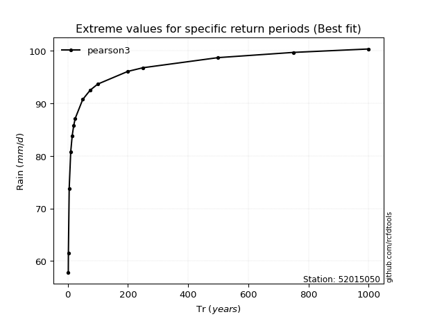</img>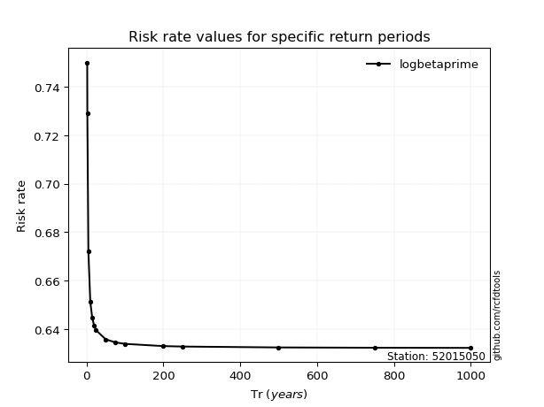</img>

</div>


<sub>**APP DISCLAIMER**: NO WARRANTY - This software is provided by [github.com/rcfdtools](https://github.com/rcfdtools) "as is", without any express or implied warranty, including warranties of merchantability, fitness for a particular purpose, or non-infringement. There is no guarantee that the software will be error-free or operate without interruption. LIMITATION OF LIABILITY - Neither the authors nor copyright holders will be liable for claims or damages arising from the software or its use. You are responsible for determining if the software is appropriate for your use and assume all associated risks, including errors, legal compliance, and data loss. NO PROFESSIONAL ADVICE - The software provides general information and does not offer professional advice. It should not replace consultation with professional advisors.</sub>