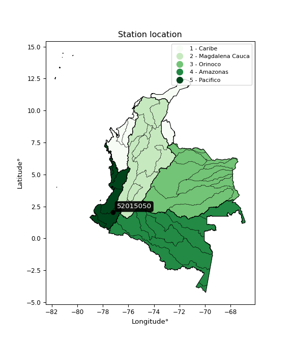

<div align="center">


</div>

# PMP Station (Rain, Pmax24h): 52015050

Probable Maximum Precipitation (PMP) is the greatest amount of rainfall for a specific duration that is meteorologically possible for a given location, acting as a "worst-case" scenario for extreme storms, crucial for designing safety-critical infrastructure like bridges, river deviations, dams, spillways, and nuclear plants to prevent catastrophic failure. PMP is calculated by hydrologists using meteorological data to determine the upper limit of extreme rainfall, often leading to the Probable Maximum Flood (PMF) for flood control design, and is increasingly being studied for climate change impacts. Probable Maximum Precipitation (PMP) is the theoretical upper limit of rainfall, a deterministic estimate for extreme events, while probability distributions (like GEV, Gumbel) describe the likelihood and frequency of various precipitation amounts, including rare ones, showing how often events occur, with PMP representing the extreme end of these distributions, used for critical infrastructure design to ensure safety against the worst conceivable weather, unlike standard statistical forecasts which cover typical probabilities.

The most common probability distributions in hydrology, used for analyzing floods, rainfall, and streamflow, include the Normal, Log-Normal, Gumbel, Gamma (including Log-Pearson Type III), and Generalized Extreme Value (GEV) distributions, often chosen based on the data´s skewness and whether modeling extremes or general conditions, with Gumbel and GEV popular for extreme events like floods, while the Normal distribution serves as a baseline, though often requiring transformations for skewed hydrological data. These distributions help in designing water infrastructure, managing water resources, and forecasting hydrologic events.

> Hydrological data often isn´t perfectly normal (it´s skewed), so different distributions are needed for different applications, such as: **Flood Frequency Analysis**: Using Gumbel, GEV, or Log-Pearson Type III for predicting extreme flood magnitudes and their return periods, **Rainfall Analysis**: Normal for annual totals, but Log-Normal, Weibull, or GEV for intensity or extreme daily rainfall, **Streamflow Modeling**: Gamma and Log-Normal for maximum flows, GEV for minimum flows, and Kappa for daily flows.

<div align="center">

</img>

</div>


## A. General information


### 1. General running parameters

• app_version: _v20260108_. • runtime: _2026-01-08 18:05:13.093906_. • Python version: _3.14.0_. • SciPy version: _1.16.3_. • Pandas version: _2.3.3_. • NumPy version: _2.3.5_. • Stations dataset (station_dataset_file): _dataset/pmax24h_in/automatic_colombia_2003_2024.csv_. • Stations catalog (station_catalog_file): _dataset/CNE.xls_. • Minimum year to eval til year_max (date_min): _1900_. • Maximum year to eval since year_min (date_max): _2024_. • Creates, save and include plots into reports (create_plot): _False_. • Plot only fit distributions with Δo > Δ (plot_only_fit): _True_. • Plot only simple graphs avoiding multiple CDFs and multiple Extreme values plots (plot_only_simple): _False_. • Eval low extreme values, if False, evaluates high extreme values (low_extreme): _False_. • Eval every SciPy distribution as logarithmic (pdist_logarithmic_on): _True_. • Standard deviation normalized (ddof): _1.0_. • Return periods to eval in years (Tr): _[2, 2.33, 5, 10, 15, 20, 25, 50, 75, 100, 200, 250, 500, 750, 1000]_. • Minimum data sample per station, 0 means any (minimum_sample): _5_. • Z-Score maximum threshold to adjust a value, 0 means disable (zscore_max): _3.5_. • Z-Score minimum threshold to adjust a value, 0 means disable (zscore_min): _-2.5_. • Avoid zeros, e.g. rain = 0 (avoid_zeros): _True_. • Avoid null values (avoid_nans): _True_. 

:file_folder:Table: [dataset.csv](../../dataset/pmax24h_in/automatic_colombia_2003_2024.csv)

> Delta Degrees of Freedom (DDOF): is a parameter used in the formulas for calculating variance and standard deviation. When ddof=0, the divisor is $N$ (the total number of observations) and this is used when your data set is the entire population. When ddof=1, the divisor is $N-1$ and this is used when your data set is a sample drawn from a larger population. Using $N-1$ provides an unbiased estimate of the population variance (known as Bessel´s correction).


### 2. Station info and location

|   id |   CODIGO | NOMBRE                  | CATEGORIA               | TECNOLOGIA                              | ESTADO     | FECHA_INSTALACION   | FECHA_SUSPENSION   |   ALTITUD |   LATITUD |   LONGITUD | DEPARTAMENTO   | MUNICIPIO   | AREA_OPERATIVA                      | ENTIDAD                                                     | AREA_HIDROGRAFICA   | ZONA_HIDROGRAFICA   | SUBZONA_HIDROGRAFICA   |   CORRIENTE | Catalogo   |   Version |
|-----:|---------:|:------------------------|:------------------------|:----------------------------------------|:-----------|:--------------------|:-------------------|----------:|----------:|-----------:|:---------------|:------------|:------------------------------------|:------------------------------------------------------------|:--------------------|:--------------------|:-----------------------|------------:|:-----------|----------:|
|    0 | 52015050 | BALBOA - AUT [52015050] | Climatológica Principal | Automática con Telemetría, Convencional | Suspendida | 27/09/2005          | 29/07/2025         |      1700 |   2.03278 |   -77.2217 | Cauca          | Balboa      | Area Operativa 07 - Nariño-Putumayo | INSTITUTO DE HIDROLOGIA METEOROLOGIA Y ESTUDIOS AMBIENTALES | Pacifico            | Patía               | Río Patia Alto         |         nan | CNE_IDEAM  |  20251226 |

<div align="center">

Dynamic map: [:earth_americas:Google](http://maps.google.com/maps?q=2.032777778,-77.22166667) [:earth_americas:OSM](https://www.openstreetmap.org/#map=18/2.032777778/-77.22166667&layers=P) [:earth_americas:Bing](https://www.bing.com/maps?cp=2.032777778~-77.22166667&lvl=18) [:earth_americas:Apple](https://maps.apple.com/frame?center=2.032777778%2C-77.22166667&span=0.003%2C0.006)

</div>


<div align="center">

```geojson
{
  "type": "Feature",
  "geometry": {
    "type": "Point", 
    "coordinates": [-77.22166667, 2.032777778]
  }, 
  "properties": {
    "Name": "52015050"
  }
}
```

</div>


### 3. Discrete values table and plot

<div align="center">

|               |          0 |          1 |          2 |          3 |            4 |          5 |
|:--------------|-----------:|-----------:|-----------:|-----------:|-------------:|-----------:|
| Date          | 2017       | 2018       | 2019       | 2020       | 2021         | 2022       |
| Value         |   78       |   47.3     |   60.7     |   81.1     |   61.6       |   45.5     |
| Value_initial |   78       |   47.3     |   60.7     |   81.1     |   61.6       |   45.5     |
| count         |    6       |    6       |    6       |    6       |    6         |    6       |
| mean          |   62.3667  |   62.3667  |   62.3667  |   62.3667  |   62.3667    |   62.3667  |
| std           |   14.901   |   14.901   |   14.901   |   14.901   |   14.901     |   14.901   |
| zscore        |    1.04915 |   -1.01112 |   -0.11185 |    1.25719 |   -0.0514508 |   -1.13192 |


</div>


> The initial value (value_initial) correspond to the initial obtained or null completed value, and value (value) is adjusted only when the initial value is outside the valid range (outlier) definite through the Z-Score value. If Z-Score is active, values out of range or outliers are replaced with the station mean value. A Z-Score (or standard score) measures how many standard deviations a data point is from the mean of a dataset, indicating its relative position; positive scores mean above the mean, negative mean below, and a score of zero is exactly at the mean, allowing for comparison of values from different distributions. It´s calculated using the formula $z=(x–μ)/σ$, where $x$ is the data point, $μ$ is the mean, and $σ$ is the standard deviation, helping identify outliers and understand probability.
>
> <sub>**Note**: In this study, "completing" (filling gaps in) and "extending" (forecasting or lengthening the historical record) rainfall data series are avoided for certain critical analyses because they introduce artificial bias and uncertainty, which can distort the statistics of rare events (extremes), alter day-to-day variability, and compromise the integrity and homogeneity of the original data. Some reasons against Completing/Extending rainfall data are: **Distortion of Extremes and Variability**: The primary issue is that most gap-filling or extension methods rely on averaging or regression with nearby stations, which inherently smooths the data. Rainfall is highly variable in space and time, with a large percentage of zero values and occasional large storms. Infilling methods often underestimate the highest values and overestimate the lowest (zero) values, which severely distorts analyses focused on flood frequency, drought severity, and intensity-duration-frequency (IDF) curves, **Loss of Data Homogeneity**: Infilled or extended data are synthetic estimates, not actual measurements. Combining these estimates with observed data can violate the assumption of data homogeneity, which requires that the data properties do not change over time. Inhomogeneity can lead to incorrect conclusions about long-term trends or changes in climate patterns, **Propagation of Errors**: Errors and biases from the original data (e.g., wind-induced undercatch, instrument errors, site changes) or the data used for imputation can propagate through the analysis, leading to unreliable hydrological models and inaccurate predictions, **Compromised Statistical Integrity**: For statistical analyses, especially those involving the frequency of events, using artificial data can introduce time bias or autocorrelation that doesn´t exist in reality, making it difficult to assess the true probability of events, **Difficulty in Validation**: It is difficult to accurately validate the quality of filled or extended data, especially for past periods where ground-truth measurements are unavailable. The reliability of imputation techniques heavily depends on the density of the surrounding station network and the complexity of the local topography.</sub>


### 4. Active continuous probability distributions from SciPy (43 of 104 available)

A Probability Density Function (PDF) describes the relative likelihood of a continuous random variable falling within a specific range, where the total area under its curve equals 1, and the area over any interval gives the actual probability for that range. Unlike discrete probabilities (like rolling a die), a PDF shows density, not direct probability for a single point (which is zero), with higher points indicating higher likelihood, often visualized as a bell curve for normal distributions.

A log of a probability density function (log-PDF) is simply the logarithm of the PDF´s value, denoted as $log(f(x))$, useful for converting multiplication of probabilities into addition, improving numerical stability with tiny numbers, and connecting to information theory concepts like entropy. Instead of dealing with very small probabilities (e.g., 0.000001), log-PDFs use negative numbers (e.g., $log(0.00001) ≈ -11.51$ that are easier for computers to handle, preventing underflow errors and simplifying complex calculations. In this study, each active probability distribution from SciPy is also evaluated in the $log$ form.

[scipy.stats](https://docs.scipy.org/doc/scipy/reference/stats.html) is a Python´s powerful submodule within the SciPy library for comprehensive statistical analysis, offering over 130 probability distributions (like Normal, Poisson), functions for descriptive stats (mean, variance), hypothesis testing (t-tests, chi-square), random variable generation, and statistical tests, making it essential for data science, modeling, and research. It provides tools to explore, model, and draw conclusions from data efficiently, working seamlessly with NumPy.

<div align="center">

|   id | p_dist             |   n_parameter | fit_method   | label                                                                       | active   | ref                                                                                                        |
|-----:|:-------------------|--------------:|:-------------|:----------------------------------------------------------------------------|:---------|:-----------------------------------------------------------------------------------------------------------|
|    0 | alpha              |             3 | MLE          | Alpha                                                                       | True     | [:mortar_board:](https://docs.scipy.org/doc/scipy/reference/generated/scipy.stats.alpha.html)              |
|    1 | betaprime          |             4 | MLE          | Beta prime                                                                  | True     | [:mortar_board:](https://docs.scipy.org/doc/scipy/reference/generated/scipy.stats.betaprime.html)          |
|    2 | chi2               |             3 | MLE          | Chi²                                                                        | True     | [:mortar_board:](https://docs.scipy.org/doc/scipy/reference/generated/scipy.stats.chi2.html)               |
|    3 | crystalball        |             4 | MLE          | Crystalball                                                                 | True     | [:mortar_board:](https://docs.scipy.org/doc/scipy/reference/generated/scipy.stats.crystalball.html)        |
|    4 | erlang             |             3 | MLE          | Erlang                                                                      | True     | [:mortar_board:](https://docs.scipy.org/doc/scipy/reference/generated/scipy.stats.erlang.html)             |
|    5 | expon              |             2 | MLE          | Exponential                                                                 | True     | [:mortar_board:](https://docs.scipy.org/doc/scipy/reference/generated/scipy.stats.expon.html)              |
|    6 | exponnorm          |             3 | MLE          | Exponentially modified Normal                                               | True     | [:mortar_board:](https://docs.scipy.org/doc/scipy/reference/generated/scipy.stats.exponnorm.html)          |
|    7 | f                  |             4 | MLE          | F                                                                           | True     | [:mortar_board:](https://docs.scipy.org/doc/scipy/reference/generated/scipy.stats.f.html)                  |
|    8 | fatiguelife        |             3 | MLE          | Fatigue-life (Birnbaum-Saunders)                                            | True     | [:mortar_board:](https://docs.scipy.org/doc/scipy/reference/generated/scipy.stats.fatiguelife.html)        |
|    9 | fisk               |             3 | MLE          | Fisk                                                                        | True     | [:mortar_board:](https://docs.scipy.org/doc/scipy/reference/generated/scipy.stats.fisk.html)               |
|   10 | gamma              |             3 | MLE          | Gamma                                                                       | True     | [:mortar_board:](https://docs.scipy.org/doc/scipy/reference/generated/scipy.stats.gamma.html)              |
|   11 | genexpon           |             5 | MLE          | Generalized exponential                                                     | True     | [:mortar_board:](https://docs.scipy.org/doc/scipy/reference/generated/scipy.stats.genexpon.html)           |
|   12 | genlogistic        |             3 | MLE          | Generalized logistic                                                        | True     | [:mortar_board:](https://docs.scipy.org/doc/scipy/reference/generated/scipy.stats.genlogistic.html)        |
|   13 | gibrat             |             2 | MM           | Gibrat                                                                      | True     | [:mortar_board:](https://docs.scipy.org/doc/scipy/reference/generated/scipy.stats.gibrat.html)             |
|   14 | gompertz           |             3 | MLE          | Gompertz (or truncated Gumbel)                                              | True     | [:mortar_board:](https://docs.scipy.org/doc/scipy/reference/generated/scipy.stats.gompertz.html)           |
|   15 | gumbel_l           |             2 | MM           | Gumbel Left Skew                                                            | True     | [:mortar_board:](https://docs.scipy.org/doc/scipy/reference/generated/scipy.stats.gumbel_l.html)           |
|   16 | gumbel_r           |             2 | MM           | Gumbel Right Skew                                                           | True     | [:mortar_board:](https://docs.scipy.org/doc/scipy/reference/generated/scipy.stats.gumbel_r.html)           |
|   17 | halflogistic       |             2 | MM           | Half-logistic                                                               | True     | [:mortar_board:](https://docs.scipy.org/doc/scipy/reference/generated/scipy.stats.halflogistic.html)       |
|   18 | halfnorm           |             2 | MM           | Half Normal                                                                 | True     | [:mortar_board:](https://docs.scipy.org/doc/scipy/reference/generated/scipy.stats.halfnorm.html)           |
|   19 | hypsecant          |             2 | MM           | hyperbolic secant                                                           | True     | [:mortar_board:](https://docs.scipy.org/doc/scipy/reference/generated/scipy.stats.hypsecant.html)          |
|   20 | invgamma           |             3 | MLE          | Inverted gamma                                                              | True     | [:mortar_board:](https://docs.scipy.org/doc/scipy/reference/generated/scipy.stats.invgamma.html)           |
|   21 | invgauss           |             3 | MLE          | Inverse Gaussian                                                            | True     | [:mortar_board:](https://docs.scipy.org/doc/scipy/reference/generated/scipy.stats.invgauss.html)           |
|   22 | invweibull         |             3 | MLE          | Inverted Weibull                                                            | True     | [:mortar_board:](https://docs.scipy.org/doc/scipy/reference/generated/scipy.stats.invweibull.html)         |
|   23 | kstwobign          |             2 | MLE          | Limiting distribution of scaled Kolmogorov-Smirnov two-sided test statistic | True     | [:mortar_board:](https://docs.scipy.org/doc/scipy/reference/generated/scipy.stats.kstwobign.html)          |
|   24 | laplace            |             2 | MM           | Laplace                                                                     | True     | [:mortar_board:](https://docs.scipy.org/doc/scipy/reference/generated/scipy.stats.laplace.html)            |
|   25 | laplace_asymmetric |             3 | MLE          | Asymmetric Laplace                                                          | True     | [:mortar_board:](https://docs.scipy.org/doc/scipy/reference/generated/scipy.stats.laplace_asymmetric.html) |
|   26 | loggamma           |             3 | MLE          | Log gamma                                                                   | True     | [:mortar_board:](https://docs.scipy.org/doc/scipy/reference/generated/scipy.stats.loggamma.html)           |
|   27 | logistic           |             2 | MM           | Logistic (or Sech-squared)                                                  | True     | [:mortar_board:](https://docs.scipy.org/doc/scipy/reference/generated/scipy.stats.logistic.html)           |
|   28 | lognorm            |             3 | MLE          | Log Normal                                                                  | True     | [:mortar_board:](https://docs.scipy.org/doc/scipy/reference/generated/scipy.stats.lognorm.html)            |
|   29 | maxwell            |             2 | MM           | Maxwell                                                                     | True     | [:mortar_board:](https://docs.scipy.org/doc/scipy/reference/generated/scipy.stats.maxwell.html)            |
|   30 | mielke             |             4 | MLE          | Mielke Beta-Kappa / Dagum                                                   | True     | [:mortar_board:](https://docs.scipy.org/doc/scipy/reference/generated/scipy.stats.mielke.html)             |
|   31 | moyal              |             2 | MM           | Moyal                                                                       | True     | [:mortar_board:](https://docs.scipy.org/doc/scipy/reference/generated/scipy.stats.moyal.html)              |
|   32 | nakagami           |             3 | MLE          | Nakagami                                                                    | True     | [:mortar_board:](https://docs.scipy.org/doc/scipy/reference/generated/scipy.stats.nakagami.html)           |
|   33 | ncf                |             5 | MLE          | Non-central F distribution                                                  | True     | [:mortar_board:](https://docs.scipy.org/doc/scipy/reference/generated/scipy.stats.ncf.html)                |
|   34 | nct                |             4 | MLE          | Non-central Student’s t                                                     | True     | [:mortar_board:](https://docs.scipy.org/doc/scipy/reference/generated/scipy.stats.nct.html)                |
|   35 | norm               |             2 | MM           | Normal                                                                      | True     | [:mortar_board:](https://docs.scipy.org/doc/scipy/reference/generated/scipy.stats.norm.html)               |
|   36 | pearson3           |             3 | MM           | Pearson type III                                                            | True     | [:mortar_board:](https://docs.scipy.org/doc/scipy/reference/generated/scipy.stats.pearson3.html)           |
|   37 | rayleigh           |             2 | MM           | Rayleigh                                                                    | True     | [:mortar_board:](https://docs.scipy.org/doc/scipy/reference/generated/scipy.stats.rayleigh.html)           |
|   38 | rice               |             3 | MLE          | Rice                                                                        | True     | [:mortar_board:](https://docs.scipy.org/doc/scipy/reference/generated/scipy.stats.rice.html)               |
|   39 | t                  |             3 | MLE          | Student’s t                                                                 | True     | [:mortar_board:](https://docs.scipy.org/doc/scipy/reference/generated/scipy.stats.t.html)                  |
|   40 | truncnorm          |             4 | MLE          | Truncated normal                                                            | True     | [:mortar_board:](https://docs.scipy.org/doc/scipy/reference/generated/scipy.stats.truncnorm.html)          |
|   41 | wald               |             2 | MM           | Wald                                                                        | True     | [:mortar_board:](https://docs.scipy.org/doc/scipy/reference/generated/scipy.stats.wald.html)               |
|   42 | weibull_min        |             3 | MLE          | Weibull minimum                                                             | True     | [:mortar_board:](https://docs.scipy.org/doc/scipy/reference/generated/scipy.stats.weibull_min.html)        |

</div>

> **n_parameter:** # arguments & localization & scale.
>
> **Fit methods:** (MLE) maximum likelihood, (MM) L-moments.
>
>**Inactive** (With the only purpose of prevent loops, zero divisions, infinite values, over high estimated values or horizontal trending for recurrence intervals estimations, the follow distributions were disabled.)**:** foldnorm, gennorm, norminvgauss, powernorm, powerlognorm, skewnorm, genextreme, anglit, arcsine, argus, beta, bradford, burr, burr12, cauchy, cosine, halfcauchy, foldcauchy, skewcauchy, wrapcauchy, dgamma, gengamma, exponweib, exponpow, truncexpon, gausshyper, genhalflogistic, genhyperbolic, geninvgauss, halfgennorm, johnsonsb, johnsonsu, kappa4, kappa3, ksone, kstwo, loglaplace, levy, levy_l, levy_stable, ncx2, pareto, genpareto, truncpareto, lomax, powerlaw, rdist, rel_breitwigner, recipinvgauss, semicircular, studentized_range, trapezoid, triang, truncweibull_min, tukeylambda, uniform, loguniform, vonmises, vonmises_line, weibull_max, dweibull, 


## B. Probability (PDF) vs. Empirical (EDF) distributions functions

A continuous probability distribution (CPD) describes probabilities for variables that can take any value within a range (like rain any time), unlike discrete variables with specific outcomes (like temperature). It uses a Probability Density Function (PDF), a curve where the total area under it equals 1, and the probability of the variable falling within an interval (a to b) is found by calculating the area under the curve between those points. A key feature is that the probability of hitting any single exact value is zero, so probabilities are always expressed for ranges, e.g., $P(a ≤ X ≤ b)$.

<div align="center">

Distributions parameters from station values
|    |   station | p_dist                |   n |             loc |          scale | shape                | shape1                | shape2                 | shape3   |
|---:|----------:|:----------------------|----:|----------------:|---------------:|:---------------------|:----------------------|:-----------------------|:---------|
|  0 |  52015050 | alpha                 |   6 |   -78.7951      | 1460.98        | 10.447049327887907   |                       |                        |          |
|  1 |  52015050 | betaprime             |   6 |    -0.689614    |  246.439       | 26.639829734486256   | 105.13098946005766    |                        |          |
|  2 |  52015050 | chi2                  |   6 |    45.5         |    1.61153     | 0.4043578580724939   |                       |                        |          |
|  3 |  52015050 | crystalball           |   6 |    19.6114      |   37.1758      | 14699.01506363041    | 1741.984438483947     |                        |          |
|  4 |  52015050 | erlang                |   6 |   -29.5387      |    1.97993     | 46.36406300063376    |                       |                        |          |
|  5 |  52015050 | expon                 |   6 |    45.5         |   16.8667      |                      |                       |                        |          |
|  6 |  52015050 | exponnorm             |   6 |    61.0187      |   13.5357      | 0.09958554576680723  |                       |                        |          |
|  7 |  52015050 | f                     |   6 |    -1.46328     |   63.4634      | 49.73496067225608    | 355.4104472873232     |                        |          |
|  8 |  52015050 | fatiguelife           |   6 |    45.5         |    4.45189e-06 | 1835.0357369110666   |                       |                        |          |
|  9 |  52015050 | fisk                  |   6 |    -0.130191    |   61.0932      | 7.356773998647359    |                       |                        |          |
| 10 |  52015050 | gamma                 |   6 |    -0.279577    |    2.85782     | 21.839764883070742   |                       |                        |          |
| 11 |  52015050 | genexpon              |   6 |    45.5         |    2.10439     | 0.12477946805060056  | 4.244160499830425e-07 | 1.3077433166198655     |          |
| 12 |  52015050 | genlogistic           |   6 |   -21.4348      |   11.5543      | 793.9022217540978    |                       |                        |          |
| 13 |  52015050 | gibrat                |   6 |    51.9895      |    6.29405     |                      |                       |                        |          |
| 14 |  52015050 | gompertz              |   6 |    45.5         |   33.3183      | 1.2454192509781974   |                       |                        |          |
| 15 |  52015050 | gumbel_l              |   6 |    68.4886      |   10.6059      |                      |                       |                        |          |
| 16 |  52015050 | gumbel_r              |   6 |    56.2447      |   10.6059      |                      |                       |                        |          |
| 17 |  52015050 | halflogistic          |   6 |    46.2444      |   11.6298      |                      |                       |                        |          |
| 18 |  52015050 | halfnorm              |   6 |    44.3621      |   22.5654      |                      |                       |                        |          |
| 19 |  52015050 | hypsecant             |   6 |    62.3667      |    8.65972     |                      |                       |                        |          |
| 20 |  52015050 | invgamma              |   6 |    -2.64065     | 1406.9         | 22.62600006907203    |                       |                        |          |
| 21 |  52015050 | invgauss              |   6 |    39.4021      |   35.0409      | 0.6553642530956348   |                       |                        |          |
| 22 |  52015050 | invweibull            |   6 |    45.5         |    1.69694     | 0.06135398834398558  |                       |                        |          |
| 23 |  52015050 | kstwobign             |   6 |    16.265       |   52.5979      |                      |                       |                        |          |
| 24 |  52015050 | laplace               |   6 |    62.3667      |    9.61853     |                      |                       |                        |          |
| 25 |  52015050 | laplace_asymmetric    |   6 |    60.7         |   11.1064      | 0.9277781052883342   |                       |                        |          |
| 26 |  52015050 | loggamma              |   6 | -3504.6         |  496.262       | 1323.558880170663    |                       |                        |          |
| 27 |  52015050 | logistic              |   6 |    62.3667      |    7.49954     |                      |                       |                        |          |
| 28 |  52015050 | lognorm               |   6 |    45.5         |    0.0391872   | 13.157454801350216   |                       |                        |          |
| 29 |  52015050 | maxwell               |   6 |    30.1341      |   20.1988      |                      |                       |                        |          |
| 30 |  52015050 | mielke                |   6 |   -36.5088      |   41.0526      | 6834.0812950596555   | 8.383857981670737     |                        |          |
| 31 |  52015050 | moyal                 |   6 |    54.5878      |    6.12335     |                      |                       |                        |          |
| 32 |  52015050 | nakagami              |   6 |    45.5         |   24.5913      | 0.2928114887369013   |                       |                        |          |
| 33 |  52015050 | ncf                   |   6 |    -0.733071    |   61.9866      | 68.32480236626142    | 111.96420285832       | 1.1840989972914212e-09 |          |
| 34 |  52015050 | nct                   |   6 |    -0.0950304   |    2.79375     | 11.389828442563541   | 20.870271426508126    |                        |          |
| 35 |  52015050 | norm                  |   6 |    62.3667      |   13.6027      |                      |                       |                        |          |
| 36 |  52015050 | pearson3              |   6 |    62.3667      |   13.6027      | 0.14377882170775597  |                       |                        |          |
| 37 |  52015050 | rayleigh              |   6 |    36.344       |   20.7631      |                      |                       |                        |          |
| 38 |  52015050 | rice                  |   6 |    37.7917      |   17.4215      | 0.7742530387508885   |                       |                        |          |
| 39 |  52015050 | t                     |   6 |    62.3664      |   13.6028      | 341932863.4308721    |                       |                        |          |
| 40 |  52015050 | truncnorm             |   6 |     3.75117     |    4.20278     | 9.93361705654181     | 18.40420362295061     |                        |          |
| 41 |  52015050 | wald                  |   6 |    48.7641      |   13.6026      |                      |                       |                        |          |
| 42 |  52015050 | weibull_min           |   6 |    45.5         |   11.5917      | 0.6836050875272743   |                       |                        |          |
| 43 |  52015050 | logalpha              |   6 |    -2.56798     |  201.282       | 30.178926067090387   |                       |                        |          |
| 44 |  52015050 | logbetaprime          |   6 |    -3.08649     |    1.17277     | 4695.9783804443105   | 764.3416738700698     |                        |          |
| 45 |  52015050 | logchi2               |   6 |     3.81771     |    0.988011    | 0.9385838968708375   |                       |                        |          |
| 46 |  52015050 | logcrystalball        |   6 |     4.10887     |    0.220715    | 988.7157307343839    | 25.58614050427778     |                        |          |
| 47 |  52015050 | logerlang             |   6 |   -11.58        |    0.00310774  | 5048.320828808932    |                       |                        |          |
| 48 |  52015050 | logexpon              |   6 |     3.81771     |    0.291158    |                      |                       |                        |          |
| 49 |  52015050 | logexponnorm          |   6 |     4.1087      |    0.220716    | 0.000764406851230027 |                       |                        |          |
| 50 |  52015050 | logf                  |   6 |     3.27927     |    0.827634    | 28.104794055526163   | 557.272523604008      |                        |          |
| 51 |  52015050 | logfatiguelife        |   6 |     3.81771     |    2.26289e-06 | 328.0075217611611    |                       |                        |          |
| 52 |  52015050 | logfisk               |   6 |    -6.29178e+06 |    6.29178e+06 | 46144497.549748175   |                       |                        |          |
| 53 |  52015050 | loggamma              |   6 |   -11.5708      |    0.00310955  | 5042.404209265509    |                       |                        |          |
| 54 |  52015050 | loggenexpon           |   6 |     3.81589     |    0.0345219   | 0.080561073923062    | 25.028541495329065    | 0.00021605318499673572 |          |
| 55 |  52015050 | loggenlogistic        |   6 |     2.84833     |    0.195267    | 362.93285986821775   |                       |                        |          |
| 56 |  52015050 | loggibrat             |   6 |     3.9405      |    0.102125    |                      |                       |                        |          |
| 57 |  52015050 | loggompertz           |   6 |     3.81771     |    0.411421    | 0.7515341745976225   |                       |                        |          |
| 58 |  52015050 | loggumbel_l           |   6 |     4.2082      |    0.172091    |                      |                       |                        |          |
| 59 |  52015050 | loggumbel_r           |   6 |     4.00954     |    0.172091    |                      |                       |                        |          |
| 60 |  52015050 | loghalflogistic       |   6 |     3.84723     |    0.188731    |                      |                       |                        |          |
| 61 |  52015050 | loghalfnorm           |   6 |     3.81673     |    0.366144    |                      |                       |                        |          |
| 62 |  52015050 | loghypsecant          |   6 |     4.10887     |    0.140512    |                      |                       |                        |          |
| 63 |  52015050 | loginvgamma           |   6 |    -3.76146     | 9992.49        | 1270.6642346253952   |                       |                        |          |
| 64 |  52015050 | loginvgauss           |   6 |     3.14274     |   16.9008      | 0.05721317870305326  |                       |                        |          |
| 65 |  52015050 | loginvweibull         |   6 |    -1.0677e+07  |    1.06771e+07 | 54593797.81971237    |                       |                        |          |
| 66 |  52015050 | logkstwobign          |   6 |     3.33197     |    0.885214    |                      |                       |                        |          |
| 67 |  52015050 | loglaplace            |   6 |     4.10887     |    0.156069    |                      |                       |                        |          |
| 68 |  52015050 | loglaplace_asymmetric |   6 |     4.12066     |    0.181862    | 1.032948935134304    |                       |                        |          |
| 69 |  52015050 | logloggamma           |   6 |    -4.29045     |    1.93511     | 77.2444447733325     |                       |                        |          |
| 70 |  52015050 | loglogistic           |   6 |     4.10887     |    0.121687    |                      |                       |                        |          |
| 71 |  52015050 | loglognorm            |   6 |     3.81771     |    0.000881347 | 12.695176587733004   |                       |                        |          |
| 72 |  52015050 | logmaxwell            |   6 |     3.58587     |    0.327743    |                      |                       |                        |          |
| 73 |  52015050 | logmielke             |   6 |    -2.35389e+06 |    2.3539e+06  | 8083383.837558469    | 1999619067.1647778    |                        |          |
| 74 |  52015050 | logmoyal              |   6 |     3.98265     |    0.0993568   |                      |                       |                        |          |
| 75 |  52015050 | lognakagami           |   6 |     3.81771     |    0.452841    | 0.06982970181409986  |                       |                        |          |
| 76 |  52015050 | logncf                |   6 |    -3.90794     |    8.01496     | 754.7137627811861    | 618.9160726412754     | 3.349044355682985e-11  |          |
| 77 |  52015050 | lognct                |   6 |    -4.03689     |    0.0127165   | 527.129943732545     | 639.7983241131137     |                        |          |
| 78 |  52015050 | lognorm               |   6 |     4.10887     |    0.220715    |                      |                       |                        |          |
| 79 |  52015050 | logpearson3           |   6 |     4.10887     |    0.220715    | -0.03002822405233612 |                       |                        |          |
| 80 |  52015050 | lograyleigh           |   6 |     3.68663     |    0.3369      |                      |                       |                        |          |
| 81 |  52015050 | logrice               |   6 |     3.69181     |    0.269934    | 1.0274679909481281   |                       |                        |          |
| 82 |  52015050 | logt                  |   6 |     4.10887     |    0.220717    | 626815836.2316271    |                       |                        |          |
| 83 |  52015050 | logtruncnorm          |   6 |    -0.0784956   |    1.12536     | 3.4621910655563184   | 4.981078361582495     |                        |          |
| 84 |  52015050 | logwald               |   6 |     3.88816     |    0.220707    |                      |                       |                        |          |
| 85 |  52015050 | logweibull_min        |   6 |     3.81771     |    0.278243    | 0.1726912917251563   |                       |                        |          |

</div>

> **loc** (Location parameter): This shifts the distribution along the x-axis. For many common distributions, like the normal (Gaussian) distribution, loc represents the mean $μ$. For others, like the uniform distribution, it might represent the minimum value, or for the beta distribution, the left end of the support interval.
>
> **scale** (Scale parameter): This determines the width or spread of the distribution. For the normal distribution, scale represents the standard deviation $σ$. For a uniform distribution, it defines the length of the interval (from $loc$ to $loc + scale$).
>
> **shape** (Shape parameters): Refers to parameters that define the specific form of a probability distribution, distinct from its location (loc) and scale (scale). These parameters are required arguments for most distribution functions. For example, a normal (Gaussian) distribution is fully defined by its location (mean) and scale (standard deviation), so it has no specific shape parameters beyond loc and scale. However, other distributions have intrinsic properties that need specification, as Gamma distribution that takes a shape parameter, often named $a$ or $alpha$.


### 0. Cumulative distribution values - CDF (86 evaluated)

Cumulative Distribution Function (CDF), denoted as $F$<sub>$X$</sub>$(x)$, is a function that gives the probability that a random variable $X$ will take a value less than or equal to a specific value, $x$ (i.e., $(P(X≥x)$. It essentially "accumulates" probabilities from a given point up to the far right (positive infinity), providing a complete picture of the distribution´s probabilities for both discrete (like rain) and continuous (like temperature) variables, helping to find probabilities over ranges or above certain values. Each station is evaluated separately ordering the $x$ values ascending, calculating the CDF and PDF values for the activated distributions and their logarithmic forms.

<div align="center">

CDF ordered by x ascending and calculating $log(f(x))$ separately
|   id |   Station |   date |    x |   count |    mean |    std |     zscore |   Value_initial |   station |   m |     alpha |   alpha_pdf |   betaprime |   betaprime_pdf |       chi2 |    chi2_pdf |   crystalball |   crystalball_pdf |   erlang |   erlang_pdf |    expon |   expon_pdf |   exponnorm |   exponnorm_pdf |         f |     f_pdf |   fatiguelife |   fatiguelife_pdf |     fisk |   fisk_pdf |    gamma |   gamma_pdf |    genexpon |   genexpon_pdf |   genlogistic |   genlogistic_pdf |   gibrat |   gibrat_pdf |   gompertz |   gompertz_pdf |   gumbel_l |   gumbel_l_pdf |   gumbel_r |   gumbel_r_pdf |   halflogistic |   halflogistic_pdf |   halfnorm |   halfnorm_pdf |   hypsecant |   hypsecant_pdf |   invgamma |   invgamma_pdf |   invgauss |   invgauss_pdf |   invweibull |   invweibull_pdf |   kstwobign |   kstwobign_pdf |   laplace |   laplace_pdf |   laplace_asymmetric |   laplace_asymmetric_pdf |   loggamma |   loggamma_pdf |   logistic |   logistic_pdf |   lognorm |   lognorm_pdf |   maxwell |   maxwell_pdf |   mielke |   mielke_pdf |     moyal |   moyal_pdf |    nakagami |   nakagami_pdf |       ncf |   ncf_pdf |       nct |    nct_pdf |     norm |   norm_pdf |   pearson3 |   pearson3_pdf |   rayleigh |   rayleigh_pdf |      rice |   rice_pdf |        t |     t_pdf |   truncnorm |   truncnorm_pdf |     wald |   wald_pdf |   weibull_min |   weibull_min_pdf |   logalpha |   logalpha_pdf |   logbetaprime |   logbetaprime_pdf |    logchi2 |   logchi2_pdf |   logcrystalball |   logcrystalball_pdf |   logerlang |   logerlang_pdf |   logexpon |   logexpon_pdf |   logexponnorm |   logexponnorm_pdf |      logf |   logf_pdf |   logfatiguelife |   logfatiguelife_pdf |   logfisk |   logfisk_pdf |   loggenexpon |   loggenexpon_pdf |   loggenlogistic |   loggenlogistic_pdf |   loggibrat |   loggibrat_pdf |   loggompertz |   loggompertz_pdf |   loggumbel_l |   loggumbel_l_pdf |   loggumbel_r |   loggumbel_r_pdf |   loghalflogistic |   loghalflogistic_pdf |   loghalfnorm |   loghalfnorm_pdf |   loghypsecant |   loghypsecant_pdf |   loginvgamma |   loginvgamma_pdf |   loginvgauss |   loginvgauss_pdf |   loginvweibull |   loginvweibull_pdf |   logkstwobign |   logkstwobign_pdf |   loglaplace |   loglaplace_pdf |   loglaplace_asymmetric |   loglaplace_asymmetric_pdf |   logloggamma |   logloggamma_pdf |   loglogistic |   loglogistic_pdf |   loglognorm |   loglognorm_pdf |   logmaxwell |   logmaxwell_pdf |   logmielke |   logmielke_pdf |   logmoyal |   logmoyal_pdf |   lognakagami |   lognakagami_pdf |   logncf |   logncf_pdf |   lognct |   lognct_pdf |   logpearson3 |   logpearson3_pdf |   lograyleigh |   lograyleigh_pdf |   logrice |   logrice_pdf |      logt |   logt_pdf |   logtruncnorm |   logtruncnorm_pdf |   logwald |   logwald_pdf |   logweibull_min |   logweibull_min_pdf |
|-----:|----------:|-------:|-----:|--------:|--------:|-------:|-----------:|----------------:|----------:|----:|----------:|------------:|------------:|----------------:|-----------:|------------:|--------------:|------------------:|---------:|-------------:|---------:|------------:|------------:|----------------:|----------:|----------:|--------------:|------------------:|---------:|-----------:|---------:|------------:|------------:|---------------:|--------------:|------------------:|---------:|-------------:|-----------:|---------------:|-----------:|---------------:|-----------:|---------------:|---------------:|-------------------:|-----------:|---------------:|------------:|----------------:|-----------:|---------------:|-----------:|---------------:|-------------:|-----------------:|------------:|----------------:|----------:|--------------:|---------------------:|-------------------------:|-----------:|---------------:|-----------:|---------------:|----------:|--------------:|----------:|--------------:|---------:|-------------:|----------:|------------:|------------:|---------------:|----------:|----------:|----------:|-----------:|---------:|-----------:|-----------:|---------------:|-----------:|---------------:|----------:|-----------:|---------:|----------:|------------:|----------------:|---------:|-----------:|--------------:|------------------:|-----------:|---------------:|---------------:|-------------------:|-----------:|--------------:|-----------------:|---------------------:|------------:|----------------:|-----------:|---------------:|---------------:|-------------------:|----------:|-----------:|-----------------:|---------------------:|----------:|--------------:|--------------:|------------------:|-----------------:|---------------------:|------------:|----------------:|--------------:|------------------:|--------------:|------------------:|--------------:|------------------:|------------------:|----------------------:|--------------:|------------------:|---------------:|-------------------:|--------------:|------------------:|--------------:|------------------:|----------------:|--------------------:|---------------:|-------------------:|-------------:|-----------------:|------------------------:|----------------------------:|--------------:|------------------:|--------------:|------------------:|-------------:|-----------------:|-------------:|-----------------:|------------:|----------------:|-----------:|---------------:|--------------:|------------------:|---------:|-------------:|---------:|-------------:|--------------:|------------------:|--------------:|------------------:|----------:|--------------:|----------:|-----------:|---------------:|-------------------:|----------:|--------------:|-----------------:|---------------------:|
|    0 |  52015050 |   2022 | 45.5 |       6 | 62.3667 | 14.901 | -1.13192   |            45.5 |  52015050 |   1 | 0.0955987 |  0.0160575  |    0.096447 |       0.0159913 | 0.00136439 | 1.94113e+10 |      0.756905 |        0.00842062 | 0.100583 |    0.0149615 | 0        |  0.0592885  |    0.107458 |       0.0136032 | 0.0972285 | 0.0158099 |     0.0317092 |       1.72313e+11 | 0.104618 | 0.0151026  | 0.096072 |  0.015712   | 1.81024e-06 |     0.0592947  |      0.089223 |        0.0186329  | 0        |   0          | 1.3811e-13 |      0.0373794 |   0.108154 |     0.00962497 |  0.0636669 |     0.0165327  |      0         |         0          |  0.0402183 |     0.0353138  |   0.0901737 |      0.0102743  |  0.0901001 |     0.0174989  |  0.0646989 |     0.0332895  |  0.000671461 |      2.118e+10   |   0.0831473 |      0.0198711  | 0.0865782 |    0.00900119 |             0.105819 |               0.0102694  |  0.0930625 |       0.763383 |  0.0954334 |     0.0115108  | 0.0935587 |      0.75719  | 0.0987133 |     0.0171165 |      nan |          nan | 0.035706  |  0.0150778  | 6.16797e-10 | 50835.8        | 0.0948728 | 0.0163057 | 0.0866502 | 0.0185923  | 0.107496 |  0.0135965 |   0.104796 |      0.0142075 |  0.0926523 |      0.0192706 | 0.0701001 |  0.0175694 | 0.107503 | 0.0135969 | 2.36088e-06 |     2.38707     | 0        | 0          |    6.4033e-11 |     3080.27       |  0.0898172 |       0.800376 |       0.133662 |           0.808943 | 5.1182e-08 |   5.40867e+07 |        0.0935586 |             0.757189 |   0.0930793 |        0.763478 |   0        |       3.43457  |      0.0935586 |           0.757187 | 0.0823112 |   0.90651  |        0.0408019 |          1.09949e+10 |  0.104767 |      0.687868 |    0.00424462 |          2.33194  |        0.0800338 |             1.03145  |    0        |        0        |   2.06538e-10 |          1.82668  |     0.0982388 |          0.541847 |     0.0474277 |          0.840169 |         0         |              0        |    0.00214199 |          2.17915  |      0.0797423 |           0.561596 |     0.0913537 |          0.781833 |     0.0801948 |          0.944478 |       0.0801322 |            1.03419  |       0.075914 |           1.12438  |    0.0774043 |         0.495961 |                0.102906 |                    0.547796 |     0.0958076 |          0.733316 |     0.0837324 |          0.630482 |    0.0128575 |      5.88134e+12 |    0.0811991 |         0.948573 |    0.135372 |        0.464874 |  0.0218256 |       0.663857 |    0.00690279 |       2.17083e+12 | 0.314902 |     0.599949 | 0.119938 |     0.845088 |     0.0941641 |          0.750923 |     0.0729008 |          1.07071  | 0.0625256 |      0.967438 | 0.0935615 |   0.757199 |    1.43883e-07 |           3.30574  |  0        |      0        |       0.00278029 |          1.07966e+12 |
|    1 |  52015050 |   2018 | 47.3 |       6 | 62.3667 | 14.901 | -1.01112   |            47.3 |  52015050 |   2 | 0.127298  |  0.0191567  |    0.127943 |       0.0189952 | 0.890004   | 0.0622472   |      0.771804 |        0.00813189 | 0.129943 |    0.0176668 | 0.101222 |  0.0532872  |    0.133987 |       0.0158901 | 0.128336  | 0.0187477 |     0.635521  |       0.0361622   | 0.134435 | 0.0180486  | 0.127041 |  0.0186953  | 0.101234    |     0.0532923  |      0.126381 |        0.0225953  | 0        |   0          | 0.0667979  |      0.0368189 |   0.126837 |     0.0111664  |  0.0978628 |     0.0214457  |      0.0453536 |         0.0429046  |  0.103588  |     0.0350603  |   0.110629  |      0.0125194  |  0.124851  |     0.0210776  |  0.132604  |     0.0409476  |  0.36921     |      0.0125393   |   0.122812  |      0.0240884  | 0.104396  |    0.0108536  |             0.126017 |               0.0122295  |  0.126237  |       0.948908 |  0.11826   |     0.0139041  | 0.126442  |      0.940159 | 0.13204   |     0.0198823 |      nan |          nan | 0.0698039 |  0.0228278  | 0.167925    |     0.0545674  | 0.12705   | 0.0194337 | 0.123802  | 0.0226273  | 0.134011 |  0.0158812 |   0.132566 |      0.0166605 |  0.12996   |      0.0221109 | 0.104789  |  0.0209052 | 0.134019 | 0.0158816 | 0.987569    |     0.0309279   | 0        | 0          |    0.244163   |        0.0803544  |  0.124758  |       1.00253  |       0.167472 |           0.933699 | 0.177402   |   2.1173      |        0.126442  |             0.940158 |   0.126258  |        0.949007 |   0.124757 |       3.00608  |      0.126442  |           0.940155 | 0.122244  |   1.15117  |        0.655118  |          1.89533     |  0.13461  |      0.854347 |    0.0938301  |          2.28164  |        0.125991  |             1.3328   |    0        |        0        |   0.0716261   |          1.86355  |     0.121514  |          0.661351 |     0.0877538 |          1.24076  |         0.0245752 |              2.64768  |    0.0865185  |          2.16633  |      0.1047    |           0.731767 |     0.12541   |          0.975735 |     0.121987  |          1.20793  |       0.1262    |            1.33567  |       0.126021 |           1.44801  |    0.0992494 |         0.635932 |                0.126513 |                    0.673465 |     0.127564  |          0.906118 |     0.111665  |          0.815174 |    0.617194  |      0.774753    |    0.122549  |         1.18048  |    0.154665 |        0.531126 |  0.0592118 |       1.27791  |    0.611012   |       2.19838     | 0.338472 |     0.614655 | 0.155768 |     1.00204  |     0.12675   |          0.931126 |     0.119384  |          1.31805  | 0.105033  |      1.21833  | 0.126445  |   0.940166 |    0.120874    |           2.93205  |  0        |      0        |       0.509147   |          1.55473     |
|    2 |  52015050 |   2019 | 60.7 |       6 | 62.3667 | 14.901 | -0.11185   |            60.7 |  52015050 |   3 | 0.489522  |  0.0299423  |    0.485936 |       0.0297692 | 0.9995     | 0.000177537 |      0.865475 |        0.00582622 | 0.473187 |    0.0298463 | 0.593912 |  0.0240764  |    0.451363 |       0.0291142 | 0.483123  | 0.0297339 |     0.843019  |       0.00795919  | 0.492067 | 0.0302273  | 0.485359 |  0.0302795  | 0.593953    |     0.0240766  |      0.522475 |        0.0293433  | 0.62738  |   0.0434453  | 0.513221   |      0.0287139 |   0.3811   |     0.027999   |  0.518404  |     0.0321133  |      0.552166  |         0.029885   |  0.53095   |     0.0272061  |   0.439112  |      0.0360871  |  0.506931  |     0.0297348  |  0.604905  |     0.0239228  |  0.417221    |      0.00147213  |   0.526754  |      0.0291294  | 0.420452  |    0.0437128  |             0.462589 |               0.0448927  |  0.496591  |       1.80688  |  0.444669  |     0.0329272  | 0.494711  |      1.80734  | 0.48555   |     0.0287862 |      nan |          nan | 0.543796  |  0.0328957  | 0.571599    |     0.0201874  | 0.49057   | 0.0297963 | 0.522323  | 0.0295682  | 0.451242 |  0.0291089 |   0.460608 |      0.0293536 |  0.497428  |      0.0283936 | 0.478467  |  0.0300729 | 0.451251 | 0.0291087 | 1           |     8.60773e-19 | 0.614371 | 0.035377   |    0.699867   |        0.0162455  |  0.507751  |       1.80248  |       0.478028 |           1.42046  | 0.437085   |   0.643799    |        0.494711  |             1.80734  |   0.496628  |        1.80688  |   0.628405 |       1.27627  |      0.494709  |           1.80733  | 0.531212  |   1.75461  |        0.861715  |          0.416604    |  0.492142 |      1.83307  |    0.58005    |          1.53219  |        0.56065   |             1.66012  |    0.685259 |        2.14637  |   0.533614    |          1.71658  |     0.424199  |          1.84692  |     0.56491   |          1.87467  |         0.595018  |              1.71131  |    0.570409   |          1.59516  |      0.493371  |           2.26487  |     0.502437  |          1.80723  |     0.540584  |          1.73471  |       0.56093   |            1.65824  |       0.570879 |           1.64312  |    0.490712  |         3.14419  |                0.477303 |                    2.54082  |     0.487138  |          1.80551  |     0.493988  |          2.05416  |    0.675835  |      0.0982564   |    0.527964  |         1.74053  |    0.364245 |        1.25083  |  0.590784  |       1.8684   |    0.807051   |       0.380838    | 0.498294 |     0.648879 | 0.502672 |     1.58764  |     0.492715  |          1.80694  |     0.539089  |          1.70277  | 0.520461  |      1.78222  | 0.494713  |   1.80732  |    0.626425    |           1.31799  |  0.662758 |      1.84397  |       0.634361   |          0.220408    |
|    3 |  52015050 |   2021 | 61.6 |       6 | 62.3667 | 14.901 | -0.0514508 |            61.6 |  52015050 |   4 | 0.516301  |  0.0295452  |    0.512584 |       0.0294279 | 0.999637   | 0.000128258 |      0.870648 |        0.00567073 | 0.5      |    0.0297164 | 0.615013 |  0.0228253  |    0.477652 |       0.0292853 | 0.509757  | 0.0294333 |     0.849975  |       0.00750483  | 0.519069 | 0.0297507  | 0.51249  |  0.0299902  | 0.615054    |     0.0228254  |      0.54851  |        0.0284988  | 0.663943 |   0.0379547  | 0.538723   |      0.0279545 |   0.406849 |     0.0292106  |  0.546868  |     0.0311204  |      0.578487  |         0.0286056  |  0.555079  |     0.0264107  |   0.471856  |      0.0366139  |  0.533407  |     0.0290832  |  0.625817  |     0.0225605  |  0.418508    |      0.00138921  |   0.5526    |      0.0282957  | 0.461693  |    0.0480004  |             0.501511 |               0.0416413  |  0.523165  |       1.80277  |  0.474465  |     0.0332484  | 0.521304  |      1.80492  | 0.511331  |     0.028489  |      nan |          nan | 0.572707  |  0.0313446  | 0.589431    |     0.0194449  | 0.517209  | 0.0293814 | 0.548557  | 0.0287143  | 0.477527 |  0.0292817 |   0.487051 |      0.029388  |  0.522792  |      0.0279569 | 0.505374  |  0.029704  | 0.477536 | 0.0292814 | 1           |     4.62099e-20 | 0.644633 | 0.031941   |    0.714011   |        0.0152007  |  0.534185  |       1.7883   |       0.498929 |           1.41901  | 0.446401   |   0.622353    |        0.521303  |             1.80492  |   0.523202  |        1.80276  |   0.646722 |       1.21336  |      0.521302  |           1.80491  | 0.556795  |   1.72079  |        0.86768   |          0.394259    |  0.519118 |      1.83084  |    0.602201   |          1.47789  |        0.584688  |             1.60578  |    0.714874 |        1.88477  |   0.55864     |          1.68364  |     0.45189   |          1.91508  |     0.591984  |          1.80348  |         0.619622  |              1.63214  |    0.593512   |          1.54406  |      0.526682  |           2.25741  |     0.528978  |          1.79801  |     0.565823  |          1.69403  |       0.58494   |            1.60386  |       0.594673 |           1.58971  |    0.536386  |         2.97057  |                0.516203 |                    2.7479   |     0.513754  |          1.80995  |     0.524207  |          2.04964  |    0.677244  |      0.093315    |    0.55338   |         1.71213  |    0.383128 |        1.31568  |  0.617559  |       1.76989  |    0.812529   |       0.363786    | 0.507835 |     0.647531 | 0.525986 |     1.57956  |     0.519315  |          1.80633  |     0.563898  |          1.66767  | 0.546498  |      1.75493  | 0.521305  |   1.8049   |    0.645359    |           1.25532  |  0.688588 |      1.66956  |       0.637525   |          0.209681    |
|    4 |  52015050 |   2017 | 78   |       6 | 62.3667 | 14.901 |  1.04915   |            78   |  52015050 |   5 | 0.870616  |  0.0125301  |    0.870892 |       0.0128606 | 0.999999   | 4.51722e-07 |      0.941863 |        0.003126   | 0.875982 |    0.013666  | 0.854398 |  0.00863254 |    0.87477  |       0.0151414 | 0.871165  | 0.0130407 |     0.929543  |       0.00305673  | 0.859313 | 0.0113835  | 0.878999 |  0.0129564  | 0.854429    |     0.00863165 |      0.86477  |        0.0108733  | 0.922035 |   0.00560515 | 0.872271   |      0.0126634 |   0.913857 |     0.0199134  |  0.879346  |     0.0106604  |      0.87761   |         0.00987982 |  0.863956  |     0.0116403  |   0.896251  |      0.0117696  |  0.867276  |     0.0116155  |  0.854259  |     0.00797982 |  0.434171    |      0.000683835 |   0.872842  |      0.0113413  | 0.901577  |    0.0102326  |             0.873327 |               0.0105816  |  0.868911  |       0.95357  |  0.889395  |     0.013117   | 0.869258  |      0.962235 | 0.868119  |     0.013384  |      nan |          nan | 0.88248   |  0.00952638 | 0.822166    |     0.00988076 | 0.869778  | 0.0125535 | 0.865888  | 0.0108012  | 0.874781 |  0.0151519 |   0.873456 |      0.0144771 |  0.866349  |      0.0129141 | 0.872255  |  0.0134989 | 0.874782 | 0.0151515 | 1           |     1.0759e-46  | 0.900584 | 0.00684535 |    0.86779    |        0.00562678 |  0.866845  |       0.902808 |       0.79397  |           0.973908 | 0.564325   |   0.406787    |        0.869258  |             0.962235 |   0.86893   |        0.953474 |   0.842954 |       0.539384 |      0.869256  |           0.96224  | 0.860897  |   0.812967 |        0.931612  |          0.182028    |  0.859084 |      0.887857 |    0.854105   |          0.697871 |        0.851885  |             0.699198 |    0.919989 |        0.357225 |   0.869192    |          0.885648 |     0.906532  |          1.2873   |     0.875462  |          0.676618 |         0.873993  |              0.62559  |    0.859727   |          0.734518 |      0.891941  |           0.75435  |     0.868337  |          0.9272   |     0.859445  |          0.778491 |       0.851807  |            0.698593 |       0.86294  |           0.716254 |    0.897834  |         0.654622 |                0.87341  |                    0.719012 |     0.870397  |          0.998469 |     0.884596  |          0.838922 |    0.693357  |      0.0513123   |    0.863248  |         0.847353 |    0.861749 |        2.95928  |  0.87901   |       0.604179 |    0.876841   |       0.207102    | 0.654366 |     0.580862 | 0.836414 |     0.934165 |     0.869546  |          0.971718 |     0.861652  |          0.816769 | 0.865988  |      0.872868 | 0.869256  |   0.962232 |    0.849652    |           0.561427 |  0.898094 |      0.434221 |       0.674033   |          0.117071    |
|    5 |  52015050 |   2020 | 81.1 |       6 | 62.3667 | 14.901 |  1.25719   |            81.1 |  52015050 |   6 | 0.904895  |  0.00966633 |    0.90608  |       0.0099187 | 1          | 1.60543e-07 |      0.950936 |        0.00273275 | 0.913107 |    0.0103647 | 0.878843 |  0.00718319 |    0.915734 |       0.0113547 | 0.906823  | 0.0100408 |     0.938344  |       0.00263372  | 0.890499 | 0.00883123 | 0.9142   |  0.00983763 | 0.878872    |     0.00718231 |      0.894845 |        0.00860409 | 0.937176 |   0.00424178 | 0.907444   |      0.010071  |   0.962525 |     0.0116039  |  0.908474  |     0.00822214 |      0.904886  |         0.00778954 |  0.896489  |     0.00939568 |   0.927141  |      0.00834023 |  0.899247  |     0.00908827 |  0.876834  |     0.00663125 |  0.436195    |      0.000623701 |   0.904232  |      0.00897448 | 0.928694  |    0.00741338 |             0.902227 |               0.00816747 |  0.902475  |       0.770982 |  0.923997  |     0.00936415 | 0.903109  |      0.776959 | 0.904927  |     0.0104239 |      nan |          nan | 0.908629  |  0.00742814 | 0.850763    |     0.00859017 | 0.904179  | 0.0097185 | 0.895702  | 0.00851008 | 0.915772 |  0.0113616 |   0.912762 |      0.0109538 |  0.902042  |      0.0101697 | 0.909215  |  0.0104126 | 0.915773 | 0.0113613 | 1           |     1.79614e-52 | 0.919408 | 0.0053696  |    0.88391    |        0.00480036 |  0.898719  |       0.735251 |       0.829715 |           0.86016  | 0.579734   |   0.384335    |        0.903109  |             0.776959 |   0.902491  |        0.770891 |   0.86263  |       0.471806 |      0.903107  |           0.776964 | 0.889821  |   0.673798 |        0.938313  |          0.162262    |  0.890274 |      0.716441 |    0.879334   |          0.598455 |        0.876951  |             0.589586 |    0.932479 |        0.286886 |   0.900818    |          0.738241 |     0.948827  |          0.883913 |     0.89938   |          0.554234 |         0.896284  |              0.521046 |    0.886172   |          0.62426  |      0.917781  |           0.578656 |     0.901015  |          0.752007 |     0.887198  |          0.648225 |       0.876854  |            0.5892   |       0.888635 |           0.604386 |    0.920411  |         0.509961 |                0.898548 |                    0.576232 |     0.90545   |          0.802131 |     0.913487  |          0.64944  |    0.695286  |      0.0477187   |    0.8934    |         0.702052 |    0.985062 |        3.30103  |  0.900433  |       0.498447 |    0.884615   |       0.192159    | 0.676663 |     0.563086 | 0.870077 |     0.794113 |     0.903713  |          0.783622 |     0.890821  |          0.682053 | 0.896967  |      0.718942 | 0.903107  |   0.776959 |    0.870102    |           0.489503 |  0.913498 |      0.359061 |       0.678435   |          0.109008    |


</div>

An Empirical Distribution Function (EDF) is a step-function estimate of a true cumulative distribution function (CDF) based on observed sample data, representing the proportion of data points less than or equal to a given value. It is calculated by ordering your data and jumping up by $1/n$ (where $n$ is sample size) at each unique data point, allowing analysis without assuming an underlying population distribution, and it gets closer to the true CDF as the sample size grows. For the empirical probability calculations, the parameter $m$ correspond to the order number which means the position of the $x$ values in an ascending order list.

The Kolmogorov-Smirnov (K-S) test is a non-parametric statistical test used to determine if a sample data set comes from a specific theoretical distribution (one-sample) or if two different samples come from the same underlying distribution (two-sample), by comparing their cumulative distribution functions (CDFs). It calculates the maximum vertical difference (D statistic) between these functions, with a small p-value indicating a significant difference and rejection of the null hypothesis (that the data/samples match).


### 1. EDF California (1923)

California´s estimates the true probability distribution of water-related data (like rainfall, streamflow) using observed samples, crucial for risk assessment.

<div align="center">


$P=m/n$


</div>


**1.1. Empirical values**

<div align="center">

|                | 0                   | 1                  | 2              | 3                  | 4                  | 5              |
|:---------------|:--------------------|:-------------------|:---------------|:-------------------|:-------------------|:---------------|
| date           | 2022                | 2018               | 2019           | 2021               | 2017               | 2020           |
| x              | 45.5                | 47.3               | 60.7           | 61.6               | 78.0               | 81.1           |
| m              | 1                   | 2                  | 3              | 4                  | 5                  | 6              |
| empirical_dist | edf_california      | edf_california     | edf_california | edf_california     | edf_california     | edf_california |
| empirical      | 0.16666666666666666 | 0.3333333333333333 | 0.5            | 0.6666666666666666 | 0.8333333333333334 | 1.0            |
| empirical_tr   | 1.2                 | 1.4999999999999998 | 2.0            | 2.9999999999999996 | 6.000000000000002  | inf            |

</div>


**1.2. Kolmogorov-Smirnov fit test (sorted by Δ)**


<div align="center">

|                | 0                   | 1                  | 2                  | 3                 | 4                   | 5                  | 6                  | 7                   | 8                   | 9                   | 10                  | 11                  | 12                 | 13                 | 14                 | 15                  | 16                 | 17                  | 18                  | 19                 | 20                 | 21                    | 22                  | 23                  | 24                  | 25                  | 26                  | 27                  | 28                 | 29                  | 30                  | 31                  | 32                  | 33                  | 34                  | 35                  | 36                 | 37                  | 38                  | 39                  | 40                  | 41                 | 42                  | 43                  | 44                 | 45                  | 46                  | 47                  | 48                 | 49                  | 50                | 51                 | 52                  | 53                 | 54                  | 55                  | 56                  | 57                  | 58                  | 59                  | 60                  | 61                  | 62                  | 63                  | 64                | 65                 | 66                 | 67                  | 68                  | 69                  | 70                  | 71                 | 72                 | 73                  | 74                 | 75                 | 76                 | 77                 | 78                 | 79                 | 80                | 81                 | 82                 | 83                 | 84                 | 85             |
|:---------------|:--------------------|:-------------------|:-------------------|:------------------|:--------------------|:-------------------|:-------------------|:--------------------|:--------------------|:--------------------|:--------------------|:--------------------|:-------------------|:-------------------|:-------------------|:--------------------|:-------------------|:--------------------|:--------------------|:-------------------|:-------------------|:----------------------|:--------------------|:--------------------|:--------------------|:--------------------|:--------------------|:--------------------|:-------------------|:--------------------|:--------------------|:--------------------|:--------------------|:--------------------|:--------------------|:--------------------|:-------------------|:--------------------|:--------------------|:--------------------|:--------------------|:-------------------|:--------------------|:--------------------|:-------------------|:--------------------|:--------------------|:--------------------|:-------------------|:--------------------|:------------------|:-------------------|:--------------------|:-------------------|:--------------------|:--------------------|:--------------------|:--------------------|:--------------------|:--------------------|:--------------------|:--------------------|:--------------------|:--------------------|:------------------|:-------------------|:-------------------|:--------------------|:--------------------|:--------------------|:--------------------|:-------------------|:-------------------|:--------------------|:-------------------|:-------------------|:-------------------|:-------------------|:-------------------|:-------------------|:------------------|:-------------------|:-------------------|:-------------------|:-------------------|:---------------|
| station        | 52015050            | 52015050           | 52015050           | 52015050          | 52015050            | 52015050           | 52015050           | 52015050            | 52015050            | 52015050            | 52015050            | 52015050            | 52015050           | 52015050           | 52015050           | 52015050            | 52015050           | 52015050            | 52015050            | 52015050           | 52015050           | 52015050              | 52015050            | 52015050            | 52015050            | 52015050            | 52015050            | 52015050            | 52015050           | 52015050            | 52015050            | 52015050            | 52015050            | 52015050            | 52015050            | 52015050            | 52015050           | 52015050            | 52015050            | 52015050            | 52015050            | 52015050           | 52015050            | 52015050            | 52015050           | 52015050            | 52015050            | 52015050            | 52015050           | 52015050            | 52015050          | 52015050           | 52015050            | 52015050           | 52015050            | 52015050            | 52015050            | 52015050            | 52015050            | 52015050            | 52015050            | 52015050            | 52015050            | 52015050            | 52015050          | 52015050           | 52015050           | 52015050            | 52015050            | 52015050            | 52015050            | 52015050           | 52015050           | 52015050            | 52015050           | 52015050           | 52015050           | 52015050           | 52015050           | 52015050           | 52015050          | 52015050           | 52015050           | 52015050           | 52015050           | 52015050       |
| empirical_dist | edf_california      | edf_california     | edf_california     | edf_california    | edf_california      | edf_california     | edf_california     | edf_california      | edf_california      | edf_california      | edf_california      | edf_california      | edf_california     | edf_california     | edf_california     | edf_california      | edf_california     | edf_california      | edf_california      | edf_california     | edf_california     | edf_california        | edf_california      | edf_california      | edf_california      | edf_california      | edf_california      | edf_california      | edf_california     | edf_california      | edf_california      | edf_california      | edf_california      | edf_california      | edf_california      | edf_california      | edf_california     | edf_california      | edf_california      | edf_california      | edf_california      | edf_california     | edf_california      | edf_california      | edf_california     | edf_california      | edf_california      | edf_california      | edf_california     | edf_california      | edf_california    | edf_california     | edf_california      | edf_california     | edf_california      | edf_california      | edf_california      | edf_california      | edf_california      | edf_california      | edf_california      | edf_california      | edf_california      | edf_california      | edf_california    | edf_california     | edf_california     | edf_california      | edf_california      | edf_california      | edf_california      | edf_california     | edf_california     | edf_california      | edf_california     | edf_california     | edf_california     | edf_california     | edf_california     | edf_california     | edf_california    | edf_california     | edf_california     | edf_california     | edf_california     | edf_california |
| p_dist         | nakagami            | logbetaprime       | lognct             | logfisk           | fisk                | t                  | norm               | exponnorm           | weibull_min         | invgauss            | pearson3            | maxwell             | rayleigh           | erlang             | f                  | betaprime           | logloggamma        | alpha               | ncf                 | gamma              | logpearson3        | loglaplace_asymmetric | logt                | lognorm             | lognorm             | logcrystalball      | logexponnorm        | genlogistic         | logerlang          | loggamma            | loggamma            | loginvweibull       | logkstwobign        | laplace_asymmetric  | loggenlogistic      | loginvgamma         | invgamma           | logalpha            | logexpon            | nct                 | kstwobign           | logmaxwell         | logf                | loginvgauss         | logtruncnorm       | lograyleigh         | loggumbel_l         | logistic            | loglogistic        | hypsecant           | logrice           | rice               | loghypsecant        | laplace            | halfnorm            | genexpon            | expon               | loglaplace          | gumbel_r            | loggenexpon         | loggumbel_r         | loghalfnorm         | gumbel_l            | loggompertz         | moyal             | gompertz           | logmoyal           | logmielke           | halflogistic        | loglognorm          | lognakagami         | loghalflogistic    | logweibull_min     | logncf              | wald               | gibrat             | logwald            | loggibrat          | fatiguelife        | logfatiguelife     | logchi2           | chi2               | invweibull         | crystalball        | truncnorm          | mielke         |
| delta          | 0.16666666604987007 | 0.1702850860409566 | 0.1775651492519488 | 0.198723701328799 | 0.19889838595474735 | 0.1993141455350057 | 0.1993218445543254 | 0.19934635403449236 | 0.19986726549344147 | 0.20072887730821792 | 0.20076686617804404 | 0.20129325887925456 | 0.2033730016578138 | 0.2033901165891755 | 0.2049975208066451 | 0.20539077056190908 | 0.2057696963394807 | 0.20603519745453203 | 0.20628315134037717 | 0.2062926405975805 | 0.2065836845714207 | 0.20682037214391166   | 0.20688806322412592 | 0.20689120475524692 | 0.20689120475524692 | 0.20689129074172713 | 0.20689141066816213 | 0.20695230400423897 | 0.2070757388106574 | 0.20709635367378335 | 0.20709635367378335 | 0.20713338398286552 | 0.20731204010076676 | 0.20731682716904232 | 0.20734274187847068 | 0.20792309836253606 | 0.2084827416192171 | 0.20857514699224888 | 0.20857594926497725 | 0.20953166906078924 | 0.21052100176271338 | 0.2107842059310417 | 0.21108960127176346 | 0.21134589261387338 | 0.2124593302487387 | 0.21394910996216315 | 0.21477626195491772 | 0.21507347350346345 | 0.2216684753065339 | 0.22270471172814327 | 0.228300597968147 | 0.2285442399700639 | 0.22863375054782353 | 0.2289377778167475 | 0.22974494591065692 | 0.23209928418986264 | 0.23211119713445863 | 0.23408390130624096 | 0.23547052677771768 | 0.23950320159996297 | 0.24557955664817635 | 0.24681478794344755 | 0.25981798480884055 | 0.26170721572335376 | 0.263529420940896 | 0.2665353959533674 | 0.2741214902388605 | 0.28353856816955997 | 0.28797970257241196 | 0.30471437817297786 | 0.30705096404311294 | 0.3087581729384254 | 0.3215645357239457 | 0.32333740614783957 | 0.3333333333333333 | 0.3333333333333333 | 0.3333333333333333 | 0.3333333333333333 | 0.3430189455630911 | 0.3617152700919579 | 0.420265680754355 | 0.5566706905385086 | 0.5638050641224684 | 0.5902388262998107 | 0.6542360419446853 | nan            |
| deltao         | 0.530385761606      | 0.530385761606     | 0.530385761606     | 0.530385761606    | 0.530385761606      | 0.530385761606     | 0.530385761606     | 0.530385761606      | 0.530385761606      | 0.530385761606      | 0.530385761606      | 0.530385761606      | 0.530385761606     | 0.530385761606     | 0.530385761606     | 0.530385761606      | 0.530385761606     | 0.530385761606      | 0.530385761606      | 0.530385761606     | 0.530385761606     | 0.530385761606        | 0.530385761606      | 0.530385761606      | 0.530385761606      | 0.530385761606      | 0.530385761606      | 0.530385761606      | 0.530385761606     | 0.530385761606      | 0.530385761606      | 0.530385761606      | 0.530385761606      | 0.530385761606      | 0.530385761606      | 0.530385761606      | 0.530385761606     | 0.530385761606      | 0.530385761606      | 0.530385761606      | 0.530385761606      | 0.530385761606     | 0.530385761606      | 0.530385761606      | 0.530385761606     | 0.530385761606      | 0.530385761606      | 0.530385761606      | 0.530385761606     | 0.530385761606      | 0.530385761606    | 0.530385761606     | 0.530385761606      | 0.530385761606     | 0.530385761606      | 0.530385761606      | 0.530385761606      | 0.530385761606      | 0.530385761606      | 0.530385761606      | 0.530385761606      | 0.530385761606      | 0.530385761606      | 0.530385761606      | 0.530385761606    | 0.530385761606     | 0.530385761606     | 0.530385761606      | 0.530385761606      | 0.530385761606      | 0.530385761606      | 0.530385761606     | 0.530385761606     | 0.530385761606      | 0.530385761606     | 0.530385761606     | 0.530385761606     | 0.530385761606     | 0.530385761606     | 0.530385761606     | 0.530385761606    | 0.530385761606     | 0.530385761606     | 0.530385761606     | 0.530385761606     | 0.530385761606 |
| eval           | Δo > Δ              | Δo > Δ             | Δo > Δ             | Δo > Δ            | Δo > Δ              | Δo > Δ             | Δo > Δ             | Δo > Δ              | Δo > Δ              | Δo > Δ              | Δo > Δ              | Δo > Δ              | Δo > Δ             | Δo > Δ             | Δo > Δ             | Δo > Δ              | Δo > Δ             | Δo > Δ              | Δo > Δ              | Δo > Δ             | Δo > Δ             | Δo > Δ                | Δo > Δ              | Δo > Δ              | Δo > Δ              | Δo > Δ              | Δo > Δ              | Δo > Δ              | Δo > Δ             | Δo > Δ              | Δo > Δ              | Δo > Δ              | Δo > Δ              | Δo > Δ              | Δo > Δ              | Δo > Δ              | Δo > Δ             | Δo > Δ              | Δo > Δ              | Δo > Δ              | Δo > Δ              | Δo > Δ             | Δo > Δ              | Δo > Δ              | Δo > Δ             | Δo > Δ              | Δo > Δ              | Δo > Δ              | Δo > Δ             | Δo > Δ              | Δo > Δ            | Δo > Δ             | Δo > Δ              | Δo > Δ             | Δo > Δ              | Δo > Δ              | Δo > Δ              | Δo > Δ              | Δo > Δ              | Δo > Δ              | Δo > Δ              | Δo > Δ              | Δo > Δ              | Δo > Δ              | Δo > Δ            | Δo > Δ             | Δo > Δ             | Δo > Δ              | Δo > Δ              | Δo > Δ              | Δo > Δ              | Δo > Δ             | Δo > Δ             | Δo > Δ              | Δo > Δ             | Δo > Δ             | Δo > Δ             | Δo > Δ             | Δo > Δ             | Δo > Δ             | Δo > Δ            | Δo <= Δ            | Δo <= Δ            | Δo <= Δ            | Δo <= Δ            | Δo <= Δ        |
| fit            | 1                   | 1                  | 1                  | 1                 | 1                   | 1                  | 1                  | 1                   | 1                   | 1                   | 1                   | 1                   | 1                  | 1                  | 1                  | 1                   | 1                  | 1                   | 1                   | 1                  | 1                  | 1                     | 1                   | 1                   | 1                   | 1                   | 1                   | 1                   | 1                  | 1                   | 1                   | 1                   | 1                   | 1                   | 1                   | 1                   | 1                  | 1                   | 1                   | 1                   | 1                   | 1                  | 1                   | 1                   | 1                  | 1                   | 1                   | 1                   | 1                  | 1                   | 1                 | 1                  | 1                   | 1                  | 1                   | 1                   | 1                   | 1                   | 1                   | 1                   | 1                   | 1                   | 1                   | 1                   | 1                 | 1                  | 1                  | 1                   | 1                   | 1                   | 1                   | 1                  | 1                  | 1                   | 1                  | 1                  | 1                  | 1                  | 1                  | 1                  | 1                 | 0                  | 0                  | 0                  | 0                  | 0              |
| n              | 6                   | 6                  | 6                  | 6                 | 6                   | 6                  | 6                  | 6                   | 6                   | 6                   | 6                   | 6                   | 6                  | 6                  | 6                  | 6                   | 6                  | 6                   | 6                   | 6                  | 6                  | 6                     | 6                   | 6                   | 6                   | 6                   | 6                   | 6                   | 6                  | 6                   | 6                   | 6                   | 6                   | 6                   | 6                   | 6                   | 6                  | 6                   | 6                   | 6                   | 6                   | 6                  | 6                   | 6                   | 6                  | 6                   | 6                   | 6                   | 6                  | 6                   | 6                 | 6                  | 6                   | 6                  | 6                   | 6                   | 6                   | 6                   | 6                   | 6                   | 6                   | 6                   | 6                   | 6                   | 6                 | 6                  | 6                  | 6                   | 6                   | 6                   | 6                   | 6                  | 6                  | 6                   | 6                  | 6                  | 6                  | 6                  | 6                  | 6                  | 6                 | 6                  | 6                  | 6                  | 6                  | 6              |
| best_fit       | 1                   | 0                  | 0                  | 0                 | 0                   | 0                  | 0                  | 0                   | 0                   | 0                   | 0                   | 0                   | 0                  | 0                  | 0                  | 0                   | 0                  | 0                   | 0                   | 0                  | 0                  | 0                     | 0                   | 0                   | 0                   | 0                   | 0                   | 0                   | 0                  | 0                   | 0                   | 0                   | 0                   | 0                   | 0                   | 0                   | 0                  | 0                   | 0                   | 0                   | 0                   | 0                  | 0                   | 0                   | 0                  | 0                   | 0                   | 0                   | 0                  | 0                   | 0                 | 0                  | 0                   | 0                  | 0                   | 0                   | 0                   | 0                   | 0                   | 0                   | 0                   | 0                   | 0                   | 0                   | 0                 | 0                  | 0                  | 0                   | 0                   | 0                   | 0                   | 0                  | 0                  | 0                   | 0                  | 0                  | 0                  | 0                  | 0                  | 0                  | 0                 | 0                  | 0                  | 0                  | 0                  | 0              |
| best_fit_sort  | 1                   | 2                  | 3                  | 4                 | 5                   | 6                  | 7                  | 8                   | 9                   | 10                  | 11                  | 12                  | 13                 | 14                 | 15                 | 16                  | 17                 | 18                  | 19                  | 20                 | 21                 | 22                    | 23                  | 24                  | 25                  | 26                  | 27                  | 28                  | 29                 | 30                  | 31                  | 32                  | 33                  | 34                  | 35                  | 36                  | 37                 | 38                  | 39                  | 40                  | 41                  | 42                 | 43                  | 44                  | 45                 | 46                  | 47                  | 48                  | 49                 | 50                  | 51                | 52                 | 53                  | 54                 | 55                  | 56                  | 57                  | 58                  | 59                  | 60                  | 61                  | 62                  | 63                  | 64                  | 65                | 66                 | 67                 | 68                  | 69                  | 70                  | 71                  | 72                 | 73                 | 74                  | 75                 | 76                 | 77                 | 78                 | 79                 | 80                 | 81                | 82                 | 83                 | 84                 | 85                 | 86             |

</div>


**1.3. Best fit**

<div align="center">

|   id |   station | empirical_dist   | p_dist   |    delta |   deltao | eval   |   fit |   n |   best_fit |   best_fit_sort |
|-----:|----------:|:-----------------|:---------|---------:|---------:|:-------|------:|----:|-----------:|----------------:|
|    0 |  52015050 | edf_california   | nakagami | 0.166667 | 0.530386 | Δo > Δ |     1 |   6 |          1 |               1 |

</div>


### 2. EDF Hazen (1930)

Hazen method for plotting positions is a formula used to estimate the empirical cumulative probability distribution of flood events or other hydrological data. This formula often results in biased estimations, particularly when extrapolating to extreme events (high return periods).

<div align="center">


$P=(m-0.5)/n$


</div>


**2.1. Empirical values**

<div align="center">

|                | 0                   | 1                  | 2                  | 3                  | 4         | 5                  |
|:---------------|:--------------------|:-------------------|:-------------------|:-------------------|:----------|:-------------------|
| date           | 2022                | 2018               | 2019               | 2021               | 2017      | 2020               |
| x              | 45.5                | 47.3               | 60.7               | 61.6               | 78.0      | 81.1               |
| m              | 1                   | 2                  | 3                  | 4                  | 5         | 6                  |
| empirical_dist | edf_hazen           | edf_hazen          | edf_hazen          | edf_hazen          | edf_hazen | edf_hazen          |
| empirical      | 0.08333333333333333 | 0.25               | 0.4166666666666667 | 0.5833333333333334 | 0.75      | 0.9166666666666666 |
| empirical_tr   | 1.090909090909091   | 1.3333333333333333 | 1.7142857142857144 | 2.4000000000000004 | 4.0       | 11.999999999999995 |

</div>


**2.2. Kolmogorov-Smirnov fit test (sorted by Δ)**


<div align="center">

|                | 0                   | 1                   | 2                   | 3                   | 4                   | 5                   | 6                   | 7                   | 8                   | 9                   | 10                  | 11                  | 12                  | 13                    | 14                  | 15                 | 16                 | 17                  | 18                  | 19                  | 20                 | 21                  | 22                  | 23                 | 24                  | 25                  | 26                  | 27                  | 28                  | 29                  | 30                  | 31                  | 32                  | 33                  | 34                  | 35                  | 36                  | 37                  | 38                 | 39                  | 40                  | 41                  | 42                 | 43                  | 44                  | 45                  | 46                 | 47                  | 48                  | 49                  | 50                  | 51                  | 52                  | 53                  | 54                 | 55                  | 56                 | 57                  | 58                 | 59                  | 60                  | 61                  | 62                  | 63                 | 64                 | 65                  | 66                  | 67                 | 68                 | 69                 | 70             | 71             | 72             | 73                  | 74                  | 75                 | 76                 | 77                  | 78                  | 79                 | 80                  | 81                 | 82                | 83                | 84                 | 85             |
|:---------------|:--------------------|:--------------------|:--------------------|:--------------------|:--------------------|:--------------------|:--------------------|:--------------------|:--------------------|:--------------------|:--------------------|:--------------------|:--------------------|:----------------------|:--------------------|:-------------------|:-------------------|:--------------------|:--------------------|:--------------------|:-------------------|:--------------------|:--------------------|:-------------------|:--------------------|:--------------------|:--------------------|:--------------------|:--------------------|:--------------------|:--------------------|:--------------------|:--------------------|:--------------------|:--------------------|:--------------------|:--------------------|:--------------------|:-------------------|:--------------------|:--------------------|:--------------------|:-------------------|:--------------------|:--------------------|:--------------------|:-------------------|:--------------------|:--------------------|:--------------------|:--------------------|:--------------------|:--------------------|:--------------------|:-------------------|:--------------------|:-------------------|:--------------------|:-------------------|:--------------------|:--------------------|:--------------------|:--------------------|:-------------------|:-------------------|:--------------------|:--------------------|:-------------------|:-------------------|:-------------------|:---------------|:---------------|:---------------|:--------------------|:--------------------|:-------------------|:-------------------|:--------------------|:--------------------|:-------------------|:--------------------|:-------------------|:------------------|:------------------|:-------------------|:---------------|
| station        | 52015050            | 52015050            | 52015050            | 52015050            | 52015050            | 52015050            | 52015050            | 52015050            | 52015050            | 52015050            | 52015050            | 52015050            | 52015050            | 52015050              | 52015050            | 52015050           | 52015050           | 52015050            | 52015050            | 52015050            | 52015050           | 52015050            | 52015050            | 52015050           | 52015050            | 52015050            | 52015050            | 52015050            | 52015050            | 52015050            | 52015050            | 52015050            | 52015050            | 52015050            | 52015050            | 52015050            | 52015050            | 52015050            | 52015050           | 52015050            | 52015050            | 52015050            | 52015050           | 52015050            | 52015050            | 52015050            | 52015050           | 52015050            | 52015050            | 52015050            | 52015050            | 52015050            | 52015050            | 52015050            | 52015050           | 52015050            | 52015050           | 52015050            | 52015050           | 52015050            | 52015050            | 52015050            | 52015050            | 52015050           | 52015050           | 52015050            | 52015050            | 52015050           | 52015050           | 52015050           | 52015050       | 52015050       | 52015050       | 52015050            | 52015050            | 52015050           | 52015050           | 52015050            | 52015050            | 52015050           | 52015050            | 52015050           | 52015050          | 52015050          | 52015050           | 52015050       |
| empirical_dist | edf_hazen           | edf_hazen           | edf_hazen           | edf_hazen           | edf_hazen           | edf_hazen           | edf_hazen           | edf_hazen           | edf_hazen           | edf_hazen           | edf_hazen           | edf_hazen           | edf_hazen           | edf_hazen             | edf_hazen           | edf_hazen          | edf_hazen          | edf_hazen           | edf_hazen           | edf_hazen           | edf_hazen          | edf_hazen           | edf_hazen           | edf_hazen          | edf_hazen           | edf_hazen           | edf_hazen           | edf_hazen           | edf_hazen           | edf_hazen           | edf_hazen           | edf_hazen           | edf_hazen           | edf_hazen           | edf_hazen           | edf_hazen           | edf_hazen           | edf_hazen           | edf_hazen          | edf_hazen           | edf_hazen           | edf_hazen           | edf_hazen          | edf_hazen           | edf_hazen           | edf_hazen           | edf_hazen          | edf_hazen           | edf_hazen           | edf_hazen           | edf_hazen           | edf_hazen           | edf_hazen           | edf_hazen           | edf_hazen          | edf_hazen           | edf_hazen          | edf_hazen           | edf_hazen          | edf_hazen           | edf_hazen           | edf_hazen           | edf_hazen           | edf_hazen          | edf_hazen          | edf_hazen           | edf_hazen           | edf_hazen          | edf_hazen          | edf_hazen          | edf_hazen      | edf_hazen      | edf_hazen      | edf_hazen           | edf_hazen           | edf_hazen          | edf_hazen          | edf_hazen           | edf_hazen           | edf_hazen          | edf_hazen           | edf_hazen          | edf_hazen         | edf_hazen         | edf_hazen          | edf_hazen      |
| p_dist         | logbetaprime        | lognct              | logfisk             | fisk                | maxwell             | rayleigh            | f                   | betaprime           | logloggamma         | alpha               | ncf                 | logpearson3         | pearson3            | loglaplace_asymmetric | logt                | lognorm            | lognorm            | logcrystalball      | logexponnorm        | genlogistic         | logerlang          | loggamma            | loggamma            | laplace_asymmetric | loginvgamma         | exponnorm           | norm                | t                   | invgamma            | logalpha            | erlang              | nct                 | kstwobign           | logmaxwell          | logf                | loginvgauss         | gamma               | lograyleigh         | loglogistic        | logistic            | loggenlogistic      | loginvweibull       | logrice            | rice                | loghypsecant        | hypsecant           | halfnorm           | loglaplace          | laplace             | gumbel_r            | logkstwobign        | nakagami            | loggumbel_l         | loggumbel_r         | loggenexpon        | loghalfnorm         | gumbel_l           | expon               | genexpon           | loggompertz         | moyal               | gompertz            | invgauss            | logmoyal           | logmielke          | halflogistic        | logtruncnorm        | logexpon           | loghalflogistic    | logncf             | gibrat         | logwald        | wald           | logweibull_min      | loggibrat           | weibull_min        | logchi2            | loglognorm          | lognakagami         | fatiguelife        | logfatiguelife      | invweibull         | chi2              | crystalball       | truncnorm          | mielke         |
| delta          | 0.08695175270762323 | 0.09423181591861549 | 0.11539036799546568 | 0.11556505262141403 | 0.11811915412944118 | 0.12003966832448049 | 0.12166418747331179 | 0.12205743722857576 | 0.12243636300614738 | 0.12270186412119871 | 0.12294981800704385 | 0.12325035123808739 | 0.12345601374619619 | 0.12348703881057835   | 0.12355472989079261 | 0.1235578714219136 | 0.1235578714219136 | 0.12355795740839381 | 0.12355807733482882 | 0.12361897067090566 | 0.1237424054773241 | 0.12376302034045003 | 0.12376302034045003 | 0.123983493835709  | 0.12458976502920274 | 0.12476983169095945 | 0.12478085055330057 | 0.12478248488958188 | 0.12514940828588378 | 0.12524181365891557 | 0.12598188232393714 | 0.12619833572745592 | 0.12718766842938006 | 0.12745087259770838 | 0.12775626793843015 | 0.12801255928054006 | 0.12899906188584576 | 0.13061577662882984 | 0.1383351419732006 | 0.13939470924436714 | 0.14398337966305624 | 0.14426328413339534 | 0.1449672646348137 | 0.14521090663673059 | 0.14530041721449022 | 0.14625135559216162 | 0.1464116125773236 | 0.15075056797290765 | 0.15157714544082745 | 0.15213719344438437 | 0.15421250797232694 | 0.15493267860402754 | 0.15653156020429537 | 0.16224622331484304 | 0.1633828785406764 | 0.16348145461011424 | 0.1764846514755073 | 0.17724548628733888 | 0.1772860820203211 | 0.17837388239002044 | 0.18019608760756267 | 0.18320206262003405 | 0.18823869293144585 | 0.1907881569055272 | 0.2002052348362267 | 0.20464636923907864 | 0.20975882326149525 | 0.2117378541390929 | 0.2254248396050921 | 0.2400040728145062 | 0.25           | 0.25           | 0.25           | 0.25914726631923124 | 0.26859258397312064 | 0.2832005988267748 | 0.3369323474210216 | 0.36719377185242563 | 0.39038429737644625 | 0.4263522788964244 | 0.44504860342529123 | 0.4804717307891351 | 0.640004023871842 | 0.673572159633144 | 0.7375693752780186 | nan            |
| deltao         | 0.530385761606      | 0.530385761606      | 0.530385761606      | 0.530385761606      | 0.530385761606      | 0.530385761606      | 0.530385761606      | 0.530385761606      | 0.530385761606      | 0.530385761606      | 0.530385761606      | 0.530385761606      | 0.530385761606      | 0.530385761606        | 0.530385761606      | 0.530385761606     | 0.530385761606     | 0.530385761606      | 0.530385761606      | 0.530385761606      | 0.530385761606     | 0.530385761606      | 0.530385761606      | 0.530385761606     | 0.530385761606      | 0.530385761606      | 0.530385761606      | 0.530385761606      | 0.530385761606      | 0.530385761606      | 0.530385761606      | 0.530385761606      | 0.530385761606      | 0.530385761606      | 0.530385761606      | 0.530385761606      | 0.530385761606      | 0.530385761606      | 0.530385761606     | 0.530385761606      | 0.530385761606      | 0.530385761606      | 0.530385761606     | 0.530385761606      | 0.530385761606      | 0.530385761606      | 0.530385761606     | 0.530385761606      | 0.530385761606      | 0.530385761606      | 0.530385761606      | 0.530385761606      | 0.530385761606      | 0.530385761606      | 0.530385761606     | 0.530385761606      | 0.530385761606     | 0.530385761606      | 0.530385761606     | 0.530385761606      | 0.530385761606      | 0.530385761606      | 0.530385761606      | 0.530385761606     | 0.530385761606     | 0.530385761606      | 0.530385761606      | 0.530385761606     | 0.530385761606     | 0.530385761606     | 0.530385761606 | 0.530385761606 | 0.530385761606 | 0.530385761606      | 0.530385761606      | 0.530385761606     | 0.530385761606     | 0.530385761606      | 0.530385761606      | 0.530385761606     | 0.530385761606      | 0.530385761606     | 0.530385761606    | 0.530385761606    | 0.530385761606     | 0.530385761606 |
| eval           | Δo > Δ              | Δo > Δ              | Δo > Δ              | Δo > Δ              | Δo > Δ              | Δo > Δ              | Δo > Δ              | Δo > Δ              | Δo > Δ              | Δo > Δ              | Δo > Δ              | Δo > Δ              | Δo > Δ              | Δo > Δ                | Δo > Δ              | Δo > Δ             | Δo > Δ             | Δo > Δ              | Δo > Δ              | Δo > Δ              | Δo > Δ             | Δo > Δ              | Δo > Δ              | Δo > Δ             | Δo > Δ              | Δo > Δ              | Δo > Δ              | Δo > Δ              | Δo > Δ              | Δo > Δ              | Δo > Δ              | Δo > Δ              | Δo > Δ              | Δo > Δ              | Δo > Δ              | Δo > Δ              | Δo > Δ              | Δo > Δ              | Δo > Δ             | Δo > Δ              | Δo > Δ              | Δo > Δ              | Δo > Δ             | Δo > Δ              | Δo > Δ              | Δo > Δ              | Δo > Δ             | Δo > Δ              | Δo > Δ              | Δo > Δ              | Δo > Δ              | Δo > Δ              | Δo > Δ              | Δo > Δ              | Δo > Δ             | Δo > Δ              | Δo > Δ             | Δo > Δ              | Δo > Δ             | Δo > Δ              | Δo > Δ              | Δo > Δ              | Δo > Δ              | Δo > Δ             | Δo > Δ             | Δo > Δ              | Δo > Δ              | Δo > Δ             | Δo > Δ             | Δo > Δ             | Δo > Δ         | Δo > Δ         | Δo > Δ         | Δo > Δ              | Δo > Δ              | Δo > Δ             | Δo > Δ             | Δo > Δ              | Δo > Δ              | Δo > Δ             | Δo > Δ              | Δo > Δ             | Δo <= Δ           | Δo <= Δ           | Δo <= Δ            | Δo <= Δ        |
| fit            | 1                   | 1                   | 1                   | 1                   | 1                   | 1                   | 1                   | 1                   | 1                   | 1                   | 1                   | 1                   | 1                   | 1                     | 1                   | 1                  | 1                  | 1                   | 1                   | 1                   | 1                  | 1                   | 1                   | 1                  | 1                   | 1                   | 1                   | 1                   | 1                   | 1                   | 1                   | 1                   | 1                   | 1                   | 1                   | 1                   | 1                   | 1                   | 1                  | 1                   | 1                   | 1                   | 1                  | 1                   | 1                   | 1                   | 1                  | 1                   | 1                   | 1                   | 1                   | 1                   | 1                   | 1                   | 1                  | 1                   | 1                  | 1                   | 1                  | 1                   | 1                   | 1                   | 1                   | 1                  | 1                  | 1                   | 1                   | 1                  | 1                  | 1                  | 1              | 1              | 1              | 1                   | 1                   | 1                  | 1                  | 1                   | 1                   | 1                  | 1                   | 1                  | 0                 | 0                 | 0                  | 0              |
| n              | 6                   | 6                   | 6                   | 6                   | 6                   | 6                   | 6                   | 6                   | 6                   | 6                   | 6                   | 6                   | 6                   | 6                     | 6                   | 6                  | 6                  | 6                   | 6                   | 6                   | 6                  | 6                   | 6                   | 6                  | 6                   | 6                   | 6                   | 6                   | 6                   | 6                   | 6                   | 6                   | 6                   | 6                   | 6                   | 6                   | 6                   | 6                   | 6                  | 6                   | 6                   | 6                   | 6                  | 6                   | 6                   | 6                   | 6                  | 6                   | 6                   | 6                   | 6                   | 6                   | 6                   | 6                   | 6                  | 6                   | 6                  | 6                   | 6                  | 6                   | 6                   | 6                   | 6                   | 6                  | 6                  | 6                   | 6                   | 6                  | 6                  | 6                  | 6              | 6              | 6              | 6                   | 6                   | 6                  | 6                  | 6                   | 6                   | 6                  | 6                   | 6                  | 6                 | 6                 | 6                  | 6              |
| best_fit       | 1                   | 0                   | 0                   | 0                   | 0                   | 0                   | 0                   | 0                   | 0                   | 0                   | 0                   | 0                   | 0                   | 0                     | 0                   | 0                  | 0                  | 0                   | 0                   | 0                   | 0                  | 0                   | 0                   | 0                  | 0                   | 0                   | 0                   | 0                   | 0                   | 0                   | 0                   | 0                   | 0                   | 0                   | 0                   | 0                   | 0                   | 0                   | 0                  | 0                   | 0                   | 0                   | 0                  | 0                   | 0                   | 0                   | 0                  | 0                   | 0                   | 0                   | 0                   | 0                   | 0                   | 0                   | 0                  | 0                   | 0                  | 0                   | 0                  | 0                   | 0                   | 0                   | 0                   | 0                  | 0                  | 0                   | 0                   | 0                  | 0                  | 0                  | 0              | 0              | 0              | 0                   | 0                   | 0                  | 0                  | 0                   | 0                   | 0                  | 0                   | 0                  | 0                 | 0                 | 0                  | 0              |
| best_fit_sort  | 1                   | 2                   | 3                   | 4                   | 5                   | 6                   | 7                   | 8                   | 9                   | 10                  | 11                  | 12                  | 13                  | 14                    | 15                  | 16                 | 17                 | 18                  | 19                  | 20                  | 21                 | 22                  | 23                  | 24                 | 25                  | 26                  | 27                  | 28                  | 29                  | 30                  | 31                  | 32                  | 33                  | 34                  | 35                  | 36                  | 37                  | 38                  | 39                 | 40                  | 41                  | 42                  | 43                 | 44                  | 45                  | 46                  | 47                 | 48                  | 49                  | 50                  | 51                  | 52                  | 53                  | 54                  | 55                 | 56                  | 57                 | 58                  | 59                 | 60                  | 61                  | 62                  | 63                  | 64                 | 65                 | 66                  | 67                  | 68                 | 69                 | 70                 | 71             | 72             | 73             | 74                  | 75                  | 76                 | 77                 | 78                  | 79                  | 80                 | 81                  | 82                 | 83                | 84                | 85                 | 86             |

</div>


**2.3. Best fit**

<div align="center">

|   id |   station | empirical_dist   | p_dist       |     delta |   deltao | eval   |   fit |   n |   best_fit |   best_fit_sort |
|-----:|----------:|:-----------------|:-------------|----------:|---------:|:-------|------:|----:|-----------:|----------------:|
|    0 |  52015050 | edf_hazen        | logbetaprime | 0.0869518 | 0.530386 | Δo > Δ |     1 |   6 |          1 |               1 |

</div>


### 3. EDF Weibull (1939)

Weibull plotting position formula is an empirical method used to estimate the non-exceedance probability or plotting position for a set of observed data, is often recommended or widely used in practice, particularly in flood frequency analysis.

<div align="center">


$P=m/(n+1)$


</div>


**3.1. Empirical values**

<div align="center">

|                | 0                   | 1                  | 2                   | 3                  | 4                  | 5                  |
|:---------------|:--------------------|:-------------------|:--------------------|:-------------------|:-------------------|:-------------------|
| date           | 2022                | 2018               | 2019                | 2021               | 2017               | 2020               |
| x              | 45.5                | 47.3               | 60.7                | 61.6               | 78.0               | 81.1               |
| m              | 1                   | 2                  | 3                   | 4                  | 5                  | 6                  |
| empirical_dist | edf_weibull         | edf_weibull        | edf_weibull         | edf_weibull        | edf_weibull        | edf_weibull        |
| empirical      | 0.14285714285714285 | 0.2857142857142857 | 0.42857142857142855 | 0.5714285714285714 | 0.7142857142857143 | 0.8571428571428571 |
| empirical_tr   | 1.1666666666666665  | 1.4                | 1.75                | 2.333333333333333  | 3.5                | 6.999999999999997  |

</div>


**3.2. Kolmogorov-Smirnov fit test (sorted by Δ)**


<div align="center">

|                | 0                   | 1                   | 2                   | 3                   | 4                   | 5                   | 6                   | 7                   | 8                   | 9                   | 10                 | 11                  | 12                 | 13                 | 14                    | 15                 | 16                 | 17                 | 18                 | 19                  | 20                  | 21                 | 22                  | 23                  | 24                 | 25                  | 26                 | 27                  | 28                  | 29                  | 30                  | 31                  | 32                  | 33                  | 34                  | 35                  | 36                  | 37                  | 38                  | 39                  | 40                  | 41                  | 42                 | 43                  | 44                | 45                  | 46                  | 47                  | 48                  | 49                  | 50                 | 51                  | 52                | 53                  | 54                  | 55                  | 56                  | 57                  | 58                  | 59                 | 60                  | 61                  | 62                  | 63                  | 64                  | 65                  | 66                  | 67                  | 68                 | 69                  | 70                 | 71                 | 72                 | 73                 | 74                 | 75                 | 76                 | 77                  | 78                 | 79                  | 80                  | 81                  | 82                 | 83                 | 84                 | 85             |
|:---------------|:--------------------|:--------------------|:--------------------|:--------------------|:--------------------|:--------------------|:--------------------|:--------------------|:--------------------|:--------------------|:-------------------|:--------------------|:-------------------|:-------------------|:----------------------|:-------------------|:-------------------|:-------------------|:-------------------|:--------------------|:--------------------|:-------------------|:--------------------|:--------------------|:-------------------|:--------------------|:-------------------|:--------------------|:--------------------|:--------------------|:--------------------|:--------------------|:--------------------|:--------------------|:--------------------|:--------------------|:--------------------|:--------------------|:--------------------|:--------------------|:--------------------|:--------------------|:-------------------|:--------------------|:------------------|:--------------------|:--------------------|:--------------------|:--------------------|:--------------------|:-------------------|:--------------------|:------------------|:--------------------|:--------------------|:--------------------|:--------------------|:--------------------|:--------------------|:-------------------|:--------------------|:--------------------|:--------------------|:--------------------|:--------------------|:--------------------|:--------------------|:--------------------|:-------------------|:--------------------|:-------------------|:-------------------|:-------------------|:-------------------|:-------------------|:-------------------|:-------------------|:--------------------|:-------------------|:--------------------|:--------------------|:--------------------|:-------------------|:-------------------|:-------------------|:---------------|
| station        | 52015050            | 52015050            | 52015050            | 52015050            | 52015050            | 52015050            | 52015050            | 52015050            | 52015050            | 52015050            | 52015050           | 52015050            | 52015050           | 52015050           | 52015050              | 52015050           | 52015050           | 52015050           | 52015050           | 52015050            | 52015050            | 52015050           | 52015050            | 52015050            | 52015050           | 52015050            | 52015050           | 52015050            | 52015050            | 52015050            | 52015050            | 52015050            | 52015050            | 52015050            | 52015050            | 52015050            | 52015050            | 52015050            | 52015050            | 52015050            | 52015050            | 52015050            | 52015050           | 52015050            | 52015050          | 52015050            | 52015050            | 52015050            | 52015050            | 52015050            | 52015050           | 52015050            | 52015050          | 52015050            | 52015050            | 52015050            | 52015050            | 52015050            | 52015050            | 52015050           | 52015050            | 52015050            | 52015050            | 52015050            | 52015050            | 52015050            | 52015050            | 52015050            | 52015050           | 52015050            | 52015050           | 52015050           | 52015050           | 52015050           | 52015050           | 52015050           | 52015050           | 52015050            | 52015050           | 52015050            | 52015050            | 52015050            | 52015050           | 52015050           | 52015050           | 52015050       |
| empirical_dist | edf_weibull         | edf_weibull         | edf_weibull         | edf_weibull         | edf_weibull         | edf_weibull         | edf_weibull         | edf_weibull         | edf_weibull         | edf_weibull         | edf_weibull        | edf_weibull         | edf_weibull        | edf_weibull        | edf_weibull           | edf_weibull        | edf_weibull        | edf_weibull        | edf_weibull        | edf_weibull         | edf_weibull         | edf_weibull        | edf_weibull         | edf_weibull         | edf_weibull        | edf_weibull         | edf_weibull        | edf_weibull         | edf_weibull         | edf_weibull         | edf_weibull         | edf_weibull         | edf_weibull         | edf_weibull         | edf_weibull         | edf_weibull         | edf_weibull         | edf_weibull         | edf_weibull         | edf_weibull         | edf_weibull         | edf_weibull         | edf_weibull        | edf_weibull         | edf_weibull       | edf_weibull         | edf_weibull         | edf_weibull         | edf_weibull         | edf_weibull         | edf_weibull        | edf_weibull         | edf_weibull       | edf_weibull         | edf_weibull         | edf_weibull         | edf_weibull         | edf_weibull         | edf_weibull         | edf_weibull        | edf_weibull         | edf_weibull         | edf_weibull         | edf_weibull         | edf_weibull         | edf_weibull         | edf_weibull         | edf_weibull         | edf_weibull        | edf_weibull         | edf_weibull        | edf_weibull        | edf_weibull        | edf_weibull        | edf_weibull        | edf_weibull        | edf_weibull        | edf_weibull         | edf_weibull        | edf_weibull         | edf_weibull         | edf_weibull         | edf_weibull        | edf_weibull        | edf_weibull        | edf_weibull    |
| p_dist         | logbetaprime        | lognct              | nakagami            | logfisk             | fisk                | maxwell             | rayleigh            | f                   | betaprime           | logloggamma         | alpha              | ncf                 | logpearson3        | pearson3           | loglaplace_asymmetric | logt               | lognorm            | lognorm            | logcrystalball     | logexponnorm        | genlogistic         | logerlang          | loggamma            | loggamma            | loginvweibull      | logkstwobign        | laplace_asymmetric | loggenlogistic      | loginvgamma         | exponnorm           | norm                | t                   | invgamma            | logalpha            | erlang              | nct                 | kstwobign           | logmaxwell          | logf                | loginvgauss         | gamma               | lograyleigh         | loglogistic        | logistic            | invgauss          | logncf              | logrice             | rice                | loghypsecant        | hypsecant           | halfnorm           | genexpon            | expon             | loglaplace          | laplace             | gumbel_r            | logmielke           | loggenexpon         | loggumbel_l         | logtruncnorm       | loggumbel_r         | loghalfnorm         | gumbel_l            | logexpon            | loggompertz         | moyal               | gompertz            | logweibull_min      | logmoyal           | halflogistic        | loghalflogistic    | weibull_min        | logchi2            | gibrat             | logwald            | loggibrat          | wald               | loglognorm          | lognakagami        | fatiguelife         | invweibull          | logfatiguelife      | chi2               | crystalball        | truncnorm          | mielke         |
| delta          | 0.11824232014317723 | 0.12994610163290118 | 0.14302791669926568 | 0.15110465370975137 | 0.15127933833569973 | 0.15383343984372688 | 0.15575395403876618 | 0.15737847318759748 | 0.15777172294286146 | 0.15815064872043308 | 0.1584161498354844 | 0.15866410372132955 | 0.1589646369523731 | 0.1591702994604819 | 0.15920132452486405   | 0.1592690156050783 | 0.1592721571361993 | 0.1592721571361993 | 0.1592722431226795 | 0.15927236304911452 | 0.15933325638519136 | 0.1594566911916098 | 0.15947730605473573 | 0.15947730605473573 | 0.1595143363638179 | 0.15969299248171914 | 0.1596977795499947 | 0.15972369425942307 | 0.16030405074348844 | 0.16048411740524515 | 0.16049513626758627 | 0.16049677060386758 | 0.16086369400016948 | 0.16095609937320127 | 0.16169616803822284 | 0.16191262144174162 | 0.16290195414366576 | 0.16316515831199407 | 0.16347055365271584 | 0.16372684499482576 | 0.16471334760013145 | 0.16633006234311554 | 0.1740494276874863 | 0.17510899495865284 | 0.176333931026684 | 0.18048026329069666 | 0.18068155034909938 | 0.18092519235101628 | 0.18101470292877592 | 0.18196564130644732 | 0.1821258982916093 | 0.18448023657081503 | 0.184492149515411 | 0.18646485368719334 | 0.18729143115511315 | 0.18785147915867006 | 0.18830047293146474 | 0.19188415398091535 | 0.19224584591858107 | 0.1978540613567334 | 0.19796050902912873 | 0.19919574032439993 | 0.19957118570092136 | 0.19983309223433104 | 0.21408816810430614 | 0.21591037332184837 | 0.21891634833431975 | 0.22343298060494554 | 0.2265024426198129 | 0.24036065495336434 | 0.2611391253193778 | 0.2712958369220129 | 0.2774085378972121 | 0.2857142857142857 | 0.2857142857142857 | 0.2857142857142857 | 0.2857142857142857 | 0.33147948613813993 | 0.3784795354716844 | 0.41444751699166255 | 0.42094792126532554 | 0.43314384152052937 | 0.6042897381575563 | 0.6140483501093346 | 0.7018550895637329 | nan            |
| deltao         | 0.530385761606      | 0.530385761606      | 0.530385761606      | 0.530385761606      | 0.530385761606      | 0.530385761606      | 0.530385761606      | 0.530385761606      | 0.530385761606      | 0.530385761606      | 0.530385761606     | 0.530385761606      | 0.530385761606     | 0.530385761606     | 0.530385761606        | 0.530385761606     | 0.530385761606     | 0.530385761606     | 0.530385761606     | 0.530385761606      | 0.530385761606      | 0.530385761606     | 0.530385761606      | 0.530385761606      | 0.530385761606     | 0.530385761606      | 0.530385761606     | 0.530385761606      | 0.530385761606      | 0.530385761606      | 0.530385761606      | 0.530385761606      | 0.530385761606      | 0.530385761606      | 0.530385761606      | 0.530385761606      | 0.530385761606      | 0.530385761606      | 0.530385761606      | 0.530385761606      | 0.530385761606      | 0.530385761606      | 0.530385761606     | 0.530385761606      | 0.530385761606    | 0.530385761606      | 0.530385761606      | 0.530385761606      | 0.530385761606      | 0.530385761606      | 0.530385761606     | 0.530385761606      | 0.530385761606    | 0.530385761606      | 0.530385761606      | 0.530385761606      | 0.530385761606      | 0.530385761606      | 0.530385761606      | 0.530385761606     | 0.530385761606      | 0.530385761606      | 0.530385761606      | 0.530385761606      | 0.530385761606      | 0.530385761606      | 0.530385761606      | 0.530385761606      | 0.530385761606     | 0.530385761606      | 0.530385761606     | 0.530385761606     | 0.530385761606     | 0.530385761606     | 0.530385761606     | 0.530385761606     | 0.530385761606     | 0.530385761606      | 0.530385761606     | 0.530385761606      | 0.530385761606      | 0.530385761606      | 0.530385761606     | 0.530385761606     | 0.530385761606     | 0.530385761606 |
| eval           | Δo > Δ              | Δo > Δ              | Δo > Δ              | Δo > Δ              | Δo > Δ              | Δo > Δ              | Δo > Δ              | Δo > Δ              | Δo > Δ              | Δo > Δ              | Δo > Δ             | Δo > Δ              | Δo > Δ             | Δo > Δ             | Δo > Δ                | Δo > Δ             | Δo > Δ             | Δo > Δ             | Δo > Δ             | Δo > Δ              | Δo > Δ              | Δo > Δ             | Δo > Δ              | Δo > Δ              | Δo > Δ             | Δo > Δ              | Δo > Δ             | Δo > Δ              | Δo > Δ              | Δo > Δ              | Δo > Δ              | Δo > Δ              | Δo > Δ              | Δo > Δ              | Δo > Δ              | Δo > Δ              | Δo > Δ              | Δo > Δ              | Δo > Δ              | Δo > Δ              | Δo > Δ              | Δo > Δ              | Δo > Δ             | Δo > Δ              | Δo > Δ            | Δo > Δ              | Δo > Δ              | Δo > Δ              | Δo > Δ              | Δo > Δ              | Δo > Δ             | Δo > Δ              | Δo > Δ            | Δo > Δ              | Δo > Δ              | Δo > Δ              | Δo > Δ              | Δo > Δ              | Δo > Δ              | Δo > Δ             | Δo > Δ              | Δo > Δ              | Δo > Δ              | Δo > Δ              | Δo > Δ              | Δo > Δ              | Δo > Δ              | Δo > Δ              | Δo > Δ             | Δo > Δ              | Δo > Δ             | Δo > Δ             | Δo > Δ             | Δo > Δ             | Δo > Δ             | Δo > Δ             | Δo > Δ             | Δo > Δ              | Δo > Δ             | Δo > Δ              | Δo > Δ              | Δo > Δ              | Δo <= Δ            | Δo <= Δ            | Δo <= Δ            | Δo <= Δ        |
| fit            | 1                   | 1                   | 1                   | 1                   | 1                   | 1                   | 1                   | 1                   | 1                   | 1                   | 1                  | 1                   | 1                  | 1                  | 1                     | 1                  | 1                  | 1                  | 1                  | 1                   | 1                   | 1                  | 1                   | 1                   | 1                  | 1                   | 1                  | 1                   | 1                   | 1                   | 1                   | 1                   | 1                   | 1                   | 1                   | 1                   | 1                   | 1                   | 1                   | 1                   | 1                   | 1                   | 1                  | 1                   | 1                 | 1                   | 1                   | 1                   | 1                   | 1                   | 1                  | 1                   | 1                 | 1                   | 1                   | 1                   | 1                   | 1                   | 1                   | 1                  | 1                   | 1                   | 1                   | 1                   | 1                   | 1                   | 1                   | 1                   | 1                  | 1                   | 1                  | 1                  | 1                  | 1                  | 1                  | 1                  | 1                  | 1                   | 1                  | 1                   | 1                   | 1                   | 0                  | 0                  | 0                  | 0              |
| n              | 6                   | 6                   | 6                   | 6                   | 6                   | 6                   | 6                   | 6                   | 6                   | 6                   | 6                  | 6                   | 6                  | 6                  | 6                     | 6                  | 6                  | 6                  | 6                  | 6                   | 6                   | 6                  | 6                   | 6                   | 6                  | 6                   | 6                  | 6                   | 6                   | 6                   | 6                   | 6                   | 6                   | 6                   | 6                   | 6                   | 6                   | 6                   | 6                   | 6                   | 6                   | 6                   | 6                  | 6                   | 6                 | 6                   | 6                   | 6                   | 6                   | 6                   | 6                  | 6                   | 6                 | 6                   | 6                   | 6                   | 6                   | 6                   | 6                   | 6                  | 6                   | 6                   | 6                   | 6                   | 6                   | 6                   | 6                   | 6                   | 6                  | 6                   | 6                  | 6                  | 6                  | 6                  | 6                  | 6                  | 6                  | 6                   | 6                  | 6                   | 6                   | 6                   | 6                  | 6                  | 6                  | 6              |
| best_fit       | 1                   | 0                   | 0                   | 0                   | 0                   | 0                   | 0                   | 0                   | 0                   | 0                   | 0                  | 0                   | 0                  | 0                  | 0                     | 0                  | 0                  | 0                  | 0                  | 0                   | 0                   | 0                  | 0                   | 0                   | 0                  | 0                   | 0                  | 0                   | 0                   | 0                   | 0                   | 0                   | 0                   | 0                   | 0                   | 0                   | 0                   | 0                   | 0                   | 0                   | 0                   | 0                   | 0                  | 0                   | 0                 | 0                   | 0                   | 0                   | 0                   | 0                   | 0                  | 0                   | 0                 | 0                   | 0                   | 0                   | 0                   | 0                   | 0                   | 0                  | 0                   | 0                   | 0                   | 0                   | 0                   | 0                   | 0                   | 0                   | 0                  | 0                   | 0                  | 0                  | 0                  | 0                  | 0                  | 0                  | 0                  | 0                   | 0                  | 0                   | 0                   | 0                   | 0                  | 0                  | 0                  | 0              |
| best_fit_sort  | 1                   | 2                   | 3                   | 4                   | 5                   | 6                   | 7                   | 8                   | 9                   | 10                  | 11                 | 12                  | 13                 | 14                 | 15                    | 16                 | 17                 | 18                 | 19                 | 20                  | 21                  | 22                 | 23                  | 24                  | 25                 | 26                  | 27                 | 28                  | 29                  | 30                  | 31                  | 32                  | 33                  | 34                  | 35                  | 36                  | 37                  | 38                  | 39                  | 40                  | 41                  | 42                  | 43                 | 44                  | 45                | 46                  | 47                  | 48                  | 49                  | 50                  | 51                 | 52                  | 53                | 54                  | 55                  | 56                  | 57                  | 58                  | 59                  | 60                 | 61                  | 62                  | 63                  | 64                  | 65                  | 66                  | 67                  | 68                  | 69                 | 70                  | 71                 | 72                 | 73                 | 74                 | 75                 | 76                 | 77                 | 78                  | 79                 | 80                  | 81                  | 82                  | 83                 | 84                 | 85                 | 86             |

</div>


**3.3. Best fit**

<div align="center">

|   id |   station | empirical_dist   | p_dist       |    delta |   deltao | eval   |   fit |   n |   best_fit |   best_fit_sort |
|-----:|----------:|:-----------------|:-------------|---------:|---------:|:-------|------:|----:|-----------:|----------------:|
|    0 |  52015050 | edf_weibull      | logbetaprime | 0.118242 | 0.530386 | Δo > Δ |     1 |   6 |          1 |               1 |

</div>


### 4. EDF Beard (1943)

The Beard formula (or Beard´s plotting position formula) in hydrology is used to estimate the empirical non-exceedance probability _(P)_ of a flood event (or other extreme hydrological data point) within a given dataset.

<div align="center">


$P=(m-0.31)/(n+0.38)$


</div>


**4.1. Empirical values**

<div align="center">

|                | 0                   | 1                   | 2                  | 3                  | 4                  | 5                  |
|:---------------|:--------------------|:--------------------|:-------------------|:-------------------|:-------------------|:-------------------|
| date           | 2022                | 2018                | 2019               | 2021               | 2017               | 2020               |
| x              | 45.5                | 47.3                | 60.7               | 61.6               | 78.0               | 81.1               |
| m              | 1                   | 2                   | 3                  | 4                  | 5                  | 6                  |
| empirical_dist | edf_beard           | edf_beard           | edf_beard          | edf_beard          | edf_beard          | edf_beard          |
| empirical      | 0.10815047021943573 | 0.26489028213166144 | 0.4216300940438871 | 0.5783699059561128 | 0.7351097178683387 | 0.8918495297805643 |
| empirical_tr   | 1.1212653778558874  | 1.3603411513859276  | 1.7289972899728996 | 2.3717472118959106 | 3.7751479289940844 | 9.246376811594207  |

</div>


**4.2. Kolmogorov-Smirnov fit test (sorted by Δ)**


<div align="center">

|                | 0                   | 1                   | 2                  | 3                   | 4                  | 5                   | 6                   | 7                  | 8                   | 9                   | 10                 | 11                  | 12                  | 13                    | 14                  | 15                  | 16                  | 17                  | 18                  | 19                 | 20                  | 21                  | 22                  | 23                  | 24                 | 25                 | 26                  | 27                  | 28                 | 29                 | 30                  | 31                | 32                  | 33                  | 34                 | 35                 | 36                  | 37                 | 38                  | 39                  | 40                 | 41                 | 42                  | 43                  | 44                  | 45                  | 46                  | 47                  | 48                  | 49                  | 50                  | 51                 | 52                 | 53                 | 54                  | 55                  | 56                  | 57                  | 58                | 59                 | 60                  | 61                 | 62                  | 63                 | 64                 | 65                  | 66                  | 67                  | 68                  | 69                  | 70                 | 71                  | 72                  | 73                  | 74                  | 75                  | 76                 | 77                 | 78                 | 79                  | 80                 | 81                  | 82                 | 83                 | 84                 | 85             |
|:---------------|:--------------------|:--------------------|:-------------------|:--------------------|:-------------------|:--------------------|:--------------------|:-------------------|:--------------------|:--------------------|:-------------------|:--------------------|:--------------------|:----------------------|:--------------------|:--------------------|:--------------------|:--------------------|:--------------------|:-------------------|:--------------------|:--------------------|:--------------------|:--------------------|:-------------------|:-------------------|:--------------------|:--------------------|:-------------------|:-------------------|:--------------------|:------------------|:--------------------|:--------------------|:-------------------|:-------------------|:--------------------|:-------------------|:--------------------|:--------------------|:-------------------|:-------------------|:--------------------|:--------------------|:--------------------|:--------------------|:--------------------|:--------------------|:--------------------|:--------------------|:--------------------|:-------------------|:-------------------|:-------------------|:--------------------|:--------------------|:--------------------|:--------------------|:------------------|:-------------------|:--------------------|:-------------------|:--------------------|:-------------------|:-------------------|:--------------------|:--------------------|:--------------------|:--------------------|:--------------------|:-------------------|:--------------------|:--------------------|:--------------------|:--------------------|:--------------------|:-------------------|:-------------------|:-------------------|:--------------------|:-------------------|:--------------------|:-------------------|:-------------------|:-------------------|:---------------|
| station        | 52015050            | 52015050            | 52015050           | 52015050            | 52015050           | 52015050            | 52015050            | 52015050           | 52015050            | 52015050            | 52015050           | 52015050            | 52015050            | 52015050              | 52015050            | 52015050            | 52015050            | 52015050            | 52015050            | 52015050           | 52015050            | 52015050            | 52015050            | 52015050            | 52015050           | 52015050           | 52015050            | 52015050            | 52015050           | 52015050           | 52015050            | 52015050          | 52015050            | 52015050            | 52015050           | 52015050           | 52015050            | 52015050           | 52015050            | 52015050            | 52015050           | 52015050           | 52015050            | 52015050            | 52015050            | 52015050            | 52015050            | 52015050            | 52015050            | 52015050            | 52015050            | 52015050           | 52015050           | 52015050           | 52015050            | 52015050            | 52015050            | 52015050            | 52015050          | 52015050           | 52015050            | 52015050           | 52015050            | 52015050           | 52015050           | 52015050            | 52015050            | 52015050            | 52015050            | 52015050            | 52015050           | 52015050            | 52015050            | 52015050            | 52015050            | 52015050            | 52015050           | 52015050           | 52015050           | 52015050            | 52015050           | 52015050            | 52015050           | 52015050           | 52015050           | 52015050       |
| empirical_dist | edf_beard           | edf_beard           | edf_beard          | edf_beard           | edf_beard          | edf_beard           | edf_beard           | edf_beard          | edf_beard           | edf_beard           | edf_beard          | edf_beard           | edf_beard           | edf_beard             | edf_beard           | edf_beard           | edf_beard           | edf_beard           | edf_beard           | edf_beard          | edf_beard           | edf_beard           | edf_beard           | edf_beard           | edf_beard          | edf_beard          | edf_beard           | edf_beard           | edf_beard          | edf_beard          | edf_beard           | edf_beard         | edf_beard           | edf_beard           | edf_beard          | edf_beard          | edf_beard           | edf_beard          | edf_beard           | edf_beard           | edf_beard          | edf_beard          | edf_beard           | edf_beard           | edf_beard           | edf_beard           | edf_beard           | edf_beard           | edf_beard           | edf_beard           | edf_beard           | edf_beard          | edf_beard          | edf_beard          | edf_beard           | edf_beard           | edf_beard           | edf_beard           | edf_beard         | edf_beard          | edf_beard           | edf_beard          | edf_beard           | edf_beard          | edf_beard          | edf_beard           | edf_beard           | edf_beard           | edf_beard           | edf_beard           | edf_beard          | edf_beard           | edf_beard           | edf_beard           | edf_beard           | edf_beard           | edf_beard          | edf_beard          | edf_beard          | edf_beard           | edf_beard          | edf_beard           | edf_beard          | edf_beard          | edf_beard          | edf_beard      |
| p_dist         | logbetaprime        | lognct              | logfisk            | fisk                | maxwell            | rayleigh            | f                   | betaprime          | logloggamma         | alpha               | ncf                | logpearson3         | pearson3            | loglaplace_asymmetric | logt                | lognorm             | lognorm             | logcrystalball      | logexponnorm        | genlogistic        | logerlang           | loggamma            | loggamma            | laplace_asymmetric  | loggenlogistic     | loginvweibull      | loginvgamma         | exponnorm           | norm               | t                  | invgamma            | logalpha          | erlang              | nct                 | kstwobign          | logmaxwell         | logf                | loginvgauss        | gamma               | lograyleigh         | logkstwobign       | nakagami           | loglogistic         | logistic            | logrice             | rice                | loghypsecant        | hypsecant           | halfnorm            | loglaplace          | laplace             | gumbel_r           | loggenexpon        | loggumbel_l        | expon               | genexpon            | loggumbel_r         | loghalfnorm         | gumbel_l          | invgauss           | loggompertz         | moyal              | logmielke           | gompertz           | logtruncnorm       | logmoyal            | logexpon            | logncf              | halflogistic        | loghalflogistic     | logweibull_min     | logwald             | wald                | loggibrat           | gibrat              | weibull_min         | logchi2            | loglognorm         | lognakagami        | fatiguelife         | logfatiguelife     | invweibull          | chi2               | crystalball        | truncnorm          | mielke         |
| delta          | 0.09741831656055297 | 0.10912209805027692 | 0.1302806501271271 | 0.13045533475307547 | 0.1330094362611025 | 0.13492995045614192 | 0.13655446960497322 | 0.1369477193602372 | 0.13732664513780882 | 0.13759214625286015 | 0.1378401001387053 | 0.13814063336974883 | 0.13834629587785752 | 0.13837732094223978   | 0.13844501202245404 | 0.13844815355357504 | 0.13844815355357504 | 0.13844823954005525 | 0.13844835946649026 | 0.1385092528025671 | 0.13863268760898553 | 0.13865330247211147 | 0.13865330247211147 | 0.13887377596737044 | 0.1390199522858358 | 0.1392998567561749 | 0.13948004716086418 | 0.13966011382262078 | 0.1396711326849619 | 0.1396727670212432 | 0.14003969041754522 | 0.140132095790577 | 0.14087216445559847 | 0.14108861785911736 | 0.1420779505610415 | 0.1423411547293698 | 0.14264655007009158 | 0.1429028414122015 | 0.14388934401750708 | 0.14550605876049127 | 0.1492490805951065 | 0.1499692512268071 | 0.15322542410486203 | 0.15428499137602847 | 0.15985754676647512 | 0.16010118876839202 | 0.16019069934615165 | 0.16114163772382295 | 0.16130189470898504 | 0.16564085010456908 | 0.16646742757248878 | 0.1670274755760458 | 0.1710601503982911 | 0.1714218423359567 | 0.17228205891011844 | 0.17232265464310065 | 0.17713650544650447 | 0.17837173674177567 | 0.178747182118297 | 0.1832752655542254 | 0.19326416452168188 | 0.1950863697392241 | 0.19524180745900616 | 0.1980923447516955 | 0.2047953958842748 | 0.20567843903718863 | 0.20677442676187247 | 0.21518693592840388 | 0.21953665137074008 | 0.24031512173675354 | 0.2442569841875698 | 0.26489028213166144 | 0.26489028213166144 | 0.26489028213166144 | 0.26489028213166144 | 0.27823717144955434 | 0.3121152105349193 | 0.3523034897207642 | 0.3854208699992258 | 0.42138885151920397 | 0.4400851760480708 | 0.45565459390303276 | 0.6251137417401805 | 0.6487550227470417 | 0.7226790931463571 | nan            |
| deltao         | 0.530385761606      | 0.530385761606      | 0.530385761606     | 0.530385761606      | 0.530385761606     | 0.530385761606      | 0.530385761606      | 0.530385761606     | 0.530385761606      | 0.530385761606      | 0.530385761606     | 0.530385761606      | 0.530385761606      | 0.530385761606        | 0.530385761606      | 0.530385761606      | 0.530385761606      | 0.530385761606      | 0.530385761606      | 0.530385761606     | 0.530385761606      | 0.530385761606      | 0.530385761606      | 0.530385761606      | 0.530385761606     | 0.530385761606     | 0.530385761606      | 0.530385761606      | 0.530385761606     | 0.530385761606     | 0.530385761606      | 0.530385761606    | 0.530385761606      | 0.530385761606      | 0.530385761606     | 0.530385761606     | 0.530385761606      | 0.530385761606     | 0.530385761606      | 0.530385761606      | 0.530385761606     | 0.530385761606     | 0.530385761606      | 0.530385761606      | 0.530385761606      | 0.530385761606      | 0.530385761606      | 0.530385761606      | 0.530385761606      | 0.530385761606      | 0.530385761606      | 0.530385761606     | 0.530385761606     | 0.530385761606     | 0.530385761606      | 0.530385761606      | 0.530385761606      | 0.530385761606      | 0.530385761606    | 0.530385761606     | 0.530385761606      | 0.530385761606     | 0.530385761606      | 0.530385761606     | 0.530385761606     | 0.530385761606      | 0.530385761606      | 0.530385761606      | 0.530385761606      | 0.530385761606      | 0.530385761606     | 0.530385761606      | 0.530385761606      | 0.530385761606      | 0.530385761606      | 0.530385761606      | 0.530385761606     | 0.530385761606     | 0.530385761606     | 0.530385761606      | 0.530385761606     | 0.530385761606      | 0.530385761606     | 0.530385761606     | 0.530385761606     | 0.530385761606 |
| eval           | Δo > Δ              | Δo > Δ              | Δo > Δ             | Δo > Δ              | Δo > Δ             | Δo > Δ              | Δo > Δ              | Δo > Δ             | Δo > Δ              | Δo > Δ              | Δo > Δ             | Δo > Δ              | Δo > Δ              | Δo > Δ                | Δo > Δ              | Δo > Δ              | Δo > Δ              | Δo > Δ              | Δo > Δ              | Δo > Δ             | Δo > Δ              | Δo > Δ              | Δo > Δ              | Δo > Δ              | Δo > Δ             | Δo > Δ             | Δo > Δ              | Δo > Δ              | Δo > Δ             | Δo > Δ             | Δo > Δ              | Δo > Δ            | Δo > Δ              | Δo > Δ              | Δo > Δ             | Δo > Δ             | Δo > Δ              | Δo > Δ             | Δo > Δ              | Δo > Δ              | Δo > Δ             | Δo > Δ             | Δo > Δ              | Δo > Δ              | Δo > Δ              | Δo > Δ              | Δo > Δ              | Δo > Δ              | Δo > Δ              | Δo > Δ              | Δo > Δ              | Δo > Δ             | Δo > Δ             | Δo > Δ             | Δo > Δ              | Δo > Δ              | Δo > Δ              | Δo > Δ              | Δo > Δ            | Δo > Δ             | Δo > Δ              | Δo > Δ             | Δo > Δ              | Δo > Δ             | Δo > Δ             | Δo > Δ              | Δo > Δ              | Δo > Δ              | Δo > Δ              | Δo > Δ              | Δo > Δ             | Δo > Δ              | Δo > Δ              | Δo > Δ              | Δo > Δ              | Δo > Δ              | Δo > Δ             | Δo > Δ             | Δo > Δ             | Δo > Δ              | Δo > Δ             | Δo > Δ              | Δo <= Δ            | Δo <= Δ            | Δo <= Δ            | Δo <= Δ        |
| fit            | 1                   | 1                   | 1                  | 1                   | 1                  | 1                   | 1                   | 1                  | 1                   | 1                   | 1                  | 1                   | 1                   | 1                     | 1                   | 1                   | 1                   | 1                   | 1                   | 1                  | 1                   | 1                   | 1                   | 1                   | 1                  | 1                  | 1                   | 1                   | 1                  | 1                  | 1                   | 1                 | 1                   | 1                   | 1                  | 1                  | 1                   | 1                  | 1                   | 1                   | 1                  | 1                  | 1                   | 1                   | 1                   | 1                   | 1                   | 1                   | 1                   | 1                   | 1                   | 1                  | 1                  | 1                  | 1                   | 1                   | 1                   | 1                   | 1                 | 1                  | 1                   | 1                  | 1                   | 1                  | 1                  | 1                   | 1                   | 1                   | 1                   | 1                   | 1                  | 1                   | 1                   | 1                   | 1                   | 1                   | 1                  | 1                  | 1                  | 1                   | 1                  | 1                   | 0                  | 0                  | 0                  | 0              |
| n              | 6                   | 6                   | 6                  | 6                   | 6                  | 6                   | 6                   | 6                  | 6                   | 6                   | 6                  | 6                   | 6                   | 6                     | 6                   | 6                   | 6                   | 6                   | 6                   | 6                  | 6                   | 6                   | 6                   | 6                   | 6                  | 6                  | 6                   | 6                   | 6                  | 6                  | 6                   | 6                 | 6                   | 6                   | 6                  | 6                  | 6                   | 6                  | 6                   | 6                   | 6                  | 6                  | 6                   | 6                   | 6                   | 6                   | 6                   | 6                   | 6                   | 6                   | 6                   | 6                  | 6                  | 6                  | 6                   | 6                   | 6                   | 6                   | 6                 | 6                  | 6                   | 6                  | 6                   | 6                  | 6                  | 6                   | 6                   | 6                   | 6                   | 6                   | 6                  | 6                   | 6                   | 6                   | 6                   | 6                   | 6                  | 6                  | 6                  | 6                   | 6                  | 6                   | 6                  | 6                  | 6                  | 6              |
| best_fit       | 1                   | 0                   | 0                  | 0                   | 0                  | 0                   | 0                   | 0                  | 0                   | 0                   | 0                  | 0                   | 0                   | 0                     | 0                   | 0                   | 0                   | 0                   | 0                   | 0                  | 0                   | 0                   | 0                   | 0                   | 0                  | 0                  | 0                   | 0                   | 0                  | 0                  | 0                   | 0                 | 0                   | 0                   | 0                  | 0                  | 0                   | 0                  | 0                   | 0                   | 0                  | 0                  | 0                   | 0                   | 0                   | 0                   | 0                   | 0                   | 0                   | 0                   | 0                   | 0                  | 0                  | 0                  | 0                   | 0                   | 0                   | 0                   | 0                 | 0                  | 0                   | 0                  | 0                   | 0                  | 0                  | 0                   | 0                   | 0                   | 0                   | 0                   | 0                  | 0                   | 0                   | 0                   | 0                   | 0                   | 0                  | 0                  | 0                  | 0                   | 0                  | 0                   | 0                  | 0                  | 0                  | 0              |
| best_fit_sort  | 1                   | 2                   | 3                  | 4                   | 5                  | 6                   | 7                   | 8                  | 9                   | 10                  | 11                 | 12                  | 13                  | 14                    | 15                  | 16                  | 17                  | 18                  | 19                  | 20                 | 21                  | 22                  | 23                  | 24                  | 25                 | 26                 | 27                  | 28                  | 29                 | 30                 | 31                  | 32                | 33                  | 34                  | 35                 | 36                 | 37                  | 38                 | 39                  | 40                  | 41                 | 42                 | 43                  | 44                  | 45                  | 46                  | 47                  | 48                  | 49                  | 50                  | 51                  | 52                 | 53                 | 54                 | 55                  | 56                  | 57                  | 58                  | 59                | 60                 | 61                  | 62                 | 63                  | 64                 | 65                 | 66                  | 67                  | 68                  | 69                  | 70                  | 71                 | 72                  | 73                  | 74                  | 75                  | 76                  | 77                 | 78                 | 79                 | 80                  | 81                 | 82                  | 83                 | 84                 | 85                 | 86             |

</div>


**4.3. Best fit**

<div align="center">

|   id |   station | empirical_dist   | p_dist       |     delta |   deltao | eval   |   fit |   n |   best_fit |   best_fit_sort |
|-----:|----------:|:-----------------|:-------------|----------:|---------:|:-------|------:|----:|-----------:|----------------:|
|    0 |  52015050 | edf_beard        | logbetaprime | 0.0974183 | 0.530386 | Δo > Δ |     1 |   6 |          1 |               1 |

</div>


### 5. EDF Chegodayev (1955)

The Chegodayev formula is an empirical plotting position formula used in hydrological frequency analysis to estimate the exceedance probability or return period of a specific event from a set of observed data. It is primarily used for plotting observed data points on probability paper to fit a theoretical distribution, particularly for analyzing extreme events like maximum flood flows or rainfall intensities. The constant _b_ value in the generalized plotting position formula is 0.3.

<div align="center">


$P=(m-b)/(n+1-2b)$


</div>


**5.1. Empirical values**

<div align="center">

|                | 0                   | 1                  | 2                  | 3                  | 4                 | 5                 |
|:---------------|:--------------------|:-------------------|:-------------------|:-------------------|:------------------|:------------------|
| date           | 2022                | 2018               | 2019               | 2021               | 2017              | 2020              |
| x              | 45.5                | 47.3               | 60.7               | 61.6               | 78.0              | 81.1              |
| m              | 1                   | 2                  | 3                  | 4                  | 5                 | 6                 |
| empirical_dist | edf_chegodayev      | edf_chegodayev     | edf_chegodayev     | edf_chegodayev     | edf_chegodayev    | edf_chegodayev    |
| empirical      | 0.10937499999999999 | 0.265625           | 0.421875           | 0.578125           | 0.734375          | 0.890625          |
| empirical_tr   | 1.1228070175438596  | 1.3617021276595744 | 1.7297297297297298 | 2.3703703703703702 | 3.764705882352941 | 9.142857142857142 |

</div>


**5.2. Kolmogorov-Smirnov fit test (sorted by Δ)**


<div align="center">

|                | 0                   | 1                   | 2                   | 3                   | 4                   | 5                  | 6                   | 7                   | 8                   | 9                  | 10                  | 11                 | 12                 | 13                    | 14                 | 15                 | 16                 | 17                  | 18                  | 19                  | 20                 | 21                  | 22                  | 23                 | 24                 | 25                  | 26                  | 27                  | 28                  | 29                  | 30                  | 31                  | 32                  | 33                  | 34                  | 35                  | 36                  | 37                  | 38                  | 39                  | 40                  | 41                  | 42                 | 43                  | 44                 | 45                  | 46                  | 47                  | 48                 | 49                  | 50                  | 51                  | 52                  | 53                  | 54                  | 55                  | 56                  | 57                  | 58                  | 59                  | 60                  | 61                  | 62                  | 63                  | 64                  | 65                 | 66                 | 67                  | 68                  | 69                 | 70                  | 71             | 72             | 73             | 74             | 75                  | 76                | 77                  | 78                  | 79                 | 80                 | 81                  | 82                | 83                 | 84                 | 85             |
|:---------------|:--------------------|:--------------------|:--------------------|:--------------------|:--------------------|:-------------------|:--------------------|:--------------------|:--------------------|:-------------------|:--------------------|:-------------------|:-------------------|:----------------------|:-------------------|:-------------------|:-------------------|:--------------------|:--------------------|:--------------------|:-------------------|:--------------------|:--------------------|:-------------------|:-------------------|:--------------------|:--------------------|:--------------------|:--------------------|:--------------------|:--------------------|:--------------------|:--------------------|:--------------------|:--------------------|:--------------------|:--------------------|:--------------------|:--------------------|:--------------------|:--------------------|:--------------------|:-------------------|:--------------------|:-------------------|:--------------------|:--------------------|:--------------------|:-------------------|:--------------------|:--------------------|:--------------------|:--------------------|:--------------------|:--------------------|:--------------------|:--------------------|:--------------------|:--------------------|:--------------------|:--------------------|:--------------------|:--------------------|:--------------------|:--------------------|:-------------------|:-------------------|:--------------------|:--------------------|:-------------------|:--------------------|:---------------|:---------------|:---------------|:---------------|:--------------------|:------------------|:--------------------|:--------------------|:-------------------|:-------------------|:--------------------|:------------------|:-------------------|:-------------------|:---------------|
| station        | 52015050            | 52015050            | 52015050            | 52015050            | 52015050            | 52015050           | 52015050            | 52015050            | 52015050            | 52015050           | 52015050            | 52015050           | 52015050           | 52015050              | 52015050           | 52015050           | 52015050           | 52015050            | 52015050            | 52015050            | 52015050           | 52015050            | 52015050            | 52015050           | 52015050           | 52015050            | 52015050            | 52015050            | 52015050            | 52015050            | 52015050            | 52015050            | 52015050            | 52015050            | 52015050            | 52015050            | 52015050            | 52015050            | 52015050            | 52015050            | 52015050            | 52015050            | 52015050           | 52015050            | 52015050           | 52015050            | 52015050            | 52015050            | 52015050           | 52015050            | 52015050            | 52015050            | 52015050            | 52015050            | 52015050            | 52015050            | 52015050            | 52015050            | 52015050            | 52015050            | 52015050            | 52015050            | 52015050            | 52015050            | 52015050            | 52015050           | 52015050           | 52015050            | 52015050            | 52015050           | 52015050            | 52015050       | 52015050       | 52015050       | 52015050       | 52015050            | 52015050          | 52015050            | 52015050            | 52015050           | 52015050           | 52015050            | 52015050          | 52015050           | 52015050           | 52015050       |
| empirical_dist | edf_chegodayev      | edf_chegodayev      | edf_chegodayev      | edf_chegodayev      | edf_chegodayev      | edf_chegodayev     | edf_chegodayev      | edf_chegodayev      | edf_chegodayev      | edf_chegodayev     | edf_chegodayev      | edf_chegodayev     | edf_chegodayev     | edf_chegodayev        | edf_chegodayev     | edf_chegodayev     | edf_chegodayev     | edf_chegodayev      | edf_chegodayev      | edf_chegodayev      | edf_chegodayev     | edf_chegodayev      | edf_chegodayev      | edf_chegodayev     | edf_chegodayev     | edf_chegodayev      | edf_chegodayev      | edf_chegodayev      | edf_chegodayev      | edf_chegodayev      | edf_chegodayev      | edf_chegodayev      | edf_chegodayev      | edf_chegodayev      | edf_chegodayev      | edf_chegodayev      | edf_chegodayev      | edf_chegodayev      | edf_chegodayev      | edf_chegodayev      | edf_chegodayev      | edf_chegodayev      | edf_chegodayev     | edf_chegodayev      | edf_chegodayev     | edf_chegodayev      | edf_chegodayev      | edf_chegodayev      | edf_chegodayev     | edf_chegodayev      | edf_chegodayev      | edf_chegodayev      | edf_chegodayev      | edf_chegodayev      | edf_chegodayev      | edf_chegodayev      | edf_chegodayev      | edf_chegodayev      | edf_chegodayev      | edf_chegodayev      | edf_chegodayev      | edf_chegodayev      | edf_chegodayev      | edf_chegodayev      | edf_chegodayev      | edf_chegodayev     | edf_chegodayev     | edf_chegodayev      | edf_chegodayev      | edf_chegodayev     | edf_chegodayev      | edf_chegodayev | edf_chegodayev | edf_chegodayev | edf_chegodayev | edf_chegodayev      | edf_chegodayev    | edf_chegodayev      | edf_chegodayev      | edf_chegodayev     | edf_chegodayev     | edf_chegodayev      | edf_chegodayev    | edf_chegodayev     | edf_chegodayev     | edf_chegodayev |
| p_dist         | logbetaprime        | lognct              | logfisk             | fisk                | maxwell             | rayleigh           | f                   | betaprime           | logloggamma         | alpha              | ncf                 | logpearson3        | pearson3           | loglaplace_asymmetric | logt               | lognorm            | lognorm            | logcrystalball      | logexponnorm        | genlogistic         | logerlang          | loggamma            | loggamma            | loginvweibull      | laplace_asymmetric | loggenlogistic      | loginvgamma         | exponnorm           | norm                | t                   | invgamma            | logalpha            | erlang              | nct                 | kstwobign           | logmaxwell          | logf                | loginvgauss         | gamma               | lograyleigh         | logkstwobign        | nakagami            | loglogistic        | logistic            | logrice            | rice                | loghypsecant        | hypsecant           | halfnorm           | loglaplace          | laplace             | gumbel_r            | loggenexpon         | expon               | genexpon            | loggumbel_l         | loggumbel_r         | loghalfnorm         | gumbel_l            | invgauss            | loggompertz         | logmielke           | moyal               | gompertz            | logtruncnorm        | logmoyal           | logexpon           | logncf              | halflogistic        | loghalflogistic    | logweibull_min      | logwald        | wald           | loggibrat      | gibrat         | weibull_min         | logchi2           | loglognorm          | lognakagami         | fatiguelife        | logfatiguelife     | invweibull          | chi2              | crystalball        | truncnorm          | mielke         |
| delta          | 0.09815303442889153 | 0.10985681591861549 | 0.13101536799546568 | 0.13119005262141403 | 0.13374415412944118 | 0.1356646683244805 | 0.13728918747331179 | 0.13768243722857576 | 0.13806136300614738 | 0.1383268641211987 | 0.13857481800704385 | 0.1388753512380874 | 0.1390810137461962 | 0.13911203881057835   | 0.1391797298907926 | 0.1391828714219136 | 0.1391828714219136 | 0.13918295740839381 | 0.13918307733482882 | 0.13924397067090566 | 0.1393674054773241 | 0.13938802034045003 | 0.13938802034045003 | 0.1394250506495322 | 0.139608493835709  | 0.13963440854513737 | 0.14021476502920274 | 0.14039483169095945 | 0.14040585055330057 | 0.14040748488958188 | 0.14077440828588378 | 0.14086681365891557 | 0.14160688232393714 | 0.14182333572745592 | 0.14281266842938006 | 0.14307587259770838 | 0.14338126793843015 | 0.14363755928054006 | 0.14462406188584576 | 0.14624077662882984 | 0.14900417463899363 | 0.14972434527069423 | 0.1539601419732006 | 0.15501970924436714 | 0.1605922646348137 | 0.16083590663673059 | 0.16092541721449022 | 0.16187635559216162 | 0.1620366125773236 | 0.16637556797290765 | 0.16720214544082745 | 0.16776219344438437 | 0.17179486826662965 | 0.17203715295400557 | 0.17207774868698777 | 0.17215656020429537 | 0.17787122331484304 | 0.17910645461011424 | 0.17948189998663566 | 0.18303035959811254 | 0.19399888239002044 | 0.19499690150289334 | 0.19582108760756267 | 0.19882706262003405 | 0.20455048992816194 | 0.2064131569055272 | 0.2065295208057596 | 0.21396240614783957 | 0.22027136923907864 | 0.2410498396050921 | 0.24352226631923124 | 0.265625       | 0.265625       | 0.265625       | 0.265625       | 0.27799226549344147 | 0.310890680754355 | 0.35156877185242563 | 0.38517596404311294 | 0.4211439455630911 | 0.4398402700919579 | 0.45443006412246845 | 0.624379023871842 | 0.6475304929664774 | 0.7219443752780186 | nan            |
| deltao         | 0.530385761606      | 0.530385761606      | 0.530385761606      | 0.530385761606      | 0.530385761606      | 0.530385761606     | 0.530385761606      | 0.530385761606      | 0.530385761606      | 0.530385761606     | 0.530385761606      | 0.530385761606     | 0.530385761606     | 0.530385761606        | 0.530385761606     | 0.530385761606     | 0.530385761606     | 0.530385761606      | 0.530385761606      | 0.530385761606      | 0.530385761606     | 0.530385761606      | 0.530385761606      | 0.530385761606     | 0.530385761606     | 0.530385761606      | 0.530385761606      | 0.530385761606      | 0.530385761606      | 0.530385761606      | 0.530385761606      | 0.530385761606      | 0.530385761606      | 0.530385761606      | 0.530385761606      | 0.530385761606      | 0.530385761606      | 0.530385761606      | 0.530385761606      | 0.530385761606      | 0.530385761606      | 0.530385761606      | 0.530385761606     | 0.530385761606      | 0.530385761606     | 0.530385761606      | 0.530385761606      | 0.530385761606      | 0.530385761606     | 0.530385761606      | 0.530385761606      | 0.530385761606      | 0.530385761606      | 0.530385761606      | 0.530385761606      | 0.530385761606      | 0.530385761606      | 0.530385761606      | 0.530385761606      | 0.530385761606      | 0.530385761606      | 0.530385761606      | 0.530385761606      | 0.530385761606      | 0.530385761606      | 0.530385761606     | 0.530385761606     | 0.530385761606      | 0.530385761606      | 0.530385761606     | 0.530385761606      | 0.530385761606 | 0.530385761606 | 0.530385761606 | 0.530385761606 | 0.530385761606      | 0.530385761606    | 0.530385761606      | 0.530385761606      | 0.530385761606     | 0.530385761606     | 0.530385761606      | 0.530385761606    | 0.530385761606     | 0.530385761606     | 0.530385761606 |
| eval           | Δo > Δ              | Δo > Δ              | Δo > Δ              | Δo > Δ              | Δo > Δ              | Δo > Δ             | Δo > Δ              | Δo > Δ              | Δo > Δ              | Δo > Δ             | Δo > Δ              | Δo > Δ             | Δo > Δ             | Δo > Δ                | Δo > Δ             | Δo > Δ             | Δo > Δ             | Δo > Δ              | Δo > Δ              | Δo > Δ              | Δo > Δ             | Δo > Δ              | Δo > Δ              | Δo > Δ             | Δo > Δ             | Δo > Δ              | Δo > Δ              | Δo > Δ              | Δo > Δ              | Δo > Δ              | Δo > Δ              | Δo > Δ              | Δo > Δ              | Δo > Δ              | Δo > Δ              | Δo > Δ              | Δo > Δ              | Δo > Δ              | Δo > Δ              | Δo > Δ              | Δo > Δ              | Δo > Δ              | Δo > Δ             | Δo > Δ              | Δo > Δ             | Δo > Δ              | Δo > Δ              | Δo > Δ              | Δo > Δ             | Δo > Δ              | Δo > Δ              | Δo > Δ              | Δo > Δ              | Δo > Δ              | Δo > Δ              | Δo > Δ              | Δo > Δ              | Δo > Δ              | Δo > Δ              | Δo > Δ              | Δo > Δ              | Δo > Δ              | Δo > Δ              | Δo > Δ              | Δo > Δ              | Δo > Δ             | Δo > Δ             | Δo > Δ              | Δo > Δ              | Δo > Δ             | Δo > Δ              | Δo > Δ         | Δo > Δ         | Δo > Δ         | Δo > Δ         | Δo > Δ              | Δo > Δ            | Δo > Δ              | Δo > Δ              | Δo > Δ             | Δo > Δ             | Δo > Δ              | Δo <= Δ           | Δo <= Δ            | Δo <= Δ            | Δo <= Δ        |
| fit            | 1                   | 1                   | 1                   | 1                   | 1                   | 1                  | 1                   | 1                   | 1                   | 1                  | 1                   | 1                  | 1                  | 1                     | 1                  | 1                  | 1                  | 1                   | 1                   | 1                   | 1                  | 1                   | 1                   | 1                  | 1                  | 1                   | 1                   | 1                   | 1                   | 1                   | 1                   | 1                   | 1                   | 1                   | 1                   | 1                   | 1                   | 1                   | 1                   | 1                   | 1                   | 1                   | 1                  | 1                   | 1                  | 1                   | 1                   | 1                   | 1                  | 1                   | 1                   | 1                   | 1                   | 1                   | 1                   | 1                   | 1                   | 1                   | 1                   | 1                   | 1                   | 1                   | 1                   | 1                   | 1                   | 1                  | 1                  | 1                   | 1                   | 1                  | 1                   | 1              | 1              | 1              | 1              | 1                   | 1                 | 1                   | 1                   | 1                  | 1                  | 1                   | 0                 | 0                  | 0                  | 0              |
| n              | 6                   | 6                   | 6                   | 6                   | 6                   | 6                  | 6                   | 6                   | 6                   | 6                  | 6                   | 6                  | 6                  | 6                     | 6                  | 6                  | 6                  | 6                   | 6                   | 6                   | 6                  | 6                   | 6                   | 6                  | 6                  | 6                   | 6                   | 6                   | 6                   | 6                   | 6                   | 6                   | 6                   | 6                   | 6                   | 6                   | 6                   | 6                   | 6                   | 6                   | 6                   | 6                   | 6                  | 6                   | 6                  | 6                   | 6                   | 6                   | 6                  | 6                   | 6                   | 6                   | 6                   | 6                   | 6                   | 6                   | 6                   | 6                   | 6                   | 6                   | 6                   | 6                   | 6                   | 6                   | 6                   | 6                  | 6                  | 6                   | 6                   | 6                  | 6                   | 6              | 6              | 6              | 6              | 6                   | 6                 | 6                   | 6                   | 6                  | 6                  | 6                   | 6                 | 6                  | 6                  | 6              |
| best_fit       | 1                   | 0                   | 0                   | 0                   | 0                   | 0                  | 0                   | 0                   | 0                   | 0                  | 0                   | 0                  | 0                  | 0                     | 0                  | 0                  | 0                  | 0                   | 0                   | 0                   | 0                  | 0                   | 0                   | 0                  | 0                  | 0                   | 0                   | 0                   | 0                   | 0                   | 0                   | 0                   | 0                   | 0                   | 0                   | 0                   | 0                   | 0                   | 0                   | 0                   | 0                   | 0                   | 0                  | 0                   | 0                  | 0                   | 0                   | 0                   | 0                  | 0                   | 0                   | 0                   | 0                   | 0                   | 0                   | 0                   | 0                   | 0                   | 0                   | 0                   | 0                   | 0                   | 0                   | 0                   | 0                   | 0                  | 0                  | 0                   | 0                   | 0                  | 0                   | 0              | 0              | 0              | 0              | 0                   | 0                 | 0                   | 0                   | 0                  | 0                  | 0                   | 0                 | 0                  | 0                  | 0              |
| best_fit_sort  | 1                   | 2                   | 3                   | 4                   | 5                   | 6                  | 7                   | 8                   | 9                   | 10                 | 11                  | 12                 | 13                 | 14                    | 15                 | 16                 | 17                 | 18                  | 19                  | 20                  | 21                 | 22                  | 23                  | 24                 | 25                 | 26                  | 27                  | 28                  | 29                  | 30                  | 31                  | 32                  | 33                  | 34                  | 35                  | 36                  | 37                  | 38                  | 39                  | 40                  | 41                  | 42                  | 43                 | 44                  | 45                 | 46                  | 47                  | 48                  | 49                 | 50                  | 51                  | 52                  | 53                  | 54                  | 55                  | 56                  | 57                  | 58                  | 59                  | 60                  | 61                  | 62                  | 63                  | 64                  | 65                  | 66                 | 67                 | 68                  | 69                  | 70                 | 71                  | 72             | 73             | 74             | 75             | 76                  | 77                | 78                  | 79                  | 80                 | 81                 | 82                  | 83                | 84                 | 85                 | 86             |

</div>


**5.3. Best fit**

<div align="center">

|   id |   station | empirical_dist   | p_dist       |    delta |   deltao | eval   |   fit |   n |   best_fit |   best_fit_sort |
|-----:|----------:|:-----------------|:-------------|---------:|---------:|:-------|------:|----:|-----------:|----------------:|
|    0 |  52015050 | edf_chegodayev   | logbetaprime | 0.098153 | 0.530386 | Δo > Δ |     1 |   6 |          1 |               1 |

</div>


### 6. EDF Blom (1958)

The Blom formula is a specific "plotting position" formula used in hydrology and statistical analysis to estimate the empirical cumulative probability (or non-exceedance probability) of a data series. It is particularly recommended for data that are approximately normally distributed. The constant _a_ is set to 0.375 (or 3/8).

<div align="center">


$P=(m-a)/(n+1-2a)$


</div>


**6.1. Empirical values**

<div align="center">

|                | 0                  | 1                  | 2                  | 3                 | 4                 | 5                  |
|:---------------|:-------------------|:-------------------|:-------------------|:------------------|:------------------|:-------------------|
| date           | 2022               | 2018               | 2019               | 2021              | 2017              | 2020               |
| x              | 45.5               | 47.3               | 60.7               | 61.6              | 78.0              | 81.1               |
| m              | 1                  | 2                  | 3                  | 4                 | 5                 | 6                  |
| empirical_dist | edf_blom           | edf_blom           | edf_blom           | edf_blom          | edf_blom          | edf_blom           |
| empirical      | 0.1                | 0.26               | 0.42               | 0.58              | 0.74              | 0.9                |
| empirical_tr   | 1.1111111111111112 | 1.3513513513513513 | 1.7241379310344827 | 2.380952380952381 | 3.846153846153846 | 10.000000000000002 |

</div>


**6.2. Kolmogorov-Smirnov fit test (sorted by Δ)**


<div align="center">

|                | 0                   | 1                  | 2                   | 3                   | 4                  | 5                  | 6                  | 7                   | 8                  | 9                   | 10                  | 11                 | 12                 | 13                    | 14                  | 15                 | 16                 | 17                  | 18                  | 19                  | 20                 | 21                  | 22                  | 23                 | 24                  | 25                  | 26                  | 27                 | 28                 | 29                  | 30                  | 31                  | 32                  | 33                  | 34                  | 35                  | 36                  | 37                  | 38                  | 39                  | 40                 | 41                  | 42                  | 43                  | 44                 | 45                 | 46                  | 47                  | 48                 | 49                  | 50                  | 51                  | 52                  | 53                  | 54                  | 55                  | 56                  | 57                  | 58                 | 59                  | 60                  | 61                  | 62                  | 63                 | 64                 | 65                  | 66                 | 67                  | 68                 | 69                 | 70                  | 71             | 72             | 73             | 74                  | 75                 | 76                | 77                 | 78                  | 79                 | 80                  | 81                  | 82                | 83                 | 84                 | 85             |
|:---------------|:--------------------|:-------------------|:--------------------|:--------------------|:-------------------|:-------------------|:-------------------|:--------------------|:-------------------|:--------------------|:--------------------|:-------------------|:-------------------|:----------------------|:--------------------|:-------------------|:-------------------|:--------------------|:--------------------|:--------------------|:-------------------|:--------------------|:--------------------|:-------------------|:--------------------|:--------------------|:--------------------|:-------------------|:-------------------|:--------------------|:--------------------|:--------------------|:--------------------|:--------------------|:--------------------|:--------------------|:--------------------|:--------------------|:--------------------|:--------------------|:-------------------|:--------------------|:--------------------|:--------------------|:-------------------|:-------------------|:--------------------|:--------------------|:-------------------|:--------------------|:--------------------|:--------------------|:--------------------|:--------------------|:--------------------|:--------------------|:--------------------|:--------------------|:-------------------|:--------------------|:--------------------|:--------------------|:--------------------|:-------------------|:-------------------|:--------------------|:-------------------|:--------------------|:-------------------|:-------------------|:--------------------|:---------------|:---------------|:---------------|:--------------------|:-------------------|:------------------|:-------------------|:--------------------|:-------------------|:--------------------|:--------------------|:------------------|:-------------------|:-------------------|:---------------|
| station        | 52015050            | 52015050           | 52015050            | 52015050            | 52015050           | 52015050           | 52015050           | 52015050            | 52015050           | 52015050            | 52015050            | 52015050           | 52015050           | 52015050              | 52015050            | 52015050           | 52015050           | 52015050            | 52015050            | 52015050            | 52015050           | 52015050            | 52015050            | 52015050           | 52015050            | 52015050            | 52015050            | 52015050           | 52015050           | 52015050            | 52015050            | 52015050            | 52015050            | 52015050            | 52015050            | 52015050            | 52015050            | 52015050            | 52015050            | 52015050            | 52015050           | 52015050            | 52015050            | 52015050            | 52015050           | 52015050           | 52015050            | 52015050            | 52015050           | 52015050            | 52015050            | 52015050            | 52015050            | 52015050            | 52015050            | 52015050            | 52015050            | 52015050            | 52015050           | 52015050            | 52015050            | 52015050            | 52015050            | 52015050           | 52015050           | 52015050            | 52015050           | 52015050            | 52015050           | 52015050           | 52015050            | 52015050       | 52015050       | 52015050       | 52015050            | 52015050           | 52015050          | 52015050           | 52015050            | 52015050           | 52015050            | 52015050            | 52015050          | 52015050           | 52015050           | 52015050       |
| empirical_dist | edf_blom            | edf_blom           | edf_blom            | edf_blom            | edf_blom           | edf_blom           | edf_blom           | edf_blom            | edf_blom           | edf_blom            | edf_blom            | edf_blom           | edf_blom           | edf_blom              | edf_blom            | edf_blom           | edf_blom           | edf_blom            | edf_blom            | edf_blom            | edf_blom           | edf_blom            | edf_blom            | edf_blom           | edf_blom            | edf_blom            | edf_blom            | edf_blom           | edf_blom           | edf_blom            | edf_blom            | edf_blom            | edf_blom            | edf_blom            | edf_blom            | edf_blom            | edf_blom            | edf_blom            | edf_blom            | edf_blom            | edf_blom           | edf_blom            | edf_blom            | edf_blom            | edf_blom           | edf_blom           | edf_blom            | edf_blom            | edf_blom           | edf_blom            | edf_blom            | edf_blom            | edf_blom            | edf_blom            | edf_blom            | edf_blom            | edf_blom            | edf_blom            | edf_blom           | edf_blom            | edf_blom            | edf_blom            | edf_blom            | edf_blom           | edf_blom           | edf_blom            | edf_blom           | edf_blom            | edf_blom           | edf_blom           | edf_blom            | edf_blom       | edf_blom       | edf_blom       | edf_blom            | edf_blom           | edf_blom          | edf_blom           | edf_blom            | edf_blom           | edf_blom            | edf_blom            | edf_blom          | edf_blom           | edf_blom           | edf_blom       |
| p_dist         | logbetaprime        | lognct             | logfisk             | fisk                | maxwell            | rayleigh           | f                  | betaprime           | logloggamma        | alpha               | ncf                 | logpearson3        | pearson3           | loglaplace_asymmetric | logt                | lognorm            | lognorm            | logcrystalball      | logexponnorm        | genlogistic         | logerlang          | loggamma            | loggamma            | laplace_asymmetric | loginvgamma         | exponnorm           | norm                | t                  | invgamma           | logalpha            | erlang              | nct                 | kstwobign           | logmaxwell          | logf                | loginvgauss         | gamma               | lograyleigh         | loggenlogistic      | loginvweibull       | loglogistic        | logistic            | logkstwobign        | nakagami            | logrice            | rice               | loghypsecant        | hypsecant           | halfnorm           | loglaplace          | laplace             | gumbel_r            | loggenexpon         | loggumbel_l         | loggumbel_r         | loghalfnorm         | gumbel_l            | expon               | genexpon           | invgauss            | loggompertz         | moyal               | gompertz            | logmielke          | logmoyal           | logtruncnorm        | logexpon           | halflogistic        | logncf             | loghalflogistic    | logweibull_min      | logwald        | gibrat         | wald           | loggibrat           | weibull_min        | logchi2           | loglognorm         | lognakagami         | fatiguelife        | logfatiguelife      | invweibull          | chi2              | crystalball        | truncnorm          | mielke         |
| delta          | 0.09252803442889154 | 0.1042318159186155 | 0.12539036799546568 | 0.12556505262141404 | 0.1281191541294412 | 0.1300396683244805 | 0.1316641874733118 | 0.13205743722857577 | 0.1324363630061474 | 0.13270186412119872 | 0.13294981800704386 | 0.1332503512380874 | 0.1334560137461962 | 0.13348703881057836   | 0.13355472989079262 | 0.1335578714219136 | 0.1335578714219136 | 0.13355795740839382 | 0.13355807733482883 | 0.13361897067090567 | 0.1337424054773241 | 0.13376302034045004 | 0.13376302034045004 | 0.133983493835709  | 0.13458976502920275 | 0.13476983169095946 | 0.13478085055330058 | 0.1347824848895819 | 0.1351494082858838 | 0.13524181365891558 | 0.13598188232393715 | 0.13619833572745593 | 0.13718766842938007 | 0.13745087259770838 | 0.13775626793843015 | 0.13801255928054007 | 0.13899906188584576 | 0.14061577662882985 | 0.14065004632972294 | 0.14092995080006204 | 0.1483351419732006 | 0.14939470924436715 | 0.15087917463899364 | 0.15159934527069424 | 0.1549672646348137 | 0.1552109066367306 | 0.15530041721449023 | 0.15625135559216163 | 0.1564116125773236 | 0.16075056797290765 | 0.16157714544082746 | 0.16213719344438438 | 0.16616986826662966 | 0.16653156020429538 | 0.17224622331484304 | 0.17348145461011424 | 0.17385689998663567 | 0.17391215295400558 | 0.1739527486869878 | 0.18490535959811255 | 0.18837388239002045 | 0.19019608760756268 | 0.19320206262003406 | 0.1968719015028933 | 0.2007881569055272 | 0.20642548992816195 | 0.2084045208057596 | 0.21464636923907865 | 0.2233374061478396 | 0.2354248396050921 | 0.24914726631923123 | 0.26           | 0.26           | 0.26           | 0.26525925063978734 | 0.2798672654934415 | 0.320265680754355 | 0.3571937718524256 | 0.38705096404311295 | 0.4230189455630911 | 0.44171527009195793 | 0.46380506412246847 | 0.630004023871842 | 0.6569054929664774 | 0.7275693752780186 | nan            |
| deltao         | 0.530385761606      | 0.530385761606     | 0.530385761606      | 0.530385761606      | 0.530385761606     | 0.530385761606     | 0.530385761606     | 0.530385761606      | 0.530385761606     | 0.530385761606      | 0.530385761606      | 0.530385761606     | 0.530385761606     | 0.530385761606        | 0.530385761606      | 0.530385761606     | 0.530385761606     | 0.530385761606      | 0.530385761606      | 0.530385761606      | 0.530385761606     | 0.530385761606      | 0.530385761606      | 0.530385761606     | 0.530385761606      | 0.530385761606      | 0.530385761606      | 0.530385761606     | 0.530385761606     | 0.530385761606      | 0.530385761606      | 0.530385761606      | 0.530385761606      | 0.530385761606      | 0.530385761606      | 0.530385761606      | 0.530385761606      | 0.530385761606      | 0.530385761606      | 0.530385761606      | 0.530385761606     | 0.530385761606      | 0.530385761606      | 0.530385761606      | 0.530385761606     | 0.530385761606     | 0.530385761606      | 0.530385761606      | 0.530385761606     | 0.530385761606      | 0.530385761606      | 0.530385761606      | 0.530385761606      | 0.530385761606      | 0.530385761606      | 0.530385761606      | 0.530385761606      | 0.530385761606      | 0.530385761606     | 0.530385761606      | 0.530385761606      | 0.530385761606      | 0.530385761606      | 0.530385761606     | 0.530385761606     | 0.530385761606      | 0.530385761606     | 0.530385761606      | 0.530385761606     | 0.530385761606     | 0.530385761606      | 0.530385761606 | 0.530385761606 | 0.530385761606 | 0.530385761606      | 0.530385761606     | 0.530385761606    | 0.530385761606     | 0.530385761606      | 0.530385761606     | 0.530385761606      | 0.530385761606      | 0.530385761606    | 0.530385761606     | 0.530385761606     | 0.530385761606 |
| eval           | Δo > Δ              | Δo > Δ             | Δo > Δ              | Δo > Δ              | Δo > Δ             | Δo > Δ             | Δo > Δ             | Δo > Δ              | Δo > Δ             | Δo > Δ              | Δo > Δ              | Δo > Δ             | Δo > Δ             | Δo > Δ                | Δo > Δ              | Δo > Δ             | Δo > Δ             | Δo > Δ              | Δo > Δ              | Δo > Δ              | Δo > Δ             | Δo > Δ              | Δo > Δ              | Δo > Δ             | Δo > Δ              | Δo > Δ              | Δo > Δ              | Δo > Δ             | Δo > Δ             | Δo > Δ              | Δo > Δ              | Δo > Δ              | Δo > Δ              | Δo > Δ              | Δo > Δ              | Δo > Δ              | Δo > Δ              | Δo > Δ              | Δo > Δ              | Δo > Δ              | Δo > Δ             | Δo > Δ              | Δo > Δ              | Δo > Δ              | Δo > Δ             | Δo > Δ             | Δo > Δ              | Δo > Δ              | Δo > Δ             | Δo > Δ              | Δo > Δ              | Δo > Δ              | Δo > Δ              | Δo > Δ              | Δo > Δ              | Δo > Δ              | Δo > Δ              | Δo > Δ              | Δo > Δ             | Δo > Δ              | Δo > Δ              | Δo > Δ              | Δo > Δ              | Δo > Δ             | Δo > Δ             | Δo > Δ              | Δo > Δ             | Δo > Δ              | Δo > Δ             | Δo > Δ             | Δo > Δ              | Δo > Δ         | Δo > Δ         | Δo > Δ         | Δo > Δ              | Δo > Δ             | Δo > Δ            | Δo > Δ             | Δo > Δ              | Δo > Δ             | Δo > Δ              | Δo > Δ              | Δo <= Δ           | Δo <= Δ            | Δo <= Δ            | Δo <= Δ        |
| fit            | 1                   | 1                  | 1                   | 1                   | 1                  | 1                  | 1                  | 1                   | 1                  | 1                   | 1                   | 1                  | 1                  | 1                     | 1                   | 1                  | 1                  | 1                   | 1                   | 1                   | 1                  | 1                   | 1                   | 1                  | 1                   | 1                   | 1                   | 1                  | 1                  | 1                   | 1                   | 1                   | 1                   | 1                   | 1                   | 1                   | 1                   | 1                   | 1                   | 1                   | 1                  | 1                   | 1                   | 1                   | 1                  | 1                  | 1                   | 1                   | 1                  | 1                   | 1                   | 1                   | 1                   | 1                   | 1                   | 1                   | 1                   | 1                   | 1                  | 1                   | 1                   | 1                   | 1                   | 1                  | 1                  | 1                   | 1                  | 1                   | 1                  | 1                  | 1                   | 1              | 1              | 1              | 1                   | 1                  | 1                 | 1                  | 1                   | 1                  | 1                   | 1                   | 0                 | 0                  | 0                  | 0              |
| n              | 6                   | 6                  | 6                   | 6                   | 6                  | 6                  | 6                  | 6                   | 6                  | 6                   | 6                   | 6                  | 6                  | 6                     | 6                   | 6                  | 6                  | 6                   | 6                   | 6                   | 6                  | 6                   | 6                   | 6                  | 6                   | 6                   | 6                   | 6                  | 6                  | 6                   | 6                   | 6                   | 6                   | 6                   | 6                   | 6                   | 6                   | 6                   | 6                   | 6                   | 6                  | 6                   | 6                   | 6                   | 6                  | 6                  | 6                   | 6                   | 6                  | 6                   | 6                   | 6                   | 6                   | 6                   | 6                   | 6                   | 6                   | 6                   | 6                  | 6                   | 6                   | 6                   | 6                   | 6                  | 6                  | 6                   | 6                  | 6                   | 6                  | 6                  | 6                   | 6              | 6              | 6              | 6                   | 6                  | 6                 | 6                  | 6                   | 6                  | 6                   | 6                   | 6                 | 6                  | 6                  | 6              |
| best_fit       | 1                   | 0                  | 0                   | 0                   | 0                  | 0                  | 0                  | 0                   | 0                  | 0                   | 0                   | 0                  | 0                  | 0                     | 0                   | 0                  | 0                  | 0                   | 0                   | 0                   | 0                  | 0                   | 0                   | 0                  | 0                   | 0                   | 0                   | 0                  | 0                  | 0                   | 0                   | 0                   | 0                   | 0                   | 0                   | 0                   | 0                   | 0                   | 0                   | 0                   | 0                  | 0                   | 0                   | 0                   | 0                  | 0                  | 0                   | 0                   | 0                  | 0                   | 0                   | 0                   | 0                   | 0                   | 0                   | 0                   | 0                   | 0                   | 0                  | 0                   | 0                   | 0                   | 0                   | 0                  | 0                  | 0                   | 0                  | 0                   | 0                  | 0                  | 0                   | 0              | 0              | 0              | 0                   | 0                  | 0                 | 0                  | 0                   | 0                  | 0                   | 0                   | 0                 | 0                  | 0                  | 0              |
| best_fit_sort  | 1                   | 2                  | 3                   | 4                   | 5                  | 6                  | 7                  | 8                   | 9                  | 10                  | 11                  | 12                 | 13                 | 14                    | 15                  | 16                 | 17                 | 18                  | 19                  | 20                  | 21                 | 22                  | 23                  | 24                 | 25                  | 26                  | 27                  | 28                 | 29                 | 30                  | 31                  | 32                  | 33                  | 34                  | 35                  | 36                  | 37                  | 38                  | 39                  | 40                  | 41                 | 42                  | 43                  | 44                  | 45                 | 46                 | 47                  | 48                  | 49                 | 50                  | 51                  | 52                  | 53                  | 54                  | 55                  | 56                  | 57                  | 58                  | 59                 | 60                  | 61                  | 62                  | 63                  | 64                 | 65                 | 66                  | 67                 | 68                  | 69                 | 70                 | 71                  | 72             | 73             | 74             | 75                  | 76                 | 77                | 78                 | 79                  | 80                 | 81                  | 82                  | 83                | 84                 | 85                 | 86             |

</div>


**6.3. Best fit**

<div align="center">

|   id |   station | empirical_dist   | p_dist       |    delta |   deltao | eval   |   fit |   n |   best_fit |   best_fit_sort |
|-----:|----------:|:-----------------|:-------------|---------:|---------:|:-------|------:|----:|-----------:|----------------:|
|    0 |  52015050 | edf_blom         | logbetaprime | 0.092528 | 0.530386 | Δo > Δ |     1 |   6 |          1 |               1 |

</div>


### 7. EDF Tukey (1962)

In hydrology, the Tukey formula is used as a plotting position formula to estimate the empirical probability or frequency of a flood event (or other hydrological data). The formula parameter is given as _c=0.333_ (or 1/3).

<div align="center">


$P=(m-c)/(n+1-2c)$


</div>


**7.1. Empirical values**

<div align="center">

|                | 0                   | 1                  | 2                   | 3                  | 4                  | 5                  |
|:---------------|:--------------------|:-------------------|:--------------------|:-------------------|:-------------------|:-------------------|
| date           | 2022                | 2018               | 2019                | 2021               | 2017               | 2020               |
| x              | 45.5                | 47.3               | 60.7                | 61.6               | 78.0               | 81.1               |
| m              | 1                   | 2                  | 3                   | 4                  | 5                  | 6                  |
| empirical_dist | edf_tukey           | edf_tukey          | edf_tukey           | edf_tukey          | edf_tukey          | edf_tukey          |
| empirical      | 0.10526315789473684 | 0.2631578947368421 | 0.42105263157894735 | 0.5789473684210527 | 0.7368421052631579 | 0.8947368421052632 |
| empirical_tr   | 1.1176470588235294  | 1.357142857142857  | 1.7272727272727273  | 2.375              | 3.7999999999999994 | 9.5                |

</div>


**7.2. Kolmogorov-Smirnov fit test (sorted by Δ)**


<div align="center">

|                | 0                   | 1                   | 2                   | 3                   | 4                   | 5                   | 6                   | 7                   | 8                   | 9                  | 10                  | 11                  | 12                  | 13                    | 14                 | 15                 | 16                 | 17                 | 18                 | 19                  | 20                 | 21                  | 22                  | 23                 | 24                  | 25                 | 26                  | 27                  | 28                  | 29                  | 30                 | 31                  | 32                  | 33                  | 34                  | 35                  | 36                  | 37                  | 38                 | 39                  | 40                  | 41                  | 42                 | 43                 | 44                  | 45                  | 46                 | 47                  | 48                 | 49                  | 50                 | 51                  | 52                  | 53                  | 54                  | 55                  | 56                  | 57                  | 58                 | 59                 | 60                  | 61                  | 62                | 63                  | 64                  | 65                 | 66                  | 67                  | 68                  | 69                 | 70                  | 71                 | 72                 | 73                 | 74               | 75                 | 76                  | 77                  | 78                 | 79                  | 80                 | 81                 | 82                 | 83                 | 84                 | 85             |
|:---------------|:--------------------|:--------------------|:--------------------|:--------------------|:--------------------|:--------------------|:--------------------|:--------------------|:--------------------|:-------------------|:--------------------|:--------------------|:--------------------|:----------------------|:-------------------|:-------------------|:-------------------|:-------------------|:-------------------|:--------------------|:-------------------|:--------------------|:--------------------|:-------------------|:--------------------|:-------------------|:--------------------|:--------------------|:--------------------|:--------------------|:-------------------|:--------------------|:--------------------|:--------------------|:--------------------|:--------------------|:--------------------|:--------------------|:-------------------|:--------------------|:--------------------|:--------------------|:-------------------|:-------------------|:--------------------|:--------------------|:-------------------|:--------------------|:-------------------|:--------------------|:-------------------|:--------------------|:--------------------|:--------------------|:--------------------|:--------------------|:--------------------|:--------------------|:-------------------|:-------------------|:--------------------|:--------------------|:------------------|:--------------------|:--------------------|:-------------------|:--------------------|:--------------------|:--------------------|:-------------------|:--------------------|:-------------------|:-------------------|:-------------------|:-----------------|:-------------------|:--------------------|:--------------------|:-------------------|:--------------------|:-------------------|:-------------------|:-------------------|:-------------------|:-------------------|:---------------|
| station        | 52015050            | 52015050            | 52015050            | 52015050            | 52015050            | 52015050            | 52015050            | 52015050            | 52015050            | 52015050           | 52015050            | 52015050            | 52015050            | 52015050              | 52015050           | 52015050           | 52015050           | 52015050           | 52015050           | 52015050            | 52015050           | 52015050            | 52015050            | 52015050           | 52015050            | 52015050           | 52015050            | 52015050            | 52015050            | 52015050            | 52015050           | 52015050            | 52015050            | 52015050            | 52015050            | 52015050            | 52015050            | 52015050            | 52015050           | 52015050            | 52015050            | 52015050            | 52015050           | 52015050           | 52015050            | 52015050            | 52015050           | 52015050            | 52015050           | 52015050            | 52015050           | 52015050            | 52015050            | 52015050            | 52015050            | 52015050            | 52015050            | 52015050            | 52015050           | 52015050           | 52015050            | 52015050            | 52015050          | 52015050            | 52015050            | 52015050           | 52015050            | 52015050            | 52015050            | 52015050           | 52015050            | 52015050           | 52015050           | 52015050           | 52015050         | 52015050           | 52015050            | 52015050            | 52015050           | 52015050            | 52015050           | 52015050           | 52015050           | 52015050           | 52015050           | 52015050       |
| empirical_dist | edf_tukey           | edf_tukey           | edf_tukey           | edf_tukey           | edf_tukey           | edf_tukey           | edf_tukey           | edf_tukey           | edf_tukey           | edf_tukey          | edf_tukey           | edf_tukey           | edf_tukey           | edf_tukey             | edf_tukey          | edf_tukey          | edf_tukey          | edf_tukey          | edf_tukey          | edf_tukey           | edf_tukey          | edf_tukey           | edf_tukey           | edf_tukey          | edf_tukey           | edf_tukey          | edf_tukey           | edf_tukey           | edf_tukey           | edf_tukey           | edf_tukey          | edf_tukey           | edf_tukey           | edf_tukey           | edf_tukey           | edf_tukey           | edf_tukey           | edf_tukey           | edf_tukey          | edf_tukey           | edf_tukey           | edf_tukey           | edf_tukey          | edf_tukey          | edf_tukey           | edf_tukey           | edf_tukey          | edf_tukey           | edf_tukey          | edf_tukey           | edf_tukey          | edf_tukey           | edf_tukey           | edf_tukey           | edf_tukey           | edf_tukey           | edf_tukey           | edf_tukey           | edf_tukey          | edf_tukey          | edf_tukey           | edf_tukey           | edf_tukey         | edf_tukey           | edf_tukey           | edf_tukey          | edf_tukey           | edf_tukey           | edf_tukey           | edf_tukey          | edf_tukey           | edf_tukey          | edf_tukey          | edf_tukey          | edf_tukey        | edf_tukey          | edf_tukey           | edf_tukey           | edf_tukey          | edf_tukey           | edf_tukey          | edf_tukey          | edf_tukey          | edf_tukey          | edf_tukey          | edf_tukey      |
| p_dist         | logbetaprime        | lognct              | logfisk             | fisk                | maxwell             | rayleigh            | f                   | betaprime           | logloggamma         | alpha              | ncf                 | logpearson3         | pearson3            | loglaplace_asymmetric | logt               | lognorm            | lognorm            | logcrystalball     | logexponnorm       | genlogistic         | logerlang          | loggamma            | loggamma            | laplace_asymmetric | loginvgamma         | exponnorm          | norm                | t                   | invgamma            | logalpha            | erlang             | nct                 | loggenlogistic      | loginvweibull       | kstwobign           | logmaxwell          | logf                | loginvgauss         | gamma              | lograyleigh         | logkstwobign        | nakagami            | loglogistic        | logistic           | logrice             | rice                | loghypsecant       | hypsecant           | halfnorm           | loglaplace          | laplace            | gumbel_r            | loggenexpon         | loggumbel_l         | expon               | genexpon            | loggumbel_r         | loghalfnorm         | gumbel_l           | invgauss           | loggompertz         | moyal               | logmielke         | gompertz            | logmoyal            | logtruncnorm       | logexpon            | halflogistic        | logncf              | loghalflogistic    | logweibull_min      | logwald            | gibrat             | wald               | loggibrat        | weibull_min        | logchi2             | loglognorm          | lognakagami        | fatiguelife         | logfatiguelife     | invweibull         | chi2               | crystalball        | truncnorm          | mielke         |
| delta          | 0.09568592916573362 | 0.10738971065545758 | 0.12854826273230777 | 0.12872294735825612 | 0.13127704886628333 | 0.13319756306132258 | 0.13482208221015388 | 0.13521533196541785 | 0.13559425774298947 | 0.1358597588580408 | 0.13610771274388594 | 0.13640824597492948 | 0.13661390848303834 | 0.13664493354742044   | 0.1367126246276347 | 0.1367157661587557 | 0.1367157661587557 | 0.1367158521452359 | 0.1367159720716709 | 0.13677686540774775 | 0.1369003002141662 | 0.13692091507729212 | 0.13692091507729212 | 0.1371413885725511 | 0.13774765976604483 | 0.1379277264278016 | 0.13793874529014272 | 0.13794037962642403 | 0.13830730302272587 | 0.13839970839575766 | 0.1391397770607793 | 0.13935623046429801 | 0.13959741475077558 | 0.13987731922111468 | 0.14034556316622215 | 0.14060876733455047 | 0.14091416267527224 | 0.14117045401738215 | 0.1421569566226879 | 0.14377367136567193 | 0.14982654306004628 | 0.15054671369174688 | 0.1514930367100427 | 0.1525526039812093 | 0.15812515937165578 | 0.15836880137357268 | 0.1584583119513323 | 0.15940925032900377 | 0.1595695073141657 | 0.16390846270974974 | 0.1647350401776696 | 0.16529508818122646 | 0.16932776300347174 | 0.16968945494113752 | 0.17285952137505822 | 0.17290011710804043 | 0.17540411805168513 | 0.17663934934695633 | 0.1770147947234778 | 0.1838527280191652 | 0.19153177712686253 | 0.19335398234440476 | 0.195819269923946 | 0.19635995735687614 | 0.20394605164236929 | 0.2053728583492146 | 0.20735188922681225 | 0.21780426397592073 | 0.21807424825310273 | 0.2385827343419342 | 0.24598937158238915 | 0.2631578947368421 | 0.2631578947368421 | 0.2631578947368421 | 0.26420661906084 | 0.2788146339144941 | 0.31500252285961816 | 0.35403587711558354 | 0.3859983324641656 | 0.42196631398414375 | 0.4406626385130106 | 0.4585419062277316 | 0.6268461291349998 | 0.6516423350717405 | 0.7244114805411765 | nan            |
| deltao         | 0.530385761606      | 0.530385761606      | 0.530385761606      | 0.530385761606      | 0.530385761606      | 0.530385761606      | 0.530385761606      | 0.530385761606      | 0.530385761606      | 0.530385761606     | 0.530385761606      | 0.530385761606      | 0.530385761606      | 0.530385761606        | 0.530385761606     | 0.530385761606     | 0.530385761606     | 0.530385761606     | 0.530385761606     | 0.530385761606      | 0.530385761606     | 0.530385761606      | 0.530385761606      | 0.530385761606     | 0.530385761606      | 0.530385761606     | 0.530385761606      | 0.530385761606      | 0.530385761606      | 0.530385761606      | 0.530385761606     | 0.530385761606      | 0.530385761606      | 0.530385761606      | 0.530385761606      | 0.530385761606      | 0.530385761606      | 0.530385761606      | 0.530385761606     | 0.530385761606      | 0.530385761606      | 0.530385761606      | 0.530385761606     | 0.530385761606     | 0.530385761606      | 0.530385761606      | 0.530385761606     | 0.530385761606      | 0.530385761606     | 0.530385761606      | 0.530385761606     | 0.530385761606      | 0.530385761606      | 0.530385761606      | 0.530385761606      | 0.530385761606      | 0.530385761606      | 0.530385761606      | 0.530385761606     | 0.530385761606     | 0.530385761606      | 0.530385761606      | 0.530385761606    | 0.530385761606      | 0.530385761606      | 0.530385761606     | 0.530385761606      | 0.530385761606      | 0.530385761606      | 0.530385761606     | 0.530385761606      | 0.530385761606     | 0.530385761606     | 0.530385761606     | 0.530385761606   | 0.530385761606     | 0.530385761606      | 0.530385761606      | 0.530385761606     | 0.530385761606      | 0.530385761606     | 0.530385761606     | 0.530385761606     | 0.530385761606     | 0.530385761606     | 0.530385761606 |
| eval           | Δo > Δ              | Δo > Δ              | Δo > Δ              | Δo > Δ              | Δo > Δ              | Δo > Δ              | Δo > Δ              | Δo > Δ              | Δo > Δ              | Δo > Δ             | Δo > Δ              | Δo > Δ              | Δo > Δ              | Δo > Δ                | Δo > Δ             | Δo > Δ             | Δo > Δ             | Δo > Δ             | Δo > Δ             | Δo > Δ              | Δo > Δ             | Δo > Δ              | Δo > Δ              | Δo > Δ             | Δo > Δ              | Δo > Δ             | Δo > Δ              | Δo > Δ              | Δo > Δ              | Δo > Δ              | Δo > Δ             | Δo > Δ              | Δo > Δ              | Δo > Δ              | Δo > Δ              | Δo > Δ              | Δo > Δ              | Δo > Δ              | Δo > Δ             | Δo > Δ              | Δo > Δ              | Δo > Δ              | Δo > Δ             | Δo > Δ             | Δo > Δ              | Δo > Δ              | Δo > Δ             | Δo > Δ              | Δo > Δ             | Δo > Δ              | Δo > Δ             | Δo > Δ              | Δo > Δ              | Δo > Δ              | Δo > Δ              | Δo > Δ              | Δo > Δ              | Δo > Δ              | Δo > Δ             | Δo > Δ             | Δo > Δ              | Δo > Δ              | Δo > Δ            | Δo > Δ              | Δo > Δ              | Δo > Δ             | Δo > Δ              | Δo > Δ              | Δo > Δ              | Δo > Δ             | Δo > Δ              | Δo > Δ             | Δo > Δ             | Δo > Δ             | Δo > Δ           | Δo > Δ             | Δo > Δ              | Δo > Δ              | Δo > Δ             | Δo > Δ              | Δo > Δ             | Δo > Δ             | Δo <= Δ            | Δo <= Δ            | Δo <= Δ            | Δo <= Δ        |
| fit            | 1                   | 1                   | 1                   | 1                   | 1                   | 1                   | 1                   | 1                   | 1                   | 1                  | 1                   | 1                   | 1                   | 1                     | 1                  | 1                  | 1                  | 1                  | 1                  | 1                   | 1                  | 1                   | 1                   | 1                  | 1                   | 1                  | 1                   | 1                   | 1                   | 1                   | 1                  | 1                   | 1                   | 1                   | 1                   | 1                   | 1                   | 1                   | 1                  | 1                   | 1                   | 1                   | 1                  | 1                  | 1                   | 1                   | 1                  | 1                   | 1                  | 1                   | 1                  | 1                   | 1                   | 1                   | 1                   | 1                   | 1                   | 1                   | 1                  | 1                  | 1                   | 1                   | 1                 | 1                   | 1                   | 1                  | 1                   | 1                   | 1                   | 1                  | 1                   | 1                  | 1                  | 1                  | 1                | 1                  | 1                   | 1                   | 1                  | 1                   | 1                  | 1                  | 0                  | 0                  | 0                  | 0              |
| n              | 6                   | 6                   | 6                   | 6                   | 6                   | 6                   | 6                   | 6                   | 6                   | 6                  | 6                   | 6                   | 6                   | 6                     | 6                  | 6                  | 6                  | 6                  | 6                  | 6                   | 6                  | 6                   | 6                   | 6                  | 6                   | 6                  | 6                   | 6                   | 6                   | 6                   | 6                  | 6                   | 6                   | 6                   | 6                   | 6                   | 6                   | 6                   | 6                  | 6                   | 6                   | 6                   | 6                  | 6                  | 6                   | 6                   | 6                  | 6                   | 6                  | 6                   | 6                  | 6                   | 6                   | 6                   | 6                   | 6                   | 6                   | 6                   | 6                  | 6                  | 6                   | 6                   | 6                 | 6                   | 6                   | 6                  | 6                   | 6                   | 6                   | 6                  | 6                   | 6                  | 6                  | 6                  | 6                | 6                  | 6                   | 6                   | 6                  | 6                   | 6                  | 6                  | 6                  | 6                  | 6                  | 6              |
| best_fit       | 1                   | 0                   | 0                   | 0                   | 0                   | 0                   | 0                   | 0                   | 0                   | 0                  | 0                   | 0                   | 0                   | 0                     | 0                  | 0                  | 0                  | 0                  | 0                  | 0                   | 0                  | 0                   | 0                   | 0                  | 0                   | 0                  | 0                   | 0                   | 0                   | 0                   | 0                  | 0                   | 0                   | 0                   | 0                   | 0                   | 0                   | 0                   | 0                  | 0                   | 0                   | 0                   | 0                  | 0                  | 0                   | 0                   | 0                  | 0                   | 0                  | 0                   | 0                  | 0                   | 0                   | 0                   | 0                   | 0                   | 0                   | 0                   | 0                  | 0                  | 0                   | 0                   | 0                 | 0                   | 0                   | 0                  | 0                   | 0                   | 0                   | 0                  | 0                   | 0                  | 0                  | 0                  | 0                | 0                  | 0                   | 0                   | 0                  | 0                   | 0                  | 0                  | 0                  | 0                  | 0                  | 0              |
| best_fit_sort  | 1                   | 2                   | 3                   | 4                   | 5                   | 6                   | 7                   | 8                   | 9                   | 10                 | 11                  | 12                  | 13                  | 14                    | 15                 | 16                 | 17                 | 18                 | 19                 | 20                  | 21                 | 22                  | 23                  | 24                 | 25                  | 26                 | 27                  | 28                  | 29                  | 30                  | 31                 | 32                  | 33                  | 34                  | 35                  | 36                  | 37                  | 38                  | 39                 | 40                  | 41                  | 42                  | 43                 | 44                 | 45                  | 46                  | 47                 | 48                  | 49                 | 50                  | 51                 | 52                  | 53                  | 54                  | 55                  | 56                  | 57                  | 58                  | 59                 | 60                 | 61                  | 62                  | 63                | 64                  | 65                  | 66                 | 67                  | 68                  | 69                  | 70                 | 71                  | 72                 | 73                 | 74                 | 75               | 76                 | 77                  | 78                  | 79                 | 80                  | 81                 | 82                 | 83                 | 84                 | 85                 | 86             |

</div>


**7.3. Best fit**

<div align="center">

|   id |   station | empirical_dist   | p_dist       |     delta |   deltao | eval   |   fit |   n |   best_fit |   best_fit_sort |
|-----:|----------:|:-----------------|:-------------|----------:|---------:|:-------|------:|----:|-----------:|----------------:|
|    0 |  52015050 | edf_tukey        | logbetaprime | 0.0956859 | 0.530386 | Δo > Δ |     1 |   6 |          1 |               1 |

</div>


### 8. EDF Gringorten (1963)

Gringorten plotting position formula is essential for estimating the probability and return periods of extreme events like floods and heavy rainfall. The constant _a=0.44_.

<div align="center">


$P=(m-a)/(n+1-2a)$


</div>


**8.1. Empirical values**

<div align="center">

|                | 0                   | 1                  | 2                   | 3                  | 4                  | 5                  |
|:---------------|:--------------------|:-------------------|:--------------------|:-------------------|:-------------------|:-------------------|
| date           | 2022                | 2018               | 2019                | 2021               | 2017               | 2020               |
| x              | 45.5                | 47.3               | 60.7                | 61.6               | 78.0               | 81.1               |
| m              | 1                   | 2                  | 3                   | 4                  | 5                  | 6                  |
| empirical_dist | edf_gringorten      | edf_gringorten     | edf_gringorten      | edf_gringorten     | edf_gringorten     | edf_gringorten     |
| empirical      | 0.09150326797385622 | 0.2549019607843137 | 0.41830065359477125 | 0.5816993464052288 | 0.7450980392156862 | 0.9084967320261437 |
| empirical_tr   | 1.1007194244604317  | 1.3421052631578947 | 1.7191011235955058  | 2.3906250000000004 | 3.9230769230769216 | 10.928571428571415 |

</div>


**8.2. Kolmogorov-Smirnov fit test (sorted by Δ)**


<div align="center">

|                | 0                   | 1                  | 2                   | 3                   | 4                 | 5                  | 6                  | 7                   | 8                  | 9                   | 10                  | 11                 | 12               | 13                    | 14                  | 15                 | 16                 | 17                  | 18                  | 19                  | 20                 | 21                  | 22                  | 23                 | 24                  | 25                  | 26                 | 27                 | 28                 | 29                  | 30                  | 31                  | 32                  | 33                  | 34                  | 35                  | 36                  | 37                  | 38                  | 39                  | 40                 | 41                  | 42                 | 43                 | 44                  | 45                  | 46                 | 47                  | 48                  | 49                  | 50                  | 51                  | 52                 | 53                  | 54                  | 55                  | 56                  | 57                 | 58                  | 59                  | 60                  | 61                  | 62                  | 63                 | 64                  | 65                  | 66                  | 67                  | 68                 | 69                  | 70                  | 71                 | 72                 | 73                 | 74                  | 75                 | 76                  | 77                 | 78                 | 79                  | 80                  | 81                 | 82                 | 83                 | 84                 | 85             |
|:---------------|:--------------------|:-------------------|:--------------------|:--------------------|:------------------|:-------------------|:-------------------|:--------------------|:-------------------|:--------------------|:--------------------|:-------------------|:-----------------|:----------------------|:--------------------|:-------------------|:-------------------|:--------------------|:--------------------|:--------------------|:-------------------|:--------------------|:--------------------|:-------------------|:--------------------|:--------------------|:-------------------|:-------------------|:-------------------|:--------------------|:--------------------|:--------------------|:--------------------|:--------------------|:--------------------|:--------------------|:--------------------|:--------------------|:--------------------|:--------------------|:-------------------|:--------------------|:-------------------|:-------------------|:--------------------|:--------------------|:-------------------|:--------------------|:--------------------|:--------------------|:--------------------|:--------------------|:-------------------|:--------------------|:--------------------|:--------------------|:--------------------|:-------------------|:--------------------|:--------------------|:--------------------|:--------------------|:--------------------|:-------------------|:--------------------|:--------------------|:--------------------|:--------------------|:-------------------|:--------------------|:--------------------|:-------------------|:-------------------|:-------------------|:--------------------|:-------------------|:--------------------|:-------------------|:-------------------|:--------------------|:--------------------|:-------------------|:-------------------|:-------------------|:-------------------|:---------------|
| station        | 52015050            | 52015050           | 52015050            | 52015050            | 52015050          | 52015050           | 52015050           | 52015050            | 52015050           | 52015050            | 52015050            | 52015050           | 52015050         | 52015050              | 52015050            | 52015050           | 52015050           | 52015050            | 52015050            | 52015050            | 52015050           | 52015050            | 52015050            | 52015050           | 52015050            | 52015050            | 52015050           | 52015050           | 52015050           | 52015050            | 52015050            | 52015050            | 52015050            | 52015050            | 52015050            | 52015050            | 52015050            | 52015050            | 52015050            | 52015050            | 52015050           | 52015050            | 52015050           | 52015050           | 52015050            | 52015050            | 52015050           | 52015050            | 52015050            | 52015050            | 52015050            | 52015050            | 52015050           | 52015050            | 52015050            | 52015050            | 52015050            | 52015050           | 52015050            | 52015050            | 52015050            | 52015050            | 52015050            | 52015050           | 52015050            | 52015050            | 52015050            | 52015050            | 52015050           | 52015050            | 52015050            | 52015050           | 52015050           | 52015050           | 52015050            | 52015050           | 52015050            | 52015050           | 52015050           | 52015050            | 52015050            | 52015050           | 52015050           | 52015050           | 52015050           | 52015050       |
| empirical_dist | edf_gringorten      | edf_gringorten     | edf_gringorten      | edf_gringorten      | edf_gringorten    | edf_gringorten     | edf_gringorten     | edf_gringorten      | edf_gringorten     | edf_gringorten      | edf_gringorten      | edf_gringorten     | edf_gringorten   | edf_gringorten        | edf_gringorten      | edf_gringorten     | edf_gringorten     | edf_gringorten      | edf_gringorten      | edf_gringorten      | edf_gringorten     | edf_gringorten      | edf_gringorten      | edf_gringorten     | edf_gringorten      | edf_gringorten      | edf_gringorten     | edf_gringorten     | edf_gringorten     | edf_gringorten      | edf_gringorten      | edf_gringorten      | edf_gringorten      | edf_gringorten      | edf_gringorten      | edf_gringorten      | edf_gringorten      | edf_gringorten      | edf_gringorten      | edf_gringorten      | edf_gringorten     | edf_gringorten      | edf_gringorten     | edf_gringorten     | edf_gringorten      | edf_gringorten      | edf_gringorten     | edf_gringorten      | edf_gringorten      | edf_gringorten      | edf_gringorten      | edf_gringorten      | edf_gringorten     | edf_gringorten      | edf_gringorten      | edf_gringorten      | edf_gringorten      | edf_gringorten     | edf_gringorten      | edf_gringorten      | edf_gringorten      | edf_gringorten      | edf_gringorten      | edf_gringorten     | edf_gringorten      | edf_gringorten      | edf_gringorten      | edf_gringorten      | edf_gringorten     | edf_gringorten      | edf_gringorten      | edf_gringorten     | edf_gringorten     | edf_gringorten     | edf_gringorten      | edf_gringorten     | edf_gringorten      | edf_gringorten     | edf_gringorten     | edf_gringorten      | edf_gringorten      | edf_gringorten     | edf_gringorten     | edf_gringorten     | edf_gringorten     | edf_gringorten |
| p_dist         | logbetaprime        | lognct             | logfisk             | fisk                | maxwell           | rayleigh           | f                  | betaprime           | logloggamma        | alpha               | ncf                 | logpearson3        | pearson3         | loglaplace_asymmetric | logt                | lognorm            | lognorm            | logcrystalball      | logexponnorm        | genlogistic         | logerlang          | loggamma            | loggamma            | laplace_asymmetric | loginvgamma         | exponnorm           | norm               | t                  | invgamma           | logalpha            | erlang              | nct                 | kstwobign           | logmaxwell          | logf                | loginvgauss         | gamma               | lograyleigh         | loggenlogistic      | loginvweibull       | loglogistic        | logistic            | logrice            | rice               | loghypsecant        | hypsecant           | halfnorm           | logkstwobign        | nakagami            | loglaplace          | laplace             | gumbel_r            | loggumbel_l        | loggenexpon         | loggumbel_r         | loghalfnorm         | gumbel_l            | expon              | genexpon            | loggompertz         | moyal               | invgauss            | gompertz            | logmoyal           | logmielke           | logtruncnorm        | halflogistic        | logexpon            | loghalflogistic    | logncf              | logweibull_min      | logwald            | gibrat             | wald               | loggibrat           | weibull_min        | logchi2             | loglognorm         | lognakagami        | fatiguelife         | logfatiguelife      | invweibull         | chi2               | crystalball        | truncnorm          | mielke         |
| delta          | 0.08742999521320524 | 0.0991337767029292 | 0.12029232877977938 | 0.12046701340572774 | 0.123021114913755 | 0.1249416291087942 | 0.1265661482576255 | 0.12695939801288947 | 0.1273383237904611 | 0.12760382490551242 | 0.12785177879135756 | 0.1281523120224011 | 0.12835797453051 | 0.12838899959489206   | 0.12845669067510632 | 0.1284598322062273 | 0.1284598322062273 | 0.12845991819270752 | 0.12846003811914253 | 0.12852093145521937 | 0.1286443662616378 | 0.12866498112476374 | 0.12866498112476374 | 0.1288854546200227 | 0.12949172581351645 | 0.12967179247527327 | 0.1296828113376144 | 0.1296844456738957 | 0.1300513690701975 | 0.13014377444322928 | 0.13088384310825096 | 0.13110029651176963 | 0.13208962921369377 | 0.13235283338202208 | 0.13265822872274385 | 0.13291452006485377 | 0.13390102267015958 | 0.13551773741314355 | 0.14234939273495167 | 0.14262929720529077 | 0.1432371027575143 | 0.14429667002868096 | 0.1498692254191274 | 0.1501128674210443 | 0.15020237799880393 | 0.15115331637647544 | 0.1513135733616373 | 0.15257852104422237 | 0.15329869167592297 | 0.15565252875722135 | 0.15647910622514127 | 0.15703915422869807 | 0.1614335209886092 | 0.16174889161257183 | 0.16714818409915674 | 0.16838341539442794 | 0.17485066454740272 | 0.1756114993592343 | 0.17565209509221652 | 0.18327584317433415 | 0.18509804839187638 | 0.18660470600334128 | 0.18810402340434776 | 0.1956901176898409 | 0.19857124790812214 | 0.20812483633339068 | 0.20954833002339235 | 0.21010386721098834 | 0.2303268003894058 | 0.23183413817398324 | 0.25424530553491753 | 0.2549019607843137 | 0.2549019607843137 | 0.2549019607843137 | 0.26695859704501607 | 0.2815666118986702 | 0.32876241278049867 | 0.3622918110681119 | 0.3887503104483417 | 0.42471829196831984 | 0.44341461649718666 | 0.4723017961486121 | 0.6351020630875283 | 0.6654022249926211 | 0.7326674144937049 | nan            |
| deltao         | 0.530385761606      | 0.530385761606     | 0.530385761606      | 0.530385761606      | 0.530385761606    | 0.530385761606     | 0.530385761606     | 0.530385761606      | 0.530385761606     | 0.530385761606      | 0.530385761606      | 0.530385761606     | 0.530385761606   | 0.530385761606        | 0.530385761606      | 0.530385761606     | 0.530385761606     | 0.530385761606      | 0.530385761606      | 0.530385761606      | 0.530385761606     | 0.530385761606      | 0.530385761606      | 0.530385761606     | 0.530385761606      | 0.530385761606      | 0.530385761606     | 0.530385761606     | 0.530385761606     | 0.530385761606      | 0.530385761606      | 0.530385761606      | 0.530385761606      | 0.530385761606      | 0.530385761606      | 0.530385761606      | 0.530385761606      | 0.530385761606      | 0.530385761606      | 0.530385761606      | 0.530385761606     | 0.530385761606      | 0.530385761606     | 0.530385761606     | 0.530385761606      | 0.530385761606      | 0.530385761606     | 0.530385761606      | 0.530385761606      | 0.530385761606      | 0.530385761606      | 0.530385761606      | 0.530385761606     | 0.530385761606      | 0.530385761606      | 0.530385761606      | 0.530385761606      | 0.530385761606     | 0.530385761606      | 0.530385761606      | 0.530385761606      | 0.530385761606      | 0.530385761606      | 0.530385761606     | 0.530385761606      | 0.530385761606      | 0.530385761606      | 0.530385761606      | 0.530385761606     | 0.530385761606      | 0.530385761606      | 0.530385761606     | 0.530385761606     | 0.530385761606     | 0.530385761606      | 0.530385761606     | 0.530385761606      | 0.530385761606     | 0.530385761606     | 0.530385761606      | 0.530385761606      | 0.530385761606     | 0.530385761606     | 0.530385761606     | 0.530385761606     | 0.530385761606 |
| eval           | Δo > Δ              | Δo > Δ             | Δo > Δ              | Δo > Δ              | Δo > Δ            | Δo > Δ             | Δo > Δ             | Δo > Δ              | Δo > Δ             | Δo > Δ              | Δo > Δ              | Δo > Δ             | Δo > Δ           | Δo > Δ                | Δo > Δ              | Δo > Δ             | Δo > Δ             | Δo > Δ              | Δo > Δ              | Δo > Δ              | Δo > Δ             | Δo > Δ              | Δo > Δ              | Δo > Δ             | Δo > Δ              | Δo > Δ              | Δo > Δ             | Δo > Δ             | Δo > Δ             | Δo > Δ              | Δo > Δ              | Δo > Δ              | Δo > Δ              | Δo > Δ              | Δo > Δ              | Δo > Δ              | Δo > Δ              | Δo > Δ              | Δo > Δ              | Δo > Δ              | Δo > Δ             | Δo > Δ              | Δo > Δ             | Δo > Δ             | Δo > Δ              | Δo > Δ              | Δo > Δ             | Δo > Δ              | Δo > Δ              | Δo > Δ              | Δo > Δ              | Δo > Δ              | Δo > Δ             | Δo > Δ              | Δo > Δ              | Δo > Δ              | Δo > Δ              | Δo > Δ             | Δo > Δ              | Δo > Δ              | Δo > Δ              | Δo > Δ              | Δo > Δ              | Δo > Δ             | Δo > Δ              | Δo > Δ              | Δo > Δ              | Δo > Δ              | Δo > Δ             | Δo > Δ              | Δo > Δ              | Δo > Δ             | Δo > Δ             | Δo > Δ             | Δo > Δ              | Δo > Δ             | Δo > Δ              | Δo > Δ             | Δo > Δ             | Δo > Δ              | Δo > Δ              | Δo > Δ             | Δo <= Δ            | Δo <= Δ            | Δo <= Δ            | Δo <= Δ        |
| fit            | 1                   | 1                  | 1                   | 1                   | 1                 | 1                  | 1                  | 1                   | 1                  | 1                   | 1                   | 1                  | 1                | 1                     | 1                   | 1                  | 1                  | 1                   | 1                   | 1                   | 1                  | 1                   | 1                   | 1                  | 1                   | 1                   | 1                  | 1                  | 1                  | 1                   | 1                   | 1                   | 1                   | 1                   | 1                   | 1                   | 1                   | 1                   | 1                   | 1                   | 1                  | 1                   | 1                  | 1                  | 1                   | 1                   | 1                  | 1                   | 1                   | 1                   | 1                   | 1                   | 1                  | 1                   | 1                   | 1                   | 1                   | 1                  | 1                   | 1                   | 1                   | 1                   | 1                   | 1                  | 1                   | 1                   | 1                   | 1                   | 1                  | 1                   | 1                   | 1                  | 1                  | 1                  | 1                   | 1                  | 1                   | 1                  | 1                  | 1                   | 1                   | 1                  | 0                  | 0                  | 0                  | 0              |
| n              | 6                   | 6                  | 6                   | 6                   | 6                 | 6                  | 6                  | 6                   | 6                  | 6                   | 6                   | 6                  | 6                | 6                     | 6                   | 6                  | 6                  | 6                   | 6                   | 6                   | 6                  | 6                   | 6                   | 6                  | 6                   | 6                   | 6                  | 6                  | 6                  | 6                   | 6                   | 6                   | 6                   | 6                   | 6                   | 6                   | 6                   | 6                   | 6                   | 6                   | 6                  | 6                   | 6                  | 6                  | 6                   | 6                   | 6                  | 6                   | 6                   | 6                   | 6                   | 6                   | 6                  | 6                   | 6                   | 6                   | 6                   | 6                  | 6                   | 6                   | 6                   | 6                   | 6                   | 6                  | 6                   | 6                   | 6                   | 6                   | 6                  | 6                   | 6                   | 6                  | 6                  | 6                  | 6                   | 6                  | 6                   | 6                  | 6                  | 6                   | 6                   | 6                  | 6                  | 6                  | 6                  | 6              |
| best_fit       | 1                   | 0                  | 0                   | 0                   | 0                 | 0                  | 0                  | 0                   | 0                  | 0                   | 0                   | 0                  | 0                | 0                     | 0                   | 0                  | 0                  | 0                   | 0                   | 0                   | 0                  | 0                   | 0                   | 0                  | 0                   | 0                   | 0                  | 0                  | 0                  | 0                   | 0                   | 0                   | 0                   | 0                   | 0                   | 0                   | 0                   | 0                   | 0                   | 0                   | 0                  | 0                   | 0                  | 0                  | 0                   | 0                   | 0                  | 0                   | 0                   | 0                   | 0                   | 0                   | 0                  | 0                   | 0                   | 0                   | 0                   | 0                  | 0                   | 0                   | 0                   | 0                   | 0                   | 0                  | 0                   | 0                   | 0                   | 0                   | 0                  | 0                   | 0                   | 0                  | 0                  | 0                  | 0                   | 0                  | 0                   | 0                  | 0                  | 0                   | 0                   | 0                  | 0                  | 0                  | 0                  | 0              |
| best_fit_sort  | 1                   | 2                  | 3                   | 4                   | 5                 | 6                  | 7                  | 8                   | 9                  | 10                  | 11                  | 12                 | 13               | 14                    | 15                  | 16                 | 17                 | 18                  | 19                  | 20                  | 21                 | 22                  | 23                  | 24                 | 25                  | 26                  | 27                 | 28                 | 29                 | 30                  | 31                  | 32                  | 33                  | 34                  | 35                  | 36                  | 37                  | 38                  | 39                  | 40                  | 41                 | 42                  | 43                 | 44                 | 45                  | 46                  | 47                 | 48                  | 49                  | 50                  | 51                  | 52                  | 53                 | 54                  | 55                  | 56                  | 57                  | 58                 | 59                  | 60                  | 61                  | 62                  | 63                  | 64                 | 65                  | 66                  | 67                  | 68                  | 69                 | 70                  | 71                  | 72                 | 73                 | 74                 | 75                  | 76                 | 77                  | 78                 | 79                 | 80                  | 81                  | 82                 | 83                 | 84                 | 85                 | 86             |

</div>


**8.3. Best fit**

<div align="center">

|   id |   station | empirical_dist   | p_dist       |   delta |   deltao | eval   |   fit |   n |   best_fit |   best_fit_sort |
|-----:|----------:|:-----------------|:-------------|--------:|---------:|:-------|------:|----:|-----------:|----------------:|
|    0 |  52015050 | edf_gringorten   | logbetaprime | 0.08743 | 0.530386 | Δo > Δ |     1 |   6 |          1 |               1 |

</div>


### 9. EDF Filliben (1975)

The specific values of the constants (0.3175) (often denoted as $alpha$) and (0.365) are derived from a method proposed by James J. Filliben in a 1975 paper. This particular formula is the mean value of the $i$-th order statistic of the normal distribution and is considered a robust and effective plotting position formula for the normal probability plot correlation coefficient test for normality.

<div align="center">


$P=(m-0.3175)/(n+0.365)$


</div>


**9.1. Empirical values**

<div align="center">

|                | 0                   | 1                   | 2                  | 3                  | 4                  | 5                  |
|:---------------|:--------------------|:--------------------|:-------------------|:-------------------|:-------------------|:-------------------|
| date           | 2022                | 2018                | 2019               | 2021               | 2017               | 2020               |
| x              | 45.5                | 47.3                | 60.7               | 61.6               | 78.0               | 81.1               |
| m              | 1                   | 2                   | 3                  | 4                  | 5                  | 6                  |
| empirical_dist | edf_filliben        | edf_filliben        | edf_filliben       | edf_filliben       | edf_filliben       | edf_filliben       |
| empirical      | 0.10722702278083267 | 0.26433621366849963 | 0.4214454045561665 | 0.5785545954438335 | 0.7356637863315004 | 0.8927729772191673 |
| empirical_tr   | 1.1201055873295205  | 1.3593166043780034  | 1.7284453496266123 | 2.3727865796831313 | 3.783060921248143  | 9.326007326007321  |

</div>


**9.2. Kolmogorov-Smirnov fit test (sorted by Δ)**


<div align="center">

|                | 0                   | 1                   | 2                  | 3                   | 4                   | 5                   | 6                   | 7                  | 8                 | 9                   | 10                  | 11                  | 12                  | 13                    | 14                  | 15                  | 16                  | 17                  | 18                  | 19                 | 20                  | 21                  | 22                  | 23                  | 24                  | 25                  | 26                  | 27                  | 28                 | 29                 | 30                 | 31                 | 32                  | 33                  | 34                 | 35                | 36                  | 37                 | 38                  | 39                  | 40                 | 41                 | 42                  | 43                  | 44                  | 45                  | 46                  | 47                 | 48                  | 49                  | 50                  | 51                | 52                  | 53                  | 54                  | 55                  | 56                  | 57                  | 58                  | 59                | 60                  | 61                 | 62                 | 63                  | 64                 | 65                  | 66                  | 67                  | 68                  | 69                  | 70                 | 71                  | 72                  | 73                  | 74                  | 75                  | 76                  | 77                | 78                 | 79                  | 80                 | 81                 | 82                 | 83                 | 84                 | 85             |
|:---------------|:--------------------|:--------------------|:-------------------|:--------------------|:--------------------|:--------------------|:--------------------|:-------------------|:------------------|:--------------------|:--------------------|:--------------------|:--------------------|:----------------------|:--------------------|:--------------------|:--------------------|:--------------------|:--------------------|:-------------------|:--------------------|:--------------------|:--------------------|:--------------------|:--------------------|:--------------------|:--------------------|:--------------------|:-------------------|:-------------------|:-------------------|:-------------------|:--------------------|:--------------------|:-------------------|:------------------|:--------------------|:-------------------|:--------------------|:--------------------|:-------------------|:-------------------|:--------------------|:--------------------|:--------------------|:--------------------|:--------------------|:-------------------|:--------------------|:--------------------|:--------------------|:------------------|:--------------------|:--------------------|:--------------------|:--------------------|:--------------------|:--------------------|:--------------------|:------------------|:--------------------|:-------------------|:-------------------|:--------------------|:-------------------|:--------------------|:--------------------|:--------------------|:--------------------|:--------------------|:-------------------|:--------------------|:--------------------|:--------------------|:--------------------|:--------------------|:--------------------|:------------------|:-------------------|:--------------------|:-------------------|:-------------------|:-------------------|:-------------------|:-------------------|:---------------|
| station        | 52015050            | 52015050            | 52015050           | 52015050            | 52015050            | 52015050            | 52015050            | 52015050           | 52015050          | 52015050            | 52015050            | 52015050            | 52015050            | 52015050              | 52015050            | 52015050            | 52015050            | 52015050            | 52015050            | 52015050           | 52015050            | 52015050            | 52015050            | 52015050            | 52015050            | 52015050            | 52015050            | 52015050            | 52015050           | 52015050           | 52015050           | 52015050           | 52015050            | 52015050            | 52015050           | 52015050          | 52015050            | 52015050           | 52015050            | 52015050            | 52015050           | 52015050           | 52015050            | 52015050            | 52015050            | 52015050            | 52015050            | 52015050           | 52015050            | 52015050            | 52015050            | 52015050          | 52015050            | 52015050            | 52015050            | 52015050            | 52015050            | 52015050            | 52015050            | 52015050          | 52015050            | 52015050           | 52015050           | 52015050            | 52015050           | 52015050            | 52015050            | 52015050            | 52015050            | 52015050            | 52015050           | 52015050            | 52015050            | 52015050            | 52015050            | 52015050            | 52015050            | 52015050          | 52015050           | 52015050            | 52015050           | 52015050           | 52015050           | 52015050           | 52015050           | 52015050       |
| empirical_dist | edf_filliben        | edf_filliben        | edf_filliben       | edf_filliben        | edf_filliben        | edf_filliben        | edf_filliben        | edf_filliben       | edf_filliben      | edf_filliben        | edf_filliben        | edf_filliben        | edf_filliben        | edf_filliben          | edf_filliben        | edf_filliben        | edf_filliben        | edf_filliben        | edf_filliben        | edf_filliben       | edf_filliben        | edf_filliben        | edf_filliben        | edf_filliben        | edf_filliben        | edf_filliben        | edf_filliben        | edf_filliben        | edf_filliben       | edf_filliben       | edf_filliben       | edf_filliben       | edf_filliben        | edf_filliben        | edf_filliben       | edf_filliben      | edf_filliben        | edf_filliben       | edf_filliben        | edf_filliben        | edf_filliben       | edf_filliben       | edf_filliben        | edf_filliben        | edf_filliben        | edf_filliben        | edf_filliben        | edf_filliben       | edf_filliben        | edf_filliben        | edf_filliben        | edf_filliben      | edf_filliben        | edf_filliben        | edf_filliben        | edf_filliben        | edf_filliben        | edf_filliben        | edf_filliben        | edf_filliben      | edf_filliben        | edf_filliben       | edf_filliben       | edf_filliben        | edf_filliben       | edf_filliben        | edf_filliben        | edf_filliben        | edf_filliben        | edf_filliben        | edf_filliben       | edf_filliben        | edf_filliben        | edf_filliben        | edf_filliben        | edf_filliben        | edf_filliben        | edf_filliben      | edf_filliben       | edf_filliben        | edf_filliben       | edf_filliben       | edf_filliben       | edf_filliben       | edf_filliben       | edf_filliben   |
| p_dist         | logbetaprime        | lognct              | logfisk            | fisk                | maxwell             | rayleigh            | f                   | betaprime          | logloggamma       | alpha               | ncf                 | logpearson3         | pearson3            | loglaplace_asymmetric | logt                | lognorm             | lognorm             | logcrystalball      | logexponnorm        | genlogistic        | logerlang           | loggamma            | loggamma            | laplace_asymmetric  | loginvgamma         | exponnorm           | norm                | t                   | loggenlogistic     | loginvweibull      | invgamma           | logalpha           | erlang              | nct                 | kstwobign          | logmaxwell        | logf                | loginvgauss        | gamma               | lograyleigh         | logkstwobign       | nakagami           | loglogistic         | logistic            | logrice             | rice                | loghypsecant        | hypsecant          | halfnorm            | loglaplace          | laplace             | gumbel_r          | loggenexpon         | loggumbel_l         | expon               | genexpon            | loggumbel_r         | loghalfnorm         | gumbel_l            | invgauss          | loggompertz         | moyal              | logmielke          | gompertz            | logtruncnorm       | logmoyal            | logexpon            | logncf              | halflogistic        | loghalflogistic     | logweibull_min     | logwald             | wald                | loggibrat           | gibrat              | weibull_min         | logchi2             | loglognorm        | lognakagami        | fatiguelife         | logfatiguelife     | invweibull         | chi2               | crystalball        | truncnorm          | mielke         |
| delta          | 0.09686424809739116 | 0.10856802958711512 | 0.1297265816639653 | 0.12990126628991366 | 0.13245536779794076 | 0.13437588199298012 | 0.13600040114181142 | 0.1363936508970754 | 0.136772576674647 | 0.13703807778969834 | 0.13728603167554349 | 0.13758656490658702 | 0.13779222741469577 | 0.13782325247907798   | 0.13789094355929224 | 0.13789408509041323 | 0.13789408509041323 | 0.13789417107689345 | 0.13789429100332845 | 0.1379551843394053 | 0.13807861914582373 | 0.13809923400894966 | 0.13809923400894966 | 0.13831970750420863 | 0.13892597869770237 | 0.13910604535945903 | 0.13911706422180015 | 0.13911869855808146 | 0.1392046417735564 | 0.1394845462438955 | 0.1394856219543834 | 0.1395780273274152 | 0.14031809599243672 | 0.14053454939595555 | 0.1415238820978797 | 0.141787086266208 | 0.14209248160692978 | 0.1423487729490397 | 0.14333527555434533 | 0.14495199029732947 | 0.1494337700828271 | 0.1501539407145277 | 0.15267135564170023 | 0.15373092291286672 | 0.15930347830331332 | 0.15954712030523022 | 0.15963663088298985 | 0.1605875692606612 | 0.16074782624582323 | 0.16508678164140728 | 0.16591335910932703 | 0.166473407112884 | 0.17050608193512928 | 0.17086777387279495 | 0.17246674839783904 | 0.17250734413082125 | 0.17658243698334267 | 0.17781766827861387 | 0.17819311365513524 | 0.183459955041946 | 0.19271009605852008 | 0.1945323012760623 | 0.1954264969467268 | 0.19753827628853368 | 0.2049800853719954 | 0.20512437057402683 | 0.20695911624959307 | 0.21611038336700683 | 0.21898258290757827 | 0.23976105327359173 | 0.2448110526507316 | 0.26433621366849963 | 0.26433621366849963 | 0.26433621366849963 | 0.26433621366849963 | 0.27842186093727495 | 0.31303865797352226 | 0.352857558183926 | 0.3856055594869464 | 0.42157354100692457 | 0.4402698655357914 | 0.4565780413416357 | 0.6256678102033424 | 0.6496784701856447 | 0.7232331616095189 | nan            |
| deltao         | 0.530385761606      | 0.530385761606      | 0.530385761606     | 0.530385761606      | 0.530385761606      | 0.530385761606      | 0.530385761606      | 0.530385761606     | 0.530385761606    | 0.530385761606      | 0.530385761606      | 0.530385761606      | 0.530385761606      | 0.530385761606        | 0.530385761606      | 0.530385761606      | 0.530385761606      | 0.530385761606      | 0.530385761606      | 0.530385761606     | 0.530385761606      | 0.530385761606      | 0.530385761606      | 0.530385761606      | 0.530385761606      | 0.530385761606      | 0.530385761606      | 0.530385761606      | 0.530385761606     | 0.530385761606     | 0.530385761606     | 0.530385761606     | 0.530385761606      | 0.530385761606      | 0.530385761606     | 0.530385761606    | 0.530385761606      | 0.530385761606     | 0.530385761606      | 0.530385761606      | 0.530385761606     | 0.530385761606     | 0.530385761606      | 0.530385761606      | 0.530385761606      | 0.530385761606      | 0.530385761606      | 0.530385761606     | 0.530385761606      | 0.530385761606      | 0.530385761606      | 0.530385761606    | 0.530385761606      | 0.530385761606      | 0.530385761606      | 0.530385761606      | 0.530385761606      | 0.530385761606      | 0.530385761606      | 0.530385761606    | 0.530385761606      | 0.530385761606     | 0.530385761606     | 0.530385761606      | 0.530385761606     | 0.530385761606      | 0.530385761606      | 0.530385761606      | 0.530385761606      | 0.530385761606      | 0.530385761606     | 0.530385761606      | 0.530385761606      | 0.530385761606      | 0.530385761606      | 0.530385761606      | 0.530385761606      | 0.530385761606    | 0.530385761606     | 0.530385761606      | 0.530385761606     | 0.530385761606     | 0.530385761606     | 0.530385761606     | 0.530385761606     | 0.530385761606 |
| eval           | Δo > Δ              | Δo > Δ              | Δo > Δ             | Δo > Δ              | Δo > Δ              | Δo > Δ              | Δo > Δ              | Δo > Δ             | Δo > Δ            | Δo > Δ              | Δo > Δ              | Δo > Δ              | Δo > Δ              | Δo > Δ                | Δo > Δ              | Δo > Δ              | Δo > Δ              | Δo > Δ              | Δo > Δ              | Δo > Δ             | Δo > Δ              | Δo > Δ              | Δo > Δ              | Δo > Δ              | Δo > Δ              | Δo > Δ              | Δo > Δ              | Δo > Δ              | Δo > Δ             | Δo > Δ             | Δo > Δ             | Δo > Δ             | Δo > Δ              | Δo > Δ              | Δo > Δ             | Δo > Δ            | Δo > Δ              | Δo > Δ             | Δo > Δ              | Δo > Δ              | Δo > Δ             | Δo > Δ             | Δo > Δ              | Δo > Δ              | Δo > Δ              | Δo > Δ              | Δo > Δ              | Δo > Δ             | Δo > Δ              | Δo > Δ              | Δo > Δ              | Δo > Δ            | Δo > Δ              | Δo > Δ              | Δo > Δ              | Δo > Δ              | Δo > Δ              | Δo > Δ              | Δo > Δ              | Δo > Δ            | Δo > Δ              | Δo > Δ             | Δo > Δ             | Δo > Δ              | Δo > Δ             | Δo > Δ              | Δo > Δ              | Δo > Δ              | Δo > Δ              | Δo > Δ              | Δo > Δ             | Δo > Δ              | Δo > Δ              | Δo > Δ              | Δo > Δ              | Δo > Δ              | Δo > Δ              | Δo > Δ            | Δo > Δ             | Δo > Δ              | Δo > Δ             | Δo > Δ             | Δo <= Δ            | Δo <= Δ            | Δo <= Δ            | Δo <= Δ        |
| fit            | 1                   | 1                   | 1                  | 1                   | 1                   | 1                   | 1                   | 1                  | 1                 | 1                   | 1                   | 1                   | 1                   | 1                     | 1                   | 1                   | 1                   | 1                   | 1                   | 1                  | 1                   | 1                   | 1                   | 1                   | 1                   | 1                   | 1                   | 1                   | 1                  | 1                  | 1                  | 1                  | 1                   | 1                   | 1                  | 1                 | 1                   | 1                  | 1                   | 1                   | 1                  | 1                  | 1                   | 1                   | 1                   | 1                   | 1                   | 1                  | 1                   | 1                   | 1                   | 1                 | 1                   | 1                   | 1                   | 1                   | 1                   | 1                   | 1                   | 1                 | 1                   | 1                  | 1                  | 1                   | 1                  | 1                   | 1                   | 1                   | 1                   | 1                   | 1                  | 1                   | 1                   | 1                   | 1                   | 1                   | 1                   | 1                 | 1                  | 1                   | 1                  | 1                  | 0                  | 0                  | 0                  | 0              |
| n              | 6                   | 6                   | 6                  | 6                   | 6                   | 6                   | 6                   | 6                  | 6                 | 6                   | 6                   | 6                   | 6                   | 6                     | 6                   | 6                   | 6                   | 6                   | 6                   | 6                  | 6                   | 6                   | 6                   | 6                   | 6                   | 6                   | 6                   | 6                   | 6                  | 6                  | 6                  | 6                  | 6                   | 6                   | 6                  | 6                 | 6                   | 6                  | 6                   | 6                   | 6                  | 6                  | 6                   | 6                   | 6                   | 6                   | 6                   | 6                  | 6                   | 6                   | 6                   | 6                 | 6                   | 6                   | 6                   | 6                   | 6                   | 6                   | 6                   | 6                 | 6                   | 6                  | 6                  | 6                   | 6                  | 6                   | 6                   | 6                   | 6                   | 6                   | 6                  | 6                   | 6                   | 6                   | 6                   | 6                   | 6                   | 6                 | 6                  | 6                   | 6                  | 6                  | 6                  | 6                  | 6                  | 6              |
| best_fit       | 1                   | 0                   | 0                  | 0                   | 0                   | 0                   | 0                   | 0                  | 0                 | 0                   | 0                   | 0                   | 0                   | 0                     | 0                   | 0                   | 0                   | 0                   | 0                   | 0                  | 0                   | 0                   | 0                   | 0                   | 0                   | 0                   | 0                   | 0                   | 0                  | 0                  | 0                  | 0                  | 0                   | 0                   | 0                  | 0                 | 0                   | 0                  | 0                   | 0                   | 0                  | 0                  | 0                   | 0                   | 0                   | 0                   | 0                   | 0                  | 0                   | 0                   | 0                   | 0                 | 0                   | 0                   | 0                   | 0                   | 0                   | 0                   | 0                   | 0                 | 0                   | 0                  | 0                  | 0                   | 0                  | 0                   | 0                   | 0                   | 0                   | 0                   | 0                  | 0                   | 0                   | 0                   | 0                   | 0                   | 0                   | 0                 | 0                  | 0                   | 0                  | 0                  | 0                  | 0                  | 0                  | 0              |
| best_fit_sort  | 1                   | 2                   | 3                  | 4                   | 5                   | 6                   | 7                   | 8                  | 9                 | 10                  | 11                  | 12                  | 13                  | 14                    | 15                  | 16                  | 17                  | 18                  | 19                  | 20                 | 21                  | 22                  | 23                  | 24                  | 25                  | 26                  | 27                  | 28                  | 29                 | 30                 | 31                 | 32                 | 33                  | 34                  | 35                 | 36                | 37                  | 38                 | 39                  | 40                  | 41                 | 42                 | 43                  | 44                  | 45                  | 46                  | 47                  | 48                 | 49                  | 50                  | 51                  | 52                | 53                  | 54                  | 55                  | 56                  | 57                  | 58                  | 59                  | 60                | 61                  | 62                 | 63                 | 64                  | 65                 | 66                  | 67                  | 68                  | 69                  | 70                  | 71                 | 72                  | 73                  | 74                  | 75                  | 76                  | 77                  | 78                | 79                 | 80                  | 81                 | 82                 | 83                 | 84                 | 85                 | 86             |

</div>


**9.3. Best fit**

<div align="center">

|   id |   station | empirical_dist   | p_dist       |     delta |   deltao | eval   |   fit |   n |   best_fit |   best_fit_sort |
|-----:|----------:|:-----------------|:-------------|----------:|---------:|:-------|------:|----:|-----------:|----------------:|
|    0 |  52015050 | edf_filliben     | logbetaprime | 0.0968642 | 0.530386 | Δo > Δ |     1 |   6 |          1 |               1 |

</div>


### 10. EDF Jenkinson (1977)

The Jenkinson formula in hydrology is an empirical plotting position formula used to estimate the non-exceedance probability _(P)_ or return period _(T)_ of a given ordered observation within a sample. It is a widely used method in the frequency analysis of extreme events such as floods and rainfall, as it provides a distribution-free way to plot data. _a≈0.31_ and _b≈0.38_ are constants derived to approximate the median of the probability distribution for the given rank.

<div align="center">


$P=(m-a)/(n+b)$


</div>


**10.1. Empirical values**

<div align="center">

|                | 0                   | 1                   | 2                  | 3                  | 4                  | 5                  |
|:---------------|:--------------------|:--------------------|:-------------------|:-------------------|:-------------------|:-------------------|
| date           | 2022                | 2018                | 2019               | 2021               | 2017               | 2020               |
| x              | 45.5                | 47.3                | 60.7               | 61.6               | 78.0               | 81.1               |
| m              | 1                   | 2                   | 3                  | 4                  | 5                  | 6                  |
| empirical_dist | edf_jenkinson       | edf_jenkinson       | edf_jenkinson      | edf_jenkinson      | edf_jenkinson      | edf_jenkinson      |
| empirical      | 0.10815047021943573 | 0.26489028213166144 | 0.4216300940438871 | 0.5783699059561128 | 0.7351097178683387 | 0.8918495297805643 |
| empirical_tr   | 1.1212653778558874  | 1.3603411513859276  | 1.7289972899728996 | 2.3717472118959106 | 3.7751479289940844 | 9.246376811594207  |

</div>


**10.2. Kolmogorov-Smirnov fit test (sorted by Δ)**


<div align="center">

|                | 0                   | 1                   | 2                  | 3                   | 4                  | 5                   | 6                   | 7                  | 8                   | 9                   | 10                 | 11                  | 12                  | 13                    | 14                  | 15                  | 16                  | 17                  | 18                  | 19                 | 20                  | 21                  | 22                  | 23                  | 24                 | 25                 | 26                  | 27                  | 28                 | 29                 | 30                  | 31                | 32                  | 33                  | 34                 | 35                 | 36                  | 37                 | 38                  | 39                  | 40                 | 41                 | 42                  | 43                  | 44                  | 45                  | 46                  | 47                  | 48                  | 49                  | 50                  | 51                 | 52                 | 53                 | 54                  | 55                  | 56                  | 57                  | 58                | 59                 | 60                  | 61                 | 62                  | 63                 | 64                 | 65                  | 66                  | 67                  | 68                  | 69                  | 70                 | 71                  | 72                  | 73                  | 74                  | 75                  | 76                 | 77                 | 78                 | 79                  | 80                 | 81                  | 82                 | 83                 | 84                 | 85             |
|:---------------|:--------------------|:--------------------|:-------------------|:--------------------|:-------------------|:--------------------|:--------------------|:-------------------|:--------------------|:--------------------|:-------------------|:--------------------|:--------------------|:----------------------|:--------------------|:--------------------|:--------------------|:--------------------|:--------------------|:-------------------|:--------------------|:--------------------|:--------------------|:--------------------|:-------------------|:-------------------|:--------------------|:--------------------|:-------------------|:-------------------|:--------------------|:------------------|:--------------------|:--------------------|:-------------------|:-------------------|:--------------------|:-------------------|:--------------------|:--------------------|:-------------------|:-------------------|:--------------------|:--------------------|:--------------------|:--------------------|:--------------------|:--------------------|:--------------------|:--------------------|:--------------------|:-------------------|:-------------------|:-------------------|:--------------------|:--------------------|:--------------------|:--------------------|:------------------|:-------------------|:--------------------|:-------------------|:--------------------|:-------------------|:-------------------|:--------------------|:--------------------|:--------------------|:--------------------|:--------------------|:-------------------|:--------------------|:--------------------|:--------------------|:--------------------|:--------------------|:-------------------|:-------------------|:-------------------|:--------------------|:-------------------|:--------------------|:-------------------|:-------------------|:-------------------|:---------------|
| station        | 52015050            | 52015050            | 52015050           | 52015050            | 52015050           | 52015050            | 52015050            | 52015050           | 52015050            | 52015050            | 52015050           | 52015050            | 52015050            | 52015050              | 52015050            | 52015050            | 52015050            | 52015050            | 52015050            | 52015050           | 52015050            | 52015050            | 52015050            | 52015050            | 52015050           | 52015050           | 52015050            | 52015050            | 52015050           | 52015050           | 52015050            | 52015050          | 52015050            | 52015050            | 52015050           | 52015050           | 52015050            | 52015050           | 52015050            | 52015050            | 52015050           | 52015050           | 52015050            | 52015050            | 52015050            | 52015050            | 52015050            | 52015050            | 52015050            | 52015050            | 52015050            | 52015050           | 52015050           | 52015050           | 52015050            | 52015050            | 52015050            | 52015050            | 52015050          | 52015050           | 52015050            | 52015050           | 52015050            | 52015050           | 52015050           | 52015050            | 52015050            | 52015050            | 52015050            | 52015050            | 52015050           | 52015050            | 52015050            | 52015050            | 52015050            | 52015050            | 52015050           | 52015050           | 52015050           | 52015050            | 52015050           | 52015050            | 52015050           | 52015050           | 52015050           | 52015050       |
| empirical_dist | edf_jenkinson       | edf_jenkinson       | edf_jenkinson      | edf_jenkinson       | edf_jenkinson      | edf_jenkinson       | edf_jenkinson       | edf_jenkinson      | edf_jenkinson       | edf_jenkinson       | edf_jenkinson      | edf_jenkinson       | edf_jenkinson       | edf_jenkinson         | edf_jenkinson       | edf_jenkinson       | edf_jenkinson       | edf_jenkinson       | edf_jenkinson       | edf_jenkinson      | edf_jenkinson       | edf_jenkinson       | edf_jenkinson       | edf_jenkinson       | edf_jenkinson      | edf_jenkinson      | edf_jenkinson       | edf_jenkinson       | edf_jenkinson      | edf_jenkinson      | edf_jenkinson       | edf_jenkinson     | edf_jenkinson       | edf_jenkinson       | edf_jenkinson      | edf_jenkinson      | edf_jenkinson       | edf_jenkinson      | edf_jenkinson       | edf_jenkinson       | edf_jenkinson      | edf_jenkinson      | edf_jenkinson       | edf_jenkinson       | edf_jenkinson       | edf_jenkinson       | edf_jenkinson       | edf_jenkinson       | edf_jenkinson       | edf_jenkinson       | edf_jenkinson       | edf_jenkinson      | edf_jenkinson      | edf_jenkinson      | edf_jenkinson       | edf_jenkinson       | edf_jenkinson       | edf_jenkinson       | edf_jenkinson     | edf_jenkinson      | edf_jenkinson       | edf_jenkinson      | edf_jenkinson       | edf_jenkinson      | edf_jenkinson      | edf_jenkinson       | edf_jenkinson       | edf_jenkinson       | edf_jenkinson       | edf_jenkinson       | edf_jenkinson      | edf_jenkinson       | edf_jenkinson       | edf_jenkinson       | edf_jenkinson       | edf_jenkinson       | edf_jenkinson      | edf_jenkinson      | edf_jenkinson      | edf_jenkinson       | edf_jenkinson      | edf_jenkinson       | edf_jenkinson      | edf_jenkinson      | edf_jenkinson      | edf_jenkinson  |
| p_dist         | logbetaprime        | lognct              | logfisk            | fisk                | maxwell            | rayleigh            | f                   | betaprime          | logloggamma         | alpha               | ncf                | logpearson3         | pearson3            | loglaplace_asymmetric | logt                | lognorm             | lognorm             | logcrystalball      | logexponnorm        | genlogistic        | logerlang           | loggamma            | loggamma            | laplace_asymmetric  | loggenlogistic     | loginvweibull      | loginvgamma         | exponnorm           | norm               | t                  | invgamma            | logalpha          | erlang              | nct                 | kstwobign          | logmaxwell         | logf                | loginvgauss        | gamma               | lograyleigh         | logkstwobign       | nakagami           | loglogistic         | logistic            | logrice             | rice                | loghypsecant        | hypsecant           | halfnorm            | loglaplace          | laplace             | gumbel_r           | loggenexpon        | loggumbel_l        | expon               | genexpon            | loggumbel_r         | loghalfnorm         | gumbel_l          | invgauss           | loggompertz         | moyal              | logmielke           | gompertz           | logtruncnorm       | logmoyal            | logexpon            | logncf              | halflogistic        | loghalflogistic     | logweibull_min     | logwald             | wald                | loggibrat           | gibrat              | weibull_min         | logchi2            | loglognorm         | lognakagami        | fatiguelife         | logfatiguelife     | invweibull          | chi2               | crystalball        | truncnorm          | mielke         |
| delta          | 0.09741831656055297 | 0.10912209805027692 | 0.1302806501271271 | 0.13045533475307547 | 0.1330094362611025 | 0.13492995045614192 | 0.13655446960497322 | 0.1369477193602372 | 0.13732664513780882 | 0.13759214625286015 | 0.1378401001387053 | 0.13814063336974883 | 0.13834629587785752 | 0.13837732094223978   | 0.13844501202245404 | 0.13844815355357504 | 0.13844815355357504 | 0.13844823954005525 | 0.13844835946649026 | 0.1385092528025671 | 0.13863268760898553 | 0.13865330247211147 | 0.13865330247211147 | 0.13887377596737044 | 0.1390199522858358 | 0.1392998567561749 | 0.13948004716086418 | 0.13966011382262078 | 0.1396711326849619 | 0.1396727670212432 | 0.14003969041754522 | 0.140132095790577 | 0.14087216445559847 | 0.14108861785911736 | 0.1420779505610415 | 0.1423411547293698 | 0.14264655007009158 | 0.1429028414122015 | 0.14388934401750708 | 0.14550605876049127 | 0.1492490805951065 | 0.1499692512268071 | 0.15322542410486203 | 0.15428499137602847 | 0.15985754676647512 | 0.16010118876839202 | 0.16019069934615165 | 0.16114163772382295 | 0.16130189470898504 | 0.16564085010456908 | 0.16646742757248878 | 0.1670274755760458 | 0.1710601503982911 | 0.1714218423359567 | 0.17228205891011844 | 0.17232265464310065 | 0.17713650544650447 | 0.17837173674177567 | 0.178747182118297 | 0.1832752655542254 | 0.19326416452168188 | 0.1950863697392241 | 0.19524180745900616 | 0.1980923447516955 | 0.2047953958842748 | 0.20567843903718863 | 0.20677442676187247 | 0.21518693592840388 | 0.21953665137074008 | 0.24031512173675354 | 0.2442569841875698 | 0.26489028213166144 | 0.26489028213166144 | 0.26489028213166144 | 0.26489028213166144 | 0.27823717144955434 | 0.3121152105349193 | 0.3523034897207642 | 0.3854208699992258 | 0.42138885151920397 | 0.4400851760480708 | 0.45565459390303276 | 0.6251137417401805 | 0.6487550227470417 | 0.7226790931463571 | nan            |
| deltao         | 0.530385761606      | 0.530385761606      | 0.530385761606     | 0.530385761606      | 0.530385761606     | 0.530385761606      | 0.530385761606      | 0.530385761606     | 0.530385761606      | 0.530385761606      | 0.530385761606     | 0.530385761606      | 0.530385761606      | 0.530385761606        | 0.530385761606      | 0.530385761606      | 0.530385761606      | 0.530385761606      | 0.530385761606      | 0.530385761606     | 0.530385761606      | 0.530385761606      | 0.530385761606      | 0.530385761606      | 0.530385761606     | 0.530385761606     | 0.530385761606      | 0.530385761606      | 0.530385761606     | 0.530385761606     | 0.530385761606      | 0.530385761606    | 0.530385761606      | 0.530385761606      | 0.530385761606     | 0.530385761606     | 0.530385761606      | 0.530385761606     | 0.530385761606      | 0.530385761606      | 0.530385761606     | 0.530385761606     | 0.530385761606      | 0.530385761606      | 0.530385761606      | 0.530385761606      | 0.530385761606      | 0.530385761606      | 0.530385761606      | 0.530385761606      | 0.530385761606      | 0.530385761606     | 0.530385761606     | 0.530385761606     | 0.530385761606      | 0.530385761606      | 0.530385761606      | 0.530385761606      | 0.530385761606    | 0.530385761606     | 0.530385761606      | 0.530385761606     | 0.530385761606      | 0.530385761606     | 0.530385761606     | 0.530385761606      | 0.530385761606      | 0.530385761606      | 0.530385761606      | 0.530385761606      | 0.530385761606     | 0.530385761606      | 0.530385761606      | 0.530385761606      | 0.530385761606      | 0.530385761606      | 0.530385761606     | 0.530385761606     | 0.530385761606     | 0.530385761606      | 0.530385761606     | 0.530385761606      | 0.530385761606     | 0.530385761606     | 0.530385761606     | 0.530385761606 |
| eval           | Δo > Δ              | Δo > Δ              | Δo > Δ             | Δo > Δ              | Δo > Δ             | Δo > Δ              | Δo > Δ              | Δo > Δ             | Δo > Δ              | Δo > Δ              | Δo > Δ             | Δo > Δ              | Δo > Δ              | Δo > Δ                | Δo > Δ              | Δo > Δ              | Δo > Δ              | Δo > Δ              | Δo > Δ              | Δo > Δ             | Δo > Δ              | Δo > Δ              | Δo > Δ              | Δo > Δ              | Δo > Δ             | Δo > Δ             | Δo > Δ              | Δo > Δ              | Δo > Δ             | Δo > Δ             | Δo > Δ              | Δo > Δ            | Δo > Δ              | Δo > Δ              | Δo > Δ             | Δo > Δ             | Δo > Δ              | Δo > Δ             | Δo > Δ              | Δo > Δ              | Δo > Δ             | Δo > Δ             | Δo > Δ              | Δo > Δ              | Δo > Δ              | Δo > Δ              | Δo > Δ              | Δo > Δ              | Δo > Δ              | Δo > Δ              | Δo > Δ              | Δo > Δ             | Δo > Δ             | Δo > Δ             | Δo > Δ              | Δo > Δ              | Δo > Δ              | Δo > Δ              | Δo > Δ            | Δo > Δ             | Δo > Δ              | Δo > Δ             | Δo > Δ              | Δo > Δ             | Δo > Δ             | Δo > Δ              | Δo > Δ              | Δo > Δ              | Δo > Δ              | Δo > Δ              | Δo > Δ             | Δo > Δ              | Δo > Δ              | Δo > Δ              | Δo > Δ              | Δo > Δ              | Δo > Δ             | Δo > Δ             | Δo > Δ             | Δo > Δ              | Δo > Δ             | Δo > Δ              | Δo <= Δ            | Δo <= Δ            | Δo <= Δ            | Δo <= Δ        |
| fit            | 1                   | 1                   | 1                  | 1                   | 1                  | 1                   | 1                   | 1                  | 1                   | 1                   | 1                  | 1                   | 1                   | 1                     | 1                   | 1                   | 1                   | 1                   | 1                   | 1                  | 1                   | 1                   | 1                   | 1                   | 1                  | 1                  | 1                   | 1                   | 1                  | 1                  | 1                   | 1                 | 1                   | 1                   | 1                  | 1                  | 1                   | 1                  | 1                   | 1                   | 1                  | 1                  | 1                   | 1                   | 1                   | 1                   | 1                   | 1                   | 1                   | 1                   | 1                   | 1                  | 1                  | 1                  | 1                   | 1                   | 1                   | 1                   | 1                 | 1                  | 1                   | 1                  | 1                   | 1                  | 1                  | 1                   | 1                   | 1                   | 1                   | 1                   | 1                  | 1                   | 1                   | 1                   | 1                   | 1                   | 1                  | 1                  | 1                  | 1                   | 1                  | 1                   | 0                  | 0                  | 0                  | 0              |
| n              | 6                   | 6                   | 6                  | 6                   | 6                  | 6                   | 6                   | 6                  | 6                   | 6                   | 6                  | 6                   | 6                   | 6                     | 6                   | 6                   | 6                   | 6                   | 6                   | 6                  | 6                   | 6                   | 6                   | 6                   | 6                  | 6                  | 6                   | 6                   | 6                  | 6                  | 6                   | 6                 | 6                   | 6                   | 6                  | 6                  | 6                   | 6                  | 6                   | 6                   | 6                  | 6                  | 6                   | 6                   | 6                   | 6                   | 6                   | 6                   | 6                   | 6                   | 6                   | 6                  | 6                  | 6                  | 6                   | 6                   | 6                   | 6                   | 6                 | 6                  | 6                   | 6                  | 6                   | 6                  | 6                  | 6                   | 6                   | 6                   | 6                   | 6                   | 6                  | 6                   | 6                   | 6                   | 6                   | 6                   | 6                  | 6                  | 6                  | 6                   | 6                  | 6                   | 6                  | 6                  | 6                  | 6              |
| best_fit       | 1                   | 0                   | 0                  | 0                   | 0                  | 0                   | 0                   | 0                  | 0                   | 0                   | 0                  | 0                   | 0                   | 0                     | 0                   | 0                   | 0                   | 0                   | 0                   | 0                  | 0                   | 0                   | 0                   | 0                   | 0                  | 0                  | 0                   | 0                   | 0                  | 0                  | 0                   | 0                 | 0                   | 0                   | 0                  | 0                  | 0                   | 0                  | 0                   | 0                   | 0                  | 0                  | 0                   | 0                   | 0                   | 0                   | 0                   | 0                   | 0                   | 0                   | 0                   | 0                  | 0                  | 0                  | 0                   | 0                   | 0                   | 0                   | 0                 | 0                  | 0                   | 0                  | 0                   | 0                  | 0                  | 0                   | 0                   | 0                   | 0                   | 0                   | 0                  | 0                   | 0                   | 0                   | 0                   | 0                   | 0                  | 0                  | 0                  | 0                   | 0                  | 0                   | 0                  | 0                  | 0                  | 0              |
| best_fit_sort  | 1                   | 2                   | 3                  | 4                   | 5                  | 6                   | 7                   | 8                  | 9                   | 10                  | 11                 | 12                  | 13                  | 14                    | 15                  | 16                  | 17                  | 18                  | 19                  | 20                 | 21                  | 22                  | 23                  | 24                  | 25                 | 26                 | 27                  | 28                  | 29                 | 30                 | 31                  | 32                | 33                  | 34                  | 35                 | 36                 | 37                  | 38                 | 39                  | 40                  | 41                 | 42                 | 43                  | 44                  | 45                  | 46                  | 47                  | 48                  | 49                  | 50                  | 51                  | 52                 | 53                 | 54                 | 55                  | 56                  | 57                  | 58                  | 59                | 60                 | 61                  | 62                 | 63                  | 64                 | 65                 | 66                  | 67                  | 68                  | 69                  | 70                  | 71                 | 72                  | 73                  | 74                  | 75                  | 76                  | 77                 | 78                 | 79                 | 80                  | 81                 | 82                  | 83                 | 84                 | 85                 | 86             |

</div>


**10.3. Best fit**

<div align="center">

|   id |   station | empirical_dist   | p_dist       |     delta |   deltao | eval   |   fit |   n |   best_fit |   best_fit_sort |
|-----:|----------:|:-----------------|:-------------|----------:|---------:|:-------|------:|----:|-----------:|----------------:|
|    0 |  52015050 | edf_jenkinson    | logbetaprime | 0.0974183 | 0.530386 | Δo > Δ |     1 |   6 |          1 |               1 |

</div>


### 11. EDF Cunnane (1978)

Cunnane´s work in statistical hydrology has focused on the performance and evaluation of different probability distributions (such as GEV, Gumbel, Lognormal) for flood frequency estimation. _b_ is a constant, typically set to 0.4.

<div align="center">


$P=(m-b)/(n+1-2b)$


</div>


**11.1. Empirical values**

<div align="center">

|                | 0                  | 1                   | 2                   | 3                  | 4                  | 5                  |
|:---------------|:-------------------|:--------------------|:--------------------|:-------------------|:-------------------|:-------------------|
| date           | 2022               | 2018                | 2019                | 2021               | 2017               | 2020               |
| x              | 45.5               | 47.3                | 60.7                | 61.6               | 78.0               | 81.1               |
| m              | 1                  | 2                   | 3                   | 4                  | 5                  | 6                  |
| empirical_dist | edf_cunnane        | edf_cunnane         | edf_cunnane         | edf_cunnane        | edf_cunnane        | edf_cunnane        |
| empirical      | 0.0967741935483871 | 0.25806451612903225 | 0.41935483870967744 | 0.5806451612903226 | 0.7419354838709676 | 0.9032258064516128 |
| empirical_tr   | 1.1071428571428572 | 1.3478260869565217  | 1.7222222222222225  | 2.384615384615385  | 3.8749999999999982 | 10.333333333333318 |

</div>


**11.2. Kolmogorov-Smirnov fit test (sorted by Δ)**


<div align="center">

|                | 0                   | 1                   | 2                   | 3                   | 4                   | 5                   | 6                   | 7                 | 8                   | 9                   | 10                 | 11                  | 12                  | 13                    | 14                  | 15                  | 16                  | 17                  | 18                  | 19                 | 20                  | 21                  | 22                  | 23                  | 24                | 25                  | 26                  | 27                  | 28                  | 29                  | 30                 | 31                  | 32                  | 33                  | 34                 | 35                 | 36                  | 37                 | 38                 | 39                 | 40                  | 41                 | 42                 | 43                 | 44                  | 45                  | 46                  | 47                | 48                  | 49                 | 50                  | 51                  | 52                 | 53                  | 54                 | 55                  | 56                  | 57                  | 58                  | 59                 | 60                 | 61                  | 62                 | 63                  | 64                  | 65                 | 66                  | 67                 | 68                  | 69                  | 70                | 71                  | 72                  | 73                  | 74                 | 75                  | 76                  | 77                 | 78                 | 79                  | 80                 | 81                 | 82                 | 83                 | 84                 | 85             |
|:---------------|:--------------------|:--------------------|:--------------------|:--------------------|:--------------------|:--------------------|:--------------------|:------------------|:--------------------|:--------------------|:-------------------|:--------------------|:--------------------|:----------------------|:--------------------|:--------------------|:--------------------|:--------------------|:--------------------|:-------------------|:--------------------|:--------------------|:--------------------|:--------------------|:------------------|:--------------------|:--------------------|:--------------------|:--------------------|:--------------------|:-------------------|:--------------------|:--------------------|:--------------------|:-------------------|:-------------------|:--------------------|:-------------------|:-------------------|:-------------------|:--------------------|:-------------------|:-------------------|:-------------------|:--------------------|:--------------------|:--------------------|:------------------|:--------------------|:-------------------|:--------------------|:--------------------|:-------------------|:--------------------|:-------------------|:--------------------|:--------------------|:--------------------|:--------------------|:-------------------|:-------------------|:--------------------|:-------------------|:--------------------|:--------------------|:-------------------|:--------------------|:-------------------|:--------------------|:--------------------|:------------------|:--------------------|:--------------------|:--------------------|:-------------------|:--------------------|:--------------------|:-------------------|:-------------------|:--------------------|:-------------------|:-------------------|:-------------------|:-------------------|:-------------------|:---------------|
| station        | 52015050            | 52015050            | 52015050            | 52015050            | 52015050            | 52015050            | 52015050            | 52015050          | 52015050            | 52015050            | 52015050           | 52015050            | 52015050            | 52015050              | 52015050            | 52015050            | 52015050            | 52015050            | 52015050            | 52015050           | 52015050            | 52015050            | 52015050            | 52015050            | 52015050          | 52015050            | 52015050            | 52015050            | 52015050            | 52015050            | 52015050           | 52015050            | 52015050            | 52015050            | 52015050           | 52015050           | 52015050            | 52015050           | 52015050           | 52015050           | 52015050            | 52015050           | 52015050           | 52015050           | 52015050            | 52015050            | 52015050            | 52015050          | 52015050            | 52015050           | 52015050            | 52015050            | 52015050           | 52015050            | 52015050           | 52015050            | 52015050            | 52015050            | 52015050            | 52015050           | 52015050           | 52015050            | 52015050           | 52015050            | 52015050            | 52015050           | 52015050            | 52015050           | 52015050            | 52015050            | 52015050          | 52015050            | 52015050            | 52015050            | 52015050           | 52015050            | 52015050            | 52015050           | 52015050           | 52015050            | 52015050           | 52015050           | 52015050           | 52015050           | 52015050           | 52015050       |
| empirical_dist | edf_cunnane         | edf_cunnane         | edf_cunnane         | edf_cunnane         | edf_cunnane         | edf_cunnane         | edf_cunnane         | edf_cunnane       | edf_cunnane         | edf_cunnane         | edf_cunnane        | edf_cunnane         | edf_cunnane         | edf_cunnane           | edf_cunnane         | edf_cunnane         | edf_cunnane         | edf_cunnane         | edf_cunnane         | edf_cunnane        | edf_cunnane         | edf_cunnane         | edf_cunnane         | edf_cunnane         | edf_cunnane       | edf_cunnane         | edf_cunnane         | edf_cunnane         | edf_cunnane         | edf_cunnane         | edf_cunnane        | edf_cunnane         | edf_cunnane         | edf_cunnane         | edf_cunnane        | edf_cunnane        | edf_cunnane         | edf_cunnane        | edf_cunnane        | edf_cunnane        | edf_cunnane         | edf_cunnane        | edf_cunnane        | edf_cunnane        | edf_cunnane         | edf_cunnane         | edf_cunnane         | edf_cunnane       | edf_cunnane         | edf_cunnane        | edf_cunnane         | edf_cunnane         | edf_cunnane        | edf_cunnane         | edf_cunnane        | edf_cunnane         | edf_cunnane         | edf_cunnane         | edf_cunnane         | edf_cunnane        | edf_cunnane        | edf_cunnane         | edf_cunnane        | edf_cunnane         | edf_cunnane         | edf_cunnane        | edf_cunnane         | edf_cunnane        | edf_cunnane         | edf_cunnane         | edf_cunnane       | edf_cunnane         | edf_cunnane         | edf_cunnane         | edf_cunnane        | edf_cunnane         | edf_cunnane         | edf_cunnane        | edf_cunnane        | edf_cunnane         | edf_cunnane        | edf_cunnane        | edf_cunnane        | edf_cunnane        | edf_cunnane        | edf_cunnane    |
| p_dist         | logbetaprime        | lognct              | logfisk             | fisk                | maxwell             | rayleigh            | f                   | betaprime         | logloggamma         | alpha               | ncf                | logpearson3         | pearson3            | loglaplace_asymmetric | logt                | lognorm             | lognorm             | logcrystalball      | logexponnorm        | genlogistic        | logerlang           | loggamma            | loggamma            | laplace_asymmetric  | loginvgamma       | exponnorm           | norm                | t                   | invgamma            | logalpha            | erlang             | nct                 | kstwobign           | logmaxwell          | logf               | loginvgauss        | gamma               | lograyleigh        | loggenlogistic     | loginvweibull      | loglogistic         | logistic           | logkstwobign       | nakagami           | logrice             | rice                | loghypsecant        | hypsecant         | halfnorm            | loglaplace         | laplace             | gumbel_r            | loggenexpon        | loggumbel_l         | loggumbel_r        | loghalfnorm         | gumbel_l            | expon               | genexpon            | invgauss           | loggompertz        | moyal               | gompertz           | logmielke           | logmoyal            | logtruncnorm       | logexpon            | halflogistic       | logncf              | loghalflogistic     | logweibull_min    | logwald             | gibrat              | wald                | loggibrat          | weibull_min         | logchi2             | loglognorm         | lognakagami        | fatiguelife         | logfatiguelife     | invweibull         | chi2               | crystalball        | truncnorm          | mielke         |
| delta          | 0.09059255055792378 | 0.10229633204764774 | 0.12345488412449793 | 0.12362956875044628 | 0.12618367025847355 | 0.12810418445351274 | 0.12972870360234404 | 0.130121953357608 | 0.13050087913517963 | 0.13076638025023096 | 0.1310143341360761 | 0.13131486736711964 | 0.13152052987522855 | 0.1315515549396106    | 0.13161924601982486 | 0.13162238755094585 | 0.13162238755094585 | 0.13162247353742607 | 0.13162259346386107 | 0.1316834867999379 | 0.13180692160635635 | 0.13182753646948228 | 0.13182753646948228 | 0.13204800996474125 | 0.132654281158235 | 0.13283434781999182 | 0.13284536668233293 | 0.13284700101861424 | 0.13321392441491603 | 0.13330632978794782 | 0.1340463984529695 | 0.13426285185648817 | 0.13525218455841231 | 0.13551538872674063 | 0.1358207840674624 | 0.1360770754095723 | 0.13706357801487812 | 0.1386802927578621 | 0.1412952076200455 | 0.1415751120903846 | 0.14639965810223285 | 0.1474592253733995 | 0.1515243359293162 | 0.1522445065610168 | 0.15303178076384594 | 0.15327542276576284 | 0.15336493334352247 | 0.154315871721194 | 0.15447612870635585 | 0.1588150841019399 | 0.15964166156985982 | 0.16020170957341662 | 0.1642343843956619 | 0.16459607633332773 | 0.1703107394438753 | 0.17154597073914649 | 0.17379647943249654 | 0.17455731424432813 | 0.17459790997731034 | 0.1855505208884351 | 0.1864383985190527 | 0.18826060373659492 | 0.1912665787490663 | 0.19751706279321596 | 0.19885267303455945 | 0.2070706512184845 | 0.20904968209608216 | 0.2127108853681109 | 0.22656321259945233 | 0.23348935573412435 | 0.251082750190199 | 0.25806451612903225 | 0.25806451612903225 | 0.25806451612903225 | 0.2659044119301099 | 0.28051242678376404 | 0.32349148720596776 | 0.3591292557233934 | 0.3876961253334355 | 0.42366410685341366 | 0.4423604313822805 | 0.4670308705740812 | 0.6319395077428097 | 0.6601312994180902 | 0.7295048591489863 | nan            |
| deltao         | 0.530385761606      | 0.530385761606      | 0.530385761606      | 0.530385761606      | 0.530385761606      | 0.530385761606      | 0.530385761606      | 0.530385761606    | 0.530385761606      | 0.530385761606      | 0.530385761606     | 0.530385761606      | 0.530385761606      | 0.530385761606        | 0.530385761606      | 0.530385761606      | 0.530385761606      | 0.530385761606      | 0.530385761606      | 0.530385761606     | 0.530385761606      | 0.530385761606      | 0.530385761606      | 0.530385761606      | 0.530385761606    | 0.530385761606      | 0.530385761606      | 0.530385761606      | 0.530385761606      | 0.530385761606      | 0.530385761606     | 0.530385761606      | 0.530385761606      | 0.530385761606      | 0.530385761606     | 0.530385761606     | 0.530385761606      | 0.530385761606     | 0.530385761606     | 0.530385761606     | 0.530385761606      | 0.530385761606     | 0.530385761606     | 0.530385761606     | 0.530385761606      | 0.530385761606      | 0.530385761606      | 0.530385761606    | 0.530385761606      | 0.530385761606     | 0.530385761606      | 0.530385761606      | 0.530385761606     | 0.530385761606      | 0.530385761606     | 0.530385761606      | 0.530385761606      | 0.530385761606      | 0.530385761606      | 0.530385761606     | 0.530385761606     | 0.530385761606      | 0.530385761606     | 0.530385761606      | 0.530385761606      | 0.530385761606     | 0.530385761606      | 0.530385761606     | 0.530385761606      | 0.530385761606      | 0.530385761606    | 0.530385761606      | 0.530385761606      | 0.530385761606      | 0.530385761606     | 0.530385761606      | 0.530385761606      | 0.530385761606     | 0.530385761606     | 0.530385761606      | 0.530385761606     | 0.530385761606     | 0.530385761606     | 0.530385761606     | 0.530385761606     | 0.530385761606 |
| eval           | Δo > Δ              | Δo > Δ              | Δo > Δ              | Δo > Δ              | Δo > Δ              | Δo > Δ              | Δo > Δ              | Δo > Δ            | Δo > Δ              | Δo > Δ              | Δo > Δ             | Δo > Δ              | Δo > Δ              | Δo > Δ                | Δo > Δ              | Δo > Δ              | Δo > Δ              | Δo > Δ              | Δo > Δ              | Δo > Δ             | Δo > Δ              | Δo > Δ              | Δo > Δ              | Δo > Δ              | Δo > Δ            | Δo > Δ              | Δo > Δ              | Δo > Δ              | Δo > Δ              | Δo > Δ              | Δo > Δ             | Δo > Δ              | Δo > Δ              | Δo > Δ              | Δo > Δ             | Δo > Δ             | Δo > Δ              | Δo > Δ             | Δo > Δ             | Δo > Δ             | Δo > Δ              | Δo > Δ             | Δo > Δ             | Δo > Δ             | Δo > Δ              | Δo > Δ              | Δo > Δ              | Δo > Δ            | Δo > Δ              | Δo > Δ             | Δo > Δ              | Δo > Δ              | Δo > Δ             | Δo > Δ              | Δo > Δ             | Δo > Δ              | Δo > Δ              | Δo > Δ              | Δo > Δ              | Δo > Δ             | Δo > Δ             | Δo > Δ              | Δo > Δ             | Δo > Δ              | Δo > Δ              | Δo > Δ             | Δo > Δ              | Δo > Δ             | Δo > Δ              | Δo > Δ              | Δo > Δ            | Δo > Δ              | Δo > Δ              | Δo > Δ              | Δo > Δ             | Δo > Δ              | Δo > Δ              | Δo > Δ             | Δo > Δ             | Δo > Δ              | Δo > Δ             | Δo > Δ             | Δo <= Δ            | Δo <= Δ            | Δo <= Δ            | Δo <= Δ        |
| fit            | 1                   | 1                   | 1                   | 1                   | 1                   | 1                   | 1                   | 1                 | 1                   | 1                   | 1                  | 1                   | 1                   | 1                     | 1                   | 1                   | 1                   | 1                   | 1                   | 1                  | 1                   | 1                   | 1                   | 1                   | 1                 | 1                   | 1                   | 1                   | 1                   | 1                   | 1                  | 1                   | 1                   | 1                   | 1                  | 1                  | 1                   | 1                  | 1                  | 1                  | 1                   | 1                  | 1                  | 1                  | 1                   | 1                   | 1                   | 1                 | 1                   | 1                  | 1                   | 1                   | 1                  | 1                   | 1                  | 1                   | 1                   | 1                   | 1                   | 1                  | 1                  | 1                   | 1                  | 1                   | 1                   | 1                  | 1                   | 1                  | 1                   | 1                   | 1                 | 1                   | 1                   | 1                   | 1                  | 1                   | 1                   | 1                  | 1                  | 1                   | 1                  | 1                  | 0                  | 0                  | 0                  | 0              |
| n              | 6                   | 6                   | 6                   | 6                   | 6                   | 6                   | 6                   | 6                 | 6                   | 6                   | 6                  | 6                   | 6                   | 6                     | 6                   | 6                   | 6                   | 6                   | 6                   | 6                  | 6                   | 6                   | 6                   | 6                   | 6                 | 6                   | 6                   | 6                   | 6                   | 6                   | 6                  | 6                   | 6                   | 6                   | 6                  | 6                  | 6                   | 6                  | 6                  | 6                  | 6                   | 6                  | 6                  | 6                  | 6                   | 6                   | 6                   | 6                 | 6                   | 6                  | 6                   | 6                   | 6                  | 6                   | 6                  | 6                   | 6                   | 6                   | 6                   | 6                  | 6                  | 6                   | 6                  | 6                   | 6                   | 6                  | 6                   | 6                  | 6                   | 6                   | 6                 | 6                   | 6                   | 6                   | 6                  | 6                   | 6                   | 6                  | 6                  | 6                   | 6                  | 6                  | 6                  | 6                  | 6                  | 6              |
| best_fit       | 1                   | 0                   | 0                   | 0                   | 0                   | 0                   | 0                   | 0                 | 0                   | 0                   | 0                  | 0                   | 0                   | 0                     | 0                   | 0                   | 0                   | 0                   | 0                   | 0                  | 0                   | 0                   | 0                   | 0                   | 0                 | 0                   | 0                   | 0                   | 0                   | 0                   | 0                  | 0                   | 0                   | 0                   | 0                  | 0                  | 0                   | 0                  | 0                  | 0                  | 0                   | 0                  | 0                  | 0                  | 0                   | 0                   | 0                   | 0                 | 0                   | 0                  | 0                   | 0                   | 0                  | 0                   | 0                  | 0                   | 0                   | 0                   | 0                   | 0                  | 0                  | 0                   | 0                  | 0                   | 0                   | 0                  | 0                   | 0                  | 0                   | 0                   | 0                 | 0                   | 0                   | 0                   | 0                  | 0                   | 0                   | 0                  | 0                  | 0                   | 0                  | 0                  | 0                  | 0                  | 0                  | 0              |
| best_fit_sort  | 1                   | 2                   | 3                   | 4                   | 5                   | 6                   | 7                   | 8                 | 9                   | 10                  | 11                 | 12                  | 13                  | 14                    | 15                  | 16                  | 17                  | 18                  | 19                  | 20                 | 21                  | 22                  | 23                  | 24                  | 25                | 26                  | 27                  | 28                  | 29                  | 30                  | 31                 | 32                  | 33                  | 34                  | 35                 | 36                 | 37                  | 38                 | 39                 | 40                 | 41                  | 42                 | 43                 | 44                 | 45                  | 46                  | 47                  | 48                | 49                  | 50                 | 51                  | 52                  | 53                 | 54                  | 55                 | 56                  | 57                  | 58                  | 59                  | 60                 | 61                 | 62                  | 63                 | 64                  | 65                  | 66                 | 67                  | 68                 | 69                  | 70                  | 71                | 72                  | 73                  | 74                  | 75                 | 76                  | 77                  | 78                 | 79                 | 80                  | 81                 | 82                 | 83                 | 84                 | 85                 | 86             |

</div>


**11.3. Best fit**

<div align="center">

|   id |   station | empirical_dist   | p_dist       |     delta |   deltao | eval   |   fit |   n |   best_fit |   best_fit_sort |
|-----:|----------:|:-----------------|:-------------|----------:|---------:|:-------|------:|----:|-----------:|----------------:|
|    0 |  52015050 | edf_cunnane      | logbetaprime | 0.0905926 | 0.530386 | Δo > Δ |     1 |   6 |          1 |               1 |

</div>


### 12. EDF Adamowski (1981)

The Adamowski formula in hydrology refers to a specific plotting position formula used for estimating the non-parametric empirical distribution of hydrological events (like flood peaks) to calculate their return periods. This formula provides an alternative to traditional parametric methods (like the Gumbel or Log Pearson Type III distributions). 

<div align="center">


$P=(m-0.25)/(n+0.5)$


</div>


**12.1. Empirical values**

<div align="center">

|                | 0                   | 1                  | 2                  | 3                  | 4                  | 5                  |
|:---------------|:--------------------|:-------------------|:-------------------|:-------------------|:-------------------|:-------------------|
| date           | 2022                | 2018               | 2019               | 2021               | 2017               | 2020               |
| x              | 45.5                | 47.3               | 60.7               | 61.6               | 78.0               | 81.1               |
| m              | 1                   | 2                  | 3                  | 4                  | 5                  | 6                  |
| empirical_dist | edf_adamowski       | edf_adamowski      | edf_adamowski      | edf_adamowski      | edf_adamowski      | edf_adamowski      |
| empirical      | 0.11538461538461539 | 0.2692307692307692 | 0.4230769230769231 | 0.5769230769230769 | 0.7307692307692307 | 0.8846153846153846 |
| empirical_tr   | 1.1304347826086958  | 1.3684210526315788 | 1.7333333333333334 | 2.3636363636363633 | 3.7142857142857135 | 8.666666666666664  |

</div>


**12.2. Kolmogorov-Smirnov fit test (sorted by Δ)**


<div align="center">

|                | 0                   | 1                  | 2                  | 3                   | 4                   | 5                  | 6                 | 7                   | 8                  | 9                   | 10                  | 11                 | 12                  | 13                    | 14                  | 15                  | 16                  | 17                  | 18                  | 19                  | 20                  | 21                  | 22                  | 23                  | 24                  | 25                  | 26                  | 27                  | 28                  | 29                  | 30                | 31                 | 32                  | 33                  | 34                  | 35                 | 36                  | 37                  | 38                  | 39                  | 40                  | 41                  | 42                  | 43                  | 44                 | 45                 | 46                  | 47                 | 48                  | 49                  | 50                  | 51                 | 52                 | 53                  | 54                  | 55                  | 56                  | 57                  | 58                  | 59                  | 60                 | 61                  | 62                 | 63                  | 64                  | 65                  | 66                  | 67                 | 68                  | 69                  | 70                  | 71                 | 72                 | 73                 | 74                 | 75                 | 76                 | 77                 | 78                  | 79                | 80                  | 81                  | 82                 | 83                 | 84                 | 85             |
|:---------------|:--------------------|:-------------------|:-------------------|:--------------------|:--------------------|:-------------------|:------------------|:--------------------|:-------------------|:--------------------|:--------------------|:-------------------|:--------------------|:----------------------|:--------------------|:--------------------|:--------------------|:--------------------|:--------------------|:--------------------|:--------------------|:--------------------|:--------------------|:--------------------|:--------------------|:--------------------|:--------------------|:--------------------|:--------------------|:--------------------|:------------------|:-------------------|:--------------------|:--------------------|:--------------------|:-------------------|:--------------------|:--------------------|:--------------------|:--------------------|:--------------------|:--------------------|:--------------------|:--------------------|:-------------------|:-------------------|:--------------------|:-------------------|:--------------------|:--------------------|:--------------------|:-------------------|:-------------------|:--------------------|:--------------------|:--------------------|:--------------------|:--------------------|:--------------------|:--------------------|:-------------------|:--------------------|:-------------------|:--------------------|:--------------------|:--------------------|:--------------------|:-------------------|:--------------------|:--------------------|:--------------------|:-------------------|:-------------------|:-------------------|:-------------------|:-------------------|:-------------------|:-------------------|:--------------------|:------------------|:--------------------|:--------------------|:-------------------|:-------------------|:-------------------|:---------------|
| station        | 52015050            | 52015050           | 52015050           | 52015050            | 52015050            | 52015050           | 52015050          | 52015050            | 52015050           | 52015050            | 52015050            | 52015050           | 52015050            | 52015050              | 52015050            | 52015050            | 52015050            | 52015050            | 52015050            | 52015050            | 52015050            | 52015050            | 52015050            | 52015050            | 52015050            | 52015050            | 52015050            | 52015050            | 52015050            | 52015050            | 52015050          | 52015050           | 52015050            | 52015050            | 52015050            | 52015050           | 52015050            | 52015050            | 52015050            | 52015050            | 52015050            | 52015050            | 52015050            | 52015050            | 52015050           | 52015050           | 52015050            | 52015050           | 52015050            | 52015050            | 52015050            | 52015050           | 52015050           | 52015050            | 52015050            | 52015050            | 52015050            | 52015050            | 52015050            | 52015050            | 52015050           | 52015050            | 52015050           | 52015050            | 52015050            | 52015050            | 52015050            | 52015050           | 52015050            | 52015050            | 52015050            | 52015050           | 52015050           | 52015050           | 52015050           | 52015050           | 52015050           | 52015050           | 52015050            | 52015050          | 52015050            | 52015050            | 52015050           | 52015050           | 52015050           | 52015050       |
| empirical_dist | edf_adamowski       | edf_adamowski      | edf_adamowski      | edf_adamowski       | edf_adamowski       | edf_adamowski      | edf_adamowski     | edf_adamowski       | edf_adamowski      | edf_adamowski       | edf_adamowski       | edf_adamowski      | edf_adamowski       | edf_adamowski         | edf_adamowski       | edf_adamowski       | edf_adamowski       | edf_adamowski       | edf_adamowski       | edf_adamowski       | edf_adamowski       | edf_adamowski       | edf_adamowski       | edf_adamowski       | edf_adamowski       | edf_adamowski       | edf_adamowski       | edf_adamowski       | edf_adamowski       | edf_adamowski       | edf_adamowski     | edf_adamowski      | edf_adamowski       | edf_adamowski       | edf_adamowski       | edf_adamowski      | edf_adamowski       | edf_adamowski       | edf_adamowski       | edf_adamowski       | edf_adamowski       | edf_adamowski       | edf_adamowski       | edf_adamowski       | edf_adamowski      | edf_adamowski      | edf_adamowski       | edf_adamowski      | edf_adamowski       | edf_adamowski       | edf_adamowski       | edf_adamowski      | edf_adamowski      | edf_adamowski       | edf_adamowski       | edf_adamowski       | edf_adamowski       | edf_adamowski       | edf_adamowski       | edf_adamowski       | edf_adamowski      | edf_adamowski       | edf_adamowski      | edf_adamowski       | edf_adamowski       | edf_adamowski       | edf_adamowski       | edf_adamowski      | edf_adamowski       | edf_adamowski       | edf_adamowski       | edf_adamowski      | edf_adamowski      | edf_adamowski      | edf_adamowski      | edf_adamowski      | edf_adamowski      | edf_adamowski      | edf_adamowski       | edf_adamowski     | edf_adamowski       | edf_adamowski       | edf_adamowski      | edf_adamowski      | edf_adamowski      | edf_adamowski  |
| p_dist         | logbetaprime        | lognct             | logfisk            | fisk                | maxwell             | rayleigh           | f                 | betaprime           | logloggamma        | alpha               | ncf                 | logpearson3        | pearson3            | loglaplace_asymmetric | logt                | lognorm             | lognorm             | logcrystalball      | logexponnorm        | genlogistic         | logerlang           | loggamma            | loggamma            | loginvweibull       | laplace_asymmetric  | loggenlogistic      | loginvgamma         | exponnorm           | norm                | t                   | invgamma          | logalpha           | erlang              | nct                 | kstwobign           | logmaxwell         | logf                | loginvgauss         | logkstwobign        | gamma               | nakagami            | lograyleigh         | loglogistic         | logistic            | logrice            | rice               | loghypsecant        | hypsecant          | halfnorm            | loglaplace          | laplace             | expon              | genexpon           | gumbel_r            | loggenexpon         | loggumbel_l         | loggumbel_r         | invgauss            | loghalfnorm         | gumbel_l            | logmielke          | loggompertz         | moyal              | gompertz            | logtruncnorm        | logexpon            | logncf              | logmoyal           | halflogistic        | logweibull_min      | loghalflogistic     | logwald            | wald               | loggibrat          | gibrat             | weibull_min        | logchi2            | loglognorm         | lognakagami         | fatiguelife       | logfatiguelife      | invweibull          | chi2               | crystalball        | truncnorm          | mielke         |
| delta          | 0.10175880365966075 | 0.1134625851493847 | 0.1346211372262349 | 0.13479582185218325 | 0.13734992336021046 | 0.1392704375552497 | 0.140894956704081 | 0.14128820645934498 | 0.1416671322369166 | 0.14193263335196793 | 0.14218058723781307 | 0.1424811204688566 | 0.14268678297696546 | 0.14271780804134757   | 0.14278549912156183 | 0.14278864065268282 | 0.14278864065268282 | 0.14278872663916303 | 0.14278884656559804 | 0.14284973990167488 | 0.14297317470809331 | 0.14299378957121925 | 0.14299378957121925 | 0.14303081988030142 | 0.14321426306647822 | 0.14324017777590659 | 0.14382053425997196 | 0.14400060092172873 | 0.14401161978406984 | 0.14401325412035115 | 0.144380177516653 | 0.1444725828896848 | 0.14521265155470642 | 0.14542910495822514 | 0.14641843766014928 | 0.1466816418284776 | 0.14698703716919936 | 0.14724332851130928 | 0.14780225156207055 | 0.14822983111661503 | 0.14852242219377115 | 0.14984654585959906 | 0.15756591120396982 | 0.15862547847513642 | 0.1641980338655829 | 0.1644416758674998 | 0.16453118644525944 | 0.1654821248229309 | 0.16564238180809282 | 0.16998133720367686 | 0.17080791467159673 | 0.1708352298770825 | 0.1708758256100647 | 0.17136796267515358 | 0.17540063749739887 | 0.17576232943506465 | 0.18147699254561225 | 0.18182843652118946 | 0.18271222384088345 | 0.18308766921740494 | 0.1937949784259702 | 0.19760465162078966 | 0.1994268568383319 | 0.20243283185080327 | 0.20334856685123887 | 0.20532759772883652 | 0.20795279076322415 | 0.2100189261362964 | 0.22387713846984786 | 0.23991649708846202 | 0.24465560883586132 | 0.2692307692307692 | 0.2692307692307692 | 0.2692307692307692 | 0.2692307692307692 | 0.2767903424165184 | 0.3048810653697396 | 0.3479630026216564 | 0.38397404096618987 | 0.419942022486168 | 0.43863834701503485 | 0.44842044873785303 | 0.6207732546410727 | 0.6415208775818619 | 0.7183386060472494 | nan            |
| deltao         | 0.530385761606      | 0.530385761606     | 0.530385761606     | 0.530385761606      | 0.530385761606      | 0.530385761606     | 0.530385761606    | 0.530385761606      | 0.530385761606     | 0.530385761606      | 0.530385761606      | 0.530385761606     | 0.530385761606      | 0.530385761606        | 0.530385761606      | 0.530385761606      | 0.530385761606      | 0.530385761606      | 0.530385761606      | 0.530385761606      | 0.530385761606      | 0.530385761606      | 0.530385761606      | 0.530385761606      | 0.530385761606      | 0.530385761606      | 0.530385761606      | 0.530385761606      | 0.530385761606      | 0.530385761606      | 0.530385761606    | 0.530385761606     | 0.530385761606      | 0.530385761606      | 0.530385761606      | 0.530385761606     | 0.530385761606      | 0.530385761606      | 0.530385761606      | 0.530385761606      | 0.530385761606      | 0.530385761606      | 0.530385761606      | 0.530385761606      | 0.530385761606     | 0.530385761606     | 0.530385761606      | 0.530385761606     | 0.530385761606      | 0.530385761606      | 0.530385761606      | 0.530385761606     | 0.530385761606     | 0.530385761606      | 0.530385761606      | 0.530385761606      | 0.530385761606      | 0.530385761606      | 0.530385761606      | 0.530385761606      | 0.530385761606     | 0.530385761606      | 0.530385761606     | 0.530385761606      | 0.530385761606      | 0.530385761606      | 0.530385761606      | 0.530385761606     | 0.530385761606      | 0.530385761606      | 0.530385761606      | 0.530385761606     | 0.530385761606     | 0.530385761606     | 0.530385761606     | 0.530385761606     | 0.530385761606     | 0.530385761606     | 0.530385761606      | 0.530385761606    | 0.530385761606      | 0.530385761606      | 0.530385761606     | 0.530385761606     | 0.530385761606     | 0.530385761606 |
| eval           | Δo > Δ              | Δo > Δ             | Δo > Δ             | Δo > Δ              | Δo > Δ              | Δo > Δ             | Δo > Δ            | Δo > Δ              | Δo > Δ             | Δo > Δ              | Δo > Δ              | Δo > Δ             | Δo > Δ              | Δo > Δ                | Δo > Δ              | Δo > Δ              | Δo > Δ              | Δo > Δ              | Δo > Δ              | Δo > Δ              | Δo > Δ              | Δo > Δ              | Δo > Δ              | Δo > Δ              | Δo > Δ              | Δo > Δ              | Δo > Δ              | Δo > Δ              | Δo > Δ              | Δo > Δ              | Δo > Δ            | Δo > Δ             | Δo > Δ              | Δo > Δ              | Δo > Δ              | Δo > Δ             | Δo > Δ              | Δo > Δ              | Δo > Δ              | Δo > Δ              | Δo > Δ              | Δo > Δ              | Δo > Δ              | Δo > Δ              | Δo > Δ             | Δo > Δ             | Δo > Δ              | Δo > Δ             | Δo > Δ              | Δo > Δ              | Δo > Δ              | Δo > Δ             | Δo > Δ             | Δo > Δ              | Δo > Δ              | Δo > Δ              | Δo > Δ              | Δo > Δ              | Δo > Δ              | Δo > Δ              | Δo > Δ             | Δo > Δ              | Δo > Δ             | Δo > Δ              | Δo > Δ              | Δo > Δ              | Δo > Δ              | Δo > Δ             | Δo > Δ              | Δo > Δ              | Δo > Δ              | Δo > Δ             | Δo > Δ             | Δo > Δ             | Δo > Δ             | Δo > Δ             | Δo > Δ             | Δo > Δ             | Δo > Δ              | Δo > Δ            | Δo > Δ              | Δo > Δ              | Δo <= Δ            | Δo <= Δ            | Δo <= Δ            | Δo <= Δ        |
| fit            | 1                   | 1                  | 1                  | 1                   | 1                   | 1                  | 1                 | 1                   | 1                  | 1                   | 1                   | 1                  | 1                   | 1                     | 1                   | 1                   | 1                   | 1                   | 1                   | 1                   | 1                   | 1                   | 1                   | 1                   | 1                   | 1                   | 1                   | 1                   | 1                   | 1                   | 1                 | 1                  | 1                   | 1                   | 1                   | 1                  | 1                   | 1                   | 1                   | 1                   | 1                   | 1                   | 1                   | 1                   | 1                  | 1                  | 1                   | 1                  | 1                   | 1                   | 1                   | 1                  | 1                  | 1                   | 1                   | 1                   | 1                   | 1                   | 1                   | 1                   | 1                  | 1                   | 1                  | 1                   | 1                   | 1                   | 1                   | 1                  | 1                   | 1                   | 1                   | 1                  | 1                  | 1                  | 1                  | 1                  | 1                  | 1                  | 1                   | 1                 | 1                   | 1                   | 0                  | 0                  | 0                  | 0              |
| n              | 6                   | 6                  | 6                  | 6                   | 6                   | 6                  | 6                 | 6                   | 6                  | 6                   | 6                   | 6                  | 6                   | 6                     | 6                   | 6                   | 6                   | 6                   | 6                   | 6                   | 6                   | 6                   | 6                   | 6                   | 6                   | 6                   | 6                   | 6                   | 6                   | 6                   | 6                 | 6                  | 6                   | 6                   | 6                   | 6                  | 6                   | 6                   | 6                   | 6                   | 6                   | 6                   | 6                   | 6                   | 6                  | 6                  | 6                   | 6                  | 6                   | 6                   | 6                   | 6                  | 6                  | 6                   | 6                   | 6                   | 6                   | 6                   | 6                   | 6                   | 6                  | 6                   | 6                  | 6                   | 6                   | 6                   | 6                   | 6                  | 6                   | 6                   | 6                   | 6                  | 6                  | 6                  | 6                  | 6                  | 6                  | 6                  | 6                   | 6                 | 6                   | 6                   | 6                  | 6                  | 6                  | 6              |
| best_fit       | 1                   | 0                  | 0                  | 0                   | 0                   | 0                  | 0                 | 0                   | 0                  | 0                   | 0                   | 0                  | 0                   | 0                     | 0                   | 0                   | 0                   | 0                   | 0                   | 0                   | 0                   | 0                   | 0                   | 0                   | 0                   | 0                   | 0                   | 0                   | 0                   | 0                   | 0                 | 0                  | 0                   | 0                   | 0                   | 0                  | 0                   | 0                   | 0                   | 0                   | 0                   | 0                   | 0                   | 0                   | 0                  | 0                  | 0                   | 0                  | 0                   | 0                   | 0                   | 0                  | 0                  | 0                   | 0                   | 0                   | 0                   | 0                   | 0                   | 0                   | 0                  | 0                   | 0                  | 0                   | 0                   | 0                   | 0                   | 0                  | 0                   | 0                   | 0                   | 0                  | 0                  | 0                  | 0                  | 0                  | 0                  | 0                  | 0                   | 0                 | 0                   | 0                   | 0                  | 0                  | 0                  | 0              |
| best_fit_sort  | 1                   | 2                  | 3                  | 4                   | 5                   | 6                  | 7                 | 8                   | 9                  | 10                  | 11                  | 12                 | 13                  | 14                    | 15                  | 16                  | 17                  | 18                  | 19                  | 20                  | 21                  | 22                  | 23                  | 24                  | 25                  | 26                  | 27                  | 28                  | 29                  | 30                  | 31                | 32                 | 33                  | 34                  | 35                  | 36                 | 37                  | 38                  | 39                  | 40                  | 41                  | 42                  | 43                  | 44                  | 45                 | 46                 | 47                  | 48                 | 49                  | 50                  | 51                  | 52                 | 53                 | 54                  | 55                  | 56                  | 57                  | 58                  | 59                  | 60                  | 61                 | 62                  | 63                 | 64                  | 65                  | 66                  | 67                  | 68                 | 69                  | 70                  | 71                  | 72                 | 73                 | 74                 | 75                 | 76                 | 77                 | 78                 | 79                  | 80                | 81                  | 82                  | 83                 | 84                 | 85                 | 86             |

</div>


**12.3. Best fit**

<div align="center">

|   id |   station | empirical_dist   | p_dist       |    delta |   deltao | eval   |   fit |   n |   best_fit |   best_fit_sort |
|-----:|----------:|:-----------------|:-------------|---------:|---------:|:-------|------:|----:|-----------:|----------------:|
|    0 |  52015050 | edf_adamowski    | logbetaprime | 0.101759 | 0.530386 | Δo > Δ |     1 |   6 |          1 |               1 |

</div>


## C. Best fit & Estimate extreme values for specific return periods - Tr

Best fit in probability distribution analysis means finding the theoretical distribution (like Normal, Poisson, Exponential) that most accurately mirrors your real-world data´s patterns (shape, center, spread) for better predictions, using methods like visual checks (Q-Q plots), goodness-of-fit tests (Kolmogorov-Smirnov, Chi-Squared), and information criteria (AIC) to score and select the simplest, most representative model.


### 1. Best fit (ordered by delta Δ)

:file_folder:Table: [bestfit_52015050.csv](table/bestfit_52015050.csv)

<div align="center">

|   id |   station | empirical_dist   | p_dist       |     delta |   deltao | eval   |   fit |   n |   best_fit |   best_fit_sort |
|-----:|----------:|:-----------------|:-------------|----------:|---------:|:-------|------:|----:|-----------:|----------------:|
|    0 |  52015050 | edf_hazen        | logbetaprime | 0.0869518 | 0.530386 | Δo > Δ |     1 |   6 |          1 |               1 |
|    1 |  52015050 | edf_gringorten   | logbetaprime | 0.08743   | 0.530386 | Δo > Δ |     1 |   6 |          1 |               2 |
|    2 |  52015050 | edf_cunnane      | logbetaprime | 0.0905926 | 0.530386 | Δo > Δ |     1 |   6 |          1 |               3 |
|    3 |  52015050 | edf_blom         | logbetaprime | 0.092528  | 0.530386 | Δo > Δ |     1 |   6 |          1 |               4 |
|    4 |  52015050 | edf_tukey        | logbetaprime | 0.0956859 | 0.530386 | Δo > Δ |     1 |   6 |          1 |               5 |
|    5 |  52015050 | edf_filliben     | logbetaprime | 0.0968642 | 0.530386 | Δo > Δ |     1 |   6 |          1 |               6 |
|    6 |  52015050 | edf_beard        | logbetaprime | 0.0974183 | 0.530386 | Δo > Δ |     1 |   6 |          1 |               7 |
|    7 |  52015050 | edf_jenkinson    | logbetaprime | 0.0974183 | 0.530386 | Δo > Δ |     1 |   6 |          1 |               8 |
|    8 |  52015050 | edf_chegodayev   | logbetaprime | 0.098153  | 0.530386 | Δo > Δ |     1 |   6 |          1 |               9 |
|    9 |  52015050 | edf_adamowski    | logbetaprime | 0.101759  | 0.530386 | Δo > Δ |     1 |   6 |          1 |              10 |
|   10 |  52015050 | edf_weibull      | logbetaprime | 0.118242  | 0.530386 | Δo > Δ |     1 |   6 |          1 |              11 |
|   11 |  52015050 | edf_california   | nakagami     | 0.166667  | 0.530386 | Δo > Δ |     1 |   6 |          1 |              12 |

</div>


### 2. Extreme values and % difference analysis

In hydrology, a return period (or recurrence interval $Tr$) is the statistical average time between extreme events like floods or droughts of a specific magnitude, indicating how rare an event is, with a 100-year flood, for example, having a 1% chance of occurring in any given year, not that it happens exactly every century. It is a key tool for infrastructure design (like bridges or dams) and risk assessment, calculated from historical data to determine the probability of future events, although it is important to remember it is statistical average, and events can cluster or be missed.

> risk_rate: assuming the return period as the project useful life.

:file_folder:Table: [extreme_52015050.csv](table/extreme_52015050.csv), all PDFs.  
:file_folder:Table: [extremepdiff_52015050.csv](table/extremepdiff_52015050.csv), % difference between bestfit and most used PDFs in Hydrology.

<div align="center">

Extreme values table for only best fit PDFs
|   id |      tr |   prob_l |     prob_g |    alpha |   betaprime |    chi2 |   crystalball |   erlang |    expon |   exponnorm |        f |   fatiguelife |     fisk |    gamma |   genexpon |   genlogistic |   gibrat |   gompertz |   gumbel_l |   gumbel_r |   halflogistic |   halfnorm |   hypsecant |   invgamma |   invgauss |      invweibull |   kstwobign |   laplace |   laplace_asymmetric |   loggamma |   logistic |   lognorm |   maxwell |   mielke |    moyal |   nakagami |      ncf |      nct |     norm |   pearson3 |   rayleigh |     rice |        t |   truncnorm |     wald |   weibull_min |   logalpha |   logbetaprime |          logchi2 |   logcrystalball |   logerlang |   logexpon |   logexponnorm |     logf |   logfatiguelife |   logfisk |   loggenexpon |   loggenlogistic |   loggibrat |   loggompertz |   loggumbel_l |   loggumbel_r |   loghalflogistic |   loghalfnorm |   loghypsecant |   loginvgamma |   loginvgauss |   loginvweibull |   logkstwobign |   loglaplace |   loglaplace_asymmetric |   logloggamma |   loglogistic |   loglognorm |   logmaxwell |   logmielke |   logmoyal |   lognakagami |   logncf |   lognct |   logpearson3 |   lograyleigh |   logrice |     logt |   logtruncnorm |   logwald |   logweibull_min |   station |   n |   risk_rate |
|-----:|--------:|---------:|-----------:|---------:|------------:|--------:|--------------:|---------:|---------:|------------:|---------:|--------------:|---------:|---------:|-----------:|--------------:|---------:|-----------:|-----------:|-----------:|---------------:|-----------:|------------:|-----------:|-----------:|----------------:|------------:|----------:|---------------------:|-----------:|-----------:|----------:|----------:|---------:|---------:|-----------:|---------:|---------:|---------:|-----------:|-----------:|---------:|---------:|------------:|---------:|--------------:|-----------:|---------------:|-----------------:|-----------------:|------------:|-----------:|---------------:|---------:|-----------------:|----------:|--------------:|-----------------:|------------:|--------------:|--------------:|--------------:|------------------:|--------------:|---------------:|--------------:|--------------:|----------------:|---------------:|-------------:|------------------------:|--------------:|--------------:|-------------:|-------------:|------------:|-----------:|--------------:|---------:|---------:|--------------:|--------------:|----------:|---------:|---------------:|----------:|-----------------:|----------:|----:|------------:|
|    0 |    2    | 0.5      | 0.5        |  61.0507 |     61.1737 | 45.5696 |       19.6114 |  61.6    |  57.1911 |     62.3623 |  61.2692 |       45.5    |  60.963  |  61.1846 |    57.1898 |       59.9425 |  58.2836 |    60.2426 |    64.6014 |    60.132  |        59.021  |    59.5822 |     62.3667 |    60.4675 |    56.8368 |   712.353       |     59.7937 |   62.3667 |              61.5638 |    60.8146 |    62.3667 |   60.8779 |   61.2033 |  58.891  |  59.4105 |    57.3998 |  61.0172 |  59.9532 |  62.3667 |    62.0408 |    60.7907 |  61.4193 |  62.3664 |     45.7894 |  57.9573 |       52.2811 |    60.4397 |        61.6465 |     67.7394      |          60.8779 |     60.8134 |    55.6748 |        60.8779 |  59.6399 |          45.5001 |   60.9607 |       57.7783 |          58.5957 |     56.9755 |       59.5363 |       63.1258 |       58.71   |           57.6606 |       58.1886 |        60.8779 |       60.6182 |       59.3179 |         58.5844 |        58.2386 |      60.8779 |                 61.232  |       61.1335 |       60.8779 |  45.5401     |      59.7395 |     66.5658 |    58.0267 |       45.9219 |  60.8598 |  60.5979 |       60.9452 |       59.3408 |   60.0105 |  60.8778 |        55.8433 |   56.6746 |    47.0416       |  52015050 |   6 |    0.75     |
|    1 |    2.33 | 0.570815 | 0.429185   |  63.481  |     63.6162 | 45.6362 |       26.2454 |  64.0167 |  59.767  |     64.7897 |  63.7126 |       45.9774 |  63.3777 |  63.577  |    59.7654 |       62.3938 |  59.5132 |    62.7692 |    66.7132 |    62.3812 |        61.3336 |    62.202  |     64.3093 |    62.9108 |    59.337  | 21190.4         |     62.2511 |   63.8356 |              63.392  |    63.2608 |    64.5054 |   63.3235 |   63.7252 |  61.3359 |  61.5397 |    60.6612 |  63.4605 |  62.3861 |  64.7941 |    64.4762 |    63.3499 |  63.8504 |  64.7938 |     45.8529 |  59.5489 |       54.5741 |    62.8858 |        64.8327 |     79.2697      |          63.3235 |     63.2595 |    58.2063 |        63.3236 |  62.1071 |          45.8543 |   63.3778 |       60.3379 |          61.0753 |     58.1236 |       62.0494 |       65.3265 |       60.8923 |           59.8657 |       60.7155 |        62.8274 |       63.0615 |       61.7823 |         61.0653 |        60.6976 |      62.3463 |                 62.9128 |       63.5794 |       63.0276 |  45.888      |      62.2347 |     69.1836 |    60.0665 |       46.5973 |  67.9726 |  63.3891 |       63.3912 |       61.8569 |   62.467  |  63.3235 |        58.3487 |   58.1573 |    50.5651       |  52015050 |   6 |    0.729209 |
|    2 |    5    | 0.8      | 0.2        |  73.3039 |     73.3835 | 46.3635 |       50.8993 |  73.3707 |  72.6459 |     73.813  |  73.4231 |       56.1186 |  73.6314 |  73.0084 |    72.6429 |       73.0418 |  66.5925 |    73.1392 |    73.5358 |    72.153  |        71.7976 |    73.2808 |     72.1017 |    73.1749 |    72.3136 |     7.0307e+10  |     72.6894 |   71.18   |              72.5327 |    73.2879 |    72.7632 |   73.305  |   73.6512 |  72.7044 |  71.4024 |    75.8602 |  73.3483 |  72.9565 |  73.8149 |    73.7096 |    73.5955 |  73.48   |  73.8148 |     46.169  |  68.4591 |       68.753  |    73.1845 |        78.489  |    207.608       |          73.305  |     73.2864 |    72.6979 |        73.3051 |  73.1082 |          54.0639 |   73.6446 |       72.8623 |          73.1205 |     65.1987 |       72.8695 |       72.9737 |       71.3547 |           70.9458 |       72.6724 |        71.2953 |       73.2075 |       73.022  |         73.1225 |        72.3547 |      70.237  |                 71.9653 |       73.3895 |       72.0647 |   2.3726e+18 |      73.1105 |     76.3293 |    70.4909 |       59.6184 | 103.949  |  75.2126 |       73.3281 |       73.0445 |   73.0684 |  73.3051 |        72.2122 |   67.2033 |  3622.91         |  52015050 |   6 |    0.67232  |
|    3 |   10    | 0.9      | 0.1        |  80.6045 |     80.5029 | 47.471  |       67.2541 |  79.9048 |  84.3369 |     79.8014 |  80.4401 |       70.121  |  82.2271 |  79.745  |    84.3327 |       81.7134 |  74.6621 |    80.3814 |    77.3343 |    80.112  |        80.4876 |    81.4789 |     78.3242 |    81.1831 |    85.0091 |     1.44179e+16 |     80.6369 |   77.8471 |              80.8304 |    80.8425 |    78.8448 |   80.7799 |   80.6366 |  82.9319 |  79.9895 |    87.7924 |  80.6778 |  81.6153 |  79.7992 |    79.9951 |    80.9009 |  80.2479 |  79.7991 |     46.4539 |  77.9149 |       84.7653 |    81.2421 |        89.4084 |    577.801       |          80.7799 |     80.8408 |    88.9547 |        80.78   |  82.3846 |          67.8685 |   82.2547 |       84.1775 |          84.6626 |     74.3196 |       81.0104 |       77.6129 |       81.191  |           81.6905 |       83.0118 |        78.8696 |       80.9911 |       82.8023 |         84.6816 |        82.7096 |      78.2614 |                 81.306  |       80.5618 |       79.5387 | inf          |      81.8851 |     78.9927 |    81.0297 |       88.435  | 139.545  |  84.527  |       80.7218 |       82.2369 |   81.4468 |  80.78   |        86.8803 |   78.3469 |     6.06174e+16  |  52015050 |   6 |    0.651322 |
|    4 |   15    | 0.933333 | 0.0666667  |  84.5162 |     84.2596 | 48.251  |       75.4155 |  83.265  |  91.1758 |     82.7905 |  84.1221 |       79.2788 |  87.3249 |  83.2528 |    91.1708 |       86.6055 |  80.2281 |    83.9867 |    79.0545 |    84.6024 |        85.4053 |    85.7451 |     81.8753 |    85.5982 |    92.8328 |     1.43164e+19 |     84.8561 |   81.7471 |              85.6842 |    84.9116 |    82.1584 |   84.7904 |   84.2208 |  89.1188 |  84.973  |    94.0876 |  84.588  |  86.5496 |  82.7854 |    83.1799 |    84.6649 |  83.7054 |  82.7854 |     46.6197 |  83.987  |       95.2798 |    85.6917 |        95.514  |   1092.8         |          84.7904 |     84.9098 |   100.101  |        84.7906 |  87.752  |          78.7516 |   87.3623 |       90.8691 |          91.9603 |     81.344  |       85.2735 |       79.8098 |       87.3275 |           88.4771 |       88.9617 |        83.5475 |       85.2333 |       88.5803 |         91.9919 |        88.7961 |      83.3738 |                 87.3224 |       84.3511 |       83.9321 | inf          |      86.7883 |     79.8337 |    87.8541 |      113.298  | 162.274  |  89.6887 |       84.6723 |       87.4161 |   86.0584 |  84.7906 |        96.4474 |   86.4588 |     2.22218e+40  |  52015050 |   6 |    0.644736 |
|    5 |   20    | 0.95     | 0.05       |  87.1835 |     86.7965 | 48.8481 |       80.7602 |  85.5017 |  96.028  |     84.7483 |  86.6004 |       86.0591 |  91.0315 |  85.6034 |    96.0225 |       90.0308 |  84.5943 |    86.3271 |    80.1253 |    87.7465 |        88.8508 |    88.5895 |     84.3805 |    88.6563 |    98.5478 |     1.79559e+21 |     87.6982 |   84.5141 |              89.1281 |    87.6914 |    84.4486 |   87.5241 |   86.5994 |  93.6405 |  88.5024 |    98.3004 |  87.2455 |  90.0357 |  84.741  |    85.2831 |    87.1668 |  85.993  |  84.741  |     46.737  |  88.5119 |      103.202  |    88.7763 |        99.7752 |   1739.08        |          87.5241 |     87.6896 |   108.847  |        87.5243 |  91.5738 |          87.9187 |   91.0768 |       95.6681 |          97.441  |     87.3157 |       88.1225 |       81.2085 |       91.8981 |           93.5652 |       93.1637 |        87.0135 |       88.1515 |       92.7452 |         97.4829 |        93.1467 |      87.2025 |                 91.8591 |       86.9113 |       87.1098 | inf          |      90.2035 |     80.2463 |    93.0322 |      134.775  | 179.39   |  93.2734 |       87.3585 |       91.0377 |   89.2421 |  87.5243 |       103.692  |   93.0452 |     1.19682e+71  |  52015050 |   6 |    0.641514 |
|    6 |   25    | 0.96     | 0.04       |  89.2035 |     88.7037 | 49.3321 |       84.6946 |  87.1667 |  99.7917 |     86.1896 |  88.4594 |       91.4463 |  93.9728 |  87.3608 |    99.7857 |       92.6692 |  88.2341 |    88.0355 |    80.8873 |    90.1682 |        91.5054 |    90.7057 |     86.3192 |    90.9968 |   103.068  |     7.42174e+22 |     89.8271 |   86.6605 |              91.7993 |    89.7983 |    86.2006 |   89.5926 |   88.3653 |  97.234  |  91.238  |   101.44   |  89.2523 |  92.742  |  86.1806 |    86.8401 |    89.0256 |  87.6875 |  86.1806 |     46.8278 |  92.1363 |      109.597  |    91.1385 |       103.053  |   2508.42        |          89.5927 |     89.7963 |   116.154  |        89.5928 |  94.556  |          95.9572 |   94.0246 |       99.425  |         101.884  |     92.6278 |       90.2447 |       82.2188 |       95.5811 |           97.684  |       96.4184 |        89.7944 |       90.374  |       96.0237 |        101.935  |        96.5446 |      90.2929 |                 95.5398 |       88.8365 |       89.6217 | inf          |      92.8255 |     80.4913 |    97.2548 |      153.769  | 193.278  |  96.0217 |       89.3877 |       93.8254 |   91.6713 |  89.5929 |       109.573  |   98.681  |     7.82008e+106 |  52015050 |   6 |    0.639603 |
|    7 |   50    | 0.98     | 0.02       |  95.2695 |     94.3569 | 50.9287 |       95.9612 |  92.0212 | 111.483  |     90.318  |  93.9481 |      108.731  | 103.56   |  92.5219 |   111.476  |      100.797  | 101.065  |    92.8443 |    82.9557 |    97.6285 |        99.6846 |    96.8571 |     92.3303 |    98.1487 |   117.559  |     7.07224e+27 |     96.0786 |   93.3275 |             100.097  |    96.1281 |    91.5535 |   95.7905 |   93.4868 | 108.939  |  99.7307 |   110.575  |  95.247  | 101.22   |  90.3031 |    91.3405 |    94.4215 |  92.583  |  90.3031 |     47.1084 | 103.97   |      130.757  |    98.364  |       113.155  |   8037.18        |          95.7905 |     96.1259 |   142.128  |        95.7907 | 103.973  |         127.054  |  103.635  |      111.317  |         116.885  |    114.066  |       96.4213 |       85.025  |      107.881  |          111.55   |      106.539  |        98.9937 |       97.107  |      106.535  |        116.968  |       107.256  |     100.609  |                107.94   |       94.5444 |       97.7539 | inf          |     100.869  |     80.9767 |   111.624  |      227.086  | 240.142  | 104.443  |       95.4499 |      102.41   |   99.0458 |  95.7909 |       129.259  |  119.569  |   inf            |  52015050 |   6 |    0.63583  |
|    8 |   75    | 0.986667 | 0.0133333  |  98.7085 |     97.5109 | 51.9147 |      102.006  |  94.6794 | 118.322  |     92.5336 |  96.9966 |      119.14   | 109.537  |  95.3702 |   118.314  |      105.521  | 109.731  |    95.3659 |    84.0016 |   101.965  |       104.439  |   100.206  |     95.8431 |   102.282  |   126.32   |     5.54078e+30 |     99.5181 |   97.2275 |             104.951  |    99.7143 |    94.6452 |   99.291  |   96.2713 | 116.208  | 104.697  |   115.548  |  98.6216 | 106.264  |  92.5151 |    93.7808 |    97.357  |  95.2326 |  92.5152 |     47.2718 | 111.252  |      143.988  |   102.544  |       119.047  |  16123.4         |          99.291  |     99.712  |   159.937  |        99.2912 | 109.623  |         150.455  |  109.627  |      118.448  |         126.6    |    131.287  |       99.7859 |       86.4803 |      115.744  |          120.498  |      112.487  |       104.8    |      100.959  |      112.952  |        126.705  |       113.648  |     107.181  |                115.928  |       97.7291 |      102.783  | inf          |     105.531  |     81.1396 |   120.991  |      281.196  | 270.41   | 109.323  |       98.8623 |      107.406  |  103.27   |  99.2914 |       141.674  |  134.565  |   inf            |  52015050 |   6 |    0.634587 |
|    9 |  100    | 0.99     | 0.01       | 101.113  |     99.6934 | 52.633  |      106.095  |  96.4986 | 123.174  |     94.0324 |  99.1003 |      126.63   | 113.962  |  97.3281 |   123.165  |      108.864  | 116.444  |    97.0458 |    84.6858 |   105.034  |       107.804  |   102.487  |     98.3349 |   105.203  |   132.65   |     6.19218e+32 |    101.875  |   99.9946 |             108.395  |   102.219  |    96.8279 |  101.731  |   98.1679 | 121.571  | 108.22   |   118.935  | 100.969  | 109.895  |  94.0112 |    95.4414 |    99.3569 |  97.0325 |  94.0113 |     47.3874 | 116.561  |      153.735  |   105.501  |       123.233  |  26567.4         |         101.731  |    102.216  |   173.911  |       101.731  | 113.708  |         169.916  |  114.065  |      123.593  |         133.959  |    146.395  |      102.078  |       87.4457 |      121.654  |          127.261  |      116.729  |       109.124  |      103.664  |      117.641  |        134.082  |       118.246  |     112.103  |                121.95   |       99.9326 |      106.488  | inf          |     108.829  |     81.2242 |   128.11   |      325.238  | 293.28   | 112.777  |      101.236  |      110.949  |  106.238  | 101.731  |       150.8    |  146.67   |   inf            |  52015050 |   6 |    0.633968 |
|   10 |  200    | 0.995    | 0.005      | 106.815  |    104.795  | 54.4157 |      115.37   | 100.689  | 134.865  |     97.4328 | 104      |      144.964  | 125.321  | 101.864  |   134.855  |      116.902  | 134.707  |   100.776  |    86.1728 |   112.412  |       115.895  |   107.704  |    104.338  |   112.233  |   148.254  |     5.20112e+37 |    107.303  |  106.662  |             116.692  |   108.145  |   102.064  |  107.49   |  102.507  | 135.248  | 116.709  |   126.674  | 106.498  | 118.852  |  97.4048 |    99.2388 |   103.933  | 101.136  |  97.4049 |     47.6645 | 129.785  |      178.374  |   112.622  |       133.377  |  89875.8         |         107.49   |    108.142  |   212.801  |       107.49   | 123.845  |         228.848  |  125.458  |      136.301  |         153.45   |    196.891  |      107.319  |       89.5813 |      137.126  |          145.116  |      127.041  |       120.288  |      110.119  |      129.452  |        153.623  |       129.556  |     124.91   |                137.779  |      105.082  |      115.931  | inf          |     116.767  |     81.3678 |   147.029  |      453.069  | 353.544  | 121.106  |      106.823  |      119.501  |  113.314  | 107.49   |       173.332  |  181.773  |   inf            |  52015050 |   6 |    0.633042 |
|   11 |  250    | 0.996    | 0.004      | 108.63   |    106.397  | 55.003  |      118.204  | 101.987  | 138.629  |     98.4722 | 105.533  |      150.94   | 129.202  | 103.277  |   138.618  |      119.486  | 141.26   |   101.894  |    86.6104 |   114.784  |       118.496  |   109.309  |    106.27   |   114.5    |   153.374  |     1.99146e+39 |    108.982  |  108.808  |             119.364  |   110.027  |   103.745  |  109.314  |  103.843  | 139.891  | 119.442  |   129.053  | 108.246  | 121.808  |  98.4419 |   100.408  |   105.342  | 102.395  |  98.442  |     47.7534 | 134.16   |      186.64   |   114.919  |       136.667  | 133589           |         109.314  |    110.024  |   227.086  |       109.314  | 127.206  |         252.168  |  129.351  |      140.49   |         160.3    |    218.979  |      108.93   |       90.2195 |      142.506  |          151.372  |      130.393  |       124.12   |      112.183  |      133.421  |        160.492  |       133.271  |     129.337  |                143.3    |      106.699  |      119.137  | inf          |     119.326  |     81.4033 |   153.695  |      501.453  | 374.608  | 123.795  |      108.588  |      122.263  |  115.576  | 109.314  |       180.551  |  195.145  |   inf            |  52015050 |   6 |    0.632858 |
|   12 |  500    | 0.998    | 0.002      | 114.229  |    111.27   | 56.8612 |      126.609  | 105.886  | 150.32   |    101.555  | 110.181  |      169.683  | 142.019  | 107.539  |   150.308  |      127.507  | 163.907  |   105.143  |    87.8646 |   122.146  |       126.568  |   114.094  |    112.273  |   121.572  |   169.547  |     1.63197e+44 |    114.016  |  115.475  |             127.661  |   115.809  |   108.958  |  114.907  |  107.829  | 155.118  | 127.931  |   136.137  | 113.598  | 131.243  | 101.517  |   103.897  |   109.544  | 106.142  | 101.517  |     48.0283 | 148.072  |      213.295  |   122.094  |       146.989  | 462309           |         114.907  |    115.806  |   277.867  |       114.907  | 137.979  |         341.896  |  142.212  |      153.826  |         183.569  |    316.222  |      113.73   |       92.0744 |      160.588  |          172.561  |      140.921  |       136.817  |      118.574  |      146.312  |        183.828  |       145.054  |     144.113  |                161.899  |      111.613  |      129.653  | inf          |     127.298  |     81.4966 |   176.392  |      677.434  | 445.702  | 132.197  |      113.987  |      130.892  |  122.57   | 114.908  |       201.806  |  244.559  |   inf            |  52015050 |   6 |    0.632489 |
|   13 |  750    | 0.998667 | 0.00133333 | 117.486  |    114.057  | 57.9686 |      131.279  | 108.084  | 157.159  |    103.268  | 112.829  |      180.758  | 150.087  | 109.955  |   157.146  |      132.195  | 178.885  |   106.906  |    88.535  |   126.45   |       131.288  |   116.768  |    115.784  |   125.74   |   179.179  |     1.21664e+47 |    116.844  |  119.375  |             132.515  |   119.158  |   112.004  |  118.137  |  110.058  | 164.621  | 132.897  |   140.089  | 116.682  | 136.956  | 103.226  |   105.851  |   111.895  | 108.232  | 103.226  |     48.1884 | 156.412  |      229.549  |   126.326  |       153.111  | 961722           |         118.137  |    119.155  |   312.685  |       118.137  | 144.532  |         409.266  |  150.309  |      161.862  |         198.707  |    403.212  |      116.408  |       93.0814 |      172.203  |          186.296  |      147.168  |       144.838  |      122.305  |      154.275  |        199.012  |       152.124  |     153.528  |                173.879  |      114.421  |      136.222  | inf          |     131.987  |     81.544  |   191.193  |      800.45   | 491.559  | 137.156  |      117.096  |      135.98   |  126.646  | 118.138  |       212.769  |  280      |   inf            |  52015050 |   6 |    0.632366 |
|   14 | 1000    | 0.999    | 0.001      | 119.793  |    116.01   | 58.7622 |      134.493  | 109.611  | 162.011  |    104.447  | 114.681  |      188.658  | 156.084  | 111.638  |   161.998  |      135.521  | 190.346  |   108.103  |    88.9861 |   129.503  |       134.635  |   118.614  |    118.275  |   128.715  |   186.083  |     1.32649e+49 |    118.803  |  122.142  |             135.959  |   121.521  |   114.164  |  120.414  |  111.599  | 171.647  | 136.42   |   142.817  | 118.854  | 141.104  | 104.402  |   107.202  |   113.519  | 109.673  | 104.402  |     48.3016 | 162.412  |      241.366  |   129.348  |       157.497  |      1.62113e+06 |         120.414  |    121.518  |   340.004  |       120.414  | 149.301  |         465.29   |  156.329  |      167.673  |         210.196  |    485.624  |      118.256  |       93.7653 |      180.949  |          196.696  |      151.644  |       150.813  |      124.953  |      160.127  |        210.536  |       157.224  |     160.578  |                182.913  |      116.389  |      141.08   | inf          |     135.328  |     81.5758 |   202.441  |      897.763  | 526.158  | 140.698  |      119.283  |      139.611  |  129.536  | 120.414  |       219.634  |  308.629  |   inf            |  52015050 |   6 |    0.632305 |


</div>


<sub>**APP DISCLAIMER**: NO WARRANTY - This software is provided by [github.com/rcfdtools](https://github.com/rcfdtools) "as is", without any express or implied warranty, including warranties of merchantability, fitness for a particular purpose, or non-infringement. There is no guarantee that the software will be error-free or operate without interruption. LIMITATION OF LIABILITY - Neither the authors nor copyright holders will be liable for claims or damages arising from the software or its use. You are responsible for determining if the software is appropriate for your use and assume all associated risks, including errors, legal compliance, and data loss. NO PROFESSIONAL ADVICE - The software provides general information and does not offer professional advice. It should not replace consultation with professional advisors.</sub>