<div align="center">


</div>

# PMax24h Station (Rain): 52015501

Maximum Precipitation in 24 hours (PMax24h) is the greatest amount of rainfall for a specific duration that is meteorologically possible for a given location, acting as a "worst-case" scenario for extreme storms, crucial for designing safety-critical infrastructure like bridges, river deviations, dams, spillways, and nuclear plants to prevent catastrophic failure. The PMax24h is related with the Probable Maximum Precipitation (PMP) and it is calculated by hydrologists using meteorological data to determine the upper limit of extreme rainfall, often leading to the Probable Maximum Flood (PMF) for flood control design, and is increasingly being studied for climate change impacts. Probable Maximum Precipitation (PMP) is the theoretical upper limit of rainfall, a deterministic estimate for extreme events, while probability distributions (like GEV, Gumbel) describe the likelihood and frequency of various precipitation amounts, including rare ones, showing how often events occur, with PMP representing the extreme end of these distributions, used for critical infrastructure design to ensure safety against the worst conceivable weather, unlike standard statistical forecasts which cover typical probabilities.

The most common probability distributions in hydrology, used for analyzing floods, rainfall, and streamflow, include the Normal, Log-Normal, Gumbel, Gamma (including Log-Pearson Type III), and Generalized Extreme Value (GEV) distributions, often chosen based on the data´s skewness and whether modeling extremes or general conditions, with Gumbel and GEV popular for extreme events like floods, while the Normal distribution serves as a baseline, though often requiring transformations for skewed hydrological data. These distributions help in designing water infrastructure, managing water resources, and forecasting hydrologic events.

> Hydrological data often isn´t perfectly normal (it´s skewed), so different distributions are needed for different applications, such as: **Flood Frequency Analysis**: Using Gumbel, GEV, or Log-Pearson Type III for predicting extreme flood magnitudes and their return periods, **Rainfall Analysis**: Normal for annual totals, but Log-Normal, Weibull, or GEV for intensity or extreme daily rainfall, **Streamflow Modeling**: Gamma and Log-Normal for maximum flows, GEV for minimum flows, and Kappa for daily flows.

<div align="center">

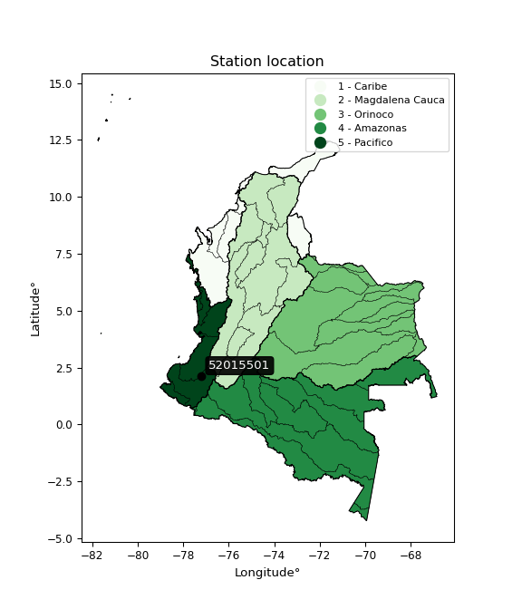</img>

</div>


## A. General information


### 1. General running parameters

• app_version: _v20260312_. • runtime: _2026-03-12 07:15:23.203550_. • Python version: _3.14.0_. • SciPy version: _1.16.3_. • Pandas version: _2.3.3_. • NumPy version: _2.3.5_. • Stations dataset (station_dataset_file): _dataset/pmax24h_in/automatic_colombia_2003_2025.csv_. • Stations catalog (station_catalog_file): _dataset/CNE.xls_. • Minimum year to eval til year_max (date_min): _1900_. • Maximum year to eval since year_min (date_max): _2025_. • Creates, save and include plots into reports (create_plot): _True_. • Plot only fit distributions with Δo > Δ (plot_only_fit): _True_. • Plot only simple graphs avoiding multiple CDFs and multiple Extreme values plots (plot_only_simple): _True_. • Eval low extreme values, if False, evaluates high extreme values (low_extreme): _False_. • Eval every SciPy distribution as logarithmic (pdist_logarithmic_on): _True_. • Standard deviation normalized (ddof): _1.0_. • Return periods to eval in years (Tr): _[2, 2.33, 5, 10, 15, 20, 25, 50, 75, 100, 200, 250, 500, 750, 1000]_. • Minimum data sample per station, 0 means any (minimum_sample): _5_. • Z-Score maximum threshold to adjust a value, 0 means disable (zscore_max): _3.5_. • Z-Score minimum threshold to adjust a value, 0 means disable (zscore_min): _-2.5_. • Avoid zeros, e.g. rain = 0 (avoid_zeros): _True_. • Avoid null values (avoid_nans): _True_. 

:file_folder:Table: [dataset.csv](../../dataset/pmax24h_in/automatic_colombia_2003_2025.csv)

> Delta Degrees of Freedom (DDOF): is a parameter used in the formulas for calculating variance and standard deviation. When ddof=0, the divisor is $N$ (the total number of observations) and this is used when your data set is the entire population. When ddof=1, the divisor is $N-1$ and this is used when your data set is a sample drawn from a larger population. Using $N-1$ provides an unbiased estimate of the population variance (known as Bessel´s correction).


### 2. Station info and location

|   id |   CODIGO | NOMBRE                    | CATEGORIA               | TECNOLOGIA                | ESTADO   | FECHA_INSTALACION   |   FECHA_SUSPENSION |   ALTITUD |   LATITUD |   LONGITUD | DEPARTAMENTO   | MUNICIPIO   | AREA_OPERATIVA                      | ENTIDAD                                    | AREA_HIDROGRAFICA   | ZONA_HIDROGRAFICA   | SUBZONA_HIDROGRAFICA   |   CORRIENTE | Catalogo   |   Version |
|-----:|---------:|:--------------------------|:------------------------|:--------------------------|:---------|:--------------------|-------------------:|----------:|----------:|-----------:|:---------------|:------------|:------------------------------------|:-------------------------------------------|:--------------------|:--------------------|:-----------------------|------------:|:-----------|----------:|
|    0 | 52015501 | BALBOA  - AUT  [52015501] | Climatológica Principal | Automática con Telemetría | Activa   | 01/09/2013          |                nan |      1695 |   2.12519 |   -77.1927 | Cauca          | Balboa      | Area Operativa 07 - Nariño-Putumayo | CENTRO NACIONAL DE INVESTIGACIONES DE CAFE | Pacifico            | Patía               | Río Patia Alto         |         nan | CNE_OE     |  20251226 |

<div align="center">

Dynamic map: [:earth_americas:Google](http://maps.google.com/maps?q=2.125191667,-77.19266667) [:earth_americas:OSM](https://www.openstreetmap.org/#map=18/2.125191667/-77.19266667&layers=P) [:earth_americas:Bing](https://www.bing.com/maps?cp=2.125191667~-77.19266667&lvl=18) [:earth_americas:Apple](https://maps.apple.com/frame?center=2.125191667%2C-77.19266667&span=0.003%2C0.006)

</div>


<div align="center">

```geojson
{
  "type": "Feature",
  "geometry": {
    "type": "Point", 
    "coordinates": [-77.19266667, 2.125191667]
  }, 
  "properties": {
    "Name": "52015501"
  }
}
```

</div>


### 3. Discrete values table and plot

<div align="center">

|               |          0 |           1 |           2 |           3 |           4 |           5 |
|:--------------|-----------:|------------:|------------:|------------:|------------:|------------:|
| Date          | 2018       | 2019        | 2020        | 2021        | 2022        | 2023        |
| Value         |   31.6     |   92.5      |   86.2      |   92.2      |   65.9      |   66        |
| Value_initial |   31.6     |   92.5      |   86.2      |   92.2      |   65.9      |   66        |
| count         |    6       |    6        |    6        |    6        |    6        |    6        |
| mean          |   72.4     |   72.4      |   72.4      |   72.4      |   72.4      |   72.4      |
| std           |   23.3852  |   23.3852   |   23.3852   |   23.3852   |   23.3852   |   23.3852   |
| zscore        |   -1.74469 |    0.859518 |    0.590117 |    0.846689 |   -0.277953 |   -0.273677 |


</div>


<div align="center">

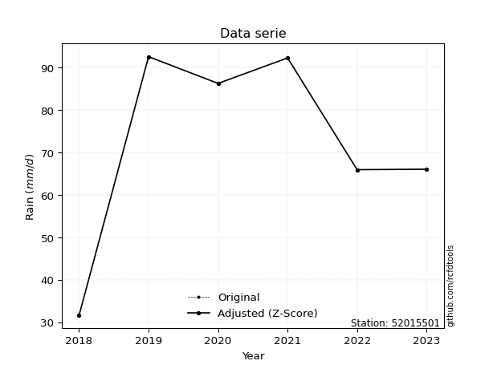</img>

</div>


> The initial value (value_initial) correspond to the initial obtained or null completed value, and value (value) is adjusted only when the initial value is outside the valid range (outlier) definite through the Z-Score value. If Z-Score is active, values out of range or outliers are replaced with the station mean value. A Z-Score (or standard score) measures how many standard deviations a data point is from the mean of a dataset, indicating its relative position; positive scores mean above the mean, negative mean below, and a score of zero is exactly at the mean, allowing for comparison of values from different distributions. It´s calculated using the formula $z=(x–μ)/σ$, where $x$ is the data point, $μ$ is the mean, and $σ$ is the standard deviation, helping identify outliers and understand probability.
>
> <sub>**Note**: In this study, "completing" (filling gaps in) and "extending" (forecasting or lengthening the historical record) rainfall data series are avoided for certain critical analyses because they introduce artificial bias and uncertainty, which can distort the statistics of rare events (extremes), alter day-to-day variability, and compromise the integrity and homogeneity of the original data. Some reasons against Completing/Extending rainfall data are: **Distortion of Extremes and Variability**: The primary issue is that most gap-filling or extension methods rely on averaging or regression with nearby stations, which inherently smooths the data. Rainfall is highly variable in space and time, with a large percentage of zero values and occasional large storms. Infilling methods often underestimate the highest values and overestimate the lowest (zero) values, which severely distorts analyses focused on flood frequency, drought severity, and intensity-duration-frequency (IDF) curves, **Loss of Data Homogeneity**: Infilled or extended data are synthetic estimates, not actual measurements. Combining these estimates with observed data can violate the assumption of data homogeneity, which requires that the data properties do not change over time. Inhomogeneity can lead to incorrect conclusions about long-term trends or changes in climate patterns, **Propagation of Errors**: Errors and biases from the original data (e.g., wind-induced undercatch, instrument errors, site changes) or the data used for imputation can propagate through the analysis, leading to unreliable hydrological models and inaccurate predictions, **Compromised Statistical Integrity**: For statistical analyses, especially those involving the frequency of events, using artificial data can introduce time bias or autocorrelation that doesn´t exist in reality, making it difficult to assess the true probability of events, **Difficulty in Validation**: It is difficult to accurately validate the quality of filled or extended data, especially for past periods where ground-truth measurements are unavailable. The reliability of imputation techniques heavily depends on the density of the surrounding station network and the complexity of the local topography.</sub>


### 4. Active continuous probability distributions from SciPy (80 of 104 available)

A Probability Density Function (PDF) describes the relative likelihood of a continuous random variable falling within a specific range, where the total area under its curve equals 1, and the area over any interval gives the actual probability for that range. Unlike discrete probabilities (like rolling a die), a PDF shows density, not direct probability for a single point (which is zero), with higher points indicating higher likelihood, often visualized as a bell curve for normal distributions.

A log of a probability density function (log-PDF) is simply the logarithm of the PDF´s value, denoted as $log(f(x))$, useful for converting multiplication of probabilities into addition, improving numerical stability with tiny numbers, and connecting to information theory concepts like entropy. Instead of dealing with very small probabilities (e.g., 0.000001), log-PDFs use negative numbers (e.g., $log(0.00001) ≈ -11.51$ that are easier for computers to handle, preventing underflow errors and simplifying complex calculations. In this study, each active probability distribution from SciPy is also evaluated in the $log$ form.

[scipy.stats](https://docs.scipy.org/doc/scipy/reference/stats.html) is a Python´s powerful submodule within the SciPy library for comprehensive statistical analysis, offering over 130 probability distributions (like Normal, Poisson, etc.), functions for descriptive stats (mean, variance), hypothesis testing (t-tests, chi-square), random variable generation, and statistical tests, making it essential for data science, modeling, and research. It provides tools to explore, model, and draw conclusions from data efficiently, working seamlessly with [NumPy](https://numpy.org/).

<div align="center">

|   id | p_dist           |   n_parameter | fit_method   | label                                                                       | active   | ref                                                                                                      |
|-----:|:-----------------|--------------:|:-------------|:----------------------------------------------------------------------------|:---------|:---------------------------------------------------------------------------------------------------------|
|    0 | alpha            |             3 | MLE          | Alpha                                                                       | True     | [:mortar_board:](https://docs.scipy.org/doc/scipy/reference/generated/scipy.stats.alpha.html)            |
|    1 | anglit           |             2 | MM           | Anglit                                                                      | True     | [:mortar_board:](https://docs.scipy.org/doc/scipy/reference/generated/scipy.stats.anglit.html)           |
|    2 | arcsine          |             2 | MM           | Arcsine                                                                     | True     | [:mortar_board:](https://docs.scipy.org/doc/scipy/reference/generated/scipy.stats.arcsine.html)          |
|    3 | argus            |             3 | MLE          | Argus                                                                       | True     | [:mortar_board:](https://docs.scipy.org/doc/scipy/reference/generated/scipy.stats.argus.html)            |
|    4 | beta             |             4 | MLE          | Beta                                                                        | True     | [:mortar_board:](https://docs.scipy.org/doc/scipy/reference/generated/scipy.stats.beta.html)             |
|    5 | betaprime        |             4 | MLE          | Beta prime                                                                  | True     | [:mortar_board:](https://docs.scipy.org/doc/scipy/reference/generated/scipy.stats.betaprime.html)        |
|    6 | bradford         |             3 | MLE          | Bradford                                                                    | True     | [:mortar_board:](https://docs.scipy.org/doc/scipy/reference/generated/scipy.stats.bradford.html)         |
|    7 | burr             |             4 | MLE          | Burr (Type III)                                                             | True     | [:mortar_board:](https://docs.scipy.org/doc/scipy/reference/generated/scipy.stats.burr.html)             |
|    8 | burr12           |             4 | MLE          | Burr (Type III) 12                                                          | True     | [:mortar_board:](https://docs.scipy.org/doc/scipy/reference/generated/scipy.stats.burr12.html)           |
|    9 | cosine           |             2 | MLE          | Cosine                                                                      | True     | [:mortar_board:](https://docs.scipy.org/doc/scipy/reference/generated/scipy.stats.cosine.html)           |
|   10 | crystalball      |             4 | MLE          | Crystalball                                                                 | True     | [:mortar_board:](https://docs.scipy.org/doc/scipy/reference/generated/scipy.stats.crystalball.html)      |
|   11 | dgamma           |             3 | MLE          | Double gamma                                                                | True     | [:mortar_board:](https://docs.scipy.org/doc/scipy/reference/generated/scipy.stats.dgamma.html)           |
|   12 | dweibull         |             3 | MLE          | Double Weibull                                                              | True     | [:mortar_board:](https://docs.scipy.org/doc/scipy/reference/generated/scipy.stats.dweibull.html)         |
|   13 | erlang           |             3 | MLE          | Erlang                                                                      | True     | [:mortar_board:](https://docs.scipy.org/doc/scipy/reference/generated/scipy.stats.erlang.html)           |
|   14 | exponnorm        |             3 | MLE          | Exponentially modified Normal                                               | True     | [:mortar_board:](https://docs.scipy.org/doc/scipy/reference/generated/scipy.stats.exponnorm.html)        |
|   15 | exponpow         |             3 | MLE          | Exponential power                                                           | True     | [:mortar_board:](https://docs.scipy.org/doc/scipy/reference/generated/scipy.stats.exponpow.html)         |
|   16 | exponweib        |             4 | MLE          | Exponentiated Weibull                                                       | True     | [:mortar_board:](https://docs.scipy.org/doc/scipy/reference/generated/scipy.stats.exponweib.html)        |
|   17 | f                |             4 | MLE          | F                                                                           | True     | [:mortar_board:](https://docs.scipy.org/doc/scipy/reference/generated/scipy.stats.f.html)                |
|   18 | fatiguelife      |             3 | MLE          | Fatigue-life (Birnbaum-Saunders)                                            | True     | [:mortar_board:](https://docs.scipy.org/doc/scipy/reference/generated/scipy.stats.fatiguelife.html)      |
|   19 | foldnorm         |             3 | MM           | Fold Normal                                                                 | True     | [:mortar_board:](https://docs.scipy.org/doc/scipy/reference/generated/scipy.stats.foldnorm.html)         |
|   20 | gamma            |             3 | MLE          | Gamma                                                                       | True     | [:mortar_board:](https://docs.scipy.org/doc/scipy/reference/generated/scipy.stats.gamma.html)            |
|   21 | gausshyper       |             6 | MLE          | Gauss hypergeometric                                                        | True     | [:mortar_board:](https://docs.scipy.org/doc/scipy/reference/generated/scipy.stats.gausshyper.html)       |
|   22 | genexpon         |             5 | MLE          | Generalized exponential                                                     | True     | [:mortar_board:](https://docs.scipy.org/doc/scipy/reference/generated/scipy.stats.genexpon.html)         |
|   23 | genextreme       |             3 | MLE          | Generalized exponential                                                     | True     | [:mortar_board:](https://docs.scipy.org/doc/scipy/reference/generated/scipy.stats.genextreme.html)       |
|   24 | gengamma         |             4 | MLE          | Generalized gamma                                                           | True     | [:mortar_board:](https://docs.scipy.org/doc/scipy/reference/generated/scipy.stats.gengamma.html)         |
|   25 | genhalflogistic  |             3 | MLE          | Generalized half-logistic                                                   | True     | [:mortar_board:](https://docs.scipy.org/doc/scipy/reference/generated/scipy.stats.genhalflogistic.html)  |
|   26 | genlogistic      |             3 | MLE          | Generalized logistic                                                        | True     | [:mortar_board:](https://docs.scipy.org/doc/scipy/reference/generated/scipy.stats.genlogistic.html)      |
|   27 | gennorm          |             3 | MLE          | Generalized Normal                                                          | True     | [:mortar_board:](https://docs.scipy.org/doc/scipy/reference/generated/scipy.stats.gennorm.html)          |
|   28 | genpareto        |             3 | MLE          | Generalized Pareto                                                          | True     | [:mortar_board:](https://docs.scipy.org/doc/scipy/reference/generated/scipy.stats.genpareto.html)        |
|   29 | gompertz         |             3 | MLE          | Gompertz (or truncated Gumbel)                                              | True     | [:mortar_board:](https://docs.scipy.org/doc/scipy/reference/generated/scipy.stats.gompertz.html)         |
|   30 | gumbel_l         |             2 | MM           | Gumbel Left Skew                                                            | True     | [:mortar_board:](https://docs.scipy.org/doc/scipy/reference/generated/scipy.stats.gumbel_l.html)         |
|   31 | gumbel_r         |             2 | MM           | Gumbel Right Skew                                                           | True     | [:mortar_board:](https://docs.scipy.org/doc/scipy/reference/generated/scipy.stats.gumbel_r.html)         |
|   32 | halfgennorm      |             3 | MLE          | Upper half of a generalized normal                                          | True     | [:mortar_board:](https://docs.scipy.org/doc/scipy/reference/generated/scipy.stats.halfgennorm.html)      |
|   33 | halflogistic     |             2 | MM           | Half-logistic                                                               | True     | [:mortar_board:](https://docs.scipy.org/doc/scipy/reference/generated/scipy.stats.halflogistic.html)     |
|   34 | halfnorm         |             2 | MM           | Half Normal                                                                 | True     | [:mortar_board:](https://docs.scipy.org/doc/scipy/reference/generated/scipy.stats.halfnorm.html)         |
|   35 | hypsecant        |             2 | MM           | hyperbolic secant                                                           | True     | [:mortar_board:](https://docs.scipy.org/doc/scipy/reference/generated/scipy.stats.hypsecant.html)        |
|   36 | invgamma         |             3 | MLE          | Inverted gamma                                                              | True     | [:mortar_board:](https://docs.scipy.org/doc/scipy/reference/generated/scipy.stats.invgamma.html)         |
|   37 | invgauss         |             3 | MLE          | Inverse Gaussian                                                            | True     | [:mortar_board:](https://docs.scipy.org/doc/scipy/reference/generated/scipy.stats.invgauss.html)         |
|   38 | invweibull       |             3 | MLE          | Inverted Weibull                                                            | True     | [:mortar_board:](https://docs.scipy.org/doc/scipy/reference/generated/scipy.stats.invweibull.html)       |
|   39 | johnsonsb        |             4 | MLE          | Johnson SB                                                                  | True     | [:mortar_board:](https://docs.scipy.org/doc/scipy/reference/generated/scipy.stats.johnsonsb.html)        |
|   40 | johnsonsu        |             4 | MLE          | Johnson Su                                                                  | True     | [:mortar_board:](https://docs.scipy.org/doc/scipy/reference/generated/scipy.stats.johnsonsu.html)        |
|   41 | kappa3           |             3 | MLE          | Kappa 3                                                                     | True     | [:mortar_board:](https://docs.scipy.org/doc/scipy/reference/generated/scipy.stats.kappa3.html)           |
|   42 | kappa4           |             4 | MLE          | Kappa 4                                                                     | True     | [:mortar_board:](https://docs.scipy.org/doc/scipy/reference/generated/scipy.stats.kappa4.html)           |
|   43 | ksone            |             3 | MLE          | Kolmogorov-Smirnov one-sided test statistic distribution                    | True     | [:mortar_board:](https://docs.scipy.org/doc/scipy/reference/generated/scipy.stats.ksone.html)            |
|   44 | kstwobign        |             2 | MLE          | Limiting distribution of scaled Kolmogorov-Smirnov two-sided test statistic | True     | [:mortar_board:](https://docs.scipy.org/doc/scipy/reference/generated/scipy.stats.kstwobign.html)        |
|   45 | laplace          |             2 | MM           | Laplace                                                                     | True     | [:mortar_board:](https://docs.scipy.org/doc/scipy/reference/generated/scipy.stats.laplace.html)          |
|   46 | levy_l           |             2 | MLE          | Left-skewed Levy                                                            | True     | [:mortar_board:](https://docs.scipy.org/doc/scipy/reference/generated/scipy.stats.levy_l.html)           |
|   47 | loggamma         |             3 | MLE          | Log gamma                                                                   | True     | [:mortar_board:](https://docs.scipy.org/doc/scipy/reference/generated/scipy.stats.loggamma.html)         |
|   48 | logistic         |             2 | MM           | Logistic (or Sech-squared)                                                  | True     | [:mortar_board:](https://docs.scipy.org/doc/scipy/reference/generated/scipy.stats.logistic.html)         |
|   49 | loglaplace       |             3 | MLE          | Log-Laplace                                                                 | True     | [:mortar_board:](https://docs.scipy.org/doc/scipy/reference/generated/scipy.stats.loglaplace.html)       |
|   50 | lomax            |             3 | MLE          | Lomax (Pareto of the second kind)                                           | True     | [:mortar_board:](https://docs.scipy.org/doc/scipy/reference/generated/scipy.stats.lomax.html)            |
|   51 | maxwell          |             2 | MM           | Maxwell                                                                     | True     | [:mortar_board:](https://docs.scipy.org/doc/scipy/reference/generated/scipy.stats.maxwell.html)          |
|   52 | mielke           |             4 | MLE          | Mielke Beta-Kappa / Dagum                                                   | True     | [:mortar_board:](https://docs.scipy.org/doc/scipy/reference/generated/scipy.stats.mielke.html)           |
|   53 | moyal            |             2 | MM           | Moyal                                                                       | True     | [:mortar_board:](https://docs.scipy.org/doc/scipy/reference/generated/scipy.stats.moyal.html)            |
|   54 | nakagami         |             3 | MLE          | Nakagami                                                                    | True     | [:mortar_board:](https://docs.scipy.org/doc/scipy/reference/generated/scipy.stats.nakagami.html)         |
|   55 | ncf              |             5 | MLE          | Non-central F distribution                                                  | True     | [:mortar_board:](https://docs.scipy.org/doc/scipy/reference/generated/scipy.stats.ncf.html)              |
|   56 | nct              |             4 | MLE          | Non-central Student’s t                                                     | True     | [:mortar_board:](https://docs.scipy.org/doc/scipy/reference/generated/scipy.stats.nct.html)              |
|   57 | norm             |             2 | MM           | Normal                                                                      | True     | [:mortar_board:](https://docs.scipy.org/doc/scipy/reference/generated/scipy.stats.norm.html)             |
|   58 | pearson3         |             3 | MM           | Pearson type III                                                            | True     | [:mortar_board:](https://docs.scipy.org/doc/scipy/reference/generated/scipy.stats.pearson3.html)         |
|   59 | powerlaw         |             3 | MLE          | Power-function                                                              | True     | [:mortar_board:](https://docs.scipy.org/doc/scipy/reference/generated/scipy.stats.powerlaw.html)         |
|   60 | rayleigh         |             2 | MM           | Rayleigh                                                                    | True     | [:mortar_board:](https://docs.scipy.org/doc/scipy/reference/generated/scipy.stats.rayleigh.html)         |
|   61 | rdist            |             3 | MLE          | R-distributed (symmetric beta)                                              | True     | [:mortar_board:](https://docs.scipy.org/doc/scipy/reference/generated/scipy.stats.rdist.html)            |
|   62 | rice             |             3 | MLE          | Rice                                                                        | True     | [:mortar_board:](https://docs.scipy.org/doc/scipy/reference/generated/scipy.stats.rice.html)             |
|   63 | semicircular     |             2 | MM           | Semicircular                                                                | True     | [:mortar_board:](https://docs.scipy.org/doc/scipy/reference/generated/scipy.stats.semicircular.html)     |
|   64 | skewnorm         |             3 | MLE          | Skew normal                                                                 | True     | [:mortar_board:](https://docs.scipy.org/doc/scipy/reference/generated/scipy.stats.skewnorm.html)         |
|   65 | t                |             3 | MLE          | Student’s t                                                                 | True     | [:mortar_board:](https://docs.scipy.org/doc/scipy/reference/generated/scipy.stats.t.html)                |
|   66 | trapezoid        |             4 | MLE          | Trapezoid                                                                   | True     | [:mortar_board:](https://docs.scipy.org/doc/scipy/reference/generated/scipy.stats.trapezoid.html)        |
|   67 | triang           |             3 | MLE          | Triangular                                                                  | True     | [:mortar_board:](https://docs.scipy.org/doc/scipy/reference/generated/scipy.stats.triang.html)           |
|   68 | truncexpon       |             3 | MLE          | Truncated exponential                                                       | True     | [:mortar_board:](https://docs.scipy.org/doc/scipy/reference/generated/scipy.stats.truncexpon.html)       |
|   69 | truncnorm        |             4 | MLE          | Truncated normal                                                            | True     | [:mortar_board:](https://docs.scipy.org/doc/scipy/reference/generated/scipy.stats.truncnorm.html)        |
|   70 | truncpareto      |             4 | MLE          | Upper truncated Pareto                                                      | True     | [:mortar_board:](https://docs.scipy.org/doc/scipy/reference/generated/scipy.stats.truncpareto.html)      |
|   71 | truncweibull_min |             5 | MLE          | Doubly truncated Weibull minimum                                            | True     | [:mortar_board:](https://docs.scipy.org/doc/scipy/reference/generated/scipy.stats.truncweibull_min.html) |
|   72 | tukeylambda      |             3 | MLE          | Tukey-Lamdba                                                                | True     | [:mortar_board:](https://docs.scipy.org/doc/scipy/reference/generated/scipy.stats.tukeylambda.html)      |
|   73 | uniform          |             2 | MLE          | Uniform                                                                     | True     | [:mortar_board:](https://docs.scipy.org/doc/scipy/reference/generated/scipy.stats.uniform.html)          |
|   74 | vonmises         |             3 | MLE          | Von Mises                                                                   | True     | [:mortar_board:](https://docs.scipy.org/doc/scipy/reference/generated/scipy.stats.vonmises.html)         |
|   75 | vonmises_line    |             3 | MLE          | Von Mises line                                                              | True     | [:mortar_board:](https://docs.scipy.org/doc/scipy/reference/generated/scipy.stats.vonmises_line.html)    |
|   76 | wald             |             2 | MM           | Wald                                                                        | True     | [:mortar_board:](https://docs.scipy.org/doc/scipy/reference/generated/scipy.stats.wald.html)             |
|   77 | weibull_max      |             3 | MLE          | Weibull maximum                                                             | True     | [:mortar_board:](https://docs.scipy.org/doc/scipy/reference/generated/scipy.stats.weibull_max.html)      |
|   78 | weibull_min      |             3 | MLE          | Weibull minimum                                                             | True     | [:mortar_board:](https://docs.scipy.org/doc/scipy/reference/generated/scipy.stats.weibull_min.html)      |
|   79 | wrapcauchy       |             3 | MLE          | Wrapped  Cauchy                                                             | True     | [:mortar_board:](https://docs.scipy.org/doc/scipy/reference/generated/scipy.stats.wrapcauchy.html)       |

</div>

> **n_parameter:** # arguments & localization & scale.
>
> **Fit methods:** (MLE) maximum likelihood, (MM) L-moments.
>
>**Inactive** (With the only purpose of prevent loops, zero divisions, infinite values, over high estimated values or horizontal trending for recurrence intervals estimations, the follow distributions were disabled.)**:** lognorm, norminvgauss, powernorm, powerlognorm, cauchy, halfcauchy, foldcauchy, skewcauchy, chi2, expon, fisk, genhyperbolic, geninvgauss, gibrat, kstwo, laplace_asymmetric, levy, levy_stable, ncx2, pareto, rel_breitwigner, recipinvgauss, studentized_range, loguniform, 


## B. Probability (PDF) vs. Empirical (EDF) distributions functions

A continuous probability distribution (CPD) describes probabilities for variables that can take any value within a range (like rain any time), unlike discrete variables with specific outcomes (like temperature). It uses a Probability Density Function (PDF), a curve where the total area under it equals 1, and the probability of the variable falling within an interval (a to b) is found by calculating the area under the curve between those points. A key feature is that the probability of hitting any single exact value is zero, so probabilities are always expressed for ranges, e.g., $P(a ≤ X ≤ b)$.

<div align="center">

Distributions parameters from station values
|     |   station | p_dist              |   n |             loc |            scale | shape                  | shape1                | shape2                 | shape3             |
|----:|----------:|:--------------------|----:|----------------:|-----------------:|:-----------------------|:----------------------|:-----------------------|:-------------------|
|   0 |  52015501 | alpha               |   6 |  -486.602       |  13844.3         | 24.824692017913776     |                       |                        |                    |
|   1 |  52015501 | anglit              |   6 |    72.4         |     62.4505      |                        |                       |                        |                    |
|   2 |  52015501 | arcsine             |   6 |    42.2098      |     60.3804      |                        |                       |                        |                    |
|   3 |  52015501 | argus               |   6 |     6.30427     |     89.0873      | 2.4387882631965834     |                       |                        |                    |
|   4 |  52015501 | beta                |   6 |    19.2629      |     73.2371      | 1.0657402970726393     | 0.44322978863920365   |                        |                    |
|   5 |  52015501 | betaprime           |   6 |  -897.094       | 137428           | 1968.7571232598611     | 279036.35450711456    |                        |                    |
|   6 |  52015501 | bradford            |   6 |    31.5447      |     64.9883      | 7.057917595202902e-06  |                       |                        |                    |
|   7 |  52015501 | burr                |   6 |    -0.307386    |     99.5373      | 22.066949355736135     | 0.10725223711518267   |                        |                    |
|   8 |  52015501 | burr12              |   6 |    -1.49286     |     32.8771      | 675.6981969629035      | 0.0019635006519722873 |                        |                    |
|   9 |  52015501 | cosine              |   6 |    69.6009      |     18.0782      |                        |                       |                        |                    |
|  10 |  52015501 | crystalball         |   6 |    72.4         |     21.3477      | 3268.188013770384      | 13044.47620530481     |                        |                    |
|  11 |  52015501 | dgamma              |   6 |    76.031       |      5.61431     | 3.1882789959206184     |                       |                        |                    |
|  12 |  52015501 | dweibull            |   6 |    74.9333      |     20.2705      | 1.671222568290099      |                       |                        |                    |
|  13 |  52015501 | erlang              |   6 |  -272.642       |      1.3867      | 248.61125155304205     |                       |                        |                    |
|  14 |  52015501 | exponnorm           |   6 |    72.3903      |     21.3476      | 0.0004614151942581731  |                       |                        |                    |
|  15 |  52015501 | exponpow            |   6 |    31.6         |      1.61919     | 0.08417656301437552    |                       |                        |                    |
|  16 |  52015501 | exponweib           |   6 |    31.6         |      1.28436     | 1.2262766073841798     | 0.22079928800266965   |                        |                    |
|  17 |  52015501 | f                   |   6 | -6191.71        |   6264.08        | 195190.06557983032     | 1330488.7517028619    |                        |                    |
|  18 |  52015501 | fatiguelife         |   6 |    31.6         |      0.000311671 | 349.78077321769365     |                       |                        |                    |
|  19 |  52015501 | foldnorm            |   6 |    75.6906      |      1.15835     | 2.1315802428109173e-06 |                       |                        |                    |
|  20 |  52015501 | gamma               |   6 |  -297.452       |      1.30198     | 283.73087404602234     |                       |                        |                    |
|  21 |  52015501 | gausshyper          |   6 |    29.7708      |     62.7292      | 1.2103825874615939     | 0.5413574616027812    | 1.1567147451939228     | 1.0647612386560128 |
|  22 |  52015501 | genexpon            |   6 |    31.6         |     43.1316      | 6.692604300715837      | 0.5724664319243098    | 3.6781590390614895e-07 |                    |
|  23 |  52015501 | genextreme          |   6 |    74.2848      |     21.4693      | 1.178646217213132      |                       |                        |                    |
|  24 |  52015501 | gengamma            |   6 |    31.6         |      1.33875     | 1.2427743328725482     | 0.20628865167877894   |                        |                    |
|  25 |  52015501 | genhalflogistic     |   6 |    25.3327      |     73.4341      | 1.0932999361003835     |                       |                        |                    |
|  26 |  52015501 | genlogistic         |   6 |    92.5002      |      1.99622e-06 | 9.931793042761492e-08  |                       |                        |                    |
|  27 |  52015501 | gennorm             |   6 |    62.05        |     30.4501      | 7581964.228365835      |                       |                        |                    |
|  28 |  52015501 | genpareto           |   6 |    -1.51195     |    232.09        | -2.4687325788909025    |                       |                        |                    |
|  29 |  52015501 | gompertz            |   6 |    32.0378      |      3.84311     | 3.4536227944234927e-07 |                       |                        |                    |
|  30 |  52015501 | gumbel_l            |   6 |    82.0076      |     16.6447      |                        |                       |                        |                    |
|  31 |  52015501 | gumbel_r            |   6 |    62.7924      |     16.6447      |                        |                       |                        |                    |
|  32 |  52015501 | halfgennorm         |   6 |    31.6         |      1.36236     | 0.34659721925729725    |                       |                        |                    |
|  33 |  52015501 | halflogistic        |   6 |    47.098       |     18.2515      |                        |                       |                        |                    |
|  34 |  52015501 | halfnorm            |   6 |    44.144       |     35.4136      |                        |                       |                        |                    |
|  35 |  52015501 | hypsecant           |   6 |    72.4         |     13.5904      |                        |                       |                        |                    |
|  36 |  52015501 | invgamma            |   6 |  -246.978       |  66227.6         | 208.78735116523126     |                       |                        |                    |
|  37 |  52015501 | invgauss            |   6 |   -78.3883      |   5775.08        | 0.026199843994952635   |                       |                        |                    |
|  38 |  52015501 | invweibull          |   6 |    31.6         |      1.36913     | 0.057394191071914846   |                       |                        |                    |
|  39 |  52015501 | johnsonsb           |   6 |    13.2242      |     79.2758      | -0.8087988892894312    | 0.17523182987135982   |                        |                    |
|  40 |  52015501 | johnsonsu           |   6 |    92.5         |      1.35584e-14 | 2.6690750487574757     | 0.10965466606336063   |                        |                    |
|  41 |  52015501 | kappa3              |   6 |    23.3858      |     68.9019      | 411.6844753614507      |                       |                        |                    |
|  42 |  52015501 | kappa4              |   6 |    26.6621      |     82.1645      | 0.9182819479776156     | 1.2479804734552329    |                        |                    |
|  43 |  52015501 | ksone               |   6 |    25.51        |     73.08        | 1.0                    |                       |                        |                    |
|  44 |  52015501 | kstwobign           |   6 |   -21.1418      |    106.789       |                        |                       |                        |                    |
|  45 |  52015501 | laplace             |   6 |    72.4         |     15.0951      |                        |                       |                        |                    |
|  46 |  52015501 | levy_l              |   6 |    92.8192      |      1.20263     |                        |                       |                        |                    |
|  47 |  52015501 | loggamma            |   6 |    92.5001      |      7.6744e-06  | 3.8135838912824164e-07 |                       |                        |                    |
|  48 |  52015501 | logistic            |   6 |    72.4         |     11.7696      |                        |                       |                        |                    |
|  49 |  52015501 | loglaplace          |   6 |    -0.206109    |     86.4061      | 3.5905953360694864     |                       |                        |                    |
|  50 |  52015501 | lomax               |   6 |    31.6         |      2.02232e+11 | 2300712784.636028      |                       |                        |                    |
|  51 |  52015501 | maxwell             |   6 |    21.815       |     31.6995      |                        |                       |                        |                    |
|  52 |  52015501 | mielke              |   6 |    -7.0446e+08  |      7.0446e+08  | 34956039.53689702      | 114822582403.44711    |                        |                    |
|  53 |  52015501 | moyal               |   6 |    60.192       |      9.60983     |                        |                       |                        |                    |
|  54 |  52015501 | nakagami            |   6 |    65.9         |     16.0767      | 0.11995798495264948    |                       |                        |                    |
|  55 |  52015501 | ncf                 |   6 |    -0.0206884   |      2.60044e-10 | 1.6969923452887364e-11 | 5.620873906491049     | 3.617630731552385      |                    |
|  56 |  52015501 | nct                 |   6 | -1341.23        |     21.296       | 419475.2884194243      | 66.38016927470301     |                        |                    |
|  57 |  52015501 | norm                |   6 |    72.4         |     21.3477      |                        |                       |                        |                    |
|  58 |  52015501 | pearson3            |   6 |    72.4         |     21.3477      | -0.8556094861495718    |                       |                        |                    |
|  59 |  52015501 | powerlaw            |   6 |    31.6         |     60.9         | 0.15528070931971322    |                       |                        |                    |
|  60 |  52015501 | rayleigh            |   6 |    31.5606      |     32.5851      |                        |                       |                        |                    |
|  61 |  52015501 | rdist               |   6 |    31.6         |      7.10543e-15 | 1.6202273418778492     |                       |                        |                    |
|  62 |  52015501 | rice                |   6 |    16.5168      |     23.0396      | 2.177550189343026      |                       |                        |                    |
|  63 |  52015501 | semicircular        |   6 |    72.4         |     42.6954      |                        |                       |                        |                    |
|  64 |  52015501 | skewnorm            |   6 |    92.5         |     29.317       | -10837703.052980755    |                       |                        |                    |
|  65 |  52015501 | t                   |   6 |    72.4003      |     21.3484      | 6537889.017964649      |                       |                        |                    |
|  66 |  52015501 | trapezoid           |   6 |    12.0196      |     90.5705      | 1.0                    | 1.0                   |                        |                    |
|  67 |  52015501 | triang              |   6 |    13.0356      |     79.4644      | 0.9999999988724333     |                       |                        |                    |
|  68 |  52015501 | truncexpon          |   6 |    31.5982      |     89.0588      | 0.6838373981855864     |                       |                        |                    |
|  69 |  52015501 | truncnorm           |   6 |    72.4         |     21.3477      | -521.2581123469664     | 2828.0287286128314    |                        |                    |
|  70 |  52015501 | truncpareto         |   6 |    31.4698      |      0.130164    | 0.20341878012523978    | 468.8723540813815     |                        |                    |
|  71 |  52015501 | truncweibull_min    |   6 |    28.0513      |    112.949       | 1.5211790554748328     | 8.976486589062525e-09 | 0.5706018979083605     |                    |
|  72 |  52015501 | tukeylambda         |   6 |    31.6         |      2.50999e-15 | 1.621810316679194      |                       |                        |                    |
|  73 |  52015501 | uniform             |   6 |    31.6         |     60.9         |                        |                       |                        |                    |
|  74 |  52015501 | vonmises            |   6 |    -2.18272     |      1           | 1.271316124389662      |                       |                        |                    |
|  75 |  52015501 | vonmises_line       |   6 |    74.2371      |     13.5718      | 0.8186380450031685     |                       |                        |                    |
|  76 |  52015501 | wald                |   6 |    51.0524      |     21.3476      |                        |                       |                        |                    |
|  77 |  52015501 | weibull_max         |   6 |    92.5         |     28.4718      | 0.4042469671110152     |                       |                        |                    |
|  78 |  52015501 | weibull_min         |   6 |    -1.98478e+09 |      1.98478e+09 | 129656954.56773834     |                       |                        |                    |
|  79 |  52015501 | wrapcauchy          |   6 |    31.5906      |      9.69402     | 0.8660838677749705     |                       |                        |                    |
|  80 |  52015501 | logalpha            |   6 |    -8.64693     |    425.645       | 33.124335925316586     |                       |                        |                    |
|  81 |  52015501 | loganglit           |   6 |     4.22313     |      1.08982     |                        |                       |                        |                    |
|  82 |  52015501 | logarcsine          |   6 |     3.69627     |      1.05372     |                        |                       |                        |                    |
|  83 |  52015501 | logargus            |   6 |     2.95501     |      1.61477     | 2.8391918240328256     |                       |                        |                    |
|  84 |  52015501 | logbeta             |   6 |     3.38461     |      1.1426      | 0.7125352721371612     | 0.21726649842712695   |                        |                    |
|  85 |  52015501 | logbetaprime        |   6 |    -7.89458     |     16.9816      | 1615.5212246221613     | 2264.8689673628687    |                        |                    |
|  86 |  52015501 | logbradford         |   6 |     3.44814     |      1.07907     | 0.006460484996052427   |                       |                        |                    |
|  87 |  52015501 | logburr             |   6 |    -1.93345e+07 |      1.93345e+07 | 4299299424.476137      | 0.01419289282924762   |                        |                    |
|  88 |  52015501 | logburr12           |   6 |  -355.755       |    362.574       | 1541.8223093831004     | 32855.50210051702     |                        |                    |
|  89 |  52015501 | logcosine           |   6 |     4.15595     |      0.3247      |                        |                       |                        |                    |
|  90 |  52015501 | logcrystalball      |   6 |     4.22313     |      0.372538    | 7.562878384012487      | 580.6974155719574     |                        |                    |
|  91 |  52015501 | logdgamma           |   6 |     4.3171      |      0.146814    | 1.9036504628796145     |                       |                        |                    |
|  92 |  52015501 | logdweibull         |   6 |     4.30409     |      0.304988    | 1.2667842606564101     |                       |                        |                    |
|  93 |  52015501 | logerlang           |   6 |     3.45316     |      1.16232     | 0.6138039722310686     |                       |                        |                    |
|  94 |  52015501 | logexponnorm        |   6 |     4.22289     |      0.372538    | 0.0006465178358540618  |                       |                        |                    |
|  95 |  52015501 | logexponpow         |   6 |     3.45316     |      1.14313     | 0.953440155879735      |                       |                        |                    |
|  96 |  52015501 | logexponweib        |   6 |    -4.70968e+07 |      4.70968e+07 | 15.108419955316082     | 42413699.548084445    |                        |                    |
|  97 |  52015501 | logf                |   6 |  -253.014       |    257.239       | 995287.2935563936      | 19447793.830972634    |                        |                    |
|  98 |  52015501 | logfatiguelife      |   6 |  -237.081       |    241.304       | 0.0015426028430771     |                       |                        |                    |
|  99 |  52015501 | logfoldnorm         |   6 |     3.71924     |      0.466425    | 0.8701720750877813     |                       |                        |                    |
| 100 |  52015501 | loggamma            |   6 |    -1.95743     |      0.0242972   | 254.07283655608137     |                       |                        |                    |
| 101 |  52015501 | loggausshyper       |   6 |     3.21622     |      1.31099     | 1.4038454997917622     | 0.33253166293186565   | 1.4438411890968537     | 1.1227491728221506 |
| 102 |  52015501 | loggenexpon         |   6 |     3.42307     |      0.00564091  | 0.00208264345811727    | 3.635466284042577     | 1.5878209913036517e-05 |                    |
| 103 |  52015501 | loggenextreme       |   6 |     4.27933     |      0.307879    | 1.2420550536018997     |                       |                        |                    |
| 104 |  52015501 | loggengamma         |   6 |     3.02929     |      1.48583     | 0.5803329453084453     | 5.459491419929555     |                        |                    |
| 105 |  52015501 | loggenhalflogistic  |   6 |     3.43821     |      1.22331     | 1.1233287787182462     |                       |                        |                    |
| 106 |  52015501 | loggenlogistic      |   6 |     4.52723     |      1.00934e-06 | 3.3272830344551235e-06 |                       |                        |                    |
| 107 |  52015501 | loggennorm          |   6 |     4.2792      |      0.37043     | 1.2781004194594598     |                       |                        |                    |
| 108 |  52015501 | loggenpareto        |   6 |    -0.0128637   |     14.9         | -3.2818785908061106    |                       |                        |                    |
| 109 |  52015501 | loggompertz         |   6 |     3.45316     |      0.251768    | 0.026670506105901284   |                       |                        |                    |
| 110 |  52015501 | loggumbel_l         |   6 |     4.39079     |      0.290467    |                        |                       |                        |                    |
| 111 |  52015501 | loggumbel_r         |   6 |     4.05547     |      0.290467    |                        |                       |                        |                    |
| 112 |  52015501 | loghalfgennorm      |   6 |     3.45311     |      1.07628     | 2450.1010868787507     |                       |                        |                    |
| 113 |  52015501 | loghalflogistic     |   6 |     3.78159     |      0.318504    |                        |                       |                        |                    |
| 114 |  52015501 | loghalfnorm         |   6 |     3.73001     |      0.618029    |                        |                       |                        |                    |
| 115 |  52015501 | loghypsecant        |   6 |     4.22313     |      0.237165    |                        |                       |                        |                    |
| 116 |  52015501 | loginvgamma         |   6 |    -5.20197     |   5374.62        | 570.8406248600022      |                       |                        |                    |
| 117 |  52015501 | loginvgauss         |   6 |     0.136992    |    409.365       | 0.00994764412380935    |                       |                        |                    |
| 118 |  52015501 | loginvweibull       |   6 |    -5.41303e+07 |      5.41303e+07 | 124640043.60335767     |                       |                        |                    |
| 119 |  52015501 | logjohnsonsb        |   6 |     2.87237     |      1.65484     | -0.5691756605818588    | 0.13536391641023307   |                        |                    |
| 120 |  52015501 | logjohnsonsu        |   6 |     4.52721     |      2.5979e-17  | 3.2905048042345335     | 0.11712367863644585   |                        |                    |
| 121 |  52015501 | logkappa3           |   6 |     3.45316     |      1.07342     | 3054.4266430182242     |                       |                        |                    |
| 122 |  52015501 | logkappa4           |   6 |     3.38621     |      1.18642     | 1.0598723097473477     | 1.0385455096958611    |                        |                    |
| 123 |  52015501 | logksone            |   6 |     3.34575     |      1.28886     | 1.0                    |                       |                        |                    |
| 124 |  52015501 | logkstwobign        |   6 |     2.47756     |      1.99334     |                        |                       |                        |                    |
| 125 |  52015501 | loglaplace          |   6 |     4.22313     |      0.263424    |                        |                       |                        |                    |
| 126 |  52015501 | loglevy_l           |   6 |     4.53084     |      0.0136094   |                        |                       |                        |                    |
| 127 |  52015501 | logloggamma         |   6 |     4.52724     |      2.01648e-06 | 6.609847053061183e-06  |                       |                        |                    |
| 128 |  52015501 | loglogistic         |   6 |     4.22313     |      0.205391    |                        |                       |                        |                    |
| 129 |  52015501 | logloglaplace       |   6 |   -38.2613      |     42.4529      | 147.5342159844081      |                       |                        |                    |
| 130 |  52015501 | loglomax            |   6 |     3.45316     |     43.4551      | 56.61811257018331      |                       |                        |                    |
| 131 |  52015501 | logmaxwell          |   6 |     3.34037     |      0.553187    |                        |                       |                        |                    |
| 132 |  52015501 | logmielke           |   6 |    -7.0161e+07  |      7.0161e+07  | 212424385.44656536     | 6936396740.116157     |                        |                    |
| 133 |  52015501 | logmoyal            |   6 |     4.01009     |      0.167701    |                        |                       |                        |                    |
| 134 |  52015501 | lognakagami         |   6 |     4.18814     |      0.245914    | 0.2055399452556964     |                       |                        |                    |
| 135 |  52015501 | logncf              |   6 |   -22.2454      |     16.1447      | 11894.491323927032     | 32772.149406978715    | 7607.82634912711       |                    |
| 136 |  52015501 | lognct              |   6 |   -11.6127      |      0.32762     | 3139.051962932219      | 48.31535617869885     |                        |                    |
| 137 |  52015501 | lognorm             |   6 |     4.22313     |      0.372538    |                        |                       |                        |                    |
| 138 |  52015501 | logpearson3         |   6 |     4.22313     |      0.372537    | -1.2522788404954657    |                       |                        |                    |
| 139 |  52015501 | logpowerlaw         |   6 |     3.45316     |      1.07405     | 0.16551934279157543    |                       |                        |                    |
| 140 |  52015501 | lograyleigh         |   6 |     3.51048     |      0.568611    |                        |                       |                        |                    |
| 141 |  52015501 | logrdist            |   6 |     4.65076     |      0.462618    | 1.159938985125446      |                       |                        |                    |
| 142 |  52015501 | logrice             |   6 |  -118.085       |      0.372631    | 328.22765783990485     |                       |                        |                    |
| 143 |  52015501 | logsemicircular     |   6 |     4.22313     |      0.745032    |                        |                       |                        |                    |
| 144 |  52015501 | logskewnorm         |   6 |     4.52721     |      0.48105     | -2395780.623427597     |                       |                        |                    |
| 145 |  52015501 | logt                |   6 |     4.3553      |      0.210984    | 2.145737763503499      |                       |                        |                    |
| 146 |  52015501 | logtrapezoid        |   6 |     3.16944     |      1.58054     | 1.0                    | 1.0                   |                        |                    |
| 147 |  52015501 | logtriang           |   6 |     3.24739     |      1.27982     | 0.999999467959342      |                       |                        |                    |
| 148 |  52015501 | logtruncexpon       |   6 |     3.45316     |      1.61864     | 0.6635511465379738     |                       |                        |                    |
| 149 |  52015501 | logtruncnorm        |   6 |     0.30295     |      0.845877    | 4.593087042121596      | 12.594979449857455    |                        |                    |
| 150 |  52015501 | logtruncpareto      |   6 |     3.45066     |      0.00249707  | 0.20334364655228623    | 431.1252829764949     |                        |                    |
| 151 |  52015501 | logtruncweibull_min |   6 |     2.70368     |      3.16763     | 5.640837487948805      | 0.002199516827708756  | 0.5756763092253466     |                    |
| 152 |  52015501 | logtukeylambda      |   6 |     4.35767     |      0.254148    | 1.4990877471505586     |                       |                        |                    |
| 153 |  52015501 | loguniform          |   6 |     3.45316     |      1.07405     |                        |                       |                        |                    |
| 154 |  52015501 | logvonmises         |   6 |    -2.04888     |      1           | 7.765472355647489      |                       |                        |                    |
| 155 |  52015501 | logvonmises_line    |   6 |     4.30363     |      0.270715    | 1.0976234617253386     |                       |                        |                    |
| 156 |  52015501 | logwald             |   6 |     3.85056     |      0.37257     |                        |                       |                        |                    |
| 157 |  52015501 | logweibull_max      |   6 |     4.52721     |      0.537575    | 0.2234433374122351     |                       |                        |                    |
| 158 |  52015501 | logweibull_min      |   6 |    -4.52624e+07 |      4.52624e+07 | 193561449.15558803     |                       |                        |                    |
| 159 |  52015501 | logwrapcauchy       |   6 |     3.45302     |      0.170963    | 0.9149653424330104     |                       |                        |                    |

</div>

> **loc** (Location parameter): This shifts the distribution along the x-axis. For many common distributions, like the normal (Gaussian) distribution, loc represents the mean $μ$. For others, like the uniform distribution, it might represent the minimum value, or for the beta distribution, the left end of the support interval.
>
> **scale** (Scale parameter): This determines the width or spread of the distribution. For the normal distribution, scale represents the standard deviation $σ$. For a uniform distribution, it defines the length of the interval (from $loc$ to $loc + scale$).
>
> **shape** (Shape parameters): Refers to parameters that define the specific form of a probability distribution, distinct from its location (loc) and scale (scale). These parameters are required arguments for most distribution functions. For example, a normal (Gaussian) distribution is fully defined by its location (mean) and scale (standard deviation), so it has no specific shape parameters beyond loc and scale. However, other distributions have intrinsic properties that need specification, as Gamma distribution that takes a shape parameter, often named $a$ or $alpha$.


### 0. Cumulative distribution values - CDF (160 evaluated)

Cumulative Distribution Function (CDF), denoted as $F$<sub>$X$</sub>$(x)$, is a function that gives the probability that a random variable $X$ will take a value less than or equal to a specific value, $x$ (i.e., $(P(X≥x)$. It essentially "accumulates" probabilities from a given point up to the far right (positive infinity), providing a complete picture of the distribution´s probabilities for both discrete (like rain) and continuous (like temperature) variables, helping to find probabilities over ranges or above certain values. Each station is evaluated separately ordering the $x$ values ascending, calculating the CDF and PDF values for the activated distributions and their logarithmic forms.

<div align="center">

CDF ordered by x ascending and calculating $log(f(x))$ separately
|   id |   Station |   date |    x |   count |   mean |     std |    zscore |   Value_initial |   station |   m |     alpha |   alpha_pdf |   anglit |   anglit_pdf |   arcsine |   arcsine_pdf |     argus |   argus_pdf |      beta |    beta_pdf |   betaprime |   betaprime_pdf |    bradford |   bradford_pdf |      burr |   burr_pdf |     burr12 |   burr12_pdf |    cosine |   cosine_pdf |   crystalball |   crystalball_pdf |     dgamma |   dgamma_pdf |   dweibull |   dweibull_pdf |    erlang |   erlang_pdf |   exponnorm |   exponnorm_pdf |   exponpow |   exponpow_pdf |   exponweib |   exponweib_pdf |         f |      f_pdf |   fatiguelife |   fatiguelife_pdf |   foldnorm |   foldnorm_pdf |     gamma |   gamma_pdf |   gausshyper |   gausshyper_pdf |    genexpon |   genexpon_pdf |   genextreme |   genextreme_pdf |    gengamma |   gengamma_pdf |   genhalflogistic |   genhalflogistic_pdf |   genlogistic |   genlogistic_pdf |     gennorm |   gennorm_pdf |   genpareto |   genpareto_pdf |   gompertz |   gompertz_pdf |   gumbel_l |   gumbel_l_pdf |   gumbel_r |   gumbel_r_pdf |   halfgennorm |   halfgennorm_pdf |   halflogistic |   halflogistic_pdf |   halfnorm |   halfnorm_pdf |   hypsecant |   hypsecant_pdf |   invgamma |   invgamma_pdf |   invgauss |   invgauss_pdf |   invweibull |   invweibull_pdf |   johnsonsb |   johnsonsb_pdf |   johnsonsu |   johnsonsu_pdf |   kappa3 |   kappa3_pdf |   kappa4 |   kappa4_pdf |     ksone |   ksone_pdf |   kstwobign |   kstwobign_pdf |   laplace |   laplace_pdf |   levy_l |   levy_l_pdf |   loggamma |   loggamma_pdf |   logistic |   logistic_pdf |   loglaplace |   loglaplace_pdf |       lomax |   lomax_pdf |    maxwell |   maxwell_pdf |    mielke |   mielke_pdf |       moyal |   moyal_pdf |    nakagami |   nakagami_pdf |      ncf |    ncf_pdf |       nct |    nct_pdf |      norm |   norm_pdf |   pearson3 |   pearson3_pdf |   powerlaw |   powerlaw_pdf |    rayleigh |   rayleigh_pdf |       rdist |   rdist_pdf |      rice |   rice_pdf |   semicircular |   semicircular_pdf |   skewnorm |   skewnorm_pdf |         t |      t_pdf |   trapezoid |   trapezoid_pdf |    triang |   triang_pdf |   truncexpon |   truncexpon_pdf |   truncnorm |   truncnorm_pdf |   truncpareto |   truncpareto_pdf |   truncweibull_min |   truncweibull_min_pdf |   tukeylambda |   tukeylambda_pdf |   uniform |   uniform_pdf |   vonmises |   vonmises_pdf |   vonmises_line |   vonmises_line_pdf |     wald |   wald_pdf |   weibull_max |   weibull_max_pdf |   weibull_min |   weibull_min_pdf |   wrapcauchy |   wrapcauchy_pdf |   logalpha |   logalpha_pdf |   loganglit |   loganglit_pdf |   logarcsine |   logarcsine_pdf |   logargus |   logargus_pdf |   logbeta |   logbeta_pdf |   logbetaprime |   logbetaprime_pdf |   logbradford |   logbradford_pdf |   logburr |   logburr_pdf |   logburr12 |   logburr12_pdf |   logcosine |   logcosine_pdf |   logcrystalball |   logcrystalball_pdf |   logdgamma |   logdgamma_pdf |   logdweibull |   logdweibull_pdf |   logerlang |   logerlang_pdf |   logexponnorm |   logexponnorm_pdf |   logexponpow |   logexponpow_pdf |   logexponweib |   logexponweib_pdf |      logf |   logf_pdf |   logfatiguelife |   logfatiguelife_pdf |   logfoldnorm |   logfoldnorm_pdf |   loggausshyper |   loggausshyper_pdf |   loggenexpon |   loggenexpon_pdf |   loggenextreme |   loggenextreme_pdf |   loggengamma |   loggengamma_pdf |   loggenhalflogistic |   loggenhalflogistic_pdf |   loggenlogistic |   loggenlogistic_pdf |   loggennorm |   loggennorm_pdf |   loggenpareto |   loggenpareto_pdf |   loggompertz |   loggompertz_pdf |   loggumbel_l |   loggumbel_l_pdf |   loggumbel_r |   loggumbel_r_pdf |   loghalfgennorm |   loghalfgennorm_pdf |   loghalflogistic |   loghalflogistic_pdf |   loghalfnorm |   loghalfnorm_pdf |   loghypsecant |   loghypsecant_pdf |   loginvgamma |   loginvgamma_pdf |   loginvgauss |   loginvgauss_pdf |   loginvweibull |   loginvweibull_pdf |   logjohnsonsb |   logjohnsonsb_pdf |   logjohnsonsu |   logjohnsonsu_pdf |   logkappa3 |   logkappa3_pdf |   logkappa4 |   logkappa4_pdf |   logksone |   logksone_pdf |   logkstwobign |   logkstwobign_pdf |   loglevy_l |   loglevy_l_pdf |   logloggamma |   logloggamma_pdf |   loglogistic |   loglogistic_pdf |   logloglaplace |   logloglaplace_pdf |    loglomax |   loglomax_pdf |   logmaxwell |   logmaxwell_pdf |   logmielke |   logmielke_pdf |    logmoyal |   logmoyal_pdf |   lognakagami |   lognakagami_pdf |    logncf |   logncf_pdf |   lognct |   lognct_pdf |   lognorm |   lognorm_pdf |   logpearson3 |   logpearson3_pdf |   logpowerlaw |   logpowerlaw_pdf |   lograyleigh |   lograyleigh_pdf |    logrdist |   logrdist_pdf |   logrice |   logrice_pdf |   logsemicircular |   logsemicircular_pdf |   logskewnorm |   logskewnorm_pdf |      logt |   logt_pdf |   logtrapezoid |   logtrapezoid_pdf |   logtriang |   logtriang_pdf |   logtruncexpon |   logtruncexpon_pdf |   logtruncnorm |   logtruncnorm_pdf |   logtruncpareto |   logtruncpareto_pdf |   logtruncweibull_min |   logtruncweibull_min_pdf |   logtukeylambda |   logtukeylambda_pdf |   loguniform |   loguniform_pdf |   logvonmises |   logvonmises_pdf |   logvonmises_line |   logvonmises_line_pdf |   logwald |   logwald_pdf |   logweibull_max |   logweibull_max_pdf |   logweibull_min |   logweibull_min_pdf |   logwrapcauchy |   logwrapcauchy_pdf |
|-----:|----------:|-------:|-----:|--------:|-------:|--------:|----------:|----------------:|----------:|----:|----------:|------------:|---------:|-------------:|----------:|--------------:|----------:|------------:|----------:|------------:|------------:|----------------:|------------:|---------------:|----------:|-----------:|-----------:|-------------:|----------:|-------------:|--------------:|------------------:|-----------:|-------------:|-----------:|---------------:|----------:|-------------:|------------:|----------------:|-----------:|---------------:|------------:|----------------:|----------:|-----------:|--------------:|------------------:|-----------:|---------------:|----------:|------------:|-------------:|-----------------:|------------:|---------------:|-------------:|-----------------:|------------:|---------------:|------------------:|----------------------:|--------------:|------------------:|------------:|--------------:|------------:|----------------:|-----------:|---------------:|-----------:|---------------:|-----------:|---------------:|--------------:|------------------:|---------------:|-------------------:|-----------:|---------------:|------------:|----------------:|-----------:|---------------:|-----------:|---------------:|-------------:|-----------------:|------------:|----------------:|------------:|----------------:|---------:|-------------:|---------:|-------------:|----------:|------------:|------------:|----------------:|----------:|--------------:|---------:|-------------:|-----------:|---------------:|-----------:|---------------:|-------------:|-----------------:|------------:|------------:|-----------:|--------------:|----------:|-------------:|------------:|------------:|------------:|---------------:|---------:|-----------:|----------:|-----------:|----------:|-----------:|-----------:|---------------:|-----------:|---------------:|------------:|---------------:|------------:|------------:|----------:|-----------:|---------------:|-------------------:|-----------:|---------------:|----------:|-----------:|------------:|----------------:|----------:|-------------:|-------------:|-----------------:|------------:|----------------:|--------------:|------------------:|-------------------:|-----------------------:|--------------:|------------------:|----------:|--------------:|-----------:|---------------:|----------------:|--------------------:|---------:|-----------:|--------------:|------------------:|--------------:|------------------:|-------------:|-----------------:|-----------:|---------------:|------------:|----------------:|-------------:|-----------------:|-----------:|---------------:|----------:|--------------:|---------------:|-------------------:|--------------:|------------------:|----------:|--------------:|------------:|----------------:|------------:|----------------:|-----------------:|---------------------:|------------:|----------------:|--------------:|------------------:|------------:|----------------:|---------------:|-------------------:|--------------:|------------------:|---------------:|-------------------:|----------:|-----------:|-----------------:|---------------------:|--------------:|------------------:|----------------:|--------------------:|--------------:|------------------:|----------------:|--------------------:|--------------:|------------------:|---------------------:|-------------------------:|-----------------:|---------------------:|-------------:|-----------------:|---------------:|-------------------:|--------------:|------------------:|--------------:|------------------:|--------------:|------------------:|-----------------:|---------------------:|------------------:|----------------------:|--------------:|------------------:|---------------:|-------------------:|--------------:|------------------:|--------------:|------------------:|----------------:|--------------------:|---------------:|-------------------:|---------------:|-------------------:|------------:|----------------:|------------:|----------------:|-----------:|---------------:|---------------:|-------------------:|------------:|----------------:|--------------:|------------------:|--------------:|------------------:|----------------:|--------------------:|------------:|---------------:|-------------:|-----------------:|------------:|----------------:|------------:|---------------:|--------------:|------------------:|----------:|-------------:|---------:|-------------:|----------:|--------------:|--------------:|------------------:|--------------:|------------------:|--------------:|------------------:|------------:|---------------:|----------:|--------------:|------------------:|----------------------:|--------------:|------------------:|----------:|-----------:|---------------:|-------------------:|------------:|----------------:|----------------:|--------------------:|---------------:|-------------------:|-----------------:|---------------------:|----------------------:|--------------------------:|-----------------:|---------------------:|-------------:|-----------------:|--------------:|------------------:|-------------------:|-----------------------:|----------:|--------------:|-----------------:|---------------------:|-----------------:|---------------------:|----------------:|--------------------:|
|    0 |  52015501 |   2018 | 31.6 |       6 |   72.4 | 23.3852 | -1.74469  |            31.6 |  52015501 |   1 | 0.0292931 |  0.00343918 | 0.017344 |    0.0041809 |  0        |     0         | 0.0297714 |  0.00259349 | 0.0679972 | 0.00618056  |   0.0296263 |      0.00316092 | 0.000851639 |      0.0153874 | 0.0677036 | 0.00502191 | 0.00866544 |   0.0392715  | 0.0282306 |   0.00434374 |     0.0279885 |        0.00300868 | 0.00930484 |   0.00125658 |  0.0142215 |      0.0019525 | 0.0281137 |   0.00320574 |   0.0279874 |       0.0030086 |  0.0583214 |    1.38024e+12 | 0.000114305 |     8.70879e+09 | 0.0285531 | 0.00305639 |      0.038526 |       9.06694e+07 |          0 |    0           | 0.0292452 |   0.0032821 |    0.0125397 |       0.00821705 | 1.65744e-07 |    0.155167    |    0.0617657 |       0.00239596 | 0.000162343 |    1.17098e+10 |         0.0447674 |            0.00749449 |      0        |        0.00240392 | 8.49409e-07 |     0.0164203 |    0.161277 |     0.00557862  | 0          |    0           |  0.0472387 |     0.00276995 | 0.00148197 |     0.00058001 |   4.81024e-13 |        0.141034   |       0        |         0          |   0        |     0          |    0.031602 |      0.00232151 |  0.0261633 |     0.00328953 |  0.0283956 |     0.00371065 |   0.00103539 |      1.14962e+11 |    0.154158 |     0.00294733  |   0.0870739 |     0.000285284 | 0.117486 |    0.0143027 | 0.115089 |    0.0103589 | 0.0833333 |   0.0136836 |   0.0322811 |      0.0055791  | 0.0335066 |    0.0022197  | 0.111466 |  0.000904437 |  0.0208952 |       0.14172  |  0.0302788 |     0.00249473 |    0.0268875 |         0.102069 | 1.30804e-09 |  0.0113766  | 0.00760272 |    0.00228675 | 0.0486141 |   0.00241228 | 9.57048e-06 | 1.02143e-05 | 0           |    0           | 0.431319 | 0.00701023 | 0.0280019 | 0.00301019 | 0.0279885 | 0.00300868 |  0.0458707 |     0.00304199 | 0.00301414 |    1.31741e+11 | 7.29279e-07 |    3.70632e-05 | 2.12939e-06 | 9.69722e+14 | 0.0228117 |  0.0033766 |     0.00557642 |         0.00439334 |  0.0377747 |      0.0031463 | 0.0279916 | 0.00300886 |   0.0467377 |      0.00477394 | 0.0545777 |   0.00587983 |  3.99516e-05 |        0.0226686 |   0.0279885 |      0.00300868 |      0        |        2.18937    |          0.0148835 |             0.00636342 |           0.5 |       3.06536e+14 |  0        |     0.0164204 |    5.97279 |      0.0443505 |     1.88872e-13 |          0.00440279 | 0        | 0          |      0.256705 |       0.00231712  |     0.0365625 |        0.00234426 |   0.00213979 |       0.228768   |  0.0200533 |       0.141078 |  0.00620983 |        0.144166 |     0        |         0        |  0.0191902 |      0.0905723 | 0.0375033 |    0.401071   |      0.0228557 |           0.146092 |    0.00465994 |          0.929683 | 0.0323936 |      0.102234 |   0.0185358 |       0.0788189 |    0.023594 |        0.215972 |        0.0193748 |             0.126511 |  0.00825044 |       0.0488069 |     0.0127564 |         0.0696675 | 5.87948e-10 |   406320        |      0.0193751 |           0.126512 |   2.02717e-15 |          4.35224  |      0.0270783 |           0.153973 | 0.0194635 |   0.126818 |        0.0191853 |             0.125962 |      0        |          0        |       0.0553059 |         0.31179     |     0.0118598 |          0.418762 |       0.0385415 |           0.0940697 |     0.0210781 |          0.157447 |           0.00615226 |                 0.414402 |         0        |            0.0955797 |    0.0196035 |        0.0897059 |       0.355469 |        0.182851    |   1.54506e-07 |          0.105934 |     0.0388601 |          0.131151 |   0.000351454 |        0.00962336 |         0        |             0.929342 |          0        |              0        |      0        |          0        |      0.0247566 |           0.10428  |     0.0200007 |          0.137485 |     0.0219171 |          0.159225 |       0.0255353 |            0.215651 |       0.257072 |        0.115799    |       0.101702 |        0.0193748   | 2.14129e-11 |        0.929157 | 8.84478e-16 |        6.72995  |  0.0833333 |       0.775878 |       0.029694 |           0.283076 |   0.0894748 |       0.0413383 |     0.0295775 |         0.0969525 |     0.0230038 |          0.109424 |       0.0375532 |            0.132817 | 1.50207e-12 |       1.30291  |   0.00222606 |        0.0587209 |   0.0362084 |        0.109627 | 1.42561e-07 |    1.21674e-05 |   0           |       0           | 0.0192771 |     0.127372 | 0.021836 |     0.139292 | 0.0193748 |      0.126511 |     0.0416042 |          0.138438 |    0.00284265 |        1.0595e+12 |      0        |          0        | 0           |    0           | 0.0193989 |      0.126613 |          0        |              0        |     0.0255671 |           0.13717 | 0.0223026 |  0.0487818 |      0.0322235 |           0.227148 |    0.025849 |        0.251249 |     1.69365e-06 |            1.27387  |    0           |           0        |         0        |          114.897     |            0.00678121 |                 0.0510302 |      0           |              0       |     0        |         0.931054 |       1.01866 |          0.115028 |        2.08569e-08 |               0.148086 |  0        |      0        |         0.311222 |          0.0755746   |        0.0187601 |             0.079469 |      0.00289382 |          20.9627    |
|    1 |  52015501 |   2022 | 65.9 |       6 |   72.4 | 23.3852 | -0.277953 |            65.9 |  52015501 |   2 | 0.407988  |  0.0176097  | 0.396668 |    0.015667  |  0.430927 |     0.0107967 | 0.265748  |  0.0141028  | 0.344103  | 0.0106975   |   0.383676  |      0.017493   | 0.52864     |      0.0153874 | 0.380974  | 0.0136171  | 0.61414    |   0.00759625 | 0.435063  |   0.0174236  |     0.38038   |        0.0178414  | 0.384117   |   0.0222596  |  0.385896  |      0.0184939 | 0.395715  |   0.0178319  |   0.380377  |       0.0178414 |  0.928917  |    0.000821952 | 0.846847    |     0.00200444  | 0.381894  | 0.0177733  |      0.828541 |       0.00351779  |          0 |    0           | 0.398187  |   0.0177887 |    0.409246  |       0.0134086  | 0.995118    |    0.000757503 |    0.251864  |       0.011077   | 0.798417    |    0.00215934  |         0.399971  |            0.0144424  |      0        |        0.0132451  | 0.5         |     0.0164203 |    0.400345 |     0.00913158  | 0.00231388 |    0.000601477 |  0.316101  |     0.0156112  | 0.436184   |     0.0217425  |   0.616777    |        0.00661982 |       0.473893 |         0.0212428  |   0.461009 |     0.0186559  |    0.353252 |      0.0209765  |  0.412227  |     0.0180565  |  0.415312  |     0.016755   |   0.435519   |      0.000605753 |    0.245389 |     0.00311936  |   0.102369  |     0.000735918 | 0.608068 |    0.0143027 | 0.527483 |    0.0138301 | 0.552682  |   0.0136836 |   0.480195  |      0.0149724  | 0.325058  |    0.021534   | 0.167398 |  0.00306324  |  0.479794  |       1.03174  |  0.365338  |     0.0197004  |    0.437803  |         1.66197  | 0.32309     |  0.00770092 | 0.413803   |    0.018509   | 0.266645  |   0.0132312  | 0.457449    | 0.0234057   | 0.000200973 |    3.39295e+09 | 0.622667 | 0.00433432 | 0.380446  | 0.0178397  | 0.38038   | 0.0178414  |  0.33218   |     0.0156037  | 0.914713   |    0.00414103  | 0.426092    |    0.0185608   | 1           | 0           | 0.391607  |  0.0177051 |     0.403456   |         0.0147369  |  0.364236  |      0.0180325 | 0.380379  | 0.0178408  |   0.353905  |      0.0131367  | 0.442569  |   0.0167436  |  0.64535     |        0.0154228 |   0.38038   |      0.0178414  |      0.950486 |        0.00266133 |          0.49781   |             0.0181713  |           1   |       0           |  0.563218 |     0.0164204 |   11.1676  |      0.211139  |     0.320405    |          0.019489   | 0.512864 | 0.0301408  |      0.377991 |       0.00558866  |     0.295392  |        0.0161153  |   0.504602   |       0.00122577 |  0.484728  |       1.03001  |  0.467913   |        0.91569  |     0.478843 |         0.605498 |  0.30841   |      1.08781   | 0.30083   |    0.487372   |      0.470162  |           1.01083  |    0.686461   |          0.92561  | 0.329493  |      1.03988  |   0.354205  |       1.20961   |    0.531528 |        0.977913 |        0.462582  |             1.06616  |  0.377408   |       1.30677   |     0.372735  |         1.19612   | 0.67463     |        0.374163 |      0.462583  |           1.06616  |   0.604526    |          0.64905  |      0.463179  |           0.988862 | 0.461403  |   1.06218  |        0.462922  |             1.06726  |      0.523387 |          0.994886 |       0.382524  |         0.648253    |     0.556482  |          0.778655 |       0.276133  |           0.843768  |     0.465722  |          1.0787   |           0.4772     |                 1.01379  |         0        |            1.07795   |    0.376572  |        1.23308   |       0.546405 |        0.407621    |   0.373424    |          1.22981  |     0.392094  |          1.04169  |   0.530814    |        1.1574     |         0        |             0.929342 |          0.56368  |              1.07105  |      0.541468 |          0.980876 |      0.453204  |           1.32767  |     0.468953  |          1.01285  |     0.499076  |          0.988578 |       0.509073  |            0.791419 |       0.349887 |        0.185955    |       0.127797 |        0.0722119   | 0.682913    |        0.929157 | 0.684961    |        0.901807 |  0.653589  |       0.775878 |       0.546973 |           0.751621 |   0.157956  |       0.227425  |     0.329054  |         1.07861   |     0.457509  |          1.2084   |       0.494021  |            1.71698  | 0.613107    |       0.495703 |   0.496724   |        1.04685   |   0.335148  |        1.01472  | 0.556462    |    1.17686     |   9.11183e-07 |       4.21727e+08 | 0.46115   |     1.05247  | 0.469227 |     1.03745  | 0.462582  |      1.06616  |     0.381519  |          0.974894 |    0.939141   |        0.211497   |      0.508434 |          1.03029  | 2.53443e-10 |    2.86189e+06 | 0.46259   |      1.0659   |          0.470108 |              0.853543 |     0.4809    |           1.2938  | 0.253152  |  1.12793   |      0.415415  |           0.815576 |    0.540318 |        1.1487   |     0.752532    |            0.808952 |    1.04286e-05 |           5.66726  |         0.967143 |            0.122368  |            0.318132   |                 1.20049   |      1.28768e-07 |              3.93328 |     0.684307 |         0.931054 |       1.44969 |          1.08363  |        0.351296    |               1.20551  |  0.627835 |      1.23549  |         0.405697 |          0.241189    |        0.355257  |             1.21014  |      0.509241   |           0.058967  |
|    2 |  52015501 |   2023 | 66   |       6 |   72.4 | 23.3852 | -0.273677 |            66   |  52015501 |   3 | 0.409749  |  0.0176217  | 0.398235 |    0.0156775 |  0.432006 |     0.0107887 | 0.267162  |  0.0141705  | 0.345174  | 0.0107215   |   0.385427  |      0.0175153  | 0.530179    |      0.0153874 | 0.382337  | 0.0136451  | 0.614899   |   0.00757009 | 0.436806  |   0.0174333  |     0.382165  |        0.0178666  | 0.386338   |   0.022173   |  0.387742  |      0.0184441 | 0.397499  |   0.01785    |   0.382162  |       0.0178667 |  0.928999  |    0.000819077 | 0.847047    |     0.00199733  | 0.383673  | 0.0177978  |      0.828892 |       0.00350807  |          0 |    0           | 0.399966  |   0.0178064 |    0.410588  |       0.0134233  | 0.995193    |    0.00074584  |    0.252975  |       0.0111322  | 0.798633    |    0.00215215  |         0.401417  |            0.0144769  |      0        |        0.0133112  | 0.5         |     0.0164203 |    0.401259 |     0.00915207  | 0.00237481 |    0.000617295 |  0.317665  |     0.0156693  | 0.438357   |     0.02172    |   0.617438    |        0.00659941 |       0.476015 |         0.0211876  |   0.462873 |     0.0186235  |    0.355353 |      0.0210448  |  0.414033  |     0.0180672  |  0.416988  |     0.0167585  |   0.43558    |      0.000603975 |    0.245701 |     0.00312733  |   0.102443  |     0.000739082 | 0.609498 |    0.0143027 | 0.528866 |    0.0138434 | 0.55405   |   0.0136836 |   0.481692  |      0.0149547  | 0.327219  |    0.0216772  | 0.167705 |  0.00308013  |  0.481359  |       1.03177  |  0.36731   |     0.0197452  |    0.44033   |         1.67156  | 0.323859    |  0.00769217 | 0.415654   |    0.0185116  | 0.267971  |   0.013297   | 0.459787    | 0.0233509   | 0.242901    |    0.582756    | 0.6231   | 0.00432817 | 0.382231  | 0.0178649  | 0.382165  | 0.0178666  |  0.333743  |     0.015651   | 0.915127   |    0.00413086  | 0.427947    |    0.0185547   | 1           | 0           | 0.393379  |  0.0177241 |     0.40493    |         0.0147423  |  0.366042  |      0.0180883 | 0.382164  | 0.017866   |   0.35522   |      0.0131611  | 0.444245  |   0.0167752  |  0.646892    |        0.0154054 |   0.382165  |      0.0178666  |      0.950752 |        0.00265206 |          0.499627  |             0.0181824  |           1   |       0           |  0.56486  |     0.0164204 |   11.1899  |      0.234679  |     0.322358    |          0.0195565  | 0.515867 | 0.0299125  |      0.378551 |       0.00560952  |     0.297007  |        0.0161838  |   0.504725   |       0.00122834 |  0.486289  |       1.02992  |  0.469302   |        0.91585  |     0.479761 |         0.605384 |  0.310064  |      1.09358   | 0.30157   |    0.48882    |      0.471695  |           1.011    |    0.687864   |          0.925602 | 0.331074  |      1.04487  |   0.356043  |       1.21402   |    0.533011 |        0.977681 |        0.464199  |             1.06656  |  0.379389   |       1.3063    |     0.37455   |         1.19773   | 0.675197    |        0.373378 |      0.464199  |           1.06656  |   0.605509    |          0.64821  |      0.464679  |           0.98914  | 0.463014  |   1.06259  |        0.464541  |             1.06765  |      0.524894 |          0.993613 |       0.383508  |         0.649939    |     0.557662  |          0.777798 |       0.277416  |           0.848429  |     0.467358  |          1.07976  |           0.47874    |                 1.0164   |         0        |            1.08335   |    0.378445  |        1.23745   |       0.547024 |        0.408893    |   0.375291    |          1.23355  |     0.393676  |          1.04442  |   0.532568    |        1.15518    |         0        |             0.929342 |          0.565302 |              1.06817  |      0.542954 |          0.97909  |      0.455218  |           1.32888  |     0.470489  |          1.01293  |     0.500575  |          0.988209 |       0.510272  |            0.790518 |       0.350169 |        0.18663     |       0.127906 |        0.0725796   | 0.684322    |        0.929157 | 0.686328    |        0.901849 |  0.654766  |       0.775878 |       0.548112 |           0.75062  |   0.158302  |       0.228923  |     0.330693  |         1.08398   |     0.459342  |          1.20914  |       0.496631  |            1.72599  | 0.613858    |       0.494724 |   0.498311   |        1.04619   |   0.33669   |        1.01939  | 0.558244    |    1.17338     |   0.0972862   |      26.3748      | 0.462746  |     1.05283  | 0.4708   |     1.03771  | 0.464199  |      1.06656  |     0.382999  |          0.977592 |    0.939462   |        0.211133   |      0.509995 |          1.02931  | 0.0164539   |    6.29618     | 0.464206  |      1.0663   |          0.471403 |              0.853623 |     0.482864  |           1.29667 | 0.254867  |  1.13522   |      0.416652  |           0.81679  |    0.542061 |        1.15055  |     0.753758    |            0.808194 |    0.00856841  |           5.62078  |         0.967328 |            0.122065  |            0.319957   |                 1.2061    |      0.00568698  |              3.66727 |     0.685719 |         0.931054 |       1.45134 |          1.08421  |        0.353126    |               1.20856  |  0.629703 |      1.22774  |         0.406064 |          0.242249    |        0.357095  |             1.21454  |      0.50933    |           0.0593107 |
|    3 |  52015501 |   2020 | 86.2 |       6 |   72.4 | 23.3852 |  0.590117 |            86.2 |  52015501 |   4 | 0.743864  |  0.0135807  | 0.713852 |    0.0144742 |  0.651113 |     0.0118544 | 0.73093   |  0.0325128  | 0.65135   | 0.0244278   |   0.734866  |      0.0147999  | 0.841004    |      0.0153874 | 0.71405   | 0.0186902  | 0.727907   |   0.00411658 | 0.772582  |   0.0141499  |     0.741003  |        0.0151641  | 0.616729   |   0.0222913  |  0.656265  |      0.0191068 | 0.744417  |   0.0143153  |   0.741002  |       0.0151642 |  0.941392  |    0.000466172 | 0.877113    |     0.00112338  | 0.740373  | 0.0150703  |      0.884269 |       0.00213658  |          1 |    9.20003e-19 | 0.74565   |   0.0142574 |    0.74143   |       0.0227917  | 0.999791    |    3.24641e-05 |    0.666144  |       0.0364449  | 0.831604    |    0.00125557  |         0.794064  |            0.0268201  |      0        |        0.0363654  | 0.5         |     0.0164203 |    0.665408 |     0.021513    | 0.366162   |    0.0752011   |  0.723747  |     0.0213511  | 0.782668   |     0.0115226  |   0.719463    |        0.00387769 |       0.789912 |         0.0103016  |   0.764995 |     0.0111308  |    0.778746 |      0.0150005  |  0.752094  |     0.0134962  |  0.72646   |     0.0125424  |   0.445156   |      0.000378716 |    0.352138 |     0.0112166   |   0.133451  |     0.00374922  | 0.898413 |    0.0143027 | 0.848458 |    0.0191422 | 0.83046   |   0.0136836 |   0.735513  |      0.00988855 | 0.799582  |    0.013277   | 0.330072 |  0.0234591   |  0.737226  |       0.820834 |  0.763599  |     0.0153375  |    0.793963  |         0.782151 | 0.46268     |  0.00611286 | 0.751762   |    0.0131988  | 0.730131  |   0.0362299  | 0.796088    | 0.0103755   | 0.852089    |    0.0084827   | 0.699191 | 0.0032609  | 0.740991  | 0.01516    | 0.741003  | 0.0151641  |  0.716102  |     0.0196604  | 0.983186   |    0.00279615  | 0.754845    |    0.0126156   | 1           | 0           | 0.741459  |  0.0145552 |     0.702127   |         0.0141104  |  0.829851  |      0.0265945 | 0.740992  | 0.0151639  |   0.670817  |      0.0180861  | 0.847723  |   0.0231731  |  0.925314    |        0.0122792 |   0.741003  |      0.0151641  |      0.991015 |        0.00152358 |          0.880156  |             0.0190858  |           1   |       0           |  0.896552 |     0.0164204 |   14.6582  |      0.351549  |     0.745503    |          0.016803   | 0.837484 | 0.0077916  |      0.58072  |       0.0202517   |     0.732504  |        0.0230425  |   0.566808   |       0.0110579  |  0.739339  |       0.805134 |  0.70779    |        0.834592 |     0.64618  |         0.673993 |  0.769223  |      2.34747   | 0.509697  |    1.53314    |      0.725875  |           0.829086 |    0.934817   |          0.924131 | 0.768961  |      2.42683  |   0.748607  |       1.4857    |    0.774614 |        0.784706 |        0.734633  |             0.87984  |  0.636463   |       1.30569   |     0.670116  |         1.13902   | 0.75909     |        0.263326 |      0.734633  |           0.879839 |   0.757955    |          0.491243 |      0.716283  |           0.832213 | 0.732755  |   0.879295 |        0.735007  |             0.87907  |      0.754297 |          0.706756 |       0.640409  |         1.71995     |     0.740684  |          0.581268 |       0.695209  |           2.88472   |     0.756204  |          0.982035 |           0.83912    |                 1.86702  |         0        |            2.6124    |    0.719207  |        0.985605  |       0.718873 |        1.21438     |   0.755629    |          1.39356  |     0.714803  |          1.23182  |   0.777812    |        0.672851   |         0.932654 |             0.929342 |          0.785573 |              0.601053 |      0.76031  |          0.646759 |      0.77241   |           0.879927 |     0.72347   |          0.820612 |     0.739582  |          0.754741 |       0.695022  |            0.582227 |       0.441188 |        0.790954    |       0.1703   |        0.420651    | 0.932421    |        0.929157 | 0.930084    |        0.938034 |  0.861937  |       0.775878 |       0.722269 |           0.548845 |   0.331616  |       2.10221   |     0.793493  |         2.601     |     0.757137  |          0.895272 |       0.800405  |            0.689336 | 0.725449    |       0.349641 |   0.746214   |        0.766733  |   0.755663  |        2.28765  | 0.791713    |    0.606705    |   0.785067    |       0.978895    | 0.729483  |     0.869867 | 0.73241  |     0.851005 | 0.734633  |      0.87984  |     0.697559  |          1.30245  |    0.988819   |        0.163096   |      0.74955  |          0.732936 | 0.348253    |    0.82603     | 0.734581  |      0.879709 |          0.696236 |              0.811422 |     0.883419  |           1.64089 | 0.662268  |  1.43807   |      0.663288  |           1.03056  |    0.892805 |        1.47659  |     0.952699    |            0.685289 |    0.792044    |           1.25382  |         0.994298 |            0.0842154 |            0.804017   |                 2.54151   |      0.779127    |              2.90706 |     0.934325 |         0.931054 |       1.7283  |          0.902487 |        0.692427    |               1.12134  |  0.834184 |      0.457341 |         0.529822 |          1.06608     |        0.749392  |             1.4831   |      0.566554   |           0.942775  |
|    4 |  52015501 |   2021 | 92.2 |       6 |   72.4 | 23.3852 |  0.846689 |            92.2 |  52015501 |   5 | 0.817493  |  0.010938   | 0.796227 |    0.0128999 |  0.727686 |     0.0139668 | 0.928192  |  0.0304272  | 0.90941   | 0.133816    |   0.81543   |      0.0119916  | 0.933328    |      0.0153873 | 0.824663  | 0.0176019  | 0.75078    |   0.00352908 | 0.849995  |   0.0115791  |     0.823167  |        0.012155   | 0.752151   |   0.021122   |  0.767305  |      0.0172268 | 0.821923  |   0.0114782  |   0.823166  |       0.0121551 |  0.944013  |    0.000409597 | 0.883417    |     0.000983265 | 0.822093  | 0.0121023  |      0.89628  |       0.00187461  |          1 |    5.34662e-45 | 0.822842  |   0.0114315 |    0.9509    |       0.0887077  | 0.999918    |    1.2796e-05  |    0.969777  |       0.0841684  | 0.838681    |    0.00110886  |         0.985924  |            0.0426133  |      0        |        0.0490154  | 0.5         |     0.0164203 |    0.902517 |     0.131624    | 0.88611    |    0.0643822   |  0.841937  |     0.0175184  | 0.842921   |     0.0086538  |   0.741239    |        0.00339734 |       0.844187 |         0.00787191 |   0.825216 |     0.00897241 |    0.854296 |      0.0103507  |  0.824858  |     0.0107446  |  0.795125  |     0.0103366  |   0.44731    |      0.000340825 |    0.566625 |     0.23064     |   0.218763  |     0.107877    | 0.984225 |    0.0142821 | 0.986706 |    0.035488  | 0.912562  |   0.0136836 |   0.790077  |      0.00831659 | 0.865317  |    0.0089223  | 0.836558 |  0.339987    |  0.789182  |       0.721988 |  0.843209  |     0.011233   |    0.840409  |         0.605833 | 0.498133    |  0.00570953 | 0.823013   |    0.0105484  | 0.983335  |   0.0487941  | 0.849999    | 0.00771195  | 0.895446    |    0.00611924  | 0.717971 | 0.0030033  | 0.823134  | 0.0121523  | 0.823167  | 0.012155   |  0.826759  |     0.0168474  | 0.999233   |    0.00256042  | 0.822995    |    0.0101089   | 1           | 0           | 0.820507  |  0.0117396 |     0.78428    |         0.0132104  |  0.991835  |      0.0272143 | 0.823156  | 0.0121551  |   0.783722  |      0.019549   | 0.992463  |   0.0250735  |  0.996562    |        0.0114792 |   0.823167  |      0.012155   |      0.999598 |        0.0013443  |          0.994319  |             0.0189431  |           1   |       0           |  0.995074 |     0.0164204 |   15.5527  |      0.387732  |     0.832288    |          0.0121975  | 0.877176 | 0.00558667 |      0.853219 |       0.182503    |     0.85793   |        0.0181109  |   0.932396   |       0.218665   |  0.790243  |       0.706671 |  0.762225   |        0.781266 |     0.693438 |         0.735919 |  0.926223  |      2.17147   | 0.749565  |   16.7608     |      0.778583  |           0.735791 |    0.99699    |          0.923761 | 0.950515  |      2.91585  |   0.841428  |       1.24966   |    0.824554 |        0.697791 |        0.790314  |             0.772936 |  0.720938   |       1.17817   |     0.741737  |         0.983026  | 0.776092    |        0.242363 |      0.790314  |           0.772934 |   0.789635    |          0.450347 |      0.769391  |           0.74441  | 0.78844   |   0.773592 |        0.790627  |             0.771918 |      0.799038 |          0.622854 |       0.871385  |        13.1744      |     0.777902  |          0.524873 |       0.969959  |           7.33247   |     0.818444  |          0.862498 |           0.988767   |                 3.06096  |         0        |            3.26118   |    0.779453  |        0.808242  |       0.889949 |       10.3225      |   0.842601    |          1.17261  |     0.794361  |          1.11973  |   0.819295    |        0.56218    |         0.995189 |             0.929338 |          0.822791 |              0.507082 |      0.801082 |          0.565682 |      0.825447  |           0.699661 |     0.775612  |          0.727683 |     0.787365  |          0.664765 |       0.73228   |            0.525389 |       0.608079 |       16.0414      |       0.276766 |       12.0683      | 0.994944    |        0.929157 | 0.99502     |        1.03432  |  0.914146  |       0.775878 |       0.757448 |           0.496987 |   0.84053   |      30.3413    |     0.989318  |         3.2429    |     0.812245  |          0.742502 |       0.841766  |            0.545629 | 0.74798     |       0.320462 |   0.794545   |        0.669373  |   0.924177  |        2.58497  | 0.828924    |    0.502172    |   0.842803    |       0.747336    | 0.784628  |     0.767106 | 0.786372 |     0.750947 | 0.790314  |      0.772936 |     0.784332  |          1.26272  |    0.999499   |        0.154497   |      0.795752 |          0.640235 | 0.402393    |    0.786911    | 0.790255  |      0.772871 |          0.749886 |              0.781733 |     0.99461   |           1.65859 | 0.748528  |  1.12076   |      0.734447  |           1.08444  |    0.994929 |        1.55876  |     0.997866    |            0.657384 |    0.86182     |           0.845687 |         0.999747 |            0.0779032 |            0.990211   |                 3.00163   |      0.988057    |              3.56486 |     0.996975 |         0.931054 |       1.78535 |          0.790655 |        0.762014    |               0.94308  |  0.861818 |      0.36794  |         0.726639 |         15.9601      |        0.842022  |             1.24665  |      0.932906   |          20.0486    |
|    5 |  52015501 |   2019 | 92.5 |       6 |   72.4 | 23.3852 |  0.859518 |            92.5 |  52015501 |   6 | 0.820754  |  0.0108038  | 0.800084 |    0.0128081 |  0.731901 |     0.0141305 | 0.937207  |  0.0296561  | 1         | 3.25619e+06 |   0.819005  |      0.0118436  | 0.937944    |      0.0153873 | 0.82992   | 0.0174428  | 0.751834   |   0.00350292 | 0.853448  |   0.0114401  |     0.82679   |        0.0119965  | 0.758446   |   0.020845   |  0.772445  |      0.0170421 | 0.825344  |   0.011332   |   0.826789  |       0.0119965 |  0.944136  |    0.000407086 | 0.883711    |     0.00097705  | 0.8257    | 0.0119459  |      0.896841 |       0.00186264  |          1 |    1.2895e-46  | 0.826249  |   0.0112858 |    1         |  158636          | 0.999921    |    1.2214e-05  |    1         |      12.2012     | 0.839013    |    0.00110233  |         1         |            0.626129   |      0.999989 |        0.0497525  | 0.999999    |     0.0164203 |    1        |     1.33742e+07 | 0.904527   |    0.0583531   |  0.847152  |     0.0172485  | 0.845498   |     0.0085252  |   0.742255    |        0.00337573 |       0.846532 |         0.00776329 |   0.827892 |     0.00886954 |    0.85737  |      0.0101472  |  0.828061  |     0.0106066  |  0.798209  |     0.010226   |   0.447412   |      0.000339127 |    1        |     1.03048e+06 |   0.994897  |     8.22123e+10 | 0.988499 |    0.0141802 | 1        |   18.0127    | 0.916667  |   0.0136836 |   0.79256   |      0.00824097 | 0.867967  |    0.00874673 | 0.947729 |  0.368785    |  0.79152   |       0.717031 |  0.84655   |     0.0110372  |    0.842365  |         0.598408 | 0.499843    |  0.00569007 | 0.826158   |    0.0104168  | 0.998082  |   0.0494354  | 0.852295    | 0.00759668  | 0.897267    |    0.00602219  | 0.71887  | 0.00299104 | 0.826756  | 0.0119938  | 0.82679   | 0.0119965  |  0.831784  |     0.0166487  | 1          |    0.00254977  | 0.826009    |    0.0099859   | 1           | 0           | 0.824007  |  0.0115926 |     0.788235   |         0.013155   |  1         |      0.0272157 | 0.826779  | 0.0119966  |   0.789598  |      0.0196221  | 1         |   0.0251685  |  1           |        0.0114406 |   0.82679   |      0.0119965  |      1        |        0.00133636 |          1         |             0.0189321  |           1   |       0           |  1        |     0.0164204 |   15.6641  |      0.348454  |     0.835915    |          0.0119848  | 0.878839 | 0.00549774 |      0.999999 |       1.22739e+07 |     0.863312  |        0.0177696  |   1          |       0.228778   |  0.792531  |       0.701771 |  0.764758   |        0.778384 |     0.695835 |         0.739814 |  0.933214  |      2.13184   | 0.999644  |    3.0444e+11 |      0.780966  |           0.73106  |    0.999991   |          0.923743 | 0.959912  |      2.85987  |   0.845464  |       1.23489   |    0.826813 |        0.693338 |        0.792816  |             0.767483 |  0.72475    |       1.16872   |     0.744917  |         0.974729  | 0.776877    |        0.241404 |      0.792816  |           0.767482 |   0.791094    |          0.448376 |      0.771802  |           0.739915 | 0.790945  |   0.768195 |        0.793126  |             0.766457 |      0.801055 |          0.618788 |       1         |         6.73341e+09 |     0.779603  |          0.522149 |       1         |        4177.28      |     0.821235  |          0.855961 |           1          |                92.2844   |         0.999942 |            3.29629   |    0.782065  |        0.800195  |       1        |        8.31734e+09 |   0.846389    |          1.15925  |     0.797987  |          1.11236  |   0.821113    |        0.557161   |         0.998205 |             0.922919 |          0.824431 |              0.50284  |      0.802914 |          0.561868 |      0.827707  |           0.691513 |     0.777968  |          0.723002 |     0.789517  |          0.660337 |       0.733982  |            0.522686 |       0.999995 |        1.80833e+10 |       0.9995   |        8.01285e+12 | 0.997962    |        0.927331 | 0.998441    |        1.08146  |  0.916667  |       0.775878 |       0.759059 |           0.494524 |   0.947246  |      32.6395    |     0.999909  |         3.27761   |     0.814645  |          0.735176 |       0.843529  |            0.53951  | 0.749019    |       0.319118 |   0.796712   |        0.664638  |   0.932499  |        2.53511  | 0.830548    |    0.497555    |   0.845214    |       0.737594    | 0.787112  |     0.761868 | 0.788803 |     0.745862 | 0.792816  |      0.767483 |     0.788427  |          1.25857  |    1          |        0.154107   |      0.797825 |          0.63577  | 0.404947    |    0.785557    | 0.792757  |      0.767421 |          0.752423 |              0.780078 |     0.999998  |           1.65863 | 0.752144  |  1.1052    |      0.737974  |           1.08704  |    0.999999 |        1.56272  |     1           |            0.656066 |    0.864541    |           0.829629 |         1        |            0.0776204 |            1          |                 3.02522   |      1           |              3.93446 |     1        |         0.931054 |       1.78791 |          0.784948 |        0.765063    |               0.934042 |  0.863007 |      0.364187 |         0.999502 |          1.25177e+11 |        0.846048  |             1.23188  |      1          |          20.9645    |


</div>

An Empirical Distribution Function (EDF) is a step-function estimate of a true cumulative distribution function (CDF) based on observed sample data, representing the proportion of data points less than or equal to a given value. It is calculated by ordering your data and jumping up by $1/n$ (where $n$ is sample size) at each unique data point, allowing analysis without assuming an underlying population distribution, and it gets closer to the true CDF as the sample size grows. For the empirical probability calculations, the parameter $m$ correspond to the order number which means the position of the $x$ values in an ascending order list.

The Kolmogorov-Smirnov (K-S) test is a non-parametric statistical test used to determine if a sample data set comes from a specific theoretical distribution (one-sample) or if two different samples come from the same underlying distribution (two-sample), by comparing their cumulative distribution functions (CDFs). It calculates the maximum vertical difference (D statistic) between these functions, with a small p-value indicating a significant difference and rejection of the null hypothesis (that the data/samples match).


### 1. EDF California (1923)

California´s estimates the true probability distribution of water-related data (like rainfall, streamflow) using observed samples, crucial for risk assessment.

<div align="center">


$P=m/n$


</div>


**1.1. Empirical values**

<div align="center">

|                | 0                   | 1                  | 2              | 3                  | 4                  | 5              |
|:---------------|:--------------------|:-------------------|:---------------|:-------------------|:-------------------|:---------------|
| date           | 2018                | 2022               | 2023           | 2020               | 2021               | 2019           |
| x              | 31.6                | 65.9               | 66.0           | 86.2               | 92.2               | 92.5           |
| m              | 1                   | 2                  | 3              | 4                  | 5                  | 6              |
| empirical_dist | edf_california      | edf_california     | edf_california | edf_california     | edf_california     | edf_california |
| empirical      | 0.16666666666666666 | 0.3333333333333333 | 0.5            | 0.6666666666666666 | 0.8333333333333334 | 1.0            |
| empirical_tr   | 1.2                 | 1.4999999999999998 | 2.0            | 2.9999999999999996 | 6.000000000000002  | inf            |

</div>


**1.2. Kolmogorov-Smirnov fit test (sorted by Δ)**


<div align="center">

|                | 0                  | 1                   | 2                   | 3                   | 4                   | 5                   | 6                  | 7                  | 8                   | 9                   | 10                  | 11                  | 12                 | 13                 | 14                 | 15                  | 16                  | 17                  | 18                  | 19                  | 20                  | 21                  | 22                  | 23                  | 24                  | 25                  | 26                  | 27                 | 28                  | 29                  | 30                 | 31                 | 32                 | 33                  | 34                  | 35                 | 36                  | 37                  | 38                 | 39                 | 40                  | 41                  | 42                  | 43                  | 44                | 45                  | 46                  | 47                 | 48                  | 49                  | 50                  | 51                  | 52                  | 53                  | 54                | 55                 | 56                  | 57                 | 58                  | 59                  | 60                  | 61                  | 62                  | 63                  | 64                 | 65                  | 66                  | 67                 | 68                  | 69                 | 70                  | 71                  | 72                 | 73                  | 74                  | 75                  | 76                  | 77                  | 78                 | 79                  | 80                 | 81                 | 82                  | 83                 | 84                 | 85                 | 86                  | 87                  | 88                  | 89                | 90                  | 91                  | 92                  | 93                 | 94                  | 95                  | 96                  | 97                  | 98                  | 99                  | 100                | 101                 | 102                 | 103                 | 104                | 105                 | 106                 | 107                | 108                 | 109                | 110                 | 111                | 112                | 113              | 114               | 115                 | 116                | 117                | 118                 | 119               | 120                 | 121                | 122                 | 123                 | 124                | 125                 | 126               | 127                | 128                 | 129                | 130               | 131                 | 132                | 133                | 134                | 135                | 136                 | 137                 | 138                 | 139                 | 140            | 141            | 142                | 143                | 144                | 145                | 146                | 147                | 148                | 149                | 150               | 151                | 152                | 153                | 154                | 155                | 156                | 157                | 158                | 159                |
|:---------------|:-------------------|:--------------------|:--------------------|:--------------------|:--------------------|:--------------------|:-------------------|:-------------------|:--------------------|:--------------------|:--------------------|:--------------------|:-------------------|:-------------------|:-------------------|:--------------------|:--------------------|:--------------------|:--------------------|:--------------------|:--------------------|:--------------------|:--------------------|:--------------------|:--------------------|:--------------------|:--------------------|:-------------------|:--------------------|:--------------------|:-------------------|:-------------------|:-------------------|:--------------------|:--------------------|:-------------------|:--------------------|:--------------------|:-------------------|:-------------------|:--------------------|:--------------------|:--------------------|:--------------------|:------------------|:--------------------|:--------------------|:-------------------|:--------------------|:--------------------|:--------------------|:--------------------|:--------------------|:--------------------|:------------------|:-------------------|:--------------------|:-------------------|:--------------------|:--------------------|:--------------------|:--------------------|:--------------------|:--------------------|:-------------------|:--------------------|:--------------------|:-------------------|:--------------------|:-------------------|:--------------------|:--------------------|:-------------------|:--------------------|:--------------------|:--------------------|:--------------------|:--------------------|:-------------------|:--------------------|:-------------------|:-------------------|:--------------------|:-------------------|:-------------------|:-------------------|:--------------------|:--------------------|:--------------------|:------------------|:--------------------|:--------------------|:--------------------|:-------------------|:--------------------|:--------------------|:--------------------|:--------------------|:--------------------|:--------------------|:-------------------|:--------------------|:--------------------|:--------------------|:-------------------|:--------------------|:--------------------|:-------------------|:--------------------|:-------------------|:--------------------|:-------------------|:-------------------|:-----------------|:------------------|:--------------------|:-------------------|:-------------------|:--------------------|:------------------|:--------------------|:-------------------|:--------------------|:--------------------|:-------------------|:--------------------|:------------------|:-------------------|:--------------------|:-------------------|:------------------|:--------------------|:-------------------|:-------------------|:-------------------|:-------------------|:--------------------|:--------------------|:--------------------|:--------------------|:---------------|:---------------|:-------------------|:-------------------|:-------------------|:-------------------|:-------------------|:-------------------|:-------------------|:-------------------|:------------------|:-------------------|:-------------------|:-------------------|:-------------------|:-------------------|:-------------------|:-------------------|:-------------------|:-------------------|
| station        | 52015501           | 52015501            | 52015501            | 52015501            | 52015501            | 52015501            | 52015501           | 52015501           | 52015501            | 52015501            | 52015501            | 52015501            | 52015501           | 52015501           | 52015501           | 52015501            | 52015501            | 52015501            | 52015501            | 52015501            | 52015501            | 52015501            | 52015501            | 52015501            | 52015501            | 52015501            | 52015501            | 52015501           | 52015501            | 52015501            | 52015501           | 52015501           | 52015501           | 52015501            | 52015501            | 52015501           | 52015501            | 52015501            | 52015501           | 52015501           | 52015501            | 52015501            | 52015501            | 52015501            | 52015501          | 52015501            | 52015501            | 52015501           | 52015501            | 52015501            | 52015501            | 52015501            | 52015501            | 52015501            | 52015501          | 52015501           | 52015501            | 52015501           | 52015501            | 52015501            | 52015501            | 52015501            | 52015501            | 52015501            | 52015501           | 52015501            | 52015501            | 52015501           | 52015501            | 52015501           | 52015501            | 52015501            | 52015501           | 52015501            | 52015501            | 52015501            | 52015501            | 52015501            | 52015501           | 52015501            | 52015501           | 52015501           | 52015501            | 52015501           | 52015501           | 52015501           | 52015501            | 52015501            | 52015501            | 52015501          | 52015501            | 52015501            | 52015501            | 52015501           | 52015501            | 52015501            | 52015501            | 52015501            | 52015501            | 52015501            | 52015501           | 52015501            | 52015501            | 52015501            | 52015501           | 52015501            | 52015501            | 52015501           | 52015501            | 52015501           | 52015501            | 52015501           | 52015501           | 52015501         | 52015501          | 52015501            | 52015501           | 52015501           | 52015501            | 52015501          | 52015501            | 52015501           | 52015501            | 52015501            | 52015501           | 52015501            | 52015501          | 52015501           | 52015501            | 52015501           | 52015501          | 52015501            | 52015501           | 52015501           | 52015501           | 52015501           | 52015501            | 52015501            | 52015501            | 52015501            | 52015501       | 52015501       | 52015501           | 52015501           | 52015501           | 52015501           | 52015501           | 52015501           | 52015501           | 52015501           | 52015501          | 52015501           | 52015501           | 52015501           | 52015501           | 52015501           | 52015501           | 52015501           | 52015501           | 52015501           |
| empirical_dist | edf_california     | edf_california      | edf_california      | edf_california      | edf_california      | edf_california      | edf_california     | edf_california     | edf_california      | edf_california      | edf_california      | edf_california      | edf_california     | edf_california     | edf_california     | edf_california      | edf_california      | edf_california      | edf_california      | edf_california      | edf_california      | edf_california      | edf_california      | edf_california      | edf_california      | edf_california      | edf_california      | edf_california     | edf_california      | edf_california      | edf_california     | edf_california     | edf_california     | edf_california      | edf_california      | edf_california     | edf_california      | edf_california      | edf_california     | edf_california     | edf_california      | edf_california      | edf_california      | edf_california      | edf_california    | edf_california      | edf_california      | edf_california     | edf_california      | edf_california      | edf_california      | edf_california      | edf_california      | edf_california      | edf_california    | edf_california     | edf_california      | edf_california     | edf_california      | edf_california      | edf_california      | edf_california      | edf_california      | edf_california      | edf_california     | edf_california      | edf_california      | edf_california     | edf_california      | edf_california     | edf_california      | edf_california      | edf_california     | edf_california      | edf_california      | edf_california      | edf_california      | edf_california      | edf_california     | edf_california      | edf_california     | edf_california     | edf_california      | edf_california     | edf_california     | edf_california     | edf_california      | edf_california      | edf_california      | edf_california    | edf_california      | edf_california      | edf_california      | edf_california     | edf_california      | edf_california      | edf_california      | edf_california      | edf_california      | edf_california      | edf_california     | edf_california      | edf_california      | edf_california      | edf_california     | edf_california      | edf_california      | edf_california     | edf_california      | edf_california     | edf_california      | edf_california     | edf_california     | edf_california   | edf_california    | edf_california      | edf_california     | edf_california     | edf_california      | edf_california    | edf_california      | edf_california     | edf_california      | edf_california      | edf_california     | edf_california      | edf_california    | edf_california     | edf_california      | edf_california     | edf_california    | edf_california      | edf_california     | edf_california     | edf_california     | edf_california     | edf_california      | edf_california      | edf_california      | edf_california      | edf_california | edf_california | edf_california     | edf_california     | edf_california     | edf_california     | edf_california     | edf_california     | edf_california     | edf_california     | edf_california    | edf_california     | edf_california     | edf_california     | edf_california     | edf_california     | edf_california     | edf_california     | edf_california     | edf_california     |
| p_dist         | genpareto          | loggausshyper       | weibull_max         | logweibull_max      | hypsecant           | cosine              | genhalflogistic    | logistic           | logweibull_min      | gausshyper          | logburr12           | beta                | loglaplace         | loglaplace         | logloglaplace      | skewnorm            | logmielke           | gumbel_r            | moyal               | loggompertz         | halflogistic        | pearson3            | logburr             | logloggamma         | burr                | wrapcauchy          | invgamma            | halfnorm           | loghypsecant        | loggenhalflogistic  | laplace            | crystalball        | norm               | truncnorm           | exponnorm           | t                  | nct                 | gamma               | maxwell            | rayleigh           | f                   | erlang              | logwrapcauchy       | rice                | vonmises_line     | loggengamma         | alpha               | wald               | logtruncweibull_min | betaprime           | triang              | gumbel_l            | loglogistic         | logargus            | kappa4            | bradford           | loggumbel_r         | logcosine          | logbeta             | logfoldnorm         | anglit              | invgauss            | loggumbel_l         | lograyleigh         | weibull_min        | logmaxwell          | logfatiguelife      | logexponnorm       | lognorm             | logcrystalball     | logrice             | kstwobign           | logalpha           | loghalfnorm         | loggamma            | loggamma            | logf                | trapezoid           | loginvgauss        | lognct              | logpearson3        | semicircular       | logncf              | loggenpareto       | truncweibull_min   | logskewnorm        | loggennorm          | logbetaprime        | ksone               | loginvgamma       | loggenextreme       | logmoyal            | loggenexpon         | logjohnsonsb       | logtriang           | dweibull            | logexponweib        | uniform             | loghalflogistic     | mielke              | argus              | logvonmises_line    | loganglit           | logkstwobign        | dgamma             | genextreme          | logsemicircular     | logt               | logdweibull         | logtrapezoid       | loginvweibull       | arcsine            | logexponpow        | kappa3           | logdgamma         | loglomax            | burr12             | halfgennorm        | ncf                 | logwald           | logarcsine          | truncexpon         | johnsonsb           | logksone            | nakagami           | gennorm             | levy_l            | logerlang          | loglevy_l           | logkappa3          | loguniform        | logkappa4           | logbradford        | lognakagami        | logtruncexpon      | gengamma           | logtruncnorm        | logtukeylambda      | fatiguelife         | gompertz            | foldnorm       | loghalfgennorm | lomax              | exponweib          | invweibull         | logjohnsonsu       | powerlaw           | logrdist           | exponpow           | logpowerlaw        | johnsonsu         | truncpareto        | logtruncpareto     | genexpon           | rdist              | tukeylambda        | genlogistic        | loggenlogistic     | logvonmises        | vonmises           |
| delta          | 0.0987410919081016 | 0.11649209238556868 | 0.12144896999341737 | 0.14455490603133994 | 0.14464741749544274 | 0.14655216806179516 | 0.1525908690943697 | 0.1534504785303723 | 0.15395234192235974 | 0.15412697408012405 | 0.15453588093344273 | 0.15482619800570074 | 0.1576350640798172 | 0.1576350640798172 | 0.1606878518261755 | 0.16318438573165073 | 0.16330973441596713 | 0.16518469883053902 | 0.16665709618600466 | 0.16666651216105538 | 0.16666666666666666 | 0.16821626527592826 | 0.16892600626927945 | 0.16930692407393821 | 0.17008031813743052 | 0.17126871412784345 | 0.17193937179856422 | 0.1721075975679739 | 0.17229332037787182 | 0.17245297558394834 | 0.1727811852760348 | 0.1732104046310855 | 0.1732104084378847 | 0.17321042402072417 | 0.17321082042152525 | 0.1732212455939981 | 0.17324398307419187 | 0.17375089475525762 | 0.1738421315614943 | 0.1739912101453699 | 0.17430015223840067 | 0.17465560610925213 | 0.17590740571943048 | 0.17599348250293623 | 0.177642481550624 | 0.17876488569466298 | 0.17924604237430053 | 0.1795306426514845 | 0.1800431696545945  | 0.18099516649598768 | 0.18105671556883562 | 0.18233531237057948 | 0.18535494115321438 | 0.18993633430797463 | 0.194149205057562 | 0.1953066708998074 | 0.19748115144451645 | 0.1981949985365578 | 0.19843026178533069 | 0.19894536810868058 | 0.19991642988543057 | 0.20179077511404375 | 0.20201343790734194 | 0.20217517677533736 | 0.2029934609372243 | 0.20328806610616923 | 0.20687396926783086 | 0.2071836237218201 | 0.20718391224788124 | 0.2071839142544839 | 0.20724266761099264 | 0.20743967394447527 | 0.2074693927466844 | 0.20813435128821117 | 0.20848018625160947 | 0.20848018625160947 | 0.20905533097874718 | 0.21040217665593686 | 0.2104827531371556 | 0.21119728267715931 | 0.2115729897476859 | 0.2117653998783644 | 0.21288805595285287 | 0.2130716848820226 | 0.2134897069143572 | 0.2167523870887753 | 0.21793485915734379 | 0.21903447204561655 | 0.21934865900383144 | 0.222032047394359 | 0.22258449871251695 | 0.22312840727803857 | 0.22314841670869784 | 0.2254788460365521 | 0.22613838550616472 | 0.22755499069116292 | 0.22819759601086242 | 0.22988505747126448 | 0.23034656744709564 | 0.23202909203514277 | 0.2328383812157775 | 0.23493698033507426 | 0.23524163856351943 | 0.24094134274379408 | 0.2415537126520204 | 0.24702541108763115 | 0.24757725297741395 | 0.2478564716370948 | 0.25508294897006256 | 0.2620258076040113 | 0.26601793500944315 | 0.2680992508259209 | 0.2711925998466371 | 0.27473465751723 | 0.275249959215466 | 0.27977357657886054 | 0.2808069255931311 | 0.2834436707391563 | 0.28933387618360157 | 0.294501895686291 | 0.30416535173448334 | 0.3120171262900289 | 0.31452874094337974 | 0.32025610080397365 | 0.3331323601943415 | 0.33333333333333337 | 0.336594181178156 | 0.3412968923540252 | 0.34169796686399034 | 0.3495795087005396 | 0.350973987631435 | 0.35162745345822494 | 0.3531272018716984 | 0.4027137957338973 | 0.4191986946811493 | 0.4650839634118233 | 0.49143158501118667 | 0.49431302018104617 | 0.49520777237444297 | 0.49762518856846216 | 0.5            | 0.5            | 0.5001568411017359 | 0.5135140048104474 | 0.5525877084278572 | 0.5565676487986864 | 0.5813798131349981 | 0.5950529691982616 | 0.5955839693698548 | 0.6058078476750148 | 0.614570467634914 | 0.6171531164373789 | 0.6338094040878581 | 0.6617848126359938 | 0.6666666666666667 | 0.6666666666666667 | 0.8333333333333334 | 0.8333333333333334 | 1.1163599470122285 | 14.719390396657055 |
| deltao         | 0.530385761606     | 0.530385761606      | 0.530385761606      | 0.530385761606      | 0.530385761606      | 0.530385761606      | 0.530385761606     | 0.530385761606     | 0.530385761606      | 0.530385761606      | 0.530385761606      | 0.530385761606      | 0.530385761606     | 0.530385761606     | 0.530385761606     | 0.530385761606      | 0.530385761606      | 0.530385761606      | 0.530385761606      | 0.530385761606      | 0.530385761606      | 0.530385761606      | 0.530385761606      | 0.530385761606      | 0.530385761606      | 0.530385761606      | 0.530385761606      | 0.530385761606     | 0.530385761606      | 0.530385761606      | 0.530385761606     | 0.530385761606     | 0.530385761606     | 0.530385761606      | 0.530385761606      | 0.530385761606     | 0.530385761606      | 0.530385761606      | 0.530385761606     | 0.530385761606     | 0.530385761606      | 0.530385761606      | 0.530385761606      | 0.530385761606      | 0.530385761606    | 0.530385761606      | 0.530385761606      | 0.530385761606     | 0.530385761606      | 0.530385761606      | 0.530385761606      | 0.530385761606      | 0.530385761606      | 0.530385761606      | 0.530385761606    | 0.530385761606     | 0.530385761606      | 0.530385761606     | 0.530385761606      | 0.530385761606      | 0.530385761606      | 0.530385761606      | 0.530385761606      | 0.530385761606      | 0.530385761606     | 0.530385761606      | 0.530385761606      | 0.530385761606     | 0.530385761606      | 0.530385761606     | 0.530385761606      | 0.530385761606      | 0.530385761606     | 0.530385761606      | 0.530385761606      | 0.530385761606      | 0.530385761606      | 0.530385761606      | 0.530385761606     | 0.530385761606      | 0.530385761606     | 0.530385761606     | 0.530385761606      | 0.530385761606     | 0.530385761606     | 0.530385761606     | 0.530385761606      | 0.530385761606      | 0.530385761606      | 0.530385761606    | 0.530385761606      | 0.530385761606      | 0.530385761606      | 0.530385761606     | 0.530385761606      | 0.530385761606      | 0.530385761606      | 0.530385761606      | 0.530385761606      | 0.530385761606      | 0.530385761606     | 0.530385761606      | 0.530385761606      | 0.530385761606      | 0.530385761606     | 0.530385761606      | 0.530385761606      | 0.530385761606     | 0.530385761606      | 0.530385761606     | 0.530385761606      | 0.530385761606     | 0.530385761606     | 0.530385761606   | 0.530385761606    | 0.530385761606      | 0.530385761606     | 0.530385761606     | 0.530385761606      | 0.530385761606    | 0.530385761606      | 0.530385761606     | 0.530385761606      | 0.530385761606      | 0.530385761606     | 0.530385761606      | 0.530385761606    | 0.530385761606     | 0.530385761606      | 0.530385761606     | 0.530385761606    | 0.530385761606      | 0.530385761606     | 0.530385761606     | 0.530385761606     | 0.530385761606     | 0.530385761606      | 0.530385761606      | 0.530385761606      | 0.530385761606      | 0.530385761606 | 0.530385761606 | 0.530385761606     | 0.530385761606     | 0.530385761606     | 0.530385761606     | 0.530385761606     | 0.530385761606     | 0.530385761606     | 0.530385761606     | 0.530385761606    | 0.530385761606     | 0.530385761606     | 0.530385761606     | 0.530385761606     | 0.530385761606     | 0.530385761606     | 0.530385761606     | 0.530385761606     | 0.530385761606     |
| eval           | Δo > Δ             | Δo > Δ              | Δo > Δ              | Δo > Δ              | Δo > Δ              | Δo > Δ              | Δo > Δ             | Δo > Δ             | Δo > Δ              | Δo > Δ              | Δo > Δ              | Δo > Δ              | Δo > Δ             | Δo > Δ             | Δo > Δ             | Δo > Δ              | Δo > Δ              | Δo > Δ              | Δo > Δ              | Δo > Δ              | Δo > Δ              | Δo > Δ              | Δo > Δ              | Δo > Δ              | Δo > Δ              | Δo > Δ              | Δo > Δ              | Δo > Δ             | Δo > Δ              | Δo > Δ              | Δo > Δ             | Δo > Δ             | Δo > Δ             | Δo > Δ              | Δo > Δ              | Δo > Δ             | Δo > Δ              | Δo > Δ              | Δo > Δ             | Δo > Δ             | Δo > Δ              | Δo > Δ              | Δo > Δ              | Δo > Δ              | Δo > Δ            | Δo > Δ              | Δo > Δ              | Δo > Δ             | Δo > Δ              | Δo > Δ              | Δo > Δ              | Δo > Δ              | Δo > Δ              | Δo > Δ              | Δo > Δ            | Δo > Δ             | Δo > Δ              | Δo > Δ             | Δo > Δ              | Δo > Δ              | Δo > Δ              | Δo > Δ              | Δo > Δ              | Δo > Δ              | Δo > Δ             | Δo > Δ              | Δo > Δ              | Δo > Δ             | Δo > Δ              | Δo > Δ             | Δo > Δ              | Δo > Δ              | Δo > Δ             | Δo > Δ              | Δo > Δ              | Δo > Δ              | Δo > Δ              | Δo > Δ              | Δo > Δ             | Δo > Δ              | Δo > Δ             | Δo > Δ             | Δo > Δ              | Δo > Δ             | Δo > Δ             | Δo > Δ             | Δo > Δ              | Δo > Δ              | Δo > Δ              | Δo > Δ            | Δo > Δ              | Δo > Δ              | Δo > Δ              | Δo > Δ             | Δo > Δ              | Δo > Δ              | Δo > Δ              | Δo > Δ              | Δo > Δ              | Δo > Δ              | Δo > Δ             | Δo > Δ              | Δo > Δ              | Δo > Δ              | Δo > Δ             | Δo > Δ              | Δo > Δ              | Δo > Δ             | Δo > Δ              | Δo > Δ             | Δo > Δ              | Δo > Δ             | Δo > Δ             | Δo > Δ           | Δo > Δ            | Δo > Δ              | Δo > Δ             | Δo > Δ             | Δo > Δ              | Δo > Δ            | Δo > Δ              | Δo > Δ             | Δo > Δ              | Δo > Δ              | Δo > Δ             | Δo > Δ              | Δo > Δ            | Δo > Δ             | Δo > Δ              | Δo > Δ             | Δo > Δ            | Δo > Δ              | Δo > Δ             | Δo > Δ             | Δo > Δ             | Δo > Δ             | Δo > Δ              | Δo > Δ              | Δo > Δ              | Δo > Δ              | Δo > Δ         | Δo > Δ         | Δo > Δ             | Δo > Δ             | Δo <= Δ            | Δo <= Δ            | Δo <= Δ            | Δo <= Δ            | Δo <= Δ            | Δo <= Δ            | Δo <= Δ           | Δo <= Δ            | Δo <= Δ            | Δo <= Δ            | Δo <= Δ            | Δo <= Δ            | Δo <= Δ            | Δo <= Δ            | Δo <= Δ            | Δo <= Δ            |
| fit            | 1                  | 1                   | 1                   | 1                   | 1                   | 1                   | 1                  | 1                  | 1                   | 1                   | 1                   | 1                   | 1                  | 1                  | 1                  | 1                   | 1                   | 1                   | 1                   | 1                   | 1                   | 1                   | 1                   | 1                   | 1                   | 1                   | 1                   | 1                  | 1                   | 1                   | 1                  | 1                  | 1                  | 1                   | 1                   | 1                  | 1                   | 1                   | 1                  | 1                  | 1                   | 1                   | 1                   | 1                   | 1                 | 1                   | 1                   | 1                  | 1                   | 1                   | 1                   | 1                   | 1                   | 1                   | 1                 | 1                  | 1                   | 1                  | 1                   | 1                   | 1                   | 1                   | 1                   | 1                   | 1                  | 1                   | 1                   | 1                  | 1                   | 1                  | 1                   | 1                   | 1                  | 1                   | 1                   | 1                   | 1                   | 1                   | 1                  | 1                   | 1                  | 1                  | 1                   | 1                  | 1                  | 1                  | 1                   | 1                   | 1                   | 1                 | 1                   | 1                   | 1                   | 1                  | 1                   | 1                   | 1                   | 1                   | 1                   | 1                   | 1                  | 1                   | 1                   | 1                   | 1                  | 1                   | 1                   | 1                  | 1                   | 1                  | 1                   | 1                  | 1                  | 1                | 1                 | 1                   | 1                  | 1                  | 1                   | 1                 | 1                   | 1                  | 1                   | 1                   | 1                  | 1                   | 1                 | 1                  | 1                   | 1                  | 1                 | 1                   | 1                  | 1                  | 1                  | 1                  | 1                   | 1                   | 1                   | 1                   | 1              | 1              | 1                  | 1                  | 0                  | 0                  | 0                  | 0                  | 0                  | 0                  | 0                 | 0                  | 0                  | 0                  | 0                  | 0                  | 0                  | 0                  | 0                  | 0                  |
| n              | 6                  | 6                   | 6                   | 6                   | 6                   | 6                   | 6                  | 6                  | 6                   | 6                   | 6                   | 6                   | 6                  | 6                  | 6                  | 6                   | 6                   | 6                   | 6                   | 6                   | 6                   | 6                   | 6                   | 6                   | 6                   | 6                   | 6                   | 6                  | 6                   | 6                   | 6                  | 6                  | 6                  | 6                   | 6                   | 6                  | 6                   | 6                   | 6                  | 6                  | 6                   | 6                   | 6                   | 6                   | 6                 | 6                   | 6                   | 6                  | 6                   | 6                   | 6                   | 6                   | 6                   | 6                   | 6                 | 6                  | 6                   | 6                  | 6                   | 6                   | 6                   | 6                   | 6                   | 6                   | 6                  | 6                   | 6                   | 6                  | 6                   | 6                  | 6                   | 6                   | 6                  | 6                   | 6                   | 6                   | 6                   | 6                   | 6                  | 6                   | 6                  | 6                  | 6                   | 6                  | 6                  | 6                  | 6                   | 6                   | 6                   | 6                 | 6                   | 6                   | 6                   | 6                  | 6                   | 6                   | 6                   | 6                   | 6                   | 6                   | 6                  | 6                   | 6                   | 6                   | 6                  | 6                   | 6                   | 6                  | 6                   | 6                  | 6                   | 6                  | 6                  | 6                | 6                 | 6                   | 6                  | 6                  | 6                   | 6                 | 6                   | 6                  | 6                   | 6                   | 6                  | 6                   | 6                 | 6                  | 6                   | 6                  | 6                 | 6                   | 6                  | 6                  | 6                  | 6                  | 6                   | 6                   | 6                   | 6                   | 6              | 6              | 6                  | 6                  | 6                  | 6                  | 6                  | 6                  | 6                  | 6                  | 6                 | 6                  | 6                  | 6                  | 6                  | 6                  | 6                  | 6                  | 6                  | 6                  |
| best_fit       | 1                  | 0                   | 0                   | 0                   | 0                   | 0                   | 0                  | 0                  | 0                   | 0                   | 0                   | 0                   | 0                  | 0                  | 0                  | 0                   | 0                   | 0                   | 0                   | 0                   | 0                   | 0                   | 0                   | 0                   | 0                   | 0                   | 0                   | 0                  | 0                   | 0                   | 0                  | 0                  | 0                  | 0                   | 0                   | 0                  | 0                   | 0                   | 0                  | 0                  | 0                   | 0                   | 0                   | 0                   | 0                 | 0                   | 0                   | 0                  | 0                   | 0                   | 0                   | 0                   | 0                   | 0                   | 0                 | 0                  | 0                   | 0                  | 0                   | 0                   | 0                   | 0                   | 0                   | 0                   | 0                  | 0                   | 0                   | 0                  | 0                   | 0                  | 0                   | 0                   | 0                  | 0                   | 0                   | 0                   | 0                   | 0                   | 0                  | 0                   | 0                  | 0                  | 0                   | 0                  | 0                  | 0                  | 0                   | 0                   | 0                   | 0                 | 0                   | 0                   | 0                   | 0                  | 0                   | 0                   | 0                   | 0                   | 0                   | 0                   | 0                  | 0                   | 0                   | 0                   | 0                  | 0                   | 0                   | 0                  | 0                   | 0                  | 0                   | 0                  | 0                  | 0                | 0                 | 0                   | 0                  | 0                  | 0                   | 0                 | 0                   | 0                  | 0                   | 0                   | 0                  | 0                   | 0                 | 0                  | 0                   | 0                  | 0                 | 0                   | 0                  | 0                  | 0                  | 0                  | 0                   | 0                   | 0                   | 0                   | 0              | 0              | 0                  | 0                  | 0                  | 0                  | 0                  | 0                  | 0                  | 0                  | 0                 | 0                  | 0                  | 0                  | 0                  | 0                  | 0                  | 0                  | 0                  | 0                  |
| best_fit_sort  | 1                  | 2                   | 3                   | 4                   | 5                   | 6                   | 7                  | 8                  | 9                   | 10                  | 11                  | 12                  | 13                 | 14                 | 15                 | 16                  | 17                  | 18                  | 19                  | 20                  | 21                  | 22                  | 23                  | 24                  | 25                  | 26                  | 27                  | 28                 | 29                  | 30                  | 31                 | 32                 | 33                 | 34                  | 35                  | 36                 | 37                  | 38                  | 39                 | 40                 | 41                  | 42                  | 43                  | 44                  | 45                | 46                  | 47                  | 48                 | 49                  | 50                  | 51                  | 52                  | 53                  | 54                  | 55                | 56                 | 57                  | 58                 | 59                  | 60                  | 61                  | 62                  | 63                  | 64                  | 65                 | 66                  | 67                  | 68                 | 69                  | 70                 | 71                  | 72                  | 73                 | 74                  | 75                  | 76                  | 77                  | 78                  | 79                 | 80                  | 81                 | 82                 | 83                  | 84                 | 85                 | 86                 | 87                  | 88                  | 89                  | 90                | 91                  | 92                  | 93                  | 94                 | 95                  | 96                  | 97                  | 98                  | 99                  | 100                 | 101                | 102                 | 103                 | 104                 | 105                | 106                 | 107                 | 108                | 109                 | 110                | 111                 | 112                | 113                | 114              | 115               | 116                 | 117                | 118                | 119                 | 120               | 121                 | 122                | 123                 | 124                 | 125                | 126                 | 127               | 128                | 129                 | 130                | 131               | 132                 | 133                | 134                | 135                | 136                | 137                 | 138                 | 139                 | 140                 | 141            | 142            | 143                | 144                | 145                | 146                | 147                | 148                | 149                | 150                | 151               | 152                | 153                | 154                | 155                | 156                | 157                | 158                | 159                | 160                |

</div>


**1.3. Best fit**

<div align="center">

|   id |   station | empirical_dist   | p_dist    |     delta |   deltao | eval   |   fit |   n |   best_fit |   best_fit_sort |
|-----:|----------:|:-----------------|:----------|----------:|---------:|:-------|------:|----:|-----------:|----------------:|
|    0 |  52015501 | edf_california   | genpareto | 0.0987411 | 0.530386 | Δo > Δ |     1 |   6 |          1 |               1 |

</div>


<div align="center">

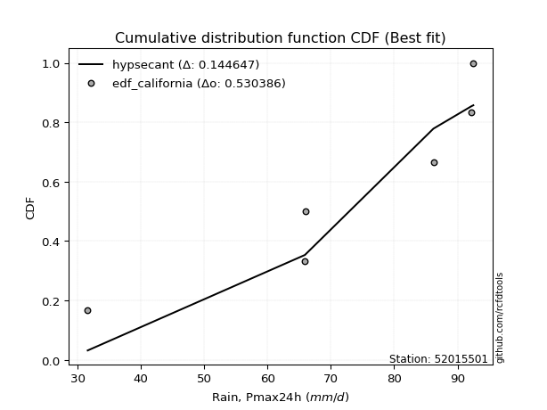</img>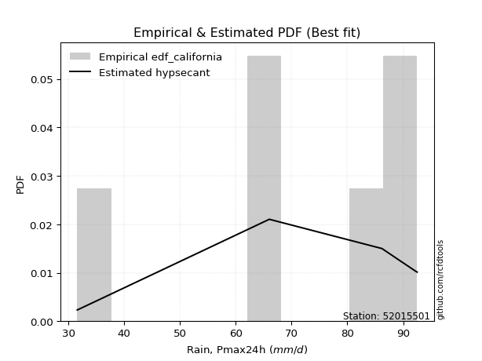</img>

</div>


### 2. EDF Hazen (1930)

Hazen method for plotting positions is a formula used to estimate the empirical cumulative probability distribution of flood events or other hydrological data. This formula often results in biased estimations, particularly when extrapolating to extreme events (high return periods).

<div align="center">


$P=(m-0.5)/n$


</div>


**2.1. Empirical values**

<div align="center">

|                | 0                   | 1                  | 2                  | 3                  | 4         | 5                  |
|:---------------|:--------------------|:-------------------|:-------------------|:-------------------|:----------|:-------------------|
| date           | 2018                | 2022               | 2023               | 2020               | 2021      | 2019               |
| x              | 31.6                | 65.9               | 66.0               | 86.2               | 92.2      | 92.5               |
| m              | 1                   | 2                  | 3                  | 4                  | 5         | 6                  |
| empirical_dist | edf_hazen           | edf_hazen          | edf_hazen          | edf_hazen          | edf_hazen | edf_hazen          |
| empirical      | 0.08333333333333333 | 0.25               | 0.4166666666666667 | 0.5833333333333334 | 0.75      | 0.9166666666666666 |
| empirical_tr   | 1.090909090909091   | 1.3333333333333333 | 1.7142857142857144 | 2.4000000000000004 | 4.0       | 11.999999999999995 |

</div>


**2.2. Kolmogorov-Smirnov fit test (sorted by Δ)**


<div align="center">

|                | 0                   | 1                  | 2                  | 3                   | 4                   | 5                  | 6                   | 7                   | 8                   | 9                   | 10                  | 11                  | 12                 | 13                 | 14                  | 15                  | 16                  | 17                  | 18                  | 19                  | 20                 | 21                 | 22                 | 23                  | 24                  | 25                 | 26                  | 27                  | 28                 | 29                  | 30                  | 31                 | 32                 | 33                  | 34                  | 35                  | 36                 | 37                  | 38                  | 39                  | 40                  | 41                 | 42                 | 43                  | 44                 | 45                  | 46                  | 47                 | 48                  | 49                  | 50                 | 51                 | 52                  | 53                  | 54                  | 55                  | 56                  | 57                  | 58                  | 59                  | 60                 | 61                 | 62                  | 63                  | 64                 | 65                  | 66                  | 67                  | 68                  | 69                  | 70                  | 71                  | 72                 | 73                  | 74                  | 75                 | 76                 | 77                  | 78                 | 79                  | 80                  | 81                  | 82                  | 83                  | 84                  | 85                  | 86                  | 87                  | 88                  | 89                | 90                 | 91                 | 92             | 93                 | 94                  | 95                 | 96                  | 97                 | 98                  | 99                 | 100                | 101                | 102                | 103                 | 104                | 105                | 106                 | 107                | 108                | 109                | 110                 | 111                | 112                 | 113                 | 114                | 115                 | 116               | 117                | 118                 | 119               | 120                | 121                | 122                 | 123                | 124                | 125                | 126                | 127                 | 128                 | 129                 | 130                 | 131                 | 132                | 133                | 134                | 135                 | 136                | 137                | 138                 | 139                | 140                 | 141                 | 142                | 143                | 144                | 145                | 146                | 147                | 148                | 149                | 150                | 151                | 152                | 153               | 154            | 155            | 156            | 157            | 158                | 159                |
|:---------------|:--------------------|:-------------------|:-------------------|:--------------------|:--------------------|:-------------------|:--------------------|:--------------------|:--------------------|:--------------------|:--------------------|:--------------------|:-------------------|:-------------------|:--------------------|:--------------------|:--------------------|:--------------------|:--------------------|:--------------------|:-------------------|:-------------------|:-------------------|:--------------------|:--------------------|:-------------------|:--------------------|:--------------------|:-------------------|:--------------------|:--------------------|:-------------------|:-------------------|:--------------------|:--------------------|:--------------------|:-------------------|:--------------------|:--------------------|:--------------------|:--------------------|:-------------------|:-------------------|:--------------------|:-------------------|:--------------------|:--------------------|:-------------------|:--------------------|:--------------------|:-------------------|:-------------------|:--------------------|:--------------------|:--------------------|:--------------------|:--------------------|:--------------------|:--------------------|:--------------------|:-------------------|:-------------------|:--------------------|:--------------------|:-------------------|:--------------------|:--------------------|:--------------------|:--------------------|:--------------------|:--------------------|:--------------------|:-------------------|:--------------------|:--------------------|:-------------------|:-------------------|:--------------------|:-------------------|:--------------------|:--------------------|:--------------------|:--------------------|:--------------------|:--------------------|:--------------------|:--------------------|:--------------------|:--------------------|:------------------|:-------------------|:-------------------|:---------------|:-------------------|:--------------------|:-------------------|:--------------------|:-------------------|:--------------------|:-------------------|:-------------------|:-------------------|:-------------------|:--------------------|:-------------------|:-------------------|:--------------------|:-------------------|:-------------------|:-------------------|:--------------------|:-------------------|:--------------------|:--------------------|:-------------------|:--------------------|:------------------|:-------------------|:--------------------|:------------------|:-------------------|:-------------------|:--------------------|:-------------------|:-------------------|:-------------------|:-------------------|:--------------------|:--------------------|:--------------------|:--------------------|:--------------------|:-------------------|:-------------------|:-------------------|:--------------------|:-------------------|:-------------------|:--------------------|:-------------------|:--------------------|:--------------------|:-------------------|:-------------------|:-------------------|:-------------------|:-------------------|:-------------------|:-------------------|:-------------------|:-------------------|:-------------------|:-------------------|:------------------|:---------------|:---------------|:---------------|:---------------|:-------------------|:-------------------|
| station        | 52015501            | 52015501           | 52015501           | 52015501            | 52015501            | 52015501           | 52015501            | 52015501            | 52015501            | 52015501            | 52015501            | 52015501            | 52015501           | 52015501           | 52015501            | 52015501            | 52015501            | 52015501            | 52015501            | 52015501            | 52015501           | 52015501           | 52015501           | 52015501            | 52015501            | 52015501           | 52015501            | 52015501            | 52015501           | 52015501            | 52015501            | 52015501           | 52015501           | 52015501            | 52015501            | 52015501            | 52015501           | 52015501            | 52015501            | 52015501            | 52015501            | 52015501           | 52015501           | 52015501            | 52015501           | 52015501            | 52015501            | 52015501           | 52015501            | 52015501            | 52015501           | 52015501           | 52015501            | 52015501            | 52015501            | 52015501            | 52015501            | 52015501            | 52015501            | 52015501            | 52015501           | 52015501           | 52015501            | 52015501            | 52015501           | 52015501            | 52015501            | 52015501            | 52015501            | 52015501            | 52015501            | 52015501            | 52015501           | 52015501            | 52015501            | 52015501           | 52015501           | 52015501            | 52015501           | 52015501            | 52015501            | 52015501            | 52015501            | 52015501            | 52015501            | 52015501            | 52015501            | 52015501            | 52015501            | 52015501          | 52015501           | 52015501           | 52015501       | 52015501           | 52015501            | 52015501           | 52015501            | 52015501           | 52015501            | 52015501           | 52015501           | 52015501           | 52015501           | 52015501            | 52015501           | 52015501           | 52015501            | 52015501           | 52015501           | 52015501           | 52015501            | 52015501           | 52015501            | 52015501            | 52015501           | 52015501            | 52015501          | 52015501           | 52015501            | 52015501          | 52015501           | 52015501           | 52015501            | 52015501           | 52015501           | 52015501           | 52015501           | 52015501            | 52015501            | 52015501            | 52015501            | 52015501            | 52015501           | 52015501           | 52015501           | 52015501            | 52015501           | 52015501           | 52015501            | 52015501           | 52015501            | 52015501            | 52015501           | 52015501           | 52015501           | 52015501           | 52015501           | 52015501           | 52015501           | 52015501           | 52015501           | 52015501           | 52015501           | 52015501          | 52015501       | 52015501       | 52015501       | 52015501       | 52015501           | 52015501           |
| empirical_dist | edf_hazen           | edf_hazen          | edf_hazen          | edf_hazen           | edf_hazen           | edf_hazen          | edf_hazen           | edf_hazen           | edf_hazen           | edf_hazen           | edf_hazen           | edf_hazen           | edf_hazen          | edf_hazen          | edf_hazen           | edf_hazen           | edf_hazen           | edf_hazen           | edf_hazen           | edf_hazen           | edf_hazen          | edf_hazen          | edf_hazen          | edf_hazen           | edf_hazen           | edf_hazen          | edf_hazen           | edf_hazen           | edf_hazen          | edf_hazen           | edf_hazen           | edf_hazen          | edf_hazen          | edf_hazen           | edf_hazen           | edf_hazen           | edf_hazen          | edf_hazen           | edf_hazen           | edf_hazen           | edf_hazen           | edf_hazen          | edf_hazen          | edf_hazen           | edf_hazen          | edf_hazen           | edf_hazen           | edf_hazen          | edf_hazen           | edf_hazen           | edf_hazen          | edf_hazen          | edf_hazen           | edf_hazen           | edf_hazen           | edf_hazen           | edf_hazen           | edf_hazen           | edf_hazen           | edf_hazen           | edf_hazen          | edf_hazen          | edf_hazen           | edf_hazen           | edf_hazen          | edf_hazen           | edf_hazen           | edf_hazen           | edf_hazen           | edf_hazen           | edf_hazen           | edf_hazen           | edf_hazen          | edf_hazen           | edf_hazen           | edf_hazen          | edf_hazen          | edf_hazen           | edf_hazen          | edf_hazen           | edf_hazen           | edf_hazen           | edf_hazen           | edf_hazen           | edf_hazen           | edf_hazen           | edf_hazen           | edf_hazen           | edf_hazen           | edf_hazen         | edf_hazen          | edf_hazen          | edf_hazen      | edf_hazen          | edf_hazen           | edf_hazen          | edf_hazen           | edf_hazen          | edf_hazen           | edf_hazen          | edf_hazen          | edf_hazen          | edf_hazen          | edf_hazen           | edf_hazen          | edf_hazen          | edf_hazen           | edf_hazen          | edf_hazen          | edf_hazen          | edf_hazen           | edf_hazen          | edf_hazen           | edf_hazen           | edf_hazen          | edf_hazen           | edf_hazen         | edf_hazen          | edf_hazen           | edf_hazen         | edf_hazen          | edf_hazen          | edf_hazen           | edf_hazen          | edf_hazen          | edf_hazen          | edf_hazen          | edf_hazen           | edf_hazen           | edf_hazen           | edf_hazen           | edf_hazen           | edf_hazen          | edf_hazen          | edf_hazen          | edf_hazen           | edf_hazen          | edf_hazen          | edf_hazen           | edf_hazen          | edf_hazen           | edf_hazen           | edf_hazen          | edf_hazen          | edf_hazen          | edf_hazen          | edf_hazen          | edf_hazen          | edf_hazen          | edf_hazen          | edf_hazen          | edf_hazen          | edf_hazen          | edf_hazen         | edf_hazen      | edf_hazen      | edf_hazen      | edf_hazen      | edf_hazen          | edf_hazen          |
| p_dist         | logbeta             | trapezoid          | burr               | logpearson3         | loggausshyper       | pearson3           | loggennorm          | gumbel_l            | loggumbel_l         | dweibull            | anglit              | weibull_min         | betaprime          | logvonmises_line   | genpareto           | semicircular        | f                   | nct                 | t                   | exponnorm           | truncnorm          | norm               | crystalball        | rice                | dgamma              | beta               | alpha               | erlang              | vonmises_line      | gamma               | logt                | logburr12          | invgauss           | logweibull_min      | maxwell             | invgamma            | logdweibull        | loggompertz         | weibull_max         | logjohnsonsb        | logmielke           | rayleigh           | argus              | logtrapezoid        | logistic           | arcsine             | logargus            | cosine             | logdgamma           | hypsecant           | gumbel_r           | logburr            | gausshyper          | loghypsecant        | loglogistic         | loglaplace          | loglaplace          | halfnorm            | logncf              | logf                | logcrystalball     | lognorm            | logexponnorm        | logrice             | moyal              | logfatiguelife      | logexponweib        | loggengamma         | laplace             | loganglit           | loginvgamma         | lognct              | genextreme         | loggenextreme       | logsemicircular     | logbetaprime       | halflogistic       | logweibull_max      | logarcsine         | loggamma            | loggamma            | kstwobign           | johnsonsb           | mielke              | logalpha            | genhalflogistic     | logloggamma         | logtruncweibull_min | logloglaplace       | skewnorm          | logmaxwell         | loginvgauss        | gennorm        | levy_l             | wrapcauchy          | loggenhalflogistic | loglevy_l           | lograyleigh        | loginvweibull       | logwrapcauchy      | wald               | triang             | nakagami           | logfoldnorm         | kappa4             | bradford           | loggumbel_r         | logcosine          | loghalfnorm        | loggenpareto       | truncweibull_min    | logkstwobign       | logskewnorm         | ksone               | logmoyal           | loggenexpon         | logtriang         | uniform            | loghalflogistic     | lognakagami       | logexponpow        | kappa3             | loglomax            | burr12             | halfgennorm        | ncf                | logwald            | truncexpon          | logksone            | logtruncnorm        | logtukeylambda      | gompertz            | foldnorm           | loghalfgennorm     | lomax              | logerlang           | logkappa3          | loguniform         | logkappa4           | logbradford        | invweibull          | logjohnsonsu        | logtruncexpon      | logrdist           | johnsonsu          | gengamma           | fatiguelife        | exponweib          | powerlaw           | exponpow           | logpowerlaw        | truncpareto        | logtruncpareto     | genexpon          | genlogistic    | rdist          | tukeylambda    | loggenlogistic | logvonmises        | vonmises           |
| delta          | 0.11509692845199737 | 0.1270688433226035 | 0.1309739974243161 | 0.13151879396351812 | 0.13252368479522358 | 0.1327686608613977 | 0.13587391848490593 | 0.14041331209353458 | 0.14209392292894785 | 0.14422165735782955 | 0.14666759694669224 | 0.14917110020086644 | 0.1515331068451592 | 0.1516036470017409 | 0.15251678159400672 | 0.15345582861778317 | 0.15704003202090566 | 0.15765770086148578 | 0.15765889300751923 | 0.15766853274778003 | 0.1576695366631159 | 0.1576695572309902 | 0.1576695614589293 | 0.15812569782915786 | 0.15822037931868704 | 0.1594099804976179 | 0.16053114775127175 | 0.16108360468276828 | 0.1621692406452635 | 0.16231691167935314 | 0.16452313830376142 | 0.1652739993762068 | 0.1653118396657034 | 0.16605868935704704 | 0.16842879459567095 | 0.16876069840157137 | 0.1717496156367292 | 0.17229614886476552 | 0.17337208821311717 | 0.17373871373984606 | 0.17417723569997978 | 0.1760916567924513 | 0.1781915401716231 | 0.17869247427067791 | 0.1802656343824408 | 0.18476591749258753 | 0.18588943883412568 | 0.1892485386524323 | 0.19191662588213265 | 0.19541311275780193 | 0.1993348732406376 | 0.2005146939274749 | 0.20090042802108965 | 0.20320365861681983 | 0.20750943566796087 | 0.21062921089682995 | 0.21062921089682995 | 0.21100892560448253 | 0.21115031284949642 | 0.21140327868884845 | 0.2125817200605482 | 0.2125817223748413 | 0.21258255367432127 | 0.21258983432322814 | 0.2127548352886568 | 0.21292197432341142 | 0.21317936258818654 | 0.21572166641943064 | 0.21624902562696258 | 0.21791305870416622 | 0.21895342259022121 | 0.21922661824064316 | 0.2197772048090587 | 0.21995889517801104 | 0.22010825572528486 | 0.2201618699433242 | 0.2238934582954049 | 0.22788823936467328 | 0.2288434554044501 | 0.22979435744879512 | 0.22979435744879512 | 0.23019544672102288 | 0.23119540761004648 | 0.23333528334660414 | 0.23472753762558674 | 0.23592420242770307 | 0.23931778089514544 | 0.24021087682495457 | 0.24402118515950882 | 0.246517719064984 | 0.2467241565132508 | 0.2490760491852228 | 0.25           | 0.2532608478448227 | 0.25460204746117676 | 0.2557863089172816 | 0.25836463353065703 | 0.2584336603593168 | 0.25907251818487564 | 0.2592407390527638 | 0.2628639759848178 | 0.2643900489021689 | 0.2687556301014906 | 0.27338677806272926 | 0.2774825383908953 | 0.2786400042331407 | 0.28081448477784976 | 0.2815283318698911 | 0.2914676846215445 | 0.2964050182153559 | 0.29682304024769046 | 0.2969731886710718 | 0.30008572042210857 | 0.30268199233716475 | 0.3064617406113719 | 0.30648175004203115 | 0.309471718839498 | 0.3132183908045978 | 0.31367990078042896 | 0.319380462400564 | 0.3545259331799704 | 0.3580679908505633 | 0.36310690991219385 | 0.3641402589264644 | 0.3667770040724896 | 0.3726672095169349 | 0.3778352290196243 | 0.39535045962336224 | 0.40358943413730697 | 0.40809825167785335 | 0.41097968684771286 | 0.41429185523512885 | 0.4166666666666667 | 0.4166666666666667 | 0.4168235077684025 | 0.42463022568735853 | 0.4329128420338729 | 0.4343073209647683 | 0.43496078679155825 | 0.4364605352050317 | 0.46925437509452383 | 0.47323431546535305 | 0.5025320280144826 | 0.5117196358649283 | 0.5312371343015806 | 0.5484172967451566 | 0.5785411057077763 | 0.5968473381437807 | 0.6647131464683315 | 0.6789173027031882 | 0.6891411810083481 | 0.7004864497707122 | 0.7171427374211915 | 0.745118145969327 | 0.75           | 0.75           | 0.75           | 0.75           | 1.1996932803455618 | 14.802723729990388 |
| deltao         | 0.530385761606      | 0.530385761606     | 0.530385761606     | 0.530385761606      | 0.530385761606      | 0.530385761606     | 0.530385761606      | 0.530385761606      | 0.530385761606      | 0.530385761606      | 0.530385761606      | 0.530385761606      | 0.530385761606     | 0.530385761606     | 0.530385761606      | 0.530385761606      | 0.530385761606      | 0.530385761606      | 0.530385761606      | 0.530385761606      | 0.530385761606     | 0.530385761606     | 0.530385761606     | 0.530385761606      | 0.530385761606      | 0.530385761606     | 0.530385761606      | 0.530385761606      | 0.530385761606     | 0.530385761606      | 0.530385761606      | 0.530385761606     | 0.530385761606     | 0.530385761606      | 0.530385761606      | 0.530385761606      | 0.530385761606     | 0.530385761606      | 0.530385761606      | 0.530385761606      | 0.530385761606      | 0.530385761606     | 0.530385761606     | 0.530385761606      | 0.530385761606     | 0.530385761606      | 0.530385761606      | 0.530385761606     | 0.530385761606      | 0.530385761606      | 0.530385761606     | 0.530385761606     | 0.530385761606      | 0.530385761606      | 0.530385761606      | 0.530385761606      | 0.530385761606      | 0.530385761606      | 0.530385761606      | 0.530385761606      | 0.530385761606     | 0.530385761606     | 0.530385761606      | 0.530385761606      | 0.530385761606     | 0.530385761606      | 0.530385761606      | 0.530385761606      | 0.530385761606      | 0.530385761606      | 0.530385761606      | 0.530385761606      | 0.530385761606     | 0.530385761606      | 0.530385761606      | 0.530385761606     | 0.530385761606     | 0.530385761606      | 0.530385761606     | 0.530385761606      | 0.530385761606      | 0.530385761606      | 0.530385761606      | 0.530385761606      | 0.530385761606      | 0.530385761606      | 0.530385761606      | 0.530385761606      | 0.530385761606      | 0.530385761606    | 0.530385761606     | 0.530385761606     | 0.530385761606 | 0.530385761606     | 0.530385761606      | 0.530385761606     | 0.530385761606      | 0.530385761606     | 0.530385761606      | 0.530385761606     | 0.530385761606     | 0.530385761606     | 0.530385761606     | 0.530385761606      | 0.530385761606     | 0.530385761606     | 0.530385761606      | 0.530385761606     | 0.530385761606     | 0.530385761606     | 0.530385761606      | 0.530385761606     | 0.530385761606      | 0.530385761606      | 0.530385761606     | 0.530385761606      | 0.530385761606    | 0.530385761606     | 0.530385761606      | 0.530385761606    | 0.530385761606     | 0.530385761606     | 0.530385761606      | 0.530385761606     | 0.530385761606     | 0.530385761606     | 0.530385761606     | 0.530385761606      | 0.530385761606      | 0.530385761606      | 0.530385761606      | 0.530385761606      | 0.530385761606     | 0.530385761606     | 0.530385761606     | 0.530385761606      | 0.530385761606     | 0.530385761606     | 0.530385761606      | 0.530385761606     | 0.530385761606      | 0.530385761606      | 0.530385761606     | 0.530385761606     | 0.530385761606     | 0.530385761606     | 0.530385761606     | 0.530385761606     | 0.530385761606     | 0.530385761606     | 0.530385761606     | 0.530385761606     | 0.530385761606     | 0.530385761606    | 0.530385761606 | 0.530385761606 | 0.530385761606 | 0.530385761606 | 0.530385761606     | 0.530385761606     |
| eval           | Δo > Δ              | Δo > Δ             | Δo > Δ             | Δo > Δ              | Δo > Δ              | Δo > Δ             | Δo > Δ              | Δo > Δ              | Δo > Δ              | Δo > Δ              | Δo > Δ              | Δo > Δ              | Δo > Δ             | Δo > Δ             | Δo > Δ              | Δo > Δ              | Δo > Δ              | Δo > Δ              | Δo > Δ              | Δo > Δ              | Δo > Δ             | Δo > Δ             | Δo > Δ             | Δo > Δ              | Δo > Δ              | Δo > Δ             | Δo > Δ              | Δo > Δ              | Δo > Δ             | Δo > Δ              | Δo > Δ              | Δo > Δ             | Δo > Δ             | Δo > Δ              | Δo > Δ              | Δo > Δ              | Δo > Δ             | Δo > Δ              | Δo > Δ              | Δo > Δ              | Δo > Δ              | Δo > Δ             | Δo > Δ             | Δo > Δ              | Δo > Δ             | Δo > Δ              | Δo > Δ              | Δo > Δ             | Δo > Δ              | Δo > Δ              | Δo > Δ             | Δo > Δ             | Δo > Δ              | Δo > Δ              | Δo > Δ              | Δo > Δ              | Δo > Δ              | Δo > Δ              | Δo > Δ              | Δo > Δ              | Δo > Δ             | Δo > Δ             | Δo > Δ              | Δo > Δ              | Δo > Δ             | Δo > Δ              | Δo > Δ              | Δo > Δ              | Δo > Δ              | Δo > Δ              | Δo > Δ              | Δo > Δ              | Δo > Δ             | Δo > Δ              | Δo > Δ              | Δo > Δ             | Δo > Δ             | Δo > Δ              | Δo > Δ             | Δo > Δ              | Δo > Δ              | Δo > Δ              | Δo > Δ              | Δo > Δ              | Δo > Δ              | Δo > Δ              | Δo > Δ              | Δo > Δ              | Δo > Δ              | Δo > Δ            | Δo > Δ             | Δo > Δ             | Δo > Δ         | Δo > Δ             | Δo > Δ              | Δo > Δ             | Δo > Δ              | Δo > Δ             | Δo > Δ              | Δo > Δ             | Δo > Δ             | Δo > Δ             | Δo > Δ             | Δo > Δ              | Δo > Δ             | Δo > Δ             | Δo > Δ              | Δo > Δ             | Δo > Δ             | Δo > Δ             | Δo > Δ              | Δo > Δ             | Δo > Δ              | Δo > Δ              | Δo > Δ             | Δo > Δ              | Δo > Δ            | Δo > Δ             | Δo > Δ              | Δo > Δ            | Δo > Δ             | Δo > Δ             | Δo > Δ              | Δo > Δ             | Δo > Δ             | Δo > Δ             | Δo > Δ             | Δo > Δ              | Δo > Δ              | Δo > Δ              | Δo > Δ              | Δo > Δ              | Δo > Δ             | Δo > Δ             | Δo > Δ             | Δo > Δ              | Δo > Δ             | Δo > Δ             | Δo > Δ              | Δo > Δ             | Δo > Δ              | Δo > Δ              | Δo > Δ             | Δo > Δ             | Δo <= Δ            | Δo <= Δ            | Δo <= Δ            | Δo <= Δ            | Δo <= Δ            | Δo <= Δ            | Δo <= Δ            | Δo <= Δ            | Δo <= Δ            | Δo <= Δ           | Δo <= Δ        | Δo <= Δ        | Δo <= Δ        | Δo <= Δ        | Δo <= Δ            | Δo <= Δ            |
| fit            | 1                   | 1                  | 1                  | 1                   | 1                   | 1                  | 1                   | 1                   | 1                   | 1                   | 1                   | 1                   | 1                  | 1                  | 1                   | 1                   | 1                   | 1                   | 1                   | 1                   | 1                  | 1                  | 1                  | 1                   | 1                   | 1                  | 1                   | 1                   | 1                  | 1                   | 1                   | 1                  | 1                  | 1                   | 1                   | 1                   | 1                  | 1                   | 1                   | 1                   | 1                   | 1                  | 1                  | 1                   | 1                  | 1                   | 1                   | 1                  | 1                   | 1                   | 1                  | 1                  | 1                   | 1                   | 1                   | 1                   | 1                   | 1                   | 1                   | 1                   | 1                  | 1                  | 1                   | 1                   | 1                  | 1                   | 1                   | 1                   | 1                   | 1                   | 1                   | 1                   | 1                  | 1                   | 1                   | 1                  | 1                  | 1                   | 1                  | 1                   | 1                   | 1                   | 1                   | 1                   | 1                   | 1                   | 1                   | 1                   | 1                   | 1                 | 1                  | 1                  | 1              | 1                  | 1                   | 1                  | 1                   | 1                  | 1                   | 1                  | 1                  | 1                  | 1                  | 1                   | 1                  | 1                  | 1                   | 1                  | 1                  | 1                  | 1                   | 1                  | 1                   | 1                   | 1                  | 1                   | 1                 | 1                  | 1                   | 1                 | 1                  | 1                  | 1                   | 1                  | 1                  | 1                  | 1                  | 1                   | 1                   | 1                   | 1                   | 1                   | 1                  | 1                  | 1                  | 1                   | 1                  | 1                  | 1                   | 1                  | 1                   | 1                   | 1                  | 1                  | 0                  | 0                  | 0                  | 0                  | 0                  | 0                  | 0                  | 0                  | 0                  | 0                 | 0              | 0              | 0              | 0              | 0                  | 0                  |
| n              | 6                   | 6                  | 6                  | 6                   | 6                   | 6                  | 6                   | 6                   | 6                   | 6                   | 6                   | 6                   | 6                  | 6                  | 6                   | 6                   | 6                   | 6                   | 6                   | 6                   | 6                  | 6                  | 6                  | 6                   | 6                   | 6                  | 6                   | 6                   | 6                  | 6                   | 6                   | 6                  | 6                  | 6                   | 6                   | 6                   | 6                  | 6                   | 6                   | 6                   | 6                   | 6                  | 6                  | 6                   | 6                  | 6                   | 6                   | 6                  | 6                   | 6                   | 6                  | 6                  | 6                   | 6                   | 6                   | 6                   | 6                   | 6                   | 6                   | 6                   | 6                  | 6                  | 6                   | 6                   | 6                  | 6                   | 6                   | 6                   | 6                   | 6                   | 6                   | 6                   | 6                  | 6                   | 6                   | 6                  | 6                  | 6                   | 6                  | 6                   | 6                   | 6                   | 6                   | 6                   | 6                   | 6                   | 6                   | 6                   | 6                   | 6                 | 6                  | 6                  | 6              | 6                  | 6                   | 6                  | 6                   | 6                  | 6                   | 6                  | 6                  | 6                  | 6                  | 6                   | 6                  | 6                  | 6                   | 6                  | 6                  | 6                  | 6                   | 6                  | 6                   | 6                   | 6                  | 6                   | 6                 | 6                  | 6                   | 6                 | 6                  | 6                  | 6                   | 6                  | 6                  | 6                  | 6                  | 6                   | 6                   | 6                   | 6                   | 6                   | 6                  | 6                  | 6                  | 6                   | 6                  | 6                  | 6                   | 6                  | 6                   | 6                   | 6                  | 6                  | 6                  | 6                  | 6                  | 6                  | 6                  | 6                  | 6                  | 6                  | 6                  | 6                 | 6              | 6              | 6              | 6              | 6                  | 6                  |
| best_fit       | 1                   | 0                  | 0                  | 0                   | 0                   | 0                  | 0                   | 0                   | 0                   | 0                   | 0                   | 0                   | 0                  | 0                  | 0                   | 0                   | 0                   | 0                   | 0                   | 0                   | 0                  | 0                  | 0                  | 0                   | 0                   | 0                  | 0                   | 0                   | 0                  | 0                   | 0                   | 0                  | 0                  | 0                   | 0                   | 0                   | 0                  | 0                   | 0                   | 0                   | 0                   | 0                  | 0                  | 0                   | 0                  | 0                   | 0                   | 0                  | 0                   | 0                   | 0                  | 0                  | 0                   | 0                   | 0                   | 0                   | 0                   | 0                   | 0                   | 0                   | 0                  | 0                  | 0                   | 0                   | 0                  | 0                   | 0                   | 0                   | 0                   | 0                   | 0                   | 0                   | 0                  | 0                   | 0                   | 0                  | 0                  | 0                   | 0                  | 0                   | 0                   | 0                   | 0                   | 0                   | 0                   | 0                   | 0                   | 0                   | 0                   | 0                 | 0                  | 0                  | 0              | 0                  | 0                   | 0                  | 0                   | 0                  | 0                   | 0                  | 0                  | 0                  | 0                  | 0                   | 0                  | 0                  | 0                   | 0                  | 0                  | 0                  | 0                   | 0                  | 0                   | 0                   | 0                  | 0                   | 0                 | 0                  | 0                   | 0                 | 0                  | 0                  | 0                   | 0                  | 0                  | 0                  | 0                  | 0                   | 0                   | 0                   | 0                   | 0                   | 0                  | 0                  | 0                  | 0                   | 0                  | 0                  | 0                   | 0                  | 0                   | 0                   | 0                  | 0                  | 0                  | 0                  | 0                  | 0                  | 0                  | 0                  | 0                  | 0                  | 0                  | 0                 | 0              | 0              | 0              | 0              | 0                  | 0                  |
| best_fit_sort  | 1                   | 2                  | 3                  | 4                   | 5                   | 6                  | 7                   | 8                   | 9                   | 10                  | 11                  | 12                  | 13                 | 14                 | 15                  | 16                  | 17                  | 18                  | 19                  | 20                  | 21                 | 22                 | 23                 | 24                  | 25                  | 26                 | 27                  | 28                  | 29                 | 30                  | 31                  | 32                 | 33                 | 34                  | 35                  | 36                  | 37                 | 38                  | 39                  | 40                  | 41                  | 42                 | 43                 | 44                  | 45                 | 46                  | 47                  | 48                 | 49                  | 50                  | 51                 | 52                 | 53                  | 54                  | 55                  | 56                  | 57                  | 58                  | 59                  | 60                  | 61                 | 62                 | 63                  | 64                  | 65                 | 66                  | 67                  | 68                  | 69                  | 70                  | 71                  | 72                  | 73                 | 74                  | 75                  | 76                 | 77                 | 78                  | 79                 | 80                  | 81                  | 82                  | 83                  | 84                  | 85                  | 86                  | 87                  | 88                  | 89                  | 90                | 91                 | 92                 | 93             | 94                 | 95                  | 96                 | 97                  | 98                 | 99                  | 100                | 101                | 102                | 103                | 104                 | 105                | 106                | 107                 | 108                | 109                | 110                | 111                 | 112                | 113                 | 114                 | 115                | 116                 | 117               | 118                | 119                 | 120               | 121                | 122                | 123                 | 124                | 125                | 126                | 127                | 128                 | 129                 | 130                 | 131                 | 132                 | 133                | 134                | 135                | 136                 | 137                | 138                | 139                 | 140                | 141                 | 142                 | 143                | 144                | 145                | 146                | 147                | 148                | 149                | 150                | 151                | 152                | 153                | 154               | 155            | 156            | 157            | 158            | 159                | 160                |

</div>


**2.3. Best fit**

<div align="center">

|   id |   station | empirical_dist   | p_dist   |    delta |   deltao | eval   |   fit |   n |   best_fit |   best_fit_sort |
|-----:|----------:|:-----------------|:---------|---------:|---------:|:-------|------:|----:|-----------:|----------------:|
|    0 |  52015501 | edf_hazen        | logbeta  | 0.115097 | 0.530386 | Δo > Δ |     1 |   6 |          1 |               1 |

</div>


<div align="center">

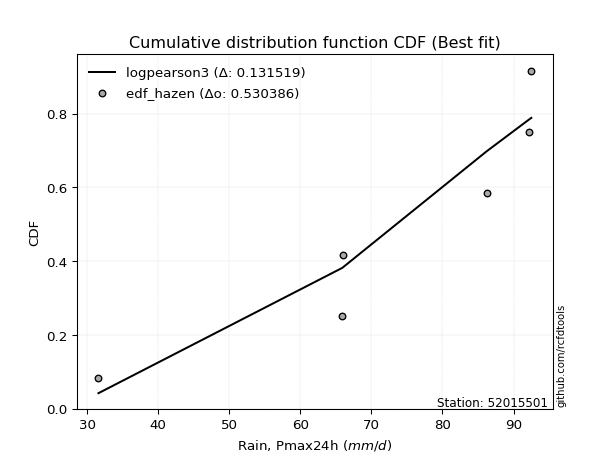</img>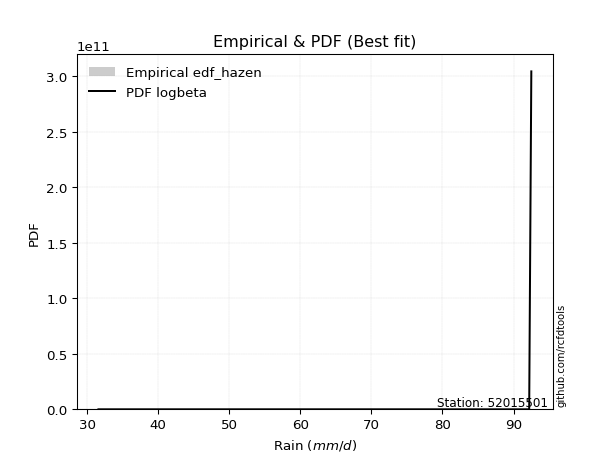</img>

</div>


### 3. EDF Weibull (1939)

Weibull plotting position formula is an empirical method used to estimate the non-exceedance probability or plotting position for a set of observed data, is often recommended or widely used in practice, particularly in flood frequency analysis.

<div align="center">


$P=m/(n+1)$


</div>


**3.1. Empirical values**

<div align="center">

|                | 0                   | 1                  | 2                   | 3                  | 4                  | 5                  |
|:---------------|:--------------------|:-------------------|:--------------------|:-------------------|:-------------------|:-------------------|
| date           | 2018                | 2022               | 2023                | 2020               | 2021               | 2019               |
| x              | 31.6                | 65.9               | 66.0                | 86.2               | 92.2               | 92.5               |
| m              | 1                   | 2                  | 3                   | 4                  | 5                  | 6                  |
| empirical_dist | edf_weibull         | edf_weibull        | edf_weibull         | edf_weibull        | edf_weibull        | edf_weibull        |
| empirical      | 0.14285714285714285 | 0.2857142857142857 | 0.42857142857142855 | 0.5714285714285714 | 0.7142857142857143 | 0.8571428571428571 |
| empirical_tr   | 1.1666666666666665  | 1.4                | 1.75                | 2.333333333333333  | 3.5                | 6.999999999999997  |

</div>


**3.2. Kolmogorov-Smirnov fit test (sorted by Δ)**


<div align="center">

|                | 0                   | 1                   | 2                   | 3                   | 4                   | 5                   | 6                   | 7                   | 8                   | 9                   | 10                  | 11                  | 12                  | 13                  | 14                  | 15                 | 16                 | 17                 | 18                  | 19                  | 20                  | 21                 | 22                  | 23                  | 24                  | 25                  | 26                 | 27                | 28                  | 29                  | 30                  | 31                  | 32                  | 33                  | 34                  | 35                  | 36                 | 37                  | 38                  | 39                 | 40                 | 41                  | 42                  | 43                  | 44                  | 45                  | 46                | 47                  | 48                  | 49                  | 50                  | 51                  | 52                  | 53                 | 54                  | 55                 | 56                  | 57                  | 58                  | 59                  | 60                  | 61                  | 62                  | 63                  | 64                  | 65                 | 66                  | 67                  | 68                  | 69                 | 70                  | 71                 | 72                  | 73                  | 74                 | 75                  | 76                 | 77                  | 78                  | 79                 | 80                  | 81                  | 82                 | 83                  | 84                 | 85                  | 86                  | 87                 | 88                 | 89                  | 90                  | 91                  | 92                  | 93                 | 94                  | 95                 | 96                 | 97                 | 98                 | 99                 | 100                 | 101                 | 102                 | 103                | 104                | 105                 | 106                 | 107                 | 108                 | 109                 | 110                | 111                 | 112                 | 113                 | 114                | 115                 | 116                 | 117                | 118                 | 119                 | 120                | 121                 | 122                | 123                | 124                 | 125                | 126                | 127                 | 128                 | 129                 | 130                 | 131                | 132                | 133                 | 134               | 135                | 136                | 137                | 138                | 139                 | 140                | 141                 | 142                | 143                | 144                | 145                | 146                | 147               | 148                | 149                | 150                | 151                | 152                | 153                | 154                | 155                | 156                | 157                | 158                | 159                |
|:---------------|:--------------------|:--------------------|:--------------------|:--------------------|:--------------------|:--------------------|:--------------------|:--------------------|:--------------------|:--------------------|:--------------------|:--------------------|:--------------------|:--------------------|:--------------------|:-------------------|:-------------------|:-------------------|:--------------------|:--------------------|:--------------------|:-------------------|:--------------------|:--------------------|:--------------------|:--------------------|:-------------------|:------------------|:--------------------|:--------------------|:--------------------|:--------------------|:--------------------|:--------------------|:--------------------|:--------------------|:-------------------|:--------------------|:--------------------|:-------------------|:-------------------|:--------------------|:--------------------|:--------------------|:--------------------|:--------------------|:------------------|:--------------------|:--------------------|:--------------------|:--------------------|:--------------------|:--------------------|:-------------------|:--------------------|:-------------------|:--------------------|:--------------------|:--------------------|:--------------------|:--------------------|:--------------------|:--------------------|:--------------------|:--------------------|:-------------------|:--------------------|:--------------------|:--------------------|:-------------------|:--------------------|:-------------------|:--------------------|:--------------------|:-------------------|:--------------------|:-------------------|:--------------------|:--------------------|:-------------------|:--------------------|:--------------------|:-------------------|:--------------------|:-------------------|:--------------------|:--------------------|:-------------------|:-------------------|:--------------------|:--------------------|:--------------------|:--------------------|:-------------------|:--------------------|:-------------------|:-------------------|:-------------------|:-------------------|:-------------------|:--------------------|:--------------------|:--------------------|:-------------------|:-------------------|:--------------------|:--------------------|:--------------------|:--------------------|:--------------------|:-------------------|:--------------------|:--------------------|:--------------------|:-------------------|:--------------------|:--------------------|:-------------------|:--------------------|:--------------------|:-------------------|:--------------------|:-------------------|:-------------------|:--------------------|:-------------------|:-------------------|:--------------------|:--------------------|:--------------------|:--------------------|:-------------------|:-------------------|:--------------------|:------------------|:-------------------|:-------------------|:-------------------|:-------------------|:--------------------|:-------------------|:--------------------|:-------------------|:-------------------|:-------------------|:-------------------|:-------------------|:------------------|:-------------------|:-------------------|:-------------------|:-------------------|:-------------------|:-------------------|:-------------------|:-------------------|:-------------------|:-------------------|:-------------------|:-------------------|
| station        | 52015501            | 52015501            | 52015501            | 52015501            | 52015501            | 52015501            | 52015501            | 52015501            | 52015501            | 52015501            | 52015501            | 52015501            | 52015501            | 52015501            | 52015501            | 52015501           | 52015501           | 52015501           | 52015501            | 52015501            | 52015501            | 52015501           | 52015501            | 52015501            | 52015501            | 52015501            | 52015501           | 52015501          | 52015501            | 52015501            | 52015501            | 52015501            | 52015501            | 52015501            | 52015501            | 52015501            | 52015501           | 52015501            | 52015501            | 52015501           | 52015501           | 52015501            | 52015501            | 52015501            | 52015501            | 52015501            | 52015501          | 52015501            | 52015501            | 52015501            | 52015501            | 52015501            | 52015501            | 52015501           | 52015501            | 52015501           | 52015501            | 52015501            | 52015501            | 52015501            | 52015501            | 52015501            | 52015501            | 52015501            | 52015501            | 52015501           | 52015501            | 52015501            | 52015501            | 52015501           | 52015501            | 52015501           | 52015501            | 52015501            | 52015501           | 52015501            | 52015501           | 52015501            | 52015501            | 52015501           | 52015501            | 52015501            | 52015501           | 52015501            | 52015501           | 52015501            | 52015501            | 52015501           | 52015501           | 52015501            | 52015501            | 52015501            | 52015501            | 52015501           | 52015501            | 52015501           | 52015501           | 52015501           | 52015501           | 52015501           | 52015501            | 52015501            | 52015501            | 52015501           | 52015501           | 52015501            | 52015501            | 52015501            | 52015501            | 52015501            | 52015501           | 52015501            | 52015501            | 52015501            | 52015501           | 52015501            | 52015501            | 52015501           | 52015501            | 52015501            | 52015501           | 52015501            | 52015501           | 52015501           | 52015501            | 52015501           | 52015501           | 52015501            | 52015501            | 52015501            | 52015501            | 52015501           | 52015501           | 52015501            | 52015501          | 52015501           | 52015501           | 52015501           | 52015501           | 52015501            | 52015501           | 52015501            | 52015501           | 52015501           | 52015501           | 52015501           | 52015501           | 52015501          | 52015501           | 52015501           | 52015501           | 52015501           | 52015501           | 52015501           | 52015501           | 52015501           | 52015501           | 52015501           | 52015501           | 52015501           |
| empirical_dist | edf_weibull         | edf_weibull         | edf_weibull         | edf_weibull         | edf_weibull         | edf_weibull         | edf_weibull         | edf_weibull         | edf_weibull         | edf_weibull         | edf_weibull         | edf_weibull         | edf_weibull         | edf_weibull         | edf_weibull         | edf_weibull        | edf_weibull        | edf_weibull        | edf_weibull         | edf_weibull         | edf_weibull         | edf_weibull        | edf_weibull         | edf_weibull         | edf_weibull         | edf_weibull         | edf_weibull        | edf_weibull       | edf_weibull         | edf_weibull         | edf_weibull         | edf_weibull         | edf_weibull         | edf_weibull         | edf_weibull         | edf_weibull         | edf_weibull        | edf_weibull         | edf_weibull         | edf_weibull        | edf_weibull        | edf_weibull         | edf_weibull         | edf_weibull         | edf_weibull         | edf_weibull         | edf_weibull       | edf_weibull         | edf_weibull         | edf_weibull         | edf_weibull         | edf_weibull         | edf_weibull         | edf_weibull        | edf_weibull         | edf_weibull        | edf_weibull         | edf_weibull         | edf_weibull         | edf_weibull         | edf_weibull         | edf_weibull         | edf_weibull         | edf_weibull         | edf_weibull         | edf_weibull        | edf_weibull         | edf_weibull         | edf_weibull         | edf_weibull        | edf_weibull         | edf_weibull        | edf_weibull         | edf_weibull         | edf_weibull        | edf_weibull         | edf_weibull        | edf_weibull         | edf_weibull         | edf_weibull        | edf_weibull         | edf_weibull         | edf_weibull        | edf_weibull         | edf_weibull        | edf_weibull         | edf_weibull         | edf_weibull        | edf_weibull        | edf_weibull         | edf_weibull         | edf_weibull         | edf_weibull         | edf_weibull        | edf_weibull         | edf_weibull        | edf_weibull        | edf_weibull        | edf_weibull        | edf_weibull        | edf_weibull         | edf_weibull         | edf_weibull         | edf_weibull        | edf_weibull        | edf_weibull         | edf_weibull         | edf_weibull         | edf_weibull         | edf_weibull         | edf_weibull        | edf_weibull         | edf_weibull         | edf_weibull         | edf_weibull        | edf_weibull         | edf_weibull         | edf_weibull        | edf_weibull         | edf_weibull         | edf_weibull        | edf_weibull         | edf_weibull        | edf_weibull        | edf_weibull         | edf_weibull        | edf_weibull        | edf_weibull         | edf_weibull         | edf_weibull         | edf_weibull         | edf_weibull        | edf_weibull        | edf_weibull         | edf_weibull       | edf_weibull        | edf_weibull        | edf_weibull        | edf_weibull        | edf_weibull         | edf_weibull        | edf_weibull         | edf_weibull        | edf_weibull        | edf_weibull        | edf_weibull        | edf_weibull        | edf_weibull       | edf_weibull        | edf_weibull        | edf_weibull        | edf_weibull        | edf_weibull        | edf_weibull        | edf_weibull        | edf_weibull        | edf_weibull        | edf_weibull        | edf_weibull        | edf_weibull        |
| p_dist         | trapezoid           | logpearson3         | dweibull            | logtrapezoid        | logdweibull         | dgamma              | logdgamma           | semicircular        | anglit              | logbeta             | burr                | logjohnsonsb        | weibull_max         | logvonmises_line    | loggumbel_l         | pearson3           | arcsine            | loggennorm         | gumbel_l            | invgauss            | loggausshyper       | weibull_min        | betaprime           | logweibull_max      | f                   | nct                 | t                  | exponnorm         | truncnorm           | norm                | crystalball         | rice                | alpha               | erlang              | logt                | vonmises_line       | gamma              | logncf              | logf                | logcrystalball     | lognorm            | logexponnorm        | logrice             | logburr12           | logfatiguelife      | logexponweib        | logweibull_min    | maxwell             | invgamma            | loganglit           | loginvgamma         | rayleigh            | lognct              | loggompertz        | logsemicircular     | logbetaprime       | loggengamma         | loglogistic         | genpareto           | logistic            | logarcsine          | halfnorm            | loggamma            | loggamma            | kstwobign           | beta               | logalpha            | loghypsecant        | cosine              | hypsecant          | logmielke           | logmaxwell         | gumbel_r            | logargus            | loginvgauss        | argus               | gennorm            | halflogistic        | wrapcauchy          | johnsonsb          | loglaplace          | loglaplace          | lograyleigh        | loginvweibull       | logwrapcauchy      | moyal               | laplace             | logloglaplace      | logburr            | gausshyper          | logfoldnorm         | loggumbel_r         | logcosine           | genextreme         | loggenextreme       | loghalfnorm        | loggenpareto       | levy_l             | logkstwobign       | wald               | ksone               | mielke              | bradford            | loglevy_l          | logmoyal           | loggenexpon         | genhalflogistic     | loggenhalflogistic  | logloggamma         | logtruncweibull_min | kappa4             | skewnorm            | loghalflogistic     | triang              | nakagami           | truncweibull_min    | logskewnorm         | logexponpow        | logtriang           | uniform             | kappa3             | loglomax            | burr12             | halfgennorm        | lognakagami         | ncf                | logwald            | lomax               | truncexpon          | logksone            | logerlang           | logkappa3          | loguniform         | logkappa4           | logbradford       | invweibull         | logtruncnorm       | logtukeylambda     | gompertz           | loghalfgennorm      | foldnorm           | logjohnsonsu        | logrdist           | logtruncexpon      | johnsonsu          | gengamma           | fatiguelife        | exponweib         | powerlaw           | exponpow           | logpowerlaw        | truncpareto        | logtruncpareto     | genexpon           | genlogistic        | rdist              | tukeylambda        | loggenlogistic     | logvonmises        | vonmises           |
| delta          | 0.09938831391256375 | 0.12613067576185055 | 0.12863561144614516 | 0.12970046162310606 | 0.13010076869236292 | 0.13355230176553615 | 0.13460669940872522 | 0.13728072229808158 | 0.14242297162053807 | 0.14250164015618705 | 0.14262146216318572 | 0.14285182090916593 | 0.14285627990596883 | 0.14285712200027875 | 0.14337421457599708 | 0.1446734227661597 | 0.1452122911804788 | 0.1477786803896679 | 0.15231807399829655 | 0.15503101705297762 | 0.15709901909995572 | 0.1610758621056284 | 0.16343786874992117 | 0.16836442984086375 | 0.16894479392566764 | 0.16956246276624776 | 0.1695636549122812 | 0.169573294652542 | 0.16957429856787787 | 0.16957431913575216 | 0.16957432336369127 | 0.17003045973391984 | 0.17243590965603373 | 0.17298836658753025 | 0.17370412193561102 | 0.17407400255002548 | 0.1742216735841151 | 0.17543602713521073 | 0.17568899297456275 | 0.1768674343462625 | 0.1768674366605556 | 0.17686826796003557 | 0.17687554860894245 | 0.17717876128096877 | 0.17720768860912572 | 0.17746507687390084 | 0.177963451261809 | 0.18033355650043292 | 0.18066546030633335 | 0.18219877298988052 | 0.18323913687593552 | 0.18341624572213056 | 0.18351233252635746 | 0.1842009107695275 | 0.18439397001099916 | 0.1844475842290385 | 0.18477531070911746 | 0.18570805937318102 | 0.18823106730829242 | 0.19217039628720278 | 0.19312916969016442 | 0.19356669265041415 | 0.19408007173450942 | 0.19408007173450942 | 0.19448116100673718 | 0.1951242662119036 | 0.19901325191130104 | 0.20098189506750475 | 0.20115330055719427 | 0.2073178746625639 | 0.20989152141426548 | 0.2110098707989651 | 0.21123963514539956 | 0.21193706094186504 | 0.2133617634709371 | 0.21390582588590878 | 0.2142857142857143 | 0.21848361936118976 | 0.21888776174689106 | 0.2192906457052845 | 0.22253397280159193 | 0.22253397280159193 | 0.2227193746450311 | 0.22335823247058995 | 0.2235264533384781 | 0.22465959719341877 | 0.22815378753172455 | 0.2289768652410613 | 0.2362289796417606 | 0.23661471373537535 | 0.23767249234844356 | 0.24510019906356406 | 0.24581404615560543 | 0.2554914905233444 | 0.25567318089229674 | 0.2557533989072588 | 0.2606907325010702 | 0.2608661184184186 | 0.2612589029567861 | 0.2660558680295537 | 0.26696770662287905 | 0.26904956906088984 | 0.26957504953370337 | 0.2702693954354189 | 0.2707474548970862 | 0.27076746432774546 | 0.27163848814198877 | 0.27448131241233475 | 0.27503206660943114 | 0.27592516253924027 | 0.2770295680533358 | 0.27754932616970107 | 0.27796561506614326 | 0.27817750104491634 | 0.2855133125752939 | 0.30872780215245244 | 0.31199048232687054 | 0.3188116474656847 | 0.32137648074425995 | 0.32512315270935965 | 0.3269840547729608 | 0.32739262419790816 | 0.3284259732121787 | 0.3310627183582039 | 0.33128522430532586 | 0.3369529238026492 | 0.3421209433053386 | 0.35729969824459296 | 0.35963617390907654 | 0.36787514842302127 | 0.38891593997307283 | 0.3971985563195872 | 0.3985930352504826 | 0.39924650107727255 | 0.400746249490746 | 0.4097305655707143 | 0.4200030135826152 | 0.4228844487524747 | 0.4261966171398907 | 0.42857142857142855 | 0.4285714285714286 | 0.43752002975106735 | 0.4521958263411187 | 0.4668177423001969 | 0.4955228485872949 | 0.5127030110308709 | 0.5428268199934906 | 0.561133052429495 | 0.6289988607540458 | 0.6432030169889025 | 0.6534268952940624 | 0.6647721640564265 | 0.6814284517069058 | 0.7094038602550413 | 0.7142857142857143 | 0.7142857142857143 | 0.7142857142857143 | 0.7142857142857143 | 1.1639789946312762 | 14.838438015704675 |
| deltao         | 0.530385761606      | 0.530385761606      | 0.530385761606      | 0.530385761606      | 0.530385761606      | 0.530385761606      | 0.530385761606      | 0.530385761606      | 0.530385761606      | 0.530385761606      | 0.530385761606      | 0.530385761606      | 0.530385761606      | 0.530385761606      | 0.530385761606      | 0.530385761606     | 0.530385761606     | 0.530385761606     | 0.530385761606      | 0.530385761606      | 0.530385761606      | 0.530385761606     | 0.530385761606      | 0.530385761606      | 0.530385761606      | 0.530385761606      | 0.530385761606     | 0.530385761606    | 0.530385761606      | 0.530385761606      | 0.530385761606      | 0.530385761606      | 0.530385761606      | 0.530385761606      | 0.530385761606      | 0.530385761606      | 0.530385761606     | 0.530385761606      | 0.530385761606      | 0.530385761606     | 0.530385761606     | 0.530385761606      | 0.530385761606      | 0.530385761606      | 0.530385761606      | 0.530385761606      | 0.530385761606    | 0.530385761606      | 0.530385761606      | 0.530385761606      | 0.530385761606      | 0.530385761606      | 0.530385761606      | 0.530385761606     | 0.530385761606      | 0.530385761606     | 0.530385761606      | 0.530385761606      | 0.530385761606      | 0.530385761606      | 0.530385761606      | 0.530385761606      | 0.530385761606      | 0.530385761606      | 0.530385761606      | 0.530385761606     | 0.530385761606      | 0.530385761606      | 0.530385761606      | 0.530385761606     | 0.530385761606      | 0.530385761606     | 0.530385761606      | 0.530385761606      | 0.530385761606     | 0.530385761606      | 0.530385761606     | 0.530385761606      | 0.530385761606      | 0.530385761606     | 0.530385761606      | 0.530385761606      | 0.530385761606     | 0.530385761606      | 0.530385761606     | 0.530385761606      | 0.530385761606      | 0.530385761606     | 0.530385761606     | 0.530385761606      | 0.530385761606      | 0.530385761606      | 0.530385761606      | 0.530385761606     | 0.530385761606      | 0.530385761606     | 0.530385761606     | 0.530385761606     | 0.530385761606     | 0.530385761606     | 0.530385761606      | 0.530385761606      | 0.530385761606      | 0.530385761606     | 0.530385761606     | 0.530385761606      | 0.530385761606      | 0.530385761606      | 0.530385761606      | 0.530385761606      | 0.530385761606     | 0.530385761606      | 0.530385761606      | 0.530385761606      | 0.530385761606     | 0.530385761606      | 0.530385761606      | 0.530385761606     | 0.530385761606      | 0.530385761606      | 0.530385761606     | 0.530385761606      | 0.530385761606     | 0.530385761606     | 0.530385761606      | 0.530385761606     | 0.530385761606     | 0.530385761606      | 0.530385761606      | 0.530385761606      | 0.530385761606      | 0.530385761606     | 0.530385761606     | 0.530385761606      | 0.530385761606    | 0.530385761606     | 0.530385761606     | 0.530385761606     | 0.530385761606     | 0.530385761606      | 0.530385761606     | 0.530385761606      | 0.530385761606     | 0.530385761606     | 0.530385761606     | 0.530385761606     | 0.530385761606     | 0.530385761606    | 0.530385761606     | 0.530385761606     | 0.530385761606     | 0.530385761606     | 0.530385761606     | 0.530385761606     | 0.530385761606     | 0.530385761606     | 0.530385761606     | 0.530385761606     | 0.530385761606     | 0.530385761606     |
| eval           | Δo > Δ              | Δo > Δ              | Δo > Δ              | Δo > Δ              | Δo > Δ              | Δo > Δ              | Δo > Δ              | Δo > Δ              | Δo > Δ              | Δo > Δ              | Δo > Δ              | Δo > Δ              | Δo > Δ              | Δo > Δ              | Δo > Δ              | Δo > Δ             | Δo > Δ             | Δo > Δ             | Δo > Δ              | Δo > Δ              | Δo > Δ              | Δo > Δ             | Δo > Δ              | Δo > Δ              | Δo > Δ              | Δo > Δ              | Δo > Δ             | Δo > Δ            | Δo > Δ              | Δo > Δ              | Δo > Δ              | Δo > Δ              | Δo > Δ              | Δo > Δ              | Δo > Δ              | Δo > Δ              | Δo > Δ             | Δo > Δ              | Δo > Δ              | Δo > Δ             | Δo > Δ             | Δo > Δ              | Δo > Δ              | Δo > Δ              | Δo > Δ              | Δo > Δ              | Δo > Δ            | Δo > Δ              | Δo > Δ              | Δo > Δ              | Δo > Δ              | Δo > Δ              | Δo > Δ              | Δo > Δ             | Δo > Δ              | Δo > Δ             | Δo > Δ              | Δo > Δ              | Δo > Δ              | Δo > Δ              | Δo > Δ              | Δo > Δ              | Δo > Δ              | Δo > Δ              | Δo > Δ              | Δo > Δ             | Δo > Δ              | Δo > Δ              | Δo > Δ              | Δo > Δ             | Δo > Δ              | Δo > Δ             | Δo > Δ              | Δo > Δ              | Δo > Δ             | Δo > Δ              | Δo > Δ             | Δo > Δ              | Δo > Δ              | Δo > Δ             | Δo > Δ              | Δo > Δ              | Δo > Δ             | Δo > Δ              | Δo > Δ             | Δo > Δ              | Δo > Δ              | Δo > Δ             | Δo > Δ             | Δo > Δ              | Δo > Δ              | Δo > Δ              | Δo > Δ              | Δo > Δ             | Δo > Δ              | Δo > Δ             | Δo > Δ             | Δo > Δ             | Δo > Δ             | Δo > Δ             | Δo > Δ              | Δo > Δ              | Δo > Δ              | Δo > Δ             | Δo > Δ             | Δo > Δ              | Δo > Δ              | Δo > Δ              | Δo > Δ              | Δo > Δ              | Δo > Δ             | Δo > Δ              | Δo > Δ              | Δo > Δ              | Δo > Δ             | Δo > Δ              | Δo > Δ              | Δo > Δ             | Δo > Δ              | Δo > Δ              | Δo > Δ             | Δo > Δ              | Δo > Δ             | Δo > Δ             | Δo > Δ              | Δo > Δ             | Δo > Δ             | Δo > Δ              | Δo > Δ              | Δo > Δ              | Δo > Δ              | Δo > Δ             | Δo > Δ             | Δo > Δ              | Δo > Δ            | Δo > Δ             | Δo > Δ             | Δo > Δ             | Δo > Δ             | Δo > Δ              | Δo > Δ             | Δo > Δ              | Δo > Δ             | Δo > Δ             | Δo > Δ             | Δo > Δ             | Δo <= Δ            | Δo <= Δ           | Δo <= Δ            | Δo <= Δ            | Δo <= Δ            | Δo <= Δ            | Δo <= Δ            | Δo <= Δ            | Δo <= Δ            | Δo <= Δ            | Δo <= Δ            | Δo <= Δ            | Δo <= Δ            | Δo <= Δ            |
| fit            | 1                   | 1                   | 1                   | 1                   | 1                   | 1                   | 1                   | 1                   | 1                   | 1                   | 1                   | 1                   | 1                   | 1                   | 1                   | 1                  | 1                  | 1                  | 1                   | 1                   | 1                   | 1                  | 1                   | 1                   | 1                   | 1                   | 1                  | 1                 | 1                   | 1                   | 1                   | 1                   | 1                   | 1                   | 1                   | 1                   | 1                  | 1                   | 1                   | 1                  | 1                  | 1                   | 1                   | 1                   | 1                   | 1                   | 1                 | 1                   | 1                   | 1                   | 1                   | 1                   | 1                   | 1                  | 1                   | 1                  | 1                   | 1                   | 1                   | 1                   | 1                   | 1                   | 1                   | 1                   | 1                   | 1                  | 1                   | 1                   | 1                   | 1                  | 1                   | 1                  | 1                   | 1                   | 1                  | 1                   | 1                  | 1                   | 1                   | 1                  | 1                   | 1                   | 1                  | 1                   | 1                  | 1                   | 1                   | 1                  | 1                  | 1                   | 1                   | 1                   | 1                   | 1                  | 1                   | 1                  | 1                  | 1                  | 1                  | 1                  | 1                   | 1                   | 1                   | 1                  | 1                  | 1                   | 1                   | 1                   | 1                   | 1                   | 1                  | 1                   | 1                   | 1                   | 1                  | 1                   | 1                   | 1                  | 1                   | 1                   | 1                  | 1                   | 1                  | 1                  | 1                   | 1                  | 1                  | 1                   | 1                   | 1                   | 1                   | 1                  | 1                  | 1                   | 1                 | 1                  | 1                  | 1                  | 1                  | 1                   | 1                  | 1                   | 1                  | 1                  | 1                  | 1                  | 0                  | 0                 | 0                  | 0                  | 0                  | 0                  | 0                  | 0                  | 0                  | 0                  | 0                  | 0                  | 0                  | 0                  |
| n              | 6                   | 6                   | 6                   | 6                   | 6                   | 6                   | 6                   | 6                   | 6                   | 6                   | 6                   | 6                   | 6                   | 6                   | 6                   | 6                  | 6                  | 6                  | 6                   | 6                   | 6                   | 6                  | 6                   | 6                   | 6                   | 6                   | 6                  | 6                 | 6                   | 6                   | 6                   | 6                   | 6                   | 6                   | 6                   | 6                   | 6                  | 6                   | 6                   | 6                  | 6                  | 6                   | 6                   | 6                   | 6                   | 6                   | 6                 | 6                   | 6                   | 6                   | 6                   | 6                   | 6                   | 6                  | 6                   | 6                  | 6                   | 6                   | 6                   | 6                   | 6                   | 6                   | 6                   | 6                   | 6                   | 6                  | 6                   | 6                   | 6                   | 6                  | 6                   | 6                  | 6                   | 6                   | 6                  | 6                   | 6                  | 6                   | 6                   | 6                  | 6                   | 6                   | 6                  | 6                   | 6                  | 6                   | 6                   | 6                  | 6                  | 6                   | 6                   | 6                   | 6                   | 6                  | 6                   | 6                  | 6                  | 6                  | 6                  | 6                  | 6                   | 6                   | 6                   | 6                  | 6                  | 6                   | 6                   | 6                   | 6                   | 6                   | 6                  | 6                   | 6                   | 6                   | 6                  | 6                   | 6                   | 6                  | 6                   | 6                   | 6                  | 6                   | 6                  | 6                  | 6                   | 6                  | 6                  | 6                   | 6                   | 6                   | 6                   | 6                  | 6                  | 6                   | 6                 | 6                  | 6                  | 6                  | 6                  | 6                   | 6                  | 6                   | 6                  | 6                  | 6                  | 6                  | 6                  | 6                 | 6                  | 6                  | 6                  | 6                  | 6                  | 6                  | 6                  | 6                  | 6                  | 6                  | 6                  | 6                  |
| best_fit       | 1                   | 0                   | 0                   | 0                   | 0                   | 0                   | 0                   | 0                   | 0                   | 0                   | 0                   | 0                   | 0                   | 0                   | 0                   | 0                  | 0                  | 0                  | 0                   | 0                   | 0                   | 0                  | 0                   | 0                   | 0                   | 0                   | 0                  | 0                 | 0                   | 0                   | 0                   | 0                   | 0                   | 0                   | 0                   | 0                   | 0                  | 0                   | 0                   | 0                  | 0                  | 0                   | 0                   | 0                   | 0                   | 0                   | 0                 | 0                   | 0                   | 0                   | 0                   | 0                   | 0                   | 0                  | 0                   | 0                  | 0                   | 0                   | 0                   | 0                   | 0                   | 0                   | 0                   | 0                   | 0                   | 0                  | 0                   | 0                   | 0                   | 0                  | 0                   | 0                  | 0                   | 0                   | 0                  | 0                   | 0                  | 0                   | 0                   | 0                  | 0                   | 0                   | 0                  | 0                   | 0                  | 0                   | 0                   | 0                  | 0                  | 0                   | 0                   | 0                   | 0                   | 0                  | 0                   | 0                  | 0                  | 0                  | 0                  | 0                  | 0                   | 0                   | 0                   | 0                  | 0                  | 0                   | 0                   | 0                   | 0                   | 0                   | 0                  | 0                   | 0                   | 0                   | 0                  | 0                   | 0                   | 0                  | 0                   | 0                   | 0                  | 0                   | 0                  | 0                  | 0                   | 0                  | 0                  | 0                   | 0                   | 0                   | 0                   | 0                  | 0                  | 0                   | 0                 | 0                  | 0                  | 0                  | 0                  | 0                   | 0                  | 0                   | 0                  | 0                  | 0                  | 0                  | 0                  | 0                 | 0                  | 0                  | 0                  | 0                  | 0                  | 0                  | 0                  | 0                  | 0                  | 0                  | 0                  | 0                  |
| best_fit_sort  | 1                   | 2                   | 3                   | 4                   | 5                   | 6                   | 7                   | 8                   | 9                   | 10                  | 11                  | 12                  | 13                  | 14                  | 15                  | 16                 | 17                 | 18                 | 19                  | 20                  | 21                  | 22                 | 23                  | 24                  | 25                  | 26                  | 27                 | 28                | 29                  | 30                  | 31                  | 32                  | 33                  | 34                  | 35                  | 36                  | 37                 | 38                  | 39                  | 40                 | 41                 | 42                  | 43                  | 44                  | 45                  | 46                  | 47                | 48                  | 49                  | 50                  | 51                  | 52                  | 53                  | 54                 | 55                  | 56                 | 57                  | 58                  | 59                  | 60                  | 61                  | 62                  | 63                  | 64                  | 65                  | 66                 | 67                  | 68                  | 69                  | 70                 | 71                  | 72                 | 73                  | 74                  | 75                 | 76                  | 77                 | 78                  | 79                  | 80                 | 81                  | 82                  | 83                 | 84                  | 85                 | 86                  | 87                  | 88                 | 89                 | 90                  | 91                  | 92                  | 93                  | 94                 | 95                  | 96                 | 97                 | 98                 | 99                 | 100                | 101                 | 102                 | 103                 | 104                | 105                | 106                 | 107                 | 108                 | 109                 | 110                 | 111                | 112                 | 113                 | 114                 | 115                | 116                 | 117                 | 118                | 119                 | 120                 | 121                | 122                 | 123                | 124                | 125                 | 126                | 127                | 128                 | 129                 | 130                 | 131                 | 132                | 133                | 134                 | 135               | 136                | 137                | 138                | 139                | 140                 | 141                | 142                 | 143                | 144                | 145                | 146                | 147                | 148               | 149                | 150                | 151                | 152                | 153                | 154                | 155                | 156                | 157                | 158                | 159                | 160                |

</div>


**3.3. Best fit**

<div align="center">

|   id |   station | empirical_dist   | p_dist    |     delta |   deltao | eval   |   fit |   n |   best_fit |   best_fit_sort |
|-----:|----------:|:-----------------|:----------|----------:|---------:|:-------|------:|----:|-----------:|----------------:|
|    0 |  52015501 | edf_weibull      | trapezoid | 0.0993883 | 0.530386 | Δo > Δ |     1 |   6 |          1 |               1 |

</div>


<div align="center">

</img></img>

</div>


### 4. EDF Beard (1943)

The Beard formula (or Beard´s plotting position formula) in hydrology is used to estimate the empirical non-exceedance probability _(P)_ of a flood event (or other extreme hydrological data point) within a given dataset.

<div align="center">


$P=(m-0.31)/(n+0.38)$


</div>


**4.1. Empirical values**

<div align="center">

|                | 0                   | 1                   | 2                  | 3                  | 4                  | 5                  |
|:---------------|:--------------------|:--------------------|:-------------------|:-------------------|:-------------------|:-------------------|
| date           | 2018                | 2022                | 2023               | 2020               | 2021               | 2019               |
| x              | 31.6                | 65.9                | 66.0               | 86.2               | 92.2               | 92.5               |
| m              | 1                   | 2                   | 3                  | 4                  | 5                  | 6                  |
| empirical_dist | edf_beard           | edf_beard           | edf_beard          | edf_beard          | edf_beard          | edf_beard          |
| empirical      | 0.10815047021943573 | 0.26489028213166144 | 0.4216300940438871 | 0.5783699059561128 | 0.7351097178683387 | 0.8918495297805643 |
| empirical_tr   | 1.1212653778558874  | 1.3603411513859276  | 1.7289972899728996 | 2.3717472118959106 | 3.7751479289940844 | 9.246376811594207  |

</div>


**4.2. Kolmogorov-Smirnov fit test (sorted by Δ)**


<div align="center">

|                | 0                   | 1                   | 2                   | 3                   | 4                   | 5                   | 6                   | 7                  | 8                   | 9                   | 10                  | 11                  | 12                  | 13                  | 14                  | 15                  | 16                  | 17                  | 18                 | 19                | 20                  | 21                  | 22                  | 23                  | 24                  | 25                  | 26                  | 27                  | 28                  | 29                 | 30                  | 31                  | 32                 | 33                  | 34                  | 35                 | 36                  | 37                  | 38                 | 39                 | 40                  | 41                  | 42                  | 43                  | 44                  | 45                 | 46                  | 47                  | 48                 | 49                  | 50                  | 51                 | 52                | 53                  | 54                  | 55                  | 56                  | 57                 | 58               | 59                 | 60                  | 61                 | 62                  | 63                  | 64                  | 65                  | 66                  | 67                  | 68                  | 69                  | 70                  | 71                  | 72                  | 73                  | 74                  | 75                 | 76                 | 77                  | 78                  | 79                 | 80                  | 81                  | 82                 | 83                  | 84                  | 85                  | 86                  | 87                  | 88                  | 89                  | 90                 | 91                  | 92                  | 93                 | 94                 | 95                  | 96                  | 97                 | 98                 | 99                 | 100                 | 101                 | 102                | 103                | 104                | 105                 | 106                 | 107                 | 108                 | 109                | 110                 | 111                | 112                 | 113                | 114                | 115               | 116                | 117                 | 118                 | 119                 | 120                 | 121                 | 122                | 123                 | 124                 | 125                 | 126                 | 127                | 128                 | 129                 | 130                | 131                | 132                | 133                | 134                | 135                | 136                | 137                 | 138                | 139                | 140                | 141                | 142                | 143                 | 144                | 145                | 146                | 147                | 148              | 149                | 150                | 151                | 152                | 153                | 154                | 155                | 156                | 157                | 158                | 159               |
|:---------------|:--------------------|:--------------------|:--------------------|:--------------------|:--------------------|:--------------------|:--------------------|:-------------------|:--------------------|:--------------------|:--------------------|:--------------------|:--------------------|:--------------------|:--------------------|:--------------------|:--------------------|:--------------------|:-------------------|:------------------|:--------------------|:--------------------|:--------------------|:--------------------|:--------------------|:--------------------|:--------------------|:--------------------|:--------------------|:-------------------|:--------------------|:--------------------|:-------------------|:--------------------|:--------------------|:-------------------|:--------------------|:--------------------|:-------------------|:-------------------|:--------------------|:--------------------|:--------------------|:--------------------|:--------------------|:-------------------|:--------------------|:--------------------|:-------------------|:--------------------|:--------------------|:-------------------|:------------------|:--------------------|:--------------------|:--------------------|:--------------------|:-------------------|:-----------------|:-------------------|:--------------------|:-------------------|:--------------------|:--------------------|:--------------------|:--------------------|:--------------------|:--------------------|:--------------------|:--------------------|:--------------------|:--------------------|:--------------------|:--------------------|:--------------------|:-------------------|:-------------------|:--------------------|:--------------------|:-------------------|:--------------------|:--------------------|:-------------------|:--------------------|:--------------------|:--------------------|:--------------------|:--------------------|:--------------------|:--------------------|:-------------------|:--------------------|:--------------------|:-------------------|:-------------------|:--------------------|:--------------------|:-------------------|:-------------------|:-------------------|:--------------------|:--------------------|:-------------------|:-------------------|:-------------------|:--------------------|:--------------------|:--------------------|:--------------------|:-------------------|:--------------------|:-------------------|:--------------------|:-------------------|:-------------------|:------------------|:-------------------|:--------------------|:--------------------|:--------------------|:--------------------|:--------------------|:-------------------|:--------------------|:--------------------|:--------------------|:--------------------|:-------------------|:--------------------|:--------------------|:-------------------|:-------------------|:-------------------|:-------------------|:-------------------|:-------------------|:-------------------|:--------------------|:-------------------|:-------------------|:-------------------|:-------------------|:-------------------|:--------------------|:-------------------|:-------------------|:-------------------|:-------------------|:-----------------|:-------------------|:-------------------|:-------------------|:-------------------|:-------------------|:-------------------|:-------------------|:-------------------|:-------------------|:-------------------|:------------------|
| station        | 52015501            | 52015501            | 52015501            | 52015501            | 52015501            | 52015501            | 52015501            | 52015501           | 52015501            | 52015501            | 52015501            | 52015501            | 52015501            | 52015501            | 52015501            | 52015501            | 52015501            | 52015501            | 52015501           | 52015501          | 52015501            | 52015501            | 52015501            | 52015501            | 52015501            | 52015501            | 52015501            | 52015501            | 52015501            | 52015501           | 52015501            | 52015501            | 52015501           | 52015501            | 52015501            | 52015501           | 52015501            | 52015501            | 52015501           | 52015501           | 52015501            | 52015501            | 52015501            | 52015501            | 52015501            | 52015501           | 52015501            | 52015501            | 52015501           | 52015501            | 52015501            | 52015501           | 52015501          | 52015501            | 52015501            | 52015501            | 52015501            | 52015501           | 52015501         | 52015501           | 52015501            | 52015501           | 52015501            | 52015501            | 52015501            | 52015501            | 52015501            | 52015501            | 52015501            | 52015501            | 52015501            | 52015501            | 52015501            | 52015501            | 52015501            | 52015501           | 52015501           | 52015501            | 52015501            | 52015501           | 52015501            | 52015501            | 52015501           | 52015501            | 52015501            | 52015501            | 52015501            | 52015501            | 52015501            | 52015501            | 52015501           | 52015501            | 52015501            | 52015501           | 52015501           | 52015501            | 52015501            | 52015501           | 52015501           | 52015501           | 52015501            | 52015501            | 52015501           | 52015501           | 52015501           | 52015501            | 52015501            | 52015501            | 52015501            | 52015501           | 52015501            | 52015501           | 52015501            | 52015501           | 52015501           | 52015501          | 52015501           | 52015501            | 52015501            | 52015501            | 52015501            | 52015501            | 52015501           | 52015501            | 52015501            | 52015501            | 52015501            | 52015501           | 52015501            | 52015501            | 52015501           | 52015501           | 52015501           | 52015501           | 52015501           | 52015501           | 52015501           | 52015501            | 52015501           | 52015501           | 52015501           | 52015501           | 52015501           | 52015501            | 52015501           | 52015501           | 52015501           | 52015501           | 52015501         | 52015501           | 52015501           | 52015501           | 52015501           | 52015501           | 52015501           | 52015501           | 52015501           | 52015501           | 52015501           | 52015501          |
| empirical_dist | edf_beard           | edf_beard           | edf_beard           | edf_beard           | edf_beard           | edf_beard           | edf_beard           | edf_beard          | edf_beard           | edf_beard           | edf_beard           | edf_beard           | edf_beard           | edf_beard           | edf_beard           | edf_beard           | edf_beard           | edf_beard           | edf_beard          | edf_beard         | edf_beard           | edf_beard           | edf_beard           | edf_beard           | edf_beard           | edf_beard           | edf_beard           | edf_beard           | edf_beard           | edf_beard          | edf_beard           | edf_beard           | edf_beard          | edf_beard           | edf_beard           | edf_beard          | edf_beard           | edf_beard           | edf_beard          | edf_beard          | edf_beard           | edf_beard           | edf_beard           | edf_beard           | edf_beard           | edf_beard          | edf_beard           | edf_beard           | edf_beard          | edf_beard           | edf_beard           | edf_beard          | edf_beard         | edf_beard           | edf_beard           | edf_beard           | edf_beard           | edf_beard          | edf_beard        | edf_beard          | edf_beard           | edf_beard          | edf_beard           | edf_beard           | edf_beard           | edf_beard           | edf_beard           | edf_beard           | edf_beard           | edf_beard           | edf_beard           | edf_beard           | edf_beard           | edf_beard           | edf_beard           | edf_beard          | edf_beard          | edf_beard           | edf_beard           | edf_beard          | edf_beard           | edf_beard           | edf_beard          | edf_beard           | edf_beard           | edf_beard           | edf_beard           | edf_beard           | edf_beard           | edf_beard           | edf_beard          | edf_beard           | edf_beard           | edf_beard          | edf_beard          | edf_beard           | edf_beard           | edf_beard          | edf_beard          | edf_beard          | edf_beard           | edf_beard           | edf_beard          | edf_beard          | edf_beard          | edf_beard           | edf_beard           | edf_beard           | edf_beard           | edf_beard          | edf_beard           | edf_beard          | edf_beard           | edf_beard          | edf_beard          | edf_beard         | edf_beard          | edf_beard           | edf_beard           | edf_beard           | edf_beard           | edf_beard           | edf_beard          | edf_beard           | edf_beard           | edf_beard           | edf_beard           | edf_beard          | edf_beard           | edf_beard           | edf_beard          | edf_beard          | edf_beard          | edf_beard          | edf_beard          | edf_beard          | edf_beard          | edf_beard           | edf_beard          | edf_beard          | edf_beard          | edf_beard          | edf_beard          | edf_beard           | edf_beard          | edf_beard          | edf_beard          | edf_beard          | edf_beard        | edf_beard          | edf_beard          | edf_beard          | edf_beard          | edf_beard          | edf_beard          | edf_beard          | edf_beard          | edf_beard          | edf_beard          | edf_beard         |
| p_dist         | trapezoid           | logpearson3         | logbeta             | dweibull            | logvonmises_line    | dgamma              | anglit              | burr               | loggausshyper       | loggumbel_l         | pearson3            | semicircular        | loggennorm          | gumbel_l            | logdweibull         | weibull_max         | logjohnsonsb        | invgauss            | logtrapezoid       | weibull_min       | betaprime           | f                   | nct                 | t                   | exponnorm           | truncnorm           | norm                | crystalball         | rice                | alpha              | arcsine             | erlang              | logt               | logdgamma           | vonmises_line       | gamma              | genpareto           | logburr12           | logweibull_min     | maxwell            | invgamma            | beta                | rayleigh            | loggompertz         | logistic            | logmielke          | logargus            | loglogistic         | argus              | loghypsecant        | cosine              | halfnorm           | logncf            | logf                | logcrystalball      | lognorm             | logexponnorm        | logrice            | logfatiguelife   | logexponweib       | hypsecant           | loggengamma        | loganglit           | logweibull_max      | loginvgamma         | gumbel_r            | lognct              | logsemicircular     | logbetaprime        | halflogistic        | logarcsine          | loggamma            | loggamma            | kstwobign           | logburr             | loglaplace         | loglaplace         | gausshyper          | moyal               | logalpha           | laplace             | johnsonsb           | logloglaplace      | logmaxwell          | loginvgauss         | genextreme          | loggenextreme       | gennorm             | wrapcauchy          | lograyleigh         | loginvweibull      | logwrapcauchy       | mielke              | genhalflogistic    | levy_l             | logloggamma         | logtruncweibull_min | skewnorm           | logfoldnorm        | wald               | loggenhalflogistic  | loglevy_l           | bradford           | loggumbel_r        | logcosine          | triang              | kappa4              | nakagami            | loghalfnorm         | loggenpareto       | logkstwobign        | ksone              | logmoyal            | loggenexpon        | loghalflogistic    | truncweibull_min  | logskewnorm        | logtriang           | uniform             | lognakagami         | logexponpow         | kappa3              | loglomax           | burr12              | halfgennorm         | ncf                 | logwald             | truncexpon         | logksone            | lomax               | logerlang          | logtruncnorm       | logtukeylambda     | logkappa3          | gompertz           | loguniform         | logkappa4          | logbradford         | loghalfgennorm     | foldnorm           | invweibull         | logjohnsonsu       | logrdist           | logtruncexpon       | johnsonsu          | gengamma           | fatiguelife        | exponweib          | powerlaw         | exponpow           | logpowerlaw        | truncpareto        | logtruncpareto     | genexpon           | rdist              | tukeylambda        | genlogistic        | loggenlogistic     | logvonmises        | vonmises          |
| delta          | 0.10225170643650117 | 0.11918934123430913 | 0.12006035582921781 | 0.12100528965214213 | 0.12678651011563857 | 0.13340324243258472 | 0.13548163709299665 | 0.1356801276356443 | 0.13627501551733134 | 0.13643288004845566 | 0.13773208823861827 | 0.13856554648612174 | 0.14083734586212648 | 0.14537673947075513 | 0.14693247875062687 | 0.14855495132701474 | 0.14892157685374363 | 0.15042155753404196 | 0.1538753373845756 | 0.154134527578087 | 0.15649653422237975 | 0.16200345939812621 | 0.16262112823870634 | 0.16262232038473978 | 0.16263196012500059 | 0.16263296404033645 | 0.16263298460821074 | 0.16263298883614985 | 0.16308912520637842 | 0.1654945751284923 | 0.16603629476310305 | 0.16604703205998883 | 0.1667627874080696 | 0.16709948899603033 | 0.16713266802248405 | 0.1672803390565737 | 0.16740706372566805 | 0.17023742675342735 | 0.1710221167342676 | 0.1733922219728915 | 0.17372412577879193 | 0.17430026262927922 | 0.17647491119458913 | 0.17725957624198607 | 0.18522906175966136 | 0.1890675178316411 | 0.19111305735924067 | 0.19261915353629944 | 0.1930818223032844 | 0.19404056053996332 | 0.19421196602965285 | 0.1961186434728211 | 0.196260030717835 | 0.19651299655718701 | 0.19769143792888677 | 0.19769144024317986 | 0.19769227154265984 | 0.1976995521915667 | 0.19803169219175 | 0.1982890804565251 | 0.20037654013502249 | 0.2008313842877692 | 0.20302277657250478 | 0.20307110247857085 | 0.20406314045855978 | 0.20429830061785814 | 0.20433633610898172 | 0.20521797359362343 | 0.20527158781166277 | 0.21154228483364834 | 0.21395317327278868 | 0.21490407531713368 | 0.21490407531713368 | 0.21530516458936144 | 0.21540497605913622 | 0.2155926382740505 | 0.2155926382740505 | 0.21579071015275098 | 0.21771826266587735 | 0.2198372554939253 | 0.22121245300418313 | 0.22623198023282592 | 0.2291309030278474 | 0.23183387438158937 | 0.23418576705356137 | 0.23466748694072004 | 0.23484917730967236 | 0.23510971786833867 | 0.23971176532951533 | 0.24354337822765537 | 0.2441822360532142 | 0.24435045692110235 | 0.24822556547826546 | 0.2508144845593644 | 0.2539247838908772 | 0.25420806302680676 | 0.2551011589566159  | 0.2567253225870767 | 0.2584964959310678 | 0.2591145335020123 | 0.26074973629450215 | 0.26332806090787747 | 0.2637497221014793 | 0.2659242026461883 | 0.2666380497382297 | 0.26935347627938944 | 0.27008823352579436 | 0.27371905747871117 | 0.27657740248988305 | 0.2815147360836945 | 0.28208290653941037 | 0.2877917102055033 | 0.29157145847971044 | 0.2915914679103697 | 0.2987896186487675 | 0.301786467624911 | 0.3050491477993291 | 0.31443514621671853 | 0.31818181818181823 | 0.32434388977778444 | 0.33963565104830895 | 0.34317770871890185 | 0.3482166277805324 | 0.34924997679480296 | 0.35188672194082815 | 0.35777692738527345 | 0.36294494688796286 | 0.3804601774917008 | 0.38869915200564553 | 0.39200637088230017 | 0.4097399435556971 | 0.4130616790550738 | 0.4159431142249333 | 0.4180225599022115 | 0.4192552826123493 | 0.4194170388331069 | 0.4200705046598968 | 0.42157025307337026 | 0.4216300940438871 | 0.4216300940438872 | 0.4444372382084215 | 0.4583440333336917 | 0.4869024989788259 | 0.48764174588282116 | 0.5163468521699193 | 0.5335270146134952 | 0.5636508235761148 | 0.5819570560121192 | 0.64982286433667 | 0.6640270205715267 | 0.6742508988766867 | 0.6855961676390507 | 0.7022524552895301 | 0.7302278638376656 | 0.7351097178683386 | 0.7351097178683386 | 0.7351097178683387 | 0.7351097178683387 | 1.1848029982139003 | 14.81761401212205 |
| deltao         | 0.530385761606      | 0.530385761606      | 0.530385761606      | 0.530385761606      | 0.530385761606      | 0.530385761606      | 0.530385761606      | 0.530385761606     | 0.530385761606      | 0.530385761606      | 0.530385761606      | 0.530385761606      | 0.530385761606      | 0.530385761606      | 0.530385761606      | 0.530385761606      | 0.530385761606      | 0.530385761606      | 0.530385761606     | 0.530385761606    | 0.530385761606      | 0.530385761606      | 0.530385761606      | 0.530385761606      | 0.530385761606      | 0.530385761606      | 0.530385761606      | 0.530385761606      | 0.530385761606      | 0.530385761606     | 0.530385761606      | 0.530385761606      | 0.530385761606     | 0.530385761606      | 0.530385761606      | 0.530385761606     | 0.530385761606      | 0.530385761606      | 0.530385761606     | 0.530385761606     | 0.530385761606      | 0.530385761606      | 0.530385761606      | 0.530385761606      | 0.530385761606      | 0.530385761606     | 0.530385761606      | 0.530385761606      | 0.530385761606     | 0.530385761606      | 0.530385761606      | 0.530385761606     | 0.530385761606    | 0.530385761606      | 0.530385761606      | 0.530385761606      | 0.530385761606      | 0.530385761606     | 0.530385761606   | 0.530385761606     | 0.530385761606      | 0.530385761606     | 0.530385761606      | 0.530385761606      | 0.530385761606      | 0.530385761606      | 0.530385761606      | 0.530385761606      | 0.530385761606      | 0.530385761606      | 0.530385761606      | 0.530385761606      | 0.530385761606      | 0.530385761606      | 0.530385761606      | 0.530385761606     | 0.530385761606     | 0.530385761606      | 0.530385761606      | 0.530385761606     | 0.530385761606      | 0.530385761606      | 0.530385761606     | 0.530385761606      | 0.530385761606      | 0.530385761606      | 0.530385761606      | 0.530385761606      | 0.530385761606      | 0.530385761606      | 0.530385761606     | 0.530385761606      | 0.530385761606      | 0.530385761606     | 0.530385761606     | 0.530385761606      | 0.530385761606      | 0.530385761606     | 0.530385761606     | 0.530385761606     | 0.530385761606      | 0.530385761606      | 0.530385761606     | 0.530385761606     | 0.530385761606     | 0.530385761606      | 0.530385761606      | 0.530385761606      | 0.530385761606      | 0.530385761606     | 0.530385761606      | 0.530385761606     | 0.530385761606      | 0.530385761606     | 0.530385761606     | 0.530385761606    | 0.530385761606     | 0.530385761606      | 0.530385761606      | 0.530385761606      | 0.530385761606      | 0.530385761606      | 0.530385761606     | 0.530385761606      | 0.530385761606      | 0.530385761606      | 0.530385761606      | 0.530385761606     | 0.530385761606      | 0.530385761606      | 0.530385761606     | 0.530385761606     | 0.530385761606     | 0.530385761606     | 0.530385761606     | 0.530385761606     | 0.530385761606     | 0.530385761606      | 0.530385761606     | 0.530385761606     | 0.530385761606     | 0.530385761606     | 0.530385761606     | 0.530385761606      | 0.530385761606     | 0.530385761606     | 0.530385761606     | 0.530385761606     | 0.530385761606   | 0.530385761606     | 0.530385761606     | 0.530385761606     | 0.530385761606     | 0.530385761606     | 0.530385761606     | 0.530385761606     | 0.530385761606     | 0.530385761606     | 0.530385761606     | 0.530385761606    |
| eval           | Δo > Δ              | Δo > Δ              | Δo > Δ              | Δo > Δ              | Δo > Δ              | Δo > Δ              | Δo > Δ              | Δo > Δ             | Δo > Δ              | Δo > Δ              | Δo > Δ              | Δo > Δ              | Δo > Δ              | Δo > Δ              | Δo > Δ              | Δo > Δ              | Δo > Δ              | Δo > Δ              | Δo > Δ             | Δo > Δ            | Δo > Δ              | Δo > Δ              | Δo > Δ              | Δo > Δ              | Δo > Δ              | Δo > Δ              | Δo > Δ              | Δo > Δ              | Δo > Δ              | Δo > Δ             | Δo > Δ              | Δo > Δ              | Δo > Δ             | Δo > Δ              | Δo > Δ              | Δo > Δ             | Δo > Δ              | Δo > Δ              | Δo > Δ             | Δo > Δ             | Δo > Δ              | Δo > Δ              | Δo > Δ              | Δo > Δ              | Δo > Δ              | Δo > Δ             | Δo > Δ              | Δo > Δ              | Δo > Δ             | Δo > Δ              | Δo > Δ              | Δo > Δ             | Δo > Δ            | Δo > Δ              | Δo > Δ              | Δo > Δ              | Δo > Δ              | Δo > Δ             | Δo > Δ           | Δo > Δ             | Δo > Δ              | Δo > Δ             | Δo > Δ              | Δo > Δ              | Δo > Δ              | Δo > Δ              | Δo > Δ              | Δo > Δ              | Δo > Δ              | Δo > Δ              | Δo > Δ              | Δo > Δ              | Δo > Δ              | Δo > Δ              | Δo > Δ              | Δo > Δ             | Δo > Δ             | Δo > Δ              | Δo > Δ              | Δo > Δ             | Δo > Δ              | Δo > Δ              | Δo > Δ             | Δo > Δ              | Δo > Δ              | Δo > Δ              | Δo > Δ              | Δo > Δ              | Δo > Δ              | Δo > Δ              | Δo > Δ             | Δo > Δ              | Δo > Δ              | Δo > Δ             | Δo > Δ             | Δo > Δ              | Δo > Δ              | Δo > Δ             | Δo > Δ             | Δo > Δ             | Δo > Δ              | Δo > Δ              | Δo > Δ             | Δo > Δ             | Δo > Δ             | Δo > Δ              | Δo > Δ              | Δo > Δ              | Δo > Δ              | Δo > Δ             | Δo > Δ              | Δo > Δ             | Δo > Δ              | Δo > Δ             | Δo > Δ             | Δo > Δ            | Δo > Δ             | Δo > Δ              | Δo > Δ              | Δo > Δ              | Δo > Δ              | Δo > Δ              | Δo > Δ             | Δo > Δ              | Δo > Δ              | Δo > Δ              | Δo > Δ              | Δo > Δ             | Δo > Δ              | Δo > Δ              | Δo > Δ             | Δo > Δ             | Δo > Δ             | Δo > Δ             | Δo > Δ             | Δo > Δ             | Δo > Δ             | Δo > Δ              | Δo > Δ             | Δo > Δ             | Δo > Δ             | Δo > Δ             | Δo > Δ             | Δo > Δ              | Δo > Δ             | Δo <= Δ            | Δo <= Δ            | Δo <= Δ            | Δo <= Δ          | Δo <= Δ            | Δo <= Δ            | Δo <= Δ            | Δo <= Δ            | Δo <= Δ            | Δo <= Δ            | Δo <= Δ            | Δo <= Δ            | Δo <= Δ            | Δo <= Δ            | Δo <= Δ           |
| fit            | 1                   | 1                   | 1                   | 1                   | 1                   | 1                   | 1                   | 1                  | 1                   | 1                   | 1                   | 1                   | 1                   | 1                   | 1                   | 1                   | 1                   | 1                   | 1                  | 1                 | 1                   | 1                   | 1                   | 1                   | 1                   | 1                   | 1                   | 1                   | 1                   | 1                  | 1                   | 1                   | 1                  | 1                   | 1                   | 1                  | 1                   | 1                   | 1                  | 1                  | 1                   | 1                   | 1                   | 1                   | 1                   | 1                  | 1                   | 1                   | 1                  | 1                   | 1                   | 1                  | 1                 | 1                   | 1                   | 1                   | 1                   | 1                  | 1                | 1                  | 1                   | 1                  | 1                   | 1                   | 1                   | 1                   | 1                   | 1                   | 1                   | 1                   | 1                   | 1                   | 1                   | 1                   | 1                   | 1                  | 1                  | 1                   | 1                   | 1                  | 1                   | 1                   | 1                  | 1                   | 1                   | 1                   | 1                   | 1                   | 1                   | 1                   | 1                  | 1                   | 1                   | 1                  | 1                  | 1                   | 1                   | 1                  | 1                  | 1                  | 1                   | 1                   | 1                  | 1                  | 1                  | 1                   | 1                   | 1                   | 1                   | 1                  | 1                   | 1                  | 1                   | 1                  | 1                  | 1                 | 1                  | 1                   | 1                   | 1                   | 1                   | 1                   | 1                  | 1                   | 1                   | 1                   | 1                   | 1                  | 1                   | 1                   | 1                  | 1                  | 1                  | 1                  | 1                  | 1                  | 1                  | 1                   | 1                  | 1                  | 1                  | 1                  | 1                  | 1                   | 1                  | 0                  | 0                  | 0                  | 0                | 0                  | 0                  | 0                  | 0                  | 0                  | 0                  | 0                  | 0                  | 0                  | 0                  | 0                 |
| n              | 6                   | 6                   | 6                   | 6                   | 6                   | 6                   | 6                   | 6                  | 6                   | 6                   | 6                   | 6                   | 6                   | 6                   | 6                   | 6                   | 6                   | 6                   | 6                  | 6                 | 6                   | 6                   | 6                   | 6                   | 6                   | 6                   | 6                   | 6                   | 6                   | 6                  | 6                   | 6                   | 6                  | 6                   | 6                   | 6                  | 6                   | 6                   | 6                  | 6                  | 6                   | 6                   | 6                   | 6                   | 6                   | 6                  | 6                   | 6                   | 6                  | 6                   | 6                   | 6                  | 6                 | 6                   | 6                   | 6                   | 6                   | 6                  | 6                | 6                  | 6                   | 6                  | 6                   | 6                   | 6                   | 6                   | 6                   | 6                   | 6                   | 6                   | 6                   | 6                   | 6                   | 6                   | 6                   | 6                  | 6                  | 6                   | 6                   | 6                  | 6                   | 6                   | 6                  | 6                   | 6                   | 6                   | 6                   | 6                   | 6                   | 6                   | 6                  | 6                   | 6                   | 6                  | 6                  | 6                   | 6                   | 6                  | 6                  | 6                  | 6                   | 6                   | 6                  | 6                  | 6                  | 6                   | 6                   | 6                   | 6                   | 6                  | 6                   | 6                  | 6                   | 6                  | 6                  | 6                 | 6                  | 6                   | 6                   | 6                   | 6                   | 6                   | 6                  | 6                   | 6                   | 6                   | 6                   | 6                  | 6                   | 6                   | 6                  | 6                  | 6                  | 6                  | 6                  | 6                  | 6                  | 6                   | 6                  | 6                  | 6                  | 6                  | 6                  | 6                   | 6                  | 6                  | 6                  | 6                  | 6                | 6                  | 6                  | 6                  | 6                  | 6                  | 6                  | 6                  | 6                  | 6                  | 6                  | 6                 |
| best_fit       | 1                   | 0                   | 0                   | 0                   | 0                   | 0                   | 0                   | 0                  | 0                   | 0                   | 0                   | 0                   | 0                   | 0                   | 0                   | 0                   | 0                   | 0                   | 0                  | 0                 | 0                   | 0                   | 0                   | 0                   | 0                   | 0                   | 0                   | 0                   | 0                   | 0                  | 0                   | 0                   | 0                  | 0                   | 0                   | 0                  | 0                   | 0                   | 0                  | 0                  | 0                   | 0                   | 0                   | 0                   | 0                   | 0                  | 0                   | 0                   | 0                  | 0                   | 0                   | 0                  | 0                 | 0                   | 0                   | 0                   | 0                   | 0                  | 0                | 0                  | 0                   | 0                  | 0                   | 0                   | 0                   | 0                   | 0                   | 0                   | 0                   | 0                   | 0                   | 0                   | 0                   | 0                   | 0                   | 0                  | 0                  | 0                   | 0                   | 0                  | 0                   | 0                   | 0                  | 0                   | 0                   | 0                   | 0                   | 0                   | 0                   | 0                   | 0                  | 0                   | 0                   | 0                  | 0                  | 0                   | 0                   | 0                  | 0                  | 0                  | 0                   | 0                   | 0                  | 0                  | 0                  | 0                   | 0                   | 0                   | 0                   | 0                  | 0                   | 0                  | 0                   | 0                  | 0                  | 0                 | 0                  | 0                   | 0                   | 0                   | 0                   | 0                   | 0                  | 0                   | 0                   | 0                   | 0                   | 0                  | 0                   | 0                   | 0                  | 0                  | 0                  | 0                  | 0                  | 0                  | 0                  | 0                   | 0                  | 0                  | 0                  | 0                  | 0                  | 0                   | 0                  | 0                  | 0                  | 0                  | 0                | 0                  | 0                  | 0                  | 0                  | 0                  | 0                  | 0                  | 0                  | 0                  | 0                  | 0                 |
| best_fit_sort  | 1                   | 2                   | 3                   | 4                   | 5                   | 6                   | 7                   | 8                  | 9                   | 10                  | 11                  | 12                  | 13                  | 14                  | 15                  | 16                  | 17                  | 18                  | 19                 | 20                | 21                  | 22                  | 23                  | 24                  | 25                  | 26                  | 27                  | 28                  | 29                  | 30                 | 31                  | 32                  | 33                 | 34                  | 35                  | 36                 | 37                  | 38                  | 39                 | 40                 | 41                  | 42                  | 43                  | 44                  | 45                  | 46                 | 47                  | 48                  | 49                 | 50                  | 51                  | 52                 | 53                | 54                  | 55                  | 56                  | 57                  | 58                 | 59               | 60                 | 61                  | 62                 | 63                  | 64                  | 65                  | 66                  | 67                  | 68                  | 69                  | 70                  | 71                  | 72                  | 73                  | 74                  | 75                  | 76                 | 77                 | 78                  | 79                  | 80                 | 81                  | 82                  | 83                 | 84                  | 85                  | 86                  | 87                  | 88                  | 89                  | 90                  | 91                 | 92                  | 93                  | 94                 | 95                 | 96                  | 97                  | 98                 | 99                 | 100                | 101                 | 102                 | 103                | 104                | 105                | 106                 | 107                 | 108                 | 109                 | 110                | 111                 | 112                | 113                 | 114                | 115                | 116               | 117                | 118                 | 119                 | 120                 | 121                 | 122                 | 123                | 124                 | 125                 | 126                 | 127                 | 128                | 129                 | 130                 | 131                | 132                | 133                | 134                | 135                | 136                | 137                | 138                 | 139                | 140                | 141                | 142                | 143                | 144                 | 145                | 146                | 147                | 148                | 149              | 150                | 151                | 152                | 153                | 154                | 155                | 156                | 157                | 158                | 159                | 160               |

</div>


**4.3. Best fit**

<div align="center">

|   id |   station | empirical_dist   | p_dist    |    delta |   deltao | eval   |   fit |   n |   best_fit |   best_fit_sort |
|-----:|----------:|:-----------------|:----------|---------:|---------:|:-------|------:|----:|-----------:|----------------:|
|    0 |  52015501 | edf_beard        | trapezoid | 0.102252 | 0.530386 | Δo > Δ |     1 |   6 |          1 |               1 |

</div>


<div align="center">

</img></img>

</div>


### 5. EDF Chegodayev (1955)

The Chegodayev formula is an empirical plotting position formula used in hydrological frequency analysis to estimate the exceedance probability or return period of a specific event from a set of observed data. It is primarily used for plotting observed data points on probability paper to fit a theoretical distribution, particularly for analyzing extreme events like maximum flood flows or rainfall intensities. The constant _b_ value in the generalized plotting position formula is 0.3.

<div align="center">


$P=(m-b)/(n+1-2b)$


</div>


**5.1. Empirical values**

<div align="center">

|                | 0                   | 1                  | 2                  | 3                  | 4                 | 5                 |
|:---------------|:--------------------|:-------------------|:-------------------|:-------------------|:------------------|:------------------|
| date           | 2018                | 2022               | 2023               | 2020               | 2021              | 2019              |
| x              | 31.6                | 65.9               | 66.0               | 86.2               | 92.2              | 92.5              |
| m              | 1                   | 2                  | 3                  | 4                  | 5                 | 6                 |
| empirical_dist | edf_chegodayev      | edf_chegodayev     | edf_chegodayev     | edf_chegodayev     | edf_chegodayev    | edf_chegodayev    |
| empirical      | 0.10937499999999999 | 0.265625           | 0.421875           | 0.578125           | 0.734375          | 0.890625          |
| empirical_tr   | 1.1228070175438596  | 1.3617021276595744 | 1.7297297297297298 | 2.3703703703703702 | 3.764705882352941 | 9.142857142857142 |

</div>


**5.2. Kolmogorov-Smirnov fit test (sorted by Δ)**


<div align="center">

|                | 0                   | 1                   | 2                   | 3                   | 4                   | 5                  | 6                   | 7                   | 8                   | 9                   | 10                  | 11                  | 12                 | 13                  | 14                  | 15                  | 16                  | 17                 | 18                  | 19                 | 20                  | 21                  | 22                  | 23                 | 24                 | 25                  | 26                  | 27                  | 28                  | 29                 | 30                  | 31                  | 32                  | 33                  | 34                  | 35                 | 36                  | 37                  | 38                 | 39                  | 40                  | 41                 | 42                  | 43                 | 44                  | 45                  | 46                  | 47                  | 48                 | 49                  | 50                  | 51                  | 52                  | 53                  | 54                 | 55                 | 56                  | 57                  | 58                  | 59                  | 60                  | 61                 | 62                 | 63                  | 64                  | 65                  | 66                  | 67                 | 68                  | 69                  | 70                 | 71                  | 72                  | 73                  | 74                  | 75                  | 76                 | 77                  | 78                  | 79                  | 80                  | 81                 | 82                  | 83                 | 84                 | 85             | 86                 | 87                  | 88                  | 89                 | 90                  | 91                 | 92                  | 93                  | 94                  | 95                  | 96                  | 97                 | 98                  | 99                 | 100                 | 101                | 102                 | 103                 | 104                | 105                 | 106                | 107               | 108                | 109                | 110                | 111                 | 112                | 113                 | 114                 | 115                 | 116                 | 117                 | 118                 | 119                | 120                | 121                | 122                 | 123                | 124                | 125                | 126                | 127                 | 128                 | 129                 | 130                 | 131                 | 132                 | 133                | 134                | 135                 | 136                 | 137                | 138            | 139            | 140                | 141                 | 142                | 143                | 144                | 145                | 146                | 147                | 148                | 149                | 150                | 151                | 152                | 153               | 154            | 155            | 156            | 157            | 158                | 159                |
|:---------------|:--------------------|:--------------------|:--------------------|:--------------------|:--------------------|:-------------------|:--------------------|:--------------------|:--------------------|:--------------------|:--------------------|:--------------------|:-------------------|:--------------------|:--------------------|:--------------------|:--------------------|:-------------------|:--------------------|:-------------------|:--------------------|:--------------------|:--------------------|:-------------------|:-------------------|:--------------------|:--------------------|:--------------------|:--------------------|:-------------------|:--------------------|:--------------------|:--------------------|:--------------------|:--------------------|:-------------------|:--------------------|:--------------------|:-------------------|:--------------------|:--------------------|:-------------------|:--------------------|:-------------------|:--------------------|:--------------------|:--------------------|:--------------------|:-------------------|:--------------------|:--------------------|:--------------------|:--------------------|:--------------------|:-------------------|:-------------------|:--------------------|:--------------------|:--------------------|:--------------------|:--------------------|:-------------------|:-------------------|:--------------------|:--------------------|:--------------------|:--------------------|:-------------------|:--------------------|:--------------------|:-------------------|:--------------------|:--------------------|:--------------------|:--------------------|:--------------------|:-------------------|:--------------------|:--------------------|:--------------------|:--------------------|:-------------------|:--------------------|:-------------------|:-------------------|:---------------|:-------------------|:--------------------|:--------------------|:-------------------|:--------------------|:-------------------|:--------------------|:--------------------|:--------------------|:--------------------|:--------------------|:-------------------|:--------------------|:-------------------|:--------------------|:-------------------|:--------------------|:--------------------|:-------------------|:--------------------|:-------------------|:------------------|:-------------------|:-------------------|:-------------------|:--------------------|:-------------------|:--------------------|:--------------------|:--------------------|:--------------------|:--------------------|:--------------------|:-------------------|:-------------------|:-------------------|:--------------------|:-------------------|:-------------------|:-------------------|:-------------------|:--------------------|:--------------------|:--------------------|:--------------------|:--------------------|:--------------------|:-------------------|:-------------------|:--------------------|:--------------------|:-------------------|:---------------|:---------------|:-------------------|:--------------------|:-------------------|:-------------------|:-------------------|:-------------------|:-------------------|:-------------------|:-------------------|:-------------------|:-------------------|:-------------------|:-------------------|:------------------|:---------------|:---------------|:---------------|:---------------|:-------------------|:-------------------|
| station        | 52015501            | 52015501            | 52015501            | 52015501            | 52015501            | 52015501           | 52015501            | 52015501            | 52015501            | 52015501            | 52015501            | 52015501            | 52015501           | 52015501            | 52015501            | 52015501            | 52015501            | 52015501           | 52015501            | 52015501           | 52015501            | 52015501            | 52015501            | 52015501           | 52015501           | 52015501            | 52015501            | 52015501            | 52015501            | 52015501           | 52015501            | 52015501            | 52015501            | 52015501            | 52015501            | 52015501           | 52015501            | 52015501            | 52015501           | 52015501            | 52015501            | 52015501           | 52015501            | 52015501           | 52015501            | 52015501            | 52015501            | 52015501            | 52015501           | 52015501            | 52015501            | 52015501            | 52015501            | 52015501            | 52015501           | 52015501           | 52015501            | 52015501            | 52015501            | 52015501            | 52015501            | 52015501           | 52015501           | 52015501            | 52015501            | 52015501            | 52015501            | 52015501           | 52015501            | 52015501            | 52015501           | 52015501            | 52015501            | 52015501            | 52015501            | 52015501            | 52015501           | 52015501            | 52015501            | 52015501            | 52015501            | 52015501           | 52015501            | 52015501           | 52015501           | 52015501       | 52015501           | 52015501            | 52015501            | 52015501           | 52015501            | 52015501           | 52015501            | 52015501            | 52015501            | 52015501            | 52015501            | 52015501           | 52015501            | 52015501           | 52015501            | 52015501           | 52015501            | 52015501            | 52015501           | 52015501            | 52015501           | 52015501          | 52015501           | 52015501           | 52015501           | 52015501            | 52015501           | 52015501            | 52015501            | 52015501            | 52015501            | 52015501            | 52015501            | 52015501           | 52015501           | 52015501           | 52015501            | 52015501           | 52015501           | 52015501           | 52015501           | 52015501            | 52015501            | 52015501            | 52015501            | 52015501            | 52015501            | 52015501           | 52015501           | 52015501            | 52015501            | 52015501           | 52015501       | 52015501       | 52015501           | 52015501            | 52015501           | 52015501           | 52015501           | 52015501           | 52015501           | 52015501           | 52015501           | 52015501           | 52015501           | 52015501           | 52015501           | 52015501          | 52015501       | 52015501       | 52015501       | 52015501       | 52015501           | 52015501           |
| empirical_dist | edf_chegodayev      | edf_chegodayev      | edf_chegodayev      | edf_chegodayev      | edf_chegodayev      | edf_chegodayev     | edf_chegodayev      | edf_chegodayev      | edf_chegodayev      | edf_chegodayev      | edf_chegodayev      | edf_chegodayev      | edf_chegodayev     | edf_chegodayev      | edf_chegodayev      | edf_chegodayev      | edf_chegodayev      | edf_chegodayev     | edf_chegodayev      | edf_chegodayev     | edf_chegodayev      | edf_chegodayev      | edf_chegodayev      | edf_chegodayev     | edf_chegodayev     | edf_chegodayev      | edf_chegodayev      | edf_chegodayev      | edf_chegodayev      | edf_chegodayev     | edf_chegodayev      | edf_chegodayev      | edf_chegodayev      | edf_chegodayev      | edf_chegodayev      | edf_chegodayev     | edf_chegodayev      | edf_chegodayev      | edf_chegodayev     | edf_chegodayev      | edf_chegodayev      | edf_chegodayev     | edf_chegodayev      | edf_chegodayev     | edf_chegodayev      | edf_chegodayev      | edf_chegodayev      | edf_chegodayev      | edf_chegodayev     | edf_chegodayev      | edf_chegodayev      | edf_chegodayev      | edf_chegodayev      | edf_chegodayev      | edf_chegodayev     | edf_chegodayev     | edf_chegodayev      | edf_chegodayev      | edf_chegodayev      | edf_chegodayev      | edf_chegodayev      | edf_chegodayev     | edf_chegodayev     | edf_chegodayev      | edf_chegodayev      | edf_chegodayev      | edf_chegodayev      | edf_chegodayev     | edf_chegodayev      | edf_chegodayev      | edf_chegodayev     | edf_chegodayev      | edf_chegodayev      | edf_chegodayev      | edf_chegodayev      | edf_chegodayev      | edf_chegodayev     | edf_chegodayev      | edf_chegodayev      | edf_chegodayev      | edf_chegodayev      | edf_chegodayev     | edf_chegodayev      | edf_chegodayev     | edf_chegodayev     | edf_chegodayev | edf_chegodayev     | edf_chegodayev      | edf_chegodayev      | edf_chegodayev     | edf_chegodayev      | edf_chegodayev     | edf_chegodayev      | edf_chegodayev      | edf_chegodayev      | edf_chegodayev      | edf_chegodayev      | edf_chegodayev     | edf_chegodayev      | edf_chegodayev     | edf_chegodayev      | edf_chegodayev     | edf_chegodayev      | edf_chegodayev      | edf_chegodayev     | edf_chegodayev      | edf_chegodayev     | edf_chegodayev    | edf_chegodayev     | edf_chegodayev     | edf_chegodayev     | edf_chegodayev      | edf_chegodayev     | edf_chegodayev      | edf_chegodayev      | edf_chegodayev      | edf_chegodayev      | edf_chegodayev      | edf_chegodayev      | edf_chegodayev     | edf_chegodayev     | edf_chegodayev     | edf_chegodayev      | edf_chegodayev     | edf_chegodayev     | edf_chegodayev     | edf_chegodayev     | edf_chegodayev      | edf_chegodayev      | edf_chegodayev      | edf_chegodayev      | edf_chegodayev      | edf_chegodayev      | edf_chegodayev     | edf_chegodayev     | edf_chegodayev      | edf_chegodayev      | edf_chegodayev     | edf_chegodayev | edf_chegodayev | edf_chegodayev     | edf_chegodayev      | edf_chegodayev     | edf_chegodayev     | edf_chegodayev     | edf_chegodayev     | edf_chegodayev     | edf_chegodayev     | edf_chegodayev     | edf_chegodayev     | edf_chegodayev     | edf_chegodayev     | edf_chegodayev     | edf_chegodayev    | edf_chegodayev | edf_chegodayev | edf_chegodayev | edf_chegodayev | edf_chegodayev     | edf_chegodayev     |
| p_dist         | trapezoid           | logpearson3         | dweibull            | logbeta             | logvonmises_line    | dgamma             | anglit              | burr                | loggumbel_l         | loggausshyper       | semicircular        | pearson3            | loggennorm         | gumbel_l            | logdweibull         | weibull_max         | logjohnsonsb        | invgauss           | logtrapezoid        | weibull_min        | betaprime           | f                   | nct                 | t                  | exponnorm          | truncnorm           | norm                | crystalball         | rice                | arcsine            | alpha               | logdgamma           | erlang              | logt                | vonmises_line       | gamma              | genpareto           | logburr12           | logweibull_min     | maxwell             | invgamma            | beta               | rayleigh            | loggompertz        | logistic            | logmielke           | logargus            | loglogistic         | argus              | loghypsecant        | cosine              | halfnorm            | logncf              | logf                | logcrystalball     | lognorm            | logexponnorm        | logrice             | logfatiguelife      | logexponweib        | loggengamma         | hypsecant          | logweibull_max     | loganglit           | loginvgamma         | lognct              | logsemicircular     | logbetaprime       | gumbel_r            | halflogistic        | logarcsine         | loggamma            | loggamma            | kstwobign           | loglaplace          | loglaplace          | logburr            | gausshyper          | moyal               | logalpha            | laplace             | johnsonsb          | logloglaplace       | logmaxwell         | loginvgauss        | gennorm        | genextreme         | loggenextreme       | wrapcauchy          | lograyleigh        | loginvweibull       | logwrapcauchy      | mielke              | genhalflogistic     | levy_l              | logloggamma         | logtruncweibull_min | skewnorm           | logfoldnorm         | wald               | loggenhalflogistic  | bradford           | loglevy_l           | loggumbel_r         | logcosine          | triang              | kappa4             | nakagami          | loghalfnorm        | loggenpareto       | logkstwobign       | ksone               | logmoyal           | loggenexpon         | loghalflogistic     | truncweibull_min    | logskewnorm         | logtriang           | uniform             | lognakagami        | logexponpow        | kappa3             | loglomax            | burr12             | halfgennorm        | ncf                | logwald            | truncexpon          | logksone            | lomax               | logerlang           | logtruncnorm        | logtukeylambda      | logkappa3          | loguniform         | logkappa4           | gompertz            | logbradford        | foldnorm       | loghalfgennorm | invweibull         | logjohnsonsu        | logrdist           | logtruncexpon      | johnsonsu          | gengamma           | fatiguelife        | exponweib          | powerlaw           | exponpow           | logpowerlaw        | truncpareto        | logtruncpareto     | genexpon          | genlogistic    | rdist          | tukeylambda    | loggenlogistic | logvonmises        | vonmises           |
| delta          | 0.10102717665593686 | 0.11943424719042195 | 0.12027057178380357 | 0.12030526178533069 | 0.12556198033507426 | 0.1321787126520204 | 0.13572654304910947 | 0.13592503359175712 | 0.13667778600456848 | 0.13700973338567002 | 0.13783082861778317 | 0.13797699419473108 | 0.1410822518182393 | 0.14562164542686795 | 0.14570794897006256 | 0.14733042154645049 | 0.14769704707317938 | 0.1496868396657034 | 0.15265080760401128 | 0.1543794335341998 | 0.15674144017849256 | 0.16224836535423903 | 0.16286603419481915 | 0.1628672263408526 | 0.1628768660811134 | 0.16287786999644926 | 0.16287789056432356 | 0.16287789479226267 | 0.16333403116249123 | 0.1653015768947645 | 0.16573948108460512 | 0.16587495921546602 | 0.16629193801610165 | 0.16700769336418247 | 0.16737757397859687 | 0.1675252450126865 | 0.16814178159400672 | 0.17048233270954016 | 0.1712670226903804 | 0.17363712792900432 | 0.17396903173490474 | 0.1750349804976179 | 0.17671981715070195 | 0.1775044821980989 | 0.18547396771577418 | 0.18980223569997978 | 0.19184777522757934 | 0.19188443566796087 | 0.1938165401716231 | 0.19428546649607614 | 0.19445687198576567 | 0.19538392560448253 | 0.19552531284949642 | 0.19577827868884845 | 0.1969567200605482 | 0.1969567223748413 | 0.19695755367432127 | 0.19696483432322814 | 0.19729697432341142 | 0.19755436258818654 | 0.20009666641943064 | 0.2006214460911353 | 0.2018465726980066 | 0.20228805870416622 | 0.20332842259022121 | 0.20360161824064316 | 0.20448325572528486 | 0.2045368699433242 | 0.20454320657397096 | 0.21178719078976116 | 0.2132184554044501 | 0.21416935744879512 | 0.21416935744879512 | 0.21457044672102288 | 0.21583754423016333 | 0.21583754423016333 | 0.2161396939274749 | 0.21652542802108965 | 0.21796316862199017 | 0.21910253762558674 | 0.22145735896029595 | 0.2259870742767131 | 0.22839618515950882 | 0.2310991565132508 | 0.2334510491852228 | 0.234375       | 0.2354022048090587 | 0.23558389517801104 | 0.23897704746117676 | 0.2428086603593168 | 0.24344751818487564 | 0.2436157390527638 | 0.24896028334660414 | 0.25154920242770307 | 0.25416968984699007 | 0.25494278089514544 | 0.25583587682495457 | 0.2574600404554154 | 0.25776177806272926 | 0.2593594394581251 | 0.26099464225061497 | 0.2630150042331407 | 0.26357296686399034 | 0.26518948477784976 | 0.2659033318698911 | 0.26959838223550225 | 0.2703331394819072 | 0.273963963434824 | 0.2758426846215445 | 0.2807800182153559 | 0.2813481886710718 | 0.28705699233716475 | 0.2908367406113719 | 0.29085675004203115 | 0.29805490078042896 | 0.30203137358102383 | 0.30529405375544194 | 0.31468005217283135 | 0.31842672413793105 | 0.3245887957338973 | 0.3389009331799704 | 0.3424429908505633 | 0.34748190991219385 | 0.3485152589264644 | 0.3511520040724896 | 0.3570422095169349 | 0.3622102290196243 | 0.37972545962336224 | 0.38796443413730697 | 0.39078184110173586 | 0.40900522568735853 | 0.41330658501118667 | 0.41618802018104617 | 0.4172878420338729 | 0.4186823209647683 | 0.41933578679155825 | 0.41950018856846216 | 0.4208355352050317 | 0.421875       | 0.421875       | 0.4432127084278572 | 0.45760931546535305 | 0.4856779691982616 | 0.4869070280144826 | 0.5156121343015806 | 0.5327922967451566 | 0.5629161057077763 | 0.5812223381437807 | 0.6490881464683315 | 0.6632923027031882 | 0.6735161810083481 | 0.6848614497707122 | 0.7015177374211915 | 0.729493145969327 | 0.734375       | 0.734375       | 0.734375       | 0.734375       | 1.1840682803455618 | 14.818348729990388 |
| deltao         | 0.530385761606      | 0.530385761606      | 0.530385761606      | 0.530385761606      | 0.530385761606      | 0.530385761606     | 0.530385761606      | 0.530385761606      | 0.530385761606      | 0.530385761606      | 0.530385761606      | 0.530385761606      | 0.530385761606     | 0.530385761606      | 0.530385761606      | 0.530385761606      | 0.530385761606      | 0.530385761606     | 0.530385761606      | 0.530385761606     | 0.530385761606      | 0.530385761606      | 0.530385761606      | 0.530385761606     | 0.530385761606     | 0.530385761606      | 0.530385761606      | 0.530385761606      | 0.530385761606      | 0.530385761606     | 0.530385761606      | 0.530385761606      | 0.530385761606      | 0.530385761606      | 0.530385761606      | 0.530385761606     | 0.530385761606      | 0.530385761606      | 0.530385761606     | 0.530385761606      | 0.530385761606      | 0.530385761606     | 0.530385761606      | 0.530385761606     | 0.530385761606      | 0.530385761606      | 0.530385761606      | 0.530385761606      | 0.530385761606     | 0.530385761606      | 0.530385761606      | 0.530385761606      | 0.530385761606      | 0.530385761606      | 0.530385761606     | 0.530385761606     | 0.530385761606      | 0.530385761606      | 0.530385761606      | 0.530385761606      | 0.530385761606      | 0.530385761606     | 0.530385761606     | 0.530385761606      | 0.530385761606      | 0.530385761606      | 0.530385761606      | 0.530385761606     | 0.530385761606      | 0.530385761606      | 0.530385761606     | 0.530385761606      | 0.530385761606      | 0.530385761606      | 0.530385761606      | 0.530385761606      | 0.530385761606     | 0.530385761606      | 0.530385761606      | 0.530385761606      | 0.530385761606      | 0.530385761606     | 0.530385761606      | 0.530385761606     | 0.530385761606     | 0.530385761606 | 0.530385761606     | 0.530385761606      | 0.530385761606      | 0.530385761606     | 0.530385761606      | 0.530385761606     | 0.530385761606      | 0.530385761606      | 0.530385761606      | 0.530385761606      | 0.530385761606      | 0.530385761606     | 0.530385761606      | 0.530385761606     | 0.530385761606      | 0.530385761606     | 0.530385761606      | 0.530385761606      | 0.530385761606     | 0.530385761606      | 0.530385761606     | 0.530385761606    | 0.530385761606     | 0.530385761606     | 0.530385761606     | 0.530385761606      | 0.530385761606     | 0.530385761606      | 0.530385761606      | 0.530385761606      | 0.530385761606      | 0.530385761606      | 0.530385761606      | 0.530385761606     | 0.530385761606     | 0.530385761606     | 0.530385761606      | 0.530385761606     | 0.530385761606     | 0.530385761606     | 0.530385761606     | 0.530385761606      | 0.530385761606      | 0.530385761606      | 0.530385761606      | 0.530385761606      | 0.530385761606      | 0.530385761606     | 0.530385761606     | 0.530385761606      | 0.530385761606      | 0.530385761606     | 0.530385761606 | 0.530385761606 | 0.530385761606     | 0.530385761606      | 0.530385761606     | 0.530385761606     | 0.530385761606     | 0.530385761606     | 0.530385761606     | 0.530385761606     | 0.530385761606     | 0.530385761606     | 0.530385761606     | 0.530385761606     | 0.530385761606     | 0.530385761606    | 0.530385761606 | 0.530385761606 | 0.530385761606 | 0.530385761606 | 0.530385761606     | 0.530385761606     |
| eval           | Δo > Δ              | Δo > Δ              | Δo > Δ              | Δo > Δ              | Δo > Δ              | Δo > Δ             | Δo > Δ              | Δo > Δ              | Δo > Δ              | Δo > Δ              | Δo > Δ              | Δo > Δ              | Δo > Δ             | Δo > Δ              | Δo > Δ              | Δo > Δ              | Δo > Δ              | Δo > Δ             | Δo > Δ              | Δo > Δ             | Δo > Δ              | Δo > Δ              | Δo > Δ              | Δo > Δ             | Δo > Δ             | Δo > Δ              | Δo > Δ              | Δo > Δ              | Δo > Δ              | Δo > Δ             | Δo > Δ              | Δo > Δ              | Δo > Δ              | Δo > Δ              | Δo > Δ              | Δo > Δ             | Δo > Δ              | Δo > Δ              | Δo > Δ             | Δo > Δ              | Δo > Δ              | Δo > Δ             | Δo > Δ              | Δo > Δ             | Δo > Δ              | Δo > Δ              | Δo > Δ              | Δo > Δ              | Δo > Δ             | Δo > Δ              | Δo > Δ              | Δo > Δ              | Δo > Δ              | Δo > Δ              | Δo > Δ             | Δo > Δ             | Δo > Δ              | Δo > Δ              | Δo > Δ              | Δo > Δ              | Δo > Δ              | Δo > Δ             | Δo > Δ             | Δo > Δ              | Δo > Δ              | Δo > Δ              | Δo > Δ              | Δo > Δ             | Δo > Δ              | Δo > Δ              | Δo > Δ             | Δo > Δ              | Δo > Δ              | Δo > Δ              | Δo > Δ              | Δo > Δ              | Δo > Δ             | Δo > Δ              | Δo > Δ              | Δo > Δ              | Δo > Δ              | Δo > Δ             | Δo > Δ              | Δo > Δ             | Δo > Δ             | Δo > Δ         | Δo > Δ             | Δo > Δ              | Δo > Δ              | Δo > Δ             | Δo > Δ              | Δo > Δ             | Δo > Δ              | Δo > Δ              | Δo > Δ              | Δo > Δ              | Δo > Δ              | Δo > Δ             | Δo > Δ              | Δo > Δ             | Δo > Δ              | Δo > Δ             | Δo > Δ              | Δo > Δ              | Δo > Δ             | Δo > Δ              | Δo > Δ             | Δo > Δ            | Δo > Δ             | Δo > Δ             | Δo > Δ             | Δo > Δ              | Δo > Δ             | Δo > Δ              | Δo > Δ              | Δo > Δ              | Δo > Δ              | Δo > Δ              | Δo > Δ              | Δo > Δ             | Δo > Δ             | Δo > Δ             | Δo > Δ              | Δo > Δ             | Δo > Δ             | Δo > Δ             | Δo > Δ             | Δo > Δ              | Δo > Δ              | Δo > Δ              | Δo > Δ              | Δo > Δ              | Δo > Δ              | Δo > Δ             | Δo > Δ             | Δo > Δ              | Δo > Δ              | Δo > Δ             | Δo > Δ         | Δo > Δ         | Δo > Δ             | Δo > Δ              | Δo > Δ             | Δo > Δ             | Δo > Δ             | Δo <= Δ            | Δo <= Δ            | Δo <= Δ            | Δo <= Δ            | Δo <= Δ            | Δo <= Δ            | Δo <= Δ            | Δo <= Δ            | Δo <= Δ           | Δo <= Δ        | Δo <= Δ        | Δo <= Δ        | Δo <= Δ        | Δo <= Δ            | Δo <= Δ            |
| fit            | 1                   | 1                   | 1                   | 1                   | 1                   | 1                  | 1                   | 1                   | 1                   | 1                   | 1                   | 1                   | 1                  | 1                   | 1                   | 1                   | 1                   | 1                  | 1                   | 1                  | 1                   | 1                   | 1                   | 1                  | 1                  | 1                   | 1                   | 1                   | 1                   | 1                  | 1                   | 1                   | 1                   | 1                   | 1                   | 1                  | 1                   | 1                   | 1                  | 1                   | 1                   | 1                  | 1                   | 1                  | 1                   | 1                   | 1                   | 1                   | 1                  | 1                   | 1                   | 1                   | 1                   | 1                   | 1                  | 1                  | 1                   | 1                   | 1                   | 1                   | 1                   | 1                  | 1                  | 1                   | 1                   | 1                   | 1                   | 1                  | 1                   | 1                   | 1                  | 1                   | 1                   | 1                   | 1                   | 1                   | 1                  | 1                   | 1                   | 1                   | 1                   | 1                  | 1                   | 1                  | 1                  | 1              | 1                  | 1                   | 1                   | 1                  | 1                   | 1                  | 1                   | 1                   | 1                   | 1                   | 1                   | 1                  | 1                   | 1                  | 1                   | 1                  | 1                   | 1                   | 1                  | 1                   | 1                  | 1                 | 1                  | 1                  | 1                  | 1                   | 1                  | 1                   | 1                   | 1                   | 1                   | 1                   | 1                   | 1                  | 1                  | 1                  | 1                   | 1                  | 1                  | 1                  | 1                  | 1                   | 1                   | 1                   | 1                   | 1                   | 1                   | 1                  | 1                  | 1                   | 1                   | 1                  | 1              | 1              | 1                  | 1                   | 1                  | 1                  | 1                  | 0                  | 0                  | 0                  | 0                  | 0                  | 0                  | 0                  | 0                  | 0                 | 0              | 0              | 0              | 0              | 0                  | 0                  |
| n              | 6                   | 6                   | 6                   | 6                   | 6                   | 6                  | 6                   | 6                   | 6                   | 6                   | 6                   | 6                   | 6                  | 6                   | 6                   | 6                   | 6                   | 6                  | 6                   | 6                  | 6                   | 6                   | 6                   | 6                  | 6                  | 6                   | 6                   | 6                   | 6                   | 6                  | 6                   | 6                   | 6                   | 6                   | 6                   | 6                  | 6                   | 6                   | 6                  | 6                   | 6                   | 6                  | 6                   | 6                  | 6                   | 6                   | 6                   | 6                   | 6                  | 6                   | 6                   | 6                   | 6                   | 6                   | 6                  | 6                  | 6                   | 6                   | 6                   | 6                   | 6                   | 6                  | 6                  | 6                   | 6                   | 6                   | 6                   | 6                  | 6                   | 6                   | 6                  | 6                   | 6                   | 6                   | 6                   | 6                   | 6                  | 6                   | 6                   | 6                   | 6                   | 6                  | 6                   | 6                  | 6                  | 6              | 6                  | 6                   | 6                   | 6                  | 6                   | 6                  | 6                   | 6                   | 6                   | 6                   | 6                   | 6                  | 6                   | 6                  | 6                   | 6                  | 6                   | 6                   | 6                  | 6                   | 6                  | 6                 | 6                  | 6                  | 6                  | 6                   | 6                  | 6                   | 6                   | 6                   | 6                   | 6                   | 6                   | 6                  | 6                  | 6                  | 6                   | 6                  | 6                  | 6                  | 6                  | 6                   | 6                   | 6                   | 6                   | 6                   | 6                   | 6                  | 6                  | 6                   | 6                   | 6                  | 6              | 6              | 6                  | 6                   | 6                  | 6                  | 6                  | 6                  | 6                  | 6                  | 6                  | 6                  | 6                  | 6                  | 6                  | 6                 | 6              | 6              | 6              | 6              | 6                  | 6                  |
| best_fit       | 1                   | 0                   | 0                   | 0                   | 0                   | 0                  | 0                   | 0                   | 0                   | 0                   | 0                   | 0                   | 0                  | 0                   | 0                   | 0                   | 0                   | 0                  | 0                   | 0                  | 0                   | 0                   | 0                   | 0                  | 0                  | 0                   | 0                   | 0                   | 0                   | 0                  | 0                   | 0                   | 0                   | 0                   | 0                   | 0                  | 0                   | 0                   | 0                  | 0                   | 0                   | 0                  | 0                   | 0                  | 0                   | 0                   | 0                   | 0                   | 0                  | 0                   | 0                   | 0                   | 0                   | 0                   | 0                  | 0                  | 0                   | 0                   | 0                   | 0                   | 0                   | 0                  | 0                  | 0                   | 0                   | 0                   | 0                   | 0                  | 0                   | 0                   | 0                  | 0                   | 0                   | 0                   | 0                   | 0                   | 0                  | 0                   | 0                   | 0                   | 0                   | 0                  | 0                   | 0                  | 0                  | 0              | 0                  | 0                   | 0                   | 0                  | 0                   | 0                  | 0                   | 0                   | 0                   | 0                   | 0                   | 0                  | 0                   | 0                  | 0                   | 0                  | 0                   | 0                   | 0                  | 0                   | 0                  | 0                 | 0                  | 0                  | 0                  | 0                   | 0                  | 0                   | 0                   | 0                   | 0                   | 0                   | 0                   | 0                  | 0                  | 0                  | 0                   | 0                  | 0                  | 0                  | 0                  | 0                   | 0                   | 0                   | 0                   | 0                   | 0                   | 0                  | 0                  | 0                   | 0                   | 0                  | 0              | 0              | 0                  | 0                   | 0                  | 0                  | 0                  | 0                  | 0                  | 0                  | 0                  | 0                  | 0                  | 0                  | 0                  | 0                 | 0              | 0              | 0              | 0              | 0                  | 0                  |
| best_fit_sort  | 1                   | 2                   | 3                   | 4                   | 5                   | 6                  | 7                   | 8                   | 9                   | 10                  | 11                  | 12                  | 13                 | 14                  | 15                  | 16                  | 17                  | 18                 | 19                  | 20                 | 21                  | 22                  | 23                  | 24                 | 25                 | 26                  | 27                  | 28                  | 29                  | 30                 | 31                  | 32                  | 33                  | 34                  | 35                  | 36                 | 37                  | 38                  | 39                 | 40                  | 41                  | 42                 | 43                  | 44                 | 45                  | 46                  | 47                  | 48                  | 49                 | 50                  | 51                  | 52                  | 53                  | 54                  | 55                 | 56                 | 57                  | 58                  | 59                  | 60                  | 61                  | 62                 | 63                 | 64                  | 65                  | 66                  | 67                  | 68                 | 69                  | 70                  | 71                 | 72                  | 73                  | 74                  | 75                  | 76                  | 77                 | 78                  | 79                  | 80                  | 81                  | 82                 | 83                  | 84                 | 85                 | 86             | 87                 | 88                  | 89                  | 90                 | 91                  | 92                 | 93                  | 94                  | 95                  | 96                  | 97                  | 98                 | 99                  | 100                | 101                 | 102                | 103                 | 104                 | 105                | 106                 | 107                | 108               | 109                | 110                | 111                | 112                 | 113                | 114                 | 115                 | 116                 | 117                 | 118                 | 119                 | 120                | 121                | 122                | 123                 | 124                | 125                | 126                | 127                | 128                 | 129                 | 130                 | 131                 | 132                 | 133                 | 134                | 135                | 136                 | 137                 | 138                | 139            | 140            | 141                | 142                 | 143                | 144                | 145                | 146                | 147                | 148                | 149                | 150                | 151                | 152                | 153                | 154               | 155            | 156            | 157            | 158            | 159                | 160                |

</div>


**5.3. Best fit**

<div align="center">

|   id |   station | empirical_dist   | p_dist    |    delta |   deltao | eval   |   fit |   n |   best_fit |   best_fit_sort |
|-----:|----------:|:-----------------|:----------|---------:|---------:|:-------|------:|----:|-----------:|----------------:|
|    0 |  52015501 | edf_chegodayev   | trapezoid | 0.101027 | 0.530386 | Δo > Δ |     1 |   6 |          1 |               1 |

</div>


<div align="center">

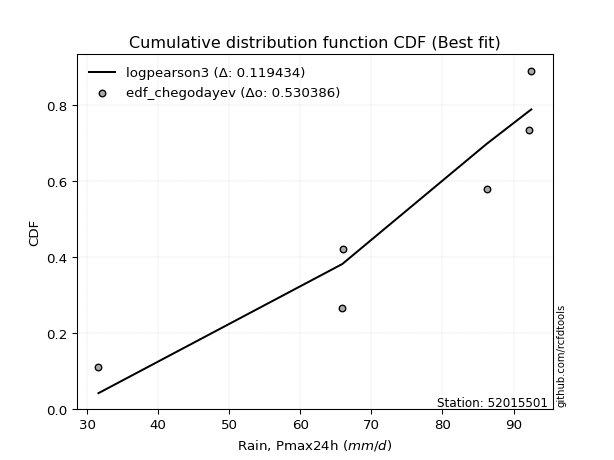</img>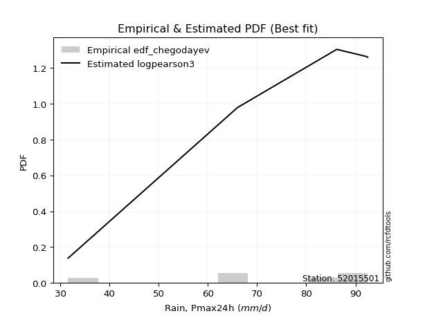</img>

</div>


### 6. EDF Blom (1958)

The Blom formula is a specific "plotting position" formula used in hydrology and statistical analysis to estimate the empirical cumulative probability (or non-exceedance probability) of a data series. It is particularly recommended for data that are approximately normally distributed. The constant _a_ is set to 0.375 (or 3/8).

<div align="center">


$P=(m-a)/(n+1-2a)$


</div>


**6.1. Empirical values**

<div align="center">

|                | 0                  | 1                  | 2                  | 3                 | 4                 | 5                  |
|:---------------|:-------------------|:-------------------|:-------------------|:------------------|:------------------|:-------------------|
| date           | 2018               | 2022               | 2023               | 2020              | 2021              | 2019               |
| x              | 31.6               | 65.9               | 66.0               | 86.2              | 92.2              | 92.5               |
| m              | 1                  | 2                  | 3                  | 4                 | 5                 | 6                  |
| empirical_dist | edf_blom           | edf_blom           | edf_blom           | edf_blom          | edf_blom          | edf_blom           |
| empirical      | 0.1                | 0.26               | 0.42               | 0.58              | 0.74              | 0.9                |
| empirical_tr   | 1.1111111111111112 | 1.3513513513513513 | 1.7241379310344827 | 2.380952380952381 | 3.846153846153846 | 10.000000000000002 |

</div>


**6.2. Kolmogorov-Smirnov fit test (sorted by Δ)**


<div align="center">

|                | 0                   | 1                   | 2                   | 3                   | 4                   | 5                   | 6                   | 7                   | 8                   | 9                   | 10                  | 11                  | 12                  | 13                | 14                  | 15                 | 16                  | 17                 | 18                  | 19                  | 20                  | 21                 | 22                  | 23                  | 24                 | 25                 | 26                 | 27                  | 28                 | 29                  | 30                  | 31                 | 32                  | 33                 | 34                  | 35                 | 36                  | 37                 | 38                  | 39                  | 40                  | 41                | 42                  | 43                  | 44                  | 45                 | 46                 | 47                  | 48                 | 49                  | 50                  | 51                  | 52                  | 53                  | 54                  | 55                 | 56                 | 57                  | 58                  | 59                | 60                 | 61                  | 62                  | 63                 | 64                 | 65                  | 66                  | 67                 | 68                 | 69                  | 70                 | 71                 | 72                  | 73                  | 74                 | 75                 | 76                | 77                 | 78                 | 79                  | 80                  | 81                  | 82                  | 83                  | 84                  | 85                 | 86                 | 87             | 88                  | 89                  | 90                  | 91                 | 92                  | 93                  | 94                  | 95                  | 96                 | 97                  | 98                  | 99                 | 100                 | 101                 | 102                | 103                | 104                | 105                 | 106                | 107               | 108                | 109                | 110                | 111                 | 112                 | 113                 | 114                 | 115               | 116                 | 117                | 118                | 119                | 120                | 121                | 122                 | 123                | 124                | 125                | 126                | 127                 | 128                 | 129                | 130                 | 131                 | 132                | 133                 | 134            | 135                 | 136                | 137                | 138                 | 139                | 140                | 141                 | 142                | 143                 | 144                | 145                | 146                | 147                | 148                | 149                | 150                | 151                | 152                | 153               | 154            | 155            | 156            | 157            | 158                | 159                |
|:---------------|:--------------------|:--------------------|:--------------------|:--------------------|:--------------------|:--------------------|:--------------------|:--------------------|:--------------------|:--------------------|:--------------------|:--------------------|:--------------------|:------------------|:--------------------|:-------------------|:--------------------|:-------------------|:--------------------|:--------------------|:--------------------|:-------------------|:--------------------|:--------------------|:-------------------|:-------------------|:-------------------|:--------------------|:-------------------|:--------------------|:--------------------|:-------------------|:--------------------|:-------------------|:--------------------|:-------------------|:--------------------|:-------------------|:--------------------|:--------------------|:--------------------|:------------------|:--------------------|:--------------------|:--------------------|:-------------------|:-------------------|:--------------------|:-------------------|:--------------------|:--------------------|:--------------------|:--------------------|:--------------------|:--------------------|:-------------------|:-------------------|:--------------------|:--------------------|:------------------|:-------------------|:--------------------|:--------------------|:-------------------|:-------------------|:--------------------|:--------------------|:-------------------|:-------------------|:--------------------|:-------------------|:-------------------|:--------------------|:--------------------|:-------------------|:-------------------|:------------------|:-------------------|:-------------------|:--------------------|:--------------------|:--------------------|:--------------------|:--------------------|:--------------------|:-------------------|:-------------------|:---------------|:--------------------|:--------------------|:--------------------|:-------------------|:--------------------|:--------------------|:--------------------|:--------------------|:-------------------|:--------------------|:--------------------|:-------------------|:--------------------|:--------------------|:-------------------|:-------------------|:-------------------|:--------------------|:-------------------|:------------------|:-------------------|:-------------------|:-------------------|:--------------------|:--------------------|:--------------------|:--------------------|:------------------|:--------------------|:-------------------|:-------------------|:-------------------|:-------------------|:-------------------|:--------------------|:-------------------|:-------------------|:-------------------|:-------------------|:--------------------|:--------------------|:-------------------|:--------------------|:--------------------|:-------------------|:--------------------|:---------------|:--------------------|:-------------------|:-------------------|:--------------------|:-------------------|:-------------------|:--------------------|:-------------------|:--------------------|:-------------------|:-------------------|:-------------------|:-------------------|:-------------------|:-------------------|:-------------------|:-------------------|:-------------------|:------------------|:---------------|:---------------|:---------------|:---------------|:-------------------|:-------------------|
| station        | 52015501            | 52015501            | 52015501            | 52015501            | 52015501            | 52015501            | 52015501            | 52015501            | 52015501            | 52015501            | 52015501            | 52015501            | 52015501            | 52015501          | 52015501            | 52015501           | 52015501            | 52015501           | 52015501            | 52015501            | 52015501            | 52015501           | 52015501            | 52015501            | 52015501           | 52015501           | 52015501           | 52015501            | 52015501           | 52015501            | 52015501            | 52015501           | 52015501            | 52015501           | 52015501            | 52015501           | 52015501            | 52015501           | 52015501            | 52015501            | 52015501            | 52015501          | 52015501            | 52015501            | 52015501            | 52015501           | 52015501           | 52015501            | 52015501           | 52015501            | 52015501            | 52015501            | 52015501            | 52015501            | 52015501            | 52015501           | 52015501           | 52015501            | 52015501            | 52015501          | 52015501           | 52015501            | 52015501            | 52015501           | 52015501           | 52015501            | 52015501            | 52015501           | 52015501           | 52015501            | 52015501           | 52015501           | 52015501            | 52015501            | 52015501           | 52015501           | 52015501          | 52015501           | 52015501           | 52015501            | 52015501            | 52015501            | 52015501            | 52015501            | 52015501            | 52015501           | 52015501           | 52015501       | 52015501            | 52015501            | 52015501            | 52015501           | 52015501            | 52015501            | 52015501            | 52015501            | 52015501           | 52015501            | 52015501            | 52015501           | 52015501            | 52015501            | 52015501           | 52015501           | 52015501           | 52015501            | 52015501           | 52015501          | 52015501           | 52015501           | 52015501           | 52015501            | 52015501            | 52015501            | 52015501            | 52015501          | 52015501            | 52015501           | 52015501           | 52015501           | 52015501           | 52015501           | 52015501            | 52015501           | 52015501           | 52015501           | 52015501           | 52015501            | 52015501            | 52015501           | 52015501            | 52015501            | 52015501           | 52015501            | 52015501       | 52015501            | 52015501           | 52015501           | 52015501            | 52015501           | 52015501           | 52015501            | 52015501           | 52015501            | 52015501           | 52015501           | 52015501           | 52015501           | 52015501           | 52015501           | 52015501           | 52015501           | 52015501           | 52015501          | 52015501       | 52015501       | 52015501       | 52015501       | 52015501           | 52015501           |
| empirical_dist | edf_blom            | edf_blom            | edf_blom            | edf_blom            | edf_blom            | edf_blom            | edf_blom            | edf_blom            | edf_blom            | edf_blom            | edf_blom            | edf_blom            | edf_blom            | edf_blom          | edf_blom            | edf_blom           | edf_blom            | edf_blom           | edf_blom            | edf_blom            | edf_blom            | edf_blom           | edf_blom            | edf_blom            | edf_blom           | edf_blom           | edf_blom           | edf_blom            | edf_blom           | edf_blom            | edf_blom            | edf_blom           | edf_blom            | edf_blom           | edf_blom            | edf_blom           | edf_blom            | edf_blom           | edf_blom            | edf_blom            | edf_blom            | edf_blom          | edf_blom            | edf_blom            | edf_blom            | edf_blom           | edf_blom           | edf_blom            | edf_blom           | edf_blom            | edf_blom            | edf_blom            | edf_blom            | edf_blom            | edf_blom            | edf_blom           | edf_blom           | edf_blom            | edf_blom            | edf_blom          | edf_blom           | edf_blom            | edf_blom            | edf_blom           | edf_blom           | edf_blom            | edf_blom            | edf_blom           | edf_blom           | edf_blom            | edf_blom           | edf_blom           | edf_blom            | edf_blom            | edf_blom           | edf_blom           | edf_blom          | edf_blom           | edf_blom           | edf_blom            | edf_blom            | edf_blom            | edf_blom            | edf_blom            | edf_blom            | edf_blom           | edf_blom           | edf_blom       | edf_blom            | edf_blom            | edf_blom            | edf_blom           | edf_blom            | edf_blom            | edf_blom            | edf_blom            | edf_blom           | edf_blom            | edf_blom            | edf_blom           | edf_blom            | edf_blom            | edf_blom           | edf_blom           | edf_blom           | edf_blom            | edf_blom           | edf_blom          | edf_blom           | edf_blom           | edf_blom           | edf_blom            | edf_blom            | edf_blom            | edf_blom            | edf_blom          | edf_blom            | edf_blom           | edf_blom           | edf_blom           | edf_blom           | edf_blom           | edf_blom            | edf_blom           | edf_blom           | edf_blom           | edf_blom           | edf_blom            | edf_blom            | edf_blom           | edf_blom            | edf_blom            | edf_blom           | edf_blom            | edf_blom       | edf_blom            | edf_blom           | edf_blom           | edf_blom            | edf_blom           | edf_blom           | edf_blom            | edf_blom           | edf_blom            | edf_blom           | edf_blom           | edf_blom           | edf_blom           | edf_blom           | edf_blom           | edf_blom           | edf_blom           | edf_blom           | edf_blom          | edf_blom       | edf_blom       | edf_blom       | edf_blom       | edf_blom           | edf_blom           |
| p_dist         | trapezoid           | logbeta             | logpearson3         | dweibull            | loggausshyper       | burr                | loggumbel_l         | logvonmises_line    | pearson3            | anglit              | loggennorm          | dgamma              | semicircular        | gumbel_l          | weibull_min         | betaprime          | logdweibull         | invgauss           | weibull_max         | logjohnsonsb        | f                   | nct                | t                   | exponnorm           | truncnorm          | norm               | crystalball        | rice                | logtrapezoid       | genpareto           | alpha               | erlang             | logt                | vonmises_line      | gamma               | logburr12          | logweibull_min      | beta               | arcsine             | maxwell             | invgamma            | rayleigh          | logdgamma           | loggompertz         | logistic            | logmielke          | argus              | logargus            | cosine             | loghypsecant        | loglogistic         | hypsecant           | halfnorm            | logncf              | logf                | logcrystalball     | lognorm            | logexponnorm        | logrice             | gumbel_r          | logfatiguelife     | logexponweib        | loggengamma         | loganglit          | loginvgamma        | lognct              | logsemicircular     | logbetaprime       | logburr            | gausshyper          | logweibull_max     | halflogistic       | loglaplace          | loglaplace          | moyal              | logarcsine         | laplace           | loggamma           | loggamma           | kstwobign           | logalpha            | johnsonsb           | genextreme          | loggenextreme       | logloglaplace       | logmaxwell         | loginvgauss        | gennorm        | mielke              | wrapcauchy          | genhalflogistic     | lograyleigh        | loginvweibull       | logwrapcauchy       | logloggamma         | logtruncweibull_min | skewnorm           | levy_l              | wald                | loggenhalflogistic | loglevy_l           | logfoldnorm         | triang             | kappa4             | bradford           | loggumbel_r         | logcosine          | nakagami          | loghalfnorm        | loggenpareto       | logkstwobign       | ksone               | logmoyal            | loggenexpon         | truncweibull_min    | logskewnorm       | loghalflogistic     | logtriang          | uniform            | lognakagami        | logexponpow        | kappa3             | loglomax            | burr12             | halfgennorm        | ncf                | logwald            | truncexpon          | logksone            | lomax              | logtruncnorm        | logtukeylambda      | logerlang          | gompertz            | loghalfgennorm | foldnorm            | logkappa3          | loguniform         | logkappa4           | logbradford        | invweibull         | logjohnsonsu        | logtruncexpon      | logrdist            | johnsonsu          | gengamma           | fatiguelife        | exponweib          | powerlaw           | exponpow           | logpowerlaw        | truncpareto        | logtruncpareto     | genexpon          | genlogistic    | rdist          | tukeylambda    | loggenlogistic | logvonmises        | vonmises           |
| delta          | 0.11040217665593688 | 0.11843026178533067 | 0.12151879396351811 | 0.12755499069116294 | 0.13138473338567003 | 0.13405003359175716 | 0.13480278600456852 | 0.13493698033507429 | 0.13610199419473112 | 0.13666759694669223 | 0.13920725181823934 | 0.14155371265202044 | 0.14345582861778317 | 0.143746645426868 | 0.15250443353419985 | 0.1548664401784926 | 0.15508294897006258 | 0.1553118396657034 | 0.15670542154645048 | 0.15707204707317937 | 0.16037336535423907 | 0.1609910341948192 | 0.16099222634085264 | 0.16100186608111344 | 0.1610028699964493 | 0.1610028905643236 | 0.1610028947922627 | 0.16145903116249127 | 0.1620258076040113 | 0.16251678159400673 | 0.16386448108460516 | 0.1644169380161017 | 0.16513269336418246 | 0.1655025739785969 | 0.16565024501268655 | 0.1686073327095402 | 0.16939202269038045 | 0.1694099804976179 | 0.17092657689476448 | 0.17176212792900436 | 0.17209403173490478 | 0.174844817150702 | 0.17524995921546604 | 0.17562948219809893 | 0.18359896771577422 | 0.1841772356999798 | 0.1881915401716231 | 0.18922277216745909 | 0.1925818719857657 | 0.19320365861681982 | 0.19750943566796086 | 0.19874644609113534 | 0.20100892560448252 | 0.20115031284949642 | 0.20140327868884844 | 0.2025817200605482 | 0.2025817223748413 | 0.20258255367432126 | 0.20258983432322814 | 0.202668206573971 | 0.2029219743234114 | 0.20317936258818653 | 0.20572166641943063 | 0.2079130587041662 | 0.2089534225902212 | 0.20922661824064315 | 0.21010825572528485 | 0.2101618699433242 | 0.2105146939274749 | 0.21090042802108966 | 0.2112215726980066 | 0.2138934582954049 | 0.21396254423016337 | 0.21396254423016337 | 0.2160881686219902 | 0.2188434554044501 | 0.219582358960296 | 0.2197943574487951 | 0.2197943574487951 | 0.22019544672102287 | 0.22472753762558673 | 0.22786207427671307 | 0.22977720480905872 | 0.22995889517801105 | 0.23402118515950882 | 0.2367241565132508 | 0.2390760491852228 | 0.24           | 0.24333528334660415 | 0.24460204746117675 | 0.24592420242770308 | 0.2484336603593168 | 0.24907251818487564 | 0.24924073905276378 | 0.24931778089514545 | 0.2502108768249546  | 0.2518350404554154 | 0.25229468984699005 | 0.25748443945812516 | 0.259119642250615  | 0.26169796686399033 | 0.26338677806272925 | 0.2677233822355023 | 0.2684581394819072 | 0.2686400042331407 | 0.27081448477784975 | 0.2715283318698911 | 0.272088963434824 | 0.2814676846215445 | 0.2864050182153559 | 0.2869731886710718 | 0.29268199233716474 | 0.29646174061137187 | 0.29648175004203114 | 0.30015637358102387 | 0.303419053755442 | 0.30367990078042895 | 0.3128050521728314 | 0.3165517241379311 | 0.3227137957338973 | 0.3445259331799704 | 0.3480679908505633 | 0.35310690991219384 | 0.3541402589264644 | 0.3567770040724896 | 0.3626672095169349 | 0.3678352290196243 | 0.38535045962336223 | 0.39358943413730696 | 0.4001568411017359 | 0.41143158501118665 | 0.41431302018104615 | 0.4146302256873585 | 0.41762518856846215 | 0.42           | 0.42000000000000004 | 0.4229128420338729 | 0.4243073209647683 | 0.42496078679155824 | 0.4264605352050317 | 0.4525877084278572 | 0.46323431546535304 | 0.4925320280144826 | 0.49505296919826164 | 0.5212371343015806 | 0.5384172967451566 | 0.5685411057077763 | 0.5868473381437807 | 0.6547131464683315 | 0.6689173027031882 | 0.6791411810083481 | 0.6904864497707122 | 0.7071427374211915 | 0.735118145969327 | 0.74           | 0.74           | 0.74           | 0.74           | 1.1896932803455618 | 14.812723729990388 |
| deltao         | 0.530385761606      | 0.530385761606      | 0.530385761606      | 0.530385761606      | 0.530385761606      | 0.530385761606      | 0.530385761606      | 0.530385761606      | 0.530385761606      | 0.530385761606      | 0.530385761606      | 0.530385761606      | 0.530385761606      | 0.530385761606    | 0.530385761606      | 0.530385761606     | 0.530385761606      | 0.530385761606     | 0.530385761606      | 0.530385761606      | 0.530385761606      | 0.530385761606     | 0.530385761606      | 0.530385761606      | 0.530385761606     | 0.530385761606     | 0.530385761606     | 0.530385761606      | 0.530385761606     | 0.530385761606      | 0.530385761606      | 0.530385761606     | 0.530385761606      | 0.530385761606     | 0.530385761606      | 0.530385761606     | 0.530385761606      | 0.530385761606     | 0.530385761606      | 0.530385761606      | 0.530385761606      | 0.530385761606    | 0.530385761606      | 0.530385761606      | 0.530385761606      | 0.530385761606     | 0.530385761606     | 0.530385761606      | 0.530385761606     | 0.530385761606      | 0.530385761606      | 0.530385761606      | 0.530385761606      | 0.530385761606      | 0.530385761606      | 0.530385761606     | 0.530385761606     | 0.530385761606      | 0.530385761606      | 0.530385761606    | 0.530385761606     | 0.530385761606      | 0.530385761606      | 0.530385761606     | 0.530385761606     | 0.530385761606      | 0.530385761606      | 0.530385761606     | 0.530385761606     | 0.530385761606      | 0.530385761606     | 0.530385761606     | 0.530385761606      | 0.530385761606      | 0.530385761606     | 0.530385761606     | 0.530385761606    | 0.530385761606     | 0.530385761606     | 0.530385761606      | 0.530385761606      | 0.530385761606      | 0.530385761606      | 0.530385761606      | 0.530385761606      | 0.530385761606     | 0.530385761606     | 0.530385761606 | 0.530385761606      | 0.530385761606      | 0.530385761606      | 0.530385761606     | 0.530385761606      | 0.530385761606      | 0.530385761606      | 0.530385761606      | 0.530385761606     | 0.530385761606      | 0.530385761606      | 0.530385761606     | 0.530385761606      | 0.530385761606      | 0.530385761606     | 0.530385761606     | 0.530385761606     | 0.530385761606      | 0.530385761606     | 0.530385761606    | 0.530385761606     | 0.530385761606     | 0.530385761606     | 0.530385761606      | 0.530385761606      | 0.530385761606      | 0.530385761606      | 0.530385761606    | 0.530385761606      | 0.530385761606     | 0.530385761606     | 0.530385761606     | 0.530385761606     | 0.530385761606     | 0.530385761606      | 0.530385761606     | 0.530385761606     | 0.530385761606     | 0.530385761606     | 0.530385761606      | 0.530385761606      | 0.530385761606     | 0.530385761606      | 0.530385761606      | 0.530385761606     | 0.530385761606      | 0.530385761606 | 0.530385761606      | 0.530385761606     | 0.530385761606     | 0.530385761606      | 0.530385761606     | 0.530385761606     | 0.530385761606      | 0.530385761606     | 0.530385761606      | 0.530385761606     | 0.530385761606     | 0.530385761606     | 0.530385761606     | 0.530385761606     | 0.530385761606     | 0.530385761606     | 0.530385761606     | 0.530385761606     | 0.530385761606    | 0.530385761606 | 0.530385761606 | 0.530385761606 | 0.530385761606 | 0.530385761606     | 0.530385761606     |
| eval           | Δo > Δ              | Δo > Δ              | Δo > Δ              | Δo > Δ              | Δo > Δ              | Δo > Δ              | Δo > Δ              | Δo > Δ              | Δo > Δ              | Δo > Δ              | Δo > Δ              | Δo > Δ              | Δo > Δ              | Δo > Δ            | Δo > Δ              | Δo > Δ             | Δo > Δ              | Δo > Δ             | Δo > Δ              | Δo > Δ              | Δo > Δ              | Δo > Δ             | Δo > Δ              | Δo > Δ              | Δo > Δ             | Δo > Δ             | Δo > Δ             | Δo > Δ              | Δo > Δ             | Δo > Δ              | Δo > Δ              | Δo > Δ             | Δo > Δ              | Δo > Δ             | Δo > Δ              | Δo > Δ             | Δo > Δ              | Δo > Δ             | Δo > Δ              | Δo > Δ              | Δo > Δ              | Δo > Δ            | Δo > Δ              | Δo > Δ              | Δo > Δ              | Δo > Δ             | Δo > Δ             | Δo > Δ              | Δo > Δ             | Δo > Δ              | Δo > Δ              | Δo > Δ              | Δo > Δ              | Δo > Δ              | Δo > Δ              | Δo > Δ             | Δo > Δ             | Δo > Δ              | Δo > Δ              | Δo > Δ            | Δo > Δ             | Δo > Δ              | Δo > Δ              | Δo > Δ             | Δo > Δ             | Δo > Δ              | Δo > Δ              | Δo > Δ             | Δo > Δ             | Δo > Δ              | Δo > Δ             | Δo > Δ             | Δo > Δ              | Δo > Δ              | Δo > Δ             | Δo > Δ             | Δo > Δ            | Δo > Δ             | Δo > Δ             | Δo > Δ              | Δo > Δ              | Δo > Δ              | Δo > Δ              | Δo > Δ              | Δo > Δ              | Δo > Δ             | Δo > Δ             | Δo > Δ         | Δo > Δ              | Δo > Δ              | Δo > Δ              | Δo > Δ             | Δo > Δ              | Δo > Δ              | Δo > Δ              | Δo > Δ              | Δo > Δ             | Δo > Δ              | Δo > Δ              | Δo > Δ             | Δo > Δ              | Δo > Δ              | Δo > Δ             | Δo > Δ             | Δo > Δ             | Δo > Δ              | Δo > Δ             | Δo > Δ            | Δo > Δ             | Δo > Δ             | Δo > Δ             | Δo > Δ              | Δo > Δ              | Δo > Δ              | Δo > Δ              | Δo > Δ            | Δo > Δ              | Δo > Δ             | Δo > Δ             | Δo > Δ             | Δo > Δ             | Δo > Δ             | Δo > Δ              | Δo > Δ             | Δo > Δ             | Δo > Δ             | Δo > Δ             | Δo > Δ              | Δo > Δ              | Δo > Δ             | Δo > Δ              | Δo > Δ              | Δo > Δ             | Δo > Δ              | Δo > Δ         | Δo > Δ              | Δo > Δ             | Δo > Δ             | Δo > Δ              | Δo > Δ             | Δo > Δ             | Δo > Δ              | Δo > Δ             | Δo > Δ              | Δo > Δ             | Δo <= Δ            | Δo <= Δ            | Δo <= Δ            | Δo <= Δ            | Δo <= Δ            | Δo <= Δ            | Δo <= Δ            | Δo <= Δ            | Δo <= Δ           | Δo <= Δ        | Δo <= Δ        | Δo <= Δ        | Δo <= Δ        | Δo <= Δ            | Δo <= Δ            |
| fit            | 1                   | 1                   | 1                   | 1                   | 1                   | 1                   | 1                   | 1                   | 1                   | 1                   | 1                   | 1                   | 1                   | 1                 | 1                   | 1                  | 1                   | 1                  | 1                   | 1                   | 1                   | 1                  | 1                   | 1                   | 1                  | 1                  | 1                  | 1                   | 1                  | 1                   | 1                   | 1                  | 1                   | 1                  | 1                   | 1                  | 1                   | 1                  | 1                   | 1                   | 1                   | 1                 | 1                   | 1                   | 1                   | 1                  | 1                  | 1                   | 1                  | 1                   | 1                   | 1                   | 1                   | 1                   | 1                   | 1                  | 1                  | 1                   | 1                   | 1                 | 1                  | 1                   | 1                   | 1                  | 1                  | 1                   | 1                   | 1                  | 1                  | 1                   | 1                  | 1                  | 1                   | 1                   | 1                  | 1                  | 1                 | 1                  | 1                  | 1                   | 1                   | 1                   | 1                   | 1                   | 1                   | 1                  | 1                  | 1              | 1                   | 1                   | 1                   | 1                  | 1                   | 1                   | 1                   | 1                   | 1                  | 1                   | 1                   | 1                  | 1                   | 1                   | 1                  | 1                  | 1                  | 1                   | 1                  | 1                 | 1                  | 1                  | 1                  | 1                   | 1                   | 1                   | 1                   | 1                 | 1                   | 1                  | 1                  | 1                  | 1                  | 1                  | 1                   | 1                  | 1                  | 1                  | 1                  | 1                   | 1                   | 1                  | 1                   | 1                   | 1                  | 1                   | 1              | 1                   | 1                  | 1                  | 1                   | 1                  | 1                  | 1                   | 1                  | 1                   | 1                  | 0                  | 0                  | 0                  | 0                  | 0                  | 0                  | 0                  | 0                  | 0                 | 0              | 0              | 0              | 0              | 0                  | 0                  |
| n              | 6                   | 6                   | 6                   | 6                   | 6                   | 6                   | 6                   | 6                   | 6                   | 6                   | 6                   | 6                   | 6                   | 6                 | 6                   | 6                  | 6                   | 6                  | 6                   | 6                   | 6                   | 6                  | 6                   | 6                   | 6                  | 6                  | 6                  | 6                   | 6                  | 6                   | 6                   | 6                  | 6                   | 6                  | 6                   | 6                  | 6                   | 6                  | 6                   | 6                   | 6                   | 6                 | 6                   | 6                   | 6                   | 6                  | 6                  | 6                   | 6                  | 6                   | 6                   | 6                   | 6                   | 6                   | 6                   | 6                  | 6                  | 6                   | 6                   | 6                 | 6                  | 6                   | 6                   | 6                  | 6                  | 6                   | 6                   | 6                  | 6                  | 6                   | 6                  | 6                  | 6                   | 6                   | 6                  | 6                  | 6                 | 6                  | 6                  | 6                   | 6                   | 6                   | 6                   | 6                   | 6                   | 6                  | 6                  | 6              | 6                   | 6                   | 6                   | 6                  | 6                   | 6                   | 6                   | 6                   | 6                  | 6                   | 6                   | 6                  | 6                   | 6                   | 6                  | 6                  | 6                  | 6                   | 6                  | 6                 | 6                  | 6                  | 6                  | 6                   | 6                   | 6                   | 6                   | 6                 | 6                   | 6                  | 6                  | 6                  | 6                  | 6                  | 6                   | 6                  | 6                  | 6                  | 6                  | 6                   | 6                   | 6                  | 6                   | 6                   | 6                  | 6                   | 6              | 6                   | 6                  | 6                  | 6                   | 6                  | 6                  | 6                   | 6                  | 6                   | 6                  | 6                  | 6                  | 6                  | 6                  | 6                  | 6                  | 6                  | 6                  | 6                 | 6              | 6              | 6              | 6              | 6                  | 6                  |
| best_fit       | 1                   | 0                   | 0                   | 0                   | 0                   | 0                   | 0                   | 0                   | 0                   | 0                   | 0                   | 0                   | 0                   | 0                 | 0                   | 0                  | 0                   | 0                  | 0                   | 0                   | 0                   | 0                  | 0                   | 0                   | 0                  | 0                  | 0                  | 0                   | 0                  | 0                   | 0                   | 0                  | 0                   | 0                  | 0                   | 0                  | 0                   | 0                  | 0                   | 0                   | 0                   | 0                 | 0                   | 0                   | 0                   | 0                  | 0                  | 0                   | 0                  | 0                   | 0                   | 0                   | 0                   | 0                   | 0                   | 0                  | 0                  | 0                   | 0                   | 0                 | 0                  | 0                   | 0                   | 0                  | 0                  | 0                   | 0                   | 0                  | 0                  | 0                   | 0                  | 0                  | 0                   | 0                   | 0                  | 0                  | 0                 | 0                  | 0                  | 0                   | 0                   | 0                   | 0                   | 0                   | 0                   | 0                  | 0                  | 0              | 0                   | 0                   | 0                   | 0                  | 0                   | 0                   | 0                   | 0                   | 0                  | 0                   | 0                   | 0                  | 0                   | 0                   | 0                  | 0                  | 0                  | 0                   | 0                  | 0                 | 0                  | 0                  | 0                  | 0                   | 0                   | 0                   | 0                   | 0                 | 0                   | 0                  | 0                  | 0                  | 0                  | 0                  | 0                   | 0                  | 0                  | 0                  | 0                  | 0                   | 0                   | 0                  | 0                   | 0                   | 0                  | 0                   | 0              | 0                   | 0                  | 0                  | 0                   | 0                  | 0                  | 0                   | 0                  | 0                   | 0                  | 0                  | 0                  | 0                  | 0                  | 0                  | 0                  | 0                  | 0                  | 0                 | 0              | 0              | 0              | 0              | 0                  | 0                  |
| best_fit_sort  | 1                   | 2                   | 3                   | 4                   | 5                   | 6                   | 7                   | 8                   | 9                   | 10                  | 11                  | 12                  | 13                  | 14                | 15                  | 16                 | 17                  | 18                 | 19                  | 20                  | 21                  | 22                 | 23                  | 24                  | 25                 | 26                 | 27                 | 28                  | 29                 | 30                  | 31                  | 32                 | 33                  | 34                 | 35                  | 36                 | 37                  | 38                 | 39                  | 40                  | 41                  | 42                | 43                  | 44                  | 45                  | 46                 | 47                 | 48                  | 49                 | 50                  | 51                  | 52                  | 53                  | 54                  | 55                  | 56                 | 57                 | 58                  | 59                  | 60                | 61                 | 62                  | 63                  | 64                 | 65                 | 66                  | 67                  | 68                 | 69                 | 70                  | 71                 | 72                 | 73                  | 74                  | 75                 | 76                 | 77                | 78                 | 79                 | 80                  | 81                  | 82                  | 83                  | 84                  | 85                  | 86                 | 87                 | 88             | 89                  | 90                  | 91                  | 92                 | 93                  | 94                  | 95                  | 96                  | 97                 | 98                  | 99                  | 100                | 101                 | 102                 | 103                | 104                | 105                | 106                 | 107                | 108               | 109                | 110                | 111                | 112                 | 113                 | 114                 | 115                 | 116               | 117                 | 118                | 119                | 120                | 121                | 122                | 123                 | 124                | 125                | 126                | 127                | 128                 | 129                 | 130                | 131                 | 132                 | 133                | 134                 | 135            | 136                 | 137                | 138                | 139                 | 140                | 141                | 142                 | 143                | 144                 | 145                | 146                | 147                | 148                | 149                | 150                | 151                | 152                | 153                | 154               | 155            | 156            | 157            | 158            | 159                | 160                |

</div>


**6.3. Best fit**

<div align="center">

|   id |   station | empirical_dist   | p_dist    |    delta |   deltao | eval   |   fit |   n |   best_fit |   best_fit_sort |
|-----:|----------:|:-----------------|:----------|---------:|---------:|:-------|------:|----:|-----------:|----------------:|
|    0 |  52015501 | edf_blom         | trapezoid | 0.110402 | 0.530386 | Δo > Δ |     1 |   6 |          1 |               1 |

</div>


<div align="center">

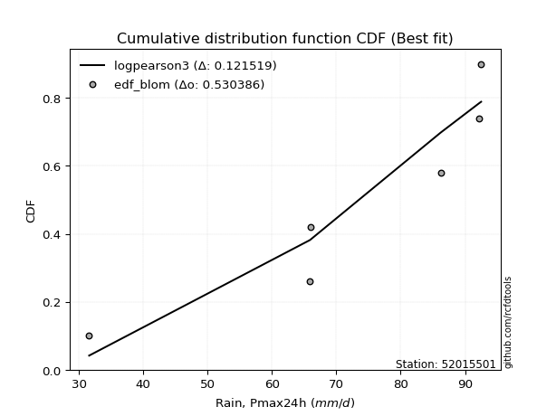</img>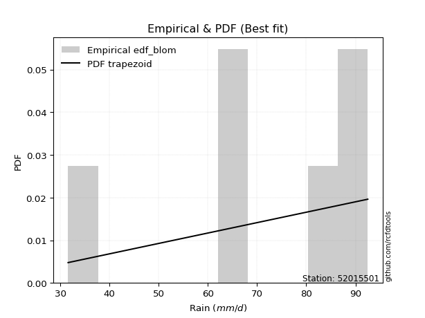</img>

</div>


### 7. EDF Tukey (1962)

In hydrology, the Tukey formula is used as a plotting position formula to estimate the empirical probability or frequency of a flood event (or other hydrological data). The formula parameter is given as _c=0.333_ (or 1/3).

<div align="center">


$P=(m-c)/(n+1-2c)$


</div>


**7.1. Empirical values**

<div align="center">

|                | 0                   | 1                  | 2                   | 3                  | 4                  | 5                  |
|:---------------|:--------------------|:-------------------|:--------------------|:-------------------|:-------------------|:-------------------|
| date           | 2018                | 2022               | 2023                | 2020               | 2021               | 2019               |
| x              | 31.6                | 65.9               | 66.0                | 86.2               | 92.2               | 92.5               |
| m              | 1                   | 2                  | 3                   | 4                  | 5                  | 6                  |
| empirical_dist | edf_tukey           | edf_tukey          | edf_tukey           | edf_tukey          | edf_tukey          | edf_tukey          |
| empirical      | 0.10526315789473684 | 0.2631578947368421 | 0.42105263157894735 | 0.5789473684210527 | 0.7368421052631579 | 0.8947368421052632 |
| empirical_tr   | 1.1176470588235294  | 1.357142857142857  | 1.7272727272727273  | 2.375              | 3.7999999999999994 | 9.5                |

</div>


**7.2. Kolmogorov-Smirnov fit test (sorted by Δ)**


<div align="center">

|                | 0                   | 1                  | 2                   | 3                   | 4                   | 5                   | 6                   | 7                   | 8                   | 9                   | 10                  | 11                  | 12                  | 13                 | 14                  | 15                  | 16                  | 17                 | 18                  | 19                 | 20                  | 21                  | 22                 | 23                  | 24                  | 25                 | 26                 | 27               | 28                  | 29                  | 30                | 31                  | 32                  | 33                  | 34                  | 35                 | 36                 | 37                 | 38                  | 39                  | 40                  | 41                 | 42                 | 43                  | 44                  | 45                  | 46                 | 47                  | 48                 | 49                | 50                  | 51                  | 52                  | 53                  | 54                  | 55                 | 56                  | 57                  | 58                  | 59                  | 60                  | 61                  | 62                 | 63                  | 64                  | 65                  | 66                  | 67                  | 68                  | 69                 | 70                  | 71                 | 72                  | 73                  | 74                  | 75                  | 76                  | 77                 | 78                 | 79                 | 80                  | 81                  | 82                  | 83                  | 84                  | 85                 | 86                 | 87                 | 88                  | 89                  | 90                  | 91                 | 92                  | 93                 | 94                 | 95                 | 96                  | 97                 | 98                  | 99                 | 100                | 101                | 102                 | 103                 | 104                 | 105                | 106                | 107                 | 108                | 109                 | 110                | 111                 | 112                | 113                 | 114                 | 115                | 116                | 117                | 118                | 119                 | 120                | 121                | 122                 | 123                | 124                | 125                | 126                | 127                 | 128                | 129               | 130                 | 131               | 132                | 133                | 134                 | 135                 | 136                 | 137                | 138                 | 139                | 140                 | 141                | 142                | 143                | 144                | 145                | 146                | 147                | 148                | 149               | 150                | 151                | 152                | 153               | 154                | 155                | 156               | 157               | 158                | 159                |
|:---------------|:--------------------|:-------------------|:--------------------|:--------------------|:--------------------|:--------------------|:--------------------|:--------------------|:--------------------|:--------------------|:--------------------|:--------------------|:--------------------|:-------------------|:--------------------|:--------------------|:--------------------|:-------------------|:--------------------|:-------------------|:--------------------|:--------------------|:-------------------|:--------------------|:--------------------|:-------------------|:-------------------|:-----------------|:--------------------|:--------------------|:------------------|:--------------------|:--------------------|:--------------------|:--------------------|:-------------------|:-------------------|:-------------------|:--------------------|:--------------------|:--------------------|:-------------------|:-------------------|:--------------------|:--------------------|:--------------------|:-------------------|:--------------------|:-------------------|:------------------|:--------------------|:--------------------|:--------------------|:--------------------|:--------------------|:-------------------|:--------------------|:--------------------|:--------------------|:--------------------|:--------------------|:--------------------|:-------------------|:--------------------|:--------------------|:--------------------|:--------------------|:--------------------|:--------------------|:-------------------|:--------------------|:-------------------|:--------------------|:--------------------|:--------------------|:--------------------|:--------------------|:-------------------|:-------------------|:-------------------|:--------------------|:--------------------|:--------------------|:--------------------|:--------------------|:-------------------|:-------------------|:-------------------|:--------------------|:--------------------|:--------------------|:-------------------|:--------------------|:-------------------|:-------------------|:-------------------|:--------------------|:-------------------|:--------------------|:-------------------|:-------------------|:-------------------|:--------------------|:--------------------|:--------------------|:-------------------|:-------------------|:--------------------|:-------------------|:--------------------|:-------------------|:--------------------|:-------------------|:--------------------|:--------------------|:-------------------|:-------------------|:-------------------|:-------------------|:--------------------|:-------------------|:-------------------|:--------------------|:-------------------|:-------------------|:-------------------|:-------------------|:--------------------|:-------------------|:------------------|:--------------------|:------------------|:-------------------|:-------------------|:--------------------|:--------------------|:--------------------|:-------------------|:--------------------|:-------------------|:--------------------|:-------------------|:-------------------|:-------------------|:-------------------|:-------------------|:-------------------|:-------------------|:-------------------|:------------------|:-------------------|:-------------------|:-------------------|:------------------|:-------------------|:-------------------|:------------------|:------------------|:-------------------|:-------------------|
| station        | 52015501            | 52015501           | 52015501            | 52015501            | 52015501            | 52015501            | 52015501            | 52015501            | 52015501            | 52015501            | 52015501            | 52015501            | 52015501            | 52015501           | 52015501            | 52015501            | 52015501            | 52015501           | 52015501            | 52015501           | 52015501            | 52015501            | 52015501           | 52015501            | 52015501            | 52015501           | 52015501           | 52015501         | 52015501            | 52015501            | 52015501          | 52015501            | 52015501            | 52015501            | 52015501            | 52015501           | 52015501           | 52015501           | 52015501            | 52015501            | 52015501            | 52015501           | 52015501           | 52015501            | 52015501            | 52015501            | 52015501           | 52015501            | 52015501           | 52015501          | 52015501            | 52015501            | 52015501            | 52015501            | 52015501            | 52015501           | 52015501            | 52015501            | 52015501            | 52015501            | 52015501            | 52015501            | 52015501           | 52015501            | 52015501            | 52015501            | 52015501            | 52015501            | 52015501            | 52015501           | 52015501            | 52015501           | 52015501            | 52015501            | 52015501            | 52015501            | 52015501            | 52015501           | 52015501           | 52015501           | 52015501            | 52015501            | 52015501            | 52015501            | 52015501            | 52015501           | 52015501           | 52015501           | 52015501            | 52015501            | 52015501            | 52015501           | 52015501            | 52015501           | 52015501           | 52015501           | 52015501            | 52015501           | 52015501            | 52015501           | 52015501           | 52015501           | 52015501            | 52015501            | 52015501            | 52015501           | 52015501           | 52015501            | 52015501           | 52015501            | 52015501           | 52015501            | 52015501           | 52015501            | 52015501            | 52015501           | 52015501           | 52015501           | 52015501           | 52015501            | 52015501           | 52015501           | 52015501            | 52015501           | 52015501           | 52015501           | 52015501           | 52015501            | 52015501           | 52015501          | 52015501            | 52015501          | 52015501           | 52015501           | 52015501            | 52015501            | 52015501            | 52015501           | 52015501            | 52015501           | 52015501            | 52015501           | 52015501           | 52015501           | 52015501           | 52015501           | 52015501           | 52015501           | 52015501           | 52015501          | 52015501           | 52015501           | 52015501           | 52015501          | 52015501           | 52015501           | 52015501          | 52015501          | 52015501           | 52015501           |
| empirical_dist | edf_tukey           | edf_tukey          | edf_tukey           | edf_tukey           | edf_tukey           | edf_tukey           | edf_tukey           | edf_tukey           | edf_tukey           | edf_tukey           | edf_tukey           | edf_tukey           | edf_tukey           | edf_tukey          | edf_tukey           | edf_tukey           | edf_tukey           | edf_tukey          | edf_tukey           | edf_tukey          | edf_tukey           | edf_tukey           | edf_tukey          | edf_tukey           | edf_tukey           | edf_tukey          | edf_tukey          | edf_tukey        | edf_tukey           | edf_tukey           | edf_tukey         | edf_tukey           | edf_tukey           | edf_tukey           | edf_tukey           | edf_tukey          | edf_tukey          | edf_tukey          | edf_tukey           | edf_tukey           | edf_tukey           | edf_tukey          | edf_tukey          | edf_tukey           | edf_tukey           | edf_tukey           | edf_tukey          | edf_tukey           | edf_tukey          | edf_tukey         | edf_tukey           | edf_tukey           | edf_tukey           | edf_tukey           | edf_tukey           | edf_tukey          | edf_tukey           | edf_tukey           | edf_tukey           | edf_tukey           | edf_tukey           | edf_tukey           | edf_tukey          | edf_tukey           | edf_tukey           | edf_tukey           | edf_tukey           | edf_tukey           | edf_tukey           | edf_tukey          | edf_tukey           | edf_tukey          | edf_tukey           | edf_tukey           | edf_tukey           | edf_tukey           | edf_tukey           | edf_tukey          | edf_tukey          | edf_tukey          | edf_tukey           | edf_tukey           | edf_tukey           | edf_tukey           | edf_tukey           | edf_tukey          | edf_tukey          | edf_tukey          | edf_tukey           | edf_tukey           | edf_tukey           | edf_tukey          | edf_tukey           | edf_tukey          | edf_tukey          | edf_tukey          | edf_tukey           | edf_tukey          | edf_tukey           | edf_tukey          | edf_tukey          | edf_tukey          | edf_tukey           | edf_tukey           | edf_tukey           | edf_tukey          | edf_tukey          | edf_tukey           | edf_tukey          | edf_tukey           | edf_tukey          | edf_tukey           | edf_tukey          | edf_tukey           | edf_tukey           | edf_tukey          | edf_tukey          | edf_tukey          | edf_tukey          | edf_tukey           | edf_tukey          | edf_tukey          | edf_tukey           | edf_tukey          | edf_tukey          | edf_tukey          | edf_tukey          | edf_tukey           | edf_tukey          | edf_tukey         | edf_tukey           | edf_tukey         | edf_tukey          | edf_tukey          | edf_tukey           | edf_tukey           | edf_tukey           | edf_tukey          | edf_tukey           | edf_tukey          | edf_tukey           | edf_tukey          | edf_tukey          | edf_tukey          | edf_tukey          | edf_tukey          | edf_tukey          | edf_tukey          | edf_tukey          | edf_tukey         | edf_tukey          | edf_tukey          | edf_tukey          | edf_tukey         | edf_tukey          | edf_tukey          | edf_tukey         | edf_tukey         | edf_tukey          | edf_tukey          |
| p_dist         | trapezoid           | logpearson3        | logbeta             | dweibull            | logvonmises_line    | loggausshyper       | anglit              | burr                | loggumbel_l         | dgamma              | pearson3            | loggennorm          | semicircular        | gumbel_l           | logdweibull         | weibull_max         | logjohnsonsb        | invgauss           | weibull_min         | betaprime          | logtrapezoid        | f                   | nct                | t                   | exponnorm           | truncnorm          | norm               | crystalball      | rice                | alpha               | erlang            | genpareto           | logt                | vonmises_line       | gamma               | arcsine            | logburr12          | logdgamma          | logweibull_min      | beta                | maxwell             | invgamma           | rayleigh           | loggompertz         | logistic            | logmielke           | logargus           | argus               | loghypsecant       | cosine            | loglogistic         | halfnorm            | logncf              | logf                | logcrystalball      | lognorm            | logexponnorm        | logrice             | logfatiguelife      | hypsecant           | logexponweib        | loggengamma         | gumbel_r           | loganglit           | loginvgamma         | logweibull_max      | lognct              | logsemicircular     | logbetaprime        | halflogistic       | logburr             | gausshyper         | loglaplace          | loglaplace          | logarcsine          | loggamma            | loggamma            | kstwobign          | moyal              | laplace            | logalpha            | johnsonsb           | logloglaplace       | genextreme          | loggenextreme       | logmaxwell         | loginvgauss        | gennorm            | wrapcauchy          | lograyleigh         | loginvweibull       | logwrapcauchy      | mielke              | genhalflogistic    | logloggamma        | levy_l             | logtruncweibull_min | skewnorm           | wald                | loggenhalflogistic | logfoldnorm        | loglevy_l          | bradford            | loggumbel_r         | logcosine           | triang             | kappa4             | nakagami            | loghalfnorm        | loggenpareto        | logkstwobign       | ksone               | logmoyal           | loggenexpon         | loghalflogistic     | truncweibull_min   | logskewnorm        | logtriang          | uniform            | lognakagami         | logexponpow        | kappa3             | loglomax            | burr12             | halfgennorm        | ncf                | logwald            | truncexpon          | logksone           | lomax             | logerlang           | logtruncnorm      | logtukeylambda     | gompertz           | logkappa3           | loghalfgennorm      | foldnorm            | loguniform         | logkappa4           | logbradford        | invweibull          | logjohnsonsu       | logtruncexpon      | logrdist           | johnsonsu          | gengamma           | fatiguelife        | exponweib          | powerlaw           | exponpow          | logpowerlaw        | truncpareto        | logtruncpareto     | genexpon          | genlogistic        | loggenlogistic     | rdist             | tukeylambda       | logvonmises        | vonmises           |
| delta          | 0.10513901876120002 | 0.1186118787693693 | 0.11948289336427803 | 0.12273767704696148 | 0.12967382244033743 | 0.13454262812251216 | 0.13490417462805682 | 0.13510266517070446 | 0.13585541758351583 | 0.13629055475728358 | 0.13715462577367843 | 0.14025988339718665 | 0.14029793388094108 | 0.1447992770058153 | 0.14981979107532573 | 0.15144226365171365 | 0.15180888917844254 | 0.1521539449288613 | 0.15355706511314715 | 0.1559190717574399 | 0.15676264970927445 | 0.16142599693318638 | 0.1620436657737665 | 0.16204485791979995 | 0.16205449766006075 | 0.1620555015753966 | 0.1620555221432709 | 0.16205552637121 | 0.16251166274143858 | 0.16491711266355247 | 0.165469569595049 | 0.16567467633084887 | 0.16618532494312982 | 0.16655520555754422 | 0.16670287659163385 | 0.1677686821579224 | 0.1696599642884875 | 0.1699868013207292 | 0.17044465426932776 | 0.17256787523446004 | 0.17281475950795167 | 0.1731466633138521 | 0.1758974487296493 | 0.17668211377704623 | 0.18465159929472152 | 0.18733513043682193 | 0.1902754037464064 | 0.19134943490846523 | 0.1934630980750235 | 0.193634503564713 | 0.19435154093111878 | 0.19785103086764044 | 0.19799241811265433 | 0.19824538395200636 | 0.19942382532370612 | 0.1994238276379992 | 0.19942465893747918 | 0.19943193958638605 | 0.19976407958656933 | 0.19979907767008265 | 0.20002146785134445 | 0.20256377168258854 | 0.2037208381529183 | 0.20475516396732413 | 0.20579552785337912 | 0.20595841480326976 | 0.20606872350380107 | 0.20695036098844277 | 0.20700397520648212 | 0.2109648223687085 | 0.21367258866431704 | 0.2140583227579318 | 0.21501517580911067 | 0.21501517580911067 | 0.21568556066760802 | 0.21663646271195303 | 0.21663646271195303 | 0.2170375519841808 | 0.2171408002009375 | 0.2206349905392433 | 0.22156964288874464 | 0.22680944269776576 | 0.23086329042266673 | 0.23293509954590086 | 0.23311678991485318 | 0.2335662617764087 | 0.2359181544483807 | 0.2368421052631579 | 0.24144415272433467 | 0.24527576562247472 | 0.24591462344803355 | 0.2460828443159217 | 0.24649317808344628 | 0.2490820971645452 | 0.2524756756319876 | 0.2533473214259374 | 0.2533687715617967  | 0.2549929351922575 | 0.25853707103707246 | 0.2601722738295623 | 0.2602288833258872 | 0.2627505984429377 | 0.26548210949629863 | 0.26765659004100767 | 0.26837043713304903 | 0.2687760138144496 | 0.2695107710608545 | 0.27314159501377133 | 0.2783097898847024 | 0.28324712347851383 | 0.2838152939342297 | 0.28952409760032266 | 0.2933038458745298 | 0.29332385530518906 | 0.30052200604358686 | 0.3012090051599712 | 0.3044716853343893 | 0.3138576837517787 | 0.3176043557168784 | 0.32376642731284466 | 0.3413680384431283 | 0.3449100961137212 | 0.34994901517535176 | 0.3509823641896223 | 0.3536191093356475 | 0.3595093147800928 | 0.3646773342827822 | 0.38219256488652015 | 0.3904315394004649 | 0.394893683206999 | 0.41147233095051644 | 0.412484216590134 | 0.4153656517599935 | 0.4186778201474095 | 0.41975494729703083 | 0.42105263157894735 | 0.42105263157894735 | 0.4211494262279262 | 0.42180289205471616 | 0.4233026404681896 | 0.44732455053312037 | 0.4600764207285109 | 0.4893741332776405 | 0.4897898113035248 | 0.5180792395647384 | 0.5352594020083146 | 0.5653832109709342 | 0.5836894434069386 | 0.6515552517314893 | 0.665759407966346 | 0.6759832862715061 | 0.6873285550338701 | 0.7039848426843494 | 0.731960251232485 | 0.7368421052631579 | 0.7368421052631579 | 0.736842105263158 | 0.736842105263158 | 1.1865353856087197 | 14.815881624727231 |
| deltao         | 0.530385761606      | 0.530385761606     | 0.530385761606      | 0.530385761606      | 0.530385761606      | 0.530385761606      | 0.530385761606      | 0.530385761606      | 0.530385761606      | 0.530385761606      | 0.530385761606      | 0.530385761606      | 0.530385761606      | 0.530385761606     | 0.530385761606      | 0.530385761606      | 0.530385761606      | 0.530385761606     | 0.530385761606      | 0.530385761606     | 0.530385761606      | 0.530385761606      | 0.530385761606     | 0.530385761606      | 0.530385761606      | 0.530385761606     | 0.530385761606     | 0.530385761606   | 0.530385761606      | 0.530385761606      | 0.530385761606    | 0.530385761606      | 0.530385761606      | 0.530385761606      | 0.530385761606      | 0.530385761606     | 0.530385761606     | 0.530385761606     | 0.530385761606      | 0.530385761606      | 0.530385761606      | 0.530385761606     | 0.530385761606     | 0.530385761606      | 0.530385761606      | 0.530385761606      | 0.530385761606     | 0.530385761606      | 0.530385761606     | 0.530385761606    | 0.530385761606      | 0.530385761606      | 0.530385761606      | 0.530385761606      | 0.530385761606      | 0.530385761606     | 0.530385761606      | 0.530385761606      | 0.530385761606      | 0.530385761606      | 0.530385761606      | 0.530385761606      | 0.530385761606     | 0.530385761606      | 0.530385761606      | 0.530385761606      | 0.530385761606      | 0.530385761606      | 0.530385761606      | 0.530385761606     | 0.530385761606      | 0.530385761606     | 0.530385761606      | 0.530385761606      | 0.530385761606      | 0.530385761606      | 0.530385761606      | 0.530385761606     | 0.530385761606     | 0.530385761606     | 0.530385761606      | 0.530385761606      | 0.530385761606      | 0.530385761606      | 0.530385761606      | 0.530385761606     | 0.530385761606     | 0.530385761606     | 0.530385761606      | 0.530385761606      | 0.530385761606      | 0.530385761606     | 0.530385761606      | 0.530385761606     | 0.530385761606     | 0.530385761606     | 0.530385761606      | 0.530385761606     | 0.530385761606      | 0.530385761606     | 0.530385761606     | 0.530385761606     | 0.530385761606      | 0.530385761606      | 0.530385761606      | 0.530385761606     | 0.530385761606     | 0.530385761606      | 0.530385761606     | 0.530385761606      | 0.530385761606     | 0.530385761606      | 0.530385761606     | 0.530385761606      | 0.530385761606      | 0.530385761606     | 0.530385761606     | 0.530385761606     | 0.530385761606     | 0.530385761606      | 0.530385761606     | 0.530385761606     | 0.530385761606      | 0.530385761606     | 0.530385761606     | 0.530385761606     | 0.530385761606     | 0.530385761606      | 0.530385761606     | 0.530385761606    | 0.530385761606      | 0.530385761606    | 0.530385761606     | 0.530385761606     | 0.530385761606      | 0.530385761606      | 0.530385761606      | 0.530385761606     | 0.530385761606      | 0.530385761606     | 0.530385761606      | 0.530385761606     | 0.530385761606     | 0.530385761606     | 0.530385761606     | 0.530385761606     | 0.530385761606     | 0.530385761606     | 0.530385761606     | 0.530385761606    | 0.530385761606     | 0.530385761606     | 0.530385761606     | 0.530385761606    | 0.530385761606     | 0.530385761606     | 0.530385761606    | 0.530385761606    | 0.530385761606     | 0.530385761606     |
| eval           | Δo > Δ              | Δo > Δ             | Δo > Δ              | Δo > Δ              | Δo > Δ              | Δo > Δ              | Δo > Δ              | Δo > Δ              | Δo > Δ              | Δo > Δ              | Δo > Δ              | Δo > Δ              | Δo > Δ              | Δo > Δ             | Δo > Δ              | Δo > Δ              | Δo > Δ              | Δo > Δ             | Δo > Δ              | Δo > Δ             | Δo > Δ              | Δo > Δ              | Δo > Δ             | Δo > Δ              | Δo > Δ              | Δo > Δ             | Δo > Δ             | Δo > Δ           | Δo > Δ              | Δo > Δ              | Δo > Δ            | Δo > Δ              | Δo > Δ              | Δo > Δ              | Δo > Δ              | Δo > Δ             | Δo > Δ             | Δo > Δ             | Δo > Δ              | Δo > Δ              | Δo > Δ              | Δo > Δ             | Δo > Δ             | Δo > Δ              | Δo > Δ              | Δo > Δ              | Δo > Δ             | Δo > Δ              | Δo > Δ             | Δo > Δ            | Δo > Δ              | Δo > Δ              | Δo > Δ              | Δo > Δ              | Δo > Δ              | Δo > Δ             | Δo > Δ              | Δo > Δ              | Δo > Δ              | Δo > Δ              | Δo > Δ              | Δo > Δ              | Δo > Δ             | Δo > Δ              | Δo > Δ              | Δo > Δ              | Δo > Δ              | Δo > Δ              | Δo > Δ              | Δo > Δ             | Δo > Δ              | Δo > Δ             | Δo > Δ              | Δo > Δ              | Δo > Δ              | Δo > Δ              | Δo > Δ              | Δo > Δ             | Δo > Δ             | Δo > Δ             | Δo > Δ              | Δo > Δ              | Δo > Δ              | Δo > Δ              | Δo > Δ              | Δo > Δ             | Δo > Δ             | Δo > Δ             | Δo > Δ              | Δo > Δ              | Δo > Δ              | Δo > Δ             | Δo > Δ              | Δo > Δ             | Δo > Δ             | Δo > Δ             | Δo > Δ              | Δo > Δ             | Δo > Δ              | Δo > Δ             | Δo > Δ             | Δo > Δ             | Δo > Δ              | Δo > Δ              | Δo > Δ              | Δo > Δ             | Δo > Δ             | Δo > Δ              | Δo > Δ             | Δo > Δ              | Δo > Δ             | Δo > Δ              | Δo > Δ             | Δo > Δ              | Δo > Δ              | Δo > Δ             | Δo > Δ             | Δo > Δ             | Δo > Δ             | Δo > Δ              | Δo > Δ             | Δo > Δ             | Δo > Δ              | Δo > Δ             | Δo > Δ             | Δo > Δ             | Δo > Δ             | Δo > Δ              | Δo > Δ             | Δo > Δ            | Δo > Δ              | Δo > Δ            | Δo > Δ             | Δo > Δ             | Δo > Δ              | Δo > Δ              | Δo > Δ              | Δo > Δ             | Δo > Δ              | Δo > Δ             | Δo > Δ              | Δo > Δ             | Δo > Δ             | Δo > Δ             | Δo > Δ             | Δo <= Δ            | Δo <= Δ            | Δo <= Δ            | Δo <= Δ            | Δo <= Δ           | Δo <= Δ            | Δo <= Δ            | Δo <= Δ            | Δo <= Δ           | Δo <= Δ            | Δo <= Δ            | Δo <= Δ           | Δo <= Δ           | Δo <= Δ            | Δo <= Δ            |
| fit            | 1                   | 1                  | 1                   | 1                   | 1                   | 1                   | 1                   | 1                   | 1                   | 1                   | 1                   | 1                   | 1                   | 1                  | 1                   | 1                   | 1                   | 1                  | 1                   | 1                  | 1                   | 1                   | 1                  | 1                   | 1                   | 1                  | 1                  | 1                | 1                   | 1                   | 1                 | 1                   | 1                   | 1                   | 1                   | 1                  | 1                  | 1                  | 1                   | 1                   | 1                   | 1                  | 1                  | 1                   | 1                   | 1                   | 1                  | 1                   | 1                  | 1                 | 1                   | 1                   | 1                   | 1                   | 1                   | 1                  | 1                   | 1                   | 1                   | 1                   | 1                   | 1                   | 1                  | 1                   | 1                   | 1                   | 1                   | 1                   | 1                   | 1                  | 1                   | 1                  | 1                   | 1                   | 1                   | 1                   | 1                   | 1                  | 1                  | 1                  | 1                   | 1                   | 1                   | 1                   | 1                   | 1                  | 1                  | 1                  | 1                   | 1                   | 1                   | 1                  | 1                   | 1                  | 1                  | 1                  | 1                   | 1                  | 1                   | 1                  | 1                  | 1                  | 1                   | 1                   | 1                   | 1                  | 1                  | 1                   | 1                  | 1                   | 1                  | 1                   | 1                  | 1                   | 1                   | 1                  | 1                  | 1                  | 1                  | 1                   | 1                  | 1                  | 1                   | 1                  | 1                  | 1                  | 1                  | 1                   | 1                  | 1                 | 1                   | 1                 | 1                  | 1                  | 1                   | 1                   | 1                   | 1                  | 1                   | 1                  | 1                   | 1                  | 1                  | 1                  | 1                  | 0                  | 0                  | 0                  | 0                  | 0                 | 0                  | 0                  | 0                  | 0                 | 0                  | 0                  | 0                 | 0                 | 0                  | 0                  |
| n              | 6                   | 6                  | 6                   | 6                   | 6                   | 6                   | 6                   | 6                   | 6                   | 6                   | 6                   | 6                   | 6                   | 6                  | 6                   | 6                   | 6                   | 6                  | 6                   | 6                  | 6                   | 6                   | 6                  | 6                   | 6                   | 6                  | 6                  | 6                | 6                   | 6                   | 6                 | 6                   | 6                   | 6                   | 6                   | 6                  | 6                  | 6                  | 6                   | 6                   | 6                   | 6                  | 6                  | 6                   | 6                   | 6                   | 6                  | 6                   | 6                  | 6                 | 6                   | 6                   | 6                   | 6                   | 6                   | 6                  | 6                   | 6                   | 6                   | 6                   | 6                   | 6                   | 6                  | 6                   | 6                   | 6                   | 6                   | 6                   | 6                   | 6                  | 6                   | 6                  | 6                   | 6                   | 6                   | 6                   | 6                   | 6                  | 6                  | 6                  | 6                   | 6                   | 6                   | 6                   | 6                   | 6                  | 6                  | 6                  | 6                   | 6                   | 6                   | 6                  | 6                   | 6                  | 6                  | 6                  | 6                   | 6                  | 6                   | 6                  | 6                  | 6                  | 6                   | 6                   | 6                   | 6                  | 6                  | 6                   | 6                  | 6                   | 6                  | 6                   | 6                  | 6                   | 6                   | 6                  | 6                  | 6                  | 6                  | 6                   | 6                  | 6                  | 6                   | 6                  | 6                  | 6                  | 6                  | 6                   | 6                  | 6                 | 6                   | 6                 | 6                  | 6                  | 6                   | 6                   | 6                   | 6                  | 6                   | 6                  | 6                   | 6                  | 6                  | 6                  | 6                  | 6                  | 6                  | 6                  | 6                  | 6                 | 6                  | 6                  | 6                  | 6                 | 6                  | 6                  | 6                 | 6                 | 6                  | 6                  |
| best_fit       | 1                   | 0                  | 0                   | 0                   | 0                   | 0                   | 0                   | 0                   | 0                   | 0                   | 0                   | 0                   | 0                   | 0                  | 0                   | 0                   | 0                   | 0                  | 0                   | 0                  | 0                   | 0                   | 0                  | 0                   | 0                   | 0                  | 0                  | 0                | 0                   | 0                   | 0                 | 0                   | 0                   | 0                   | 0                   | 0                  | 0                  | 0                  | 0                   | 0                   | 0                   | 0                  | 0                  | 0                   | 0                   | 0                   | 0                  | 0                   | 0                  | 0                 | 0                   | 0                   | 0                   | 0                   | 0                   | 0                  | 0                   | 0                   | 0                   | 0                   | 0                   | 0                   | 0                  | 0                   | 0                   | 0                   | 0                   | 0                   | 0                   | 0                  | 0                   | 0                  | 0                   | 0                   | 0                   | 0                   | 0                   | 0                  | 0                  | 0                  | 0                   | 0                   | 0                   | 0                   | 0                   | 0                  | 0                  | 0                  | 0                   | 0                   | 0                   | 0                  | 0                   | 0                  | 0                  | 0                  | 0                   | 0                  | 0                   | 0                  | 0                  | 0                  | 0                   | 0                   | 0                   | 0                  | 0                  | 0                   | 0                  | 0                   | 0                  | 0                   | 0                  | 0                   | 0                   | 0                  | 0                  | 0                  | 0                  | 0                   | 0                  | 0                  | 0                   | 0                  | 0                  | 0                  | 0                  | 0                   | 0                  | 0                 | 0                   | 0                 | 0                  | 0                  | 0                   | 0                   | 0                   | 0                  | 0                   | 0                  | 0                   | 0                  | 0                  | 0                  | 0                  | 0                  | 0                  | 0                  | 0                  | 0                 | 0                  | 0                  | 0                  | 0                 | 0                  | 0                  | 0                 | 0                 | 0                  | 0                  |
| best_fit_sort  | 1                   | 2                  | 3                   | 4                   | 5                   | 6                   | 7                   | 8                   | 9                   | 10                  | 11                  | 12                  | 13                  | 14                 | 15                  | 16                  | 17                  | 18                 | 19                  | 20                 | 21                  | 22                  | 23                 | 24                  | 25                  | 26                 | 27                 | 28               | 29                  | 30                  | 31                | 32                  | 33                  | 34                  | 35                  | 36                 | 37                 | 38                 | 39                  | 40                  | 41                  | 42                 | 43                 | 44                  | 45                  | 46                  | 47                 | 48                  | 49                 | 50                | 51                  | 52                  | 53                  | 54                  | 55                  | 56                 | 57                  | 58                  | 59                  | 60                  | 61                  | 62                  | 63                 | 64                  | 65                  | 66                  | 67                  | 68                  | 69                  | 70                 | 71                  | 72                 | 73                  | 74                  | 75                  | 76                  | 77                  | 78                 | 79                 | 80                 | 81                  | 82                  | 83                  | 84                  | 85                  | 86                 | 87                 | 88                 | 89                  | 90                  | 91                  | 92                 | 93                  | 94                 | 95                 | 96                 | 97                  | 98                 | 99                  | 100                | 101                | 102                | 103                 | 104                 | 105                 | 106                | 107                | 108                 | 109                | 110                 | 111                | 112                 | 113                | 114                 | 115                 | 116                | 117                | 118                | 119                | 120                 | 121                | 122                | 123                 | 124                | 125                | 126                | 127                | 128                 | 129                | 130               | 131                 | 132               | 133                | 134                | 135                 | 136                 | 137                 | 138                | 139                 | 140                | 141                 | 142                | 143                | 144                | 145                | 146                | 147                | 148                | 149                | 150               | 151                | 152                | 153                | 154               | 155                | 156                | 157               | 158               | 159                | 160                |

</div>


**7.3. Best fit**

<div align="center">

|   id |   station | empirical_dist   | p_dist    |    delta |   deltao | eval   |   fit |   n |   best_fit |   best_fit_sort |
|-----:|----------:|:-----------------|:----------|---------:|---------:|:-------|------:|----:|-----------:|----------------:|
|    0 |  52015501 | edf_tukey        | trapezoid | 0.105139 | 0.530386 | Δo > Δ |     1 |   6 |          1 |               1 |

</div>


<div align="center">

</img>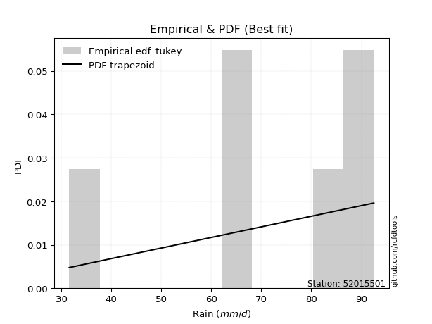</img>

</div>


### 8. EDF Gringorten (1963)

Gringorten plotting position formula is essential for estimating the probability and return periods of extreme events like floods and heavy rainfall. The constant _a=0.44_.

<div align="center">


$P=(m-a)/(n+1-2a)$


</div>


**8.1. Empirical values**

<div align="center">

|                | 0                   | 1                  | 2                   | 3                  | 4                  | 5                  |
|:---------------|:--------------------|:-------------------|:--------------------|:-------------------|:-------------------|:-------------------|
| date           | 2018                | 2022               | 2023                | 2020               | 2021               | 2019               |
| x              | 31.6                | 65.9               | 66.0                | 86.2               | 92.2               | 92.5               |
| m              | 1                   | 2                  | 3                   | 4                  | 5                  | 6                  |
| empirical_dist | edf_gringorten      | edf_gringorten     | edf_gringorten      | edf_gringorten     | edf_gringorten     | edf_gringorten     |
| empirical      | 0.09150326797385622 | 0.2549019607843137 | 0.41830065359477125 | 0.5816993464052288 | 0.7450980392156862 | 0.9084967320261437 |
| empirical_tr   | 1.1007194244604317  | 1.3421052631578947 | 1.7191011235955058  | 2.3906250000000004 | 3.9230769230769216 | 10.928571428571415 |

</div>


**8.2. Kolmogorov-Smirnov fit test (sorted by Δ)**


<div align="center">

|                | 0                   | 1                   | 2                  | 3                   | 4                   | 5                   | 6                  | 7                   | 8                  | 9                   | 10                  | 11                  | 12                  | 13                  | 14                | 15                  | 16                  | 17                  | 18                  | 19                 | 20                 | 21                  | 22                  | 23                  | 24                  | 25                 | 26                  | 27                  | 28                  | 29                  | 30                  | 31                 | 32                  | 33                  | 34                  | 35                  | 36                 | 37                  | 38                  | 39                  | 40                  | 41                 | 42                  | 43                 | 44                  | 45                 | 46                 | 47                  | 48                  | 49                 | 50                  | 51                  | 52                  | 53                  | 54                  | 55                  | 56                  | 57                  | 58                 | 59                 | 60                  | 61                  | 62                  | 63                  | 64                  | 65                  | 66                  | 67                 | 68                 | 69                  | 70                  | 71                  | 72                 | 73                  | 74                 | 75                  | 76                 | 77                  | 78                  | 79                 | 80                 | 81                  | 82                 | 83                  | 84                  | 85                  | 86                  | 87                 | 88                 | 89                  | 90                 | 91                  | 92                  | 93                  | 94                  | 95                 | 96                  | 97                 | 98                  | 99                 | 100                | 101                 | 102                 | 103                | 104                | 105               | 106                 | 107                | 108                | 109                | 110                | 111                 | 112                 | 113                 | 114                 | 115                 | 116                 | 117                 | 118                 | 119                 | 120                | 121                | 122                 | 123                | 124                | 125                | 126                | 127                 | 128                 | 129                 | 130                | 131                | 132                | 133                 | 134                 | 135                | 136                | 137                | 138                 | 139               | 140                | 141                 | 142                | 143                | 144                | 145                | 146                | 147               | 148                | 149                | 150                | 151                | 152                | 153                | 154                | 155                | 156                | 157                | 158               | 159                |
|:---------------|:--------------------|:--------------------|:-------------------|:--------------------|:--------------------|:--------------------|:-------------------|:--------------------|:-------------------|:--------------------|:--------------------|:--------------------|:--------------------|:--------------------|:------------------|:--------------------|:--------------------|:--------------------|:--------------------|:-------------------|:-------------------|:--------------------|:--------------------|:--------------------|:--------------------|:-------------------|:--------------------|:--------------------|:--------------------|:--------------------|:--------------------|:-------------------|:--------------------|:--------------------|:--------------------|:--------------------|:-------------------|:--------------------|:--------------------|:--------------------|:--------------------|:-------------------|:--------------------|:-------------------|:--------------------|:-------------------|:-------------------|:--------------------|:--------------------|:-------------------|:--------------------|:--------------------|:--------------------|:--------------------|:--------------------|:--------------------|:--------------------|:--------------------|:-------------------|:-------------------|:--------------------|:--------------------|:--------------------|:--------------------|:--------------------|:--------------------|:--------------------|:-------------------|:-------------------|:--------------------|:--------------------|:--------------------|:-------------------|:--------------------|:-------------------|:--------------------|:-------------------|:--------------------|:--------------------|:-------------------|:-------------------|:--------------------|:-------------------|:--------------------|:--------------------|:--------------------|:--------------------|:-------------------|:-------------------|:--------------------|:-------------------|:--------------------|:--------------------|:--------------------|:--------------------|:-------------------|:--------------------|:-------------------|:--------------------|:-------------------|:-------------------|:--------------------|:--------------------|:-------------------|:-------------------|:------------------|:--------------------|:-------------------|:-------------------|:-------------------|:-------------------|:--------------------|:--------------------|:--------------------|:--------------------|:--------------------|:--------------------|:--------------------|:--------------------|:--------------------|:-------------------|:-------------------|:--------------------|:-------------------|:-------------------|:-------------------|:-------------------|:--------------------|:--------------------|:--------------------|:-------------------|:-------------------|:-------------------|:--------------------|:--------------------|:-------------------|:-------------------|:-------------------|:--------------------|:------------------|:-------------------|:--------------------|:-------------------|:-------------------|:-------------------|:-------------------|:-------------------|:------------------|:-------------------|:-------------------|:-------------------|:-------------------|:-------------------|:-------------------|:-------------------|:-------------------|:-------------------|:-------------------|:------------------|:-------------------|
| station        | 52015501            | 52015501            | 52015501           | 52015501            | 52015501            | 52015501            | 52015501           | 52015501            | 52015501           | 52015501            | 52015501            | 52015501            | 52015501            | 52015501            | 52015501          | 52015501            | 52015501            | 52015501            | 52015501            | 52015501           | 52015501           | 52015501            | 52015501            | 52015501            | 52015501            | 52015501           | 52015501            | 52015501            | 52015501            | 52015501            | 52015501            | 52015501           | 52015501            | 52015501            | 52015501            | 52015501            | 52015501           | 52015501            | 52015501            | 52015501            | 52015501            | 52015501           | 52015501            | 52015501           | 52015501            | 52015501           | 52015501           | 52015501            | 52015501            | 52015501           | 52015501            | 52015501            | 52015501            | 52015501            | 52015501            | 52015501            | 52015501            | 52015501            | 52015501           | 52015501           | 52015501            | 52015501            | 52015501            | 52015501            | 52015501            | 52015501            | 52015501            | 52015501           | 52015501           | 52015501            | 52015501            | 52015501            | 52015501           | 52015501            | 52015501           | 52015501            | 52015501           | 52015501            | 52015501            | 52015501           | 52015501           | 52015501            | 52015501           | 52015501            | 52015501            | 52015501            | 52015501            | 52015501           | 52015501           | 52015501            | 52015501           | 52015501            | 52015501            | 52015501            | 52015501            | 52015501           | 52015501            | 52015501           | 52015501            | 52015501           | 52015501           | 52015501            | 52015501            | 52015501           | 52015501           | 52015501          | 52015501            | 52015501           | 52015501           | 52015501           | 52015501           | 52015501            | 52015501            | 52015501            | 52015501            | 52015501            | 52015501            | 52015501            | 52015501            | 52015501            | 52015501           | 52015501           | 52015501            | 52015501           | 52015501           | 52015501           | 52015501           | 52015501            | 52015501            | 52015501            | 52015501           | 52015501           | 52015501           | 52015501            | 52015501            | 52015501           | 52015501           | 52015501           | 52015501            | 52015501          | 52015501           | 52015501            | 52015501           | 52015501           | 52015501           | 52015501           | 52015501           | 52015501          | 52015501           | 52015501           | 52015501           | 52015501           | 52015501           | 52015501           | 52015501           | 52015501           | 52015501           | 52015501           | 52015501          | 52015501           |
| empirical_dist | edf_gringorten      | edf_gringorten      | edf_gringorten     | edf_gringorten      | edf_gringorten      | edf_gringorten      | edf_gringorten     | edf_gringorten      | edf_gringorten     | edf_gringorten      | edf_gringorten      | edf_gringorten      | edf_gringorten      | edf_gringorten      | edf_gringorten    | edf_gringorten      | edf_gringorten      | edf_gringorten      | edf_gringorten      | edf_gringorten     | edf_gringorten     | edf_gringorten      | edf_gringorten      | edf_gringorten      | edf_gringorten      | edf_gringorten     | edf_gringorten      | edf_gringorten      | edf_gringorten      | edf_gringorten      | edf_gringorten      | edf_gringorten     | edf_gringorten      | edf_gringorten      | edf_gringorten      | edf_gringorten      | edf_gringorten     | edf_gringorten      | edf_gringorten      | edf_gringorten      | edf_gringorten      | edf_gringorten     | edf_gringorten      | edf_gringorten     | edf_gringorten      | edf_gringorten     | edf_gringorten     | edf_gringorten      | edf_gringorten      | edf_gringorten     | edf_gringorten      | edf_gringorten      | edf_gringorten      | edf_gringorten      | edf_gringorten      | edf_gringorten      | edf_gringorten      | edf_gringorten      | edf_gringorten     | edf_gringorten     | edf_gringorten      | edf_gringorten      | edf_gringorten      | edf_gringorten      | edf_gringorten      | edf_gringorten      | edf_gringorten      | edf_gringorten     | edf_gringorten     | edf_gringorten      | edf_gringorten      | edf_gringorten      | edf_gringorten     | edf_gringorten      | edf_gringorten     | edf_gringorten      | edf_gringorten     | edf_gringorten      | edf_gringorten      | edf_gringorten     | edf_gringorten     | edf_gringorten      | edf_gringorten     | edf_gringorten      | edf_gringorten      | edf_gringorten      | edf_gringorten      | edf_gringorten     | edf_gringorten     | edf_gringorten      | edf_gringorten     | edf_gringorten      | edf_gringorten      | edf_gringorten      | edf_gringorten      | edf_gringorten     | edf_gringorten      | edf_gringorten     | edf_gringorten      | edf_gringorten     | edf_gringorten     | edf_gringorten      | edf_gringorten      | edf_gringorten     | edf_gringorten     | edf_gringorten    | edf_gringorten      | edf_gringorten     | edf_gringorten     | edf_gringorten     | edf_gringorten     | edf_gringorten      | edf_gringorten      | edf_gringorten      | edf_gringorten      | edf_gringorten      | edf_gringorten      | edf_gringorten      | edf_gringorten      | edf_gringorten      | edf_gringorten     | edf_gringorten     | edf_gringorten      | edf_gringorten     | edf_gringorten     | edf_gringorten     | edf_gringorten     | edf_gringorten      | edf_gringorten      | edf_gringorten      | edf_gringorten     | edf_gringorten     | edf_gringorten     | edf_gringorten      | edf_gringorten      | edf_gringorten     | edf_gringorten     | edf_gringorten     | edf_gringorten      | edf_gringorten    | edf_gringorten     | edf_gringorten      | edf_gringorten     | edf_gringorten     | edf_gringorten     | edf_gringorten     | edf_gringorten     | edf_gringorten    | edf_gringorten     | edf_gringorten     | edf_gringorten     | edf_gringorten     | edf_gringorten     | edf_gringorten     | edf_gringorten     | edf_gringorten     | edf_gringorten     | edf_gringorten     | edf_gringorten    | edf_gringorten     |
| p_dist         | logbeta             | trapezoid           | logpearson3        | loggausshyper       | burr                | pearson3            | dweibull           | loggumbel_l         | loggennorm         | anglit              | gumbel_l            | logvonmises_line    | semicircular        | dgamma              | weibull_min       | betaprime           | genpareto           | f                   | nct                 | t                  | exponnorm          | truncnorm           | norm                | crystalball         | rice                | invgauss           | alpha               | erlang              | logt                | logdweibull         | vonmises_line       | gamma              | beta                | weibull_max         | logjohnsonsb        | logburr12           | logweibull_min     | maxwell             | invgamma            | logtrapezoid        | rayleigh            | loggompertz        | arcsine             | logmielke          | logistic            | argus              | logdgamma          | logargus            | cosine              | hypsecant          | loghypsecant        | gumbel_r            | loglogistic         | logburr             | gausshyper          | halfnorm            | logncf              | logf                | logcrystalball     | lognorm            | logexponnorm        | logrice             | logfatiguelife      | logexponweib        | loggengamma         | loglaplace          | loglaplace          | loganglit          | loginvgamma        | lognct              | moyal               | logsemicircular     | logbetaprime       | laplace             | halflogistic       | logweibull_max      | logarcsine         | genextreme          | loggenextreme       | loggamma           | loggamma           | kstwobign           | johnsonsb          | logalpha            | mielke              | logloglaplace       | genhalflogistic     | logmaxwell         | loginvgauss        | logloggamma         | gennorm            | logtruncweibull_min | skewnorm            | wrapcauchy          | levy_l              | lograyleigh        | loginvweibull       | logwrapcauchy      | loggenhalflogistic  | wald               | loglevy_l          | triang              | logfoldnorm         | nakagami           | kappa4             | bradford          | loggumbel_r         | logcosine          | loghalfnorm        | loggenpareto       | logkstwobign       | ksone               | truncweibull_min    | logmoyal            | loggenexpon         | logskewnorm         | loghalflogistic     | logtriang           | uniform             | lognakagami         | logexponpow        | kappa3             | loglomax            | burr12             | halfgennorm        | ncf                | logwald            | truncexpon          | logksone            | lomax               | logtruncnorm       | logtukeylambda     | gompertz           | foldnorm            | loghalfgennorm      | logerlang          | logkappa3          | loguniform         | logkappa4           | logbradford       | invweibull         | logjohnsonsu        | logtruncexpon      | logrdist           | johnsonsu          | gengamma           | fatiguelife        | exponweib         | powerlaw           | exponpow           | logpowerlaw        | truncpareto        | logtruncpareto     | genexpon           | genlogistic        | loggenlogistic     | rdist              | tukeylambda        | logvonmises       | vonmises           |
| delta          | 0.11673091538010194 | 0.11889890868208053 | 0.1266168331792044 | 0.12762172401090988 | 0.13235068718652832 | 0.13440264778950228 | 0.1360517227173066 | 0.13719196214463414 | 0.1375079054130105 | 0.14176563616237853 | 0.14204729902163915 | 0.14343371236121794 | 0.14855386783346947 | 0.15005044467816409 | 0.150805087128971 | 0.15316709377326376 | 0.15741874237832054 | 0.15867401894901023 | 0.15929168778959035 | 0.1592928799356238 | 0.1593025196758846 | 0.15930352359122046 | 0.15930354415909476 | 0.15930354838703387 | 0.15975968475726243 | 0.1604098788813897 | 0.16216513467937632 | 0.16271759161087285 | 0.16343334695895373 | 0.16357968099620623 | 0.16380322757336807 | 0.1639508986074577 | 0.16431194128193172 | 0.16520215357259427 | 0.16556877909932316 | 0.16690798630431136 | 0.1676926762851516 | 0.17006278152377552 | 0.17039468532967594 | 0.17052253963015496 | 0.17314547074547315 | 0.1739301357928701 | 0.17659598285206457 | 0.1790791964842936 | 0.18189962131054538 | 0.1830935009559369 | 0.1837466912416097 | 0.18752342576223024 | 0.19088252558053687 | 0.1970470996859065 | 0.19830169783250612 | 0.20096886016874216 | 0.20260747488364717 | 0.20541665471178872 | 0.20580238880540347 | 0.20610696482016883 | 0.20624835206518272 | 0.20650131790453474 | 0.2076797592762345 | 0.2076797615905276 | 0.20768059289000756 | 0.20768787353891444 | 0.20802001353909771 | 0.20827740180387283 | 0.21081970563511693 | 0.21226319782493452 | 0.21226319782493452 | 0.2130110979198525 | 0.2140514618059075 | 0.21432465745632945 | 0.21438882221676137 | 0.21520629494097115 | 0.2152599091590105 | 0.21788301255506715 | 0.2189914975110912 | 0.21971830472415038 | 0.2239414946201364 | 0.22467916559337253 | 0.22486085596232486 | 0.2248923966644814 | 0.2248923966644814 | 0.22529348593670917 | 0.2295614206819419 | 0.22982557684127303 | 0.23823724413091796 | 0.23911922437519512 | 0.24082616321201689 | 0.2418221957289371 | 0.2441740884009091 | 0.24421974167945926 | 0.2450980392156863 | 0.24511283760926839 | 0.24815170599308856 | 0.24970008667686305 | 0.25162686091671815 | 0.2535316995750031 | 0.25417055740056194 | 0.2543387782684501 | 0.25742029584538617 | 0.2579620152005041 | 0.2599986204587616 | 0.26602403583027345 | 0.26848481727841556 | 0.2703896170295952 | 0.2725805776065816 | 0.273738043448827 | 0.27591252399353605 | 0.2766263710855774 | 0.2865657238372308 | 0.2915030574310422 | 0.2920712278867581 | 0.29778003155285104 | 0.29845702717579503 | 0.30155977982705817 | 0.30157978925771745 | 0.30171970735021314 | 0.30877793999611525 | 0.31110570576760255 | 0.31485237773270225 | 0.32101444932866857 | 0.3496239723956567 | 0.3531660300662496 | 0.35820494912788015 | 0.3592382981421507 | 0.3618750432881759 | 0.3677652487326212 | 0.3729332682353106 | 0.39044849883904853 | 0.39868747335299326 | 0.40865357312787953 | 0.4097322386059579 | 0.4126136737758174 | 0.4159258421632334 | 0.41830065359477125 | 0.41830065359477125 | 0.4197282649030448 | 0.4280108812495592 | 0.4294053601804546 | 0.43005882600724454 | 0.431558574420718 | 0.4610844404540009 | 0.46833235468103923 | 0.4976300672301689 | 0.5035497012244052 | 0.5263351735172668 | 0.5435153359608429 | 0.5736391449234626 | 0.591945377359467 | 0.6598111856840178 | 0.6740153419188745 | 0.6842392202240344 | 0.6955844889863985 | 0.7122407766368778 | 0.7402161851850133 | 0.7450980392156862 | 0.7450980392156862 | 0.7450980392156863 | 0.7450980392156863 | 1.194791319561248 | 14.807625690774703 |
| deltao         | 0.530385761606      | 0.530385761606      | 0.530385761606     | 0.530385761606      | 0.530385761606      | 0.530385761606      | 0.530385761606     | 0.530385761606      | 0.530385761606     | 0.530385761606      | 0.530385761606      | 0.530385761606      | 0.530385761606      | 0.530385761606      | 0.530385761606    | 0.530385761606      | 0.530385761606      | 0.530385761606      | 0.530385761606      | 0.530385761606     | 0.530385761606     | 0.530385761606      | 0.530385761606      | 0.530385761606      | 0.530385761606      | 0.530385761606     | 0.530385761606      | 0.530385761606      | 0.530385761606      | 0.530385761606      | 0.530385761606      | 0.530385761606     | 0.530385761606      | 0.530385761606      | 0.530385761606      | 0.530385761606      | 0.530385761606     | 0.530385761606      | 0.530385761606      | 0.530385761606      | 0.530385761606      | 0.530385761606     | 0.530385761606      | 0.530385761606     | 0.530385761606      | 0.530385761606     | 0.530385761606     | 0.530385761606      | 0.530385761606      | 0.530385761606     | 0.530385761606      | 0.530385761606      | 0.530385761606      | 0.530385761606      | 0.530385761606      | 0.530385761606      | 0.530385761606      | 0.530385761606      | 0.530385761606     | 0.530385761606     | 0.530385761606      | 0.530385761606      | 0.530385761606      | 0.530385761606      | 0.530385761606      | 0.530385761606      | 0.530385761606      | 0.530385761606     | 0.530385761606     | 0.530385761606      | 0.530385761606      | 0.530385761606      | 0.530385761606     | 0.530385761606      | 0.530385761606     | 0.530385761606      | 0.530385761606     | 0.530385761606      | 0.530385761606      | 0.530385761606     | 0.530385761606     | 0.530385761606      | 0.530385761606     | 0.530385761606      | 0.530385761606      | 0.530385761606      | 0.530385761606      | 0.530385761606     | 0.530385761606     | 0.530385761606      | 0.530385761606     | 0.530385761606      | 0.530385761606      | 0.530385761606      | 0.530385761606      | 0.530385761606     | 0.530385761606      | 0.530385761606     | 0.530385761606      | 0.530385761606     | 0.530385761606     | 0.530385761606      | 0.530385761606      | 0.530385761606     | 0.530385761606     | 0.530385761606    | 0.530385761606      | 0.530385761606     | 0.530385761606     | 0.530385761606     | 0.530385761606     | 0.530385761606      | 0.530385761606      | 0.530385761606      | 0.530385761606      | 0.530385761606      | 0.530385761606      | 0.530385761606      | 0.530385761606      | 0.530385761606      | 0.530385761606     | 0.530385761606     | 0.530385761606      | 0.530385761606     | 0.530385761606     | 0.530385761606     | 0.530385761606     | 0.530385761606      | 0.530385761606      | 0.530385761606      | 0.530385761606     | 0.530385761606     | 0.530385761606     | 0.530385761606      | 0.530385761606      | 0.530385761606     | 0.530385761606     | 0.530385761606     | 0.530385761606      | 0.530385761606    | 0.530385761606     | 0.530385761606      | 0.530385761606     | 0.530385761606     | 0.530385761606     | 0.530385761606     | 0.530385761606     | 0.530385761606    | 0.530385761606     | 0.530385761606     | 0.530385761606     | 0.530385761606     | 0.530385761606     | 0.530385761606     | 0.530385761606     | 0.530385761606     | 0.530385761606     | 0.530385761606     | 0.530385761606    | 0.530385761606     |
| eval           | Δo > Δ              | Δo > Δ              | Δo > Δ             | Δo > Δ              | Δo > Δ              | Δo > Δ              | Δo > Δ             | Δo > Δ              | Δo > Δ             | Δo > Δ              | Δo > Δ              | Δo > Δ              | Δo > Δ              | Δo > Δ              | Δo > Δ            | Δo > Δ              | Δo > Δ              | Δo > Δ              | Δo > Δ              | Δo > Δ             | Δo > Δ             | Δo > Δ              | Δo > Δ              | Δo > Δ              | Δo > Δ              | Δo > Δ             | Δo > Δ              | Δo > Δ              | Δo > Δ              | Δo > Δ              | Δo > Δ              | Δo > Δ             | Δo > Δ              | Δo > Δ              | Δo > Δ              | Δo > Δ              | Δo > Δ             | Δo > Δ              | Δo > Δ              | Δo > Δ              | Δo > Δ              | Δo > Δ             | Δo > Δ              | Δo > Δ             | Δo > Δ              | Δo > Δ             | Δo > Δ             | Δo > Δ              | Δo > Δ              | Δo > Δ             | Δo > Δ              | Δo > Δ              | Δo > Δ              | Δo > Δ              | Δo > Δ              | Δo > Δ              | Δo > Δ              | Δo > Δ              | Δo > Δ             | Δo > Δ             | Δo > Δ              | Δo > Δ              | Δo > Δ              | Δo > Δ              | Δo > Δ              | Δo > Δ              | Δo > Δ              | Δo > Δ             | Δo > Δ             | Δo > Δ              | Δo > Δ              | Δo > Δ              | Δo > Δ             | Δo > Δ              | Δo > Δ             | Δo > Δ              | Δo > Δ             | Δo > Δ              | Δo > Δ              | Δo > Δ             | Δo > Δ             | Δo > Δ              | Δo > Δ             | Δo > Δ              | Δo > Δ              | Δo > Δ              | Δo > Δ              | Δo > Δ             | Δo > Δ             | Δo > Δ              | Δo > Δ             | Δo > Δ              | Δo > Δ              | Δo > Δ              | Δo > Δ              | Δo > Δ             | Δo > Δ              | Δo > Δ             | Δo > Δ              | Δo > Δ             | Δo > Δ             | Δo > Δ              | Δo > Δ              | Δo > Δ             | Δo > Δ             | Δo > Δ            | Δo > Δ              | Δo > Δ             | Δo > Δ             | Δo > Δ             | Δo > Δ             | Δo > Δ              | Δo > Δ              | Δo > Δ              | Δo > Δ              | Δo > Δ              | Δo > Δ              | Δo > Δ              | Δo > Δ              | Δo > Δ              | Δo > Δ             | Δo > Δ             | Δo > Δ              | Δo > Δ             | Δo > Δ             | Δo > Δ             | Δo > Δ             | Δo > Δ              | Δo > Δ              | Δo > Δ              | Δo > Δ             | Δo > Δ             | Δo > Δ             | Δo > Δ              | Δo > Δ              | Δo > Δ             | Δo > Δ             | Δo > Δ             | Δo > Δ              | Δo > Δ            | Δo > Δ             | Δo > Δ              | Δo > Δ             | Δo > Δ             | Δo > Δ             | Δo <= Δ            | Δo <= Δ            | Δo <= Δ           | Δo <= Δ            | Δo <= Δ            | Δo <= Δ            | Δo <= Δ            | Δo <= Δ            | Δo <= Δ            | Δo <= Δ            | Δo <= Δ            | Δo <= Δ            | Δo <= Δ            | Δo <= Δ           | Δo <= Δ            |
| fit            | 1                   | 1                   | 1                  | 1                   | 1                   | 1                   | 1                  | 1                   | 1                  | 1                   | 1                   | 1                   | 1                   | 1                   | 1                 | 1                   | 1                   | 1                   | 1                   | 1                  | 1                  | 1                   | 1                   | 1                   | 1                   | 1                  | 1                   | 1                   | 1                   | 1                   | 1                   | 1                  | 1                   | 1                   | 1                   | 1                   | 1                  | 1                   | 1                   | 1                   | 1                   | 1                  | 1                   | 1                  | 1                   | 1                  | 1                  | 1                   | 1                   | 1                  | 1                   | 1                   | 1                   | 1                   | 1                   | 1                   | 1                   | 1                   | 1                  | 1                  | 1                   | 1                   | 1                   | 1                   | 1                   | 1                   | 1                   | 1                  | 1                  | 1                   | 1                   | 1                   | 1                  | 1                   | 1                  | 1                   | 1                  | 1                   | 1                   | 1                  | 1                  | 1                   | 1                  | 1                   | 1                   | 1                   | 1                   | 1                  | 1                  | 1                   | 1                  | 1                   | 1                   | 1                   | 1                   | 1                  | 1                   | 1                  | 1                   | 1                  | 1                  | 1                   | 1                   | 1                  | 1                  | 1                 | 1                   | 1                  | 1                  | 1                  | 1                  | 1                   | 1                   | 1                   | 1                   | 1                   | 1                   | 1                   | 1                   | 1                   | 1                  | 1                  | 1                   | 1                  | 1                  | 1                  | 1                  | 1                   | 1                   | 1                   | 1                  | 1                  | 1                  | 1                   | 1                   | 1                  | 1                  | 1                  | 1                   | 1                 | 1                  | 1                   | 1                  | 1                  | 1                  | 0                  | 0                  | 0                 | 0                  | 0                  | 0                  | 0                  | 0                  | 0                  | 0                  | 0                  | 0                  | 0                  | 0                 | 0                  |
| n              | 6                   | 6                   | 6                  | 6                   | 6                   | 6                   | 6                  | 6                   | 6                  | 6                   | 6                   | 6                   | 6                   | 6                   | 6                 | 6                   | 6                   | 6                   | 6                   | 6                  | 6                  | 6                   | 6                   | 6                   | 6                   | 6                  | 6                   | 6                   | 6                   | 6                   | 6                   | 6                  | 6                   | 6                   | 6                   | 6                   | 6                  | 6                   | 6                   | 6                   | 6                   | 6                  | 6                   | 6                  | 6                   | 6                  | 6                  | 6                   | 6                   | 6                  | 6                   | 6                   | 6                   | 6                   | 6                   | 6                   | 6                   | 6                   | 6                  | 6                  | 6                   | 6                   | 6                   | 6                   | 6                   | 6                   | 6                   | 6                  | 6                  | 6                   | 6                   | 6                   | 6                  | 6                   | 6                  | 6                   | 6                  | 6                   | 6                   | 6                  | 6                  | 6                   | 6                  | 6                   | 6                   | 6                   | 6                   | 6                  | 6                  | 6                   | 6                  | 6                   | 6                   | 6                   | 6                   | 6                  | 6                   | 6                  | 6                   | 6                  | 6                  | 6                   | 6                   | 6                  | 6                  | 6                 | 6                   | 6                  | 6                  | 6                  | 6                  | 6                   | 6                   | 6                   | 6                   | 6                   | 6                   | 6                   | 6                   | 6                   | 6                  | 6                  | 6                   | 6                  | 6                  | 6                  | 6                  | 6                   | 6                   | 6                   | 6                  | 6                  | 6                  | 6                   | 6                   | 6                  | 6                  | 6                  | 6                   | 6                 | 6                  | 6                   | 6                  | 6                  | 6                  | 6                  | 6                  | 6                 | 6                  | 6                  | 6                  | 6                  | 6                  | 6                  | 6                  | 6                  | 6                  | 6                  | 6                 | 6                  |
| best_fit       | 1                   | 0                   | 0                  | 0                   | 0                   | 0                   | 0                  | 0                   | 0                  | 0                   | 0                   | 0                   | 0                   | 0                   | 0                 | 0                   | 0                   | 0                   | 0                   | 0                  | 0                  | 0                   | 0                   | 0                   | 0                   | 0                  | 0                   | 0                   | 0                   | 0                   | 0                   | 0                  | 0                   | 0                   | 0                   | 0                   | 0                  | 0                   | 0                   | 0                   | 0                   | 0                  | 0                   | 0                  | 0                   | 0                  | 0                  | 0                   | 0                   | 0                  | 0                   | 0                   | 0                   | 0                   | 0                   | 0                   | 0                   | 0                   | 0                  | 0                  | 0                   | 0                   | 0                   | 0                   | 0                   | 0                   | 0                   | 0                  | 0                  | 0                   | 0                   | 0                   | 0                  | 0                   | 0                  | 0                   | 0                  | 0                   | 0                   | 0                  | 0                  | 0                   | 0                  | 0                   | 0                   | 0                   | 0                   | 0                  | 0                  | 0                   | 0                  | 0                   | 0                   | 0                   | 0                   | 0                  | 0                   | 0                  | 0                   | 0                  | 0                  | 0                   | 0                   | 0                  | 0                  | 0                 | 0                   | 0                  | 0                  | 0                  | 0                  | 0                   | 0                   | 0                   | 0                   | 0                   | 0                   | 0                   | 0                   | 0                   | 0                  | 0                  | 0                   | 0                  | 0                  | 0                  | 0                  | 0                   | 0                   | 0                   | 0                  | 0                  | 0                  | 0                   | 0                   | 0                  | 0                  | 0                  | 0                   | 0                 | 0                  | 0                   | 0                  | 0                  | 0                  | 0                  | 0                  | 0                 | 0                  | 0                  | 0                  | 0                  | 0                  | 0                  | 0                  | 0                  | 0                  | 0                  | 0                 | 0                  |
| best_fit_sort  | 1                   | 2                   | 3                  | 4                   | 5                   | 6                   | 7                  | 8                   | 9                  | 10                  | 11                  | 12                  | 13                  | 14                  | 15                | 16                  | 17                  | 18                  | 19                  | 20                 | 21                 | 22                  | 23                  | 24                  | 25                  | 26                 | 27                  | 28                  | 29                  | 30                  | 31                  | 32                 | 33                  | 34                  | 35                  | 36                  | 37                 | 38                  | 39                  | 40                  | 41                  | 42                 | 43                  | 44                 | 45                  | 46                 | 47                 | 48                  | 49                  | 50                 | 51                  | 52                  | 53                  | 54                  | 55                  | 56                  | 57                  | 58                  | 59                 | 60                 | 61                  | 62                  | 63                  | 64                  | 65                  | 66                  | 67                  | 68                 | 69                 | 70                  | 71                  | 72                  | 73                 | 74                  | 75                 | 76                  | 77                 | 78                  | 79                  | 80                 | 81                 | 82                  | 83                 | 84                  | 85                  | 86                  | 87                  | 88                 | 89                 | 90                  | 91                 | 92                  | 93                  | 94                  | 95                  | 96                 | 97                  | 98                 | 99                  | 100                | 101                | 102                 | 103                 | 104                | 105                | 106               | 107                 | 108                | 109                | 110                | 111                | 112                 | 113                 | 114                 | 115                 | 116                 | 117                 | 118                 | 119                 | 120                 | 121                | 122                | 123                 | 124                | 125                | 126                | 127                | 128                 | 129                 | 130                 | 131                | 132                | 133                | 134                 | 135                 | 136                | 137                | 138                | 139                 | 140               | 141                | 142                 | 143                | 144                | 145                | 146                | 147                | 148               | 149                | 150                | 151                | 152                | 153                | 154                | 155                | 156                | 157                | 158                | 159               | 160                |

</div>


**8.3. Best fit**

<div align="center">

|   id |   station | empirical_dist   | p_dist   |    delta |   deltao | eval   |   fit |   n |   best_fit |   best_fit_sort |
|-----:|----------:|:-----------------|:---------|---------:|---------:|:-------|------:|----:|-----------:|----------------:|
|    0 |  52015501 | edf_gringorten   | logbeta  | 0.116731 | 0.530386 | Δo > Δ |     1 |   6 |          1 |               1 |

</div>


<div align="center">

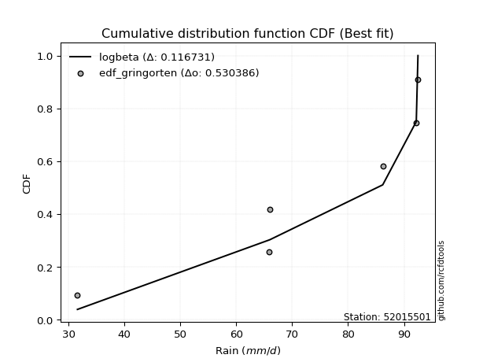</img></img>

</div>


### 9. EDF Filliben (1975)

The specific values of the constants (0.3175) (often denoted as $alpha$) and (0.365) are derived from a method proposed by James J. Filliben in a 1975 paper. This particular formula is the mean value of the $i$-th order statistic of the normal distribution and is considered a robust and effective plotting position formula for the normal probability plot correlation coefficient test for normality.

<div align="center">


$P=(m-0.3175)/(n+0.365)$


</div>


**9.1. Empirical values**

<div align="center">

|                | 0                   | 1                   | 2                  | 3                  | 4                  | 5                  |
|:---------------|:--------------------|:--------------------|:-------------------|:-------------------|:-------------------|:-------------------|
| date           | 2018                | 2022                | 2023               | 2020               | 2021               | 2019               |
| x              | 31.6                | 65.9                | 66.0               | 86.2               | 92.2               | 92.5               |
| m              | 1                   | 2                   | 3                  | 4                  | 5                  | 6                  |
| empirical_dist | edf_filliben        | edf_filliben        | edf_filliben       | edf_filliben       | edf_filliben       | edf_filliben       |
| empirical      | 0.10722702278083267 | 0.26433621366849963 | 0.4214454045561665 | 0.5785545954438335 | 0.7356637863315004 | 0.8927729772191673 |
| empirical_tr   | 1.1201055873295205  | 1.3593166043780034  | 1.7284453496266123 | 2.3727865796831313 | 3.783060921248143  | 9.326007326007321  |

</div>


**9.2. Kolmogorov-Smirnov fit test (sorted by Δ)**


<div align="center">

|                | 0                   | 1                   | 2                   | 3                   | 4                   | 5                   | 6                 | 7                   | 8                  | 9                 | 10                 | 11                  | 12                  | 13                  | 14                  | 15                 | 16                 | 17                  | 18                  | 19                  | 20                 | 21                  | 22                  | 23                  | 24                  | 25                 | 26                  | 27                 | 28                  | 29                  | 30                  | 31                | 32                  | 33                 | 34                 | 35                  | 36                  | 37                 | 38                  | 39                  | 40                  | 41                  | 42                  | 43                  | 44                 | 45                  | 46                  | 47                  | 48                  | 49                  | 50                 | 51                 | 52                 | 53                  | 54                  | 55                  | 56                  | 57                 | 58                 | 59                 | 60                  | 61                | 62                 | 63                  | 64                  | 65                  | 66                  | 67                  | 68                  | 69                  | 70                  | 71                  | 72                  | 73                  | 74                  | 75                  | 76                  | 77                  | 78                 | 79                 | 80                  | 81                  | 82                 | 83                  | 84                 | 85                 | 86                  | 87                  | 88                  | 89                  | 90                | 91                  | 92                  | 93                  | 94                | 95                 | 96                  | 97                  | 98                  | 99                  | 100                | 101                 | 102                | 103                 | 104                | 105                | 106                | 107                | 108                 | 109                | 110                | 111                | 112                 | 113                | 114                | 115                 | 116                 | 117                | 118                | 119                 | 120                 | 121                 | 122                | 123                 | 124                 | 125                 | 126                 | 127                | 128                 | 129                | 130                | 131                | 132                | 133                | 134                | 135                | 136                | 137                | 138                | 139                 | 140                 | 141                | 142                | 143                 | 144               | 145                | 146                | 147               | 148                | 149                | 150                | 151                | 152                | 153                | 154                | 155                | 156                | 157                | 158               | 159                |
|:---------------|:--------------------|:--------------------|:--------------------|:--------------------|:--------------------|:--------------------|:------------------|:--------------------|:-------------------|:------------------|:-------------------|:--------------------|:--------------------|:--------------------|:--------------------|:-------------------|:-------------------|:--------------------|:--------------------|:--------------------|:-------------------|:--------------------|:--------------------|:--------------------|:--------------------|:-------------------|:--------------------|:-------------------|:--------------------|:--------------------|:--------------------|:------------------|:--------------------|:-------------------|:-------------------|:--------------------|:--------------------|:-------------------|:--------------------|:--------------------|:--------------------|:--------------------|:--------------------|:--------------------|:-------------------|:--------------------|:--------------------|:--------------------|:--------------------|:--------------------|:-------------------|:-------------------|:-------------------|:--------------------|:--------------------|:--------------------|:--------------------|:-------------------|:-------------------|:-------------------|:--------------------|:------------------|:-------------------|:--------------------|:--------------------|:--------------------|:--------------------|:--------------------|:--------------------|:--------------------|:--------------------|:--------------------|:--------------------|:--------------------|:--------------------|:--------------------|:--------------------|:--------------------|:-------------------|:-------------------|:--------------------|:--------------------|:-------------------|:--------------------|:-------------------|:-------------------|:--------------------|:--------------------|:--------------------|:--------------------|:------------------|:--------------------|:--------------------|:--------------------|:------------------|:-------------------|:--------------------|:--------------------|:--------------------|:--------------------|:-------------------|:--------------------|:-------------------|:--------------------|:-------------------|:-------------------|:-------------------|:-------------------|:--------------------|:-------------------|:-------------------|:-------------------|:--------------------|:-------------------|:-------------------|:--------------------|:--------------------|:-------------------|:-------------------|:--------------------|:--------------------|:--------------------|:-------------------|:--------------------|:--------------------|:--------------------|:--------------------|:-------------------|:--------------------|:-------------------|:-------------------|:-------------------|:-------------------|:-------------------|:-------------------|:-------------------|:-------------------|:-------------------|:-------------------|:--------------------|:--------------------|:-------------------|:-------------------|:--------------------|:------------------|:-------------------|:-------------------|:------------------|:-------------------|:-------------------|:-------------------|:-------------------|:-------------------|:-------------------|:-------------------|:-------------------|:-------------------|:-------------------|:------------------|:-------------------|
| station        | 52015501            | 52015501            | 52015501            | 52015501            | 52015501            | 52015501            | 52015501          | 52015501            | 52015501           | 52015501          | 52015501           | 52015501            | 52015501            | 52015501            | 52015501            | 52015501           | 52015501           | 52015501            | 52015501            | 52015501            | 52015501           | 52015501            | 52015501            | 52015501            | 52015501            | 52015501           | 52015501            | 52015501           | 52015501            | 52015501            | 52015501            | 52015501          | 52015501            | 52015501           | 52015501           | 52015501            | 52015501            | 52015501           | 52015501            | 52015501            | 52015501            | 52015501            | 52015501            | 52015501            | 52015501           | 52015501            | 52015501            | 52015501            | 52015501            | 52015501            | 52015501           | 52015501           | 52015501           | 52015501            | 52015501            | 52015501            | 52015501            | 52015501           | 52015501           | 52015501           | 52015501            | 52015501          | 52015501           | 52015501            | 52015501            | 52015501            | 52015501            | 52015501            | 52015501            | 52015501            | 52015501            | 52015501            | 52015501            | 52015501            | 52015501            | 52015501            | 52015501            | 52015501            | 52015501           | 52015501           | 52015501            | 52015501            | 52015501           | 52015501            | 52015501           | 52015501           | 52015501            | 52015501            | 52015501            | 52015501            | 52015501          | 52015501            | 52015501            | 52015501            | 52015501          | 52015501           | 52015501            | 52015501            | 52015501            | 52015501            | 52015501           | 52015501            | 52015501           | 52015501            | 52015501           | 52015501           | 52015501           | 52015501           | 52015501            | 52015501           | 52015501           | 52015501           | 52015501            | 52015501           | 52015501           | 52015501            | 52015501            | 52015501           | 52015501           | 52015501            | 52015501            | 52015501            | 52015501           | 52015501            | 52015501            | 52015501            | 52015501            | 52015501           | 52015501            | 52015501           | 52015501           | 52015501           | 52015501           | 52015501           | 52015501           | 52015501           | 52015501           | 52015501           | 52015501           | 52015501            | 52015501            | 52015501           | 52015501           | 52015501            | 52015501          | 52015501           | 52015501           | 52015501          | 52015501           | 52015501           | 52015501           | 52015501           | 52015501           | 52015501           | 52015501           | 52015501           | 52015501           | 52015501           | 52015501          | 52015501           |
| empirical_dist | edf_filliben        | edf_filliben        | edf_filliben        | edf_filliben        | edf_filliben        | edf_filliben        | edf_filliben      | edf_filliben        | edf_filliben       | edf_filliben      | edf_filliben       | edf_filliben        | edf_filliben        | edf_filliben        | edf_filliben        | edf_filliben       | edf_filliben       | edf_filliben        | edf_filliben        | edf_filliben        | edf_filliben       | edf_filliben        | edf_filliben        | edf_filliben        | edf_filliben        | edf_filliben       | edf_filliben        | edf_filliben       | edf_filliben        | edf_filliben        | edf_filliben        | edf_filliben      | edf_filliben        | edf_filliben       | edf_filliben       | edf_filliben        | edf_filliben        | edf_filliben       | edf_filliben        | edf_filliben        | edf_filliben        | edf_filliben        | edf_filliben        | edf_filliben        | edf_filliben       | edf_filliben        | edf_filliben        | edf_filliben        | edf_filliben        | edf_filliben        | edf_filliben       | edf_filliben       | edf_filliben       | edf_filliben        | edf_filliben        | edf_filliben        | edf_filliben        | edf_filliben       | edf_filliben       | edf_filliben       | edf_filliben        | edf_filliben      | edf_filliben       | edf_filliben        | edf_filliben        | edf_filliben        | edf_filliben        | edf_filliben        | edf_filliben        | edf_filliben        | edf_filliben        | edf_filliben        | edf_filliben        | edf_filliben        | edf_filliben        | edf_filliben        | edf_filliben        | edf_filliben        | edf_filliben       | edf_filliben       | edf_filliben        | edf_filliben        | edf_filliben       | edf_filliben        | edf_filliben       | edf_filliben       | edf_filliben        | edf_filliben        | edf_filliben        | edf_filliben        | edf_filliben      | edf_filliben        | edf_filliben        | edf_filliben        | edf_filliben      | edf_filliben       | edf_filliben        | edf_filliben        | edf_filliben        | edf_filliben        | edf_filliben       | edf_filliben        | edf_filliben       | edf_filliben        | edf_filliben       | edf_filliben       | edf_filliben       | edf_filliben       | edf_filliben        | edf_filliben       | edf_filliben       | edf_filliben       | edf_filliben        | edf_filliben       | edf_filliben       | edf_filliben        | edf_filliben        | edf_filliben       | edf_filliben       | edf_filliben        | edf_filliben        | edf_filliben        | edf_filliben       | edf_filliben        | edf_filliben        | edf_filliben        | edf_filliben        | edf_filliben       | edf_filliben        | edf_filliben       | edf_filliben       | edf_filliben       | edf_filliben       | edf_filliben       | edf_filliben       | edf_filliben       | edf_filliben       | edf_filliben       | edf_filliben       | edf_filliben        | edf_filliben        | edf_filliben       | edf_filliben       | edf_filliben        | edf_filliben      | edf_filliben       | edf_filliben       | edf_filliben      | edf_filliben       | edf_filliben       | edf_filliben       | edf_filliben       | edf_filliben       | edf_filliben       | edf_filliben       | edf_filliben       | edf_filliben       | edf_filliben       | edf_filliben      | edf_filliben       |
| p_dist         | trapezoid           | logpearson3         | logbeta             | dweibull            | logvonmises_line    | dgamma              | anglit            | burr                | loggausshyper      | loggumbel_l       | pearson3           | semicircular        | loggennorm          | gumbel_l            | logdweibull         | weibull_max        | logjohnsonsb       | invgauss            | weibull_min         | logtrapezoid        | betaprime          | f                   | nct                 | t                   | exponnorm           | truncnorm          | norm                | crystalball        | rice                | alpha               | erlang              | logt              | arcsine             | genpareto          | vonmises_line      | gamma               | logdgamma           | logburr12          | logweibull_min      | maxwell             | invgamma            | beta                | rayleigh            | loggompertz         | logistic           | logmielke           | logargus            | argus               | loglogistic         | loghypsecant        | cosine             | halfnorm           | logncf             | logf                | logcrystalball      | lognorm             | logexponnorm        | logrice            | logfatiguelife     | logexponweib       | hypsecant           | loggengamma       | loganglit          | logweibull_max      | gumbel_r            | loginvgamma         | lognct              | logsemicircular     | logbetaprime        | halflogistic        | logarcsine          | logburr             | gausshyper          | loglaplace          | loglaplace          | loggamma            | loggamma            | kstwobign           | moyal              | logalpha           | laplace             | johnsonsb           | logloglaplace      | logmaxwell          | genextreme         | loggenextreme      | loginvgauss         | gennorm             | wrapcauchy          | lograyleigh         | loginvweibull     | logwrapcauchy       | mielke              | genhalflogistic     | logloggamma       | levy_l             | logtruncweibull_min | skewnorm            | wald                | logfoldnorm         | loggenhalflogistic | loglevy_l           | bradford           | loggumbel_r         | logcosine          | triang             | kappa4             | nakagami           | loghalfnorm         | loggenpareto       | logkstwobign       | ksone              | logmoyal            | loggenexpon        | loghalflogistic    | truncweibull_min    | logskewnorm         | logtriang          | uniform            | lognakagami         | logexponpow         | kappa3              | loglomax           | burr12              | halfgennorm         | ncf                 | logwald             | truncexpon         | logksone            | lomax              | logerlang          | logtruncnorm       | logtukeylambda     | logkappa3          | gompertz           | loguniform         | logkappa4          | foldnorm           | loghalfgennorm     | logbradford         | invweibull          | logjohnsonsu       | logrdist           | logtruncexpon       | johnsonsu         | gengamma           | fatiguelife        | exponweib         | powerlaw           | exponpow           | logpowerlaw        | truncpareto        | logtruncpareto     | genexpon           | rdist              | tukeylambda        | genlogistic        | loggenlogistic     | logvonmises       | vonmises           |
| delta          | 0.10317515387510412 | 0.11900465174658847 | 0.11987566634149721 | 0.12155935811530394 | 0.12770995755424153 | 0.13432668987118768 | 0.135296947605276 | 0.13549543814792364 | 0.1357209470541696 | 0.136248190560735 | 0.1375473987508976 | 0.13911961494928354 | 0.14065265637440583 | 0.14519204998303448 | 0.14785592618922982 | 0.1494783987656178 | 0.1498450242923467 | 0.15097562599720377 | 0.15394983809036633 | 0.15479878482317855 | 0.1563118447346591 | 0.16181876991040556 | 0.16243643875098568 | 0.16243763089701913 | 0.16244727063727993 | 0.1624482745526158 | 0.16244829512049008 | 0.1624482993484292 | 0.16290443571865776 | 0.16530988564077165 | 0.16586234257226817 | 0.166578097920349 | 0.16659036322626486 | 0.1668529952625063 | 0.1669479785347634 | 0.16709564956885303 | 0.16802293643463329 | 0.1700527372657067 | 0.17083742724654694 | 0.17320753248517085 | 0.17353943629107127 | 0.17374619416611747 | 0.17629022170686848 | 0.17707488675426541 | 0.1850443722719407 | 0.18851344936847936 | 0.19066817672362557 | 0.19252775384012266 | 0.19317322199946124 | 0.19385587105224267 | 0.1940272765419322 | 0.1966727119359829 | 0.1968140991809968 | 0.19706706502034882 | 0.19824550639204858 | 0.19824550870634167 | 0.19824634000582164 | 0.1982536206547285 | 0.1985857606549118 | 0.1988431489196869 | 0.20019185064730183 | 0.201385452750931 | 0.2035768450356666 | 0.20399454991717392 | 0.20411361113013748 | 0.20461720892172158 | 0.20489040457214353 | 0.20577204205678523 | 0.20582565627482458 | 0.21135759534592768 | 0.21450724173595048 | 0.21485090759597447 | 0.21523664168958923 | 0.21540794878632985 | 0.21540794878632985 | 0.21545814378029549 | 0.21545814378029549 | 0.21585923305252325 | 0.2175335731781567 | 0.2203913239570871 | 0.22102776351646247 | 0.22641666972054658 | 0.2296849714910092 | 0.23238794284475117 | 0.2341134184775583 | 0.2342951088465106 | 0.23473983551672317 | 0.23566378633150042 | 0.24026583379267713 | 0.24409744669081718 | 0.244736304516376 | 0.24490452538426416 | 0.24767149701510371 | 0.25026041609620264 | 0.253653994563645 | 0.2537400944031566 | 0.25454709049345414 | 0.25617125412391495 | 0.25892984401429164 | 0.25905056439422963 | 0.2605650468067815 | 0.26314337142015687 | 0.2643037905646411 | 0.26647827110935013 | 0.2671921182013915 | 0.2691687867916688 | 0.2699035440380737 | 0.2735343679909905 | 0.27713147095304486 | 0.2820688045468563 | 0.2826369750025722 | 0.2883457786686651 | 0.29212552694287225 | 0.2921455363735315 | 0.2993436871119293 | 0.30160177813719036 | 0.30486445831160847 | 0.3142504567289979 | 0.3179971286940976 | 0.32415920029006384 | 0.34018971951147076 | 0.34373177718206366 | 0.3487706962436942 | 0.34980404525796477 | 0.35244079040398996 | 0.35833099584843525 | 0.36349901535112467 | 0.3810142459548626 | 0.38925322046880734 | 0.3929298183209031 | 0.4102940120188589 | 0.4128769895673532 | 0.4157584247372127 | 0.4185766283653733 | 0.4190705931246287 | 0.4199711072962687 | 0.4206245731230586 | 0.4214454045561665 | 0.4214454045561665 | 0.42212432153653207 | 0.44536068564702447 | 0.4588981017968535 | 0.4878259464174289 | 0.48819581434598297 | 0.516900920633081 | 0.5340810830766569 | 0.5642048920392766 | 0.582511124475281 | 0.6503769327998319 | 0.6645810890346886 | 0.6748049673398484 | 0.6861502361022125 | 0.7028065237526919 | 0.7307819323008273 | 0.7356637863315003 | 0.7356637863315003 | 0.7356637863315004 | 0.7356637863315004 | 1.185357066677062 | 14.817059943658888 |
| deltao         | 0.530385761606      | 0.530385761606      | 0.530385761606      | 0.530385761606      | 0.530385761606      | 0.530385761606      | 0.530385761606    | 0.530385761606      | 0.530385761606     | 0.530385761606    | 0.530385761606     | 0.530385761606      | 0.530385761606      | 0.530385761606      | 0.530385761606      | 0.530385761606     | 0.530385761606     | 0.530385761606      | 0.530385761606      | 0.530385761606      | 0.530385761606     | 0.530385761606      | 0.530385761606      | 0.530385761606      | 0.530385761606      | 0.530385761606     | 0.530385761606      | 0.530385761606     | 0.530385761606      | 0.530385761606      | 0.530385761606      | 0.530385761606    | 0.530385761606      | 0.530385761606     | 0.530385761606     | 0.530385761606      | 0.530385761606      | 0.530385761606     | 0.530385761606      | 0.530385761606      | 0.530385761606      | 0.530385761606      | 0.530385761606      | 0.530385761606      | 0.530385761606     | 0.530385761606      | 0.530385761606      | 0.530385761606      | 0.530385761606      | 0.530385761606      | 0.530385761606     | 0.530385761606     | 0.530385761606     | 0.530385761606      | 0.530385761606      | 0.530385761606      | 0.530385761606      | 0.530385761606     | 0.530385761606     | 0.530385761606     | 0.530385761606      | 0.530385761606    | 0.530385761606     | 0.530385761606      | 0.530385761606      | 0.530385761606      | 0.530385761606      | 0.530385761606      | 0.530385761606      | 0.530385761606      | 0.530385761606      | 0.530385761606      | 0.530385761606      | 0.530385761606      | 0.530385761606      | 0.530385761606      | 0.530385761606      | 0.530385761606      | 0.530385761606     | 0.530385761606     | 0.530385761606      | 0.530385761606      | 0.530385761606     | 0.530385761606      | 0.530385761606     | 0.530385761606     | 0.530385761606      | 0.530385761606      | 0.530385761606      | 0.530385761606      | 0.530385761606    | 0.530385761606      | 0.530385761606      | 0.530385761606      | 0.530385761606    | 0.530385761606     | 0.530385761606      | 0.530385761606      | 0.530385761606      | 0.530385761606      | 0.530385761606     | 0.530385761606      | 0.530385761606     | 0.530385761606      | 0.530385761606     | 0.530385761606     | 0.530385761606     | 0.530385761606     | 0.530385761606      | 0.530385761606     | 0.530385761606     | 0.530385761606     | 0.530385761606      | 0.530385761606     | 0.530385761606     | 0.530385761606      | 0.530385761606      | 0.530385761606     | 0.530385761606     | 0.530385761606      | 0.530385761606      | 0.530385761606      | 0.530385761606     | 0.530385761606      | 0.530385761606      | 0.530385761606      | 0.530385761606      | 0.530385761606     | 0.530385761606      | 0.530385761606     | 0.530385761606     | 0.530385761606     | 0.530385761606     | 0.530385761606     | 0.530385761606     | 0.530385761606     | 0.530385761606     | 0.530385761606     | 0.530385761606     | 0.530385761606      | 0.530385761606      | 0.530385761606     | 0.530385761606     | 0.530385761606      | 0.530385761606    | 0.530385761606     | 0.530385761606     | 0.530385761606    | 0.530385761606     | 0.530385761606     | 0.530385761606     | 0.530385761606     | 0.530385761606     | 0.530385761606     | 0.530385761606     | 0.530385761606     | 0.530385761606     | 0.530385761606     | 0.530385761606    | 0.530385761606     |
| eval           | Δo > Δ              | Δo > Δ              | Δo > Δ              | Δo > Δ              | Δo > Δ              | Δo > Δ              | Δo > Δ            | Δo > Δ              | Δo > Δ             | Δo > Δ            | Δo > Δ             | Δo > Δ              | Δo > Δ              | Δo > Δ              | Δo > Δ              | Δo > Δ             | Δo > Δ             | Δo > Δ              | Δo > Δ              | Δo > Δ              | Δo > Δ             | Δo > Δ              | Δo > Δ              | Δo > Δ              | Δo > Δ              | Δo > Δ             | Δo > Δ              | Δo > Δ             | Δo > Δ              | Δo > Δ              | Δo > Δ              | Δo > Δ            | Δo > Δ              | Δo > Δ             | Δo > Δ             | Δo > Δ              | Δo > Δ              | Δo > Δ             | Δo > Δ              | Δo > Δ              | Δo > Δ              | Δo > Δ              | Δo > Δ              | Δo > Δ              | Δo > Δ             | Δo > Δ              | Δo > Δ              | Δo > Δ              | Δo > Δ              | Δo > Δ              | Δo > Δ             | Δo > Δ             | Δo > Δ             | Δo > Δ              | Δo > Δ              | Δo > Δ              | Δo > Δ              | Δo > Δ             | Δo > Δ             | Δo > Δ             | Δo > Δ              | Δo > Δ            | Δo > Δ             | Δo > Δ              | Δo > Δ              | Δo > Δ              | Δo > Δ              | Δo > Δ              | Δo > Δ              | Δo > Δ              | Δo > Δ              | Δo > Δ              | Δo > Δ              | Δo > Δ              | Δo > Δ              | Δo > Δ              | Δo > Δ              | Δo > Δ              | Δo > Δ             | Δo > Δ             | Δo > Δ              | Δo > Δ              | Δo > Δ             | Δo > Δ              | Δo > Δ             | Δo > Δ             | Δo > Δ              | Δo > Δ              | Δo > Δ              | Δo > Δ              | Δo > Δ            | Δo > Δ              | Δo > Δ              | Δo > Δ              | Δo > Δ            | Δo > Δ             | Δo > Δ              | Δo > Δ              | Δo > Δ              | Δo > Δ              | Δo > Δ             | Δo > Δ              | Δo > Δ             | Δo > Δ              | Δo > Δ             | Δo > Δ             | Δo > Δ             | Δo > Δ             | Δo > Δ              | Δo > Δ             | Δo > Δ             | Δo > Δ             | Δo > Δ              | Δo > Δ             | Δo > Δ             | Δo > Δ              | Δo > Δ              | Δo > Δ             | Δo > Δ             | Δo > Δ              | Δo > Δ              | Δo > Δ              | Δo > Δ             | Δo > Δ              | Δo > Δ              | Δo > Δ              | Δo > Δ              | Δo > Δ             | Δo > Δ              | Δo > Δ             | Δo > Δ             | Δo > Δ             | Δo > Δ             | Δo > Δ             | Δo > Δ             | Δo > Δ             | Δo > Δ             | Δo > Δ             | Δo > Δ             | Δo > Δ              | Δo > Δ              | Δo > Δ             | Δo > Δ             | Δo > Δ              | Δo > Δ            | Δo <= Δ            | Δo <= Δ            | Δo <= Δ           | Δo <= Δ            | Δo <= Δ            | Δo <= Δ            | Δo <= Δ            | Δo <= Δ            | Δo <= Δ            | Δo <= Δ            | Δo <= Δ            | Δo <= Δ            | Δo <= Δ            | Δo <= Δ           | Δo <= Δ            |
| fit            | 1                   | 1                   | 1                   | 1                   | 1                   | 1                   | 1                 | 1                   | 1                  | 1                 | 1                  | 1                   | 1                   | 1                   | 1                   | 1                  | 1                  | 1                   | 1                   | 1                   | 1                  | 1                   | 1                   | 1                   | 1                   | 1                  | 1                   | 1                  | 1                   | 1                   | 1                   | 1                 | 1                   | 1                  | 1                  | 1                   | 1                   | 1                  | 1                   | 1                   | 1                   | 1                   | 1                   | 1                   | 1                  | 1                   | 1                   | 1                   | 1                   | 1                   | 1                  | 1                  | 1                  | 1                   | 1                   | 1                   | 1                   | 1                  | 1                  | 1                  | 1                   | 1                 | 1                  | 1                   | 1                   | 1                   | 1                   | 1                   | 1                   | 1                   | 1                   | 1                   | 1                   | 1                   | 1                   | 1                   | 1                   | 1                   | 1                  | 1                  | 1                   | 1                   | 1                  | 1                   | 1                  | 1                  | 1                   | 1                   | 1                   | 1                   | 1                 | 1                   | 1                   | 1                   | 1                 | 1                  | 1                   | 1                   | 1                   | 1                   | 1                  | 1                   | 1                  | 1                   | 1                  | 1                  | 1                  | 1                  | 1                   | 1                  | 1                  | 1                  | 1                   | 1                  | 1                  | 1                   | 1                   | 1                  | 1                  | 1                   | 1                   | 1                   | 1                  | 1                   | 1                   | 1                   | 1                   | 1                  | 1                   | 1                  | 1                  | 1                  | 1                  | 1                  | 1                  | 1                  | 1                  | 1                  | 1                  | 1                   | 1                   | 1                  | 1                  | 1                   | 1                 | 0                  | 0                  | 0                 | 0                  | 0                  | 0                  | 0                  | 0                  | 0                  | 0                  | 0                  | 0                  | 0                  | 0                 | 0                  |
| n              | 6                   | 6                   | 6                   | 6                   | 6                   | 6                   | 6                 | 6                   | 6                  | 6                 | 6                  | 6                   | 6                   | 6                   | 6                   | 6                  | 6                  | 6                   | 6                   | 6                   | 6                  | 6                   | 6                   | 6                   | 6                   | 6                  | 6                   | 6                  | 6                   | 6                   | 6                   | 6                 | 6                   | 6                  | 6                  | 6                   | 6                   | 6                  | 6                   | 6                   | 6                   | 6                   | 6                   | 6                   | 6                  | 6                   | 6                   | 6                   | 6                   | 6                   | 6                  | 6                  | 6                  | 6                   | 6                   | 6                   | 6                   | 6                  | 6                  | 6                  | 6                   | 6                 | 6                  | 6                   | 6                   | 6                   | 6                   | 6                   | 6                   | 6                   | 6                   | 6                   | 6                   | 6                   | 6                   | 6                   | 6                   | 6                   | 6                  | 6                  | 6                   | 6                   | 6                  | 6                   | 6                  | 6                  | 6                   | 6                   | 6                   | 6                   | 6                 | 6                   | 6                   | 6                   | 6                 | 6                  | 6                   | 6                   | 6                   | 6                   | 6                  | 6                   | 6                  | 6                   | 6                  | 6                  | 6                  | 6                  | 6                   | 6                  | 6                  | 6                  | 6                   | 6                  | 6                  | 6                   | 6                   | 6                  | 6                  | 6                   | 6                   | 6                   | 6                  | 6                   | 6                   | 6                   | 6                   | 6                  | 6                   | 6                  | 6                  | 6                  | 6                  | 6                  | 6                  | 6                  | 6                  | 6                  | 6                  | 6                   | 6                   | 6                  | 6                  | 6                   | 6                 | 6                  | 6                  | 6                 | 6                  | 6                  | 6                  | 6                  | 6                  | 6                  | 6                  | 6                  | 6                  | 6                  | 6                 | 6                  |
| best_fit       | 1                   | 0                   | 0                   | 0                   | 0                   | 0                   | 0                 | 0                   | 0                  | 0                 | 0                  | 0                   | 0                   | 0                   | 0                   | 0                  | 0                  | 0                   | 0                   | 0                   | 0                  | 0                   | 0                   | 0                   | 0                   | 0                  | 0                   | 0                  | 0                   | 0                   | 0                   | 0                 | 0                   | 0                  | 0                  | 0                   | 0                   | 0                  | 0                   | 0                   | 0                   | 0                   | 0                   | 0                   | 0                  | 0                   | 0                   | 0                   | 0                   | 0                   | 0                  | 0                  | 0                  | 0                   | 0                   | 0                   | 0                   | 0                  | 0                  | 0                  | 0                   | 0                 | 0                  | 0                   | 0                   | 0                   | 0                   | 0                   | 0                   | 0                   | 0                   | 0                   | 0                   | 0                   | 0                   | 0                   | 0                   | 0                   | 0                  | 0                  | 0                   | 0                   | 0                  | 0                   | 0                  | 0                  | 0                   | 0                   | 0                   | 0                   | 0                 | 0                   | 0                   | 0                   | 0                 | 0                  | 0                   | 0                   | 0                   | 0                   | 0                  | 0                   | 0                  | 0                   | 0                  | 0                  | 0                  | 0                  | 0                   | 0                  | 0                  | 0                  | 0                   | 0                  | 0                  | 0                   | 0                   | 0                  | 0                  | 0                   | 0                   | 0                   | 0                  | 0                   | 0                   | 0                   | 0                   | 0                  | 0                   | 0                  | 0                  | 0                  | 0                  | 0                  | 0                  | 0                  | 0                  | 0                  | 0                  | 0                   | 0                   | 0                  | 0                  | 0                   | 0                 | 0                  | 0                  | 0                 | 0                  | 0                  | 0                  | 0                  | 0                  | 0                  | 0                  | 0                  | 0                  | 0                  | 0                 | 0                  |
| best_fit_sort  | 1                   | 2                   | 3                   | 4                   | 5                   | 6                   | 7                 | 8                   | 9                  | 10                | 11                 | 12                  | 13                  | 14                  | 15                  | 16                 | 17                 | 18                  | 19                  | 20                  | 21                 | 22                  | 23                  | 24                  | 25                  | 26                 | 27                  | 28                 | 29                  | 30                  | 31                  | 32                | 33                  | 34                 | 35                 | 36                  | 37                  | 38                 | 39                  | 40                  | 41                  | 42                  | 43                  | 44                  | 45                 | 46                  | 47                  | 48                  | 49                  | 50                  | 51                 | 52                 | 53                 | 54                  | 55                  | 56                  | 57                  | 58                 | 59                 | 60                 | 61                  | 62                | 63                 | 64                  | 65                  | 66                  | 67                  | 68                  | 69                  | 70                  | 71                  | 72                  | 73                  | 74                  | 75                  | 76                  | 77                  | 78                  | 79                 | 80                 | 81                  | 82                  | 83                 | 84                  | 85                 | 86                 | 87                  | 88                  | 89                  | 90                  | 91                | 92                  | 93                  | 94                  | 95                | 96                 | 97                  | 98                  | 99                  | 100                 | 101                | 102                 | 103                | 104                 | 105                | 106                | 107                | 108                | 109                 | 110                | 111                | 112                | 113                 | 114                | 115                | 116                 | 117                 | 118                | 119                | 120                 | 121                 | 122                 | 123                | 124                 | 125                 | 126                 | 127                 | 128                | 129                 | 130                | 131                | 132                | 133                | 134                | 135                | 136                | 137                | 138                | 139                | 140                 | 141                 | 142                | 143                | 144                 | 145               | 146                | 147                | 148               | 149                | 150                | 151                | 152                | 153                | 154                | 155                | 156                | 157                | 158                | 159               | 160                |

</div>


**9.3. Best fit**

<div align="center">

|   id |   station | empirical_dist   | p_dist    |    delta |   deltao | eval   |   fit |   n |   best_fit |   best_fit_sort |
|-----:|----------:|:-----------------|:----------|---------:|---------:|:-------|------:|----:|-----------:|----------------:|
|    0 |  52015501 | edf_filliben     | trapezoid | 0.103175 | 0.530386 | Δo > Δ |     1 |   6 |          1 |               1 |

</div>


<div align="center">

</img>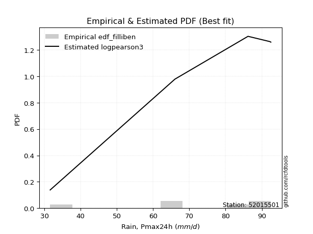</img>

</div>


### 10. EDF Jenkinson (1977)

The Jenkinson formula in hydrology is an empirical plotting position formula used to estimate the non-exceedance probability _(P)_ or return period _(T)_ of a given ordered observation within a sample. It is a widely used method in the frequency analysis of extreme events such as floods and rainfall, as it provides a distribution-free way to plot data. _a≈0.31_ and _b≈0.38_ are constants derived to approximate the median of the probability distribution for the given rank.

<div align="center">


$P=(m-a)/(n+b)$


</div>


**10.1. Empirical values**

<div align="center">

|                | 0                   | 1                   | 2                  | 3                  | 4                  | 5                  |
|:---------------|:--------------------|:--------------------|:-------------------|:-------------------|:-------------------|:-------------------|
| date           | 2018                | 2022                | 2023               | 2020               | 2021               | 2019               |
| x              | 31.6                | 65.9                | 66.0               | 86.2               | 92.2               | 92.5               |
| m              | 1                   | 2                   | 3                  | 4                  | 5                  | 6                  |
| empirical_dist | edf_jenkinson       | edf_jenkinson       | edf_jenkinson      | edf_jenkinson      | edf_jenkinson      | edf_jenkinson      |
| empirical      | 0.10815047021943573 | 0.26489028213166144 | 0.4216300940438871 | 0.5783699059561128 | 0.7351097178683387 | 0.8918495297805643 |
| empirical_tr   | 1.1212653778558874  | 1.3603411513859276  | 1.7289972899728996 | 2.3717472118959106 | 3.7751479289940844 | 9.246376811594207  |

</div>


**10.2. Kolmogorov-Smirnov fit test (sorted by Δ)**


<div align="center">

|                | 0                   | 1                   | 2                   | 3                   | 4                   | 5                   | 6                   | 7                  | 8                   | 9                   | 10                  | 11                  | 12                  | 13                  | 14                  | 15                  | 16                  | 17                  | 18                 | 19                | 20                  | 21                  | 22                  | 23                  | 24                  | 25                  | 26                  | 27                  | 28                  | 29                 | 30                  | 31                  | 32                 | 33                  | 34                  | 35                 | 36                  | 37                  | 38                 | 39                 | 40                  | 41                  | 42                  | 43                  | 44                  | 45                 | 46                  | 47                  | 48                 | 49                  | 50                  | 51                 | 52                | 53                  | 54                  | 55                  | 56                  | 57                 | 58               | 59                 | 60                  | 61                 | 62                  | 63                  | 64                  | 65                  | 66                  | 67                  | 68                  | 69                  | 70                  | 71                  | 72                  | 73                  | 74                  | 75                 | 76                 | 77                  | 78                  | 79                 | 80                  | 81                  | 82                 | 83                  | 84                  | 85                  | 86                  | 87                  | 88                  | 89                  | 90                 | 91                  | 92                  | 93                 | 94                 | 95                  | 96                  | 97                 | 98                 | 99                 | 100                 | 101                 | 102                | 103                | 104                | 105                 | 106                 | 107                 | 108                 | 109                | 110                 | 111                | 112                 | 113                | 114                | 115               | 116                | 117                 | 118                 | 119                 | 120                 | 121                 | 122                | 123                 | 124                 | 125                 | 126                 | 127                | 128                 | 129                 | 130                | 131                | 132                | 133                | 134                | 135                | 136                | 137                 | 138                | 139                | 140                | 141                | 142                | 143                 | 144                | 145                | 146                | 147                | 148              | 149                | 150                | 151                | 152                | 153                | 154                | 155                | 156                | 157                | 158                | 159               |
|:---------------|:--------------------|:--------------------|:--------------------|:--------------------|:--------------------|:--------------------|:--------------------|:-------------------|:--------------------|:--------------------|:--------------------|:--------------------|:--------------------|:--------------------|:--------------------|:--------------------|:--------------------|:--------------------|:-------------------|:------------------|:--------------------|:--------------------|:--------------------|:--------------------|:--------------------|:--------------------|:--------------------|:--------------------|:--------------------|:-------------------|:--------------------|:--------------------|:-------------------|:--------------------|:--------------------|:-------------------|:--------------------|:--------------------|:-------------------|:-------------------|:--------------------|:--------------------|:--------------------|:--------------------|:--------------------|:-------------------|:--------------------|:--------------------|:-------------------|:--------------------|:--------------------|:-------------------|:------------------|:--------------------|:--------------------|:--------------------|:--------------------|:-------------------|:-----------------|:-------------------|:--------------------|:-------------------|:--------------------|:--------------------|:--------------------|:--------------------|:--------------------|:--------------------|:--------------------|:--------------------|:--------------------|:--------------------|:--------------------|:--------------------|:--------------------|:-------------------|:-------------------|:--------------------|:--------------------|:-------------------|:--------------------|:--------------------|:-------------------|:--------------------|:--------------------|:--------------------|:--------------------|:--------------------|:--------------------|:--------------------|:-------------------|:--------------------|:--------------------|:-------------------|:-------------------|:--------------------|:--------------------|:-------------------|:-------------------|:-------------------|:--------------------|:--------------------|:-------------------|:-------------------|:-------------------|:--------------------|:--------------------|:--------------------|:--------------------|:-------------------|:--------------------|:-------------------|:--------------------|:-------------------|:-------------------|:------------------|:-------------------|:--------------------|:--------------------|:--------------------|:--------------------|:--------------------|:-------------------|:--------------------|:--------------------|:--------------------|:--------------------|:-------------------|:--------------------|:--------------------|:-------------------|:-------------------|:-------------------|:-------------------|:-------------------|:-------------------|:-------------------|:--------------------|:-------------------|:-------------------|:-------------------|:-------------------|:-------------------|:--------------------|:-------------------|:-------------------|:-------------------|:-------------------|:-----------------|:-------------------|:-------------------|:-------------------|:-------------------|:-------------------|:-------------------|:-------------------|:-------------------|:-------------------|:-------------------|:------------------|
| station        | 52015501            | 52015501            | 52015501            | 52015501            | 52015501            | 52015501            | 52015501            | 52015501           | 52015501            | 52015501            | 52015501            | 52015501            | 52015501            | 52015501            | 52015501            | 52015501            | 52015501            | 52015501            | 52015501           | 52015501          | 52015501            | 52015501            | 52015501            | 52015501            | 52015501            | 52015501            | 52015501            | 52015501            | 52015501            | 52015501           | 52015501            | 52015501            | 52015501           | 52015501            | 52015501            | 52015501           | 52015501            | 52015501            | 52015501           | 52015501           | 52015501            | 52015501            | 52015501            | 52015501            | 52015501            | 52015501           | 52015501            | 52015501            | 52015501           | 52015501            | 52015501            | 52015501           | 52015501          | 52015501            | 52015501            | 52015501            | 52015501            | 52015501           | 52015501         | 52015501           | 52015501            | 52015501           | 52015501            | 52015501            | 52015501            | 52015501            | 52015501            | 52015501            | 52015501            | 52015501            | 52015501            | 52015501            | 52015501            | 52015501            | 52015501            | 52015501           | 52015501           | 52015501            | 52015501            | 52015501           | 52015501            | 52015501            | 52015501           | 52015501            | 52015501            | 52015501            | 52015501            | 52015501            | 52015501            | 52015501            | 52015501           | 52015501            | 52015501            | 52015501           | 52015501           | 52015501            | 52015501            | 52015501           | 52015501           | 52015501           | 52015501            | 52015501            | 52015501           | 52015501           | 52015501           | 52015501            | 52015501            | 52015501            | 52015501            | 52015501           | 52015501            | 52015501           | 52015501            | 52015501           | 52015501           | 52015501          | 52015501           | 52015501            | 52015501            | 52015501            | 52015501            | 52015501            | 52015501           | 52015501            | 52015501            | 52015501            | 52015501            | 52015501           | 52015501            | 52015501            | 52015501           | 52015501           | 52015501           | 52015501           | 52015501           | 52015501           | 52015501           | 52015501            | 52015501           | 52015501           | 52015501           | 52015501           | 52015501           | 52015501            | 52015501           | 52015501           | 52015501           | 52015501           | 52015501         | 52015501           | 52015501           | 52015501           | 52015501           | 52015501           | 52015501           | 52015501           | 52015501           | 52015501           | 52015501           | 52015501          |
| empirical_dist | edf_jenkinson       | edf_jenkinson       | edf_jenkinson       | edf_jenkinson       | edf_jenkinson       | edf_jenkinson       | edf_jenkinson       | edf_jenkinson      | edf_jenkinson       | edf_jenkinson       | edf_jenkinson       | edf_jenkinson       | edf_jenkinson       | edf_jenkinson       | edf_jenkinson       | edf_jenkinson       | edf_jenkinson       | edf_jenkinson       | edf_jenkinson      | edf_jenkinson     | edf_jenkinson       | edf_jenkinson       | edf_jenkinson       | edf_jenkinson       | edf_jenkinson       | edf_jenkinson       | edf_jenkinson       | edf_jenkinson       | edf_jenkinson       | edf_jenkinson      | edf_jenkinson       | edf_jenkinson       | edf_jenkinson      | edf_jenkinson       | edf_jenkinson       | edf_jenkinson      | edf_jenkinson       | edf_jenkinson       | edf_jenkinson      | edf_jenkinson      | edf_jenkinson       | edf_jenkinson       | edf_jenkinson       | edf_jenkinson       | edf_jenkinson       | edf_jenkinson      | edf_jenkinson       | edf_jenkinson       | edf_jenkinson      | edf_jenkinson       | edf_jenkinson       | edf_jenkinson      | edf_jenkinson     | edf_jenkinson       | edf_jenkinson       | edf_jenkinson       | edf_jenkinson       | edf_jenkinson      | edf_jenkinson    | edf_jenkinson      | edf_jenkinson       | edf_jenkinson      | edf_jenkinson       | edf_jenkinson       | edf_jenkinson       | edf_jenkinson       | edf_jenkinson       | edf_jenkinson       | edf_jenkinson       | edf_jenkinson       | edf_jenkinson       | edf_jenkinson       | edf_jenkinson       | edf_jenkinson       | edf_jenkinson       | edf_jenkinson      | edf_jenkinson      | edf_jenkinson       | edf_jenkinson       | edf_jenkinson      | edf_jenkinson       | edf_jenkinson       | edf_jenkinson      | edf_jenkinson       | edf_jenkinson       | edf_jenkinson       | edf_jenkinson       | edf_jenkinson       | edf_jenkinson       | edf_jenkinson       | edf_jenkinson      | edf_jenkinson       | edf_jenkinson       | edf_jenkinson      | edf_jenkinson      | edf_jenkinson       | edf_jenkinson       | edf_jenkinson      | edf_jenkinson      | edf_jenkinson      | edf_jenkinson       | edf_jenkinson       | edf_jenkinson      | edf_jenkinson      | edf_jenkinson      | edf_jenkinson       | edf_jenkinson       | edf_jenkinson       | edf_jenkinson       | edf_jenkinson      | edf_jenkinson       | edf_jenkinson      | edf_jenkinson       | edf_jenkinson      | edf_jenkinson      | edf_jenkinson     | edf_jenkinson      | edf_jenkinson       | edf_jenkinson       | edf_jenkinson       | edf_jenkinson       | edf_jenkinson       | edf_jenkinson      | edf_jenkinson       | edf_jenkinson       | edf_jenkinson       | edf_jenkinson       | edf_jenkinson      | edf_jenkinson       | edf_jenkinson       | edf_jenkinson      | edf_jenkinson      | edf_jenkinson      | edf_jenkinson      | edf_jenkinson      | edf_jenkinson      | edf_jenkinson      | edf_jenkinson       | edf_jenkinson      | edf_jenkinson      | edf_jenkinson      | edf_jenkinson      | edf_jenkinson      | edf_jenkinson       | edf_jenkinson      | edf_jenkinson      | edf_jenkinson      | edf_jenkinson      | edf_jenkinson    | edf_jenkinson      | edf_jenkinson      | edf_jenkinson      | edf_jenkinson      | edf_jenkinson      | edf_jenkinson      | edf_jenkinson      | edf_jenkinson      | edf_jenkinson      | edf_jenkinson      | edf_jenkinson     |
| p_dist         | trapezoid           | logpearson3         | logbeta             | dweibull            | logvonmises_line    | dgamma              | anglit              | burr               | loggausshyper       | loggumbel_l         | pearson3            | semicircular        | loggennorm          | gumbel_l            | logdweibull         | weibull_max         | logjohnsonsb        | invgauss            | logtrapezoid       | weibull_min       | betaprime           | f                   | nct                 | t                   | exponnorm           | truncnorm           | norm                | crystalball         | rice                | alpha              | arcsine             | erlang              | logt               | logdgamma           | vonmises_line       | gamma              | genpareto           | logburr12           | logweibull_min     | maxwell            | invgamma            | beta                | rayleigh            | loggompertz         | logistic            | logmielke          | logargus            | loglogistic         | argus              | loghypsecant        | cosine              | halfnorm           | logncf            | logf                | logcrystalball      | lognorm             | logexponnorm        | logrice            | logfatiguelife   | logexponweib       | hypsecant           | loggengamma        | loganglit           | logweibull_max      | loginvgamma         | gumbel_r            | lognct              | logsemicircular     | logbetaprime        | halflogistic        | logarcsine          | loggamma            | loggamma            | kstwobign           | logburr             | loglaplace         | loglaplace         | gausshyper          | moyal               | logalpha           | laplace             | johnsonsb           | logloglaplace      | logmaxwell          | loginvgauss         | genextreme          | loggenextreme       | gennorm             | wrapcauchy          | lograyleigh         | loginvweibull      | logwrapcauchy       | mielke              | genhalflogistic    | levy_l             | logloggamma         | logtruncweibull_min | skewnorm           | logfoldnorm        | wald               | loggenhalflogistic  | loglevy_l           | bradford           | loggumbel_r        | logcosine          | triang              | kappa4              | nakagami            | loghalfnorm         | loggenpareto       | logkstwobign        | ksone              | logmoyal            | loggenexpon        | loghalflogistic    | truncweibull_min  | logskewnorm        | logtriang           | uniform             | lognakagami         | logexponpow         | kappa3              | loglomax           | burr12              | halfgennorm         | ncf                 | logwald             | truncexpon         | logksone            | lomax               | logerlang          | logtruncnorm       | logtukeylambda     | logkappa3          | gompertz           | loguniform         | logkappa4          | logbradford         | loghalfgennorm     | foldnorm           | invweibull         | logjohnsonsu       | logrdist           | logtruncexpon       | johnsonsu          | gengamma           | fatiguelife        | exponweib          | powerlaw         | exponpow           | logpowerlaw        | truncpareto        | logtruncpareto     | genexpon           | rdist              | tukeylambda        | genlogistic        | loggenlogistic     | logvonmises        | vonmises          |
| delta          | 0.10225170643650117 | 0.11918934123430913 | 0.12006035582921781 | 0.12100528965214213 | 0.12678651011563857 | 0.13340324243258472 | 0.13548163709299665 | 0.1356801276356443 | 0.13627501551733134 | 0.13643288004845566 | 0.13773208823861827 | 0.13856554648612174 | 0.14083734586212648 | 0.14537673947075513 | 0.14693247875062687 | 0.14855495132701474 | 0.14892157685374363 | 0.15042155753404196 | 0.1538753373845756 | 0.154134527578087 | 0.15649653422237975 | 0.16200345939812621 | 0.16262112823870634 | 0.16262232038473978 | 0.16263196012500059 | 0.16263296404033645 | 0.16263298460821074 | 0.16263298883614985 | 0.16308912520637842 | 0.1654945751284923 | 0.16603629476310305 | 0.16604703205998883 | 0.1667627874080696 | 0.16709948899603033 | 0.16713266802248405 | 0.1672803390565737 | 0.16740706372566805 | 0.17023742675342735 | 0.1710221167342676 | 0.1733922219728915 | 0.17372412577879193 | 0.17430026262927922 | 0.17647491119458913 | 0.17725957624198607 | 0.18522906175966136 | 0.1890675178316411 | 0.19111305735924067 | 0.19261915353629944 | 0.1930818223032844 | 0.19404056053996332 | 0.19421196602965285 | 0.1961186434728211 | 0.196260030717835 | 0.19651299655718701 | 0.19769143792888677 | 0.19769144024317986 | 0.19769227154265984 | 0.1976995521915667 | 0.19803169219175 | 0.1982890804565251 | 0.20037654013502249 | 0.2008313842877692 | 0.20302277657250478 | 0.20307110247857085 | 0.20406314045855978 | 0.20429830061785814 | 0.20433633610898172 | 0.20521797359362343 | 0.20527158781166277 | 0.21154228483364834 | 0.21395317327278868 | 0.21490407531713368 | 0.21490407531713368 | 0.21530516458936144 | 0.21540497605913622 | 0.2155926382740505 | 0.2155926382740505 | 0.21579071015275098 | 0.21771826266587735 | 0.2198372554939253 | 0.22121245300418313 | 0.22623198023282592 | 0.2291309030278474 | 0.23183387438158937 | 0.23418576705356137 | 0.23466748694072004 | 0.23484917730967236 | 0.23510971786833867 | 0.23971176532951533 | 0.24354337822765537 | 0.2441822360532142 | 0.24435045692110235 | 0.24822556547826546 | 0.2508144845593644 | 0.2539247838908772 | 0.25420806302680676 | 0.2551011589566159  | 0.2567253225870767 | 0.2584964959310678 | 0.2591145335020123 | 0.26074973629450215 | 0.26332806090787747 | 0.2637497221014793 | 0.2659242026461883 | 0.2666380497382297 | 0.26935347627938944 | 0.27008823352579436 | 0.27371905747871117 | 0.27657740248988305 | 0.2815147360836945 | 0.28208290653941037 | 0.2877917102055033 | 0.29157145847971044 | 0.2915914679103697 | 0.2987896186487675 | 0.301786467624911 | 0.3050491477993291 | 0.31443514621671853 | 0.31818181818181823 | 0.32434388977778444 | 0.33963565104830895 | 0.34317770871890185 | 0.3482166277805324 | 0.34924997679480296 | 0.35188672194082815 | 0.35777692738527345 | 0.36294494688796286 | 0.3804601774917008 | 0.38869915200564553 | 0.39200637088230017 | 0.4097399435556971 | 0.4130616790550738 | 0.4159431142249333 | 0.4180225599022115 | 0.4192552826123493 | 0.4194170388331069 | 0.4200705046598968 | 0.42157025307337026 | 0.4216300940438871 | 0.4216300940438872 | 0.4444372382084215 | 0.4583440333336917 | 0.4869024989788259 | 0.48764174588282116 | 0.5163468521699193 | 0.5335270146134952 | 0.5636508235761148 | 0.5819570560121192 | 0.64982286433667 | 0.6640270205715267 | 0.6742508988766867 | 0.6855961676390507 | 0.7022524552895301 | 0.7302278638376656 | 0.7351097178683386 | 0.7351097178683386 | 0.7351097178683387 | 0.7351097178683387 | 1.1848029982139003 | 14.81761401212205 |
| deltao         | 0.530385761606      | 0.530385761606      | 0.530385761606      | 0.530385761606      | 0.530385761606      | 0.530385761606      | 0.530385761606      | 0.530385761606     | 0.530385761606      | 0.530385761606      | 0.530385761606      | 0.530385761606      | 0.530385761606      | 0.530385761606      | 0.530385761606      | 0.530385761606      | 0.530385761606      | 0.530385761606      | 0.530385761606     | 0.530385761606    | 0.530385761606      | 0.530385761606      | 0.530385761606      | 0.530385761606      | 0.530385761606      | 0.530385761606      | 0.530385761606      | 0.530385761606      | 0.530385761606      | 0.530385761606     | 0.530385761606      | 0.530385761606      | 0.530385761606     | 0.530385761606      | 0.530385761606      | 0.530385761606     | 0.530385761606      | 0.530385761606      | 0.530385761606     | 0.530385761606     | 0.530385761606      | 0.530385761606      | 0.530385761606      | 0.530385761606      | 0.530385761606      | 0.530385761606     | 0.530385761606      | 0.530385761606      | 0.530385761606     | 0.530385761606      | 0.530385761606      | 0.530385761606     | 0.530385761606    | 0.530385761606      | 0.530385761606      | 0.530385761606      | 0.530385761606      | 0.530385761606     | 0.530385761606   | 0.530385761606     | 0.530385761606      | 0.530385761606     | 0.530385761606      | 0.530385761606      | 0.530385761606      | 0.530385761606      | 0.530385761606      | 0.530385761606      | 0.530385761606      | 0.530385761606      | 0.530385761606      | 0.530385761606      | 0.530385761606      | 0.530385761606      | 0.530385761606      | 0.530385761606     | 0.530385761606     | 0.530385761606      | 0.530385761606      | 0.530385761606     | 0.530385761606      | 0.530385761606      | 0.530385761606     | 0.530385761606      | 0.530385761606      | 0.530385761606      | 0.530385761606      | 0.530385761606      | 0.530385761606      | 0.530385761606      | 0.530385761606     | 0.530385761606      | 0.530385761606      | 0.530385761606     | 0.530385761606     | 0.530385761606      | 0.530385761606      | 0.530385761606     | 0.530385761606     | 0.530385761606     | 0.530385761606      | 0.530385761606      | 0.530385761606     | 0.530385761606     | 0.530385761606     | 0.530385761606      | 0.530385761606      | 0.530385761606      | 0.530385761606      | 0.530385761606     | 0.530385761606      | 0.530385761606     | 0.530385761606      | 0.530385761606     | 0.530385761606     | 0.530385761606    | 0.530385761606     | 0.530385761606      | 0.530385761606      | 0.530385761606      | 0.530385761606      | 0.530385761606      | 0.530385761606     | 0.530385761606      | 0.530385761606      | 0.530385761606      | 0.530385761606      | 0.530385761606     | 0.530385761606      | 0.530385761606      | 0.530385761606     | 0.530385761606     | 0.530385761606     | 0.530385761606     | 0.530385761606     | 0.530385761606     | 0.530385761606     | 0.530385761606      | 0.530385761606     | 0.530385761606     | 0.530385761606     | 0.530385761606     | 0.530385761606     | 0.530385761606      | 0.530385761606     | 0.530385761606     | 0.530385761606     | 0.530385761606     | 0.530385761606   | 0.530385761606     | 0.530385761606     | 0.530385761606     | 0.530385761606     | 0.530385761606     | 0.530385761606     | 0.530385761606     | 0.530385761606     | 0.530385761606     | 0.530385761606     | 0.530385761606    |
| eval           | Δo > Δ              | Δo > Δ              | Δo > Δ              | Δo > Δ              | Δo > Δ              | Δo > Δ              | Δo > Δ              | Δo > Δ             | Δo > Δ              | Δo > Δ              | Δo > Δ              | Δo > Δ              | Δo > Δ              | Δo > Δ              | Δo > Δ              | Δo > Δ              | Δo > Δ              | Δo > Δ              | Δo > Δ             | Δo > Δ            | Δo > Δ              | Δo > Δ              | Δo > Δ              | Δo > Δ              | Δo > Δ              | Δo > Δ              | Δo > Δ              | Δo > Δ              | Δo > Δ              | Δo > Δ             | Δo > Δ              | Δo > Δ              | Δo > Δ             | Δo > Δ              | Δo > Δ              | Δo > Δ             | Δo > Δ              | Δo > Δ              | Δo > Δ             | Δo > Δ             | Δo > Δ              | Δo > Δ              | Δo > Δ              | Δo > Δ              | Δo > Δ              | Δo > Δ             | Δo > Δ              | Δo > Δ              | Δo > Δ             | Δo > Δ              | Δo > Δ              | Δo > Δ             | Δo > Δ            | Δo > Δ              | Δo > Δ              | Δo > Δ              | Δo > Δ              | Δo > Δ             | Δo > Δ           | Δo > Δ             | Δo > Δ              | Δo > Δ             | Δo > Δ              | Δo > Δ              | Δo > Δ              | Δo > Δ              | Δo > Δ              | Δo > Δ              | Δo > Δ              | Δo > Δ              | Δo > Δ              | Δo > Δ              | Δo > Δ              | Δo > Δ              | Δo > Δ              | Δo > Δ             | Δo > Δ             | Δo > Δ              | Δo > Δ              | Δo > Δ             | Δo > Δ              | Δo > Δ              | Δo > Δ             | Δo > Δ              | Δo > Δ              | Δo > Δ              | Δo > Δ              | Δo > Δ              | Δo > Δ              | Δo > Δ              | Δo > Δ             | Δo > Δ              | Δo > Δ              | Δo > Δ             | Δo > Δ             | Δo > Δ              | Δo > Δ              | Δo > Δ             | Δo > Δ             | Δo > Δ             | Δo > Δ              | Δo > Δ              | Δo > Δ             | Δo > Δ             | Δo > Δ             | Δo > Δ              | Δo > Δ              | Δo > Δ              | Δo > Δ              | Δo > Δ             | Δo > Δ              | Δo > Δ             | Δo > Δ              | Δo > Δ             | Δo > Δ             | Δo > Δ            | Δo > Δ             | Δo > Δ              | Δo > Δ              | Δo > Δ              | Δo > Δ              | Δo > Δ              | Δo > Δ             | Δo > Δ              | Δo > Δ              | Δo > Δ              | Δo > Δ              | Δo > Δ             | Δo > Δ              | Δo > Δ              | Δo > Δ             | Δo > Δ             | Δo > Δ             | Δo > Δ             | Δo > Δ             | Δo > Δ             | Δo > Δ             | Δo > Δ              | Δo > Δ             | Δo > Δ             | Δo > Δ             | Δo > Δ             | Δo > Δ             | Δo > Δ              | Δo > Δ             | Δo <= Δ            | Δo <= Δ            | Δo <= Δ            | Δo <= Δ          | Δo <= Δ            | Δo <= Δ            | Δo <= Δ            | Δo <= Δ            | Δo <= Δ            | Δo <= Δ            | Δo <= Δ            | Δo <= Δ            | Δo <= Δ            | Δo <= Δ            | Δo <= Δ           |
| fit            | 1                   | 1                   | 1                   | 1                   | 1                   | 1                   | 1                   | 1                  | 1                   | 1                   | 1                   | 1                   | 1                   | 1                   | 1                   | 1                   | 1                   | 1                   | 1                  | 1                 | 1                   | 1                   | 1                   | 1                   | 1                   | 1                   | 1                   | 1                   | 1                   | 1                  | 1                   | 1                   | 1                  | 1                   | 1                   | 1                  | 1                   | 1                   | 1                  | 1                  | 1                   | 1                   | 1                   | 1                   | 1                   | 1                  | 1                   | 1                   | 1                  | 1                   | 1                   | 1                  | 1                 | 1                   | 1                   | 1                   | 1                   | 1                  | 1                | 1                  | 1                   | 1                  | 1                   | 1                   | 1                   | 1                   | 1                   | 1                   | 1                   | 1                   | 1                   | 1                   | 1                   | 1                   | 1                   | 1                  | 1                  | 1                   | 1                   | 1                  | 1                   | 1                   | 1                  | 1                   | 1                   | 1                   | 1                   | 1                   | 1                   | 1                   | 1                  | 1                   | 1                   | 1                  | 1                  | 1                   | 1                   | 1                  | 1                  | 1                  | 1                   | 1                   | 1                  | 1                  | 1                  | 1                   | 1                   | 1                   | 1                   | 1                  | 1                   | 1                  | 1                   | 1                  | 1                  | 1                 | 1                  | 1                   | 1                   | 1                   | 1                   | 1                   | 1                  | 1                   | 1                   | 1                   | 1                   | 1                  | 1                   | 1                   | 1                  | 1                  | 1                  | 1                  | 1                  | 1                  | 1                  | 1                   | 1                  | 1                  | 1                  | 1                  | 1                  | 1                   | 1                  | 0                  | 0                  | 0                  | 0                | 0                  | 0                  | 0                  | 0                  | 0                  | 0                  | 0                  | 0                  | 0                  | 0                  | 0                 |
| n              | 6                   | 6                   | 6                   | 6                   | 6                   | 6                   | 6                   | 6                  | 6                   | 6                   | 6                   | 6                   | 6                   | 6                   | 6                   | 6                   | 6                   | 6                   | 6                  | 6                 | 6                   | 6                   | 6                   | 6                   | 6                   | 6                   | 6                   | 6                   | 6                   | 6                  | 6                   | 6                   | 6                  | 6                   | 6                   | 6                  | 6                   | 6                   | 6                  | 6                  | 6                   | 6                   | 6                   | 6                   | 6                   | 6                  | 6                   | 6                   | 6                  | 6                   | 6                   | 6                  | 6                 | 6                   | 6                   | 6                   | 6                   | 6                  | 6                | 6                  | 6                   | 6                  | 6                   | 6                   | 6                   | 6                   | 6                   | 6                   | 6                   | 6                   | 6                   | 6                   | 6                   | 6                   | 6                   | 6                  | 6                  | 6                   | 6                   | 6                  | 6                   | 6                   | 6                  | 6                   | 6                   | 6                   | 6                   | 6                   | 6                   | 6                   | 6                  | 6                   | 6                   | 6                  | 6                  | 6                   | 6                   | 6                  | 6                  | 6                  | 6                   | 6                   | 6                  | 6                  | 6                  | 6                   | 6                   | 6                   | 6                   | 6                  | 6                   | 6                  | 6                   | 6                  | 6                  | 6                 | 6                  | 6                   | 6                   | 6                   | 6                   | 6                   | 6                  | 6                   | 6                   | 6                   | 6                   | 6                  | 6                   | 6                   | 6                  | 6                  | 6                  | 6                  | 6                  | 6                  | 6                  | 6                   | 6                  | 6                  | 6                  | 6                  | 6                  | 6                   | 6                  | 6                  | 6                  | 6                  | 6                | 6                  | 6                  | 6                  | 6                  | 6                  | 6                  | 6                  | 6                  | 6                  | 6                  | 6                 |
| best_fit       | 1                   | 0                   | 0                   | 0                   | 0                   | 0                   | 0                   | 0                  | 0                   | 0                   | 0                   | 0                   | 0                   | 0                   | 0                   | 0                   | 0                   | 0                   | 0                  | 0                 | 0                   | 0                   | 0                   | 0                   | 0                   | 0                   | 0                   | 0                   | 0                   | 0                  | 0                   | 0                   | 0                  | 0                   | 0                   | 0                  | 0                   | 0                   | 0                  | 0                  | 0                   | 0                   | 0                   | 0                   | 0                   | 0                  | 0                   | 0                   | 0                  | 0                   | 0                   | 0                  | 0                 | 0                   | 0                   | 0                   | 0                   | 0                  | 0                | 0                  | 0                   | 0                  | 0                   | 0                   | 0                   | 0                   | 0                   | 0                   | 0                   | 0                   | 0                   | 0                   | 0                   | 0                   | 0                   | 0                  | 0                  | 0                   | 0                   | 0                  | 0                   | 0                   | 0                  | 0                   | 0                   | 0                   | 0                   | 0                   | 0                   | 0                   | 0                  | 0                   | 0                   | 0                  | 0                  | 0                   | 0                   | 0                  | 0                  | 0                  | 0                   | 0                   | 0                  | 0                  | 0                  | 0                   | 0                   | 0                   | 0                   | 0                  | 0                   | 0                  | 0                   | 0                  | 0                  | 0                 | 0                  | 0                   | 0                   | 0                   | 0                   | 0                   | 0                  | 0                   | 0                   | 0                   | 0                   | 0                  | 0                   | 0                   | 0                  | 0                  | 0                  | 0                  | 0                  | 0                  | 0                  | 0                   | 0                  | 0                  | 0                  | 0                  | 0                  | 0                   | 0                  | 0                  | 0                  | 0                  | 0                | 0                  | 0                  | 0                  | 0                  | 0                  | 0                  | 0                  | 0                  | 0                  | 0                  | 0                 |
| best_fit_sort  | 1                   | 2                   | 3                   | 4                   | 5                   | 6                   | 7                   | 8                  | 9                   | 10                  | 11                  | 12                  | 13                  | 14                  | 15                  | 16                  | 17                  | 18                  | 19                 | 20                | 21                  | 22                  | 23                  | 24                  | 25                  | 26                  | 27                  | 28                  | 29                  | 30                 | 31                  | 32                  | 33                 | 34                  | 35                  | 36                 | 37                  | 38                  | 39                 | 40                 | 41                  | 42                  | 43                  | 44                  | 45                  | 46                 | 47                  | 48                  | 49                 | 50                  | 51                  | 52                 | 53                | 54                  | 55                  | 56                  | 57                  | 58                 | 59               | 60                 | 61                  | 62                 | 63                  | 64                  | 65                  | 66                  | 67                  | 68                  | 69                  | 70                  | 71                  | 72                  | 73                  | 74                  | 75                  | 76                 | 77                 | 78                  | 79                  | 80                 | 81                  | 82                  | 83                 | 84                  | 85                  | 86                  | 87                  | 88                  | 89                  | 90                  | 91                 | 92                  | 93                  | 94                 | 95                 | 96                  | 97                  | 98                 | 99                 | 100                | 101                 | 102                 | 103                | 104                | 105                | 106                 | 107                 | 108                 | 109                 | 110                | 111                 | 112                | 113                 | 114                | 115                | 116               | 117                | 118                 | 119                 | 120                 | 121                 | 122                 | 123                | 124                 | 125                 | 126                 | 127                 | 128                | 129                 | 130                 | 131                | 132                | 133                | 134                | 135                | 136                | 137                | 138                 | 139                | 140                | 141                | 142                | 143                | 144                 | 145                | 146                | 147                | 148                | 149              | 150                | 151                | 152                | 153                | 154                | 155                | 156                | 157                | 158                | 159                | 160               |

</div>


**10.3. Best fit**

<div align="center">

|   id |   station | empirical_dist   | p_dist    |    delta |   deltao | eval   |   fit |   n |   best_fit |   best_fit_sort |
|-----:|----------:|:-----------------|:----------|---------:|---------:|:-------|------:|----:|-----------:|----------------:|
|    0 |  52015501 | edf_jenkinson    | trapezoid | 0.102252 | 0.530386 | Δo > Δ |     1 |   6 |          1 |               1 |

</div>


<div align="center">

</img></img>

</div>


### 11. EDF Cunnane (1978)

Cunnane´s work in statistical hydrology has focused on the performance and evaluation of different probability distributions (such as GEV, Gumbel, Lognormal) for flood frequency estimation. _b_ is a constant, typically set to 0.4.

<div align="center">


$P=(m-b)/(n+1-2b)$


</div>


**11.1. Empirical values**

<div align="center">

|                | 0                  | 1                   | 2                   | 3                  | 4                  | 5                  |
|:---------------|:-------------------|:--------------------|:--------------------|:-------------------|:-------------------|:-------------------|
| date           | 2018               | 2022                | 2023                | 2020               | 2021               | 2019               |
| x              | 31.6               | 65.9                | 66.0                | 86.2               | 92.2               | 92.5               |
| m              | 1                  | 2                   | 3                   | 4                  | 5                  | 6                  |
| empirical_dist | edf_cunnane        | edf_cunnane         | edf_cunnane         | edf_cunnane        | edf_cunnane        | edf_cunnane        |
| empirical      | 0.0967741935483871 | 0.25806451612903225 | 0.41935483870967744 | 0.5806451612903226 | 0.7419354838709676 | 0.9032258064516128 |
| empirical_tr   | 1.1071428571428572 | 1.3478260869565217  | 1.7222222222222225  | 2.384615384615385  | 3.8749999999999982 | 10.333333333333318 |

</div>


**11.2. Kolmogorov-Smirnov fit test (sorted by Δ)**


<div align="center">

|                | 0                   | 1                   | 2                   | 3                   | 4                   | 5                  | 6                   | 7                   | 8                   | 9                   | 10                  | 11                  | 12                  | 13                  | 14                  | 15                  | 16                  | 17                  | 18                 | 19                 | 20                  | 21                  | 22                  | 23                  | 24                  | 25                  | 26                  | 27                  | 28                 | 29                 | 30                  | 31                 | 32                  | 33                 | 34                  | 35                  | 36                  | 37                 | 38                 | 39                  | 40                  | 41                  | 42                  | 43                 | 44                  | 45                  | 46                  | 47                  | 48                  | 49                  | 50                  | 51                  | 52                  | 53                  | 54                  | 55                 | 56                  | 57                  | 58                  | 59                 | 60                  | 61                 | 62                  | 63                  | 64                | 65                  | 66                  | 67                 | 68                 | 69                  | 70                 | 71                 | 72                 | 73                  | 74                  | 75                  | 76                  | 77                  | 78                  | 79                  | 80                  | 81                  | 82                 | 83                  | 84                  | 85                  | 86                  | 87                 | 88                  | 89                  | 90                 | 91                 | 92                  | 93                  | 94                  | 95                 | 96                  | 97                 | 98                 | 99                  | 100                | 101               | 102                 | 103                 | 104                | 105                 | 106                | 107                | 108                 | 109                 | 110                 | 111                | 112                 | 113                | 114                | 115                | 116                | 117                 | 118                 | 119                 | 120                 | 121                 | 122                | 123                 | 124                 | 125                 | 126                 | 127              | 128                | 129                 | 130                | 131                | 132                | 133                | 134                 | 135                 | 136                | 137                 | 138               | 139                 | 140                 | 141                | 142                 | 143                | 144                | 145                | 146               | 147                | 148                | 149                | 150                | 151                | 152                | 153                | 154                | 155                | 156                | 157                | 158                | 159               |
|:---------------|:--------------------|:--------------------|:--------------------|:--------------------|:--------------------|:-------------------|:--------------------|:--------------------|:--------------------|:--------------------|:--------------------|:--------------------|:--------------------|:--------------------|:--------------------|:--------------------|:--------------------|:--------------------|:-------------------|:-------------------|:--------------------|:--------------------|:--------------------|:--------------------|:--------------------|:--------------------|:--------------------|:--------------------|:-------------------|:-------------------|:--------------------|:-------------------|:--------------------|:-------------------|:--------------------|:--------------------|:--------------------|:-------------------|:-------------------|:--------------------|:--------------------|:--------------------|:--------------------|:-------------------|:--------------------|:--------------------|:--------------------|:--------------------|:--------------------|:--------------------|:--------------------|:--------------------|:--------------------|:--------------------|:--------------------|:-------------------|:--------------------|:--------------------|:--------------------|:-------------------|:--------------------|:-------------------|:--------------------|:--------------------|:------------------|:--------------------|:--------------------|:-------------------|:-------------------|:--------------------|:-------------------|:-------------------|:-------------------|:--------------------|:--------------------|:--------------------|:--------------------|:--------------------|:--------------------|:--------------------|:--------------------|:--------------------|:-------------------|:--------------------|:--------------------|:--------------------|:--------------------|:-------------------|:--------------------|:--------------------|:-------------------|:-------------------|:--------------------|:--------------------|:--------------------|:-------------------|:--------------------|:-------------------|:-------------------|:--------------------|:-------------------|:------------------|:--------------------|:--------------------|:-------------------|:--------------------|:-------------------|:-------------------|:--------------------|:--------------------|:--------------------|:-------------------|:--------------------|:-------------------|:-------------------|:-------------------|:-------------------|:--------------------|:--------------------|:--------------------|:--------------------|:--------------------|:-------------------|:--------------------|:--------------------|:--------------------|:--------------------|:-----------------|:-------------------|:--------------------|:-------------------|:-------------------|:-------------------|:-------------------|:--------------------|:--------------------|:-------------------|:--------------------|:------------------|:--------------------|:--------------------|:-------------------|:--------------------|:-------------------|:-------------------|:-------------------|:------------------|:-------------------|:-------------------|:-------------------|:-------------------|:-------------------|:-------------------|:-------------------|:-------------------|:-------------------|:-------------------|:-------------------|:-------------------|:------------------|
| station        | 52015501            | 52015501            | 52015501            | 52015501            | 52015501            | 52015501           | 52015501            | 52015501            | 52015501            | 52015501            | 52015501            | 52015501            | 52015501            | 52015501            | 52015501            | 52015501            | 52015501            | 52015501            | 52015501           | 52015501           | 52015501            | 52015501            | 52015501            | 52015501            | 52015501            | 52015501            | 52015501            | 52015501            | 52015501           | 52015501           | 52015501            | 52015501           | 52015501            | 52015501           | 52015501            | 52015501            | 52015501            | 52015501           | 52015501           | 52015501            | 52015501            | 52015501            | 52015501            | 52015501           | 52015501            | 52015501            | 52015501            | 52015501            | 52015501            | 52015501            | 52015501            | 52015501            | 52015501            | 52015501            | 52015501            | 52015501           | 52015501            | 52015501            | 52015501            | 52015501           | 52015501            | 52015501           | 52015501            | 52015501            | 52015501          | 52015501            | 52015501            | 52015501           | 52015501           | 52015501            | 52015501           | 52015501           | 52015501           | 52015501            | 52015501            | 52015501            | 52015501            | 52015501            | 52015501            | 52015501            | 52015501            | 52015501            | 52015501           | 52015501            | 52015501            | 52015501            | 52015501            | 52015501           | 52015501            | 52015501            | 52015501           | 52015501           | 52015501            | 52015501            | 52015501            | 52015501           | 52015501            | 52015501           | 52015501           | 52015501            | 52015501           | 52015501          | 52015501            | 52015501            | 52015501           | 52015501            | 52015501           | 52015501           | 52015501            | 52015501            | 52015501            | 52015501           | 52015501            | 52015501           | 52015501           | 52015501           | 52015501           | 52015501            | 52015501            | 52015501            | 52015501            | 52015501            | 52015501           | 52015501            | 52015501            | 52015501            | 52015501            | 52015501         | 52015501           | 52015501            | 52015501           | 52015501           | 52015501           | 52015501           | 52015501            | 52015501            | 52015501           | 52015501            | 52015501          | 52015501            | 52015501            | 52015501           | 52015501            | 52015501           | 52015501           | 52015501           | 52015501          | 52015501           | 52015501           | 52015501           | 52015501           | 52015501           | 52015501           | 52015501           | 52015501           | 52015501           | 52015501           | 52015501           | 52015501           | 52015501          |
| empirical_dist | edf_cunnane         | edf_cunnane         | edf_cunnane         | edf_cunnane         | edf_cunnane         | edf_cunnane        | edf_cunnane         | edf_cunnane         | edf_cunnane         | edf_cunnane         | edf_cunnane         | edf_cunnane         | edf_cunnane         | edf_cunnane         | edf_cunnane         | edf_cunnane         | edf_cunnane         | edf_cunnane         | edf_cunnane        | edf_cunnane        | edf_cunnane         | edf_cunnane         | edf_cunnane         | edf_cunnane         | edf_cunnane         | edf_cunnane         | edf_cunnane         | edf_cunnane         | edf_cunnane        | edf_cunnane        | edf_cunnane         | edf_cunnane        | edf_cunnane         | edf_cunnane        | edf_cunnane         | edf_cunnane         | edf_cunnane         | edf_cunnane        | edf_cunnane        | edf_cunnane         | edf_cunnane         | edf_cunnane         | edf_cunnane         | edf_cunnane        | edf_cunnane         | edf_cunnane         | edf_cunnane         | edf_cunnane         | edf_cunnane         | edf_cunnane         | edf_cunnane         | edf_cunnane         | edf_cunnane         | edf_cunnane         | edf_cunnane         | edf_cunnane        | edf_cunnane         | edf_cunnane         | edf_cunnane         | edf_cunnane        | edf_cunnane         | edf_cunnane        | edf_cunnane         | edf_cunnane         | edf_cunnane       | edf_cunnane         | edf_cunnane         | edf_cunnane        | edf_cunnane        | edf_cunnane         | edf_cunnane        | edf_cunnane        | edf_cunnane        | edf_cunnane         | edf_cunnane         | edf_cunnane         | edf_cunnane         | edf_cunnane         | edf_cunnane         | edf_cunnane         | edf_cunnane         | edf_cunnane         | edf_cunnane        | edf_cunnane         | edf_cunnane         | edf_cunnane         | edf_cunnane         | edf_cunnane        | edf_cunnane         | edf_cunnane         | edf_cunnane        | edf_cunnane        | edf_cunnane         | edf_cunnane         | edf_cunnane         | edf_cunnane        | edf_cunnane         | edf_cunnane        | edf_cunnane        | edf_cunnane         | edf_cunnane        | edf_cunnane       | edf_cunnane         | edf_cunnane         | edf_cunnane        | edf_cunnane         | edf_cunnane        | edf_cunnane        | edf_cunnane         | edf_cunnane         | edf_cunnane         | edf_cunnane        | edf_cunnane         | edf_cunnane        | edf_cunnane        | edf_cunnane        | edf_cunnane        | edf_cunnane         | edf_cunnane         | edf_cunnane         | edf_cunnane         | edf_cunnane         | edf_cunnane        | edf_cunnane         | edf_cunnane         | edf_cunnane         | edf_cunnane         | edf_cunnane      | edf_cunnane        | edf_cunnane         | edf_cunnane        | edf_cunnane        | edf_cunnane        | edf_cunnane        | edf_cunnane         | edf_cunnane         | edf_cunnane        | edf_cunnane         | edf_cunnane       | edf_cunnane         | edf_cunnane         | edf_cunnane        | edf_cunnane         | edf_cunnane        | edf_cunnane        | edf_cunnane        | edf_cunnane       | edf_cunnane        | edf_cunnane        | edf_cunnane        | edf_cunnane        | edf_cunnane        | edf_cunnane        | edf_cunnane        | edf_cunnane        | edf_cunnane        | edf_cunnane        | edf_cunnane        | edf_cunnane        | edf_cunnane       |
| p_dist         | trapezoid           | logbeta             | logpearson3         | loggausshyper       | dweibull            | burr               | loggumbel_l         | pearson3            | logvonmises_line    | loggennorm          | anglit              | gumbel_l            | dgamma              | semicircular        | weibull_min         | betaprime           | invgauss            | logdweibull         | f                  | weibull_max        | logjohnsonsb        | nct                 | t                   | exponnorm           | truncnorm           | norm                | crystalball         | genpareto           | rice               | alpha              | erlang              | logt               | vonmises_line       | gamma              | logtrapezoid        | beta                | logburr12           | logweibull_min     | maxwell            | invgamma            | arcsine             | rayleigh            | loggompertz         | logdgamma          | logmielke           | logistic            | argus               | logargus            | cosine              | loghypsecant        | hypsecant           | loglogistic         | gumbel_r            | halfnorm            | logncf              | logf               | logcrystalball      | lognorm             | logexponnorm        | logrice            | logfatiguelife      | logexponweib       | loggengamma         | logburr             | gausshyper        | loganglit           | loginvgamma         | lognct             | logsemicircular    | logbetaprime        | loglaplace         | loglaplace         | logweibull_max     | moyal               | halflogistic        | laplace             | logarcsine          | loggamma            | loggamma            | kstwobign           | logalpha            | genextreme          | loggenextreme      | johnsonsb           | logloglaplace       | logmaxwell          | loginvgauss         | mielke             | gennorm             | genhalflogistic     | wrapcauchy         | logloggamma        | logtruncweibull_min | skewnorm            | lograyleigh         | loginvweibull      | logwrapcauchy       | levy_l             | wald               | loggenhalflogistic  | loglevy_l          | logfoldnorm       | triang              | kappa4              | bradford           | nakagami            | loggumbel_r        | logcosine          | loghalfnorm         | loggenpareto        | logkstwobign        | ksone              | logmoyal            | loggenexpon        | truncweibull_min   | logskewnorm        | loghalflogistic    | logtriang           | uniform             | lognakagami         | logexponpow         | kappa3              | loglomax           | burr12              | halfgennorm         | ncf                 | logwald             | truncexpon       | logksone           | lomax               | logtruncnorm       | logtukeylambda     | logerlang          | gompertz           | loghalfgennorm      | foldnorm            | logkappa3          | loguniform          | logkappa4         | logbradford         | invweibull          | logjohnsonsu       | logtruncexpon       | logrdist           | johnsonsu          | gengamma           | fatiguelife       | exponweib          | powerlaw           | exponpow           | logpowerlaw        | truncpareto        | logtruncpareto     | genexpon           | genlogistic        | loggenlogistic     | rdist              | tukeylambda        | logvonmises        | vonmises          |
| delta          | 0.11362798310754962 | 0.11778510049500812 | 0.12345427783448587 | 0.12944924951470238 | 0.13078079714277568 | 0.1334048723014345 | 0.13415762471424586 | 0.13545683290440846 | 0.13816278678668703 | 0.13856209052791668 | 0.13860308081765998 | 0.14310148413654533 | 0.14477951910363318 | 0.14539131248875092 | 0.15185927224387719 | 0.15422127888816994 | 0.15724732353667115 | 0.15830875542167533 | 0.1597282040639164 | 0.1599312279980634 | 0.16029785352479228 | 0.16034587290449653 | 0.16034706505052998 | 0.16035670479079078 | 0.16035770870612664 | 0.16035772927400094 | 0.16035773350194005 | 0.16058129772303908 | 0.1608138698721686 | 0.1632193197942825 | 0.16377177672577903 | 0.1644875320738599 | 0.16485741268827425 | 0.1650050837223639 | 0.16525161405562405 | 0.16747449662665026 | 0.16796217141921754 | 0.1687468614000578 | 0.1711169666386817 | 0.17144887044458212 | 0.17286206076573224 | 0.17419965586037933 | 0.17498432090777627 | 0.1784757656670788 | 0.18224175182901214 | 0.18295380642545156 | 0.18625605630065545 | 0.18857761087713643 | 0.19193671069544305 | 0.19513914248778758 | 0.19810128480081268 | 0.19944491953892862 | 0.20202304528364834 | 0.20294440947545028 | 0.20308579672046417 | 0.2033387625598162 | 0.20451720393151596 | 0.20451720624580905 | 0.20451803754528902 | 0.2045253181941959 | 0.20485745819437917 | 0.2051148464591543 | 0.20765715029039838 | 0.20857921005650726 | 0.208964944150122 | 0.20984854257513397 | 0.21088890646118896 | 0.2111621021116109 | 0.2120437395962526 | 0.21209735381429196 | 0.2133173829398407 | 0.2133173829398407 | 0.2144473791496195 | 0.21544300733166755 | 0.21582894216637266 | 0.21893719766997333 | 0.22077893927541786 | 0.22172984131976287 | 0.22172984131976287 | 0.22213093059199063 | 0.22666302149655448 | 0.22784172093809107 | 0.2280234113070434 | 0.22850723556703573 | 0.23595666903047657 | 0.23865964038421855 | 0.24101153305619055 | 0.2413997994756365 | 0.24193548387096775 | 0.24398871855673543 | 0.2465375313321445 | 0.2473822970241778 | 0.24827539295398693 | 0.24989955658444774 | 0.25036914423028456 | 0.2510080020558434 | 0.25117622292373154 | 0.2516495285566675 | 0.2568392781678025 | 0.25847448096029235 | 0.2610528055736678 | 0.265322261933697 | 0.26707822094517963 | 0.26941802226186307 | 0.2705754881041085 | 0.27144380214450137 | 0.2727499686488175 | 0.2734638157408589 | 0.28340316849251224 | 0.28834050208632367 | 0.28890867254203956 | 0.2946174762081325 | 0.29839722448233963 | 0.2984172339129989 | 0.2995112122907012 | 0.3027738924651193 | 0.3056153846513967 | 0.31215989088250873 | 0.31590656284760843 | 0.32206863444357475 | 0.34646141705093814 | 0.35000347472153104 | 0.3550423937831616 | 0.35607574279743215 | 0.35871248794345734 | 0.36460269338790263 | 0.36977071289059205 | 0.38728594349433 | 0.3955249180082747 | 0.40338264755334863 | 0.4107864237208641 | 0.4136678588907236 | 0.4165657095583263 | 0.4169800272781396 | 0.41935483870967744 | 0.41935483870967744 | 0.4248483259048407 | 0.42624280483573607 | 0.426896270662526 | 0.42839601907599945 | 0.45581351487946997 | 0.4651697993363207 | 0.49446751188545035 | 0.4982787756498744 | 0.5231726181725482 | 0.5403527806161244 | 0.570476589578744 | 0.5887828220147484 | 0.6566486303392992 | 0.6708527865741559 | 0.6810766648793158 | 0.6924219336416799 | 0.7090782212921592 | 0.7370536298402948 | 0.7419354838709676 | 0.7419354838709676 | 0.7419354838709677 | 0.7419354838709677 | 1.1916287642165295 | 14.81078824611942 |
| deltao         | 0.530385761606      | 0.530385761606      | 0.530385761606      | 0.530385761606      | 0.530385761606      | 0.530385761606     | 0.530385761606      | 0.530385761606      | 0.530385761606      | 0.530385761606      | 0.530385761606      | 0.530385761606      | 0.530385761606      | 0.530385761606      | 0.530385761606      | 0.530385761606      | 0.530385761606      | 0.530385761606      | 0.530385761606     | 0.530385761606     | 0.530385761606      | 0.530385761606      | 0.530385761606      | 0.530385761606      | 0.530385761606      | 0.530385761606      | 0.530385761606      | 0.530385761606      | 0.530385761606     | 0.530385761606     | 0.530385761606      | 0.530385761606     | 0.530385761606      | 0.530385761606     | 0.530385761606      | 0.530385761606      | 0.530385761606      | 0.530385761606     | 0.530385761606     | 0.530385761606      | 0.530385761606      | 0.530385761606      | 0.530385761606      | 0.530385761606     | 0.530385761606      | 0.530385761606      | 0.530385761606      | 0.530385761606      | 0.530385761606      | 0.530385761606      | 0.530385761606      | 0.530385761606      | 0.530385761606      | 0.530385761606      | 0.530385761606      | 0.530385761606     | 0.530385761606      | 0.530385761606      | 0.530385761606      | 0.530385761606     | 0.530385761606      | 0.530385761606     | 0.530385761606      | 0.530385761606      | 0.530385761606    | 0.530385761606      | 0.530385761606      | 0.530385761606     | 0.530385761606     | 0.530385761606      | 0.530385761606     | 0.530385761606     | 0.530385761606     | 0.530385761606      | 0.530385761606      | 0.530385761606      | 0.530385761606      | 0.530385761606      | 0.530385761606      | 0.530385761606      | 0.530385761606      | 0.530385761606      | 0.530385761606     | 0.530385761606      | 0.530385761606      | 0.530385761606      | 0.530385761606      | 0.530385761606     | 0.530385761606      | 0.530385761606      | 0.530385761606     | 0.530385761606     | 0.530385761606      | 0.530385761606      | 0.530385761606      | 0.530385761606     | 0.530385761606      | 0.530385761606     | 0.530385761606     | 0.530385761606      | 0.530385761606     | 0.530385761606    | 0.530385761606      | 0.530385761606      | 0.530385761606     | 0.530385761606      | 0.530385761606     | 0.530385761606     | 0.530385761606      | 0.530385761606      | 0.530385761606      | 0.530385761606     | 0.530385761606      | 0.530385761606     | 0.530385761606     | 0.530385761606     | 0.530385761606     | 0.530385761606      | 0.530385761606      | 0.530385761606      | 0.530385761606      | 0.530385761606      | 0.530385761606     | 0.530385761606      | 0.530385761606      | 0.530385761606      | 0.530385761606      | 0.530385761606   | 0.530385761606     | 0.530385761606      | 0.530385761606     | 0.530385761606     | 0.530385761606     | 0.530385761606     | 0.530385761606      | 0.530385761606      | 0.530385761606     | 0.530385761606      | 0.530385761606    | 0.530385761606      | 0.530385761606      | 0.530385761606     | 0.530385761606      | 0.530385761606     | 0.530385761606     | 0.530385761606     | 0.530385761606    | 0.530385761606     | 0.530385761606     | 0.530385761606     | 0.530385761606     | 0.530385761606     | 0.530385761606     | 0.530385761606     | 0.530385761606     | 0.530385761606     | 0.530385761606     | 0.530385761606     | 0.530385761606     | 0.530385761606    |
| eval           | Δo > Δ              | Δo > Δ              | Δo > Δ              | Δo > Δ              | Δo > Δ              | Δo > Δ             | Δo > Δ              | Δo > Δ              | Δo > Δ              | Δo > Δ              | Δo > Δ              | Δo > Δ              | Δo > Δ              | Δo > Δ              | Δo > Δ              | Δo > Δ              | Δo > Δ              | Δo > Δ              | Δo > Δ             | Δo > Δ             | Δo > Δ              | Δo > Δ              | Δo > Δ              | Δo > Δ              | Δo > Δ              | Δo > Δ              | Δo > Δ              | Δo > Δ              | Δo > Δ             | Δo > Δ             | Δo > Δ              | Δo > Δ             | Δo > Δ              | Δo > Δ             | Δo > Δ              | Δo > Δ              | Δo > Δ              | Δo > Δ             | Δo > Δ             | Δo > Δ              | Δo > Δ              | Δo > Δ              | Δo > Δ              | Δo > Δ             | Δo > Δ              | Δo > Δ              | Δo > Δ              | Δo > Δ              | Δo > Δ              | Δo > Δ              | Δo > Δ              | Δo > Δ              | Δo > Δ              | Δo > Δ              | Δo > Δ              | Δo > Δ             | Δo > Δ              | Δo > Δ              | Δo > Δ              | Δo > Δ             | Δo > Δ              | Δo > Δ             | Δo > Δ              | Δo > Δ              | Δo > Δ            | Δo > Δ              | Δo > Δ              | Δo > Δ             | Δo > Δ             | Δo > Δ              | Δo > Δ             | Δo > Δ             | Δo > Δ             | Δo > Δ              | Δo > Δ              | Δo > Δ              | Δo > Δ              | Δo > Δ              | Δo > Δ              | Δo > Δ              | Δo > Δ              | Δo > Δ              | Δo > Δ             | Δo > Δ              | Δo > Δ              | Δo > Δ              | Δo > Δ              | Δo > Δ             | Δo > Δ              | Δo > Δ              | Δo > Δ             | Δo > Δ             | Δo > Δ              | Δo > Δ              | Δo > Δ              | Δo > Δ             | Δo > Δ              | Δo > Δ             | Δo > Δ             | Δo > Δ              | Δo > Δ             | Δo > Δ            | Δo > Δ              | Δo > Δ              | Δo > Δ             | Δo > Δ              | Δo > Δ             | Δo > Δ             | Δo > Δ              | Δo > Δ              | Δo > Δ              | Δo > Δ             | Δo > Δ              | Δo > Δ             | Δo > Δ             | Δo > Δ             | Δo > Δ             | Δo > Δ              | Δo > Δ              | Δo > Δ              | Δo > Δ              | Δo > Δ              | Δo > Δ             | Δo > Δ              | Δo > Δ              | Δo > Δ              | Δo > Δ              | Δo > Δ           | Δo > Δ             | Δo > Δ              | Δo > Δ             | Δo > Δ             | Δo > Δ             | Δo > Δ             | Δo > Δ              | Δo > Δ              | Δo > Δ             | Δo > Δ              | Δo > Δ            | Δo > Δ              | Δo > Δ              | Δo > Δ             | Δo > Δ              | Δo > Δ             | Δo > Δ             | Δo <= Δ            | Δo <= Δ           | Δo <= Δ            | Δo <= Δ            | Δo <= Δ            | Δo <= Δ            | Δo <= Δ            | Δo <= Δ            | Δo <= Δ            | Δo <= Δ            | Δo <= Δ            | Δo <= Δ            | Δo <= Δ            | Δo <= Δ            | Δo <= Δ           |
| fit            | 1                   | 1                   | 1                   | 1                   | 1                   | 1                  | 1                   | 1                   | 1                   | 1                   | 1                   | 1                   | 1                   | 1                   | 1                   | 1                   | 1                   | 1                   | 1                  | 1                  | 1                   | 1                   | 1                   | 1                   | 1                   | 1                   | 1                   | 1                   | 1                  | 1                  | 1                   | 1                  | 1                   | 1                  | 1                   | 1                   | 1                   | 1                  | 1                  | 1                   | 1                   | 1                   | 1                   | 1                  | 1                   | 1                   | 1                   | 1                   | 1                   | 1                   | 1                   | 1                   | 1                   | 1                   | 1                   | 1                  | 1                   | 1                   | 1                   | 1                  | 1                   | 1                  | 1                   | 1                   | 1                 | 1                   | 1                   | 1                  | 1                  | 1                   | 1                  | 1                  | 1                  | 1                   | 1                   | 1                   | 1                   | 1                   | 1                   | 1                   | 1                   | 1                   | 1                  | 1                   | 1                   | 1                   | 1                   | 1                  | 1                   | 1                   | 1                  | 1                  | 1                   | 1                   | 1                   | 1                  | 1                   | 1                  | 1                  | 1                   | 1                  | 1                 | 1                   | 1                   | 1                  | 1                   | 1                  | 1                  | 1                   | 1                   | 1                   | 1                  | 1                   | 1                  | 1                  | 1                  | 1                  | 1                   | 1                   | 1                   | 1                   | 1                   | 1                  | 1                   | 1                   | 1                   | 1                   | 1                | 1                  | 1                   | 1                  | 1                  | 1                  | 1                  | 1                   | 1                   | 1                  | 1                   | 1                 | 1                   | 1                   | 1                  | 1                   | 1                  | 1                  | 0                  | 0                 | 0                  | 0                  | 0                  | 0                  | 0                  | 0                  | 0                  | 0                  | 0                  | 0                  | 0                  | 0                  | 0                 |
| n              | 6                   | 6                   | 6                   | 6                   | 6                   | 6                  | 6                   | 6                   | 6                   | 6                   | 6                   | 6                   | 6                   | 6                   | 6                   | 6                   | 6                   | 6                   | 6                  | 6                  | 6                   | 6                   | 6                   | 6                   | 6                   | 6                   | 6                   | 6                   | 6                  | 6                  | 6                   | 6                  | 6                   | 6                  | 6                   | 6                   | 6                   | 6                  | 6                  | 6                   | 6                   | 6                   | 6                   | 6                  | 6                   | 6                   | 6                   | 6                   | 6                   | 6                   | 6                   | 6                   | 6                   | 6                   | 6                   | 6                  | 6                   | 6                   | 6                   | 6                  | 6                   | 6                  | 6                   | 6                   | 6                 | 6                   | 6                   | 6                  | 6                  | 6                   | 6                  | 6                  | 6                  | 6                   | 6                   | 6                   | 6                   | 6                   | 6                   | 6                   | 6                   | 6                   | 6                  | 6                   | 6                   | 6                   | 6                   | 6                  | 6                   | 6                   | 6                  | 6                  | 6                   | 6                   | 6                   | 6                  | 6                   | 6                  | 6                  | 6                   | 6                  | 6                 | 6                   | 6                   | 6                  | 6                   | 6                  | 6                  | 6                   | 6                   | 6                   | 6                  | 6                   | 6                  | 6                  | 6                  | 6                  | 6                   | 6                   | 6                   | 6                   | 6                   | 6                  | 6                   | 6                   | 6                   | 6                   | 6                | 6                  | 6                   | 6                  | 6                  | 6                  | 6                  | 6                   | 6                   | 6                  | 6                   | 6                 | 6                   | 6                   | 6                  | 6                   | 6                  | 6                  | 6                  | 6                 | 6                  | 6                  | 6                  | 6                  | 6                  | 6                  | 6                  | 6                  | 6                  | 6                  | 6                  | 6                  | 6                 |
| best_fit       | 1                   | 0                   | 0                   | 0                   | 0                   | 0                  | 0                   | 0                   | 0                   | 0                   | 0                   | 0                   | 0                   | 0                   | 0                   | 0                   | 0                   | 0                   | 0                  | 0                  | 0                   | 0                   | 0                   | 0                   | 0                   | 0                   | 0                   | 0                   | 0                  | 0                  | 0                   | 0                  | 0                   | 0                  | 0                   | 0                   | 0                   | 0                  | 0                  | 0                   | 0                   | 0                   | 0                   | 0                  | 0                   | 0                   | 0                   | 0                   | 0                   | 0                   | 0                   | 0                   | 0                   | 0                   | 0                   | 0                  | 0                   | 0                   | 0                   | 0                  | 0                   | 0                  | 0                   | 0                   | 0                 | 0                   | 0                   | 0                  | 0                  | 0                   | 0                  | 0                  | 0                  | 0                   | 0                   | 0                   | 0                   | 0                   | 0                   | 0                   | 0                   | 0                   | 0                  | 0                   | 0                   | 0                   | 0                   | 0                  | 0                   | 0                   | 0                  | 0                  | 0                   | 0                   | 0                   | 0                  | 0                   | 0                  | 0                  | 0                   | 0                  | 0                 | 0                   | 0                   | 0                  | 0                   | 0                  | 0                  | 0                   | 0                   | 0                   | 0                  | 0                   | 0                  | 0                  | 0                  | 0                  | 0                   | 0                   | 0                   | 0                   | 0                   | 0                  | 0                   | 0                   | 0                   | 0                   | 0                | 0                  | 0                   | 0                  | 0                  | 0                  | 0                  | 0                   | 0                   | 0                  | 0                   | 0                 | 0                   | 0                   | 0                  | 0                   | 0                  | 0                  | 0                  | 0                 | 0                  | 0                  | 0                  | 0                  | 0                  | 0                  | 0                  | 0                  | 0                  | 0                  | 0                  | 0                  | 0                 |
| best_fit_sort  | 1                   | 2                   | 3                   | 4                   | 5                   | 6                  | 7                   | 8                   | 9                   | 10                  | 11                  | 12                  | 13                  | 14                  | 15                  | 16                  | 17                  | 18                  | 19                 | 20                 | 21                  | 22                  | 23                  | 24                  | 25                  | 26                  | 27                  | 28                  | 29                 | 30                 | 31                  | 32                 | 33                  | 34                 | 35                  | 36                  | 37                  | 38                 | 39                 | 40                  | 41                  | 42                  | 43                  | 44                 | 45                  | 46                  | 47                  | 48                  | 49                  | 50                  | 51                  | 52                  | 53                  | 54                  | 55                  | 56                 | 57                  | 58                  | 59                  | 60                 | 61                  | 62                 | 63                  | 64                  | 65                | 66                  | 67                  | 68                 | 69                 | 70                  | 71                 | 72                 | 73                 | 74                  | 75                  | 76                  | 77                  | 78                  | 79                  | 80                  | 81                  | 82                  | 83                 | 84                  | 85                  | 86                  | 87                  | 88                 | 89                  | 90                  | 91                 | 92                 | 93                  | 94                  | 95                  | 96                 | 97                  | 98                 | 99                 | 100                 | 101                | 102               | 103                 | 104                 | 105                | 106                 | 107                | 108                | 109                 | 110                 | 111                 | 112                | 113                 | 114                | 115                | 116                | 117                | 118                 | 119                 | 120                 | 121                 | 122                 | 123                | 124                 | 125                 | 126                 | 127                 | 128              | 129                | 130                 | 131                | 132                | 133                | 134                | 135                 | 136                 | 137                | 138                 | 139               | 140                 | 141                 | 142                | 143                 | 144                | 145                | 146                | 147               | 148                | 149                | 150                | 151                | 152                | 153                | 154                | 155                | 156                | 157                | 158                | 159                | 160               |

</div>


**11.3. Best fit**

<div align="center">

|   id |   station | empirical_dist   | p_dist    |    delta |   deltao | eval   |   fit |   n |   best_fit |   best_fit_sort |
|-----:|----------:|:-----------------|:----------|---------:|---------:|:-------|------:|----:|-----------:|----------------:|
|    0 |  52015501 | edf_cunnane      | trapezoid | 0.113628 | 0.530386 | Δo > Δ |     1 |   6 |          1 |               1 |

</div>


<div align="center">

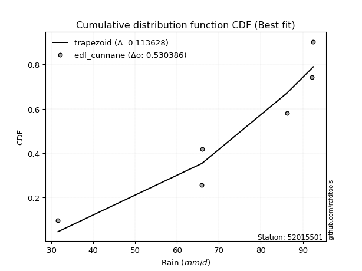</img></img>

</div>


### 12. EDF Adamowski (1981)

The Adamowski formula in hydrology refers to a specific plotting position formula used for estimating the non-parametric empirical distribution of hydrological events (like flood peaks) to calculate their return periods. This formula provides an alternative to traditional parametric methods (like the Gumbel or Log Pearson Type III distributions). 

<div align="center">


$P=(m-0.25)/(n+0.5)$


</div>


**12.1. Empirical values**

<div align="center">

|                | 0                   | 1                  | 2                  | 3                  | 4                  | 5                  |
|:---------------|:--------------------|:-------------------|:-------------------|:-------------------|:-------------------|:-------------------|
| date           | 2018                | 2022               | 2023               | 2020               | 2021               | 2019               |
| x              | 31.6                | 65.9               | 66.0               | 86.2               | 92.2               | 92.5               |
| m              | 1                   | 2                  | 3                  | 4                  | 5                  | 6                  |
| empirical_dist | edf_adamowski       | edf_adamowski      | edf_adamowski      | edf_adamowski      | edf_adamowski      | edf_adamowski      |
| empirical      | 0.11538461538461539 | 0.2692307692307692 | 0.4230769230769231 | 0.5769230769230769 | 0.7307692307692307 | 0.8846153846153846 |
| empirical_tr   | 1.1304347826086958  | 1.3684210526315788 | 1.7333333333333334 | 2.3636363636363633 | 3.7142857142857135 | 8.666666666666664  |

</div>


**12.2. Kolmogorov-Smirnov fit test (sorted by Δ)**


<div align="center">

|                | 0                   | 1                   | 2                   | 3                   | 4                   | 5                 | 6                   | 7                  | 8                   | 9                  | 10                 | 11                  | 12                 | 13                 | 14                | 15                  | 16                  | 17                  | 18                  | 19                  | 20                 | 21                 | 22                  | 23                  | 24                  | 25                  | 26                  | 27                 | 28                  | 29                 | 30                  | 31                  | 32                  | 33                  | 34               | 35                  | 36                 | 37                | 38                  | 39                  | 40                  | 41                  | 42                  | 43                  | 44                 | 45                  | 46                  | 47                 | 48                  | 49                | 50                  | 51                  | 52                  | 53                  | 54                 | 55                  | 56                  | 57                  | 58                 | 59                 | 60                  | 61                  | 62                | 63                | 64                  | 65                  | 66                | 67                  | 68                 | 69                 | 70                 | 71                 | 72                  | 73                 | 74                  | 75                  | 76                  | 77                 | 78                  | 79                  | 80                  | 81                  | 82                 | 83                  | 84                  | 85                  | 86                  | 87                | 88                 | 89                 | 90                  | 91                  | 92                 | 93                  | 94                  | 95                  | 96                 | 97                  | 98                  | 99                  | 100                 | 101                | 102                | 103                | 104                | 105                | 106                | 107                 | 108                | 109                | 110                | 111                 | 112                 | 113                 | 114                 | 115                 | 116                 | 117                | 118                | 119                | 120                 | 121                 | 122                 | 123                | 124                 | 125                 | 126                | 127               | 128                 | 129                 | 130                | 131                | 132                 | 133                | 134                 | 135                | 136                 | 137                 | 138                | 139                 | 140                | 141                | 142                | 143                | 144                | 145                | 146                | 147                | 148                | 149                | 150                | 151               | 152                | 153                | 154                | 155                | 156                | 157                | 158                | 159                |
|:---------------|:--------------------|:--------------------|:--------------------|:--------------------|:--------------------|:------------------|:--------------------|:-------------------|:--------------------|:-------------------|:-------------------|:--------------------|:-------------------|:-------------------|:------------------|:--------------------|:--------------------|:--------------------|:--------------------|:--------------------|:-------------------|:-------------------|:--------------------|:--------------------|:--------------------|:--------------------|:--------------------|:-------------------|:--------------------|:-------------------|:--------------------|:--------------------|:--------------------|:--------------------|:-----------------|:--------------------|:-------------------|:------------------|:--------------------|:--------------------|:--------------------|:--------------------|:--------------------|:--------------------|:-------------------|:--------------------|:--------------------|:-------------------|:--------------------|:------------------|:--------------------|:--------------------|:--------------------|:--------------------|:-------------------|:--------------------|:--------------------|:--------------------|:-------------------|:-------------------|:--------------------|:--------------------|:------------------|:------------------|:--------------------|:--------------------|:------------------|:--------------------|:-------------------|:-------------------|:-------------------|:-------------------|:--------------------|:-------------------|:--------------------|:--------------------|:--------------------|:-------------------|:--------------------|:--------------------|:--------------------|:--------------------|:-------------------|:--------------------|:--------------------|:--------------------|:--------------------|:------------------|:-------------------|:-------------------|:--------------------|:--------------------|:-------------------|:--------------------|:--------------------|:--------------------|:-------------------|:--------------------|:--------------------|:--------------------|:--------------------|:-------------------|:-------------------|:-------------------|:-------------------|:-------------------|:-------------------|:--------------------|:-------------------|:-------------------|:-------------------|:--------------------|:--------------------|:--------------------|:--------------------|:--------------------|:--------------------|:-------------------|:-------------------|:-------------------|:--------------------|:--------------------|:--------------------|:-------------------|:--------------------|:--------------------|:-------------------|:------------------|:--------------------|:--------------------|:-------------------|:-------------------|:--------------------|:-------------------|:--------------------|:-------------------|:--------------------|:--------------------|:-------------------|:--------------------|:-------------------|:-------------------|:-------------------|:-------------------|:-------------------|:-------------------|:-------------------|:-------------------|:-------------------|:-------------------|:-------------------|:------------------|:-------------------|:-------------------|:-------------------|:-------------------|:-------------------|:-------------------|:-------------------|:-------------------|
| station        | 52015501            | 52015501            | 52015501            | 52015501            | 52015501            | 52015501          | 52015501            | 52015501           | 52015501            | 52015501           | 52015501           | 52015501            | 52015501           | 52015501           | 52015501          | 52015501            | 52015501            | 52015501            | 52015501            | 52015501            | 52015501           | 52015501           | 52015501            | 52015501            | 52015501            | 52015501            | 52015501            | 52015501           | 52015501            | 52015501           | 52015501            | 52015501            | 52015501            | 52015501            | 52015501         | 52015501            | 52015501           | 52015501          | 52015501            | 52015501            | 52015501            | 52015501            | 52015501            | 52015501            | 52015501           | 52015501            | 52015501            | 52015501           | 52015501            | 52015501          | 52015501            | 52015501            | 52015501            | 52015501            | 52015501           | 52015501            | 52015501            | 52015501            | 52015501           | 52015501           | 52015501            | 52015501            | 52015501          | 52015501          | 52015501            | 52015501            | 52015501          | 52015501            | 52015501           | 52015501           | 52015501           | 52015501           | 52015501            | 52015501           | 52015501            | 52015501            | 52015501            | 52015501           | 52015501            | 52015501            | 52015501            | 52015501            | 52015501           | 52015501            | 52015501            | 52015501            | 52015501            | 52015501          | 52015501           | 52015501           | 52015501            | 52015501            | 52015501           | 52015501            | 52015501            | 52015501            | 52015501           | 52015501            | 52015501            | 52015501            | 52015501            | 52015501           | 52015501           | 52015501           | 52015501           | 52015501           | 52015501           | 52015501            | 52015501           | 52015501           | 52015501           | 52015501            | 52015501            | 52015501            | 52015501            | 52015501            | 52015501            | 52015501           | 52015501           | 52015501           | 52015501            | 52015501            | 52015501            | 52015501           | 52015501            | 52015501            | 52015501           | 52015501          | 52015501            | 52015501            | 52015501           | 52015501           | 52015501            | 52015501           | 52015501            | 52015501           | 52015501            | 52015501            | 52015501           | 52015501            | 52015501           | 52015501           | 52015501           | 52015501           | 52015501           | 52015501           | 52015501           | 52015501           | 52015501           | 52015501           | 52015501           | 52015501          | 52015501           | 52015501           | 52015501           | 52015501           | 52015501           | 52015501           | 52015501           | 52015501           |
| empirical_dist | edf_adamowski       | edf_adamowski       | edf_adamowski       | edf_adamowski       | edf_adamowski       | edf_adamowski     | edf_adamowski       | edf_adamowski      | edf_adamowski       | edf_adamowski      | edf_adamowski      | edf_adamowski       | edf_adamowski      | edf_adamowski      | edf_adamowski     | edf_adamowski       | edf_adamowski       | edf_adamowski       | edf_adamowski       | edf_adamowski       | edf_adamowski      | edf_adamowski      | edf_adamowski       | edf_adamowski       | edf_adamowski       | edf_adamowski       | edf_adamowski       | edf_adamowski      | edf_adamowski       | edf_adamowski      | edf_adamowski       | edf_adamowski       | edf_adamowski       | edf_adamowski       | edf_adamowski    | edf_adamowski       | edf_adamowski      | edf_adamowski     | edf_adamowski       | edf_adamowski       | edf_adamowski       | edf_adamowski       | edf_adamowski       | edf_adamowski       | edf_adamowski      | edf_adamowski       | edf_adamowski       | edf_adamowski      | edf_adamowski       | edf_adamowski     | edf_adamowski       | edf_adamowski       | edf_adamowski       | edf_adamowski       | edf_adamowski      | edf_adamowski       | edf_adamowski       | edf_adamowski       | edf_adamowski      | edf_adamowski      | edf_adamowski       | edf_adamowski       | edf_adamowski     | edf_adamowski     | edf_adamowski       | edf_adamowski       | edf_adamowski     | edf_adamowski       | edf_adamowski      | edf_adamowski      | edf_adamowski      | edf_adamowski      | edf_adamowski       | edf_adamowski      | edf_adamowski       | edf_adamowski       | edf_adamowski       | edf_adamowski      | edf_adamowski       | edf_adamowski       | edf_adamowski       | edf_adamowski       | edf_adamowski      | edf_adamowski       | edf_adamowski       | edf_adamowski       | edf_adamowski       | edf_adamowski     | edf_adamowski      | edf_adamowski      | edf_adamowski       | edf_adamowski       | edf_adamowski      | edf_adamowski       | edf_adamowski       | edf_adamowski       | edf_adamowski      | edf_adamowski       | edf_adamowski       | edf_adamowski       | edf_adamowski       | edf_adamowski      | edf_adamowski      | edf_adamowski      | edf_adamowski      | edf_adamowski      | edf_adamowski      | edf_adamowski       | edf_adamowski      | edf_adamowski      | edf_adamowski      | edf_adamowski       | edf_adamowski       | edf_adamowski       | edf_adamowski       | edf_adamowski       | edf_adamowski       | edf_adamowski      | edf_adamowski      | edf_adamowski      | edf_adamowski       | edf_adamowski       | edf_adamowski       | edf_adamowski      | edf_adamowski       | edf_adamowski       | edf_adamowski      | edf_adamowski     | edf_adamowski       | edf_adamowski       | edf_adamowski      | edf_adamowski      | edf_adamowski       | edf_adamowski      | edf_adamowski       | edf_adamowski      | edf_adamowski       | edf_adamowski       | edf_adamowski      | edf_adamowski       | edf_adamowski      | edf_adamowski      | edf_adamowski      | edf_adamowski      | edf_adamowski      | edf_adamowski      | edf_adamowski      | edf_adamowski      | edf_adamowski      | edf_adamowski      | edf_adamowski      | edf_adamowski     | edf_adamowski      | edf_adamowski      | edf_adamowski      | edf_adamowski      | edf_adamowski      | edf_adamowski      | edf_adamowski      | edf_adamowski      |
| p_dist         | trapezoid           | dweibull            | logvonmises_line    | logpearson3         | logbeta             | dgamma            | semicircular        | anglit             | burr                | loggumbel_l        | pearson3           | logdweibull         | loggausshyper      | weibull_max        | logjohnsonsb      | loggennorm          | logtrapezoid        | gumbel_l            | invgauss            | weibull_min         | betaprime          | logdgamma          | arcsine             | f                   | nct                 | t                   | exponnorm           | truncnorm          | norm                | crystalball        | rice                | alpha               | erlang              | logt                | vonmises_line    | gamma               | logburr12          | genpareto         | logweibull_min      | maxwell             | invgamma            | rayleigh            | beta                | loggompertz         | logistic           | loglogistic         | halfnorm            | logncf             | logf                | logcrystalball    | lognorm             | logexponnorm        | logrice             | logmielke           | logfatiguelife     | logexponweib        | logargus            | loghypsecant        | cosine             | logweibull_max     | loggengamma         | argus               | loganglit         | loginvgamma       | lognct              | logsemicircular     | logbetaprime      | hypsecant           | gumbel_r           | logarcsine         | loggamma           | loggamma           | kstwobign           | halflogistic       | logalpha            | loglaplace          | loglaplace          | moyal              | logburr             | gausshyper          | laplace             | johnsonsb           | logloglaplace      | logmaxwell          | loginvgauss         | gennorm             | wrapcauchy          | genextreme        | loggenextreme      | lograyleigh        | loginvweibull       | logwrapcauchy       | mielke             | logfoldnorm         | genhalflogistic     | levy_l              | logloggamma        | logtruncweibull_min | wald                | skewnorm            | loggumbel_r         | loggenhalflogistic | logcosine          | bradford           | loglevy_l          | triang             | kappa4             | loghalfnorm         | nakagami           | loggenpareto       | logkstwobign       | ksone               | logmoyal            | loggenexpon         | loghalflogistic     | truncweibull_min    | logskewnorm         | logtriang          | uniform            | lognakagami        | logexponpow         | kappa3              | loglomax            | burr12             | halfgennorm         | ncf                 | logwald            | truncexpon        | logksone            | lomax               | logerlang          | logkappa3          | logtruncnorm        | loguniform         | logkappa4           | logbradford        | logtukeylambda      | gompertz            | loghalfgennorm     | foldnorm            | invweibull         | logjohnsonsu       | logrdist           | logtruncexpon      | johnsonsu          | gengamma           | fatiguelife        | exponweib          | powerlaw           | exponpow           | logpowerlaw        | truncpareto       | logtruncpareto     | genexpon           | genlogistic        | loggenlogistic     | rdist              | tukeylambda        | logvonmises        | vonmises           |
| delta          | 0.09501756127132144 | 0.11666480255303435 | 0.11955236495045884 | 0.12063617026734508 | 0.12150718486225376 | 0.126169097267405 | 0.13422505938701396 | 0.1369284661260326 | 0.13712695666868024 | 0.1378797090814916 | 0.1391789172716542 | 0.13969833358544714 | 0.1406155026164393 | 0.1413208061618351 | 0.141687431688564 | 0.14228417489516243 | 0.14664119221939587 | 0.14682356850379108 | 0.14953651155847214 | 0.15558135661112293 | 0.1579433632554157 | 0.1598653438308506 | 0.16169580766399527 | 0.16345028843116216 | 0.16406795727174228 | 0.16406914941777573 | 0.16407878915803653 | 0.1640797930733724 | 0.16407981364124669 | 0.1640798178691858 | 0.16453595423941436 | 0.16694140416152825 | 0.16749386109302478 | 0.16820961644110555 | 0.16857949705552 | 0.16872716808960964 | 0.1716842557864633 | 0.171747550824776 | 0.17246894576730354 | 0.17483905100592745 | 0.17517095481182787 | 0.17792174022762508 | 0.17864074972838717 | 0.17870640527502202 | 0.1866758907926973 | 0.18827866643719166 | 0.19177815637371332 | 0.1919195436187272 | 0.19217250945807923 | 0.193350950829779 | 0.19335095314407208 | 0.19335178444355205 | 0.19335906509245893 | 0.19340800493074906 | 0.1936912050926422 | 0.19394859335741732 | 0.19545354445834862 | 0.19548738957299927 | 0.1956587950626888 | 0.1958369573133912 | 0.19649089718866142 | 0.19742230940239236 | 0.198682289473397 | 0.199722653359452 | 0.19999584900987394 | 0.20087748649451564 | 0.200931100712555 | 0.20182336916805843 | 0.2057451296508941 | 0.2096126861736809 | 0.2105635882180259 | 0.2105635882180259 | 0.21096467749025366 | 0.2129891138666843 | 0.21549676839481752 | 0.21703946730708645 | 0.21703946730708645 | 0.2191650916989133 | 0.21974546315824417 | 0.22013119725185892 | 0.22265928203721908 | 0.22478515119978998 | 0.2247904159287396 | 0.22749338728248159 | 0.22984527995445359 | 0.23076923076923078 | 0.23537127823040754 | 0.239007974039828 | 0.2391896644087803 | 0.2392028911285476 | 0.23984174895410643 | 0.24000996982199457 | 0.2525660525773734 | 0.25415600883196005 | 0.25515497165847234 | 0.25537161292391314 | 0.2585485501259147 | 0.25944164605572384 | 0.26056136253504825 | 0.26106580968618465 | 0.26158371554708054 | 0.2621965653275381 | 0.2622975626391219 | 0.2640805440391979 | 0.2647748899409134 | 0.2708003053124254 | 0.2715350625588303 | 0.27223691539077527 | 0.2751658865117471 | 0.2771742489845867 | 0.2777424194403026 | 0.28345122310639553 | 0.28723097138060266 | 0.28725098081126194 | 0.29444913154965974 | 0.30323329665794696 | 0.30649597683236507 | 0.3158819752497545 | 0.3196286472148542 | 0.3257907188108204 | 0.33529516394920117 | 0.33883722161979407 | 0.34387614068142464 | 0.3449094896956952 | 0.34754623484172037 | 0.35343644028616567 | 0.3586044597888551 | 0.376119690392593 | 0.38435866490653775 | 0.38477222571712044 | 0.4053994564565893 | 0.4136820728031037 | 0.41450850808810974 | 0.4150765517339991 | 0.41573001756078903 | 0.4172297659742625 | 0.41738994325796924 | 0.42070211164538523 | 0.4230769230769231 | 0.42307692307692313 | 0.4372030930432418 | 0.4540035462345838 | 0.4796683538136462 | 0.4833012587837134 | 0.5120063650708113 | 0.5291865275143874 | 0.5593103364770071 | 0.5776165689130115 | 0.6454823772375622 | 0.6596865334724189 | 0.6699104117775789 | 0.681255680539943 | 0.6979119681904222 | 0.7258873767385579 | 0.7307692307692307 | 0.7307692307692307 | 0.7307692307692308 | 0.7307692307692308 | 1.1804625111147926 | 14.821954499221158 |
| deltao         | 0.530385761606      | 0.530385761606      | 0.530385761606      | 0.530385761606      | 0.530385761606      | 0.530385761606    | 0.530385761606      | 0.530385761606     | 0.530385761606      | 0.530385761606     | 0.530385761606     | 0.530385761606      | 0.530385761606     | 0.530385761606     | 0.530385761606    | 0.530385761606      | 0.530385761606      | 0.530385761606      | 0.530385761606      | 0.530385761606      | 0.530385761606     | 0.530385761606     | 0.530385761606      | 0.530385761606      | 0.530385761606      | 0.530385761606      | 0.530385761606      | 0.530385761606     | 0.530385761606      | 0.530385761606     | 0.530385761606      | 0.530385761606      | 0.530385761606      | 0.530385761606      | 0.530385761606   | 0.530385761606      | 0.530385761606     | 0.530385761606    | 0.530385761606      | 0.530385761606      | 0.530385761606      | 0.530385761606      | 0.530385761606      | 0.530385761606      | 0.530385761606     | 0.530385761606      | 0.530385761606      | 0.530385761606     | 0.530385761606      | 0.530385761606    | 0.530385761606      | 0.530385761606      | 0.530385761606      | 0.530385761606      | 0.530385761606     | 0.530385761606      | 0.530385761606      | 0.530385761606      | 0.530385761606     | 0.530385761606     | 0.530385761606      | 0.530385761606      | 0.530385761606    | 0.530385761606    | 0.530385761606      | 0.530385761606      | 0.530385761606    | 0.530385761606      | 0.530385761606     | 0.530385761606     | 0.530385761606     | 0.530385761606     | 0.530385761606      | 0.530385761606     | 0.530385761606      | 0.530385761606      | 0.530385761606      | 0.530385761606     | 0.530385761606      | 0.530385761606      | 0.530385761606      | 0.530385761606      | 0.530385761606     | 0.530385761606      | 0.530385761606      | 0.530385761606      | 0.530385761606      | 0.530385761606    | 0.530385761606     | 0.530385761606     | 0.530385761606      | 0.530385761606      | 0.530385761606     | 0.530385761606      | 0.530385761606      | 0.530385761606      | 0.530385761606     | 0.530385761606      | 0.530385761606      | 0.530385761606      | 0.530385761606      | 0.530385761606     | 0.530385761606     | 0.530385761606     | 0.530385761606     | 0.530385761606     | 0.530385761606     | 0.530385761606      | 0.530385761606     | 0.530385761606     | 0.530385761606     | 0.530385761606      | 0.530385761606      | 0.530385761606      | 0.530385761606      | 0.530385761606      | 0.530385761606      | 0.530385761606     | 0.530385761606     | 0.530385761606     | 0.530385761606      | 0.530385761606      | 0.530385761606      | 0.530385761606     | 0.530385761606      | 0.530385761606      | 0.530385761606     | 0.530385761606    | 0.530385761606      | 0.530385761606      | 0.530385761606     | 0.530385761606     | 0.530385761606      | 0.530385761606     | 0.530385761606      | 0.530385761606     | 0.530385761606      | 0.530385761606      | 0.530385761606     | 0.530385761606      | 0.530385761606     | 0.530385761606     | 0.530385761606     | 0.530385761606     | 0.530385761606     | 0.530385761606     | 0.530385761606     | 0.530385761606     | 0.530385761606     | 0.530385761606     | 0.530385761606     | 0.530385761606    | 0.530385761606     | 0.530385761606     | 0.530385761606     | 0.530385761606     | 0.530385761606     | 0.530385761606     | 0.530385761606     | 0.530385761606     |
| eval           | Δo > Δ              | Δo > Δ              | Δo > Δ              | Δo > Δ              | Δo > Δ              | Δo > Δ            | Δo > Δ              | Δo > Δ             | Δo > Δ              | Δo > Δ             | Δo > Δ             | Δo > Δ              | Δo > Δ             | Δo > Δ             | Δo > Δ            | Δo > Δ              | Δo > Δ              | Δo > Δ              | Δo > Δ              | Δo > Δ              | Δo > Δ             | Δo > Δ             | Δo > Δ              | Δo > Δ              | Δo > Δ              | Δo > Δ              | Δo > Δ              | Δo > Δ             | Δo > Δ              | Δo > Δ             | Δo > Δ              | Δo > Δ              | Δo > Δ              | Δo > Δ              | Δo > Δ           | Δo > Δ              | Δo > Δ             | Δo > Δ            | Δo > Δ              | Δo > Δ              | Δo > Δ              | Δo > Δ              | Δo > Δ              | Δo > Δ              | Δo > Δ             | Δo > Δ              | Δo > Δ              | Δo > Δ             | Δo > Δ              | Δo > Δ            | Δo > Δ              | Δo > Δ              | Δo > Δ              | Δo > Δ              | Δo > Δ             | Δo > Δ              | Δo > Δ              | Δo > Δ              | Δo > Δ             | Δo > Δ             | Δo > Δ              | Δo > Δ              | Δo > Δ            | Δo > Δ            | Δo > Δ              | Δo > Δ              | Δo > Δ            | Δo > Δ              | Δo > Δ             | Δo > Δ             | Δo > Δ             | Δo > Δ             | Δo > Δ              | Δo > Δ             | Δo > Δ              | Δo > Δ              | Δo > Δ              | Δo > Δ             | Δo > Δ              | Δo > Δ              | Δo > Δ              | Δo > Δ              | Δo > Δ             | Δo > Δ              | Δo > Δ              | Δo > Δ              | Δo > Δ              | Δo > Δ            | Δo > Δ             | Δo > Δ             | Δo > Δ              | Δo > Δ              | Δo > Δ             | Δo > Δ              | Δo > Δ              | Δo > Δ              | Δo > Δ             | Δo > Δ              | Δo > Δ              | Δo > Δ              | Δo > Δ              | Δo > Δ             | Δo > Δ             | Δo > Δ             | Δo > Δ             | Δo > Δ             | Δo > Δ             | Δo > Δ              | Δo > Δ             | Δo > Δ             | Δo > Δ             | Δo > Δ              | Δo > Δ              | Δo > Δ              | Δo > Δ              | Δo > Δ              | Δo > Δ              | Δo > Δ             | Δo > Δ             | Δo > Δ             | Δo > Δ              | Δo > Δ              | Δo > Δ              | Δo > Δ             | Δo > Δ              | Δo > Δ              | Δo > Δ             | Δo > Δ            | Δo > Δ              | Δo > Δ              | Δo > Δ             | Δo > Δ             | Δo > Δ              | Δo > Δ             | Δo > Δ              | Δo > Δ             | Δo > Δ              | Δo > Δ              | Δo > Δ             | Δo > Δ              | Δo > Δ             | Δo > Δ             | Δo > Δ             | Δo > Δ             | Δo > Δ             | Δo > Δ             | Δo <= Δ            | Δo <= Δ            | Δo <= Δ            | Δo <= Δ            | Δo <= Δ            | Δo <= Δ           | Δo <= Δ            | Δo <= Δ            | Δo <= Δ            | Δo <= Δ            | Δo <= Δ            | Δo <= Δ            | Δo <= Δ            | Δo <= Δ            |
| fit            | 1                   | 1                   | 1                   | 1                   | 1                   | 1                 | 1                   | 1                  | 1                   | 1                  | 1                  | 1                   | 1                  | 1                  | 1                 | 1                   | 1                   | 1                   | 1                   | 1                   | 1                  | 1                  | 1                   | 1                   | 1                   | 1                   | 1                   | 1                  | 1                   | 1                  | 1                   | 1                   | 1                   | 1                   | 1                | 1                   | 1                  | 1                 | 1                   | 1                   | 1                   | 1                   | 1                   | 1                   | 1                  | 1                   | 1                   | 1                  | 1                   | 1                 | 1                   | 1                   | 1                   | 1                   | 1                  | 1                   | 1                   | 1                   | 1                  | 1                  | 1                   | 1                   | 1                 | 1                 | 1                   | 1                   | 1                 | 1                   | 1                  | 1                  | 1                  | 1                  | 1                   | 1                  | 1                   | 1                   | 1                   | 1                  | 1                   | 1                   | 1                   | 1                   | 1                  | 1                   | 1                   | 1                   | 1                   | 1                 | 1                  | 1                  | 1                   | 1                   | 1                  | 1                   | 1                   | 1                   | 1                  | 1                   | 1                   | 1                   | 1                   | 1                  | 1                  | 1                  | 1                  | 1                  | 1                  | 1                   | 1                  | 1                  | 1                  | 1                   | 1                   | 1                   | 1                   | 1                   | 1                   | 1                  | 1                  | 1                  | 1                   | 1                   | 1                   | 1                  | 1                   | 1                   | 1                  | 1                 | 1                   | 1                   | 1                  | 1                  | 1                   | 1                  | 1                   | 1                  | 1                   | 1                   | 1                  | 1                   | 1                  | 1                  | 1                  | 1                  | 1                  | 1                  | 0                  | 0                  | 0                  | 0                  | 0                  | 0                 | 0                  | 0                  | 0                  | 0                  | 0                  | 0                  | 0                  | 0                  |
| n              | 6                   | 6                   | 6                   | 6                   | 6                   | 6                 | 6                   | 6                  | 6                   | 6                  | 6                  | 6                   | 6                  | 6                  | 6                 | 6                   | 6                   | 6                   | 6                   | 6                   | 6                  | 6                  | 6                   | 6                   | 6                   | 6                   | 6                   | 6                  | 6                   | 6                  | 6                   | 6                   | 6                   | 6                   | 6                | 6                   | 6                  | 6                 | 6                   | 6                   | 6                   | 6                   | 6                   | 6                   | 6                  | 6                   | 6                   | 6                  | 6                   | 6                 | 6                   | 6                   | 6                   | 6                   | 6                  | 6                   | 6                   | 6                   | 6                  | 6                  | 6                   | 6                   | 6                 | 6                 | 6                   | 6                   | 6                 | 6                   | 6                  | 6                  | 6                  | 6                  | 6                   | 6                  | 6                   | 6                   | 6                   | 6                  | 6                   | 6                   | 6                   | 6                   | 6                  | 6                   | 6                   | 6                   | 6                   | 6                 | 6                  | 6                  | 6                   | 6                   | 6                  | 6                   | 6                   | 6                   | 6                  | 6                   | 6                   | 6                   | 6                   | 6                  | 6                  | 6                  | 6                  | 6                  | 6                  | 6                   | 6                  | 6                  | 6                  | 6                   | 6                   | 6                   | 6                   | 6                   | 6                   | 6                  | 6                  | 6                  | 6                   | 6                   | 6                   | 6                  | 6                   | 6                   | 6                  | 6                 | 6                   | 6                   | 6                  | 6                  | 6                   | 6                  | 6                   | 6                  | 6                   | 6                   | 6                  | 6                   | 6                  | 6                  | 6                  | 6                  | 6                  | 6                  | 6                  | 6                  | 6                  | 6                  | 6                  | 6                 | 6                  | 6                  | 6                  | 6                  | 6                  | 6                  | 6                  | 6                  |
| best_fit       | 1                   | 0                   | 0                   | 0                   | 0                   | 0                 | 0                   | 0                  | 0                   | 0                  | 0                  | 0                   | 0                  | 0                  | 0                 | 0                   | 0                   | 0                   | 0                   | 0                   | 0                  | 0                  | 0                   | 0                   | 0                   | 0                   | 0                   | 0                  | 0                   | 0                  | 0                   | 0                   | 0                   | 0                   | 0                | 0                   | 0                  | 0                 | 0                   | 0                   | 0                   | 0                   | 0                   | 0                   | 0                  | 0                   | 0                   | 0                  | 0                   | 0                 | 0                   | 0                   | 0                   | 0                   | 0                  | 0                   | 0                   | 0                   | 0                  | 0                  | 0                   | 0                   | 0                 | 0                 | 0                   | 0                   | 0                 | 0                   | 0                  | 0                  | 0                  | 0                  | 0                   | 0                  | 0                   | 0                   | 0                   | 0                  | 0                   | 0                   | 0                   | 0                   | 0                  | 0                   | 0                   | 0                   | 0                   | 0                 | 0                  | 0                  | 0                   | 0                   | 0                  | 0                   | 0                   | 0                   | 0                  | 0                   | 0                   | 0                   | 0                   | 0                  | 0                  | 0                  | 0                  | 0                  | 0                  | 0                   | 0                  | 0                  | 0                  | 0                   | 0                   | 0                   | 0                   | 0                   | 0                   | 0                  | 0                  | 0                  | 0                   | 0                   | 0                   | 0                  | 0                   | 0                   | 0                  | 0                 | 0                   | 0                   | 0                  | 0                  | 0                   | 0                  | 0                   | 0                  | 0                   | 0                   | 0                  | 0                   | 0                  | 0                  | 0                  | 0                  | 0                  | 0                  | 0                  | 0                  | 0                  | 0                  | 0                  | 0                 | 0                  | 0                  | 0                  | 0                  | 0                  | 0                  | 0                  | 0                  |
| best_fit_sort  | 1                   | 2                   | 3                   | 4                   | 5                   | 6                 | 7                   | 8                  | 9                   | 10                 | 11                 | 12                  | 13                 | 14                 | 15                | 16                  | 17                  | 18                  | 19                  | 20                  | 21                 | 22                 | 23                  | 24                  | 25                  | 26                  | 27                  | 28                 | 29                  | 30                 | 31                  | 32                  | 33                  | 34                  | 35               | 36                  | 37                 | 38                | 39                  | 40                  | 41                  | 42                  | 43                  | 44                  | 45                 | 46                  | 47                  | 48                 | 49                  | 50                | 51                  | 52                  | 53                  | 54                  | 55                 | 56                  | 57                  | 58                  | 59                 | 60                 | 61                  | 62                  | 63                | 64                | 65                  | 66                  | 67                | 68                  | 69                 | 70                 | 71                 | 72                 | 73                  | 74                 | 75                  | 76                  | 77                  | 78                 | 79                  | 80                  | 81                  | 82                  | 83                 | 84                  | 85                  | 86                  | 87                  | 88                | 89                 | 90                 | 91                  | 92                  | 93                 | 94                  | 95                  | 96                  | 97                 | 98                  | 99                  | 100                 | 101                 | 102                | 103                | 104                | 105                | 106                | 107                | 108                 | 109                | 110                | 111                | 112                 | 113                 | 114                 | 115                 | 116                 | 117                 | 118                | 119                | 120                | 121                 | 122                 | 123                 | 124                | 125                 | 126                 | 127                | 128               | 129                 | 130                 | 131                | 132                | 133                 | 134                | 135                 | 136                | 137                 | 138                 | 139                | 140                 | 141                | 142                | 143                | 144                | 145                | 146                | 147                | 148                | 149                | 150                | 151                | 152               | 153                | 154                | 155                | 156                | 157                | 158                | 159                | 160                |

</div>


**12.3. Best fit**

<div align="center">

|   id |   station | empirical_dist   | p_dist    |     delta |   deltao | eval   |   fit |   n |   best_fit |   best_fit_sort |
|-----:|----------:|:-----------------|:----------|----------:|---------:|:-------|------:|----:|-----------:|----------------:|
|    0 |  52015501 | edf_adamowski    | trapezoid | 0.0950176 | 0.530386 | Δo > Δ |     1 |   6 |          1 |               1 |

</div>


<div align="center">

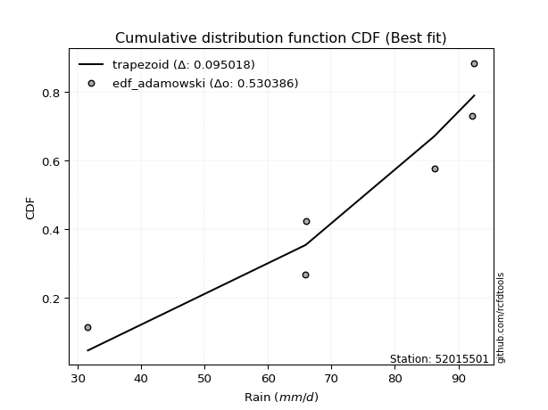</img></img>

</div>


## C. Best fit & Estimate extreme values for specific return periods - Tr

Best fit in probability distribution analysis means finding the theoretical distribution (like Normal, Poisson, Exponential, etc.) that most accurately mirrors your real-world data´s patterns (shape, center, spread) for better predictions, using methods like visual checks (Q-Q plots), goodness-of-fit tests (Kolmogorov-Smirnov, Chi-Squared), and information criteria (AIC) to score and select the simplest, most representative model.


### 1. Best fit (ordered by delta Δ)

:file_folder:Table: [bestfit_52015501.csv](table/bestfit_52015501.csv)

<div align="center">

|   id |   station | empirical_dist   | p_dist    |     delta |   deltao | eval   |   fit |   n |   best_fit |   best_fit_sort |
|-----:|----------:|:-----------------|:----------|----------:|---------:|:-------|------:|----:|-----------:|----------------:|
|    0 |  52015501 | edf_adamowski    | trapezoid | 0.0950176 | 0.530386 | Δo > Δ |     1 |   6 |          1 |               1 |
|    1 |  52015501 | edf_california   | genpareto | 0.0987411 | 0.530386 | Δo > Δ |     1 |   6 |          1 |               2 |
|    2 |  52015501 | edf_weibull      | trapezoid | 0.0993883 | 0.530386 | Δo > Δ |     1 |   6 |          1 |               3 |
|    3 |  52015501 | edf_chegodayev   | trapezoid | 0.101027  | 0.530386 | Δo > Δ |     1 |   6 |          1 |               4 |
|    4 |  52015501 | edf_jenkinson    | trapezoid | 0.102252  | 0.530386 | Δo > Δ |     1 |   6 |          1 |               5 |
|    5 |  52015501 | edf_beard        | trapezoid | 0.102252  | 0.530386 | Δo > Δ |     1 |   6 |          1 |               6 |
|    6 |  52015501 | edf_filliben     | trapezoid | 0.103175  | 0.530386 | Δo > Δ |     1 |   6 |          1 |               7 |
|    7 |  52015501 | edf_tukey        | trapezoid | 0.105139  | 0.530386 | Δo > Δ |     1 |   6 |          1 |               8 |
|    8 |  52015501 | edf_blom         | trapezoid | 0.110402  | 0.530386 | Δo > Δ |     1 |   6 |          1 |               9 |
|    9 |  52015501 | edf_cunnane      | trapezoid | 0.113628  | 0.530386 | Δo > Δ |     1 |   6 |          1 |              10 |
|   10 |  52015501 | edf_hazen        | logbeta   | 0.115097  | 0.530386 | Δo > Δ |     1 |   6 |          1 |              11 |
|   11 |  52015501 | edf_gringorten   | logbeta   | 0.116731  | 0.530386 | Δo > Δ |     1 |   6 |          1 |              12 |

</div>


### 2. Extreme values and % difference analysis

In hydrology, a return period (or recurrence interval $Tr$) is the statistical average time between extreme events like floods or droughts of a specific magnitude, indicating how rare an event is, with a 100-year flood, for example, having a 1% chance of occurring in any given year, not that it happens exactly every century. It is a key tool for infrastructure design (like bridges or dams) and risk assessment, calculated from historical data to determine the probability of future events, although it is important to remember it is statistical average, and events can cluster or be missed.

The extreme value porcentage difference is evaluated as $pdiff = 1 - (ETrBf / ETr) * 100$, where _ETrBf_ correspond to the bestfit extreme value for a specific recurrence interval and _ETr_ correspond to the extreme value for one of the most used PDFsused in hydrology.

> risk_rate: assuming the return period as the project useful life.

:file_folder:Table: [extreme_52015501.csv](table/extreme_52015501.csv), all PDFs.  
:file_folder:Table: [extremepdiff_52015501.csv](table/extremepdiff_52015501.csv), % difference between bestfit and most used PDFs in Hydrology.

<div align="center">

Extreme values table for only best fit PDFs
|   id |      tr |   prob_l |     prob_g |    alpha |   anglit |   arcsine |   argus |    beta |   betaprime |   bradford |     burr |   burr12 |   cosine |   crystalball |   dgamma |   dweibull |   erlang |   exponnorm |   exponpow |   exponweib |        f |   fatiguelife |   foldnorm |    gamma |   gausshyper |   genexpon |   genextreme |   gengamma |   genhalflogistic |   genlogistic |   gennorm |   genpareto |   gompertz |   gumbel_l |   gumbel_r |   halfgennorm |   halflogistic |   halfnorm |   hypsecant |   invgamma |   invgauss |      invweibull |   johnsonsb |   johnsonsu |   kappa3 |   kappa4 |   ksone |   kstwobign |   laplace |   levy_l |   loggamma |   logistic |   loglaplace |    lomax |   maxwell |      mielke |    moyal |   nakagami |       ncf |      nct |     norm |   pearson3 |   powerlaw |   rayleigh |   rdist |     rice |   semicircular |   skewnorm |        t |   trapezoid |   triang |   truncexpon |   truncnorm |   truncpareto |   truncweibull_min |   tukeylambda |   uniform |   vonmises |   vonmises_line |     wald |   weibull_max |   weibull_min |   wrapcauchy |   logalpha |   loganglit |   logarcsine |   logargus |   logbeta |   logbetaprime |   logbradford |   logburr |   logburr12 |   logcosine |   logcrystalball |   logdgamma |   logdweibull |   logerlang |   logexponnorm |   logexponpow |   logexponweib |     logf |   logfatiguelife |   logfoldnorm |   loggausshyper |   loggenexpon |   loggenextreme |   loggengamma |   loggenhalflogistic |   loggenlogistic |   loggennorm |   loggenpareto |   loggompertz |   loggumbel_l |   loggumbel_r |   loghalfgennorm |   loghalflogistic |   loghalfnorm |   loghypsecant |   loginvgamma |   loginvgauss |   loginvweibull |   logjohnsonsb |   logjohnsonsu |   logkappa3 |   logkappa4 |   logksone |   logkstwobign |   loglevy_l |   logloggamma |   loglogistic |   logloglaplace |   loglomax |   logmaxwell |   logmielke |   logmoyal |   lognakagami |   logncf |   lognct |   lognorm |   logpearson3 |   logpowerlaw |   lograyleigh |   logrdist |   logrice |   logsemicircular |   logskewnorm |      logt |   logtrapezoid |   logtriang |   logtruncexpon |   logtruncnorm |   logtruncpareto |   logtruncweibull_min |   logtukeylambda |   loguniform |   logvonmises |   logvonmises_line |   logwald |   logweibull_max |   logweibull_min |   logwrapcauchy |   station |   n |   risk_rate |
|-----:|--------:|---------:|-----------:|---------:|---------:|----------:|--------:|--------:|------------:|-----------:|---------:|---------:|---------:|--------------:|---------:|-----------:|---------:|------------:|-----------:|------------:|---------:|--------------:|-----------:|---------:|-------------:|-----------:|-------------:|-----------:|------------------:|--------------:|----------:|------------:|-----------:|-----------:|-----------:|--------------:|---------------:|-----------:|------------:|-----------:|-----------:|----------------:|------------:|------------:|---------:|---------:|--------:|------------:|----------:|---------:|-----------:|-----------:|-------------:|---------:|----------:|------------:|---------:|-----------:|----------:|---------:|---------:|-----------:|-----------:|-----------:|--------:|---------:|---------------:|-----------:|---------:|------------:|---------:|-------------:|------------:|--------------:|-------------------:|--------------:|----------:|-----------:|----------------:|---------:|--------------:|--------------:|-------------:|-----------:|------------:|-------------:|-----------:|----------:|---------------:|--------------:|----------:|------------:|------------:|-----------------:|------------:|--------------:|------------:|---------------:|--------------:|---------------:|---------:|-----------------:|--------------:|----------------:|--------------:|----------------:|--------------:|---------------------:|-----------------:|-------------:|---------------:|--------------:|--------------:|--------------:|-----------------:|------------------:|--------------:|---------------:|--------------:|--------------:|----------------:|---------------:|---------------:|------------:|------------:|-----------:|---------------:|------------:|--------------:|--------------:|----------------:|-----------:|-------------:|------------:|-----------:|--------------:|---------:|---------:|----------:|--------------:|--------------:|--------------:|-----------:|----------:|------------------:|--------------:|----------:|---------------:|------------:|----------------:|---------------:|-----------------:|----------------------:|-----------------:|-------------:|--------------:|-------------------:|----------:|-----------------:|-----------------:|----------------:|----------:|----:|------------:|
|    0 |    2    | 0.5      | 0.5        |  71.0796 |  72.4    |   72.4    | 78.1956 | 78.2123 |     72.3725 |    64.0387 |  73.9644 |  53.9427 |  69.6009 |       72.4    |  76.031  |    74.9333 |  71.6454 |     72.4001 |    31.6008 |     32.1826 |  72.35   |       31.6003 |    76.4719 |  71.5264 |      72.398  |    36.0671 |      80.6744 |    32.5409 |           72.2921 |           inf |     62.05 |     75.5168 |    87.8096 |    75.9071 |    68.8929 |       52.1087 |        67.1494 |    68.0301 |     72.4    |    70.7309 |    70.9656 |   844.057       |     91.7232 |     92.4997 |  58.3442 |  63.8939 | 62.05   |     67.2336 |   72.4    |  90.1757 |    67.2036 |    72.4    |      68.2469 |  92.5276 |   70.5742 | -7.0446e+08 |  67.7607 |    67.9288 |   42.112  |  72.3974 |  72.4    |    75.409  |    32.3015 |    69.9267 |    31.6 |  71.8987 |        72.4    |    72.726  |  72.4003 |     76.0627 |  69.2254 |      56.9416 |     72.4    |       32.6101 |            66.0205 |          31.6 |   62.05   | -2.18272   |         74.2371 |  65.48   |       81.001  |       76.3551 |      62.0453 |    66.8851 |     68.2469 |      68.2468 |    75.6527 |   85.6377 |        67.8728 |       53.8829 |   75.21   |     73.3838 |     63.8126 |          68.2469 |     74.9707 |       74.0022 |     46.276  |        68.2468 |       56.6311 |        68.3948 |  68.331  |          68.223  |       64.3834 |         76.8316 |       61.3916 |         79.0419 |       68.0077 |              67.3704 |         inf      |      72.1828 |        57.9988 |       72.4459 |       72.5542 |       64.1953 |          31.5984 |           62.2716 |       63.2357 |        68.2469 |       67.9516 |       65.9616 |         65.152  |        90.2763 |        92.4981 |     31.6    |     53.6742 |    54.0648 |        62.0037 |     90.1001 |       74.8718 |       68.2469 |         66.1285 |    53.9699 |      66.1067 |     75.2085 |    62.9393 |       71.5379 |  68.3715 |  67.881  |   68.2469 |       73.6127 |       32.1195 |       65.3641 |    104.664 |   68.2469 |           68.247  |       66.8697 |   77.8904 |        72.7515 |     63.5839 |         49.5352 |        74.345  |          32.2054 |               74.6766 |          78.0753 |      54.0648 |      0.128879 |            73.9681 |   60.4828 |          83.3427 |          73.3318 |         54.061  |  52015501 |   6 |    0.75     |
|    1 |    2.33 | 0.570815 | 0.429185   |  75.1174 |  76.8374 |   79.0612 | 80.9    | 82.4059 |     76.2908 |    68.6409 |  78.2533 |  60.7057 |  73.6396 |       76.2095 |  84.0161 |    81.518  |  75.5589 |     76.2096 |    31.6048 |     32.8989 |  76.1825 |       32.8149 |    76.6064 |  75.4511 |      77.0371 |    37.0513 |      83.2898 |    33.7913 |           76.2406 |           inf |     62.05 |     80.8512 |    88.5749 |    79.2214 |    72.4228 |       59.6351 |        70.7787 |    72.1416 |     75.4487 |    74.6898 |    75.3282 | 32731.6         |     92.2176 |     92.5    |  63.2954 |  68.9857 | 67.2252 |     72.2227 |   74.7053 |  90.8951 |    72.0272 |    75.7564 |      71.0484 | 105.952  |   74.532  | -7.0446e+08 |  71.1022 |    69.43   |   54.8519 |  76.2077 |  76.2095 |    78.9858 |    33.2461 |    73.943  |    31.6 |  75.8166 |        77.1592 |    75.8816 |  76.2099 |     80.4478 |  73.0728 |      61.1938 |     76.2095 |       33.175  |            69.8735 |          31.6 |   66.3627 | -2.00091   |         77.3886 |  67.9779 |       85.6951 |       79.4032 |      86.5442 |    71.7062 |     73.7417 |      76.6599 |    78.6396 |   89.0079 |        72.8369 |       58.1628 |   78.4338 |     76.877  |     68.6135 |          72.9381 |     81.906  |       79.3038 |     52.1986 |        72.9381 |       62.6329 |        73.4946 |  73.0458 |          72.9094 |       69.1896 |         82.1316 |       67.1329 |         81.9729 |       72.4933 |              71.7842 |         inf      |      75.9068 |        69.7161 |       76.0418 |       76.8743 |       68.2741 |          31.5984 |           66.3431 |       67.9397 |        71.9762 |       72.9321 |       70.9339 |         71.4377 |        91.8931 |        92.4996 |     31.6    |     58.0586 |    59.2315 |        68.0555 |     90.8366 |       77.9592 |       72.3637 |         69.1009 |    60.7791 |      70.8339 |     78.5719 |    66.7186 |       73.8797 |  73.1438 |  72.6982 |   72.9381 |       78.0779 |       32.7681 |       70.1095 |    114.804 |   72.9394 |           74.1567 |       70.4234 |   81.2593 |        78.5373 |     67.6484 |         53.3987 |        76.3123 |          32.5452 |               77.6232 |          80.0876 |      58.3373 |      0.137558 |            78.0426 |   63.1778 |          88.8417 |          76.8271 |         86.5683 |  52015501 |   6 |    0.729209 |
|    2 |    5    | 0.8      | 0.2        |  90.6499 |  92.4935 |   96.8244 | 88.2876 | 90.7072 |     90.9455 |    83.5352 |  90.8231 | inf      |  88.1935 |       90.3667 |  94.6011 |    94.1707 |  90.3616 |     90.3667 |    32.5864 |     49.7022 |  90.4407 |       58.6105 |    77.1751 |  90.28   |      88.5424 |    41.9723 |      89.3908 |    66.642  |           86.4203 |           inf |     62.05 |     90.7315 |    91.047  |    89.9286 |    87.7585 |      113.409  |        87.2007 |    89.5284 |     87.678  |    89.9913 |    92.6757 |     3.06406e+11 |     92.4936 |     92.5    |  79.3193 |  83.5682 | 83.974  |     93.4155 |   86.2315 |  92.087  |    93.6148 |    88.7161 |      86.878  | 173.069  |   90.1097 | 88.0417     |  86.5805 |    80.9529 |  126.146  |  90.3687 |  90.3667 |    90.6558 |    46.0718 |    90.0223 |    31.6 |  90.5124 |        93.4002 |    85.0726 |  90.3675 |     93.0284 |  84.1107 |      76.5382 |     90.3667 |       39.8172 |            82.0021 |          31.6 |   80.32   | -1.29272   |         89.7358 |  81.9614 |       91.8034 |       89.2505 |      91.49   |    93.5015 |     96.91   |     104.519  |    87.331  |   92.3933 |        95.0084 |       74.5036 |   87.2876 |     89.3427 |     89.1116 |          93.3791 |     99.3388 |       98.3709 |    102.412  |        93.379  |       94.3815 |        96.2365 |  93.6113 |          93.3418 |       92.3428 |         91.3755 |       96.3105 |         89.0089 |       90.2941 |              84.3462 |         inf      |      94.6742 |        90.3901 |       89.0823 |       92.6679 |       89.2242 |          74.7337 |           88.3599 |       92.0241 |        89.0989 |       95.4571 |       94.0055 |        106.587  |        92.4954 |        92.5    |     74.7503 |     74.8354 |    79.5863 |       101.08   |     92.0701 |       86.415  |       90.7278 |         86.1494 |   110.625  |      92.9613 |     87.8392 |    87.4088 |       87.5676 |  94.1079 |  93.9222 |   93.3791 |       93.3589 |       41.7672 |       92.8182 |    149.074 |   93.3864 |           98.4537 |       81.8867 |   97.065  |        97.8188 |     80.8096 |         69.9588 |        86.7591 |          36.7376 |               86.0636 |          86.8187 |      74.6192 |      0.175469 |            96.2522 |   80.6404 |          92.4396 |          89.2982 |         91.4856 |  52015501 |   6 |    0.67232  |
|    3 |   10    | 0.9      | 0.1        | 101.436  | 101.355  |  101.113  | 91.3003 | 92.125  |    100.748  |    90.0341 |  96.9414 | inf      |  96.9865 |       99.7581 | 101.378  |   101.882  | 100.408  |     99.7581 |    45.0011 |    112.621  |  99.9127 |       94.2275 |    77.596  | 100.33   |      91.3874 |    46.4394 |      91.2161 |   200.317  |           89.8141 |           inf |     62.05 |     92.1805 |    92.4234 |    95.8898 |   100.249  |      186.842  |       100.838  |   102.394  |     97.4434 |   100.68   |   105.22   |     1.46112e+17 |     92.4995 |     92.5    |  86.311  |  88.7607 | 91.282  |    109.551  |   96.6946 |  92.3747 |   111.84   |    98.2604 |     104.282  | 233.997  |  101.072  | 90.4154     | 100.057  |    92.9594 |  206.828  |  99.7636 |  99.7581 |    97.0671 |    62.4988 |   101.487  |    31.6 | 100.346  |       101.734  |    88.816  |  99.7593 |     97.9424 |  88.4222 |      84.162  |     99.7582 |       51.8936 |            87.2401 |          31.6 |   86.41   | -0.750355  |         98.9433 |  96.8011 |       92.3912 |       94.733  |      92.048  |   112.184  |    113.117  |     112.641  |    91.1218 |   92.4956 |       113.667  |       83.0131 |   90.607  |     97.142  |    104.357  |         110.009  |    114.201  |      115.37   |    200.176  |       110.009  |      125.309  |       115.305  | 110.366  |         109.98   |      112.858  |         92.3591 |      124.783  |         91.1094 |      102.892  |              88.8852 |         inf      |     113.136  |        92.2808 |       97.3675 |      102.827  |      110.955  |          83.2238 |          112.102  |      115.19   |       105.653  |      114.761  |      114.491  |        147.654  |        92.4998 |        92.5    |     83.2441 |     83.4624 |    90.5342 |       136.607  |     92.3703 |       89.5766 |      107.171  |        105.346  |   191.876  |     112.561  |     91.3531 |   110.583  |      101.07   | 111.356  | 111.452  |  110.009  |      101.849  |       55.7823 |      113.375  |    160.716 |  110.022  |          113.864  |       87.0742 |  114.607  |       106.577  |     86.6202 |         79.9612 |        97.1732 |          45.582  |               89.367  |          89.7535 |      83.08   |      0.206734 |           113.065  |  104.479  |          92.4979 |          97.0989 |         92.0448 |  52015501 |   6 |    0.651322 |
|    4 |   15    | 0.933333 | 0.0666667  | 106.971  | 105.139  |  101.93   | 92.3701 | 92.3498 |    105.664  |    92.2004 |  99.6927 | inf      | 100.992  |      104.445  | 104.949  |   105.759  | 105.49   |    104.445  |    71.8206 |    192.58   | 104.643  |      117.522  |    77.815  | 105.409  |      91.9727 |    49.0525 |      91.7205 |   377.708  |           90.8083 |           inf |     62.05 |     92.3826 |    93.0468 |    98.5895 |   107.296  |      241.435  |       108.556  |   109.09   |    103.016  |   106.182  |   111.804  |     2.33552e+20 |     92.4999 |     92.5    |  88.6415 |  90.2497 | 93.718  |    118.117  |  102.815  |  92.4617 |   122.367  |   103.461  |     116.037  | 269.637  |  106.697  | 91.1483     | 107.878  |    99.7113 |  263.388  | 104.452  | 104.445  |    99.8964 |    70.6531 |   107.394  |    31.6 | 105.272  |       104.984  |    90.0476 | 104.446  |     99.5191 |  89.8055 |      86.8555 |    104.445  |       60.1214 |            88.9893 |          31.6 |   88.44   | -0.443475  |        103.588  | 106.33   |       92.4618 |       97.2159 |      92.2043 |   123.092  |    120.839  |     114.26   |    92.5052 |   92.4993 |       124.42   |       86.0617 |   91.6601 |    100.895  |    112.141  |         119.384  |    123.262  |      125.753  |    300.666  |       119.384  |      144.193  |       126.233  | 119.821  |         119.365  |      124.882  |         92.4583 |      142.643  |         91.6755 |      109.373  |              90.2351 |         inf      |     124.815  |        92.442  |      101.382  |      107.788  |      125.475  |          86.2631 |          128.264  |      129.467  |       116.445  |      126.027  |      126.73   |        177.459  |        92.5    |        92.5    |     86.2847 |     86.4989 |    94.5085 |       160.293  |     92.4613 |       90.5759 |      117.351  |        118.554  |   265.636  |     124.17   |     92.5305 |   126.755  |      109.146  | 121.152  | 121.432  |  119.384  |      105.495  |       64.1422 |      125.686  |    163.453 |  119.4    |          120.508  |       88.8517 |  128.241  |       109.551  |     88.5717 |         83.8186 |       103.702  |          52.701  |               90.4287 |          90.7061 |      86.1082 |      0.224637 |           123.592  |  123.384  |          92.4997 |         100.852  |         92.202  |  52015501 |   6 |    0.644736 |
|    5 |   20    | 0.95     | 0.05       | 110.653  | 107.365  |  102.218  | 92.9413 | 92.4215 |    108.892  |    93.2835 | 101.46   | inf      | 103.455  |      107.514  | 107.373  |   108.322  | 108.843  |    107.514  |   109.321  |    279.027  | 107.743  |      134.768  |    77.961  | 108.758  |      92.1898 |    50.9065 |      91.9504 |   574.059  |           91.2764 |           inf |     62.05 |     92.4423 |    93.4348 |   100.27   |   112.23   |      285.65   |       113.964  |   113.553  |    106.948  |   109.849  |   116.237  |     4.08819e+22 |     92.4999 |     92.5    |  89.8068 |  90.9298 | 94.936  |    123.888  |  107.158  |  92.5062 |   129.849  |   107.055  |     125.172  | 294.925  |  110.43   | 91.505      | 113.417  |   104.305  |  308.544  | 107.523  | 107.514  |   101.622  |    75.3682 |   111.321  |    31.6 | 108.503  |       106.786  |    90.6616 | 107.515  |    100.297  |  90.4879 |      88.2334 |    107.514  |       65.7178 |            89.8652 |          31.6 |   89.455  | -0.230233  |        106.404  | 113.432  |       92.4817 |       98.7614 |      92.2796 |   130.896  |    125.626  |     114.836  |    93.2519 |   92.4998 |       132.051  |       87.6279 |   92.1837 |    103.305  |    117.214  |         125.952  |    129.934  |      133.384  |    403.187  |       125.952  |      157.915  |       133.948  | 126.448  |         125.944  |      133.473  |         92.4825 |      155.92   |         91.9287 |      113.681  |              90.8706 |         inf      |     133.55   |        92.4774 |      103.968  |      110.996  |      136.758  |          87.824  |          140.957  |      139.956  |       124.714  |      134.082  |      135.603  |        201.842  |        92.5    |        92.5    |     87.8464 |     88.0396 |    96.5606 |       178.522  |     92.5078 |       91.0664 |      124.947  |        128.942  |   335.068  |     132.528  |     93.1638 |   139.619  |      114.933  | 128.044  | 128.464  |  125.952  |      107.66   |       69.4774 |      134.599  |    164.53  |  125.971  |          124.359  |       89.7515 |  140.298  |       111.048  |     89.5506 |         85.8616 |       108.539  |          58.133  |               90.9529 |          91.1732 |      87.6635 |      0.237327 |           131.167  |  139.664  |          92.4999 |         103.262  |         92.2778 |  52015501 |   6 |    0.641514 |
|    6 |   25    | 0.96     | 0.04       | 113.392  | 108.874  |  102.352  | 93.3038 | 92.4526 |    111.273  |    93.9334 | 102.763  | inf      | 105.182  |      109.773  | 109.205  |   110.222  | 111.323  |    109.773  |   154.362  |    367.943  | 110.025  |      148.471  |    78.0696 | 111.236  |      92.2945 |    52.3446 |      92.0801 |   779.192  |           91.5466 |           inf |     62.05 |     92.4667 |    93.7109 |   101.466  |   116.031  |      323.181  |       118.13   |   116.875  |    109.991  |   112.58   |   119.561  |     2.18445e+24 |     92.5    |     92.5    |  90.506  |  91.3121 | 95.6668 |    128.21   |  110.526  |  92.5341 |   135.676  |   109.804  |     132.75   | 314.539  |  113.202  | 91.716      | 117.71   |   107.751  |  346.792  | 109.783  | 109.773  |   102.83   |    78.4215 |   114.238  |    31.6 | 110.884  |       107.956  |    91.0297 | 109.775  |    100.76   |  90.8945 |      89.0706 |    109.773  |       69.7094 |            90.3912 |          31.6 |   90.064  | -0.0704175 |        108.274  | 119.12   |       92.4896 |       99.8611 |      92.3242 |   137.005  |    128.977  |     115.104  |    93.7289 |   92.4999 |       137.99   |       88.5814 |   92.5029 |    105.054  |    120.907  |         131.017  |    135.268  |      139.471  |    507.372  |       131.017  |      168.733  |       139.924  | 131.561  |         131.018  |      140.185  |         92.491  |      166.586  |         92.0695 |      116.884  |              91.2366 |         inf      |     140.601  |        92.4892 |      105.849  |      113.336  |      146.136  |          88.7742 |          151.586  |      148.308  |       131.515  |      140.385  |      142.615  |        222.884  |        92.5    |        92.5    |     88.7969 |     88.9686 |    97.8132 |       193.522  |     92.5371 |       91.3577 |      131.089  |        137.639  |   401.522  |     139.096  |     93.5799 |   150.481  |      119.451  | 133.376  | 133.909  |  131.017  |      109.141  |       73.1457 |      141.628  |    165.07  |  131.039  |          126.922  |       90.2951 |  151.487  |       111.949  |     90.1389 |         87.1264 |       112.412  |          62.3303 |               91.2653 |          91.4493 |      88.6102 |      0.247204 |           136.893  |  154.239  |          92.5    |         105.011  |         92.3227 |  52015501 |   6 |    0.639603 |
|    7 |   50    | 0.98     | 0.02       | 121.378  | 112.587  |  102.531  | 94.1093 | 92.4901 |    118.112  |    95.2332 | 106.588  | inf      | 109.705  |      116.243  | 114.684  |   115.733  | 118.485  |    116.243  |   436.474  |    809.207  | 116.565  |      192.437  |    78.3854 | 118.385  |      92.4428 |    56.8117 |      92.3167 |  1824.49   |           92.0581 |           inf |     62.05 |     92.494  |    94.4604 |   104.712  |   127.739  |      458.542  |       130.966  |   126.528  |    119.424  |   120.556  |   129.376  |     4.59107e+29 |     92.5    |     92.5    |  91.9044 |  92.0004 | 97.1284 |    140.902  |  120.989  |  92.597  |   154.012  |   118.205  |     159.343  | 375.466  |  121.239  | 92.1315     | 131.038  |   117.833  |  486.481  | 116.256  | 116.243  |   106.006  |    85.0704 |   122.706  |    31.6 | 117.714  |       110.627  |    91.7651 | 116.244  |    101.68   |  91.7014 |      90.7688 |    116.243  |       79.5113 |            91.4446 |          31.6 |   91.282  |  0.358793  |        112.399  | 137.691  |       92.4982 |      102.847  |      92.4125 |   156.389  |    137.611  |     115.463  |    94.7974 |   92.5    |       156.64   |       90.5199 |   93.2004 |    109.955  |    131.14   |         146.677  |    152.846  |      159.424  |   1046.71   |       146.677  |      203.25   |       158.499  | 147.377  |         146.712  |      161.376  |         92.4989 |      201.895  |         92.32   |      126.196  |              91.9245 |         inf      |     164.164  |        92.4989 |      111.135  |      119.942  |      179.263  |          90.7053 |          189.645  |      175.522  |       155.05   |      160.368  |      165.233  |        302.516  |        92.5    |        92.5    |     90.729  |     90.8272 |   100.367  |       245.258  |     92.603  |       91.9342 |      151.787  |        168.681  |   707.575  |     160.04   |     94.6221 |   189.886  |      133.653  | 149.947  | 150.859  |  146.677  |      112.864  |       81.7608 |      164.182  |    165.878 |  146.705  |          132.979  |       91.3913 |  202.036  |       113.76   |     91.3178 |         89.7482 |       125.142  |          73.9105 |               91.8856 |          91.9891 |      90.5342 |      0.278311 |           152.112  |  213.283  |          92.5    |         109.911  |         92.4117 |  52015501 |   6 |    0.63583  |
|    8 |   75    | 0.986667 | 0.0133333  | 125.751  | 114.221  |  102.564  | 94.4227 | 92.496  |    121.794  |    95.6664 | 108.747  | inf      | 111.865  |      119.714  | 117.775  |   118.735  | 122.364  |    119.714  |   753.063  |   1222.6    | 120.075  |      218.915  |    78.5572 | 122.255  |      92.473  |    59.4248 |      92.3868 |  2828.14   |           92.2174 |           inf |     62.05 |     92.4978 |    94.8394 |   106.353  |   134.544  |      551.468  |       138.428  |   131.783  |    124.937  |   124.932  |   134.827  |     5.69632e+32 |     92.5    |     92.5    |  92.3711 |  92.1989 | 97.6156 |    147.885  |  127.11   |  92.6229 |   164.955  |   123.057  |     177.305  | 411.107  |  125.609  | 92.2682     | 138.832  |   123.331  |  585.407  | 119.729  | 119.714  |   107.545  |    87.4567 |   127.313  |    31.6 | 121.385  |       111.694  |    92.0101 | 119.716  |    101.984  |  91.9685 |      91.3421 |    119.714  |       83.4335 |            91.7962 |          31.6 |   91.688  |  0.542405  |        113.866  | 149.119  |       92.4993 |      104.356  |      92.4417 |   168.077  |    141.592  |     115.53   |    95.2163 |   92.5    |       167.748  |       91.1754 |   93.4916 |    112.52   |    136.328  |         155.837  |    163.918  |      171.901  |   1608.1    |       155.837  |      224.042  |       169.403  | 156.635  |         155.898  |      174.058  |         92.4997 |      224.174  |         92.3917 |      131.275  |              92.136  |         inf      |     179.214  |        92.4997 |      113.911  |      123.427  |      201.867  |          91.3584 |          216.02   |      192.381  |       170.708  |      172.403  |      179.127  |        361.295  |        92.5    |        92.5    |     91.3823 |     91.442  |   101.233  |       279.404  |     92.6301 |       92.1246 |      165.198  |        190.075  |   988.81   |     172.722  |     95.1303 |   217.552  |      142.085  | 159.699  | 160.854  |  155.837  |      114.555  |       85.076  |      177.926  |    166.055 |  155.869  |          135.479  |       91.7595 |  249.851  |       114.366  |     91.7115 |         90.6506 |       133.101  |          79.1041 |               92.091  |          92.164  |      91.1848 |      0.296955 |           158.509  |  260.361  |          92.5    |         112.475  |         92.4412 |  52015501 |   6 |    0.634587 |
|    9 |  100    | 0.99     | 0.01       | 128.744  | 115.193  |  102.575  | 94.5962 | 92.4979 |    124.289  |    95.883  | 110.266  | inf      | 113.219  |      122.062  | 119.928  |   120.783  | 125.002  |    122.062  |  1074.83   |   1607.02   | 122.451  |      237.967  |    78.6743 | 124.886  |      92.4841 |    61.2788 |      92.4195 |  3774.84   |           92.294  |           inf |     62.05 |     92.4989 |    95.0873 |   107.427  |   139.361  |      623.823  |       143.709  |   135.363  |    128.848  |   127.931  |   138.587  |     8.81421e+34 |     92.5    |     92.5    |  92.6062 |  92.2897 | 97.8592 |    152.67   |  131.452  |  92.638  |   172.838  |   126.483  |     191.264  | 436.394  |  128.586  | 92.3361     | 144.362  |   127.073  |  664.685  | 122.078  | 122.062  |   108.524  |    88.6832 |   130.452  |    31.6 | 123.87   |       112.292  |    92.1326 | 122.064  |    102.136  |  92.1017 |      91.6302 |    122.062  |       85.5388 |            91.9721 |          31.6 |   91.891  |  0.641623  |        114.612  | 157.451  |       92.4997 |      105.344  |      92.4563 |   176.55   |    144.014  |     115.553  |    95.4489 |   92.5    |       175.738  |       91.505  |   93.6702 |    114.23   |    139.683  |         162.355  |    172.164  |      181.146  |   2185.45   |       162.355  |      239.046  |       177.164  | 163.226  |         162.437  |      183.202  |         92.4999 |      240.752  |         92.4244 |      134.742  |              92.2369 |         inf      |     190.505  |        92.4999 |      115.765  |      125.762  |      219.567  |          91.6866 |          236.875  |      204.783  |       182.764  |      181.121  |      189.314  |        409.675  |        92.5    |        92.5    |     91.7107 |     91.7469 |   101.669  |       305.506  |     92.6459 |       92.2194 |      175.375  |        206.922  |  1255.64   |     181.93   |     95.4657 |   239.591  |      148.127  | 166.664  | 168      |  162.355  |      115.584  |       86.8283 |      187.943  |    166.123 |  162.39   |          136.899  |       91.9441 |  297.778  |       114.67   |     91.9085 |         91.1073 |       138.989  |          82.0358 |               92.1935 |          92.2501 |      91.5118 |      0.310446 |           161.957  |  301.112  |          92.5    |         114.185  |         92.4559 |  52015501 |   6 |    0.633968 |
|   10 |  200    | 0.995    | 0.005      | 135.644  | 117.029  |  102.586  | 94.8953 | 92.4996 |    129.965  |    96.208  | 113.931  | inf      | 115.972  |      127.388  | 125.001  |   125.484  | 131.029  |    127.388  |  2301.83   |   2931.93   | 127.842  |      284.602  |    78.9422 | 130.893  |      92.4956 |    65.7459 |      92.4645 |  7101.38   |           92.4037 |           inf |     62.05 |     92.4998 |    95.6261 |   109.761  |   150.94   |      820.953  |       156.406  |   143.551  |    138.269  |   134.854  |   147.342  |     1.61873e+40 |     92.5    |     92.5    |  92.976  |  92.4115 | 98.2246 |    163.69   |  141.915  |  92.6666 |   192.288  |   134.7    |     229.578  | 497.322  |  135.395  | 92.4377     | 157.684  |   135.604  |  892.341  | 127.407  | 127.388  |   110.564  |    90.5655 |   137.633  |    31.6 | 129.512  |       113.334  |    92.3163 | 127.39   |    102.363  |  92.3011 |      92.064  |    127.388  |       88.8926 |            92.236  |          31.6 |   92.1955 |  0.797709  |        115.74   | 178.205  |       92.4999 |      107.49   |      92.4781 |   197.645  |    148.703  |     115.576  |    95.8513 |   92.5    |       195.417  |       92.0016 |   94.0453 |    118.037  |    146.763  |         178.168  |    193.484  |      204.861  |   4604.06   |       178.168  |      276.012  |       195.962  | 179.224  |         178.307  |      205.777  |         92.5    |      283.466  |         92.4681 |      142.702  |              92.3795 |         inf      |     219.972  |        92.5    |      119.901  |      130.989  |      268.735  |          92.1812 |          295.627  |      236.239  |       215.423  |      202.8    |      215.077  |        554.177  |        92.5    |        92.5    |     92.2056 |     92.1982 |   102.327  |       375.28   |     92.6759 |       92.3612 |      202.417  |        254.076  |  2244.03   |     204.888  |     96.2231 |   302.301  |      162.904  | 183.647  | 185.452  |  178.168  |      117.596  |       89.5834 |      213.035  |    166.198 |  178.21   |          139.41   |       92.2217 |  505.362  |       115.126  |     92.2042 |         91.7994 |       154.029  |          86.9252 |               92.3469 |          92.3771 |      92.0046 |      0.344029 |           167.41   |  432.549  |          92.5    |         117.99   |         92.4779 |  52015501 |   6 |    0.633042 |
|   11 |  250    | 0.996    | 0.004      | 137.784  | 117.496  |  102.588  | 94.9648 | 92.4997 |    131.704  |    96.273  | 115.119  | inf      | 116.727  |      129.016  | 126.605  |   126.936  | 132.882  |    129.015  |  2867.99   |   3504.38   | 129.49   |      299.8    |    79.0246 | 132.74   |      92.4971 |    67.184  |      92.4728 |  8560.53   |           92.4246 |           inf |     62.05 |     92.4999 |    95.7847 |   110.447  |   154.662  |      891.506  |       160.487  |   146.07   |    141.301  |   137.004  |   150.08   |     7.97025e+41 |     92.5    |     92.5    |  93.0591 |  92.433  | 98.2977 |    167.1    |  145.284  |  92.6741 |   198.699  |   137.338  |     243.478  | 516.936  |  137.492  | 92.4579     | 161.973  |   138.219  |  978.349  | 129.036  | 129.016  |   111.14   |    90.9482 |   139.844  |    31.6 | 131.238  |       113.578  |    92.353  | 129.018  |    102.409  |  92.3409 |      92.1511 |    129.016  |       89.5931 |            92.2888 |          31.6 |   92.2564 |  0.829689  |        115.966  | 185.071  |       92.5    |      108.121  |      92.4825 |   204.656  |    149.92   |     115.579  |    95.9451 |   92.5    |       201.893  |       92.1013 |   94.1557 |    119.181  |    148.766  |         183.301  |    200.817  |      212.956  |   5861.26   |       183.301  |      288.147  |       202.045  | 184.42   |         183.461  |      213.218  |         92.5    |      298.088  |         92.4758 |      145.159  |              92.4062 |         inf      |     230.183  |        92.5    |      121.147  |      132.568  |      286.772  |          92.2805 |          317.453  |      246.855  |       227.131  |      209.998  |      223.761  |        610.704  |        92.5    |        92.5    |     92.3049 |     92.287  |   102.459  |       399.947  |     92.6838 |       92.3895 |      211.953  |        271.491  |  2709.36   |     212.522  |     96.4574 |   325.795  |      167.73   | 189.186  | 191.151  |  183.301  |      118.128  |       90.1534 |      221.413  |    166.208 |  183.346  |          140.006  |       92.2773 |  622.802  |       115.217  |     92.2633 |         91.9388 |       159.138  |          87.9816 |               92.3776 |          92.4021 |      92.1035 |      0.355213 |           168.536  |  487.614  |          92.5    |         119.134  |         92.4824 |  52015501 |   6 |    0.632858 |
|   12 |  500    | 0.998    | 0.002      | 144.216  | 118.655  |  102.59   | 95.1241 | 92.4999 |    136.871  |    96.403  | 118.858  | inf      | 118.735  |      133.842  | 131.515  |   131.282  | 138.412  |    133.842  |  5321.72   |   5859.67   | 134.379  |      347.478  |    79.2702 | 138.249  |      92.4992 |    71.6511 |      92.488  | 14656.1    |           92.4647 |           inf |     62.05 |     92.5    |    96.2392 |   112.416  |   166.216  |     1133.66   |       173.157  |   153.58   |    150.722  |   143.472  |   158.378  |     1.42565e+47 |     92.5    |     92.5    |  93.2608 |  92.4718 | 98.4438 |    177.321  |  155.747  |  92.6933 |   219.121  |   145.52   |     292.252  | 577.863  |  143.747  | 92.4983     | 175.295  |   145.989  | 1293.38   | 133.866  | 133.842  |   112.723  |    91.7199 |   146.44   |    31.6 | 136.36   |       114.141  |    92.4265 | 133.844  |    102.5    |  92.4205 |      92.3254 |    133.842  |       91.0252 |            92.3944 |          31.6 |   92.3782 |  0.894111  |        116.42   | 206.903  |       92.5    |      109.932  |      92.4913 |   227.181  |    152.982  |     115.582  |    96.1603 |   92.5    |       222.486  |       92.3009 |   94.4812 |    122.523  |    154.23   |         199.409  |    225.195  |      239.644  |  12457.4    |       199.409  |      326.527  |       221.041  | 200.735  |         199.641  |      236.913  |         92.5    |      346.371  |         92.4898 |      152.518  |              92.457  |          92.4455 |     264.357  |        92.5    |      124.791  |      137.201  |      350.835  |          92.4795 |          396.002  |      281.426  |       267.714  |      233.09   |      252.048  |        825.573  |        92.5    |        92.5    |     92.5038 |     92.4621 |   102.723  |       484.011  |     92.7039 |       92.4461 |      244.483  |        333.787  |  4888.14   |     237.034  |     97.1698 |   411.065  |      182.955  | 206.645  | 209.14   |  199.409  |      119.495  |       91.3133 |      248.422  |    166.224 |  199.462  |          141.388  |       92.3886 | 1391.8    |       115.399  |     92.3817 |         92.2188 |       175.882  |          90.1801 |               92.4388 |          92.4516 |      92.3015 |      0.39131  |           170.82   |  713.759  |          92.5    |         122.475  |         92.4912 |  52015501 |   6 |    0.632489 |
|   13 |  750    | 0.998667 | 0.00133333 | 147.847  | 119.168  |  102.59   | 95.1879 | 92.5    |    139.749  |    96.4463 | 121.087  | inf      | 119.708  |      136.523  | 134.341  |   133.723  | 141.505  |    136.523  |  7347.75   |   7723.44   | 137.096  |      375.648  |    79.4074 | 141.329  |      92.4996 |    74.2642 |      92.4926 | 19556.6    |           92.4774 |           inf |     62.05 |     92.5    |    96.4821 |   113.468  |   172.971  |     1291.98   |       180.563  |   157.776  |    156.232  |   147.128  |   163.103  |     1.67742e+50 |     92.5    |     92.5    |  93.3557 |  92.483  | 98.4926 |    183.062  |  161.867  |  92.7024 |   231.446  |   150.3    |     325.195  | 613.504  |  147.245  | 92.5119     | 183.088  |   150.309  | 1516.98   | 136.549  | 136.523  |   113.526  |    91.979  |   150.128  |    31.6 | 139.208  |       114.367  |    92.451  | 136.526  |    102.53   |  92.447  |      92.3835 |    136.523  |       91.512  |            92.4296 |          31.6 |   92.4188 |  0.915679  |        116.571  | 219.993  |       92.5    |      110.899  |      92.4942 |   240.911  |    154.358  |     115.583  |    96.2466 |   92.5    |       234.89   |       92.3675 |   94.664  |    124.348  |    156.949  |         208.961  |    240.661  |      256.406  |  19410.3    |       208.961  |      349.44   |       232.223  | 210.415  |         209.241  |      251.199  |         92.5    |      376.716  |         92.4938 |      156.651  |              92.4727 |          92.4642 |     286.189  |        92.5    |      126.785  |      139.743  |      394.724  |          92.5465 |          450.64   |      302.805  |       294.736  |      247.145  |      269.569  |        984.677  |        92.5    |        92.5    |     92.5707 |     92.5192 |   102.811  |       538.766  |     92.7135 |       92.4649 |      265.751  |        376.829  |  6926.54   |     251.956  |     97.5803 |   470.947  |      192.032  | 217.054  | 219.882  |  208.961  |      120.131  |       91.7058 |      264.937  |    166.227 |  209.019  |          141.948  |       92.4258 | 2547.3    |       115.46   |     92.4211 |         92.3124 |       186.316  |          90.9395 |               92.4592 |          92.4679 |      92.3676 |      0.413495 |           171.59   |  896.947  |          92.5    |         124.298  |         92.4941 |  52015501 |   6 |    0.632366 |
|   14 | 1000    | 0.999    | 0.001      | 150.371  | 119.473  |  102.59   | 95.2236 | 92.5    |    141.734  |    96.4679 | 122.69   | inf      | 120.322  |      138.369  | 136.329  |   135.414  | 143.644  |    138.369  |  9101.07   |   9305.44   | 138.968  |      395.743  |    79.5022 | 143.458  |      92.4998 |    76.1182 |      92.4947 | 23756      |           92.4835 |           inf |     62.05 |     92.5    |    96.6455 |   114.176  |   177.762  |     1412.03   |       185.817  |   160.673  |    160.142  |   149.672  |   166.404  |     2.52789e+52 |     92.5    |     92.5    |  93.4172 |  92.4881 | 98.5169 |    187.04   |  166.21   |  92.7082 |   240.369  |   153.69   |     350.797  | 638.791  |  149.663  | 92.5187     | 188.617  |   153.284  | 1696.34   | 138.396  | 138.369  |   114.047  |    92.1089 |   152.677  |    31.6 | 141.169  |       114.494  |    92.4633 | 138.372  |    102.545  |  92.4603 |      92.4126 |    138.369  |       91.7572 |            92.4472 |          31.6 |   92.4391 |  0.926473  |        116.647  | 229.409  |       92.5    |      111.55   |      92.4956 |   250.915  |    155.183  |     115.583  |    96.295  |   92.5    |       243.859  |       92.4009 |   94.7917 |    125.591  |    158.689  |         215.802  |    252.216  |      268.845  |  26613.5    |       215.802  |      365.896  |       240.187  | 217.35   |         216.118  |      261.533  |         92.5    |      399.23   |         92.4957 |      159.515  |              92.4803 |          92.4736 |     302.564  |        92.5    |      128.144  |      141.481  |      429.146  |          92.5809 |          493.908  |      318.511  |       315.548  |      257.374  |      282.463  |       1115.8    |        92.5    |        92.5    |     92.6049 |     92.5474 |   102.855  |       580.291  |     92.7195 |       92.4743 |      281.946  |        410.776  |  8883.35   |     262.816  |     97.8703 |   518.652  |      198.552  | 224.532  | 227.607  |  215.802  |      120.522  |       91.9032 |      276.986  |    166.228 |  215.864  |          142.263  |       92.4443 | 4213.06   |       115.491  |     92.4408 |         92.3592 |       194.017  |          91.3244 |               92.4694 |          92.476  |      92.4007 |      0.429775 |           171.977  | 1057.15   |          92.5    |         125.541  |         92.4956 |  52015501 |   6 |    0.632305 |


</div>


<div align="center">

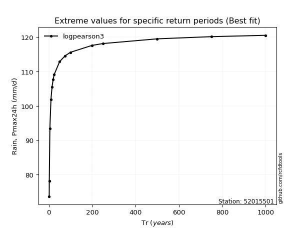</img>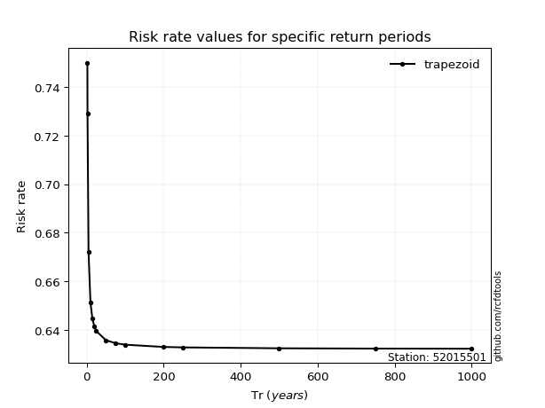</img>

</div>


<sub>**APP DISCLAIMER**: NO WARRANTY - This software is provided by [github.com/rcfdtools](https://github.com/rcfdtools) "as is", without any express or implied warranty, including warranties of merchantability, fitness for a particular purpose, or non-infringement. There is no guarantee that the software will be error-free or operate without interruption. LIMITATION OF LIABILITY - Neither the authors nor copyright holders will be liable for claims or damages arising from the software or its use. You are responsible for determining if the software is appropriate for your use and assume all associated risks, including errors, legal compliance, and data loss. NO PROFESSIONAL ADVICE - The software provides general information and does not offer professional advice. It should not replace consultation with professional advisors.</sub>