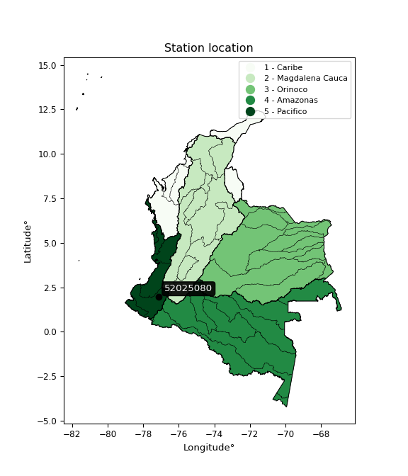

<div align="center">


</div>

# PMP Station (Rain, Pmax24h): 52025080

Probable Maximum Precipitation (PMP) is the greatest amount of rainfall for a specific duration that is meteorologically possible for a given location, acting as a "worst-case" scenario for extreme storms, crucial for designing safety-critical infrastructure like bridges, river deviations, dams, spillways, and nuclear plants to prevent catastrophic failure. PMP is calculated by hydrologists using meteorological data to determine the upper limit of extreme rainfall, often leading to the Probable Maximum Flood (PMF) for flood control design, and is increasingly being studied for climate change impacts. Probable Maximum Precipitation (PMP) is the theoretical upper limit of rainfall, a deterministic estimate for extreme events, while probability distributions (like GEV, Gumbel) describe the likelihood and frequency of various precipitation amounts, including rare ones, showing how often events occur, with PMP representing the extreme end of these distributions, used for critical infrastructure design to ensure safety against the worst conceivable weather, unlike standard statistical forecasts which cover typical probabilities.

The most common probability distributions in hydrology, used for analyzing floods, rainfall, and streamflow, include the Normal, Log-Normal, Gumbel, Gamma (including Log-Pearson Type III), and Generalized Extreme Value (GEV) distributions, often chosen based on the data´s skewness and whether modeling extremes or general conditions, with Gumbel and GEV popular for extreme events like floods, while the Normal distribution serves as a baseline, though often requiring transformations for skewed hydrological data. These distributions help in designing water infrastructure, managing water resources, and forecasting hydrologic events.

> Hydrological data often isn´t perfectly normal (it´s skewed), so different distributions are needed for different applications, such as: **Flood Frequency Analysis**: Using Gumbel, GEV, or Log-Pearson Type III for predicting extreme flood magnitudes and their return periods, **Rainfall Analysis**: Normal for annual totals, but Log-Normal, Weibull, or GEV for intensity or extreme daily rainfall, **Streamflow Modeling**: Gamma and Log-Normal for maximum flows, GEV for minimum flows, and Kappa for daily flows.

<div align="center">

</img>

</div>


## A. General information


### 1. General running parameters

• app_version: _v20260108_. • runtime: _2026-01-08 18:05:13.093906_. • Python version: _3.14.0_. • SciPy version: _1.16.3_. • Pandas version: _2.3.3_. • NumPy version: _2.3.5_. • Stations dataset (station_dataset_file): _dataset/pmax24h_in/automatic_colombia_2003_2024.csv_. • Stations catalog (station_catalog_file): _dataset/CNE.xls_. • Minimum year to eval til year_max (date_min): _1900_. • Maximum year to eval since year_min (date_max): _2024_. • Creates, save and include plots into reports (create_plot): _False_. • Plot only fit distributions with Δo > Δ (plot_only_fit): _True_. • Plot only simple graphs avoiding multiple CDFs and multiple Extreme values plots (plot_only_simple): _False_. • Eval low extreme values, if False, evaluates high extreme values (low_extreme): _False_. • Eval every SciPy distribution as logarithmic (pdist_logarithmic_on): _True_. • Standard deviation normalized (ddof): _1.0_. • Return periods to eval in years (Tr): _[2, 2.33, 5, 10, 15, 20, 25, 50, 75, 100, 200, 250, 500, 750, 1000]_. • Minimum data sample per station, 0 means any (minimum_sample): _5_. • Z-Score maximum threshold to adjust a value, 0 means disable (zscore_max): _3.5_. • Z-Score minimum threshold to adjust a value, 0 means disable (zscore_min): _-2.5_. • Avoid zeros, e.g. rain = 0 (avoid_zeros): _True_. • Avoid null values (avoid_nans): _True_. 

:file_folder:Table: [dataset.csv](../../dataset/pmax24h_in/automatic_colombia_2003_2024.csv)

> Delta Degrees of Freedom (DDOF): is a parameter used in the formulas for calculating variance and standard deviation. When ddof=0, the divisor is $N$ (the total number of observations) and this is used when your data set is the entire population. When ddof=1, the divisor is $N-1$ and this is used when your data set is a sample drawn from a larger population. Using $N-1$ provides an unbiased estimate of the population variance (known as Bessel´s correction).


### 2. Station info and location

|   id |   CODIGO | NOMBRE                           | CATEGORIA               | TECNOLOGIA                              | ESTADO   | FECHA_INSTALACION   |   FECHA_SUSPENSION |   ALTITUD |   LATITUD |   LONGITUD | DEPARTAMENTO   | MUNICIPIO        | AREA_OPERATIVA                      | ENTIDAD                                                     | AREA_HIDROGRAFICA   | ZONA_HIDROGRAFICA   | SUBZONA_HIDROGRAFICA   |   CORRIENTE | Catalogo   |   Version |
|-----:|---------:|:---------------------------------|:------------------------|:----------------------------------------|:---------|:--------------------|-------------------:|----------:|----------:|-----------:|:---------------|:-----------------|:------------------------------------|:------------------------------------------------------------|:--------------------|:--------------------|:-----------------------|------------:|:-----------|----------:|
|    0 | 52025080 | ESTRECHO PATIA  - AUT [52025080] | Climatológica Ordinaria | Automática con Telemetría, Convencional | Activa   | 01/03/2004          |                nan |       720 |      1.96 |     -77.12 | Cauca          | Patía (El Bordo) | Area Operativa 07 - Nariño-Putumayo | INSTITUTO DE HIDROLOGIA METEOROLOGIA Y ESTUDIOS AMBIENTALES | Pacifico            | Patía               | Río Guachicono         |         nan | CNE_IDEAM  |  20251226 |

<div align="center">

Dynamic map: [:earth_americas:Google](http://maps.google.com/maps?q=1.96,-77.12) [:earth_americas:OSM](https://www.openstreetmap.org/#map=18/1.96/-77.12&layers=P) [:earth_americas:Bing](https://www.bing.com/maps?cp=1.96~-77.12&lvl=18) [:earth_americas:Apple](https://maps.apple.com/frame?center=1.96%2C-77.12&span=0.003%2C0.006)

</div>


<div align="center">

```geojson
{
  "type": "Feature",
  "geometry": {
    "type": "Point", 
    "coordinates": [-77.12, 1.96]
  }, 
  "properties": {
    "Name": "52025080"
  }
}
```

</div>


### 3. Discrete values table and plot

<div align="center">

|               |           0 |              1 |           2 |           3 |           4 |           5 |           6 |          7 |          8 |
|:--------------|------------:|---------------:|------------:|------------:|------------:|------------:|------------:|-----------:|-----------:|
| Date          | 2016        | 2017           | 2018        | 2019        | 2020        | 2021        | 2022        | 2023       | 2024       |
| Value         |   51.4      |   53.1         |   44.9      |   40.6      |   44.4      |   38.3      |   44.1      |   71.9     |   89.2     |
| Value_initial |   51.4      |   53.1         |   44.9      |   40.6      |   44.4      |   38.3      |   44.1      |   71.9     |   89.2     |
| count         |    9        |    9           |    9        |    9        |    9        |    9        |    9        |    9       |    9       |
| mean          |   53.1      |   53.1         |   53.1      |   53.1      |   53.1      |   53.1      |   53.1      |   53.1     |   53.1     |
| std           |   16.8031   |   16.8031      |   16.8031   |   16.8031   |   16.8031   |   16.8031   |   16.8031   |   16.8031  |   16.8031  |
| zscore        |   -0.101172 |    4.22863e-16 |   -0.488004 |   -0.743909 |   -0.517761 |   -0.880789 |   -0.535615 |    1.11884 |    2.14841 |


</div>


> The initial value (value_initial) correspond to the initial obtained or null completed value, and value (value) is adjusted only when the initial value is outside the valid range (outlier) definite through the Z-Score value. If Z-Score is active, values out of range or outliers are replaced with the station mean value. A Z-Score (or standard score) measures how many standard deviations a data point is from the mean of a dataset, indicating its relative position; positive scores mean above the mean, negative mean below, and a score of zero is exactly at the mean, allowing for comparison of values from different distributions. It´s calculated using the formula $z=(x–μ)/σ$, where $x$ is the data point, $μ$ is the mean, and $σ$ is the standard deviation, helping identify outliers and understand probability.
>
> <sub>**Note**: In this study, "completing" (filling gaps in) and "extending" (forecasting or lengthening the historical record) rainfall data series are avoided for certain critical analyses because they introduce artificial bias and uncertainty, which can distort the statistics of rare events (extremes), alter day-to-day variability, and compromise the integrity and homogeneity of the original data. Some reasons against Completing/Extending rainfall data are: **Distortion of Extremes and Variability**: The primary issue is that most gap-filling or extension methods rely on averaging or regression with nearby stations, which inherently smooths the data. Rainfall is highly variable in space and time, with a large percentage of zero values and occasional large storms. Infilling methods often underestimate the highest values and overestimate the lowest (zero) values, which severely distorts analyses focused on flood frequency, drought severity, and intensity-duration-frequency (IDF) curves, **Loss of Data Homogeneity**: Infilled or extended data are synthetic estimates, not actual measurements. Combining these estimates with observed data can violate the assumption of data homogeneity, which requires that the data properties do not change over time. Inhomogeneity can lead to incorrect conclusions about long-term trends or changes in climate patterns, **Propagation of Errors**: Errors and biases from the original data (e.g., wind-induced undercatch, instrument errors, site changes) or the data used for imputation can propagate through the analysis, leading to unreliable hydrological models and inaccurate predictions, **Compromised Statistical Integrity**: For statistical analyses, especially those involving the frequency of events, using artificial data can introduce time bias or autocorrelation that doesn´t exist in reality, making it difficult to assess the true probability of events, **Difficulty in Validation**: It is difficult to accurately validate the quality of filled or extended data, especially for past periods where ground-truth measurements are unavailable. The reliability of imputation techniques heavily depends on the density of the surrounding station network and the complexity of the local topography.</sub>


### 4. Active continuous probability distributions from SciPy (43 of 104 available)

A Probability Density Function (PDF) describes the relative likelihood of a continuous random variable falling within a specific range, where the total area under its curve equals 1, and the area over any interval gives the actual probability for that range. Unlike discrete probabilities (like rolling a die), a PDF shows density, not direct probability for a single point (which is zero), with higher points indicating higher likelihood, often visualized as a bell curve for normal distributions.

A log of a probability density function (log-PDF) is simply the logarithm of the PDF´s value, denoted as $log(f(x))$, useful for converting multiplication of probabilities into addition, improving numerical stability with tiny numbers, and connecting to information theory concepts like entropy. Instead of dealing with very small probabilities (e.g., 0.000001), log-PDFs use negative numbers (e.g., $log(0.00001) ≈ -11.51$ that are easier for computers to handle, preventing underflow errors and simplifying complex calculations. In this study, each active probability distribution from SciPy is also evaluated in the $log$ form.

[scipy.stats](https://docs.scipy.org/doc/scipy/reference/stats.html) is a Python´s powerful submodule within the SciPy library for comprehensive statistical analysis, offering over 130 probability distributions (like Normal, Poisson), functions for descriptive stats (mean, variance), hypothesis testing (t-tests, chi-square), random variable generation, and statistical tests, making it essential for data science, modeling, and research. It provides tools to explore, model, and draw conclusions from data efficiently, working seamlessly with NumPy.

<div align="center">

|   id | p_dist             |   n_parameter | fit_method   | label                                                                       | active   | ref                                                                                                        |
|-----:|:-------------------|--------------:|:-------------|:----------------------------------------------------------------------------|:---------|:-----------------------------------------------------------------------------------------------------------|
|    0 | alpha              |             3 | MLE          | Alpha                                                                       | True     | [:mortar_board:](https://docs.scipy.org/doc/scipy/reference/generated/scipy.stats.alpha.html)              |
|    1 | betaprime          |             4 | MLE          | Beta prime                                                                  | True     | [:mortar_board:](https://docs.scipy.org/doc/scipy/reference/generated/scipy.stats.betaprime.html)          |
|    2 | chi2               |             3 | MLE          | Chi²                                                                        | True     | [:mortar_board:](https://docs.scipy.org/doc/scipy/reference/generated/scipy.stats.chi2.html)               |
|    3 | crystalball        |             4 | MLE          | Crystalball                                                                 | True     | [:mortar_board:](https://docs.scipy.org/doc/scipy/reference/generated/scipy.stats.crystalball.html)        |
|    4 | erlang             |             3 | MLE          | Erlang                                                                      | True     | [:mortar_board:](https://docs.scipy.org/doc/scipy/reference/generated/scipy.stats.erlang.html)             |
|    5 | expon              |             2 | MLE          | Exponential                                                                 | True     | [:mortar_board:](https://docs.scipy.org/doc/scipy/reference/generated/scipy.stats.expon.html)              |
|    6 | exponnorm          |             3 | MLE          | Exponentially modified Normal                                               | True     | [:mortar_board:](https://docs.scipy.org/doc/scipy/reference/generated/scipy.stats.exponnorm.html)          |
|    7 | f                  |             4 | MLE          | F                                                                           | True     | [:mortar_board:](https://docs.scipy.org/doc/scipy/reference/generated/scipy.stats.f.html)                  |
|    8 | fatiguelife        |             3 | MLE          | Fatigue-life (Birnbaum-Saunders)                                            | True     | [:mortar_board:](https://docs.scipy.org/doc/scipy/reference/generated/scipy.stats.fatiguelife.html)        |
|    9 | fisk               |             3 | MLE          | Fisk                                                                        | True     | [:mortar_board:](https://docs.scipy.org/doc/scipy/reference/generated/scipy.stats.fisk.html)               |
|   10 | gamma              |             3 | MLE          | Gamma                                                                       | True     | [:mortar_board:](https://docs.scipy.org/doc/scipy/reference/generated/scipy.stats.gamma.html)              |
|   11 | genexpon           |             5 | MLE          | Generalized exponential                                                     | True     | [:mortar_board:](https://docs.scipy.org/doc/scipy/reference/generated/scipy.stats.genexpon.html)           |
|   12 | genlogistic        |             3 | MLE          | Generalized logistic                                                        | True     | [:mortar_board:](https://docs.scipy.org/doc/scipy/reference/generated/scipy.stats.genlogistic.html)        |
|   13 | gibrat             |             2 | MM           | Gibrat                                                                      | True     | [:mortar_board:](https://docs.scipy.org/doc/scipy/reference/generated/scipy.stats.gibrat.html)             |
|   14 | gompertz           |             3 | MLE          | Gompertz (or truncated Gumbel)                                              | True     | [:mortar_board:](https://docs.scipy.org/doc/scipy/reference/generated/scipy.stats.gompertz.html)           |
|   15 | gumbel_l           |             2 | MM           | Gumbel Left Skew                                                            | True     | [:mortar_board:](https://docs.scipy.org/doc/scipy/reference/generated/scipy.stats.gumbel_l.html)           |
|   16 | gumbel_r           |             2 | MM           | Gumbel Right Skew                                                           | True     | [:mortar_board:](https://docs.scipy.org/doc/scipy/reference/generated/scipy.stats.gumbel_r.html)           |
|   17 | halflogistic       |             2 | MM           | Half-logistic                                                               | True     | [:mortar_board:](https://docs.scipy.org/doc/scipy/reference/generated/scipy.stats.halflogistic.html)       |
|   18 | halfnorm           |             2 | MM           | Half Normal                                                                 | True     | [:mortar_board:](https://docs.scipy.org/doc/scipy/reference/generated/scipy.stats.halfnorm.html)           |
|   19 | hypsecant          |             2 | MM           | hyperbolic secant                                                           | True     | [:mortar_board:](https://docs.scipy.org/doc/scipy/reference/generated/scipy.stats.hypsecant.html)          |
|   20 | invgamma           |             3 | MLE          | Inverted gamma                                                              | True     | [:mortar_board:](https://docs.scipy.org/doc/scipy/reference/generated/scipy.stats.invgamma.html)           |
|   21 | invgauss           |             3 | MLE          | Inverse Gaussian                                                            | True     | [:mortar_board:](https://docs.scipy.org/doc/scipy/reference/generated/scipy.stats.invgauss.html)           |
|   22 | invweibull         |             3 | MLE          | Inverted Weibull                                                            | True     | [:mortar_board:](https://docs.scipy.org/doc/scipy/reference/generated/scipy.stats.invweibull.html)         |
|   23 | kstwobign          |             2 | MLE          | Limiting distribution of scaled Kolmogorov-Smirnov two-sided test statistic | True     | [:mortar_board:](https://docs.scipy.org/doc/scipy/reference/generated/scipy.stats.kstwobign.html)          |
|   24 | laplace            |             2 | MM           | Laplace                                                                     | True     | [:mortar_board:](https://docs.scipy.org/doc/scipy/reference/generated/scipy.stats.laplace.html)            |
|   25 | laplace_asymmetric |             3 | MLE          | Asymmetric Laplace                                                          | True     | [:mortar_board:](https://docs.scipy.org/doc/scipy/reference/generated/scipy.stats.laplace_asymmetric.html) |
|   26 | loggamma           |             3 | MLE          | Log gamma                                                                   | True     | [:mortar_board:](https://docs.scipy.org/doc/scipy/reference/generated/scipy.stats.loggamma.html)           |
|   27 | logistic           |             2 | MM           | Logistic (or Sech-squared)                                                  | True     | [:mortar_board:](https://docs.scipy.org/doc/scipy/reference/generated/scipy.stats.logistic.html)           |
|   28 | lognorm            |             3 | MLE          | Log Normal                                                                  | True     | [:mortar_board:](https://docs.scipy.org/doc/scipy/reference/generated/scipy.stats.lognorm.html)            |
|   29 | maxwell            |             2 | MM           | Maxwell                                                                     | True     | [:mortar_board:](https://docs.scipy.org/doc/scipy/reference/generated/scipy.stats.maxwell.html)            |
|   30 | mielke             |             4 | MLE          | Mielke Beta-Kappa / Dagum                                                   | True     | [:mortar_board:](https://docs.scipy.org/doc/scipy/reference/generated/scipy.stats.mielke.html)             |
|   31 | moyal              |             2 | MM           | Moyal                                                                       | True     | [:mortar_board:](https://docs.scipy.org/doc/scipy/reference/generated/scipy.stats.moyal.html)              |
|   32 | nakagami           |             3 | MLE          | Nakagami                                                                    | True     | [:mortar_board:](https://docs.scipy.org/doc/scipy/reference/generated/scipy.stats.nakagami.html)           |
|   33 | ncf                |             5 | MLE          | Non-central F distribution                                                  | True     | [:mortar_board:](https://docs.scipy.org/doc/scipy/reference/generated/scipy.stats.ncf.html)                |
|   34 | nct                |             4 | MLE          | Non-central Student’s t                                                     | True     | [:mortar_board:](https://docs.scipy.org/doc/scipy/reference/generated/scipy.stats.nct.html)                |
|   35 | norm               |             2 | MM           | Normal                                                                      | True     | [:mortar_board:](https://docs.scipy.org/doc/scipy/reference/generated/scipy.stats.norm.html)               |
|   36 | pearson3           |             3 | MM           | Pearson type III                                                            | True     | [:mortar_board:](https://docs.scipy.org/doc/scipy/reference/generated/scipy.stats.pearson3.html)           |
|   37 | rayleigh           |             2 | MM           | Rayleigh                                                                    | True     | [:mortar_board:](https://docs.scipy.org/doc/scipy/reference/generated/scipy.stats.rayleigh.html)           |
|   38 | rice               |             3 | MLE          | Rice                                                                        | True     | [:mortar_board:](https://docs.scipy.org/doc/scipy/reference/generated/scipy.stats.rice.html)               |
|   39 | t                  |             3 | MLE          | Student’s t                                                                 | True     | [:mortar_board:](https://docs.scipy.org/doc/scipy/reference/generated/scipy.stats.t.html)                  |
|   40 | truncnorm          |             4 | MLE          | Truncated normal                                                            | True     | [:mortar_board:](https://docs.scipy.org/doc/scipy/reference/generated/scipy.stats.truncnorm.html)          |
|   41 | wald               |             2 | MM           | Wald                                                                        | True     | [:mortar_board:](https://docs.scipy.org/doc/scipy/reference/generated/scipy.stats.wald.html)               |
|   42 | weibull_min        |             3 | MLE          | Weibull minimum                                                             | True     | [:mortar_board:](https://docs.scipy.org/doc/scipy/reference/generated/scipy.stats.weibull_min.html)        |

</div>

> **n_parameter:** # arguments & localization & scale.
>
> **Fit methods:** (MLE) maximum likelihood, (MM) L-moments.
>
>**Inactive** (With the only purpose of prevent loops, zero divisions, infinite values, over high estimated values or horizontal trending for recurrence intervals estimations, the follow distributions were disabled.)**:** foldnorm, gennorm, norminvgauss, powernorm, powerlognorm, skewnorm, genextreme, anglit, arcsine, argus, beta, bradford, burr, burr12, cauchy, cosine, halfcauchy, foldcauchy, skewcauchy, wrapcauchy, dgamma, gengamma, exponweib, exponpow, truncexpon, gausshyper, genhalflogistic, genhyperbolic, geninvgauss, halfgennorm, johnsonsb, johnsonsu, kappa4, kappa3, ksone, kstwo, loglaplace, levy, levy_l, levy_stable, ncx2, pareto, genpareto, truncpareto, lomax, powerlaw, rdist, rel_breitwigner, recipinvgauss, semicircular, studentized_range, trapezoid, triang, truncweibull_min, tukeylambda, uniform, loguniform, vonmises, vonmises_line, weibull_max, dweibull, 


## B. Probability (PDF) vs. Empirical (EDF) distributions functions

A continuous probability distribution (CPD) describes probabilities for variables that can take any value within a range (like rain any time), unlike discrete variables with specific outcomes (like temperature). It uses a Probability Density Function (PDF), a curve where the total area under it equals 1, and the probability of the variable falling within an interval (a to b) is found by calculating the area under the curve between those points. A key feature is that the probability of hitting any single exact value is zero, so probabilities are always expressed for ranges, e.g., $P(a ≤ X ≤ b)$.

<div align="center">

Distributions parameters from station values
|    |   station | p_dist                |   n |           loc |         scale | shape                  | shape1                | shape2                | shape3   |
|---:|----------:|:----------------------|----:|--------------:|--------------:|:-----------------------|:----------------------|:----------------------|:---------|
|  0 |  52025080 | alpha                 |   9 |     29.5953   |  31.0355      | 1.7617726599991967     |                       |                       |          |
|  1 |  52025080 | betaprime             |   9 |     -0.695051 |   1.60766     | 524.7874452935989      | 16.753832773341912    |                       |          |
|  2 |  52025080 | chi2                  |   9 |     38.3      |   6.59538     | 1.2815681332419586     |                       |                       |          |
|  3 |  52025080 | crystalball           |   9 |     53.1      |  15.8421      | 22037.753061931584     | 173.52046896633996    |                       |          |
|  4 |  52025080 | erlang                |   9 |     38.3      |  15.9433      | 0.7164252652455241     |                       |                       |          |
|  5 |  52025080 | expon                 |   9 |     38.3      |  14.8         |                        |                       |                       |          |
|  6 |  52025080 | exponnorm             |   9 |     38.2794   |   0.00637069  | 2314.6298391236305     |                       |                       |          |
|  7 |  52025080 | f                     |   9 |     34.3479   |  10.4955      | 159.64248342198448     | 4.01111380782636      |                       |          |
|  8 |  52025080 | fatiguelife           |   9 |     36.7008   |  10.0598      | 1.116062501404331      |                       |                       |          |
|  9 |  52025080 | fisk                  |   9 |     37.7639   |   8.93381     | 1.401200858261944      |                       |                       |          |
| 10 |  52025080 | gamma                 |   9 |     38.3      |  18.3075      | 0.5256529732511963     |                       |                       |          |
| 11 |  52025080 | genexpon              |   9 |     38.3      |  20.9677      | 1.4167455931399733     | 5.070254387689414e-09 | 1.2204782532769154    |          |
| 12 |  52025080 | genlogistic           |   9 |    -28.5138   |   9.76416     | 2156.758025596408      |                       |                       |          |
| 13 |  52025080 | gibrat                |   9 |     41.0145   |   7.33025     |                        |                       |                       |          |
| 14 |  52025080 | gompertz              |   9 |     38.3      |   1.51282e+08 | 10184973.857951034     |                       |                       |          |
| 15 |  52025080 | gumbel_l              |   9 |     60.2298   |  12.3521      |                        |                       |                       |          |
| 16 |  52025080 | gumbel_r              |   9 |     45.9702   |  12.3521      |                        |                       |                       |          |
| 17 |  52025080 | halflogistic          |   9 |     34.3234   |  13.5445      |                        |                       |                       |          |
| 18 |  52025080 | halfnorm              |   9 |     32.1312   |  26.2805      |                        |                       |                       |          |
| 19 |  52025080 | hypsecant             |   9 |     53.1      |  10.0854      |                        |                       |                       |          |
| 20 |  52025080 | invgamma              |   9 |     34.2305   |  21.1356      | 2.0010230846365475     |                       |                       |          |
| 21 |  52025080 | invgauss              |   9 |     35.9658   |  14.0159      | 1.2224833932938186     |                       |                       |          |
| 22 |  52025080 | invweibull            |   9 |     32.5229   |  11.5376      | 1.7433898639631589     |                       |                       |          |
| 23 |  52025080 | kstwobign             |   9 |     10.2637   |  49.7037      |                        |                       |                       |          |
| 24 |  52025080 | laplace               |   9 |     53.1      |  11.2021      |                        |                       |                       |          |
| 25 |  52025080 | laplace_asymmetric    |   9 |     44.1      |   7.50797     | 0.5665002633182965     |                       |                       |          |
| 26 |  52025080 | loggamma              |   9 |  -5193.92     | 697.815       | 1843.7873275757374     |                       |                       |          |
| 27 |  52025080 | logistic              |   9 |     53.1      |   8.73423     |                        |                       |                       |          |
| 28 |  52025080 | lognorm               |   9 |     38.3      |   0.221152    | 11.020784961251625     |                       |                       |          |
| 29 |  52025080 | maxwell               |   9 |     15.5608   |  23.5242      |                        |                       |                       |          |
| 30 |  52025080 | mielke                |   9 |     11.3458   |  10.0378      | 1183.3336691731042     | 4.594062057400584     |                       |          |
| 31 |  52025080 | moyal                 |   9 |     44.0404   |   7.13147     |                        |                       |                       |          |
| 32 |  52025080 | nakagami              |   9 |     38.3      |  29.0346      | 0.20066040544368208    |                       |                       |          |
| 33 |  52025080 | ncf                   |   9 |     -0.019166 |   9.72154e-06 | 1.140238952523017e-06  | 10.798735092822412    | 5.215328145190868     |          |
| 34 |  52025080 | nct                   |   9 |     -0.428554 |   0.78284     | 9.199856222573889      | 62.29397467616904     |                       |          |
| 35 |  52025080 | norm                  |   9 |     53.1      |  15.8421      |                        |                       |                       |          |
| 36 |  52025080 | pearson3              |   9 |     53.1      |  15.8421      | 1.3009752708069895     |                       |                       |          |
| 37 |  52025080 | rayleigh              |   9 |     22.7931   |  24.1814      |                        |                       |                       |          |
| 38 |  52025080 | rice                  |   9 |     29.2712   |  20.2335      | 0.00021063352836825762 |                       |                       |          |
| 39 |  52025080 | t                     |   9 |     52.8553   |  15.4765      | 16.705653497715062     |                       |                       |          |
| 40 |  52025080 | truncnorm             |   9 | -23239.9      | 607.572       | 38.313505606741714     | 105512.89218378178    |                       |          |
| 41 |  52025080 | wald                  |   9 |     37.2579   |  15.8421      |                        |                       |                       |          |
| 42 |  52025080 | weibull_min           |   9 |     38.3      |  17.2279      | 0.5392847163966368     |                       |                       |          |
| 43 |  52025080 | logalpha              |   9 |      2.97289  |   3.86372     | 4.355711471453233      |                       |                       |          |
| 44 |  52025080 | logbetaprime          |   9 |     -4.51426  |   9.1715      | 1069.6754940195215     | 1161.8369961354106    |                       |          |
| 45 |  52025080 | logchi2               |   9 |      3.64545  |   0.953957    | 0.9460345528000962     |                       |                       |          |
| 46 |  52025080 | logcrystalball        |   9 |      3.93459  |   0.26304     | 5606.603459955226      | 12.408532145337936    |                       |          |
| 47 |  52025080 | logerlang             |   9 |      3.64545  |   0.17924     | 0.6549903658826518     |                       |                       |          |
| 48 |  52025080 | logexpon              |   9 |      3.64545  |   0.289142    |                        |                       |                       |          |
| 49 |  52025080 | logexponnorm          |   9 |      3.645    |   0.000155521 | 1858.694376011977      |                       |                       |          |
| 50 |  52025080 | logf                  |   9 |      3.50335  |   0.310064    | 1586.0542640832018     | 6.6216024427964735    |                       |          |
| 51 |  52025080 | logfatiguelife        |   9 |      3.58468  |   0.258       | 0.8405763766675622     |                       |                       |          |
| 52 |  52025080 | logfisk               |   9 |      3.6113   |   0.232599    | 1.8696707481973172     |                       |                       |          |
| 53 |  52025080 | loggamma              |   9 |      3.64545  |   0.239029    | 0.3380461299098644     |                       |                       |          |
| 54 |  52025080 | loggenexpon           |   9 |      3.64545  |   1.43991     | 4.618091907690742      | 2.082350155809161     | 1.0952267804316271    |          |
| 55 |  52025080 | loggenlogistic        |   9 |      2.50868  |   0.18008     | 1446.6730505952519     |                       |                       |          |
| 56 |  52025080 | loggibrat             |   9 |      3.73394  |   0.121704    |                        |                       |                       |          |
| 57 |  52025080 | loggompertz           |   9 |      3.64545  |   2.03994     | 6.160929819490157      |                       |                       |          |
| 58 |  52025080 | loggumbel_l           |   9 |      4.05297  |   0.205091    |                        |                       |                       |          |
| 59 |  52025080 | loggumbel_r           |   9 |      3.81621  |   0.205091    |                        |                       |                       |          |
| 60 |  52025080 | loghalflogistic       |   9 |      3.62283  |   0.224889    |                        |                       |                       |          |
| 61 |  52025080 | loghalfnorm           |   9 |      3.58643  |   0.436355    |                        |                       |                       |          |
| 62 |  52025080 | loghypsecant          |   9 |      3.93459  |   0.167456    |                        |                       |                       |          |
| 63 |  52025080 | loginvgamma           |   9 |      3.5027   |   1.02805     | 3.310788243309833      |                       |                       |          |
| 64 |  52025080 | loginvgauss           |   9 |      3.56668  |   0.550904    | 0.6678384475165249     |                       |                       |          |
| 65 |  52025080 | loginvweibull         |   9 |      3.36709  |   0.421655    | 2.849540644264219      |                       |                       |          |
| 66 |  52025080 | logkstwobign          |   9 |      3.17063  |   0.88182     |                        |                       |                       |          |
| 67 |  52025080 | loglaplace            |   9 |      3.93459  |   0.185997    |                        |                       |                       |          |
| 68 |  52025080 | loglaplace_asymmetric |   9 |      3.78646  |   0.146909    | 0.615531121327616      |                       |                       |          |
| 69 |  52025080 | logloggamma           |   9 |    -60.1576   |   9.0911      | 1153.7140122505784     |                       |                       |          |
| 70 |  52025080 | loglogistic           |   9 |      3.93459  |   0.145021    |                        |                       |                       |          |
| 71 |  52025080 | loglognorm            |   9 |      3.64545  |   0.00547106  | 10.684689741838882     |                       |                       |          |
| 72 |  52025080 | logmaxwell            |   9 |      3.3113   |   0.390591    |                        |                       |                       |          |
| 73 |  52025080 | logmielke             |   9 |      3.10678  |   0.254498    | 414.33394402641375     | 4.529609587149748     |                       |          |
| 74 |  52025080 | logmoyal              |   9 |      3.78417  |   0.118409    |                        |                       |                       |          |
| 75 |  52025080 | lognakagami           |   9 |      3.64545  |   0.590409    | 0.09362947690465134    |                       |                       |          |
| 76 |  52025080 | logncf                |   9 |     -3.8011   |   7.73167     | 664.37650480964        | 617.8895068049462     | 0.0005797997393609672 |          |
| 77 |  52025080 | lognct                |   9 |      3.42155  |   0.0104857   | 3.0011794518720176     | 36.006636160415155    |                       |          |
| 78 |  52025080 | lognorm               |   9 |      3.93459  |   0.26304     |                        |                       |                       |          |
| 79 |  52025080 | logpearson3           |   9 |      3.93459  |   0.26304     | 1.0194691334538708     |                       |                       |          |
| 80 |  52025080 | lograyleigh           |   9 |      3.43138  |   0.401503    |                        |                       |                       |          |
| 81 |  52025080 | logrice               |   9 |      3.51702  |   0.348969    | 0.0007446748939264872  |                       |                       |          |
| 82 |  52025080 | logt                  |   9 |      3.93459  |   0.263039    | 108185439.91333157     |                       |                       |          |
| 83 |  52025080 | logtruncnorm          |   9 |     -1.47101  |   1.39681     | 3.6629686114762054     | 4.268228175351707     |                       |          |
| 84 |  52025080 | logwald               |   9 |      3.67152  |   0.263068    |                        |                       |                       |          |
| 85 |  52025080 | logweibull_min        |   9 |      3.64545  |   0.266365    | 0.2554590846191634     |                       |                       |          |

</div>

> **loc** (Location parameter): This shifts the distribution along the x-axis. For many common distributions, like the normal (Gaussian) distribution, loc represents the mean $μ$. For others, like the uniform distribution, it might represent the minimum value, or for the beta distribution, the left end of the support interval.
>
> **scale** (Scale parameter): This determines the width or spread of the distribution. For the normal distribution, scale represents the standard deviation $σ$. For a uniform distribution, it defines the length of the interval (from $loc$ to $loc + scale$).
>
> **shape** (Shape parameters): Refers to parameters that define the specific form of a probability distribution, distinct from its location (loc) and scale (scale). These parameters are required arguments for most distribution functions. For example, a normal (Gaussian) distribution is fully defined by its location (mean) and scale (standard deviation), so it has no specific shape parameters beyond loc and scale. However, other distributions have intrinsic properties that need specification, as Gamma distribution that takes a shape parameter, often named $a$ or $alpha$.


### 0. Cumulative distribution values - CDF (86 evaluated)

Cumulative Distribution Function (CDF), denoted as $F$<sub>$X$</sub>$(x)$, is a function that gives the probability that a random variable $X$ will take a value less than or equal to a specific value, $x$ (i.e., $(P(X≥x)$. It essentially "accumulates" probabilities from a given point up to the far right (positive infinity), providing a complete picture of the distribution´s probabilities for both discrete (like rain) and continuous (like temperature) variables, helping to find probabilities over ranges or above certain values. Each station is evaluated separately ordering the $x$ values ascending, calculating the CDF and PDF values for the activated distributions and their logarithmic forms.

<div align="center">

CDF ordered by x ascending and calculating $log(f(x))$ separately
|   id |   Station |   date |    x |   count |   mean |     std |       zscore |   Value_initial |   station |   m |     alpha |   alpha_pdf |   betaprime |   betaprime_pdf |        chi2 |        chi2_pdf |   crystalball |   crystalball_pdf |      erlang |    erlang_pdf |    expon |   expon_pdf |   exponnorm |   exponnorm_pdf |         f |      f_pdf |   fatiguelife |   fatiguelife_pdf |      fisk |   fisk_pdf |       gamma |       gamma_pdf |    genexpon |   genexpon_pdf |   genlogistic |   genlogistic_pdf |   gibrat |   gibrat_pdf |    gompertz |   gompertz_pdf |   gumbel_l |   gumbel_l_pdf |   gumbel_r |   gumbel_r_pdf |   halflogistic |   halflogistic_pdf |   halfnorm |   halfnorm_pdf |   hypsecant |   hypsecant_pdf |   invgamma |   invgamma_pdf |   invgauss |   invgauss_pdf |   invweibull |   invweibull_pdf |   kstwobign |   kstwobign_pdf |   laplace |   laplace_pdf |   laplace_asymmetric |   laplace_asymmetric_pdf |    loggamma |   loggamma_pdf |   logistic |   logistic_pdf |   lognorm |   lognorm_pdf |   maxwell |   maxwell_pdf |   mielke |   mielke_pdf |    moyal |   moyal_pdf |   nakagami |   nakagami_pdf |      ncf |    ncf_pdf |      nct |    nct_pdf |     norm |   norm_pdf |   pearson3 |   pearson3_pdf |   rayleigh |   rayleigh_pdf |      rice |   rice_pdf |        t |      t_pdf |   truncnorm |   truncnorm_pdf |        wald |   wald_pdf |   weibull_min |   weibull_min_pdf |   logalpha |   logalpha_pdf |   logbetaprime |   logbetaprime_pdf |     logchi2 |   logchi2_pdf |   logcrystalball |   logcrystalball_pdf |   logerlang |   logerlang_pdf |   logexpon |   logexpon_pdf |   logexponnorm |   logexponnorm_pdf |      logf |   logf_pdf |   logfatiguelife |   logfatiguelife_pdf |   logfisk |   logfisk_pdf |   loggenexpon |   loggenexpon_pdf |   loggenlogistic |   loggenlogistic_pdf |   loggibrat |   loggibrat_pdf |   loggompertz |   loggompertz_pdf |   loggumbel_l |   loggumbel_l_pdf |   loggumbel_r |   loggumbel_r_pdf |   loghalflogistic |   loghalflogistic_pdf |   loghalfnorm |   loghalfnorm_pdf |   loghypsecant |   loghypsecant_pdf |   loginvgamma |   loginvgamma_pdf |   loginvgauss |   loginvgauss_pdf |   loginvweibull |   loginvweibull_pdf |   logkstwobign |   logkstwobign_pdf |   loglaplace |   loglaplace_pdf |   loglaplace_asymmetric |   loglaplace_asymmetric_pdf |   logloggamma |   logloggamma_pdf |   loglogistic |   loglogistic_pdf |   loglognorm |   loglognorm_pdf |   logmaxwell |   logmaxwell_pdf |   logmielke |   logmielke_pdf |   logmoyal |   logmoyal_pdf |   lognakagami |   lognakagami_pdf |   logncf |   logncf_pdf |    lognct |   lognct_pdf |   logpearson3 |   logpearson3_pdf |   lograyleigh |   lograyleigh_pdf |   logrice |   logrice_pdf |     logt |   logt_pdf |   logtruncnorm |   logtruncnorm_pdf |   logwald |   logwald_pdf |   logweibull_min |   logweibull_min_pdf |
|-----:|----------:|-------:|-----:|--------:|-------:|--------:|-------------:|----------------:|----------:|----:|----------:|------------:|------------:|----------------:|------------:|----------------:|--------------:|------------------:|------------:|--------------:|---------:|------------:|------------:|----------------:|----------:|-----------:|--------------:|------------------:|----------:|-----------:|------------:|----------------:|------------:|---------------:|--------------:|------------------:|---------:|-------------:|------------:|---------------:|-----------:|---------------:|-----------:|---------------:|---------------:|-------------------:|-----------:|---------------:|------------:|----------------:|-----------:|---------------:|-----------:|---------------:|-------------:|-----------------:|------------:|----------------:|----------:|--------------:|---------------------:|-------------------------:|------------:|---------------:|-----------:|---------------:|----------:|--------------:|----------:|--------------:|---------:|-------------:|---------:|------------:|-----------:|---------------:|---------:|-----------:|---------:|-----------:|---------:|-----------:|-----------:|---------------:|-----------:|---------------:|----------:|-----------:|---------:|-----------:|------------:|----------------:|------------:|-----------:|--------------:|------------------:|-----------:|---------------:|---------------:|-------------------:|------------:|--------------:|-----------------:|---------------------:|------------:|----------------:|-----------:|---------------:|---------------:|-------------------:|----------:|-----------:|-----------------:|---------------------:|----------:|--------------:|--------------:|------------------:|-----------------:|---------------------:|------------:|----------------:|--------------:|------------------:|--------------:|------------------:|--------------:|------------------:|------------------:|----------------------:|--------------:|------------------:|---------------:|-------------------:|--------------:|------------------:|--------------:|------------------:|----------------:|--------------------:|---------------:|-------------------:|-------------:|-----------------:|------------------------:|----------------------------:|--------------:|------------------:|--------------:|------------------:|-------------:|-----------------:|-------------:|-----------------:|------------:|----------------:|-----------:|---------------:|--------------:|------------------:|---------:|-------------:|----------:|-------------:|--------------:|------------------:|--------------:|------------------:|----------:|--------------:|---------:|-----------:|---------------:|-------------------:|----------:|--------------:|-----------------:|---------------------:|
|    0 |  52025080 |   2021 | 38.3 |       9 |   53.1 | 16.8031 | -0.880789    |            38.3 |  52025080 |   1 | 0.0370958 |  0.033434   |    0.125349 |      0.0230645  | 1.82992e-10 | 16502.6         |      0.175096 |        0.0162772  | 1.10215e-11 | 1111.27       | 0        |  0.0675676  |  0.00139381 |      0.0676793  | 0.0348145 | 0.0370669  |     0.0293781 |        0.0544527  | 0.0190398 | 0.0488179  | 8.93423e-09 | 660946          | 5.61074e-11 |     0.0675681  |      0.100223 |        0.0235991  | 0        |    0         | 4.46139e-10 |     0.0673245  |   0.155843 |    0.0115782   |   0.15556  |     0.0234337  |       0.145753 |         0.0361312  |   0.185581 |     0.0295354  |    0.144227 |      0.0138163  |  0.0344368 |     0.0368456  |  0.0309223 |     0.0445861  |    0.0354413 |       0.0357213  |   0.0920039 |      0.0221668  |  0.13341  |    0.0119094  |             0.062129 |               0.0146073  | 1.17401e-05 |    8.93673e+09 |   0.155187 |     0.0150104  |  0.135833 |      0.828909 |  0.182874 |    0.0198632  |      nan |          nan | 0.134779 |  0.0273437  | 4.2859e-07 |    2.42071e+07 | 0.510456 | 0.00925138 | 0.111914 | 0.0244778  | 0.175096 | 0.0162772  |   0.155347 |     0.0285478  |   0.185855 |     0.0215906  | 0.0947658 | 0.0199642  | 0.180187 | 0.0160837  | 2.10246e-06 |      0.0631028  | 0.000255002 | 0.00196317 |   5.05007e-09 |   383288          |  0.0824096 |       1.2986   |       0.209753 |           0.832406 | 4.55001e-08 |    4.8464e+07 |         0.135833 |             0.828909 |    3.01e-10 |  443947         |   0        |       3.45851  |     0.00156138 |           3.44765  | 0.0363468 |   1.3273   |        0.0304778 |             1.71778  |  0.026935 |      1.43491  |   2.32158e-13 |          3.20721  |         0.072734 |             1.05764  |    0        |        0        |   3.32755e-12 |          3.02015  |      0.128118 |         0.582843  |      0.100329 |          1.1248   |          0.050251 |              2.2177   |      0.10759  |          1.81187  |       0.112067 |           0.65549  |     0.0363462 |          1.32729  |     0.0320658 |          1.54501  |       0.0381929 |            1.27656  |      0.0660619 |           1.04492  |     0.105642 |         0.567977 |               0.0577755 |                    0.63892  |      0.137923 |          0.8143   |      0.119856 |          0.727416 |   0.00239321 |      1.57228e+12 |     0.134319 |         1.03689  |   0.0491127 |        1.2243   |  0.0724377 |       1.2056   |     0.0012363 |       5.21309e+11 | 0.316945 |     0.60513  | 0.0369184 |     1.25614  |      0.107818 |          1.23445  |      0.132494 |          1.15198  | 0.0654831 |      0.985578 | 0.135833 |   0.828912 |    2.62229e-09 |           3.03586  | 0         |      0        |      0.000167798 |          9.65166e+10 |
|    1 |  52025080 |   2019 | 40.6 |       9 |   53.1 | 16.8031 | -0.743909    |            40.6 |  52025080 |   2 | 0.150819  |  0.0607642  |    0.183785 |      0.0275622  | 0.339871    |     0.0850267   |      0.215046 |        0.0184461  | 0.258179    |    0.0738685  | 0.143932 |  0.0578424  |  0.145613   |      0.0579411  | 0.157304  | 0.062748   |     0.189063  |        0.0692805  | 0.1669    | 0.0686963  | 0.362961    |      0.0763422  | 0.143933    |     0.0578428  |      0.162384 |        0.0302183  | 0        |    0         | 0.143453    |     0.0576666  |   0.184611 |    0.0134725   |   0.213399 |     0.0266849  |       0.227645 |         0.0350024  |   0.252734 |     0.0288242  |    0.179429 |      0.0168636  |  0.156564  |     0.0626559  |  0.171955  |     0.0669454  |    0.155357  |       0.0624393  |   0.149702  |      0.0277509  |  0.163816 |    0.0146237  |             0.106695 |               0.0250854  | 0.655496    |    3.15888     |   0.192919 |     0.0178266  |  0.190101 |      1.03199  |  0.230874 |    0.0218082  |      nan |          nan | 0.20309  |  0.0316745  | 0.285214   |    0.0497141   | 0.531327 | 0.00889803 | 0.174925 | 0.0300376  | 0.215046 | 0.0184461  |   0.22375  |     0.0306447  |   0.237486 |     0.0232206  | 0.14508   | 0.0236576  | 0.21977  | 0.0183262  | 0.135104    |      0.0545828  | 0.0738584   | 0.0594238  |   0.286514    |        0.0564766  |  0.176015  |       1.87131  |       0.26131  |           0.93338  | 0.214775    |    1.70619    |         0.190101 |             1.03199  |    0.469958 |       4.31585   |   0.182655 |       2.82679  |     0.183974   |           2.82298  | 0.151544  |   2.44817  |        0.172899  |             2.74865  |  0.151271 |      2.59594  |   0.172115    |          2.70714  |         0.150113 |             1.57976  |    0        |        0        |   0.163619    |          2.59925  |      0.16656  |         0.74039   |      0.177244 |          1.4953   |          0.178035 |              2.15284  |      0.211996 |          1.76359  |       0.157143 |           0.900756 |     0.151543  |          2.44816  |     0.163505  |          2.64524  |       0.149731  |            2.40643  |      0.141847  |           1.52994  |     0.144546 |         0.777143 |               0.110111  |                    1.21768  |      0.191079 |          1.00858  |      0.169151 |          0.969093 |   0.587641   |      0.62473     |     0.201081 |         1.24493  |   0.149065  |        2.1305   |  0.160244  |       1.76511  |     0.544344  |       1.74642     | 0.352876 |     0.626228 | 0.147534  |     2.39823  |      0.189207 |          1.53314  |      0.205565 |          1.34235  | 0.133414  |      1.32893  | 0.190101 |   1.03199  |    0.164127    |           2.60307  | 0.0110674 |      1.52878  |      0.492567    |          1.50791     |
|    2 |  52025080 |   2022 | 44.1 |       9 |   53.1 | 16.8031 | -0.535615    |            44.1 |  52025080 |   3 | 0.367083  |  0.0570216  |    0.288702 |      0.0318154  | 0.558258    |     0.0467761   |      0.284982 |        0.0214296  | 0.459255    |    0.0456255  | 0.324223 |  0.0456606  |  0.326136   |      0.0456987  | 0.37022   | 0.0546108  |     0.391155  |        0.04705    | 0.381915  | 0.0522029  | 0.554645    |      0.0406623  | 0.324225    |     0.0456608  |      0.280732 |        0.0365136  | 0.19344  |    0.0889197 | 0.32327     |     0.0455606  |   0.237342 |    0.0167291   |   0.3124   |     0.0294257  |       0.346014 |         0.0324957  |   0.351196 |     0.0273696  |    0.247533 |      0.0221436  |  0.36935   |     0.0546069  |  0.381039  |     0.0507591  |    0.370067  |       0.0553979  |   0.257021  |      0.0328464  |  0.223897 |    0.0199871  |             0.242953 |               0.0571216  | 0.818395    |    1.24585     |   0.263001 |     0.0221922  |  0.286664 |      1.29426  |  0.31121  |    0.0239154  |      nan |          nan | 0.319331 |  0.0339294  | 0.412945   |    0.0283831   | 0.56154  | 0.00836818 | 0.289704 | 0.0347348  | 0.284982 | 0.0214296  |   0.332533 |     0.0310476  |   0.321719 |     0.0247153  | 0.235521  | 0.0276906  | 0.289554 | 0.0214677  | 0.306528    |      0.043771   | 0.302086    | 0.0610606  |   0.426464    |        0.0296466  |  0.34703   |       2.15539  |       0.343422 |           1.0453   | 0.321663    |    1.02597    |         0.286665 |             1.29426  |    0.713772 |       2.00638   |   0.385953 |       2.12369  |     0.386991   |           2.12066  | 0.363378  |   2.46044  |        0.384716  |             2.2702   |  0.370456 |      2.48938  |   0.370483    |          2.11158  |         0.301677 |             2.00678  |    0.20035  |        5.33605  |   0.356565    |          2.08235  |      0.238656 |         1.01221   |      0.314709 |          1.77403  |          0.348559 |              1.9532   |      0.353341 |          1.64615  |       0.249274 |           1.34104  |     0.363377  |          2.46044  |     0.376194  |          2.34543  |       0.362194  |            2.49935  |      0.286036  |           1.88539  |     0.22547  |         1.21222  |               0.274773  |                    3.03862  |      0.285292 |          1.26186  |      0.264745 |          1.34225  |   0.619479   |      0.252823    |     0.313087 |         1.44243  |   0.345586  |        2.43291  |  0.321991  |       2.04332  |     0.641967  |       0.848369    | 0.405575 |     0.64638  | 0.360598  |     2.52062  |      0.325195 |          1.70888  |      0.323657 |          1.48974  | 0.257757  |      1.64225  | 0.286665 |   1.29427  |    0.357302    |           2.08677  | 0.306919  |      3.65317  |      0.572599    |          0.658177    |
|    3 |  52025080 |   2020 | 44.4 |       9 |   53.1 | 16.8031 | -0.517761    |            44.4 |  52025080 |   4 | 0.383976  |  0.055586   |    0.298278 |      0.0320174  | 0.572007    |     0.0449034   |      0.291445 |        0.0216575  | 0.472717    |    0.0441392  | 0.337783 |  0.0447444  |  0.339707   |      0.0447784  | 0.386388  | 0.0531698  |     0.405037  |        0.0455097  | 0.397329  | 0.0505614  | 0.5666      |      0.0390558  | 0.337785    |     0.0447446  |      0.29173  |        0.0367966  | 0.219909 |    0.087438  | 0.336801    |     0.0446496  |   0.242405 |    0.0170266   |   0.321244 |     0.0295327  |       0.355725 |         0.0322442  |   0.359386 |     0.0272259  |    0.254246 |      0.022613   |  0.385517  |     0.0531689  |  0.396035  |     0.0492174  |    0.386468  |       0.0539318  |   0.266912  |      0.0330821  |  0.229974 |    0.0205296  |             0.259897 |               0.0558431  | 0.826595    |    1.17395     |   0.269713 |     0.0225512  |  0.295502 |      1.31275  |  0.318404 |    0.024044   |      nan |          nan | 0.329508 |  0.0339088  | 0.421329   |    0.0275155   | 0.564044 | 0.00832337 | 0.300152 | 0.034911   | 0.291445 | 0.0216575  |   0.341835 |     0.0309629  |   0.329144 |     0.0247889  | 0.243866  | 0.0279424  | 0.296031 | 0.0217098  | 0.319536    |      0.0429505  | 0.320177    | 0.0595406  |   0.435187    |        0.0285251  |  0.361631  |       2.15123  |       0.350533 |           1.05241  | 0.328521    |    0.997341   |         0.295502 |             1.31275  |    0.727012 |       1.90086   |   0.400183 |       2.07447  |     0.401201   |           2.0715   | 0.379918  |   2.41838  |        0.399923  |             2.2161   |  0.387162 |      2.43823  |   0.384651    |          2.06817  |         0.31533  |             2.02015  |    0.236081 |        5.1952   |   0.370552    |          2.04386  |      0.245602 |         1.03669   |      0.326764 |          1.78209  |          0.361731 |              1.9324   |      0.364461 |          1.63427  |       0.258496 |           1.3795   |     0.379917  |          2.41838  |     0.391924  |          2.29471  |       0.379003  |            2.45877  |      0.298855  |           1.89584  |     0.23384  |         1.25722  |               0.295084  |                    2.95352  |      0.293909 |          1.27993  |      0.273944 |          1.37151  |   0.621152   |      0.2409      |     0.322901 |         1.45266  |   0.362018  |        2.41371  |  0.335837  |       2.04059  |     0.647608  |       0.816171    | 0.409961 |     0.647502 | 0.377557  |     2.48171  |      0.33679  |          1.71136  |      0.333777 |          1.49547  | 0.268946  |      1.65819  | 0.295503 |   1.31276  |    0.371322    |           2.04897  | 0.331262  |      3.52713  |      0.576961    |          0.629076    |
|    4 |  52025080 |   2018 | 44.9 |       9 |   53.1 | 16.8031 | -0.488004    |            44.9 |  52025080 |   5 | 0.41115   |  0.0530943  |    0.314359 |      0.0322971  | 0.593728    |     0.0420268   |      0.302366 |        0.0220251  | 0.494202    |    0.0418314  | 0.359782 |  0.043258   |  0.361721   |      0.0432855  | 0.412366  | 0.0507427  |     0.42718   |        0.0430923  | 0.421939  | 0.0478921  | 0.585505    |      0.0366096  | 0.359784    |     0.0432582  |      0.310228 |        0.0371775  | 0.262795 |    0.0839402 | 0.358754    |     0.0431716  |   0.251043 |    0.0175278   |   0.336047 |     0.029668   |       0.37174  |         0.0318141  |   0.372938 |     0.0269802  |    0.265748 |      0.0233937  |  0.411496  |     0.0507459  |  0.420017  |     0.0467318  |    0.412813  |       0.0514465  |   0.283537  |      0.0334081  |  0.240471 |    0.0214667  |             0.287299 |               0.0537756  | 0.839131    |    1.06735     |   0.281136 |     0.0231387  |  0.310368 |      1.34191  |  0.330476 |    0.0242394  |      nan |          nan | 0.346441 |  0.0338118  | 0.434753   |    0.0262083   | 0.568187 | 0.00824894 | 0.317666 | 0.035129   | 0.302366 | 0.0220251  |   0.357275 |     0.0307883  |   0.341566 |     0.024893   | 0.257936  | 0.0283287  | 0.306984 | 0.0221009  | 0.340676    |      0.041617   | 0.349298    | 0.0569368  |   0.449019    |        0.0268347  |  0.38565   |       2.13694  |       0.362381 |           1.06338  | 0.339443    |    0.954067   |         0.310368 |             1.34191  |    0.747389 |       1.7413    |   0.42297  |       1.99566  |     0.423955   |           1.99279  | 0.406584  |   2.3429   |        0.424242  |             2.12742  |  0.413968 |      2.34847  |   0.407417    |          1.99815  |         0.338045 |             2.0352   |    0.292537 |        4.87521  |   0.393089    |          1.98153  |      0.25744  |         1.07769   |      0.346775 |          1.79073  |          0.383173 |              1.89688  |      0.38265  |          1.61398  |       0.274299 |           1.4427   |     0.406583  |          2.3429   |     0.417144  |          2.20938  |       0.406129  |            2.38437  |      0.320157  |           1.90752  |     0.248351 |         1.33524  |               0.327395  |                    2.81814  |      0.308403 |          1.30854  |      0.289568 |          1.41854  |   0.62375    |      0.223455    |     0.339254 |         1.46749  |   0.388827  |        2.37241  |  0.358633  |       2.02941  |     0.656475  |       0.768422    | 0.417222 |     0.649176 | 0.404953  |     2.40967  |      0.355961 |          1.712    |      0.350568 |          1.5029   | 0.287648  |      1.68128  | 0.310369 |   1.34192  |    0.393923    |           1.98792  | 0.369569  |      3.31424  |      0.58376     |          0.586205    |
|    5 |  52025080 |   2016 | 51.4 |       9 |   53.1 | 16.8031 | -0.101172    |            51.4 |  52025080 |   6 | 0.658186  |  0.0255917  |    0.523118 |      0.0304207  | 0.784142    |     0.0200711   |      0.457272 |        0.0250378  | 0.696222    |    0.0229095  | 0.587342 |  0.0278823  |  0.589256   |      0.027855   | 0.65254   | 0.0257465  |     0.633768  |        0.0233514  | 0.643947  | 0.02356    | 0.754973    |      0.0185428  | 0.587345    |     0.0278824  |      0.547941 |        0.033755   | 0.636231 |    0.0361513 | 0.586026    |     0.0278706  |   0.386925 |    0.024284    |   0.525029 |     0.0273863  |       0.558321 |         0.0254081  |   0.536562 |     0.0232045  |    0.446598 |      0.0311183  |  0.651766  |     0.0257657  |  0.642275  |     0.0245218  |    0.654509  |       0.0256217  |   0.50009   |      0.0316348  |  0.429598 |    0.0383499  |             0.563575 |               0.0329297  | 0.929488    |    0.403407    |   0.451494 |     0.0283536  |  0.507653 |      1.51638  |  0.491502 |    0.024666   |      nan |          nan | 0.550568 |  0.0279428  | 0.569555   |    0.0168639   | 0.618732 | 0.00731449 | 0.539182 | 0.0313147  | 0.457272 | 0.0250378  |   0.543746 |     0.025982   |   0.503295 |     0.0243     | 0.450124  | 0.0297223  | 0.463102 | 0.025276   | 0.562589    |      0.0276174  | 0.621608    | 0.0296649  |   0.577967    |        0.0149878  |  0.64025   |       1.54626  |       0.511282 |           1.11311  | 0.444244    |    0.64263    |         0.507653 |             1.51638  |    0.896674 |       0.662334  |   0.638485 |       1.2503   |     0.639147   |           1.24834  | 0.655066  |   1.36294  |        0.648461  |             1.25923  |  0.655778 |      1.2854   |   0.627591    |          1.30237  |         0.599284 |             1.70364  |    0.700148 |        1.68991  |   0.615477    |          1.34147  |      0.437546 |         1.57814   |      0.578213 |          1.54445  |          0.607132 |              1.40378  |      0.581743 |          1.31772  |       0.509591 |           1.89999  |     0.655065  |          1.36294  |     0.650399  |          1.29985  |       0.658211  |            1.37006  |      0.56757   |           1.65657  |     0.513383 |         2.61626  |               0.618281  |                    1.59936  |      0.501382 |          1.4904   |      0.508698 |          1.72336  |   0.645403   |      0.118392    |     0.540382 |         1.44948  |   0.653994  |        1.50693  |  0.603992  |       1.52756  |     0.735626  |       0.458394    | 0.505529 |     0.651731 | 0.66089   |     1.39507  |      0.575278 |          1.4696   |      0.551223 |          1.41493  | 0.519693  |      1.66685  | 0.507655 |   1.51639  |    0.618723    |           1.37278  | 0.675647  |      1.47362  |      0.641456    |          0.319345    |
|    6 |  52025080 |   2017 | 53.1 |       9 |   53.1 | 16.8031 |  4.22863e-16 |            53.1 |  52025080 |   7 | 0.697781  |  0.0211572  |    0.573433 |      0.0287195  | 0.815465    |     0.0168875   |      0.5      |        0.0251824  | 0.73253     |    0.0198921  | 0.632121 |  0.0248567  |  0.633981   |      0.0248219  | 0.692722  | 0.0216656  |     0.670842  |        0.0203595  | 0.680737  | 0.019857   | 0.784217    |      0.0159482  | 0.632123    |     0.0248567  |      0.603222 |        0.0312239  | 0.691462 |    0.0291312 | 0.630795    |     0.0248566  |   0.429624 |    0.0259263   |   0.570376 |     0.0259263  |       0.6      |         0.0236259  |   0.575063 |     0.0220834  |    0.5      |      0.0315614  |  0.69198   |     0.0216849  |  0.680921  |     0.0210583  |    0.6944    |       0.0214568  |   0.552479  |      0.0299478  |  0.5      |    0.0446346  |             0.616114 |               0.0289654  | 0.941346    |    0.328446    |   0.5      |     0.028623   |  0.55681  |      1.50126  |  0.53305  |    0.0241771  |      nan |          nan | 0.596223 |  0.0257582  | 0.597031   |    0.0155      | 0.630968 | 0.00708174 | 0.590545 | 0.0290697  | 0.5      | 0.0251824  |   0.586508 |     0.0243148  |   0.544062 |     0.0236311  | 0.500167  | 0.0290929  | 0.506215 | 0.0253913  | 0.607108    |      0.0248083  | 0.668102    | 0.0251824  |   0.602017    |        0.0133611  |  0.687673  |       1.36948  |       0.547337 |           1.10152  | 0.464406    |    0.597785   |         0.55681  |             1.50126  |    0.916035 |       0.532743  |   0.676963 |       1.11723  |     0.677564   |           1.11544  | 0.696321  |   1.17713  |        0.686957  |             1.11027  |  0.694492 |      1.09925  |   0.6678      |          1.17115  |         0.652208 |             1.54769  |    0.749107 |        1.33638  |   0.657053    |          1.21566  |      0.49053  |         1.67525   |      0.626602 |          1.42815  |          0.650815 |              1.28161  |      0.623314 |          1.23709  |       0.570851 |           1.85396  |     0.696321  |          1.17713  |     0.690012  |          1.13863  |       0.699576  |            1.17706  |      0.61953   |           1.53543  |     0.591482 |         2.19637  |               0.666931  |                    1.39552  |      0.549778 |          1.48056  |      0.564432 |          1.69526  |   0.64905    |      0.106206    |     0.586742 |         1.39752  |   0.699693  |        1.3053   |  0.651209  |       1.37519  |     0.749875  |       0.418652    | 0.526673 |     0.64758  | 0.703008  |     1.19831  |      0.621499 |          1.37007  |      0.596308 |          1.35427  | 0.572841  |      1.59654  | 0.556812 |   1.50126  |    0.661431    |           1.254    | 0.719489  |      1.23017  |      0.651307    |          0.287237    |
|    7 |  52025080 |   2023 | 71.9 |       9 |   53.1 | 16.8031 |  1.11884     |            71.9 |  52025080 |   8 | 0.882527  |  0.00424372 |    0.905452 |      0.00834272 | 0.964034    |     0.00302471  |      0.882329 |        0.0124535  | 0.929739    |    0.00484837 | 0.896716 |  0.00697867 |  0.897717   |      0.00693642 | 0.891368  | 0.00475252 |     0.884353  |        0.00596561 | 0.867419  | 0.0047206  | 0.940413    |      0.00387106 | 0.896718    |     0.0069786  |      0.928938 |        0.00701276 | 0.924822 |    0.0045915 | 0.895869    |     0.00701058 |   0.92364  |    0.0159019   |   0.884661 |     0.00877716 |       0.882544 |         0.0081626  |   0.869782 |     0.00966183 |    0.902079 |      0.00955679 |  0.890916  |     0.00476364 |  0.889665  |     0.00548268 |    0.889017  |       0.00463035 |   0.907683  |      0.0092103  |  0.906651 |    0.00833321 |             0.907072 |               0.00701172 | 0.988063    |    0.059852    |   0.895898 |     0.0106781  |  0.902371 |      0.655579 |  0.874802 |    0.0110538  |      nan |          nan | 0.887232 |  0.00785352 | 0.801856   |    0.00763997  | 0.74233  | 0.00488113 | 0.908041 | 0.00761131 | 0.882329 | 0.0124535  |   0.880914 |     0.00855628 |   0.872802 |     0.0106821  | 0.891326  | 0.0113159  | 0.882233 | 0.0117798  | 0.880183    |      0.00757171 | 0.903999    | 0.00564369 |   0.761568    |        0.00548647 |  0.917601  |       0.346293 |       0.82824  |           0.684157 | 0.604021    |    0.360863   |         0.902371 |             0.655578 |    0.987008 |       0.078302  |   0.886762 |       0.391636 |     0.887004   |           0.390903 | 0.893503  |   0.324628 |        0.888621  |             0.367234 |  0.876658 |      0.304475 |   0.889983    |          0.413408 |         0.923657 |             0.407318 |    0.93221  |        0.241972 |   0.892312    |          0.442877 |      0.947986 |         0.749742  |      0.898855 |          0.467346 |          0.895811 |              0.439157 |      0.88558  |          0.525957 |       0.917232 |           0.488718 |     0.893503  |          0.324628 |     0.891604  |          0.355705 |       0.893754  |            0.314986 |      0.913307  |           0.492493 |     0.919927 |         0.430509 |               0.906459  |                    0.391925 |      0.897089 |          0.677806 |      0.912871 |          0.548455 |   0.671545   |      0.0537136   |     0.892735 |         0.591918 |   0.912311  |        0.3244   |  0.899961  |       0.42021  |     0.842467  |       0.227181    | 0.709016 |     0.536529 | 0.899381  |     0.313424 |      0.894227 |          0.49565  |      0.890174 |          0.57493  | 0.905641  |      0.587525 | 0.902373 |   0.655573 |    0.916359    |           0.525813 | 0.913143  |      0.302671 |      0.712312    |          0.145378    |
|    8 |  52025080 |   2024 | 89.2 |       9 |   53.1 | 16.8031 |  2.14841     |            89.2 |  52025080 |   9 | 0.928993  |  0.00167896 |    0.980209 |      0.00180264 | 0.991404    |     0.000701942 |      0.988659 |        0.00187729 | 0.978331    |    0.00145611 | 0.967909 |  0.00216829 |  0.968357   |      0.00214592 | 0.942976  | 0.00182212 |     0.951004  |        0.00235736 | 0.920766  | 0.00198744 | 0.980069    |      0.00123559 | 0.96791     |     0.00216825 |      0.987545 |        0.00126763 | 0.970153 |    0.0014061 | 0.96751     |     0.00218738 |   0.999971 |    2.47765e-05 |   0.970248 |     0.00237245 |       0.965805 |         0.00248145 |   0.970109 |     0.00287304 |    0.982248 |      0.00175924 |  0.942669  |     0.00182837 |  0.950258  |     0.00214362 |    0.939557  |       0.00180186 |   0.987109  |      0.00164759 |  0.980075 |    0.00177872 |             0.974809 |               0.00190074 | 0.995862    |    0.0199852   |   0.984221 |     0.00177808 |  0.982779 |      0.162061 |  0.979647 |    0.00247603 |      nan |          nan | 0.966369 |  0.00235654 | 0.901717   |    0.00420711  | 0.813537 | 0.00343442 | 0.977423 | 0.00177517 | 0.988659 | 0.00187729 |   0.967551 |     0.00252809 |   0.976966 |     0.00261586 | 0.987554  | 0.00182195 | 0.984278 | 0.00203213 | 0.959863    |      0.00253832 | 0.962863    | 0.00192148 |   0.83364     |        0.00316137 |  0.964892  |       0.129909 |       0.935666 |           0.329804 | 0.672007    |    0.275986   |         0.982779 |             0.162061 |    0.996415 |       0.0212449 |   0.946278 |       0.185798 |     0.946403   |           0.185414 | 0.941825  |   0.150201 |        0.944624  |             0.176758 |  0.923219 |      0.150677 |   0.951795    |          0.187669 |         0.9763   |             0.130033 |    0.966202 |        0.099191 |   0.957734    |          0.193202 |      0.999788 |         0.0087463 |      0.963418 |          0.175068 |          0.95873  |              0.179727 |      0.961803 |          0.213394 |       0.97704  |           0.13699  |     0.941824  |          0.150201 |     0.945382  |          0.168609 |       0.94062   |            0.146004 |      0.977404  |           0.153456 |     0.974878 |         0.135069 |               0.962097  |                    0.15881  |      0.981414 |          0.173443 |      0.978874 |          0.142596 |   0.681443   |      0.0395136   |     0.972267 |         0.194881 |   0.958264  |        0.133662 |  0.95966   |       0.170197 |     0.884133  |       0.164193    | 0.811492 |     0.411412 | 0.945515  |     0.141669 |      0.963491 |          0.188161 |      0.969245 |          0.202132 | 0.979636  |      0.162852 | 0.982779 |   0.162057 |    1           |           0.275348 | 0.957471  |      0.134579 |      0.738989    |          0.105935    |


</div>

An Empirical Distribution Function (EDF) is a step-function estimate of a true cumulative distribution function (CDF) based on observed sample data, representing the proportion of data points less than or equal to a given value. It is calculated by ordering your data and jumping up by $1/n$ (where $n$ is sample size) at each unique data point, allowing analysis without assuming an underlying population distribution, and it gets closer to the true CDF as the sample size grows. For the empirical probability calculations, the parameter $m$ correspond to the order number which means the position of the $x$ values in an ascending order list.

The Kolmogorov-Smirnov (K-S) test is a non-parametric statistical test used to determine if a sample data set comes from a specific theoretical distribution (one-sample) or if two different samples come from the same underlying distribution (two-sample), by comparing their cumulative distribution functions (CDFs). It calculates the maximum vertical difference (D statistic) between these functions, with a small p-value indicating a significant difference and rejection of the null hypothesis (that the data/samples match).


### 1. EDF California (1923)

California´s estimates the true probability distribution of water-related data (like rainfall, streamflow) using observed samples, crucial for risk assessment.

<div align="center">


$P=m/n$


</div>


**1.1. Empirical values**

<div align="center">

|                | 0                  | 1                  | 2                  | 3                  | 4                  | 5                  | 6                  | 7                  | 8              |
|:---------------|:-------------------|:-------------------|:-------------------|:-------------------|:-------------------|:-------------------|:-------------------|:-------------------|:---------------|
| date           | 2021               | 2019               | 2022               | 2020               | 2018               | 2016               | 2017               | 2023               | 2024           |
| x              | 38.3               | 40.6               | 44.1               | 44.4               | 44.9               | 51.4               | 53.1               | 71.9               | 89.2           |
| m              | 1                  | 2                  | 3                  | 4                  | 5                  | 6                  | 7                  | 8                  | 9              |
| empirical_dist | edf_california     | edf_california     | edf_california     | edf_california     | edf_california     | edf_california     | edf_california     | edf_california     | edf_california |
| empirical      | 0.1111111111111111 | 0.2222222222222222 | 0.3333333333333333 | 0.4444444444444444 | 0.5555555555555556 | 0.6666666666666666 | 0.7777777777777778 | 0.8888888888888888 | 1.0            |
| empirical_tr   | 1.125              | 1.2857142857142856 | 1.4999999999999998 | 1.7999999999999998 | 2.25               | 2.9999999999999996 | 4.5                | 8.999999999999996  | inf            |

</div>


**1.2. Kolmogorov-Smirnov fit test (sorted by Δ)**


<div align="center">

|                | 0                   | 1                   | 2                   | 3                   | 4                   | 5                   | 6                   | 7                   | 8                   | 9                   | 10                  | 11                  | 12                  | 13                  | 14                  | 15                  | 16                  | 17                  | 18                  | 19                  | 20                  | 21                  | 22                  | 23                  | 24                  | 25                  | 26                  | 27                  | 28                  | 29                  | 30                  | 31                  | 32                  | 33                  | 34                  | 35                  | 36                  | 37                  | 38                  | 39                  | 40                  | 41                  | 42                  | 43                  | 44                  | 45                  | 46                    | 47                  | 48                  | 49                  | 50                  | 51                  | 52                  | 53                  | 54                  | 55                  | 56                  | 57                  | 58                  | 59                  | 60                  | 61                  | 62                  | 63                  | 64                  | 65                  | 66                  | 67                  | 68                  | 69                  | 70                  | 71                  | 72                  | 73                  | 74                  | 75                  | 76                  | 77                  | 78                  | 79                  | 80                  | 81                  | 82                  | 83                  | 84                  | 85                  |
|:---------------|:--------------------|:--------------------|:--------------------|:--------------------|:--------------------|:--------------------|:--------------------|:--------------------|:--------------------|:--------------------|:--------------------|:--------------------|:--------------------|:--------------------|:--------------------|:--------------------|:--------------------|:--------------------|:--------------------|:--------------------|:--------------------|:--------------------|:--------------------|:--------------------|:--------------------|:--------------------|:--------------------|:--------------------|:--------------------|:--------------------|:--------------------|:--------------------|:--------------------|:--------------------|:--------------------|:--------------------|:--------------------|:--------------------|:--------------------|:--------------------|:--------------------|:--------------------|:--------------------|:--------------------|:--------------------|:--------------------|:----------------------|:--------------------|:--------------------|:--------------------|:--------------------|:--------------------|:--------------------|:--------------------|:--------------------|:--------------------|:--------------------|:--------------------|:--------------------|:--------------------|:--------------------|:--------------------|:--------------------|:--------------------|:--------------------|:--------------------|:--------------------|:--------------------|:--------------------|:--------------------|:--------------------|:--------------------|:--------------------|:--------------------|:--------------------|:--------------------|:--------------------|:--------------------|:--------------------|:--------------------|:--------------------|:--------------------|:--------------------|:--------------------|:--------------------|:--------------------|
| station        | 52025080            | 52025080            | 52025080            | 52025080            | 52025080            | 52025080            | 52025080            | 52025080            | 52025080            | 52025080            | 52025080            | 52025080            | 52025080            | 52025080            | 52025080            | 52025080            | 52025080            | 52025080            | 52025080            | 52025080            | 52025080            | 52025080            | 52025080            | 52025080            | 52025080            | 52025080            | 52025080            | 52025080            | 52025080            | 52025080            | 52025080            | 52025080            | 52025080            | 52025080            | 52025080            | 52025080            | 52025080            | 52025080            | 52025080            | 52025080            | 52025080            | 52025080            | 52025080            | 52025080            | 52025080            | 52025080            | 52025080              | 52025080            | 52025080            | 52025080            | 52025080            | 52025080            | 52025080            | 52025080            | 52025080            | 52025080            | 52025080            | 52025080            | 52025080            | 52025080            | 52025080            | 52025080            | 52025080            | 52025080            | 52025080            | 52025080            | 52025080            | 52025080            | 52025080            | 52025080            | 52025080            | 52025080            | 52025080            | 52025080            | 52025080            | 52025080            | 52025080            | 52025080            | 52025080            | 52025080            | 52025080            | 52025080            | 52025080            | 52025080            | 52025080            | 52025080            |
| empirical_dist | edf_california      | edf_california      | edf_california      | edf_california      | edf_california      | edf_california      | edf_california      | edf_california      | edf_california      | edf_california      | edf_california      | edf_california      | edf_california      | edf_california      | edf_california      | edf_california      | edf_california      | edf_california      | edf_california      | edf_california      | edf_california      | edf_california      | edf_california      | edf_california      | edf_california      | edf_california      | edf_california      | edf_california      | edf_california      | edf_california      | edf_california      | edf_california      | edf_california      | edf_california      | edf_california      | edf_california      | edf_california      | edf_california      | edf_california      | edf_california      | edf_california      | edf_california      | edf_california      | edf_california      | edf_california      | edf_california      | edf_california        | edf_california      | edf_california      | edf_california      | edf_california      | edf_california      | edf_california      | edf_california      | edf_california      | edf_california      | edf_california      | edf_california      | edf_california      | edf_california      | edf_california      | edf_california      | edf_california      | edf_california      | edf_california      | edf_california      | edf_california      | edf_california      | edf_california      | edf_california      | edf_california      | edf_california      | edf_california      | edf_california      | edf_california      | edf_california      | edf_california      | edf_california      | edf_california      | edf_california      | edf_california      | edf_california      | edf_california      | edf_california      | edf_california      | edf_california      |
| p_dist         | erlang              | fatiguelife         | logfatiguelife      | logexponnorm        | logexpon            | fisk                | invgauss            | loginvgauss         | logfisk             | invweibull          | f                   | invgamma            | alpha               | loggenexpon         | logf                | loginvgamma         | loginvweibull       | lognct              | logtruncnorm        | loggompertz         | logmielke           | logalpha            | loghalflogistic     | loghalfnorm         | weibull_min         | nakagami            | halflogistic        | exponnorm           | genexpon            | expon               | gompertz            | logmoyal            | pearson3            | logpearson3         | halfnorm            | lograyleigh         | wald                | loggumbel_r         | moyal               | logwald             | truncnorm           | logmaxwell          | loggenlogistic      | gumbel_r            | gamma               | chi2                | loglaplace_asymmetric | logbetaprime        | rayleigh            | logkstwobign        | nct                 | betaprime           | maxwell             | logt                | logcrystalball      | lognorm             | lognorm             | genlogistic         | logloggamma         | logncf              | loggibrat           | loglogistic         | logrice             | laplace_asymmetric  | logweibull_min      | t                   | kstwobign           | crystalball         | logistic            | norm                | loghypsecant        | hypsecant           | gibrat              | rice                | loggumbel_l         | loglaplace          | laplace             | lognakagami         | logchi2             | gumbel_l            | loglognorm          | logerlang           | ncf                 | loggamma            | loggamma            | mielke              |
| delta          | 0.12592132260521793 | 0.1283759027589111  | 0.13131320390884527 | 0.1316008733095353  | 0.13258563141293533 | 0.1336167674761909  | 0.13553805961907917 | 0.1384115481021132  | 0.14158713203386086 | 0.1427420983571036  | 0.14318916386590497 | 0.14405960479837487 | 0.144405592545591   | 0.14813806545511554 | 0.14897184815875764 | 0.14897276215254285 | 0.1494270134430376  | 0.150602483060429   | 0.1616323227766578  | 0.1624662007485982  | 0.16672878308667122 | 0.1699060020508637  | 0.17238244582599688 | 0.1729059712904953  | 0.17576078786868266 | 0.18074708365825354 | 0.183815645424043   | 0.19383427043430124 | 0.19577165958764392 | 0.19577393308069663 | 0.19680169918310636 | 0.19692244266218784 | 0.198280577260166   | 0.19959407287524944 | 0.20271526146113972 | 0.20498748698607644 | 0.20625706011538297 | 0.20878089204045464 | 0.20911469429533203 | 0.21115483211341005 | 0.21487948438040283 | 0.21630175411878677 | 0.21751098471872216 | 0.2195088427779049  | 0.2213116477395765  | 0.22492463547947866 | 0.2281607286761127    | 0.2304409409963316  | 0.2337159055437742  | 0.23539825447927093 | 0.23788967276683637 | 0.24119639916562474 | 0.24472757718716387 | 0.24518687442474713 | 0.24518780518860522 | 0.24518784955636735 | 0.24518784955636735 | 0.24532734253244204 | 0.2471521832394074  | 0.2511052533358463  | 0.26301852716210594 | 0.26598755269746277 | 0.26790775228021924 | 0.26825682067710055 | 0.2703452367426902  | 0.27156310387442517 | 0.272018063577866   | 0.27777777736329345 | 0.2777777777777778  | 0.2777777777777778  | 0.28125672619363706 | 0.2898073526155404  | 0.2927604983782637  | 0.29761960410156657 | 0.29811565140922436 | 0.30720446723317574 | 0.3150841009626839  | 0.32212189043693285 | 0.32799274240654575 | 0.3481537794528009  | 0.36541830830764077 | 0.38043821824159424 | 0.3993450239076077  | 0.48506196353537695 | 0.48506196353537695 | nan                 |
| deltao         | 0.41761268023100007 | 0.41761268023100007 | 0.41761268023100007 | 0.41761268023100007 | 0.41761268023100007 | 0.41761268023100007 | 0.41761268023100007 | 0.41761268023100007 | 0.41761268023100007 | 0.41761268023100007 | 0.41761268023100007 | 0.41761268023100007 | 0.41761268023100007 | 0.41761268023100007 | 0.41761268023100007 | 0.41761268023100007 | 0.41761268023100007 | 0.41761268023100007 | 0.41761268023100007 | 0.41761268023100007 | 0.41761268023100007 | 0.41761268023100007 | 0.41761268023100007 | 0.41761268023100007 | 0.41761268023100007 | 0.41761268023100007 | 0.41761268023100007 | 0.41761268023100007 | 0.41761268023100007 | 0.41761268023100007 | 0.41761268023100007 | 0.41761268023100007 | 0.41761268023100007 | 0.41761268023100007 | 0.41761268023100007 | 0.41761268023100007 | 0.41761268023100007 | 0.41761268023100007 | 0.41761268023100007 | 0.41761268023100007 | 0.41761268023100007 | 0.41761268023100007 | 0.41761268023100007 | 0.41761268023100007 | 0.41761268023100007 | 0.41761268023100007 | 0.41761268023100007   | 0.41761268023100007 | 0.41761268023100007 | 0.41761268023100007 | 0.41761268023100007 | 0.41761268023100007 | 0.41761268023100007 | 0.41761268023100007 | 0.41761268023100007 | 0.41761268023100007 | 0.41761268023100007 | 0.41761268023100007 | 0.41761268023100007 | 0.41761268023100007 | 0.41761268023100007 | 0.41761268023100007 | 0.41761268023100007 | 0.41761268023100007 | 0.41761268023100007 | 0.41761268023100007 | 0.41761268023100007 | 0.41761268023100007 | 0.41761268023100007 | 0.41761268023100007 | 0.41761268023100007 | 0.41761268023100007 | 0.41761268023100007 | 0.41761268023100007 | 0.41761268023100007 | 0.41761268023100007 | 0.41761268023100007 | 0.41761268023100007 | 0.41761268023100007 | 0.41761268023100007 | 0.41761268023100007 | 0.41761268023100007 | 0.41761268023100007 | 0.41761268023100007 | 0.41761268023100007 | 0.41761268023100007 |
| eval           | Δo > Δ              | Δo > Δ              | Δo > Δ              | Δo > Δ              | Δo > Δ              | Δo > Δ              | Δo > Δ              | Δo > Δ              | Δo > Δ              | Δo > Δ              | Δo > Δ              | Δo > Δ              | Δo > Δ              | Δo > Δ              | Δo > Δ              | Δo > Δ              | Δo > Δ              | Δo > Δ              | Δo > Δ              | Δo > Δ              | Δo > Δ              | Δo > Δ              | Δo > Δ              | Δo > Δ              | Δo > Δ              | Δo > Δ              | Δo > Δ              | Δo > Δ              | Δo > Δ              | Δo > Δ              | Δo > Δ              | Δo > Δ              | Δo > Δ              | Δo > Δ              | Δo > Δ              | Δo > Δ              | Δo > Δ              | Δo > Δ              | Δo > Δ              | Δo > Δ              | Δo > Δ              | Δo > Δ              | Δo > Δ              | Δo > Δ              | Δo > Δ              | Δo > Δ              | Δo > Δ                | Δo > Δ              | Δo > Δ              | Δo > Δ              | Δo > Δ              | Δo > Δ              | Δo > Δ              | Δo > Δ              | Δo > Δ              | Δo > Δ              | Δo > Δ              | Δo > Δ              | Δo > Δ              | Δo > Δ              | Δo > Δ              | Δo > Δ              | Δo > Δ              | Δo > Δ              | Δo > Δ              | Δo > Δ              | Δo > Δ              | Δo > Δ              | Δo > Δ              | Δo > Δ              | Δo > Δ              | Δo > Δ              | Δo > Δ              | Δo > Δ              | Δo > Δ              | Δo > Δ              | Δo > Δ              | Δo > Δ              | Δo > Δ              | Δo > Δ              | Δo > Δ              | Δo > Δ              | Δo > Δ              | Δo <= Δ             | Δo <= Δ             | Δo <= Δ             |
| fit            | 1                   | 1                   | 1                   | 1                   | 1                   | 1                   | 1                   | 1                   | 1                   | 1                   | 1                   | 1                   | 1                   | 1                   | 1                   | 1                   | 1                   | 1                   | 1                   | 1                   | 1                   | 1                   | 1                   | 1                   | 1                   | 1                   | 1                   | 1                   | 1                   | 1                   | 1                   | 1                   | 1                   | 1                   | 1                   | 1                   | 1                   | 1                   | 1                   | 1                   | 1                   | 1                   | 1                   | 1                   | 1                   | 1                   | 1                     | 1                   | 1                   | 1                   | 1                   | 1                   | 1                   | 1                   | 1                   | 1                   | 1                   | 1                   | 1                   | 1                   | 1                   | 1                   | 1                   | 1                   | 1                   | 1                   | 1                   | 1                   | 1                   | 1                   | 1                   | 1                   | 1                   | 1                   | 1                   | 1                   | 1                   | 1                   | 1                   | 1                   | 1                   | 1                   | 1                   | 0                   | 0                   | 0                   |
| n              | 9                   | 9                   | 9                   | 9                   | 9                   | 9                   | 9                   | 9                   | 9                   | 9                   | 9                   | 9                   | 9                   | 9                   | 9                   | 9                   | 9                   | 9                   | 9                   | 9                   | 9                   | 9                   | 9                   | 9                   | 9                   | 9                   | 9                   | 9                   | 9                   | 9                   | 9                   | 9                   | 9                   | 9                   | 9                   | 9                   | 9                   | 9                   | 9                   | 9                   | 9                   | 9                   | 9                   | 9                   | 9                   | 9                   | 9                     | 9                   | 9                   | 9                   | 9                   | 9                   | 9                   | 9                   | 9                   | 9                   | 9                   | 9                   | 9                   | 9                   | 9                   | 9                   | 9                   | 9                   | 9                   | 9                   | 9                   | 9                   | 9                   | 9                   | 9                   | 9                   | 9                   | 9                   | 9                   | 9                   | 9                   | 9                   | 9                   | 9                   | 9                   | 9                   | 9                   | 9                   | 9                   | 9                   |
| best_fit       | 1                   | 0                   | 0                   | 0                   | 0                   | 0                   | 0                   | 0                   | 0                   | 0                   | 0                   | 0                   | 0                   | 0                   | 0                   | 0                   | 0                   | 0                   | 0                   | 0                   | 0                   | 0                   | 0                   | 0                   | 0                   | 0                   | 0                   | 0                   | 0                   | 0                   | 0                   | 0                   | 0                   | 0                   | 0                   | 0                   | 0                   | 0                   | 0                   | 0                   | 0                   | 0                   | 0                   | 0                   | 0                   | 0                   | 0                     | 0                   | 0                   | 0                   | 0                   | 0                   | 0                   | 0                   | 0                   | 0                   | 0                   | 0                   | 0                   | 0                   | 0                   | 0                   | 0                   | 0                   | 0                   | 0                   | 0                   | 0                   | 0                   | 0                   | 0                   | 0                   | 0                   | 0                   | 0                   | 0                   | 0                   | 0                   | 0                   | 0                   | 0                   | 0                   | 0                   | 0                   | 0                   | 0                   |
| best_fit_sort  | 1                   | 2                   | 3                   | 4                   | 5                   | 6                   | 7                   | 8                   | 9                   | 10                  | 11                  | 12                  | 13                  | 14                  | 15                  | 16                  | 17                  | 18                  | 19                  | 20                  | 21                  | 22                  | 23                  | 24                  | 25                  | 26                  | 27                  | 28                  | 29                  | 30                  | 31                  | 32                  | 33                  | 34                  | 35                  | 36                  | 37                  | 38                  | 39                  | 40                  | 41                  | 42                  | 43                  | 44                  | 45                  | 46                  | 47                    | 48                  | 49                  | 50                  | 51                  | 52                  | 53                  | 54                  | 55                  | 56                  | 57                  | 58                  | 59                  | 60                  | 61                  | 62                  | 63                  | 64                  | 65                  | 66                  | 67                  | 68                  | 69                  | 70                  | 71                  | 72                  | 73                  | 74                  | 75                  | 76                  | 77                  | 78                  | 79                  | 80                  | 81                  | 82                  | 83                  | 84                  | 85                  | 86                  |

</div>


**1.3. Best fit**

<div align="center">

|   id |   station | empirical_dist   | p_dist   |    delta |   deltao | eval   |   fit |   n |   best_fit |   best_fit_sort |
|-----:|----------:|:-----------------|:---------|---------:|---------:|:-------|------:|----:|-----------:|----------------:|
|    0 |  52025080 | edf_california   | erlang   | 0.125921 | 0.417613 | Δo > Δ |     1 |   9 |          1 |               1 |

</div>


### 2. EDF Hazen (1930)

Hazen method for plotting positions is a formula used to estimate the empirical cumulative probability distribution of flood events or other hydrological data. This formula often results in biased estimations, particularly when extrapolating to extreme events (high return periods).

<div align="center">


$P=(m-0.5)/n$


</div>


**2.1. Empirical values**

<div align="center">

|                | 0                   | 1                   | 2                  | 3                  | 4         | 5                  | 6                  | 7                  | 8                  |
|:---------------|:--------------------|:--------------------|:-------------------|:-------------------|:----------|:-------------------|:-------------------|:-------------------|:-------------------|
| date           | 2021                | 2019                | 2022               | 2020               | 2018      | 2016               | 2017               | 2023               | 2024               |
| x              | 38.3                | 40.6                | 44.1               | 44.4               | 44.9      | 51.4               | 53.1               | 71.9               | 89.2               |
| m              | 1                   | 2                   | 3                  | 4                  | 5         | 6                  | 7                  | 8                  | 9                  |
| empirical_dist | edf_hazen           | edf_hazen           | edf_hazen          | edf_hazen          | edf_hazen | edf_hazen          | edf_hazen          | edf_hazen          | edf_hazen          |
| empirical      | 0.05555555555555555 | 0.16666666666666666 | 0.2777777777777778 | 0.3888888888888889 | 0.5       | 0.6111111111111112 | 0.7222222222222222 | 0.8333333333333334 | 0.9444444444444444 |
| empirical_tr   | 1.0588235294117647  | 1.2                 | 1.3846153846153846 | 1.6363636363636362 | 2.0       | 2.5714285714285716 | 3.5999999999999996 | 6.000000000000002  | 17.999999999999993 |

</div>


**2.2. Kolmogorov-Smirnov fit test (sorted by Δ)**


<div align="center">

|                | 0                   | 1                   | 2                   | 3                   | 4                   | 5                   | 6                   | 7                   | 8                   | 9                   | 10                  | 11                  | 12                  | 13                  | 14                  | 15                  | 16                  | 17                  | 18                  | 19                  | 20                  | 21                  | 22                  | 23                  | 24                  | 25                  | 26                  | 27                  | 28                  | 29                  | 30                  | 31                  | 32                  | 33                  | 34                  | 35                  | 36                  | 37                  | 38                  | 39                  | 40                  | 41                  | 42                  | 43                    | 44                  | 45                  | 46                  | 47                  | 48                  | 49                  | 50                  | 51                  | 52                  | 53                  | 54                  | 55                  | 56                  | 57                  | 58                  | 59                  | 60                  | 61                  | 62                  | 63                  | 64                  | 65                  | 66                  | 67                  | 68                  | 69                  | 70                  | 71                  | 72                  | 73                  | 74                  | 75                  | 76                  | 77                  | 78                  | 79                  | 80                  | 81                  | 82                  | 83                  | 84                  | 85                  |
|:---------------|:--------------------|:--------------------|:--------------------|:--------------------|:--------------------|:--------------------|:--------------------|:--------------------|:--------------------|:--------------------|:--------------------|:--------------------|:--------------------|:--------------------|:--------------------|:--------------------|:--------------------|:--------------------|:--------------------|:--------------------|:--------------------|:--------------------|:--------------------|:--------------------|:--------------------|:--------------------|:--------------------|:--------------------|:--------------------|:--------------------|:--------------------|:--------------------|:--------------------|:--------------------|:--------------------|:--------------------|:--------------------|:--------------------|:--------------------|:--------------------|:--------------------|:--------------------|:--------------------|:----------------------|:--------------------|:--------------------|:--------------------|:--------------------|:--------------------|:--------------------|:--------------------|:--------------------|:--------------------|:--------------------|:--------------------|:--------------------|:--------------------|:--------------------|:--------------------|:--------------------|:--------------------|:--------------------|:--------------------|:--------------------|:--------------------|:--------------------|:--------------------|:--------------------|:--------------------|:--------------------|:--------------------|:--------------------|:--------------------|:--------------------|:--------------------|:--------------------|:--------------------|:--------------------|:--------------------|:--------------------|:--------------------|:--------------------|:--------------------|:--------------------|:--------------------|:--------------------|
| station        | 52025080            | 52025080            | 52025080            | 52025080            | 52025080            | 52025080            | 52025080            | 52025080            | 52025080            | 52025080            | 52025080            | 52025080            | 52025080            | 52025080            | 52025080            | 52025080            | 52025080            | 52025080            | 52025080            | 52025080            | 52025080            | 52025080            | 52025080            | 52025080            | 52025080            | 52025080            | 52025080            | 52025080            | 52025080            | 52025080            | 52025080            | 52025080            | 52025080            | 52025080            | 52025080            | 52025080            | 52025080            | 52025080            | 52025080            | 52025080            | 52025080            | 52025080            | 52025080            | 52025080              | 52025080            | 52025080            | 52025080            | 52025080            | 52025080            | 52025080            | 52025080            | 52025080            | 52025080            | 52025080            | 52025080            | 52025080            | 52025080            | 52025080            | 52025080            | 52025080            | 52025080            | 52025080            | 52025080            | 52025080            | 52025080            | 52025080            | 52025080            | 52025080            | 52025080            | 52025080            | 52025080            | 52025080            | 52025080            | 52025080            | 52025080            | 52025080            | 52025080            | 52025080            | 52025080            | 52025080            | 52025080            | 52025080            | 52025080            | 52025080            | 52025080            | 52025080            |
| empirical_dist | edf_hazen           | edf_hazen           | edf_hazen           | edf_hazen           | edf_hazen           | edf_hazen           | edf_hazen           | edf_hazen           | edf_hazen           | edf_hazen           | edf_hazen           | edf_hazen           | edf_hazen           | edf_hazen           | edf_hazen           | edf_hazen           | edf_hazen           | edf_hazen           | edf_hazen           | edf_hazen           | edf_hazen           | edf_hazen           | edf_hazen           | edf_hazen           | edf_hazen           | edf_hazen           | edf_hazen           | edf_hazen           | edf_hazen           | edf_hazen           | edf_hazen           | edf_hazen           | edf_hazen           | edf_hazen           | edf_hazen           | edf_hazen           | edf_hazen           | edf_hazen           | edf_hazen           | edf_hazen           | edf_hazen           | edf_hazen           | edf_hazen           | edf_hazen             | edf_hazen           | edf_hazen           | edf_hazen           | edf_hazen           | edf_hazen           | edf_hazen           | edf_hazen           | edf_hazen           | edf_hazen           | edf_hazen           | edf_hazen           | edf_hazen           | edf_hazen           | edf_hazen           | edf_hazen           | edf_hazen           | edf_hazen           | edf_hazen           | edf_hazen           | edf_hazen           | edf_hazen           | edf_hazen           | edf_hazen           | edf_hazen           | edf_hazen           | edf_hazen           | edf_hazen           | edf_hazen           | edf_hazen           | edf_hazen           | edf_hazen           | edf_hazen           | edf_hazen           | edf_hazen           | edf_hazen           | edf_hazen           | edf_hazen           | edf_hazen           | edf_hazen           | edf_hazen           | edf_hazen           | edf_hazen           |
| p_dist         | alpha               | invgamma            | invweibull          | f                   | logfisk             | loggenexpon         | logf                | loginvgamma         | loginvweibull       | lognct              | loginvgauss         | invgauss            | fisk                | logtruncnorm        | loggompertz         | logfatiguelife      | logexpon            | logexponnorm        | logmielke           | fatiguelife         | logalpha            | loghalflogistic     | loghalfnorm         | halflogistic        | nakagami            | exponnorm           | genexpon            | expon               | gompertz            | logmoyal            | pearson3            | logpearson3         | halfnorm            | weibull_min         | lograyleigh         | wald                | loggumbel_r         | moyal               | logwald             | truncnorm           | logmaxwell          | loggenlogistic      | gumbel_r            | loglaplace_asymmetric | logbetaprime        | rayleigh            | logkstwobign        | erlang              | nct                 | betaprime           | maxwell             | logt                | logcrystalball      | lognorm             | lognorm             | genlogistic         | logloggamma         | loggibrat           | loglogistic         | logrice             | laplace_asymmetric  | t                   | kstwobign           | crystalball         | logistic            | norm                | loghypsecant        | hypsecant           | gibrat              | rice                | loggumbel_l         | loglaplace          | laplace             | logncf              | logchi2             | gamma               | chi2                | gumbel_l            | logweibull_min      | lognakagami         | loglognorm          | logerlang           | ncf                 | loggamma            | loggamma            | mielke              |
| delta          | 0.08930557553974133 | 0.09157203883784393 | 0.09228967106650249 | 0.09244237667783367 | 0.09267847522107736 | 0.09270547533492746 | 0.09341629260320206 | 0.09341720659698727 | 0.09387145788748202 | 0.09504692750487342 | 0.09841598605238239 | 0.1032613999293931  | 0.1041374955497884  | 0.10607676722110221 | 0.10691064519304261 | 0.10693779225273015 | 0.10817521410631065 | 0.10921304289872868 | 0.11117322753111564 | 0.1133767286618168  | 0.11435044649530812 | 0.1168268902704413  | 0.1173504157349397  | 0.12826008986848741 | 0.13516768523870198 | 0.13827871487874566 | 0.14021610403208834 | 0.14021837752514105 | 0.14124614362755078 | 0.14136688710663226 | 0.14272502170461043 | 0.14403851731969386 | 0.14715970590558414 | 0.14868610953315275 | 0.14943193143052086 | 0.1507015045598274  | 0.15322533648489906 | 0.15355913873977645 | 0.1555992765578545  | 0.15932392882484725 | 0.1607461985632312  | 0.16195542916316658 | 0.1639532872223493  | 0.17260517312055712   | 0.17488538544077603 | 0.1781603499882186  | 0.17984269892371535 | 0.18147687816077346 | 0.1823341172112808  | 0.18564084361006916 | 0.1891720216316083  | 0.18963131886919155 | 0.18963224963304964 | 0.18963229400081177 | 0.18963229400081177 | 0.18977178697688646 | 0.19159662768385183 | 0.20746297160655036 | 0.2104319971419072  | 0.21235219672466366 | 0.21270126512154497 | 0.2160075483188696  | 0.21646250802231043 | 0.22222222180773787 | 0.2222222222222222  | 0.2222222222222222  | 0.22570117063808148 | 0.23425179705998483 | 0.2372049428227081  | 0.242064048546011   | 0.24256009585366878 | 0.25164891167762016 | 0.25952854540712833 | 0.2613889895115902  | 0.27243718685099017 | 0.27686720329513204 | 0.2804801910350342  | 0.2925982238972453  | 0.32590079229824576 | 0.3776774459924884  | 0.42097386386319635 | 0.43599377379714976 | 0.4549005794631632  | 0.5406175190909325  | 0.5406175190909325  | nan                 |
| deltao         | 0.41761268023100007 | 0.41761268023100007 | 0.41761268023100007 | 0.41761268023100007 | 0.41761268023100007 | 0.41761268023100007 | 0.41761268023100007 | 0.41761268023100007 | 0.41761268023100007 | 0.41761268023100007 | 0.41761268023100007 | 0.41761268023100007 | 0.41761268023100007 | 0.41761268023100007 | 0.41761268023100007 | 0.41761268023100007 | 0.41761268023100007 | 0.41761268023100007 | 0.41761268023100007 | 0.41761268023100007 | 0.41761268023100007 | 0.41761268023100007 | 0.41761268023100007 | 0.41761268023100007 | 0.41761268023100007 | 0.41761268023100007 | 0.41761268023100007 | 0.41761268023100007 | 0.41761268023100007 | 0.41761268023100007 | 0.41761268023100007 | 0.41761268023100007 | 0.41761268023100007 | 0.41761268023100007 | 0.41761268023100007 | 0.41761268023100007 | 0.41761268023100007 | 0.41761268023100007 | 0.41761268023100007 | 0.41761268023100007 | 0.41761268023100007 | 0.41761268023100007 | 0.41761268023100007 | 0.41761268023100007   | 0.41761268023100007 | 0.41761268023100007 | 0.41761268023100007 | 0.41761268023100007 | 0.41761268023100007 | 0.41761268023100007 | 0.41761268023100007 | 0.41761268023100007 | 0.41761268023100007 | 0.41761268023100007 | 0.41761268023100007 | 0.41761268023100007 | 0.41761268023100007 | 0.41761268023100007 | 0.41761268023100007 | 0.41761268023100007 | 0.41761268023100007 | 0.41761268023100007 | 0.41761268023100007 | 0.41761268023100007 | 0.41761268023100007 | 0.41761268023100007 | 0.41761268023100007 | 0.41761268023100007 | 0.41761268023100007 | 0.41761268023100007 | 0.41761268023100007 | 0.41761268023100007 | 0.41761268023100007 | 0.41761268023100007 | 0.41761268023100007 | 0.41761268023100007 | 0.41761268023100007 | 0.41761268023100007 | 0.41761268023100007 | 0.41761268023100007 | 0.41761268023100007 | 0.41761268023100007 | 0.41761268023100007 | 0.41761268023100007 | 0.41761268023100007 | 0.41761268023100007 |
| eval           | Δo > Δ              | Δo > Δ              | Δo > Δ              | Δo > Δ              | Δo > Δ              | Δo > Δ              | Δo > Δ              | Δo > Δ              | Δo > Δ              | Δo > Δ              | Δo > Δ              | Δo > Δ              | Δo > Δ              | Δo > Δ              | Δo > Δ              | Δo > Δ              | Δo > Δ              | Δo > Δ              | Δo > Δ              | Δo > Δ              | Δo > Δ              | Δo > Δ              | Δo > Δ              | Δo > Δ              | Δo > Δ              | Δo > Δ              | Δo > Δ              | Δo > Δ              | Δo > Δ              | Δo > Δ              | Δo > Δ              | Δo > Δ              | Δo > Δ              | Δo > Δ              | Δo > Δ              | Δo > Δ              | Δo > Δ              | Δo > Δ              | Δo > Δ              | Δo > Δ              | Δo > Δ              | Δo > Δ              | Δo > Δ              | Δo > Δ                | Δo > Δ              | Δo > Δ              | Δo > Δ              | Δo > Δ              | Δo > Δ              | Δo > Δ              | Δo > Δ              | Δo > Δ              | Δo > Δ              | Δo > Δ              | Δo > Δ              | Δo > Δ              | Δo > Δ              | Δo > Δ              | Δo > Δ              | Δo > Δ              | Δo > Δ              | Δo > Δ              | Δo > Δ              | Δo > Δ              | Δo > Δ              | Δo > Δ              | Δo > Δ              | Δo > Δ              | Δo > Δ              | Δo > Δ              | Δo > Δ              | Δo > Δ              | Δo > Δ              | Δo > Δ              | Δo > Δ              | Δo > Δ              | Δo > Δ              | Δo > Δ              | Δo > Δ              | Δo > Δ              | Δo <= Δ             | Δo <= Δ             | Δo <= Δ             | Δo <= Δ             | Δo <= Δ             | Δo <= Δ             |
| fit            | 1                   | 1                   | 1                   | 1                   | 1                   | 1                   | 1                   | 1                   | 1                   | 1                   | 1                   | 1                   | 1                   | 1                   | 1                   | 1                   | 1                   | 1                   | 1                   | 1                   | 1                   | 1                   | 1                   | 1                   | 1                   | 1                   | 1                   | 1                   | 1                   | 1                   | 1                   | 1                   | 1                   | 1                   | 1                   | 1                   | 1                   | 1                   | 1                   | 1                   | 1                   | 1                   | 1                   | 1                     | 1                   | 1                   | 1                   | 1                   | 1                   | 1                   | 1                   | 1                   | 1                   | 1                   | 1                   | 1                   | 1                   | 1                   | 1                   | 1                   | 1                   | 1                   | 1                   | 1                   | 1                   | 1                   | 1                   | 1                   | 1                   | 1                   | 1                   | 1                   | 1                   | 1                   | 1                   | 1                   | 1                   | 1                   | 1                   | 1                   | 0                   | 0                   | 0                   | 0                   | 0                   | 0                   |
| n              | 9                   | 9                   | 9                   | 9                   | 9                   | 9                   | 9                   | 9                   | 9                   | 9                   | 9                   | 9                   | 9                   | 9                   | 9                   | 9                   | 9                   | 9                   | 9                   | 9                   | 9                   | 9                   | 9                   | 9                   | 9                   | 9                   | 9                   | 9                   | 9                   | 9                   | 9                   | 9                   | 9                   | 9                   | 9                   | 9                   | 9                   | 9                   | 9                   | 9                   | 9                   | 9                   | 9                   | 9                     | 9                   | 9                   | 9                   | 9                   | 9                   | 9                   | 9                   | 9                   | 9                   | 9                   | 9                   | 9                   | 9                   | 9                   | 9                   | 9                   | 9                   | 9                   | 9                   | 9                   | 9                   | 9                   | 9                   | 9                   | 9                   | 9                   | 9                   | 9                   | 9                   | 9                   | 9                   | 9                   | 9                   | 9                   | 9                   | 9                   | 9                   | 9                   | 9                   | 9                   | 9                   | 9                   |
| best_fit       | 1                   | 0                   | 0                   | 0                   | 0                   | 0                   | 0                   | 0                   | 0                   | 0                   | 0                   | 0                   | 0                   | 0                   | 0                   | 0                   | 0                   | 0                   | 0                   | 0                   | 0                   | 0                   | 0                   | 0                   | 0                   | 0                   | 0                   | 0                   | 0                   | 0                   | 0                   | 0                   | 0                   | 0                   | 0                   | 0                   | 0                   | 0                   | 0                   | 0                   | 0                   | 0                   | 0                   | 0                     | 0                   | 0                   | 0                   | 0                   | 0                   | 0                   | 0                   | 0                   | 0                   | 0                   | 0                   | 0                   | 0                   | 0                   | 0                   | 0                   | 0                   | 0                   | 0                   | 0                   | 0                   | 0                   | 0                   | 0                   | 0                   | 0                   | 0                   | 0                   | 0                   | 0                   | 0                   | 0                   | 0                   | 0                   | 0                   | 0                   | 0                   | 0                   | 0                   | 0                   | 0                   | 0                   |
| best_fit_sort  | 1                   | 2                   | 3                   | 4                   | 5                   | 6                   | 7                   | 8                   | 9                   | 10                  | 11                  | 12                  | 13                  | 14                  | 15                  | 16                  | 17                  | 18                  | 19                  | 20                  | 21                  | 22                  | 23                  | 24                  | 25                  | 26                  | 27                  | 28                  | 29                  | 30                  | 31                  | 32                  | 33                  | 34                  | 35                  | 36                  | 37                  | 38                  | 39                  | 40                  | 41                  | 42                  | 43                  | 44                    | 45                  | 46                  | 47                  | 48                  | 49                  | 50                  | 51                  | 52                  | 53                  | 54                  | 55                  | 56                  | 57                  | 58                  | 59                  | 60                  | 61                  | 62                  | 63                  | 64                  | 65                  | 66                  | 67                  | 68                  | 69                  | 70                  | 71                  | 72                  | 73                  | 74                  | 75                  | 76                  | 77                  | 78                  | 79                  | 80                  | 81                  | 82                  | 83                  | 84                  | 85                  | 86                  |

</div>


**2.3. Best fit**

<div align="center">

|   id |   station | empirical_dist   | p_dist   |     delta |   deltao | eval   |   fit |   n |   best_fit |   best_fit_sort |
|-----:|----------:|:-----------------|:---------|----------:|---------:|:-------|------:|----:|-----------:|----------------:|
|    0 |  52025080 | edf_hazen        | alpha    | 0.0893056 | 0.417613 | Δo > Δ |     1 |   9 |          1 |               1 |

</div>


### 3. EDF Weibull (1939)

Weibull plotting position formula is an empirical method used to estimate the non-exceedance probability or plotting position for a set of observed data, is often recommended or widely used in practice, particularly in flood frequency analysis.

<div align="center">


$P=m/(n+1)$


</div>


**3.1. Empirical values**

<div align="center">

|                | 0                  | 1           | 2                  | 3                  | 4           | 5           | 6                 | 7                 | 8                  |
|:---------------|:-------------------|:------------|:-------------------|:-------------------|:------------|:------------|:------------------|:------------------|:-------------------|
| date           | 2021               | 2019        | 2022               | 2020               | 2018        | 2016        | 2017              | 2023              | 2024               |
| x              | 38.3               | 40.6        | 44.1               | 44.4               | 44.9        | 51.4        | 53.1              | 71.9              | 89.2               |
| m              | 1                  | 2           | 3                  | 4                  | 5           | 6           | 7                 | 8                 | 9                  |
| empirical_dist | edf_weibull        | edf_weibull | edf_weibull        | edf_weibull        | edf_weibull | edf_weibull | edf_weibull       | edf_weibull       | edf_weibull        |
| empirical      | 0.1                | 0.2         | 0.3                | 0.4                | 0.5         | 0.6         | 0.7               | 0.8               | 0.9                |
| empirical_tr   | 1.1111111111111112 | 1.25        | 1.4285714285714286 | 1.6666666666666667 | 2.0         | 2.5         | 3.333333333333333 | 5.000000000000001 | 10.000000000000002 |

</div>


**3.2. Kolmogorov-Smirnov fit test (sorted by Δ)**


<div align="center">

|                | 0                   | 1                   | 2                   | 3                   | 4                   | 5                   | 6                   | 7                   | 8                   | 9                   | 10                  | 11                  | 12                  | 13                  | 14                  | 15                  | 16                  | 17                  | 18                  | 19                  | 20                  | 21                  | 22                  | 23                  | 24                  | 25                  | 26                  | 27                  | 28                  | 29                  | 30                  | 31                  | 32                  | 33                  | 34                  | 35                  | 36                  | 37                  | 38                  | 39                  | 40                  | 41                  | 42                  | 43                  | 44                  | 45                  | 46                    | 47                  | 48                  | 49                  | 50                  | 51                  | 52                  | 53                  | 54                  | 55                  | 56                  | 57                  | 58                  | 59                  | 60                  | 61                  | 62                  | 63                  | 64                  | 65                  | 66                  | 67                  | 68                  | 69                  | 70                  | 71                  | 72                  | 73                  | 74                  | 75                  | 76                  | 77                  | 78                  | 79                  | 80                  | 81                  | 82                  | 83                  | 84                  | 85                  |
|:---------------|:--------------------|:--------------------|:--------------------|:--------------------|:--------------------|:--------------------|:--------------------|:--------------------|:--------------------|:--------------------|:--------------------|:--------------------|:--------------------|:--------------------|:--------------------|:--------------------|:--------------------|:--------------------|:--------------------|:--------------------|:--------------------|:--------------------|:--------------------|:--------------------|:--------------------|:--------------------|:--------------------|:--------------------|:--------------------|:--------------------|:--------------------|:--------------------|:--------------------|:--------------------|:--------------------|:--------------------|:--------------------|:--------------------|:--------------------|:--------------------|:--------------------|:--------------------|:--------------------|:--------------------|:--------------------|:--------------------|:----------------------|:--------------------|:--------------------|:--------------------|:--------------------|:--------------------|:--------------------|:--------------------|:--------------------|:--------------------|:--------------------|:--------------------|:--------------------|:--------------------|:--------------------|:--------------------|:--------------------|:--------------------|:--------------------|:--------------------|:--------------------|:--------------------|:--------------------|:--------------------|:--------------------|:--------------------|:--------------------|:--------------------|:--------------------|:--------------------|:--------------------|:--------------------|:--------------------|:--------------------|:--------------------|:--------------------|:--------------------|:--------------------|:--------------------|:--------------------|
| station        | 52025080            | 52025080            | 52025080            | 52025080            | 52025080            | 52025080            | 52025080            | 52025080            | 52025080            | 52025080            | 52025080            | 52025080            | 52025080            | 52025080            | 52025080            | 52025080            | 52025080            | 52025080            | 52025080            | 52025080            | 52025080            | 52025080            | 52025080            | 52025080            | 52025080            | 52025080            | 52025080            | 52025080            | 52025080            | 52025080            | 52025080            | 52025080            | 52025080            | 52025080            | 52025080            | 52025080            | 52025080            | 52025080            | 52025080            | 52025080            | 52025080            | 52025080            | 52025080            | 52025080            | 52025080            | 52025080            | 52025080              | 52025080            | 52025080            | 52025080            | 52025080            | 52025080            | 52025080            | 52025080            | 52025080            | 52025080            | 52025080            | 52025080            | 52025080            | 52025080            | 52025080            | 52025080            | 52025080            | 52025080            | 52025080            | 52025080            | 52025080            | 52025080            | 52025080            | 52025080            | 52025080            | 52025080            | 52025080            | 52025080            | 52025080            | 52025080            | 52025080            | 52025080            | 52025080            | 52025080            | 52025080            | 52025080            | 52025080            | 52025080            | 52025080            | 52025080            |
| empirical_dist | edf_weibull         | edf_weibull         | edf_weibull         | edf_weibull         | edf_weibull         | edf_weibull         | edf_weibull         | edf_weibull         | edf_weibull         | edf_weibull         | edf_weibull         | edf_weibull         | edf_weibull         | edf_weibull         | edf_weibull         | edf_weibull         | edf_weibull         | edf_weibull         | edf_weibull         | edf_weibull         | edf_weibull         | edf_weibull         | edf_weibull         | edf_weibull         | edf_weibull         | edf_weibull         | edf_weibull         | edf_weibull         | edf_weibull         | edf_weibull         | edf_weibull         | edf_weibull         | edf_weibull         | edf_weibull         | edf_weibull         | edf_weibull         | edf_weibull         | edf_weibull         | edf_weibull         | edf_weibull         | edf_weibull         | edf_weibull         | edf_weibull         | edf_weibull         | edf_weibull         | edf_weibull         | edf_weibull           | edf_weibull         | edf_weibull         | edf_weibull         | edf_weibull         | edf_weibull         | edf_weibull         | edf_weibull         | edf_weibull         | edf_weibull         | edf_weibull         | edf_weibull         | edf_weibull         | edf_weibull         | edf_weibull         | edf_weibull         | edf_weibull         | edf_weibull         | edf_weibull         | edf_weibull         | edf_weibull         | edf_weibull         | edf_weibull         | edf_weibull         | edf_weibull         | edf_weibull         | edf_weibull         | edf_weibull         | edf_weibull         | edf_weibull         | edf_weibull         | edf_weibull         | edf_weibull         | edf_weibull         | edf_weibull         | edf_weibull         | edf_weibull         | edf_weibull         | edf_weibull         | edf_weibull         |
| p_dist         | fisk                | logfisk             | logfatiguelife      | alpha               | invweibull          | invgauss            | invgamma            | fatiguelife         | f                   | loginvgauss         | loginvgamma         | logf                | loginvweibull       | logexponnorm        | lognct              | loggenexpon         | logexpon            | loggompertz         | logmielke           | nakagami            | logtruncnorm        | loghalflogistic     | loghalfnorm         | logalpha            | weibull_min         | halfnorm            | halflogistic        | exponnorm           | genexpon            | expon               | gompertz            | logmoyal            | pearson3            | logpearson3         | lograyleigh         | wald                | logbetaprime        | loggumbel_r         | moyal               | rayleigh            | erlang              | truncnorm           | logmaxwell          | loggenlogistic      | gumbel_r            | maxwell             | loglaplace_asymmetric | logkstwobign        | nct                 | betaprime           | logwald             | logt                | logcrystalball      | lognorm             | lognorm             | genlogistic         | logloggamma         | t                   | crystalball         | norm                | loggibrat           | loglogistic         | logrice             | laplace_asymmetric  | kstwobign           | logncf              | logistic            | loghypsecant        | hypsecant           | logchi2             | gibrat              | rice                | loggumbel_l         | loglaplace          | gamma               | chi2                | laplace             | gumbel_l            | logweibull_min      | lognakagami         | loglognorm          | ncf                 | logerlang           | loggamma            | loggamma            | mielke              |
| delta          | 0.08191527332756621 | 0.08603157647830528 | 0.08862144748411183 | 0.08885003699003541 | 0.08901651958484402 | 0.08966497068351664 | 0.09091607310427552 | 0.09115450643959461 | 0.09136827884965892 | 0.09160387874429565 | 0.09350311515832199 | 0.09350315951993615 | 0.09387145788748202 | 0.09843861740421592 | 0.09938115015226934 | 0.09999999999976784 | 0.1                 | 0.10691064519304261 | 0.1123107171389307  | 0.11294546301647979 | 0.11635910214379108 | 0.1168268902704413  | 0.1173504157349397  | 0.11760130616793385 | 0.12646388731093056 | 0.1270623186392253  | 0.12826008986848741 | 0.13827871487874566 | 0.14021610403208834 | 0.14021837752514105 | 0.14124614362755078 | 0.14136688710663226 | 0.14272502170461043 | 0.14403851731969386 | 0.14943193143052086 | 0.1507015045598274  | 0.15266316321855378 | 0.15322533648489906 | 0.15355913873977645 | 0.15843406128620646 | 0.15925465593855126 | 0.15932392882484725 | 0.1607461985632312  | 0.16195542916316658 | 0.1639532872223493  | 0.16952414187839798 | 0.17260517312055712   | 0.17984269892371535 | 0.1823341172112808  | 0.18564084361006916 | 0.18893260989118785 | 0.18963131886919155 | 0.18963224963304964 | 0.18963229400081177 | 0.18963229400081177 | 0.18977178697688646 | 0.19159662768385183 | 0.19378532609664734 | 0.19999999958551562 | 0.19999999999999996 | 0.20746297160655036 | 0.2104319971419072  | 0.21235219672466366 | 0.21270126512154497 | 0.21646250802231043 | 0.2169445450671457  | 0.21886428871909108 | 0.22570117063808148 | 0.23425179705998483 | 0.23559405099101954 | 0.2372049428227081  | 0.242064048546011   | 0.24256009585366878 | 0.25164891167762016 | 0.25464498107290984 | 0.258257968812812   | 0.25952854540712833 | 0.27037600167502307 | 0.2925674589649124  | 0.34434411265915504 | 0.38764053052986297 | 0.4104561350187188  | 0.41377155157492757 | 0.5183952968687102  | 0.5183952968687102  | nan                 |
| deltao         | 0.41761268023100007 | 0.41761268023100007 | 0.41761268023100007 | 0.41761268023100007 | 0.41761268023100007 | 0.41761268023100007 | 0.41761268023100007 | 0.41761268023100007 | 0.41761268023100007 | 0.41761268023100007 | 0.41761268023100007 | 0.41761268023100007 | 0.41761268023100007 | 0.41761268023100007 | 0.41761268023100007 | 0.41761268023100007 | 0.41761268023100007 | 0.41761268023100007 | 0.41761268023100007 | 0.41761268023100007 | 0.41761268023100007 | 0.41761268023100007 | 0.41761268023100007 | 0.41761268023100007 | 0.41761268023100007 | 0.41761268023100007 | 0.41761268023100007 | 0.41761268023100007 | 0.41761268023100007 | 0.41761268023100007 | 0.41761268023100007 | 0.41761268023100007 | 0.41761268023100007 | 0.41761268023100007 | 0.41761268023100007 | 0.41761268023100007 | 0.41761268023100007 | 0.41761268023100007 | 0.41761268023100007 | 0.41761268023100007 | 0.41761268023100007 | 0.41761268023100007 | 0.41761268023100007 | 0.41761268023100007 | 0.41761268023100007 | 0.41761268023100007 | 0.41761268023100007   | 0.41761268023100007 | 0.41761268023100007 | 0.41761268023100007 | 0.41761268023100007 | 0.41761268023100007 | 0.41761268023100007 | 0.41761268023100007 | 0.41761268023100007 | 0.41761268023100007 | 0.41761268023100007 | 0.41761268023100007 | 0.41761268023100007 | 0.41761268023100007 | 0.41761268023100007 | 0.41761268023100007 | 0.41761268023100007 | 0.41761268023100007 | 0.41761268023100007 | 0.41761268023100007 | 0.41761268023100007 | 0.41761268023100007 | 0.41761268023100007 | 0.41761268023100007 | 0.41761268023100007 | 0.41761268023100007 | 0.41761268023100007 | 0.41761268023100007 | 0.41761268023100007 | 0.41761268023100007 | 0.41761268023100007 | 0.41761268023100007 | 0.41761268023100007 | 0.41761268023100007 | 0.41761268023100007 | 0.41761268023100007 | 0.41761268023100007 | 0.41761268023100007 | 0.41761268023100007 | 0.41761268023100007 |
| eval           | Δo > Δ              | Δo > Δ              | Δo > Δ              | Δo > Δ              | Δo > Δ              | Δo > Δ              | Δo > Δ              | Δo > Δ              | Δo > Δ              | Δo > Δ              | Δo > Δ              | Δo > Δ              | Δo > Δ              | Δo > Δ              | Δo > Δ              | Δo > Δ              | Δo > Δ              | Δo > Δ              | Δo > Δ              | Δo > Δ              | Δo > Δ              | Δo > Δ              | Δo > Δ              | Δo > Δ              | Δo > Δ              | Δo > Δ              | Δo > Δ              | Δo > Δ              | Δo > Δ              | Δo > Δ              | Δo > Δ              | Δo > Δ              | Δo > Δ              | Δo > Δ              | Δo > Δ              | Δo > Δ              | Δo > Δ              | Δo > Δ              | Δo > Δ              | Δo > Δ              | Δo > Δ              | Δo > Δ              | Δo > Δ              | Δo > Δ              | Δo > Δ              | Δo > Δ              | Δo > Δ                | Δo > Δ              | Δo > Δ              | Δo > Δ              | Δo > Δ              | Δo > Δ              | Δo > Δ              | Δo > Δ              | Δo > Δ              | Δo > Δ              | Δo > Δ              | Δo > Δ              | Δo > Δ              | Δo > Δ              | Δo > Δ              | Δo > Δ              | Δo > Δ              | Δo > Δ              | Δo > Δ              | Δo > Δ              | Δo > Δ              | Δo > Δ              | Δo > Δ              | Δo > Δ              | Δo > Δ              | Δo > Δ              | Δo > Δ              | Δo > Δ              | Δo > Δ              | Δo > Δ              | Δo > Δ              | Δo > Δ              | Δo > Δ              | Δo > Δ              | Δo > Δ              | Δo > Δ              | Δo > Δ              | Δo <= Δ             | Δo <= Δ             | Δo <= Δ             |
| fit            | 1                   | 1                   | 1                   | 1                   | 1                   | 1                   | 1                   | 1                   | 1                   | 1                   | 1                   | 1                   | 1                   | 1                   | 1                   | 1                   | 1                   | 1                   | 1                   | 1                   | 1                   | 1                   | 1                   | 1                   | 1                   | 1                   | 1                   | 1                   | 1                   | 1                   | 1                   | 1                   | 1                   | 1                   | 1                   | 1                   | 1                   | 1                   | 1                   | 1                   | 1                   | 1                   | 1                   | 1                   | 1                   | 1                   | 1                     | 1                   | 1                   | 1                   | 1                   | 1                   | 1                   | 1                   | 1                   | 1                   | 1                   | 1                   | 1                   | 1                   | 1                   | 1                   | 1                   | 1                   | 1                   | 1                   | 1                   | 1                   | 1                   | 1                   | 1                   | 1                   | 1                   | 1                   | 1                   | 1                   | 1                   | 1                   | 1                   | 1                   | 1                   | 1                   | 1                   | 0                   | 0                   | 0                   |
| n              | 9                   | 9                   | 9                   | 9                   | 9                   | 9                   | 9                   | 9                   | 9                   | 9                   | 9                   | 9                   | 9                   | 9                   | 9                   | 9                   | 9                   | 9                   | 9                   | 9                   | 9                   | 9                   | 9                   | 9                   | 9                   | 9                   | 9                   | 9                   | 9                   | 9                   | 9                   | 9                   | 9                   | 9                   | 9                   | 9                   | 9                   | 9                   | 9                   | 9                   | 9                   | 9                   | 9                   | 9                   | 9                   | 9                   | 9                     | 9                   | 9                   | 9                   | 9                   | 9                   | 9                   | 9                   | 9                   | 9                   | 9                   | 9                   | 9                   | 9                   | 9                   | 9                   | 9                   | 9                   | 9                   | 9                   | 9                   | 9                   | 9                   | 9                   | 9                   | 9                   | 9                   | 9                   | 9                   | 9                   | 9                   | 9                   | 9                   | 9                   | 9                   | 9                   | 9                   | 9                   | 9                   | 9                   |
| best_fit       | 1                   | 0                   | 0                   | 0                   | 0                   | 0                   | 0                   | 0                   | 0                   | 0                   | 0                   | 0                   | 0                   | 0                   | 0                   | 0                   | 0                   | 0                   | 0                   | 0                   | 0                   | 0                   | 0                   | 0                   | 0                   | 0                   | 0                   | 0                   | 0                   | 0                   | 0                   | 0                   | 0                   | 0                   | 0                   | 0                   | 0                   | 0                   | 0                   | 0                   | 0                   | 0                   | 0                   | 0                   | 0                   | 0                   | 0                     | 0                   | 0                   | 0                   | 0                   | 0                   | 0                   | 0                   | 0                   | 0                   | 0                   | 0                   | 0                   | 0                   | 0                   | 0                   | 0                   | 0                   | 0                   | 0                   | 0                   | 0                   | 0                   | 0                   | 0                   | 0                   | 0                   | 0                   | 0                   | 0                   | 0                   | 0                   | 0                   | 0                   | 0                   | 0                   | 0                   | 0                   | 0                   | 0                   |
| best_fit_sort  | 1                   | 2                   | 3                   | 4                   | 5                   | 6                   | 7                   | 8                   | 9                   | 10                  | 11                  | 12                  | 13                  | 14                  | 15                  | 16                  | 17                  | 18                  | 19                  | 20                  | 21                  | 22                  | 23                  | 24                  | 25                  | 26                  | 27                  | 28                  | 29                  | 30                  | 31                  | 32                  | 33                  | 34                  | 35                  | 36                  | 37                  | 38                  | 39                  | 40                  | 41                  | 42                  | 43                  | 44                  | 45                  | 46                  | 47                    | 48                  | 49                  | 50                  | 51                  | 52                  | 53                  | 54                  | 55                  | 56                  | 57                  | 58                  | 59                  | 60                  | 61                  | 62                  | 63                  | 64                  | 65                  | 66                  | 67                  | 68                  | 69                  | 70                  | 71                  | 72                  | 73                  | 74                  | 75                  | 76                  | 77                  | 78                  | 79                  | 80                  | 81                  | 82                  | 83                  | 84                  | 85                  | 86                  |

</div>


**3.3. Best fit**

<div align="center">

|   id |   station | empirical_dist   | p_dist   |     delta |   deltao | eval   |   fit |   n |   best_fit |   best_fit_sort |
|-----:|----------:|:-----------------|:---------|----------:|---------:|:-------|------:|----:|-----------:|----------------:|
|    0 |  52025080 | edf_weibull      | fisk     | 0.0819153 | 0.417613 | Δo > Δ |     1 |   9 |          1 |               1 |

</div>


### 4. EDF Beard (1943)

The Beard formula (or Beard´s plotting position formula) in hydrology is used to estimate the empirical non-exceedance probability _(P)_ of a flood event (or other extreme hydrological data point) within a given dataset.

<div align="center">


$P=(m-0.31)/(n+0.38)$


</div>


**4.1. Empirical values**

<div align="center">

|                | 0                   | 1                   | 2                  | 3                   | 4         | 5                  | 6                  | 7                  | 8                  |
|:---------------|:--------------------|:--------------------|:-------------------|:--------------------|:----------|:-------------------|:-------------------|:-------------------|:-------------------|
| date           | 2021                | 2019                | 2022               | 2020                | 2018      | 2016               | 2017               | 2023               | 2024               |
| x              | 38.3                | 40.6                | 44.1               | 44.4                | 44.9      | 51.4               | 53.1               | 71.9               | 89.2               |
| m              | 1                   | 2                   | 3                  | 4                   | 5         | 6                  | 7                  | 8                  | 9                  |
| empirical_dist | edf_beard           | edf_beard           | edf_beard          | edf_beard           | edf_beard | edf_beard          | edf_beard          | edf_beard          | edf_beard          |
| empirical      | 0.07356076759061833 | 0.18017057569296374 | 0.2867803837953091 | 0.39339019189765456 | 0.5       | 0.6066098081023454 | 0.7132196162046908 | 0.8198294243070362 | 0.9264392324093815 |
| empirical_tr   | 1.0794016110471807  | 1.2197659297789336  | 1.4020926756352765 | 1.6485061511423549  | 2.0       | 2.542005420054201  | 3.486988847583642  | 5.550295857988164  | 13.5942028985507   |

</div>


**4.2. Kolmogorov-Smirnov fit test (sorted by Δ)**


<div align="center">

|                | 0                   | 1                   | 2                   | 3                   | 4                   | 5                   | 6                   | 7                   | 8                   | 9                   | 10                  | 11                  | 12                  | 13                  | 14                  | 15                  | 16                  | 17                  | 18                  | 19                  | 20                  | 21                  | 22                  | 23                  | 24                  | 25                  | 26                  | 27                  | 28                  | 29                  | 30                  | 31                  | 32                  | 33                  | 34                  | 35                  | 36                  | 37                  | 38                  | 39                  | 40                  | 41                  | 42                  | 43                  | 44                  | 45                  | 46                    | 47                  | 48                  | 49                  | 50                  | 51                  | 52                  | 53                  | 54                  | 55                  | 56                  | 57                  | 58                  | 59                  | 60                  | 61                  | 62                  | 63                  | 64                  | 65                  | 66                  | 67                  | 68                  | 69                  | 70                  | 71                  | 72                  | 73                  | 74                  | 75                  | 76                  | 77                  | 78                  | 79                  | 80                  | 81                  | 82                  | 83                  | 84                  | 85                  |
|:---------------|:--------------------|:--------------------|:--------------------|:--------------------|:--------------------|:--------------------|:--------------------|:--------------------|:--------------------|:--------------------|:--------------------|:--------------------|:--------------------|:--------------------|:--------------------|:--------------------|:--------------------|:--------------------|:--------------------|:--------------------|:--------------------|:--------------------|:--------------------|:--------------------|:--------------------|:--------------------|:--------------------|:--------------------|:--------------------|:--------------------|:--------------------|:--------------------|:--------------------|:--------------------|:--------------------|:--------------------|:--------------------|:--------------------|:--------------------|:--------------------|:--------------------|:--------------------|:--------------------|:--------------------|:--------------------|:--------------------|:----------------------|:--------------------|:--------------------|:--------------------|:--------------------|:--------------------|:--------------------|:--------------------|:--------------------|:--------------------|:--------------------|:--------------------|:--------------------|:--------------------|:--------------------|:--------------------|:--------------------|:--------------------|:--------------------|:--------------------|:--------------------|:--------------------|:--------------------|:--------------------|:--------------------|:--------------------|:--------------------|:--------------------|:--------------------|:--------------------|:--------------------|:--------------------|:--------------------|:--------------------|:--------------------|:--------------------|:--------------------|:--------------------|:--------------------|:--------------------|
| station        | 52025080            | 52025080            | 52025080            | 52025080            | 52025080            | 52025080            | 52025080            | 52025080            | 52025080            | 52025080            | 52025080            | 52025080            | 52025080            | 52025080            | 52025080            | 52025080            | 52025080            | 52025080            | 52025080            | 52025080            | 52025080            | 52025080            | 52025080            | 52025080            | 52025080            | 52025080            | 52025080            | 52025080            | 52025080            | 52025080            | 52025080            | 52025080            | 52025080            | 52025080            | 52025080            | 52025080            | 52025080            | 52025080            | 52025080            | 52025080            | 52025080            | 52025080            | 52025080            | 52025080            | 52025080            | 52025080            | 52025080              | 52025080            | 52025080            | 52025080            | 52025080            | 52025080            | 52025080            | 52025080            | 52025080            | 52025080            | 52025080            | 52025080            | 52025080            | 52025080            | 52025080            | 52025080            | 52025080            | 52025080            | 52025080            | 52025080            | 52025080            | 52025080            | 52025080            | 52025080            | 52025080            | 52025080            | 52025080            | 52025080            | 52025080            | 52025080            | 52025080            | 52025080            | 52025080            | 52025080            | 52025080            | 52025080            | 52025080            | 52025080            | 52025080            | 52025080            |
| empirical_dist | edf_beard           | edf_beard           | edf_beard           | edf_beard           | edf_beard           | edf_beard           | edf_beard           | edf_beard           | edf_beard           | edf_beard           | edf_beard           | edf_beard           | edf_beard           | edf_beard           | edf_beard           | edf_beard           | edf_beard           | edf_beard           | edf_beard           | edf_beard           | edf_beard           | edf_beard           | edf_beard           | edf_beard           | edf_beard           | edf_beard           | edf_beard           | edf_beard           | edf_beard           | edf_beard           | edf_beard           | edf_beard           | edf_beard           | edf_beard           | edf_beard           | edf_beard           | edf_beard           | edf_beard           | edf_beard           | edf_beard           | edf_beard           | edf_beard           | edf_beard           | edf_beard           | edf_beard           | edf_beard           | edf_beard             | edf_beard           | edf_beard           | edf_beard           | edf_beard           | edf_beard           | edf_beard           | edf_beard           | edf_beard           | edf_beard           | edf_beard           | edf_beard           | edf_beard           | edf_beard           | edf_beard           | edf_beard           | edf_beard           | edf_beard           | edf_beard           | edf_beard           | edf_beard           | edf_beard           | edf_beard           | edf_beard           | edf_beard           | edf_beard           | edf_beard           | edf_beard           | edf_beard           | edf_beard           | edf_beard           | edf_beard           | edf_beard           | edf_beard           | edf_beard           | edf_beard           | edf_beard           | edf_beard           | edf_beard           | edf_beard           |
| p_dist         | logfisk             | invweibull          | f                   | invgamma            | alpha               | loginvgauss         | loggenexpon         | logf                | loginvgamma         | loginvweibull       | invgauss            | lognct              | fisk                | logfatiguelife      | logexpon            | logexponnorm        | fatiguelife         | logtruncnorm        | loggompertz         | logmielke           | logalpha            | loghalflogistic     | loghalfnorm         | nakagami            | halflogistic        | halfnorm            | exponnorm           | weibull_min         | genexpon            | expon               | gompertz            | logmoyal            | pearson3            | logpearson3         | lograyleigh         | wald                | loggumbel_r         | moyal               | truncnorm           | logmaxwell          | loggenlogistic      | gumbel_r            | logbetaprime        | logwald             | rayleigh            | erlang              | loglaplace_asymmetric | logkstwobign        | maxwell             | nct                 | betaprime           | logt                | logcrystalball      | lognorm             | lognorm             | genlogistic         | logloggamma         | t                   | loggibrat           | loglogistic         | logrice             | laplace_asymmetric  | crystalball         | norm                | kstwobign           | logistic            | loghypsecant        | hypsecant           | gibrat              | rice                | loggumbel_l         | logncf              | loglaplace          | logchi2             | laplace             | gamma               | chi2                | gumbel_l            | logweibull_min      | lognakagami         | loglognorm          | logerlang           | ncf                 | loggamma            | loggamma            | mielke              |
| delta          | 0.08603157647830528 | 0.08718654280154803 | 0.08763360831034939 | 0.0885040492428193  | 0.08885003699003541 | 0.08941338003485105 | 0.09258250989955996 | 0.09341629260320206 | 0.09341720659698727 | 0.09387145788748202 | 0.09425879391186176 | 0.09504692750487342 | 0.09513488953225707 | 0.09793518623519881 | 0.09917260808877931 | 0.10021043688119735 | 0.10437412264428547 | 0.10607676722110221 | 0.10691064519304261 | 0.11117322753111564 | 0.11435044649530812 | 0.1168268902704413  | 0.1173504157349397  | 0.12616507922117065 | 0.12826008986848741 | 0.1381570998880527  | 0.13827871487874566 | 0.13968350351562142 | 0.14021610403208834 | 0.14021837752514105 | 0.14124614362755078 | 0.14136688710663226 | 0.14272502170461043 | 0.14403851731969386 | 0.14943193143052086 | 0.1507015045598274  | 0.15322533648489906 | 0.15355913873977645 | 0.15932392882484725 | 0.1607461985632312  | 0.16195542916316658 | 0.1639532872223493  | 0.1658827794232446  | 0.16910318558415158 | 0.16915774397068717 | 0.17247427214324212 | 0.17260517312055712   | 0.17984269892371535 | 0.18016941561407684 | 0.1823341172112808  | 0.18564084361006916 | 0.18963131886919155 | 0.18963224963304964 | 0.18963229400081177 | 0.18963229400081177 | 0.18977178697688646 | 0.19159662768385183 | 0.20700494230133815 | 0.20746297160655036 | 0.2104319971419072  | 0.21235219672466366 | 0.21270126512154497 | 0.21321961579020643 | 0.21321961620469077 | 0.21646250802231043 | 0.21886428871909108 | 0.22570117063808148 | 0.23425179705998483 | 0.2372049428227081  | 0.242064048546011   | 0.24256009585366878 | 0.24338377747652737 | 0.25164891167762016 | 0.2544319748159273  | 0.25952854540712833 | 0.2678645972776007  | 0.27147758501750285 | 0.2835956178797139  | 0.31239688327194864 | 0.3641735369661913  | 0.40746995483689924 | 0.42699116777961843 | 0.4368953674281004  | 0.5316149130734011  | 0.5316149130734011  | nan                 |
| deltao         | 0.41761268023100007 | 0.41761268023100007 | 0.41761268023100007 | 0.41761268023100007 | 0.41761268023100007 | 0.41761268023100007 | 0.41761268023100007 | 0.41761268023100007 | 0.41761268023100007 | 0.41761268023100007 | 0.41761268023100007 | 0.41761268023100007 | 0.41761268023100007 | 0.41761268023100007 | 0.41761268023100007 | 0.41761268023100007 | 0.41761268023100007 | 0.41761268023100007 | 0.41761268023100007 | 0.41761268023100007 | 0.41761268023100007 | 0.41761268023100007 | 0.41761268023100007 | 0.41761268023100007 | 0.41761268023100007 | 0.41761268023100007 | 0.41761268023100007 | 0.41761268023100007 | 0.41761268023100007 | 0.41761268023100007 | 0.41761268023100007 | 0.41761268023100007 | 0.41761268023100007 | 0.41761268023100007 | 0.41761268023100007 | 0.41761268023100007 | 0.41761268023100007 | 0.41761268023100007 | 0.41761268023100007 | 0.41761268023100007 | 0.41761268023100007 | 0.41761268023100007 | 0.41761268023100007 | 0.41761268023100007 | 0.41761268023100007 | 0.41761268023100007 | 0.41761268023100007   | 0.41761268023100007 | 0.41761268023100007 | 0.41761268023100007 | 0.41761268023100007 | 0.41761268023100007 | 0.41761268023100007 | 0.41761268023100007 | 0.41761268023100007 | 0.41761268023100007 | 0.41761268023100007 | 0.41761268023100007 | 0.41761268023100007 | 0.41761268023100007 | 0.41761268023100007 | 0.41761268023100007 | 0.41761268023100007 | 0.41761268023100007 | 0.41761268023100007 | 0.41761268023100007 | 0.41761268023100007 | 0.41761268023100007 | 0.41761268023100007 | 0.41761268023100007 | 0.41761268023100007 | 0.41761268023100007 | 0.41761268023100007 | 0.41761268023100007 | 0.41761268023100007 | 0.41761268023100007 | 0.41761268023100007 | 0.41761268023100007 | 0.41761268023100007 | 0.41761268023100007 | 0.41761268023100007 | 0.41761268023100007 | 0.41761268023100007 | 0.41761268023100007 | 0.41761268023100007 | 0.41761268023100007 |
| eval           | Δo > Δ              | Δo > Δ              | Δo > Δ              | Δo > Δ              | Δo > Δ              | Δo > Δ              | Δo > Δ              | Δo > Δ              | Δo > Δ              | Δo > Δ              | Δo > Δ              | Δo > Δ              | Δo > Δ              | Δo > Δ              | Δo > Δ              | Δo > Δ              | Δo > Δ              | Δo > Δ              | Δo > Δ              | Δo > Δ              | Δo > Δ              | Δo > Δ              | Δo > Δ              | Δo > Δ              | Δo > Δ              | Δo > Δ              | Δo > Δ              | Δo > Δ              | Δo > Δ              | Δo > Δ              | Δo > Δ              | Δo > Δ              | Δo > Δ              | Δo > Δ              | Δo > Δ              | Δo > Δ              | Δo > Δ              | Δo > Δ              | Δo > Δ              | Δo > Δ              | Δo > Δ              | Δo > Δ              | Δo > Δ              | Δo > Δ              | Δo > Δ              | Δo > Δ              | Δo > Δ                | Δo > Δ              | Δo > Δ              | Δo > Δ              | Δo > Δ              | Δo > Δ              | Δo > Δ              | Δo > Δ              | Δo > Δ              | Δo > Δ              | Δo > Δ              | Δo > Δ              | Δo > Δ              | Δo > Δ              | Δo > Δ              | Δo > Δ              | Δo > Δ              | Δo > Δ              | Δo > Δ              | Δo > Δ              | Δo > Δ              | Δo > Δ              | Δo > Δ              | Δo > Δ              | Δo > Δ              | Δo > Δ              | Δo > Δ              | Δo > Δ              | Δo > Δ              | Δo > Δ              | Δo > Δ              | Δo > Δ              | Δo > Δ              | Δo > Δ              | Δo > Δ              | Δo <= Δ             | Δo <= Δ             | Δo <= Δ             | Δo <= Δ             | Δo <= Δ             |
| fit            | 1                   | 1                   | 1                   | 1                   | 1                   | 1                   | 1                   | 1                   | 1                   | 1                   | 1                   | 1                   | 1                   | 1                   | 1                   | 1                   | 1                   | 1                   | 1                   | 1                   | 1                   | 1                   | 1                   | 1                   | 1                   | 1                   | 1                   | 1                   | 1                   | 1                   | 1                   | 1                   | 1                   | 1                   | 1                   | 1                   | 1                   | 1                   | 1                   | 1                   | 1                   | 1                   | 1                   | 1                   | 1                   | 1                   | 1                     | 1                   | 1                   | 1                   | 1                   | 1                   | 1                   | 1                   | 1                   | 1                   | 1                   | 1                   | 1                   | 1                   | 1                   | 1                   | 1                   | 1                   | 1                   | 1                   | 1                   | 1                   | 1                   | 1                   | 1                   | 1                   | 1                   | 1                   | 1                   | 1                   | 1                   | 1                   | 1                   | 1                   | 1                   | 0                   | 0                   | 0                   | 0                   | 0                   |
| n              | 9                   | 9                   | 9                   | 9                   | 9                   | 9                   | 9                   | 9                   | 9                   | 9                   | 9                   | 9                   | 9                   | 9                   | 9                   | 9                   | 9                   | 9                   | 9                   | 9                   | 9                   | 9                   | 9                   | 9                   | 9                   | 9                   | 9                   | 9                   | 9                   | 9                   | 9                   | 9                   | 9                   | 9                   | 9                   | 9                   | 9                   | 9                   | 9                   | 9                   | 9                   | 9                   | 9                   | 9                   | 9                   | 9                   | 9                     | 9                   | 9                   | 9                   | 9                   | 9                   | 9                   | 9                   | 9                   | 9                   | 9                   | 9                   | 9                   | 9                   | 9                   | 9                   | 9                   | 9                   | 9                   | 9                   | 9                   | 9                   | 9                   | 9                   | 9                   | 9                   | 9                   | 9                   | 9                   | 9                   | 9                   | 9                   | 9                   | 9                   | 9                   | 9                   | 9                   | 9                   | 9                   | 9                   |
| best_fit       | 1                   | 0                   | 0                   | 0                   | 0                   | 0                   | 0                   | 0                   | 0                   | 0                   | 0                   | 0                   | 0                   | 0                   | 0                   | 0                   | 0                   | 0                   | 0                   | 0                   | 0                   | 0                   | 0                   | 0                   | 0                   | 0                   | 0                   | 0                   | 0                   | 0                   | 0                   | 0                   | 0                   | 0                   | 0                   | 0                   | 0                   | 0                   | 0                   | 0                   | 0                   | 0                   | 0                   | 0                   | 0                   | 0                   | 0                     | 0                   | 0                   | 0                   | 0                   | 0                   | 0                   | 0                   | 0                   | 0                   | 0                   | 0                   | 0                   | 0                   | 0                   | 0                   | 0                   | 0                   | 0                   | 0                   | 0                   | 0                   | 0                   | 0                   | 0                   | 0                   | 0                   | 0                   | 0                   | 0                   | 0                   | 0                   | 0                   | 0                   | 0                   | 0                   | 0                   | 0                   | 0                   | 0                   |
| best_fit_sort  | 1                   | 2                   | 3                   | 4                   | 5                   | 6                   | 7                   | 8                   | 9                   | 10                  | 11                  | 12                  | 13                  | 14                  | 15                  | 16                  | 17                  | 18                  | 19                  | 20                  | 21                  | 22                  | 23                  | 24                  | 25                  | 26                  | 27                  | 28                  | 29                  | 30                  | 31                  | 32                  | 33                  | 34                  | 35                  | 36                  | 37                  | 38                  | 39                  | 40                  | 41                  | 42                  | 43                  | 44                  | 45                  | 46                  | 47                    | 48                  | 49                  | 50                  | 51                  | 52                  | 53                  | 54                  | 55                  | 56                  | 57                  | 58                  | 59                  | 60                  | 61                  | 62                  | 63                  | 64                  | 65                  | 66                  | 67                  | 68                  | 69                  | 70                  | 71                  | 72                  | 73                  | 74                  | 75                  | 76                  | 77                  | 78                  | 79                  | 80                  | 81                  | 82                  | 83                  | 84                  | 85                  | 86                  |

</div>


**4.3. Best fit**

<div align="center">

|   id |   station | empirical_dist   | p_dist   |     delta |   deltao | eval   |   fit |   n |   best_fit |   best_fit_sort |
|-----:|----------:|:-----------------|:---------|----------:|---------:|:-------|------:|----:|-----------:|----------------:|
|    0 |  52025080 | edf_beard        | logfisk  | 0.0860316 | 0.417613 | Δo > Δ |     1 |   9 |          1 |               1 |

</div>


### 5. EDF Chegodayev (1955)

The Chegodayev formula is an empirical plotting position formula used in hydrological frequency analysis to estimate the exceedance probability or return period of a specific event from a set of observed data. It is primarily used for plotting observed data points on probability paper to fit a theoretical distribution, particularly for analyzing extreme events like maximum flood flows or rainfall intensities. The constant _b_ value in the generalized plotting position formula is 0.3.

<div align="center">


$P=(m-b)/(n+1-2b)$


</div>


**5.1. Empirical values**

<div align="center">

|                | 0                   | 1                   | 2                  | 3                   | 4              | 5                  | 6                  | 7                  | 8                  |
|:---------------|:--------------------|:--------------------|:-------------------|:--------------------|:---------------|:-------------------|:-------------------|:-------------------|:-------------------|
| date           | 2021                | 2019                | 2022               | 2020                | 2018           | 2016               | 2017               | 2023               | 2024               |
| x              | 38.3                | 40.6                | 44.1               | 44.4                | 44.9           | 51.4               | 53.1               | 71.9               | 89.2               |
| m              | 1                   | 2                   | 3                  | 4                   | 5              | 6                  | 7                  | 8                  | 9                  |
| empirical_dist | edf_chegodayev      | edf_chegodayev      | edf_chegodayev     | edf_chegodayev      | edf_chegodayev | edf_chegodayev     | edf_chegodayev     | edf_chegodayev     | edf_chegodayev     |
| empirical      | 0.07446808510638298 | 0.18085106382978722 | 0.2872340425531915 | 0.39361702127659576 | 0.5            | 0.6063829787234043 | 0.7127659574468085 | 0.8191489361702128 | 0.9255319148936169 |
| empirical_tr   | 1.0804597701149425  | 1.2207792207792207  | 1.4029850746268657 | 1.6491228070175437  | 2.0            | 2.540540540540541  | 3.481481481481481  | 5.529411764705883  | 13.428571428571399 |

</div>


**5.2. Kolmogorov-Smirnov fit test (sorted by Δ)**


<div align="center">

|                | 0                   | 1                   | 2                   | 3                   | 4                   | 5                   | 6                   | 7                   | 8                   | 9                   | 10                  | 11                  | 12                  | 13                  | 14                  | 15                  | 16                  | 17                  | 18                  | 19                  | 20                  | 21                  | 22                  | 23                  | 24                  | 25                  | 26                  | 27                  | 28                  | 29                  | 30                  | 31                  | 32                  | 33                  | 34                  | 35                  | 36                  | 37                  | 38                  | 39                  | 40                  | 41                  | 42                  | 43                  | 44                  | 45                  | 46                    | 47                  | 48                  | 49                  | 50                  | 51                  | 52                  | 53                  | 54                  | 55                  | 56                  | 57                  | 58                  | 59                  | 60                  | 61                  | 62                  | 63                  | 64                  | 65                  | 66                  | 67                  | 68                  | 69                  | 70                  | 71                  | 72                  | 73                  | 74                  | 75                  | 76                  | 77                  | 78                  | 79                  | 80                  | 81                  | 82                  | 83                  | 84                  | 85                  |
|:---------------|:--------------------|:--------------------|:--------------------|:--------------------|:--------------------|:--------------------|:--------------------|:--------------------|:--------------------|:--------------------|:--------------------|:--------------------|:--------------------|:--------------------|:--------------------|:--------------------|:--------------------|:--------------------|:--------------------|:--------------------|:--------------------|:--------------------|:--------------------|:--------------------|:--------------------|:--------------------|:--------------------|:--------------------|:--------------------|:--------------------|:--------------------|:--------------------|:--------------------|:--------------------|:--------------------|:--------------------|:--------------------|:--------------------|:--------------------|:--------------------|:--------------------|:--------------------|:--------------------|:--------------------|:--------------------|:--------------------|:----------------------|:--------------------|:--------------------|:--------------------|:--------------------|:--------------------|:--------------------|:--------------------|:--------------------|:--------------------|:--------------------|:--------------------|:--------------------|:--------------------|:--------------------|:--------------------|:--------------------|:--------------------|:--------------------|:--------------------|:--------------------|:--------------------|:--------------------|:--------------------|:--------------------|:--------------------|:--------------------|:--------------------|:--------------------|:--------------------|:--------------------|:--------------------|:--------------------|:--------------------|:--------------------|:--------------------|:--------------------|:--------------------|:--------------------|:--------------------|
| station        | 52025080            | 52025080            | 52025080            | 52025080            | 52025080            | 52025080            | 52025080            | 52025080            | 52025080            | 52025080            | 52025080            | 52025080            | 52025080            | 52025080            | 52025080            | 52025080            | 52025080            | 52025080            | 52025080            | 52025080            | 52025080            | 52025080            | 52025080            | 52025080            | 52025080            | 52025080            | 52025080            | 52025080            | 52025080            | 52025080            | 52025080            | 52025080            | 52025080            | 52025080            | 52025080            | 52025080            | 52025080            | 52025080            | 52025080            | 52025080            | 52025080            | 52025080            | 52025080            | 52025080            | 52025080            | 52025080            | 52025080              | 52025080            | 52025080            | 52025080            | 52025080            | 52025080            | 52025080            | 52025080            | 52025080            | 52025080            | 52025080            | 52025080            | 52025080            | 52025080            | 52025080            | 52025080            | 52025080            | 52025080            | 52025080            | 52025080            | 52025080            | 52025080            | 52025080            | 52025080            | 52025080            | 52025080            | 52025080            | 52025080            | 52025080            | 52025080            | 52025080            | 52025080            | 52025080            | 52025080            | 52025080            | 52025080            | 52025080            | 52025080            | 52025080            | 52025080            |
| empirical_dist | edf_chegodayev      | edf_chegodayev      | edf_chegodayev      | edf_chegodayev      | edf_chegodayev      | edf_chegodayev      | edf_chegodayev      | edf_chegodayev      | edf_chegodayev      | edf_chegodayev      | edf_chegodayev      | edf_chegodayev      | edf_chegodayev      | edf_chegodayev      | edf_chegodayev      | edf_chegodayev      | edf_chegodayev      | edf_chegodayev      | edf_chegodayev      | edf_chegodayev      | edf_chegodayev      | edf_chegodayev      | edf_chegodayev      | edf_chegodayev      | edf_chegodayev      | edf_chegodayev      | edf_chegodayev      | edf_chegodayev      | edf_chegodayev      | edf_chegodayev      | edf_chegodayev      | edf_chegodayev      | edf_chegodayev      | edf_chegodayev      | edf_chegodayev      | edf_chegodayev      | edf_chegodayev      | edf_chegodayev      | edf_chegodayev      | edf_chegodayev      | edf_chegodayev      | edf_chegodayev      | edf_chegodayev      | edf_chegodayev      | edf_chegodayev      | edf_chegodayev      | edf_chegodayev        | edf_chegodayev      | edf_chegodayev      | edf_chegodayev      | edf_chegodayev      | edf_chegodayev      | edf_chegodayev      | edf_chegodayev      | edf_chegodayev      | edf_chegodayev      | edf_chegodayev      | edf_chegodayev      | edf_chegodayev      | edf_chegodayev      | edf_chegodayev      | edf_chegodayev      | edf_chegodayev      | edf_chegodayev      | edf_chegodayev      | edf_chegodayev      | edf_chegodayev      | edf_chegodayev      | edf_chegodayev      | edf_chegodayev      | edf_chegodayev      | edf_chegodayev      | edf_chegodayev      | edf_chegodayev      | edf_chegodayev      | edf_chegodayev      | edf_chegodayev      | edf_chegodayev      | edf_chegodayev      | edf_chegodayev      | edf_chegodayev      | edf_chegodayev      | edf_chegodayev      | edf_chegodayev      | edf_chegodayev      | edf_chegodayev      |
| p_dist         | logfisk             | invweibull          | f                   | invgamma            | alpha               | loginvgauss         | loggenexpon         | logf                | loginvgamma         | invgauss            | loginvweibull       | fisk                | lognct              | logfatiguelife      | logexpon            | logexponnorm        | fatiguelife         | logtruncnorm        | loggompertz         | logmielke           | logalpha            | loghalflogistic     | loghalfnorm         | nakagami            | halflogistic        | halfnorm            | exponnorm           | weibull_min         | genexpon            | expon               | gompertz            | logmoyal            | pearson3            | logpearson3         | lograyleigh         | wald                | loggumbel_r         | moyal               | truncnorm           | logmaxwell          | loggenlogistic      | gumbel_r            | logbetaprime        | rayleigh            | logwald             | erlang              | loglaplace_asymmetric | maxwell             | logkstwobign        | nct                 | betaprime           | logt                | logcrystalball      | lognorm             | lognorm             | genlogistic         | logloggamma         | t                   | loggibrat           | loglogistic         | logrice             | laplace_asymmetric  | crystalball         | norm                | kstwobign           | logistic            | loghypsecant        | hypsecant           | gibrat              | rice                | logncf              | loggumbel_l         | loglaplace          | logchi2             | laplace             | gamma               | chi2                | gumbel_l            | logweibull_min      | lognakagami         | loglognorm          | logerlang           | ncf                 | loggamma            | loggamma            | mielke              |
| delta          | 0.08603157647830528 | 0.08718654280154803 | 0.08763360831034939 | 0.0885040492428193  | 0.08885003699003541 | 0.08895972127696866 | 0.09258250989955996 | 0.09341629260320206 | 0.09341720659698727 | 0.09380513515397937 | 0.09387145788748202 | 0.09468123077437468 | 0.09504692750487342 | 0.09748152747731642 | 0.09871894933089692 | 0.09975677812331496 | 0.10392046388640308 | 0.10607676722110221 | 0.10691064519304261 | 0.11117322753111564 | 0.11435044649530812 | 0.1168268902704413  | 0.1173504157349397  | 0.12571142046328826 | 0.12826008986848741 | 0.1377034411301704  | 0.13827871487874566 | 0.13922984475773903 | 0.14021610403208834 | 0.14021837752514105 | 0.14124614362755078 | 0.14136688710663226 | 0.14272502170461043 | 0.14403851731969386 | 0.14943193143052086 | 0.1507015045598274  | 0.15322533648489906 | 0.15355913873977645 | 0.15932392882484725 | 0.1607461985632312  | 0.16195542916316658 | 0.1639532872223493  | 0.1654291206653623  | 0.1687040852128049  | 0.16978367372097505 | 0.17202061338535973 | 0.17260517312055712   | 0.17971575685619456 | 0.17984269892371535 | 0.1823341172112808  | 0.18564084361006916 | 0.18963131886919155 | 0.18963224963304964 | 0.18963229400081177 | 0.18963229400081177 | 0.18977178697688646 | 0.19159662768385183 | 0.20655128354345587 | 0.20746297160655036 | 0.2104319971419072  | 0.21235219672466366 | 0.21270126512154497 | 0.21276595703232415 | 0.21276595744680848 | 0.21646250802231043 | 0.21886428871909108 | 0.22570117063808148 | 0.23425179705998483 | 0.2372049428227081  | 0.242064048546011   | 0.24247645996076272 | 0.24256009585366878 | 0.25164891167762016 | 0.2535246573001626  | 0.25952854540712833 | 0.2674109385197183  | 0.27102392625962046 | 0.2831419591218316  | 0.31171639513512517 | 0.36349304882936784 | 0.40678946670007576 | 0.42653750902173604 | 0.4359880499123358  | 0.5311612543155187  | 0.5311612543155187  | nan                 |
| deltao         | 0.41761268023100007 | 0.41761268023100007 | 0.41761268023100007 | 0.41761268023100007 | 0.41761268023100007 | 0.41761268023100007 | 0.41761268023100007 | 0.41761268023100007 | 0.41761268023100007 | 0.41761268023100007 | 0.41761268023100007 | 0.41761268023100007 | 0.41761268023100007 | 0.41761268023100007 | 0.41761268023100007 | 0.41761268023100007 | 0.41761268023100007 | 0.41761268023100007 | 0.41761268023100007 | 0.41761268023100007 | 0.41761268023100007 | 0.41761268023100007 | 0.41761268023100007 | 0.41761268023100007 | 0.41761268023100007 | 0.41761268023100007 | 0.41761268023100007 | 0.41761268023100007 | 0.41761268023100007 | 0.41761268023100007 | 0.41761268023100007 | 0.41761268023100007 | 0.41761268023100007 | 0.41761268023100007 | 0.41761268023100007 | 0.41761268023100007 | 0.41761268023100007 | 0.41761268023100007 | 0.41761268023100007 | 0.41761268023100007 | 0.41761268023100007 | 0.41761268023100007 | 0.41761268023100007 | 0.41761268023100007 | 0.41761268023100007 | 0.41761268023100007 | 0.41761268023100007   | 0.41761268023100007 | 0.41761268023100007 | 0.41761268023100007 | 0.41761268023100007 | 0.41761268023100007 | 0.41761268023100007 | 0.41761268023100007 | 0.41761268023100007 | 0.41761268023100007 | 0.41761268023100007 | 0.41761268023100007 | 0.41761268023100007 | 0.41761268023100007 | 0.41761268023100007 | 0.41761268023100007 | 0.41761268023100007 | 0.41761268023100007 | 0.41761268023100007 | 0.41761268023100007 | 0.41761268023100007 | 0.41761268023100007 | 0.41761268023100007 | 0.41761268023100007 | 0.41761268023100007 | 0.41761268023100007 | 0.41761268023100007 | 0.41761268023100007 | 0.41761268023100007 | 0.41761268023100007 | 0.41761268023100007 | 0.41761268023100007 | 0.41761268023100007 | 0.41761268023100007 | 0.41761268023100007 | 0.41761268023100007 | 0.41761268023100007 | 0.41761268023100007 | 0.41761268023100007 | 0.41761268023100007 |
| eval           | Δo > Δ              | Δo > Δ              | Δo > Δ              | Δo > Δ              | Δo > Δ              | Δo > Δ              | Δo > Δ              | Δo > Δ              | Δo > Δ              | Δo > Δ              | Δo > Δ              | Δo > Δ              | Δo > Δ              | Δo > Δ              | Δo > Δ              | Δo > Δ              | Δo > Δ              | Δo > Δ              | Δo > Δ              | Δo > Δ              | Δo > Δ              | Δo > Δ              | Δo > Δ              | Δo > Δ              | Δo > Δ              | Δo > Δ              | Δo > Δ              | Δo > Δ              | Δo > Δ              | Δo > Δ              | Δo > Δ              | Δo > Δ              | Δo > Δ              | Δo > Δ              | Δo > Δ              | Δo > Δ              | Δo > Δ              | Δo > Δ              | Δo > Δ              | Δo > Δ              | Δo > Δ              | Δo > Δ              | Δo > Δ              | Δo > Δ              | Δo > Δ              | Δo > Δ              | Δo > Δ                | Δo > Δ              | Δo > Δ              | Δo > Δ              | Δo > Δ              | Δo > Δ              | Δo > Δ              | Δo > Δ              | Δo > Δ              | Δo > Δ              | Δo > Δ              | Δo > Δ              | Δo > Δ              | Δo > Δ              | Δo > Δ              | Δo > Δ              | Δo > Δ              | Δo > Δ              | Δo > Δ              | Δo > Δ              | Δo > Δ              | Δo > Δ              | Δo > Δ              | Δo > Δ              | Δo > Δ              | Δo > Δ              | Δo > Δ              | Δo > Δ              | Δo > Δ              | Δo > Δ              | Δo > Δ              | Δo > Δ              | Δo > Δ              | Δo > Δ              | Δo > Δ              | Δo <= Δ             | Δo <= Δ             | Δo <= Δ             | Δo <= Δ             | Δo <= Δ             |
| fit            | 1                   | 1                   | 1                   | 1                   | 1                   | 1                   | 1                   | 1                   | 1                   | 1                   | 1                   | 1                   | 1                   | 1                   | 1                   | 1                   | 1                   | 1                   | 1                   | 1                   | 1                   | 1                   | 1                   | 1                   | 1                   | 1                   | 1                   | 1                   | 1                   | 1                   | 1                   | 1                   | 1                   | 1                   | 1                   | 1                   | 1                   | 1                   | 1                   | 1                   | 1                   | 1                   | 1                   | 1                   | 1                   | 1                   | 1                     | 1                   | 1                   | 1                   | 1                   | 1                   | 1                   | 1                   | 1                   | 1                   | 1                   | 1                   | 1                   | 1                   | 1                   | 1                   | 1                   | 1                   | 1                   | 1                   | 1                   | 1                   | 1                   | 1                   | 1                   | 1                   | 1                   | 1                   | 1                   | 1                   | 1                   | 1                   | 1                   | 1                   | 1                   | 0                   | 0                   | 0                   | 0                   | 0                   |
| n              | 9                   | 9                   | 9                   | 9                   | 9                   | 9                   | 9                   | 9                   | 9                   | 9                   | 9                   | 9                   | 9                   | 9                   | 9                   | 9                   | 9                   | 9                   | 9                   | 9                   | 9                   | 9                   | 9                   | 9                   | 9                   | 9                   | 9                   | 9                   | 9                   | 9                   | 9                   | 9                   | 9                   | 9                   | 9                   | 9                   | 9                   | 9                   | 9                   | 9                   | 9                   | 9                   | 9                   | 9                   | 9                   | 9                   | 9                     | 9                   | 9                   | 9                   | 9                   | 9                   | 9                   | 9                   | 9                   | 9                   | 9                   | 9                   | 9                   | 9                   | 9                   | 9                   | 9                   | 9                   | 9                   | 9                   | 9                   | 9                   | 9                   | 9                   | 9                   | 9                   | 9                   | 9                   | 9                   | 9                   | 9                   | 9                   | 9                   | 9                   | 9                   | 9                   | 9                   | 9                   | 9                   | 9                   |
| best_fit       | 1                   | 0                   | 0                   | 0                   | 0                   | 0                   | 0                   | 0                   | 0                   | 0                   | 0                   | 0                   | 0                   | 0                   | 0                   | 0                   | 0                   | 0                   | 0                   | 0                   | 0                   | 0                   | 0                   | 0                   | 0                   | 0                   | 0                   | 0                   | 0                   | 0                   | 0                   | 0                   | 0                   | 0                   | 0                   | 0                   | 0                   | 0                   | 0                   | 0                   | 0                   | 0                   | 0                   | 0                   | 0                   | 0                   | 0                     | 0                   | 0                   | 0                   | 0                   | 0                   | 0                   | 0                   | 0                   | 0                   | 0                   | 0                   | 0                   | 0                   | 0                   | 0                   | 0                   | 0                   | 0                   | 0                   | 0                   | 0                   | 0                   | 0                   | 0                   | 0                   | 0                   | 0                   | 0                   | 0                   | 0                   | 0                   | 0                   | 0                   | 0                   | 0                   | 0                   | 0                   | 0                   | 0                   |
| best_fit_sort  | 1                   | 2                   | 3                   | 4                   | 5                   | 6                   | 7                   | 8                   | 9                   | 10                  | 11                  | 12                  | 13                  | 14                  | 15                  | 16                  | 17                  | 18                  | 19                  | 20                  | 21                  | 22                  | 23                  | 24                  | 25                  | 26                  | 27                  | 28                  | 29                  | 30                  | 31                  | 32                  | 33                  | 34                  | 35                  | 36                  | 37                  | 38                  | 39                  | 40                  | 41                  | 42                  | 43                  | 44                  | 45                  | 46                  | 47                    | 48                  | 49                  | 50                  | 51                  | 52                  | 53                  | 54                  | 55                  | 56                  | 57                  | 58                  | 59                  | 60                  | 61                  | 62                  | 63                  | 64                  | 65                  | 66                  | 67                  | 68                  | 69                  | 70                  | 71                  | 72                  | 73                  | 74                  | 75                  | 76                  | 77                  | 78                  | 79                  | 80                  | 81                  | 82                  | 83                  | 84                  | 85                  | 86                  |

</div>


**5.3. Best fit**

<div align="center">

|   id |   station | empirical_dist   | p_dist   |     delta |   deltao | eval   |   fit |   n |   best_fit |   best_fit_sort |
|-----:|----------:|:-----------------|:---------|----------:|---------:|:-------|------:|----:|-----------:|----------------:|
|    0 |  52025080 | edf_chegodayev   | logfisk  | 0.0860316 | 0.417613 | Δo > Δ |     1 |   9 |          1 |               1 |

</div>


### 6. EDF Blom (1958)

The Blom formula is a specific "plotting position" formula used in hydrology and statistical analysis to estimate the empirical cumulative probability (or non-exceedance probability) of a data series. It is particularly recommended for data that are approximately normally distributed. The constant _a_ is set to 0.375 (or 3/8).

<div align="center">


$P=(m-a)/(n+1-2a)$


</div>


**6.1. Empirical values**

<div align="center">

|                | 0                   | 1                   | 2                   | 3                  | 4        | 5                  | 6                  | 7                  | 8                  |
|:---------------|:--------------------|:--------------------|:--------------------|:-------------------|:---------|:-------------------|:-------------------|:-------------------|:-------------------|
| date           | 2021                | 2019                | 2022                | 2020               | 2018     | 2016               | 2017               | 2023               | 2024               |
| x              | 38.3                | 40.6                | 44.1                | 44.4               | 44.9     | 51.4               | 53.1               | 71.9               | 89.2               |
| m              | 1                   | 2                   | 3                   | 4                  | 5        | 6                  | 7                  | 8                  | 9                  |
| empirical_dist | edf_blom            | edf_blom            | edf_blom            | edf_blom           | edf_blom | edf_blom           | edf_blom           | edf_blom           | edf_blom           |
| empirical      | 0.06756756756756757 | 0.17567567567567569 | 0.28378378378378377 | 0.3918918918918919 | 0.5      | 0.6081081081081081 | 0.7162162162162162 | 0.8243243243243243 | 0.9324324324324325 |
| empirical_tr   | 1.072463768115942   | 1.2131147540983607  | 1.3962264150943395  | 1.6444444444444444 | 2.0      | 2.5517241379310347 | 3.523809523809524  | 5.6923076923076925 | 14.800000000000006 |

</div>


**6.2. Kolmogorov-Smirnov fit test (sorted by Δ)**


<div align="center">

|                | 0                   | 1                   | 2                   | 3                   | 4                   | 5                   | 6                   | 7                   | 8                   | 9                   | 10                  | 11                  | 12                  | 13                  | 14                  | 15                  | 16                  | 17                  | 18                  | 19                  | 20                  | 21                  | 22                  | 23                  | 24                  | 25                  | 26                  | 27                  | 28                  | 29                  | 30                  | 31                  | 32                  | 33                  | 34                  | 35                  | 36                  | 37                  | 38                  | 39                  | 40                  | 41                  | 42                  | 43                  | 44                  | 45                    | 46                  | 47                  | 48                  | 49                  | 50                  | 51                  | 52                  | 53                  | 54                  | 55                  | 56                  | 57                  | 58                  | 59                  | 60                  | 61                  | 62                  | 63                  | 64                  | 65                  | 66                  | 67                  | 68                  | 69                  | 70                  | 71                  | 72                  | 73                  | 74                  | 75                  | 76                  | 77                  | 78                  | 79                  | 80                  | 81                  | 82                  | 83                  | 84                  | 85                  |
|:---------------|:--------------------|:--------------------|:--------------------|:--------------------|:--------------------|:--------------------|:--------------------|:--------------------|:--------------------|:--------------------|:--------------------|:--------------------|:--------------------|:--------------------|:--------------------|:--------------------|:--------------------|:--------------------|:--------------------|:--------------------|:--------------------|:--------------------|:--------------------|:--------------------|:--------------------|:--------------------|:--------------------|:--------------------|:--------------------|:--------------------|:--------------------|:--------------------|:--------------------|:--------------------|:--------------------|:--------------------|:--------------------|:--------------------|:--------------------|:--------------------|:--------------------|:--------------------|:--------------------|:--------------------|:--------------------|:----------------------|:--------------------|:--------------------|:--------------------|:--------------------|:--------------------|:--------------------|:--------------------|:--------------------|:--------------------|:--------------------|:--------------------|:--------------------|:--------------------|:--------------------|:--------------------|:--------------------|:--------------------|:--------------------|:--------------------|:--------------------|:--------------------|:--------------------|:--------------------|:--------------------|:--------------------|:--------------------|:--------------------|:--------------------|:--------------------|:--------------------|:--------------------|:--------------------|:--------------------|:--------------------|:--------------------|:--------------------|:--------------------|:--------------------|:--------------------|:--------------------|
| station        | 52025080            | 52025080            | 52025080            | 52025080            | 52025080            | 52025080            | 52025080            | 52025080            | 52025080            | 52025080            | 52025080            | 52025080            | 52025080            | 52025080            | 52025080            | 52025080            | 52025080            | 52025080            | 52025080            | 52025080            | 52025080            | 52025080            | 52025080            | 52025080            | 52025080            | 52025080            | 52025080            | 52025080            | 52025080            | 52025080            | 52025080            | 52025080            | 52025080            | 52025080            | 52025080            | 52025080            | 52025080            | 52025080            | 52025080            | 52025080            | 52025080            | 52025080            | 52025080            | 52025080            | 52025080            | 52025080              | 52025080            | 52025080            | 52025080            | 52025080            | 52025080            | 52025080            | 52025080            | 52025080            | 52025080            | 52025080            | 52025080            | 52025080            | 52025080            | 52025080            | 52025080            | 52025080            | 52025080            | 52025080            | 52025080            | 52025080            | 52025080            | 52025080            | 52025080            | 52025080            | 52025080            | 52025080            | 52025080            | 52025080            | 52025080            | 52025080            | 52025080            | 52025080            | 52025080            | 52025080            | 52025080            | 52025080            | 52025080            | 52025080            | 52025080            | 52025080            |
| empirical_dist | edf_blom            | edf_blom            | edf_blom            | edf_blom            | edf_blom            | edf_blom            | edf_blom            | edf_blom            | edf_blom            | edf_blom            | edf_blom            | edf_blom            | edf_blom            | edf_blom            | edf_blom            | edf_blom            | edf_blom            | edf_blom            | edf_blom            | edf_blom            | edf_blom            | edf_blom            | edf_blom            | edf_blom            | edf_blom            | edf_blom            | edf_blom            | edf_blom            | edf_blom            | edf_blom            | edf_blom            | edf_blom            | edf_blom            | edf_blom            | edf_blom            | edf_blom            | edf_blom            | edf_blom            | edf_blom            | edf_blom            | edf_blom            | edf_blom            | edf_blom            | edf_blom            | edf_blom            | edf_blom              | edf_blom            | edf_blom            | edf_blom            | edf_blom            | edf_blom            | edf_blom            | edf_blom            | edf_blom            | edf_blom            | edf_blom            | edf_blom            | edf_blom            | edf_blom            | edf_blom            | edf_blom            | edf_blom            | edf_blom            | edf_blom            | edf_blom            | edf_blom            | edf_blom            | edf_blom            | edf_blom            | edf_blom            | edf_blom            | edf_blom            | edf_blom            | edf_blom            | edf_blom            | edf_blom            | edf_blom            | edf_blom            | edf_blom            | edf_blom            | edf_blom            | edf_blom            | edf_blom            | edf_blom            | edf_blom            | edf_blom            |
| p_dist         | logfisk             | invweibull          | f                   | invgamma            | alpha               | loginvgauss         | loggenexpon         | logf                | loginvgamma         | loginvweibull       | lognct              | invgauss            | fisk                | logfatiguelife      | logexpon            | logexponnorm        | logtruncnorm        | loggompertz         | fatiguelife         | logmielke           | logalpha            | loghalflogistic     | loghalfnorm         | halflogistic        | nakagami            | exponnorm           | genexpon            | expon               | halfnorm            | gompertz            | logmoyal            | weibull_min         | pearson3            | logpearson3         | lograyleigh         | wald                | loggumbel_r         | moyal               | truncnorm           | logmaxwell          | loggenlogistic      | gumbel_r            | logwald             | logbetaprime        | rayleigh            | loglaplace_asymmetric | erlang              | logkstwobign        | nct                 | maxwell             | betaprime           | logt                | logcrystalball      | lognorm             | lognorm             | genlogistic         | logloggamma         | loggibrat           | t                   | loglogistic         | logrice             | laplace_asymmetric  | crystalball         | norm                | kstwobign           | logistic            | loghypsecant        | hypsecant           | gibrat              | rice                | loggumbel_l         | logncf              | loglaplace          | laplace             | logchi2             | gamma               | chi2                | gumbel_l            | logweibull_min      | lognakagami         | loglognorm          | logerlang           | ncf                 | loggamma            | loggamma            | mielke              |
| delta          | 0.08667246921507138 | 0.08718654280154803 | 0.08763360831034939 | 0.0885040492428193  | 0.08885003699003541 | 0.0924099800463764  | 0.09258250989955996 | 0.09341629260320206 | 0.09341720659698727 | 0.09387145788748202 | 0.09504692750487342 | 0.09725539392338711 | 0.09813148954378242 | 0.10093178624672416 | 0.10216920810030466 | 0.1032070368927227  | 0.10607676722110221 | 0.10691064519304261 | 0.10737072265581082 | 0.11117322753111564 | 0.11435044649530812 | 0.1168268902704413  | 0.1173504157349397  | 0.12826008986848741 | 0.129161679232696   | 0.13827871487874566 | 0.14021610403208834 | 0.14021837752514105 | 0.14115369989957816 | 0.14124614362755078 | 0.14136688710663226 | 0.14268010352714677 | 0.14272502170461043 | 0.14403851731969386 | 0.14943193143052086 | 0.1507015045598274  | 0.15322533648489906 | 0.15355913873977645 | 0.15932392882484725 | 0.1607461985632312  | 0.16195542916316658 | 0.1639532872223493  | 0.16460828556686352 | 0.16887937943477005 | 0.17215434398221263 | 0.17260517312055712   | 0.17547087215476748 | 0.17984269892371535 | 0.1823341172112808  | 0.1831660156256023  | 0.18564084361006916 | 0.18963131886919155 | 0.18963224963304964 | 0.18963229400081177 | 0.18963229400081177 | 0.18977178697688646 | 0.19159662768385183 | 0.20746297160655036 | 0.2100015423128636  | 0.2104319971419072  | 0.21235219672466366 | 0.21270126512154497 | 0.2162162158017319  | 0.21621621621621623 | 0.21646250802231043 | 0.21886428871909108 | 0.22570117063808148 | 0.23425179705998483 | 0.2372049428227081  | 0.242064048546011   | 0.24256009585366878 | 0.24937697749957813 | 0.25164891167762016 | 0.25952854540712833 | 0.2604251748389782  | 0.27086119728912605 | 0.2744741850290282  | 0.28659221789123934 | 0.31689178328923673 | 0.3686684369834794  | 0.4119648548541873  | 0.4299877677911438  | 0.44288856745115124 | 0.5346115130849265  | 0.5346115130849265  | nan                 |
| deltao         | 0.41761268023100007 | 0.41761268023100007 | 0.41761268023100007 | 0.41761268023100007 | 0.41761268023100007 | 0.41761268023100007 | 0.41761268023100007 | 0.41761268023100007 | 0.41761268023100007 | 0.41761268023100007 | 0.41761268023100007 | 0.41761268023100007 | 0.41761268023100007 | 0.41761268023100007 | 0.41761268023100007 | 0.41761268023100007 | 0.41761268023100007 | 0.41761268023100007 | 0.41761268023100007 | 0.41761268023100007 | 0.41761268023100007 | 0.41761268023100007 | 0.41761268023100007 | 0.41761268023100007 | 0.41761268023100007 | 0.41761268023100007 | 0.41761268023100007 | 0.41761268023100007 | 0.41761268023100007 | 0.41761268023100007 | 0.41761268023100007 | 0.41761268023100007 | 0.41761268023100007 | 0.41761268023100007 | 0.41761268023100007 | 0.41761268023100007 | 0.41761268023100007 | 0.41761268023100007 | 0.41761268023100007 | 0.41761268023100007 | 0.41761268023100007 | 0.41761268023100007 | 0.41761268023100007 | 0.41761268023100007 | 0.41761268023100007 | 0.41761268023100007   | 0.41761268023100007 | 0.41761268023100007 | 0.41761268023100007 | 0.41761268023100007 | 0.41761268023100007 | 0.41761268023100007 | 0.41761268023100007 | 0.41761268023100007 | 0.41761268023100007 | 0.41761268023100007 | 0.41761268023100007 | 0.41761268023100007 | 0.41761268023100007 | 0.41761268023100007 | 0.41761268023100007 | 0.41761268023100007 | 0.41761268023100007 | 0.41761268023100007 | 0.41761268023100007 | 0.41761268023100007 | 0.41761268023100007 | 0.41761268023100007 | 0.41761268023100007 | 0.41761268023100007 | 0.41761268023100007 | 0.41761268023100007 | 0.41761268023100007 | 0.41761268023100007 | 0.41761268023100007 | 0.41761268023100007 | 0.41761268023100007 | 0.41761268023100007 | 0.41761268023100007 | 0.41761268023100007 | 0.41761268023100007 | 0.41761268023100007 | 0.41761268023100007 | 0.41761268023100007 | 0.41761268023100007 | 0.41761268023100007 |
| eval           | Δo > Δ              | Δo > Δ              | Δo > Δ              | Δo > Δ              | Δo > Δ              | Δo > Δ              | Δo > Δ              | Δo > Δ              | Δo > Δ              | Δo > Δ              | Δo > Δ              | Δo > Δ              | Δo > Δ              | Δo > Δ              | Δo > Δ              | Δo > Δ              | Δo > Δ              | Δo > Δ              | Δo > Δ              | Δo > Δ              | Δo > Δ              | Δo > Δ              | Δo > Δ              | Δo > Δ              | Δo > Δ              | Δo > Δ              | Δo > Δ              | Δo > Δ              | Δo > Δ              | Δo > Δ              | Δo > Δ              | Δo > Δ              | Δo > Δ              | Δo > Δ              | Δo > Δ              | Δo > Δ              | Δo > Δ              | Δo > Δ              | Δo > Δ              | Δo > Δ              | Δo > Δ              | Δo > Δ              | Δo > Δ              | Δo > Δ              | Δo > Δ              | Δo > Δ                | Δo > Δ              | Δo > Δ              | Δo > Δ              | Δo > Δ              | Δo > Δ              | Δo > Δ              | Δo > Δ              | Δo > Δ              | Δo > Δ              | Δo > Δ              | Δo > Δ              | Δo > Δ              | Δo > Δ              | Δo > Δ              | Δo > Δ              | Δo > Δ              | Δo > Δ              | Δo > Δ              | Δo > Δ              | Δo > Δ              | Δo > Δ              | Δo > Δ              | Δo > Δ              | Δo > Δ              | Δo > Δ              | Δo > Δ              | Δo > Δ              | Δo > Δ              | Δo > Δ              | Δo > Δ              | Δo > Δ              | Δo > Δ              | Δo > Δ              | Δo > Δ              | Δo > Δ              | Δo <= Δ             | Δo <= Δ             | Δo <= Δ             | Δo <= Δ             | Δo <= Δ             |
| fit            | 1                   | 1                   | 1                   | 1                   | 1                   | 1                   | 1                   | 1                   | 1                   | 1                   | 1                   | 1                   | 1                   | 1                   | 1                   | 1                   | 1                   | 1                   | 1                   | 1                   | 1                   | 1                   | 1                   | 1                   | 1                   | 1                   | 1                   | 1                   | 1                   | 1                   | 1                   | 1                   | 1                   | 1                   | 1                   | 1                   | 1                   | 1                   | 1                   | 1                   | 1                   | 1                   | 1                   | 1                   | 1                   | 1                     | 1                   | 1                   | 1                   | 1                   | 1                   | 1                   | 1                   | 1                   | 1                   | 1                   | 1                   | 1                   | 1                   | 1                   | 1                   | 1                   | 1                   | 1                   | 1                   | 1                   | 1                   | 1                   | 1                   | 1                   | 1                   | 1                   | 1                   | 1                   | 1                   | 1                   | 1                   | 1                   | 1                   | 1                   | 1                   | 0                   | 0                   | 0                   | 0                   | 0                   |
| n              | 9                   | 9                   | 9                   | 9                   | 9                   | 9                   | 9                   | 9                   | 9                   | 9                   | 9                   | 9                   | 9                   | 9                   | 9                   | 9                   | 9                   | 9                   | 9                   | 9                   | 9                   | 9                   | 9                   | 9                   | 9                   | 9                   | 9                   | 9                   | 9                   | 9                   | 9                   | 9                   | 9                   | 9                   | 9                   | 9                   | 9                   | 9                   | 9                   | 9                   | 9                   | 9                   | 9                   | 9                   | 9                   | 9                     | 9                   | 9                   | 9                   | 9                   | 9                   | 9                   | 9                   | 9                   | 9                   | 9                   | 9                   | 9                   | 9                   | 9                   | 9                   | 9                   | 9                   | 9                   | 9                   | 9                   | 9                   | 9                   | 9                   | 9                   | 9                   | 9                   | 9                   | 9                   | 9                   | 9                   | 9                   | 9                   | 9                   | 9                   | 9                   | 9                   | 9                   | 9                   | 9                   | 9                   |
| best_fit       | 1                   | 0                   | 0                   | 0                   | 0                   | 0                   | 0                   | 0                   | 0                   | 0                   | 0                   | 0                   | 0                   | 0                   | 0                   | 0                   | 0                   | 0                   | 0                   | 0                   | 0                   | 0                   | 0                   | 0                   | 0                   | 0                   | 0                   | 0                   | 0                   | 0                   | 0                   | 0                   | 0                   | 0                   | 0                   | 0                   | 0                   | 0                   | 0                   | 0                   | 0                   | 0                   | 0                   | 0                   | 0                   | 0                     | 0                   | 0                   | 0                   | 0                   | 0                   | 0                   | 0                   | 0                   | 0                   | 0                   | 0                   | 0                   | 0                   | 0                   | 0                   | 0                   | 0                   | 0                   | 0                   | 0                   | 0                   | 0                   | 0                   | 0                   | 0                   | 0                   | 0                   | 0                   | 0                   | 0                   | 0                   | 0                   | 0                   | 0                   | 0                   | 0                   | 0                   | 0                   | 0                   | 0                   |
| best_fit_sort  | 1                   | 2                   | 3                   | 4                   | 5                   | 6                   | 7                   | 8                   | 9                   | 10                  | 11                  | 12                  | 13                  | 14                  | 15                  | 16                  | 17                  | 18                  | 19                  | 20                  | 21                  | 22                  | 23                  | 24                  | 25                  | 26                  | 27                  | 28                  | 29                  | 30                  | 31                  | 32                  | 33                  | 34                  | 35                  | 36                  | 37                  | 38                  | 39                  | 40                  | 41                  | 42                  | 43                  | 44                  | 45                  | 46                    | 47                  | 48                  | 49                  | 50                  | 51                  | 52                  | 53                  | 54                  | 55                  | 56                  | 57                  | 58                  | 59                  | 60                  | 61                  | 62                  | 63                  | 64                  | 65                  | 66                  | 67                  | 68                  | 69                  | 70                  | 71                  | 72                  | 73                  | 74                  | 75                  | 76                  | 77                  | 78                  | 79                  | 80                  | 81                  | 82                  | 83                  | 84                  | 85                  | 86                  |

</div>


**6.3. Best fit**

<div align="center">

|   id |   station | empirical_dist   | p_dist   |     delta |   deltao | eval   |   fit |   n |   best_fit |   best_fit_sort |
|-----:|----------:|:-----------------|:---------|----------:|---------:|:-------|------:|----:|-----------:|----------------:|
|    0 |  52025080 | edf_blom         | logfisk  | 0.0866725 | 0.417613 | Δo > Δ |     1 |   9 |          1 |               1 |

</div>


### 7. EDF Tukey (1962)

In hydrology, the Tukey formula is used as a plotting position formula to estimate the empirical probability or frequency of a flood event (or other hydrological data). The formula parameter is given as _c=0.333_ (or 1/3).

<div align="center">


$P=(m-c)/(n+1-2c)$


</div>


**7.1. Empirical values**

<div align="center">

|                | 0                   | 1                   | 2                  | 3                   | 4         | 5                  | 6                  | 7                  | 8                  |
|:---------------|:--------------------|:--------------------|:-------------------|:--------------------|:----------|:-------------------|:-------------------|:-------------------|:-------------------|
| date           | 2021                | 2019                | 2022               | 2020                | 2018      | 2016               | 2017               | 2023               | 2024               |
| x              | 38.3                | 40.6                | 44.1               | 44.4                | 44.9      | 51.4               | 53.1               | 71.9               | 89.2               |
| m              | 1                   | 2                   | 3                  | 4                   | 5         | 6                  | 7                  | 8                  | 9                  |
| empirical_dist | edf_tukey           | edf_tukey           | edf_tukey          | edf_tukey           | edf_tukey | edf_tukey          | edf_tukey          | edf_tukey          | edf_tukey          |
| empirical      | 0.07142857142857142 | 0.17857142857142858 | 0.2857142857142857 | 0.39285714285714285 | 0.5       | 0.6071428571428571 | 0.7142857142857143 | 0.8214285714285714 | 0.9285714285714286 |
| empirical_tr   | 1.0769230769230769  | 1.2173913043478262  | 1.4                | 1.6470588235294117  | 2.0       | 2.545454545454545  | 3.5                | 5.599999999999999  | 14.000000000000007 |

</div>


**7.2. Kolmogorov-Smirnov fit test (sorted by Δ)**


<div align="center">

|                | 0                   | 1                   | 2                   | 3                   | 4                   | 5                   | 6                   | 7                   | 8                   | 9                   | 10                  | 11                  | 12                  | 13                  | 14                  | 15                  | 16                  | 17                  | 18                  | 19                  | 20                  | 21                  | 22                  | 23                  | 24                  | 25                  | 26                  | 27                  | 28                  | 29                  | 30                  | 31                  | 32                  | 33                  | 34                  | 35                  | 36                  | 37                  | 38                  | 39                  | 40                  | 41                  | 42                  | 43                  | 44                  | 45                    | 46                  | 47                  | 48                  | 49                  | 50                  | 51                  | 52                  | 53                  | 54                  | 55                  | 56                  | 57                  | 58                  | 59                  | 60                  | 61                  | 62                  | 63                  | 64                  | 65                  | 66                  | 67                  | 68                  | 69                  | 70                  | 71                  | 72                  | 73                  | 74                  | 75                  | 76                  | 77                  | 78                  | 79                  | 80                  | 81                  | 82                  | 83                  | 84                  | 85                  |
|:---------------|:--------------------|:--------------------|:--------------------|:--------------------|:--------------------|:--------------------|:--------------------|:--------------------|:--------------------|:--------------------|:--------------------|:--------------------|:--------------------|:--------------------|:--------------------|:--------------------|:--------------------|:--------------------|:--------------------|:--------------------|:--------------------|:--------------------|:--------------------|:--------------------|:--------------------|:--------------------|:--------------------|:--------------------|:--------------------|:--------------------|:--------------------|:--------------------|:--------------------|:--------------------|:--------------------|:--------------------|:--------------------|:--------------------|:--------------------|:--------------------|:--------------------|:--------------------|:--------------------|:--------------------|:--------------------|:----------------------|:--------------------|:--------------------|:--------------------|:--------------------|:--------------------|:--------------------|:--------------------|:--------------------|:--------------------|:--------------------|:--------------------|:--------------------|:--------------------|:--------------------|:--------------------|:--------------------|:--------------------|:--------------------|:--------------------|:--------------------|:--------------------|:--------------------|:--------------------|:--------------------|:--------------------|:--------------------|:--------------------|:--------------------|:--------------------|:--------------------|:--------------------|:--------------------|:--------------------|:--------------------|:--------------------|:--------------------|:--------------------|:--------------------|:--------------------|:--------------------|
| station        | 52025080            | 52025080            | 52025080            | 52025080            | 52025080            | 52025080            | 52025080            | 52025080            | 52025080            | 52025080            | 52025080            | 52025080            | 52025080            | 52025080            | 52025080            | 52025080            | 52025080            | 52025080            | 52025080            | 52025080            | 52025080            | 52025080            | 52025080            | 52025080            | 52025080            | 52025080            | 52025080            | 52025080            | 52025080            | 52025080            | 52025080            | 52025080            | 52025080            | 52025080            | 52025080            | 52025080            | 52025080            | 52025080            | 52025080            | 52025080            | 52025080            | 52025080            | 52025080            | 52025080            | 52025080            | 52025080              | 52025080            | 52025080            | 52025080            | 52025080            | 52025080            | 52025080            | 52025080            | 52025080            | 52025080            | 52025080            | 52025080            | 52025080            | 52025080            | 52025080            | 52025080            | 52025080            | 52025080            | 52025080            | 52025080            | 52025080            | 52025080            | 52025080            | 52025080            | 52025080            | 52025080            | 52025080            | 52025080            | 52025080            | 52025080            | 52025080            | 52025080            | 52025080            | 52025080            | 52025080            | 52025080            | 52025080            | 52025080            | 52025080            | 52025080            | 52025080            |
| empirical_dist | edf_tukey           | edf_tukey           | edf_tukey           | edf_tukey           | edf_tukey           | edf_tukey           | edf_tukey           | edf_tukey           | edf_tukey           | edf_tukey           | edf_tukey           | edf_tukey           | edf_tukey           | edf_tukey           | edf_tukey           | edf_tukey           | edf_tukey           | edf_tukey           | edf_tukey           | edf_tukey           | edf_tukey           | edf_tukey           | edf_tukey           | edf_tukey           | edf_tukey           | edf_tukey           | edf_tukey           | edf_tukey           | edf_tukey           | edf_tukey           | edf_tukey           | edf_tukey           | edf_tukey           | edf_tukey           | edf_tukey           | edf_tukey           | edf_tukey           | edf_tukey           | edf_tukey           | edf_tukey           | edf_tukey           | edf_tukey           | edf_tukey           | edf_tukey           | edf_tukey           | edf_tukey             | edf_tukey           | edf_tukey           | edf_tukey           | edf_tukey           | edf_tukey           | edf_tukey           | edf_tukey           | edf_tukey           | edf_tukey           | edf_tukey           | edf_tukey           | edf_tukey           | edf_tukey           | edf_tukey           | edf_tukey           | edf_tukey           | edf_tukey           | edf_tukey           | edf_tukey           | edf_tukey           | edf_tukey           | edf_tukey           | edf_tukey           | edf_tukey           | edf_tukey           | edf_tukey           | edf_tukey           | edf_tukey           | edf_tukey           | edf_tukey           | edf_tukey           | edf_tukey           | edf_tukey           | edf_tukey           | edf_tukey           | edf_tukey           | edf_tukey           | edf_tukey           | edf_tukey           | edf_tukey           |
| p_dist         | logfisk             | invweibull          | f                   | invgamma            | alpha               | loginvgauss         | loggenexpon         | logf                | loginvgamma         | loginvweibull       | lognct              | invgauss            | fisk                | logfatiguelife      | logexpon            | logexponnorm        | fatiguelife         | logtruncnorm        | loggompertz         | logmielke           | logalpha            | loghalflogistic     | loghalfnorm         | nakagami            | halflogistic        | exponnorm           | halfnorm            | genexpon            | expon               | weibull_min         | gompertz            | logmoyal            | pearson3            | logpearson3         | lograyleigh         | wald                | loggumbel_r         | moyal               | truncnorm           | logmaxwell          | loggenlogistic      | gumbel_r            | logbetaprime        | logwald             | rayleigh            | loglaplace_asymmetric | erlang              | logkstwobign        | maxwell             | nct                 | betaprime           | logt                | logcrystalball      | lognorm             | lognorm             | genlogistic         | logloggamma         | loggibrat           | t                   | loglogistic         | logrice             | laplace_asymmetric  | crystalball         | norm                | kstwobign           | logistic            | loghypsecant        | hypsecant           | gibrat              | rice                | loggumbel_l         | logncf              | loglaplace          | logchi2             | laplace             | gamma               | chi2                | gumbel_l            | logweibull_min      | lognakagami         | loglognorm          | logerlang           | ncf                 | loggamma            | loggamma            | mielke              |
| delta          | 0.08603157647830528 | 0.08718654280154803 | 0.08763360831034939 | 0.0885040492428193  | 0.08885003699003541 | 0.09047947811587448 | 0.09258250989955996 | 0.09341629260320206 | 0.09341720659698727 | 0.09387145788748202 | 0.09504692750487342 | 0.09532489199288519 | 0.0962009876132805  | 0.09900128431622224 | 0.10023870616980274 | 0.10127653496222078 | 0.1054402207253089  | 0.10607676722110221 | 0.10691064519304261 | 0.11117322753111564 | 0.11435044649530812 | 0.1168268902704413  | 0.1173504157349397  | 0.12723117730219408 | 0.12826008986848741 | 0.13827871487874566 | 0.13922319796907623 | 0.14021610403208834 | 0.14021837752514105 | 0.14074960159664485 | 0.14124614362755078 | 0.14136688710663226 | 0.14272502170461043 | 0.14403851731969386 | 0.14943193143052086 | 0.1507015045598274  | 0.15322533648489906 | 0.15355913873977645 | 0.15932392882484725 | 0.1607461985632312  | 0.16195542916316658 | 0.1639532872223493  | 0.16694887750426812 | 0.1675040384626164  | 0.1702238420517107  | 0.17260517312055712   | 0.17354037022426555 | 0.17984269892371535 | 0.18123551369510038 | 0.1823341172112808  | 0.18564084361006916 | 0.18963131886919155 | 0.18963224963304964 | 0.18963229400081177 | 0.18963229400081177 | 0.18977178697688646 | 0.19159662768385183 | 0.20746297160655036 | 0.20807104038236168 | 0.2104319971419072  | 0.21235219672466366 | 0.21270126512154497 | 0.21428571387122997 | 0.2142857142857143  | 0.21646250802231043 | 0.21886428871909108 | 0.22570117063808148 | 0.23425179705998483 | 0.2372049428227081  | 0.242064048546011   | 0.24256009585366878 | 0.24551597363857428 | 0.25164891167762016 | 0.25656417097797435 | 0.25952854540712833 | 0.26893069535862413 | 0.2725436830985263  | 0.2846617159607374  | 0.3139960303934838  | 0.36577268408772645 | 0.4090691019584344  | 0.42805726586064186 | 0.4390275635901474  | 0.5326810111544246  | 0.5326810111544246  | nan                 |
| deltao         | 0.41761268023100007 | 0.41761268023100007 | 0.41761268023100007 | 0.41761268023100007 | 0.41761268023100007 | 0.41761268023100007 | 0.41761268023100007 | 0.41761268023100007 | 0.41761268023100007 | 0.41761268023100007 | 0.41761268023100007 | 0.41761268023100007 | 0.41761268023100007 | 0.41761268023100007 | 0.41761268023100007 | 0.41761268023100007 | 0.41761268023100007 | 0.41761268023100007 | 0.41761268023100007 | 0.41761268023100007 | 0.41761268023100007 | 0.41761268023100007 | 0.41761268023100007 | 0.41761268023100007 | 0.41761268023100007 | 0.41761268023100007 | 0.41761268023100007 | 0.41761268023100007 | 0.41761268023100007 | 0.41761268023100007 | 0.41761268023100007 | 0.41761268023100007 | 0.41761268023100007 | 0.41761268023100007 | 0.41761268023100007 | 0.41761268023100007 | 0.41761268023100007 | 0.41761268023100007 | 0.41761268023100007 | 0.41761268023100007 | 0.41761268023100007 | 0.41761268023100007 | 0.41761268023100007 | 0.41761268023100007 | 0.41761268023100007 | 0.41761268023100007   | 0.41761268023100007 | 0.41761268023100007 | 0.41761268023100007 | 0.41761268023100007 | 0.41761268023100007 | 0.41761268023100007 | 0.41761268023100007 | 0.41761268023100007 | 0.41761268023100007 | 0.41761268023100007 | 0.41761268023100007 | 0.41761268023100007 | 0.41761268023100007 | 0.41761268023100007 | 0.41761268023100007 | 0.41761268023100007 | 0.41761268023100007 | 0.41761268023100007 | 0.41761268023100007 | 0.41761268023100007 | 0.41761268023100007 | 0.41761268023100007 | 0.41761268023100007 | 0.41761268023100007 | 0.41761268023100007 | 0.41761268023100007 | 0.41761268023100007 | 0.41761268023100007 | 0.41761268023100007 | 0.41761268023100007 | 0.41761268023100007 | 0.41761268023100007 | 0.41761268023100007 | 0.41761268023100007 | 0.41761268023100007 | 0.41761268023100007 | 0.41761268023100007 | 0.41761268023100007 | 0.41761268023100007 | 0.41761268023100007 |
| eval           | Δo > Δ              | Δo > Δ              | Δo > Δ              | Δo > Δ              | Δo > Δ              | Δo > Δ              | Δo > Δ              | Δo > Δ              | Δo > Δ              | Δo > Δ              | Δo > Δ              | Δo > Δ              | Δo > Δ              | Δo > Δ              | Δo > Δ              | Δo > Δ              | Δo > Δ              | Δo > Δ              | Δo > Δ              | Δo > Δ              | Δo > Δ              | Δo > Δ              | Δo > Δ              | Δo > Δ              | Δo > Δ              | Δo > Δ              | Δo > Δ              | Δo > Δ              | Δo > Δ              | Δo > Δ              | Δo > Δ              | Δo > Δ              | Δo > Δ              | Δo > Δ              | Δo > Δ              | Δo > Δ              | Δo > Δ              | Δo > Δ              | Δo > Δ              | Δo > Δ              | Δo > Δ              | Δo > Δ              | Δo > Δ              | Δo > Δ              | Δo > Δ              | Δo > Δ                | Δo > Δ              | Δo > Δ              | Δo > Δ              | Δo > Δ              | Δo > Δ              | Δo > Δ              | Δo > Δ              | Δo > Δ              | Δo > Δ              | Δo > Δ              | Δo > Δ              | Δo > Δ              | Δo > Δ              | Δo > Δ              | Δo > Δ              | Δo > Δ              | Δo > Δ              | Δo > Δ              | Δo > Δ              | Δo > Δ              | Δo > Δ              | Δo > Δ              | Δo > Δ              | Δo > Δ              | Δo > Δ              | Δo > Δ              | Δo > Δ              | Δo > Δ              | Δo > Δ              | Δo > Δ              | Δo > Δ              | Δo > Δ              | Δo > Δ              | Δo > Δ              | Δo > Δ              | Δo <= Δ             | Δo <= Δ             | Δo <= Δ             | Δo <= Δ             | Δo <= Δ             |
| fit            | 1                   | 1                   | 1                   | 1                   | 1                   | 1                   | 1                   | 1                   | 1                   | 1                   | 1                   | 1                   | 1                   | 1                   | 1                   | 1                   | 1                   | 1                   | 1                   | 1                   | 1                   | 1                   | 1                   | 1                   | 1                   | 1                   | 1                   | 1                   | 1                   | 1                   | 1                   | 1                   | 1                   | 1                   | 1                   | 1                   | 1                   | 1                   | 1                   | 1                   | 1                   | 1                   | 1                   | 1                   | 1                   | 1                     | 1                   | 1                   | 1                   | 1                   | 1                   | 1                   | 1                   | 1                   | 1                   | 1                   | 1                   | 1                   | 1                   | 1                   | 1                   | 1                   | 1                   | 1                   | 1                   | 1                   | 1                   | 1                   | 1                   | 1                   | 1                   | 1                   | 1                   | 1                   | 1                   | 1                   | 1                   | 1                   | 1                   | 1                   | 1                   | 0                   | 0                   | 0                   | 0                   | 0                   |
| n              | 9                   | 9                   | 9                   | 9                   | 9                   | 9                   | 9                   | 9                   | 9                   | 9                   | 9                   | 9                   | 9                   | 9                   | 9                   | 9                   | 9                   | 9                   | 9                   | 9                   | 9                   | 9                   | 9                   | 9                   | 9                   | 9                   | 9                   | 9                   | 9                   | 9                   | 9                   | 9                   | 9                   | 9                   | 9                   | 9                   | 9                   | 9                   | 9                   | 9                   | 9                   | 9                   | 9                   | 9                   | 9                   | 9                     | 9                   | 9                   | 9                   | 9                   | 9                   | 9                   | 9                   | 9                   | 9                   | 9                   | 9                   | 9                   | 9                   | 9                   | 9                   | 9                   | 9                   | 9                   | 9                   | 9                   | 9                   | 9                   | 9                   | 9                   | 9                   | 9                   | 9                   | 9                   | 9                   | 9                   | 9                   | 9                   | 9                   | 9                   | 9                   | 9                   | 9                   | 9                   | 9                   | 9                   |
| best_fit       | 1                   | 0                   | 0                   | 0                   | 0                   | 0                   | 0                   | 0                   | 0                   | 0                   | 0                   | 0                   | 0                   | 0                   | 0                   | 0                   | 0                   | 0                   | 0                   | 0                   | 0                   | 0                   | 0                   | 0                   | 0                   | 0                   | 0                   | 0                   | 0                   | 0                   | 0                   | 0                   | 0                   | 0                   | 0                   | 0                   | 0                   | 0                   | 0                   | 0                   | 0                   | 0                   | 0                   | 0                   | 0                   | 0                     | 0                   | 0                   | 0                   | 0                   | 0                   | 0                   | 0                   | 0                   | 0                   | 0                   | 0                   | 0                   | 0                   | 0                   | 0                   | 0                   | 0                   | 0                   | 0                   | 0                   | 0                   | 0                   | 0                   | 0                   | 0                   | 0                   | 0                   | 0                   | 0                   | 0                   | 0                   | 0                   | 0                   | 0                   | 0                   | 0                   | 0                   | 0                   | 0                   | 0                   |
| best_fit_sort  | 1                   | 2                   | 3                   | 4                   | 5                   | 6                   | 7                   | 8                   | 9                   | 10                  | 11                  | 12                  | 13                  | 14                  | 15                  | 16                  | 17                  | 18                  | 19                  | 20                  | 21                  | 22                  | 23                  | 24                  | 25                  | 26                  | 27                  | 28                  | 29                  | 30                  | 31                  | 32                  | 33                  | 34                  | 35                  | 36                  | 37                  | 38                  | 39                  | 40                  | 41                  | 42                  | 43                  | 44                  | 45                  | 46                    | 47                  | 48                  | 49                  | 50                  | 51                  | 52                  | 53                  | 54                  | 55                  | 56                  | 57                  | 58                  | 59                  | 60                  | 61                  | 62                  | 63                  | 64                  | 65                  | 66                  | 67                  | 68                  | 69                  | 70                  | 71                  | 72                  | 73                  | 74                  | 75                  | 76                  | 77                  | 78                  | 79                  | 80                  | 81                  | 82                  | 83                  | 84                  | 85                  | 86                  |

</div>


**7.3. Best fit**

<div align="center">

|   id |   station | empirical_dist   | p_dist   |     delta |   deltao | eval   |   fit |   n |   best_fit |   best_fit_sort |
|-----:|----------:|:-----------------|:---------|----------:|---------:|:-------|------:|----:|-----------:|----------------:|
|    0 |  52025080 | edf_tukey        | logfisk  | 0.0860316 | 0.417613 | Δo > Δ |     1 |   9 |          1 |               1 |

</div>


### 8. EDF Gringorten (1963)

Gringorten plotting position formula is essential for estimating the probability and return periods of extreme events like floods and heavy rainfall. The constant _a=0.44_.

<div align="center">


$P=(m-a)/(n+1-2a)$


</div>


**8.1. Empirical values**

<div align="center">

|                | 0                    | 1                  | 2                   | 3                  | 4              | 5                  | 6                  | 7                  | 8                  |
|:---------------|:---------------------|:-------------------|:--------------------|:-------------------|:---------------|:-------------------|:-------------------|:-------------------|:-------------------|
| date           | 2021                 | 2019               | 2022                | 2020               | 2018           | 2016               | 2017               | 2023               | 2024               |
| x              | 38.3                 | 40.6               | 44.1                | 44.4               | 44.9           | 51.4               | 53.1               | 71.9               | 89.2               |
| m              | 1                    | 2                  | 3                   | 4                  | 5              | 6                  | 7                  | 8                  | 9                  |
| empirical_dist | edf_gringorten       | edf_gringorten     | edf_gringorten      | edf_gringorten     | edf_gringorten | edf_gringorten     | edf_gringorten     | edf_gringorten     | edf_gringorten     |
| empirical      | 0.061403508771929835 | 0.1710526315789474 | 0.28070175438596495 | 0.3903508771929825 | 0.5            | 0.6096491228070176 | 0.7192982456140351 | 0.8289473684210527 | 0.9385964912280703 |
| empirical_tr   | 1.0654205607476634   | 1.2063492063492063 | 1.3902439024390243  | 1.6402877697841727 | 2.0            | 2.561797752808989  | 3.5625             | 5.846153846153847  | 16.285714285714324 |

</div>


**8.2. Kolmogorov-Smirnov fit test (sorted by Δ)**


<div align="center">

|                | 0                   | 1                   | 2                   | 3                   | 4                   | 5                   | 6                   | 7                   | 8                   | 9                   | 10                  | 11                  | 12                  | 13                  | 14                  | 15                  | 16                  | 17                  | 18                  | 19                  | 20                  | 21                  | 22                  | 23                  | 24                  | 25                  | 26                  | 27                  | 28                  | 29                  | 30                  | 31                  | 32                  | 33                  | 34                  | 35                  | 36                  | 37                  | 38                  | 39                  | 40                  | 41                  | 42                  | 43                  | 44                    | 45                  | 46                  | 47                  | 48                  | 49                  | 50                  | 51                  | 52                  | 53                  | 54                  | 55                  | 56                  | 57                  | 58                  | 59                  | 60                  | 61                  | 62                  | 63                  | 64                  | 65                  | 66                  | 67                  | 68                  | 69                  | 70                  | 71                  | 72                  | 73                  | 74                  | 75                  | 76                  | 77                  | 78                  | 79                  | 80                  | 81                  | 82                  | 83                  | 84                  | 85                  |
|:---------------|:--------------------|:--------------------|:--------------------|:--------------------|:--------------------|:--------------------|:--------------------|:--------------------|:--------------------|:--------------------|:--------------------|:--------------------|:--------------------|:--------------------|:--------------------|:--------------------|:--------------------|:--------------------|:--------------------|:--------------------|:--------------------|:--------------------|:--------------------|:--------------------|:--------------------|:--------------------|:--------------------|:--------------------|:--------------------|:--------------------|:--------------------|:--------------------|:--------------------|:--------------------|:--------------------|:--------------------|:--------------------|:--------------------|:--------------------|:--------------------|:--------------------|:--------------------|:--------------------|:--------------------|:----------------------|:--------------------|:--------------------|:--------------------|:--------------------|:--------------------|:--------------------|:--------------------|:--------------------|:--------------------|:--------------------|:--------------------|:--------------------|:--------------------|:--------------------|:--------------------|:--------------------|:--------------------|:--------------------|:--------------------|:--------------------|:--------------------|:--------------------|:--------------------|:--------------------|:--------------------|:--------------------|:--------------------|:--------------------|:--------------------|:--------------------|:--------------------|:--------------------|:--------------------|:--------------------|:--------------------|:--------------------|:--------------------|:--------------------|:--------------------|:--------------------|:--------------------|
| station        | 52025080            | 52025080            | 52025080            | 52025080            | 52025080            | 52025080            | 52025080            | 52025080            | 52025080            | 52025080            | 52025080            | 52025080            | 52025080            | 52025080            | 52025080            | 52025080            | 52025080            | 52025080            | 52025080            | 52025080            | 52025080            | 52025080            | 52025080            | 52025080            | 52025080            | 52025080            | 52025080            | 52025080            | 52025080            | 52025080            | 52025080            | 52025080            | 52025080            | 52025080            | 52025080            | 52025080            | 52025080            | 52025080            | 52025080            | 52025080            | 52025080            | 52025080            | 52025080            | 52025080            | 52025080              | 52025080            | 52025080            | 52025080            | 52025080            | 52025080            | 52025080            | 52025080            | 52025080            | 52025080            | 52025080            | 52025080            | 52025080            | 52025080            | 52025080            | 52025080            | 52025080            | 52025080            | 52025080            | 52025080            | 52025080            | 52025080            | 52025080            | 52025080            | 52025080            | 52025080            | 52025080            | 52025080            | 52025080            | 52025080            | 52025080            | 52025080            | 52025080            | 52025080            | 52025080            | 52025080            | 52025080            | 52025080            | 52025080            | 52025080            | 52025080            | 52025080            |
| empirical_dist | edf_gringorten      | edf_gringorten      | edf_gringorten      | edf_gringorten      | edf_gringorten      | edf_gringorten      | edf_gringorten      | edf_gringorten      | edf_gringorten      | edf_gringorten      | edf_gringorten      | edf_gringorten      | edf_gringorten      | edf_gringorten      | edf_gringorten      | edf_gringorten      | edf_gringorten      | edf_gringorten      | edf_gringorten      | edf_gringorten      | edf_gringorten      | edf_gringorten      | edf_gringorten      | edf_gringorten      | edf_gringorten      | edf_gringorten      | edf_gringorten      | edf_gringorten      | edf_gringorten      | edf_gringorten      | edf_gringorten      | edf_gringorten      | edf_gringorten      | edf_gringorten      | edf_gringorten      | edf_gringorten      | edf_gringorten      | edf_gringorten      | edf_gringorten      | edf_gringorten      | edf_gringorten      | edf_gringorten      | edf_gringorten      | edf_gringorten      | edf_gringorten        | edf_gringorten      | edf_gringorten      | edf_gringorten      | edf_gringorten      | edf_gringorten      | edf_gringorten      | edf_gringorten      | edf_gringorten      | edf_gringorten      | edf_gringorten      | edf_gringorten      | edf_gringorten      | edf_gringorten      | edf_gringorten      | edf_gringorten      | edf_gringorten      | edf_gringorten      | edf_gringorten      | edf_gringorten      | edf_gringorten      | edf_gringorten      | edf_gringorten      | edf_gringorten      | edf_gringorten      | edf_gringorten      | edf_gringorten      | edf_gringorten      | edf_gringorten      | edf_gringorten      | edf_gringorten      | edf_gringorten      | edf_gringorten      | edf_gringorten      | edf_gringorten      | edf_gringorten      | edf_gringorten      | edf_gringorten      | edf_gringorten      | edf_gringorten      | edf_gringorten      | edf_gringorten      |
| p_dist         | invgamma            | alpha               | invweibull          | f                   | logfisk             | loggenexpon         | logf                | loginvgamma         | loginvweibull       | lognct              | loginvgauss         | invgauss            | fisk                | logfatiguelife      | logexpon            | logtruncnorm        | logexponnorm        | loggompertz         | fatiguelife         | logmielke           | logalpha            | loghalflogistic     | loghalfnorm         | halflogistic        | nakagami            | exponnorm           | genexpon            | expon               | gompertz            | logmoyal            | pearson3            | logpearson3         | halfnorm            | weibull_min         | lograyleigh         | wald                | loggumbel_r         | moyal               | truncnorm           | logwald             | logmaxwell          | loggenlogistic      | gumbel_r            | logbetaprime        | loglaplace_asymmetric | rayleigh            | erlang              | logkstwobign        | nct                 | betaprime           | maxwell             | logt                | logcrystalball      | lognorm             | lognorm             | genlogistic         | logloggamma         | loggibrat           | loglogistic         | logrice             | laplace_asymmetric  | t                   | kstwobign           | crystalball         | logistic            | norm                | loghypsecant        | hypsecant           | gibrat              | rice                | loggumbel_l         | loglaplace          | logncf              | laplace             | logchi2             | gamma               | chi2                | gumbel_l            | logweibull_min      | lognakagami         | loglognorm          | logerlang           | ncf                 | loggamma            | loggamma            | mielke              |
| delta          | 0.08864806222965677 | 0.08885003699003541 | 0.08936569445831533 | 0.08951840006964651 | 0.0897544986128902  | 0.09258250989955996 | 0.09341629260320206 | 0.09341720659698727 | 0.09387145788748202 | 0.09504692750487342 | 0.09549200944419522 | 0.10033742332120593 | 0.10121351894160124 | 0.10401381564454298 | 0.10525123749812348 | 0.10607676722110221 | 0.10628906629054152 | 0.10691064519304261 | 0.11045275205362964 | 0.11117322753111564 | 0.11435044649530812 | 0.1168268902704413  | 0.1173504157349397  | 0.12826008986848741 | 0.13224370863051482 | 0.13827871487874566 | 0.14021610403208834 | 0.14021837752514105 | 0.14124614362755078 | 0.14136688710663226 | 0.14272502170461043 | 0.14403851731969386 | 0.14423572929739703 | 0.1457621329249656  | 0.14943193143052086 | 0.1507015045598274  | 0.15322533648489906 | 0.15355913873977645 | 0.15932392882484725 | 0.15998524147013524 | 0.1607461985632312  | 0.16195542916316658 | 0.1639532872223493  | 0.17196140883258892 | 0.17260517312055712   | 0.1752363733800315  | 0.1785529015525863  | 0.17984269892371535 | 0.1823341172112808  | 0.18564084361006916 | 0.18624804502342118 | 0.18963131886919155 | 0.18963224963304964 | 0.18963229400081177 | 0.18963229400081177 | 0.18977178697688646 | 0.19159662768385183 | 0.20746297160655036 | 0.2104319971419072  | 0.21235219672466366 | 0.21270126512154497 | 0.21308357171068248 | 0.21646250802231043 | 0.21929824519955077 | 0.2192982456140351  | 0.2192982456140351  | 0.22570117063808148 | 0.23425179705998483 | 0.2372049428227081  | 0.242064048546011   | 0.24256009585366878 | 0.25164891167762016 | 0.25554103629521585 | 0.25952854540712833 | 0.26658923363461606 | 0.2739432266869449  | 0.277556214426847   | 0.2896742472890582  | 0.321514827385965   | 0.37329148108020765 | 0.4165878989509156  | 0.4330697971889626  | 0.44905262624678893 | 0.5376935424827454  | 0.5376935424827454  | nan                 |
| deltao         | 0.41761268023100007 | 0.41761268023100007 | 0.41761268023100007 | 0.41761268023100007 | 0.41761268023100007 | 0.41761268023100007 | 0.41761268023100007 | 0.41761268023100007 | 0.41761268023100007 | 0.41761268023100007 | 0.41761268023100007 | 0.41761268023100007 | 0.41761268023100007 | 0.41761268023100007 | 0.41761268023100007 | 0.41761268023100007 | 0.41761268023100007 | 0.41761268023100007 | 0.41761268023100007 | 0.41761268023100007 | 0.41761268023100007 | 0.41761268023100007 | 0.41761268023100007 | 0.41761268023100007 | 0.41761268023100007 | 0.41761268023100007 | 0.41761268023100007 | 0.41761268023100007 | 0.41761268023100007 | 0.41761268023100007 | 0.41761268023100007 | 0.41761268023100007 | 0.41761268023100007 | 0.41761268023100007 | 0.41761268023100007 | 0.41761268023100007 | 0.41761268023100007 | 0.41761268023100007 | 0.41761268023100007 | 0.41761268023100007 | 0.41761268023100007 | 0.41761268023100007 | 0.41761268023100007 | 0.41761268023100007 | 0.41761268023100007   | 0.41761268023100007 | 0.41761268023100007 | 0.41761268023100007 | 0.41761268023100007 | 0.41761268023100007 | 0.41761268023100007 | 0.41761268023100007 | 0.41761268023100007 | 0.41761268023100007 | 0.41761268023100007 | 0.41761268023100007 | 0.41761268023100007 | 0.41761268023100007 | 0.41761268023100007 | 0.41761268023100007 | 0.41761268023100007 | 0.41761268023100007 | 0.41761268023100007 | 0.41761268023100007 | 0.41761268023100007 | 0.41761268023100007 | 0.41761268023100007 | 0.41761268023100007 | 0.41761268023100007 | 0.41761268023100007 | 0.41761268023100007 | 0.41761268023100007 | 0.41761268023100007 | 0.41761268023100007 | 0.41761268023100007 | 0.41761268023100007 | 0.41761268023100007 | 0.41761268023100007 | 0.41761268023100007 | 0.41761268023100007 | 0.41761268023100007 | 0.41761268023100007 | 0.41761268023100007 | 0.41761268023100007 | 0.41761268023100007 | 0.41761268023100007 |
| eval           | Δo > Δ              | Δo > Δ              | Δo > Δ              | Δo > Δ              | Δo > Δ              | Δo > Δ              | Δo > Δ              | Δo > Δ              | Δo > Δ              | Δo > Δ              | Δo > Δ              | Δo > Δ              | Δo > Δ              | Δo > Δ              | Δo > Δ              | Δo > Δ              | Δo > Δ              | Δo > Δ              | Δo > Δ              | Δo > Δ              | Δo > Δ              | Δo > Δ              | Δo > Δ              | Δo > Δ              | Δo > Δ              | Δo > Δ              | Δo > Δ              | Δo > Δ              | Δo > Δ              | Δo > Δ              | Δo > Δ              | Δo > Δ              | Δo > Δ              | Δo > Δ              | Δo > Δ              | Δo > Δ              | Δo > Δ              | Δo > Δ              | Δo > Δ              | Δo > Δ              | Δo > Δ              | Δo > Δ              | Δo > Δ              | Δo > Δ              | Δo > Δ                | Δo > Δ              | Δo > Δ              | Δo > Δ              | Δo > Δ              | Δo > Δ              | Δo > Δ              | Δo > Δ              | Δo > Δ              | Δo > Δ              | Δo > Δ              | Δo > Δ              | Δo > Δ              | Δo > Δ              | Δo > Δ              | Δo > Δ              | Δo > Δ              | Δo > Δ              | Δo > Δ              | Δo > Δ              | Δo > Δ              | Δo > Δ              | Δo > Δ              | Δo > Δ              | Δo > Δ              | Δo > Δ              | Δo > Δ              | Δo > Δ              | Δo > Δ              | Δo > Δ              | Δo > Δ              | Δo > Δ              | Δo > Δ              | Δo > Δ              | Δo > Δ              | Δo > Δ              | Δo > Δ              | Δo <= Δ             | Δo <= Δ             | Δo <= Δ             | Δo <= Δ             | Δo <= Δ             |
| fit            | 1                   | 1                   | 1                   | 1                   | 1                   | 1                   | 1                   | 1                   | 1                   | 1                   | 1                   | 1                   | 1                   | 1                   | 1                   | 1                   | 1                   | 1                   | 1                   | 1                   | 1                   | 1                   | 1                   | 1                   | 1                   | 1                   | 1                   | 1                   | 1                   | 1                   | 1                   | 1                   | 1                   | 1                   | 1                   | 1                   | 1                   | 1                   | 1                   | 1                   | 1                   | 1                   | 1                   | 1                   | 1                     | 1                   | 1                   | 1                   | 1                   | 1                   | 1                   | 1                   | 1                   | 1                   | 1                   | 1                   | 1                   | 1                   | 1                   | 1                   | 1                   | 1                   | 1                   | 1                   | 1                   | 1                   | 1                   | 1                   | 1                   | 1                   | 1                   | 1                   | 1                   | 1                   | 1                   | 1                   | 1                   | 1                   | 1                   | 1                   | 1                   | 0                   | 0                   | 0                   | 0                   | 0                   |
| n              | 9                   | 9                   | 9                   | 9                   | 9                   | 9                   | 9                   | 9                   | 9                   | 9                   | 9                   | 9                   | 9                   | 9                   | 9                   | 9                   | 9                   | 9                   | 9                   | 9                   | 9                   | 9                   | 9                   | 9                   | 9                   | 9                   | 9                   | 9                   | 9                   | 9                   | 9                   | 9                   | 9                   | 9                   | 9                   | 9                   | 9                   | 9                   | 9                   | 9                   | 9                   | 9                   | 9                   | 9                   | 9                     | 9                   | 9                   | 9                   | 9                   | 9                   | 9                   | 9                   | 9                   | 9                   | 9                   | 9                   | 9                   | 9                   | 9                   | 9                   | 9                   | 9                   | 9                   | 9                   | 9                   | 9                   | 9                   | 9                   | 9                   | 9                   | 9                   | 9                   | 9                   | 9                   | 9                   | 9                   | 9                   | 9                   | 9                   | 9                   | 9                   | 9                   | 9                   | 9                   | 9                   | 9                   |
| best_fit       | 1                   | 0                   | 0                   | 0                   | 0                   | 0                   | 0                   | 0                   | 0                   | 0                   | 0                   | 0                   | 0                   | 0                   | 0                   | 0                   | 0                   | 0                   | 0                   | 0                   | 0                   | 0                   | 0                   | 0                   | 0                   | 0                   | 0                   | 0                   | 0                   | 0                   | 0                   | 0                   | 0                   | 0                   | 0                   | 0                   | 0                   | 0                   | 0                   | 0                   | 0                   | 0                   | 0                   | 0                   | 0                     | 0                   | 0                   | 0                   | 0                   | 0                   | 0                   | 0                   | 0                   | 0                   | 0                   | 0                   | 0                   | 0                   | 0                   | 0                   | 0                   | 0                   | 0                   | 0                   | 0                   | 0                   | 0                   | 0                   | 0                   | 0                   | 0                   | 0                   | 0                   | 0                   | 0                   | 0                   | 0                   | 0                   | 0                   | 0                   | 0                   | 0                   | 0                   | 0                   | 0                   | 0                   |
| best_fit_sort  | 1                   | 2                   | 3                   | 4                   | 5                   | 6                   | 7                   | 8                   | 9                   | 10                  | 11                  | 12                  | 13                  | 14                  | 15                  | 16                  | 17                  | 18                  | 19                  | 20                  | 21                  | 22                  | 23                  | 24                  | 25                  | 26                  | 27                  | 28                  | 29                  | 30                  | 31                  | 32                  | 33                  | 34                  | 35                  | 36                  | 37                  | 38                  | 39                  | 40                  | 41                  | 42                  | 43                  | 44                  | 45                    | 46                  | 47                  | 48                  | 49                  | 50                  | 51                  | 52                  | 53                  | 54                  | 55                  | 56                  | 57                  | 58                  | 59                  | 60                  | 61                  | 62                  | 63                  | 64                  | 65                  | 66                  | 67                  | 68                  | 69                  | 70                  | 71                  | 72                  | 73                  | 74                  | 75                  | 76                  | 77                  | 78                  | 79                  | 80                  | 81                  | 82                  | 83                  | 84                  | 85                  | 86                  |

</div>


**8.3. Best fit**

<div align="center">

|   id |   station | empirical_dist   | p_dist   |     delta |   deltao | eval   |   fit |   n |   best_fit |   best_fit_sort |
|-----:|----------:|:-----------------|:---------|----------:|---------:|:-------|------:|----:|-----------:|----------------:|
|    0 |  52025080 | edf_gringorten   | invgamma | 0.0886481 | 0.417613 | Δo > Δ |     1 |   9 |          1 |               1 |

</div>


### 9. EDF Filliben (1975)

The specific values of the constants (0.3175) (often denoted as $alpha$) and (0.365) are derived from a method proposed by James J. Filliben in a 1975 paper. This particular formula is the mean value of the $i$-th order statistic of the normal distribution and is considered a robust and effective plotting position formula for the normal probability plot correlation coefficient test for normality.

<div align="center">


$P=(m-0.3175)/(n+0.365)$


</div>


**9.1. Empirical values**

<div align="center">

|                | 0                   | 1                  | 2                   | 3                   | 4            | 5                  | 6                  | 7                  | 8                  |
|:---------------|:--------------------|:-------------------|:--------------------|:--------------------|:-------------|:-------------------|:-------------------|:-------------------|:-------------------|
| date           | 2021                | 2019               | 2022                | 2020                | 2018         | 2016               | 2017               | 2023               | 2024               |
| x              | 38.3                | 40.6               | 44.1                | 44.4                | 44.9         | 51.4               | 53.1               | 71.9               | 89.2               |
| m              | 1                   | 2                  | 3                   | 4                   | 5            | 6                  | 7                  | 8                  | 9                  |
| empirical_dist | edf_filliben        | edf_filliben       | edf_filliben        | edf_filliben        | edf_filliben | edf_filliben       | edf_filliben       | edf_filliben       | edf_filliben       |
| empirical      | 0.07287773625200214 | 0.1796583021890016 | 0.28643886812600106 | 0.39321943406300053 | 0.5          | 0.6067805659369995 | 0.7135611318739989 | 0.8203416978109984 | 0.9271222637479978 |
| empirical_tr   | 1.0786063921681543  | 1.219004230393752  | 1.401421623643846   | 1.6480422349318082  | 2.0          | 2.5431093007467753 | 3.491146318732526  | 5.566121842496286  | 13.721611721611705 |

</div>


**9.2. Kolmogorov-Smirnov fit test (sorted by Δ)**


<div align="center">

|                | 0                   | 1                   | 2                   | 3                   | 4                   | 5                   | 6                   | 7                   | 8                   | 9                   | 10                  | 11                  | 12                  | 13                  | 14                  | 15                  | 16                  | 17                  | 18                  | 19                  | 20                  | 21                  | 22                  | 23                  | 24                  | 25                  | 26                  | 27                  | 28                  | 29                  | 30                  | 31                  | 32                  | 33                  | 34                  | 35                  | 36                  | 37                  | 38                  | 39                  | 40                  | 41                  | 42                  | 43                  | 44                  | 45                    | 46                  | 47                  | 48                  | 49                  | 50                  | 51                  | 52                  | 53                  | 54                  | 55                  | 56                  | 57                  | 58                  | 59                  | 60                  | 61                  | 62                  | 63                  | 64                  | 65                  | 66                  | 67                  | 68                  | 69                  | 70                  | 71                  | 72                  | 73                  | 74                  | 75                  | 76                  | 77                  | 78                  | 79                  | 80                  | 81                  | 82                  | 83                  | 84                  | 85                  |
|:---------------|:--------------------|:--------------------|:--------------------|:--------------------|:--------------------|:--------------------|:--------------------|:--------------------|:--------------------|:--------------------|:--------------------|:--------------------|:--------------------|:--------------------|:--------------------|:--------------------|:--------------------|:--------------------|:--------------------|:--------------------|:--------------------|:--------------------|:--------------------|:--------------------|:--------------------|:--------------------|:--------------------|:--------------------|:--------------------|:--------------------|:--------------------|:--------------------|:--------------------|:--------------------|:--------------------|:--------------------|:--------------------|:--------------------|:--------------------|:--------------------|:--------------------|:--------------------|:--------------------|:--------------------|:--------------------|:----------------------|:--------------------|:--------------------|:--------------------|:--------------------|:--------------------|:--------------------|:--------------------|:--------------------|:--------------------|:--------------------|:--------------------|:--------------------|:--------------------|:--------------------|:--------------------|:--------------------|:--------------------|:--------------------|:--------------------|:--------------------|:--------------------|:--------------------|:--------------------|:--------------------|:--------------------|:--------------------|:--------------------|:--------------------|:--------------------|:--------------------|:--------------------|:--------------------|:--------------------|:--------------------|:--------------------|:--------------------|:--------------------|:--------------------|:--------------------|:--------------------|
| station        | 52025080            | 52025080            | 52025080            | 52025080            | 52025080            | 52025080            | 52025080            | 52025080            | 52025080            | 52025080            | 52025080            | 52025080            | 52025080            | 52025080            | 52025080            | 52025080            | 52025080            | 52025080            | 52025080            | 52025080            | 52025080            | 52025080            | 52025080            | 52025080            | 52025080            | 52025080            | 52025080            | 52025080            | 52025080            | 52025080            | 52025080            | 52025080            | 52025080            | 52025080            | 52025080            | 52025080            | 52025080            | 52025080            | 52025080            | 52025080            | 52025080            | 52025080            | 52025080            | 52025080            | 52025080            | 52025080              | 52025080            | 52025080            | 52025080            | 52025080            | 52025080            | 52025080            | 52025080            | 52025080            | 52025080            | 52025080            | 52025080            | 52025080            | 52025080            | 52025080            | 52025080            | 52025080            | 52025080            | 52025080            | 52025080            | 52025080            | 52025080            | 52025080            | 52025080            | 52025080            | 52025080            | 52025080            | 52025080            | 52025080            | 52025080            | 52025080            | 52025080            | 52025080            | 52025080            | 52025080            | 52025080            | 52025080            | 52025080            | 52025080            | 52025080            | 52025080            |
| empirical_dist | edf_filliben        | edf_filliben        | edf_filliben        | edf_filliben        | edf_filliben        | edf_filliben        | edf_filliben        | edf_filliben        | edf_filliben        | edf_filliben        | edf_filliben        | edf_filliben        | edf_filliben        | edf_filliben        | edf_filliben        | edf_filliben        | edf_filliben        | edf_filliben        | edf_filliben        | edf_filliben        | edf_filliben        | edf_filliben        | edf_filliben        | edf_filliben        | edf_filliben        | edf_filliben        | edf_filliben        | edf_filliben        | edf_filliben        | edf_filliben        | edf_filliben        | edf_filliben        | edf_filliben        | edf_filliben        | edf_filliben        | edf_filliben        | edf_filliben        | edf_filliben        | edf_filliben        | edf_filliben        | edf_filliben        | edf_filliben        | edf_filliben        | edf_filliben        | edf_filliben        | edf_filliben          | edf_filliben        | edf_filliben        | edf_filliben        | edf_filliben        | edf_filliben        | edf_filliben        | edf_filliben        | edf_filliben        | edf_filliben        | edf_filliben        | edf_filliben        | edf_filliben        | edf_filliben        | edf_filliben        | edf_filliben        | edf_filliben        | edf_filliben        | edf_filliben        | edf_filliben        | edf_filliben        | edf_filliben        | edf_filliben        | edf_filliben        | edf_filliben        | edf_filliben        | edf_filliben        | edf_filliben        | edf_filliben        | edf_filliben        | edf_filliben        | edf_filliben        | edf_filliben        | edf_filliben        | edf_filliben        | edf_filliben        | edf_filliben        | edf_filliben        | edf_filliben        | edf_filliben        | edf_filliben        |
| p_dist         | logfisk             | invweibull          | f                   | invgamma            | alpha               | loginvgauss         | loggenexpon         | logf                | loginvgamma         | loginvweibull       | invgauss            | lognct              | fisk                | logfatiguelife      | logexpon            | logexponnorm        | fatiguelife         | logtruncnorm        | loggompertz         | logmielke           | logalpha            | loghalflogistic     | loghalfnorm         | nakagami            | halflogistic        | exponnorm           | halfnorm            | weibull_min         | genexpon            | expon               | gompertz            | logmoyal            | pearson3            | logpearson3         | lograyleigh         | wald                | loggumbel_r         | moyal               | truncnorm           | logmaxwell          | loggenlogistic      | gumbel_r            | logbetaprime        | logwald             | rayleigh            | loglaplace_asymmetric | erlang              | logkstwobign        | maxwell             | nct                 | betaprime           | logt                | logcrystalball      | lognorm             | lognorm             | genlogistic         | logloggamma         | t                   | loggibrat           | loglogistic         | logrice             | laplace_asymmetric  | crystalball         | norm                | kstwobign           | logistic            | loghypsecant        | hypsecant           | gibrat              | rice                | loggumbel_l         | logncf              | loglaplace          | logchi2             | laplace             | gamma               | chi2                | gumbel_l            | logweibull_min      | lognakagami         | loglognorm          | logerlang           | ncf                 | loggamma            | loggamma            | mielke              |
| delta          | 0.08603157647830528 | 0.08718654280154803 | 0.08763360831034939 | 0.0885040492428193  | 0.08885003699003541 | 0.08975489570415912 | 0.09258250989955996 | 0.09341629260320206 | 0.09341720659698727 | 0.09387145788748202 | 0.09460030958116983 | 0.09504692750487342 | 0.09547640520156514 | 0.09827670190450688 | 0.09951412375808738 | 0.10055195255050542 | 0.10471563831359354 | 0.10607676722110221 | 0.10691064519304261 | 0.11117322753111564 | 0.11435044649530812 | 0.1168268902704413  | 0.1173504157349397  | 0.12650659489047872 | 0.12826008986848741 | 0.13827871487874566 | 0.13849861555736087 | 0.1400250191849295  | 0.14021610403208834 | 0.14021837752514105 | 0.14124614362755078 | 0.14136688710663226 | 0.14272502170461043 | 0.14403851731969386 | 0.14943193143052086 | 0.1507015045598274  | 0.15322533648489906 | 0.15355913873977645 | 0.15932392882484725 | 0.1607461985632312  | 0.16195542916316658 | 0.1639532872223493  | 0.16622429509255277 | 0.16859091208018945 | 0.16949925963999535 | 0.17260517312055712   | 0.1728157878125502  | 0.17984269892371535 | 0.18051093128338502 | 0.1823341172112808  | 0.18564084361006916 | 0.18963131886919155 | 0.18963224963304964 | 0.18963229400081177 | 0.18963229400081177 | 0.18977178697688646 | 0.19159662768385183 | 0.20734645797064633 | 0.20746297160655036 | 0.2104319971419072  | 0.21235219672466366 | 0.21270126512154497 | 0.2135611314595146  | 0.21356113187399894 | 0.21646250802231043 | 0.21886428871909108 | 0.22570117063808148 | 0.23425179705998483 | 0.2372049428227081  | 0.242064048546011   | 0.24256009585366878 | 0.24406680881514356 | 0.25164891167762016 | 0.2551150061545435  | 0.25952854540712833 | 0.26820611294690877 | 0.2718191006868109  | 0.28393713354902206 | 0.3129091567759108  | 0.36468581047015347 | 0.4079822283408614  | 0.4273326834489265  | 0.43757839876671667 | 0.5319564287427092  | 0.5319564287427092  | nan                 |
| deltao         | 0.41761268023100007 | 0.41761268023100007 | 0.41761268023100007 | 0.41761268023100007 | 0.41761268023100007 | 0.41761268023100007 | 0.41761268023100007 | 0.41761268023100007 | 0.41761268023100007 | 0.41761268023100007 | 0.41761268023100007 | 0.41761268023100007 | 0.41761268023100007 | 0.41761268023100007 | 0.41761268023100007 | 0.41761268023100007 | 0.41761268023100007 | 0.41761268023100007 | 0.41761268023100007 | 0.41761268023100007 | 0.41761268023100007 | 0.41761268023100007 | 0.41761268023100007 | 0.41761268023100007 | 0.41761268023100007 | 0.41761268023100007 | 0.41761268023100007 | 0.41761268023100007 | 0.41761268023100007 | 0.41761268023100007 | 0.41761268023100007 | 0.41761268023100007 | 0.41761268023100007 | 0.41761268023100007 | 0.41761268023100007 | 0.41761268023100007 | 0.41761268023100007 | 0.41761268023100007 | 0.41761268023100007 | 0.41761268023100007 | 0.41761268023100007 | 0.41761268023100007 | 0.41761268023100007 | 0.41761268023100007 | 0.41761268023100007 | 0.41761268023100007   | 0.41761268023100007 | 0.41761268023100007 | 0.41761268023100007 | 0.41761268023100007 | 0.41761268023100007 | 0.41761268023100007 | 0.41761268023100007 | 0.41761268023100007 | 0.41761268023100007 | 0.41761268023100007 | 0.41761268023100007 | 0.41761268023100007 | 0.41761268023100007 | 0.41761268023100007 | 0.41761268023100007 | 0.41761268023100007 | 0.41761268023100007 | 0.41761268023100007 | 0.41761268023100007 | 0.41761268023100007 | 0.41761268023100007 | 0.41761268023100007 | 0.41761268023100007 | 0.41761268023100007 | 0.41761268023100007 | 0.41761268023100007 | 0.41761268023100007 | 0.41761268023100007 | 0.41761268023100007 | 0.41761268023100007 | 0.41761268023100007 | 0.41761268023100007 | 0.41761268023100007 | 0.41761268023100007 | 0.41761268023100007 | 0.41761268023100007 | 0.41761268023100007 | 0.41761268023100007 | 0.41761268023100007 | 0.41761268023100007 |
| eval           | Δo > Δ              | Δo > Δ              | Δo > Δ              | Δo > Δ              | Δo > Δ              | Δo > Δ              | Δo > Δ              | Δo > Δ              | Δo > Δ              | Δo > Δ              | Δo > Δ              | Δo > Δ              | Δo > Δ              | Δo > Δ              | Δo > Δ              | Δo > Δ              | Δo > Δ              | Δo > Δ              | Δo > Δ              | Δo > Δ              | Δo > Δ              | Δo > Δ              | Δo > Δ              | Δo > Δ              | Δo > Δ              | Δo > Δ              | Δo > Δ              | Δo > Δ              | Δo > Δ              | Δo > Δ              | Δo > Δ              | Δo > Δ              | Δo > Δ              | Δo > Δ              | Δo > Δ              | Δo > Δ              | Δo > Δ              | Δo > Δ              | Δo > Δ              | Δo > Δ              | Δo > Δ              | Δo > Δ              | Δo > Δ              | Δo > Δ              | Δo > Δ              | Δo > Δ                | Δo > Δ              | Δo > Δ              | Δo > Δ              | Δo > Δ              | Δo > Δ              | Δo > Δ              | Δo > Δ              | Δo > Δ              | Δo > Δ              | Δo > Δ              | Δo > Δ              | Δo > Δ              | Δo > Δ              | Δo > Δ              | Δo > Δ              | Δo > Δ              | Δo > Δ              | Δo > Δ              | Δo > Δ              | Δo > Δ              | Δo > Δ              | Δo > Δ              | Δo > Δ              | Δo > Δ              | Δo > Δ              | Δo > Δ              | Δo > Δ              | Δo > Δ              | Δo > Δ              | Δo > Δ              | Δo > Δ              | Δo > Δ              | Δo > Δ              | Δo > Δ              | Δo > Δ              | Δo <= Δ             | Δo <= Δ             | Δo <= Δ             | Δo <= Δ             | Δo <= Δ             |
| fit            | 1                   | 1                   | 1                   | 1                   | 1                   | 1                   | 1                   | 1                   | 1                   | 1                   | 1                   | 1                   | 1                   | 1                   | 1                   | 1                   | 1                   | 1                   | 1                   | 1                   | 1                   | 1                   | 1                   | 1                   | 1                   | 1                   | 1                   | 1                   | 1                   | 1                   | 1                   | 1                   | 1                   | 1                   | 1                   | 1                   | 1                   | 1                   | 1                   | 1                   | 1                   | 1                   | 1                   | 1                   | 1                   | 1                     | 1                   | 1                   | 1                   | 1                   | 1                   | 1                   | 1                   | 1                   | 1                   | 1                   | 1                   | 1                   | 1                   | 1                   | 1                   | 1                   | 1                   | 1                   | 1                   | 1                   | 1                   | 1                   | 1                   | 1                   | 1                   | 1                   | 1                   | 1                   | 1                   | 1                   | 1                   | 1                   | 1                   | 1                   | 1                   | 0                   | 0                   | 0                   | 0                   | 0                   |
| n              | 9                   | 9                   | 9                   | 9                   | 9                   | 9                   | 9                   | 9                   | 9                   | 9                   | 9                   | 9                   | 9                   | 9                   | 9                   | 9                   | 9                   | 9                   | 9                   | 9                   | 9                   | 9                   | 9                   | 9                   | 9                   | 9                   | 9                   | 9                   | 9                   | 9                   | 9                   | 9                   | 9                   | 9                   | 9                   | 9                   | 9                   | 9                   | 9                   | 9                   | 9                   | 9                   | 9                   | 9                   | 9                   | 9                     | 9                   | 9                   | 9                   | 9                   | 9                   | 9                   | 9                   | 9                   | 9                   | 9                   | 9                   | 9                   | 9                   | 9                   | 9                   | 9                   | 9                   | 9                   | 9                   | 9                   | 9                   | 9                   | 9                   | 9                   | 9                   | 9                   | 9                   | 9                   | 9                   | 9                   | 9                   | 9                   | 9                   | 9                   | 9                   | 9                   | 9                   | 9                   | 9                   | 9                   |
| best_fit       | 1                   | 0                   | 0                   | 0                   | 0                   | 0                   | 0                   | 0                   | 0                   | 0                   | 0                   | 0                   | 0                   | 0                   | 0                   | 0                   | 0                   | 0                   | 0                   | 0                   | 0                   | 0                   | 0                   | 0                   | 0                   | 0                   | 0                   | 0                   | 0                   | 0                   | 0                   | 0                   | 0                   | 0                   | 0                   | 0                   | 0                   | 0                   | 0                   | 0                   | 0                   | 0                   | 0                   | 0                   | 0                   | 0                     | 0                   | 0                   | 0                   | 0                   | 0                   | 0                   | 0                   | 0                   | 0                   | 0                   | 0                   | 0                   | 0                   | 0                   | 0                   | 0                   | 0                   | 0                   | 0                   | 0                   | 0                   | 0                   | 0                   | 0                   | 0                   | 0                   | 0                   | 0                   | 0                   | 0                   | 0                   | 0                   | 0                   | 0                   | 0                   | 0                   | 0                   | 0                   | 0                   | 0                   |
| best_fit_sort  | 1                   | 2                   | 3                   | 4                   | 5                   | 6                   | 7                   | 8                   | 9                   | 10                  | 11                  | 12                  | 13                  | 14                  | 15                  | 16                  | 17                  | 18                  | 19                  | 20                  | 21                  | 22                  | 23                  | 24                  | 25                  | 26                  | 27                  | 28                  | 29                  | 30                  | 31                  | 32                  | 33                  | 34                  | 35                  | 36                  | 37                  | 38                  | 39                  | 40                  | 41                  | 42                  | 43                  | 44                  | 45                  | 46                    | 47                  | 48                  | 49                  | 50                  | 51                  | 52                  | 53                  | 54                  | 55                  | 56                  | 57                  | 58                  | 59                  | 60                  | 61                  | 62                  | 63                  | 64                  | 65                  | 66                  | 67                  | 68                  | 69                  | 70                  | 71                  | 72                  | 73                  | 74                  | 75                  | 76                  | 77                  | 78                  | 79                  | 80                  | 81                  | 82                  | 83                  | 84                  | 85                  | 86                  |

</div>


**9.3. Best fit**

<div align="center">

|   id |   station | empirical_dist   | p_dist   |     delta |   deltao | eval   |   fit |   n |   best_fit |   best_fit_sort |
|-----:|----------:|:-----------------|:---------|----------:|---------:|:-------|------:|----:|-----------:|----------------:|
|    0 |  52025080 | edf_filliben     | logfisk  | 0.0860316 | 0.417613 | Δo > Δ |     1 |   9 |          1 |               1 |

</div>


### 10. EDF Jenkinson (1977)

The Jenkinson formula in hydrology is an empirical plotting position formula used to estimate the non-exceedance probability _(P)_ or return period _(T)_ of a given ordered observation within a sample. It is a widely used method in the frequency analysis of extreme events such as floods and rainfall, as it provides a distribution-free way to plot data. _a≈0.31_ and _b≈0.38_ are constants derived to approximate the median of the probability distribution for the given rank.

<div align="center">


$P=(m-a)/(n+b)$


</div>


**10.1. Empirical values**

<div align="center">

|                | 0                   | 1                   | 2                  | 3                   | 4             | 5                  | 6                  | 7                  | 8                  |
|:---------------|:--------------------|:--------------------|:-------------------|:--------------------|:--------------|:-------------------|:-------------------|:-------------------|:-------------------|
| date           | 2021                | 2019                | 2022               | 2020                | 2018          | 2016               | 2017               | 2023               | 2024               |
| x              | 38.3                | 40.6                | 44.1               | 44.4                | 44.9          | 51.4               | 53.1               | 71.9               | 89.2               |
| m              | 1                   | 2                   | 3                  | 4                   | 5             | 6                  | 7                  | 8                  | 9                  |
| empirical_dist | edf_jenkinson       | edf_jenkinson       | edf_jenkinson      | edf_jenkinson       | edf_jenkinson | edf_jenkinson      | edf_jenkinson      | edf_jenkinson      | edf_jenkinson      |
| empirical      | 0.07356076759061833 | 0.18017057569296374 | 0.2867803837953091 | 0.39339019189765456 | 0.5           | 0.6066098081023454 | 0.7132196162046908 | 0.8198294243070362 | 0.9264392324093815 |
| empirical_tr   | 1.0794016110471807  | 1.2197659297789336  | 1.4020926756352765 | 1.6485061511423549  | 2.0           | 2.542005420054201  | 3.486988847583642  | 5.550295857988164  | 13.5942028985507   |

</div>


**10.2. Kolmogorov-Smirnov fit test (sorted by Δ)**


<div align="center">

|                | 0                   | 1                   | 2                   | 3                   | 4                   | 5                   | 6                   | 7                   | 8                   | 9                   | 10                  | 11                  | 12                  | 13                  | 14                  | 15                  | 16                  | 17                  | 18                  | 19                  | 20                  | 21                  | 22                  | 23                  | 24                  | 25                  | 26                  | 27                  | 28                  | 29                  | 30                  | 31                  | 32                  | 33                  | 34                  | 35                  | 36                  | 37                  | 38                  | 39                  | 40                  | 41                  | 42                  | 43                  | 44                  | 45                  | 46                    | 47                  | 48                  | 49                  | 50                  | 51                  | 52                  | 53                  | 54                  | 55                  | 56                  | 57                  | 58                  | 59                  | 60                  | 61                  | 62                  | 63                  | 64                  | 65                  | 66                  | 67                  | 68                  | 69                  | 70                  | 71                  | 72                  | 73                  | 74                  | 75                  | 76                  | 77                  | 78                  | 79                  | 80                  | 81                  | 82                  | 83                  | 84                  | 85                  |
|:---------------|:--------------------|:--------------------|:--------------------|:--------------------|:--------------------|:--------------------|:--------------------|:--------------------|:--------------------|:--------------------|:--------------------|:--------------------|:--------------------|:--------------------|:--------------------|:--------------------|:--------------------|:--------------------|:--------------------|:--------------------|:--------------------|:--------------------|:--------------------|:--------------------|:--------------------|:--------------------|:--------------------|:--------------------|:--------------------|:--------------------|:--------------------|:--------------------|:--------------------|:--------------------|:--------------------|:--------------------|:--------------------|:--------------------|:--------------------|:--------------------|:--------------------|:--------------------|:--------------------|:--------------------|:--------------------|:--------------------|:----------------------|:--------------------|:--------------------|:--------------------|:--------------------|:--------------------|:--------------------|:--------------------|:--------------------|:--------------------|:--------------------|:--------------------|:--------------------|:--------------------|:--------------------|:--------------------|:--------------------|:--------------------|:--------------------|:--------------------|:--------------------|:--------------------|:--------------------|:--------------------|:--------------------|:--------------------|:--------------------|:--------------------|:--------------------|:--------------------|:--------------------|:--------------------|:--------------------|:--------------------|:--------------------|:--------------------|:--------------------|:--------------------|:--------------------|:--------------------|
| station        | 52025080            | 52025080            | 52025080            | 52025080            | 52025080            | 52025080            | 52025080            | 52025080            | 52025080            | 52025080            | 52025080            | 52025080            | 52025080            | 52025080            | 52025080            | 52025080            | 52025080            | 52025080            | 52025080            | 52025080            | 52025080            | 52025080            | 52025080            | 52025080            | 52025080            | 52025080            | 52025080            | 52025080            | 52025080            | 52025080            | 52025080            | 52025080            | 52025080            | 52025080            | 52025080            | 52025080            | 52025080            | 52025080            | 52025080            | 52025080            | 52025080            | 52025080            | 52025080            | 52025080            | 52025080            | 52025080            | 52025080              | 52025080            | 52025080            | 52025080            | 52025080            | 52025080            | 52025080            | 52025080            | 52025080            | 52025080            | 52025080            | 52025080            | 52025080            | 52025080            | 52025080            | 52025080            | 52025080            | 52025080            | 52025080            | 52025080            | 52025080            | 52025080            | 52025080            | 52025080            | 52025080            | 52025080            | 52025080            | 52025080            | 52025080            | 52025080            | 52025080            | 52025080            | 52025080            | 52025080            | 52025080            | 52025080            | 52025080            | 52025080            | 52025080            | 52025080            |
| empirical_dist | edf_jenkinson       | edf_jenkinson       | edf_jenkinson       | edf_jenkinson       | edf_jenkinson       | edf_jenkinson       | edf_jenkinson       | edf_jenkinson       | edf_jenkinson       | edf_jenkinson       | edf_jenkinson       | edf_jenkinson       | edf_jenkinson       | edf_jenkinson       | edf_jenkinson       | edf_jenkinson       | edf_jenkinson       | edf_jenkinson       | edf_jenkinson       | edf_jenkinson       | edf_jenkinson       | edf_jenkinson       | edf_jenkinson       | edf_jenkinson       | edf_jenkinson       | edf_jenkinson       | edf_jenkinson       | edf_jenkinson       | edf_jenkinson       | edf_jenkinson       | edf_jenkinson       | edf_jenkinson       | edf_jenkinson       | edf_jenkinson       | edf_jenkinson       | edf_jenkinson       | edf_jenkinson       | edf_jenkinson       | edf_jenkinson       | edf_jenkinson       | edf_jenkinson       | edf_jenkinson       | edf_jenkinson       | edf_jenkinson       | edf_jenkinson       | edf_jenkinson       | edf_jenkinson         | edf_jenkinson       | edf_jenkinson       | edf_jenkinson       | edf_jenkinson       | edf_jenkinson       | edf_jenkinson       | edf_jenkinson       | edf_jenkinson       | edf_jenkinson       | edf_jenkinson       | edf_jenkinson       | edf_jenkinson       | edf_jenkinson       | edf_jenkinson       | edf_jenkinson       | edf_jenkinson       | edf_jenkinson       | edf_jenkinson       | edf_jenkinson       | edf_jenkinson       | edf_jenkinson       | edf_jenkinson       | edf_jenkinson       | edf_jenkinson       | edf_jenkinson       | edf_jenkinson       | edf_jenkinson       | edf_jenkinson       | edf_jenkinson       | edf_jenkinson       | edf_jenkinson       | edf_jenkinson       | edf_jenkinson       | edf_jenkinson       | edf_jenkinson       | edf_jenkinson       | edf_jenkinson       | edf_jenkinson       | edf_jenkinson       |
| p_dist         | logfisk             | invweibull          | f                   | invgamma            | alpha               | loginvgauss         | loggenexpon         | logf                | loginvgamma         | loginvweibull       | invgauss            | lognct              | fisk                | logfatiguelife      | logexpon            | logexponnorm        | fatiguelife         | logtruncnorm        | loggompertz         | logmielke           | logalpha            | loghalflogistic     | loghalfnorm         | nakagami            | halflogistic        | halfnorm            | exponnorm           | weibull_min         | genexpon            | expon               | gompertz            | logmoyal            | pearson3            | logpearson3         | lograyleigh         | wald                | loggumbel_r         | moyal               | truncnorm           | logmaxwell          | loggenlogistic      | gumbel_r            | logbetaprime        | logwald             | rayleigh            | erlang              | loglaplace_asymmetric | logkstwobign        | maxwell             | nct                 | betaprime           | logt                | logcrystalball      | lognorm             | lognorm             | genlogistic         | logloggamma         | t                   | loggibrat           | loglogistic         | logrice             | laplace_asymmetric  | crystalball         | norm                | kstwobign           | logistic            | loghypsecant        | hypsecant           | gibrat              | rice                | loggumbel_l         | logncf              | loglaplace          | logchi2             | laplace             | gamma               | chi2                | gumbel_l            | logweibull_min      | lognakagami         | loglognorm          | logerlang           | ncf                 | loggamma            | loggamma            | mielke              |
| delta          | 0.08603157647830528 | 0.08718654280154803 | 0.08763360831034939 | 0.0885040492428193  | 0.08885003699003541 | 0.08941338003485105 | 0.09258250989955996 | 0.09341629260320206 | 0.09341720659698727 | 0.09387145788748202 | 0.09425879391186176 | 0.09504692750487342 | 0.09513488953225707 | 0.09793518623519881 | 0.09917260808877931 | 0.10021043688119735 | 0.10437412264428547 | 0.10607676722110221 | 0.10691064519304261 | 0.11117322753111564 | 0.11435044649530812 | 0.1168268902704413  | 0.1173504157349397  | 0.12616507922117065 | 0.12826008986848741 | 0.1381570998880527  | 0.13827871487874566 | 0.13968350351562142 | 0.14021610403208834 | 0.14021837752514105 | 0.14124614362755078 | 0.14136688710663226 | 0.14272502170461043 | 0.14403851731969386 | 0.14943193143052086 | 0.1507015045598274  | 0.15322533648489906 | 0.15355913873977645 | 0.15932392882484725 | 0.1607461985632312  | 0.16195542916316658 | 0.1639532872223493  | 0.1658827794232446  | 0.16910318558415158 | 0.16915774397068717 | 0.17247427214324212 | 0.17260517312055712   | 0.17984269892371535 | 0.18016941561407684 | 0.1823341172112808  | 0.18564084361006916 | 0.18963131886919155 | 0.18963224963304964 | 0.18963229400081177 | 0.18963229400081177 | 0.18977178697688646 | 0.19159662768385183 | 0.20700494230133815 | 0.20746297160655036 | 0.2104319971419072  | 0.21235219672466366 | 0.21270126512154497 | 0.21321961579020643 | 0.21321961620469077 | 0.21646250802231043 | 0.21886428871909108 | 0.22570117063808148 | 0.23425179705998483 | 0.2372049428227081  | 0.242064048546011   | 0.24256009585366878 | 0.24338377747652737 | 0.25164891167762016 | 0.2544319748159273  | 0.25952854540712833 | 0.2678645972776007  | 0.27147758501750285 | 0.2835956178797139  | 0.31239688327194864 | 0.3641735369661913  | 0.40746995483689924 | 0.42699116777961843 | 0.4368953674281004  | 0.5316149130734011  | 0.5316149130734011  | nan                 |
| deltao         | 0.41761268023100007 | 0.41761268023100007 | 0.41761268023100007 | 0.41761268023100007 | 0.41761268023100007 | 0.41761268023100007 | 0.41761268023100007 | 0.41761268023100007 | 0.41761268023100007 | 0.41761268023100007 | 0.41761268023100007 | 0.41761268023100007 | 0.41761268023100007 | 0.41761268023100007 | 0.41761268023100007 | 0.41761268023100007 | 0.41761268023100007 | 0.41761268023100007 | 0.41761268023100007 | 0.41761268023100007 | 0.41761268023100007 | 0.41761268023100007 | 0.41761268023100007 | 0.41761268023100007 | 0.41761268023100007 | 0.41761268023100007 | 0.41761268023100007 | 0.41761268023100007 | 0.41761268023100007 | 0.41761268023100007 | 0.41761268023100007 | 0.41761268023100007 | 0.41761268023100007 | 0.41761268023100007 | 0.41761268023100007 | 0.41761268023100007 | 0.41761268023100007 | 0.41761268023100007 | 0.41761268023100007 | 0.41761268023100007 | 0.41761268023100007 | 0.41761268023100007 | 0.41761268023100007 | 0.41761268023100007 | 0.41761268023100007 | 0.41761268023100007 | 0.41761268023100007   | 0.41761268023100007 | 0.41761268023100007 | 0.41761268023100007 | 0.41761268023100007 | 0.41761268023100007 | 0.41761268023100007 | 0.41761268023100007 | 0.41761268023100007 | 0.41761268023100007 | 0.41761268023100007 | 0.41761268023100007 | 0.41761268023100007 | 0.41761268023100007 | 0.41761268023100007 | 0.41761268023100007 | 0.41761268023100007 | 0.41761268023100007 | 0.41761268023100007 | 0.41761268023100007 | 0.41761268023100007 | 0.41761268023100007 | 0.41761268023100007 | 0.41761268023100007 | 0.41761268023100007 | 0.41761268023100007 | 0.41761268023100007 | 0.41761268023100007 | 0.41761268023100007 | 0.41761268023100007 | 0.41761268023100007 | 0.41761268023100007 | 0.41761268023100007 | 0.41761268023100007 | 0.41761268023100007 | 0.41761268023100007 | 0.41761268023100007 | 0.41761268023100007 | 0.41761268023100007 | 0.41761268023100007 |
| eval           | Δo > Δ              | Δo > Δ              | Δo > Δ              | Δo > Δ              | Δo > Δ              | Δo > Δ              | Δo > Δ              | Δo > Δ              | Δo > Δ              | Δo > Δ              | Δo > Δ              | Δo > Δ              | Δo > Δ              | Δo > Δ              | Δo > Δ              | Δo > Δ              | Δo > Δ              | Δo > Δ              | Δo > Δ              | Δo > Δ              | Δo > Δ              | Δo > Δ              | Δo > Δ              | Δo > Δ              | Δo > Δ              | Δo > Δ              | Δo > Δ              | Δo > Δ              | Δo > Δ              | Δo > Δ              | Δo > Δ              | Δo > Δ              | Δo > Δ              | Δo > Δ              | Δo > Δ              | Δo > Δ              | Δo > Δ              | Δo > Δ              | Δo > Δ              | Δo > Δ              | Δo > Δ              | Δo > Δ              | Δo > Δ              | Δo > Δ              | Δo > Δ              | Δo > Δ              | Δo > Δ                | Δo > Δ              | Δo > Δ              | Δo > Δ              | Δo > Δ              | Δo > Δ              | Δo > Δ              | Δo > Δ              | Δo > Δ              | Δo > Δ              | Δo > Δ              | Δo > Δ              | Δo > Δ              | Δo > Δ              | Δo > Δ              | Δo > Δ              | Δo > Δ              | Δo > Δ              | Δo > Δ              | Δo > Δ              | Δo > Δ              | Δo > Δ              | Δo > Δ              | Δo > Δ              | Δo > Δ              | Δo > Δ              | Δo > Δ              | Δo > Δ              | Δo > Δ              | Δo > Δ              | Δo > Δ              | Δo > Δ              | Δo > Δ              | Δo > Δ              | Δo > Δ              | Δo <= Δ             | Δo <= Δ             | Δo <= Δ             | Δo <= Δ             | Δo <= Δ             |
| fit            | 1                   | 1                   | 1                   | 1                   | 1                   | 1                   | 1                   | 1                   | 1                   | 1                   | 1                   | 1                   | 1                   | 1                   | 1                   | 1                   | 1                   | 1                   | 1                   | 1                   | 1                   | 1                   | 1                   | 1                   | 1                   | 1                   | 1                   | 1                   | 1                   | 1                   | 1                   | 1                   | 1                   | 1                   | 1                   | 1                   | 1                   | 1                   | 1                   | 1                   | 1                   | 1                   | 1                   | 1                   | 1                   | 1                   | 1                     | 1                   | 1                   | 1                   | 1                   | 1                   | 1                   | 1                   | 1                   | 1                   | 1                   | 1                   | 1                   | 1                   | 1                   | 1                   | 1                   | 1                   | 1                   | 1                   | 1                   | 1                   | 1                   | 1                   | 1                   | 1                   | 1                   | 1                   | 1                   | 1                   | 1                   | 1                   | 1                   | 1                   | 1                   | 0                   | 0                   | 0                   | 0                   | 0                   |
| n              | 9                   | 9                   | 9                   | 9                   | 9                   | 9                   | 9                   | 9                   | 9                   | 9                   | 9                   | 9                   | 9                   | 9                   | 9                   | 9                   | 9                   | 9                   | 9                   | 9                   | 9                   | 9                   | 9                   | 9                   | 9                   | 9                   | 9                   | 9                   | 9                   | 9                   | 9                   | 9                   | 9                   | 9                   | 9                   | 9                   | 9                   | 9                   | 9                   | 9                   | 9                   | 9                   | 9                   | 9                   | 9                   | 9                   | 9                     | 9                   | 9                   | 9                   | 9                   | 9                   | 9                   | 9                   | 9                   | 9                   | 9                   | 9                   | 9                   | 9                   | 9                   | 9                   | 9                   | 9                   | 9                   | 9                   | 9                   | 9                   | 9                   | 9                   | 9                   | 9                   | 9                   | 9                   | 9                   | 9                   | 9                   | 9                   | 9                   | 9                   | 9                   | 9                   | 9                   | 9                   | 9                   | 9                   |
| best_fit       | 1                   | 0                   | 0                   | 0                   | 0                   | 0                   | 0                   | 0                   | 0                   | 0                   | 0                   | 0                   | 0                   | 0                   | 0                   | 0                   | 0                   | 0                   | 0                   | 0                   | 0                   | 0                   | 0                   | 0                   | 0                   | 0                   | 0                   | 0                   | 0                   | 0                   | 0                   | 0                   | 0                   | 0                   | 0                   | 0                   | 0                   | 0                   | 0                   | 0                   | 0                   | 0                   | 0                   | 0                   | 0                   | 0                   | 0                     | 0                   | 0                   | 0                   | 0                   | 0                   | 0                   | 0                   | 0                   | 0                   | 0                   | 0                   | 0                   | 0                   | 0                   | 0                   | 0                   | 0                   | 0                   | 0                   | 0                   | 0                   | 0                   | 0                   | 0                   | 0                   | 0                   | 0                   | 0                   | 0                   | 0                   | 0                   | 0                   | 0                   | 0                   | 0                   | 0                   | 0                   | 0                   | 0                   |
| best_fit_sort  | 1                   | 2                   | 3                   | 4                   | 5                   | 6                   | 7                   | 8                   | 9                   | 10                  | 11                  | 12                  | 13                  | 14                  | 15                  | 16                  | 17                  | 18                  | 19                  | 20                  | 21                  | 22                  | 23                  | 24                  | 25                  | 26                  | 27                  | 28                  | 29                  | 30                  | 31                  | 32                  | 33                  | 34                  | 35                  | 36                  | 37                  | 38                  | 39                  | 40                  | 41                  | 42                  | 43                  | 44                  | 45                  | 46                  | 47                    | 48                  | 49                  | 50                  | 51                  | 52                  | 53                  | 54                  | 55                  | 56                  | 57                  | 58                  | 59                  | 60                  | 61                  | 62                  | 63                  | 64                  | 65                  | 66                  | 67                  | 68                  | 69                  | 70                  | 71                  | 72                  | 73                  | 74                  | 75                  | 76                  | 77                  | 78                  | 79                  | 80                  | 81                  | 82                  | 83                  | 84                  | 85                  | 86                  |

</div>


**10.3. Best fit**

<div align="center">

|   id |   station | empirical_dist   | p_dist   |     delta |   deltao | eval   |   fit |   n |   best_fit |   best_fit_sort |
|-----:|----------:|:-----------------|:---------|----------:|---------:|:-------|------:|----:|-----------:|----------------:|
|    0 |  52025080 | edf_jenkinson    | logfisk  | 0.0860316 | 0.417613 | Δo > Δ |     1 |   9 |          1 |               1 |

</div>


### 11. EDF Cunnane (1978)

Cunnane´s work in statistical hydrology has focused on the performance and evaluation of different probability distributions (such as GEV, Gumbel, Lognormal) for flood frequency estimation. _b_ is a constant, typically set to 0.4.

<div align="center">


$P=(m-b)/(n+1-2b)$


</div>


**11.1. Empirical values**

<div align="center">

|                | 0                   | 1                  | 2                   | 3                  | 4           | 5                  | 6                 | 7                  | 8                  |
|:---------------|:--------------------|:-------------------|:--------------------|:-------------------|:------------|:-------------------|:------------------|:-------------------|:-------------------|
| date           | 2021                | 2019               | 2022                | 2020               | 2018        | 2016               | 2017              | 2023               | 2024               |
| x              | 38.3                | 40.6               | 44.1                | 44.4               | 44.9        | 51.4               | 53.1              | 71.9               | 89.2               |
| m              | 1                   | 2                  | 3                   | 4                  | 5           | 6                  | 7                 | 8                  | 9                  |
| empirical_dist | edf_cunnane         | edf_cunnane        | edf_cunnane         | edf_cunnane        | edf_cunnane | edf_cunnane        | edf_cunnane       | edf_cunnane        | edf_cunnane        |
| empirical      | 0.06521739130434782 | 0.1739130434782609 | 0.28260869565217395 | 0.391304347826087  | 0.5         | 0.6086956521739131 | 0.717391304347826 | 0.8260869565217391 | 0.9347826086956522 |
| empirical_tr   | 1.069767441860465   | 1.2105263157894737 | 1.393939393939394   | 1.6428571428571428 | 2.0         | 2.555555555555556  | 3.538461538461538 | 5.75               | 15.333333333333343 |

</div>


**11.2. Kolmogorov-Smirnov fit test (sorted by Δ)**


<div align="center">

|                | 0                   | 1                   | 2                   | 3                   | 4                   | 5                   | 6                   | 7                   | 8                   | 9                   | 10                  | 11                  | 12                  | 13                  | 14                  | 15                  | 16                  | 17                  | 18                  | 19                  | 20                  | 21                  | 22                  | 23                  | 24                  | 25                  | 26                  | 27                  | 28                  | 29                  | 30                  | 31                  | 32                  | 33                  | 34                  | 35                  | 36                  | 37                  | 38                  | 39                  | 40                  | 41                  | 42                  | 43                  | 44                    | 45                  | 46                  | 47                  | 48                  | 49                  | 50                  | 51                  | 52                  | 53                  | 54                  | 55                  | 56                  | 57                  | 58                  | 59                  | 60                  | 61                  | 62                  | 63                  | 64                  | 65                  | 66                  | 67                  | 68                  | 69                  | 70                  | 71                  | 72                  | 73                  | 74                  | 75                  | 76                  | 77                  | 78                  | 79                  | 80                  | 81                  | 82                  | 83                  | 84                  | 85                  |
|:---------------|:--------------------|:--------------------|:--------------------|:--------------------|:--------------------|:--------------------|:--------------------|:--------------------|:--------------------|:--------------------|:--------------------|:--------------------|:--------------------|:--------------------|:--------------------|:--------------------|:--------------------|:--------------------|:--------------------|:--------------------|:--------------------|:--------------------|:--------------------|:--------------------|:--------------------|:--------------------|:--------------------|:--------------------|:--------------------|:--------------------|:--------------------|:--------------------|:--------------------|:--------------------|:--------------------|:--------------------|:--------------------|:--------------------|:--------------------|:--------------------|:--------------------|:--------------------|:--------------------|:--------------------|:----------------------|:--------------------|:--------------------|:--------------------|:--------------------|:--------------------|:--------------------|:--------------------|:--------------------|:--------------------|:--------------------|:--------------------|:--------------------|:--------------------|:--------------------|:--------------------|:--------------------|:--------------------|:--------------------|:--------------------|:--------------------|:--------------------|:--------------------|:--------------------|:--------------------|:--------------------|:--------------------|:--------------------|:--------------------|:--------------------|:--------------------|:--------------------|:--------------------|:--------------------|:--------------------|:--------------------|:--------------------|:--------------------|:--------------------|:--------------------|:--------------------|:--------------------|
| station        | 52025080            | 52025080            | 52025080            | 52025080            | 52025080            | 52025080            | 52025080            | 52025080            | 52025080            | 52025080            | 52025080            | 52025080            | 52025080            | 52025080            | 52025080            | 52025080            | 52025080            | 52025080            | 52025080            | 52025080            | 52025080            | 52025080            | 52025080            | 52025080            | 52025080            | 52025080            | 52025080            | 52025080            | 52025080            | 52025080            | 52025080            | 52025080            | 52025080            | 52025080            | 52025080            | 52025080            | 52025080            | 52025080            | 52025080            | 52025080            | 52025080            | 52025080            | 52025080            | 52025080            | 52025080              | 52025080            | 52025080            | 52025080            | 52025080            | 52025080            | 52025080            | 52025080            | 52025080            | 52025080            | 52025080            | 52025080            | 52025080            | 52025080            | 52025080            | 52025080            | 52025080            | 52025080            | 52025080            | 52025080            | 52025080            | 52025080            | 52025080            | 52025080            | 52025080            | 52025080            | 52025080            | 52025080            | 52025080            | 52025080            | 52025080            | 52025080            | 52025080            | 52025080            | 52025080            | 52025080            | 52025080            | 52025080            | 52025080            | 52025080            | 52025080            | 52025080            |
| empirical_dist | edf_cunnane         | edf_cunnane         | edf_cunnane         | edf_cunnane         | edf_cunnane         | edf_cunnane         | edf_cunnane         | edf_cunnane         | edf_cunnane         | edf_cunnane         | edf_cunnane         | edf_cunnane         | edf_cunnane         | edf_cunnane         | edf_cunnane         | edf_cunnane         | edf_cunnane         | edf_cunnane         | edf_cunnane         | edf_cunnane         | edf_cunnane         | edf_cunnane         | edf_cunnane         | edf_cunnane         | edf_cunnane         | edf_cunnane         | edf_cunnane         | edf_cunnane         | edf_cunnane         | edf_cunnane         | edf_cunnane         | edf_cunnane         | edf_cunnane         | edf_cunnane         | edf_cunnane         | edf_cunnane         | edf_cunnane         | edf_cunnane         | edf_cunnane         | edf_cunnane         | edf_cunnane         | edf_cunnane         | edf_cunnane         | edf_cunnane         | edf_cunnane           | edf_cunnane         | edf_cunnane         | edf_cunnane         | edf_cunnane         | edf_cunnane         | edf_cunnane         | edf_cunnane         | edf_cunnane         | edf_cunnane         | edf_cunnane         | edf_cunnane         | edf_cunnane         | edf_cunnane         | edf_cunnane         | edf_cunnane         | edf_cunnane         | edf_cunnane         | edf_cunnane         | edf_cunnane         | edf_cunnane         | edf_cunnane         | edf_cunnane         | edf_cunnane         | edf_cunnane         | edf_cunnane         | edf_cunnane         | edf_cunnane         | edf_cunnane         | edf_cunnane         | edf_cunnane         | edf_cunnane         | edf_cunnane         | edf_cunnane         | edf_cunnane         | edf_cunnane         | edf_cunnane         | edf_cunnane         | edf_cunnane         | edf_cunnane         | edf_cunnane         | edf_cunnane         |
| p_dist         | invweibull          | f                   | logfisk             | invgamma            | alpha               | loggenexpon         | logf                | loginvgamma         | loginvgauss         | loginvweibull       | lognct              | invgauss            | fisk                | logfatiguelife      | logexpon            | logexponnorm        | logtruncnorm        | loggompertz         | fatiguelife         | logmielke           | logalpha            | loghalflogistic     | loghalfnorm         | halflogistic        | nakagami            | exponnorm           | genexpon            | expon               | gompertz            | logmoyal            | halfnorm            | pearson3            | weibull_min         | logpearson3         | lograyleigh         | wald                | loggumbel_r         | moyal               | truncnorm           | logmaxwell          | loggenlogistic      | logwald             | gumbel_r            | logbetaprime        | loglaplace_asymmetric | rayleigh            | erlang              | logkstwobign        | nct                 | maxwell             | betaprime           | logt                | logcrystalball      | lognorm             | lognorm             | genlogistic         | logloggamma         | loggibrat           | loglogistic         | t                   | logrice             | laplace_asymmetric  | kstwobign           | crystalball         | norm                | logistic            | loghypsecant        | hypsecant           | gibrat              | rice                | loggumbel_l         | loglaplace          | logncf              | laplace             | logchi2             | gamma               | chi2                | gumbel_l            | logweibull_min      | lognakagami         | loglognorm          | logerlang           | ncf                 | loggamma            | loggamma            | mielke              |
| delta          | 0.08745875319210633 | 0.08763360831034939 | 0.0878475573466812  | 0.0885040492428193  | 0.08885003699003541 | 0.09258250989955996 | 0.09341629260320206 | 0.09341720659698727 | 0.09358506817798623 | 0.09387145788748202 | 0.09504692750487342 | 0.09843048205499694 | 0.09930657767539225 | 0.10210687437833399 | 0.10334429623191449 | 0.10438212502433253 | 0.10607676722110221 | 0.10691064519304261 | 0.10854581078742065 | 0.11117322753111564 | 0.11435044649530812 | 0.1168268902704413  | 0.1173504157349397  | 0.12826008986848741 | 0.13033676736430583 | 0.13827871487874566 | 0.14021610403208834 | 0.14021837752514105 | 0.14124614362755078 | 0.14136688710663226 | 0.14232878803118798 | 0.14272502170461043 | 0.1438551916587566  | 0.14403851731969386 | 0.14943193143052086 | 0.1507015045598274  | 0.15322533648489906 | 0.15355913873977645 | 0.15932392882484725 | 0.1607461985632312  | 0.16195542916316658 | 0.16284565336944873 | 0.1639532872223493  | 0.17005446756637987 | 0.17260517312055712   | 0.17332943211382246 | 0.1766459602863773  | 0.17984269892371535 | 0.1823341172112808  | 0.18434110375721213 | 0.18564084361006916 | 0.18963131886919155 | 0.18963224963304964 | 0.18963229400081177 | 0.18963229400081177 | 0.18977178697688646 | 0.19159662768385183 | 0.20746297160655036 | 0.2104319971419072  | 0.21117663044447343 | 0.21235219672466366 | 0.21270126512154497 | 0.21646250802231043 | 0.21739130393334172 | 0.21739130434782605 | 0.21886428871909108 | 0.22570117063808148 | 0.23425179705998483 | 0.2372049428227081  | 0.242064048546011   | 0.24256009585366878 | 0.25164891167762016 | 0.25172715376279786 | 0.25952854540712833 | 0.26277535110219796 | 0.2720362854207359  | 0.27564927316063803 | 0.28776730602284917 | 0.3186544154866515  | 0.3704310691808942  | 0.4137274870516021  | 0.4311628559227536  | 0.44523874371437094 | 0.5357866012165363  | 0.5357866012165363  | nan                 |
| deltao         | 0.41761268023100007 | 0.41761268023100007 | 0.41761268023100007 | 0.41761268023100007 | 0.41761268023100007 | 0.41761268023100007 | 0.41761268023100007 | 0.41761268023100007 | 0.41761268023100007 | 0.41761268023100007 | 0.41761268023100007 | 0.41761268023100007 | 0.41761268023100007 | 0.41761268023100007 | 0.41761268023100007 | 0.41761268023100007 | 0.41761268023100007 | 0.41761268023100007 | 0.41761268023100007 | 0.41761268023100007 | 0.41761268023100007 | 0.41761268023100007 | 0.41761268023100007 | 0.41761268023100007 | 0.41761268023100007 | 0.41761268023100007 | 0.41761268023100007 | 0.41761268023100007 | 0.41761268023100007 | 0.41761268023100007 | 0.41761268023100007 | 0.41761268023100007 | 0.41761268023100007 | 0.41761268023100007 | 0.41761268023100007 | 0.41761268023100007 | 0.41761268023100007 | 0.41761268023100007 | 0.41761268023100007 | 0.41761268023100007 | 0.41761268023100007 | 0.41761268023100007 | 0.41761268023100007 | 0.41761268023100007 | 0.41761268023100007   | 0.41761268023100007 | 0.41761268023100007 | 0.41761268023100007 | 0.41761268023100007 | 0.41761268023100007 | 0.41761268023100007 | 0.41761268023100007 | 0.41761268023100007 | 0.41761268023100007 | 0.41761268023100007 | 0.41761268023100007 | 0.41761268023100007 | 0.41761268023100007 | 0.41761268023100007 | 0.41761268023100007 | 0.41761268023100007 | 0.41761268023100007 | 0.41761268023100007 | 0.41761268023100007 | 0.41761268023100007 | 0.41761268023100007 | 0.41761268023100007 | 0.41761268023100007 | 0.41761268023100007 | 0.41761268023100007 | 0.41761268023100007 | 0.41761268023100007 | 0.41761268023100007 | 0.41761268023100007 | 0.41761268023100007 | 0.41761268023100007 | 0.41761268023100007 | 0.41761268023100007 | 0.41761268023100007 | 0.41761268023100007 | 0.41761268023100007 | 0.41761268023100007 | 0.41761268023100007 | 0.41761268023100007 | 0.41761268023100007 | 0.41761268023100007 |
| eval           | Δo > Δ              | Δo > Δ              | Δo > Δ              | Δo > Δ              | Δo > Δ              | Δo > Δ              | Δo > Δ              | Δo > Δ              | Δo > Δ              | Δo > Δ              | Δo > Δ              | Δo > Δ              | Δo > Δ              | Δo > Δ              | Δo > Δ              | Δo > Δ              | Δo > Δ              | Δo > Δ              | Δo > Δ              | Δo > Δ              | Δo > Δ              | Δo > Δ              | Δo > Δ              | Δo > Δ              | Δo > Δ              | Δo > Δ              | Δo > Δ              | Δo > Δ              | Δo > Δ              | Δo > Δ              | Δo > Δ              | Δo > Δ              | Δo > Δ              | Δo > Δ              | Δo > Δ              | Δo > Δ              | Δo > Δ              | Δo > Δ              | Δo > Δ              | Δo > Δ              | Δo > Δ              | Δo > Δ              | Δo > Δ              | Δo > Δ              | Δo > Δ                | Δo > Δ              | Δo > Δ              | Δo > Δ              | Δo > Δ              | Δo > Δ              | Δo > Δ              | Δo > Δ              | Δo > Δ              | Δo > Δ              | Δo > Δ              | Δo > Δ              | Δo > Δ              | Δo > Δ              | Δo > Δ              | Δo > Δ              | Δo > Δ              | Δo > Δ              | Δo > Δ              | Δo > Δ              | Δo > Δ              | Δo > Δ              | Δo > Δ              | Δo > Δ              | Δo > Δ              | Δo > Δ              | Δo > Δ              | Δo > Δ              | Δo > Δ              | Δo > Δ              | Δo > Δ              | Δo > Δ              | Δo > Δ              | Δo > Δ              | Δo > Δ              | Δo > Δ              | Δo > Δ              | Δo <= Δ             | Δo <= Δ             | Δo <= Δ             | Δo <= Δ             | Δo <= Δ             |
| fit            | 1                   | 1                   | 1                   | 1                   | 1                   | 1                   | 1                   | 1                   | 1                   | 1                   | 1                   | 1                   | 1                   | 1                   | 1                   | 1                   | 1                   | 1                   | 1                   | 1                   | 1                   | 1                   | 1                   | 1                   | 1                   | 1                   | 1                   | 1                   | 1                   | 1                   | 1                   | 1                   | 1                   | 1                   | 1                   | 1                   | 1                   | 1                   | 1                   | 1                   | 1                   | 1                   | 1                   | 1                   | 1                     | 1                   | 1                   | 1                   | 1                   | 1                   | 1                   | 1                   | 1                   | 1                   | 1                   | 1                   | 1                   | 1                   | 1                   | 1                   | 1                   | 1                   | 1                   | 1                   | 1                   | 1                   | 1                   | 1                   | 1                   | 1                   | 1                   | 1                   | 1                   | 1                   | 1                   | 1                   | 1                   | 1                   | 1                   | 1                   | 1                   | 0                   | 0                   | 0                   | 0                   | 0                   |
| n              | 9                   | 9                   | 9                   | 9                   | 9                   | 9                   | 9                   | 9                   | 9                   | 9                   | 9                   | 9                   | 9                   | 9                   | 9                   | 9                   | 9                   | 9                   | 9                   | 9                   | 9                   | 9                   | 9                   | 9                   | 9                   | 9                   | 9                   | 9                   | 9                   | 9                   | 9                   | 9                   | 9                   | 9                   | 9                   | 9                   | 9                   | 9                   | 9                   | 9                   | 9                   | 9                   | 9                   | 9                   | 9                     | 9                   | 9                   | 9                   | 9                   | 9                   | 9                   | 9                   | 9                   | 9                   | 9                   | 9                   | 9                   | 9                   | 9                   | 9                   | 9                   | 9                   | 9                   | 9                   | 9                   | 9                   | 9                   | 9                   | 9                   | 9                   | 9                   | 9                   | 9                   | 9                   | 9                   | 9                   | 9                   | 9                   | 9                   | 9                   | 9                   | 9                   | 9                   | 9                   | 9                   | 9                   |
| best_fit       | 1                   | 0                   | 0                   | 0                   | 0                   | 0                   | 0                   | 0                   | 0                   | 0                   | 0                   | 0                   | 0                   | 0                   | 0                   | 0                   | 0                   | 0                   | 0                   | 0                   | 0                   | 0                   | 0                   | 0                   | 0                   | 0                   | 0                   | 0                   | 0                   | 0                   | 0                   | 0                   | 0                   | 0                   | 0                   | 0                   | 0                   | 0                   | 0                   | 0                   | 0                   | 0                   | 0                   | 0                   | 0                     | 0                   | 0                   | 0                   | 0                   | 0                   | 0                   | 0                   | 0                   | 0                   | 0                   | 0                   | 0                   | 0                   | 0                   | 0                   | 0                   | 0                   | 0                   | 0                   | 0                   | 0                   | 0                   | 0                   | 0                   | 0                   | 0                   | 0                   | 0                   | 0                   | 0                   | 0                   | 0                   | 0                   | 0                   | 0                   | 0                   | 0                   | 0                   | 0                   | 0                   | 0                   |
| best_fit_sort  | 1                   | 2                   | 3                   | 4                   | 5                   | 6                   | 7                   | 8                   | 9                   | 10                  | 11                  | 12                  | 13                  | 14                  | 15                  | 16                  | 17                  | 18                  | 19                  | 20                  | 21                  | 22                  | 23                  | 24                  | 25                  | 26                  | 27                  | 28                  | 29                  | 30                  | 31                  | 32                  | 33                  | 34                  | 35                  | 36                  | 37                  | 38                  | 39                  | 40                  | 41                  | 42                  | 43                  | 44                  | 45                    | 46                  | 47                  | 48                  | 49                  | 50                  | 51                  | 52                  | 53                  | 54                  | 55                  | 56                  | 57                  | 58                  | 59                  | 60                  | 61                  | 62                  | 63                  | 64                  | 65                  | 66                  | 67                  | 68                  | 69                  | 70                  | 71                  | 72                  | 73                  | 74                  | 75                  | 76                  | 77                  | 78                  | 79                  | 80                  | 81                  | 82                  | 83                  | 84                  | 85                  | 86                  |

</div>


**11.3. Best fit**

<div align="center">

|   id |   station | empirical_dist   | p_dist     |     delta |   deltao | eval   |   fit |   n |   best_fit |   best_fit_sort |
|-----:|----------:|:-----------------|:-----------|----------:|---------:|:-------|------:|----:|-----------:|----------------:|
|    0 |  52025080 | edf_cunnane      | invweibull | 0.0874588 | 0.417613 | Δo > Δ |     1 |   9 |          1 |               1 |

</div>


### 12. EDF Adamowski (1981)

The Adamowski formula in hydrology refers to a specific plotting position formula used for estimating the non-parametric empirical distribution of hydrological events (like flood peaks) to calculate their return periods. This formula provides an alternative to traditional parametric methods (like the Gumbel or Log Pearson Type III distributions). 

<div align="center">


$P=(m-0.25)/(n+0.5)$


</div>


**12.1. Empirical values**

<div align="center">

|                | 0                   | 1                   | 2                  | 3                   | 4             | 5                  | 6                  | 7                  | 8                  |
|:---------------|:--------------------|:--------------------|:-------------------|:--------------------|:--------------|:-------------------|:-------------------|:-------------------|:-------------------|
| date           | 2021                | 2019                | 2022               | 2020                | 2018          | 2016               | 2017               | 2023               | 2024               |
| x              | 38.3                | 40.6                | 44.1               | 44.4                | 44.9          | 51.4               | 53.1               | 71.9               | 89.2               |
| m              | 1                   | 2                   | 3                  | 4                   | 5             | 6                  | 7                  | 8                  | 9                  |
| empirical_dist | edf_adamowski       | edf_adamowski       | edf_adamowski      | edf_adamowski       | edf_adamowski | edf_adamowski      | edf_adamowski      | edf_adamowski      | edf_adamowski      |
| empirical      | 0.07894736842105263 | 0.18421052631578946 | 0.2894736842105263 | 0.39473684210526316 | 0.5           | 0.6052631578947368 | 0.7105263157894737 | 0.8157894736842105 | 0.9210526315789473 |
| empirical_tr   | 1.0857142857142856  | 1.2258064516129032  | 1.4074074074074074 | 1.6521739130434783  | 2.0           | 2.533333333333333  | 3.4545454545454546 | 5.428571428571428  | 12.666666666666663 |

</div>


**12.2. Kolmogorov-Smirnov fit test (sorted by Δ)**


<div align="center">

|                | 0                   | 1                   | 2                   | 3                   | 4                   | 5                   | 6                   | 7                   | 8                   | 9                   | 10                  | 11                  | 12                  | 13                  | 14                  | 15                  | 16                  | 17                  | 18                  | 19                  | 20                  | 21                  | 22                  | 23                  | 24                  | 25                  | 26                  | 27                  | 28                  | 29                  | 30                  | 31                  | 32                  | 33                  | 34                  | 35                  | 36                  | 37                  | 38                  | 39                  | 40                  | 41                  | 42                  | 43                  | 44                  | 45                    | 46                  | 47                  | 48                  | 49                  | 50                  | 51                  | 52                  | 53                  | 54                  | 55                  | 56                  | 57                  | 58                  | 59                  | 60                  | 61                  | 62                  | 63                  | 64                  | 65                  | 66                  | 67                  | 68                  | 69                  | 70                  | 71                  | 72                  | 73                  | 74                  | 75                  | 76                  | 77                  | 78                  | 79                  | 80                  | 81                  | 82                  | 83                  | 84                  | 85                  |
|:---------------|:--------------------|:--------------------|:--------------------|:--------------------|:--------------------|:--------------------|:--------------------|:--------------------|:--------------------|:--------------------|:--------------------|:--------------------|:--------------------|:--------------------|:--------------------|:--------------------|:--------------------|:--------------------|:--------------------|:--------------------|:--------------------|:--------------------|:--------------------|:--------------------|:--------------------|:--------------------|:--------------------|:--------------------|:--------------------|:--------------------|:--------------------|:--------------------|:--------------------|:--------------------|:--------------------|:--------------------|:--------------------|:--------------------|:--------------------|:--------------------|:--------------------|:--------------------|:--------------------|:--------------------|:--------------------|:----------------------|:--------------------|:--------------------|:--------------------|:--------------------|:--------------------|:--------------------|:--------------------|:--------------------|:--------------------|:--------------------|:--------------------|:--------------------|:--------------------|:--------------------|:--------------------|:--------------------|:--------------------|:--------------------|:--------------------|:--------------------|:--------------------|:--------------------|:--------------------|:--------------------|:--------------------|:--------------------|:--------------------|:--------------------|:--------------------|:--------------------|:--------------------|:--------------------|:--------------------|:--------------------|:--------------------|:--------------------|:--------------------|:--------------------|:--------------------|:--------------------|
| station        | 52025080            | 52025080            | 52025080            | 52025080            | 52025080            | 52025080            | 52025080            | 52025080            | 52025080            | 52025080            | 52025080            | 52025080            | 52025080            | 52025080            | 52025080            | 52025080            | 52025080            | 52025080            | 52025080            | 52025080            | 52025080            | 52025080            | 52025080            | 52025080            | 52025080            | 52025080            | 52025080            | 52025080            | 52025080            | 52025080            | 52025080            | 52025080            | 52025080            | 52025080            | 52025080            | 52025080            | 52025080            | 52025080            | 52025080            | 52025080            | 52025080            | 52025080            | 52025080            | 52025080            | 52025080            | 52025080              | 52025080            | 52025080            | 52025080            | 52025080            | 52025080            | 52025080            | 52025080            | 52025080            | 52025080            | 52025080            | 52025080            | 52025080            | 52025080            | 52025080            | 52025080            | 52025080            | 52025080            | 52025080            | 52025080            | 52025080            | 52025080            | 52025080            | 52025080            | 52025080            | 52025080            | 52025080            | 52025080            | 52025080            | 52025080            | 52025080            | 52025080            | 52025080            | 52025080            | 52025080            | 52025080            | 52025080            | 52025080            | 52025080            | 52025080            | 52025080            |
| empirical_dist | edf_adamowski       | edf_adamowski       | edf_adamowski       | edf_adamowski       | edf_adamowski       | edf_adamowski       | edf_adamowski       | edf_adamowski       | edf_adamowski       | edf_adamowski       | edf_adamowski       | edf_adamowski       | edf_adamowski       | edf_adamowski       | edf_adamowski       | edf_adamowski       | edf_adamowski       | edf_adamowski       | edf_adamowski       | edf_adamowski       | edf_adamowski       | edf_adamowski       | edf_adamowski       | edf_adamowski       | edf_adamowski       | edf_adamowski       | edf_adamowski       | edf_adamowski       | edf_adamowski       | edf_adamowski       | edf_adamowski       | edf_adamowski       | edf_adamowski       | edf_adamowski       | edf_adamowski       | edf_adamowski       | edf_adamowski       | edf_adamowski       | edf_adamowski       | edf_adamowski       | edf_adamowski       | edf_adamowski       | edf_adamowski       | edf_adamowski       | edf_adamowski       | edf_adamowski         | edf_adamowski       | edf_adamowski       | edf_adamowski       | edf_adamowski       | edf_adamowski       | edf_adamowski       | edf_adamowski       | edf_adamowski       | edf_adamowski       | edf_adamowski       | edf_adamowski       | edf_adamowski       | edf_adamowski       | edf_adamowski       | edf_adamowski       | edf_adamowski       | edf_adamowski       | edf_adamowski       | edf_adamowski       | edf_adamowski       | edf_adamowski       | edf_adamowski       | edf_adamowski       | edf_adamowski       | edf_adamowski       | edf_adamowski       | edf_adamowski       | edf_adamowski       | edf_adamowski       | edf_adamowski       | edf_adamowski       | edf_adamowski       | edf_adamowski       | edf_adamowski       | edf_adamowski       | edf_adamowski       | edf_adamowski       | edf_adamowski       | edf_adamowski       | edf_adamowski       |
| p_dist         | logfisk             | loginvgauss         | invweibull          | f                   | invgamma            | alpha               | invgauss            | fisk                | loggenexpon         | logf                | loginvgamma         | loginvweibull       | lognct              | logfatiguelife      | logexpon            | logexponnorm        | fatiguelife         | logtruncnorm        | loggompertz         | logmielke           | logalpha            | loghalflogistic     | loghalfnorm         | nakagami            | halflogistic        | halfnorm            | weibull_min         | exponnorm           | genexpon            | expon               | gompertz            | logmoyal            | pearson3            | logpearson3         | lograyleigh         | wald                | loggumbel_r         | moyal               | truncnorm           | logmaxwell          | loggenlogistic      | logbetaprime        | gumbel_r            | rayleigh            | erlang              | loglaplace_asymmetric | logwald             | maxwell             | logkstwobign        | nct                 | betaprime           | logt                | logcrystalball      | lognorm             | lognorm             | genlogistic         | logloggamma         | t                   | loggibrat           | loglogistic         | crystalball         | norm                | logrice             | laplace_asymmetric  | kstwobign           | logistic            | loghypsecant        | hypsecant           | gibrat              | logncf              | rice                | loggumbel_l         | logchi2             | loglaplace          | laplace             | gamma               | chi2                | gumbel_l            | logweibull_min      | lognakagami         | loglognorm          | logerlang           | ncf                 | loggamma            | loggamma            | mielke              |
| delta          | 0.08603157647830528 | 0.08672007961963385 | 0.08718654280154803 | 0.08763360831034939 | 0.0885040492428193  | 0.08885003699003541 | 0.09156549349664456 | 0.09244158911703987 | 0.09258250989955996 | 0.09341629260320206 | 0.09341720659698727 | 0.09387145788748202 | 0.09504692750487342 | 0.09524188581998161 | 0.09647930767356211 | 0.09751713646598015 | 0.10168082222906827 | 0.10607676722110221 | 0.10691064519304261 | 0.11117322753111564 | 0.11435044649530812 | 0.1168268902704413  | 0.1173504157349397  | 0.12347177880595345 | 0.12826008986848741 | 0.1354637994728356  | 0.13699020310040422 | 0.13827871487874566 | 0.14021610403208834 | 0.14021837752514105 | 0.14124614362755078 | 0.14136688710663226 | 0.14272502170461043 | 0.14403851731969386 | 0.14943193143052086 | 0.1507015045598274  | 0.15322533648489906 | 0.15355913873977645 | 0.15932392882484725 | 0.1607461985632312  | 0.16195542916316658 | 0.1631894790080275  | 0.1639532872223493  | 0.16646444355547008 | 0.16978097172802492 | 0.17260517312055712   | 0.1731431362069773  | 0.17747611519885975 | 0.17984269892371535 | 0.1823341172112808  | 0.18564084361006916 | 0.18963131886919155 | 0.18963224963304964 | 0.18963229400081177 | 0.18963229400081177 | 0.18977178697688646 | 0.19159662768385183 | 0.20431164188612105 | 0.20746297160655036 | 0.2104319971419072  | 0.21052631537498934 | 0.21052631578947367 | 0.21235219672466366 | 0.21270126512154497 | 0.21646250802231043 | 0.21886428871909108 | 0.22570117063808148 | 0.23425179705998483 | 0.2372049428227081  | 0.23799717664609307 | 0.242064048546011   | 0.24256009585366878 | 0.2490453739854931  | 0.25164891167762016 | 0.25952854540712833 | 0.2651712968623835  | 0.26878428460228565 | 0.2809023174644968  | 0.3083569326491229  | 0.36013358634336556 | 0.4034300042140735  | 0.4242978673644012  | 0.4315087665976661  | 0.5289216126581839  | 0.5289216126581839  | nan                 |
| deltao         | 0.41761268023100007 | 0.41761268023100007 | 0.41761268023100007 | 0.41761268023100007 | 0.41761268023100007 | 0.41761268023100007 | 0.41761268023100007 | 0.41761268023100007 | 0.41761268023100007 | 0.41761268023100007 | 0.41761268023100007 | 0.41761268023100007 | 0.41761268023100007 | 0.41761268023100007 | 0.41761268023100007 | 0.41761268023100007 | 0.41761268023100007 | 0.41761268023100007 | 0.41761268023100007 | 0.41761268023100007 | 0.41761268023100007 | 0.41761268023100007 | 0.41761268023100007 | 0.41761268023100007 | 0.41761268023100007 | 0.41761268023100007 | 0.41761268023100007 | 0.41761268023100007 | 0.41761268023100007 | 0.41761268023100007 | 0.41761268023100007 | 0.41761268023100007 | 0.41761268023100007 | 0.41761268023100007 | 0.41761268023100007 | 0.41761268023100007 | 0.41761268023100007 | 0.41761268023100007 | 0.41761268023100007 | 0.41761268023100007 | 0.41761268023100007 | 0.41761268023100007 | 0.41761268023100007 | 0.41761268023100007 | 0.41761268023100007 | 0.41761268023100007   | 0.41761268023100007 | 0.41761268023100007 | 0.41761268023100007 | 0.41761268023100007 | 0.41761268023100007 | 0.41761268023100007 | 0.41761268023100007 | 0.41761268023100007 | 0.41761268023100007 | 0.41761268023100007 | 0.41761268023100007 | 0.41761268023100007 | 0.41761268023100007 | 0.41761268023100007 | 0.41761268023100007 | 0.41761268023100007 | 0.41761268023100007 | 0.41761268023100007 | 0.41761268023100007 | 0.41761268023100007 | 0.41761268023100007 | 0.41761268023100007 | 0.41761268023100007 | 0.41761268023100007 | 0.41761268023100007 | 0.41761268023100007 | 0.41761268023100007 | 0.41761268023100007 | 0.41761268023100007 | 0.41761268023100007 | 0.41761268023100007 | 0.41761268023100007 | 0.41761268023100007 | 0.41761268023100007 | 0.41761268023100007 | 0.41761268023100007 | 0.41761268023100007 | 0.41761268023100007 | 0.41761268023100007 | 0.41761268023100007 |
| eval           | Δo > Δ              | Δo > Δ              | Δo > Δ              | Δo > Δ              | Δo > Δ              | Δo > Δ              | Δo > Δ              | Δo > Δ              | Δo > Δ              | Δo > Δ              | Δo > Δ              | Δo > Δ              | Δo > Δ              | Δo > Δ              | Δo > Δ              | Δo > Δ              | Δo > Δ              | Δo > Δ              | Δo > Δ              | Δo > Δ              | Δo > Δ              | Δo > Δ              | Δo > Δ              | Δo > Δ              | Δo > Δ              | Δo > Δ              | Δo > Δ              | Δo > Δ              | Δo > Δ              | Δo > Δ              | Δo > Δ              | Δo > Δ              | Δo > Δ              | Δo > Δ              | Δo > Δ              | Δo > Δ              | Δo > Δ              | Δo > Δ              | Δo > Δ              | Δo > Δ              | Δo > Δ              | Δo > Δ              | Δo > Δ              | Δo > Δ              | Δo > Δ              | Δo > Δ                | Δo > Δ              | Δo > Δ              | Δo > Δ              | Δo > Δ              | Δo > Δ              | Δo > Δ              | Δo > Δ              | Δo > Δ              | Δo > Δ              | Δo > Δ              | Δo > Δ              | Δo > Δ              | Δo > Δ              | Δo > Δ              | Δo > Δ              | Δo > Δ              | Δo > Δ              | Δo > Δ              | Δo > Δ              | Δo > Δ              | Δo > Δ              | Δo > Δ              | Δo > Δ              | Δo > Δ              | Δo > Δ              | Δo > Δ              | Δo > Δ              | Δo > Δ              | Δo > Δ              | Δo > Δ              | Δo > Δ              | Δo > Δ              | Δo > Δ              | Δo > Δ              | Δo > Δ              | Δo <= Δ             | Δo <= Δ             | Δo <= Δ             | Δo <= Δ             | Δo <= Δ             |
| fit            | 1                   | 1                   | 1                   | 1                   | 1                   | 1                   | 1                   | 1                   | 1                   | 1                   | 1                   | 1                   | 1                   | 1                   | 1                   | 1                   | 1                   | 1                   | 1                   | 1                   | 1                   | 1                   | 1                   | 1                   | 1                   | 1                   | 1                   | 1                   | 1                   | 1                   | 1                   | 1                   | 1                   | 1                   | 1                   | 1                   | 1                   | 1                   | 1                   | 1                   | 1                   | 1                   | 1                   | 1                   | 1                   | 1                     | 1                   | 1                   | 1                   | 1                   | 1                   | 1                   | 1                   | 1                   | 1                   | 1                   | 1                   | 1                   | 1                   | 1                   | 1                   | 1                   | 1                   | 1                   | 1                   | 1                   | 1                   | 1                   | 1                   | 1                   | 1                   | 1                   | 1                   | 1                   | 1                   | 1                   | 1                   | 1                   | 1                   | 1                   | 1                   | 0                   | 0                   | 0                   | 0                   | 0                   |
| n              | 9                   | 9                   | 9                   | 9                   | 9                   | 9                   | 9                   | 9                   | 9                   | 9                   | 9                   | 9                   | 9                   | 9                   | 9                   | 9                   | 9                   | 9                   | 9                   | 9                   | 9                   | 9                   | 9                   | 9                   | 9                   | 9                   | 9                   | 9                   | 9                   | 9                   | 9                   | 9                   | 9                   | 9                   | 9                   | 9                   | 9                   | 9                   | 9                   | 9                   | 9                   | 9                   | 9                   | 9                   | 9                   | 9                     | 9                   | 9                   | 9                   | 9                   | 9                   | 9                   | 9                   | 9                   | 9                   | 9                   | 9                   | 9                   | 9                   | 9                   | 9                   | 9                   | 9                   | 9                   | 9                   | 9                   | 9                   | 9                   | 9                   | 9                   | 9                   | 9                   | 9                   | 9                   | 9                   | 9                   | 9                   | 9                   | 9                   | 9                   | 9                   | 9                   | 9                   | 9                   | 9                   | 9                   |
| best_fit       | 1                   | 0                   | 0                   | 0                   | 0                   | 0                   | 0                   | 0                   | 0                   | 0                   | 0                   | 0                   | 0                   | 0                   | 0                   | 0                   | 0                   | 0                   | 0                   | 0                   | 0                   | 0                   | 0                   | 0                   | 0                   | 0                   | 0                   | 0                   | 0                   | 0                   | 0                   | 0                   | 0                   | 0                   | 0                   | 0                   | 0                   | 0                   | 0                   | 0                   | 0                   | 0                   | 0                   | 0                   | 0                   | 0                     | 0                   | 0                   | 0                   | 0                   | 0                   | 0                   | 0                   | 0                   | 0                   | 0                   | 0                   | 0                   | 0                   | 0                   | 0                   | 0                   | 0                   | 0                   | 0                   | 0                   | 0                   | 0                   | 0                   | 0                   | 0                   | 0                   | 0                   | 0                   | 0                   | 0                   | 0                   | 0                   | 0                   | 0                   | 0                   | 0                   | 0                   | 0                   | 0                   | 0                   |
| best_fit_sort  | 1                   | 2                   | 3                   | 4                   | 5                   | 6                   | 7                   | 8                   | 9                   | 10                  | 11                  | 12                  | 13                  | 14                  | 15                  | 16                  | 17                  | 18                  | 19                  | 20                  | 21                  | 22                  | 23                  | 24                  | 25                  | 26                  | 27                  | 28                  | 29                  | 30                  | 31                  | 32                  | 33                  | 34                  | 35                  | 36                  | 37                  | 38                  | 39                  | 40                  | 41                  | 42                  | 43                  | 44                  | 45                  | 46                    | 47                  | 48                  | 49                  | 50                  | 51                  | 52                  | 53                  | 54                  | 55                  | 56                  | 57                  | 58                  | 59                  | 60                  | 61                  | 62                  | 63                  | 64                  | 65                  | 66                  | 67                  | 68                  | 69                  | 70                  | 71                  | 72                  | 73                  | 74                  | 75                  | 76                  | 77                  | 78                  | 79                  | 80                  | 81                  | 82                  | 83                  | 84                  | 85                  | 86                  |

</div>


**12.3. Best fit**

<div align="center">

|   id |   station | empirical_dist   | p_dist   |     delta |   deltao | eval   |   fit |   n |   best_fit |   best_fit_sort |
|-----:|----------:|:-----------------|:---------|----------:|---------:|:-------|------:|----:|-----------:|----------------:|
|    0 |  52025080 | edf_adamowski    | logfisk  | 0.0860316 | 0.417613 | Δo > Δ |     1 |   9 |          1 |               1 |

</div>


## C. Best fit & Estimate extreme values for specific return periods - Tr

Best fit in probability distribution analysis means finding the theoretical distribution (like Normal, Poisson, Exponential) that most accurately mirrors your real-world data´s patterns (shape, center, spread) for better predictions, using methods like visual checks (Q-Q plots), goodness-of-fit tests (Kolmogorov-Smirnov, Chi-Squared), and information criteria (AIC) to score and select the simplest, most representative model.


### 1. Best fit (ordered by delta Δ)

:file_folder:Table: [bestfit_52025080.csv](table/bestfit_52025080.csv)

<div align="center">

|   id |   station | empirical_dist   | p_dist     |     delta |   deltao | eval   |   fit |   n |   best_fit |   best_fit_sort |
|-----:|----------:|:-----------------|:-----------|----------:|---------:|:-------|------:|----:|-----------:|----------------:|
|    0 |  52025080 | edf_weibull      | fisk       | 0.0819153 | 0.417613 | Δo > Δ |     1 |   9 |          1 |               1 |
|    1 |  52025080 | edf_adamowski    | logfisk    | 0.0860316 | 0.417613 | Δo > Δ |     1 |   9 |          1 |               2 |
|    2 |  52025080 | edf_filliben     | logfisk    | 0.0860316 | 0.417613 | Δo > Δ |     1 |   9 |          1 |               3 |
|    3 |  52025080 | edf_jenkinson    | logfisk    | 0.0860316 | 0.417613 | Δo > Δ |     1 |   9 |          1 |               4 |
|    4 |  52025080 | edf_chegodayev   | logfisk    | 0.0860316 | 0.417613 | Δo > Δ |     1 |   9 |          1 |               5 |
|    5 |  52025080 | edf_tukey        | logfisk    | 0.0860316 | 0.417613 | Δo > Δ |     1 |   9 |          1 |               6 |
|    6 |  52025080 | edf_beard        | logfisk    | 0.0860316 | 0.417613 | Δo > Δ |     1 |   9 |          1 |               7 |
|    7 |  52025080 | edf_blom         | logfisk    | 0.0866725 | 0.417613 | Δo > Δ |     1 |   9 |          1 |               8 |
|    8 |  52025080 | edf_cunnane      | invweibull | 0.0874588 | 0.417613 | Δo > Δ |     1 |   9 |          1 |               9 |
|    9 |  52025080 | edf_gringorten   | invgamma   | 0.0886481 | 0.417613 | Δo > Δ |     1 |   9 |          1 |              10 |
|   10 |  52025080 | edf_hazen        | alpha      | 0.0893056 | 0.417613 | Δo > Δ |     1 |   9 |          1 |              11 |
|   11 |  52025080 | edf_california   | erlang     | 0.125921  | 0.417613 | Δo > Δ |     1 |   9 |          1 |              12 |

</div>


### 2. Extreme values and % difference analysis

In hydrology, a return period (or recurrence interval $Tr$) is the statistical average time between extreme events like floods or droughts of a specific magnitude, indicating how rare an event is, with a 100-year flood, for example, having a 1% chance of occurring in any given year, not that it happens exactly every century. It is a key tool for infrastructure design (like bridges or dams) and risk assessment, calculated from historical data to determine the probability of future events, although it is important to remember it is statistical average, and events can cluster or be missed.

> risk_rate: assuming the return period as the project useful life.

:file_folder:Table: [extreme_52025080.csv](table/extreme_52025080.csv), all PDFs.  
:file_folder:Table: [extremepdiff_52025080.csv](table/extremepdiff_52025080.csv), % difference between bestfit and most used PDFs in Hydrology.

<div align="center">

Extreme values table for only best fit PDFs
|   id |      tr |   prob_l |     prob_g |     alpha |   betaprime |     chi2 |   crystalball |   erlang |    expon |   exponnorm |        f |   fatiguelife |      fisk |    gamma |   genexpon |   genlogistic |   gibrat |   gompertz |   gumbel_l |   gumbel_r |   halflogistic |   halfnorm |   hypsecant |   invgamma |   invgauss |   invweibull |   kstwobign |   laplace |   laplace_asymmetric |   loggamma |   logistic |   lognorm |   maxwell |   mielke |    moyal |   nakagami |      ncf |      nct |     norm |   pearson3 |   rayleigh |     rice |        t |   truncnorm |     wald |   weibull_min |   logalpha |   logbetaprime |     logchi2 |   logcrystalball |   logerlang |   logexpon |   logexponnorm |      logf |   logfatiguelife |     logfisk |   loggenexpon |   loggenlogistic |   loggibrat |   loggompertz |   loggumbel_l |   loggumbel_r |   loghalflogistic |   loghalfnorm |   loghypsecant |   loginvgamma |   loginvgauss |   loginvweibull |   logkstwobign |   loglaplace |   loglaplace_asymmetric |   logloggamma |   loglogistic |    loglognorm |   logmaxwell |   logmielke |   logmoyal |   lognakagami |   logncf |    lognct |   logpearson3 |   lograyleigh |   logrice |     logt |   logtruncnorm |   logwald |   logweibull_min |   station |   n |   risk_rate |
|-----:|--------:|---------:|-----------:|----------:|------------:|---------:|--------------:|---------:|---------:|------------:|---------:|--------------:|----------:|---------:|-----------:|--------------:|---------:|-----------:|-----------:|-----------:|---------------:|-----------:|------------:|-----------:|-----------:|-------------:|------------:|----------:|---------------------:|-----------:|-----------:|----------:|----------:|---------:|---------:|-----------:|---------:|---------:|---------:|-----------:|-----------:|---------:|---------:|------------:|---------:|--------------:|-----------:|---------------:|------------:|-----------------:|------------:|-----------:|---------------:|----------:|-----------------:|------------:|--------------:|-----------------:|------------:|--------------:|--------------:|--------------:|------------------:|--------------:|---------------:|--------------:|--------------:|----------------:|---------------:|-------------:|------------------------:|--------------:|--------------:|--------------:|-------------:|------------:|-----------:|--------------:|---------:|----------:|--------------:|--------------:|----------:|---------:|---------------:|----------:|-----------------:|----------:|----:|------------:|
|    0 |    2    | 0.5      | 0.5        |   46.735  |     50.6481 |  42.9534 |       53.1    |  45.0396 |  48.5586 |     48.5004 |  46.7955 |       46.7606 |   46.6977 |  42.8708 |    48.5585 |       50.0165 |  48.3447 |    48.5956 |    55.7026 |    50.4974 |        49.2035 |    49.8571 |     53.1    |    46.8159 |    46.7846 |      46.7599 |     51.3971 |   53.1    |              49.5977 |    39.2155 |    53.1    |   51.1413 |   51.7451 |  47.7331 |  49.6572 |    47.6924 |  37.1802 |  50.1771 |  53.1    |    49.7645 |    51.2645 |  53.0943 |  52.8553 |     49.2818 |  47.9646 |       47.0312 |    47.4621 |        50.8821 |     56.5805 |          51.1413 |     40.8954 |    46.7993 |        46.7757 |   46.8623 |          46.6502 |     46.7072 |       47.2032 |          48.671  |     47.259  |       47.6051 |       53.3997 |       48.9784 |           47.9374 |       48.4604 |        51.1413 |       46.8623 |       46.747  |         46.8343 |        49.4224 |      51.1413 |                 48.1931 |       51.3523 |       51.1413 |  38.5101      |      50.0036 |     47.1818 |    48.2998 |       39.7451 |  50.9661 |   46.8341 |       48.9428 |       49.6062 |   50.8    |  51.1412 |        47.5642 |   46.9609 |    40.8086       |  52025080 |   9 |    0.75     |
|    1 |    2.33 | 0.570815 | 0.429185   |   48.5212 |     53.009  |  44.3735 |       55.927  |  46.9272 |  50.8189 |     50.7524 |  48.6593 |       48.9735 |   48.7142 |  44.5087 |    50.8188 |       52.0875 |  49.7768 |    50.864  |    58.1622 |    53.117  |        51.8968 |    52.9082 |     55.3625 |    48.6833 |    48.8239 |      48.6015 |     53.7193 |   54.8108 |              51.6217 |    39.7163 |    55.5908 |   53.5991 |   54.6822 |  49.4543 |  52.1369 |    51.4749 |  45.2196 |  52.4319 |  55.927  |    52.4629 |    54.2451 |  55.5882 |  55.66   |     51.7007 |  49.8184 |       50.9308 |    49.2951 |        54.2502 |     65.939  |          53.5991 |     41.7077 |    48.9122 |        48.8869 |   48.6666 |          48.6372 |     48.5321 |       49.3458 |          50.5662 |     48.3961 |       49.794  |       55.6256 |       51.1557 |           50.1298 |       50.9787 |        53.099  |       48.6666 |       48.6656 |         48.6021 |        51.501  |      52.6148 |                 49.9821 |       53.8626 |       53.3007 |  39.7367      |      52.5026 |     48.9085 |    50.33   |       41.29   |  56.8858 |   48.5716 |       51.2446 |       52.1229 |   53.0327 |  53.599  |        49.7159 |   48.4289 |    43.9818       |  52025080 |   9 |    0.729209 |
|    2 |    5    | 0.8      | 0.2        |   59.8145 |     63.1369 |  52.224  |       66.4331 |  57.0605 |  62.1197 |     62.0119 |  59.7938 |       61.6378 |   61.7915 |  54.1343 |    62.1195 |       61.0845 |  58.0216 |    62.2057 |    66.108  |    64.4976 |        64.0836 |    65.811  |     64.4378 |    59.847  |    60.7145 |      59.798  |     63.5833 |   63.3644 |              61.7415 |    43.493  |    65.2082 |   63.8139 |   66.2424 |  57.924  |  63.6234 |    71.6581 |  85.4084 |  62.4424 |  66.4331 |    64.4908 |    66.1775 |  65.5725 |  66.2218 |     63.791  |  60.1955 |       79.9362 |    58.6961 |        69.1337 |    167.908  |          63.8139 |     46.4683 |    60.9959 |        60.9608 |   59.4012 |          60.3912 |     60.3117 |       61.176  |          59.6934 |     55.4958 |       61.4916 |       63.4704 |       61.7957 |           61.3725 |       63.1582 |        61.7345 |       59.4012 |       60.0023 |         59.1963 |        61.3505 |      60.6439 |                 59.9737 |       64.2686 |       62.5292 |   4.91971e+20 |      63.6122 |     58.3817 |    60.9053 |       61.1489 |  86.7906 |   58.7888 |       62.3798 |       63.5437 |   62.9984 |  63.8138 |        60.6129 |   57.5363 |   213.026        |  52025080 |   9 |    0.67232  |
|    3 |   10    | 0.9      | 0.1        |   76.6621 |     71.2636 |  59.9574 |       73.4025 |  66.8155 |  72.3783 |     72.2329 |  73.8308 |       74.7395 |   80.6241 |  64.0644 |    72.378  |       68.4121 |  67.4197 |    72.5013 |    70.5318 |    73.7669 |        74.2042 |    75.3587 |     71.6847 |    73.9335 |    73.8997 |      74.4703 |     71.0934 |   71.1291 |              70.928  |    48.4243 |    72.2911 |   71.6427 |   74.3779 |  66.1918 |  73.6241 |    88.7948 | 124.296  |  70.8872 |  73.4025 |    74.313  |    74.6856 |  72.6915 |  73.506  |     74.7608 |  71.2081 |      119.19   |    68.6972 |        81.5021 |    452.567  |          71.6427 |     51.6632 |    74.5317 |        74.4849 |   73.4129 |          74.2959 |     78.6205 |       73.7458 |          68.3311 |     64.8673 |       73.2009 |       68.308  |       72.0774 |           72.6027 |       74.0079 |        69.6281 |       73.4129 |       73.6955 |         73.3988 |        70.0946 |      68.9887 |                 70.7632 |       72.2126 |       70.3327 | inf           |      72.8123 |     69.4205 |    71.9068 |       98.9581 | 116.336  |   72.0427 |       72.7635 |       73.1853 |   71.2285 |  71.6425 |        69.7911 |   69.0815 | 40855.1          |  52025080 |   9 |    0.651322 |
|    4 |   15    | 0.933333 | 0.0666667  |   91.9428 |     75.8241 |  64.6344 |       76.8804 |  72.6615 |  78.3791 |     78.2118 |  84.4935 |       82.8623 |   96.5126 |  70.1776 |    78.3788 |       72.5462 |  73.9021 |    78.5238 |    72.5353 |    78.9966 |        79.9316 |    80.3274 |     75.8205 |    84.6408 |    82.5578 |      86.0007 |     75.0804 |   75.6711 |              76.3017 |    51.908  |    76.1501 |   75.9015 |   78.5521 |  71.4876 |  79.4281 |    97.9944 | 148.773  |  75.7922 |  76.8804 |    79.7921 |    79.0694 |  76.3595 |  77.2757 |     81.1754 |  78.2799 |      147.573  |    75.6681 |        88.5801 |    838.609  |          75.9015 |     55.0763 |    83.8024 |        83.7471 |   84.6995 |          84.1807 |     96.106  |       82.0282 |          73.7447 |     72.2383 |       80.533  |       70.6184 |       78.6158 |           79.8459 |       80.3723 |        74.5774 |       84.6995 |       83.666  |         85.1736 |        75.2323 |      74.3927 |                 77.9534 |       76.5226 |       74.9867 | inf           |      78.0377 |     77.5781 |    79.1812 |      131.15   | 135.184  |   82.7311 |       79.1517 |       78.7109 |   75.8802 |  75.9013 |        74.381  |   77.6893 |     1.98036e+07  |  52025080 |   9 |    0.644736 |
|    5 |   20    | 0.95     | 0.05       |  106.616  |     79.0153 |  68.0022 |       79.158  |  76.8543 |  82.6368 |     82.4539 |  93.4497 |       88.7786 |  110.819  |  74.6134 |    82.6365 |       75.4407 |  78.987  |    82.7969 |    73.7824 |    82.6582 |        83.9444 |    83.64   |     78.738  |    93.6381 |    89.0798 |      95.9128 |     77.7662 |   78.8937 |              80.1144 |    54.6486 |    78.8174 |   78.8268 |   81.3223 |  75.4968 |  83.5386 |   104.178  | 167.067  |  79.2964 |  79.158  |    83.5938 |    81.9831 |  78.7976 |  79.8056 |     85.7255 |  83.5498 |      170.07   |    81.2986 |        93.5843 |   1314.6    |          78.8268 |     57.6706 |    91.0712 |        91.0092 |   94.7092 |          92.106  |    113.835  |       88.3657 |          77.7885 |     78.6019 |       85.9518 |       72.0959 |       83.5438 |           85.347  |       84.9168 |        78.2791 |       94.7092 |       91.7986 |         95.8549 |        78.9039 |      78.4817 |                 83.4938 |       79.4782 |       78.3823 | inf           |      81.7111 |     84.3931 |    84.7739 |      159.166  | 149.372  |   92.2363 |       83.862  |       82.6125 |   79.1389 |  78.8266 |        77.1845 |   84.7942 |     1.16431e+10  |  52025080 |   9 |    0.641514 |
|    6 |   25    | 0.96     | 0.04       |  120.977  |     81.4753 |  70.638  |       80.8346 |  80.128  |  85.9394 |     85.7443 | 101.325  |       93.4412 |  124.073  |  78.1008 |    85.939  |       77.6703 |  83.2261 |    86.1113 |    74.6698 |    85.4787 |        87.036  |    86.1047 |     80.996  |   101.552  |    94.3391 |     104.784  |     79.7779 |   81.3934 |              83.0718 |    56.9319 |    80.8578 |   81.052  |   83.379  |  78.7661 |  86.7246 |   108.795  | 181.84   |  82.0385 |  80.8346 |    86.5019 |    84.148  |  80.609  |  81.7028 |     89.2542 |  87.7709 |      188.847  |    86.1442 |        97.4686 |   1873.62   |          81.052  |     59.785  |    97.1409 |        97.0731 |  103.955  |          98.8303 |    132.194  |       93.5635 |          81.0539 |     84.3333 |       90.2788 |       73.1661 |       87.5492 |           89.8425 |       88.4639 |        81.2696 |      103.955  |       98.7919 |        105.911  |        81.7709 |      81.8076 |                 88.061  |       81.7239 |       81.0833 | inf           |      84.5495 |     90.3961 |    89.3792 |      184.163  | 160.879  |  101.043  |       87.6284 |       85.636  |   81.6504 |  81.0518 |        79.0853 |   90.951  |     6.62191e+12  |  52025080 |   9 |    0.639603 |
|    7 |   50    | 0.98     | 0.02       |  190.959  |     89.0846 |  78.9313 |       85.6358 |  90.3933 |  96.1979 |     95.9653 | 132.144  |      108.258  |  181.407  |  89.144  |    96.1975 |       84.5385 |  98.169  |    96.4069 |    77.0787 |    94.1672 |        96.5618 |    93.2687 |     87.9967 |   132.539  |   111.68   |     140.698  |     85.6854 |   89.1581 |              92.2583 |    64.9492 |    87.092  |   87.7778 |   89.3436 |  89.9219 |  96.6154 |   122.248  | 231.333  |  90.7469 |  85.6358 |    95.3502 |    90.4322 |  85.8672 |  87.3226 |    100.212  | 101.553  |      254.436  |   104.714  |       109.617  |   5777.6    |          87.7778 |     66.9517 |   118.698  |       118.609  |  144.723  |         123.408  |    238.895  |      111.427  |          91.9996 |    108.08   |      104.412  |       76.1518 |      101.136  |          105.238  |       99.6381 |        91.287  |      144.723  |      125.027  |        152.219  |        90.8064 |      93.0645 |                103.904  |       88.4978 |       89.9261 | inf           |      93.3517 |    114.32   |   105.332  |      282.637  | 199.69   |  140.195  |      100.03   |       95.0542 |   89.4013 |  87.7776 |        83.5345 |  114.34   |     4.95446e+25  |  52025080 |   9 |    0.63583  |
|    8 |   75    | 0.986667 | 0.0133333  |  259.909  |     93.5439 |  83.8426 |       88.2119 |  96.453  | 102.199  |    101.944  | 155.745  |      117.114  |  230.542  |  95.7229 |   102.198  |       88.5305 | 108.261  |   102.429  |    78.2968 |    99.2173 |       102.099  |    97.1685 |     92.0878 |   156.282  |   122.451  |     169.287  |     88.9356 |   93.7002 |              97.632  |    70.3347 |    90.6927 |   91.6139 |   92.5865 |  97.2355 | 102.399  |   129.573  | 263.094  |  96.0107 |  88.2119 |   100.42   |    93.851  |  88.7279 |  90.4683 |    106.62   | 110.033  |      297.806  |   118.955  |       116.822  |  11326.1    |          91.6139 |     71.5915 |   133.462  |       133.358  |  181.622  |         140.795  |    378.429  |      123.205  |          99.0287 |    127.796  |      113.165  |       77.7078 |      109.982  |          115.372  |      106.303  |        97.7035 |      181.622  |      144.174  |        196.597  |        96.1966 |     100.354  |                114.461  |       92.3521 |       95.4663 | inf           |      98.5159 |    133.379  |   115.949  |      357.145  | 224.742  |  176.081  |      107.829  |      100.606  |   93.9229 |  91.6136 |        85.2608 |  131.631  |     1.13593e+37  |  52025080 |   9 |    0.634587 |
|    9 |  100    | 0.99     | 0.01       |  328.537  |     96.7226 |  87.3491 |       89.9543 | 100.772  | 106.457  |    106.186  | 175.622  |      123.467  |  275.048  | 100.434  |   106.456  |       91.3559 | 116.08   |   106.703  |    79.0936 |   102.792  |       106.018  |    99.8252 |     94.9898 |   176.288  |   130.34   |     193.98   |     91.1626 |   96.9228 |             101.445  |    74.4941 |    93.2348 |   94.303  |   94.7954 | 102.82   | 106.503  |   134.56   | 287.02   |  99.8355 |  89.9543 |   103.979  |    96.1802 |  90.6768 |  92.6543 |    111.165  | 116.217  |      330.779  |   131.179  |       121.991  |  18355.1    |          94.303  |     75.0984 |   145.038  |       144.922  |  217.112  |         154.709  |    559.818  |      132.219  |         104.326  |    145.51   |      119.593  |       78.7426 |      116.706  |          123.13   |      111.097  |       102.527  |      217.112  |      159.816  |        241.226  |       100.073  |     105.87   |                122.596  |       95.0501 |       99.5821 | inf           |     102.196  |    150.063  |   124.124  |      418.788  | 243.664  |  210.974  |      113.63   |      104.573  |   97.1336 |  94.3027 |        86.18   |  145.864  |     1.75707e+47  |  52025080 |   9 |    0.633968 |
|   10 |  200    | 0.995    | 0.005      |  602.121  |    104.46   |  95.8598 |       93.9066 | 111.237  | 116.715  |    116.407  | 237.007  |      138.969  |  428.306  | 111.908  |   116.714  |       98.1485 | 137.35   |   116.998  |    80.8255 |   111.384  |       115.441  |   105.901  |    101.981  |   238.104  |   150.097  |     273.155  |     96.2917 |  104.687  |             110.631  |    85.7803 |    99.3329 |  100.699  |   99.8489 | 117.775  | 116.389  |   145.946  | 349.897  | 109.4    |  93.9066 |   112.441  |   101.51   |  95.1361 |  97.8076 |    122.112  | 131.618  |      417.622  |   171.246  |       134.682  |  59617      |         100.699  |     84.3378 |   177.224  |       177.072  |  357.379  |         194.553  |   1914.66   |      156.416  |         118.249  |    207.14   |      135.826  |       81.0398 |      134.604  |          143.981  |      122.891  |       115.146  |      357.38   |      206.032  |        433.36   |       109.607  |     120.439  |                144.652  |      101.454  |      110.193  | inf           |     111.141  |    205.857  |   146.267  |      601.994  | 293.502  |  352.027  |      128.602  |      114.248  |  104.899  | 100.699  |        87.6374 |  188.375  |     4.32136e+80  |  52025080 |   9 |    0.633042 |
|   11 |  250    | 0.996    | 0.004      |  738.73   |    106.981  |  98.6158 |       95.1145 | 114.62   | 120.018  |    119.698  | 261.723  |      144.01   |  496.054  | 115.633  |   120.017  |      100.332  | 144.982  |   120.313  |    81.3351 |   114.147  |       118.47   |   107.771  |    104.232  |   263.006  |   156.66   |     306.091  |     97.8791 |  107.187  |             113.589  |    89.8267 |   101.291  |  102.739  |  101.405  | 123.084  | 119.572  |   149.442  | 371.844  | 112.595  |  95.1145 |   115.136  |   103.15   |  96.5088 |  99.4414 |    125.636  | 136.714  |      447.777  |   188.682  |       138.846  |  87444.3    |         102.739  |     87.5659 |   189.036  |       188.871  |  429.442  |         209.564  |   3164.95   |      165.02   |         123.109  |    235.123  |      141.276  |       81.7284 |      140.921  |          151.408  |      126.765  |       119.531  |      429.444  |      223.947  |        540.438  |       112.738  |     125.542  |                152.564  |      103.493  |      113.834  | inf           |     114.049  |    230.342  |   154.205  |      672.778  | 310.916  |  426.176  |      133.743  |      117.403  |  107.412  | 102.739  |        87.9411 |  205.007  |     3.09085e+94  |  52025080 |   9 |    0.632858 |
|   12 |  500    | 0.998    | 0.002      | 1421.38   |    114.927  | 107.218  |       98.6962 | 125.168  | 130.276  |    129.919  | 358.619  |      159.798  |  790.426  | 127.287  |   130.275  |      107.11   | 171.358  |   130.608  |    82.7958 |   122.721  |       127.872  |   113.344  |    111.222  |   360.684  |   177.599  |     439.888  |    102.636  |  114.952  |             122.775  |   103.835  |   107.362  |  109.034  |  106.047  | 141.31   | 129.459  |   159.844  | 445.907  | 122.914  |  98.6962 |   123.431  |   108.045  | 100.604  | 104.467  |    136.576  | 152.915  |      548.178  |   266.664  |       152.057  | 290254      |         109.034  |     98.4562 |   230.985  |       230.771  |  827.299  |         264.375  |  23466.3    |      194.585  |         139.501  |    364.316  |      158.904  |       83.7348 |      162.482  |          176.989  |      139.055  |       134.242  |      827.306  |      291.443  |       1211.09   |       122.665  |     142.817  |                180.011  |      109.773  |      125.908  | inf           |     123.187  |    338.97   |   181.714  |      935.743  | 369.663  |  851.21   |      150.8    |      127.343  |  115.274  | 109.034  |        88.5615 |  268.293  |     1.53711e+149 |  52025080 |   9 |    0.632489 |
|   13 |  750    | 0.998667 | 0.00133333 | 2103.84   |    119.666  | 112.276  |      100.686  | 131.362  | 136.277  |    135.898  | 432.906  |      169.112  | 1043.49   | 134.155  |   136.276  |      111.072  | 188.801  |   136.631  |    83.5765 |   127.734  |       133.368  |   116.458  |    115.312  |   435.617  |   190.195  |     546.652  |    105.308  |  119.494  |             128.149  |   113.141  |   110.91   |  112.697  |  108.643  | 153.312  | 135.242  |   165.64   | 493.732  | 129.251  | 100.686  |   128.236  |   110.782  | 102.895  | 107.387  |    142.974  | 162.629  |      611.578  |   339.536  |       159.992  | 589088      |         112.697  |    105.479  |   259.717  |       259.468  | 1299.84   |         303.137  | 112275      |      214.072  |         150.077  |    486.692  |      169.705  |       84.8273 |      176.583  |          193.9    |      146.433  |       143.673  |     1299.85   |      340.966  |       2144.11   |       128.621  |     154.005  |                198.302  |      113.418  |      133.547  | inf           |     128.614  |    437.362  |   200.027  |     1123.96   | 407.542  | 1381.84   |      161.598  |      133.264  |  119.918  | 112.696  |        88.7723 |  315.256  |     4.16948e+190 |  52025080 |   9 |    0.632366 |
|   14 | 1000    | 0.999    | 0.001      | 2786.26   |    123.074  | 115.875  |      102.056  | 135.766  | 140.535  |    140.14   | 495.501  |      175.752  | 1272.99   | 139.047  |   140.534  |      113.883  | 202.149  |   140.904  |    84.102  |   131.289  |       137.267  |   118.608  |    118.213  |   498.78   |   199.271  |     638.949  |    107.16   |  122.717  |             131.961  |   120.295  |   113.425  |  115.289  |  110.437  | 162.492  | 139.345  |   169.637  | 529.866  | 133.892  | 102.056  |   131.627  |   112.674  | 104.477  | 109.454  |    147.512  | 169.617  |      658.629  |   412.124  |       165.72   | 975664      |         115.289  |    110.778  |   282.244  |       281.967  | 1855.11   |         334.159  | 426754      |      228.982  |         158.061  |    607.441  |      177.589  |       85.5706 |      187.322  |          206.868  |      151.755  |       150.764  |     1855.13   |      381.567  |       3387.7    |       132.916  |     162.47   |                212.396  |      115.996  |      139.243  | inf           |     132.503  |    531.598  |   214.13   |     1275.05   | 436.113  | 2031.63   |      169.654  |      137.516  |  123.237  | 115.289  |        88.8784 |  354.043  |     7.42146e+224 |  52025080 |   9 |    0.632305 |


</div>


<sub>**APP DISCLAIMER**: NO WARRANTY - This software is provided by [github.com/rcfdtools](https://github.com/rcfdtools) "as is", without any express or implied warranty, including warranties of merchantability, fitness for a particular purpose, or non-infringement. There is no guarantee that the software will be error-free or operate without interruption. LIMITATION OF LIABILITY - Neither the authors nor copyright holders will be liable for claims or damages arising from the software or its use. You are responsible for determining if the software is appropriate for your use and assume all associated risks, including errors, legal compliance, and data loss. NO PROFESSIONAL ADVICE - The software provides general information and does not offer professional advice. It should not replace consultation with professional advisors.</sub>